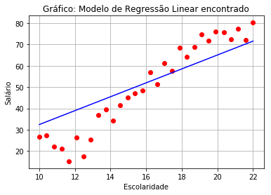
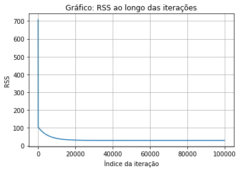
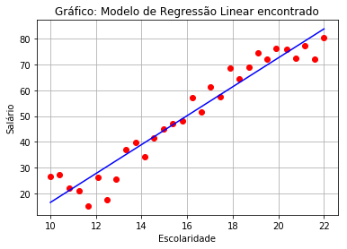
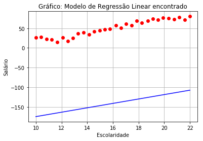

# Regressão Linear com Gradiente Descendente*
##### * Exercício para a disciplina Aprendizagem de Máquina, PPGCC - UFCG.

Regressão Linear é uma técnica de Aprendizagem de Máquina cujo objetivo é gerar um modelo, a partir de um conjunto de dados, que define um relacionamento entre esses dados. Essa técnica, em geral, usa o método de otimização conhecido como Gradiente Descente, cujo objetivo é encontrar os valores ótimos do modelo, ou seja, um modelo com erro mínimo.

A seguir, descrevemos um algoritmo de Regressão Linear, usando a linguagem Python, baseado na [aula de Siraj Raval](https://www.youtube.com/watch?v=XdM6ER7zTLk).

### 1. Os dados são os anos de escolaridade e o salário de algumas pessoas

Queremos analisar a relação entre a escolaridade de uma pessoa (anos de estudo) e o seu salário. Ou seja, criaremos um algoritmo de regressão linear que nos mostrará qual a função __y = mx + b__, onde __y__ = salário, __x__ = anosDeEstudo e os parâmetros __m__ e __b__ serão encontrados pela regressão.


```python
# @author Veruska Santos
# @version 0.2

# Código baseado na aula de Siraj Raval
# Dados: anos de escolaridade de uma pessoa e o seu salário

from numpy import * # top para ML, multiplicação de matrizes
import matplotlib.pyplot as plt # gráficos

def compute_error_for_line_given_points(b, m, points):
    totalError = 0
    # calcula o erro para todos os dados
    for i in range(0, len(points)):
        x = points['year'][i]
        y = points['salary'][i]
        totalError += (y - (m * x + b)) ** 2
    return totalError / float(len(points))

def step_gradient(b_current, m_current, points, learningRate):
    b_gradient = 0
    m_gradient = 0
    
    # gradient descent
    # cálculo das derivadas parciais
    N = float(len(points))
    for i in range(0, len(points)):
        x = points['year'][i]
        y = points['salary'][i]
        b_gradient += -(2/N) * (y - ((m_current * x) + b_current))
        m_gradient += -(2/N) * x * (y - ((m_current * x) + b_current))
    new_b = b_current - (learningRate * b_gradient)
    new_m = m_current - (learningRate * m_gradient)
    return [new_b, new_m]

def gradient_descent_runner(points, starting_b, starting_m, learning_rate, num_iterations):
    b = starting_b
    m = starting_m
    for i in range(num_iterations):
        b, m = step_gradient(b, m, array(points), learning_rate)
    return [b, m]

def plot_graph(points, m, b):
    x = points['year']
    y = points['salary']
    plt.plot(x, y, 'ro', x, m * x + b, 'b-')
    
    plt.grid(True)
    plt.title(u"Gráfico: Modelo de Regressão Linear encontrado")
    plt.xlabel(u"Escolaridade")
    plt.ylabel(u"Salário")
    
    plt.show()

def run():
    points = genfromtxt("income.csv", delimiter=",", names=['year', 'salary'])
    
    learning_rate = 0.0001 # quão rápido deve ser o processo de aprendizagem
    # y = mx + b é o modelo linear que nós queremos
    initial_b = 0 # intercepta o y
    initial_m = 0 # a inclininação da reta
    num_iterations = 1000 # quantidade de repetições do treinamento
    
    print "Starting gradient descent at b = {0}, m = {1}, error = {2}".format(initial_b, initial_m, compute_error_for_line_given_points(initial_b, initial_m, points))
    print "Running..."
    [b, m] = gradient_descent_runner(points, initial_b, initial_m, learning_rate, num_iterations)
    plot_graph(points, m, b)
    print "After {0} iterations b = {1}, m = {2}, error = {3}".format(num_iterations, b, m, compute_error_for_line_given_points(b, m, points))
    

if __name__ == '__main__':
    run()
```

    Starting gradient descent at b = 0, m = 0, error = 2946.63449705
    Running...
    





    After 1000 iterations b = -0.182342553765, m = 3.2621822676, error = 103.398422917
    

O resultado do algoritmo foi a seguinte relação: __y = 3.26x - 0.18__, com erro = 103.4. Com base nesses dados, a cada ano de escolaridade, o salário da pessoa cresce 3.26 unidades.

O gráfico acima nos mostra a relação encontrada (linha azul) a partir dos dados (pontos vermelhos). A partir do erro alto e do gráfico é possível perceber que o modelo encontrado não mostrou bem a relação, crescente e positiva, entre os dados, porque a inclininação da linha está diferente.

### 2. Imprimindo o RSS a cada iteração do gradiente descendente

No processo de aprendizagem, o objeto aprende gradativamente por passos a partir de algo ou alguém. Assim, na aprendizagem de máquina, o algoritmo deve aprender uma função a partir do dados, consultando-os, por diversas vezes, até que o modelo atinja um erro mínimo. Este processo de consultar os dados e diminuir o erro do modelo é denomidado de iteração. A seguir, veremos o erro do modelo para cada uma das 1000 iterações.


```python

def gradient_descent_runner(points, starting_b, starting_m, learning_rate, num_iterations):
    b = starting_b
    m = starting_m
    for i in range(num_iterations):
        b, m = step_gradient(b, m, array(points), learning_rate)
        
        # 2- Impressão do RSS a cada iteração do gradiente descendente
        print "Iteração {0}, RSS = {1} ".format(i+1, compute_error_for_line_given_points(b, m, points))
    return [b, m]

def run():
    points = genfromtxt("income.csv", delimiter=",", names=['year', 'salary'])
    # quão rápido deve ser o processo de aprendizagem
    learning_rate = 0.0001
    # y = mx + b é o modelo linear que nós queremos
    initial_b = 0 # intercepta o y
    initial_m = 0 # a inclininação da reta
    num_iterations = 1000 # quantidade de repetições do treinamento
    print "Starting gradient descent at b = {0}, m = {1}, error = {2}".format(initial_b, initial_m, compute_error_for_line_given_points(initial_b, initial_m, points))
    print "Running..."
    [b, m] = gradient_descent_runner(points, initial_b, initial_m, learning_rate, num_iterations)
    print "After {0} iterations b = {1}, m = {2}, error = {3}".format(num_iterations, b, m, compute_error_for_line_given_points(b, m, points))

if __name__ == '__main__':
    run()
```

    Starting gradient descent at b = 0, m = 0, error = 2946.63449705
    Running...
    Iteração 1, RSS = 2648.23812663 
    Iteração 2, RSS = 2381.17359262 
    Iteração 3, RSS = 2142.15101365 
    Iteração 4, RSS = 1928.22594993 
    Iteração 5, RSS = 1736.76313147 
    Iteração 6, RSS = 1565.40399487 
    Iteração 7, RSS = 1412.03762879 
    Iteração 8, RSS = 1274.7747702 
    Iteração 9, RSS = 1151.92453099 
    Iteração 10, RSS = 1041.97356839 
    Iteração 11, RSS = 943.567442476 
    Iteração 12, RSS = 855.493931198 
    Iteração 13, RSS = 776.668097302 
    Iteração 14, RSS = 706.118923285 
    Iteração 15, RSS = 642.977349676 
    Iteração 16, RSS = 586.465569318 
    Iteração 17, RSS = 535.887445762 
    Iteração 18, RSS = 490.619937745 
    Iteração 19, RSS = 450.105424102 
    Iteração 20, RSS = 413.844834576 
    Iteração 21, RSS = 381.391501902 
    Iteração 22, RSS = 352.345659429 
    Iteração 23, RSS = 326.349516493 
    Iteração 24, RSS = 303.082850894 
    Iteração 25, RSS = 282.259064154 
    Iteração 26, RSS = 263.62165099 
    Iteração 27, RSS = 246.941039487 
    Iteração 28, RSS = 232.011763066 
    Iteração 29, RSS = 218.64992939 
    Iteração 30, RSS = 206.690955046 
    Iteração 31, RSS = 195.98753808 
    Iteração 32, RSS = 186.407843423 
    Iteração 33, RSS = 177.833878855 
    Iteração 34, RSS = 170.16004148 
    Iteração 35, RSS = 163.291816839 
    Iteração 36, RSS = 157.144614605 
    Iteração 37, RSS = 151.642726541 
    Iteração 38, RSS = 146.718393868 
    Iteração 39, RSS = 142.310972562 
    Iteração 40, RSS = 138.366186296 
    Iteração 41, RSS = 134.835457825 
    Iteração 42, RSS = 131.675310573 
    Iteração 43, RSS = 128.846833058 
    Iteração 44, RSS = 126.315199554 
    Iteração 45, RSS = 124.049241076 
    Iteração 46, RSS = 122.021061423 
    Iteração 47, RSS = 120.205693528 
    Iteração 48, RSS = 118.580791898 
    Iteração 49, RSS = 117.126357342 
    Iteração 50, RSS = 115.824490612 
    Iteração 51, RSS = 114.659171901 
    Iteração 52, RSS = 113.616063502 
    Iteração 53, RSS = 112.682333183 
    Iteração 54, RSS = 111.846496116 
    Iteração 55, RSS = 111.09827339 
    Iteração 56, RSS = 110.428465396 
    Iteração 57, RSS = 109.828838492 
    Iteração 58, RSS = 109.292023581 
    Iteração 59, RSS = 108.811425329 
    Iteração 60, RSS = 108.38114092 
    Iteração 61, RSS = 107.995887342 
    Iteração 62, RSS = 107.650936305 
    Iteração 63, RSS = 107.342055996 
    Iteração 64, RSS = 107.065458946 
    Iteração 65, RSS = 106.817755376 
    Iteração 66, RSS = 106.595911438 
    Iteração 67, RSS = 106.397211842 
    Iteração 68, RSS = 106.219226407 
    Iteração 69, RSS = 106.059780122 
    Iteração 70, RSS = 105.916926357 
    Iteração 71, RSS = 105.78892288 
    Iteração 72, RSS = 105.674210396 
    Iteração 73, RSS = 105.571393335 
    Iteração 74, RSS = 105.479222668 
    Iteração 75, RSS = 105.396580513 
    Iteração 76, RSS = 105.322466366 
    Iteração 77, RSS = 105.25598478 
    Iteração 78, RSS = 105.196334329 
    Iteração 79, RSS = 105.142797738 
    Iteração 80, RSS = 105.094733047 
    Iteração 81, RSS = 105.051565703 
    Iteração 82, RSS = 105.012781482 
    Iteração 83, RSS = 104.977920152 
    Iteração 84, RSS = 104.946569808 
    Iteração 85, RSS = 104.918361796 
    Iteração 86, RSS = 104.892966169 
    Iteração 87, RSS = 104.870087626 
    Iteração 88, RSS = 104.849461874 
    Iteração 89, RSS = 104.830852369 
    Iteração 90, RSS = 104.814047405 
    Iteração 91, RSS = 104.798857507 
    Iteração 92, RSS = 104.785113094 
    Iteração 93, RSS = 104.77266239 
    Iteração 94, RSS = 104.761369557 
    Iteração 95, RSS = 104.751113021 
    Iteração 96, RSS = 104.741783971 
    Iteração 97, RSS = 104.733285024 
    Iteração 98, RSS = 104.72552902 
    Iteração 99, RSS = 104.718437952 
    Iteração 100, RSS = 104.711942005 
    Iteração 101, RSS = 104.705978692 
    Iteração 102, RSS = 104.700492089 
    Iteração 103, RSS = 104.695432143 
    Iteração 104, RSS = 104.690754059 
    Iteração 105, RSS = 104.686417743 
    Iteração 106, RSS = 104.682387311 
    Iteração 107, RSS = 104.678630649 
    Iteração 108, RSS = 104.675119013 
    Iteração 109, RSS = 104.671826678 
    Iteração 110, RSS = 104.66873062 
    Iteração 111, RSS = 104.665810232 
    Iteração 112, RSS = 104.663047071 
    Iteração 113, RSS = 104.660424633 
    Iteração 114, RSS = 104.657928142 
    Iteração 115, RSS = 104.655544378 
    Iteração 116, RSS = 104.653261506 
    Iteração 117, RSS = 104.651068936 
    Iteração 118, RSS = 104.64895719 
    Iteração 119, RSS = 104.646917782 
    Iteração 120, RSS = 104.644943121 
    Iteração 121, RSS = 104.64302641 
    Iteração 122, RSS = 104.641161568 
    Iteração 123, RSS = 104.639343152 
    Iteração 124, RSS = 104.637566288 
    Iteração 125, RSS = 104.635826618 
    Iteração 126, RSS = 104.634120239 
    Iteração 127, RSS = 104.632443657 
    Iteração 128, RSS = 104.630793747 
    Iteração 129, RSS = 104.629167711 
    Iteração 130, RSS = 104.627563046 
    Iteração 131, RSS = 104.625977509 
    Iteração 132, RSS = 104.624409096 
    Iteração 133, RSS = 104.622856011 
    Iteração 134, RSS = 104.621316648 
    Iteração 135, RSS = 104.619789569 
    Iteração 136, RSS = 104.618273486 
    Iteração 137, RSS = 104.616767248 
    Iteração 138, RSS = 104.615269824 
    Iteração 139, RSS = 104.613780292 
    Iteração 140, RSS = 104.612297825 
    Iteração 141, RSS = 104.610821684 
    Iteração 142, RSS = 104.609351209 
    Iteração 143, RSS = 104.607885807 
    Iteração 144, RSS = 104.606424948 
    Iteração 145, RSS = 104.604968158 
    Iteração 146, RSS = 104.603515012 
    Iteração 147, RSS = 104.602065132 
    Iteração 148, RSS = 104.600618176 
    Iteração 149, RSS = 104.599173841 
    Iteração 150, RSS = 104.597731854 
    Iteração 151, RSS = 104.596291971 
    Iteração 152, RSS = 104.594853975 
    Iteração 153, RSS = 104.59341767 
    Iteração 154, RSS = 104.591982881 
    Iteração 155, RSS = 104.590549453 
    Iteração 156, RSS = 104.589117244 
    Iteração 157, RSS = 104.587686131 
    Iteração 158, RSS = 104.586255999 
    Iteração 159, RSS = 104.584826751 
    Iteração 160, RSS = 104.583398294 
    Iteração 161, RSS = 104.58197055 
    Iteração 162, RSS = 104.580543446 
    Iteração 163, RSS = 104.579116918 
    Iteração 164, RSS = 104.577690908 
    Iteração 165, RSS = 104.576265365 
    Iteração 166, RSS = 104.574840242 
    Iteração 167, RSS = 104.573415499 
    Iteração 168, RSS = 104.571991097 
    Iteração 169, RSS = 104.570567005 
    Iteração 170, RSS = 104.569143192 
    Iteração 171, RSS = 104.567719632 
    Iteração 172, RSS = 104.566296302 
    Iteração 173, RSS = 104.564873179 
    Iteração 174, RSS = 104.563450246 
    Iteração 175, RSS = 104.562027484 
    Iteração 176, RSS = 104.560604879 
    Iteração 177, RSS = 104.559182418 
    Iteração 178, RSS = 104.557760087 
    Iteração 179, RSS = 104.556337876 
    Iteração 180, RSS = 104.554915776 
    Iteração 181, RSS = 104.553493777 
    Iteração 182, RSS = 104.552071872 
    Iteração 183, RSS = 104.550650054 
    Iteração 184, RSS = 104.549228316 
    Iteração 185, RSS = 104.547806653 
    Iteração 186, RSS = 104.54638506 
    Iteração 187, RSS = 104.544963532 
    Iteração 188, RSS = 104.543542065 
    Iteração 189, RSS = 104.542120656 
    Iteração 190, RSS = 104.540699302 
    Iteração 191, RSS = 104.539277999 
    Iteração 192, RSS = 104.537856745 
    Iteração 193, RSS = 104.536435538 
    Iteração 194, RSS = 104.535014376 
    Iteração 195, RSS = 104.533593256 
    Iteração 196, RSS = 104.532172177 
    Iteração 197, RSS = 104.530751139 
    Iteração 198, RSS = 104.529330138 
    Iteração 199, RSS = 104.527909175 
    Iteração 200, RSS = 104.526488247 
    Iteração 201, RSS = 104.525067355 
    Iteração 202, RSS = 104.523646497 
    Iteração 203, RSS = 104.522225673 
    Iteração 204, RSS = 104.520804882 
    Iteração 205, RSS = 104.519384122 
    Iteração 206, RSS = 104.517963395 
    Iteração 207, RSS = 104.516542698 
    Iteração 208, RSS = 104.515122033 
    Iteração 209, RSS = 104.513701397 
    Iteração 210, RSS = 104.512280792 
    Iteração 211, RSS = 104.510860216 
    Iteração 212, RSS = 104.50943967 
    Iteração 213, RSS = 104.508019153 
    Iteração 214, RSS = 104.506598665 
    Iteração 215, RSS = 104.505178205 
    Iteração 216, RSS = 104.503757775 
    Iteração 217, RSS = 104.502337372 
    Iteração 218, RSS = 104.500916998 
    Iteração 219, RSS = 104.499496652 
    Iteração 220, RSS = 104.498076334 
    Iteração 221, RSS = 104.496656044 
    Iteração 222, RSS = 104.495235781 
    Iteração 223, RSS = 104.493815547 
    Iteração 224, RSS = 104.492395339 
    Iteração 225, RSS = 104.49097516 
    Iteração 226, RSS = 104.489555008 
    Iteração 227, RSS = 104.488134884 
    Iteração 228, RSS = 104.486714787 
    Iteração 229, RSS = 104.485294717 
    Iteração 230, RSS = 104.483874675 
    Iteração 231, RSS = 104.48245466 
    Iteração 232, RSS = 104.481034672 
    Iteração 233, RSS = 104.479614711 
    Iteração 234, RSS = 104.478194778 
    Iteração 235, RSS = 104.476774872 
    Iteração 236, RSS = 104.475354993 
    Iteração 237, RSS = 104.473935141 
    Iteração 238, RSS = 104.472515317 
    Iteração 239, RSS = 104.471095519 
    Iteração 240, RSS = 104.469675749 
    Iteração 241, RSS = 104.468256005 
    Iteração 242, RSS = 104.466836289 
    Iteração 243, RSS = 104.4654166 
    Iteração 244, RSS = 104.463996938 
    Iteração 245, RSS = 104.462577303 
    Iteração 246, RSS = 104.461157695 
    Iteração 247, RSS = 104.459738114 
    Iteração 248, RSS = 104.458318561 
    Iteração 249, RSS = 104.456899034 
    Iteração 250, RSS = 104.455479534 
    Iteração 251, RSS = 104.454060061 
    Iteração 252, RSS = 104.452640616 
    Iteração 253, RSS = 104.451221197 
    Iteração 254, RSS = 104.449801805 
    Iteração 255, RSS = 104.448382441 
    Iteração 256, RSS = 104.446963103 
    Iteração 257, RSS = 104.445543792 
    Iteração 258, RSS = 104.444124509 
    Iteração 259, RSS = 104.442705252 
    Iteração 260, RSS = 104.441286023 
    Iteração 261, RSS = 104.43986682 
    Iteração 262, RSS = 104.438447645 
    Iteração 263, RSS = 104.437028496 
    Iteração 264, RSS = 104.435609375 
    Iteração 265, RSS = 104.43419028 
    Iteração 266, RSS = 104.432771212 
    Iteração 267, RSS = 104.431352172 
    Iteração 268, RSS = 104.429933158 
    Iteração 269, RSS = 104.428514172 
    Iteração 270, RSS = 104.427095212 
    Iteração 271, RSS = 104.42567628 
    Iteração 272, RSS = 104.424257374 
    Iteração 273, RSS = 104.422838495 
    Iteração 274, RSS = 104.421419644 
    Iteração 275, RSS = 104.420000819 
    Iteração 276, RSS = 104.418582022 
    Iteração 277, RSS = 104.417163251 
    Iteração 278, RSS = 104.415744507 
    Iteração 279, RSS = 104.414325791 
    Iteração 280, RSS = 104.412907101 
    Iteração 281, RSS = 104.411488438 
    Iteração 282, RSS = 104.410069803 
    Iteração 283, RSS = 104.408651194 
    Iteração 284, RSS = 104.407232612 
    Iteração 285, RSS = 104.405814057 
    Iteração 286, RSS = 104.40439553 
    Iteração 287, RSS = 104.402977029 
    Iteração 288, RSS = 104.401558555 
    Iteração 289, RSS = 104.400140108 
    Iteração 290, RSS = 104.398721688 
    Iteração 291, RSS = 104.397303296 
    Iteração 292, RSS = 104.39588493 
    Iteração 293, RSS = 104.394466591 
    Iteração 294, RSS = 104.393048279 
    Iteração 295, RSS = 104.391629994 
    Iteração 296, RSS = 104.390211736 
    Iteração 297, RSS = 104.388793505 
    Iteração 298, RSS = 104.387375301 
    Iteração 299, RSS = 104.385957124 
    Iteração 300, RSS = 104.384538974 
    Iteração 301, RSS = 104.383120851 
    Iteração 302, RSS = 104.381702755 
    Iteração 303, RSS = 104.380284685 
    Iteração 304, RSS = 104.378866643 
    Iteração 305, RSS = 104.377448628 
    Iteração 306, RSS = 104.37603064 
    Iteração 307, RSS = 104.374612679 
    Iteração 308, RSS = 104.373194744 
    Iteração 309, RSS = 104.371776837 
    Iteração 310, RSS = 104.370358957 
    Iteração 311, RSS = 104.368941103 
    Iteração 312, RSS = 104.367523277 
    Iteração 313, RSS = 104.366105478 
    Iteração 314, RSS = 104.364687705 
    Iteração 315, RSS = 104.36326996 
    Iteração 316, RSS = 104.361852241 
    Iteração 317, RSS = 104.360434549 
    Iteração 318, RSS = 104.359016885 
    Iteração 319, RSS = 104.357599247 
    Iteração 320, RSS = 104.356181637 
    Iteração 321, RSS = 104.354764053 
    Iteração 322, RSS = 104.353346496 
    Iteração 323, RSS = 104.351928966 
    Iteração 324, RSS = 104.350511464 
    Iteração 325, RSS = 104.349093988 
    Iteração 326, RSS = 104.347676539 
    Iteração 327, RSS = 104.346259117 
    Iteração 328, RSS = 104.344841722 
    Iteração 329, RSS = 104.343424354 
    Iteração 330, RSS = 104.342007013 
    Iteração 331, RSS = 104.340589699 
    Iteração 332, RSS = 104.339172412 
    Iteração 333, RSS = 104.337755152 
    Iteração 334, RSS = 104.336337918 
    Iteração 335, RSS = 104.334920712 
    Iteração 336, RSS = 104.333503533 
    Iteração 337, RSS = 104.33208638 
    Iteração 338, RSS = 104.330669255 
    Iteração 339, RSS = 104.329252157 
    Iteração 340, RSS = 104.327835085 
    Iteração 341, RSS = 104.326418041 
    Iteração 342, RSS = 104.325001023 
    Iteração 343, RSS = 104.323584032 
    Iteração 344, RSS = 104.322167069 
    Iteração 345, RSS = 104.320750132 
    Iteração 346, RSS = 104.319333222 
    Iteração 347, RSS = 104.317916339 
    Iteração 348, RSS = 104.316499484 
    Iteração 349, RSS = 104.315082655 
    Iteração 350, RSS = 104.313665853 
    Iteração 351, RSS = 104.312249078 
    Iteração 352, RSS = 104.31083233 
    Iteração 353, RSS = 104.309415609 
    Iteração 354, RSS = 104.307998914 
    Iteração 355, RSS = 104.306582247 
    Iteração 356, RSS = 104.305165607 
    Iteração 357, RSS = 104.303748994 
    Iteração 358, RSS = 104.302332407 
    Iteração 359, RSS = 104.300915848 
    Iteração 360, RSS = 104.299499315 
    Iteração 361, RSS = 104.29808281 
    Iteração 362, RSS = 104.296666331 
    Iteração 363, RSS = 104.295249879 
    Iteração 364, RSS = 104.293833455 
    Iteração 365, RSS = 104.292417057 
    Iteração 366, RSS = 104.291000686 
    Iteração 367, RSS = 104.289584342 
    Iteração 368, RSS = 104.288168025 
    Iteração 369, RSS = 104.286751735 
    Iteração 370, RSS = 104.285335472 
    Iteração 371, RSS = 104.283919236 
    Iteração 372, RSS = 104.282503027 
    Iteração 373, RSS = 104.281086845 
    Iteração 374, RSS = 104.279670689 
    Iteração 375, RSS = 104.278254561 
    Iteração 376, RSS = 104.276838459 
    Iteração 377, RSS = 104.275422385 
    Iteração 378, RSS = 104.274006337 
    Iteração 379, RSS = 104.272590317 
    Iteração 380, RSS = 104.271174323 
    Iteração 381, RSS = 104.269758356 
    Iteração 382, RSS = 104.268342416 
    Iteração 383, RSS = 104.266926503 
    Iteração 384, RSS = 104.265510617 
    Iteração 385, RSS = 104.264094758 
    Iteração 386, RSS = 104.262678926 
    Iteração 387, RSS = 104.261263121 
    Iteração 388, RSS = 104.259847343 
    Iteração 389, RSS = 104.258431591 
    Iteração 390, RSS = 104.257015867 
    Iteração 391, RSS = 104.25560017 
    Iteração 392, RSS = 104.254184499 
    Iteração 393, RSS = 104.252768855 
    Iteração 394, RSS = 104.251353239 
    Iteração 395, RSS = 104.249937649 
    Iteração 396, RSS = 104.248522086 
    Iteração 397, RSS = 104.24710655 
    Iteração 398, RSS = 104.245691041 
    Iteração 399, RSS = 104.244275559 
    Iteração 400, RSS = 104.242860104 
    Iteração 401, RSS = 104.241444676 
    Iteração 402, RSS = 104.240029275 
    Iteração 403, RSS = 104.2386139 
    Iteração 404, RSS = 104.237198553 
    Iteração 405, RSS = 104.235783232 
    Iteração 406, RSS = 104.234367939 
    Iteração 407, RSS = 104.232952672 
    Iteração 408, RSS = 104.231537432 
    Iteração 409, RSS = 104.230122219 
    Iteração 410, RSS = 104.228707033 
    Iteração 411, RSS = 104.227291874 
    Iteração 412, RSS = 104.225876742 
    Iteração 413, RSS = 104.224461637 
    Iteração 414, RSS = 104.223046559 
    Iteração 415, RSS = 104.221631508 
    Iteração 416, RSS = 104.220216483 
    Iteração 417, RSS = 104.218801486 
    Iteração 418, RSS = 104.217386515 
    Iteração 419, RSS = 104.215971571 
    Iteração 420, RSS = 104.214556655 
    Iteração 421, RSS = 104.213141765 
    Iteração 422, RSS = 104.211726902 
    Iteração 423, RSS = 104.210312066 
    Iteração 424, RSS = 104.208897257 
    Iteração 425, RSS = 104.207482474 
    Iteração 426, RSS = 104.206067719 
    Iteração 427, RSS = 104.204652991 
    Iteração 428, RSS = 104.203238289 
    Iteração 429, RSS = 104.201823615 
    Iteração 430, RSS = 104.200408967 
    Iteração 431, RSS = 104.198994346 
    Iteração 432, RSS = 104.197579752 
    Iteração 433, RSS = 104.196165185 
    Iteração 434, RSS = 104.194750645 
    Iteração 435, RSS = 104.193336132 
    Iteração 436, RSS = 104.191921646 
    Iteração 437, RSS = 104.190507187 
    Iteração 438, RSS = 104.189092754 
    Iteração 439, RSS = 104.187678349 
    Iteração 440, RSS = 104.18626397 
    Iteração 441, RSS = 104.184849619 
    Iteração 442, RSS = 104.183435294 
    Iteração 443, RSS = 104.182020996 
    Iteração 444, RSS = 104.180606725 
    Iteração 445, RSS = 104.179192481 
    Iteração 446, RSS = 104.177778264 
    Iteração 447, RSS = 104.176364073 
    Iteração 448, RSS = 104.17494991 
    Iteração 449, RSS = 104.173535773 
    Iteração 450, RSS = 104.172121664 
    Iteração 451, RSS = 104.170707581 
    Iteração 452, RSS = 104.169293525 
    Iteração 453, RSS = 104.167879496 
    Iteração 454, RSS = 104.166465494 
    Iteração 455, RSS = 104.165051519 
    Iteração 456, RSS = 104.163637571 
    Iteração 457, RSS = 104.16222365 
    Iteração 458, RSS = 104.160809755 
    Iteração 459, RSS = 104.159395888 
    Iteração 460, RSS = 104.157982047 
    Iteração 461, RSS = 104.156568233 
    Iteração 462, RSS = 104.155154446 
    Iteração 463, RSS = 104.153740687 
    Iteração 464, RSS = 104.152326953 
    Iteração 465, RSS = 104.150913247 
    Iteração 466, RSS = 104.149499568 
    Iteração 467, RSS = 104.148085916 
    Iteração 468, RSS = 104.14667229 
    Iteração 469, RSS = 104.145258691 
    Iteração 470, RSS = 104.14384512 
    Iteração 471, RSS = 104.142431575 
    Iteração 472, RSS = 104.141018057 
    Iteração 473, RSS = 104.139604566 
    Iteração 474, RSS = 104.138191102 
    Iteração 475, RSS = 104.136777664 
    Iteração 476, RSS = 104.135364254 
    Iteração 477, RSS = 104.13395087 
    Iteração 478, RSS = 104.132537514 
    Iteração 479, RSS = 104.131124184 
    Iteração 480, RSS = 104.129710881 
    Iteração 481, RSS = 104.128297605 
    Iteração 482, RSS = 104.126884356 
    Iteração 483, RSS = 104.125471134 
    Iteração 484, RSS = 104.124057938 
    Iteração 485, RSS = 104.12264477 
    Iteração 486, RSS = 104.121231628 
    Iteração 487, RSS = 104.119818513 
    Iteração 488, RSS = 104.118405426 
    Iteração 489, RSS = 104.116992365 
    Iteração 490, RSS = 104.115579331 
    Iteração 491, RSS = 104.114166323 
    Iteração 492, RSS = 104.112753343 
    Iteração 493, RSS = 104.11134039 
    Iteração 494, RSS = 104.109927463 
    Iteração 495, RSS = 104.108514563 
    Iteração 496, RSS = 104.10710169 
    Iteração 497, RSS = 104.105688845 
    Iteração 498, RSS = 104.104276025 
    Iteração 499, RSS = 104.102863233 
    Iteração 500, RSS = 104.101450468 
    Iteração 501, RSS = 104.100037729 
    Iteração 502, RSS = 104.098625018 
    Iteração 503, RSS = 104.097212333 
    Iteração 504, RSS = 104.095799675 
    Iteração 505, RSS = 104.094387044 
    Iteração 506, RSS = 104.09297444 
    Iteração 507, RSS = 104.091561863 
    Iteração 508, RSS = 104.090149313 
    Iteração 509, RSS = 104.088736789 
    Iteração 510, RSS = 104.087324292 
    Iteração 511, RSS = 104.085911823 
    Iteração 512, RSS = 104.08449938 
    Iteração 513, RSS = 104.083086964 
    Iteração 514, RSS = 104.081674575 
    Iteração 515, RSS = 104.080262212 
    Iteração 516, RSS = 104.078849877 
    Iteração 517, RSS = 104.077437568 
    Iteração 518, RSS = 104.076025286 
    Iteração 519, RSS = 104.074613032 
    Iteração 520, RSS = 104.073200804 
    Iteração 521, RSS = 104.071788603 
    Iteração 522, RSS = 104.070376428 
    Iteração 523, RSS = 104.068964281 
    Iteração 524, RSS = 104.06755216 
    Iteração 525, RSS = 104.066140067 
    Iteração 526, RSS = 104.064728 
    Iteração 527, RSS = 104.06331596 
    Iteração 528, RSS = 104.061903947 
    Iteração 529, RSS = 104.06049196 
    Iteração 530, RSS = 104.059080001 
    Iteração 531, RSS = 104.057668069 
    Iteração 532, RSS = 104.056256163 
    Iteração 533, RSS = 104.054844284 
    Iteração 534, RSS = 104.053432432 
    Iteração 535, RSS = 104.052020607 
    Iteração 536, RSS = 104.050608809 
    Iteração 537, RSS = 104.049197037 
    Iteração 538, RSS = 104.047785293 
    Iteração 539, RSS = 104.046373575 
    Iteração 540, RSS = 104.044961884 
    Iteração 541, RSS = 104.04355022 
    Iteração 542, RSS = 104.042138583 
    Iteração 543, RSS = 104.040726973 
    Iteração 544, RSS = 104.039315389 
    Iteração 545, RSS = 104.037903833 
    Iteração 546, RSS = 104.036492303 
    Iteração 547, RSS = 104.0350808 
    Iteração 548, RSS = 104.033669324 
    Iteração 549, RSS = 104.032257875 
    Iteração 550, RSS = 104.030846452 
    Iteração 551, RSS = 104.029435057 
    Iteração 552, RSS = 104.028023688 
    Iteração 553, RSS = 104.026612346 
    Iteração 554, RSS = 104.025201032 
    Iteração 555, RSS = 104.023789743 
    Iteração 556, RSS = 104.022378482 
    Iteração 557, RSS = 104.020967248 
    Iteração 558, RSS = 104.01955604 
    Iteração 559, RSS = 104.018144859 
    Iteração 560, RSS = 104.016733705 
    Iteração 561, RSS = 104.015322578 
    Iteração 562, RSS = 104.013911478 
    Iteração 563, RSS = 104.012500405 
    Iteração 564, RSS = 104.011089358 
    Iteração 565, RSS = 104.009678338 
    Iteração 566, RSS = 104.008267346 
    Iteração 567, RSS = 104.00685638 
    Iteração 568, RSS = 104.00544544 
    Iteração 569, RSS = 104.004034528 
    Iteração 570, RSS = 104.002623643 
    Iteração 571, RSS = 104.001212784 
    Iteração 572, RSS = 103.999801952 
    Iteração 573, RSS = 103.998391147 
    Iteração 574, RSS = 103.996980369 
    Iteração 575, RSS = 103.995569617 
    Iteração 576, RSS = 103.994158893 
    Iteração 577, RSS = 103.992748195 
    Iteração 578, RSS = 103.991337524 
    Iteração 579, RSS = 103.98992688 
    Iteração 580, RSS = 103.988516263 
    Iteração 581, RSS = 103.987105673 
    Iteração 582, RSS = 103.985695109 
    Iteração 583, RSS = 103.984284573 
    Iteração 584, RSS = 103.982874063 
    Iteração 585, RSS = 103.98146358 
    Iteração 586, RSS = 103.980053124 
    Iteração 587, RSS = 103.978642694 
    Iteração 588, RSS = 103.977232292 
    Iteração 589, RSS = 103.975821916 
    Iteração 590, RSS = 103.974411567 
    Iteração 591, RSS = 103.973001245 
    Iteração 592, RSS = 103.97159095 
    Iteração 593, RSS = 103.970180681 
    Iteração 594, RSS = 103.96877044 
    Iteração 595, RSS = 103.967360225 
    Iteração 596, RSS = 103.965950037 
    Iteração 597, RSS = 103.964539876 
    Iteração 598, RSS = 103.963129742 
    Iteração 599, RSS = 103.961719634 
    Iteração 600, RSS = 103.960309554 
    Iteração 601, RSS = 103.9588995 
    Iteração 602, RSS = 103.957489473 
    Iteração 603, RSS = 103.956079473 
    Iteração 604, RSS = 103.954669499 
    Iteração 605, RSS = 103.953259553 
    Iteração 606, RSS = 103.951849633 
    Iteração 607, RSS = 103.95043974 
    Iteração 608, RSS = 103.949029874 
    Iteração 609, RSS = 103.947620035 
    Iteração 610, RSS = 103.946210222 
    Iteração 611, RSS = 103.944800437 
    Iteração 612, RSS = 103.943390678 
    Iteração 613, RSS = 103.941980946 
    Iteração 614, RSS = 103.940571241 
    Iteração 615, RSS = 103.939161562 
    Iteração 616, RSS = 103.937751911 
    Iteração 617, RSS = 103.936342286 
    Iteração 618, RSS = 103.934932688 
    Iteração 619, RSS = 103.933523117 
    Iteração 620, RSS = 103.932113572 
    Iteração 621, RSS = 103.930704055 
    Iteração 622, RSS = 103.929294564 
    Iteração 623, RSS = 103.9278851 
    Iteração 624, RSS = 103.926475663 
    Iteração 625, RSS = 103.925066253 
    Iteração 626, RSS = 103.92365687 
    Iteração 627, RSS = 103.922247513 
    Iteração 628, RSS = 103.920838183 
    Iteração 629, RSS = 103.91942888 
    Iteração 630, RSS = 103.918019604 
    Iteração 631, RSS = 103.916610354 
    Iteração 632, RSS = 103.915201132 
    Iteração 633, RSS = 103.913791936 
    Iteração 634, RSS = 103.912382767 
    Iteração 635, RSS = 103.910973625 
    Iteração 636, RSS = 103.909564509 
    Iteração 637, RSS = 103.908155421 
    Iteração 638, RSS = 103.906746359 
    Iteração 639, RSS = 103.905337324 
    Iteração 640, RSS = 103.903928316 
    Iteração 641, RSS = 103.902519334 
    Iteração 642, RSS = 103.90111038 
    Iteração 643, RSS = 103.899701452 
    Iteração 644, RSS = 103.898292551 
    Iteração 645, RSS = 103.896883677 
    Iteração 646, RSS = 103.895474829 
    Iteração 647, RSS = 103.894066009 
    Iteração 648, RSS = 103.892657215 
    Iteração 649, RSS = 103.891248448 
    Iteração 650, RSS = 103.889839708 
    Iteração 651, RSS = 103.888430994 
    Iteração 652, RSS = 103.887022308 
    Iteração 653, RSS = 103.885613648 
    Iteração 654, RSS = 103.884205015 
    Iteração 655, RSS = 103.882796408 
    Iteração 656, RSS = 103.881387829 
    Iteração 657, RSS = 103.879979276 
    Iteração 658, RSS = 103.87857075 
    Iteração 659, RSS = 103.877162251 
    Iteração 660, RSS = 103.875753779 
    Iteração 661, RSS = 103.874345334 
    Iteração 662, RSS = 103.872936915 
    Iteração 663, RSS = 103.871528523 
    Iteração 664, RSS = 103.870120158 
    Iteração 665, RSS = 103.86871182 
    Iteração 666, RSS = 103.867303508 
    Iteração 667, RSS = 103.865895223 
    Iteração 668, RSS = 103.864486965 
    Iteração 669, RSS = 103.863078734 
    Iteração 670, RSS = 103.86167053 
    Iteração 671, RSS = 103.860262352 
    Iteração 672, RSS = 103.858854201 
    Iteração 673, RSS = 103.857446077 
    Iteração 674, RSS = 103.85603798 
    Iteração 675, RSS = 103.854629909 
    Iteração 676, RSS = 103.853221866 
    Iteração 677, RSS = 103.851813849 
    Iteração 678, RSS = 103.850405859 
    Iteração 679, RSS = 103.848997895 
    Iteração 680, RSS = 103.847589959 
    Iteração 681, RSS = 103.846182049 
    Iteração 682, RSS = 103.844774166 
    Iteração 683, RSS = 103.84336631 
    Iteração 684, RSS = 103.84195848 
    Iteração 685, RSS = 103.840550678 
    Iteração 686, RSS = 103.839142902 
    Iteração 687, RSS = 103.837735153 
    Iteração 688, RSS = 103.83632743 
    Iteração 689, RSS = 103.834919735 
    Iteração 690, RSS = 103.833512066 
    Iteração 691, RSS = 103.832104424 
    Iteração 692, RSS = 103.830696809 
    Iteração 693, RSS = 103.82928922 
    Iteração 694, RSS = 103.827881659 
    Iteração 695, RSS = 103.826474124 
    Iteração 696, RSS = 103.825066615 
    Iteração 697, RSS = 103.823659134 
    Iteração 698, RSS = 103.82225168 
    Iteração 699, RSS = 103.820844252 
    Iteração 700, RSS = 103.819436851 
    Iteração 701, RSS = 103.818029476 
    Iteração 702, RSS = 103.816622129 
    Iteração 703, RSS = 103.815214808 
    Iteração 704, RSS = 103.813807514 
    Iteração 705, RSS = 103.812400247 
    Iteração 706, RSS = 103.810993006 
    Iteração 707, RSS = 103.809585793 
    Iteração 708, RSS = 103.808178606 
    Iteração 709, RSS = 103.806771446 
    Iteração 710, RSS = 103.805364312 
    Iteração 711, RSS = 103.803957206 
    Iteração 712, RSS = 103.802550126 
    Iteração 713, RSS = 103.801143073 
    Iteração 714, RSS = 103.799736046 
    Iteração 715, RSS = 103.798329047 
    Iteração 716, RSS = 103.796922074 
    Iteração 717, RSS = 103.795515128 
    Iteração 718, RSS = 103.794108209 
    Iteração 719, RSS = 103.792701316 
    Iteração 720, RSS = 103.791294451 
    Iteração 721, RSS = 103.789887612 
    Iteração 722, RSS = 103.788480799 
    Iteração 723, RSS = 103.787074014 
    Iteração 724, RSS = 103.785667255 
    Iteração 725, RSS = 103.784260523 
    Iteração 726, RSS = 103.782853818 
    Iteração 727, RSS = 103.78144714 
    Iteração 728, RSS = 103.780040488 
    Iteração 729, RSS = 103.778633863 
    Iteração 730, RSS = 103.777227265 
    Iteração 731, RSS = 103.775820693 
    Iteração 732, RSS = 103.774414149 
    Iteração 733, RSS = 103.773007631 
    Iteração 734, RSS = 103.77160114 
    Iteração 735, RSS = 103.770194675 
    Iteração 736, RSS = 103.768788237 
    Iteração 737, RSS = 103.767381827 
    Iteração 738, RSS = 103.765975442 
    Iteração 739, RSS = 103.764569085 
    Iteração 740, RSS = 103.763162754 
    Iteração 741, RSS = 103.76175645 
    Iteração 742, RSS = 103.760350173 
    Iteração 743, RSS = 103.758943923 
    Iteração 744, RSS = 103.757537699 
    Iteração 745, RSS = 103.756131502 
    Iteração 746, RSS = 103.754725332 
    Iteração 747, RSS = 103.753319189 
    Iteração 748, RSS = 103.751913072 
    Iteração 749, RSS = 103.750506982 
    Iteração 750, RSS = 103.749100919 
    Iteração 751, RSS = 103.747694883 
    Iteração 752, RSS = 103.746288873 
    Iteração 753, RSS = 103.74488289 
    Iteração 754, RSS = 103.743476934 
    Iteração 755, RSS = 103.742071004 
    Iteração 756, RSS = 103.740665102 
    Iteração 757, RSS = 103.739259226 
    Iteração 758, RSS = 103.737853376 
    Iteração 759, RSS = 103.736447554 
    Iteração 760, RSS = 103.735041758 
    Iteração 761, RSS = 103.733635989 
    Iteração 762, RSS = 103.732230247 
    Iteração 763, RSS = 103.730824531 
    Iteração 764, RSS = 103.729418843 
    Iteração 765, RSS = 103.728013181 
    Iteração 766, RSS = 103.726607545 
    Iteração 767, RSS = 103.725201937 
    Iteração 768, RSS = 103.723796355 
    Iteração 769, RSS = 103.7223908 
    Iteração 770, RSS = 103.720985271 
    Iteração 771, RSS = 103.71957977 
    Iteração 772, RSS = 103.718174295 
    Iteração 773, RSS = 103.716768847 
    Iteração 774, RSS = 103.715363425 
    Iteração 775, RSS = 103.71395803 
    Iteração 776, RSS = 103.712552662 
    Iteração 777, RSS = 103.711147321 
    Iteração 778, RSS = 103.709742007 
    Iteração 779, RSS = 103.708336719 
    Iteração 780, RSS = 103.706931458 
    Iteração 781, RSS = 103.705526223 
    Iteração 782, RSS = 103.704121016 
    Iteração 783, RSS = 103.702715835 
    Iteração 784, RSS = 103.701310681 
    Iteração 785, RSS = 103.699905553 
    Iteração 786, RSS = 103.698500453 
    Iteração 787, RSS = 103.697095379 
    Iteração 788, RSS = 103.695690332 
    Iteração 789, RSS = 103.694285311 
    Iteração 790, RSS = 103.692880317 
    Iteração 791, RSS = 103.69147535 
    Iteração 792, RSS = 103.69007041 
    Iteração 793, RSS = 103.688665496 
    Iteração 794, RSS = 103.687260609 
    Iteração 795, RSS = 103.685855749 
    Iteração 796, RSS = 103.684450916 
    Iteração 797, RSS = 103.683046109 
    Iteração 798, RSS = 103.681641329 
    Iteração 799, RSS = 103.680236576 
    Iteração 800, RSS = 103.678831849 
    Iteração 801, RSS = 103.677427149 
    Iteração 802, RSS = 103.676022476 
    Iteração 803, RSS = 103.67461783 
    Iteração 804, RSS = 103.67321321 
    Iteração 805, RSS = 103.671808617 
    Iteração 806, RSS = 103.670404051 
    Iteração 807, RSS = 103.668999511 
    Iteração 808, RSS = 103.667594999 
    Iteração 809, RSS = 103.666190512 
    Iteração 810, RSS = 103.664786053 
    Iteração 811, RSS = 103.66338162 
    Iteração 812, RSS = 103.661977214 
    Iteração 813, RSS = 103.660572835 
    Iteração 814, RSS = 103.659168483 
    Iteração 815, RSS = 103.657764157 
    Iteração 816, RSS = 103.656359858 
    Iteração 817, RSS = 103.654955585 
    Iteração 818, RSS = 103.65355134 
    Iteração 819, RSS = 103.652147121 
    Iteração 820, RSS = 103.650742928 
    Iteração 821, RSS = 103.649338763 
    Iteração 822, RSS = 103.647934624 
    Iteração 823, RSS = 103.646530512 
    Iteração 824, RSS = 103.645126426 
    Iteração 825, RSS = 103.643722368 
    Iteração 826, RSS = 103.642318336 
    Iteração 827, RSS = 103.64091433 
    Iteração 828, RSS = 103.639510352 
    Iteração 829, RSS = 103.6381064 
    Iteração 830, RSS = 103.636702475 
    Iteração 831, RSS = 103.635298576 
    Iteração 832, RSS = 103.633894704 
    Iteração 833, RSS = 103.632490859 
    Iteração 834, RSS = 103.631087041 
    Iteração 835, RSS = 103.629683249 
    Iteração 836, RSS = 103.628279484 
    Iteração 837, RSS = 103.626875746 
    Iteração 838, RSS = 103.625472034 
    Iteração 839, RSS = 103.624068349 
    Iteração 840, RSS = 103.622664691 
    Iteração 841, RSS = 103.62126106 
    Iteração 842, RSS = 103.619857455 
    Iteração 843, RSS = 103.618453877 
    Iteração 844, RSS = 103.617050325 
    Iteração 845, RSS = 103.615646801 
    Iteração 846, RSS = 103.614243303 
    Iteração 847, RSS = 103.612839831 
    Iteração 848, RSS = 103.611436387 
    Iteração 849, RSS = 103.610032969 
    Iteração 850, RSS = 103.608629578 
    Iteração 851, RSS = 103.607226213 
    Iteração 852, RSS = 103.605822875 
    Iteração 853, RSS = 103.604419564 
    Iteração 854, RSS = 103.60301628 
    Iteração 855, RSS = 103.601613022 
    Iteração 856, RSS = 103.600209791 
    Iteração 857, RSS = 103.598806586 
    Iteração 858, RSS = 103.597403409 
    Iteração 859, RSS = 103.596000258 
    Iteração 860, RSS = 103.594597133 
    Iteração 861, RSS = 103.593194036 
    Iteração 862, RSS = 103.591790965 
    Iteração 863, RSS = 103.590387921 
    Iteração 864, RSS = 103.588984903 
    Iteração 865, RSS = 103.587581912 
    Iteração 866, RSS = 103.586178948 
    Iteração 867, RSS = 103.584776011 
    Iteração 868, RSS = 103.5833731 
    Iteração 869, RSS = 103.581970216 
    Iteração 870, RSS = 103.580567358 
    Iteração 871, RSS = 103.579164527 
    Iteração 872, RSS = 103.577761723 
    Iteração 873, RSS = 103.576358946 
    Iteração 874, RSS = 103.574956195 
    Iteração 875, RSS = 103.573553471 
    Iteração 876, RSS = 103.572150774 
    Iteração 877, RSS = 103.570748103 
    Iteração 878, RSS = 103.569345459 
    Iteração 879, RSS = 103.567942842 
    Iteração 880, RSS = 103.566540251 
    Iteração 881, RSS = 103.565137687 
    Iteração 882, RSS = 103.56373515 
    Iteração 883, RSS = 103.56233264 
    Iteração 884, RSS = 103.560930156 
    Iteração 885, RSS = 103.559527698 
    Iteração 886, RSS = 103.558125268 
    Iteração 887, RSS = 103.556722864 
    Iteração 888, RSS = 103.555320487 
    Iteração 889, RSS = 103.553918136 
    Iteração 890, RSS = 103.552515812 
    Iteração 891, RSS = 103.551113515 
    Iteração 892, RSS = 103.549711245 
    Iteração 893, RSS = 103.548309001 
    Iteração 894, RSS = 103.546906784 
    Iteração 895, RSS = 103.545504593 
    Iteração 896, RSS = 103.544102429 
    Iteração 897, RSS = 103.542700292 
    Iteração 898, RSS = 103.541298182 
    Iteração 899, RSS = 103.539896098 
    Iteração 900, RSS = 103.538494041 
    Iteração 901, RSS = 103.53709201 
    Iteração 902, RSS = 103.535690006 
    Iteração 903, RSS = 103.534288029 
    Iteração 904, RSS = 103.532886079 
    Iteração 905, RSS = 103.531484155 
    Iteração 906, RSS = 103.530082258 
    Iteração 907, RSS = 103.528680387 
    Iteração 908, RSS = 103.527278544 
    Iteração 909, RSS = 103.525876726 
    Iteração 910, RSS = 103.524474936 
    Iteração 911, RSS = 103.523073172 
    Iteração 912, RSS = 103.521671435 
    Iteração 913, RSS = 103.520269724 
    Iteração 914, RSS = 103.518868041 
    Iteração 915, RSS = 103.517466383 
    Iteração 916, RSS = 103.516064753 
    Iteração 917, RSS = 103.514663149 
    Iteração 918, RSS = 103.513261572 
    Iteração 919, RSS = 103.511860021 
    Iteração 920, RSS = 103.510458497 
    Iteração 921, RSS = 103.509057 
    Iteração 922, RSS = 103.50765553 
    Iteração 923, RSS = 103.506254086 
    Iteração 924, RSS = 103.504852669 
    Iteração 925, RSS = 103.503451278 
    Iteração 926, RSS = 103.502049914 
    Iteração 927, RSS = 103.500648577 
    Iteração 928, RSS = 103.499247266 
    Iteração 929, RSS = 103.497845982 
    Iteração 930, RSS = 103.496444725 
    Iteração 931, RSS = 103.495043494 
    Iteração 932, RSS = 103.49364229 
    Iteração 933, RSS = 103.492241113 
    Iteração 934, RSS = 103.490839962 
    Iteração 935, RSS = 103.489438838 
    Iteração 936, RSS = 103.488037741 
    Iteração 937, RSS = 103.48663667 
    Iteração 938, RSS = 103.485235626 
    Iteração 939, RSS = 103.483834608 
    Iteração 940, RSS = 103.482433618 
    Iteração 941, RSS = 103.481032653 
    Iteração 942, RSS = 103.479631716 
    Iteração 943, RSS = 103.478230805 
    Iteração 944, RSS = 103.476829921 
    Iteração 945, RSS = 103.475429063 
    Iteração 946, RSS = 103.474028232 
    Iteração 947, RSS = 103.472627428 
    Iteração 948, RSS = 103.47122665 
    Iteração 949, RSS = 103.469825899 
    Iteração 950, RSS = 103.468425175 
    Iteração 951, RSS = 103.467024477 
    Iteração 952, RSS = 103.465623806 
    Iteração 953, RSS = 103.464223162 
    Iteração 954, RSS = 103.462822544 
    Iteração 955, RSS = 103.461421953 
    Iteração 956, RSS = 103.460021388 
    Iteração 957, RSS = 103.458620851 
    Iteração 958, RSS = 103.457220339 
    Iteração 959, RSS = 103.455819855 
    Iteração 960, RSS = 103.454419397 
    Iteração 961, RSS = 103.453018966 
    Iteração 962, RSS = 103.451618561 
    Iteração 963, RSS = 103.450218183 
    Iteração 964, RSS = 103.448817832 
    Iteração 965, RSS = 103.447417507 
    Iteração 966, RSS = 103.446017209 
    Iteração 967, RSS = 103.444616937 
    Iteração 968, RSS = 103.443216692 
    Iteração 969, RSS = 103.441816474 
    Iteração 970, RSS = 103.440416283 
    Iteração 971, RSS = 103.439016118 
    Iteração 972, RSS = 103.437615979 
    Iteração 973, RSS = 103.436215868 
    Iteração 974, RSS = 103.434815783 
    Iteração 975, RSS = 103.433415724 
    Iteração 976, RSS = 103.432015692 
    Iteração 977, RSS = 103.430615687 
    Iteração 978, RSS = 103.429215709 
    Iteração 979, RSS = 103.427815757 
    Iteração 980, RSS = 103.426415832 
    Iteração 981, RSS = 103.425015933 
    Iteração 982, RSS = 103.423616061 
    Iteração 983, RSS = 103.422216215 
    Iteração 984, RSS = 103.420816397 
    Iteração 985, RSS = 103.419416605 
    Iteração 986, RSS = 103.418016839 
    Iteração 987, RSS = 103.4166171 
    Iteração 988, RSS = 103.415217388 
    Iteração 989, RSS = 103.413817702 
    Iteração 990, RSS = 103.412418043 
    Iteração 991, RSS = 103.411018411 
    Iteração 992, RSS = 103.409618805 
    Iteração 993, RSS = 103.408219226 
    Iteração 994, RSS = 103.406819673 
    Iteração 995, RSS = 103.405420148 
    Iteração 996, RSS = 103.404020648 
    Iteração 997, RSS = 103.402621176 
    Iteração 998, RSS = 103.40122173 
    Iteração 999, RSS = 103.39982231 
    Iteração 1000, RSS = 103.398422917 
    After 1000 iterations b = -0.182342553765, m = 3.2621822676, error = 103.398422917
    

É possível perceber que, na primeira iteração o erro é enorme e, aparentemente, diminui ao longo das iterações, chegando em 103 na última iteração. Para confirmar esse comportamento, veremos um gráfico com o valor do erro ao longo de todas as iterações do processo.

### 3. Comportamento e gráfico do RSS


```python

def rss_graph(rss_values):

    plt.plot(rss_values)

    plt.grid(True)
    plt.title(u"Gráfico: RSS ao longo das iterações")
    plt.xlabel(u"Índice da iteração")
    plt.ylabel("RSS")
    
    plt.show()

def gradient_descent_runner(points, starting_b, starting_m, learning_rate, num_iterations):
    b = starting_b
    m = starting_m
    rss_values = []
    for i in range(num_iterations):
        b, m = step_gradient(b, m, array(points), learning_rate)
        rss = compute_error_for_line_given_points(b, m, points)
        rss_values.append(rss)
    # 3- Comportamento e gráfico do RSS
    rss_graph(rss_values)
    return [b, m]

if __name__ == '__main__':
    run()
```

    Starting gradient descent at b = 0, m = 0, error = 2946.63449705
    Running...
    


    After 1000 iterations b = -0.182342553765, m = 3.2621822676, error = 103.398422917
    

Como visto na seção 2 e no Gráfico acima, o RSS diminui ao longo das iterações e estabiliza-se, porque esse é o objetivo do gradiente descente: encontrar o erro mínimo da função. 

### 4. Alterar a quantidade de iterações e a taxa de aprendizagem para encontrar w0 = -39 e w1 = 5  

A quantidade de iterações define quando o algoritmo deve parar de melhorar o modelo, ou seja, parar a execução. A taxa de aprendizagem define a velocidade do aprendizado: se for muito pequeno o algoritmo torna-se lento para encontrar um valor ótimo, e se for muita alta o algoritmo pode perder/passar (d)o valor ótimo. Assim, iremos alterá-los a fim de encontrar os parâmetros m (w0) e b (w1) solicitados.


```python

def run():
    points = genfromtxt("income.csv", delimiter=",", names=['year', 'salary'])
    # quão rápido deve ser o processo de aprendizagem
    learning_rate = 0.001
    # y = mx + b é o modelo linear que nós queremos
    initial_b = 0 # intercepta o y
    initial_m = 0 # a inclininação da reta
    num_iterations = 100000 # quantidade de repetições do treinamento
    print "Starting gradient descent at b = {0}, m = {1}, error = {2}, iterações = {3}, taxa de aprendizagem = {4}".format(initial_b, initial_m, compute_error_for_line_given_points(initial_b, initial_m, points), num_iterations, learning_rate)
    print "Running..."
    [b, m] = gradient_descent_runner(points, initial_b, initial_m, learning_rate, num_iterations)
    print "After {0} iterations b = {1}, m = {2}, error = {3}".format(num_iterations, b, m, compute_error_for_line_given_points(b, m, points))
    plot_graph(points, m, b)

if __name__ == '__main__':
    run()
```

    Starting gradient descent at b = 0, m = 0, error = 2946.63449705, iterações = 100000, taxa de aprendizagem = 0.001
    Running...
    





    After 100000 iterations b = -39.4433220441, m = 5.5993081813, error = 29.82881661
    





Os parâmetros w0 = -39 e w1 = 5 foram encontradas com __100000 iterações (i)__ e __taxa de aprendizagem (t) 0.001__. Foram feitos 4 testes até encontrar estes valores: i = 1000 e t = 0.0001, i = 10000 e t = 0.001, i = 10000 e t = 0.01, i = 100000 e t = 0.001.

O último gráfico acima mostra que, com esses valores de parâmetros, o modelo apresenta um erro bem menor (29) e representa bem a relação existente nos dados.

### 5. Alterar critério de parada para o tamanho do gradiente

Como dito anteriormente, o critério de parada do algoritmo era o número de iterações que ele deveria executar. Agora, iremos alterá-lo para ser o tamanho do gradiente, ou seja, o algoritmo só irá parar quando o gradiente for menor do que um valor de tolerância predefinido (= 0.05).


```python

def step_gradient(b_current, m_current, points, learningRate):
    b_gradient = 0
    m_gradient = 0
    
    # gradient descent
    # cálculo das derivadas parciais
    N = float(len(points))
    for i in range(0, len(points)):
        x = points['year'][i]
        y = points['salary'][i]
        b_gradient += -(2/N) * (y - ((m_current * x) + b_current))
        m_gradient += -(2/N) * x * (y - ((m_current * x) + b_current))
    new_b = b_current - (learningRate * b_gradient)
    new_m = m_current - (learningRate * m_gradient)
    return [new_b, new_m, b_gradient, m_gradient]

def gradient_descent_runner(points, starting_b, starting_m, learning_rate, tolerance):
    b = starting_b
    m = starting_m
    step = 0
    gradient_length = tolerance
    # 4- Alteração do critério de parada do algoritmo
    while (gradient_length >= tolerance):
        step += 1
        b, m, b_gradient, m_gradient = step_gradient(b, m, array(points), learning_rate)
        gradient_length = math.sqrt(b_gradient**2 + m_gradient**2)
        
        # 2- Impressão do RSS a cada iteração do gradiente descendente
        print "Iteração {0}, RSS = {1} ".format(step, compute_error_for_line_given_points(b, m, points))
    return [b, m, step]

def run():
    points = genfromtxt("income.csv", delimiter=",", names=['year', 'salary'])
    # quão rápido deve ser o processo de aprendizagem
    learning_rate = 0.001
    # y = mx + b é o modelo linear que nós queremos
    initial_b = 0 # intercepta o y
    initial_m = 0 # a inclininação da reta
    tolerance = 0.05
    print "Starting gradient descent at b = {0}, m = {1}, error = {2}, taxa de aprendizagem = {3}".format(initial_b, initial_m, compute_error_for_line_given_points(initial_b, initial_m, points), learning_rate)
    print "Running..."
    [b, m, steps] = gradient_descent_runner(points, initial_b, initial_m, learning_rate, tolerance)
    print "After {0} iterations b = {1}, m = {2}, error = {3}".format(steps, b, m, compute_error_for_line_given_points(b, m, points))
    plot_graph(points, m, b)

if __name__ == '__main__':
    run()
```

    Starting gradient descent at b = 0, m = 0, error = 2946.63449705, taxa de aprendizagem = 0.001
    Running...
    Iteração 1, RSS = 707.27101659 
    Iteração 2, RSS = 232.508779735 
    Iteração 3, RSS = 131.846692069 
    Iteração 4, RSS = 110.494831064 
    Iteração 5, RSS = 105.956950742 
    Iteração 6, RSS = 104.983681088 
    Iteração 7, RSS = 104.766120491 
    Iteração 8, RSS = 104.708774355 
    Iteração 9, RSS = 104.685396244 
    Iteração 10, RSS = 104.669221579 
    Iteração 11, RSS = 104.654576198 
    Iteração 12, RSS = 104.640257162 
    Iteração 13, RSS = 104.626009445 
    Iteração 14, RSS = 104.61177898 
    Iteração 15, RSS = 104.597554306 
    Iteração 16, RSS = 104.58333299 
    Iteração 17, RSS = 104.569114518 
    Iteração 18, RSS = 104.554898779 
    Iteração 19, RSS = 104.540685751 
    Iteração 20, RSS = 104.526475427 
    Iteração 21, RSS = 104.512267807 
    Iteração 22, RSS = 104.498062889 
    Iteração 23, RSS = 104.483860672 
    Iteração 24, RSS = 104.469661157 
    Iteração 25, RSS = 104.455464343 
    Iteração 26, RSS = 104.441270229 
    Iteração 27, RSS = 104.427078814 
    Iteração 28, RSS = 104.412890099 
    Iteração 29, RSS = 104.398704083 
    Iteração 30, RSS = 104.384520765 
    Iteração 31, RSS = 104.370340144 
    Iteração 32, RSS = 104.356162221 
    Iteração 33, RSS = 104.341986994 
    Iteração 34, RSS = 104.327814464 
    Iteração 35, RSS = 104.313644629 
    Iteração 36, RSS = 104.299477489 
    Iteração 37, RSS = 104.285313044 
    Iteração 38, RSS = 104.271151293 
    Iteração 39, RSS = 104.256992236 
    Iteração 40, RSS = 104.242835872 
    Iteração 41, RSS = 104.2286822 
    Iteração 42, RSS = 104.21453122 
    Iteração 43, RSS = 104.200382932 
    Iteração 44, RSS = 104.186237335 
    Iteração 45, RSS = 104.172094428 
    Iteração 46, RSS = 104.157954212 
    Iteração 47, RSS = 104.143816684 
    Iteração 48, RSS = 104.129681846 
    Iteração 49, RSS = 104.115549697 
    Iteração 50, RSS = 104.101420235 
    Iteração 51, RSS = 104.087293461 
    Iteração 52, RSS = 104.073169373 
    Iteração 53, RSS = 104.059047972 
    Iteração 54, RSS = 104.044929257 
    Iteração 55, RSS = 104.030813228 
    Iteração 56, RSS = 104.016699883 
    Iteração 57, RSS = 104.002589223 
    Iteração 58, RSS = 103.988481246 
    Iteração 59, RSS = 103.974375953 
    Iteração 60, RSS = 103.960273343 
    Iteração 61, RSS = 103.946173415 
    Iteração 62, RSS = 103.932076169 
    Iteração 63, RSS = 103.917981604 
    Iteração 64, RSS = 103.90388972 
    Iteração 65, RSS = 103.889800517 
    Iteração 66, RSS = 103.875713993 
    Iteração 67, RSS = 103.861630148 
    Iteração 68, RSS = 103.847548982 
    Iteração 69, RSS = 103.833470495 
    Iteração 70, RSS = 103.819394685 
    Iteração 71, RSS = 103.805321553 
    Iteração 72, RSS = 103.791251097 
    Iteração 73, RSS = 103.777183317 
    Iteração 74, RSS = 103.763118213 
    Iteração 75, RSS = 103.749055785 
    Iteração 76, RSS = 103.734996031 
    Iteração 77, RSS = 103.720938951 
    Iteração 78, RSS = 103.706884545 
    Iteração 79, RSS = 103.692832812 
    Iteração 80, RSS = 103.678783752 
    Iteração 81, RSS = 103.664737364 
    Iteração 82, RSS = 103.650693647 
    Iteração 83, RSS = 103.636652602 
    Iteração 84, RSS = 103.622614227 
    Iteração 85, RSS = 103.608578523 
    Iteração 86, RSS = 103.594545488 
    Iteração 87, RSS = 103.580515122 
    Iteração 88, RSS = 103.566487424 
    Iteração 89, RSS = 103.552462395 
    Iteração 90, RSS = 103.538440034 
    Iteração 91, RSS = 103.524420339 
    Iteração 92, RSS = 103.510403311 
    Iteração 93, RSS = 103.496388949 
    Iteração 94, RSS = 103.482377253 
    Iteração 95, RSS = 103.468368222 
    Iteração 96, RSS = 103.454361855 
    Iteração 97, RSS = 103.440358153 
    Iteração 98, RSS = 103.426357113 
    Iteração 99, RSS = 103.412358737 
    Iteração 100, RSS = 103.398363024 
    Iteração 101, RSS = 103.384369972 
    Iteração 102, RSS = 103.370379582 
    Iteração 103, RSS = 103.356391853 
    Iteração 104, RSS = 103.342406784 
    Iteração 105, RSS = 103.328424376 
    Iteração 106, RSS = 103.314444626 
    Iteração 107, RSS = 103.300467536 
    Iteração 108, RSS = 103.286493104 
    Iteração 109, RSS = 103.272521331 
    Iteração 110, RSS = 103.258552214 
    Iteração 111, RSS = 103.244585755 
    Iteração 112, RSS = 103.230621952 
    Iteração 113, RSS = 103.216660805 
    Iteração 114, RSS = 103.202702314 
    Iteração 115, RSS = 103.188746477 
    Iteração 116, RSS = 103.174793295 
    Iteração 117, RSS = 103.160842767 
    Iteração 118, RSS = 103.146894892 
    Iteração 119, RSS = 103.13294967 
    Iteração 120, RSS = 103.1190071 
    Iteração 121, RSS = 103.105067183 
    Iteração 122, RSS = 103.091129916 
    Iteração 123, RSS = 103.077195301 
    Iteração 124, RSS = 103.063263336 
    Iteração 125, RSS = 103.049334021 
    Iteração 126, RSS = 103.035407355 
    Iteração 127, RSS = 103.021483338 
    Iteração 128, RSS = 103.00756197 
    Iteração 129, RSS = 102.993643249 
    Iteração 130, RSS = 102.979727176 
    Iteração 131, RSS = 102.96581375 
    Iteração 132, RSS = 102.95190297 
    Iteração 133, RSS = 102.937994836 
    Iteração 134, RSS = 102.924089347 
    Iteração 135, RSS = 102.910186503 
    Iteração 136, RSS = 102.896286303 
    Iteração 137, RSS = 102.882388747 
    Iteração 138, RSS = 102.868493835 
    Iteração 139, RSS = 102.854601565 
    Iteração 140, RSS = 102.840711938 
    Iteração 141, RSS = 102.826824953 
    Iteração 142, RSS = 102.812940609 
    Iteração 143, RSS = 102.799058905 
    Iteração 144, RSS = 102.785179842 
    Iteração 145, RSS = 102.771303419 
    Iteração 146, RSS = 102.757429635 
    Iteração 147, RSS = 102.74355849 
    Iteração 148, RSS = 102.729689984 
    Iteração 149, RSS = 102.715824115 
    Iteração 150, RSS = 102.701960883 
    Iteração 151, RSS = 102.688100288 
    Iteração 152, RSS = 102.67424233 
    Iteração 153, RSS = 102.660387007 
    Iteração 154, RSS = 102.64653432 
    Iteração 155, RSS = 102.632684268 
    Iteração 156, RSS = 102.618836849 
    Iteração 157, RSS = 102.604992065 
    Iteração 158, RSS = 102.591149914 
    Iteração 159, RSS = 102.577310395 
    Iteração 160, RSS = 102.563473509 
    Iteração 161, RSS = 102.549639255 
    Iteração 162, RSS = 102.535807632 
    Iteração 163, RSS = 102.52197864 
    Iteração 164, RSS = 102.508152278 
    Iteração 165, RSS = 102.494328546 
    Iteração 166, RSS = 102.480507444 
    Iteração 167, RSS = 102.46668897 
    Iteração 168, RSS = 102.452873124 
    Iteração 169, RSS = 102.439059906 
    Iteração 170, RSS = 102.425249316 
    Iteração 171, RSS = 102.411441352 
    Iteração 172, RSS = 102.397636014 
    Iteração 173, RSS = 102.383833303 
    Iteração 174, RSS = 102.370033216 
    Iteração 175, RSS = 102.356235755 
    Iteração 176, RSS = 102.342440918 
    Iteração 177, RSS = 102.328648704 
    Iteração 178, RSS = 102.314859114 
    Iteração 179, RSS = 102.301072147 
    Iteração 180, RSS = 102.287287802 
    Iteração 181, RSS = 102.273506078 
    Iteração 182, RSS = 102.259726976 
    Iteração 183, RSS = 102.245950495 
    Iteração 184, RSS = 102.232176635 
    Iteração 185, RSS = 102.218405394 
    Iteração 186, RSS = 102.204636772 
    Iteração 187, RSS = 102.190870769 
    Iteração 188, RSS = 102.177107384 
    Iteração 189, RSS = 102.163346618 
    Iteração 190, RSS = 102.149588468 
    Iteração 191, RSS = 102.135832936 
    Iteração 192, RSS = 102.122080019 
    Iteração 193, RSS = 102.108329719 
    Iteração 194, RSS = 102.094582034 
    Iteração 195, RSS = 102.080836964 
    Iteração 196, RSS = 102.067094508 
    Iteração 197, RSS = 102.053354666 
    Iteração 198, RSS = 102.039617437 
    Iteração 199, RSS = 102.025882821 
    Iteração 200, RSS = 102.012150817 
    Iteração 201, RSS = 101.998421426 
    Iteração 202, RSS = 101.984694645 
    Iteração 203, RSS = 101.970970476 
    Iteração 204, RSS = 101.957248917 
    Iteração 205, RSS = 101.943529967 
    Iteração 206, RSS = 101.929813627 
    Iteração 207, RSS = 101.916099896 
    Iteração 208, RSS = 101.902388774 
    Iteração 209, RSS = 101.888680259 
    Iteração 210, RSS = 101.874974352 
    Iteração 211, RSS = 101.861271051 
    Iteração 212, RSS = 101.847570357 
    Iteração 213, RSS = 101.833872269 
    Iteração 214, RSS = 101.820176786 
    Iteração 215, RSS = 101.806483908 
    Iteração 216, RSS = 101.792793634 
    Iteração 217, RSS = 101.779105965 
    Iteração 218, RSS = 101.765420899 
    Iteração 219, RSS = 101.751738435 
    Iteração 220, RSS = 101.738058574 
    Iteração 221, RSS = 101.724381316 
    Iteração 222, RSS = 101.710706658 
    Iteração 223, RSS = 101.697034602 
    Iteração 224, RSS = 101.683365145 
    Iteração 225, RSS = 101.669698289 
    Iteração 226, RSS = 101.656034033 
    Iteração 227, RSS = 101.642372375 
    Iteração 228, RSS = 101.628713316 
    Iteração 229, RSS = 101.615056854 
    Iteração 230, RSS = 101.601402991 
    Iteração 231, RSS = 101.587751724 
    Iteração 232, RSS = 101.574103054 
    Iteração 233, RSS = 101.560456979 
    Iteração 234, RSS = 101.546813501 
    Iteração 235, RSS = 101.533172617 
    Iteração 236, RSS = 101.519534328 
    Iteração 237, RSS = 101.505898632 
    Iteração 238, RSS = 101.492265531 
    Iteração 239, RSS = 101.478635022 
    Iteração 240, RSS = 101.465007106 
    Iteração 241, RSS = 101.451381782 
    Iteração 242, RSS = 101.437759049 
    Iteração 243, RSS = 101.424138908 
    Iteração 244, RSS = 101.410521357 
    Iteração 245, RSS = 101.396906396 
    Iteração 246, RSS = 101.383294025 
    Iteração 247, RSS = 101.369684243 
    Iteração 248, RSS = 101.356077049 
    Iteração 249, RSS = 101.342472444 
    Iteração 250, RSS = 101.328870426 
    Iteração 251, RSS = 101.315270996 
    Iteração 252, RSS = 101.301674152 
    Iteração 253, RSS = 101.288079894 
    Iteração 254, RSS = 101.274488222 
    Iteração 255, RSS = 101.260899135 
    Iteração 256, RSS = 101.247312632 
    Iteração 257, RSS = 101.233728714 
    Iteração 258, RSS = 101.220147379 
    Iteração 259, RSS = 101.206568628 
    Iteração 260, RSS = 101.192992459 
    Iteração 261, RSS = 101.179418873 
    Iteração 262, RSS = 101.165847868 
    Iteração 263, RSS = 101.152279445 
    Iteração 264, RSS = 101.138713602 
    Iteração 265, RSS = 101.12515034 
    Iteração 266, RSS = 101.111589657 
    Iteração 267, RSS = 101.098031553 
    Iteração 268, RSS = 101.084476029 
    Iteração 269, RSS = 101.070923082 
    Iteração 270, RSS = 101.057372714 
    Iteração 271, RSS = 101.043824922 
    Iteração 272, RSS = 101.030279708 
    Iteração 273, RSS = 101.01673707 
    Iteração 274, RSS = 101.003197007 
    Iteração 275, RSS = 100.98965952 
    Iteração 276, RSS = 100.976124608 
    Iteração 277, RSS = 100.96259227 
    Iteração 278, RSS = 100.949062507 
    Iteração 279, RSS = 100.935535316 
    Iteração 280, RSS = 100.922010698 
    Iteração 281, RSS = 100.908488653 
    Iteração 282, RSS = 100.89496918 
    Iteração 283, RSS = 100.881452278 
    Iteração 284, RSS = 100.867937947 
    Iteração 285, RSS = 100.854426186 
    Iteração 286, RSS = 100.840916996 
    Iteração 287, RSS = 100.827410375 
    Iteração 288, RSS = 100.813906323 
    Iteração 289, RSS = 100.800404839 
    Iteração 290, RSS = 100.786905924 
    Iteração 291, RSS = 100.773409576 
    Iteração 292, RSS = 100.759915794 
    Iteração 293, RSS = 100.74642458 
    Iteração 294, RSS = 100.732935931 
    Iteração 295, RSS = 100.719449849 
    Iteração 296, RSS = 100.705966331 
    Iteração 297, RSS = 100.692485378 
    Iteração 298, RSS = 100.679006988 
    Iteração 299, RSS = 100.665531163 
    Iteração 300, RSS = 100.652057901 
    Iteração 301, RSS = 100.638587201 
    Iteração 302, RSS = 100.625119063 
    Iteração 303, RSS = 100.611653487 
    Iteração 304, RSS = 100.598190472 
    Iteração 305, RSS = 100.584730018 
    Iteração 306, RSS = 100.571272125 
    Iteração 307, RSS = 100.55781679 
    Iteração 308, RSS = 100.544364015 
    Iteração 309, RSS = 100.530913799 
    Iteração 310, RSS = 100.517466141 
    Iteração 311, RSS = 100.504021041 
    Iteração 312, RSS = 100.490578498 
    Iteração 313, RSS = 100.477138512 
    Iteração 314, RSS = 100.463701082 
    Iteração 315, RSS = 100.450266208 
    Iteração 316, RSS = 100.43683389 
    Iteração 317, RSS = 100.423404126 
    Iteração 318, RSS = 100.409976916 
    Iteração 319, RSS = 100.396552261 
    Iteração 320, RSS = 100.383130159 
    Iteração 321, RSS = 100.36971061 
    Iteração 322, RSS = 100.356293613 
    Iteração 323, RSS = 100.342879168 
    Iteração 324, RSS = 100.329467274 
    Iteração 325, RSS = 100.316057932 
    Iteração 326, RSS = 100.30265114 
    Iteração 327, RSS = 100.289246898 
    Iteração 328, RSS = 100.275845205 
    Iteração 329, RSS = 100.262446062 
    Iteração 330, RSS = 100.249049467 
    Iteração 331, RSS = 100.23565542 
    Iteração 332, RSS = 100.222263921 
    Iteração 333, RSS = 100.208874969 
    Iteração 334, RSS = 100.195488563 
    Iteração 335, RSS = 100.182104704 
    Iteração 336, RSS = 100.16872339 
    Iteração 337, RSS = 100.155344621 
    Iteração 338, RSS = 100.141968397 
    Iteração 339, RSS = 100.128594717 
    Iteração 340, RSS = 100.115223581 
    Iteração 341, RSS = 100.101854988 
    Iteração 342, RSS = 100.088488938 
    Iteração 343, RSS = 100.07512543 
    Iteração 344, RSS = 100.061764463 
    Iteração 345, RSS = 100.048406039 
    Iteração 346, RSS = 100.035050154 
    Iteração 347, RSS = 100.021696811 
    Iteração 348, RSS = 100.008346006 
    Iteração 349, RSS = 99.9949977418 
    Iteração 350, RSS = 99.981652016 
    Iteração 351, RSS = 99.9683088286 
    Iteração 352, RSS = 99.9549681791 
    Iteração 353, RSS = 99.9416300669 
    Iteração 354, RSS = 99.9282944918 
    Iteração 355, RSS = 99.914961453 
    Iteração 356, RSS = 99.9016309503 
    Iteração 357, RSS = 99.888302983 
    Iteração 358, RSS = 99.8749775507 
    Iteração 359, RSS = 99.8616546529 
    Iteração 360, RSS = 99.8483342892 
    Iteração 361, RSS = 99.835016459 
    Iteração 362, RSS = 99.8217011619 
    Iteração 363, RSS = 99.8083883974 
    Iteração 364, RSS = 99.795078165 
    Iteração 365, RSS = 99.7817704643 
    Iteração 366, RSS = 99.7684652946 
    Iteração 367, RSS = 99.7551626557 
    Iteração 368, RSS = 99.7418625469 
    Iteração 369, RSS = 99.7285649679 
    Iteração 370, RSS = 99.715269918 
    Iteração 371, RSS = 99.7019773969 
    Iteração 372, RSS = 99.6886874041 
    Iteração 373, RSS = 99.675399939 
    Iteração 374, RSS = 99.6621150012 
    Iteração 375, RSS = 99.6488325903 
    Iteração 376, RSS = 99.6355527057 
    Iteração 377, RSS = 99.6222753469 
    Iteração 378, RSS = 99.6090005135 
    Iteração 379, RSS = 99.5957282051 
    Iteração 380, RSS = 99.582458421 
    Iteração 381, RSS = 99.5691911609 
    Iteração 382, RSS = 99.5559264242 
    Iteração 383, RSS = 99.5426642105 
    Iteração 384, RSS = 99.5294045193 
    Iteração 385, RSS = 99.5161473501 
    Iteração 386, RSS = 99.5028927024 
    Iteração 387, RSS = 99.4896405758 
    Iteração 388, RSS = 99.4763909698 
    Iteração 389, RSS = 99.4631438839 
    Iteração 390, RSS = 99.4498993176 
    Iteração 391, RSS = 99.4366572704 
    Iteração 392, RSS = 99.4234177419 
    Iteração 393, RSS = 99.4101807316 
    Iteração 394, RSS = 99.3969462389 
    Iteração 395, RSS = 99.3837142635 
    Iteração 396, RSS = 99.3704848049 
    Iteração 397, RSS = 99.3572578625 
    Iteração 398, RSS = 99.3440334359 
    Iteração 399, RSS = 99.3308115246 
    Iteração 400, RSS = 99.3175921281 
    Iteração 401, RSS = 99.304375246 
    Iteração 402, RSS = 99.2911608777 
    Iteração 403, RSS = 99.2779490229 
    Iteração 404, RSS = 99.264739681 
    Iteração 405, RSS = 99.2515328515 
    Iteração 406, RSS = 99.2383285339 
    Iteração 407, RSS = 99.2251267279 
    Iteração 408, RSS = 99.2119274328 
    Iteração 409, RSS = 99.1987306483 
    Iteração 410, RSS = 99.1855363739 
    Iteração 411, RSS = 99.172344609 
    Iteração 412, RSS = 99.1591553532 
    Iteração 413, RSS = 99.145968606 
    Iteração 414, RSS = 99.132784367 
    Iteração 415, RSS = 99.1196026356 
    Iteração 416, RSS = 99.1064234114 
    Iteração 417, RSS = 99.0932466939 
    Iteração 418, RSS = 99.0800724827 
    Iteração 419, RSS = 99.0669007772 
    Iteração 420, RSS = 99.053731577 
    Iteração 421, RSS = 99.0405648816 
    Iteração 422, RSS = 99.0274006905 
    Iteração 423, RSS = 99.0142390033 
    Iteração 424, RSS = 99.0010798195 
    Iteração 425, RSS = 98.9879231385 
    Iteração 426, RSS = 98.97476896 
    Iteração 427, RSS = 98.9616172834 
    Iteração 428, RSS = 98.9484681083 
    Iteração 429, RSS = 98.9353214342 
    Iteração 430, RSS = 98.9221772606 
    Iteração 431, RSS = 98.9090355871 
    Iteração 432, RSS = 98.8958964131 
    Iteração 433, RSS = 98.8827597382 
    Iteração 434, RSS = 98.869625562 
    Iteração 435, RSS = 98.8564938838 
    Iteração 436, RSS = 98.8433647034 
    Iteração 437, RSS = 98.8302380201 
    Iteração 438, RSS = 98.8171138336 
    Iteração 439, RSS = 98.8039921433 
    Iteração 440, RSS = 98.7908729487 
    Iteração 441, RSS = 98.7777562495 
    Iteração 442, RSS = 98.7646420451 
    Iteração 443, RSS = 98.751530335 
    Iteração 444, RSS = 98.7384211188 
    Iteração 445, RSS = 98.7253143959 
    Iteração 446, RSS = 98.712210166 
    Iteração 447, RSS = 98.6991084286 
    Iteração 448, RSS = 98.6860091831 
    Iteração 449, RSS = 98.6729124291 
    Iteração 450, RSS = 98.6598181662 
    Iteração 451, RSS = 98.6467263938 
    Iteração 452, RSS = 98.6336371115 
    Iteração 453, RSS = 98.6205503187 
    Iteração 454, RSS = 98.6074660151 
    Iteração 455, RSS = 98.5943842002 
    Iteração 456, RSS = 98.5813048734 
    Iteração 457, RSS = 98.5682280344 
    Iteração 458, RSS = 98.5551536826 
    Iteração 459, RSS = 98.5420818176 
    Iteração 460, RSS = 98.5290124388 
    Iteração 461, RSS = 98.5159455459 
    Iteração 462, RSS = 98.5028811383 
    Iteração 463, RSS = 98.4898192156 
    Iteração 464, RSS = 98.4767597772 
    Iteração 465, RSS = 98.4637028229 
    Iteração 466, RSS = 98.4506483519 
    Iteração 467, RSS = 98.437596364 
    Iteração 468, RSS = 98.4245468585 
    Iteração 469, RSS = 98.4114998351 
    Iteração 470, RSS = 98.3984552933 
    Iteração 471, RSS = 98.3854132325 
    Iteração 472, RSS = 98.3723736524 
    Iteração 473, RSS = 98.3593365524 
    Iteração 474, RSS = 98.3463019321 
    Iteração 475, RSS = 98.333269791 
    Iteração 476, RSS = 98.3202401287 
    Iteração 477, RSS = 98.3072129446 
    Iteração 478, RSS = 98.2941882383 
    Iteração 479, RSS = 98.2811660093 
    Iteração 480, RSS = 98.2681462572 
    Iteração 481, RSS = 98.2551289815 
    Iteração 482, RSS = 98.2421141816 
    Iteração 483, RSS = 98.2291018572 
    Iteração 484, RSS = 98.2160920078 
    Iteração 485, RSS = 98.2030846328 
    Iteração 486, RSS = 98.1900797319 
    Iteração 487, RSS = 98.1770773046 
    Iteração 488, RSS = 98.1640773503 
    Iteração 489, RSS = 98.1510798686 
    Iteração 490, RSS = 98.1380848591 
    Iteração 491, RSS = 98.1250923212 
    Iteração 492, RSS = 98.1121022546 
    Iteração 493, RSS = 98.0991146587 
    Iteração 494, RSS = 98.086129533 
    Iteração 495, RSS = 98.0731468772 
    Iteração 496, RSS = 98.0601666906 
    Iteração 497, RSS = 98.0471889729 
    Iteração 498, RSS = 98.0342137236 
    Iteração 499, RSS = 98.0212409422 
    Iteração 500, RSS = 98.0082706283 
    Iteração 501, RSS = 97.9953027813 
    Iteração 502, RSS = 97.9823374009 
    Iteração 503, RSS = 97.9693744865 
    Iteração 504, RSS = 97.9564140376 
    Iteração 505, RSS = 97.9434560538 
    Iteração 506, RSS = 97.9305005347 
    Iteração 507, RSS = 97.9175474798 
    Iteração 508, RSS = 97.9045968885 
    Iteração 509, RSS = 97.8916487604 
    Iteração 510, RSS = 97.8787030952 
    Iteração 511, RSS = 97.8657598922 
    Iteração 512, RSS = 97.852819151 
    Iteração 513, RSS = 97.8398808711 
    Iteração 514, RSS = 97.8269450522 
    Iteração 515, RSS = 97.8140116936 
    Iteração 516, RSS = 97.8010807951 
    Iteração 517, RSS = 97.7881523559 
    Iteração 518, RSS = 97.7752263758 
    Iteração 519, RSS = 97.7623028543 
    Iteração 520, RSS = 97.7493817908 
    Iteração 521, RSS = 97.7364631849 
    Iteração 522, RSS = 97.7235470362 
    Iteração 523, RSS = 97.7106333441 
    Iteração 524, RSS = 97.6977221083 
    Iteração 525, RSS = 97.6848133282 
    Iteração 526, RSS = 97.6719070033 
    Iteração 527, RSS = 97.6590031333 
    Iteração 528, RSS = 97.6461017176 
    Iteração 529, RSS = 97.6332027558 
    Iteração 530, RSS = 97.6203062473 
    Iteração 531, RSS = 97.6074121919 
    Iteração 532, RSS = 97.5945205888 
    Iteração 533, RSS = 97.5816314378 
    Iteração 534, RSS = 97.5687447383 
    Iteração 535, RSS = 97.5558604899 
    Iteração 536, RSS = 97.5429786921 
    Iteração 537, RSS = 97.5300993445 
    Iteração 538, RSS = 97.5172224465 
    Iteração 539, RSS = 97.5043479977 
    Iteração 540, RSS = 97.4914759977 
    Iteração 541, RSS = 97.4786064459 
    Iteração 542, RSS = 97.465739342 
    Iteração 543, RSS = 97.4528746854 
    Iteração 544, RSS = 97.4400124757 
    Iteração 545, RSS = 97.4271527124 
    Iteração 546, RSS = 97.414295395 
    Iteração 547, RSS = 97.4014405231 
    Iteração 548, RSS = 97.3885880963 
    Iteração 549, RSS = 97.375738114 
    Iteração 550, RSS = 97.3628905757 
    Iteração 551, RSS = 97.3500454812 
    Iteração 552, RSS = 97.3372028297 
    Iteração 553, RSS = 97.324362621 
    Iteração 554, RSS = 97.3115248545 
    Iteração 555, RSS = 97.2986895297 
    Iteração 556, RSS = 97.2858566463 
    Iteração 557, RSS = 97.2730262037 
    Iteração 558, RSS = 97.2601982014 
    Iteração 559, RSS = 97.2473726391 
    Iteração 560, RSS = 97.2345495162 
    Iteração 561, RSS = 97.2217288323 
    Iteração 562, RSS = 97.2089105869 
    Iteração 563, RSS = 97.1960947796 
    Iteração 564, RSS = 97.1832814098 
    Iteração 565, RSS = 97.1704704772 
    Iteração 566, RSS = 97.1576619812 
    Iteração 567, RSS = 97.1448559214 
    Iteração 568, RSS = 97.1320522974 
    Iteração 569, RSS = 97.1192511086 
    Iteração 570, RSS = 97.1064523547 
    Iteração 571, RSS = 97.0936560351 
    Iteração 572, RSS = 97.0808621493 
    Iteração 573, RSS = 97.068070697 
    Iteração 574, RSS = 97.0552816777 
    Iteração 575, RSS = 97.0424950908 
    Iteração 576, RSS = 97.029710936 
    Iteração 577, RSS = 97.0169292127 
    Iteração 578, RSS = 97.0041499205 
    Iteração 579, RSS = 96.991373059 
    Iteração 580, RSS = 96.9785986277 
    Iteração 581, RSS = 96.9658266261 
    Iteração 582, RSS = 96.9530570537 
    Iteração 583, RSS = 96.9402899101 
    Iteração 584, RSS = 96.9275251949 
    Iteração 585, RSS = 96.9147629075 
    Iteração 586, RSS = 96.9020030476 
    Iteração 587, RSS = 96.8892456146 
    Iteração 588, RSS = 96.8764906081 
    Iteração 589, RSS = 96.8637380275 
    Iteração 590, RSS = 96.8509878726 
    Iteração 591, RSS = 96.8382401428 
    Iteração 592, RSS = 96.8254948376 
    Iteração 593, RSS = 96.8127519566 
    Iteração 594, RSS = 96.8000114993 
    Iteração 595, RSS = 96.7872734652 
    Iteração 596, RSS = 96.774537854 
    Iteração 597, RSS = 96.761804665 
    Iteração 598, RSS = 96.749073898 
    Iteração 599, RSS = 96.7363455524 
    Iteração 600, RSS = 96.7236196277 
    Iteração 601, RSS = 96.7108961235 
    Iteração 602, RSS = 96.6981750394 
    Iteração 603, RSS = 96.6854563748 
    Iteração 604, RSS = 96.6727401293 
    Iteração 605, RSS = 96.6600263025 
    Iteração 606, RSS = 96.6473148939 
    Iteração 607, RSS = 96.634605903 
    Iteração 608, RSS = 96.6218993293 
    Iteração 609, RSS = 96.6091951725 
    Iteração 610, RSS = 96.5964934321 
    Iteração 611, RSS = 96.5837941075 
    Iteração 612, RSS = 96.5710971984 
    Iteração 613, RSS = 96.5584027042 
    Iteração 614, RSS = 96.5457106246 
    Iteração 615, RSS = 96.533020959 
    Iteração 616, RSS = 96.520333707 
    Iteração 617, RSS = 96.5076488681 
    Iteração 618, RSS = 96.4949664419 
    Iteração 619, RSS = 96.482286428 
    Iteração 620, RSS = 96.4696088258 
    Iteração 621, RSS = 96.4569336349 
    Iteração 622, RSS = 96.4442608548 
    Iteração 623, RSS = 96.4315904851 
    Iteração 624, RSS = 96.4189225254 
    Iteração 625, RSS = 96.4062569751 
    Iteração 626, RSS = 96.3935938338 
    Iteração 627, RSS = 96.3809331011 
    Iteração 628, RSS = 96.3682747765 
    Iteração 629, RSS = 96.3556188595 
    Iteração 630, RSS = 96.3429653497 
    Iteração 631, RSS = 96.3303142466 
    Iteração 632, RSS = 96.3176655497 
    Iteração 633, RSS = 96.3050192587 
    Iteração 634, RSS = 96.292375373 
    Iteração 635, RSS = 96.2797338922 
    Iteração 636, RSS = 96.2670948158 
    Iteração 637, RSS = 96.2544581434 
    Iteração 638, RSS = 96.2418238746 
    Iteração 639, RSS = 96.2291920087 
    Iteração 640, RSS = 96.2165625455 
    Iteração 641, RSS = 96.2039354844 
    Iteração 642, RSS = 96.1913108251 
    Iteração 643, RSS = 96.1786885669 
    Iteração 644, RSS = 96.1660687095 
    Iteração 645, RSS = 96.1534512525 
    Iteração 646, RSS = 96.1408361953 
    Iteração 647, RSS = 96.1282235375 
    Iteração 648, RSS = 96.1156132786 
    Iteração 649, RSS = 96.1030054183 
    Iteração 650, RSS = 96.090399956 
    Iteração 651, RSS = 96.0777968912 
    Iteração 652, RSS = 96.0651962236 
    Iteração 653, RSS = 96.0525979527 
    Iteração 654, RSS = 96.0400020779 
    Iteração 655, RSS = 96.027408599 
    Iteração 656, RSS = 96.0148175153 
    Iteração 657, RSS = 96.0022288265 
    Iteração 658, RSS = 95.989642532 
    Iteração 659, RSS = 95.9770586315 
    Iteração 660, RSS = 95.9644771245 
    Iteração 661, RSS = 95.9518980105 
    Iteração 662, RSS = 95.939321289 
    Iteração 663, RSS = 95.9267469597 
    Iteração 664, RSS = 95.9141750221 
    Iteração 665, RSS = 95.9016054756 
    Iteração 666, RSS = 95.8890383199 
    Iteração 667, RSS = 95.8764735545 
    Iteração 668, RSS = 95.8639111789 
    Iteração 669, RSS = 95.8513511927 
    Iteração 670, RSS = 95.8387935955 
    Iteração 671, RSS = 95.8262383867 
    Iteração 672, RSS = 95.8136855659 
    Iteração 673, RSS = 95.8011351327 
    Iteração 674, RSS = 95.7885870866 
    Iteração 675, RSS = 95.7760414272 
    Iteração 676, RSS = 95.763498154 
    Iteração 677, RSS = 95.7509572665 
    Iteração 678, RSS = 95.7384187644 
    Iteração 679, RSS = 95.7258826471 
    Iteração 680, RSS = 95.7133489141 
    Iteração 681, RSS = 95.7008175651 
    Iteração 682, RSS = 95.6882885996 
    Iteração 683, RSS = 95.6757620171 
    Iteração 684, RSS = 95.6632378172 
    Iteração 685, RSS = 95.6507159995 
    Iteração 686, RSS = 95.6381965634 
    Iteração 687, RSS = 95.6256795085 
    Iteração 688, RSS = 95.6131648343 
    Iteração 689, RSS = 95.6006525405 
    Iteração 690, RSS = 95.5881426266 
    Iteração 691, RSS = 95.575635092 
    Iteração 692, RSS = 95.5631299364 
    Iteração 693, RSS = 95.5506271593 
    Iteração 694, RSS = 95.5381267603 
    Iteração 695, RSS = 95.5256287388 
    Iteração 696, RSS = 95.5131330945 
    Iteração 697, RSS = 95.5006398269 
    Iteração 698, RSS = 95.4881489356 
    Iteração 699, RSS = 95.47566042 
    Iteração 700, RSS = 95.4631742798 
    Iteração 701, RSS = 95.4506905144 
    Iteração 702, RSS = 95.4382091235 
    Iteração 703, RSS = 95.4257301065 
    Iteração 704, RSS = 95.4132534631 
    Iteração 705, RSS = 95.4007791928 
    Iteração 706, RSS = 95.3883072951 
    Iteração 707, RSS = 95.3758377695 
    Iteração 708, RSS = 95.3633706157 
    Iteração 709, RSS = 95.3509058332 
    Iteração 710, RSS = 95.3384434215 
    Iteração 711, RSS = 95.3259833802 
    Iteração 712, RSS = 95.3135257087 
    Iteração 713, RSS = 95.3010704068 
    Iteração 714, RSS = 95.2886174739 
    Iteração 715, RSS = 95.2761669095 
    Iteração 716, RSS = 95.2637187133 
    Iteração 717, RSS = 95.2512728847 
    Iteração 718, RSS = 95.2388294233 
    Iteração 719, RSS = 95.2263883287 
    Iteração 720, RSS = 95.2139496005 
    Iteração 721, RSS = 95.2015132381 
    Iteração 722, RSS = 95.1890792411 
    Iteração 723, RSS = 95.1766476091 
    Iteração 724, RSS = 95.1642183416 
    Iteração 725, RSS = 95.1517914381 
    Iteração 726, RSS = 95.1393668983 
    Iteração 727, RSS = 95.1269447217 
    Iteração 728, RSS = 95.1145249077 
    Iteração 729, RSS = 95.1021074561 
    Iteração 730, RSS = 95.0896923662 
    Iteração 731, RSS = 95.0772796378 
    Iteração 732, RSS = 95.0648692702 
    Iteração 733, RSS = 95.0524612631 
    Iteração 734, RSS = 95.0400556161 
    Iteração 735, RSS = 95.0276523286 
    Iteração 736, RSS = 95.0152514003 
    Iteração 737, RSS = 95.0028528306 
    Iteração 738, RSS = 94.9904566192 
    Iteração 739, RSS = 94.9780627655 
    Iteração 740, RSS = 94.9656712692 
    Iteração 741, RSS = 94.9532821297 
    Iteração 742, RSS = 94.9408953467 
    Iteração 743, RSS = 94.9285109197 
    Iteração 744, RSS = 94.9161288482 
    Iteração 745, RSS = 94.9037491318 
    Iteração 746, RSS = 94.89137177 
    Iteração 747, RSS = 94.8789967625 
    Iteração 748, RSS = 94.8666241087 
    Iteração 749, RSS = 94.8542538082 
    Iteração 750, RSS = 94.8418858605 
    Iteração 751, RSS = 94.8295202652 
    Iteração 752, RSS = 94.8171570219 
    Iteração 753, RSS = 94.8047961302 
    Iteração 754, RSS = 94.7924375894 
    Iteração 755, RSS = 94.7800813993 
    Iteração 756, RSS = 94.7677275594 
    Iteração 757, RSS = 94.7553760692 
    Iteração 758, RSS = 94.7430269282 
    Iteração 759, RSS = 94.7306801361 
    Iteração 760, RSS = 94.7183356924 
    Iteração 761, RSS = 94.7059935966 
    Iteração 762, RSS = 94.6936538482 
    Iteração 763, RSS = 94.681316447 
    Iteração 764, RSS = 94.6689813923 
    Iteração 765, RSS = 94.6566486837 
    Iteração 766, RSS = 94.6443183209 
    Iteração 767, RSS = 94.6319903033 
    Iteração 768, RSS = 94.6196646306 
    Iteração 769, RSS = 94.6073413022 
    Iteração 770, RSS = 94.5950203177 
    Iteração 771, RSS = 94.5827016767 
    Iteração 772, RSS = 94.5703853787 
    Iteração 773, RSS = 94.5580714233 
    Iteração 774, RSS = 94.54575981 
    Iteração 775, RSS = 94.5334505384 
    Iteração 776, RSS = 94.5211436081 
    Iteração 777, RSS = 94.5088390185 
    Iteração 778, RSS = 94.4965367694 
    Iteração 779, RSS = 94.4842368601 
    Iteração 780, RSS = 94.4719392903 
    Iteração 781, RSS = 94.4596440595 
    Iteração 782, RSS = 94.4473511673 
    Iteração 783, RSS = 94.4350606132 
    Iteração 784, RSS = 94.4227723968 
    Iteração 785, RSS = 94.4104865176 
    Iteração 786, RSS = 94.3982029752 
    Iteração 787, RSS = 94.3859217692 
    Iteração 788, RSS = 94.3736428991 
    Iteração 789, RSS = 94.3613663644 
    Iteração 790, RSS = 94.3490921648 
    Iteração 791, RSS = 94.3368202997 
    Iteração 792, RSS = 94.3245507688 
    Iteração 793, RSS = 94.3122835715 
    Iteração 794, RSS = 94.3000187075 
    Iteração 795, RSS = 94.2877561763 
    Iteração 796, RSS = 94.2754959775 
    Iteração 797, RSS = 94.2632381105 
    Iteração 798, RSS = 94.250982575 
    Iteração 799, RSS = 94.2387293706 
    Iteração 800, RSS = 94.2264784967 
    Iteração 801, RSS = 94.214229953 
    Iteração 802, RSS = 94.2019837389 
    Iteração 803, RSS = 94.1897398541 
    Iteração 804, RSS = 94.1774982981 
    Iteração 805, RSS = 94.1652590705 
    Iteração 806, RSS = 94.1530221708 
    Iteração 807, RSS = 94.1407875986 
    Iteração 808, RSS = 94.1285553534 
    Iteração 809, RSS = 94.1163254348 
    Iteração 810, RSS = 94.1040978424 
    Iteração 811, RSS = 94.0918725756 
    Iteração 812, RSS = 94.0796496342 
    Iteração 813, RSS = 94.0674290175 
    Iteração 814, RSS = 94.0552107253 
    Iteração 815, RSS = 94.042994757 
    Iteração 816, RSS = 94.0307811121 
    Iteração 817, RSS = 94.0185697904 
    Iteração 818, RSS = 94.0063607912 
    Iteração 819, RSS = 93.9941541142 
    Iteração 820, RSS = 93.981949759 
    Iteração 821, RSS = 93.969747725 
    Iteração 822, RSS = 93.9575480119 
    Iteração 823, RSS = 93.9453506192 
    Iteração 824, RSS = 93.9331555465 
    Iteração 825, RSS = 93.9209627932 
    Iteração 826, RSS = 93.9087723591 
    Iteração 827, RSS = 93.8965842436 
    Iteração 828, RSS = 93.8843984463 
    Iteração 829, RSS = 93.8722149668 
    Iteração 830, RSS = 93.8600338046 
    Iteração 831, RSS = 93.8478549592 
    Iteração 832, RSS = 93.8356784303 
    Iteração 833, RSS = 93.8235042174 
    Iteração 834, RSS = 93.8113323201 
    Iteração 835, RSS = 93.7991627378 
    Iteração 836, RSS = 93.7869954703 
    Iteração 837, RSS = 93.7748305169 
    Iteração 838, RSS = 93.7626678774 
    Iteração 839, RSS = 93.7505075512 
    Iteração 840, RSS = 93.738349538 
    Iteração 841, RSS = 93.7261938372 
    Iteração 842, RSS = 93.7140404484 
    Iteração 843, RSS = 93.7018893713 
    Iteração 844, RSS = 93.6897406052 
    Iteração 845, RSS = 93.67759415 
    Iteração 846, RSS = 93.6654500049 
    Iteração 847, RSS = 93.6533081698 
    Iteração 848, RSS = 93.641168644 
    Iteração 849, RSS = 93.6290314272 
    Iteração 850, RSS = 93.6168965189 
    Iteração 851, RSS = 93.6047639187 
    Iteração 852, RSS = 93.5926336261 
    Iteração 853, RSS = 93.5805056407 
    Iteração 854, RSS = 93.5683799621 
    Iteração 855, RSS = 93.5562565898 
    Iteração 856, RSS = 93.5441355234 
    Iteração 857, RSS = 93.5320167624 
    Iteração 858, RSS = 93.5199003065 
    Iteração 859, RSS = 93.5077861551 
    Iteração 860, RSS = 93.4956743079 
    Iteração 861, RSS = 93.4835647643 
    Iteração 862, RSS = 93.471457524 
    Iteração 863, RSS = 93.4593525865 
    Iteração 864, RSS = 93.4472499514 
    Iteração 865, RSS = 93.4351496183 
    Iteração 866, RSS = 93.4230515866 
    Iteração 867, RSS = 93.410955856 
    Iteração 868, RSS = 93.3988624261 
    Iteração 869, RSS = 93.3867712963 
    Iteração 870, RSS = 93.3746824663 
    Iteração 871, RSS = 93.3625959356 
    Iteração 872, RSS = 93.3505117038 
    Iteração 873, RSS = 93.3384297704 
    Iteração 874, RSS = 93.326350135 
    Iteração 875, RSS = 93.3142727972 
    Iteração 876, RSS = 93.3021977565 
    Iteração 877, RSS = 93.2901250125 
    Iteração 878, RSS = 93.2780545648 
    Iteração 879, RSS = 93.2659864129 
    Iteração 880, RSS = 93.2539205564 
    Iteração 881, RSS = 93.2418569948 
    Iteração 882, RSS = 93.2297957277 
    Iteração 883, RSS = 93.2177367547 
    Iteração 884, RSS = 93.2056800754 
    Iteração 885, RSS = 93.1936256892 
    Iteração 886, RSS = 93.1815735958 
    Iteração 887, RSS = 93.1695237947 
    Iteração 888, RSS = 93.1574762856 
    Iteração 889, RSS = 93.1454310678 
    Iteração 890, RSS = 93.1333881411 
    Iteração 891, RSS = 93.121347505 
    Iteração 892, RSS = 93.1093091591 
    Iteração 893, RSS = 93.0972731028 
    Iteração 894, RSS = 93.0852393358 
    Iteração 895, RSS = 93.0732078577 
    Iteração 896, RSS = 93.061178668 
    Iteração 897, RSS = 93.0491517662 
    Iteração 898, RSS = 93.037127152 
    Iteração 899, RSS = 93.0251048249 
    Iteração 900, RSS = 93.0130847845 
    Iteração 901, RSS = 93.0010670303 
    Iteração 902, RSS = 92.9890515618 
    Iteração 903, RSS = 92.9770383788 
    Iteração 904, RSS = 92.9650274807 
    Iteração 905, RSS = 92.953018867 
    Iteração 906, RSS = 92.9410125375 
    Iteração 907, RSS = 92.9290084915 
    Iteração 908, RSS = 92.9170067288 
    Iteração 909, RSS = 92.9050072487 
    Iteração 910, RSS = 92.8930100511 
    Iteração 911, RSS = 92.8810151353 
    Iteração 912, RSS = 92.8690225009 
    Iteração 913, RSS = 92.8570321476 
    Iteração 914, RSS = 92.8450440749 
    Iteração 915, RSS = 92.8330582823 
    Iteração 916, RSS = 92.8210747694 
    Iteração 917, RSS = 92.8090935358 
    Iteração 918, RSS = 92.7971145811 
    Iteração 919, RSS = 92.7851379048 
    Iteração 920, RSS = 92.7731635064 
    Iteração 921, RSS = 92.7611913857 
    Iteração 922, RSS = 92.749221542 
    Iteração 923, RSS = 92.737253975 
    Iteração 924, RSS = 92.7252886843 
    Iteração 925, RSS = 92.7133256694 
    Iteração 926, RSS = 92.7013649299 
    Iteração 927, RSS = 92.6894064653 
    Iteração 928, RSS = 92.6774502752 
    Iteração 929, RSS = 92.6654963593 
    Iteração 930, RSS = 92.653544717 
    Iteração 931, RSS = 92.6415953479 
    Iteração 932, RSS = 92.6296482516 
    Iteração 933, RSS = 92.6177034276 
    Iteração 934, RSS = 92.6057608756 
    Iteração 935, RSS = 92.5938205951 
    Iteração 936, RSS = 92.5818825857 
    Iteração 937, RSS = 92.5699468468 
    Iteração 938, RSS = 92.5580133782 
    Iteração 939, RSS = 92.5460821793 
    Iteração 940, RSS = 92.5341532498 
    Iteração 941, RSS = 92.5222265892 
    Iteração 942, RSS = 92.510302197 
    Iteração 943, RSS = 92.4983800729 
    Iteração 944, RSS = 92.4864602164 
    Iteração 945, RSS = 92.474542627 
    Iteração 946, RSS = 92.4626273045 
    Iteração 947, RSS = 92.4507142482 
    Iteração 948, RSS = 92.4388034578 
    Iteração 949, RSS = 92.4268949329 
    Iteração 950, RSS = 92.4149886729 
    Iteração 951, RSS = 92.4030846776 
    Iteração 952, RSS = 92.3911829465 
    Iteração 953, RSS = 92.379283479 
    Iteração 954, RSS = 92.3673862749 
    Iteração 955, RSS = 92.3554913336 
    Iteração 956, RSS = 92.3435986548 
    Iteração 957, RSS = 92.331708238 
    Iteração 958, RSS = 92.3198200827 
    Iteração 959, RSS = 92.3079341886 
    Iteração 960, RSS = 92.2960505552 
    Iteração 961, RSS = 92.2841691821 
    Iteração 962, RSS = 92.2722900689 
    Iteração 963, RSS = 92.2604132151 
    Iteração 964, RSS = 92.2485386203 
    Iteração 965, RSS = 92.236666284 
    Iteração 966, RSS = 92.2247962059 
    Iteração 967, RSS = 92.2129283855 
    Iteração 968, RSS = 92.2010628224 
    Iteração 969, RSS = 92.1891995161 
    Iteração 970, RSS = 92.1773384663 
    Iteração 971, RSS = 92.1654796724 
    Iteração 972, RSS = 92.1536231341 
    Iteração 973, RSS = 92.141768851 
    Iteração 974, RSS = 92.1299168225 
    Iteração 975, RSS = 92.1180670483 
    Iteração 976, RSS = 92.106219528 
    Iteração 977, RSS = 92.0943742611 
    Iteração 978, RSS = 92.0825312472 
    Iteração 979, RSS = 92.0706904858 
    Iteração 980, RSS = 92.0588519766 
    Iteração 981, RSS = 92.047015719 
    Iteração 982, RSS = 92.0351817128 
    Iteração 983, RSS = 92.0233499574 
    Iteração 984, RSS = 92.0115204524 
    Iteração 985, RSS = 91.9996931974 
    Iteração 986, RSS = 91.987868192 
    Iteração 987, RSS = 91.9760454357 
    Iteração 988, RSS = 91.9642249281 
    Iteração 989, RSS = 91.9524066688 
    Iteração 990, RSS = 91.9405906574 
    Iteração 991, RSS = 91.9287768933 
    Iteração 992, RSS = 91.9169653763 
    Iteração 993, RSS = 91.9051561059 
    Iteração 994, RSS = 91.8933490815 
    Iteração 995, RSS = 91.8815443029 
    Iteração 996, RSS = 91.8697417696 
    Iteração 997, RSS = 91.8579414812 
    Iteração 998, RSS = 91.8461434372 
    Iteração 999, RSS = 91.8343476372 
    Iteração 1000, RSS = 91.8225540808 
    Iteração 1001, RSS = 91.8107627675 
    Iteração 1002, RSS = 91.7989736969 
    Iteração 1003, RSS = 91.7871868687 
    Iteração 1004, RSS = 91.7754022823 
    Iteração 1005, RSS = 91.7636199374 
    Iteração 1006, RSS = 91.7518398335 
    Iteração 1007, RSS = 91.7400619702 
    Iteração 1008, RSS = 91.7282863471 
    Iteração 1009, RSS = 91.7165129637 
    Iteração 1010, RSS = 91.7047418196 
    Iteração 1011, RSS = 91.6929729145 
    Iteração 1012, RSS = 91.6812062477 
    Iteração 1013, RSS = 91.6694418191 
    Iteração 1014, RSS = 91.657679628 
    Iteração 1015, RSS = 91.6459196741 
    Iteração 1016, RSS = 91.634161957 
    Iteração 1017, RSS = 91.6224064763 
    Iteração 1018, RSS = 91.6106532314 
    Iteração 1019, RSS = 91.598902222 
    Iteração 1020, RSS = 91.5871534477 
    Iteração 1021, RSS = 91.575406908 
    Iteração 1022, RSS = 91.5636626026 
    Iteração 1023, RSS = 91.5519205309 
    Iteração 1024, RSS = 91.5401806926 
    Iteração 1025, RSS = 91.5284430872 
    Iteração 1026, RSS = 91.5167077144 
    Iteração 1027, RSS = 91.5049745736 
    Iteração 1028, RSS = 91.4932436645 
    Iteração 1029, RSS = 91.4815149866 
    Iteração 1030, RSS = 91.4697885395 
    Iteração 1031, RSS = 91.4580643229 
    Iteração 1032, RSS = 91.4463423362 
    Iteração 1033, RSS = 91.434622579 
    Iteração 1034, RSS = 91.422905051 
    Iteração 1035, RSS = 91.4111897516 
    Iteração 1036, RSS = 91.3994766805 
    Iteração 1037, RSS = 91.3877658373 
    Iteração 1038, RSS = 91.3760572215 
    Iteração 1039, RSS = 91.3643508327 
    Iteração 1040, RSS = 91.3526466704 
    Iteração 1041, RSS = 91.3409447343 
    Iteração 1042, RSS = 91.329245024 
    Iteração 1043, RSS = 91.3175475389 
    Iteração 1044, RSS = 91.3058522787 
    Iteração 1045, RSS = 91.294159243 
    Iteração 1046, RSS = 91.2824684313 
    Iteração 1047, RSS = 91.2707798433 
    Iteração 1048, RSS = 91.2590934784 
    Iteração 1049, RSS = 91.2474093363 
    Iteração 1050, RSS = 91.2357274165 
    Iteração 1051, RSS = 91.2240477187 
    Iteração 1052, RSS = 91.2123702423 
    Iteração 1053, RSS = 91.200694987 
    Iteração 1054, RSS = 91.1890219524 
    Iteração 1055, RSS = 91.177351138 
    Iteração 1056, RSS = 91.1656825434 
    Iteração 1057, RSS = 91.1540161682 
    Iteração 1058, RSS = 91.142352012 
    Iteração 1059, RSS = 91.1306900743 
    Iteração 1060, RSS = 91.1190303547 
    Iteração 1061, RSS = 91.1073728529 
    Iteração 1062, RSS = 91.0957175683 
    Iteração 1063, RSS = 91.0840645005 
    Iteração 1064, RSS = 91.0724136492 
    Iteração 1065, RSS = 91.0607650139 
    Iteração 1066, RSS = 91.0491185942 
    Iteração 1067, RSS = 91.0374743897 
    Iteração 1068, RSS = 91.0258323999 
    Iteração 1069, RSS = 91.0141926244 
    Iteração 1070, RSS = 91.0025550629 
    Iteração 1071, RSS = 90.9909197148 
    Iteração 1072, RSS = 90.9792865798 
    Iteração 1073, RSS = 90.9676556574 
    Iteração 1074, RSS = 90.9560269473 
    Iteração 1075, RSS = 90.9444004489 
    Iteração 1076, RSS = 90.9327761619 
    Iteração 1077, RSS = 90.9211540859 
    Iteração 1078, RSS = 90.9095342205 
    Iteração 1079, RSS = 90.8979165651 
    Iteração 1080, RSS = 90.8863011194 
    Iteração 1081, RSS = 90.8746878831 
    Iteração 1082, RSS = 90.8630768555 
    Iteração 1083, RSS = 90.8514680364 
    Iteração 1084, RSS = 90.8398614254 
    Iteração 1085, RSS = 90.8282570219 
    Iteração 1086, RSS = 90.8166548256 
    Iteração 1087, RSS = 90.8050548361 
    Iteração 1088, RSS = 90.7934570529 
    Iteração 1089, RSS = 90.7818614756 
    Iteração 1090, RSS = 90.7702681038 
    Iteração 1091, RSS = 90.7586769371 
    Iteração 1092, RSS = 90.7470879751 
    Iteração 1093, RSS = 90.7355012173 
    Iteração 1094, RSS = 90.7239166633 
    Iteração 1095, RSS = 90.7123343127 
    Iteração 1096, RSS = 90.7007541651 
    Iteração 1097, RSS = 90.68917622 
    Iteração 1098, RSS = 90.6776004772 
    Iteração 1099, RSS = 90.666026936 
    Iteração 1100, RSS = 90.6544555961 
    Iteração 1101, RSS = 90.6428864572 
    Iteração 1102, RSS = 90.6313195187 
    Iteração 1103, RSS = 90.6197547802 
    Iteração 1104, RSS = 90.6081922414 
    Iteração 1105, RSS = 90.5966319018 
    Iteração 1106, RSS = 90.585073761 
    Iteração 1107, RSS = 90.5735178185 
    Iteração 1108, RSS = 90.5619640741 
    Iteração 1109, RSS = 90.5504125271 
    Iteração 1110, RSS = 90.5388631773 
    Iteração 1111, RSS = 90.5273160242 
    Iteração 1112, RSS = 90.5157710674 
    Iteração 1113, RSS = 90.5042283065 
    Iteração 1114, RSS = 90.492687741 
    Iteração 1115, RSS = 90.4811493705 
    Iteração 1116, RSS = 90.4696131947 
    Iteração 1117, RSS = 90.4580792131 
    Iteração 1118, RSS = 90.4465474252 
    Iteração 1119, RSS = 90.4350178307 
    Iteração 1120, RSS = 90.4234904292 
    Iteração 1121, RSS = 90.4119652202 
    Iteração 1122, RSS = 90.4004422033 
    Iteração 1123, RSS = 90.3889213781 
    Iteração 1124, RSS = 90.3774027442 
    Iteração 1125, RSS = 90.3658863011 
    Iteração 1126, RSS = 90.3543720485 
    Iteração 1127, RSS = 90.3428599859 
    Iteração 1128, RSS = 90.331350113 
    Iteração 1129, RSS = 90.3198424292 
    Iteração 1130, RSS = 90.3083369342 
    Iteração 1131, RSS = 90.2968336276 
    Iteração 1132, RSS = 90.2853325089 
    Iteração 1133, RSS = 90.2738335778 
    Iteração 1134, RSS = 90.2623368338 
    Iteração 1135, RSS = 90.2508422765 
    Iteração 1136, RSS = 90.2393499054 
    Iteração 1137, RSS = 90.2278597202 
    Iteração 1138, RSS = 90.2163717205 
    Iteração 1139, RSS = 90.2048859058 
    Iteração 1140, RSS = 90.1934022758 
    Iteração 1141, RSS = 90.1819208299 
    Iteração 1142, RSS = 90.1704415679 
    Iteração 1143, RSS = 90.1589644892 
    Iteração 1144, RSS = 90.1474895935 
    Iteração 1145, RSS = 90.1360168803 
    Iteração 1146, RSS = 90.1245463492 
    Iteração 1147, RSS = 90.1130779999 
    Iteração 1148, RSS = 90.1016118318 
    Iteração 1149, RSS = 90.0901478447 
    Iteração 1150, RSS = 90.078686038 
    Iteração 1151, RSS = 90.0672264114 
    Iteração 1152, RSS = 90.0557689644 
    Iteração 1153, RSS = 90.0443136966 
    Iteração 1154, RSS = 90.0328606076 
    Iteração 1155, RSS = 90.0214096971 
    Iteração 1156, RSS = 90.0099609645 
    Iteração 1157, RSS = 89.9985144095 
    Iteração 1158, RSS = 89.9870700316 
    Iteração 1159, RSS = 89.9756278305 
    Iteração 1160, RSS = 89.9641878057 
    Iteração 1161, RSS = 89.9527499569 
    Iteração 1162, RSS = 89.9413142835 
    Iteração 1163, RSS = 89.9298807852 
    Iteração 1164, RSS = 89.9184494616 
    Iteração 1165, RSS = 89.9070203122 
    Iteração 1166, RSS = 89.8955933367 
    Iteração 1167, RSS = 89.8841685346 
    Iteração 1168, RSS = 89.8727459055 
    Iteração 1169, RSS = 89.861325449 
    Iteração 1170, RSS = 89.8499071648 
    Iteração 1171, RSS = 89.8384910522 
    Iteração 1172, RSS = 89.8270771111 
    Iteração 1173, RSS = 89.8156653409 
    Iteração 1174, RSS = 89.8042557413 
    Iteração 1175, RSS = 89.7928483117 
    Iteração 1176, RSS = 89.7814430519 
    Iteração 1177, RSS = 89.7700399614 
    Iteração 1178, RSS = 89.7586390398 
    Iteração 1179, RSS = 89.7472402866 
    Iteração 1180, RSS = 89.7358437015 
    Iteração 1181, RSS = 89.7244492841 
    Iteração 1182, RSS = 89.7130570339 
    Iteração 1183, RSS = 89.7016669505 
    Iteração 1184, RSS = 89.6902790335 
    Iteração 1185, RSS = 89.6788932826 
    Iteração 1186, RSS = 89.6675096972 
    Iteração 1187, RSS = 89.656128277 
    Iteração 1188, RSS = 89.6447490215 
    Iteração 1189, RSS = 89.6333719305 
    Iteração 1190, RSS = 89.6219970033 
    Iteração 1191, RSS = 89.6106242397 
    Iteração 1192, RSS = 89.5992536392 
    Iteração 1193, RSS = 89.5878852014 
    Iteração 1194, RSS = 89.5765189259 
    Iteração 1195, RSS = 89.5651548123 
    Iteração 1196, RSS = 89.5537928602 
    Iteração 1197, RSS = 89.5424330691 
    Iteração 1198, RSS = 89.5310754387 
    Iteração 1199, RSS = 89.5197199686 
    Iteração 1200, RSS = 89.5083666582 
    Iteração 1201, RSS = 89.4970155073 
    Iteração 1202, RSS = 89.4856665154 
    Iteração 1203, RSS = 89.474319682 
    Iteração 1204, RSS = 89.4629750069 
    Iteração 1205, RSS = 89.4516324895 
    Iteração 1206, RSS = 89.4402921296 
    Iteração 1207, RSS = 89.4289539265 
    Iteração 1208, RSS = 89.41761788 
    Iteração 1209, RSS = 89.4062839897 
    Iteração 1210, RSS = 89.394952255 
    Iteração 1211, RSS = 89.3836226757 
    Iteração 1212, RSS = 89.3722952513 
    Iteração 1213, RSS = 89.3609699814 
    Iteração 1214, RSS = 89.3496468656 
    Iteração 1215, RSS = 89.3383259034 
    Iteração 1216, RSS = 89.3270070945 
    Iteração 1217, RSS = 89.3156904385 
    Iteração 1218, RSS = 89.3043759349 
    Iteração 1219, RSS = 89.2930635834 
    Iteração 1220, RSS = 89.2817533834 
    Iteração 1221, RSS = 89.2704453347 
    Iteração 1222, RSS = 89.2591394368 
    Iteração 1223, RSS = 89.2478356894 
    Iteração 1224, RSS = 89.2365340919 
    Iteração 1225, RSS = 89.2252346439 
    Iteração 1226, RSS = 89.2139373452 
    Iteração 1227, RSS = 89.2026421952 
    Iteração 1228, RSS = 89.1913491936 
    Iteração 1229, RSS = 89.1800583399 
    Iteração 1230, RSS = 89.1687696338 
    Iteração 1231, RSS = 89.1574830748 
    Iteração 1232, RSS = 89.1461986625 
    Iteração 1233, RSS = 89.1349163966 
    Iteração 1234, RSS = 89.1236362765 
    Iteração 1235, RSS = 89.1123583019 
    Iteração 1236, RSS = 89.1010824725 
    Iteração 1237, RSS = 89.0898087877 
    Iteração 1238, RSS = 89.0785372472 
    Iteração 1239, RSS = 89.0672678505 
    Iteração 1240, RSS = 89.0560005973 
    Iteração 1241, RSS = 89.0447354872 
    Iteração 1242, RSS = 89.0334725197 
    Iteração 1243, RSS = 89.0222116944 
    Iteração 1244, RSS = 89.010953011 
    Iteração 1245, RSS = 88.999696469 
    Iteração 1246, RSS = 88.988442068 
    Iteração 1247, RSS = 88.9771898076 
    Iteração 1248, RSS = 88.9659396874 
    Iteração 1249, RSS = 88.954691707 
    Iteração 1250, RSS = 88.943445866 
    Iteração 1251, RSS = 88.9322021639 
    Iteração 1252, RSS = 88.9209606004 
    Iteração 1253, RSS = 88.9097211751 
    Iteração 1254, RSS = 88.8984838876 
    Iteração 1255, RSS = 88.8872487374 
    Iteração 1256, RSS = 88.8760157241 
    Iteração 1257, RSS = 88.8647848474 
    Iteração 1258, RSS = 88.8535561068 
    Iteração 1259, RSS = 88.842329502 
    Iteração 1260, RSS = 88.8311050324 
    Iteração 1261, RSS = 88.8198826978 
    Iteração 1262, RSS = 88.8086624977 
    Iteração 1263, RSS = 88.7974444317 
    Iteração 1264, RSS = 88.7862284994 
    Iteração 1265, RSS = 88.7750147003 
    Iteração 1266, RSS = 88.7638030342 
    Iteração 1267, RSS = 88.7525935005 
    Iteração 1268, RSS = 88.7413860989 
    Iteração 1269, RSS = 88.730180829 
    Iteração 1270, RSS = 88.7189776903 
    Iteração 1271, RSS = 88.7077766825 
    Iteração 1272, RSS = 88.6965778051 
    Iteração 1273, RSS = 88.6853810578 
    Iteração 1274, RSS = 88.6741864401 
    Iteração 1275, RSS = 88.6629939517 
    Iteração 1276, RSS = 88.651803592 
    Iteração 1277, RSS = 88.6406153608 
    Iteração 1278, RSS = 88.6294292577 
    Iteração 1279, RSS = 88.6182452821 
    Iteração 1280, RSS = 88.6070634338 
    Iteração 1281, RSS = 88.5958837122 
    Iteração 1282, RSS = 88.5847061171 
    Iteração 1283, RSS = 88.573530648 
    Iteração 1284, RSS = 88.5623573044 
    Iteração 1285, RSS = 88.5511860861 
    Iteração 1286, RSS = 88.5400169925 
    Iteração 1287, RSS = 88.5288500233 
    Iteração 1288, RSS = 88.5176851781 
    Iteração 1289, RSS = 88.5065224565 
    Iteração 1290, RSS = 88.495361858 
    Iteração 1291, RSS = 88.4842033823 
    Iteração 1292, RSS = 88.4730470289 
    Iteração 1293, RSS = 88.4618927975 
    Iteração 1294, RSS = 88.4507406877 
    Iteração 1295, RSS = 88.439590699 
    Iteração 1296, RSS = 88.4284428311 
    Iteração 1297, RSS = 88.4172970835 
    Iteração 1298, RSS = 88.4061534558 
    Iteração 1299, RSS = 88.3950119477 
    Iteração 1300, RSS = 88.3838725587 
    Iteração 1301, RSS = 88.3727352884 
    Iteração 1302, RSS = 88.3616001365 
    Iteração 1303, RSS = 88.3504671025 
    Iteração 1304, RSS = 88.339336186 
    Iteração 1305, RSS = 88.3282073867 
    Iteração 1306, RSS = 88.317080704 
    Iteração 1307, RSS = 88.3059561377 
    Iteração 1308, RSS = 88.2948336873 
    Iteração 1309, RSS = 88.2837133523 
    Iteração 1310, RSS = 88.2725951325 
    Iteração 1311, RSS = 88.2614790274 
    Iteração 1312, RSS = 88.2503650366 
    Iteração 1313, RSS = 88.2392531597 
    Iteração 1314, RSS = 88.2281433963 
    Iteração 1315, RSS = 88.217035746 
    Iteração 1316, RSS = 88.2059302084 
    Iteração 1317, RSS = 88.1948267831 
    Iteração 1318, RSS = 88.1837254697 
    Iteração 1319, RSS = 88.1726262677 
    Iteração 1320, RSS = 88.1615291769 
    Iteração 1321, RSS = 88.1504341967 
    Iteração 1322, RSS = 88.1393413268 
    Iteração 1323, RSS = 88.1282505668 
    Iteração 1324, RSS = 88.1171619163 
    Iteração 1325, RSS = 88.1060753748 
    Iteração 1326, RSS = 88.0949909421 
    Iteração 1327, RSS = 88.0839086176 
    Iteração 1328, RSS = 88.072828401 
    Iteração 1329, RSS = 88.0617502918 
    Iteração 1330, RSS = 88.0506742898 
    Iteração 1331, RSS = 88.0396003944 
    Iteração 1332, RSS = 88.0285286053 
    Iteração 1333, RSS = 88.017458922 
    Iteração 1334, RSS = 88.0063913443 
    Iteração 1335, RSS = 87.9953258716 
    Iteração 1336, RSS = 87.9842625035 
    Iteração 1337, RSS = 87.9732012398 
    Iteração 1338, RSS = 87.9621420799 
    Iteração 1339, RSS = 87.9510850235 
    Iteração 1340, RSS = 87.9400300702 
    Iteração 1341, RSS = 87.9289772195 
    Iteração 1342, RSS = 87.9179264711 
    Iteração 1343, RSS = 87.9068778246 
    Iteração 1344, RSS = 87.8958312795 
    Iteração 1345, RSS = 87.8847868355 
    Iteração 1346, RSS = 87.8737444922 
    Iteração 1347, RSS = 87.8627042492 
    Iteração 1348, RSS = 87.851666106 
    Iteração 1349, RSS = 87.8406300623 
    Iteração 1350, RSS = 87.8295961177 
    Iteração 1351, RSS = 87.8185642717 
    Iteração 1352, RSS = 87.8075345241 
    Iteração 1353, RSS = 87.7965068743 
    Iteração 1354, RSS = 87.785481322 
    Iteração 1355, RSS = 87.7744578667 
    Iteração 1356, RSS = 87.7634365082 
    Iteração 1357, RSS = 87.7524172459 
    Iteração 1358, RSS = 87.7414000795 
    Iteração 1359, RSS = 87.7303850086 
    Iteração 1360, RSS = 87.7193720328 
    Iteração 1361, RSS = 87.7083611516 
    Iteração 1362, RSS = 87.6973523648 
    Iteração 1363, RSS = 87.6863456718 
    Iteração 1364, RSS = 87.6753410724 
    Iteração 1365, RSS = 87.664338566 
    Iteração 1366, RSS = 87.6533381523 
    Iteração 1367, RSS = 87.6423398309 
    Iteração 1368, RSS = 87.6313436014 
    Iteração 1369, RSS = 87.6203494634 
    Iteração 1370, RSS = 87.6093574166 
    Iteração 1371, RSS = 87.5983674604 
    Iteração 1372, RSS = 87.5873795945 
    Iteração 1373, RSS = 87.5763938186 
    Iteração 1374, RSS = 87.5654101321 
    Iteração 1375, RSS = 87.5544285348 
    Iteração 1376, RSS = 87.5434490262 
    Iteração 1377, RSS = 87.5324716059 
    Iteração 1378, RSS = 87.5214962735 
    Iteração 1379, RSS = 87.5105230287 
    Iteração 1380, RSS = 87.499551871 
    Iteração 1381, RSS = 87.4885828 
    Iteração 1382, RSS = 87.4776158154 
    Iteração 1383, RSS = 87.4666509167 
    Iteração 1384, RSS = 87.4556881035 
    Iteração 1385, RSS = 87.4447273755 
    Iteração 1386, RSS = 87.4337687323 
    Iteração 1387, RSS = 87.4228121734 
    Iteração 1388, RSS = 87.4118576984 
    Iteração 1389, RSS = 87.400905307 
    Iteração 1390, RSS = 87.3899549988 
    Iteração 1391, RSS = 87.3790067733 
    Iteração 1392, RSS = 87.3680606302 
    Iteração 1393, RSS = 87.3571165691 
    Iteração 1394, RSS = 87.3461745896 
    Iteração 1395, RSS = 87.3352346912 
    Iteração 1396, RSS = 87.3242968736 
    Iteração 1397, RSS = 87.3133611364 
    Iteração 1398, RSS = 87.3024274793 
    Iteração 1399, RSS = 87.2914959017 
    Iteração 1400, RSS = 87.2805664033 
    Iteração 1401, RSS = 87.2696389837 
    Iteração 1402, RSS = 87.2587136426 
    Iteração 1403, RSS = 87.2477903794 
    Iteração 1404, RSS = 87.2368691939 
    Iteração 1405, RSS = 87.2259500856 
    Iteração 1406, RSS = 87.2150330542 
    Iteração 1407, RSS = 87.2041180992 
    Iteração 1408, RSS = 87.1932052202 
    Iteração 1409, RSS = 87.1822944169 
    Iteração 1410, RSS = 87.1713856888 
    Iteração 1411, RSS = 87.1604790356 
    Iteração 1412, RSS = 87.1495744568 
    Iteração 1413, RSS = 87.1386719522 
    Iteração 1414, RSS = 87.1277715211 
    Iteração 1415, RSS = 87.1168731634 
    Iteração 1416, RSS = 87.1059768786 
    Iteração 1417, RSS = 87.0950826662 
    Iteração 1418, RSS = 87.084190526 
    Iteração 1419, RSS = 87.0733004574 
    Iteração 1420, RSS = 87.0624124602 
    Iteração 1421, RSS = 87.0515265339 
    Iteração 1422, RSS = 87.0406426781 
    Iteração 1423, RSS = 87.0297608924 
    Iteração 1424, RSS = 87.0188811765 
    Iteração 1425, RSS = 87.0080035299 
    Iteração 1426, RSS = 86.9971279522 
    Iteração 1427, RSS = 86.9862544431 
    Iteração 1428, RSS = 86.9753830022 
    Iteração 1429, RSS = 86.964513629 
    Iteração 1430, RSS = 86.9536463232 
    Iteração 1431, RSS = 86.9427810844 
    Iteração 1432, RSS = 86.9319179121 
    Iteração 1433, RSS = 86.9210568061 
    Iteração 1434, RSS = 86.9101977659 
    Iteração 1435, RSS = 86.899340791 
    Iteração 1436, RSS = 86.8884858812 
    Iteração 1437, RSS = 86.877633036 
    Iteração 1438, RSS = 86.8667822551 
    Iteração 1439, RSS = 86.8559335379 
    Iteração 1440, RSS = 86.8450868842 
    Iteração 1441, RSS = 86.8342422936 
    Iteração 1442, RSS = 86.8233997656 
    Iteração 1443, RSS = 86.8125592999 
    Iteração 1444, RSS = 86.8017208961 
    Iteração 1445, RSS = 86.7908845538 
    Iteração 1446, RSS = 86.7800502725 
    Iteração 1447, RSS = 86.7692180519 
    Iteração 1448, RSS = 86.7583878917 
    Iteração 1449, RSS = 86.7475597914 
    Iteração 1450, RSS = 86.7367337505 
    Iteração 1451, RSS = 86.7259097689 
    Iteração 1452, RSS = 86.7150878459 
    Iteração 1453, RSS = 86.7042679813 
    Iteração 1454, RSS = 86.6934501747 
    Iteração 1455, RSS = 86.6826344256 
    Iteração 1456, RSS = 86.6718207337 
    Iteração 1457, RSS = 86.6610090986 
    Iteração 1458, RSS = 86.6501995199 
    Iteração 1459, RSS = 86.6393919971 
    Iteração 1460, RSS = 86.62858653 
    Iteração 1461, RSS = 86.6177831181 
    Iteração 1462, RSS = 86.606981761 
    Iteração 1463, RSS = 86.5961824584 
    Iteração 1464, RSS = 86.5853852098 
    Iteração 1465, RSS = 86.5745900149 
    Iteração 1466, RSS = 86.5637968732 
    Iteração 1467, RSS = 86.5530057844 
    Iteração 1468, RSS = 86.5422167481 
    Iteração 1469, RSS = 86.5314297639 
    Iteração 1470, RSS = 86.5206448313 
    Iteração 1471, RSS = 86.5098619501 
    Iteração 1472, RSS = 86.4990811198 
    Iteração 1473, RSS = 86.4883023401 
    Iteração 1474, RSS = 86.4775256105 
    Iteração 1475, RSS = 86.4667509306 
    Iteração 1476, RSS = 86.4559783001 
    Iteração 1477, RSS = 86.4452077186 
    Iteração 1478, RSS = 86.4344391857 
    Iteração 1479, RSS = 86.4236727009 
    Iteração 1480, RSS = 86.412908264 
    Iteração 1481, RSS = 86.4021458744 
    Iteração 1482, RSS = 86.3913855319 
    Iteração 1483, RSS = 86.3806272361 
    Iteração 1484, RSS = 86.3698709864 
    Iteração 1485, RSS = 86.3591167827 
    Iteração 1486, RSS = 86.3483646244 
    Iteração 1487, RSS = 86.3376145111 
    Iteração 1488, RSS = 86.3268664426 
    Iteração 1489, RSS = 86.3161204184 
    Iteração 1490, RSS = 86.3053764381 
    Iteração 1491, RSS = 86.2946345013 
    Iteração 1492, RSS = 86.2838946076 
    Iteração 1493, RSS = 86.2731567567 
    Iteração 1494, RSS = 86.2624209481 
    Iteração 1495, RSS = 86.2516871815 
    Iteração 1496, RSS = 86.2409554565 
    Iteração 1497, RSS = 86.2302257727 
    Iteração 1498, RSS = 86.2194981297 
    Iteração 1499, RSS = 86.2087725271 
    Iteração 1500, RSS = 86.1980489645 
    Iteração 1501, RSS = 86.1873274416 
    Iteração 1502, RSS = 86.1766079579 
    Iteração 1503, RSS = 86.1658905131 
    Iteração 1504, RSS = 86.1551751067 
    Iteração 1505, RSS = 86.1444617385 
    Iteração 1506, RSS = 86.1337504079 
    Iteração 1507, RSS = 86.1230411147 
    Iteração 1508, RSS = 86.1123338584 
    Iteração 1509, RSS = 86.1016286386 
    Iteração 1510, RSS = 86.090925455 
    Iteração 1511, RSS = 86.0802243071 
    Iteração 1512, RSS = 86.0695251947 
    Iteração 1513, RSS = 86.0588281172 
    Iteração 1514, RSS = 86.0481330743 
    Iteração 1515, RSS = 86.0374400656 
    Iteração 1516, RSS = 86.0267490908 
    Iteração 1517, RSS = 86.0160601493 
    Iteração 1518, RSS = 86.005373241 
    Iteração 1519, RSS = 85.9946883653 
    Iteração 1520, RSS = 85.9840055219 
    Iteração 1521, RSS = 85.9733247104 
    Iteração 1522, RSS = 85.9626459304 
    Iteração 1523, RSS = 85.9519691815 
    Iteração 1524, RSS = 85.9412944634 
    Iteração 1525, RSS = 85.9306217756 
    Iteração 1526, RSS = 85.9199511178 
    Iteração 1527, RSS = 85.9092824895 
    Iteração 1528, RSS = 85.8986158904 
    Iteração 1529, RSS = 85.8879513202 
    Iteração 1530, RSS = 85.8772887783 
    Iteração 1531, RSS = 85.8666282645 
    Iteração 1532, RSS = 85.8559697784 
    Iteração 1533, RSS = 85.8453133195 
    Iteração 1534, RSS = 85.8346588875 
    Iteração 1535, RSS = 85.8240064819 
    Iteração 1536, RSS = 85.8133561025 
    Iteração 1537, RSS = 85.8027077488 
    Iteração 1538, RSS = 85.7920614205 
    Iteração 1539, RSS = 85.781417117 
    Iteração 1540, RSS = 85.7707748382 
    Iteração 1541, RSS = 85.7601345835 
    Iteração 1542, RSS = 85.7494963526 
    Iteração 1543, RSS = 85.7388601452 
    Iteração 1544, RSS = 85.7282259607 
    Iteração 1545, RSS = 85.7175937989 
    Iteração 1546, RSS = 85.7069636594 
    Iteração 1547, RSS = 85.6963355417 
    Iteração 1548, RSS = 85.6857094455 
    Iteração 1549, RSS = 85.6750853704 
    Iteração 1550, RSS = 85.664463316 
    Iteração 1551, RSS = 85.653843282 
    Iteração 1552, RSS = 85.6432252679 
    Iteração 1553, RSS = 85.6326092734 
    Iteração 1554, RSS = 85.621995298 
    Iteração 1555, RSS = 85.6113833415 
    Iteração 1556, RSS = 85.6007734033 
    Iteração 1557, RSS = 85.5901654832 
    Iteração 1558, RSS = 85.5795595807 
    Iteração 1559, RSS = 85.5689556955 
    Iteração 1560, RSS = 85.5583538272 
    Iteração 1561, RSS = 85.5477539754 
    Iteração 1562, RSS = 85.5371561396 
    Iteração 1563, RSS = 85.5265603196 
    Iteração 1564, RSS = 85.515966515 
    Iteração 1565, RSS = 85.5053747253 
    Iteração 1566, RSS = 85.4947849501 
    Iteração 1567, RSS = 85.4841971892 
    Iteração 1568, RSS = 85.4736114421 
    Iteração 1569, RSS = 85.4630277084 
    Iteração 1570, RSS = 85.4524459877 
    Iteração 1571, RSS = 85.4418662797 
    Iteração 1572, RSS = 85.431288584 
    Iteração 1573, RSS = 85.4207129002 
    Iteração 1574, RSS = 85.4101392279 
    Iteração 1575, RSS = 85.3995675667 
    Iteração 1576, RSS = 85.3889979163 
    Iteração 1577, RSS = 85.3784302763 
    Iteração 1578, RSS = 85.3678646462 
    Iteração 1579, RSS = 85.3573010257 
    Iteração 1580, RSS = 85.3467394144 
    Iteração 1581, RSS = 85.336179812 
    Iteração 1582, RSS = 85.325622218 
    Iteração 1583, RSS = 85.3150666322 
    Iteração 1584, RSS = 85.3045130539 
    Iteração 1585, RSS = 85.2939614831 
    Iteração 1586, RSS = 85.2834119191 
    Iteração 1587, RSS = 85.2728643617 
    Iteração 1588, RSS = 85.2623188104 
    Iteração 1589, RSS = 85.2517752649 
    Iteração 1590, RSS = 85.2412337248 
    Iteração 1591, RSS = 85.2306941898 
    Iteração 1592, RSS = 85.2201566593 
    Iteração 1593, RSS = 85.2096211332 
    Iteração 1594, RSS = 85.1990876109 
    Iteração 1595, RSS = 85.1885560921 
    Iteração 1596, RSS = 85.1780265764 
    Iteração 1597, RSS = 85.1674990634 
    Iteração 1598, RSS = 85.1569735528 
    Iteração 1599, RSS = 85.1464500442 
    Iteração 1600, RSS = 85.1359285371 
    Iteração 1601, RSS = 85.1254090313 
    Iteração 1602, RSS = 85.1148915263 
    Iteração 1603, RSS = 85.1043760217 
    Iteração 1604, RSS = 85.0938625172 
    Iteração 1605, RSS = 85.0833510124 
    Iteração 1606, RSS = 85.0728415069 
    Iteração 1607, RSS = 85.0623340003 
    Iteração 1608, RSS = 85.0518284923 
    Iteração 1609, RSS = 85.0413249824 
    Iteração 1610, RSS = 85.0308234704 
    Iteração 1611, RSS = 85.0203239557 
    Iteração 1612, RSS = 85.009826438 
    Iteração 1613, RSS = 84.999330917 
    Iteração 1614, RSS = 84.9888373923 
    Iteração 1615, RSS = 84.9783458634 
    Iteração 1616, RSS = 84.9678563301 
    Iteração 1617, RSS = 84.9573687919 
    Iteração 1618, RSS = 84.9468832484 
    Iteração 1619, RSS = 84.9363996993 
    Iteração 1620, RSS = 84.9259181442 
    Iteração 1621, RSS = 84.9154385827 
    Iteração 1622, RSS = 84.9049610144 
    Iteração 1623, RSS = 84.8944854389 
    Iteração 1624, RSS = 84.884011856 
    Iteração 1625, RSS = 84.8735402651 
    Iteração 1626, RSS = 84.863070666 
    Iteração 1627, RSS = 84.8526030582 
    Iteração 1628, RSS = 84.8421374413 
    Iteração 1629, RSS = 84.831673815 
    Iteração 1630, RSS = 84.821212179 
    Iteração 1631, RSS = 84.8107525327 
    Iteração 1632, RSS = 84.8002948759 
    Iteração 1633, RSS = 84.7898392081 
    Iteração 1634, RSS = 84.7793855291 
    Iteração 1635, RSS = 84.7689338383 
    Iteração 1636, RSS = 84.7584841355 
    Iteração 1637, RSS = 84.7480364202 
    Iteração 1638, RSS = 84.7375906921 
    Iteração 1639, RSS = 84.7271469508 
    Iteração 1640, RSS = 84.7167051959 
    Iteração 1641, RSS = 84.706265427 
    Iteração 1642, RSS = 84.6958276439 
    Iteração 1643, RSS = 84.6853918459 
    Iteração 1644, RSS = 84.6749580329 
    Iteração 1645, RSS = 84.6645262045 
    Iteração 1646, RSS = 84.6540963601 
    Iteração 1647, RSS = 84.6436684996 
    Iteração 1648, RSS = 84.6332426225 
    Iteração 1649, RSS = 84.6228187283 
    Iteração 1650, RSS = 84.6123968168 
    Iteração 1651, RSS = 84.6019768876 
    Iteração 1652, RSS = 84.5915589403 
    Iteração 1653, RSS = 84.5811429744 
    Iteração 1654, RSS = 84.5707289898 
    Iteração 1655, RSS = 84.5603169858 
    Iteração 1656, RSS = 84.5499069623 
    Iteração 1657, RSS = 84.5394989187 
    Iteração 1658, RSS = 84.5290928548 
    Iteração 1659, RSS = 84.5186887701 
    Iteração 1660, RSS = 84.5082866643 
    Iteração 1661, RSS = 84.497886537 
    Iteração 1662, RSS = 84.4874883879 
    Iteração 1663, RSS = 84.4770922164 
    Iteração 1664, RSS = 84.4666980224 
    Iteração 1665, RSS = 84.4563058053 
    Iteração 1666, RSS = 84.4459155648 
    Iteração 1667, RSS = 84.4355273006 
    Iteração 1668, RSS = 84.4251410123 
    Iteração 1669, RSS = 84.4147566994 
    Iteração 1670, RSS = 84.4043743617 
    Iteração 1671, RSS = 84.3939939987 
    Iteração 1672, RSS = 84.3836156101 
    Iteração 1673, RSS = 84.3732391954 
    Iteração 1674, RSS = 84.3628647544 
    Iteração 1675, RSS = 84.3524922866 
    Iteração 1676, RSS = 84.3421217916 
    Iteração 1677, RSS = 84.3317532691 
    Iteração 1678, RSS = 84.3213867188 
    Iteração 1679, RSS = 84.3110221402 
    Iteração 1680, RSS = 84.3006595329 
    Iteração 1681, RSS = 84.2902988967 
    Iteração 1682, RSS = 84.279940231 
    Iteração 1683, RSS = 84.2695835356 
    Iteração 1684, RSS = 84.25922881 
    Iteração 1685, RSS = 84.2488760539 
    Iteração 1686, RSS = 84.238525267 
    Iteração 1687, RSS = 84.2281764488 
    Iteração 1688, RSS = 84.2178295989 
    Iteração 1689, RSS = 84.207484717 
    Iteração 1690, RSS = 84.1971418028 
    Iteração 1691, RSS = 84.1868008557 
    Iteração 1692, RSS = 84.1764618756 
    Iteração 1693, RSS = 84.1661248619 
    Iteração 1694, RSS = 84.1557898144 
    Iteração 1695, RSS = 84.1454567326 
    Iteração 1696, RSS = 84.1351256161 
    Iteração 1697, RSS = 84.1247964647 
    Iteração 1698, RSS = 84.1144692779 
    Iteração 1699, RSS = 84.1041440553 
    Iteração 1700, RSS = 84.0938207966 
    Iteração 1701, RSS = 84.0834995014 
    Iteração 1702, RSS = 84.0731801694 
    Iteração 1703, RSS = 84.0628628 
    Iteração 1704, RSS = 84.0525473931 
    Iteração 1705, RSS = 84.0422339482 
    Iteração 1706, RSS = 84.0319224649 
    Iteração 1707, RSS = 84.0216129429 
    Iteração 1708, RSS = 84.0113053817 
    Iteração 1709, RSS = 84.0009997811 
    Iteração 1710, RSS = 83.9906961406 
    Iteração 1711, RSS = 83.9803944599 
    Iteração 1712, RSS = 83.9700947386 
    Iteração 1713, RSS = 83.9597969763 
    Iteração 1714, RSS = 83.9495011727 
    Iteração 1715, RSS = 83.9392073273 
    Iteração 1716, RSS = 83.9289154399 
    Iteração 1717, RSS = 83.91862551 
    Iteração 1718, RSS = 83.9083375372 
    Iteração 1719, RSS = 83.8980515213 
    Iteração 1720, RSS = 83.8877674617 
    Iteração 1721, RSS = 83.8774853582 
    Iteração 1722, RSS = 83.8672052104 
    Iteração 1723, RSS = 83.8569270179 
    Iteração 1724, RSS = 83.8466507803 
    Iteração 1725, RSS = 83.8363764972 
    Iteração 1726, RSS = 83.8261041684 
    Iteração 1727, RSS = 83.8158337933 
    Iteração 1728, RSS = 83.8055653717 
    Iteração 1729, RSS = 83.7952989032 
    Iteração 1730, RSS = 83.7850343874 
    Iteração 1731, RSS = 83.7747718239 
    Iteração 1732, RSS = 83.7645112123 
    Iteração 1733, RSS = 83.7542525524 
    Iteração 1734, RSS = 83.7439958436 
    Iteração 1735, RSS = 83.7337410857 
    Iteração 1736, RSS = 83.7234882783 
    Iteração 1737, RSS = 83.713237421 
    Iteração 1738, RSS = 83.7029885134 
    Iteração 1739, RSS = 83.6927415552 
    Iteração 1740, RSS = 83.6824965459 
    Iteração 1741, RSS = 83.6722534853 
    Iteração 1742, RSS = 83.6620123729 
    Iteração 1743, RSS = 83.6517732084 
    Iteração 1744, RSS = 83.6415359914 
    Iteração 1745, RSS = 83.6313007216 
    Iteração 1746, RSS = 83.6210673985 
    Iteração 1747, RSS = 83.6108360218 
    Iteração 1748, RSS = 83.6006065911 
    Iteração 1749, RSS = 83.5903791061 
    Iteração 1750, RSS = 83.5801535663 
    Iteração 1751, RSS = 83.5699299715 
    Iteração 1752, RSS = 83.5597083212 
    Iteração 1753, RSS = 83.5494886151 
    Iteração 1754, RSS = 83.5392708528 
    Iteração 1755, RSS = 83.529055034 
    Iteração 1756, RSS = 83.5188411582 
    Iteração 1757, RSS = 83.5086292251 
    Iteração 1758, RSS = 83.4984192343 
    Iteração 1759, RSS = 83.4882111855 
    Iteração 1760, RSS = 83.4780050783 
    Iteração 1761, RSS = 83.4678009123 
    Iteração 1762, RSS = 83.4575986871 
    Iteração 1763, RSS = 83.4473984024 
    Iteração 1764, RSS = 83.4372000579 
    Iteração 1765, RSS = 83.427003653 
    Iteração 1766, RSS = 83.4168091876 
    Iteração 1767, RSS = 83.4066166611 
    Iteração 1768, RSS = 83.3964260733 
    Iteração 1769, RSS = 83.3862374238 
    Iteração 1770, RSS = 83.3760507122 
    Iteração 1771, RSS = 83.365865938 
    Iteração 1772, RSS = 83.3556831011 
    Iteração 1773, RSS = 83.3455022009 
    Iteração 1774, RSS = 83.3353232372 
    Iteração 1775, RSS = 83.3251462095 
    Iteração 1776, RSS = 83.3149711175 
    Iteração 1777, RSS = 83.3047979608 
    Iteração 1778, RSS = 83.2946267391 
    Iteração 1779, RSS = 83.284457452 
    Iteração 1780, RSS = 83.2742900991 
    Iteração 1781, RSS = 83.26412468 
    Iteração 1782, RSS = 83.2539611944 
    Iteração 1783, RSS = 83.2437996419 
    Iteração 1784, RSS = 83.2336400222 
    Iteração 1785, RSS = 83.2234823348 
    Iteração 1786, RSS = 83.2133265795 
    Iteração 1787, RSS = 83.2031727557 
    Iteração 1788, RSS = 83.1930208633 
    Iteração 1789, RSS = 83.1828709018 
    Iteração 1790, RSS = 83.1727228708 
    Iteração 1791, RSS = 83.16257677 
    Iteração 1792, RSS = 83.152432599 
    Iteração 1793, RSS = 83.1422903574 
    Iteração 1794, RSS = 83.1321500449 
    Iteração 1795, RSS = 83.1220116611 
    Iteração 1796, RSS = 83.1118752056 
    Iteração 1797, RSS = 83.1017406781 
    Iteração 1798, RSS = 83.0916080783 
    Iteração 1799, RSS = 83.0814774056 
    Iteração 1800, RSS = 83.0713486598 
    Iteração 1801, RSS = 83.0612218406 
    Iteração 1802, RSS = 83.0510969474 
    Iteração 1803, RSS = 83.0409739801 
    Iteração 1804, RSS = 83.0308529381 
    Iteração 1805, RSS = 83.0207338212 
    Iteração 1806, RSS = 83.010616629 
    Iteração 1807, RSS = 83.000501361 
    Iteração 1808, RSS = 82.990388017 
    Iteração 1809, RSS = 82.9802765966 
    Iteração 1810, RSS = 82.9701670994 
    Iteração 1811, RSS = 82.960059525 
    Iteração 1812, RSS = 82.9499538731 
    Iteração 1813, RSS = 82.9398501434 
    Iteração 1814, RSS = 82.9297483353 
    Iteração 1815, RSS = 82.9196484487 
    Iteração 1816, RSS = 82.909550483 
    Iteração 1817, RSS = 82.899454438 
    Iteração 1818, RSS = 82.8893603133 
    Iteração 1819, RSS = 82.8792681086 
    Iteração 1820, RSS = 82.8691778233 
    Iteração 1821, RSS = 82.8590894573 
    Iteração 1822, RSS = 82.8490030101 
    Iteração 1823, RSS = 82.8389184813 
    Iteração 1824, RSS = 82.8288358707 
    Iteração 1825, RSS = 82.8187551777 
    Iteração 1826, RSS = 82.8086764022 
    Iteração 1827, RSS = 82.7985995436 
    Iteração 1828, RSS = 82.7885246017 
    Iteração 1829, RSS = 82.778451576 
    Iteração 1830, RSS = 82.7683804663 
    Iteração 1831, RSS = 82.7583112721 
    Iteração 1832, RSS = 82.748243993 
    Iteração 1833, RSS = 82.7381786288 
    Iteração 1834, RSS = 82.728115179 
    Iteração 1835, RSS = 82.7180536433 
    Iteração 1836, RSS = 82.7079940214 
    Iteração 1837, RSS = 82.6979363128 
    Iteração 1838, RSS = 82.6878805172 
    Iteração 1839, RSS = 82.6778266342 
    Iteração 1840, RSS = 82.6677746635 
    Iteração 1841, RSS = 82.6577246046 
    Iteração 1842, RSS = 82.6476764574 
    Iteração 1843, RSS = 82.6376302212 
    Iteração 1844, RSS = 82.627585896 
    Iteração 1845, RSS = 82.6175434811 
    Iteração 1846, RSS = 82.6075029763 
    Iteração 1847, RSS = 82.5974643813 
    Iteração 1848, RSS = 82.5874276956 
    Iteração 1849, RSS = 82.5773929189 
    Iteração 1850, RSS = 82.5673600509 
    Iteração 1851, RSS = 82.5573290911 
    Iteração 1852, RSS = 82.5473000392 
    Iteração 1853, RSS = 82.5372728949 
    Iteração 1854, RSS = 82.5272476577 
    Iteração 1855, RSS = 82.5172243273 
    Iteração 1856, RSS = 82.5072029035 
    Iteração 1857, RSS = 82.4971833857 
    Iteração 1858, RSS = 82.4871657736 
    Iteração 1859, RSS = 82.4771500669 
    Iteração 1860, RSS = 82.4671362652 
    Iteração 1861, RSS = 82.4571243681 
    Iteração 1862, RSS = 82.4471143754 
    Iteração 1863, RSS = 82.4371062865 
    Iteração 1864, RSS = 82.4271001012 
    Iteração 1865, RSS = 82.4170958191 
    Iteração 1866, RSS = 82.4070934398 
    Iteração 1867, RSS = 82.397092963 
    Iteração 1868, RSS = 82.3870943883 
    Iteração 1869, RSS = 82.3770977153 
    Iteração 1870, RSS = 82.3671029437 
    Iteração 1871, RSS = 82.3571100732 
    Iteração 1872, RSS = 82.3471191033 
    Iteração 1873, RSS = 82.3371300337 
    Iteração 1874, RSS = 82.3271428641 
    Iteração 1875, RSS = 82.317157594 
    Iteração 1876, RSS = 82.3071742231 
    Iteração 1877, RSS = 82.2971927511 
    Iteração 1878, RSS = 82.2872131776 
    Iteração 1879, RSS = 82.2772355022 
    Iteração 1880, RSS = 82.2672597246 
    Iteração 1881, RSS = 82.2572858444 
    Iteração 1882, RSS = 82.2473138613 
    Iteração 1883, RSS = 82.2373437748 
    Iteração 1884, RSS = 82.2273755846 
    Iteração 1885, RSS = 82.2174092905 
    Iteração 1886, RSS = 82.2074448919 
    Iteração 1887, RSS = 82.1974823886 
    Iteração 1888, RSS = 82.1875217802 
    Iteração 1889, RSS = 82.1775630662 
    Iteração 1890, RSS = 82.1676062465 
    Iteração 1891, RSS = 82.1576513205 
    Iteração 1892, RSS = 82.1476982881 
    Iteração 1893, RSS = 82.1377471486 
    Iteração 1894, RSS = 82.1277979019 
    Iteração 1895, RSS = 82.1178505476 
    Iteração 1896, RSS = 82.1079050853 
    Iteração 1897, RSS = 82.0979615146 
    Iteração 1898, RSS = 82.0880198352 
    Iteração 1899, RSS = 82.0780800467 
    Iteração 1900, RSS = 82.0681421488 
    Iteração 1901, RSS = 82.0582061411 
    Iteração 1902, RSS = 82.0482720233 
    Iteração 1903, RSS = 82.0383397949 
    Iteração 1904, RSS = 82.0284094556 
    Iteração 1905, RSS = 82.0184810052 
    Iteração 1906, RSS = 82.0085544431 
    Iteração 1907, RSS = 81.9986297691 
    Iteração 1908, RSS = 81.9887069827 
    Iteração 1909, RSS = 81.9787860837 
    Iteração 1910, RSS = 81.9688670717 
    Iteração 1911, RSS = 81.9589499463 
    Iteração 1912, RSS = 81.9490347071 
    Iteração 1913, RSS = 81.9391213538 
    Iteração 1914, RSS = 81.9292098861 
    Iteração 1915, RSS = 81.9193003036 
    Iteração 1916, RSS = 81.9093926058 
    Iteração 1917, RSS = 81.8994867925 
    Iteração 1918, RSS = 81.8895828634 
    Iteração 1919, RSS = 81.8796808179 
    Iteração 1920, RSS = 81.8697806559 
    Iteração 1921, RSS = 81.8598823769 
    Iteração 1922, RSS = 81.8499859805 
    Iteração 1923, RSS = 81.8400914665 
    Iteração 1924, RSS = 81.8301988344 
    Iteração 1925, RSS = 81.8203080839 
    Iteração 1926, RSS = 81.8104192147 
    Iteração 1927, RSS = 81.8005322263 
    Iteração 1928, RSS = 81.7906471185 
    Iteração 1929, RSS = 81.7807638908 
    Iteração 1930, RSS = 81.7708825429 
    Iteração 1931, RSS = 81.7610030745 
    Iteração 1932, RSS = 81.7511254852 
    Iteração 1933, RSS = 81.7412497746 
    Iteração 1934, RSS = 81.7313759423 
    Iteração 1935, RSS = 81.7215039881 
    Iteração 1936, RSS = 81.7116339116 
    Iteração 1937, RSS = 81.7017657123 
    Iteração 1938, RSS = 81.6918993901 
    Iteração 1939, RSS = 81.6820349444 
    Iteração 1940, RSS = 81.6721723749 
    Iteração 1941, RSS = 81.6623116813 
    Iteração 1942, RSS = 81.6524528632 
    Iteração 1943, RSS = 81.6425959203 
    Iteração 1944, RSS = 81.6327408522 
    Iteração 1945, RSS = 81.6228876586 
    Iteração 1946, RSS = 81.613036339 
    Iteração 1947, RSS = 81.6031868932 
    Iteração 1948, RSS = 81.5933393208 
    Iteração 1949, RSS = 81.5834936214 
    Iteração 1950, RSS = 81.5736497946 
    Iteração 1951, RSS = 81.5638078402 
    Iteração 1952, RSS = 81.5539677577 
    Iteração 1953, RSS = 81.5441295469 
    Iteração 1954, RSS = 81.5342932073 
    Iteração 1955, RSS = 81.5244587385 
    Iteração 1956, RSS = 81.5146261403 
    Iteração 1957, RSS = 81.5047954123 
    Iteração 1958, RSS = 81.4949665541 
    Iteração 1959, RSS = 81.4851395653 
    Iteração 1960, RSS = 81.4753144457 
    Iteração 1961, RSS = 81.4654911948 
    Iteração 1962, RSS = 81.4556698123 
    Iteração 1963, RSS = 81.4458502979 
    Iteração 1964, RSS = 81.4360326512 
    Iteração 1965, RSS = 81.4262168717 
    Iteração 1966, RSS = 81.4164029593 
    Iteração 1967, RSS = 81.4065909135 
    Iteração 1968, RSS = 81.3967807339 
    Iteração 1969, RSS = 81.3869724203 
    Iteração 1970, RSS = 81.3771659722 
    Iteração 1971, RSS = 81.3673613894 
    Iteração 1972, RSS = 81.3575586713 
    Iteração 1973, RSS = 81.3477578178 
    Iteração 1974, RSS = 81.3379588284 
    Iteração 1975, RSS = 81.3281617028 
    Iteração 1976, RSS = 81.3183664406 
    Iteração 1977, RSS = 81.3085730415 
    Iteração 1978, RSS = 81.2987815051 
    Iteração 1979, RSS = 81.2889918311 
    Iteração 1980, RSS = 81.2792040191 
    Iteração 1981, RSS = 81.2694180688 
    Iteração 1982, RSS = 81.2596339797 
    Iteração 1983, RSS = 81.2498517516 
    Iteração 1984, RSS = 81.2400713842 
    Iteração 1985, RSS = 81.2302928769 
    Iteração 1986, RSS = 81.2205162295 
    Iteração 1987, RSS = 81.2107414417 
    Iteração 1988, RSS = 81.2009685131 
    Iteração 1989, RSS = 81.1911974432 
    Iteração 1990, RSS = 81.1814282319 
    Iteração 1991, RSS = 81.1716608787 
    Iteração 1992, RSS = 81.1618953832 
    Iteração 1993, RSS = 81.1521317452 
    Iteração 1994, RSS = 81.1423699642 
    Iteração 1995, RSS = 81.1326100399 
    Iteração 1996, RSS = 81.122851972 
    Iteração 1997, RSS = 81.1130957601 
    Iteração 1998, RSS = 81.1033414038 
    Iteração 1999, RSS = 81.0935889028 
    Iteração 2000, RSS = 81.0838382568 
    Iteração 2001, RSS = 81.0740894653 
    Iteração 2002, RSS = 81.0643425281 
    Iteração 2003, RSS = 81.0545974448 
    Iteração 2004, RSS = 81.044854215 
    Iteração 2005, RSS = 81.0351128384 
    Iteração 2006, RSS = 81.0253733146 
    Iteração 2007, RSS = 81.0156356433 
    Iteração 2008, RSS = 81.0058998241 
    Iteração 2009, RSS = 80.9961658566 
    Iteração 2010, RSS = 80.9864337406 
    Iteração 2011, RSS = 80.9767034757 
    Iteração 2012, RSS = 80.9669750614 
    Iteração 2013, RSS = 80.9572484976 
    Iteração 2014, RSS = 80.9475237837 
    Iteração 2015, RSS = 80.9378009195 
    Iteração 2016, RSS = 80.9280799046 
    Iteração 2017, RSS = 80.9183607387 
    Iteração 2018, RSS = 80.9086434213 
    Iteração 2019, RSS = 80.8989279522 
    Iteração 2020, RSS = 80.889214331 
    Iteração 2021, RSS = 80.8795025574 
    Iteração 2022, RSS = 80.8697926309 
    Iteração 2023, RSS = 80.8600845513 
    Iteração 2024, RSS = 80.8503783182 
    Iteração 2025, RSS = 80.8406739312 
    Iteração 2026, RSS = 80.83097139 
    Iteração 2027, RSS = 80.8212706943 
    Iteração 2028, RSS = 80.8115718436 
    Iteração 2029, RSS = 80.8018748377 
    Iteração 2030, RSS = 80.7921796762 
    Iteração 2031, RSS = 80.7824863587 
    Iteração 2032, RSS = 80.7727948849 
    Iteração 2033, RSS = 80.7631052544 
    Iteração 2034, RSS = 80.7534174669 
    Iteração 2035, RSS = 80.7437315221 
    Iteração 2036, RSS = 80.7340474195 
    Iteração 2037, RSS = 80.7243651588 
    Iteração 2038, RSS = 80.7146847398 
    Iteração 2039, RSS = 80.7050061619 
    Iteração 2040, RSS = 80.695329425 
    Iteração 2041, RSS = 80.6856545286 
    Iteração 2042, RSS = 80.6759814724 
    Iteração 2043, RSS = 80.666310256 
    Iteração 2044, RSS = 80.656640879 
    Iteração 2045, RSS = 80.6469733412 
    Iteração 2046, RSS = 80.6373076422 
    Iteração 2047, RSS = 80.6276437817 
    Iteração 2048, RSS = 80.6179817592 
    Iteração 2049, RSS = 80.6083215744 
    Iteração 2050, RSS = 80.598663227 
    Iteração 2051, RSS = 80.5890067167 
    Iteração 2052, RSS = 80.579352043 
    Iteração 2053, RSS = 80.5696992057 
    Iteração 2054, RSS = 80.5600482044 
    Iteração 2055, RSS = 80.5503990387 
    Iteração 2056, RSS = 80.5407517083 
    Iteração 2057, RSS = 80.5311062128 
    Iteração 2058, RSS = 80.5214625519 
    Iteração 2059, RSS = 80.5118207253 
    Iteração 2060, RSS = 80.5021807325 
    Iteração 2061, RSS = 80.4925425733 
    Iteração 2062, RSS = 80.4829062473 
    Iteração 2063, RSS = 80.4732717541 
    Iteração 2064, RSS = 80.4636390935 
    Iteração 2065, RSS = 80.4540082649 
    Iteração 2066, RSS = 80.4443792682 
    Iteração 2067, RSS = 80.4347521029 
    Iteração 2068, RSS = 80.4251267688 
    Iteração 2069, RSS = 80.4155032654 
    Iteração 2070, RSS = 80.4058815924 
    Iteração 2071, RSS = 80.3962617494 
    Iteração 2072, RSS = 80.3866437362 
    Iteração 2073, RSS = 80.3770275523 
    Iteração 2074, RSS = 80.3674131974 
    Iteração 2075, RSS = 80.3578006712 
    Iteração 2076, RSS = 80.3481899734 
    Iteração 2077, RSS = 80.3385811034 
    Iteração 2078, RSS = 80.3289740612 
    Iteração 2079, RSS = 80.3193688462 
    Iteração 2080, RSS = 80.3097654581 
    Iteração 2081, RSS = 80.3001638966 
    Iteração 2082, RSS = 80.2905641613 
    Iteração 2083, RSS = 80.2809662519 
    Iteração 2084, RSS = 80.2713701681 
    Iteração 2085, RSS = 80.2617759094 
    Iteração 2086, RSS = 80.2521834756 
    Iteração 2087, RSS = 80.2425928663 
    Iteração 2088, RSS = 80.2330040812 
    Iteração 2089, RSS = 80.2234171198 
    Iteração 2090, RSS = 80.2138319819 
    Iteração 2091, RSS = 80.2042486671 
    Iteração 2092, RSS = 80.1946671751 
    Iteração 2093, RSS = 80.1850875055 
    Iteração 2094, RSS = 80.1755096579 
    Iteração 2095, RSS = 80.1659336321 
    Iteração 2096, RSS = 80.1563594277 
    Iteração 2097, RSS = 80.1467870443 
    Iteração 2098, RSS = 80.1372164815 
    Iteração 2099, RSS = 80.1276477391 
    Iteração 2100, RSS = 80.1180808167 
    Iteração 2101, RSS = 80.108515714 
    Iteração 2102, RSS = 80.0989524305 
    Iteração 2103, RSS = 80.089390966 
    Iteração 2104, RSS = 80.0798313201 
    Iteração 2105, RSS = 80.0702734925 
    Iteração 2106, RSS = 80.0607174827 
    Iteração 2107, RSS = 80.0511632906 
    Iteração 2108, RSS = 80.0416109157 
    Iteração 2109, RSS = 80.0320603576 
    Iteração 2110, RSS = 80.0225116161 
    Iteração 2111, RSS = 80.0129646907 
    Iteração 2112, RSS = 80.0034195813 
    Iteração 2113, RSS = 79.9938762873 
    Iteração 2114, RSS = 79.9843348084 
    Iteração 2115, RSS = 79.9747951444 
    Iteração 2116, RSS = 79.9652572948 
    Iteração 2117, RSS = 79.9557212593 
    Iteração 2118, RSS = 79.9461870376 
    Iteração 2119, RSS = 79.9366546293 
    Iteração 2120, RSS = 79.9271240342 
    Iteração 2121, RSS = 79.9175952517 
    Iteração 2122, RSS = 79.9080682816 
    Iteração 2123, RSS = 79.8985431236 
    Iteração 2124, RSS = 79.8890197773 
    Iteração 2125, RSS = 79.8794982423 
    Iteração 2126, RSS = 79.8699785184 
    Iteração 2127, RSS = 79.8604606051 
    Iteração 2128, RSS = 79.8509445021 
    Iteração 2129, RSS = 79.8414302092 
    Iteração 2130, RSS = 79.8319177258 
    Iteração 2131, RSS = 79.8224070518 
    Iteração 2132, RSS = 79.8128981866 
    Iteração 2133, RSS = 79.8033911301 
    Iteração 2134, RSS = 79.7938858819 
    Iteração 2135, RSS = 79.7843824416 
    Iteração 2136, RSS = 79.7748808088 
    Iteração 2137, RSS = 79.7653809832 
    Iteração 2138, RSS = 79.7558829646 
    Iteração 2139, RSS = 79.7463867525 
    Iteração 2140, RSS = 79.7368923466 
    Iteração 2141, RSS = 79.7273997465 
    Iteração 2142, RSS = 79.7179089519 
    Iteração 2143, RSS = 79.7084199625 
    Iteração 2144, RSS = 79.698932778 
    Iteração 2145, RSS = 79.6894473979 
    Iteração 2146, RSS = 79.6799638219 
    Iteração 2147, RSS = 79.6704820497 
    Iteração 2148, RSS = 79.661002081 
    Iteração 2149, RSS = 79.6515239154 
    Iteração 2150, RSS = 79.6420475525 
    Iteração 2151, RSS = 79.6325729921 
    Iteração 2152, RSS = 79.6231002338 
    Iteração 2153, RSS = 79.6136292771 
    Iteração 2154, RSS = 79.6041601219 
    Iteração 2155, RSS = 79.5946927677 
    Iteração 2156, RSS = 79.5852272143 
    Iteração 2157, RSS = 79.5757634612 
    Iteração 2158, RSS = 79.5663015081 
    Iteração 2159, RSS = 79.5568413547 
    Iteração 2160, RSS = 79.5473830006 
    Iteração 2161, RSS = 79.5379264455 
    Iteração 2162, RSS = 79.5284716891 
    Iteração 2163, RSS = 79.519018731 
    Iteração 2164, RSS = 79.5095675709 
    Iteração 2165, RSS = 79.5001182084 
    Iteração 2166, RSS = 79.4906706431 
    Iteração 2167, RSS = 79.4812248748 
    Iteração 2168, RSS = 79.4717809032 
    Iteração 2169, RSS = 79.4623387277 
    Iteração 2170, RSS = 79.4528983482 
    Iteração 2171, RSS = 79.4434597643 
    Iteração 2172, RSS = 79.4340229756 
    Iteração 2173, RSS = 79.4245879818 
    Iteração 2174, RSS = 79.4151547825 
    Iteração 2175, RSS = 79.4057233775 
    Iteração 2176, RSS = 79.3962937663 
    Iteração 2177, RSS = 79.3868659487 
    Iteração 2178, RSS = 79.3774399242 
    Iteração 2179, RSS = 79.3680156926 
    Iteração 2180, RSS = 79.3585932535 
    Iteração 2181, RSS = 79.3491726065 
    Iteração 2182, RSS = 79.3397537514 
    Iteração 2183, RSS = 79.3303366878 
    Iteração 2184, RSS = 79.3209214153 
    Iteração 2185, RSS = 79.3115079336 
    Iteração 2186, RSS = 79.3020962423 
    Iteração 2187, RSS = 79.2926863412 
    Iteração 2188, RSS = 79.2832782299 
    Iteração 2189, RSS = 79.273871908 
    Iteração 2190, RSS = 79.2644673752 
    Iteração 2191, RSS = 79.2550646311 
    Iteração 2192, RSS = 79.2456636755 
    Iteração 2193, RSS = 79.236264508 
    Iteração 2194, RSS = 79.2268671281 
    Iteração 2195, RSS = 79.2174715357 
    Iteração 2196, RSS = 79.2080777304 
    Iteração 2197, RSS = 79.1986857117 
    Iteração 2198, RSS = 79.1892954795 
    Iteração 2199, RSS = 79.1799070332 
    Iteração 2200, RSS = 79.1705203727 
    Iteração 2201, RSS = 79.1611354976 
    Iteração 2202, RSS = 79.1517524074 
    Iteração 2203, RSS = 79.1423711019 
    Iteração 2204, RSS = 79.1329915808 
    Iteração 2205, RSS = 79.1236138437 
    Iteração 2206, RSS = 79.1142378902 
    Iteração 2207, RSS = 79.1048637201 
    Iteração 2208, RSS = 79.0954913329 
    Iteração 2209, RSS = 79.0861207284 
    Iteração 2210, RSS = 79.0767519062 
    Iteração 2211, RSS = 79.0673848659 
    Iteração 2212, RSS = 79.0580196073 
    Iteração 2213, RSS = 79.04865613 
    Iteração 2214, RSS = 79.0392944336 
    Iteração 2215, RSS = 79.0299345178 
    Iteração 2216, RSS = 79.0205763823 
    Iteração 2217, RSS = 79.0112200268 
    Iteração 2218, RSS = 79.0018654508 
    Iteração 2219, RSS = 78.9925126541 
    Iteração 2220, RSS = 78.9831616363 
    Iteração 2221, RSS = 78.9738123971 
    Iteração 2222, RSS = 78.9644649361 
    Iteração 2223, RSS = 78.955119253 
    Iteração 2224, RSS = 78.9457753475 
    Iteração 2225, RSS = 78.9364332192 
    Iteração 2226, RSS = 78.9270928678 
    Iteração 2227, RSS = 78.917754293 
    Iteração 2228, RSS = 78.9084174943 
    Iteração 2229, RSS = 78.8990824716 
    Iteração 2230, RSS = 78.8897492243 
    Iteração 2231, RSS = 78.8804177523 
    Iteração 2232, RSS = 78.8710880552 
    Iteração 2233, RSS = 78.8617601325 
    Iteração 2234, RSS = 78.8524339841 
    Iteração 2235, RSS = 78.8431096095 
    Iteração 2236, RSS = 78.8337870084 
    Iteração 2237, RSS = 78.8244661805 
    Iteração 2238, RSS = 78.8151471254 
    Iteração 2239, RSS = 78.8058298428 
    Iteração 2240, RSS = 78.7965143324 
    Iteração 2241, RSS = 78.7872005938 
    Iteração 2242, RSS = 78.7778886267 
    Iteração 2243, RSS = 78.7685784308 
    Iteração 2244, RSS = 78.7592700056 
    Iteração 2245, RSS = 78.749963351 
    Iteração 2246, RSS = 78.7406584665 
    Iteração 2247, RSS = 78.7313553518 
    Iteração 2248, RSS = 78.7220540065 
    Iteração 2249, RSS = 78.7127544304 
    Iteração 2250, RSS = 78.7034566231 
    Iteração 2251, RSS = 78.6941605842 
    Iteração 2252, RSS = 78.6848663135 
    Iteração 2253, RSS = 78.6755738106 
    Iteração 2254, RSS = 78.6662830751 
    Iteração 2255, RSS = 78.6569941067 
    Iteração 2256, RSS = 78.6477069051 
    Iteração 2257, RSS = 78.6384214699 
    Iteração 2258, RSS = 78.6291378008 
    Iteração 2259, RSS = 78.6198558976 
    Iteração 2260, RSS = 78.6105757597 
    Iteração 2261, RSS = 78.6012973869 
    Iteração 2262, RSS = 78.5920207789 
    Iteração 2263, RSS = 78.5827459354 
    Iteração 2264, RSS = 78.5734728559 
    Iteração 2265, RSS = 78.5642015402 
    Iteração 2266, RSS = 78.5549319879 
    Iteração 2267, RSS = 78.5456641986 
    Iteração 2268, RSS = 78.5363981722 
    Iteração 2269, RSS = 78.5271339081 
    Iteração 2270, RSS = 78.5178714061 
    Iteração 2271, RSS = 78.5086106659 
    Iteração 2272, RSS = 78.4993516871 
    Iteração 2273, RSS = 78.4900944693 
    Iteração 2274, RSS = 78.4808390123 
    Iteração 2275, RSS = 78.4715853157 
    Iteração 2276, RSS = 78.4623333792 
    Iteração 2277, RSS = 78.4530832023 
    Iteração 2278, RSS = 78.4438347849 
    Iteração 2279, RSS = 78.4345881266 
    Iteração 2280, RSS = 78.425343227 
    Iteração 2281, RSS = 78.4161000858 
    Iteração 2282, RSS = 78.4068587026 
    Iteração 2283, RSS = 78.3976190772 
    Iteração 2284, RSS = 78.3883812091 
    Iteração 2285, RSS = 78.3791450981 
    Iteração 2286, RSS = 78.3699107439 
    Iteração 2287, RSS = 78.360678146 
    Iteração 2288, RSS = 78.3514473042 
    Iteração 2289, RSS = 78.3422182181 
    Iteração 2290, RSS = 78.3329908874 
    Iteração 2291, RSS = 78.3237653118 
    Iteração 2292, RSS = 78.3145414908 
    Iteração 2293, RSS = 78.3053194243 
    Iteração 2294, RSS = 78.2960991118 
    Iteração 2295, RSS = 78.286880553 
    Iteração 2296, RSS = 78.2776637476 
    Iteração 2297, RSS = 78.2684486953 
    Iteração 2298, RSS = 78.2592353957 
    Iteração 2299, RSS = 78.2500238485 
    Iteração 2300, RSS = 78.2408140533 
    Iteração 2301, RSS = 78.2316060098 
    Iteração 2302, RSS = 78.2223997177 
    Iteração 2303, RSS = 78.2131951767 
    Iteração 2304, RSS = 78.2039923864 
    Iteração 2305, RSS = 78.1947913465 
    Iteração 2306, RSS = 78.1855920566 
    Iteração 2307, RSS = 78.1763945165 
    Iteração 2308, RSS = 78.1671987257 
    Iteração 2309, RSS = 78.158004684 
    Iteração 2310, RSS = 78.1488123911 
    Iteração 2311, RSS = 78.1396218465 
    Iteração 2312, RSS = 78.1304330499 
    Iteração 2313, RSS = 78.1212460011 
    Iteração 2314, RSS = 78.1120606997 
    Iteração 2315, RSS = 78.1028771454 
    Iteração 2316, RSS = 78.0936953377 
    Iteração 2317, RSS = 78.0845152765 
    Iteração 2318, RSS = 78.0753369613 
    Iteração 2319, RSS = 78.0661603919 
    Iteração 2320, RSS = 78.0569855679 
    Iteração 2321, RSS = 78.0478124889 
    Iteração 2322, RSS = 78.0386411546 
    Iteração 2323, RSS = 78.0294715648 
    Iteração 2324, RSS = 78.020303719 
    Iteração 2325, RSS = 78.011137617 
    Iteração 2326, RSS = 78.0019732584 
    Iteração 2327, RSS = 77.9928106429 
    Iteração 2328, RSS = 77.9836497701 
    Iteração 2329, RSS = 77.9744906397 
    Iteração 2330, RSS = 77.9653332514 
    Iteração 2331, RSS = 77.9561776048 
    Iteração 2332, RSS = 77.9470236997 
    Iteração 2333, RSS = 77.9378715357 
    Iteração 2334, RSS = 77.9287211124 
    Iteração 2335, RSS = 77.9195724295 
    Iteração 2336, RSS = 77.9104254868 
    Iteração 2337, RSS = 77.9012802838 
    Iteração 2338, RSS = 77.8921368202 
    Iteração 2339, RSS = 77.8829950957 
    Iteração 2340, RSS = 77.87385511 
    Iteração 2341, RSS = 77.8647168628 
    Iteração 2342, RSS = 77.8555803537 
    Iteração 2343, RSS = 77.8464455823 
    Iteração 2344, RSS = 77.8373125484 
    Iteração 2345, RSS = 77.8281812516 
    Iteração 2346, RSS = 77.8190516916 
    Iteração 2347, RSS = 77.809923868 
    Iteração 2348, RSS = 77.8007977806 
    Iteração 2349, RSS = 77.791673429 
    Iteração 2350, RSS = 77.7825508128 
    Iteração 2351, RSS = 77.7734299318 
    Iteração 2352, RSS = 77.7643107856 
    Iteração 2353, RSS = 77.7551933739 
    Iteração 2354, RSS = 77.7460776963 
    Iteração 2355, RSS = 77.7369637525 
    Iteração 2356, RSS = 77.7278515422 
    Iteração 2357, RSS = 77.7187410651 
    Iteração 2358, RSS = 77.7096323208 
    Iteração 2359, RSS = 77.700525309 
    Iteração 2360, RSS = 77.6914200293 
    Iteração 2361, RSS = 77.6823164816 
    Iteração 2362, RSS = 77.6732146653 
    Iteração 2363, RSS = 77.6641145802 
    Iteração 2364, RSS = 77.6550162259 
    Iteração 2365, RSS = 77.6459196022 
    Iteração 2366, RSS = 77.6368247087 
    Iteração 2367, RSS = 77.627731545 
    Iteração 2368, RSS = 77.6186401108 
    Iteração 2369, RSS = 77.6095504059 
    Iteração 2370, RSS = 77.6004624299 
    Iteração 2371, RSS = 77.5913761824 
    Iteração 2372, RSS = 77.5822916631 
    Iteração 2373, RSS = 77.5732088717 
    Iteração 2374, RSS = 77.5641278079 
    Iteração 2375, RSS = 77.5550484713 
    Iteração 2376, RSS = 77.5459708616 
    Iteração 2377, RSS = 77.5368949784 
    Iteração 2378, RSS = 77.5278208216 
    Iteração 2379, RSS = 77.5187483906 
    Iteração 2380, RSS = 77.5096776853 
    Iteração 2381, RSS = 77.5006087052 
    Iteração 2382, RSS = 77.49154145 
    Iteração 2383, RSS = 77.4824759195 
    Iteração 2384, RSS = 77.4734121132 
    Iteração 2385, RSS = 77.4643500309 
    Iteração 2386, RSS = 77.4552896722 
    Iteração 2387, RSS = 77.4462310368 
    Iteração 2388, RSS = 77.4371741244 
    Iteração 2389, RSS = 77.4281189346 
    Iteração 2390, RSS = 77.4190654671 
    Iteração 2391, RSS = 77.4100137216 
    Iteração 2392, RSS = 77.4009636977 
    Iteração 2393, RSS = 77.3919153952 
    Iteração 2394, RSS = 77.3828688137 
    Iteração 2395, RSS = 77.3738239529 
    Iteração 2396, RSS = 77.3647808124 
    Iteração 2397, RSS = 77.3557393919 
    Iteração 2398, RSS = 77.3466996912 
    Iteração 2399, RSS = 77.3376617098 
    Iteração 2400, RSS = 77.3286254474 
    Iteração 2401, RSS = 77.3195909038 
    Iteração 2402, RSS = 77.3105580785 
    Iteração 2403, RSS = 77.3015269713 
    Iteração 2404, RSS = 77.2924975818 
    Iteração 2405, RSS = 77.2834699097 
    Iteração 2406, RSS = 77.2744439547 
    Iteração 2407, RSS = 77.2654197165 
    Iteração 2408, RSS = 77.2563971947 
    Iteração 2409, RSS = 77.247376389 
    Iteração 2410, RSS = 77.238357299 
    Iteração 2411, RSS = 77.2293399245 
    Iteração 2412, RSS = 77.2203242651 
    Iteração 2413, RSS = 77.2113103206 
    Iteração 2414, RSS = 77.2022980904 
    Iteração 2415, RSS = 77.1932875745 
    Iteração 2416, RSS = 77.1842787723 
    Iteração 2417, RSS = 77.1752716836 
    Iteração 2418, RSS = 77.1662663081 
    Iteração 2419, RSS = 77.1572626455 
    Iteração 2420, RSS = 77.1482606953 
    Iteração 2421, RSS = 77.1392604573 
    Iteração 2422, RSS = 77.1302619312 
    Iteração 2423, RSS = 77.1212651166 
    Iteração 2424, RSS = 77.1122700133 
    Iteração 2425, RSS = 77.1032766208 
    Iteração 2426, RSS = 77.0942849388 
    Iteração 2427, RSS = 77.0852949672 
    Iteração 2428, RSS = 77.0763067054 
    Iteração 2429, RSS = 77.0673201532 
    Iteração 2430, RSS = 77.0583353102 
    Iteração 2431, RSS = 77.0493521762 
    Iteração 2432, RSS = 77.0403707508 
    Iteração 2433, RSS = 77.0313910337 
    Iteração 2434, RSS = 77.0224130245 
    Iteração 2435, RSS = 77.013436723 
    Iteração 2436, RSS = 77.0044621288 
    Iteração 2437, RSS = 76.9954892415 
    Iteração 2438, RSS = 76.9865180609 
    Iteração 2439, RSS = 76.9775485867 
    Iteração 2440, RSS = 76.9685808184 
    Iteração 2441, RSS = 76.9596147559 
    Iteração 2442, RSS = 76.9506503987 
    Iteração 2443, RSS = 76.9416877465 
    Iteração 2444, RSS = 76.9327267991 
    Iteração 2445, RSS = 76.923767556 
    Iteração 2446, RSS = 76.914810017 
    Iteração 2447, RSS = 76.9058541817 
    Iteração 2448, RSS = 76.8969000499 
    Iteração 2449, RSS = 76.8879476211 
    Iteração 2450, RSS = 76.8789968951 
    Iteração 2451, RSS = 76.8700478716 
    Iteração 2452, RSS = 76.8611005502 
    Iteração 2453, RSS = 76.8521549305 
    Iteração 2454, RSS = 76.8432110124 
    Iteração 2455, RSS = 76.8342687954 
    Iteração 2456, RSS = 76.8253282792 
    Iteração 2457, RSS = 76.8163894635 
    Iteração 2458, RSS = 76.807452348 
    Iteração 2459, RSS = 76.7985169323 
    Iteração 2460, RSS = 76.7895832162 
    Iteração 2461, RSS = 76.7806511993 
    Iteração 2462, RSS = 76.7717208813 
    Iteração 2463, RSS = 76.7627922618 
    Iteração 2464, RSS = 76.7538653406 
    Iteração 2465, RSS = 76.7449401173 
    Iteração 2466, RSS = 76.7360165916 
    Iteração 2467, RSS = 76.7270947631 
    Iteração 2468, RSS = 76.7181746316 
    Iteração 2469, RSS = 76.7092561967 
    Iteração 2470, RSS = 76.7003394581 
    Iteração 2471, RSS = 76.6914244155 
    Iteração 2472, RSS = 76.6825110686 
    Iteração 2473, RSS = 76.673599417 
    Iteração 2474, RSS = 76.6646894604 
    Iteração 2475, RSS = 76.6557811985 
    Iteração 2476, RSS = 76.6468746309 
    Iteração 2477, RSS = 76.6379697574 
    Iteração 2478, RSS = 76.6290665777 
    Iteração 2479, RSS = 76.6201650913 
    Iteração 2480, RSS = 76.611265298 
    Iteração 2481, RSS = 76.6023671974 
    Iteração 2482, RSS = 76.5934707893 
    Iteração 2483, RSS = 76.5845760733 
    Iteração 2484, RSS = 76.5756830491 
    Iteração 2485, RSS = 76.5667917164 
    Iteração 2486, RSS = 76.5579020748 
    Iteração 2487, RSS = 76.549014124 
    Iteração 2488, RSS = 76.5401278637 
    Iteração 2489, RSS = 76.5312432937 
    Iteração 2490, RSS = 76.5223604134 
    Iteração 2491, RSS = 76.5134792227 
    Iteração 2492, RSS = 76.5045997213 
    Iteração 2493, RSS = 76.4957219087 
    Iteração 2494, RSS = 76.4868457847 
    Iteração 2495, RSS = 76.477971349 
    Iteração 2496, RSS = 76.4690986012 
    Iteração 2497, RSS = 76.460227541 
    Iteração 2498, RSS = 76.451358168 
    Iteração 2499, RSS = 76.4424904821 
    Iteração 2500, RSS = 76.4336244828 
    Iteração 2501, RSS = 76.4247601699 
    Iteração 2502, RSS = 76.4158975429 
    Iteração 2503, RSS = 76.4070366016 
    Iteração 2504, RSS = 76.3981773457 
    Iteração 2505, RSS = 76.3893197749 
    Iteração 2506, RSS = 76.3804638887 
    Iteração 2507, RSS = 76.371609687 
    Iteração 2508, RSS = 76.3627571694 
    Iteração 2509, RSS = 76.3539063355 
    Iteração 2510, RSS = 76.345057185 
    Iteração 2511, RSS = 76.3362097177 
    Iteração 2512, RSS = 76.3273639332 
    Iteração 2513, RSS = 76.3185198312 
    Iteração 2514, RSS = 76.3096774113 
    Iteração 2515, RSS = 76.3008366733 
    Iteração 2516, RSS = 76.2919976168 
    Iteração 2517, RSS = 76.2831602415 
    Iteração 2518, RSS = 76.2743245471 
    Iteração 2519, RSS = 76.2654905333 
    Iteração 2520, RSS = 76.2566581997 
    Iteração 2521, RSS = 76.247827546 
    Iteração 2522, RSS = 76.2389985719 
    Iteração 2523, RSS = 76.2301712771 
    Iteração 2524, RSS = 76.2213456613 
    Iteração 2525, RSS = 76.2125217241 
    Iteração 2526, RSS = 76.2036994653 
    Iteração 2527, RSS = 76.1948788844 
    Iteração 2528, RSS = 76.1860599813 
    Iteração 2529, RSS = 76.1772427555 
    Iteração 2530, RSS = 76.1684272068 
    Iteração 2531, RSS = 76.1596133348 
    Iteração 2532, RSS = 76.1508011392 
    Iteração 2533, RSS = 76.1419906197 
    Iteração 2534, RSS = 76.133181776 
    Iteração 2535, RSS = 76.1243746078 
    Iteração 2536, RSS = 76.1155691146 
    Iteração 2537, RSS = 76.1067652963 
    Iteração 2538, RSS = 76.0979631525 
    Iteração 2539, RSS = 76.0891626829 
    Iteração 2540, RSS = 76.0803638872 
    Iteração 2541, RSS = 76.071566765 
    Iteração 2542, RSS = 76.062771316 
    Iteração 2543, RSS = 76.0539775399 
    Iteração 2544, RSS = 76.0451854365 
    Iteração 2545, RSS = 76.0363950053 
    Iteração 2546, RSS = 76.027606246 
    Iteração 2547, RSS = 76.0188191584 
    Iteração 2548, RSS = 76.0100337421 
    Iteração 2549, RSS = 76.0012499968 
    Iteração 2550, RSS = 75.9924679222 
    Iteração 2551, RSS = 75.983687518 
    Iteração 2552, RSS = 75.9749087838 
    Iteração 2553, RSS = 75.9661317193 
    Iteração 2554, RSS = 75.9573563243 
    Iteração 2555, RSS = 75.9485825983 
    Iteração 2556, RSS = 75.9398105411 
    Iteração 2557, RSS = 75.9310401524 
    Iteração 2558, RSS = 75.9222714318 
    Iteração 2559, RSS = 75.9135043791 
    Iteração 2560, RSS = 75.9047389938 
    Iteração 2561, RSS = 75.8959752758 
    Iteração 2562, RSS = 75.8872132246 
    Iteração 2563, RSS = 75.87845284 
    Iteração 2564, RSS = 75.8696941216 
    Iteração 2565, RSS = 75.8609370691 
    Iteração 2566, RSS = 75.8521816823 
    Iteração 2567, RSS = 75.8434279607 
    Iteração 2568, RSS = 75.8346759041 
    Iteração 2569, RSS = 75.8259255122 
    Iteração 2570, RSS = 75.8171767846 
    Iteração 2571, RSS = 75.808429721 
    Iteração 2572, RSS = 75.7996843212 
    Iteração 2573, RSS = 75.7909405847 
    Iteração 2574, RSS = 75.7821985113 
    Iteração 2575, RSS = 75.7734581006 
    Iteração 2576, RSS = 75.7647193524 
    Iteração 2577, RSS = 75.7559822663 
    Iteração 2578, RSS = 75.7472468421 
    Iteração 2579, RSS = 75.7385130793 
    Iteração 2580, RSS = 75.7297809777 
    Iteração 2581, RSS = 75.7210505369 
    Iteração 2582, RSS = 75.7123217567 
    Iteração 2583, RSS = 75.7035946368 
    Iteração 2584, RSS = 75.6948691767 
    Iteração 2585, RSS = 75.6861453762 
    Iteração 2586, RSS = 75.6774232351 
    Iteração 2587, RSS = 75.6687027529 
    Iteração 2588, RSS = 75.6599839293 
    Iteração 2589, RSS = 75.6512667641 
    Iteração 2590, RSS = 75.6425512569 
    Iteração 2591, RSS = 75.6338374074 
    Iteração 2592, RSS = 75.6251252152 
    Iteração 2593, RSS = 75.6164146802 
    Iteração 2594, RSS = 75.6077058019 
    Iteração 2595, RSS = 75.5989985801 
    Iteração 2596, RSS = 75.5902930144 
    Iteração 2597, RSS = 75.5815891045 
    Iteração 2598, RSS = 75.5728868501 
    Iteração 2599, RSS = 75.5641862508 
    Iteração 2600, RSS = 75.5554873065 
    Iteração 2601, RSS = 75.5467900167 
    Iteração 2602, RSS = 75.5380943811 
    Iteração 2603, RSS = 75.5294003995 
    Iteração 2604, RSS = 75.5207080715 
    Iteração 2605, RSS = 75.5120173968 
    Iteração 2606, RSS = 75.503328375 
    Iteração 2607, RSS = 75.494641006 
    Iteração 2608, RSS = 75.4859552892 
    Iteração 2609, RSS = 75.4772712245 
    Iteração 2610, RSS = 75.4685888116 
    Iteração 2611, RSS = 75.45990805 
    Iteração 2612, RSS = 75.4512289396 
    Iteração 2613, RSS = 75.4425514799 
    Iteração 2614, RSS = 75.4338756707 
    Iteração 2615, RSS = 75.4252015116 
    Iteração 2616, RSS = 75.4165290024 
    Iteração 2617, RSS = 75.4078581427 
    Iteração 2618, RSS = 75.3991889322 
    Iteração 2619, RSS = 75.3905213707 
    Iteração 2620, RSS = 75.3818554577 
    Iteração 2621, RSS = 75.3731911929 
    Iteração 2622, RSS = 75.3645285762 
    Iteração 2623, RSS = 75.355867607 
    Iteração 2624, RSS = 75.3472082853 
    Iteração 2625, RSS = 75.3385506105 
    Iteração 2626, RSS = 75.3298945824 
    Iteração 2627, RSS = 75.3212402007 
    Iteração 2628, RSS = 75.3125874651 
    Iteração 2629, RSS = 75.3039363753 
    Iteração 2630, RSS = 75.2952869309 
    Iteração 2631, RSS = 75.2866391317 
    Iteração 2632, RSS = 75.2779929772 
    Iteração 2633, RSS = 75.2693484673 
    Iteração 2634, RSS = 75.2607056016 
    Iteração 2635, RSS = 75.2520643798 
    Iteração 2636, RSS = 75.2434248016 
    Iteração 2637, RSS = 75.2347868666 
    Iteração 2638, RSS = 75.2261505746 
    Iteração 2639, RSS = 75.2175159252 
    Iteração 2640, RSS = 75.2088829181 
    Iteração 2641, RSS = 75.200251553 
    Iteração 2642, RSS = 75.1916218297 
    Iteração 2643, RSS = 75.1829937477 
    Iteração 2644, RSS = 75.1743673068 
    Iteração 2645, RSS = 75.1657425067 
    Iteração 2646, RSS = 75.157119347 
    Iteração 2647, RSS = 75.1484978275 
    Iteração 2648, RSS = 75.1398779478 
    Iteração 2649, RSS = 75.1312597076 
    Iteração 2650, RSS = 75.1226431066 
    Iteração 2651, RSS = 75.1140281445 
    Iteração 2652, RSS = 75.105414821 
    Iteração 2653, RSS = 75.0968031357 
    Iteração 2654, RSS = 75.0881930884 
    Iteração 2655, RSS = 75.0795846788 
    Iteração 2656, RSS = 75.0709779065 
    Iteração 2657, RSS = 75.0623727712 
    Iteração 2658, RSS = 75.0537692726 
    Iteração 2659, RSS = 75.0451674104 
    Iteração 2660, RSS = 75.0365671843 
    Iteração 2661, RSS = 75.027968594 
    Iteração 2662, RSS = 75.0193716392 
    Iteração 2663, RSS = 75.0107763195 
    Iteração 2664, RSS = 75.0021826346 
    Iteração 2665, RSS = 74.9935905843 
    Iteração 2666, RSS = 74.9850001682 
    Iteração 2667, RSS = 74.976411386 
    Iteração 2668, RSS = 74.9678242375 
    Iteração 2669, RSS = 74.9592387222 
    Iteração 2670, RSS = 74.9506548399 
    Iteração 2671, RSS = 74.9420725902 
    Iteração 2672, RSS = 74.9334919729 
    Iteração 2673, RSS = 74.9249129877 
    Iteração 2674, RSS = 74.9163356342 
    Iteração 2675, RSS = 74.9077599121 
    Iteração 2676, RSS = 74.8991858212 
    Iteração 2677, RSS = 74.890613361 
    Iteração 2678, RSS = 74.8820425314 
    Iteração 2679, RSS = 74.8734733319 
    Iteração 2680, RSS = 74.8649057623 
    Iteração 2681, RSS = 74.8563398223 
    Iteração 2682, RSS = 74.8477755115 
    Iteração 2683, RSS = 74.8392128297 
    Iteração 2684, RSS = 74.8306517765 
    Iteração 2685, RSS = 74.8220923517 
    Iteração 2686, RSS = 74.8135345548 
    Iteração 2687, RSS = 74.8049783857 
    Iteração 2688, RSS = 74.796423844 
    Iteração 2689, RSS = 74.7878709293 
    Iteração 2690, RSS = 74.7793196415 
    Iteração 2691, RSS = 74.7707699801 
    Iteração 2692, RSS = 74.7622219448 
    Iteração 2693, RSS = 74.7536755354 
    Iteração 2694, RSS = 74.7451307516 
    Iteração 2695, RSS = 74.736587593 
    Iteração 2696, RSS = 74.7280460593 
    Iteração 2697, RSS = 74.7195061502 
    Iteração 2698, RSS = 74.7109678654 
    Iteração 2699, RSS = 74.7024312047 
    Iteração 2700, RSS = 74.6938961676 
    Iteração 2701, RSS = 74.6853627539 
    Iteração 2702, RSS = 74.6768309632 
    Iteração 2703, RSS = 74.6683007953 
    Iteração 2704, RSS = 74.6597722499 
    Iteração 2705, RSS = 74.6512453266 
    Iteração 2706, RSS = 74.6427200252 
    Iteração 2707, RSS = 74.6341963453 
    Iteração 2708, RSS = 74.6256742866 
    Iteração 2709, RSS = 74.6171538488 
    Iteração 2710, RSS = 74.6086350316 
    Iteração 2711, RSS = 74.6001178347 
    Iteração 2712, RSS = 74.5916022578 
    Iteração 2713, RSS = 74.5830883005 
    Iteração 2714, RSS = 74.5745759627 
    Iteração 2715, RSS = 74.5660652439 
    Iteração 2716, RSS = 74.5575561438 
    Iteração 2717, RSS = 74.5490486622 
    Iteração 2718, RSS = 74.5405427987 
    Iteração 2719, RSS = 74.5320385531 
    Iteração 2720, RSS = 74.523535925 
    Iteração 2721, RSS = 74.5150349141 
    Iteração 2722, RSS = 74.5065355201 
    Iteração 2723, RSS = 74.4980377427 
    Iteração 2724, RSS = 74.4895415816 
    Iteração 2725, RSS = 74.4810470364 
    Iteração 2726, RSS = 74.472554107 
    Iteração 2727, RSS = 74.4640627929 
    Iteração 2728, RSS = 74.4555730939 
    Iteração 2729, RSS = 74.4470850096 
    Iteração 2730, RSS = 74.4385985398 
    Iteração 2731, RSS = 74.4301136842 
    Iteração 2732, RSS = 74.4216304423 
    Iteração 2733, RSS = 74.413148814 
    Iteração 2734, RSS = 74.4046687989 
    Iteração 2735, RSS = 74.3961903967 
    Iteração 2736, RSS = 74.3877136072 
    Iteração 2737, RSS = 74.3792384299 
    Iteração 2738, RSS = 74.3707648646 
    Iteração 2739, RSS = 74.362292911 
    Iteração 2740, RSS = 74.3538225688 
    Iteração 2741, RSS = 74.3453538377 
    Iteração 2742, RSS = 74.3368867173 
    Iteração 2743, RSS = 74.3284212074 
    Iteração 2744, RSS = 74.3199573076 
    Iteração 2745, RSS = 74.3114950177 
    Iteração 2746, RSS = 74.3030343374 
    Iteração 2747, RSS = 74.2945752662 
    Iteração 2748, RSS = 74.286117804 
    Iteração 2749, RSS = 74.2776619504 
    Iteração 2750, RSS = 74.2692077052 
    Iteração 2751, RSS = 74.2607550679 
    Iteração 2752, RSS = 74.2523040384 
    Iteração 2753, RSS = 74.2438546162 
    Iteração 2754, RSS = 74.2354068012 
    Iteração 2755, RSS = 74.2269605929 
    Iteração 2756, RSS = 74.2185159912 
    Iteração 2757, RSS = 74.2100729956 
    Iteração 2758, RSS = 74.2016316058 
    Iteração 2759, RSS = 74.1931918217 
    Iteração 2760, RSS = 74.1847536428 
    Iteração 2761, RSS = 74.1763170688 
    Iteração 2762, RSS = 74.1678820995 
    Iteração 2763, RSS = 74.1594487346 
    Iteração 2764, RSS = 74.1510169737 
    Iteração 2765, RSS = 74.1425868165 
    Iteração 2766, RSS = 74.1341582628 
    Iteração 2767, RSS = 74.1257313121 
    Iteração 2768, RSS = 74.1173059643 
    Iteração 2769, RSS = 74.1088822191 
    Iteração 2770, RSS = 74.100460076 
    Iteração 2771, RSS = 74.0920395348 
    Iteração 2772, RSS = 74.0836205953 
    Iteração 2773, RSS = 74.075203257 
    Iteração 2774, RSS = 74.0667875197 
    Iteração 2775, RSS = 74.0583733831 
    Iteração 2776, RSS = 74.0499608469 
    Iteração 2777, RSS = 74.0415499108 
    Iteração 2778, RSS = 74.0331405744 
    Iteração 2779, RSS = 74.0247328375 
    Iteração 2780, RSS = 74.0163266998 
    Iteração 2781, RSS = 74.007922161 
    Iteração 2782, RSS = 73.9995192207 
    Iteração 2783, RSS = 73.9911178786 
    Iteração 2784, RSS = 73.9827181345 
    Iteração 2785, RSS = 73.9743199881 
    Iteração 2786, RSS = 73.965923439 
    Iteração 2787, RSS = 73.9575284869 
    Iteração 2788, RSS = 73.9491351316 
    Iteração 2789, RSS = 73.9407433727 
    Iteração 2790, RSS = 73.9323532099 
    Iteração 2791, RSS = 73.9239646429 
    Iteração 2792, RSS = 73.9155776715 
    Iteração 2793, RSS = 73.9071922953 
    Iteração 2794, RSS = 73.8988085139 
    Iteração 2795, RSS = 73.8904263272 
    Iteração 2796, RSS = 73.8820457349 
    Iteração 2797, RSS = 73.8736667365 
    Iteração 2798, RSS = 73.8652893318 
    Iteração 2799, RSS = 73.8569135205 
    Iteração 2800, RSS = 73.8485393023 
    Iteração 2801, RSS = 73.8401666769 
    Iteração 2802, RSS = 73.8317956439 
    Iteração 2803, RSS = 73.8234262032 
    Iteração 2804, RSS = 73.8150583543 
    Iteração 2805, RSS = 73.8066920971 
    Iteração 2806, RSS = 73.7983274311 
    Iteração 2807, RSS = 73.789964356 
    Iteração 2808, RSS = 73.7816028717 
    Iteração 2809, RSS = 73.7732429777 
    Iteração 2810, RSS = 73.7648846738 
    Iteração 2811, RSS = 73.7565279596 
    Iteração 2812, RSS = 73.7481728349 
    Iteração 2813, RSS = 73.7398192994 
    Iteração 2814, RSS = 73.7314673527 
    Iteração 2815, RSS = 73.7231169946 
    Iteração 2816, RSS = 73.7147682247 
    Iteração 2817, RSS = 73.7064210427 
    Iteração 2818, RSS = 73.6980754485 
    Iteração 2819, RSS = 73.6897314415 
    Iteração 2820, RSS = 73.6813890216 
    Iteração 2821, RSS = 73.6730481885 
    Iteração 2822, RSS = 73.6647089418 
    Iteração 2823, RSS = 73.6563712812 
    Iteração 2824, RSS = 73.6480352065 
    Iteração 2825, RSS = 73.6397007173 
    Iteração 2826, RSS = 73.6313678133 
    Iteração 2827, RSS = 73.6230364943 
    Iteração 2828, RSS = 73.6147067599 
    Iteração 2829, RSS = 73.6063786098 
    Iteração 2830, RSS = 73.5980520438 
    Iteração 2831, RSS = 73.5897270615 
    Iteração 2832, RSS = 73.5814036626 
    Iteração 2833, RSS = 73.5730818468 
    Iteração 2834, RSS = 73.5647616139 
    Iteração 2835, RSS = 73.5564429635 
    Iteração 2836, RSS = 73.5481258953 
    Iteração 2837, RSS = 73.539810409 
    Iteração 2838, RSS = 73.5314965044 
    Iteração 2839, RSS = 73.523184181 
    Iteração 2840, RSS = 73.5148734387 
    Iteração 2841, RSS = 73.5065642771 
    Iteração 2842, RSS = 73.4982566959 
    Iteração 2843, RSS = 73.4899506948 
    Iteração 2844, RSS = 73.4816462736 
    Iteração 2845, RSS = 73.4733434318 
    Iteração 2846, RSS = 73.4650421693 
    Iteração 2847, RSS = 73.4567424857 
    Iteração 2848, RSS = 73.4484443807 
    Iteração 2849, RSS = 73.440147854 
    Iteração 2850, RSS = 73.4318529054 
    Iteração 2851, RSS = 73.4235595344 
    Iteração 2852, RSS = 73.4152677409 
    Iteração 2853, RSS = 73.4069775244 
    Iteração 2854, RSS = 73.3986888848 
    Iteração 2855, RSS = 73.3904018217 
    Iteração 2856, RSS = 73.3821163348 
    Iteração 2857, RSS = 73.3738324238 
    Iteração 2858, RSS = 73.3655500885 
    Iteração 2859, RSS = 73.3572693284 
    Iteração 2860, RSS = 73.3489901434 
    Iteração 2861, RSS = 73.3407125331 
    Iteração 2862, RSS = 73.3324364972 
    Iteração 2863, RSS = 73.3241620354 
    Iteração 2864, RSS = 73.3158891474 
    Iteração 2865, RSS = 73.3076178329 
    Iteração 2866, RSS = 73.2993480917 
    Iteração 2867, RSS = 73.2910799234 
    Iteração 2868, RSS = 73.2828133277 
    Iteração 2869, RSS = 73.2745483043 
    Iteração 2870, RSS = 73.2662848529 
    Iteração 2871, RSS = 73.2580229733 
    Iteração 2872, RSS = 73.2497626651 
    Iteração 2873, RSS = 73.241503928 
    Iteração 2874, RSS = 73.2332467618 
    Iteração 2875, RSS = 73.224991166 
    Iteração 2876, RSS = 73.2167371405 
    Iteração 2877, RSS = 73.2084846849 
    Iteração 2878, RSS = 73.200233799 
    Iteração 2879, RSS = 73.1919844824 
    Iteração 2880, RSS = 73.1837367348 
    Iteração 2881, RSS = 73.175490556 
    Iteração 2882, RSS = 73.1672459455 
    Iteração 2883, RSS = 73.1590029033 
    Iteração 2884, RSS = 73.1507614288 
    Iteração 2885, RSS = 73.142521522 
    Iteração 2886, RSS = 73.1342831823 
    Iteração 2887, RSS = 73.1260464096 
    Iteração 2888, RSS = 73.1178112036 
    Iteração 2889, RSS = 73.1095775639 
    Iteração 2890, RSS = 73.1013454902 
    Iteração 2891, RSS = 73.0931149823 
    Iteração 2892, RSS = 73.0848860399 
    Iteração 2893, RSS = 73.0766586626 
    Iteração 2894, RSS = 73.0684328502 
    Iteração 2895, RSS = 73.0602086024 
    Iteração 2896, RSS = 73.0519859188 
    Iteração 2897, RSS = 73.0437647992 
    Iteração 2898, RSS = 73.0355452432 
    Iteração 2899, RSS = 73.0273272506 
    Iteração 2900, RSS = 73.0191108211 
    Iteração 2901, RSS = 73.0108959544 
    Iteração 2902, RSS = 73.0026826502 
    Iteração 2903, RSS = 72.9944709081 
    Iteração 2904, RSS = 72.986260728 
    Iteração 2905, RSS = 72.9780521094 
    Iteração 2906, RSS = 72.9698450521 
    Iteração 2907, RSS = 72.9616395558 
    Iteração 2908, RSS = 72.9534356202 
    Iteração 2909, RSS = 72.9452332451 
    Iteração 2910, RSS = 72.93703243 
    Iteração 2911, RSS = 72.9288331747 
    Iteração 2912, RSS = 72.920635479 
    Iteração 2913, RSS = 72.9124393424 
    Iteração 2914, RSS = 72.9042447648 
    Iteração 2915, RSS = 72.8960517458 
    Iteração 2916, RSS = 72.8878602851 
    Iteração 2917, RSS = 72.8796703825 
    Iteração 2918, RSS = 72.8714820376 
    Iteração 2919, RSS = 72.8632952501 
    Iteração 2920, RSS = 72.8551100197 
    Iteração 2921, RSS = 72.8469263463 
    Iteração 2922, RSS = 72.8387442293 
    Iteração 2923, RSS = 72.8305636686 
    Iteração 2924, RSS = 72.8223846639 
    Iteração 2925, RSS = 72.8142072148 
    Iteração 2926, RSS = 72.8060313211 
    Iteração 2927, RSS = 72.7978569825 
    Iteração 2928, RSS = 72.7896841986 
    Iteração 2929, RSS = 72.7815129692 
    Iteração 2930, RSS = 72.773343294 
    Iteração 2931, RSS = 72.7651751727 
    Iteração 2932, RSS = 72.757008605 
    Iteração 2933, RSS = 72.7488435905 
    Iteração 2934, RSS = 72.7406801291 
    Iteração 2935, RSS = 72.7325182204 
    Iteração 2936, RSS = 72.724357864 
    Iteração 2937, RSS = 72.7161990598 
    Iteração 2938, RSS = 72.7080418074 
    Iteração 2939, RSS = 72.6998861066 
    Iteração 2940, RSS = 72.6917319569 
    Iteração 2941, RSS = 72.6835793582 
    Iteração 2942, RSS = 72.6754283101 
    Iteração 2943, RSS = 72.6672788124 
    Iteração 2944, RSS = 72.6591308647 
    Iteração 2945, RSS = 72.6509844668 
    Iteração 2946, RSS = 72.6428396183 
    Iteração 2947, RSS = 72.634696319 
    Iteração 2948, RSS = 72.6265545686 
    Iteração 2949, RSS = 72.6184143668 
    Iteração 2950, RSS = 72.6102757132 
    Iteração 2951, RSS = 72.6021386076 
    Iteração 2952, RSS = 72.5940030497 
    Iteração 2953, RSS = 72.5858690392 
    Iteração 2954, RSS = 72.5777365758 
    Iteração 2955, RSS = 72.5696056592 
    Iteração 2956, RSS = 72.5614762891 
    Iteração 2957, RSS = 72.5533484652 
    Iteração 2958, RSS = 72.5452221873 
    Iteração 2959, RSS = 72.537097455 
    Iteração 2960, RSS = 72.528974268 
    Iteração 2961, RSS = 72.5208526261 
    Iteração 2962, RSS = 72.5127325289 
    Iteração 2963, RSS = 72.5046139762 
    Iteração 2964, RSS = 72.4964969677 
    Iteração 2965, RSS = 72.488381503 
    Iteração 2966, RSS = 72.4802675819 
    Iteração 2967, RSS = 72.4721552041 
    Iteração 2968, RSS = 72.4640443692 
    Iteração 2969, RSS = 72.4559350771 
    Iteração 2970, RSS = 72.4478273273 
    Iteração 2971, RSS = 72.4397211197 
    Iteração 2972, RSS = 72.4316164539 
    Iteração 2973, RSS = 72.4235133296 
    Iteração 2974, RSS = 72.4154117465 
    Iteração 2975, RSS = 72.4073117044 
    Iteração 2976, RSS = 72.3992132029 
    Iteração 2977, RSS = 72.3911162417 
    Iteração 2978, RSS = 72.3830208206 
    Iteração 2979, RSS = 72.3749269393 
    Iteração 2980, RSS = 72.3668345974 
    Iteração 2981, RSS = 72.3587437947 
    Iteração 2982, RSS = 72.3506545309 
    Iteração 2983, RSS = 72.3425668057 
    Iteração 2984, RSS = 72.3344806188 
    Iteração 2985, RSS = 72.3263959699 
    Iteração 2986, RSS = 72.3183128587 
    Iteração 2987, RSS = 72.310231285 
    Iteração 2988, RSS = 72.3021512483 
    Iteração 2989, RSS = 72.2940727485 
    Iteração 2990, RSS = 72.2859957853 
    Iteração 2991, RSS = 72.2779203583 
    Iteração 2992, RSS = 72.2698464672 
    Iteração 2993, RSS = 72.2617741119 
    Iteração 2994, RSS = 72.2537032918 
    Iteração 2995, RSS = 72.2456340069 
    Iteração 2996, RSS = 72.2375662568 
    Iteração 2997, RSS = 72.2295000412 
    Iteração 2998, RSS = 72.2214353598 
    Iteração 2999, RSS = 72.2133722123 
    Iteração 3000, RSS = 72.2053105984 
    Iteração 3001, RSS = 72.1972505178 
    Iteração 3002, RSS = 72.1891919703 
    Iteração 3003, RSS = 72.1811349556 
    Iteração 3004, RSS = 72.1730794733 
    Iteração 3005, RSS = 72.1650255231 
    Iteração 3006, RSS = 72.1569731049 
    Iteração 3007, RSS = 72.1489222182 
    Iteração 3008, RSS = 72.1408728628 
    Iteração 3009, RSS = 72.1328250384 
    Iteração 3010, RSS = 72.1247787448 
    Iteração 3011, RSS = 72.1167339815 
    Iteração 3012, RSS = 72.1086907484 
    Iteração 3013, RSS = 72.1006490451 
    Iteração 3014, RSS = 72.0926088714 
    Iteração 3015, RSS = 72.0845702269 
    Iteração 3016, RSS = 72.0765331114 
    Iteração 3017, RSS = 72.0684975245 
    Iteração 3018, RSS = 72.060463466 
    Iteração 3019, RSS = 72.0524309357 
    Iteração 3020, RSS = 72.0443999331 
    Iteração 3021, RSS = 72.036370458 
    Iteração 3022, RSS = 72.0283425102 
    Iteração 3023, RSS = 72.0203160892 
    Iteração 3024, RSS = 72.012291195 
    Iteração 3025, RSS = 72.004267827 
    Iteração 3026, RSS = 71.9962459852 
    Iteração 3027, RSS = 71.9882256691 
    Iteração 3028, RSS = 71.9802068784 
    Iteração 3029, RSS = 71.972189613 
    Iteração 3030, RSS = 71.9641738724 
    Iteração 3031, RSS = 71.9561596565 
    Iteração 3032, RSS = 71.9481469649 
    Iteração 3033, RSS = 71.9401357973 
    Iteração 3034, RSS = 71.9321261534 
    Iteração 3035, RSS = 71.924118033 
    Iteração 3036, RSS = 71.9161114358 
    Iteração 3037, RSS = 71.9081063614 
    Iteração 3038, RSS = 71.9001028096 
    Iteração 3039, RSS = 71.8921007801 
    Iteração 3040, RSS = 71.8841002726 
    Iteração 3041, RSS = 71.8761012868 
    Iteração 3042, RSS = 71.8681038224 
    Iteração 3043, RSS = 71.8601078792 
    Iteração 3044, RSS = 71.8521134567 
    Iteração 3045, RSS = 71.8441205549 
    Iteração 3046, RSS = 71.8361291733 
    Iteração 3047, RSS = 71.8281393117 
    Iteração 3048, RSS = 71.8201509697 
    Iteração 3049, RSS = 71.8121641472 
    Iteração 3050, RSS = 71.8041788438 
    Iteração 3051, RSS = 71.7961950592 
    Iteração 3052, RSS = 71.7882127931 
    Iteração 3053, RSS = 71.7802320452 
    Iteração 3054, RSS = 71.7722528154 
    Iteração 3055, RSS = 71.7642751031 
    Iteração 3056, RSS = 71.7562989083 
    Iteração 3057, RSS = 71.7483242305 
    Iteração 3058, RSS = 71.7403510695 
    Iteração 3059, RSS = 71.7323794251 
    Iteração 3060, RSS = 71.7244092968 
    Iteração 3061, RSS = 71.7164406845 
    Iteração 3062, RSS = 71.7084735879 
    Iteração 3063, RSS = 71.7005080065 
    Iteração 3064, RSS = 71.6925439403 
    Iteração 3065, RSS = 71.6845813888 
    Iteração 3066, RSS = 71.6766203519 
    Iteração 3067, RSS = 71.6686608291 
    Iteração 3068, RSS = 71.6607028202 
    Iteração 3069, RSS = 71.652746325 
    Iteração 3070, RSS = 71.6447913431 
    Iteração 3071, RSS = 71.6368378743 
    Iteração 3072, RSS = 71.6288859182 
    Iteração 3073, RSS = 71.6209354746 
    Iteração 3074, RSS = 71.6129865432 
    Iteração 3075, RSS = 71.6050391237 
    Iteração 3076, RSS = 71.5970932158 
    Iteração 3077, RSS = 71.5891488192 
    Iteração 3078, RSS = 71.5812059336 
    Iteração 3079, RSS = 71.5732645589 
    Iteração 3080, RSS = 71.5653246945 
    Iteração 3081, RSS = 71.5573863404 
    Iteração 3082, RSS = 71.5494494961 
    Iteração 3083, RSS = 71.5415141615 
    Iteração 3084, RSS = 71.5335803361 
    Iteração 3085, RSS = 71.5256480198 
    Iteração 3086, RSS = 71.5177172122 
    Iteração 3087, RSS = 71.5097879131 
    Iteração 3088, RSS = 71.5018601221 
    Iteração 3089, RSS = 71.493933839 
    Iteração 3090, RSS = 71.4860090635 
    Iteração 3091, RSS = 71.4780857954 
    Iteração 3092, RSS = 71.4701640342 
    Iteração 3093, RSS = 71.4622437798 
    Iteração 3094, RSS = 71.4543250318 
    Iteração 3095, RSS = 71.4464077899 
    Iteração 3096, RSS = 71.438492054 
    Iteração 3097, RSS = 71.4305778236 
    Iteração 3098, RSS = 71.4226650986 
    Iteração 3099, RSS = 71.4147538785 
    Iteração 3100, RSS = 71.4068441632 
    Iteração 3101, RSS = 71.3989359523 
    Iteração 3102, RSS = 71.3910292455 
    Iteração 3103, RSS = 71.3831240427 
    Iteração 3104, RSS = 71.3752203434 
    Iteração 3105, RSS = 71.3673181474 
    Iteração 3106, RSS = 71.3594174545 
    Iteração 3107, RSS = 71.3515182642 
    Iteração 3108, RSS = 71.3436205764 
    Iteração 3109, RSS = 71.3357243907 
    Iteração 3110, RSS = 71.327829707 
    Iteração 3111, RSS = 71.3199365248 
    Iteração 3112, RSS = 71.3120448438 
    Iteração 3113, RSS = 71.3041546639 
    Iteração 3114, RSS = 71.2962659848 
    Iteração 3115, RSS = 71.288378806 
    Iteração 3116, RSS = 71.2804931275 
    Iteração 3117, RSS = 71.2726089488 
    Iteração 3118, RSS = 71.2647262696 
    Iteração 3119, RSS = 71.2568450898 
    Iteração 3120, RSS = 71.248965409 
    Iteração 3121, RSS = 71.2410872269 
    Iteração 3122, RSS = 71.2332105433 
    Iteração 3123, RSS = 71.2253353578 
    Iteração 3124, RSS = 71.2174616702 
    Iteração 3125, RSS = 71.2095894802 
    Iteração 3126, RSS = 71.2017187875 
    Iteração 3127, RSS = 71.1938495918 
    Iteração 3128, RSS = 71.1859818928 
    Iteração 3129, RSS = 71.1781156903 
    Iteração 3130, RSS = 71.1702509839 
    Iteração 3131, RSS = 71.1623877735 
    Iteração 3132, RSS = 71.1545260586 
    Iteração 3133, RSS = 71.1466658391 
    Iteração 3134, RSS = 71.1388071145 
    Iteração 3135, RSS = 71.1309498847 
    Iteração 3136, RSS = 71.1230941494 
    Iteração 3137, RSS = 71.1152399082 
    Iteração 3138, RSS = 71.107387161 
    Iteração 3139, RSS = 71.0995359073 
    Iteração 3140, RSS = 71.091686147 
    Iteração 3141, RSS = 71.0838378797 
    Iteração 3142, RSS = 71.0759911051 
    Iteração 3143, RSS = 71.068145823 
    Iteração 3144, RSS = 71.0603020332 
    Iteração 3145, RSS = 71.0524597352 
    Iteração 3146, RSS = 71.0446189288 
    Iteração 3147, RSS = 71.0367796138 
    Iteração 3148, RSS = 71.0289417898 
    Iteração 3149, RSS = 71.0211054565 
    Iteração 3150, RSS = 71.0132706138 
    Iteração 3151, RSS = 71.0054372613 
    Iteração 3152, RSS = 70.9976053987 
    Iteração 3153, RSS = 70.9897750257 
    Iteração 3154, RSS = 70.981946142 
    Iteração 3155, RSS = 70.9741187475 
    Iteração 3156, RSS = 70.9662928417 
    Iteração 3157, RSS = 70.9584684244 
    Iteração 3158, RSS = 70.9506454953 
    Iteração 3159, RSS = 70.9428240542 
    Iteração 3160, RSS = 70.9350041007 
    Iteração 3161, RSS = 70.9271856346 
    Iteração 3162, RSS = 70.9193686556 
    Iteração 3163, RSS = 70.9115531634 
    Iteração 3164, RSS = 70.9037391577 
    Iteração 3165, RSS = 70.8959266382 
    Iteração 3166, RSS = 70.8881156047 
    Iteração 3167, RSS = 70.8803060568 
    Iteração 3168, RSS = 70.8724979944 
    Iteração 3169, RSS = 70.864691417 
    Iteração 3170, RSS = 70.8568863245 
    Iteração 3171, RSS = 70.8490827165 
    Iteração 3172, RSS = 70.8412805928 
    Iteração 3173, RSS = 70.8334799531 
    Iteração 3174, RSS = 70.825680797 
    Iteração 3175, RSS = 70.8178831244 
    Iteração 3176, RSS = 70.8100869349 
    Iteração 3177, RSS = 70.8022922282 
    Iteração 3178, RSS = 70.7944990041 
    Iteração 3179, RSS = 70.7867072623 
    Iteração 3180, RSS = 70.7789170025 
    Iteração 3181, RSS = 70.7711282244 
    Iteração 3182, RSS = 70.7633409278 
    Iteração 3183, RSS = 70.7555551123 
    Iteração 3184, RSS = 70.7477707777 
    Iteração 3185, RSS = 70.7399879237 
    Iteração 3186, RSS = 70.7322065499 
    Iteração 3187, RSS = 70.7244266563 
    Iteração 3188, RSS = 70.7166482423 
    Iteração 3189, RSS = 70.7088713079 
    Iteração 3190, RSS = 70.7010958526 
    Iteração 3191, RSS = 70.6933218762 
    Iteração 3192, RSS = 70.6855493785 
    Iteração 3193, RSS = 70.6777783591 
    Iteração 3194, RSS = 70.6700088177 
    Iteração 3195, RSS = 70.6622407542 
    Iteração 3196, RSS = 70.6544741681 
    Iteração 3197, RSS = 70.6467090593 
    Iteração 3198, RSS = 70.6389454273 
    Iteração 3199, RSS = 70.6311832721 
    Iteração 3200, RSS = 70.6234225932 
    Iteração 3201, RSS = 70.6156633904 
    Iteração 3202, RSS = 70.6079056635 
    Iteração 3203, RSS = 70.600149412 
    Iteração 3204, RSS = 70.5923946358 
    Iteração 3205, RSS = 70.5846413346 
    Iteração 3206, RSS = 70.5768895081 
    Iteração 3207, RSS = 70.569139156 
    Iteração 3208, RSS = 70.561390278 
    Iteração 3209, RSS = 70.5536428739 
    Iteração 3210, RSS = 70.5458969433 
    Iteração 3211, RSS = 70.538152486 
    Iteração 3212, RSS = 70.5304095017 
    Iteração 3213, RSS = 70.5226679902 
    Iteração 3214, RSS = 70.5149279511 
    Iteração 3215, RSS = 70.5071893842 
    Iteração 3216, RSS = 70.4994522892 
    Iteração 3217, RSS = 70.4917166657 
    Iteração 3218, RSS = 70.4839825136 
    Iteração 3219, RSS = 70.4762498326 
    Iteração 3220, RSS = 70.4685186223 
    Iteração 3221, RSS = 70.4607888825 
    Iteração 3222, RSS = 70.4530606129 
    Iteração 3223, RSS = 70.4453338133 
    Iteração 3224, RSS = 70.4376084833 
    Iteração 3225, RSS = 70.4298846227 
    Iteração 3226, RSS = 70.4221622311 
    Iteração 3227, RSS = 70.4144413084 
    Iteração 3228, RSS = 70.4067218542 
    Iteração 3229, RSS = 70.3990038683 
    Iteração 3230, RSS = 70.3912873503 
    Iteração 3231, RSS = 70.3835723 
    Iteração 3232, RSS = 70.3758587172 
    Iteração 3233, RSS = 70.3681466014 
    Iteração 3234, RSS = 70.3604359526 
    Iteração 3235, RSS = 70.3527267703 
    Iteração 3236, RSS = 70.3450190543 
    Iteração 3237, RSS = 70.3373128043 
    Iteração 3238, RSS = 70.3296080201 
    Iteração 3239, RSS = 70.3219047014 
    Iteração 3240, RSS = 70.3142028478 
    Iteração 3241, RSS = 70.3065024591 
    Iteração 3242, RSS = 70.2988035351 
    Iteração 3243, RSS = 70.2911060754 
    Iteração 3244, RSS = 70.2834100798 
    Iteração 3245, RSS = 70.2757155479 
    Iteração 3246, RSS = 70.2680224796 
    Iteração 3247, RSS = 70.2603308745 
    Iteração 3248, RSS = 70.2526407324 
    Iteração 3249, RSS = 70.2449520529 
    Iteração 3250, RSS = 70.2372648359 
    Iteração 3251, RSS = 70.2295790809 
    Iteração 3252, RSS = 70.2218947879 
    Iteração 3253, RSS = 70.2142119563 
    Iteração 3254, RSS = 70.2065305861 
    Iteração 3255, RSS = 70.1988506769 
    Iteração 3256, RSS = 70.1911722284 
    Iteração 3257, RSS = 70.1834952403 
    Iteração 3258, RSS = 70.1758197125 
    Iteração 3259, RSS = 70.1681456445 
    Iteração 3260, RSS = 70.1604730362 
    Iteração 3261, RSS = 70.1528018872 
    Iteração 3262, RSS = 70.1451321972 
    Iteração 3263, RSS = 70.1374639661 
    Iteração 3264, RSS = 70.1297971935 
    Iteração 3265, RSS = 70.122131879 
    Iteração 3266, RSS = 70.1144680226 
    Iteração 3267, RSS = 70.1068056238 
    Iteração 3268, RSS = 70.0991446825 
    Iteração 3269, RSS = 70.0914851982 
    Iteração 3270, RSS = 70.0838271708 
    Iteração 3271, RSS = 70.0761706 
    Iteração 3272, RSS = 70.0685154855 
    Iteração 3273, RSS = 70.0608618269 
    Iteração 3274, RSS = 70.0532096242 
    Iteração 3275, RSS = 70.0455588768 
    Iteração 3276, RSS = 70.0379095847 
    Iteração 3277, RSS = 70.0302617475 
    Iteração 3278, RSS = 70.0226153649 
    Iteração 3279, RSS = 70.0149704366 
    Iteração 3280, RSS = 70.0073269625 
    Iteração 3281, RSS = 69.9996849421 
    Iteração 3282, RSS = 69.9920443753 
    Iteração 3283, RSS = 69.9844052617 
    Iteração 3284, RSS = 69.9767676011 
    Iteração 3285, RSS = 69.9691313932 
    Iteração 3286, RSS = 69.9614966377 
    Iteração 3287, RSS = 69.9538633343 
    Iteração 3288, RSS = 69.9462314828 
    Iteração 3289, RSS = 69.9386010829 
    Iteração 3290, RSS = 69.9309721343 
    Iteração 3291, RSS = 69.9233446368 
    Iteração 3292, RSS = 69.91571859 
    Iteração 3293, RSS = 69.9080939937 
    Iteração 3294, RSS = 69.9004708476 
    Iteração 3295, RSS = 69.8928491515 
    Iteração 3296, RSS = 69.885228905 
    Iteração 3297, RSS = 69.8776101079 
    Iteração 3298, RSS = 69.8699927599 
    Iteração 3299, RSS = 69.8623768607 
    Iteração 3300, RSS = 69.8547624101 
    Iteração 3301, RSS = 69.8471494078 
    Iteração 3302, RSS = 69.8395378535 
    Iteração 3303, RSS = 69.8319277469 
    Iteração 3304, RSS = 69.8243190878 
    Iteração 3305, RSS = 69.8167118758 
    Iteração 3306, RSS = 69.8091061108 
    Iteração 3307, RSS = 69.8015017923 
    Iteração 3308, RSS = 69.7938989203 
    Iteração 3309, RSS = 69.7862974943 
    Iteração 3310, RSS = 69.7786975141 
    Iteração 3311, RSS = 69.7710989794 
    Iteração 3312, RSS = 69.76350189 
    Iteração 3313, RSS = 69.7559062456 
    Iteração 3314, RSS = 69.7483120459 
    Iteração 3315, RSS = 69.7407192906 
    Iteração 3316, RSS = 69.7331279795 
    Iteração 3317, RSS = 69.7255381122 
    Iteração 3318, RSS = 69.7179496886 
    Iteração 3319, RSS = 69.7103627083 
    Iteração 3320, RSS = 69.702777171 
    Iteração 3321, RSS = 69.6951930765 
    Iteração 3322, RSS = 69.6876104246 
    Iteração 3323, RSS = 69.6800292148 
    Iteração 3324, RSS = 69.6724494471 
    Iteração 3325, RSS = 69.664871121 
    Iteração 3326, RSS = 69.6572942363 
    Iteração 3327, RSS = 69.6497187927 
    Iteração 3328, RSS = 69.64214479 
    Iteração 3329, RSS = 69.634572228 
    Iteração 3330, RSS = 69.6270011062 
    Iteração 3331, RSS = 69.6194314244 
    Iteração 3332, RSS = 69.6118631825 
    Iteração 3333, RSS = 69.60429638 
    Iteração 3334, RSS = 69.5967310167 
    Iteração 3335, RSS = 69.5891670924 
    Iteração 3336, RSS = 69.5816046067 
    Iteração 3337, RSS = 69.5740435595 
    Iteração 3338, RSS = 69.5664839504 
    Iteração 3339, RSS = 69.5589257791 
    Iteração 3340, RSS = 69.5513690454 
    Iteração 3341, RSS = 69.543813749 
    Iteração 3342, RSS = 69.5362598896 
    Iteração 3343, RSS = 69.528707467 
    Iteração 3344, RSS = 69.5211564809 
    Iteração 3345, RSS = 69.513606931 
    Iteração 3346, RSS = 69.506058817 
    Iteração 3347, RSS = 69.4985121387 
    Iteração 3348, RSS = 69.4909668957 
    Iteração 3349, RSS = 69.4834230879 
    Iteração 3350, RSS = 69.475880715 
    Iteração 3351, RSS = 69.4683397766 
    Iteração 3352, RSS = 69.4608002725 
    Iteração 3353, RSS = 69.4532622024 
    Iteração 3354, RSS = 69.4457255661 
    Iteração 3355, RSS = 69.4381903633 
    Iteração 3356, RSS = 69.4306565937 
    Iteração 3357, RSS = 69.423124257 
    Iteração 3358, RSS = 69.415593353 
    Iteração 3359, RSS = 69.4080638813 
    Iteração 3360, RSS = 69.4005358418 
    Iteração 3361, RSS = 69.3930092341 
    Iteração 3362, RSS = 69.385484058 
    Iteração 3363, RSS = 69.3779603133 
    Iteração 3364, RSS = 69.3704379995 
    Iteração 3365, RSS = 69.3629171165 
    Iteração 3366, RSS = 69.355397664 
    Iteração 3367, RSS = 69.3478796416 
    Iteração 3368, RSS = 69.3403630493 
    Iteração 3369, RSS = 69.3328478866 
    Iteração 3370, RSS = 69.3253341533 
    Iteração 3371, RSS = 69.3178218491 
    Iteração 3372, RSS = 69.3103109738 
    Iteração 3373, RSS = 69.302801527 
    Iteração 3374, RSS = 69.2952935086 
    Iteração 3375, RSS = 69.2877869182 
    Iteração 3376, RSS = 69.2802817556 
    Iteração 3377, RSS = 69.2727780204 
    Iteração 3378, RSS = 69.2652757125 
    Iteração 3379, RSS = 69.2577748315 
    Iteração 3380, RSS = 69.2502753772 
    Iteração 3381, RSS = 69.2427773494 
    Iteração 3382, RSS = 69.2352807476 
    Iteração 3383, RSS = 69.2277855718 
    Iteração 3384, RSS = 69.2202918215 
    Iteração 3385, RSS = 69.2127994965 
    Iteração 3386, RSS = 69.2053085966 
    Iteração 3387, RSS = 69.1978191215 
    Iteração 3388, RSS = 69.1903310709 
    Iteração 3389, RSS = 69.1828444445 
    Iteração 3390, RSS = 69.1753592422 
    Iteração 3391, RSS = 69.1678754635 
    Iteração 3392, RSS = 69.1603931082 
    Iteração 3393, RSS = 69.1529121761 
    Iteração 3394, RSS = 69.1454326668 
    Iteração 3395, RSS = 69.1379545802 
    Iteração 3396, RSS = 69.1304779159 
    Iteração 3397, RSS = 69.1230026738 
    Iteração 3398, RSS = 69.1155288534 
    Iteração 3399, RSS = 69.1080564545 
    Iteração 3400, RSS = 69.1005854769 
    Iteração 3401, RSS = 69.0931159203 
    Iteração 3402, RSS = 69.0856477844 
    Iteração 3403, RSS = 69.078181069 
    Iteração 3404, RSS = 69.0707157737 
    Iteração 3405, RSS = 69.0632518984 
    Iteração 3406, RSS = 69.0557894427 
    Iteração 3407, RSS = 69.0483284064 
    Iteração 3408, RSS = 69.0408687892 
    Iteração 3409, RSS = 69.0334105908 
    Iteração 3410, RSS = 69.025953811 
    Iteração 3411, RSS = 69.0184984494 
    Iteração 3412, RSS = 69.0110445059 
    Iteração 3413, RSS = 69.0035919801 
    Iteração 3414, RSS = 68.9961408719 
    Iteração 3415, RSS = 68.9886911808 
    Iteração 3416, RSS = 68.9812429067 
    Iteração 3417, RSS = 68.9737960492 
    Iteração 3418, RSS = 68.9663506082 
    Iteração 3419, RSS = 68.9589065833 
    Iteração 3420, RSS = 68.9514639742 
    Iteração 3421, RSS = 68.9440227808 
    Iteração 3422, RSS = 68.9365830027 
    Iteração 3423, RSS = 68.9291446396 
    Iteração 3424, RSS = 68.9217076914 
    Iteração 3425, RSS = 68.9142721576 
    Iteração 3426, RSS = 68.9068380381 
    Iteração 3427, RSS = 68.8994053326 
    Iteração 3428, RSS = 68.8919740408 
    Iteração 3429, RSS = 68.8845441624 
    Iteração 3430, RSS = 68.8771156973 
    Iteração 3431, RSS = 68.869688645 
    Iteração 3432, RSS = 68.8622630054 
    Iteração 3433, RSS = 68.8548387781 
    Iteração 3434, RSS = 68.8474159629 
    Iteração 3435, RSS = 68.8399945596 
    Iteração 3436, RSS = 68.8325745678 
    Iteração 3437, RSS = 68.8251559873 
    Iteração 3438, RSS = 68.8177388179 
    Iteração 3439, RSS = 68.8103230592 
    Iteração 3440, RSS = 68.802908711 
    Iteração 3441, RSS = 68.795495773 
    Iteração 3442, RSS = 68.788084245 
    Iteração 3443, RSS = 68.7806741266 
    Iteração 3444, RSS = 68.7732654177 
    Iteração 3445, RSS = 68.7658581179 
    Iteração 3446, RSS = 68.758452227 
    Iteração 3447, RSS = 68.7510477447 
    Iteração 3448, RSS = 68.7436446708 
    Iteração 3449, RSS = 68.7362430049 
    Iteração 3450, RSS = 68.7288427469 
    Iteração 3451, RSS = 68.7214438964 
    Iteração 3452, RSS = 68.7140464531 
    Iteração 3453, RSS = 68.7066504169 
    Iteração 3454, RSS = 68.6992557874 
    Iteração 3455, RSS = 68.6918625644 
    Iteração 3456, RSS = 68.6844707476 
    Iteração 3457, RSS = 68.6770803367 
    Iteração 3458, RSS = 68.6696913315 
    Iteração 3459, RSS = 68.6623037317 
    Iteração 3460, RSS = 68.654917537 
    Iteração 3461, RSS = 68.6475327472 
    Iteração 3462, RSS = 68.640149362 
    Iteração 3463, RSS = 68.6327673811 
    Iteração 3464, RSS = 68.6253868043 
    Iteração 3465, RSS = 68.6180076313 
    Iteração 3466, RSS = 68.6106298618 
    Iteração 3467, RSS = 68.6032534955 
    Iteração 3468, RSS = 68.5958785323 
    Iteração 3469, RSS = 68.5885049718 
    Iteração 3470, RSS = 68.5811328138 
    Iteração 3471, RSS = 68.573762058 
    Iteração 3472, RSS = 68.5663927041 
    Iteração 3473, RSS = 68.5590247518 
    Iteração 3474, RSS = 68.551658201 
    Iteração 3475, RSS = 68.5442930513 
    Iteração 3476, RSS = 68.5369293024 
    Iteração 3477, RSS = 68.5295669542 
    Iteração 3478, RSS = 68.5222060063 
    Iteração 3479, RSS = 68.5148464584 
    Iteração 3480, RSS = 68.5074883103 
    Iteração 3481, RSS = 68.5001315618 
    Iteração 3482, RSS = 68.4927762126 
    Iteração 3483, RSS = 68.4854222623 
    Iteração 3484, RSS = 68.4780697108 
    Iteração 3485, RSS = 68.4707185577 
    Iteração 3486, RSS = 68.4633688029 
    Iteração 3487, RSS = 68.4560204459 
    Iteração 3488, RSS = 68.4486734867 
    Iteração 3489, RSS = 68.4413279248 
    Iteração 3490, RSS = 68.4339837601 
    Iteração 3491, RSS = 68.4266409923 
    Iteração 3492, RSS = 68.4192996211 
    Iteração 3493, RSS = 68.4119596462 
    Iteração 3494, RSS = 68.4046210674 
    Iteração 3495, RSS = 68.3972838844 
    Iteração 3496, RSS = 68.3899480969 
    Iteração 3497, RSS = 68.3826137047 
    Iteração 3498, RSS = 68.3752807076 
    Iteração 3499, RSS = 68.3679491052 
    Iteração 3500, RSS = 68.3606188972 
    Iteração 3501, RSS = 68.3532900835 
    Iteração 3502, RSS = 68.3459626637 
    Iteração 3503, RSS = 68.3386366377 
    Iteração 3504, RSS = 68.331312005 
    Iteração 3505, RSS = 68.3239887655 
    Iteração 3506, RSS = 68.3166669189 
    Iteração 3507, RSS = 68.3093464649 
    Iteração 3508, RSS = 68.3020274033 
    Iteração 3509, RSS = 68.2947097338 
    Iteração 3510, RSS = 68.2873934561 
    Iteração 3511, RSS = 68.28007857 
    Iteração 3512, RSS = 68.2727650752 
    Iteração 3513, RSS = 68.2654529714 
    Iteração 3514, RSS = 68.2581422584 
    Iteração 3515, RSS = 68.250832936 
    Iteração 3516, RSS = 68.2435250037 
    Iteração 3517, RSS = 68.2362184615 
    Iteração 3518, RSS = 68.2289133089 
    Iteração 3519, RSS = 68.2216095458 
    Iteração 3520, RSS = 68.2143071719 
    Iteração 3521, RSS = 68.2070061869 
    Iteração 3522, RSS = 68.1997065906 
    Iteração 3523, RSS = 68.1924083827 
    Iteração 3524, RSS = 68.1851115629 
    Iteração 3525, RSS = 68.177816131 
    Iteração 3526, RSS = 68.1705220867 
    Iteração 3527, RSS = 68.1632294297 
    Iteração 3528, RSS = 68.1559381598 
    Iteração 3529, RSS = 68.1486482767 
    Iteração 3530, RSS = 68.1413597801 
    Iteração 3531, RSS = 68.1340726699 
    Iteração 3532, RSS = 68.1267869456 
    Iteração 3533, RSS = 68.1195026072 
    Iteração 3534, RSS = 68.1122196542 
    Iteração 3535, RSS = 68.1049380864 
    Iteração 3536, RSS = 68.0976579036 
    Iteração 3537, RSS = 68.0903791055 
    Iteração 3538, RSS = 68.0831016919 
    Iteração 3539, RSS = 68.0758256624 
    Iteração 3540, RSS = 68.0685510168 
    Iteração 3541, RSS = 68.0612777549 
    Iteração 3542, RSS = 68.0540058764 
    Iteração 3543, RSS = 68.046735381 
    Iteração 3544, RSS = 68.0394662684 
    Iteração 3545, RSS = 68.0321985385 
    Iteração 3546, RSS = 68.0249321909 
    Iteração 3547, RSS = 68.0176672253 
    Iteração 3548, RSS = 68.0104036416 
    Iteração 3549, RSS = 68.0031414394 
    Iteração 3550, RSS = 67.9958806185 
    Iteração 3551, RSS = 67.9886211787 
    Iteração 3552, RSS = 67.9813631195 
    Iteração 3553, RSS = 67.9741064409 
    Iteração 3554, RSS = 67.9668511425 
    Iteração 3555, RSS = 67.9595972241 
    Iteração 3556, RSS = 67.9523446854 
    Iteração 3557, RSS = 67.9450935261 
    Iteração 3558, RSS = 67.937843746 
    Iteração 3559, RSS = 67.9305953448 
    Iteração 3560, RSS = 67.9233483223 
    Iteração 3561, RSS = 67.9161026782 
    Iteração 3562, RSS = 67.9088584122 
    Iteração 3563, RSS = 67.9016155241 
    Iteração 3564, RSS = 67.8943740136 
    Iteração 3565, RSS = 67.8871338805 
    Iteração 3566, RSS = 67.8798951244 
    Iteração 3567, RSS = 67.8726577451 
    Iteração 3568, RSS = 67.8654217425 
    Iteração 3569, RSS = 67.8581871161 
    Iteração 3570, RSS = 67.8509538657 
    Iteração 3571, RSS = 67.8437219912 
    Iteração 3572, RSS = 67.8364914921 
    Iteração 3573, RSS = 67.8292623683 
    Iteração 3574, RSS = 67.8220346195 
    Iteração 3575, RSS = 67.8148082454 
    Iteração 3576, RSS = 67.8075832458 
    Iteração 3577, RSS = 67.8003596204 
    Iteração 3578, RSS = 67.7931373689 
    Iteração 3579, RSS = 67.7859164912 
    Iteração 3580, RSS = 67.7786969868 
    Iteração 3581, RSS = 67.7714788556 
    Iteração 3582, RSS = 67.7642620973 
    Iteração 3583, RSS = 67.7570467117 
    Iteração 3584, RSS = 67.7498326984 
    Iteração 3585, RSS = 67.7426200573 
    Iteração 3586, RSS = 67.735408788 
    Iteração 3587, RSS = 67.7281988903 
    Iteração 3588, RSS = 67.7209903639 
    Iteração 3589, RSS = 67.7137832086 
    Iteração 3590, RSS = 67.7065774241 
    Iteração 3591, RSS = 67.6993730102 
    Iteração 3592, RSS = 67.6921699666 
    Iteração 3593, RSS = 67.684968293 
    Iteração 3594, RSS = 67.6777679891 
    Iteração 3595, RSS = 67.6705690548 
    Iteração 3596, RSS = 67.6633714898 
    Iteração 3597, RSS = 67.6561752937 
    Iteração 3598, RSS = 67.6489804663 
    Iteração 3599, RSS = 67.6417870074 
    Iteração 3600, RSS = 67.6345949167 
    Iteração 3601, RSS = 67.627404194 
    Iteração 3602, RSS = 67.620214839 
    Iteração 3603, RSS = 67.6130268513 
    Iteração 3604, RSS = 67.6058402309 
    Iteração 3605, RSS = 67.5986549774 
    Iteração 3606, RSS = 67.5914710905 
    Iteração 3607, RSS = 67.58428857 
    Iteração 3608, RSS = 67.5771074156 
    Iteração 3609, RSS = 67.5699276271 
    Iteração 3610, RSS = 67.5627492042 
    Iteração 3611, RSS = 67.5555721466 
    Iteração 3612, RSS = 67.5483964541 
    Iteração 3613, RSS = 67.5412221265 
    Iteração 3614, RSS = 67.5340491634 
    Iteração 3615, RSS = 67.5268775647 
    Iteração 3616, RSS = 67.5197073299 
    Iteração 3617, RSS = 67.512538459 
    Iteração 3618, RSS = 67.5053709516 
    Iteração 3619, RSS = 67.4982048075 
    Iteração 3620, RSS = 67.4910400264 
    Iteração 3621, RSS = 67.4838766081 
    Iteração 3622, RSS = 67.4767145522 
    Iteração 3623, RSS = 67.4695538586 
    Iteração 3624, RSS = 67.4623945269 
    Iteração 3625, RSS = 67.455236557 
    Iteração 3626, RSS = 67.4480799485 
    Iteração 3627, RSS = 67.4409247013 
    Iteração 3628, RSS = 67.4337708149 
    Iteração 3629, RSS = 67.4266182893 
    Iteração 3630, RSS = 67.4194671241 
    Iteração 3631, RSS = 67.412317319 
    Iteração 3632, RSS = 67.4051688738 
    Iteração 3633, RSS = 67.3980217883 
    Iteração 3634, RSS = 67.3908760622 
    Iteração 3635, RSS = 67.3837316952 
    Iteração 3636, RSS = 67.3765886871 
    Iteração 3637, RSS = 67.3694470376 
    Iteração 3638, RSS = 67.3623067464 
    Iteração 3639, RSS = 67.3551678133 
    Iteração 3640, RSS = 67.3480302381 
    Iteração 3641, RSS = 67.3408940205 
    Iteração 3642, RSS = 67.3337591601 
    Iteração 3643, RSS = 67.3266256569 
    Iteração 3644, RSS = 67.3194935104 
    Iteração 3645, RSS = 67.3123627205 
    Iteração 3646, RSS = 67.3052332869 
    Iteração 3647, RSS = 67.2981052093 
    Iteração 3648, RSS = 67.2909784875 
    Iteração 3649, RSS = 67.2838531212 
    Iteração 3650, RSS = 67.2767291101 
    Iteração 3651, RSS = 67.269606454 
    Iteração 3652, RSS = 67.2624851527 
    Iteração 3653, RSS = 67.2553652059 
    Iteração 3654, RSS = 67.2482466133 
    Iteração 3655, RSS = 67.2411293747 
    Iteração 3656, RSS = 67.2340134897 
    Iteração 3657, RSS = 67.2268989583 
    Iteração 3658, RSS = 67.21978578 
    Iteração 3659, RSS = 67.2126739547 
    Iteração 3660, RSS = 67.205563482 
    Iteração 3661, RSS = 67.1984543618 
    Iteração 3662, RSS = 67.1913465937 
    Iteração 3663, RSS = 67.1842401776 
    Iteração 3664, RSS = 67.1771351131 
    Iteração 3665, RSS = 67.1700313999 
    Iteração 3666, RSS = 67.162929038 
    Iteração 3667, RSS = 67.1558280269 
    Iteração 3668, RSS = 67.1487283664 
    Iteração 3669, RSS = 67.1416300563 
    Iteração 3670, RSS = 67.1345330963 
    Iteração 3671, RSS = 67.1274374862 
    Iteração 3672, RSS = 67.1203432257 
    Iteração 3673, RSS = 67.1132503145 
    Iteração 3674, RSS = 67.1061587524 
    Iteração 3675, RSS = 67.0990685391 
    Iteração 3676, RSS = 67.0919796744 
    Iteração 3677, RSS = 67.084892158 
    Iteração 3678, RSS = 67.0778059896 
    Iteração 3679, RSS = 67.0707211691 
    Iteração 3680, RSS = 67.0636376961 
    Iteração 3681, RSS = 67.0565555704 
    Iteração 3682, RSS = 67.0494747917 
    Iteração 3683, RSS = 67.0423953598 
    Iteração 3684, RSS = 67.0353172744 
    Iteração 3685, RSS = 67.0282405353 
    Iteração 3686, RSS = 67.0211651422 
    Iteração 3687, RSS = 67.0140910948 
    Iteração 3688, RSS = 67.007018393 
    Iteração 3689, RSS = 66.9999470364 
    Iteração 3690, RSS = 66.9928770247 
    Iteração 3691, RSS = 66.9858083578 
    Iteração 3692, RSS = 66.9787410354 
    Iteração 3693, RSS = 66.9716750572 
    Iteração 3694, RSS = 66.9646104229 
    Iteração 3695, RSS = 66.9575471323 
    Iteração 3696, RSS = 66.9504851852 
    Iteração 3697, RSS = 66.9434245813 
    Iteração 3698, RSS = 66.9363653204 
    Iteração 3699, RSS = 66.9293074021 
    Iteração 3700, RSS = 66.9222508262 
    Iteração 3701, RSS = 66.9151955925 
    Iteração 3702, RSS = 66.9081417007 
    Iteração 3703, RSS = 66.9010891506 
    Iteração 3704, RSS = 66.8940379419 
    Iteração 3705, RSS = 66.8869880744 
    Iteração 3706, RSS = 66.8799395477 
    Iteração 3707, RSS = 66.8728923617 
    Iteração 3708, RSS = 66.8658465161 
    Iteração 3709, RSS = 66.8588020106 
    Iteração 3710, RSS = 66.851758845 
    Iteração 3711, RSS = 66.844717019 
    Iteração 3712, RSS = 66.8376765324 
    Iteração 3713, RSS = 66.8306373849 
    Iteração 3714, RSS = 66.8235995762 
    Iteração 3715, RSS = 66.8165631061 
    Iteração 3716, RSS = 66.8095279744 
    Iteração 3717, RSS = 66.8024941808 
    Iteração 3718, RSS = 66.7954617251 
    Iteração 3719, RSS = 66.7884306069 
    Iteração 3720, RSS = 66.781400826 
    Iteração 3721, RSS = 66.7743723822 
    Iteração 3722, RSS = 66.7673452753 
    Iteração 3723, RSS = 66.7603195049 
    Iteração 3724, RSS = 66.7532950708 
    Iteração 3725, RSS = 66.7462719728 
    Iteração 3726, RSS = 66.7392502106 
    Iteração 3727, RSS = 66.7322297839 
    Iteração 3728, RSS = 66.7252106925 
    Iteração 3729, RSS = 66.7181929362 
    Iteração 3730, RSS = 66.7111765147 
    Iteração 3731, RSS = 66.7041614277 
    Iteração 3732, RSS = 66.697147675 
    Iteração 3733, RSS = 66.6901352563 
    Iteração 3734, RSS = 66.6831241714 
    Iteração 3735, RSS = 66.67611442 
    Iteração 3736, RSS = 66.6691060018 
    Iteração 3737, RSS = 66.6620989167 
    Iteração 3738, RSS = 66.6550931644 
    Iteração 3739, RSS = 66.6480887445 
    Iteração 3740, RSS = 66.6410856569 
    Iteração 3741, RSS = 66.6340839013 
    Iteração 3742, RSS = 66.6270834775 
    Iteração 3743, RSS = 66.6200843851 
    Iteração 3744, RSS = 66.613086624 
    Iteração 3745, RSS = 66.6060901939 
    Iteração 3746, RSS = 66.5990950945 
    Iteração 3747, RSS = 66.5921013255 
    Iteração 3748, RSS = 66.5851088868 
    Iteração 3749, RSS = 66.5781177781 
    Iteração 3750, RSS = 66.5711279991 
    Iteração 3751, RSS = 66.5641395496 
    Iteração 3752, RSS = 66.5571524293 
    Iteração 3753, RSS = 66.5501666379 
    Iteração 3754, RSS = 66.5431821752 
    Iteração 3755, RSS = 66.5361990411 
    Iteração 3756, RSS = 66.5292172351 
    Iteração 3757, RSS = 66.522236757 
    Iteração 3758, RSS = 66.5152576067 
    Iteração 3759, RSS = 66.5082797838 
    Iteração 3760, RSS = 66.5013032881 
    Iteração 3761, RSS = 66.4943281193 
    Iteração 3762, RSS = 66.4873542773 
    Iteração 3763, RSS = 66.4803817616 
    Iteração 3764, RSS = 66.4734105722 
    Iteração 3765, RSS = 66.4664407087 
    Iteração 3766, RSS = 66.4594721708 
    Iteração 3767, RSS = 66.4525049584 
    Iteração 3768, RSS = 66.4455390712 
    Iteração 3769, RSS = 66.4385745089 
    Iteração 3770, RSS = 66.4316112713 
    Iteração 3771, RSS = 66.424649358 
    Iteração 3772, RSS = 66.417688769 
    Iteração 3773, RSS = 66.4107295038 
    Iteração 3774, RSS = 66.4037715624 
    Iteração 3775, RSS = 66.3968149443 
    Iteração 3776, RSS = 66.3898596494 
    Iteração 3777, RSS = 66.3829056774 
    Iteração 3778, RSS = 66.3759530281 
    Iteração 3779, RSS = 66.3690017012 
    Iteração 3780, RSS = 66.3620516964 
    Iteração 3781, RSS = 66.3551030135 
    Iteração 3782, RSS = 66.3481556523 
    Iteração 3783, RSS = 66.3412096125 
    Iteração 3784, RSS = 66.3342648938 
    Iteração 3785, RSS = 66.327321496 
    Iteração 3786, RSS = 66.3203794189 
    Iteração 3787, RSS = 66.3134386622 
    Iteração 3788, RSS = 66.3064992256 
    Iteração 3789, RSS = 66.2995611089 
    Iteração 3790, RSS = 66.2926243118 
    Iteração 3791, RSS = 66.2856888342 
    Iteração 3792, RSS = 66.2787546757 
    Iteração 3793, RSS = 66.271821836 
    Iteração 3794, RSS = 66.264890315 
    Iteração 3795, RSS = 66.2579601124 
    Iteração 3796, RSS = 66.2510312279 
    Iteração 3797, RSS = 66.2441036613 
    Iteração 3798, RSS = 66.2371774124 
    Iteração 3799, RSS = 66.2302524808 
    Iteração 3800, RSS = 66.2233288664 
    Iteração 3801, RSS = 66.2164065688 
    Iteração 3802, RSS = 66.2094855879 
    Iteração 3803, RSS = 66.2025659234 
    Iteração 3804, RSS = 66.195647575 
    Iteração 3805, RSS = 66.1887305424 
    Iteração 3806, RSS = 66.1818148255 
    Iteração 3807, RSS = 66.174900424 
    Iteração 3808, RSS = 66.1679873376 
    Iteração 3809, RSS = 66.1610755661 
    Iteração 3810, RSS = 66.1541651093 
    Iteração 3811, RSS = 66.1472559668 
    Iteração 3812, RSS = 66.1403481384 
    Iteração 3813, RSS = 66.1334416239 
    Iteração 3814, RSS = 66.1265364231 
    Iteração 3815, RSS = 66.1196325356 
    Iteração 3816, RSS = 66.1127299613 
    Iteração 3817, RSS = 66.1058286998 
    Iteração 3818, RSS = 66.098928751 
    Iteração 3819, RSS = 66.0920301145 
    Iteração 3820, RSS = 66.0851327902 
    Iteração 3821, RSS = 66.0782367778 
    Iteração 3822, RSS = 66.071342077 
    Iteração 3823, RSS = 66.0644486876 
    Iteração 3824, RSS = 66.0575566093 
    Iteração 3825, RSS = 66.0506658419 
    Iteração 3826, RSS = 66.0437763852 
    Iteração 3827, RSS = 66.0368882388 
    Iteração 3828, RSS = 66.0300014026 
    Iteração 3829, RSS = 66.0231158762 
    Iteração 3830, RSS = 66.0162316595 
    Iteração 3831, RSS = 66.0093487522 
    Iteração 3832, RSS = 66.002467154 
    Iteração 3833, RSS = 65.9955868647 
    Iteração 3834, RSS = 65.9887078841 
    Iteração 3835, RSS = 65.9818302118 
    Iteração 3836, RSS = 65.9749538477 
    Iteração 3837, RSS = 65.9680787915 
    Iteração 3838, RSS = 65.961205043 
    Iteração 3839, RSS = 65.9543326018 
    Iteração 3840, RSS = 65.9474614678 
    Iteração 3841, RSS = 65.9405916407 
    Iteração 3842, RSS = 65.9337231202 
    Iteração 3843, RSS = 65.9268559062 
    Iteração 3844, RSS = 65.9199899983 
    Iteração 3845, RSS = 65.9131253963 
    Iteração 3846, RSS = 65.9062621 
    Iteração 3847, RSS = 65.899400109 
    Iteração 3848, RSS = 65.8925394233 
    Iteração 3849, RSS = 65.8856800424 
    Iteração 3850, RSS = 65.8788219662 
    Iteração 3851, RSS = 65.8719651945 
    Iteração 3852, RSS = 65.8651097269 
    Iteração 3853, RSS = 65.8582555632 
    Iteração 3854, RSS = 65.8514027032 
    Iteração 3855, RSS = 65.8445511466 
    Iteração 3856, RSS = 65.8377008933 
    Iteração 3857, RSS = 65.8308519428 
    Iteração 3858, RSS = 65.824004295 
    Iteração 3859, RSS = 65.8171579497 
    Iteração 3860, RSS = 65.8103129065 
    Iteração 3861, RSS = 65.8034691653 
    Iteração 3862, RSS = 65.7966267257 
    Iteração 3863, RSS = 65.7897855876 
    Iteração 3864, RSS = 65.7829457508 
    Iteração 3865, RSS = 65.7761072148 
    Iteração 3866, RSS = 65.7692699796 
    Iteração 3867, RSS = 65.7624340448 
    Iteração 3868, RSS = 65.7555994102 
    Iteração 3869, RSS = 65.7487660756 
    Iteração 3870, RSS = 65.7419340407 
    Iteração 3871, RSS = 65.7351033052 
    Iteração 3872, RSS = 65.728273869 
    Iteração 3873, RSS = 65.7214457317 
    Iteração 3874, RSS = 65.7146188932 
    Iteração 3875, RSS = 65.7077933531 
    Iteração 3876, RSS = 65.7009691113 
    Iteração 3877, RSS = 65.6941461674 
    Iteração 3878, RSS = 65.6873245213 
    Iteração 3879, RSS = 65.6805041727 
    Iteração 3880, RSS = 65.6736851213 
    Iteração 3881, RSS = 65.6668673669 
    Iteração 3882, RSS = 65.6600509093 
    Iteração 3883, RSS = 65.6532357481 
    Iteração 3884, RSS = 65.6464218832 
    Iteração 3885, RSS = 65.6396093144 
    Iteração 3886, RSS = 65.6327980413 
    Iteração 3887, RSS = 65.6259880637 
    Iteração 3888, RSS = 65.6191793813 
    Iteração 3889, RSS = 65.612371994 
    Iteração 3890, RSS = 65.6055659015 
    Iteração 3891, RSS = 65.5987611035 
    Iteração 3892, RSS = 65.5919575998 
    Iteração 3893, RSS = 65.5851553901 
    Iteração 3894, RSS = 65.5783544742 
    Iteração 3895, RSS = 65.5715548519 
    Iteração 3896, RSS = 65.5647565228 
    Iteração 3897, RSS = 65.5579594869 
    Iteração 3898, RSS = 65.5511637437 
    Iteração 3899, RSS = 65.5443692931 
    Iteração 3900, RSS = 65.5375761348 
    Iteração 3901, RSS = 65.5307842685 
    Iteração 3902, RSS = 65.5239936941 
    Iteração 3903, RSS = 65.5172044113 
    Iteração 3904, RSS = 65.5104164198 
    Iteração 3905, RSS = 65.5036297194 
    Iteração 3906, RSS = 65.4968443098 
    Iteração 3907, RSS = 65.4900601909 
    Iteração 3908, RSS = 65.4832773622 
    Iteração 3909, RSS = 65.4764958237 
    Iteração 3910, RSS = 65.4697155751 
    Iteração 3911, RSS = 65.462936616 
    Iteração 3912, RSS = 65.4561589464 
    Iteração 3913, RSS = 65.4493825658 
    Iteração 3914, RSS = 65.4426074742 
    Iteração 3915, RSS = 65.4358336711 
    Iteração 3916, RSS = 65.4290611565 
    Iteração 3917, RSS = 65.42228993 
    Iteração 3918, RSS = 65.4155199914 
    Iteração 3919, RSS = 65.4087513404 
    Iteração 3920, RSS = 65.4019839769 
    Iteração 3921, RSS = 65.3952179005 
    Iteração 3922, RSS = 65.3884531111 
    Iteração 3923, RSS = 65.3816896083 
    Iteração 3924, RSS = 65.3749273919 
    Iteração 3925, RSS = 65.3681664618 
    Iteração 3926, RSS = 65.3614068175 
    Iteração 3927, RSS = 65.354648459 
    Iteração 3928, RSS = 65.3478913859 
    Iteração 3929, RSS = 65.3411355981 
    Iteração 3930, RSS = 65.3343810951 
    Iteração 3931, RSS = 65.327627877 
    Iteração 3932, RSS = 65.3208759432 
    Iteração 3933, RSS = 65.3141252937 
    Iteração 3934, RSS = 65.3073759282 
    Iteração 3935, RSS = 65.3006278465 
    Iteração 3936, RSS = 65.2938810482 
    Iteração 3937, RSS = 65.2871355332 
    Iteração 3938, RSS = 65.2803913012 
    Iteração 3939, RSS = 65.2736483519 
    Iteração 3940, RSS = 65.2669066852 
    Iteração 3941, RSS = 65.2601663008 
    Iteração 3942, RSS = 65.2534271984 
    Iteração 3943, RSS = 65.2466893777 
    Iteração 3944, RSS = 65.2399528387 
    Iteração 3945, RSS = 65.2332175809 
    Iteração 3946, RSS = 65.2264836042 
    Iteração 3947, RSS = 65.2197509082 
    Iteração 3948, RSS = 65.2130194929 
    Iteração 3949, RSS = 65.2062893579 
    Iteração 3950, RSS = 65.199560503 
    Iteração 3951, RSS = 65.1928329279 
    Iteração 3952, RSS = 65.1861066324 
    Iteração 3953, RSS = 65.1793816162 
    Iteração 3954, RSS = 65.1726578792 
    Iteração 3955, RSS = 65.165935421 
    Iteração 3956, RSS = 65.1592142415 
    Iteração 3957, RSS = 65.1524943403 
    Iteração 3958, RSS = 65.1457757173 
    Iteração 3959, RSS = 65.1390583722 
    Iteração 3960, RSS = 65.1323423047 
    Iteração 3961, RSS = 65.1256275146 
    Iteração 3962, RSS = 65.1189140017 
    Iteração 3963, RSS = 65.1122017657 
    Iteração 3964, RSS = 65.1054908064 
    Iteração 3965, RSS = 65.0987811235 
    Iteração 3966, RSS = 65.0920727169 
    Iteração 3967, RSS = 65.0853655861 
    Iteração 3968, RSS = 65.0786597311 
    Iteração 3969, RSS = 65.0719551516 
    Iteração 3970, RSS = 65.0652518472 
    Iteração 3971, RSS = 65.0585498179 
    Iteração 3972, RSS = 65.0518490632 
    Iteração 3973, RSS = 65.0451495831 
    Iteração 3974, RSS = 65.0384513772 
    Iteração 3975, RSS = 65.0317544454 
    Iteração 3976, RSS = 65.0250587873 
    Iteração 3977, RSS = 65.0183644027 
    Iteração 3978, RSS = 65.0116712914 
    Iteração 3979, RSS = 65.0049794532 
    Iteração 3980, RSS = 64.9982888877 
    Iteração 3981, RSS = 64.9915995949 
    Iteração 3982, RSS = 64.9849115743 
    Iteração 3983, RSS = 64.9782248258 
    Iteração 3984, RSS = 64.9715393491 
    Iteração 3985, RSS = 64.964855144 
    Iteração 3986, RSS = 64.9581722103 
    Iteração 3987, RSS = 64.9514905477 
    Iteração 3988, RSS = 64.9448101559 
    Iteração 3989, RSS = 64.9381310347 
    Iteração 3990, RSS = 64.931453184 
    Iteração 3991, RSS = 64.9247766034 
    Iteração 3992, RSS = 64.9181012926 
    Iteração 3993, RSS = 64.9114272516 
    Iteração 3994, RSS = 64.9047544799 
    Iteração 3995, RSS = 64.8980829774 
    Iteração 3996, RSS = 64.8914127439 
    Iteração 3997, RSS = 64.884743779 
    Iteração 3998, RSS = 64.8780760826 
    Iteração 3999, RSS = 64.8714096544 
    Iteração 4000, RSS = 64.8647444941 
    Iteração 4001, RSS = 64.8580806016 
    Iteração 4002, RSS = 64.8514179766 
    Iteração 4003, RSS = 64.8447566188 
    Iteração 4004, RSS = 64.838096528 
    Iteração 4005, RSS = 64.8314377039 
    Iteração 4006, RSS = 64.8247801464 
    Iteração 4007, RSS = 64.8181238552 
    Iteração 4008, RSS = 64.81146883 
    Iteração 4009, RSS = 64.8048150706 
    Iteração 4010, RSS = 64.7981625767 
    Iteração 4011, RSS = 64.7915113482 
    Iteração 4012, RSS = 64.7848613848 
    Iteração 4013, RSS = 64.7782126861 
    Iteração 4014, RSS = 64.7715652521 
    Iteração 4015, RSS = 64.7649190824 
    Iteração 4016, RSS = 64.7582741769 
    Iteração 4017, RSS = 64.7516305352 
    Iteração 4018, RSS = 64.7449881571 
    Iteração 4019, RSS = 64.7383470425 
    Iteração 4020, RSS = 64.731707191 
    Iteração 4021, RSS = 64.7250686024 
    Iteração 4022, RSS = 64.7184312764 
    Iteração 4023, RSS = 64.7117952129 
    Iteração 4024, RSS = 64.7051604116 
    Iteração 4025, RSS = 64.6985268723 
    Iteração 4026, RSS = 64.6918945946 
    Iteração 4027, RSS = 64.6852635784 
    Iteração 4028, RSS = 64.6786338235 
    Iteração 4029, RSS = 64.6720053295 
    Iteração 4030, RSS = 64.6653780963 
    Iteração 4031, RSS = 64.6587521236 
    Iteração 4032, RSS = 64.6521274112 
    Iteração 4033, RSS = 64.6455039588 
    Iteração 4034, RSS = 64.6388817662 
    Iteração 4035, RSS = 64.6322608332 
    Iteração 4036, RSS = 64.6256411594 
    Iteração 4037, RSS = 64.6190227448 
    Iteração 4038, RSS = 64.6124055889 
    Iteração 4039, RSS = 64.6057896917 
    Iteração 4040, RSS = 64.5991750528 
    Iteração 4041, RSS = 64.592561672 
    Iteração 4042, RSS = 64.5859495492 
    Iteração 4043, RSS = 64.5793386839 
    Iteração 4044, RSS = 64.572729076 
    Iteração 4045, RSS = 64.5661207253 
    Iteração 4046, RSS = 64.5595136316 
    Iteração 4047, RSS = 64.5529077945 
    Iteração 4048, RSS = 64.5463032138 
    Iteração 4049, RSS = 64.5396998894 
    Iteração 4050, RSS = 64.5330978209 
    Iteração 4051, RSS = 64.5264970081 
    Iteração 4052, RSS = 64.5198974508 
    Iteração 4053, RSS = 64.5132991488 
    Iteração 4054, RSS = 64.5067021018 
    Iteração 4055, RSS = 64.5001063095 
    Iteração 4056, RSS = 64.4935117718 
    Iteração 4057, RSS = 64.4869184884 
    Iteração 4058, RSS = 64.480326459 
    Iteração 4059, RSS = 64.4737356834 
    Iteração 4060, RSS = 64.4671461614 
    Iteração 4061, RSS = 64.4605578928 
    Iteração 4062, RSS = 64.4539708772 
    Iteração 4063, RSS = 64.4473851145 
    Iteração 4064, RSS = 64.4408006045 
    Iteração 4065, RSS = 64.4342173468 
    Iteração 4066, RSS = 64.4276353413 
    Iteração 4067, RSS = 64.4210545876 
    Iteração 4068, RSS = 64.4144750857 
    Iteração 4069, RSS = 64.4078968352 
    Iteração 4070, RSS = 64.4013198358 
    Iteração 4071, RSS = 64.3947440875 
    Iteração 4072, RSS = 64.3881695898 
    Iteração 4073, RSS = 64.3815963426 
    Iteração 4074, RSS = 64.3750243457 
    Iteração 4075, RSS = 64.3684535988 
    Iteração 4076, RSS = 64.3618841016 
    Iteração 4077, RSS = 64.355315854 
    Iteração 4078, RSS = 64.3487488557 
    Iteração 4079, RSS = 64.3421831064 
    Iteração 4080, RSS = 64.3356186059 
    Iteração 4081, RSS = 64.329055354 
    Iteração 4082, RSS = 64.3224933505 
    Iteração 4083, RSS = 64.3159325951 
    Iteração 4084, RSS = 64.3093730875 
    Iteração 4085, RSS = 64.3028148275 
    Iteração 4086, RSS = 64.296257815 
    Iteração 4087, RSS = 64.2897020496 
    Iteração 4088, RSS = 64.2831475311 
    Iteração 4089, RSS = 64.2765942593 
    Iteração 4090, RSS = 64.270042234 
    Iteração 4091, RSS = 64.2634914548 
    Iteração 4092, RSS = 64.2569419216 
    Iteração 4093, RSS = 64.2503936342 
    Iteração 4094, RSS = 64.2438465922 
    Iteração 4095, RSS = 64.2373007955 
    Iteração 4096, RSS = 64.2307562438 
    Iteração 4097, RSS = 64.224212937 
    Iteração 4098, RSS = 64.2176708746 
    Iteração 4099, RSS = 64.2111300566 
    Iteração 4100, RSS = 64.2045904826 
    Iteração 4101, RSS = 64.1980521525 
    Iteração 4102, RSS = 64.191515066 
    Iteração 4103, RSS = 64.1849792229 
    Iteração 4104, RSS = 64.1784446228 
    Iteração 4105, RSS = 64.1719112657 
    Iteração 4106, RSS = 64.1653791512 
    Iteração 4107, RSS = 64.1588482792 
    Iteração 4108, RSS = 64.1523186493 
    Iteração 4109, RSS = 64.1457902614 
    Iteração 4110, RSS = 64.1392631152 
    Iteração 4111, RSS = 64.1327372104 
    Iteração 4112, RSS = 64.1262125469 
    Iteração 4113, RSS = 64.1196891244 
    Iteração 4114, RSS = 64.1131669427 
    Iteração 4115, RSS = 64.1066460015 
    Iteração 4116, RSS = 64.1001263006 
    Iteração 4117, RSS = 64.0936078397 
    Iteração 4118, RSS = 64.0870906187 
    Iteração 4119, RSS = 64.0805746372 
    Iteração 4120, RSS = 64.0740598951 
    Iteração 4121, RSS = 64.0675463922 
    Iteração 4122, RSS = 64.0610341281 
    Iteração 4123, RSS = 64.0545231026 
    Iteração 4124, RSS = 64.0480133155 
    Iteração 4125, RSS = 64.0415047667 
    Iteração 4126, RSS = 64.0349974557 
    Iteração 4127, RSS = 64.0284913825 
    Iteração 4128, RSS = 64.0219865467 
    Iteração 4129, RSS = 64.0154829482 
    Iteração 4130, RSS = 64.0089805866 
    Iteração 4131, RSS = 64.0024794619 
    Iteração 4132, RSS = 63.9959795736 
    Iteração 4133, RSS = 63.9894809216 
    Iteração 4134, RSS = 63.9829835057 
    Iteração 4135, RSS = 63.9764873256 
    Iteração 4136, RSS = 63.9699923811 
    Iteração 4137, RSS = 63.9634986719 
    Iteração 4138, RSS = 63.9570061979 
    Iteração 4139, RSS = 63.9505149587 
    Iteração 4140, RSS = 63.9440249542 
    Iteração 4141, RSS = 63.9375361841 
    Iteração 4142, RSS = 63.9310486481 
    Iteração 4143, RSS = 63.9245623461 
    Iteração 4144, RSS = 63.9180772778 
    Iteração 4145, RSS = 63.911593443 
    Iteração 4146, RSS = 63.9051108414 
    Iteração 4147, RSS = 63.8986294728 
    Iteração 4148, RSS = 63.892149337 
    Iteração 4149, RSS = 63.8856704337 
    Iteração 4150, RSS = 63.8791927628 
    Iteração 4151, RSS = 63.8727163238 
    Iteração 4152, RSS = 63.8662411167 
    Iteração 4153, RSS = 63.8597671412 
    Iteração 4154, RSS = 63.8532943971 
    Iteração 4155, RSS = 63.8468228841 
    Iteração 4156, RSS = 63.840352602 
    Iteração 4157, RSS = 63.8338835505 
    Iteração 4158, RSS = 63.8274157295 
    Iteração 4159, RSS = 63.8209491386 
    Iteração 4160, RSS = 63.8144837778 
    Iteração 4161, RSS = 63.8080196466 
    Iteração 4162, RSS = 63.8015567449 
    Iteração 4163, RSS = 63.7950950725 
    Iteração 4164, RSS = 63.7886346291 
    Iteração 4165, RSS = 63.7821754145 
    Iteração 4166, RSS = 63.7757174284 
    Iteração 4167, RSS = 63.7692606707 
    Iteração 4168, RSS = 63.762805141 
    Iteração 4169, RSS = 63.7563508392 
    Iteração 4170, RSS = 63.749897765 
    Iteração 4171, RSS = 63.7434459182 
    Iteração 4172, RSS = 63.7369952986 
    Iteração 4173, RSS = 63.7305459059 
    Iteração 4174, RSS = 63.7240977398 
    Iteração 4175, RSS = 63.7176508002 
    Iteração 4176, RSS = 63.7112050869 
    Iteração 4177, RSS = 63.7047605995 
    Iteração 4178, RSS = 63.6983173379 
    Iteração 4179, RSS = 63.6918753017 
    Iteração 4180, RSS = 63.6854344909 
    Iteração 4181, RSS = 63.6789949051 
    Iteração 4182, RSS = 63.6725565442 
    Iteração 4183, RSS = 63.6661194078 
    Iteração 4184, RSS = 63.6596834958 
    Iteração 4185, RSS = 63.6532488079 
    Iteração 4186, RSS = 63.6468153439 
    Iteração 4187, RSS = 63.6403831036 
    Iteração 4188, RSS = 63.6339520866 
    Iteração 4189, RSS = 63.6275222929 
    Iteração 4190, RSS = 63.6210937221 
    Iteração 4191, RSS = 63.6146663741 
    Iteração 4192, RSS = 63.6082402485 
    Iteração 4193, RSS = 63.6018153452 
    Iteração 4194, RSS = 63.595391664 
    Iteração 4195, RSS = 63.5889692045 
    Iteração 4196, RSS = 63.5825479666 
    Iteração 4197, RSS = 63.57612795 
    Iteração 4198, RSS = 63.5697091545 
    Iteração 4199, RSS = 63.5632915799 
    Iteração 4200, RSS = 63.5568752259 
    Iteração 4201, RSS = 63.5504600923 
    Iteração 4202, RSS = 63.5440461789 
    Iteração 4203, RSS = 63.5376334854 
    Iteração 4204, RSS = 63.5312220116 
    Iteração 4205, RSS = 63.5248117573 
    Iteração 4206, RSS = 63.5184027223 
    Iteração 4207, RSS = 63.5119949062 
    Iteração 4208, RSS = 63.505588309 
    Iteração 4209, RSS = 63.4991829302 
    Iteração 4210, RSS = 63.4927787698 
    Iteração 4211, RSS = 63.4863758275 
    Iteração 4212, RSS = 63.479974103 
    Iteração 4213, RSS = 63.4735735961 
    Iteração 4214, RSS = 63.4671743067 
    Iteração 4215, RSS = 63.4607762343 
    Iteração 4216, RSS = 63.454379379 
    Iteração 4217, RSS = 63.4479837403 
    Iteração 4218, RSS = 63.441589318 
    Iteração 4219, RSS = 63.435196112 
    Iteração 4220, RSS = 63.428804122 
    Iteração 4221, RSS = 63.4224133477 
    Iteração 4222, RSS = 63.416023789 
    Iteração 4223, RSS = 63.4096354456 
    Iteração 4224, RSS = 63.4032483173 
    Iteração 4225, RSS = 63.3968624038 
    Iteração 4226, RSS = 63.3904777049 
    Iteração 4227, RSS = 63.3840942204 
    Iteração 4228, RSS = 63.3777119501 
    Iteração 4229, RSS = 63.3713308937 
    Iteração 4230, RSS = 63.3649510509 
    Iteração 4231, RSS = 63.3585724216 
    Iteração 4232, RSS = 63.3521950056 
    Iteração 4233, RSS = 63.3458188025 
    Iteração 4234, RSS = 63.3394438122 
    Iteração 4235, RSS = 63.3330700345 
    Iteração 4236, RSS = 63.326697469 
    Iteração 4237, RSS = 63.3203261156 
    Iteração 4238, RSS = 63.3139559741 
    Iteração 4239, RSS = 63.3075870441 
    Iteração 4240, RSS = 63.3012193256 
    Iteração 4241, RSS = 63.2948528182 
    Iteração 4242, RSS = 63.2884875217 
    Iteração 4243, RSS = 63.2821234359 
    Iteração 4244, RSS = 63.2757605606 
    Iteração 4245, RSS = 63.2693988955 
    Iteração 4246, RSS = 63.2630384404 
    Iteração 4247, RSS = 63.256679195 
    Iteração 4248, RSS = 63.2503211592 
    Iteração 4249, RSS = 63.2439643327 
    Iteração 4250, RSS = 63.2376087153 
    Iteração 4251, RSS = 63.2312543068 
    Iteração 4252, RSS = 63.2249011068 
    Iteração 4253, RSS = 63.2185491153 
    Iteração 4254, RSS = 63.2121983319 
    Iteração 4255, RSS = 63.2058487564 
    Iteração 4256, RSS = 63.1995003887 
    Iteração 4257, RSS = 63.1931532284 
    Iteração 4258, RSS = 63.1868072753 
    Iteração 4259, RSS = 63.1804625293 
    Iteração 4260, RSS = 63.17411899 
    Iteração 4261, RSS = 63.1677766573 
    Iteração 4262, RSS = 63.161435531 
    Iteração 4263, RSS = 63.1550956107 
    Iteração 4264, RSS = 63.1487568962 
    Iteração 4265, RSS = 63.1424193875 
    Iteração 4266, RSS = 63.1360830841 
    Iteração 4267, RSS = 63.1297479859 
    Iteração 4268, RSS = 63.1234140926 
    Iteração 4269, RSS = 63.117081404 
    Iteração 4270, RSS = 63.11074992 
    Iteração 4271, RSS = 63.1044196402 
    Iteração 4272, RSS = 63.0980905644 
    Iteração 4273, RSS = 63.0917626924 
    Iteração 4274, RSS = 63.085436024 
    Iteração 4275, RSS = 63.079110559 
    Iteração 4276, RSS = 63.072786297 
    Iteração 4277, RSS = 63.066463238 
    Iteração 4278, RSS = 63.0601413816 
    Iteração 4279, RSS = 63.0538207276 
    Iteração 4280, RSS = 63.0475012758 
    Iteração 4281, RSS = 63.041183026 
    Iteração 4282, RSS = 63.034865978 
    Iteração 4283, RSS = 63.0285501314 
    Iteração 4284, RSS = 63.0222354862 
    Iteração 4285, RSS = 63.015922042 
    Iteração 4286, RSS = 63.0096097986 
    Iteração 4287, RSS = 63.0032987558 
    Iteração 4288, RSS = 62.9969889134 
    Iteração 4289, RSS = 62.9906802711 
    Iteração 4290, RSS = 62.9843728288 
    Iteração 4291, RSS = 62.9780665861 
    Iteração 4292, RSS = 62.9717615429 
    Iteração 4293, RSS = 62.9654576989 
    Iteração 4294, RSS = 62.9591550539 
    Iteração 4295, RSS = 62.9528536077 
    Iteração 4296, RSS = 62.9465533601 
    Iteração 4297, RSS = 62.9402543108 
    Iteração 4298, RSS = 62.9339564595 
    Iteração 4299, RSS = 62.9276598061 
    Iteração 4300, RSS = 62.9213643504 
    Iteração 4301, RSS = 62.915070092 
    Iteração 4302, RSS = 62.9087770308 
    Iteração 4303, RSS = 62.9024851666 
    Iteração 4304, RSS = 62.8961944991 
    Iteração 4305, RSS = 62.8899050281 
    Iteração 4306, RSS = 62.8836167534 
    Iteração 4307, RSS = 62.8773296747 
    Iteração 4308, RSS = 62.8710437918 
    Iteração 4309, RSS = 62.8647591045 
    Iteração 4310, RSS = 62.8584756126 
    Iteração 4311, RSS = 62.8521933158 
    Iteração 4312, RSS = 62.8459122139 
    Iteração 4313, RSS = 62.8396323067 
    Iteração 4314, RSS = 62.8333535939 
    Iteração 4315, RSS = 62.8270760754 
    Iteração 4316, RSS = 62.8207997508 
    Iteração 4317, RSS = 62.81452462 
    Iteração 4318, RSS = 62.8082506828 
    Iteração 4319, RSS = 62.8019779388 
    Iteração 4320, RSS = 62.795706388 
    Iteração 4321, RSS = 62.78943603 
    Iteração 4322, RSS = 62.7831668646 
    Iteração 4323, RSS = 62.7768988917 
    Iteração 4324, RSS = 62.7706321109 
    Iteração 4325, RSS = 62.7643665221 
    Iteração 4326, RSS = 62.758102125 
    Iteração 4327, RSS = 62.7518389194 
    Iteração 4328, RSS = 62.7455769051 
    Iteração 4329, RSS = 62.7393160818 
    Iteração 4330, RSS = 62.7330564493 
    Iteração 4331, RSS = 62.7267980074 
    Iteração 4332, RSS = 62.7205407559 
    Iteração 4333, RSS = 62.7142846946 
    Iteração 4334, RSS = 62.7080298231 
    Iteração 4335, RSS = 62.7017761414 
    Iteração 4336, RSS = 62.6955236491 
    Iteração 4337, RSS = 62.689272346 
    Iteração 4338, RSS = 62.683022232 
    Iteração 4339, RSS = 62.6767733067 
    Iteração 4340, RSS = 62.67052557 
    Iteração 4341, RSS = 62.6642790216 
    Iteração 4342, RSS = 62.6580336613 
    Iteração 4343, RSS = 62.6517894889 
    Iteração 4344, RSS = 62.6455465041 
    Iteração 4345, RSS = 62.6393047068 
    Iteração 4346, RSS = 62.6330640967 
    Iteração 4347, RSS = 62.6268246735 
    Iteração 4348, RSS = 62.6205864371 
    Iteração 4349, RSS = 62.6143493872 
    Iteração 4350, RSS = 62.6081135236 
    Iteração 4351, RSS = 62.6018788461 
    Iteração 4352, RSS = 62.5956453545 
    Iteração 4353, RSS = 62.5894130484 
    Iteração 4354, RSS = 62.5831819278 
    Iteração 4355, RSS = 62.5769519923 
    Iteração 4356, RSS = 62.5707232417 
    Iteração 4357, RSS = 62.5644956759 
    Iteração 4358, RSS = 62.5582692946 
    Iteração 4359, RSS = 62.5520440975 
    Iteração 4360, RSS = 62.5458200845 
    Iteração 4361, RSS = 62.5395972553 
    Iteração 4362, RSS = 62.5333756097 
    Iteração 4363, RSS = 62.5271551475 
    Iteração 4364, RSS = 62.5209358684 
    Iteração 4365, RSS = 62.5147177722 
    Iteração 4366, RSS = 62.5085008587 
    Iteração 4367, RSS = 62.5022851277 
    Iteração 4368, RSS = 62.496070579 
    Iteração 4369, RSS = 62.4898572122 
    Iteração 4370, RSS = 62.4836450272 
    Iteração 4371, RSS = 62.4774340238 
    Iteração 4372, RSS = 62.4712242018 
    Iteração 4373, RSS = 62.4650155609 
    Iteração 4374, RSS = 62.4588081008 
    Iteração 4375, RSS = 62.4526018215 
    Iteração 4376, RSS = 62.4463967225 
    Iteração 4377, RSS = 62.4401928038 
    Iteração 4378, RSS = 62.4339900651 
    Iteração 4379, RSS = 62.4277885062 
    Iteração 4380, RSS = 62.4215881268 
    Iteração 4381, RSS = 62.4153889267 
    Iteração 4382, RSS = 62.4091909057 
    Iteração 4383, RSS = 62.4029940636 
    Iteração 4384, RSS = 62.3967984002 
    Iteração 4385, RSS = 62.3906039152 
    Iteração 4386, RSS = 62.3844106084 
    Iteração 4387, RSS = 62.3782184795 
    Iteração 4388, RSS = 62.3720275284 
    Iteração 4389, RSS = 62.3658377549 
    Iteração 4390, RSS = 62.3596491586 
    Iteração 4391, RSS = 62.3534617394 
    Iteração 4392, RSS = 62.3472754971 
    Iteração 4393, RSS = 62.3410904315 
    Iteração 4394, RSS = 62.3349065422 
    Iteração 4395, RSS = 62.3287238291 
    Iteração 4396, RSS = 62.322542292 
    Iteração 4397, RSS = 62.3163619306 
    Iteração 4398, RSS = 62.3101827447 
    Iteração 4399, RSS = 62.3040047341 
    Iteração 4400, RSS = 62.2978278986 
    Iteração 4401, RSS = 62.291652238 
    Iteração 4402, RSS = 62.2854777519 
    Iteração 4403, RSS = 62.2793044403 
    Iteração 4404, RSS = 62.2731323028 
    Iteração 4405, RSS = 62.2669613393 
    Iteração 4406, RSS = 62.2607915495 
    Iteração 4407, RSS = 62.2546229332 
    Iteração 4408, RSS = 62.2484554902 
    Iteração 4409, RSS = 62.2422892203 
    Iteração 4410, RSS = 62.2361241231 
    Iteração 4411, RSS = 62.2299601986 
    Iteração 4412, RSS = 62.2237974465 
    Iteração 4413, RSS = 62.2176358666 
    Iteração 4414, RSS = 62.2114754586 
    Iteração 4415, RSS = 62.2053162223 
    Iteração 4416, RSS = 62.1991581575 
    Iteração 4417, RSS = 62.193001264 
    Iteração 4418, RSS = 62.1868455415 
    Iteração 4419, RSS = 62.1806909899 
    Iteração 4420, RSS = 62.1745376089 
    Iteração 4421, RSS = 62.1683853982 
    Iteração 4422, RSS = 62.1622343577 
    Iteração 4423, RSS = 62.1560844872 
    Iteração 4424, RSS = 62.1499357864 
    Iteração 4425, RSS = 62.143788255 
    Iteração 4426, RSS = 62.137641893 
    Iteração 4427, RSS = 62.1314966999 
    Iteração 4428, RSS = 62.1253526757 
    Iteração 4429, RSS = 62.1192098202 
    Iteração 4430, RSS = 62.113068133 
    Iteração 4431, RSS = 62.1069276139 
    Iteração 4432, RSS = 62.1007882628 
    Iteração 4433, RSS = 62.0946500794 
    Iteração 4434, RSS = 62.0885130635 
    Iteração 4435, RSS = 62.0823772149 
    Iteração 4436, RSS = 62.0762425333 
    Iteração 4437, RSS = 62.0701090185 
    Iteração 4438, RSS = 62.0639766704 
    Iteração 4439, RSS = 62.0578454886 
    Iteração 4440, RSS = 62.051715473 
    Iteração 4441, RSS = 62.0455866233 
    Iteração 4442, RSS = 62.0394589394 
    Iteração 4443, RSS = 62.0333324209 
    Iteração 4444, RSS = 62.0272070678 
    Iteração 4445, RSS = 62.0210828796 
    Iteração 4446, RSS = 62.0149598563 
    Iteração 4447, RSS = 62.0088379977 
    Iteração 4448, RSS = 62.0027173034 
    Iteração 4449, RSS = 61.9965977732 
    Iteração 4450, RSS = 61.990479407 
    Iteração 4451, RSS = 61.9843622046 
    Iteração 4452, RSS = 61.9782461656 
    Iteração 4453, RSS = 61.9721312899 
    Iteração 4454, RSS = 61.9660175773 
    Iteração 4455, RSS = 61.9599050275 
    Iteração 4456, RSS = 61.9537936404 
    Iteração 4457, RSS = 61.9476834156 
    Iteração 4458, RSS = 61.941574353 
    Iteração 4459, RSS = 61.9354664523 
    Iteração 4460, RSS = 61.9293597134 
    Iteração 4461, RSS = 61.923254136 
    Iteração 4462, RSS = 61.9171497199 
    Iteração 4463, RSS = 61.9110464649 
    Iteração 4464, RSS = 61.9049443707 
    Iteração 4465, RSS = 61.8988434372 
    Iteração 4466, RSS = 61.892743664 
    Iteração 4467, RSS = 61.8866450511 
    Iteração 4468, RSS = 61.8805475981 
    Iteração 4469, RSS = 61.8744513048 
    Iteração 4470, RSS = 61.8683561711 
    Iteração 4471, RSS = 61.8622621967 
    Iteração 4472, RSS = 61.8561693813 
    Iteração 4473, RSS = 61.8500777249 
    Iteração 4474, RSS = 61.843987227 
    Iteração 4475, RSS = 61.8378978876 
    Iteração 4476, RSS = 61.8318097064 
    Iteração 4477, RSS = 61.8257226832 
    Iteração 4478, RSS = 61.8196368177 
    Iteração 4479, RSS = 61.8135521098 
    Iteração 4480, RSS = 61.8074685592 
    Iteração 4481, RSS = 61.8013861657 
    Iteração 4482, RSS = 61.7953049291 
    Iteração 4483, RSS = 61.7892248492 
    Iteração 4484, RSS = 61.7831459257 
    Iteração 4485, RSS = 61.7770681584 
    Iteração 4486, RSS = 61.7709915471 
    Iteração 4487, RSS = 61.7649160916 
    Iteração 4488, RSS = 61.7588417917 
    Iteração 4489, RSS = 61.7527686471 
    Iteração 4490, RSS = 61.7466966576 
    Iteração 4491, RSS = 61.740625823 
    Iteração 4492, RSS = 61.7345561431 
    Iteração 4493, RSS = 61.7284876177 
    Iteração 4494, RSS = 61.7224202465 
    Iteração 4495, RSS = 61.7163540293 
    Iteração 4496, RSS = 61.710288966 
    Iteração 4497, RSS = 61.7042250562 
    Iteração 4498, RSS = 61.6981622998 
    Iteração 4499, RSS = 61.6921006965 
    Iteração 4500, RSS = 61.6860402462 
    Iteração 4501, RSS = 61.6799809486 
    Iteração 4502, RSS = 61.6739228035 
    Iteração 4503, RSS = 61.6678658106 
    Iteração 4504, RSS = 61.6618099698 
    Iteração 4505, RSS = 61.6557552808 
    Iteração 4506, RSS = 61.6497017434 
    Iteração 4507, RSS = 61.6436493574 
    Iteração 4508, RSS = 61.6375981226 
    Iteração 4509, RSS = 61.6315480388 
    Iteração 4510, RSS = 61.6254991057 
    Iteração 4511, RSS = 61.6194513231 
    Iteração 4512, RSS = 61.6134046908 
    Iteração 4513, RSS = 61.6073592086 
    Iteração 4514, RSS = 61.6013148762 
    Iteração 4515, RSS = 61.5952716935 
    Iteração 4516, RSS = 61.5892296602 
    Iteração 4517, RSS = 61.5831887761 
    Iteração 4518, RSS = 61.577149041 
    Iteração 4519, RSS = 61.5711104547 
    Iteração 4520, RSS = 61.5650730169 
    Iteração 4521, RSS = 61.5590367274 
    Iteração 4522, RSS = 61.5530015861 
    Iteração 4523, RSS = 61.5469675926 
    Iteração 4524, RSS = 61.5409347469 
    Iteração 4525, RSS = 61.5349030486 
    Iteração 4526, RSS = 61.5288724975 
    Iteração 4527, RSS = 61.5228430934 
    Iteração 4528, RSS = 61.5168148362 
    Iteração 4529, RSS = 61.5107877255 
    Iteração 4530, RSS = 61.5047617612 
    Iteração 4531, RSS = 61.4987369431 
    Iteração 4532, RSS = 61.4927132708 
    Iteração 4533, RSS = 61.4866907443 
    Iteração 4534, RSS = 61.4806693633 
    Iteração 4535, RSS = 61.4746491276 
    Iteração 4536, RSS = 61.4686300369 
    Iteração 4537, RSS = 61.4626120911 
    Iteração 4538, RSS = 61.4565952899 
    Iteração 4539, RSS = 61.4505796331 
    Iteração 4540, RSS = 61.4445651204 
    Iteração 4541, RSS = 61.4385517518 
    Iteração 4542, RSS = 61.4325395269 
    Iteração 4543, RSS = 61.4265284455 
    Iteração 4544, RSS = 61.4205185075 
    Iteração 4545, RSS = 61.4145097125 
    Iteração 4546, RSS = 61.4085020605 
    Iteração 4547, RSS = 61.4024955511 
    Iteração 4548, RSS = 61.3964901842 
    Iteração 4549, RSS = 61.3904859594 
    Iteração 4550, RSS = 61.3844828767 
    Iteração 4551, RSS = 61.3784809358 
    Iteração 4552, RSS = 61.3724801365 
    Iteração 4553, RSS = 61.3664804785 
    Iteração 4554, RSS = 61.3604819617 
    Iteração 4555, RSS = 61.3544845858 
    Iteração 4556, RSS = 61.3484883507 
    Iteração 4557, RSS = 61.342493256 
    Iteração 4558, RSS = 61.3364993016 
    Iteração 4559, RSS = 61.3305064872 
    Iteração 4560, RSS = 61.3245148127 
    Iteração 4561, RSS = 61.3185242778 
    Iteração 4562, RSS = 61.3125348824 
    Iteração 4563, RSS = 61.3065466261 
    Iteração 4564, RSS = 61.3005595088 
    Iteração 4565, RSS = 61.2945735303 
    Iteração 4566, RSS = 61.2885886903 
    Iteração 4567, RSS = 61.2826049886 
    Iteração 4568, RSS = 61.276622425 
    Iteração 4569, RSS = 61.2706409994 
    Iteração 4570, RSS = 61.2646607114 
    Iteração 4571, RSS = 61.2586815609 
    Iteração 4572, RSS = 61.2527035476 
    Iteração 4573, RSS = 61.2467266713 
    Iteração 4574, RSS = 61.2407509319 
    Iteração 4575, RSS = 61.234776329 
    Iteração 4576, RSS = 61.2288028626 
    Iteração 4577, RSS = 61.2228305323 
    Iteração 4578, RSS = 61.2168593379 
    Iteração 4579, RSS = 61.2108892793 
    Iteração 4580, RSS = 61.2049203562 
    Iteração 4581, RSS = 61.1989525684 
    Iteração 4582, RSS = 61.1929859156 
    Iteração 4583, RSS = 61.1870203978 
    Iteração 4584, RSS = 61.1810560146 
    Iteração 4585, RSS = 61.1750927658 
    Iteração 4586, RSS = 61.1691306512 
    Iteração 4587, RSS = 61.1631696707 
    Iteração 4588, RSS = 61.1572098239 
    Iteração 4589, RSS = 61.1512511107 
    Iteração 4590, RSS = 61.1452935309 
    Iteração 4591, RSS = 61.1393370842 
    Iteração 4592, RSS = 61.1333817705 
    Iteração 4593, RSS = 61.1274275894 
    Iteração 4594, RSS = 61.1214745408 
    Iteração 4595, RSS = 61.1155226246 
    Iteração 4596, RSS = 61.1095718404 
    Iteração 4597, RSS = 61.103622188 
    Iteração 4598, RSS = 61.0976736673 
    Iteração 4599, RSS = 61.091726278 
    Iteração 4600, RSS = 61.0857800198 
    Iteração 4601, RSS = 61.0798348927 
    Iteração 4602, RSS = 61.0738908964 
    Iteração 4603, RSS = 61.0679480306 
    Iteração 4604, RSS = 61.0620062952 
    Iteração 4605, RSS = 61.0560656898 
    Iteração 4606, RSS = 61.0501262144 
    Iteração 4607, RSS = 61.0441878687 
    Iteração 4608, RSS = 61.0382506525 
    Iteração 4609, RSS = 61.0323145656 
    Iteração 4610, RSS = 61.0263796077 
    Iteração 4611, RSS = 61.0204457786 
    Iteração 4612, RSS = 61.0145130782 
    Iteração 4613, RSS = 61.0085815061 
    Iteração 4614, RSS = 61.0026510623 
    Iteração 4615, RSS = 60.9967217465 
    Iteração 4616, RSS = 60.9907935584 
    Iteração 4617, RSS = 60.9848664978 
    Iteração 4618, RSS = 60.9789405646 
    Iteração 4619, RSS = 60.9730157586 
    Iteração 4620, RSS = 60.9670920794 
    Iteração 4621, RSS = 60.9611695269 
    Iteração 4622, RSS = 60.9552481009 
    Iteração 4623, RSS = 60.9493278012 
    Iteração 4624, RSS = 60.9434086275 
    Iteração 4625, RSS = 60.9374905797 
    Iteração 4626, RSS = 60.9315736575 
    Iteração 4627, RSS = 60.9256578607 
    Iteração 4628, RSS = 60.919743189 
    Iteração 4629, RSS = 60.9138296424 
    Iteração 4630, RSS = 60.9079172205 
    Iteração 4631, RSS = 60.9020059232 
    Iteração 4632, RSS = 60.8960957503 
    Iteração 4633, RSS = 60.8901867014 
    Iteração 4634, RSS = 60.8842787765 
    Iteração 4635, RSS = 60.8783719752 
    Iteração 4636, RSS = 60.8724662975 
    Iteração 4637, RSS = 60.866561743 
    Iteração 4638, RSS = 60.8606583115 
    Iteração 4639, RSS = 60.854756003 
    Iteração 4640, RSS = 60.848854817 
    Iteração 4641, RSS = 60.8429547534 
    Iteração 4642, RSS = 60.8370558121 
    Iteração 4643, RSS = 60.8311579927 
    Iteração 4644, RSS = 60.8252612952 
    Iteração 4645, RSS = 60.8193657191 
    Iteração 4646, RSS = 60.8134712645 
    Iteração 4647, RSS = 60.8075779309 
    Iteração 4648, RSS = 60.8016857183 
    Iteração 4649, RSS = 60.7957946264 
    Iteração 4650, RSS = 60.789904655 
    Iteração 4651, RSS = 60.7840158039 
    Iteração 4652, RSS = 60.7781280728 
    Iteração 4653, RSS = 60.7722414616 
    Iteração 4654, RSS = 60.7663559701 
    Iteração 4655, RSS = 60.7604715979 
    Iteração 4656, RSS = 60.754588345 
    Iteração 4657, RSS = 60.7487062111 
    Iteração 4658, RSS = 60.742825196 
    Iteração 4659, RSS = 60.7369452995 
    Iteração 4660, RSS = 60.7310665213 
    Iteração 4661, RSS = 60.7251888613 
    Iteração 4662, RSS = 60.7193123192 
    Iteração 4663, RSS = 60.7134368949 
    Iteração 4664, RSS = 60.7075625881 
    Iteração 4665, RSS = 60.7016893985 
    Iteração 4666, RSS = 60.6958173261 
    Iteração 4667, RSS = 60.6899463705 
    Iteração 4668, RSS = 60.6840765316 
    Iteração 4669, RSS = 60.6782078092 
    Iteração 4670, RSS = 60.672340203 
    Iteração 4671, RSS = 60.6664737128 
    Iteração 4672, RSS = 60.6606083385 
    Iteração 4673, RSS = 60.6547440797 
    Iteração 4674, RSS = 60.6488809364 
    Iteração 4675, RSS = 60.6430189082 
    Iteração 4676, RSS = 60.637157995 
    Iteração 4677, RSS = 60.6312981965 
    Iteração 4678, RSS = 60.6254395126 
    Iteração 4679, RSS = 60.619581943 
    Iteração 4680, RSS = 60.6137254876 
    Iteração 4681, RSS = 60.607870146 
    Iteração 4682, RSS = 60.6020159182 
    Iteração 4683, RSS = 60.5961628038 
    Iteração 4684, RSS = 60.5903108027 
    Iteração 4685, RSS = 60.5844599147 
    Iteração 4686, RSS = 60.5786101395 
    Iteração 4687, RSS = 60.5727614769 
    Iteração 4688, RSS = 60.5669139268 
    Iteração 4689, RSS = 60.5610674889 
    Iteração 4690, RSS = 60.555222163 
    Iteração 4691, RSS = 60.5493779488 
    Iteração 4692, RSS = 60.5435348463 
    Iteração 4693, RSS = 60.5376928551 
    Iteração 4694, RSS = 60.5318519751 
    Iteração 4695, RSS = 60.526012206 
    Iteração 4696, RSS = 60.5201735477 
    Iteração 4697, RSS = 60.5143359999 
    Iteração 4698, RSS = 60.5084995624 
    Iteração 4699, RSS = 60.502664235 
    Iteração 4700, RSS = 60.4968300175 
    Iteração 4701, RSS = 60.4909969096 
    Iteração 4702, RSS = 60.4851649113 
    Iteração 4703, RSS = 60.4793340221 
    Iteração 4704, RSS = 60.4735042421 
    Iteração 4705, RSS = 60.4676755708 
    Iteração 4706, RSS = 60.4618480082 
    Iteração 4707, RSS = 60.456021554 
    Iteração 4708, RSS = 60.450196208 
    Iteração 4709, RSS = 60.44437197 
    Iteração 4710, RSS = 60.4385488398 
    Iteração 4711, RSS = 60.4327268171 
    Iteração 4712, RSS = 60.4269059018 
    Iteração 4713, RSS = 60.4210860937 
    Iteração 4714, RSS = 60.4152673925 
    Iteração 4715, RSS = 60.409449798 
    Iteração 4716, RSS = 60.40363331 
    Iteração 4717, RSS = 60.3978179283 
    Iteração 4718, RSS = 60.3920036528 
    Iteração 4719, RSS = 60.3861904831 
    Iteração 4720, RSS = 60.3803784191 
    Iteração 4721, RSS = 60.3745674605 
    Iteração 4722, RSS = 60.3687576072 
    Iteração 4723, RSS = 60.362948859 
    Iteração 4724, RSS = 60.3571412156 
    Iteração 4725, RSS = 60.3513346768 
    Iteração 4726, RSS = 60.3455292424 
    Iteração 4727, RSS = 60.3397249122 
    Iteração 4728, RSS = 60.333921686 
    Iteração 4729, RSS = 60.3281195636 
    Iteração 4730, RSS = 60.3223185448 
    Iteração 4731, RSS = 60.3165186294 
    Iteração 4732, RSS = 60.3107198171 
    Iteração 4733, RSS = 60.3049221077 
    Iteração 4734, RSS = 60.2991255011 
    Iteração 4735, RSS = 60.293329997 
    Iteração 4736, RSS = 60.2875355952 
    Iteração 4737, RSS = 60.2817422955 
    Iteração 4738, RSS = 60.2759500977 
    Iteração 4739, RSS = 60.2701590016 
    Iteração 4740, RSS = 60.264369007 
    Iteração 4741, RSS = 60.2585801136 
    Iteração 4742, RSS = 60.2527923213 
    Iteração 4743, RSS = 60.2470056298 
    Iteração 4744, RSS = 60.241220039 
    Iteração 4745, RSS = 60.2354355486 
    Iteração 4746, RSS = 60.2296521585 
    Iteração 4747, RSS = 60.2238698683 
    Iteração 4748, RSS = 60.2180886779 
    Iteração 4749, RSS = 60.2123085872 
    Iteração 4750, RSS = 60.2065295958 
    Iteração 4751, RSS = 60.2007517036 
    Iteração 4752, RSS = 60.1949749103 
    Iteração 4753, RSS = 60.1891992159 
    Iteração 4754, RSS = 60.1834246199 
    Iteração 4755, RSS = 60.1776511223 
    Iteração 4756, RSS = 60.1718787228 
    Iteração 4757, RSS = 60.1661074213 
    Iteração 4758, RSS = 60.1603372174 
    Iteração 4759, RSS = 60.1545681111 
    Iteração 4760, RSS = 60.1488001021 
    Iteração 4761, RSS = 60.1430331901 
    Iteração 4762, RSS = 60.137267375 
    Iteração 4763, RSS = 60.1315026566 
    Iteração 4764, RSS = 60.1257390346 
    Iteração 4765, RSS = 60.1199765089 
    Iteração 4766, RSS = 60.1142150793 
    Iteração 4767, RSS = 60.1084547454 
    Iteração 4768, RSS = 60.1026955072 
    Iteração 4769, RSS = 60.0969373644 
    Iteração 4770, RSS = 60.0911803169 
    Iteração 4771, RSS = 60.0854243643 
    Iteração 4772, RSS = 60.0796695065 
    Iteração 4773, RSS = 60.0739157433 
    Iteração 4774, RSS = 60.0681630744 
    Iteração 4775, RSS = 60.0624114998 
    Iteração 4776, RSS = 60.0566610191 
    Iteração 4777, RSS = 60.0509116321 
    Iteração 4778, RSS = 60.0451633387 
    Iteração 4779, RSS = 60.0394161386 
    Iteração 4780, RSS = 60.0336700317 
    Iteração 4781, RSS = 60.0279250177 
    Iteração 4782, RSS = 60.0221810964 
    Iteração 4783, RSS = 60.0164382675 
    Iteração 4784, RSS = 60.010696531 
    Iteração 4785, RSS = 60.0049558866 
    Iteração 4786, RSS = 59.999216334 
    Iteração 4787, RSS = 59.9934778732 
    Iteração 4788, RSS = 59.9877405038 
    Iteração 4789, RSS = 59.9820042256 
    Iteração 4790, RSS = 59.9762690385 
    Iteração 4791, RSS = 59.9705349422 
    Iteração 4792, RSS = 59.9648019366 
    Iteração 4793, RSS = 59.9590700214 
    Iteração 4794, RSS = 59.9533391964 
    Iteração 4795, RSS = 59.9476094615 
    Iteração 4796, RSS = 59.9418808163 
    Iteração 4797, RSS = 59.9361532607 
    Iteração 4798, RSS = 59.9304267946 
    Iteração 4799, RSS = 59.9247014176 
    Iteração 4800, RSS = 59.9189771295 
    Iteração 4801, RSS = 59.9132539303 
    Iteração 4802, RSS = 59.9075318196 
    Iteração 4803, RSS = 59.9018107973 
    Iteração 4804, RSS = 59.8960908631 
    Iteração 4805, RSS = 59.8903720169 
    Iteração 4806, RSS = 59.8846542584 
    Iteração 4807, RSS = 59.8789375874 
    Iteração 4808, RSS = 59.8732220037 
    Iteração 4809, RSS = 59.8675075072 
    Iteração 4810, RSS = 59.8617940976 
    Iteração 4811, RSS = 59.8560817746 
    Iteração 4812, RSS = 59.8503705382 
    Iteração 4813, RSS = 59.844660388 
    Iteração 4814, RSS = 59.8389513239 
    Iteração 4815, RSS = 59.8332433457 
    Iteração 4816, RSS = 59.8275364532 
    Iteração 4817, RSS = 59.8218306461 
    Iteração 4818, RSS = 59.8161259243 
    Iteração 4819, RSS = 59.8104222875 
    Iteração 4820, RSS = 59.8047197356 
    Iteração 4821, RSS = 59.7990182683 
    Iteração 4822, RSS = 59.7933178854 
    Iteração 4823, RSS = 59.7876185868 
    Iteração 4824, RSS = 59.7819203722 
    Iteração 4825, RSS = 59.7762232413 
    Iteração 4826, RSS = 59.7705271941 
    Iteração 4827, RSS = 59.7648322303 
    Iteração 4828, RSS = 59.7591383497 
    Iteração 4829, RSS = 59.753445552 
    Iteração 4830, RSS = 59.7477538372 
    Iteração 4831, RSS = 59.7420632049 
    Iteração 4832, RSS = 59.736373655 
    Iteração 4833, RSS = 59.7306851872 
    Iteração 4834, RSS = 59.7249978014 
    Iteração 4835, RSS = 59.7193114974 
    Iteração 4836, RSS = 59.7136262749 
    Iteração 4837, RSS = 59.7079421337 
    Iteração 4838, RSS = 59.7022590737 
    Iteração 4839, RSS = 59.6965770946 
    Iteração 4840, RSS = 59.6908961962 
    Iteração 4841, RSS = 59.6852163783 
    Iteração 4842, RSS = 59.6795376408 
    Iteração 4843, RSS = 59.6738599833 
    Iteração 4844, RSS = 59.6681834058 
    Iteração 4845, RSS = 59.6625079079 
    Iteração 4846, RSS = 59.6568334895 
    Iteração 4847, RSS = 59.6511601504 
    Iteração 4848, RSS = 59.6454878904 
    Iteração 4849, RSS = 59.6398167093 
    Iteração 4850, RSS = 59.6341466068 
    Iteração 4851, RSS = 59.6284775828 
    Iteração 4852, RSS = 59.6228096371 
    Iteração 4853, RSS = 59.6171427694 
    Iteração 4854, RSS = 59.6114769796 
    Iteração 4855, RSS = 59.6058122674 
    Iteração 4856, RSS = 59.6001486326 
    Iteração 4857, RSS = 59.5944860751 
    Iteração 4858, RSS = 59.5888245946 
    Iteração 4859, RSS = 59.5831641909 
    Iteração 4860, RSS = 59.5775048638 
    Iteração 4861, RSS = 59.5718466132 
    Iteração 4862, RSS = 59.5661894388 
    Iteração 4863, RSS = 59.5605333403 
    Iteração 4864, RSS = 59.5548783177 
    Iteração 4865, RSS = 59.5492243707 
    Iteração 4866, RSS = 59.543571499 
    Iteração 4867, RSS = 59.5379197025 
    Iteração 4868, RSS = 59.5322689811 
    Iteração 4869, RSS = 59.5266193344 
    Iteração 4870, RSS = 59.5209707622 
    Iteração 4871, RSS = 59.5153232645 
    Iteração 4872, RSS = 59.5096768409 
    Iteração 4873, RSS = 59.5040314912 
    Iteração 4874, RSS = 59.4983872153 
    Iteração 4875, RSS = 59.492744013 
    Iteração 4876, RSS = 59.487101884 
    Iteração 4877, RSS = 59.4814608282 
    Iteração 4878, RSS = 59.4758208453 
    Iteração 4879, RSS = 59.4701819351 
    Iteração 4880, RSS = 59.4645440974 
    Iteração 4881, RSS = 59.4589073321 
    Iteração 4882, RSS = 59.4532716389 
    Iteração 4883, RSS = 59.4476370176 
    Iteração 4884, RSS = 59.4420034681 
    Iteração 4885, RSS = 59.43637099 
    Iteração 4886, RSS = 59.4307395833 
    Iteração 4887, RSS = 59.4251092476 
    Iteração 4888, RSS = 59.4194799829 
    Iteração 4889, RSS = 59.4138517889 
    Iteração 4890, RSS = 59.4082246653 
    Iteração 4891, RSS = 59.402598612 
    Iteração 4892, RSS = 59.3969736288 
    Iteração 4893, RSS = 59.3913497155 
    Iteração 4894, RSS = 59.3857268719 
    Iteração 4895, RSS = 59.3801050978 
    Iteração 4896, RSS = 59.3744843929 
    Iteração 4897, RSS = 59.3688647571 
    Iteração 4898, RSS = 59.3632461901 
    Iteração 4899, RSS = 59.3576286919 
    Iteração 4900, RSS = 59.352012262 
    Iteração 4901, RSS = 59.3463969005 
    Iteração 4902, RSS = 59.3407826069 
    Iteração 4903, RSS = 59.3351693813 
    Iteração 4904, RSS = 59.3295572232 
    Iteração 4905, RSS = 59.3239461326 
    Iteração 4906, RSS = 59.3183361093 
    Iteração 4907, RSS = 59.312727153 
    Iteração 4908, RSS = 59.3071192635 
    Iteração 4909, RSS = 59.3015124407 
    Iteração 4910, RSS = 59.2959066842 
    Iteração 4911, RSS = 59.290301994 
    Iteração 4912, RSS = 59.2846983699 
    Iteração 4913, RSS = 59.2790958115 
    Iteração 4914, RSS = 59.2734943188 
    Iteração 4915, RSS = 59.2678938914 
    Iteração 4916, RSS = 59.2622945293 
    Iteração 4917, RSS = 59.2566962322 
    Iteração 4918, RSS = 59.2510989999 
    Iteração 4919, RSS = 59.2455028322 
    Iteração 4920, RSS = 59.2399077289 
    Iteração 4921, RSS = 59.2343136898 
    Iteração 4922, RSS = 59.2287207147 
    Iteração 4923, RSS = 59.2231288034 
    Iteração 4924, RSS = 59.2175379557 
    Iteração 4925, RSS = 59.2119481713 
    Iteração 4926, RSS = 59.2063594502 
    Iteração 4927, RSS = 59.200771792 
    Iteração 4928, RSS = 59.1951851966 
    Iteração 4929, RSS = 59.1895996638 
    Iteração 4930, RSS = 59.1840151934 
    Iteração 4931, RSS = 59.1784317852 
    Iteração 4932, RSS = 59.1728494389 
    Iteração 4933, RSS = 59.1672681544 
    Iteração 4934, RSS = 59.1616879314 
    Iteração 4935, RSS = 59.1561087699 
    Iteração 4936, RSS = 59.1505306695 
    Iteração 4937, RSS = 59.14495363 
    Iteração 4938, RSS = 59.1393776514 
    Iteração 4939, RSS = 59.1338027333 
    Iteração 4940, RSS = 59.1282288755 
    Iteração 4941, RSS = 59.1226560779 
    Iteração 4942, RSS = 59.1170843403 
    Iteração 4943, RSS = 59.1115136624 
    Iteração 4944, RSS = 59.105944044 
    Iteração 4945, RSS = 59.1003754851 
    Iteração 4946, RSS = 59.0948079852 
    Iteração 4947, RSS = 59.0892415443 
    Iteração 4948, RSS = 59.0836761622 
    Iteração 4949, RSS = 59.0781118386 
    Iteração 4950, RSS = 59.0725485734 
    Iteração 4951, RSS = 59.0669863662 
    Iteração 4952, RSS = 59.0614252171 
    Iteração 4953, RSS = 59.0558651256 
    Iteração 4954, RSS = 59.0503060918 
    Iteração 4955, RSS = 59.0447481152 
    Iteração 4956, RSS = 59.0391911958 
    Iteração 4957, RSS = 59.0336353333 
    Iteração 4958, RSS = 59.0280805276 
    Iteração 4959, RSS = 59.0225267784 
    Iteração 4960, RSS = 59.0169740855 
    Iteração 4961, RSS = 59.0114224487 
    Iteração 4962, RSS = 59.0058718679 
    Iteração 4963, RSS = 59.0003223428 
    Iteração 4964, RSS = 58.9947738733 
    Iteração 4965, RSS = 58.989226459 
    Iteração 4966, RSS = 58.9836800999 
    Iteração 4967, RSS = 58.9781347957 
    Iteração 4968, RSS = 58.9725905463 
    Iteração 4969, RSS = 58.9670473514 
    Iteração 4970, RSS = 58.9615052108 
    Iteração 4971, RSS = 58.9559641243 
    Iteração 4972, RSS = 58.9504240917 
    Iteração 4973, RSS = 58.9448851129 
    Iteração 4974, RSS = 58.9393471876 
    Iteração 4975, RSS = 58.9338103156 
    Iteração 4976, RSS = 58.9282744968 
    Iteração 4977, RSS = 58.9227397308 
    Iteração 4978, RSS = 58.9172060176 
    Iteração 4979, RSS = 58.9116733569 
    Iteração 4980, RSS = 58.9061417486 
    Iteração 4981, RSS = 58.9006111923 
    Iteração 4982, RSS = 58.895081688 
    Iteração 4983, RSS = 58.8895532354 
    Iteração 4984, RSS = 58.8840258343 
    Iteração 4985, RSS = 58.8784994845 
    Iteração 4986, RSS = 58.8729741859 
    Iteração 4987, RSS = 58.8674499381 
    Iteração 4988, RSS = 58.8619267411 
    Iteração 4989, RSS = 58.8564045947 
    Iteração 4990, RSS = 58.8508834985 
    Iteração 4991, RSS = 58.8453634525 
    Iteração 4992, RSS = 58.8398444563 
    Iteração 4993, RSS = 58.8343265099 
    Iteração 4994, RSS = 58.8288096131 
    Iteração 4995, RSS = 58.8232937655 
    Iteração 4996, RSS = 58.8177789671 
    Iteração 4997, RSS = 58.8122652176 
    Iteração 4998, RSS = 58.8067525168 
    Iteração 4999, RSS = 58.8012408646 
    Iteração 5000, RSS = 58.7957302606 
    Iteração 5001, RSS = 58.7902207048 
    Iteração 5002, RSS = 58.784712197 
    Iteração 5003, RSS = 58.7792047368 
    Iteração 5004, RSS = 58.7736983242 
    Iteração 5005, RSS = 58.7681929589 
    Iteração 5006, RSS = 58.7626886408 
    Iteração 5007, RSS = 58.7571853695 
    Iteração 5008, RSS = 58.751683145 
    Iteração 5009, RSS = 58.7461819671 
    Iteração 5010, RSS = 58.7406818354 
    Iteração 5011, RSS = 58.7351827499 
    Iteração 5012, RSS = 58.7296847104 
    Iteração 5013, RSS = 58.7241877165 
    Iteração 5014, RSS = 58.7186917683 
    Iteração 5015, RSS = 58.7131968653 
    Iteração 5016, RSS = 58.7077030075 
    Iteração 5017, RSS = 58.7022101946 
    Iteração 5018, RSS = 58.6967184265 
    Iteração 5019, RSS = 58.6912277029 
    Iteração 5020, RSS = 58.6857380237 
    Iteração 5021, RSS = 58.6802493886 
    Iteração 5022, RSS = 58.6747617974 
    Iteração 5023, RSS = 58.66927525 
    Iteração 5024, RSS = 58.6637897462 
    Iteração 5025, RSS = 58.6583052857 
    Iteração 5026, RSS = 58.6528218684 
    Iteração 5027, RSS = 58.647339494 
    Iteração 5028, RSS = 58.6418581624 
    Iteração 5029, RSS = 58.6363778733 
    Iteração 5030, RSS = 58.6308986266 
    Iteração 5031, RSS = 58.625420422 
    Iteração 5032, RSS = 58.6199432595 
    Iteração 5033, RSS = 58.6144671386 
    Iteração 5034, RSS = 58.6089920594 
    Iteração 5035, RSS = 58.6035180215 
    Iteração 5036, RSS = 58.5980450248 
    Iteração 5037, RSS = 58.5925730691 
    Iteração 5038, RSS = 58.5871021541 
    Iteração 5039, RSS = 58.5816322797 
    Iteração 5040, RSS = 58.5761634457 
    Iteração 5041, RSS = 58.5706956519 
    Iteração 5042, RSS = 58.5652288981 
    Iteração 5043, RSS = 58.559763184 
    Iteração 5044, RSS = 58.5542985095 
    Iteração 5045, RSS = 58.5488348745 
    Iteração 5046, RSS = 58.5433722786 
    Iteração 5047, RSS = 58.5379107217 
    Iteração 5048, RSS = 58.5324502036 
    Iteração 5049, RSS = 58.5269907241 
    Iteração 5050, RSS = 58.521532283 
    Iteração 5051, RSS = 58.5160748801 
    Iteração 5052, RSS = 58.5106185153 
    Iteração 5053, RSS = 58.5051631882 
    Iteração 5054, RSS = 58.4997088987 
    Iteração 5055, RSS = 58.4942556467 
    Iteração 5056, RSS = 58.4888034319 
    Iteração 5057, RSS = 58.4833522541 
    Iteração 5058, RSS = 58.4779021131 
    Iteração 5059, RSS = 58.4724530087 
    Iteração 5060, RSS = 58.4670049408 
    Iteração 5061, RSS = 58.4615579091 
    Iteração 5062, RSS = 58.4561119135 
    Iteração 5063, RSS = 58.4506669537 
    Iteração 5064, RSS = 58.4452230295 
    Iteração 5065, RSS = 58.4397801407 
    Iteração 5066, RSS = 58.4343382873 
    Iteração 5067, RSS = 58.4288974688 
    Iteração 5068, RSS = 58.4234576852 
    Iteração 5069, RSS = 58.4180189363 
    Iteração 5070, RSS = 58.4125812218 
    Iteração 5071, RSS = 58.4071445416 
    Iteração 5072, RSS = 58.4017088955 
    Iteração 5073, RSS = 58.3962742832 
    Iteração 5074, RSS = 58.3908407046 
    Iteração 5075, RSS = 58.3854081595 
    Iteração 5076, RSS = 58.3799766476 
    Iteração 5077, RSS = 58.3745461689 
    Iteração 5078, RSS = 58.369116723 
    Iteração 5079, RSS = 58.3636883098 
    Iteração 5080, RSS = 58.3582609291 
    Iteração 5081, RSS = 58.3528345807 
    Iteração 5082, RSS = 58.3474092644 
    Iteração 5083, RSS = 58.34198498 
    Iteração 5084, RSS = 58.3365617273 
    Iteração 5085, RSS = 58.3311395062 
    Iteração 5086, RSS = 58.3257183163 
    Iteração 5087, RSS = 58.3202981576 
    Iteração 5088, RSS = 58.3148790298 
    Iteração 5089, RSS = 58.3094609327 
    Iteração 5090, RSS = 58.3040438661 
    Iteração 5091, RSS = 58.2986278299 
    Iteração 5092, RSS = 58.2932128238 
    Iteração 5093, RSS = 58.2877988477 
    Iteração 5094, RSS = 58.2823859013 
    Iteração 5095, RSS = 58.2769739844 
    Iteração 5096, RSS = 58.271563097 
    Iteração 5097, RSS = 58.2661532386 
    Iteração 5098, RSS = 58.2607444093 
    Iteração 5099, RSS = 58.2553366087 
    Iteração 5100, RSS = 58.2499298367 
    Iteração 5101, RSS = 58.244524093 
    Iteração 5102, RSS = 58.2391193776 
    Iteração 5103, RSS = 58.2337156901 
    Iteração 5104, RSS = 58.2283130304 
    Iteração 5105, RSS = 58.2229113983 
    Iteração 5106, RSS = 58.2175107936 
    Iteração 5107, RSS = 58.2121112161 
    Iteração 5108, RSS = 58.2067126657 
    Iteração 5109, RSS = 58.201315142 
    Iteração 5110, RSS = 58.195918645 
    Iteração 5111, RSS = 58.1905231743 
    Iteração 5112, RSS = 58.1851287299 
    Iteração 5113, RSS = 58.1797353116 
    Iteração 5114, RSS = 58.1743429191 
    Iteração 5115, RSS = 58.1689515522 
    Iteração 5116, RSS = 58.1635612107 
    Iteração 5117, RSS = 58.1581718946 
    Iteração 5118, RSS = 58.1527836034 
    Iteração 5119, RSS = 58.1473963372 
    Iteração 5120, RSS = 58.1420100956 
    Iteração 5121, RSS = 58.1366248784 
    Iteração 5122, RSS = 58.1312406856 
    Iteração 5123, RSS = 58.1258575168 
    Iteração 5124, RSS = 58.120475372 
    Iteração 5125, RSS = 58.1150942508 
    Iteração 5126, RSS = 58.1097141531 
    Iteração 5127, RSS = 58.1043350787 
    Iteração 5128, RSS = 58.0989570274 
    Iteração 5129, RSS = 58.0935799991 
    Iteração 5130, RSS = 58.0882039934 
    Iteração 5131, RSS = 58.0828290103 
    Iteração 5132, RSS = 58.0774550495 
    Iteração 5133, RSS = 58.0720821109 
    Iteração 5134, RSS = 58.0667101942 
    Iteração 5135, RSS = 58.0613392992 
    Iteração 5136, RSS = 58.0559694258 
    Iteração 5137, RSS = 58.0506005738 
    Iteração 5138, RSS = 58.0452327429 
    Iteração 5139, RSS = 58.039865933 
    Iteração 5140, RSS = 58.0345001439 
    Iteração 5141, RSS = 58.0291353753 
    Iteração 5142, RSS = 58.0237716271 
    Iteração 5143, RSS = 58.0184088992 
    Iteração 5144, RSS = 58.0130471912 
    Iteração 5145, RSS = 58.007686503 
    Iteração 5146, RSS = 58.0023268345 
    Iteração 5147, RSS = 57.9969681854 
    Iteração 5148, RSS = 57.9916105554 
    Iteração 5149, RSS = 57.9862539446 
    Iteração 5150, RSS = 57.9808983525 
    Iteração 5151, RSS = 57.9755437791 
    Iteração 5152, RSS = 57.9701902242 
    Iteração 5153, RSS = 57.9648376875 
    Iteração 5154, RSS = 57.9594861688 
    Iteração 5155, RSS = 57.9541356681 
    Iteração 5156, RSS = 57.948786185 
    Iteração 5157, RSS = 57.9434377194 
    Iteração 5158, RSS = 57.938090271 
    Iteração 5159, RSS = 57.9327438398 
    Iteração 5160, RSS = 57.9273984255 
    Iteração 5161, RSS = 57.9220540279 
    Iteração 5162, RSS = 57.9167106467 
    Iteração 5163, RSS = 57.911368282 
    Iteração 5164, RSS = 57.9060269333 
    Iteração 5165, RSS = 57.9006866006 
    Iteração 5166, RSS = 57.8953472836 
    Iteração 5167, RSS = 57.8900089821 
    Iteração 5168, RSS = 57.884671696 
    Iteração 5169, RSS = 57.8793354251 
    Iteração 5170, RSS = 57.8740001691 
    Iteração 5171, RSS = 57.868665928 
    Iteração 5172, RSS = 57.8633327014 
    Iteração 5173, RSS = 57.8580004891 
    Iteração 5174, RSS = 57.8526692911 
    Iteração 5175, RSS = 57.8473391071 
    Iteração 5176, RSS = 57.8420099369 
    Iteração 5177, RSS = 57.8366817803 
    Iteração 5178, RSS = 57.8313546371 
    Iteração 5179, RSS = 57.8260285072 
    Iteração 5180, RSS = 57.8207033903 
    Iteração 5181, RSS = 57.8153792863 
    Iteração 5182, RSS = 57.8100561949 
    Iteração 5183, RSS = 57.8047341159 
    Iteração 5184, RSS = 57.7994130493 
    Iteração 5185, RSS = 57.7940929947 
    Iteração 5186, RSS = 57.788773952 
    Iteração 5187, RSS = 57.783455921 
    Iteração 5188, RSS = 57.7781389014 
    Iteração 5189, RSS = 57.7728228932 
    Iteração 5190, RSS = 57.7675078961 
    Iteração 5191, RSS = 57.7621939099 
    Iteração 5192, RSS = 57.7568809345 
    Iteração 5193, RSS = 57.7515689696 
    Iteração 5194, RSS = 57.746258015 
    Iteração 5195, RSS = 57.7409480706 
    Iteração 5196, RSS = 57.7356391362 
    Iteração 5197, RSS = 57.7303312115 
    Iteração 5198, RSS = 57.7250242964 
    Iteração 5199, RSS = 57.7197183906 
    Iteração 5200, RSS = 57.7144134941 
    Iteração 5201, RSS = 57.7091096066 
    Iteração 5202, RSS = 57.7038067279 
    Iteração 5203, RSS = 57.6985048577 
    Iteração 5204, RSS = 57.6932039961 
    Iteração 5205, RSS = 57.6879041426 
    Iteração 5206, RSS = 57.6826052972 
    Iteração 5207, RSS = 57.6773074596 
    Iteração 5208, RSS = 57.6720106297 
    Iteração 5209, RSS = 57.6667148073 
    Iteração 5210, RSS = 57.6614199922 
    Iteração 5211, RSS = 57.6561261841 
    Iteração 5212, RSS = 57.6508333829 
    Iteração 5213, RSS = 57.6455415884 
    Iteração 5214, RSS = 57.6402508004 
    Iteração 5215, RSS = 57.6349610188 
    Iteração 5216, RSS = 57.6296722432 
    Iteração 5217, RSS = 57.6243844736 
    Iteração 5218, RSS = 57.6190977098 
    Iteração 5219, RSS = 57.6138119514 
    Iteração 5220, RSS = 57.6085271985 
    Iteração 5221, RSS = 57.6032434507 
    Iteração 5222, RSS = 57.5979607079 
    Iteração 5223, RSS = 57.5926789699 
    Iteração 5224, RSS = 57.5873982365 
    Iteração 5225, RSS = 57.5821185075 
    Iteração 5226, RSS = 57.5768397827 
    Iteração 5227, RSS = 57.5715620619 
    Iteração 5228, RSS = 57.5662853449 
    Iteração 5229, RSS = 57.5610096316 
    Iteração 5230, RSS = 57.5557349218 
    Iteração 5231, RSS = 57.5504612152 
    Iteração 5232, RSS = 57.5451885116 
    Iteração 5233, RSS = 57.539916811 
    Iteração 5234, RSS = 57.534646113 
    Iteração 5235, RSS = 57.5293764175 
    Iteração 5236, RSS = 57.5241077244 
    Iteração 5237, RSS = 57.5188400333 
    Iteração 5238, RSS = 57.5135733442 
    Iteração 5239, RSS = 57.5083076568 
    Iteração 5240, RSS = 57.5030429709 
    Iteração 5241, RSS = 57.4977792864 
    Iteração 5242, RSS = 57.4925166031 
    Iteração 5243, RSS = 57.4872549207 
    Iteração 5244, RSS = 57.4819942391 
    Iteração 5245, RSS = 57.4767345581 
    Iteração 5246, RSS = 57.4714758775 
    Iteração 5247, RSS = 57.4662181971 
    Iteração 5248, RSS = 57.4609615168 
    Iteração 5249, RSS = 57.4557058362 
    Iteração 5250, RSS = 57.4504511553 
    Iteração 5251, RSS = 57.4451974739 
    Iteração 5252, RSS = 57.4399447917 
    Iteração 5253, RSS = 57.4346931086 
    Iteração 5254, RSS = 57.4294424243 
    Iteração 5255, RSS = 57.4241927388 
    Iteração 5256, RSS = 57.4189440517 
    Iteração 5257, RSS = 57.413696363 
    Iteração 5258, RSS = 57.4084496723 
    Iteração 5259, RSS = 57.4032039796 
    Iteração 5260, RSS = 57.3979592847 
    Iteração 5261, RSS = 57.3927155873 
    Iteração 5262, RSS = 57.3874728872 
    Iteração 5263, RSS = 57.3822311843 
    Iteração 5264, RSS = 57.3769904784 
    Iteração 5265, RSS = 57.3717507693 
    Iteração 5266, RSS = 57.3665120568 
    Iteração 5267, RSS = 57.3612743407 
    Iteração 5268, RSS = 57.3560376209 
    Iteração 5269, RSS = 57.350801897 
    Iteração 5270, RSS = 57.345567169 
    Iteração 5271, RSS = 57.3403334367 
    Iteração 5272, RSS = 57.3351006998 
    Iteração 5273, RSS = 57.3298689582 
    Iteração 5274, RSS = 57.3246382117 
    Iteração 5275, RSS = 57.3194084601 
    Iteração 5276, RSS = 57.3141797032 
    Iteração 5277, RSS = 57.3089519408 
    Iteração 5278, RSS = 57.3037251727 
    Iteração 5279, RSS = 57.2984993988 
    Iteração 5280, RSS = 57.2932746188 
    Iteração 5281, RSS = 57.2880508326 
    Iteração 5282, RSS = 57.28282804 
    Iteração 5283, RSS = 57.2776062407 
    Iteração 5284, RSS = 57.2723854347 
    Iteração 5285, RSS = 57.2671656216 
    Iteração 5286, RSS = 57.2619468014 
    Iteração 5287, RSS = 57.2567289738 
    Iteração 5288, RSS = 57.2515121386 
    Iteração 5289, RSS = 57.2462962957 
    Iteração 5290, RSS = 57.2410814449 
    Iteração 5291, RSS = 57.2358675859 
    Iteração 5292, RSS = 57.2306547186 
    Iteração 5293, RSS = 57.2254428428 
    Iteração 5294, RSS = 57.2202319583 
    Iteração 5295, RSS = 57.2150220649 
    Iteração 5296, RSS = 57.2098131625 
    Iteração 5297, RSS = 57.2046052508 
    Iteração 5298, RSS = 57.1993983296 
    Iteração 5299, RSS = 57.1941923989 
    Iteração 5300, RSS = 57.1889874583 
    Iteração 5301, RSS = 57.1837835076 
    Iteração 5302, RSS = 57.1785805468 
    Iteração 5303, RSS = 57.1733785756 
    Iteração 5304, RSS = 57.1681775938 
    Iteração 5305, RSS = 57.1629776013 
    Iteração 5306, RSS = 57.1577785978 
    Iteração 5307, RSS = 57.1525805832 
    Iteração 5308, RSS = 57.1473835572 
    Iteração 5309, RSS = 57.1421875197 
    Iteração 5310, RSS = 57.1369924705 
    Iteração 5311, RSS = 57.1317984094 
    Iteração 5312, RSS = 57.1266053363 
    Iteração 5313, RSS = 57.1214132508 
    Iteração 5314, RSS = 57.116222153 
    Iteração 5315, RSS = 57.1110320424 
    Iteração 5316, RSS = 57.1058429191 
    Iteração 5317, RSS = 57.1006547827 
    Iteração 5318, RSS = 57.0954676331 
    Iteração 5319, RSS = 57.0902814701 
    Iteração 5320, RSS = 57.0850962935 
    Iteração 5321, RSS = 57.0799121032 
    Iteração 5322, RSS = 57.0747288989 
    Iteração 5323, RSS = 57.0695466804 
    Iteração 5324, RSS = 57.0643654477 
    Iteração 5325, RSS = 57.0591852004 
    Iteração 5326, RSS = 57.0540059384 
    Iteração 5327, RSS = 57.0488276615 
    Iteração 5328, RSS = 57.0436503695 
    Iteração 5329, RSS = 57.0384740622 
    Iteração 5330, RSS = 57.0332987395 
    Iteração 5331, RSS = 57.0281244011 
    Iteração 5332, RSS = 57.0229510469 
    Iteração 5333, RSS = 57.0177786767 
    Iteração 5334, RSS = 57.0126072903 
    Iteração 5335, RSS = 57.0074368875 
    Iteração 5336, RSS = 57.0022674681 
    Iteração 5337, RSS = 56.997099032 
    Iteração 5338, RSS = 56.9919315788 
    Iteração 5339, RSS = 56.9867651086 
    Iteração 5340, RSS = 56.981599621 
    Iteração 5341, RSS = 56.9764351159 
    Iteração 5342, RSS = 56.9712715931 
    Iteração 5343, RSS = 56.9661090524 
    Iteração 5344, RSS = 56.9609474936 
    Iteração 5345, RSS = 56.9557869166 
    Iteração 5346, RSS = 56.9506273211 
    Iteração 5347, RSS = 56.945468707 
    Iteração 5348, RSS = 56.9403110741 
    Iteração 5349, RSS = 56.9351544221 
    Iteração 5350, RSS = 56.929998751 
    Iteração 5351, RSS = 56.9248440604 
    Iteração 5352, RSS = 56.9196903504 
    Iteração 5353, RSS = 56.9145376205 
    Iteração 5354, RSS = 56.9093858707 
    Iteração 5355, RSS = 56.9042351008 
    Iteração 5356, RSS = 56.8990853105 
    Iteração 5357, RSS = 56.8939364998 
    Iteração 5358, RSS = 56.8887886684 
    Iteração 5359, RSS = 56.8836418161 
    Iteração 5360, RSS = 56.8784959427 
    Iteração 5361, RSS = 56.8733510481 
    Iteração 5362, RSS = 56.8682071321 
    Iteração 5363, RSS = 56.8630641944 
    Iteração 5364, RSS = 56.857922235 
    Iteração 5365, RSS = 56.8527812535 
    Iteração 5366, RSS = 56.8476412499 
    Iteração 5367, RSS = 56.8425022239 
    Iteração 5368, RSS = 56.8373641753 
    Iteração 5369, RSS = 56.8322271041 
    Iteração 5370, RSS = 56.8270910099 
    Iteração 5371, RSS = 56.8219558926 
    Iteração 5372, RSS = 56.816821752 
    Iteração 5373, RSS = 56.8116885879 
    Iteração 5374, RSS = 56.8065564002 
    Iteração 5375, RSS = 56.8014251886 
    Iteração 5376, RSS = 56.796294953 
    Iteração 5377, RSS = 56.7911656931 
    Iteração 5378, RSS = 56.7860374089 
    Iteração 5379, RSS = 56.7809101 
    Iteração 5380, RSS = 56.7757837664 
    Iteração 5381, RSS = 56.7706584078 
    Iteração 5382, RSS = 56.7655340241 
    Iteração 5383, RSS = 56.7604106151 
    Iteração 5384, RSS = 56.7552881805 
    Iteração 5385, RSS = 56.7501667202 
    Iteração 5386, RSS = 56.745046234 
    Iteração 5387, RSS = 56.7399267218 
    Iteração 5388, RSS = 56.7348081833 
    Iteração 5389, RSS = 56.7296906183 
    Iteração 5390, RSS = 56.7245740267 
    Iteração 5391, RSS = 56.7194584083 
    Iteração 5392, RSS = 56.7143437629 
    Iteração 5393, RSS = 56.7092300903 
    Iteração 5394, RSS = 56.7041173904 
    Iteração 5395, RSS = 56.6990056629 
    Iteração 5396, RSS = 56.6938949076 
    Iteração 5397, RSS = 56.6887851244 
    Iteração 5398, RSS = 56.6836763131 
    Iteração 5399, RSS = 56.6785684736 
    Iteração 5400, RSS = 56.6734616055 
    Iteração 5401, RSS = 56.6683557088 
    Iteração 5402, RSS = 56.6632507832 
    Iteração 5403, RSS = 56.6581468286 
    Iteração 5404, RSS = 56.6530438447 
    Iteração 5405, RSS = 56.6479418315 
    Iteração 5406, RSS = 56.6428407887 
    Iteração 5407, RSS = 56.6377407161 
    Iteração 5408, RSS = 56.6326416135 
    Iteração 5409, RSS = 56.6275434808 
    Iteração 5410, RSS = 56.6224463178 
    Iteração 5411, RSS = 56.6173501242 
    Iteração 5412, RSS = 56.6122549 
    Iteração 5413, RSS = 56.6071606449 
    Iteração 5414, RSS = 56.6020673587 
    Iteração 5415, RSS = 56.5969750413 
    Iteração 5416, RSS = 56.5918836924 
    Iteração 5417, RSS = 56.586793312 
    Iteração 5418, RSS = 56.5817038997 
    Iteração 5419, RSS = 56.5766154554 
    Iteração 5420, RSS = 56.571527979 
    Iteração 5421, RSS = 56.5664414702 
    Iteração 5422, RSS = 56.5613559289 
    Iteração 5423, RSS = 56.5562713549 
    Iteração 5424, RSS = 56.5511877479 
    Iteração 5425, RSS = 56.5461051079 
    Iteração 5426, RSS = 56.5410234346 
    Iteração 5427, RSS = 56.5359427278 
    Iteração 5428, RSS = 56.5308629874 
    Iteração 5429, RSS = 56.5257842131 
    Iteração 5430, RSS = 56.5207064049 
    Iteração 5431, RSS = 56.5156295625 
    Iteração 5432, RSS = 56.5105536857 
    Iteração 5433, RSS = 56.5054787743 
    Iteração 5434, RSS = 56.5004048282 
    Iteração 5435, RSS = 56.4953318471 
    Iteração 5436, RSS = 56.490259831 
    Iteração 5437, RSS = 56.4851887795 
    Iteração 5438, RSS = 56.4801186926 
    Iteração 5439, RSS = 56.47504957 
    Iteração 5440, RSS = 56.4699814116 
    Iteração 5441, RSS = 56.4649142172 
    Iteração 5442, RSS = 56.4598479865 
    Iteração 5443, RSS = 56.4547827194 
    Iteração 5444, RSS = 56.4497184158 
    Iteração 5445, RSS = 56.4446550754 
    Iteração 5446, RSS = 56.439592698 
    Iteração 5447, RSS = 56.4345312836 
    Iteração 5448, RSS = 56.4294708318 
    Iteração 5449, RSS = 56.4244113425 
    Iteração 5450, RSS = 56.4193528156 
    Iteração 5451, RSS = 56.4142952507 
    Iteração 5452, RSS = 56.4092386479 
    Iteração 5453, RSS = 56.4041830068 
    Iteração 5454, RSS = 56.3991283273 
    Iteração 5455, RSS = 56.3940746092 
    Iteração 5456, RSS = 56.3890218524 
    Iteração 5457, RSS = 56.3839700566 
    Iteração 5458, RSS = 56.3789192216 
    Iteração 5459, RSS = 56.3738693474 
    Iteração 5460, RSS = 56.3688204336 
    Iteração 5461, RSS = 56.3637724801 
    Iteração 5462, RSS = 56.3587254868 
    Iteração 5463, RSS = 56.3536794534 
    Iteração 5464, RSS = 56.3486343798 
    Iteração 5465, RSS = 56.3435902657 
    Iteração 5466, RSS = 56.3385471111 
    Iteração 5467, RSS = 56.3335049156 
    Iteração 5468, RSS = 56.3284636792 
    Iteração 5469, RSS = 56.3234234017 
    Iteração 5470, RSS = 56.3183840828 
    Iteração 5471, RSS = 56.3133457224 
    Iteração 5472, RSS = 56.3083083203 
    Iteração 5473, RSS = 56.3032718764 
    Iteração 5474, RSS = 56.2982363904 
    Iteração 5475, RSS = 56.2932018621 
    Iteração 5476, RSS = 56.2881682914 
    Iteração 5477, RSS = 56.2831356781 
    Iteração 5478, RSS = 56.278104022 
    Iteração 5479, RSS = 56.273073323 
    Iteração 5480, RSS = 56.2680435808 
    Iteração 5481, RSS = 56.2630147952 
    Iteração 5482, RSS = 56.2579869662 
    Iteração 5483, RSS = 56.2529600934 
    Iteração 5484, RSS = 56.2479341768 
    Iteração 5485, RSS = 56.2429092161 
    Iteração 5486, RSS = 56.2378852111 
    Iteração 5487, RSS = 56.2328621618 
    Iteração 5488, RSS = 56.2278400678 
    Iteração 5489, RSS = 56.222818929 
    Iteração 5490, RSS = 56.2177987453 
    Iteração 5491, RSS = 56.2127795164 
    Iteração 5492, RSS = 56.2077612422 
    Iteração 5493, RSS = 56.2027439225 
    Iteração 5494, RSS = 56.197727557 
    Iteração 5495, RSS = 56.1927121457 
    Iteração 5496, RSS = 56.1876976883 
    Iteração 5497, RSS = 56.1826841847 
    Iteração 5498, RSS = 56.1776716347 
    Iteração 5499, RSS = 56.172660038 
    Iteração 5500, RSS = 56.1676493946 
    Iteração 5501, RSS = 56.1626397042 
    Iteração 5502, RSS = 56.1576309667 
    Iteração 5503, RSS = 56.1526231818 
    Iteração 5504, RSS = 56.1476163494 
    Iteração 5505, RSS = 56.1426104693 
    Iteração 5506, RSS = 56.1376055414 
    Iteração 5507, RSS = 56.1326015654 
    Iteração 5508, RSS = 56.1275985411 
    Iteração 5509, RSS = 56.1225964685 
    Iteração 5510, RSS = 56.1175953472 
    Iteração 5511, RSS = 56.1125951772 
    Iteração 5512, RSS = 56.1075959582 
    Iteração 5513, RSS = 56.10259769 
    Iteração 5514, RSS = 56.0976003726 
    Iteração 5515, RSS = 56.0926040056 
    Iteração 5516, RSS = 56.087608589 
    Iteração 5517, RSS = 56.0826141225 
    Iteração 5518, RSS = 56.077620606 
    Iteração 5519, RSS = 56.0726280392 
    Iteração 5520, RSS = 56.067636422 
    Iteração 5521, RSS = 56.0626457542 
    Iteração 5522, RSS = 56.0576560357 
    Iteração 5523, RSS = 56.0526672662 
    Iteração 5524, RSS = 56.0476794456 
    Iteração 5525, RSS = 56.0426925737 
    Iteração 5526, RSS = 56.0377066503 
    Iteração 5527, RSS = 56.0327216753 
    Iteração 5528, RSS = 56.0277376483 
    Iteração 5529, RSS = 56.0227545694 
    Iteração 5530, RSS = 56.0177724382 
    Iteração 5531, RSS = 56.0127912547 
    Iteração 5532, RSS = 56.0078110186 
    Iteração 5533, RSS = 56.0028317297 
    Iteração 5534, RSS = 55.9978533879 
    Iteração 5535, RSS = 55.992875993 
    Iteração 5536, RSS = 55.9878995448 
    Iteração 5537, RSS = 55.9829240431 
    Iteração 5538, RSS = 55.9779494878 
    Iteração 5539, RSS = 55.9729758786 
    Iteração 5540, RSS = 55.9680032155 
    Iteração 5541, RSS = 55.9630314981 
    Iteração 5542, RSS = 55.9580607264 
    Iteração 5543, RSS = 55.9530909001 
    Iteração 5544, RSS = 55.9481220191 
    Iteração 5545, RSS = 55.9431540832 
    Iteração 5546, RSS = 55.9381870922 
    Iteração 5547, RSS = 55.9332210459 
    Iteração 5548, RSS = 55.9282559442 
    Iteração 5549, RSS = 55.9232917868 
    Iteração 5550, RSS = 55.9183285736 
    Iteração 5551, RSS = 55.9133663045 
    Iteração 5552, RSS = 55.9084049791 
    Iteração 5553, RSS = 55.9034445975 
    Iteração 5554, RSS = 55.8984851593 
    Iteração 5555, RSS = 55.8935266644 
    Iteração 5556, RSS = 55.8885691126 
    Iteração 5557, RSS = 55.8836125037 
    Iteração 5558, RSS = 55.8786568376 
    Iteração 5559, RSS = 55.8737021141 
    Iteração 5560, RSS = 55.8687483329 
    Iteração 5561, RSS = 55.863795494 
    Iteração 5562, RSS = 55.8588435972 
    Iteração 5563, RSS = 55.8538926421 
    Iteração 5564, RSS = 55.8489426288 
    Iteração 5565, RSS = 55.843993557 
    Iteração 5566, RSS = 55.8390454265 
    Iteração 5567, RSS = 55.8340982371 
    Iteração 5568, RSS = 55.8291519887 
    Iteração 5569, RSS = 55.8242066811 
    Iteração 5570, RSS = 55.8192623141 
    Iteração 5571, RSS = 55.8143188875 
    Iteração 5572, RSS = 55.8093764011 
    Iteração 5573, RSS = 55.8044348549 
    Iteração 5574, RSS = 55.7994942485 
    Iteração 5575, RSS = 55.7945545818 
    Iteração 5576, RSS = 55.7896158547 
    Iteração 5577, RSS = 55.7846780669 
    Iteração 5578, RSS = 55.7797412183 
    Iteração 5579, RSS = 55.7748053087 
    Iteração 5580, RSS = 55.7698703379 
    Iteração 5581, RSS = 55.7649363057 
    Iteração 5582, RSS = 55.760003212 
    Iteração 5583, RSS = 55.7550710566 
    Iteração 5584, RSS = 55.7501398393 
    Iteração 5585, RSS = 55.74520956 
    Iteração 5586, RSS = 55.7402802183 
    Iteração 5587, RSS = 55.7353518143 
    Iteração 5588, RSS = 55.7304243476 
    Iteração 5589, RSS = 55.7254978181 
    Iteração 5590, RSS = 55.7205722257 
    Iteração 5591, RSS = 55.7156475701 
    Iteração 5592, RSS = 55.7107238513 
    Iteração 5593, RSS = 55.7058010689 
    Iteração 5594, RSS = 55.7008792228 
    Iteração 5595, RSS = 55.6959583129 
    Iteração 5596, RSS = 55.6910383389 
    Iteração 5597, RSS = 55.6861193007 
    Iteração 5598, RSS = 55.6812011982 
    Iteração 5599, RSS = 55.676284031 
    Iteração 5600, RSS = 55.6713677992 
    Iteração 5601, RSS = 55.6664525024 
    Iteração 5602, RSS = 55.6615381405 
    Iteração 5603, RSS = 55.6566247133 
    Iteração 5604, RSS = 55.6517122206 
    Iteração 5605, RSS = 55.6468006624 
    Iteração 5606, RSS = 55.6418900383 
    Iteração 5607, RSS = 55.6369803482 
    Iteração 5608, RSS = 55.6320715919 
    Iteração 5609, RSS = 55.6271637693 
    Iteração 5610, RSS = 55.6222568802 
    Iteração 5611, RSS = 55.6173509244 
    Iteração 5612, RSS = 55.6124459017 
    Iteração 5613, RSS = 55.6075418119 
    Iteração 5614, RSS = 55.6026386549 
    Iteração 5615, RSS = 55.5977364305 
    Iteração 5616, RSS = 55.5928351385 
    Iteração 5617, RSS = 55.5879347788 
    Iteração 5618, RSS = 55.5830353511 
    Iteração 5619, RSS = 55.5781368553 
    Iteração 5620, RSS = 55.5732392911 
    Iteração 5621, RSS = 55.5683426585 
    Iteração 5622, RSS = 55.5634469573 
    Iteração 5623, RSS = 55.5585521872 
    Iteração 5624, RSS = 55.5536583481 
    Iteração 5625, RSS = 55.5487654399 
    Iteração 5626, RSS = 55.5438734622 
    Iteração 5627, RSS = 55.5389824151 
    Iteração 5628, RSS = 55.5340922982 
    Iteração 5629, RSS = 55.5292031114 
    Iteração 5630, RSS = 55.5243148546 
    Iteração 5631, RSS = 55.5194275275 
    Iteração 5632, RSS = 55.51454113 
    Iteração 5633, RSS = 55.5096556619 
    Iteração 5634, RSS = 55.504771123 
    Iteração 5635, RSS = 55.4998875132 
    Iteração 5636, RSS = 55.4950048322 
    Iteração 5637, RSS = 55.4901230799 
    Iteração 5638, RSS = 55.4852422562 
    Iteração 5639, RSS = 55.4803623608 
    Iteração 5640, RSS = 55.4754833935 
    Iteração 5641, RSS = 55.4706053543 
    Iteração 5642, RSS = 55.4657282428 
    Iteração 5643, RSS = 55.460852059 
    Iteração 5644, RSS = 55.4559768027 
    Iteração 5645, RSS = 55.4511024736 
    Iteração 5646, RSS = 55.4462290716 
    Iteração 5647, RSS = 55.4413565966 
    Iteração 5648, RSS = 55.4364850483 
    Iteração 5649, RSS = 55.4316144266 
    Iteração 5650, RSS = 55.4267447313 
    Iteração 5651, RSS = 55.4218759622 
    Iteração 5652, RSS = 55.4170081192 
    Iteração 5653, RSS = 55.412141202 
    Iteração 5654, RSS = 55.4072752105 
    Iteração 5655, RSS = 55.4024101446 
    Iteração 5656, RSS = 55.397546004 
    Iteração 5657, RSS = 55.3926827885 
    Iteração 5658, RSS = 55.3878204981 
    Iteração 5659, RSS = 55.3829591325 
    Iteração 5660, RSS = 55.3780986915 
    Iteração 5661, RSS = 55.3732391749 
    Iteração 5662, RSS = 55.3683805827 
    Iteração 5663, RSS = 55.3635229146 
    Iteração 5664, RSS = 55.3586661704 
    Iteração 5665, RSS = 55.35381035 
    Iteração 5666, RSS = 55.3489554531 
    Iteração 5667, RSS = 55.3441014797 
    Iteração 5668, RSS = 55.3392484295 
    Iteração 5669, RSS = 55.3343963024 
    Iteração 5670, RSS = 55.3295450981 
    Iteração 5671, RSS = 55.3246948166 
    Iteração 5672, RSS = 55.3198454575 
    Iteração 5673, RSS = 55.3149970209 
    Iteração 5674, RSS = 55.3101495064 
    Iteração 5675, RSS = 55.3053029139 
    Iteração 5676, RSS = 55.3004572433 
    Iteração 5677, RSS = 55.2956124943 
    Iteração 5678, RSS = 55.2907686668 
    Iteração 5679, RSS = 55.2859257606 
    Iteração 5680, RSS = 55.2810837755 
    Iteração 5681, RSS = 55.2762427114 
    Iteração 5682, RSS = 55.271402568 
    Iteração 5683, RSS = 55.2665633453 
    Iteração 5684, RSS = 55.261725043 
    Iteração 5685, RSS = 55.2568876609 
    Iteração 5686, RSS = 55.2520511989 
    Iteração 5687, RSS = 55.2472156568 
    Iteração 5688, RSS = 55.2423810345 
    Iteração 5689, RSS = 55.2375473317 
    Iteração 5690, RSS = 55.2327145483 
    Iteração 5691, RSS = 55.2278826841 
    Iteração 5692, RSS = 55.2230517389 
    Iteração 5693, RSS = 55.2182217125 
    Iteração 5694, RSS = 55.2133926049 
    Iteração 5695, RSS = 55.2085644157 
    Iteração 5696, RSS = 55.2037371449 
    Iteração 5697, RSS = 55.1989107922 
    Iteração 5698, RSS = 55.1940853576 
    Iteração 5699, RSS = 55.1892608407 
    Iteração 5700, RSS = 55.1844372414 
    Iteração 5701, RSS = 55.1796145596 
    Iteração 5702, RSS = 55.1747927951 
    Iteração 5703, RSS = 55.1699719477 
    Iteração 5704, RSS = 55.1651520173 
    Iteração 5705, RSS = 55.1603330036 
    Iteração 5706, RSS = 55.1555149064 
    Iteração 5707, RSS = 55.1506977257 
    Iteração 5708, RSS = 55.1458814612 
    Iteração 5709, RSS = 55.1410661128 
    Iteração 5710, RSS = 55.1362516803 
    Iteração 5711, RSS = 55.1314381635 
    Iteração 5712, RSS = 55.1266255622 
    Iteração 5713, RSS = 55.1218138763 
    Iteração 5714, RSS = 55.1170031056 
    Iteração 5715, RSS = 55.1121932499 
    Iteração 5716, RSS = 55.107384309 
    Iteração 5717, RSS = 55.1025762828 
    Iteração 5718, RSS = 55.0977691711 
    Iteração 5719, RSS = 55.0929629737 
    Iteração 5720, RSS = 55.0881576905 
    Iteração 5721, RSS = 55.0833533212 
    Iteração 5722, RSS = 55.0785498658 
    Iteração 5723, RSS = 55.0737473239 
    Iteração 5724, RSS = 55.0689456956 
    Iteração 5725, RSS = 55.0641449805 
    Iteração 5726, RSS = 55.0593451785 
    Iteração 5727, RSS = 55.0545462894 
    Iteração 5728, RSS = 55.0497483131 
    Iteração 5729, RSS = 55.0449512493 
    Iteração 5730, RSS = 55.040155098 
    Iteração 5731, RSS = 55.0353598589 
    Iteração 5732, RSS = 55.0305655319 
    Iteração 5733, RSS = 55.0257721168 
    Iteração 5734, RSS = 55.0209796134 
    Iteração 5735, RSS = 55.0161880215 
    Iteração 5736, RSS = 55.011397341 
    Iteração 5737, RSS = 55.0066075717 
    Iteração 5738, RSS = 55.0018187134 
    Iteração 5739, RSS = 54.9970307659 
    Iteração 5740, RSS = 54.9922437292 
    Iteração 5741, RSS = 54.9874576029 
    Iteração 5742, RSS = 54.982672387 
    Iteração 5743, RSS = 54.9778880812 
    Iteração 5744, RSS = 54.9731046854 
    Iteração 5745, RSS = 54.9683221994 
    Iteração 5746, RSS = 54.9635406231 
    Iteração 5747, RSS = 54.9587599562 
    Iteração 5748, RSS = 54.9539801986 
    Iteração 5749, RSS = 54.9492013501 
    Iteração 5750, RSS = 54.9444234106 
    Iteração 5751, RSS = 54.9396463799 
    Iteração 5752, RSS = 54.9348702577 
    Iteração 5753, RSS = 54.930095044 
    Iteração 5754, RSS = 54.9253207385 
    Iteração 5755, RSS = 54.9205473411 
    Iteração 5756, RSS = 54.9157748516 
    Iteração 5757, RSS = 54.9110032698 
    Iteração 5758, RSS = 54.9062325957 
    Iteração 5759, RSS = 54.9014628289 
    Iteração 5760, RSS = 54.8966939693 
    Iteração 5761, RSS = 54.8919260167 
    Iteração 5762, RSS = 54.8871589711 
    Iteração 5763, RSS = 54.8823928321 
    Iteração 5764, RSS = 54.8776275997 
    Iteração 5765, RSS = 54.8728632736 
    Iteração 5766, RSS = 54.8680998537 
    Iteração 5767, RSS = 54.8633373398 
    Iteração 5768, RSS = 54.8585757318 
    Iteração 5769, RSS = 54.8538150294 
    Iteração 5770, RSS = 54.8490552325 
    Iteração 5771, RSS = 54.8442963409 
    Iteração 5772, RSS = 54.8395383545 
    Iteração 5773, RSS = 54.8347812731 
    Iteração 5774, RSS = 54.8300250964 
    Iteração 5775, RSS = 54.8252698244 
    Iteração 5776, RSS = 54.8205154569 
    Iteração 5777, RSS = 54.8157619936 
    Iteração 5778, RSS = 54.8110094345 
    Iteração 5779, RSS = 54.8062577793 
    Iteração 5780, RSS = 54.8015070279 
    Iteração 5781, RSS = 54.79675718 
    Iteração 5782, RSS = 54.7920082357 
    Iteração 5783, RSS = 54.7872601945 
    Iteração 5784, RSS = 54.7825130565 
    Iteração 5785, RSS = 54.7777668213 
    Iteração 5786, RSS = 54.7730214889 
    Iteração 5787, RSS = 54.7682770591 
    Iteração 5788, RSS = 54.7635335317 
    Iteração 5789, RSS = 54.7587909065 
    Iteração 5790, RSS = 54.7540491834 
    Iteração 5791, RSS = 54.7493083621 
    Iteração 5792, RSS = 54.7445684426 
    Iteração 5793, RSS = 54.7398294245 
    Iteração 5794, RSS = 54.7350913079 
    Iteração 5795, RSS = 54.7303540925 
    Iteração 5796, RSS = 54.7256177781 
    Iteração 5797, RSS = 54.7208823645 
    Iteração 5798, RSS = 54.7161478516 
    Iteração 5799, RSS = 54.7114142393 
    Iteração 5800, RSS = 54.7066815273 
    Iteração 5801, RSS = 54.7019497154 
    Iteração 5802, RSS = 54.6972188035 
    Iteração 5803, RSS = 54.6924887915 
    Iteração 5804, RSS = 54.6877596792 
    Iteração 5805, RSS = 54.6830314663 
    Iteração 5806, RSS = 54.6783041527 
    Iteração 5807, RSS = 54.6735777383 
    Iteração 5808, RSS = 54.6688522228 
    Iteração 5809, RSS = 54.6641276062 
    Iteração 5810, RSS = 54.6594038881 
    Iteração 5811, RSS = 54.6546810686 
    Iteração 5812, RSS = 54.6499591473 
    Iteração 5813, RSS = 54.6452381242 
    Iteração 5814, RSS = 54.6405179989 
    Iteração 5815, RSS = 54.6357987715 
    Iteração 5816, RSS = 54.6310804417 
    Iteração 5817, RSS = 54.6263630093 
    Iteração 5818, RSS = 54.6216464741 
    Iteração 5819, RSS = 54.6169308361 
    Iteração 5820, RSS = 54.612216095 
    Iteração 5821, RSS = 54.6075022506 
    Iteração 5822, RSS = 54.6027893028 
    Iteração 5823, RSS = 54.5980772515 
    Iteração 5824, RSS = 54.5933660963 
    Iteração 5825, RSS = 54.5886558373 
    Iteração 5826, RSS = 54.5839464741 
    Iteração 5827, RSS = 54.5792380067 
    Iteração 5828, RSS = 54.5745304348 
    Iteração 5829, RSS = 54.5698237583 
    Iteração 5830, RSS = 54.565117977 
    Iteração 5831, RSS = 54.5604130908 
    Iteração 5832, RSS = 54.5557090994 
    Iteração 5833, RSS = 54.5510060028 
    Iteração 5834, RSS = 54.5463038007 
    Iteração 5835, RSS = 54.541602493 
    Iteração 5836, RSS = 54.5369020794 
    Iteração 5837, RSS = 54.5322025599 
    Iteração 5838, RSS = 54.5275039343 
    Iteração 5839, RSS = 54.5228062023 
    Iteração 5840, RSS = 54.5181093638 
    Iteração 5841, RSS = 54.5134134187 
    Iteração 5842, RSS = 54.5087183668 
    Iteração 5843, RSS = 54.5040242079 
    Iteração 5844, RSS = 54.4993309418 
    Iteração 5845, RSS = 54.4946385684 
    Iteração 5846, RSS = 54.4899470874 
    Iteração 5847, RSS = 54.4852564988 
    Iteração 5848, RSS = 54.4805668024 
    Iteração 5849, RSS = 54.475877998 
    Iteração 5850, RSS = 54.4711900853 
    Iteração 5851, RSS = 54.4665030643 
    Iteração 5852, RSS = 54.4618169348 
    Iteração 5853, RSS = 54.4571316967 
    Iteração 5854, RSS = 54.4524473496 
    Iteração 5855, RSS = 54.4477638935 
    Iteração 5856, RSS = 54.4430813282 
    Iteração 5857, RSS = 54.4383996536 
    Iteração 5858, RSS = 54.4337188694 
    Iteração 5859, RSS = 54.4290389755 
    Iteração 5860, RSS = 54.4243599717 
    Iteração 5861, RSS = 54.4196818579 
    Iteração 5862, RSS = 54.4150046339 
    Iteração 5863, RSS = 54.4103282995 
    Iteração 5864, RSS = 54.4056528545 
    Iteração 5865, RSS = 54.4009782988 
    Iteração 5866, RSS = 54.3963046322 
    Iteração 5867, RSS = 54.3916318546 
    Iteração 5868, RSS = 54.3869599657 
    Iteração 5869, RSS = 54.3822889655 
    Iteração 5870, RSS = 54.3776188536 
    Iteração 5871, RSS = 54.37294963 
    Iteração 5872, RSS = 54.3682812946 
    Iteração 5873, RSS = 54.363613847 
    Iteração 5874, RSS = 54.3589472872 
    Iteração 5875, RSS = 54.354281615 
    Iteração 5876, RSS = 54.3496168302 
    Iteração 5877, RSS = 54.3449529326 
    Iteração 5878, RSS = 54.3402899222 
    Iteração 5879, RSS = 54.3356277986 
    Iteração 5880, RSS = 54.3309665618 
    Iteração 5881, RSS = 54.3263062116 
    Iteração 5882, RSS = 54.3216467478 
    Iteração 5883, RSS = 54.3169881702 
    Iteração 5884, RSS = 54.3123304787 
    Iteração 5885, RSS = 54.307673673 
    Iteração 5886, RSS = 54.3030177532 
    Iteração 5887, RSS = 54.2983627188 
    Iteração 5888, RSS = 54.2937085699 
    Iteração 5889, RSS = 54.2890553062 
    Iteração 5890, RSS = 54.2844029276 
    Iteração 5891, RSS = 54.2797514338 
    Iteração 5892, RSS = 54.2751008248 
    Iteração 5893, RSS = 54.2704511003 
    Iteração 5894, RSS = 54.2658022602 
    Iteração 5895, RSS = 54.2611543044 
    Iteração 5896, RSS = 54.2565072325 
    Iteração 5897, RSS = 54.2518610446 
    Iteração 5898, RSS = 54.2472157404 
    Iteração 5899, RSS = 54.2425713197 
    Iteração 5900, RSS = 54.2379277824 
    Iteração 5901, RSS = 54.2332851283 
    Iteração 5902, RSS = 54.2286433572 
    Iteração 5903, RSS = 54.224002469 
    Iteração 5904, RSS = 54.2193624636 
    Iteração 5905, RSS = 54.2147233406 
    Iteração 5906, RSS = 54.2100851 
    Iteração 5907, RSS = 54.2054477417 
    Iteração 5908, RSS = 54.2008112653 
    Iteração 5909, RSS = 54.1961756708 
    Iteração 5910, RSS = 54.1915409581 
    Iteração 5911, RSS = 54.1869071268 
    Iteração 5912, RSS = 54.1822741769 
    Iteração 5913, RSS = 54.1776421082 
    Iteração 5914, RSS = 54.1730109206 
    Iteração 5915, RSS = 54.1683806138 
    Iteração 5916, RSS = 54.1637511877 
    Iteração 5917, RSS = 54.1591226421 
    Iteração 5918, RSS = 54.1544949769 
    Iteração 5919, RSS = 54.1498681918 
    Iteração 5920, RSS = 54.1452422868 
    Iteração 5921, RSS = 54.1406172616 
    Iteração 5922, RSS = 54.1359931162 
    Iteração 5923, RSS = 54.1313698502 
    Iteração 5924, RSS = 54.1267474636 
    Iteração 5925, RSS = 54.1221259562 
    Iteração 5926, RSS = 54.1175053278 
    Iteração 5927, RSS = 54.1128855783 
    Iteração 5928, RSS = 54.1082667074 
    Iteração 5929, RSS = 54.103648715 
    Iteração 5930, RSS = 54.099031601 
    Iteração 5931, RSS = 54.0944153652 
    Iteração 5932, RSS = 54.0898000074 
    Iteração 5933, RSS = 54.0851855275 
    Iteração 5934, RSS = 54.0805719252 
    Iteração 5935, RSS = 54.0759592005 
    Iteração 5936, RSS = 54.0713473531 
    Iteração 5937, RSS = 54.0667363829 
    Iteração 5938, RSS = 54.0621262896 
    Iteração 5939, RSS = 54.0575170733 
    Iteração 5940, RSS = 54.0529087336 
    Iteração 5941, RSS = 54.0483012704 
    Iteração 5942, RSS = 54.0436946836 
    Iteração 5943, RSS = 54.039088973 
    Iteração 5944, RSS = 54.0344841384 
    Iteração 5945, RSS = 54.0298801796 
    Iteração 5946, RSS = 54.0252770965 
    Iteração 5947, RSS = 54.0206748889 
    Iteração 5948, RSS = 54.0160735567 
    Iteração 5949, RSS = 54.0114730996 
    Iteração 5950, RSS = 54.0068735176 
    Iteração 5951, RSS = 54.0022748104 
    Iteração 5952, RSS = 53.9976769779 
    Iteração 5953, RSS = 53.9930800199 
    Iteração 5954, RSS = 53.9884839363 
    Iteração 5955, RSS = 53.9838887268 
    Iteração 5956, RSS = 53.9792943914 
    Iteração 5957, RSS = 53.9747009298 
    Iteração 5958, RSS = 53.9701083419 
    Iteração 5959, RSS = 53.9655166275 
    Iteração 5960, RSS = 53.9609257864 
    Iteração 5961, RSS = 53.9563358186 
    Iteração 5962, RSS = 53.9517467237 
    Iteração 5963, RSS = 53.9471585018 
    Iteração 5964, RSS = 53.9425711525 
    Iteração 5965, RSS = 53.9379846757 
    Iteração 5966, RSS = 53.9333990713 
    Iteração 5967, RSS = 53.9288143391 
    Iteração 5968, RSS = 53.9242304789 
    Iteração 5969, RSS = 53.9196474905 
    Iteração 5970, RSS = 53.9150653739 
    Iteração 5971, RSS = 53.9104841287 
    Iteração 5972, RSS = 53.905903755 
    Iteração 5973, RSS = 53.9013242524 
    Iteração 5974, RSS = 53.8967456209 
    Iteração 5975, RSS = 53.8921678602 
    Iteração 5976, RSS = 53.8875909702 
    Iteração 5977, RSS = 53.8830149507 
    Iteração 5978, RSS = 53.8784398017 
    Iteração 5979, RSS = 53.8738655228 
    Iteração 5980, RSS = 53.8692921139 
    Iteração 5981, RSS = 53.864719575 
    Iteração 5982, RSS = 53.8601479057 
    Iteração 5983, RSS = 53.855577106 
    Iteração 5984, RSS = 53.8510071756 
    Iteração 5985, RSS = 53.8464381145 
    Iteração 5986, RSS = 53.8418699224 
    Iteração 5987, RSS = 53.8373025991 
    Iteração 5988, RSS = 53.8327361446 
    Iteração 5989, RSS = 53.8281705586 
    Iteração 5990, RSS = 53.8236058411 
    Iteração 5991, RSS = 53.8190419917 
    Iteração 5992, RSS = 53.8144790104 
    Iteração 5993, RSS = 53.8099168969 
    Iteração 5994, RSS = 53.8053556512 
    Iteração 5995, RSS = 53.8007952731 
    Iteração 5996, RSS = 53.7962357623 
    Iteração 5997, RSS = 53.7916771188 
    Iteração 5998, RSS = 53.7871193423 
    Iteração 5999, RSS = 53.7825624327 
    Iteração 6000, RSS = 53.7780063899 
    Iteração 6001, RSS = 53.7734512136 
    Iteração 6002, RSS = 53.7688969037 
    Iteração 6003, RSS = 53.7643434601 
    Iteração 6004, RSS = 53.7597908825 
    Iteração 6005, RSS = 53.7552391709 
    Iteração 6006, RSS = 53.750688325 
    Iteração 6007, RSS = 53.7461383446 
    Iteração 6008, RSS = 53.7415892297 
    Iteração 6009, RSS = 53.7370409801 
    Iteração 6010, RSS = 53.7324935955 
    Iteração 6011, RSS = 53.7279470758 
    Iteração 6012, RSS = 53.7234014209 
    Iteração 6013, RSS = 53.7188566306 
    Iteração 6014, RSS = 53.7143127047 
    Iteração 6015, RSS = 53.709769643 
    Iteração 6016, RSS = 53.7052274455 
    Iteração 6017, RSS = 53.7006861119 
    Iteração 6018, RSS = 53.6961456421 
    Iteração 6019, RSS = 53.6916060359 
    Iteração 6020, RSS = 53.6870672931 
    Iteração 6021, RSS = 53.6825294136 
    Iteração 6022, RSS = 53.6779923972 
    Iteração 6023, RSS = 53.6734562437 
    Iteração 6024, RSS = 53.6689209531 
    Iteração 6025, RSS = 53.664386525 
    Iteração 6026, RSS = 53.6598529594 
    Iteração 6027, RSS = 53.6553202561 
    Iteração 6028, RSS = 53.650788415 
    Iteração 6029, RSS = 53.6462574358 
    Iteração 6030, RSS = 53.6417273184 
    Iteração 6031, RSS = 53.6371980626 
    Iteração 6032, RSS = 53.6326696683 
    Iteração 6033, RSS = 53.6281421353 
    Iteração 6034, RSS = 53.6236154635 
    Iteração 6035, RSS = 53.6190896526 
    Iteração 6036, RSS = 53.6145647026 
    Iteração 6037, RSS = 53.6100406132 
    Iteração 6038, RSS = 53.6055173843 
    Iteração 6039, RSS = 53.6009950157 
    Iteração 6040, RSS = 53.5964735073 
    Iteração 6041, RSS = 53.5919528589 
    Iteração 6042, RSS = 53.5874330703 
    Iteração 6043, RSS = 53.5829141414 
    Iteração 6044, RSS = 53.578396072 
    Iteração 6045, RSS = 53.5738788619 
    Iteração 6046, RSS = 53.569362511 
    Iteração 6047, RSS = 53.5648470192 
    Iteração 6048, RSS = 53.5603323862 
    Iteração 6049, RSS = 53.5558186119 
    Iteração 6050, RSS = 53.5513056961 
    Iteração 6051, RSS = 53.5467936386 
    Iteração 6052, RSS = 53.5422824394 
    Iteração 6053, RSS = 53.5377720982 
    Iteração 6054, RSS = 53.5332626149 
    Iteração 6055, RSS = 53.5287539893 
    Iteração 6056, RSS = 53.5242462213 
    Iteração 6057, RSS = 53.5197393106 
    Iteração 6058, RSS = 53.5152332572 
    Iteração 6059, RSS = 53.5107280608 
    Iteração 6060, RSS = 53.5062237213 
    Iteração 6061, RSS = 53.5017202385 
    Iteração 6062, RSS = 53.4972176124 
    Iteração 6063, RSS = 53.4927158426 
    Iteração 6064, RSS = 53.488214929 
    Iteração 6065, RSS = 53.4837148716 
    Iteração 6066, RSS = 53.4792156701 
    Iteração 6067, RSS = 53.4747173243 
    Iteração 6068, RSS = 53.4702198341 
    Iteração 6069, RSS = 53.4657231993 
    Iteração 6070, RSS = 53.4612274199 
    Iteração 6071, RSS = 53.4567324955 
    Iteração 6072, RSS = 53.452238426 
    Iteração 6073, RSS = 53.4477452114 
    Iteração 6074, RSS = 53.4432528513 
    Iteração 6075, RSS = 53.4387613457 
    Iteração 6076, RSS = 53.4342706944 
    Iteração 6077, RSS = 53.4297808973 
    Iteração 6078, RSS = 53.4252919541 
    Iteração 6079, RSS = 53.4208038647 
    Iteração 6080, RSS = 53.4163166289 
    Iteração 6081, RSS = 53.4118302466 
    Iteração 6082, RSS = 53.4073447177 
    Iteração 6083, RSS = 53.4028600419 
    Iteração 6084, RSS = 53.3983762191 
    Iteração 6085, RSS = 53.3938932491 
    Iteração 6086, RSS = 53.3894111318 
    Iteração 6087, RSS = 53.384929867 
    Iteração 6088, RSS = 53.3804494545 
    Iteração 6089, RSS = 53.3759698942 
    Iteração 6090, RSS = 53.371491186 
    Iteração 6091, RSS = 53.3670133296 
    Iteração 6092, RSS = 53.3625363249 
    Iteração 6093, RSS = 53.3580601717 
    Iteração 6094, RSS = 53.3535848699 
    Iteração 6095, RSS = 53.3491104193 
    Iteração 6096, RSS = 53.3446368198 
    Iteração 6097, RSS = 53.3401640711 
    Iteração 6098, RSS = 53.3356921732 
    Iteração 6099, RSS = 53.3312211258 
    Iteração 6100, RSS = 53.3267509288 
    Iteração 6101, RSS = 53.3222815821 
    Iteração 6102, RSS = 53.3178130855 
    Iteração 6103, RSS = 53.3133454387 
    Iteração 6104, RSS = 53.3088786418 
    Iteração 6105, RSS = 53.3044126944 
    Iteração 6106, RSS = 53.2999475964 
    Iteração 6107, RSS = 53.2954833477 
    Iteração 6108, RSS = 53.2910199481 
    Iteração 6109, RSS = 53.2865573975 
    Iteração 6110, RSS = 53.2820956956 
    Iteração 6111, RSS = 53.2776348424 
    Iteração 6112, RSS = 53.2731748377 
    Iteração 6113, RSS = 53.2687156812 
    Iteração 6114, RSS = 53.2642573729 
    Iteração 6115, RSS = 53.2597999125 
    Iteração 6116, RSS = 53.2553433 
    Iteração 6117, RSS = 53.2508875351 
    Iteração 6118, RSS = 53.2464326177 
    Iteração 6119, RSS = 53.2419785477 
    Iteração 6120, RSS = 53.2375253248 
    Iteração 6121, RSS = 53.2330729489 
    Iteração 6122, RSS = 53.2286214199 
    Iteração 6123, RSS = 53.2241707376 
    Iteração 6124, RSS = 53.2197209018 
    Iteração 6125, RSS = 53.2152719123 
    Iteração 6126, RSS = 53.2108237691 
    Iteração 6127, RSS = 53.2063764719 
    Iteração 6128, RSS = 53.2019300206 
    Iteração 6129, RSS = 53.197484415 
    Iteração 6130, RSS = 53.193039655 
    Iteração 6131, RSS = 53.1885957404 
    Iteração 6132, RSS = 53.184152671 
    Iteração 6133, RSS = 53.1797104467 
    Iteração 6134, RSS = 53.1752690673 
    Iteração 6135, RSS = 53.1708285327 
    Iteração 6136, RSS = 53.1663888427 
    Iteração 6137, RSS = 53.1619499971 
    Iteração 6138, RSS = 53.1575119958 
    Iteração 6139, RSS = 53.1530748386 
    Iteração 6140, RSS = 53.1486385253 
    Iteração 6141, RSS = 53.1442030559 
    Iteração 6142, RSS = 53.1397684301 
    Iteração 6143, RSS = 53.1353346477 
    Iteração 6144, RSS = 53.1309017087 
    Iteração 6145, RSS = 53.1264696128 
    Iteração 6146, RSS = 53.1220383599 
    Iteração 6147, RSS = 53.1176079499 
    Iteração 6148, RSS = 53.1131783825 
    Iteração 6149, RSS = 53.1087496576 
    Iteração 6150, RSS = 53.1043217751 
    Iteração 6151, RSS = 53.0998947348 
    Iteração 6152, RSS = 53.0954685365 
    Iteração 6153, RSS = 53.0910431801 
    Iteração 6154, RSS = 53.0866186653 
    Iteração 6155, RSS = 53.0821949922 
    Iteração 6156, RSS = 53.0777721604 
    Iteração 6157, RSS = 53.0733501698 
    Iteração 6158, RSS = 53.0689290204 
    Iteração 6159, RSS = 53.0645087118 
    Iteração 6160, RSS = 53.060089244 
    Iteração 6161, RSS = 53.0556706168 
    Iteração 6162, RSS = 53.05125283 
    Iteração 6163, RSS = 53.0468358834 
    Iteração 6164, RSS = 53.042419777 
    Iteração 6165, RSS = 53.0380045106 
    Iteração 6166, RSS = 53.0335900839 
    Iteração 6167, RSS = 53.0291764968 
    Iteração 6168, RSS = 53.0247637493 
    Iteração 6169, RSS = 53.020351841 
    Iteração 6170, RSS = 53.0159407719 
    Iteração 6171, RSS = 53.0115305418 
    Iteração 6172, RSS = 53.0071211505 
    Iteração 6173, RSS = 53.0027125979 
    Iteração 6174, RSS = 52.9983048838 
    Iteração 6175, RSS = 52.9938980081 
    Iteração 6176, RSS = 52.9894919705 
    Iteração 6177, RSS = 52.985086771 
    Iteração 6178, RSS = 52.9806824094 
    Iteração 6179, RSS = 52.9762788855 
    Iteração 6180, RSS = 52.9718761991 
    Iteração 6181, RSS = 52.9674743502 
    Iteração 6182, RSS = 52.9630733384 
    Iteração 6183, RSS = 52.9586731638 
    Iteração 6184, RSS = 52.9542738261 
    Iteração 6185, RSS = 52.9498753251 
    Iteração 6186, RSS = 52.9454776608 
    Iteração 6187, RSS = 52.9410808329 
    Iteração 6188, RSS = 52.9366848412 
    Iteração 6189, RSS = 52.9322896857 
    Iteração 6190, RSS = 52.9278953662 
    Iteração 6191, RSS = 52.9235018825 
    Iteração 6192, RSS = 52.9191092344 
    Iteração 6193, RSS = 52.9147174218 
    Iteração 6194, RSS = 52.9103264445 
    Iteração 6195, RSS = 52.9059363024 
    Iteração 6196, RSS = 52.9015469954 
    Iteração 6197, RSS = 52.8971585231 
    Iteração 6198, RSS = 52.8927708856 
    Iteração 6199, RSS = 52.8883840826 
    Iteração 6200, RSS = 52.883998114 
    Iteração 6201, RSS = 52.8796129796 
    Iteração 6202, RSS = 52.8752286793 
    Iteração 6203, RSS = 52.8708452128 
    Iteração 6204, RSS = 52.8664625801 
    Iteração 6205, RSS = 52.862080781 
    Iteração 6206, RSS = 52.8576998153 
    Iteração 6207, RSS = 52.8533196829 
    Iteração 6208, RSS = 52.8489403836 
    Iteração 6209, RSS = 52.8445619173 
    Iteração 6210, RSS = 52.8401842837 
    Iteração 6211, RSS = 52.8358074828 
    Iteração 6212, RSS = 52.8314315143 
    Iteração 6213, RSS = 52.8270563782 
    Iteração 6214, RSS = 52.8226820742 
    Iteração 6215, RSS = 52.8183086022 
    Iteração 6216, RSS = 52.8139359621 
    Iteração 6217, RSS = 52.8095641536 
    Iteração 6218, RSS = 52.8051931767 
    Iteração 6219, RSS = 52.8008230311 
    Iteração 6220, RSS = 52.7964537167 
    Iteração 6221, RSS = 52.7920852334 
    Iteração 6222, RSS = 52.787717581 
    Iteração 6223, RSS = 52.7833507593 
    Iteração 6224, RSS = 52.7789847682 
    Iteração 6225, RSS = 52.7746196076 
    Iteração 6226, RSS = 52.7702552771 
    Iteração 6227, RSS = 52.7658917768 
    Iteração 6228, RSS = 52.7615291064 
    Iteração 6229, RSS = 52.7571672659 
    Iteração 6230, RSS = 52.7528062549 
    Iteração 6231, RSS = 52.7484460734 
    Iteração 6232, RSS = 52.7440867212 
    Iteração 6233, RSS = 52.7397281982 
    Iteração 6234, RSS = 52.7353705042 
    Iteração 6235, RSS = 52.731013639 
    Iteração 6236, RSS = 52.7266576025 
    Iteração 6237, RSS = 52.7223023946 
    Iteração 6238, RSS = 52.717948015 
    Iteração 6239, RSS = 52.7135944636 
    Iteração 6240, RSS = 52.7092417402 
    Iteração 6241, RSS = 52.7048898448 
    Iteração 6242, RSS = 52.7005387771 
    Iteração 6243, RSS = 52.696188537 
    Iteração 6244, RSS = 52.6918391243 
    Iteração 6245, RSS = 52.6874905388 
    Iteração 6246, RSS = 52.6831427805 
    Iteração 6247, RSS = 52.6787958491 
    Iteração 6248, RSS = 52.6744497446 
    Iteração 6249, RSS = 52.6701044666 
    Iteração 6250, RSS = 52.6657600151 
    Iteração 6251, RSS = 52.66141639 
    Iteração 6252, RSS = 52.657073591 
    Iteração 6253, RSS = 52.6527316181 
    Iteração 6254, RSS = 52.6483904709 
    Iteração 6255, RSS = 52.6440501495 
    Iteração 6256, RSS = 52.6397106536 
    Iteração 6257, RSS = 52.6353719831 
    Iteração 6258, RSS = 52.6310341378 
    Iteração 6259, RSS = 52.6266971176 
    Iteração 6260, RSS = 52.6223609223 
    Iteração 6261, RSS = 52.6180255517 
    Iteração 6262, RSS = 52.6136910057 
    Iteração 6263, RSS = 52.6093572842 
    Iteração 6264, RSS = 52.605024387 
    Iteração 6265, RSS = 52.6006923138 
    Iteração 6266, RSS = 52.5963610647 
    Iteração 6267, RSS = 52.5920306393 
    Iteração 6268, RSS = 52.5877010376 
    Iteração 6269, RSS = 52.5833722594 
    Iteração 6270, RSS = 52.5790443046 
    Iteração 6271, RSS = 52.5747171729 
    Iteração 6272, RSS = 52.5703908643 
    Iteração 6273, RSS = 52.5660653785 
    Iteração 6274, RSS = 52.5617407154 
    Iteração 6275, RSS = 52.5574168749 
    Iteração 6276, RSS = 52.5530938568 
    Iteração 6277, RSS = 52.548771661 
    Iteração 6278, RSS = 52.5444502872 
    Iteração 6279, RSS = 52.5401297354 
    Iteração 6280, RSS = 52.5358100054 
    Iteração 6281, RSS = 52.5314910969 
    Iteração 6282, RSS = 52.5271730099 
    Iteração 6283, RSS = 52.5228557443 
    Iteração 6284, RSS = 52.5185392998 
    Iteração 6285, RSS = 52.5142236763 
    Iteração 6286, RSS = 52.5099088736 
    Iteração 6287, RSS = 52.5055948916 
    Iteração 6288, RSS = 52.5012817301 
    Iteração 6289, RSS = 52.496969389 
    Iteração 6290, RSS = 52.4926578681 
    Iteração 6291, RSS = 52.4883471673 
    Iteração 6292, RSS = 52.4840372864 
    Iteração 6293, RSS = 52.4797282252 
    Iteração 6294, RSS = 52.4754199836 
    Iteração 6295, RSS = 52.4711125615 
    Iteração 6296, RSS = 52.4668059586 
    Iteração 6297, RSS = 52.4625001749 
    Iteração 6298, RSS = 52.4581952101 
    Iteração 6299, RSS = 52.4538910641 
    Iteração 6300, RSS = 52.4495877368 
    Iteração 6301, RSS = 52.445285228 
    Iteração 6302, RSS = 52.4409835375 
    Iteração 6303, RSS = 52.4366826652 
    Iteração 6304, RSS = 52.432382611 
    Iteração 6305, RSS = 52.4280833746 
    Iteração 6306, RSS = 52.423784956 
    Iteração 6307, RSS = 52.4194873549 
    Iteração 6308, RSS = 52.4151905712 
    Iteração 6309, RSS = 52.4108946048 
    Iteração 6310, RSS = 52.4065994555 
    Iteração 6311, RSS = 52.4023051231 
    Iteração 6312, RSS = 52.3980116075 
    Iteração 6313, RSS = 52.3937189086 
    Iteração 6314, RSS = 52.3894270261 
    Iteração 6315, RSS = 52.38513596 
    Iteração 6316, RSS = 52.38084571 
    Iteração 6317, RSS = 52.376556276 
    Iteração 6318, RSS = 52.3722676579 
    Iteração 6319, RSS = 52.3679798555 
    Iteração 6320, RSS = 52.3636928687 
    Iteração 6321, RSS = 52.3594066972 
    Iteração 6322, RSS = 52.355121341 
    Iteração 6323, RSS = 52.3508367998 
    Iteração 6324, RSS = 52.3465530736 
    Iteração 6325, RSS = 52.3422701622 
    Iteração 6326, RSS = 52.3379880653 
    Iteração 6327, RSS = 52.333706783 
    Iteração 6328, RSS = 52.3294263149 
    Iteração 6329, RSS = 52.325146661 
    Iteração 6330, RSS = 52.3208678211 
    Iteração 6331, RSS = 52.316589795 
    Iteração 6332, RSS = 52.3123125826 
    Iteração 6333, RSS = 52.3080361838 
    Iteração 6334, RSS = 52.3037605983 
    Iteração 6335, RSS = 52.2994858261 
    Iteração 6336, RSS = 52.2952118669 
    Iteração 6337, RSS = 52.2909387206 
    Iteração 6338, RSS = 52.2866663871 
    Iteração 6339, RSS = 52.2823948662 
    Iteração 6340, RSS = 52.2781241578 
    Iteração 6341, RSS = 52.2738542616 
    Iteração 6342, RSS = 52.2695851776 
    Iteração 6343, RSS = 52.2653169056 
    Iteração 6344, RSS = 52.2610494454 
    Iteração 6345, RSS = 52.2567827969 
    Iteração 6346, RSS = 52.2525169599 
    Iteração 6347, RSS = 52.2482519343 
    Iteração 6348, RSS = 52.2439877199 
    Iteração 6349, RSS = 52.2397243166 
    Iteração 6350, RSS = 52.2354617241 
    Iteração 6351, RSS = 52.2311999424 
    Iteração 6352, RSS = 52.2269389713 
    Iteração 6353, RSS = 52.2226788107 
    Iteração 6354, RSS = 52.2184194603 
    Iteração 6355, RSS = 52.2141609201 
    Iteração 6356, RSS = 52.2099031899 
    Iteração 6357, RSS = 52.2056462695 
    Iteração 6358, RSS = 52.2013901587 
    Iteração 6359, RSS = 52.1971348575 
    Iteração 6360, RSS = 52.1928803657 
    Iteração 6361, RSS = 52.188626683 
    Iteração 6362, RSS = 52.1843738095 
    Iteração 6363, RSS = 52.1801217448 
    Iteração 6364, RSS = 52.1758704889 
    Iteração 6365, RSS = 52.1716200415 
    Iteração 6366, RSS = 52.1673704026 
    Iteração 6367, RSS = 52.163121572 
    Iteração 6368, RSS = 52.1588735496 
    Iteração 6369, RSS = 52.1546263351 
    Iteração 6370, RSS = 52.1503799284 
    Iteração 6371, RSS = 52.1461343294 
    Iteração 6372, RSS = 52.141889538 
    Iteração 6373, RSS = 52.1376455539 
    Iteração 6374, RSS = 52.133402377 
    Iteração 6375, RSS = 52.1291600072 
    Iteração 6376, RSS = 52.1249184442 
    Iteração 6377, RSS = 52.1206776881 
    Iteração 6378, RSS = 52.1164377385 
    Iteração 6379, RSS = 52.1121985954 
    Iteração 6380, RSS = 52.1079602586 
    Iteração 6381, RSS = 52.1037227279 
    Iteração 6382, RSS = 52.0994860032 
    Iteração 6383, RSS = 52.0952500843 
    Iteração 6384, RSS = 52.0910149711 
    Iteração 6385, RSS = 52.0867806634 
    Iteração 6386, RSS = 52.0825471611 
    Iteração 6387, RSS = 52.078314464 
    Iteração 6388, RSS = 52.074082572 
    Iteração 6389, RSS = 52.0698514849 
    Iteração 6390, RSS = 52.0656212026 
    Iteração 6391, RSS = 52.0613917249 
    Iteração 6392, RSS = 52.0571630516 
    Iteração 6393, RSS = 52.0529351826 
    Iteração 6394, RSS = 52.0487081178 
    Iteração 6395, RSS = 52.0444818569 
    Iteração 6396, RSS = 52.0402563999 
    Iteração 6397, RSS = 52.0360317466 
    Iteração 6398, RSS = 52.0318078969 
    Iteração 6399, RSS = 52.0275848505 
    Iteração 6400, RSS = 52.0233626073 
    Iteração 6401, RSS = 52.0191411673 
    Iteração 6402, RSS = 52.0149205301 
    Iteração 6403, RSS = 52.0107006957 
    Iteração 6404, RSS = 52.006481664 
    Iteração 6405, RSS = 52.0022634347 
    Iteração 6406, RSS = 51.9980460077 
    Iteração 6407, RSS = 51.9938293829 
    Iteração 6408, RSS = 51.9896135601 
    Iteração 6409, RSS = 51.9853985391 
    Iteração 6410, RSS = 51.9811843199 
    Iteração 6411, RSS = 51.9769709022 
    Iteração 6412, RSS = 51.9727582859 
    Iteração 6413, RSS = 51.9685464708 
    Iteração 6414, RSS = 51.9643354569 
    Iteração 6415, RSS = 51.9601252439 
    Iteração 6416, RSS = 51.9559158317 
    Iteração 6417, RSS = 51.9517072201 
    Iteração 6418, RSS = 51.947499409 
    Iteração 6419, RSS = 51.9432923982 
    Iteração 6420, RSS = 51.9390861876 
    Iteração 6421, RSS = 51.9348807771 
    Iteração 6422, RSS = 51.9306761664 
    Iteração 6423, RSS = 51.9264723554 
    Iteração 6424, RSS = 51.922269344 
    Iteração 6425, RSS = 51.9180671321 
    Iteração 6426, RSS = 51.9138657194 
    Iteração 6427, RSS = 51.9096651058 
    Iteração 6428, RSS = 51.9054652912 
    Iteração 6429, RSS = 51.9012662753 
    Iteração 6430, RSS = 51.8970680582 
    Iteração 6431, RSS = 51.8928706396 
    Iteração 6432, RSS = 51.8886740193 
    Iteração 6433, RSS = 51.8844781972 
    Iteração 6434, RSS = 51.8802831732 
    Iteração 6435, RSS = 51.876088947 
    Iteração 6436, RSS = 51.8718955187 
    Iteração 6437, RSS = 51.8677028879 
    Iteração 6438, RSS = 51.8635110545 
    Iteração 6439, RSS = 51.8593200185 
    Iteração 6440, RSS = 51.8551297796 
    Iteração 6441, RSS = 51.8509403377 
    Iteração 6442, RSS = 51.8467516926 
    Iteração 6443, RSS = 51.8425638442 
    Iteração 6444, RSS = 51.8383767924 
    Iteração 6445, RSS = 51.8341905369 
    Iteração 6446, RSS = 51.8300050777 
    Iteração 6447, RSS = 51.8258204145 
    Iteração 6448, RSS = 51.8216365473 
    Iteração 6449, RSS = 51.8174534759 
    Iteração 6450, RSS = 51.8132712001 
    Iteração 6451, RSS = 51.8090897197 
    Iteração 6452, RSS = 51.8049090347 
    Iteração 6453, RSS = 51.8007291449 
    Iteração 6454, RSS = 51.7965500501 
    Iteração 6455, RSS = 51.7923717501 
    Iteração 6456, RSS = 51.7881942449 
    Iteração 6457, RSS = 51.7840175342 
    Iteração 6458, RSS = 51.779841618 
    Iteração 6459, RSS = 51.775666496 
    Iteração 6460, RSS = 51.7714921682 
    Iteração 6461, RSS = 51.7673186343 
    Iteração 6462, RSS = 51.7631458942 
    Iteração 6463, RSS = 51.7589739478 
    Iteração 6464, RSS = 51.7548027949 
    Iteração 6465, RSS = 51.7506324353 
    Iteração 6466, RSS = 51.746462869 
    Iteração 6467, RSS = 51.7422940957 
    Iteração 6468, RSS = 51.7381261153 
    Iteração 6469, RSS = 51.7339589277 
    Iteração 6470, RSS = 51.7297925327 
    Iteração 6471, RSS = 51.7256269301 
    Iteração 6472, RSS = 51.7214621199 
    Iteração 6473, RSS = 51.7172981018 
    Iteração 6474, RSS = 51.7131348757 
    Iteração 6475, RSS = 51.7089724415 
    Iteração 6476, RSS = 51.7048107989 
    Iteração 6477, RSS = 51.7006499479 
    Iteração 6478, RSS = 51.6964898884 
    Iteração 6479, RSS = 51.69233062 
    Iteração 6480, RSS = 51.6881721428 
    Iteração 6481, RSS = 51.6840144565 
    Iteração 6482, RSS = 51.679857561 
    Iteração 6483, RSS = 51.6757014562 
    Iteração 6484, RSS = 51.6715461418 
    Iteração 6485, RSS = 51.6673916178 
    Iteração 6486, RSS = 51.6632378841 
    Iteração 6487, RSS = 51.6590849403 
    Iteração 6488, RSS = 51.6549327865 
    Iteração 6489, RSS = 51.6507814223 
    Iteração 6490, RSS = 51.6466308478 
    Iteração 6491, RSS = 51.6424810628 
    Iteração 6492, RSS = 51.638332067 
    Iteração 6493, RSS = 51.6341838604 
    Iteração 6494, RSS = 51.6300364428 
    Iteração 6495, RSS = 51.625889814 
    Iteração 6496, RSS = 51.6217439739 
    Iteração 6497, RSS = 51.6175989224 
    Iteração 6498, RSS = 51.6134546592 
    Iteração 6499, RSS = 51.6093111843 
    Iteração 6500, RSS = 51.6051684975 
    Iteração 6501, RSS = 51.6010265987 
    Iteração 6502, RSS = 51.5968854876 
    Iteração 6503, RSS = 51.5927451642 
    Iteração 6504, RSS = 51.5886056283 
    Iteração 6505, RSS = 51.5844668797 
    Iteração 6506, RSS = 51.5803289184 
    Iteração 6507, RSS = 51.576191744 
    Iteração 6508, RSS = 51.5720553566 
    Iteração 6509, RSS = 51.5679197559 
    Iteração 6510, RSS = 51.5637849419 
    Iteração 6511, RSS = 51.5596509142 
    Iteração 6512, RSS = 51.5555176729 
    Iteração 6513, RSS = 51.5513852177 
    Iteração 6514, RSS = 51.5472535485 
    Iteração 6515, RSS = 51.5431226652 
    Iteração 6516, RSS = 51.5389925676 
    Iteração 6517, RSS = 51.5348632555 
    Iteração 6518, RSS = 51.5307347288 
    Iteração 6519, RSS = 51.5266069874 
    Iteração 6520, RSS = 51.5224800311 
    Iteração 6521, RSS = 51.5183538597 
    Iteração 6522, RSS = 51.5142284731 
    Iteração 6523, RSS = 51.5101038712 
    Iteração 6524, RSS = 51.5059800538 
    Iteração 6525, RSS = 51.5018570208 
    Iteração 6526, RSS = 51.497734772 
    Iteração 6527, RSS = 51.4936133072 
    Iteração 6528, RSS = 51.4894926263 
    Iteração 6529, RSS = 51.4853727292 
    Iteração 6530, RSS = 51.4812536157 
    Iteração 6531, RSS = 51.4771352857 
    Iteração 6532, RSS = 51.473017739 
    Iteração 6533, RSS = 51.4689009754 
    Iteração 6534, RSS = 51.4647849949 
    Iteração 6535, RSS = 51.4606697972 
    Iteração 6536, RSS = 51.4565553822 
    Iteração 6537, RSS = 51.4524417498 
    Iteração 6538, RSS = 51.4483288999 
    Iteração 6539, RSS = 51.4442168322 
    Iteração 6540, RSS = 51.4401055466 
    Iteração 6541, RSS = 51.435995043 
    Iteração 6542, RSS = 51.4318853212 
    Iteração 6543, RSS = 51.4277763811 
    Iteração 6544, RSS = 51.4236682225 
    Iteração 6545, RSS = 51.4195608453 
    Iteração 6546, RSS = 51.4154542494 
    Iteração 6547, RSS = 51.4113484345 
    Iteração 6548, RSS = 51.4072434005 
    Iteração 6549, RSS = 51.4031391474 
    Iteração 6550, RSS = 51.3990356749 
    Iteração 6551, RSS = 51.3949329828 
    Iteração 6552, RSS = 51.3908310711 
    Iteração 6553, RSS = 51.3867299396 
    Iteração 6554, RSS = 51.3826295881 
    Iteração 6555, RSS = 51.3785300165 
    Iteração 6556, RSS = 51.3744312247 
    Iteração 6557, RSS = 51.3703332125 
    Iteração 6558, RSS = 51.3662359797 
    Iteração 6559, RSS = 51.3621395262 
    Iteração 6560, RSS = 51.3580438519 
    Iteração 6561, RSS = 51.3539489565 
    Iteração 6562, RSS = 51.3498548401 
    Iteração 6563, RSS = 51.3457615023 
    Iteração 6564, RSS = 51.3416689431 
    Iteração 6565, RSS = 51.3375771623 
    Iteração 6566, RSS = 51.3334861598 
    Iteração 6567, RSS = 51.3293959354 
    Iteração 6568, RSS = 51.3253064889 
    Iteração 6569, RSS = 51.3212178203 
    Iteração 6570, RSS = 51.3171299293 
    Iteração 6571, RSS = 51.3130428159 
    Iteração 6572, RSS = 51.3089564798 
    Iteração 6573, RSS = 51.304870921 
    Iteração 6574, RSS = 51.3007861393 
    Iteração 6575, RSS = 51.2967021344 
    Iteração 6576, RSS = 51.2926189064 
    Iteração 6577, RSS = 51.288536455 
    Iteração 6578, RSS = 51.2844547801 
    Iteração 6579, RSS = 51.2803738815 
    Iteração 6580, RSS = 51.2762937592 
    Iteração 6581, RSS = 51.2722144129 
    Iteração 6582, RSS = 51.2681358424 
    Iteração 6583, RSS = 51.2640580478 
    Iteração 6584, RSS = 51.2599810287 
    Iteração 6585, RSS = 51.2559047851 
    Iteração 6586, RSS = 51.2518293168 
    Iteração 6587, RSS = 51.2477546236 
    Iteração 6588, RSS = 51.2436807055 
    Iteração 6589, RSS = 51.2396075622 
    Iteração 6590, RSS = 51.2355351937 
    Iteração 6591, RSS = 51.2314635997 
    Iteração 6592, RSS = 51.2273927801 
    Iteração 6593, RSS = 51.2233227349 
    Iteração 6594, RSS = 51.2192534637 
    Iteração 6595, RSS = 51.2151849666 
    Iteração 6596, RSS = 51.2111172432 
    Iteração 6597, RSS = 51.2070502936 
    Iteração 6598, RSS = 51.2029841175 
    Iteração 6599, RSS = 51.1989187148 
    Iteração 6600, RSS = 51.1948540853 
    Iteração 6601, RSS = 51.190790229 
    Iteração 6602, RSS = 51.1867271455 
    Iteração 6603, RSS = 51.1826648349 
    Iteração 6604, RSS = 51.178603297 
    Iteração 6605, RSS = 51.1745425316 
    Iteração 6606, RSS = 51.1704825385 
    Iteração 6607, RSS = 51.1664233176 
    Iteração 6608, RSS = 51.1623648689 
    Iteração 6609, RSS = 51.158307192 
    Iteração 6610, RSS = 51.1542502869 
    Iteração 6611, RSS = 51.1501941535 
    Iteração 6612, RSS = 51.1461387915 
    Iteração 6613, RSS = 51.1420842009 
    Iteração 6614, RSS = 51.1380303814 
    Iteração 6615, RSS = 51.133977333 
    Iteração 6616, RSS = 51.1299250555 
    Iteração 6617, RSS = 51.1258735488 
    Iteração 6618, RSS = 51.1218228126 
    Iteração 6619, RSS = 51.117772847 
    Iteração 6620, RSS = 51.1137236516 
    Iteração 6621, RSS = 51.1096752264 
    Iteração 6622, RSS = 51.1056275712 
    Iteração 6623, RSS = 51.1015806858 
    Iteração 6624, RSS = 51.0975345702 
    Iteração 6625, RSS = 51.0934892242 
    Iteração 6626, RSS = 51.0894446476 
    Iteração 6627, RSS = 51.0854008403 
    Iteração 6628, RSS = 51.0813578021 
    Iteração 6629, RSS = 51.077315533 
    Iteração 6630, RSS = 51.0732740326 
    Iteração 6631, RSS = 51.069233301 
    Iteração 6632, RSS = 51.0651933379 
    Iteração 6633, RSS = 51.0611541432 
    Iteração 6634, RSS = 51.0571157168 
    Iteração 6635, RSS = 51.0530780585 
    Iteração 6636, RSS = 51.0490411682 
    Iteração 6637, RSS = 51.0450050457 
    Iteração 6638, RSS = 51.0409696909 
    Iteração 6639, RSS = 51.0369351036 
    Iteração 6640, RSS = 51.0329012837 
    Iteração 6641, RSS = 51.028868231 
    Iteração 6642, RSS = 51.0248359455 
    Iteração 6643, RSS = 51.0208044268 
    Iteração 6644, RSS = 51.016773675 
    Iteração 6645, RSS = 51.0127436899 
    Iteração 6646, RSS = 51.0087144712 
    Iteração 6647, RSS = 51.0046860189 
    Iteração 6648, RSS = 51.0006583328 
    Iteração 6649, RSS = 50.9966314128 
    Iteração 6650, RSS = 50.9926052588 
    Iteração 6651, RSS = 50.9885798705 
    Iteração 6652, RSS = 50.9845552478 
    Iteração 6653, RSS = 50.9805313906 
    Iteração 6654, RSS = 50.9765082988 
    Iteração 6655, RSS = 50.9724859722 
    Iteração 6656, RSS = 50.9684644106 
    Iteração 6657, RSS = 50.9644436139 
    Iteração 6658, RSS = 50.960423582 
    Iteração 6659, RSS = 50.9564043148 
    Iteração 6660, RSS = 50.9523858119 
    Iteração 6661, RSS = 50.9483680735 
    Iteração 6662, RSS = 50.9443510992 
    Iteração 6663, RSS = 50.9403348889 
    Iteração 6664, RSS = 50.9363194425 
    Iteração 6665, RSS = 50.9323047599 
    Iteração 6666, RSS = 50.9282908408 
    Iteração 6667, RSS = 50.9242776852 
    Iteração 6668, RSS = 50.920265293 
    Iteração 6669, RSS = 50.9162536639 
    Iteração 6670, RSS = 50.9122427978 
    Iteração 6671, RSS = 50.9082326945 
    Iteração 6672, RSS = 50.9042233541 
    Iteração 6673, RSS = 50.9002147761 
    Iteração 6674, RSS = 50.8962069607 
    Iteração 6675, RSS = 50.8921999075 
    Iteração 6676, RSS = 50.8881936165 
    Iteração 6677, RSS = 50.8841880875 
    Iteração 6678, RSS = 50.8801833203 
    Iteração 6679, RSS = 50.8761793148 
    Iteração 6680, RSS = 50.872176071 
    Iteração 6681, RSS = 50.8681735885 
    Iteração 6682, RSS = 50.8641718673 
    Iteração 6683, RSS = 50.8601709073 
    Iteração 6684, RSS = 50.8561707082 
    Iteração 6685, RSS = 50.85217127 
    Iteração 6686, RSS = 50.8481725925 
    Iteração 6687, RSS = 50.8441746755 
    Iteração 6688, RSS = 50.840177519 
    Iteração 6689, RSS = 50.8361811227 
    Iteração 6690, RSS = 50.8321854865 
    Iteração 6691, RSS = 50.8281906104 
    Iteração 6692, RSS = 50.824196494 
    Iteração 6693, RSS = 50.8202031373 
    Iteração 6694, RSS = 50.8162105402 
    Iteração 6695, RSS = 50.8122187025 
    Iteração 6696, RSS = 50.808227624 
    Iteração 6697, RSS = 50.8042373047 
    Iteração 6698, RSS = 50.8002477443 
    Iteração 6699, RSS = 50.7962589427 
    Iteração 6700, RSS = 50.7922708998 
    Iteração 6701, RSS = 50.7882836155 
    Iteração 6702, RSS = 50.7842970895 
    Iteração 6703, RSS = 50.7803113218 
    Iteração 6704, RSS = 50.7763263121 
    Iteração 6705, RSS = 50.7723420604 
    Iteração 6706, RSS = 50.7683585666 
    Iteração 6707, RSS = 50.7643758304 
    Iteração 6708, RSS = 50.7603938517 
    Iteração 6709, RSS = 50.7564126304 
    Iteração 6710, RSS = 50.7524321664 
    Iteração 6711, RSS = 50.7484524594 
    Iteração 6712, RSS = 50.7444735094 
    Iteração 6713, RSS = 50.7404953162 
    Iteração 6714, RSS = 50.7365178796 
    Iteração 6715, RSS = 50.7325411996 
    Iteração 6716, RSS = 50.7285652759 
    Iteração 6717, RSS = 50.7245901084 
    Iteração 6718, RSS = 50.7206156971 
    Iteração 6719, RSS = 50.7166420417 
    Iteração 6720, RSS = 50.712669142 
    Iteração 6721, RSS = 50.7086969981 
    Iteração 6722, RSS = 50.7047256096 
    Iteração 6723, RSS = 50.7007549765 
    Iteração 6724, RSS = 50.6967850986 
    Iteração 6725, RSS = 50.6928159758 
    Iteração 6726, RSS = 50.6888476079 
    Iteração 6727, RSS = 50.6848799949 
    Iteração 6728, RSS = 50.6809131364 
    Iteração 6729, RSS = 50.6769470325 
    Iteração 6730, RSS = 50.6729816829 
    Iteração 6731, RSS = 50.6690170876 
    Iteração 6732, RSS = 50.6650532463 
    Iteração 6733, RSS = 50.661090159 
    Iteração 6734, RSS = 50.6571278254 
    Iteração 6735, RSS = 50.6531662455 
    Iteração 6736, RSS = 50.6492054191 
    Iteração 6737, RSS = 50.645245346 
    Iteração 6738, RSS = 50.6412860261 
    Iteração 6739, RSS = 50.6373274593 
    Iteração 6740, RSS = 50.6333696455 
    Iteração 6741, RSS = 50.6294125844 
    Iteração 6742, RSS = 50.625456276 
    Iteração 6743, RSS = 50.62150072 
    Iteração 6744, RSS = 50.6175459164 
    Iteração 6745, RSS = 50.6135918651 
    Iteração 6746, RSS = 50.6096385658 
    Iteração 6747, RSS = 50.6056860184 
    Iteração 6748, RSS = 50.6017342228 
    Iteração 6749, RSS = 50.5977831788 
    Iteração 6750, RSS = 50.5938328863 
    Iteração 6751, RSS = 50.5898833452 
    Iteração 6752, RSS = 50.5859345553 
    Iteração 6753, RSS = 50.5819865165 
    Iteração 6754, RSS = 50.5780392286 
    Iteração 6755, RSS = 50.5740926914 
    Iteração 6756, RSS = 50.5701469049 
    Iteração 6757, RSS = 50.5662018689 
    Iteração 6758, RSS = 50.5622575833 
    Iteração 6759, RSS = 50.5583140478 
    Iteração 6760, RSS = 50.5543712624 
    Iteração 6761, RSS = 50.550429227 
    Iteração 6762, RSS = 50.5464879413 
    Iteração 6763, RSS = 50.5425474053 
    Iteração 6764, RSS = 50.5386076188 
    Iteração 6765, RSS = 50.5346685816 
    Iteração 6766, RSS = 50.5307302936 
    Iteração 6767, RSS = 50.5267927547 
    Iteração 6768, RSS = 50.5228559648 
    Iteração 6769, RSS = 50.5189199236 
    Iteração 6770, RSS = 50.514984631 
    Iteração 6771, RSS = 50.511050087 
    Iteração 6772, RSS = 50.5071162913 
    Iteração 6773, RSS = 50.5031832438 
    Iteração 6774, RSS = 50.4992509444 
    Iteração 6775, RSS = 50.4953193929 
    Iteração 6776, RSS = 50.4913885892 
    Iteração 6777, RSS = 50.4874585332 
    Iteração 6778, RSS = 50.4835292247 
    Iteração 6779, RSS = 50.4796006635 
    Iteração 6780, RSS = 50.4756728495 
    Iteração 6781, RSS = 50.4717457827 
    Iteração 6782, RSS = 50.4678194627 
    Iteração 6783, RSS = 50.4638938896 
    Iteração 6784, RSS = 50.4599690631 
    Iteração 6785, RSS = 50.4560449831 
    Iteração 6786, RSS = 50.4521216494 
    Iteração 6787, RSS = 50.448199062 
    Iteração 6788, RSS = 50.4442772207 
    Iteração 6789, RSS = 50.4403561253 
    Iteração 6790, RSS = 50.4364357758 
    Iteração 6791, RSS = 50.4325161718 
    Iteração 6792, RSS = 50.4285973134 
    Iteração 6793, RSS = 50.4246792004 
    Iteração 6794, RSS = 50.4207618326 
    Iteração 6795, RSS = 50.4168452099 
    Iteração 6796, RSS = 50.4129293321 
    Iteração 6797, RSS = 50.4090141992 
    Iteração 6798, RSS = 50.4050998109 
    Iteração 6799, RSS = 50.4011861671 
    Iteração 6800, RSS = 50.3972732677 
    Iteração 6801, RSS = 50.3933611126 
    Iteração 6802, RSS = 50.3894497015 
    Iteração 6803, RSS = 50.3855390344 
    Iteração 6804, RSS = 50.3816291111 
    Iteração 6805, RSS = 50.3777199315 
    Iteração 6806, RSS = 50.3738114955 
    Iteração 6807, RSS = 50.3699038028 
    Iteração 6808, RSS = 50.3659968534 
    Iteração 6809, RSS = 50.362090647 
    Iteração 6810, RSS = 50.3581851837 
    Iteração 6811, RSS = 50.3542804632 
    Iteração 6812, RSS = 50.3503764853 
    Iteração 6813, RSS = 50.34647325 
    Iteração 6814, RSS = 50.3425707571 
    Iteração 6815, RSS = 50.3386690065 
    Iteração 6816, RSS = 50.334767998 
    Iteração 6817, RSS = 50.3308677314 
    Iteração 6818, RSS = 50.3269682067 
    Iteração 6819, RSS = 50.3230694237 
    Iteração 6820, RSS = 50.3191713823 
    Iteração 6821, RSS = 50.3152740822 
    Iteração 6822, RSS = 50.3113775235 
    Iteração 6823, RSS = 50.3074817058 
    Iteração 6824, RSS = 50.3035866292 
    Iteração 6825, RSS = 50.2996922934 
    Iteração 6826, RSS = 50.2957986983 
    Iteração 6827, RSS = 50.2919058438 
    Iteração 6828, RSS = 50.2880137297 
    Iteração 6829, RSS = 50.2841223559 
    Iteração 6830, RSS = 50.2802317223 
    Iteração 6831, RSS = 50.2763418286 
    Iteração 6832, RSS = 50.2724526748 
    Iteração 6833, RSS = 50.2685642608 
    Iteração 6834, RSS = 50.2646765863 
    Iteração 6835, RSS = 50.2607896513 
    Iteração 6836, RSS = 50.2569034555 
    Iteração 6837, RSS = 50.253017999 
    Iteração 6838, RSS = 50.2491332814 
    Iteração 6839, RSS = 50.2452493027 
    Iteração 6840, RSS = 50.2413660628 
    Iteração 6841, RSS = 50.2374835615 
    Iteração 6842, RSS = 50.2336017986 
    Iteração 6843, RSS = 50.229720774 
    Iteração 6844, RSS = 50.2258404876 
    Iteração 6845, RSS = 50.2219609393 
    Iteração 6846, RSS = 50.2180821289 
    Iteração 6847, RSS = 50.2142040562 
    Iteração 6848, RSS = 50.2103267211 
    Iteração 6849, RSS = 50.2064501235 
    Iteração 6850, RSS = 50.2025742632 
    Iteração 6851, RSS = 50.1986991402 
    Iteração 6852, RSS = 50.1948247541 
    Iteração 6853, RSS = 50.190951105 
    Iteração 6854, RSS = 50.1870781927 
    Iteração 6855, RSS = 50.183206017 
    Iteração 6856, RSS = 50.1793345778 
    Iteração 6857, RSS = 50.175463875 
    Iteração 6858, RSS = 50.1715939084 
    Iteração 6859, RSS = 50.1677246778 
    Iteração 6860, RSS = 50.1638561832 
    Iteração 6861, RSS = 50.1599884244 
    Iteração 6862, RSS = 50.1561214012 
    Iteração 6863, RSS = 50.1522551135 
    Iteração 6864, RSS = 50.1483895613 
    Iteração 6865, RSS = 50.1445247442 
    Iteração 6866, RSS = 50.1406606623 
    Iteração 6867, RSS = 50.1367973153 
    Iteração 6868, RSS = 50.1329347031 
    Iteração 6869, RSS = 50.1290728256 
    Iteração 6870, RSS = 50.1252116826 
    Iteração 6871, RSS = 50.121351274 
    Iteração 6872, RSS = 50.1174915997 
    Iteração 6873, RSS = 50.1136326595 
    Iteração 6874, RSS = 50.1097744533 
    Iteração 6875, RSS = 50.1059169809 
    Iteração 6876, RSS = 50.1020602422 
    Iteração 6877, RSS = 50.0982042371 
    Iteração 6878, RSS = 50.0943489653 
    Iteração 6879, RSS = 50.0904944269 
    Iteração 6880, RSS = 50.0866406216 
    Iteração 6881, RSS = 50.0827875493 
    Iteração 6882, RSS = 50.0789352099 
    Iteração 6883, RSS = 50.0750836032 
    Iteração 6884, RSS = 50.071232729 
    Iteração 6885, RSS = 50.0673825873 
    Iteração 6886, RSS = 50.063533178 
    Iteração 6887, RSS = 50.0596845007 
    Iteração 6888, RSS = 50.0558365555 
    Iteração 6889, RSS = 50.0519893422 
    Iteração 6890, RSS = 50.0481428607 
    Iteração 6891, RSS = 50.0442971107 
    Iteração 6892, RSS = 50.0404520922 
    Iteração 6893, RSS = 50.0366078051 
    Iteração 6894, RSS = 50.0327642491 
    Iteração 6895, RSS = 50.0289214242 
    Iteração 6896, RSS = 50.0250793302 
    Iteração 6897, RSS = 50.0212379669 
    Iteração 6898, RSS = 50.0173973343 
    Iteração 6899, RSS = 50.0135574322 
    Iteração 6900, RSS = 50.0097182605 
    Iteração 6901, RSS = 50.0058798189 
    Iteração 6902, RSS = 50.0020421075 
    Iteração 6903, RSS = 49.998205126 
    Iteração 6904, RSS = 49.9943688743 
    Iteração 6905, RSS = 49.9905333522 
    Iteração 6906, RSS = 49.9866985597 
    Iteração 6907, RSS = 49.9828644965 
    Iteração 6908, RSS = 49.9790311626 
    Iteração 6909, RSS = 49.9751985578 
    Iteração 6910, RSS = 49.971366682 
    Iteração 6911, RSS = 49.967535535 
    Iteração 6912, RSS = 49.9637051167 
    Iteração 6913, RSS = 49.9598754269 
    Iteração 6914, RSS = 49.9560464656 
    Iteração 6915, RSS = 49.9522182325 
    Iteração 6916, RSS = 49.9483907276 
    Iteração 6917, RSS = 49.9445639507 
    Iteração 6918, RSS = 49.9407379016 
    Iteração 6919, RSS = 49.9369125802 
    Iteração 6920, RSS = 49.9330879865 
    Iteração 6921, RSS = 49.9292641202 
    Iteração 6922, RSS = 49.9254409811 
    Iteração 6923, RSS = 49.9216185693 
    Iteração 6924, RSS = 49.9177968845 
    Iteração 6925, RSS = 49.9139759265 
    Iteração 6926, RSS = 49.9101556953 
    Iteração 6927, RSS = 49.9063361908 
    Iteração 6928, RSS = 49.9025174127 
    Iteração 6929, RSS = 49.8986993609 
    Iteração 6930, RSS = 49.8948820354 
    Iteração 6931, RSS = 49.8910654359 
    Iteração 6932, RSS = 49.8872495623 
    Iteração 6933, RSS = 49.8834344146 
    Iteração 6934, RSS = 49.8796199924 
    Iteração 6935, RSS = 49.8758062958 
    Iteração 6936, RSS = 49.8719933245 
    Iteração 6937, RSS = 49.8681810785 
    Iteração 6938, RSS = 49.8643695576 
    Iteração 6939, RSS = 49.8605587616 
    Iteração 6940, RSS = 49.8567486905 
    Iteração 6941, RSS = 49.852939344 
    Iteração 6942, RSS = 49.8491307221 
    Iteração 6943, RSS = 49.8453228246 
    Iteração 6944, RSS = 49.8415156514 
    Iteração 6945, RSS = 49.8377092022 
    Iteração 6946, RSS = 49.8339034771 
    Iteração 6947, RSS = 49.8300984759 
    Iteração 6948, RSS = 49.8262941983 
    Iteração 6949, RSS = 49.8224906443 
    Iteração 6950, RSS = 49.8186878138 
    Iteração 6951, RSS = 49.8148857066 
    Iteração 6952, RSS = 49.8110843225 
    Iteração 6953, RSS = 49.8072836615 
    Iteração 6954, RSS = 49.8034837234 
    Iteração 6955, RSS = 49.799684508 
    Iteração 6956, RSS = 49.7958860152 
    Iteração 6957, RSS = 49.792088245 
    Iteração 6958, RSS = 49.788291197 
    Iteração 6959, RSS = 49.7844948713 
    Iteração 6960, RSS = 49.7806992676 
    Iteração 6961, RSS = 49.7769043859 
    Iteração 6962, RSS = 49.773110226 
    Iteração 6963, RSS = 49.7693167877 
    Iteração 6964, RSS = 49.7655240709 
    Iteração 6965, RSS = 49.7617320755 
    Iteração 6966, RSS = 49.7579408014 
    Iteração 6967, RSS = 49.7541502483 
    Iteração 6968, RSS = 49.7503604163 
    Iteração 6969, RSS = 49.746571305 
    Iteração 6970, RSS = 49.7427829145 
    Iteração 6971, RSS = 49.7389952445 
    Iteração 6972, RSS = 49.735208295 
    Iteração 6973, RSS = 49.7314220657 
    Iteração 6974, RSS = 49.7276365566 
    Iteração 6975, RSS = 49.7238517674 
    Iteração 6976, RSS = 49.7200676982 
    Iteração 6977, RSS = 49.7162843487 
    Iteração 6978, RSS = 49.7125017188 
    Iteração 6979, RSS = 49.7087198083 
    Iteração 6980, RSS = 49.7049386172 
    Iteração 6981, RSS = 49.7011581453 
    Iteração 6982, RSS = 49.6973783924 
    Iteração 6983, RSS = 49.6935993584 
    Iteração 6984, RSS = 49.6898210432 
    Iteração 6985, RSS = 49.6860434467 
    Iteração 6986, RSS = 49.6822665687 
    Iteração 6987, RSS = 49.678490409 
    Iteração 6988, RSS = 49.6747149676 
    Iteração 6989, RSS = 49.6709402442 
    Iteração 6990, RSS = 49.6671662388 
    Iteração 6991, RSS = 49.6633929513 
    Iteração 6992, RSS = 49.6596203814 
    Iteração 6993, RSS = 49.6558485291 
    Iteração 6994, RSS = 49.6520773941 
    Iteração 6995, RSS = 49.6483069765 
    Iteração 6996, RSS = 49.644537276 
    Iteração 6997, RSS = 49.6407682925 
    Iteração 6998, RSS = 49.6370000259 
    Iteração 6999, RSS = 49.633232476 
    Iteração 7000, RSS = 49.6294656427 
    Iteração 7001, RSS = 49.6256995258 
    Iteração 7002, RSS = 49.6219341253 
    Iteração 7003, RSS = 49.618169441 
    Iteração 7004, RSS = 49.6144054727 
    Iteração 7005, RSS = 49.6106422203 
    Iteração 7006, RSS = 49.6068796837 
    Iteração 7007, RSS = 49.6031178628 
    Iteração 7008, RSS = 49.5993567573 
    Iteração 7009, RSS = 49.5955963672 
    Iteração 7010, RSS = 49.5918366924 
    Iteração 7011, RSS = 49.5880777326 
    Iteração 7012, RSS = 49.5843194878 
    Iteração 7013, RSS = 49.5805619579 
    Iteração 7014, RSS = 49.5768051426 
    Iteração 7015, RSS = 49.5730490418 
    Iteração 7016, RSS = 49.5692936555 
    Iteração 7017, RSS = 49.5655389835 
    Iteração 7018, RSS = 49.5617850256 
    Iteração 7019, RSS = 49.5580317817 
    Iteração 7020, RSS = 49.5542792517 
    Iteração 7021, RSS = 49.5505274355 
    Iteração 7022, RSS = 49.5467763328 
    Iteração 7023, RSS = 49.5430259436 
    Iteração 7024, RSS = 49.5392762677 
    Iteração 7025, RSS = 49.5355273051 
    Iteração 7026, RSS = 49.5317790554 
    Iteração 7027, RSS = 49.5280315187 
    Iteração 7028, RSS = 49.5242846948 
    Iteração 7029, RSS = 49.5205385836 
    Iteração 7030, RSS = 49.5167931849 
    Iteração 7031, RSS = 49.5130484985 
    Iteração 7032, RSS = 49.5093045244 
    Iteração 7033, RSS = 49.5055612624 
    Iteração 7034, RSS = 49.5018187124 
    Iteração 7035, RSS = 49.4980768742 
    Iteração 7036, RSS = 49.4943357477 
    Iteração 7037, RSS = 49.4905953328 
    Iteração 7038, RSS = 49.4868556293 
    Iteração 7039, RSS = 49.4831166371 
    Iteração 7040, RSS = 49.4793783561 
    Iteração 7041, RSS = 49.4756407861 
    Iteração 7042, RSS = 49.471903927 
    Iteração 7043, RSS = 49.4681677787 
    Iteração 7044, RSS = 49.464432341 
    Iteração 7045, RSS = 49.4606976137 
    Iteração 7046, RSS = 49.4569635969 
    Iteração 7047, RSS = 49.4532302902 
    Iteração 7048, RSS = 49.4494976936 
    Iteração 7049, RSS = 49.445765807 
    Iteração 7050, RSS = 49.4420346301 
    Iteração 7051, RSS = 49.438304163 
    Iteração 7052, RSS = 49.4345744054 
    Iteração 7053, RSS = 49.4308453572 
    Iteração 7054, RSS = 49.4271170182 
    Iteração 7055, RSS = 49.4233893884 
    Iteração 7056, RSS = 49.4196624676 
    Iteração 7057, RSS = 49.4159362557 
    Iteração 7058, RSS = 49.4122107525 
    Iteração 7059, RSS = 49.4084859579 
    Iteração 7060, RSS = 49.4047618718 
    Iteração 7061, RSS = 49.401038494 
    Iteração 7062, RSS = 49.3973158244 
    Iteração 7063, RSS = 49.3935938628 
    Iteração 7064, RSS = 49.3898726092 
    Iteração 7065, RSS = 49.3861520633 
    Iteração 7066, RSS = 49.3824322251 
    Iteração 7067, RSS = 49.3787130945 
    Iteração 7068, RSS = 49.3749946712 
    Iteração 7069, RSS = 49.3712769551 
    Iteração 7070, RSS = 49.3675599462 
    Iteração 7071, RSS = 49.3638436443 
    Iteração 7072, RSS = 49.3601280492 
    Iteração 7073, RSS = 49.3564131608 
    Iteração 7074, RSS = 49.352698979 
    Iteração 7075, RSS = 49.3489855036 
    Iteração 7076, RSS = 49.3452727346 
    Iteração 7077, RSS = 49.3415606717 
    Iteração 7078, RSS = 49.3378493149 
    Iteração 7079, RSS = 49.3341386639 
    Iteração 7080, RSS = 49.3304287188 
    Iteração 7081, RSS = 49.3267194793 
    Iteração 7082, RSS = 49.3230109452 
    Iteração 7083, RSS = 49.3193031166 
    Iteração 7084, RSS = 49.3155959932 
    Iteração 7085, RSS = 49.3118895749 
    Iteração 7086, RSS = 49.3081838615 
    Iteração 7087, RSS = 49.304478853 
    Iteração 7088, RSS = 49.3007745492 
    Iteração 7089, RSS = 49.29707095 
    Iteração 7090, RSS = 49.2933680552 
    Iteração 7091, RSS = 49.2896658646 
    Iteração 7092, RSS = 49.2859643783 
    Iteração 7093, RSS = 49.282263596 
    Iteração 7094, RSS = 49.2785635175 
    Iteração 7095, RSS = 49.2748641429 
    Iteração 7096, RSS = 49.2711654718 
    Iteração 7097, RSS = 49.2674675043 
    Iteração 7098, RSS = 49.2637702401 
    Iteração 7099, RSS = 49.2600736791 
    Iteração 7100, RSS = 49.2563778212 
    Iteração 7101, RSS = 49.2526826663 
    Iteração 7102, RSS = 49.2489882142 
    Iteração 7103, RSS = 49.2452944648 
    Iteração 7104, RSS = 49.241601418 
    Iteração 7105, RSS = 49.2379090736 
    Iteração 7106, RSS = 49.2342174315 
    Iteração 7107, RSS = 49.2305264915 
    Iteração 7108, RSS = 49.2268362535 
    Iteração 7109, RSS = 49.2231467175 
    Iteração 7110, RSS = 49.2194578832 
    Iteração 7111, RSS = 49.2157697505 
    Iteração 7112, RSS = 49.2120823193 
    Iteração 7113, RSS = 49.2083955895 
    Iteração 7114, RSS = 49.2047095609 
    Iteração 7115, RSS = 49.2010242333 
    Iteração 7116, RSS = 49.1973396068 
    Iteração 7117, RSS = 49.193655681 
    Iteração 7118, RSS = 49.189972456 
    Iteração 7119, RSS = 49.1862899315 
    Iteração 7120, RSS = 49.1826081074 
    Iteração 7121, RSS = 49.1789269836 
    Iteração 7122, RSS = 49.17524656 
    Iteração 7123, RSS = 49.1715668364 
    Iteração 7124, RSS = 49.1678878126 
    Iteração 7125, RSS = 49.1642094887 
    Iteração 7126, RSS = 49.1605318643 
    Iteração 7127, RSS = 49.1568549395 
    Iteração 7128, RSS = 49.153178714 
    Iteração 7129, RSS = 49.1495031877 
    Iteração 7130, RSS = 49.1458283605 
    Iteração 7131, RSS = 49.1421542323 
    Iteração 7132, RSS = 49.1384808029 
    Iteração 7133, RSS = 49.1348080722 
    Iteração 7134, RSS = 49.1311360401 
    Iteração 7135, RSS = 49.1274647064 
    Iteração 7136, RSS = 49.1237940709 
    Iteração 7137, RSS = 49.1201241337 
    Iteração 7138, RSS = 49.1164548944 
    Iteração 7139, RSS = 49.1127863531 
    Iteração 7140, RSS = 49.1091185095 
    Iteração 7141, RSS = 49.1054513636 
    Iteração 7142, RSS = 49.1017849151 
    Iteração 7143, RSS = 49.0981191641 
    Iteração 7144, RSS = 49.0944541102 
    Iteração 7145, RSS = 49.0907897534 
    Iteração 7146, RSS = 49.0871260937 
    Iteração 7147, RSS = 49.0834631307 
    Iteração 7148, RSS = 49.0798008645 
    Iteração 7149, RSS = 49.0761392948 
    Iteração 7150, RSS = 49.0724784215 
    Iteração 7151, RSS = 49.0688182446 
    Iteração 7152, RSS = 49.0651587638 
    Iteração 7153, RSS = 49.0614999791 
    Iteração 7154, RSS = 49.0578418903 
    Iteração 7155, RSS = 49.0541844972 
    Iteração 7156, RSS = 49.0505277998 
    Iteração 7157, RSS = 49.046871798 
    Iteração 7158, RSS = 49.0432164914 
    Iteração 7159, RSS = 49.0395618802 
    Iteração 7160, RSS = 49.035907964 
    Iteração 7161, RSS = 49.0322547428 
    Iteração 7162, RSS = 49.0286022165 
    Iteração 7163, RSS = 49.0249503849 
    Iteração 7164, RSS = 49.0212992479 
    Iteração 7165, RSS = 49.0176488053 
    Iteração 7166, RSS = 49.013999057 
    Iteração 7167, RSS = 49.010350003 
    Iteração 7168, RSS = 49.006701643 
    Iteração 7169, RSS = 49.0030539769 
    Iteração 7170, RSS = 48.9994070046 
    Iteração 7171, RSS = 48.995760726 
    Iteração 7172, RSS = 48.9921151409 
    Iteração 7173, RSS = 48.9884702492 
    Iteração 7174, RSS = 48.9848260507 
    Iteração 7175, RSS = 48.9811825454 
    Iteração 7176, RSS = 48.9775397331 
    Iteração 7177, RSS = 48.9738976137 
    Iteração 7178, RSS = 48.970256187 
    Iteração 7179, RSS = 48.9666154529 
    Iteração 7180, RSS = 48.9629754112 
    Iteração 7181, RSS = 48.9593360619 
    Iteração 7182, RSS = 48.9556974049 
    Iteração 7183, RSS = 48.9520594399 
    Iteração 7184, RSS = 48.9484221668 
    Iteração 7185, RSS = 48.9447855856 
    Iteração 7186, RSS = 48.9411496961 
    Iteração 7187, RSS = 48.9375144981 
    Iteração 7188, RSS = 48.9338799915 
    Iteração 7189, RSS = 48.9302461762 
    Iteração 7190, RSS = 48.9266130521 
    Iteração 7191, RSS = 48.922980619 
    Iteração 7192, RSS = 48.9193488768 
    Iteração 7193, RSS = 48.9157178253 
    Iteração 7194, RSS = 48.9120874645 
    Iteração 7195, RSS = 48.9084577942 
    Iteração 7196, RSS = 48.9048288143 
    Iteração 7197, RSS = 48.9012005246 
    Iteração 7198, RSS = 48.897572925 
    Iteração 7199, RSS = 48.8939460154 
    Iteração 7200, RSS = 48.8903197956 
    Iteração 7201, RSS = 48.8866942655 
    Iteração 7202, RSS = 48.8830694251 
    Iteração 7203, RSS = 48.879445274 
    Iteração 7204, RSS = 48.8758218123 
    Iteração 7205, RSS = 48.8721990398 
    Iteração 7206, RSS = 48.8685769563 
    Iteração 7207, RSS = 48.8649555618 
    Iteração 7208, RSS = 48.8613348561 
    Iteração 7209, RSS = 48.857714839 
    Iteração 7210, RSS = 48.8540955104 
    Iteração 7211, RSS = 48.8504768703 
    Iteração 7212, RSS = 48.8468589184 
    Iteração 7213, RSS = 48.8432416547 
    Iteração 7214, RSS = 48.839625079 
    Iteração 7215, RSS = 48.8360091911 
    Iteração 7216, RSS = 48.832393991 
    Iteração 7217, RSS = 48.8287794786 
    Iteração 7218, RSS = 48.8251656536 
    Iteração 7219, RSS = 48.821552516 
    Iteração 7220, RSS = 48.8179400655 
    Iteração 7221, RSS = 48.8143283022 
    Iteração 7222, RSS = 48.8107172259 
    Iteração 7223, RSS = 48.8071068364 
    Iteração 7224, RSS = 48.8034971335 
    Iteração 7225, RSS = 48.7998881173 
    Iteração 7226, RSS = 48.7962797875 
    Iteração 7227, RSS = 48.792672144 
    Iteração 7228, RSS = 48.7890651867 
    Iteração 7229, RSS = 48.7854589154 
    Iteração 7230, RSS = 48.7818533301 
    Iteração 7231, RSS = 48.7782484305 
    Iteração 7232, RSS = 48.7746442166 
    Iteração 7233, RSS = 48.7710406883 
    Iteração 7234, RSS = 48.7674378453 
    Iteração 7235, RSS = 48.7638356876 
    Iteração 7236, RSS = 48.760234215 
    Iteração 7237, RSS = 48.7566334274 
    Iteração 7238, RSS = 48.7530333247 
    Iteração 7239, RSS = 48.7494339068 
    Iteração 7240, RSS = 48.7458351735 
    Iteração 7241, RSS = 48.7422371246 
    Iteração 7242, RSS = 48.7386397601 
    Iteração 7243, RSS = 48.7350430799 
    Iteração 7244, RSS = 48.7314470837 
    Iteração 7245, RSS = 48.7278517715 
    Iteração 7246, RSS = 48.7242571431 
    Iteração 7247, RSS = 48.7206631985 
    Iteração 7248, RSS = 48.7170699374 
    Iteração 7249, RSS = 48.7134773597 
    Iteração 7250, RSS = 48.7098854654 
    Iteração 7251, RSS = 48.7062942543 
    Iteração 7252, RSS = 48.7027037262 
    Iteração 7253, RSS = 48.699113881 
    Iteração 7254, RSS = 48.6955247186 
    Iteração 7255, RSS = 48.6919362389 
    Iteração 7256, RSS = 48.6883484417 
    Iteração 7257, RSS = 48.684761327 
    Iteração 7258, RSS = 48.6811748945 
    Iteração 7259, RSS = 48.6775891441 
    Iteração 7260, RSS = 48.6740040758 
    Iteração 7261, RSS = 48.6704196893 
    Iteração 7262, RSS = 48.6668359847 
    Iteração 7263, RSS = 48.6632529616 
    Iteração 7264, RSS = 48.65967062 
    Iteração 7265, RSS = 48.6560889598 
    Iteração 7266, RSS = 48.6525079809 
    Iteração 7267, RSS = 48.648927683 
    Iteração 7268, RSS = 48.6453480661 
    Iteração 7269, RSS = 48.6417691301 
    Iteração 7270, RSS = 48.6381908748 
    Iteração 7271, RSS = 48.6346133001 
    Iteração 7272, RSS = 48.6310364058 
    Iteração 7273, RSS = 48.6274601919 
    Iteração 7274, RSS = 48.6238846582 
    Iteração 7275, RSS = 48.6203098045 
    Iteração 7276, RSS = 48.6167356308 
    Iteração 7277, RSS = 48.6131621369 
    Iteração 7278, RSS = 48.6095893227 
    Iteração 7279, RSS = 48.6060171881 
    Iteração 7280, RSS = 48.6024457328 
    Iteração 7281, RSS = 48.5988749569 
    Iteração 7282, RSS = 48.5953048602 
    Iteração 7283, RSS = 48.5917354424 
    Iteração 7284, RSS = 48.5881667036 
    Iteração 7285, RSS = 48.5845986436 
    Iteração 7286, RSS = 48.5810312622 
    Iteração 7287, RSS = 48.5774645593 
    Iteração 7288, RSS = 48.5738985349 
    Iteração 7289, RSS = 48.5703331887 
    Iteração 7290, RSS = 48.5667685206 
    Iteração 7291, RSS = 48.5632045305 
    Iteração 7292, RSS = 48.5596412183 
    Iteração 7293, RSS = 48.5560785839 
    Iteração 7294, RSS = 48.5525166271 
    Iteração 7295, RSS = 48.5489553478 
    Iteração 7296, RSS = 48.5453947458 
    Iteração 7297, RSS = 48.541834821 
    Iteração 7298, RSS = 48.5382755734 
    Iteração 7299, RSS = 48.5347170028 
    Iteração 7300, RSS = 48.5311591089 
    Iteração 7301, RSS = 48.5276018919 
    Iteração 7302, RSS = 48.5240453513 
    Iteração 7303, RSS = 48.5204894873 
    Iteração 7304, RSS = 48.5169342996 
    Iteração 7305, RSS = 48.5133797881 
    Iteração 7306, RSS = 48.5098259526 
    Iteração 7307, RSS = 48.5062727931 
    Iteração 7308, RSS = 48.5027203095 
    Iteração 7309, RSS = 48.4991685015 
    Iteração 7310, RSS = 48.4956173691 
    Iteração 7311, RSS = 48.4920669121 
    Iteração 7312, RSS = 48.4885171304 
    Iteração 7313, RSS = 48.4849680239 
    Iteração 7314, RSS = 48.4814195924 
    Iteração 7315, RSS = 48.4778718358 
    Iteração 7316, RSS = 48.4743247541 
    Iteração 7317, RSS = 48.470778347 
    Iteração 7318, RSS = 48.4672326144 
    Iteração 7319, RSS = 48.4636875562 
    Iteração 7320, RSS = 48.4601431723 
    Iteração 7321, RSS = 48.4565994626 
    Iteração 7322, RSS = 48.4530564269 
    Iteração 7323, RSS = 48.449514065 
    Iteração 7324, RSS = 48.445972377 
    Iteração 7325, RSS = 48.4424313625 
    Iteração 7326, RSS = 48.4388910216 
    Iteração 7327, RSS = 48.435351354 
    Iteração 7328, RSS = 48.4318123597 
    Iteração 7329, RSS = 48.4282740386 
    Iteração 7330, RSS = 48.4247363904 
    Iteração 7331, RSS = 48.4211994151 
    Iteração 7332, RSS = 48.4176631125 
    Iteração 7333, RSS = 48.4141274825 
    Iteração 7334, RSS = 48.4105925251 
    Iteração 7335, RSS = 48.4070582399 
    Iteração 7336, RSS = 48.403524627 
    Iteração 7337, RSS = 48.3999916862 
    Iteração 7338, RSS = 48.3964594174 
    Iteração 7339, RSS = 48.3929278204 
    Iteração 7340, RSS = 48.3893968951 
    Iteração 7341, RSS = 48.3858666415 
    Iteração 7342, RSS = 48.3823370592 
    Iteração 7343, RSS = 48.3788081484 
    Iteração 7344, RSS = 48.3752799087 
    Iteração 7345, RSS = 48.3717523401 
    Iteração 7346, RSS = 48.3682254424 
    Iteração 7347, RSS = 48.3646992156 
    Iteração 7348, RSS = 48.3611736594 
    Iteração 7349, RSS = 48.3576487738 
    Iteração 7350, RSS = 48.3541245587 
    Iteração 7351, RSS = 48.3506010139 
    Iteração 7352, RSS = 48.3470781392 
    Iteração 7353, RSS = 48.3435559347 
    Iteração 7354, RSS = 48.3400344 
    Iteração 7355, RSS = 48.3365135352 
    Iteração 7356, RSS = 48.33299334 
    Iteração 7357, RSS = 48.3294738143 
    Iteração 7358, RSS = 48.3259549581 
    Iteração 7359, RSS = 48.3224367712 
    Iteração 7360, RSS = 48.3189192535 
    Iteração 7361, RSS = 48.3154024047 
    Iteração 7362, RSS = 48.3118862249 
    Iteração 7363, RSS = 48.3083707139 
    Iteração 7364, RSS = 48.3048558715 
    Iteração 7365, RSS = 48.3013416977 
    Iteração 7366, RSS = 48.2978281923 
    Iteração 7367, RSS = 48.2943153551 
    Iteração 7368, RSS = 48.2908031861 
    Iteração 7369, RSS = 48.2872916851 
    Iteração 7370, RSS = 48.283780852 
    Iteração 7371, RSS = 48.2802706867 
    Iteração 7372, RSS = 48.276761189 
    Iteração 7373, RSS = 48.2732523588 
    Iteração 7374, RSS = 48.269744196 
    Iteração 7375, RSS = 48.2662367005 
    Iteração 7376, RSS = 48.2627298721 
    Iteração 7377, RSS = 48.2592237107 
    Iteração 7378, RSS = 48.2557182161 
    Iteração 7379, RSS = 48.2522133884 
    Iteração 7380, RSS = 48.2487092272 
    Iteração 7381, RSS = 48.2452057326 
    Iteração 7382, RSS = 48.2417029043 
    Iteração 7383, RSS = 48.2382007422 
    Iteração 7384, RSS = 48.2346992463 
    Iteração 7385, RSS = 48.2311984164 
    Iteração 7386, RSS = 48.2276982523 
    Iteração 7387, RSS = 48.224198754 
    Iteração 7388, RSS = 48.2206999213 
    Iteração 7389, RSS = 48.217201754 
    Iteração 7390, RSS = 48.2137042522 
    Iteração 7391, RSS = 48.2102074155 
    Iteração 7392, RSS = 48.206711244 
    Iteração 7393, RSS = 48.2032157374 
    Iteração 7394, RSS = 48.1997208957 
    Iteração 7395, RSS = 48.1962267187 
    Iteração 7396, RSS = 48.1927332063 
    Iteração 7397, RSS = 48.1892403584 
    Iteração 7398, RSS = 48.1857481748 
    Iteração 7399, RSS = 48.1822566555 
    Iteração 7400, RSS = 48.1787658002 
    Iteração 7401, RSS = 48.1752756089 
    Iteração 7402, RSS = 48.1717860815 
    Iteração 7403, RSS = 48.1682972177 
    Iteração 7404, RSS = 48.1648090176 
    Iteração 7405, RSS = 48.1613214809 
    Iteração 7406, RSS = 48.1578346075 
    Iteração 7407, RSS = 48.1543483974 
    Iteração 7408, RSS = 48.1508628503 
    Iteração 7409, RSS = 48.1473779662 
    Iteração 7410, RSS = 48.143893745 
    Iteração 7411, RSS = 48.1404101864 
    Iteração 7412, RSS = 48.1369272904 
    Iteração 7413, RSS = 48.1334450569 
    Iteração 7414, RSS = 48.1299634856 
    Iteração 7415, RSS = 48.1264825766 
    Iteração 7416, RSS = 48.1230023297 
    Iteração 7417, RSS = 48.1195227447 
    Iteração 7418, RSS = 48.1160438215 
    Iteração 7419, RSS = 48.1125655601 
    Iteração 7420, RSS = 48.1090879602 
    Iteração 7421, RSS = 48.1056110217 
    Iteração 7422, RSS = 48.1021347446 
    Iteração 7423, RSS = 48.0986591287 
    Iteração 7424, RSS = 48.0951841738 
    Iteração 7425, RSS = 48.0917098799 
    Iteração 7426, RSS = 48.0882362467 
    Iteração 7427, RSS = 48.0847632743 
    Iteração 7428, RSS = 48.0812909625 
    Iteração 7429, RSS = 48.0778193111 
    Iteração 7430, RSS = 48.07434832 
    Iteração 7431, RSS = 48.070877989 
    Iteração 7432, RSS = 48.0674083182 
    Iteração 7433, RSS = 48.0639393073 
    Iteração 7434, RSS = 48.0604709562 
    Iteração 7435, RSS = 48.0570032648 
    Iteração 7436, RSS = 48.0535362329 
    Iteração 7437, RSS = 48.0500698605 
    Iteração 7438, RSS = 48.0466041474 
    Iteração 7439, RSS = 48.0431390935 
    Iteração 7440, RSS = 48.0396746986 
    Iteração 7441, RSS = 48.0362109627 
    Iteração 7442, RSS = 48.0327478855 
    Iteração 7443, RSS = 48.0292854671 
    Iteração 7444, RSS = 48.0258237072 
    Iteração 7445, RSS = 48.0223626058 
    Iteração 7446, RSS = 48.0189021626 
    Iteração 7447, RSS = 48.0154423777 
    Iteração 7448, RSS = 48.0119832507 
    Iteração 7449, RSS = 48.0085247818 
    Iteração 7450, RSS = 48.0050669706 
    Iteração 7451, RSS = 48.0016098171 
    Iteração 7452, RSS = 47.9981533212 
    Iteração 7453, RSS = 47.9946974827 
    Iteração 7454, RSS = 47.9912423015 
    Iteração 7455, RSS = 47.9877877775 
    Iteração 7456, RSS = 47.9843339106 
    Iteração 7457, RSS = 47.9808807005 
    Iteração 7458, RSS = 47.9774281473 
    Iteração 7459, RSS = 47.9739762508 
    Iteração 7460, RSS = 47.9705250108 
    Iteração 7461, RSS = 47.9670744273 
    Iteração 7462, RSS = 47.9636245 
    Iteração 7463, RSS = 47.960175229 
    Iteração 7464, RSS = 47.956726614 
    Iteração 7465, RSS = 47.9532786549 
    Iteração 7466, RSS = 47.9498313516 
    Iteração 7467, RSS = 47.9463847041 
    Iteração 7468, RSS = 47.942938712 
    Iteração 7469, RSS = 47.9394933755 
    Iteração 7470, RSS = 47.9360486942 
    Iteração 7471, RSS = 47.9326046681 
    Iteração 7472, RSS = 47.9291612971 
    Iteração 7473, RSS = 47.925718581 
    Iteração 7474, RSS = 47.9222765197 
    Iteração 7475, RSS = 47.9188351131 
    Iteração 7476, RSS = 47.915394361 
    Iteração 7477, RSS = 47.9119542634 
    Iteração 7478, RSS = 47.9085148201 
    Iteração 7479, RSS = 47.905076031 
    Iteração 7480, RSS = 47.901637896 
    Iteração 7481, RSS = 47.8982004149 
    Iteração 7482, RSS = 47.8947635876 
    Iteração 7483, RSS = 47.891327414 
    Iteração 7484, RSS = 47.887891894 
    Iteração 7485, RSS = 47.8844570274 
    Iteração 7486, RSS = 47.8810228141 
    Iteração 7487, RSS = 47.8775892541 
    Iteração 7488, RSS = 47.8741563471 
    Iteração 7489, RSS = 47.870724093 
    Iteração 7490, RSS = 47.8672924917 
    Iteração 7491, RSS = 47.8638615432 
    Iteração 7492, RSS = 47.8604312472 
    Iteração 7493, RSS = 47.8570016037 
    Iteração 7494, RSS = 47.8535726125 
    Iteração 7495, RSS = 47.8501442735 
    Iteração 7496, RSS = 47.8467165866 
    Iteração 7497, RSS = 47.8432895516 
    Iteração 7498, RSS = 47.8398631684 
    Iteração 7499, RSS = 47.836437437 
    Iteração 7500, RSS = 47.8330123571 
    Iteração 7501, RSS = 47.8295879287 
    Iteração 7502, RSS = 47.8261641517 
    Iteração 7503, RSS = 47.8227410258 
    Iteração 7504, RSS = 47.819318551 
    Iteração 7505, RSS = 47.8158967272 
    Iteração 7506, RSS = 47.8124755542 
    Iteração 7507, RSS = 47.8090550319 
    Iteração 7508, RSS = 47.8056351602 
    Iteração 7509, RSS = 47.802215939 
    Iteração 7510, RSS = 47.7987973682 
    Iteração 7511, RSS = 47.7953794475 
    Iteração 7512, RSS = 47.7919621769 
    Iteração 7513, RSS = 47.7885455563 
    Iteração 7514, RSS = 47.7851295856 
    Iteração 7515, RSS = 47.7817142646 
    Iteração 7516, RSS = 47.7782995931 
    Iteração 7517, RSS = 47.7748855712 
    Iteração 7518, RSS = 47.7714721986 
    Iteração 7519, RSS = 47.7680594752 
    Iteração 7520, RSS = 47.764647401 
    Iteração 7521, RSS = 47.7612359757 
    Iteração 7522, RSS = 47.7578251993 
    Iteração 7523, RSS = 47.7544150716 
    Iteração 7524, RSS = 47.7510055925 
    Iteração 7525, RSS = 47.7475967619 
    Iteração 7526, RSS = 47.7441885797 
    Iteração 7527, RSS = 47.7407810458 
    Iteração 7528, RSS = 47.7373741599 
    Iteração 7529, RSS = 47.733967922 
    Iteração 7530, RSS = 47.730562332 
    Iteração 7531, RSS = 47.7271573898 
    Iteração 7532, RSS = 47.7237530952 
    Iteração 7533, RSS = 47.7203494481 
    Iteração 7534, RSS = 47.7169464483 
    Iteração 7535, RSS = 47.7135440959 
    Iteração 7536, RSS = 47.7101423905 
    Iteração 7537, RSS = 47.7067413322 
    Iteração 7538, RSS = 47.7033409208 
    Iteração 7539, RSS = 47.6999411561 
    Iteração 7540, RSS = 47.696542038 
    Iteração 7541, RSS = 47.6931435665 
    Iteração 7542, RSS = 47.6897457414 
    Iteração 7543, RSS = 47.6863485625 
    Iteração 7544, RSS = 47.6829520298 
    Iteração 7545, RSS = 47.6795561431 
    Iteração 7546, RSS = 47.6761609024 
    Iteração 7547, RSS = 47.6727663074 
    Iteração 7548, RSS = 47.669372358 
    Iteração 7549, RSS = 47.6659790542 
    Iteração 7550, RSS = 47.6625863958 
    Iteração 7551, RSS = 47.6591943827 
    Iteração 7552, RSS = 47.6558030148 
    Iteração 7553, RSS = 47.6524122919 
    Iteração 7554, RSS = 47.6490222139 
    Iteração 7555, RSS = 47.6456327808 
    Iteração 7556, RSS = 47.6422439923 
    Iteração 7557, RSS = 47.6388558483 
    Iteração 7558, RSS = 47.6354683488 
    Iteração 7559, RSS = 47.6320814936 
    Iteração 7560, RSS = 47.6286952826 
    Iteração 7561, RSS = 47.6253097156 
    Iteração 7562, RSS = 47.6219247926 
    Iteração 7563, RSS = 47.6185405134 
    Iteração 7564, RSS = 47.6151568779 
    Iteração 7565, RSS = 47.611773886 
    Iteração 7566, RSS = 47.6083915375 
    Iteração 7567, RSS = 47.6050098324 
    Iteração 7568, RSS = 47.6016287704 
    Iteração 7569, RSS = 47.5982483516 
    Iteração 7570, RSS = 47.5948685757 
    Iteração 7571, RSS = 47.5914894426 
    Iteração 7572, RSS = 47.5881109523 
    Iteração 7573, RSS = 47.5847331045 
    Iteração 7574, RSS = 47.5813558992 
    Iteração 7575, RSS = 47.5779793363 
    Iteração 7576, RSS = 47.5746034156 
    Iteração 7577, RSS = 47.571228137 
    Iteração 7578, RSS = 47.5678535004 
    Iteração 7579, RSS = 47.5644795057 
    Iteração 7580, RSS = 47.5611061527 
    Iteração 7581, RSS = 47.5577334413 
    Iteração 7582, RSS = 47.5543613714 
    Iteração 7583, RSS = 47.5509899429 
    Iteração 7584, RSS = 47.5476191556 
    Iteração 7585, RSS = 47.5442490094 
    Iteração 7586, RSS = 47.5408795043 
    Iteração 7587, RSS = 47.5375106401 
    Iteração 7588, RSS = 47.5341424166 
    Iteração 7589, RSS = 47.5307748337 
    Iteração 7590, RSS = 47.5274078914 
    Iteração 7591, RSS = 47.5240415895 
    Iteração 7592, RSS = 47.5206759279 
    Iteração 7593, RSS = 47.5173109064 
    Iteração 7594, RSS = 47.5139465249 
    Iteração 7595, RSS = 47.5105827834 
    Iteração 7596, RSS = 47.5072196816 
    Iteração 7597, RSS = 47.5038572195 
    Iteração 7598, RSS = 47.500495397 
    Iteração 7599, RSS = 47.4971342138 
    Iteração 7600, RSS = 47.49377367 
    Iteração 7601, RSS = 47.4904137654 
    Iteração 7602, RSS = 47.4870544998 
    Iteração 7603, RSS = 47.4836958732 
    Iteração 7604, RSS = 47.4803378853 
    Iteração 7605, RSS = 47.4769805362 
    Iteração 7606, RSS = 47.4736238256 
    Iteração 7607, RSS = 47.4702677535 
    Iteração 7608, RSS = 47.4669123198 
    Iteração 7609, RSS = 47.4635575242 
    Iteração 7610, RSS = 47.4602033667 
    Iteração 7611, RSS = 47.4568498472 
    Iteração 7612, RSS = 47.4534969656 
    Iteração 7613, RSS = 47.4501447216 
    Iteração 7614, RSS = 47.4467931153 
    Iteração 7615, RSS = 47.4434421464 
    Iteração 7616, RSS = 47.4400918149 
    Iteração 7617, RSS = 47.4367421207 
    Iteração 7618, RSS = 47.4333930635 
    Iteração 7619, RSS = 47.4300446434 
    Iteração 7620, RSS = 47.4266968601 
    Iteração 7621, RSS = 47.4233497136 
    Iteração 7622, RSS = 47.4200032037 
    Iteração 7623, RSS = 47.4166573303 
    Iteração 7624, RSS = 47.4133120934 
    Iteração 7625, RSS = 47.4099674926 
    Iteração 7626, RSS = 47.4066235281 
    Iteração 7627, RSS = 47.4032801996 
    Iteração 7628, RSS = 47.3999375069 
    Iteração 7629, RSS = 47.3965954501 
    Iteração 7630, RSS = 47.3932540289 
    Iteração 7631, RSS = 47.3899132433 
    Iteração 7632, RSS = 47.3865730931 
    Iteração 7633, RSS = 47.3832335782 
    Iteração 7634, RSS = 47.3798946984 
    Iteração 7635, RSS = 47.3765564538 
    Iteração 7636, RSS = 47.373218844 
    Iteração 7637, RSS = 47.3698818691 
    Iteração 7638, RSS = 47.3665455289 
    Iteração 7639, RSS = 47.3632098233 
    Iteração 7640, RSS = 47.3598747521 
    Iteração 7641, RSS = 47.3565403153 
    Iteração 7642, RSS = 47.3532065127 
    Iteração 7643, RSS = 47.3498733441 
    Iteração 7644, RSS = 47.3465408096 
    Iteração 7645, RSS = 47.3432089089 
    Iteração 7646, RSS = 47.3398776419 
    Iteração 7647, RSS = 47.3365470086 
    Iteração 7648, RSS = 47.3332170087 
    Iteração 7649, RSS = 47.3298876422 
    Iteração 7650, RSS = 47.326558909 
    Iteração 7651, RSS = 47.3232308089 
    Iteração 7652, RSS = 47.3199033418 
    Iteração 7653, RSS = 47.3165765075 
    Iteração 7654, RSS = 47.3132503061 
    Iteração 7655, RSS = 47.3099247373 
    Iteração 7656, RSS = 47.3065998011 
    Iteração 7657, RSS = 47.3032754972 
    Iteração 7658, RSS = 47.2999518256 
    Iteração 7659, RSS = 47.2966287862 
    Iteração 7660, RSS = 47.2933063789 
    Iteração 7661, RSS = 47.2899846035 
    Iteração 7662, RSS = 47.2866634599 
    Iteração 7663, RSS = 47.2833429479 
    Iteração 7664, RSS = 47.2800230676 
    Iteração 7665, RSS = 47.2767038187 
    Iteração 7666, RSS = 47.2733852011 
    Iteração 7667, RSS = 47.2700672147 
    Iteração 7668, RSS = 47.2667498594 
    Iteração 7669, RSS = 47.2634331351 
    Iteração 7670, RSS = 47.2601170416 
    Iteração 7671, RSS = 47.2568015788 
    Iteração 7672, RSS = 47.2534867467 
    Iteração 7673, RSS = 47.250172545 
    Iteração 7674, RSS = 47.2468589737 
    Iteração 7675, RSS = 47.2435460327 
    Iteração 7676, RSS = 47.2402337218 
    Iteração 7677, RSS = 47.2369220408 
    Iteração 7678, RSS = 47.2336109898 
    Iteração 7679, RSS = 47.2303005686 
    Iteração 7680, RSS = 47.226990777 
    Iteração 7681, RSS = 47.2236816149 
    Iteração 7682, RSS = 47.2203730822 
    Iteração 7683, RSS = 47.2170651788 
    Iteração 7684, RSS = 47.2137579046 
    Iteração 7685, RSS = 47.2104512594 
    Iteração 7686, RSS = 47.2071452432 
    Iteração 7687, RSS = 47.2038398558 
    Iteração 7688, RSS = 47.200535097 
    Iteração 7689, RSS = 47.1972309669 
    Iteração 7690, RSS = 47.1939274651 
    Iteração 7691, RSS = 47.1906245918 
    Iteração 7692, RSS = 47.1873223466 
    Iteração 7693, RSS = 47.1840207295 
    Iteração 7694, RSS = 47.1807197404 
    Iteração 7695, RSS = 47.1774193791 
    Iteração 7696, RSS = 47.1741196456 
    Iteração 7697, RSS = 47.1708205397 
    Iteração 7698, RSS = 47.1675220613 
    Iteração 7699, RSS = 47.1642242103 
    Iteração 7700, RSS = 47.1609269865 
    Iteração 7701, RSS = 47.1576303899 
    Iteração 7702, RSS = 47.1543344202 
    Iteração 7703, RSS = 47.1510390775 
    Iteração 7704, RSS = 47.1477443616 
    Iteração 7705, RSS = 47.1444502723 
    Iteração 7706, RSS = 47.1411568096 
    Iteração 7707, RSS = 47.1378639732 
    Iteração 7708, RSS = 47.1345717632 
    Iteração 7709, RSS = 47.1312801794 
    Iteração 7710, RSS = 47.1279892216 
    Iteração 7711, RSS = 47.1246988898 
    Iteração 7712, RSS = 47.1214091838 
    Iteração 7713, RSS = 47.1181201035 
    Iteração 7714, RSS = 47.1148316488 
    Iteração 7715, RSS = 47.1115438196 
    Iteração 7716, RSS = 47.1082566157 
    Iteração 7717, RSS = 47.1049700371 
    Iteração 7718, RSS = 47.1016840835 
    Iteração 7719, RSS = 47.098398755 
    Iteração 7720, RSS = 47.0951140513 
    Iteração 7721, RSS = 47.0918299724 
    Iteração 7722, RSS = 47.0885465182 
    Iteração 7723, RSS = 47.0852636884 
    Iteração 7724, RSS = 47.0819814831 
    Iteração 7725, RSS = 47.078699902 
    Iteração 7726, RSS = 47.0754189451 
    Iteração 7727, RSS = 47.0721386122 
    Iteração 7728, RSS = 47.0688589033 
    Iteração 7729, RSS = 47.0655798181 
    Iteração 7730, RSS = 47.0623013567 
    Iteração 7731, RSS = 47.0590235188 
    Iteração 7732, RSS = 47.0557463044 
    Iteração 7733, RSS = 47.0524697133 
    Iteração 7734, RSS = 47.0491937454 
    Iteração 7735, RSS = 47.0459184006 
    Iteração 7736, RSS = 47.0426436788 
    Iteração 7737, RSS = 47.0393695799 
    Iteração 7738, RSS = 47.0360961036 
    Iteração 7739, RSS = 47.03282325 
    Iteração 7740, RSS = 47.029551019 
    Iteração 7741, RSS = 47.0262794102 
    Iteração 7742, RSS = 47.0230084238 
    Iteração 7743, RSS = 47.0197380595 
    Iteração 7744, RSS = 47.0164683172 
    Iteração 7745, RSS = 47.0131991969 
    Iteração 7746, RSS = 47.0099306983 
    Iteração 7747, RSS = 47.0066628214 
    Iteração 7748, RSS = 47.0033955661 
    Iteração 7749, RSS = 47.0001289322 
    Iteração 7750, RSS = 46.9968629196 
    Iteração 7751, RSS = 46.9935975282 
    Iteração 7752, RSS = 46.9903327579 
    Iteração 7753, RSS = 46.9870686086 
    Iteração 7754, RSS = 46.9838050801 
    Iteração 7755, RSS = 46.9805421724 
    Iteração 7756, RSS = 46.9772798852 
    Iteração 7757, RSS = 46.9740182186 
    Iteração 7758, RSS = 46.9707571723 
    Iteração 7759, RSS = 46.9674967463 
    Iteração 7760, RSS = 46.9642369404 
    Iteração 7761, RSS = 46.9609777546 
    Iteração 7762, RSS = 46.9577191886 
    Iteração 7763, RSS = 46.9544612424 
    Iteração 7764, RSS = 46.9512039159 
    Iteração 7765, RSS = 46.947947209 
    Iteração 7766, RSS = 46.9446911214 
    Iteração 7767, RSS = 46.9414356532 
    Iteração 7768, RSS = 46.9381808042 
    Iteração 7769, RSS = 46.9349265743 
    Iteração 7770, RSS = 46.9316729633 
    Iteração 7771, RSS = 46.9284199711 
    Iteração 7772, RSS = 46.9251675977 
    Iteração 7773, RSS = 46.9219158429 
    Iteração 7774, RSS = 46.9186647066 
    Iteração 7775, RSS = 46.9154141887 
    Iteração 7776, RSS = 46.912164289 
    Iteração 7777, RSS = 46.9089150074 
    Iteração 7778, RSS = 46.9056663439 
    Iteração 7779, RSS = 46.9024182982 
    Iteração 7780, RSS = 46.8991708704 
    Iteração 7781, RSS = 46.8959240602 
    Iteração 7782, RSS = 46.8926778676 
    Iteração 7783, RSS = 46.8894322924 
    Iteração 7784, RSS = 46.8861873345 
    Iteração 7785, RSS = 46.8829429938 
    Iteração 7786, RSS = 46.8796992702 
    Iteração 7787, RSS = 46.8764561635 
    Iteração 7788, RSS = 46.8732136737 
    Iteração 7789, RSS = 46.8699718006 
    Iteração 7790, RSS = 46.8667305441 
    Iteração 7791, RSS = 46.8634899042 
    Iteração 7792, RSS = 46.8602498806 
    Iteração 7793, RSS = 46.8570104732 
    Iteração 7794, RSS = 46.853771682 
    Iteração 7795, RSS = 46.8505335068 
    Iteração 7796, RSS = 46.8472959476 
    Iteração 7797, RSS = 46.8440590041 
    Iteração 7798, RSS = 46.8408226762 
    Iteração 7799, RSS = 46.837586964 
    Iteração 7800, RSS = 46.8343518672 
    Iteração 7801, RSS = 46.8311173857 
    Iteração 7802, RSS = 46.8278835194 
    Iteração 7803, RSS = 46.8246502682 
    Iteração 7804, RSS = 46.8214176319 
    Iteração 7805, RSS = 46.8181856105 
    Iteração 7806, RSS = 46.8149542039 
    Iteração 7807, RSS = 46.8117234118 
    Iteração 7808, RSS = 46.8084932343 
    Iteração 7809, RSS = 46.8052636712 
    Iteração 7810, RSS = 46.8020347223 
    Iteração 7811, RSS = 46.7988063876 
    Iteração 7812, RSS = 46.7955786669 
    Iteração 7813, RSS = 46.7923515601 
    Iteração 7814, RSS = 46.7891250671 
    Iteração 7815, RSS = 46.7858991878 
    Iteração 7816, RSS = 46.7826739221 
    Iteração 7817, RSS = 46.7794492699 
    Iteração 7818, RSS = 46.7762252309 
    Iteração 7819, RSS = 46.7730018052 
    Iteração 7820, RSS = 46.7697789926 
    Iteração 7821, RSS = 46.766556793 
    Iteração 7822, RSS = 46.7633352062 
    Iteração 7823, RSS = 46.7601142322 
    Iteração 7824, RSS = 46.7568938708 
    Iteração 7825, RSS = 46.7536741219 
    Iteração 7826, RSS = 46.7504549855 
    Iteração 7827, RSS = 46.7472364613 
    Iteração 7828, RSS = 46.7440185493 
    Iteração 7829, RSS = 46.7408012493 
    Iteração 7830, RSS = 46.7375845613 
    Iteração 7831, RSS = 46.7343684851 
    Iteração 7832, RSS = 46.7311530206 
    Iteração 7833, RSS = 46.7279381677 
    Iteração 7834, RSS = 46.7247239263 
    Iteração 7835, RSS = 46.7215102962 
    Iteração 7836, RSS = 46.7182972774 
    Iteração 7837, RSS = 46.7150848696 
    Iteração 7838, RSS = 46.7118730729 
    Iteração 7839, RSS = 46.7086618871 
    Iteração 7840, RSS = 46.705451312 
    Iteração 7841, RSS = 46.7022413476 
    Iteração 7842, RSS = 46.6990319938 
    Iteração 7843, RSS = 46.6958232504 
    Iteração 7844, RSS = 46.6926151172 
    Iteração 7845, RSS = 46.6894075943 
    Iteração 7846, RSS = 46.6862006814 
    Iteração 7847, RSS = 46.6829943785 
    Iteração 7848, RSS = 46.6797886855 
    Iteração 7849, RSS = 46.6765836022 
    Iteração 7850, RSS = 46.6733791285 
    Iteração 7851, RSS = 46.6701752642 
    Iteração 7852, RSS = 46.6669720094 
    Iteração 7853, RSS = 46.6637693638 
    Iteração 7854, RSS = 46.6605673274 
    Iteração 7855, RSS = 46.6573659 
    Iteração 7856, RSS = 46.6541650816 
    Iteração 7857, RSS = 46.6509648719 
    Iteração 7858, RSS = 46.6477652709 
    Iteração 7859, RSS = 46.6445662785 
    Iteração 7860, RSS = 46.6413678945 
    Iteração 7861, RSS = 46.6381701189 
    Iteração 7862, RSS = 46.6349729515 
    Iteração 7863, RSS = 46.6317763922 
    Iteração 7864, RSS = 46.6285804409 
    Iteração 7865, RSS = 46.6253850975 
    Iteração 7866, RSS = 46.6221903618 
    Iteração 7867, RSS = 46.6189962338 
    Iteração 7868, RSS = 46.6158027133 
    Iteração 7869, RSS = 46.6126098002 
    Iteração 7870, RSS = 46.6094174944 
    Iteração 7871, RSS = 46.6062257958 
    Iteração 7872, RSS = 46.6030347042 
    Iteração 7873, RSS = 46.5998442197 
    Iteração 7874, RSS = 46.5966543419 
    Iteração 7875, RSS = 46.5934650709 
    Iteração 7876, RSS = 46.5902764064 
    Iteração 7877, RSS = 46.5870883485 
    Iteração 7878, RSS = 46.5839008969 
    Iteração 7879, RSS = 46.5807140516 
    Iteração 7880, RSS = 46.5775278125 
    Iteração 7881, RSS = 46.5743421793 
    Iteração 7882, RSS = 46.5711571521 
    Iteração 7883, RSS = 46.5679727307 
    Iteração 7884, RSS = 46.564788915 
    Iteração 7885, RSS = 46.5616057048 
    Iteração 7886, RSS = 46.5584231001 
    Iteração 7887, RSS = 46.5552411007 
    Iteração 7888, RSS = 46.5520597065 
    Iteração 7889, RSS = 46.5488789175 
    Iteração 7890, RSS = 46.5456987334 
    Iteração 7891, RSS = 46.5425191542 
    Iteração 7892, RSS = 46.5393401798 
    Iteração 7893, RSS = 46.53616181 
    Iteração 7894, RSS = 46.5329840447 
    Iteração 7895, RSS = 46.5298068839 
    Iteração 7896, RSS = 46.5266303274 
    Iteração 7897, RSS = 46.523454375 
    Iteração 7898, RSS = 46.5202790268 
    Iteração 7899, RSS = 46.5171042824 
    Iteração 7900, RSS = 46.513930142 
    Iteração 7901, RSS = 46.5107566052 
    Iteração 7902, RSS = 46.5075836721 
    Iteração 7903, RSS = 46.5044113424 
    Iteração 7904, RSS = 46.5012396162 
    Iteração 7905, RSS = 46.4980684932 
    Iteração 7906, RSS = 46.4948979733 
    Iteração 7907, RSS = 46.4917280565 
    Iteração 7908, RSS = 46.4885587427 
    Iteração 7909, RSS = 46.4853900316 
    Iteração 7910, RSS = 46.4822219232 
    Iteração 7911, RSS = 46.4790544174 
    Iteração 7912, RSS = 46.4758875141 
    Iteração 7913, RSS = 46.4727212131 
    Iteração 7914, RSS = 46.4695555144 
    Iteração 7915, RSS = 46.4663904178 
    Iteração 7916, RSS = 46.4632259232 
    Iteração 7917, RSS = 46.4600620304 
    Iteração 7918, RSS = 46.4568987395 
    Iteração 7919, RSS = 46.4537360502 
    Iteração 7920, RSS = 46.4505739625 
    Iteração 7921, RSS = 46.4474124762 
    Iteração 7922, RSS = 46.4442515912 
    Iteração 7923, RSS = 46.4410913074 
    Iteração 7924, RSS = 46.4379316247 
    Iteração 7925, RSS = 46.434772543 
    Iteração 7926, RSS = 46.4316140622 
    Iteração 7927, RSS = 46.4284561821 
    Iteração 7928, RSS = 46.4252989026 
    Iteração 7929, RSS = 46.4221422237 
    Iteração 7930, RSS = 46.4189861452 
    Iteração 7931, RSS = 46.4158306669 
    Iteração 7932, RSS = 46.4126757889 
    Iteração 7933, RSS = 46.4095215109 
    Iteração 7934, RSS = 46.4063678328 
    Iteração 7935, RSS = 46.4032147546 
    Iteração 7936, RSS = 46.4000622761 
    Iteração 7937, RSS = 46.3969103972 
    Iteração 7938, RSS = 46.3937591178 
    Iteração 7939, RSS = 46.3906084378 
    Iteração 7940, RSS = 46.387458357 
    Iteração 7941, RSS = 46.3843088754 
    Iteração 7942, RSS = 46.3811599929 
    Iteração 7943, RSS = 46.3780117092 
    Iteração 7944, RSS = 46.3748640244 
    Iteração 7945, RSS = 46.3717169382 
    Iteração 7946, RSS = 46.3685704507 
    Iteração 7947, RSS = 46.3654245616 
    Iteração 7948, RSS = 46.3622792709 
    Iteração 7949, RSS = 46.3591345784 
    Iteração 7950, RSS = 46.355990484 
    Iteração 7951, RSS = 46.3528469876 
    Iteração 7952, RSS = 46.3497040892 
    Iteração 7953, RSS = 46.3465617885 
    Iteração 7954, RSS = 46.3434200855 
    Iteração 7955, RSS = 46.34027898 
    Iteração 7956, RSS = 46.337138472 
    Iteração 7957, RSS = 46.3339985613 
    Iteração 7958, RSS = 46.3308592479 
    Iteração 7959, RSS = 46.3277205315 
    Iteração 7960, RSS = 46.3245824122 
    Iteração 7961, RSS = 46.3214448897 
    Iteração 7962, RSS = 46.3183079639 
    Iteração 7963, RSS = 46.3151716348 
    Iteração 7964, RSS = 46.3120359023 
    Iteração 7965, RSS = 46.3089007662 
    Iteração 7966, RSS = 46.3057662264 
    Iteração 7967, RSS = 46.3026322827 
    Iteração 7968, RSS = 46.2994989352 
    Iteração 7969, RSS = 46.2963661836 
    Iteração 7970, RSS = 46.2932340279 
    Iteração 7971, RSS = 46.2901024679 
    Iteração 7972, RSS = 46.2869715036 
    Iteração 7973, RSS = 46.2838411347 
    Iteração 7974, RSS = 46.2807113613 
    Iteração 7975, RSS = 46.2775821832 
    Iteração 7976, RSS = 46.2744536002 
    Iteração 7977, RSS = 46.2713256123 
    Iteração 7978, RSS = 46.2681982193 
    Iteração 7979, RSS = 46.2650714212 
    Iteração 7980, RSS = 46.2619452178 
    Iteração 7981, RSS = 46.258819609 
    Iteração 7982, RSS = 46.2556945947 
    Iteração 7983, RSS = 46.2525701748 
    Iteração 7984, RSS = 46.2494463491 
    Iteração 7985, RSS = 46.2463231177 
    Iteração 7986, RSS = 46.2432004802 
    Iteração 7987, RSS = 46.2400784367 
    Iteração 7988, RSS = 46.236956987 
    Iteração 7989, RSS = 46.233836131 
    Iteração 7990, RSS = 46.2307158686 
    Iteração 7991, RSS = 46.2275961997 
    Iteração 7992, RSS = 46.2244771241 
    Iteração 7993, RSS = 46.2213586418 
    Iteração 7994, RSS = 46.2182407527 
    Iteração 7995, RSS = 46.2151234566 
    Iteração 7996, RSS = 46.2120067533 
    Iteração 7997, RSS = 46.2088906429 
    Iteração 7998, RSS = 46.2057751252 
    Iteração 7999, RSS = 46.2026602001 
    Iteração 8000, RSS = 46.1995458674 
    Iteração 8001, RSS = 46.196432127 
    Iteração 8002, RSS = 46.193318979 
    Iteração 8003, RSS = 46.190206423 
    Iteração 8004, RSS = 46.187094459 
    Iteração 8005, RSS = 46.183983087 
    Iteração 8006, RSS = 46.1808723067 
    Iteração 8007, RSS = 46.1777621181 
    Iteração 8008, RSS = 46.1746525211 
    Iteração 8009, RSS = 46.1715435155 
    Iteração 8010, RSS = 46.1684351013 
    Iteração 8011, RSS = 46.1653272783 
    Iteração 8012, RSS = 46.1622200464 
    Iteração 8013, RSS = 46.1591134055 
    Iteração 8014, RSS = 46.1560073555 
    Iteração 8015, RSS = 46.1529018962 
    Iteração 8016, RSS = 46.1497970277 
    Iteração 8017, RSS = 46.1466927496 
    Iteração 8018, RSS = 46.1435890621 
    Iteração 8019, RSS = 46.1404859648 
    Iteração 8020, RSS = 46.1373834578 
    Iteração 8021, RSS = 46.1342815408 
    Iteração 8022, RSS = 46.1311802139 
    Iteração 8023, RSS = 46.1280794768 
    Iteração 8024, RSS = 46.1249793295 
    Iteração 8025, RSS = 46.1218797719 
    Iteração 8026, RSS = 46.1187808038 
    Iteração 8027, RSS = 46.1156824251 
    Iteração 8028, RSS = 46.1125846357 
    Iteração 8029, RSS = 46.1094874356 
    Iteração 8030, RSS = 46.1063908245 
    Iteração 8031, RSS = 46.1032948024 
    Iteração 8032, RSS = 46.1001993692 
    Iteração 8033, RSS = 46.0971045247 
    Iteração 8034, RSS = 46.0940102689 
    Iteração 8035, RSS = 46.0909166016 
    Iteração 8036, RSS = 46.0878235228 
    Iteração 8037, RSS = 46.0847310322 
    Iteração 8038, RSS = 46.0816391298 
    Iteração 8039, RSS = 46.0785478156 
    Iteração 8040, RSS = 46.0754570893 
    Iteração 8041, RSS = 46.0723669508 
    Iteração 8042, RSS = 46.0692774002 
    Iteração 8043, RSS = 46.0661884371 
    Iteração 8044, RSS = 46.0631000616 
    Iteração 8045, RSS = 46.0600122735 
    Iteração 8046, RSS = 46.0569250727 
    Iteração 8047, RSS = 46.053838459 
    Iteração 8048, RSS = 46.0507524325 
    Iteração 8049, RSS = 46.0476669929 
    Iteração 8050, RSS = 46.0445821402 
    Iteração 8051, RSS = 46.0414978743 
    Iteração 8052, RSS = 46.0384141949 
    Iteração 8053, RSS = 46.0353311021 
    Iteração 8054, RSS = 46.0322485957 
    Iteração 8055, RSS = 46.0291666756 
    Iteração 8056, RSS = 46.0260853417 
    Iteração 8057, RSS = 46.0230045938 
    Iteração 8058, RSS = 46.0199244319 
    Iteração 8059, RSS = 46.0168448559 
    Iteração 8060, RSS = 46.0137658656 
    Iteração 8061, RSS = 46.0106874609 
    Iteração 8062, RSS = 46.0076096418 
    Iteração 8063, RSS = 46.0045324081 
    Iteração 8064, RSS = 46.0014557596 
    Iteração 8065, RSS = 45.9983796963 
    Iteração 8066, RSS = 45.9953042182 
    Iteração 8067, RSS = 45.9922293249 
    Iteração 8068, RSS = 45.9891550166 
    Iteração 8069, RSS = 45.9860812929 
    Iteração 8070, RSS = 45.9830081539 
    Iteração 8071, RSS = 45.9799355994 
    Iteração 8072, RSS = 45.9768636293 
    Iteração 8073, RSS = 45.9737922435 
    Iteração 8074, RSS = 45.9707214419 
    Iteração 8075, RSS = 45.9676512244 
    Iteração 8076, RSS = 45.9645815908 
    Iteração 8077, RSS = 45.9615125411 
    Iteração 8078, RSS = 45.9584440751 
    Iteração 8079, RSS = 45.9553761927 
    Iteração 8080, RSS = 45.9523088939 
    Iteração 8081, RSS = 45.9492421784 
    Iteração 8082, RSS = 45.9461760463 
    Iteração 8083, RSS = 45.9431104973 
    Iteração 8084, RSS = 45.9400455314 
    Iteração 8085, RSS = 45.9369811485 
    Iteração 8086, RSS = 45.9339173484 
    Iteração 8087, RSS = 45.9308541311 
    Iteração 8088, RSS = 45.9277914963 
    Iteração 8089, RSS = 45.9247294442 
    Iteração 8090, RSS = 45.9216679744 
    Iteração 8091, RSS = 45.9186070869 
    Iteração 8092, RSS = 45.9155467816 
    Iteração 8093, RSS = 45.9124870583 
    Iteração 8094, RSS = 45.9094279171 
    Iteração 8095, RSS = 45.9063693577 
    Iteração 8096, RSS = 45.90331138 
    Iteração 8097, RSS = 45.900253984 
    Iteração 8098, RSS = 45.8971971695 
    Iteração 8099, RSS = 45.8941409364 
    Iteração 8100, RSS = 45.8910852846 
    Iteração 8101, RSS = 45.888030214 
    Iteração 8102, RSS = 45.8849757244 
    Iteração 8103, RSS = 45.8819218159 
    Iteração 8104, RSS = 45.8788684882 
    Iteração 8105, RSS = 45.8758157412 
    Iteração 8106, RSS = 45.8727635749 
    Iteração 8107, RSS = 45.8697119891 
    Iteração 8108, RSS = 45.8666609837 
    Iteração 8109, RSS = 45.8636105587 
    Iteração 8110, RSS = 45.8605607138 
    Iteração 8111, RSS = 45.857511449 
    Iteração 8112, RSS = 45.8544627642 
    Iteração 8113, RSS = 45.8514146592 
    Iteração 8114, RSS = 45.8483671341 
    Iteração 8115, RSS = 45.8453201885 
    Iteração 8116, RSS = 45.8422738225 
    Iteração 8117, RSS = 45.8392280359 
    Iteração 8118, RSS = 45.8361828286 
    Iteração 8119, RSS = 45.8331382006 
    Iteração 8120, RSS = 45.8300941516 
    Iteração 8121, RSS = 45.8270506816 
    Iteração 8122, RSS = 45.8240077905 
    Iteração 8123, RSS = 45.8209654781 
    Iteração 8124, RSS = 45.8179237444 
    Iteração 8125, RSS = 45.8148825893 
    Iteração 8126, RSS = 45.8118420125 
    Iteração 8127, RSS = 45.8088020141 
    Iteração 8128, RSS = 45.8057625939 
    Iteração 8129, RSS = 45.8027237518 
    Iteração 8130, RSS = 45.7996854877 
    Iteração 8131, RSS = 45.7966478015 
    Iteração 8132, RSS = 45.7936106931 
    Iteração 8133, RSS = 45.7905741623 
    Iteração 8134, RSS = 45.7875382091 
    Iteração 8135, RSS = 45.7845028333 
    Iteração 8136, RSS = 45.7814680348 
    Iteração 8137, RSS = 45.7784338136 
    Iteração 8138, RSS = 45.7754001695 
    Iteração 8139, RSS = 45.7723671024 
    Iteração 8140, RSS = 45.7693346122 
    Iteração 8141, RSS = 45.7663026988 
    Iteração 8142, RSS = 45.763271362 
    Iteração 8143, RSS = 45.7602406018 
    Iteração 8144, RSS = 45.7572104181 
    Iteração 8145, RSS = 45.7541808107 
    Iteração 8146, RSS = 45.7511517796 
    Iteração 8147, RSS = 45.7481233245 
    Iteração 8148, RSS = 45.7450954455 
    Iteração 8149, RSS = 45.7420681424 
    Iteração 8150, RSS = 45.7390414151 
    Iteração 8151, RSS = 45.7360152635 
    Iteração 8152, RSS = 45.7329896875 
    Iteração 8153, RSS = 45.7299646869 
    Iteração 8154, RSS = 45.7269402617 
    Iteração 8155, RSS = 45.7239164118 
    Iteração 8156, RSS = 45.720893137 
    Iteração 8157, RSS = 45.7178704372 
    Iteração 8158, RSS = 45.7148483123 
    Iteração 8159, RSS = 45.7118267623 
    Iteração 8160, RSS = 45.708805787 
    Iteração 8161, RSS = 45.7057853862 
    Iteração 8162, RSS = 45.70276556 
    Iteração 8163, RSS = 45.6997463081 
    Iteração 8164, RSS = 45.6967276305 
    Iteração 8165, RSS = 45.693709527 
    Iteração 8166, RSS = 45.6906919976 
    Iteração 8167, RSS = 45.6876750421 
    Iteração 8168, RSS = 45.6846586605 
    Iteração 8169, RSS = 45.6816428526 
    Iteração 8170, RSS = 45.6786276183 
    Iteração 8171, RSS = 45.6756129575 
    Iteração 8172, RSS = 45.6725988701 
    Iteração 8173, RSS = 45.6695853559 
    Iteração 8174, RSS = 45.666572415 
    Iteração 8175, RSS = 45.6635600471 
    Iteração 8176, RSS = 45.6605482522 
    Iteração 8177, RSS = 45.6575370301 
    Iteração 8178, RSS = 45.6545263807 
    Iteração 8179, RSS = 45.651516304 
    Iteração 8180, RSS = 45.6485067999 
    Iteração 8181, RSS = 45.6454978681 
    Iteração 8182, RSS = 45.6424895086 
    Iteração 8183, RSS = 45.6394817213 
    Iteração 8184, RSS = 45.6364745061 
    Iteração 8185, RSS = 45.6334678629 
    Iteração 8186, RSS = 45.6304617916 
    Iteração 8187, RSS = 45.627456292 
    Iteração 8188, RSS = 45.6244513641 
    Iteração 8189, RSS = 45.6214470077 
    Iteração 8190, RSS = 45.6184432227 
    Iteração 8191, RSS = 45.6154400091 
    Iteração 8192, RSS = 45.6124373667 
    Iteração 8193, RSS = 45.6094352954 
    Iteração 8194, RSS = 45.6064337951 
    Iteração 8195, RSS = 45.6034328657 
    Iteração 8196, RSS = 45.600432507 
    Iteração 8197, RSS = 45.5974327191 
    Iteração 8198, RSS = 45.5944335017 
    Iteração 8199, RSS = 45.5914348547 
    Iteração 8200, RSS = 45.5884367781 
    Iteração 8201, RSS = 45.5854392718 
    Iteração 8202, RSS = 45.5824423355 
    Iteração 8203, RSS = 45.5794459693 
    Iteração 8204, RSS = 45.5764501731 
    Iteração 8205, RSS = 45.5734549466 
    Iteração 8206, RSS = 45.5704602898 
    Iteração 8207, RSS = 45.5674662026 
    Iteração 8208, RSS = 45.5644726849 
    Iteração 8209, RSS = 45.5614797365 
    Iteração 8210, RSS = 45.5584873575 
    Iteração 8211, RSS = 45.5554955475 
    Iteração 8212, RSS = 45.5525043066 
    Iteração 8213, RSS = 45.5495136347 
    Iteração 8214, RSS = 45.5465235316 
    Iteração 8215, RSS = 45.5435339972 
    Iteração 8216, RSS = 45.5405450314 
    Iteração 8217, RSS = 45.5375566342 
    Iteração 8218, RSS = 45.5345688053 
    Iteração 8219, RSS = 45.5315815447 
    Iteração 8220, RSS = 45.5285948524 
    Iteração 8221, RSS = 45.525608728 
    Iteração 8222, RSS = 45.5226231717 
    Iteração 8223, RSS = 45.5196381832 
    Iteração 8224, RSS = 45.5166537624 
    Iteração 8225, RSS = 45.5136699093 
    Iteração 8226, RSS = 45.5106866238 
    Iteração 8227, RSS = 45.5077039056 
    Iteração 8228, RSS = 45.5047217548 
    Iteração 8229, RSS = 45.5017401712 
    Iteração 8230, RSS = 45.4987591547 
    Iteração 8231, RSS = 45.4957787051 
    Iteração 8232, RSS = 45.4927988225 
    Iteração 8233, RSS = 45.4898195067 
    Iteração 8234, RSS = 45.4868407575 
    Iteração 8235, RSS = 45.4838625748 
    Iteração 8236, RSS = 45.4808849587 
    Iteração 8237, RSS = 45.4779079089 
    Iteração 8238, RSS = 45.4749314253 
    Iteração 8239, RSS = 45.4719555078 
    Iteração 8240, RSS = 45.4689801564 
    Iteração 8241, RSS = 45.4660053709 
    Iteração 8242, RSS = 45.4630311512 
    Iteração 8243, RSS = 45.4600574972 
    Iteração 8244, RSS = 45.4570844088 
    Iteração 8245, RSS = 45.4541118859 
    Iteração 8246, RSS = 45.4511399284 
    Iteração 8247, RSS = 45.4481685361 
    Iteração 8248, RSS = 45.445197709 
    Iteração 8249, RSS = 45.442227447 
    Iteração 8250, RSS = 45.4392577499 
    Iteração 8251, RSS = 45.4362886176 
    Iteração 8252, RSS = 45.4333200501 
    Iteração 8253, RSS = 45.4303520472 
    Iteração 8254, RSS = 45.4273846088 
    Iteração 8255, RSS = 45.4244177349 
    Iteração 8256, RSS = 45.4214514252 
    Iteração 8257, RSS = 45.4184856798 
    Iteração 8258, RSS = 45.4155204984 
    Iteração 8259, RSS = 45.412555881 
    Iteração 8260, RSS = 45.4095918275 
    Iteração 8261, RSS = 45.4066283378 
    Iteração 8262, RSS = 45.4036654117 
    Iteração 8263, RSS = 45.4007030491 
    Iteração 8264, RSS = 45.3977412501 
    Iteração 8265, RSS = 45.3947800143 
    Iteração 8266, RSS = 45.3918193418 
    Iteração 8267, RSS = 45.3888592324 
    Iteração 8268, RSS = 45.385899686 
    Iteração 8269, RSS = 45.3829407026 
    Iteração 8270, RSS = 45.3799822819 
    Iteração 8271, RSS = 45.377024424 
    Iteração 8272, RSS = 45.3740671286 
    Iteração 8273, RSS = 45.3711103957 
    Iteração 8274, RSS = 45.3681542252 
    Iteração 8275, RSS = 45.365198617 
    Iteração 8276, RSS = 45.3622435709 
    Iteração 8277, RSS = 45.3592890869 
    Iteração 8278, RSS = 45.3563351648 
    Iteração 8279, RSS = 45.3533818045 
    Iteração 8280, RSS = 45.350429006 
    Iteração 8281, RSS = 45.3474767692 
    Iteração 8282, RSS = 45.3445250938 
    Iteração 8283, RSS = 45.3415739799 
    Iteração 8284, RSS = 45.3386234272 
    Iteração 8285, RSS = 45.3356734358 
    Iteração 8286, RSS = 45.3327240055 
    Iteração 8287, RSS = 45.3297751361 
    Iteração 8288, RSS = 45.3268268276 
    Iteração 8289, RSS = 45.3238790799 
    Iteração 8290, RSS = 45.3209318929 
    Iteração 8291, RSS = 45.3179852664 
    Iteração 8292, RSS = 45.3150392004 
    Iteração 8293, RSS = 45.3120936947 
    Iteração 8294, RSS = 45.3091487493 
    Iteração 8295, RSS = 45.306204364 
    Iteração 8296, RSS = 45.3032605387 
    Iteração 8297, RSS = 45.3003172733 
    Iteração 8298, RSS = 45.2973745678 
    Iteração 8299, RSS = 45.294432422 
    Iteração 8300, RSS = 45.2914908357 
    Iteração 8301, RSS = 45.288549809 
    Iteração 8302, RSS = 45.2856093417 
    Iteração 8303, RSS = 45.2826694336 
    Iteração 8304, RSS = 45.2797300847 
    Iteração 8305, RSS = 45.2767912949 
    Iteração 8306, RSS = 45.273853064 
    Iteração 8307, RSS = 45.270915392 
    Iteração 8308, RSS = 45.2679782788 
    Iteração 8309, RSS = 45.2650417242 
    Iteração 8310, RSS = 45.2621057281 
    Iteração 8311, RSS = 45.2591702904 
    Iteração 8312, RSS = 45.2562354111 
    Iteração 8313, RSS = 45.25330109 
    Iteração 8314, RSS = 45.2503673271 
    Iteração 8315, RSS = 45.2474341221 
    Iteração 8316, RSS = 45.244501475 
    Iteração 8317, RSS = 45.2415693857 
    Iteração 8318, RSS = 45.2386378541 
    Iteração 8319, RSS = 45.2357068801 
    Iteração 8320, RSS = 45.2327764636 
    Iteração 8321, RSS = 45.2298466044 
    Iteração 8322, RSS = 45.2269173025 
    Iteração 8323, RSS = 45.2239885578 
    Iteração 8324, RSS = 45.2210603701 
    Iteração 8325, RSS = 45.2181327393 
    Iteração 8326, RSS = 45.2152056654 
    Iteração 8327, RSS = 45.2122791483 
    Iteração 8328, RSS = 45.2093531877 
    Iteração 8329, RSS = 45.2064277837 
    Iteração 8330, RSS = 45.2035029361 
    Iteração 8331, RSS = 45.2005786448 
    Iteração 8332, RSS = 45.1976549097 
    Iteração 8333, RSS = 45.1947317307 
    Iteração 8334, RSS = 45.1918091078 
    Iteração 8335, RSS = 45.1888870407 
    Iteração 8336, RSS = 45.1859655293 
    Iteração 8337, RSS = 45.1830445737 
    Iteração 8338, RSS = 45.1801241736 
    Iteração 8339, RSS = 45.177204329 
    Iteração 8340, RSS = 45.1742850397 
    Iteração 8341, RSS = 45.1713663058 
    Iteração 8342, RSS = 45.1684481269 
    Iteração 8343, RSS = 45.1655305031 
    Iteração 8344, RSS = 45.1626134342 
    Iteração 8345, RSS = 45.1596969202 
    Iteração 8346, RSS = 45.1567809609 
    Iteração 8347, RSS = 45.1538655562 
    Iteração 8348, RSS = 45.150950706 
    Iteração 8349, RSS = 45.1480364102 
    Iteração 8350, RSS = 45.1451226688 
    Iteração 8351, RSS = 45.1422094815 
    Iteração 8352, RSS = 45.1392968483 
    Iteração 8353, RSS = 45.1363847692 
    Iteração 8354, RSS = 45.1334732439 
    Iteração 8355, RSS = 45.1305622723 
    Iteração 8356, RSS = 45.1276518545 
    Iteração 8357, RSS = 45.1247419902 
    Iteração 8358, RSS = 45.1218326794 
    Iteração 8359, RSS = 45.1189239219 
    Iteração 8360, RSS = 45.1160157177 
    Iteração 8361, RSS = 45.1131080666 
    Iteração 8362, RSS = 45.1102009686 
    Iteração 8363, RSS = 45.1072944235 
    Iteração 8364, RSS = 45.1043884312 
    Iteração 8365, RSS = 45.1014829917 
    Iteração 8366, RSS = 45.0985781047 
    Iteração 8367, RSS = 45.0956737703 
    Iteração 8368, RSS = 45.0927699883 
    Iteração 8369, RSS = 45.0898667586 
    Iteração 8370, RSS = 45.0869640811 
    Iteração 8371, RSS = 45.0840619557 
    Iteração 8372, RSS = 45.0811603823 
    Iteração 8373, RSS = 45.0782593608 
    Iteração 8374, RSS = 45.075358891 
    Iteração 8375, RSS = 45.0724589729 
    Iteração 8376, RSS = 45.0695596064 
    Iteração 8377, RSS = 45.0666607914 
    Iteração 8378, RSS = 45.0637625277 
    Iteração 8379, RSS = 45.0608648153 
    Iteração 8380, RSS = 45.057967654 
    Iteração 8381, RSS = 45.0550710438 
    Iteração 8382, RSS = 45.0521749845 
    Iteração 8383, RSS = 45.049279476 
    Iteração 8384, RSS = 45.0463845183 
    Iteração 8385, RSS = 45.0434901112 
    Iteração 8386, RSS = 45.0405962546 
    Iteração 8387, RSS = 45.0377029484 
    Iteração 8388, RSS = 45.0348101926 
    Iteração 8389, RSS = 45.0319179869 
    Iteração 8390, RSS = 45.0290263314 
    Iteração 8391, RSS = 45.0261352258 
    Iteração 8392, RSS = 45.0232446702 
    Iteração 8393, RSS = 45.0203546643 
    Iteração 8394, RSS = 45.0174652081 
    Iteração 8395, RSS = 45.0145763015 
    Iteração 8396, RSS = 45.0116879444 
    Iteração 8397, RSS = 45.0088001367 
    Iteração 8398, RSS = 45.0059128782 
    Iteração 8399, RSS = 45.0030261688 
    Iteração 8400, RSS = 45.0001400086 
    Iteração 8401, RSS = 44.9972543973 
    Iteração 8402, RSS = 44.9943693348 
    Iteração 8403, RSS = 44.9914848211 
    Iteração 8404, RSS = 44.988600856 
    Iteração 8405, RSS = 44.9857174394 
    Iteração 8406, RSS = 44.9828345713 
    Iteração 8407, RSS = 44.9799522515 
    Iteração 8408, RSS = 44.9770704799 
    Iteração 8409, RSS = 44.9741892565 
    Iteração 8410, RSS = 44.971308581 
    Iteração 8411, RSS = 44.9684284535 
    Iteração 8412, RSS = 44.9655488738 
    Iteração 8413, RSS = 44.9626698417 
    Iteração 8414, RSS = 44.9597913573 
    Iteração 8415, RSS = 44.9569134204 
    Iteração 8416, RSS = 44.9540360308 
    Iteração 8417, RSS = 44.9511591886 
    Iteração 8418, RSS = 44.9482828935 
    Iteração 8419, RSS = 44.9454071455 
    Iteração 8420, RSS = 44.9425319444 
    Iteração 8421, RSS = 44.9396572903 
    Iteração 8422, RSS = 44.9367831829 
    Iteração 8423, RSS = 44.9339096221 
    Iteração 8424, RSS = 44.9310366079 
    Iteração 8425, RSS = 44.9281641402 
    Iteração 8426, RSS = 44.9252922188 
    Iteração 8427, RSS = 44.9224208437 
    Iteração 8428, RSS = 44.9195500146 
    Iteração 8429, RSS = 44.9166797317 
    Iteração 8430, RSS = 44.9138099946 
    Iteração 8431, RSS = 44.9109408034 
    Iteração 8432, RSS = 44.908072158 
    Iteração 8433, RSS = 44.9052040581 
    Iteração 8434, RSS = 44.9023365038 
    Iteração 8435, RSS = 44.8994694948 
    Iteração 8436, RSS = 44.8966030312 
    Iteração 8437, RSS = 44.8937371128 
    Iteração 8438, RSS = 44.8908717395 
    Iteração 8439, RSS = 44.8880069112 
    Iteração 8440, RSS = 44.8851426278 
    Iteração 8441, RSS = 44.8822788891 
    Iteração 8442, RSS = 44.8794156952 
    Iteração 8443, RSS = 44.8765530459 
    Iteração 8444, RSS = 44.873690941 
    Iteração 8445, RSS = 44.8708293805 
    Iteração 8446, RSS = 44.8679683643 
    Iteração 8447, RSS = 44.8651078922 
    Iteração 8448, RSS = 44.8622479642 
    Iteração 8449, RSS = 44.8593885802 
    Iteração 8450, RSS = 44.8565297401 
    Iteração 8451, RSS = 44.8536714437 
    Iteração 8452, RSS = 44.8508136909 
    Iteração 8453, RSS = 44.8479564817 
    Iteração 8454, RSS = 44.8450998159 
    Iteração 8455, RSS = 44.8422436935 
    Iteração 8456, RSS = 44.8393881144 
    Iteração 8457, RSS = 44.8365330783 
    Iteração 8458, RSS = 44.8336785853 
    Iteração 8459, RSS = 44.8308246352 
    Iteração 8460, RSS = 44.827971228 
    Iteração 8461, RSS = 44.8251183635 
    Iteração 8462, RSS = 44.8222660416 
    Iteração 8463, RSS = 44.8194142622 
    Iteração 8464, RSS = 44.8165630252 
    Iteração 8465, RSS = 44.8137123305 
    Iteração 8466, RSS = 44.8108621781 
    Iteração 8467, RSS = 44.8080125677 
    Iteração 8468, RSS = 44.8051634993 
    Iteração 8469, RSS = 44.8023149729 
    Iteração 8470, RSS = 44.7994669882 
    Iteração 8471, RSS = 44.7966195452 
    Iteração 8472, RSS = 44.7937726439 
    Iteração 8473, RSS = 44.790926284 
    Iteração 8474, RSS = 44.7880804654 
    Iteração 8475, RSS = 44.7852351882 
    Iteração 8476, RSS = 44.7823904521 
    Iteração 8477, RSS = 44.7795462572 
    Iteração 8478, RSS = 44.7767026031 
    Iteração 8479, RSS = 44.77385949 
    Iteração 8480, RSS = 44.7710169176 
    Iteração 8481, RSS = 44.7681748859 
    Iteração 8482, RSS = 44.7653333947 
    Iteração 8483, RSS = 44.762492444 
    Iteração 8484, RSS = 44.7596520337 
    Iteração 8485, RSS = 44.7568121636 
    Iteração 8486, RSS = 44.7539728336 
    Iteração 8487, RSS = 44.7511340437 
    Iteração 8488, RSS = 44.7482957937 
    Iteração 8489, RSS = 44.7454580836 
    Iteração 8490, RSS = 44.7426209132 
    Iteração 8491, RSS = 44.7397842825 
    Iteração 8492, RSS = 44.7369481912 
    Iteração 8493, RSS = 44.7341126395 
    Iteração 8494, RSS = 44.731277627 
    Iteração 8495, RSS = 44.7284431537 
    Iteração 8496, RSS = 44.7256092196 
    Iteração 8497, RSS = 44.7227758245 
    Iteração 8498, RSS = 44.7199429683 
    Iteração 8499, RSS = 44.717110651 
    Iteração 8500, RSS = 44.7142788723 
    Iteração 8501, RSS = 44.7114476323 
    Iteração 8502, RSS = 44.7086169307 
    Iteração 8503, RSS = 44.7057867676 
    Iteração 8504, RSS = 44.7029571427 
    Iteração 8505, RSS = 44.7001280561 
    Iteração 8506, RSS = 44.6972995076 
    Iteração 8507, RSS = 44.694471497 
    Iteração 8508, RSS = 44.6916440244 
    Iteração 8509, RSS = 44.6888170895 
    Iteração 8510, RSS = 44.6859906923 
    Iteração 8511, RSS = 44.6831648327 
    Iteração 8512, RSS = 44.6803395106 
    Iteração 8513, RSS = 44.6775147259 
    Iteração 8514, RSS = 44.6746904785 
    Iteração 8515, RSS = 44.6718667682 
    Iteração 8516, RSS = 44.669043595 
    Iteração 8517, RSS = 44.6662209588 
    Iteração 8518, RSS = 44.6633988594 
    Iteração 8519, RSS = 44.6605772968 
    Iteração 8520, RSS = 44.6577562709 
    Iteração 8521, RSS = 44.6549357815 
    Iteração 8522, RSS = 44.6521158287 
    Iteração 8523, RSS = 44.6492964121 
    Iteração 8524, RSS = 44.6464775318 
    Iteração 8525, RSS = 44.6436591877 
    Iteração 8526, RSS = 44.6408413797 
    Iteração 8527, RSS = 44.6380241075 
    Iteração 8528, RSS = 44.6352073713 
    Iteração 8529, RSS = 44.6323911708 
    Iteração 8530, RSS = 44.6295755059 
    Iteração 8531, RSS = 44.6267603766 
    Iteração 8532, RSS = 44.6239457827 
    Iteração 8533, RSS = 44.6211317241 
    Iteração 8534, RSS = 44.6183182008 
    Iteração 8535, RSS = 44.6155052127 
    Iteração 8536, RSS = 44.6126927595 
    Iteração 8537, RSS = 44.6098808413 
    Iteração 8538, RSS = 44.607069458 
    Iteração 8539, RSS = 44.6042586093 
    Iteração 8540, RSS = 44.6014482953 
    Iteração 8541, RSS = 44.5986385158 
    Iteração 8542, RSS = 44.5958292708 
    Iteração 8543, RSS = 44.59302056 
    Iteração 8544, RSS = 44.5902123835 
    Iteração 8545, RSS = 44.5874047411 
    Iteração 8546, RSS = 44.5845976327 
    Iteração 8547, RSS = 44.5817910583 
    Iteração 8548, RSS = 44.5789850176 
    Iteração 8549, RSS = 44.5761795107 
    Iteração 8550, RSS = 44.5733745374 
    Iteração 8551, RSS = 44.5705700976 
    Iteração 8552, RSS = 44.5677661912 
    Iteração 8553, RSS = 44.5649628181 
    Iteração 8554, RSS = 44.5621599782 
    Iteração 8555, RSS = 44.5593576714 
    Iteração 8556, RSS = 44.5565558976 
    Iteração 8557, RSS = 44.5537546568 
    Iteração 8558, RSS = 44.5509539487 
    Iteração 8559, RSS = 44.5481537733 
    Iteração 8560, RSS = 44.5453541305 
    Iteração 8561, RSS = 44.5425550203 
    Iteração 8562, RSS = 44.5397564424 
    Iteração 8563, RSS = 44.5369583968 
    Iteração 8564, RSS = 44.5341608834 
    Iteração 8565, RSS = 44.5313639021 
    Iteração 8566, RSS = 44.5285674528 
    Iteração 8567, RSS = 44.5257715353 
    Iteração 8568, RSS = 44.5229761497 
    Iteração 8569, RSS = 44.5201812958 
    Iteração 8570, RSS = 44.5173869734 
    Iteração 8571, RSS = 44.5145931825 
    Iteração 8572, RSS = 44.511799923 
    Iteração 8573, RSS = 44.5090071948 
    Iteração 8574, RSS = 44.5062149978 
    Iteração 8575, RSS = 44.5034233318 
    Iteração 8576, RSS = 44.5006321969 
    Iteração 8577, RSS = 44.4978415928 
    Iteração 8578, RSS = 44.4950515194 
    Iteração 8579, RSS = 44.4922619768 
    Iteração 8580, RSS = 44.4894729647 
    Iteração 8581, RSS = 44.4866844832 
    Iteração 8582, RSS = 44.4838965319 
    Iteração 8583, RSS = 44.481109111 
    Iteração 8584, RSS = 44.4783222202 
    Iteração 8585, RSS = 44.4755358595 
    Iteração 8586, RSS = 44.4727500288 
    Iteração 8587, RSS = 44.4699647279 
    Iteração 8588, RSS = 44.4671799569 
    Iteração 8589, RSS = 44.4643957154 
    Iteração 8590, RSS = 44.4616120036 
    Iteração 8591, RSS = 44.4588288212 
    Iteração 8592, RSS = 44.4560461682 
    Iteração 8593, RSS = 44.4532640444 
    Iteração 8594, RSS = 44.4504824498 
    Iteração 8595, RSS = 44.4477013843 
    Iteração 8596, RSS = 44.4449208477 
    Iteração 8597, RSS = 44.44214084 
    Iteração 8598, RSS = 44.4393613611 
    Iteração 8599, RSS = 44.4365824108 
    Iteração 8600, RSS = 44.4338039891 
    Iteração 8601, RSS = 44.4310260959 
    Iteração 8602, RSS = 44.428248731 
    Iteração 8603, RSS = 44.4254718943 
    Iteração 8604, RSS = 44.4226955858 
    Iteração 8605, RSS = 44.4199198054 
    Iteração 8606, RSS = 44.417144553 
    Iteração 8607, RSS = 44.4143698284 
    Iteração 8608, RSS = 44.4115956315 
    Iteração 8609, RSS = 44.4088219623 
    Iteração 8610, RSS = 44.4060488207 
    Iteração 8611, RSS = 44.4032762065 
    Iteração 8612, RSS = 44.4005041197 
    Iteração 8613, RSS = 44.3977325601 
    Iteração 8614, RSS = 44.3949615277 
    Iteração 8615, RSS = 44.3921910224 
    Iteração 8616, RSS = 44.389421044 
    Iteração 8617, RSS = 44.3866515924 
    Iteração 8618, RSS = 44.3838826676 
    Iteração 8619, RSS = 44.3811142695 
    Iteração 8620, RSS = 44.3783463979 
    Iteração 8621, RSS = 44.3755790528 
    Iteração 8622, RSS = 44.372812234 
    Iteração 8623, RSS = 44.3700459415 
    Iteração 8624, RSS = 44.3672801751 
    Iteração 8625, RSS = 44.3645149348 
    Iteração 8626, RSS = 44.3617502205 
    Iteração 8627, RSS = 44.358986032 
    Iteração 8628, RSS = 44.3562223692 
    Iteração 8629, RSS = 44.3534592321 
    Iteração 8630, RSS = 44.3506966206 
    Iteração 8631, RSS = 44.3479345345 
    Iteração 8632, RSS = 44.3451729737 
    Iteração 8633, RSS = 44.3424119382 
    Iteração 8634, RSS = 44.3396514279 
    Iteração 8635, RSS = 44.3368914426 
    Iteração 8636, RSS = 44.3341319823 
    Iteração 8637, RSS = 44.3313730468 
    Iteração 8638, RSS = 44.3286146361 
    Iteração 8639, RSS = 44.32585675 
    Iteração 8640, RSS = 44.3230993885 
    Iteração 8641, RSS = 44.3203425515 
    Iteração 8642, RSS = 44.3175862388 
    Iteração 8643, RSS = 44.3148304503 
    Iteração 8644, RSS = 44.3120751861 
    Iteração 8645, RSS = 44.3093204458 
    Iteração 8646, RSS = 44.3065662295 
    Iteração 8647, RSS = 44.3038125371 
    Iteração 8648, RSS = 44.3010593685 
    Iteração 8649, RSS = 44.2983067235 
    Iteração 8650, RSS = 44.295554602 
    Iteração 8651, RSS = 44.292803004 
    Iteração 8652, RSS = 44.2900519294 
    Iteração 8653, RSS = 44.287301378 
    Iteração 8654, RSS = 44.2845513498 
    Iteração 8655, RSS = 44.2818018447 
    Iteração 8656, RSS = 44.2790528625 
    Iteração 8657, RSS = 44.2763044031 
    Iteração 8658, RSS = 44.2735564666 
    Iteração 8659, RSS = 44.2708090527 
    Iteração 8660, RSS = 44.2680621613 
    Iteração 8661, RSS = 44.2653157924 
    Iteração 8662, RSS = 44.2625699459 
    Iteração 8663, RSS = 44.2598246217 
    Iteração 8664, RSS = 44.2570798196 
    Iteração 8665, RSS = 44.2543355396 
    Iteração 8666, RSS = 44.2515917815 
    Iteração 8667, RSS = 44.2488485453 
    Iteração 8668, RSS = 44.2461058309 
    Iteração 8669, RSS = 44.2433636382 
    Iteração 8670, RSS = 44.240621967 
    Iteração 8671, RSS = 44.2378808173 
    Iteração 8672, RSS = 44.2351401889 
    Iteração 8673, RSS = 44.2324000819 
    Iteração 8674, RSS = 44.229660496 
    Iteração 8675, RSS = 44.2269214311 
    Iteração 8676, RSS = 44.2241828873 
    Iteração 8677, RSS = 44.2214448643 
    Iteração 8678, RSS = 44.2187073621 
    Iteração 8679, RSS = 44.2159703806 
    Iteração 8680, RSS = 44.2132339197 
    Iteração 8681, RSS = 44.2104979792 
    Iteração 8682, RSS = 44.2077625592 
    Iteração 8683, RSS = 44.2050276594 
    Iteração 8684, RSS = 44.2022932797 
    Iteração 8685, RSS = 44.1995594202 
    Iteração 8686, RSS = 44.1968260807 
    Iteração 8687, RSS = 44.194093261 
    Iteração 8688, RSS = 44.1913609611 
    Iteração 8689, RSS = 44.188629181 
    Iteração 8690, RSS = 44.1858979204 
    Iteração 8691, RSS = 44.1831671793 
    Iteração 8692, RSS = 44.1804369576 
    Iteração 8693, RSS = 44.1777072551 
    Iteração 8694, RSS = 44.1749780719 
    Iteração 8695, RSS = 44.1722494078 
    Iteração 8696, RSS = 44.1695212626 
    Iteração 8697, RSS = 44.1667936364 
    Iteração 8698, RSS = 44.164066529 
    Iteração 8699, RSS = 44.1613399402 
    Iteração 8700, RSS = 44.1586138701 
    Iteração 8701, RSS = 44.1558883185 
    Iteração 8702, RSS = 44.1531632852 
    Iteração 8703, RSS = 44.1504387703 
    Iteração 8704, RSS = 44.1477147736 
    Iteração 8705, RSS = 44.144991295 
    Iteração 8706, RSS = 44.1422683344 
    Iteração 8707, RSS = 44.1395458917 
    Iteração 8708, RSS = 44.1368239669 
    Iteração 8709, RSS = 44.1341025597 
    Iteração 8710, RSS = 44.1313816702 
    Iteração 8711, RSS = 44.1286612981 
    Iteração 8712, RSS = 44.1259414435 
    Iteração 8713, RSS = 44.1232221063 
    Iteração 8714, RSS = 44.1205032862 
    Iteração 8715, RSS = 44.1177849833 
    Iteração 8716, RSS = 44.1150671974 
    Iteração 8717, RSS = 44.1123499284 
    Iteração 8718, RSS = 44.1096331762 
    Iteração 8719, RSS = 44.1069169408 
    Iteração 8720, RSS = 44.104201222 
    Iteração 8721, RSS = 44.1014860198 
    Iteração 8722, RSS = 44.0987713339 
    Iteração 8723, RSS = 44.0960571645 
    Iteração 8724, RSS = 44.0933435112 
    Iteração 8725, RSS = 44.0906303741 
    Iteração 8726, RSS = 44.0879177531 
    Iteração 8727, RSS = 44.085205648 
    Iteração 8728, RSS = 44.0824940587 
    Iteração 8729, RSS = 44.0797829852 
    Iteração 8730, RSS = 44.0770724273 
    Iteração 8731, RSS = 44.074362385 
    Iteração 8732, RSS = 44.0716528581 
    Iteração 8733, RSS = 44.0689438466 
    Iteração 8734, RSS = 44.0662353504 
    Iteração 8735, RSS = 44.0635273693 
    Iteração 8736, RSS = 44.0608199033 
    Iteração 8737, RSS = 44.0581129522 
    Iteração 8738, RSS = 44.0554065161 
    Iteração 8739, RSS = 44.0527005946 
    Iteração 8740, RSS = 44.0499951879 
    Iteração 8741, RSS = 44.0472902957 
    Iteração 8742, RSS = 44.044585918 
    Iteração 8743, RSS = 44.0418820547 
    Iteração 8744, RSS = 44.0391787056 
    Iteração 8745, RSS = 44.0364758708 
    Iteração 8746, RSS = 44.03377355 
    Iteração 8747, RSS = 44.0310717432 
    Iteração 8748, RSS = 44.0283704503 
    Iteração 8749, RSS = 44.0256696712 
    Iteração 8750, RSS = 44.0229694058 
    Iteração 8751, RSS = 44.0202696539 
    Iteração 8752, RSS = 44.0175704156 
    Iteração 8753, RSS = 44.0148716907 
    Iteração 8754, RSS = 44.0121734791 
    Iteração 8755, RSS = 44.0094757806 
    Iteração 8756, RSS = 44.0067785953 
    Iteração 8757, RSS = 44.004081923 
    Iteração 8758, RSS = 44.0013857636 
    Iteração 8759, RSS = 43.998690117 
    Iteração 8760, RSS = 43.9959949832 
    Iteração 8761, RSS = 43.9933003619 
    Iteração 8762, RSS = 43.9906062532 
    Iteração 8763, RSS = 43.9879126569 
    Iteração 8764, RSS = 43.9852195729 
    Iteração 8765, RSS = 43.9825270012 
    Iteração 8766, RSS = 43.9798349416 
    Iteração 8767, RSS = 43.977143394 
    Iteração 8768, RSS = 43.9744523584 
    Iteração 8769, RSS = 43.9717618346 
    Iteração 8770, RSS = 43.9690718225 
    Iteração 8771, RSS = 43.9663823221 
    Iteração 8772, RSS = 43.9636933332 
    Iteração 8773, RSS = 43.9610048558 
    Iteração 8774, RSS = 43.9583168897 
    Iteração 8775, RSS = 43.9556294349 
    Iteração 8776, RSS = 43.9529424913 
    Iteração 8777, RSS = 43.9502560587 
    Iteração 8778, RSS = 43.9475701371 
    Iteração 8779, RSS = 43.9448847263 
    Iteração 8780, RSS = 43.9421998263 
    Iteração 8781, RSS = 43.939515437 
    Iteração 8782, RSS = 43.9368315583 
    Iteração 8783, RSS = 43.93414819 
    Iteração 8784, RSS = 43.9314653321 
    Iteração 8785, RSS = 43.9287829845 
    Iteração 8786, RSS = 43.9261011471 
    Iteração 8787, RSS = 43.9234198198 
    Iteração 8788, RSS = 43.9207390025 
    Iteração 8789, RSS = 43.918058695 
    Iteração 8790, RSS = 43.9153788974 
    Iteração 8791, RSS = 43.9126996095 
    Iteração 8792, RSS = 43.9100208311 
    Iteração 8793, RSS = 43.9073425623 
    Iteração 8794, RSS = 43.9046648029 
    Iteração 8795, RSS = 43.9019875528 
    Iteração 8796, RSS = 43.8993108119 
    Iteração 8797, RSS = 43.8966345802 
    Iteração 8798, RSS = 43.8939588575 
    Iteração 8799, RSS = 43.8912836437 
    Iteração 8800, RSS = 43.8886089387 
    Iteração 8801, RSS = 43.8859347425 
    Iteração 8802, RSS = 43.8832610548 
    Iteração 8803, RSS = 43.8805878758 
    Iteração 8804, RSS = 43.8779152052 
    Iteração 8805, RSS = 43.8752430429 
    Iteração 8806, RSS = 43.8725713889 
    Iteração 8807, RSS = 43.869900243 
    Iteração 8808, RSS = 43.8672296052 
    Iteração 8809, RSS = 43.8645594753 
    Iteração 8810, RSS = 43.8618898533 
    Iteração 8811, RSS = 43.8592207391 
    Iteração 8812, RSS = 43.8565521326 
    Iteração 8813, RSS = 43.8538840336 
    Iteração 8814, RSS = 43.8512164421 
    Iteração 8815, RSS = 43.848549358 
    Iteração 8816, RSS = 43.8458827811 
    Iteração 8817, RSS = 43.8432167115 
    Iteração 8818, RSS = 43.8405511489 
    Iteração 8819, RSS = 43.8378860933 
    Iteração 8820, RSS = 43.8352215447 
    Iteração 8821, RSS = 43.8325575028 
    Iteração 8822, RSS = 43.8298939676 
    Iteração 8823, RSS = 43.8272309391 
    Iteração 8824, RSS = 43.824568417 
    Iteração 8825, RSS = 43.8219064014 
    Iteração 8826, RSS = 43.8192448921 
    Iteração 8827, RSS = 43.816583889 
    Iteração 8828, RSS = 43.8139233921 
    Iteração 8829, RSS = 43.8112634012 
    Iteração 8830, RSS = 43.8086039162 
    Iteração 8831, RSS = 43.805944937 
    Iteração 8832, RSS = 43.8032864636 
    Iteração 8833, RSS = 43.8006284959 
    Iteração 8834, RSS = 43.7979710336 
    Iteração 8835, RSS = 43.7953140769 
    Iteração 8836, RSS = 43.7926576255 
    Iteração 8837, RSS = 43.7900016794 
    Iteração 8838, RSS = 43.7873462384 
    Iteração 8839, RSS = 43.7846913025 
    Iteração 8840, RSS = 43.7820368715 
    Iteração 8841, RSS = 43.7793829455 
    Iteração 8842, RSS = 43.7767295242 
    Iteração 8843, RSS = 43.7740766076 
    Iteração 8844, RSS = 43.7714241956 
    Iteração 8845, RSS = 43.7687722881 
    Iteração 8846, RSS = 43.766120885 
    Iteração 8847, RSS = 43.7634699862 
    Iteração 8848, RSS = 43.7608195916 
    Iteração 8849, RSS = 43.7581697011 
    Iteração 8850, RSS = 43.7555203147 
    Iteração 8851, RSS = 43.7528714321 
    Iteração 8852, RSS = 43.7502230534 
    Iteração 8853, RSS = 43.7475751784 
    Iteração 8854, RSS = 43.744927807 
    Iteração 8855, RSS = 43.7422809391 
    Iteração 8856, RSS = 43.7396345747 
    Iteração 8857, RSS = 43.7369887137 
    Iteração 8858, RSS = 43.7343433558 
    Iteração 8859, RSS = 43.7316985012 
    Iteração 8860, RSS = 43.7290541496 
    Iteração 8861, RSS = 43.7264103009 
    Iteração 8862, RSS = 43.7237669551 
    Iteração 8863, RSS = 43.7211241121 
    Iteração 8864, RSS = 43.7184817718 
    Iteração 8865, RSS = 43.715839934 
    Iteração 8866, RSS = 43.7131985987 
    Iteração 8867, RSS = 43.7105577658 
    Iteração 8868, RSS = 43.7079174352 
    Iteração 8869, RSS = 43.7052776068 
    Iteração 8870, RSS = 43.7026382805 
    Iteração 8871, RSS = 43.6999994562 
    Iteração 8872, RSS = 43.6973611338 
    Iteração 8873, RSS = 43.6947233132 
    Iteração 8874, RSS = 43.6920859943 
    Iteração 8875, RSS = 43.6894491771 
    Iteração 8876, RSS = 43.6868128614 
    Iteração 8877, RSS = 43.6841770471 
    Iteração 8878, RSS = 43.6815417341 
    Iteração 8879, RSS = 43.6789069224 
    Iteração 8880, RSS = 43.6762726119 
    Iteração 8881, RSS = 43.6736388024 
    Iteração 8882, RSS = 43.6710054938 
    Iteração 8883, RSS = 43.6683726861 
    Iteração 8884, RSS = 43.6657403792 
    Iteração 8885, RSS = 43.6631085729 
    Iteração 8886, RSS = 43.6604772672 
    Iteração 8887, RSS = 43.657846462 
    Iteração 8888, RSS = 43.6552161572 
    Iteração 8889, RSS = 43.6525863526 
    Iteração 8890, RSS = 43.6499570483 
    Iteração 8891, RSS = 43.647328244 
    Iteração 8892, RSS = 43.6446999398 
    Iteração 8893, RSS = 43.6420721355 
    Iteração 8894, RSS = 43.6394448309 
    Iteração 8895, RSS = 43.6368180261 
    Iteração 8896, RSS = 43.6341917209 
    Iteração 8897, RSS = 43.6315659153 
    Iteração 8898, RSS = 43.6289406091 
    Iteração 8899, RSS = 43.6263158022 
    Iteração 8900, RSS = 43.6236914945 
    Iteração 8901, RSS = 43.621067686 
    Iteração 8902, RSS = 43.6184443766 
    Iteração 8903, RSS = 43.6158215661 
    Iteração 8904, RSS = 43.6131992545 
    Iteração 8905, RSS = 43.6105774416 
    Iteração 8906, RSS = 43.6079561275 
    Iteração 8907, RSS = 43.6053353119 
    Iteração 8908, RSS = 43.6027149947 
    Iteração 8909, RSS = 43.600095176 
    Iteração 8910, RSS = 43.5974758556 
    Iteração 8911, RSS = 43.5948570333 
    Iteração 8912, RSS = 43.5922387092 
    Iteração 8913, RSS = 43.5896208831 
    Iteração 8914, RSS = 43.5870035549 
    Iteração 8915, RSS = 43.5843867245 
    Iteração 8916, RSS = 43.5817703918 
    Iteração 8917, RSS = 43.5791545568 
    Iteração 8918, RSS = 43.5765392193 
    Iteração 8919, RSS = 43.5739243792 
    Iteração 8920, RSS = 43.5713100365 
    Iteração 8921, RSS = 43.5686961911 
    Iteração 8922, RSS = 43.5660828428 
    Iteração 8923, RSS = 43.5634699916 
    Iteração 8924, RSS = 43.5608576373 
    Iteração 8925, RSS = 43.5582457799 
    Iteração 8926, RSS = 43.5556344193 
    Iteração 8927, RSS = 43.5530235554 
    Iteração 8928, RSS = 43.550413188 
    Iteração 8929, RSS = 43.5478033172 
    Iteração 8930, RSS = 43.5451939428 
    Iteração 8931, RSS = 43.5425850646 
    Iteração 8932, RSS = 43.5399766827 
    Iteração 8933, RSS = 43.5373687969 
    Iteração 8934, RSS = 43.5347614071 
    Iteração 8935, RSS = 43.5321545133 
    Iteração 8936, RSS = 43.5295481153 
    Iteração 8937, RSS = 43.526942213 
    Iteração 8938, RSS = 43.5243368064 
    Iteração 8939, RSS = 43.5217318953 
    Iteração 8940, RSS = 43.5191274797 
    Iteração 8941, RSS = 43.5165235595 
    Iteração 8942, RSS = 43.5139201345 
    Iteração 8943, RSS = 43.5113172047 
    Iteração 8944, RSS = 43.50871477 
    Iteração 8945, RSS = 43.5061128303 
    Iteração 8946, RSS = 43.5035113854 
    Iteração 8947, RSS = 43.5009104354 
    Iteração 8948, RSS = 43.4983099801 
    Iteração 8949, RSS = 43.4957100193 
    Iteração 8950, RSS = 43.4931105531 
    Iteração 8951, RSS = 43.4905115814 
    Iteração 8952, RSS = 43.4879131039 
    Iteração 8953, RSS = 43.4853151207 
    Iteração 8954, RSS = 43.4827176316 
    Iteração 8955, RSS = 43.4801206366 
    Iteração 8956, RSS = 43.4775241355 
    Iteração 8957, RSS = 43.4749281283 
    Iteração 8958, RSS = 43.4723326148 
    Iteração 8959, RSS = 43.4697375951 
    Iteração 8960, RSS = 43.4671430688 
    Iteração 8961, RSS = 43.4645490361 
    Iteração 8962, RSS = 43.4619554968 
    Iteração 8963, RSS = 43.4593624508 
    Iteração 8964, RSS = 43.4567698979 
    Iteração 8965, RSS = 43.4541778382 
    Iteração 8966, RSS = 43.4515862715 
    Iteração 8967, RSS = 43.4489951977 
    Iteração 8968, RSS = 43.4464046167 
    Iteração 8969, RSS = 43.4438145285 
    Iteração 8970, RSS = 43.4412249329 
    Iteração 8971, RSS = 43.4386358299 
    Iteração 8972, RSS = 43.4360472193 
    Iteração 8973, RSS = 43.433459101 
    Iteração 8974, RSS = 43.430871475 
    Iteração 8975, RSS = 43.4282843412 
    Iteração 8976, RSS = 43.4256976995 
    Iteração 8977, RSS = 43.4231115498 
    Iteração 8978, RSS = 43.4205258919 
    Iteração 8979, RSS = 43.4179407259 
    Iteração 8980, RSS = 43.4153560515 
    Iteração 8981, RSS = 43.4127718688 
    Iteração 8982, RSS = 43.4101881775 
    Iteração 8983, RSS = 43.4076049777 
    Iteração 8984, RSS = 43.4050222693 
    Iteração 8985, RSS = 43.402440052 
    Iteração 8986, RSS = 43.3998583259 
    Iteração 8987, RSS = 43.3972770909 
    Iteração 8988, RSS = 43.3946963468 
    Iteração 8989, RSS = 43.3921160935 
    Iteração 8990, RSS = 43.3895363311 
    Iteração 8991, RSS = 43.3869570593 
    Iteração 8992, RSS = 43.3843782781 
    Iteração 8993, RSS = 43.3817999874 
    Iteração 8994, RSS = 43.379222187 
    Iteração 8995, RSS = 43.376644877 
    Iteração 8996, RSS = 43.3740680572 
    Iteração 8997, RSS = 43.3714917275 
    Iteração 8998, RSS = 43.3689158878 
    Iteração 8999, RSS = 43.3663405381 
    Iteração 9000, RSS = 43.3637656782 
    Iteração 9001, RSS = 43.361191308 
    Iteração 9002, RSS = 43.3586174275 
    Iteração 9003, RSS = 43.3560440365 
    Iteração 9004, RSS = 43.353471135 
    Iteração 9005, RSS = 43.3508987229 
    Iteração 9006, RSS = 43.3483268 
    Iteração 9007, RSS = 43.3457553664 
    Iteração 9008, RSS = 43.3431844218 
    Iteração 9009, RSS = 43.3406139662 
    Iteração 9010, RSS = 43.3380439996 
    Iteração 9011, RSS = 43.3354745217 
    Iteração 9012, RSS = 43.3329055325 
    Iteração 9013, RSS = 43.330337032 
    Iteração 9014, RSS = 43.32776902 
    Iteração 9015, RSS = 43.3252014965 
    Iteração 9016, RSS = 43.3226344613 
    Iteração 9017, RSS = 43.3200679144 
    Iteração 9018, RSS = 43.3175018556 
    Iteração 9019, RSS = 43.3149362849 
    Iteração 9020, RSS = 43.3123712021 
    Iteração 9021, RSS = 43.3098066073 
    Iteração 9022, RSS = 43.3072425002 
    Iteração 9023, RSS = 43.3046788809 
    Iteração 9024, RSS = 43.3021157491 
    Iteração 9025, RSS = 43.2995531049 
    Iteração 9026, RSS = 43.296990948 
    Iteração 9027, RSS = 43.2944292785 
    Iteração 9028, RSS = 43.2918680963 
    Iteração 9029, RSS = 43.2893074011 
    Iteração 9030, RSS = 43.2867471931 
    Iteração 9031, RSS = 43.2841874719 
    Iteração 9032, RSS = 43.2816282377 
    Iteração 9033, RSS = 43.2790694902 
    Iteração 9034, RSS = 43.2765112294 
    Iteração 9035, RSS = 43.2739534552 
    Iteração 9036, RSS = 43.2713961674 
    Iteração 9037, RSS = 43.2688393661 
    Iteração 9038, RSS = 43.2662830511 
    Iteração 9039, RSS = 43.2637272223 
    Iteração 9040, RSS = 43.2611718796 
    Iteração 9041, RSS = 43.2586170229 
    Iteração 9042, RSS = 43.2560626522 
    Iteração 9043, RSS = 43.2535087673 
    Iteração 9044, RSS = 43.2509553682 
    Iteração 9045, RSS = 43.2484024548 
    Iteração 9046, RSS = 43.2458500269 
    Iteração 9047, RSS = 43.2432980845 
    Iteração 9048, RSS = 43.2407466274 
    Iteração 9049, RSS = 43.2381956557 
    Iteração 9050, RSS = 43.2356451691 
    Iteração 9051, RSS = 43.2330951677 
    Iteração 9052, RSS = 43.2305456513 
    Iteração 9053, RSS = 43.2279966198 
    Iteração 9054, RSS = 43.2254480731 
    Iteração 9055, RSS = 43.2229000112 
    Iteração 9056, RSS = 43.2203524339 
    Iteração 9057, RSS = 43.2178053412 
    Iteração 9058, RSS = 43.2152587329 
    Iteração 9059, RSS = 43.212712609 
    Iteração 9060, RSS = 43.2101669694 
    Iteração 9061, RSS = 43.207621814 
    Iteração 9062, RSS = 43.2050771426 
    Iteração 9063, RSS = 43.2025329553 
    Iteração 9064, RSS = 43.1999892519 
    Iteração 9065, RSS = 43.1974460323 
    Iteração 9066, RSS = 43.1949032964 
    Iteração 9067, RSS = 43.1923610441 
    Iteração 9068, RSS = 43.1898192754 
    Iteração 9069, RSS = 43.1872779901 
    Iteração 9070, RSS = 43.1847371882 
    Iteração 9071, RSS = 43.1821968696 
    Iteração 9072, RSS = 43.1796570341 
    Iteração 9073, RSS = 43.1771176817 
    Iteração 9074, RSS = 43.1745788123 
    Iteração 9075, RSS = 43.1720404258 
    Iteração 9076, RSS = 43.1695025221 
    Iteração 9077, RSS = 43.1669651011 
    Iteração 9078, RSS = 43.1644281627 
    Iteração 9079, RSS = 43.1618917069 
    Iteração 9080, RSS = 43.1593557335 
    Iteração 9081, RSS = 43.1568202424 
    Iteração 9082, RSS = 43.1542852336 
    Iteração 9083, RSS = 43.151750707 
    Iteração 9084, RSS = 43.1492166624 
    Iteração 9085, RSS = 43.1466830999 
    Iteração 9086, RSS = 43.1441500192 
    Iteração 9087, RSS = 43.1416174203 
    Iteração 9088, RSS = 43.1390853031 
    Iteração 9089, RSS = 43.1365536675 
    Iteração 9090, RSS = 43.1340225134 
    Iteração 9091, RSS = 43.1314918408 
    Iteração 9092, RSS = 43.1289616495 
    Iteração 9093, RSS = 43.1264319395 
    Iteração 9094, RSS = 43.1239027106 
    Iteração 9095, RSS = 43.1213739627 
    Iteração 9096, RSS = 43.1188456959 
    Iteração 9097, RSS = 43.1163179099 
    Iteração 9098, RSS = 43.1137906047 
    Iteração 9099, RSS = 43.1112637802 
    Iteração 9100, RSS = 43.1087374363 
    Iteração 9101, RSS = 43.106211573 
    Iteração 9102, RSS = 43.10368619 
    Iteração 9103, RSS = 43.1011612874 
    Iteração 9104, RSS = 43.0986368651 
    Iteração 9105, RSS = 43.0961129228 
    Iteração 9106, RSS = 43.0935894607 
    Iteração 9107, RSS = 43.0910664785 
    Iteração 9108, RSS = 43.0885439762 
    Iteração 9109, RSS = 43.0860219536 
    Iteração 9110, RSS = 43.0835004108 
    Iteração 9111, RSS = 43.0809793475 
    Iteração 9112, RSS = 43.0784587638 
    Iteração 9113, RSS = 43.0759386595 
    Iteração 9114, RSS = 43.0734190345 
    Iteração 9115, RSS = 43.0708998888 
    Iteração 9116, RSS = 43.0683812222 
    Iteração 9117, RSS = 43.0658630346 
    Iteração 9118, RSS = 43.063345326 
    Iteração 9119, RSS = 43.0608280963 
    Iteração 9120, RSS = 43.0583113454 
    Iteração 9121, RSS = 43.0557950731 
    Iteração 9122, RSS = 43.0532792795 
    Iteração 9123, RSS = 43.0507639644 
    Iteração 9124, RSS = 43.0482491277 
    Iteração 9125, RSS = 43.0457347693 
    Iteração 9126, RSS = 43.0432208891 
    Iteração 9127, RSS = 43.0407074871 
    Iteração 9128, RSS = 43.0381945631 
    Iteração 9129, RSS = 43.0356821171 
    Iteração 9130, RSS = 43.033170149 
    Iteração 9131, RSS = 43.0306586587 
    Iteração 9132, RSS = 43.028147646 
    Iteração 9133, RSS = 43.025637111 
    Iteração 9134, RSS = 43.0231270534 
    Iteração 9135, RSS = 43.0206174733 
    Iteração 9136, RSS = 43.0181083705 
    Iteração 9137, RSS = 43.0155997449 
    Iteração 9138, RSS = 43.0130915965 
    Iteração 9139, RSS = 43.0105839252 
    Iteração 9140, RSS = 43.0080767307 
    Iteração 9141, RSS = 43.0055700132 
    Iteração 9142, RSS = 43.0030637725 
    Iteração 9143, RSS = 43.0005580084 
    Iteração 9144, RSS = 42.9980527209 
    Iteração 9145, RSS = 42.99554791 
    Iteração 9146, RSS = 42.9930435755 
    Iteração 9147, RSS = 42.9905397173 
    Iteração 9148, RSS = 42.9880363353 
    Iteração 9149, RSS = 42.9855334295 
    Iteração 9150, RSS = 42.9830309997 
    Iteração 9151, RSS = 42.9805290459 
    Iteração 9152, RSS = 42.978027568 
    Iteração 9153, RSS = 42.9755265659 
    Iteração 9154, RSS = 42.9730260395 
    Iteração 9155, RSS = 42.9705259886 
    Iteração 9156, RSS = 42.9680264133 
    Iteração 9157, RSS = 42.9655273134 
    Iteração 9158, RSS = 42.9630286889 
    Iteração 9159, RSS = 42.9605305395 
    Iteração 9160, RSS = 42.9580328654 
    Iteração 9161, RSS = 42.9555356663 
    Iteração 9162, RSS = 42.9530389421 
    Iteração 9163, RSS = 42.9505426929 
    Iteração 9164, RSS = 42.9480469184 
    Iteração 9165, RSS = 42.9455516187 
    Iteração 9166, RSS = 42.9430567935 
    Iteração 9167, RSS = 42.9405624429 
    Iteração 9168, RSS = 42.9380685667 
    Iteração 9169, RSS = 42.9355751648 
    Iteração 9170, RSS = 42.9330822372 
    Iteração 9171, RSS = 42.9305897838 
    Iteração 9172, RSS = 42.9280978044 
    Iteração 9173, RSS = 42.925606299 
    Iteração 9174, RSS = 42.9231152675 
    Iteração 9175, RSS = 42.9206247097 
    Iteração 9176, RSS = 42.9181346257 
    Iteração 9177, RSS = 42.9156450153 
    Iteração 9178, RSS = 42.9131558785 
    Iteração 9179, RSS = 42.9106672151 
    Iteração 9180, RSS = 42.908179025 
    Iteração 9181, RSS = 42.9056913082 
    Iteração 9182, RSS = 42.9032040645 
    Iteração 9183, RSS = 42.9007172939 
    Iteração 9184, RSS = 42.8982309963 
    Iteração 9185, RSS = 42.8957451717 
    Iteração 9186, RSS = 42.8932598198 
    Iteração 9187, RSS = 42.8907749406 
    Iteração 9188, RSS = 42.8882905341 
    Iteração 9189, RSS = 42.8858066001 
    Iteração 9190, RSS = 42.8833231385 
    Iteração 9191, RSS = 42.8808401494 
    Iteração 9192, RSS = 42.8783576324 
    Iteração 9193, RSS = 42.8758755877 
    Iteração 9194, RSS = 42.873394015 
    Iteração 9195, RSS = 42.8709129144 
    Iteração 9196, RSS = 42.8684322856 
    Iteração 9197, RSS = 42.8659521287 
    Iteração 9198, RSS = 42.8634724435 
    Iteração 9199, RSS = 42.86099323 
    Iteração 9200, RSS = 42.858514488 
    Iteração 9201, RSS = 42.8560362174 
    Iteração 9202, RSS = 42.8535584183 
    Iteração 9203, RSS = 42.8510810904 
    Iteração 9204, RSS = 42.8486042337 
    Iteração 9205, RSS = 42.8461278481 
    Iteração 9206, RSS = 42.8436519335 
    Iteração 9207, RSS = 42.8411764898 
    Iteração 9208, RSS = 42.838701517 
    Iteração 9209, RSS = 42.8362270149 
    Iteração 9210, RSS = 42.8337529835 
    Iteração 9211, RSS = 42.8312794227 
    Iteração 9212, RSS = 42.8288063323 
    Iteração 9213, RSS = 42.8263337123 
    Iteração 9214, RSS = 42.8238615626 
    Iteração 9215, RSS = 42.8213898831 
    Iteração 9216, RSS = 42.8189186737 
    Iteração 9217, RSS = 42.8164479343 
    Iteração 9218, RSS = 42.8139776649 
    Iteração 9219, RSS = 42.8115078654 
    Iteração 9220, RSS = 42.8090385356 
    Iteração 9221, RSS = 42.8065696754 
    Iteração 9222, RSS = 42.8041012849 
    Iteração 9223, RSS = 42.8016333638 
    Iteração 9224, RSS = 42.7991659122 
    Iteração 9225, RSS = 42.7966989298 
    Iteração 9226, RSS = 42.7942324167 
    Iteração 9227, RSS = 42.7917663727 
    Iteração 9228, RSS = 42.7893007978 
    Iteração 9229, RSS = 42.7868356918 
    Iteração 9230, RSS = 42.7843710547 
    Iteração 9231, RSS = 42.7819068864 
    Iteração 9232, RSS = 42.7794431867 
    Iteração 9233, RSS = 42.7769799557 
    Iteração 9234, RSS = 42.7745171931 
    Iteração 9235, RSS = 42.772054899 
    Iteração 9236, RSS = 42.7695930732 
    Iteração 9237, RSS = 42.7671317157 
    Iteração 9238, RSS = 42.7646708263 
    Iteração 9239, RSS = 42.762210405 
    Iteração 9240, RSS = 42.7597504516 
    Iteração 9241, RSS = 42.7572909662 
    Iteração 9242, RSS = 42.7548319485 
    Iteração 9243, RSS = 42.7523733986 
    Iteração 9244, RSS = 42.7499153163 
    Iteração 9245, RSS = 42.7474577015 
    Iteração 9246, RSS = 42.7450005541 
    Iteração 9247, RSS = 42.7425438741 
    Iteração 9248, RSS = 42.7400876614 
    Iteração 9249, RSS = 42.7376319158 
    Iteração 9250, RSS = 42.7351766373 
    Iteração 9251, RSS = 42.7327218259 
    Iteração 9252, RSS = 42.7302674813 
    Iteração 9253, RSS = 42.7278136036 
    Iteração 9254, RSS = 42.7253601925 
    Iteração 9255, RSS = 42.7229072482 
    Iteração 9256, RSS = 42.7204547704 
    Iteração 9257, RSS = 42.718002759 
    Iteração 9258, RSS = 42.715551214 
    Iteração 9259, RSS = 42.7131001354 
    Iteração 9260, RSS = 42.7106495229 
    Iteração 9261, RSS = 42.7081993765 
    Iteração 9262, RSS = 42.7057496961 
    Iteração 9263, RSS = 42.7033004817 
    Iteração 9264, RSS = 42.7008517331 
    Iteração 9265, RSS = 42.6984034503 
    Iteração 9266, RSS = 42.6959556332 
    Iteração 9267, RSS = 42.6935082816 
    Iteração 9268, RSS = 42.6910613955 
    Iteração 9269, RSS = 42.6886149748 
    Iteração 9270, RSS = 42.6861690195 
    Iteração 9271, RSS = 42.6837235293 
    Iteração 9272, RSS = 42.6812785043 
    Iteração 9273, RSS = 42.6788339444 
    Iteração 9274, RSS = 42.6763898494 
    Iteração 9275, RSS = 42.6739462192 
    Iteração 9276, RSS = 42.6715030539 
    Iteração 9277, RSS = 42.6690603532 
    Iteração 9278, RSS = 42.6666181172 
    Iteração 9279, RSS = 42.6641763457 
    Iteração 9280, RSS = 42.6617350386 
    Iteração 9281, RSS = 42.6592941958 
    Iteração 9282, RSS = 42.6568538173 
    Iteração 9283, RSS = 42.6544139029 
    Iteração 9284, RSS = 42.6519744527 
    Iteração 9285, RSS = 42.6495354664 
    Iteração 9286, RSS = 42.647096944 
    Iteração 9287, RSS = 42.6446588855 
    Iteração 9288, RSS = 42.6422212906 
    Iteração 9289, RSS = 42.6397841594 
    Iteração 9290, RSS = 42.6373474917 
    Iteração 9291, RSS = 42.6349112875 
    Iteração 9292, RSS = 42.6324755467 
    Iteração 9293, RSS = 42.6300402691 
    Iteração 9294, RSS = 42.6276054548 
    Iteração 9295, RSS = 42.6251711035 
    Iteração 9296, RSS = 42.6227372153 
    Iteração 9297, RSS = 42.62030379 
    Iteração 9298, RSS = 42.6178708275 
    Iteração 9299, RSS = 42.6154383278 
    Iteração 9300, RSS = 42.6130062908 
    Iteração 9301, RSS = 42.6105747163 
    Iteração 9302, RSS = 42.6081436043 
    Iteração 9303, RSS = 42.6057129547 
    Iteração 9304, RSS = 42.6032827675 
    Iteração 9305, RSS = 42.6008530424 
    Iteração 9306, RSS = 42.5984237795 
    Iteração 9307, RSS = 42.5959949787 
    Iteração 9308, RSS = 42.5935666398 
    Iteração 9309, RSS = 42.5911387628 
    Iteração 9310, RSS = 42.5887113475 
    Iteração 9311, RSS = 42.586284394 
    Iteração 9312, RSS = 42.5838579021 
    Iteração 9313, RSS = 42.5814318717 
    Iteração 9314, RSS = 42.5790063027 
    Iteração 9315, RSS = 42.5765811951 
    Iteração 9316, RSS = 42.5741565488 
    Iteração 9317, RSS = 42.5717323636 
    Iteração 9318, RSS = 42.5693086395 
    Iteração 9319, RSS = 42.5668853764 
    Iteração 9320, RSS = 42.5644625742 
    Iteração 9321, RSS = 42.5620402328 
    Iteração 9322, RSS = 42.5596183522 
    Iteração 9323, RSS = 42.5571969322 
    Iteração 9324, RSS = 42.5547759728 
    Iteração 9325, RSS = 42.5523554738 
    Iteração 9326, RSS = 42.5499354352 
    Iteração 9327, RSS = 42.5475158569 
    Iteração 9328, RSS = 42.5450967388 
    Iteração 9329, RSS = 42.5426780809 
    Iteração 9330, RSS = 42.540259883 
    Iteração 9331, RSS = 42.537842145 
    Iteração 9332, RSS = 42.5354248669 
    Iteração 9333, RSS = 42.5330080485 
    Iteração 9334, RSS = 42.5305916898 
    Iteração 9335, RSS = 42.5281757908 
    Iteração 9336, RSS = 42.5257603512 
    Iteração 9337, RSS = 42.5233453711 
    Iteração 9338, RSS = 42.5209308502 
    Iteração 9339, RSS = 42.5185167887 
    Iteração 9340, RSS = 42.5161031863 
    Iteração 9341, RSS = 42.5136900429 
    Iteração 9342, RSS = 42.5112773586 
    Iteração 9343, RSS = 42.5088651331 
    Iteração 9344, RSS = 42.5064533665 
    Iteração 9345, RSS = 42.5040420586 
    Iteração 9346, RSS = 42.5016312093 
    Iteração 9347, RSS = 42.4992208185 
    Iteração 9348, RSS = 42.4968108863 
    Iteração 9349, RSS = 42.4944014123 
    Iteração 9350, RSS = 42.4919923967 
    Iteração 9351, RSS = 42.4895838393 
    Iteração 9352, RSS = 42.48717574 
    Iteração 9353, RSS = 42.4847680987 
    Iteração 9354, RSS = 42.4823609154 
    Iteração 9355, RSS = 42.4799541899 
    Iteração 9356, RSS = 42.4775479221 
    Iteração 9357, RSS = 42.4751421121 
    Iteração 9358, RSS = 42.4727367596 
    Iteração 9359, RSS = 42.4703318646 
    Iteração 9360, RSS = 42.4679274271 
    Iteração 9361, RSS = 42.4655234468 
    Iteração 9362, RSS = 42.4631199239 
    Iteração 9363, RSS = 42.460716858 
    Iteração 9364, RSS = 42.4583142493 
    Iteração 9365, RSS = 42.4559120975 
    Iteração 9366, RSS = 42.4535104026 
    Iteração 9367, RSS = 42.4511091645 
    Iteração 9368, RSS = 42.4487083832 
    Iteração 9369, RSS = 42.4463080584 
    Iteração 9370, RSS = 42.4439081902 
    Iteração 9371, RSS = 42.4415087785 
    Iteração 9372, RSS = 42.4391098232 
    Iteração 9373, RSS = 42.4367113241 
    Iteração 9374, RSS = 42.4343132812 
    Iteração 9375, RSS = 42.4319156945 
    Iteração 9376, RSS = 42.4295185637 
    Iteração 9377, RSS = 42.4271218889 
    Iteração 9378, RSS = 42.42472567 
    Iteração 9379, RSS = 42.4223299068 
    Iteração 9380, RSS = 42.4199345993 
    Iteração 9381, RSS = 42.4175397474 
    Iteração 9382, RSS = 42.415145351 
    Iteração 9383, RSS = 42.41275141 
    Iteração 9384, RSS = 42.4103579244 
    Iteração 9385, RSS = 42.407964894 
    Iteração 9386, RSS = 42.4055723187 
    Iteração 9387, RSS = 42.4031801985 
    Iteração 9388, RSS = 42.4007885333 
    Iteração 9389, RSS = 42.398397323 
    Iteração 9390, RSS = 42.3960065676 
    Iteração 9391, RSS = 42.3936162668 
    Iteração 9392, RSS = 42.3912264207 
    Iteração 9393, RSS = 42.3888370291 
    Iteração 9394, RSS = 42.386448092 
    Iteração 9395, RSS = 42.3840596093 
    Iteração 9396, RSS = 42.3816715809 
    Iteração 9397, RSS = 42.3792840067 
    Iteração 9398, RSS = 42.3768968866 
    Iteração 9399, RSS = 42.3745102205 
    Iteração 9400, RSS = 42.3721240084 
    Iteração 9401, RSS = 42.3697382501 
    Iteração 9402, RSS = 42.3673529457 
    Iteração 9403, RSS = 42.3649680949 
    Iteração 9404, RSS = 42.3625836977 
    Iteração 9405, RSS = 42.360199754 
    Iteração 9406, RSS = 42.3578162638 
    Iteração 9407, RSS = 42.3554332269 
    Iteração 9408, RSS = 42.3530506432 
    Iteração 9409, RSS = 42.3506685128 
    Iteração 9410, RSS = 42.3482868354 
    Iteração 9411, RSS = 42.345905611 
    Iteração 9412, RSS = 42.3435248395 
    Iteração 9413, RSS = 42.3411445209 
    Iteração 9414, RSS = 42.338764655 
    Iteração 9415, RSS = 42.3363852417 
    Iteração 9416, RSS = 42.3340062811 
    Iteração 9417, RSS = 42.3316277729 
    Iteração 9418, RSS = 42.3292497171 
    Iteração 9419, RSS = 42.3268721136 
    Iteração 9420, RSS = 42.3244949623 
    Iteração 9421, RSS = 42.3221182632 
    Iteração 9422, RSS = 42.3197420161 
    Iteração 9423, RSS = 42.317366221 
    Iteração 9424, RSS = 42.3149908778 
    Iteração 9425, RSS = 42.3126159863 
    Iteração 9426, RSS = 42.3102415466 
    Iteração 9427, RSS = 42.3078675585 
    Iteração 9428, RSS = 42.3054940219 
    Iteração 9429, RSS = 42.3031209368 
    Iteração 9430, RSS = 42.300748303 
    Iteração 9431, RSS = 42.2983761206 
    Iteração 9432, RSS = 42.2960043893 
    Iteração 9433, RSS = 42.2936331091 
    Iteração 9434, RSS = 42.29126228 
    Iteração 9435, RSS = 42.2888919017 
    Iteração 9436, RSS = 42.2865219744 
    Iteração 9437, RSS = 42.2841524978 
    Iteração 9438, RSS = 42.2817834719 
    Iteração 9439, RSS = 42.2794148965 
    Iteração 9440, RSS = 42.2770467717 
    Iteração 9441, RSS = 42.2746790973 
    Iteração 9442, RSS = 42.2723118732 
    Iteração 9443, RSS = 42.2699450994 
    Iteração 9444, RSS = 42.2675787758 
    Iteração 9445, RSS = 42.2652129022 
    Iteração 9446, RSS = 42.2628474786 
    Iteração 9447, RSS = 42.2604825049 
    Iteração 9448, RSS = 42.2581179811 
    Iteração 9449, RSS = 42.255753907 
    Iteração 9450, RSS = 42.2533902825 
    Iteração 9451, RSS = 42.2510271076 
    Iteração 9452, RSS = 42.2486643822 
    Iteração 9453, RSS = 42.2463021062 
    Iteração 9454, RSS = 42.2439402794 
    Iteração 9455, RSS = 42.2415789019 
    Iteração 9456, RSS = 42.2392179736 
    Iteração 9457, RSS = 42.2368574943 
    Iteração 9458, RSS = 42.234497464 
    Iteração 9459, RSS = 42.2321378825 
    Iteração 9460, RSS = 42.2297787498 
    Iteração 9461, RSS = 42.2274200659 
    Iteração 9462, RSS = 42.2250618306 
    Iteração 9463, RSS = 42.2227040438 
    Iteração 9464, RSS = 42.2203467055 
    Iteração 9465, RSS = 42.2179898155 
    Iteração 9466, RSS = 42.2156333739 
    Iteração 9467, RSS = 42.2132773804 
    Iteração 9468, RSS = 42.210921835 
    Iteração 9469, RSS = 42.2085667377 
    Iteração 9470, RSS = 42.2062120883 
    Iteração 9471, RSS = 42.2038578868 
    Iteração 9472, RSS = 42.201504133 
    Iteração 9473, RSS = 42.199150827 
    Iteração 9474, RSS = 42.1967979685 
    Iteração 9475, RSS = 42.1944455576 
    Iteração 9476, RSS = 42.192093594 
    Iteração 9477, RSS = 42.1897420779 
    Iteração 9478, RSS = 42.187391009 
    Iteração 9479, RSS = 42.1850403872 
    Iteração 9480, RSS = 42.1826902126 
    Iteração 9481, RSS = 42.180340485 
    Iteração 9482, RSS = 42.1779912043 
    Iteração 9483, RSS = 42.1756423704 
    Iteração 9484, RSS = 42.1732939833 
    Iteração 9485, RSS = 42.1709460429 
    Iteração 9486, RSS = 42.168598549 
    Iteração 9487, RSS = 42.1662515016 
    Iteração 9488, RSS = 42.1639049007 
    Iteração 9489, RSS = 42.161558746 
    Iteração 9490, RSS = 42.1592130376 
    Iteração 9491, RSS = 42.1568677754 
    Iteração 9492, RSS = 42.1545229593 
    Iteração 9493, RSS = 42.1521785891 
    Iteração 9494, RSS = 42.1498346648 
    Iteração 9495, RSS = 42.1474911864 
    Iteração 9496, RSS = 42.1451481537 
    Iteração 9497, RSS = 42.1428055666 
    Iteração 9498, RSS = 42.1404634251 
    Iteração 9499, RSS = 42.1381217291 
    Iteração 9500, RSS = 42.1357804785 
    Iteração 9501, RSS = 42.1334396731 
    Iteração 9502, RSS = 42.1310993131 
    Iteração 9503, RSS = 42.1287593981 
    Iteração 9504, RSS = 42.1264199282 
    Iteração 9505, RSS = 42.1240809033 
    Iteração 9506, RSS = 42.1217423232 
    Iteração 9507, RSS = 42.119404188 
    Iteração 9508, RSS = 42.1170664975 
    Iteração 9509, RSS = 42.1147292516 
    Iteração 9510, RSS = 42.1123924503 
    Iteração 9511, RSS = 42.1100560934 
    Iteração 9512, RSS = 42.1077201809 
    Iteração 9513, RSS = 42.1053847127 
    Iteração 9514, RSS = 42.1030496887 
    Iteração 9515, RSS = 42.1007151088 
    Iteração 9516, RSS = 42.098380973 
    Iteração 9517, RSS = 42.0960472812 
    Iteração 9518, RSS = 42.0937140332 
    Iteração 9519, RSS = 42.0913812289 
    Iteração 9520, RSS = 42.0890488684 
    Iteração 9521, RSS = 42.0867169516 
    Iteração 9522, RSS = 42.0843854782 
    Iteração 9523, RSS = 42.0820544483 
    Iteração 9524, RSS = 42.0797238618 
    Iteração 9525, RSS = 42.0773937185 
    Iteração 9526, RSS = 42.0750640185 
    Iteração 9527, RSS = 42.0727347615 
    Iteração 9528, RSS = 42.0704059476 
    Iteração 9529, RSS = 42.0680775766 
    Iteração 9530, RSS = 42.0657496485 
    Iteração 9531, RSS = 42.0634221632 
    Iteração 9532, RSS = 42.0610951205 
    Iteração 9533, RSS = 42.0587685205 
    Iteração 9534, RSS = 42.056442363 
    Iteração 9535, RSS = 42.0541166479 
    Iteração 9536, RSS = 42.0517913752 
    Iteração 9537, RSS = 42.0494665448 
    Iteração 9538, RSS = 42.0471421565 
    Iteração 9539, RSS = 42.0448182103 
    Iteração 9540, RSS = 42.0424947062 
    Iteração 9541, RSS = 42.040171644 
    Iteração 9542, RSS = 42.0378490236 
    Iteração 9543, RSS = 42.0355268451 
    Iteração 9544, RSS = 42.0332051081 
    Iteração 9545, RSS = 42.0308838128 
    Iteração 9546, RSS = 42.028562959 
    Iteração 9547, RSS = 42.0262425467 
    Iteração 9548, RSS = 42.0239225757 
    Iteração 9549, RSS = 42.0216030459 
    Iteração 9550, RSS = 42.0192839573 
    Iteração 9551, RSS = 42.0169653098 
    Iteração 9552, RSS = 42.0146471034 
    Iteração 9553, RSS = 42.0123293378 
    Iteração 9554, RSS = 42.0100120131 
    Iteração 9555, RSS = 42.0076951292 
    Iteração 9556, RSS = 42.0053786859 
    Iteração 9557, RSS = 42.0030626832 
    Iteração 9558, RSS = 42.0007471211 
    Iteração 9559, RSS = 41.9984319993 
    Iteração 9560, RSS = 41.9961173179 
    Iteração 9561, RSS = 41.9938030768 
    Iteração 9562, RSS = 41.9914892758 
    Iteração 9563, RSS = 41.9891759149 
    Iteração 9564, RSS = 41.986862994 
    Iteração 9565, RSS = 41.9845505131 
    Iteração 9566, RSS = 41.982238472 
    Iteração 9567, RSS = 41.9799268706 
    Iteração 9568, RSS = 41.9776157089 
    Iteração 9569, RSS = 41.9753049868 
    Iteração 9570, RSS = 41.9729947042 
    Iteração 9571, RSS = 41.970684861 
    Iteração 9572, RSS = 41.9683754571 
    Iteração 9573, RSS = 41.9660664925 
    Iteração 9574, RSS = 41.9637579671 
    Iteração 9575, RSS = 41.9614498808 
    Iteração 9576, RSS = 41.9591422334 
    Iteração 9577, RSS = 41.956835025 
    Iteração 9578, RSS = 41.9545282554 
    Iteração 9579, RSS = 41.9522219246 
    Iteração 9580, RSS = 41.9499160324 
    Iteração 9581, RSS = 41.9476105788 
    Iteração 9582, RSS = 41.9453055637 
    Iteração 9583, RSS = 41.943000987 
    Iteração 9584, RSS = 41.9406968487 
    Iteração 9585, RSS = 41.9383931486 
    Iteração 9586, RSS = 41.9360898867 
    Iteração 9587, RSS = 41.9337870629 
    Iteração 9588, RSS = 41.9314846771 
    Iteração 9589, RSS = 41.9291827292 
    Iteração 9590, RSS = 41.9268812191 
    Iteração 9591, RSS = 41.9245801467 
    Iteração 9592, RSS = 41.9222795121 
    Iteração 9593, RSS = 41.919979315 
    Iteração 9594, RSS = 41.9176795554 
    Iteração 9595, RSS = 41.9153802333 
    Iteração 9596, RSS = 41.9130813485 
    Iteração 9597, RSS = 41.9107829009 
    Iteração 9598, RSS = 41.9084848905 
    Iteração 9599, RSS = 41.9061873172 
    Iteração 9600, RSS = 41.9038901809 
    Iteração 9601, RSS = 41.9015934815 
    Iteração 9602, RSS = 41.8992972189 
    Iteração 9603, RSS = 41.8970013931 
    Iteração 9604, RSS = 41.894706004 
    Iteração 9605, RSS = 41.8924110515 
    Iteração 9606, RSS = 41.8901165354 
    Iteração 9607, RSS = 41.8878224558 
    Iteração 9608, RSS = 41.8855288125 
    Iteração 9609, RSS = 41.8832356055 
    Iteração 9610, RSS = 41.8809428346 
    Iteração 9611, RSS = 41.8786504999 
    Iteração 9612, RSS = 41.8763586011 
    Iteração 9613, RSS = 41.8740671383 
    Iteração 9614, RSS = 41.8717761113 
    Iteração 9615, RSS = 41.86948552 
    Iteração 9616, RSS = 41.8671953645 
    Iteração 9617, RSS = 41.8649056445 
    Iteração 9618, RSS = 41.86261636 
    Iteração 9619, RSS = 41.860327511 
    Iteração 9620, RSS = 41.8580390973 
    Iteração 9621, RSS = 41.8557511188 
    Iteração 9622, RSS = 41.8534635756 
    Iteração 9623, RSS = 41.8511764674 
    Iteração 9624, RSS = 41.8488897942 
    Iteração 9625, RSS = 41.846603556 
    Iteração 9626, RSS = 41.8443177526 
    Iteração 9627, RSS = 41.842032384 
    Iteração 9628, RSS = 41.8397474501 
    Iteração 9629, RSS = 41.8374629508 
    Iteração 9630, RSS = 41.8351788859 
    Iteração 9631, RSS = 41.8328952556 
    Iteração 9632, RSS = 41.8306120595 
    Iteração 9633, RSS = 41.8283292977 
    Iteração 9634, RSS = 41.8260469702 
    Iteração 9635, RSS = 41.8237650767 
    Iteração 9636, RSS = 41.8214836172 
    Iteração 9637, RSS = 41.8192025917 
    Iteração 9638, RSS = 41.816922 
    Iteração 9639, RSS = 41.8146418421 
    Iteração 9640, RSS = 41.8123621179 
    Iteração 9641, RSS = 41.8100828273 
    Iteração 9642, RSS = 41.8078039702 
    Iteração 9643, RSS = 41.8055255466 
    Iteração 9644, RSS = 41.8032475563 
    Iteração 9645, RSS = 41.8009699993 
    Iteração 9646, RSS = 41.7986928755 
    Iteração 9647, RSS = 41.7964161849 
    Iteração 9648, RSS = 41.7941399272 
    Iteração 9649, RSS = 41.7918641025 
    Iteração 9650, RSS = 41.7895887106 
    Iteração 9651, RSS = 41.7873137516 
    Iteração 9652, RSS = 41.7850392252 
    Iteração 9653, RSS = 41.7827651315 
    Iteração 9654, RSS = 41.7804914703 
    Iteração 9655, RSS = 41.7782182415 
    Iteração 9656, RSS = 41.7759454452 
    Iteração 9657, RSS = 41.7736730811 
    Iteração 9658, RSS = 41.7714011492 
    Iteração 9659, RSS = 41.7691296494 
    Iteração 9660, RSS = 41.7668585817 
    Iteração 9661, RSS = 41.764587946 
    Iteração 9662, RSS = 41.7623177421 
    Iteração 9663, RSS = 41.76004797 
    Iteração 9664, RSS = 41.7577786297 
    Iteração 9665, RSS = 41.7555097209 
    Iteração 9666, RSS = 41.7532412438 
    Iteração 9667, RSS = 41.7509731981 
    Iteração 9668, RSS = 41.7487055837 
    Iteração 9669, RSS = 41.7464384007 
    Iteração 9670, RSS = 41.7441716489 
    Iteração 9671, RSS = 41.7419053283 
    Iteração 9672, RSS = 41.7396394387 
    Iteração 9673, RSS = 41.73737398 
    Iteração 9674, RSS = 41.7351089523 
    Iteração 9675, RSS = 41.7328443554 
    Iteração 9676, RSS = 41.7305801892 
    Iteração 9677, RSS = 41.7283164537 
    Iteração 9678, RSS = 41.7260531487 
    Iteração 9679, RSS = 41.7237902742 
    Iteração 9680, RSS = 41.7215278301 
    Iteração 9681, RSS = 41.7192658163 
    Iteração 9682, RSS = 41.7170042328 
    Iteração 9683, RSS = 41.7147430794 
    Iteração 9684, RSS = 41.7124823562 
    Iteração 9685, RSS = 41.7102220628 
    Iteração 9686, RSS = 41.7079621995 
    Iteração 9687, RSS = 41.7057027659 
    Iteração 9688, RSS = 41.7034437621 
    Iteração 9689, RSS = 41.7011851879 
    Iteração 9690, RSS = 41.6989270434 
    Iteração 9691, RSS = 41.6966693283 
    Iteração 9692, RSS = 41.6944120427 
    Iteração 9693, RSS = 41.6921551864 
    Iteração 9694, RSS = 41.6898987594 
    Iteração 9695, RSS = 41.6876427615 
    Iteração 9696, RSS = 41.6853871927 
    Iteração 9697, RSS = 41.683132053 
    Iteração 9698, RSS = 41.6808773421 
    Iteração 9699, RSS = 41.6786230602 
    Iteração 9700, RSS = 41.676369207 
    Iteração 9701, RSS = 41.6741157824 
    Iteração 9702, RSS = 41.6718627865 
    Iteração 9703, RSS = 41.6696102191 
    Iteração 9704, RSS = 41.6673580802 
    Iteração 9705, RSS = 41.6651063696 
    Iteração 9706, RSS = 41.6628550873 
    Iteração 9707, RSS = 41.6606042332 
    Iteração 9708, RSS = 41.6583538072 
    Iteração 9709, RSS = 41.6561038092 
    Iteração 9710, RSS = 41.6538542392 
    Iteração 9711, RSS = 41.6516050971 
    Iteração 9712, RSS = 41.6493563827 
    Iteração 9713, RSS = 41.6471080961 
    Iteração 9714, RSS = 41.6448602371 
    Iteração 9715, RSS = 41.6426128056 
    Iteração 9716, RSS = 41.6403658016 
    Iteração 9717, RSS = 41.638119225 
    Iteração 9718, RSS = 41.6358730757 
    Iteração 9719, RSS = 41.6336273536 
    Iteração 9720, RSS = 41.6313820587 
    Iteração 9721, RSS = 41.6291371908 
    Iteração 9722, RSS = 41.6268927499 
    Iteração 9723, RSS = 41.6246487359 
    Iteração 9724, RSS = 41.6224051487 
    Iteração 9725, RSS = 41.6201619882 
    Iteração 9726, RSS = 41.6179192544 
    Iteração 9727, RSS = 41.6156769472 
    Iteração 9728, RSS = 41.6134350664 
    Iteração 9729, RSS = 41.6111936121 
    Iteração 9730, RSS = 41.6089525841 
    Iteração 9731, RSS = 41.6067119823 
    Iteração 9732, RSS = 41.6044718067 
    Iteração 9733, RSS = 41.6022320572 
    Iteração 9734, RSS = 41.5999927337 
    Iteração 9735, RSS = 41.5977538361 
    Iteração 9736, RSS = 41.5955153643 
    Iteração 9737, RSS = 41.5932773184 
    Iteração 9738, RSS = 41.5910396981 
    Iteração 9739, RSS = 41.5888025034 
    Iteração 9740, RSS = 41.5865657342 
    Iteração 9741, RSS = 41.5843293904 
    Iteração 9742, RSS = 41.582093472 
    Iteração 9743, RSS = 41.5798579789 
    Iteração 9744, RSS = 41.577622911 
    Iteração 9745, RSS = 41.5753882682 
    Iteração 9746, RSS = 41.5731540504 
    Iteração 9747, RSS = 41.5709202576 
    Iteração 9748, RSS = 41.5686868896 
    Iteração 9749, RSS = 41.5664539465 
    Iteração 9750, RSS = 41.564221428 
    Iteração 9751, RSS = 41.5619893342 
    Iteração 9752, RSS = 41.5597576649 
    Iteração 9753, RSS = 41.5575264201 
    Iteração 9754, RSS = 41.5552955997 
    Iteração 9755, RSS = 41.5530652036 
    Iteração 9756, RSS = 41.5508352317 
    Iteração 9757, RSS = 41.548605684 
    Iteração 9758, RSS = 41.5463765603 
    Iteração 9759, RSS = 41.5441478606 
    Iteração 9760, RSS = 41.5419195848 
    Iteração 9761, RSS = 41.5396917328 
    Iteração 9762, RSS = 41.5374643046 
    Iteração 9763, RSS = 41.5352373 
    Iteração 9764, RSS = 41.533010719 
    Iteração 9765, RSS = 41.5307845615 
    Iteração 9766, RSS = 41.5285588274 
    Iteração 9767, RSS = 41.5263335167 
    Iteração 9768, RSS = 41.5241086292 
    Iteração 9769, RSS = 41.5218841649 
    Iteração 9770, RSS = 41.5196601237 
    Iteração 9771, RSS = 41.5174365055 
    Iteração 9772, RSS = 41.5152133103 
    Iteração 9773, RSS = 41.5129905379 
    Iteração 9774, RSS = 41.5107681883 
    Iteração 9775, RSS = 41.5085462613 
    Iteração 9776, RSS = 41.506324757 
    Iteração 9777, RSS = 41.5041036752 
    Iteração 9778, RSS = 41.5018830159 
    Iteração 9779, RSS = 41.499662779 
    Iteração 9780, RSS = 41.4974429643 
    Iteração 9781, RSS = 41.4952235718 
    Iteração 9782, RSS = 41.4930046015 
    Iteração 9783, RSS = 41.4907860533 
    Iteração 9784, RSS = 41.488567927 
    Iteração 9785, RSS = 41.4863502226 
    Iteração 9786, RSS = 41.48413294 
    Iteração 9787, RSS = 41.4819160791 
    Iteração 9788, RSS = 41.4796996399 
    Iteração 9789, RSS = 41.4774836223 
    Iteração 9790, RSS = 41.4752680261 
    Iteração 9791, RSS = 41.4730528514 
    Iteração 9792, RSS = 41.470838098 
    Iteração 9793, RSS = 41.4686237658 
    Iteração 9794, RSS = 41.4664098549 
    Iteração 9795, RSS = 41.464196365 
    Iteração 9796, RSS = 41.4619832961 
    Iteração 9797, RSS = 41.4597706481 
    Iteração 9798, RSS = 41.457558421 
    Iteração 9799, RSS = 41.4553466147 
    Iteração 9800, RSS = 41.453135229 
    Iteração 9801, RSS = 41.450924264 
    Iteração 9802, RSS = 41.4487137195 
    Iteração 9803, RSS = 41.4465035954 
    Iteração 9804, RSS = 41.4442938917 
    Iteração 9805, RSS = 41.4420846083 
    Iteração 9806, RSS = 41.4398757451 
    Iteração 9807, RSS = 41.437667302 
    Iteração 9808, RSS = 41.435459279 
    Iteração 9809, RSS = 41.433251676 
    Iteração 9810, RSS = 41.4310444928 
    Iteração 9811, RSS = 41.4288377295 
    Iteração 9812, RSS = 41.4266313859 
    Iteração 9813, RSS = 41.4244254619 
    Iteração 9814, RSS = 41.4222199575 
    Iteração 9815, RSS = 41.4200148726 
    Iteração 9816, RSS = 41.4178102071 
    Iteração 9817, RSS = 41.4156059609 
    Iteração 9818, RSS = 41.413402134 
    Iteração 9819, RSS = 41.4111987263 
    Iteração 9820, RSS = 41.4089957376 
    Iteração 9821, RSS = 41.406793168 
    Iteração 9822, RSS = 41.4045910173 
    Iteração 9823, RSS = 41.4023892855 
    Iteração 9824, RSS = 41.4001879724 
    Iteração 9825, RSS = 41.397987078 
    Iteração 9826, RSS = 41.3957866022 
    Iteração 9827, RSS = 41.393586545 
    Iteração 9828, RSS = 41.3913869062 
    Iteração 9829, RSS = 41.3891876858 
    Iteração 9830, RSS = 41.3869888837 
    Iteração 9831, RSS = 41.3847904998 
    Iteração 9832, RSS = 41.382592534 
    Iteração 9833, RSS = 41.3803949863 
    Iteração 9834, RSS = 41.3781978566 
    Iteração 9835, RSS = 41.3760011448 
    Iteração 9836, RSS = 41.3738048508 
    Iteração 9837, RSS = 41.3716089745 
    Iteração 9838, RSS = 41.3694135159 
    Iteração 9839, RSS = 41.3672184749 
    Iteração 9840, RSS = 41.3650238513 
    Iteração 9841, RSS = 41.3628296452 
    Iteração 9842, RSS = 41.3606358565 
    Iteração 9843, RSS = 41.358442485 
    Iteração 9844, RSS = 41.3562495306 
    Iteração 9845, RSS = 41.3540569934 
    Iteração 9846, RSS = 41.3518648732 
    Iteração 9847, RSS = 41.34967317 
    Iteração 9848, RSS = 41.3474818836 
    Iteração 9849, RSS = 41.345291014 
    Iteração 9850, RSS = 41.3431005611 
    Iteração 9851, RSS = 41.3409105248 
    Iteração 9852, RSS = 41.3387209051 
    Iteração 9853, RSS = 41.3365317019 
    Iteração 9854, RSS = 41.334342915 
    Iteração 9855, RSS = 41.3321545445 
    Iteração 9856, RSS = 41.3299665902 
    Iteração 9857, RSS = 41.327779052 
    Iteração 9858, RSS = 41.3255919299 
    Iteração 9859, RSS = 41.3234052238 
    Iteração 9860, RSS = 41.3212189337 
    Iteração 9861, RSS = 41.3190330593 
    Iteração 9862, RSS = 41.3168476007 
    Iteração 9863, RSS = 41.3146625578 
    Iteração 9864, RSS = 41.3124779305 
    Iteração 9865, RSS = 41.3102937187 
    Iteração 9866, RSS = 41.3081099224 
    Iteração 9867, RSS = 41.3059265414 
    Iteração 9868, RSS = 41.3037435757 
    Iteração 9869, RSS = 41.3015610252 
    Iteração 9870, RSS = 41.2993788898 
    Iteração 9871, RSS = 41.2971971695 
    Iteração 9872, RSS = 41.2950158642 
    Iteração 9873, RSS = 41.2928349737 
    Iteração 9874, RSS = 41.290654498 
    Iteração 9875, RSS = 41.2884744371 
    Iteração 9876, RSS = 41.2862947908 
    Iteração 9877, RSS = 41.2841155591 
    Iteração 9878, RSS = 41.2819367419 
    Iteração 9879, RSS = 41.2797583391 
    Iteração 9880, RSS = 41.2775803506 
    Iteração 9881, RSS = 41.2754027764 
    Iteração 9882, RSS = 41.2732256164 
    Iteração 9883, RSS = 41.2710488705 
    Iteração 9884, RSS = 41.2688725385 
    Iteração 9885, RSS = 41.2666966206 
    Iteração 9886, RSS = 41.2645211165 
    Iteração 9887, RSS = 41.2623460262 
    Iteração 9888, RSS = 41.2601713495 
    Iteração 9889, RSS = 41.2579970866 
    Iteração 9890, RSS = 41.2558232371 
    Iteração 9891, RSS = 41.2536498011 
    Iteração 9892, RSS = 41.2514767786 
    Iteração 9893, RSS = 41.2493041693 
    Iteração 9894, RSS = 41.2471319733 
    Iteração 9895, RSS = 41.2449601904 
    Iteração 9896, RSS = 41.2427888206 
    Iteração 9897, RSS = 41.2406178638 
    Iteração 9898, RSS = 41.2384473199 
    Iteração 9899, RSS = 41.2362771889 
    Iteração 9900, RSS = 41.2341074706 
    Iteração 9901, RSS = 41.231938165 
    Iteração 9902, RSS = 41.229769272 
    Iteração 9903, RSS = 41.2276007916 
    Iteração 9904, RSS = 41.2254327236 
    Iteração 9905, RSS = 41.2232650679 
    Iteração 9906, RSS = 41.2210978246 
    Iteração 9907, RSS = 41.2189309934 
    Iteração 9908, RSS = 41.2167645744 
    Iteração 9909, RSS = 41.2145985675 
    Iteração 9910, RSS = 41.2124329725 
    Iteração 9911, RSS = 41.2102677894 
    Iteração 9912, RSS = 41.2081030182 
    Iteração 9913, RSS = 41.2059386587 
    Iteração 9914, RSS = 41.2037747109 
    Iteração 9915, RSS = 41.2016111746 
    Iteração 9916, RSS = 41.1994480499 
    Iteração 9917, RSS = 41.1972853366 
    Iteração 9918, RSS = 41.1951230346 
    Iteração 9919, RSS = 41.1929611439 
    Iteração 9920, RSS = 41.1907996644 
    Iteração 9921, RSS = 41.188638596 
    Iteração 9922, RSS = 41.1864779387 
    Iteração 9923, RSS = 41.1843176923 
    Iteração 9924, RSS = 41.1821578568 
    Iteração 9925, RSS = 41.1799984321 
    Iteração 9926, RSS = 41.1778394182 
    Iteração 9927, RSS = 41.1756808149 
    Iteração 9928, RSS = 41.1735226221 
    Iteração 9929, RSS = 41.1713648399 
    Iteração 9930, RSS = 41.169207468 
    Iteração 9931, RSS = 41.1670505065 
    Iteração 9932, RSS = 41.1648939553 
    Iteração 9933, RSS = 41.1627378142 
    Iteração 9934, RSS = 41.1605820833 
    Iteração 9935, RSS = 41.1584267623 
    Iteração 9936, RSS = 41.1562718513 
    Iteração 9937, RSS = 41.1541173502 
    Iteração 9938, RSS = 41.1519632589 
    Iteração 9939, RSS = 41.1498095772 
    Iteração 9940, RSS = 41.1476563052 
    Iteração 9941, RSS = 41.1455034428 
    Iteração 9942, RSS = 41.1433509898 
    Iteração 9943, RSS = 41.1411989463 
    Iteração 9944, RSS = 41.139047312 
    Iteração 9945, RSS = 41.1368960871 
    Iteração 9946, RSS = 41.1347452712 
    Iteração 9947, RSS = 41.1325948645 
    Iteração 9948, RSS = 41.1304448668 
    Iteração 9949, RSS = 41.128295278 
    Iteração 9950, RSS = 41.126146098 
    Iteração 9951, RSS = 41.1239973269 
    Iteração 9952, RSS = 41.1218489644 
    Iteração 9953, RSS = 41.1197010106 
    Iteração 9954, RSS = 41.1175534653 
    Iteração 9955, RSS = 41.1154063285 
    Iteração 9956, RSS = 41.1132596 
    Iteração 9957, RSS = 41.1111132799 
    Iteração 9958, RSS = 41.108967368 
    Iteração 9959, RSS = 41.1068218643 
    Iteração 9960, RSS = 41.1046767686 
    Iteração 9961, RSS = 41.102532081 
    Iteração 9962, RSS = 41.1003878012 
    Iteração 9963, RSS = 41.0982439294 
    Iteração 9964, RSS = 41.0961004652 
    Iteração 9965, RSS = 41.0939574088 
    Iteração 9966, RSS = 41.09181476 
    Iteração 9967, RSS = 41.0896725187 
    Iteração 9968, RSS = 41.0875306849 
    Iteração 9969, RSS = 41.0853892585 
    Iteração 9970, RSS = 41.0832482393 
    Iteração 9971, RSS = 41.0811076274 
    Iteração 9972, RSS = 41.0789674226 
    Iteração 9973, RSS = 41.0768276249 
    Iteração 9974, RSS = 41.0746882342 
    Iteração 9975, RSS = 41.0725492505 
    Iteração 9976, RSS = 41.0704106735 
    Iteração 9977, RSS = 41.0682725033 
    Iteração 9978, RSS = 41.0661347398 
    Iteração 9979, RSS = 41.0639973829 
    Iteração 9980, RSS = 41.0618604326 
    Iteração 9981, RSS = 41.0597238886 
    Iteração 9982, RSS = 41.0575877511 
    Iteração 9983, RSS = 41.0554520199 
    Iteração 9984, RSS = 41.0533166948 
    Iteração 9985, RSS = 41.0511817759 
    Iteração 9986, RSS = 41.0490472631 
    Iteração 9987, RSS = 41.0469131563 
    Iteração 9988, RSS = 41.0447794554 
    Iteração 9989, RSS = 41.0426461603 
    Iteração 9990, RSS = 41.040513271 
    Iteração 9991, RSS = 41.0383807873 
    Iteração 9992, RSS = 41.0362487093 
    Iteração 9993, RSS = 41.0341170367 
    Iteração 9994, RSS = 41.0319857697 
    Iteração 9995, RSS = 41.029854908 
    Iteração 9996, RSS = 41.0277244515 
    Iteração 9997, RSS = 41.0255944004 
    Iteração 9998, RSS = 41.0234647543 
    Iteração 9999, RSS = 41.0213355133 
    Iteração 10000, RSS = 41.0192066773 
    Iteração 10001, RSS = 41.0170782462 
    Iteração 10002, RSS = 41.0149502199 
    Iteração 10003, RSS = 41.0128225984 
    Iteração 10004, RSS = 41.0106953816 
    Iteração 10005, RSS = 41.0085685693 
    Iteração 10006, RSS = 41.0064421616 
    Iteração 10007, RSS = 41.0043161584 
    Iteração 10008, RSS = 41.0021905595 
    Iteração 10009, RSS = 41.0000653648 
    Iteração 10010, RSS = 40.9979405745 
    Iteração 10011, RSS = 40.9958161882 
    Iteração 10012, RSS = 40.993692206 
    Iteração 10013, RSS = 40.9915686278 
    Iteração 10014, RSS = 40.9894454535 
    Iteração 10015, RSS = 40.987322683 
    Iteração 10016, RSS = 40.9852003163 
    Iteração 10017, RSS = 40.9830783533 
    Iteração 10018, RSS = 40.9809567939 
    Iteração 10019, RSS = 40.978835638 
    Iteração 10020, RSS = 40.9767148855 
    Iteração 10021, RSS = 40.9745945364 
    Iteração 10022, RSS = 40.9724745906 
    Iteração 10023, RSS = 40.970355048 
    Iteração 10024, RSS = 40.9682359086 
    Iteração 10025, RSS = 40.9661171722 
    Iteração 10026, RSS = 40.9639988388 
    Iteração 10027, RSS = 40.9618809084 
    Iteração 10028, RSS = 40.9597633807 
    Iteração 10029, RSS = 40.9576462558 
    Iteração 10030, RSS = 40.9555295336 
    Iteração 10031, RSS = 40.953413214 
    Iteração 10032, RSS = 40.951297297 
    Iteração 10033, RSS = 40.9491817823 
    Iteração 10034, RSS = 40.9470666701 
    Iteração 10035, RSS = 40.9449519601 
    Iteração 10036, RSS = 40.9428376524 
    Iteração 10037, RSS = 40.9407237468 
    Iteração 10038, RSS = 40.9386102433 
    Iteração 10039, RSS = 40.9364971418 
    Iteração 10040, RSS = 40.9343844422 
    Iteração 10041, RSS = 40.9322721444 
    Iteração 10042, RSS = 40.9301602484 
    Iteração 10043, RSS = 40.9280487541 
    Iteração 10044, RSS = 40.9259376614 
    Iteração 10045, RSS = 40.9238269702 
    Iteração 10046, RSS = 40.9217166805 
    Iteração 10047, RSS = 40.9196067921 
    Iteração 10048, RSS = 40.9174973051 
    Iteração 10049, RSS = 40.9153882193 
    Iteração 10050, RSS = 40.9132795346 
    Iteração 10051, RSS = 40.9111712511 
    Iteração 10052, RSS = 40.9090633685 
    Iteração 10053, RSS = 40.9069558868 
    Iteração 10054, RSS = 40.904848806 
    Iteração 10055, RSS = 40.902742126 
    Iteração 10056, RSS = 40.9006358466 
    Iteração 10057, RSS = 40.8985299679 
    Iteração 10058, RSS = 40.8964244897 
    Iteração 10059, RSS = 40.894319412 
    Iteração 10060, RSS = 40.8922147347 
    Iteração 10061, RSS = 40.8901104576 
    Iteração 10062, RSS = 40.8880065809 
    Iteração 10063, RSS = 40.8859031042 
    Iteração 10064, RSS = 40.8838000277 
    Iteração 10065, RSS = 40.8816973512 
    Iteração 10066, RSS = 40.8795950746 
    Iteração 10067, RSS = 40.8774931978 
    Iteração 10068, RSS = 40.8753917209 
    Iteração 10069, RSS = 40.8732906436 
    Iteração 10070, RSS = 40.871189966 
    Iteração 10071, RSS = 40.8690896879 
    Iteração 10072, RSS = 40.8669898093 
    Iteração 10073, RSS = 40.8648903301 
    Iteração 10074, RSS = 40.8627912503 
    Iteração 10075, RSS = 40.8606925696 
    Iteração 10076, RSS = 40.8585942882 
    Iteração 10077, RSS = 40.8564964058 
    Iteração 10078, RSS = 40.8543989225 
    Iteração 10079, RSS = 40.8523018381 
    Iteração 10080, RSS = 40.8502051526 
    Iteração 10081, RSS = 40.8481088659 
    Iteração 10082, RSS = 40.8460129779 
    Iteração 10083, RSS = 40.8439174885 
    Iteração 10084, RSS = 40.8418223977 
    Iteração 10085, RSS = 40.8397277054 
    Iteração 10086, RSS = 40.8376334115 
    Iteração 10087, RSS = 40.8355395159 
    Iteração 10088, RSS = 40.8334460186 
    Iteração 10089, RSS = 40.8313529195 
    Iteração 10090, RSS = 40.8292602185 
    Iteração 10091, RSS = 40.8271679156 
    Iteração 10092, RSS = 40.8250760105 
    Iteração 10093, RSS = 40.8229845034 
    Iteração 10094, RSS = 40.8208933941 
    Iteração 10095, RSS = 40.8188026825 
    Iteração 10096, RSS = 40.8167123686 
    Iteração 10097, RSS = 40.8146224523 
    Iteração 10098, RSS = 40.8125329334 
    Iteração 10099, RSS = 40.810443812 
    Iteração 10100, RSS = 40.808355088 
    Iteração 10101, RSS = 40.8062667612 
    Iteração 10102, RSS = 40.8041788316 
    Iteração 10103, RSS = 40.8020912992 
    Iteração 10104, RSS = 40.8000041638 
    Iteração 10105, RSS = 40.7979174254 
    Iteração 10106, RSS = 40.7958310839 
    Iteração 10107, RSS = 40.7937451392 
    Iteração 10108, RSS = 40.7916595913 
    Iteração 10109, RSS = 40.78957444 
    Iteração 10110, RSS = 40.7874896853 
    Iteração 10111, RSS = 40.7854053272 
    Iteração 10112, RSS = 40.7833213655 
    Iteração 10113, RSS = 40.7812378002 
    Iteração 10114, RSS = 40.7791546312 
    Iteração 10115, RSS = 40.7770718584 
    Iteração 10116, RSS = 40.7749894817 
    Iteração 10117, RSS = 40.7729075011 
    Iteração 10118, RSS = 40.7708259166 
    Iteração 10119, RSS = 40.7687447279 
    Iteração 10120, RSS = 40.7666639351 
    Iteração 10121, RSS = 40.764583538 
    Iteração 10122, RSS = 40.7625035367 
    Iteração 10123, RSS = 40.7604239309 
    Iteração 10124, RSS = 40.7583447208 
    Iteração 10125, RSS = 40.756265906 
    Iteração 10126, RSS = 40.7541874867 
    Iteração 10127, RSS = 40.7521094627 
    Iteração 10128, RSS = 40.750031834 
    Iteração 10129, RSS = 40.7479546004 
    Iteração 10130, RSS = 40.7458777619 
    Iteração 10131, RSS = 40.7438013184 
    Iteração 10132, RSS = 40.7417252698 
    Iteração 10133, RSS = 40.7396496162 
    Iteração 10134, RSS = 40.7375743573 
    Iteração 10135, RSS = 40.7354994931 
    Iteração 10136, RSS = 40.7334250236 
    Iteração 10137, RSS = 40.7313509487 
    Iteração 10138, RSS = 40.7292772682 
    Iteração 10139, RSS = 40.7272039822 
    Iteração 10140, RSS = 40.7251310905 
    Iteração 10141, RSS = 40.7230585931 
    Iteração 10142, RSS = 40.7209864898 
    Iteração 10143, RSS = 40.7189147807 
    Iteração 10144, RSS = 40.7168434656 
    Iteração 10145, RSS = 40.7147725445 
    Iteração 10146, RSS = 40.7127020173 
    Iteração 10147, RSS = 40.7106318839 
    Iteração 10148, RSS = 40.7085621442 
    Iteração 10149, RSS = 40.7064927983 
    Iteração 10150, RSS = 40.7044238459 
    Iteração 10151, RSS = 40.702355287 
    Iteração 10152, RSS = 40.7002871216 
    Iteração 10153, RSS = 40.6982193495 
    Iteração 10154, RSS = 40.6961519707 
    Iteração 10155, RSS = 40.6940849852 
    Iteração 10156, RSS = 40.6920183928 
    Iteração 10157, RSS = 40.6899521934 
    Iteração 10158, RSS = 40.6878863871 
    Iteração 10159, RSS = 40.6858209737 
    Iteração 10160, RSS = 40.6837559531 
    Iteração 10161, RSS = 40.6816913253 
    Iteração 10162, RSS = 40.6796270902 
    Iteração 10163, RSS = 40.6775632477 
    Iteração 10164, RSS = 40.6754997977 
    Iteração 10165, RSS = 40.6734367402 
    Iteração 10166, RSS = 40.6713740752 
    Iteração 10167, RSS = 40.6693118024 
    Iteração 10168, RSS = 40.6672499219 
    Iteração 10169, RSS = 40.6651884336 
    Iteração 10170, RSS = 40.6631273373 
    Iteração 10171, RSS = 40.6610666331 
    Iteração 10172, RSS = 40.6590063209 
    Iteração 10173, RSS = 40.6569464005 
    Iteração 10174, RSS = 40.6548868719 
    Iteração 10175, RSS = 40.652827735 
    Iteração 10176, RSS = 40.6507689898 
    Iteração 10177, RSS = 40.6487106362 
    Iteração 10178, RSS = 40.6466526741 
    Iteração 10179, RSS = 40.6445951034 
    Iteração 10180, RSS = 40.642537924 
    Iteração 10181, RSS = 40.6404811359 
    Iteração 10182, RSS = 40.6384247391 
    Iteração 10183, RSS = 40.6363687333 
    Iteração 10184, RSS = 40.6343131187 
    Iteração 10185, RSS = 40.632257895 
    Iteração 10186, RSS = 40.6302030622 
    Iteração 10187, RSS = 40.6281486202 
    Iteração 10188, RSS = 40.626094569 
    Iteração 10189, RSS = 40.6240409085 
    Iteração 10190, RSS = 40.6219876386 
    Iteração 10191, RSS = 40.6199347592 
    Iteração 10192, RSS = 40.6178822703 
    Iteração 10193, RSS = 40.6158301718 
    Iteração 10194, RSS = 40.6137784636 
    Iteração 10195, RSS = 40.6117271456 
    Iteração 10196, RSS = 40.6096762178 
    Iteração 10197, RSS = 40.6076256801 
    Iteração 10198, RSS = 40.6055755324 
    Iteração 10199, RSS = 40.6035257746 
    Iteração 10200, RSS = 40.6014764067 
    Iteração 10201, RSS = 40.5994274286 
    Iteração 10202, RSS = 40.5973788403 
    Iteração 10203, RSS = 40.5953306415 
    Iteração 10204, RSS = 40.5932828324 
    Iteração 10205, RSS = 40.5912354127 
    Iteração 10206, RSS = 40.5891883824 
    Iteração 10207, RSS = 40.5871417415 
    Iteração 10208, RSS = 40.5850954899 
    Iteração 10209, RSS = 40.5830496275 
    Iteração 10210, RSS = 40.5810041542 
    Iteração 10211, RSS = 40.57895907 
    Iteração 10212, RSS = 40.5769143747 
    Iteração 10213, RSS = 40.5748700683 
    Iteração 10214, RSS = 40.5728261508 
    Iteração 10215, RSS = 40.570782622 
    Iteração 10216, RSS = 40.5687394819 
    Iteração 10217, RSS = 40.5666967305 
    Iteração 10218, RSS = 40.5646543675 
    Iteração 10219, RSS = 40.562612393 
    Iteração 10220, RSS = 40.5605708069 
    Iteração 10221, RSS = 40.5585296091 
    Iteração 10222, RSS = 40.5564887996 
    Iteração 10223, RSS = 40.5544483782 
    Iteração 10224, RSS = 40.5524083449 
    Iteração 10225, RSS = 40.5503686997 
    Iteração 10226, RSS = 40.5483294423 
    Iteração 10227, RSS = 40.5462905729 
    Iteração 10228, RSS = 40.5442520912 
    Iteração 10229, RSS = 40.5422139973 
    Iteração 10230, RSS = 40.540176291 
    Iteração 10231, RSS = 40.5381389723 
    Iteração 10232, RSS = 40.5361020411 
    Iteração 10233, RSS = 40.5340654973 
    Iteração 10234, RSS = 40.5320293408 
    Iteração 10235, RSS = 40.5299935717 
    Iteração 10236, RSS = 40.5279581897 
    Iteração 10237, RSS = 40.5259231949 
    Iteração 10238, RSS = 40.5238885872 
    Iteração 10239, RSS = 40.5218543664 
    Iteração 10240, RSS = 40.5198205326 
    Iteração 10241, RSS = 40.5177870855 
    Iteração 10242, RSS = 40.5157540253 
    Iteração 10243, RSS = 40.5137213517 
    Iteração 10244, RSS = 40.5116890648 
    Iteração 10245, RSS = 40.5096571644 
    Iteração 10246, RSS = 40.5076256505 
    Iteração 10247, RSS = 40.5055945229 
    Iteração 10248, RSS = 40.5035637817 
    Iteração 10249, RSS = 40.5015334268 
    Iteração 10250, RSS = 40.499503458 
    Iteração 10251, RSS = 40.4974738753 
    Iteração 10252, RSS = 40.4954446787 
    Iteração 10253, RSS = 40.493415868 
    Iteração 10254, RSS = 40.4913874432 
    Iteração 10255, RSS = 40.4893594042 
    Iteração 10256, RSS = 40.4873317509 
    Iteração 10257, RSS = 40.4853044834 
    Iteração 10258, RSS = 40.4832776013 
    Iteração 10259, RSS = 40.4812511049 
    Iteração 10260, RSS = 40.4792249938 
    Iteração 10261, RSS = 40.4771992681 
    Iteração 10262, RSS = 40.4751739278 
    Iteração 10263, RSS = 40.4731489726 
    Iteração 10264, RSS = 40.4711244026 
    Iteração 10265, RSS = 40.4691002177 
    Iteração 10266, RSS = 40.4670764177 
    Iteração 10267, RSS = 40.4650530027 
    Iteração 10268, RSS = 40.4630299726 
    Iteração 10269, RSS = 40.4610073273 
    Iteração 10270, RSS = 40.4589850666 
    Iteração 10271, RSS = 40.4569631906 
    Iteração 10272, RSS = 40.4549416992 
    Iteração 10273, RSS = 40.4529205922 
    Iteração 10274, RSS = 40.4508998697 
    Iteração 10275, RSS = 40.4488795315 
    Iteração 10276, RSS = 40.4468595776 
    Iteração 10277, RSS = 40.4448400078 
    Iteração 10278, RSS = 40.4428208223 
    Iteração 10279, RSS = 40.4408020207 
    Iteração 10280, RSS = 40.4387836032 
    Iteração 10281, RSS = 40.4367655695 
    Iteração 10282, RSS = 40.4347479197 
    Iteração 10283, RSS = 40.4327306536 
    Iteração 10284, RSS = 40.4307137712 
    Iteração 10285, RSS = 40.4286972725 
    Iteração 10286, RSS = 40.4266811573 
    Iteração 10287, RSS = 40.4246654255 
    Iteração 10288, RSS = 40.4226500772 
    Iteração 10289, RSS = 40.4206351121 
    Iteração 10290, RSS = 40.4186205303 
    Iteração 10291, RSS = 40.4166063317 
    Iteração 10292, RSS = 40.4145925162 
    Iteração 10293, RSS = 40.4125790838 
    Iteração 10294, RSS = 40.4105660343 
    Iteração 10295, RSS = 40.4085533676 
    Iteração 10296, RSS = 40.4065410838 
    Iteração 10297, RSS = 40.4045291827 
    Iteração 10298, RSS = 40.4025176643 
    Iteração 10299, RSS = 40.4005065285 
    Iteração 10300, RSS = 40.3984957752 
    Iteração 10301, RSS = 40.3964854044 
    Iteração 10302, RSS = 40.3944754159 
    Iteração 10303, RSS = 40.3924658098 
    Iteração 10304, RSS = 40.3904565858 
    Iteração 10305, RSS = 40.3884477441 
    Iteração 10306, RSS = 40.3864392844 
    Iteração 10307, RSS = 40.3844312067 
    Iteração 10308, RSS = 40.382423511 
    Iteração 10309, RSS = 40.3804161971 
    Iteração 10310, RSS = 40.378409265 
    Iteração 10311, RSS = 40.3764027147 
    Iteração 10312, RSS = 40.374396546 
    Iteração 10313, RSS = 40.3723907588 
    Iteração 10314, RSS = 40.3703853532 
    Iteração 10315, RSS = 40.368380329 
    Iteração 10316, RSS = 40.3663756862 
    Iteração 10317, RSS = 40.3643714246 
    Iteração 10318, RSS = 40.3623675443 
    Iteração 10319, RSS = 40.3603640451 
    Iteração 10320, RSS = 40.358360927 
    Iteração 10321, RSS = 40.3563581899 
    Iteração 10322, RSS = 40.3543558336 
    Iteração 10323, RSS = 40.3523538583 
    Iteração 10324, RSS = 40.3503522637 
    Iteração 10325, RSS = 40.3483510499 
    Iteração 10326, RSS = 40.3463502166 
    Iteração 10327, RSS = 40.344349764 
    Iteração 10328, RSS = 40.3423496918 
    Iteração 10329, RSS = 40.34035 
    Iteração 10330, RSS = 40.3383506886 
    Iteração 10331, RSS = 40.3363517575 
    Iteração 10332, RSS = 40.3343532065 
    Iteração 10333, RSS = 40.3323550357 
    Iteração 10334, RSS = 40.3303572449 
    Iteração 10335, RSS = 40.3283598341 
    Iteração 10336, RSS = 40.3263628033 
    Iteração 10337, RSS = 40.3243661523 
    Iteração 10338, RSS = 40.322369881 
    Iteração 10339, RSS = 40.3203739894 
    Iteração 10340, RSS = 40.3183784775 
    Iteração 10341, RSS = 40.3163833451 
    Iteração 10342, RSS = 40.3143885922 
    Iteração 10343, RSS = 40.3123942186 
    Iteração 10344, RSS = 40.3104002245 
    Iteração 10345, RSS = 40.3084066095 
    Iteração 10346, RSS = 40.3064133738 
    Iteração 10347, RSS = 40.3044205172 
    Iteração 10348, RSS = 40.3024280396 
    Iteração 10349, RSS = 40.300435941 
    Iteração 10350, RSS = 40.2984442213 
    Iteração 10351, RSS = 40.2964528805 
    Iteração 10352, RSS = 40.2944619183 
    Iteração 10353, RSS = 40.2924713349 
    Iteração 10354, RSS = 40.2904811301 
    Iteração 10355, RSS = 40.2884913038 
    Iteração 10356, RSS = 40.286501856 
    Iteração 10357, RSS = 40.2845127866 
    Iteração 10358, RSS = 40.2825240955 
    Iteração 10359, RSS = 40.2805357827 
    Iteração 10360, RSS = 40.278547848 
    Iteração 10361, RSS = 40.2765602915 
    Iteração 10362, RSS = 40.274573113 
    Iteração 10363, RSS = 40.2725863124 
    Iteração 10364, RSS = 40.2705998898 
    Iteração 10365, RSS = 40.268613845 
    Iteração 10366, RSS = 40.2666281779 
    Iteração 10367, RSS = 40.2646428885 
    Iteração 10368, RSS = 40.2626579767 
    Iteração 10369, RSS = 40.2606734424 
    Iteração 10370, RSS = 40.2586892856 
    Iteração 10371, RSS = 40.2567055062 
    Iteração 10372, RSS = 40.2547221041 
    Iteração 10373, RSS = 40.2527390793 
    Iteração 10374, RSS = 40.2507564316 
    Iteração 10375, RSS = 40.248774161 
    Iteração 10376, RSS = 40.2467922675 
    Iteração 10377, RSS = 40.2448107509 
    Iteração 10378, RSS = 40.2428296112 
    Iteração 10379, RSS = 40.2408488483 
    Iteração 10380, RSS = 40.2388684622 
    Iteração 10381, RSS = 40.2368884527 
    Iteração 10382, RSS = 40.2349088199 
    Iteração 10383, RSS = 40.2329295636 
    Iteração 10384, RSS = 40.2309506837 
    Iteração 10385, RSS = 40.2289721802 
    Iteração 10386, RSS = 40.226994053 
    Iteração 10387, RSS = 40.2250163021 
    Iteração 10388, RSS = 40.2230389274 
    Iteração 10389, RSS = 40.2210619287 
    Iteração 10390, RSS = 40.2190853061 
    Iteração 10391, RSS = 40.2171090594 
    Iteração 10392, RSS = 40.2151331886 
    Iteração 10393, RSS = 40.2131576936 
    Iteração 10394, RSS = 40.2111825744 
    Iteração 10395, RSS = 40.2092078309 
    Iteração 10396, RSS = 40.2072334629 
    Iteração 10397, RSS = 40.2052594705 
    Iteração 10398, RSS = 40.2032858535 
    Iteração 10399, RSS = 40.2013126119 
    Iteração 10400, RSS = 40.1993397456 
    Iteração 10401, RSS = 40.1973672546 
    Iteração 10402, RSS = 40.1953951388 
    Iteração 10403, RSS = 40.193423398 
    Iteração 10404, RSS = 40.1914520323 
    Iteração 10405, RSS = 40.1894810415 
    Iteração 10406, RSS = 40.1875104256 
    Iteração 10407, RSS = 40.1855401845 
    Iteração 10408, RSS = 40.1835703182 
    Iteração 10409, RSS = 40.1816008265 
    Iteração 10410, RSS = 40.1796317095 
    Iteração 10411, RSS = 40.177662967 
    Iteração 10412, RSS = 40.1756945989 
    Iteração 10413, RSS = 40.1737266052 
    Iteração 10414, RSS = 40.1717589858 
    Iteração 10415, RSS = 40.1697917407 
    Iteração 10416, RSS = 40.1678248698 
    Iteração 10417, RSS = 40.1658583729 
    Iteração 10418, RSS = 40.1638922501 
    Iteração 10419, RSS = 40.1619265012 
    Iteração 10420, RSS = 40.1599611263 
    Iteração 10421, RSS = 40.1579961251 
    Iteração 10422, RSS = 40.1560314977 
    Iteração 10423, RSS = 40.154067244 
    Iteração 10424, RSS = 40.1521033639 
    Iteração 10425, RSS = 40.1501398573 
    Iteração 10426, RSS = 40.1481767241 
    Iteração 10427, RSS = 40.1462139644 
    Iteração 10428, RSS = 40.144251578 
    Iteração 10429, RSS = 40.1422895648 
    Iteração 10430, RSS = 40.1403279248 
    Iteração 10431, RSS = 40.138366658 
    Iteração 10432, RSS = 40.1364057641 
    Iteração 10433, RSS = 40.1344452432 
    Iteração 10434, RSS = 40.1324850952 
    Iteração 10435, RSS = 40.1305253201 
    Iteração 10436, RSS = 40.1285659177 
    Iteração 10437, RSS = 40.1266068879 
    Iteração 10438, RSS = 40.1246482308 
    Iteração 10439, RSS = 40.1226899462 
    Iteração 10440, RSS = 40.1207320341 
    Iteração 10441, RSS = 40.1187744944 
    Iteração 10442, RSS = 40.116817327 
    Iteração 10443, RSS = 40.1148605319 
    Iteração 10444, RSS = 40.112904109 
    Iteração 10445, RSS = 40.1109480581 
    Iteração 10446, RSS = 40.1089923794 
    Iteração 10447, RSS = 40.1070370725 
    Iteração 10448, RSS = 40.1050821376 
    Iteração 10449, RSS = 40.1031275746 
    Iteração 10450, RSS = 40.1011733833 
    Iteração 10451, RSS = 40.0992195636 
    Iteração 10452, RSS = 40.0972661156 
    Iteração 10453, RSS = 40.0953130392 
    Iteração 10454, RSS = 40.0933603342 
    Iteração 10455, RSS = 40.0914080006 
    Iteração 10456, RSS = 40.0894560384 
    Iteração 10457, RSS = 40.0875044474 
    Iteração 10458, RSS = 40.0855532277 
    Iteração 10459, RSS = 40.083602379 
    Iteração 10460, RSS = 40.0816519014 
    Iteração 10461, RSS = 40.0797017948 
    Iteração 10462, RSS = 40.0777520591 
    Iteração 10463, RSS = 40.0758026943 
    Iteração 10464, RSS = 40.0738537002 
    Iteração 10465, RSS = 40.0719050768 
    Iteração 10466, RSS = 40.0699568241 
    Iteração 10467, RSS = 40.0680089419 
    Iteração 10468, RSS = 40.0660614302 
    Iteração 10469, RSS = 40.064114289 
    Iteração 10470, RSS = 40.062167518 
    Iteração 10471, RSS = 40.0602211174 
    Iteração 10472, RSS = 40.058275087 
    Iteração 10473, RSS = 40.0563294267 
    Iteração 10474, RSS = 40.0543841364 
    Iteração 10475, RSS = 40.0524392162 
    Iteração 10476, RSS = 40.0504946659 
    Iteração 10477, RSS = 40.0485504855 
    Iteração 10478, RSS = 40.0466066748 
    Iteração 10479, RSS = 40.0446632339 
    Iteração 10480, RSS = 40.0427201626 
    Iteração 10481, RSS = 40.0407774608 
    Iteração 10482, RSS = 40.0388351286 
    Iteração 10483, RSS = 40.0368931658 
    Iteração 10484, RSS = 40.0349515724 
    Iteração 10485, RSS = 40.0330103483 
    Iteração 10486, RSS = 40.0310694934 
    Iteração 10487, RSS = 40.0291290077 
    Iteração 10488, RSS = 40.027188891 
    Iteração 10489, RSS = 40.0252491434 
    Iteração 10490, RSS = 40.0233097646 
    Iteração 10491, RSS = 40.0213707548 
    Iteração 10492, RSS = 40.0194321138 
    Iteração 10493, RSS = 40.0174938415 
    Iteração 10494, RSS = 40.0155559379 
    Iteração 10495, RSS = 40.0136184028 
    Iteração 10496, RSS = 40.0116812363 
    Iteração 10497, RSS = 40.0097444382 
    Iteração 10498, RSS = 40.0078080085 
    Iteração 10499, RSS = 40.0058719472 
    Iteração 10500, RSS = 40.003936254 
    Iteração 10501, RSS = 40.0020009291 
    Iteração 10502, RSS = 40.0000659722 
    Iteração 10503, RSS = 39.9981313834 
    Iteração 10504, RSS = 39.9961971626 
    Iteração 10505, RSS = 39.9942633096 
    Iteração 10506, RSS = 39.9923298244 
    Iteração 10507, RSS = 39.990396707 
    Iteração 10508, RSS = 39.9884639573 
    Iteração 10509, RSS = 39.9865315752 
    Iteração 10510, RSS = 39.9845995607 
    Iteração 10511, RSS = 39.9826679136 
    Iteração 10512, RSS = 39.9807366339 
    Iteração 10513, RSS = 39.9788057215 
    Iteração 10514, RSS = 39.9768751765 
    Iteração 10515, RSS = 39.9749449986 
    Iteração 10516, RSS = 39.9730151878 
    Iteração 10517, RSS = 39.9710857441 
    Iteração 10518, RSS = 39.9691566673 
    Iteração 10519, RSS = 39.9672279575 
    Iteração 10520, RSS = 39.9652996145 
    Iteração 10521, RSS = 39.9633716383 
    Iteração 10522, RSS = 39.9614440288 
    Iteração 10523, RSS = 39.959516786 
    Iteração 10524, RSS = 39.9575899097 
    Iteração 10525, RSS = 39.9556633999 
    Iteração 10526, RSS = 39.9537372565 
    Iteração 10527, RSS = 39.9518114795 
    Iteração 10528, RSS = 39.9498860687 
    Iteração 10529, RSS = 39.9479610242 
    Iteração 10530, RSS = 39.9460363458 
    Iteração 10531, RSS = 39.9441120335 
    Iteração 10532, RSS = 39.9421880872 
    Iteração 10533, RSS = 39.9402645069 
    Iteração 10534, RSS = 39.9383412924 
    Iteração 10535, RSS = 39.9364184437 
    Iteração 10536, RSS = 39.9344959608 
    Iteração 10537, RSS = 39.9325738435 
    Iteração 10538, RSS = 39.9306520918 
    Iteração 10539, RSS = 39.9287307056 
    Iteração 10540, RSS = 39.9268096848 
    Iteração 10541, RSS = 39.9248890295 
    Iteração 10542, RSS = 39.9229687394 
    Iteração 10543, RSS = 39.9210488146 
    Iteração 10544, RSS = 39.919129255 
    Iteração 10545, RSS = 39.9172100605 
    Iteração 10546, RSS = 39.915291231 
    Iteração 10547, RSS = 39.9133727665 
    Iteração 10548, RSS = 39.9114546669 
    Iteração 10549, RSS = 39.9095369321 
    Iteração 10550, RSS = 39.907619562 
    Iteração 10551, RSS = 39.9057025566 
    Iteração 10552, RSS = 39.9037859159 
    Iteração 10553, RSS = 39.9018696397 
    Iteração 10554, RSS = 39.899953728 
    Iteração 10555, RSS = 39.8980381807 
    Iteração 10556, RSS = 39.8961229977 
    Iteração 10557, RSS = 39.894208179 
    Iteração 10558, RSS = 39.8922937245 
    Iteração 10559, RSS = 39.8903796342 
    Iteração 10560, RSS = 39.8884659079 
    Iteração 10561, RSS = 39.8865525456 
    Iteração 10562, RSS = 39.8846395472 
    Iteração 10563, RSS = 39.8827269127 
    Iteração 10564, RSS = 39.8808146419 
    Iteração 10565, RSS = 39.8789027349 
    Iteração 10566, RSS = 39.8769911915 
    Iteração 10567, RSS = 39.8750800117 
    Iteração 10568, RSS = 39.8731691955 
    Iteração 10569, RSS = 39.8712587426 
    Iteração 10570, RSS = 39.8693486532 
    Iteração 10571, RSS = 39.867438927 
    Iteração 10572, RSS = 39.865529564 
    Iteração 10573, RSS = 39.8636205643 
    Iteração 10574, RSS = 39.8617119276 
    Iteração 10575, RSS = 39.8598036539 
    Iteração 10576, RSS = 39.8578957433 
    Iteração 10577, RSS = 39.8559881954 
    Iteração 10578, RSS = 39.8540810105 
    Iteração 10579, RSS = 39.8521741882 
    Iteração 10580, RSS = 39.8502677287 
    Iteração 10581, RSS = 39.8483616317 
    Iteração 10582, RSS = 39.8464558973 
    Iteração 10583, RSS = 39.8445505254 
    Iteração 10584, RSS = 39.8426455159 
    Iteração 10585, RSS = 39.8407408687 
    Iteração 10586, RSS = 39.8388365838 
    Iteração 10587, RSS = 39.836932661 
    Iteração 10588, RSS = 39.8350291004 
    Iteração 10589, RSS = 39.8331259019 
    Iteração 10590, RSS = 39.8312230654 
    Iteração 10591, RSS = 39.8293205908 
    Iteração 10592, RSS = 39.827418478 
    Iteração 10593, RSS = 39.825516727 
    Iteração 10594, RSS = 39.8236153377 
    Iteração 10595, RSS = 39.8217143101 
    Iteração 10596, RSS = 39.8198136441 
    Iteração 10597, RSS = 39.8179133396 
    Iteração 10598, RSS = 39.8160133965 
    Iteração 10599, RSS = 39.8141138148 
    Iteração 10600, RSS = 39.8122145944 
    Iteração 10601, RSS = 39.8103157352 
    Iteração 10602, RSS = 39.8084172372 
    Iteração 10603, RSS = 39.8065191003 
    Iteração 10604, RSS = 39.8046213244 
    Iteração 10605, RSS = 39.8027239095 
    Iteração 10606, RSS = 39.8008268554 
    Iteração 10607, RSS = 39.7989301622 
    Iteração 10608, RSS = 39.7970338298 
    Iteração 10609, RSS = 39.795137858 
    Iteração 10610, RSS = 39.7932422468 
    Iteração 10611, RSS = 39.7913469962 
    Iteração 10612, RSS = 39.7894521061 
    Iteração 10613, RSS = 39.7875575764 
    Iteração 10614, RSS = 39.785663407 
    Iteração 10615, RSS = 39.7837695979 
    Iteração 10616, RSS = 39.7818761491 
    Iteração 10617, RSS = 39.7799830603 
    Iteração 10618, RSS = 39.7780903316 
    Iteração 10619, RSS = 39.7761979629 
    Iteração 10620, RSS = 39.7743059542 
    Iteração 10621, RSS = 39.7724143053 
    Iteração 10622, RSS = 39.7705230162 
    Iteração 10623, RSS = 39.7686320868 
    Iteração 10624, RSS = 39.7667415171 
    Iteração 10625, RSS = 39.764851307 
    Iteração 10626, RSS = 39.7629614564 
    Iteração 10627, RSS = 39.7610719653 
    Iteração 10628, RSS = 39.7591828335 
    Iteração 10629, RSS = 39.7572940611 
    Iteração 10630, RSS = 39.7554056479 
    Iteração 10631, RSS = 39.7535175938 
    Iteração 10632, RSS = 39.7516298989 
    Iteração 10633, RSS = 39.7497425631 
    Iteração 10634, RSS = 39.7478555862 
    Iteração 10635, RSS = 39.7459689682 
    Iteração 10636, RSS = 39.7440827091 
    Iteração 10637, RSS = 39.7421968087 
    Iteração 10638, RSS = 39.740311267 
    Iteração 10639, RSS = 39.738426084 
    Iteração 10640, RSS = 39.7365412595 
    Iteração 10641, RSS = 39.7346567935 
    Iteração 10642, RSS = 39.732772686 
    Iteração 10643, RSS = 39.7308889368 
    Iteração 10644, RSS = 39.7290055459 
    Iteração 10645, RSS = 39.7271225132 
    Iteração 10646, RSS = 39.7252398387 
    Iteração 10647, RSS = 39.7233575223 
    Iteração 10648, RSS = 39.7214755638 
    Iteração 10649, RSS = 39.7195939634 
    Iteração 10650, RSS = 39.7177127208 
    Iteração 10651, RSS = 39.715831836 
    Iteração 10652, RSS = 39.713951309 
    Iteração 10653, RSS = 39.7120711397 
    Iteração 10654, RSS = 39.710191328 
    Iteração 10655, RSS = 39.7083118738 
    Iteração 10656, RSS = 39.7064327771 
    Iteração 10657, RSS = 39.7045540378 
    Iteração 10658, RSS = 39.7026756558 
    Iteração 10659, RSS = 39.7007976312 
    Iteração 10660, RSS = 39.6989199637 
    Iteração 10661, RSS = 39.6970426533 
    Iteração 10662, RSS = 39.6951657001 
    Iteração 10663, RSS = 39.6932891038 
    Iteração 10664, RSS = 39.6914128644 
    Iteração 10665, RSS = 39.689536982 
    Iteração 10666, RSS = 39.6876614563 
    Iteração 10667, RSS = 39.6857862873 
    Iteração 10668, RSS = 39.683911475 
    Iteração 10669, RSS = 39.6820370193 
    Iteração 10670, RSS = 39.6801629201 
    Iteração 10671, RSS = 39.6782891774 
    Iteração 10672, RSS = 39.6764157911 
    Iteração 10673, RSS = 39.674542761 
    Iteração 10674, RSS = 39.6726700873 
    Iteração 10675, RSS = 39.6707977697 
    Iteração 10676, RSS = 39.6689258083 
    Iteração 10677, RSS = 39.6670542028 
    Iteração 10678, RSS = 39.6651829534 
    Iteração 10679, RSS = 39.6633120599 
    Iteração 10680, RSS = 39.6614415223 
    Iteração 10681, RSS = 39.6595713404 
    Iteração 10682, RSS = 39.6577015142 
    Iteração 10683, RSS = 39.6558320437 
    Iteração 10684, RSS = 39.6539629287 
    Iteração 10685, RSS = 39.6520941693 
    Iteração 10686, RSS = 39.6502257653 
    Iteração 10687, RSS = 39.6483577167 
    Iteração 10688, RSS = 39.6464900233 
    Iteração 10689, RSS = 39.6446226852 
    Iteração 10690, RSS = 39.6427557023 
    Iteração 10691, RSS = 39.6408890745 
    Iteração 10692, RSS = 39.6390228018 
    Iteração 10693, RSS = 39.6371568839 
    Iteração 10694, RSS = 39.635291321 
    Iteração 10695, RSS = 39.633426113 
    Iteração 10696, RSS = 39.6315612597 
    Iteração 10697, RSS = 39.6296967611 
    Iteração 10698, RSS = 39.6278326171 
    Iteração 10699, RSS = 39.6259688277 
    Iteração 10700, RSS = 39.6241053928 
    Iteração 10701, RSS = 39.6222423123 
    Iteração 10702, RSS = 39.6203795861 
    Iteração 10703, RSS = 39.6185172143 
    Iteração 10704, RSS = 39.6166551967 
    Iteração 10705, RSS = 39.6147935333 
    Iteração 10706, RSS = 39.6129322239 
    Iteração 10707, RSS = 39.6110712686 
    Iteração 10708, RSS = 39.6092106672 
    Iteração 10709, RSS = 39.6073504197 
    Iteração 10710, RSS = 39.605490526 
    Iteração 10711, RSS = 39.6036309861 
    Iteração 10712, RSS = 39.6017717999 
    Iteração 10713, RSS = 39.5999129673 
    Iteração 10714, RSS = 39.5980544883 
    Iteração 10715, RSS = 39.5961963627 
    Iteração 10716, RSS = 39.5943385905 
    Iteração 10717, RSS = 39.5924811718 
    Iteração 10718, RSS = 39.5906241062 
    Iteração 10719, RSS = 39.588767394 
    Iteração 10720, RSS = 39.5869110348 
    Iteração 10721, RSS = 39.5850550288 
    Iteração 10722, RSS = 39.5831993757 
    Iteração 10723, RSS = 39.5813440756 
    Iteração 10724, RSS = 39.5794891284 
    Iteração 10725, RSS = 39.577634534 
    Iteração 10726, RSS = 39.5757802924 
    Iteração 10727, RSS = 39.5739264034 
    Iteração 10728, RSS = 39.572072867 
    Iteração 10729, RSS = 39.5702196832 
    Iteração 10730, RSS = 39.5683668519 
    Iteração 10731, RSS = 39.5665143729 
    Iteração 10732, RSS = 39.5646622464 
    Iteração 10733, RSS = 39.5628104721 
    Iteração 10734, RSS = 39.56095905 
    Iteração 10735, RSS = 39.55910798 
    Iteração 10736, RSS = 39.5572572622 
    Iteração 10737, RSS = 39.5554068963 
    Iteração 10738, RSS = 39.5535568824 
    Iteração 10739, RSS = 39.5517072203 
    Iteração 10740, RSS = 39.5498579101 
    Iteração 10741, RSS = 39.5480089516 
    Iteração 10742, RSS = 39.5461603448 
    Iteração 10743, RSS = 39.5443120896 
    Iteração 10744, RSS = 39.5424641859 
    Iteração 10745, RSS = 39.5406166337 
    Iteração 10746, RSS = 39.5387694329 
    Iteração 10747, RSS = 39.5369225835 
    Iteração 10748, RSS = 39.5350760853 
    Iteração 10749, RSS = 39.5332299384 
    Iteração 10750, RSS = 39.5313841425 
    Iteração 10751, RSS = 39.5295386978 
    Iteração 10752, RSS = 39.527693604 
    Iteração 10753, RSS = 39.5258488612 
    Iteração 10754, RSS = 39.5240044693 
    Iteração 10755, RSS = 39.5221604282 
    Iteração 10756, RSS = 39.5203167378 
    Iteração 10757, RSS = 39.5184733981 
    Iteração 10758, RSS = 39.516630409 
    Iteração 10759, RSS = 39.5147877704 
    Iteração 10760, RSS = 39.5129454823 
    Iteração 10761, RSS = 39.5111035446 
    Iteração 10762, RSS = 39.5092619573 
    Iteração 10763, RSS = 39.5074207202 
    Iteração 10764, RSS = 39.5055798333 
    Iteração 10765, RSS = 39.5037392966 
    Iteração 10766, RSS = 39.50189911 
    Iteração 10767, RSS = 39.5000592733 
    Iteração 10768, RSS = 39.4982197866 
    Iteração 10769, RSS = 39.4963806498 
    Iteração 10770, RSS = 39.4945418627 
    Iteração 10771, RSS = 39.4927034255 
    Iteração 10772, RSS = 39.4908653378 
    Iteração 10773, RSS = 39.4890275998 
    Iteração 10774, RSS = 39.4871902114 
    Iteração 10775, RSS = 39.4853531724 
    Iteração 10776, RSS = 39.4835164828 
    Iteração 10777, RSS = 39.4816801426 
    Iteração 10778, RSS = 39.4798441516 
    Iteração 10779, RSS = 39.4780085098 
    Iteração 10780, RSS = 39.4761732172 
    Iteração 10781, RSS = 39.4743382737 
    Iteração 10782, RSS = 39.4725036791 
    Iteração 10783, RSS = 39.4706694336 
    Iteração 10784, RSS = 39.4688355369 
    Iteração 10785, RSS = 39.467001989 
    Iteração 10786, RSS = 39.4651687898 
    Iteração 10787, RSS = 39.4633359393 
    Iteração 10788, RSS = 39.4615034374 
    Iteração 10789, RSS = 39.4596712841 
    Iteração 10790, RSS = 39.4578394793 
    Iteração 10791, RSS = 39.4560080228 
    Iteração 10792, RSS = 39.4541769148 
    Iteração 10793, RSS = 39.452346155 
    Iteração 10794, RSS = 39.4505157434 
    Iteração 10795, RSS = 39.4486856799 
    Iteração 10796, RSS = 39.4468559646 
    Iteração 10797, RSS = 39.4450265972 
    Iteração 10798, RSS = 39.4431975778 
    Iteração 10799, RSS = 39.4413689063 
    Iteração 10800, RSS = 39.4395405826 
    Iteração 10801, RSS = 39.4377126066 
    Iteração 10802, RSS = 39.4358849784 
    Iteração 10803, RSS = 39.4340576977 
    Iteração 10804, RSS = 39.4322307646 
    Iteração 10805, RSS = 39.430404179 
    Iteração 10806, RSS = 39.4285779408 
    Iteração 10807, RSS = 39.42675205 
    Iteração 10808, RSS = 39.4249265064 
    Iteração 10809, RSS = 39.4231013101 
    Iteração 10810, RSS = 39.4212764609 
    Iteração 10811, RSS = 39.4194519588 
    Iteração 10812, RSS = 39.4176278038 
    Iteração 10813, RSS = 39.4158039957 
    Iteração 10814, RSS = 39.4139805345 
    Iteração 10815, RSS = 39.4121574201 
    Iteração 10816, RSS = 39.4103346525 
    Iteração 10817, RSS = 39.4085122315 
    Iteração 10818, RSS = 39.4066901572 
    Iteração 10819, RSS = 39.4048684295 
    Iteração 10820, RSS = 39.4030470482 
    Iteração 10821, RSS = 39.4012260134 
    Iteração 10822, RSS = 39.399405325 
    Iteração 10823, RSS = 39.3975849828 
    Iteração 10824, RSS = 39.3957649869 
    Iteração 10825, RSS = 39.3939453371 
    Iteração 10826, RSS = 39.3921260335 
    Iteração 10827, RSS = 39.3903070758 
    Iteração 10828, RSS = 39.3884884642 
    Iteração 10829, RSS = 39.3866701984 
    Iteração 10830, RSS = 39.3848522785 
    Iteração 10831, RSS = 39.3830347044 
    Iteração 10832, RSS = 39.3812174759 
    Iteração 10833, RSS = 39.3794005931 
    Iteração 10834, RSS = 39.3775840559 
    Iteração 10835, RSS = 39.3757678642 
    Iteração 10836, RSS = 39.3739520179 
    Iteração 10837, RSS = 39.372136517 
    Iteração 10838, RSS = 39.3703213614 
    Iteração 10839, RSS = 39.3685065511 
    Iteração 10840, RSS = 39.3666920859 
    Iteração 10841, RSS = 39.3648779659 
    Iteração 10842, RSS = 39.3630641909 
    Iteração 10843, RSS = 39.3612507609 
    Iteração 10844, RSS = 39.3594376758 
    Iteração 10845, RSS = 39.3576249355 
    Iteração 10846, RSS = 39.3558125401 
    Iteração 10847, RSS = 39.3540004894 
    Iteração 10848, RSS = 39.3521887833 
    Iteração 10849, RSS = 39.3503774218 
    Iteração 10850, RSS = 39.3485664048 
    Iteração 10851, RSS = 39.3467557323 
    Iteração 10852, RSS = 39.3449454042 
    Iteração 10853, RSS = 39.3431354204 
    Iteração 10854, RSS = 39.3413257809 
    Iteração 10855, RSS = 39.3395164855 
    Iteração 10856, RSS = 39.3377075343 
    Iteração 10857, RSS = 39.3358989272 
    Iteração 10858, RSS = 39.3340906641 
    Iteração 10859, RSS = 39.3322827449 
    Iteração 10860, RSS = 39.3304751695 
    Iteração 10861, RSS = 39.328667938 
    Iteração 10862, RSS = 39.3268610502 
    Iteração 10863, RSS = 39.3250545061 
    Iteração 10864, RSS = 39.3232483056 
    Iteração 10865, RSS = 39.3214424487 
    Iteração 10866, RSS = 39.3196369352 
    Iteração 10867, RSS = 39.3178317651 
    Iteração 10868, RSS = 39.3160269384 
    Iteração 10869, RSS = 39.3142224549 
    Iteração 10870, RSS = 39.3124183147 
    Iteração 10871, RSS = 39.3106145176 
    Iteração 10872, RSS = 39.3088110636 
    Iteração 10873, RSS = 39.3070079526 
    Iteração 10874, RSS = 39.3052051846 
    Iteração 10875, RSS = 39.3034027595 
    Iteração 10876, RSS = 39.3016006772 
    Iteração 10877, RSS = 39.2997989376 
    Iteração 10878, RSS = 39.2979975408 
    Iteração 10879, RSS = 39.2961964865 
    Iteração 10880, RSS = 39.2943957749 
    Iteração 10881, RSS = 39.2925954057 
    Iteração 10882, RSS = 39.290795379 
    Iteração 10883, RSS = 39.2889956946 
    Iteração 10884, RSS = 39.2871963526 
    Iteração 10885, RSS = 39.2853973527 
    Iteração 10886, RSS = 39.2835986951 
    Iteração 10887, RSS = 39.2818003795 
    Iteração 10888, RSS = 39.280002406 
    Iteração 10889, RSS = 39.2782047745 
    Iteração 10890, RSS = 39.2764074849 
    Iteração 10891, RSS = 39.2746105372 
    Iteração 10892, RSS = 39.2728139312 
    Iteração 10893, RSS = 39.2710176669 
    Iteração 10894, RSS = 39.2692217443 
    Iteração 10895, RSS = 39.2674261633 
    Iteração 10896, RSS = 39.2656309238 
    Iteração 10897, RSS = 39.2638360257 
    Iteração 10898, RSS = 39.2620414691 
    Iteração 10899, RSS = 39.2602472538 
    Iteração 10900, RSS = 39.2584533797 
    Iteração 10901, RSS = 39.2566598469 
    Iteração 10902, RSS = 39.2548666551 
    Iteração 10903, RSS = 39.2530738045 
    Iteração 10904, RSS = 39.2512812948 
    Iteração 10905, RSS = 39.2494891261 
    Iteração 10906, RSS = 39.2476972983 
    Iteração 10907, RSS = 39.2459058112 
    Iteração 10908, RSS = 39.2441146649 
    Iteração 10909, RSS = 39.2423238593 
    Iteração 10910, RSS = 39.2405333943 
    Iteração 10911, RSS = 39.2387432699 
    Iteração 10912, RSS = 39.2369534859 
    Iteração 10913, RSS = 39.2351640424 
    Iteração 10914, RSS = 39.2333749392 
    Iteração 10915, RSS = 39.2315861763 
    Iteração 10916, RSS = 39.2297977536 
    Iteração 10917, RSS = 39.2280096711 
    Iteração 10918, RSS = 39.2262219287 
    Iteração 10919, RSS = 39.2244345263 
    Iteração 10920, RSS = 39.2226474639 
    Iteração 10921, RSS = 39.2208607414 
    Iteração 10922, RSS = 39.2190743587 
    Iteração 10923, RSS = 39.2172883158 
    Iteração 10924, RSS = 39.2155026126 
    Iteração 10925, RSS = 39.213717249 
    Iteração 10926, RSS = 39.2119322251 
    Iteração 10927, RSS = 39.2101475406 
    Iteração 10928, RSS = 39.2083631956 
    Iteração 10929, RSS = 39.20657919 
    Iteração 10930, RSS = 39.2047955237 
    Iteração 10931, RSS = 39.2030121966 
    Iteração 10932, RSS = 39.2012292088 
    Iteração 10933, RSS = 39.19944656 
    Iteração 10934, RSS = 39.1976642504 
    Iteração 10935, RSS = 39.1958822797 
    Iteração 10936, RSS = 39.194100648 
    Iteração 10937, RSS = 39.1923193551 
    Iteração 10938, RSS = 39.1905384011 
    Iteração 10939, RSS = 39.1887577857 
    Iteração 10940, RSS = 39.1869775091 
    Iteração 10941, RSS = 39.1851975711 
    Iteração 10942, RSS = 39.1834179716 
    Iteração 10943, RSS = 39.1816387106 
    Iteração 10944, RSS = 39.179859788 
    Iteração 10945, RSS = 39.1780812038 
    Iteração 10946, RSS = 39.1763029578 
    Iteração 10947, RSS = 39.1745250501 
    Iteração 10948, RSS = 39.1727474806 
    Iteração 10949, RSS = 39.1709702491 
    Iteração 10950, RSS = 39.1691933557 
    Iteração 10951, RSS = 39.1674168003 
    Iteração 10952, RSS = 39.1656405827 
    Iteração 10953, RSS = 39.163864703 
    Iteração 10954, RSS = 39.1620891611 
    Iteração 10955, RSS = 39.1603139568 
    Iteração 10956, RSS = 39.1585390903 
    Iteração 10957, RSS = 39.1567645613 
    Iteração 10958, RSS = 39.1549903698 
    Iteração 10959, RSS = 39.1532165158 
    Iteração 10960, RSS = 39.1514429991 
    Iteração 10961, RSS = 39.1496698198 
    Iteração 10962, RSS = 39.1478969778 
    Iteração 10963, RSS = 39.1461244729 
    Iteração 10964, RSS = 39.1443523052 
    Iteração 10965, RSS = 39.1425804746 
    Iteração 10966, RSS = 39.1408089809 
    Iteração 10967, RSS = 39.1390378242 
    Iteração 10968, RSS = 39.1372670044 
    Iteração 10969, RSS = 39.1354965214 
    Iteração 10970, RSS = 39.1337263752 
    Iteração 10971, RSS = 39.1319565656 
    Iteração 10972, RSS = 39.1301870926 
    Iteração 10973, RSS = 39.1284179562 
    Iteração 10974, RSS = 39.1266491563 
    Iteração 10975, RSS = 39.1248806929 
    Iteração 10976, RSS = 39.1231125657 
    Iteração 10977, RSS = 39.1213447749 
    Iteração 10978, RSS = 39.1195773204 
    Iteração 10979, RSS = 39.117810202 
    Iteração 10980, RSS = 39.1160434197 
    Iteração 10981, RSS = 39.1142769734 
    Iteração 10982, RSS = 39.1125108632 
    Iteração 10983, RSS = 39.1107450888 
    Iteração 10984, RSS = 39.1089796503 
    Iteração 10985, RSS = 39.1072145476 
    Iteração 10986, RSS = 39.1054497806 
    Iteração 10987, RSS = 39.1036853493 
    Iteração 10988, RSS = 39.1019212536 
    Iteração 10989, RSS = 39.1001574934 
    Iteração 10990, RSS = 39.0983940687 
    Iteração 10991, RSS = 39.0966309794 
    Iteração 10992, RSS = 39.0948682254 
    Iteração 10993, RSS = 39.0931058067 
    Iteração 10994, RSS = 39.0913437233 
    Iteração 10995, RSS = 39.0895819749 
    Iteração 10996, RSS = 39.0878205617 
    Iteração 10997, RSS = 39.0860594835 
    Iteração 10998, RSS = 39.0842987402 
    Iteração 10999, RSS = 39.0825383319 
    Iteração 11000, RSS = 39.0807782584 
    Iteração 11001, RSS = 39.0790185196 
    Iteração 11002, RSS = 39.0772591156 
    Iteração 11003, RSS = 39.0755000462 
    Iteração 11004, RSS = 39.0737413113 
    Iteração 11005, RSS = 39.071982911 
    Iteração 11006, RSS = 39.0702248452 
    Iteração 11007, RSS = 39.0684671137 
    Iteração 11008, RSS = 39.0667097165 
    Iteração 11009, RSS = 39.0649526536 
    Iteração 11010, RSS = 39.0631959249 
    Iteração 11011, RSS = 39.0614395304 
    Iteração 11012, RSS = 39.0596834699 
    Iteração 11013, RSS = 39.0579277434 
    Iteração 11014, RSS = 39.0561723508 
    Iteração 11015, RSS = 39.0544172922 
    Iteração 11016, RSS = 39.0526625673 
    Iteração 11017, RSS = 39.0509081762 
    Iteração 11018, RSS = 39.0491541188 
    Iteração 11019, RSS = 39.047400395 
    Iteração 11020, RSS = 39.0456470048 
    Iteração 11021, RSS = 39.0438939481 
    Iteração 11022, RSS = 39.0421412248 
    Iteração 11023, RSS = 39.0403888348 
    Iteração 11024, RSS = 39.0386367782 
    Iteração 11025, RSS = 39.0368850549 
    Iteração 11026, RSS = 39.0351336647 
    Iteração 11027, RSS = 39.0333826076 
    Iteração 11028, RSS = 39.0316318836 
    Iteração 11029, RSS = 39.0298814925 
    Iteração 11030, RSS = 39.0281314344 
    Iteração 11031, RSS = 39.0263817092 
    Iteração 11032, RSS = 39.0246323168 
    Iteração 11033, RSS = 39.0228832571 
    Iteração 11034, RSS = 39.02113453 
    Iteração 11035, RSS = 39.0193861356 
    Iteração 11036, RSS = 39.0176380737 
    Iteração 11037, RSS = 39.0158903444 
    Iteração 11038, RSS = 39.0141429474 
    Iteração 11039, RSS = 39.0123958828 
    Iteração 11040, RSS = 39.0106491505 
    Iteração 11041, RSS = 39.0089027504 
    Iteração 11042, RSS = 39.0071566825 
    Iteração 11043, RSS = 39.0054109467 
    Iteração 11044, RSS = 39.0036655429 
    Iteração 11045, RSS = 39.0019204711 
    Iteração 11046, RSS = 39.0001757313 
    Iteração 11047, RSS = 38.9984313233 
    Iteração 11048, RSS = 38.996687247 
    Iteração 11049, RSS = 38.9949435025 
    Iteração 11050, RSS = 38.9932000897 
    Iteração 11051, RSS = 38.9914570084 
    Iteração 11052, RSS = 38.9897142587 
    Iteração 11053, RSS = 38.9879718405 
    Iteração 11054, RSS = 38.9862297537 
    Iteração 11055, RSS = 38.9844879982 
    Iteração 11056, RSS = 38.9827465741 
    Iteração 11057, RSS = 38.9810054811 
    Iteração 11058, RSS = 38.9792647193 
    Iteração 11059, RSS = 38.9775242886 
    Iteração 11060, RSS = 38.9757841889 
    Iteração 11061, RSS = 38.9740444202 
    Iteração 11062, RSS = 38.9723049824 
    Iteração 11063, RSS = 38.9705658755 
    Iteração 11064, RSS = 38.9688270993 
    Iteração 11065, RSS = 38.9670886538 
    Iteração 11066, RSS = 38.965350539 
    Iteração 11067, RSS = 38.9636127548 
    Iteração 11068, RSS = 38.9618753011 
    Iteração 11069, RSS = 38.9601381779 
    Iteração 11070, RSS = 38.9584013851 
    Iteração 11071, RSS = 38.9566649227 
    Iteração 11072, RSS = 38.9549287905 
    Iteração 11073, RSS = 38.9531929885 
    Iteração 11074, RSS = 38.9514575167 
    Iteração 11075, RSS = 38.949722375 
    Iteração 11076, RSS = 38.9479875632 
    Iteração 11077, RSS = 38.9462530815 
    Iteração 11078, RSS = 38.9445189297 
    Iteração 11079, RSS = 38.9427851077 
    Iteração 11080, RSS = 38.9410516154 
    Iteração 11081, RSS = 38.9393184529 
    Iteração 11082, RSS = 38.9375856201 
    Iteração 11083, RSS = 38.9358531168 
    Iteração 11084, RSS = 38.9341209431 
    Iteração 11085, RSS = 38.9323890988 
    Iteração 11086, RSS = 38.9306575839 
    Iteração 11087, RSS = 38.9289263983 
    Iteração 11088, RSS = 38.9271955421 
    Iteração 11089, RSS = 38.925465015 
    Iteração 11090, RSS = 38.9237348171 
    Iteração 11091, RSS = 38.9220049483 
    Iteração 11092, RSS = 38.9202754085 
    Iteração 11093, RSS = 38.9185461976 
    Iteração 11094, RSS = 38.9168173157 
    Iteração 11095, RSS = 38.9150887626 
    Iteração 11096, RSS = 38.9133605382 
    Iteração 11097, RSS = 38.9116326426 
    Iteração 11098, RSS = 38.9099050756 
    Iteração 11099, RSS = 38.9081778373 
    Iteração 11100, RSS = 38.9064509274 
    Iteração 11101, RSS = 38.904724346 
    Iteração 11102, RSS = 38.902998093 
    Iteração 11103, RSS = 38.9012721683 
    Iteração 11104, RSS = 38.8995465719 
    Iteração 11105, RSS = 38.8978213038 
    Iteração 11106, RSS = 38.8960963637 
    Iteração 11107, RSS = 38.8943717518 
    Iteração 11108, RSS = 38.8926474679 
    Iteração 11109, RSS = 38.8909235119 
    Iteração 11110, RSS = 38.8891998838 
    Iteração 11111, RSS = 38.8874765836 
    Iteração 11112, RSS = 38.8857536112 
    Iteração 11113, RSS = 38.8840309664 
    Iteração 11114, RSS = 38.8823086493 
    Iteração 11115, RSS = 38.8805866598 
    Iteração 11116, RSS = 38.8788649979 
    Iteração 11117, RSS = 38.8771436634 
    Iteração 11118, RSS = 38.8754226562 
    Iteração 11119, RSS = 38.8737019765 
    Iteração 11120, RSS = 38.871981624 
    Iteração 11121, RSS = 38.8702615987 
    Iteração 11122, RSS = 38.8685419006 
    Iteração 11123, RSS = 38.8668225295 
    Iteração 11124, RSS = 38.8651034855 
    Iteração 11125, RSS = 38.8633847685 
    Iteração 11126, RSS = 38.8616663783 
    Iteração 11127, RSS = 38.859948315 
    Iteração 11128, RSS = 38.8582305785 
    Iteração 11129, RSS = 38.8565131687 
    Iteração 11130, RSS = 38.8547960855 
    Iteração 11131, RSS = 38.853079329 
    Iteração 11132, RSS = 38.8513628989 
    Iteração 11133, RSS = 38.8496467954 
    Iteração 11134, RSS = 38.8479310182 
    Iteração 11135, RSS = 38.8462155674 
    Iteração 11136, RSS = 38.8445004428 
    Iteração 11137, RSS = 38.8427856445 
    Iteração 11138, RSS = 38.8410711724 
    Iteração 11139, RSS = 38.8393570263 
    Iteração 11140, RSS = 38.8376432063 
    Iteração 11141, RSS = 38.8359297122 
    Iteração 11142, RSS = 38.8342165441 
    Iteração 11143, RSS = 38.8325037018 
    Iteração 11144, RSS = 38.8307911853 
    Iteração 11145, RSS = 38.8290789945 
    Iteração 11146, RSS = 38.8273671293 
    Iteração 11147, RSS = 38.8256555898 
    Iteração 11148, RSS = 38.8239443758 
    Iteração 11149, RSS = 38.8222334873 
    Iteração 11150, RSS = 38.8205229242 
    Iteração 11151, RSS = 38.8188126865 
    Iteração 11152, RSS = 38.817102774 
    Iteração 11153, RSS = 38.8153931868 
    Iteração 11154, RSS = 38.8136839247 
    Iteração 11155, RSS = 38.8119749877 
    Iteração 11156, RSS = 38.8102663758 
    Iteração 11157, RSS = 38.8085580889 
    Iteração 11158, RSS = 38.8068501269 
    Iteração 11159, RSS = 38.8051424897 
    Iteração 11160, RSS = 38.8034351773 
    Iteração 11161, RSS = 38.8017281897 
    Iteração 11162, RSS = 38.8000215267 
    Iteração 11163, RSS = 38.7983151884 
    Iteração 11164, RSS = 38.7966091746 
    Iteração 11165, RSS = 38.7949034853 
    Iteração 11166, RSS = 38.7931981204 
    Iteração 11167, RSS = 38.7914930799 
    Iteração 11168, RSS = 38.7897883636 
    Iteração 11169, RSS = 38.7880839716 
    Iteração 11170, RSS = 38.7863799038 
    Iteração 11171, RSS = 38.7846761601 
    Iteração 11172, RSS = 38.7829727405 
    Iteração 11173, RSS = 38.7812696449 
    Iteração 11174, RSS = 38.7795668732 
    Iteração 11175, RSS = 38.7778644253 
    Iteração 11176, RSS = 38.7761623013 
    Iteração 11177, RSS = 38.774460501 
    Iteração 11178, RSS = 38.7727590244 
    Iteração 11179, RSS = 38.7710578714 
    Iteração 11180, RSS = 38.769357042 
    Iteração 11181, RSS = 38.7676565361 
    Iteração 11182, RSS = 38.7659563536 
    Iteração 11183, RSS = 38.7642564945 
    Iteração 11184, RSS = 38.7625569587 
    Iteração 11185, RSS = 38.7608577462 
    Iteração 11186, RSS = 38.7591588569 
    Iteração 11187, RSS = 38.7574602907 
    Iteração 11188, RSS = 38.7557620475 
    Iteração 11189, RSS = 38.7540641274 
    Iteração 11190, RSS = 38.7523665303 
    Iteração 11191, RSS = 38.750669256 
    Iteração 11192, RSS = 38.7489723045 
    Iteração 11193, RSS = 38.7472756758 
    Iteração 11194, RSS = 38.7455793698 
    Iteração 11195, RSS = 38.7438833864 
    Iteração 11196, RSS = 38.7421877257 
    Iteração 11197, RSS = 38.7404923874 
    Iteração 11198, RSS = 38.7387973716 
    Iteração 11199, RSS = 38.7371026782 
    Iteração 11200, RSS = 38.7354083071 
    Iteração 11201, RSS = 38.7337142583 
    Iteração 11202, RSS = 38.7320205317 
    Iteração 11203, RSS = 38.7303271272 
    Iteração 11204, RSS = 38.7286340449 
    Iteração 11205, RSS = 38.7269412845 
    Iteração 11206, RSS = 38.7252488462 
    Iteração 11207, RSS = 38.7235567297 
    Iteração 11208, RSS = 38.7218649351 
    Iteração 11209, RSS = 38.7201734623 
    Iteração 11210, RSS = 38.7184823112 
    Iteração 11211, RSS = 38.7167914817 
    Iteração 11212, RSS = 38.7151009738 
    Iteração 11213, RSS = 38.7134107875 
    Iteração 11214, RSS = 38.7117209227 
    Iteração 11215, RSS = 38.7100313793 
    Iteração 11216, RSS = 38.7083421572 
    Iteração 11217, RSS = 38.7066532564 
    Iteração 11218, RSS = 38.7049646769 
    Iteração 11219, RSS = 38.7032764185 
    Iteração 11220, RSS = 38.7015884812 
    Iteração 11221, RSS = 38.699900865 
    Iteração 11222, RSS = 38.6982135698 
    Iteração 11223, RSS = 38.6965265955 
    Iteração 11224, RSS = 38.694839942 
    Iteração 11225, RSS = 38.6931536094 
    Iteração 11226, RSS = 38.6914675975 
    Iteração 11227, RSS = 38.6897819063 
    Iteração 11228, RSS = 38.6880965357 
    Iteração 11229, RSS = 38.6864114857 
    Iteração 11230, RSS = 38.6847267561 
    Iteração 11231, RSS = 38.683042347 
    Iteração 11232, RSS = 38.6813582583 
    Iteração 11233, RSS = 38.6796744899 
    Iteração 11234, RSS = 38.6779910418 
    Iteração 11235, RSS = 38.6763079138 
    Iteração 11236, RSS = 38.674625106 
    Iteração 11237, RSS = 38.6729426183 
    Iteração 11238, RSS = 38.6712604506 
    Iteração 11239, RSS = 38.6695786028 
    Iteração 11240, RSS = 38.6678970749 
    Iteração 11241, RSS = 38.6662158668 
    Iteração 11242, RSS = 38.6645349786 
    Iteração 11243, RSS = 38.66285441 
    Iteração 11244, RSS = 38.661174161 
    Iteração 11245, RSS = 38.6594942317 
    Iteração 11246, RSS = 38.6578146219 
    Iteração 11247, RSS = 38.6561353315 
    Iteração 11248, RSS = 38.6544563606 
    Iteração 11249, RSS = 38.6527777089 
    Iteração 11250, RSS = 38.6510993766 
    Iteração 11251, RSS = 38.6494213635 
    Iteração 11252, RSS = 38.6477436696 
    Iteração 11253, RSS = 38.6460662947 
    Iteração 11254, RSS = 38.6443892389 
    Iteração 11255, RSS = 38.6427125021 
    Iteração 11256, RSS = 38.6410360842 
    Iteração 11257, RSS = 38.6393599851 
    Iteração 11258, RSS = 38.6376842049 
    Iteração 11259, RSS = 38.6360087434 
    Iteração 11260, RSS = 38.6343336005 
    Iteração 11261, RSS = 38.6326587763 
    Iteração 11262, RSS = 38.6309842706 
    Iteração 11263, RSS = 38.6293100834 
    Iteração 11264, RSS = 38.6276362147 
    Iteração 11265, RSS = 38.6259626643 
    Iteração 11266, RSS = 38.6242894322 
    Iteração 11267, RSS = 38.6226165184 
    Iteração 11268, RSS = 38.6209439228 
    Iteração 11269, RSS = 38.6192716453 
    Iteração 11270, RSS = 38.6175996859 
    Iteração 11271, RSS = 38.6159280445 
    Iteração 11272, RSS = 38.614256721 
    Iteração 11273, RSS = 38.6125857155 
    Iteração 11274, RSS = 38.6109150277 
    Iteração 11275, RSS = 38.6092446578 
    Iteração 11276, RSS = 38.6075746055 
    Iteração 11277, RSS = 38.6059048709 
    Iteração 11278, RSS = 38.6042354538 
    Iteração 11279, RSS = 38.6025663543 
    Iteração 11280, RSS = 38.6008975723 
    Iteração 11281, RSS = 38.5992291076 
    Iteração 11282, RSS = 38.5975609603 
    Iteração 11283, RSS = 38.5958931303 
    Iteração 11284, RSS = 38.5942256175 
    Iteração 11285, RSS = 38.5925584219 
    Iteração 11286, RSS = 38.5908915434 
    Iteração 11287, RSS = 38.5892249819 
    Iteração 11288, RSS = 38.5875587374 
    Iteração 11289, RSS = 38.5858928099 
    Iteração 11290, RSS = 38.5842271992 
    Iteração 11291, RSS = 38.5825619053 
    Iteração 11292, RSS = 38.5808969281 
    Iteração 11293, RSS = 38.5792322676 
    Iteração 11294, RSS = 38.5775679237 
    Iteração 11295, RSS = 38.5759038964 
    Iteração 11296, RSS = 38.5742401856 
    Iteração 11297, RSS = 38.5725767913 
    Iteração 11298, RSS = 38.5709137133 
    Iteração 11299, RSS = 38.5692509516 
    Iteração 11300, RSS = 38.5675885062 
    Iteração 11301, RSS = 38.565926377 
    Iteração 11302, RSS = 38.564264564 
    Iteração 11303, RSS = 38.562603067 
    Iteração 11304, RSS = 38.5609418861 
    Iteração 11305, RSS = 38.5592810211 
    Iteração 11306, RSS = 38.557620472 
    Iteração 11307, RSS = 38.5559602387 
    Iteração 11308, RSS = 38.5543003212 
    Iteração 11309, RSS = 38.5526407194 
    Iteração 11310, RSS = 38.5509814333 
    Iteração 11311, RSS = 38.5493224628 
    Iteração 11312, RSS = 38.5476638079 
    Iteração 11313, RSS = 38.5460054684 
    Iteração 11314, RSS = 38.5443474443 
    Iteração 11315, RSS = 38.5426897356 
    Iteração 11316, RSS = 38.5410323422 
    Iteração 11317, RSS = 38.539375264 
    Iteração 11318, RSS = 38.537718501 
    Iteração 11319, RSS = 38.5360620532 
    Iteração 11320, RSS = 38.5344059203 
    Iteração 11321, RSS = 38.5327501025 
    Iteração 11322, RSS = 38.5310945996 
    Iteração 11323, RSS = 38.5294394117 
    Iteração 11324, RSS = 38.5277845385 
    Iteração 11325, RSS = 38.5261299801 
    Iteração 11326, RSS = 38.5244757363 
    Iteração 11327, RSS = 38.5228218073 
    Iteração 11328, RSS = 38.5211681928 
    Iteração 11329, RSS = 38.5195148928 
    Iteração 11330, RSS = 38.5178619073 
    Iteração 11331, RSS = 38.5162092362 
    Iteração 11332, RSS = 38.5145568794 
    Iteração 11333, RSS = 38.5129048369 
    Iteração 11334, RSS = 38.5112531086 
    Iteração 11335, RSS = 38.5096016945 
    Iteração 11336, RSS = 38.5079505945 
    Iteração 11337, RSS = 38.5062998085 
    Iteração 11338, RSS = 38.5046493365 
    Iteração 11339, RSS = 38.5029991785 
    Iteração 11340, RSS = 38.5013493343 
    Iteração 11341, RSS = 38.4996998039 
    Iteração 11342, RSS = 38.4980505872 
    Iteração 11343, RSS = 38.4964016843 
    Iteração 11344, RSS = 38.4947530949 
    Iteração 11345, RSS = 38.4931048191 
    Iteração 11346, RSS = 38.4914568569 
    Iteração 11347, RSS = 38.489809208 
    Iteração 11348, RSS = 38.4881618726 
    Iteração 11349, RSS = 38.4865148505 
    Iteração 11350, RSS = 38.4848681416 
    Iteração 11351, RSS = 38.483221746 
    Iteração 11352, RSS = 38.4815756635 
    Iteração 11353, RSS = 38.4799298941 
    Iteração 11354, RSS = 38.4782844377 
    Iteração 11355, RSS = 38.4766392943 
    Iteração 11356, RSS = 38.4749944638 
    Iteração 11357, RSS = 38.4733499461 
    Iteração 11358, RSS = 38.4717057412 
    Iteração 11359, RSS = 38.4700618491 
    Iteração 11360, RSS = 38.4684182696 
    Iteração 11361, RSS = 38.4667750028 
    Iteração 11362, RSS = 38.4651320485 
    Iteração 11363, RSS = 38.4634894067 
    Iteração 11364, RSS = 38.4618470773 
    Iteração 11365, RSS = 38.4602050603 
    Iteração 11366, RSS = 38.4585633556 
    Iteração 11367, RSS = 38.4569219632 
    Iteração 11368, RSS = 38.4552808829 
    Iteração 11369, RSS = 38.4536401148 
    Iteração 11370, RSS = 38.4519996588 
    Iteração 11371, RSS = 38.4503595148 
    Iteração 11372, RSS = 38.4487196828 
    Iteração 11373, RSS = 38.4470801626 
    Iteração 11374, RSS = 38.4454409543 
    Iteração 11375, RSS = 38.4438020578 
    Iteração 11376, RSS = 38.442163473 
    Iteração 11377, RSS = 38.4405251998 
    Iteração 11378, RSS = 38.4388872383 
    Iteração 11379, RSS = 38.4372495883 
    Iteração 11380, RSS = 38.4356122498 
    Iteração 11381, RSS = 38.4339752227 
    Iteração 11382, RSS = 38.4323385069 
    Iteração 11383, RSS = 38.4307021025 
    Iteração 11384, RSS = 38.4290660094 
    Iteração 11385, RSS = 38.4274302274 
    Iteração 11386, RSS = 38.4257947565 
    Iteração 11387, RSS = 38.4241595967 
    Iteração 11388, RSS = 38.4225247479 
    Iteração 11389, RSS = 38.4208902101 
    Iteração 11390, RSS = 38.4192559832 
    Iteração 11391, RSS = 38.4176220671 
    Iteração 11392, RSS = 38.4159884617 
    Iteração 11393, RSS = 38.4143551671 
    Iteração 11394, RSS = 38.4127221832 
    Iteração 11395, RSS = 38.4110895098 
    Iteração 11396, RSS = 38.409457147 
    Iteração 11397, RSS = 38.4078250946 
    Iteração 11398, RSS = 38.4061933527 
    Iteração 11399, RSS = 38.4045619211 
    Iteração 11400, RSS = 38.4029307999 
    Iteração 11401, RSS = 38.4012999888 
    Iteração 11402, RSS = 38.399669488 
    Iteração 11403, RSS = 38.3980392973 
    Iteração 11404, RSS = 38.3964094166 
    Iteração 11405, RSS = 38.394779846 
    Iteração 11406, RSS = 38.3931505853 
    Iteração 11407, RSS = 38.3915216345 
    Iteração 11408, RSS = 38.3898929935 
    Iteração 11409, RSS = 38.3882646623 
    Iteração 11410, RSS = 38.3866366408 
    Iteração 11411, RSS = 38.3850089289 
    Iteração 11412, RSS = 38.3833815267 
    Iteração 11413, RSS = 38.3817544339 
    Iteração 11414, RSS = 38.3801276507 
    Iteração 11415, RSS = 38.3785011769 
    Iteração 11416, RSS = 38.3768750124 
    Iteração 11417, RSS = 38.3752491572 
    Iteração 11418, RSS = 38.3736236113 
    Iteração 11419, RSS = 38.3719983745 
    Iteração 11420, RSS = 38.3703734469 
    Iteração 11421, RSS = 38.3687488284 
    Iteração 11422, RSS = 38.3671245188 
    Iteração 11423, RSS = 38.3655005182 
    Iteração 11424, RSS = 38.3638768265 
    Iteração 11425, RSS = 38.3622534436 
    Iteração 11426, RSS = 38.3606303694 
    Iteração 11427, RSS = 38.359007604 
    Iteração 11428, RSS = 38.3573851473 
    Iteração 11429, RSS = 38.3557629991 
    Iteração 11430, RSS = 38.3541411595 
    Iteração 11431, RSS = 38.3525196283 
    Iteração 11432, RSS = 38.3508984056 
    Iteração 11433, RSS = 38.3492774912 
    Iteração 11434, RSS = 38.3476568851 
    Iteração 11435, RSS = 38.3460365873 
    Iteração 11436, RSS = 38.3444165977 
    Iteração 11437, RSS = 38.3427969161 
    Iteração 11438, RSS = 38.3411775427 
    Iteração 11439, RSS = 38.3395584772 
    Iteração 11440, RSS = 38.3379397197 
    Iteração 11441, RSS = 38.3363212701 
    Iteração 11442, RSS = 38.3347031283 
    Iteração 11443, RSS = 38.3330852943 
    Iteração 11444, RSS = 38.331467768 
    Iteração 11445, RSS = 38.3298505494 
    Iteração 11446, RSS = 38.3282336383 
    Iteração 11447, RSS = 38.3266170348 
    Iteração 11448, RSS = 38.3250007388 
    Iteração 11449, RSS = 38.3233847502 
    Iteração 11450, RSS = 38.321769069 
    Iteração 11451, RSS = 38.3201536951 
    Iteração 11452, RSS = 38.3185386284 
    Iteração 11453, RSS = 38.3169238689 
    Iteração 11454, RSS = 38.3153094165 
    Iteração 11455, RSS = 38.3136952712 
    Iteração 11456, RSS = 38.312081433 
    Iteração 11457, RSS = 38.3104679016 
    Iteração 11458, RSS = 38.3088546772 
    Iteração 11459, RSS = 38.3072417596 
    Iteração 11460, RSS = 38.3056291488 
    Iteração 11461, RSS = 38.3040168447 
    Iteração 11462, RSS = 38.3024048473 
    Iteração 11463, RSS = 38.3007931565 
    Iteração 11464, RSS = 38.2991817722 
    Iteração 11465, RSS = 38.2975706944 
    Iteração 11466, RSS = 38.2959599231 
    Iteração 11467, RSS = 38.2943494581 
    Iteração 11468, RSS = 38.2927392994 
    Iteração 11469, RSS = 38.291129447 
    Iteração 11470, RSS = 38.2895199008 
    Iteração 11471, RSS = 38.2879106607 
    Iteração 11472, RSS = 38.2863017267 
    Iteração 11473, RSS = 38.2846930987 
    Iteração 11474, RSS = 38.2830847767 
    Iteração 11475, RSS = 38.2814767606 
    Iteração 11476, RSS = 38.2798690503 
    Iteração 11477, RSS = 38.2782616458 
    Iteração 11478, RSS = 38.2766545471 
    Iteração 11479, RSS = 38.275047754 
    Iteração 11480, RSS = 38.2734412666 
    Iteração 11481, RSS = 38.2718350847 
    Iteração 11482, RSS = 38.2702292083 
    Iteração 11483, RSS = 38.2686236373 
    Iteração 11484, RSS = 38.2670183717 
    Iteração 11485, RSS = 38.2654134115 
    Iteração 11486, RSS = 38.2638087565 
    Iteração 11487, RSS = 38.2622044067 
    Iteração 11488, RSS = 38.2606003621 
    Iteração 11489, RSS = 38.2589966225 
    Iteração 11490, RSS = 38.257393188 
    Iteração 11491, RSS = 38.2557900585 
    Iteração 11492, RSS = 38.2541872339 
    Iteração 11493, RSS = 38.2525847142 
    Iteração 11494, RSS = 38.2509824992 
    Iteração 11495, RSS = 38.249380589 
    Iteração 11496, RSS = 38.2477789835 
    Iteração 11497, RSS = 38.2461776826 
    Iteração 11498, RSS = 38.2445766863 
    Iteração 11499, RSS = 38.2429759945 
    Iteração 11500, RSS = 38.2413756071 
    Iteração 11501, RSS = 38.2397755242 
    Iteração 11502, RSS = 38.2381757456 
    Iteração 11503, RSS = 38.2365762712 
    Iteração 11504, RSS = 38.2349771011 
    Iteração 11505, RSS = 38.2333782351 
    Iteração 11506, RSS = 38.2317796733 
    Iteração 11507, RSS = 38.2301814155 
    Iteração 11508, RSS = 38.2285834617 
    Iteração 11509, RSS = 38.2269858118 
    Iteração 11510, RSS = 38.2253884658 
    Iteração 11511, RSS = 38.2237914237 
    Iteração 11512, RSS = 38.2221946853 
    Iteração 11513, RSS = 38.2205982505 
    Iteração 11514, RSS = 38.2190021195 
    Iteração 11515, RSS = 38.217406292 
    Iteração 11516, RSS = 38.215810768 
    Iteração 11517, RSS = 38.2142155476 
    Iteração 11518, RSS = 38.2126206305 
    Iteração 11519, RSS = 38.2110260168 
    Iteração 11520, RSS = 38.2094317064 
    Iteração 11521, RSS = 38.2078376992 
    Iteração 11522, RSS = 38.2062439952 
    Iteração 11523, RSS = 38.2046505943 
    Iteração 11524, RSS = 38.2030574966 
    Iteração 11525, RSS = 38.2014647018 
    Iteração 11526, RSS = 38.1998722099 
    Iteração 11527, RSS = 38.198280021 
    Iteração 11528, RSS = 38.1966881349 
    Iteração 11529, RSS = 38.1950965516 
    Iteração 11530, RSS = 38.193505271 
    Iteração 11531, RSS = 38.191914293 
    Iteração 11532, RSS = 38.1903236177 
    Iteração 11533, RSS = 38.1887332449 
    Iteração 11534, RSS = 38.1871431746 
    Iteração 11535, RSS = 38.1855534068 
    Iteração 11536, RSS = 38.1839639413 
    Iteração 11537, RSS = 38.1823747781 
    Iteração 11538, RSS = 38.1807859172 
    Iteração 11539, RSS = 38.1791973585 
    Iteração 11540, RSS = 38.177609102 
    Iteração 11541, RSS = 38.1760211475 
    Iteração 11542, RSS = 38.1744334951 
    Iteração 11543, RSS = 38.1728461446 
    Iteração 11544, RSS = 38.1712590961 
    Iteração 11545, RSS = 38.1696723494 
    Iteração 11546, RSS = 38.1680859045 
    Iteração 11547, RSS = 38.1664997614 
    Iteração 11548, RSS = 38.16491392 
    Iteração 11549, RSS = 38.1633283802 
    Iteração 11550, RSS = 38.1617431419 
    Iteração 11551, RSS = 38.1601582052 
    Iteração 11552, RSS = 38.1585735699 
    Iteração 11553, RSS = 38.156989236 
    Iteração 11554, RSS = 38.1554052035 
    Iteração 11555, RSS = 38.1538214723 
    Iteração 11556, RSS = 38.1522380423 
    Iteração 11557, RSS = 38.1506549134 
    Iteração 11558, RSS = 38.1490720857 
    Iteração 11559, RSS = 38.147489559 
    Iteração 11560, RSS = 38.1459073334 
    Iteração 11561, RSS = 38.1443254086 
    Iteração 11562, RSS = 38.1427437848 
    Iteração 11563, RSS = 38.1411624618 
    Iteração 11564, RSS = 38.1395814395 
    Iteração 11565, RSS = 38.138000718 
    Iteração 11566, RSS = 38.1364202971 
    Iteração 11567, RSS = 38.1348401768 
    Iteração 11568, RSS = 38.1332603571 
    Iteração 11569, RSS = 38.1316808378 
    Iteração 11570, RSS = 38.130101619 
    Iteração 11571, RSS = 38.1285227005 
    Iteração 11572, RSS = 38.1269440824 
    Iteração 11573, RSS = 38.1253657645 
    Iteração 11574, RSS = 38.1237877468 
    Iteração 11575, RSS = 38.1222100293 
    Iteração 11576, RSS = 38.1206326118 
    Iteração 11577, RSS = 38.1190554944 
    Iteração 11578, RSS = 38.1174786769 
    Iteração 11579, RSS = 38.1159021594 
    Iteração 11580, RSS = 38.1143259417 
    Iteração 11581, RSS = 38.1127500238 
    Iteração 11582, RSS = 38.1111744056 
    Iteração 11583, RSS = 38.1095990872 
    Iteração 11584, RSS = 38.1080240683 
    Iteração 11585, RSS = 38.106449349 
    Iteração 11586, RSS = 38.1048749293 
    Iteração 11587, RSS = 38.103300809 
    Iteração 11588, RSS = 38.1017269881 
    Iteração 11589, RSS = 38.1001534665 
    Iteração 11590, RSS = 38.0985802443 
    Iteração 11591, RSS = 38.0970073212 
    Iteração 11592, RSS = 38.0954346974 
    Iteração 11593, RSS = 38.0938623726 
    Iteração 11594, RSS = 38.0922903469 
    Iteração 11595, RSS = 38.0907186202 
    Iteração 11596, RSS = 38.0891471925 
    Iteração 11597, RSS = 38.0875760636 
    Iteração 11598, RSS = 38.0860052336 
    Iteração 11599, RSS = 38.0844347024 
    Iteração 11600, RSS = 38.0828644698 
    Iteração 11601, RSS = 38.081294536 
    Iteração 11602, RSS = 38.0797249007 
    Iteração 11603, RSS = 38.078155564 
    Iteração 11604, RSS = 38.0765865257 
    Iteração 11605, RSS = 38.075017786 
    Iteração 11606, RSS = 38.0734493445 
    Iteração 11607, RSS = 38.0718812014 
    Iteração 11608, RSS = 38.0703133566 
    Iteração 11609, RSS = 38.06874581 
    Iteração 11610, RSS = 38.0671785615 
    Iteração 11611, RSS = 38.0656116111 
    Iteração 11612, RSS = 38.0640449588 
    Iteração 11613, RSS = 38.0624786044 
    Iteração 11614, RSS = 38.0609125479 
    Iteração 11615, RSS = 38.0593467894 
    Iteração 11616, RSS = 38.0577813286 
    Iteração 11617, RSS = 38.0562161656 
    Iteração 11618, RSS = 38.0546513003 
    Iteração 11619, RSS = 38.0530867326 
    Iteração 11620, RSS = 38.0515224625 
    Iteração 11621, RSS = 38.0499584899 
    Iteração 11622, RSS = 38.0483948148 
    Iteração 11623, RSS = 38.0468314371 
    Iteração 11624, RSS = 38.0452683568 
    Iteração 11625, RSS = 38.0437055738 
    Iteração 11626, RSS = 38.042143088 
    Iteração 11627, RSS = 38.0405808994 
    Iteração 11628, RSS = 38.0390190079 
    Iteração 11629, RSS = 38.0374574135 
    Iteração 11630, RSS = 38.0358961162 
    Iteração 11631, RSS = 38.0343351158 
    Iteração 11632, RSS = 38.0327744123 
    Iteração 11633, RSS = 38.0312140056 
    Iteração 11634, RSS = 38.0296538957 
    Iteração 11635, RSS = 38.0280940826 
    Iteração 11636, RSS = 38.0265345662 
    Iteração 11637, RSS = 38.0249753463 
    Iteração 11638, RSS = 38.0234164231 
    Iteração 11639, RSS = 38.0218577963 
    Iteração 11640, RSS = 38.020299466 
    Iteração 11641, RSS = 38.0187414321 
    Iteração 11642, RSS = 38.0171836945 
    Iteração 11643, RSS = 38.0156262533 
    Iteração 11644, RSS = 38.0140691082 
    Iteração 11645, RSS = 38.0125122593 
    Iteração 11646, RSS = 38.0109557066 
    Iteração 11647, RSS = 38.0093994499 
    Iteração 11648, RSS = 38.0078434892 
    Iteração 11649, RSS = 38.0062878244 
    Iteração 11650, RSS = 38.0047324556 
    Iteração 11651, RSS = 38.0031773825 
    Iteração 11652, RSS = 38.0016226053 
    Iteração 11653, RSS = 38.0000681237 
    Iteração 11654, RSS = 37.9985139379 
    Iteração 11655, RSS = 37.9969600476 
    Iteração 11656, RSS = 37.9954064529 
    Iteração 11657, RSS = 37.9938531537 
    Iteração 11658, RSS = 37.9923001499 
    Iteração 11659, RSS = 37.9907474415 
    Iteração 11660, RSS = 37.9891950285 
    Iteração 11661, RSS = 37.9876429107 
    Iteração 11662, RSS = 37.9860910881 
    Iteração 11663, RSS = 37.9845395607 
    Iteração 11664, RSS = 37.9829883284 
    Iteração 11665, RSS = 37.9814373912 
    Iteração 11666, RSS = 37.9798867489 
    Iteração 11667, RSS = 37.9783364016 
    Iteração 11668, RSS = 37.9767863491 
    Iteração 11669, RSS = 37.9752365915 
    Iteração 11670, RSS = 37.9736871286 
    Iteração 11671, RSS = 37.9721379604 
    Iteração 11672, RSS = 37.9705890869 
    Iteração 11673, RSS = 37.969040508 
    Iteração 11674, RSS = 37.9674922237 
    Iteração 11675, RSS = 37.9659442338 
    Iteração 11676, RSS = 37.9643965383 
    Iteração 11677, RSS = 37.9628491373 
    Iteração 11678, RSS = 37.9613020305 
    Iteração 11679, RSS = 37.959755218 
    Iteração 11680, RSS = 37.9582086997 
    Iteração 11681, RSS = 37.9566624756 
    Iteração 11682, RSS = 37.9551165456 
    Iteração 11683, RSS = 37.9535709096 
    Iteração 11684, RSS = 37.9520255676 
    Iteração 11685, RSS = 37.9504805195 
    Iteração 11686, RSS = 37.9489357652 
    Iteração 11687, RSS = 37.9473913048 
    Iteração 11688, RSS = 37.9458471382 
    Iteração 11689, RSS = 37.9443032652 
    Iteração 11690, RSS = 37.9427596859 
    Iteração 11691, RSS = 37.9412164002 
    Iteração 11692, RSS = 37.9396734081 
    Iteração 11693, RSS = 37.9381307094 
    Iteração 11694, RSS = 37.9365883041 
    Iteração 11695, RSS = 37.9350461922 
    Iteração 11696, RSS = 37.9335043736 
    Iteração 11697, RSS = 37.9319628483 
    Iteração 11698, RSS = 37.9304216162 
    Iteração 11699, RSS = 37.9288806772 
    Iteração 11700, RSS = 37.9273400313 
    Iteração 11701, RSS = 37.9257996784 
    Iteração 11702, RSS = 37.9242596185 
    Iteração 11703, RSS = 37.9227198516 
    Iteração 11704, RSS = 37.9211803775 
    Iteração 11705, RSS = 37.9196411962 
    Iteração 11706, RSS = 37.9181023077 
    Iteração 11707, RSS = 37.9165637118 
    Iteração 11708, RSS = 37.9150254087 
    Iteração 11709, RSS = 37.9134873981 
    Iteração 11710, RSS = 37.91194968 
    Iteração 11711, RSS = 37.9104122544 
    Iteração 11712, RSS = 37.9088751212 
    Iteração 11713, RSS = 37.9073382804 
    Iteração 11714, RSS = 37.9058017319 
    Iteração 11715, RSS = 37.9042654757 
    Iteração 11716, RSS = 37.9027295117 
    Iteração 11717, RSS = 37.9011938398 
    Iteração 11718, RSS = 37.8996584599 
    Iteração 11719, RSS = 37.8981233722 
    Iteração 11720, RSS = 37.8965885764 
    Iteração 11721, RSS = 37.8950540725 
    Iteração 11722, RSS = 37.8935198605 
    Iteração 11723, RSS = 37.8919859402 
    Iteração 11724, RSS = 37.8904523118 
    Iteração 11725, RSS = 37.888918975 
    Iteração 11726, RSS = 37.8873859299 
    Iteração 11727, RSS = 37.8858531764 
    Iteração 11728, RSS = 37.8843207144 
    Iteração 11729, RSS = 37.8827885439 
    Iteração 11730, RSS = 37.8812566648 
    Iteração 11731, RSS = 37.8797250771 
    Iteração 11732, RSS = 37.8781937807 
    Iteração 11733, RSS = 37.8766627755 
    Iteração 11734, RSS = 37.8751320615 
    Iteração 11735, RSS = 37.8736016387 
    Iteração 11736, RSS = 37.872071507 
    Iteração 11737, RSS = 37.8705416663 
    Iteração 11738, RSS = 37.8690121166 
    Iteração 11739, RSS = 37.8674828578 
    Iteração 11740, RSS = 37.8659538899 
    Iteração 11741, RSS = 37.8644252127 
    Iteração 11742, RSS = 37.8628968264 
    Iteração 11743, RSS = 37.8613687307 
    Iteração 11744, RSS = 37.8598409257 
    Iteração 11745, RSS = 37.8583134113 
    Iteração 11746, RSS = 37.8567861874 
    Iteração 11747, RSS = 37.855259254 
    Iteração 11748, RSS = 37.853732611 
    Iteração 11749, RSS = 37.8522062584 
    Iteração 11750, RSS = 37.8506801962 
    Iteração 11751, RSS = 37.8491544241 
    Iteração 11752, RSS = 37.8476289423 
    Iteração 11753, RSS = 37.8461037506 
    Iteração 11754, RSS = 37.844578849 
    Iteração 11755, RSS = 37.8430542375 
    Iteração 11756, RSS = 37.8415299159 
    Iteração 11757, RSS = 37.8400058843 
    Iteração 11758, RSS = 37.8384821425 
    Iteração 11759, RSS = 37.8369586906 
    Iteração 11760, RSS = 37.8354355284 
    Iteração 11761, RSS = 37.8339126559 
    Iteração 11762, RSS = 37.8323900731 
    Iteração 11763, RSS = 37.8308677799 
    Iteração 11764, RSS = 37.8293457762 
    Iteração 11765, RSS = 37.827824062 
    Iteração 11766, RSS = 37.8263026373 
    Iteração 11767, RSS = 37.8247815019 
    Iteração 11768, RSS = 37.8232606558 
    Iteração 11769, RSS = 37.8217400991 
    Iteração 11770, RSS = 37.8202198315 
    Iteração 11771, RSS = 37.8186998531 
    Iteração 11772, RSS = 37.8171801637 
    Iteração 11773, RSS = 37.8156607635 
    Iteração 11774, RSS = 37.8141416522 
    Iteração 11775, RSS = 37.8126228299 
    Iteração 11776, RSS = 37.8111042964 
    Iteração 11777, RSS = 37.8095860518 
    Iteração 11778, RSS = 37.8080680959 
    Iteração 11779, RSS = 37.8065504288 
    Iteração 11780, RSS = 37.8050330503 
    Iteração 11781, RSS = 37.8035159604 
    Iteração 11782, RSS = 37.8019991591 
    Iteração 11783, RSS = 37.8004826463 
    Iteração 11784, RSS = 37.7989664219 
    Iteração 11785, RSS = 37.797450486 
    Iteração 11786, RSS = 37.7959348383 
    Iteração 11787, RSS = 37.7944194789 
    Iteração 11788, RSS = 37.7929044078 
    Iteração 11789, RSS = 37.7913896248 
    Iteração 11790, RSS = 37.7898751299 
    Iteração 11791, RSS = 37.7883609231 
    Iteração 11792, RSS = 37.7868470043 
    Iteração 11793, RSS = 37.7853333735 
    Iteração 11794, RSS = 37.7838200305 
    Iteração 11795, RSS = 37.7823069754 
    Iteração 11796, RSS = 37.7807942081 
    Iteração 11797, RSS = 37.7792817285 
    Iteração 11798, RSS = 37.7777695366 
    Iteração 11799, RSS = 37.7762576323 
    Iteração 11800, RSS = 37.7747460155 
    Iteração 11801, RSS = 37.7732346863 
    Iteração 11802, RSS = 37.7717236445 
    Iteração 11803, RSS = 37.7702128902 
    Iteração 11804, RSS = 37.7687024232 
    Iteração 11805, RSS = 37.7671922434 
    Iteração 11806, RSS = 37.765682351 
    Iteração 11807, RSS = 37.7641727457 
    Iteração 11808, RSS = 37.7626634275 
    Iteração 11809, RSS = 37.7611543964 
    Iteração 11810, RSS = 37.7596456523 
    Iteração 11811, RSS = 37.7581371952 
    Iteração 11812, RSS = 37.756629025 
    Iteração 11813, RSS = 37.7551211417 
    Iteração 11814, RSS = 37.7536135451 
    Iteração 11815, RSS = 37.7521062353 
    Iteração 11816, RSS = 37.7505992122 
    Iteração 11817, RSS = 37.7490924758 
    Iteração 11818, RSS = 37.7475860259 
    Iteração 11819, RSS = 37.7460798626 
    Iteração 11820, RSS = 37.7445739857 
    Iteração 11821, RSS = 37.7430683952 
    Iteração 11822, RSS = 37.7415630911 
    Iteração 11823, RSS = 37.7400580734 
    Iteração 11824, RSS = 37.7385533419 
    Iteração 11825, RSS = 37.7370488965 
    Iteração 11826, RSS = 37.7355447374 
    Iteração 11827, RSS = 37.7340408643 
    Iteração 11828, RSS = 37.7325372773 
    Iteração 11829, RSS = 37.7310339762 
    Iteração 11830, RSS = 37.7295309611 
    Iteração 11831, RSS = 37.7280282319 
    Iteração 11832, RSS = 37.7265257884 
    Iteração 11833, RSS = 37.7250236308 
    Iteração 11834, RSS = 37.7235217588 
    Iteração 11835, RSS = 37.7220201726 
    Iteração 11836, RSS = 37.7205188719 
    Iteração 11837, RSS = 37.7190178567 
    Iteração 11838, RSS = 37.7175171271 
    Iteração 11839, RSS = 37.7160166829 
    Iteração 11840, RSS = 37.7145165241 
    Iteração 11841, RSS = 37.7130166506 
    Iteração 11842, RSS = 37.7115170625 
    Iteração 11843, RSS = 37.7100177595 
    Iteração 11844, RSS = 37.7085187417 
    Iteração 11845, RSS = 37.707020009 
    Iteração 11846, RSS = 37.7055215614 
    Iteração 11847, RSS = 37.7040233988 
    Iteração 11848, RSS = 37.7025255211 
    Iteração 11849, RSS = 37.7010279283 
    Iteração 11850, RSS = 37.6995306204 
    Iteração 11851, RSS = 37.6980335973 
    Iteração 11852, RSS = 37.6965368589 
    Iteração 11853, RSS = 37.6950404052 
    Iteração 11854, RSS = 37.6935442361 
    Iteração 11855, RSS = 37.6920483516 
    Iteração 11856, RSS = 37.6905527516 
    Iteração 11857, RSS = 37.6890574361 
    Iteração 11858, RSS = 37.687562405 
    Iteração 11859, RSS = 37.6860676582 
    Iteração 11860, RSS = 37.6845731958 
    Iteração 11861, RSS = 37.6830790176 
    Iteração 11862, RSS = 37.6815851236 
    Iteração 11863, RSS = 37.6800915137 
    Iteração 11864, RSS = 37.6785981879 
    Iteração 11865, RSS = 37.6771051462 
    Iteração 11866, RSS = 37.6756123884 
    Iteração 11867, RSS = 37.6741199146 
    Iteração 11868, RSS = 37.6726277246 
    Iteração 11869, RSS = 37.6711358185 
    Iteração 11870, RSS = 37.6696441961 
    Iteração 11871, RSS = 37.6681528574 
    Iteração 11872, RSS = 37.6666618024 
    Iteração 11873, RSS = 37.6651710309 
    Iteração 11874, RSS = 37.6636805431 
    Iteração 11875, RSS = 37.6621903387 
    Iteração 11876, RSS = 37.6607004177 
    Iteração 11877, RSS = 37.6592107802 
    Iteração 11878, RSS = 37.657721426 
    Iteração 11879, RSS = 37.656232355 
    Iteração 11880, RSS = 37.6547435673 
    Iteração 11881, RSS = 37.6532550627 
    Iteração 11882, RSS = 37.6517668413 
    Iteração 11883, RSS = 37.6502789029 
    Iteração 11884, RSS = 37.6487912475 
    Iteração 11885, RSS = 37.6473038751 
    Iteração 11886, RSS = 37.6458167856 
    Iteração 11887, RSS = 37.644329979 
    Iteração 11888, RSS = 37.6428434551 
    Iteração 11889, RSS = 37.6413572139 
    Iteração 11890, RSS = 37.6398712555 
    Iteração 11891, RSS = 37.6383855797 
    Iteração 11892, RSS = 37.6369001864 
    Iteração 11893, RSS = 37.6354150757 
    Iteração 11894, RSS = 37.6339302475 
    Iteração 11895, RSS = 37.6324457017 
    Iteração 11896, RSS = 37.6309614382 
    Iteração 11897, RSS = 37.629477457 
    Iteração 11898, RSS = 37.6279937581 
    Iteração 11899, RSS = 37.6265103414 
    Iteração 11900, RSS = 37.6250272069 
    Iteração 11901, RSS = 37.6235443544 
    Iteração 11902, RSS = 37.622061784 
    Iteração 11903, RSS = 37.6205794956 
    Iteração 11904, RSS = 37.6190974891 
    Iteração 11905, RSS = 37.6176157645 
    Iteração 11906, RSS = 37.6161343217 
    Iteração 11907, RSS = 37.6146531607 
    Iteração 11908, RSS = 37.6131722814 
    Iteração 11909, RSS = 37.6116916838 
    Iteração 11910, RSS = 37.6102113678 
    Iteração 11911, RSS = 37.6087313333 
    Iteração 11912, RSS = 37.6072515804 
    Iteração 11913, RSS = 37.6057721089 
    Iteração 11914, RSS = 37.6042929188 
    Iteração 11915, RSS = 37.60281401 
    Iteração 11916, RSS = 37.6013353825 
    Iteração 11917, RSS = 37.5998570363 
    Iteração 11918, RSS = 37.5983789713 
    Iteração 11919, RSS = 37.5969011874 
    Iteração 11920, RSS = 37.5954236845 
    Iteração 11921, RSS = 37.5939464627 
    Iteração 11922, RSS = 37.5924695219 
    Iteração 11923, RSS = 37.5909928619 
    Iteração 11924, RSS = 37.5895164829 
    Iteração 11925, RSS = 37.5880403846 
    Iteração 11926, RSS = 37.5865645671 
    Iteração 11927, RSS = 37.5850890303 
    Iteração 11928, RSS = 37.5836137742 
    Iteração 11929, RSS = 37.5821387986 
    Iteração 11930, RSS = 37.5806641036 
    Iteração 11931, RSS = 37.5791896891 
    Iteração 11932, RSS = 37.577715555 
    Iteração 11933, RSS = 37.5762417013 
    Iteração 11934, RSS = 37.574768128 
    Iteração 11935, RSS = 37.5732948349 
    Iteração 11936, RSS = 37.571821822 
    Iteração 11937, RSS = 37.5703490893 
    Iteração 11938, RSS = 37.5688766367 
    Iteração 11939, RSS = 37.5674044642 
    Iteração 11940, RSS = 37.5659325717 
    Iteração 11941, RSS = 37.5644609591 
    Iteração 11942, RSS = 37.5629896265 
    Iteração 11943, RSS = 37.5615185737 
    Iteração 11944, RSS = 37.5600478007 
    Iteração 11945, RSS = 37.5585773074 
    Iteração 11946, RSS = 37.5571070939 
    Iteração 11947, RSS = 37.5556371599 
    Iteração 11948, RSS = 37.5541675056 
    Iteração 11949, RSS = 37.5526981307 
    Iteração 11950, RSS = 37.5512290354 
    Iteração 11951, RSS = 37.5497602195 
    Iteração 11952, RSS = 37.5482916829 
    Iteração 11953, RSS = 37.5468234257 
    Iteração 11954, RSS = 37.5453554478 
    Iteração 11955, RSS = 37.543887749 
    Iteração 11956, RSS = 37.5424203294 
    Iteração 11957, RSS = 37.5409531889 
    Iteração 11958, RSS = 37.5394863275 
    Iteração 11959, RSS = 37.5380197451 
    Iteração 11960, RSS = 37.5365534416 
    Iteração 11961, RSS = 37.535087417 
    Iteração 11962, RSS = 37.5336216712 
    Iteração 11963, RSS = 37.5321562043 
    Iteração 11964, RSS = 37.530691016 
    Iteração 11965, RSS = 37.5292261065 
    Iteração 11966, RSS = 37.5277614756 
    Iteração 11967, RSS = 37.5262971232 
    Iteração 11968, RSS = 37.5248330494 
    Iteração 11969, RSS = 37.523369254 
    Iteração 11970, RSS = 37.5219057371 
    Iteração 11971, RSS = 37.5204424985 
    Iteração 11972, RSS = 37.5189795382 
    Iteração 11973, RSS = 37.5175168562 
    Iteração 11974, RSS = 37.5160544524 
    Iteração 11975, RSS = 37.5145923268 
    Iteração 11976, RSS = 37.5131304792 
    Iteração 11977, RSS = 37.5116689097 
    Iteração 11978, RSS = 37.5102076182 
    Iteração 11979, RSS = 37.5087466046 
    Iteração 11980, RSS = 37.5072858689 
    Iteração 11981, RSS = 37.5058254111 
    Iteração 11982, RSS = 37.504365231 
    Iteração 11983, RSS = 37.5029053287 
    Iteração 11984, RSS = 37.501445704 
    Iteração 11985, RSS = 37.499986357 
    Iteração 11986, RSS = 37.4985272875 
    Iteração 11987, RSS = 37.4970684955 
    Iteração 11988, RSS = 37.495609981 
    Iteração 11989, RSS = 37.494151744 
    Iteração 11990, RSS = 37.4926937842 
    Iteração 11991, RSS = 37.4912361018 
    Iteração 11992, RSS = 37.4897786967 
    Iteração 11993, RSS = 37.4883215687 
    Iteração 11994, RSS = 37.4868647179 
    Iteração 11995, RSS = 37.4854081442 
    Iteração 11996, RSS = 37.4839518475 
    Iteração 11997, RSS = 37.4824958278 
    Iteração 11998, RSS = 37.4810400851 
    Iteração 11999, RSS = 37.4795846192 
    Iteração 12000, RSS = 37.4781294302 
    Iteração 12001, RSS = 37.4766745179 
    Iteração 12002, RSS = 37.4752198824 
    Iteração 12003, RSS = 37.4737655236 
    Iteração 12004, RSS = 37.4723114414 
    Iteração 12005, RSS = 37.4708576357 
    Iteração 12006, RSS = 37.4694041066 
    Iteração 12007, RSS = 37.4679508539 
    Iteração 12008, RSS = 37.4664978776 
    Iteração 12009, RSS = 37.4650451777 
    Iteração 12010, RSS = 37.4635927541 
    Iteração 12011, RSS = 37.4621406068 
    Iteração 12012, RSS = 37.4606887356 
    Iteração 12013, RSS = 37.4592371406 
    Iteração 12014, RSS = 37.4577858217 
    Iteração 12015, RSS = 37.4563347788 
    Iteração 12016, RSS = 37.454884012 
    Iteração 12017, RSS = 37.453433521 
    Iteração 12018, RSS = 37.451983306 
    Iteração 12019, RSS = 37.4505333668 
    Iteração 12020, RSS = 37.4490837033 
    Iteração 12021, RSS = 37.4476343156 
    Iteração 12022, RSS = 37.4461852036 
    Iteração 12023, RSS = 37.4447363672 
    Iteração 12024, RSS = 37.4432878064 
    Iteração 12025, RSS = 37.4418395211 
    Iteração 12026, RSS = 37.4403915112 
    Iteração 12027, RSS = 37.4389437768 
    Iteração 12028, RSS = 37.4374963177 
    Iteração 12029, RSS = 37.436049134 
    Iteração 12030, RSS = 37.4346022255 
    Iteração 12031, RSS = 37.4331555921 
    Iteração 12032, RSS = 37.431709234 
    Iteração 12033, RSS = 37.430263151 
    Iteração 12034, RSS = 37.4288173429 
    Iteração 12035, RSS = 37.4273718099 
    Iteração 12036, RSS = 37.4259265519 
    Iteração 12037, RSS = 37.4244815687 
    Iteração 12038, RSS = 37.4230368604 
    Iteração 12039, RSS = 37.4215924268 
    Iteração 12040, RSS = 37.420148268 
    Iteração 12041, RSS = 37.4187043839 
    Iteração 12042, RSS = 37.4172607744 
    Iteração 12043, RSS = 37.4158174394 
    Iteração 12044, RSS = 37.414374379 
    Iteração 12045, RSS = 37.4129315931 
    Iteração 12046, RSS = 37.4114890816 
    Iteração 12047, RSS = 37.4100468444 
    Iteração 12048, RSS = 37.4086048816 
    Iteração 12049, RSS = 37.4071631931 
    Iteração 12050, RSS = 37.4057217787 
    Iteração 12051, RSS = 37.4042806385 
    Iteração 12052, RSS = 37.4028397724 
    Iteração 12053, RSS = 37.4013991804 
    Iteração 12054, RSS = 37.3999588624 
    Iteração 12055, RSS = 37.3985188183 
    Iteração 12056, RSS = 37.3970790481 
    Iteração 12057, RSS = 37.3956395518 
    Iteração 12058, RSS = 37.3942003293 
    Iteração 12059, RSS = 37.3927613805 
    Iteração 12060, RSS = 37.3913227054 
    Iteração 12061, RSS = 37.3898843039 
    Iteração 12062, RSS = 37.388446176 
    Iteração 12063, RSS = 37.3870083217 
    Iteração 12064, RSS = 37.3855707408 
    Iteração 12065, RSS = 37.3841334334 
    Iteração 12066, RSS = 37.3826963993 
    Iteração 12067, RSS = 37.3812596386 
    Iteração 12068, RSS = 37.3798231512 
    Iteração 12069, RSS = 37.3783869369 
    Iteração 12070, RSS = 37.3769509959 
    Iteração 12071, RSS = 37.3755153279 
    Iteração 12072, RSS = 37.3740799331 
    Iteração 12073, RSS = 37.3726448112 
    Iteração 12074, RSS = 37.3712099623 
    Iteração 12075, RSS = 37.3697753863 
    Iteração 12076, RSS = 37.3683410832 
    Iteração 12077, RSS = 37.3669070529 
    Iteração 12078, RSS = 37.3654732953 
    Iteração 12079, RSS = 37.3640398104 
    Iteração 12080, RSS = 37.3626065982 
    Iteração 12081, RSS = 37.3611736586 
    Iteração 12082, RSS = 37.3597409915 
    Iteração 12083, RSS = 37.358308597 
    Iteração 12084, RSS = 37.3568764749 
    Iteração 12085, RSS = 37.3554446251 
    Iteração 12086, RSS = 37.3540130477 
    Iteração 12087, RSS = 37.3525817426 
    Iteração 12088, RSS = 37.3511507098 
    Iteração 12089, RSS = 37.3497199491 
    Iteração 12090, RSS = 37.3482894605 
    Iteração 12091, RSS = 37.3468592441 
    Iteração 12092, RSS = 37.3454292996 
    Iteração 12093, RSS = 37.3439996272 
    Iteração 12094, RSS = 37.3425702266 
    Iteração 12095, RSS = 37.341141098 
    Iteração 12096, RSS = 37.3397122411 
    Iteração 12097, RSS = 37.3382836561 
    Iteração 12098, RSS = 37.3368553427 
    Iteração 12099, RSS = 37.335427301 
    Iteração 12100, RSS = 37.333999531 
    Iteração 12101, RSS = 37.3325720325 
    Iteração 12102, RSS = 37.3311448055 
    Iteração 12103, RSS = 37.32971785 
    Iteração 12104, RSS = 37.3282911658 
    Iteração 12105, RSS = 37.3268647531 
    Iteração 12106, RSS = 37.3254386116 
    Iteração 12107, RSS = 37.3240127414 
    Iteração 12108, RSS = 37.3225871424 
    Iteração 12109, RSS = 37.3211618146 
    Iteração 12110, RSS = 37.3197367578 
    Iteração 12111, RSS = 37.3183119721 
    Iteração 12112, RSS = 37.3168874574 
    Iteração 12113, RSS = 37.3154632137 
    Iteração 12114, RSS = 37.3140392408 
    Iteração 12115, RSS = 37.3126155388 
    Iteração 12116, RSS = 37.3111921076 
    Iteração 12117, RSS = 37.3097689471 
    Iteração 12118, RSS = 37.3083460573 
    Iteração 12119, RSS = 37.3069234381 
    Iteração 12120, RSS = 37.3055010895 
    Iteração 12121, RSS = 37.3040790115 
    Iteração 12122, RSS = 37.3026572039 
    Iteração 12123, RSS = 37.3012356668 
    Iteração 12124, RSS = 37.2998144 
    Iteração 12125, RSS = 37.2983934036 
    Iteração 12126, RSS = 37.2969726775 
    Iteração 12127, RSS = 37.2955522215 
    Iteração 12128, RSS = 37.2941320358 
    Iteração 12129, RSS = 37.2927121201 
    Iteração 12130, RSS = 37.2912924746 
    Iteração 12131, RSS = 37.289873099 
    Iteração 12132, RSS = 37.2884539934 
    Iteração 12133, RSS = 37.2870351578 
    Iteração 12134, RSS = 37.285616592 
    Iteração 12135, RSS = 37.284198296 
    Iteração 12136, RSS = 37.2827802698 
    Iteração 12137, RSS = 37.2813625133 
    Iteração 12138, RSS = 37.2799450264 
    Iteração 12139, RSS = 37.2785278092 
    Iteração 12140, RSS = 37.2771108615 
    Iteração 12141, RSS = 37.2756941833 
    Iteração 12142, RSS = 37.2742777746 
    Iteração 12143, RSS = 37.2728616353 
    Iteração 12144, RSS = 37.2714457653 
    Iteração 12145, RSS = 37.2700301646 
    Iteração 12146, RSS = 37.2686148332 
    Iteração 12147, RSS = 37.267199771 
    Iteração 12148, RSS = 37.2657849779 
    Iteração 12149, RSS = 37.2643704539 
    Iteração 12150, RSS = 37.262956199 
    Iteração 12151, RSS = 37.2615422131 
    Iteração 12152, RSS = 37.2601284961 
    Iteração 12153, RSS = 37.258715048 
    Iteração 12154, RSS = 37.2573018687 
    Iteração 12155, RSS = 37.2558889582 
    Iteração 12156, RSS = 37.2544763165 
    Iteração 12157, RSS = 37.2530639435 
    Iteração 12158, RSS = 37.251651839 
    Iteração 12159, RSS = 37.2502400032 
    Iteração 12160, RSS = 37.2488284359 
    Iteração 12161, RSS = 37.2474171371 
    Iteração 12162, RSS = 37.2460061067 
    Iteração 12163, RSS = 37.2445953447 
    Iteração 12164, RSS = 37.243184851 
    Iteração 12165, RSS = 37.2417746256 
    Iteração 12166, RSS = 37.2403646685 
    Iteração 12167, RSS = 37.2389549795 
    Iteração 12168, RSS = 37.2375455586 
    Iteração 12169, RSS = 37.2361364058 
    Iteração 12170, RSS = 37.2347275211 
    Iteração 12171, RSS = 37.2333189043 
    Iteração 12172, RSS = 37.2319105554 
    Iteração 12173, RSS = 37.2305024744 
    Iteração 12174, RSS = 37.2290946612 
    Iteração 12175, RSS = 37.2276871158 
    Iteração 12176, RSS = 37.2262798381 
    Iteração 12177, RSS = 37.2248728281 
    Iteração 12178, RSS = 37.2234660856 
    Iteração 12179, RSS = 37.2220596108 
    Iteração 12180, RSS = 37.2206534034 
    Iteração 12181, RSS = 37.2192474636 
    Iteração 12182, RSS = 37.2178417911 
    Iteração 12183, RSS = 37.216436386 
    Iteração 12184, RSS = 37.2150312482 
    Iteração 12185, RSS = 37.2136263777 
    Iteração 12186, RSS = 37.2122217744 
    Iteração 12187, RSS = 37.2108174382 
    Iteração 12188, RSS = 37.2094133691 
    Iteração 12189, RSS = 37.2080095671 
    Iteração 12190, RSS = 37.2066060321 
    Iteração 12191, RSS = 37.2052027641 
    Iteração 12192, RSS = 37.203799763 
    Iteração 12193, RSS = 37.2023970287 
    Iteração 12194, RSS = 37.2009945612 
    Iteração 12195, RSS = 37.1995923605 
    Iteração 12196, RSS = 37.1981904264 
    Iteração 12197, RSS = 37.196788759 
    Iteração 12198, RSS = 37.1953873583 
    Iteração 12199, RSS = 37.193986224 
    Iteração 12200, RSS = 37.1925853563 
    Iteração 12201, RSS = 37.191184755 
    Iteração 12202, RSS = 37.1897844201 
    Iteração 12203, RSS = 37.1883843516 
    Iteração 12204, RSS = 37.1869845493 
    Iteração 12205, RSS = 37.1855850133 
    Iteração 12206, RSS = 37.1841857435 
    Iteração 12207, RSS = 37.1827867399 
    Iteração 12208, RSS = 37.1813880023 
    Iteração 12209, RSS = 37.1799895308 
    Iteração 12210, RSS = 37.1785913252 
    Iteração 12211, RSS = 37.1771933856 
    Iteração 12212, RSS = 37.1757957119 
    Iteração 12213, RSS = 37.1743983041 
    Iteração 12214, RSS = 37.173001162 
    Iteração 12215, RSS = 37.1716042856 
    Iteração 12216, RSS = 37.170207675 
    Iteração 12217, RSS = 37.16881133 
    Iteração 12218, RSS = 37.1674152505 
    Iteração 12219, RSS = 37.1660194367 
    Iteração 12220, RSS = 37.1646238883 
    Iteração 12221, RSS = 37.1632286053 
    Iteração 12222, RSS = 37.1618335877 
    Iteração 12223, RSS = 37.1604388355 
    Iteração 12224, RSS = 37.1590443485 
    Iteração 12225, RSS = 37.1576501268 
    Iteração 12226, RSS = 37.1562561702 
    Iteração 12227, RSS = 37.1548624788 
    Iteração 12228, RSS = 37.1534690525 
    Iteração 12229, RSS = 37.1520758912 
    Iteração 12230, RSS = 37.1506829949 
    Iteração 12231, RSS = 37.1492903635 
    Iteração 12232, RSS = 37.147897997 
    Iteração 12233, RSS = 37.1465058953 
    Iteração 12234, RSS = 37.1451140584 
    Iteração 12235, RSS = 37.1437224862 
    Iteração 12236, RSS = 37.1423311787 
    Iteração 12237, RSS = 37.1409401359 
    Iteração 12238, RSS = 37.1395493576 
    Iteração 12239, RSS = 37.1381588439 
    Iteração 12240, RSS = 37.1367685946 
    Iteração 12241, RSS = 37.1353786097 
    Iteração 12242, RSS = 37.1339888893 
    Iteração 12243, RSS = 37.1325994331 
    Iteração 12244, RSS = 37.1312102413 
    Iteração 12245, RSS = 37.1298213136 
    Iteração 12246, RSS = 37.1284326502 
    Iteração 12247, RSS = 37.1270442509 
    Iteração 12248, RSS = 37.1256561156 
    Iteração 12249, RSS = 37.1242682444 
    Iteração 12250, RSS = 37.1228806371 
    Iteração 12251, RSS = 37.1214932938 
    Iteração 12252, RSS = 37.1201062143 
    Iteração 12253, RSS = 37.1187193987 
    Iteração 12254, RSS = 37.1173328468 
    Iteração 12255, RSS = 37.1159465587 
    Iteração 12256, RSS = 37.1145605342 
    Iteração 12257, RSS = 37.1131747734 
    Iteração 12258, RSS = 37.1117892762 
    Iteração 12259, RSS = 37.1104040424 
    Iteração 12260, RSS = 37.1090190722 
    Iteração 12261, RSS = 37.1076343653 
    Iteração 12262, RSS = 37.1062499219 
    Iteração 12263, RSS = 37.1048657417 
    Iteração 12264, RSS = 37.1034818248 
    Iteração 12265, RSS = 37.1020981712 
    Iteração 12266, RSS = 37.1007147807 
    Iteração 12267, RSS = 37.0993316534 
    Iteração 12268, RSS = 37.0979487891 
    Iteração 12269, RSS = 37.0965661879 
    Iteração 12270, RSS = 37.0951838496 
    Iteração 12271, RSS = 37.0938017742 
    Iteração 12272, RSS = 37.0924199617 
    Iteração 12273, RSS = 37.0910384121 
    Iteração 12274, RSS = 37.0896571252 
    Iteração 12275, RSS = 37.088276101 
    Iteração 12276, RSS = 37.0868953395 
    Iteração 12277, RSS = 37.0855148407 
    Iteração 12278, RSS = 37.0841346044 
    Iteração 12279, RSS = 37.0827546306 
    Iteração 12280, RSS = 37.0813749193 
    Iteração 12281, RSS = 37.0799954704 
    Iteração 12282, RSS = 37.0786162839 
    Iteração 12283, RSS = 37.0772373598 
    Iteração 12284, RSS = 37.0758586979 
    Iteração 12285, RSS = 37.0744802982 
    Iteração 12286, RSS = 37.0731021607 
    Iteração 12287, RSS = 37.0717242853 
    Iteração 12288, RSS = 37.070346672 
    Iteração 12289, RSS = 37.0689693207 
    Iteração 12290, RSS = 37.0675922314 
    Iteração 12291, RSS = 37.066215404 
    Iteração 12292, RSS = 37.0648388385 
    Iteração 12293, RSS = 37.0634625348 
    Iteração 12294, RSS = 37.0620864929 
    Iteração 12295, RSS = 37.0607107127 
    Iteração 12296, RSS = 37.0593351942 
    Iteração 12297, RSS = 37.0579599374 
    Iteração 12298, RSS = 37.0565849421 
    Iteração 12299, RSS = 37.0552102083 
    Iteração 12300, RSS = 37.053835736 
    Iteração 12301, RSS = 37.0524615251 
    Iteração 12302, RSS = 37.0510875756 
    Iteração 12303, RSS = 37.0497138874 
    Iteração 12304, RSS = 37.0483404605 
    Iteração 12305, RSS = 37.0469672949 
    Iteração 12306, RSS = 37.0455943904 
    Iteração 12307, RSS = 37.044221747 
    Iteração 12308, RSS = 37.0428493648 
    Iteração 12309, RSS = 37.0414772435 
    Iteração 12310, RSS = 37.0401053832 
    Iteração 12311, RSS = 37.0387337839 
    Iteração 12312, RSS = 37.0373624454 
    Iteração 12313, RSS = 37.0359913678 
    Iteração 12314, RSS = 37.034620551 
    Iteração 12315, RSS = 37.0332499949 
    Iteração 12316, RSS = 37.0318796994 
    Iteração 12317, RSS = 37.0305096646 
    Iteração 12318, RSS = 37.0291398904 
    Iteração 12319, RSS = 37.0277703767 
    Iteração 12320, RSS = 37.0264011235 
    Iteração 12321, RSS = 37.0250321308 
    Iteração 12322, RSS = 37.0236633984 
    Iteração 12323, RSS = 37.0222949263 
    Iteração 12324, RSS = 37.0209267146 
    Iteração 12325, RSS = 37.0195587631 
    Iteração 12326, RSS = 37.0181910717 
    Iteração 12327, RSS = 37.0168236405 
    Iteração 12328, RSS = 37.0154564694 
    Iteração 12329, RSS = 37.0140895583 
    Iteração 12330, RSS = 37.0127229073 
    Iteração 12331, RSS = 37.0113565161 
    Iteração 12332, RSS = 37.0099903849 
    Iteração 12333, RSS = 37.0086245134 
    Iteração 12334, RSS = 37.0072589018 
    Iteração 12335, RSS = 37.0058935499 
    Iteração 12336, RSS = 37.0045284577 
    Iteração 12337, RSS = 37.0031636252 
    Iteração 12338, RSS = 37.0017990522 
    Iteração 12339, RSS = 37.0004347388 
    Iteração 12340, RSS = 36.9990706849 
    Iteração 12341, RSS = 36.9977068905 
    Iteração 12342, RSS = 36.9963433554 
    Iteração 12343, RSS = 36.9949800797 
    Iteração 12344, RSS = 36.9936170632 
    Iteração 12345, RSS = 36.992254306 
    Iteração 12346, RSS = 36.9908918081 
    Iteração 12347, RSS = 36.9895295692 
    Iteração 12348, RSS = 36.9881675895 
    Iteração 12349, RSS = 36.9868058688 
    Iteração 12350, RSS = 36.9854444071 
    Iteração 12351, RSS = 36.9840832044 
    Iteração 12352, RSS = 36.9827222606 
    Iteração 12353, RSS = 36.9813615756 
    Iteração 12354, RSS = 36.9800011494 
    Iteração 12355, RSS = 36.978640982 
    Iteração 12356, RSS = 36.9772810733 
    Iteração 12357, RSS = 36.9759214233 
    Iteração 12358, RSS = 36.9745620318 
    Iteração 12359, RSS = 36.9732028989 
    Iteração 12360, RSS = 36.9718440246 
    Iteração 12361, RSS = 36.9704854087 
    Iteração 12362, RSS = 36.9691270512 
    Iteração 12363, RSS = 36.967768952 
    Iteração 12364, RSS = 36.9664111112 
    Iteração 12365, RSS = 36.9650535286 
    Iteração 12366, RSS = 36.9636962043 
    Iteração 12367, RSS = 36.9623391381 
    Iteração 12368, RSS = 36.96098233 
    Iteração 12369, RSS = 36.95962578 
    Iteração 12370, RSS = 36.958269488 
    Iteração 12371, RSS = 36.956913454 
    Iteração 12372, RSS = 36.9555576779 
    Iteração 12373, RSS = 36.9542021597 
    Iteração 12374, RSS = 36.9528468993 
    Iteração 12375, RSS = 36.9514918967 
    Iteração 12376, RSS = 36.9501371518 
    Iteração 12377, RSS = 36.9487826646 
    Iteração 12378, RSS = 36.947428435 
    Iteração 12379, RSS = 36.9460744629 
    Iteração 12380, RSS = 36.9447207484 
    Iteração 12381, RSS = 36.9433672914 
    Iteração 12382, RSS = 36.9420140918 
    Iteração 12383, RSS = 36.9406611496 
    Iteração 12384, RSS = 36.9393084647 
    Iteração 12385, RSS = 36.9379560371 
    Iteração 12386, RSS = 36.9366038668 
    Iteração 12387, RSS = 36.9352519536 
    Iteração 12388, RSS = 36.9339002976 
    Iteração 12389, RSS = 36.9325488986 
    Iteração 12390, RSS = 36.9311977567 
    Iteração 12391, RSS = 36.9298468718 
    Iteração 12392, RSS = 36.9284962438 
    Iteração 12393, RSS = 36.9271458727 
    Iteração 12394, RSS = 36.9257957584 
    Iteração 12395, RSS = 36.924445901 
    Iteração 12396, RSS = 36.9230963003 
    Iteração 12397, RSS = 36.9217469563 
    Iteração 12398, RSS = 36.9203978689 
    Iteração 12399, RSS = 36.9190490381 
    Iteração 12400, RSS = 36.9177004639 
    Iteração 12401, RSS = 36.9163521462 
    Iteração 12402, RSS = 36.9150040849 
    Iteração 12403, RSS = 36.9136562801 
    Iteração 12404, RSS = 36.9123087316 
    Iteração 12405, RSS = 36.9109614394 
    Iteração 12406, RSS = 36.9096144034 
    Iteração 12407, RSS = 36.9082676237 
    Iteração 12408, RSS = 36.9069211001 
    Iteração 12409, RSS = 36.9055748327 
    Iteração 12410, RSS = 36.9042288213 
    Iteração 12411, RSS = 36.9028830659 
    Iteração 12412, RSS = 36.9015375664 
    Iteração 12413, RSS = 36.9001923229 
    Iteração 12414, RSS = 36.8988473353 
    Iteração 12415, RSS = 36.8975026035 
    Iteração 12416, RSS = 36.8961581274 
    Iteração 12417, RSS = 36.8948139071 
    Iteração 12418, RSS = 36.8934699424 
    Iteração 12419, RSS = 36.8921262334 
    Iteração 12420, RSS = 36.89078278 
    Iteração 12421, RSS = 36.889439582 
    Iteração 12422, RSS = 36.8880966396 
    Iteração 12423, RSS = 36.8867539526 
    Iteração 12424, RSS = 36.8854115209 
    Iteração 12425, RSS = 36.8840693446 
    Iteração 12426, RSS = 36.8827274236 
    Iteração 12427, RSS = 36.8813857578 
    Iteração 12428, RSS = 36.8800443472 
    Iteração 12429, RSS = 36.8787031918 
    Iteração 12430, RSS = 36.8773622914 
    Iteração 12431, RSS = 36.8760216461 
    Iteração 12432, RSS = 36.8746812557 
    Iteração 12433, RSS = 36.8733411203 
    Iteração 12434, RSS = 36.8720012398 
    Iteração 12435, RSS = 36.8706616142 
    Iteração 12436, RSS = 36.8693222433 
    Iteração 12437, RSS = 36.8679831272 
    Iteração 12438, RSS = 36.8666442659 
    Iteração 12439, RSS = 36.8653056591 
    Iteração 12440, RSS = 36.863967307 
    Iteração 12441, RSS = 36.8626292094 
    Iteração 12442, RSS = 36.8612913663 
    Iteração 12443, RSS = 36.8599537777 
    Iteração 12444, RSS = 36.8586164435 
    Iteração 12445, RSS = 36.8572793637 
    Iteração 12446, RSS = 36.8559425382 
    Iteração 12447, RSS = 36.8546059669 
    Iteração 12448, RSS = 36.8532696499 
    Iteração 12449, RSS = 36.851933587 
    Iteração 12450, RSS = 36.8505977783 
    Iteração 12451, RSS = 36.8492622236 
    Iteração 12452, RSS = 36.8479269229 
    Iteração 12453, RSS = 36.8465918763 
    Iteração 12454, RSS = 36.8452570835 
    Iteração 12455, RSS = 36.8439225447 
    Iteração 12456, RSS = 36.8425882596 
    Iteração 12457, RSS = 36.8412542284 
    Iteração 12458, RSS = 36.8399204509 
    Iteração 12459, RSS = 36.838586927 
    Iteração 12460, RSS = 36.8372536568 
    Iteração 12461, RSS = 36.8359206402 
    Iteração 12462, RSS = 36.8345878772 
    Iteração 12463, RSS = 36.8332553676 
    Iteração 12464, RSS = 36.8319231115 
    Iteração 12465, RSS = 36.8305911088 
    Iteração 12466, RSS = 36.8292593594 
    Iteração 12467, RSS = 36.8279278633 
    Iteração 12468, RSS = 36.8265966205 
    Iteração 12469, RSS = 36.8252656309 
    Iteração 12470, RSS = 36.8239348945 
    Iteração 12471, RSS = 36.8226044111 
    Iteração 12472, RSS = 36.8212741808 
    Iteração 12473, RSS = 36.8199442036 
    Iteração 12474, RSS = 36.8186144792 
    Iteração 12475, RSS = 36.8172850078 
    Iteração 12476, RSS = 36.8159557893 
    Iteração 12477, RSS = 36.8146268236 
    Iteração 12478, RSS = 36.8132981107 
    Iteração 12479, RSS = 36.8119696505 
    Iteração 12480, RSS = 36.8106414429 
    Iteração 12481, RSS = 36.809313488 
    Iteração 12482, RSS = 36.8079857857 
    Iteração 12483, RSS = 36.8066583359 
    Iteração 12484, RSS = 36.8053311386 
    Iteração 12485, RSS = 36.8040041937 
    Iteração 12486, RSS = 36.8026775012 
    Iteração 12487, RSS = 36.801351061 
    Iteração 12488, RSS = 36.8000248732 
    Iteração 12489, RSS = 36.7986989375 
    Iteração 12490, RSS = 36.7973732541 
    Iteração 12491, RSS = 36.7960478228 
    Iteração 12492, RSS = 36.7947226437 
    Iteração 12493, RSS = 36.7933977165 
    Iteração 12494, RSS = 36.7920730414 
    Iteração 12495, RSS = 36.7907486182 
    Iteração 12496, RSS = 36.789424447 
    Iteração 12497, RSS = 36.7881005276 
    Iteração 12498, RSS = 36.78677686 
    Iteração 12499, RSS = 36.7854534442 
    Iteração 12500, RSS = 36.78413028 
    Iteração 12501, RSS = 36.7828073676 
    Iteração 12502, RSS = 36.7814847068 
    Iteração 12503, RSS = 36.7801622975 
    Iteração 12504, RSS = 36.7788401398 
    Iteração 12505, RSS = 36.7775182336 
    Iteração 12506, RSS = 36.7761965787 
    Iteração 12507, RSS = 36.7748751753 
    Iteração 12508, RSS = 36.7735540232 
    Iteração 12509, RSS = 36.7722331224 
    Iteração 12510, RSS = 36.7709124728 
    Iteração 12511, RSS = 36.7695920744 
    Iteração 12512, RSS = 36.7682719271 
    Iteração 12513, RSS = 36.766952031 
    Iteração 12514, RSS = 36.7656323859 
    Iteração 12515, RSS = 36.7643129918 
    Iteração 12516, RSS = 36.7629938486 
    Iteração 12517, RSS = 36.7616749563 
    Iteração 12518, RSS = 36.7603563149 
    Iteração 12519, RSS = 36.7590379243 
    Iteração 12520, RSS = 36.7577197845 
    Iteração 12521, RSS = 36.7564018954 
    Iteração 12522, RSS = 36.7550842569 
    Iteração 12523, RSS = 36.7537668691 
    Iteração 12524, RSS = 36.7524497318 
    Iteração 12525, RSS = 36.7511328451 
    Iteração 12526, RSS = 36.7498162088 
    Iteração 12527, RSS = 36.7484998229 
    Iteração 12528, RSS = 36.7471836875 
    Iteração 12529, RSS = 36.7458678023 
    Iteração 12530, RSS = 36.7445521675 
    Iteração 12531, RSS = 36.7432367829 
    Iteração 12532, RSS = 36.7419216484 
    Iteração 12533, RSS = 36.7406067641 
    Iteração 12534, RSS = 36.7392921299 
    Iteração 12535, RSS = 36.7379777458 
    Iteração 12536, RSS = 36.7366636116 
    Iteração 12537, RSS = 36.7353497274 
    Iteração 12538, RSS = 36.7340360931 
    Iteração 12539, RSS = 36.7327227087 
    Iteração 12540, RSS = 36.7314095741 
    Iteração 12541, RSS = 36.7300966892 
    Iteração 12542, RSS = 36.728784054 
    Iteração 12543, RSS = 36.7274716685 
    Iteração 12544, RSS = 36.7261595326 
    Iteração 12545, RSS = 36.7248476463 
    Iteração 12546, RSS = 36.7235360096 
    Iteração 12547, RSS = 36.7222246222 
    Iteração 12548, RSS = 36.7209134844 
    Iteração 12549, RSS = 36.7196025959 
    Iteração 12550, RSS = 36.7182919567 
    Iteração 12551, RSS = 36.7169815668 
    Iteração 12552, RSS = 36.7156714262 
    Iteração 12553, RSS = 36.7143615347 
    Iteração 12554, RSS = 36.7130518924 
    Iteração 12555, RSS = 36.7117424992 
    Iteração 12556, RSS = 36.710433355 
    Iteração 12557, RSS = 36.7091244599 
    Iteração 12558, RSS = 36.7078158136 
    Iteração 12559, RSS = 36.7065074163 
    Iteração 12560, RSS = 36.7051992679 
    Iteração 12561, RSS = 36.7038913683 
    Iteração 12562, RSS = 36.7025837174 
    Iteração 12563, RSS = 36.7012763153 
    Iteração 12564, RSS = 36.6999691618 
    Iteração 12565, RSS = 36.6986622569 
    Iteração 12566, RSS = 36.6973556006 
    Iteração 12567, RSS = 36.6960491929 
    Iteração 12568, RSS = 36.6947430336 
    Iteração 12569, RSS = 36.6934371228 
    Iteração 12570, RSS = 36.6921314603 
    Iteração 12571, RSS = 36.6908260462 
    Iteração 12572, RSS = 36.6895208804 
    Iteração 12573, RSS = 36.6882159628 
    Iteração 12574, RSS = 36.6869112934 
    Iteração 12575, RSS = 36.6856068722 
    Iteração 12576, RSS = 36.6843026991 
    Iteração 12577, RSS = 36.682998774 
    Iteração 12578, RSS = 36.681695097 
    Iteração 12579, RSS = 36.6803916679 
    Iteração 12580, RSS = 36.6790884867 
    Iteração 12581, RSS = 36.6777855534 
    Iteração 12582, RSS = 36.6764828679 
    Iteração 12583, RSS = 36.6751804301 
    Iteração 12584, RSS = 36.6738782401 
    Iteração 12585, RSS = 36.6725762978 
    Iteração 12586, RSS = 36.6712746031 
    Iteração 12587, RSS = 36.669973156 
    Iteração 12588, RSS = 36.6686719565 
    Iteração 12589, RSS = 36.6673710044 
    Iteração 12590, RSS = 36.6660702998 
    Iteração 12591, RSS = 36.6647698425 
    Iteração 12592, RSS = 36.6634696326 
    Iteração 12593, RSS = 36.66216967 
    Iteração 12594, RSS = 36.6608699547 
    Iteração 12595, RSS = 36.6595704866 
    Iteração 12596, RSS = 36.6582712656 
    Iteração 12597, RSS = 36.6569722918 
    Iteração 12598, RSS = 36.655673565 
    Iteração 12599, RSS = 36.6543750853 
    Iteração 12600, RSS = 36.6530768525 
    Iteração 12601, RSS = 36.6517788666 
    Iteração 12602, RSS = 36.6504811276 
    Iteração 12603, RSS = 36.6491836355 
    Iteração 12604, RSS = 36.6478863901 
    Iteração 12605, RSS = 36.6465893915 
    Iteração 12606, RSS = 36.6452926396 
    Iteração 12607, RSS = 36.6439961343 
    Iteração 12608, RSS = 36.6426998756 
    Iteração 12609, RSS = 36.6414038634 
    Iteração 12610, RSS = 36.6401080978 
    Iteração 12611, RSS = 36.6388125786 
    Iteração 12612, RSS = 36.6375173058 
    Iteração 12613, RSS = 36.6362222794 
    Iteração 12614, RSS = 36.6349274993 
    Iteração 12615, RSS = 36.6336329655 
    Iteração 12616, RSS = 36.6323386779 
    Iteração 12617, RSS = 36.6310446365 
    Iteração 12618, RSS = 36.6297508412 
    Iteração 12619, RSS = 36.628457292 
    Iteração 12620, RSS = 36.6271639888 
    Iteração 12621, RSS = 36.6258709316 
    Iteração 12622, RSS = 36.6245781204 
    Iteração 12623, RSS = 36.623285555 
    Iteração 12624, RSS = 36.6219932355 
    Iteração 12625, RSS = 36.6207011618 
    Iteração 12626, RSS = 36.6194093338 
    Iteração 12627, RSS = 36.6181177516 
    Iteração 12628, RSS = 36.616826415 
    Iteração 12629, RSS = 36.6155353241 
    Iteração 12630, RSS = 36.6142444787 
    Iteração 12631, RSS = 36.6129538788 
    Iteração 12632, RSS = 36.6116635244 
    Iteração 12633, RSS = 36.6103734154 
    Iteração 12634, RSS = 36.6090835518 
    Iteração 12635, RSS = 36.6077939336 
    Iteração 12636, RSS = 36.6065045606 
    Iteração 12637, RSS = 36.6052154328 
    Iteração 12638, RSS = 36.6039265503 
    Iteração 12639, RSS = 36.6026379129 
    Iteração 12640, RSS = 36.6013495206 
    Iteração 12641, RSS = 36.6000613734 
    Iteração 12642, RSS = 36.5987734712 
    Iteração 12643, RSS = 36.5974858139 
    Iteração 12644, RSS = 36.5961984016 
    Iteração 12645, RSS = 36.5949112341 
    Iteração 12646, RSS = 36.5936243114 
    Iteração 12647, RSS = 36.5923376335 
    Iteração 12648, RSS = 36.5910512004 
    Iteração 12649, RSS = 36.5897650119 
    Iteração 12650, RSS = 36.588479068 
    Iteração 12651, RSS = 36.5871933688 
    Iteração 12652, RSS = 36.5859079141 
    Iteração 12653, RSS = 36.5846227039 
    Iteração 12654, RSS = 36.5833377381 
    Iteração 12655, RSS = 36.5820530167 
    Iteração 12656, RSS = 36.5807685397 
    Iteração 12657, RSS = 36.579484307 
    Iteração 12658, RSS = 36.5782003186 
    Iteração 12659, RSS = 36.5769165744 
    Iteração 12660, RSS = 36.5756330743 
    Iteração 12661, RSS = 36.5743498184 
    Iteração 12662, RSS = 36.5730668066 
    Iteração 12663, RSS = 36.5717840387 
    Iteração 12664, RSS = 36.5705015149 
    Iteração 12665, RSS = 36.569219235 
    Iteração 12666, RSS = 36.567937199 
    Iteração 12667, RSS = 36.5666554069 
    Iteração 12668, RSS = 36.5653738585 
    Iteração 12669, RSS = 36.5640925539 
    Iteração 12670, RSS = 36.562811493 
    Iteração 12671, RSS = 36.5615306758 
    Iteração 12672, RSS = 36.5602501022 
    Iteração 12673, RSS = 36.5589697721 
    Iteração 12674, RSS = 36.5576896856 
    Iteração 12675, RSS = 36.5564098425 
    Iteração 12676, RSS = 36.5551302429 
    Iteração 12677, RSS = 36.5538508866 
    Iteração 12678, RSS = 36.5525717737 
    Iteração 12679, RSS = 36.5512929041 
    Iteração 12680, RSS = 36.5500142777 
    Iteração 12681, RSS = 36.5487358945 
    Iteração 12682, RSS = 36.5474577545 
    Iteração 12683, RSS = 36.5461798575 
    Iteração 12684, RSS = 36.5449022037 
    Iteração 12685, RSS = 36.5436247928 
    Iteração 12686, RSS = 36.5423476249 
    Iteração 12687, RSS = 36.5410706999 
    Iteração 12688, RSS = 36.5397940178 
    Iteração 12689, RSS = 36.5385175786 
    Iteração 12690, RSS = 36.5372413821 
    Iteração 12691, RSS = 36.5359654283 
    Iteração 12692, RSS = 36.5346897172 
    Iteração 12693, RSS = 36.5334142488 
    Iteração 12694, RSS = 36.532139023 
    Iteração 12695, RSS = 36.5308640397 
    Iteração 12696, RSS = 36.5295892989 
    Iteração 12697, RSS = 36.5283148006 
    Iteração 12698, RSS = 36.5270405447 
    Iteração 12699, RSS = 36.5257665312 
    Iteração 12700, RSS = 36.5244927599 
    Iteração 12701, RSS = 36.523219231 
    Iteração 12702, RSS = 36.5219459443 
    Iteração 12703, RSS = 36.5206728997 
    Iteração 12704, RSS = 36.5194000973 
    Iteração 12705, RSS = 36.518127537 
    Iteração 12706, RSS = 36.5168552187 
    Iteração 12707, RSS = 36.5155831425 
    Iteração 12708, RSS = 36.5143113081 
    Iteração 12709, RSS = 36.5130397157 
    Iteração 12710, RSS = 36.5117683651 
    Iteração 12711, RSS = 36.5104972564 
    Iteração 12712, RSS = 36.5092263894 
    Iteração 12713, RSS = 36.5079557642 
    Iteração 12714, RSS = 36.5066853806 
    Iteração 12715, RSS = 36.5054152386 
    Iteração 12716, RSS = 36.5041453382 
    Iteração 12717, RSS = 36.5028756794 
    Iteração 12718, RSS = 36.5016062621 
    Iteração 12719, RSS = 36.5003370862 
    Iteração 12720, RSS = 36.4990681517 
    Iteração 12721, RSS = 36.4977994585 
    Iteração 12722, RSS = 36.4965310067 
    Iteração 12723, RSS = 36.4952627961 
    Iteração 12724, RSS = 36.4939948267 
    Iteração 12725, RSS = 36.4927270985 
    Iteração 12726, RSS = 36.4914596115 
    Iteração 12727, RSS = 36.4901923655 
    Iteração 12728, RSS = 36.4889253605 
    Iteração 12729, RSS = 36.4876585966 
    Iteração 12730, RSS = 36.4863920735 
    Iteração 12731, RSS = 36.4851257914 
    Iteração 12732, RSS = 36.4838597501 
    Iteração 12733, RSS = 36.4825939496 
    Iteração 12734, RSS = 36.4813283899 
    Iteração 12735, RSS = 36.4800630709 
    Iteração 12736, RSS = 36.4787979925 
    Iteração 12737, RSS = 36.4775331548 
    Iteração 12738, RSS = 36.4762685577 
    Iteração 12739, RSS = 36.475004201 
    Iteração 12740, RSS = 36.4737400849 
    Iteração 12741, RSS = 36.4724762092 
    Iteração 12742, RSS = 36.4712125739 
    Iteração 12743, RSS = 36.4699491789 
    Iteração 12744, RSS = 36.4686860242 
    Iteração 12745, RSS = 36.4674231098 
    Iteração 12746, RSS = 36.4661604356 
    Iteração 12747, RSS = 36.4648980016 
    Iteração 12748, RSS = 36.4636358077 
    Iteração 12749, RSS = 36.4623738538 
    Iteração 12750, RSS = 36.46111214 
    Iteração 12751, RSS = 36.4598506661 
    Iteração 12752, RSS = 36.4585894322 
    Iteração 12753, RSS = 36.4573284382 
    Iteração 12754, RSS = 36.456067684 
    Iteração 12755, RSS = 36.4548071696 
    Iteração 12756, RSS = 36.453546895 
    Iteração 12757, RSS = 36.4522868601 
    Iteração 12758, RSS = 36.4510270648 
    Iteração 12759, RSS = 36.4497675091 
    Iteração 12760, RSS = 36.4485081931 
    Iteração 12761, RSS = 36.4472491165 
    Iteração 12762, RSS = 36.4459902794 
    Iteração 12763, RSS = 36.4447316818 
    Iteração 12764, RSS = 36.4434733235 
    Iteração 12765, RSS = 36.4422152046 
    Iteração 12766, RSS = 36.440957325 
    Iteração 12767, RSS = 36.4396996846 
    Iteração 12768, RSS = 36.4384422834 
    Iteração 12769, RSS = 36.4371851214 
    Iteração 12770, RSS = 36.4359281986 
    Iteração 12771, RSS = 36.4346715147 
    Iteração 12772, RSS = 36.4334150699 
    Iteração 12773, RSS = 36.4321588641 
    Iteração 12774, RSS = 36.4309028972 
    Iteração 12775, RSS = 36.4296471692 
    Iteração 12776, RSS = 36.4283916801 
    Iteração 12777, RSS = 36.4271364297 
    Iteração 12778, RSS = 36.4258814181 
    Iteração 12779, RSS = 36.4246266452 
    Iteração 12780, RSS = 36.4233721109 
    Iteração 12781, RSS = 36.4221178153 
    Iteração 12782, RSS = 36.4208637582 
    Iteração 12783, RSS = 36.4196099397 
    Iteração 12784, RSS = 36.4183563596 
    Iteração 12785, RSS = 36.417103018 
    Iteração 12786, RSS = 36.4158499148 
    Iteração 12787, RSS = 36.4145970499 
    Iteração 12788, RSS = 36.4133444233 
    Iteração 12789, RSS = 36.4120920349 
    Iteração 12790, RSS = 36.4108398848 
    Iteração 12791, RSS = 36.4095879728 
    Iteração 12792, RSS = 36.4083362989 
    Iteração 12793, RSS = 36.4070848631 
    Iteração 12794, RSS = 36.4058336654 
    Iteração 12795, RSS = 36.4045827056 
    Iteração 12796, RSS = 36.4033319837 
    Iteração 12797, RSS = 36.4020814998 
    Iteração 12798, RSS = 36.4008312536 
    Iteração 12799, RSS = 36.3995812453 
    Iteração 12800, RSS = 36.3983314748 
    Iteração 12801, RSS = 36.3970819419 
    Iteração 12802, RSS = 36.3958326467 
    Iteração 12803, RSS = 36.3945835891 
    Iteração 12804, RSS = 36.3933347691 
    Iteração 12805, RSS = 36.3920861866 
    Iteração 12806, RSS = 36.3908378416 
    Iteração 12807, RSS = 36.3895897341 
    Iteração 12808, RSS = 36.3883418639 
    Iteração 12809, RSS = 36.3870942311 
    Iteração 12810, RSS = 36.3858468356 
    Iteração 12811, RSS = 36.3845996773 
    Iteração 12812, RSS = 36.3833527563 
    Iteração 12813, RSS = 36.3821060724 
    Iteração 12814, RSS = 36.3808596256 
    Iteração 12815, RSS = 36.3796134159 
    Iteração 12816, RSS = 36.3783674433 
    Iteração 12817, RSS = 36.3771217076 
    Iteração 12818, RSS = 36.3758762089 
    Iteração 12819, RSS = 36.374630947 
    Iteração 12820, RSS = 36.3733859221 
    Iteração 12821, RSS = 36.3721411339 
    Iteração 12822, RSS = 36.3708965825 
    Iteração 12823, RSS = 36.3696522678 
    Iteração 12824, RSS = 36.3684081898 
    Iteração 12825, RSS = 36.3671643484 
    Iteração 12826, RSS = 36.3659207435 
    Iteração 12827, RSS = 36.3646773752 
    Iteração 12828, RSS = 36.3634342435 
    Iteração 12829, RSS = 36.3621913481 
    Iteração 12830, RSS = 36.3609486892 
    Iteração 12831, RSS = 36.3597062666 
    Iteração 12832, RSS = 36.3584640803 
    Iteração 12833, RSS = 36.3572221303 
    Iteração 12834, RSS = 36.3559804165 
    Iteração 12835, RSS = 36.3547389389 
    Iteração 12836, RSS = 36.3534976974 
    Iteração 12837, RSS = 36.352256692 
    Iteração 12838, RSS = 36.3510159226 
    Iteração 12839, RSS = 36.3497753892 
    Iteração 12840, RSS = 36.3485350918 
    Iteração 12841, RSS = 36.3472950303 
    Iteração 12842, RSS = 36.3460552047 
    Iteração 12843, RSS = 36.3448156149 
    Iteração 12844, RSS = 36.3435762608 
    Iteração 12845, RSS = 36.3423371425 
    Iteração 12846, RSS = 36.3410982598 
    Iteração 12847, RSS = 36.3398596128 
    Iteração 12848, RSS = 36.3386212014 
    Iteração 12849, RSS = 36.3373830255 
    Iteração 12850, RSS = 36.3361450852 
    Iteração 12851, RSS = 36.3349073803 
    Iteração 12852, RSS = 36.3336699108 
    Iteração 12853, RSS = 36.3324326767 
    Iteração 12854, RSS = 36.3311956779 
    Iteração 12855, RSS = 36.3299589143 
    Iteração 12856, RSS = 36.3287223861 
    Iteração 12857, RSS = 36.327486093 
    Iteração 12858, RSS = 36.326250035 
    Iteração 12859, RSS = 36.3250142122 
    Iteração 12860, RSS = 36.3237786244 
    Iteração 12861, RSS = 36.3225432716 
    Iteração 12862, RSS = 36.3213081538 
    Iteração 12863, RSS = 36.3200732709 
    Iteração 12864, RSS = 36.3188386229 
    Iteração 12865, RSS = 36.3176042097 
    Iteração 12866, RSS = 36.3163700313 
    Iteração 12867, RSS = 36.3151360876 
    Iteração 12868, RSS = 36.3139023787 
    Iteração 12869, RSS = 36.3126689044 
    Iteração 12870, RSS = 36.3114356647 
    Iteração 12871, RSS = 36.3102026595 
    Iteração 12872, RSS = 36.3089698889 
    Iteração 12873, RSS = 36.3077373528 
    Iteração 12874, RSS = 36.3065050511 
    Iteração 12875, RSS = 36.3052729838 
    Iteração 12876, RSS = 36.3040411508 
    Iteração 12877, RSS = 36.3028095521 
    Iteração 12878, RSS = 36.3015781877 
    Iteração 12879, RSS = 36.3003470574 
    Iteração 12880, RSS = 36.2991161614 
    Iteração 12881, RSS = 36.2978854994 
    Iteração 12882, RSS = 36.2966550716 
    Iteração 12883, RSS = 36.2954248777 
    Iteração 12884, RSS = 36.2941949179 
    Iteração 12885, RSS = 36.292965192 
    Iteração 12886, RSS = 36.2917356999 
    Iteração 12887, RSS = 36.2905064418 
    Iteração 12888, RSS = 36.2892774174 
    Iteração 12889, RSS = 36.2880486268 
    Iteração 12890, RSS = 36.28682007 
    Iteração 12891, RSS = 36.2855917468 
    Iteração 12892, RSS = 36.2843636572 
    Iteração 12893, RSS = 36.2831358012 
    Iteração 12894, RSS = 36.2819081787 
    Iteração 12895, RSS = 36.2806807898 
    Iteração 12896, RSS = 36.2794536343 
    Iteração 12897, RSS = 36.2782267122 
    Iteração 12898, RSS = 36.2770000235 
    Iteração 12899, RSS = 36.275773568 
    Iteração 12900, RSS = 36.2745473459 
    Iteração 12901, RSS = 36.273321357 
    Iteração 12902, RSS = 36.2720956013 
    Iteração 12903, RSS = 36.2708700787 
    Iteração 12904, RSS = 36.2696447892 
    Iteração 12905, RSS = 36.2684197327 
    Iteração 12906, RSS = 36.2671949093 
    Iteração 12907, RSS = 36.2659703189 
    Iteração 12908, RSS = 36.2647459613 
    Iteração 12909, RSS = 36.2635218366 
    Iteração 12910, RSS = 36.2622979448 
    Iteração 12911, RSS = 36.2610742857 
    Iteração 12912, RSS = 36.2598508594 
    Iteração 12913, RSS = 36.2586276658 
    Iteração 12914, RSS = 36.2574047049 
    Iteração 12915, RSS = 36.2561819765 
    Iteração 12916, RSS = 36.2549594807 
    Iteração 12917, RSS = 36.2537372174 
    Iteração 12918, RSS = 36.2525151867 
    Iteração 12919, RSS = 36.2512933883 
    Iteração 12920, RSS = 36.2500718223 
    Iteração 12921, RSS = 36.2488504887 
    Iteração 12922, RSS = 36.2476293874 
    Iteração 12923, RSS = 36.2464085183 
    Iteração 12924, RSS = 36.2451878815 
    Iteração 12925, RSS = 36.2439674768 
    Iteração 12926, RSS = 36.2427473042 
    Iteração 12927, RSS = 36.2415273637 
    Iteração 12928, RSS = 36.2403076552 
    Iteração 12929, RSS = 36.2390881788 
    Iteração 12930, RSS = 36.2378689343 
    Iteração 12931, RSS = 36.2366499217 
    Iteração 12932, RSS = 36.2354311409 
    Iteração 12933, RSS = 36.2342125919 
    Iteração 12934, RSS = 36.2329942748 
    Iteração 12935, RSS = 36.2317761893 
    Iteração 12936, RSS = 36.2305583356 
    Iteração 12937, RSS = 36.2293407134 
    Iteração 12938, RSS = 36.2281233229 
    Iteração 12939, RSS = 36.2269061639 
    Iteração 12940, RSS = 36.2256892364 
    Iteração 12941, RSS = 36.2244725404 
    Iteração 12942, RSS = 36.2232560758 
    Iteração 12943, RSS = 36.2220398426 
    Iteração 12944, RSS = 36.2208238407 
    Iteração 12945, RSS = 36.2196080701 
    Iteração 12946, RSS = 36.2183925307 
    Iteração 12947, RSS = 36.2171772226 
    Iteração 12948, RSS = 36.2159621455 
    Iteração 12949, RSS = 36.2147472996 
    Iteração 12950, RSS = 36.2135326848 
    Iteração 12951, RSS = 36.212318301 
    Iteração 12952, RSS = 36.2111041481 
    Iteração 12953, RSS = 36.2098902262 
    Iteração 12954, RSS = 36.2086765352 
    Iteração 12955, RSS = 36.207463075 
    Iteração 12956, RSS = 36.2062498457 
    Iteração 12957, RSS = 36.205036847 
    Iteração 12958, RSS = 36.2038240792 
    Iteração 12959, RSS = 36.2026115419 
    Iteração 12960, RSS = 36.2013992353 
    Iteração 12961, RSS = 36.2001871593 
    Iteração 12962, RSS = 36.1989753138 
    Iteração 12963, RSS = 36.1977636988 
    Iteração 12964, RSS = 36.1965523143 
    Iteração 12965, RSS = 36.1953411602 
    Iteração 12966, RSS = 36.1941302364 
    Iteração 12967, RSS = 36.192919543 
    Iteração 12968, RSS = 36.1917090798 
    Iteração 12969, RSS = 36.1904988469 
    Iteração 12970, RSS = 36.1892888441 
    Iteração 12971, RSS = 36.1880790715 
    Iteração 12972, RSS = 36.186869529 
    Iteração 12973, RSS = 36.1856602166 
    Iteração 12974, RSS = 36.1844511342 
    Iteração 12975, RSS = 36.1832422817 
    Iteração 12976, RSS = 36.1820336592 
    Iteração 12977, RSS = 36.1808252665 
    Iteração 12978, RSS = 36.1796171037 
    Iteração 12979, RSS = 36.1784091707 
    Iteração 12980, RSS = 36.1772014674 
    Iteração 12981, RSS = 36.1759939939 
    Iteração 12982, RSS = 36.17478675 
    Iteração 12983, RSS = 36.1735797357 
    Iteração 12984, RSS = 36.172372951 
    Iteração 12985, RSS = 36.1711663958 
    Iteração 12986, RSS = 36.1699600701 
    Iteração 12987, RSS = 36.1687539739 
    Iteração 12988, RSS = 36.1675481071 
    Iteração 12989, RSS = 36.1663424696 
    Iteração 12990, RSS = 36.1651370614 
    Iteração 12991, RSS = 36.1639318825 
    Iteração 12992, RSS = 36.1627269329 
    Iteração 12993, RSS = 36.1615222124 
    Iteração 12994, RSS = 36.1603177211 
    Iteração 12995, RSS = 36.1591134588 
    Iteração 12996, RSS = 36.1579094256 
    Iteração 12997, RSS = 36.1567056214 
    Iteração 12998, RSS = 36.1555020462 
    Iteração 12999, RSS = 36.1542986999 
    Iteração 13000, RSS = 36.1530955825 
    Iteração 13001, RSS = 36.1518926939 
    Iteração 13002, RSS = 36.1506900341 
    Iteração 13003, RSS = 36.1494876031 
    Iteração 13004, RSS = 36.1482854008 
    Iteração 13005, RSS = 36.1470834271 
    Iteração 13006, RSS = 36.145881682 
    Iteração 13007, RSS = 36.1446801655 
    Iteração 13008, RSS = 36.1434788776 
    Iteração 13009, RSS = 36.1422778181 
    Iteração 13010, RSS = 36.1410769871 
    Iteração 13011, RSS = 36.1398763845 
    Iteração 13012, RSS = 36.1386760102 
    Iteração 13013, RSS = 36.1374758642 
    Iteração 13014, RSS = 36.1362759466 
    Iteração 13015, RSS = 36.1350762571 
    Iteração 13016, RSS = 36.1338767958 
    Iteração 13017, RSS = 36.1326775627 
    Iteração 13018, RSS = 36.1314785576 
    Iteração 13019, RSS = 36.1302797807 
    Iteração 13020, RSS = 36.1290812317 
    Iteração 13021, RSS = 36.1278829107 
    Iteração 13022, RSS = 36.1266848176 
    Iteração 13023, RSS = 36.1254869524 
    Iteração 13024, RSS = 36.124289315 
    Iteração 13025, RSS = 36.1230919054 
    Iteração 13026, RSS = 36.1218947236 
    Iteração 13027, RSS = 36.1206977695 
    Iteração 13028, RSS = 36.119501043 
    Iteração 13029, RSS = 36.1183045442 
    Iteração 13030, RSS = 36.1171082729 
    Iteração 13031, RSS = 36.1159122292 
    Iteração 13032, RSS = 36.1147164129 
    Iteração 13033, RSS = 36.1135208241 
    Iteração 13034, RSS = 36.1123254627 
    Iteração 13035, RSS = 36.1111303287 
    Iteração 13036, RSS = 36.109935422 
    Iteração 13037, RSS = 36.1087407425 
    Iteração 13038, RSS = 36.1075462903 
    Iteração 13039, RSS = 36.1063520653 
    Iteração 13040, RSS = 36.1051580674 
    Iteração 13041, RSS = 36.1039642966 
    Iteração 13042, RSS = 36.1027707529 
    Iteração 13043, RSS = 36.1015774362 
    Iteração 13044, RSS = 36.1003843464 
    Iteração 13045, RSS = 36.0991914836 
    Iteração 13046, RSS = 36.0979988477 
    Iteração 13047, RSS = 36.0968064386 
    Iteração 13048, RSS = 36.0956142563 
    Iteração 13049, RSS = 36.0944223007 
    Iteração 13050, RSS = 36.0932305719 
    Iteração 13051, RSS = 36.0920390698 
    Iteração 13052, RSS = 36.0908477942 
    Iteração 13053, RSS = 36.0896567453 
    Iteração 13054, RSS = 36.0884659229 
    Iteração 13055, RSS = 36.087275327 
    Iteração 13056, RSS = 36.0860849575 
    Iteração 13057, RSS = 36.0848948145 
    Iteração 13058, RSS = 36.0837048978 
    Iteração 13059, RSS = 36.0825152074 
    Iteração 13060, RSS = 36.0813257434 
    Iteração 13061, RSS = 36.0801365055 
    Iteração 13062, RSS = 36.0789474939 
    Iteração 13063, RSS = 36.0777587084 
    Iteração 13064, RSS = 36.076570149 
    Iteração 13065, RSS = 36.0753818157 
    Iteração 13066, RSS = 36.0741937084 
    Iteração 13067, RSS = 36.0730058271 
    Iteração 13068, RSS = 36.0718181717 
    Iteração 13069, RSS = 36.0706307422 
    Iteração 13070, RSS = 36.0694435386 
    Iteração 13071, RSS = 36.0682565608 
    Iteração 13072, RSS = 36.0670698087 
    Iteração 13073, RSS = 36.0658832824 
    Iteração 13074, RSS = 36.0646969817 
    Iteração 13075, RSS = 36.0635109067 
    Iteração 13076, RSS = 36.0623250573 
    Iteração 13077, RSS = 36.0611394334 
    Iteração 13078, RSS = 36.059954035 
    Iteração 13079, RSS = 36.0587688621 
    Iteração 13080, RSS = 36.0575839147 
    Iteração 13081, RSS = 36.0563991926 
    Iteração 13082, RSS = 36.0552146958 
    Iteração 13083, RSS = 36.0540304243 
    Iteração 13084, RSS = 36.0528463781 
    Iteração 13085, RSS = 36.0516625571 
    Iteração 13086, RSS = 36.0504789612 
    Iteração 13087, RSS = 36.0492955905 
    Iteração 13088, RSS = 36.0481124449 
    Iteração 13089, RSS = 36.0469295242 
    Iteração 13090, RSS = 36.0457468286 
    Iteração 13091, RSS = 36.044564358 
    Iteração 13092, RSS = 36.0433821122 
    Iteração 13093, RSS = 36.0422000913 
    Iteração 13094, RSS = 36.0410182952 
    Iteração 13095, RSS = 36.0398367239 
    Iteração 13096, RSS = 36.0386553774 
    Iteração 13097, RSS = 36.0374742555 
    Iteração 13098, RSS = 36.0362933583 
    Iteração 13099, RSS = 36.0351126857 
    Iteração 13100, RSS = 36.0339322377 
    Iteração 13101, RSS = 36.0327520142 
    Iteração 13102, RSS = 36.0315720151 
    Iteração 13103, RSS = 36.0303922405 
    Iteração 13104, RSS = 36.0292126903 
    Iteração 13105, RSS = 36.0280333645 
    Iteração 13106, RSS = 36.026854263 
    Iteração 13107, RSS = 36.0256753857 
    Iteração 13108, RSS = 36.0244967326 
    Iteração 13109, RSS = 36.0233183038 
    Iteração 13110, RSS = 36.0221400991 
    Iteração 13111, RSS = 36.0209621184 
    Iteração 13112, RSS = 36.0197843619 
    Iteração 13113, RSS = 36.0186068293 
    Iteração 13114, RSS = 36.0174295207 
    Iteração 13115, RSS = 36.016252436 
    Iteração 13116, RSS = 36.0150755752 
    Iteração 13117, RSS = 36.0138989383 
    Iteração 13118, RSS = 36.0127225252 
    Iteração 13119, RSS = 36.0115463358 
    Iteração 13120, RSS = 36.0103703701 
    Iteração 13121, RSS = 36.0091946281 
    Iteração 13122, RSS = 36.0080191097 
    Iteração 13123, RSS = 36.0068438149 
    Iteração 13124, RSS = 36.0056687437 
    Iteração 13125, RSS = 36.0044938959 
    Iteração 13126, RSS = 36.0033192716 
    Iteração 13127, RSS = 36.0021448707 
    Iteração 13128, RSS = 36.0009706932 
    Iteração 13129, RSS = 35.9997967391 
    Iteração 13130, RSS = 35.9986230082 
    Iteração 13131, RSS = 35.9974495006 
    Iteração 13132, RSS = 35.9962762161 
    Iteração 13133, RSS = 35.9951031548 
    Iteração 13134, RSS = 35.9939303167 
    Iteração 13135, RSS = 35.9927577016 
    Iteração 13136, RSS = 35.9915853096 
    Iteração 13137, RSS = 35.9904131405 
    Iteração 13138, RSS = 35.9892411944 
    Iteração 13139, RSS = 35.9880694712 
    Iteração 13140, RSS = 35.9868979709 
    Iteração 13141, RSS = 35.9857266933 
    Iteração 13142, RSS = 35.9845556386 
    Iteração 13143, RSS = 35.9833848066 
    Iteração 13144, RSS = 35.9822141973 
    Iteração 13145, RSS = 35.9810438106 
    Iteração 13146, RSS = 35.9798736466 
    Iteração 13147, RSS = 35.9787037051 
    Iteração 13148, RSS = 35.9775339862 
    Iteração 13149, RSS = 35.9763644897 
    Iteração 13150, RSS = 35.9751952157 
    Iteração 13151, RSS = 35.974026164 
    Iteração 13152, RSS = 35.9728573348 
    Iteração 13153, RSS = 35.9716887278 
    Iteração 13154, RSS = 35.9705203431 
    Iteração 13155, RSS = 35.9693521806 
    Iteração 13156, RSS = 35.9681842404 
    Iteração 13157, RSS = 35.9670165222 
    Iteração 13158, RSS = 35.9658490262 
    Iteração 13159, RSS = 35.9646817522 
    Iteração 13160, RSS = 35.9635147003 
    Iteração 13161, RSS = 35.9623478703 
    Iteração 13162, RSS = 35.9611812623 
    Iteração 13163, RSS = 35.9600148761 
    Iteração 13164, RSS = 35.9588487118 
    Iteração 13165, RSS = 35.9576827693 
    Iteração 13166, RSS = 35.9565170486 
    Iteração 13167, RSS = 35.9553515495 
    Iteração 13168, RSS = 35.9541862722 
    Iteração 13169, RSS = 35.9530212165 
    Iteração 13170, RSS = 35.9518563824 
    Iteração 13171, RSS = 35.9506917699 
    Iteração 13172, RSS = 35.9495273788 
    Iteração 13173, RSS = 35.9483632093 
    Iteração 13174, RSS = 35.9471992611 
    Iteração 13175, RSS = 35.9460355344 
    Iteração 13176, RSS = 35.944872029 
    Iteração 13177, RSS = 35.9437087449 
    Iteração 13178, RSS = 35.942545682 
    Iteração 13179, RSS = 35.9413828404 
    Iteração 13180, RSS = 35.9402202199 
    Iteração 13181, RSS = 35.9390578206 
    Iteração 13182, RSS = 35.9378956423 
    Iteração 13183, RSS = 35.9367336851 
    Iteração 13184, RSS = 35.935571949 
    Iteração 13185, RSS = 35.9344104337 
    Iteração 13186, RSS = 35.9332491394 
    Iteração 13187, RSS = 35.932088066 
    Iteração 13188, RSS = 35.9309272134 
    Iteração 13189, RSS = 35.9297665817 
    Iteração 13190, RSS = 35.9286061706 
    Iteração 13191, RSS = 35.9274459803 
    Iteração 13192, RSS = 35.9262860107 
    Iteração 13193, RSS = 35.9251262616 
    Iteração 13194, RSS = 35.9239667332 
    Iteração 13195, RSS = 35.9228074253 
    Iteração 13196, RSS = 35.9216483379 
    Iteração 13197, RSS = 35.920489471 
    Iteração 13198, RSS = 35.9193308245 
    Iteração 13199, RSS = 35.9181723984 
    Iteração 13200, RSS = 35.9170141926 
    Iteração 13201, RSS = 35.9158562071 
    Iteração 13202, RSS = 35.9146984418 
    Iteração 13203, RSS = 35.9135408968 
    Iteração 13204, RSS = 35.9123835719 
    Iteração 13205, RSS = 35.9112264671 
    Iteração 13206, RSS = 35.9100695825 
    Iteração 13207, RSS = 35.9089129179 
    Iteração 13208, RSS = 35.9077564732 
    Iteração 13209, RSS = 35.9066002486 
    Iteração 13210, RSS = 35.9054442438 
    Iteração 13211, RSS = 35.9042884589 
    Iteração 13212, RSS = 35.9031328939 
    Iteração 13213, RSS = 35.9019775486 
    Iteração 13214, RSS = 35.9008224231 
    Iteração 13215, RSS = 35.8996675173 
    Iteração 13216, RSS = 35.8985128312 
    Iteração 13217, RSS = 35.8973583647 
    Iteração 13218, RSS = 35.8962041177 
    Iteração 13219, RSS = 35.8950500903 
    Iteração 13220, RSS = 35.8938962824 
    Iteração 13221, RSS = 35.892742694 
    Iteração 13222, RSS = 35.891589325 
    Iteração 13223, RSS = 35.8904361753 
    Iteração 13224, RSS = 35.889283245 
    Iteração 13225, RSS = 35.888130534 
    Iteração 13226, RSS = 35.8869780422 
    Iteração 13227, RSS = 35.8858257696 
    Iteração 13228, RSS = 35.8846737162 
    Iteração 13229, RSS = 35.8835218819 
    Iteração 13230, RSS = 35.8823702667 
    Iteração 13231, RSS = 35.8812188705 
    Iteração 13232, RSS = 35.8800676934 
    Iteração 13233, RSS = 35.8789167351 
    Iteração 13234, RSS = 35.8777659958 
    Iteração 13235, RSS = 35.8766154754 
    Iteração 13236, RSS = 35.8754651738 
    Iteração 13237, RSS = 35.874315091 
    Iteração 13238, RSS = 35.8731652269 
    Iteração 13239, RSS = 35.8720155816 
    Iteração 13240, RSS = 35.8708661549 
    Iteração 13241, RSS = 35.8697169468 
    Iteração 13242, RSS = 35.8685679573 
    Iteração 13243, RSS = 35.8674191864 
    Iteração 13244, RSS = 35.8662706339 
    Iteração 13245, RSS = 35.8651222999 
    Iteração 13246, RSS = 35.8639741844 
    Iteração 13247, RSS = 35.8628262871 
    Iteração 13248, RSS = 35.8616786083 
    Iteração 13249, RSS = 35.8605311477 
    Iteração 13250, RSS = 35.8593839054 
    Iteração 13251, RSS = 35.8582368812 
    Iteração 13252, RSS = 35.8570900753 
    Iteração 13253, RSS = 35.8559434874 
    Iteração 13254, RSS = 35.8547971177 
    Iteração 13255, RSS = 35.853650966 
    Iteração 13256, RSS = 35.8525050323 
    Iteração 13257, RSS = 35.8513593165 
    Iteração 13258, RSS = 35.8502138187 
    Iteração 13259, RSS = 35.8490685387 
    Iteração 13260, RSS = 35.8479234766 
    Iteração 13261, RSS = 35.8467786323 
    Iteração 13262, RSS = 35.8456340057 
    Iteração 13263, RSS = 35.8444895968 
    Iteração 13264, RSS = 35.8433454056 
    Iteração 13265, RSS = 35.842201432 
    Iteração 13266, RSS = 35.841057676 
    Iteração 13267, RSS = 35.8399141376 
    Iteração 13268, RSS = 35.8387708166 
    Iteração 13269, RSS = 35.8376277132 
    Iteração 13270, RSS = 35.8364848271 
    Iteração 13271, RSS = 35.8353421584 
    Iteração 13272, RSS = 35.8341997071 
    Iteração 13273, RSS = 35.833057473 
    Iteração 13274, RSS = 35.8319154562 
    Iteração 13275, RSS = 35.8307736566 
    Iteração 13276, RSS = 35.8296320742 
    Iteração 13277, RSS = 35.828490709 
    Iteração 13278, RSS = 35.8273495608 
    Iteração 13279, RSS = 35.8262086296 
    Iteração 13280, RSS = 35.8250679155 
    Iteração 13281, RSS = 35.8239274183 
    Iteração 13282, RSS = 35.8227871381 
    Iteração 13283, RSS = 35.8216470747 
    Iteração 13284, RSS = 35.8205072282 
    Iteração 13285, RSS = 35.8193675985 
    Iteração 13286, RSS = 35.8182281855 
    Iteração 13287, RSS = 35.8170889893 
    Iteração 13288, RSS = 35.8159500097 
    Iteração 13289, RSS = 35.8148112468 
    Iteração 13290, RSS = 35.8136727005 
    Iteração 13291, RSS = 35.8125343707 
    Iteração 13292, RSS = 35.8113962574 
    Iteração 13293, RSS = 35.8102583606 
    Iteração 13294, RSS = 35.8091206803 
    Iteração 13295, RSS = 35.8079832163 
    Iteração 13296, RSS = 35.8068459687 
    Iteração 13297, RSS = 35.8057089373 
    Iteração 13298, RSS = 35.8045721223 
    Iteração 13299, RSS = 35.8034355235 
    Iteração 13300, RSS = 35.8022991408 
    Iteração 13301, RSS = 35.8011629743 
    Iteração 13302, RSS = 35.8000270239 
    Iteração 13303, RSS = 35.7988912895 
    Iteração 13304, RSS = 35.7977557712 
    Iteração 13305, RSS = 35.7966204689 
    Iteração 13306, RSS = 35.7954853825 
    Iteração 13307, RSS = 35.7943505119 
    Iteração 13308, RSS = 35.7932158573 
    Iteração 13309, RSS = 35.7920814184 
    Iteração 13310, RSS = 35.7909471953 
    Iteração 13311, RSS = 35.789813188 
    Iteração 13312, RSS = 35.7886793963 
    Iteração 13313, RSS = 35.7875458203 
    Iteração 13314, RSS = 35.7864124599 
    Iteração 13315, RSS = 35.7852793151 
    Iteração 13316, RSS = 35.7841463858 
    Iteração 13317, RSS = 35.783013672 
    Iteração 13318, RSS = 35.7818811736 
    Iteração 13319, RSS = 35.7807488906 
    Iteração 13320, RSS = 35.779616823 
    Iteração 13321, RSS = 35.7784849707 
    Iteração 13322, RSS = 35.7773533337 
    Iteração 13323, RSS = 35.7762219119 
    Iteração 13324, RSS = 35.7750907053 
    Iteração 13325, RSS = 35.7739597139 
    Iteração 13326, RSS = 35.7728289376 
    Iteração 13327, RSS = 35.7716983764 
    Iteração 13328, RSS = 35.7705680302 
    Iteração 13329, RSS = 35.769437899 
    Iteração 13330, RSS = 35.7683079828 
    Iteração 13331, RSS = 35.7671782814 
    Iteração 13332, RSS = 35.766048795 
    Iteração 13333, RSS = 35.7649195233 
    Iteração 13334, RSS = 35.7637904665 
    Iteração 13335, RSS = 35.7626616244 
    Iteração 13336, RSS = 35.761532997 
    Iteração 13337, RSS = 35.7604045843 
    Iteração 13338, RSS = 35.7592763862 
    Iteração 13339, RSS = 35.7581484027 
    Iteração 13340, RSS = 35.7570206337 
    Iteração 13341, RSS = 35.7558930793 
    Iteração 13342, RSS = 35.7547657393 
    Iteração 13343, RSS = 35.7536386137 
    Iteração 13344, RSS = 35.7525117025 
    Iteração 13345, RSS = 35.7513850056 
    Iteração 13346, RSS = 35.7502585231 
    Iteração 13347, RSS = 35.7491322548 
    Iteração 13348, RSS = 35.7480062007 
    Iteração 13349, RSS = 35.7468803608 
    Iteração 13350, RSS = 35.7457547351 
    Iteração 13351, RSS = 35.7446293234 
    Iteração 13352, RSS = 35.7435041258 
    Iteração 13353, RSS = 35.7423791422 
    Iteração 13354, RSS = 35.7412543726 
    Iteração 13355, RSS = 35.7401298169 
    Iteração 13356, RSS = 35.7390054751 
    Iteração 13357, RSS = 35.7378813471 
    Iteração 13358, RSS = 35.736757433 
    Iteração 13359, RSS = 35.7356337326 
    Iteração 13360, RSS = 35.734510246 
    Iteração 13361, RSS = 35.733386973 
    Iteração 13362, RSS = 35.7322639137 
    Iteração 13363, RSS = 35.7311410681 
    Iteração 13364, RSS = 35.7300184359 
    Iteração 13365, RSS = 35.7288960173 
    Iteração 13366, RSS = 35.7277738122 
    Iteração 13367, RSS = 35.7266518206 
    Iteração 13368, RSS = 35.7255300423 
    Iteração 13369, RSS = 35.7244084774 
    Iteração 13370, RSS = 35.7232871258 
    Iteração 13371, RSS = 35.7221659875 
    Iteração 13372, RSS = 35.7210450625 
    Iteração 13373, RSS = 35.7199243507 
    Iteração 13374, RSS = 35.718803852 
    Iteração 13375, RSS = 35.7176835664 
    Iteração 13376, RSS = 35.7165634939 
    Iteração 13377, RSS = 35.7154436345 
    Iteração 13378, RSS = 35.714323988 
    Iteração 13379, RSS = 35.7132045546 
    Iteração 13380, RSS = 35.712085334 
    Iteração 13381, RSS = 35.7109663263 
    Iteração 13382, RSS = 35.7098475314 
    Iteração 13383, RSS = 35.7087289494 
    Iteração 13384, RSS = 35.7076105801 
    Iteração 13385, RSS = 35.7064924235 
    Iteração 13386, RSS = 35.7053744796 
    Iteração 13387, RSS = 35.7042567483 
    Iteração 13388, RSS = 35.7031392296 
    Iteração 13389, RSS = 35.7020219235 
    Iteração 13390, RSS = 35.7009048299 
    Iteração 13391, RSS = 35.6997879488 
    Iteração 13392, RSS = 35.6986712801 
    Iteração 13393, RSS = 35.6975548237 
    Iteração 13394, RSS = 35.6964385798 
    Iteração 13395, RSS = 35.6953225481 
    Iteração 13396, RSS = 35.6942067287 
    Iteração 13397, RSS = 35.6930911216 
    Iteração 13398, RSS = 35.6919757266 
    Iteração 13399, RSS = 35.6908605438 
    Iteração 13400, RSS = 35.6897455731 
    Iteração 13401, RSS = 35.6886308145 
    Iteração 13402, RSS = 35.6875162679 
    Iteração 13403, RSS = 35.6864019333 
    Iteração 13404, RSS = 35.6852878106 
    Iteração 13405, RSS = 35.6841738999 
    Iteração 13406, RSS = 35.683060201 
    Iteração 13407, RSS = 35.6819467139 
    Iteração 13408, RSS = 35.6808334386 
    Iteração 13409, RSS = 35.6797203751 
    Iteração 13410, RSS = 35.6786075233 
    Iteração 13411, RSS = 35.6774948831 
    Iteração 13412, RSS = 35.6763824546 
    Iteração 13413, RSS = 35.6752702377 
    Iteração 13414, RSS = 35.6741582323 
    Iteração 13415, RSS = 35.6730464384 
    Iteração 13416, RSS = 35.671934856 
    Iteração 13417, RSS = 35.670823485 
    Iteração 13418, RSS = 35.6697123253 
    Iteração 13419, RSS = 35.6686013771 
    Iteração 13420, RSS = 35.6674906401 
    Iteração 13421, RSS = 35.6663801144 
    Iteração 13422, RSS = 35.6652697999 
    Iteração 13423, RSS = 35.6641596966 
    Iteração 13424, RSS = 35.6630498045 
    Iteração 13425, RSS = 35.6619401234 
    Iteração 13426, RSS = 35.6608306534 
    Iteração 13427, RSS = 35.6597213945 
    Iteração 13428, RSS = 35.6586123465 
    Iteração 13429, RSS = 35.6575035094 
    Iteração 13430, RSS = 35.6563948833 
    Iteração 13431, RSS = 35.655286468 
    Iteração 13432, RSS = 35.6541782636 
    Iteração 13433, RSS = 35.6530702699 
    Iteração 13434, RSS = 35.651962487 
    Iteração 13435, RSS = 35.6508549148 
    Iteração 13436, RSS = 35.6497475532 
    Iteração 13437, RSS = 35.6486404023 
    Iteração 13438, RSS = 35.6475334619 
    Iteração 13439, RSS = 35.6464267321 
    Iteração 13440, RSS = 35.6453202128 
    Iteração 13441, RSS = 35.6442139039 
    Iteração 13442, RSS = 35.6431078055 
    Iteração 13443, RSS = 35.6420019175 
    Iteração 13444, RSS = 35.6408962398 
    Iteração 13445, RSS = 35.6397907724 
    Iteração 13446, RSS = 35.6386855152 
    Iteração 13447, RSS = 35.6375804683 
    Iteração 13448, RSS = 35.6364756315 
    Iteração 13449, RSS = 35.635371005 
    Iteração 13450, RSS = 35.6342665885 
    Iteração 13451, RSS = 35.633162382 
    Iteração 13452, RSS = 35.6320583856 
    Iteração 13453, RSS = 35.6309545992 
    Iteração 13454, RSS = 35.6298510227 
    Iteração 13455, RSS = 35.6287476561 
    Iteração 13456, RSS = 35.6276444994 
    Iteração 13457, RSS = 35.6265415525 
    Iteração 13458, RSS = 35.6254388154 
    Iteração 13459, RSS = 35.624336288 
    Iteração 13460, RSS = 35.6232339703 
    Iteração 13461, RSS = 35.6221318623 
    Iteração 13462, RSS = 35.6210299639 
    Iteração 13463, RSS = 35.6199282751 
    Iteração 13464, RSS = 35.6188267958 
    Iteração 13465, RSS = 35.6177255261 
    Iteração 13466, RSS = 35.6166244658 
    Iteração 13467, RSS = 35.6155236149 
    Iteração 13468, RSS = 35.6144229734 
    Iteração 13469, RSS = 35.6133225413 
    Iteração 13470, RSS = 35.6122223184 
    Iteração 13471, RSS = 35.6111223049 
    Iteração 13472, RSS = 35.6100225005 
    Iteração 13473, RSS = 35.6089229054 
    Iteração 13474, RSS = 35.6078235193 
    Iteração 13475, RSS = 35.6067243424 
    Iteração 13476, RSS = 35.6056253746 
    Iteração 13477, RSS = 35.6045266157 
    Iteração 13478, RSS = 35.6034280659 
    Iteração 13479, RSS = 35.602329725 
    Iteração 13480, RSS = 35.601231593 
    Iteração 13481, RSS = 35.6001336699 
    Iteração 13482, RSS = 35.5990359556 
    Iteração 13483, RSS = 35.5979384501 
    Iteração 13484, RSS = 35.5968411533 
    Iteração 13485, RSS = 35.5957440653 
    Iteração 13486, RSS = 35.5946471859 
    Iteração 13487, RSS = 35.5935505151 
    Iteração 13488, RSS = 35.592454053 
    Iteração 13489, RSS = 35.5913577993 
    Iteração 13490, RSS = 35.5902617542 
    Iteração 13491, RSS = 35.5891659176 
    Iteração 13492, RSS = 35.5880702894 
    Iteração 13493, RSS = 35.5869748696 
    Iteração 13494, RSS = 35.5858796581 
    Iteração 13495, RSS = 35.5847846549 
    Iteração 13496, RSS = 35.58368986 
    Iteração 13497, RSS = 35.5825952734 
    Iteração 13498, RSS = 35.5815008949 
    Iteração 13499, RSS = 35.5804067246 
    Iteração 13500, RSS = 35.5793127624 
    Iteração 13501, RSS = 35.5782190083 
    Iteração 13502, RSS = 35.5771254622 
    Iteração 13503, RSS = 35.5760321241 
    Iteração 13504, RSS = 35.574938994 
    Iteração 13505, RSS = 35.5738460718 
    Iteração 13506, RSS = 35.5727533574 
    Iteração 13507, RSS = 35.5716608509 
    Iteração 13508, RSS = 35.5705685522 
    Iteração 13509, RSS = 35.5694764612 
    Iteração 13510, RSS = 35.568384578 
    Iteração 13511, RSS = 35.5672929024 
    Iteração 13512, RSS = 35.5662014345 
    Iteração 13513, RSS = 35.5651101742 
    Iteração 13514, RSS = 35.5640191214 
    Iteração 13515, RSS = 35.5629282761 
    Iteração 13516, RSS = 35.5618376384 
    Iteração 13517, RSS = 35.560747208 
    Iteração 13518, RSS = 35.5596569851 
    Iteração 13519, RSS = 35.5585669696 
    Iteração 13520, RSS = 35.5574771613 
    Iteração 13521, RSS = 35.5563875604 
    Iteração 13522, RSS = 35.5552981667 
    Iteração 13523, RSS = 35.5542089801 
    Iteração 13524, RSS = 35.5531200008 
    Iteração 13525, RSS = 35.5520312286 
    Iteração 13526, RSS = 35.5509426635 
    Iteração 13527, RSS = 35.5498543054 
    Iteração 13528, RSS = 35.5487661543 
    Iteração 13529, RSS = 35.5476782102 
    Iteração 13530, RSS = 35.546590473 
    Iteração 13531, RSS = 35.5455029427 
    Iteração 13532, RSS = 35.5444156193 
    Iteração 13533, RSS = 35.5433285027 
    Iteração 13534, RSS = 35.5422415928 
    Iteração 13535, RSS = 35.5411548897 
    Iteração 13536, RSS = 35.5400683932 
    Iteração 13537, RSS = 35.5389821035 
    Iteração 13538, RSS = 35.5378960203 
    Iteração 13539, RSS = 35.5368101437 
    Iteração 13540, RSS = 35.5357244737 
    Iteração 13541, RSS = 35.5346390101 
    Iteração 13542, RSS = 35.533553753 
    Iteração 13543, RSS = 35.5324687023 
    Iteração 13544, RSS = 35.531383858 
    Iteração 13545, RSS = 35.5302992201 
    Iteração 13546, RSS = 35.5292147884 
    Iteração 13547, RSS = 35.528130563 
    Iteração 13548, RSS = 35.5270465438 
    Iteração 13549, RSS = 35.5259627308 
    Iteração 13550, RSS = 35.5248791239 
    Iteração 13551, RSS = 35.5237957232 
    Iteração 13552, RSS = 35.5227125285 
    Iteração 13553, RSS = 35.5216295398 
    Iteração 13554, RSS = 35.5205467572 
    Iteração 13555, RSS = 35.5194641804 
    Iteração 13556, RSS = 35.5183818096 
    Iteração 13557, RSS = 35.5172996447 
    Iteração 13558, RSS = 35.5162176855 
    Iteração 13559, RSS = 35.5151359322 
    Iteração 13560, RSS = 35.5140543846 
    Iteração 13561, RSS = 35.5129730427 
    Iteração 13562, RSS = 35.5118919065 
    Iteração 13563, RSS = 35.510810976 
    Iteração 13564, RSS = 35.509730251 
    Iteração 13565, RSS = 35.5086497316 
    Iteração 13566, RSS = 35.5075694177 
    Iteração 13567, RSS = 35.5064893093 
    Iteração 13568, RSS = 35.5054094063 
    Iteração 13569, RSS = 35.5043297087 
    Iteração 13570, RSS = 35.5032502165 
    Iteração 13571, RSS = 35.5021709296 
    Iteração 13572, RSS = 35.501091848 
    Iteração 13573, RSS = 35.5000129716 
    Iteração 13574, RSS = 35.4989343004 
    Iteração 13575, RSS = 35.4978558344 
    Iteração 13576, RSS = 35.4967775736 
    Iteração 13577, RSS = 35.4956995178 
    Iteração 13578, RSS = 35.494621667 
    Iteração 13579, RSS = 35.4935440213 
    Iteração 13580, RSS = 35.4924665805 
    Iteração 13581, RSS = 35.4913893447 
    Iteração 13582, RSS = 35.4903123138 
    Iteração 13583, RSS = 35.4892354877 
    Iteração 13584, RSS = 35.4881588664 
    Iteração 13585, RSS = 35.4870824499 
    Iteração 13586, RSS = 35.4860062381 
    Iteração 13587, RSS = 35.4849302311 
    Iteração 13588, RSS = 35.4838544287 
    Iteração 13589, RSS = 35.4827788309 
    Iteração 13590, RSS = 35.4817034377 
    Iteração 13591, RSS = 35.480628249 
    Iteração 13592, RSS = 35.4795532648 
    Iteração 13593, RSS = 35.4784784851 
    Iteração 13594, RSS = 35.4774039099 
    Iteração 13595, RSS = 35.476329539 
    Iteração 13596, RSS = 35.4752553724 
    Iteração 13597, RSS = 35.4741814102 
    Iteração 13598, RSS = 35.4731076522 
    Iteração 13599, RSS = 35.4720340985 
    Iteração 13600, RSS = 35.470960749 
    Iteração 13601, RSS = 35.4698876036 
    Iteração 13602, RSS = 35.4688146623 
    Iteração 13603, RSS = 35.4677419251 
    Iteração 13604, RSS = 35.4666693919 
    Iteração 13605, RSS = 35.4655970628 
    Iteração 13606, RSS = 35.4645249376 
    Iteração 13607, RSS = 35.4634530163 
    Iteração 13608, RSS = 35.4623812989 
    Iteração 13609, RSS = 35.4613097853 
    Iteração 13610, RSS = 35.4602384756 
    Iteração 13611, RSS = 35.4591673696 
    Iteração 13612, RSS = 35.4580964673 
    Iteração 13613, RSS = 35.4570257687 
    Iteração 13614, RSS = 35.4559552738 
    Iteração 13615, RSS = 35.4548849825 
    Iteração 13616, RSS = 35.4538148947 
    Iteração 13617, RSS = 35.4527450105 
    Iteração 13618, RSS = 35.4516753298 
    Iteração 13619, RSS = 35.4506058525 
    Iteração 13620, RSS = 35.4495365786 
    Iteração 13621, RSS = 35.4484675082 
    Iteração 13622, RSS = 35.447398641 
    Iteração 13623, RSS = 35.4463299772 
    Iteração 13624, RSS = 35.4452615166 
    Iteração 13625, RSS = 35.4441932593 
    Iteração 13626, RSS = 35.4431252051 
    Iteração 13627, RSS = 35.4420573541 
    Iteração 13628, RSS = 35.4409897062 
    Iteração 13629, RSS = 35.4399222613 
    Iteração 13630, RSS = 35.4388550195 
    Iteração 13631, RSS = 35.4377879807 
    Iteração 13632, RSS = 35.4367211448 
    Iteração 13633, RSS = 35.4356545119 
    Iteração 13634, RSS = 35.4345880818 
    Iteração 13635, RSS = 35.4335218545 
    Iteração 13636, RSS = 35.4324558301 
    Iteração 13637, RSS = 35.4313900084 
    Iteração 13638, RSS = 35.4303243894 
    Iteração 13639, RSS = 35.4292589731 
    Iteração 13640, RSS = 35.4281937595 
    Iteração 13641, RSS = 35.4271287485 
    Iteração 13642, RSS = 35.42606394 
    Iteração 13643, RSS = 35.4249993341 
    Iteração 13644, RSS = 35.4239349306 
    Iteração 13645, RSS = 35.4228707296 
    Iteração 13646, RSS = 35.421806731 
    Iteração 13647, RSS = 35.4207429348 
    Iteração 13648, RSS = 35.4196793409 
    Iteração 13649, RSS = 35.4186159494 
    Iteração 13650, RSS = 35.4175527601 
    Iteração 13651, RSS = 35.416489773 
    Iteração 13652, RSS = 35.415426988 
    Iteração 13653, RSS = 35.4143644053 
    Iteração 13654, RSS = 35.4133020246 
    Iteração 13655, RSS = 35.412239846 
    Iteração 13656, RSS = 35.4111778694 
    Iteração 13657, RSS = 35.4101160948 
    Iteração 13658, RSS = 35.4090545222 
    Iteração 13659, RSS = 35.4079931515 
    Iteração 13660, RSS = 35.4069319826 
    Iteração 13661, RSS = 35.4058710156 
    Iteração 13662, RSS = 35.4048102504 
    Iteração 13663, RSS = 35.403749687 
    Iteração 13664, RSS = 35.4026893252 
    Iteração 13665, RSS = 35.4016291652 
    Iteração 13666, RSS = 35.4005692068 
    Iteração 13667, RSS = 35.39950945 
    Iteração 13668, RSS = 35.3984498948 
    Iteração 13669, RSS = 35.3973905411 
    Iteração 13670, RSS = 35.3963313888 
    Iteração 13671, RSS = 35.3952724381 
    Iteração 13672, RSS = 35.3942136887 
    Iteração 13673, RSS = 35.3931551408 
    Iteração 13674, RSS = 35.3920967941 
    Iteração 13675, RSS = 35.3910386488 
    Iteração 13676, RSS = 35.3899807047 
    Iteração 13677, RSS = 35.3889229619 
    Iteração 13678, RSS = 35.3878654202 
    Iteração 13679, RSS = 35.3868080797 
    Iteração 13680, RSS = 35.3857509403 
    Iteração 13681, RSS = 35.384694002 
    Iteração 13682, RSS = 35.3836372647 
    Iteração 13683, RSS = 35.3825807283 
    Iteração 13684, RSS = 35.381524393 
    Iteração 13685, RSS = 35.3804682585 
    Iteração 13686, RSS = 35.379412325 
    Iteração 13687, RSS = 35.3783565923 
    Iteração 13688, RSS = 35.3773010603 
    Iteração 13689, RSS = 35.3762457292 
    Iteração 13690, RSS = 35.3751905987 
    Iteração 13691, RSS = 35.374135669 
    Iteração 13692, RSS = 35.3730809399 
    Iteração 13693, RSS = 35.3720264114 
    Iteração 13694, RSS = 35.3709720835 
    Iteração 13695, RSS = 35.3699179561 
    Iteração 13696, RSS = 35.3688640293 
    Iteração 13697, RSS = 35.3678103028 
    Iteração 13698, RSS = 35.3667567768 
    Iteração 13699, RSS = 35.3657034512 
    Iteração 13700, RSS = 35.3646503259 
    Iteração 13701, RSS = 35.363597401 
    Iteração 13702, RSS = 35.3625446763 
    Iteração 13703, RSS = 35.3614921518 
    Iteração 13704, RSS = 35.3604398275 
    Iteração 13705, RSS = 35.3593877034 
    Iteração 13706, RSS = 35.3583357794 
    Iteração 13707, RSS = 35.3572840555 
    Iteração 13708, RSS = 35.3562325316 
    Iteração 13709, RSS = 35.3551812077 
    Iteração 13710, RSS = 35.3541300838 
    Iteração 13711, RSS = 35.3530791598 
    Iteração 13712, RSS = 35.3520284357 
    Iteração 13713, RSS = 35.3509779114 
    Iteração 13714, RSS = 35.3499275869 
    Iteração 13715, RSS = 35.3488774623 
    Iteração 13716, RSS = 35.3478275373 
    Iteração 13717, RSS = 35.3467778121 
    Iteração 13718, RSS = 35.3457282865 
    Iteração 13719, RSS = 35.3446789605 
    Iteração 13720, RSS = 35.3436298342 
    Iteração 13721, RSS = 35.3425809073 
    Iteração 13722, RSS = 35.34153218 
    Iteração 13723, RSS = 35.3404836521 
    Iteração 13724, RSS = 35.3394353237 
    Iteração 13725, RSS = 35.3383871947 
    Iteração 13726, RSS = 35.337339265 
    Iteração 13727, RSS = 35.3362915347 
    Iteração 13728, RSS = 35.3352440036 
    Iteração 13729, RSS = 35.3341966717 
    Iteração 13730, RSS = 35.3331495391 
    Iteração 13731, RSS = 35.3321026056 
    Iteração 13732, RSS = 35.3310558713 
    Iteração 13733, RSS = 35.3300093361 
    Iteração 13734, RSS = 35.3289629999 
    Iteração 13735, RSS = 35.3279168627 
    Iteração 13736, RSS = 35.3268709245 
    Iteração 13737, RSS = 35.3258251852 
    Iteração 13738, RSS = 35.3247796449 
    Iteração 13739, RSS = 35.3237343034 
    Iteração 13740, RSS = 35.3226891607 
    Iteração 13741, RSS = 35.3216442168 
    Iteração 13742, RSS = 35.3205994717 
    Iteração 13743, RSS = 35.3195549253 
    Iteração 13744, RSS = 35.3185105775 
    Iteração 13745, RSS = 35.3174664284 
    Iteração 13746, RSS = 35.3164224779 
    Iteração 13747, RSS = 35.315378726 
    Iteração 13748, RSS = 35.3143351725 
    Iteração 13749, RSS = 35.3132918176 
    Iteração 13750, RSS = 35.3122486611 
    Iteração 13751, RSS = 35.311205703 
    Iteração 13752, RSS = 35.3101629433 
    Iteração 13753, RSS = 35.3091203819 
    Iteração 13754, RSS = 35.3080780189 
    Iteração 13755, RSS = 35.307035854 
    Iteração 13756, RSS = 35.3059938874 
    Iteração 13757, RSS = 35.304952119 
    Iteração 13758, RSS = 35.3039105488 
    Iteração 13759, RSS = 35.3028691766 
    Iteração 13760, RSS = 35.3018280025 
    Iteração 13761, RSS = 35.3007870265 
    Iteração 13762, RSS = 35.2997462484 
    Iteração 13763, RSS = 35.2987056683 
    Iteração 13764, RSS = 35.2976652861 
    Iteração 13765, RSS = 35.2966251018 
    Iteração 13766, RSS = 35.2955851154 
    Iteração 13767, RSS = 35.2945453267 
    Iteração 13768, RSS = 35.2935057358 
    Iteração 13769, RSS = 35.2924663427 
    Iteração 13770, RSS = 35.2914271472 
    Iteração 13771, RSS = 35.2903881494 
    Iteração 13772, RSS = 35.2893493493 
    Iteração 13773, RSS = 35.2883107467 
    Iteração 13774, RSS = 35.2872723416 
    Iteração 13775, RSS = 35.2862341341 
    Iteração 13776, RSS = 35.285196124 
    Iteração 13777, RSS = 35.2841583114 
    Iteração 13778, RSS = 35.2831206961 
    Iteração 13779, RSS = 35.2820832782 
    Iteração 13780, RSS = 35.2810460576 
    Iteração 13781, RSS = 35.2800090343 
    Iteração 13782, RSS = 35.2789722083 
    Iteração 13783, RSS = 35.2779355795 
    Iteração 13784, RSS = 35.2768991478 
    Iteração 13785, RSS = 35.2758629132 
    Iteração 13786, RSS = 35.2748268758 
    Iteração 13787, RSS = 35.2737910354 
    Iteração 13788, RSS = 35.272755392 
    Iteração 13789, RSS = 35.2717199456 
    Iteração 13790, RSS = 35.2706846962 
    Iteração 13791, RSS = 35.2696496436 
    Iteração 13792, RSS = 35.2686147879 
    Iteração 13793, RSS = 35.2675801291 
    Iteração 13794, RSS = 35.266545667 
    Iteração 13795, RSS = 35.2655114017 
    Iteração 13796, RSS = 35.2644773332 
    Iteração 13797, RSS = 35.2634434613 
    Iteração 13798, RSS = 35.262409786 
    Iteração 13799, RSS = 35.2613763074 
    Iteração 13800, RSS = 35.2603430253 
    Iteração 13801, RSS = 35.2593099398 
    Iteração 13802, RSS = 35.2582770507 
    Iteração 13803, RSS = 35.2572443581 
    Iteração 13804, RSS = 35.256211862 
    Iteração 13805, RSS = 35.2551795622 
    Iteração 13806, RSS = 35.2541474587 
    Iteração 13807, RSS = 35.2531155516 
    Iteração 13808, RSS = 35.2520838407 
    Iteração 13809, RSS = 35.2510523261 
    Iteração 13810, RSS = 35.2500210077 
    Iteração 13811, RSS = 35.2489898854 
    Iteração 13812, RSS = 35.2479589592 
    Iteração 13813, RSS = 35.2469282291 
    Iteração 13814, RSS = 35.2458976951 
    Iteração 13815, RSS = 35.2448673571 
    Iteração 13816, RSS = 35.2438372151 
    Iteração 13817, RSS = 35.242807269 
    Iteração 13818, RSS = 35.2417775187 
    Iteração 13819, RSS = 35.2407479644 
    Iteração 13820, RSS = 35.2397186059 
    Iteração 13821, RSS = 35.2386894431 
    Iteração 13822, RSS = 35.2376604761 
    Iteração 13823, RSS = 35.2366317048 
    Iteração 13824, RSS = 35.2356031292 
    Iteração 13825, RSS = 35.2345747493 
    Iteração 13826, RSS = 35.2335465649 
    Iteração 13827, RSS = 35.2325185761 
    Iteração 13828, RSS = 35.2314907828 
    Iteração 13829, RSS = 35.230463185 
    Iteração 13830, RSS = 35.2294357826 
    Iteração 13831, RSS = 35.2284085757 
    Iteração 13832, RSS = 35.2273815641 
    Iteração 13833, RSS = 35.2263547479 
    Iteração 13834, RSS = 35.225328127 
    Iteração 13835, RSS = 35.2243017014 
    Iteração 13836, RSS = 35.2232754709 
    Iteração 13837, RSS = 35.2222494357 
    Iteração 13838, RSS = 35.2212235956 
    Iteração 13839, RSS = 35.2201979507 
    Iteração 13840, RSS = 35.2191725008 
    Iteração 13841, RSS = 35.218147246 
    Iteração 13842, RSS = 35.2171221861 
    Iteração 13843, RSS = 35.2160973213 
    Iteração 13844, RSS = 35.2150726513 
    Iteração 13845, RSS = 35.2140481763 
    Iteração 13846, RSS = 35.2130238961 
    Iteração 13847, RSS = 35.2119998107 
    Iteração 13848, RSS = 35.2109759201 
    Iteração 13849, RSS = 35.2099522243 
    Iteração 13850, RSS = 35.2089287232 
    Iteração 13851, RSS = 35.2079054167 
    Iteração 13852, RSS = 35.2068823049 
    Iteração 13853, RSS = 35.2058593877 
    Iteração 13854, RSS = 35.204836665 
    Iteração 13855, RSS = 35.2038141369 
    Iteração 13856, RSS = 35.2027918032 
    Iteração 13857, RSS = 35.201769664 
    Iteração 13858, RSS = 35.2007477192 
    Iteração 13859, RSS = 35.1997259688 
    Iteração 13860, RSS = 35.1987044127 
    Iteração 13861, RSS = 35.197683051 
    Iteração 13862, RSS = 35.1966618835 
    Iteração 13863, RSS = 35.1956409102 
    Iteração 13864, RSS = 35.1946201311 
    Iteração 13865, RSS = 35.1935995461 
    Iteração 13866, RSS = 35.1925791553 
    Iteração 13867, RSS = 35.1915589586 
    Iteração 13868, RSS = 35.1905389559 
    Iteração 13869, RSS = 35.1895191472 
    Iteração 13870, RSS = 35.1884995325 
    Iteração 13871, RSS = 35.1874801117 
    Iteração 13872, RSS = 35.1864608848 
    Iteração 13873, RSS = 35.1854418518 
    Iteração 13874, RSS = 35.1844230125 
    Iteração 13875, RSS = 35.1834043671 
    Iteração 13876, RSS = 35.1823859154 
    Iteração 13877, RSS = 35.1813676575 
    Iteração 13878, RSS = 35.1803495932 
    Iteração 13879, RSS = 35.1793317225 
    Iteração 13880, RSS = 35.1783140455 
    Iteração 13881, RSS = 35.177296562 
    Iteração 13882, RSS = 35.176279272 
    Iteração 13883, RSS = 35.1752621755 
    Iteração 13884, RSS = 35.1742452725 
    Iteração 13885, RSS = 35.1732285629 
    Iteração 13886, RSS = 35.1722120467 
    Iteração 13887, RSS = 35.1711957238 
    Iteração 13888, RSS = 35.1701795942 
    Iteração 13889, RSS = 35.1691636579 
    Iteração 13890, RSS = 35.1681479148 
    Iteração 13891, RSS = 35.167132365 
    Iteração 13892, RSS = 35.1661170082 
    Iteração 13893, RSS = 35.1651018446 
    Iteração 13894, RSS = 35.1640868741 
    Iteração 13895, RSS = 35.1630720967 
    Iteração 13896, RSS = 35.1620575122 
    Iteração 13897, RSS = 35.1610431207 
    Iteração 13898, RSS = 35.1600289222 
    Iteração 13899, RSS = 35.1590149166 
    Iteração 13900, RSS = 35.1580011038 
    Iteração 13901, RSS = 35.1569874839 
    Iteração 13902, RSS = 35.1559740567 
    Iteração 13903, RSS = 35.1549608223 
    Iteração 13904, RSS = 35.1539477807 
    Iteração 13905, RSS = 35.1529349317 
    Iteração 13906, RSS = 35.1519222753 
    Iteração 13907, RSS = 35.1509098116 
    Iteração 13908, RSS = 35.1498975405 
    Iteração 13909, RSS = 35.1488854618 
    Iteração 13910, RSS = 35.1478735757 
    Iteração 13911, RSS = 35.146861882 
    Iteração 13912, RSS = 35.1458503808 
    Iteração 13913, RSS = 35.1448390719 
    Iteração 13914, RSS = 35.1438279555 
    Iteração 13915, RSS = 35.1428170313 
    Iteração 13916, RSS = 35.1418062994 
    Iteração 13917, RSS = 35.1407957597 
    Iteração 13918, RSS = 35.1397854123 
    Iteração 13919, RSS = 35.138775257 
    Iteração 13920, RSS = 35.1377652938 
    Iteração 13921, RSS = 35.1367555228 
    Iteração 13922, RSS = 35.1357459438 
    Iteração 13923, RSS = 35.1347365568 
    Iteração 13924, RSS = 35.1337273618 
    Iteração 13925, RSS = 35.1327183588 
    Iteração 13926, RSS = 35.1317095477 
    Iteração 13927, RSS = 35.1307009285 
    Iteração 13928, RSS = 35.1296925011 
    Iteração 13929, RSS = 35.1286842655 
    Iteração 13930, RSS = 35.1276762216 
    Iteração 13931, RSS = 35.1266683695 
    Iteração 13932, RSS = 35.1256607091 
    Iteração 13933, RSS = 35.1246532404 
    Iteração 13934, RSS = 35.1236459633 
    Iteração 13935, RSS = 35.1226388778 
    Iteração 13936, RSS = 35.1216319838 
    Iteração 13937, RSS = 35.1206252813 
    Iteração 13938, RSS = 35.1196187703 
    Iteração 13939, RSS = 35.1186124508 
    Iteração 13940, RSS = 35.1176063226 
    Iteração 13941, RSS = 35.1166003858 
    Iteração 13942, RSS = 35.1155946404 
    Iteração 13943, RSS = 35.1145890862 
    Iteração 13944, RSS = 35.1135837233 
    Iteração 13945, RSS = 35.1125785517 
    Iteração 13946, RSS = 35.1115735712 
    Iteração 13947, RSS = 35.1105687818 
    Iteração 13948, RSS = 35.1095641836 
    Iteração 13949, RSS = 35.1085597764 
    Iteração 13950, RSS = 35.1075555603 
    Iteração 13951, RSS = 35.1065515352 
    Iteração 13952, RSS = 35.1055477011 
    Iteração 13953, RSS = 35.1045440579 
    Iteração 13954, RSS = 35.1035406055 
    Iteração 13955, RSS = 35.1025373441 
    Iteração 13956, RSS = 35.1015342734 
    Iteração 13957, RSS = 35.1005313936 
    Iteração 13958, RSS = 35.0995287045 
    Iteração 13959, RSS = 35.0985262061 
    Iteração 13960, RSS = 35.0975238984 
    Iteração 13961, RSS = 35.0965217813 
    Iteração 13962, RSS = 35.0955198549 
    Iteração 13963, RSS = 35.094518119 
    Iteração 13964, RSS = 35.0935165736 
    Iteração 13965, RSS = 35.0925152187 
    Iteração 13966, RSS = 35.0915140543 
    Iteração 13967, RSS = 35.0905130803 
    Iteração 13968, RSS = 35.0895122967 
    Iteração 13969, RSS = 35.0885117035 
    Iteração 13970, RSS = 35.0875113005 
    Iteração 13971, RSS = 35.0865110879 
    Iteração 13972, RSS = 35.0855110655 
    Iteração 13973, RSS = 35.0845112333 
    Iteração 13974, RSS = 35.0835115912 
    Iteração 13975, RSS = 35.0825121393 
    Iteração 13976, RSS = 35.0815128775 
    Iteração 13977, RSS = 35.0805138057 
    Iteração 13978, RSS = 35.079514924 
    Iteração 13979, RSS = 35.0785162323 
    Iteração 13980, RSS = 35.0775177305 
    Iteração 13981, RSS = 35.0765194186 
    Iteração 13982, RSS = 35.0755212967 
    Iteração 13983, RSS = 35.0745233645 
    Iteração 13984, RSS = 35.0735256222 
    Iteração 13985, RSS = 35.0725280696 
    Iteração 13986, RSS = 35.0715307068 
    Iteração 13987, RSS = 35.0705335337 
    Iteração 13988, RSS = 35.0695365502 
    Iteração 13989, RSS = 35.0685397564 
    Iteração 13990, RSS = 35.0675431522 
    Iteração 13991, RSS = 35.0665467375 
    Iteração 13992, RSS = 35.0655505123 
    Iteração 13993, RSS = 35.0645544766 
    Iteração 13994, RSS = 35.0635586304 
    Iteração 13995, RSS = 35.0625629736 
    Iteração 13996, RSS = 35.0615675062 
    Iteração 13997, RSS = 35.060572228 
    Iteração 13998, RSS = 35.0595771392 
    Iteração 13999, RSS = 35.0585822397 
    Iteração 14000, RSS = 35.0575875294 
    Iteração 14001, RSS = 35.0565930083 
    Iteração 14002, RSS = 35.0555986764 
    Iteração 14003, RSS = 35.0546045335 
    Iteração 14004, RSS = 35.0536105798 
    Iteração 14005, RSS = 35.0526168151 
    Iteração 14006, RSS = 35.0516232394 
    Iteração 14007, RSS = 35.0506298528 
    Iteração 14008, RSS = 35.049636655 
    Iteração 14009, RSS = 35.0486436462 
    Iteração 14010, RSS = 35.0476508262 
    Iteração 14011, RSS = 35.0466581951 
    Iteração 14012, RSS = 35.0456657528 
    Iteração 14013, RSS = 35.0446734992 
    Iteração 14014, RSS = 35.0436814344 
    Iteração 14015, RSS = 35.0426895582 
    Iteração 14016, RSS = 35.0416978707 
    Iteração 14017, RSS = 35.0407063719 
    Iteração 14018, RSS = 35.0397150616 
    Iteração 14019, RSS = 35.0387239398 
    Iteração 14020, RSS = 35.0377330066 
    Iteração 14021, RSS = 35.0367422619 
    Iteração 14022, RSS = 35.0357517056 
    Iteração 14023, RSS = 35.0347613377 
    Iteração 14024, RSS = 35.0337711582 
    Iteração 14025, RSS = 35.032781167 
    Iteração 14026, RSS = 35.0317913641 
    Iteração 14027, RSS = 35.0308017494 
    Iteração 14028, RSS = 35.029812323 
    Iteração 14029, RSS = 35.0288230848 
    Iteração 14030, RSS = 35.0278340348 
    Iteração 14031, RSS = 35.0268451728 
    Iteração 14032, RSS = 35.025856499 
    Iteração 14033, RSS = 35.0248680132 
    Iteração 14034, RSS = 35.0238797154 
    Iteração 14035, RSS = 35.0228916055 
    Iteração 14036, RSS = 35.0219036836 
    Iteração 14037, RSS = 35.0209159497 
    Iteração 14038, RSS = 35.0199284036 
    Iteração 14039, RSS = 35.0189410453 
    Iteração 14040, RSS = 35.0179538748 
    Iteração 14041, RSS = 35.0169668921 
    Iteração 14042, RSS = 35.0159800971 
    Iteração 14043, RSS = 35.0149934898 
    Iteração 14044, RSS = 35.0140070701 
    Iteração 14045, RSS = 35.0130208381 
    Iteração 14046, RSS = 35.0120347937 
    Iteração 14047, RSS = 35.0110489368 
    Iteração 14048, RSS = 35.0100632674 
    Iteração 14049, RSS = 35.0090777855 
    Iteração 14050, RSS = 35.008092491 
    Iteração 14051, RSS = 35.0071073839 
    Iteração 14052, RSS = 35.0061224642 
    Iteração 14053, RSS = 35.0051377319 
    Iteração 14054, RSS = 35.0041531868 
    Iteração 14055, RSS = 35.003168829 
    Iteração 14056, RSS = 35.0021846584 
    Iteração 14057, RSS = 35.001200675 
    Iteração 14058, RSS = 35.0002168788 
    Iteração 14059, RSS = 34.9992332697 
    Iteração 14060, RSS = 34.9982498477 
    Iteração 14061, RSS = 34.9972666127 
    Iteração 14062, RSS = 34.9962835647 
    Iteração 14063, RSS = 34.9953007037 
    Iteração 14064, RSS = 34.9943180297 
    Iteração 14065, RSS = 34.9933355425 
    Iteração 14066, RSS = 34.9923532423 
    Iteração 14067, RSS = 34.9913711288 
    Iteração 14068, RSS = 34.9903892022 
    Iteração 14069, RSS = 34.9894074623 
    Iteração 14070, RSS = 34.9884259092 
    Iteração 14071, RSS = 34.9874445427 
    Iteração 14072, RSS = 34.9864633629 
    Iteração 14073, RSS = 34.9854823698 
    Iteração 14074, RSS = 34.9845015632 
    Iteração 14075, RSS = 34.9835209432 
    Iteração 14076, RSS = 34.9825405096 
    Iteração 14077, RSS = 34.9815602626 
    Iteração 14078, RSS = 34.980580202 
    Iteração 14079, RSS = 34.9796003278 
    Iteração 14080, RSS = 34.97862064 
    Iteração 14081, RSS = 34.9776411386 
    Iteração 14082, RSS = 34.9766618234 
    Iteração 14083, RSS = 34.9756826945 
    Iteração 14084, RSS = 34.9747037518 
    Iteração 14085, RSS = 34.9737249953 
    Iteração 14086, RSS = 34.972746425 
    Iteração 14087, RSS = 34.9717680408 
    Iteração 14088, RSS = 34.9707898427 
    Iteração 14089, RSS = 34.9698118307 
    Iteração 14090, RSS = 34.9688340047 
    Iteração 14091, RSS = 34.9678563647 
    Iteração 14092, RSS = 34.9668789106 
    Iteração 14093, RSS = 34.9659016424 
    Iteração 14094, RSS = 34.9649245601 
    Iteração 14095, RSS = 34.9639476636 
    Iteração 14096, RSS = 34.962970953 
    Iteração 14097, RSS = 34.9619944281 
    Iteração 14098, RSS = 34.961018089 
    Iteração 14099, RSS = 34.9600419355 
    Iteração 14100, RSS = 34.9590659678 
    Iteração 14101, RSS = 34.9580901856 
    Iteração 14102, RSS = 34.9571145891 
    Iteração 14103, RSS = 34.9561391781 
    Iteração 14104, RSS = 34.9551639527 
    Iteração 14105, RSS = 34.9541889127 
    Iteração 14106, RSS = 34.9532140582 
    Iteração 14107, RSS = 34.9522393891 
    Iteração 14108, RSS = 34.9512649054 
    Iteração 14109, RSS = 34.950290607 
    Iteração 14110, RSS = 34.9493164939 
    Iteração 14111, RSS = 34.9483425662 
    Iteração 14112, RSS = 34.9473688236 
    Iteração 14113, RSS = 34.9463952663 
    Iteração 14114, RSS = 34.9454218942 
    Iteração 14115, RSS = 34.9444487072 
    Iteração 14116, RSS = 34.9434757052 
    Iteração 14117, RSS = 34.9425028884 
    Iteração 14118, RSS = 34.9415302566 
    Iteração 14119, RSS = 34.9405578098 
    Iteração 14120, RSS = 34.9395855479 
    Iteração 14121, RSS = 34.938613471 
    Iteração 14122, RSS = 34.9376415789 
    Iteração 14123, RSS = 34.9366698718 
    Iteração 14124, RSS = 34.9356983494 
    Iteração 14125, RSS = 34.9347270118 
    Iteração 14126, RSS = 34.933755859 
    Iteração 14127, RSS = 34.9327848909 
    Iteração 14128, RSS = 34.9318141074 
    Iteração 14129, RSS = 34.9308435086 
    Iteração 14130, RSS = 34.9298730945 
    Iteração 14131, RSS = 34.9289028649 
    Iteração 14132, RSS = 34.9279328198 
    Iteração 14133, RSS = 34.9269629592 
    Iteração 14134, RSS = 34.9259932831 
    Iteração 14135, RSS = 34.9250237915 
    Iteração 14136, RSS = 34.9240544842 
    Iteração 14137, RSS = 34.9230853613 
    Iteração 14138, RSS = 34.9221164228 
    Iteração 14139, RSS = 34.9211476685 
    Iteração 14140, RSS = 34.9201790985 
    Iteração 14141, RSS = 34.9192107127 
    Iteração 14142, RSS = 34.9182425111 
    Iteração 14143, RSS = 34.9172744936 
    Iteração 14144, RSS = 34.9163066603 
    Iteração 14145, RSS = 34.915339011 
    Iteração 14146, RSS = 34.9143715458 
    Iteração 14147, RSS = 34.9134042647 
    Iteração 14148, RSS = 34.9124371675 
    Iteração 14149, RSS = 34.9114702542 
    Iteração 14150, RSS = 34.9105035248 
    Iteração 14151, RSS = 34.9095369794 
    Iteração 14152, RSS = 34.9085706177 
    Iteração 14153, RSS = 34.9076044399 
    Iteração 14154, RSS = 34.9066384458 
    Iteração 14155, RSS = 34.9056726355 
    Iteração 14156, RSS = 34.9047070088 
    Iteração 14157, RSS = 34.9037415659 
    Iteração 14158, RSS = 34.9027763065 
    Iteração 14159, RSS = 34.9018112308 
    Iteração 14160, RSS = 34.9008463386 
    Iteração 14161, RSS = 34.8998816299 
    Iteração 14162, RSS = 34.8989171047 
    Iteração 14163, RSS = 34.897952763 
    Iteração 14164, RSS = 34.8969886047 
    Iteração 14165, RSS = 34.8960246298 
    Iteração 14166, RSS = 34.8950608382 
    Iteração 14167, RSS = 34.8940972299 
    Iteração 14168, RSS = 34.893133805 
    Iteração 14169, RSS = 34.8921705632 
    Iteração 14170, RSS = 34.8912075047 
    Iteração 14171, RSS = 34.8902446294 
    Iteração 14172, RSS = 34.8892819372 
    Iteração 14173, RSS = 34.8883194281 
    Iteração 14174, RSS = 34.887357102 
    Iteração 14175, RSS = 34.886394959 
    Iteração 14176, RSS = 34.8854329991 
    Iteração 14177, RSS = 34.884471222 
    Iteração 14178, RSS = 34.8835096279 
    Iteração 14179, RSS = 34.8825482167 
    Iteração 14180, RSS = 34.8815869884 
    Iteração 14181, RSS = 34.8806259429 
    Iteração 14182, RSS = 34.8796650802 
    Iteração 14183, RSS = 34.8787044002 
    Iteração 14184, RSS = 34.877743903 
    Iteração 14185, RSS = 34.8767835885 
    Iteração 14186, RSS = 34.8758234566 
    Iteração 14187, RSS = 34.8748635073 
    Iteração 14188, RSS = 34.8739037406 
    Iteração 14189, RSS = 34.8729441565 
    Iteração 14190, RSS = 34.8719847548 
    Iteração 14191, RSS = 34.8710255357 
    Iteração 14192, RSS = 34.870066499 
    Iteração 14193, RSS = 34.8691076447 
    Iteração 14194, RSS = 34.8681489728 
    Iteração 14195, RSS = 34.8671904832 
    Iteração 14196, RSS = 34.8662321759 
    Iteração 14197, RSS = 34.8652740509 
    Iteração 14198, RSS = 34.8643161082 
    Iteração 14199, RSS = 34.8633583476 
    Iteração 14200, RSS = 34.8624007692 
    Iteração 14201, RSS = 34.861443373 
    Iteração 14202, RSS = 34.8604861588 
    Iteração 14203, RSS = 34.8595291267 
    Iteração 14204, RSS = 34.8585722767 
    Iteração 14205, RSS = 34.8576156086 
    Iteração 14206, RSS = 34.8566591225 
    Iteração 14207, RSS = 34.8557028183 
    Iteração 14208, RSS = 34.854746696 
    Iteração 14209, RSS = 34.8537907556 
    Iteração 14210, RSS = 34.852834997 
    Iteração 14211, RSS = 34.8518794201 
    Iteração 14212, RSS = 34.850924025 
    Iteração 14213, RSS = 34.8499688117 
    Iteração 14214, RSS = 34.84901378 
    Iteração 14215, RSS = 34.84805893 
    Iteração 14216, RSS = 34.8471042616 
    Iteração 14217, RSS = 34.8461497747 
    Iteração 14218, RSS = 34.8451954694 
    Iteração 14219, RSS = 34.8442413457 
    Iteração 14220, RSS = 34.8432874034 
    Iteração 14221, RSS = 34.8423336425 
    Iteração 14222, RSS = 34.841380063 
    Iteração 14223, RSS = 34.840426665 
    Iteração 14224, RSS = 34.8394734482 
    Iteração 14225, RSS = 34.8385204128 
    Iteração 14226, RSS = 34.8375675586 
    Iteração 14227, RSS = 34.8366148857 
    Iteração 14228, RSS = 34.8356623939 
    Iteração 14229, RSS = 34.8347100834 
    Iteração 14230, RSS = 34.8337579539 
    Iteração 14231, RSS = 34.8328060056 
    Iteração 14232, RSS = 34.8318542383 
    Iteração 14233, RSS = 34.830902652 
    Iteração 14234, RSS = 34.8299512468 
    Iteração 14235, RSS = 34.8290000225 
    Iteração 14236, RSS = 34.8280489791 
    Iteração 14237, RSS = 34.8270981166 
    Iteração 14238, RSS = 34.826147435 
    Iteração 14239, RSS = 34.8251969342 
    Iteração 14240, RSS = 34.8242466141 
    Iteração 14241, RSS = 34.8232964749 
    Iteração 14242, RSS = 34.8223465163 
    Iteração 14243, RSS = 34.8213967384 
    Iteração 14244, RSS = 34.8204471412 
    Iteração 14245, RSS = 34.8194977246 
    Iteração 14246, RSS = 34.8185484886 
    Iteração 14247, RSS = 34.8175994331 
    Iteração 14248, RSS = 34.8166505582 
    Iteração 14249, RSS = 34.8157018637 
    Iteração 14250, RSS = 34.8147533496 
    Iteração 14251, RSS = 34.813805016 
    Iteração 14252, RSS = 34.8128568627 
    Iteração 14253, RSS = 34.8119088898 
    Iteração 14254, RSS = 34.8109610972 
    Iteração 14255, RSS = 34.8100134848 
    Iteração 14256, RSS = 34.8090660527 
    Iteração 14257, RSS = 34.8081188008 
    Iteração 14258, RSS = 34.8071717291 
    Iteração 14259, RSS = 34.8062248375 
    Iteração 14260, RSS = 34.805278126 
    Iteração 14261, RSS = 34.8043315946 
    Iteração 14262, RSS = 34.8033852432 
    Iteração 14263, RSS = 34.8024390718 
    Iteração 14264, RSS = 34.8014930803 
    Iteração 14265, RSS = 34.8005472688 
    Iteração 14266, RSS = 34.7996016372 
    Iteração 14267, RSS = 34.7986561854 
    Iteração 14268, RSS = 34.7977109135 
    Iteração 14269, RSS = 34.7967658214 
    Iteração 14270, RSS = 34.795820909 
    Iteração 14271, RSS = 34.7948761763 
    Iteração 14272, RSS = 34.7939316234 
    Iteração 14273, RSS = 34.7929872501 
    Iteração 14274, RSS = 34.7920430564 
    Iteração 14275, RSS = 34.7910990423 
    Iteração 14276, RSS = 34.7901552077 
    Iteração 14277, RSS = 34.7892115527 
    Iteração 14278, RSS = 34.7882680772 
    Iteração 14279, RSS = 34.7873247811 
    Iteração 14280, RSS = 34.7863816644 
    Iteração 14281, RSS = 34.7854387271 
    Iteração 14282, RSS = 34.7844959691 
    Iteração 14283, RSS = 34.7835533905 
    Iteração 14284, RSS = 34.7826109912 
    Iteração 14285, RSS = 34.7816687711 
    Iteração 14286, RSS = 34.7807267302 
    Iteração 14287, RSS = 34.7797848685 
    Iteração 14288, RSS = 34.7788431859 
    Iteração 14289, RSS = 34.7779016824 
    Iteração 14290, RSS = 34.776960358 
    Iteração 14291, RSS = 34.7760192127 
    Iteração 14292, RSS = 34.7750782463 
    Iteração 14293, RSS = 34.774137459 
    Iteração 14294, RSS = 34.7731968506 
    Iteração 14295, RSS = 34.772256421 
    Iteração 14296, RSS = 34.7713161704 
    Iteração 14297, RSS = 34.7703760986 
    Iteração 14298, RSS = 34.7694362056 
    Iteração 14299, RSS = 34.7684964913 
    Iteração 14300, RSS = 34.7675569558 
    Iteração 14301, RSS = 34.766617599 
    Iteração 14302, RSS = 34.7656784209 
    Iteração 14303, RSS = 34.7647394214 
    Iteração 14304, RSS = 34.7638006005 
    Iteração 14305, RSS = 34.7628619581 
    Iteração 14306, RSS = 34.7619234943 
    Iteração 14307, RSS = 34.760985209 
    Iteração 14308, RSS = 34.7600471022 
    Iteração 14309, RSS = 34.7591091738 
    Iteração 14310, RSS = 34.7581714237 
    Iteração 14311, RSS = 34.7572338521 
    Iteração 14312, RSS = 34.7562964587 
    Iteração 14313, RSS = 34.7553592437 
    Iteração 14314, RSS = 34.7544222069 
    Iteração 14315, RSS = 34.7534853484 
    Iteração 14316, RSS = 34.752548668 
    Iteração 14317, RSS = 34.7516121658 
    Iteração 14318, RSS = 34.7506758417 
    Iteração 14319, RSS = 34.7497396958 
    Iteração 14320, RSS = 34.7488037278 
    Iteração 14321, RSS = 34.7478679379 
    Iteração 14322, RSS = 34.746932326 
    Iteração 14323, RSS = 34.745996892 
    Iteração 14324, RSS = 34.745061636 
    Iteração 14325, RSS = 34.7441265578 
    Iteração 14326, RSS = 34.7431916575 
    Iteração 14327, RSS = 34.7422569351 
    Iteração 14328, RSS = 34.7413223904 
    Iteração 14329, RSS = 34.7403880234 
    Iteração 14330, RSS = 34.7394538342 
    Iteração 14331, RSS = 34.7385198226 
    Iteração 14332, RSS = 34.7375859888 
    Iteração 14333, RSS = 34.7366523325 
    Iteração 14334, RSS = 34.7357188538 
    Iteração 14335, RSS = 34.7347855526 
    Iteração 14336, RSS = 34.733852429 
    Iteração 14337, RSS = 34.7329194829 
    Iteração 14338, RSS = 34.7319867142 
    Iteração 14339, RSS = 34.7310541229 
    Iteração 14340, RSS = 34.730121709 
    Iteração 14341, RSS = 34.7291894724 
    Iteração 14342, RSS = 34.7282574132 
    Iteração 14343, RSS = 34.7273255312 
    Iteração 14344, RSS = 34.7263938265 
    Iteração 14345, RSS = 34.725462299 
    Iteração 14346, RSS = 34.7245309487 
    Iteração 14347, RSS = 34.7235997755 
    Iteração 14348, RSS = 34.7226687794 
    Iteração 14349, RSS = 34.7217379604 
    Iteração 14350, RSS = 34.7208073185 
    Iteração 14351, RSS = 34.7198768535 
    Iteração 14352, RSS = 34.7189465656 
    Iteração 14353, RSS = 34.7180164545 
    Iteração 14354, RSS = 34.7170865204 
    Iteração 14355, RSS = 34.7161567632 
    Iteração 14356, RSS = 34.7152271828 
    Iteração 14357, RSS = 34.7142977792 
    Iteração 14358, RSS = 34.7133685524 
    Iteração 14359, RSS = 34.7124395023 
    Iteração 14360, RSS = 34.7115106289 
    Iteração 14361, RSS = 34.7105819322 
    Iteração 14362, RSS = 34.7096534122 
    Iteração 14363, RSS = 34.7087250687 
    Iteração 14364, RSS = 34.7077969018 
    Iteração 14365, RSS = 34.7068689115 
    Iteração 14366, RSS = 34.7059410977 
    Iteração 14367, RSS = 34.7050134603 
    Iteração 14368, RSS = 34.7040859994 
    Iteração 14369, RSS = 34.7031587149 
    Iteração 14370, RSS = 34.7022316067 
    Iteração 14371, RSS = 34.7013046749 
    Iteração 14372, RSS = 34.7003779194 
    Iteração 14373, RSS = 34.6994513401 
    Iteração 14374, RSS = 34.6985249371 
    Iteração 14375, RSS = 34.6975987103 
    Iteração 14376, RSS = 34.6966726597 
    Iteração 14377, RSS = 34.6957467852 
    Iteração 14378, RSS = 34.6948210868 
    Iteração 14379, RSS = 34.6938955645 
    Iteração 14380, RSS = 34.6929702182 
    Iteração 14381, RSS = 34.692045048 
    Iteração 14382, RSS = 34.6911200537 
    Iteração 14383, RSS = 34.6901952353 
    Iteração 14384, RSS = 34.6892705928 
    Iteração 14385, RSS = 34.6883461262 
    Iteração 14386, RSS = 34.6874218354 
    Iteração 14387, RSS = 34.6864977205 
    Iteração 14388, RSS = 34.6855737813 
    Iteração 14389, RSS = 34.6846500178 
    Iteração 14390, RSS = 34.68372643 
    Iteração 14391, RSS = 34.6828030179 
    Iteração 14392, RSS = 34.6818797815 
    Iteração 14393, RSS = 34.6809567206 
    Iteração 14394, RSS = 34.6800338353 
    Iteração 14395, RSS = 34.6791111256 
    Iteração 14396, RSS = 34.6781885913 
    Iteração 14397, RSS = 34.6772662325 
    Iteração 14398, RSS = 34.6763440492 
    Iteração 14399, RSS = 34.6754220412 
    Iteração 14400, RSS = 34.6745002086 
    Iteração 14401, RSS = 34.6735785514 
    Iteração 14402, RSS = 34.6726570694 
    Iteração 14403, RSS = 34.6717357627 
    Iteração 14404, RSS = 34.6708146313 
    Iteração 14405, RSS = 34.669893675 
    Iteração 14406, RSS = 34.6689728939 
    Iteração 14407, RSS = 34.668052288 
    Iteração 14408, RSS = 34.6671318572 
    Iteração 14409, RSS = 34.6662116014 
    Iteração 14410, RSS = 34.6652915206 
    Iteração 14411, RSS = 34.6643716149 
    Iteração 14412, RSS = 34.6634518841 
    Iteração 14413, RSS = 34.6625323283 
    Iteração 14414, RSS = 34.6616129473 
    Iteração 14415, RSS = 34.6606937412 
    Iteração 14416, RSS = 34.65977471 
    Iteração 14417, RSS = 34.6588558536 
    Iteração 14418, RSS = 34.6579371719 
    Iteração 14419, RSS = 34.657018665 
    Iteração 14420, RSS = 34.6561003327 
    Iteração 14421, RSS = 34.6551821752 
    Iteração 14422, RSS = 34.6542641922 
    Iteração 14423, RSS = 34.6533463839 
    Iteração 14424, RSS = 34.6524287501 
    Iteração 14425, RSS = 34.6515112909 
    Iteração 14426, RSS = 34.6505940062 
    Iteração 14427, RSS = 34.6496768959 
    Iteração 14428, RSS = 34.6487599601 
    Iteração 14429, RSS = 34.6478431987 
    Iteração 14430, RSS = 34.6469266117 
    Iteração 14431, RSS = 34.646010199 
    Iteração 14432, RSS = 34.6450939605 
    Iteração 14433, RSS = 34.6441778964 
    Iteração 14434, RSS = 34.6432620065 
    Iteração 14435, RSS = 34.6423462908 
    Iteração 14436, RSS = 34.6414307493 
    Iteração 14437, RSS = 34.6405153819 
    Iteração 14438, RSS = 34.6396001886 
    Iteração 14439, RSS = 34.6386851694 
    Iteração 14440, RSS = 34.6377703242 
    Iteração 14441, RSS = 34.6368556531 
    Iteração 14442, RSS = 34.6359411559 
    Iteração 14443, RSS = 34.6350268326 
    Iteração 14444, RSS = 34.6341126833 
    Iteração 14445, RSS = 34.6331987078 
    Iteração 14446, RSS = 34.6322849062 
    Iteração 14447, RSS = 34.6313712783 
    Iteração 14448, RSS = 34.6304578243 
    Iteração 14449, RSS = 34.629544544 
    Iteração 14450, RSS = 34.6286314373 
    Iteração 14451, RSS = 34.6277185044 
    Iteração 14452, RSS = 34.6268057451 
    Iteração 14453, RSS = 34.6258931594 
    Iteração 14454, RSS = 34.6249807473 
    Iteração 14455, RSS = 34.6240685088 
    Iteração 14456, RSS = 34.6231564437 
    Iteração 14457, RSS = 34.6222445521 
    Iteração 14458, RSS = 34.621332834 
    Iteração 14459, RSS = 34.6204212892 
    Iteração 14460, RSS = 34.6195099179 
    Iteração 14461, RSS = 34.6185987199 
    Iteração 14462, RSS = 34.6176876952 
    Iteração 14463, RSS = 34.6167768438 
    Iteração 14464, RSS = 34.6158661656 
    Iteração 14465, RSS = 34.6149556606 
    Iteração 14466, RSS = 34.6140453289 
    Iteração 14467, RSS = 34.6131351702 
    Iteração 14468, RSS = 34.6122251847 
    Iteração 14469, RSS = 34.6113153723 
    Iteração 14470, RSS = 34.6104057329 
    Iteração 14471, RSS = 34.6094962665 
    Iteração 14472, RSS = 34.6085869731 
    Iteração 14473, RSS = 34.6076778527 
    Iteração 14474, RSS = 34.6067689051 
    Iteração 14475, RSS = 34.6058601305 
    Iteração 14476, RSS = 34.6049515287 
    Iteração 14477, RSS = 34.6040430997 
    Iteração 14478, RSS = 34.6031348435 
    Iteração 14479, RSS = 34.6022267601 
    Iteração 14480, RSS = 34.6013188494 
    Iteração 14481, RSS = 34.6004111113 
    Iteração 14482, RSS = 34.5995035459 
    Iteração 14483, RSS = 34.5985961532 
    Iteração 14484, RSS = 34.597688933 
    Iteração 14485, RSS = 34.5967818854 
    Iteração 14486, RSS = 34.5958750103 
    Iteração 14487, RSS = 34.5949683077 
    Iteração 14488, RSS = 34.5940617775 
    Iteração 14489, RSS = 34.5931554198 
    Iteração 14490, RSS = 34.5922492345 
    Iteração 14491, RSS = 34.5913432215 
    Iteração 14492, RSS = 34.5904373808 
    Iteração 14493, RSS = 34.5895317125 
    Iteração 14494, RSS = 34.5886262164 
    Iteração 14495, RSS = 34.5877208925 
    Iteração 14496, RSS = 34.5868157408 
    Iteração 14497, RSS = 34.5859107613 
    Iteração 14498, RSS = 34.5850059539 
    Iteração 14499, RSS = 34.5841013186 
    Iteração 14500, RSS = 34.5831968554 
    Iteração 14501, RSS = 34.5822925642 
    Iteração 14502, RSS = 34.581388445 
    Iteração 14503, RSS = 34.5804844977 
    Iteração 14504, RSS = 34.5795807224 
    Iteração 14505, RSS = 34.578677119 
    Iteração 14506, RSS = 34.5777736875 
    Iteração 14507, RSS = 34.5768704278 
    Iteração 14508, RSS = 34.5759673399 
    Iteração 14509, RSS = 34.5750644237 
    Iteração 14510, RSS = 34.5741616793 
    Iteração 14511, RSS = 34.5732591066 
    Iteração 14512, RSS = 34.5723567056 
    Iteração 14513, RSS = 34.5714544762 
    Iteração 14514, RSS = 34.5705524184 
    Iteração 14515, RSS = 34.5696505322 
    Iteração 14516, RSS = 34.5687488176 
    Iteração 14517, RSS = 34.5678472744 
    Iteração 14518, RSS = 34.5669459027 
    Iteração 14519, RSS = 34.5660447025 
    Iteração 14520, RSS = 34.5651436736 
    Iteração 14521, RSS = 34.5642428162 
    Iteração 14522, RSS = 34.5633421301 
    Iteração 14523, RSS = 34.5624416153 
    Iteração 14524, RSS = 34.5615412718 
    Iteração 14525, RSS = 34.5606410995 
    Iteração 14526, RSS = 34.5597410984 
    Iteração 14527, RSS = 34.5588412686 
    Iteração 14528, RSS = 34.5579416098 
    Iteração 14529, RSS = 34.5570421222 
    Iteração 14530, RSS = 34.5561428057 
    Iteração 14531, RSS = 34.5552436602 
    Iteração 14532, RSS = 34.5543446858 
    Iteração 14533, RSS = 34.5534458823 
    Iteração 14534, RSS = 34.5525472498 
    Iteração 14535, RSS = 34.5516487882 
    Iteração 14536, RSS = 34.5507504975 
    Iteração 14537, RSS = 34.5498523776 
    Iteração 14538, RSS = 34.5489544286 
    Iteração 14539, RSS = 34.5480566504 
    Iteração 14540, RSS = 34.5471590429 
    Iteração 14541, RSS = 34.5462616061 
    Iteração 14542, RSS = 34.5453643401 
    Iteração 14543, RSS = 34.5444672447 
    Iteração 14544, RSS = 34.5435703199 
    Iteração 14545, RSS = 34.5426735657 
    Iteração 14546, RSS = 34.5417769821 
    Iteração 14547, RSS = 34.5408805691 
    Iteração 14548, RSS = 34.5399843265 
    Iteração 14549, RSS = 34.5390882544 
    Iteração 14550, RSS = 34.5381923527 
    Iteração 14551, RSS = 34.5372966215 
    Iteração 14552, RSS = 34.5364010606 
    Iteração 14553, RSS = 34.53550567 
    Iteração 14554, RSS = 34.5346104497 
    Iteração 14555, RSS = 34.5337153997 
    Iteração 14556, RSS = 34.53282052 
    Iteração 14557, RSS = 34.5319258105 
    Iteração 14558, RSS = 34.5310312711 
    Iteração 14559, RSS = 34.5301369019 
    Iteração 14560, RSS = 34.5292427028 
    Iteração 14561, RSS = 34.5283486737 
    Iteração 14562, RSS = 34.5274548148 
    Iteração 14563, RSS = 34.5265611258 
    Iteração 14564, RSS = 34.5256676068 
    Iteração 14565, RSS = 34.5247742578 
    Iteração 14566, RSS = 34.5238810786 
    Iteração 14567, RSS = 34.5229880694 
    Iteração 14568, RSS = 34.52209523 
    Iteração 14569, RSS = 34.5212025604 
    Iteração 14570, RSS = 34.5203100606 
    Iteração 14571, RSS = 34.5194177306 
    Iteração 14572, RSS = 34.5185255703 
    Iteração 14573, RSS = 34.5176335797 
    Iteração 14574, RSS = 34.5167417587 
    Iteração 14575, RSS = 34.5158501074 
    Iteração 14576, RSS = 34.5149586257 
    Iteração 14577, RSS = 34.5140673135 
    Iteração 14578, RSS = 34.5131761709 
    Iteração 14579, RSS = 34.5122851977 
    Iteração 14580, RSS = 34.511394394 
    Iteração 14581, RSS = 34.5105037598 
    Iteração 14582, RSS = 34.5096132949 
    Iteração 14583, RSS = 34.5087229994 
    Iteração 14584, RSS = 34.5078328733 
    Iteração 14585, RSS = 34.5069429164 
    Iteração 14586, RSS = 34.5060531289 
    Iteração 14587, RSS = 34.5051635105 
    Iteração 14588, RSS = 34.5042740614 
    Iteração 14589, RSS = 34.5033847814 
    Iteração 14590, RSS = 34.5024956706 
    Iteração 14591, RSS = 34.5016067289 
    Iteração 14592, RSS = 34.5007179563 
    Iteração 14593, RSS = 34.4998293527 
    Iteração 14594, RSS = 34.4989409182 
    Iteração 14595, RSS = 34.4980526526 
    Iteração 14596, RSS = 34.497164556 
    Iteração 14597, RSS = 34.4962766282 
    Iteração 14598, RSS = 34.4953888694 
    Iteração 14599, RSS = 34.4945012794 
    Iteração 14600, RSS = 34.4936138583 
    Iteração 14601, RSS = 34.4927266059 
    Iteração 14602, RSS = 34.4918395223 
    Iteração 14603, RSS = 34.4909526074 
    Iteração 14604, RSS = 34.4900658612 
    Iteração 14605, RSS = 34.4891792837 
    Iteração 14606, RSS = 34.4882928748 
    Iteração 14607, RSS = 34.4874066345 
    Iteração 14608, RSS = 34.4865205628 
    Iteração 14609, RSS = 34.4856346596 
    Iteração 14610, RSS = 34.4847489249 
    Iteração 14611, RSS = 34.4838633586 
    Iteração 14612, RSS = 34.4829779608 
    Iteração 14613, RSS = 34.4820927314 
    Iteração 14614, RSS = 34.4812076704 
    Iteração 14615, RSS = 34.4803227777 
    Iteração 14616, RSS = 34.4794380533 
    Iteração 14617, RSS = 34.4785534972 
    Iteração 14618, RSS = 34.4776691094 
    Iteração 14619, RSS = 34.4767848897 
    Iteração 14620, RSS = 34.4759008382 
    Iteração 14621, RSS = 34.4750169549 
    Iteração 14622, RSS = 34.4741332397 
    Iteração 14623, RSS = 34.4732496926 
    Iteração 14624, RSS = 34.4723663135 
    Iteração 14625, RSS = 34.4714831025 
    Iteração 14626, RSS = 34.4706000594 
    Iteração 14627, RSS = 34.4697171843 
    Iteração 14628, RSS = 34.4688344772 
    Iteração 14629, RSS = 34.4679519379 
    Iteração 14630, RSS = 34.4670695664 
    Iteração 14631, RSS = 34.4661873629 
    Iteração 14632, RSS = 34.4653053271 
    Iteração 14633, RSS = 34.464423459 
    Iteração 14634, RSS = 34.4635417587 
    Iteração 14635, RSS = 34.4626602261 
    Iteração 14636, RSS = 34.4617788612 
    Iteração 14637, RSS = 34.4608976639 
    Iteração 14638, RSS = 34.4600166342 
    Iteração 14639, RSS = 34.4591357721 
    Iteração 14640, RSS = 34.4582550775 
    Iteração 14641, RSS = 34.4573745504 
    Iteração 14642, RSS = 34.4564941909 
    Iteração 14643, RSS = 34.4556139987 
    Iteração 14644, RSS = 34.454733974 
    Iteração 14645, RSS = 34.4538541166 
    Iteração 14646, RSS = 34.4529744266 
    Iteração 14647, RSS = 34.452094904 
    Iteração 14648, RSS = 34.4512155486 
    Iteração 14649, RSS = 34.4503363604 
    Iteração 14650, RSS = 34.4494573395 
    Iteração 14651, RSS = 34.4485784858 
    Iteração 14652, RSS = 34.4476997993 
    Iteração 14653, RSS = 34.4468212798 
    Iteração 14654, RSS = 34.4459429275 
    Iteração 14655, RSS = 34.4450647422 
    Iteração 14656, RSS = 34.444186724 
    Iteração 14657, RSS = 34.4433088727 
    Iteração 14658, RSS = 34.4424311885 
    Iteração 14659, RSS = 34.4415536711 
    Iteração 14660, RSS = 34.4406763207 
    Iteração 14661, RSS = 34.4397991371 
    Iteração 14662, RSS = 34.4389221204 
    Iteração 14663, RSS = 34.4380452705 
    Iteração 14664, RSS = 34.4371685874 
    Iteração 14665, RSS = 34.436292071 
    Iteração 14666, RSS = 34.4354157213 
    Iteração 14667, RSS = 34.4345395384 
    Iteração 14668, RSS = 34.433663522 
    Iteração 14669, RSS = 34.4327876723 
    Iteração 14670, RSS = 34.4319119892 
    Iteração 14671, RSS = 34.4310364726 
    Iteração 14672, RSS = 34.4301611226 
    Iteração 14673, RSS = 34.429285939 
    Iteração 14674, RSS = 34.428410922 
    Iteração 14675, RSS = 34.4275360713 
    Iteração 14676, RSS = 34.426661387 
    Iteração 14677, RSS = 34.4257868692 
    Iteração 14678, RSS = 34.4249125176 
    Iteração 14679, RSS = 34.4240383323 
    Iteração 14680, RSS = 34.4231643134 
    Iteração 14681, RSS = 34.4222904606 
    Iteração 14682, RSS = 34.4214167741 
    Iteração 14683, RSS = 34.4205432537 
    Iteração 14684, RSS = 34.4196698995 
    Iteração 14685, RSS = 34.4187967114 
    Iteração 14686, RSS = 34.4179236894 
    Iteração 14687, RSS = 34.4170508334 
    Iteração 14688, RSS = 34.4161781435 
    Iteração 14689, RSS = 34.4153056195 
    Iteração 14690, RSS = 34.4144332615 
    Iteração 14691, RSS = 34.4135610694 
    Iteração 14692, RSS = 34.4126890432 
    Iteração 14693, RSS = 34.4118171829 
    Iteração 14694, RSS = 34.4109454884 
    Iteração 14695, RSS = 34.4100739597 
    Iteração 14696, RSS = 34.4092025968 
    Iteração 14697, RSS = 34.4083313996 
    Iteração 14698, RSS = 34.4074603681 
    Iteração 14699, RSS = 34.4065895022 
    Iteração 14700, RSS = 34.4057188021 
    Iteração 14701, RSS = 34.4048482675 
    Iteração 14702, RSS = 34.4039778985 
    Iteração 14703, RSS = 34.403107695 
    Iteração 14704, RSS = 34.4022376571 
    Iteração 14705, RSS = 34.4013677846 
    Iteração 14706, RSS = 34.4004980776 
    Iteração 14707, RSS = 34.399628536 
    Iteração 14708, RSS = 34.3987591598 
    Iteração 14709, RSS = 34.397889949 
    Iteração 14710, RSS = 34.3970209035 
    Iteração 14711, RSS = 34.3961520233 
    Iteração 14712, RSS = 34.3952833083 
    Iteração 14713, RSS = 34.3944147586 
    Iteração 14714, RSS = 34.393546374 
    Iteração 14715, RSS = 34.3926781547 
    Iteração 14716, RSS = 34.3918101005 
    Iteração 14717, RSS = 34.3909422113 
    Iteração 14718, RSS = 34.3900744873 
    Iteração 14719, RSS = 34.3892069283 
    Iteração 14720, RSS = 34.3883395343 
    Iteração 14721, RSS = 34.3874723053 
    Iteração 14722, RSS = 34.3866052412 
    Iteração 14723, RSS = 34.3857383421 
    Iteração 14724, RSS = 34.3848716078 
    Iteração 14725, RSS = 34.3840050384 
    Iteração 14726, RSS = 34.3831386338 
    Iteração 14727, RSS = 34.382272394 
    Iteração 14728, RSS = 34.381406319 
    Iteração 14729, RSS = 34.3805404087 
    Iteração 14730, RSS = 34.3796746631 
    Iteração 14731, RSS = 34.3788090822 
    Iteração 14732, RSS = 34.3779436659 
    Iteração 14733, RSS = 34.3770784142 
    Iteração 14734, RSS = 34.376213327 
    Iteração 14735, RSS = 34.3753484045 
    Iteração 14736, RSS = 34.3744836464 
    Iteração 14737, RSS = 34.3736190528 
    Iteração 14738, RSS = 34.3727546236 
    Iteração 14739, RSS = 34.3718903589 
    Iteração 14740, RSS = 34.3710262585 
    Iteração 14741, RSS = 34.3701623225 
    Iteração 14742, RSS = 34.3692985509 
    Iteração 14743, RSS = 34.3684349435 
    Iteração 14744, RSS = 34.3675715004 
    Iteração 14745, RSS = 34.3667082215 
    Iteração 14746, RSS = 34.3658451068 
    Iteração 14747, RSS = 34.3649821562 
    Iteração 14748, RSS = 34.3641193698 
    Iteração 14749, RSS = 34.3632567475 
    Iteração 14750, RSS = 34.3623942893 
    Iteração 14751, RSS = 34.3615319951 
    Iteração 14752, RSS = 34.360669865 
    Iteração 14753, RSS = 34.3598078988 
    Iteração 14754, RSS = 34.3589460965 
    Iteração 14755, RSS = 34.3580844582 
    Iteração 14756, RSS = 34.3572229837 
    Iteração 14757, RSS = 34.3563616732 
    Iteração 14758, RSS = 34.3555005264 
    Iteração 14759, RSS = 34.3546395434 
    Iteração 14760, RSS = 34.3537787242 
    Iteração 14761, RSS = 34.3529180687 
    Iteração 14762, RSS = 34.3520575769 
    Iteração 14763, RSS = 34.3511972488 
    Iteração 14764, RSS = 34.3503370843 
    Iteração 14765, RSS = 34.3494770834 
    Iteração 14766, RSS = 34.3486172461 
    Iteração 14767, RSS = 34.3477575724 
    Iteração 14768, RSS = 34.3468980621 
    Iteração 14769, RSS = 34.3460387153 
    Iteração 14770, RSS = 34.345179532 
    Iteração 14771, RSS = 34.3443205121 
    Iteração 14772, RSS = 34.3434616556 
    Iteração 14773, RSS = 34.3426029624 
    Iteração 14774, RSS = 34.3417444326 
    Iteração 14775, RSS = 34.340886066 
    Iteração 14776, RSS = 34.3400278628 
    Iteração 14777, RSS = 34.3391698227 
    Iteração 14778, RSS = 34.3383119459 
    Iteração 14779, RSS = 34.3374542322 
    Iteração 14780, RSS = 34.3365966816 
    Iteração 14781, RSS = 34.3357392942 
    Iteração 14782, RSS = 34.3348820698 
    Iteração 14783, RSS = 34.3340250085 
    Iteração 14784, RSS = 34.3331681102 
    Iteração 14785, RSS = 34.3323113749 
    Iteração 14786, RSS = 34.3314548026 
    Iteração 14787, RSS = 34.3305983931 
    Iteração 14788, RSS = 34.3297421466 
    Iteração 14789, RSS = 34.3288860629 
    Iteração 14790, RSS = 34.328030142 
    Iteração 14791, RSS = 34.327174384 
    Iteração 14792, RSS = 34.3263187887 
    Iteração 14793, RSS = 34.3254633561 
    Iteração 14794, RSS = 34.3246080862 
    Iteração 14795, RSS = 34.3237529791 
    Iteração 14796, RSS = 34.3228980345 
    Iteração 14797, RSS = 34.3220432526 
    Iteração 14798, RSS = 34.3211886332 
    Iteração 14799, RSS = 34.3203341765 
    Iteração 14800, RSS = 34.3194798822 
    Iteração 14801, RSS = 34.3186257504 
    Iteração 14802, RSS = 34.3177717811 
    Iteração 14803, RSS = 34.3169179741 
    Iteração 14804, RSS = 34.3160643296 
    Iteração 14805, RSS = 34.3152108475 
    Iteração 14806, RSS = 34.3143575277 
    Iteração 14807, RSS = 34.3135043702 
    Iteração 14808, RSS = 34.3126513749 
    Iteração 14809, RSS = 34.3117985419 
    Iteração 14810, RSS = 34.3109458711 
    Iteração 14811, RSS = 34.3100933625 
    Iteração 14812, RSS = 34.3092410161 
    Iteração 14813, RSS = 34.3083888317 
    Iteração 14814, RSS = 34.3075368095 
    Iteração 14815, RSS = 34.3066849493 
    Iteração 14816, RSS = 34.3058332511 
    Iteração 14817, RSS = 34.3049817149 
    Iteração 14818, RSS = 34.3041303407 
    Iteração 14819, RSS = 34.3032791285 
    Iteração 14820, RSS = 34.3024280781 
    Iteração 14821, RSS = 34.3015771896 
    Iteração 14822, RSS = 34.3007264629 
    Iteração 14823, RSS = 34.299875898 
    Iteração 14824, RSS = 34.299025495 
    Iteração 14825, RSS = 34.2981752536 
    Iteração 14826, RSS = 34.297325174 
    Iteração 14827, RSS = 34.2964752561 
    Iteração 14828, RSS = 34.2956254998 
    Iteração 14829, RSS = 34.2947759052 
    Iteração 14830, RSS = 34.2939264721 
    Iteração 14831, RSS = 34.2930772006 
    Iteração 14832, RSS = 34.2922280907 
    Iteração 14833, RSS = 34.2913791422 
    Iteração 14834, RSS = 34.2905303552 
    Iteração 14835, RSS = 34.2896817297 
    Iteração 14836, RSS = 34.2888332656 
    Iteração 14837, RSS = 34.2879849628 
    Iteração 14838, RSS = 34.2871368214 
    Iteração 14839, RSS = 34.2862888413 
    Iteração 14840, RSS = 34.2854410225 
    Iteração 14841, RSS = 34.284593365 
    Iteração 14842, RSS = 34.2837458687 
    Iteração 14843, RSS = 34.2828985336 
    Iteração 14844, RSS = 34.2820513596 
    Iteração 14845, RSS = 34.2812043468 
    Iteração 14846, RSS = 34.2803574951 
    Iteração 14847, RSS = 34.2795108044 
    Iteração 14848, RSS = 34.2786642748 
    Iteração 14849, RSS = 34.2778179062 
    Iteração 14850, RSS = 34.2769716986 
    Iteração 14851, RSS = 34.276125652 
    Iteração 14852, RSS = 34.2752797662 
    Iteração 14853, RSS = 34.2744340414 
    Iteração 14854, RSS = 34.2735884774 
    Iteração 14855, RSS = 34.2727430742 
    Iteração 14856, RSS = 34.2718978318 
    Iteração 14857, RSS = 34.2710527502 
    Iteração 14858, RSS = 34.2702078294 
    Iteração 14859, RSS = 34.2693630692 
    Iteração 14860, RSS = 34.2685184697 
    Iteração 14861, RSS = 34.2676740309 
    Iteração 14862, RSS = 34.2668297526 
    Iteração 14863, RSS = 34.265985635 
    Iteração 14864, RSS = 34.2651416779 
    Iteração 14865, RSS = 34.2642978813 
    Iteração 14866, RSS = 34.2634542452 
    Iteração 14867, RSS = 34.2626107696 
    Iteração 14868, RSS = 34.2617674544 
    Iteração 14869, RSS = 34.2609242996 
    Iteração 14870, RSS = 34.2600813052 
    Iteração 14871, RSS = 34.2592384711 
    Iteração 14872, RSS = 34.2583957974 
    Iteração 14873, RSS = 34.2575532839 
    Iteração 14874, RSS = 34.2567109306 
    Iteração 14875, RSS = 34.2558687376 
    Iteração 14876, RSS = 34.2550267048 
    Iteração 14877, RSS = 34.2541848321 
    Iteração 14878, RSS = 34.2533431195 
    Iteração 14879, RSS = 34.252501567 
    Iteração 14880, RSS = 34.2516601746 
    Iteração 14881, RSS = 34.2508189423 
    Iteração 14882, RSS = 34.2499778699 
    Iteração 14883, RSS = 34.2491369575 
    Iteração 14884, RSS = 34.2482962051 
    Iteração 14885, RSS = 34.2474556125 
    Iteração 14886, RSS = 34.2466151799 
    Iteração 14887, RSS = 34.2457749071 
    Iteração 14888, RSS = 34.2449347941 
    Iteração 14889, RSS = 34.2440948409 
    Iteração 14890, RSS = 34.2432550475 
    Iteração 14891, RSS = 34.2424154138 
    Iteração 14892, RSS = 34.2415759398 
    Iteração 14893, RSS = 34.2407366255 
    Iteração 14894, RSS = 34.2398974708 
    Iteração 14895, RSS = 34.2390584757 
    Iteração 14896, RSS = 34.2382196402 
    Iteração 14897, RSS = 34.2373809642 
    Iteração 14898, RSS = 34.2365424478 
    Iteração 14899, RSS = 34.2357040909 
    Iteração 14900, RSS = 34.2348658934 
    Iteração 14901, RSS = 34.2340278553 
    Iteração 14902, RSS = 34.2331899766 
    Iteração 14903, RSS = 34.2323522573 
    Iteração 14904, RSS = 34.2315146974 
    Iteração 14905, RSS = 34.2306772967 
    Iteração 14906, RSS = 34.2298400553 
    Iteração 14907, RSS = 34.2290029732 
    Iteração 14908, RSS = 34.2281660502 
    Iteração 14909, RSS = 34.2273292865 
    Iteração 14910, RSS = 34.2264926819 
    Iteração 14911, RSS = 34.2256562364 
    Iteração 14912, RSS = 34.2248199501 
    Iteração 14913, RSS = 34.2239838227 
    Iteração 14914, RSS = 34.2231478545 
    Iteração 14915, RSS = 34.2223120452 
    Iteração 14916, RSS = 34.2214763949 
    Iteração 14917, RSS = 34.2206409035 
    Iteração 14918, RSS = 34.2198055711 
    Iteração 14919, RSS = 34.2189703975 
    Iteração 14920, RSS = 34.2181353828 
    Iteração 14921, RSS = 34.2173005269 
    Iteração 14922, RSS = 34.2164658298 
    Iteração 14923, RSS = 34.2156312914 
    Iteração 14924, RSS = 34.2147969118 
    Iteração 14925, RSS = 34.2139626909 
    Iteração 14926, RSS = 34.2131286287 
    Iteração 14927, RSS = 34.2122947251 
    Iteração 14928, RSS = 34.2114609801 
    Iteração 14929, RSS = 34.2106273937 
    Iteração 14930, RSS = 34.2097939658 
    Iteração 14931, RSS = 34.2089606965 
    Iteração 14932, RSS = 34.2081275856 
    Iteração 14933, RSS = 34.2072946332 
    Iteração 14934, RSS = 34.2064618393 
    Iteração 14935, RSS = 34.2056292037 
    Iteração 14936, RSS = 34.2047967265 
    Iteração 14937, RSS = 34.2039644076 
    Iteração 14938, RSS = 34.2031322471 
    Iteração 14939, RSS = 34.2023002448 
    Iteração 14940, RSS = 34.2014684008 
    Iteração 14941, RSS = 34.200636715 
    Iteração 14942, RSS = 34.1998051873 
    Iteração 14943, RSS = 34.1989738179 
    Iteração 14944, RSS = 34.1981426066 
    Iteração 14945, RSS = 34.1973115533 
    Iteração 14946, RSS = 34.1964806581 
    Iteração 14947, RSS = 34.195649921 
    Iteração 14948, RSS = 34.1948193419 
    Iteração 14949, RSS = 34.1939889208 
    Iteração 14950, RSS = 34.1931586576 
    Iteração 14951, RSS = 34.1923285523 
    Iteração 14952, RSS = 34.1914986049 
    Iteração 14953, RSS = 34.1906688153 
    Iteração 14954, RSS = 34.1898391836 
    Iteração 14955, RSS = 34.1890097097 
    Iteração 14956, RSS = 34.1881803936 
    Iteração 14957, RSS = 34.1873512352 
    Iteração 14958, RSS = 34.1865222345 
    Iteração 14959, RSS = 34.1856933915 
    Iteração 14960, RSS = 34.1848647061 
    Iteração 14961, RSS = 34.1840361783 
    Iteração 14962, RSS = 34.1832078082 
    Iteração 14963, RSS = 34.1823795955 
    Iteração 14964, RSS = 34.1815515405 
    Iteração 14965, RSS = 34.1807236429 
    Iteração 14966, RSS = 34.1798959028 
    Iteração 14967, RSS = 34.1790683201 
    Iteração 14968, RSS = 34.1782408948 
    Iteração 14969, RSS = 34.1774136269 
    Iteração 14970, RSS = 34.1765865164 
    Iteração 14971, RSS = 34.1757595631 
    Iteração 14972, RSS = 34.1749327672 
    Iteração 14973, RSS = 34.1741061285 
    Iteração 14974, RSS = 34.173279647 
    Iteração 14975, RSS = 34.1724533228 
    Iteração 14976, RSS = 34.1716271557 
    Iteração 14977, RSS = 34.1708011457 
    Iteração 14978, RSS = 34.1699752929 
    Iteração 14979, RSS = 34.1691495971 
    Iteração 14980, RSS = 34.1683240584 
    Iteração 14981, RSS = 34.1674986767 
    Iteração 14982, RSS = 34.166673452 
    Iteração 14983, RSS = 34.1658483843 
    Iteração 14984, RSS = 34.1650234734 
    Iteração 14985, RSS = 34.1641987195 
    Iteração 14986, RSS = 34.1633741225 
    Iteração 14987, RSS = 34.1625496823 
    Iteração 14988, RSS = 34.1617253989 
    Iteração 14989, RSS = 34.1609012722 
    Iteração 14990, RSS = 34.1600773024 
    Iteração 14991, RSS = 34.1592534892 
    Iteração 14992, RSS = 34.1584298328 
    Iteração 14993, RSS = 34.157606333 
    Iteração 14994, RSS = 34.1567829898 
    Iteração 14995, RSS = 34.1559598032 
    Iteração 14996, RSS = 34.1551367732 
    Iteração 14997, RSS = 34.1543138998 
    Iteração 14998, RSS = 34.1534911828 
    Iteração 14999, RSS = 34.1526686224 
    Iteração 15000, RSS = 34.1518462184 
    Iteração 15001, RSS = 34.1510239708 
    Iteração 15002, RSS = 34.1502018796 
    Iteração 15003, RSS = 34.1493799448 
    Iteração 15004, RSS = 34.1485581663 
    Iteração 15005, RSS = 34.1477365441 
    Iteração 15006, RSS = 34.1469150782 
    Iteração 15007, RSS = 34.1460937685 
    Iteração 15008, RSS = 34.145272615 
    Iteração 15009, RSS = 34.1444516177 
    Iteração 15010, RSS = 34.1436307766 
    Iteração 15011, RSS = 34.1428100916 
    Iteração 15012, RSS = 34.1419895627 
    Iteração 15013, RSS = 34.1411691899 
    Iteração 15014, RSS = 34.1403489731 
    Iteração 15015, RSS = 34.1395289123 
    Iteração 15016, RSS = 34.1387090075 
    Iteração 15017, RSS = 34.1378892586 
    Iteração 15018, RSS = 34.1370696657 
    Iteração 15019, RSS = 34.1362502286 
    Iteração 15020, RSS = 34.1354309474 
    Iteração 15021, RSS = 34.1346118221 
    Iteração 15022, RSS = 34.1337928525 
    Iteração 15023, RSS = 34.1329740387 
    Iteração 15024, RSS = 34.1321553806 
    Iteração 15025, RSS = 34.1313368783 
    Iteração 15026, RSS = 34.1305185316 
    Iteração 15027, RSS = 34.1297003406 
    Iteração 15028, RSS = 34.1288823052 
    Iteração 15029, RSS = 34.1280644254 
    Iteração 15030, RSS = 34.1272467011 
    Iteração 15031, RSS = 34.1264291324 
    Iteração 15032, RSS = 34.1256117192 
    Iteração 15033, RSS = 34.1247944614 
    Iteração 15034, RSS = 34.1239773592 
    Iteração 15035, RSS = 34.1231604123 
    Iteração 15036, RSS = 34.1223436208 
    Iteração 15037, RSS = 34.1215269846 
    Iteração 15038, RSS = 34.1207105038 
    Iteração 15039, RSS = 34.1198941783 
    Iteração 15040, RSS = 34.119078008 
    Iteração 15041, RSS = 34.118261993 
    Iteração 15042, RSS = 34.1174461332 
    Iteração 15043, RSS = 34.1166304286 
    Iteração 15044, RSS = 34.1158148791 
    Iteração 15045, RSS = 34.1149994847 
    Iteração 15046, RSS = 34.1141842455 
    Iteração 15047, RSS = 34.1133691613 
    Iteração 15048, RSS = 34.1125542321 
    Iteração 15049, RSS = 34.1117394579 
    Iteração 15050, RSS = 34.1109248387 
    Iteração 15051, RSS = 34.1101103744 
    Iteração 15052, RSS = 34.1092960651 
    Iteração 15053, RSS = 34.1084819106 
    Iteração 15054, RSS = 34.107667911 
    Iteração 15055, RSS = 34.1068540662 
    Iteração 15056, RSS = 34.1060403762 
    Iteração 15057, RSS = 34.1052268409 
    Iteração 15058, RSS = 34.1044134604 
    Iteração 15059, RSS = 34.1036002346 
    Iteração 15060, RSS = 34.1027871635 
    Iteração 15061, RSS = 34.101974247 
    Iteração 15062, RSS = 34.1011614852 
    Iteração 15063, RSS = 34.1003488779 
    Iteração 15064, RSS = 34.0995364252 
    Iteração 15065, RSS = 34.0987241271 
    Iteração 15066, RSS = 34.0979119834 
    Iteração 15067, RSS = 34.0970999942 
    Iteração 15068, RSS = 34.0962881594 
    Iteração 15069, RSS = 34.0954764791 
    Iteração 15070, RSS = 34.0946649531 
    Iteração 15071, RSS = 34.0938535815 
    Iteração 15072, RSS = 34.0930423642 
    Iteração 15073, RSS = 34.0922313012 
    Iteração 15074, RSS = 34.0914203925 
    Iteração 15075, RSS = 34.090609638 
    Iteração 15076, RSS = 34.0897990377 
    Iteração 15077, RSS = 34.0889885916 
    Iteração 15078, RSS = 34.0881782996 
    Iteração 15079, RSS = 34.0873681618 
    Iteração 15080, RSS = 34.0865581781 
    Iteração 15081, RSS = 34.0857483484 
    Iteração 15082, RSS = 34.0849386727 
    Iteração 15083, RSS = 34.0841291511 
    Iteração 15084, RSS = 34.0833197834 
    Iteração 15085, RSS = 34.0825105696 
    Iteração 15086, RSS = 34.0817015098 
    Iteração 15087, RSS = 34.0808926039 
    Iteração 15088, RSS = 34.0800838518 
    Iteração 15089, RSS = 34.0792752535 
    Iteração 15090, RSS = 34.078466809 
    Iteração 15091, RSS = 34.0776585183 
    Iteração 15092, RSS = 34.0768503814 
    Iteração 15093, RSS = 34.0760423981 
    Iteração 15094, RSS = 34.0752345686 
    Iteração 15095, RSS = 34.0744268926 
    Iteração 15096, RSS = 34.0736193703 
    Iteração 15097, RSS = 34.0728120016 
    Iteração 15098, RSS = 34.0720047865 
    Iteração 15099, RSS = 34.0711977249 
    Iteração 15100, RSS = 34.0703908168 
    Iteração 15101, RSS = 34.0695840622 
    Iteração 15102, RSS = 34.068777461 
    Iteração 15103, RSS = 34.0679710132 
    Iteração 15104, RSS = 34.0671647188 
    Iteração 15105, RSS = 34.0663585778 
    Iteração 15106, RSS = 34.0655525901 
    Iteração 15107, RSS = 34.0647467557 
    Iteração 15108, RSS = 34.0639410746 
    Iteração 15109, RSS = 34.0631355467 
    Iteração 15110, RSS = 34.0623301721 
    Iteração 15111, RSS = 34.0615249506 
    Iteração 15112, RSS = 34.0607198822 
    Iteração 15113, RSS = 34.059914967 
    Iteração 15114, RSS = 34.0591102049 
    Iteração 15115, RSS = 34.0583055959 
    Iteração 15116, RSS = 34.0575011399 
    Iteração 15117, RSS = 34.0566968369 
    Iteração 15118, RSS = 34.0558926869 
    Iteração 15119, RSS = 34.0550886898 
    Iteração 15120, RSS = 34.0542848457 
    Iteração 15121, RSS = 34.0534811544 
    Iteração 15122, RSS = 34.0526776161 
    Iteração 15123, RSS = 34.0518742305 
    Iteração 15124, RSS = 34.0510709978 
    Iteração 15125, RSS = 34.0502679178 
    Iteração 15126, RSS = 34.0494649906 
    Iteração 15127, RSS = 34.0486622161 
    Iteração 15128, RSS = 34.0478595943 
    Iteração 15129, RSS = 34.0470571251 
    Iteração 15130, RSS = 34.0462548086 
    Iteração 15131, RSS = 34.0454526447 
    Iteração 15132, RSS = 34.0446506333 
    Iteração 15133, RSS = 34.0438487745 
    Iteração 15134, RSS = 34.0430470682 
    Iteração 15135, RSS = 34.0422455144 
    Iteração 15136, RSS = 34.0414441131 
    Iteração 15137, RSS = 34.0406428642 
    Iteração 15138, RSS = 34.0398417676 
    Iteração 15139, RSS = 34.0390408235 
    Iteração 15140, RSS = 34.0382400317 
    Iteração 15141, RSS = 34.0374393922 
    Iteração 15142, RSS = 34.036638905 
    Iteração 15143, RSS = 34.03583857 
    Iteração 15144, RSS = 34.0350383873 
    Iteração 15145, RSS = 34.0342383567 
    Iteração 15146, RSS = 34.0334384784 
    Iteração 15147, RSS = 34.0326387521 
    Iteração 15148, RSS = 34.031839178 
    Iteração 15149, RSS = 34.031039756 
    Iteração 15150, RSS = 34.030240486 
    Iteração 15151, RSS = 34.029441368 
    Iteração 15152, RSS = 34.028642402 
    Iteração 15153, RSS = 34.027843588 
    Iteração 15154, RSS = 34.0270449259 
    Iteração 15155, RSS = 34.0262464158 
    Iteração 15156, RSS = 34.0254480575 
    Iteração 15157, RSS = 34.024649851 
    Iteração 15158, RSS = 34.0238517964 
    Iteração 15159, RSS = 34.0230538936 
    Iteração 15160, RSS = 34.0222561425 
    Iteração 15161, RSS = 34.0214585432 
    Iteração 15162, RSS = 34.0206610956 
    Iteração 15163, RSS = 34.0198637996 
    Iteração 15164, RSS = 34.0190666553 
    Iteração 15165, RSS = 34.0182696626 
    Iteração 15166, RSS = 34.0174728215 
    Iteração 15167, RSS = 34.016676132 
    Iteração 15168, RSS = 34.015879594 
    Iteração 15169, RSS = 34.0150832075 
    Iteração 15170, RSS = 34.0142869724 
    Iteração 15171, RSS = 34.0134908888 
    Iteração 15172, RSS = 34.0126949567 
    Iteração 15173, RSS = 34.0118991759 
    Iteração 15174, RSS = 34.0111035465 
    Iteração 15175, RSS = 34.0103080684 
    Iteração 15176, RSS = 34.0095127416 
    Iteração 15177, RSS = 34.0087175661 
    Iteração 15178, RSS = 34.0079225418 
    Iteração 15179, RSS = 34.0071276687 
    Iteração 15180, RSS = 34.0063329469 
    Iteração 15181, RSS = 34.0055383762 
    Iteração 15182, RSS = 34.0047439566 
    Iteração 15183, RSS = 34.0039496881 
    Iteração 15184, RSS = 34.0031555707 
    Iteração 15185, RSS = 34.0023616043 
    Iteração 15186, RSS = 34.0015677889 
    Iteração 15187, RSS = 34.0007741246 
    Iteração 15188, RSS = 33.9999806111 
    Iteração 15189, RSS = 33.9991872487 
    Iteração 15190, RSS = 33.9983940371 
    Iteração 15191, RSS = 33.9976009763 
    Iteração 15192, RSS = 33.9968080665 
    Iteração 15193, RSS = 33.9960153074 
    Iteração 15194, RSS = 33.9952226991 
    Iteração 15195, RSS = 33.9944302416 
    Iteração 15196, RSS = 33.9936379348 
    Iteração 15197, RSS = 33.9928457787 
    Iteração 15198, RSS = 33.9920537732 
    Iteração 15199, RSS = 33.9912619185 
    Iteração 15200, RSS = 33.9904702143 
    Iteração 15201, RSS = 33.9896786607 
    Iteração 15202, RSS = 33.9888872576 
    Iteração 15203, RSS = 33.9880960051 
    Iteração 15204, RSS = 33.9873049031 
    Iteração 15205, RSS = 33.9865139515 
    Iteração 15206, RSS = 33.9857231504 
    Iteração 15207, RSS = 33.9849324997 
    Iteração 15208, RSS = 33.9841419994 
    Iteração 15209, RSS = 33.9833516495 
    Iteração 15210, RSS = 33.9825614498 
    Iteração 15211, RSS = 33.9817714005 
    Iteração 15212, RSS = 33.9809815014 
    Iteração 15213, RSS = 33.9801917526 
    Iteração 15214, RSS = 33.979402154 
    Iteração 15215, RSS = 33.9786127056 
    Iteração 15216, RSS = 33.9778234073 
    Iteração 15217, RSS = 33.9770342591 
    Iteração 15218, RSS = 33.9762452611 
    Iteração 15219, RSS = 33.9754564131 
    Iteração 15220, RSS = 33.9746677151 
    Iteração 15221, RSS = 33.9738791672 
    Iteração 15222, RSS = 33.9730907692 
    Iteração 15223, RSS = 33.9723025212 
    Iteração 15224, RSS = 33.9715144232 
    Iteração 15225, RSS = 33.970726475 
    Iteração 15226, RSS = 33.9699386767 
    Iteração 15227, RSS = 33.9691510282 
    Iteração 15228, RSS = 33.9683635296 
    Iteração 15229, RSS = 33.9675761807 
    Iteração 15230, RSS = 33.9667889816 
    Iteração 15231, RSS = 33.9660019322 
    Iteração 15232, RSS = 33.9652150325 
    Iteração 15233, RSS = 33.9644282825 
    Iteração 15234, RSS = 33.9636416821 
    Iteração 15235, RSS = 33.9628552314 
    Iteração 15236, RSS = 33.9620689302 
    Iteração 15237, RSS = 33.9612827786 
    Iteração 15238, RSS = 33.9604967765 
    Iteração 15239, RSS = 33.9597109239 
    Iteração 15240, RSS = 33.9589252207 
    Iteração 15241, RSS = 33.958139667 
    Iteração 15242, RSS = 33.9573542628 
    Iteração 15243, RSS = 33.9565690079 
    Iteração 15244, RSS = 33.9557839024 
    Iteração 15245, RSS = 33.9549989462 
    Iteração 15246, RSS = 33.9542141392 
    Iteração 15247, RSS = 33.9534294816 
    Iteração 15248, RSS = 33.9526449732 
    Iteração 15249, RSS = 33.9518606141 
    Iteração 15250, RSS = 33.9510764041 
    Iteração 15251, RSS = 33.9502923432 
    Iteração 15252, RSS = 33.9495084315 
    Iteração 15253, RSS = 33.948724669 
    Iteração 15254, RSS = 33.9479410554 
    Iteração 15255, RSS = 33.9471575909 
    Iteração 15256, RSS = 33.9463742755 
    Iteração 15257, RSS = 33.945591109 
    Iteração 15258, RSS = 33.9448080915 
    Iteração 15259, RSS = 33.9440252229 
    Iteração 15260, RSS = 33.9432425032 
    Iteração 15261, RSS = 33.9424599324 
    Iteração 15262, RSS = 33.9416775105 
    Iteração 15263, RSS = 33.9408952373 
    Iteração 15264, RSS = 33.940113113 
    Iteração 15265, RSS = 33.9393311374 
    Iteração 15266, RSS = 33.9385493105 
    Iteração 15267, RSS = 33.9377676324 
    Iteração 15268, RSS = 33.9369861029 
    Iteração 15269, RSS = 33.9362047221 
    Iteração 15270, RSS = 33.9354234898 
    Iteração 15271, RSS = 33.9346424062 
    Iteração 15272, RSS = 33.9338614712 
    Iteração 15273, RSS = 33.9330806847 
    Iteração 15274, RSS = 33.9323000466 
    Iteração 15275, RSS = 33.9315195571 
    Iteração 15276, RSS = 33.930739216 
    Iteração 15277, RSS = 33.9299590234 
    Iteração 15278, RSS = 33.9291789791 
    Iteração 15279, RSS = 33.9283990832 
    Iteração 15280, RSS = 33.9276193356 
    Iteração 15281, RSS = 33.9268397364 
    Iteração 15282, RSS = 33.9260602854 
    Iteração 15283, RSS = 33.9252809827 
    Iteração 15284, RSS = 33.9245018282 
    Iteração 15285, RSS = 33.9237228219 
    Iteração 15286, RSS = 33.9229439638 
    Iteração 15287, RSS = 33.9221652538 
    Iteração 15288, RSS = 33.9213866919 
    Iteração 15289, RSS = 33.9206082781 
    Iteração 15290, RSS = 33.9198300124 
    Iteração 15291, RSS = 33.9190518946 
    Iteração 15292, RSS = 33.9182739249 
    Iteração 15293, RSS = 33.9174961032 
    Iteração 15294, RSS = 33.9167184294 
    Iteração 15295, RSS = 33.9159409035 
    Iteração 15296, RSS = 33.9151635255 
    Iteração 15297, RSS = 33.9143862954 
    Iteração 15298, RSS = 33.9136092131 
    Iteração 15299, RSS = 33.9128322786 
    Iteração 15300, RSS = 33.9120554918 
    Iteração 15301, RSS = 33.9112788528 
    Iteração 15302, RSS = 33.9105023616 
    Iteração 15303, RSS = 33.909726018 
    Iteração 15304, RSS = 33.9089498221 
    Iteração 15305, RSS = 33.9081737738 
    Iteração 15306, RSS = 33.9073978731 
    Iteração 15307, RSS = 33.90662212 
    Iteração 15308, RSS = 33.9058465145 
    Iteração 15309, RSS = 33.9050710565 
    Iteração 15310, RSS = 33.9042957459 
    Iteração 15311, RSS = 33.9035205829 
    Iteração 15312, RSS = 33.9027455672 
    Iteração 15313, RSS = 33.901970699 
    Iteração 15314, RSS = 33.9011959782 
    Iteração 15315, RSS = 33.9004214047 
    Iteração 15316, RSS = 33.8996469785 
    Iteração 15317, RSS = 33.8988726997 
    Iteração 15318, RSS = 33.8980985681 
    Iteração 15319, RSS = 33.8973245837 
    Iteração 15320, RSS = 33.8965507466 
    Iteração 15321, RSS = 33.8957770566 
    Iteração 15322, RSS = 33.8950035138 
    Iteração 15323, RSS = 33.8942301181 
    Iteração 15324, RSS = 33.8934568696 
    Iteração 15325, RSS = 33.8926837681 
    Iteração 15326, RSS = 33.8919108136 
    Iteração 15327, RSS = 33.8911380062 
    Iteração 15328, RSS = 33.8903653457 
    Iteração 15329, RSS = 33.8895928323 
    Iteração 15330, RSS = 33.8888204657 
    Iteração 15331, RSS = 33.8880482461 
    Iteração 15332, RSS = 33.8872761733 
    Iteração 15333, RSS = 33.8865042474 
    Iteração 15334, RSS = 33.8857324683 
    Iteração 15335, RSS = 33.884960836 
    Iteração 15336, RSS = 33.8841893505 
    Iteração 15337, RSS = 33.8834180117 
    Iteração 15338, RSS = 33.8826468196 
    Iteração 15339, RSS = 33.8818757742 
    Iteração 15340, RSS = 33.8811048754 
    Iteração 15341, RSS = 33.8803341233 
    Iteração 15342, RSS = 33.8795635178 
    Iteração 15343, RSS = 33.8787930588 
    Iteração 15344, RSS = 33.8780227464 
    Iteração 15345, RSS = 33.8772525805 
    Iteração 15346, RSS = 33.8764825611 
    Iteração 15347, RSS = 33.8757126881 
    Iteração 15348, RSS = 33.8749429616 
    Iteração 15349, RSS = 33.8741733815 
    Iteração 15350, RSS = 33.8734039477 
    Iteração 15351, RSS = 33.8726346603 
    Iteração 15352, RSS = 33.8718655193 
    Iteração 15353, RSS = 33.8710965245 
    Iteração 15354, RSS = 33.870327676 
    Iteração 15355, RSS = 33.8695589737 
    Iteração 15356, RSS = 33.8687904176 
    Iteração 15357, RSS = 33.8680220077 
    Iteração 15358, RSS = 33.867253744 
    Iteração 15359, RSS = 33.8664856263 
    Iteração 15360, RSS = 33.8657176548 
    Iteração 15361, RSS = 33.8649498294 
    Iteração 15362, RSS = 33.86418215 
    Iteração 15363, RSS = 33.8634146166 
    Iteração 15364, RSS = 33.8626472292 
    Iteração 15365, RSS = 33.8618799877 
    Iteração 15366, RSS = 33.8611128922 
    Iteração 15367, RSS = 33.8603459426 
    Iteração 15368, RSS = 33.8595791388 
    Iteração 15369, RSS = 33.8588124809 
    Iteração 15370, RSS = 33.8580459689 
    Iteração 15371, RSS = 33.8572796026 
    Iteração 15372, RSS = 33.8565133821 
    Iteração 15373, RSS = 33.8557473073 
    Iteração 15374, RSS = 33.8549813782 
    Iteração 15375, RSS = 33.8542155948 
    Iteração 15376, RSS = 33.8534499571 
    Iteração 15377, RSS = 33.852684465 
    Iteração 15378, RSS = 33.8519191185 
    Iteração 15379, RSS = 33.8511539175 
    Iteração 15380, RSS = 33.8503888621 
    Iteração 15381, RSS = 33.8496239522 
    Iteração 15382, RSS = 33.8488591878 
    Iteração 15383, RSS = 33.8480945689 
    Iteração 15384, RSS = 33.8473300954 
    Iteração 15385, RSS = 33.8465657673 
    Iteração 15386, RSS = 33.8458015845 
    Iteração 15387, RSS = 33.8450375471 
    Iteração 15388, RSS = 33.8442736551 
    Iteração 15389, RSS = 33.8435099083 
    Iteração 15390, RSS = 33.8427463068 
    Iteração 15391, RSS = 33.8419828506 
    Iteração 15392, RSS = 33.8412195395 
    Iteração 15393, RSS = 33.8404563736 
    Iteração 15394, RSS = 33.8396933529 
    Iteração 15395, RSS = 33.8389304773 
    Iteração 15396, RSS = 33.8381677469 
    Iteração 15397, RSS = 33.8374051615 
    Iteração 15398, RSS = 33.8366427211 
    Iteração 15399, RSS = 33.8358804257 
    Iteração 15400, RSS = 33.8351182754 
    Iteração 15401, RSS = 33.83435627 
    Iteração 15402, RSS = 33.8335944095 
    Iteração 15403, RSS = 33.832832694 
    Iteração 15404, RSS = 33.8320711233 
    Iteração 15405, RSS = 33.8313096975 
    Iteração 15406, RSS = 33.8305484165 
    Iteração 15407, RSS = 33.8297872803 
    Iteração 15408, RSS = 33.8290262888 
    Iteração 15409, RSS = 33.8282654421 
    Iteração 15410, RSS = 33.8275047402 
    Iteração 15411, RSS = 33.8267441829 
    Iteração 15412, RSS = 33.8259837702 
    Iteração 15413, RSS = 33.8252235022 
    Iteração 15414, RSS = 33.8244633789 
    Iteração 15415, RSS = 33.8237034 
    Iteração 15416, RSS = 33.8229435658 
    Iteração 15417, RSS = 33.822183876 
    Iteração 15418, RSS = 33.8214243308 
    Iteração 15419, RSS = 33.82066493 
    Iteração 15420, RSS = 33.8199056736 
    Iteração 15421, RSS = 33.8191465617 
    Iteração 15422, RSS = 33.8183875942 
    Iteração 15423, RSS = 33.817628771 
    Iteração 15424, RSS = 33.8168700921 
    Iteração 15425, RSS = 33.8161115575 
    Iteração 15426, RSS = 33.8153531672 
    Iteração 15427, RSS = 33.8145949212 
    Iteração 15428, RSS = 33.8138368194 
    Iteração 15429, RSS = 33.8130788618 
    Iteração 15430, RSS = 33.8123210483 
    Iteração 15431, RSS = 33.811563379 
    Iteração 15432, RSS = 33.8108058538 
    Iteração 15433, RSS = 33.8100484726 
    Iteração 15434, RSS = 33.8092912355 
    Iteração 15435, RSS = 33.8085341425 
    Iteração 15436, RSS = 33.8077771934 
    Iteração 15437, RSS = 33.8070203884 
    Iteração 15438, RSS = 33.8062637272 
    Iteração 15439, RSS = 33.80550721 
    Iteração 15440, RSS = 33.8047508367 
    Iteração 15441, RSS = 33.8039946072 
    Iteração 15442, RSS = 33.8032385216 
    Iteração 15443, RSS = 33.8024825798 
    Iteração 15444, RSS = 33.8017267818 
    Iteração 15445, RSS = 33.8009711275 
    Iteração 15446, RSS = 33.8002156169 
    Iteração 15447, RSS = 33.7994602501 
    Iteração 15448, RSS = 33.7987050269 
    Iteração 15449, RSS = 33.7979499474 
    Iteração 15450, RSS = 33.7971950115 
    Iteração 15451, RSS = 33.7964402191 
    Iteração 15452, RSS = 33.7956855704 
    Iteração 15453, RSS = 33.7949310651 
    Iteração 15454, RSS = 33.7941767034 
    Iteração 15455, RSS = 33.7934224852 
    Iteração 15456, RSS = 33.7926684104 
    Iteração 15457, RSS = 33.791914479 
    Iteração 15458, RSS = 33.7911606911 
    Iteração 15459, RSS = 33.7904070465 
    Iteração 15460, RSS = 33.7896535452 
    Iteração 15461, RSS = 33.7889001873 
    Iteração 15462, RSS = 33.7881469727 
    Iteração 15463, RSS = 33.7873939013 
    Iteração 15464, RSS = 33.7866409731 
    Iteração 15465, RSS = 33.7858881882 
    Iteração 15466, RSS = 33.7851355465 
    Iteração 15467, RSS = 33.7843830479 
    Iteração 15468, RSS = 33.7836306924 
    Iteração 15469, RSS = 33.78287848 
    Iteração 15470, RSS = 33.7821264107 
    Iteração 15471, RSS = 33.7813744845 
    Iteração 15472, RSS = 33.7806227012 
    Iteração 15473, RSS = 33.779871061 
    Iteração 15474, RSS = 33.7791195637 
    Iteração 15475, RSS = 33.7783682093 
    Iteração 15476, RSS = 33.7776169979 
    Iteração 15477, RSS = 33.7768659293 
    Iteração 15478, RSS = 33.7761150036 
    Iteração 15479, RSS = 33.7753642208 
    Iteração 15480, RSS = 33.7746135807 
    Iteração 15481, RSS = 33.7738630834 
    Iteração 15482, RSS = 33.7731127288 
    Iteração 15483, RSS = 33.772362517 
    Iteração 15484, RSS = 33.7716124479 
    Iteração 15485, RSS = 33.7708625214 
    Iteração 15486, RSS = 33.7701127375 
    Iteração 15487, RSS = 33.7693630963 
    Iteração 15488, RSS = 33.7686135976 
    Iteração 15489, RSS = 33.7678642415 
    Iteração 15490, RSS = 33.767115028 
    Iteração 15491, RSS = 33.7663659569 
    Iteração 15492, RSS = 33.7656170283 
    Iteração 15493, RSS = 33.7648682422 
    Iteração 15494, RSS = 33.7641195985 
    Iteração 15495, RSS = 33.7633710971 
    Iteração 15496, RSS = 33.7626227382 
    Iteração 15497, RSS = 33.7618745215 
    Iteração 15498, RSS = 33.7611264472 
    Iteração 15499, RSS = 33.7603785152 
    Iteração 15500, RSS = 33.7596307254 
    Iteração 15501, RSS = 33.7588830779 
    Iteração 15502, RSS = 33.7581355726 
    Iteração 15503, RSS = 33.7573882094 
    Iteração 15504, RSS = 33.7566409884 
    Iteração 15505, RSS = 33.7558939095 
    Iteração 15506, RSS = 33.7551469727 
    Iteração 15507, RSS = 33.754400178 
    Iteração 15508, RSS = 33.7536535253 
    Iteração 15509, RSS = 33.7529070147 
    Iteração 15510, RSS = 33.752160646 
    Iteração 15511, RSS = 33.7514144193 
    Iteração 15512, RSS = 33.7506683345 
    Iteração 15513, RSS = 33.7499223916 
    Iteração 15514, RSS = 33.7491765906 
    Iteração 15515, RSS = 33.7484309315 
    Iteração 15516, RSS = 33.7476854142 
    Iteração 15517, RSS = 33.7469400386 
    Iteração 15518, RSS = 33.7461948049 
    Iteração 15519, RSS = 33.7454497129 
    Iteração 15520, RSS = 33.7447047626 
    Iteração 15521, RSS = 33.743959954 
    Iteração 15522, RSS = 33.7432152871 
    Iteração 15523, RSS = 33.7424707618 
    Iteração 15524, RSS = 33.7417263781 
    Iteração 15525, RSS = 33.740982136 
    Iteração 15526, RSS = 33.7402380355 
    Iteração 15527, RSS = 33.7394940764 
    Iteração 15528, RSS = 33.7387502589 
    Iteração 15529, RSS = 33.7380065829 
    Iteração 15530, RSS = 33.7372630483 
    Iteração 15531, RSS = 33.7365196551 
    Iteração 15532, RSS = 33.7357764034 
    Iteração 15533, RSS = 33.7350332929 
    Iteração 15534, RSS = 33.7342903239 
    Iteração 15535, RSS = 33.7335474961 
    Iteração 15536, RSS = 33.7328048097 
    Iteração 15537, RSS = 33.7320622645 
    Iteração 15538, RSS = 33.7313198605 
    Iteração 15539, RSS = 33.7305775977 
    Iteração 15540, RSS = 33.7298354761 
    Iteração 15541, RSS = 33.7290934957 
    Iteração 15542, RSS = 33.7283516564 
    Iteração 15543, RSS = 33.7276099582 
    Iteração 15544, RSS = 33.7268684011 
    Iteração 15545, RSS = 33.726126985 
    Iteração 15546, RSS = 33.7253857099 
    Iteração 15547, RSS = 33.7246445758 
    Iteração 15548, RSS = 33.7239035827 
    Iteração 15549, RSS = 33.7231627305 
    Iteração 15550, RSS = 33.7224220193 
    Iteração 15551, RSS = 33.7216814489 
    Iteração 15552, RSS = 33.7209410194 
    Iteração 15553, RSS = 33.7202007307 
    Iteração 15554, RSS = 33.7194605828 
    Iteração 15555, RSS = 33.7187205757 
    Iteração 15556, RSS = 33.7179807093 
    Iteração 15557, RSS = 33.7172409837 
    Iteração 15558, RSS = 33.7165013988 
    Iteração 15559, RSS = 33.7157619545 
    Iteração 15560, RSS = 33.7150226509 
    Iteração 15561, RSS = 33.7142834879 
    Iteração 15562, RSS = 33.7135444655 
    Iteração 15563, RSS = 33.7128055836 
    Iteração 15564, RSS = 33.7120668423 
    Iteração 15565, RSS = 33.7113282415 
    Iteração 15566, RSS = 33.7105897811 
    Iteração 15567, RSS = 33.7098514613 
    Iteração 15568, RSS = 33.7091132818 
    Iteração 15569, RSS = 33.7083752428 
    Iteração 15570, RSS = 33.7076373441 
    Iteração 15571, RSS = 33.7068995858 
    Iteração 15572, RSS = 33.7061619679 
    Iteração 15573, RSS = 33.7054244902 
    Iteração 15574, RSS = 33.7046871527 
    Iteração 15575, RSS = 33.7039499556 
    Iteração 15576, RSS = 33.7032128986 
    Iteração 15577, RSS = 33.7024759818 
    Iteração 15578, RSS = 33.7017392052 
    Iteração 15579, RSS = 33.7010025687 
    Iteração 15580, RSS = 33.7002660724 
    Iteração 15581, RSS = 33.6995297161 
    Iteração 15582, RSS = 33.6987934999 
    Iteração 15583, RSS = 33.6980574237 
    Iteração 15584, RSS = 33.6973214875 
    Iteração 15585, RSS = 33.6965856913 
    Iteração 15586, RSS = 33.695850035 
    Iteração 15587, RSS = 33.6951145187 
    Iteração 15588, RSS = 33.6943791422 
    Iteração 15589, RSS = 33.6936439056 
    Iteração 15590, RSS = 33.6929088089 
    Iteração 15591, RSS = 33.692173852 
    Iteração 15592, RSS = 33.6914390349 
    Iteração 15593, RSS = 33.6907043575 
    Iteração 15594, RSS = 33.6899698199 
    Iteração 15595, RSS = 33.689235422 
    Iteração 15596, RSS = 33.6885011637 
    Iteração 15597, RSS = 33.6877670452 
    Iteração 15598, RSS = 33.6870330662 
    Iteração 15599, RSS = 33.6862992269 
    Iteração 15600, RSS = 33.6855655271 
    Iteração 15601, RSS = 33.6848319669 
    Iteração 15602, RSS = 33.6840985462 
    Iteração 15603, RSS = 33.683365265 
    Iteração 15604, RSS = 33.6826321233 
    Iteração 15605, RSS = 33.681899121 
    Iteração 15606, RSS = 33.6811662582 
    Iteração 15607, RSS = 33.6804335347 
    Iteração 15608, RSS = 33.6797009506 
    Iteração 15609, RSS = 33.6789685058 
    Iteração 15610, RSS = 33.6782362004 
    Iteração 15611, RSS = 33.6775040342 
    Iteração 15612, RSS = 33.6767720073 
    Iteração 15613, RSS = 33.6760401197 
    Iteração 15614, RSS = 33.6753083712 
    Iteração 15615, RSS = 33.6745767619 
    Iteração 15616, RSS = 33.6738452918 
    Iteração 15617, RSS = 33.6731139608 
    Iteração 15618, RSS = 33.6723827689 
    Iteração 15619, RSS = 33.671651716 
    Iteração 15620, RSS = 33.6709208023 
    Iteração 15621, RSS = 33.6701900275 
    Iteração 15622, RSS = 33.6694593917 
    Iteração 15623, RSS = 33.6687288949 
    Iteração 15624, RSS = 33.6679985371 
    Iteração 15625, RSS = 33.6672683181 
    Iteração 15626, RSS = 33.6665382381 
    Iteração 15627, RSS = 33.6658082969 
    Iteração 15628, RSS = 33.6650784945 
    Iteração 15629, RSS = 33.664348831 
    Iteração 15630, RSS = 33.6636193062 
    Iteração 15631, RSS = 33.6628899202 
    Iteração 15632, RSS = 33.662160673 
    Iteração 15633, RSS = 33.6614315644 
    Iteração 15634, RSS = 33.6607025945 
    Iteração 15635, RSS = 33.6599737633 
    Iteração 15636, RSS = 33.6592450706 
    Iteração 15637, RSS = 33.6585165166 
    Iteração 15638, RSS = 33.6577881012 
    Iteração 15639, RSS = 33.6570598243 
    Iteração 15640, RSS = 33.6563316859 
    Iteração 15641, RSS = 33.655603686 
    Iteração 15642, RSS = 33.6548758246 
    Iteração 15643, RSS = 33.6541481016 
    Iteração 15644, RSS = 33.653420517 
    Iteração 15645, RSS = 33.6526930709 
    Iteração 15646, RSS = 33.6519657631 
    Iteração 15647, RSS = 33.6512385936 
    Iteração 15648, RSS = 33.6505115624 
    Iteração 15649, RSS = 33.6497846695 
    Iteração 15650, RSS = 33.6490579149 
    Iteração 15651, RSS = 33.6483312985 
    Iteração 15652, RSS = 33.6476048203 
    Iteração 15653, RSS = 33.6468784803 
    Iteração 15654, RSS = 33.6461522784 
    Iteração 15655, RSS = 33.6454262146 
    Iteração 15656, RSS = 33.644700289 
    Iteração 15657, RSS = 33.6439745014 
    Iteração 15658, RSS = 33.6432488519 
    Iteração 15659, RSS = 33.6425233404 
    Iteração 15660, RSS = 33.6417979669 
    Iteração 15661, RSS = 33.6410727313 
    Iteração 15662, RSS = 33.6403476337 
    Iteração 15663, RSS = 33.639622674 
    Iteração 15664, RSS = 33.6388978522 
    Iteração 15665, RSS = 33.6381731683 
    Iteração 15666, RSS = 33.6374486222 
    Iteração 15667, RSS = 33.6367242139 
    Iteração 15668, RSS = 33.6359999433 
    Iteração 15669, RSS = 33.6352758106 
    Iteração 15670, RSS = 33.6345518156 
    Iteração 15671, RSS = 33.6338279583 
    Iteração 15672, RSS = 33.6331042386 
    Iteração 15673, RSS = 33.6323806566 
    Iteração 15674, RSS = 33.6316572123 
    Iteração 15675, RSS = 33.6309339055 
    Iteração 15676, RSS = 33.6302107363 
    Iteração 15677, RSS = 33.6294877047 
    Iteração 15678, RSS = 33.6287648106 
    Iteração 15679, RSS = 33.6280420539 
    Iteração 15680, RSS = 33.6273194348 
    Iteração 15681, RSS = 33.6265969531 
    Iteração 15682, RSS = 33.6258746088 
    Iteração 15683, RSS = 33.6251524019 
    Iteração 15684, RSS = 33.6244303324 
    Iteração 15685, RSS = 33.6237084002 
    Iteração 15686, RSS = 33.6229866053 
    Iteração 15687, RSS = 33.6222649477 
    Iteração 15688, RSS = 33.6215434273 
    Iteração 15689, RSS = 33.6208220442 
    Iteração 15690, RSS = 33.6201007984 
    Iteração 15691, RSS = 33.6193796896 
    Iteração 15692, RSS = 33.6186587181 
    Iteração 15693, RSS = 33.6179378837 
    Iteração 15694, RSS = 33.6172171863 
    Iteração 15695, RSS = 33.6164966261 
    Iteração 15696, RSS = 33.6157762029 
    Iteração 15697, RSS = 33.6150559167 
    Iteração 15698, RSS = 33.6143357676 
    Iteração 15699, RSS = 33.6136157554 
    Iteração 15700, RSS = 33.6128958801 
    Iteração 15701, RSS = 33.6121761418 
    Iteração 15702, RSS = 33.6114565404 
    Iteração 15703, RSS = 33.6107370758 
    Iteração 15704, RSS = 33.6100177481 
    Iteração 15705, RSS = 33.6092985572 
    Iteração 15706, RSS = 33.6085795031 
    Iteração 15707, RSS = 33.6078605858 
    Iteração 15708, RSS = 33.6071418052 
    Iteração 15709, RSS = 33.6064231613 
    Iteração 15710, RSS = 33.6057046541 
    Iteração 15711, RSS = 33.6049862835 
    Iteração 15712, RSS = 33.6042680496 
    Iteração 15713, RSS = 33.6035499523 
    Iteração 15714, RSS = 33.6028319916 
    Iteração 15715, RSS = 33.6021141675 
    Iteração 15716, RSS = 33.6013964799 
    Iteração 15717, RSS = 33.6006789287 
    Iteração 15718, RSS = 33.5999615141 
    Iteração 15719, RSS = 33.5992442359 
    Iteração 15720, RSS = 33.5985270942 
    Iteração 15721, RSS = 33.5978100888 
    Iteração 15722, RSS = 33.5970932198 
    Iteração 15723, RSS = 33.5963764872 
    Iteração 15724, RSS = 33.5956598909 
    Iteração 15725, RSS = 33.5949434309 
    Iteração 15726, RSS = 33.5942271071 
    Iteração 15727, RSS = 33.5935109196 
    Iteração 15728, RSS = 33.5927948684 
    Iteração 15729, RSS = 33.5920789533 
    Iteração 15730, RSS = 33.5913631744 
    Iteração 15731, RSS = 33.5906475316 
    Iteração 15732, RSS = 33.589932025 
    Iteração 15733, RSS = 33.5892166544 
    Iteração 15734, RSS = 33.5885014199 
    Iteração 15735, RSS = 33.5877863215 
    Iteração 15736, RSS = 33.587071359 
    Iteração 15737, RSS = 33.5863565326 
    Iteração 15738, RSS = 33.5856418421 
    Iteração 15739, RSS = 33.5849272875 
    Iteração 15740, RSS = 33.5842128689 
    Iteração 15741, RSS = 33.5834985861 
    Iteração 15742, RSS = 33.5827844392 
    Iteração 15743, RSS = 33.5820704281 
    Iteração 15744, RSS = 33.5813565528 
    Iteração 15745, RSS = 33.5806428133 
    Iteração 15746, RSS = 33.5799292096 
    Iteração 15747, RSS = 33.5792157416 
    Iteração 15748, RSS = 33.5785024093 
    Iteração 15749, RSS = 33.5777892127 
    Iteração 15750, RSS = 33.5770761517 
    Iteração 15751, RSS = 33.5763632263 
    Iteração 15752, RSS = 33.5756504366 
    Iteração 15753, RSS = 33.5749377824 
    Iteração 15754, RSS = 33.5742252638 
    Iteração 15755, RSS = 33.5735128807 
    Iteração 15756, RSS = 33.5728006331 
    Iteração 15757, RSS = 33.5720885209 
    Iteração 15758, RSS = 33.5713765442 
    Iteração 15759, RSS = 33.570664703 
    Iteração 15760, RSS = 33.5699529971 
    Iteração 15761, RSS = 33.5692414266 
    Iteração 15762, RSS = 33.5685299914 
    Iteração 15763, RSS = 33.5678186915 
    Iteração 15764, RSS = 33.567107527 
    Iteração 15765, RSS = 33.5663964977 
    Iteração 15766, RSS = 33.5656856036 
    Iteração 15767, RSS = 33.5649748448 
    Iteração 15768, RSS = 33.5642642211 
    Iteração 15769, RSS = 33.5635537326 
    Iteração 15770, RSS = 33.5628433792 
    Iteração 15771, RSS = 33.562133161 
    Iteração 15772, RSS = 33.5614230778 
    Iteração 15773, RSS = 33.5607131297 
    Iteração 15774, RSS = 33.5600033166 
    Iteração 15775, RSS = 33.5592936385 
    Iteração 15776, RSS = 33.5585840955 
    Iteração 15777, RSS = 33.5578746873 
    Iteração 15778, RSS = 33.5571654141 
    Iteração 15779, RSS = 33.5564562758 
    Iteração 15780, RSS = 33.5557472724 
    Iteração 15781, RSS = 33.5550384039 
    Iteração 15782, RSS = 33.5543296701 
    Iteração 15783, RSS = 33.5536210712 
    Iteração 15784, RSS = 33.552912607 
    Iteração 15785, RSS = 33.5522042776 
    Iteração 15786, RSS = 33.551496083 
    Iteração 15787, RSS = 33.550788023 
    Iteração 15788, RSS = 33.5500800977 
    Iteração 15789, RSS = 33.549372307 
    Iteração 15790, RSS = 33.548664651 
    Iteração 15791, RSS = 33.5479571296 
    Iteração 15792, RSS = 33.5472497427 
    Iteração 15793, RSS = 33.5465424904 
    Iteração 15794, RSS = 33.5458353726 
    Iteração 15795, RSS = 33.5451283893 
    Iteração 15796, RSS = 33.5444215404 
    Iteração 15797, RSS = 33.543714826 
    Iteração 15798, RSS = 33.5430082461 
    Iteração 15799, RSS = 33.5423018005 
    Iteração 15800, RSS = 33.5415954893 
    Iteração 15801, RSS = 33.5408893124 
    Iteração 15802, RSS = 33.5401832699 
    Iteração 15803, RSS = 33.5394773616 
    Iteração 15804, RSS = 33.5387715876 
    Iteração 15805, RSS = 33.5380659479 
    Iteração 15806, RSS = 33.5373604423 
    Iteração 15807, RSS = 33.536655071 
    Iteração 15808, RSS = 33.5359498338 
    Iteração 15809, RSS = 33.5352447307 
    Iteração 15810, RSS = 33.5345397618 
    Iteração 15811, RSS = 33.5338349269 
    Iteração 15812, RSS = 33.5331302261 
    Iteração 15813, RSS = 33.5324256593 
    Iteração 15814, RSS = 33.5317212266 
    Iteração 15815, RSS = 33.5310169278 
    Iteração 15816, RSS = 33.530312763 
    Iteração 15817, RSS = 33.5296087321 
    Iteração 15818, RSS = 33.5289048352 
    Iteração 15819, RSS = 33.5282010721 
    Iteração 15820, RSS = 33.5274974429 
    Iteração 15821, RSS = 33.5267939475 
    Iteração 15822, RSS = 33.5260905859 
    Iteração 15823, RSS = 33.5253873581 
    Iteração 15824, RSS = 33.524684264 
    Iteração 15825, RSS = 33.5239813037 
    Iteração 15826, RSS = 33.5232784771 
    Iteração 15827, RSS = 33.5225757841 
    Iteração 15828, RSS = 33.5218732248 
    Iteração 15829, RSS = 33.5211707992 
    Iteração 15830, RSS = 33.5204685071 
    Iteração 15831, RSS = 33.5197663486 
    Iteração 15832, RSS = 33.5190643237 
    Iteração 15833, RSS = 33.5183624323 
    Iteração 15834, RSS = 33.5176606744 
    Iteração 15835, RSS = 33.51695905 
    Iteração 15836, RSS = 33.516257559 
    Iteração 15837, RSS = 33.5155562014 
    Iteração 15838, RSS = 33.5148549773 
    Iteração 15839, RSS = 33.5141538865 
    Iteração 15840, RSS = 33.5134529291 
    Iteração 15841, RSS = 33.512752105 
    Iteração 15842, RSS = 33.5120514142 
    Iteração 15843, RSS = 33.5113508566 
    Iteração 15844, RSS = 33.5106504323 
    Iteração 15845, RSS = 33.5099501413 
    Iteração 15846, RSS = 33.5092499834 
    Iteração 15847, RSS = 33.5085499587 
    Iteração 15848, RSS = 33.5078500671 
    Iteração 15849, RSS = 33.5071503087 
    Iteração 15850, RSS = 33.5064506834 
    Iteração 15851, RSS = 33.5057511911 
    Iteração 15852, RSS = 33.5050518319 
    Iteração 15853, RSS = 33.5043526057 
    Iteração 15854, RSS = 33.5036535125 
    Iteração 15855, RSS = 33.5029545522 
    Iteração 15856, RSS = 33.5022557249 
    Iteração 15857, RSS = 33.5015570306 
    Iteração 15858, RSS = 33.5008584691 
    Iteração 15859, RSS = 33.5001600404 
    Iteração 15860, RSS = 33.4994617447 
    Iteração 15861, RSS = 33.4987635817 
    Iteração 15862, RSS = 33.4980655515 
    Iteração 15863, RSS = 33.4973676541 
    Iteração 15864, RSS = 33.4966698895 
    Iteração 15865, RSS = 33.4959722575 
    Iteração 15866, RSS = 33.4952747583 
    Iteração 15867, RSS = 33.4945773917 
    Iteração 15868, RSS = 33.4938801577 
    Iteração 15869, RSS = 33.4931830564 
    Iteração 15870, RSS = 33.4924860877 
    Iteração 15871, RSS = 33.4917892515 
    Iteração 15872, RSS = 33.4910925479 
    Iteração 15873, RSS = 33.4903959767 
    Iteração 15874, RSS = 33.4896995381 
    Iteração 15875, RSS = 33.4890032319 
    Iteração 15876, RSS = 33.4883070582 
    Iteração 15877, RSS = 33.4876110169 
    Iteração 15878, RSS = 33.4869151079 
    Iteração 15879, RSS = 33.4862193314 
    Iteração 15880, RSS = 33.4855236871 
    Iteração 15881, RSS = 33.4848281752 
    Iteração 15882, RSS = 33.4841327956 
    Iteração 15883, RSS = 33.4834375482 
    Iteração 15884, RSS = 33.4827424331 
    Iteração 15885, RSS = 33.4820474502 
    Iteração 15886, RSS = 33.4813525994 
    Iteração 15887, RSS = 33.4806578809 
    Iteração 15888, RSS = 33.4799632944 
    Iteração 15889, RSS = 33.4792688401 
    Iteração 15890, RSS = 33.4785745179 
    Iteração 15891, RSS = 33.4778803277 
    Iteração 15892, RSS = 33.4771862696 
    Iteração 15893, RSS = 33.4764923434 
    Iteração 15894, RSS = 33.4757985493 
    Iteração 15895, RSS = 33.4751048871 
    Iteração 15896, RSS = 33.4744113569 
    Iteração 15897, RSS = 33.4737179585 
    Iteração 15898, RSS = 33.4730246921 
    Iteração 15899, RSS = 33.4723315575 
    Iteração 15900, RSS = 33.4716385548 
    Iteração 15901, RSS = 33.4709456838 
    Iteração 15902, RSS = 33.4702529447 
    Iteração 15903, RSS = 33.4695603373 
    Iteração 15904, RSS = 33.4688678616 
    Iteração 15905, RSS = 33.4681755176 
    Iteração 15906, RSS = 33.4674833054 
    Iteração 15907, RSS = 33.4667912248 
    Iteração 15908, RSS = 33.4660992758 
    Iteração 15909, RSS = 33.4654074584 
    Iteração 15910, RSS = 33.4647157727 
    Iteração 15911, RSS = 33.4640242184 
    Iteração 15912, RSS = 33.4633327958 
    Iteração 15913, RSS = 33.4626415046 
    Iteração 15914, RSS = 33.4619503449 
    Iteração 15915, RSS = 33.4612593167 
    Iteração 15916, RSS = 33.4605684199 
    Iteração 15917, RSS = 33.4598776545 
    Iteração 15918, RSS = 33.4591870205 
    Iteração 15919, RSS = 33.4584965179 
    Iteração 15920, RSS = 33.4578061465 
    Iteração 15921, RSS = 33.4571159066 
    Iteração 15922, RSS = 33.4564257978 
    Iteração 15923, RSS = 33.4557358204 
    Iteração 15924, RSS = 33.4550459742 
    Iteração 15925, RSS = 33.4543562592 
    Iteração 15926, RSS = 33.4536666754 
    Iteração 15927, RSS = 33.4529772227 
    Iteração 15928, RSS = 33.4522879012 
    Iteração 15929, RSS = 33.4515987107 
    Iteração 15930, RSS = 33.4509096514 
    Iteração 15931, RSS = 33.4502207231 
    Iteração 15932, RSS = 33.4495319259 
    Iteração 15933, RSS = 33.4488432597 
    Iteração 15934, RSS = 33.4481547245 
    Iteração 15935, RSS = 33.4474663202 
    Iteração 15936, RSS = 33.4467780468 
    Iteração 15937, RSS = 33.4460899044 
    Iteração 15938, RSS = 33.4454018929 
    Iteração 15939, RSS = 33.4447140122 
    Iteração 15940, RSS = 33.4440262623 
    Iteração 15941, RSS = 33.4433386433 
    Iteração 15942, RSS = 33.442651155 
    Iteração 15943, RSS = 33.4419637975 
    Iteração 15944, RSS = 33.4412765708 
    Iteração 15945, RSS = 33.4405894747 
    Iteração 15946, RSS = 33.4399025094 
    Iteração 15947, RSS = 33.4392156747 
    Iteração 15948, RSS = 33.4385289706 
    Iteração 15949, RSS = 33.4378423972 
    Iteração 15950, RSS = 33.4371559543 
    Iteração 15951, RSS = 33.436469642 
    Iteração 15952, RSS = 33.4357834603 
    Iteração 15953, RSS = 33.435097409 
    Iteração 15954, RSS = 33.4344114883 
    Iteração 15955, RSS = 33.433725698 
    Iteração 15956, RSS = 33.4330400381 
    Iteração 15957, RSS = 33.4323545087 
    Iteração 15958, RSS = 33.4316691097 
    Iteração 15959, RSS = 33.430983841 
    Iteração 15960, RSS = 33.4302987026 
    Iteração 15961, RSS = 33.4296136946 
    Iteração 15962, RSS = 33.4289288168 
    Iteração 15963, RSS = 33.4282440694 
    Iteração 15964, RSS = 33.4275594521 
    Iteração 15965, RSS = 33.4268749651 
    Iteração 15966, RSS = 33.4261906083 
    Iteração 15967, RSS = 33.4255063816 
    Iteração 15968, RSS = 33.4248222851 
    Iteração 15969, RSS = 33.4241383187 
    Iteração 15970, RSS = 33.4234544824 
    Iteração 15971, RSS = 33.4227707761 
    Iteração 15972, RSS = 33.4220871999 
    Iteração 15973, RSS = 33.4214037537 
    Iteração 15974, RSS = 33.4207204375 
    Iteração 15975, RSS = 33.4200372513 
    Iteração 15976, RSS = 33.419354195 
    Iteração 15977, RSS = 33.4186712686 
    Iteração 15978, RSS = 33.4179884721 
    Iteração 15979, RSS = 33.4173058055 
    Iteração 15980, RSS = 33.4166232688 
    Iteração 15981, RSS = 33.4159408618 
    Iteração 15982, RSS = 33.4152585847 
    Iteração 15983, RSS = 33.4145764373 
    Iteração 15984, RSS = 33.4138944197 
    Iteração 15985, RSS = 33.4132125318 
    Iteração 15986, RSS = 33.4125307736 
    Iteração 15987, RSS = 33.411849145 
    Iteração 15988, RSS = 33.4111676461 
    Iteração 15989, RSS = 33.4104862768 
    Iteração 15990, RSS = 33.4098050372 
    Iteração 15991, RSS = 33.4091239271 
    Iteração 15992, RSS = 33.4084429465 
    Iteração 15993, RSS = 33.4077620955 
    Iteração 15994, RSS = 33.4070813739 
    Iteração 15995, RSS = 33.4064007819 
    Iteração 15996, RSS = 33.4057203193 
    Iteração 15997, RSS = 33.4050399861 
    Iteração 15998, RSS = 33.4043597823 
    Iteração 15999, RSS = 33.4036797079 
    Iteração 16000, RSS = 33.4029997629 
    Iteração 16001, RSS = 33.4023199471 
    Iteração 16002, RSS = 33.4016402607 
    Iteração 16003, RSS = 33.4009607036 
    Iteração 16004, RSS = 33.4002812757 
    Iteração 16005, RSS = 33.399601977 
    Iteração 16006, RSS = 33.3989228075 
    Iteração 16007, RSS = 33.3982437672 
    Iteração 16008, RSS = 33.3975648561 
    Iteração 16009, RSS = 33.3968860741 
    Iteração 16010, RSS = 33.3962074212 
    Iteração 16011, RSS = 33.3955288974 
    Iteração 16012, RSS = 33.3948505026 
    Iteração 16013, RSS = 33.3941722369 
    Iteração 16014, RSS = 33.3934941002 
    Iteração 16015, RSS = 33.3928160925 
    Iteração 16016, RSS = 33.3921382137 
    Iteração 16017, RSS = 33.3914604638 
    Iteração 16018, RSS = 33.3907828429 
    Iteração 16019, RSS = 33.3901053509 
    Iteração 16020, RSS = 33.3894279877 
    Iteração 16021, RSS = 33.3887507533 
    Iteração 16022, RSS = 33.3880736478 
    Iteração 16023, RSS = 33.387396671 
    Iteração 16024, RSS = 33.386719823 
    Iteração 16025, RSS = 33.3860431038 
    Iteração 16026, RSS = 33.3853665132 
    Iteração 16027, RSS = 33.3846900514 
    Iteração 16028, RSS = 33.3840137182 
    Iteração 16029, RSS = 33.3833375136 
    Iteração 16030, RSS = 33.3826614377 
    Iteração 16031, RSS = 33.3819854903 
    Iteração 16032, RSS = 33.3813096716 
    Iteração 16033, RSS = 33.3806339813 
    Iteração 16034, RSS = 33.3799584196 
    Iteração 16035, RSS = 33.3792829864 
    Iteração 16036, RSS = 33.3786076816 
    Iteração 16037, RSS = 33.3779325053 
    Iteração 16038, RSS = 33.3772574574 
    Iteração 16039, RSS = 33.3765825379 
    Iteração 16040, RSS = 33.3759077468 
    Iteração 16041, RSS = 33.375233084 
    Iteração 16042, RSS = 33.3745585496 
    Iteração 16043, RSS = 33.3738841434 
    Iteração 16044, RSS = 33.3732098655 
    Iteração 16045, RSS = 33.3725357159 
    Iteração 16046, RSS = 33.3718616944 
    Iteração 16047, RSS = 33.3711878012 
    Iteração 16048, RSS = 33.3705140362 
    Iteração 16049, RSS = 33.3698403993 
    Iteração 16050, RSS = 33.3691668905 
    Iteração 16051, RSS = 33.3684935099 
    Iteração 16052, RSS = 33.3678202573 
    Iteração 16053, RSS = 33.3671471328 
    Iteração 16054, RSS = 33.3664741363 
    Iteração 16055, RSS = 33.3658012678 
    Iteração 16056, RSS = 33.3651285273 
    Iteração 16057, RSS = 33.3644559147 
    Iteração 16058, RSS = 33.3637834301 
    Iteração 16059, RSS = 33.3631110734 
    Iteração 16060, RSS = 33.3624388445 
    Iteração 16061, RSS = 33.3617667436 
    Iteração 16062, RSS = 33.3610947704 
    Iteração 16063, RSS = 33.3604229251 
    Iteração 16064, RSS = 33.3597512076 
    Iteração 16065, RSS = 33.3590796178 
    Iteração 16066, RSS = 33.3584081557 
    Iteração 16067, RSS = 33.3577368214 
    Iteração 16068, RSS = 33.3570656148 
    Iteração 16069, RSS = 33.3563945358 
    Iteração 16070, RSS = 33.3557235844 
    Iteração 16071, RSS = 33.3550527607 
    Iteração 16072, RSS = 33.3543820646 
    Iteração 16073, RSS = 33.353711496 
    Iteração 16074, RSS = 33.353041055 
    Iteração 16075, RSS = 33.3523707415 
    Iteração 16076, RSS = 33.3517005555 
    Iteração 16077, RSS = 33.351030497 
    Iteração 16078, RSS = 33.3503605659 
    Iteração 16079, RSS = 33.3496907622 
    Iteração 16080, RSS = 33.349021086 
    Iteração 16081, RSS = 33.3483515371 
    Iteração 16082, RSS = 33.3476821155 
    Iteração 16083, RSS = 33.3470128213 
    Iteração 16084, RSS = 33.3463436544 
    Iteração 16085, RSS = 33.3456746148 
    Iteração 16086, RSS = 33.3450057024 
    Iteração 16087, RSS = 33.3443369172 
    Iteração 16088, RSS = 33.3436682592 
    Iteração 16089, RSS = 33.3429997285 
    Iteração 16090, RSS = 33.3423313249 
    Iteração 16091, RSS = 33.3416630484 
    Iteração 16092, RSS = 33.340994899 
    Iteração 16093, RSS = 33.3403268767 
    Iteração 16094, RSS = 33.3396589814 
    Iteração 16095, RSS = 33.3389912132 
    Iteração 16096, RSS = 33.338323572 
    Iteração 16097, RSS = 33.3376560578 
    Iteração 16098, RSS = 33.3369886706 
    Iteração 16099, RSS = 33.3363214103 
    Iteração 16100, RSS = 33.3356542769 
    Iteração 16101, RSS = 33.3349872704 
    Iteração 16102, RSS = 33.3343203907 
    Iteração 16103, RSS = 33.3336536379 
    Iteração 16104, RSS = 33.332987012 
    Iteração 16105, RSS = 33.3323205128 
    Iteração 16106, RSS = 33.3316541404 
    Iteração 16107, RSS = 33.3309878947 
    Iteração 16108, RSS = 33.3303217757 
    Iteração 16109, RSS = 33.3296557835 
    Iteração 16110, RSS = 33.3289899179 
    Iteração 16111, RSS = 33.328324179 
    Iteração 16112, RSS = 33.3276585667 
    Iteração 16113, RSS = 33.326993081 
    Iteração 16114, RSS = 33.3263277218 
    Iteração 16115, RSS = 33.3256624893 
    Iteração 16116, RSS = 33.3249973832 
    Iteração 16117, RSS = 33.3243324037 
    Iteração 16118, RSS = 33.3236675506 
    Iteração 16119, RSS = 33.323002824 
    Iteração 16120, RSS = 33.3223382238 
    Iteração 16121, RSS = 33.32167375 
    Iteração 16122, RSS = 33.3210094027 
    Iteração 16123, RSS = 33.3203451816 
    Iteração 16124, RSS = 33.319681087 
    Iteração 16125, RSS = 33.3190171186 
    Iteração 16126, RSS = 33.3183532765 
    Iteração 16127, RSS = 33.3176895607 
    Iteração 16128, RSS = 33.3170259711 
    Iteração 16129, RSS = 33.3163625077 
    Iteração 16130, RSS = 33.3156991705 
    Iteração 16131, RSS = 33.3150359595 
    Iteração 16132, RSS = 33.3143728747 
    Iteração 16133, RSS = 33.3137099159 
    Iteração 16134, RSS = 33.3130470833 
    Iteração 16135, RSS = 33.3123843767 
    Iteração 16136, RSS = 33.3117217962 
    Iteração 16137, RSS = 33.3110593417 
    Iteração 16138, RSS = 33.3103970131 
    Iteração 16139, RSS = 33.3097348106 
    Iteração 16140, RSS = 33.309072734 
    Iteração 16141, RSS = 33.3084107834 
    Iteração 16142, RSS = 33.3077489586 
    Iteração 16143, RSS = 33.3070872598 
    Iteração 16144, RSS = 33.3064256868 
    Iteração 16145, RSS = 33.3057642396 
    Iteração 16146, RSS = 33.3051029182 
    Iteração 16147, RSS = 33.3044417226 
    Iteração 16148, RSS = 33.3037806528 
    Iteração 16149, RSS = 33.3031197087 
    Iteração 16150, RSS = 33.3024588904 
    Iteração 16151, RSS = 33.3017981977 
    Iteração 16152, RSS = 33.3011376307 
    Iteração 16153, RSS = 33.3004771893 
    Iteração 16154, RSS = 33.2998168735 
    Iteração 16155, RSS = 33.2991566833 
    Iteração 16156, RSS = 33.2984966187 
    Iteração 16157, RSS = 33.2978366797 
    Iteração 16158, RSS = 33.2971768662 
    Iteração 16159, RSS = 33.2965171781 
    Iteração 16160, RSS = 33.2958576156 
    Iteração 16161, RSS = 33.2951981784 
    Iteração 16162, RSS = 33.2945388668 
    Iteração 16163, RSS = 33.2938796805 
    Iteração 16164, RSS = 33.2932206196 
    Iteração 16165, RSS = 33.292561684 
    Iteração 16166, RSS = 33.2919028738 
    Iteração 16167, RSS = 33.2912441889 
    Iteração 16168, RSS = 33.2905856293 
    Iteração 16169, RSS = 33.2899271949 
    Iteração 16170, RSS = 33.2892688857 
    Iteração 16171, RSS = 33.2886107018 
    Iteração 16172, RSS = 33.2879526431 
    Iteração 16173, RSS = 33.2872947095 
    Iteração 16174, RSS = 33.2866369011 
    Iteração 16175, RSS = 33.2859792178 
    Iteração 16176, RSS = 33.2853216595 
    Iteração 16177, RSS = 33.2846642264 
    Iteração 16178, RSS = 33.2840069183 
    Iteração 16179, RSS = 33.2833497352 
    Iteração 16180, RSS = 33.2826926771 
    Iteração 16181, RSS = 33.282035744 
    Iteração 16182, RSS = 33.2813789358 
    Iteração 16183, RSS = 33.2807222526 
    Iteração 16184, RSS = 33.2800656942 
    Iteração 16185, RSS = 33.2794092608 
    Iteração 16186, RSS = 33.2787529522 
    Iteração 16187, RSS = 33.2780967684 
    Iteração 16188, RSS = 33.2774407094 
    Iteração 16189, RSS = 33.2767847752 
    Iteração 16190, RSS = 33.2761289658 
    Iteração 16191, RSS = 33.2754732811 
    Iteração 16192, RSS = 33.2748177211 
    Iteração 16193, RSS = 33.2741622858 
    Iteração 16194, RSS = 33.2735069752 
    Iteração 16195, RSS = 33.2728517892 
    Iteração 16196, RSS = 33.2721967279 
    Iteração 16197, RSS = 33.2715417911 
    Iteração 16198, RSS = 33.2708869789 
    Iteração 16199, RSS = 33.2702322912 
    Iteração 16200, RSS = 33.2695777281 
    Iteração 16201, RSS = 33.2689232895 
    Iteração 16202, RSS = 33.2682689753 
    Iteração 16203, RSS = 33.2676147856 
    Iteração 16204, RSS = 33.2669607203 
    Iteração 16205, RSS = 33.2663067795 
    Iteração 16206, RSS = 33.265652963 
    Iteração 16207, RSS = 33.2649992708 
    Iteração 16208, RSS = 33.264345703 
    Iteração 16209, RSS = 33.2636922595 
    Iteração 16210, RSS = 33.2630389403 
    Iteração 16211, RSS = 33.2623857454 
    Iteração 16212, RSS = 33.2617326747 
    Iteração 16213, RSS = 33.2610797282 
    Iteração 16214, RSS = 33.2604269059 
    Iteração 16215, RSS = 33.2597742078 
    Iteração 16216, RSS = 33.2591216338 
    Iteração 16217, RSS = 33.2584691839 
    Iteração 16218, RSS = 33.2578168581 
    Iteração 16219, RSS = 33.2571646564 
    Iteração 16220, RSS = 33.2565125788 
    Iteração 16221, RSS = 33.2558606252 
    Iteração 16222, RSS = 33.2552087956 
    Iteração 16223, RSS = 33.2545570899 
    Iteração 16224, RSS = 33.2539055082 
    Iteração 16225, RSS = 33.2532540505 
    Iteração 16226, RSS = 33.2526027166 
    Iteração 16227, RSS = 33.2519515067 
    Iteração 16228, RSS = 33.2513004206 
    Iteração 16229, RSS = 33.2506494583 
    Iteração 16230, RSS = 33.2499986199 
    Iteração 16231, RSS = 33.2493479052 
    Iteração 16232, RSS = 33.2486973144 
    Iteração 16233, RSS = 33.2480468472 
    Iteração 16234, RSS = 33.2473965038 
    Iteração 16235, RSS = 33.2467462841 
    Iteração 16236, RSS = 33.246096188 
    Iteração 16237, RSS = 33.2454462156 
    Iteração 16238, RSS = 33.2447963668 
    Iteração 16239, RSS = 33.2441466416 
    Iteração 16240, RSS = 33.24349704 
    Iteração 16241, RSS = 33.242847562 
    Iteração 16242, RSS = 33.2421982075 
    Iteração 16243, RSS = 33.2415489765 
    Iteração 16244, RSS = 33.240899869 
    Iteração 16245, RSS = 33.2402508849 
    Iteração 16246, RSS = 33.2396020243 
    Iteração 16247, RSS = 33.2389532871 
    Iteração 16248, RSS = 33.2383046733 
    Iteração 16249, RSS = 33.2376561828 
    Iteração 16250, RSS = 33.2370078157 
    Iteração 16251, RSS = 33.236359572 
    Iteração 16252, RSS = 33.2357114515 
    Iteração 16253, RSS = 33.2350634543 
    Iteração 16254, RSS = 33.2344155803 
    Iteração 16255, RSS = 33.2337678296 
    Iteração 16256, RSS = 33.233120202 
    Iteração 16257, RSS = 33.2324726977 
    Iteração 16258, RSS = 33.2318253165 
    Iteração 16259, RSS = 33.2311780584 
    Iteração 16260, RSS = 33.2305309235 
    Iteração 16261, RSS = 33.2298839116 
    Iteração 16262, RSS = 33.2292370228 
    Iteração 16263, RSS = 33.2285902571 
    Iteração 16264, RSS = 33.2279436143 
    Iteração 16265, RSS = 33.2272970946 
    Iteração 16266, RSS = 33.2266506978 
    Iteração 16267, RSS = 33.2260044239 
    Iteração 16268, RSS = 33.225358273 
    Iteração 16269, RSS = 33.224712245 
    Iteração 16270, RSS = 33.2240663399 
    Iteração 16271, RSS = 33.2234205576 
    Iteração 16272, RSS = 33.2227748981 
    Iteração 16273, RSS = 33.2221293614 
    Iteração 16274, RSS = 33.2214839476 
    Iteração 16275, RSS = 33.2208386565 
    Iteração 16276, RSS = 33.2201934881 
    Iteração 16277, RSS = 33.2195484424 
    Iteração 16278, RSS = 33.2189035194 
    Iteração 16279, RSS = 33.2182587191 
    Iteração 16280, RSS = 33.2176140414 
    Iteração 16281, RSS = 33.2169694864 
    Iteração 16282, RSS = 33.2163250539 
    Iteração 16283, RSS = 33.2156807441 
    Iteração 16284, RSS = 33.2150365567 
    Iteração 16285, RSS = 33.2143924919 
    Iteração 16286, RSS = 33.2137485496 
    Iteração 16287, RSS = 33.2131047298 
    Iteração 16288, RSS = 33.2124610324 
    Iteração 16289, RSS = 33.2118174575 
    Iteração 16290, RSS = 33.2111740049 
    Iteração 16291, RSS = 33.2105306748 
    Iteração 16292, RSS = 33.209887467 
    Iteração 16293, RSS = 33.2092443815 
    Iteração 16294, RSS = 33.2086014184 
    Iteração 16295, RSS = 33.2079585776 
    Iteração 16296, RSS = 33.207315859 
    Iteração 16297, RSS = 33.2066732627 
    Iteração 16298, RSS = 33.2060307886 
    Iteração 16299, RSS = 33.2053884367 
    Iteração 16300, RSS = 33.204746207 
    Iteração 16301, RSS = 33.2041040994 
    Iteração 16302, RSS = 33.203462114 
    Iteração 16303, RSS = 33.2028202506 
    Iteração 16304, RSS = 33.2021785094 
    Iteração 16305, RSS = 33.2015368902 
    Iteração 16306, RSS = 33.200895393 
    Iteração 16307, RSS = 33.2002540179 
    Iteração 16308, RSS = 33.1996127648 
    Iteração 16309, RSS = 33.1989716336 
    Iteração 16310, RSS = 33.1983306243 
    Iteração 16311, RSS = 33.197689737 
    Iteração 16312, RSS = 33.1970489716 
    Iteração 16313, RSS = 33.1964083281 
    Iteração 16314, RSS = 33.1957678064 
    Iteração 16315, RSS = 33.1951274065 
    Iteração 16316, RSS = 33.1944871285 
    Iteração 16317, RSS = 33.1938469722 
    Iteração 16318, RSS = 33.1932069377 
    Iteração 16319, RSS = 33.1925670249 
    Iteração 16320, RSS = 33.1919272338 
    Iteração 16321, RSS = 33.1912875645 
    Iteração 16322, RSS = 33.1906480167 
    Iteração 16323, RSS = 33.1900085907 
    Iteração 16324, RSS = 33.1893692862 
    Iteração 16325, RSS = 33.1887301034 
    Iteração 16326, RSS = 33.1880910421 
    Iteração 16327, RSS = 33.1874521024 
    Iteração 16328, RSS = 33.1868132842 
    Iteração 16329, RSS = 33.1861745875 
    Iteração 16330, RSS = 33.1855360122 
    Iteração 16331, RSS = 33.1848975585 
    Iteração 16332, RSS = 33.1842592262 
    Iteração 16333, RSS = 33.1836210153 
    Iteração 16334, RSS = 33.1829829257 
    Iteração 16335, RSS = 33.1823449576 
    Iteração 16336, RSS = 33.1817071108 
    Iteração 16337, RSS = 33.1810693853 
    Iteração 16338, RSS = 33.1804317811 
    Iteração 16339, RSS = 33.1797942982 
    Iteração 16340, RSS = 33.1791569365 
    Iteração 16341, RSS = 33.178519696 
    Iteração 16342, RSS = 33.1778825768 
    Iteração 16343, RSS = 33.1772455787 
    Iteração 16344, RSS = 33.1766087018 
    Iteração 16345, RSS = 33.1759719461 
    Iteração 16346, RSS = 33.1753353114 
    Iteração 16347, RSS = 33.1746987978 
    Iteração 16348, RSS = 33.1740624053 
    Iteração 16349, RSS = 33.1734261339 
    Iteração 16350, RSS = 33.1727899834 
    Iteração 16351, RSS = 33.172153954 
    Iteração 16352, RSS = 33.1715180455 
    Iteração 16353, RSS = 33.170882258 
    Iteração 16354, RSS = 33.1702465914 
    Iteração 16355, RSS = 33.1696110457 
    Iteração 16356, RSS = 33.1689756209 
    Iteração 16357, RSS = 33.168340317 
    Iteração 16358, RSS = 33.1677051339 
    Iteração 16359, RSS = 33.1670700716 
    Iteração 16360, RSS = 33.1664351301 
    Iteração 16361, RSS = 33.1658003094 
    Iteração 16362, RSS = 33.1651656094 
    Iteração 16363, RSS = 33.1645310301 
    Iteração 16364, RSS = 33.1638965715 
    Iteração 16365, RSS = 33.1632622336 
    Iteração 16366, RSS = 33.1626280164 
    Iteração 16367, RSS = 33.1619939198 
    Iteração 16368, RSS = 33.1613599437 
    Iteração 16369, RSS = 33.1607260883 
    Iteração 16370, RSS = 33.1600923534 
    Iteração 16371, RSS = 33.1594587391 
    Iteração 16372, RSS = 33.1588252453 
    Iteração 16373, RSS = 33.158191872 
    Iteração 16374, RSS = 33.1575586191 
    Iteração 16375, RSS = 33.1569254867 
    Iteração 16376, RSS = 33.1562924747 
    Iteração 16377, RSS = 33.1556595831 
    Iteração 16378, RSS = 33.1550268119 
    Iteração 16379, RSS = 33.1543941611 
    Iteração 16380, RSS = 33.1537616305 
    Iteração 16381, RSS = 33.1531292203 
    Iteração 16382, RSS = 33.1524969304 
    Iteração 16383, RSS = 33.1518647607 
    Iteração 16384, RSS = 33.1512327113 
    Iteração 16385, RSS = 33.1506007821 
    Iteração 16386, RSS = 33.1499689731 
    Iteração 16387, RSS = 33.1493372842 
    Iteração 16388, RSS = 33.1487057155 
    Iteração 16389, RSS = 33.148074267 
    Iteração 16390, RSS = 33.1474429385 
    Iteração 16391, RSS = 33.1468117301 
    Iteração 16392, RSS = 33.1461806418 
    Iteração 16393, RSS = 33.1455496735 
    Iteração 16394, RSS = 33.1449188252 
    Iteração 16395, RSS = 33.1442880969 
    Iteração 16396, RSS = 33.1436574885 
    Iteração 16397, RSS = 33.1430270001 
    Iteração 16398, RSS = 33.1423966317 
    Iteração 16399, RSS = 33.1417663831 
    Iteração 16400, RSS = 33.1411362544 
    Iteração 16401, RSS = 33.1405062456 
    Iteração 16402, RSS = 33.1398763565 
    Iteração 16403, RSS = 33.1392465873 
    Iteração 16404, RSS = 33.1386169379 
    Iteração 16405, RSS = 33.1379874082 
    Iteração 16406, RSS = 33.1373579983 
    Iteração 16407, RSS = 33.1367287081 
    Iteração 16408, RSS = 33.1360995375 
    Iteração 16409, RSS = 33.1354704867 
    Iteração 16410, RSS = 33.1348415555 
    Iteração 16411, RSS = 33.1342127439 
    Iteração 16412, RSS = 33.1335840519 
    Iteração 16413, RSS = 33.1329554795 
    Iteração 16414, RSS = 33.1323270266 
    Iteração 16415, RSS = 33.1316986933 
    Iteração 16416, RSS = 33.1310704795 
    Iteração 16417, RSS = 33.1304423852 
    Iteração 16418, RSS = 33.1298144103 
    Iteração 16419, RSS = 33.1291865549 
    Iteração 16420, RSS = 33.1285588189 
    Iteração 16421, RSS = 33.1279312023 
    Iteração 16422, RSS = 33.1273037051 
    Iteração 16423, RSS = 33.1266763272 
    Iteração 16424, RSS = 33.1260490687 
    Iteração 16425, RSS = 33.1254219294 
    Iteração 16426, RSS = 33.1247949095 
    Iteração 16427, RSS = 33.1241680088 
    Iteração 16428, RSS = 33.1235412273 
    Iteração 16429, RSS = 33.1229145651 
    Iteração 16430, RSS = 33.122288022 
    Iteração 16431, RSS = 33.1216615981 
    Iteração 16432, RSS = 33.1210352934 
    Iteração 16433, RSS = 33.1204091078 
    Iteração 16434, RSS = 33.1197830413 
    Iteração 16435, RSS = 33.1191570939 
    Iteração 16436, RSS = 33.1185312655 
    Iteração 16437, RSS = 33.1179055561 
    Iteração 16438, RSS = 33.1172799658 
    Iteração 16439, RSS = 33.1166544945 
    Iteração 16440, RSS = 33.1160291421 
    Iteração 16441, RSS = 33.1154039087 
    Iteração 16442, RSS = 33.1147787941 
    Iteração 16443, RSS = 33.1141537985 
    Iteração 16444, RSS = 33.1135289218 
    Iteração 16445, RSS = 33.1129041639 
    Iteração 16446, RSS = 33.1122795248 
    Iteração 16447, RSS = 33.1116550046 
    Iteração 16448, RSS = 33.1110306031 
    Iteração 16449, RSS = 33.1104063204 
    Iteração 16450, RSS = 33.1097821565 
    Iteração 16451, RSS = 33.1091581112 
    Iteração 16452, RSS = 33.1085341847 
    Iteração 16453, RSS = 33.1079103768 
    Iteração 16454, RSS = 33.1072866876 
    Iteração 16455, RSS = 33.106663117 
    Iteração 16456, RSS = 33.106039665 
    Iteração 16457, RSS = 33.1054163315 
    Iteração 16458, RSS = 33.1047931167 
    Iteração 16459, RSS = 33.1041700204 
    Iteração 16460, RSS = 33.1035470425 
    Iteração 16461, RSS = 33.1029241832 
    Iteração 16462, RSS = 33.1023014424 
    Iteração 16463, RSS = 33.10167882 
    Iteração 16464, RSS = 33.101056316 
    Iteração 16465, RSS = 33.1004339304 
    Iteração 16466, RSS = 33.0998116632 
    Iteração 16467, RSS = 33.0991895144 
    Iteração 16468, RSS = 33.0985674839 
    Iteração 16469, RSS = 33.0979455717 
    Iteração 16470, RSS = 33.0973237778 
    Iteração 16471, RSS = 33.0967021021 
    Iteração 16472, RSS = 33.0960805447 
    Iteração 16473, RSS = 33.0954591056 
    Iteração 16474, RSS = 33.0948377846 
    Iteração 16475, RSS = 33.0942165818 
    Iteração 16476, RSS = 33.0935954971 
    Iteração 16477, RSS = 33.0929745306 
    Iteração 16478, RSS = 33.0923536822 
    Iteração 16479, RSS = 33.0917329519 
    Iteração 16480, RSS = 33.0911123396 
    Iteração 16481, RSS = 33.0904918454 
    Iteração 16482, RSS = 33.0898714692 
    Iteração 16483, RSS = 33.089251211 
    Iteração 16484, RSS = 33.0886310708 
    Iteração 16485, RSS = 33.0880110485 
    Iteração 16486, RSS = 33.0873911442 
    Iteração 16487, RSS = 33.0867713577 
    Iteração 16488, RSS = 33.0861516892 
    Iteração 16489, RSS = 33.0855321385 
    Iteração 16490, RSS = 33.0849127056 
    Iteração 16491, RSS = 33.0842933906 
    Iteração 16492, RSS = 33.0836741934 
    Iteração 16493, RSS = 33.0830551139 
    Iteração 16494, RSS = 33.0824361522 
    Iteração 16495, RSS = 33.0818173082 
    Iteração 16496, RSS = 33.0811985819 
    Iteração 16497, RSS = 33.0805799733 
    Iteração 16498, RSS = 33.0799614823 
    Iteração 16499, RSS = 33.079343109 
    Iteração 16500, RSS = 33.0787248534 
    Iteração 16501, RSS = 33.0781067153 
    Iteração 16502, RSS = 33.0774886947 
    Iteração 16503, RSS = 33.0768707918 
    Iteração 16504, RSS = 33.0762530063 
    Iteração 16505, RSS = 33.0756353384 
    Iteração 16506, RSS = 33.0750177879 
    Iteração 16507, RSS = 33.0744003549 
    Iteração 16508, RSS = 33.0737830393 
    Iteração 16509, RSS = 33.0731658412 
    Iteração 16510, RSS = 33.0725487604 
    Iteração 16511, RSS = 33.071931797 
    Iteração 16512, RSS = 33.071314951 
    Iteração 16513, RSS = 33.0706982223 
    Iteração 16514, RSS = 33.0700816108 
    Iteração 16515, RSS = 33.0694651167 
    Iteração 16516, RSS = 33.0688487398 
    Iteração 16517, RSS = 33.0682324802 
    Iteração 16518, RSS = 33.0676163378 
    Iteração 16519, RSS = 33.0670003125 
    Iteração 16520, RSS = 33.0663844045 
    Iteração 16521, RSS = 33.0657686135 
    Iteração 16522, RSS = 33.0651529397 
    Iteração 16523, RSS = 33.064537383 
    Iteração 16524, RSS = 33.0639219434 
    Iteração 16525, RSS = 33.0633066209 
    Iteração 16526, RSS = 33.0626914153 
    Iteração 16527, RSS = 33.0620763268 
    Iteração 16528, RSS = 33.0614613553 
    Iteração 16529, RSS = 33.0608465008 
    Iteração 16530, RSS = 33.0602317632 
    Iteração 16531, RSS = 33.0596171425 
    Iteração 16532, RSS = 33.0590026387 
    Iteração 16533, RSS = 33.0583882518 
    Iteração 16534, RSS = 33.0577739818 
    Iteração 16535, RSS = 33.0571598286 
    Iteração 16536, RSS = 33.0565457922 
    Iteração 16537, RSS = 33.0559318726 
    Iteração 16538, RSS = 33.0553180698 
    Iteração 16539, RSS = 33.0547043837 
    Iteração 16540, RSS = 33.0540908143 
    Iteração 16541, RSS = 33.0534773616 
    Iteração 16542, RSS = 33.0528640257 
    Iteração 16543, RSS = 33.0522508063 
    Iteração 16544, RSS = 33.0516377037 
    Iteração 16545, RSS = 33.0510247176 
    Iteração 16546, RSS = 33.0504118481 
    Iteração 16547, RSS = 33.0497990952 
    Iteração 16548, RSS = 33.0491864588 
    Iteração 16549, RSS = 33.048573939 
    Iteração 16550, RSS = 33.0479615356 
    Iteração 16551, RSS = 33.0473492488 
    Iteração 16552, RSS = 33.0467370784 
    Iteração 16553, RSS = 33.0461250244 
    Iteração 16554, RSS = 33.0455130869 
    Iteração 16555, RSS = 33.0449012657 
    Iteração 16556, RSS = 33.0442895609 
    Iteração 16557, RSS = 33.0436779725 
    Iteração 16558, RSS = 33.0430665003 
    Iteração 16559, RSS = 33.0424551445 
    Iteração 16560, RSS = 33.041843905 
    Iteração 16561, RSS = 33.0412327817 
    Iteração 16562, RSS = 33.0406217747 
    Iteração 16563, RSS = 33.0400108838 
    Iteração 16564, RSS = 33.0394001092 
    Iteração 16565, RSS = 33.0387894508 
    Iteração 16566, RSS = 33.0381789084 
    Iteração 16567, RSS = 33.0375684822 
    Iteração 16568, RSS = 33.0369581722 
    Iteração 16569, RSS = 33.0363479782 
    Iteração 16570, RSS = 33.0357379002 
    Iteração 16571, RSS = 33.0351279383 
    Iteração 16572, RSS = 33.0345180924 
    Iteração 16573, RSS = 33.0339083625 
    Iteração 16574, RSS = 33.0332987486 
    Iteração 16575, RSS = 33.0326892506 
    Iteração 16576, RSS = 33.0320798686 
    Iteração 16577, RSS = 33.0314706025 
    Iteração 16578, RSS = 33.0308614522 
    Iteração 16579, RSS = 33.0302524178 
    Iteração 16580, RSS = 33.0296434992 
    Iteração 16581, RSS = 33.0290346965 
    Iteração 16582, RSS = 33.0284260096 
    Iteração 16583, RSS = 33.0278174384 
    Iteração 16584, RSS = 33.027208983 
    Iteração 16585, RSS = 33.0266006433 
    Iteração 16586, RSS = 33.0259924193 
    Iteração 16587, RSS = 33.025384311 
    Iteração 16588, RSS = 33.0247763184 
    Iteração 16589, RSS = 33.0241684414 
    Iteração 16590, RSS = 33.02356068 
    Iteração 16591, RSS = 33.0229530342 
    Iteração 16592, RSS = 33.022345504 
    Iteração 16593, RSS = 33.0217380894 
    Iteração 16594, RSS = 33.0211307903 
    Iteração 16595, RSS = 33.0205236067 
    Iteração 16596, RSS = 33.0199165385 
    Iteração 16597, RSS = 33.0193095859 
    Iteração 16598, RSS = 33.0187027487 
    Iteração 16599, RSS = 33.0180960269 
    Iteração 16600, RSS = 33.0174894205 
    Iteração 16601, RSS = 33.0168829295 
    Iteração 16602, RSS = 33.0162765538 
    Iteração 16603, RSS = 33.0156702935 
    Iteração 16604, RSS = 33.0150641485 
    Iteração 16605, RSS = 33.0144581188 
    Iteração 16606, RSS = 33.0138522043 
    Iteração 16607, RSS = 33.0132464051 
    Iteração 16608, RSS = 33.0126407211 
    Iteração 16609, RSS = 33.0120351523 
    Iteração 16610, RSS = 33.0114296987 
    Iteração 16611, RSS = 33.0108243603 
    Iteração 16612, RSS = 33.010219137 
    Iteração 16613, RSS = 33.0096140288 
    Iteração 16614, RSS = 33.0090090357 
    Iteração 16615, RSS = 33.0084041577 
    Iteração 16616, RSS = 33.0077993947 
    Iteração 16617, RSS = 33.0071947467 
    Iteração 16618, RSS = 33.0065902138 
    Iteração 16619, RSS = 33.0059857958 
    Iteração 16620, RSS = 33.0053814928 
    Iteração 16621, RSS = 33.0047773047 
    Iteração 16622, RSS = 33.0041732316 
    Iteração 16623, RSS = 33.0035692733 
    Iteração 16624, RSS = 33.00296543 
    Iteração 16625, RSS = 33.0023617014 
    Iteração 16626, RSS = 33.0017580877 
    Iteração 16627, RSS = 33.0011545889 
    Iteração 16628, RSS = 33.0005512048 
    Iteração 16629, RSS = 32.9999479354 
    Iteração 16630, RSS = 32.9993447808 
    Iteração 16631, RSS = 32.998741741 
    Iteração 16632, RSS = 32.9981388158 
    Iteração 16633, RSS = 32.9975360053 
    Iteração 16634, RSS = 32.9969333095 
    Iteração 16635, RSS = 32.9963307282 
    Iteração 16636, RSS = 32.9957282617 
    Iteração 16637, RSS = 32.9951259096 
    Iteração 16638, RSS = 32.9945236722 
    Iteração 16639, RSS = 32.9939215493 
    Iteração 16640, RSS = 32.993319541 
    Iteração 16641, RSS = 32.9927176471 
    Iteração 16642, RSS = 32.9921158677 
    Iteração 16643, RSS = 32.9915142028 
    Iteração 16644, RSS = 32.9909126523 
    Iteração 16645, RSS = 32.9903112163 
    Iteração 16646, RSS = 32.9897098946 
    Iteração 16647, RSS = 32.9891086873 
    Iteração 16648, RSS = 32.9885075943 
    Iteração 16649, RSS = 32.9879066157 
    Iteração 16650, RSS = 32.9873057514 
    Iteração 16651, RSS = 32.9867050014 
    Iteração 16652, RSS = 32.9861043656 
    Iteração 16653, RSS = 32.9855038441 
    Iteração 16654, RSS = 32.9849034368 
    Iteração 16655, RSS = 32.9843031437 
    Iteração 16656, RSS = 32.9837029647 
    Iteração 16657, RSS = 32.9831029 
    Iteração 16658, RSS = 32.9825029493 
    Iteração 16659, RSS = 32.9819031128 
    Iteração 16660, RSS = 32.9813033904 
    Iteração 16661, RSS = 32.980703782 
    Iteração 16662, RSS = 32.9801042877 
    Iteração 16663, RSS = 32.9795049074 
    Iteração 16664, RSS = 32.9789056411 
    Iteração 16665, RSS = 32.9783064888 
    Iteração 16666, RSS = 32.9777074504 
    Iteração 16667, RSS = 32.977108526 
    Iteração 16668, RSS = 32.9765097155 
    Iteração 16669, RSS = 32.9759110189 
    Iteração 16670, RSS = 32.9753124362 
    Iteração 16671, RSS = 32.9747139673 
    Iteração 16672, RSS = 32.9741156122 
    Iteração 16673, RSS = 32.973517371 
    Iteração 16674, RSS = 32.9729192435 
    Iteração 16675, RSS = 32.9723212299 
    Iteração 16676, RSS = 32.9717233299 
    Iteração 16677, RSS = 32.9711255437 
    Iteração 16678, RSS = 32.9705278712 
    Iteração 16679, RSS = 32.9699303123 
    Iteração 16680, RSS = 32.9693328671 
    Iteração 16681, RSS = 32.9687355356 
    Iteração 16682, RSS = 32.9681383176 
    Iteração 16683, RSS = 32.9675412133 
    Iteração 16684, RSS = 32.9669442225 
    Iteração 16685, RSS = 32.9663473453 
    Iteração 16686, RSS = 32.9657505816 
    Iteração 16687, RSS = 32.9651539314 
    Iteração 16688, RSS = 32.9645573947 
    Iteração 16689, RSS = 32.9639609714 
    Iteração 16690, RSS = 32.9633646616 
    Iteração 16691, RSS = 32.9627684652 
    Iteração 16692, RSS = 32.9621723822 
    Iteração 16693, RSS = 32.9615764126 
    Iteração 16694, RSS = 32.9609805563 
    Iteração 16695, RSS = 32.9603848134 
    Iteração 16696, RSS = 32.9597891838 
    Iteração 16697, RSS = 32.9591936674 
    Iteração 16698, RSS = 32.9585982644 
    Iteração 16699, RSS = 32.9580029746 
    Iteração 16700, RSS = 32.957407798 
    Iteração 16701, RSS = 32.9568127346 
    Iteração 16702, RSS = 32.9562177844 
    Iteração 16703, RSS = 32.9556229473 
    Iteração 16704, RSS = 32.9550282234 
    Iteração 16705, RSS = 32.9544336126 
    Iteração 16706, RSS = 32.9538391149 
    Iteração 16707, RSS = 32.9532447303 
    Iteração 16708, RSS = 32.9526504588 
    Iteração 16709, RSS = 32.9520563002 
    Iteração 16710, RSS = 32.9514622547 
    Iteração 16711, RSS = 32.9508683222 
    Iteração 16712, RSS = 32.9502745026 
    Iteração 16713, RSS = 32.949680796 
    Iteração 16714, RSS = 32.9490872023 
    Iteração 16715, RSS = 32.9484937215 
    Iteração 16716, RSS = 32.9479003536 
    Iteração 16717, RSS = 32.9473070985 
    Iteração 16718, RSS = 32.9467139563 
    Iteração 16719, RSS = 32.9461209269 
    Iteração 16720, RSS = 32.9455280103 
    Iteração 16721, RSS = 32.9449352065 
    Iteração 16722, RSS = 32.9443425154 
    Iteração 16723, RSS = 32.943749937 
    Iteração 16724, RSS = 32.9431574714 
    Iteração 16725, RSS = 32.9425651184 
    Iteração 16726, RSS = 32.9419728782 
    Iteração 16727, RSS = 32.9413807505 
    Iteração 16728, RSS = 32.9407887355 
    Iteração 16729, RSS = 32.9401968331 
    Iteração 16730, RSS = 32.9396050433 
    Iteração 16731, RSS = 32.939013366 
    Iteração 16732, RSS = 32.9384218013 
    Iteração 16733, RSS = 32.937830349 
    Iteração 16734, RSS = 32.9372390093 
    Iteração 16735, RSS = 32.9366477821 
    Iteração 16736, RSS = 32.9360566673 
    Iteração 16737, RSS = 32.9354656649 
    Iteração 16738, RSS = 32.9348747749 
    Iteração 16739, RSS = 32.9342839974 
    Iteração 16740, RSS = 32.9336933322 
    Iteração 16741, RSS = 32.9331027793 
    Iteração 16742, RSS = 32.9325123388 
    Iteração 16743, RSS = 32.9319220106 
    Iteração 16744, RSS = 32.9313317946 
    Iteração 16745, RSS = 32.9307416909 
    Iteração 16746, RSS = 32.9301516995 
    Iteração 16747, RSS = 32.9295618202 
    Iteração 16748, RSS = 32.9289720532 
    Iteração 16749, RSS = 32.9283823983 
    Iteração 16750, RSS = 32.9277928556 
    Iteração 16751, RSS = 32.9272034251 
    Iteração 16752, RSS = 32.9266141066 
    Iteração 16753, RSS = 32.9260249002 
    Iteração 16754, RSS = 32.9254358059 
    Iteração 16755, RSS = 32.9248468237 
    Iteração 16756, RSS = 32.9242579534 
    Iteração 16757, RSS = 32.9236691952 
    Iteração 16758, RSS = 32.9230805489 
    Iteração 16759, RSS = 32.9224920147 
    Iteração 16760, RSS = 32.9219035923 
    Iteração 16761, RSS = 32.9213152819 
    Iteração 16762, RSS = 32.9207270834 
    Iteração 16763, RSS = 32.9201389967 
    Iteração 16764, RSS = 32.9195510219 
    Iteração 16765, RSS = 32.9189631589 
    Iteração 16766, RSS = 32.9183754078 
    Iteração 16767, RSS = 32.9177877684 
    Iteração 16768, RSS = 32.9172002408 
    Iteração 16769, RSS = 32.916612825 
    Iteração 16770, RSS = 32.9160255209 
    Iteração 16771, RSS = 32.9154383285 
    Iteração 16772, RSS = 32.9148512478 
    Iteração 16773, RSS = 32.9142642787 
    Iteração 16774, RSS = 32.9136774213 
    Iteração 16775, RSS = 32.9130906755 
    Iteração 16776, RSS = 32.9125040413 
    Iteração 16777, RSS = 32.9119175187 
    Iteração 16778, RSS = 32.9113311076 
    Iteração 16779, RSS = 32.9107448081 
    Iteração 16780, RSS = 32.9101586201 
    Iteração 16781, RSS = 32.9095725436 
    Iteração 16782, RSS = 32.9089865785 
    Iteração 16783, RSS = 32.9084007249 
    Iteração 16784, RSS = 32.9078149828 
    Iteração 16785, RSS = 32.907229352 
    Iteração 16786, RSS = 32.9066438327 
    Iteração 16787, RSS = 32.9060584247 
    Iteração 16788, RSS = 32.905473128 
    Iteração 16789, RSS = 32.9048879427 
    Iteração 16790, RSS = 32.9043028687 
    Iteração 16791, RSS = 32.9037179059 
    Iteração 16792, RSS = 32.9031330544 
    Iteração 16793, RSS = 32.9025483142 
    Iteração 16794, RSS = 32.9019636852 
    Iteração 16795, RSS = 32.9013791674 
    Iteração 16796, RSS = 32.9007947607 
    Iteração 16797, RSS = 32.9002104652 
    Iteração 16798, RSS = 32.8996262809 
    Iteração 16799, RSS = 32.8990422076 
    Iteração 16800, RSS = 32.8984582455 
    Iteração 16801, RSS = 32.8978743944 
    Iteração 16802, RSS = 32.8972906544 
    Iteração 16803, RSS = 32.8967070253 
    Iteração 16804, RSS = 32.8961235073 
    Iteração 16805, RSS = 32.8955401003 
    Iteração 16806, RSS = 32.8949568043 
    Iteração 16807, RSS = 32.8943736192 
    Iteração 16808, RSS = 32.893790545 
    Iteração 16809, RSS = 32.8932075817 
    Iteração 16810, RSS = 32.8926247293 
    Iteração 16811, RSS = 32.8920419878 
    Iteração 16812, RSS = 32.8914593571 
    Iteração 16813, RSS = 32.8908768372 
    Iteração 16814, RSS = 32.8902944281 
    Iteração 16815, RSS = 32.8897121298 
    Iteração 16816, RSS = 32.8891299423 
    Iteração 16817, RSS = 32.8885478654 
    Iteração 16818, RSS = 32.8879658993 
    Iteração 16819, RSS = 32.8873840439 
    Iteração 16820, RSS = 32.8868022991 
    Iteração 16821, RSS = 32.886220665 
    Iteração 16822, RSS = 32.8856391416 
    Iteração 16823, RSS = 32.8850577287 
    Iteração 16824, RSS = 32.8844764264 
    Iteração 16825, RSS = 32.8838952347 
    Iteração 16826, RSS = 32.8833141535 
    Iteração 16827, RSS = 32.8827331829 
    Iteração 16828, RSS = 32.8821523227 
    Iteração 16829, RSS = 32.8815715731 
    Iteração 16830, RSS = 32.8809909339 
    Iteração 16831, RSS = 32.8804104051 
    Iteração 16832, RSS = 32.8798299867 
    Iteração 16833, RSS = 32.8792496788 
    Iteração 16834, RSS = 32.8786694812 
    Iteração 16835, RSS = 32.878089394 
    Iteração 16836, RSS = 32.8775094171 
    Iteração 16837, RSS = 32.8769295505 
    Iteração 16838, RSS = 32.8763497942 
    Iteração 16839, RSS = 32.8757701482 
    Iteração 16840, RSS = 32.8751906124 
    Iteração 16841, RSS = 32.8746111869 
    Iteração 16842, RSS = 32.8740318715 
    Iteração 16843, RSS = 32.8734526664 
    Iteração 16844, RSS = 32.8728735714 
    Iteração 16845, RSS = 32.8722945866 
    Iteração 16846, RSS = 32.8717157119 
    Iteração 16847, RSS = 32.8711369473 
    Iteração 16848, RSS = 32.8705582927 
    Iteração 16849, RSS = 32.8699797483 
    Iteração 16850, RSS = 32.8694013138 
    Iteração 16851, RSS = 32.8688229894 
    Iteração 16852, RSS = 32.868244775 
    Iteração 16853, RSS = 32.8676666706 
    Iteração 16854, RSS = 32.8670886761 
    Iteração 16855, RSS = 32.8665107916 
    Iteração 16856, RSS = 32.865933017 
    Iteração 16857, RSS = 32.8653553522 
    Iteração 16858, RSS = 32.8647777974 
    Iteração 16859, RSS = 32.8642003524 
    Iteração 16860, RSS = 32.8636230172 
    Iteração 16861, RSS = 32.8630457918 
    Iteração 16862, RSS = 32.8624686763 
    Iteração 16863, RSS = 32.8618916705 
    Iteração 16864, RSS = 32.8613147744 
    Iteração 16865, RSS = 32.8607379881 
    Iteração 16866, RSS = 32.8601613114 
    Iteração 16867, RSS = 32.8595847445 
    Iteração 16868, RSS = 32.8590082872 
    Iteração 16869, RSS = 32.8584319396 
    Iteração 16870, RSS = 32.8578557016 
    Iteração 16871, RSS = 32.8572795732 
    Iteração 16872, RSS = 32.8567035543 
    Iteração 16873, RSS = 32.8561276451 
    Iteração 16874, RSS = 32.8555518453 
    Iteração 16875, RSS = 32.8549761551 
    Iteração 16876, RSS = 32.8544005744 
    Iteração 16877, RSS = 32.8538251032 
    Iteração 16878, RSS = 32.8532497414 
    Iteração 16879, RSS = 32.852674489 
    Iteração 16880, RSS = 32.8520993461 
    Iteração 16881, RSS = 32.8515243126 
    Iteração 16882, RSS = 32.8509493884 
    Iteração 16883, RSS = 32.8503745736 
    Iteração 16884, RSS = 32.8497998681 
    Iteração 16885, RSS = 32.8492252719 
    Iteração 16886, RSS = 32.848650785 
    Iteração 16887, RSS = 32.8480764074 
    Iteração 16888, RSS = 32.847502139 
    Iteração 16889, RSS = 32.8469279799 
    Iteração 16890, RSS = 32.8463539299 
    Iteração 16891, RSS = 32.8457799892 
    Iteração 16892, RSS = 32.8452061576 
    Iteração 16893, RSS = 32.8446324351 
    Iteração 16894, RSS = 32.8440588218 
    Iteração 16895, RSS = 32.8434853176 
    Iteração 16896, RSS = 32.8429119225 
    Iteração 16897, RSS = 32.8423386364 
    Iteração 16898, RSS = 32.8417654593 
    Iteração 16899, RSS = 32.8411923913 
    Iteração 16900, RSS = 32.8406194323 
    Iteração 16901, RSS = 32.8400465823 
    Iteração 16902, RSS = 32.8394738412 
    Iteração 16903, RSS = 32.838901209 
    Iteração 16904, RSS = 32.8383286858 
    Iteração 16905, RSS = 32.8377562714 
    Iteração 16906, RSS = 32.837183966 
    Iteração 16907, RSS = 32.8366117694 
    Iteração 16908, RSS = 32.8360396816 
    Iteração 16909, RSS = 32.8354677026 
    Iteração 16910, RSS = 32.8348958325 
    Iteração 16911, RSS = 32.834324071 
    Iteração 16912, RSS = 32.8337524184 
    Iteração 16913, RSS = 32.8331808745 
    Iteração 16914, RSS = 32.8326094392 
    Iteração 16915, RSS = 32.8320381127 
    Iteração 16916, RSS = 32.8314668949 
    Iteração 16917, RSS = 32.8308957856 
    Iteração 16918, RSS = 32.8303247851 
    Iteração 16919, RSS = 32.8297538931 
    Iteração 16920, RSS = 32.8291831097 
    Iteração 16921, RSS = 32.8286124348 
    Iteração 16922, RSS = 32.8280418685 
    Iteração 16923, RSS = 32.8274714108 
    Iteração 16924, RSS = 32.8269010615 
    Iteração 16925, RSS = 32.8263308207 
    Iteração 16926, RSS = 32.8257606884 
    Iteração 16927, RSS = 32.8251906645 
    Iteração 16928, RSS = 32.824620749 
    Iteração 16929, RSS = 32.824050942 
    Iteração 16930, RSS = 32.8234812433 
    Iteração 16931, RSS = 32.822911653 
    Iteração 16932, RSS = 32.822342171 
    Iteração 16933, RSS = 32.8217727973 
    Iteração 16934, RSS = 32.8212035319 
    Iteração 16935, RSS = 32.8206343748 
    Iteração 16936, RSS = 32.8200653259 
    Iteração 16937, RSS = 32.8194963853 
    Iteração 16938, RSS = 32.8189275529 
    Iteração 16939, RSS = 32.8183588287 
    Iteração 16940, RSS = 32.8177902127 
    Iteração 16941, RSS = 32.8172217048 
    Iteração 16942, RSS = 32.816653305 
    Iteração 16943, RSS = 32.8160850134 
    Iteração 16944, RSS = 32.8155168298 
    Iteração 16945, RSS = 32.8149487543 
    Iteração 16946, RSS = 32.8143807869 
    Iteração 16947, RSS = 32.8138129275 
    Iteração 16948, RSS = 32.8132451761 
    Iteração 16949, RSS = 32.8126775327 
    Iteração 16950, RSS = 32.8121099972 
    Iteração 16951, RSS = 32.8115425697 
    Iteração 16952, RSS = 32.8109752502 
    Iteração 16953, RSS = 32.8104080385 
    Iteração 16954, RSS = 32.8098409347 
    Iteração 16955, RSS = 32.8092739388 
    Iteração 16956, RSS = 32.8087070507 
    Iteração 16957, RSS = 32.8081402704 
    Iteração 16958, RSS = 32.807573598 
    Iteração 16959, RSS = 32.8070070333 
    Iteração 16960, RSS = 32.8064405764 
    Iteração 16961, RSS = 32.8058742273 
    Iteração 16962, RSS = 32.8053079858 
    Iteração 16963, RSS = 32.8047418521 
    Iteração 16964, RSS = 32.804175826 
    Iteração 16965, RSS = 32.8036099076 
    Iteração 16966, RSS = 32.8030440968 
    Iteração 16967, RSS = 32.8024783937 
    Iteração 16968, RSS = 32.8019127981 
    Iteração 16969, RSS = 32.8013473101 
    Iteração 16970, RSS = 32.8007819297 
    Iteração 16971, RSS = 32.8002166568 
    Iteração 16972, RSS = 32.7996514915 
    Iteração 16973, RSS = 32.7990864336 
    Iteração 16974, RSS = 32.7985214832 
    Iteração 16975, RSS = 32.7979566403 
    Iteração 16976, RSS = 32.7973919047 
    Iteração 16977, RSS = 32.7968272766 
    Iteração 16978, RSS = 32.7962627559 
    Iteração 16979, RSS = 32.7956983426 
    Iteração 16980, RSS = 32.7951340366 
    Iteração 16981, RSS = 32.794569838 
    Iteração 16982, RSS = 32.7940057467 
    Iteração 16983, RSS = 32.7934417626 
    Iteração 16984, RSS = 32.7928778859 
    Iteração 16985, RSS = 32.7923141163 
    Iteração 16986, RSS = 32.791750454 
    Iteração 16987, RSS = 32.791186899 
    Iteração 16988, RSS = 32.7906234511 
    Iteração 16989, RSS = 32.7900601103 
    Iteração 16990, RSS = 32.7894968768 
    Iteração 16991, RSS = 32.7889337503 
    Iteração 16992, RSS = 32.788370731 
    Iteração 16993, RSS = 32.7878078187 
    Iteração 16994, RSS = 32.7872450135 
    Iteração 16995, RSS = 32.7866823154 
    Iteração 16996, RSS = 32.7861197243 
    Iteração 16997, RSS = 32.7855572402 
    Iteração 16998, RSS = 32.7849948631 
    Iteração 16999, RSS = 32.7844325929 
    Iteração 17000, RSS = 32.7838704297 
    Iteração 17001, RSS = 32.7833083734 
    Iteração 17002, RSS = 32.782746424 
    Iteração 17003, RSS = 32.7821845815 
    Iteração 17004, RSS = 32.7816228459 
    Iteração 17005, RSS = 32.7810612171 
    Iteração 17006, RSS = 32.7804996951 
    Iteração 17007, RSS = 32.77993828 
    Iteração 17008, RSS = 32.7793769716 
    Iteração 17009, RSS = 32.7788157699 
    Iteração 17010, RSS = 32.7782546751 
    Iteração 17011, RSS = 32.7776936869 
    Iteração 17012, RSS = 32.7771328054 
    Iteração 17013, RSS = 32.7765720307 
    Iteração 17014, RSS = 32.7760113625 
    Iteração 17015, RSS = 32.7754508011 
    Iteração 17016, RSS = 32.7748903462 
    Iteração 17017, RSS = 32.7743299979 
    Iteração 17018, RSS = 32.7737697563 
    Iteração 17019, RSS = 32.7732096211 
    Iteração 17020, RSS = 32.7726495926 
    Iteração 17021, RSS = 32.7720896705 
    Iteração 17022, RSS = 32.7715298549 
    Iteração 17023, RSS = 32.7709701458 
    Iteração 17024, RSS = 32.7704105432 
    Iteração 17025, RSS = 32.769851047 
    Iteração 17026, RSS = 32.7692916572 
    Iteração 17027, RSS = 32.7687323738 
    Iteração 17028, RSS = 32.7681731968 
    Iteração 17029, RSS = 32.7676141262 
    Iteração 17030, RSS = 32.7670551619 
    Iteração 17031, RSS = 32.7664963039 
    Iteração 17032, RSS = 32.7659375522 
    Iteração 17033, RSS = 32.7653789068 
    Iteração 17034, RSS = 32.7648203676 
    Iteração 17035, RSS = 32.7642619347 
    Iteração 17036, RSS = 32.7637036079 
    Iteração 17037, RSS = 32.7631453874 
    Iteração 17038, RSS = 32.7625872731 
    Iteração 17039, RSS = 32.7620292649 
    Iteração 17040, RSS = 32.7614713628 
    Iteração 17041, RSS = 32.7609135669 
    Iteração 17042, RSS = 32.760355877 
    Iteração 17043, RSS = 32.7597982932 
    Iteração 17044, RSS = 32.7592408155 
    Iteração 17045, RSS = 32.7586834438 
    Iteração 17046, RSS = 32.7581261781 
    Iteração 17047, RSS = 32.7575690184 
    Iteração 17048, RSS = 32.7570119647 
    Iteração 17049, RSS = 32.756455017 
    Iteração 17050, RSS = 32.7558981751 
    Iteração 17051, RSS = 32.7553414392 
    Iteração 17052, RSS = 32.7547848092 
    Iteração 17053, RSS = 32.754228285 
    Iteração 17054, RSS = 32.7536718667 
    Iteração 17055, RSS = 32.7531155543 
    Iteração 17056, RSS = 32.7525593476 
    Iteração 17057, RSS = 32.7520032467 
    Iteração 17058, RSS = 32.7514472516 
    Iteração 17059, RSS = 32.7508913623 
    Iteração 17060, RSS = 32.7503355787 
    Iteração 17061, RSS = 32.7497799008 
    Iteração 17062, RSS = 32.7492243286 
    Iteração 17063, RSS = 32.748668862 
    Iteração 17064, RSS = 32.7481135011 
    Iteração 17065, RSS = 32.7475582459 
    Iteração 17066, RSS = 32.7470030962 
    Iteração 17067, RSS = 32.7464480522 
    Iteração 17068, RSS = 32.7458931137 
    Iteração 17069, RSS = 32.7453382808 
    Iteração 17070, RSS = 32.7447835533 
    Iteração 17071, RSS = 32.7442289314 
    Iteração 17072, RSS = 32.743674415 
    Iteração 17073, RSS = 32.7431200041 
    Iteração 17074, RSS = 32.7425656986 
    Iteração 17075, RSS = 32.7420114986 
    Iteração 17076, RSS = 32.7414574039 
    Iteração 17077, RSS = 32.7409034146 
    Iteração 17078, RSS = 32.7403495308 
    Iteração 17079, RSS = 32.7397957522 
    Iteração 17080, RSS = 32.739242079 
    Iteração 17081, RSS = 32.7386885111 
    Iteração 17082, RSS = 32.7381350485 
    Iteração 17083, RSS = 32.7375816912 
    Iteração 17084, RSS = 32.7370284391 
    Iteração 17085, RSS = 32.7364752922 
    Iteração 17086, RSS = 32.7359222506 
    Iteração 17087, RSS = 32.7353693141 
    Iteração 17088, RSS = 32.7348164828 
    Iteração 17089, RSS = 32.7342637567 
    Iteração 17090, RSS = 32.7337111356 
    Iteração 17091, RSS = 32.7331586197 
    Iteração 17092, RSS = 32.7326062089 
    Iteração 17093, RSS = 32.7320539032 
    Iteração 17094, RSS = 32.7315017025 
    Iteração 17095, RSS = 32.7309496068 
    Iteração 17096, RSS = 32.7303976161 
    Iteração 17097, RSS = 32.7298457305 
    Iteração 17098, RSS = 32.7292939498 
    Iteração 17099, RSS = 32.728742274 
    Iteração 17100, RSS = 32.7281907032 
    Iteração 17101, RSS = 32.7276392373 
    Iteração 17102, RSS = 32.7270878763 
    Iteração 17103, RSS = 32.7265366201 
    Iteração 17104, RSS = 32.7259854688 
    Iteração 17105, RSS = 32.7254344224 
    Iteração 17106, RSS = 32.7248834807 
    Iteração 17107, RSS = 32.7243326438 
    Iteração 17108, RSS = 32.7237819117 
    Iteração 17109, RSS = 32.7232312844 
    Iteração 17110, RSS = 32.7226807618 
    Iteração 17111, RSS = 32.7221303438 
    Iteração 17112, RSS = 32.7215800306 
    Iteração 17113, RSS = 32.7210298221 
    Iteração 17114, RSS = 32.7204797182 
    Iteração 17115, RSS = 32.7199297189 
    Iteração 17116, RSS = 32.7193798243 
    Iteração 17117, RSS = 32.7188300342 
    Iteração 17118, RSS = 32.7182803487 
    Iteração 17119, RSS = 32.7177307678 
    Iteração 17120, RSS = 32.7171812913 
    Iteração 17121, RSS = 32.7166319194 
    Iteração 17122, RSS = 32.716082652 
    Iteração 17123, RSS = 32.7155334891 
    Iteração 17124, RSS = 32.7149844306 
    Iteração 17125, RSS = 32.7144354766 
    Iteração 17126, RSS = 32.7138866269 
    Iteração 17127, RSS = 32.7133378817 
    Iteração 17128, RSS = 32.7127892408 
    Iteração 17129, RSS = 32.7122407043 
    Iteração 17130, RSS = 32.7116922721 
    Iteração 17131, RSS = 32.7111439442 
    Iteração 17132, RSS = 32.7105957206 
    Iteração 17133, RSS = 32.7100476013 
    Iteração 17134, RSS = 32.7094995862 
    Iteração 17135, RSS = 32.7089516754 
    Iteração 17136, RSS = 32.7084038688 
    Iteração 17137, RSS = 32.7078561664 
    Iteração 17138, RSS = 32.7073085681 
    Iteração 17139, RSS = 32.706761074 
    Iteração 17140, RSS = 32.7062136841 
    Iteração 17141, RSS = 32.7056663982 
    Iteração 17142, RSS = 32.7051192165 
    Iteração 17143, RSS = 32.7045721388 
    Iteração 17144, RSS = 32.7040251652 
    Iteração 17145, RSS = 32.7034782956 
    Iteração 17146, RSS = 32.70293153 
    Iteração 17147, RSS = 32.7023848684 
    Iteração 17148, RSS = 32.7018383108 
    Iteração 17149, RSS = 32.7012918572 
    Iteração 17150, RSS = 32.7007455075 
    Iteração 17151, RSS = 32.7001992617 
    Iteração 17152, RSS = 32.6996531198 
    Iteração 17153, RSS = 32.6991070818 
    Iteração 17154, RSS = 32.6985611477 
    Iteração 17155, RSS = 32.6980153173 
    Iteração 17156, RSS = 32.6974695908 
    Iteração 17157, RSS = 32.6969239681 
    Iteração 17158, RSS = 32.6963784492 
    Iteração 17159, RSS = 32.695833034 
    Iteração 17160, RSS = 32.6952877226 
    Iteração 17161, RSS = 32.6947425149 
    Iteração 17162, RSS = 32.6941974109 
    Iteração 17163, RSS = 32.6936524106 
    Iteração 17164, RSS = 32.6931075139 
    Iteração 17165, RSS = 32.6925627209 
    Iteração 17166, RSS = 32.6920180315 
    Iteração 17167, RSS = 32.6914734457 
    Iteração 17168, RSS = 32.6909289634 
    Iteração 17169, RSS = 32.6903845848 
    Iteração 17170, RSS = 32.6898403097 
    Iteração 17171, RSS = 32.6892961381 
    Iteração 17172, RSS = 32.68875207 
    Iteração 17173, RSS = 32.6882081053 
    Iteração 17174, RSS = 32.6876642442 
    Iteração 17175, RSS = 32.6871204865 
    Iteração 17176, RSS = 32.6865768322 
    Iteração 17177, RSS = 32.6860332813 
    Iteração 17178, RSS = 32.6854898338 
    Iteração 17179, RSS = 32.6849464897 
    Iteração 17180, RSS = 32.6844032489 
    Iteração 17181, RSS = 32.6838601114 
    Iteração 17182, RSS = 32.6833170773 
    Iteração 17183, RSS = 32.6827741464 
    Iteração 17184, RSS = 32.6822313188 
    Iteração 17185, RSS = 32.6816885944 
    Iteração 17186, RSS = 32.6811459733 
    Iteração 17187, RSS = 32.6806034554 
    Iteração 17188, RSS = 32.6800610407 
    Iteração 17189, RSS = 32.6795187291 
    Iteração 17190, RSS = 32.6789765207 
    Iteração 17191, RSS = 32.6784344154 
    Iteração 17192, RSS = 32.6778924132 
    Iteração 17193, RSS = 32.6773505141 
    Iteração 17194, RSS = 32.6768087181 
    Iteração 17195, RSS = 32.6762670251 
    Iteração 17196, RSS = 32.6757254352 
    Iteração 17197, RSS = 32.6751839483 
    Iteração 17198, RSS = 32.6746425643 
    Iteração 17199, RSS = 32.6741012834 
    Iteração 17200, RSS = 32.6735601053 
    Iteração 17201, RSS = 32.6730190303 
    Iteração 17202, RSS = 32.6724780581 
    Iteração 17203, RSS = 32.6719371888 
    Iteração 17204, RSS = 32.6713964224 
    Iteração 17205, RSS = 32.6708557589 
    Iteração 17206, RSS = 32.6703151982 
    Iteração 17207, RSS = 32.6697747403 
    Iteração 17208, RSS = 32.6692343852 
    Iteração 17209, RSS = 32.6686941329 
    Iteração 17210, RSS = 32.6681539833 
    Iteração 17211, RSS = 32.6676139365 
    Iteração 17212, RSS = 32.6670739924 
    Iteração 17213, RSS = 32.666534151 
    Iteração 17214, RSS = 32.6659944122 
    Iteração 17215, RSS = 32.6654547762 
    Iteração 17216, RSS = 32.6649152427 
    Iteração 17217, RSS = 32.6643758119 
    Iteração 17218, RSS = 32.6638364837 
    Iteração 17219, RSS = 32.6632972581 
    Iteração 17220, RSS = 32.662758135 
    Iteração 17221, RSS = 32.6622191145 
    Iteração 17222, RSS = 32.6616801965 
    Iteração 17223, RSS = 32.661141381 
    Iteração 17224, RSS = 32.660602668 
    Iteração 17225, RSS = 32.6600640574 
    Iteração 17226, RSS = 32.6595255493 
    Iteração 17227, RSS = 32.6589871436 
    Iteração 17228, RSS = 32.6584488404 
    Iteração 17229, RSS = 32.6579106395 
    Iteração 17230, RSS = 32.657372541 
    Iteração 17231, RSS = 32.6568345448 
    Iteração 17232, RSS = 32.6562966509 
    Iteração 17233, RSS = 32.6557588594 
    Iteração 17234, RSS = 32.6552211701 
    Iteração 17235, RSS = 32.6546835832 
    Iteração 17236, RSS = 32.6541460984 
    Iteração 17237, RSS = 32.6536087159 
    Iteração 17238, RSS = 32.6530714356 
    Iteração 17239, RSS = 32.6525342575 
    Iteração 17240, RSS = 32.6519971816 
    Iteração 17241, RSS = 32.6514602078 
    Iteração 17242, RSS = 32.6509233362 
    Iteração 17243, RSS = 32.6503865667 
    Iteração 17244, RSS = 32.6498498992 
    Iteração 17245, RSS = 32.6493133339 
    Iteração 17246, RSS = 32.6487768706 
    Iteração 17247, RSS = 32.6482405093 
    Iteração 17248, RSS = 32.6477042501 
    Iteração 17249, RSS = 32.6471680928 
    Iteração 17250, RSS = 32.6466320375 
    Iteração 17251, RSS = 32.6460960842 
    Iteração 17252, RSS = 32.6455602328 
    Iteração 17253, RSS = 32.6450244834 
    Iteração 17254, RSS = 32.6444888358 
    Iteração 17255, RSS = 32.6439532902 
    Iteração 17256, RSS = 32.6434178463 
    Iteração 17257, RSS = 32.6428825044 
    Iteração 17258, RSS = 32.6423472642 
    Iteração 17259, RSS = 32.6418121259 
    Iteração 17260, RSS = 32.6412770893 
    Iteração 17261, RSS = 32.6407421545 
    Iteração 17262, RSS = 32.6402073215 
    Iteração 17263, RSS = 32.6396725902 
    Iteração 17264, RSS = 32.6391379605 
    Iteração 17265, RSS = 32.6386034326 
    Iteração 17266, RSS = 32.6380690064 
    Iteração 17267, RSS = 32.6375346817 
    Iteração 17268, RSS = 32.6370004588 
    Iteração 17269, RSS = 32.6364663374 
    Iteração 17270, RSS = 32.6359323176 
    Iteração 17271, RSS = 32.6353983994 
    Iteração 17272, RSS = 32.6348645827 
    Iteração 17273, RSS = 32.6343308676 
    Iteração 17274, RSS = 32.633797254 
    Iteração 17275, RSS = 32.6332637419 
    Iteração 17276, RSS = 32.6327303313 
    Iteração 17277, RSS = 32.6321970221 
    Iteração 17278, RSS = 32.6316638143 
    Iteração 17279, RSS = 32.631130708 
    Iteração 17280, RSS = 32.630597703 
    Iteração 17281, RSS = 32.6300647995 
    Iteração 17282, RSS = 32.6295319973 
    Iteração 17283, RSS = 32.6289992964 
    Iteração 17284, RSS = 32.6284666969 
    Iteração 17285, RSS = 32.6279341987 
    Iteração 17286, RSS = 32.6274018017 
    Iteração 17287, RSS = 32.626869506 
    Iteração 17288, RSS = 32.6263373116 
    Iteração 17289, RSS = 32.6258052183 
    Iteração 17290, RSS = 32.6252732263 
    Iteração 17291, RSS = 32.6247413355 
    Iteração 17292, RSS = 32.6242095458 
    Iteração 17293, RSS = 32.6236778573 
    Iteração 17294, RSS = 32.6231462699 
    Iteração 17295, RSS = 32.6226147836 
    Iteração 17296, RSS = 32.6220833984 
    Iteração 17297, RSS = 32.6215521143 
    Iteração 17298, RSS = 32.6210209313 
    Iteração 17299, RSS = 32.6204898492 
    Iteração 17300, RSS = 32.6199588682 
    Iteração 17301, RSS = 32.6194279882 
    Iteração 17302, RSS = 32.6188972091 
    Iteração 17303, RSS = 32.618366531 
    Iteração 17304, RSS = 32.6178359538 
    Iteração 17305, RSS = 32.6173054776 
    Iteração 17306, RSS = 32.6167751022 
    Iteração 17307, RSS = 32.6162448277 
    Iteração 17308, RSS = 32.6157146541 
    Iteração 17309, RSS = 32.6151845814 
    Iteração 17310, RSS = 32.6146546094 
    Iteração 17311, RSS = 32.6141247382 
    Iteração 17312, RSS = 32.6135949679 
    Iteração 17313, RSS = 32.6130652983 
    Iteração 17314, RSS = 32.6125357294 
    Iteração 17315, RSS = 32.6120062613 
    Iteração 17316, RSS = 32.6114768938 
    Iteração 17317, RSS = 32.6109476271 
    Iteração 17318, RSS = 32.610418461 
    Iteração 17319, RSS = 32.6098893956 
    Iteração 17320, RSS = 32.6093604308 
    Iteração 17321, RSS = 32.6088315666 
    Iteração 17322, RSS = 32.608302803 
    Iteração 17323, RSS = 32.6077741399 
    Iteração 17324, RSS = 32.6072455775 
    Iteração 17325, RSS = 32.6067171155 
    Iteração 17326, RSS = 32.6061887541 
    Iteração 17327, RSS = 32.6056604932 
    Iteração 17328, RSS = 32.6051323327 
    Iteração 17329, RSS = 32.6046042727 
    Iteração 17330, RSS = 32.6040763131 
    Iteração 17331, RSS = 32.603548454 
    Iteração 17332, RSS = 32.6030206953 
    Iteração 17333, RSS = 32.6024930369 
    Iteração 17334, RSS = 32.6019654789 
    Iteração 17335, RSS = 32.6014380212 
    Iteração 17336, RSS = 32.6009106639 
    Iteração 17337, RSS = 32.6003834069 
    Iteração 17338, RSS = 32.5998562501 
    Iteração 17339, RSS = 32.5993291936 
    Iteração 17340, RSS = 32.5988022374 
    Iteração 17341, RSS = 32.5982753814 
    Iteração 17342, RSS = 32.5977486256 
    Iteração 17343, RSS = 32.59722197 
    Iteração 17344, RSS = 32.5966954146 
    Iteração 17345, RSS = 32.5961689593 
    Iteração 17346, RSS = 32.5956426041 
    Iteração 17347, RSS = 32.5951163491 
    Iteração 17348, RSS = 32.5945901941 
    Iteração 17349, RSS = 32.5940641393 
    Iteração 17350, RSS = 32.5935381845 
    Iteração 17351, RSS = 32.5930123297 
    Iteração 17352, RSS = 32.5924865749 
    Iteração 17353, RSS = 32.5919609202 
    Iteração 17354, RSS = 32.5914353654 
    Iteração 17355, RSS = 32.5909099106 
    Iteração 17356, RSS = 32.5903845557 
    Iteração 17357, RSS = 32.5898593008 
    Iteração 17358, RSS = 32.5893341457 
    Iteração 17359, RSS = 32.5888090906 
    Iteração 17360, RSS = 32.5882841353 
    Iteração 17361, RSS = 32.5877592798 
    Iteração 17362, RSS = 32.5872345242 
    Iteração 17363, RSS = 32.5867098684 
    Iteração 17364, RSS = 32.5861853124 
    Iteração 17365, RSS = 32.5856608561 
    Iteração 17366, RSS = 32.5851364996 
    Iteração 17367, RSS = 32.5846122429 
    Iteração 17368, RSS = 32.5840880858 
    Iteração 17369, RSS = 32.5835640285 
    Iteração 17370, RSS = 32.5830400708 
    Iteração 17371, RSS = 32.5825162128 
    Iteração 17372, RSS = 32.5819924544 
    Iteração 17373, RSS = 32.5814687957 
    Iteração 17374, RSS = 32.5809452365 
    Iteração 17375, RSS = 32.5804217769 
    Iteração 17376, RSS = 32.5798984169 
    Iteração 17377, RSS = 32.5793751565 
    Iteração 17378, RSS = 32.5788519955 
    Iteração 17379, RSS = 32.5783289341 
    Iteração 17380, RSS = 32.5778059721 
    Iteração 17381, RSS = 32.5772831096 
    Iteração 17382, RSS = 32.5767603466 
    Iteração 17383, RSS = 32.576237683 
    Iteração 17384, RSS = 32.5757151188 
    Iteração 17385, RSS = 32.575192654 
    Iteração 17386, RSS = 32.5746702886 
    Iteração 17387, RSS = 32.5741480225 
    Iteração 17388, RSS = 32.5736258558 
    Iteração 17389, RSS = 32.5731037884 
    Iteração 17390, RSS = 32.5725818203 
    Iteração 17391, RSS = 32.5720599514 
    Iteração 17392, RSS = 32.5715381819 
    Iteração 17393, RSS = 32.5710165115 
    Iteração 17394, RSS = 32.5704949404 
    Iteração 17395, RSS = 32.5699734685 
    Iteração 17396, RSS = 32.5694520958 
    Iteração 17397, RSS = 32.5689308222 
    Iteração 17398, RSS = 32.5684096478 
    Iteração 17399, RSS = 32.5678885725 
    Iteração 17400, RSS = 32.5673675963 
    Iteração 17401, RSS = 32.5668467192 
    Iteração 17402, RSS = 32.5663259412 
    Iteração 17403, RSS = 32.5658052623 
    Iteração 17404, RSS = 32.5652846824 
    Iteração 17405, RSS = 32.5647642014 
    Iteração 17406, RSS = 32.5642438195 
    Iteração 17407, RSS = 32.5637235366 
    Iteração 17408, RSS = 32.5632033526 
    Iteração 17409, RSS = 32.5626832676 
    Iteração 17410, RSS = 32.5621632815 
    Iteração 17411, RSS = 32.5616433942 
    Iteração 17412, RSS = 32.5611236059 
    Iteração 17413, RSS = 32.5606039164 
    Iteração 17414, RSS = 32.5600843258 
    Iteração 17415, RSS = 32.559564834 
    Iteração 17416, RSS = 32.559045441 
    Iteração 17417, RSS = 32.5585261468 
    Iteração 17418, RSS = 32.5580069514 
    Iteração 17419, RSS = 32.5574878547 
    Iteração 17420, RSS = 32.5569688568 
    Iteração 17421, RSS = 32.5564499576 
    Iteração 17422, RSS = 32.555931157 
    Iteração 17423, RSS = 32.5554124552 
    Iteração 17424, RSS = 32.554893852 
    Iteração 17425, RSS = 32.5543753474 
    Iteração 17426, RSS = 32.5538569415 
    Iteração 17427, RSS = 32.5533386342 
    Iteração 17428, RSS = 32.5528204254 
    Iteração 17429, RSS = 32.5523023152 
    Iteração 17430, RSS = 32.5517843036 
    Iteração 17431, RSS = 32.5512663905 
    Iteração 17432, RSS = 32.5507485759 
    Iteração 17433, RSS = 32.5502308597 
    Iteração 17434, RSS = 32.5497132421 
    Iteração 17435, RSS = 32.5491957229 
    Iteração 17436, RSS = 32.5486783021 
    Iteração 17437, RSS = 32.5481609798 
    Iteração 17438, RSS = 32.5476437558 
    Iteração 17439, RSS = 32.5471266303 
    Iteração 17440, RSS = 32.546609603 
    Iteração 17441, RSS = 32.5460926742 
    Iteração 17442, RSS = 32.5455758436 
    Iteração 17443, RSS = 32.5450591113 
    Iteração 17444, RSS = 32.5445424774 
    Iteração 17445, RSS = 32.5440259417 
    Iteração 17446, RSS = 32.5435095042 
    Iteração 17447, RSS = 32.542993165 
    Iteração 17448, RSS = 32.5424769239 
    Iteração 17449, RSS = 32.5419607811 
    Iteração 17450, RSS = 32.5414447364 
    Iteração 17451, RSS = 32.5409287899 
    Iteração 17452, RSS = 32.5404129415 
    Iteração 17453, RSS = 32.5398971913 
    Iteração 17454, RSS = 32.5393815391 
    Iteração 17455, RSS = 32.538865985 
    Iteração 17456, RSS = 32.538350529 
    Iteração 17457, RSS = 32.537835171 
    Iteração 17458, RSS = 32.537319911 
    Iteração 17459, RSS = 32.5368047491 
    Iteração 17460, RSS = 32.5362896851 
    Iteração 17461, RSS = 32.5357747191 
    Iteração 17462, RSS = 32.535259851 
    Iteração 17463, RSS = 32.5347450809 
    Iteração 17464, RSS = 32.5342304087 
    Iteração 17465, RSS = 32.5337158343 
    Iteração 17466, RSS = 32.5332013579 
    Iteração 17467, RSS = 32.5326869793 
    Iteração 17468, RSS = 32.5321726985 
    Iteração 17469, RSS = 32.5316585155 
    Iteração 17470, RSS = 32.5311444304 
    Iteração 17471, RSS = 32.530630443 
    Iteração 17472, RSS = 32.5301165534 
    Iteração 17473, RSS = 32.5296027615 
    Iteração 17474, RSS = 32.5290890674 
    Iteração 17475, RSS = 32.5285754709 
    Iteração 17476, RSS = 32.5280619722 
    Iteração 17477, RSS = 32.5275485711 
    Iteração 17478, RSS = 32.5270352676 
    Iteração 17479, RSS = 32.5265220618 
    Iteração 17480, RSS = 32.5260089536 
    Iteração 17481, RSS = 32.525495943 
    Iteração 17482, RSS = 32.52498303 
    Iteração 17483, RSS = 32.5244702145 
    Iteração 17484, RSS = 32.5239574966 
    Iteração 17485, RSS = 32.5234448762 
    Iteração 17486, RSS = 32.5229323533 
    Iteração 17487, RSS = 32.5224199279 
    Iteração 17488, RSS = 32.5219075999 
    Iteração 17489, RSS = 32.5213953694 
    Iteração 17490, RSS = 32.5208832363 
    Iteração 17491, RSS = 32.5203712006 
    Iteração 17492, RSS = 32.5198592623 
    Iteração 17493, RSS = 32.5193474214 
    Iteração 17494, RSS = 32.5188356778 
    Iteração 17495, RSS = 32.5183240316 
    Iteração 17496, RSS = 32.5178124827 
    Iteração 17497, RSS = 32.5173010311 
    Iteração 17498, RSS = 32.5167896767 
    Iteração 17499, RSS = 32.5162784196 
    Iteração 17500, RSS = 32.5157672598 
    Iteração 17501, RSS = 32.5152561972 
    Iteração 17502, RSS = 32.5147452318 
    Iteração 17503, RSS = 32.5142343636 
    Iteração 17504, RSS = 32.5137235925 
    Iteração 17505, RSS = 32.5132129186 
    Iteração 17506, RSS = 32.5127023418 
    Iteração 17507, RSS = 32.5121918622 
    Iteração 17508, RSS = 32.5116814796 
    Iteração 17509, RSS = 32.5111711941 
    Iteração 17510, RSS = 32.5106610057 
    Iteração 17511, RSS = 32.5101509143 
    Iteração 17512, RSS = 32.5096409199 
    Iteração 17513, RSS = 32.5091310225 
    Iteração 17514, RSS = 32.5086212221 
    Iteração 17515, RSS = 32.5081115187 
    Iteração 17516, RSS = 32.5076019122 
    Iteração 17517, RSS = 32.5070924027 
    Iteração 17518, RSS = 32.50658299 
    Iteração 17519, RSS = 32.5060736743 
    Iteração 17520, RSS = 32.5055644554 
    Iteração 17521, RSS = 32.5050553334 
    Iteração 17522, RSS = 32.5045463082 
    Iteração 17523, RSS = 32.5040373798 
    Iteração 17524, RSS = 32.5035285483 
    Iteração 17525, RSS = 32.5030198135 
    Iteração 17526, RSS = 32.5025111755 
    Iteração 17527, RSS = 32.5020026342 
    Iteração 17528, RSS = 32.5014941896 
    Iteração 17529, RSS = 32.5009858418 
    Iteração 17530, RSS = 32.5004775906 
    Iteração 17531, RSS = 32.4999694361 
    Iteração 17532, RSS = 32.4994613783 
    Iteração 17533, RSS = 32.4989534171 
    Iteração 17534, RSS = 32.4984455525 
    Iteração 17535, RSS = 32.4979377845 
    Iteração 17536, RSS = 32.4974301131 
    Iteração 17537, RSS = 32.4969225382 
    Iteração 17538, RSS = 32.4964150599 
    Iteração 17539, RSS = 32.4959076781 
    Iteração 17540, RSS = 32.4954003928 
    Iteração 17541, RSS = 32.494893204 
    Iteração 17542, RSS = 32.4943861117 
    Iteração 17543, RSS = 32.4938791158 
    Iteração 17544, RSS = 32.4933722163 
    Iteração 17545, RSS = 32.4928654133 
    Iteração 17546, RSS = 32.4923587066 
    Iteração 17547, RSS = 32.4918520964 
    Iteração 17548, RSS = 32.4913455825 
    Iteração 17549, RSS = 32.4908391649 
    Iteração 17550, RSS = 32.4903328437 
    Iteração 17551, RSS = 32.4898266187 
    Iteração 17552, RSS = 32.4893204901 
    Iteração 17553, RSS = 32.4888144577 
    Iteração 17554, RSS = 32.4883085215 
    Iteração 17555, RSS = 32.4878026816 
    Iteração 17556, RSS = 32.4872969379 
    Iteração 17557, RSS = 32.4867912904 
    Iteração 17558, RSS = 32.486285739 
    Iteração 17559, RSS = 32.4857802839 
    Iteração 17560, RSS = 32.4852749248 
    Iteração 17561, RSS = 32.4847696619 
    Iteração 17562, RSS = 32.4842644951 
    Iteração 17563, RSS = 32.4837594244 
    Iteração 17564, RSS = 32.4832544497 
    Iteração 17565, RSS = 32.4827495711 
    Iteração 17566, RSS = 32.4822447885 
    Iteração 17567, RSS = 32.4817401019 
    Iteração 17568, RSS = 32.4812355113 
    Iteração 17569, RSS = 32.4807310167 
    Iteração 17570, RSS = 32.480226618 
    Iteração 17571, RSS = 32.4797223153 
    Iteração 17572, RSS = 32.4792181085 
    Iteração 17573, RSS = 32.4787139976 
    Iteração 17574, RSS = 32.4782099826 
    Iteração 17575, RSS = 32.4777060634 
    Iteração 17576, RSS = 32.4772022401 
    Iteração 17577, RSS = 32.4766985126 
    Iteração 17578, RSS = 32.4761948809 
    Iteração 17579, RSS = 32.4756913451 
    Iteração 17580, RSS = 32.475187905 
    Iteração 17581, RSS = 32.4746845606 
    Iteração 17582, RSS = 32.474181312 
    Iteração 17583, RSS = 32.4736781591 
    Iteração 17584, RSS = 32.4731751019 
    Iteração 17585, RSS = 32.4726721404 
    Iteração 17586, RSS = 32.4721692745 
    Iteração 17587, RSS = 32.4716665043 
    Iteração 17588, RSS = 32.4711638298 
    Iteração 17589, RSS = 32.4706612508 
    Iteração 17590, RSS = 32.4701587674 
    Iteração 17591, RSS = 32.4696563796 
    Iteração 17592, RSS = 32.4691540874 
    Iteração 17593, RSS = 32.4686518907 
    Iteração 17594, RSS = 32.4681497895 
    Iteração 17595, RSS = 32.4676477838 
    Iteração 17596, RSS = 32.4671458736 
    Iteração 17597, RSS = 32.4666440588 
    Iteração 17598, RSS = 32.4661423395 
    Iteração 17599, RSS = 32.4656407157 
    Iteração 17600, RSS = 32.4651391872 
    Iteração 17601, RSS = 32.4646377541 
    Iteração 17602, RSS = 32.4641364164 
    Iteração 17603, RSS = 32.4636351741 
    Iteração 17604, RSS = 32.4631340271 
    Iteração 17605, RSS = 32.4626329754 
    Iteração 17606, RSS = 32.462132019 
    Iteração 17607, RSS = 32.4616311579 
    Iteração 17608, RSS = 32.4611303921 
    Iteração 17609, RSS = 32.4606297215 
    Iteração 17610, RSS = 32.4601291461 
    Iteração 17611, RSS = 32.459628666 
    Iteração 17612, RSS = 32.459128281 
    Iteração 17613, RSS = 32.4586279912 
    Iteração 17614, RSS = 32.4581277966 
    Iteração 17615, RSS = 32.4576276971 
    Iteração 17616, RSS = 32.4571276928 
    Iteração 17617, RSS = 32.4566277835 
    Iteração 17618, RSS = 32.4561279693 
    Iteração 17619, RSS = 32.4556282502 
    Iteração 17620, RSS = 32.4551286261 
    Iteração 17621, RSS = 32.4546290971 
    Iteração 17622, RSS = 32.454129663 
    Iteração 17623, RSS = 32.453630324 
    Iteração 17624, RSS = 32.4531310799 
    Iteração 17625, RSS = 32.4526319308 
    Iteração 17626, RSS = 32.4521328767 
    Iteração 17627, RSS = 32.4516339174 
    Iteração 17628, RSS = 32.4511350531 
    Iteração 17629, RSS = 32.4506362836 
    Iteração 17630, RSS = 32.450137609 
    Iteração 17631, RSS = 32.4496390293 
    Iteração 17632, RSS = 32.4491405444 
    Iteração 17633, RSS = 32.4486421543 
    Iteração 17634, RSS = 32.448143859 
    Iteração 17635, RSS = 32.4476456584 
    Iteração 17636, RSS = 32.4471475527 
    Iteração 17637, RSS = 32.4466495416 
    Iteração 17638, RSS = 32.4461516253 
    Iteração 17639, RSS = 32.4456538037 
    Iteração 17640, RSS = 32.4451560768 
    Iteração 17641, RSS = 32.4446584446 
    Iteração 17642, RSS = 32.444160907 
    Iteração 17643, RSS = 32.443663464 
    Iteração 17644, RSS = 32.4431661156 
    Iteração 17645, RSS = 32.4426688619 
    Iteração 17646, RSS = 32.4421717027 
    Iteração 17647, RSS = 32.4416746381 
    Iteração 17648, RSS = 32.441177668 
    Iteração 17649, RSS = 32.4406807925 
    Iteração 17650, RSS = 32.4401840114 
    Iteração 17651, RSS = 32.4396873249 
    Iteração 17652, RSS = 32.4391907328 
    Iteração 17653, RSS = 32.4386942352 
    Iteração 17654, RSS = 32.438197832 
    Iteração 17655, RSS = 32.4377015232 
    Iteração 17656, RSS = 32.4372053088 
    Iteração 17657, RSS = 32.4367091888 
    Iteração 17658, RSS = 32.4362131632 
    Iteração 17659, RSS = 32.4357172319 
    Iteração 17660, RSS = 32.4352213949 
    Iteração 17661, RSS = 32.4347256523 
    Iteração 17662, RSS = 32.4342300039 
    Iteração 17663, RSS = 32.4337344498 
    Iteração 17664, RSS = 32.43323899 
    Iteração 17665, RSS = 32.4327436244 
    Iteração 17666, RSS = 32.432248353 
    Iteração 17667, RSS = 32.4317531758 
    Iteração 17668, RSS = 32.4312580929 
    Iteração 17669, RSS = 32.430763104 
    Iteração 17670, RSS = 32.4302682093 
    Iteração 17671, RSS = 32.4297734088 
    Iteração 17672, RSS = 32.4292787024 
    Iteração 17673, RSS = 32.42878409 
    Iteração 17674, RSS = 32.4282895717 
    Iteração 17675, RSS = 32.4277951475 
    Iteração 17676, RSS = 32.4273008174 
    Iteração 17677, RSS = 32.4268065812 
    Iteração 17678, RSS = 32.4263124391 
    Iteração 17679, RSS = 32.4258183909 
    Iteração 17680, RSS = 32.4253244367 
    Iteração 17681, RSS = 32.4248305765 
    Iteração 17682, RSS = 32.4243368102 
    Iteração 17683, RSS = 32.4238431378 
    Iteração 17684, RSS = 32.4233495593 
    Iteração 17685, RSS = 32.4228560747 
    Iteração 17686, RSS = 32.422362684 
    Iteração 17687, RSS = 32.421869387 
    Iteração 17688, RSS = 32.421376184 
    Iteração 17689, RSS = 32.4208830747 
    Iteração 17690, RSS = 32.4203900592 
    Iteração 17691, RSS = 32.4198971375 
    Iteração 17692, RSS = 32.4194043095 
    Iteração 17693, RSS = 32.4189115753 
    Iteração 17694, RSS = 32.4184189348 
    Iteração 17695, RSS = 32.417926388 
    Iteração 17696, RSS = 32.4174339349 
    Iteração 17697, RSS = 32.4169415755 
    Iteração 17698, RSS = 32.4164493097 
    Iteração 17699, RSS = 32.4159571375 
    Iteração 17700, RSS = 32.4154650589 
    Iteração 17701, RSS = 32.414973074 
    Iteração 17702, RSS = 32.4144811826 
    Iteração 17703, RSS = 32.4139893847 
    Iteração 17704, RSS = 32.4134976805 
    Iteração 17705, RSS = 32.4130060697 
    Iteração 17706, RSS = 32.4125145524 
    Iteração 17707, RSS = 32.4120231287 
    Iteração 17708, RSS = 32.4115317983 
    Iteração 17709, RSS = 32.4110405615 
    Iteração 17710, RSS = 32.4105494181 
    Iteração 17711, RSS = 32.4100583681 
    Iteração 17712, RSS = 32.4095674115 
    Iteração 17713, RSS = 32.4090765482 
    Iteração 17714, RSS = 32.4085857784 
    Iteração 17715, RSS = 32.4080951019 
    Iteração 17716, RSS = 32.4076045187 
    Iteração 17717, RSS = 32.4071140288 
    Iteração 17718, RSS = 32.4066236322 
    Iteração 17719, RSS = 32.4061333289 
    Iteração 17720, RSS = 32.4056431188 
    Iteração 17721, RSS = 32.405153002 
    Iteração 17722, RSS = 32.4046629784 
    Iteração 17723, RSS = 32.404173048 
    Iteração 17724, RSS = 32.4036832108 
    Iteração 17725, RSS = 32.4031934668 
    Iteração 17726, RSS = 32.4027038159 
    Iteração 17727, RSS = 32.4022142582 
    Iteração 17728, RSS = 32.4017247935 
    Iteração 17729, RSS = 32.401235422 
    Iteração 17730, RSS = 32.4007461435 
    Iteração 17731, RSS = 32.4002569581 
    Iteração 17732, RSS = 32.3997678657 
    Iteração 17733, RSS = 32.3992788664 
    Iteração 17734, RSS = 32.3987899601 
    Iteração 17735, RSS = 32.3983011467 
    Iteração 17736, RSS = 32.3978124264 
    Iteração 17737, RSS = 32.397323799 
    Iteração 17738, RSS = 32.3968352645 
    Iteração 17739, RSS = 32.396346823 
    Iteração 17740, RSS = 32.3958584743 
    Iteração 17741, RSS = 32.3953702186 
    Iteração 17742, RSS = 32.3948820557 
    Iteração 17743, RSS = 32.3943939856 
    Iteração 17744, RSS = 32.3939060084 
    Iteração 17745, RSS = 32.393418124 
    Iteração 17746, RSS = 32.3929303324 
    Iteração 17747, RSS = 32.3924426336 
    Iteração 17748, RSS = 32.3919550275 
    Iteração 17749, RSS = 32.3914675142 
    Iteração 17750, RSS = 32.3909800936 
    Iteração 17751, RSS = 32.3904927657 
    Iteração 17752, RSS = 32.3900055305 
    Iteração 17753, RSS = 32.389518388 
    Iteração 17754, RSS = 32.3890313381 
    Iteração 17755, RSS = 32.3885443809 
    Iteração 17756, RSS = 32.3880575163 
    Iteração 17757, RSS = 32.3875707443 
    Iteração 17758, RSS = 32.3870840649 
    Iteração 17759, RSS = 32.386597478 
    Iteração 17760, RSS = 32.3861109837 
    Iteração 17761, RSS = 32.385624582 
    Iteração 17762, RSS = 32.3851382727 
    Iteração 17763, RSS = 32.3846520559 
    Iteração 17764, RSS = 32.3841659317 
    Iteração 17765, RSS = 32.3836798998 
    Iteração 17766, RSS = 32.3831939605 
    Iteração 17767, RSS = 32.3827081135 
    Iteração 17768, RSS = 32.382222359 
    Iteração 17769, RSS = 32.3817366968 
    Iteração 17770, RSS = 32.3812511271 
    Iteração 17771, RSS = 32.3807656496 
    Iteração 17772, RSS = 32.3802802646 
    Iteração 17773, RSS = 32.3797949718 
    Iteração 17774, RSS = 32.3793097713 
    Iteração 17775, RSS = 32.3788246632 
    Iteração 17776, RSS = 32.3783396473 
    Iteração 17777, RSS = 32.3778547236 
    Iteração 17778, RSS = 32.3773698922 
    Iteração 17779, RSS = 32.376885153 
    Iteração 17780, RSS = 32.376400506 
    Iteração 17781, RSS = 32.3759159512 
    Iteração 17782, RSS = 32.3754314885 
    Iteração 17783, RSS = 32.374947118 
    Iteração 17784, RSS = 32.3744628396 
    Iteração 17785, RSS = 32.3739786533 
    Iteração 17786, RSS = 32.3734945592 
    Iteração 17787, RSS = 32.3730105571 
    Iteração 17788, RSS = 32.372526647 
    Iteração 17789, RSS = 32.372042829 
    Iteração 17790, RSS = 32.371559103 
    Iteração 17791, RSS = 32.371075469 
    Iteração 17792, RSS = 32.370591927 
    Iteração 17793, RSS = 32.370108477 
    Iteração 17794, RSS = 32.369625119 
    Iteração 17795, RSS = 32.3691418528 
    Iteração 17796, RSS = 32.3686586786 
    Iteração 17797, RSS = 32.3681755963 
    Iteração 17798, RSS = 32.3676926059 
    Iteração 17799, RSS = 32.3672097073 
    Iteração 17800, RSS = 32.3667269006 
    Iteração 17801, RSS = 32.3662441857 
    Iteração 17802, RSS = 32.3657615626 
    Iteração 17803, RSS = 32.3652790313 
    Iteração 17804, RSS = 32.3647965918 
    Iteração 17805, RSS = 32.3643142441 
    Iteração 17806, RSS = 32.3638319881 
    Iteração 17807, RSS = 32.3633498238 
    Iteração 17808, RSS = 32.3628677513 
    Iteração 17809, RSS = 32.3623857704 
    Iteração 17810, RSS = 32.3619038812 
    Iteração 17811, RSS = 32.3614220837 
    Iteração 17812, RSS = 32.3609403778 
    Iteração 17813, RSS = 32.3604587635 
    Iteração 17814, RSS = 32.3599772408 
    Iteração 17815, RSS = 32.3594958097 
    Iteração 17816, RSS = 32.3590144702 
    Iteração 17817, RSS = 32.3585332222 
    Iteração 17818, RSS = 32.3580520658 
    Iteração 17819, RSS = 32.3575710009 
    Iteração 17820, RSS = 32.3570900275 
    Iteração 17821, RSS = 32.3566091455 
    Iteração 17822, RSS = 32.3561283551 
    Iteração 17823, RSS = 32.355647656 
    Iteração 17824, RSS = 32.3551670484 
    Iteração 17825, RSS = 32.3546865323 
    Iteração 17826, RSS = 32.3542061075 
    Iteração 17827, RSS = 32.3537257741 
    Iteração 17828, RSS = 32.353245532 
    Iteração 17829, RSS = 32.3527653813 
    Iteração 17830, RSS = 32.3522853219 
    Iteração 17831, RSS = 32.3518053538 
    Iteração 17832, RSS = 32.3513254771 
    Iteração 17833, RSS = 32.3508456916 
    Iteração 17834, RSS = 32.3503659973 
    Iteração 17835, RSS = 32.3498863943 
    Iteração 17836, RSS = 32.3494068825 
    Iteração 17837, RSS = 32.3489274619 
    Iteração 17838, RSS = 32.3484481325 
    Iteração 17839, RSS = 32.3479688943 
    Iteração 17840, RSS = 32.3474897472 
    Iteração 17841, RSS = 32.3470106912 
    Iteração 17842, RSS = 32.3465317264 
    Iteração 17843, RSS = 32.3460528527 
    Iteração 17844, RSS = 32.34557407 
    Iteração 17845, RSS = 32.3450953784 
    Iteração 17846, RSS = 32.3446167779 
    Iteração 17847, RSS = 32.3441382684 
    Iteração 17848, RSS = 32.3436598499 
    Iteração 17849, RSS = 32.3431815224 
    Iteração 17850, RSS = 32.3427032859 
    Iteração 17851, RSS = 32.3422251404 
    Iteração 17852, RSS = 32.3417470857 
    Iteração 17853, RSS = 32.3412691221 
    Iteração 17854, RSS = 32.3407912493 
    Iteração 17855, RSS = 32.3403134674 
    Iteração 17856, RSS = 32.3398357764 
    Iteração 17857, RSS = 32.3393581762 
    Iteração 17858, RSS = 32.3388806669 
    Iteração 17859, RSS = 32.3384032485 
    Iteração 17860, RSS = 32.3379259208 
    Iteração 17861, RSS = 32.3374486839 
    Iteração 17862, RSS = 32.3369715378 
    Iteração 17863, RSS = 32.3364944824 
    Iteração 17864, RSS = 32.3360175178 
    Iteração 17865, RSS = 32.3355406439 
    Iteração 17866, RSS = 32.3350638606 
    Iteração 17867, RSS = 32.3345871681 
    Iteração 17868, RSS = 32.3341105663 
    Iteração 17869, RSS = 32.3336340551 
    Iteração 17870, RSS = 32.3331576345 
    Iteração 17871, RSS = 32.3326813045 
    Iteração 17872, RSS = 32.3322050652 
    Iteração 17873, RSS = 32.3317289164 
    Iteração 17874, RSS = 32.3312528582 
    Iteração 17875, RSS = 32.3307768905 
    Iteração 17876, RSS = 32.3303010134 
    Iteração 17877, RSS = 32.3298252268 
    Iteração 17878, RSS = 32.3293495307 
    Iteração 17879, RSS = 32.328873925 
    Iteração 17880, RSS = 32.3283984098 
    Iteração 17881, RSS = 32.3279229851 
    Iteração 17882, RSS = 32.3274476508 
    Iteração 17883, RSS = 32.3269724069 
    Iteração 17884, RSS = 32.3264972533 
    Iteração 17885, RSS = 32.3260221902 
    Iteração 17886, RSS = 32.3255472174 
    Iteração 17887, RSS = 32.325072335 
    Iteração 17888, RSS = 32.3245975429 
    Iteração 17889, RSS = 32.324122841 
    Iteração 17890, RSS = 32.3236482295 
    Iteração 17891, RSS = 32.3231737083 
    Iteração 17892, RSS = 32.3226992773 
    Iteração 17893, RSS = 32.3222249365 
    Iteração 17894, RSS = 32.321750686 
    Iteração 17895, RSS = 32.3212765256 
    Iteração 17896, RSS = 32.3208024555 
    Iteração 17897, RSS = 32.3203284755 
    Iteração 17898, RSS = 32.3198545857 
    Iteração 17899, RSS = 32.319380786 
    Iteração 17900, RSS = 32.3189070764 
    Iteração 17901, RSS = 32.3184334569 
    Iteração 17902, RSS = 32.3179599276 
    Iteração 17903, RSS = 32.3174864882 
    Iteração 17904, RSS = 32.317013139 
    Iteração 17905, RSS = 32.3165398797 
    Iteração 17906, RSS = 32.3160667105 
    Iteração 17907, RSS = 32.3155936312 
    Iteração 17908, RSS = 32.315120642 
    Iteração 17909, RSS = 32.3146477427 
    Iteração 17910, RSS = 32.3141749334 
    Iteração 17911, RSS = 32.3137022139 
    Iteração 17912, RSS = 32.3132295844 
    Iteração 17913, RSS = 32.3127570448 
    Iteração 17914, RSS = 32.3122845951 
    Iteração 17915, RSS = 32.3118122352 
    Iteração 17916, RSS = 32.3113399652 
    Iteração 17917, RSS = 32.310867785 
    Iteração 17918, RSS = 32.3103956946 
    Iteração 17919, RSS = 32.309923694 
    Iteração 17920, RSS = 32.3094517832 
    Iteração 17921, RSS = 32.3089799621 
    Iteração 17922, RSS = 32.3085082308 
    Iteração 17923, RSS = 32.3080365892 
    Iteração 17924, RSS = 32.3075650373 
    Iteração 17925, RSS = 32.3070935751 
    Iteração 17926, RSS = 32.3066222026 
    Iteração 17927, RSS = 32.3061509197 
    Iteração 17928, RSS = 32.3056797265 
    Iteração 17929, RSS = 32.3052086229 
    Iteração 17930, RSS = 32.3047376089 
    Iteração 17931, RSS = 32.3042666845 
    Iteração 17932, RSS = 32.3037958496 
    Iteração 17933, RSS = 32.3033251043 
    Iteração 17934, RSS = 32.3028544486 
    Iteração 17935, RSS = 32.3023838823 
    Iteração 17936, RSS = 32.3019134056 
    Iteração 17937, RSS = 32.3014430183 
    Iteração 17938, RSS = 32.3009727206 
    Iteração 17939, RSS = 32.3005025122 
    Iteração 17940, RSS = 32.3000323933 
    Iteração 17941, RSS = 32.2995623639 
    Iteração 17942, RSS = 32.2990924238 
    Iteração 17943, RSS = 32.2986225731 
    Iteração 17944, RSS = 32.2981528118 
    Iteração 17945, RSS = 32.2976831398 
    Iteração 17946, RSS = 32.2972135571 
    Iteração 17947, RSS = 32.2967440638 
    Iteração 17948, RSS = 32.2962746598 
    Iteração 17949, RSS = 32.295805345 
    Iteração 17950, RSS = 32.2953361195 
    Iteração 17951, RSS = 32.2948669833 
    Iteração 17952, RSS = 32.2943979363 
    Iteração 17953, RSS = 32.2939289785 
    Iteração 17954, RSS = 32.2934601099 
    Iteração 17955, RSS = 32.2929913305 
    Iteração 17956, RSS = 32.2925226402 
    Iteração 17957, RSS = 32.2920540391 
    Iteração 17958, RSS = 32.2915855271 
    Iteração 17959, RSS = 32.2911171042 
    Iteração 17960, RSS = 32.2906487705 
    Iteração 17961, RSS = 32.2901805258 
    Iteração 17962, RSS = 32.2897123701 
    Iteração 17963, RSS = 32.2892443035 
    Iteração 17964, RSS = 32.288776326 
    Iteração 17965, RSS = 32.2883084374 
    Iteração 17966, RSS = 32.2878406379 
    Iteração 17967, RSS = 32.2873729273 
    Iteração 17968, RSS = 32.2869053056 
    Iteração 17969, RSS = 32.286437773 
    Iteração 17970, RSS = 32.2859703292 
    Iteração 17971, RSS = 32.2855029743 
    Iteração 17972, RSS = 32.2850357084 
    Iteração 17973, RSS = 32.2845685313 
    Iteração 17974, RSS = 32.2841014431 
    Iteração 17975, RSS = 32.2836344437 
    Iteração 17976, RSS = 32.2831675331 
    Iteração 17977, RSS = 32.2827007114 
    Iteração 17978, RSS = 32.2822339784 
    Iteração 17979, RSS = 32.2817673342 
    Iteração 17980, RSS = 32.2813007788 
    Iteração 17981, RSS = 32.2808343121 
    Iteração 17982, RSS = 32.2803679341 
    Iteração 17983, RSS = 32.2799016449 
    Iteração 17984, RSS = 32.2794354443 
    Iteração 17985, RSS = 32.2789693324 
    Iteração 17986, RSS = 32.2785033091 
    Iteração 17987, RSS = 32.2780373745 
    Iteração 17988, RSS = 32.2775715285 
    Iteração 17989, RSS = 32.2771057711 
    Iteração 17990, RSS = 32.2766401024 
    Iteração 17991, RSS = 32.2761745221 
    Iteração 17992, RSS = 32.2757090305 
    Iteração 17993, RSS = 32.2752436273 
    Iteração 17994, RSS = 32.2747783127 
    Iteração 17995, RSS = 32.2743130866 
    Iteração 17996, RSS = 32.273847949 
    Iteração 17997, RSS = 32.2733828998 
    Iteração 17998, RSS = 32.2729179391 
    Iteração 17999, RSS = 32.2724530669 
    Iteração 18000, RSS = 32.271988283 
    Iteração 18001, RSS = 32.2715235876 
    Iteração 18002, RSS = 32.2710589805 
    Iteração 18003, RSS = 32.2705944618 
    Iteração 18004, RSS = 32.2701300315 
    Iteração 18005, RSS = 32.2696656895 
    Iteração 18006, RSS = 32.2692014358 
    Iteração 18007, RSS = 32.2687372704 
    Iteração 18008, RSS = 32.2682731933 
    Iteração 18009, RSS = 32.2678092045 
    Iteração 18010, RSS = 32.2673453039 
    Iteração 18011, RSS = 32.2668814916 
    Iteração 18012, RSS = 32.2664177675 
    Iteração 18013, RSS = 32.2659541316 
    Iteração 18014, RSS = 32.2654905838 
    Iteração 18015, RSS = 32.2650271243 
    Iteração 18016, RSS = 32.2645637528 
    Iteração 18017, RSS = 32.2641004696 
    Iteração 18018, RSS = 32.2636372744 
    Iteração 18019, RSS = 32.2631741673 
    Iteração 18020, RSS = 32.2627111483 
    Iteração 18021, RSS = 32.2622482174 
    Iteração 18022, RSS = 32.2617853746 
    Iteração 18023, RSS = 32.2613226197 
    Iteração 18024, RSS = 32.2608599529 
    Iteração 18025, RSS = 32.2603973741 
    Iteração 18026, RSS = 32.2599348833 
    Iteração 18027, RSS = 32.2594724804 
    Iteração 18028, RSS = 32.2590101655 
    Iteração 18029, RSS = 32.2585479385 
    Iteração 18030, RSS = 32.2580857994 
    Iteração 18031, RSS = 32.2576237483 
    Iteração 18032, RSS = 32.257161785 
    Iteração 18033, RSS = 32.2566999096 
    Iteração 18034, RSS = 32.256238122 
    Iteração 18035, RSS = 32.2557764223 
    Iteração 18036, RSS = 32.2553148104 
    Iteração 18037, RSS = 32.2548532862 
    Iteração 18038, RSS = 32.2543918499 
    Iteração 18039, RSS = 32.2539305013 
    Iteração 18040, RSS = 32.2534692405 
    Iteração 18041, RSS = 32.2530080674 
    Iteração 18042, RSS = 32.252546982 
    Iteração 18043, RSS = 32.2520859844 
    Iteração 18044, RSS = 32.2516250744 
    Iteração 18045, RSS = 32.2511642521 
    Iteração 18046, RSS = 32.2507035174 
    Iteração 18047, RSS = 32.2502428703 
    Iteração 18048, RSS = 32.2497823109 
    Iteração 18049, RSS = 32.2493218391 
    Iteração 18050, RSS = 32.2488614548 
    Iteração 18051, RSS = 32.2484011582 
    Iteração 18052, RSS = 32.247940949 
    Iteração 18053, RSS = 32.2474808274 
    Iteração 18054, RSS = 32.2470207933 
    Iteração 18055, RSS = 32.2465608468 
    Iteração 18056, RSS = 32.2461009877 
    Iteração 18057, RSS = 32.245641216 
    Iteração 18058, RSS = 32.2451815318 
    Iteração 18059, RSS = 32.2447219351 
    Iteração 18060, RSS = 32.2442624257 
    Iteração 18061, RSS = 32.2438030038 
    Iteração 18062, RSS = 32.2433436693 
    Iteração 18063, RSS = 32.2428844221 
    Iteração 18064, RSS = 32.2424252622 
    Iteração 18065, RSS = 32.2419661897 
    Iteração 18066, RSS = 32.2415072045 
    Iteração 18067, RSS = 32.2410483066 
    Iteração 18068, RSS = 32.240589496 
    Iteração 18069, RSS = 32.2401307727 
    Iteração 18070, RSS = 32.2396721366 
    Iteração 18071, RSS = 32.2392135878 
    Iteração 18072, RSS = 32.2387551261 
    Iteração 18073, RSS = 32.2382967517 
    Iteração 18074, RSS = 32.2378384644 
    Iteração 18075, RSS = 32.2373802643 
    Iteração 18076, RSS = 32.2369221514 
    Iteração 18077, RSS = 32.2364641256 
    Iteração 18078, RSS = 32.2360061869 
    Iteração 18079, RSS = 32.2355483353 
    Iteração 18080, RSS = 32.2350905708 
    Iteração 18081, RSS = 32.2346328934 
    Iteração 18082, RSS = 32.234175303 
    Iteração 18083, RSS = 32.2337177996 
    Iteração 18084, RSS = 32.2332603833 
    Iteração 18085, RSS = 32.232803054 
    Iteração 18086, RSS = 32.2323458116 
    Iteração 18087, RSS = 32.2318886563 
    Iteração 18088, RSS = 32.2314315878 
    Iteração 18089, RSS = 32.2309746063 
    Iteração 18090, RSS = 32.2305177118 
    Iteração 18091, RSS = 32.2300609041 
    Iteração 18092, RSS = 32.2296041833 
    Iteração 18093, RSS = 32.2291475494 
    Iteração 18094, RSS = 32.2286910023 
    Iteração 18095, RSS = 32.2282345421 
    Iteração 18096, RSS = 32.2277781687 
    Iteração 18097, RSS = 32.2273218821 
    Iteração 18098, RSS = 32.2268656823 
    Iteração 18099, RSS = 32.2264095692 
    Iteração 18100, RSS = 32.2259535429 
    Iteração 18101, RSS = 32.2254976034 
    Iteração 18102, RSS = 32.2250417506 
    Iteração 18103, RSS = 32.2245859844 
    Iteração 18104, RSS = 32.224130305 
    Iteração 18105, RSS = 32.2236747122 
    Iteração 18106, RSS = 32.2232192061 
    Iteração 18107, RSS = 32.2227637866 
    Iteração 18108, RSS = 32.2223084537 
    Iteração 18109, RSS = 32.2218532075 
    Iteração 18110, RSS = 32.2213980478 
    Iteração 18111, RSS = 32.2209429747 
    Iteração 18112, RSS = 32.2204879882 
    Iteração 18113, RSS = 32.2200330882 
    Iteração 18114, RSS = 32.2195782747 
    Iteração 18115, RSS = 32.2191235477 
    Iteração 18116, RSS = 32.2186689073 
    Iteração 18117, RSS = 32.2182143533 
    Iteração 18118, RSS = 32.2177598857 
    Iteração 18119, RSS = 32.2173055046 
    Iteração 18120, RSS = 32.2168512099 
    Iteração 18121, RSS = 32.2163970016 
    Iteração 18122, RSS = 32.2159428797 
    Iteração 18123, RSS = 32.2154888442 
    Iteração 18124, RSS = 32.2150348951 
    Iteração 18125, RSS = 32.2145810323 
    Iteração 18126, RSS = 32.2141272558 
    Iteração 18127, RSS = 32.2136735656 
    Iteração 18128, RSS = 32.2132199617 
    Iteração 18129, RSS = 32.2127664441 
    Iteração 18130, RSS = 32.2123130128 
    Iteração 18131, RSS = 32.2118596677 
    Iteração 18132, RSS = 32.2114064088 
    Iteração 18133, RSS = 32.2109532361 
    Iteração 18134, RSS = 32.2105001496 
    Iteração 18135, RSS = 32.2100471493 
    Iteração 18136, RSS = 32.2095942352 
    Iteração 18137, RSS = 32.2091414072 
    Iteração 18138, RSS = 32.2086886654 
    Iteração 18139, RSS = 32.2082360096 
    Iteração 18140, RSS = 32.20778344 
    Iteração 18141, RSS = 32.2073309564 
    Iteração 18142, RSS = 32.2068785589 
    Iteração 18143, RSS = 32.2064262474 
    Iteração 18144, RSS = 32.205974022 
    Iteração 18145, RSS = 32.2055218826 
    Iteração 18146, RSS = 32.2050698291 
    Iteração 18147, RSS = 32.2046178617 
    Iteração 18148, RSS = 32.2041659802 
    Iteração 18149, RSS = 32.2037141847 
    Iteração 18150, RSS = 32.2032624751 
    Iteração 18151, RSS = 32.2028108514 
    Iteração 18152, RSS = 32.2023593137 
    Iteração 18153, RSS = 32.2019078618 
    Iteração 18154, RSS = 32.2014564957 
    Iteração 18155, RSS = 32.2010052156 
    Iteração 18156, RSS = 32.2005540212 
    Iteração 18157, RSS = 32.2001029127 
    Iteração 18158, RSS = 32.19965189 
    Iteração 18159, RSS = 32.199200953 
    Iteração 18160, RSS = 32.1987501019 
    Iteração 18161, RSS = 32.1982993364 
    Iteração 18162, RSS = 32.1978486568 
    Iteração 18163, RSS = 32.1973980628 
    Iteração 18164, RSS = 32.1969475545 
    Iteração 18165, RSS = 32.196497132 
    Iteração 18166, RSS = 32.1960467951 
    Iteração 18167, RSS = 32.1955965438 
    Iteração 18168, RSS = 32.1951463782 
    Iteração 18169, RSS = 32.1946962983 
    Iteração 18170, RSS = 32.1942463039 
    Iteração 18171, RSS = 32.1937963951 
    Iteração 18172, RSS = 32.1933465719 
    Iteração 18173, RSS = 32.1928968342 
    Iteração 18174, RSS = 32.1924471821 
    Iteração 18175, RSS = 32.1919976155 
    Iteração 18176, RSS = 32.1915481344 
    Iteração 18177, RSS = 32.1910987388 
    Iteração 18178, RSS = 32.1906494287 
    Iteração 18179, RSS = 32.1902002041 
    Iteração 18180, RSS = 32.1897510649 
    Iteração 18181, RSS = 32.1893020111 
    Iteração 18182, RSS = 32.1888530427 
    Iteração 18183, RSS = 32.1884041597 
    Iteração 18184, RSS = 32.1879553621 
    Iteração 18185, RSS = 32.1875066499 
    Iteração 18186, RSS = 32.187058023 
    Iteração 18187, RSS = 32.1866094814 
    Iteração 18188, RSS = 32.1861610252 
    Iteração 18189, RSS = 32.1857126542 
    Iteração 18190, RSS = 32.1852643686 
    Iteração 18191, RSS = 32.1848161681 
    Iteração 18192, RSS = 32.184368053 
    Iteração 18193, RSS = 32.1839200231 
    Iteração 18194, RSS = 32.1834720784 
    Iteração 18195, RSS = 32.1830242188 
    Iteração 18196, RSS = 32.1825764445 
    Iteração 18197, RSS = 32.1821287554 
    Iteração 18198, RSS = 32.1816811513 
    Iteração 18199, RSS = 32.1812336325 
    Iteração 18200, RSS = 32.1807861987 
    Iteração 18201, RSS = 32.1803388501 
    Iteração 18202, RSS = 32.1798915865 
    Iteração 18203, RSS = 32.179444408 
    Iteração 18204, RSS = 32.1789973146 
    Iteração 18205, RSS = 32.1785503062 
    Iteração 18206, RSS = 32.1781033828 
    Iteração 18207, RSS = 32.1776565444 
    Iteração 18208, RSS = 32.177209791 
    Iteração 18209, RSS = 32.1767631226 
    Iteração 18210, RSS = 32.1763165391 
    Iteração 18211, RSS = 32.1758700406 
    Iteração 18212, RSS = 32.175423627 
    Iteração 18213, RSS = 32.1749772984 
    Iteração 18214, RSS = 32.1745310546 
    Iteração 18215, RSS = 32.1740848957 
    Iteração 18216, RSS = 32.1736388216 
    Iteração 18217, RSS = 32.1731928324 
    Iteração 18218, RSS = 32.172746928 
    Iteração 18219, RSS = 32.1723011084 
    Iteração 18220, RSS = 32.1718553737 
    Iteração 18221, RSS = 32.1714097237 
    Iteração 18222, RSS = 32.1709641584 
    Iteração 18223, RSS = 32.170518678 
    Iteração 18224, RSS = 32.1700732822 
    Iteração 18225, RSS = 32.1696279712 
    Iteração 18226, RSS = 32.1691827448 
    Iteração 18227, RSS = 32.1687376032 
    Iteração 18228, RSS = 32.1682925462 
    Iteração 18229, RSS = 32.1678475739 
    Iteração 18230, RSS = 32.1674026862 
    Iteração 18231, RSS = 32.1669578831 
    Iteração 18232, RSS = 32.1665131646 
    Iteração 18233, RSS = 32.1660685307 
    Iteração 18234, RSS = 32.1656239814 
    Iteração 18235, RSS = 32.1651795166 
    Iteração 18236, RSS = 32.1647351364 
    Iteração 18237, RSS = 32.1642908406 
    Iteração 18238, RSS = 32.1638466294 
    Iteração 18239, RSS = 32.1634025027 
    Iteração 18240, RSS = 32.1629584605 
    Iteração 18241, RSS = 32.1625145027 
    Iteração 18242, RSS = 32.1620706293 
    Iteração 18243, RSS = 32.1616268404 
    Iteração 18244, RSS = 32.1611831359 
    Iteração 18245, RSS = 32.1607395158 
    Iteração 18246, RSS = 32.1602959801 
    Iteração 18247, RSS = 32.1598525287 
    Iteração 18248, RSS = 32.1594091616 
    Iteração 18249, RSS = 32.1589658789 
    Iteração 18250, RSS = 32.1585226806 
    Iteração 18251, RSS = 32.1580795665 
    Iteração 18252, RSS = 32.1576365366 
    Iteração 18253, RSS = 32.1571935911 
    Iteração 18254, RSS = 32.1567507298 
    Iteração 18255, RSS = 32.1563079527 
    Iteração 18256, RSS = 32.1558652599 
    Iteração 18257, RSS = 32.1554226512 
    Iteração 18258, RSS = 32.1549801268 
    Iteração 18259, RSS = 32.1545376865 
    Iteração 18260, RSS = 32.1540953303 
    Iteração 18261, RSS = 32.1536530583 
    Iteração 18262, RSS = 32.1532108705 
    Iteração 18263, RSS = 32.1527687667 
    Iteração 18264, RSS = 32.152326747 
    Iteração 18265, RSS = 32.1518848114 
    Iteração 18266, RSS = 32.1514429598 
    Iteração 18267, RSS = 32.1510011923 
    Iteração 18268, RSS = 32.1505595088 
    Iteração 18269, RSS = 32.1501179093 
    Iteração 18270, RSS = 32.1496763938 
    Iteração 18271, RSS = 32.1492349623 
    Iteração 18272, RSS = 32.1487936148 
    Iteração 18273, RSS = 32.1483523512 
    Iteração 18274, RSS = 32.1479111715 
    Iteração 18275, RSS = 32.1474700757 
    Iteração 18276, RSS = 32.1470290638 
    Iteração 18277, RSS = 32.1465881358 
    Iteração 18278, RSS = 32.1461472917 
    Iteração 18279, RSS = 32.1457065315 
    Iteração 18280, RSS = 32.145265855 
    Iteração 18281, RSS = 32.1448252624 
    Iteração 18282, RSS = 32.1443847536 
    Iteração 18283, RSS = 32.1439443285 
    Iteração 18284, RSS = 32.1435039873 
    Iteração 18285, RSS = 32.1430637298 
    Iteração 18286, RSS = 32.142623556 
    Iteração 18287, RSS = 32.1421834659 
    Iteração 18288, RSS = 32.1417434596 
    Iteração 18289, RSS = 32.1413035369 
    Iteração 18290, RSS = 32.1408636979 
    Iteração 18291, RSS = 32.1404239426 
    Iteração 18292, RSS = 32.1399842709 
    Iteração 18293, RSS = 32.1395446829 
    Iteração 18294, RSS = 32.1391051784 
    Iteração 18295, RSS = 32.1386657576 
    Iteração 18296, RSS = 32.1382264203 
    Iteração 18297, RSS = 32.1377871666 
    Iteração 18298, RSS = 32.1373479964 
    Iteração 18299, RSS = 32.1369089098 
    Iteração 18300, RSS = 32.1364699067 
    Iteração 18301, RSS = 32.1360309871 
    Iteração 18302, RSS = 32.1355921509 
    Iteração 18303, RSS = 32.1351533983 
    Iteração 18304, RSS = 32.134714729 
    Iteração 18305, RSS = 32.1342761433 
    Iteração 18306, RSS = 32.1338376409 
    Iteração 18307, RSS = 32.1333992219 
    Iteração 18308, RSS = 32.1329608864 
    Iteração 18309, RSS = 32.1325226342 
    Iteração 18310, RSS = 32.1320844653 
    Iteração 18311, RSS = 32.1316463798 
    Iteração 18312, RSS = 32.1312083777 
    Iteração 18313, RSS = 32.1307704588 
    Iteração 18314, RSS = 32.1303326232 
    Iteração 18315, RSS = 32.1298948709 
    Iteração 18316, RSS = 32.1294572019 
    Iteração 18317, RSS = 32.1290196161 
    Iteração 18318, RSS = 32.1285821135 
    Iteração 18319, RSS = 32.1281446942 
    Iteração 18320, RSS = 32.127707358 
    Iteração 18321, RSS = 32.1272701051 
    Iteração 18322, RSS = 32.1268329353 
    Iteração 18323, RSS = 32.1263958486 
    Iteração 18324, RSS = 32.1259588451 
    Iteração 18325, RSS = 32.1255219247 
    Iteração 18326, RSS = 32.1250850874 
    Iteração 18327, RSS = 32.1246483332 
    Iteração 18328, RSS = 32.1242116621 
    Iteração 18329, RSS = 32.123775074 
    Iteração 18330, RSS = 32.123338569 
    Iteração 18331, RSS = 32.1229021469 
    Iteração 18332, RSS = 32.1224658079 
    Iteração 18333, RSS = 32.1220295519 
    Iteração 18334, RSS = 32.1215933789 
    Iteração 18335, RSS = 32.1211572888 
    Iteração 18336, RSS = 32.1207212817 
    Iteração 18337, RSS = 32.1202853575 
    Iteração 18338, RSS = 32.1198495162 
    Iteração 18339, RSS = 32.1194137578 
    Iteração 18340, RSS = 32.1189780823 
    Iteração 18341, RSS = 32.1185424896 
    Iteração 18342, RSS = 32.1181069798 
    Iteração 18343, RSS = 32.1176715529 
    Iteração 18344, RSS = 32.1172362087 
    Iteração 18345, RSS = 32.1168009474 
    Iteração 18346, RSS = 32.1163657688 
    Iteração 18347, RSS = 32.1159306731 
    Iteração 18348, RSS = 32.11549566 
    Iteração 18349, RSS = 32.1150607298 
    Iteração 18350, RSS = 32.1146258822 
    Iteração 18351, RSS = 32.1141911174 
    Iteração 18352, RSS = 32.1137564352 
    Iteração 18353, RSS = 32.1133218357 
    Iteração 18354, RSS = 32.1128873189 
    Iteração 18355, RSS = 32.1124528847 
    Iteração 18356, RSS = 32.1120185332 
    Iteração 18357, RSS = 32.1115842643 
    Iteração 18358, RSS = 32.1111500779 
    Iteração 18359, RSS = 32.1107159742 
    Iteração 18360, RSS = 32.110281953 
    Iteração 18361, RSS = 32.1098480144 
    Iteração 18362, RSS = 32.1094141583 
    Iteração 18363, RSS = 32.1089803847 
    Iteração 18364, RSS = 32.1085466937 
    Iteração 18365, RSS = 32.1081130851 
    Iteração 18366, RSS = 32.107679559 
    Iteração 18367, RSS = 32.1072461153 
    Iteração 18368, RSS = 32.1068127541 
    Iteração 18369, RSS = 32.1063794754 
    Iteração 18370, RSS = 32.105946279 
    Iteração 18371, RSS = 32.105513165 
    Iteração 18372, RSS = 32.1050801334 
    Iteração 18373, RSS = 32.1046471842 
    Iteração 18374, RSS = 32.1042143173 
    Iteração 18375, RSS = 32.1037815328 
    Iteração 18376, RSS = 32.1033488305 
    Iteração 18377, RSS = 32.1029162106 
    Iteração 18378, RSS = 32.1024836729 
    Iteração 18379, RSS = 32.1020512176 
    Iteração 18380, RSS = 32.1016188444 
    Iteração 18381, RSS = 32.1011865535 
    Iteração 18382, RSS = 32.1007543449 
    Iteração 18383, RSS = 32.1003222184 
    Iteração 18384, RSS = 32.0998901742 
    Iteração 18385, RSS = 32.0994582121 
    Iteração 18386, RSS = 32.0990263321 
    Iteração 18387, RSS = 32.0985945343 
    Iteração 18388, RSS = 32.0981628187 
    Iteração 18389, RSS = 32.0977311851 
    Iteração 18390, RSS = 32.0972996337 
    Iteração 18391, RSS = 32.0968681643 
    Iteração 18392, RSS = 32.096436777 
    Iteração 18393, RSS = 32.0960054718 
    Iteração 18394, RSS = 32.0955742486 
    Iteração 18395, RSS = 32.0951431074 
    Iteração 18396, RSS = 32.0947120482 
    Iteração 18397, RSS = 32.094281071 
    Iteração 18398, RSS = 32.0938501757 
    Iteração 18399, RSS = 32.0934193625 
    Iteração 18400, RSS = 32.0929886311 
    Iteração 18401, RSS = 32.0925579817 
    Iteração 18402, RSS = 32.0921274142 
    Iteração 18403, RSS = 32.0916969286 
    Iteração 18404, RSS = 32.0912665249 
    Iteração 18405, RSS = 32.090836203 
    Iteração 18406, RSS = 32.090405963 
    Iteração 18407, RSS = 32.0899758049 
    Iteração 18408, RSS = 32.0895457285 
    Iteração 18409, RSS = 32.0891157339 
    Iteração 18410, RSS = 32.0886858212 
    Iteração 18411, RSS = 32.0882559902 
    Iteração 18412, RSS = 32.0878262409 
    Iteração 18413, RSS = 32.0873965734 
    Iteração 18414, RSS = 32.0869669876 
    Iteração 18415, RSS = 32.0865374835 
    Iteração 18416, RSS = 32.0861080611 
    Iteração 18417, RSS = 32.0856787204 
    Iteração 18418, RSS = 32.0852494614 
    Iteração 18419, RSS = 32.084820284 
    Iteração 18420, RSS = 32.0843911882 
    Iteração 18421, RSS = 32.083962174 
    Iteração 18422, RSS = 32.0835332415 
    Iteração 18423, RSS = 32.0831043905 
    Iteração 18424, RSS = 32.0826756211 
    Iteração 18425, RSS = 32.0822469332 
    Iteração 18426, RSS = 32.0818183269 
    Iteração 18427, RSS = 32.0813898021 
    Iteração 18428, RSS = 32.0809613588 
    Iteração 18429, RSS = 32.080532997 
    Iteração 18430, RSS = 32.0801047167 
    Iteração 18431, RSS = 32.0796765178 
    Iteração 18432, RSS = 32.0792484004 
    Iteração 18433, RSS = 32.0788203644 
    Iteração 18434, RSS = 32.0783924099 
    Iteração 18435, RSS = 32.0779645367 
    Iteração 18436, RSS = 32.0775367449 
    Iteração 18437, RSS = 32.0771090344 
    Iteração 18438, RSS = 32.0766814054 
    Iteração 18439, RSS = 32.0762538576 
    Iteração 18440, RSS = 32.0758263912 
    Iteração 18441, RSS = 32.0753990061 
    Iteração 18442, RSS = 32.0749717022 
    Iteração 18443, RSS = 32.0745444797 
    Iteração 18444, RSS = 32.0741173384 
    Iteração 18445, RSS = 32.0736902783 
    Iteração 18446, RSS = 32.0732632995 
    Iteração 18447, RSS = 32.0728364019 
    Iteração 18448, RSS = 32.0724095855 
    Iteração 18449, RSS = 32.0719828502 
    Iteração 18450, RSS = 32.0715561962 
    Iteração 18451, RSS = 32.0711296232 
    Iteração 18452, RSS = 32.0707031315 
    Iteração 18453, RSS = 32.0702767208 
    Iteração 18454, RSS = 32.0698503912 
    Iteração 18455, RSS = 32.0694241428 
    Iteração 18456, RSS = 32.0689979753 
    Iteração 18457, RSS = 32.068571889 
    Iteração 18458, RSS = 32.0681458837 
    Iteração 18459, RSS = 32.0677199594 
    Iteração 18460, RSS = 32.0672941162 
    Iteração 18461, RSS = 32.0668683539 
    Iteração 18462, RSS = 32.0664426726 
    Iteração 18463, RSS = 32.0660170723 
    Iteração 18464, RSS = 32.0655915529 
    Iteração 18465, RSS = 32.0651661145 
    Iteração 18466, RSS = 32.064740757 
    Iteração 18467, RSS = 32.0643154804 
    Iteração 18468, RSS = 32.0638902846 
    Iteração 18469, RSS = 32.0634651698 
    Iteração 18470, RSS = 32.0630401358 
    Iteração 18471, RSS = 32.0626151826 
    Iteração 18472, RSS = 32.0621903103 
    Iteração 18473, RSS = 32.0617655188 
    Iteração 18474, RSS = 32.0613408081 
    Iteração 18475, RSS = 32.0609161781 
    Iteração 18476, RSS = 32.060491629 
    Iteração 18477, RSS = 32.0600671605 
    Iteração 18478, RSS = 32.0596427729 
    Iteração 18479, RSS = 32.0592184659 
    Iteração 18480, RSS = 32.0587942396 
    Iteração 18481, RSS = 32.058370094 
    Iteração 18482, RSS = 32.0579460291 
    Iteração 18483, RSS = 32.0575220449 
    Iteração 18484, RSS = 32.0570981413 
    Iteração 18485, RSS = 32.0566743183 
    Iteração 18486, RSS = 32.056250576 
    Iteração 18487, RSS = 32.0558269142 
    Iteração 18488, RSS = 32.055403333 
    Iteração 18489, RSS = 32.0549798324 
    Iteração 18490, RSS = 32.0545564123 
    Iteração 18491, RSS = 32.0541330728 
    Iteração 18492, RSS = 32.0537098138 
    Iteração 18493, RSS = 32.0532866353 
    Iteração 18494, RSS = 32.0528635372 
    Iteração 18495, RSS = 32.0524405197 
    Iteração 18496, RSS = 32.0520175826 
    Iteração 18497, RSS = 32.051594726 
    Iteração 18498, RSS = 32.0511719497 
    Iteração 18499, RSS = 32.0507492539 
    Iteração 18500, RSS = 32.0503266385 
    Iteração 18501, RSS = 32.0499041035 
    Iteração 18502, RSS = 32.0494816488 
    Iteração 18503, RSS = 32.0490592745 
    Iteração 18504, RSS = 32.0486369806 
    Iteração 18505, RSS = 32.0482147669 
    Iteração 18506, RSS = 32.0477926336 
    Iteração 18507, RSS = 32.0473705805 
    Iteração 18508, RSS = 32.0469486078 
    Iteração 18509, RSS = 32.0465267152 
    Iteração 18510, RSS = 32.046104903 
    Iteração 18511, RSS = 32.0456831709 
    Iteração 18512, RSS = 32.0452615191 
    Iteração 18513, RSS = 32.0448399475 
    Iteração 18514, RSS = 32.044418456 
    Iteração 18515, RSS = 32.0439970447 
    Iteração 18516, RSS = 32.0435757136 
    Iteração 18517, RSS = 32.0431544626 
    Iteração 18518, RSS = 32.0427332918 
    Iteração 18519, RSS = 32.042312201 
    Iteração 18520, RSS = 32.0418911903 
    Iteração 18521, RSS = 32.0414702598 
    Iteração 18522, RSS = 32.0410494092 
    Iteração 18523, RSS = 32.0406286388 
    Iteração 18524, RSS = 32.0402079483 
    Iteração 18525, RSS = 32.0397873379 
    Iteração 18526, RSS = 32.0393668074 
    Iteração 18527, RSS = 32.038946357 
    Iteração 18528, RSS = 32.0385259865 
    Iteração 18529, RSS = 32.038105696 
    Iteração 18530, RSS = 32.0376854854 
    Iteração 18531, RSS = 32.0372653548 
    Iteração 18532, RSS = 32.036845304 
    Iteração 18533, RSS = 32.0364253332 
    Iteração 18534, RSS = 32.0360054422 
    Iteração 18535, RSS = 32.0355856311 
    Iteração 18536, RSS = 32.0351658998 
    Iteração 18537, RSS = 32.0347462484 
    Iteração 18538, RSS = 32.0343266768 
    Iteração 18539, RSS = 32.033907185 
    Iteração 18540, RSS = 32.033487773 
    Iteração 18541, RSS = 32.0330684407 
    Iteração 18542, RSS = 32.0326491882 
    Iteração 18543, RSS = 32.0322300155 
    Iteração 18544, RSS = 32.0318109225 
    Iteração 18545, RSS = 32.0313919092 
    Iteração 18546, RSS = 32.0309729756 
    Iteração 18547, RSS = 32.0305541216 
    Iteração 18548, RSS = 32.0301353474 
    Iteração 18549, RSS = 32.0297166528 
    Iteração 18550, RSS = 32.0292980378 
    Iteração 18551, RSS = 32.0288795025 
    Iteração 18552, RSS = 32.0284610467 
    Iteração 18553, RSS = 32.0280426706 
    Iteração 18554, RSS = 32.027624374 
    Iteração 18555, RSS = 32.027206157 
    Iteração 18556, RSS = 32.0267880195 
    Iteração 18557, RSS = 32.0263699616 
    Iteração 18558, RSS = 32.0259519831 
    Iteração 18559, RSS = 32.0255340842 
    Iteração 18560, RSS = 32.0251162648 
    Iteração 18561, RSS = 32.0246985248 
    Iteração 18562, RSS = 32.0242808643 
    Iteração 18563, RSS = 32.0238632832 
    Iteração 18564, RSS = 32.0234457816 
    Iteração 18565, RSS = 32.0230283593 
    Iteração 18566, RSS = 32.0226110165 
    Iteração 18567, RSS = 32.022193753 
    Iteração 18568, RSS = 32.0217765689 
    Iteração 18569, RSS = 32.0213594642 
    Iteração 18570, RSS = 32.0209424388 
    Iteração 18571, RSS = 32.0205254927 
    Iteração 18572, RSS = 32.0201086259 
    Iteração 18573, RSS = 32.0196918384 
    Iteração 18574, RSS = 32.0192751301 
    Iteração 18575, RSS = 32.0188585011 
    Iteração 18576, RSS = 32.0184419514 
    Iteração 18577, RSS = 32.0180254809 
    Iteração 18578, RSS = 32.0176090896 
    Iteração 18579, RSS = 32.0171927775 
    Iteração 18580, RSS = 32.0167765446 
    Iteração 18581, RSS = 32.0163603909 
    Iteração 18582, RSS = 32.0159443163 
    Iteração 18583, RSS = 32.0155283208 
    Iteração 18584, RSS = 32.0151124045 
    Iteração 18585, RSS = 32.0146965673 
    Iteração 18586, RSS = 32.0142808092 
    Iteração 18587, RSS = 32.0138651301 
    Iteração 18588, RSS = 32.0134495302 
    Iteração 18589, RSS = 32.0130340092 
    Iteração 18590, RSS = 32.0126185673 
    Iteração 18591, RSS = 32.0122032044 
    Iteração 18592, RSS = 32.0117879205 
    Iteração 18593, RSS = 32.0113727156 
    Iteração 18594, RSS = 32.0109575897 
    Iteração 18595, RSS = 32.0105425428 
    Iteração 18596, RSS = 32.0101275747 
    Iteração 18597, RSS = 32.0097126856 
    Iteração 18598, RSS = 32.0092978755 
    Iteração 18599, RSS = 32.0088831442 
    Iteração 18600, RSS = 32.0084684918 
    Iteração 18601, RSS = 32.0080539182 
    Iteração 18602, RSS = 32.0076394236 
    Iteração 18603, RSS = 32.0072250077 
    Iteração 18604, RSS = 32.0068106707 
    Iteração 18605, RSS = 32.0063964125 
    Iteração 18606, RSS = 32.0059822331 
    Iteração 18607, RSS = 32.0055681324 
    Iteração 18608, RSS = 32.0051541105 
    Iteração 18609, RSS = 32.0047401674 
    Iteração 18610, RSS = 32.004326303 
    Iteração 18611, RSS = 32.0039125173 
    Iteração 18612, RSS = 32.0034988103 
    Iteração 18613, RSS = 32.003085182 
    Iteração 18614, RSS = 32.0026716324 
    Iteração 18615, RSS = 32.0022581615 
    Iteração 18616, RSS = 32.0018447691 
    Iteração 18617, RSS = 32.0014314555 
    Iteração 18618, RSS = 32.0010182204 
    Iteração 18619, RSS = 32.0006050639 
    Iteração 18620, RSS = 32.000191986 
    Iteração 18621, RSS = 31.9997789867 
    Iteração 18622, RSS = 31.9993660659 
    Iteração 18623, RSS = 31.9989532237 
    Iteração 18624, RSS = 31.9985404599 
    Iteração 18625, RSS = 31.9981277747 
    Iteração 18626, RSS = 31.997715168 
    Iteração 18627, RSS = 31.9973026398 
    Iteração 18628, RSS = 31.99689019 
    Iteração 18629, RSS = 31.9964778187 
    Iteração 18630, RSS = 31.9960655258 
    Iteração 18631, RSS = 31.9956533113 
    Iteração 18632, RSS = 31.9952411753 
    Iteração 18633, RSS = 31.9948291176 
    Iteração 18634, RSS = 31.9944171383 
    Iteração 18635, RSS = 31.9940052374 
    Iteração 18636, RSS = 31.9935934148 
    Iteração 18637, RSS = 31.9931816705 
    Iteração 18638, RSS = 31.9927700045 
    Iteração 18639, RSS = 31.9923584169 
    Iteração 18640, RSS = 31.9919469075 
    Iteração 18641, RSS = 31.9915354764 
    Iteração 18642, RSS = 31.9911241236 
    Iteração 18643, RSS = 31.990712849 
    Iteração 18644, RSS = 31.9903016526 
    Iteração 18645, RSS = 31.9898905344 
    Iteração 18646, RSS = 31.9894794944 
    Iteração 18647, RSS = 31.9890685326 
    Iteração 18648, RSS = 31.988657649 
    Iteração 18649, RSS = 31.9882468435 
    Iteração 18650, RSS = 31.9878361162 
    Iteração 18651, RSS = 31.987425467 
    Iteração 18652, RSS = 31.9870148959 
    Iteração 18653, RSS = 31.9866044028 
    Iteração 18654, RSS = 31.9861939879 
    Iteração 18655, RSS = 31.985783651 
    Iteração 18656, RSS = 31.9853733922 
    Iteração 18657, RSS = 31.9849632113 
    Iteração 18658, RSS = 31.9845531086 
    Iteração 18659, RSS = 31.9841430838 
    Iteração 18660, RSS = 31.983733137 
    Iteração 18661, RSS = 31.9833232681 
    Iteração 18662, RSS = 31.9829134773 
    Iteração 18663, RSS = 31.9825037643 
    Iteração 18664, RSS = 31.9820941293 
    Iteração 18665, RSS = 31.9816845723 
    Iteração 18666, RSS = 31.9812750931 
    Iteração 18667, RSS = 31.9808656918 
    Iteração 18668, RSS = 31.9804563683 
    Iteração 18669, RSS = 31.9800471228 
    Iteração 18670, RSS = 31.979637955 
    Iteração 18671, RSS = 31.9792288651 
    Iteração 18672, RSS = 31.978819853 
    Iteração 18673, RSS = 31.9784109187 
    Iteração 18674, RSS = 31.9780020621 
    Iteração 18675, RSS = 31.9775932834 
    Iteração 18676, RSS = 31.9771845824 
    Iteração 18677, RSS = 31.9767759591 
    Iteração 18678, RSS = 31.9763674135 
    Iteração 18679, RSS = 31.9759589457 
    Iteração 18680, RSS = 31.9755505555 
    Iteração 18681, RSS = 31.975142243 
    Iteração 18682, RSS = 31.9747340082 
    Iteração 18683, RSS = 31.974325851 
    Iteração 18684, RSS = 31.9739177715 
    Iteração 18685, RSS = 31.9735097695 
    Iteração 18686, RSS = 31.9731018452 
    Iteração 18687, RSS = 31.9726939985 
    Iteração 18688, RSS = 31.9722862293 
    Iteração 18689, RSS = 31.9718785377 
    Iteração 18690, RSS = 31.9714709236 
    Iteração 18691, RSS = 31.9710633871 
    Iteração 18692, RSS = 31.9706559281 
    Iteração 18693, RSS = 31.9702485466 
    Iteração 18694, RSS = 31.9698412425 
    Iteração 18695, RSS = 31.9694340159 
    Iteração 18696, RSS = 31.9690268668 
    Iteração 18697, RSS = 31.9686197952 
    Iteração 18698, RSS = 31.9682128009 
    Iteração 18699, RSS = 31.9678058841 
    Iteração 18700, RSS = 31.9673990446 
    Iteração 18701, RSS = 31.9669922826 
    Iteração 18702, RSS = 31.9665855979 
    Iteração 18703, RSS = 31.9661789906 
    Iteração 18704, RSS = 31.9657724606 
    Iteração 18705, RSS = 31.9653660079 
    Iteração 18706, RSS = 31.9649596325 
    Iteração 18707, RSS = 31.9645533344 
    Iteração 18708, RSS = 31.9641471136 
    Iteração 18709, RSS = 31.9637409701 
    Iteração 18710, RSS = 31.9633349038 
    Iteração 18711, RSS = 31.9629289148 
    Iteração 18712, RSS = 31.962523003 
    Iteração 18713, RSS = 31.9621171683 
    Iteração 18714, RSS = 31.9617114109 
    Iteração 18715, RSS = 31.9613057306 
    Iteração 18716, RSS = 31.9609001275 
    Iteração 18717, RSS = 31.9604946016 
    Iteração 18718, RSS = 31.9600891528 
    Iteração 18719, RSS = 31.9596837811 
    Iteração 18720, RSS = 31.9592784865 
    Iteração 18721, RSS = 31.958873269 
    Iteração 18722, RSS = 31.9584681285 
    Iteração 18723, RSS = 31.9580630651 
    Iteração 18724, RSS = 31.9576580788 
    Iteração 18725, RSS = 31.9572531695 
    Iteração 18726, RSS = 31.9568483372 
    Iteração 18727, RSS = 31.9564435819 
    Iteração 18728, RSS = 31.9560389036 
    Iteração 18729, RSS = 31.9556343023 
    Iteração 18730, RSS = 31.9552297779 
    Iteração 18731, RSS = 31.9548253304 
    Iteração 18732, RSS = 31.9544209599 
    Iteração 18733, RSS = 31.9540166663 
    Iteração 18734, RSS = 31.9536124496 
    Iteração 18735, RSS = 31.9532083098 
    Iteração 18736, RSS = 31.9528042468 
    Iteração 18737, RSS = 31.9524002607 
    Iteração 18738, RSS = 31.9519963515 
    Iteração 18739, RSS = 31.951592519 
    Iteração 18740, RSS = 31.9511887634 
    Iteração 18741, RSS = 31.9507850846 
    Iteração 18742, RSS = 31.9503814825 
    Iteração 18743, RSS = 31.9499779572 
    Iteração 18744, RSS = 31.9495745087 
    Iteração 18745, RSS = 31.9491711369 
    Iteração 18746, RSS = 31.9487678418 
    Iteração 18747, RSS = 31.9483646234 
    Iteração 18748, RSS = 31.9479614818 
    Iteração 18749, RSS = 31.9475584168 
    Iteração 18750, RSS = 31.9471554284 
    Iteração 18751, RSS = 31.9467525167 
    Iteração 18752, RSS = 31.9463496817 
    Iteração 18753, RSS = 31.9459469233 
    Iteração 18754, RSS = 31.9455442414 
    Iteração 18755, RSS = 31.9451416362 
    Iteração 18756, RSS = 31.9447391075 
    Iteração 18757, RSS = 31.9443366554 
    Iteração 18758, RSS = 31.9439342799 
    Iteração 18759, RSS = 31.9435319809 
    Iteração 18760, RSS = 31.9431297584 
    Iteração 18761, RSS = 31.9427276124 
    Iteração 18762, RSS = 31.9423255429 
    Iteração 18763, RSS = 31.9419235498 
    Iteração 18764, RSS = 31.9415216333 
    Iteração 18765, RSS = 31.9411197931 
    Iteração 18766, RSS = 31.9407180294 
    Iteração 18767, RSS = 31.9403163422 
    Iteração 18768, RSS = 31.9399147313 
    Iteração 18769, RSS = 31.9395131968 
    Iteração 18770, RSS = 31.9391117387 
    Iteração 18771, RSS = 31.9387103569 
    Iteração 18772, RSS = 31.9383090515 
    Iteração 18773, RSS = 31.9379078224 
    Iteração 18774, RSS = 31.9375066696 
    Iteração 18775, RSS = 31.9371055931 
    Iteração 18776, RSS = 31.9367045929 
    Iteração 18777, RSS = 31.936303669 
    Iteração 18778, RSS = 31.9359028214 
    Iteração 18779, RSS = 31.9355020499 
    Iteração 18780, RSS = 31.9351013547 
    Iteração 18781, RSS = 31.9347007358 
    Iteração 18782, RSS = 31.934300193 
    Iteração 18783, RSS = 31.9338997264 
    Iteração 18784, RSS = 31.933499336 
    Iteração 18785, RSS = 31.9330990217 
    Iteração 18786, RSS = 31.9326987835 
    Iteração 18787, RSS = 31.9322986215 
    Iteração 18788, RSS = 31.9318985356 
    Iteração 18789, RSS = 31.9314985258 
    Iteração 18790, RSS = 31.9310985921 
    Iteração 18791, RSS = 31.9306987345 
    Iteração 18792, RSS = 31.9302989529 
    Iteração 18793, RSS = 31.9298992473 
    Iteração 18794, RSS = 31.9294996178 
    Iteração 18795, RSS = 31.9291000643 
    Iteração 18796, RSS = 31.9287005867 
    Iteração 18797, RSS = 31.9283011852 
    Iteração 18798, RSS = 31.9279018596 
    Iteração 18799, RSS = 31.92750261 
    Iteração 18800, RSS = 31.9271034363 
    Iteração 18801, RSS = 31.9267043385 
    Iteração 18802, RSS = 31.9263053167 
    Iteração 18803, RSS = 31.9259063707 
    Iteração 18804, RSS = 31.9255075007 
    Iteração 18805, RSS = 31.9251087064 
    Iteração 18806, RSS = 31.9247099881 
    Iteração 18807, RSS = 31.9243113455 
    Iteração 18808, RSS = 31.9239127788 
    Iteração 18809, RSS = 31.923514288 
    Iteração 18810, RSS = 31.9231158728 
    Iteração 18811, RSS = 31.9227175335 
    Iteração 18812, RSS = 31.92231927 
    Iteração 18813, RSS = 31.9219210822 
    Iteração 18814, RSS = 31.9215229701 
    Iteração 18815, RSS = 31.9211249337 
    Iteração 18816, RSS = 31.9207269731 
    Iteração 18817, RSS = 31.9203290882 
    Iteração 18818, RSS = 31.9199312789 
    Iteração 18819, RSS = 31.9195335453 
    Iteração 18820, RSS = 31.9191358873 
    Iteração 18821, RSS = 31.918738305 
    Iteração 18822, RSS = 31.9183407983 
    Iteração 18823, RSS = 31.9179433672 
    Iteração 18824, RSS = 31.9175460117 
    Iteração 18825, RSS = 31.9171487318 
    Iteração 18826, RSS = 31.9167515274 
    Iteração 18827, RSS = 31.9163543986 
    Iteração 18828, RSS = 31.9159573453 
    Iteração 18829, RSS = 31.9155603676 
    Iteração 18830, RSS = 31.9151634653 
    Iteração 18831, RSS = 31.9147666385 
    Iteração 18832, RSS = 31.9143698873 
    Iteração 18833, RSS = 31.9139732114 
    Iteração 18834, RSS = 31.9135766111 
    Iteração 18835, RSS = 31.9131800861 
    Iteração 18836, RSS = 31.9127836366 
    Iteração 18837, RSS = 31.9123872625 
    Iteração 18838, RSS = 31.9119909638 
    Iteração 18839, RSS = 31.9115947404 
    Iteração 18840, RSS = 31.9111985924 
    Iteração 18841, RSS = 31.9108025198 
    Iteração 18842, RSS = 31.9104065225 
    Iteração 18843, RSS = 31.9100106005 
    Iteração 18844, RSS = 31.9096147538 
    Iteração 18845, RSS = 31.9092189825 
    Iteração 18846, RSS = 31.9088232863 
    Iteração 18847, RSS = 31.9084276655 
    Iteração 18848, RSS = 31.9080321199 
    Iteração 18849, RSS = 31.9076366495 
    Iteração 18850, RSS = 31.9072412544 
    Iteração 18851, RSS = 31.9068459344 
    Iteração 18852, RSS = 31.9064506897 
    Iteração 18853, RSS = 31.9060555201 
    Iteração 18854, RSS = 31.9056604257 
    Iteração 18855, RSS = 31.9052654064 
    Iteração 18856, RSS = 31.9048704623 
    Iteração 18857, RSS = 31.9044755933 
    Iteração 18858, RSS = 31.9040807994 
    Iteração 18859, RSS = 31.9036860806 
    Iteração 18860, RSS = 31.9032914368 
    Iteração 18861, RSS = 31.9028968681 
    Iteração 18862, RSS = 31.9025023745 
    Iteração 18863, RSS = 31.9021079559 
    Iteração 18864, RSS = 31.9017136123 
    Iteração 18865, RSS = 31.9013193437 
    Iteração 18866, RSS = 31.9009251502 
    Iteração 18867, RSS = 31.9005310315 
    Iteração 18868, RSS = 31.9001369879 
    Iteração 18869, RSS = 31.8997430192 
    Iteração 18870, RSS = 31.8993491254 
    Iteração 18871, RSS = 31.8989553066 
    Iteração 18872, RSS = 31.8985615626 
    Iteração 18873, RSS = 31.8981678936 
    Iteração 18874, RSS = 31.8977742994 
    Iteração 18875, RSS = 31.8973807801 
    Iteração 18876, RSS = 31.8969873356 
    Iteração 18877, RSS = 31.896593966 
    Iteração 18878, RSS = 31.8962006712 
    Iteração 18879, RSS = 31.8958074512 
    Iteração 18880, RSS = 31.895414306 
    Iteração 18881, RSS = 31.8950212355 
    Iteração 18882, RSS = 31.8946282399 
    Iteração 18883, RSS = 31.8942353189 
    Iteração 18884, RSS = 31.8938424727 
    Iteração 18885, RSS = 31.8934497013 
    Iteração 18886, RSS = 31.8930570045 
    Iteração 18887, RSS = 31.8926643824 
    Iteração 18888, RSS = 31.892271835 
    Iteração 18889, RSS = 31.8918793623 
    Iteração 18890, RSS = 31.8914869642 
    Iteração 18891, RSS = 31.8910946408 
    Iteração 18892, RSS = 31.8907023919 
    Iteração 18893, RSS = 31.8903102177 
    Iteração 18894, RSS = 31.8899181181 
    Iteração 18895, RSS = 31.889526093 
    Iteração 18896, RSS = 31.8891341425 
    Iteração 18897, RSS = 31.8887422666 
    Iteração 18898, RSS = 31.8883504652 
    Iteração 18899, RSS = 31.8879587383 
    Iteração 18900, RSS = 31.8875670859 
    Iteração 18901, RSS = 31.887175508 
    Iteração 18902, RSS = 31.8867840046 
    Iteração 18903, RSS = 31.8863925757 
    Iteração 18904, RSS = 31.8860012212 
    Iteração 18905, RSS = 31.8856099412 
    Iteração 18906, RSS = 31.8852187355 
    Iteração 18907, RSS = 31.8848276043 
    Iteração 18908, RSS = 31.8844365475 
    Iteração 18909, RSS = 31.884045565 
    Iteração 18910, RSS = 31.8836546569 
    Iteração 18911, RSS = 31.8832638232 
    Iteração 18912, RSS = 31.8828730638 
    Iteração 18913, RSS = 31.8824823787 
    Iteração 18914, RSS = 31.882091768 
    Iteração 18915, RSS = 31.8817012315 
    Iteração 18916, RSS = 31.8813107693 
    Iteração 18917, RSS = 31.8809203814 
    Iteração 18918, RSS = 31.8805300677 
    Iteração 18919, RSS = 31.8801398283 
    Iteração 18920, RSS = 31.8797496631 
    Iteração 18921, RSS = 31.8793595721 
    Iteração 18922, RSS = 31.8789695553 
    Iteração 18923, RSS = 31.8785796127 
    Iteração 18924, RSS = 31.8781897442 
    Iteração 18925, RSS = 31.8777999499 
    Iteração 18926, RSS = 31.8774102298 
    Iteração 18927, RSS = 31.8770205837 
    Iteração 18928, RSS = 31.8766310118 
    Iteração 18929, RSS = 31.876241514 
    Iteração 18930, RSS = 31.8758520903 
    Iteração 18931, RSS = 31.8754627406 
    Iteração 18932, RSS = 31.875073465 
    Iteração 18933, RSS = 31.8746842634 
    Iteração 18934, RSS = 31.8742951358 
    Iteração 18935, RSS = 31.8739060823 
    Iteração 18936, RSS = 31.8735171028 
    Iteração 18937, RSS = 31.8731281972 
    Iteração 18938, RSS = 31.8727393656 
    Iteração 18939, RSS = 31.872350608 
    Iteração 18940, RSS = 31.8719619243 
    Iteração 18941, RSS = 31.8715733146 
    Iteração 18942, RSS = 31.8711847787 
    Iteração 18943, RSS = 31.8707963168 
    Iteração 18944, RSS = 31.8704079287 
    Iteração 18945, RSS = 31.8700196146 
    Iteração 18946, RSS = 31.8696313742 
    Iteração 18947, RSS = 31.8692432078 
    Iteração 18948, RSS = 31.8688551151 
    Iteração 18949, RSS = 31.8684670963 
    Iteração 18950, RSS = 31.8680791512 
    Iteração 18951, RSS = 31.86769128 
    Iteração 18952, RSS = 31.8673034825 
    Iteração 18953, RSS = 31.8669157588 
    Iteração 18954, RSS = 31.8665281088 
    Iteração 18955, RSS = 31.8661405326 
    Iteração 18956, RSS = 31.8657530301 
    Iteração 18957, RSS = 31.8653656013 
    Iteração 18958, RSS = 31.8649782462 
    Iteração 18959, RSS = 31.8645909647 
    Iteração 18960, RSS = 31.8642037569 
    Iteração 18961, RSS = 31.8638166228 
    Iteração 18962, RSS = 31.8634295623 
    Iteração 18963, RSS = 31.8630425754 
    Iteração 18964, RSS = 31.8626556621 
    Iteração 18965, RSS = 31.8622688224 
    Iteração 18966, RSS = 31.8618820563 
    Iteração 18967, RSS = 31.8614953638 
    Iteração 18968, RSS = 31.8611087448 
    Iteração 18969, RSS = 31.8607221993 
    Iteração 18970, RSS = 31.8603357274 
    Iteração 18971, RSS = 31.8599493289 
    Iteração 18972, RSS = 31.859563004 
    Iteração 18973, RSS = 31.8591767525 
    Iteração 18974, RSS = 31.8587905745 
    Iteração 18975, RSS = 31.85840447 
    Iteração 18976, RSS = 31.8580184389 
    Iteração 18977, RSS = 31.8576324812 
    Iteração 18978, RSS = 31.8572465969 
    Iteração 18979, RSS = 31.8568607861 
    Iteração 18980, RSS = 31.8564750486 
    Iteração 18981, RSS = 31.8560893844 
    Iteração 18982, RSS = 31.8557037937 
    Iteração 18983, RSS = 31.8553182762 
    Iteração 18984, RSS = 31.8549328321 
    Iteração 18985, RSS = 31.8545474613 
    Iteração 18986, RSS = 31.8541621638 
    Iteração 18987, RSS = 31.8537769396 
    Iteração 18988, RSS = 31.8533917887 
    Iteração 18989, RSS = 31.853006711 
    Iteração 18990, RSS = 31.8526217066 
    Iteração 18991, RSS = 31.8522367754 
    Iteração 18992, RSS = 31.8518519174 
    Iteração 18993, RSS = 31.8514671326 
    Iteração 18994, RSS = 31.8510824209 
    Iteração 18995, RSS = 31.8506977825 
    Iteração 18996, RSS = 31.8503132172 
    Iteração 18997, RSS = 31.8499287251 
    Iteração 18998, RSS = 31.8495443061 
    Iteração 18999, RSS = 31.8491599602 
    Iteração 19000, RSS = 31.8487756874 
    Iteração 19001, RSS = 31.8483914877 
    Iteração 19002, RSS = 31.8480073611 
    Iteração 19003, RSS = 31.8476233076 
    Iteração 19004, RSS = 31.847239327 
    Iteração 19005, RSS = 31.8468554196 
    Iteração 19006, RSS = 31.8464715851 
    Iteração 19007, RSS = 31.8460878237 
    Iteração 19008, RSS = 31.8457041352 
    Iteração 19009, RSS = 31.8453205197 
    Iteração 19010, RSS = 31.8449369772 
    Iteração 19011, RSS = 31.8445535076 
    Iteração 19012, RSS = 31.844170111 
    Iteração 19013, RSS = 31.8437867873 
    Iteração 19014, RSS = 31.8434035365 
    Iteração 19015, RSS = 31.8430203586 
    Iteração 19016, RSS = 31.8426372536 
    Iteração 19017, RSS = 31.8422542214 
    Iteração 19018, RSS = 31.8418712621 
    Iteração 19019, RSS = 31.8414883757 
    Iteração 19020, RSS = 31.841105562 
    Iteração 19021, RSS = 31.8407228212 
    Iteração 19022, RSS = 31.8403401532 
    Iteração 19023, RSS = 31.839957558 
    Iteração 19024, RSS = 31.8395750355 
    Iteração 19025, RSS = 31.8391925858 
    Iteração 19026, RSS = 31.8388102088 
    Iteração 19027, RSS = 31.8384279046 
    Iteração 19028, RSS = 31.838045673 
    Iteração 19029, RSS = 31.8376635142 
    Iteração 19030, RSS = 31.8372814281 
    Iteração 19031, RSS = 31.8368994146 
    Iteração 19032, RSS = 31.8365174738 
    Iteração 19033, RSS = 31.8361356056 
    Iteração 19034, RSS = 31.8357538101 
    Iteração 19035, RSS = 31.8353720872 
    Iteração 19036, RSS = 31.8349904369 
    Iteração 19037, RSS = 31.8346088592 
    Iteração 19038, RSS = 31.834227354 
    Iteração 19039, RSS = 31.8338459214 
    Iteração 19040, RSS = 31.8334645614 
    Iteração 19041, RSS = 31.8330832739 
    Iteração 19042, RSS = 31.832702059 
    Iteração 19043, RSS = 31.8323209165 
    Iteração 19044, RSS = 31.8319398465 
    Iteração 19045, RSS = 31.831558849 
    Iteração 19046, RSS = 31.831177924 
    Iteração 19047, RSS = 31.8307970714 
    Iteração 19048, RSS = 31.8304162913 
    Iteração 19049, RSS = 31.8300355836 
    Iteração 19050, RSS = 31.8296549483 
    Iteração 19051, RSS = 31.8292743854 
    Iteração 19052, RSS = 31.8288938949 
    Iteração 19053, RSS = 31.8285134768 
    Iteração 19054, RSS = 31.828133131 
    Iteração 19055, RSS = 31.8277528575 
    Iteração 19056, RSS = 31.8273726564 
    Iteração 19057, RSS = 31.8269925276 
    Iteração 19058, RSS = 31.8266124711 
    Iteração 19059, RSS = 31.8262324869 
    Iteração 19060, RSS = 31.825852575 
    Iteração 19061, RSS = 31.8254727353 
    Iteração 19062, RSS = 31.8250929678 
    Iteração 19063, RSS = 31.8247132726 
    Iteração 19064, RSS = 31.8243336497 
    Iteração 19065, RSS = 31.8239540989 
    Iteração 19066, RSS = 31.8235746203 
    Iteração 19067, RSS = 31.8231952139 
    Iteração 19068, RSS = 31.8228158796 
    Iteração 19069, RSS = 31.8224366175 
    Iteração 19070, RSS = 31.8220574276 
    Iteração 19071, RSS = 31.8216783098 
    Iteração 19072, RSS = 31.821299264 
    Iteração 19073, RSS = 31.8209202904 
    Iteração 19074, RSS = 31.8205413888 
    Iteração 19075, RSS = 31.8201625594 
    Iteração 19076, RSS = 31.8197838019 
    Iteração 19077, RSS = 31.8194051165 
    Iteração 19078, RSS = 31.8190265032 
    Iteração 19079, RSS = 31.8186479618 
    Iteração 19080, RSS = 31.8182694925 
    Iteração 19081, RSS = 31.8178910951 
    Iteração 19082, RSS = 31.8175127697 
    Iteração 19083, RSS = 31.8171345163 
    Iteração 19084, RSS = 31.8167563348 
    Iteração 19085, RSS = 31.8163782252 
    Iteração 19086, RSS = 31.8160001876 
    Iteração 19087, RSS = 31.8156222219 
    Iteração 19088, RSS = 31.815244328 
    Iteração 19089, RSS = 31.814866506 
    Iteração 19090, RSS = 31.8144887559 
    Iteração 19091, RSS = 31.8141110777 
    Iteração 19092, RSS = 31.8137334712 
    Iteração 19093, RSS = 31.8133559366 
    Iteração 19094, RSS = 31.8129784738 
    Iteração 19095, RSS = 31.8126010828 
    Iteração 19096, RSS = 31.8122237636 
    Iteração 19097, RSS = 31.8118465162 
    Iteração 19098, RSS = 31.8114693405 
    Iteração 19099, RSS = 31.8110922365 
    Iteração 19100, RSS = 31.8107152042 
    Iteração 19101, RSS = 31.8103382437 
    Iteração 19102, RSS = 31.8099613549 
    Iteração 19103, RSS = 31.8095845378 
    Iteração 19104, RSS = 31.8092077923 
    Iteração 19105, RSS = 31.8088311185 
    Iteração 19106, RSS = 31.8084545163 
    Iteração 19107, RSS = 31.8080779858 
    Iteração 19108, RSS = 31.8077015268 
    Iteração 19109, RSS = 31.8073251395 
    Iteração 19110, RSS = 31.8069488238 
    Iteração 19111, RSS = 31.8065725796 
    Iteração 19112, RSS = 31.806196407 
    Iteração 19113, RSS = 31.805820306 
    Iteração 19114, RSS = 31.8054442765 
    Iteração 19115, RSS = 31.8050683185 
    Iteração 19116, RSS = 31.804692432 
    Iteração 19117, RSS = 31.804316617 
    Iteração 19118, RSS = 31.8039408735 
    Iteração 19119, RSS = 31.8035652015 
    Iteração 19120, RSS = 31.8031896009 
    Iteração 19121, RSS = 31.8028140718 
    Iteração 19122, RSS = 31.8024386141 
    Iteração 19123, RSS = 31.8020632278 
    Iteração 19124, RSS = 31.8016879128 
    Iteração 19125, RSS = 31.8013126693 
    Iteração 19126, RSS = 31.8009374972 
    Iteração 19127, RSS = 31.8005623964 
    Iteração 19128, RSS = 31.8001873669 
    Iteração 19129, RSS = 31.7998124088 
    Iteração 19130, RSS = 31.799437522 
    Iteração 19131, RSS = 31.7990627065 
    Iteração 19132, RSS = 31.7986879623 
    Iteração 19133, RSS = 31.7983132894 
    Iteração 19134, RSS = 31.7979386878 
    Iteração 19135, RSS = 31.7975641573 
    Iteração 19136, RSS = 31.7971896982 
    Iteração 19137, RSS = 31.7968153102 
    Iteração 19138, RSS = 31.7964409935 
    Iteração 19139, RSS = 31.7960667479 
    Iteração 19140, RSS = 31.7956925736 
    Iteração 19141, RSS = 31.7953184704 
    Iteração 19142, RSS = 31.7949444383 
    Iteração 19143, RSS = 31.7945704774 
    Iteração 19144, RSS = 31.7941965877 
    Iteração 19145, RSS = 31.793822769 
    Iteração 19146, RSS = 31.7934490214 
    Iteração 19147, RSS = 31.793075345 
    Iteração 19148, RSS = 31.7927017396 
    Iteração 19149, RSS = 31.7923282052 
    Iteração 19150, RSS = 31.791954742 
    Iteração 19151, RSS = 31.7915813497 
    Iteração 19152, RSS = 31.7912080285 
    Iteração 19153, RSS = 31.7908347782 
    Iteração 19154, RSS = 31.790461599 
    Iteração 19155, RSS = 31.7900884907 
    Iteração 19156, RSS = 31.7897154535 
    Iteração 19157, RSS = 31.7893424871 
    Iteração 19158, RSS = 31.7889695917 
    Iteração 19159, RSS = 31.7885967672 
    Iteração 19160, RSS = 31.7882240137 
    Iteração 19161, RSS = 31.787851331 
    Iteração 19162, RSS = 31.7874787192 
    Iteração 19163, RSS = 31.7871061783 
    Iteração 19164, RSS = 31.7867337083 
    Iteração 19165, RSS = 31.7863613091 
    Iteração 19166, RSS = 31.7859889807 
    Iteração 19167, RSS = 31.7856167231 
    Iteração 19168, RSS = 31.7852445364 
    Iteração 19169, RSS = 31.7848724204 
    Iteração 19170, RSS = 31.7845003752 
    Iteração 19171, RSS = 31.7841284008 
    Iteração 19172, RSS = 31.7837564972 
    Iteração 19173, RSS = 31.7833846642 
    Iteração 19174, RSS = 31.783012902 
    Iteração 19175, RSS = 31.7826412105 
    Iteração 19176, RSS = 31.7822695897 
    Iteração 19177, RSS = 31.7818980396 
    Iteração 19178, RSS = 31.7815265601 
    Iteração 19179, RSS = 31.7811551513 
    Iteração 19180, RSS = 31.7807838132 
    Iteração 19181, RSS = 31.7804125456 
    Iteração 19182, RSS = 31.7800413487 
    Iteração 19183, RSS = 31.7796702224 
    Iteração 19184, RSS = 31.7792991667 
    Iteração 19185, RSS = 31.7789281816 
    Iteração 19186, RSS = 31.778557267 
    Iteração 19187, RSS = 31.778186423 
    Iteração 19188, RSS = 31.7778156495 
    Iteração 19189, RSS = 31.7774449465 
    Iteração 19190, RSS = 31.777074314 
    Iteração 19191, RSS = 31.776703752 
    Iteração 19192, RSS = 31.7763332606 
    Iteração 19193, RSS = 31.7759628395 
    Iteração 19194, RSS = 31.775592489 
    Iteração 19195, RSS = 31.7752222088 
    Iteração 19196, RSS = 31.7748519991 
    Iteração 19197, RSS = 31.7744818599 
    Iteração 19198, RSS = 31.774111791 
    Iteração 19199, RSS = 31.7737417925 
    Iteração 19200, RSS = 31.7733718644 
    Iteração 19201, RSS = 31.7730020066 
    Iteração 19202, RSS = 31.7726322192 
    Iteração 19203, RSS = 31.7722625021 
    Iteração 19204, RSS = 31.7718928554 
    Iteração 19205, RSS = 31.7715232789 
    Iteração 19206, RSS = 31.7711537727 
    Iteração 19207, RSS = 31.7707843369 
    Iteração 19208, RSS = 31.7704149713 
    Iteração 19209, RSS = 31.7700456759 
    Iteração 19210, RSS = 31.7696764508 
    Iteração 19211, RSS = 31.7693072959 
    Iteração 19212, RSS = 31.7689382112 
    Iteração 19213, RSS = 31.7685691968 
    Iteração 19214, RSS = 31.7682002525 
    Iteração 19215, RSS = 31.7678313784 
    Iteração 19216, RSS = 31.7674625744 
    Iteração 19217, RSS = 31.7670938406 
    Iteração 19218, RSS = 31.7667251769 
    Iteração 19219, RSS = 31.7663565834 
    Iteração 19220, RSS = 31.76598806 
    Iteração 19221, RSS = 31.7656196066 
    Iteração 19222, RSS = 31.7652512233 
    Iteração 19223, RSS = 31.7648829101 
    Iteração 19224, RSS = 31.764514667 
    Iteração 19225, RSS = 31.7641464939 
    Iteração 19226, RSS = 31.7637783908 
    Iteração 19227, RSS = 31.7634103577 
    Iteração 19228, RSS = 31.7630423947 
    Iteração 19229, RSS = 31.7626745016 
    Iteração 19230, RSS = 31.7623066785 
    Iteração 19231, RSS = 31.7619389254 
    Iteração 19232, RSS = 31.7615712422 
    Iteração 19233, RSS = 31.7612036289 
    Iteração 19234, RSS = 31.7608360856 
    Iteração 19235, RSS = 31.7604686121 
    Iteração 19236, RSS = 31.7601012086 
    Iteração 19237, RSS = 31.7597338749 
    Iteração 19238, RSS = 31.7593666111 
    Iteração 19239, RSS = 31.7589994172 
    Iteração 19240, RSS = 31.7586322931 
    Iteração 19241, RSS = 31.7582652388 
    Iteração 19242, RSS = 31.7578982544 
    Iteração 19243, RSS = 31.7575313397 
    Iteração 19244, RSS = 31.7571644949 
    Iteração 19245, RSS = 31.7567977198 
    Iteração 19246, RSS = 31.7564310144 
    Iteração 19247, RSS = 31.7560643789 
    Iteração 19248, RSS = 31.755697813 
    Iteração 19249, RSS = 31.7553313169 
    Iteração 19250, RSS = 31.7549648905 
    Iteração 19251, RSS = 31.7545985337 
    Iteração 19252, RSS = 31.7542322467 
    Iteração 19253, RSS = 31.7538660293 
    Iteração 19254, RSS = 31.7534998816 
    Iteração 19255, RSS = 31.7531338035 
    Iteração 19256, RSS = 31.7527677951 
    Iteração 19257, RSS = 31.7524018563 
    Iteração 19258, RSS = 31.752035987 
    Iteração 19259, RSS = 31.7516701874 
    Iteração 19260, RSS = 31.7513044573 
    Iteração 19261, RSS = 31.7509387968 
    Iteração 19262, RSS = 31.7505732059 
    Iteração 19263, RSS = 31.7502076845 
    Iteração 19264, RSS = 31.7498422326 
    Iteração 19265, RSS = 31.7494768502 
    Iteração 19266, RSS = 31.7491115373 
    Iteração 19267, RSS = 31.7487462939 
    Iteração 19268, RSS = 31.74838112 
    Iteração 19269, RSS = 31.7480160155 
    Iteração 19270, RSS = 31.7476509804 
    Iteração 19271, RSS = 31.7472860148 
    Iteração 19272, RSS = 31.7469211186 
    Iteração 19273, RSS = 31.7465562919 
    Iteração 19274, RSS = 31.7461915345 
    Iteração 19275, RSS = 31.7458268465 
    Iteração 19276, RSS = 31.7454622278 
    Iteração 19277, RSS = 31.7450976785 
    Iteração 19278, RSS = 31.7447331985 
    Iteração 19279, RSS = 31.7443687879 
    Iteração 19280, RSS = 31.7440044466 
    Iteração 19281, RSS = 31.7436401746 
    Iteração 19282, RSS = 31.7432759718 
    Iteração 19283, RSS = 31.7429118383 
    Iteração 19284, RSS = 31.7425477741 
    Iteração 19285, RSS = 31.7421837792 
    Iteração 19286, RSS = 31.7418198534 
    Iteração 19287, RSS = 31.7414559969 
    Iteração 19288, RSS = 31.7410922096 
    Iteração 19289, RSS = 31.7407284915 
    Iteração 19290, RSS = 31.7403648426 
    Iteração 19291, RSS = 31.7400012628 
    Iteração 19292, RSS = 31.7396377522 
    Iteração 19293, RSS = 31.7392743107 
    Iteração 19294, RSS = 31.7389109383 
    Iteração 19295, RSS = 31.7385476351 
    Iteração 19296, RSS = 31.738184401 
    Iteração 19297, RSS = 31.7378212359 
    Iteração 19298, RSS = 31.73745814 
    Iteração 19299, RSS = 31.7370951131 
    Iteração 19300, RSS = 31.7367321552 
    Iteração 19301, RSS = 31.7363692664 
    Iteração 19302, RSS = 31.7360064466 
    Iteração 19303, RSS = 31.7356436958 
    Iteração 19304, RSS = 31.735281014 
    Iteração 19305, RSS = 31.7349184012 
    Iteração 19306, RSS = 31.7345558573 
    Iteração 19307, RSS = 31.7341933824 
    Iteração 19308, RSS = 31.7338309765 
    Iteração 19309, RSS = 31.7334686395 
    Iteração 19310, RSS = 31.7331063714 
    Iteração 19311, RSS = 31.7327441722 
    Iteração 19312, RSS = 31.7323820419 
    Iteração 19313, RSS = 31.7320199804 
    Iteração 19314, RSS = 31.7316579879 
    Iteração 19315, RSS = 31.7312960642 
    Iteração 19316, RSS = 31.7309342093 
    Iteração 19317, RSS = 31.7305724232 
    Iteração 19318, RSS = 31.730210706 
    Iteração 19319, RSS = 31.7298490576 
    Iteração 19320, RSS = 31.7294874779 
    Iteração 19321, RSS = 31.729125967 
    Iteração 19322, RSS = 31.7287645249 
    Iteração 19323, RSS = 31.7284031516 
    Iteração 19324, RSS = 31.7280418469 
    Iteração 19325, RSS = 31.727680611 
    Iteração 19326, RSS = 31.7273194438 
    Iteração 19327, RSS = 31.7269583453 
    Iteração 19328, RSS = 31.7265973155 
    Iteração 19329, RSS = 31.7262363543 
    Iteração 19330, RSS = 31.7258754618 
    Iteração 19331, RSS = 31.7255146379 
    Iteração 19332, RSS = 31.7251538827 
    Iteração 19333, RSS = 31.7247931961 
    Iteração 19334, RSS = 31.7244325781 
    Iteração 19335, RSS = 31.7240720286 
    Iteração 19336, RSS = 31.7237115478 
    Iteração 19337, RSS = 31.7233511355 
    Iteração 19338, RSS = 31.7229907918 
    Iteração 19339, RSS = 31.7226305166 
    Iteração 19340, RSS = 31.7222703099 
    Iteração 19341, RSS = 31.7219101717 
    Iteração 19342, RSS = 31.7215501021 
    Iteração 19343, RSS = 31.7211901009 
    Iteração 19344, RSS = 31.7208301682 
    Iteração 19345, RSS = 31.720470304 
    Iteração 19346, RSS = 31.7201105082 
    Iteração 19347, RSS = 31.7197507808 
    Iteração 19348, RSS = 31.7193911219 
    Iteração 19349, RSS = 31.7190315313 
    Iteração 19350, RSS = 31.7186720092 
    Iteração 19351, RSS = 31.7183125555 
    Iteração 19352, RSS = 31.7179531701 
    Iteração 19353, RSS = 31.717593853 
    Iteração 19354, RSS = 31.7172346044 
    Iteração 19355, RSS = 31.716875424 
    Iteração 19356, RSS = 31.716516312 
    Iteração 19357, RSS = 31.7161572682 
    Iteração 19358, RSS = 31.7157982928 
    Iteração 19359, RSS = 31.7154393856 
    Iteração 19360, RSS = 31.7150805467 
    Iteração 19361, RSS = 31.714721776 
    Iteração 19362, RSS = 31.7143630736 
    Iteração 19363, RSS = 31.7140044394 
    Iteração 19364, RSS = 31.7136458735 
    Iteração 19365, RSS = 31.7132873757 
    Iteração 19366, RSS = 31.7129289461 
    Iteração 19367, RSS = 31.7125705847 
    Iteração 19368, RSS = 31.7122122914 
    Iteração 19369, RSS = 31.7118540663 
    Iteração 19370, RSS = 31.7114959093 
    Iteração 19371, RSS = 31.7111378205 
    Iteração 19372, RSS = 31.7107797998 
    Iteração 19373, RSS = 31.7104218471 
    Iteração 19374, RSS = 31.7100639626 
    Iteração 19375, RSS = 31.7097061461 
    Iteração 19376, RSS = 31.7093483976 
    Iteração 19377, RSS = 31.7089907172 
    Iteração 19378, RSS = 31.7086331049 
    Iteração 19379, RSS = 31.7082755605 
    Iteração 19380, RSS = 31.7079180842 
    Iteração 19381, RSS = 31.7075606759 
    Iteração 19382, RSS = 31.7072033355 
    Iteração 19383, RSS = 31.7068460631 
    Iteração 19384, RSS = 31.7064888587 
    Iteração 19385, RSS = 31.7061317222 
    Iteração 19386, RSS = 31.7057746536 
    Iteração 19387, RSS = 31.7054176529 
    Iteração 19388, RSS = 31.7050607202 
    Iteração 19389, RSS = 31.7047038553 
    Iteração 19390, RSS = 31.7043470583 
    Iteração 19391, RSS = 31.7039903292 
    Iteração 19392, RSS = 31.7036336679 
    Iteração 19393, RSS = 31.7032770745 
    Iteração 19394, RSS = 31.7029205489 
    Iteração 19395, RSS = 31.7025640911 
    Iteração 19396, RSS = 31.7022077011 
    Iteração 19397, RSS = 31.7018513789 
    Iteração 19398, RSS = 31.7014951244 
    Iteração 19399, RSS = 31.7011389377 
    Iteração 19400, RSS = 31.7007828188 
    Iteração 19401, RSS = 31.7004267676 
    Iteração 19402, RSS = 31.7000707841 
    Iteração 19403, RSS = 31.6997148684 
    Iteração 19404, RSS = 31.6993590203 
    Iteração 19405, RSS = 31.6990032399 
    Iteração 19406, RSS = 31.6986475272 
    Iteração 19407, RSS = 31.6982918821 
    Iteração 19408, RSS = 31.6979363047 
    Iteração 19409, RSS = 31.6975807949 
    Iteração 19410, RSS = 31.6972253527 
    Iteração 19411, RSS = 31.6968699782 
    Iteração 19412, RSS = 31.6965146712 
    Iteração 19413, RSS = 31.6961594318 
    Iteração 19414, RSS = 31.69580426 
    Iteração 19415, RSS = 31.6954491557 
    Iteração 19416, RSS = 31.695094119 
    Iteração 19417, RSS = 31.6947391498 
    Iteração 19418, RSS = 31.6943842481 
    Iteração 19419, RSS = 31.6940294139 
    Iteração 19420, RSS = 31.6936746472 
    Iteração 19421, RSS = 31.693319948 
    Iteração 19422, RSS = 31.6929653162 
    Iteração 19423, RSS = 31.6926107519 
    Iteração 19424, RSS = 31.6922562551 
    Iteração 19425, RSS = 31.6919018256 
    Iteração 19426, RSS = 31.6915474636 
    Iteração 19427, RSS = 31.691193169 
    Iteração 19428, RSS = 31.6908389418 
    Iteração 19429, RSS = 31.6904847819 
    Iteração 19430, RSS = 31.6901306894 
    Iteração 19431, RSS = 31.6897766643 
    Iteração 19432, RSS = 31.6894227064 
    Iteração 19433, RSS = 31.689068816 
    Iteração 19434, RSS = 31.6887149928 
    Iteração 19435, RSS = 31.6883612369 
    Iteração 19436, RSS = 31.6880075483 
    Iteração 19437, RSS = 31.687653927 
    Iteração 19438, RSS = 31.6873003729 
    Iteração 19439, RSS = 31.6869468861 
    Iteração 19440, RSS = 31.6865934665 
    Iteração 19441, RSS = 31.6862401142 
    Iteração 19442, RSS = 31.685886829 
    Iteração 19443, RSS = 31.685533611 
    Iteração 19444, RSS = 31.6851804603 
    Iteração 19445, RSS = 31.6848273767 
    Iteração 19446, RSS = 31.6844743602 
    Iteração 19447, RSS = 31.6841214109 
    Iteração 19448, RSS = 31.6837685287 
    Iteração 19449, RSS = 31.6834157137 
    Iteração 19450, RSS = 31.6830629657 
    Iteração 19451, RSS = 31.6827102849 
    Iteração 19452, RSS = 31.6823576711 
    Iteração 19453, RSS = 31.6820051244 
    Iteração 19454, RSS = 31.6816526447 
    Iteração 19455, RSS = 31.6813002321 
    Iteração 19456, RSS = 31.6809478865 
    Iteração 19457, RSS = 31.680595608 
    Iteração 19458, RSS = 31.6802433964 
    Iteração 19459, RSS = 31.6798912519 
    Iteração 19460, RSS = 31.6795391743 
    Iteração 19461, RSS = 31.6791871636 
    Iteração 19462, RSS = 31.67883522 
    Iteração 19463, RSS = 31.6784833432 
    Iteração 19464, RSS = 31.6781315334 
    Iteração 19465, RSS = 31.6777797905 
    Iteração 19466, RSS = 31.6774281146 
    Iteração 19467, RSS = 31.6770765055 
    Iteração 19468, RSS = 31.6767249632 
    Iteração 19469, RSS = 31.6763734879 
    Iteração 19470, RSS = 31.6760220794 
    Iteração 19471, RSS = 31.6756707377 
    Iteração 19472, RSS = 31.6753194629 
    Iteração 19473, RSS = 31.6749682548 
    Iteração 19474, RSS = 31.6746171136 
    Iteração 19475, RSS = 31.6742660392 
    Iteração 19476, RSS = 31.6739150315 
    Iteração 19477, RSS = 31.6735640906 
    Iteração 19478, RSS = 31.6732132165 
    Iteração 19479, RSS = 31.672862409 
    Iteração 19480, RSS = 31.6725116683 
    Iteração 19481, RSS = 31.6721609944 
    Iteração 19482, RSS = 31.6718103871 
    Iteração 19483, RSS = 31.6714598465 
    Iteração 19484, RSS = 31.6711093726 
    Iteração 19485, RSS = 31.6707589653 
    Iteração 19486, RSS = 31.6704086247 
    Iteração 19487, RSS = 31.6700583507 
    Iteração 19488, RSS = 31.6697081434 
    Iteração 19489, RSS = 31.6693580026 
    Iteração 19490, RSS = 31.6690079285 
    Iteração 19491, RSS = 31.6686579209 
    Iteração 19492, RSS = 31.6683079799 
    Iteração 19493, RSS = 31.6679581055 
    Iteração 19494, RSS = 31.6676082976 
    Iteração 19495, RSS = 31.6672585562 
    Iteração 19496, RSS = 31.6669088814 
    Iteração 19497, RSS = 31.6665592731 
    Iteração 19498, RSS = 31.6662097313 
    Iteração 19499, RSS = 31.6658602559 
    Iteração 19500, RSS = 31.665510847 
    Iteração 19501, RSS = 31.6651615046 
    Iteração 19502, RSS = 31.6648122287 
    Iteração 19503, RSS = 31.6644630191 
    Iteração 19504, RSS = 31.664113876 
    Iteração 19505, RSS = 31.6637647993 
    Iteração 19506, RSS = 31.663415789 
    Iteração 19507, RSS = 31.6630668451 
    Iteração 19508, RSS = 31.6627179675 
    Iteração 19509, RSS = 31.6623691563 
    Iteração 19510, RSS = 31.6620204114 
    Iteração 19511, RSS = 31.6616717329 
    Iteração 19512, RSS = 31.6613231207 
    Iteração 19513, RSS = 31.6609745748 
    Iteração 19514, RSS = 31.6606260952 
    Iteração 19515, RSS = 31.6602776819 
    Iteração 19516, RSS = 31.6599293348 
    Iteração 19517, RSS = 31.659581054 
    Iteração 19518, RSS = 31.6592328395 
    Iteração 19519, RSS = 31.6588846911 
    Iteração 19520, RSS = 31.658536609 
    Iteração 19521, RSS = 31.6581885931 
    Iteração 19522, RSS = 31.6578406434 
    Iteração 19523, RSS = 31.6574927599 
    Iteração 19524, RSS = 31.6571449425 
    Iteração 19525, RSS = 31.6567971913 
    Iteração 19526, RSS = 31.6564495063 
    Iteração 19527, RSS = 31.6561018873 
    Iteração 19528, RSS = 31.6557543345 
    Iteração 19529, RSS = 31.6554068478 
    Iteração 19530, RSS = 31.6550594272 
    Iteração 19531, RSS = 31.6547120727 
    Iteração 19532, RSS = 31.6543647842 
    Iteração 19533, RSS = 31.6540175618 
    Iteração 19534, RSS = 31.6536704054 
    Iteração 19535, RSS = 31.6533233151 
    Iteração 19536, RSS = 31.6529762908 
    Iteração 19537, RSS = 31.6526293324 
    Iteração 19538, RSS = 31.6522824401 
    Iteração 19539, RSS = 31.6519356138 
    Iteração 19540, RSS = 31.6515888534 
    Iteração 19541, RSS = 31.651242159 
    Iteração 19542, RSS = 31.6508955305 
    Iteração 19543, RSS = 31.6505489679 
    Iteração 19544, RSS = 31.6502024713 
    Iteração 19545, RSS = 31.6498560405 
    Iteração 19546, RSS = 31.6495096757 
    Iteração 19547, RSS = 31.6491633767 
    Iteração 19548, RSS = 31.6488171436 
    Iteração 19549, RSS = 31.6484709764 
    Iteração 19550, RSS = 31.648124875 
    Iteração 19551, RSS = 31.6477788394 
    Iteração 19552, RSS = 31.6474328697 
    Iteração 19553, RSS = 31.6470869657 
    Iteração 19554, RSS = 31.6467411276 
    Iteração 19555, RSS = 31.6463953552 
    Iteração 19556, RSS = 31.6460496486 
    Iteração 19557, RSS = 31.6457040077 
    Iteração 19558, RSS = 31.6453584326 
    Iteração 19559, RSS = 31.6450129232 
    Iteração 19560, RSS = 31.6446674795 
    Iteração 19561, RSS = 31.6443221016 
    Iteração 19562, RSS = 31.6439767893 
    Iteração 19563, RSS = 31.6436315427 
    Iteração 19564, RSS = 31.6432863618 
    Iteração 19565, RSS = 31.6429412465 
    Iteração 19566, RSS = 31.6425961968 
    Iteração 19567, RSS = 31.6422512128 
    Iteração 19568, RSS = 31.6419062944 
    Iteração 19569, RSS = 31.6415614416 
    Iteração 19570, RSS = 31.6412166545 
    Iteração 19571, RSS = 31.6408719328 
    Iteração 19572, RSS = 31.6405272768 
    Iteração 19573, RSS = 31.6401826863 
    Iteração 19574, RSS = 31.6398381613 
    Iteração 19575, RSS = 31.6394937019 
    Iteração 19576, RSS = 31.639149308 
    Iteração 19577, RSS = 31.6388049796 
    Iteração 19578, RSS = 31.6384607167 
    Iteração 19579, RSS = 31.6381165193 
    Iteração 19580, RSS = 31.6377723873 
    Iteração 19581, RSS = 31.6374283208 
    Iteração 19582, RSS = 31.6370843197 
    Iteração 19583, RSS = 31.6367403841 
    Iteração 19584, RSS = 31.6363965138 
    Iteração 19585, RSS = 31.636052709 
    Iteração 19586, RSS = 31.6357089696 
    Iteração 19587, RSS = 31.6353652956 
    Iteração 19588, RSS = 31.6350216869 
    Iteração 19589, RSS = 31.6346781436 
    Iteração 19590, RSS = 31.6343346656 
    Iteração 19591, RSS = 31.6339912529 
    Iteração 19592, RSS = 31.6336479056 
    Iteração 19593, RSS = 31.6333046236 
    Iteração 19594, RSS = 31.6329614068 
    Iteração 19595, RSS = 31.6326182554 
    Iteração 19596, RSS = 31.6322751692 
    Iteração 19597, RSS = 31.6319321483 
    Iteração 19598, RSS = 31.6315891926 
    Iteração 19599, RSS = 31.6312463021 
    Iteração 19600, RSS = 31.6309034769 
    Iteração 19601, RSS = 31.6305607168 
    Iteração 19602, RSS = 31.630218022 
    Iteração 19603, RSS = 31.6298753923 
    Iteração 19604, RSS = 31.6295328279 
    Iteração 19605, RSS = 31.6291903285 
    Iteração 19606, RSS = 31.6288478943 
    Iteração 19607, RSS = 31.6285055253 
    Iteração 19608, RSS = 31.6281632213 
    Iteração 19609, RSS = 31.6278209825 
    Iteração 19610, RSS = 31.6274788088 
    Iteração 19611, RSS = 31.6271367001 
    Iteração 19612, RSS = 31.6267946565 
    Iteração 19613, RSS = 31.626452678 
    Iteração 19614, RSS = 31.6261107645 
    Iteração 19615, RSS = 31.6257689161 
    Iteração 19616, RSS = 31.6254271326 
    Iteração 19617, RSS = 31.6250854142 
    Iteração 19618, RSS = 31.6247437608 
    Iteração 19619, RSS = 31.6244021723 
    Iteração 19620, RSS = 31.6240606489 
    Iteração 19621, RSS = 31.6237191904 
    Iteração 19622, RSS = 31.6233777968 
    Iteração 19623, RSS = 31.6230364681 
    Iteração 19624, RSS = 31.6226952044 
    Iteração 19625, RSS = 31.6223540056 
    Iteração 19626, RSS = 31.6220128717 
    Iteração 19627, RSS = 31.6216718027 
    Iteração 19628, RSS = 31.6213307985 
    Iteração 19629, RSS = 31.6209898592 
    Iteração 19630, RSS = 31.6206489848 
    Iteração 19631, RSS = 31.6203081752 
    Iteração 19632, RSS = 31.6199674304 
    Iteração 19633, RSS = 31.6196267504 
    Iteração 19634, RSS = 31.6192861352 
    Iteração 19635, RSS = 31.6189455848 
    Iteração 19636, RSS = 31.6186050992 
    Iteração 19637, RSS = 31.6182646784 
    Iteração 19638, RSS = 31.6179243223 
    Iteração 19639, RSS = 31.6175840309 
    Iteração 19640, RSS = 31.6172438042 
    Iteração 19641, RSS = 31.6169036423 
    Iteração 19642, RSS = 31.616563545 
    Iteração 19643, RSS = 31.6162235125 
    Iteração 19644, RSS = 31.6158835446 
    Iteração 19645, RSS = 31.6155436414 
    Iteração 19646, RSS = 31.6152038028 
    Iteração 19647, RSS = 31.6148640289 
    Iteração 19648, RSS = 31.6145243196 
    Iteração 19649, RSS = 31.6141846749 
    Iteração 19650, RSS = 31.6138450948 
    Iteração 19651, RSS = 31.6135055793 
    Iteração 19652, RSS = 31.6131661284 
    Iteração 19653, RSS = 31.612826742 
    Iteração 19654, RSS = 31.6124874202 
    Iteração 19655, RSS = 31.612148163 
    Iteração 19656, RSS = 31.6118089702 
    Iteração 19657, RSS = 31.611469842 
    Iteração 19658, RSS = 31.6111307783 
    Iteração 19659, RSS = 31.610791779 
    Iteração 19660, RSS = 31.6104528443 
    Iteração 19661, RSS = 31.610113974 
    Iteração 19662, RSS = 31.6097751682 
    Iteração 19663, RSS = 31.6094364268 
    Iteração 19664, RSS = 31.6090977498 
    Iteração 19665, RSS = 31.6087591373 
    Iteração 19666, RSS = 31.6084205891 
    Iteração 19667, RSS = 31.6080821054 
    Iteração 19668, RSS = 31.607743686 
    Iteração 19669, RSS = 31.607405331 
    Iteração 19670, RSS = 31.6070670404 
    Iteração 19671, RSS = 31.606728814 
    Iteração 19672, RSS = 31.6063906521 
    Iteração 19673, RSS = 31.6060525544 
    Iteração 19674, RSS = 31.6057145211 
    Iteração 19675, RSS = 31.605376552 
    Iteração 19676, RSS = 31.6050386473 
    Iteração 19677, RSS = 31.6047008068 
    Iteração 19678, RSS = 31.6043630305 
    Iteração 19679, RSS = 31.6040253185 
    Iteração 19680, RSS = 31.6036876708 
    Iteração 19681, RSS = 31.6033500872 
    Iteração 19682, RSS = 31.6030125679 
    Iteração 19683, RSS = 31.6026751128 
    Iteração 19684, RSS = 31.6023377218 
    Iteração 19685, RSS = 31.602000395 
    Iteração 19686, RSS = 31.6016631324 
    Iteração 19687, RSS = 31.6013259339 
    Iteração 19688, RSS = 31.6009887996 
    Iteração 19689, RSS = 31.6006517294 
    Iteração 19690, RSS = 31.6003147233 
    Iteração 19691, RSS = 31.5999777813 
    Iteração 19692, RSS = 31.5996409034 
    Iteração 19693, RSS = 31.5993040895 
    Iteração 19694, RSS = 31.5989673398 
    Iteração 19695, RSS = 31.598630654 
    Iteração 19696, RSS = 31.5982940324 
    Iteração 19697, RSS = 31.5979574747 
    Iteração 19698, RSS = 31.597620981 
    Iteração 19699, RSS = 31.5972845514 
    Iteração 19700, RSS = 31.5969481857 
    Iteração 19701, RSS = 31.5966118841 
    Iteração 19702, RSS = 31.5962756463 
    Iteração 19703, RSS = 31.5959394726 
    Iteração 19704, RSS = 31.5956033628 
    Iteração 19705, RSS = 31.5952673169 
    Iteração 19706, RSS = 31.5949313349 
    Iteração 19707, RSS = 31.5945954168 
    Iteração 19708, RSS = 31.5942595626 
    Iteração 19709, RSS = 31.5939237723 
    Iteração 19710, RSS = 31.5935880459 
    Iteração 19711, RSS = 31.5932523833 
    Iteração 19712, RSS = 31.5929167846 
    Iteração 19713, RSS = 31.5925812497 
    Iteração 19714, RSS = 31.5922457786 
    Iteração 19715, RSS = 31.5919103714 
    Iteração 19716, RSS = 31.5915750279 
    Iteração 19717, RSS = 31.5912397482 
    Iteração 19718, RSS = 31.5909045323 
    Iteração 19719, RSS = 31.5905693801 
    Iteração 19720, RSS = 31.5902342917 
    Iteração 19721, RSS = 31.589899267 
    Iteração 19722, RSS = 31.589564306 
    Iteração 19723, RSS = 31.5892294088 
    Iteração 19724, RSS = 31.5888945752 
    Iteração 19725, RSS = 31.5885598053 
    Iteração 19726, RSS = 31.5882250992 
    Iteração 19727, RSS = 31.5878904566 
    Iteração 19728, RSS = 31.5875558777 
    Iteração 19729, RSS = 31.5872213625 
    Iteração 19730, RSS = 31.5868869109 
    Iteração 19731, RSS = 31.5865525229 
    Iteração 19732, RSS = 31.5862181985 
    Iteração 19733, RSS = 31.5858839376 
    Iteração 19734, RSS = 31.5855497404 
    Iteração 19735, RSS = 31.5852156067 
    Iteração 19736, RSS = 31.5848815366 
    Iteração 19737, RSS = 31.58454753 
    Iteração 19738, RSS = 31.584213587 
    Iteração 19739, RSS = 31.5838797074 
    Iteração 19740, RSS = 31.5835458914 
    Iteração 19741, RSS = 31.5832121388 
    Iteração 19742, RSS = 31.5828784498 
    Iteração 19743, RSS = 31.5825448242 
    Iteração 19744, RSS = 31.5822112621 
    Iteração 19745, RSS = 31.5818777634 
    Iteração 19746, RSS = 31.5815443281 
    Iteração 19747, RSS = 31.5812109563 
    Iteração 19748, RSS = 31.5808776478 
    Iteração 19749, RSS = 31.5805444028 
    Iteração 19750, RSS = 31.5802112211 
    Iteração 19751, RSS = 31.5798781029 
    Iteração 19752, RSS = 31.5795450479 
    Iteração 19753, RSS = 31.5792120564 
    Iteração 19754, RSS = 31.5788791281 
    Iteração 19755, RSS = 31.5785462632 
    Iteração 19756, RSS = 31.5782134616 
    Iteração 19757, RSS = 31.5778807233 
    Iteração 19758, RSS = 31.5775480483 
    Iteração 19759, RSS = 31.5772154366 
    Iteração 19760, RSS = 31.5768828881 
    Iteração 19761, RSS = 31.5765504029 
    Iteração 19762, RSS = 31.5762179809 
    Iteração 19763, RSS = 31.5758856221 
    Iteração 19764, RSS = 31.5755533266 
    Iteração 19765, RSS = 31.5752210942 
    Iteração 19766, RSS = 31.5748889251 
    Iteração 19767, RSS = 31.5745568191 
    Iteração 19768, RSS = 31.5742247763 
    Iteração 19769, RSS = 31.5738927967 
    Iteração 19770, RSS = 31.5735608801 
    Iteração 19771, RSS = 31.5732290268 
    Iteração 19772, RSS = 31.5728972365 
    Iteração 19773, RSS = 31.5725655094 
    Iteração 19774, RSS = 31.5722338453 
    Iteração 19775, RSS = 31.5719022443 
    Iteração 19776, RSS = 31.5715707064 
    Iteração 19777, RSS = 31.5712392316 
    Iteração 19778, RSS = 31.5709078198 
    Iteração 19779, RSS = 31.5705764711 
    Iteração 19780, RSS = 31.5702451853 
    Iteração 19781, RSS = 31.5699139626 
    Iteração 19782, RSS = 31.5695828029 
    Iteração 19783, RSS = 31.5692517061 
    Iteração 19784, RSS = 31.5689206724 
    Iteração 19785, RSS = 31.5685897016 
    Iteração 19786, RSS = 31.5682587937 
    Iteração 19787, RSS = 31.5679279488 
    Iteração 19788, RSS = 31.5675971668 
    Iteração 19789, RSS = 31.5672664478 
    Iteração 19790, RSS = 31.5669357916 
    Iteração 19791, RSS = 31.5666051983 
    Iteração 19792, RSS = 31.5662746679 
    Iteração 19793, RSS = 31.5659442004 
    Iteração 19794, RSS = 31.5656137957 
    Iteração 19795, RSS = 31.5652834539 
    Iteração 19796, RSS = 31.5649531749 
    Iteração 19797, RSS = 31.5646229588 
    Iteração 19798, RSS = 31.5642928054 
    Iteração 19799, RSS = 31.5639627148 
    Iteração 19800, RSS = 31.563632687 
    Iteração 19801, RSS = 31.563302722 
    Iteração 19802, RSS = 31.5629728198 
    Iteração 19803, RSS = 31.5626429803 
    Iteração 19804, RSS = 31.5623132035 
    Iteração 19805, RSS = 31.5619834894 
    Iteração 19806, RSS = 31.5616538381 
    Iteração 19807, RSS = 31.5613242495 
    Iteração 19808, RSS = 31.5609947235 
    Iteração 19809, RSS = 31.5606652602 
    Iteração 19810, RSS = 31.5603358596 
    Iteração 19811, RSS = 31.5600065217 
    Iteração 19812, RSS = 31.5596772464 
    Iteração 19813, RSS = 31.5593480337 
    Iteração 19814, RSS = 31.5590188836 
    Iteração 19815, RSS = 31.5586897962 
    Iteração 19816, RSS = 31.5583607713 
    Iteração 19817, RSS = 31.558031809 
    Iteração 19818, RSS = 31.5577029093 
    Iteração 19819, RSS = 31.5573740721 
    Iteração 19820, RSS = 31.5570452975 
    Iteração 19821, RSS = 31.5567165854 
    Iteração 19822, RSS = 31.5563879359 
    Iteração 19823, RSS = 31.5560593488 
    Iteração 19824, RSS = 31.5557308243 
    Iteração 19825, RSS = 31.5554023622 
    Iteração 19826, RSS = 31.5550739626 
    Iteração 19827, RSS = 31.5547456255 
    Iteração 19828, RSS = 31.5544173508 
    Iteração 19829, RSS = 31.5540891385 
    Iteração 19830, RSS = 31.5537609887 
    Iteração 19831, RSS = 31.5534329013 
    Iteração 19832, RSS = 31.5531048763 
    Iteração 19833, RSS = 31.5527769137 
    Iteração 19834, RSS = 31.5524490135 
    Iteração 19835, RSS = 31.5521211756 
    Iteração 19836, RSS = 31.5517934001 
    Iteração 19837, RSS = 31.551465687 
    Iteração 19838, RSS = 31.5511380361 
    Iteração 19839, RSS = 31.5508104476 
    Iteração 19840, RSS = 31.5504829214 
    Iteração 19841, RSS = 31.5501554575 
    Iteração 19842, RSS = 31.5498280559 
    Iteração 19843, RSS = 31.5495007165 
    Iteração 19844, RSS = 31.5491734394 
    Iteração 19845, RSS = 31.5488462246 
    Iteração 19846, RSS = 31.548519072 
    Iteração 19847, RSS = 31.5481919816 
    Iteração 19848, RSS = 31.5478649534 
    Iteração 19849, RSS = 31.5475379875 
    Iteração 19850, RSS = 31.5472110837 
    Iteração 19851, RSS = 31.5468842421 
    Iteração 19852, RSS = 31.5465574627 
    Iteração 19853, RSS = 31.5462307454 
    Iteração 19854, RSS = 31.5459040902 
    Iteração 19855, RSS = 31.5455774972 
    Iteração 19856, RSS = 31.5452509664 
    Iteração 19857, RSS = 31.5449244976 
    Iteração 19858, RSS = 31.5445980909 
    Iteração 19859, RSS = 31.5442717463 
    Iteração 19860, RSS = 31.5439454638 
    Iteração 19861, RSS = 31.5436192433 
    Iteração 19862, RSS = 31.5432930849 
    Iteração 19863, RSS = 31.5429669885 
    Iteração 19864, RSS = 31.5426409541 
    Iteração 19865, RSS = 31.5423149817 
    Iteração 19866, RSS = 31.5419890714 
    Iteração 19867, RSS = 31.541663223 
    Iteração 19868, RSS = 31.5413374366 
    Iteração 19869, RSS = 31.5410117122 
    Iteração 19870, RSS = 31.5406860498 
    Iteração 19871, RSS = 31.5403604492 
    Iteração 19872, RSS = 31.5400349106 
    Iteração 19873, RSS = 31.539709434 
    Iteração 19874, RSS = 31.5393840192 
    Iteração 19875, RSS = 31.5390586663 
    Iteração 19876, RSS = 31.5387333753 
    Iteração 19877, RSS = 31.5384081462 
    Iteração 19878, RSS = 31.5380829789 
    Iteração 19879, RSS = 31.5377578735 
    Iteração 19880, RSS = 31.5374328299 
    Iteração 19881, RSS = 31.5371078482 
    Iteração 19882, RSS = 31.5367829282 
    Iteração 19883, RSS = 31.5364580701 
    Iteração 19884, RSS = 31.5361332737 
    Iteração 19885, RSS = 31.5358085391 
    Iteração 19886, RSS = 31.5354838663 
    Iteração 19887, RSS = 31.5351592553 
    Iteração 19888, RSS = 31.5348347059 
    Iteração 19889, RSS = 31.5345102183 
    Iteração 19890, RSS = 31.5341857925 
    Iteração 19891, RSS = 31.5338614283 
    Iteração 19892, RSS = 31.5335371258 
    Iteração 19893, RSS = 31.533212885 
    Iteração 19894, RSS = 31.5328887059 
    Iteração 19895, RSS = 31.5325645885 
    Iteração 19896, RSS = 31.5322405327 
    Iteração 19897, RSS = 31.5319165385 
    Iteração 19898, RSS = 31.5315926059 
    Iteração 19899, RSS = 31.531268735 
    Iteração 19900, RSS = 31.5309449257 
    Iteração 19901, RSS = 31.5306211779 
    Iteração 19902, RSS = 31.5302974917 
    Iteração 19903, RSS = 31.5299738671 
    Iteração 19904, RSS = 31.5296503041 
    Iteração 19905, RSS = 31.5293268026 
    Iteração 19906, RSS = 31.5290033626 
    Iteração 19907, RSS = 31.5286799841 
    Iteração 19908, RSS = 31.5283566672 
    Iteração 19909, RSS = 31.5280334117 
    Iteração 19910, RSS = 31.5277102177 
    Iteração 19911, RSS = 31.5273870852 
    Iteração 19912, RSS = 31.5270640142 
    Iteração 19913, RSS = 31.5267410046 
    Iteração 19914, RSS = 31.5264180565 
    Iteração 19915, RSS = 31.5260951697 
    Iteração 19916, RSS = 31.5257723444 
    Iteração 19917, RSS = 31.5254495805 
    Iteração 19918, RSS = 31.525126878 
    Iteração 19919, RSS = 31.5248042368 
    Iteração 19920, RSS = 31.524481657 
    Iteração 19921, RSS = 31.5241591386 
    Iteração 19922, RSS = 31.5238366815 
    Iteração 19923, RSS = 31.5235142858 
    Iteração 19924, RSS = 31.5231919514 
    Iteração 19925, RSS = 31.5228696782 
    Iteração 19926, RSS = 31.5225474664 
    Iteração 19927, RSS = 31.5222253159 
    Iteração 19928, RSS = 31.5219032266 
    Iteração 19929, RSS = 31.5215811986 
    Iteração 19930, RSS = 31.5212592319 
    Iteração 19931, RSS = 31.5209373264 
    Iteração 19932, RSS = 31.5206154821 
    Iteração 19933, RSS = 31.520293699 
    Iteração 19934, RSS = 31.5199719771 
    Iteração 19935, RSS = 31.5196503165 
    Iteração 19936, RSS = 31.519328717 
    Iteração 19937, RSS = 31.5190071786 
    Iteração 19938, RSS = 31.5186857015 
    Iteração 19939, RSS = 31.5183642854 
    Iteração 19940, RSS = 31.5180429306 
    Iteração 19941, RSS = 31.5177216368 
    Iteração 19942, RSS = 31.5174004041 
    Iteração 19943, RSS = 31.5170792326 
    Iteração 19944, RSS = 31.5167581221 
    Iteração 19945, RSS = 31.5164370727 
    Iteração 19946, RSS = 31.5161160844 
    Iteração 19947, RSS = 31.5157951571 
    Iteração 19948, RSS = 31.5154742909 
    Iteração 19949, RSS = 31.5151534857 
    Iteração 19950, RSS = 31.5148327415 
    Iteração 19951, RSS = 31.5145120583 
    Iteração 19952, RSS = 31.5141914361 
    Iteração 19953, RSS = 31.5138708749 
    Iteração 19954, RSS = 31.5135503747 
    Iteração 19955, RSS = 31.5132299354 
    Iteração 19956, RSS = 31.5129095571 
    Iteração 19957, RSS = 31.5125892397 
    Iteração 19958, RSS = 31.5122689832 
    Iteração 19959, RSS = 31.5119487876 
    Iteração 19960, RSS = 31.511628653 
    Iteração 19961, RSS = 31.5113085792 
    Iteração 19962, RSS = 31.5109885664 
    Iteração 19963, RSS = 31.5106686143 
    Iteração 19964, RSS = 31.5103487232 
    Iteração 19965, RSS = 31.5100288929 
    Iteração 19966, RSS = 31.5097091234 
    Iteração 19967, RSS = 31.5093894147 
    Iteração 19968, RSS = 31.5090697669 
    Iteração 19969, RSS = 31.5087501798 
    Iteração 19970, RSS = 31.5084306535 
    Iteração 19971, RSS = 31.508111188 
    Iteração 19972, RSS = 31.5077917833 
    Iteração 19973, RSS = 31.5074724393 
    Iteração 19974, RSS = 31.5071531561 
    Iteração 19975, RSS = 31.5068339336 
    Iteração 19976, RSS = 31.5065147718 
    Iteração 19977, RSS = 31.5061956707 
    Iteração 19978, RSS = 31.5058766303 
    Iteração 19979, RSS = 31.5055576506 
    Iteração 19980, RSS = 31.5052387315 
    Iteração 19981, RSS = 31.5049198731 
    Iteração 19982, RSS = 31.5046010754 
    Iteração 19983, RSS = 31.5042823383 
    Iteração 19984, RSS = 31.5039636618 
    Iteração 19985, RSS = 31.5036450459 
    Iteração 19986, RSS = 31.5033264907 
    Iteração 19987, RSS = 31.503007996 
    Iteração 19988, RSS = 31.5026895619 
    Iteração 19989, RSS = 31.5023711884 
    Iteração 19990, RSS = 31.5020528754 
    Iteração 19991, RSS = 31.501734623 
    Iteração 19992, RSS = 31.5014164311 
    Iteração 19993, RSS = 31.5010982997 
    Iteração 19994, RSS = 31.5007802288 
    Iteração 19995, RSS = 31.5004622185 
    Iteração 19996, RSS = 31.5001442686 
    Iteração 19997, RSS = 31.4998263792 
    Iteração 19998, RSS = 31.4995085502 
    Iteração 19999, RSS = 31.4991907817 
    Iteração 20000, RSS = 31.4988730737 
    Iteração 20001, RSS = 31.498555426 
    Iteração 20002, RSS = 31.4982378388 
    Iteração 20003, RSS = 31.497920312 
    Iteração 20004, RSS = 31.4976028456 
    Iteração 20005, RSS = 31.4972854396 
    Iteração 20006, RSS = 31.4969680939 
    Iteração 20007, RSS = 31.4966508086 
    Iteração 20008, RSS = 31.4963335837 
    Iteração 20009, RSS = 31.4960164191 
    Iteração 20010, RSS = 31.4956993148 
    Iteração 20011, RSS = 31.4953822708 
    Iteração 20012, RSS = 31.4950652871 
    Iteração 20013, RSS = 31.4947483637 
    Iteração 20014, RSS = 31.4944315006 
    Iteração 20015, RSS = 31.4941146978 
    Iteração 20016, RSS = 31.4937979552 
    Iteração 20017, RSS = 31.4934812729 
    Iteração 20018, RSS = 31.4931646508 
    Iteração 20019, RSS = 31.4928480889 
    Iteração 20020, RSS = 31.4925315873 
    Iteração 20021, RSS = 31.4922151458 
    Iteração 20022, RSS = 31.4918987645 
    Iteração 20023, RSS = 31.4915824434 
    Iteração 20024, RSS = 31.4912661825 
    Iteração 20025, RSS = 31.4909499817 
    Iteração 20026, RSS = 31.490633841 
    Iteração 20027, RSS = 31.4903177605 
    Iteração 20028, RSS = 31.4900017401 
    Iteração 20029, RSS = 31.4896857799 
    Iteração 20030, RSS = 31.4893698797 
    Iteração 20031, RSS = 31.4890540396 
    Iteração 20032, RSS = 31.4887382595 
    Iteração 20033, RSS = 31.4884225396 
    Iteração 20034, RSS = 31.4881068796 
    Iteração 20035, RSS = 31.4877912798 
    Iteração 20036, RSS = 31.4874757399 
    Iteração 20037, RSS = 31.4871602601 
    Iteração 20038, RSS = 31.4868448402 
    Iteração 20039, RSS = 31.4865294804 
    Iteração 20040, RSS = 31.4862141805 
    Iteração 20041, RSS = 31.4858989407 
    Iteração 20042, RSS = 31.4855837607 
    Iteração 20043, RSS = 31.4852686408 
    Iteração 20044, RSS = 31.4849535807 
    Iteração 20045, RSS = 31.4846385806 
    Iteração 20046, RSS = 31.4843236404 
    Iteração 20047, RSS = 31.4840087601 
    Iteração 20048, RSS = 31.4836939397 
    Iteração 20049, RSS = 31.4833791792 
    Iteração 20050, RSS = 31.4830644785 
    Iteração 20051, RSS = 31.4827498377 
    Iteração 20052, RSS = 31.4824352567 
    Iteração 20053, RSS = 31.4821207356 
    Iteração 20054, RSS = 31.4818062743 
    Iteração 20055, RSS = 31.4814918728 
    Iteração 20056, RSS = 31.4811775311 
    Iteração 20057, RSS = 31.4808632492 
    Iteração 20058, RSS = 31.4805490271 
    Iteração 20059, RSS = 31.4802348647 
    Iteração 20060, RSS = 31.4799207621 
    Iteração 20061, RSS = 31.4796067192 
    Iteração 20062, RSS = 31.4792927361 
    Iteração 20063, RSS = 31.4789788127 
    Iteração 20064, RSS = 31.478664949 
    Iteração 20065, RSS = 31.478351145 
    Iteração 20066, RSS = 31.4780374006 
    Iteração 20067, RSS = 31.477723716 
    Iteração 20068, RSS = 31.477410091 
    Iteração 20069, RSS = 31.4770965257 
    Iteração 20070, RSS = 31.47678302 
    Iteração 20071, RSS = 31.4764695739 
    Iteração 20072, RSS = 31.4761561875 
    Iteração 20073, RSS = 31.4758428606 
    Iteração 20074, RSS = 31.4755295934 
    Iteração 20075, RSS = 31.4752163857 
    Iteração 20076, RSS = 31.4749032377 
    Iteração 20077, RSS = 31.4745901491 
    Iteração 20078, RSS = 31.4742771202 
    Iteração 20079, RSS = 31.4739641507 
    Iteração 20080, RSS = 31.4736512408 
    Iteração 20081, RSS = 31.4733383904 
    Iteração 20082, RSS = 31.4730255995 
    Iteração 20083, RSS = 31.4727128681 
    Iteração 20084, RSS = 31.4724001962 
    Iteração 20085, RSS = 31.4720875838 
    Iteração 20086, RSS = 31.4717750308 
    Iteração 20087, RSS = 31.4714625373 
    Iteração 20088, RSS = 31.4711501032 
    Iteração 20089, RSS = 31.4708377285 
    Iteração 20090, RSS = 31.4705254132 
    Iteração 20091, RSS = 31.4702131574 
    Iteração 20092, RSS = 31.4699009609 
    Iteração 20093, RSS = 31.4695888238 
    Iteração 20094, RSS = 31.4692767461 
    Iteração 20095, RSS = 31.4689647278 
    Iteração 20096, RSS = 31.4686527687 
    Iteração 20097, RSS = 31.4683408691 
    Iteração 20098, RSS = 31.4680290287 
    Iteração 20099, RSS = 31.4677172477 
    Iteração 20100, RSS = 31.4674055259 
    Iteração 20101, RSS = 31.4670938635 
    Iteração 20102, RSS = 31.4667822603 
    Iteração 20103, RSS = 31.4664707164 
    Iteração 20104, RSS = 31.4661592318 
    Iteração 20105, RSS = 31.4658478064 
    Iteração 20106, RSS = 31.4655364402 
    Iteração 20107, RSS = 31.4652251333 
    Iteração 20108, RSS = 31.4649138855 
    Iteração 20109, RSS = 31.464602697 
    Iteração 20110, RSS = 31.4642915677 
    Iteração 20111, RSS = 31.4639804975 
    Iteração 20112, RSS = 31.4636694865 
    Iteração 20113, RSS = 31.4633585346 
    Iteração 20114, RSS = 31.4630476419 
    Iteração 20115, RSS = 31.4627368084 
    Iteração 20116, RSS = 31.4624260339 
    Iteração 20117, RSS = 31.4621153186 
    Iteração 20118, RSS = 31.4618046623 
    Iteração 20119, RSS = 31.4614940652 
    Iteração 20120, RSS = 31.4611835271 
    Iteração 20121, RSS = 31.4608730481 
    Iteração 20122, RSS = 31.4605626281 
    Iteração 20123, RSS = 31.4602522672 
    Iteração 20124, RSS = 31.4599419653 
    Iteração 20125, RSS = 31.4596317225 
    Iteração 20126, RSS = 31.4593215386 
    Iteração 20127, RSS = 31.4590114138 
    Iteração 20128, RSS = 31.4587013479 
    Iteração 20129, RSS = 31.458391341 
    Iteração 20130, RSS = 31.458081393 
    Iteração 20131, RSS = 31.4577715041 
    Iteração 20132, RSS = 31.457461674 
    Iteração 20133, RSS = 31.4571519029 
    Iteração 20134, RSS = 31.4568421907 
    Iteração 20135, RSS = 31.4565325374 
    Iteração 20136, RSS = 31.4562229431 
    Iteração 20137, RSS = 31.4559134076 
    Iteração 20138, RSS = 31.4556039309 
    Iteração 20139, RSS = 31.4552945132 
    Iteração 20140, RSS = 31.4549851542 
    Iteração 20141, RSS = 31.4546758542 
    Iteração 20142, RSS = 31.4543666129 
    Iteração 20143, RSS = 31.4540574305 
    Iteração 20144, RSS = 31.4537483069 
    Iteração 20145, RSS = 31.4534392421 
    Iteração 20146, RSS = 31.453130236 
    Iteração 20147, RSS = 31.4528212888 
    Iteração 20148, RSS = 31.4525124003 
    Iteração 20149, RSS = 31.4522035705 
    Iteração 20150, RSS = 31.4518947995 
    Iteração 20151, RSS = 31.4515860872 
    Iteração 20152, RSS = 31.4512774337 
    Iteração 20153, RSS = 31.4509688388 
    Iteração 20154, RSS = 31.4506603026 
    Iteração 20155, RSS = 31.4503518252 
    Iteração 20156, RSS = 31.4500434064 
    Iteração 20157, RSS = 31.4497350462 
    Iteração 20158, RSS = 31.4494267447 
    Iteração 20159, RSS = 31.4491185019 
    Iteração 20160, RSS = 31.4488103177 
    Iteração 20161, RSS = 31.448502192 
    Iteração 20162, RSS = 31.448194125 
    Iteração 20163, RSS = 31.4478861166 
    Iteração 20164, RSS = 31.4475781668 
    Iteração 20165, RSS = 31.4472702756 
    Iteração 20166, RSS = 31.4469624429 
    Iteração 20167, RSS = 31.4466546687 
    Iteração 20168, RSS = 31.4463469531 
    Iteração 20169, RSS = 31.4460392961 
    Iteração 20170, RSS = 31.4457316975 
    Iteração 20171, RSS = 31.4454241575 
    Iteração 20172, RSS = 31.4451166759 
    Iteração 20173, RSS = 31.4448092528 
    Iteração 20174, RSS = 31.4445018882 
    Iteração 20175, RSS = 31.4441945821 
    Iteração 20176, RSS = 31.4438873344 
    Iteração 20177, RSS = 31.4435801452 
    Iteração 20178, RSS = 31.4432730143 
    Iteração 20179, RSS = 31.4429659419 
    Iteração 20180, RSS = 31.4426589279 
    Iteração 20181, RSS = 31.4423519723 
    Iteração 20182, RSS = 31.4420450751 
    Iteração 20183, RSS = 31.4417382363 
    Iteração 20184, RSS = 31.4414314558 
    Iteração 20185, RSS = 31.4411247337 
    Iteração 20186, RSS = 31.4408180699 
    Iteração 20187, RSS = 31.4405114644 
    Iteração 20188, RSS = 31.4402049172 
    Iteração 20189, RSS = 31.4398984284 
    Iteração 20190, RSS = 31.4395919978 
    Iteração 20191, RSS = 31.4392856256 
    Iteração 20192, RSS = 31.4389793116 
    Iteração 20193, RSS = 31.4386730558 
    Iteração 20194, RSS = 31.4383668584 
    Iteração 20195, RSS = 31.4380607191 
    Iteração 20196, RSS = 31.4377546381 
    Iteração 20197, RSS = 31.4374486153 
    Iteração 20198, RSS = 31.4371426507 
    Iteração 20199, RSS = 31.4368367443 
    Iteração 20200, RSS = 31.4365308961 
    Iteração 20201, RSS = 31.4362251061 
    Iteração 20202, RSS = 31.4359193742 
    Iteração 20203, RSS = 31.4356137005 
    Iteração 20204, RSS = 31.4353080849 
    Iteração 20205, RSS = 31.4350025274 
    Iteração 20206, RSS = 31.4346970281 
    Iteração 20207, RSS = 31.4343915868 
    Iteração 20208, RSS = 31.4340862037 
    Iteração 20209, RSS = 31.4337808786 
    Iteração 20210, RSS = 31.4334756116 
    Iteração 20211, RSS = 31.4331704027 
    Iteração 20212, RSS = 31.4328652519 
    Iteração 20213, RSS = 31.432560159 
    Iteração 20214, RSS = 31.4322551242 
    Iteração 20215, RSS = 31.4319501474 
    Iteração 20216, RSS = 31.4316452287 
    Iteração 20217, RSS = 31.4313403679 
    Iteração 20218, RSS = 31.4310355651 
    Iteração 20219, RSS = 31.4307308203 
    Iteração 20220, RSS = 31.4304261334 
    Iteração 20221, RSS = 31.4301215045 
    Iteração 20222, RSS = 31.4298169336 
    Iteração 20223, RSS = 31.4295124205 
    Iteração 20224, RSS = 31.4292079654 
    Iteração 20225, RSS = 31.4289035682 
    Iteração 20226, RSS = 31.4285992289 
    Iteração 20227, RSS = 31.4282949475 
    Iteração 20228, RSS = 31.4279907239 
    Iteração 20229, RSS = 31.4276865582 
    Iteração 20230, RSS = 31.4273824504 
    Iteração 20231, RSS = 31.4270784004 
    Iteração 20232, RSS = 31.4267744082 
    Iteração 20233, RSS = 31.4264704739 
    Iteração 20234, RSS = 31.4261665974 
    Iteração 20235, RSS = 31.4258627786 
    Iteração 20236, RSS = 31.4255590177 
    Iteração 20237, RSS = 31.4252553145 
    Iteração 20238, RSS = 31.4249516691 
    Iteração 20239, RSS = 31.4246480815 
    Iteração 20240, RSS = 31.4243445515 
    Iteração 20241, RSS = 31.4240410794 
    Iteração 20242, RSS = 31.4237376649 
    Iteração 20243, RSS = 31.4234343082 
    Iteração 20244, RSS = 31.4231310091 
    Iteração 20245, RSS = 31.4228277678 
    Iteração 20246, RSS = 31.4225245841 
    Iteração 20247, RSS = 31.4222214581 
    Iteração 20248, RSS = 31.4219183897 
    Iteração 20249, RSS = 31.421615379 
    Iteração 20250, RSS = 31.4213124259 
    Iteração 20251, RSS = 31.4210095304 
    Iteração 20252, RSS = 31.4207066926 
    Iteração 20253, RSS = 31.4204039123 
    Iteração 20254, RSS = 31.4201011897 
    Iteração 20255, RSS = 31.4197985246 
    Iteração 20256, RSS = 31.4194959171 
    Iteração 20257, RSS = 31.4191933671 
    Iteração 20258, RSS = 31.4188908747 
    Iteração 20259, RSS = 31.4185884398 
    Iteração 20260, RSS = 31.4182860625 
    Iteração 20261, RSS = 31.4179837426 
    Iteração 20262, RSS = 31.4176814803 
    Iteração 20263, RSS = 31.4173792754 
    Iteração 20264, RSS = 31.4170771281 
    Iteração 20265, RSS = 31.4167750382 
    Iteração 20266, RSS = 31.4164730057 
    Iteração 20267, RSS = 31.4161710307 
    Iteração 20268, RSS = 31.4158691132 
    Iteração 20269, RSS = 31.415567253 
    Iteração 20270, RSS = 31.4152654503 
    Iteração 20271, RSS = 31.414963705 
    Iteração 20272, RSS = 31.4146620171 
    Iteração 20273, RSS = 31.4143603865 
    Iteração 20274, RSS = 31.4140588133 
    Iteração 20275, RSS = 31.4137572975 
    Iteração 20276, RSS = 31.4134558391 
    Iteração 20277, RSS = 31.4131544379 
    Iteração 20278, RSS = 31.4128530941 
    Iteração 20279, RSS = 31.4125518077 
    Iteração 20280, RSS = 31.4122505785 
    Iteração 20281, RSS = 31.4119494066 
    Iteração 20282, RSS = 31.411648292 
    Iteração 20283, RSS = 31.4113472347 
    Iteração 20284, RSS = 31.4110462346 
    Iteração 20285, RSS = 31.4107452918 
    Iteração 20286, RSS = 31.4104444062 
    Iteração 20287, RSS = 31.4101435779 
    Iteração 20288, RSS = 31.4098428067 
    Iteração 20289, RSS = 31.4095420928 
    Iteração 20290, RSS = 31.4092414361 
    Iteração 20291, RSS = 31.4089408366 
    Iteração 20292, RSS = 31.4086402942 
    Iteração 20293, RSS = 31.408339809 
    Iteração 20294, RSS = 31.4080393809 
    Iteração 20295, RSS = 31.40773901 
    Iteração 20296, RSS = 31.4074386963 
    Iteração 20297, RSS = 31.4071384396 
    Iteração 20298, RSS = 31.4068382401 
    Iteração 20299, RSS = 31.4065380976 
    Iteração 20300, RSS = 31.4062380122 
    Iteração 20301, RSS = 31.405937984 
    Iteração 20302, RSS = 31.4056380127 
    Iteração 20303, RSS = 31.4053380986 
    Iteração 20304, RSS = 31.4050382415 
    Iteração 20305, RSS = 31.4047384414 
    Iteração 20306, RSS = 31.4044386983 
    Iteração 20307, RSS = 31.4041390123 
    Iteração 20308, RSS = 31.4038393832 
    Iteração 20309, RSS = 31.4035398112 
    Iteração 20310, RSS = 31.4032402961 
    Iteração 20311, RSS = 31.402940838 
    Iteração 20312, RSS = 31.4026414368 
    Iteração 20313, RSS = 31.4023420926 
    Iteração 20314, RSS = 31.4020428053 
    Iteração 20315, RSS = 31.401743575 
    Iteração 20316, RSS = 31.4014444015 
    Iteração 20317, RSS = 31.401145285 
    Iteração 20318, RSS = 31.4008462254 
    Iteração 20319, RSS = 31.4005472226 
    Iteração 20320, RSS = 31.4002482767 
    Iteração 20321, RSS = 31.3999493877 
    Iteração 20322, RSS = 31.3996505555 
    Iteração 20323, RSS = 31.3993517802 
    Iteração 20324, RSS = 31.3990530617 
    Iteração 20325, RSS = 31.3987544 
    Iteração 20326, RSS = 31.3984557951 
    Iteração 20327, RSS = 31.398157247 
    Iteração 20328, RSS = 31.3978587557 
    Iteração 20329, RSS = 31.3975603212 
    Iteração 20330, RSS = 31.3972619434 
    Iteração 20331, RSS = 31.3969636224 
    Iteração 20332, RSS = 31.3966653581 
    Iteração 20333, RSS = 31.3963671505 
    Iteração 20334, RSS = 31.3960689997 
    Iteração 20335, RSS = 31.3957709056 
    Iteração 20336, RSS = 31.3954728682 
    Iteração 20337, RSS = 31.3951748874 
    Iteração 20338, RSS = 31.3948769634 
    Iteração 20339, RSS = 31.394579096 
    Iteração 20340, RSS = 31.3942812852 
    Iteração 20341, RSS = 31.3939835312 
    Iteração 20342, RSS = 31.3936858337 
    Iteração 20343, RSS = 31.3933881929 
    Iteração 20344, RSS = 31.3930906086 
    Iteração 20345, RSS = 31.392793081 
    Iteração 20346, RSS = 31.39249561 
    Iteração 20347, RSS = 31.3921981955 
    Iteração 20348, RSS = 31.3919008376 
    Iteração 20349, RSS = 31.3916035363 
    Iteração 20350, RSS = 31.3913062915 
    Iteração 20351, RSS = 31.3910091033 
    Iteração 20352, RSS = 31.3907119716 
    Iteração 20353, RSS = 31.3904148964 
    Iteração 20354, RSS = 31.3901178777 
    Iteração 20355, RSS = 31.3898209154 
    Iteração 20356, RSS = 31.3895240097 
    Iteração 20357, RSS = 31.3892271605 
    Iteração 20358, RSS = 31.3889303677 
    Iteração 20359, RSS = 31.3886336313 
    Iteração 20360, RSS = 31.3883369514 
    Iteração 20361, RSS = 31.388040328 
    Iteração 20362, RSS = 31.3877437609 
    Iteração 20363, RSS = 31.3874472503 
    Iteração 20364, RSS = 31.387150796 
    Iteração 20365, RSS = 31.3868543982 
    Iteração 20366, RSS = 31.3865580567 
    Iteração 20367, RSS = 31.3862617715 
    Iteração 20368, RSS = 31.3859655428 
    Iteração 20369, RSS = 31.3856693704 
    Iteração 20370, RSS = 31.3853732543 
    Iteração 20371, RSS = 31.3850771945 
    Iteração 20372, RSS = 31.384781191 
    Iteração 20373, RSS = 31.3844852439 
    Iteração 20374, RSS = 31.384189353 
    Iteração 20375, RSS = 31.3838935184 
    Iteração 20376, RSS = 31.3835977401 
    Iteração 20377, RSS = 31.383302018 
    Iteração 20378, RSS = 31.3830063522 
    Iteração 20379, RSS = 31.3827107426 
    Iteração 20380, RSS = 31.3824151893 
    Iteração 20381, RSS = 31.3821196921 
    Iteração 20382, RSS = 31.3818242512 
    Iteração 20383, RSS = 31.3815288664 
    Iteração 20384, RSS = 31.3812335379 
    Iteração 20385, RSS = 31.3809382655 
    Iteração 20386, RSS = 31.3806430493 
    Iteração 20387, RSS = 31.3803478892 
    Iteração 20388, RSS = 31.3800527852 
    Iteração 20389, RSS = 31.3797577374 
    Iteração 20390, RSS = 31.3794627457 
    Iteração 20391, RSS = 31.3791678102 
    Iteração 20392, RSS = 31.3788729307 
    Iteração 20393, RSS = 31.3785781073 
    Iteração 20394, RSS = 31.3782833399 
    Iteração 20395, RSS = 31.3779886287 
    Iteração 20396, RSS = 31.3776939735 
    Iteração 20397, RSS = 31.3773993743 
    Iteração 20398, RSS = 31.3771048312 
    Iteração 20399, RSS = 31.3768103441 
    Iteração 20400, RSS = 31.376515913 
    Iteração 20401, RSS = 31.3762215379 
    Iteração 20402, RSS = 31.3759272188 
    Iteração 20403, RSS = 31.3756329557 
    Iteração 20404, RSS = 31.3753387485 
    Iteração 20405, RSS = 31.3750445974 
    Iteração 20406, RSS = 31.3747505021 
    Iteração 20407, RSS = 31.3744564628 
    Iteração 20408, RSS = 31.3741624794 
    Iteração 20409, RSS = 31.373868552 
    Iteração 20410, RSS = 31.3735746804 
    Iteração 20411, RSS = 31.3732808647 
    Iteração 20412, RSS = 31.372987105 
    Iteração 20413, RSS = 31.3726934011 
    Iteração 20414, RSS = 31.372399753 
    Iteração 20415, RSS = 31.3721061608 
    Iteração 20416, RSS = 31.3718126245 
    Iteração 20417, RSS = 31.371519144 
    Iteração 20418, RSS = 31.3712257193 
    Iteração 20419, RSS = 31.3709323504 
    Iteração 20420, RSS = 31.3706390373 
    Iteração 20421, RSS = 31.37034578 
    Iteração 20422, RSS = 31.3700525785 
    Iteração 20423, RSS = 31.3697594327 
    Iteração 20424, RSS = 31.3694663427 
    Iteração 20425, RSS = 31.3691733085 
    Iteração 20426, RSS = 31.36888033 
    Iteração 20427, RSS = 31.3685874072 
    Iteração 20428, RSS = 31.3682945401 
    Iteração 20429, RSS = 31.3680017287 
    Iteração 20430, RSS = 31.367708973 
    Iteração 20431, RSS = 31.3674162731 
    Iteração 20432, RSS = 31.3671236287 
    Iteração 20433, RSS = 31.3668310401 
    Iteração 20434, RSS = 31.3665385071 
    Iteração 20435, RSS = 31.3662460297 
    Iteração 20436, RSS = 31.3659536079 
    Iteração 20437, RSS = 31.3656612418 
    Iteração 20438, RSS = 31.3653689313 
    Iteração 20439, RSS = 31.3650766764 
    Iteração 20440, RSS = 31.3647844771 
    Iteração 20441, RSS = 31.3644923333 
    Iteração 20442, RSS = 31.3642002451 
    Iteração 20443, RSS = 31.3639082125 
    Iteração 20444, RSS = 31.3636162354 
    Iteração 20445, RSS = 31.3633243139 
    Iteração 20446, RSS = 31.3630324478 
    Iteração 20447, RSS = 31.3627406373 
    Iteração 20448, RSS = 31.3624488823 
    Iteração 20449, RSS = 31.3621571828 
    Iteração 20450, RSS = 31.3618655388 
    Iteração 20451, RSS = 31.3615739502 
    Iteração 20452, RSS = 31.3612824171 
    Iteração 20453, RSS = 31.3609909394 
    Iteração 20454, RSS = 31.3606995172 
    Iteração 20455, RSS = 31.3604081504 
    Iteração 20456, RSS = 31.3601168391 
    Iteração 20457, RSS = 31.3598255831 
    Iteração 20458, RSS = 31.3595343826 
    Iteração 20459, RSS = 31.3592432374 
    Iteração 20460, RSS = 31.3589521476 
    Iteração 20461, RSS = 31.3586611132 
    Iteração 20462, RSS = 31.3583701341 
    Iteração 20463, RSS = 31.3580792103 
    Iteração 20464, RSS = 31.3577883419 
    Iteração 20465, RSS = 31.3574975289 
    Iteração 20466, RSS = 31.3572067711 
    Iteração 20467, RSS = 31.3569160687 
    Iteração 20468, RSS = 31.3566254215 
    Iteração 20469, RSS = 31.3563348296 
    Iteração 20470, RSS = 31.356044293 
    Iteração 20471, RSS = 31.3557538116 
    Iteração 20472, RSS = 31.3554633855 
    Iteração 20473, RSS = 31.3551730147 
    Iteração 20474, RSS = 31.354882699 
    Iteração 20475, RSS = 31.3545924386 
    Iteração 20476, RSS = 31.3543022334 
    Iteração 20477, RSS = 31.3540120834 
    Iteração 20478, RSS = 31.3537219886 
    Iteração 20479, RSS = 31.3534319489 
    Iteração 20480, RSS = 31.3531419644 
    Iteração 20481, RSS = 31.3528520351 
    Iteração 20482, RSS = 31.3525621609 
    Iteração 20483, RSS = 31.3522723419 
    Iteração 20484, RSS = 31.351982578 
    Iteração 20485, RSS = 31.3516928692 
    Iteração 20486, RSS = 31.3514032155 
    Iteração 20487, RSS = 31.3511136168 
    Iteração 20488, RSS = 31.3508240733 
    Iteração 20489, RSS = 31.3505345849 
    Iteração 20490, RSS = 31.3502451515 
    Iteração 20491, RSS = 31.3499557731 
    Iteração 20492, RSS = 31.3496664498 
    Iteração 20493, RSS = 31.3493771815 
    Iteração 20494, RSS = 31.3490879683 
    Iteração 20495, RSS = 31.34879881 
    Iteração 20496, RSS = 31.3485097068 
    Iteração 20497, RSS = 31.3482206585 
    Iteração 20498, RSS = 31.3479316652 
    Iteração 20499, RSS = 31.3476427269 
    Iteração 20500, RSS = 31.3473538435 
    Iteração 20501, RSS = 31.3470650151 
    Iteração 20502, RSS = 31.3467762416 
    Iteração 20503, RSS = 31.3464875231 
    Iteração 20504, RSS = 31.3461988594 
    Iteração 20505, RSS = 31.3459102507 
    Iteração 20506, RSS = 31.3456216969 
    Iteração 20507, RSS = 31.3453331979 
    Iteração 20508, RSS = 31.3450447538 
    Iteração 20509, RSS = 31.3447563646 
    Iteração 20510, RSS = 31.3444680302 
    Iteração 20511, RSS = 31.3441797507 
    Iteração 20512, RSS = 31.343891526 
    Iteração 20513, RSS = 31.3436033561 
    Iteração 20514, RSS = 31.3433152411 
    Iteração 20515, RSS = 31.3430271808 
    Iteração 20516, RSS = 31.3427391753 
    Iteração 20517, RSS = 31.3424512246 
    Iteração 20518, RSS = 31.3421633287 
    Iteração 20519, RSS = 31.3418754875 
    Iteração 20520, RSS = 31.3415877011 
    Iteração 20521, RSS = 31.3412999694 
    Iteração 20522, RSS = 31.3410122925 
    Iteração 20523, RSS = 31.3407246702 
    Iteração 20524, RSS = 31.3404371027 
    Iteração 20525, RSS = 31.3401495898 
    Iteração 20526, RSS = 31.3398621317 
    Iteração 20527, RSS = 31.3395747282 
    Iteração 20528, RSS = 31.3392873794 
    Iteração 20529, RSS = 31.3390000852 
    Iteração 20530, RSS = 31.3387128457 
    Iteração 20531, RSS = 31.3384256608 
    Iteração 20532, RSS = 31.3381385306 
    Iteração 20533, RSS = 31.3378514549 
    Iteração 20534, RSS = 31.3375644339 
    Iteração 20535, RSS = 31.3372774674 
    Iteração 20536, RSS = 31.3369905556 
    Iteração 20537, RSS = 31.3367036983 
    Iteração 20538, RSS = 31.3364168955 
    Iteração 20539, RSS = 31.3361301473 
    Iteração 20540, RSS = 31.3358434537 
    Iteração 20541, RSS = 31.3355568146 
    Iteração 20542, RSS = 31.33527023 
    Iteração 20543, RSS = 31.3349836999 
    Iteração 20544, RSS = 31.3346972243 
    Iteração 20545, RSS = 31.3344108032 
    Iteração 20546, RSS = 31.3341244365 
    Iteração 20547, RSS = 31.3338381244 
    Iteração 20548, RSS = 31.3335518667 
    Iteração 20549, RSS = 31.3332656634 
    Iteração 20550, RSS = 31.3329795146 
    Iteração 20551, RSS = 31.3326934202 
    Iteração 20552, RSS = 31.3324073802 
    Iteração 20553, RSS = 31.3321213947 
    Iteração 20554, RSS = 31.3318354635 
    Iteração 20555, RSS = 31.3315495867 
    Iteração 20556, RSS = 31.3312637643 
    Iteração 20557, RSS = 31.3309779962 
    Iteração 20558, RSS = 31.3306922825 
    Iteração 20559, RSS = 31.3304066231 
    Iteração 20560, RSS = 31.3301210181 
    Iteração 20561, RSS = 31.3298354674 
    Iteração 20562, RSS = 31.329549971 
    Iteração 20563, RSS = 31.3292645289 
    Iteração 20564, RSS = 31.3289791411 
    Iteração 20565, RSS = 31.3286938076 
    Iteração 20566, RSS = 31.3284085284 
    Iteração 20567, RSS = 31.3281233034 
    Iteração 20568, RSS = 31.3278381327 
    Iteração 20569, RSS = 31.3275530162 
    Iteração 20570, RSS = 31.3272679539 
    Iteração 20571, RSS = 31.3269829459 
    Iteração 20572, RSS = 31.326697992 
    Iteração 20573, RSS = 31.3264130924 
    Iteração 20574, RSS = 31.3261282469 
    Iteração 20575, RSS = 31.3258434557 
    Iteração 20576, RSS = 31.3255587186 
    Iteração 20577, RSS = 31.3252740356 
    Iteração 20578, RSS = 31.3249894068 
    Iteração 20579, RSS = 31.3247048322 
    Iteração 20580, RSS = 31.3244203116 
    Iteração 20581, RSS = 31.3241358452 
    Iteração 20582, RSS = 31.3238514329 
    Iteração 20583, RSS = 31.3235670747 
    Iteração 20584, RSS = 31.3232827705 
    Iteração 20585, RSS = 31.3229985205 
    Iteração 20586, RSS = 31.3227143245 
    Iteração 20587, RSS = 31.3224301825 
    Iteração 20588, RSS = 31.3221460947 
    Iteração 20589, RSS = 31.3218620608 
    Iteração 20590, RSS = 31.321578081 
    Iteração 20591, RSS = 31.3212941551 
    Iteração 20592, RSS = 31.3210102833 
    Iteração 20593, RSS = 31.3207264655 
    Iteração 20594, RSS = 31.3204427017 
    Iteração 20595, RSS = 31.3201589918 
    Iteração 20596, RSS = 31.3198753359 
    Iteração 20597, RSS = 31.3195917339 
    Iteração 20598, RSS = 31.3193081859 
    Iteração 20599, RSS = 31.3190246918 
    Iteração 20600, RSS = 31.3187412517 
    Iteração 20601, RSS = 31.3184578654 
    Iteração 20602, RSS = 31.318174533 
    Iteração 20603, RSS = 31.3178912546 
    Iteração 20604, RSS = 31.31760803 
    Iteração 20605, RSS = 31.3173248593 
    Iteração 20606, RSS = 31.3170417424 
    Iteração 20607, RSS = 31.3167586794 
    Iteração 20608, RSS = 31.3164756703 
    Iteração 20609, RSS = 31.3161927149 
    Iteração 20610, RSS = 31.3159098134 
    Iteração 20611, RSS = 31.3156269657 
    Iteração 20612, RSS = 31.3153441718 
    Iteração 20613, RSS = 31.3150614317 
    Iteração 20614, RSS = 31.3147787453 
    Iteração 20615, RSS = 31.3144961128 
    Iteração 20616, RSS = 31.3142135339 
    Iteração 20617, RSS = 31.3139310089 
    Iteração 20618, RSS = 31.3136485375 
    Iteração 20619, RSS = 31.3133661199 
    Iteração 20620, RSS = 31.313083756 
    Iteração 20621, RSS = 31.3128014458 
    Iteração 20622, RSS = 31.3125191894 
    Iteração 20623, RSS = 31.3122369865 
    Iteração 20624, RSS = 31.3119548374 
    Iteração 20625, RSS = 31.311672742 
    Iteração 20626, RSS = 31.3113907001 
    Iteração 20627, RSS = 31.311108712 
    Iteração 20628, RSS = 31.3108267774 
    Iteração 20629, RSS = 31.3105448965 
    Iteração 20630, RSS = 31.3102630693 
    Iteração 20631, RSS = 31.3099812956 
    Iteração 20632, RSS = 31.3096995755 
    Iteração 20633, RSS = 31.309417909 
    Iteração 20634, RSS = 31.309136296 
    Iteração 20635, RSS = 31.3088547366 
    Iteração 20636, RSS = 31.3085732308 
    Iteração 20637, RSS = 31.3082917785 
    Iteração 20638, RSS = 31.3080103798 
    Iteração 20639, RSS = 31.3077290346 
    Iteração 20640, RSS = 31.3074477429 
    Iteração 20641, RSS = 31.3071665047 
    Iteração 20642, RSS = 31.3068853199 
    Iteração 20643, RSS = 31.3066041887 
    Iteração 20644, RSS = 31.306323111 
    Iteração 20645, RSS = 31.3060420867 
    Iteração 20646, RSS = 31.3057611158 
    Iteração 20647, RSS = 31.3054801984 
    Iteração 20648, RSS = 31.3051993344 
    Iteração 20649, RSS = 31.3049185239 
    Iteração 20650, RSS = 31.3046377667 
    Iteração 20651, RSS = 31.304357063 
    Iteração 20652, RSS = 31.3040764126 
    Iteração 20653, RSS = 31.3037958156 
    Iteração 20654, RSS = 31.303515272 
    Iteração 20655, RSS = 31.3032347818 
    Iteração 20656, RSS = 31.3029543449 
    Iteração 20657, RSS = 31.3026739613 
    Iteração 20658, RSS = 31.3023936311 
    Iteração 20659, RSS = 31.3021133542 
    Iteração 20660, RSS = 31.3018331306 
    Iteração 20661, RSS = 31.3015529603 
    Iteração 20662, RSS = 31.3012728433 
    Iteração 20663, RSS = 31.3009927796 
    Iteração 20664, RSS = 31.3007127691 
    Iteração 20665, RSS = 31.3004328119 
    Iteração 20666, RSS = 31.3001529079 
    Iteração 20667, RSS = 31.2998730572 
    Iteração 20668, RSS = 31.2995932597 
    Iteração 20669, RSS = 31.2993135155 
    Iteração 20670, RSS = 31.2990338244 
    Iteração 20671, RSS = 31.2987541865 
    Iteração 20672, RSS = 31.2984746018 
    Iteração 20673, RSS = 31.2981950703 
    Iteração 20674, RSS = 31.297915592 
    Iteração 20675, RSS = 31.2976361668 
    Iteração 20676, RSS = 31.2973567948 
    Iteração 20677, RSS = 31.2970774759 
    Iteração 20678, RSS = 31.2967982101 
    Iteração 20679, RSS = 31.2965189975 
    Iteração 20680, RSS = 31.296239838 
    Iteração 20681, RSS = 31.2959607315 
    Iteração 20682, RSS = 31.2956816782 
    Iteração 20683, RSS = 31.2954026779 
    Iteração 20684, RSS = 31.2951237307 
    Iteração 20685, RSS = 31.2948448365 
    Iteração 20686, RSS = 31.2945659954 
    Iteração 20687, RSS = 31.2942872073 
    Iteração 20688, RSS = 31.2940084722 
    Iteração 20689, RSS = 31.2937297902 
    Iteração 20690, RSS = 31.2934511612 
    Iteração 20691, RSS = 31.2931725851 
    Iteração 20692, RSS = 31.2928940621 
    Iteração 20693, RSS = 31.292615592 
    Iteração 20694, RSS = 31.2923371749 
    Iteração 20695, RSS = 31.2920588108 
    Iteração 20696, RSS = 31.2917804996 
    Iteração 20697, RSS = 31.2915022413 
    Iteração 20698, RSS = 31.2912240359 
    Iteração 20699, RSS = 31.2909458835 
    Iteração 20700, RSS = 31.290667784 
    Iteração 20701, RSS = 31.2903897374 
    Iteração 20702, RSS = 31.2901117436 
    Iteração 20703, RSS = 31.2898338027 
    Iteração 20704, RSS = 31.2895559147 
    Iteração 20705, RSS = 31.2892780796 
    Iteração 20706, RSS = 31.2890002973 
    Iteração 20707, RSS = 31.2887225678 
    Iteração 20708, RSS = 31.2884448911 
    Iteração 20709, RSS = 31.2881672673 
    Iteração 20710, RSS = 31.2878896963 
    Iteração 20711, RSS = 31.287612178 
    Iteração 20712, RSS = 31.2873347126 
    Iteração 20713, RSS = 31.2870572999 
    Iteração 20714, RSS = 31.28677994 
    Iteração 20715, RSS = 31.2865026329 
    Iteração 20716, RSS = 31.2862253784 
    Iteração 20717, RSS = 31.2859481768 
    Iteração 20718, RSS = 31.2856710278 
    Iteração 20719, RSS = 31.2853939316 
    Iteração 20720, RSS = 31.285116888 
    Iteração 20721, RSS = 31.2848398972 
    Iteração 20722, RSS = 31.284562959 
    Iteração 20723, RSS = 31.2842860735 
    Iteração 20724, RSS = 31.2840092407 
    Iteração 20725, RSS = 31.2837324606 
    Iteração 20726, RSS = 31.283455733 
    Iteração 20727, RSS = 31.2831790582 
    Iteração 20728, RSS = 31.2829024359 
    Iteração 20729, RSS = 31.2826258662 
    Iteração 20730, RSS = 31.2823493492 
    Iteração 20731, RSS = 31.2820728847 
    Iteração 20732, RSS = 31.2817964729 
    Iteração 20733, RSS = 31.2815201136 
    Iteração 20734, RSS = 31.2812438069 
    Iteração 20735, RSS = 31.2809675527 
    Iteração 20736, RSS = 31.2806913511 
    Iteração 20737, RSS = 31.280415202 
    Iteração 20738, RSS = 31.2801391054 
    Iteração 20739, RSS = 31.2798630613 
    Iteração 20740, RSS = 31.2795870698 
    Iteração 20741, RSS = 31.2793111307 
    Iteração 20742, RSS = 31.2790352441 
    Iteração 20743, RSS = 31.27875941 
    Iteração 20744, RSS = 31.2784836284 
    Iteração 20745, RSS = 31.2782078992 
    Iteração 20746, RSS = 31.2779322225 
    Iteração 20747, RSS = 31.2776565982 
    Iteração 20748, RSS = 31.2773810263 
    Iteração 20749, RSS = 31.2771055068 
    Iteração 20750, RSS = 31.2768300397 
    Iteração 20751, RSS = 31.2765546251 
    Iteração 20752, RSS = 31.2762792628 
    Iteração 20753, RSS = 31.2760039529 
    Iteração 20754, RSS = 31.2757286953 
    Iteração 20755, RSS = 31.2754534901 
    Iteração 20756, RSS = 31.2751783373 
    Iteração 20757, RSS = 31.2749032368 
    Iteração 20758, RSS = 31.2746281886 
    Iteração 20759, RSS = 31.2743531927 
    Iteração 20760, RSS = 31.2740782492 
    Iteração 20761, RSS = 31.2738033579 
    Iteração 20762, RSS = 31.2735285189 
    Iteração 20763, RSS = 31.2732537322 
    Iteração 20764, RSS = 31.2729789977 
    Iteração 20765, RSS = 31.2727043155 
    Iteração 20766, RSS = 31.2724296856 
    Iteração 20767, RSS = 31.2721551079 
    Iteração 20768, RSS = 31.2718805824 
    Iteração 20769, RSS = 31.2716061091 
    Iteração 20770, RSS = 31.271331688 
    Iteração 20771, RSS = 31.2710573192 
    Iteração 20772, RSS = 31.2707830025 
    Iteração 20773, RSS = 31.270508738 
    Iteração 20774, RSS = 31.2702345256 
    Iteração 20775, RSS = 31.2699603654 
    Iteração 20776, RSS = 31.2696862574 
    Iteração 20777, RSS = 31.2694122015 
    Iteração 20778, RSS = 31.2691381977 
    Iteração 20779, RSS = 31.268864246 
    Iteração 20780, RSS = 31.2685903465 
    Iteração 20781, RSS = 31.268316499 
    Iteração 20782, RSS = 31.2680427036 
    Iteração 20783, RSS = 31.2677689603 
    Iteração 20784, RSS = 31.2674952691 
    Iteração 20785, RSS = 31.2672216299 
    Iteração 20786, RSS = 31.2669480428 
    Iteração 20787, RSS = 31.2666745077 
    Iteração 20788, RSS = 31.2664010246 
    Iteração 20789, RSS = 31.2661275935 
    Iteração 20790, RSS = 31.2658542145 
    Iteração 20791, RSS = 31.2655808874 
    Iteração 20792, RSS = 31.2653076124 
    Iteração 20793, RSS = 31.2650343893 
    Iteração 20794, RSS = 31.2647612182 
    Iteração 20795, RSS = 31.264488099 
    Iteração 20796, RSS = 31.2642150318 
    Iteração 20797, RSS = 31.2639420165 
    Iteração 20798, RSS = 31.2636690532 
    Iteração 20799, RSS = 31.2633961418 
    Iteração 20800, RSS = 31.2631232822 
    Iteração 20801, RSS = 31.2628504746 
    Iteração 20802, RSS = 31.2625777189 
    Iteração 20803, RSS = 31.262305015 
    Iteração 20804, RSS = 31.262032363 
    Iteração 20805, RSS = 31.2617597629 
    Iteração 20806, RSS = 31.2614872146 
    Iteração 20807, RSS = 31.2612147182 
    Iteração 20808, RSS = 31.2609422736 
    Iteração 20809, RSS = 31.2606698808 
    Iteração 20810, RSS = 31.2603975398 
    Iteração 20811, RSS = 31.2601252506 
    Iteração 20812, RSS = 31.2598530133 
    Iteração 20813, RSS = 31.2595808276 
    Iteração 20814, RSS = 31.2593086938 
    Iteração 20815, RSS = 31.2590366117 
    Iteração 20816, RSS = 31.2587645814 
    Iteração 20817, RSS = 31.2584926028 
    Iteração 20818, RSS = 31.258220676 
    Iteração 20819, RSS = 31.2579488008 
    Iteração 20820, RSS = 31.2576769774 
    Iteração 20821, RSS = 31.2574052057 
    Iteração 20822, RSS = 31.2571334856 
    Iteração 20823, RSS = 31.2568618173 
    Iteração 20824, RSS = 31.2565902006 
    Iteração 20825, RSS = 31.2563186356 
    Iteração 20826, RSS = 31.2560471222 
    Iteração 20827, RSS = 31.2557756605 
    Iteração 20828, RSS = 31.2555042504 
    Iteração 20829, RSS = 31.2552328919 
    Iteração 20830, RSS = 31.2549615851 
    Iteração 20831, RSS = 31.2546903298 
    Iteração 20832, RSS = 31.2544191262 
    Iteração 20833, RSS = 31.2541479741 
    Iteração 20834, RSS = 31.2538768736 
    Iteração 20835, RSS = 31.2536058246 
    Iteração 20836, RSS = 31.2533348273 
    Iteração 20837, RSS = 31.2530638814 
    Iteração 20838, RSS = 31.2527929871 
    Iteração 20839, RSS = 31.2525221443 
    Iteração 20840, RSS = 31.2522513531 
    Iteração 20841, RSS = 31.2519806133 
    Iteração 20842, RSS = 31.251709925 
    Iteração 20843, RSS = 31.2514392883 
    Iteração 20844, RSS = 31.251168703 
    Iteração 20845, RSS = 31.2508981691 
    Iteração 20846, RSS = 31.2506276867 
    Iteração 20847, RSS = 31.2503572558 
    Iteração 20848, RSS = 31.2500868763 
    Iteração 20849, RSS = 31.2498165482 
    Iteração 20850, RSS = 31.2495462716 
    Iteração 20851, RSS = 31.2492760463 
    Iteração 20852, RSS = 31.2490058725 
    Iteração 20853, RSS = 31.24873575 
    Iteração 20854, RSS = 31.2484656789 
    Iteração 20855, RSS = 31.2481956592 
    Iteração 20856, RSS = 31.2479256908 
    Iteração 20857, RSS = 31.2476557738 
    Iteração 20858, RSS = 31.2473859081 
    Iteração 20859, RSS = 31.2471160938 
    Iteração 20860, RSS = 31.2468463308 
    Iteração 20861, RSS = 31.246576619 
    Iteração 20862, RSS = 31.2463069586 
    Iteração 20863, RSS = 31.2460373495 
    Iteração 20864, RSS = 31.2457677916 
    Iteração 20865, RSS = 31.2454982851 
    Iteração 20866, RSS = 31.2452288298 
    Iteração 20867, RSS = 31.2449594257 
    Iteração 20868, RSS = 31.2446900729 
    Iteração 20869, RSS = 31.2444207713 
    Iteração 20870, RSS = 31.2441515209 
    Iteração 20871, RSS = 31.2438823217 
    Iteração 20872, RSS = 31.2436131738 
    Iteração 20873, RSS = 31.243344077 
    Iteração 20874, RSS = 31.2430750314 
    Iteração 20875, RSS = 31.242806037 
    Iteração 20876, RSS = 31.2425370938 
    Iteração 20877, RSS = 31.2422682017 
    Iteração 20878, RSS = 31.2419993607 
    Iteração 20879, RSS = 31.2417305709 
    Iteração 20880, RSS = 31.2414618322 
    Iteração 20881, RSS = 31.2411931447 
    Iteração 20882, RSS = 31.2409245082 
    Iteração 20883, RSS = 31.2406559228 
    Iteração 20884, RSS = 31.2403873885 
    Iteração 20885, RSS = 31.2401189053 
    Iteração 20886, RSS = 31.2398504731 
    Iteração 20887, RSS = 31.2395820921 
    Iteração 20888, RSS = 31.239313762 
    Iteração 20889, RSS = 31.239045483 
    Iteração 20890, RSS = 31.238777255 
    Iteração 20891, RSS = 31.238509078 
    Iteração 20892, RSS = 31.2382409521 
    Iteração 20893, RSS = 31.2379728771 
    Iteração 20894, RSS = 31.2377048532 
    Iteração 20895, RSS = 31.2374368802 
    Iteração 20896, RSS = 31.2371689581 
    Iteração 20897, RSS = 31.2369010871 
    Iteração 20898, RSS = 31.236633267 
    Iteração 20899, RSS = 31.2363654978 
    Iteração 20900, RSS = 31.2360977795 
    Iteração 20901, RSS = 31.2358301122 
    Iteração 20902, RSS = 31.2355624958 
    Iteração 20903, RSS = 31.2352949303 
    Iteração 20904, RSS = 31.2350274157 
    Iteração 20905, RSS = 31.2347599519 
    Iteração 20906, RSS = 31.2344925391 
    Iteração 20907, RSS = 31.2342251771 
    Iteração 20908, RSS = 31.2339578659 
    Iteração 20909, RSS = 31.2336906056 
    Iteração 20910, RSS = 31.2334233961 
    Iteração 20911, RSS = 31.2331562375 
    Iteração 20912, RSS = 31.2328891296 
    Iteração 20913, RSS = 31.2326220726 
    Iteração 20914, RSS = 31.2323550664 
    Iteração 20915, RSS = 31.2320881109 
    Iteração 20916, RSS = 31.2318212062 
    Iteração 20917, RSS = 31.2315543523 
    Iteração 20918, RSS = 31.2312875491 
    Iteração 20919, RSS = 31.2310207967 
    Iteração 20920, RSS = 31.2307540951 
    Iteração 20921, RSS = 31.2304874441 
    Iteração 20922, RSS = 31.2302208439 
    Iteração 20923, RSS = 31.2299542944 
    Iteração 20924, RSS = 31.2296877955 
    Iteração 20925, RSS = 31.2294213474 
    Iteração 20926, RSS = 31.2291549499 
    Iteração 20927, RSS = 31.2288886032 
    Iteração 20928, RSS = 31.228622307 
    Iteração 20929, RSS = 31.2283560616 
    Iteração 20930, RSS = 31.2280898667 
    Iteração 20931, RSS = 31.2278237225 
    Iteração 20932, RSS = 31.2275576289 
    Iteração 20933, RSS = 31.227291586 
    Iteração 20934, RSS = 31.2270255936 
    Iteração 20935, RSS = 31.2267596518 
    Iteração 20936, RSS = 31.2264937606 
    Iteração 20937, RSS = 31.22622792 
    Iteração 20938, RSS = 31.2259621299 
    Iteração 20939, RSS = 31.2256963904 
    Iteração 20940, RSS = 31.2254307014 
    Iteração 20941, RSS = 31.225165063 
    Iteração 20942, RSS = 31.2248994751 
    Iteração 20943, RSS = 31.2246339377 
    Iteração 20944, RSS = 31.2243684508 
    Iteração 20945, RSS = 31.2241030145 
    Iteração 20946, RSS = 31.2238376286 
    Iteração 20947, RSS = 31.2235722931 
    Iteração 20948, RSS = 31.2233070082 
    Iteração 20949, RSS = 31.2230417737 
    Iteração 20950, RSS = 31.2227765896 
    Iteração 20951, RSS = 31.222511456 
    Iteração 20952, RSS = 31.2222463728 
    Iteração 20953, RSS = 31.2219813401 
    Iteração 20954, RSS = 31.2217163577 
    Iteração 20955, RSS = 31.2214514258 
    Iteração 20956, RSS = 31.2211865442 
    Iteração 20957, RSS = 31.220921713 
    Iteração 20958, RSS = 31.2206569322 
    Iteração 20959, RSS = 31.2203922018 
    Iteração 20960, RSS = 31.2201275217 
    Iteração 20961, RSS = 31.2198628919 
    Iteração 20962, RSS = 31.2195983125 
    Iteração 20963, RSS = 31.2193337834 
    Iteração 20964, RSS = 31.2190693046 
    Iteração 20965, RSS = 31.2188048761 
    Iteração 20966, RSS = 31.2185404979 
    Iteração 20967, RSS = 31.21827617 
    Iteração 20968, RSS = 31.2180118924 
    Iteração 20969, RSS = 31.217747665 
    Iteração 20970, RSS = 31.2174834879 
    Iteração 20971, RSS = 31.2172193611 
    Iteração 20972, RSS = 31.2169552845 
    Iteração 20973, RSS = 31.2166912581 
    Iteração 20974, RSS = 31.2164272819 
    Iteração 20975, RSS = 31.2161633559 
    Iteração 20976, RSS = 31.2158994802 
    Iteração 20977, RSS = 31.2156356546 
    Iteração 20978, RSS = 31.2153718792 
    Iteração 20979, RSS = 31.215108154 
    Iteração 20980, RSS = 31.2148444789 
    Iteração 20981, RSS = 31.214580854 
    Iteração 20982, RSS = 31.2143172792 
    Iteração 20983, RSS = 31.2140537546 
    Iteração 20984, RSS = 31.2137902801 
    Iteração 20985, RSS = 31.2135268557 
    Iteração 20986, RSS = 31.2132634814 
    Iteração 20987, RSS = 31.2130001572 
    Iteração 20988, RSS = 31.2127368831 
    Iteração 20989, RSS = 31.212473659 
    Iteração 20990, RSS = 31.2122104851 
    Iteração 20991, RSS = 31.2119473611 
    Iteração 20992, RSS = 31.2116842873 
    Iteração 20993, RSS = 31.2114212634 
    Iteração 20994, RSS = 31.2111582896 
    Iteração 20995, RSS = 31.2108953658 
    Iteração 20996, RSS = 31.210632492 
    Iteração 20997, RSS = 31.2103696683 
    Iteração 20998, RSS = 31.2101068945 
    Iteração 20999, RSS = 31.2098441706 
    Iteração 21000, RSS = 31.2095814968 
    Iteração 21001, RSS = 31.2093188729 
    Iteração 21002, RSS = 31.209056299 
    Iteração 21003, RSS = 31.208793775 
    Iteração 21004, RSS = 31.2085313009 
    Iteração 21005, RSS = 31.2082688768 
    Iteração 21006, RSS = 31.2080065026 
    Iteração 21007, RSS = 31.2077441783 
    Iteração 21008, RSS = 31.2074819038 
    Iteração 21009, RSS = 31.2072196793 
    Iteração 21010, RSS = 31.2069575046 
    Iteração 21011, RSS = 31.2066953799 
    Iteração 21012, RSS = 31.2064333049 
    Iteração 21013, RSS = 31.2061712798 
    Iteração 21014, RSS = 31.2059093046 
    Iteração 21015, RSS = 31.2056473791 
    Iteração 21016, RSS = 31.2053855035 
    Iteração 21017, RSS = 31.2051236777 
    Iteração 21018, RSS = 31.2048619017 
    Iteração 21019, RSS = 31.2046001755 
    Iteração 21020, RSS = 31.2043384991 
    Iteração 21021, RSS = 31.2040768724 
    Iteração 21022, RSS = 31.2038152956 
    Iteração 21023, RSS = 31.2035537684 
    Iteração 21024, RSS = 31.203292291 
    Iteração 21025, RSS = 31.2030308633 
    Iteração 21026, RSS = 31.2027694854 
    Iteração 21027, RSS = 31.2025081572 
    Iteração 21028, RSS = 31.2022468787 
    Iteração 21029, RSS = 31.2019856498 
    Iteração 21030, RSS = 31.2017244707 
    Iteração 21031, RSS = 31.2014633412 
    Iteração 21032, RSS = 31.2012022614 
    Iteração 21033, RSS = 31.2009412313 
    Iteração 21034, RSS = 31.2006802508 
    Iteração 21035, RSS = 31.2004193199 
    Iteração 21036, RSS = 31.2001584387 
    Iteração 21037, RSS = 31.1998976071 
    Iteração 21038, RSS = 31.1996368251 
    Iteração 21039, RSS = 31.1993760927 
    Iteração 21040, RSS = 31.1991154099 
    Iteração 21041, RSS = 31.1988547767 
    Iteração 21042, RSS = 31.1985941931 
    Iteração 21043, RSS = 31.198333659 
    Iteração 21044, RSS = 31.1980731745 
    Iteração 21045, RSS = 31.1978127395 
    Iteração 21046, RSS = 31.1975523541 
    Iteração 21047, RSS = 31.1972920181 
    Iteração 21048, RSS = 31.1970317317 
    Iteração 21049, RSS = 31.1967714948 
    Iteração 21050, RSS = 31.1965113074 
    Iteração 21051, RSS = 31.1962511695 
    Iteração 21052, RSS = 31.1959910811 
    Iteração 21053, RSS = 31.1957310421 
    Iteração 21054, RSS = 31.1954710526 
    Iteração 21055, RSS = 31.1952111126 
    Iteração 21056, RSS = 31.194951222 
    Iteração 21057, RSS = 31.1946913808 
    Iteração 21058, RSS = 31.194431589 
    Iteração 21059, RSS = 31.1941718467 
    Iteração 21060, RSS = 31.1939121537 
    Iteração 21061, RSS = 31.1936525102 
    Iteração 21062, RSS = 31.193392916 
    Iteração 21063, RSS = 31.1931333712 
    Iteração 21064, RSS = 31.1928738758 
    Iteração 21065, RSS = 31.1926144297 
    Iteração 21066, RSS = 31.192355033 
    Iteração 21067, RSS = 31.1920956856 
    Iteração 21068, RSS = 31.1918363876 
    Iteração 21069, RSS = 31.1915771389 
    Iteração 21070, RSS = 31.1913179394 
    Iteração 21071, RSS = 31.1910587893 
    Iteração 21072, RSS = 31.1907996885 
    Iteração 21073, RSS = 31.1905406369 
    Iteração 21074, RSS = 31.1902816346 
    Iteração 21075, RSS = 31.1900226816 
    Iteração 21076, RSS = 31.1897637779 
    Iteração 21077, RSS = 31.1895049233 
    Iteração 21078, RSS = 31.1892461181 
    Iteração 21079, RSS = 31.188987362 
    Iteração 21080, RSS = 31.1887286552 
    Iteração 21081, RSS = 31.1884699975 
    Iteração 21082, RSS = 31.1882113891 
    Iteração 21083, RSS = 31.1879528298 
    Iteração 21084, RSS = 31.1876943198 
    Iteração 21085, RSS = 31.1874358588 
    Iteração 21086, RSS = 31.1871774471 
    Iteração 21087, RSS = 31.1869190845 
    Iteração 21088, RSS = 31.1866607711 
    Iteração 21089, RSS = 31.1864025067 
    Iteração 21090, RSS = 31.1861442915 
    Iteração 21091, RSS = 31.1858861254 
    Iteração 21092, RSS = 31.1856280085 
    Iteração 21093, RSS = 31.1853699406 
    Iteração 21094, RSS = 31.1851119218 
    Iteração 21095, RSS = 31.184853952 
    Iteração 21096, RSS = 31.1845960314 
    Iteração 21097, RSS = 31.1843381598 
    Iteração 21098, RSS = 31.1840803372 
    Iteração 21099, RSS = 31.1838225637 
    Iteração 21100, RSS = 31.1835648392 
    Iteração 21101, RSS = 31.1833071637 
    Iteração 21102, RSS = 31.1830495373 
    Iteração 21103, RSS = 31.1827919598 
    Iteração 21104, RSS = 31.1825344313 
    Iteração 21105, RSS = 31.1822769519 
    Iteração 21106, RSS = 31.1820195213 
    Iteração 21107, RSS = 31.1817621398 
    Iteração 21108, RSS = 31.1815048072 
    Iteração 21109, RSS = 31.1812475235 
    Iteração 21110, RSS = 31.1809902888 
    Iteração 21111, RSS = 31.180733103 
    Iteração 21112, RSS = 31.1804759662 
    Iteração 21113, RSS = 31.1802188782 
    Iteração 21114, RSS = 31.1799618391 
    Iteração 21115, RSS = 31.179704849 
    Iteração 21116, RSS = 31.1794479077 
    Iteração 21117, RSS = 31.1791910153 
    Iteração 21118, RSS = 31.1789341717 
    Iteração 21119, RSS = 31.178677377 
    Iteração 21120, RSS = 31.1784206311 
    Iteração 21121, RSS = 31.1781639341 
    Iteração 21122, RSS = 31.1779072859 
    Iteração 21123, RSS = 31.1776506865 
    Iteração 21124, RSS = 31.1773941359 
    Iteração 21125, RSS = 31.1771376341 
    Iteração 21126, RSS = 31.1768811811 
    Iteração 21127, RSS = 31.1766247769 
    Iteração 21128, RSS = 31.1763684214 
    Iteração 21129, RSS = 31.1761121147 
    Iteração 21130, RSS = 31.1758558568 
    Iteração 21131, RSS = 31.1755996475 
    Iteração 21132, RSS = 31.1753434871 
    Iteração 21133, RSS = 31.1750873753 
    Iteração 21134, RSS = 31.1748313123 
    Iteração 21135, RSS = 31.1745752979 
    Iteração 21136, RSS = 31.1743193323 
    Iteração 21137, RSS = 31.1740634153 
    Iteração 21138, RSS = 31.173807547 
    Iteração 21139, RSS = 31.1735517274 
    Iteração 21140, RSS = 31.1732959565 
    Iteração 21141, RSS = 31.1730402341 
    Iteração 21142, RSS = 31.1727845605 
    Iteração 21143, RSS = 31.1725289354 
    Iteração 21144, RSS = 31.172273359 
    Iteração 21145, RSS = 31.1720178312 
    Iteração 21146, RSS = 31.171762352 
    Iteração 21147, RSS = 31.1715069214 
    Iteração 21148, RSS = 31.1712515393 
    Iteração 21149, RSS = 31.1709962059 
    Iteração 21150, RSS = 31.170740921 
    Iteração 21151, RSS = 31.1704856846 
    Iteração 21152, RSS = 31.1702304968 
    Iteração 21153, RSS = 31.1699753576 
    Iteração 21154, RSS = 31.1697202668 
    Iteração 21155, RSS = 31.1694652246 
    Iteração 21156, RSS = 31.1692102309 
    Iteração 21157, RSS = 31.1689552857 
    Iteração 21158, RSS = 31.168700389 
    Iteração 21159, RSS = 31.1684455408 
    Iteração 21160, RSS = 31.168190741 
    Iteração 21161, RSS = 31.1679359898 
    Iteração 21162, RSS = 31.1676812869 
    Iteração 21163, RSS = 31.1674266325 
    Iteração 21164, RSS = 31.1671720266 
    Iteração 21165, RSS = 31.166917469 
    Iteração 21166, RSS = 31.1666629599 
    Iteração 21167, RSS = 31.1664084992 
    Iteração 21168, RSS = 31.1661540869 
    Iteração 21169, RSS = 31.165899723 
    Iteração 21170, RSS = 31.1656454075 
    Iteração 21171, RSS = 31.1653911403 
    Iteração 21172, RSS = 31.1651369215 
    Iteração 21173, RSS = 31.164882751 
    Iteração 21174, RSS = 31.1646286289 
    Iteração 21175, RSS = 31.1643745552 
    Iteração 21176, RSS = 31.1641205297 
    Iteração 21177, RSS = 31.1638665526 
    Iteração 21178, RSS = 31.1636126238 
    Iteração 21179, RSS = 31.1633587432 
    Iteração 21180, RSS = 31.163104911 
    Iteração 21181, RSS = 31.162851127 
    Iteração 21182, RSS = 31.1625973913 
    Iteração 21183, RSS = 31.1623437039 
    Iteração 21184, RSS = 31.1620900647 
    Iteração 21185, RSS = 31.1618364738 
    Iteração 21186, RSS = 31.1615829311 
    Iteração 21187, RSS = 31.1613294366 
    Iteração 21188, RSS = 31.1610759904 
    Iteração 21189, RSS = 31.1608225923 
    Iteração 21190, RSS = 31.1605692425 
    Iteração 21191, RSS = 31.1603159408 
    Iteração 21192, RSS = 31.1600626873 
    Iteração 21193, RSS = 31.159809482 
    Iteração 21194, RSS = 31.1595563248 
    Iteração 21195, RSS = 31.1593032158 
    Iteração 21196, RSS = 31.1590501549 
    Iteração 21197, RSS = 31.1587971422 
    Iteração 21198, RSS = 31.1585441776 
    Iteração 21199, RSS = 31.1582912611 
    Iteração 21200, RSS = 31.1580383927 
    Iteração 21201, RSS = 31.1577855724 
    Iteração 21202, RSS = 31.1575328002 
    Iteração 21203, RSS = 31.1572800761 
    Iteração 21204, RSS = 31.1570274 
    Iteração 21205, RSS = 31.156774772 
    Iteração 21206, RSS = 31.156522192 
    Iteração 21207, RSS = 31.1562696601 
    Iteração 21208, RSS = 31.1560171762 
    Iteração 21209, RSS = 31.1557647404 
    Iteração 21210, RSS = 31.1555123525 
    Iteração 21211, RSS = 31.1552600127 
    Iteração 21212, RSS = 31.1550077208 
    Iteração 21213, RSS = 31.154755477 
    Iteração 21214, RSS = 31.1545032811 
    Iteração 21215, RSS = 31.1542511332 
    Iteração 21216, RSS = 31.1539990332 
    Iteração 21217, RSS = 31.1537469812 
    Iteração 21218, RSS = 31.1534949772 
    Iteração 21219, RSS = 31.153243021 
    Iteração 21220, RSS = 31.1529911128 
    Iteração 21221, RSS = 31.1527392525 
    Iteração 21222, RSS = 31.1524874401 
    Iteração 21223, RSS = 31.1522356756 
    Iteração 21224, RSS = 31.151983959 
    Iteração 21225, RSS = 31.1517322903 
    Iteração 21226, RSS = 31.1514806694 
    Iteração 21227, RSS = 31.1512290964 
    Iteração 21228, RSS = 31.1509775712 
    Iteração 21229, RSS = 31.1507260939 
    Iteração 21230, RSS = 31.1504746644 
    Iteração 21231, RSS = 31.1502232828 
    Iteração 21232, RSS = 31.1499719489 
    Iteração 21233, RSS = 31.1497206629 
    Iteração 21234, RSS = 31.1494694246 
    Iteração 21235, RSS = 31.1492182342 
    Iteração 21236, RSS = 31.1489670915 
    Iteração 21237, RSS = 31.1487159966 
    Iteração 21238, RSS = 31.1484649494 
    Iteração 21239, RSS = 31.14821395 
    Iteração 21240, RSS = 31.1479629983 
    Iteração 21241, RSS = 31.1477120944 
    Iteração 21242, RSS = 31.1474612381 
    Iteração 21243, RSS = 31.1472104296 
    Iteração 21244, RSS = 31.1469596688 
    Iteração 21245, RSS = 31.1467089557 
    Iteração 21246, RSS = 31.1464582903 
    Iteração 21247, RSS = 31.1462076726 
    Iteração 21248, RSS = 31.1459571025 
    Iteração 21249, RSS = 31.1457065801 
    Iteração 21250, RSS = 31.1454561053 
    Iteração 21251, RSS = 31.1452056782 
    Iteração 21252, RSS = 31.1449552987 
    Iteração 21253, RSS = 31.1447049668 
    Iteração 21254, RSS = 31.1444546826 
    Iteração 21255, RSS = 31.1442044459 
    Iteração 21256, RSS = 31.1439542569 
    Iteração 21257, RSS = 31.1437041154 
    Iteração 21258, RSS = 31.1434540215 
    Iteração 21259, RSS = 31.1432039752 
    Iteração 21260, RSS = 31.1429539764 
    Iteração 21261, RSS = 31.1427040252 
    Iteração 21262, RSS = 31.1424541215 
    Iteração 21263, RSS = 31.1422042654 
    Iteração 21264, RSS = 31.1419544567 
    Iteração 21265, RSS = 31.1417046956 
    Iteração 21266, RSS = 31.141454982 
    Iteração 21267, RSS = 31.1412053159 
    Iteração 21268, RSS = 31.1409556973 
    Iteração 21269, RSS = 31.1407061262 
    Iteração 21270, RSS = 31.1404566025 
    Iteração 21271, RSS = 31.1402071263 
    Iteração 21272, RSS = 31.1399576975 
    Iteração 21273, RSS = 31.1397083162 
    Iteração 21274, RSS = 31.1394589823 
    Iteração 21275, RSS = 31.1392096958 
    Iteração 21276, RSS = 31.1389604568 
    Iteração 21277, RSS = 31.1387112652 
    Iteração 21278, RSS = 31.1384621209 
    Iteração 21279, RSS = 31.1382130241 
    Iteração 21280, RSS = 31.1379639746 
    Iteração 21281, RSS = 31.1377149725 
    Iteração 21282, RSS = 31.1374660177 
    Iteração 21283, RSS = 31.1372171103 
    Iteração 21284, RSS = 31.1369682503 
    Iteração 21285, RSS = 31.1367194375 
    Iteração 21286, RSS = 31.1364706721 
    Iteração 21287, RSS = 31.1362219541 
    Iteração 21288, RSS = 31.1359732833 
    Iteração 21289, RSS = 31.1357246598 
    Iteração 21290, RSS = 31.1354760836 
    Iteração 21291, RSS = 31.1352275547 
    Iteração 21292, RSS = 31.1349790731 
    Iteração 21293, RSS = 31.1347306387 
    Iteração 21294, RSS = 31.1344822516 
    Iteração 21295, RSS = 31.1342339117 
    Iteração 21296, RSS = 31.133985619 
    Iteração 21297, RSS = 31.1337373736 
    Iteração 21298, RSS = 31.1334891754 
    Iteração 21299, RSS = 31.1332410244 
    Iteração 21300, RSS = 31.1329929206 
    Iteração 21301, RSS = 31.132744864 
    Iteração 21302, RSS = 31.1324968546 
    Iteração 21303, RSS = 31.1322488923 
    Iteração 21304, RSS = 31.1320009773 
    Iteração 21305, RSS = 31.1317531093 
    Iteração 21306, RSS = 31.1315052885 
    Iteração 21307, RSS = 31.1312575149 
    Iteração 21308, RSS = 31.1310097883 
    Iteração 21309, RSS = 31.1307621089 
    Iteração 21310, RSS = 31.1305144766 
    Iteração 21311, RSS = 31.1302668914 
    Iteração 21312, RSS = 31.1300193533 
    Iteração 21313, RSS = 31.1297718623 
    Iteração 21314, RSS = 31.1295244183 
    Iteração 21315, RSS = 31.1292770214 
    Iteração 21316, RSS = 31.1290296716 
    Iteração 21317, RSS = 31.1287823688 
    Iteração 21318, RSS = 31.128535113 
    Iteração 21319, RSS = 31.1282879043 
    Iteração 21320, RSS = 31.1280407426 
    Iteração 21321, RSS = 31.1277936279 
    Iteração 21322, RSS = 31.1275465602 
    Iteração 21323, RSS = 31.1272995395 
    Iteração 21324, RSS = 31.1270525658 
    Iteração 21325, RSS = 31.1268056391 
    Iteração 21326, RSS = 31.1265587593 
    Iteração 21327, RSS = 31.1263119265 
    Iteração 21328, RSS = 31.1260651406 
    Iteração 21329, RSS = 31.1258184017 
    Iteração 21330, RSS = 31.1255717097 
    Iteração 21331, RSS = 31.1253250646 
    Iteração 21332, RSS = 31.1250784664 
    Iteração 21333, RSS = 31.1248319152 
    Iteração 21334, RSS = 31.1245854108 
    Iteração 21335, RSS = 31.1243389533 
    Iteração 21336, RSS = 31.1240925427 
    Iteração 21337, RSS = 31.123846179 
    Iteração 21338, RSS = 31.1235998621 
    Iteração 21339, RSS = 31.123353592 
    Iteração 21340, RSS = 31.1231073689 
    Iteração 21341, RSS = 31.1228611925 
    Iteração 21342, RSS = 31.122615063 
    Iteração 21343, RSS = 31.1223689802 
    Iteração 21344, RSS = 31.1221229443 
    Iteração 21345, RSS = 31.1218769552 
    Iteração 21346, RSS = 31.1216310129 
    Iteração 21347, RSS = 31.1213851173 
    Iteração 21348, RSS = 31.1211392685 
    Iteração 21349, RSS = 31.1208934665 
    Iteração 21350, RSS = 31.1206477112 
    Iteração 21351, RSS = 31.1204020027 
    Iteração 21352, RSS = 31.1201563409 
    Iteração 21353, RSS = 31.1199107259 
    Iteração 21354, RSS = 31.1196651575 
    Iteração 21355, RSS = 31.1194196359 
    Iteração 21356, RSS = 31.1191741609 
    Iteração 21357, RSS = 31.1189287327 
    Iteração 21358, RSS = 31.1186833511 
    Iteração 21359, RSS = 31.1184380162 
    Iteração 21360, RSS = 31.1181927279 
    Iteração 21361, RSS = 31.1179474864 
    Iteração 21362, RSS = 31.1177022914 
    Iteração 21363, RSS = 31.1174571431 
    Iteração 21364, RSS = 31.1172120414 
    Iteração 21365, RSS = 31.1169669864 
    Iteração 21366, RSS = 31.1167219779 
    Iteração 21367, RSS = 31.1164770161 
    Iteração 21368, RSS = 31.1162321008 
    Iteração 21369, RSS = 31.1159872322 
    Iteração 21370, RSS = 31.1157424101 
    Iteração 21371, RSS = 31.1154976345 
    Iteração 21372, RSS = 31.1152529056 
    Iteração 21373, RSS = 31.1150082231 
    Iteração 21374, RSS = 31.1147635872 
    Iteração 21375, RSS = 31.1145189979 
    Iteração 21376, RSS = 31.114274455 
    Iteração 21377, RSS = 31.1140299587 
    Iteração 21378, RSS = 31.1137855089 
    Iteração 21379, RSS = 31.1135411056 
    Iteração 21380, RSS = 31.1132967487 
    Iteração 21381, RSS = 31.1130524384 
    Iteração 21382, RSS = 31.1128081745 
    Iteração 21383, RSS = 31.112563957 
    Iteração 21384, RSS = 31.1123197861 
    Iteração 21385, RSS = 31.1120756615 
    Iteração 21386, RSS = 31.1118315834 
    Iteração 21387, RSS = 31.1115875517 
    Iteração 21388, RSS = 31.1113435665 
    Iteração 21389, RSS = 31.1110996276 
    Iteração 21390, RSS = 31.1108557351 
    Iteração 21391, RSS = 31.1106118891 
    Iteração 21392, RSS = 31.1103680894 
    Iteração 21393, RSS = 31.110124336 
    Iteração 21394, RSS = 31.1098806291 
    Iteração 21395, RSS = 31.1096369685 
    Iteração 21396, RSS = 31.1093933542 
    Iteração 21397, RSS = 31.1091497863 
    Iteração 21398, RSS = 31.1089062647 
    Iteração 21399, RSS = 31.1086627894 
    Iteração 21400, RSS = 31.1084193604 
    Iteração 21401, RSS = 31.1081759777 
    Iteração 21402, RSS = 31.1079326413 
    Iteração 21403, RSS = 31.1076893512 
    Iteração 21404, RSS = 31.1074461074 
    Iteração 21405, RSS = 31.1072029099 
    Iteração 21406, RSS = 31.1069597585 
    Iteração 21407, RSS = 31.1067166535 
    Iteração 21408, RSS = 31.1064735947 
    Iteração 21409, RSS = 31.1062305821 
    Iteração 21410, RSS = 31.1059876157 
    Iteração 21411, RSS = 31.1057446956 
    Iteração 21412, RSS = 31.1055018216 
    Iteração 21413, RSS = 31.1052589939 
    Iteração 21414, RSS = 31.1050162123 
    Iteração 21415, RSS = 31.1047734769 
    Iteração 21416, RSS = 31.1045307877 
    Iteração 21417, RSS = 31.1042881446 
    Iteração 21418, RSS = 31.1040455477 
    Iteração 21419, RSS = 31.1038029969 
    Iteração 21420, RSS = 31.1035604923 
    Iteração 21421, RSS = 31.1033180338 
    Iteração 21422, RSS = 31.1030756214 
    Iteração 21423, RSS = 31.1028332551 
    Iteração 21424, RSS = 31.1025909349 
    Iteração 21425, RSS = 31.1023486608 
    Iteração 21426, RSS = 31.1021064328 
    Iteração 21427, RSS = 31.1018642509 
    Iteração 21428, RSS = 31.101622115 
    Iteração 21429, RSS = 31.1013800252 
    Iteração 21430, RSS = 31.1011379814 
    Iteração 21431, RSS = 31.1008959836 
    Iteração 21432, RSS = 31.1006540319 
    Iteração 21433, RSS = 31.1004121262 
    Iteração 21434, RSS = 31.1001702665 
    Iteração 21435, RSS = 31.0999284529 
    Iteração 21436, RSS = 31.0996866852 
    Iteração 21437, RSS = 31.0994449635 
    Iteração 21438, RSS = 31.0992032877 
    Iteração 21439, RSS = 31.098961658 
    Iteração 21440, RSS = 31.0987200742 
    Iteração 21441, RSS = 31.0984785363 
    Iteração 21442, RSS = 31.0982370444 
    Iteração 21443, RSS = 31.0979955984 
    Iteração 21444, RSS = 31.0977541984 
    Iteração 21445, RSS = 31.0975128442 
    Iteração 21446, RSS = 31.097271536 
    Iteração 21447, RSS = 31.0970302736 
    Iteração 21448, RSS = 31.0967890572 
    Iteração 21449, RSS = 31.0965478866 
    Iteração 21450, RSS = 31.0963067619 
    Iteração 21451, RSS = 31.0960656831 
    Iteração 21452, RSS = 31.0958246501 
    Iteração 21453, RSS = 31.095583663 
    Iteração 21454, RSS = 31.0953427217 
    Iteração 21455, RSS = 31.0951018262 
    Iteração 21456, RSS = 31.0948609765 
    Iteração 21457, RSS = 31.0946201727 
    Iteração 21458, RSS = 31.0943794146 
    Iteração 21459, RSS = 31.0941387024 
    Iteração 21460, RSS = 31.0938980359 
    Iteração 21461, RSS = 31.0936574152 
    Iteração 21462, RSS = 31.0934168403 
    Iteração 21463, RSS = 31.0931763111 
    Iteração 21464, RSS = 31.0929358277 
    Iteração 21465, RSS = 31.09269539 
    Iteração 21466, RSS = 31.0924549981 
    Iteração 21467, RSS = 31.0922146518 
    Iteração 21468, RSS = 31.0919743513 
    Iteração 21469, RSS = 31.0917340965 
    Iteração 21470, RSS = 31.0914938874 
    Iteração 21471, RSS = 31.091253724 
    Iteração 21472, RSS = 31.0910136062 
    Iteração 21473, RSS = 31.0907735342 
    Iteração 21474, RSS = 31.0905335078 
    Iteração 21475, RSS = 31.090293527 
    Iteração 21476, RSS = 31.0900535919 
    Iteração 21477, RSS = 31.0898137024 
    Iteração 21478, RSS = 31.0895738586 
    Iteração 21479, RSS = 31.0893340604 
    Iteração 21480, RSS = 31.0890943077 
    Iteração 21481, RSS = 31.0888546007 
    Iteração 21482, RSS = 31.0886149393 
    Iteração 21483, RSS = 31.0883753235 
    Iteração 21484, RSS = 31.0881357532 
    Iteração 21485, RSS = 31.0878962285 
    Iteração 21486, RSS = 31.0876567493 
    Iteração 21487, RSS = 31.0874173158 
    Iteração 21488, RSS = 31.0871779277 
    Iteração 21489, RSS = 31.0869385852 
    Iteração 21490, RSS = 31.0866992882 
    Iteração 21491, RSS = 31.0864600367 
    Iteração 21492, RSS = 31.0862208307 
    Iteração 21493, RSS = 31.0859816703 
    Iteração 21494, RSS = 31.0857425553 
    Iteração 21495, RSS = 31.0855034858 
    Iteração 21496, RSS = 31.0852644617 
    Iteração 21497, RSS = 31.0850254832 
    Iteração 21498, RSS = 31.08478655 
    Iteração 21499, RSS = 31.0845476624 
    Iteração 21500, RSS = 31.0843088201 
    Iteração 21501, RSS = 31.0840700233 
    Iteração 21502, RSS = 31.0838312719 
    Iteração 21503, RSS = 31.0835925659 
    Iteração 21504, RSS = 31.0833539054 
    Iteração 21505, RSS = 31.0831152902 
    Iteração 21506, RSS = 31.0828767204 
    Iteração 21507, RSS = 31.082638196 
    Iteração 21508, RSS = 31.0823997169 
    Iteração 21509, RSS = 31.0821612832 
    Iteração 21510, RSS = 31.0819228949 
    Iteração 21511, RSS = 31.0816845519 
    Iteração 21512, RSS = 31.0814462542 
    Iteração 21513, RSS = 31.0812080019 
    Iteração 21514, RSS = 31.0809697948 
    Iteração 21515, RSS = 31.0807316331 
    Iteração 21516, RSS = 31.0804935167 
    Iteração 21517, RSS = 31.0802554456 
    Iteração 21518, RSS = 31.0800174197 
    Iteração 21519, RSS = 31.0797794391 
    Iteração 21520, RSS = 31.0795415038 
    Iteração 21521, RSS = 31.0793036138 
    Iteração 21522, RSS = 31.0790657689 
    Iteração 21523, RSS = 31.0788279694 
    Iteração 21524, RSS = 31.078590215 
    Iteração 21525, RSS = 31.0783525059 
    Iteração 21526, RSS = 31.078114842 
    Iteração 21527, RSS = 31.0778772233 
    Iteração 21528, RSS = 31.0776396498 
    Iteração 21529, RSS = 31.0774021215 
    Iteração 21530, RSS = 31.0771646383 
    Iteração 21531, RSS = 31.0769272003 
    Iteração 21532, RSS = 31.0766898075 
    Iteração 21533, RSS = 31.0764524599 
    Iteração 21534, RSS = 31.0762151574 
    Iteração 21535, RSS = 31.0759779 
    Iteração 21536, RSS = 31.0757406877 
    Iteração 21537, RSS = 31.0755035206 
    Iteração 21538, RSS = 31.0752663986 
    Iteração 21539, RSS = 31.0750293216 
    Iteração 21540, RSS = 31.0747922898 
    Iteração 21541, RSS = 31.0745553031 
    Iteração 21542, RSS = 31.0743183614 
    Iteração 21543, RSS = 31.0740814648 
    Iteração 21544, RSS = 31.0738446132 
    Iteração 21545, RSS = 31.0736078067 
    Iteração 21546, RSS = 31.0733710453 
    Iteração 21547, RSS = 31.0731343288 
    Iteração 21548, RSS = 31.0728976574 
    Iteração 21549, RSS = 31.072661031 
    Iteração 21550, RSS = 31.0724244497 
    Iteração 21551, RSS = 31.0721879133 
    Iteração 21552, RSS = 31.0719514219 
    Iteração 21553, RSS = 31.0717149755 
    Iteração 21554, RSS = 31.071478574 
    Iteração 21555, RSS = 31.0712422176 
    Iteração 21556, RSS = 31.071005906 
    Iteração 21557, RSS = 31.0707696395 
    Iteração 21558, RSS = 31.0705334178 
    Iteração 21559, RSS = 31.0702972411 
    Iteração 21560, RSS = 31.0700611094 
    Iteração 21561, RSS = 31.0698250225 
    Iteração 21562, RSS = 31.0695889805 
    Iteração 21563, RSS = 31.0693529834 
    Iteração 21564, RSS = 31.0691170313 
    Iteração 21565, RSS = 31.068881124 
    Iteração 21566, RSS = 31.0686452615 
    Iteração 21567, RSS = 31.0684094439 
    Iteração 21568, RSS = 31.0681736712 
    Iteração 21569, RSS = 31.0679379433 
    Iteração 21570, RSS = 31.0677022603 
    Iteração 21571, RSS = 31.0674666221 
    Iteração 21572, RSS = 31.0672310287 
    Iteração 21573, RSS = 31.0669954801 
    Iteração 21574, RSS = 31.0667599763 
    Iteração 21575, RSS = 31.0665245173 
    Iteração 21576, RSS = 31.0662891031 
    Iteração 21577, RSS = 31.0660537337 
    Iteração 21578, RSS = 31.065818409 
    Iteração 21579, RSS = 31.0655831291 
    Iteração 21580, RSS = 31.065347894 
    Iteração 21581, RSS = 31.0651127036 
    Iteração 21582, RSS = 31.0648775579 
    Iteração 21583, RSS = 31.064642457 
    Iteração 21584, RSS = 31.0644074007 
    Iteração 21585, RSS = 31.0641723892 
    Iteração 21586, RSS = 31.0639374224 
    Iteração 21587, RSS = 31.0637025002 
    Iteração 21588, RSS = 31.0634676228 
    Iteração 21589, RSS = 31.06323279 
    Iteração 21590, RSS = 31.0629980019 
    Iteração 21591, RSS = 31.0627632584 
    Iteração 21592, RSS = 31.0625285596 
    Iteração 21593, RSS = 31.0622939055 
    Iteração 21594, RSS = 31.0620592959 
    Iteração 21595, RSS = 31.061824731 
    Iteração 21596, RSS = 31.0615902107 
    Iteração 21597, RSS = 31.061355735 
    Iteração 21598, RSS = 31.0611213039 
    Iteração 21599, RSS = 31.0608869174 
    Iteração 21600, RSS = 31.0606525755 
    Iteração 21601, RSS = 31.0604182782 
    Iteração 21602, RSS = 31.0601840254 
    Iteração 21603, RSS = 31.0599498171 
    Iteração 21604, RSS = 31.0597156534 
    Iteração 21605, RSS = 31.0594815343 
    Iteração 21606, RSS = 31.0592474597 
    Iteração 21607, RSS = 31.0590134296 
    Iteração 21608, RSS = 31.058779444 
    Iteração 21609, RSS = 31.0585455029 
    Iteração 21610, RSS = 31.0583116063 
    Iteração 21611, RSS = 31.0580777542 
    Iteração 21612, RSS = 31.0578439466 
    Iteração 21613, RSS = 31.0576101835 
    Iteração 21614, RSS = 31.0573764648 
    Iteração 21615, RSS = 31.0571427906 
    Iteração 21616, RSS = 31.0569091608 
    Iteração 21617, RSS = 31.0566755754 
    Iteração 21618, RSS = 31.0564420345 
    Iteração 21619, RSS = 31.056208538 
    Iteração 21620, RSS = 31.0559750859 
    Iteração 21621, RSS = 31.0557416782 
    Iteração 21622, RSS = 31.055508315 
    Iteração 21623, RSS = 31.055274996 
    Iteração 21624, RSS = 31.0550417215 
    Iteração 21625, RSS = 31.0548084914 
    Iteração 21626, RSS = 31.0545753056 
    Iteração 21627, RSS = 31.0543421641 
    Iteração 21628, RSS = 31.054109067 
    Iteração 21629, RSS = 31.0538760143 
    Iteração 21630, RSS = 31.0536430058 
    Iteração 21631, RSS = 31.0534100417 
    Iteração 21632, RSS = 31.0531771219 
    Iteração 21633, RSS = 31.0529442464 
    Iteração 21634, RSS = 31.0527114152 
    Iteração 21635, RSS = 31.0524786282 
    Iteração 21636, RSS = 31.0522458856 
    Iteração 21637, RSS = 31.0520131872 
    Iteração 21638, RSS = 31.0517805331 
    Iteração 21639, RSS = 31.0515479232 
    Iteração 21640, RSS = 31.0513153576 
    Iteração 21641, RSS = 31.0510828362 
    Iteração 21642, RSS = 31.050850359 
    Iteração 21643, RSS = 31.050617926 
    Iteração 21644, RSS = 31.0503855373 
    Iteração 21645, RSS = 31.0501531928 
    Iteração 21646, RSS = 31.0499208924 
    Iteração 21647, RSS = 31.0496886362 
    Iteração 21648, RSS = 31.0494564242 
    Iteração 21649, RSS = 31.0492242564 
    Iteração 21650, RSS = 31.0489921327 
    Iteração 21651, RSS = 31.0487600532 
    Iteração 21652, RSS = 31.0485280179 
    Iteração 21653, RSS = 31.0482960266 
    Iteração 21654, RSS = 31.0480640795 
    Iteração 21655, RSS = 31.0478321765 
    Iteração 21656, RSS = 31.0476003176 
    Iteração 21657, RSS = 31.0473685028 
    Iteração 21658, RSS = 31.0471367321 
    Iteração 21659, RSS = 31.0469050055 
    Iteração 21660, RSS = 31.046673323 
    Iteração 21661, RSS = 31.0464416845 
    Iteração 21662, RSS = 31.0462100901 
    Iteração 21663, RSS = 31.0459785397 
    Iteração 21664, RSS = 31.0457470334 
    Iteração 21665, RSS = 31.0455155711 
    Iteração 21666, RSS = 31.0452841528 
    Iteração 21667, RSS = 31.0450527786 
    Iteração 21668, RSS = 31.0448214483 
    Iteração 21669, RSS = 31.0445901621 
    Iteração 21670, RSS = 31.0443589198 
    Iteração 21671, RSS = 31.0441277216 
    Iteração 21672, RSS = 31.0438965673 
    Iteração 21673, RSS = 31.0436654569 
    Iteração 21674, RSS = 31.0434343906 
    Iteração 21675, RSS = 31.0432033681 
    Iteração 21676, RSS = 31.0429723897 
    Iteração 21677, RSS = 31.0427414551 
    Iteração 21678, RSS = 31.0425105645 
    Iteração 21679, RSS = 31.0422797178 
    Iteração 21680, RSS = 31.042048915 
    Iteração 21681, RSS = 31.0418181561 
    Iteração 21682, RSS = 31.041587441 
    Iteração 21683, RSS = 31.0413567699 
    Iteração 21684, RSS = 31.0411261427 
    Iteração 21685, RSS = 31.0408955593 
    Iteração 21686, RSS = 31.0406650197 
    Iteração 21687, RSS = 31.040434524 
    Iteração 21688, RSS = 31.0402040722 
    Iteração 21689, RSS = 31.0399736642 
    Iteração 21690, RSS = 31.0397433 
    Iteração 21691, RSS = 31.0395129796 
    Iteração 21692, RSS = 31.0392827031 
    Iteração 21693, RSS = 31.0390524703 
    Iteração 21694, RSS = 31.0388222813 
    Iteração 21695, RSS = 31.0385921361 
    Iteração 21696, RSS = 31.0383620347 
    Iteração 21697, RSS = 31.0381319771 
    Iteração 21698, RSS = 31.0379019632 
    Iteração 21699, RSS = 31.037671993 
    Iteração 21700, RSS = 31.0374420666 
    Iteração 21701, RSS = 31.0372121839 
    Iteração 21702, RSS = 31.036982345 
    Iteração 21703, RSS = 31.0367525497 
    Iteração 21704, RSS = 31.0365227982 
    Iteração 21705, RSS = 31.0362930904 
    Iteração 21706, RSS = 31.0360634263 
    Iteração 21707, RSS = 31.0358338058 
    Iteração 21708, RSS = 31.035604229 
    Iteração 21709, RSS = 31.0353746959 
    Iteração 21710, RSS = 31.0351452065 
    Iteração 21711, RSS = 31.0349157606 
    Iteração 21712, RSS = 31.0346863585 
    Iteração 21713, RSS = 31.0344569999 
    Iteração 21714, RSS = 31.034227685 
    Iteração 21715, RSS = 31.0339984137 
    Iteração 21716, RSS = 31.0337691861 
    Iteração 21717, RSS = 31.033540002 
    Iteração 21718, RSS = 31.0333108615 
    Iteração 21719, RSS = 31.0330817646 
    Iteração 21720, RSS = 31.0328527112 
    Iteração 21721, RSS = 31.0326237015 
    Iteração 21722, RSS = 31.0323947352 
    Iteração 21723, RSS = 31.0321658126 
    Iteração 21724, RSS = 31.0319369335 
    Iteração 21725, RSS = 31.0317080979 
    Iteração 21726, RSS = 31.0314793058 
    Iteração 21727, RSS = 31.0312505573 
    Iteração 21728, RSS = 31.0310218522 
    Iteração 21729, RSS = 31.0307931907 
    Iteração 21730, RSS = 31.0305645726 
    Iteração 21731, RSS = 31.0303359981 
    Iteração 21732, RSS = 31.030107467 
    Iteração 21733, RSS = 31.0298789794 
    Iteração 21734, RSS = 31.0296505352 
    Iteração 21735, RSS = 31.0294221345 
    Iteração 21736, RSS = 31.0291937772 
    Iteração 21737, RSS = 31.0289654634 
    Iteração 21738, RSS = 31.028737193 
    Iteração 21739, RSS = 31.028508966 
    Iteração 21740, RSS = 31.0282807824 
    Iteração 21741, RSS = 31.0280526422 
    Iteração 21742, RSS = 31.0278245454 
    Iteração 21743, RSS = 31.027596492 
    Iteração 21744, RSS = 31.027368482 
    Iteração 21745, RSS = 31.0271405153 
    Iteração 21746, RSS = 31.026912592 
    Iteração 21747, RSS = 31.0266847121 
    Iteração 21748, RSS = 31.0264568755 
    Iteração 21749, RSS = 31.0262290822 
    Iteração 21750, RSS = 31.0260013323 
    Iteração 21751, RSS = 31.0257736256 
    Iteração 21752, RSS = 31.0255459623 
    Iteração 21753, RSS = 31.0253183423 
    Iteração 21754, RSS = 31.0250907656 
    Iteração 21755, RSS = 31.0248632321 
    Iteração 21756, RSS = 31.024635742 
    Iteração 21757, RSS = 31.0244082951 
    Iteração 21758, RSS = 31.0241808915 
    Iteração 21759, RSS = 31.0239535311 
    Iteração 21760, RSS = 31.023726214 
    Iteração 21761, RSS = 31.0234989401 
    Iteração 21762, RSS = 31.0232717094 
    Iteração 21763, RSS = 31.0230445219 
    Iteração 21764, RSS = 31.0228173777 
    Iteração 21765, RSS = 31.0225902767 
    Iteração 21766, RSS = 31.0223632188 
    Iteração 21767, RSS = 31.0221362042 
    Iteração 21768, RSS = 31.0219092327 
    Iteração 21769, RSS = 31.0216823044 
    Iteração 21770, RSS = 31.0214554193 
    Iteração 21771, RSS = 31.0212285773 
    Iteração 21772, RSS = 31.0210017784 
    Iteração 21773, RSS = 31.0207750227 
    Iteração 21774, RSS = 31.0205483102 
    Iteração 21775, RSS = 31.0203216407 
    Iteração 21776, RSS = 31.0200950144 
    Iteração 21777, RSS = 31.0198684311 
    Iteração 21778, RSS = 31.019641891 
    Iteração 21779, RSS = 31.0194153939 
    Iteração 21780, RSS = 31.01918894 
    Iteração 21781, RSS = 31.0189625291 
    Iteração 21782, RSS = 31.0187361612 
    Iteração 21783, RSS = 31.0185098365 
    Iteração 21784, RSS = 31.0182835547 
    Iteração 21785, RSS = 31.018057316 
    Iteração 21786, RSS = 31.0178311204 
    Iteração 21787, RSS = 31.0176049677 
    Iteração 21788, RSS = 31.0173788581 
    Iteração 21789, RSS = 31.0171527915 
    Iteração 21790, RSS = 31.0169267679 
    Iteração 21791, RSS = 31.0167007872 
    Iteração 21792, RSS = 31.0164748496 
    Iteração 21793, RSS = 31.0162489549 
    Iteração 21794, RSS = 31.0160231032 
    Iteração 21795, RSS = 31.0157972945 
    Iteração 21796, RSS = 31.0155715287 
    Iteração 21797, RSS = 31.0153458058 
    Iteração 21798, RSS = 31.0151201259 
    Iteração 21799, RSS = 31.0148944889 
    Iteração 21800, RSS = 31.0146688948 
    Iteração 21801, RSS = 31.0144433436 
    Iteração 21802, RSS = 31.0142178353 
    Iteração 21803, RSS = 31.0139923699 
    Iteração 21804, RSS = 31.0137669474 
    Iteração 21805, RSS = 31.0135415678 
    Iteração 21806, RSS = 31.0133162311 
    Iteração 21807, RSS = 31.0130909372 
    Iteração 21808, RSS = 31.0128656861 
    Iteração 21809, RSS = 31.0126404779 
    Iteração 21810, RSS = 31.0124153125 
    Iteração 21811, RSS = 31.01219019 
    Iteração 21812, RSS = 31.0119651103 
    Iteração 21813, RSS = 31.0117400734 
    Iteração 21814, RSS = 31.0115150792 
    Iteração 21815, RSS = 31.0112901279 
    Iteração 21816, RSS = 31.0110652194 
    Iteração 21817, RSS = 31.0108403536 
    Iteração 21818, RSS = 31.0106155307 
    Iteração 21819, RSS = 31.0103907504 
    Iteração 21820, RSS = 31.010166013 
    Iteração 21821, RSS = 31.0099413182 
    Iteração 21822, RSS = 31.0097166663 
    Iteração 21823, RSS = 31.009492057 
    Iteração 21824, RSS = 31.0092674905 
    Iteração 21825, RSS = 31.0090429666 
    Iteração 21826, RSS = 31.0088184855 
    Iteração 21827, RSS = 31.0085940471 
    Iteração 21828, RSS = 31.0083696514 
    Iteração 21829, RSS = 31.0081452983 
    Iteração 21830, RSS = 31.0079209879 
    Iteração 21831, RSS = 31.0076967202 
    Iteração 21832, RSS = 31.0074724952 
    Iteração 21833, RSS = 31.0072483128 
    Iteração 21834, RSS = 31.007024173 
    Iteração 21835, RSS = 31.0068000759 
    Iteração 21836, RSS = 31.0065760213 
    Iteração 21837, RSS = 31.0063520094 
    Iteração 21838, RSS = 31.0061280401 
    Iteração 21839, RSS = 31.0059041134 
    Iteração 21840, RSS = 31.0056802293 
    Iteração 21841, RSS = 31.0054563878 
    Iteração 21842, RSS = 31.0052325889 
    Iteração 21843, RSS = 31.0050088325 
    Iteração 21844, RSS = 31.0047851187 
    Iteração 21845, RSS = 31.0045614474 
    Iteração 21846, RSS = 31.0043378187 
    Iteração 21847, RSS = 31.0041142325 
    Iteração 21848, RSS = 31.0038906888 
    Iteração 21849, RSS = 31.0036671877 
    Iteração 21850, RSS = 31.0034437291 
    Iteração 21851, RSS = 31.0032203129 
    Iteração 21852, RSS = 31.0029969393 
    Iteração 21853, RSS = 31.0027736081 
    Iteração 21854, RSS = 31.0025503195 
    Iteração 21855, RSS = 31.0023270733 
    Iteração 21856, RSS = 31.0021038695 
    Iteração 21857, RSS = 31.0018807082 
    Iteração 21858, RSS = 31.0016575894 
    Iteração 21859, RSS = 31.001434513 
    Iteração 21860, RSS = 31.001211479 
    Iteração 21861, RSS = 31.0009884874 
    Iteração 21862, RSS = 31.0007655383 
    Iteração 21863, RSS = 31.0005426316 
    Iteração 21864, RSS = 31.0003197672 
    Iteração 21865, RSS = 31.0000969453 
    Iteração 21866, RSS = 30.9998741657 
    Iteração 21867, RSS = 30.9996514285 
    Iteração 21868, RSS = 30.9994287337 
    Iteração 21869, RSS = 30.9992060812 
    Iteração 21870, RSS = 30.9989834711 
    Iteração 21871, RSS = 30.9987609033 
    Iteração 21872, RSS = 30.9985383778 
    Iteração 21873, RSS = 30.9983158947 
    Iteração 21874, RSS = 30.9980934539 
    Iteração 21875, RSS = 30.9978710554 
    Iteração 21876, RSS = 30.9976486992 
    Iteração 21877, RSS = 30.9974263853 
    Iteração 21878, RSS = 30.9972041137 
    Iteração 21879, RSS = 30.9969818843 
    Iteração 21880, RSS = 30.9967596972 
    Iteração 21881, RSS = 30.9965375524 
    Iteração 21882, RSS = 30.9963154499 
    Iteração 21883, RSS = 30.9960933895 
    Iteração 21884, RSS = 30.9958713715 
    Iteração 21885, RSS = 30.9956493956 
    Iteração 21886, RSS = 30.995427462 
    Iteração 21887, RSS = 30.9952055705 
    Iteração 21888, RSS = 30.9949837213 
    Iteração 21889, RSS = 30.9947619143 
    Iteração 21890, RSS = 30.9945401494 
    Iteração 21891, RSS = 30.9943184268 
    Iteração 21892, RSS = 30.9940967463 
    Iteração 21893, RSS = 30.993875108 
    Iteração 21894, RSS = 30.9936535118 
    Iteração 21895, RSS = 30.9934319578 
    Iteração 21896, RSS = 30.9932104459 
    Iteração 21897, RSS = 30.9929889762 
    Iteração 21898, RSS = 30.9927675486 
    Iteração 21899, RSS = 30.9925461631 
    Iteração 21900, RSS = 30.9923248197 
    Iteração 21901, RSS = 30.9921035184 
    Iteração 21902, RSS = 30.9918822592 
    Iteração 21903, RSS = 30.991661042 
    Iteração 21904, RSS = 30.991439867 
    Iteração 21905, RSS = 30.991218734 
    Iteração 21906, RSS = 30.9909976431 
    Iteração 21907, RSS = 30.9907765942 
    Iteração 21908, RSS = 30.9905555874 
    Iteração 21909, RSS = 30.9903346226 
    Iteração 21910, RSS = 30.9901136999 
    Iteração 21911, RSS = 30.9898928191 
    Iteração 21912, RSS = 30.9896719804 
    Iteração 21913, RSS = 30.9894511837 
    Iteração 21914, RSS = 30.9892304289 
    Iteração 21915, RSS = 30.9890097162 
    Iteração 21916, RSS = 30.9887890454 
    Iteração 21917, RSS = 30.9885684167 
    Iteração 21918, RSS = 30.9883478298 
    Iteração 21919, RSS = 30.988127285 
    Iteração 21920, RSS = 30.987906782 
    Iteração 21921, RSS = 30.9876863211 
    Iteração 21922, RSS = 30.987465902 
    Iteração 21923, RSS = 30.9872455249 
    Iteração 21924, RSS = 30.9870251897 
    Iteração 21925, RSS = 30.9868048964 
    Iteração 21926, RSS = 30.986584645 
    Iteração 21927, RSS = 30.9863644355 
    Iteração 21928, RSS = 30.9861442679 
    Iteração 21929, RSS = 30.9859241421 
    Iteração 21930, RSS = 30.9857040582 
    Iteração 21931, RSS = 30.9854840162 
    Iteração 21932, RSS = 30.9852640161 
    Iteração 21933, RSS = 30.9850440577 
    Iteração 21934, RSS = 30.9848241412 
    Iteração 21935, RSS = 30.9846042666 
    Iteração 21936, RSS = 30.9843844338 
    Iteração 21937, RSS = 30.9841646427 
    Iteração 21938, RSS = 30.9839448935 
    Iteração 21939, RSS = 30.9837251861 
    Iteração 21940, RSS = 30.9835055205 
    Iteração 21941, RSS = 30.9832858966 
    Iteração 21942, RSS = 30.9830663145 
    Iteração 21943, RSS = 30.9828467742 
    Iteração 21944, RSS = 30.9826272757 
    Iteração 21945, RSS = 30.9824078188 
    Iteração 21946, RSS = 30.9821884038 
    Iteração 21947, RSS = 30.9819690304 
    Iteração 21948, RSS = 30.9817496988 
    Iteração 21949, RSS = 30.9815304089 
    Iteração 21950, RSS = 30.9813111608 
    Iteração 21951, RSS = 30.9810919543 
    Iteração 21952, RSS = 30.9808727895 
    Iteração 21953, RSS = 30.9806536664 
    Iteração 21954, RSS = 30.980434585 
    Iteração 21955, RSS = 30.9802155452 
    Iteração 21956, RSS = 30.9799965471 
    Iteração 21957, RSS = 30.9797775907 
    Iteração 21958, RSS = 30.9795586759 
    Iteração 21959, RSS = 30.9793398027 
    Iteração 21960, RSS = 30.9791209712 
    Iteração 21961, RSS = 30.9789021813 
    Iteração 21962, RSS = 30.978683433 
    Iteração 21963, RSS = 30.9784647263 
    Iteração 21964, RSS = 30.9782460612 
    Iteração 21965, RSS = 30.9780274377 
    Iteração 21966, RSS = 30.9778088558 
    Iteração 21967, RSS = 30.9775903155 
    Iteração 21968, RSS = 30.9773718167 
    Iteração 21969, RSS = 30.9771533595 
    Iteração 21970, RSS = 30.9769349439 
    Iteração 21971, RSS = 30.9767165697 
    Iteração 21972, RSS = 30.9764982372 
    Iteração 21973, RSS = 30.9762799461 
    Iteração 21974, RSS = 30.9760616966 
    Iteração 21975, RSS = 30.9758434885 
    Iteração 21976, RSS = 30.975625322 
    Iteração 21977, RSS = 30.975407197 
    Iteração 21978, RSS = 30.9751891135 
    Iteração 21979, RSS = 30.9749710714 
    Iteração 21980, RSS = 30.9747530708 
    Iteração 21981, RSS = 30.9745351117 
    Iteração 21982, RSS = 30.974317194 
    Iteração 21983, RSS = 30.9740993178 
    Iteração 21984, RSS = 30.973881483 
    Iteração 21985, RSS = 30.9736636897 
    Iteração 21986, RSS = 30.9734459378 
    Iteração 21987, RSS = 30.9732282273 
    Iteração 21988, RSS = 30.9730105582 
    Iteração 21989, RSS = 30.9727929305 
    Iteração 21990, RSS = 30.9725753442 
    Iteração 21991, RSS = 30.9723577993 
    Iteração 21992, RSS = 30.9721402957 
    Iteração 21993, RSS = 30.9719228336 
    Iteração 21994, RSS = 30.9717054128 
    Iteração 21995, RSS = 30.9714880333 
    Iteração 21996, RSS = 30.9712706952 
    Iteração 21997, RSS = 30.9710533984 
    Iteração 21998, RSS = 30.970836143 
    Iteração 21999, RSS = 30.9706189289 
    Iteração 22000, RSS = 30.9704017561 
    Iteração 22001, RSS = 30.9701846246 
    Iteração 22002, RSS = 30.9699675344 
    Iteração 22003, RSS = 30.9697504855 
    Iteração 22004, RSS = 30.9695334779 
    Iteração 22005, RSS = 30.9693165115 
    Iteração 22006, RSS = 30.9690995864 
    Iteração 22007, RSS = 30.9688827026 
    Iteração 22008, RSS = 30.9686658601 
    Iteração 22009, RSS = 30.9684490587 
    Iteração 22010, RSS = 30.9682322986 
    Iteração 22011, RSS = 30.9680155798 
    Iteração 22012, RSS = 30.9677989021 
    Iteração 22013, RSS = 30.9675822657 
    Iteração 22014, RSS = 30.9673656705 
    Iteração 22015, RSS = 30.9671491165 
    Iteração 22016, RSS = 30.9669326036 
    Iteração 22017, RSS = 30.966716132 
    Iteração 22018, RSS = 30.9664997015 
    Iteração 22019, RSS = 30.9662833122 
    Iteração 22020, RSS = 30.966066964 
    Iteração 22021, RSS = 30.965850657 
    Iteração 22022, RSS = 30.9656343911 
    Iteração 22023, RSS = 30.9654181664 
    Iteração 22024, RSS = 30.9652019828 
    Iteração 22025, RSS = 30.9649858403 
    Iteração 22026, RSS = 30.9647697389 
    Iteração 22027, RSS = 30.9645536787 
    Iteração 22028, RSS = 30.9643376595 
    Iteração 22029, RSS = 30.9641216814 
    Iteração 22030, RSS = 30.9639057444 
    Iteração 22031, RSS = 30.9636898484 
    Iteração 22032, RSS = 30.9634739936 
    Iteração 22033, RSS = 30.9632581797 
    Iteração 22034, RSS = 30.963042407 
    Iteração 22035, RSS = 30.9628266752 
    Iteração 22036, RSS = 30.9626109845 
    Iteração 22037, RSS = 30.9623953349 
    Iteração 22038, RSS = 30.9621797262 
    Iteração 22039, RSS = 30.9619641585 
    Iteração 22040, RSS = 30.9617486319 
    Iteração 22041, RSS = 30.9615331462 
    Iteração 22042, RSS = 30.9613177016 
    Iteração 22043, RSS = 30.9611022979 
    Iteração 22044, RSS = 30.9608869352 
    Iteração 22045, RSS = 30.9606716134 
    Iteração 22046, RSS = 30.9604563326 
    Iteração 22047, RSS = 30.9602410927 
    Iteração 22048, RSS = 30.9600258938 
    Iteração 22049, RSS = 30.9598107358 
    Iteração 22050, RSS = 30.9595956188 
    Iteração 22051, RSS = 30.9593805426 
    Iteração 22052, RSS = 30.9591655074 
    Iteração 22053, RSS = 30.958950513 
    Iteração 22054, RSS = 30.9587355596 
    Iteração 22055, RSS = 30.958520647 
    Iteração 22056, RSS = 30.9583057753 
    Iteração 22057, RSS = 30.9580909445 
    Iteração 22058, RSS = 30.9578761546 
    Iteração 22059, RSS = 30.9576614055 
    Iteração 22060, RSS = 30.9574466972 
    Iteração 22061, RSS = 30.9572320298 
    Iteração 22062, RSS = 30.9570174032 
    Iteração 22063, RSS = 30.9568028174 
    Iteração 22064, RSS = 30.9565882725 
    Iteração 22065, RSS = 30.9563737683 
    Iteração 22066, RSS = 30.956159305 
    Iteração 22067, RSS = 30.9559448824 
    Iteração 22068, RSS = 30.9557305006 
    Iteração 22069, RSS = 30.9555161597 
    Iteração 22070, RSS = 30.9553018594 
    Iteração 22071, RSS = 30.9550876 
    Iteração 22072, RSS = 30.9548733812 
    Iteração 22073, RSS = 30.9546592033 
    Iteração 22074, RSS = 30.954445066 
    Iteração 22075, RSS = 30.9542309695 
    Iteração 22076, RSS = 30.9540169137 
    Iteração 22077, RSS = 30.9538028987 
    Iteração 22078, RSS = 30.9535889243 
    Iteração 22079, RSS = 30.9533749906 
    Iteração 22080, RSS = 30.9531610977 
    Iteração 22081, RSS = 30.9529472454 
    Iteração 22082, RSS = 30.9527334338 
    Iteração 22083, RSS = 30.9525196628 
    Iteração 22084, RSS = 30.9523059325 
    Iteração 22085, RSS = 30.9520922429 
    Iteração 22086, RSS = 30.9518785939 
    Iteração 22087, RSS = 30.9516649855 
    Iteração 22088, RSS = 30.9514514178 
    Iteração 22089, RSS = 30.9512378907 
    Iteração 22090, RSS = 30.9510244042 
    Iteração 22091, RSS = 30.9508109583 
    Iteração 22092, RSS = 30.950597553 
    Iteração 22093, RSS = 30.9503841883 
    Iteração 22094, RSS = 30.9501708642 
    Iteração 22095, RSS = 30.9499575807 
    Iteração 22096, RSS = 30.9497443377 
    Iteração 22097, RSS = 30.9495311353 
    Iteração 22098, RSS = 30.9493179734 
    Iteração 22099, RSS = 30.9491048521 
    Iteração 22100, RSS = 30.9488917713 
    Iteração 22101, RSS = 30.948678731 
    Iteração 22102, RSS = 30.9484657313 
    Iteração 22103, RSS = 30.9482527721 
    Iteração 22104, RSS = 30.9480398533 
    Iteração 22105, RSS = 30.9478269751 
    Iteração 22106, RSS = 30.9476141374 
    Iteração 22107, RSS = 30.9474013401 
    Iteração 22108, RSS = 30.9471885834 
    Iteração 22109, RSS = 30.9469758671 
    Iteração 22110, RSS = 30.9467631912 
    Iteração 22111, RSS = 30.9465505558 
    Iteração 22112, RSS = 30.9463379608 
    Iteração 22113, RSS = 30.9461254063 
    Iteração 22114, RSS = 30.9459128922 
    Iteração 22115, RSS = 30.9457004186 
    Iteração 22116, RSS = 30.9454879853 
    Iteração 22117, RSS = 30.9452755925 
    Iteração 22118, RSS = 30.94506324 
    Iteração 22119, RSS = 30.9448509279 
    Iteração 22120, RSS = 30.9446386563 
    Iteração 22121, RSS = 30.9444264249 
    Iteração 22122, RSS = 30.944214234 
    Iteração 22123, RSS = 30.9440020834 
    Iteração 22124, RSS = 30.9437899732 
    Iteração 22125, RSS = 30.9435779033 
    Iteração 22126, RSS = 30.9433658737 
    Iteração 22127, RSS = 30.9431538845 
    Iteração 22128, RSS = 30.9429419356 
    Iteração 22129, RSS = 30.942730027 
    Iteração 22130, RSS = 30.9425181587 
    Iteração 22131, RSS = 30.9423063308 
    Iteração 22132, RSS = 30.9420945431 
    Iteração 22133, RSS = 30.9418827956 
    Iteração 22134, RSS = 30.9416710885 
    Iteração 22135, RSS = 30.9414594216 
    Iteração 22136, RSS = 30.941247795 
    Iteração 22137, RSS = 30.9410362087 
    Iteração 22138, RSS = 30.9408246625 
    Iteração 22139, RSS = 30.9406131567 
    Iteração 22140, RSS = 30.940401691 
    Iteração 22141, RSS = 30.9401902656 
    Iteração 22142, RSS = 30.9399788804 
    Iteração 22143, RSS = 30.9397675353 
    Iteração 22144, RSS = 30.9395562305 
    Iteração 22145, RSS = 30.9393449659 
    Iteração 22146, RSS = 30.9391337415 
    Iteração 22147, RSS = 30.9389225572 
    Iteração 22148, RSS = 30.9387114131 
    Iteração 22149, RSS = 30.9385003092 
    Iteração 22150, RSS = 30.9382892454 
    Iteração 22151, RSS = 30.9380782217 
    Iteração 22152, RSS = 30.9378672382 
    Iteração 22153, RSS = 30.9376562949 
    Iteração 22154, RSS = 30.9374453916 
    Iteração 22155, RSS = 30.9372345285 
    Iteração 22156, RSS = 30.9370237054 
    Iteração 22157, RSS = 30.9368129225 
    Iteração 22158, RSS = 30.9366021797 
    Iteração 22159, RSS = 30.9363914769 
    Iteração 22160, RSS = 30.9361808142 
    Iteração 22161, RSS = 30.9359701916 
    Iteração 22162, RSS = 30.9357596091 
    Iteração 22163, RSS = 30.9355490666 
    Iteração 22164, RSS = 30.9353385641 
    Iteração 22165, RSS = 30.9351281017 
    Iteração 22166, RSS = 30.9349176793 
    Iteração 22167, RSS = 30.9347072969 
    Iteração 22168, RSS = 30.9344969546 
    Iteração 22169, RSS = 30.9342866523 
    Iteração 22170, RSS = 30.9340763899 
    Iteração 22171, RSS = 30.9338661676 
    Iteração 22172, RSS = 30.9336559852 
    Iteração 22173, RSS = 30.9334458428 
    Iteração 22174, RSS = 30.9332357404 
    Iteração 22175, RSS = 30.9330256779 
    Iteração 22176, RSS = 30.9328156554 
    Iteração 22177, RSS = 30.9326056729 
    Iteração 22178, RSS = 30.9323957303 
    Iteração 22179, RSS = 30.9321858276 
    Iteração 22180, RSS = 30.9319759648 
    Iteração 22181, RSS = 30.931766142 
    Iteração 22182, RSS = 30.9315563591 
    Iteração 22183, RSS = 30.931346616 
    Iteração 22184, RSS = 30.9311369129 
    Iteração 22185, RSS = 30.9309272496 
    Iteração 22186, RSS = 30.9307176262 
    Iteração 22187, RSS = 30.9305080427 
    Iteração 22188, RSS = 30.9302984991 
    Iteração 22189, RSS = 30.9300889953 
    Iteração 22190, RSS = 30.9298795314 
    Iteração 22191, RSS = 30.9296701073 
    Iteração 22192, RSS = 30.929460723 
    Iteração 22193, RSS = 30.9292513786 
    Iteração 22194, RSS = 30.9290420739 
    Iteração 22195, RSS = 30.9288328091 
    Iteração 22196, RSS = 30.9286235841 
    Iteração 22197, RSS = 30.9284143989 
    Iteração 22198, RSS = 30.9282052535 
    Iteração 22199, RSS = 30.9279961478 
    Iteração 22200, RSS = 30.927787082 
    Iteração 22201, RSS = 30.9275780558 
    Iteração 22202, RSS = 30.9273690695 
    Iteração 22203, RSS = 30.9271601229 
    Iteração 22204, RSS = 30.926951216 
    Iteração 22205, RSS = 30.9267423489 
    Iteração 22206, RSS = 30.9265335215 
    Iteração 22207, RSS = 30.9263247338 
    Iteração 22208, RSS = 30.9261159858 
    Iteração 22209, RSS = 30.9259072776 
    Iteração 22210, RSS = 30.925698609 
    Iteração 22211, RSS = 30.9254899801 
    Iteração 22212, RSS = 30.9252813909 
    Iteração 22213, RSS = 30.9250728414 
    Iteração 22214, RSS = 30.9248643315 
    Iteração 22215, RSS = 30.9246558613 
    Iteração 22216, RSS = 30.9244474308 
    Iteração 22217, RSS = 30.9242390399 
    Iteração 22218, RSS = 30.9240306886 
    Iteração 22219, RSS = 30.923822377 
    Iteração 22220, RSS = 30.923614105 
    Iteração 22221, RSS = 30.9234058726 
    Iteração 22222, RSS = 30.9231976798 
    Iteração 22223, RSS = 30.9229895266 
    Iteração 22224, RSS = 30.922781413 
    Iteração 22225, RSS = 30.9225733389 
    Iteração 22226, RSS = 30.9223653045 
    Iteração 22227, RSS = 30.9221573096 
    Iteração 22228, RSS = 30.9219493543 
    Iteração 22229, RSS = 30.9217414385 
    Iteração 22230, RSS = 30.9215335623 
    Iteração 22231, RSS = 30.9213257256 
    Iteração 22232, RSS = 30.9211179285 
    Iteração 22233, RSS = 30.9209101708 
    Iteração 22234, RSS = 30.9207024527 
    Iteração 22235, RSS = 30.9204947741 
    Iteração 22236, RSS = 30.920287135 
    Iteração 22237, RSS = 30.9200795354 
    Iteração 22238, RSS = 30.9198719753 
    Iteração 22239, RSS = 30.9196644546 
    Iteração 22240, RSS = 30.9194569735 
    Iteração 22241, RSS = 30.9192495318 
    Iteração 22242, RSS = 30.9190421295 
    Iteração 22243, RSS = 30.9188347667 
    Iteração 22244, RSS = 30.9186274433 
    Iteração 22245, RSS = 30.9184201594 
    Iteração 22246, RSS = 30.9182129149 
    Iteração 22247, RSS = 30.9180057098 
    Iteração 22248, RSS = 30.9177985441 
    Iteração 22249, RSS = 30.9175914179 
    Iteração 22250, RSS = 30.917384331 
    Iteração 22251, RSS = 30.9171772835 
    Iteração 22252, RSS = 30.9169702754 
    Iteração 22253, RSS = 30.9167633066 
    Iteração 22254, RSS = 30.9165563773 
    Iteração 22255, RSS = 30.9163494873 
    Iteração 22256, RSS = 30.9161426366 
    Iteração 22257, RSS = 30.9159358253 
    Iteração 22258, RSS = 30.9157290533 
    Iteração 22259, RSS = 30.9155223206 
    Iteração 22260, RSS = 30.9153156273 
    Iteração 22261, RSS = 30.9151089733 
    Iteração 22262, RSS = 30.9149023586 
    Iteração 22263, RSS = 30.9146957832 
    Iteração 22264, RSS = 30.914489247 
    Iteração 22265, RSS = 30.9142827502 
    Iteração 22266, RSS = 30.9140762926 
    Iteração 22267, RSS = 30.9138698743 
    Iteração 22268, RSS = 30.9136634953 
    Iteração 22269, RSS = 30.9134571555 
    Iteração 22270, RSS = 30.913250855 
    Iteração 22271, RSS = 30.9130445937 
    Iteração 22272, RSS = 30.9128383716 
    Iteração 22273, RSS = 30.9126321888 
    Iteração 22274, RSS = 30.9124260452 
    Iteração 22275, RSS = 30.9122199407 
    Iteração 22276, RSS = 30.9120138755 
    Iteração 22277, RSS = 30.9118078495 
    Iteração 22278, RSS = 30.9116018627 
    Iteração 22279, RSS = 30.911395915 
    Iteração 22280, RSS = 30.9111900065 
    Iteração 22281, RSS = 30.9109841372 
    Iteração 22282, RSS = 30.910778307 
    Iteração 22283, RSS = 30.910572516 
    Iteração 22284, RSS = 30.9103667642 
    Iteração 22285, RSS = 30.9101610514 
    Iteração 22286, RSS = 30.9099553778 
    Iteração 22287, RSS = 30.9097497433 
    Iteração 22288, RSS = 30.9095441479 
    Iteração 22289, RSS = 30.9093385917 
    Iteração 22290, RSS = 30.9091330745 
    Iteração 22291, RSS = 30.9089275964 
    Iteração 22292, RSS = 30.9087221574 
    Iteração 22293, RSS = 30.9085167575 
    Iteração 22294, RSS = 30.9083113966 
    Iteração 22295, RSS = 30.9081060748 
    Iteração 22296, RSS = 30.907900792 
    Iteração 22297, RSS = 30.9076955483 
    Iteração 22298, RSS = 30.9074903437 
    Iteração 22299, RSS = 30.907285178 
    Iteração 22300, RSS = 30.9070800514 
    Iteração 22301, RSS = 30.9068749638 
    Iteração 22302, RSS = 30.9066699152 
    Iteração 22303, RSS = 30.9064649056 
    Iteração 22304, RSS = 30.906259935 
    Iteração 22305, RSS = 30.9060550034 
    Iteração 22306, RSS = 30.9058501108 
    Iteração 22307, RSS = 30.9056452571 
    Iteração 22308, RSS = 30.9054404424 
    Iteração 22309, RSS = 30.9052356667 
    Iteração 22310, RSS = 30.9050309299 
    Iteração 22311, RSS = 30.904826232 
    Iteração 22312, RSS = 30.9046215731 
    Iteração 22313, RSS = 30.9044169531 
    Iteração 22314, RSS = 30.9042123721 
    Iteração 22315, RSS = 30.9040078299 
    Iteração 22316, RSS = 30.9038033266 
    Iteração 22317, RSS = 30.9035988623 
    Iteração 22318, RSS = 30.9033944368 
    Iteração 22319, RSS = 30.9031900502 
    Iteração 22320, RSS = 30.9029857025 
    Iteração 22321, RSS = 30.9027813937 
    Iteração 22322, RSS = 30.9025771237 
    Iteração 22323, RSS = 30.9023728925 
    Iteração 22324, RSS = 30.9021687003 
    Iteração 22325, RSS = 30.9019645468 
    Iteração 22326, RSS = 30.9017604322 
    Iteração 22327, RSS = 30.9015563564 
    Iteração 22328, RSS = 30.9013523194 
    Iteração 22329, RSS = 30.9011483212 
    Iteração 22330, RSS = 30.9009443618 
    Iteração 22331, RSS = 30.9007404413 
    Iteração 22332, RSS = 30.9005365595 
    Iteração 22333, RSS = 30.9003327165 
    Iteração 22334, RSS = 30.9001289122 
    Iteração 22335, RSS = 30.8999251467 
    Iteração 22336, RSS = 30.89972142 
    Iteração 22337, RSS = 30.899517732 
    Iteração 22338, RSS = 30.8993140828 
    Iteração 22339, RSS = 30.8991104723 
    Iteração 22340, RSS = 30.8989069005 
    Iteração 22341, RSS = 30.8987033675 
    Iteração 22342, RSS = 30.8984998731 
    Iteração 22343, RSS = 30.8982964175 
    Iteração 22344, RSS = 30.8980930006 
    Iteração 22345, RSS = 30.8978896223 
    Iteração 22346, RSS = 30.8976862827 
    Iteração 22347, RSS = 30.8974829819 
    Iteração 22348, RSS = 30.8972797196 
    Iteração 22349, RSS = 30.8970764961 
    Iteração 22350, RSS = 30.8968733112 
    Iteração 22351, RSS = 30.8966701649 
    Iteração 22352, RSS = 30.8964670573 
    Iteração 22353, RSS = 30.8962639883 
    Iteração 22354, RSS = 30.8960609579 
    Iteração 22355, RSS = 30.8958579662 
    Iteração 22356, RSS = 30.895655013 
    Iteração 22357, RSS = 30.8954520985 
    Iteração 22358, RSS = 30.8952492226 
    Iteração 22359, RSS = 30.8950463852 
    Iteração 22360, RSS = 30.8948435864 
    Iteração 22361, RSS = 30.8946408262 
    Iteração 22362, RSS = 30.8944381046 
    Iteração 22363, RSS = 30.8942354215 
    Iteração 22364, RSS = 30.894032777 
    Iteração 22365, RSS = 30.893830171 
    Iteração 22366, RSS = 30.8936276036 
    Iteração 22367, RSS = 30.8934250746 
    Iteração 22368, RSS = 30.8932225842 
    Iteração 22369, RSS = 30.8930201323 
    Iteração 22370, RSS = 30.892817719 
    Iteração 22371, RSS = 30.8926153441 
    Iteração 22372, RSS = 30.8924130077 
    Iteração 22373, RSS = 30.8922107098 
    Iteração 22374, RSS = 30.8920084504 
    Iteração 22375, RSS = 30.8918062294 
    Iteração 22376, RSS = 30.8916040469 
    Iteração 22377, RSS = 30.8914019029 
    Iteração 22378, RSS = 30.8911997973 
    Iteração 22379, RSS = 30.8909977301 
    Iteração 22380, RSS = 30.8907957014 
    Iteração 22381, RSS = 30.8905937111 
    Iteração 22382, RSS = 30.8903917593 
    Iteração 22383, RSS = 30.8901898458 
    Iteração 22384, RSS = 30.8899879708 
    Iteração 22385, RSS = 30.8897861341 
    Iteração 22386, RSS = 30.8895843358 
    Iteração 22387, RSS = 30.889382576 
    Iteração 22388, RSS = 30.8891808544 
    Iteração 22389, RSS = 30.8889791713 
    Iteração 22390, RSS = 30.8887775265 
    Iteração 22391, RSS = 30.8885759201 
    Iteração 22392, RSS = 30.888374352 
    Iteração 22393, RSS = 30.8881728223 
    Iteração 22394, RSS = 30.8879713309 
    Iteração 22395, RSS = 30.8877698778 
    Iteração 22396, RSS = 30.887568463 
    Iteração 22397, RSS = 30.8873670865 
    Iteração 22398, RSS = 30.8871657484 
    Iteração 22399, RSS = 30.8869644485 
    Iteração 22400, RSS = 30.8867631869 
    Iteração 22401, RSS = 30.8865619636 
    Iteração 22402, RSS = 30.8863607786 
    Iteração 22403, RSS = 30.8861596318 
    Iteração 22404, RSS = 30.8859585233 
    Iteração 22405, RSS = 30.8857574531 
    Iteração 22406, RSS = 30.8855564211 
    Iteração 22407, RSS = 30.8853554273 
    Iteração 22408, RSS = 30.8851544718 
    Iteração 22409, RSS = 30.8849535545 
    Iteração 22410, RSS = 30.8847526754 
    Iteração 22411, RSS = 30.8845518345 
    Iteração 22412, RSS = 30.8843510318 
    Iteração 22413, RSS = 30.8841502673 
    Iteração 22414, RSS = 30.883949541 
    Iteração 22415, RSS = 30.8837488528 
    Iteração 22416, RSS = 30.8835482029 
    Iteração 22417, RSS = 30.8833475911 
    Iteração 22418, RSS = 30.8831470174 
    Iteração 22419, RSS = 30.8829464819 
    Iteração 22420, RSS = 30.8827459846 
    Iteração 22421, RSS = 30.8825455253 
    Iteração 22422, RSS = 30.8823451043 
    Iteração 22423, RSS = 30.8821447213 
    Iteração 22424, RSS = 30.8819443764 
    Iteração 22425, RSS = 30.8817440697 
    Iteração 22426, RSS = 30.881543801 
    Iteração 22427, RSS = 30.8813435705 
    Iteração 22428, RSS = 30.881143378 
    Iteração 22429, RSS = 30.8809432236 
    Iteração 22430, RSS = 30.8807431072 
    Iteração 22431, RSS = 30.880543029 
    Iteração 22432, RSS = 30.8803429888 
    Iteração 22433, RSS = 30.8801429866 
    Iteração 22434, RSS = 30.8799430225 
    Iteração 22435, RSS = 30.8797430964 
    Iteração 22436, RSS = 30.8795432083 
    Iteração 22437, RSS = 30.8793433583 
    Iteração 22438, RSS = 30.8791435462 
    Iteração 22439, RSS = 30.8789437722 
    Iteração 22440, RSS = 30.8787440362 
    Iteração 22441, RSS = 30.8785443381 
    Iteração 22442, RSS = 30.8783446781 
    Iteração 22443, RSS = 30.878145056 
    Iteração 22444, RSS = 30.8779454719 
    Iteração 22445, RSS = 30.8777459257 
    Iteração 22446, RSS = 30.8775464175 
    Iteração 22447, RSS = 30.8773469473 
    Iteração 22448, RSS = 30.877147515 
    Iteração 22449, RSS = 30.8769481206 
    Iteração 22450, RSS = 30.8767487641 
    Iteração 22451, RSS = 30.8765494456 
    Iteração 22452, RSS = 30.876350165 
    Iteração 22453, RSS = 30.8761509222 
    Iteração 22454, RSS = 30.8759517174 
    Iteração 22455, RSS = 30.8757525505 
    Iteração 22456, RSS = 30.8755534214 
    Iteração 22457, RSS = 30.8753543302 
    Iteração 22458, RSS = 30.8751552769 
    Iteração 22459, RSS = 30.8749562615 
    Iteração 22460, RSS = 30.8747572839 
    Iteração 22461, RSS = 30.8745583441 
    Iteração 22462, RSS = 30.8743594422 
    Iteração 22463, RSS = 30.8741605781 
    Iteração 22464, RSS = 30.8739617519 
    Iteração 22465, RSS = 30.8737629634 
    Iteração 22466, RSS = 30.8735642128 
    Iteração 22467, RSS = 30.8733655 
    Iteração 22468, RSS = 30.8731668249 
    Iteração 22469, RSS = 30.8729681877 
    Iteração 22470, RSS = 30.8727695882 
    Iteração 22471, RSS = 30.8725710265 
    Iteração 22472, RSS = 30.8723725026 
    Iteração 22473, RSS = 30.8721740164 
    Iteração 22474, RSS = 30.871975568 
    Iteração 22475, RSS = 30.8717771573 
    Iteração 22476, RSS = 30.8715787844 
    Iteração 22477, RSS = 30.8713804492 
    Iteração 22478, RSS = 30.8711821517 
    Iteração 22479, RSS = 30.870983892 
    Iteração 22480, RSS = 30.8707856699 
    Iteração 22481, RSS = 30.8705874856 
    Iteração 22482, RSS = 30.8703893389 
    Iteração 22483, RSS = 30.87019123 
    Iteração 22484, RSS = 30.8699931587 
    Iteração 22485, RSS = 30.8697951251 
    Iteração 22486, RSS = 30.8695971291 
    Iteração 22487, RSS = 30.8693991709 
    Iteração 22488, RSS = 30.8692012502 
    Iteração 22489, RSS = 30.8690033672 
    Iteração 22490, RSS = 30.8688055219 
    Iteração 22491, RSS = 30.8686077142 
    Iteração 22492, RSS = 30.8684099441 
    Iteração 22493, RSS = 30.8682122116 
    Iteração 22494, RSS = 30.8680145167 
    Iteração 22495, RSS = 30.8678168595 
    Iteração 22496, RSS = 30.8676192398 
    Iteração 22497, RSS = 30.8674216577 
    Iteração 22498, RSS = 30.8672241132 
    Iteração 22499, RSS = 30.8670266063 
    Iteração 22500, RSS = 30.8668291369 
    Iteração 22501, RSS = 30.8666317051 
    Iteração 22502, RSS = 30.8664343108 
    Iteração 22503, RSS = 30.8662369541 
    Iteração 22504, RSS = 30.8660396349 
    Iteração 22505, RSS = 30.8658423533 
    Iteração 22506, RSS = 30.8656451092 
    Iteração 22507, RSS = 30.8654479026 
    Iteração 22508, RSS = 30.8652507335 
    Iteração 22509, RSS = 30.8650536019 
    Iteração 22510, RSS = 30.8648565078 
    Iteração 22511, RSS = 30.8646594512 
    Iteração 22512, RSS = 30.864462432 
    Iteração 22513, RSS = 30.8642654504 
    Iteração 22514, RSS = 30.8640685062 
    Iteração 22515, RSS = 30.8638715995 
    Iteração 22516, RSS = 30.8636747302 
    Iteração 22517, RSS = 30.8634778984 
    Iteração 22518, RSS = 30.863281104 
    Iteração 22519, RSS = 30.863084347 
    Iteração 22520, RSS = 30.8628876275 
    Iteração 22521, RSS = 30.8626909453 
    Iteração 22522, RSS = 30.8624943006 
    Iteração 22523, RSS = 30.8622976933 
    Iteração 22524, RSS = 30.8621011234 
    Iteração 22525, RSS = 30.8619045908 
    Iteração 22526, RSS = 30.8617080957 
    Iteração 22527, RSS = 30.8615116379 
    Iteração 22528, RSS = 30.8613152175 
    Iteração 22529, RSS = 30.8611188345 
    Iteração 22530, RSS = 30.8609224888 
    Iteração 22531, RSS = 30.8607261804 
    Iteração 22532, RSS = 30.8605299094 
    Iteração 22533, RSS = 30.8603336757 
    Iteração 22534, RSS = 30.8601374793 
    Iteração 22535, RSS = 30.8599413203 
    Iteração 22536, RSS = 30.8597451986 
    Iteração 22537, RSS = 30.8595491141 
    Iteração 22538, RSS = 30.859353067 
    Iteração 22539, RSS = 30.8591570572 
    Iteração 22540, RSS = 30.8589610846 
    Iteração 22541, RSS = 30.8587651493 
    Iteração 22542, RSS = 30.8585692513 
    Iteração 22543, RSS = 30.8583733905 
    Iteração 22544, RSS = 30.858177567 
    Iteração 22545, RSS = 30.8579817807 
    Iteração 22546, RSS = 30.8577860317 
    Iteração 22547, RSS = 30.8575903199 
    Iteração 22548, RSS = 30.8573946454 
    Iteração 22549, RSS = 30.857199008 
    Iteração 22550, RSS = 30.8570034079 
    Iteração 22551, RSS = 30.8568078449 
    Iteração 22552, RSS = 30.8566123192 
    Iteração 22553, RSS = 30.8564168306 
    Iteração 22554, RSS = 30.8562213793 
    Iteração 22555, RSS = 30.8560259651 
    Iteração 22556, RSS = 30.855830588 
    Iteração 22557, RSS = 30.8556352482 
    Iteração 22558, RSS = 30.8554399455 
    Iteração 22559, RSS = 30.8552446799 
    Iteração 22560, RSS = 30.8550494515 
    Iteração 22561, RSS = 30.8548542602 
    Iteração 22562, RSS = 30.854659106 
    Iteração 22563, RSS = 30.854463989 
    Iteração 22564, RSS = 30.854268909 
    Iteração 22565, RSS = 30.8540738662 
    Iteração 22566, RSS = 30.8538788605 
    Iteração 22567, RSS = 30.8536838918 
    Iteração 22568, RSS = 30.8534889603 
    Iteração 22569, RSS = 30.8532940658 
    Iteração 22570, RSS = 30.8530992084 
    Iteração 22571, RSS = 30.852904388 
    Iteração 22572, RSS = 30.8527096047 
    Iteração 22573, RSS = 30.8525148585 
    Iteração 22574, RSS = 30.8523201493 
    Iteração 22575, RSS = 30.8521254771 
    Iteração 22576, RSS = 30.8519308419 
    Iteração 22577, RSS = 30.8517362438 
    Iteração 22578, RSS = 30.8515416827 
    Iteração 22579, RSS = 30.8513471586 
    Iteração 22580, RSS = 30.8511526715 
    Iteração 22581, RSS = 30.8509582214 
    Iteração 22582, RSS = 30.8507638082 
    Iteração 22583, RSS = 30.8505694321 
    Iteração 22584, RSS = 30.8503750929 
    Iteração 22585, RSS = 30.8501807907 
    Iteração 22586, RSS = 30.8499865254 
    Iteração 22587, RSS = 30.8497922971 
    Iteração 22588, RSS = 30.8495981057 
    Iteração 22589, RSS = 30.8494039513 
    Iteração 22590, RSS = 30.8492098338 
    Iteração 22591, RSS = 30.8490157532 
    Iteração 22592, RSS = 30.8488217095 
    Iteração 22593, RSS = 30.8486277028 
    Iteração 22594, RSS = 30.8484337329 
    Iteração 22595, RSS = 30.8482397999 
    Iteração 22596, RSS = 30.8480459038 
    Iteração 22597, RSS = 30.8478520446 
    Iteração 22598, RSS = 30.8476582223 
    Iteração 22599, RSS = 30.8474644368 
    Iteração 22600, RSS = 30.8472706882 
    Iteração 22601, RSS = 30.8470769765 
    Iteração 22602, RSS = 30.8468833016 
    Iteração 22603, RSS = 30.8466896635 
    Iteração 22604, RSS = 30.8464960622 
    Iteração 22605, RSS = 30.8463024978 
    Iteração 22606, RSS = 30.8461089702 
    Iteração 22607, RSS = 30.8459154794 
    Iteração 22608, RSS = 30.8457220254 
    Iteração 22609, RSS = 30.8455286082 
    Iteração 22610, RSS = 30.8453352278 
    Iteração 22611, RSS = 30.8451418842 
    Iteração 22612, RSS = 30.8449485773 
    Iteração 22613, RSS = 30.8447553072 
    Iteração 22614, RSS = 30.8445620739 
    Iteração 22615, RSS = 30.8443688773 
    Iteração 22616, RSS = 30.8441757175 
    Iteração 22617, RSS = 30.8439825944 
    Iteração 22618, RSS = 30.843789508 
    Iteração 22619, RSS = 30.8435964584 
    Iteração 22620, RSS = 30.8434034455 
    Iteração 22621, RSS = 30.8432104693 
    Iteração 22622, RSS = 30.8430175298 
    Iteração 22623, RSS = 30.842824627 
    Iteração 22624, RSS = 30.8426317609 
    Iteração 22625, RSS = 30.8424389315 
    Iteração 22626, RSS = 30.8422461387 
    Iteração 22627, RSS = 30.8420533826 
    Iteração 22628, RSS = 30.8418606632 
    Iteração 22629, RSS = 30.8416679805 
    Iteração 22630, RSS = 30.8414753343 
    Iteração 22631, RSS = 30.8412827249 
    Iteração 22632, RSS = 30.841090152 
    Iteração 22633, RSS = 30.8408976158 
    Iteração 22634, RSS = 30.8407051162 
    Iteração 22635, RSS = 30.8405126533 
    Iteração 22636, RSS = 30.8403202269 
    Iteração 22637, RSS = 30.8401278371 
    Iteração 22638, RSS = 30.839935484 
    Iteração 22639, RSS = 30.8397431674 
    Iteração 22640, RSS = 30.8395508874 
    Iteração 22641, RSS = 30.8393586439 
    Iteração 22642, RSS = 30.839166437 
    Iteração 22643, RSS = 30.8389742667 
    Iteração 22644, RSS = 30.838782133 
    Iteração 22645, RSS = 30.8385900357 
    Iteração 22646, RSS = 30.8383979751 
    Iteração 22647, RSS = 30.8382059509 
    Iteração 22648, RSS = 30.8380139633 
    Iteração 22649, RSS = 30.8378220122 
    Iteração 22650, RSS = 30.8376300976 
    Iteração 22651, RSS = 30.8374382195 
    Iteração 22652, RSS = 30.8372463779 
    Iteração 22653, RSS = 30.8370545727 
    Iteração 22654, RSS = 30.8368628041 
    Iteração 22655, RSS = 30.8366710719 
    Iteração 22656, RSS = 30.8364793762 
    Iteração 22657, RSS = 30.836287717 
    Iteração 22658, RSS = 30.8360960942 
    Iteração 22659, RSS = 30.8359045079 
    Iteração 22660, RSS = 30.835712958 
    Iteração 22661, RSS = 30.8355214446 
    Iteração 22662, RSS = 30.8353299675 
    Iteração 22663, RSS = 30.8351385269 
    Iteração 22664, RSS = 30.8349471227 
    Iteração 22665, RSS = 30.8347557549 
    Iteração 22666, RSS = 30.8345644235 
    Iteração 22667, RSS = 30.8343731285 
    Iteração 22668, RSS = 30.8341818699 
    Iteração 22669, RSS = 30.8339906477 
    Iteração 22670, RSS = 30.8337994618 
    Iteração 22671, RSS = 30.8336083123 
    Iteração 22672, RSS = 30.8334171991 
    Iteração 22673, RSS = 30.8332261223 
    Iteração 22674, RSS = 30.8330350819 
    Iteração 22675, RSS = 30.8328440777 
    Iteração 22676, RSS = 30.83265311 
    Iteração 22677, RSS = 30.8324621785 
    Iteração 22678, RSS = 30.8322712833 
    Iteração 22679, RSS = 30.8320804245 
    Iteração 22680, RSS = 30.8318896019 
    Iteração 22681, RSS = 30.8316988157 
    Iteração 22682, RSS = 30.8315080657 
    Iteração 22683, RSS = 30.831317352 
    Iteração 22684, RSS = 30.8311266746 
    Iteração 22685, RSS = 30.8309360335 
    Iteração 22686, RSS = 30.8307454286 
    Iteração 22687, RSS = 30.83055486 
    Iteração 22688, RSS = 30.8303643276 
    Iteração 22689, RSS = 30.8301738315 
    Iteração 22690, RSS = 30.8299833716 
    Iteração 22691, RSS = 30.8297929479 
    Iteração 22692, RSS = 30.8296025604 
    Iteração 22693, RSS = 30.8294122092 
    Iteração 22694, RSS = 30.8292218941 
    Iteração 22695, RSS = 30.8290316153 
    Iteração 22696, RSS = 30.8288413726 
    Iteração 22697, RSS = 30.8286511662 
    Iteração 22698, RSS = 30.8284609959 
    Iteração 22699, RSS = 30.8282708617 
    Iteração 22700, RSS = 30.8280807638 
    Iteração 22701, RSS = 30.827890702 
    Iteração 22702, RSS = 30.8277006763 
    Iteração 22703, RSS = 30.8275106868 
    Iteração 22704, RSS = 30.8273207335 
    Iteração 22705, RSS = 30.8271308162 
    Iteração 22706, RSS = 30.8269409351 
    Iteração 22707, RSS = 30.8267510901 
    Iteração 22708, RSS = 30.8265612812 
    Iteração 22709, RSS = 30.8263715084 
    Iteração 22710, RSS = 30.8261817717 
    Iteração 22711, RSS = 30.8259920711 
    Iteração 22712, RSS = 30.8258024066 
    Iteração 22713, RSS = 30.8256127781 
    Iteração 22714, RSS = 30.8254231857 
    Iteração 22715, RSS = 30.8252336294 
    Iteração 22716, RSS = 30.8250441091 
    Iteração 22717, RSS = 30.8248546249 
    Iteração 22718, RSS = 30.8246651767 
    Iteração 22719, RSS = 30.8244757646 
    Iteração 22720, RSS = 30.8242863884 
    Iteração 22721, RSS = 30.8240970483 
    Iteração 22722, RSS = 30.8239077442 
    Iteração 22723, RSS = 30.8237184761 
    Iteração 22724, RSS = 30.8235292441 
    Iteração 22725, RSS = 30.823340048 
    Iteração 22726, RSS = 30.8231508879 
    Iteração 22727, RSS = 30.8229617637 
    Iteração 22728, RSS = 30.8227726756 
    Iteração 22729, RSS = 30.8225836234 
    Iteração 22730, RSS = 30.8223946071 
    Iteração 22731, RSS = 30.8222056268 
    Iteração 22732, RSS = 30.8220166825 
    Iteração 22733, RSS = 30.8218277741 
    Iteração 22734, RSS = 30.8216389016 
    Iteração 22735, RSS = 30.8214500651 
    Iteração 22736, RSS = 30.8212612645 
    Iteração 22737, RSS = 30.8210724997 
    Iteração 22738, RSS = 30.8208837709 
    Iteração 22739, RSS = 30.820695078 
    Iteração 22740, RSS = 30.820506421 
    Iteração 22741, RSS = 30.8203177998 
    Iteração 22742, RSS = 30.8201292145 
    Iteração 22743, RSS = 30.8199406651 
    Iteração 22744, RSS = 30.8197521516 
    Iteração 22745, RSS = 30.8195636739 
    Iteração 22746, RSS = 30.8193752321 
    Iteração 22747, RSS = 30.8191868261 
    Iteração 22748, RSS = 30.8189984559 
    Iteração 22749, RSS = 30.8188101216 
    Iteração 22750, RSS = 30.8186218231 
    Iteração 22751, RSS = 30.8184335604 
    Iteração 22752, RSS = 30.8182453335 
    Iteração 22753, RSS = 30.8180571424 
    Iteração 22754, RSS = 30.8178689871 
    Iteração 22755, RSS = 30.8176808676 
    Iteração 22756, RSS = 30.8174927839 
    Iteração 22757, RSS = 30.8173047359 
    Iteração 22758, RSS = 30.8171167237 
    Iteração 22759, RSS = 30.8169287473 
    Iteração 22760, RSS = 30.8167408067 
    Iteração 22761, RSS = 30.8165529017 
    Iteração 22762, RSS = 30.8163650325 
    Iteração 22763, RSS = 30.8161771991 
    Iteração 22764, RSS = 30.8159894014 
    Iteração 22765, RSS = 30.8158016394 
    Iteração 22766, RSS = 30.8156139131 
    Iteração 22767, RSS = 30.8154262225 
    Iteração 22768, RSS = 30.8152385676 
    Iteração 22769, RSS = 30.8150509484 
    Iteração 22770, RSS = 30.8148633649 
    Iteração 22771, RSS = 30.8146758171 
    Iteração 22772, RSS = 30.8144883049 
    Iteração 22773, RSS = 30.8143008284 
    Iteração 22774, RSS = 30.8141133876 
    Iteração 22775, RSS = 30.8139259824 
    Iteração 22776, RSS = 30.8137386129 
    Iteração 22777, RSS = 30.813551279 
    Iteração 22778, RSS = 30.8133639807 
    Iteração 22779, RSS = 30.8131767181 
    Iteração 22780, RSS = 30.812989491 
    Iteração 22781, RSS = 30.8128022996 
    Iteração 22782, RSS = 30.8126151438 
    Iteração 22783, RSS = 30.8124280236 
    Iteração 22784, RSS = 30.812240939 
    Iteração 22785, RSS = 30.8120538899 
    Iteração 22786, RSS = 30.8118668765 
    Iteração 22787, RSS = 30.8116798986 
    Iteração 22788, RSS = 30.8114929562 
    Iteração 22789, RSS = 30.8113060495 
    Iteração 22790, RSS = 30.8111191782 
    Iteração 22791, RSS = 30.8109323426 
    Iteração 22792, RSS = 30.8107455424 
    Iteração 22793, RSS = 30.8105587778 
    Iteração 22794, RSS = 30.8103720487 
    Iteração 22795, RSS = 30.8101853551 
    Iteração 22796, RSS = 30.8099986971 
    Iteração 22797, RSS = 30.8098120745 
    Iteração 22798, RSS = 30.8096254874 
    Iteração 22799, RSS = 30.8094389359 
    Iteração 22800, RSS = 30.8092524198 
    Iteração 22801, RSS = 30.8090659391 
    Iteração 22802, RSS = 30.808879494 
    Iteração 22803, RSS = 30.8086930843 
    Iteração 22804, RSS = 30.8085067101 
    Iteração 22805, RSS = 30.8083203713 
    Iteração 22806, RSS = 30.808134068 
    Iteração 22807, RSS = 30.8079478 
    Iteração 22808, RSS = 30.8077615676 
    Iteração 22809, RSS = 30.8075753705 
    Iteração 22810, RSS = 30.8073892089 
    Iteração 22811, RSS = 30.8072030826 
    Iteração 22812, RSS = 30.8070169918 
    Iteração 22813, RSS = 30.8068309364 
    Iteração 22814, RSS = 30.8066449163 
    Iteração 22815, RSS = 30.8064589316 
    Iteração 22816, RSS = 30.8062729824 
    Iteração 22817, RSS = 30.8060870684 
    Iteração 22818, RSS = 30.8059011899 
    Iteração 22819, RSS = 30.8057153467 
    Iteração 22820, RSS = 30.8055295388 
    Iteração 22821, RSS = 30.8053437663 
    Iteração 22822, RSS = 30.8051580291 
    Iteração 22823, RSS = 30.8049723272 
    Iteração 22824, RSS = 30.8047866607 
    Iteração 22825, RSS = 30.8046010295 
    Iteração 22826, RSS = 30.8044154336 
    Iteração 22827, RSS = 30.8042298729 
    Iteração 22828, RSS = 30.8040443476 
    Iteração 22829, RSS = 30.8038588576 
    Iteração 22830, RSS = 30.8036734028 
    Iteração 22831, RSS = 30.8034879833 
    Iteração 22832, RSS = 30.8033025991 
    Iteração 22833, RSS = 30.8031172502 
    Iteração 22834, RSS = 30.8029319365 
    Iteração 22835, RSS = 30.802746658 
    Iteração 22836, RSS = 30.8025614148 
    Iteração 22837, RSS = 30.8023762068 
    Iteração 22838, RSS = 30.8021910341 
    Iteração 22839, RSS = 30.8020058965 
    Iteração 22840, RSS = 30.8018207942 
    Iteração 22841, RSS = 30.8016357271 
    Iteração 22842, RSS = 30.8014506952 
    Iteração 22843, RSS = 30.8012656985 
    Iteração 22844, RSS = 30.801080737 
    Iteração 22845, RSS = 30.8008958106 
    Iteração 22846, RSS = 30.8007109194 
    Iteração 22847, RSS = 30.8005260634 
    Iteração 22848, RSS = 30.8003412426 
    Iteração 22849, RSS = 30.8001564569 
    Iteração 22850, RSS = 30.7999717063 
    Iteração 22851, RSS = 30.7997869909 
    Iteração 22852, RSS = 30.7996023106 
    Iteração 22853, RSS = 30.7994176655 
    Iteração 22854, RSS = 30.7992330554 
    Iteração 22855, RSS = 30.7990484805 
    Iteração 22856, RSS = 30.7988639407 
    Iteração 22857, RSS = 30.798679436 
    Iteração 22858, RSS = 30.7984949664 
    Iteração 22859, RSS = 30.7983105318 
    Iteração 22860, RSS = 30.7981261324 
    Iteração 22861, RSS = 30.797941768 
    Iteração 22862, RSS = 30.7977574387 
    Iteração 22863, RSS = 30.7975731444 
    Iteração 22864, RSS = 30.7973888852 
    Iteração 22865, RSS = 30.7972046611 
    Iteração 22866, RSS = 30.797020472 
    Iteração 22867, RSS = 30.7968363179 
    Iteração 22868, RSS = 30.7966521988 
    Iteração 22869, RSS = 30.7964681148 
    Iteração 22870, RSS = 30.7962840658 
    Iteração 22871, RSS = 30.7961000518 
    Iteração 22872, RSS = 30.7959160727 
    Iteração 22873, RSS = 30.7957321287 
    Iteração 22874, RSS = 30.7955482197 
    Iteração 22875, RSS = 30.7953643456 
    Iteração 22876, RSS = 30.7951805065 
    Iteração 22877, RSS = 30.7949967024 
    Iteração 22878, RSS = 30.7948129333 
    Iteração 22879, RSS = 30.7946291991 
    Iteração 22880, RSS = 30.7944454998 
    Iteração 22881, RSS = 30.7942618355 
    Iteração 22882, RSS = 30.7940782061 
    Iteração 22883, RSS = 30.7938946116 
    Iteração 22884, RSS = 30.7937110521 
    Iteração 22885, RSS = 30.7935275275 
    Iteração 22886, RSS = 30.7933440378 
    Iteração 22887, RSS = 30.7931605829 
    Iteração 22888, RSS = 30.792977163 
    Iteração 22889, RSS = 30.792793778 
    Iteração 22890, RSS = 30.7926104278 
    Iteração 22891, RSS = 30.7924271125 
    Iteração 22892, RSS = 30.7922438321 
    Iteração 22893, RSS = 30.7920605866 
    Iteração 22894, RSS = 30.7918773759 
    Iteração 22895, RSS = 30.7916942 
    Iteração 22896, RSS = 30.791511059 
    Iteração 22897, RSS = 30.7913279528 
    Iteração 22898, RSS = 30.7911448815 
    Iteração 22899, RSS = 30.7909618449 
    Iteração 22900, RSS = 30.7907788432 
    Iteração 22901, RSS = 30.7905958763 
    Iteração 22902, RSS = 30.7904129442 
    Iteração 22903, RSS = 30.7902300468 
    Iteração 22904, RSS = 30.7900471843 
    Iteração 22905, RSS = 30.7898643566 
    Iteração 22906, RSS = 30.7896815636 
    Iteração 22907, RSS = 30.7894988054 
    Iteração 22908, RSS = 30.7893160819 
    Iteração 22909, RSS = 30.7891333932 
    Iteração 22910, RSS = 30.7889507393 
    Iteração 22911, RSS = 30.7887681201 
    Iteração 22912, RSS = 30.7885855356 
    Iteração 22913, RSS = 30.7884029859 
    Iteração 22914, RSS = 30.7882204709 
    Iteração 22915, RSS = 30.7880379905 
    Iteração 22916, RSS = 30.7878555449 
    Iteração 22917, RSS = 30.787673134 
    Iteração 22918, RSS = 30.7874907578 
    Iteração 22919, RSS = 30.7873084163 
    Iteração 22920, RSS = 30.7871261095 
    Iteração 22921, RSS = 30.7869438373 
    Iteração 22922, RSS = 30.7867615999 
    Iteração 22923, RSS = 30.786579397 
    Iteração 22924, RSS = 30.7863972289 
    Iteração 22925, RSS = 30.7862150953 
    Iteração 22926, RSS = 30.7860329964 
    Iteração 22927, RSS = 30.7858509322 
    Iteração 22928, RSS = 30.7856689026 
    Iteração 22929, RSS = 30.7854869076 
    Iteração 22930, RSS = 30.7853049472 
    Iteração 22931, RSS = 30.7851230214 
    Iteração 22932, RSS = 30.7849411303 
    Iteração 22933, RSS = 30.7847592737 
    Iteração 22934, RSS = 30.7845774517 
    Iteração 22935, RSS = 30.7843956643 
    Iteração 22936, RSS = 30.7842139115 
    Iteração 22937, RSS = 30.7840321932 
    Iteração 22938, RSS = 30.7838505096 
    Iteração 22939, RSS = 30.7836688604 
    Iteração 22940, RSS = 30.7834872458 
    Iteração 22941, RSS = 30.7833056658 
    Iteração 22942, RSS = 30.7831241203 
    Iteração 22943, RSS = 30.7829426093 
    Iteração 22944, RSS = 30.7827611329 
    Iteração 22945, RSS = 30.7825796909 
    Iteração 22946, RSS = 30.7823982835 
    Iteração 22947, RSS = 30.7822169106 
    Iteração 22948, RSS = 30.7820355722 
    Iteração 22949, RSS = 30.7818542683 
    Iteração 22950, RSS = 30.7816729988 
    Iteração 22951, RSS = 30.7814917638 
    Iteração 22952, RSS = 30.7813105634 
    Iteração 22953, RSS = 30.7811293973 
    Iteração 22954, RSS = 30.7809482657 
    Iteração 22955, RSS = 30.7807671686 
    Iteração 22956, RSS = 30.780586106 
    Iteração 22957, RSS = 30.7804050777 
    Iteração 22958, RSS = 30.7802240839 
    Iteração 22959, RSS = 30.7800431245 
    Iteração 22960, RSS = 30.7798621996 
    Iteração 22961, RSS = 30.779681309 
    Iteração 22962, RSS = 30.7795004529 
    Iteração 22963, RSS = 30.7793196311 
    Iteração 22964, RSS = 30.7791388438 
    Iteração 22965, RSS = 30.7789580908 
    Iteração 22966, RSS = 30.7787773722 
    Iteração 22967, RSS = 30.778596688 
    Iteração 22968, RSS = 30.7784160382 
    Iteração 22969, RSS = 30.7782354227 
    Iteração 22970, RSS = 30.7780548415 
    Iteração 22971, RSS = 30.7778742948 
    Iteração 22972, RSS = 30.7776937823 
    Iteração 22973, RSS = 30.7775133042 
    Iteração 22974, RSS = 30.7773328604 
    Iteração 22975, RSS = 30.7771524509 
    Iteração 22976, RSS = 30.7769720758 
    Iteração 22977, RSS = 30.7767917349 
    Iteração 22978, RSS = 30.7766114284 
    Iteração 22979, RSS = 30.7764311562 
    Iteração 22980, RSS = 30.7762509182 
    Iteração 22981, RSS = 30.7760707145 
    Iteração 22982, RSS = 30.7758905451 
    Iteração 22983, RSS = 30.77571041 
    Iteração 22984, RSS = 30.7755303091 
    Iteração 22985, RSS = 30.7753502425 
    Iteração 22986, RSS = 30.7751702101 
    Iteração 22987, RSS = 30.774990212 
    Iteração 22988, RSS = 30.7748102481 
    Iteração 22989, RSS = 30.7746303184 
    Iteração 22990, RSS = 30.774450423 
    Iteração 22991, RSS = 30.7742705618 
    Iteração 22992, RSS = 30.7740907348 
    Iteração 22993, RSS = 30.773910942 
    Iteração 22994, RSS = 30.7737311834 
    Iteração 22995, RSS = 30.7735514589 
    Iteração 22996, RSS = 30.7733717687 
    Iteração 22997, RSS = 30.7731921126 
    Iteração 22998, RSS = 30.7730124908 
    Iteração 22999, RSS = 30.772832903 
    Iteração 23000, RSS = 30.7726533495 
    Iteração 23001, RSS = 30.7724738301 
    Iteração 23002, RSS = 30.7722943448 
    Iteração 23003, RSS = 30.7721148937 
    Iteração 23004, RSS = 30.7719354767 
    Iteração 23005, RSS = 30.7717560938 
    Iteração 23006, RSS = 30.771576745 
    Iteração 23007, RSS = 30.7713974304 
    Iteração 23008, RSS = 30.7712181498 
    Iteração 23009, RSS = 30.7710389034 
    Iteração 23010, RSS = 30.7708596911 
    Iteração 23011, RSS = 30.7706805128 
    Iteração 23012, RSS = 30.7705013686 
    Iteração 23013, RSS = 30.7703222585 
    Iteração 23014, RSS = 30.7701431825 
    Iteração 23015, RSS = 30.7699641405 
    Iteração 23016, RSS = 30.7697851326 
    Iteração 23017, RSS = 30.7696061587 
    Iteração 23018, RSS = 30.7694272189 
    Iteração 23019, RSS = 30.7692483131 
    Iteração 23020, RSS = 30.7690694413 
    Iteração 23021, RSS = 30.7688906036 
    Iteração 23022, RSS = 30.7687117998 
    Iteração 23023, RSS = 30.7685330301 
    Iteração 23024, RSS = 30.7683542944 
    Iteração 23025, RSS = 30.7681755927 
    Iteração 23026, RSS = 30.7679969249 
    Iteração 23027, RSS = 30.7678182912 
    Iteração 23028, RSS = 30.7676396914 
    Iteração 23029, RSS = 30.7674611256 
    Iteração 23030, RSS = 30.7672825937 
    Iteração 23031, RSS = 30.7671040958 
    Iteração 23032, RSS = 30.7669256319 
    Iteração 23033, RSS = 30.7667472019 
    Iteração 23034, RSS = 30.7665688059 
    Iteração 23035, RSS = 30.7663904437 
    Iteração 23036, RSS = 30.7662121155 
    Iteração 23037, RSS = 30.7660338213 
    Iteração 23038, RSS = 30.7658555609 
    Iteração 23039, RSS = 30.7656773344 
    Iteração 23040, RSS = 30.7654991419 
    Iteração 23041, RSS = 30.7653209832 
    Iteração 23042, RSS = 30.7651428584 
    Iteração 23043, RSS = 30.7649647675 
    Iteração 23044, RSS = 30.7647867105 
    Iteração 23045, RSS = 30.7646086873 
    Iteração 23046, RSS = 30.764430698 
    Iteração 23047, RSS = 30.7642527425 
    Iteração 23048, RSS = 30.7640748209 
    Iteração 23049, RSS = 30.7638969332 
    Iteração 23050, RSS = 30.7637190792 
    Iteração 23051, RSS = 30.7635412591 
    Iteração 23052, RSS = 30.7633634729 
    Iteração 23053, RSS = 30.7631857204 
    Iteração 23054, RSS = 30.7630080017 
    Iteração 23055, RSS = 30.7628303169 
    Iteração 23056, RSS = 30.7626526658 
    Iteração 23057, RSS = 30.7624750486 
    Iteração 23058, RSS = 30.7622974651 
    Iteração 23059, RSS = 30.7621199154 
    Iteração 23060, RSS = 30.7619423994 
    Iteração 23061, RSS = 30.7617649173 
    Iteração 23062, RSS = 30.7615874688 
    Iteração 23063, RSS = 30.7614100542 
    Iteração 23064, RSS = 30.7612326733 
    Iteração 23065, RSS = 30.7610553261 
    Iteração 23066, RSS = 30.7608780126 
    Iteração 23067, RSS = 30.7607007329 
    Iteração 23068, RSS = 30.7605234869 
    Iteração 23069, RSS = 30.7603462746 
    Iteração 23070, RSS = 30.760169096 
    Iteração 23071, RSS = 30.7599919511 
    Iteração 23072, RSS = 30.7598148399 
    Iteração 23073, RSS = 30.7596377624 
    Iteração 23074, RSS = 30.7594607186 
    Iteração 23075, RSS = 30.7592837084 
    Iteração 23076, RSS = 30.759106732 
    Iteração 23077, RSS = 30.7589297891 
    Iteração 23078, RSS = 30.75875288 
    Iteração 23079, RSS = 30.7585760044 
    Iteração 23080, RSS = 30.7583991626 
    Iteração 23081, RSS = 30.7582223543 
    Iteração 23082, RSS = 30.7580455797 
    Iteração 23083, RSS = 30.7578688387 
    Iteração 23084, RSS = 30.7576921313 
    Iteração 23085, RSS = 30.7575154576 
    Iteração 23086, RSS = 30.7573388174 
    Iteração 23087, RSS = 30.7571622108 
    Iteração 23088, RSS = 30.7569856379 
    Iteração 23089, RSS = 30.7568090985 
    Iteração 23090, RSS = 30.7566325927 
    Iteração 23091, RSS = 30.7564561204 
    Iteração 23092, RSS = 30.7562796818 
    Iteração 23093, RSS = 30.7561032766 
    Iteração 23094, RSS = 30.7559269051 
    Iteração 23095, RSS = 30.7557505671 
    Iteração 23096, RSS = 30.7555742626 
    Iteração 23097, RSS = 30.7553979916 
    Iteração 23098, RSS = 30.7552217542 
    Iteração 23099, RSS = 30.7550455503 
    Iteração 23100, RSS = 30.7548693799 
    Iteração 23101, RSS = 30.7546932431 
    Iteração 23102, RSS = 30.7545171397 
    Iteração 23103, RSS = 30.7543410698 
    Iteração 23104, RSS = 30.7541650334 
    Iteração 23105, RSS = 30.7539890305 
    Iteração 23106, RSS = 30.7538130611 
    Iteração 23107, RSS = 30.7536371251 
    Iteração 23108, RSS = 30.7534612226 
    Iteração 23109, RSS = 30.7532853536 
    Iteração 23110, RSS = 30.753109518 
    Iteração 23111, RSS = 30.7529337159 
    Iteração 23112, RSS = 30.7527579472 
    Iteração 23113, RSS = 30.7525822119 
    Iteração 23114, RSS = 30.75240651 
    Iteração 23115, RSS = 30.7522308416 
    Iteração 23116, RSS = 30.7520552066 
    Iteração 23117, RSS = 30.751879605 
    Iteração 23118, RSS = 30.7517040368 
    Iteração 23119, RSS = 30.7515285019 
    Iteração 23120, RSS = 30.7513530005 
    Iteração 23121, RSS = 30.7511775325 
    Iteração 23122, RSS = 30.7510020978 
    Iteração 23123, RSS = 30.7508266965 
    Iteração 23124, RSS = 30.7506513285 
    Iteração 23125, RSS = 30.7504759939 
    Iteração 23126, RSS = 30.7503006927 
    Iteração 23127, RSS = 30.7501254248 
    Iteração 23128, RSS = 30.7499501902 
    Iteração 23129, RSS = 30.749774989 
    Iteração 23130, RSS = 30.7495998211 
    Iteração 23131, RSS = 30.7494246865 
    Iteração 23132, RSS = 30.7492495852 
    Iteração 23133, RSS = 30.7490745172 
    Iteração 23134, RSS = 30.7488994825 
    Iteração 23135, RSS = 30.7487244811 
    Iteração 23136, RSS = 30.748549513 
    Iteração 23137, RSS = 30.7483745782 
    Iteração 23138, RSS = 30.7481996767 
    Iteração 23139, RSS = 30.7480248084 
    Iteração 23140, RSS = 30.7478499734 
    Iteração 23141, RSS = 30.7476751716 
    Iteração 23142, RSS = 30.7475004031 
    Iteração 23143, RSS = 30.7473256678 
    Iteração 23144, RSS = 30.7471509657 
    Iteração 23145, RSS = 30.7469762969 
    Iteração 23146, RSS = 30.7468016613 
    Iteração 23147, RSS = 30.7466270589 
    Iteração 23148, RSS = 30.7464524898 
    Iteração 23149, RSS = 30.7462779538 
    Iteração 23150, RSS = 30.746103451 
    Iteração 23151, RSS = 30.7459289815 
    Iteração 23152, RSS = 30.7457545451 
    Iteração 23153, RSS = 30.7455801418 
    Iteração 23154, RSS = 30.7454057718 
    Iteração 23155, RSS = 30.7452314349 
    Iteração 23156, RSS = 30.7450571312 
    Iteração 23157, RSS = 30.7448828606 
    Iteração 23158, RSS = 30.7447086232 
    Iteração 23159, RSS = 30.7445344189 
    Iteração 23160, RSS = 30.7443602478 
    Iteração 23161, RSS = 30.7441861098 
    Iteração 23162, RSS = 30.7440120049 
    Iteração 23163, RSS = 30.7438379331 
    Iteração 23164, RSS = 30.7436638944 
    Iteração 23165, RSS = 30.7434898888 
    Iteração 23166, RSS = 30.7433159164 
    Iteração 23167, RSS = 30.743141977 
    Iteração 23168, RSS = 30.7429680707 
    Iteração 23169, RSS = 30.7427941975 
    Iteração 23170, RSS = 30.7426203573 
    Iteração 23171, RSS = 30.7424465502 
    Iteração 23172, RSS = 30.7422727762 
    Iteração 23173, RSS = 30.7420990352 
    Iteração 23174, RSS = 30.7419253273 
    Iteração 23175, RSS = 30.7417516524 
    Iteração 23176, RSS = 30.7415780105 
    Iteração 23177, RSS = 30.7414044017 
    Iteração 23178, RSS = 30.7412308259 
    Iteração 23179, RSS = 30.7410572831 
    Iteração 23180, RSS = 30.7408837733 
    Iteração 23181, RSS = 30.7407102965 
    Iteração 23182, RSS = 30.7405368527 
    Iteração 23183, RSS = 30.7403634419 
    Iteração 23184, RSS = 30.7401900641 
    Iteração 23185, RSS = 30.7400167192 
    Iteração 23186, RSS = 30.7398434074 
    Iteração 23187, RSS = 30.7396701285 
    Iteração 23188, RSS = 30.7394968825 
    Iteração 23189, RSS = 30.7393236695 
    Iteração 23190, RSS = 30.7391504895 
    Iteração 23191, RSS = 30.7389773424 
    Iteração 23192, RSS = 30.7388042282 
    Iteração 23193, RSS = 30.7386311469 
    Iteração 23194, RSS = 30.7384580986 
    Iteração 23195, RSS = 30.7382850832 
    Iteração 23196, RSS = 30.7381121006 
    Iteração 23197, RSS = 30.737939151 
    Iteração 23198, RSS = 30.7377662343 
    Iteração 23199, RSS = 30.7375933505 
    Iteração 23200, RSS = 30.7374204996 
    Iteração 23201, RSS = 30.7372476815 
    Iteração 23202, RSS = 30.7370748963 
    Iteração 23203, RSS = 30.736902144 
    Iteração 23204, RSS = 30.7367294245 
    Iteração 23205, RSS = 30.7365567379 
    Iteração 23206, RSS = 30.7363840841 
    Iteração 23207, RSS = 30.7362114631 
    Iteração 23208, RSS = 30.736038875 
    Iteração 23209, RSS = 30.7358663198 
    Iteração 23210, RSS = 30.7356937973 
    Iteração 23211, RSS = 30.7355213077 
    Iteração 23212, RSS = 30.7353488508 
    Iteração 23213, RSS = 30.7351764268 
    Iteração 23214, RSS = 30.7350040355 
    Iteração 23215, RSS = 30.7348316771 
    Iteração 23216, RSS = 30.7346593514 
    Iteração 23217, RSS = 30.7344870585 
    Iteração 23218, RSS = 30.7343147984 
    Iteração 23219, RSS = 30.734142571 
    Iteração 23220, RSS = 30.7339703764 
    Iteração 23221, RSS = 30.7337982146 
    Iteração 23222, RSS = 30.7336260855 
    Iteração 23223, RSS = 30.7334539891 
    Iteração 23224, RSS = 30.7332819255 
    Iteração 23225, RSS = 30.7331098946 
    Iteração 23226, RSS = 30.7329378964 
    Iteração 23227, RSS = 30.7327659309 
    Iteração 23228, RSS = 30.7325939982 
    Iteração 23229, RSS = 30.7324220981 
    Iteração 23230, RSS = 30.7322502308 
    Iteração 23231, RSS = 30.7320783961 
    Iteração 23232, RSS = 30.7319065941 
    Iteração 23233, RSS = 30.7317348248 
    Iteração 23234, RSS = 30.7315630882 
    Iteração 23235, RSS = 30.7313913842 
    Iteração 23236, RSS = 30.7312197129 
    Iteração 23237, RSS = 30.7310480742 
    Iteração 23238, RSS = 30.7308764682 
    Iteração 23239, RSS = 30.7307048948 
    Iteração 23240, RSS = 30.730533354 
    Iteração 23241, RSS = 30.7303618459 
    Iteração 23242, RSS = 30.7301903704 
    Iteração 23243, RSS = 30.7300189275 
    Iteração 23244, RSS = 30.7298475173 
    Iteração 23245, RSS = 30.7296761396 
    Iteração 23246, RSS = 30.7295047945 
    Iteração 23247, RSS = 30.729333482 
    Iteração 23248, RSS = 30.7291622021 
    Iteração 23249, RSS = 30.7289909548 
    Iteração 23250, RSS = 30.72881974 
    Iteração 23251, RSS = 30.7286485579 
    Iteração 23252, RSS = 30.7284774082 
    Iteração 23253, RSS = 30.7283062911 
    Iteração 23254, RSS = 30.7281352066 
    Iteração 23255, RSS = 30.7279641546 
    Iteração 23256, RSS = 30.7277931352 
    Iteração 23257, RSS = 30.7276221483 
    Iteração 23258, RSS = 30.7274511938 
    Iteração 23259, RSS = 30.727280272 
    Iteração 23260, RSS = 30.7271093826 
    Iteração 23261, RSS = 30.7269385257 
    Iteração 23262, RSS = 30.7267677013 
    Iteração 23263, RSS = 30.7265969094 
    Iteração 23264, RSS = 30.72642615 
    Iteração 23265, RSS = 30.7262554231 
    Iteração 23266, RSS = 30.7260847287 
    Iteração 23267, RSS = 30.7259140667 
    Iteração 23268, RSS = 30.7257434372 
    Iteração 23269, RSS = 30.7255728401 
    Iteração 23270, RSS = 30.7254022755 
    Iteração 23271, RSS = 30.7252317433 
    Iteração 23272, RSS = 30.7250612435 
    Iteração 23273, RSS = 30.7248907762 
    Iteração 23274, RSS = 30.7247203413 
    Iteração 23275, RSS = 30.7245499389 
    Iteração 23276, RSS = 30.7243795688 
    Iteração 23277, RSS = 30.7242092311 
    Iteração 23278, RSS = 30.7240389259 
    Iteração 23279, RSS = 30.723868653 
    Iteração 23280, RSS = 30.7236984125 
    Iteração 23281, RSS = 30.7235282044 
    Iteração 23282, RSS = 30.7233580287 
    Iteração 23283, RSS = 30.7231878853 
    Iteração 23284, RSS = 30.7230177743 
    Iteração 23285, RSS = 30.7228476957 
    Iteração 23286, RSS = 30.7226776494 
    Iteração 23287, RSS = 30.7225076354 
    Iteração 23288, RSS = 30.7223376538 
    Iteração 23289, RSS = 30.7221677045 
    Iteração 23290, RSS = 30.7219977876 
    Iteração 23291, RSS = 30.7218279029 
    Iteração 23292, RSS = 30.7216580506 
    Iteração 23293, RSS = 30.7214882306 
    Iteração 23294, RSS = 30.7213184429 
    Iteração 23295, RSS = 30.7211486874 
    Iteração 23296, RSS = 30.7209789643 
    Iteração 23297, RSS = 30.7208092734 
    Iteração 23298, RSS = 30.7206396148 
    Iteração 23299, RSS = 30.7204699885 
    Iteração 23300, RSS = 30.7203003945 
    Iteração 23301, RSS = 30.7201308327 
    Iteração 23302, RSS = 30.7199613031 
    Iteração 23303, RSS = 30.7197918058 
    Iteração 23304, RSS = 30.7196223408 
    Iteração 23305, RSS = 30.719452908 
    Iteração 23306, RSS = 30.7192835074 
    Iteração 23307, RSS = 30.719114139 
    Iteração 23308, RSS = 30.7189448028 
    Iteração 23309, RSS = 30.7187754988 
    Iteração 23310, RSS = 30.7186062271 
    Iteração 23311, RSS = 30.7184369875 
    Iteração 23312, RSS = 30.7182677802 
    Iteração 23313, RSS = 30.718098605 
    Iteração 23314, RSS = 30.717929462 
    Iteração 23315, RSS = 30.7177603511 
    Iteração 23316, RSS = 30.7175912725 
    Iteração 23317, RSS = 30.7174222259 
    Iteração 23318, RSS = 30.7172532116 
    Iteração 23319, RSS = 30.7170842294 
    Iteração 23320, RSS = 30.7169152793 
    Iteração 23321, RSS = 30.7167463613 
    Iteração 23322, RSS = 30.7165774755 
    Iteração 23323, RSS = 30.7164086218 
    Iteração 23324, RSS = 30.7162398003 
    Iteração 23325, RSS = 30.7160710108 
    Iteração 23326, RSS = 30.7159022535 
    Iteração 23327, RSS = 30.7157335282 
    Iteração 23328, RSS = 30.715564835 
    Iteração 23329, RSS = 30.7153961739 
    Iteração 23330, RSS = 30.7152275449 
    Iteração 23331, RSS = 30.715058948 
    Iteração 23332, RSS = 30.7148903831 
    Iteração 23333, RSS = 30.7147218503 
    Iteração 23334, RSS = 30.7145533496 
    Iteração 23335, RSS = 30.7143848809 
    Iteração 23336, RSS = 30.7142164442 
    Iteração 23337, RSS = 30.7140480396 
    Iteração 23338, RSS = 30.713879667 
    Iteração 23339, RSS = 30.7137113265 
    Iteração 23340, RSS = 30.7135430179 
    Iteração 23341, RSS = 30.7133747414 
    Iteração 23342, RSS = 30.7132064969 
    Iteração 23343, RSS = 30.7130382844 
    Iteração 23344, RSS = 30.7128701038 
    Iteração 23345, RSS = 30.7127019553 
    Iteração 23346, RSS = 30.7125338387 
    Iteração 23347, RSS = 30.7123657542 
    Iteração 23348, RSS = 30.7121977015 
    Iteração 23349, RSS = 30.7120296809 
    Iteração 23350, RSS = 30.7118616922 
    Iteração 23351, RSS = 30.7116937355 
    Iteração 23352, RSS = 30.7115258107 
    Iteração 23353, RSS = 30.7113579178 
    Iteração 23354, RSS = 30.7111900569 
    Iteração 23355, RSS = 30.7110222279 
    Iteração 23356, RSS = 30.7108544308 
    Iteração 23357, RSS = 30.7106866657 
    Iteração 23358, RSS = 30.7105189324 
    Iteração 23359, RSS = 30.7103512311 
    Iteração 23360, RSS = 30.7101835616 
    Iteração 23361, RSS = 30.7100159241 
    Iteração 23362, RSS = 30.7098483184 
    Iteração 23363, RSS = 30.7096807446 
    Iteração 23364, RSS = 30.7095132027 
    Iteração 23365, RSS = 30.7093456927 
    Iteração 23366, RSS = 30.7091782145 
    Iteração 23367, RSS = 30.7090107681 
    Iteração 23368, RSS = 30.7088433536 
    Iteração 23369, RSS = 30.708675971 
    Iteração 23370, RSS = 30.7085086202 
    Iteração 23371, RSS = 30.7083413012 
    Iteração 23372, RSS = 30.7081740141 
    Iteração 23373, RSS = 30.7080067587 
    Iteração 23374, RSS = 30.7078395352 
    Iteração 23375, RSS = 30.7076723435 
    Iteração 23376, RSS = 30.7075051836 
    Iteração 23377, RSS = 30.7073380554 
    Iteração 23378, RSS = 30.7071709591 
    Iteração 23379, RSS = 30.7070038945 
    Iteração 23380, RSS = 30.7068368618 
    Iteração 23381, RSS = 30.7066698608 
    Iteração 23382, RSS = 30.7065028915 
    Iteração 23383, RSS = 30.706335954 
    Iteração 23384, RSS = 30.7061690483 
    Iteração 23385, RSS = 30.7060021743 
    Iteração 23386, RSS = 30.7058353321 
    Iteração 23387, RSS = 30.7056685215 
    Iteração 23388, RSS = 30.7055017428 
    Iteração 23389, RSS = 30.7053349957 
    Iteração 23390, RSS = 30.7051682803 
    Iteração 23391, RSS = 30.7050015967 
    Iteração 23392, RSS = 30.7048349448 
    Iteração 23393, RSS = 30.7046683245 
    Iteração 23394, RSS = 30.704501736 
    Iteração 23395, RSS = 30.7043351791 
    Iteração 23396, RSS = 30.7041686539 
    Iteração 23397, RSS = 30.7040021604 
    Iteração 23398, RSS = 30.7038356986 
    Iteração 23399, RSS = 30.7036692684 
    Iteração 23400, RSS = 30.7035028699 
    Iteração 23401, RSS = 30.703336503 
    Iteração 23402, RSS = 30.7031701678 
    Iteração 23403, RSS = 30.7030038642 
    Iteração 23404, RSS = 30.7028375922 
    Iteração 23405, RSS = 30.7026713519 
    Iteração 23406, RSS = 30.7025051431 
    Iteração 23407, RSS = 30.702338966 
    Iteração 23408, RSS = 30.7021728205 
    Iteração 23409, RSS = 30.7020067066 
    Iteração 23410, RSS = 30.7018406243 
    Iteração 23411, RSS = 30.7016745736 
    Iteração 23412, RSS = 30.7015085545 
    Iteração 23413, RSS = 30.7013425669 
    Iteração 23414, RSS = 30.7011766109 
    Iteração 23415, RSS = 30.7010106865 
    Iteração 23416, RSS = 30.7008447937 
    Iteração 23417, RSS = 30.7006789324 
    Iteração 23418, RSS = 30.7005131026 
    Iteração 23419, RSS = 30.7003473044 
    Iteração 23420, RSS = 30.7001815377 
    Iteração 23421, RSS = 30.7000158025 
    Iteração 23422, RSS = 30.6998500989 
    Iteração 23423, RSS = 30.6996844268 
    Iteração 23424, RSS = 30.6995187862 
    Iteração 23425, RSS = 30.6993531771 
    Iteração 23426, RSS = 30.6991875995 
    Iteração 23427, RSS = 30.6990220534 
    Iteração 23428, RSS = 30.6988565388 
    Iteração 23429, RSS = 30.6986910556 
    Iteração 23430, RSS = 30.698525604 
    Iteração 23431, RSS = 30.6983601838 
    Iteração 23432, RSS = 30.6981947951 
    Iteração 23433, RSS = 30.6980294378 
    Iteração 23434, RSS = 30.697864112 
    Iteração 23435, RSS = 30.6976988176 
    Iteração 23436, RSS = 30.6975335547 
    Iteração 23437, RSS = 30.6973683231 
    Iteração 23438, RSS = 30.6972031231 
    Iteração 23439, RSS = 30.6970379544 
    Iteração 23440, RSS = 30.6968728172 
    Iteração 23441, RSS = 30.6967077114 
    Iteração 23442, RSS = 30.6965426369 
    Iteração 23443, RSS = 30.6963775939 
    Iteração 23444, RSS = 30.6962125823 
    Iteração 23445, RSS = 30.696047602 
    Iteração 23446, RSS = 30.6958826531 
    Iteração 23447, RSS = 30.6957177356 
    Iteração 23448, RSS = 30.6955528495 
    Iteração 23449, RSS = 30.6953879947 
    Iteração 23450, RSS = 30.6952231713 
    Iteração 23451, RSS = 30.6950583793 
    Iteração 23452, RSS = 30.6948936185 
    Iteração 23453, RSS = 30.6947288892 
    Iteração 23454, RSS = 30.6945641911 
    Iteração 23455, RSS = 30.6943995244 
    Iteração 23456, RSS = 30.694234889 
    Iteração 23457, RSS = 30.6940702849 
    Iteração 23458, RSS = 30.6939057121 
    Iteração 23459, RSS = 30.6937411706 
    Iteração 23460, RSS = 30.6935766604 
    Iteração 23461, RSS = 30.6934121815 
    Iteração 23462, RSS = 30.6932477339 
    Iteração 23463, RSS = 30.6930833176 
    Iteração 23464, RSS = 30.6929189325 
    Iteração 23465, RSS = 30.6927545787 
    Iteração 23466, RSS = 30.6925902562 
    Iteração 23467, RSS = 30.6924259649 
    Iteração 23468, RSS = 30.6922617049 
    Iteração 23469, RSS = 30.6920974761 
    Iteração 23470, RSS = 30.6919332786 
    Iteração 23471, RSS = 30.6917691122 
    Iteração 23472, RSS = 30.6916049771 
    Iteração 23473, RSS = 30.6914408733 
    Iteração 23474, RSS = 30.6912768006 
    Iteração 23475, RSS = 30.6911127591 
    Iteração 23476, RSS = 30.6909487489 
    Iteração 23477, RSS = 30.6907847698 
    Iteração 23478, RSS = 30.6906208219 
    Iteração 23479, RSS = 30.6904569053 
    Iteração 23480, RSS = 30.6902930197 
    Iteração 23481, RSS = 30.6901291654 
    Iteração 23482, RSS = 30.6899653422 
    Iteração 23483, RSS = 30.6898015502 
    Iteração 23484, RSS = 30.6896377894 
    Iteração 23485, RSS = 30.6894740596 
    Iteração 23486, RSS = 30.6893103611 
    Iteração 23487, RSS = 30.6891466936 
    Iteração 23488, RSS = 30.6889830573 
    Iteração 23489, RSS = 30.6888194521 
    Iteração 23490, RSS = 30.6886558781 
    Iteração 23491, RSS = 30.6884923351 
    Iteração 23492, RSS = 30.6883288233 
    Iteração 23493, RSS = 30.6881653425 
    Iteração 23494, RSS = 30.6880018929 
    Iteração 23495, RSS = 30.6878384743 
    Iteração 23496, RSS = 30.6876750868 
    Iteração 23497, RSS = 30.6875117304 
    Iteração 23498, RSS = 30.6873484051 
    Iteração 23499, RSS = 30.6871851108 
    Iteração 23500, RSS = 30.6870218476 
    Iteração 23501, RSS = 30.6868586154 
    Iteração 23502, RSS = 30.6866954143 
    Iteração 23503, RSS = 30.6865322443 
    Iteração 23504, RSS = 30.6863691052 
    Iteração 23505, RSS = 30.6862059972 
    Iteração 23506, RSS = 30.6860429202 
    Iteração 23507, RSS = 30.6858798743 
    Iteração 23508, RSS = 30.6857168593 
    Iteração 23509, RSS = 30.6855538754 
    Iteração 23510, RSS = 30.6853909224 
    Iteração 23511, RSS = 30.6852280005 
    Iteração 23512, RSS = 30.6850651095 
    Iteração 23513, RSS = 30.6849022495 
    Iteração 23514, RSS = 30.6847394205 
    Iteração 23515, RSS = 30.6845766225 
    Iteração 23516, RSS = 30.6844138554 
    Iteração 23517, RSS = 30.6842511193 
    Iteração 23518, RSS = 30.6840884141 
    Iteração 23519, RSS = 30.6839257399 
    Iteração 23520, RSS = 30.6837630966 
    Iteração 23521, RSS = 30.6836004843 
    Iteração 23522, RSS = 30.6834379029 
    Iteração 23523, RSS = 30.6832753524 
    Iteração 23524, RSS = 30.6831128328 
    Iteração 23525, RSS = 30.6829503442 
    Iteração 23526, RSS = 30.6827878864 
    Iteração 23527, RSS = 30.6826254596 
    Iteração 23528, RSS = 30.6824630636 
    Iteração 23529, RSS = 30.6823006985 
    Iteração 23530, RSS = 30.6821383644 
    Iteração 23531, RSS = 30.681976061 
    Iteração 23532, RSS = 30.6818137886 
    Iteração 23533, RSS = 30.681651547 
    Iteração 23534, RSS = 30.6814893363 
    Iteração 23535, RSS = 30.6813271564 
    Iteração 23536, RSS = 30.6811650074 
    Iteração 23537, RSS = 30.6810028892 
    Iteração 23538, RSS = 30.6808408019 
    Iteração 23539, RSS = 30.6806787454 
    Iteração 23540, RSS = 30.6805167197 
    Iteração 23541, RSS = 30.6803547248 
    Iteração 23542, RSS = 30.6801927608 
    Iteração 23543, RSS = 30.6800308275 
    Iteração 23544, RSS = 30.6798689251 
    Iteração 23545, RSS = 30.6797070534 
    Iteração 23546, RSS = 30.6795452125 
    Iteração 23547, RSS = 30.6793834024 
    Iteração 23548, RSS = 30.6792216231 
    Iteração 23549, RSS = 30.6790598746 
    Iteração 23550, RSS = 30.6788981568 
    Iteração 23551, RSS = 30.6787364698 
    Iteração 23552, RSS = 30.6785748135 
    Iteração 23553, RSS = 30.678413188 
    Iteração 23554, RSS = 30.6782515932 
    Iteração 23555, RSS = 30.6780900292 
    Iteração 23556, RSS = 30.6779284959 
    Iteração 23557, RSS = 30.6777669933 
    Iteração 23558, RSS = 30.6776055214 
    Iteração 23559, RSS = 30.6774440802 
    Iteração 23560, RSS = 30.6772826698 
    Iteração 23561, RSS = 30.67712129 
    Iteração 23562, RSS = 30.676959941 
    Iteração 23563, RSS = 30.6767986226 
    Iteração 23564, RSS = 30.6766373349 
    Iteração 23565, RSS = 30.6764760779 
    Iteração 23566, RSS = 30.6763148516 
    Iteração 23567, RSS = 30.6761536559 
    Iteração 23568, RSS = 30.6759924909 
    Iteração 23569, RSS = 30.6758313566 
    Iteração 23570, RSS = 30.6756702529 
    Iteração 23571, RSS = 30.6755091798 
    Iteração 23572, RSS = 30.6753481374 
    Iteração 23573, RSS = 30.6751871256 
    Iteração 23574, RSS = 30.6750261444 
    Iteração 23575, RSS = 30.6748651938 
    Iteração 23576, RSS = 30.6747042739 
    Iteração 23577, RSS = 30.6745433845 
    Iteração 23578, RSS = 30.6743825258 
    Iteração 23579, RSS = 30.6742216977 
    Iteração 23580, RSS = 30.6740609001 
    Iteração 23581, RSS = 30.6739001332 
    Iteração 23582, RSS = 30.6737393968 
    Iteração 23583, RSS = 30.673578691 
    Iteração 23584, RSS = 30.6734180157 
    Iteração 23585, RSS = 30.673257371 
    Iteração 23586, RSS = 30.6730967569 
    Iteração 23587, RSS = 30.6729361733 
    Iteração 23588, RSS = 30.6727756203 
    Iteração 23589, RSS = 30.6726150978 
    Iteração 23590, RSS = 30.6724546058 
    Iteração 23591, RSS = 30.6722941444 
    Iteração 23592, RSS = 30.6721337134 
    Iteração 23593, RSS = 30.671973313 
    Iteração 23594, RSS = 30.6718129431 
    Iteração 23595, RSS = 30.6716526037 
    Iteração 23596, RSS = 30.6714922948 
    Iteração 23597, RSS = 30.6713320164 
    Iteração 23598, RSS = 30.6711717685 
    Iteração 23599, RSS = 30.671011551 
    Iteração 23600, RSS = 30.6708513641 
    Iteração 23601, RSS = 30.6706912076 
    Iteração 23602, RSS = 30.6705310815 
    Iteração 23603, RSS = 30.6703709859 
    Iteração 23604, RSS = 30.6702109208 
    Iteração 23605, RSS = 30.6700508861 
    Iteração 23606, RSS = 30.6698908818 
    Iteração 23607, RSS = 30.669730908 
    Iteração 23608, RSS = 30.6695709646 
    Iteração 23609, RSS = 30.6694110517 
    Iteração 23610, RSS = 30.6692511691 
    Iteração 23611, RSS = 30.669091317 
    Iteração 23612, RSS = 30.6689314952 
    Iteração 23613, RSS = 30.6687717039 
    Iteração 23614, RSS = 30.6686119429 
    Iteração 23615, RSS = 30.6684522124 
    Iteração 23616, RSS = 30.6682925122 
    Iteração 23617, RSS = 30.6681328424 
    Iteração 23618, RSS = 30.6679732029 
    Iteração 23619, RSS = 30.6678135939 
    Iteração 23620, RSS = 30.6676540151 
    Iteração 23621, RSS = 30.6674944668 
    Iteração 23622, RSS = 30.6673349488 
    Iteração 23623, RSS = 30.6671754611 
    Iteração 23624, RSS = 30.6670160037 
    Iteração 23625, RSS = 30.6668565767 
    Iteração 23626, RSS = 30.66669718 
    Iteração 23627, RSS = 30.6665378137 
    Iteração 23628, RSS = 30.6663784776 
    Iteração 23629, RSS = 30.6662191718 
    Iteração 23630, RSS = 30.6660598964 
    Iteração 23631, RSS = 30.6659006512 
    Iteração 23632, RSS = 30.6657414364 
    Iteração 23633, RSS = 30.6655822518 
    Iteração 23634, RSS = 30.6654230975 
    Iteração 23635, RSS = 30.6652639734 
    Iteração 23636, RSS = 30.6651048796 
    Iteração 23637, RSS = 30.6649458161 
    Iteração 23638, RSS = 30.6647867829 
    Iteração 23639, RSS = 30.6646277799 
    Iteração 23640, RSS = 30.6644688071 
    Iteração 23641, RSS = 30.6643098646 
    Iteração 23642, RSS = 30.6641509523 
    Iteração 23643, RSS = 30.6639920702 
    Iteração 23644, RSS = 30.6638332183 
    Iteração 23645, RSS = 30.6636743967 
    Iteração 23646, RSS = 30.6635156052 
    Iteração 23647, RSS = 30.663356844 
    Iteração 23648, RSS = 30.663198113 
    Iteração 23649, RSS = 30.6630394121 
    Iteração 23650, RSS = 30.6628807415 
    Iteração 23651, RSS = 30.662722101 
    Iteração 23652, RSS = 30.6625634907 
    Iteração 23653, RSS = 30.6624049106 
    Iteração 23654, RSS = 30.6622463606 
    Iteração 23655, RSS = 30.6620878408 
    Iteração 23656, RSS = 30.6619293511 
    Iteração 23657, RSS = 30.6617708916 
    Iteração 23658, RSS = 30.6616124622 
    Iteração 23659, RSS = 30.6614540629 
    Iteração 23660, RSS = 30.6612956938 
    Iteração 23661, RSS = 30.6611373548 
    Iteração 23662, RSS = 30.6609790459 
    Iteração 23663, RSS = 30.6608207672 
    Iteração 23664, RSS = 30.6606625185 
    Iteração 23665, RSS = 30.6605042999 
    Iteração 23666, RSS = 30.6603461114 
    Iteração 23667, RSS = 30.660187953 
    Iteração 23668, RSS = 30.6600298247 
    Iteração 23669, RSS = 30.6598717265 
    Iteração 23670, RSS = 30.6597136584 
    Iteração 23671, RSS = 30.6595556203 
    Iteração 23672, RSS = 30.6593976122 
    Iteração 23673, RSS = 30.6592396342 
    Iteração 23674, RSS = 30.6590816863 
    Iteração 23675, RSS = 30.6589237684 
    Iteração 23676, RSS = 30.6587658806 
    Iteração 23677, RSS = 30.6586080227 
    Iteração 23678, RSS = 30.6584501949 
    Iteração 23679, RSS = 30.6582923971 
    Iteração 23680, RSS = 30.6581346294 
    Iteração 23681, RSS = 30.6579768916 
    Iteração 23682, RSS = 30.6578191839 
    Iteração 23683, RSS = 30.6576615061 
    Iteração 23684, RSS = 30.6575038583 
    Iteração 23685, RSS = 30.6573462405 
    Iteração 23686, RSS = 30.6571886527 
    Iteração 23687, RSS = 30.6570310949 
    Iteração 23688, RSS = 30.656873567 
    Iteração 23689, RSS = 30.6567160691 
    Iteração 23690, RSS = 30.6565586012 
    Iteração 23691, RSS = 30.6564011632 
    Iteração 23692, RSS = 30.6562437551 
    Iteração 23693, RSS = 30.656086377 
    Iteração 23694, RSS = 30.6559290288 
    Iteração 23695, RSS = 30.6557717106 
    Iteração 23696, RSS = 30.6556144222 
    Iteração 23697, RSS = 30.6554571638 
    Iteração 23698, RSS = 30.6552999353 
    Iteração 23699, RSS = 30.6551427367 
    Iteração 23700, RSS = 30.654985568 
    Iteração 23701, RSS = 30.6548284292 
    Iteração 23702, RSS = 30.6546713203 
    Iteração 23703, RSS = 30.6545142413 
    Iteração 23704, RSS = 30.6543571921 
    Iteração 23705, RSS = 30.6542001728 
    Iteração 23706, RSS = 30.6540431834 
    Iteração 23707, RSS = 30.6538862239 
    Iteração 23708, RSS = 30.6537292941 
    Iteração 23709, RSS = 30.6535723943 
    Iteração 23710, RSS = 30.6534155243 
    Iteração 23711, RSS = 30.6532586841 
    Iteração 23712, RSS = 30.6531018737 
    Iteração 23713, RSS = 30.6529450932 
    Iteração 23714, RSS = 30.6527883425 
    Iteração 23715, RSS = 30.6526316216 
    Iteração 23716, RSS = 30.6524749305 
    Iteração 23717, RSS = 30.6523182693 
    Iteração 23718, RSS = 30.6521616378 
    Iteração 23719, RSS = 30.6520050361 
    Iteração 23720, RSS = 30.6518484642 
    Iteração 23721, RSS = 30.6516919221 
    Iteração 23722, RSS = 30.6515354097 
    Iteração 23723, RSS = 30.6513789272 
    Iteração 23724, RSS = 30.6512224743 
    Iteração 23725, RSS = 30.6510660513 
    Iteração 23726, RSS = 30.650909658 
    Iteração 23727, RSS = 30.6507532944 
    Iteração 23728, RSS = 30.6505969606 
    Iteração 23729, RSS = 30.6504406565 
    Iteração 23730, RSS = 30.6502843822 
    Iteração 23731, RSS = 30.6501281375 
    Iteração 23732, RSS = 30.6499719226 
    Iteração 23733, RSS = 30.6498157374 
    Iteração 23734, RSS = 30.6496595819 
    Iteração 23735, RSS = 30.6495034561 
    Iteração 23736, RSS = 30.64934736 
    Iteração 23737, RSS = 30.6491912936 
    Iteração 23738, RSS = 30.6490352569 
    Iteração 23739, RSS = 30.6488792499 
    Iteração 23740, RSS = 30.6487232725 
    Iteração 23741, RSS = 30.6485673248 
    Iteração 23742, RSS = 30.6484114067 
    Iteração 23743, RSS = 30.6482555183 
    Iteração 23744, RSS = 30.6480996596 
    Iteração 23745, RSS = 30.6479438305 
    Iteração 23746, RSS = 30.6477880311 
    Iteração 23747, RSS = 30.6476322612 
    Iteração 23748, RSS = 30.6474765211 
    Iteração 23749, RSS = 30.6473208105 
    Iteração 23750, RSS = 30.6471651295 
    Iteração 23751, RSS = 30.6470094782 
    Iteração 23752, RSS = 30.6468538564 
    Iteração 23753, RSS = 30.6466982643 
    Iteração 23754, RSS = 30.6465427018 
    Iteração 23755, RSS = 30.6463871688 
    Iteração 23756, RSS = 30.6462316654 
    Iteração 23757, RSS = 30.6460761916 
    Iteração 23758, RSS = 30.6459207474 
    Iteração 23759, RSS = 30.6457653327 
    Iteração 23760, RSS = 30.6456099476 
    Iteração 23761, RSS = 30.6454545921 
    Iteração 23762, RSS = 30.6452992661 
    Iteração 23763, RSS = 30.6451439696 
    Iteração 23764, RSS = 30.6449887027 
    Iteração 23765, RSS = 30.6448334653 
    Iteração 23766, RSS = 30.6446782575 
    Iteração 23767, RSS = 30.6445230792 
    Iteração 23768, RSS = 30.6443679303 
    Iteração 23769, RSS = 30.644212811 
    Iteração 23770, RSS = 30.6440577212 
    Iteração 23771, RSS = 30.6439026609 
    Iteração 23772, RSS = 30.6437476301 
    Iteração 23773, RSS = 30.6435926288 
    Iteração 23774, RSS = 30.6434376569 
    Iteração 23775, RSS = 30.6432827145 
    Iteração 23776, RSS = 30.6431278016 
    Iteração 23777, RSS = 30.6429729182 
    Iteração 23778, RSS = 30.6428180642 
    Iteração 23779, RSS = 30.6426632397 
    Iteração 23780, RSS = 30.6425084446 
    Iteração 23781, RSS = 30.642353679 
    Iteração 23782, RSS = 30.6421989428 
    Iteração 23783, RSS = 30.642044236 
    Iteração 23784, RSS = 30.6418895587 
    Iteração 23785, RSS = 30.6417349108 
    Iteração 23786, RSS = 30.6415802923 
    Iteração 23787, RSS = 30.6414257032 
    Iteração 23788, RSS = 30.6412711435 
    Iteração 23789, RSS = 30.6411166132 
    Iteração 23790, RSS = 30.6409621123 
    Iteração 23791, RSS = 30.6408076407 
    Iteração 23792, RSS = 30.6406531986 
    Iteração 23793, RSS = 30.6404987858 
    Iteração 23794, RSS = 30.6403444024 
    Iteração 23795, RSS = 30.6401900484 
    Iteração 23796, RSS = 30.6400357237 
    Iteração 23797, RSS = 30.6398814284 
    Iteração 23798, RSS = 30.6397271624 
    Iteração 23799, RSS = 30.6395729258 
    Iteração 23800, RSS = 30.6394187185 
    Iteração 23801, RSS = 30.6392645406 
    Iteração 23802, RSS = 30.6391103919 
    Iteração 23803, RSS = 30.6389562726 
    Iteração 23804, RSS = 30.6388021826 
    Iteração 23805, RSS = 30.6386481219 
    Iteração 23806, RSS = 30.6384940905 
    Iteração 23807, RSS = 30.6383400884 
    Iteração 23808, RSS = 30.6381861156 
    Iteração 23809, RSS = 30.6380321721 
    Iteração 23810, RSS = 30.6378782578 
    Iteração 23811, RSS = 30.6377243729 
    Iteração 23812, RSS = 30.6375705172 
    Iteração 23813, RSS = 30.6374166907 
    Iteração 23814, RSS = 30.6372628936 
    Iteração 23815, RSS = 30.6371091257 
    Iteração 23816, RSS = 30.636955387 
    Iteração 23817, RSS = 30.6368016775 
    Iteração 23818, RSS = 30.6366479973 
    Iteração 23819, RSS = 30.6364943464 
    Iteração 23820, RSS = 30.6363407246 
    Iteração 23821, RSS = 30.6361871321 
    Iteração 23822, RSS = 30.6360335688 
    Iteração 23823, RSS = 30.6358800347 
    Iteração 23824, RSS = 30.6357265298 
    Iteração 23825, RSS = 30.6355730541 
    Iteração 23826, RSS = 30.6354196076 
    Iteração 23827, RSS = 30.6352661903 
    Iteração 23828, RSS = 30.6351128021 
    Iteração 23829, RSS = 30.6349594431 
    Iteração 23830, RSS = 30.6348061133 
    Iteração 23831, RSS = 30.6346528127 
    Iteração 23832, RSS = 30.6344995412 
    Iteração 23833, RSS = 30.6343462989 
    Iteração 23834, RSS = 30.6341930857 
    Iteração 23835, RSS = 30.6340399017 
    Iteração 23836, RSS = 30.6338867468 
    Iteração 23837, RSS = 30.633733621 
    Iteração 23838, RSS = 30.6335805244 
    Iteração 23839, RSS = 30.6334274568 
    Iteração 23840, RSS = 30.6332744184 
    Iteração 23841, RSS = 30.6331214091 
    Iteração 23842, RSS = 30.6329684289 
    Iteração 23843, RSS = 30.6328154778 
    Iteração 23844, RSS = 30.6326625558 
    Iteração 23845, RSS = 30.6325096628 
    Iteração 23846, RSS = 30.632356799 
    Iteração 23847, RSS = 30.6322039642 
    Iteração 23848, RSS = 30.6320511585 
    Iteração 23849, RSS = 30.6318983819 
    Iteração 23850, RSS = 30.6317456343 
    Iteração 23851, RSS = 30.6315929158 
    Iteração 23852, RSS = 30.6314402263 
    Iteração 23853, RSS = 30.6312875658 
    Iteração 23854, RSS = 30.6311349344 
    Iteração 23855, RSS = 30.6309823321 
    Iteração 23856, RSS = 30.6308297587 
    Iteração 23857, RSS = 30.6306772144 
    Iteração 23858, RSS = 30.6305246991 
    Iteração 23859, RSS = 30.6303722128 
    Iteração 23860, RSS = 30.6302197555 
    Iteração 23861, RSS = 30.6300673272 
    Iteração 23862, RSS = 30.6299149278 
    Iteração 23863, RSS = 30.6297625575 
    Iteração 23864, RSS = 30.6296102162 
    Iteração 23865, RSS = 30.6294579038 
    Iteração 23866, RSS = 30.6293056204 
    Iteração 23867, RSS = 30.629153366 
    Iteração 23868, RSS = 30.6290011405 
    Iteração 23869, RSS = 30.628848944 
    Iteração 23870, RSS = 30.6286967764 
    Iteração 23871, RSS = 30.6285446378 
    Iteração 23872, RSS = 30.6283925281 
    Iteração 23873, RSS = 30.6282404473 
    Iteração 23874, RSS = 30.6280883955 
    Iteração 23875, RSS = 30.6279363726 
    Iteração 23876, RSS = 30.6277843786 
    Iteração 23877, RSS = 30.6276324135 
    Iteração 23878, RSS = 30.6274804773 
    Iteração 23879, RSS = 30.62732857 
    Iteração 23880, RSS = 30.6271766916 
    Iteração 23881, RSS = 30.6270248421 
    Iteração 23882, RSS = 30.6268730214 
    Iteração 23883, RSS = 30.6267212297 
    Iteração 23884, RSS = 30.6265694668 
    Iteração 23885, RSS = 30.6264177328 
    Iteração 23886, RSS = 30.6262660276 
    Iteração 23887, RSS = 30.6261143513 
    Iteração 23888, RSS = 30.6259627039 
    Iteração 23889, RSS = 30.6258110853 
    Iteração 23890, RSS = 30.6256594955 
    Iteração 23891, RSS = 30.6255079346 
    Iteração 23892, RSS = 30.6253564025 
    Iteração 23893, RSS = 30.6252048992 
    Iteração 23894, RSS = 30.6250534247 
    Iteração 23895, RSS = 30.6249019791 
    Iteração 23896, RSS = 30.6247505622 
    Iteração 23897, RSS = 30.6245991742 
    Iteração 23898, RSS = 30.6244478149 
    Iteração 23899, RSS = 30.6242964844 
    Iteração 23900, RSS = 30.6241451827 
    Iteração 23901, RSS = 30.6239939098 
    Iteração 23902, RSS = 30.6238426657 
    Iteração 23903, RSS = 30.6236914503 
    Iteração 23904, RSS = 30.6235402637 
    Iteração 23905, RSS = 30.6233891058 
    Iteração 23906, RSS = 30.6232379767 
    Iteração 23907, RSS = 30.6230868764 
    Iteração 23908, RSS = 30.6229358048 
    Iteração 23909, RSS = 30.6227847619 
    Iteração 23910, RSS = 30.6226337477 
    Iteração 23911, RSS = 30.6224827623 
    Iteração 23912, RSS = 30.6223318056 
    Iteração 23913, RSS = 30.6221808776 
    Iteração 23914, RSS = 30.6220299783 
    Iteração 23915, RSS = 30.6218791077 
    Iteração 23916, RSS = 30.6217282658 
    Iteração 23917, RSS = 30.6215774526 
    Iteração 23918, RSS = 30.621426668 
    Iteração 23919, RSS = 30.6212759122 
    Iteração 23920, RSS = 30.621125185 
    Iteração 23921, RSS = 30.6209744865 
    Iteração 23922, RSS = 30.6208238167 
    Iteração 23923, RSS = 30.6206731755 
    Iteração 23924, RSS = 30.620522563 
    Iteração 23925, RSS = 30.6203719791 
    Iteração 23926, RSS = 30.6202214238 
    Iteração 23927, RSS = 30.6200708972 
    Iteração 23928, RSS = 30.6199203993 
    Iteração 23929, RSS = 30.6197699299 
    Iteração 23930, RSS = 30.6196194892 
    Iteração 23931, RSS = 30.6194690771 
    Iteração 23932, RSS = 30.6193186936 
    Iteração 23933, RSS = 30.6191683387 
    Iteração 23934, RSS = 30.6190180123 
    Iteração 23935, RSS = 30.6188677146 
    Iteração 23936, RSS = 30.6187174455 
    Iteração 23937, RSS = 30.618567205 
    Iteração 23938, RSS = 30.618416993 
    Iteração 23939, RSS = 30.6182668096 
    Iteração 23940, RSS = 30.6181166548 
    Iteração 23941, RSS = 30.6179665285 
    Iteração 23942, RSS = 30.6178164308 
    Iteração 23943, RSS = 30.6176663616 
    Iteração 23944, RSS = 30.617516321 
    Iteração 23945, RSS = 30.6173663089 
    Iteração 23946, RSS = 30.6172163253 
    Iteração 23947, RSS = 30.6170663703 
    Iteração 23948, RSS = 30.6169164438 
    Iteração 23949, RSS = 30.6167665458 
    Iteração 23950, RSS = 30.6166166763 
    Iteração 23951, RSS = 30.6164668353 
    Iteração 23952, RSS = 30.6163170228 
    Iteração 23953, RSS = 30.6161672389 
    Iteração 23954, RSS = 30.6160174834 
    Iteração 23955, RSS = 30.6158677564 
    Iteração 23956, RSS = 30.6157180578 
    Iteração 23957, RSS = 30.6155683878 
    Iteração 23958, RSS = 30.6154187462 
    Iteração 23959, RSS = 30.6152691331 
    Iteração 23960, RSS = 30.6151195484 
    Iteração 23961, RSS = 30.6149699922 
    Iteração 23962, RSS = 30.6148204644 
    Iteração 23963, RSS = 30.6146709651 
    Iteração 23964, RSS = 30.6145214942 
    Iteração 23965, RSS = 30.6143720517 
    Iteração 23966, RSS = 30.6142226376 
    Iteração 23967, RSS = 30.614073252 
    Iteração 23968, RSS = 30.6139238948 
    Iteração 23969, RSS = 30.613774566 
    Iteração 23970, RSS = 30.6136252656 
    Iteração 23971, RSS = 30.6134759936 
    Iteração 23972, RSS = 30.61332675 
    Iteração 23973, RSS = 30.6131775347 
    Iteração 23974, RSS = 30.6130283479 
    Iteração 23975, RSS = 30.6128791894 
    Iteração 23976, RSS = 30.6127300593 
    Iteração 23977, RSS = 30.6125809576 
    Iteração 23978, RSS = 30.6124318842 
    Iteração 23979, RSS = 30.6122828392 
    Iteração 23980, RSS = 30.6121338225 
    Iteração 23981, RSS = 30.6119848342 
    Iteração 23982, RSS = 30.6118358742 
    Iteração 23983, RSS = 30.6116869425 
    Iteração 23984, RSS = 30.6115380392 
    Iteração 23985, RSS = 30.6113891642 
    Iteração 23986, RSS = 30.6112403175 
    Iteração 23987, RSS = 30.6110914991 
    Iteração 23988, RSS = 30.610942709 
    Iteração 23989, RSS = 30.6107939473 
    Iteração 23990, RSS = 30.6106452138 
    Iteração 23991, RSS = 30.6104965086 
    Iteração 23992, RSS = 30.6103478317 
    Iteração 23993, RSS = 30.610199183 
    Iteração 23994, RSS = 30.6100505627 
    Iteração 23995, RSS = 30.6099019706 
    Iteração 23996, RSS = 30.6097534068 
    Iteração 23997, RSS = 30.6096048712 
    Iteração 23998, RSS = 30.6094563639 
    Iteração 23999, RSS = 30.6093078848 
    Iteração 24000, RSS = 30.609159434 
    Iteração 24001, RSS = 30.6090110114 
    Iteração 24002, RSS = 30.608862617 
    Iteração 24003, RSS = 30.6087142509 
    Iteração 24004, RSS = 30.6085659129 
    Iteração 24005, RSS = 30.6084176032 
    Iteração 24006, RSS = 30.6082693217 
    Iteração 24007, RSS = 30.6081210684 
    Iteração 24008, RSS = 30.6079728433 
    Iteração 24009, RSS = 30.6078246464 
    Iteração 24010, RSS = 30.6076764777 
    Iteração 24011, RSS = 30.6075283372 
    Iteração 24012, RSS = 30.6073802248 
    Iteração 24013, RSS = 30.6072321406 
    Iteração 24014, RSS = 30.6070840846 
    Iteração 24015, RSS = 30.6069360568 
    Iteração 24016, RSS = 30.606788057 
    Iteração 24017, RSS = 30.6066400855 
    Iteração 24018, RSS = 30.6064921421 
    Iteração 24019, RSS = 30.6063442268 
    Iteração 24020, RSS = 30.6061963397 
    Iteração 24021, RSS = 30.6060484807 
    Iteração 24022, RSS = 30.6059006498 
    Iteração 24023, RSS = 30.605752847 
    Iteração 24024, RSS = 30.6056050723 
    Iteração 24025, RSS = 30.6054573258 
    Iteração 24026, RSS = 30.6053096073 
    Iteração 24027, RSS = 30.605161917 
    Iteração 24028, RSS = 30.6050142547 
    Iteração 24029, RSS = 30.6048666205 
    Iteração 24030, RSS = 30.6047190145 
    Iteração 24031, RSS = 30.6045714364 
    Iteração 24032, RSS = 30.6044238865 
    Iteração 24033, RSS = 30.6042763646 
    Iteração 24034, RSS = 30.6041288708 
    Iteração 24035, RSS = 30.603981405 
    Iteração 24036, RSS = 30.6038339673 
    Iteração 24037, RSS = 30.6036865576 
    Iteração 24038, RSS = 30.6035391759 
    Iteração 24039, RSS = 30.6033918223 
    Iteração 24040, RSS = 30.6032444967 
    Iteração 24041, RSS = 30.6030971992 
    Iteração 24042, RSS = 30.6029499296 
    Iteração 24043, RSS = 30.6028026881 
    Iteração 24044, RSS = 30.6026554745 
    Iteração 24045, RSS = 30.602508289 
    Iteração 24046, RSS = 30.6023611315 
    Iteração 24047, RSS = 30.6022140019 
    Iteração 24048, RSS = 30.6020669004 
    Iteração 24049, RSS = 30.6019198268 
    Iteração 24050, RSS = 30.6017727812 
    Iteração 24051, RSS = 30.6016257635 
    Iteração 24052, RSS = 30.6014787738 
    Iteração 24053, RSS = 30.6013318121 
    Iteração 24054, RSS = 30.6011848784 
    Iteração 24055, RSS = 30.6010379725 
    Iteração 24056, RSS = 30.6008910946 
    Iteração 24057, RSS = 30.6007442447 
    Iteração 24058, RSS = 30.6005974227 
    Iteração 24059, RSS = 30.6004506286 
    Iteração 24060, RSS = 30.6003038624 
    Iteração 24061, RSS = 30.6001571242 
    Iteração 24062, RSS = 30.6000104138 
    Iteração 24063, RSS = 30.5998637314 
    Iteração 24064, RSS = 30.5997170769 
    Iteração 24065, RSS = 30.5995704502 
    Iteração 24066, RSS = 30.5994238515 
    Iteração 24067, RSS = 30.5992772806 
    Iteração 24068, RSS = 30.5991307376 
    Iteração 24069, RSS = 30.5989842225 
    Iteração 24070, RSS = 30.5988377352 
    Iteração 24071, RSS = 30.5986912758 
    Iteração 24072, RSS = 30.5985448443 
    Iteração 24073, RSS = 30.5983984406 
    Iteração 24074, RSS = 30.5982520648 
    Iteração 24075, RSS = 30.5981057168 
    Iteração 24076, RSS = 30.5979593966 
    Iteração 24077, RSS = 30.5978131043 
    Iteração 24078, RSS = 30.5976668398 
    Iteração 24079, RSS = 30.5975206031 
    Iteração 24080, RSS = 30.5973743942 
    Iteração 24081, RSS = 30.5972282132 
    Iteração 24082, RSS = 30.5970820599 
    Iteração 24083, RSS = 30.5969359344 
    Iteração 24084, RSS = 30.5967898368 
    Iteração 24085, RSS = 30.5966437669 
    Iteração 24086, RSS = 30.5964977248 
    Iteração 24087, RSS = 30.5963517105 
    Iteração 24088, RSS = 30.5962057239 
    Iteração 24089, RSS = 30.5960597652 
    Iteração 24090, RSS = 30.5959138341 
    Iteração 24091, RSS = 30.5957679309 
    Iteração 24092, RSS = 30.5956220554 
    Iteração 24093, RSS = 30.5954762076 
    Iteração 24094, RSS = 30.5953303876 
    Iteração 24095, RSS = 30.5951845953 
    Iteração 24096, RSS = 30.5950388307 
    Iteração 24097, RSS = 30.5948930939 
    Iteração 24098, RSS = 30.5947473848 
    Iteração 24099, RSS = 30.5946017034 
    Iteração 24100, RSS = 30.5944560497 
    Iteração 24101, RSS = 30.5943104237 
    Iteração 24102, RSS = 30.5941648254 
    Iteração 24103, RSS = 30.5940192548 
    Iteração 24104, RSS = 30.5938737119 
    Iteração 24105, RSS = 30.5937281967 
    Iteração 24106, RSS = 30.5935827091 
    Iteração 24107, RSS = 30.5934372493 
    Iteração 24108, RSS = 30.5932918171 
    Iteração 24109, RSS = 30.5931464125 
    Iteração 24110, RSS = 30.5930010356 
    Iteração 24111, RSS = 30.5928556864 
    Iteração 24112, RSS = 30.5927103648 
    Iteração 24113, RSS = 30.5925650708 
    Iteração 24114, RSS = 30.5924198045 
    Iteração 24115, RSS = 30.5922745658 
    Iteração 24116, RSS = 30.5921293547 
    Iteração 24117, RSS = 30.5919841713 
    Iteração 24118, RSS = 30.5918390155 
    Iteração 24119, RSS = 30.5916938872 
    Iteração 24120, RSS = 30.5915487866 
    Iteração 24121, RSS = 30.5914037136 
    Iteração 24122, RSS = 30.5912586682 
    Iteração 24123, RSS = 30.5911136503 
    Iteração 24124, RSS = 30.5909686601 
    Iteração 24125, RSS = 30.5908236974 
    Iteração 24126, RSS = 30.5906787623 
    Iteração 24127, RSS = 30.5905338547 
    Iteração 24128, RSS = 30.5903889748 
    Iteração 24129, RSS = 30.5902441223 
    Iteração 24130, RSS = 30.5900992975 
    Iteração 24131, RSS = 30.5899545001 
    Iteração 24132, RSS = 30.5898097303 
    Iteração 24133, RSS = 30.5896649881 
    Iteração 24134, RSS = 30.5895202734 
    Iteração 24135, RSS = 30.5893755862 
    Iteração 24136, RSS = 30.5892309265 
    Iteração 24137, RSS = 30.5890862943 
    Iteração 24138, RSS = 30.5889416897 
    Iteração 24139, RSS = 30.5887971125 
    Iteração 24140, RSS = 30.5886525629 
    Iteração 24141, RSS = 30.5885080407 
    Iteração 24142, RSS = 30.5883635461 
    Iteração 24143, RSS = 30.5882190789 
    Iteração 24144, RSS = 30.5880746392 
    Iteração 24145, RSS = 30.587930227 
    Iteração 24146, RSS = 30.5877858422 
    Iteração 24147, RSS = 30.5876414849 
    Iteração 24148, RSS = 30.587497155 
    Iteração 24149, RSS = 30.5873528526 
    Iteração 24150, RSS = 30.5872085777 
    Iteração 24151, RSS = 30.5870643302 
    Iteração 24152, RSS = 30.5869201101 
    Iteração 24153, RSS = 30.5867759175 
    Iteração 24154, RSS = 30.5866317523 
    Iteração 24155, RSS = 30.5864876145 
    Iteração 24156, RSS = 30.5863435041 
    Iteração 24157, RSS = 30.5861994211 
    Iteração 24158, RSS = 30.5860553656 
    Iteração 24159, RSS = 30.5859113374 
    Iteração 24160, RSS = 30.5857673366 
    Iteração 24161, RSS = 30.5856233633 
    Iteração 24162, RSS = 30.5854794173 
    Iteração 24163, RSS = 30.5853354986 
    Iteração 24164, RSS = 30.5851916074 
    Iteração 24165, RSS = 30.5850477435 
    Iteração 24166, RSS = 30.584903907 
    Iteração 24167, RSS = 30.5847600979 
    Iteração 24168, RSS = 30.584616316 
    Iteração 24169, RSS = 30.5844725616 
    Iteração 24170, RSS = 30.5843288345 
    Iteração 24171, RSS = 30.5841851347 
    Iteração 24172, RSS = 30.5840414623 
    Iteração 24173, RSS = 30.5838978171 
    Iteração 24174, RSS = 30.5837541994 
    Iteração 24175, RSS = 30.5836106089 
    Iteração 24176, RSS = 30.5834670457 
    Iteração 24177, RSS = 30.5833235098 
    Iteração 24178, RSS = 30.5831800013 
    Iteração 24179, RSS = 30.58303652 
    Iteração 24180, RSS = 30.582893066 
    Iteração 24181, RSS = 30.5827496394 
    Iteração 24182, RSS = 30.58260624 
    Iteração 24183, RSS = 30.5824628678 
    Iteração 24184, RSS = 30.582319523 
    Iteração 24185, RSS = 30.5821762054 
    Iteração 24186, RSS = 30.582032915 
    Iteração 24187, RSS = 30.5818896519 
    Iteração 24188, RSS = 30.5817464161 
    Iteração 24189, RSS = 30.5816032075 
    Iteração 24190, RSS = 30.5814600261 
    Iteração 24191, RSS = 30.581316872 
    Iteração 24192, RSS = 30.5811737451 
    Iteração 24193, RSS = 30.5810306454 
    Iteração 24194, RSS = 30.580887573 
    Iteração 24195, RSS = 30.5807445278 
    Iteração 24196, RSS = 30.5806015097 
    Iteração 24197, RSS = 30.5804585189 
    Iteração 24198, RSS = 30.5803155553 
    Iteração 24199, RSS = 30.5801726188 
    Iteração 24200, RSS = 30.5800297096 
    Iteração 24201, RSS = 30.5798868275 
    Iteração 24202, RSS = 30.5797439726 
    Iteração 24203, RSS = 30.5796011449 
    Iteração 24204, RSS = 30.5794583443 
    Iteração 24205, RSS = 30.5793155709 
    Iteração 24206, RSS = 30.5791728247 
    Iteração 24207, RSS = 30.5790301056 
    Iteração 24208, RSS = 30.5788874136 
    Iteração 24209, RSS = 30.5787447488 
    Iteração 24210, RSS = 30.5786021111 
    Iteração 24211, RSS = 30.5784595006 
    Iteração 24212, RSS = 30.5783169172 
    Iteração 24213, RSS = 30.5781743609 
    Iteração 24214, RSS = 30.5780318317 
    Iteração 24215, RSS = 30.5778893296 
    Iteração 24216, RSS = 30.5777468547 
    Iteração 24217, RSS = 30.5776044068 
    Iteração 24218, RSS = 30.577461986 
    Iteração 24219, RSS = 30.5773195923 
    Iteração 24220, RSS = 30.5771772257 
    Iteração 24221, RSS = 30.5770348862 
    Iteração 24222, RSS = 30.5768925737 
    Iteração 24223, RSS = 30.5767502883 
    Iteração 24224, RSS = 30.57660803 
    Iteração 24225, RSS = 30.5764657988 
    Iteração 24226, RSS = 30.5763235945 
    Iteração 24227, RSS = 30.5761814174 
    Iteração 24228, RSS = 30.5760392673 
    Iteração 24229, RSS = 30.5758971442 
    Iteração 24230, RSS = 30.5757550481 
    Iteração 24231, RSS = 30.5756129791 
    Iteração 24232, RSS = 30.5754709371 
    Iteração 24233, RSS = 30.5753289221 
    Iteração 24234, RSS = 30.5751869341 
    Iteração 24235, RSS = 30.5750449732 
    Iteração 24236, RSS = 30.5749030392 
    Iteração 24237, RSS = 30.5747611322 
    Iteração 24238, RSS = 30.5746192522 
    Iteração 24239, RSS = 30.5744773992 
    Iteração 24240, RSS = 30.5743355732 
    Iteração 24241, RSS = 30.5741937742 
    Iteração 24242, RSS = 30.5740520021 
    Iteração 24243, RSS = 30.573910257 
    Iteração 24244, RSS = 30.5737685389 
    Iteração 24245, RSS = 30.5736268477 
    Iteração 24246, RSS = 30.5734851834 
    Iteração 24247, RSS = 30.5733435461 
    Iteração 24248, RSS = 30.5732019358 
    Iteração 24249, RSS = 30.5730603524 
    Iteração 24250, RSS = 30.5729187959 
    Iteração 24251, RSS = 30.5727772663 
    Iteração 24252, RSS = 30.5726357637 
    Iteração 24253, RSS = 30.5724942879 
    Iteração 24254, RSS = 30.5723528391 
    Iteração 24255, RSS = 30.5722114172 
    Iteração 24256, RSS = 30.5720700222 
    Iteração 24257, RSS = 30.571928654 
    Iteração 24258, RSS = 30.5717873128 
    Iteração 24259, RSS = 30.5716459984 
    Iteração 24260, RSS = 30.571504711 
    Iteração 24261, RSS = 30.5713634504 
    Iteração 24262, RSS = 30.5712222166 
    Iteração 24263, RSS = 30.5710810098 
    Iteração 24264, RSS = 30.5709398297 
    Iteração 24265, RSS = 30.5707986766 
    Iteração 24266, RSS = 30.5706575503 
    Iteração 24267, RSS = 30.5705164508 
    Iteração 24268, RSS = 30.5703753781 
    Iteração 24269, RSS = 30.5702343323 
    Iteração 24270, RSS = 30.5700933134 
    Iteração 24271, RSS = 30.5699523212 
    Iteração 24272, RSS = 30.5698113559 
    Iteração 24273, RSS = 30.5696704173 
    Iteração 24274, RSS = 30.5695295056 
    Iteração 24275, RSS = 30.5693886207 
    Iteração 24276, RSS = 30.5692477626 
    Iteração 24277, RSS = 30.5691069313 
    Iteração 24278, RSS = 30.5689661267 
    Iteração 24279, RSS = 30.568825349 
    Iteração 24280, RSS = 30.568684598 
    Iteração 24281, RSS = 30.5685438738 
    Iteração 24282, RSS = 30.5684031763 
    Iteração 24283, RSS = 30.5682625056 
    Iteração 24284, RSS = 30.5681218617 
    Iteração 24285, RSS = 30.5679812445 
    Iteração 24286, RSS = 30.5678406541 
    Iteração 24287, RSS = 30.5677000904 
    Iteração 24288, RSS = 30.5675595534 
    Iteração 24289, RSS = 30.5674190432 
    Iteração 24290, RSS = 30.5672785597 
    Iteração 24291, RSS = 30.5671381029 
    Iteração 24292, RSS = 30.5669976728 
    Iteração 24293, RSS = 30.5668572695 
    Iteração 24294, RSS = 30.5667168928 
    Iteração 24295, RSS = 30.5665765429 
    Iteração 24296, RSS = 30.5664362196 
    Iteração 24297, RSS = 30.566295923 
    Iteração 24298, RSS = 30.5661556532 
    Iteração 24299, RSS = 30.5660154099 
    Iteração 24300, RSS = 30.5658751934 
    Iteração 24301, RSS = 30.5657350036 
    Iteração 24302, RSS = 30.5655948404 
    Iteração 24303, RSS = 30.5654547038 
    Iteração 24304, RSS = 30.5653145939 
    Iteração 24305, RSS = 30.5651745107 
    Iteração 24306, RSS = 30.5650344541 
    Iteração 24307, RSS = 30.5648944242 
    Iteração 24308, RSS = 30.5647544208 
    Iteração 24309, RSS = 30.5646144442 
    Iteração 24310, RSS = 30.5644744941 
    Iteração 24311, RSS = 30.5643345707 
    Iteração 24312, RSS = 30.5641946738 
    Iteração 24313, RSS = 30.5640548036 
    Iteração 24314, RSS = 30.56391496 
    Iteração 24315, RSS = 30.563775143 
    Iteração 24316, RSS = 30.5636353525 
    Iteração 24317, RSS = 30.5634955887 
    Iteração 24318, RSS = 30.5633558514 
    Iteração 24319, RSS = 30.5632161408 
    Iteração 24320, RSS = 30.5630764566 
    Iteração 24321, RSS = 30.5629367991 
    Iteração 24322, RSS = 30.5627971681 
    Iteração 24323, RSS = 30.5626575637 
    Iteração 24324, RSS = 30.5625179859 
    Iteração 24325, RSS = 30.5623784345 
    Iteração 24326, RSS = 30.5622389098 
    Iteração 24327, RSS = 30.5620994115 
    Iteração 24328, RSS = 30.5619599398 
    Iteração 24329, RSS = 30.5618204947 
    Iteração 24330, RSS = 30.561681076 
    Iteração 24331, RSS = 30.5615416839 
    Iteração 24332, RSS = 30.5614023183 
    Iteração 24333, RSS = 30.5612629791 
    Iteração 24334, RSS = 30.5611236665 
    Iteração 24335, RSS = 30.5609843804 
    Iteração 24336, RSS = 30.5608451208 
    Iteração 24337, RSS = 30.5607058877 
    Iteração 24338, RSS = 30.560566681 
    Iteração 24339, RSS = 30.5604275008 
    Iteração 24340, RSS = 30.5602883471 
    Iteração 24341, RSS = 30.5601492199 
    Iteração 24342, RSS = 30.5600101191 
    Iteração 24343, RSS = 30.5598710448 
    Iteração 24344, RSS = 30.559731997 
    Iteração 24345, RSS = 30.5595929756 
    Iteração 24346, RSS = 30.5594539806 
    Iteração 24347, RSS = 30.559315012 
    Iteração 24348, RSS = 30.5591760699 
    Iteração 24349, RSS = 30.5590371543 
    Iteração 24350, RSS = 30.558898265 
    Iteração 24351, RSS = 30.5587594022 
    Iteração 24352, RSS = 30.5586205657 
    Iteração 24353, RSS = 30.5584817557 
    Iteração 24354, RSS = 30.5583429721 
    Iteração 24355, RSS = 30.5582042149 
    Iteração 24356, RSS = 30.5580654841 
    Iteração 24357, RSS = 30.5579267796 
    Iteração 24358, RSS = 30.5577881016 
    Iteração 24359, RSS = 30.5576494499 
    Iteração 24360, RSS = 30.5575108246 
    Iteração 24361, RSS = 30.5573722256 
    Iteração 24362, RSS = 30.557233653 
    Iteração 24363, RSS = 30.5570951068 
    Iteração 24364, RSS = 30.5569565869 
    Iteração 24365, RSS = 30.5568180934 
    Iteração 24366, RSS = 30.5566796262 
    Iteração 24367, RSS = 30.5565411854 
    Iteração 24368, RSS = 30.5564027709 
    Iteração 24369, RSS = 30.5562643827 
    Iteração 24370, RSS = 30.5561260208 
    Iteração 24371, RSS = 30.5559876853 
    Iteração 24372, RSS = 30.555849376 
    Iteração 24373, RSS = 30.5557110931 
    Iteração 24374, RSS = 30.5555728364 
    Iteração 24375, RSS = 30.5554346061 
    Iteração 24376, RSS = 30.5552964021 
    Iteração 24377, RSS = 30.5551582243 
    Iteração 24378, RSS = 30.5550200728 
    Iteração 24379, RSS = 30.5548819476 
    Iteração 24380, RSS = 30.5547438487 
    Iteração 24381, RSS = 30.554605776 
    Iteração 24382, RSS = 30.5544677297 
    Iteração 24383, RSS = 30.5543297095 
    Iteração 24384, RSS = 30.5541917156 
    Iteração 24385, RSS = 30.554053748 
    Iteração 24386, RSS = 30.5539158066 
    Iteração 24387, RSS = 30.5537778914 
    Iteração 24388, RSS = 30.5536400025 
    Iteração 24389, RSS = 30.5535021398 
    Iteração 24390, RSS = 30.5533643033 
    Iteração 24391, RSS = 30.553226493 
    Iteração 24392, RSS = 30.553088709 
    Iteração 24393, RSS = 30.5529509511 
    Iteração 24394, RSS = 30.5528132195 
    Iteração 24395, RSS = 30.552675514 
    Iteração 24396, RSS = 30.5525378347 
    Iteração 24397, RSS = 30.5524001817 
    Iteração 24398, RSS = 30.5522625548 
    Iteração 24399, RSS = 30.5521249541 
    Iteração 24400, RSS = 30.5519873795 
    Iteração 24401, RSS = 30.5518498311 
    Iteração 24402, RSS = 30.5517123089 
    Iteração 24403, RSS = 30.5515748129 
    Iteração 24404, RSS = 30.551437343 
    Iteração 24405, RSS = 30.5512998992 
    Iteração 24406, RSS = 30.5511624816 
    Iteração 24407, RSS = 30.5510250901 
    Iteração 24408, RSS = 30.5508877248 
    Iteração 24409, RSS = 30.5507503856 
    Iteração 24410, RSS = 30.5506130725 
    Iteração 24411, RSS = 30.5504757855 
    Iteração 24412, RSS = 30.5503385246 
    Iteração 24413, RSS = 30.5502012898 
    Iteração 24414, RSS = 30.5500640812 
    Iteração 24415, RSS = 30.5499268986 
    Iteração 24416, RSS = 30.5497897422 
    Iteração 24417, RSS = 30.5496526118 
    Iteração 24418, RSS = 30.5495155075 
    Iteração 24419, RSS = 30.5493784293 
    Iteração 24420, RSS = 30.5492413771 
    Iteração 24421, RSS = 30.549104351 
    Iteração 24422, RSS = 30.548967351 
    Iteração 24423, RSS = 30.5488303771 
    Iteração 24424, RSS = 30.5486934291 
    Iteração 24425, RSS = 30.5485565073 
    Iteração 24426, RSS = 30.5484196115 
    Iteração 24427, RSS = 30.5482827417 
    Iteração 24428, RSS = 30.5481458979 
    Iteração 24429, RSS = 30.5480090802 
    Iteração 24430, RSS = 30.5478722885 
    Iteração 24431, RSS = 30.5477355228 
    Iteração 24432, RSS = 30.5475987832 
    Iteração 24433, RSS = 30.5474620695 
    Iteração 24434, RSS = 30.5473253819 
    Iteração 24435, RSS = 30.5471887202 
    Iteração 24436, RSS = 30.5470520845 
    Iteração 24437, RSS = 30.5469154749 
    Iteração 24438, RSS = 30.5467788912 
    Iteração 24439, RSS = 30.5466423335 
    Iteração 24440, RSS = 30.5465058017 
    Iteração 24441, RSS = 30.546369296 
    Iteração 24442, RSS = 30.5462328162 
    Iteração 24443, RSS = 30.5460963623 
    Iteração 24444, RSS = 30.5459599344 
    Iteração 24445, RSS = 30.5458235325 
    Iteração 24446, RSS = 30.5456871565 
    Iteração 24447, RSS = 30.5455508064 
    Iteração 24448, RSS = 30.5454144823 
    Iteração 24449, RSS = 30.5452781841 
    Iteração 24450, RSS = 30.5451419118 
    Iteração 24451, RSS = 30.5450056654 
    Iteração 24452, RSS = 30.544869445 
    Iteração 24453, RSS = 30.5447332505 
    Iteração 24454, RSS = 30.5445970818 
    Iteração 24455, RSS = 30.5444609391 
    Iteração 24456, RSS = 30.5443248223 
    Iteração 24457, RSS = 30.5441887313 
    Iteração 24458, RSS = 30.5440526663 
    Iteração 24459, RSS = 30.5439166271 
    Iteração 24460, RSS = 30.5437806138 
    Iteração 24461, RSS = 30.5436446264 
    Iteração 24462, RSS = 30.5435086648 
    Iteração 24463, RSS = 30.5433727291 
    Iteração 24464, RSS = 30.5432368192 
    Iteração 24465, RSS = 30.5431009352 
    Iteração 24466, RSS = 30.5429650771 
    Iteração 24467, RSS = 30.5428292447 
    Iteração 24468, RSS = 30.5426934383 
    Iteração 24469, RSS = 30.5425576576 
    Iteração 24470, RSS = 30.5424219028 
    Iteração 24471, RSS = 30.5422861738 
    Iteração 24472, RSS = 30.5421504706 
    Iteração 24473, RSS = 30.5420147932 
    Iteração 24474, RSS = 30.5418791416 
    Iteração 24475, RSS = 30.5417435159 
    Iteração 24476, RSS = 30.5416079159 
    Iteração 24477, RSS = 30.5414723417 
    Iteração 24478, RSS = 30.5413367933 
    Iteração 24479, RSS = 30.5412012707 
    Iteração 24480, RSS = 30.5410657739 
    Iteração 24481, RSS = 30.5409303028 
    Iteração 24482, RSS = 30.5407948575 
    Iteração 24483, RSS = 30.5406594379 
    Iteração 24484, RSS = 30.5405240442 
    Iteração 24485, RSS = 30.5403886761 
    Iteração 24486, RSS = 30.5402533338 
    Iteração 24487, RSS = 30.5401180173 
    Iteração 24488, RSS = 30.5399827265 
    Iteração 24489, RSS = 30.5398474614 
    Iteração 24490, RSS = 30.5397122221 
    Iteração 24491, RSS = 30.5395770085 
    Iteração 24492, RSS = 30.5394418206 
    Iteração 24493, RSS = 30.5393066584 
    Iteração 24494, RSS = 30.5391715219 
    Iteração 24495, RSS = 30.5390364111 
    Iteração 24496, RSS = 30.538901326 
    Iteração 24497, RSS = 30.5387662667 
    Iteração 24498, RSS = 30.538631233 
    Iteração 24499, RSS = 30.5384962249 
    Iteração 24500, RSS = 30.5383612426 
    Iteração 24501, RSS = 30.5382262859 
    Iteração 24502, RSS = 30.538091355 
    Iteração 24503, RSS = 30.5379564496 
    Iteração 24504, RSS = 30.53782157 
    Iteração 24505, RSS = 30.5376867159 
    Iteração 24506, RSS = 30.5375518876 
    Iteração 24507, RSS = 30.5374170849 
    Iteração 24508, RSS = 30.5372823078 
    Iteração 24509, RSS = 30.5371475563 
    Iteração 24510, RSS = 30.5370128305 
    Iteração 24511, RSS = 30.5368781303 
    Iteração 24512, RSS = 30.5367434558 
    Iteração 24513, RSS = 30.5366088068 
    Iteração 24514, RSS = 30.5364741835 
    Iteração 24515, RSS = 30.5363395857 
    Iteração 24516, RSS = 30.5362050136 
    Iteração 24517, RSS = 30.536070467 
    Iteração 24518, RSS = 30.5359359461 
    Iteração 24519, RSS = 30.5358014507 
    Iteração 24520, RSS = 30.5356669809 
    Iteração 24521, RSS = 30.5355325367 
    Iteração 24522, RSS = 30.5353981181 
    Iteração 24523, RSS = 30.535263725 
    Iteração 24524, RSS = 30.5351293575 
    Iteração 24525, RSS = 30.5349950156 
    Iteração 24526, RSS = 30.5348606992 
    Iteração 24527, RSS = 30.5347264083 
    Iteração 24528, RSS = 30.534592143 
    Iteração 24529, RSS = 30.5344579032 
    Iteração 24530, RSS = 30.534323689 
    Iteração 24531, RSS = 30.5341895003 
    Iteração 24532, RSS = 30.5340553371 
    Iteração 24533, RSS = 30.5339211994 
    Iteração 24534, RSS = 30.5337870873 
    Iteração 24535, RSS = 30.5336530006 
    Iteração 24536, RSS = 30.5335189395 
    Iteração 24537, RSS = 30.5333849038 
    Iteração 24538, RSS = 30.5332508937 
    Iteração 24539, RSS = 30.533116909 
    Iteração 24540, RSS = 30.5329829498 
    Iteração 24541, RSS = 30.5328490161 
    Iteração 24542, RSS = 30.5327151079 
    Iteração 24543, RSS = 30.5325812251 
    Iteração 24544, RSS = 30.5324473678 
    Iteração 24545, RSS = 30.532313536 
    Iteração 24546, RSS = 30.5321797296 
    Iteração 24547, RSS = 30.5320459487 
    Iteração 24548, RSS = 30.5319121932 
    Iteração 24549, RSS = 30.5317784632 
    Iteração 24550, RSS = 30.5316447586 
    Iteração 24551, RSS = 30.5315110794 
    Iteração 24552, RSS = 30.5313774256 
    Iteração 24553, RSS = 30.5312437973 
    Iteração 24554, RSS = 30.5311101944 
    Iteração 24555, RSS = 30.5309766169 
    Iteração 24556, RSS = 30.5308430648 
    Iteração 24557, RSS = 30.5307095381 
    Iteração 24558, RSS = 30.5305760368 
    Iteração 24559, RSS = 30.5304425609 
    Iteração 24560, RSS = 30.5303091104 
    Iteração 24561, RSS = 30.5301756853 
    Iteração 24562, RSS = 30.5300422855 
    Iteração 24563, RSS = 30.5299089111 
    Iteração 24564, RSS = 30.5297755621 
    Iteração 24565, RSS = 30.5296422385 
    Iteração 24566, RSS = 30.5295089402 
    Iteração 24567, RSS = 30.5293756672 
    Iteração 24568, RSS = 30.5292424197 
    Iteração 24569, RSS = 30.5291091974 
    Iteração 24570, RSS = 30.5289760005 
    Iteração 24571, RSS = 30.5288428289 
    Iteração 24572, RSS = 30.5287096827 
    Iteração 24573, RSS = 30.5285765618 
    Iteração 24574, RSS = 30.5284434662 
    Iteração 24575, RSS = 30.5283103959 
    Iteração 24576, RSS = 30.5281773509 
    Iteração 24577, RSS = 30.5280443312 
    Iteração 24578, RSS = 30.5279113369 
    Iteração 24579, RSS = 30.5277783678 
    Iteração 24580, RSS = 30.527645424 
    Iteração 24581, RSS = 30.5275125055 
    Iteração 24582, RSS = 30.5273796123 
    Iteração 24583, RSS = 30.5272467444 
    Iteração 24584, RSS = 30.5271139017 
    Iteração 24585, RSS = 30.5269810843 
    Iteração 24586, RSS = 30.5268482922 
    Iteração 24587, RSS = 30.5267155253 
    Iteração 24588, RSS = 30.5265827837 
    Iteração 24589, RSS = 30.5264500673 
    Iteração 24590, RSS = 30.5263173762 
    Iteração 24591, RSS = 30.5261847103 
    Iteração 24592, RSS = 30.5260520696 
    Iteração 24593, RSS = 30.5259194542 
    Iteração 24594, RSS = 30.525786864 
    Iteração 24595, RSS = 30.525654299 
    Iteração 24596, RSS = 30.5255217592 
    Iteração 24597, RSS = 30.5253892446 
    Iteração 24598, RSS = 30.5252567552 
    Iteração 24599, RSS = 30.5251242911 
    Iteração 24600, RSS = 30.5249918521 
    Iteração 24601, RSS = 30.5248594383 
    Iteração 24602, RSS = 30.5247270497 
    Iteração 24603, RSS = 30.5245946863 
    Iteração 24604, RSS = 30.5244623481 
    Iteração 24605, RSS = 30.524330035 
    Iteração 24606, RSS = 30.5241977471 
    Iteração 24607, RSS = 30.5240654844 
    Iteração 24608, RSS = 30.5239332468 
    Iteração 24609, RSS = 30.5238010344 
    Iteração 24610, RSS = 30.5236688471 
    Iteração 24611, RSS = 30.5235366849 
    Iteração 24612, RSS = 30.5234045479 
    Iteração 24613, RSS = 30.523272436 
    Iteração 24614, RSS = 30.5231403493 
    Iteração 24615, RSS = 30.5230082877 
    Iteração 24616, RSS = 30.5228762512 
    Iteração 24617, RSS = 30.5227442398 
    Iteração 24618, RSS = 30.5226122535 
    Iteração 24619, RSS = 30.5224802923 
    Iteração 24620, RSS = 30.5223483563 
    Iteração 24621, RSS = 30.5222164453 
    Iteração 24622, RSS = 30.5220845594 
    Iteração 24623, RSS = 30.5219526986 
    Iteração 24624, RSS = 30.5218208628 
    Iteração 24625, RSS = 30.5216890522 
    Iteração 24626, RSS = 30.5215572666 
    Iteração 24627, RSS = 30.5214255061 
    Iteração 24628, RSS = 30.5212937706 
    Iteração 24629, RSS = 30.5211620602 
    Iteração 24630, RSS = 30.5210303749 
    Iteração 24631, RSS = 30.5208987146 
    Iteração 24632, RSS = 30.5207670793 
    Iteração 24633, RSS = 30.5206354691 
    Iteração 24634, RSS = 30.5205038839 
    Iteração 24635, RSS = 30.5203723237 
    Iteração 24636, RSS = 30.5202407886 
    Iteração 24637, RSS = 30.5201092785 
    Iteração 24638, RSS = 30.5199777934 
    Iteração 24639, RSS = 30.5198463333 
    Iteração 24640, RSS = 30.5197148982 
    Iteração 24641, RSS = 30.5195834881 
    Iteração 24642, RSS = 30.519452103 
    Iteração 24643, RSS = 30.5193207429 
    Iteração 24644, RSS = 30.5191894078 
    Iteração 24645, RSS = 30.5190580976 
    Iteração 24646, RSS = 30.5189268124 
    Iteração 24647, RSS = 30.5187955522 
    Iteração 24648, RSS = 30.518664317 
    Iteração 24649, RSS = 30.5185331067 
    Iteração 24650, RSS = 30.5184019214 
    Iteração 24651, RSS = 30.5182707611 
    Iteração 24652, RSS = 30.5181396256 
    Iteração 24653, RSS = 30.5180085152 
    Iteração 24654, RSS = 30.5178774296 
    Iteração 24655, RSS = 30.517746369 
    Iteração 24656, RSS = 30.5176153333 
    Iteração 24657, RSS = 30.5174843226 
    Iteração 24658, RSS = 30.5173533367 
    Iteração 24659, RSS = 30.5172223758 
    Iteração 24660, RSS = 30.5170914398 
    Iteração 24661, RSS = 30.5169605287 
    Iteração 24662, RSS = 30.5168296425 
    Iteração 24663, RSS = 30.5166987812 
    Iteração 24664, RSS = 30.5165679448 
    Iteração 24665, RSS = 30.5164371332 
    Iteração 24666, RSS = 30.5163063466 
    Iteração 24667, RSS = 30.5161755848 
    Iteração 24668, RSS = 30.5160448479 
    Iteração 24669, RSS = 30.5159141358 
    Iteração 24670, RSS = 30.5157834486 
    Iteração 24671, RSS = 30.5156527863 
    Iteração 24672, RSS = 30.5155221488 
    Iteração 24673, RSS = 30.5153915362 
    Iteração 24674, RSS = 30.5152609484 
    Iteração 24675, RSS = 30.5151303855 
    Iteração 24676, RSS = 30.5149998474 
    Iteração 24677, RSS = 30.5148693341 
    Iteração 24678, RSS = 30.5147388456 
    Iteração 24679, RSS = 30.514608382 
    Iteração 24680, RSS = 30.5144779431 
    Iteração 24681, RSS = 30.5143475291 
    Iteração 24682, RSS = 30.5142171399 
    Iteração 24683, RSS = 30.5140867755 
    Iteração 24684, RSS = 30.5139564359 
    Iteração 24685, RSS = 30.5138261211 
    Iteração 24686, RSS = 30.513695831 
    Iteração 24687, RSS = 30.5135655658 
    Iteração 24688, RSS = 30.5134353253 
    Iteração 24689, RSS = 30.5133051096 
    Iteração 24690, RSS = 30.5131749186 
    Iteração 24691, RSS = 30.5130447524 
    Iteração 24692, RSS = 30.512914611 
    Iteração 24693, RSS = 30.5127844944 
    Iteração 24694, RSS = 30.5126544024 
    Iteração 24695, RSS = 30.5125243353 
    Iteração 24696, RSS = 30.5123942928 
    Iteração 24697, RSS = 30.5122642751 
    Iteração 24698, RSS = 30.5121342821 
    Iteração 24699, RSS = 30.5120043139 
    Iteração 24700, RSS = 30.5118743704 
    Iteração 24701, RSS = 30.5117444515 
    Iteração 24702, RSS = 30.5116145574 
    Iteração 24703, RSS = 30.511484688 
    Iteração 24704, RSS = 30.5113548434 
    Iteração 24705, RSS = 30.5112250234 
    Iteração 24706, RSS = 30.511095228 
    Iteração 24707, RSS = 30.5109654574 
    Iteração 24708, RSS = 30.5108357115 
    Iteração 24709, RSS = 30.5107059902 
    Iteração 24710, RSS = 30.5105762936 
    Iteração 24711, RSS = 30.5104466217 
    Iteração 24712, RSS = 30.5103169745 
    Iteração 24713, RSS = 30.5101873519 
    Iteração 24714, RSS = 30.5100577539 
    Iteração 24715, RSS = 30.5099281806 
    Iteração 24716, RSS = 30.509798632 
    Iteração 24717, RSS = 30.509669108 
    Iteração 24718, RSS = 30.5095396086 
    Iteração 24719, RSS = 30.5094101339 
    Iteração 24720, RSS = 30.5092806838 
    Iteração 24721, RSS = 30.5091512583 
    Iteração 24722, RSS = 30.5090218574 
    Iteração 24723, RSS = 30.5088924812 
    Iteração 24724, RSS = 30.5087631295 
    Iteração 24725, RSS = 30.5086338025 
    Iteração 24726, RSS = 30.5085045 
    Iteração 24727, RSS = 30.5083752221 
    Iteração 24728, RSS = 30.5082459689 
    Iteração 24729, RSS = 30.5081167402 
    Iteração 24730, RSS = 30.5079875361 
    Iteração 24731, RSS = 30.5078583565 
    Iteração 24732, RSS = 30.5077292016 
    Iteração 24733, RSS = 30.5076000712 
    Iteração 24734, RSS = 30.5074709654 
    Iteração 24735, RSS = 30.5073418841 
    Iteração 24736, RSS = 30.5072128274 
    Iteração 24737, RSS = 30.5070837952 
    Iteração 24738, RSS = 30.5069547875 
    Iteração 24739, RSS = 30.5068258044 
    Iteração 24740, RSS = 30.5066968459 
    Iteração 24741, RSS = 30.5065679118 
    Iteração 24742, RSS = 30.5064390023 
    Iteração 24743, RSS = 30.5063101173 
    Iteração 24744, RSS = 30.5061812568 
    Iteração 24745, RSS = 30.5060524209 
    Iteração 24746, RSS = 30.5059236094 
    Iteração 24747, RSS = 30.5057948224 
    Iteração 24748, RSS = 30.5056660599 
    Iteração 24749, RSS = 30.505537322 
    Iteração 24750, RSS = 30.5054086085 
    Iteração 24751, RSS = 30.5052799194 
    Iteração 24752, RSS = 30.5051512549 
    Iteração 24753, RSS = 30.5050226148 
    Iteração 24754, RSS = 30.5048939992 
    Iteração 24755, RSS = 30.5047654081 
    Iteração 24756, RSS = 30.5046368414 
    Iteração 24757, RSS = 30.5045082992 
    Iteração 24758, RSS = 30.5043797814 
    Iteração 24759, RSS = 30.5042512881 
    Iteração 24760, RSS = 30.5041228192 
    Iteração 24761, RSS = 30.5039943748 
    Iteração 24762, RSS = 30.5038659547 
    Iteração 24763, RSS = 30.5037375591 
    Iteração 24764, RSS = 30.503609188 
    Iteração 24765, RSS = 30.5034808412 
    Iteração 24766, RSS = 30.5033525188 
    Iteração 24767, RSS = 30.5032242209 
    Iteração 24768, RSS = 30.5030959474 
    Iteração 24769, RSS = 30.5029676982 
    Iteração 24770, RSS = 30.5028394735 
    Iteração 24771, RSS = 30.5027112731 
    Iteração 24772, RSS = 30.5025830971 
    Iteração 24773, RSS = 30.5024549455 
    Iteração 24774, RSS = 30.5023268183 
    Iteração 24775, RSS = 30.5021987155 
    Iteração 24776, RSS = 30.502070637 
    Iteração 24777, RSS = 30.5019425828 
    Iteração 24778, RSS = 30.5018145531 
    Iteração 24779, RSS = 30.5016865477 
    Iteração 24780, RSS = 30.5015585666 
    Iteração 24781, RSS = 30.5014306098 
    Iteração 24782, RSS = 30.5013026775 
    Iteração 24783, RSS = 30.5011747694 
    Iteração 24784, RSS = 30.5010468857 
    Iteração 24785, RSS = 30.5009190263 
    Iteração 24786, RSS = 30.5007911912 
    Iteração 24787, RSS = 30.5006633804 
    Iteração 24788, RSS = 30.5005355939 
    Iteração 24789, RSS = 30.5004078318 
    Iteração 24790, RSS = 30.5002800939 
    Iteração 24791, RSS = 30.5001523803 
    Iteração 24792, RSS = 30.5000246911 
    Iteração 24793, RSS = 30.4998970261 
    Iteração 24794, RSS = 30.4997693854 
    Iteração 24795, RSS = 30.499641769 
    Iteração 24796, RSS = 30.4995141768 
    Iteração 24797, RSS = 30.4993866089 
    Iteração 24798, RSS = 30.4992590653 
    Iteração 24799, RSS = 30.4991315459 
    Iteração 24800, RSS = 30.4990040508 
    Iteração 24801, RSS = 30.49887658 
    Iteração 24802, RSS = 30.4987491334 
    Iteração 24803, RSS = 30.498621711 
    Iteração 24804, RSS = 30.4984943129 
    Iteração 24805, RSS = 30.498366939 
    Iteração 24806, RSS = 30.4982395893 
    Iteração 24807, RSS = 30.4981122638 
    Iteração 24808, RSS = 30.4979849626 
    Iteração 24809, RSS = 30.4978576856 
    Iteração 24810, RSS = 30.4977304327 
    Iteração 24811, RSS = 30.4976032041 
    Iteração 24812, RSS = 30.4974759997 
    Iteração 24813, RSS = 30.4973488195 
    Iteração 24814, RSS = 30.4972216635 
    Iteração 24815, RSS = 30.4970945316 
    Iteração 24816, RSS = 30.496967424 
    Iteração 24817, RSS = 30.4968403405 
    Iteração 24818, RSS = 30.4967132812 
    Iteração 24819, RSS = 30.496586246 
    Iteração 24820, RSS = 30.496459235 
    Iteração 24821, RSS = 30.4963322482 
    Iteração 24822, RSS = 30.4962052855 
    Iteração 24823, RSS = 30.496078347 
    Iteração 24824, RSS = 30.4959514326 
    Iteração 24825, RSS = 30.4958245424 
    Iteração 24826, RSS = 30.4956976763 
    Iteração 24827, RSS = 30.4955708343 
    Iteração 24828, RSS = 30.4954440164 
    Iteração 24829, RSS = 30.4953172227 
    Iteração 24830, RSS = 30.4951904531 
    Iteração 24831, RSS = 30.4950637076 
    Iteração 24832, RSS = 30.4949369862 
    Iteração 24833, RSS = 30.4948102889 
    Iteração 24834, RSS = 30.4946836157 
    Iteração 24835, RSS = 30.4945569666 
    Iteração 24836, RSS = 30.4944303416 
    Iteração 24837, RSS = 30.4943037406 
    Iteração 24838, RSS = 30.4941771638 
    Iteração 24839, RSS = 30.494050611 
    Iteração 24840, RSS = 30.4939240823 
    Iteração 24841, RSS = 30.4937975777 
    Iteração 24842, RSS = 30.4936710971 
    Iteração 24843, RSS = 30.4935446406 
    Iteração 24844, RSS = 30.4934182081 
    Iteração 24845, RSS = 30.4932917997 
    Iteração 24846, RSS = 30.4931654153 
    Iteração 24847, RSS = 30.493039055 
    Iteração 24848, RSS = 30.4929127187 
    Iteração 24849, RSS = 30.4927864064 
    Iteração 24850, RSS = 30.4926601181 
    Iteração 24851, RSS = 30.4925338539 
    Iteração 24852, RSS = 30.4924076137 
    Iteração 24853, RSS = 30.4922813975 
    Iteração 24854, RSS = 30.4921552053 
    Iteração 24855, RSS = 30.4920290371 
    Iteração 24856, RSS = 30.4919028929 
    Iteração 24857, RSS = 30.4917767727 
    Iteração 24858, RSS = 30.4916506765 
    Iteração 24859, RSS = 30.4915246042 
    Iteração 24860, RSS = 30.491398556 
    Iteração 24861, RSS = 30.4912725317 
    Iteração 24862, RSS = 30.4911465314 
    Iteração 24863, RSS = 30.491020555 
    Iteração 24864, RSS = 30.4908946027 
    Iteração 24865, RSS = 30.4907686742 
    Iteração 24866, RSS = 30.4906427698 
    Iteração 24867, RSS = 30.4905168892 
    Iteração 24868, RSS = 30.4903910327 
    Iteração 24869, RSS = 30.4902652 
    Iteração 24870, RSS = 30.4901393913 
    Iteração 24871, RSS = 30.4900136065 
    Iteração 24872, RSS = 30.4898878456 
    Iteração 24873, RSS = 30.4897621087 
    Iteração 24874, RSS = 30.4896363957 
    Iteração 24875, RSS = 30.4895107066 
    Iteração 24876, RSS = 30.4893850414 
    Iteração 24877, RSS = 30.4892594001 
    Iteração 24878, RSS = 30.4891337827 
    Iteração 24879, RSS = 30.4890081891 
    Iteração 24880, RSS = 30.4888826195 
    Iteração 24881, RSS = 30.4887570738 
    Iteração 24882, RSS = 30.4886315519 
    Iteração 24883, RSS = 30.4885060539 
    Iteração 24884, RSS = 30.4883805798 
    Iteração 24885, RSS = 30.4882551295 
    Iteração 24886, RSS = 30.4881297031 
    Iteração 24887, RSS = 30.4880043006 
    Iteração 24888, RSS = 30.4878789219 
    Iteração 24889, RSS = 30.4877535671 
    Iteração 24890, RSS = 30.4876282361 
    Iteração 24891, RSS = 30.4875029289 
    Iteração 24892, RSS = 30.4873776456 
    Iteração 24893, RSS = 30.4872523861 
    Iteração 24894, RSS = 30.4871271504 
    Iteração 24895, RSS = 30.4870019386 
    Iteração 24896, RSS = 30.4868767505 
    Iteração 24897, RSS = 30.4867515863 
    Iteração 24898, RSS = 30.4866264459 
    Iteração 24899, RSS = 30.4865013293 
    Iteração 24900, RSS = 30.4863762365 
    Iteração 24901, RSS = 30.4862511674 
    Iteração 24902, RSS = 30.4861261222 
    Iteração 24903, RSS = 30.4860011008 
    Iteração 24904, RSS = 30.4858761031 
    Iteração 24905, RSS = 30.4857511292 
    Iteração 24906, RSS = 30.485626179 
    Iteração 24907, RSS = 30.4855012527 
    Iteração 24908, RSS = 30.4853763501 
    Iteração 24909, RSS = 30.4852514712 
    Iteração 24910, RSS = 30.4851266161 
    Iteração 24911, RSS = 30.4850017848 
    Iteração 24912, RSS = 30.4848769772 
    Iteração 24913, RSS = 30.4847521933 
    Iteração 24914, RSS = 30.4846274332 
    Iteração 24915, RSS = 30.4845026968 
    Iteração 24916, RSS = 30.4843779841 
    Iteração 24917, RSS = 30.4842532952 
    Iteração 24918, RSS = 30.4841286299 
    Iteração 24919, RSS = 30.4840039884 
    Iteração 24920, RSS = 30.4838793706 
    Iteração 24921, RSS = 30.4837547765 
    Iteração 24922, RSS = 30.483630206 
    Iteração 24923, RSS = 30.4835056593 
    Iteração 24924, RSS = 30.4833811363 
    Iteração 24925, RSS = 30.4832566369 
    Iteração 24926, RSS = 30.4831321613 
    Iteração 24927, RSS = 30.4830077093 
    Iteração 24928, RSS = 30.4828832809 
    Iteração 24929, RSS = 30.4827588763 
    Iteração 24930, RSS = 30.4826344953 
    Iteração 24931, RSS = 30.4825101379 
    Iteração 24932, RSS = 30.4823858043 
    Iteração 24933, RSS = 30.4822614942 
    Iteração 24934, RSS = 30.4821372078 
    Iteração 24935, RSS = 30.4820129451 
    Iteração 24936, RSS = 30.4818887059 
    Iteração 24937, RSS = 30.4817644905 
    Iteração 24938, RSS = 30.4816402986 
    Iteração 24939, RSS = 30.4815161303 
    Iteração 24940, RSS = 30.4813919857 
    Iteração 24941, RSS = 30.4812678647 
    Iteração 24942, RSS = 30.4811437673 
    Iteração 24943, RSS = 30.4810196935 
    Iteração 24944, RSS = 30.4808956433 
    Iteração 24945, RSS = 30.4807716167 
    Iteração 24946, RSS = 30.4806476137 
    Iteração 24947, RSS = 30.4805236342 
    Iteração 24948, RSS = 30.4803996784 
    Iteração 24949, RSS = 30.4802757461 
    Iteração 24950, RSS = 30.4801518374 
    Iteração 24951, RSS = 30.4800279523 
    Iteração 24952, RSS = 30.4799040907 
    Iteração 24953, RSS = 30.4797802527 
    Iteração 24954, RSS = 30.4796564382 
    Iteração 24955, RSS = 30.4795326473 
    Iteração 24956, RSS = 30.47940888 
    Iteração 24957, RSS = 30.4792851361 
    Iteração 24958, RSS = 30.4791614159 
    Iteração 24959, RSS = 30.4790377191 
    Iteração 24960, RSS = 30.4789140459 
    Iteração 24961, RSS = 30.4787903962 
    Iteração 24962, RSS = 30.47866677 
    Iteração 24963, RSS = 30.4785431673 
    Iteração 24964, RSS = 30.4784195881 
    Iteração 24965, RSS = 30.4782960325 
    Iteração 24966, RSS = 30.4781725003 
    Iteração 24967, RSS = 30.4780489917 
    Iteração 24968, RSS = 30.4779255065 
    Iteração 24969, RSS = 30.4778020448 
    Iteração 24970, RSS = 30.4776786066 
    Iteração 24971, RSS = 30.4775551919 
    Iteração 24972, RSS = 30.4774318007 
    Iteração 24973, RSS = 30.4773084329 
    Iteração 24974, RSS = 30.4771850886 
    Iteração 24975, RSS = 30.4770617677 
    Iteração 24976, RSS = 30.4769384703 
    Iteração 24977, RSS = 30.4768151964 
    Iteração 24978, RSS = 30.4766919459 
    Iteração 24979, RSS = 30.4765687188 
    Iteração 24980, RSS = 30.4764455152 
    Iteração 24981, RSS = 30.476322335 
    Iteração 24982, RSS = 30.4761991782 
    Iteração 24983, RSS = 30.4760760449 
    Iteração 24984, RSS = 30.475952935 
    Iteração 24985, RSS = 30.4758298485 
    Iteração 24986, RSS = 30.4757067854 
    Iteração 24987, RSS = 30.4755837457 
    Iteração 24988, RSS = 30.4754607295 
    Iteração 24989, RSS = 30.4753377366 
    Iteração 24990, RSS = 30.4752147671 
    Iteração 24991, RSS = 30.475091821 
    Iteração 24992, RSS = 30.4749688983 
    Iteração 24993, RSS = 30.474845999 
    Iteração 24994, RSS = 30.474723123 
    Iteração 24995, RSS = 30.4746002704 
    Iteração 24996, RSS = 30.4744774412 
    Iteração 24997, RSS = 30.4743546354 
    Iteração 24998, RSS = 30.4742318529 
    Iteração 24999, RSS = 30.4741090937 
    Iteração 25000, RSS = 30.4739863579 
    Iteração 25001, RSS = 30.4738636455 
    Iteração 25002, RSS = 30.4737409564 
    Iteração 25003, RSS = 30.4736182906 
    Iteração 25004, RSS = 30.4734956481 
    Iteração 25005, RSS = 30.473373029 
    Iteração 25006, RSS = 30.4732504332 
    Iteração 25007, RSS = 30.4731278608 
    Iteração 25008, RSS = 30.4730053116 
    Iteração 25009, RSS = 30.4728827857 
    Iteração 25010, RSS = 30.4727602832 
    Iteração 25011, RSS = 30.4726378039 
    Iteração 25012, RSS = 30.472515348 
    Iteração 25013, RSS = 30.4723929153 
    Iteração 25014, RSS = 30.472270506 
    Iteração 25015, RSS = 30.4721481199 
    Iteração 25016, RSS = 30.472025757 
    Iteração 25017, RSS = 30.4719034175 
    Iteração 25018, RSS = 30.4717811012 
    Iteração 25019, RSS = 30.4716588082 
    Iteração 25020, RSS = 30.4715365385 
    Iteração 25021, RSS = 30.471414292 
    Iteração 25022, RSS = 30.4712920688 
    Iteração 25023, RSS = 30.4711698688 
    Iteração 25024, RSS = 30.471047692 
    Iteração 25025, RSS = 30.4709255385 
    Iteração 25026, RSS = 30.4708034082 
    Iteração 25027, RSS = 30.4706813012 
    Iteração 25028, RSS = 30.4705592174 
    Iteração 25029, RSS = 30.4704371568 
    Iteração 25030, RSS = 30.4703151194 
    Iteração 25031, RSS = 30.4701931052 
    Iteração 25032, RSS = 30.4700711142 
    Iteração 25033, RSS = 30.4699491465 
    Iteração 25034, RSS = 30.4698272019 
    Iteração 25035, RSS = 30.4697052805 
    Iteração 25036, RSS = 30.4695833823 
    Iteração 25037, RSS = 30.4694615073 
    Iteração 25038, RSS = 30.4693396555 
    Iteração 25039, RSS = 30.4692178269 
    Iteração 25040, RSS = 30.4690960214 
    Iteração 25041, RSS = 30.4689742391 
    Iteração 25042, RSS = 30.46885248 
    Iteração 25043, RSS = 30.468730744 
    Iteração 25044, RSS = 30.4686090312 
    Iteração 25045, RSS = 30.4684873415 
    Iteração 25046, RSS = 30.468365675 
    Iteração 25047, RSS = 30.4682440316 
    Iteração 25048, RSS = 30.4681224113 
    Iteração 25049, RSS = 30.4680008142 
    Iteração 25050, RSS = 30.4678792402 
    Iteração 25051, RSS = 30.4677576894 
    Iteração 25052, RSS = 30.4676361616 
    Iteração 25053, RSS = 30.467514657 
    Iteração 25054, RSS = 30.4673931755 
    Iteração 25055, RSS = 30.4672717171 
    Iteração 25056, RSS = 30.4671502817 
    Iteração 25057, RSS = 30.4670288695 
    Iteração 25058, RSS = 30.4669074804 
    Iteração 25059, RSS = 30.4667861144 
    Iteração 25060, RSS = 30.4666647714 
    Iteração 25061, RSS = 30.4665434515 
    Iteração 25062, RSS = 30.4664221548 
    Iteração 25063, RSS = 30.466300881 
    Iteração 25064, RSS = 30.4661796304 
    Iteração 25065, RSS = 30.4660584028 
    Iteração 25066, RSS = 30.4659371982 
    Iteração 25067, RSS = 30.4658160167 
    Iteração 25068, RSS = 30.4656948583 
    Iteração 25069, RSS = 30.4655737229 
    Iteração 25070, RSS = 30.4654526106 
    Iteração 25071, RSS = 30.4653315212 
    Iteração 25072, RSS = 30.465210455 
    Iteração 25073, RSS = 30.4650894117 
    Iteração 25074, RSS = 30.4649683915 
    Iteração 25075, RSS = 30.4648473942 
    Iteração 25076, RSS = 30.46472642 
    Iteração 25077, RSS = 30.4646054688 
    Iteração 25078, RSS = 30.4644845407 
    Iteração 25079, RSS = 30.4643636355 
    Iteração 25080, RSS = 30.4642427533 
    Iteração 25081, RSS = 30.4641218941 
    Iteração 25082, RSS = 30.4640010579 
    Iteração 25083, RSS = 30.4638802446 
    Iteração 25084, RSS = 30.4637594544 
    Iteração 25085, RSS = 30.4636386871 
    Iteração 25086, RSS = 30.4635179428 
    Iteração 25087, RSS = 30.4633972215 
    Iteração 25088, RSS = 30.4632765231 
    Iteração 25089, RSS = 30.4631558477 
    Iteração 25090, RSS = 30.4630351952 
    Iteração 25091, RSS = 30.4629145657 
    Iteração 25092, RSS = 30.4627939591 
    Iteração 25093, RSS = 30.4626733755 
    Iteração 25094, RSS = 30.4625528148 
    Iteração 25095, RSS = 30.462432277 
    Iteração 25096, RSS = 30.4623117621 
    Iteração 25097, RSS = 30.4621912702 
    Iteração 25098, RSS = 30.4620708012 
    Iteração 25099, RSS = 30.4619503551 
    Iteração 25100, RSS = 30.4618299319 
    Iteração 25101, RSS = 30.4617095317 
    Iteração 25102, RSS = 30.4615891543 
    Iteração 25103, RSS = 30.4614687998 
    Iteração 25104, RSS = 30.4613484682 
    Iteração 25105, RSS = 30.4612281595 
    Iteração 25106, RSS = 30.4611078737 
    Iteração 25107, RSS = 30.4609876108 
    Iteração 25108, RSS = 30.4608673707 
    Iteração 25109, RSS = 30.4607471535 
    Iteração 25110, RSS = 30.4606269592 
    Iteração 25111, RSS = 30.4605067877 
    Iteração 25112, RSS = 30.4603866391 
    Iteração 25113, RSS = 30.4602665133 
    Iteração 25114, RSS = 30.4601464104 
    Iteração 25115, RSS = 30.4600263303 
    Iteração 25116, RSS = 30.4599062731 
    Iteração 25117, RSS = 30.4597862387 
    Iteração 25118, RSS = 30.4596662272 
    Iteração 25119, RSS = 30.4595462384 
    Iteração 25120, RSS = 30.4594262725 
    Iteração 25121, RSS = 30.4593063294 
    Iteração 25122, RSS = 30.4591864091 
    Iteração 25123, RSS = 30.4590665117 
    Iteração 25124, RSS = 30.458946637 
    Iteração 25125, RSS = 30.4588267851 
    Iteração 25126, RSS = 30.458706956 
    Iteração 25127, RSS = 30.4585871498 
    Iteração 25128, RSS = 30.4584673663 
    Iteração 25129, RSS = 30.4583476055 
    Iteração 25130, RSS = 30.4582278676 
    Iteração 25131, RSS = 30.4581081525 
    Iteração 25132, RSS = 30.4579884601 
    Iteração 25133, RSS = 30.4578687904 
    Iteração 25134, RSS = 30.4577491436 
    Iteração 25135, RSS = 30.4576295195 
    Iteração 25136, RSS = 30.4575099181 
    Iteração 25137, RSS = 30.4573903395 
    Iteração 25138, RSS = 30.4572707837 
    Iteração 25139, RSS = 30.4571512505 
    Iteração 25140, RSS = 30.4570317402 
    Iteração 25141, RSS = 30.4569122525 
    Iteração 25142, RSS = 30.4567927876 
    Iteração 25143, RSS = 30.4566733454 
    Iteração 25144, RSS = 30.4565539259 
    Iteração 25145, RSS = 30.4564345291 
    Iteração 25146, RSS = 30.4563151551 
    Iteração 25147, RSS = 30.4561958037 
    Iteração 25148, RSS = 30.456076475 
    Iteração 25149, RSS = 30.4559571691 
    Iteração 25150, RSS = 30.4558378858 
    Iteração 25151, RSS = 30.4557186252 
    Iteração 25152, RSS = 30.4555993873 
    Iteração 25153, RSS = 30.4554801721 
    Iteração 25154, RSS = 30.4553609796 
    Iteração 25155, RSS = 30.4552418097 
    Iteração 25156, RSS = 30.4551226625 
    Iteração 25157, RSS = 30.455003538 
    Iteração 25158, RSS = 30.4548844361 
    Iteração 25159, RSS = 30.4547653568 
    Iteração 25160, RSS = 30.4546463003 
    Iteração 25161, RSS = 30.4545272663 
    Iteração 25162, RSS = 30.454408255 
    Iteração 25163, RSS = 30.4542892664 
    Iteração 25164, RSS = 30.4541703003 
    Iteração 25165, RSS = 30.4540513569 
    Iteração 25166, RSS = 30.4539324361 
    Iteração 25167, RSS = 30.453813538 
    Iteração 25168, RSS = 30.4536946624 
    Iteração 25169, RSS = 30.4535758095 
    Iteração 25170, RSS = 30.4534569792 
    Iteração 25171, RSS = 30.4533381715 
    Iteração 25172, RSS = 30.4532193863 
    Iteração 25173, RSS = 30.4531006238 
    Iteração 25174, RSS = 30.4529818838 
    Iteração 25175, RSS = 30.4528631665 
    Iteração 25176, RSS = 30.4527444717 
    Iteração 25177, RSS = 30.4526257995 
    Iteração 25178, RSS = 30.4525071498 
    Iteração 25179, RSS = 30.4523885228 
    Iteração 25180, RSS = 30.4522699183 
    Iteração 25181, RSS = 30.4521513363 
    Iteração 25182, RSS = 30.4520327769 
    Iteração 25183, RSS = 30.4519142401 
    Iteração 25184, RSS = 30.4517957258 
    Iteração 25185, RSS = 30.451677234 
    Iteração 25186, RSS = 30.4515587648 
    Iteração 25187, RSS = 30.4514403181 
    Iteração 25188, RSS = 30.451321894 
    Iteração 25189, RSS = 30.4512034924 
    Iteração 25190, RSS = 30.4510851132 
    Iteração 25191, RSS = 30.4509667566 
    Iteração 25192, RSS = 30.4508484226 
    Iteração 25193, RSS = 30.450730111 
    Iteração 25194, RSS = 30.4506118219 
    Iteração 25195, RSS = 30.4504935553 
    Iteração 25196, RSS = 30.4503753113 
    Iteração 25197, RSS = 30.4502570897 
    Iteração 25198, RSS = 30.4501388906 
    Iteração 25199, RSS = 30.450020714 
    Iteração 25200, RSS = 30.4499025598 
    Iteração 25201, RSS = 30.4497844281 
    Iteração 25202, RSS = 30.4496663189 
    Iteração 25203, RSS = 30.4495482322 
    Iteração 25204, RSS = 30.4494301679 
    Iteração 25205, RSS = 30.4493121261 
    Iteração 25206, RSS = 30.4491941067 
    Iteração 25207, RSS = 30.4490761098 
    Iteração 25208, RSS = 30.4489581353 
    Iteração 25209, RSS = 30.4488401833 
    Iteração 25210, RSS = 30.4487222537 
    Iteração 25211, RSS = 30.4486043465 
    Iteração 25212, RSS = 30.4484864618 
    Iteração 25213, RSS = 30.4483685994 
    Iteração 25214, RSS = 30.4482507595 
    Iteração 25215, RSS = 30.448132942 
    Iteração 25216, RSS = 30.4480151469 
    Iteração 25217, RSS = 30.4478973743 
    Iteração 25218, RSS = 30.447779624 
    Iteração 25219, RSS = 30.4476618961 
    Iteração 25220, RSS = 30.4475441906 
    Iteração 25221, RSS = 30.4474265075 
    Iteração 25222, RSS = 30.4473088468 
    Iteração 25223, RSS = 30.4471912084 
    Iteração 25224, RSS = 30.4470735925 
    Iteração 25225, RSS = 30.4469559989 
    Iteração 25226, RSS = 30.4468384276 
    Iteração 25227, RSS = 30.4467208788 
    Iteração 25228, RSS = 30.4466033523 
    Iteração 25229, RSS = 30.4464858481 
    Iteração 25230, RSS = 30.4463683663 
    Iteração 25231, RSS = 30.4462509068 
    Iteração 25232, RSS = 30.4461334697 
    Iteração 25233, RSS = 30.4460160549 
    Iteração 25234, RSS = 30.4458986625 
    Iteração 25235, RSS = 30.4457812924 
    Iteração 25236, RSS = 30.4456639446 
    Iteração 25237, RSS = 30.4455466191 
    Iteração 25238, RSS = 30.4454293159 
    Iteração 25239, RSS = 30.4453120351 
    Iteração 25240, RSS = 30.4451947765 
    Iteração 25241, RSS = 30.4450775403 
    Iteração 25242, RSS = 30.4449603263 
    Iteração 25243, RSS = 30.4448431347 
    Iteração 25244, RSS = 30.4447259653 
    Iteração 25245, RSS = 30.4446088182 
    Iteração 25246, RSS = 30.4444916935 
    Iteração 25247, RSS = 30.4443745909 
    Iteração 25248, RSS = 30.4442575107 
    Iteração 25249, RSS = 30.4441404527 
    Iteração 25250, RSS = 30.444023417 
    Iteração 25251, RSS = 30.4439064036 
    Iteração 25252, RSS = 30.4437894124 
    Iteração 25253, RSS = 30.4436724434 
    Iteração 25254, RSS = 30.4435554967 
    Iteração 25255, RSS = 30.4434385723 
    Iteração 25256, RSS = 30.4433216701 
    Iteração 25257, RSS = 30.4432047901 
    Iteração 25258, RSS = 30.4430879324 
    Iteração 25259, RSS = 30.4429710968 
    Iteração 25260, RSS = 30.4428542836 
    Iteração 25261, RSS = 30.4427374925 
    Iteração 25262, RSS = 30.4426207236 
    Iteração 25263, RSS = 30.442503977 
    Iteração 25264, RSS = 30.4423872525 
    Iteração 25265, RSS = 30.4422705503 
    Iteração 25266, RSS = 30.4421538702 
    Iteração 25267, RSS = 30.4420372124 
    Iteração 25268, RSS = 30.4419205767 
    Iteração 25269, RSS = 30.4418039632 
    Iteração 25270, RSS = 30.4416873719 
    Iteração 25271, RSS = 30.4415708028 
    Iteração 25272, RSS = 30.4414542558 
    Iteração 25273, RSS = 30.441337731 
    Iteração 25274, RSS = 30.4412212284 
    Iteração 25275, RSS = 30.4411047479 
    Iteração 25276, RSS = 30.4409882896 
    Iteração 25277, RSS = 30.4408718535 
    Iteração 25278, RSS = 30.4407554394 
    Iteração 25279, RSS = 30.4406390476 
    Iteração 25280, RSS = 30.4405226778 
    Iteração 25281, RSS = 30.4404063302 
    Iteração 25282, RSS = 30.4402900048 
    Iteração 25283, RSS = 30.4401737014 
    Iteração 25284, RSS = 30.4400574202 
    Iteração 25285, RSS = 30.4399411611 
    Iteração 25286, RSS = 30.4398249241 
    Iteração 25287, RSS = 30.4397087092 
    Iteração 25288, RSS = 30.4395925164 
    Iteração 25289, RSS = 30.4394763457 
    Iteração 25290, RSS = 30.4393601971 
    Iteração 25291, RSS = 30.4392440706 
    Iteração 25292, RSS = 30.4391279662 
    Iteração 25293, RSS = 30.4390118839 
    Iteração 25294, RSS = 30.4388958237 
    Iteração 25295, RSS = 30.4387797855 
    Iteração 25296, RSS = 30.4386637694 
    Iteração 25297, RSS = 30.4385477754 
    Iteração 25298, RSS = 30.4384318034 
    Iteração 25299, RSS = 30.4383158535 
    Iteração 25300, RSS = 30.4381999256 
    Iteração 25301, RSS = 30.4380840198 
    Iteração 25302, RSS = 30.437968136 
    Iteração 25303, RSS = 30.4378522743 
    Iteração 25304, RSS = 30.4377364346 
    Iteração 25305, RSS = 30.437620617 
    Iteração 25306, RSS = 30.4375048213 
    Iteração 25307, RSS = 30.4373890477 
    Iteração 25308, RSS = 30.4372732962 
    Iteração 25309, RSS = 30.4371575666 
    Iteração 25310, RSS = 30.4370418591 
    Iteração 25311, RSS = 30.4369261735 
    Iteração 25312, RSS = 30.43681051 
    Iteração 25313, RSS = 30.4366948684 
    Iteração 25314, RSS = 30.4365792489 
    Iteração 25315, RSS = 30.4364636513 
    Iteração 25316, RSS = 30.4363480758 
    Iteração 25317, RSS = 30.4362325222 
    Iteração 25318, RSS = 30.4361169906 
    Iteração 25319, RSS = 30.4360014809 
    Iteração 25320, RSS = 30.4358859933 
    Iteração 25321, RSS = 30.4357705276 
    Iteração 25322, RSS = 30.4356550838 
    Iteração 25323, RSS = 30.4355396621 
    Iteração 25324, RSS = 30.4354242622 
    Iteração 25325, RSS = 30.4353088844 
    Iteração 25326, RSS = 30.4351935284 
    Iteração 25327, RSS = 30.4350781944 
    Iteração 25328, RSS = 30.4349628824 
    Iteração 25329, RSS = 30.4348475923 
    Iteração 25330, RSS = 30.4347323241 
    Iteração 25331, RSS = 30.4346170778 
    Iteração 25332, RSS = 30.4345018535 
    Iteração 25333, RSS = 30.434386651 
    Iteração 25334, RSS = 30.4342714705 
    Iteração 25335, RSS = 30.4341563119 
    Iteração 25336, RSS = 30.4340411752 
    Iteração 25337, RSS = 30.4339260604 
    Iteração 25338, RSS = 30.4338109675 
    Iteração 25339, RSS = 30.4336958965 
    Iteração 25340, RSS = 30.4335808473 
    Iteração 25341, RSS = 30.4334658201 
    Iteração 25342, RSS = 30.4333508147 
    Iteração 25343, RSS = 30.4332358312 
    Iteração 25344, RSS = 30.4331208696 
    Iteração 25345, RSS = 30.4330059298 
    Iteração 25346, RSS = 30.4328910119 
    Iteração 25347, RSS = 30.4327761158 
    Iteração 25348, RSS = 30.4326612417 
    Iteração 25349, RSS = 30.4325463893 
    Iteração 25350, RSS = 30.4324315588 
    Iteração 25351, RSS = 30.4323167502 
    Iteração 25352, RSS = 30.4322019633 
    Iteração 25353, RSS = 30.4320871983 
    Iteração 25354, RSS = 30.4319724552 
    Iteração 25355, RSS = 30.4318577338 
    Iteração 25356, RSS = 30.4317430343 
    Iteração 25357, RSS = 30.4316283566 
    Iteração 25358, RSS = 30.4315137007 
    Iteração 25359, RSS = 30.4313990667 
    Iteração 25360, RSS = 30.4312844544 
    Iteração 25361, RSS = 30.4311698639 
    Iteração 25362, RSS = 30.4310552952 
    Iteração 25363, RSS = 30.4309407483 
    Iteração 25364, RSS = 30.4308262232 
    Iteração 25365, RSS = 30.4307117199 
    Iteração 25366, RSS = 30.4305972384 
    Iteração 25367, RSS = 30.4304827786 
    Iteração 25368, RSS = 30.4303683406 
    Iteração 25369, RSS = 30.4302539244 
    Iteração 25370, RSS = 30.4301395299 
    Iteração 25371, RSS = 30.4300251572 
    Iteração 25372, RSS = 30.4299108063 
    Iteração 25373, RSS = 30.4297964771 
    Iteração 25374, RSS = 30.4296821696 
    Iteração 25375, RSS = 30.4295678839 
    Iteração 25376, RSS = 30.4294536199 
    Iteração 25377, RSS = 30.4293393776 
    Iteração 25378, RSS = 30.4292251571 
    Iteração 25379, RSS = 30.4291109583 
    Iteração 25380, RSS = 30.4289967813 
    Iteração 25381, RSS = 30.4288826259 
    Iteração 25382, RSS = 30.4287684923 
    Iteração 25383, RSS = 30.4286543803 
    Iteração 25384, RSS = 30.4285402901 
    Iteração 25385, RSS = 30.4284262216 
    Iteração 25386, RSS = 30.4283121747 
    Iteração 25387, RSS = 30.4281981496 
    Iteração 25388, RSS = 30.4280841461 
    Iteração 25389, RSS = 30.4279701644 
    Iteração 25390, RSS = 30.4278562043 
    Iteração 25391, RSS = 30.4277422658 
    Iteração 25392, RSS = 30.4276283491 
    Iteração 25393, RSS = 30.427514454 
    Iteração 25394, RSS = 30.4274005806 
    Iteração 25395, RSS = 30.4272867288 
    Iteração 25396, RSS = 30.4271728987 
    Iteração 25397, RSS = 30.4270590903 
    Iteração 25398, RSS = 30.4269453035 
    Iteração 25399, RSS = 30.4268315383 
    Iteração 25400, RSS = 30.4267177948 
    Iteração 25401, RSS = 30.4266040729 
    Iteração 25402, RSS = 30.4264903727 
    Iteração 25403, RSS = 30.426376694 
    Iteração 25404, RSS = 30.426263037 
    Iteração 25405, RSS = 30.4261494016 
    Iteração 25406, RSS = 30.4260357878 
    Iteração 25407, RSS = 30.4259221957 
    Iteração 25408, RSS = 30.4258086251 
    Iteração 25409, RSS = 30.4256950761 
    Iteração 25410, RSS = 30.4255815488 
    Iteração 25411, RSS = 30.425468043 
    Iteração 25412, RSS = 30.4253545588 
    Iteração 25413, RSS = 30.4252410962 
    Iteração 25414, RSS = 30.4251276552 
    Iteração 25415, RSS = 30.4250142357 
    Iteração 25416, RSS = 30.4249008379 
    Iteração 25417, RSS = 30.4247874616 
    Iteração 25418, RSS = 30.4246741068 
    Iteração 25419, RSS = 30.4245607737 
    Iteração 25420, RSS = 30.424447462 
    Iteração 25421, RSS = 30.424334172 
    Iteração 25422, RSS = 30.4242209035 
    Iteração 25423, RSS = 30.4241076565 
    Iteração 25424, RSS = 30.423994431 
    Iteração 25425, RSS = 30.4238812271 
    Iteração 25426, RSS = 30.4237680448 
    Iteração 25427, RSS = 30.4236548839 
    Iteração 25428, RSS = 30.4235417446 
    Iteração 25429, RSS = 30.4234286268 
    Iteração 25430, RSS = 30.4233155305 
    Iteração 25431, RSS = 30.4232024557 
    Iteração 25432, RSS = 30.4230894025 
    Iteração 25433, RSS = 30.4229763707 
    Iteração 25434, RSS = 30.4228633605 
    Iteração 25435, RSS = 30.4227503717 
    Iteração 25436, RSS = 30.4226374044 
    Iteração 25437, RSS = 30.4225244586 
    Iteração 25438, RSS = 30.4224115343 
    Iteração 25439, RSS = 30.4222986315 
    Iteração 25440, RSS = 30.4221857501 
    Iteração 25441, RSS = 30.4220728902 
    Iteração 25442, RSS = 30.4219600518 
    Iteração 25443, RSS = 30.4218472348 
    Iteração 25444, RSS = 30.4217344393 
    Iteração 25445, RSS = 30.4216216653 
    Iteração 25446, RSS = 30.4215089127 
    Iteração 25447, RSS = 30.4213961816 
    Iteração 25448, RSS = 30.4212834718 
    Iteração 25449, RSS = 30.4211707836 
    Iteração 25450, RSS = 30.4210581167 
    Iteração 25451, RSS = 30.4209454713 
    Iteração 25452, RSS = 30.4208328473 
    Iteração 25453, RSS = 30.4207202448 
    Iteração 25454, RSS = 30.4206076636 
    Iteração 25455, RSS = 30.4204951039 
    Iteração 25456, RSS = 30.4203825656 
    Iteração 25457, RSS = 30.4202700487 
    Iteração 25458, RSS = 30.4201575531 
    Iteração 25459, RSS = 30.420045079 
    Iteração 25460, RSS = 30.4199326263 
    Iteração 25461, RSS = 30.4198201949 
    Iteração 25462, RSS = 30.419707785 
    Iteração 25463, RSS = 30.4195953964 
    Iteração 25464, RSS = 30.4194830292 
    Iteração 25465, RSS = 30.4193706834 
    Iteração 25466, RSS = 30.4192583589 
    Iteração 25467, RSS = 30.4191460558 
    Iteração 25468, RSS = 30.4190337741 
    Iteração 25469, RSS = 30.4189215137 
    Iteração 25470, RSS = 30.4188092747 
    Iteração 25471, RSS = 30.418697057 
    Iteração 25472, RSS = 30.4185848607 
    Iteração 25473, RSS = 30.4184726857 
    Iteração 25474, RSS = 30.4183605321 
    Iteração 25475, RSS = 30.4182483997 
    Iteração 25476, RSS = 30.4181362887 
    Iteração 25477, RSS = 30.4180241991 
    Iteração 25478, RSS = 30.4179121307 
    Iteração 25479, RSS = 30.4178000837 
    Iteração 25480, RSS = 30.4176880579 
    Iteração 25481, RSS = 30.4175760535 
    Iteração 25482, RSS = 30.4174640704 
    Iteração 25483, RSS = 30.4173521086 
    Iteração 25484, RSS = 30.4172401681 
    Iteração 25485, RSS = 30.4171282489 
    Iteração 25486, RSS = 30.4170163509 
    Iteração 25487, RSS = 30.4169044743 
    Iteração 25488, RSS = 30.4167926189 
    Iteração 25489, RSS = 30.4166807848 
    Iteração 25490, RSS = 30.4165689719 
    Iteração 25491, RSS = 30.4164571804 
    Iteração 25492, RSS = 30.4163454101 
    Iteração 25493, RSS = 30.416233661 
    Iteração 25494, RSS = 30.4161219332 
    Iteração 25495, RSS = 30.4160102267 
    Iteração 25496, RSS = 30.4158985414 
    Iteração 25497, RSS = 30.4157868773 
    Iteração 25498, RSS = 30.4156752345 
    Iteração 25499, RSS = 30.415563613 
    Iteração 25500, RSS = 30.4154520126 
    Iteração 25501, RSS = 30.4153404335 
    Iteração 25502, RSS = 30.4152288756 
    Iteração 25503, RSS = 30.4151173389 
    Iteração 25504, RSS = 30.4150058235 
    Iteração 25505, RSS = 30.4148943292 
    Iteração 25506, RSS = 30.4147828562 
    Iteração 25507, RSS = 30.4146714043 
    Iteração 25508, RSS = 30.4145599737 
    Iteração 25509, RSS = 30.4144485642 
    Iteração 25510, RSS = 30.414337176 
    Iteração 25511, RSS = 30.4142258089 
    Iteração 25512, RSS = 30.414114463 
    Iteração 25513, RSS = 30.4140031383 
    Iteração 25514, RSS = 30.4138918347 
    Iteração 25515, RSS = 30.4137805524 
    Iteração 25516, RSS = 30.4136692912 
    Iteração 25517, RSS = 30.4135580511 
    Iteração 25518, RSS = 30.4134468322 
    Iteração 25519, RSS = 30.4133356345 
    Iteração 25520, RSS = 30.4132244579 
    Iteração 25521, RSS = 30.4131133025 
    Iteração 25522, RSS = 30.4130021682 
    Iteração 25523, RSS = 30.412891055 
    Iteração 25524, RSS = 30.412779963 
    Iteração 25525, RSS = 30.4126688921 
    Iteração 25526, RSS = 30.4125578424 
    Iteração 25527, RSS = 30.4124468137 
    Iteração 25528, RSS = 30.4123358062 
    Iteração 25529, RSS = 30.4122248198 
    Iteração 25530, RSS = 30.4121138545 
    Iteração 25531, RSS = 30.4120029103 
    Iteração 25532, RSS = 30.4118919872 
    Iteração 25533, RSS = 30.4117810852 
    Iteração 25534, RSS = 30.4116702043 
    Iteração 25535, RSS = 30.4115593445 
    Iteração 25536, RSS = 30.4114485058 
    Iteração 25537, RSS = 30.4113376881 
    Iteração 25538, RSS = 30.4112268915 
    Iteração 25539, RSS = 30.411116116 
    Iteração 25540, RSS = 30.4110053616 
    Iteração 25541, RSS = 30.4108946283 
    Iteração 25542, RSS = 30.410783916 
    Iteração 25543, RSS = 30.4106732247 
    Iteração 25544, RSS = 30.4105625545 
    Iteração 25545, RSS = 30.4104519054 
    Iteração 25546, RSS = 30.4103412773 
    Iteração 25547, RSS = 30.4102306703 
    Iteração 25548, RSS = 30.4101200843 
    Iteração 25549, RSS = 30.4100095193 
    Iteração 25550, RSS = 30.4098989753 
    Iteração 25551, RSS = 30.4097884524 
    Iteração 25552, RSS = 30.4096779505 
    Iteração 25553, RSS = 30.4095674696 
    Iteração 25554, RSS = 30.4094570098 
    Iteração 25555, RSS = 30.4093465709 
    Iteração 25556, RSS = 30.409236153 
    Iteração 25557, RSS = 30.4091257562 
    Iteração 25558, RSS = 30.4090153803 
    Iteração 25559, RSS = 30.4089050255 
    Iteração 25560, RSS = 30.4087946916 
    Iteração 25561, RSS = 30.4086843787 
    Iteração 25562, RSS = 30.4085740868 
    Iteração 25563, RSS = 30.4084638159 
    Iteração 25564, RSS = 30.4083535659 
    Iteração 25565, RSS = 30.408243337 
    Iteração 25566, RSS = 30.4081331289 
    Iteração 25567, RSS = 30.4080229419 
    Iteração 25568, RSS = 30.4079127758 
    Iteração 25569, RSS = 30.4078026306 
    Iteração 25570, RSS = 30.4076925065 
    Iteração 25571, RSS = 30.4075824032 
    Iteração 25572, RSS = 30.4074723209 
    Iteração 25573, RSS = 30.4073622595 
    Iteração 25574, RSS = 30.4072522191 
    Iteração 25575, RSS = 30.4071421996 
    Iteração 25576, RSS = 30.407032201 
    Iteração 25577, RSS = 30.4069222234 
    Iteração 25578, RSS = 30.4068122666 
    Iteração 25579, RSS = 30.4067023308 
    Iteração 25580, RSS = 30.4065924159 
    Iteração 25581, RSS = 30.4064825219 
    Iteração 25582, RSS = 30.4063726488 
    Iteração 25583, RSS = 30.4062627966 
    Iteração 25584, RSS = 30.4061529652 
    Iteração 25585, RSS = 30.4060431548 
    Iteração 25586, RSS = 30.4059333653 
    Iteração 25587, RSS = 30.4058235966 
    Iteração 25588, RSS = 30.4057138488 
    Iteração 25589, RSS = 30.4056041219 
    Iteração 25590, RSS = 30.4054944159 
    Iteração 25591, RSS = 30.4053847307 
    Iteração 25592, RSS = 30.4052750664 
    Iteração 25593, RSS = 30.405165423 
    Iteração 25594, RSS = 30.4050558004 
    Iteração 25595, RSS = 30.4049461987 
    Iteração 25596, RSS = 30.4048366178 
    Iteração 25597, RSS = 30.4047270577 
    Iteração 25598, RSS = 30.4046175185 
    Iteração 25599, RSS = 30.4045080001 
    Iteração 25600, RSS = 30.4043985026 
    Iteração 25601, RSS = 30.4042890258 
    Iteração 25602, RSS = 30.4041795699 
    Iteração 25603, RSS = 30.4040701349 
    Iteração 25604, RSS = 30.4039607206 
    Iteração 25605, RSS = 30.4038513271 
    Iteração 25606, RSS = 30.4037419545 
    Iteração 25607, RSS = 30.4036326026 
    Iteração 25608, RSS = 30.4035232716 
    Iteração 25609, RSS = 30.4034139613 
    Iteração 25610, RSS = 30.4033046719 
    Iteração 25611, RSS = 30.4031954032 
    Iteração 25612, RSS = 30.4030861553 
    Iteração 25613, RSS = 30.4029769282 
    Iteração 25614, RSS = 30.4028677219 
    Iteração 25615, RSS = 30.4027585363 
    Iteração 25616, RSS = 30.4026493715 
    Iteração 25617, RSS = 30.4025402275 
    Iteração 25618, RSS = 30.4024311042 
    Iteração 25619, RSS = 30.4023220017 
    Iteração 25620, RSS = 30.4022129199 
    Iteração 25621, RSS = 30.4021038589 
    Iteração 25622, RSS = 30.4019948186 
    Iteração 25623, RSS = 30.4018857991 
    Iteração 25624, RSS = 30.4017768003 
    Iteração 25625, RSS = 30.4016678222 
    Iteração 25626, RSS = 30.4015588648 
    Iteração 25627, RSS = 30.4014499282 
    Iteração 25628, RSS = 30.4013410123 
    Iteração 25629, RSS = 30.4012321171 
    Iteração 25630, RSS = 30.4011232427 
    Iteração 25631, RSS = 30.4010143889 
    Iteração 25632, RSS = 30.4009055559 
    Iteração 25633, RSS = 30.4007967435 
    Iteração 25634, RSS = 30.4006879518 
    Iteração 25635, RSS = 30.4005791809 
    Iteração 25636, RSS = 30.4004704306 
    Iteração 25637, RSS = 30.400361701 
    Iteração 25638, RSS = 30.4002529921 
    Iteração 25639, RSS = 30.4001443038 
    Iteração 25640, RSS = 30.4000356363 
    Iteração 25641, RSS = 30.3999269894 
    Iteração 25642, RSS = 30.3998183631 
    Iteração 25643, RSS = 30.3997097576 
    Iteração 25644, RSS = 30.3996011726 
    Iteração 25645, RSS = 30.3994926084 
    Iteração 25646, RSS = 30.3993840648 
    Iteração 25647, RSS = 30.3992755418 
    Iteração 25648, RSS = 30.3991670395 
    Iteração 25649, RSS = 30.3990585578 
    Iteração 25650, RSS = 30.3989500967 
    Iteração 25651, RSS = 30.3988416563 
    Iteração 25652, RSS = 30.3987332365 
    Iteração 25653, RSS = 30.3986248373 
    Iteração 25654, RSS = 30.3985164588 
    Iteração 25655, RSS = 30.3984081008 
    Iteração 25656, RSS = 30.3982997635 
    Iteração 25657, RSS = 30.3981914467 
    Iteração 25658, RSS = 30.3980831506 
    Iteração 25659, RSS = 30.3979748751 
    Iteração 25660, RSS = 30.3978666201 
    Iteração 25661, RSS = 30.3977583858 
    Iteração 25662, RSS = 30.397650172 
    Iteração 25663, RSS = 30.3975419789 
    Iteração 25664, RSS = 30.3974338063 
    Iteração 25665, RSS = 30.3973256542 
    Iteração 25666, RSS = 30.3972175228 
    Iteração 25667, RSS = 30.3971094119 
    Iteração 25668, RSS = 30.3970013216 
    Iteração 25669, RSS = 30.3968932518 
    Iteração 25670, RSS = 30.3967852026 
    Iteração 25671, RSS = 30.3966771739 
    Iteração 25672, RSS = 30.3965691658 
    Iteração 25673, RSS = 30.3964611782 
    Iteração 25674, RSS = 30.3963532112 
    Iteração 25675, RSS = 30.3962452647 
    Iteração 25676, RSS = 30.3961373387 
    Iteração 25677, RSS = 30.3960294333 
    Iteração 25678, RSS = 30.3959215484 
    Iteração 25679, RSS = 30.395813684 
    Iteração 25680, RSS = 30.3957058401 
    Iteração 25681, RSS = 30.3955980168 
    Iteração 25682, RSS = 30.3954902139 
    Iteração 25683, RSS = 30.3953824316 
    Iteração 25684, RSS = 30.3952746697 
    Iteração 25685, RSS = 30.3951669284 
    Iteração 25686, RSS = 30.3950592075 
    Iteração 25687, RSS = 30.3949515071 
    Iteração 25688, RSS = 30.3948438272 
    Iteração 25689, RSS = 30.3947361678 
    Iteração 25690, RSS = 30.3946285289 
    Iteração 25691, RSS = 30.3945209104 
    Iteração 25692, RSS = 30.3944133124 
    Iteração 25693, RSS = 30.3943057349 
    Iteração 25694, RSS = 30.3941981779 
    Iteração 25695, RSS = 30.3940906413 
    Iteração 25696, RSS = 30.3939831251 
    Iteração 25697, RSS = 30.3938756294 
    Iteração 25698, RSS = 30.3937681542 
    Iteração 25699, RSS = 30.3936606993 
    Iteração 25700, RSS = 30.393553265 
    Iteração 25701, RSS = 30.393445851 
    Iteração 25702, RSS = 30.3933384575 
    Iteração 25703, RSS = 30.3932310844 
    Iteração 25704, RSS = 30.3931237318 
    Iteração 25705, RSS = 30.3930163995 
    Iteração 25706, RSS = 30.3929090877 
    Iteração 25707, RSS = 30.3928017963 
    Iteração 25708, RSS = 30.3926945253 
    Iteração 25709, RSS = 30.3925872747 
    Iteração 25710, RSS = 30.3924800445 
    Iteração 25711, RSS = 30.3923728347 
    Iteração 25712, RSS = 30.3922656452 
    Iteração 25713, RSS = 30.3921584762 
    Iteração 25714, RSS = 30.3920513276 
    Iteração 25715, RSS = 30.3919441993 
    Iteração 25716, RSS = 30.3918370914 
    Iteração 25717, RSS = 30.3917300039 
    Iteração 25718, RSS = 30.3916229367 
    Iteração 25719, RSS = 30.3915158899 
    Iteração 25720, RSS = 30.3914088635 
    Iteração 25721, RSS = 30.3913018574 
    Iteração 25722, RSS = 30.3911948717 
    Iteração 25723, RSS = 30.3910879063 
    Iteração 25724, RSS = 30.3909809613 
    Iteração 25725, RSS = 30.3908740366 
    Iteração 25726, RSS = 30.3907671323 
    Iteração 25727, RSS = 30.3906602483 
    Iteração 25728, RSS = 30.3905533846 
    Iteração 25729, RSS = 30.3904465412 
    Iteração 25730, RSS = 30.3903397182 
    Iteração 25731, RSS = 30.3902329155 
    Iteração 25732, RSS = 30.3901261331 
    Iteração 25733, RSS = 30.390019371 
    Iteração 25734, RSS = 30.3899126292 
    Iteração 25735, RSS = 30.3898059077 
    Iteração 25736, RSS = 30.3896992065 
    Iteração 25737, RSS = 30.3895925256 
    Iteração 25738, RSS = 30.389485865 
    Iteração 25739, RSS = 30.3893792247 
    Iteração 25740, RSS = 30.3892726047 
    Iteração 25741, RSS = 30.3891660049 
    Iteração 25742, RSS = 30.3890594254 
    Iteração 25743, RSS = 30.3889528662 
    Iteração 25744, RSS = 30.3888463273 
    Iteração 25745, RSS = 30.3887398086 
    Iteração 25746, RSS = 30.3886333102 
    Iteração 25747, RSS = 30.3885268321 
    Iteração 25748, RSS = 30.3884203742 
    Iteração 25749, RSS = 30.3883139365 
    Iteração 25750, RSS = 30.3882075191 
    Iteração 25751, RSS = 30.3881011219 
    Iteração 25752, RSS = 30.387994745 
    Iteração 25753, RSS = 30.3878883883 
    Iteração 25754, RSS = 30.3877820518 
    Iteração 25755, RSS = 30.3876757356 
    Iteração 25756, RSS = 30.3875694395 
    Iteração 25757, RSS = 30.3874631637 
    Iteração 25758, RSS = 30.3873569081 
    Iteração 25759, RSS = 30.3872506728 
    Iteração 25760, RSS = 30.3871444576 
    Iteração 25761, RSS = 30.3870382626 
    Iteração 25762, RSS = 30.3869320878 
    Iteração 25763, RSS = 30.3868259333 
    Iteração 25764, RSS = 30.3867197989 
    Iteração 25765, RSS = 30.3866136847 
    Iteração 25766, RSS = 30.3865075906 
    Iteração 25767, RSS = 30.3864015168 
    Iteração 25768, RSS = 30.3862954631 
    Iteração 25769, RSS = 30.3861894296 
    Iteração 25770, RSS = 30.3860834163 
    Iteração 25771, RSS = 30.3859774232 
    Iteração 25772, RSS = 30.3858714502 
    Iteração 25773, RSS = 30.3857654973 
    Iteração 25774, RSS = 30.3856595646 
    Iteração 25775, RSS = 30.3855536521 
    Iteração 25776, RSS = 30.3854477597 
    Iteração 25777, RSS = 30.3853418874 
    Iteração 25778, RSS = 30.3852360353 
    Iteração 25779, RSS = 30.3851302033 
    Iteração 25780, RSS = 30.3850243914 
    Iteração 25781, RSS = 30.3849185997 
    Iteração 25782, RSS = 30.3848128281 
    Iteração 25783, RSS = 30.3847070766 
    Iteração 25784, RSS = 30.3846013452 
    Iteração 25785, RSS = 30.3844956339 
    Iteração 25786, RSS = 30.3843899428 
    Iteração 25787, RSS = 30.3842842717 
    Iteração 25788, RSS = 30.3841786208 
    Iteração 25789, RSS = 30.3840729899 
    Iteração 25790, RSS = 30.3839673791 
    Iteração 25791, RSS = 30.3838617884 
    Iteração 25792, RSS = 30.3837562178 
    Iteração 25793, RSS = 30.3836506673 
    Iteração 25794, RSS = 30.3835451368 
    Iteração 25795, RSS = 30.3834396265 
    Iteração 25796, RSS = 30.3833341362 
    Iteração 25797, RSS = 30.3832286659 
    Iteração 25798, RSS = 30.3831232157 
    Iteração 25799, RSS = 30.3830177856 
    Iteração 25800, RSS = 30.3829123755 
    Iteração 25801, RSS = 30.3828069855 
    Iteração 25802, RSS = 30.3827016155 
    Iteração 25803, RSS = 30.3825962656 
    Iteração 25804, RSS = 30.3824909357 
    Iteração 25805, RSS = 30.3823856258 
    Iteração 25806, RSS = 30.382280336 
    Iteração 25807, RSS = 30.3821750662 
    Iteração 25808, RSS = 30.3820698164 
    Iteração 25809, RSS = 30.3819645866 
    Iteração 25810, RSS = 30.3818593769 
    Iteração 25811, RSS = 30.3817541871 
    Iteração 25812, RSS = 30.3816490174 
    Iteração 25813, RSS = 30.3815438676 
    Iteração 25814, RSS = 30.3814387379 
    Iteração 25815, RSS = 30.3813336282 
    Iteração 25816, RSS = 30.3812285384 
    Iteração 25817, RSS = 30.3811234687 
    Iteração 25818, RSS = 30.3810184189 
    Iteração 25819, RSS = 30.3809133891 
    Iteração 25820, RSS = 30.3808083793 
    Iteração 25821, RSS = 30.3807033895 
    Iteração 25822, RSS = 30.3805984196 
    Iteração 25823, RSS = 30.3804934697 
    Iteração 25824, RSS = 30.3803885397 
    Iteração 25825, RSS = 30.3802836297 
    Iteração 25826, RSS = 30.3801787397 
    Iteração 25827, RSS = 30.3800738696 
    Iteração 25828, RSS = 30.3799690195 
    Iteração 25829, RSS = 30.3798641893 
    Iteração 25830, RSS = 30.379759379 
    Iteração 25831, RSS = 30.3796545887 
    Iteração 25832, RSS = 30.3795498183 
    Iteração 25833, RSS = 30.3794450679 
    Iteração 25834, RSS = 30.3793403373 
    Iteração 25835, RSS = 30.3792356267 
    Iteração 25836, RSS = 30.379130936 
    Iteração 25837, RSS = 30.3790262652 
    Iteração 25838, RSS = 30.3789216143 
    Iteração 25839, RSS = 30.3788169834 
    Iteração 25840, RSS = 30.3787123723 
    Iteração 25841, RSS = 30.3786077811 
    Iteração 25842, RSS = 30.3785032098 
    Iteração 25843, RSS = 30.3783986584 
    Iteração 25844, RSS = 30.3782941269 
    Iteração 25845, RSS = 30.3781896153 
    Iteração 25846, RSS = 30.3780851236 
    Iteração 25847, RSS = 30.3779806517 
    Iteração 25848, RSS = 30.3778761997 
    Iteração 25849, RSS = 30.3777717675 
    Iteração 25850, RSS = 30.3776673553 
    Iteração 25851, RSS = 30.3775629629 
    Iteração 25852, RSS = 30.3774585903 
    Iteração 25853, RSS = 30.3773542376 
    Iteração 25854, RSS = 30.3772499047 
    Iteração 25855, RSS = 30.3771455917 
    Iteração 25856, RSS = 30.3770412985 
    Iteração 25857, RSS = 30.3769370252 
    Iteração 25858, RSS = 30.3768327717 
    Iteração 25859, RSS = 30.376728538 
    Iteração 25860, RSS = 30.3766243242 
    Iteração 25861, RSS = 30.3765201302 
    Iteração 25862, RSS = 30.3764159559 
    Iteração 25863, RSS = 30.3763118016 
    Iteração 25864, RSS = 30.376207667 
    Iteração 25865, RSS = 30.3761035522 
    Iteração 25866, RSS = 30.3759994572 
    Iteração 25867, RSS = 30.375895382 
    Iteração 25868, RSS = 30.3757913267 
    Iteração 25869, RSS = 30.3756872911 
    Iteração 25870, RSS = 30.3755832753 
    Iteração 25871, RSS = 30.3754792792 
    Iteração 25872, RSS = 30.375375303 
    Iteração 25873, RSS = 30.3752713465 
    Iteração 25874, RSS = 30.3751674099 
    Iteração 25875, RSS = 30.3750634929 
    Iteração 25876, RSS = 30.3749595958 
    Iteração 25877, RSS = 30.3748557184 
    Iteração 25878, RSS = 30.3747518608 
    Iteração 25879, RSS = 30.3746480229 
    Iteração 25880, RSS = 30.3745442047 
    Iteração 25881, RSS = 30.3744404064 
    Iteração 25882, RSS = 30.3743366277 
    Iteração 25883, RSS = 30.3742328688 
    Iteração 25884, RSS = 30.3741291296 
    Iteração 25885, RSS = 30.3740254102 
    Iteração 25886, RSS = 30.3739217105 
    Iteração 25887, RSS = 30.3738180305 
    Iteração 25888, RSS = 30.3737143702 
    Iteração 25889, RSS = 30.3736107297 
    Iteração 25890, RSS = 30.3735071089 
    Iteração 25891, RSS = 30.3734035077 
    Iteração 25892, RSS = 30.3732999263 
    Iteração 25893, RSS = 30.3731963646 
    Iteração 25894, RSS = 30.3730928226 
    Iteração 25895, RSS = 30.3729893002 
    Iteração 25896, RSS = 30.3728857976 
    Iteração 25897, RSS = 30.3727823146 
    Iteração 25898, RSS = 30.3726788514 
    Iteração 25899, RSS = 30.3725754078 
    Iteração 25900, RSS = 30.3724719839 
    Iteração 25901, RSS = 30.3723685796 
    Iteração 25902, RSS = 30.372265195 
    Iteração 25903, RSS = 30.3721618301 
    Iteração 25904, RSS = 30.3720584849 
    Iteração 25905, RSS = 30.3719551593 
    Iteração 25906, RSS = 30.3718518533 
    Iteração 25907, RSS = 30.371748567 
    Iteração 25908, RSS = 30.3716453004 
    Iteração 25909, RSS = 30.3715420534 
    Iteração 25910, RSS = 30.371438826 
    Iteração 25911, RSS = 30.3713356183 
    Iteração 25912, RSS = 30.3712324302 
    Iteração 25913, RSS = 30.3711292617 
    Iteração 25914, RSS = 30.3710261128 
    Iteração 25915, RSS = 30.3709229836 
    Iteração 25916, RSS = 30.370819874 
    Iteração 25917, RSS = 30.370716784 
    Iteração 25918, RSS = 30.3706137136 
    Iteração 25919, RSS = 30.3705106628 
    Iteração 25920, RSS = 30.3704076316 
    Iteração 25921, RSS = 30.37030462 
    Iteração 25922, RSS = 30.3702016279 
    Iteração 25923, RSS = 30.3700986555 
    Iteração 25924, RSS = 30.3699957027 
    Iteração 25925, RSS = 30.3698927694 
    Iteração 25926, RSS = 30.3697898558 
    Iteração 25927, RSS = 30.3696869617 
    Iteração 25928, RSS = 30.3695840871 
    Iteração 25929, RSS = 30.3694812322 
    Iteração 25930, RSS = 30.3693783968 
    Iteração 25931, RSS = 30.3692755809 
    Iteração 25932, RSS = 30.3691727847 
    Iteração 25933, RSS = 30.3690700079 
    Iteração 25934, RSS = 30.3689672507 
    Iteração 25935, RSS = 30.3688645131 
    Iteração 25936, RSS = 30.368761795 
    Iteração 25937, RSS = 30.3686590964 
    Iteração 25938, RSS = 30.3685564174 
    Iteração 25939, RSS = 30.3684537579 
    Iteração 25940, RSS = 30.3683511179 
    Iteração 25941, RSS = 30.3682484975 
    Iteração 25942, RSS = 30.3681458966 
    Iteração 25943, RSS = 30.3680433151 
    Iteração 25944, RSS = 30.3679407532 
    Iteração 25945, RSS = 30.3678382108 
    Iteração 25946, RSS = 30.3677356879 
    Iteração 25947, RSS = 30.3676331846 
    Iteração 25948, RSS = 30.3675307007 
    Iteração 25949, RSS = 30.3674282363 
    Iteração 25950, RSS = 30.3673257913 
    Iteração 25951, RSS = 30.3672233659 
    Iteração 25952, RSS = 30.36712096 
    Iteração 25953, RSS = 30.3670185735 
    Iteração 25954, RSS = 30.3669162065 
    Iteração 25955, RSS = 30.366813859 
    Iteração 25956, RSS = 30.3667115309 
    Iteração 25957, RSS = 30.3666092223 
    Iteração 25958, RSS = 30.3665069332 
    Iteração 25959, RSS = 30.3664046635 
    Iteração 25960, RSS = 30.3663024133 
    Iteração 25961, RSS = 30.3662001825 
    Iteração 25962, RSS = 30.3660979711 
    Iteração 25963, RSS = 30.3659957792 
    Iteração 25964, RSS = 30.3658936068 
    Iteração 25965, RSS = 30.3657914537 
    Iteração 25966, RSS = 30.3656893201 
    Iteração 25967, RSS = 30.365587206 
    Iteração 25968, RSS = 30.3654851112 
    Iteração 25969, RSS = 30.3653830359 
    Iteração 25970, RSS = 30.36528098 
    Iteração 25971, RSS = 30.3651789435 
    Iteração 25972, RSS = 30.3650769264 
    Iteração 25973, RSS = 30.3649749287 
    Iteração 25974, RSS = 30.3648729504 
    Iteração 25975, RSS = 30.3647709915 
    Iteração 25976, RSS = 30.364669052 
    Iteração 25977, RSS = 30.3645671319 
    Iteração 25978, RSS = 30.3644652312 
    Iteração 25979, RSS = 30.3643633498 
    Iteração 25980, RSS = 30.3642614878 
    Iteração 25981, RSS = 30.3641596452 
    Iteração 25982, RSS = 30.364057822 
    Iteração 25983, RSS = 30.3639560182 
    Iteração 25984, RSS = 30.3638542337 
    Iteração 25985, RSS = 30.3637524685 
    Iteração 25986, RSS = 30.3636507228 
    Iteração 25987, RSS = 30.3635489963 
    Iteração 25988, RSS = 30.3634472892 
    Iteração 25989, RSS = 30.3633456015 
    Iteração 25990, RSS = 30.3632439331 
    Iteração 25991, RSS = 30.3631422841 
    Iteração 25992, RSS = 30.3630406543 
    Iteração 25993, RSS = 30.362939044 
    Iteração 25994, RSS = 30.3628374529 
    Iteração 25995, RSS = 30.3627358812 
    Iteração 25996, RSS = 30.3626343287 
    Iteração 25997, RSS = 30.3625327956 
    Iteração 25998, RSS = 30.3624312818 
    Iteração 25999, RSS = 30.3623297873 
    Iteração 26000, RSS = 30.3622283122 
    Iteração 26001, RSS = 30.3621268563 
    Iteração 26002, RSS = 30.3620254197 
    Iteração 26003, RSS = 30.3619240024 
    Iteração 26004, RSS = 30.3618226044 
    Iteração 26005, RSS = 30.3617212257 
    Iteração 26006, RSS = 30.3616198663 
    Iteração 26007, RSS = 30.3615185261 
    Iteração 26008, RSS = 30.3614172052 
    Iteração 26009, RSS = 30.3613159036 
    Iteração 26010, RSS = 30.3612146213 
    Iteração 26011, RSS = 30.3611133582 
    Iteração 26012, RSS = 30.3610121144 
    Iteração 26013, RSS = 30.3609108898 
    Iteração 26014, RSS = 30.3608096845 
    Iteração 26015, RSS = 30.3607084985 
    Iteração 26016, RSS = 30.3606073317 
    Iteração 26017, RSS = 30.3605061841 
    Iteração 26018, RSS = 30.3604050558 
    Iteração 26019, RSS = 30.3603039467 
    Iteração 26020, RSS = 30.3602028568 
    Iteração 26021, RSS = 30.3601017862 
    Iteração 26022, RSS = 30.3600007347 
    Iteração 26023, RSS = 30.3598997026 
    Iteração 26024, RSS = 30.3597986896 
    Iteração 26025, RSS = 30.3596976958 
    Iteração 26026, RSS = 30.3595967213 
    Iteração 26027, RSS = 30.3594957659 
    Iteração 26028, RSS = 30.3593948298 
    Iteração 26029, RSS = 30.3592939128 
    Iteração 26030, RSS = 30.3591930151 
    Iteração 26031, RSS = 30.3590921365 
    Iteração 26032, RSS = 30.3589912771 
    Iteração 26033, RSS = 30.3588904369 
    Iteração 26034, RSS = 30.3587896159 
    Iteração 26035, RSS = 30.3586888141 
    Iteração 26036, RSS = 30.3585880314 
    Iteração 26037, RSS = 30.3584872679 
    Iteração 26038, RSS = 30.3583865236 
    Iteração 26039, RSS = 30.3582857984 
    Iteração 26040, RSS = 30.3581850924 
    Iteração 26041, RSS = 30.3580844056 
    Iteração 26042, RSS = 30.3579837379 
    Iteração 26043, RSS = 30.3578830893 
    Iteração 26044, RSS = 30.3577824599 
    Iteração 26045, RSS = 30.3576818496 
    Iteração 26046, RSS = 30.3575812585 
    Iteração 26047, RSS = 30.3574806865 
    Iteração 26048, RSS = 30.3573801336 
    Iteração 26049, RSS = 30.3572795999 
    Iteração 26050, RSS = 30.3571790852 
    Iteração 26051, RSS = 30.3570785897 
    Iteração 26052, RSS = 30.3569781133 
    Iteração 26053, RSS = 30.356877656 
    Iteração 26054, RSS = 30.3567772179 
    Iteração 26055, RSS = 30.3566767988 
    Iteração 26056, RSS = 30.3565763988 
    Iteração 26057, RSS = 30.3564760179 
    Iteração 26058, RSS = 30.3563756561 
    Iteração 26059, RSS = 30.3562753135 
    Iteração 26060, RSS = 30.3561749898 
    Iteração 26061, RSS = 30.3560746853 
    Iteração 26062, RSS = 30.3559743999 
    Iteração 26063, RSS = 30.3558741335 
    Iteração 26064, RSS = 30.3557738862 
    Iteração 26065, RSS = 30.3556736579 
    Iteração 26066, RSS = 30.3555734488 
    Iteração 26067, RSS = 30.3554732586 
    Iteração 26068, RSS = 30.3553730876 
    Iteração 26069, RSS = 30.3552729356 
    Iteração 26070, RSS = 30.3551728026 
    Iteração 26071, RSS = 30.3550726887 
    Iteração 26072, RSS = 30.3549725938 
    Iteração 26073, RSS = 30.354872518 
    Iteração 26074, RSS = 30.3547724612 
    Iteração 26075, RSS = 30.3546724234 
    Iteração 26076, RSS = 30.3545724047 
    Iteração 26077, RSS = 30.354472405 
    Iteração 26078, RSS = 30.3543724243 
    Iteração 26079, RSS = 30.3542724626 
    Iteração 26080, RSS = 30.35417252 
    Iteração 26081, RSS = 30.3540725963 
    Iteração 26082, RSS = 30.3539726916 
    Iteração 26083, RSS = 30.353872806 
    Iteração 26084, RSS = 30.3537729393 
    Iteração 26085, RSS = 30.3536730917 
    Iteração 26086, RSS = 30.353573263 
    Iteração 26087, RSS = 30.3534734534 
    Iteração 26088, RSS = 30.3533736627 
    Iteração 26089, RSS = 30.3532738909 
    Iteração 26090, RSS = 30.3531741382 
    Iteração 26091, RSS = 30.3530744044 
    Iteração 26092, RSS = 30.3529746897 
    Iteração 26093, RSS = 30.3528749938 
    Iteração 26094, RSS = 30.352775317 
    Iteração 26095, RSS = 30.3526756591 
    Iteração 26096, RSS = 30.3525760201 
    Iteração 26097, RSS = 30.3524764001 
    Iteração 26098, RSS = 30.3523767991 
    Iteração 26099, RSS = 30.3522772169 
    Iteração 26100, RSS = 30.3521776538 
    Iteração 26101, RSS = 30.3520781096 
    Iteração 26102, RSS = 30.3519785843 
    Iteração 26103, RSS = 30.3518790779 
    Iteração 26104, RSS = 30.3517795905 
    Iteração 26105, RSS = 30.3516801219 
    Iteração 26106, RSS = 30.3515806723 
    Iteração 26107, RSS = 30.3514812417 
    Iteração 26108, RSS = 30.3513818299 
    Iteração 26109, RSS = 30.351282437 
    Iteração 26110, RSS = 30.3511830631 
    Iteração 26111, RSS = 30.351083708 
    Iteração 26112, RSS = 30.3509843718 
    Iteração 26113, RSS = 30.3508850546 
    Iteração 26114, RSS = 30.3507857562 
    Iteração 26115, RSS = 30.3506864767 
    Iteração 26116, RSS = 30.3505872161 
    Iteração 26117, RSS = 30.3504879744 
    Iteração 26118, RSS = 30.3503887515 
    Iteração 26119, RSS = 30.3502895476 
    Iteração 26120, RSS = 30.3501903625 
    Iteração 26121, RSS = 30.3500911962 
    Iteração 26122, RSS = 30.3499920488 
    Iteração 26123, RSS = 30.3498929203 
    Iteração 26124, RSS = 30.3497938106 
    Iteração 26125, RSS = 30.3496947198 
    Iteração 26126, RSS = 30.3495956478 
    Iteração 26127, RSS = 30.3494965947 
    Iteração 26128, RSS = 30.3493975604 
    Iteração 26129, RSS = 30.349298545 
    Iteração 26130, RSS = 30.3491995484 
    Iteração 26131, RSS = 30.3491005706 
    Iteração 26132, RSS = 30.3490016116 
    Iteração 26133, RSS = 30.3489026715 
    Iteração 26134, RSS = 30.3488037501 
    Iteração 26135, RSS = 30.3487048476 
    Iteração 26136, RSS = 30.3486059639 
    Iteração 26137, RSS = 30.3485070991 
    Iteração 26138, RSS = 30.348408253 
    Iteração 26139, RSS = 30.3483094257 
    Iteração 26140, RSS = 30.3482106172 
    Iteração 26141, RSS = 30.3481118275 
    Iteração 26142, RSS = 30.3480130566 
    Iteração 26143, RSS = 30.3479143045 
    Iteração 26144, RSS = 30.3478155712 
    Iteração 26145, RSS = 30.3477168566 
    Iteração 26146, RSS = 30.3476181608 
    Iteração 26147, RSS = 30.3475194838 
    Iteração 26148, RSS = 30.3474208256 
    Iteração 26149, RSS = 30.3473221861 
    Iteração 26150, RSS = 30.3472235654 
    Iteração 26151, RSS = 30.3471249634 
    Iteração 26152, RSS = 30.3470263802 
    Iteração 26153, RSS = 30.3469278158 
    Iteração 26154, RSS = 30.3468292701 
    Iteração 26155, RSS = 30.3467307431 
    Iteração 26156, RSS = 30.3466322349 
    Iteração 26157, RSS = 30.3465337454 
    Iteração 26158, RSS = 30.3464352747 
    Iteração 26159, RSS = 30.3463368227 
    Iteração 26160, RSS = 30.3462383894 
    Iteração 26161, RSS = 30.3461399748 
    Iteração 26162, RSS = 30.346041579 
    Iteração 26163, RSS = 30.3459432018 
    Iteração 26164, RSS = 30.3458448434 
    Iteração 26165, RSS = 30.3457465037 
    Iteração 26166, RSS = 30.3456481827 
    Iteração 26167, RSS = 30.3455498803 
    Iteração 26168, RSS = 30.3454515967 
    Iteração 26169, RSS = 30.3453533318 
    Iteração 26170, RSS = 30.3452550856 
    Iteração 26171, RSS = 30.345156858 
    Iteração 26172, RSS = 30.3450586492 
    Iteração 26173, RSS = 30.344960459 
    Iteração 26174, RSS = 30.3448622875 
    Iteração 26175, RSS = 30.3447641346 
    Iteração 26176, RSS = 30.3446660005 
    Iteração 26177, RSS = 30.344567885 
    Iteração 26178, RSS = 30.3444697881 
    Iteração 26179, RSS = 30.34437171 
    Iteração 26180, RSS = 30.3442736504 
    Iteração 26181, RSS = 30.3441756096 
    Iteração 26182, RSS = 30.3440775873 
    Iteração 26183, RSS = 30.3439795837 
    Iteração 26184, RSS = 30.3438815988 
    Iteração 26185, RSS = 30.3437836325 
    Iteração 26186, RSS = 30.3436856848 
    Iteração 26187, RSS = 30.3435877558 
    Iteração 26188, RSS = 30.3434898454 
    Iteração 26189, RSS = 30.3433919536 
    Iteração 26190, RSS = 30.3432940804 
    Iteração 26191, RSS = 30.3431962258 
    Iteração 26192, RSS = 30.3430983899 
    Iteração 26193, RSS = 30.3430005726 
    Iteração 26194, RSS = 30.3429027738 
    Iteração 26195, RSS = 30.3428049937 
    Iteração 26196, RSS = 30.3427072322 
    Iteração 26197, RSS = 30.3426094892 
    Iteração 26198, RSS = 30.3425117649 
    Iteração 26199, RSS = 30.3424140591 
    Iteração 26200, RSS = 30.3423163719 
    Iteração 26201, RSS = 30.3422187033 
    Iteração 26202, RSS = 30.3421210533 
    Iteração 26203, RSS = 30.3420234219 
    Iteração 26204, RSS = 30.341925809 
    Iteração 26205, RSS = 30.3418282147 
    Iteração 26206, RSS = 30.3417306389 
    Iteração 26207, RSS = 30.3416330817 
    Iteração 26208, RSS = 30.3415355431 
    Iteração 26209, RSS = 30.341438023 
    Iteração 26210, RSS = 30.3413405215 
    Iteração 26211, RSS = 30.3412430385 
    Iteração 26212, RSS = 30.3411455741 
    Iteração 26213, RSS = 30.3410481281 
    Iteração 26214, RSS = 30.3409507008 
    Iteração 26215, RSS = 30.3408532919 
    Iteração 26216, RSS = 30.3407559016 
    Iteração 26217, RSS = 30.3406585298 
    Iteração 26218, RSS = 30.3405611765 
    Iteração 26219, RSS = 30.3404638418 
    Iteração 26220, RSS = 30.3403665255 
    Iteração 26221, RSS = 30.3402692278 
    Iteração 26222, RSS = 30.3401719486 
    Iteração 26223, RSS = 30.3400746879 
    Iteração 26224, RSS = 30.3399774456 
    Iteração 26225, RSS = 30.3398802219 
    Iteração 26226, RSS = 30.3397830167 
    Iteração 26227, RSS = 30.3396858299 
    Iteração 26228, RSS = 30.3395886617 
    Iteração 26229, RSS = 30.3394915119 
    Iteração 26230, RSS = 30.3393943806 
    Iteração 26231, RSS = 30.3392972677 
    Iteração 26232, RSS = 30.3392001734 
    Iteração 26233, RSS = 30.3391030975 
    Iteração 26234, RSS = 30.3390060401 
    Iteração 26235, RSS = 30.3389090011 
    Iteração 26236, RSS = 30.3388119806 
    Iteração 26237, RSS = 30.3387149785 
    Iteração 26238, RSS = 30.3386179949 
    Iteração 26239, RSS = 30.3385210298 
    Iteração 26240, RSS = 30.3384240831 
    Iteração 26241, RSS = 30.3383271548 
    Iteração 26242, RSS = 30.3382302449 
    Iteração 26243, RSS = 30.3381333535 
    Iteração 26244, RSS = 30.3380364805 
    Iteração 26245, RSS = 30.337939626 
    Iteração 26246, RSS = 30.3378427899 
    Iteração 26247, RSS = 30.3377459721 
    Iteração 26248, RSS = 30.3376491728 
    Iteração 26249, RSS = 30.337552392 
    Iteração 26250, RSS = 30.3374556295 
    Iteração 26251, RSS = 30.3373588854 
    Iteração 26252, RSS = 30.3372621597 
    Iteração 26253, RSS = 30.3371654525 
    Iteração 26254, RSS = 30.3370687636 
    Iteração 26255, RSS = 30.3369720931 
    Iteração 26256, RSS = 30.336875441 
    Iteração 26257, RSS = 30.3367788072 
    Iteração 26258, RSS = 30.3366821919 
    Iteração 26259, RSS = 30.3365855949 
    Iteração 26260, RSS = 30.3364890163 
    Iteração 26261, RSS = 30.3363924561 
    Iteração 26262, RSS = 30.3362959143 
    Iteração 26263, RSS = 30.3361993908 
    Iteração 26264, RSS = 30.3361028856 
    Iteração 26265, RSS = 30.3360063988 
    Iteração 26266, RSS = 30.3359099304 
    Iteração 26267, RSS = 30.3358134803 
    Iteração 26268, RSS = 30.3357170486 
    Iteração 26269, RSS = 30.3356206352 
    Iteração 26270, RSS = 30.3355242401 
    Iteração 26271, RSS = 30.3354278634 
    Iteração 26272, RSS = 30.335331505 
    Iteração 26273, RSS = 30.335235165 
    Iteração 26274, RSS = 30.3351388432 
    Iteração 26275, RSS = 30.3350425398 
    Iteração 26276, RSS = 30.3349462547 
    Iteração 26277, RSS = 30.3348499879 
    Iteração 26278, RSS = 30.3347537394 
    Iteração 26279, RSS = 30.3346575093 
    Iteração 26280, RSS = 30.3345612974 
    Iteração 26281, RSS = 30.3344651038 
    Iteração 26282, RSS = 30.3343689286 
    Iteração 26283, RSS = 30.3342727716 
    Iteração 26284, RSS = 30.3341766329 
    Iteração 26285, RSS = 30.3340805125 
    Iteração 26286, RSS = 30.3339844104 
    Iteração 26287, RSS = 30.3338883265 
    Iteração 26288, RSS = 30.333792261 
    Iteração 26289, RSS = 30.3336962137 
    Iteração 26290, RSS = 30.3336001846 
    Iteração 26291, RSS = 30.3335041739 
    Iteração 26292, RSS = 30.3334081814 
    Iteração 26293, RSS = 30.3333122071 
    Iteração 26294, RSS = 30.3332162511 
    Iteração 26295, RSS = 30.3331203134 
    Iteração 26296, RSS = 30.3330243939 
    Iteração 26297, RSS = 30.3329284927 
    Iteração 26298, RSS = 30.3328326096 
    Iteração 26299, RSS = 30.3327367449 
    Iteração 26300, RSS = 30.3326408983 
    Iteração 26301, RSS = 30.33254507 
    Iteração 26302, RSS = 30.33244926 
    Iteração 26303, RSS = 30.3323534681 
    Iteração 26304, RSS = 30.3322576945 
    Iteração 26305, RSS = 30.332161939 
    Iteração 26306, RSS = 30.3320662018 
    Iteração 26307, RSS = 30.3319704828 
    Iteração 26308, RSS = 30.331874782 
    Iteração 26309, RSS = 30.3317790995 
    Iteração 26310, RSS = 30.3316834351 
    Iteração 26311, RSS = 30.3315877889 
    Iteração 26312, RSS = 30.3314921609 
    Iteração 26313, RSS = 30.3313965511 
    Iteração 26314, RSS = 30.3313009594 
    Iteração 26315, RSS = 30.331205386 
    Iteração 26316, RSS = 30.3311098307 
    Iteração 26317, RSS = 30.3310142936 
    Iteração 26318, RSS = 30.3309187747 
    Iteração 26319, RSS = 30.3308232739 
    Iteração 26320, RSS = 30.3307277914 
    Iteração 26321, RSS = 30.3306323269 
    Iteração 26322, RSS = 30.3305368806 
    Iteração 26323, RSS = 30.3304414525 
    Iteração 26324, RSS = 30.3303460426 
    Iteração 26325, RSS = 30.3302506507 
    Iteração 26326, RSS = 30.3301552771 
    Iteração 26327, RSS = 30.3300599215 
    Iteração 26328, RSS = 30.3299645841 
    Iteração 26329, RSS = 30.3298692649 
    Iteração 26330, RSS = 30.3297739637 
    Iteração 26331, RSS = 30.3296786807 
    Iteração 26332, RSS = 30.3295834158 
    Iteração 26333, RSS = 30.3294881691 
    Iteração 26334, RSS = 30.3293929404 
    Iteração 26335, RSS = 30.3292977299 
    Iteração 26336, RSS = 30.3292025374 
    Iteração 26337, RSS = 30.3291073631 
    Iteração 26338, RSS = 30.3290122069 
    Iteração 26339, RSS = 30.3289170688 
    Iteração 26340, RSS = 30.3288219488 
    Iteração 26341, RSS = 30.3287268468 
    Iteração 26342, RSS = 30.328631763 
    Iteração 26343, RSS = 30.3285366972 
    Iteração 26344, RSS = 30.3284416495 
    Iteração 26345, RSS = 30.3283466199 
    Iteração 26346, RSS = 30.3282516084 
    Iteração 26347, RSS = 30.3281566149 
    Iteração 26348, RSS = 30.3280616396 
    Iteração 26349, RSS = 30.3279666822 
    Iteração 26350, RSS = 30.327871743 
    Iteração 26351, RSS = 30.3277768218 
    Iteração 26352, RSS = 30.3276819186 
    Iteração 26353, RSS = 30.3275870335 
    Iteração 26354, RSS = 30.3274921665 
    Iteração 26355, RSS = 30.3273973175 
    Iteração 26356, RSS = 30.3273024865 
    Iteração 26357, RSS = 30.3272076736 
    Iteração 26358, RSS = 30.3271128787 
    Iteração 26359, RSS = 30.3270181018 
    Iteração 26360, RSS = 30.326923343 
    Iteração 26361, RSS = 30.3268286021 
    Iteração 26362, RSS = 30.3267338793 
    Iteração 26363, RSS = 30.3266391746 
    Iteração 26364, RSS = 30.3265444878 
    Iteração 26365, RSS = 30.326449819 
    Iteração 26366, RSS = 30.3263551683 
    Iteração 26367, RSS = 30.3262605355 
    Iteração 26368, RSS = 30.3261659208 
    Iteração 26369, RSS = 30.326071324 
    Iteração 26370, RSS = 30.3259767453 
    Iteração 26371, RSS = 30.3258821845 
    Iteração 26372, RSS = 30.3257876417 
    Iteração 26373, RSS = 30.3256931169 
    Iteração 26374, RSS = 30.3255986101 
    Iteração 26375, RSS = 30.3255041212 
    Iteração 26376, RSS = 30.3254096503 
    Iteração 26377, RSS = 30.3253151974 
    Iteração 26378, RSS = 30.3252207625 
    Iteração 26379, RSS = 30.3251263455 
    Iteração 26380, RSS = 30.3250319465 
    Iteração 26381, RSS = 30.3249375654 
    Iteração 26382, RSS = 30.3248432023 
    Iteração 26383, RSS = 30.3247488571 
    Iteração 26384, RSS = 30.3246545299 
    Iteração 26385, RSS = 30.3245602206 
    Iteração 26386, RSS = 30.3244659293 
    Iteração 26387, RSS = 30.3243716559 
    Iteração 26388, RSS = 30.3242774004 
    Iteração 26389, RSS = 30.3241831628 
    Iteração 26390, RSS = 30.3240889432 
    Iteração 26391, RSS = 30.3239947415 
    Iteração 26392, RSS = 30.3239005577 
    Iteração 26393, RSS = 30.3238063918 
    Iteração 26394, RSS = 30.3237122438 
    Iteração 26395, RSS = 30.3236181138 
    Iteração 26396, RSS = 30.3235240016 
    Iteração 26397, RSS = 30.3234299074 
    Iteração 26398, RSS = 30.323335831 
    Iteração 26399, RSS = 30.3232417725 
    Iteração 26400, RSS = 30.323147732 
    Iteração 26401, RSS = 30.3230537093 
    Iteração 26402, RSS = 30.3229597045 
    Iteração 26403, RSS = 30.3228657175 
    Iteração 26404, RSS = 30.3227717485 
    Iteração 26405, RSS = 30.3226777973 
    Iteração 26406, RSS = 30.322583864 
    Iteração 26407, RSS = 30.3224899486 
    Iteração 26408, RSS = 30.322396051 
    Iteração 26409, RSS = 30.3223021713 
    Iteração 26410, RSS = 30.3222083094 
    Iteração 26411, RSS = 30.3221144654 
    Iteração 26412, RSS = 30.3220206392 
    Iteração 26413, RSS = 30.3219268309 
    Iteração 26414, RSS = 30.3218330405 
    Iteração 26415, RSS = 30.3217392678 
    Iteração 26416, RSS = 30.321645513 
    Iteração 26417, RSS = 30.3215517761 
    Iteração 26418, RSS = 30.3214580569 
    Iteração 26419, RSS = 30.3213643556 
    Iteração 26420, RSS = 30.3212706721 
    Iteração 26421, RSS = 30.3211770065 
    Iteração 26422, RSS = 30.3210833586 
    Iteração 26423, RSS = 30.3209897286 
    Iteração 26424, RSS = 30.3208961163 
    Iteração 26425, RSS = 30.3208025219 
    Iteração 26426, RSS = 30.3207089453 
    Iteração 26427, RSS = 30.3206153864 
    Iteração 26428, RSS = 30.3205218454 
    Iteração 26429, RSS = 30.3204283222 
    Iteração 26430, RSS = 30.3203348167 
    Iteração 26431, RSS = 30.320241329 
    Iteração 26432, RSS = 30.3201478592 
    Iteração 26433, RSS = 30.3200544071 
    Iteração 26434, RSS = 30.3199609727 
    Iteração 26435, RSS = 30.3198675562 
    Iteração 26436, RSS = 30.3197741574 
    Iteração 26437, RSS = 30.3196807763 
    Iteração 26438, RSS = 30.3195874131 
    Iteração 26439, RSS = 30.3194940676 
    Iteração 26440, RSS = 30.3194007398 
    Iteração 26441, RSS = 30.3193074298 
    Iteração 26442, RSS = 30.3192141375 
    Iteração 26443, RSS = 30.319120863 
    Iteração 26444, RSS = 30.3190276062 
    Iteração 26445, RSS = 30.3189343672 
    Iteração 26446, RSS = 30.3188411459 
    Iteração 26447, RSS = 30.3187479423 
    Iteração 26448, RSS = 30.3186547565 
    Iteração 26449, RSS = 30.3185615884 
    Iteração 26450, RSS = 30.318468438 
    Iteração 26451, RSS = 30.3183753053 
    Iteração 26452, RSS = 30.3182821903 
    Iteração 26453, RSS = 30.3181890931 
    Iteração 26454, RSS = 30.3180960135 
    Iteração 26455, RSS = 30.3180029517 
    Iteração 26456, RSS = 30.3179099075 
    Iteração 26457, RSS = 30.3178168811 
    Iteração 26458, RSS = 30.3177238723 
    Iteração 26459, RSS = 30.3176308813 
    Iteração 26460, RSS = 30.3175379079 
    Iteração 26461, RSS = 30.3174449522 
    Iteração 26462, RSS = 30.3173520142 
    Iteração 26463, RSS = 30.3172590939 
    Iteração 26464, RSS = 30.3171661912 
    Iteração 26465, RSS = 30.3170733062 
    Iteração 26466, RSS = 30.3169804389 
    Iteração 26467, RSS = 30.3168875892 
    Iteração 26468, RSS = 30.3167947572 
    Iteração 26469, RSS = 30.3167019429 
    Iteração 26470, RSS = 30.3166091462 
    Iteração 26471, RSS = 30.3165163672 
    Iteração 26472, RSS = 30.3164236058 
    Iteração 26473, RSS = 30.316330862 
    Iteração 26474, RSS = 30.3162381359 
    Iteração 26475, RSS = 30.3161454274 
    Iteração 26476, RSS = 30.3160527366 
    Iteração 26477, RSS = 30.3159600634 
    Iteração 26478, RSS = 30.3158674078 
    Iteração 26479, RSS = 30.3157747699 
    Iteração 26480, RSS = 30.3156821495 
    Iteração 26481, RSS = 30.3155895468 
    Iteração 26482, RSS = 30.3154969617 
    Iteração 26483, RSS = 30.3154043942 
    Iteração 26484, RSS = 30.3153118443 
    Iteração 26485, RSS = 30.315219312 
    Iteração 26486, RSS = 30.3151267973 
    Iteração 26487, RSS = 30.3150343002 
    Iteração 26488, RSS = 30.3149418207 
    Iteração 26489, RSS = 30.3148493588 
    Iteração 26490, RSS = 30.3147569145 
    Iteração 26491, RSS = 30.3146644877 
    Iteração 26492, RSS = 30.3145720786 
    Iteração 26493, RSS = 30.314479687 
    Iteração 26494, RSS = 30.314387313 
    Iteração 26495, RSS = 30.3142949565 
    Iteração 26496, RSS = 30.3142026177 
    Iteração 26497, RSS = 30.3141102963 
    Iteração 26498, RSS = 30.3140179926 
    Iteração 26499, RSS = 30.3139257064 
    Iteração 26500, RSS = 30.3138334377 
    Iteração 26501, RSS = 30.3137411866 
    Iteração 26502, RSS = 30.3136489531 
    Iteração 26503, RSS = 30.3135567371 
    Iteração 26504, RSS = 30.3134645386 
    Iteração 26505, RSS = 30.3133723577 
    Iteração 26506, RSS = 30.3132801943 
    Iteração 26507, RSS = 30.3131880484 
    Iteração 26508, RSS = 30.3130959201 
    Iteração 26509, RSS = 30.3130038093 
    Iteração 26510, RSS = 30.312911716 
    Iteração 26511, RSS = 30.3128196402 
    Iteração 26512, RSS = 30.3127275819 
    Iteração 26513, RSS = 30.3126355412 
    Iteração 26514, RSS = 30.3125435179 
    Iteração 26515, RSS = 30.3124515122 
    Iteração 26516, RSS = 30.3123595239 
    Iteração 26517, RSS = 30.3122675532 
    Iteração 26518, RSS = 30.3121755999 
    Iteração 26519, RSS = 30.3120836641 
    Iteração 26520, RSS = 30.3119917458 
    Iteração 26521, RSS = 30.311899845 
    Iteração 26522, RSS = 30.3118079617 
    Iteração 26523, RSS = 30.3117160959 
    Iteração 26524, RSS = 30.3116242475 
    Iteração 26525, RSS = 30.3115324166 
    Iteração 26526, RSS = 30.3114406032 
    Iteração 26527, RSS = 30.3113488072 
    Iteração 26528, RSS = 30.3112570287 
    Iteração 26529, RSS = 30.3111652676 
    Iteração 26530, RSS = 30.311073524 
    Iteração 26531, RSS = 30.3109817979 
    Iteração 26532, RSS = 30.3108900891 
    Iteração 26533, RSS = 30.3107983979 
    Iteração 26534, RSS = 30.3107067241 
    Iteração 26535, RSS = 30.3106150677 
    Iteração 26536, RSS = 30.3105234287 
    Iteração 26537, RSS = 30.3104318072 
    Iteração 26538, RSS = 30.3103402031 
    Iteração 26539, RSS = 30.3102486164 
    Iteração 26540, RSS = 30.3101570472 
    Iteração 26541, RSS = 30.3100654953 
    Iteração 26542, RSS = 30.3099739609 
    Iteração 26543, RSS = 30.3098824439 
    Iteração 26544, RSS = 30.3097909443 
    Iteração 26545, RSS = 30.3096994621 
    Iteração 26546, RSS = 30.3096079973 
    Iteração 26547, RSS = 30.3095165498 
    Iteração 26548, RSS = 30.3094251198 
    Iteração 26549, RSS = 30.3093337072 
    Iteração 26550, RSS = 30.309242312 
    Iteração 26551, RSS = 30.3091509341 
    Iteração 26552, RSS = 30.3090595736 
    Iteração 26553, RSS = 30.3089682305 
    Iteração 26554, RSS = 30.3088769048 
    Iteração 26555, RSS = 30.3087855965 
    Iteração 26556, RSS = 30.3086943055 
    Iteração 26557, RSS = 30.3086030318 
    Iteração 26558, RSS = 30.3085117756 
    Iteração 26559, RSS = 30.3084205367 
    Iteração 26560, RSS = 30.3083293151 
    Iteração 26561, RSS = 30.3082381109 
    Iteração 26562, RSS = 30.3081469241 
    Iteração 26563, RSS = 30.3080557546 
    Iteração 26564, RSS = 30.3079646024 
    Iteração 26565, RSS = 30.3078734676 
    Iteração 26566, RSS = 30.3077823501 
    Iteração 26567, RSS = 30.3076912499 
    Iteração 26568, RSS = 30.307600167 
    Iteração 26569, RSS = 30.3075091015 
    Iteração 26570, RSS = 30.3074180533 
    Iteração 26571, RSS = 30.3073270225 
    Iteração 26572, RSS = 30.3072360089 
    Iteração 26573, RSS = 30.3071450126 
    Iteração 26574, RSS = 30.3070540337 
    Iteração 26575, RSS = 30.3069630721 
    Iteração 26576, RSS = 30.3068721277 
    Iteração 26577, RSS = 30.3067812007 
    Iteração 26578, RSS = 30.3066902909 
    Iteração 26579, RSS = 30.3065993985 
    Iteração 26580, RSS = 30.3065085233 
    Iteração 26581, RSS = 30.3064176654 
    Iteração 26582, RSS = 30.3063268248 
    Iteração 26583, RSS = 30.3062360015 
    Iteração 26584, RSS = 30.3061451954 
    Iteração 26585, RSS = 30.3060544067 
    Iteração 26586, RSS = 30.3059636351 
    Iteração 26587, RSS = 30.3058728809 
    Iteração 26588, RSS = 30.3057821439 
    Iteração 26589, RSS = 30.3056914242 
    Iteração 26590, RSS = 30.3056007217 
    Iteração 26591, RSS = 30.3055100365 
    Iteração 26592, RSS = 30.3054193685 
    Iteração 26593, RSS = 30.3053287178 
    Iteração 26594, RSS = 30.3052380843 
    Iteração 26595, RSS = 30.3051474681 
    Iteração 26596, RSS = 30.3050568691 
    Iteração 26597, RSS = 30.3049662873 
    Iteração 26598, RSS = 30.3048757228 
    Iteração 26599, RSS = 30.3047851754 
    Iteração 26600, RSS = 30.3046946453 
    Iteração 26601, RSS = 30.3046041324 
    Iteração 26602, RSS = 30.3045136368 
    Iteração 26603, RSS = 30.3044231583 
    Iteração 26604, RSS = 30.3043326971 
    Iteração 26605, RSS = 30.304242253 
    Iteração 26606, RSS = 30.3041518262 
    Iteração 26607, RSS = 30.3040614166 
    Iteração 26608, RSS = 30.3039710241 
    Iteração 26609, RSS = 30.3038806489 
    Iteração 26610, RSS = 30.3037902908 
    Iteração 26611, RSS = 30.30369995 
    Iteração 26612, RSS = 30.3036096263 
    Iteração 26613, RSS = 30.3035193198 
    Iteração 26614, RSS = 30.3034290304 
    Iteração 26615, RSS = 30.3033387583 
    Iteração 26616, RSS = 30.3032485033 
    Iteração 26617, RSS = 30.3031582655 
    Iteração 26618, RSS = 30.3030680448 
    Iteração 26619, RSS = 30.3029778413 
    Iteração 26620, RSS = 30.302887655 
    Iteração 26621, RSS = 30.3027974858 
    Iteração 26622, RSS = 30.3027073337 
    Iteração 26623, RSS = 30.3026171988 
    Iteração 26624, RSS = 30.3025270811 
    Iteração 26625, RSS = 30.3024369805 
    Iteração 26626, RSS = 30.302346897 
    Iteração 26627, RSS = 30.3022568307 
    Iteração 26628, RSS = 30.3021667815 
    Iteração 26629, RSS = 30.3020767494 
    Iteração 26630, RSS = 30.3019867344 
    Iteração 26631, RSS = 30.3018967366 
    Iteração 26632, RSS = 30.3018067559 
    Iteração 26633, RSS = 30.3017167923 
    Iteração 26634, RSS = 30.3016268458 
    Iteração 26635, RSS = 30.3015369164 
    Iteração 26636, RSS = 30.3014470041 
    Iteração 26637, RSS = 30.301357109 
    Iteração 26638, RSS = 30.3012672309 
    Iteração 26639, RSS = 30.3011773699 
    Iteração 26640, RSS = 30.301087526 
    Iteração 26641, RSS = 30.3009976992 
    Iteração 26642, RSS = 30.3009078895 
    Iteração 26643, RSS = 30.3008180969 
    Iteração 26644, RSS = 30.3007283213 
    Iteração 26645, RSS = 30.3006385628 
    Iteração 26646, RSS = 30.3005488214 
    Iteração 26647, RSS = 30.3004590971 
    Iteração 26648, RSS = 30.3003693898 
    Iteração 26649, RSS = 30.3002796996 
    Iteração 26650, RSS = 30.3001900265 
    Iteração 26651, RSS = 30.3001003704 
    Iteração 26652, RSS = 30.3000107313 
    Iteração 26653, RSS = 30.2999211093 
    Iteração 26654, RSS = 30.2998315044 
    Iteração 26655, RSS = 30.2997419165 
    Iteração 26656, RSS = 30.2996523456 
    Iteração 26657, RSS = 30.2995627918 
    Iteração 26658, RSS = 30.299473255 
    Iteração 26659, RSS = 30.2993837352 
    Iteração 26660, RSS = 30.2992942325 
    Iteração 26661, RSS = 30.2992047468 
    Iteração 26662, RSS = 30.2991152781 
    Iteração 26663, RSS = 30.2990258264 
    Iteração 26664, RSS = 30.2989363917 
    Iteração 26665, RSS = 30.2988469741 
    Iteração 26666, RSS = 30.2987575735 
    Iteração 26667, RSS = 30.2986681898 
    Iteração 26668, RSS = 30.2985788232 
    Iteração 26669, RSS = 30.2984894735 
    Iteração 26670, RSS = 30.2984001409 
    Iteração 26671, RSS = 30.2983108252 
    Iteração 26672, RSS = 30.2982215266 
    Iteração 26673, RSS = 30.2981322449 
    Iteração 26674, RSS = 30.2980429802 
    Iteração 26675, RSS = 30.2979537325 
    Iteração 26676, RSS = 30.2978645017 
    Iteração 26677, RSS = 30.2977752879 
    Iteração 26678, RSS = 30.2976860911 
    Iteração 26679, RSS = 30.2975969113 
    Iteração 26680, RSS = 30.2975077484 
    Iteração 26681, RSS = 30.2974186025 
    Iteração 26682, RSS = 30.2973294735 
    Iteração 26683, RSS = 30.2972403615 
    Iteração 26684, RSS = 30.2971512664 
    Iteração 26685, RSS = 30.2970621883 
    Iteração 26686, RSS = 30.2969731271 
    Iteração 26687, RSS = 30.2968840829 
    Iteração 26688, RSS = 30.2967950556 
    Iteração 26689, RSS = 30.2967060452 
    Iteração 26690, RSS = 30.2966170518 
    Iteração 26691, RSS = 30.2965280753 
    Iteração 26692, RSS = 30.2964391157 
    Iteração 26693, RSS = 30.296350173 
    Iteração 26694, RSS = 30.2962612473 
    Iteração 26695, RSS = 30.2961723385 
    Iteração 26696, RSS = 30.2960834465 
    Iteração 26697, RSS = 30.2959945715 
    Iteração 26698, RSS = 30.2959057134 
    Iteração 26699, RSS = 30.2958168722 
    Iteração 26700, RSS = 30.2957280479 
    Iteração 26701, RSS = 30.2956392405 
    Iteração 26702, RSS = 30.2955504499 
    Iteração 26703, RSS = 30.2954616763 
    Iteração 26704, RSS = 30.2953729195 
    Iteração 26705, RSS = 30.2952841797 
    Iteração 26706, RSS = 30.2951954567 
    Iteração 26707, RSS = 30.2951067505 
    Iteração 26708, RSS = 30.2950180613 
    Iteração 26709, RSS = 30.2949293889 
    Iteração 26710, RSS = 30.2948407334 
    Iteração 26711, RSS = 30.2947520948 
    Iteração 26712, RSS = 30.294663473 
    Iteração 26713, RSS = 30.294574868 
    Iteração 26714, RSS = 30.2944862799 
    Iteração 26715, RSS = 30.2943977087 
    Iteração 26716, RSS = 30.2943091543 
    Iteração 26717, RSS = 30.2942206168 
    Iteração 26718, RSS = 30.2941320961 
    Iteração 26719, RSS = 30.2940435922 
    Iteração 26720, RSS = 30.2939551052 
    Iteração 26721, RSS = 30.293866635 
    Iteração 26722, RSS = 30.2937781816 
    Iteração 26723, RSS = 30.2936897451 
    Iteração 26724, RSS = 30.2936013253 
    Iteração 26725, RSS = 30.2935129224 
    Iteração 26726, RSS = 30.2934245363 
    Iteração 26727, RSS = 30.293336167 
    Iteração 26728, RSS = 30.2932478145 
    Iteração 26729, RSS = 30.2931594789 
    Iteração 26730, RSS = 30.29307116 
    Iteração 26731, RSS = 30.2929828579 
    Iteração 26732, RSS = 30.2928945726 
    Iteração 26733, RSS = 30.2928063042 
    Iteração 26734, RSS = 30.2927180525 
    Iteração 26735, RSS = 30.2926298175 
    Iteração 26736, RSS = 30.2925415994 
    Iteração 26737, RSS = 30.2924533981 
    Iteração 26738, RSS = 30.2923652135 
    Iteração 26739, RSS = 30.2922770457 
    Iteração 26740, RSS = 30.2921888946 
    Iteração 26741, RSS = 30.2921007604 
    Iteração 26742, RSS = 30.2920126429 
    Iteração 26743, RSS = 30.2919245421 
    Iteração 26744, RSS = 30.2918364581 
    Iteração 26745, RSS = 30.2917483909 
    Iteração 26746, RSS = 30.2916603404 
    Iteração 26747, RSS = 30.2915723067 
    Iteração 26748, RSS = 30.2914842897 
    Iteração 26749, RSS = 30.2913962895 
    Iteração 26750, RSS = 30.2913083059 
    Iteração 26751, RSS = 30.2912203392 
    Iteração 26752, RSS = 30.2911323891 
    Iteração 26753, RSS = 30.2910444558 
    Iteração 26754, RSS = 30.2909565392 
    Iteração 26755, RSS = 30.2908686393 
    Iteração 26756, RSS = 30.2907807562 
    Iteração 26757, RSS = 30.2906928898 
    Iteração 26758, RSS = 30.29060504 
    Iteração 26759, RSS = 30.290517207 
    Iteração 26760, RSS = 30.2904293907 
    Iteração 26761, RSS = 30.2903415911 
    Iteração 26762, RSS = 30.2902538082 
    Iteração 26763, RSS = 30.290166042 
    Iteração 26764, RSS = 30.2900782925 
    Iteração 26765, RSS = 30.2899905596 
    Iteração 26766, RSS = 30.2899028435 
    Iteração 26767, RSS = 30.289815144 
    Iteração 26768, RSS = 30.2897274613 
    Iteração 26769, RSS = 30.2896397952 
    Iteração 26770, RSS = 30.2895521458 
    Iteração 26771, RSS = 30.289464513 
    Iteração 26772, RSS = 30.2893768969 
    Iteração 26773, RSS = 30.2892892975 
    Iteração 26774, RSS = 30.2892017147 
    Iteração 26775, RSS = 30.2891141486 
    Iteração 26776, RSS = 30.2890265992 
    Iteração 26777, RSS = 30.2889390664 
    Iteração 26778, RSS = 30.2888515503 
    Iteração 26779, RSS = 30.2887640508 
    Iteração 26780, RSS = 30.2886765679 
    Iteração 26781, RSS = 30.2885891017 
    Iteração 26782, RSS = 30.2885016521 
    Iteração 26783, RSS = 30.2884142192 
    Iteração 26784, RSS = 30.2883268028 
    Iteração 26785, RSS = 30.2882394032 
    Iteração 26786, RSS = 30.2881520201 
    Iteração 26787, RSS = 30.2880646536 
    Iteração 26788, RSS = 30.2879773038 
    Iteração 26789, RSS = 30.2878899706 
    Iteração 26790, RSS = 30.287802654 
    Iteração 26791, RSS = 30.287715354 
    Iteração 26792, RSS = 30.2876280706 
    Iteração 26793, RSS = 30.2875408038 
    Iteração 26794, RSS = 30.2874535536 
    Iteração 26795, RSS = 30.28736632 
    Iteração 26796, RSS = 30.287279103 
    Iteração 26797, RSS = 30.2871919026 
    Iteração 26798, RSS = 30.2871047188 
    Iteração 26799, RSS = 30.2870175515 
    Iteração 26800, RSS = 30.2869304009 
    Iteração 26801, RSS = 30.2868432668 
    Iteração 26802, RSS = 30.2867561492 
    Iteração 26803, RSS = 30.2866690483 
    Iteração 26804, RSS = 30.2865819639 
    Iteração 26805, RSS = 30.2864948961 
    Iteração 26806, RSS = 30.2864078448 
    Iteração 26807, RSS = 30.2863208101 
    Iteração 26808, RSS = 30.286233792 
    Iteração 26809, RSS = 30.2861467904 
    Iteração 26810, RSS = 30.2860598053 
    Iteração 26811, RSS = 30.2859728368 
    Iteração 26812, RSS = 30.2858858849 
    Iteração 26813, RSS = 30.2857989495 
    Iteração 26814, RSS = 30.2857120306 
    Iteração 26815, RSS = 30.2856251282 
    Iteração 26816, RSS = 30.2855382424 
    Iteração 26817, RSS = 30.2854513731 
    Iteração 26818, RSS = 30.2853645203 
    Iteração 26819, RSS = 30.2852776841 
    Iteração 26820, RSS = 30.2851908643 
    Iteração 26821, RSS = 30.2851040611 
    Iteração 26822, RSS = 30.2850172744 
    Iteração 26823, RSS = 30.2849305041 
    Iteração 26824, RSS = 30.2848437504 
    Iteração 26825, RSS = 30.2847570132 
    Iteração 26826, RSS = 30.2846702925 
    Iteração 26827, RSS = 30.2845835883 
    Iteração 26828, RSS = 30.2844969006 
    Iteração 26829, RSS = 30.2844102293 
    Iteração 26830, RSS = 30.2843235746 
    Iteração 26831, RSS = 30.2842369363 
    Iteração 26832, RSS = 30.2841503145 
    Iteração 26833, RSS = 30.2840637092 
    Iteração 26834, RSS = 30.2839771204 
    Iteração 26835, RSS = 30.283890548 
    Iteração 26836, RSS = 30.2838039921 
    Iteração 26837, RSS = 30.2837174527 
    Iteração 26838, RSS = 30.2836309297 
    Iteração 26839, RSS = 30.2835444231 
    Iteração 26840, RSS = 30.2834579331 
    Iteração 26841, RSS = 30.2833714594 
    Iteração 26842, RSS = 30.2832850023 
    Iteração 26843, RSS = 30.2831985615 
    Iteração 26844, RSS = 30.2831121372 
    Iteração 26845, RSS = 30.2830257294 
    Iteração 26846, RSS = 30.282939338 
    Iteração 26847, RSS = 30.282852963 
    Iteração 26848, RSS = 30.2827666044 
    Iteração 26849, RSS = 30.2826802623 
    Iteração 26850, RSS = 30.2825939366 
    Iteração 26851, RSS = 30.2825076273 
    Iteração 26852, RSS = 30.2824213344 
    Iteração 26853, RSS = 30.282335058 
    Iteração 26854, RSS = 30.2822487979 
    Iteração 26855, RSS = 30.2821625543 
    Iteração 26856, RSS = 30.282076327 
    Iteração 26857, RSS = 30.2819901162 
    Iteração 26858, RSS = 30.2819039218 
    Iteração 26859, RSS = 30.2818177437 
    Iteração 26860, RSS = 30.2817315821 
    Iteração 26861, RSS = 30.2816454368 
    Iteração 26862, RSS = 30.2815593079 
    Iteração 26863, RSS = 30.2814731954 
    Iteração 26864, RSS = 30.2813870993 
    Iteração 26865, RSS = 30.2813010195 
    Iteração 26866, RSS = 30.2812149562 
    Iteração 26867, RSS = 30.2811289092 
    Iteração 26868, RSS = 30.2810428785 
    Iteração 26869, RSS = 30.2809568642 
    Iteração 26870, RSS = 30.2808708663 
    Iteração 26871, RSS = 30.2807848848 
    Iteração 26872, RSS = 30.2806989196 
    Iteração 26873, RSS = 30.2806129707 
    Iteração 26874, RSS = 30.2805270382 
    Iteração 26875, RSS = 30.280441122 
    Iteração 26876, RSS = 30.2803552222 
    Iteração 26877, RSS = 30.2802693387 
    Iteração 26878, RSS = 30.2801834716 
    Iteração 26879, RSS = 30.2800976208 
    Iteração 26880, RSS = 30.2800117863 
    Iteração 26881, RSS = 30.2799259681 
    Iteração 26882, RSS = 30.2798401663 
    Iteração 26883, RSS = 30.2797543808 
    Iteração 26884, RSS = 30.2796686116 
    Iteração 26885, RSS = 30.2795828587 
    Iteração 26886, RSS = 30.2794971221 
    Iteração 26887, RSS = 30.2794114018 
    Iteração 26888, RSS = 30.2793256979 
    Iteração 26889, RSS = 30.2792400102 
    Iteração 26890, RSS = 30.2791543388 
    Iteração 26891, RSS = 30.2790686838 
    Iteração 26892, RSS = 30.278983045 
    Iteração 26893, RSS = 30.2788974225 
    Iteração 26894, RSS = 30.2788118163 
    Iteração 26895, RSS = 30.2787262264 
    Iteração 26896, RSS = 30.2786406527 
    Iteração 26897, RSS = 30.2785550954 
    Iteração 26898, RSS = 30.2784695543 
    Iteração 26899, RSS = 30.2783840294 
    Iteração 26900, RSS = 30.2782985209 
    Iteração 26901, RSS = 30.2782130286 
    Iteração 26902, RSS = 30.2781275526 
    Iteração 26903, RSS = 30.2780420928 
    Iteração 26904, RSS = 30.2779566493 
    Iteração 26905, RSS = 30.277871222 
    Iteração 26906, RSS = 30.277785811 
    Iteração 26907, RSS = 30.2777004162 
    Iteração 26908, RSS = 30.2776150377 
    Iteração 26909, RSS = 30.2775296754 
    Iteração 26910, RSS = 30.2774443293 
    Iteração 26911, RSS = 30.2773589995 
    Iteração 26912, RSS = 30.2772736859 
    Iteração 26913, RSS = 30.2771883885 
    Iteração 26914, RSS = 30.2771031074 
    Iteração 26915, RSS = 30.2770178424 
    Iteração 26916, RSS = 30.2769325937 
    Iteração 26917, RSS = 30.2768473612 
    Iteração 26918, RSS = 30.276762145 
    Iteração 26919, RSS = 30.2766769449 
    Iteração 26920, RSS = 30.276591761 
    Iteração 26921, RSS = 30.2765065934 
    Iteração 26922, RSS = 30.2764214419 
    Iteração 26923, RSS = 30.2763363066 
    Iteração 26924, RSS = 30.2762511875 
    Iteração 26925, RSS = 30.2761660847 
    Iteração 26926, RSS = 30.276080998 
    Iteração 26927, RSS = 30.2759959274 
    Iteração 26928, RSS = 30.2759108731 
    Iteração 26929, RSS = 30.2758258349 
    Iteração 26930, RSS = 30.275740813 
    Iteração 26931, RSS = 30.2756558071 
    Iteração 26932, RSS = 30.2755708175 
    Iteração 26933, RSS = 30.275485844 
    Iteração 26934, RSS = 30.2754008867 
    Iteração 26935, RSS = 30.2753159455 
    Iteração 26936, RSS = 30.2752310205 
    Iteração 26937, RSS = 30.2751461117 
    Iteração 26938, RSS = 30.275061219 
    Iteração 26939, RSS = 30.2749763424 
    Iteração 26940, RSS = 30.274891482 
    Iteração 26941, RSS = 30.2748066378 
    Iteração 26942, RSS = 30.2747218096 
    Iteração 26943, RSS = 30.2746369976 
    Iteração 26944, RSS = 30.2745522018 
    Iteração 26945, RSS = 30.274467422 
    Iteração 26946, RSS = 30.2743826584 
    Iteração 26947, RSS = 30.2742979109 
    Iteração 26948, RSS = 30.2742131795 
    Iteração 26949, RSS = 30.2741284643 
    Iteração 26950, RSS = 30.2740437651 
    Iteração 26951, RSS = 30.2739590821 
    Iteração 26952, RSS = 30.2738744152 
    Iteração 26953, RSS = 30.2737897644 
    Iteração 26954, RSS = 30.2737051296 
    Iteração 26955, RSS = 30.273620511 
    Iteração 26956, RSS = 30.2735359085 
    Iteração 26957, RSS = 30.2734513221 
    Iteração 26958, RSS = 30.2733667517 
    Iteração 26959, RSS = 30.2732821974 
    Iteração 26960, RSS = 30.2731976593 
    Iteração 26961, RSS = 30.2731131372 
    Iteração 26962, RSS = 30.2730286311 
    Iteração 26963, RSS = 30.2729441412 
    Iteração 26964, RSS = 30.2728596673 
    Iteração 26965, RSS = 30.2727752095 
    Iteração 26966, RSS = 30.2726907677 
    Iteração 26967, RSS = 30.272606342 
    Iteração 26968, RSS = 30.2725219324 
    Iteração 26969, RSS = 30.2724375388 
    Iteração 26970, RSS = 30.2723531613 
    Iteração 26971, RSS = 30.2722687998 
    Iteração 26972, RSS = 30.2721844544 
    Iteração 26973, RSS = 30.272100125 
    Iteração 26974, RSS = 30.2720158117 
    Iteração 26975, RSS = 30.2719315144 
    Iteração 26976, RSS = 30.2718472331 
    Iteração 26977, RSS = 30.2717629678 
    Iteração 26978, RSS = 30.2716787186 
    Iteração 26979, RSS = 30.2715944854 
    Iteração 26980, RSS = 30.2715102682 
    Iteração 26981, RSS = 30.2714260671 
    Iteração 26982, RSS = 30.2713418819 
    Iteração 26983, RSS = 30.2712577128 
    Iteração 26984, RSS = 30.2711735597 
    Iteração 26985, RSS = 30.2710894226 
    Iteração 26986, RSS = 30.2710053015 
    Iteração 26987, RSS = 30.2709211964 
    Iteração 26988, RSS = 30.2708371072 
    Iteração 26989, RSS = 30.2707530341 
    Iteração 26990, RSS = 30.270668977 
    Iteração 26991, RSS = 30.2705849358 
    Iteração 26992, RSS = 30.2705009107 
    Iteração 26993, RSS = 30.2704169015 
    Iteração 26994, RSS = 30.2703329083 
    Iteração 26995, RSS = 30.2702489311 
    Iteração 26996, RSS = 30.2701649698 
    Iteração 26997, RSS = 30.2700810246 
    Iteração 26998, RSS = 30.2699970953 
    Iteração 26999, RSS = 30.2699131819 
    Iteração 27000, RSS = 30.2698292845 
    Iteração 27001, RSS = 30.2697454031 
    Iteração 27002, RSS = 30.2696615376 
    Iteração 27003, RSS = 30.2695776881 
    Iteração 27004, RSS = 30.2694938545 
    Iteração 27005, RSS = 30.2694100369 
    Iteração 27006, RSS = 30.2693262352 
    Iteração 27007, RSS = 30.2692424494 
    Iteração 27008, RSS = 30.2691586796 
    Iteração 27009, RSS = 30.2690749257 
    Iteração 27010, RSS = 30.2689911878 
    Iteração 27011, RSS = 30.2689074658 
    Iteração 27012, RSS = 30.2688237597 
    Iteração 27013, RSS = 30.2687400695 
    Iteração 27014, RSS = 30.2686563952 
    Iteração 27015, RSS = 30.2685727369 
    Iteração 27016, RSS = 30.2684890945 
    Iteração 27017, RSS = 30.2684054679 
    Iteração 27018, RSS = 30.2683218573 
    Iteração 27019, RSS = 30.2682382626 
    Iteração 27020, RSS = 30.2681546838 
    Iteração 27021, RSS = 30.2680711209 
    Iteração 27022, RSS = 30.2679875738 
    Iteração 27023, RSS = 30.2679040427 
    Iteração 27024, RSS = 30.2678205274 
    Iteração 27025, RSS = 30.2677370281 
    Iteração 27026, RSS = 30.2676535446 
    Iteração 27027, RSS = 30.267570077 
    Iteração 27028, RSS = 30.2674866253 
    Iteração 27029, RSS = 30.2674031894 
    Iteração 27030, RSS = 30.2673197694 
    Iteração 27031, RSS = 30.2672363653 
    Iteração 27032, RSS = 30.2671529771 
    Iteração 27033, RSS = 30.2670696047 
    Iteração 27034, RSS = 30.2669862481 
    Iteração 27035, RSS = 30.2669029075 
    Iteração 27036, RSS = 30.2668195826 
    Iteração 27037, RSS = 30.2667362737 
    Iteração 27038, RSS = 30.2666529805 
    Iteração 27039, RSS = 30.2665697032 
    Iteração 27040, RSS = 30.2664864418 
    Iteração 27041, RSS = 30.2664031962 
    Iteração 27042, RSS = 30.2663199664 
    Iteração 27043, RSS = 30.2662367524 
    Iteração 27044, RSS = 30.2661535543 
    Iteração 27045, RSS = 30.266070372 
    Iteração 27046, RSS = 30.2659872055 
    Iteração 27047, RSS = 30.2659040549 
    Iteração 27048, RSS = 30.26582092 
    Iteração 27049, RSS = 30.265737801 
    Iteração 27050, RSS = 30.2656546978 
    Iteração 27051, RSS = 30.2655716103 
    Iteração 27052, RSS = 30.2654885387 
    Iteração 27053, RSS = 30.2654054829 
    Iteração 27054, RSS = 30.2653224429 
    Iteração 27055, RSS = 30.2652394187 
    Iteração 27056, RSS = 30.2651564102 
    Iteração 27057, RSS = 30.2650734176 
    Iteração 27058, RSS = 30.2649904407 
    Iteração 27059, RSS = 30.2649074797 
    Iteração 27060, RSS = 30.2648245344 
    Iteração 27061, RSS = 30.2647416048 
    Iteração 27062, RSS = 30.2646586911 
    Iteração 27063, RSS = 30.2645757931 
    Iteração 27064, RSS = 30.2644929109 
    Iteração 27065, RSS = 30.2644100445 
    Iteração 27066, RSS = 30.2643271938 
    Iteração 27067, RSS = 30.2642443589 
    Iteração 27068, RSS = 30.2641615397 
    Iteração 27069, RSS = 30.2640787363 
    Iteração 27070, RSS = 30.2639959486 
    Iteração 27071, RSS = 30.2639131767 
    Iteração 27072, RSS = 30.2638304205 
    Iteração 27073, RSS = 30.2637476801 
    Iteração 27074, RSS = 30.2636649554 
    Iteração 27075, RSS = 30.2635822464 
    Iteração 27076, RSS = 30.2634995532 
    Iteração 27077, RSS = 30.2634168757 
    Iteração 27078, RSS = 30.2633342139 
    Iteração 27079, RSS = 30.2632515678 
    Iteração 27080, RSS = 30.2631689375 
    Iteração 27081, RSS = 30.2630863229 
    Iteração 27082, RSS = 30.263003724 
    Iteração 27083, RSS = 30.2629211408 
    Iteração 27084, RSS = 30.2628385733 
    Iteração 27085, RSS = 30.2627560215 
    Iteração 27086, RSS = 30.2626734854 
    Iteração 27087, RSS = 30.262590965 
    Iteração 27088, RSS = 30.2625084603 
    Iteração 27089, RSS = 30.2624259713 
    Iteração 27090, RSS = 30.262343498 
    Iteração 27091, RSS = 30.2622610404 
    Iteração 27092, RSS = 30.2621785985 
    Iteração 27093, RSS = 30.2620961722 
    Iteração 27094, RSS = 30.2620137616 
    Iteração 27095, RSS = 30.2619313667 
    Iteração 27096, RSS = 30.2618489875 
    Iteração 27097, RSS = 30.2617666239 
    Iteração 27098, RSS = 30.261684276 
    Iteração 27099, RSS = 30.2616019438 
    Iteração 27100, RSS = 30.2615196272 
    Iteração 27101, RSS = 30.2614373263 
    Iteração 27102, RSS = 30.261355041 
    Iteração 27103, RSS = 30.2612727714 
    Iteração 27104, RSS = 30.2611905174 
    Iteração 27105, RSS = 30.2611082791 
    Iteração 27106, RSS = 30.2610260564 
    Iteração 27107, RSS = 30.2609438494 
    Iteração 27108, RSS = 30.260861658 
    Iteração 27109, RSS = 30.2607794822 
    Iteração 27110, RSS = 30.2606973221 
    Iteração 27111, RSS = 30.2606151776 
    Iteração 27112, RSS = 30.2605330487 
    Iteração 27113, RSS = 30.2604509354 
    Iteração 27114, RSS = 30.2603688377 
    Iteração 27115, RSS = 30.2602867557 
    Iteração 27116, RSS = 30.2602046893 
    Iteração 27117, RSS = 30.2601226385 
    Iteração 27118, RSS = 30.2600406032 
    Iteração 27119, RSS = 30.2599585836 
    Iteração 27120, RSS = 30.2598765796 
    Iteração 27121, RSS = 30.2597945912 
    Iteração 27122, RSS = 30.2597126184 
    Iteração 27123, RSS = 30.2596306612 
    Iteração 27124, RSS = 30.2595487195 
    Iteração 27125, RSS = 30.2594667935 
    Iteração 27126, RSS = 30.259384883 
    Iteração 27127, RSS = 30.2593029881 
    Iteração 27128, RSS = 30.2592211088 
    Iteração 27129, RSS = 30.2591392451 
    Iteração 27130, RSS = 30.2590573969 
    Iteração 27131, RSS = 30.2589755643 
    Iteração 27132, RSS = 30.2588937473 
    Iteração 27133, RSS = 30.2588119458 
    Iteração 27134, RSS = 30.2587301599 
    Iteração 27135, RSS = 30.2586483895 
    Iteração 27136, RSS = 30.2585666347 
    Iteração 27137, RSS = 30.2584848955 
    Iteração 27138, RSS = 30.2584031718 
    Iteração 27139, RSS = 30.2583214636 
    Iteração 27140, RSS = 30.258239771 
    Iteração 27141, RSS = 30.2581580939 
    Iteração 27142, RSS = 30.2580764323 
    Iteração 27143, RSS = 30.2579947863 
    Iteração 27144, RSS = 30.2579131558 
    Iteração 27145, RSS = 30.2578315409 
    Iteração 27146, RSS = 30.2577499414 
    Iteração 27147, RSS = 30.2576683575 
    Iteração 27148, RSS = 30.2575867891 
    Iteração 27149, RSS = 30.2575052362 
    Iteração 27150, RSS = 30.2574236988 
    Iteração 27151, RSS = 30.257342177 
    Iteração 27152, RSS = 30.2572606706 
    Iteração 27153, RSS = 30.2571791798 
    Iteração 27154, RSS = 30.2570977044 
    Iteração 27155, RSS = 30.2570162445 
    Iteração 27156, RSS = 30.2569348002 
    Iteração 27157, RSS = 30.2568533713 
    Iteração 27158, RSS = 30.2567719579 
    Iteração 27159, RSS = 30.25669056 
    Iteração 27160, RSS = 30.2566091776 
    Iteração 27161, RSS = 30.2565278106 
    Iteração 27162, RSS = 30.2564464592 
    Iteração 27163, RSS = 30.2563651232 
    Iteração 27164, RSS = 30.2562838026 
    Iteração 27165, RSS = 30.2562024976 
    Iteração 27166, RSS = 30.256121208 
    Iteração 27167, RSS = 30.2560399339 
    Iteração 27168, RSS = 30.2559586752 
    Iteração 27169, RSS = 30.255877432 
    Iteração 27170, RSS = 30.2557962042 
    Iteração 27171, RSS = 30.2557149919 
    Iteração 27172, RSS = 30.255633795 
    Iteração 27173, RSS = 30.2555526136 
    Iteração 27174, RSS = 30.2554714476 
    Iteração 27175, RSS = 30.2553902971 
    Iteração 27176, RSS = 30.2553091619 
    Iteração 27177, RSS = 30.2552280423 
    Iteração 27178, RSS = 30.255146938 
    Iteração 27179, RSS = 30.2550658492 
    Iteração 27180, RSS = 30.2549847758 
    Iteração 27181, RSS = 30.2549037178 
    Iteração 27182, RSS = 30.2548226752 
    Iteração 27183, RSS = 30.2547416481 
    Iteração 27184, RSS = 30.2546606364 
    Iteração 27185, RSS = 30.25457964 
    Iteração 27186, RSS = 30.2544986591 
    Iteração 27187, RSS = 30.2544176936 
    Iteração 27188, RSS = 30.2543367435 
    Iteração 27189, RSS = 30.2542558087 
    Iteração 27190, RSS = 30.2541748894 
    Iteração 27191, RSS = 30.2540939855 
    Iteração 27192, RSS = 30.2540130969 
    Iteração 27193, RSS = 30.2539322238 
    Iteração 27194, RSS = 30.253851366 
    Iteração 27195, RSS = 30.2537705236 
    Iteração 27196, RSS = 30.2536896965 
    Iteração 27197, RSS = 30.2536088849 
    Iteração 27198, RSS = 30.2535280886 
    Iteração 27199, RSS = 30.2534473077 
    Iteração 27200, RSS = 30.2533665421 
    Iteração 27201, RSS = 30.253285792 
    Iteração 27202, RSS = 30.2532050571 
    Iteração 27203, RSS = 30.2531243376 
    Iteração 27204, RSS = 30.2530436335 
    Iteração 27205, RSS = 30.2529629448 
    Iteração 27206, RSS = 30.2528822713 
    Iteração 27207, RSS = 30.2528016132 
    Iteração 27208, RSS = 30.2527209705 
    Iteração 27209, RSS = 30.2526403431 
    Iteração 27210, RSS = 30.252559731 
    Iteração 27211, RSS = 30.2524791343 
    Iteração 27212, RSS = 30.2523985529 
    Iteração 27213, RSS = 30.2523179868 
    Iteração 27214, RSS = 30.2522374361 
    Iteração 27215, RSS = 30.2521569006 
    Iteração 27216, RSS = 30.2520763805 
    Iteração 27217, RSS = 30.2519958757 
    Iteração 27218, RSS = 30.2519153862 
    Iteração 27219, RSS = 30.2518349121 
    Iteração 27220, RSS = 30.2517544532 
    Iteração 27221, RSS = 30.2516740096 
    Iteração 27222, RSS = 30.2515935814 
    Iteração 27223, RSS = 30.2515131684 
    Iteração 27224, RSS = 30.2514327707 
    Iteração 27225, RSS = 30.2513523883 
    Iteração 27226, RSS = 30.2512720212 
    Iteração 27227, RSS = 30.2511916694 
    Iteração 27228, RSS = 30.2511113329 
    Iteração 27229, RSS = 30.2510310117 
    Iteração 27230, RSS = 30.2509507057 
    Iteração 27231, RSS = 30.250870415 
    Iteração 27232, RSS = 30.2507901396 
    Iteração 27233, RSS = 30.2507098794 
    Iteração 27234, RSS = 30.2506296345 
    Iteração 27235, RSS = 30.2505494049 
    Iteração 27236, RSS = 30.2504691905 
    Iteração 27237, RSS = 30.2503889914 
    Iteração 27238, RSS = 30.2503088076 
    Iteração 27239, RSS = 30.250228639 
    Iteração 27240, RSS = 30.2501484856 
    Iteração 27241, RSS = 30.2500683475 
    Iteração 27242, RSS = 30.2499882246 
    Iteração 27243, RSS = 30.249908117 
    Iteração 27244, RSS = 30.2498280246 
    Iteração 27245, RSS = 30.2497479475 
    Iteração 27246, RSS = 30.2496678855 
    Iteração 27247, RSS = 30.2495878388 
    Iteração 27248, RSS = 30.2495078074 
    Iteração 27249, RSS = 30.2494277911 
    Iteração 27250, RSS = 30.2493477901 
    Iteração 27251, RSS = 30.2492678043 
    Iteração 27252, RSS = 30.2491878337 
    Iteração 27253, RSS = 30.2491078783 
    Iteração 27254, RSS = 30.2490279381 
    Iteração 27255, RSS = 30.2489480131 
    Iteração 27256, RSS = 30.2488681033 
    Iteração 27257, RSS = 30.2487882088 
    Iteração 27258, RSS = 30.2487083294 
    Iteração 27259, RSS = 30.2486284652 
    Iteração 27260, RSS = 30.2485486162 
    Iteração 27261, RSS = 30.2484687824 
    Iteração 27262, RSS = 30.2483889637 
    Iteração 27263, RSS = 30.2483091603 
    Iteração 27264, RSS = 30.248229372 
    Iteração 27265, RSS = 30.2481495989 
    Iteração 27266, RSS = 30.248069841 
    Iteração 27267, RSS = 30.2479900983 
    Iteração 27268, RSS = 30.2479103707 
    Iteração 27269, RSS = 30.2478306583 
    Iteração 27270, RSS = 30.247750961 
    Iteração 27271, RSS = 30.2476712789 
    Iteração 27272, RSS = 30.247591612 
    Iteração 27273, RSS = 30.2475119602 
    Iteração 27274, RSS = 30.2474323236 
    Iteração 27275, RSS = 30.2473527021 
    Iteração 27276, RSS = 30.2472730957 
    Iteração 27277, RSS = 30.2471935045 
    Iteração 27278, RSS = 30.2471139284 
    Iteração 27279, RSS = 30.2470343675 
    Iteração 27280, RSS = 30.2469548217 
    Iteração 27281, RSS = 30.246875291 
    Iteração 27282, RSS = 30.2467957755 
    Iteração 27283, RSS = 30.2467162751 
    Iteração 27284, RSS = 30.2466367898 
    Iteração 27285, RSS = 30.2465573196 
    Iteração 27286, RSS = 30.2464778645 
    Iteração 27287, RSS = 30.2463984246 
    Iteração 27288, RSS = 30.2463189997 
    Iteração 27289, RSS = 30.24623959 
    Iteração 27290, RSS = 30.2461601954 
    Iteração 27291, RSS = 30.2460808158 
    Iteração 27292, RSS = 30.2460014514 
    Iteração 27293, RSS = 30.2459221021 
    Iteração 27294, RSS = 30.2458427678 
    Iteração 27295, RSS = 30.2457634487 
    Iteração 27296, RSS = 30.2456841446 
    Iteração 27297, RSS = 30.2456048556 
    Iteração 27298, RSS = 30.2455255817 
    Iteração 27299, RSS = 30.2454463229 
    Iteração 27300, RSS = 30.2453670791 
    Iteração 27301, RSS = 30.2452878505 
    Iteração 27302, RSS = 30.2452086369 
    Iteração 27303, RSS = 30.2451294383 
    Iteração 27304, RSS = 30.2450502548 
    Iteração 27305, RSS = 30.2449710864 
    Iteração 27306, RSS = 30.2448919331 
    Iteração 27307, RSS = 30.2448127948 
    Iteração 27308, RSS = 30.2447336715 
    Iteração 27309, RSS = 30.2446545633 
    Iteração 27310, RSS = 30.2445754701 
    Iteração 27311, RSS = 30.244496392 
    Iteração 27312, RSS = 30.244417329 
    Iteração 27313, RSS = 30.2443382809 
    Iteração 27314, RSS = 30.2442592479 
    Iteração 27315, RSS = 30.24418023 
    Iteração 27316, RSS = 30.244101227 
    Iteração 27317, RSS = 30.2440222391 
    Iteração 27318, RSS = 30.2439432662 
    Iteração 27319, RSS = 30.2438643083 
    Iteração 27320, RSS = 30.2437853655 
    Iteração 27321, RSS = 30.2437064377 
    Iteração 27322, RSS = 30.2436275248 
    Iteração 27323, RSS = 30.243548627 
    Iteração 27324, RSS = 30.2434697442 
    Iteração 27325, RSS = 30.2433908764 
    Iteração 27326, RSS = 30.2433120236 
    Iteração 27327, RSS = 30.2432331858 
    Iteração 27328, RSS = 30.243154363 
    Iteração 27329, RSS = 30.2430755552 
    Iteração 27330, RSS = 30.2429967624 
    Iteração 27331, RSS = 30.2429179845 
    Iteração 27332, RSS = 30.2428392217 
    Iteração 27333, RSS = 30.2427604738 
    Iteração 27334, RSS = 30.2426817409 
    Iteração 27335, RSS = 30.242603023 
    Iteração 27336, RSS = 30.24252432 
    Iteração 27337, RSS = 30.242445632 
    Iteração 27338, RSS = 30.242366959 
    Iteração 27339, RSS = 30.242288301 
    Iteração 27340, RSS = 30.2422096579 
    Iteração 27341, RSS = 30.2421310298 
    Iteração 27342, RSS = 30.2420524166 
    Iteração 27343, RSS = 30.2419738184 
    Iteração 27344, RSS = 30.2418952351 
    Iteração 27345, RSS = 30.2418166668 
    Iteração 27346, RSS = 30.2417381134 
    Iteração 27347, RSS = 30.2416595749 
    Iteração 27348, RSS = 30.2415810514 
    Iteração 27349, RSS = 30.2415025429 
    Iteração 27350, RSS = 30.2414240492 
    Iteração 27351, RSS = 30.2413455705 
    Iteração 27352, RSS = 30.2412671067 
    Iteração 27353, RSS = 30.2411886579 
    Iteração 27354, RSS = 30.2411102239 
    Iteração 27355, RSS = 30.2410318049 
    Iteração 27356, RSS = 30.2409534008 
    Iteração 27357, RSS = 30.2408750116 
    Iteração 27358, RSS = 30.2407966374 
    Iteração 27359, RSS = 30.240718278 
    Iteração 27360, RSS = 30.2406399335 
    Iteração 27361, RSS = 30.2405616039 
    Iteração 27362, RSS = 30.2404832893 
    Iteração 27363, RSS = 30.2404049895 
    Iteração 27364, RSS = 30.2403267046 
    Iteração 27365, RSS = 30.2402484346 
    Iteração 27366, RSS = 30.2401701795 
    Iteração 27367, RSS = 30.2400919393 
    Iteração 27368, RSS = 30.240013714 
    Iteração 27369, RSS = 30.2399355035 
    Iteração 27370, RSS = 30.2398573079 
    Iteração 27371, RSS = 30.2397791272 
    Iteração 27372, RSS = 30.2397009614 
    Iteração 27373, RSS = 30.2396228104 
    Iteração 27374, RSS = 30.2395446743 
    Iteração 27375, RSS = 30.239466553 
    Iteração 27376, RSS = 30.2393884467 
    Iteração 27377, RSS = 30.2393103551 
    Iteração 27378, RSS = 30.2392322784 
    Iteração 27379, RSS = 30.2391542166 
    Iteração 27380, RSS = 30.2390761696 
    Iteração 27381, RSS = 30.2389981375 
    Iteração 27382, RSS = 30.2389201202 
    Iteração 27383, RSS = 30.2388421177 
    Iteração 27384, RSS = 30.2387641301 
    Iteração 27385, RSS = 30.2386861573 
    Iteração 27386, RSS = 30.2386081994 
    Iteração 27387, RSS = 30.2385302563 
    Iteração 27388, RSS = 30.238452328 
    Iteração 27389, RSS = 30.2383744145 
    Iteração 27390, RSS = 30.2382965158 
    Iteração 27391, RSS = 30.238218632 
    Iteração 27392, RSS = 30.2381407629 
    Iteração 27393, RSS = 30.2380629087 
    Iteração 27394, RSS = 30.2379850693 
    Iteração 27395, RSS = 30.2379072447 
    Iteração 27396, RSS = 30.2378294349 
    Iteração 27397, RSS = 30.2377516399 
    Iteração 27398, RSS = 30.2376738597 
    Iteração 27399, RSS = 30.2375960943 
    Iteração 27400, RSS = 30.2375183436 
    Iteração 27401, RSS = 30.2374406078 
    Iteração 27402, RSS = 30.2373628867 
    Iteração 27403, RSS = 30.2372851805 
    Iteração 27404, RSS = 30.237207489 
    Iteração 27405, RSS = 30.2371298123 
    Iteração 27406, RSS = 30.2370521503 
    Iteração 27407, RSS = 30.2369745032 
    Iteração 27408, RSS = 30.2368968708 
    Iteração 27409, RSS = 30.2368192532 
    Iteração 27410, RSS = 30.2367416503 
    Iteração 27411, RSS = 30.2366640622 
    Iteração 27412, RSS = 30.2365864888 
    Iteração 27413, RSS = 30.2365089302 
    Iteração 27414, RSS = 30.2364313864 
    Iteração 27415, RSS = 30.2363538573 
    Iteração 27416, RSS = 30.2362763429 
    Iteração 27417, RSS = 30.2361988433 
    Iteração 27418, RSS = 30.2361213585 
    Iteração 27419, RSS = 30.2360438883 
    Iteração 27420, RSS = 30.235966433 
    Iteração 27421, RSS = 30.2358889923 
    Iteração 27422, RSS = 30.2358115664 
    Iteração 27423, RSS = 30.2357341552 
    Iteração 27424, RSS = 30.2356567587 
    Iteração 27425, RSS = 30.2355793769 
    Iteração 27426, RSS = 30.2355020099 
    Iteração 27427, RSS = 30.2354246576 
    Iteração 27428, RSS = 30.2353473199 
    Iteração 27429, RSS = 30.235269997 
    Iteração 27430, RSS = 30.2351926888 
    Iteração 27431, RSS = 30.2351153954 
    Iteração 27432, RSS = 30.2350381166 
    Iteração 27433, RSS = 30.2349608525 
    Iteração 27434, RSS = 30.2348836031 
    Iteração 27435, RSS = 30.2348063684 
    Iteração 27436, RSS = 30.2347291484 
    Iteração 27437, RSS = 30.234651943 
    Iteração 27438, RSS = 30.2345747524 
    Iteração 27439, RSS = 30.2344975764 
    Iteração 27440, RSS = 30.2344204151 
    Iteração 27441, RSS = 30.2343432685 
    Iteração 27442, RSS = 30.2342661366 
    Iteração 27443, RSS = 30.2341890194 
    Iteração 27444, RSS = 30.2341119168 
    Iteração 27445, RSS = 30.2340348288 
    Iteração 27446, RSS = 30.2339577556 
    Iteração 27447, RSS = 30.233880697 
    Iteração 27448, RSS = 30.233803653 
    Iteração 27449, RSS = 30.2337266237 
    Iteração 27450, RSS = 30.2336496091 
    Iteração 27451, RSS = 30.2335726091 
    Iteração 27452, RSS = 30.2334956237 
    Iteração 27453, RSS = 30.233418653 
    Iteração 27454, RSS = 30.233341697 
    Iteração 27455, RSS = 30.2332647555 
    Iteração 27456, RSS = 30.2331878287 
    Iteração 27457, RSS = 30.2331109166 
    Iteração 27458, RSS = 30.233034019 
    Iteração 27459, RSS = 30.2329571361 
    Iteração 27460, RSS = 30.2328802678 
    Iteração 27461, RSS = 30.2328034142 
    Iteração 27462, RSS = 30.2327265751 
    Iteração 27463, RSS = 30.2326497507 
    Iteração 27464, RSS = 30.2325729409 
    Iteração 27465, RSS = 30.2324961456 
    Iteração 27466, RSS = 30.232419365 
    Iteração 27467, RSS = 30.232342599 
    Iteração 27468, RSS = 30.2322658476 
    Iteração 27469, RSS = 30.2321891108 
    Iteração 27470, RSS = 30.2321123886 
    Iteração 27471, RSS = 30.232035681 
    Iteração 27472, RSS = 30.231958988 
    Iteração 27473, RSS = 30.2318823096 
    Iteração 27474, RSS = 30.2318056457 
    Iteração 27475, RSS = 30.2317289964 
    Iteração 27476, RSS = 30.2316523617 
    Iteração 27477, RSS = 30.2315757416 
    Iteração 27478, RSS = 30.2314991361 
    Iteração 27479, RSS = 30.2314225451 
    Iteração 27480, RSS = 30.2313459687 
    Iteração 27481, RSS = 30.2312694069 
    Iteração 27482, RSS = 30.2311928596 
    Iteração 27483, RSS = 30.2311163269 
    Iteração 27484, RSS = 30.2310398087 
    Iteração 27485, RSS = 30.2309633051 
    Iteração 27486, RSS = 30.230886816 
    Iteração 27487, RSS = 30.2308103415 
    Iteração 27488, RSS = 30.2307338816 
    Iteração 27489, RSS = 30.2306574362 
    Iteração 27490, RSS = 30.2305810053 
    Iteração 27491, RSS = 30.2305045889 
    Iteração 27492, RSS = 30.2304281871 
    Iteração 27493, RSS = 30.2303517999 
    Iteração 27494, RSS = 30.2302754271 
    Iteração 27495, RSS = 30.2301990689 
    Iteração 27496, RSS = 30.2301227252 
    Iteração 27497, RSS = 30.230046396 
    Iteração 27498, RSS = 30.2299700814 
    Iteração 27499, RSS = 30.2298937812 
    Iteração 27500, RSS = 30.2298174956 
    Iteração 27501, RSS = 30.2297412245 
    Iteração 27502, RSS = 30.2296649678 
    Iteração 27503, RSS = 30.2295887257 
    Iteração 27504, RSS = 30.2295124981 
    Iteração 27505, RSS = 30.229436285 
    Iteração 27506, RSS = 30.2293600864 
    Iteração 27507, RSS = 30.2292839023 
    Iteração 27508, RSS = 30.2292077326 
    Iteração 27509, RSS = 30.2291315775 
    Iteração 27510, RSS = 30.2290554368 
    Iteração 27511, RSS = 30.2289793107 
    Iteração 27512, RSS = 30.228903199 
    Iteração 27513, RSS = 30.2288271017 
    Iteração 27514, RSS = 30.228751019 
    Iteração 27515, RSS = 30.2286749507 
    Iteração 27516, RSS = 30.2285988969 
    Iteração 27517, RSS = 30.2285228576 
    Iteração 27518, RSS = 30.2284468327 
    Iteração 27519, RSS = 30.2283708223 
    Iteração 27520, RSS = 30.2282948263 
    Iteração 27521, RSS = 30.2282188448 
    Iteração 27522, RSS = 30.2281428778 
    Iteração 27523, RSS = 30.2280669251 
    Iteração 27524, RSS = 30.227990987 
    Iteração 27525, RSS = 30.2279150633 
    Iteração 27526, RSS = 30.227839154 
    Iteração 27527, RSS = 30.2277632592 
    Iteração 27528, RSS = 30.2276873788 
    Iteração 27529, RSS = 30.2276115128 
    Iteração 27530, RSS = 30.2275356612 
    Iteração 27531, RSS = 30.2274598241 
    Iteração 27532, RSS = 30.2273840014 
    Iteração 27533, RSS = 30.2273081932 
    Iteração 27534, RSS = 30.2272323993 
    Iteração 27535, RSS = 30.2271566199 
    Iteração 27536, RSS = 30.2270808549 
    Iteração 27537, RSS = 30.2270051043 
    Iteração 27538, RSS = 30.2269293681 
    Iteração 27539, RSS = 30.2268536463 
    Iteração 27540, RSS = 30.2267779389 
    Iteração 27541, RSS = 30.2267022459 
    Iteração 27542, RSS = 30.2266265673 
    Iteração 27543, RSS = 30.2265509031 
    Iteração 27544, RSS = 30.2264752533 
    Iteração 27545, RSS = 30.2263996179 
    Iteração 27546, RSS = 30.2263239968 
    Iteração 27547, RSS = 30.2262483902 
    Iteração 27548, RSS = 30.2261727979 
    Iteração 27549, RSS = 30.22609722 
    Iteração 27550, RSS = 30.2260216565 
    Iteração 27551, RSS = 30.2259461073 
    Iteração 27552, RSS = 30.2258705726 
    Iteração 27553, RSS = 30.2257950522 
    Iteração 27554, RSS = 30.2257195461 
    Iteração 27555, RSS = 30.2256440544 
    Iteração 27556, RSS = 30.2255685771 
    Iteração 27557, RSS = 30.2254931141 
    Iteração 27558, RSS = 30.2254176655 
    Iteração 27559, RSS = 30.2253422313 
    Iteração 27560, RSS = 30.2252668113 
    Iteração 27561, RSS = 30.2251914058 
    Iteração 27562, RSS = 30.2251160145 
    Iteração 27563, RSS = 30.2250406376 
    Iteração 27564, RSS = 30.2249652751 
    Iteração 27565, RSS = 30.2248899269 
    Iteração 27566, RSS = 30.224814593 
    Iteração 27567, RSS = 30.2247392734 
    Iteração 27568, RSS = 30.2246639682 
    Iteração 27569, RSS = 30.2245886773 
    Iteração 27570, RSS = 30.2245134007 
    Iteração 27571, RSS = 30.2244381384 
    Iteração 27572, RSS = 30.2243628904 
    Iteração 27573, RSS = 30.2242876568 
    Iteração 27574, RSS = 30.2242124375 
    Iteração 27575, RSS = 30.2241372324 
    Iteração 27576, RSS = 30.2240620417 
    Iteração 27577, RSS = 30.2239868653 
    Iteração 27578, RSS = 30.2239117031 
    Iteração 27579, RSS = 30.2238365553 
    Iteração 27580, RSS = 30.2237614218 
    Iteração 27581, RSS = 30.2236863025 
    Iteração 27582, RSS = 30.2236111976 
    Iteração 27583, RSS = 30.2235361069 
    Iteração 27584, RSS = 30.2234610305 
    Iteração 27585, RSS = 30.2233859684 
    Iteração 27586, RSS = 30.2233109206 
    Iteração 27587, RSS = 30.223235887 
    Iteração 27588, RSS = 30.2231608677 
    Iteração 27589, RSS = 30.2230858627 
    Iteração 27590, RSS = 30.2230108719 
    Iteração 27591, RSS = 30.2229358955 
    Iteração 27592, RSS = 30.2228609332 
    Iteração 27593, RSS = 30.2227859853 
    Iteração 27594, RSS = 30.2227110515 
    Iteração 27595, RSS = 30.2226361321 
    Iteração 27596, RSS = 30.2225612269 
    Iteração 27597, RSS = 30.2224863359 
    Iteração 27598, RSS = 30.2224114592 
    Iteração 27599, RSS = 30.2223365967 
    Iteração 27600, RSS = 30.2222617485 
    Iteração 27601, RSS = 30.2221869144 
    Iteração 27602, RSS = 30.2221120947 
    Iteração 27603, RSS = 30.2220372891 
    Iteração 27604, RSS = 30.2219624978 
    Iteração 27605, RSS = 30.2218877207 
    Iteração 27606, RSS = 30.2218129579 
    Iteração 27607, RSS = 30.2217382092 
    Iteração 27608, RSS = 30.2216634748 
    Iteração 27609, RSS = 30.2215887546 
    Iteração 27610, RSS = 30.2215140486 
    Iteração 27611, RSS = 30.2214393568 
    Iteração 27612, RSS = 30.2213646792 
    Iteração 27613, RSS = 30.2212900158 
    Iteração 27614, RSS = 30.2212153666 
    Iteração 27615, RSS = 30.2211407317 
    Iteração 27616, RSS = 30.2210661109 
    Iteração 27617, RSS = 30.2209915043 
    Iteração 27618, RSS = 30.2209169119 
    Iteração 27619, RSS = 30.2208423337 
    Iteração 27620, RSS = 30.2207677696 
    Iteração 27621, RSS = 30.2206932198 
    Iteração 27622, RSS = 30.2206186841 
    Iteração 27623, RSS = 30.2205441626 
    Iteração 27624, RSS = 30.2204696553 
    Iteração 27625, RSS = 30.2203951622 
    Iteração 27626, RSS = 30.2203206832 
    Iteração 27627, RSS = 30.2202462184 
    Iteração 27628, RSS = 30.2201717677 
    Iteração 27629, RSS = 30.2200973312 
    Iteração 27630, RSS = 30.2200229089 
    Iteração 27631, RSS = 30.2199485007 
    Iteração 27632, RSS = 30.2198741067 
    Iteração 27633, RSS = 30.2197997268 
    Iteração 27634, RSS = 30.2197253611 
    Iteração 27635, RSS = 30.2196510095 
    Iteração 27636, RSS = 30.2195766721 
    Iteração 27637, RSS = 30.2195023488 
    Iteração 27638, RSS = 30.2194280396 
    Iteração 27639, RSS = 30.2193537446 
    Iteração 27640, RSS = 30.2192794637 
    Iteração 27641, RSS = 30.2192051969 
    Iteração 27642, RSS = 30.2191309443 
    Iteração 27643, RSS = 30.2190567058 
    Iteração 27644, RSS = 30.2189824814 
    Iteração 27645, RSS = 30.2189082711 
    Iteração 27646, RSS = 30.2188340749 
    Iteração 27647, RSS = 30.2187598929 
    Iteração 27648, RSS = 30.2186857249 
    Iteração 27649, RSS = 30.2186115711 
    Iteração 27650, RSS = 30.2185374313 
    Iteração 27651, RSS = 30.2184633057 
    Iteração 27652, RSS = 30.2183891942 
    Iteração 27653, RSS = 30.2183150967 
    Iteração 27654, RSS = 30.2182410134 
    Iteração 27655, RSS = 30.2181669441 
    Iteração 27656, RSS = 30.218092889 
    Iteração 27657, RSS = 30.2180188479 
    Iteração 27658, RSS = 30.2179448209 
    Iteração 27659, RSS = 30.217870808 
    Iteração 27660, RSS = 30.2177968091 
    Iteração 27661, RSS = 30.2177228243 
    Iteração 27662, RSS = 30.2176488537 
    Iteração 27663, RSS = 30.217574897 
    Iteração 27664, RSS = 30.2175009545 
    Iteração 27665, RSS = 30.217427026 
    Iteração 27666, RSS = 30.2173531115 
    Iteração 27667, RSS = 30.2172792112 
    Iteração 27668, RSS = 30.2172053248 
    Iteração 27669, RSS = 30.2171314526 
    Iteração 27670, RSS = 30.2170575944 
    Iteração 27671, RSS = 30.2169837502 
    Iteração 27672, RSS = 30.2169099201 
    Iteração 27673, RSS = 30.216836104 
    Iteração 27674, RSS = 30.216762302 
    Iteração 27675, RSS = 30.216688514 
    Iteração 27676, RSS = 30.21661474 
    Iteração 27677, RSS = 30.2165409801 
    Iteração 27678, RSS = 30.2164672342 
    Iteração 27679, RSS = 30.2163935023 
    Iteração 27680, RSS = 30.2163197844 
    Iteração 27681, RSS = 30.2162460806 
    Iteração 27682, RSS = 30.2161723908 
    Iteração 27683, RSS = 30.216098715 
    Iteração 27684, RSS = 30.2160250532 
    Iteração 27685, RSS = 30.2159514054 
    Iteração 27686, RSS = 30.2158777716 
    Iteração 27687, RSS = 30.2158041519 
    Iteração 27688, RSS = 30.2157305461 
    Iteração 27689, RSS = 30.2156569544 
    Iteração 27690, RSS = 30.2155833766 
    Iteração 27691, RSS = 30.2155098128 
    Iteração 27692, RSS = 30.215436263 
    Iteração 27693, RSS = 30.2153627273 
    Iteração 27694, RSS = 30.2152892055 
    Iteração 27695, RSS = 30.2152156976 
    Iteração 27696, RSS = 30.2151422038 
    Iteração 27697, RSS = 30.215068724 
    Iteração 27698, RSS = 30.2149952581 
    Iteração 27699, RSS = 30.2149218062 
    Iteração 27700, RSS = 30.2148483682 
    Iteração 27701, RSS = 30.2147749443 
    Iteração 27702, RSS = 30.2147015343 
    Iteração 27703, RSS = 30.2146281382 
    Iteração 27704, RSS = 30.2145547561 
    Iteração 27705, RSS = 30.214481388 
    Iteração 27706, RSS = 30.2144080339 
    Iteração 27707, RSS = 30.2143346936 
    Iteração 27708, RSS = 30.2142613674 
    Iteração 27709, RSS = 30.214188055 
    Iteração 27710, RSS = 30.2141147567 
    Iteração 27711, RSS = 30.2140414722 
    Iteração 27712, RSS = 30.2139682017 
    Iteração 27713, RSS = 30.2138949452 
    Iteração 27714, RSS = 30.2138217026 
    Iteração 27715, RSS = 30.2137484739 
    Iteração 27716, RSS = 30.2136752591 
    Iteração 27717, RSS = 30.2136020583 
    Iteração 27718, RSS = 30.2135288713 
    Iteração 27719, RSS = 30.2134556983 
    Iteração 27720, RSS = 30.2133825393 
    Iteração 27721, RSS = 30.2133093941 
    Iteração 27722, RSS = 30.2132362628 
    Iteração 27723, RSS = 30.2131631455 
    Iteração 27724, RSS = 30.2130900421 
    Iteração 27725, RSS = 30.2130169525 
    Iteração 27726, RSS = 30.2129438769 
    Iteração 27727, RSS = 30.2128708152 
    Iteração 27728, RSS = 30.2127977673 
    Iteração 27729, RSS = 30.2127247334 
    Iteração 27730, RSS = 30.2126517133 
    Iteração 27731, RSS = 30.2125787072 
    Iteração 27732, RSS = 30.2125057149 
    Iteração 27733, RSS = 30.2124327365 
    Iteração 27734, RSS = 30.212359772 
    Iteração 27735, RSS = 30.2122868214 
    Iteração 27736, RSS = 30.2122138846 
    Iteração 27737, RSS = 30.2121409617 
    Iteração 27738, RSS = 30.2120680527 
    Iteração 27739, RSS = 30.2119951576 
    Iteração 27740, RSS = 30.2119222763 
    Iteração 27741, RSS = 30.2118494089 
    Iteração 27742, RSS = 30.2117765553 
    Iteração 27743, RSS = 30.2117037156 
    Iteração 27744, RSS = 30.2116308898 
    Iteração 27745, RSS = 30.2115580778 
    Iteração 27746, RSS = 30.2114852796 
    Iteração 27747, RSS = 30.2114124953 
    Iteração 27748, RSS = 30.2113397248 
    Iteração 27749, RSS = 30.2112669682 
    Iteração 27750, RSS = 30.2111942254 
    Iteração 27751, RSS = 30.2111214965 
    Iteração 27752, RSS = 30.2110487814 
    Iteração 27753, RSS = 30.2109760801 
    Iteração 27754, RSS = 30.2109033927 
    Iteração 27755, RSS = 30.210830719 
    Iteração 27756, RSS = 30.2107580592 
    Iteração 27757, RSS = 30.2106854132 
    Iteração 27758, RSS = 30.2106127811 
    Iteração 27759, RSS = 30.2105401627 
    Iteração 27760, RSS = 30.2104675582 
    Iteração 27761, RSS = 30.2103949674 
    Iteração 27762, RSS = 30.2103223905 
    Iteração 27763, RSS = 30.2102498274 
    Iteração 27764, RSS = 30.2101772781 
    Iteração 27765, RSS = 30.2101047426 
    Iteração 27766, RSS = 30.2100322208 
    Iteração 27767, RSS = 30.2099597129 
    Iteração 27768, RSS = 30.2098872188 
    Iteração 27769, RSS = 30.2098147384 
    Iteração 27770, RSS = 30.2097422719 
    Iteração 27771, RSS = 30.2096698191 
    Iteração 27772, RSS = 30.2095973801 
    Iteração 27773, RSS = 30.2095249549 
    Iteração 27774, RSS = 30.2094525434 
    Iteração 27775, RSS = 30.2093801457 
    Iteração 27776, RSS = 30.2093077618 
    Iteração 27777, RSS = 30.2092353917 
    Iteração 27778, RSS = 30.2091630353 
    Iteração 27779, RSS = 30.2090906927 
    Iteração 27780, RSS = 30.2090183639 
    Iteração 27781, RSS = 30.2089460488 
    Iteração 27782, RSS = 30.2088737475 
    Iteração 27783, RSS = 30.2088014599 
    Iteração 27784, RSS = 30.208729186 
    Iteração 27785, RSS = 30.2086569259 
    Iteração 27786, RSS = 30.2085846796 
    Iteração 27787, RSS = 30.208512447 
    Iteração 27788, RSS = 30.2084402281 
    Iteração 27789, RSS = 30.208368023 
    Iteração 27790, RSS = 30.2082958316 
    Iteração 27791, RSS = 30.2082236539 
    Iteração 27792, RSS = 30.20815149 
    Iteração 27793, RSS = 30.2080793398 
    Iteração 27794, RSS = 30.2080072033 
    Iteração 27795, RSS = 30.2079350805 
    Iteração 27796, RSS = 30.2078629715 
    Iteração 27797, RSS = 30.2077908762 
    Iteração 27798, RSS = 30.2077187945 
    Iteração 27799, RSS = 30.2076467266 
    Iteração 27800, RSS = 30.2075746724 
    Iteração 27801, RSS = 30.2075026319 
    Iteração 27802, RSS = 30.2074306051 
    Iteração 27803, RSS = 30.207358592 
    Iteração 27804, RSS = 30.2072865926 
    Iteração 27805, RSS = 30.2072146069 
    Iteração 27806, RSS = 30.2071426349 
    Iteração 27807, RSS = 30.2070706766 
    Iteração 27808, RSS = 30.2069987319 
    Iteração 27809, RSS = 30.206926801 
    Iteração 27810, RSS = 30.2068548837 
    Iteração 27811, RSS = 30.2067829801 
    Iteração 27812, RSS = 30.2067110902 
    Iteração 27813, RSS = 30.206639214 
    Iteração 27814, RSS = 30.2065673514 
    Iteração 27815, RSS = 30.2064955025 
    Iteração 27816, RSS = 30.2064236672 
    Iteração 27817, RSS = 30.2063518457 
    Iteração 27818, RSS = 30.2062800377 
    Iteração 27819, RSS = 30.2062082435 
    Iteração 27820, RSS = 30.2061364629 
    Iteração 27821, RSS = 30.2060646959 
    Iteração 27822, RSS = 30.2059929426 
    Iteração 27823, RSS = 30.205921203 
    Iteração 27824, RSS = 30.205849477 
    Iteração 27825, RSS = 30.2057777646 
    Iteração 27826, RSS = 30.2057060659 
    Iteração 27827, RSS = 30.2056343808 
    Iteração 27828, RSS = 30.2055627094 
    Iteração 27829, RSS = 30.2054910515 
    Iteração 27830, RSS = 30.2054194073 
    Iteração 27831, RSS = 30.2053477768 
    Iteração 27832, RSS = 30.2052761598 
    Iteração 27833, RSS = 30.2052045565 
    Iteração 27834, RSS = 30.2051329668 
    Iteração 27835, RSS = 30.2050613907 
    Iteração 27836, RSS = 30.2049898283 
    Iteração 27837, RSS = 30.2049182794 
    Iteração 27838, RSS = 30.2048467442 
    Iteração 27839, RSS = 30.2047752225 
    Iteração 27840, RSS = 30.2047037145 
    Iteração 27841, RSS = 30.20463222 
    Iteração 27842, RSS = 30.2045607392 
    Iteração 27843, RSS = 30.204489272 
    Iteração 27844, RSS = 30.2044178183 
    Iteração 27845, RSS = 30.2043463783 
    Iteração 27846, RSS = 30.2042749518 
    Iteração 27847, RSS = 30.2042035389 
    Iteração 27848, RSS = 30.2041321396 
    Iteração 27849, RSS = 30.2040607539 
    Iteração 27850, RSS = 30.2039893817 
    Iteração 27851, RSS = 30.2039180232 
    Iteração 27852, RSS = 30.2038466782 
    Iteração 27853, RSS = 30.2037753467 
    Iteração 27854, RSS = 30.2037040289 
    Iteração 27855, RSS = 30.2036327246 
    Iteração 27856, RSS = 30.2035614338 
    Iteração 27857, RSS = 30.2034901567 
    Iteração 27858, RSS = 30.203418893 
    Iteração 27859, RSS = 30.203347643 
    Iteração 27860, RSS = 30.2032764065 
    Iteração 27861, RSS = 30.2032051835 
    Iteração 27862, RSS = 30.2031339741 
    Iteração 27863, RSS = 30.2030627782 
    Iteração 27864, RSS = 30.2029915959 
    Iteração 27865, RSS = 30.2029204271 
    Iteração 27866, RSS = 30.2028492718 
    Iteração 27867, RSS = 30.2027781301 
    Iteração 27868, RSS = 30.2027070019 
    Iteração 27869, RSS = 30.2026358873 
    Iteração 27870, RSS = 30.2025647861 
    Iteração 27871, RSS = 30.2024936985 
    Iteração 27872, RSS = 30.2024226244 
    Iteração 27873, RSS = 30.2023515639 
    Iteração 27874, RSS = 30.2022805168 
    Iteração 27875, RSS = 30.2022094833 
    Iteração 27876, RSS = 30.2021384632 
    Iteração 27877, RSS = 30.2020674567 
    Iteração 27878, RSS = 30.2019964637 
    Iteração 27879, RSS = 30.2019254842 
    Iteração 27880, RSS = 30.2018545182 
    Iteração 27881, RSS = 30.2017835657 
    Iteração 27882, RSS = 30.2017126266 
    Iteração 27883, RSS = 30.2016417011 
    Iteração 27884, RSS = 30.2015707891 
    Iteração 27885, RSS = 30.2014998905 
    Iteração 27886, RSS = 30.2014290055 
    Iteração 27887, RSS = 30.2013581339 
    Iteração 27888, RSS = 30.2012872758 
    Iteração 27889, RSS = 30.2012164311 
    Iteração 27890, RSS = 30.2011456 
    Iteração 27891, RSS = 30.2010747823 
    Iteração 27892, RSS = 30.2010039781 
    Iteração 27893, RSS = 30.2009331874 
    Iteração 27894, RSS = 30.2008624101 
    Iteração 27895, RSS = 30.2007916463 
    Iteração 27896, RSS = 30.2007208959 
    Iteração 27897, RSS = 30.200650159 
    Iteração 27898, RSS = 30.2005794356 
    Iteração 27899, RSS = 30.2005087256 
    Iteração 27900, RSS = 30.200438029 
    Iteração 27901, RSS = 30.2003673459 
    Iteração 27902, RSS = 30.2002966763 
    Iteração 27903, RSS = 30.2002260201 
    Iteração 27904, RSS = 30.2001553773 
    Iteração 27905, RSS = 30.200084748 
    Iteração 27906, RSS = 30.2000141321 
    Iteração 27907, RSS = 30.1999435296 
    Iteração 27908, RSS = 30.1998729405 
    Iteração 27909, RSS = 30.1998023649 
    Iteração 27910, RSS = 30.1997318027 
    Iteração 27911, RSS = 30.199661254 
    Iteração 27912, RSS = 30.1995907186 
    Iteração 27913, RSS = 30.1995201967 
    Iteração 27914, RSS = 30.1994496882 
    Iteração 27915, RSS = 30.199379193 
    Iteração 27916, RSS = 30.1993087113 
    Iteração 27917, RSS = 30.199238243 
    Iteração 27918, RSS = 30.1991677881 
    Iteração 27919, RSS = 30.1990973466 
    Iteração 27920, RSS = 30.1990269185 
    Iteração 27921, RSS = 30.1989565038 
    Iteração 27922, RSS = 30.1988861025 
    Iteração 27923, RSS = 30.1988157146 
    Iteração 27924, RSS = 30.1987453401 
    Iteração 27925, RSS = 30.1986749789 
    Iteração 27926, RSS = 30.1986046312 
    Iteração 27927, RSS = 30.1985342968 
    Iteração 27928, RSS = 30.1984639758 
    Iteração 27929, RSS = 30.1983936682 
    Iteração 27930, RSS = 30.1983233739 
    Iteração 27931, RSS = 30.198253093 
    Iteração 27932, RSS = 30.1981828255 
    Iteração 27933, RSS = 30.1981125713 
    Iteração 27934, RSS = 30.1980423306 
    Iteração 27935, RSS = 30.1979721031 
    Iteração 27936, RSS = 30.1979018891 
    Iteração 27937, RSS = 30.1978316883 
    Iteração 27938, RSS = 30.197761501 
    Iteração 27939, RSS = 30.1976913269 
    Iteração 27940, RSS = 30.1976211663 
    Iteração 27941, RSS = 30.197551019 
    Iteração 27942, RSS = 30.197480885 
    Iteração 27943, RSS = 30.1974107643 
    Iteração 27944, RSS = 30.197340657 
    Iteração 27945, RSS = 30.197270563 
    Iteração 27946, RSS = 30.1972004824 
    Iteração 27947, RSS = 30.1971304151 
    Iteração 27948, RSS = 30.1970603611 
    Iteração 27949, RSS = 30.1969903205 
    Iteração 27950, RSS = 30.1969202931 
    Iteração 27951, RSS = 30.1968502791 
    Iteração 27952, RSS = 30.1967802784 
    Iteração 27953, RSS = 30.196710291 
    Iteração 27954, RSS = 30.1966403169 
    Iteração 27955, RSS = 30.1965703562 
    Iteração 27956, RSS = 30.1965004087 
    Iteração 27957, RSS = 30.1964304746 
    Iteração 27958, RSS = 30.1963605537 
    Iteração 27959, RSS = 30.1962906461 
    Iteração 27960, RSS = 30.1962207519 
    Iteração 27961, RSS = 30.1961508709 
    Iteração 27962, RSS = 30.1960810032 
    Iteração 27963, RSS = 30.1960111489 
    Iteração 27964, RSS = 30.1959413078 
    Iteração 27965, RSS = 30.19587148 
    Iteração 27966, RSS = 30.1958016654 
    Iteração 27967, RSS = 30.1957318642 
    Iteração 27968, RSS = 30.1956620762 
    Iteração 27969, RSS = 30.1955923015 
    Iteração 27970, RSS = 30.1955225401 
    Iteração 27971, RSS = 30.1954527919 
    Iteração 27972, RSS = 30.195383057 
    Iteração 27973, RSS = 30.1953133354 
    Iteração 27974, RSS = 30.195243627 
    Iteração 27975, RSS = 30.1951739319 
    Iteração 27976, RSS = 30.19510425 
    Iteração 27977, RSS = 30.1950345814 
    Iteração 27978, RSS = 30.1949649261 
    Iteração 27979, RSS = 30.194895284 
    Iteração 27980, RSS = 30.1948256551 
    Iteração 27981, RSS = 30.1947560395 
    Iteração 27982, RSS = 30.1946864371 
    Iteração 27983, RSS = 30.194616848 
    Iteração 27984, RSS = 30.1945472721 
    Iteração 27985, RSS = 30.1944777094 
    Iteração 27986, RSS = 30.19440816 
    Iteração 27987, RSS = 30.1943386238 
    Iteração 27988, RSS = 30.1942691008 
    Iteração 27989, RSS = 30.194199591 
    Iteração 27990, RSS = 30.1941300945 
    Iteração 27991, RSS = 30.1940606112 
    Iteração 27992, RSS = 30.1939911411 
    Iteração 27993, RSS = 30.1939216842 
    Iteração 27994, RSS = 30.1938522405 
    Iteração 27995, RSS = 30.19378281 
    Iteração 27996, RSS = 30.1937133928 
    Iteração 27997, RSS = 30.1936439887 
    Iteração 27998, RSS = 30.1935745979 
    Iteração 27999, RSS = 30.1935052202 
    Iteração 28000, RSS = 30.1934358557 
    Iteração 28001, RSS = 30.1933665045 
    Iteração 28002, RSS = 30.1932971664 
    Iteração 28003, RSS = 30.1932278415 
    Iteração 28004, RSS = 30.1931585298 
    Iteração 28005, RSS = 30.1930892313 
    Iteração 28006, RSS = 30.1930199459 
    Iteração 28007, RSS = 30.1929506737 
    Iteração 28008, RSS = 30.1928814148 
    Iteração 28009, RSS = 30.1928121689 
    Iteração 28010, RSS = 30.1927429363 
    Iteração 28011, RSS = 30.1926737168 
    Iteração 28012, RSS = 30.1926045105 
    Iteração 28013, RSS = 30.1925353174 
    Iteração 28014, RSS = 30.1924661374 
    Iteração 28015, RSS = 30.1923969705 
    Iteração 28016, RSS = 30.1923278169 
    Iteração 28017, RSS = 30.1922586763 
    Iteração 28018, RSS = 30.192189549 
    Iteração 28019, RSS = 30.1921204347 
    Iteração 28020, RSS = 30.1920513337 
    Iteração 28021, RSS = 30.1919822457 
    Iteração 28022, RSS = 30.1919131709 
    Iteração 28023, RSS = 30.1918441093 
    Iteração 28024, RSS = 30.1917750608 
    Iteração 28025, RSS = 30.1917060254 
    Iteração 28026, RSS = 30.1916370031 
    Iteração 28027, RSS = 30.191567994 
    Iteração 28028, RSS = 30.191498998 
    Iteração 28029, RSS = 30.1914300151 
    Iteração 28030, RSS = 30.1913610454 
    Iteração 28031, RSS = 30.1912920887 
    Iteração 28032, RSS = 30.1912231452 
    Iteração 28033, RSS = 30.1911542148 
    Iteração 28034, RSS = 30.1910852975 
    Iteração 28035, RSS = 30.1910163933 
    Iteração 28036, RSS = 30.1909475022 
    Iteração 28037, RSS = 30.1908786242 
    Iteração 28038, RSS = 30.1908097593 
    Iteração 28039, RSS = 30.1907409076 
    Iteração 28040, RSS = 30.1906720689 
    Iteração 28041, RSS = 30.1906032433 
    Iteração 28042, RSS = 30.1905344308 
    Iteração 28043, RSS = 30.1904656313 
    Iteração 28044, RSS = 30.190396845 
    Iteração 28045, RSS = 30.1903280718 
    Iteração 28046, RSS = 30.1902593116 
    Iteração 28047, RSS = 30.1901905645 
    Iteração 28048, RSS = 30.1901218305 
    Iteração 28049, RSS = 30.1900531096 
    Iteração 28050, RSS = 30.1899844017 
    Iteração 28051, RSS = 30.1899157069 
    Iteração 28052, RSS = 30.1898470252 
    Iteração 28053, RSS = 30.1897783565 
    Iteração 28054, RSS = 30.1897097009 
    Iteração 28055, RSS = 30.1896410583 
    Iteração 28056, RSS = 30.1895724288 
    Iteração 28057, RSS = 30.1895038124 
    Iteração 28058, RSS = 30.189435209 
    Iteração 28059, RSS = 30.1893666187 
    Iteração 28060, RSS = 30.1892980414 
    Iteração 28061, RSS = 30.1892294771 
    Iteração 28062, RSS = 30.1891609259 
    Iteração 28063, RSS = 30.1890923877 
    Iteração 28064, RSS = 30.1890238626 
    Iteração 28065, RSS = 30.1889553505 
    Iteração 28066, RSS = 30.1888868514 
    Iteração 28067, RSS = 30.1888183654 
    Iteração 28068, RSS = 30.1887498923 
    Iteração 28069, RSS = 30.1886814324 
    Iteração 28070, RSS = 30.1886129854 
    Iteração 28071, RSS = 30.1885445514 
    Iteração 28072, RSS = 30.1884761305 
    Iteração 28073, RSS = 30.1884077226 
    Iteração 28074, RSS = 30.1883393277 
    Iteração 28075, RSS = 30.1882709457 
    Iteração 28076, RSS = 30.1882025769 
    Iteração 28077, RSS = 30.188134221 
    Iteração 28078, RSS = 30.1880658781 
    Iteração 28079, RSS = 30.1879975482 
    Iteração 28080, RSS = 30.1879292313 
    Iteração 28081, RSS = 30.1878609274 
    Iteração 28082, RSS = 30.1877926365 
    Iteração 28083, RSS = 30.1877243585 
    Iteração 28084, RSS = 30.1876560936 
    Iteração 28085, RSS = 30.1875878416 
    Iteração 28086, RSS = 30.1875196027 
    Iteração 28087, RSS = 30.1874513767 
    Iteração 28088, RSS = 30.1873831637 
    Iteração 28089, RSS = 30.1873149636 
    Iteração 28090, RSS = 30.1872467766 
    Iteração 28091, RSS = 30.1871786025 
    Iteração 28092, RSS = 30.1871104413 
    Iteração 28093, RSS = 30.1870422932 
    Iteração 28094, RSS = 30.186974158 
    Iteração 28095, RSS = 30.1869060357 
    Iteração 28096, RSS = 30.1868379264 
    Iteração 28097, RSS = 30.1867698301 
    Iteração 28098, RSS = 30.1867017467 
    Iteração 28099, RSS = 30.1866336763 
    Iteração 28100, RSS = 30.1865656188 
    Iteração 28101, RSS = 30.1864975742 
    Iteração 28102, RSS = 30.1864295426 
    Iteração 28103, RSS = 30.186361524 
    Iteração 28104, RSS = 30.1862935183 
    Iteração 28105, RSS = 30.1862255255 
    Iteração 28106, RSS = 30.1861575456 
    Iteração 28107, RSS = 30.1860895787 
    Iteração 28108, RSS = 30.1860216247 
    Iteração 28109, RSS = 30.1859536836 
    Iteração 28110, RSS = 30.1858857555 
    Iteração 28111, RSS = 30.1858178402 
    Iteração 28112, RSS = 30.1857499379 
    Iteração 28113, RSS = 30.1856820485 
    Iteração 28114, RSS = 30.185614172 
    Iteração 28115, RSS = 30.1855463085 
    Iteração 28116, RSS = 30.1854784578 
    Iteração 28117, RSS = 30.18541062 
    Iteração 28118, RSS = 30.1853427952 
    Iteração 28119, RSS = 30.1852749832 
    Iteração 28120, RSS = 30.1852071842 
    Iteração 28121, RSS = 30.185139398 
    Iteração 28122, RSS = 30.1850716247 
    Iteração 28123, RSS = 30.1850038643 
    Iteração 28124, RSS = 30.1849361169 
    Iteração 28125, RSS = 30.1848683822 
    Iteração 28126, RSS = 30.1848006605 
    Iteração 28127, RSS = 30.1847329517 
    Iteração 28128, RSS = 30.1846652557 
    Iteração 28129, RSS = 30.1845975726 
    Iteração 28130, RSS = 30.1845299024 
    Iteração 28131, RSS = 30.1844622451 
    Iteração 28132, RSS = 30.1843946006 
    Iteração 28133, RSS = 30.184326969 
    Iteração 28134, RSS = 30.1842593502 
    Iteração 28135, RSS = 30.1841917443 
    Iteração 28136, RSS = 30.1841241513 
    Iteração 28137, RSS = 30.1840565711 
    Iteração 28138, RSS = 30.1839890038 
    Iteração 28139, RSS = 30.1839214494 
    Iteração 28140, RSS = 30.1838539077 
    Iteração 28141, RSS = 30.183786379 
    Iteração 28142, RSS = 30.1837188631 
    Iteração 28143, RSS = 30.18365136 
    Iteração 28144, RSS = 30.1835838697 
    Iteração 28145, RSS = 30.1835163923 
    Iteração 28146, RSS = 30.1834489277 
    Iteração 28147, RSS = 30.183381476 
    Iteração 28148, RSS = 30.1833140371 
    Iteração 28149, RSS = 30.183246611 
    Iteração 28150, RSS = 30.1831791977 
    Iteração 28151, RSS = 30.1831117973 
    Iteração 28152, RSS = 30.1830444097 
    Iteração 28153, RSS = 30.1829770349 
    Iteração 28154, RSS = 30.1829096729 
    Iteração 28155, RSS = 30.1828423237 
    Iteração 28156, RSS = 30.1827749874 
    Iteração 28157, RSS = 30.1827076638 
    Iteração 28158, RSS = 30.182640353 
    Iteração 28159, RSS = 30.1825730551 
    Iteração 28160, RSS = 30.1825057699 
    Iteração 28161, RSS = 30.1824384976 
    Iteração 28162, RSS = 30.182371238 
    Iteração 28163, RSS = 30.1823039913 
    Iteração 28164, RSS = 30.1822367573 
    Iteração 28165, RSS = 30.1821695361 
    Iteração 28166, RSS = 30.1821023277 
    Iteração 28167, RSS = 30.1820351321 
    Iteração 28168, RSS = 30.1819679493 
    Iteração 28169, RSS = 30.1819007792 
    Iteração 28170, RSS = 30.1818336219 
    Iteração 28171, RSS = 30.1817664774 
    Iteração 28172, RSS = 30.1816993457 
    Iteração 28173, RSS = 30.1816322267 
    Iteração 28174, RSS = 30.1815651205 
    Iteração 28175, RSS = 30.1814980271 
    Iteração 28176, RSS = 30.1814309464 
    Iteração 28177, RSS = 30.1813638785 
    Iteração 28178, RSS = 30.1812968233 
    Iteração 28179, RSS = 30.1812297809 
    Iteração 28180, RSS = 30.1811627513 
    Iteração 28181, RSS = 30.1810957343 
    Iteração 28182, RSS = 30.1810287302 
    Iteração 28183, RSS = 30.1809617388 
    Iteração 28184, RSS = 30.1808947601 
    Iteração 28185, RSS = 30.1808277942 
    Iteração 28186, RSS = 30.180760841 
    Iteração 28187, RSS = 30.1806939005 
    Iteração 28188, RSS = 30.1806269728 
    Iteração 28189, RSS = 30.1805600578 
    Iteração 28190, RSS = 30.1804931555 
    Iteração 28191, RSS = 30.1804262659 
    Iteração 28192, RSS = 30.1803593891 
    Iteração 28193, RSS = 30.180292525 
    Iteração 28194, RSS = 30.1802256736 
    Iteração 28195, RSS = 30.1801588349 
    Iteração 28196, RSS = 30.180092009 
    Iteração 28197, RSS = 30.1800251957 
    Iteração 28198, RSS = 30.1799583952 
    Iteração 28199, RSS = 30.1798916074 
    Iteração 28200, RSS = 30.1798248322 
    Iteração 28201, RSS = 30.1797580698 
    Iteração 28202, RSS = 30.1796913201 
    Iteração 28203, RSS = 30.179624583 
    Iteração 28204, RSS = 30.1795578587 
    Iteração 28205, RSS = 30.179491147 
    Iteração 28206, RSS = 30.1794244481 
    Iteração 28207, RSS = 30.1793577618 
    Iteração 28208, RSS = 30.1792910882 
    Iteração 28209, RSS = 30.1792244273 
    Iteração 28210, RSS = 30.179157779 
    Iteração 28211, RSS = 30.1790911435 
    Iteração 28212, RSS = 30.1790245206 
    Iteração 28213, RSS = 30.1789579104 
    Iteração 28214, RSS = 30.1788913128 
    Iteração 28215, RSS = 30.178824728 
    Iteração 28216, RSS = 30.1787581558 
    Iteração 28217, RSS = 30.1786915962 
    Iteração 28218, RSS = 30.1786250493 
    Iteração 28219, RSS = 30.1785585151 
    Iteração 28220, RSS = 30.1784919935 
    Iteração 28221, RSS = 30.1784254846 
    Iteração 28222, RSS = 30.1783589883 
    Iteração 28223, RSS = 30.1782925047 
    Iteração 28224, RSS = 30.1782260337 
    Iteração 28225, RSS = 30.1781595754 
    Iteração 28226, RSS = 30.1780931297 
    Iteração 28227, RSS = 30.1780266966 
    Iteração 28228, RSS = 30.1779602762 
    Iteração 28229, RSS = 30.1778938684 
    Iteração 28230, RSS = 30.1778274732 
    Iteração 28231, RSS = 30.1777610907 
    Iteração 28232, RSS = 30.1776947208 
    Iteração 28233, RSS = 30.1776283635 
    Iteração 28234, RSS = 30.1775620188 
    Iteração 28235, RSS = 30.1774956868 
    Iteração 28236, RSS = 30.1774293674 
    Iteração 28237, RSS = 30.1773630606 
    Iteração 28238, RSS = 30.1772967664 
    Iteração 28239, RSS = 30.1772304848 
    Iteração 28240, RSS = 30.1771642158 
    Iteração 28241, RSS = 30.1770979594 
    Iteração 28242, RSS = 30.1770317156 
    Iteração 28243, RSS = 30.1769654845 
    Iteração 28244, RSS = 30.1768992659 
    Iteração 28245, RSS = 30.1768330599 
    Iteração 28246, RSS = 30.1767668665 
    Iteração 28247, RSS = 30.1767006857 
    Iteração 28248, RSS = 30.1766345175 
    Iteração 28249, RSS = 30.1765683619 
    Iteração 28250, RSS = 30.1765022188 
    Iteração 28251, RSS = 30.1764360883 
    Iteração 28252, RSS = 30.1763699705 
    Iteração 28253, RSS = 30.1763038651 
    Iteração 28254, RSS = 30.1762377724 
    Iteração 28255, RSS = 30.1761716922 
    Iteração 28256, RSS = 30.1761056246 
    Iteração 28257, RSS = 30.1760395696 
    Iteração 28258, RSS = 30.1759735271 
    Iteração 28259, RSS = 30.1759074972 
    Iteração 28260, RSS = 30.1758414799 
    Iteração 28261, RSS = 30.1757754751 
    Iteração 28262, RSS = 30.1757094828 
    Iteração 28263, RSS = 30.1756435032 
    Iteração 28264, RSS = 30.175577536 
    Iteração 28265, RSS = 30.1755115814 
    Iteração 28266, RSS = 30.1754456394 
    Iteração 28267, RSS = 30.1753797099 
    Iteração 28268, RSS = 30.1753137929 
    Iteração 28269, RSS = 30.1752478885 
    Iteração 28270, RSS = 30.1751819966 
    Iteração 28271, RSS = 30.1751161172 
    Iteração 28272, RSS = 30.1750502504 
    Iteração 28273, RSS = 30.1749843961 
    Iteração 28274, RSS = 30.1749185543 
    Iteração 28275, RSS = 30.1748527251 
    Iteração 28276, RSS = 30.1747869084 
    Iteração 28277, RSS = 30.1747211042 
    Iteração 28278, RSS = 30.1746553125 
    Iteração 28279, RSS = 30.1745895333 
    Iteração 28280, RSS = 30.1745237666 
    Iteração 28281, RSS = 30.1744580124 
    Iteração 28282, RSS = 30.1743922708 
    Iteração 28283, RSS = 30.1743265416 
    Iteração 28284, RSS = 30.174260825 
    Iteração 28285, RSS = 30.1741951208 
    Iteração 28286, RSS = 30.1741294292 
    Iteração 28287, RSS = 30.17406375 
    Iteração 28288, RSS = 30.1739980834 
    Iteração 28289, RSS = 30.1739324292 
    Iteração 28290, RSS = 30.1738667875 
    Iteração 28291, RSS = 30.1738011583 
    Iteração 28292, RSS = 30.1737355416 
    Iteração 28293, RSS = 30.1736699373 
    Iteração 28294, RSS = 30.1736043456 
    Iteração 28295, RSS = 30.1735387663 
    Iteração 28296, RSS = 30.1734731995 
    Iteração 28297, RSS = 30.1734076451 
    Iteração 28298, RSS = 30.1733421033 
    Iteração 28299, RSS = 30.1732765739 
    Iteração 28300, RSS = 30.1732110569 
    Iteração 28301, RSS = 30.1731455524 
    Iteração 28302, RSS = 30.1730800604 
    Iteração 28303, RSS = 30.1730145809 
    Iteração 28304, RSS = 30.1729491137 
    Iteração 28305, RSS = 30.1728836591 
    Iteração 28306, RSS = 30.1728182169 
    Iteração 28307, RSS = 30.1727527871 
    Iteração 28308, RSS = 30.1726873698 
    Iteração 28309, RSS = 30.1726219649 
    Iteração 28310, RSS = 30.1725565725 
    Iteração 28311, RSS = 30.1724911925 
    Iteração 28312, RSS = 30.1724258249 
    Iteração 28313, RSS = 30.1723604698 
    Iteração 28314, RSS = 30.1722951271 
    Iteração 28315, RSS = 30.1722297968 
    Iteração 28316, RSS = 30.172164479 
    Iteração 28317, RSS = 30.1720991736 
    Iteração 28318, RSS = 30.1720338806 
    Iteração 28319, RSS = 30.1719686 
    Iteração 28320, RSS = 30.1719033318 
    Iteração 28321, RSS = 30.1718380761 
    Iteração 28322, RSS = 30.1717728327 
    Iteração 28323, RSS = 30.1717076018 
    Iteração 28324, RSS = 30.1716423833 
    Iteração 28325, RSS = 30.1715771772 
    Iteração 28326, RSS = 30.1715119834 
    Iteração 28327, RSS = 30.1714468021 
    Iteração 28328, RSS = 30.1713816332 
    Iteração 28329, RSS = 30.1713164767 
    Iteração 28330, RSS = 30.1712513326 
    Iteração 28331, RSS = 30.1711862008 
    Iteração 28332, RSS = 30.1711210815 
    Iteração 28333, RSS = 30.1710559745 
    Iteração 28334, RSS = 30.1709908799 
    Iteração 28335, RSS = 30.1709257977 
    Iteração 28336, RSS = 30.1708607279 
    Iteração 28337, RSS = 30.1707956705 
    Iteração 28338, RSS = 30.1707306254 
    Iteração 28339, RSS = 30.1706655927 
    Iteração 28340, RSS = 30.1706005724 
    Iteração 28341, RSS = 30.1705355644 
    Iteração 28342, RSS = 30.1704705688 
    Iteração 28343, RSS = 30.1704055856 
    Iteração 28344, RSS = 30.1703406147 
    Iteração 28345, RSS = 30.1702756562 
    Iteração 28346, RSS = 30.17021071 
    Iteração 28347, RSS = 30.1701457762 
    Iteração 28348, RSS = 30.1700808547 
    Iteração 28349, RSS = 30.1700159456 
    Iteração 28350, RSS = 30.1699510489 
    Iteração 28351, RSS = 30.1698861644 
    Iteração 28352, RSS = 30.1698212924 
    Iteração 28353, RSS = 30.1697564326 
    Iteração 28354, RSS = 30.1696915852 
    Iteração 28355, RSS = 30.1696267501 
    Iteração 28356, RSS = 30.1695619274 
    Iteração 28357, RSS = 30.169497117 
    Iteração 28358, RSS = 30.1694323189 
    Iteração 28359, RSS = 30.1693675331 
    Iteração 28360, RSS = 30.1693027597 
    Iteração 28361, RSS = 30.1692379986 
    Iteração 28362, RSS = 30.1691732498 
    Iteração 28363, RSS = 30.1691085133 
    Iteração 28364, RSS = 30.1690437891 
    Iteração 28365, RSS = 30.1689790773 
    Iteração 28366, RSS = 30.1689143777 
    Iteração 28367, RSS = 30.1688496905 
    Iteração 28368, RSS = 30.1687850155 
    Iteração 28369, RSS = 30.1687203529 
    Iteração 28370, RSS = 30.1686557025 
    Iteração 28371, RSS = 30.1685910645 
    Iteração 28372, RSS = 30.1685264387 
    Iteração 28373, RSS = 30.1684618253 
    Iteração 28374, RSS = 30.1683972241 
    Iteração 28375, RSS = 30.1683326352 
    Iteração 28376, RSS = 30.1682680586 
    Iteração 28377, RSS = 30.1682034943 
    Iteração 28378, RSS = 30.1681389423 
    Iteração 28379, RSS = 30.1680744025 
    Iteração 28380, RSS = 30.1680098751 
    Iteração 28381, RSS = 30.1679453598 
    Iteração 28382, RSS = 30.1678808569 
    Iteração 28383, RSS = 30.1678163662 
    Iteração 28384, RSS = 30.1677518878 
    Iteração 28385, RSS = 30.1676874217 
    Iteração 28386, RSS = 30.1676229678 
    Iteração 28387, RSS = 30.1675585262 
    Iteração 28388, RSS = 30.1674940968 
    Iteração 28389, RSS = 30.1674296797 
    Iteração 28390, RSS = 30.1673652749 
    Iteração 28391, RSS = 30.1673008823 
    Iteração 28392, RSS = 30.1672365019 
    Iteração 28393, RSS = 30.1671721338 
    Iteração 28394, RSS = 30.1671077779 
    Iteração 28395, RSS = 30.1670434343 
    Iteração 28396, RSS = 30.1669791029 
    Iteração 28397, RSS = 30.1669147838 
    Iteração 28398, RSS = 30.1668504769 
    Iteração 28399, RSS = 30.1667861822 
    Iteração 28400, RSS = 30.1667218997 
    Iteração 28401, RSS = 30.1666576295 
    Iteração 28402, RSS = 30.1665933715 
    Iteração 28403, RSS = 30.1665291257 
    Iteração 28404, RSS = 30.1664648921 
    Iteração 28405, RSS = 30.1664006708 
    Iteração 28406, RSS = 30.1663364616 
    Iteração 28407, RSS = 30.1662722647 
    Iteração 28408, RSS = 30.16620808 
    Iteração 28409, RSS = 30.1661439075 
    Iteração 28410, RSS = 30.1660797472 
    Iteração 28411, RSS = 30.1660155991 
    Iteração 28412, RSS = 30.1659514632 
    Iteração 28413, RSS = 30.1658873395 
    Iteração 28414, RSS = 30.165823228 
    Iteração 28415, RSS = 30.1657591287 
    Iteração 28416, RSS = 30.1656950416 
    Iteração 28417, RSS = 30.1656309667 
    Iteração 28418, RSS = 30.1655669039 
    Iteração 28419, RSS = 30.1655028534 
    Iteração 28420, RSS = 30.165438815 
    Iteração 28421, RSS = 30.1653747888 
    Iteração 28422, RSS = 30.1653107748 
    Iteração 28423, RSS = 30.165246773 
    Iteração 28424, RSS = 30.1651827833 
    Iteração 28425, RSS = 30.1651188058 
    Iteração 28426, RSS = 30.1650548405 
    Iteração 28427, RSS = 30.1649908874 
    Iteração 28428, RSS = 30.1649269464 
    Iteração 28429, RSS = 30.1648630175 
    Iteração 28430, RSS = 30.1647991009 
    Iteração 28431, RSS = 30.1647351964 
    Iteração 28432, RSS = 30.164671304 
    Iteração 28433, RSS = 30.1646074238 
    Iteração 28434, RSS = 30.1645435557 
    Iteração 28435, RSS = 30.1644796998 
    Iteração 28436, RSS = 30.1644158561 
    Iteração 28437, RSS = 30.1643520244 
    Iteração 28438, RSS = 30.164288205 
    Iteração 28439, RSS = 30.1642243976 
    Iteração 28440, RSS = 30.1641606024 
    Iteração 28441, RSS = 30.1640968193 
    Iteração 28442, RSS = 30.1640330484 
    Iteração 28443, RSS = 30.1639692896 
    Iteração 28444, RSS = 30.1639055429 
    Iteração 28445, RSS = 30.1638418084 
    Iteração 28446, RSS = 30.1637780859 
    Iteração 28447, RSS = 30.1637143756 
    Iteração 28448, RSS = 30.1636506774 
    Iteração 28449, RSS = 30.1635869913 
    Iteração 28450, RSS = 30.1635233174 
    Iteração 28451, RSS = 30.1634596555 
    Iteração 28452, RSS = 30.1633960058 
    Iteração 28453, RSS = 30.1633323681 
    Iteração 28454, RSS = 30.1632687426 
    Iteração 28455, RSS = 30.1632051291 
    Iteração 28456, RSS = 30.1631415278 
    Iteração 28457, RSS = 30.1630779386 
    Iteração 28458, RSS = 30.1630143614 
    Iteração 28459, RSS = 30.1629507964 
    Iteração 28460, RSS = 30.1628872434 
    Iteração 28461, RSS = 30.1628237025 
    Iteração 28462, RSS = 30.1627601737 
    Iteração 28463, RSS = 30.162696657 
    Iteração 28464, RSS = 30.1626331524 
    Iteração 28465, RSS = 30.1625696599 
    Iteração 28466, RSS = 30.1625061794 
    Iteração 28467, RSS = 30.162442711 
    Iteração 28468, RSS = 30.1623792547 
    Iteração 28469, RSS = 30.1623158104 
    Iteração 28470, RSS = 30.1622523782 
    Iteração 28471, RSS = 30.1621889581 
    Iteração 28472, RSS = 30.16212555 
    Iteração 28473, RSS = 30.162062154 
    Iteração 28474, RSS = 30.1619987701 
    Iteração 28475, RSS = 30.1619353982 
    Iteração 28476, RSS = 30.1618720384 
    Iteração 28477, RSS = 30.1618086906 
    Iteração 28478, RSS = 30.1617453549 
    Iteração 28479, RSS = 30.1616820312 
    Iteração 28480, RSS = 30.1616187195 
    Iteração 28481, RSS = 30.16155542 
    Iteração 28482, RSS = 30.1614921324 
    Iteração 28483, RSS = 30.1614288569 
    Iteração 28484, RSS = 30.1613655934 
    Iteração 28485, RSS = 30.1613023419 
    Iteração 28486, RSS = 30.1612391025 
    Iteração 28487, RSS = 30.1611758751 
    Iteração 28488, RSS = 30.1611126597 
    Iteração 28489, RSS = 30.1610494564 
    Iteração 28490, RSS = 30.1609862651 
    Iteração 28491, RSS = 30.1609230858 
    Iteração 28492, RSS = 30.1608599185 
    Iteração 28493, RSS = 30.1607967632 
    Iteração 28494, RSS = 30.1607336199 
    Iteração 28495, RSS = 30.1606704887 
    Iteração 28496, RSS = 30.1606073694 
    Iteração 28497, RSS = 30.1605442622 
    Iteração 28498, RSS = 30.160481167 
    Iteração 28499, RSS = 30.1604180837 
    Iteração 28500, RSS = 30.1603550125 
    Iteração 28501, RSS = 30.1602919533 
    Iteração 28502, RSS = 30.160228906 
    Iteração 28503, RSS = 30.1601658708 
    Iteração 28504, RSS = 30.1601028475 
    Iteração 28505, RSS = 30.1600398362 
    Iteração 28506, RSS = 30.1599768369 
    Iteração 28507, RSS = 30.1599138496 
    Iteração 28508, RSS = 30.1598508743 
    Iteração 28509, RSS = 30.1597879109 
    Iteração 28510, RSS = 30.1597249595 
    Iteração 28511, RSS = 30.1596620201 
    Iteração 28512, RSS = 30.1595990927 
    Iteração 28513, RSS = 30.1595361772 
    Iteração 28514, RSS = 30.1594732738 
    Iteração 28515, RSS = 30.1594103822 
    Iteração 28516, RSS = 30.1593475026 
    Iteração 28517, RSS = 30.159284635 
    Iteração 28518, RSS = 30.1592217794 
    Iteração 28519, RSS = 30.1591589357 
    Iteração 28520, RSS = 30.1590961039 
    Iteração 28521, RSS = 30.1590332842 
    Iteração 28522, RSS = 30.1589704763 
    Iteração 28523, RSS = 30.1589076804 
    Iteração 28524, RSS = 30.1588448965 
    Iteração 28525, RSS = 30.1587821244 
    Iteração 28526, RSS = 30.1587193644 
    Iteração 28527, RSS = 30.1586566162 
    Iteração 28528, RSS = 30.15859388 
    Iteração 28529, RSS = 30.1585311558 
    Iteração 28530, RSS = 30.1584684434 
    Iteração 28531, RSS = 30.158405743 
    Iteração 28532, RSS = 30.1583430545 
    Iteração 28533, RSS = 30.158280378 
    Iteração 28534, RSS = 30.1582177133 
    Iteração 28535, RSS = 30.1581550606 
    Iteração 28536, RSS = 30.1580924198 
    Iteração 28537, RSS = 30.1580297909 
    Iteração 28538, RSS = 30.1579671739 
    Iteração 28539, RSS = 30.1579045688 
    Iteração 28540, RSS = 30.1578419757 
    Iteração 28541, RSS = 30.1577793944 
    Iteração 28542, RSS = 30.1577168251 
    Iteração 28543, RSS = 30.1576542676 
    Iteração 28544, RSS = 30.1575917221 
    Iteração 28545, RSS = 30.1575291884 
    Iteração 28546, RSS = 30.1574666666 
    Iteração 28547, RSS = 30.1574041568 
    Iteração 28548, RSS = 30.1573416588 
    Iteração 28549, RSS = 30.1572791727 
    Iteração 28550, RSS = 30.1572166985 
    Iteração 28551, RSS = 30.1571542362 
    Iteração 28552, RSS = 30.1570917857 
    Iteração 28553, RSS = 30.1570293471 
    Iteração 28554, RSS = 30.1569669204 
    Iteração 28555, RSS = 30.1569045056 
    Iteração 28556, RSS = 30.1568421027 
    Iteração 28557, RSS = 30.1567797116 
    Iteração 28558, RSS = 30.1567173324 
    Iteração 28559, RSS = 30.156654965 
    Iteração 28560, RSS = 30.1565926096 
    Iteração 28561, RSS = 30.1565302659 
    Iteração 28562, RSS = 30.1564679342 
    Iteração 28563, RSS = 30.1564056143 
    Iteração 28564, RSS = 30.1563433062 
    Iteração 28565, RSS = 30.15628101 
    Iteração 28566, RSS = 30.1562187256 
    Iteração 28567, RSS = 30.1561564531 
    Iteração 28568, RSS = 30.1560941925 
    Iteração 28569, RSS = 30.1560319436 
    Iteração 28570, RSS = 30.1559697066 
    Iteração 28571, RSS = 30.1559074815 
    Iteração 28572, RSS = 30.1558452682 
    Iteração 28573, RSS = 30.1557830667 
    Iteração 28574, RSS = 30.1557208771 
    Iteração 28575, RSS = 30.1556586992 
    Iteração 28576, RSS = 30.1555965332 
    Iteração 28577, RSS = 30.1555343791 
    Iteração 28578, RSS = 30.1554722367 
    Iteração 28579, RSS = 30.1554101062 
    Iteração 28580, RSS = 30.1553479875 
    Iteração 28581, RSS = 30.1552858806 
    Iteração 28582, RSS = 30.1552237855 
    Iteração 28583, RSS = 30.1551617022 
    Iteração 28584, RSS = 30.1550996308 
    Iteração 28585, RSS = 30.1550375711 
    Iteração 28586, RSS = 30.1549755233 
    Iteração 28587, RSS = 30.1549134872 
    Iteração 28588, RSS = 30.154851463 
    Iteração 28589, RSS = 30.1547894505 
    Iteração 28590, RSS = 30.1547274498 
    Iteração 28591, RSS = 30.154665461 
    Iteração 28592, RSS = 30.1546034839 
    Iteração 28593, RSS = 30.1545415186 
    Iteração 28594, RSS = 30.1544795651 
    Iteração 28595, RSS = 30.1544176234 
    Iteração 28596, RSS = 30.1543556934 
    Iteração 28597, RSS = 30.1542937753 
    Iteração 28598, RSS = 30.1542318689 
    Iteração 28599, RSS = 30.1541699743 
    Iteração 28600, RSS = 30.1541080915 
    Iteração 28601, RSS = 30.1540462204 
    Iteração 28602, RSS = 30.1539843611 
    Iteração 28603, RSS = 30.1539225136 
    Iteração 28604, RSS = 30.1538606778 
    Iteração 28605, RSS = 30.1537988538 
    Iteração 28606, RSS = 30.1537370415 
    Iteração 28607, RSS = 30.153675241 
    Iteração 28608, RSS = 30.1536134523 
    Iteração 28609, RSS = 30.1535516753 
    Iteração 28610, RSS = 30.1534899101 
    Iteração 28611, RSS = 30.1534281566 
    Iteração 28612, RSS = 30.1533664149 
    Iteração 28613, RSS = 30.1533046849 
    Iteração 28614, RSS = 30.1532429666 
    Iteração 28615, RSS = 30.1531812601 
    Iteração 28616, RSS = 30.1531195653 
    Iteração 28617, RSS = 30.1530578823 
    Iteração 28618, RSS = 30.152996211 
    Iteração 28619, RSS = 30.1529345514 
    Iteração 28620, RSS = 30.1528729035 
    Iteração 28621, RSS = 30.1528112674 
    Iteração 28622, RSS = 30.152749643 
    Iteração 28623, RSS = 30.1526880303 
    Iteração 28624, RSS = 30.1526264293 
    Iteração 28625, RSS = 30.1525648401 
    Iteração 28626, RSS = 30.1525032625 
    Iteração 28627, RSS = 30.1524416967 
    Iteração 28628, RSS = 30.1523801426 
    Iteração 28629, RSS = 30.1523186002 
    Iteração 28630, RSS = 30.1522570695 
    Iteração 28631, RSS = 30.1521955505 
    Iteração 28632, RSS = 30.1521340432 
    Iteração 28633, RSS = 30.1520725476 
    Iteração 28634, RSS = 30.1520110637 
    Iteração 28635, RSS = 30.1519495915 
    Iteração 28636, RSS = 30.151888131 
    Iteração 28637, RSS = 30.1518266821 
    Iteração 28638, RSS = 30.151765245 
    Iteração 28639, RSS = 30.1517038196 
    Iteração 28640, RSS = 30.1516424058 
    Iteração 28641, RSS = 30.1515810037 
    Iteração 28642, RSS = 30.1515196133 
    Iteração 28643, RSS = 30.1514582346 
    Iteração 28644, RSS = 30.1513968675 
    Iteração 28645, RSS = 30.1513355121 
    Iteração 28646, RSS = 30.1512741684 
    Iteração 28647, RSS = 30.1512128363 
    Iteração 28648, RSS = 30.151151516 
    Iteração 28649, RSS = 30.1510902072 
    Iteração 28650, RSS = 30.1510289102 
    Iteração 28651, RSS = 30.1509676248 
    Iteração 28652, RSS = 30.150906351 
    Iteração 28653, RSS = 30.150845089 
    Iteração 28654, RSS = 30.1507838385 
    Iteração 28655, RSS = 30.1507225997 
    Iteração 28656, RSS = 30.1506613726 
    Iteração 28657, RSS = 30.1506001571 
    Iteração 28658, RSS = 30.1505389532 
    Iteração 28659, RSS = 30.150477761 
    Iteração 28660, RSS = 30.1504165805 
    Iteração 28661, RSS = 30.1503554115 
    Iteração 28662, RSS = 30.1502942542 
    Iteração 28663, RSS = 30.1502331086 
    Iteração 28664, RSS = 30.1501719745 
    Iteração 28665, RSS = 30.1501108521 
    Iteração 28666, RSS = 30.1500497413 
    Iteração 28667, RSS = 30.1499886422 
    Iteração 28668, RSS = 30.1499275546 
    Iteração 28669, RSS = 30.1498664787 
    Iteração 28670, RSS = 30.1498054144 
    Iteração 28671, RSS = 30.1497443617 
    Iteração 28672, RSS = 30.1496833207 
    Iteração 28673, RSS = 30.1496222912 
    Iteração 28674, RSS = 30.1495612733 
    Iteração 28675, RSS = 30.1495002671 
    Iteração 28676, RSS = 30.1494392724 
    Iteração 28677, RSS = 30.1493782894 
    Iteração 28678, RSS = 30.1493173179 
    Iteração 28679, RSS = 30.1492563581 
    Iteração 28680, RSS = 30.1491954098 
    Iteração 28681, RSS = 30.1491344732 
    Iteração 28682, RSS = 30.1490735481 
    Iteração 28683, RSS = 30.1490126346 
    Iteração 28684, RSS = 30.1489517327 
    Iteração 28685, RSS = 30.1488908424 
    Iteração 28686, RSS = 30.1488299636 
    Iteração 28687, RSS = 30.1487690965 
    Iteração 28688, RSS = 30.1487082409 
    Iteração 28689, RSS = 30.1486473969 
    Iteração 28690, RSS = 30.1485865645 
    Iteração 28691, RSS = 30.1485257436 
    Iteração 28692, RSS = 30.1484649343 
    Iteração 28693, RSS = 30.1484041366 
    Iteração 28694, RSS = 30.1483433504 
    Iteração 28695, RSS = 30.1482825758 
    Iteração 28696, RSS = 30.1482218128 
    Iteração 28697, RSS = 30.1481610613 
    Iteração 28698, RSS = 30.1481003214 
    Iteração 28699, RSS = 30.148039593 
    Iteração 28700, RSS = 30.1479788762 
    Iteração 28701, RSS = 30.1479181709 
    Iteração 28702, RSS = 30.1478574771 
    Iteração 28703, RSS = 30.147796795 
    Iteração 28704, RSS = 30.1477361243 
    Iteração 28705, RSS = 30.1476754652 
    Iteração 28706, RSS = 30.1476148176 
    Iteração 28707, RSS = 30.1475541816 
    Iteração 28708, RSS = 30.1474935571 
    Iteração 28709, RSS = 30.1474329441 
    Iteração 28710, RSS = 30.1473723427 
    Iteração 28711, RSS = 30.1473117528 
    Iteração 28712, RSS = 30.1472511744 
    Iteração 28713, RSS = 30.1471906075 
    Iteração 28714, RSS = 30.1471300522 
    Iteração 28715, RSS = 30.1470695083 
    Iteração 28716, RSS = 30.147008976 
    Iteração 28717, RSS = 30.1469484552 
    Iteração 28718, RSS = 30.1468879459 
    Iteração 28719, RSS = 30.1468274481 
    Iteração 28720, RSS = 30.1467669619 
    Iteração 28721, RSS = 30.1467064871 
    Iteração 28722, RSS = 30.1466460238 
    Iteração 28723, RSS = 30.1465855721 
    Iteração 28724, RSS = 30.1465251318 
    Iteração 28725, RSS = 30.146464703 
    Iteração 28726, RSS = 30.1464042857 
    Iteração 28727, RSS = 30.14634388 
    Iteração 28728, RSS = 30.1462834857 
    Iteração 28729, RSS = 30.1462231028 
    Iteração 28730, RSS = 30.1461627315 
    Iteração 28731, RSS = 30.1461023717 
    Iteração 28732, RSS = 30.1460420233 
    Iteração 28733, RSS = 30.1459816864 
    Iteração 28734, RSS = 30.145921361 
    Iteração 28735, RSS = 30.1458610471 
    Iteração 28736, RSS = 30.1458007446 
    Iteração 28737, RSS = 30.1457404536 
    Iteração 28738, RSS = 30.1456801741 
    Iteração 28739, RSS = 30.145619906 
    Iteração 28740, RSS = 30.1455596494 
    Iteração 28741, RSS = 30.1454994043 
    Iteração 28742, RSS = 30.1454391706 
    Iteração 28743, RSS = 30.1453789484 
    Iteração 28744, RSS = 30.1453187376 
    Iteração 28745, RSS = 30.1452585383 
    Iteração 28746, RSS = 30.1451983504 
    Iteração 28747, RSS = 30.145138174 
    Iteração 28748, RSS = 30.1450780091 
    Iteração 28749, RSS = 30.1450178555 
    Iteração 28750, RSS = 30.1449577134 
    Iteração 28751, RSS = 30.1448975828 
    Iteração 28752, RSS = 30.1448374636 
    Iteração 28753, RSS = 30.1447773558 
    Iteração 28754, RSS = 30.1447172595 
    Iteração 28755, RSS = 30.1446571746 
    Iteração 28756, RSS = 30.1445971011 
    Iteração 28757, RSS = 30.144537039 
    Iteração 28758, RSS = 30.1444769884 
    Iteração 28759, RSS = 30.1444169492 
    Iteração 28760, RSS = 30.1443569214 
    Iteração 28761, RSS = 30.144296905 
    Iteração 28762, RSS = 30.1442369 
    Iteração 28763, RSS = 30.1441769065 
    Iteração 28764, RSS = 30.1441169243 
    Iteração 28765, RSS = 30.1440569536 
    Iteração 28766, RSS = 30.1439969943 
    Iteração 28767, RSS = 30.1439370464 
    Iteração 28768, RSS = 30.1438771099 
    Iteração 28769, RSS = 30.1438171847 
    Iteração 28770, RSS = 30.143757271 
    Iteração 28771, RSS = 30.1436973687 
    Iteração 28772, RSS = 30.1436374778 
    Iteração 28773, RSS = 30.1435775982 
    Iteração 28774, RSS = 30.1435177301 
    Iteração 28775, RSS = 30.1434578733 
    Iteração 28776, RSS = 30.143398028 
    Iteração 28777, RSS = 30.143338194 
    Iteração 28778, RSS = 30.1432783713 
    Iteração 28779, RSS = 30.1432185601 
    Iteração 28780, RSS = 30.1431587603 
    Iteração 28781, RSS = 30.1430989718 
    Iteração 28782, RSS = 30.1430391947 
    Iteração 28783, RSS = 30.1429794289 
    Iteração 28784, RSS = 30.1429196745 
    Iteração 28785, RSS = 30.1428599315 
    Iteração 28786, RSS = 30.1428001999 
    Iteração 28787, RSS = 30.1427404796 
    Iteração 28788, RSS = 30.1426807707 
    Iteração 28789, RSS = 30.1426210731 
    Iteração 28790, RSS = 30.1425613869 
    Iteração 28791, RSS = 30.142501712 
    Iteração 28792, RSS = 30.1424420485 
    Iteração 28793, RSS = 30.1423823963 
    Iteração 28794, RSS = 30.1423227555 
    Iteração 28795, RSS = 30.1422631261 
    Iteração 28796, RSS = 30.1422035079 
    Iteração 28797, RSS = 30.1421439011 
    Iteração 28798, RSS = 30.1420843057 
    Iteração 28799, RSS = 30.1420247216 
    Iteração 28800, RSS = 30.1419651488 
    Iteração 28801, RSS = 30.1419055873 
    Iteração 28802, RSS = 30.1418460372 
    Iteração 28803, RSS = 30.1417864984 
    Iteração 28804, RSS = 30.1417269709 
    Iteração 28805, RSS = 30.1416674547 
    Iteração 28806, RSS = 30.1416079499 
    Iteração 28807, RSS = 30.1415484564 
    Iteração 28808, RSS = 30.1414889742 
    Iteração 28809, RSS = 30.1414295033 
    Iteração 28810, RSS = 30.1413700437 
    Iteração 28811, RSS = 30.1413105955 
    Iteração 28812, RSS = 30.1412511585 
    Iteração 28813, RSS = 30.1411917328 
    Iteração 28814, RSS = 30.1411323185 
    Iteração 28815, RSS = 30.1410729154 
    Iteração 28816, RSS = 30.1410135237 
    Iteração 28817, RSS = 30.1409541432 
    Iteração 28818, RSS = 30.1408947741 
    Iteração 28819, RSS = 30.1408354162 
    Iteração 28820, RSS = 30.1407760696 
    Iteração 28821, RSS = 30.1407167343 
    Iteração 28822, RSS = 30.1406574103 
    Iteração 28823, RSS = 30.1405980976 
    Iteração 28824, RSS = 30.1405387962 
    Iteração 28825, RSS = 30.140479506 
    Iteração 28826, RSS = 30.1404202271 
    Iteração 28827, RSS = 30.1403609595 
    Iteração 28828, RSS = 30.1403017032 
    Iteração 28829, RSS = 30.1402424581 
    Iteração 28830, RSS = 30.1401832243 
    Iteração 28831, RSS = 30.1401240018 
    Iteração 28832, RSS = 30.1400647905 
    Iteração 28833, RSS = 30.1400055905 
    Iteração 28834, RSS = 30.1399464017 
    Iteração 28835, RSS = 30.1398872242 
    Iteração 28836, RSS = 30.139828058 
    Iteração 28837, RSS = 30.139768903 
    Iteração 28838, RSS = 30.1397097593 
    Iteração 28839, RSS = 30.1396506268 
    Iteração 28840, RSS = 30.1395915056 
    Iteração 28841, RSS = 30.1395323956 
    Iteração 28842, RSS = 30.1394732969 
    Iteração 28843, RSS = 30.1394142094 
    Iteração 28844, RSS = 30.1393551331 
    Iteração 28845, RSS = 30.1392960681 
    Iteração 28846, RSS = 30.1392370143 
    Iteração 28847, RSS = 30.1391779717 
    Iteração 28848, RSS = 30.1391189404 
    Iteração 28849, RSS = 30.1390599203 
    Iteração 28850, RSS = 30.1390009114 
    Iteração 28851, RSS = 30.1389419138 
    Iteração 28852, RSS = 30.1388829273 
    Iteração 28853, RSS = 30.1388239521 
    Iteração 28854, RSS = 30.1387649881 
    Iteração 28855, RSS = 30.1387060353 
    Iteração 28856, RSS = 30.1386470938 
    Iteração 28857, RSS = 30.1385881634 
    Iteração 28858, RSS = 30.1385292443 
    Iteração 28859, RSS = 30.1384703363 
    Iteração 28860, RSS = 30.1384114396 
    Iteração 28861, RSS = 30.138352554 
    Iteração 28862, RSS = 30.1382936797 
    Iteração 28863, RSS = 30.1382348166 
    Iteração 28864, RSS = 30.1381759646 
    Iteração 28865, RSS = 30.1381171239 
    Iteração 28866, RSS = 30.1380582943 
    Iteração 28867, RSS = 30.137999476 
    Iteração 28868, RSS = 30.1379406688 
    Iteração 28869, RSS = 30.1378818728 
    Iteração 28870, RSS = 30.137823088 
    Iteração 28871, RSS = 30.1377643143 
    Iteração 28872, RSS = 30.1377055519 
    Iteração 28873, RSS = 30.1376468006 
    Iteração 28874, RSS = 30.1375880605 
    Iteração 28875, RSS = 30.1375293316 
    Iteração 28876, RSS = 30.1374706138 
    Iteração 28877, RSS = 30.1374119072 
    Iteração 28878, RSS = 30.1373532118 
    Iteração 28879, RSS = 30.1372945276 
    Iteração 28880, RSS = 30.1372358545 
    Iteração 28881, RSS = 30.1371771925 
    Iteração 28882, RSS = 30.1371185417 
    Iteração 28883, RSS = 30.1370599021 
    Iteração 28884, RSS = 30.1370012736 
    Iteração 28885, RSS = 30.1369426563 
    Iteração 28886, RSS = 30.1368840502 
    Iteração 28887, RSS = 30.1368254551 
    Iteração 28888, RSS = 30.1367668713 
    Iteração 28889, RSS = 30.1367082985 
    Iteração 28890, RSS = 30.1366497369 
    Iteração 28891, RSS = 30.1365911865 
    Iteração 28892, RSS = 30.1365326471 
    Iteração 28893, RSS = 30.136474119 
    Iteração 28894, RSS = 30.1364156019 
    Iteração 28895, RSS = 30.136357096 
    Iteração 28896, RSS = 30.1362986012 
    Iteração 28897, RSS = 30.1362401175 
    Iteração 28898, RSS = 30.136181645 
    Iteração 28899, RSS = 30.1361231835 
    Iteração 28900, RSS = 30.1360647332 
    Iteração 28901, RSS = 30.136006294 
    Iteração 28902, RSS = 30.135947866 
    Iteração 28903, RSS = 30.135889449 
    Iteração 28904, RSS = 30.1358310432 
    Iteração 28905, RSS = 30.1357726484 
    Iteração 28906, RSS = 30.1357142648 
    Iteração 28907, RSS = 30.1356558923 
    Iteração 28908, RSS = 30.1355975308 
    Iteração 28909, RSS = 30.1355391805 
    Iteração 28910, RSS = 30.1354808413 
    Iteração 28911, RSS = 30.1354225132 
    Iteração 28912, RSS = 30.1353641961 
    Iteração 28913, RSS = 30.1353058902 
    Iteração 28914, RSS = 30.1352475953 
    Iteração 28915, RSS = 30.1351893115 
    Iteração 28916, RSS = 30.1351310389 
    Iteração 28917, RSS = 30.1350727773 
    Iteração 28918, RSS = 30.1350145268 
    Iteração 28919, RSS = 30.1349562873 
    Iteração 28920, RSS = 30.134898059 
    Iteração 28921, RSS = 30.1348398417 
    Iteração 28922, RSS = 30.1347816355 
    Iteração 28923, RSS = 30.1347234403 
    Iteração 28924, RSS = 30.1346652562 
    Iteração 28925, RSS = 30.1346070832 
    Iteração 28926, RSS = 30.1345489213 
    Iteração 28927, RSS = 30.1344907704 
    Iteração 28928, RSS = 30.1344326306 
    Iteração 28929, RSS = 30.1343745018 
    Iteração 28930, RSS = 30.1343163841 
    Iteração 28931, RSS = 30.1342582775 
    Iteração 28932, RSS = 30.1342001819 
    Iteração 28933, RSS = 30.1341420973 
    Iteração 28934, RSS = 30.1340840238 
    Iteração 28935, RSS = 30.1340259614 
    Iteração 28936, RSS = 30.13396791 
    Iteração 28937, RSS = 30.1339098696 
    Iteração 28938, RSS = 30.1338518403 
    Iteração 28939, RSS = 30.133793822 
    Iteração 28940, RSS = 30.1337358147 
    Iteração 28941, RSS = 30.1336778185 
    Iteração 28942, RSS = 30.1336198333 
    Iteração 28943, RSS = 30.1335618592 
    Iteração 28944, RSS = 30.133503896 
    Iteração 28945, RSS = 30.1334459439 
    Iteração 28946, RSS = 30.1333880028 
    Iteração 28947, RSS = 30.1333300727 
    Iteração 28948, RSS = 30.1332721537 
    Iteração 28949, RSS = 30.1332142457 
    Iteração 28950, RSS = 30.1331563486 
    Iteração 28951, RSS = 30.1330984626 
    Iteração 28952, RSS = 30.1330405876 
    Iteração 28953, RSS = 30.1329827236 
    Iteração 28954, RSS = 30.1329248707 
    Iteração 28955, RSS = 30.1328670287 
    Iteração 28956, RSS = 30.1328091977 
    Iteração 28957, RSS = 30.1327513777 
    Iteração 28958, RSS = 30.1326935687 
    Iteração 28959, RSS = 30.1326357707 
    Iteração 28960, RSS = 30.1325779837 
    Iteração 28961, RSS = 30.1325202077 
    Iteração 28962, RSS = 30.1324624427 
    Iteração 28963, RSS = 30.1324046887 
    Iteração 28964, RSS = 30.1323469457 
    Iteração 28965, RSS = 30.1322892136 
    Iteração 28966, RSS = 30.1322314925 
    Iteração 28967, RSS = 30.1321737824 
    Iteração 28968, RSS = 30.1321160833 
    Iteração 28969, RSS = 30.1320583952 
    Iteração 28970, RSS = 30.132000718 
    Iteração 28971, RSS = 30.1319430518 
    Iteração 28972, RSS = 30.1318853965 
    Iteração 28973, RSS = 30.1318277523 
    Iteração 28974, RSS = 30.131770119 
    Iteração 28975, RSS = 30.1317124966 
    Iteração 28976, RSS = 30.1316548852 
    Iteração 28977, RSS = 30.1315972848 
    Iteração 28978, RSS = 30.1315396953 
    Iteração 28979, RSS = 30.1314821168 
    Iteração 28980, RSS = 30.1314245492 
    Iteração 28981, RSS = 30.1313669926 
    Iteração 28982, RSS = 30.131309447 
    Iteração 28983, RSS = 30.1312519122 
    Iteração 28984, RSS = 30.1311943884 
    Iteração 28985, RSS = 30.1311368756 
    Iteração 28986, RSS = 30.1310793737 
    Iteração 28987, RSS = 30.1310218827 
    Iteração 28988, RSS = 30.1309644027 
    Iteração 28989, RSS = 30.1309069336 
    Iteração 28990, RSS = 30.1308494755 
    Iteração 28991, RSS = 30.1307920282 
    Iteração 28992, RSS = 30.1307345919 
    Iteração 28993, RSS = 30.1306771665 
    Iteração 28994, RSS = 30.1306197521 
    Iteração 28995, RSS = 30.1305623485 
    Iteração 28996, RSS = 30.1305049559 
    Iteração 28997, RSS = 30.1304475742 
    Iteração 28998, RSS = 30.1303902034 
    Iteração 28999, RSS = 30.1303328435 
    Iteração 29000, RSS = 30.1302754945 
    Iteração 29001, RSS = 30.1302181565 
    Iteração 29002, RSS = 30.1301608293 
    Iteração 29003, RSS = 30.130103513 
    Iteração 29004, RSS = 30.1300462077 
    Iteração 29005, RSS = 30.1299889132 
    Iteração 29006, RSS = 30.1299316297 
    Iteração 29007, RSS = 30.129874357 
    Iteração 29008, RSS = 30.1298170952 
    Iteração 29009, RSS = 30.1297598444 
    Iteração 29010, RSS = 30.1297026044 
    Iteração 29011, RSS = 30.1296453753 
    Iteração 29012, RSS = 30.1295881571 
    Iteração 29013, RSS = 30.1295309497 
    Iteração 29014, RSS = 30.1294737533 
    Iteração 29015, RSS = 30.1294165677 
    Iteração 29016, RSS = 30.129359393 
    Iteração 29017, RSS = 30.1293022292 
    Iteração 29018, RSS = 30.1292450762 
    Iteração 29019, RSS = 30.1291879342 
    Iteração 29020, RSS = 30.129130803 
    Iteração 29021, RSS = 30.1290736826 
    Iteração 29022, RSS = 30.1290165731 
    Iteração 29023, RSS = 30.1289594745 
    Iteração 29024, RSS = 30.1289023868 
    Iteração 29025, RSS = 30.1288453099 
    Iteração 29026, RSS = 30.1287882438 
    Iteração 29027, RSS = 30.1287311886 
    Iteração 29028, RSS = 30.1286741443 
    Iteração 29029, RSS = 30.1286171108 
    Iteração 29030, RSS = 30.1285600882 
    Iteração 29031, RSS = 30.1285030764 
    Iteração 29032, RSS = 30.1284460754 
    Iteração 29033, RSS = 30.1283890853 
    Iteração 29034, RSS = 30.1283321061 
    Iteração 29035, RSS = 30.1282751376 
    Iteração 29036, RSS = 30.12821818 
    Iteração 29037, RSS = 30.1281612333 
    Iteração 29038, RSS = 30.1281042973 
    Iteração 29039, RSS = 30.1280473722 
    Iteração 29040, RSS = 30.127990458 
    Iteração 29041, RSS = 30.1279335545 
    Iteração 29042, RSS = 30.1278766619 
    Iteração 29043, RSS = 30.1278197801 
    Iteração 29044, RSS = 30.1277629091 
    Iteração 29045, RSS = 30.1277060489 
    Iteração 29046, RSS = 30.1276491996 
    Iteração 29047, RSS = 30.1275923611 
    Iteração 29048, RSS = 30.1275355333 
    Iteração 29049, RSS = 30.1274787164 
    Iteração 29050, RSS = 30.1274219103 
    Iteração 29051, RSS = 30.127365115 
    Iteração 29052, RSS = 30.1273083305 
    Iteração 29053, RSS = 30.1272515568 
    Iteração 29054, RSS = 30.1271947939 
    Iteração 29055, RSS = 30.1271380418 
    Iteração 29056, RSS = 30.1270813004 
    Iteração 29057, RSS = 30.1270245699 
    Iteração 29058, RSS = 30.1269678502 
    Iteração 29059, RSS = 30.1269111412 
    Iteração 29060, RSS = 30.1268544431 
    Iteração 29061, RSS = 30.1267977557 
    Iteração 29062, RSS = 30.1267410791 
    Iteração 29063, RSS = 30.1266844133 
    Iteração 29064, RSS = 30.1266277583 
    Iteração 29065, RSS = 30.126571114 
    Iteração 29066, RSS = 30.1265144805 
    Iteração 29067, RSS = 30.1264578578 
    Iteração 29068, RSS = 30.1264012459 
    Iteração 29069, RSS = 30.1263446447 
    Iteração 29070, RSS = 30.1262880543 
    Iteração 29071, RSS = 30.1262314746 
    Iteração 29072, RSS = 30.1261749057 
    Iteração 29073, RSS = 30.1261183476 
    Iteração 29074, RSS = 30.1260618002 
    Iteração 29075, RSS = 30.1260052636 
    Iteração 29076, RSS = 30.1259487378 
    Iteração 29077, RSS = 30.1258922227 
    Iteração 29078, RSS = 30.1258357183 
    Iteração 29079, RSS = 30.1257792247 
    Iteração 29080, RSS = 30.1257227418 
    Iteração 29081, RSS = 30.1256662697 
    Iteração 29082, RSS = 30.1256098083 
    Iteração 29083, RSS = 30.1255533577 
    Iteração 29084, RSS = 30.1254969178 
    Iteração 29085, RSS = 30.1254404886 
    Iteração 29086, RSS = 30.1253840701 
    Iteração 29087, RSS = 30.1253276624 
    Iteração 29088, RSS = 30.1252712655 
    Iteração 29089, RSS = 30.1252148792 
    Iteração 29090, RSS = 30.1251585037 
    Iteração 29091, RSS = 30.1251021389 
    Iteração 29092, RSS = 30.1250457848 
    Iteração 29093, RSS = 30.1249894414 
    Iteração 29094, RSS = 30.1249331088 
    Iteração 29095, RSS = 30.1248767868 
    Iteração 29096, RSS = 30.1248204756 
    Iteração 29097, RSS = 30.1247641751 
    Iteração 29098, RSS = 30.1247078853 
    Iteração 29099, RSS = 30.1246516062 
    Iteração 29100, RSS = 30.1245953378 
    Iteração 29101, RSS = 30.1245390801 
    Iteração 29102, RSS = 30.1244828331 
    Iteração 29103, RSS = 30.1244265968 
    Iteração 29104, RSS = 30.1243703712 
    Iteração 29105, RSS = 30.1243141563 
    Iteração 29106, RSS = 30.1242579521 
    Iteração 29107, RSS = 30.1242017586 
    Iteração 29108, RSS = 30.1241455758 
    Iteração 29109, RSS = 30.1240894036 
    Iteração 29110, RSS = 30.1240332422 
    Iteração 29111, RSS = 30.1239770914 
    Iteração 29112, RSS = 30.1239209513 
    Iteração 29113, RSS = 30.1238648219 
    Iteração 29114, RSS = 30.1238087031 
    Iteração 29115, RSS = 30.1237525951 
    Iteração 29116, RSS = 30.1236964977 
    Iteração 29117, RSS = 30.1236404109 
    Iteração 29118, RSS = 30.1235843349 
    Iteração 29119, RSS = 30.1235282695 
    Iteração 29120, RSS = 30.1234722148 
    Iteração 29121, RSS = 30.1234161707 
    Iteração 29122, RSS = 30.1233601373 
    Iteração 29123, RSS = 30.1233041145 
    Iteração 29124, RSS = 30.1232481024 
    Iteração 29125, RSS = 30.123192101 
    Iteração 29126, RSS = 30.1231361102 
    Iteração 29127, RSS = 30.12308013 
    Iteração 29128, RSS = 30.1230241605 
    Iteração 29129, RSS = 30.1229682017 
    Iteração 29130, RSS = 30.1229122535 
    Iteração 29131, RSS = 30.1228563159 
    Iteração 29132, RSS = 30.122800389 
    Iteração 29133, RSS = 30.1227444727 
    Iteração 29134, RSS = 30.1226885671 
    Iteração 29135, RSS = 30.122632672 
    Iteração 29136, RSS = 30.1225767877 
    Iteração 29137, RSS = 30.1225209139 
    Iteração 29138, RSS = 30.1224650508 
    Iteração 29139, RSS = 30.1224091983 
    Iteração 29140, RSS = 30.1223533564 
    Iteração 29141, RSS = 30.1222975251 
    Iteração 29142, RSS = 30.1222417045 
    Iteração 29143, RSS = 30.1221858945 
    Iteração 29144, RSS = 30.122130095 
    Iteração 29145, RSS = 30.1220743062 
    Iteração 29146, RSS = 30.1220185281 
    Iteração 29147, RSS = 30.1219627605 
    Iteração 29148, RSS = 30.1219070035 
    Iteração 29149, RSS = 30.1218512572 
    Iteração 29150, RSS = 30.1217955214 
    Iteração 29151, RSS = 30.1217397962 
    Iteração 29152, RSS = 30.1216840817 
    Iteração 29153, RSS = 30.1216283777 
    Iteração 29154, RSS = 30.1215726843 
    Iteração 29155, RSS = 30.1215170016 
    Iteração 29156, RSS = 30.1214613294 
    Iteração 29157, RSS = 30.1214056678 
    Iteração 29158, RSS = 30.1213500168 
    Iteração 29159, RSS = 30.1212943763 
    Iteração 29160, RSS = 30.1212387465 
    Iteração 29161, RSS = 30.1211831272 
    Iteração 29162, RSS = 30.1211275186 
    Iteração 29163, RSS = 30.1210719205 
    Iteração 29164, RSS = 30.1210163329 
    Iteração 29165, RSS = 30.120960756 
    Iteração 29166, RSS = 30.1209051896 
    Iteração 29167, RSS = 30.1208496338 
    Iteração 29168, RSS = 30.1207940885 
    Iteração 29169, RSS = 30.1207385538 
    Iteração 29170, RSS = 30.1206830297 
    Iteração 29171, RSS = 30.1206275161 
    Iteração 29172, RSS = 30.1205720131 
    Iteração 29173, RSS = 30.1205165207 
    Iteração 29174, RSS = 30.1204610388 
    Iteração 29175, RSS = 30.1204055675 
    Iteração 29176, RSS = 30.1203501067 
    Iteração 29177, RSS = 30.1202946564 
    Iteração 29178, RSS = 30.1202392167 
    Iteração 29179, RSS = 30.1201837876 
    Iteração 29180, RSS = 30.120128369 
    Iteração 29181, RSS = 30.1200729609 
    Iteração 29182, RSS = 30.1200175634 
    Iteração 29183, RSS = 30.1199621764 
    Iteração 29184, RSS = 30.1199067999 
    Iteração 29185, RSS = 30.119851434 
    Iteração 29186, RSS = 30.1197960786 
    Iteração 29187, RSS = 30.1197407338 
    Iteração 29188, RSS = 30.1196853994 
    Iteração 29189, RSS = 30.1196300756 
    Iteração 29190, RSS = 30.1195747623 
    Iteração 29191, RSS = 30.1195194596 
    Iteração 29192, RSS = 30.1194641673 
    Iteração 29193, RSS = 30.1194088856 
    Iteração 29194, RSS = 30.1193536144 
    Iteração 29195, RSS = 30.1192983537 
    Iteração 29196, RSS = 30.1192431035 
    Iteração 29197, RSS = 30.1191878638 
    Iteração 29198, RSS = 30.1191326346 
    Iteração 29199, RSS = 30.1190774159 
    Iteração 29200, RSS = 30.1190222078 
    Iteração 29201, RSS = 30.1189670101 
    Iteração 29202, RSS = 30.1189118229 
    Iteração 29203, RSS = 30.1188566462 
    Iteração 29204, RSS = 30.1188014801 
    Iteração 29205, RSS = 30.1187463244 
    Iteração 29206, RSS = 30.1186911792 
    Iteração 29207, RSS = 30.1186360445 
    Iteração 29208, RSS = 30.1185809202 
    Iteração 29209, RSS = 30.1185258065 
    Iteração 29210, RSS = 30.1184707032 
    Iteração 29211, RSS = 30.1184156105 
    Iteração 29212, RSS = 30.1183605282 
    Iteração 29213, RSS = 30.1183054564 
    Iteração 29214, RSS = 30.118250395 
    Iteração 29215, RSS = 30.1181953441 
    Iteração 29216, RSS = 30.1181403037 
    Iteração 29217, RSS = 30.1180852738 
    Iteração 29218, RSS = 30.1180302543 
    Iteração 29219, RSS = 30.1179752453 
    Iteração 29220, RSS = 30.1179202468 
    Iteração 29221, RSS = 30.1178652587 
    Iteração 29222, RSS = 30.1178102811 
    Iteração 29223, RSS = 30.117755314 
    Iteração 29224, RSS = 30.1177003572 
    Iteração 29225, RSS = 30.117645411 
    Iteração 29226, RSS = 30.1175904752 
    Iteração 29227, RSS = 30.1175355498 
    Iteração 29228, RSS = 30.1174806349 
    Iteração 29229, RSS = 30.1174257305 
    Iteração 29230, RSS = 30.1173708365 
    Iteração 29231, RSS = 30.1173159529 
    Iteração 29232, RSS = 30.1172610797 
    Iteração 29233, RSS = 30.117206217 
    Iteração 29234, RSS = 30.1171513648 
    Iteração 29235, RSS = 30.1170965229 
    Iteração 29236, RSS = 30.1170416915 
    Iteração 29237, RSS = 30.1169868706 
    Iteração 29238, RSS = 30.11693206 
    Iteração 29239, RSS = 30.1168772599 
    Iteração 29240, RSS = 30.1168224702 
    Iteração 29241, RSS = 30.1167676909 
    Iteração 29242, RSS = 30.1167129221 
    Iteração 29243, RSS = 30.1166581636 
    Iteração 29244, RSS = 30.1166034156 
    Iteração 29245, RSS = 30.116548678 
    Iteração 29246, RSS = 30.1164939508 
    Iteração 29247, RSS = 30.116439234 
    Iteração 29248, RSS = 30.1163845276 
    Iteração 29249, RSS = 30.1163298316 
    Iteração 29250, RSS = 30.116275146 
    Iteração 29251, RSS = 30.1162204709 
    Iteração 29252, RSS = 30.1161658061 
    Iteração 29253, RSS = 30.1161111517 
    Iteração 29254, RSS = 30.1160565077 
    Iteração 29255, RSS = 30.1160018741 
    Iteração 29256, RSS = 30.1159472509 
    Iteração 29257, RSS = 30.1158926381 
    Iteração 29258, RSS = 30.1158380357 
    Iteração 29259, RSS = 30.1157834437 
    Iteração 29260, RSS = 30.115728862 
    Iteração 29261, RSS = 30.1156742907 
    Iteração 29262, RSS = 30.1156197299 
    Iteração 29263, RSS = 30.1155651793 
    Iteração 29264, RSS = 30.1155106392 
    Iteração 29265, RSS = 30.1154561094 
    Iteração 29266, RSS = 30.11540159 
    Iteração 29267, RSS = 30.115347081 
    Iteração 29268, RSS = 30.1152925824 
    Iteração 29269, RSS = 30.1152380941 
    Iteração 29270, RSS = 30.1151836161 
    Iteração 29271, RSS = 30.1151291486 
    Iteração 29272, RSS = 30.1150746914 
    Iteração 29273, RSS = 30.1150202445 
    Iteração 29274, RSS = 30.114965808 
    Iteração 29275, RSS = 30.1149113819 
    Iteração 29276, RSS = 30.1148569661 
    Iteração 29277, RSS = 30.1148025607 
    Iteração 29278, RSS = 30.1147481656 
    Iteração 29279, RSS = 30.1146937809 
    Iteração 29280, RSS = 30.1146394065 
    Iteração 29281, RSS = 30.1145850424 
    Iteração 29282, RSS = 30.1145306887 
    Iteração 29283, RSS = 30.1144763453 
    Iteração 29284, RSS = 30.1144220123 
    Iteração 29285, RSS = 30.1143676896 
    Iteração 29286, RSS = 30.1143133772 
    Iteração 29287, RSS = 30.1142590751 
    Iteração 29288, RSS = 30.1142047834 
    Iteração 29289, RSS = 30.114150502 
    Iteração 29290, RSS = 30.114096231 
    Iteração 29291, RSS = 30.1140419702 
    Iteração 29292, RSS = 30.1139877198 
    Iteração 29293, RSS = 30.1139334797 
    Iteração 29294, RSS = 30.1138792499 
    Iteração 29295, RSS = 30.1138250304 
    Iteração 29296, RSS = 30.1137708213 
    Iteração 29297, RSS = 30.1137166224 
    Iteração 29298, RSS = 30.1136624339 
    Iteração 29299, RSS = 30.1136082557 
    Iteração 29300, RSS = 30.1135540877 
    Iteração 29301, RSS = 30.1134999301 
    Iteração 29302, RSS = 30.1134457828 
    Iteração 29303, RSS = 30.1133916458 
    Iteração 29304, RSS = 30.113337519 
    Iteração 29305, RSS = 30.1132834026 
    Iteração 29306, RSS = 30.1132292965 
    Iteração 29307, RSS = 30.1131752006 
    Iteração 29308, RSS = 30.113121115 
    Iteração 29309, RSS = 30.1130670398 
    Iteração 29310, RSS = 30.1130129748 
    Iteração 29311, RSS = 30.1129589201 
    Iteração 29312, RSS = 30.1129048757 
    Iteração 29313, RSS = 30.1128508415 
    Iteração 29314, RSS = 30.1127968176 
    Iteração 29315, RSS = 30.1127428041 
    Iteração 29316, RSS = 30.1126888007 
    Iteração 29317, RSS = 30.1126348077 
    Iteração 29318, RSS = 30.1125808249 
    Iteração 29319, RSS = 30.1125268524 
    Iteração 29320, RSS = 30.1124728902 
    Iteração 29321, RSS = 30.1124189382 
    Iteração 29322, RSS = 30.1123649965 
    Iteração 29323, RSS = 30.112311065 
    Iteração 29324, RSS = 30.1122571438 
    Iteração 29325, RSS = 30.1122032329 
    Iteração 29326, RSS = 30.1121493322 
    Iteração 29327, RSS = 30.1120954417 
    Iteração 29328, RSS = 30.1120415615 
    Iteração 29329, RSS = 30.1119876916 
    Iteração 29330, RSS = 30.1119338319 
    Iteração 29331, RSS = 30.1118799825 
    Iteração 29332, RSS = 30.1118261432 
    Iteração 29333, RSS = 30.1117723143 
    Iteração 29334, RSS = 30.1117184956 
    Iteração 29335, RSS = 30.1116646871 
    Iteração 29336, RSS = 30.1116108888 
    Iteração 29337, RSS = 30.1115571008 
    Iteração 29338, RSS = 30.111503323 
    Iteração 29339, RSS = 30.1114495554 
    Iteração 29340, RSS = 30.1113957981 
    Iteração 29341, RSS = 30.111342051 
    Iteração 29342, RSS = 30.1112883141 
    Iteração 29343, RSS = 30.1112345874 
    Iteração 29344, RSS = 30.1111808709 
    Iteração 29345, RSS = 30.1111271647 
    Iteração 29346, RSS = 30.1110734687 
    Iteração 29347, RSS = 30.1110197829 
    Iteração 29348, RSS = 30.1109661073 
    Iteração 29349, RSS = 30.1109124419 
    Iteração 29350, RSS = 30.1108587867 
    Iteração 29351, RSS = 30.1108051417 
    Iteração 29352, RSS = 30.110751507 
    Iteração 29353, RSS = 30.1106978824 
    Iteração 29354, RSS = 30.110644268 
    Iteração 29355, RSS = 30.1105906639 
    Iteração 29356, RSS = 30.1105370699 
    Iteração 29357, RSS = 30.1104834861 
    Iteração 29358, RSS = 30.1104299125 
    Iteração 29359, RSS = 30.1103763491 
    Iteração 29360, RSS = 30.1103227959 
    Iteração 29361, RSS = 30.1102692529 
    Iteração 29362, RSS = 30.11021572 
    Iteração 29363, RSS = 30.1101621973 
    Iteração 29364, RSS = 30.1101086849 
    Iteração 29365, RSS = 30.1100551826 
    Iteração 29366, RSS = 30.1100016904 
    Iteração 29367, RSS = 30.1099482085 
    Iteração 29368, RSS = 30.1098947367 
    Iteração 29369, RSS = 30.1098412751 
    Iteração 29370, RSS = 30.1097878236 
    Iteração 29371, RSS = 30.1097343824 
    Iteração 29372, RSS = 30.1096809513 
    Iteração 29373, RSS = 30.1096275303 
    Iteração 29374, RSS = 30.1095741195 
    Iteração 29375, RSS = 30.1095207189 
    Iteração 29376, RSS = 30.1094673284 
    Iteração 29377, RSS = 30.1094139481 
    Iteração 29378, RSS = 30.1093605779 
    Iteração 29379, RSS = 30.1093072179 
    Iteração 29380, RSS = 30.1092538681 
    Iteração 29381, RSS = 30.1092005283 
    Iteração 29382, RSS = 30.1091471988 
    Iteração 29383, RSS = 30.1090938793 
    Iteração 29384, RSS = 30.1090405701 
    Iteração 29385, RSS = 30.1089872709 
    Iteração 29386, RSS = 30.1089339819 
    Iteração 29387, RSS = 30.108880703 
    Iteração 29388, RSS = 30.1088274343 
    Iteração 29389, RSS = 30.1087741757 
    Iteração 29390, RSS = 30.1087209272 
    Iteração 29391, RSS = 30.1086676889 
    Iteração 29392, RSS = 30.1086144606 
    Iteração 29393, RSS = 30.1085612425 
    Iteração 29394, RSS = 30.1085080346 
    Iteração 29395, RSS = 30.1084548367 
    Iteração 29396, RSS = 30.108401649 
    Iteração 29397, RSS = 30.1083484713 
    Iteração 29398, RSS = 30.1082953038 
    Iteração 29399, RSS = 30.1082421464 
    Iteração 29400, RSS = 30.1081889991 
    Iteração 29401, RSS = 30.108135862 
    Iteração 29402, RSS = 30.1080827349 
    Iteração 29403, RSS = 30.1080296179 
    Iteração 29404, RSS = 30.1079765111 
    Iteração 29405, RSS = 30.1079234143 
    Iteração 29406, RSS = 30.1078703276 
    Iteração 29407, RSS = 30.1078172511 
    Iteração 29408, RSS = 30.1077641846 
    Iteração 29409, RSS = 30.1077111282 
    Iteração 29410, RSS = 30.1076580819 
    Iteração 29411, RSS = 30.1076050458 
    Iteração 29412, RSS = 30.1075520196 
    Iteração 29413, RSS = 30.1074990036 
    Iteração 29414, RSS = 30.1074459977 
    Iteração 29415, RSS = 30.1073930018 
    Iteração 29416, RSS = 30.1073400161 
    Iteração 29417, RSS = 30.1072870404 
    Iteração 29418, RSS = 30.1072340747 
    Iteração 29419, RSS = 30.1071811192 
    Iteração 29420, RSS = 30.1071281737 
    Iteração 29421, RSS = 30.1070752383 
    Iteração 29422, RSS = 30.107022313 
    Iteração 29423, RSS = 30.1069693977 
    Iteração 29424, RSS = 30.1069164925 
    Iteração 29425, RSS = 30.1068635973 
    Iteração 29426, RSS = 30.1068107123 
    Iteração 29427, RSS = 30.1067578372 
    Iteração 29428, RSS = 30.1067049723 
    Iteração 29429, RSS = 30.1066521174 
    Iteração 29430, RSS = 30.1065992725 
    Iteração 29431, RSS = 30.1065464377 
    Iteração 29432, RSS = 30.1064936129 
    Iteração 29433, RSS = 30.1064407982 
    Iteração 29434, RSS = 30.1063879935 
    Iteração 29435, RSS = 30.1063351989 
    Iteração 29436, RSS = 30.1062824143 
    Iteração 29437, RSS = 30.1062296398 
    Iteração 29438, RSS = 30.1061768753 
    Iteração 29439, RSS = 30.1061241208 
    Iteração 29440, RSS = 30.1060713764 
    Iteração 29441, RSS = 30.106018642 
    Iteração 29442, RSS = 30.1059659176 
    Iteração 29443, RSS = 30.1059132033 
    Iteração 29444, RSS = 30.105860499 
    Iteração 29445, RSS = 30.1058078047 
    Iteração 29446, RSS = 30.1057551204 
    Iteração 29447, RSS = 30.1057024462 
    Iteração 29448, RSS = 30.1056497819 
    Iteração 29449, RSS = 30.1055971277 
    Iteração 29450, RSS = 30.1055444835 
    Iteração 29451, RSS = 30.1054918493 
    Iteração 29452, RSS = 30.1054392252 
    Iteração 29453, RSS = 30.105386611 
    Iteração 29454, RSS = 30.1053340068 
    Iteração 29455, RSS = 30.1052814127 
    Iteração 29456, RSS = 30.1052288285 
    Iteração 29457, RSS = 30.1051762544 
    Iteração 29458, RSS = 30.1051236902 
    Iteração 29459, RSS = 30.1050711361 
    Iteração 29460, RSS = 30.1050185919 
    Iteração 29461, RSS = 30.1049660578 
    Iteração 29462, RSS = 30.1049135336 
    Iteração 29463, RSS = 30.1048610194 
    Iteração 29464, RSS = 30.1048085152 
    Iteração 29465, RSS = 30.104756021 
    Iteração 29466, RSS = 30.1047035368 
    Iteração 29467, RSS = 30.1046510626 
    Iteração 29468, RSS = 30.1045985983 
    Iteração 29469, RSS = 30.104546144 
    Iteração 29470, RSS = 30.1044936998 
    Iteração 29471, RSS = 30.1044412654 
    Iteração 29472, RSS = 30.1043888411 
    Iteração 29473, RSS = 30.1043364267 
    Iteração 29474, RSS = 30.1042840223 
    Iteração 29475, RSS = 30.1042316278 
    Iteração 29476, RSS = 30.1041792434 
    Iteração 29477, RSS = 30.1041268688 
    Iteração 29478, RSS = 30.1040745043 
    Iteração 29479, RSS = 30.1040221497 
    Iteração 29480, RSS = 30.1039698051 
    Iteração 29481, RSS = 30.1039174704 
    Iteração 29482, RSS = 30.1038651457 
    Iteração 29483, RSS = 30.1038128309 
    Iteração 29484, RSS = 30.1037605261 
    Iteração 29485, RSS = 30.1037082312 
    Iteração 29486, RSS = 30.1036559463 
    Iteração 29487, RSS = 30.1036036713 
    Iteração 29488, RSS = 30.1035514062 
    Iteração 29489, RSS = 30.1034991511 
    Iteração 29490, RSS = 30.103446906 
    Iteração 29491, RSS = 30.1033946708 
    Iteração 29492, RSS = 30.1033424455 
    Iteração 29493, RSS = 30.1032902301 
    Iteração 29494, RSS = 30.1032380247 
    Iteração 29495, RSS = 30.1031858292 
    Iteração 29496, RSS = 30.1031336436 
    Iteração 29497, RSS = 30.103081468 
    Iteração 29498, RSS = 30.1030293023 
    Iteração 29499, RSS = 30.1029771465 
    Iteração 29500, RSS = 30.1029250006 
    Iteração 29501, RSS = 30.1028728647 
    Iteração 29502, RSS = 30.1028207386 
    Iteração 29503, RSS = 30.1027686225 
    Iteração 29504, RSS = 30.1027165163 
    Iteração 29505, RSS = 30.10266442 
    Iteração 29506, RSS = 30.1026123336 
    Iteração 29507, RSS = 30.1025602571 
    Iteração 29508, RSS = 30.1025081905 
    Iteração 29509, RSS = 30.1024561339 
    Iteração 29510, RSS = 30.1024040871 
    Iteração 29511, RSS = 30.1023520502 
    Iteração 29512, RSS = 30.1023000232 
    Iteração 29513, RSS = 30.1022480061 
    Iteração 29514, RSS = 30.1021959989 
    Iteração 29515, RSS = 30.1021440016 
    Iteração 29516, RSS = 30.1020920142 
    Iteração 29517, RSS = 30.1020400367 
    Iteração 29518, RSS = 30.1019880691 
    Iteração 29519, RSS = 30.1019361113 
    Iteração 29520, RSS = 30.1018841635 
    Iteração 29521, RSS = 30.1018322255 
    Iteração 29522, RSS = 30.1017802974 
    Iteração 29523, RSS = 30.1017283791 
    Iteração 29524, RSS = 30.1016764708 
    Iteração 29525, RSS = 30.1016245723 
    Iteração 29526, RSS = 30.1015726837 
    Iteração 29527, RSS = 30.101520805 
    Iteração 29528, RSS = 30.1014689361 
    Iteração 29529, RSS = 30.1014170771 
    Iteração 29530, RSS = 30.1013652279 
    Iteração 29531, RSS = 30.1013133886 
    Iteração 29532, RSS = 30.1012615592 
    Iteração 29533, RSS = 30.1012097396 
    Iteração 29534, RSS = 30.1011579299 
    Iteração 29535, RSS = 30.1011061301 
    Iteração 29536, RSS = 30.1010543401 
    Iteração 29537, RSS = 30.1010025599 
    Iteração 29538, RSS = 30.1009507896 
    Iteração 29539, RSS = 30.1008990292 
    Iteração 29540, RSS = 30.1008472786 
    Iteração 29541, RSS = 30.1007955378 
    Iteração 29542, RSS = 30.1007438069 
    Iteração 29543, RSS = 30.1006920858 
    Iteração 29544, RSS = 30.1006403745 
    Iteração 29545, RSS = 30.1005886731 
    Iteração 29546, RSS = 30.1005369815 
    Iteração 29547, RSS = 30.1004852998 
    Iteração 29548, RSS = 30.1004336278 
    Iteração 29549, RSS = 30.1003819658 
    Iteração 29550, RSS = 30.1003303135 
    Iteração 29551, RSS = 30.100278671 
    Iteração 29552, RSS = 30.1002270384 
    Iteração 29553, RSS = 30.1001754156 
    Iteração 29554, RSS = 30.1001238027 
    Iteração 29555, RSS = 30.1000721995 
    Iteração 29556, RSS = 30.1000206061 
    Iteração 29557, RSS = 30.0999690226 
    Iteração 29558, RSS = 30.0999174489 
    Iteração 29559, RSS = 30.099865885 
    Iteração 29560, RSS = 30.0998143309 
    Iteração 29561, RSS = 30.0997627866 
    Iteração 29562, RSS = 30.0997112521 
    Iteração 29563, RSS = 30.0996597274 
    Iteração 29564, RSS = 30.0996082125 
    Iteração 29565, RSS = 30.0995567074 
    Iteração 29566, RSS = 30.0995052121 
    Iteração 29567, RSS = 30.0994537266 
    Iteração 29568, RSS = 30.0994022509 
    Iteração 29569, RSS = 30.0993507849 
    Iteração 29570, RSS = 30.0992993288 
    Iteração 29571, RSS = 30.0992478825 
    Iteração 29572, RSS = 30.0991964459 
    Iteração 29573, RSS = 30.0991450191 
    Iteração 29574, RSS = 30.0990936021 
    Iteração 29575, RSS = 30.0990421949 
    Iteração 29576, RSS = 30.0989907975 
    Iteração 29577, RSS = 30.0989394098 
    Iteração 29578, RSS = 30.0988880319 
    Iteração 29579, RSS = 30.0988366638 
    Iteração 29580, RSS = 30.0987853055 
    Iteração 29581, RSS = 30.0987339569 
    Iteração 29582, RSS = 30.0986826181 
    Iteração 29583, RSS = 30.098631289 
    Iteração 29584, RSS = 30.0985799697 
    Iteração 29585, RSS = 30.0985286602 
    Iteração 29586, RSS = 30.0984773604 
    Iteração 29587, RSS = 30.0984260704 
    Iteração 29588, RSS = 30.0983747902 
    Iteração 29589, RSS = 30.0983235197 
    Iteração 29590, RSS = 30.0982722589 
    Iteração 29591, RSS = 30.0982210079 
    Iteração 29592, RSS = 30.0981697667 
    Iteração 29593, RSS = 30.0981185352 
    Iteração 29594, RSS = 30.0980673134 
    Iteração 29595, RSS = 30.0980161014 
    Iteração 29596, RSS = 30.0979648991 
    Iteração 29597, RSS = 30.0979137066 
    Iteração 29598, RSS = 30.0978625238 
    Iteração 29599, RSS = 30.0978113507 
    Iteração 29600, RSS = 30.0977601874 
    Iteração 29601, RSS = 30.0977090338 
    Iteração 29602, RSS = 30.0976578899 
    Iteração 29603, RSS = 30.0976067558 
    Iteração 29604, RSS = 30.0975556314 
    Iteração 29605, RSS = 30.0975045167 
    Iteração 29606, RSS = 30.0974534117 
    Iteração 29607, RSS = 30.0974023165 
    Iteração 29608, RSS = 30.0973512309 
    Iteração 29609, RSS = 30.0973001551 
    Iteração 29610, RSS = 30.097249089 
    Iteração 29611, RSS = 30.0971980326 
    Iteração 29612, RSS = 30.097146986 
    Iteração 29613, RSS = 30.097095949 
    Iteração 29614, RSS = 30.0970449217 
    Iteração 29615, RSS = 30.0969939042 
    Iteração 29616, RSS = 30.0969428963 
    Iteração 29617, RSS = 30.0968918982 
    Iteração 29618, RSS = 30.0968409097 
    Iteração 29619, RSS = 30.096789931 
    Iteração 29620, RSS = 30.0967389619 
    Iteração 29621, RSS = 30.0966880026 
    Iteração 29622, RSS = 30.0966370529 
    Iteração 29623, RSS = 30.0965861129 
    Iteração 29624, RSS = 30.0965351826 
    Iteração 29625, RSS = 30.096484262 
    Iteração 29626, RSS = 30.0964333511 
    Iteração 29627, RSS = 30.0963824499 
    Iteração 29628, RSS = 30.0963315583 
    Iteração 29629, RSS = 30.0962806765 
    Iteração 29630, RSS = 30.0962298043 
    Iteração 29631, RSS = 30.0961789418 
    Iteração 29632, RSS = 30.0961280889 
    Iteração 29633, RSS = 30.0960772457 
    Iteração 29634, RSS = 30.0960264122 
    Iteração 29635, RSS = 30.0959755884 
    Iteração 29636, RSS = 30.0959247742 
    Iteração 29637, RSS = 30.0958739697 
    Iteração 29638, RSS = 30.0958231749 
    Iteração 29639, RSS = 30.0957723897 
    Iteração 29640, RSS = 30.0957216142 
    Iteração 29641, RSS = 30.0956708484 
    Iteração 29642, RSS = 30.0956200921 
    Iteração 29643, RSS = 30.0955693456 
    Iteração 29644, RSS = 30.0955186087 
    Iteração 29645, RSS = 30.0954678815 
    Iteração 29646, RSS = 30.0954171639 
    Iteração 29647, RSS = 30.0953664559 
    Iteração 29648, RSS = 30.0953157576 
    Iteração 29649, RSS = 30.0952650689 
    Iteração 29650, RSS = 30.0952143899 
    Iteração 29651, RSS = 30.0951637205 
    Iteração 29652, RSS = 30.0951130608 
    Iteração 29653, RSS = 30.0950624107 
    Iteração 29654, RSS = 30.0950117702 
    Iteração 29655, RSS = 30.0949611393 
    Iteração 29656, RSS = 30.0949105181 
    Iteração 29657, RSS = 30.0948599065 
    Iteração 29658, RSS = 30.0948093046 
    Iteração 29659, RSS = 30.0947587122 
    Iteração 29660, RSS = 30.0947081295 
    Iteração 29661, RSS = 30.0946575564 
    Iteração 29662, RSS = 30.094606993 
    Iteração 29663, RSS = 30.0945564391 
    Iteração 29664, RSS = 30.0945058949 
    Iteração 29665, RSS = 30.0944553602 
    Iteração 29666, RSS = 30.0944048352 
    Iteração 29667, RSS = 30.0943543198 
    Iteração 29668, RSS = 30.094303814 
    Iteração 29669, RSS = 30.0942533178 
    Iteração 29670, RSS = 30.0942028312 
    Iteração 29671, RSS = 30.0941523543 
    Iteração 29672, RSS = 30.0941018869 
    Iteração 29673, RSS = 30.0940514291 
    Iteração 29674, RSS = 30.0940009809 
    Iteração 29675, RSS = 30.0939505423 
    Iteração 29676, RSS = 30.0939001133 
    Iteração 29677, RSS = 30.0938496939 
    Iteração 29678, RSS = 30.0937992841 
    Iteração 29679, RSS = 30.0937488839 
    Iteração 29680, RSS = 30.0936984932 
    Iteração 29681, RSS = 30.0936481122 
    Iteração 29682, RSS = 30.0935977407 
    Iteração 29683, RSS = 30.0935473788 
    Iteração 29684, RSS = 30.0934970265 
    Iteração 29685, RSS = 30.0934466837 
    Iteração 29686, RSS = 30.0933963506 
    Iteração 29687, RSS = 30.093346027 
    Iteração 29688, RSS = 30.093295713 
    Iteração 29689, RSS = 30.0932454085 
    Iteração 29690, RSS = 30.0931951136 
    Iteração 29691, RSS = 30.0931448283 
    Iteração 29692, RSS = 30.0930945526 
    Iteração 29693, RSS = 30.0930442864 
    Iteração 29694, RSS = 30.0929940298 
    Iteração 29695, RSS = 30.0929437827 
    Iteração 29696, RSS = 30.0928935452 
    Iteração 29697, RSS = 30.0928433172 
    Iteração 29698, RSS = 30.0927930988 
    Iteração 29699, RSS = 30.09274289 
    Iteração 29700, RSS = 30.0926926907 
    Iteração 29701, RSS = 30.0926425009 
    Iteração 29702, RSS = 30.0925923207 
    Iteração 29703, RSS = 30.09254215 
    Iteração 29704, RSS = 30.0924919889 
    Iteração 29705, RSS = 30.0924418373 
    Iteração 29706, RSS = 30.0923916953 
    Iteração 29707, RSS = 30.0923415628 
    Iteração 29708, RSS = 30.0922914398 
    Iteração 29709, RSS = 30.0922413264 
    Iteração 29710, RSS = 30.0921912225 
    Iteração 29711, RSS = 30.0921411281 
    Iteração 29712, RSS = 30.0920910433 
    Iteração 29713, RSS = 30.092040968 
    Iteração 29714, RSS = 30.0919909022 
    Iteração 29715, RSS = 30.0919408459 
    Iteração 29716, RSS = 30.0918907991 
    Iteração 29717, RSS = 30.0918407619 
    Iteração 29718, RSS = 30.0917907342 
    Iteração 29719, RSS = 30.091740716 
    Iteração 29720, RSS = 30.0916907073 
    Iteração 29721, RSS = 30.0916407081 
    Iteração 29722, RSS = 30.0915907185 
    Iteração 29723, RSS = 30.0915407383 
    Iteração 29724, RSS = 30.0914907677 
    Iteração 29725, RSS = 30.0914408065 
    Iteração 29726, RSS = 30.0913908549 
    Iteração 29727, RSS = 30.0913409127 
    Iteração 29728, RSS = 30.0912909801 
    Iteração 29729, RSS = 30.091241057 
    Iteração 29730, RSS = 30.0911911433 
    Iteração 29731, RSS = 30.0911412392 
    Iteração 29732, RSS = 30.0910913445 
    Iteração 29733, RSS = 30.0910414593 
    Iteração 29734, RSS = 30.0909915836 
    Iteração 29735, RSS = 30.0909417174 
    Iteração 29736, RSS = 30.0908918607 
    Iteração 29737, RSS = 30.0908420135 
    Iteração 29738, RSS = 30.0907921757 
    Iteração 29739, RSS = 30.0907423475 
    Iteração 29740, RSS = 30.0906925287 
    Iteração 29741, RSS = 30.0906427193 
    Iteração 29742, RSS = 30.0905929195 
    Iteração 29743, RSS = 30.0905431291 
    Iteração 29744, RSS = 30.0904933482 
    Iteração 29745, RSS = 30.0904435768 
    Iteração 29746, RSS = 30.0903938148 
    Iteração 29747, RSS = 30.0903440623 
    Iteração 29748, RSS = 30.0902943193 
    Iteração 29749, RSS = 30.0902445857 
    Iteração 29750, RSS = 30.0901948616 
    Iteração 29751, RSS = 30.0901451469 
    Iteração 29752, RSS = 30.0900954417 
    Iteração 29753, RSS = 30.090045746 
    Iteração 29754, RSS = 30.0899960597 
    Iteração 29755, RSS = 30.0899463828 
    Iteração 29756, RSS = 30.0898967154 
    Iteração 29757, RSS = 30.0898470575 
    Iteração 29758, RSS = 30.089797409 
    Iteração 29759, RSS = 30.0897477699 
    Iteração 29760, RSS = 30.0896981403 
    Iteração 29761, RSS = 30.0896485201 
    Iteração 29762, RSS = 30.0895989093 
    Iteração 29763, RSS = 30.089549308 
    Iteração 29764, RSS = 30.0894997161 
    Iteração 29765, RSS = 30.0894501337 
    Iteração 29766, RSS = 30.0894005607 
    Iteração 29767, RSS = 30.0893509971 
    Iteração 29768, RSS = 30.089301443 
    Iteração 29769, RSS = 30.0892518982 
    Iteração 29770, RSS = 30.0892023629 
    Iteração 29771, RSS = 30.089152837 
    Iteração 29772, RSS = 30.0891033206 
    Iteração 29773, RSS = 30.0890538135 
    Iteração 29774, RSS = 30.0890043159 
    Iteração 29775, RSS = 30.0889548277 
    Iteração 29776, RSS = 30.0889053489 
    Iteração 29777, RSS = 30.0888558795 
    Iteração 29778, RSS = 30.0888064195 
    Iteração 29779, RSS = 30.0887569689 
    Iteração 29780, RSS = 30.0887075277 
    Iteração 29781, RSS = 30.088658096 
    Iteração 29782, RSS = 30.0886086736 
    Iteração 29783, RSS = 30.0885592606 
    Iteração 29784, RSS = 30.0885098571 
    Iteração 29785, RSS = 30.0884604629 
    Iteração 29786, RSS = 30.0884110781 
    Iteração 29787, RSS = 30.0883617027 
    Iteração 29788, RSS = 30.0883123367 
    Iteração 29789, RSS = 30.0882629801 
    Iteração 29790, RSS = 30.0882136329 
    Iteração 29791, RSS = 30.0881642951 
    Iteração 29792, RSS = 30.0881149666 
    Iteração 29793, RSS = 30.0880656476 
    Iteração 29794, RSS = 30.0880163379 
    Iteração 29795, RSS = 30.0879670376 
    Iteração 29796, RSS = 30.0879177467 
    Iteração 29797, RSS = 30.0878684651 
    Iteração 29798, RSS = 30.087819193 
    Iteração 29799, RSS = 30.0877699301 
    Iteração 29800, RSS = 30.0877206767 
    Iteração 29801, RSS = 30.0876714326 
    Iteração 29802, RSS = 30.0876221979 
    Iteração 29803, RSS = 30.0875729726 
    Iteração 29804, RSS = 30.0875237566 
    Iteração 29805, RSS = 30.08747455 
    Iteração 29806, RSS = 30.0874253528 
    Iteração 29807, RSS = 30.0873761649 
    Iteração 29808, RSS = 30.0873269863 
    Iteração 29809, RSS = 30.0872778171 
    Iteração 29810, RSS = 30.0872286573 
    Iteração 29811, RSS = 30.0871795068 
    Iteração 29812, RSS = 30.0871303657 
    Iteração 29813, RSS = 30.0870812339 
    Iteração 29814, RSS = 30.0870321115 
    Iteração 29815, RSS = 30.0869829984 
    Iteração 29816, RSS = 30.0869338946 
    Iteração 29817, RSS = 30.0868848002 
    Iteração 29818, RSS = 30.0868357151 
    Iteração 29819, RSS = 30.0867866393 
    Iteração 29820, RSS = 30.0867375729 
    Iteração 29821, RSS = 30.0866885159 
    Iteração 29822, RSS = 30.0866394681 
    Iteração 29823, RSS = 30.0865904297 
    Iteração 29824, RSS = 30.0865414006 
    Iteração 29825, RSS = 30.0864923808 
    Iteração 29826, RSS = 30.0864433704 
    Iteração 29827, RSS = 30.0863943693 
    Iteração 29828, RSS = 30.0863453775 
    Iteração 29829, RSS = 30.086296395 
    Iteração 29830, RSS = 30.0862474218 
    Iteração 29831, RSS = 30.086198458 
    Iteração 29832, RSS = 30.0861495034 
    Iteração 29833, RSS = 30.0861005582 
    Iteração 29834, RSS = 30.0860516223 
    Iteração 29835, RSS = 30.0860026957 
    Iteração 29836, RSS = 30.0859537784 
    Iteração 29837, RSS = 30.0859048704 
    Iteração 29838, RSS = 30.0858559717 
    Iteração 29839, RSS = 30.0858070823 
    Iteração 29840, RSS = 30.0857582022 
    Iteração 29841, RSS = 30.0857093314 
    Iteração 29842, RSS = 30.0856604699 
    Iteração 29843, RSS = 30.0856116176 
    Iteração 29844, RSS = 30.0855627747 
    Iteração 29845, RSS = 30.0855139411 
    Iteração 29846, RSS = 30.0854651167 
    Iteração 29847, RSS = 30.0854163017 
    Iteração 29848, RSS = 30.0853674959 
    Iteração 29849, RSS = 30.0853186994 
    Iteração 29850, RSS = 30.0852699122 
    Iteração 29851, RSS = 30.0852211343 
    Iteração 29852, RSS = 30.0851723656 
    Iteração 29853, RSS = 30.0851236063 
    Iteração 29854, RSS = 30.0850748562 
    Iteração 29855, RSS = 30.0850261153 
    Iteração 29856, RSS = 30.0849773838 
    Iteração 29857, RSS = 30.0849286615 
    Iteração 29858, RSS = 30.0848799485 
    Iteração 29859, RSS = 30.0848312447 
    Iteração 29860, RSS = 30.0847825502 
    Iteração 29861, RSS = 30.084733865 
    Iteração 29862, RSS = 30.084685189 
    Iteração 29863, RSS = 30.0846365223 
    Iteração 29864, RSS = 30.0845878649 
    Iteração 29865, RSS = 30.0845392167 
    Iteração 29866, RSS = 30.0844905777 
    Iteração 29867, RSS = 30.084441948 
    Iteração 29868, RSS = 30.0843933276 
    Iteração 29869, RSS = 30.0843447164 
    Iteração 29870, RSS = 30.0842961144 
    Iteração 29871, RSS = 30.0842475217 
    Iteração 29872, RSS = 30.0841989382 
    Iteração 29873, RSS = 30.084150364 
    Iteração 29874, RSS = 30.084101799 
    Iteração 29875, RSS = 30.0840532433 
    Iteração 29876, RSS = 30.0840046968 
    Iteração 29877, RSS = 30.0839561595 
    Iteração 29878, RSS = 30.0839076314 
    Iteração 29879, RSS = 30.0838591126 
    Iteração 29880, RSS = 30.083810603 
    Iteração 29881, RSS = 30.0837621026 
    Iteração 29882, RSS = 30.0837136115 
    Iteração 29883, RSS = 30.0836651296 
    Iteração 29884, RSS = 30.0836166569 
    Iteração 29885, RSS = 30.0835681934 
    Iteração 29886, RSS = 30.0835197392 
    Iteração 29887, RSS = 30.0834712941 
    Iteração 29888, RSS = 30.0834228583 
    Iteração 29889, RSS = 30.0833744317 
    Iteração 29890, RSS = 30.0833260143 
    Iteração 29891, RSS = 30.0832776061 
    Iteração 29892, RSS = 30.0832292071 
    Iteração 29893, RSS = 30.0831808173 
    Iteração 29894, RSS = 30.0831324367 
    Iteração 29895, RSS = 30.0830840654 
    Iteração 29896, RSS = 30.0830357032 
    Iteração 29897, RSS = 30.0829873502 
    Iteração 29898, RSS = 30.0829390064 
    Iteração 29899, RSS = 30.0828906718 
    Iteração 29900, RSS = 30.0828423464 
    Iteração 29901, RSS = 30.0827940302 
    Iteração 29902, RSS = 30.0827457232 
    Iteração 29903, RSS = 30.0826974254 
    Iteração 29904, RSS = 30.0826491368 
    Iteração 29905, RSS = 30.0826008573 
    Iteração 29906, RSS = 30.082552587 
    Iteração 29907, RSS = 30.082504326 
    Iteração 29908, RSS = 30.0824560741 
    Iteração 29909, RSS = 30.0824078313 
    Iteração 29910, RSS = 30.0823595978 
    Iteração 29911, RSS = 30.0823113734 
    Iteração 29912, RSS = 30.0822631582 
    Iteração 29913, RSS = 30.0822149521 
    Iteração 29914, RSS = 30.0821667553 
    Iteração 29915, RSS = 30.0821185676 
    Iteração 29916, RSS = 30.082070389 
    Iteração 29917, RSS = 30.0820222197 
    Iteração 29918, RSS = 30.0819740594 
    Iteração 29919, RSS = 30.0819259084 
    Iteração 29920, RSS = 30.0818777665 
    Iteração 29921, RSS = 30.0818296338 
    Iteração 29922, RSS = 30.0817815102 
    Iteração 29923, RSS = 30.0817333958 
    Iteração 29924, RSS = 30.0816852905 
    Iteração 29925, RSS = 30.0816371944 
    Iteração 29926, RSS = 30.0815891074 
    Iteração 29927, RSS = 30.0815410295 
    Iteração 29928, RSS = 30.0814929609 
    Iteração 29929, RSS = 30.0814449013 
    Iteração 29930, RSS = 30.0813968509 
    Iteração 29931, RSS = 30.0813488096 
    Iteração 29932, RSS = 30.0813007775 
    Iteração 29933, RSS = 30.0812527545 
    Iteração 29934, RSS = 30.0812047407 
    Iteração 29935, RSS = 30.0811567359 
    Iteração 29936, RSS = 30.0811087403 
    Iteração 29937, RSS = 30.0810607539 
    Iteração 29938, RSS = 30.0810127765 
    Iteração 29939, RSS = 30.0809648083 
    Iteração 29940, RSS = 30.0809168492 
    Iteração 29941, RSS = 30.0808688993 
    Iteração 29942, RSS = 30.0808209584 
    Iteração 29943, RSS = 30.0807730267 
    Iteração 29944, RSS = 30.0807251041 
    Iteração 29945, RSS = 30.0806771906 
    Iteração 29946, RSS = 30.0806292862 
    Iteração 29947, RSS = 30.0805813909 
    Iteração 29948, RSS = 30.0805335048 
    Iteração 29949, RSS = 30.0804856277 
    Iteração 29950, RSS = 30.0804377598 
    Iteração 29951, RSS = 30.0803899009 
    Iteração 29952, RSS = 30.0803420512 
    Iteração 29953, RSS = 30.0802942105 
    Iteração 29954, RSS = 30.080246379 
    Iteração 29955, RSS = 30.0801985565 
    Iteração 29956, RSS = 30.0801507432 
    Iteração 29957, RSS = 30.0801029389 
    Iteração 29958, RSS = 30.0800551438 
    Iteração 29959, RSS = 30.0800073577 
    Iteração 29960, RSS = 30.0799595807 
    Iteração 29961, RSS = 30.0799118128 
    Iteração 29962, RSS = 30.079864054 
    Iteração 29963, RSS = 30.0798163043 
    Iteração 29964, RSS = 30.0797685637 
    Iteração 29965, RSS = 30.0797208321 
    Iteração 29966, RSS = 30.0796731096 
    Iteração 29967, RSS = 30.0796253962 
    Iteração 29968, RSS = 30.0795776919 
    Iteração 29969, RSS = 30.0795299966 
    Iteração 29970, RSS = 30.0794823104 
    Iteração 29971, RSS = 30.0794346333 
    Iteração 29972, RSS = 30.0793869653 
    Iteração 29973, RSS = 30.0793393063 
    Iteração 29974, RSS = 30.0792916564 
    Iteração 29975, RSS = 30.0792440155 
    Iteração 29976, RSS = 30.0791963837 
    Iteração 29977, RSS = 30.079148761 
    Iteração 29978, RSS = 30.0791011473 
    Iteração 29979, RSS = 30.0790535427 
    Iteração 29980, RSS = 30.0790059471 
    Iteração 29981, RSS = 30.0789583606 
    Iteração 29982, RSS = 30.0789107832 
    Iteração 29983, RSS = 30.0788632148 
    Iteração 29984, RSS = 30.0788156554 
    Iteração 29985, RSS = 30.0787681051 
    Iteração 29986, RSS = 30.0787205638 
    Iteração 29987, RSS = 30.0786730316 
    Iteração 29988, RSS = 30.0786255084 
    Iteração 29989, RSS = 30.0785779942 
    Iteração 29990, RSS = 30.0785304891 
    Iteração 29991, RSS = 30.078482993 
    Iteração 29992, RSS = 30.078435506 
    Iteração 29993, RSS = 30.078388028 
    Iteração 29994, RSS = 30.078340559 
    Iteração 29995, RSS = 30.078293099 
    Iteração 29996, RSS = 30.0782456481 
    Iteração 29997, RSS = 30.0781982062 
    Iteração 29998, RSS = 30.0781507733 
    Iteração 29999, RSS = 30.0781033495 
    Iteração 30000, RSS = 30.0780559346 
    Iteração 30001, RSS = 30.0780085288 
    Iteração 30002, RSS = 30.077961132 
    Iteração 30003, RSS = 30.0779137442 
    Iteração 30004, RSS = 30.0778663655 
    Iteração 30005, RSS = 30.0778189957 
    Iteração 30006, RSS = 30.077771635 
    Iteração 30007, RSS = 30.0777242832 
    Iteração 30008, RSS = 30.0776769405 
    Iteração 30009, RSS = 30.0776296068 
    Iteração 30010, RSS = 30.077582282 
    Iteração 30011, RSS = 30.0775349663 
    Iteração 30012, RSS = 30.0774876596 
    Iteração 30013, RSS = 30.0774403618 
    Iteração 30014, RSS = 30.0773930731 
    Iteração 30015, RSS = 30.0773457934 
    Iteração 30016, RSS = 30.0772985226 
    Iteração 30017, RSS = 30.0772512609 
    Iteração 30018, RSS = 30.0772040081 
    Iteração 30019, RSS = 30.0771567643 
    Iteração 30020, RSS = 30.0771095295 
    Iteração 30021, RSS = 30.0770623037 
    Iteração 30022, RSS = 30.0770150869 
    Iteração 30023, RSS = 30.076967879 
    Iteração 30024, RSS = 30.0769206802 
    Iteração 30025, RSS = 30.0768734903 
    Iteração 30026, RSS = 30.0768263094 
    Iteração 30027, RSS = 30.0767791374 
    Iteração 30028, RSS = 30.0767319745 
    Iteração 30029, RSS = 30.0766848205 
    Iteração 30030, RSS = 30.0766376754 
    Iteração 30031, RSS = 30.0765905394 
    Iteração 30032, RSS = 30.0765434123 
    Iteração 30033, RSS = 30.0764962941 
    Iteração 30034, RSS = 30.076449185 
    Iteração 30035, RSS = 30.0764020848 
    Iteração 30036, RSS = 30.0763549935 
    Iteração 30037, RSS = 30.0763079112 
    Iteração 30038, RSS = 30.0762608379 
    Iteração 30039, RSS = 30.0762137735 
    Iteração 30040, RSS = 30.076166718 
    Iteração 30041, RSS = 30.0761196716 
    Iteração 30042, RSS = 30.076072634 
    Iteração 30043, RSS = 30.0760256054 
    Iteração 30044, RSS = 30.0759785858 
    Iteração 30045, RSS = 30.0759315751 
    Iteração 30046, RSS = 30.0758845733 
    Iteração 30047, RSS = 30.0758375805 
    Iteração 30048, RSS = 30.0757905966 
    Iteração 30049, RSS = 30.0757436217 
    Iteração 30050, RSS = 30.0756966557 
    Iteração 30051, RSS = 30.0756496986 
    Iteração 30052, RSS = 30.0756027504 
    Iteração 30053, RSS = 30.0755558112 
    Iteração 30054, RSS = 30.0755088809 
    Iteração 30055, RSS = 30.0754619596 
    Iteração 30056, RSS = 30.0754150471 
    Iteração 30057, RSS = 30.0753681436 
    Iteração 30058, RSS = 30.075321249 
    Iteração 30059, RSS = 30.0752743633 
    Iteração 30060, RSS = 30.0752274866 
    Iteração 30061, RSS = 30.0751806188 
    Iteração 30062, RSS = 30.0751337598 
    Iteração 30063, RSS = 30.0750869098 
    Iteração 30064, RSS = 30.0750400687 
    Iteração 30065, RSS = 30.0749932365 
    Iteração 30066, RSS = 30.0749464132 
    Iteração 30067, RSS = 30.0748995988 
    Iteração 30068, RSS = 30.0748527934 
    Iteração 30069, RSS = 30.0748059968 
    Iteração 30070, RSS = 30.0747592091 
    Iteração 30071, RSS = 30.0747124303 
    Iteração 30072, RSS = 30.0746656605 
    Iteração 30073, RSS = 30.0746188995 
    Iteração 30074, RSS = 30.0745721474 
    Iteração 30075, RSS = 30.0745254042 
    Iteração 30076, RSS = 30.0744786699 
    Iteração 30077, RSS = 30.0744319445 
    Iteração 30078, RSS = 30.074385228 
    Iteração 30079, RSS = 30.0743385203 
    Iteração 30080, RSS = 30.0742918216 
    Iteração 30081, RSS = 30.0742451317 
    Iteração 30082, RSS = 30.0741984507 
    Iteração 30083, RSS = 30.0741517786 
    Iteração 30084, RSS = 30.0741051153 
    Iteração 30085, RSS = 30.074058461 
    Iteração 30086, RSS = 30.0740118155 
    Iteração 30087, RSS = 30.0739651789 
    Iteração 30088, RSS = 30.0739185511 
    Iteração 30089, RSS = 30.0738719322 
    Iteração 30090, RSS = 30.0738253222 
    Iteração 30091, RSS = 30.0737787211 
    Iteração 30092, RSS = 30.0737321288 
    Iteração 30093, RSS = 30.0736855454 
    Iteração 30094, RSS = 30.0736389708 
    Iteração 30095, RSS = 30.0735924051 
    Iteração 30096, RSS = 30.0735458482 
    Iteração 30097, RSS = 30.0734993003 
    Iteração 30098, RSS = 30.0734527611 
    Iteração 30099, RSS = 30.0734062308 
    Iteração 30100, RSS = 30.0733597094 
    Iteração 30101, RSS = 30.0733131968 
    Iteração 30102, RSS = 30.0732666931 
    Iteração 30103, RSS = 30.0732201982 
    Iteração 30104, RSS = 30.0731737121 
    Iteração 30105, RSS = 30.0731272349 
    Iteração 30106, RSS = 30.0730807665 
    Iteração 30107, RSS = 30.073034307 
    Iteração 30108, RSS = 30.0729878563 
    Iteração 30109, RSS = 30.0729414145 
    Iteração 30110, RSS = 30.0728949814 
    Iteração 30111, RSS = 30.0728485572 
    Iteração 30112, RSS = 30.0728021419 
    Iteração 30113, RSS = 30.0727557353 
    Iteração 30114, RSS = 30.0727093376 
    Iteração 30115, RSS = 30.0726629487 
    Iteração 30116, RSS = 30.0726165687 
    Iteração 30117, RSS = 30.0725701974 
    Iteração 30118, RSS = 30.072523835 
    Iteração 30119, RSS = 30.0724774814 
    Iteração 30120, RSS = 30.0724311366 
    Iteração 30121, RSS = 30.0723848006 
    Iteração 30122, RSS = 30.0723384735 
    Iteração 30123, RSS = 30.0722921551 
    Iteração 30124, RSS = 30.0722458456 
    Iteração 30125, RSS = 30.0721995449 
    Iteração 30126, RSS = 30.072153253 
    Iteração 30127, RSS = 30.0721069698 
    Iteração 30128, RSS = 30.0720606955 
    Iteração 30129, RSS = 30.07201443 
    Iteração 30130, RSS = 30.0719681733 
    Iteração 30131, RSS = 30.0719219254 
    Iteração 30132, RSS = 30.0718756863 
    Iteração 30133, RSS = 30.0718294559 
    Iteração 30134, RSS = 30.0717832344 
    Iteração 30135, RSS = 30.0717370217 
    Iteração 30136, RSS = 30.0716908177 
    Iteração 30137, RSS = 30.0716446226 
    Iteração 30138, RSS = 30.0715984362 
    Iteração 30139, RSS = 30.0715522586 
    Iteração 30140, RSS = 30.0715060898 
    Iteração 30141, RSS = 30.0714599298 
    Iteração 30142, RSS = 30.0714137785 
    Iteração 30143, RSS = 30.0713676361 
    Iteração 30144, RSS = 30.0713215024 
    Iteração 30145, RSS = 30.0712753774 
    Iteração 30146, RSS = 30.0712292613 
    Iteração 30147, RSS = 30.0711831539 
    Iteração 30148, RSS = 30.0711370553 
    Iteração 30149, RSS = 30.0710909655 
    Iteração 30150, RSS = 30.0710448844 
    Iteração 30151, RSS = 30.0709988121 
    Iteração 30152, RSS = 30.0709527486 
    Iteração 30153, RSS = 30.0709066938 
    Iteração 30154, RSS = 30.0708606478 
    Iteração 30155, RSS = 30.0708146105 
    Iteração 30156, RSS = 30.070768582 
    Iteração 30157, RSS = 30.0707225623 
    Iteração 30158, RSS = 30.0706765513 
    Iteração 30159, RSS = 30.070630549 
    Iteração 30160, RSS = 30.0705845555 
    Iteração 30161, RSS = 30.0705385708 
    Iteração 30162, RSS = 30.0704925948 
    Iteração 30163, RSS = 30.0704466275 
    Iteração 30164, RSS = 30.070400669 
    Iteração 30165, RSS = 30.0703547192 
    Iteração 30166, RSS = 30.0703087782 
    Iteração 30167, RSS = 30.0702628459 
    Iteração 30168, RSS = 30.0702169223 
    Iteração 30169, RSS = 30.0701710075 
    Iteração 30170, RSS = 30.0701251014 
    Iteração 30171, RSS = 30.0700792041 
    Iteração 30172, RSS = 30.0700333154 
    Iteração 30173, RSS = 30.0699874355 
    Iteração 30174, RSS = 30.0699415644 
    Iteração 30175, RSS = 30.0698957019 
    Iteração 30176, RSS = 30.0698498482 
    Iteração 30177, RSS = 30.0698040032 
    Iteração 30178, RSS = 30.0697581669 
    Iteração 30179, RSS = 30.0697123393 
    Iteração 30180, RSS = 30.0696665205 
    Iteração 30181, RSS = 30.0696207103 
    Iteração 30182, RSS = 30.0695749089 
    Iteração 30183, RSS = 30.0695291162 
    Iteração 30184, RSS = 30.0694833322 
    Iteração 30185, RSS = 30.0694375569 
    Iteração 30186, RSS = 30.0693917903 
    Iteração 30187, RSS = 30.0693460324 
    Iteração 30188, RSS = 30.0693002833 
    Iteração 30189, RSS = 30.0692545428 
    Iteração 30190, RSS = 30.069208811 
    Iteração 30191, RSS = 30.0691630879 
    Iteração 30192, RSS = 30.0691173735 
    Iteração 30193, RSS = 30.0690716679 
    Iteração 30194, RSS = 30.0690259709 
    Iteração 30195, RSS = 30.0689802826 
    Iteração 30196, RSS = 30.0689346029 
    Iteração 30197, RSS = 30.068888932 
    Iteração 30198, RSS = 30.0688432698 
    Iteração 30199, RSS = 30.0687976162 
    Iteração 30200, RSS = 30.0687519714 
    Iteração 30201, RSS = 30.0687063352 
    Iteração 30202, RSS = 30.0686607077 
    Iteração 30203, RSS = 30.0686150888 
    Iteração 30204, RSS = 30.0685694787 
    Iteração 30205, RSS = 30.0685238772 
    Iteração 30206, RSS = 30.0684782844 
    Iteração 30207, RSS = 30.0684327003 
    Iteração 30208, RSS = 30.0683871248 
    Iteração 30209, RSS = 30.068341558 
    Iteração 30210, RSS = 30.0682959999 
    Iteração 30211, RSS = 30.0682504504 
    Iteração 30212, RSS = 30.0682049096 
    Iteração 30213, RSS = 30.0681593775 
    Iteração 30214, RSS = 30.068113854 
    Iteração 30215, RSS = 30.0680683392 
    Iteração 30216, RSS = 30.068022833 
    Iteração 30217, RSS = 30.0679773355 
    Iteração 30218, RSS = 30.0679318467 
    Iteração 30219, RSS = 30.0678863665 
    Iteração 30220, RSS = 30.0678408949 
    Iteração 30221, RSS = 30.067795432 
    Iteração 30222, RSS = 30.0677499778 
    Iteração 30223, RSS = 30.0677045322 
    Iteração 30224, RSS = 30.0676590952 
    Iteração 30225, RSS = 30.0676136669 
    Iteração 30226, RSS = 30.0675682472 
    Iteração 30227, RSS = 30.0675228362 
    Iteração 30228, RSS = 30.0674774338 
    Iteração 30229, RSS = 30.06743204 
    Iteração 30230, RSS = 30.0673866549 
    Iteração 30231, RSS = 30.0673412784 
    Iteração 30232, RSS = 30.0672959105 
    Iteração 30233, RSS = 30.0672505513 
    Iteração 30234, RSS = 30.0672052006 
    Iteração 30235, RSS = 30.0671598587 
    Iteração 30236, RSS = 30.0671145253 
    Iteração 30237, RSS = 30.0670692005 
    Iteração 30238, RSS = 30.0670238844 
    Iteração 30239, RSS = 30.0669785769 
    Iteração 30240, RSS = 30.066933278 
    Iteração 30241, RSS = 30.0668879878 
    Iteração 30242, RSS = 30.0668427061 
    Iteração 30243, RSS = 30.0667974331 
    Iteração 30244, RSS = 30.0667521686 
    Iteração 30245, RSS = 30.0667069128 
    Iteração 30246, RSS = 30.0666616656 
    Iteração 30247, RSS = 30.066616427 
    Iteração 30248, RSS = 30.066571197 
    Iteração 30249, RSS = 30.0665259756 
    Iteração 30250, RSS = 30.0664807628 
    Iteração 30251, RSS = 30.0664355586 
    Iteração 30252, RSS = 30.066390363 
    Iteração 30253, RSS = 30.066345176 
    Iteração 30254, RSS = 30.0662999976 
    Iteração 30255, RSS = 30.0662548278 
    Iteração 30256, RSS = 30.0662096665 
    Iteração 30257, RSS = 30.0661645139 
    Iteração 30258, RSS = 30.0661193698 
    Iteração 30259, RSS = 30.0660742344 
    Iteração 30260, RSS = 30.0660291075 
    Iteração 30261, RSS = 30.0659839892 
    Iteração 30262, RSS = 30.0659388795 
    Iteração 30263, RSS = 30.0658937784 
    Iteração 30264, RSS = 30.0658486858 
    Iteração 30265, RSS = 30.0658036018 
    Iteração 30266, RSS = 30.0657585264 
    Iteração 30267, RSS = 30.0657134596 
    Iteração 30268, RSS = 30.0656684013 
    Iteração 30269, RSS = 30.0656233516 
    Iteração 30270, RSS = 30.0655783105 
    Iteração 30271, RSS = 30.065533278 
    Iteração 30272, RSS = 30.065488254 
    Iteração 30273, RSS = 30.0654432386 
    Iteração 30274, RSS = 30.0653982317 
    Iteração 30275, RSS = 30.0653532334 
    Iteração 30276, RSS = 30.0653082437 
    Iteração 30277, RSS = 30.0652632625 
    Iteração 30278, RSS = 30.0652182898 
    Iteração 30279, RSS = 30.0651733258 
    Iteração 30280, RSS = 30.0651283703 
    Iteração 30281, RSS = 30.0650834233 
    Iteração 30282, RSS = 30.0650384849 
    Iteração 30283, RSS = 30.064993555 
    Iteração 30284, RSS = 30.0649486336 
    Iteração 30285, RSS = 30.0649037209 
    Iteração 30286, RSS = 30.0648588166 
    Iteração 30287, RSS = 30.0648139209 
    Iteração 30288, RSS = 30.0647690338 
    Iteração 30289, RSS = 30.0647241551 
    Iteração 30290, RSS = 30.064679285 
    Iteração 30291, RSS = 30.0646344235 
    Iteração 30292, RSS = 30.0645895705 
    Iteração 30293, RSS = 30.064544726 
    Iteração 30294, RSS = 30.06449989 
    Iteração 30295, RSS = 30.0644550626 
    Iteração 30296, RSS = 30.0644102437 
    Iteração 30297, RSS = 30.0643654333 
    Iteração 30298, RSS = 30.0643206314 
    Iteração 30299, RSS = 30.0642758381 
    Iteração 30300, RSS = 30.0642310533 
    Iteração 30301, RSS = 30.064186277 
    Iteração 30302, RSS = 30.0641415092 
    Iteração 30303, RSS = 30.0640967499 
    Iteração 30304, RSS = 30.0640519991 
    Iteração 30305, RSS = 30.0640072569 
    Iteração 30306, RSS = 30.0639625232 
    Iteração 30307, RSS = 30.0639177979 
    Iteração 30308, RSS = 30.0638730812 
    Iteração 30309, RSS = 30.063828373 
    Iteração 30310, RSS = 30.0637836733 
    Iteração 30311, RSS = 30.0637389821 
    Iteração 30312, RSS = 30.0636942994 
    Iteração 30313, RSS = 30.0636496252 
    Iteração 30314, RSS = 30.0636049594 
    Iteração 30315, RSS = 30.0635603022 
    Iteração 30316, RSS = 30.0635156535 
    Iteração 30317, RSS = 30.0634710133 
    Iteração 30318, RSS = 30.0634263815 
    Iteração 30319, RSS = 30.0633817583 
    Iteração 30320, RSS = 30.0633371435 
    Iteração 30321, RSS = 30.0632925372 
    Iteração 30322, RSS = 30.0632479394 
    Iteração 30323, RSS = 30.0632033501 
    Iteração 30324, RSS = 30.0631587693 
    Iteração 30325, RSS = 30.063114197 
    Iteração 30326, RSS = 30.0630696331 
    Iteração 30327, RSS = 30.0630250777 
    Iteração 30328, RSS = 30.0629805308 
    Iteração 30329, RSS = 30.0629359923 
    Iteração 30330, RSS = 30.0628914623 
    Iteração 30331, RSS = 30.0628469408 
    Iteração 30332, RSS = 30.0628024278 
    Iteração 30333, RSS = 30.0627579232 
    Iteração 30334, RSS = 30.0627134271 
    Iteração 30335, RSS = 30.0626689395 
    Iteração 30336, RSS = 30.0626244603 
    Iteração 30337, RSS = 30.0625799895 
    Iteração 30338, RSS = 30.0625355273 
    Iteração 30339, RSS = 30.0624910735 
    Iteração 30340, RSS = 30.0624466281 
    Iteração 30341, RSS = 30.0624021912 
    Iteração 30342, RSS = 30.0623577628 
    Iteração 30343, RSS = 30.0623133428 
    Iteração 30344, RSS = 30.0622689312 
    Iteração 30345, RSS = 30.0622245281 
    Iteração 30346, RSS = 30.0621801335 
    Iteração 30347, RSS = 30.0621357472 
    Iteração 30348, RSS = 30.0620913695 
    Iteração 30349, RSS = 30.0620470001 
    Iteração 30350, RSS = 30.0620026393 
    Iteração 30351, RSS = 30.0619582868 
    Iteração 30352, RSS = 30.0619139428 
    Iteração 30353, RSS = 30.0618696072 
    Iteração 30354, RSS = 30.06182528 
    Iteração 30355, RSS = 30.0617809613 
    Iteração 30356, RSS = 30.061736651 
    Iteração 30357, RSS = 30.0616923492 
    Iteração 30358, RSS = 30.0616480557 
    Iteração 30359, RSS = 30.0616037707 
    Iteração 30360, RSS = 30.0615594941 
    Iteração 30361, RSS = 30.061515226 
    Iteração 30362, RSS = 30.0614709662 
    Iteração 30363, RSS = 30.0614267149 
    Iteração 30364, RSS = 30.061382472 
    Iteração 30365, RSS = 30.0613382375 
    Iteração 30366, RSS = 30.0612940114 
    Iteração 30367, RSS = 30.0612497937 
    Iteração 30368, RSS = 30.0612055845 
    Iteração 30369, RSS = 30.0611613836 
    Iteração 30370, RSS = 30.0611171912 
    Iteração 30371, RSS = 30.0610730071 
    Iteração 30372, RSS = 30.0610288315 
    Iteração 30373, RSS = 30.0609846643 
    Iteração 30374, RSS = 30.0609405054 
    Iteração 30375, RSS = 30.060896355 
    Iteração 30376, RSS = 30.060852213 
    Iteração 30377, RSS = 30.0608080793 
    Iteração 30378, RSS = 30.0607639541 
    Iteração 30379, RSS = 30.0607198372 
    Iteração 30380, RSS = 30.0606757288 
    Iteração 30381, RSS = 30.0606316287 
    Iteração 30382, RSS = 30.060587537 
    Iteração 30383, RSS = 30.0605434537 
    Iteração 30384, RSS = 30.0604993788 
    Iteração 30385, RSS = 30.0604553123 
    Iteração 30386, RSS = 30.0604112541 
    Iteração 30387, RSS = 30.0603672043 
    Iteração 30388, RSS = 30.060323163 
    Iteração 30389, RSS = 30.0602791299 
    Iteração 30390, RSS = 30.0602351053 
    Iteração 30391, RSS = 30.060191089 
    Iteração 30392, RSS = 30.0601470811 
    Iteração 30393, RSS = 30.0601030816 
    Iteração 30394, RSS = 30.0600590905 
    Iteração 30395, RSS = 30.0600151077 
    Iteração 30396, RSS = 30.0599711333 
    Iteração 30397, RSS = 30.0599271672 
    Iteração 30398, RSS = 30.0598832095 
    Iteração 30399, RSS = 30.0598392602 
    Iteração 30400, RSS = 30.0597953192 
    Iteração 30401, RSS = 30.0597513866 
    Iteração 30402, RSS = 30.0597074623 
    Iteração 30403, RSS = 30.0596635464 
    Iteração 30404, RSS = 30.0596196389 
    Iteração 30405, RSS = 30.0595757397 
    Iteração 30406, RSS = 30.0595318488 
    Iteração 30407, RSS = 30.0594879663 
    Iteração 30408, RSS = 30.0594440921 
    Iteração 30409, RSS = 30.0594002263 
    Iteração 30410, RSS = 30.0593563689 
    Iteração 30411, RSS = 30.0593125197 
    Iteração 30412, RSS = 30.0592686789 
    Iteração 30413, RSS = 30.0592248465 
    Iteração 30414, RSS = 30.0591810224 
    Iteração 30415, RSS = 30.0591372066 
    Iteração 30416, RSS = 30.0590933992 
    Iteração 30417, RSS = 30.0590496 
    Iteração 30418, RSS = 30.0590058093 
    Iteração 30419, RSS = 30.0589620268 
    Iteração 30420, RSS = 30.0589182527 
    Iteração 30421, RSS = 30.0588744869 
    Iteração 30422, RSS = 30.0588307294 
    Iteração 30423, RSS = 30.0587869803 
    Iteração 30424, RSS = 30.0587432394 
    Iteração 30425, RSS = 30.0586995069 
    Iteração 30426, RSS = 30.0586557827 
    Iteração 30427, RSS = 30.0586120669 
    Iteração 30428, RSS = 30.0585683593 
    Iteração 30429, RSS = 30.0585246601 
    Iteração 30430, RSS = 30.0584809691 
    Iteração 30431, RSS = 30.0584372865 
    Iteração 30432, RSS = 30.0583936122 
    Iteração 30433, RSS = 30.0583499462 
    Iteração 30434, RSS = 30.0583062885 
    Iteração 30435, RSS = 30.0582626391 
    Iteração 30436, RSS = 30.058218998 
    Iteração 30437, RSS = 30.0581753652 
    Iteração 30438, RSS = 30.0581317407 
    Iteração 30439, RSS = 30.0580881245 
    Iteração 30440, RSS = 30.0580445166 
    Iteração 30441, RSS = 30.0580009169 
    Iteração 30442, RSS = 30.0579573256 
    Iteração 30443, RSS = 30.0579137426 
    Iteração 30444, RSS = 30.0578701679 
    Iteração 30445, RSS = 30.0578266014 
    Iteração 30446, RSS = 30.0577830432 
    Iteração 30447, RSS = 30.0577394934 
    Iteração 30448, RSS = 30.0576959518 
    Iteração 30449, RSS = 30.0576524185 
    Iteração 30450, RSS = 30.0576088934 
    Iteração 30451, RSS = 30.0575653767 
    Iteração 30452, RSS = 30.0575218682 
    Iteração 30453, RSS = 30.057478368 
    Iteração 30454, RSS = 30.0574348761 
    Iteração 30455, RSS = 30.0573913924 
    Iteração 30456, RSS = 30.057347917 
    Iteração 30457, RSS = 30.0573044499 
    Iteração 30458, RSS = 30.057260991 
    Iteração 30459, RSS = 30.0572175405 
    Iteração 30460, RSS = 30.0571740981 
    Iteração 30461, RSS = 30.0571306641 
    Iteração 30462, RSS = 30.0570872383 
    Iteração 30463, RSS = 30.0570438207 
    Iteração 30464, RSS = 30.0570004115 
    Iteração 30465, RSS = 30.0569570104 
    Iteração 30466, RSS = 30.0569136177 
    Iteração 30467, RSS = 30.0568702332 
    Iteração 30468, RSS = 30.0568268569 
    Iteração 30469, RSS = 30.0567834889 
    Iteração 30470, RSS = 30.0567401291 
    Iteração 30471, RSS = 30.0566967776 
    Iteração 30472, RSS = 30.0566534344 
    Iteração 30473, RSS = 30.0566100993 
    Iteração 30474, RSS = 30.0565667725 
    Iteração 30475, RSS = 30.056523454 
    Iteração 30476, RSS = 30.0564801437 
    Iteração 30477, RSS = 30.0564368416 
    Iteração 30478, RSS = 30.0563935478 
    Iteração 30479, RSS = 30.0563502622 
    Iteração 30480, RSS = 30.0563069848 
    Iteração 30481, RSS = 30.0562637157 
    Iteração 30482, RSS = 30.0562204548 
    Iteração 30483, RSS = 30.0561772021 
    Iteração 30484, RSS = 30.0561339577 
    Iteração 30485, RSS = 30.0560907215 
    Iteração 30486, RSS = 30.0560474935 
    Iteração 30487, RSS = 30.0560042737 
    Iteração 30488, RSS = 30.0559610622 
    Iteração 30489, RSS = 30.0559178588 
    Iteração 30490, RSS = 30.0558746637 
    Iteração 30491, RSS = 30.0558314768 
    Iteração 30492, RSS = 30.0557882981 
    Iteração 30493, RSS = 30.0557451276 
    Iteração 30494, RSS = 30.0557019654 
    Iteração 30495, RSS = 30.0556588113 
    Iteração 30496, RSS = 30.0556156655 
    Iteração 30497, RSS = 30.0555725278 
    Iteração 30498, RSS = 30.0555293984 
    Iteração 30499, RSS = 30.0554862772 
    Iteração 30500, RSS = 30.0554431641 
    Iteração 30501, RSS = 30.0554000593 
    Iteração 30502, RSS = 30.0553569627 
    Iteração 30503, RSS = 30.0553138742 
    Iteração 30504, RSS = 30.055270794 
    Iteração 30505, RSS = 30.055227722 
    Iteração 30506, RSS = 30.0551846581 
    Iteração 30507, RSS = 30.0551416024 
    Iteração 30508, RSS = 30.055098555 
    Iteração 30509, RSS = 30.0550555157 
    Iteração 30510, RSS = 30.0550124846 
    Iteração 30511, RSS = 30.0549694617 
    Iteração 30512, RSS = 30.0549264469 
    Iteração 30513, RSS = 30.0548834404 
    Iteração 30514, RSS = 30.054840442 
    Iteração 30515, RSS = 30.0547974518 
    Iteração 30516, RSS = 30.0547544698 
    Iteração 30517, RSS = 30.054711496 
    Iteração 30518, RSS = 30.0546685303 
    Iteração 30519, RSS = 30.0546255728 
    Iteração 30520, RSS = 30.0545826235 
    Iteração 30521, RSS = 30.0545396823 
    Iteração 30522, RSS = 30.0544967493 
    Iteração 30523, RSS = 30.0544538245 
    Iteração 30524, RSS = 30.0544109079 
    Iteração 30525, RSS = 30.0543679994 
    Iteração 30526, RSS = 30.054325099 
    Iteração 30527, RSS = 30.0542822069 
    Iteração 30528, RSS = 30.0542393229 
    Iteração 30529, RSS = 30.054196447 
    Iteração 30530, RSS = 30.0541535793 
    Iteração 30531, RSS = 30.0541107198 
    Iteração 30532, RSS = 30.0540678684 
    Iteração 30533, RSS = 30.0540250251 
    Iteração 30534, RSS = 30.05398219 
    Iteração 30535, RSS = 30.0539393631 
    Iteração 30536, RSS = 30.0538965443 
    Iteração 30537, RSS = 30.0538537336 
    Iteração 30538, RSS = 30.0538109311 
    Iteração 30539, RSS = 30.0537681367 
    Iteração 30540, RSS = 30.0537253505 
    Iteração 30541, RSS = 30.0536825724 
    Iteração 30542, RSS = 30.0536398024 
    Iteração 30543, RSS = 30.0535970406 
    Iteração 30544, RSS = 30.0535542869 
    Iteração 30545, RSS = 30.0535115413 
    Iteração 30546, RSS = 30.0534688039 
    Iteração 30547, RSS = 30.0534260746 
    Iteração 30548, RSS = 30.0533833534 
    Iteração 30549, RSS = 30.0533406404 
    Iteração 30550, RSS = 30.0532979354 
    Iteração 30551, RSS = 30.0532552386 
    Iteração 30552, RSS = 30.0532125499 
    Iteração 30553, RSS = 30.0531698694 
    Iteração 30554, RSS = 30.0531271969 
    Iteração 30555, RSS = 30.0530845326 
    Iteração 30556, RSS = 30.0530418764 
    Iteração 30557, RSS = 30.0529992283 
    Iteração 30558, RSS = 30.0529565883 
    Iteração 30559, RSS = 30.0529139564 
    Iteração 30560, RSS = 30.0528713326 
    Iteração 30561, RSS = 30.052828717 
    Iteração 30562, RSS = 30.0527861094 
    Iteração 30563, RSS = 30.05274351 
    Iteração 30564, RSS = 30.0527009186 
    Iteração 30565, RSS = 30.0526583354 
    Iteração 30566, RSS = 30.0526157602 
    Iteração 30567, RSS = 30.0525731932 
    Iteração 30568, RSS = 30.0525306342 
    Iteração 30569, RSS = 30.0524880833 
    Iteração 30570, RSS = 30.0524455406 
    Iteração 30571, RSS = 30.0524030059 
    Iteração 30572, RSS = 30.0523604793 
    Iteração 30573, RSS = 30.0523179608 
    Iteração 30574, RSS = 30.0522754504 
    Iteração 30575, RSS = 30.0522329481 
    Iteração 30576, RSS = 30.0521904538 
    Iteração 30577, RSS = 30.0521479677 
    Iteração 30578, RSS = 30.0521054896 
    Iteração 30579, RSS = 30.0520630196 
    Iteração 30580, RSS = 30.0520205577 
    Iteração 30581, RSS = 30.0519781038 
    Iteração 30582, RSS = 30.0519356581 
    Iteração 30583, RSS = 30.0518932204 
    Iteração 30584, RSS = 30.0518507907 
    Iteração 30585, RSS = 30.0518083692 
    Iteração 30586, RSS = 30.0517659557 
    Iteração 30587, RSS = 30.0517235503 
    Iteração 30588, RSS = 30.0516811529 
    Iteração 30589, RSS = 30.0516387636 
    Iteração 30590, RSS = 30.0515963824 
    Iteração 30591, RSS = 30.0515540092 
    Iteração 30592, RSS = 30.0515116441 
    Iteração 30593, RSS = 30.0514692871 
    Iteração 30594, RSS = 30.0514269381 
    Iteração 30595, RSS = 30.0513845972 
    Iteração 30596, RSS = 30.0513422643 
    Iteração 30597, RSS = 30.0512999394 
    Iteração 30598, RSS = 30.0512576227 
    Iteração 30599, RSS = 30.0512153139 
    Iteração 30600, RSS = 30.0511730132 
    Iteração 30601, RSS = 30.0511307206 
    Iteração 30602, RSS = 30.051088436 
    Iteração 30603, RSS = 30.0510461595 
    Iteração 30604, RSS = 30.0510038909 
    Iteração 30605, RSS = 30.0509616305 
    Iteração 30606, RSS = 30.050919378 
    Iteração 30607, RSS = 30.0508771336 
    Iteração 30608, RSS = 30.0508348973 
    Iteração 30609, RSS = 30.0507926689 
    Iteração 30610, RSS = 30.0507504486 
    Iteração 30611, RSS = 30.0507082364 
    Iteração 30612, RSS = 30.0506660321 
    Iteração 30613, RSS = 30.0506238359 
    Iteração 30614, RSS = 30.0505816477 
    Iteração 30615, RSS = 30.0505394676 
    Iteração 30616, RSS = 30.0504972954 
    Iteração 30617, RSS = 30.0504551313 
    Iteração 30618, RSS = 30.0504129752 
    Iteração 30619, RSS = 30.0503708271 
    Iteração 30620, RSS = 30.0503286871 
    Iteração 30621, RSS = 30.050286555 
    Iteração 30622, RSS = 30.050244431 
    Iteração 30623, RSS = 30.050202315 
    Iteração 30624, RSS = 30.050160207 
    Iteração 30625, RSS = 30.050118107 
    Iteração 30626, RSS = 30.050076015 
    Iteração 30627, RSS = 30.050033931 
    Iteração 30628, RSS = 30.049991855 
    Iteração 30629, RSS = 30.049949787 
    Iteração 30630, RSS = 30.049907727 
    Iteração 30631, RSS = 30.0498656751 
    Iteração 30632, RSS = 30.0498236311 
    Iteração 30633, RSS = 30.0497815951 
    Iteração 30634, RSS = 30.0497395671 
    Iteração 30635, RSS = 30.0496975471 
    Iteração 30636, RSS = 30.0496555351 
    Iteração 30637, RSS = 30.0496135311 
    Iteração 30638, RSS = 30.0495715351 
    Iteração 30639, RSS = 30.049529547 
    Iteração 30640, RSS = 30.049487567 
    Iteração 30641, RSS = 30.0494455949 
    Iteração 30642, RSS = 30.0494036308 
    Iteração 30643, RSS = 30.0493616747 
    Iteração 30644, RSS = 30.0493197266 
    Iteração 30645, RSS = 30.0492777865 
    Iteração 30646, RSS = 30.0492358543 
    Iteração 30647, RSS = 30.0491939301 
    Iteração 30648, RSS = 30.0491520139 
    Iteração 30649, RSS = 30.0491101056 
    Iteração 30650, RSS = 30.0490682054 
    Iteração 30651, RSS = 30.0490263131 
    Iteração 30652, RSS = 30.0489844287 
    Iteração 30653, RSS = 30.0489425524 
    Iteração 30654, RSS = 30.048900684 
    Iteração 30655, RSS = 30.0488588235 
    Iteração 30656, RSS = 30.0488169711 
    Iteração 30657, RSS = 30.0487751265 
    Iteração 30658, RSS = 30.04873329 
    Iteração 30659, RSS = 30.0486914614 
    Iteração 30660, RSS = 30.0486496407 
    Iteração 30661, RSS = 30.048607828 
    Iteração 30662, RSS = 30.0485660233 
    Iteração 30663, RSS = 30.0485242265 
    Iteração 30664, RSS = 30.0484824377 
    Iteração 30665, RSS = 30.0484406568 
    Iteração 30666, RSS = 30.0483988838 
    Iteração 30667, RSS = 30.0483571189 
    Iteração 30668, RSS = 30.0483153618 
    Iteração 30669, RSS = 30.0482736127 
    Iteração 30670, RSS = 30.0482318715 
    Iteração 30671, RSS = 30.0481901383 
    Iteração 30672, RSS = 30.048148413 
    Iteração 30673, RSS = 30.0481066956 
    Iteração 30674, RSS = 30.0480649862 
    Iteração 30675, RSS = 30.0480232847 
    Iteração 30676, RSS = 30.0479815912 
    Iteração 30677, RSS = 30.0479399056 
    Iteração 30678, RSS = 30.0478982279 
    Iteração 30679, RSS = 30.0478565581 
    Iteração 30680, RSS = 30.0478148962 
    Iteração 30681, RSS = 30.0477732423 
    Iteração 30682, RSS = 30.0477315963 
    Iteração 30683, RSS = 30.0476899582 
    Iteração 30684, RSS = 30.0476483281 
    Iteração 30685, RSS = 30.0476067058 
    Iteração 30686, RSS = 30.0475650915 
    Iteração 30687, RSS = 30.0475234851 
    Iteração 30688, RSS = 30.0474818866 
    Iteração 30689, RSS = 30.047440296 
    Iteração 30690, RSS = 30.0473987134 
    Iteração 30691, RSS = 30.0473571386 
    Iteração 30692, RSS = 30.0473155718 
    Iteração 30693, RSS = 30.0472740128 
    Iteração 30694, RSS = 30.0472324618 
    Iteração 30695, RSS = 30.0471909186 
    Iteração 30696, RSS = 30.0471493834 
    Iteração 30697, RSS = 30.047107856 
    Iteração 30698, RSS = 30.0470663366 
    Iteração 30699, RSS = 30.0470248251 
    Iteração 30700, RSS = 30.0469833214 
    Iteração 30701, RSS = 30.0469418257 
    Iteração 30702, RSS = 30.0469003378 
    Iteração 30703, RSS = 30.0468588578 
    Iteração 30704, RSS = 30.0468173857 
    Iteração 30705, RSS = 30.0467759215 
    Iteração 30706, RSS = 30.0467344652 
    Iteração 30707, RSS = 30.0466930168 
    Iteração 30708, RSS = 30.0466515763 
    Iteração 30709, RSS = 30.0466101436 
    Iteração 30710, RSS = 30.0465687189 
    Iteração 30711, RSS = 30.046527302 
    Iteração 30712, RSS = 30.0464858929 
    Iteração 30713, RSS = 30.0464444918 
    Iteração 30714, RSS = 30.0464030985 
    Iteração 30715, RSS = 30.0463617131 
    Iteração 30716, RSS = 30.0463203356 
    Iteração 30717, RSS = 30.046278966 
    Iteração 30718, RSS = 30.0462376042 
    Iteração 30719, RSS = 30.0461962503 
    Iteração 30720, RSS = 30.0461549042 
    Iteração 30721, RSS = 30.046113566 
    Iteração 30722, RSS = 30.0460722357 
    Iteração 30723, RSS = 30.0460309132 
    Iteração 30724, RSS = 30.0459895986 
    Iteração 30725, RSS = 30.0459482919 
    Iteração 30726, RSS = 30.045906993 
    Iteração 30727, RSS = 30.045865702 
    Iteração 30728, RSS = 30.0458244188 
    Iteração 30729, RSS = 30.0457831434 
    Iteração 30730, RSS = 30.045741876 
    Iteração 30731, RSS = 30.0457006163 
    Iteração 30732, RSS = 30.0456593646 
    Iteração 30733, RSS = 30.0456181206 
    Iteração 30734, RSS = 30.0455768845 
    Iteração 30735, RSS = 30.0455356563 
    Iteração 30736, RSS = 30.0454944359 
    Iteração 30737, RSS = 30.0454532233 
    Iteração 30738, RSS = 30.0454120186 
    Iteração 30739, RSS = 30.0453708217 
    Iteração 30740, RSS = 30.0453296326 
    Iteração 30741, RSS = 30.0452884514 
    Iteração 30742, RSS = 30.045247278 
    Iteração 30743, RSS = 30.0452061125 
    Iteração 30744, RSS = 30.0451649548 
    Iteração 30745, RSS = 30.0451238049 
    Iteração 30746, RSS = 30.0450826628 
    Iteração 30747, RSS = 30.0450415285 
    Iteração 30748, RSS = 30.0450004021 
    Iteração 30749, RSS = 30.0449592835 
    Iteração 30750, RSS = 30.0449181727 
    Iteração 30751, RSS = 30.0448770698 
    Iteração 30752, RSS = 30.0448359746 
    Iteração 30753, RSS = 30.0447948873 
    Iteração 30754, RSS = 30.0447538078 
    Iteração 30755, RSS = 30.0447127361 
    Iteração 30756, RSS = 30.0446716722 
    Iteração 30757, RSS = 30.0446306162 
    Iteração 30758, RSS = 30.0445895679 
    Iteração 30759, RSS = 30.0445485274 
    Iteração 30760, RSS = 30.0445074948 
    Iteração 30761, RSS = 30.0444664699 
    Iteração 30762, RSS = 30.0444254529 
    Iteração 30763, RSS = 30.0443844436 
    Iteração 30764, RSS = 30.0443434422 
    Iteração 30765, RSS = 30.0443024486 
    Iteração 30766, RSS = 30.0442614627 
    Iteração 30767, RSS = 30.0442204847 
    Iteração 30768, RSS = 30.0441795144 
    Iteração 30769, RSS = 30.0441385519 
    Iteração 30770, RSS = 30.0440975973 
    Iteração 30771, RSS = 30.0440566504 
    Iteração 30772, RSS = 30.0440157113 
    Iteração 30773, RSS = 30.04397478 
    Iteração 30774, RSS = 30.0439338565 
    Iteração 30775, RSS = 30.0438929407 
    Iteração 30776, RSS = 30.0438520328 
    Iteração 30777, RSS = 30.0438111326 
    Iteração 30778, RSS = 30.0437702402 
    Iteração 30779, RSS = 30.0437293556 
    Iteração 30780, RSS = 30.0436884787 
    Iteração 30781, RSS = 30.0436476096 
    Iteração 30782, RSS = 30.0436067483 
    Iteração 30783, RSS = 30.0435658948 
    Iteração 30784, RSS = 30.0435250491 
    Iteração 30785, RSS = 30.0434842111 
    Iteração 30786, RSS = 30.0434433809 
    Iteração 30787, RSS = 30.0434025584 
    Iteração 30788, RSS = 30.0433617437 
    Iteração 30789, RSS = 30.0433209368 
    Iteração 30790, RSS = 30.0432801376 
    Iteração 30791, RSS = 30.0432393462 
    Iteração 30792, RSS = 30.0431985626 
    Iteração 30793, RSS = 30.0431577867 
    Iteração 30794, RSS = 30.0431170186 
    Iteração 30795, RSS = 30.0430762582 
    Iteração 30796, RSS = 30.0430355056 
    Iteração 30797, RSS = 30.0429947607 
    Iteração 30798, RSS = 30.0429540236 
    Iteração 30799, RSS = 30.0429132942 
    Iteração 30800, RSS = 30.0428725726 
    Iteração 30801, RSS = 30.0428318587 
    Iteração 30802, RSS = 30.0427911526 
    Iteração 30803, RSS = 30.0427504542 
    Iteração 30804, RSS = 30.0427097635 
    Iteração 30805, RSS = 30.0426690806 
    Iteração 30806, RSS = 30.0426284054 
    Iteração 30807, RSS = 30.042587738 
    Iteração 30808, RSS = 30.0425470783 
    Iteração 30809, RSS = 30.0425064263 
    Iteração 30810, RSS = 30.0424657821 
    Iteração 30811, RSS = 30.0424251455 
    Iteração 30812, RSS = 30.0423845168 
    Iteração 30813, RSS = 30.0423438957 
    Iteração 30814, RSS = 30.0423032824 
    Iteração 30815, RSS = 30.0422626768 
    Iteração 30816, RSS = 30.0422220789 
    Iteração 30817, RSS = 30.0421814887 
    Iteração 30818, RSS = 30.0421409063 
    Iteração 30819, RSS = 30.0421003316 
    Iteração 30820, RSS = 30.0420597646 
    Iteração 30821, RSS = 30.0420192053 
    Iteração 30822, RSS = 30.0419786537 
    Iteração 30823, RSS = 30.0419381099 
    Iteração 30824, RSS = 30.0418975737 
    Iteração 30825, RSS = 30.0418570453 
    Iteração 30826, RSS = 30.0418165246 
    Iteração 30827, RSS = 30.0417760115 
    Iteração 30828, RSS = 30.0417355062 
    Iteração 30829, RSS = 30.0416950086 
    Iteração 30830, RSS = 30.0416545187 
    Iteração 30831, RSS = 30.0416140365 
    Iteração 30832, RSS = 30.041573562 
    Iteração 30833, RSS = 30.0415330952 
    Iteração 30834, RSS = 30.0414926361 
    Iteração 30835, RSS = 30.0414521847 
    Iteração 30836, RSS = 30.0414117409 
    Iteração 30837, RSS = 30.0413713049 
    Iteração 30838, RSS = 30.0413308766 
    Iteração 30839, RSS = 30.0412904559 
    Iteração 30840, RSS = 30.041250043 
    Iteração 30841, RSS = 30.0412096377 
    Iteração 30842, RSS = 30.0411692401 
    Iteração 30843, RSS = 30.0411288502 
    Iteração 30844, RSS = 30.041088468 
    Iteração 30845, RSS = 30.0410480934 
    Iteração 30846, RSS = 30.0410077266 
    Iteração 30847, RSS = 30.0409673674 
    Iteração 30848, RSS = 30.0409270159 
    Iteração 30849, RSS = 30.040886672 
    Iteração 30850, RSS = 30.0408463359 
    Iteração 30851, RSS = 30.0408060074 
    Iteração 30852, RSS = 30.0407656866 
    Iteração 30853, RSS = 30.0407253734 
    Iteração 30854, RSS = 30.0406850679 
    Iteração 30855, RSS = 30.0406447701 
    Iteração 30856, RSS = 30.04060448 
    Iteração 30857, RSS = 30.0405641975 
    Iteração 30858, RSS = 30.0405239227 
    Iteração 30859, RSS = 30.0404836555 
    Iteração 30860, RSS = 30.040443396 
    Iteração 30861, RSS = 30.0404031441 
    Iteração 30862, RSS = 30.0403628999 
    Iteração 30863, RSS = 30.0403226634 
    Iteração 30864, RSS = 30.0402824345 
    Iteração 30865, RSS = 30.0402422133 
    Iteração 30866, RSS = 30.0402019997 
    Iteração 30867, RSS = 30.0401617938 
    Iteração 30868, RSS = 30.0401215955 
    Iteração 30869, RSS = 30.0400814048 
    Iteração 30870, RSS = 30.0400412218 
    Iteração 30871, RSS = 30.0400010465 
    Iteração 30872, RSS = 30.0399608788 
    Iteração 30873, RSS = 30.0399207187 
    Iteração 30874, RSS = 30.0398805663 
    Iteração 30875, RSS = 30.0398404215 
    Iteração 30876, RSS = 30.0398002843 
    Iteração 30877, RSS = 30.0397601548 
    Iteração 30878, RSS = 30.0397200329 
    Iteração 30879, RSS = 30.0396799186 
    Iteração 30880, RSS = 30.039639812 
    Iteração 30881, RSS = 30.039599713 
    Iteração 30882, RSS = 30.0395596216 
    Iteração 30883, RSS = 30.0395195378 
    Iteração 30884, RSS = 30.0394794617 
    Iteração 30885, RSS = 30.0394393932 
    Iteração 30886, RSS = 30.0393993323 
    Iteração 30887, RSS = 30.0393592791 
    Iteração 30888, RSS = 30.0393192334 
    Iteração 30889, RSS = 30.0392791954 
    Iteração 30890, RSS = 30.039239165 
    Iteração 30891, RSS = 30.0391991422 
    Iteração 30892, RSS = 30.039159127 
    Iteração 30893, RSS = 30.0391191194 
    Iteração 30894, RSS = 30.0390791194 
    Iteração 30895, RSS = 30.0390391271 
    Iteração 30896, RSS = 30.0389991423 
    Iteração 30897, RSS = 30.0389591651 
    Iteração 30898, RSS = 30.0389191956 
    Iteração 30899, RSS = 30.0388792337 
    Iteração 30900, RSS = 30.0388392793 
    Iteração 30901, RSS = 30.0387993326 
    Iteração 30902, RSS = 30.0387593934 
    Iteração 30903, RSS = 30.0387194619 
    Iteração 30904, RSS = 30.0386795379 
    Iteração 30905, RSS = 30.0386396216 
    Iteração 30906, RSS = 30.0385997128 
    Iteração 30907, RSS = 30.0385598116 
    Iteração 30908, RSS = 30.038519918 
    Iteração 30909, RSS = 30.038480032 
    Iteração 30910, RSS = 30.0384401536 
    Iteração 30911, RSS = 30.0384002828 
    Iteração 30912, RSS = 30.0383604195 
    Iteração 30913, RSS = 30.0383205639 
    Iteração 30914, RSS = 30.0382807158 
    Iteração 30915, RSS = 30.0382408753 
    Iteração 30916, RSS = 30.0382010424 
    Iteração 30917, RSS = 30.038161217 
    Iteração 30918, RSS = 30.0381213992 
    Iteração 30919, RSS = 30.038081589 
    Iteração 30920, RSS = 30.0380417864 
    Iteração 30921, RSS = 30.0380019914 
    Iteração 30922, RSS = 30.0379622039 
    Iteração 30923, RSS = 30.0379224239 
    Iteração 30924, RSS = 30.0378826516 
    Iteração 30925, RSS = 30.0378428868 
    Iteração 30926, RSS = 30.0378031296 
    Iteração 30927, RSS = 30.0377633799 
    Iteração 30928, RSS = 30.0377236378 
    Iteração 30929, RSS = 30.0376839033 
    Iteração 30930, RSS = 30.0376441763 
    Iteração 30931, RSS = 30.0376044568 
    Iteração 30932, RSS = 30.037564745 
    Iteração 30933, RSS = 30.0375250406 
    Iteração 30934, RSS = 30.0374853439 
    Iteração 30935, RSS = 30.0374456546 
    Iteração 30936, RSS = 30.037405973 
    Iteração 30937, RSS = 30.0373662988 
    Iteração 30938, RSS = 30.0373266323 
    Iteração 30939, RSS = 30.0372869732 
    Iteração 30940, RSS = 30.0372473217 
    Iteração 30941, RSS = 30.0372076778 
    Iteração 30942, RSS = 30.0371680414 
    Iteração 30943, RSS = 30.0371284125 
    Iteração 30944, RSS = 30.0370887912 
    Iteração 30945, RSS = 30.0370491774 
    Iteração 30946, RSS = 30.0370095711 
    Iteração 30947, RSS = 30.0369699724 
    Iteração 30948, RSS = 30.0369303812 
    Iteração 30949, RSS = 30.0368907975 
    Iteração 30950, RSS = 30.0368512214 
    Iteração 30951, RSS = 30.0368116528 
    Iteração 30952, RSS = 30.0367720917 
    Iteração 30953, RSS = 30.0367325381 
    Iteração 30954, RSS = 30.0366929921 
    Iteração 30955, RSS = 30.0366534536 
    Iteração 30956, RSS = 30.0366139226 
    Iteração 30957, RSS = 30.0365743991 
    Iteração 30958, RSS = 30.0365348831 
    Iteração 30959, RSS = 30.0364953747 
    Iteração 30960, RSS = 30.0364558738 
    Iteração 30961, RSS = 30.0364163803 
    Iteração 30962, RSS = 30.0363768944 
    Iteração 30963, RSS = 30.036337416 
    Iteração 30964, RSS = 30.0362979452 
    Iteração 30965, RSS = 30.0362584818 
    Iteração 30966, RSS = 30.0362190259 
    Iteração 30967, RSS = 30.0361795775 
    Iteração 30968, RSS = 30.0361401367 
    Iteração 30969, RSS = 30.0361007033 
    Iteração 30970, RSS = 30.0360612775 
    Iteração 30971, RSS = 30.0360218591 
    Iteração 30972, RSS = 30.0359824482 
    Iteração 30973, RSS = 30.0359430449 
    Iteração 30974, RSS = 30.035903649 
    Iteração 30975, RSS = 30.0358642606 
    Iteração 30976, RSS = 30.0358248797 
    Iteração 30977, RSS = 30.0357855063 
    Iteração 30978, RSS = 30.0357461404 
    Iteração 30979, RSS = 30.035706782 
    Iteração 30980, RSS = 30.035667431 
    Iteração 30981, RSS = 30.0356280876 
    Iteração 30982, RSS = 30.0355887516 
    Iteração 30983, RSS = 30.0355494231 
    Iteração 30984, RSS = 30.0355101021 
    Iteração 30985, RSS = 30.0354707886 
    Iteração 30986, RSS = 30.0354314825 
    Iteração 30987, RSS = 30.035392184 
    Iteração 30988, RSS = 30.0353528929 
    Iteração 30989, RSS = 30.0353136092 
    Iteração 30990, RSS = 30.0352743331 
    Iteração 30991, RSS = 30.0352350644 
    Iteração 30992, RSS = 30.0351958032 
    Iteração 30993, RSS = 30.0351565494 
    Iteração 30994, RSS = 30.0351173032 
    Iteração 30995, RSS = 30.0350780643 
    Iteração 30996, RSS = 30.035038833 
    Iteração 30997, RSS = 30.0349996091 
    Iteração 30998, RSS = 30.0349603927 
    Iteração 30999, RSS = 30.0349211837 
    Iteração 31000, RSS = 30.0348819822 
    Iteração 31001, RSS = 30.0348427881 
    Iteração 31002, RSS = 30.0348036015 
    Iteração 31003, RSS = 30.0347644224 
    Iteração 31004, RSS = 30.0347252507 
    Iteração 31005, RSS = 30.0346860864 
    Iteração 31006, RSS = 30.0346469296 
    Iteração 31007, RSS = 30.0346077803 
    Iteração 31008, RSS = 30.0345686384 
    Iteração 31009, RSS = 30.0345295039 
    Iteração 31010, RSS = 30.0344903769 
    Iteração 31011, RSS = 30.0344512573 
    Iteração 31012, RSS = 30.0344121452 
    Iteração 31013, RSS = 30.0343730405 
    Iteração 31014, RSS = 30.0343339432 
    Iteração 31015, RSS = 30.0342948534 
    Iteração 31016, RSS = 30.034255771 
    Iteração 31017, RSS = 30.0342166961 
    Iteração 31018, RSS = 30.0341776285 
    Iteração 31019, RSS = 30.0341385685 
    Iteração 31020, RSS = 30.0340995158 
    Iteração 31021, RSS = 30.0340604706 
    Iteração 31022, RSS = 30.0340214328 
    Iteração 31023, RSS = 30.0339824024 
    Iteração 31024, RSS = 30.0339433794 
    Iteração 31025, RSS = 30.0339043639 
    Iteração 31026, RSS = 30.0338653558 
    Iteração 31027, RSS = 30.0338263551 
    Iteração 31028, RSS = 30.0337873618 
    Iteração 31029, RSS = 30.0337483759 
    Iteração 31030, RSS = 30.0337093975 
    Iteração 31031, RSS = 30.0336704265 
    Iteração 31032, RSS = 30.0336314628 
    Iteração 31033, RSS = 30.0335925066 
    Iteração 31034, RSS = 30.0335535578 
    Iteração 31035, RSS = 30.0335146164 
    Iteração 31036, RSS = 30.0334756825 
    Iteração 31037, RSS = 30.0334367559 
    Iteração 31038, RSS = 30.0333978367 
    Iteração 31039, RSS = 30.0333589249 
    Iteração 31040, RSS = 30.0333200206 
    Iteração 31041, RSS = 30.0332811236 
    Iteração 31042, RSS = 30.033242234 
    Iteração 31043, RSS = 30.0332033518 
    Iteração 31044, RSS = 30.0331644771 
    Iteração 31045, RSS = 30.0331256097 
    Iteração 31046, RSS = 30.0330867497 
    Iteração 31047, RSS = 30.0330478971 
    Iteração 31048, RSS = 30.0330090519 
    Iteração 31049, RSS = 30.032970214 
    Iteração 31050, RSS = 30.0329313836 
    Iteração 31051, RSS = 30.0328925606 
    Iteração 31052, RSS = 30.0328537449 
    Iteração 31053, RSS = 30.0328149366 
    Iteração 31054, RSS = 30.0327761357 
    Iteração 31055, RSS = 30.0327373422 
    Iteração 31056, RSS = 30.032698556 
    Iteração 31057, RSS = 30.0326597773 
    Iteração 31058, RSS = 30.0326210059 
    Iteração 31059, RSS = 30.0325822419 
    Iteração 31060, RSS = 30.0325434852 
    Iteração 31061, RSS = 30.0325047359 
    Iteração 31062, RSS = 30.032465994 
    Iteração 31063, RSS = 30.0324272595 
    Iteração 31064, RSS = 30.0323885323 
    Iteração 31065, RSS = 30.0323498125 
    Iteração 31066, RSS = 30.0323111001 
    Iteração 31067, RSS = 30.032272395 
    Iteração 31068, RSS = 30.0322336973 
    Iteração 31069, RSS = 30.032195007 
    Iteração 31070, RSS = 30.032156324 
    Iteração 31071, RSS = 30.0321176483 
    Iteração 31072, RSS = 30.0320789801 
    Iteração 31073, RSS = 30.0320403191 
    Iteração 31074, RSS = 30.0320016656 
    Iteração 31075, RSS = 30.0319630194 
    Iteração 31076, RSS = 30.0319243805 
    Iteração 31077, RSS = 30.031885749 
    Iteração 31078, RSS = 30.0318471248 
    Iteração 31079, RSS = 30.031808508 
    Iteração 31080, RSS = 30.0317698985 
    Iteração 31081, RSS = 30.0317312964 
    Iteração 31082, RSS = 30.0316927016 
    Iteração 31083, RSS = 30.0316541141 
    Iteração 31084, RSS = 30.031615534 
    Iteração 31085, RSS = 30.0315769612 
    Iteração 31086, RSS = 30.0315383958 
    Iteração 31087, RSS = 30.0314998377 
    Iteração 31088, RSS = 30.0314612869 
    Iteração 31089, RSS = 30.0314227435 
    Iteração 31090, RSS = 30.0313842074 
    Iteração 31091, RSS = 30.0313456786 
    Iteração 31092, RSS = 30.0313071572 
    Iteração 31093, RSS = 30.031268643 
    Iteração 31094, RSS = 30.0312301362 
    Iteração 31095, RSS = 30.0311916368 
    Iteração 31096, RSS = 30.0311531446 
    Iteração 31097, RSS = 30.0311146598 
    Iteração 31098, RSS = 30.0310761823 
    Iteração 31099, RSS = 30.0310377121 
    Iteração 31100, RSS = 30.0309992492 
    Iteração 31101, RSS = 30.0309607937 
    Iteração 31102, RSS = 30.0309223454 
    Iteração 31103, RSS = 30.0308839045 
    Iteração 31104, RSS = 30.0308454709 
    Iteração 31105, RSS = 30.0308070446 
    Iteração 31106, RSS = 30.0307686256 
    Iteração 31107, RSS = 30.0307302139 
    Iteração 31108, RSS = 30.0306918095 
    Iteração 31109, RSS = 30.0306534124 
    Iteração 31110, RSS = 30.0306150226 
    Iteração 31111, RSS = 30.0305766402 
    Iteração 31112, RSS = 30.030538265 
    Iteração 31113, RSS = 30.0304998971 
    Iteração 31114, RSS = 30.0304615365 
    Iteração 31115, RSS = 30.0304231832 
    Iteração 31116, RSS = 30.0303848373 
    Iteração 31117, RSS = 30.0303464986 
    Iteração 31118, RSS = 30.0303081672 
    Iteração 31119, RSS = 30.030269843 
    Iteração 31120, RSS = 30.0302315262 
    Iteração 31121, RSS = 30.0301932167 
    Iteração 31122, RSS = 30.0301549144 
    Iteração 31123, RSS = 30.0301166195 
    Iteração 31124, RSS = 30.0300783318 
    Iteração 31125, RSS = 30.0300400514 
    Iteração 31126, RSS = 30.0300017783 
    Iteração 31127, RSS = 30.0299635125 
    Iteração 31128, RSS = 30.0299252539 
    Iteração 31129, RSS = 30.0298870026 
    Iteração 31130, RSS = 30.0298487586 
    Iteração 31131, RSS = 30.0298105219 
    Iteração 31132, RSS = 30.0297722924 
    Iteração 31133, RSS = 30.0297340702 
    Iteração 31134, RSS = 30.0296958553 
    Iteração 31135, RSS = 30.0296576477 
    Iteração 31136, RSS = 30.0296194473 
    Iteração 31137, RSS = 30.0295812542 
    Iteração 31138, RSS = 30.0295430683 
    Iteração 31139, RSS = 30.0295048897 
    Iteração 31140, RSS = 30.0294667184 
    Iteração 31141, RSS = 30.0294285543 
    Iteração 31142, RSS = 30.0293903975 
    Iteração 31143, RSS = 30.029352248 
    Iteração 31144, RSS = 30.0293141057 
    Iteração 31145, RSS = 30.0292759706 
    Iteração 31146, RSS = 30.0292378429 
    Iteração 31147, RSS = 30.0291997223 
    Iteração 31148, RSS = 30.029161609 
    Iteração 31149, RSS = 30.029123503 
    Iteração 31150, RSS = 30.0290854042 
    Iteração 31151, RSS = 30.0290473127 
    Iteração 31152, RSS = 30.0290092284 
    Iteração 31153, RSS = 30.0289711513 
    Iteração 31154, RSS = 30.0289330815 
    Iteração 31155, RSS = 30.028895019 
    Iteração 31156, RSS = 30.0288569636 
    Iteração 31157, RSS = 30.0288189155 
    Iteração 31158, RSS = 30.0287808747 
    Iteração 31159, RSS = 30.0287428411 
    Iteração 31160, RSS = 30.0287048147 
    Iteração 31161, RSS = 30.0286667955 
    Iteração 31162, RSS = 30.0286287836 
    Iteração 31163, RSS = 30.0285907789 
    Iteração 31164, RSS = 30.0285527815 
    Iteração 31165, RSS = 30.0285147912 
    Iteração 31166, RSS = 30.0284768082 
    Iteração 31167, RSS = 30.0284388324 
    Iteração 31168, RSS = 30.0284008639 
    Iteração 31169, RSS = 30.0283629025 
    Iteração 31170, RSS = 30.0283249484 
    Iteração 31171, RSS = 30.0282870015 
    Iteração 31172, RSS = 30.0282490618 
    Iteração 31173, RSS = 30.0282111294 
    Iteração 31174, RSS = 30.0281732041 
    Iteração 31175, RSS = 30.0281352861 
    Iteração 31176, RSS = 30.0280973753 
    Iteração 31177, RSS = 30.0280594716 
    Iteração 31178, RSS = 30.0280215752 
    Iteração 31179, RSS = 30.027983686 
    Iteração 31180, RSS = 30.027945804 
    Iteração 31181, RSS = 30.0279079293 
    Iteração 31182, RSS = 30.0278700617 
    Iteração 31183, RSS = 30.0278322013 
    Iteração 31184, RSS = 30.0277943481 
    Iteração 31185, RSS = 30.0277565021 
    Iteração 31186, RSS = 30.0277186634 
    Iteração 31187, RSS = 30.0276808318 
    Iteração 31188, RSS = 30.0276430074 
    Iteração 31189, RSS = 30.0276051902 
    Iteração 31190, RSS = 30.0275673802 
    Iteração 31191, RSS = 30.0275295774 
    Iteração 31192, RSS = 30.0274917818 
    Iteração 31193, RSS = 30.0274539933 
    Iteração 31194, RSS = 30.0274162121 
    Iteração 31195, RSS = 30.027378438 
    Iteração 31196, RSS = 30.0273406712 
    Iteração 31197, RSS = 30.0273029115 
    Iteração 31198, RSS = 30.027265159 
    Iteração 31199, RSS = 30.0272274136 
    Iteração 31200, RSS = 30.0271896755 
    Iteração 31201, RSS = 30.0271519445 
    Iteração 31202, RSS = 30.0271142207 
    Iteração 31203, RSS = 30.0270765041 
    Iteração 31204, RSS = 30.0270387947 
    Iteração 31205, RSS = 30.0270010924 
    Iteração 31206, RSS = 30.0269633973 
    Iteração 31207, RSS = 30.0269257094 
    Iteração 31208, RSS = 30.0268880286 
    Iteração 31209, RSS = 30.026850355 
    Iteração 31210, RSS = 30.0268126886 
    Iteração 31211, RSS = 30.0267750293 
    Iteração 31212, RSS = 30.0267373772 
    Iteração 31213, RSS = 30.0266997323 
    Iteração 31214, RSS = 30.0266620945 
    Iteração 31215, RSS = 30.0266244639 
    Iteração 31216, RSS = 30.0265868404 
    Iteração 31217, RSS = 30.0265492241 
    Iteração 31218, RSS = 30.0265116149 
    Iteração 31219, RSS = 30.0264740129 
    Iteração 31220, RSS = 30.0264364181 
    Iteração 31221, RSS = 30.0263988304 
    Iteração 31222, RSS = 30.0263612499 
    Iteração 31223, RSS = 30.0263236764 
    Iteração 31224, RSS = 30.0262861102 
    Iteração 31225, RSS = 30.0262485511 
    Iteração 31226, RSS = 30.0262109991 
    Iteração 31227, RSS = 30.0261734543 
    Iteração 31228, RSS = 30.0261359166 
    Iteração 31229, RSS = 30.0260983861 
    Iteração 31230, RSS = 30.0260608627 
    Iteração 31231, RSS = 30.0260233464 
    Iteração 31232, RSS = 30.0259858373 
    Iteração 31233, RSS = 30.0259483353 
    Iteração 31234, RSS = 30.0259108404 
    Iteração 31235, RSS = 30.0258733527 
    Iteração 31236, RSS = 30.0258358721 
    Iteração 31237, RSS = 30.0257983986 
    Iteração 31238, RSS = 30.0257609323 
    Iteração 31239, RSS = 30.025723473 
    Iteração 31240, RSS = 30.0256860209 
    Iteração 31241, RSS = 30.025648576 
    Iteração 31242, RSS = 30.0256111381 
    Iteração 31243, RSS = 30.0255737074 
    Iteração 31244, RSS = 30.0255362838 
    Iteração 31245, RSS = 30.0254988673 
    Iteração 31246, RSS = 30.0254614579 
    Iteração 31247, RSS = 30.0254240557 
    Iteração 31248, RSS = 30.0253866605 
    Iteração 31249, RSS = 30.0253492725 
    Iteração 31250, RSS = 30.0253118916 
    Iteração 31251, RSS = 30.0252745177 
    Iteração 31252, RSS = 30.025237151 
    Iteração 31253, RSS = 30.0251997914 
    Iteração 31254, RSS = 30.025162439 
    Iteração 31255, RSS = 30.0251250936 
    Iteração 31256, RSS = 30.0250877553 
    Iteração 31257, RSS = 30.0250504241 
    Iteração 31258, RSS = 30.0250131 
    Iteração 31259, RSS = 30.0249757831 
    Iteração 31260, RSS = 30.0249384732 
    Iteração 31261, RSS = 30.0249011704 
    Iteração 31262, RSS = 30.0248638747 
    Iteração 31263, RSS = 30.0248265861 
    Iteração 31264, RSS = 30.0247893046 
    Iteração 31265, RSS = 30.0247520302 
    Iteração 31266, RSS = 30.0247147628 
    Iteração 31267, RSS = 30.0246775026 
    Iteração 31268, RSS = 30.0246402495 
    Iteração 31269, RSS = 30.0246030034 
    Iteração 31270, RSS = 30.0245657644 
    Iteração 31271, RSS = 30.0245285325 
    Iteração 31272, RSS = 30.0244913077 
    Iteração 31273, RSS = 30.02445409 
    Iteração 31274, RSS = 30.0244168793 
    Iteração 31275, RSS = 30.0243796757 
    Iteração 31276, RSS = 30.0243424792 
    Iteração 31277, RSS = 30.0243052898 
    Iteração 31278, RSS = 30.0242681075 
    Iteração 31279, RSS = 30.0242309322 
    Iteração 31280, RSS = 30.024193764 
    Iteração 31281, RSS = 30.0241566028 
    Iteração 31282, RSS = 30.0241194487 
    Iteração 31283, RSS = 30.0240823017 
    Iteração 31284, RSS = 30.0240451618 
    Iteração 31285, RSS = 30.0240080289 
    Iteração 31286, RSS = 30.0239709031 
    Iteração 31287, RSS = 30.0239337844 
    Iteração 31288, RSS = 30.0238966727 
    Iteração 31289, RSS = 30.023859568 
    Iteração 31290, RSS = 30.0238224704 
    Iteração 31291, RSS = 30.0237853799 
    Iteração 31292, RSS = 30.0237482965 
    Iteração 31293, RSS = 30.02371122 
    Iteração 31294, RSS = 30.0236741507 
    Iteração 31295, RSS = 30.0236370884 
    Iteração 31296, RSS = 30.0236000331 
    Iteração 31297, RSS = 30.0235629849 
    Iteração 31298, RSS = 30.0235259437 
    Iteração 31299, RSS = 30.0234889096 
    Iteração 31300, RSS = 30.0234518825 
    Iteração 31301, RSS = 30.0234148625 
    Iteração 31302, RSS = 30.0233778495 
    Iteração 31303, RSS = 30.0233408436 
    Iteração 31304, RSS = 30.0233038446 
    Iteração 31305, RSS = 30.0232668528 
    Iteração 31306, RSS = 30.0232298679 
    Iteração 31307, RSS = 30.0231928901 
    Iteração 31308, RSS = 30.0231559193 
    Iteração 31309, RSS = 30.0231189556 
    Iteração 31310, RSS = 30.0230819989 
    Iteração 31311, RSS = 30.0230450492 
    Iteração 31312, RSS = 30.0230081066 
    Iteração 31313, RSS = 30.0229711709 
    Iteração 31314, RSS = 30.0229342423 
    Iteração 31315, RSS = 30.0228973207 
    Iteração 31316, RSS = 30.0228604062 
    Iteração 31317, RSS = 30.0228234987 
    Iteração 31318, RSS = 30.0227865981 
    Iteração 31319, RSS = 30.0227497046 
    Iteração 31320, RSS = 30.0227128182 
    Iteração 31321, RSS = 30.0226759387 
    Iteração 31322, RSS = 30.0226390662 
    Iteração 31323, RSS = 30.0226022008 
    Iteração 31324, RSS = 30.0225653424 
    Iteração 31325, RSS = 30.022528491 
    Iteração 31326, RSS = 30.0224916466 
    Iteração 31327, RSS = 30.0224548092 
    Iteração 31328, RSS = 30.0224179788 
    Iteração 31329, RSS = 30.0223811554 
    Iteração 31330, RSS = 30.022344339 
    Iteração 31331, RSS = 30.0223075296 
    Iteração 31332, RSS = 30.0222707273 
    Iteração 31333, RSS = 30.0222339319 
    Iteração 31334, RSS = 30.0221971435 
    Iteração 31335, RSS = 30.0221603621 
    Iteração 31336, RSS = 30.0221235877 
    Iteração 31337, RSS = 30.0220868204 
    Iteração 31338, RSS = 30.02205006 
    Iteração 31339, RSS = 30.0220133066 
    Iteração 31340, RSS = 30.0219765601 
    Iteração 31341, RSS = 30.0219398207 
    Iteração 31342, RSS = 30.0219030883 
    Iteração 31343, RSS = 30.0218663628 
    Iteração 31344, RSS = 30.0218296444 
    Iteração 31345, RSS = 30.0217929329 
    Iteração 31346, RSS = 30.0217562284 
    Iteração 31347, RSS = 30.0217195309 
    Iteração 31348, RSS = 30.0216828403 
    Iteração 31349, RSS = 30.0216461568 
    Iteração 31350, RSS = 30.0216094802 
    Iteração 31351, RSS = 30.0215728106 
    Iteração 31352, RSS = 30.0215361479 
    Iteração 31353, RSS = 30.0214994923 
    Iteração 31354, RSS = 30.0214628436 
    Iteração 31355, RSS = 30.0214262019 
    Iteração 31356, RSS = 30.0213895671 
    Iteração 31357, RSS = 30.0213529394 
    Iteração 31358, RSS = 30.0213163185 
    Iteração 31359, RSS = 30.0212797047 
    Iteração 31360, RSS = 30.0212430978 
    Iteração 31361, RSS = 30.0212064979 
    Iteração 31362, RSS = 30.0211699049 
    Iteração 31363, RSS = 30.0211333189 
    Iteração 31364, RSS = 30.0210967399 
    Iteração 31365, RSS = 30.0210601678 
    Iteração 31366, RSS = 30.0210236027 
    Iteração 31367, RSS = 30.0209870445 
    Iteração 31368, RSS = 30.0209504933 
    Iteração 31369, RSS = 30.020913949 
    Iteração 31370, RSS = 30.0208774117 
    Iteração 31371, RSS = 30.0208408813 
    Iteração 31372, RSS = 30.0208043579 
    Iteração 31373, RSS = 30.0207678415 
    Iteração 31374, RSS = 30.0207313319 
    Iteração 31375, RSS = 30.0206948294 
    Iteração 31376, RSS = 30.0206583337 
    Iteração 31377, RSS = 30.020621845 
    Iteração 31378, RSS = 30.0205853633 
    Iteração 31379, RSS = 30.0205488884 
    Iteração 31380, RSS = 30.0205124206 
    Iteração 31381, RSS = 30.0204759596 
    Iteração 31382, RSS = 30.0204395056 
    Iteração 31383, RSS = 30.0204030585 
    Iteração 31384, RSS = 30.0203666184 
    Iteração 31385, RSS = 30.0203301852 
    Iteração 31386, RSS = 30.0202937589 
    Iteração 31387, RSS = 30.0202573395 
    Iteração 31388, RSS = 30.0202209271 
    Iteração 31389, RSS = 30.0201845216 
    Iteração 31390, RSS = 30.020148123 
    Iteração 31391, RSS = 30.0201117314 
    Iteração 31392, RSS = 30.0200753467 
    Iteração 31393, RSS = 30.0200389688 
    Iteração 31394, RSS = 30.0200025979 
    Iteração 31395, RSS = 30.019966234 
    Iteração 31396, RSS = 30.0199298769 
    Iteração 31397, RSS = 30.0198935268 
    Iteração 31398, RSS = 30.0198571835 
    Iteração 31399, RSS = 30.0198208472 
    Iteração 31400, RSS = 30.0197845178 
    Iteração 31401, RSS = 30.0197481953 
    Iteração 31402, RSS = 30.0197118797 
    Iteração 31403, RSS = 30.0196755711 
    Iteração 31404, RSS = 30.0196392693 
    Iteração 31405, RSS = 30.0196029744 
    Iteração 31406, RSS = 30.0195666864 
    Iteração 31407, RSS = 30.0195304054 
    Iteração 31408, RSS = 30.0194941312 
    Iteração 31409, RSS = 30.019457864 
    Iteração 31410, RSS = 30.0194216036 
    Iteração 31411, RSS = 30.0193853501 
    Iteração 31412, RSS = 30.0193491036 
    Iteração 31413, RSS = 30.0193128639 
    Iteração 31414, RSS = 30.0192766311 
    Iteração 31415, RSS = 30.0192404052 
    Iteração 31416, RSS = 30.0192041862 
    Iteração 31417, RSS = 30.0191679741 
    Iteração 31418, RSS = 30.0191317688 
    Iteração 31419, RSS = 30.0190955705 
    Iteração 31420, RSS = 30.019059379 
    Iteração 31421, RSS = 30.0190231945 
    Iteração 31422, RSS = 30.0189870168 
    Iteração 31423, RSS = 30.018950846 
    Iteração 31424, RSS = 30.018914682 
    Iteração 31425, RSS = 30.018878525 
    Iteração 31426, RSS = 30.0188423748 
    Iteração 31427, RSS = 30.0188062315 
    Iteração 31428, RSS = 30.0187700951 
    Iteração 31429, RSS = 30.0187339655 
    Iteração 31430, RSS = 30.0186978429 
    Iteração 31431, RSS = 30.0186617271 
    Iteração 31432, RSS = 30.0186256181 
    Iteração 31433, RSS = 30.018589516 
    Iteração 31434, RSS = 30.0185534208 
    Iteração 31435, RSS = 30.0185173325 
    Iteração 31436, RSS = 30.018481251 
    Iteração 31437, RSS = 30.0184451764 
    Iteração 31438, RSS = 30.0184091087 
    Iteração 31439, RSS = 30.0183730478 
    Iteração 31440, RSS = 30.0183369937 
    Iteração 31441, RSS = 30.0183009466 
    Iteração 31442, RSS = 30.0182649063 
    Iteração 31443, RSS = 30.0182288728 
    Iteração 31444, RSS = 30.0181928462 
    Iteração 31445, RSS = 30.0181568264 
    Iteração 31446, RSS = 30.0181208135 
    Iteração 31447, RSS = 30.0180848075 
    Iteração 31448, RSS = 30.0180488083 
    Iteração 31449, RSS = 30.0180128159 
    Iteração 31450, RSS = 30.0179768304 
    Iteração 31451, RSS = 30.0179408517 
    Iteração 31452, RSS = 30.0179048799 
    Iteração 31453, RSS = 30.0178689149 
    Iteração 31454, RSS = 30.0178329567 
    Iteração 31455, RSS = 30.0177970054 
    Iteração 31456, RSS = 30.017761061 
    Iteração 31457, RSS = 30.0177251233 
    Iteração 31458, RSS = 30.0176891925 
    Iteração 31459, RSS = 30.0176532686 
    Iteração 31460, RSS = 30.0176173515 
    Iteração 31461, RSS = 30.0175814412 
    Iteração 31462, RSS = 30.0175455377 
    Iteração 31463, RSS = 30.0175096411 
    Iteração 31464, RSS = 30.0174737512 
    Iteração 31465, RSS = 30.0174378683 
    Iteração 31466, RSS = 30.0174019921 
    Iteração 31467, RSS = 30.0173661228 
    Iteração 31468, RSS = 30.0173302603 
    Iteração 31469, RSS = 30.0172944046 
    Iteração 31470, RSS = 30.0172585557 
    Iteração 31471, RSS = 30.0172227136 
    Iteração 31472, RSS = 30.0171868784 
    Iteração 31473, RSS = 30.01715105 
    Iteração 31474, RSS = 30.0171152284 
    Iteração 31475, RSS = 30.0170794136 
    Iteração 31476, RSS = 30.0170436056 
    Iteração 31477, RSS = 30.0170078044 
    Iteração 31478, RSS = 30.0169720101 
    Iteração 31479, RSS = 30.0169362225 
    Iteração 31480, RSS = 30.0169004418 
    Iteração 31481, RSS = 30.0168646678 
    Iteração 31482, RSS = 30.0168289007 
    Iteração 31483, RSS = 30.0167931404 
    Iteração 31484, RSS = 30.0167573868 
    Iteração 31485, RSS = 30.0167216401 
    Iteração 31486, RSS = 30.0166859002 
    Iteração 31487, RSS = 30.016650167 
    Iteração 31488, RSS = 30.0166144407 
    Iteração 31489, RSS = 30.0165787212 
    Iteração 31490, RSS = 30.0165430084 
    Iteração 31491, RSS = 30.0165073025 
    Iteração 31492, RSS = 30.0164716033 
    Iteração 31493, RSS = 30.0164359109 
    Iteração 31494, RSS = 30.0164002253 
    Iteração 31495, RSS = 30.0163645465 
    Iteração 31496, RSS = 30.0163288745 
    Iteração 31497, RSS = 30.0162932093 
    Iteração 31498, RSS = 30.0162575509 
    Iteração 31499, RSS = 30.0162218992 
    Iteração 31500, RSS = 30.0161862543 
    Iteração 31501, RSS = 30.0161506162 
    Iteração 31502, RSS = 30.0161149849 
    Iteração 31503, RSS = 30.0160793604 
    Iteração 31504, RSS = 30.0160437426 
    Iteração 31505, RSS = 30.0160081316 
    Iteração 31506, RSS = 30.0159725274 
    Iteração 31507, RSS = 30.0159369299 
    Iteração 31508, RSS = 30.0159013393 
    Iteração 31509, RSS = 30.0158657553 
    Iteração 31510, RSS = 30.0158301782 
    Iteração 31511, RSS = 30.0157946078 
    Iteração 31512, RSS = 30.0157590442 
    Iteração 31513, RSS = 30.0157234874 
    Iteração 31514, RSS = 30.0156879373 
    Iteração 31515, RSS = 30.015652394 
    Iteração 31516, RSS = 30.0156168574 
    Iteração 31517, RSS = 30.0155813276 
    Iteração 31518, RSS = 30.0155458046 
    Iteração 31519, RSS = 30.0155102883 
    Iteração 31520, RSS = 30.0154747788 
    Iteração 31521, RSS = 30.015439276 
    Iteração 31522, RSS = 30.01540378 
    Iteração 31523, RSS = 30.0153682907 
    Iteração 31524, RSS = 30.0153328082 
    Iteração 31525, RSS = 30.0152973324 
    Iteração 31526, RSS = 30.0152618634 
    Iteração 31527, RSS = 30.0152264011 
    Iteração 31528, RSS = 30.0151909456 
    Iteração 31529, RSS = 30.0151554968 
    Iteração 31530, RSS = 30.0151200547 
    Iteração 31531, RSS = 30.0150846194 
    Iteração 31532, RSS = 30.0150491908 
    Iteração 31533, RSS = 30.015013769 
    Iteração 31534, RSS = 30.0149783539 
    Iteração 31535, RSS = 30.0149429456 
    Iteração 31536, RSS = 30.0149075439 
    Iteração 31537, RSS = 30.0148721491 
    Iteração 31538, RSS = 30.0148367609 
    Iteração 31539, RSS = 30.0148013795 
    Iteração 31540, RSS = 30.0147660048 
    Iteração 31541, RSS = 30.0147306368 
    Iteração 31542, RSS = 30.0146952756 
    Iteração 31543, RSS = 30.0146599211 
    Iteração 31544, RSS = 30.0146245733 
    Iteração 31545, RSS = 30.0145892322 
    Iteração 31546, RSS = 30.0145538979 
    Iteração 31547, RSS = 30.0145185703 
    Iteração 31548, RSS = 30.0144832493 
    Iteração 31549, RSS = 30.0144479352 
    Iteração 31550, RSS = 30.0144126277 
    Iteração 31551, RSS = 30.0143773269 
    Iteração 31552, RSS = 30.0143420329 
    Iteração 31553, RSS = 30.0143067456 
    Iteração 31554, RSS = 30.014271465 
    Iteração 31555, RSS = 30.0142361911 
    Iteração 31556, RSS = 30.0142009239 
    Iteração 31557, RSS = 30.0141656634 
    Iteração 31558, RSS = 30.0141304096 
    Iteração 31559, RSS = 30.0140951625 
    Iteração 31560, RSS = 30.0140599222 
    Iteração 31561, RSS = 30.0140246885 
    Iteração 31562, RSS = 30.0139894615 
    Iteração 31563, RSS = 30.0139542413 
    Iteração 31564, RSS = 30.0139190277 
    Iteração 31565, RSS = 30.0138838208 
    Iteração 31566, RSS = 30.0138486206 
    Iteração 31567, RSS = 30.0138134272 
    Iteração 31568, RSS = 30.0137782404 
    Iteração 31569, RSS = 30.0137430603 
    Iteração 31570, RSS = 30.0137078869 
    Iteração 31571, RSS = 30.0136727202 
    Iteração 31572, RSS = 30.0136375602 
    Iteração 31573, RSS = 30.0136024068 
    Iteração 31574, RSS = 30.0135672602 
    Iteração 31575, RSS = 30.0135321202 
    Iteração 31576, RSS = 30.0134969869 
    Iteração 31577, RSS = 30.0134618603 
    Iteração 31578, RSS = 30.0134267404 
    Iteração 31579, RSS = 30.0133916272 
    Iteração 31580, RSS = 30.0133565206 
    Iteração 31581, RSS = 30.0133214207 
    Iteração 31582, RSS = 30.0132863275 
    Iteração 31583, RSS = 30.013251241 
    Iteração 31584, RSS = 30.0132161612 
    Iteração 31585, RSS = 30.013181088 
    Iteração 31586, RSS = 30.0131460215 
    Iteração 31587, RSS = 30.0131109616 
    Iteração 31588, RSS = 30.0130759084 
    Iteração 31589, RSS = 30.0130408619 
    Iteração 31590, RSS = 30.0130058221 
    Iteração 31591, RSS = 30.0129707889 
    Iteração 31592, RSS = 30.0129357624 
    Iteração 31593, RSS = 30.0129007426 
    Iteração 31594, RSS = 30.0128657294 
    Iteração 31595, RSS = 30.0128307228 
    Iteração 31596, RSS = 30.012795723 
    Iteração 31597, RSS = 30.0127607298 
    Iteração 31598, RSS = 30.0127257432 
    Iteração 31599, RSS = 30.0126907633 
    Iteração 31600, RSS = 30.01265579 
    Iteração 31601, RSS = 30.0126208234 
    Iteração 31602, RSS = 30.0125858635 
    Iteração 31603, RSS = 30.0125509102 
    Iteração 31604, RSS = 30.0125159635 
    Iteração 31605, RSS = 30.0124810235 
    Iteração 31606, RSS = 30.0124460902 
    Iteração 31607, RSS = 30.0124111635 
    Iteração 31608, RSS = 30.0123762434 
    Iteração 31609, RSS = 30.01234133 
    Iteração 31610, RSS = 30.0123064232 
    Iteração 31611, RSS = 30.012271523 
    Iteração 31612, RSS = 30.0122366295 
    Iteração 31613, RSS = 30.0122017426 
    Iteração 31614, RSS = 30.0121668624 
    Iteração 31615, RSS = 30.0121319888 
    Iteração 31616, RSS = 30.0120971218 
    Iteração 31617, RSS = 30.0120622615 
    Iteração 31618, RSS = 30.0120274078 
    Iteração 31619, RSS = 30.0119925607 
    Iteração 31620, RSS = 30.0119577202 
    Iteração 31621, RSS = 30.0119228864 
    Iteração 31622, RSS = 30.0118880592 
    Iteração 31623, RSS = 30.0118532386 
    Iteração 31624, RSS = 30.0118184247 
    Iteração 31625, RSS = 30.0117836174 
    Iteração 31626, RSS = 30.0117488166 
    Iteração 31627, RSS = 30.0117140226 
    Iteração 31628, RSS = 30.0116792351 
    Iteração 31629, RSS = 30.0116444542 
    Iteração 31630, RSS = 30.01160968 
    Iteração 31631, RSS = 30.0115749124 
    Iteração 31632, RSS = 30.0115401513 
    Iteração 31633, RSS = 30.0115053969 
    Iteração 31634, RSS = 30.0114706491 
    Iteração 31635, RSS = 30.011435908 
    Iteração 31636, RSS = 30.0114011734 
    Iteração 31637, RSS = 30.0113664454 
    Iteração 31638, RSS = 30.011331724 
    Iteração 31639, RSS = 30.0112970093 
    Iteração 31640, RSS = 30.0112623011 
    Iteração 31641, RSS = 30.0112275996 
    Iteração 31642, RSS = 30.0111929046 
    Iteração 31643, RSS = 30.0111582163 
    Iteração 31644, RSS = 30.0111235345 
    Iteração 31645, RSS = 30.0110888593 
    Iteração 31646, RSS = 30.0110541908 
    Iteração 31647, RSS = 30.0110195288 
    Iteração 31648, RSS = 30.0109848734 
    Iteração 31649, RSS = 30.0109502246 
    Iteração 31650, RSS = 30.0109155824 
    Iteração 31651, RSS = 30.0108809468 
    Iteração 31652, RSS = 30.0108463178 
    Iteração 31653, RSS = 30.0108116954 
    Iteração 31654, RSS = 30.0107770795 
    Iteração 31655, RSS = 30.0107424703 
    Iteração 31656, RSS = 30.0107078676 
    Iteração 31657, RSS = 30.0106732715 
    Iteração 31658, RSS = 30.0106386819 
    Iteração 31659, RSS = 30.010604099 
    Iteração 31660, RSS = 30.0105695226 
    Iteração 31661, RSS = 30.0105349529 
    Iteração 31662, RSS = 30.0105003896 
    Iteração 31663, RSS = 30.010465833 
    Iteração 31664, RSS = 30.0104312829 
    Iteração 31665, RSS = 30.0103967394 
    Iteração 31666, RSS = 30.0103622025 
    Iteração 31667, RSS = 30.0103276722 
    Iteração 31668, RSS = 30.0102931484 
    Iteração 31669, RSS = 30.0102586312 
    Iteração 31670, RSS = 30.0102241205 
    Iteração 31671, RSS = 30.0101896164 
    Iteração 31672, RSS = 30.0101551189 
    Iteração 31673, RSS = 30.0101206279 
    Iteração 31674, RSS = 30.0100861435 
    Iteração 31675, RSS = 30.0100516657 
    Iteração 31676, RSS = 30.0100171944 
    Iteração 31677, RSS = 30.0099827296 
    Iteração 31678, RSS = 30.0099482714 
    Iteração 31679, RSS = 30.0099138198 
    Iteração 31680, RSS = 30.0098793748 
    Iteração 31681, RSS = 30.0098449362 
    Iteração 31682, RSS = 30.0098105043 
    Iteração 31683, RSS = 30.0097760788 
    Iteração 31684, RSS = 30.00974166 
    Iteração 31685, RSS = 30.0097072476 
    Iteração 31686, RSS = 30.0096728419 
    Iteração 31687, RSS = 30.0096384426 
    Iteração 31688, RSS = 30.0096040499 
    Iteração 31689, RSS = 30.0095696638 
    Iteração 31690, RSS = 30.0095352842 
    Iteração 31691, RSS = 30.0095009111 
    Iteração 31692, RSS = 30.0094665445 
    Iteração 31693, RSS = 30.0094321845 
    Iteração 31694, RSS = 30.0093978311 
    Iteração 31695, RSS = 30.0093634842 
    Iteração 31696, RSS = 30.0093291438 
    Iteração 31697, RSS = 30.0092948099 
    Iteração 31698, RSS = 30.0092604826 
    Iteração 31699, RSS = 30.0092261617 
    Iteração 31700, RSS = 30.0091918475 
    Iteração 31701, RSS = 30.0091575397 
    Iteração 31702, RSS = 30.0091232385 
    Iteração 31703, RSS = 30.0090889438 
    Iteração 31704, RSS = 30.0090546556 
    Iteração 31705, RSS = 30.009020374 
    Iteração 31706, RSS = 30.0089860988 
    Iteração 31707, RSS = 30.0089518302 
    Iteração 31708, RSS = 30.0089175681 
    Iteração 31709, RSS = 30.0088833125 
    Iteração 31710, RSS = 30.0088490634 
    Iteração 31711, RSS = 30.0088148209 
    Iteração 31712, RSS = 30.0087805848 
    Iteração 31713, RSS = 30.0087463553 
    Iteração 31714, RSS = 30.0087121323 
    Iteração 31715, RSS = 30.0086779158 
    Iteração 31716, RSS = 30.0086437058 
    Iteração 31717, RSS = 30.0086095023 
    Iteração 31718, RSS = 30.0085753053 
    Iteração 31719, RSS = 30.0085411148 
    Iteração 31720, RSS = 30.0085069308 
    Iteração 31721, RSS = 30.0084727534 
    Iteração 31722, RSS = 30.0084385824 
    Iteração 31723, RSS = 30.0084044179 
    Iteração 31724, RSS = 30.0083702599 
    Iteração 31725, RSS = 30.0083361084 
    Iteração 31726, RSS = 30.0083019634 
    Iteração 31727, RSS = 30.008267825 
    Iteração 31728, RSS = 30.008233693 
    Iteração 31729, RSS = 30.0081995674 
    Iteração 31730, RSS = 30.0081654484 
    Iteração 31731, RSS = 30.0081313359 
    Iteração 31732, RSS = 30.0080972299 
    Iteração 31733, RSS = 30.0080631303 
    Iteração 31734, RSS = 30.0080290372 
    Iteração 31735, RSS = 30.0079949506 
    Iteração 31736, RSS = 30.0079608705 
    Iteração 31737, RSS = 30.0079267969 
    Iteração 31738, RSS = 30.0078927298 
    Iteração 31739, RSS = 30.0078586691 
    Iteração 31740, RSS = 30.007824615 
    Iteração 31741, RSS = 30.0077905673 
    Iteração 31742, RSS = 30.007756526 
    Iteração 31743, RSS = 30.0077224913 
    Iteração 31744, RSS = 30.007688463 
    Iteração 31745, RSS = 30.0076544412 
    Iteração 31746, RSS = 30.0076204259 
    Iteração 31747, RSS = 30.007586417 
    Iteração 31748, RSS = 30.0075524146 
    Iteração 31749, RSS = 30.0075184187 
    Iteração 31750, RSS = 30.0074844292 
    Iteração 31751, RSS = 30.0074504462 
    Iteração 31752, RSS = 30.0074164697 
    Iteração 31753, RSS = 30.0073824996 
    Iteração 31754, RSS = 30.007348536 
    Iteração 31755, RSS = 30.0073145788 
    Iteração 31756, RSS = 30.0072806281 
    Iteração 31757, RSS = 30.0072466839 
    Iteração 31758, RSS = 30.0072127461 
    Iteração 31759, RSS = 30.0071788148 
    Iteração 31760, RSS = 30.0071448899 
    Iteração 31761, RSS = 30.0071109715 
    Iteração 31762, RSS = 30.0070770596 
    Iteração 31763, RSS = 30.007043154 
    Iteração 31764, RSS = 30.007009255 
    Iteração 31765, RSS = 30.0069753624 
    Iteração 31766, RSS = 30.0069414762 
    Iteração 31767, RSS = 30.0069075965 
    Iteração 31768, RSS = 30.0068737232 
    Iteração 31769, RSS = 30.0068398563 
    Iteração 31770, RSS = 30.0068059959 
    Iteração 31771, RSS = 30.006772142 
    Iteração 31772, RSS = 30.0067382945 
    Iteração 31773, RSS = 30.0067044534 
    Iteração 31774, RSS = 30.0066706187 
    Iteração 31775, RSS = 30.0066367905 
    Iteração 31776, RSS = 30.0066029687 
    Iteração 31777, RSS = 30.0065691534 
    Iteração 31778, RSS = 30.0065353445 
    Iteração 31779, RSS = 30.006501542 
    Iteração 31780, RSS = 30.006467746 
    Iteração 31781, RSS = 30.0064339563 
    Iteração 31782, RSS = 30.0064001731 
    Iteração 31783, RSS = 30.0063663964 
    Iteração 31784, RSS = 30.006332626 
    Iteração 31785, RSS = 30.0062988621 
    Iteração 31786, RSS = 30.0062651046 
    Iteração 31787, RSS = 30.0062313535 
    Iteração 31788, RSS = 30.0061976089 
    Iteração 31789, RSS = 30.0061638706 
    Iteração 31790, RSS = 30.0061301388 
    Iteração 31791, RSS = 30.0060964134 
    Iteração 31792, RSS = 30.0060626944 
    Iteração 31793, RSS = 30.0060289818 
    Iteração 31794, RSS = 30.0059952756 
    Iteração 31795, RSS = 30.0059615759 
    Iteração 31796, RSS = 30.0059278825 
    Iteração 31797, RSS = 30.0058941956 
    Iteração 31798, RSS = 30.0058605151 
    Iteração 31799, RSS = 30.0058268409 
    Iteração 31800, RSS = 30.0057931732 
    Iteração 31801, RSS = 30.0057595119 
    Iteração 31802, RSS = 30.005725857 
    Iteração 31803, RSS = 30.0056922085 
    Iteração 31804, RSS = 30.0056585663 
    Iteração 31805, RSS = 30.0056249306 
    Iteração 31806, RSS = 30.0055913013 
    Iteração 31807, RSS = 30.0055576784 
    Iteração 31808, RSS = 30.0055240619 
    Iteração 31809, RSS = 30.0054904517 
    Iteração 31810, RSS = 30.005456848 
    Iteração 31811, RSS = 30.0054232506 
    Iteração 31812, RSS = 30.0053896597 
    Iteração 31813, RSS = 30.0053560751 
    Iteração 31814, RSS = 30.0053224969 
    Iteração 31815, RSS = 30.0052889251 
    Iteração 31816, RSS = 30.0052553597 
    Iteração 31817, RSS = 30.0052218007 
    Iteração 31818, RSS = 30.0051882481 
    Iteração 31819, RSS = 30.0051547018 
    Iteração 31820, RSS = 30.0051211619 
    Iteração 31821, RSS = 30.0050876284 
    Iteração 31822, RSS = 30.0050541013 
    Iteração 31823, RSS = 30.0050205805 
    Iteração 31824, RSS = 30.0049870662 
    Iteração 31825, RSS = 30.0049535582 
    Iteração 31826, RSS = 30.0049200566 
    Iteração 31827, RSS = 30.0048865613 
    Iteração 31828, RSS = 30.0048530724 
    Iteração 31829, RSS = 30.0048195899 
    Iteração 31830, RSS = 30.0047861138 
    Iteração 31831, RSS = 30.004752644 
    Iteração 31832, RSS = 30.0047191806 
    Iteração 31833, RSS = 30.0046857236 
    Iteração 31834, RSS = 30.0046522729 
    Iteração 31835, RSS = 30.0046188286 
    Iteração 31836, RSS = 30.0045853906 
    Iteração 31837, RSS = 30.004551959 
    Iteração 31838, RSS = 30.0045185338 
    Iteração 31839, RSS = 30.0044851149 
    Iteração 31840, RSS = 30.0044517024 
    Iteração 31841, RSS = 30.0044182962 
    Iteração 31842, RSS = 30.0043848964 
    Iteração 31843, RSS = 30.0043515029 
    Iteração 31844, RSS = 30.0043181158 
    Iteração 31845, RSS = 30.004284735 
    Iteração 31846, RSS = 30.0042513606 
    Iteração 31847, RSS = 30.0042179926 
    Iteração 31848, RSS = 30.0041846309 
    Iteração 31849, RSS = 30.0041512755 
    Iteração 31850, RSS = 30.0041179265 
    Iteração 31851, RSS = 30.0040845838 
    Iteração 31852, RSS = 30.0040512474 
    Iteração 31853, RSS = 30.0040179174 
    Iteração 31854, RSS = 30.0039845938 
    Iteração 31855, RSS = 30.0039512764 
    Iteração 31856, RSS = 30.0039179655 
    Iteração 31857, RSS = 30.0038846608 
    Iteração 31858, RSS = 30.0038513625 
    Iteração 31859, RSS = 30.0038180705 
    Iteração 31860, RSS = 30.0037847849 
    Iteração 31861, RSS = 30.0037515055 
    Iteração 31862, RSS = 30.0037182326 
    Iteração 31863, RSS = 30.0036849659 
    Iteração 31864, RSS = 30.0036517056 
    Iteração 31865, RSS = 30.0036184516 
    Iteração 31866, RSS = 30.0035852039 
    Iteração 31867, RSS = 30.0035519625 
    Iteração 31868, RSS = 30.0035187275 
    Iteração 31869, RSS = 30.0034854988 
    Iteração 31870, RSS = 30.0034522764 
    Iteração 31871, RSS = 30.0034190603 
    Iteração 31872, RSS = 30.0033858505 
    Iteração 31873, RSS = 30.0033526471 
    Iteração 31874, RSS = 30.00331945 
    Iteração 31875, RSS = 30.0032862591 
    Iteração 31876, RSS = 30.0032530747 
    Iteração 31877, RSS = 30.0032198965 
    Iteração 31878, RSS = 30.0031867246 
    Iteração 31879, RSS = 30.003153559 
    Iteração 31880, RSS = 30.0031203998 
    Iteração 31881, RSS = 30.0030872468 
    Iteração 31882, RSS = 30.0030541002 
    Iteração 31883, RSS = 30.0030209598 
    Iteração 31884, RSS = 30.0029878258 
    Iteração 31885, RSS = 30.002954698 
    Iteração 31886, RSS = 30.0029215766 
    Iteração 31887, RSS = 30.0028884615 
    Iteração 31888, RSS = 30.0028553526 
    Iteração 31889, RSS = 30.0028222501 
    Iteração 31890, RSS = 30.0027891539 
    Iteração 31891, RSS = 30.0027560639 
    Iteração 31892, RSS = 30.0027229802 
    Iteração 31893, RSS = 30.0026899029 
    Iteração 31894, RSS = 30.0026568318 
    Iteração 31895, RSS = 30.002623767 
    Iteração 31896, RSS = 30.0025907085 
    Iteração 31897, RSS = 30.0025576563 
    Iteração 31898, RSS = 30.0025246104 
    Iteração 31899, RSS = 30.0024915708 
    Iteração 31900, RSS = 30.0024585374 
    Iteração 31901, RSS = 30.0024255104 
    Iteração 31902, RSS = 30.0023924896 
    Iteração 31903, RSS = 30.0023594751 
    Iteração 31904, RSS = 30.0023264669 
    Iteração 31905, RSS = 30.0022934649 
    Iteração 31906, RSS = 30.0022604693 
    Iteração 31907, RSS = 30.0022274799 
    Iteração 31908, RSS = 30.0021944967 
    Iteração 31909, RSS = 30.0021615199 
    Iteração 31910, RSS = 30.0021285493 
    Iteração 31911, RSS = 30.002095585 
    Iteração 31912, RSS = 30.002062627 
    Iteração 31913, RSS = 30.0020296752 
    Iteração 31914, RSS = 30.0019967297 
    Iteração 31915, RSS = 30.0019637905 
    Iteração 31916, RSS = 30.0019308575 
    Iteração 31917, RSS = 30.0018979308 
    Iteração 31918, RSS = 30.0018650104 
    Iteração 31919, RSS = 30.0018320962 
    Iteração 31920, RSS = 30.0017991883 
    Iteração 31921, RSS = 30.0017662867 
    Iteração 31922, RSS = 30.0017333913 
    Iteração 31923, RSS = 30.0017005021 
    Iteração 31924, RSS = 30.0016676192 
    Iteração 31925, RSS = 30.0016347426 
    Iteração 31926, RSS = 30.0016018722 
    Iteração 31927, RSS = 30.0015690081 
    Iteração 31928, RSS = 30.0015361502 
    Iteração 31929, RSS = 30.0015032986 
    Iteração 31930, RSS = 30.0014704532 
    Iteração 31931, RSS = 30.0014376141 
    Iteração 31932, RSS = 30.0014047812 
    Iteração 31933, RSS = 30.0013719546 
    Iteração 31934, RSS = 30.0013391342 
    Iteração 31935, RSS = 30.00130632 
    Iteração 31936, RSS = 30.0012735121 
    Iteração 31937, RSS = 30.0012407104 
    Iteração 31938, RSS = 30.001207915 
    Iteração 31939, RSS = 30.0011751258 
    Iteração 31940, RSS = 30.0011423429 
    Iteração 31941, RSS = 30.0011095661 
    Iteração 31942, RSS = 30.0010767957 
    Iteração 31943, RSS = 30.0010440314 
    Iteração 31944, RSS = 30.0010112734 
    Iteração 31945, RSS = 30.0009785216 
    Iteração 31946, RSS = 30.000945776 
    Iteração 31947, RSS = 30.0009130367 
    Iteração 31948, RSS = 30.0008803036 
    Iteração 31949, RSS = 30.0008475767 
    Iteração 31950, RSS = 30.000814856 
    Iteração 31951, RSS = 30.0007821416 
    Iteração 31952, RSS = 30.0007494334 
    Iteração 31953, RSS = 30.0007167314 
    Iteração 31954, RSS = 30.0006840356 
    Iteração 31955, RSS = 30.0006513461 
    Iteração 31956, RSS = 30.0006186627 
    Iteração 31957, RSS = 30.0005859856 
    Iteração 31958, RSS = 30.0005533147 
    Iteração 31959, RSS = 30.00052065 
    Iteração 31960, RSS = 30.0004879916 
    Iteração 31961, RSS = 30.0004553393 
    Iteração 31962, RSS = 30.0004226932 
    Iteração 31963, RSS = 30.0003900534 
    Iteração 31964, RSS = 30.0003574198 
    Iteração 31965, RSS = 30.0003247923 
    Iteração 31966, RSS = 30.0002921711 
    Iteração 31967, RSS = 30.0002595561 
    Iteração 31968, RSS = 30.0002269473 
    Iteração 31969, RSS = 30.0001943447 
    Iteração 31970, RSS = 30.0001617482 
    Iteração 31971, RSS = 30.000129158 
    Iteração 31972, RSS = 30.000096574 
    Iteração 31973, RSS = 30.0000639962 
    Iteração 31974, RSS = 30.0000314246 
    Iteração 31975, RSS = 29.9999988592 
    Iteração 31976, RSS = 29.9999662999 
    Iteração 31977, RSS = 29.9999337469 
    Iteração 31978, RSS = 29.9999012001 
    Iteração 31979, RSS = 29.9998686594 
    Iteração 31980, RSS = 29.9998361249 
    Iteração 31981, RSS = 29.9998035967 
    Iteração 31982, RSS = 29.9997710746 
    Iteração 31983, RSS = 29.9997385587 
    Iteração 31984, RSS = 29.9997060489 
    Iteração 31985, RSS = 29.9996735454 
    Iteração 31986, RSS = 29.999641048 
    Iteração 31987, RSS = 29.9996085569 
    Iteração 31988, RSS = 29.9995760719 
    Iteração 31989, RSS = 29.9995435931 
    Iteração 31990, RSS = 29.9995111204 
    Iteração 31991, RSS = 29.999478654 
    Iteração 31992, RSS = 29.9994461937 
    Iteração 31993, RSS = 29.9994137396 
    Iteração 31994, RSS = 29.9993812916 
    Iteração 31995, RSS = 29.9993488499 
    Iteração 31996, RSS = 29.9993164143 
    Iteração 31997, RSS = 29.9992839848 
    Iteração 31998, RSS = 29.9992515616 
    Iteração 31999, RSS = 29.9992191445 
    Iteração 32000, RSS = 29.9991867336 
    Iteração 32001, RSS = 29.9991543288 
    Iteração 32002, RSS = 29.9991219302 
    Iteração 32003, RSS = 29.9990895378 
    Iteração 32004, RSS = 29.9990571515 
    Iteração 32005, RSS = 29.9990247714 
    Iteração 32006, RSS = 29.9989923974 
    Iteração 32007, RSS = 29.9989600296 
    Iteração 32008, RSS = 29.998927668 
    Iteração 32009, RSS = 29.9988953125 
    Iteração 32010, RSS = 29.9988629631 
    Iteração 32011, RSS = 29.99883062 
    Iteração 32012, RSS = 29.9987982829 
    Iteração 32013, RSS = 29.9987659521 
    Iteração 32014, RSS = 29.9987336273 
    Iteração 32015, RSS = 29.9987013087 
    Iteração 32016, RSS = 29.9986689963 
    Iteração 32017, RSS = 29.99863669 
    Iteração 32018, RSS = 29.9986043899 
    Iteração 32019, RSS = 29.9985720959 
    Iteração 32020, RSS = 29.998539808 
    Iteração 32021, RSS = 29.9985075263 
    Iteração 32022, RSS = 29.9984752507 
    Iteração 32023, RSS = 29.9984429813 
    Iteração 32024, RSS = 29.998410718 
    Iteração 32025, RSS = 29.9983784608 
    Iteração 32026, RSS = 29.9983462098 
    Iteração 32027, RSS = 29.9983139649 
    Iteração 32028, RSS = 29.9982817262 
    Iteração 32029, RSS = 29.9982494935 
    Iteração 32030, RSS = 29.998217267 
    Iteração 32031, RSS = 29.9981850467 
    Iteração 32032, RSS = 29.9981528324 
    Iteração 32033, RSS = 29.9981206243 
    Iteração 32034, RSS = 29.9980884223 
    Iteração 32035, RSS = 29.9980562265 
    Iteração 32036, RSS = 29.9980240367 
    Iteração 32037, RSS = 29.9979918531 
    Iteração 32038, RSS = 29.9979596756 
    Iteração 32039, RSS = 29.9979275042 
    Iteração 32040, RSS = 29.997895339 
    Iteração 32041, RSS = 29.9978631798 
    Iteração 32042, RSS = 29.9978310268 
    Iteração 32043, RSS = 29.9977988799 
    Iteração 32044, RSS = 29.9977667391 
    Iteração 32045, RSS = 29.9977346045 
    Iteração 32046, RSS = 29.9977024759 
    Iteração 32047, RSS = 29.9976703534 
    Iteração 32048, RSS = 29.9976382371 
    Iteração 32049, RSS = 29.9976061269 
    Iteração 32050, RSS = 29.9975740227 
    Iteração 32051, RSS = 29.9975419247 
    Iteração 32052, RSS = 29.9975098328 
    Iteração 32053, RSS = 29.997477747 
    Iteração 32054, RSS = 29.9974456673 
    Iteração 32055, RSS = 29.9974135937 
    Iteração 32056, RSS = 29.9973815261 
    Iteração 32057, RSS = 29.9973494647 
    Iteração 32058, RSS = 29.9973174094 
    Iteração 32059, RSS = 29.9972853602 
    Iteração 32060, RSS = 29.9972533171 
    Iteração 32061, RSS = 29.9972212801 
    Iteração 32062, RSS = 29.9971892491 
    Iteração 32063, RSS = 29.9971572243 
    Iteração 32064, RSS = 29.9971252056 
    Iteração 32065, RSS = 29.9970931929 
    Iteração 32066, RSS = 29.9970611863 
    Iteração 32067, RSS = 29.9970291859 
    Iteração 32068, RSS = 29.9969971915 
    Iteração 32069, RSS = 29.9969652032 
    Iteração 32070, RSS = 29.9969332209 
    Iteração 32071, RSS = 29.9969012448 
    Iteração 32072, RSS = 29.9968692747 
    Iteração 32073, RSS = 29.9968373108 
    Iteração 32074, RSS = 29.9968053529 
    Iteração 32075, RSS = 29.996773401 
    Iteração 32076, RSS = 29.9967414553 
    Iteração 32077, RSS = 29.9967095156 
    Iteração 32078, RSS = 29.996677582 
    Iteração 32079, RSS = 29.9966456545 
    Iteração 32080, RSS = 29.9966137331 
    Iteração 32081, RSS = 29.9965818177 
    Iteração 32082, RSS = 29.9965499084 
    Iteração 32083, RSS = 29.9965180052 
    Iteração 32084, RSS = 29.996486108 
    Iteração 32085, RSS = 29.9964542169 
    Iteração 32086, RSS = 29.9964223319 
    Iteração 32087, RSS = 29.9963904529 
    Iteração 32088, RSS = 29.99635858 
    Iteração 32089, RSS = 29.9963267131 
    Iteração 32090, RSS = 29.9962948524 
    Iteração 32091, RSS = 29.9962629976 
    Iteração 32092, RSS = 29.996231149 
    Iteração 32093, RSS = 29.9961993064 
    Iteração 32094, RSS = 29.9961674698 
    Iteração 32095, RSS = 29.9961356393 
    Iteração 32096, RSS = 29.9961038149 
    Iteração 32097, RSS = 29.9960719965 
    Iteração 32098, RSS = 29.9960401842 
    Iteração 32099, RSS = 29.9960083779 
    Iteração 32100, RSS = 29.9959765777 
    Iteração 32101, RSS = 29.9959447835 
    Iteração 32102, RSS = 29.9959129953 
    Iteração 32103, RSS = 29.9958812132 
    Iteração 32104, RSS = 29.9958494372 
    Iteração 32105, RSS = 29.9958176672 
    Iteração 32106, RSS = 29.9957859032 
    Iteração 32107, RSS = 29.9957541453 
    Iteração 32108, RSS = 29.9957223934 
    Iteração 32109, RSS = 29.9956906476 
    Iteração 32110, RSS = 29.9956589078 
    Iteração 32111, RSS = 29.995627174 
    Iteração 32112, RSS = 29.9955954463 
    Iteração 32113, RSS = 29.9955637246 
    Iteração 32114, RSS = 29.995532009 
    Iteração 32115, RSS = 29.9955002993 
    Iteração 32116, RSS = 29.9954685957 
    Iteração 32117, RSS = 29.9954368982 
    Iteração 32118, RSS = 29.9954052066 
    Iteração 32119, RSS = 29.9953735211 
    Iteração 32120, RSS = 29.9953418416 
    Iteração 32121, RSS = 29.9953101682 
    Iteração 32122, RSS = 29.9952785007 
    Iteração 32123, RSS = 29.9952468393 
    Iteração 32124, RSS = 29.9952151839 
    Iteração 32125, RSS = 29.9951835346 
    Iteração 32126, RSS = 29.9951518912 
    Iteração 32127, RSS = 29.9951202539 
    Iteração 32128, RSS = 29.9950886226 
    Iteração 32129, RSS = 29.9950569973 
    Iteração 32130, RSS = 29.995025378 
    Iteração 32131, RSS = 29.9949937647 
    Iteração 32132, RSS = 29.9949621575 
    Iteração 32133, RSS = 29.9949305563 
    Iteração 32134, RSS = 29.994898961 
    Iteração 32135, RSS = 29.9948673718 
    Iteração 32136, RSS = 29.9948357886 
    Iteração 32137, RSS = 29.9948042114 
    Iteração 32138, RSS = 29.9947726402 
    Iteração 32139, RSS = 29.994741075 
    Iteração 32140, RSS = 29.9947095158 
    Iteração 32141, RSS = 29.9946779626 
    Iteração 32142, RSS = 29.9946464154 
    Iteração 32143, RSS = 29.9946148742 
    Iteração 32144, RSS = 29.9945833391 
    Iteração 32145, RSS = 29.9945518099 
    Iteração 32146, RSS = 29.9945202867 
    Iteração 32147, RSS = 29.9944887695 
    Iteração 32148, RSS = 29.9944572583 
    Iteração 32149, RSS = 29.9944257531 
    Iteração 32150, RSS = 29.9943942539 
    Iteração 32151, RSS = 29.9943627606 
    Iteração 32152, RSS = 29.9943312734 
    Iteração 32153, RSS = 29.9942997921 
    Iteração 32154, RSS = 29.9942683169 
    Iteração 32155, RSS = 29.9942368476 
    Iteração 32156, RSS = 29.9942053843 
    Iteração 32157, RSS = 29.994173927 
    Iteração 32158, RSS = 29.9941424757 
    Iteração 32159, RSS = 29.9941110304 
    Iteração 32160, RSS = 29.994079591 
    Iteração 32161, RSS = 29.9940481576 
    Iteração 32162, RSS = 29.9940167302 
    Iteração 32163, RSS = 29.9939853088 
    Iteração 32164, RSS = 29.9939538934 
    Iteração 32165, RSS = 29.9939224839 
    Iteração 32166, RSS = 29.9938910804 
    Iteração 32167, RSS = 29.9938596829 
    Iteração 32168, RSS = 29.9938282914 
    Iteração 32169, RSS = 29.9937969058 
    Iteração 32170, RSS = 29.9937655262 
    Iteração 32171, RSS = 29.9937341525 
    Iteração 32172, RSS = 29.9937027849 
    Iteração 32173, RSS = 29.9936714232 
    Iteração 32174, RSS = 29.9936400674 
    Iteração 32175, RSS = 29.9936087176 
    Iteração 32176, RSS = 29.9935773738 
    Iteração 32177, RSS = 29.993546036 
    Iteração 32178, RSS = 29.9935147041 
    Iteração 32179, RSS = 29.9934833781 
    Iteração 32180, RSS = 29.9934520582 
    Iteração 32181, RSS = 29.9934207442 
    Iteração 32182, RSS = 29.9933894361 
    Iteração 32183, RSS = 29.993358134 
    Iteração 32184, RSS = 29.9933268378 
    Iteração 32185, RSS = 29.9932955476 
    Iteração 32186, RSS = 29.9932642634 
    Iteração 32187, RSS = 29.9932329851 
    Iteração 32188, RSS = 29.9932017127 
    Iteração 32189, RSS = 29.9931704463 
    Iteração 32190, RSS = 29.9931391859 
    Iteração 32191, RSS = 29.9931079314 
    Iteração 32192, RSS = 29.9930766828 
    Iteração 32193, RSS = 29.9930454402 
    Iteração 32194, RSS = 29.9930142035 
    Iteração 32195, RSS = 29.9929829728 
    Iteração 32196, RSS = 29.992951748 
    Iteração 32197, RSS = 29.9929205291 
    Iteração 32198, RSS = 29.9928893162 
    Iteração 32199, RSS = 29.9928581092 
    Iteração 32200, RSS = 29.9928269082 
    Iteração 32201, RSS = 29.9927957131 
    Iteração 32202, RSS = 29.9927645239 
    Iteração 32203, RSS = 29.9927333406 
    Iteração 32204, RSS = 29.9927021633 
    Iteração 32205, RSS = 29.9926709919 
    Iteração 32206, RSS = 29.9926398265 
    Iteração 32207, RSS = 29.9926086669 
    Iteração 32208, RSS = 29.9925775133 
    Iteração 32209, RSS = 29.9925463657 
    Iteração 32210, RSS = 29.9925152239 
    Iteração 32211, RSS = 29.9924840881 
    Iteração 32212, RSS = 29.9924529582 
    Iteração 32213, RSS = 29.9924218342 
    Iteração 32214, RSS = 29.9923907161 
    Iteração 32215, RSS = 29.992359604 
    Iteração 32216, RSS = 29.9923284977 
    Iteração 32217, RSS = 29.9922973974 
    Iteração 32218, RSS = 29.992266303 
    Iteração 32219, RSS = 29.9922352145 
    Iteração 32220, RSS = 29.992204132 
    Iteração 32221, RSS = 29.9921730553 
    Iteração 32222, RSS = 29.9921419846 
    Iteração 32223, RSS = 29.9921109197 
    Iteração 32224, RSS = 29.9920798608 
    Iteração 32225, RSS = 29.9920488078 
    Iteração 32226, RSS = 29.9920177606 
    Iteração 32227, RSS = 29.9919867194 
    Iteração 32228, RSS = 29.9919556841 
    Iteração 32229, RSS = 29.9919246547 
    Iteração 32230, RSS = 29.9918936312 
    Iteração 32231, RSS = 29.9918626136 
    Iteração 32232, RSS = 29.9918316019 
    Iteração 32233, RSS = 29.9918005961 
    Iteração 32234, RSS = 29.9917695962 
    Iteração 32235, RSS = 29.9917386022 
    Iteração 32236, RSS = 29.9917076141 
    Iteração 32237, RSS = 29.9916766319 
    Iteração 32238, RSS = 29.9916456555 
    Iteração 32239, RSS = 29.9916146851 
    Iteração 32240, RSS = 29.9915837205 
    Iteração 32241, RSS = 29.9915527619 
    Iteração 32242, RSS = 29.9915218091 
    Iteração 32243, RSS = 29.9914908622 
    Iteração 32244, RSS = 29.9914599212 
    Iteração 32245, RSS = 29.9914289861 
    Iteração 32246, RSS = 29.9913980569 
    Iteração 32247, RSS = 29.9913671336 
    Iteração 32248, RSS = 29.9913362161 
    Iteração 32249, RSS = 29.9913053045 
    Iteração 32250, RSS = 29.9912743988 
    Iteração 32251, RSS = 29.991243499 
    Iteração 32252, RSS = 29.9912126051 
    Iteração 32253, RSS = 29.991181717 
    Iteração 32254, RSS = 29.9911508348 
    Iteração 32255, RSS = 29.9911199585 
    Iteração 32256, RSS = 29.991089088 
    Iteração 32257, RSS = 29.9910582234 
    Iteração 32258, RSS = 29.9910273647 
    Iteração 32259, RSS = 29.9909965119 
    Iteração 32260, RSS = 29.9909656649 
    Iteração 32261, RSS = 29.9909348238 
    Iteração 32262, RSS = 29.9909039886 
    Iteração 32263, RSS = 29.9908731592 
    Iteração 32264, RSS = 29.9908423357 
    Iteração 32265, RSS = 29.9908115181 
    Iteração 32266, RSS = 29.9907807063 
    Iteração 32267, RSS = 29.9907499004 
    Iteração 32268, RSS = 29.9907191003 
    Iteração 32269, RSS = 29.9906883061 
    Iteração 32270, RSS = 29.9906575178 
    Iteração 32271, RSS = 29.9906267353 
    Iteração 32272, RSS = 29.9905959586 
    Iteração 32273, RSS = 29.9905651878 
    Iteração 32274, RSS = 29.9905344229 
    Iteração 32275, RSS = 29.9905036638 
    Iteração 32276, RSS = 29.9904729106 
    Iteração 32277, RSS = 29.9904421632 
    Iteração 32278, RSS = 29.9904114217 
    Iteração 32279, RSS = 29.990380686 
    Iteração 32280, RSS = 29.9903499562 
    Iteração 32281, RSS = 29.9903192322 
    Iteração 32282, RSS = 29.990288514 
    Iteração 32283, RSS = 29.9902578017 
    Iteração 32284, RSS = 29.9902270953 
    Iteração 32285, RSS = 29.9901963946 
    Iteração 32286, RSS = 29.9901656999 
    Iteração 32287, RSS = 29.9901350109 
    Iteração 32288, RSS = 29.9901043278 
    Iteração 32289, RSS = 29.9900736505 
    Iteração 32290, RSS = 29.9900429791 
    Iteração 32291, RSS = 29.9900123135 
    Iteração 32292, RSS = 29.9899816537 
    Iteração 32293, RSS = 29.9899509998 
    Iteração 32294, RSS = 29.9899203517 
    Iteração 32295, RSS = 29.9898897094 
    Iteração 32296, RSS = 29.9898590729 
    Iteração 32297, RSS = 29.9898284423 
    Iteração 32298, RSS = 29.9897978175 
    Iteração 32299, RSS = 29.9897671985 
    Iteração 32300, RSS = 29.9897365854 
    Iteração 32301, RSS = 29.989705978 
    Iteração 32302, RSS = 29.9896753765 
    Iteração 32303, RSS = 29.9896447809 
    Iteração 32304, RSS = 29.989614191 
    Iteração 32305, RSS = 29.9895836069 
    Iteração 32306, RSS = 29.9895530287 
    Iteração 32307, RSS = 29.9895224563 
    Iteração 32308, RSS = 29.9894918897 
    Iteração 32309, RSS = 29.9894613289 
    Iteração 32310, RSS = 29.9894307739 
    Iteração 32311, RSS = 29.9894002248 
    Iteração 32312, RSS = 29.9893696814 
    Iteração 32313, RSS = 29.9893391439 
    Iteração 32314, RSS = 29.9893086121 
    Iteração 32315, RSS = 29.9892780862 
    Iteração 32316, RSS = 29.9892475661 
    Iteração 32317, RSS = 29.9892170518 
    Iteração 32318, RSS = 29.9891865433 
    Iteração 32319, RSS = 29.9891560406 
    Iteração 32320, RSS = 29.9891255436 
    Iteração 32321, RSS = 29.9890950525 
    Iteração 32322, RSS = 29.9890645672 
    Iteração 32323, RSS = 29.9890340877 
    Iteração 32324, RSS = 29.989003614 
    Iteração 32325, RSS = 29.9889731461 
    Iteração 32326, RSS = 29.988942684 
    Iteração 32327, RSS = 29.9889122276 
    Iteração 32328, RSS = 29.9888817771 
    Iteração 32329, RSS = 29.9888513324 
    Iteração 32330, RSS = 29.9888208934 
    Iteração 32331, RSS = 29.9887904603 
    Iteração 32332, RSS = 29.9887600329 
    Iteração 32333, RSS = 29.9887296113 
    Iteração 32334, RSS = 29.9886991955 
    Iteração 32335, RSS = 29.9886687855 
    Iteração 32336, RSS = 29.9886383813 
    Iteração 32337, RSS = 29.9886079828 
    Iteração 32338, RSS = 29.9885775901 
    Iteração 32339, RSS = 29.9885472033 
    Iteração 32340, RSS = 29.9885168221 
    Iteração 32341, RSS = 29.9884864468 
    Iteração 32342, RSS = 29.9884560773 
    Iteração 32343, RSS = 29.9884257135 
    Iteração 32344, RSS = 29.9883953555 
    Iteração 32345, RSS = 29.9883650033 
    Iteração 32346, RSS = 29.9883346568 
    Iteração 32347, RSS = 29.9883043161 
    Iteração 32348, RSS = 29.9882739812 
    Iteração 32349, RSS = 29.9882436521 
    Iteração 32350, RSS = 29.9882133287 
    Iteração 32351, RSS = 29.9881830111 
    Iteração 32352, RSS = 29.9881526993 
    Iteração 32353, RSS = 29.9881223932 
    Iteração 32354, RSS = 29.9880920929 
    Iteração 32355, RSS = 29.9880617984 
    Iteração 32356, RSS = 29.9880315096 
    Iteração 32357, RSS = 29.9880012266 
    Iteração 32358, RSS = 29.9879709493 
    Iteração 32359, RSS = 29.9879406778 
    Iteração 32360, RSS = 29.9879104121 
    Iteração 32361, RSS = 29.9878801521 
    Iteração 32362, RSS = 29.9878498978 
    Iteração 32363, RSS = 29.9878196494 
    Iteração 32364, RSS = 29.9877894066 
    Iteração 32365, RSS = 29.9877591697 
    Iteração 32366, RSS = 29.9877289385 
    Iteração 32367, RSS = 29.987698713 
    Iteração 32368, RSS = 29.9876684933 
    Iteração 32369, RSS = 29.9876382793 
    Iteração 32370, RSS = 29.9876080711 
    Iteração 32371, RSS = 29.9875778686 
    Iteração 32372, RSS = 29.9875476718 
    Iteração 32373, RSS = 29.9875174808 
    Iteração 32374, RSS = 29.9874872956 
    Iteração 32375, RSS = 29.9874571161 
    Iteração 32376, RSS = 29.9874269423 
    Iteração 32377, RSS = 29.9873967743 
    Iteração 32378, RSS = 29.987366612 
    Iteração 32379, RSS = 29.9873364554 
    Iteração 32380, RSS = 29.9873063046 
    Iteração 32381, RSS = 29.9872761595 
    Iteração 32382, RSS = 29.9872460202 
    Iteração 32383, RSS = 29.9872158866 
    Iteração 32384, RSS = 29.9871857587 
    Iteração 32385, RSS = 29.9871556365 
    Iteração 32386, RSS = 29.9871255201 
    Iteração 32387, RSS = 29.9870954094 
    Iteração 32388, RSS = 29.9870653044 
    Iteração 32389, RSS = 29.9870352052 
    Iteração 32390, RSS = 29.9870051117 
    Iteração 32391, RSS = 29.9869750239 
    Iteração 32392, RSS = 29.9869449418 
    Iteração 32393, RSS = 29.9869148654 
    Iteração 32394, RSS = 29.9868847948 
    Iteração 32395, RSS = 29.9868547299 
    Iteração 32396, RSS = 29.9868246707 
    Iteração 32397, RSS = 29.9867946172 
    Iteração 32398, RSS = 29.9867645695 
    Iteração 32399, RSS = 29.9867345274 
    Iteração 32400, RSS = 29.9867044911 
    Iteração 32401, RSS = 29.9866744605 
    Iteração 32402, RSS = 29.9866444355 
    Iteração 32403, RSS = 29.9866144164 
    Iteração 32404, RSS = 29.9865844029 
    Iteração 32405, RSS = 29.9865543951 
    Iteração 32406, RSS = 29.986524393 
    Iteração 32407, RSS = 29.9864943967 
    Iteração 32408, RSS = 29.986464406 
    Iteração 32409, RSS = 29.986434421 
    Iteração 32410, RSS = 29.9864044418 
    Iteração 32411, RSS = 29.9863744682 
    Iteração 32412, RSS = 29.9863445004 
    Iteração 32413, RSS = 29.9863145382 
    Iteração 32414, RSS = 29.9862845818 
    Iteração 32415, RSS = 29.986254631 
    Iteração 32416, RSS = 29.986224686 
    Iteração 32417, RSS = 29.9861947466 
    Iteração 32418, RSS = 29.986164813 
    Iteração 32419, RSS = 29.986134885 
    Iteração 32420, RSS = 29.9861049627 
    Iteração 32421, RSS = 29.9860750461 
    Iteração 32422, RSS = 29.9860451352 
    Iteração 32423, RSS = 29.98601523 
    Iteração 32424, RSS = 29.9859853305 
    Iteração 32425, RSS = 29.9859554367 
    Iteração 32426, RSS = 29.9859255485 
    Iteração 32427, RSS = 29.9858956661 
    Iteração 32428, RSS = 29.9858657893 
    Iteração 32429, RSS = 29.9858359182 
    Iteração 32430, RSS = 29.9858060528 
    Iteração 32431, RSS = 29.985776193 
    Iteração 32432, RSS = 29.985746339 
    Iteração 32433, RSS = 29.9857164906 
    Iteração 32434, RSS = 29.9856866479 
    Iteração 32435, RSS = 29.9856568109 
    Iteração 32436, RSS = 29.9856269795 
    Iteração 32437, RSS = 29.9855971539 
    Iteração 32438, RSS = 29.9855673339 
    Iteração 32439, RSS = 29.9855375195 
    Iteração 32440, RSS = 29.9855077109 
    Iteração 32441, RSS = 29.9854779079 
    Iteração 32442, RSS = 29.9854481106 
    Iteração 32443, RSS = 29.9854183189 
    Iteração 32444, RSS = 29.9853885329 
    Iteração 32445, RSS = 29.9853587526 
    Iteração 32446, RSS = 29.9853289779 
    Iteração 32447, RSS = 29.9852992089 
    Iteração 32448, RSS = 29.9852694456 
    Iteração 32449, RSS = 29.9852396879 
    Iteração 32450, RSS = 29.9852099359 
    Iteração 32451, RSS = 29.9851801896 
    Iteração 32452, RSS = 29.9851504489 
    Iteração 32453, RSS = 29.9851207138 
    Iteração 32454, RSS = 29.9850909845 
    Iteração 32455, RSS = 29.9850612607 
    Iteração 32456, RSS = 29.9850315427 
    Iteração 32457, RSS = 29.9850018302 
    Iteração 32458, RSS = 29.9849721235 
    Iteração 32459, RSS = 29.9849424224 
    Iteração 32460, RSS = 29.9849127269 
    Iteração 32461, RSS = 29.9848830371 
    Iteração 32462, RSS = 29.9848533529 
    Iteração 32463, RSS = 29.9848236744 
    Iteração 32464, RSS = 29.9847940015 
    Iteração 32465, RSS = 29.9847643342 
    Iteração 32466, RSS = 29.9847346726 
    Iteração 32467, RSS = 29.9847050167 
    Iteração 32468, RSS = 29.9846753664 
    Iteração 32469, RSS = 29.9846457217 
    Iteração 32470, RSS = 29.9846160827 
    Iteração 32471, RSS = 29.9845864493 
    Iteração 32472, RSS = 29.9845568215 
    Iteração 32473, RSS = 29.9845271994 
    Iteração 32474, RSS = 29.9844975829 
    Iteração 32475, RSS = 29.984467972 
    Iteração 32476, RSS = 29.9844383668 
    Iteração 32477, RSS = 29.9844087672 
    Iteração 32478, RSS = 29.9843791732 
    Iteração 32479, RSS = 29.9843495849 
    Iteração 32480, RSS = 29.9843200022 
    Iteração 32481, RSS = 29.9842904251 
    Iteração 32482, RSS = 29.9842608536 
    Iteração 32483, RSS = 29.9842312878 
    Iteração 32484, RSS = 29.9842017276 
    Iteração 32485, RSS = 29.984172173 
    Iteração 32486, RSS = 29.984142624 
    Iteração 32487, RSS = 29.9841130807 
    Iteração 32488, RSS = 29.9840835429 
    Iteração 32489, RSS = 29.9840540108 
    Iteração 32490, RSS = 29.9840244843 
    Iteração 32491, RSS = 29.9839949635 
    Iteração 32492, RSS = 29.9839654482 
    Iteração 32493, RSS = 29.9839359385 
    Iteração 32494, RSS = 29.9839064345 
    Iteração 32495, RSS = 29.9838769361 
    Iteração 32496, RSS = 29.9838474433 
    Iteração 32497, RSS = 29.9838179561 
    Iteração 32498, RSS = 29.9837884745 
    Iteração 32499, RSS = 29.9837589985 
    Iteração 32500, RSS = 29.9837295281 
    Iteração 32501, RSS = 29.9837000633 
    Iteração 32502, RSS = 29.9836706042 
    Iteração 32503, RSS = 29.9836411506 
    Iteração 32504, RSS = 29.9836117026 
    Iteração 32505, RSS = 29.9835822603 
    Iteração 32506, RSS = 29.9835528235 
    Iteração 32507, RSS = 29.9835233923 
    Iteração 32508, RSS = 29.9834939668 
    Iteração 32509, RSS = 29.9834645468 
    Iteração 32510, RSS = 29.9834351324 
    Iteração 32511, RSS = 29.9834057236 
    Iteração 32512, RSS = 29.9833763204 
    Iteração 32513, RSS = 29.9833469228 
    Iteração 32514, RSS = 29.9833175308 
    Iteração 32515, RSS = 29.9832881444 
    Iteração 32516, RSS = 29.9832587636 
    Iteração 32517, RSS = 29.9832293884 
    Iteração 32518, RSS = 29.9832000187 
    Iteração 32519, RSS = 29.9831706547 
    Iteração 32520, RSS = 29.9831412962 
    Iteração 32521, RSS = 29.9831119433 
    Iteração 32522, RSS = 29.983082596 
    Iteração 32523, RSS = 29.9830532542 
    Iteração 32524, RSS = 29.9830239181 
    Iteração 32525, RSS = 29.9829945875 
    Iteração 32526, RSS = 29.9829652625 
    Iteração 32527, RSS = 29.9829359431 
    Iteração 32528, RSS = 29.9829066293 
    Iteração 32529, RSS = 29.982877321 
    Iteração 32530, RSS = 29.9828480184 
    Iteração 32531, RSS = 29.9828187212 
    Iteração 32532, RSS = 29.9827894297 
    Iteração 32533, RSS = 29.9827601437 
    Iteração 32534, RSS = 29.9827308633 
    Iteração 32535, RSS = 29.9827015885 
    Iteração 32536, RSS = 29.9826723192 
    Iteração 32537, RSS = 29.9826430556 
    Iteração 32538, RSS = 29.9826137974 
    Iteração 32539, RSS = 29.9825845449 
    Iteração 32540, RSS = 29.9825552979 
    Iteração 32541, RSS = 29.9825260564 
    Iteração 32542, RSS = 29.9824968206 
    Iteração 32543, RSS = 29.9824675902 
    Iteração 32544, RSS = 29.9824383655 
    Iteração 32545, RSS = 29.9824091463 
    Iteração 32546, RSS = 29.9823799327 
    Iteração 32547, RSS = 29.9823507246 
    Iteração 32548, RSS = 29.9823215221 
    Iteração 32549, RSS = 29.9822923251 
    Iteração 32550, RSS = 29.9822631337 
    Iteração 32551, RSS = 29.9822339478 
    Iteração 32552, RSS = 29.9822047675 
    Iteração 32553, RSS = 29.9821755927 
    Iteração 32554, RSS = 29.9821464235 
    Iteração 32555, RSS = 29.9821172598 
    Iteração 32556, RSS = 29.9820881017 
    Iteração 32557, RSS = 29.9820589492 
    Iteração 32558, RSS = 29.9820298021 
    Iteração 32559, RSS = 29.9820006606 
    Iteração 32560, RSS = 29.9819715247 
    Iteração 32561, RSS = 29.9819423943 
    Iteração 32562, RSS = 29.9819132694 
    Iteração 32563, RSS = 29.9818841501 
    Iteração 32564, RSS = 29.9818550363 
    Iteração 32565, RSS = 29.9818259281 
    Iteração 32566, RSS = 29.9817968254 
    Iteração 32567, RSS = 29.9817677282 
    Iteração 32568, RSS = 29.9817386366 
    Iteração 32569, RSS = 29.9817095505 
    Iteração 32570, RSS = 29.9816804699 
    Iteração 32571, RSS = 29.9816513948 
    Iteração 32572, RSS = 29.9816223253 
    Iteração 32573, RSS = 29.9815932614 
    Iteração 32574, RSS = 29.9815642029 
    Iteração 32575, RSS = 29.98153515 
    Iteração 32576, RSS = 29.9815061026 
    Iteração 32577, RSS = 29.9814770607 
    Iteração 32578, RSS = 29.9814480243 
    Iteração 32579, RSS = 29.9814189935 
    Iteração 32580, RSS = 29.9813899682 
    Iteração 32581, RSS = 29.9813609484 
    Iteração 32582, RSS = 29.9813319341 
    Iteração 32583, RSS = 29.9813029254 
    Iteração 32584, RSS = 29.9812739222 
    Iteração 32585, RSS = 29.9812449245 
    Iteração 32586, RSS = 29.9812159323 
    Iteração 32587, RSS = 29.9811869456 
    Iteração 32588, RSS = 29.9811579644 
    Iteração 32589, RSS = 29.9811289887 
    Iteração 32590, RSS = 29.9811000186 
    Iteração 32591, RSS = 29.9810710539 
    Iteração 32592, RSS = 29.9810420948 
    Iteração 32593, RSS = 29.9810131412 
    Iteração 32594, RSS = 29.9809841931 
    Iteração 32595, RSS = 29.9809552505 
    Iteração 32596, RSS = 29.9809263134 
    Iteração 32597, RSS = 29.9808973818 
    Iteração 32598, RSS = 29.9808684557 
    Iteração 32599, RSS = 29.9808395351 
    Iteração 32600, RSS = 29.98081062 
    Iteração 32601, RSS = 29.9807817104 
    Iteração 32602, RSS = 29.9807528063 
    Iteração 32603, RSS = 29.9807239077 
    Iteração 32604, RSS = 29.9806950146 
    Iteração 32605, RSS = 29.980666127 
    Iteração 32606, RSS = 29.9806372449 
    Iteração 32607, RSS = 29.9806083683 
    Iteração 32608, RSS = 29.9805794971 
    Iteração 32609, RSS = 29.9805506315 
    Iteração 32610, RSS = 29.9805217713 
    Iteração 32611, RSS = 29.9804929167 
    Iteração 32612, RSS = 29.9804640675 
    Iteração 32613, RSS = 29.9804352238 
    Iteração 32614, RSS = 29.9804063857 
    Iteração 32615, RSS = 29.9803775529 
    Iteração 32616, RSS = 29.9803487257 
    Iteração 32617, RSS = 29.980319904 
    Iteração 32618, RSS = 29.9802910877 
    Iteração 32619, RSS = 29.9802622769 
    Iteração 32620, RSS = 29.9802334716 
    Iteração 32621, RSS = 29.9802046718 
    Iteração 32622, RSS = 29.9801758775 
    Iteração 32623, RSS = 29.9801470886 
    Iteração 32624, RSS = 29.9801183052 
    Iteração 32625, RSS = 29.9800895273 
    Iteração 32626, RSS = 29.9800607549 
    Iteração 32627, RSS = 29.9800319879 
    Iteração 32628, RSS = 29.9800032264 
    Iteração 32629, RSS = 29.9799744704 
    Iteração 32630, RSS = 29.9799457198 
    Iteração 32631, RSS = 29.9799169747 
    Iteração 32632, RSS = 29.9798882351 
    Iteração 32633, RSS = 29.9798595009 
    Iteração 32634, RSS = 29.9798307723 
    Iteração 32635, RSS = 29.979802049 
    Iteração 32636, RSS = 29.9797733313 
    Iteração 32637, RSS = 29.979744619 
    Iteração 32638, RSS = 29.9797159121 
    Iteração 32639, RSS = 29.9796872108 
    Iteração 32640, RSS = 29.9796585148 
    Iteração 32641, RSS = 29.9796298244 
    Iteração 32642, RSS = 29.9796011394 
    Iteração 32643, RSS = 29.9795724598 
    Iteração 32644, RSS = 29.9795437857 
    Iteração 32645, RSS = 29.9795151171 
    Iteração 32646, RSS = 29.9794864539 
    Iteração 32647, RSS = 29.9794577962 
    Iteração 32648, RSS = 29.9794291439 
    Iteração 32649, RSS = 29.979400497 
    Iteração 32650, RSS = 29.9793718556 
    Iteração 32651, RSS = 29.9793432197 
    Iteração 32652, RSS = 29.9793145892 
    Iteração 32653, RSS = 29.9792859642 
    Iteração 32654, RSS = 29.9792573446 
    Iteração 32655, RSS = 29.9792287304 
    Iteração 32656, RSS = 29.9792001217 
    Iteração 32657, RSS = 29.9791715184 
    Iteração 32658, RSS = 29.9791429206 
    Iteração 32659, RSS = 29.9791143282 
    Iteração 32660, RSS = 29.9790857412 
    Iteração 32661, RSS = 29.9790571597 
    Iteração 32662, RSS = 29.9790285836 
    Iteração 32663, RSS = 29.979000013 
    Iteração 32664, RSS = 29.9789714478 
    Iteração 32665, RSS = 29.978942888 
    Iteração 32666, RSS = 29.9789143336 
    Iteração 32667, RSS = 29.9788857847 
    Iteração 32668, RSS = 29.9788572412 
    Iteração 32669, RSS = 29.9788287032 
    Iteração 32670, RSS = 29.9788001705 
    Iteração 32671, RSS = 29.9787716433 
    Iteração 32672, RSS = 29.9787431216 
    Iteração 32673, RSS = 29.9787146052 
    Iteração 32674, RSS = 29.9786860943 
    Iteração 32675, RSS = 29.9786575888 
    Iteração 32676, RSS = 29.9786290887 
    Iteração 32677, RSS = 29.978600594 
    Iteração 32678, RSS = 29.9785721048 
    Iteração 32679, RSS = 29.9785436209 
    Iteração 32680, RSS = 29.9785151425 
    Iteração 32681, RSS = 29.9784866696 
    Iteração 32682, RSS = 29.978458202 
    Iteração 32683, RSS = 29.9784297398 
    Iteração 32684, RSS = 29.9784012831 
    Iteração 32685, RSS = 29.9783728317 
    Iteração 32686, RSS = 29.9783443858 
    Iteração 32687, RSS = 29.9783159453 
    Iteração 32688, RSS = 29.9782875102 
    Iteração 32689, RSS = 29.9782590805 
    Iteração 32690, RSS = 29.9782306562 
    Iteração 32691, RSS = 29.9782022373 
    Iteração 32692, RSS = 29.9781738239 
    Iteração 32693, RSS = 29.9781454158 
    Iteração 32694, RSS = 29.9781170131 
    Iteração 32695, RSS = 29.9780886158 
    Iteração 32696, RSS = 29.978060224 
    Iteração 32697, RSS = 29.9780318375 
    Iteração 32698, RSS = 29.9780034565 
    Iteração 32699, RSS = 29.9779750808 
    Iteração 32700, RSS = 29.9779467105 
    Iteração 32701, RSS = 29.9779183456 
    Iteração 32702, RSS = 29.9778899862 
    Iteração 32703, RSS = 29.9778616321 
    Iteração 32704, RSS = 29.9778332834 
    Iteração 32705, RSS = 29.9778049401 
    Iteração 32706, RSS = 29.9777766022 
    Iteração 32707, RSS = 29.9777482697 
    Iteração 32708, RSS = 29.9777199425 
    Iteração 32709, RSS = 29.9776916208 
    Iteração 32710, RSS = 29.9776633044 
    Iteração 32711, RSS = 29.9776349935 
    Iteração 32712, RSS = 29.9776066879 
    Iteração 32713, RSS = 29.9775783877 
    Iteração 32714, RSS = 29.9775500929 
    Iteração 32715, RSS = 29.9775218034 
    Iteração 32716, RSS = 29.9774935194 
    Iteração 32717, RSS = 29.9774652407 
    Iteração 32718, RSS = 29.9774369674 
    Iteração 32719, RSS = 29.9774086995 
    Iteração 32720, RSS = 29.9773804369 
    Iteração 32721, RSS = 29.9773521798 
    Iteração 32722, RSS = 29.977323928 
    Iteração 32723, RSS = 29.9772956815 
    Iteração 32724, RSS = 29.9772674405 
    Iteração 32725, RSS = 29.9772392048 
    Iteração 32726, RSS = 29.9772109745 
    Iteração 32727, RSS = 29.9771827496 
    Iteração 32728, RSS = 29.97715453 
    Iteração 32729, RSS = 29.9771263158 
    Iteração 32730, RSS = 29.977098107 
    Iteração 32731, RSS = 29.9770699035 
    Iteração 32732, RSS = 29.9770417054 
    Iteração 32733, RSS = 29.9770135127 
    Iteração 32734, RSS = 29.9769853253 
    Iteração 32735, RSS = 29.9769571433 
    Iteração 32736, RSS = 29.9769289666 
    Iteração 32737, RSS = 29.9769007953 
    Iteração 32738, RSS = 29.9768726294 
    Iteração 32739, RSS = 29.9768444688 
    Iteração 32740, RSS = 29.9768163136 
    Iteração 32741, RSS = 29.9767881637 
    Iteração 32742, RSS = 29.9767600192 
    Iteração 32743, RSS = 29.97673188 
    Iteração 32744, RSS = 29.9767037462 
    Iteração 32745, RSS = 29.9766756177 
    Iteração 32746, RSS = 29.9766474946 
    Iteração 32747, RSS = 29.9766193769 
    Iteração 32748, RSS = 29.9765912645 
    Iteração 32749, RSS = 29.9765631574 
    Iteração 32750, RSS = 29.9765350557 
    Iteração 32751, RSS = 29.9765069593 
    Iteração 32752, RSS = 29.9764788683 
    Iteração 32753, RSS = 29.9764507826 
    Iteração 32754, RSS = 29.9764227022 
    Iteração 32755, RSS = 29.9763946272 
    Iteração 32756, RSS = 29.9763665576 
    Iteração 32757, RSS = 29.9763384932 
    Iteração 32758, RSS = 29.9763104342 
    Iteração 32759, RSS = 29.9762823806 
    Iteração 32760, RSS = 29.9762543323 
    Iteração 32761, RSS = 29.9762262893 
    Iteração 32762, RSS = 29.9761982516 
    Iteração 32763, RSS = 29.9761702193 
    Iteração 32764, RSS = 29.9761421923 
    Iteração 32765, RSS = 29.9761141707 
    Iteração 32766, RSS = 29.9760861544 
    Iteração 32767, RSS = 29.9760581434 
    Iteração 32768, RSS = 29.9760301377 
    Iteração 32769, RSS = 29.9760021374 
    Iteração 32770, RSS = 29.9759741424 
    Iteração 32771, RSS = 29.9759461527 
    Iteração 32772, RSS = 29.9759181683 
    Iteração 32773, RSS = 29.9758901893 
    Iteração 32774, RSS = 29.9758622155 
    Iteração 32775, RSS = 29.9758342471 
    Iteração 32776, RSS = 29.9758062841 
    Iteração 32777, RSS = 29.9757783263 
    Iteração 32778, RSS = 29.9757503739 
    Iteração 32779, RSS = 29.9757224267 
    Iteração 32780, RSS = 29.9756944849 
    Iteração 32781, RSS = 29.9756665484 
    Iteração 32782, RSS = 29.9756386172 
    Iteração 32783, RSS = 29.9756106914 
    Iteração 32784, RSS = 29.9755827708 
    Iteração 32785, RSS = 29.9755548556 
    Iteração 32786, RSS = 29.9755269456 
    Iteração 32787, RSS = 29.975499041 
    Iteração 32788, RSS = 29.9754711417 
    Iteração 32789, RSS = 29.9754432477 
    Iteração 32790, RSS = 29.9754153589 
    Iteração 32791, RSS = 29.9753874755 
    Iteração 32792, RSS = 29.9753595974 
    Iteração 32793, RSS = 29.9753317246 
    Iteração 32794, RSS = 29.9753038571 
    Iteração 32795, RSS = 29.9752759949 
    Iteração 32796, RSS = 29.975248138 
    Iteração 32797, RSS = 29.9752202864 
    Iteração 32798, RSS = 29.9751924401 
    Iteração 32799, RSS = 29.9751645991 
    Iteração 32800, RSS = 29.9751367634 
    Iteração 32801, RSS = 29.975108933 
    Iteração 32802, RSS = 29.9750811079 
    Iteração 32803, RSS = 29.975053288 
    Iteração 32804, RSS = 29.9750254735 
    Iteração 32805, RSS = 29.9749976642 
    Iteração 32806, RSS = 29.9749698603 
    Iteração 32807, RSS = 29.9749420616 
    Iteração 32808, RSS = 29.9749142682 
    Iteração 32809, RSS = 29.9748864801 
    Iteração 32810, RSS = 29.9748586973 
    Iteração 32811, RSS = 29.9748309198 
    Iteração 32812, RSS = 29.9748031475 
    Iteração 32813, RSS = 29.9747753806 
    Iteração 32814, RSS = 29.9747476189 
    Iteração 32815, RSS = 29.9747198625 
    Iteração 32816, RSS = 29.9746921114 
    Iteração 32817, RSS = 29.9746643655 
    Iteração 32818, RSS = 29.974636625 
    Iteração 32819, RSS = 29.9746088897 
    Iteração 32820, RSS = 29.9745811597 
    Iteração 32821, RSS = 29.9745534349 
    Iteração 32822, RSS = 29.9745257154 
    Iteração 32823, RSS = 29.9744980012 
    Iteração 32824, RSS = 29.9744702923 
    Iteração 32825, RSS = 29.9744425887 
    Iteração 32826, RSS = 29.9744148903 
    Iteração 32827, RSS = 29.9743871972 
    Iteração 32828, RSS = 29.9743595093 
    Iteração 32829, RSS = 29.9743318267 
    Iteração 32830, RSS = 29.9743041494 
    Iteração 32831, RSS = 29.9742764774 
    Iteração 32832, RSS = 29.9742488106 
    Iteração 32833, RSS = 29.9742211491 
    Iteração 32834, RSS = 29.9741934928 
    Iteração 32835, RSS = 29.9741658418 
    Iteração 32836, RSS = 29.974138196 
    Iteração 32837, RSS = 29.9741105555 
    Iteração 32838, RSS = 29.9740829203 
    Iteração 32839, RSS = 29.9740552903 
    Iteração 32840, RSS = 29.9740276656 
    Iteração 32841, RSS = 29.9740000462 
    Iteração 32842, RSS = 29.9739724319 
    Iteração 32843, RSS = 29.973944823 
    Iteração 32844, RSS = 29.9739172193 
    Iteração 32845, RSS = 29.9738896208 
    Iteração 32846, RSS = 29.9738620276 
    Iteração 32847, RSS = 29.9738344396 
    Iteração 32848, RSS = 29.9738068569 
    Iteração 32849, RSS = 29.9737792795 
    Iteração 32850, RSS = 29.9737517072 
    Iteração 32851, RSS = 29.9737241403 
    Iteração 32852, RSS = 29.9736965785 
    Iteração 32853, RSS = 29.973669022 
    Iteração 32854, RSS = 29.9736414708 
    Iteração 32855, RSS = 29.9736139248 
    Iteração 32856, RSS = 29.973586384 
    Iteração 32857, RSS = 29.9735588485 
    Iteração 32858, RSS = 29.9735313182 
    Iteração 32859, RSS = 29.9735037931 
    Iteração 32860, RSS = 29.9734762733 
    Iteração 32861, RSS = 29.9734487587 
    Iteração 32862, RSS = 29.9734212493 
    Iteração 32863, RSS = 29.9733937452 
    Iteração 32864, RSS = 29.9733662463 
    Iteração 32865, RSS = 29.9733387527 
    Iteração 32866, RSS = 29.9733112642 
    Iteração 32867, RSS = 29.973283781 
    Iteração 32868, RSS = 29.9732563031 
    Iteração 32869, RSS = 29.9732288303 
    Iteração 32870, RSS = 29.9732013628 
    Iteração 32871, RSS = 29.9731739005 
    Iteração 32872, RSS = 29.9731464434 
    Iteração 32873, RSS = 29.9731189915 
    Iteração 32874, RSS = 29.9730915449 
    Iteração 32875, RSS = 29.9730641035 
    Iteração 32876, RSS = 29.9730366673 
    Iteração 32877, RSS = 29.9730092363 
    Iteração 32878, RSS = 29.9729818106 
    Iteração 32879, RSS = 29.97295439 
    Iteração 32880, RSS = 29.9729269747 
    Iteração 32881, RSS = 29.9728995646 
    Iteração 32882, RSS = 29.9728721597 
    Iteração 32883, RSS = 29.97284476 
    Iteração 32884, RSS = 29.9728173655 
    Iteração 32885, RSS = 29.9727899763 
    Iteração 32886, RSS = 29.9727625922 
    Iteração 32887, RSS = 29.9727352134 
    Iteração 32888, RSS = 29.9727078397 
    Iteração 32889, RSS = 29.9726804713 
    Iteração 32890, RSS = 29.9726531081 
    Iteração 32891, RSS = 29.97262575 
    Iteração 32892, RSS = 29.9725983972 
    Iteração 32893, RSS = 29.9725710496 
    Iteração 32894, RSS = 29.9725437072 
    Iteração 32895, RSS = 29.97251637 
    Iteração 32896, RSS = 29.972489038 
    Iteração 32897, RSS = 29.9724617112 
    Iteração 32898, RSS = 29.9724343895 
    Iteração 32899, RSS = 29.9724070731 
    Iteração 32900, RSS = 29.9723797619 
    Iteração 32901, RSS = 29.9723524559 
    Iteração 32902, RSS = 29.972325155 
    Iteração 32903, RSS = 29.9722978594 
    Iteração 32904, RSS = 29.9722705689 
    Iteração 32905, RSS = 29.9722432837 
    Iteração 32906, RSS = 29.9722160036 
    Iteração 32907, RSS = 29.9721887287 
    Iteração 32908, RSS = 29.972161459 
    Iteração 32909, RSS = 29.9721341945 
    Iteração 32910, RSS = 29.9721069352 
    Iteração 32911, RSS = 29.972079681 
    Iteração 32912, RSS = 29.9720524321 
    Iteração 32913, RSS = 29.9720251883 
    Iteração 32914, RSS = 29.9719979497 
    Iteração 32915, RSS = 29.9719707163 
    Iteração 32916, RSS = 29.9719434881 
    Iteração 32917, RSS = 29.971916265 
    Iteração 32918, RSS = 29.9718890471 
    Iteração 32919, RSS = 29.9718618345 
    Iteração 32920, RSS = 29.9718346269 
    Iteração 32921, RSS = 29.9718074246 
    Iteração 32922, RSS = 29.9717802274 
    Iteração 32923, RSS = 29.9717530354 
    Iteração 32924, RSS = 29.9717258486 
    Iteração 32925, RSS = 29.9716986669 
    Iteração 32926, RSS = 29.9716714904 
    Iteração 32927, RSS = 29.9716443191 
    Iteração 32928, RSS = 29.971617153 
    Iteração 32929, RSS = 29.971589992 
    Iteração 32930, RSS = 29.9715628362 
    Iteração 32931, RSS = 29.9715356855 
    Iteração 32932, RSS = 29.97150854 
    Iteração 32933, RSS = 29.9714813997 
    Iteração 32934, RSS = 29.9714542646 
    Iteração 32935, RSS = 29.9714271346 
    Iteração 32936, RSS = 29.9714000097 
    Iteração 32937, RSS = 29.97137289 
    Iteração 32938, RSS = 29.9713457755 
    Iteração 32939, RSS = 29.9713186662 
    Iteração 32940, RSS = 29.9712915619 
    Iteração 32941, RSS = 29.9712644629 
    Iteração 32942, RSS = 29.971237369 
    Iteração 32943, RSS = 29.9712102802 
    Iteração 32944, RSS = 29.9711831966 
    Iteração 32945, RSS = 29.9711561182 
    Iteração 32946, RSS = 29.9711290449 
    Iteração 32947, RSS = 29.9711019768 
    Iteração 32948, RSS = 29.9710749138 
    Iteração 32949, RSS = 29.9710478559 
    Iteração 32950, RSS = 29.9710208032 
    Iteração 32951, RSS = 29.9709937557 
    Iteração 32952, RSS = 29.9709667133 
    Iteração 32953, RSS = 29.970939676 
    Iteração 32954, RSS = 29.9709126439 
    Iteração 32955, RSS = 29.9708856169 
    Iteração 32956, RSS = 29.970858595 
    Iteração 32957, RSS = 29.9708315783 
    Iteração 32958, RSS = 29.9708045668 
    Iteração 32959, RSS = 29.9707775604 
    Iteração 32960, RSS = 29.9707505591 
    Iteração 32961, RSS = 29.9707235629 
    Iteração 32962, RSS = 29.9706965719 
    Iteração 32963, RSS = 29.970669586 
    Iteração 32964, RSS = 29.9706426053 
    Iteração 32965, RSS = 29.9706156296 
    Iteração 32966, RSS = 29.9705886591 
    Iteração 32967, RSS = 29.9705616938 
    Iteração 32968, RSS = 29.9705347335 
    Iteração 32969, RSS = 29.9705077784 
    Iteração 32970, RSS = 29.9704808285 
    Iteração 32971, RSS = 29.9704538836 
    Iteração 32972, RSS = 29.9704269439 
    Iteração 32973, RSS = 29.9704000093 
    Iteração 32974, RSS = 29.9703730798 
    Iteração 32975, RSS = 29.9703461555 
    Iteração 32976, RSS = 29.9703192362 
    Iteração 32977, RSS = 29.9702923221 
    Iteração 32978, RSS = 29.9702654131 
    Iteração 32979, RSS = 29.9702385092 
    Iteração 32980, RSS = 29.9702116105 
    Iteração 32981, RSS = 29.9701847168 
    Iteração 32982, RSS = 29.9701578283 
    Iteração 32983, RSS = 29.9701309449 
    Iteração 32984, RSS = 29.9701040666 
    Iteração 32985, RSS = 29.9700771934 
    Iteração 32986, RSS = 29.9700503253 
    Iteração 32987, RSS = 29.9700234623 
    Iteração 32988, RSS = 29.9699966045 
    Iteração 32989, RSS = 29.9699697517 
    Iteração 32990, RSS = 29.9699429041 
    Iteração 32991, RSS = 29.9699160615 
    Iteração 32992, RSS = 29.9698892241 
    Iteração 32993, RSS = 29.9698623918 
    Iteração 32994, RSS = 29.9698355646 
    Iteração 32995, RSS = 29.9698087424 
    Iteração 32996, RSS = 29.9697819254 
    Iteração 32997, RSS = 29.9697551135 
    Iteração 32998, RSS = 29.9697283067 
    Iteração 32999, RSS = 29.969701505 
    Iteração 33000, RSS = 29.9696747083 
    Iteração 33001, RSS = 29.9696479168 
    Iteração 33002, RSS = 29.9696211304 
    Iteração 33003, RSS = 29.9695943491 
    Iteração 33004, RSS = 29.9695675728 
    Iteração 33005, RSS = 29.9695408017 
    Iteração 33006, RSS = 29.9695140356 
    Iteração 33007, RSS = 29.9694872746 
    Iteração 33008, RSS = 29.9694605188 
    Iteração 33009, RSS = 29.969433768 
    Iteração 33010, RSS = 29.9694070223 
    Iteração 33011, RSS = 29.9693802817 
    Iteração 33012, RSS = 29.9693535461 
    Iteração 33013, RSS = 29.9693268157 
    Iteração 33014, RSS = 29.9693000904 
    Iteração 33015, RSS = 29.9692733701 
    Iteração 33016, RSS = 29.9692466549 
    Iteração 33017, RSS = 29.9692199448 
    Iteração 33018, RSS = 29.9691932398 
    Iteração 33019, RSS = 29.9691665398 
    Iteração 33020, RSS = 29.9691398449 
    Iteração 33021, RSS = 29.9691131551 
    Iteração 33022, RSS = 29.9690864704 
    Iteração 33023, RSS = 29.9690597908 
    Iteração 33024, RSS = 29.9690331162 
    Iteração 33025, RSS = 29.9690064467 
    Iteração 33026, RSS = 29.9689797823 
    Iteração 33027, RSS = 29.9689531229 
    Iteração 33028, RSS = 29.9689264687 
    Iteração 33029, RSS = 29.9688998195 
    Iteração 33030, RSS = 29.9688731753 
    Iteração 33031, RSS = 29.9688465362 
    Iteração 33032, RSS = 29.9688199022 
    Iteração 33033, RSS = 29.9687932733 
    Iteração 33034, RSS = 29.9687666494 
    Iteração 33035, RSS = 29.9687400306 
    Iteração 33036, RSS = 29.9687134169 
    Iteração 33037, RSS = 29.9686868082 
    Iteração 33038, RSS = 29.9686602046 
    Iteração 33039, RSS = 29.968633606 
    Iteração 33040, RSS = 29.9686070125 
    Iteração 33041, RSS = 29.968580424 
    Iteração 33042, RSS = 29.9685538406 
    Iteração 33043, RSS = 29.9685272623 
    Iteração 33044, RSS = 29.968500689 
    Iteração 33045, RSS = 29.9684741208 
    Iteração 33046, RSS = 29.9684475576 
    Iteração 33047, RSS = 29.9684209995 
    Iteração 33048, RSS = 29.9683944464 
    Iteração 33049, RSS = 29.9683678984 
    Iteração 33050, RSS = 29.9683413555 
    Iteração 33051, RSS = 29.9683148175 
    Iteração 33052, RSS = 29.9682882847 
    Iteração 33053, RSS = 29.9682617568 
    Iteração 33054, RSS = 29.9682352341 
    Iteração 33055, RSS = 29.9682087163 
    Iteração 33056, RSS = 29.9681822036 
    Iteração 33057, RSS = 29.968155696 
    Iteração 33058, RSS = 29.9681291934 
    Iteração 33059, RSS = 29.9681026958 
    Iteração 33060, RSS = 29.9680762033 
    Iteração 33061, RSS = 29.9680497158 
    Iteração 33062, RSS = 29.9680232334 
    Iteração 33063, RSS = 29.9679967559 
    Iteração 33064, RSS = 29.9679702836 
    Iteração 33065, RSS = 29.9679438162 
    Iteração 33066, RSS = 29.9679173539 
    Iteração 33067, RSS = 29.9678908966 
    Iteração 33068, RSS = 29.9678644444 
    Iteração 33069, RSS = 29.9678379972 
    Iteração 33070, RSS = 29.967811555 
    Iteração 33071, RSS = 29.9677851179 
    Iteração 33072, RSS = 29.9677586857 
    Iteração 33073, RSS = 29.9677322586 
    Iteração 33074, RSS = 29.9677058366 
    Iteração 33075, RSS = 29.9676794195 
    Iteração 33076, RSS = 29.9676530075 
    Iteração 33077, RSS = 29.9676266005 
    Iteração 33078, RSS = 29.9676001985 
    Iteração 33079, RSS = 29.9675738016 
    Iteração 33080, RSS = 29.9675474097 
    Iteração 33081, RSS = 29.9675210228 
    Iteração 33082, RSS = 29.9674946409 
    Iteração 33083, RSS = 29.967468264 
    Iteração 33084, RSS = 29.9674418921 
    Iteração 33085, RSS = 29.9674155253 
    Iteração 33086, RSS = 29.9673891635 
    Iteração 33087, RSS = 29.9673628067 
    Iteração 33088, RSS = 29.9673364549 
    Iteração 33089, RSS = 29.9673101081 
    Iteração 33090, RSS = 29.9672837663 
    Iteração 33091, RSS = 29.9672574295 
    Iteração 33092, RSS = 29.9672310978 
    Iteração 33093, RSS = 29.967204771 
    Iteração 33094, RSS = 29.9671784493 
    Iteração 33095, RSS = 29.9671521326 
    Iteração 33096, RSS = 29.9671258208 
    Iteração 33097, RSS = 29.9670995141 
    Iteração 33098, RSS = 29.9670732124 
    Iteração 33099, RSS = 29.9670469157 
    Iteração 33100, RSS = 29.967020624 
    Iteração 33101, RSS = 29.9669943373 
    Iteração 33102, RSS = 29.9669680555 
    Iteração 33103, RSS = 29.9669417788 
    Iteração 33104, RSS = 29.9669155071 
    Iteração 33105, RSS = 29.9668892404 
    Iteração 33106, RSS = 29.9668629787 
    Iteração 33107, RSS = 29.9668367219 
    Iteração 33108, RSS = 29.9668104702 
    Iteração 33109, RSS = 29.9667842234 
    Iteração 33110, RSS = 29.9667579817 
    Iteração 33111, RSS = 29.9667317449 
    Iteração 33112, RSS = 29.9667055132 
    Iteração 33113, RSS = 29.9666792864 
    Iteração 33114, RSS = 29.9666530646 
    Iteração 33115, RSS = 29.9666268478 
    Iteração 33116, RSS = 29.966600636 
    Iteração 33117, RSS = 29.9665744291 
    Iteração 33118, RSS = 29.9665482273 
    Iteração 33119, RSS = 29.9665220304 
    Iteração 33120, RSS = 29.9664958386 
    Iteração 33121, RSS = 29.9664696517 
    Iteração 33122, RSS = 29.9664434697 
    Iteração 33123, RSS = 29.9664172928 
    Iteração 33124, RSS = 29.9663911208 
    Iteração 33125, RSS = 29.9663649539 
    Iteração 33126, RSS = 29.9663387919 
    Iteração 33127, RSS = 29.9663126348 
    Iteração 33128, RSS = 29.9662864828 
    Iteração 33129, RSS = 29.9662603357 
    Iteração 33130, RSS = 29.9662341936 
    Iteração 33131, RSS = 29.9662080565 
    Iteração 33132, RSS = 29.9661819243 
    Iteração 33133, RSS = 29.9661557971 
    Iteração 33134, RSS = 29.9661296749 
    Iteração 33135, RSS = 29.9661035576 
    Iteração 33136, RSS = 29.9660774453 
    Iteração 33137, RSS = 29.966051338 
    Iteração 33138, RSS = 29.9660252357 
    Iteração 33139, RSS = 29.9659991383 
    Iteração 33140, RSS = 29.9659730458 
    Iteração 33141, RSS = 29.9659469584 
    Iteração 33142, RSS = 29.9659208759 
    Iteração 33143, RSS = 29.9658947983 
    Iteração 33144, RSS = 29.9658687258 
    Iteração 33145, RSS = 29.9658426581 
    Iteração 33146, RSS = 29.9658165955 
    Iteração 33147, RSS = 29.9657905378 
    Iteração 33148, RSS = 29.965764485 
    Iteração 33149, RSS = 29.9657384372 
    Iteração 33150, RSS = 29.9657123944 
    Iteração 33151, RSS = 29.9656863565 
    Iteração 33152, RSS = 29.9656603236 
    Iteração 33153, RSS = 29.9656342956 
    Iteração 33154, RSS = 29.9656082725 
    Iteração 33155, RSS = 29.9655822545 
    Iteração 33156, RSS = 29.9655562413 
    Iteração 33157, RSS = 29.9655302331 
    Iteração 33158, RSS = 29.9655042299 
    Iteração 33159, RSS = 29.9654782316 
    Iteração 33160, RSS = 29.9654522383 
    Iteração 33161, RSS = 29.9654262499 
    Iteração 33162, RSS = 29.9654002664 
    Iteração 33163, RSS = 29.9653742879 
    Iteração 33164, RSS = 29.9653483143 
    Iteração 33165, RSS = 29.9653223457 
    Iteração 33166, RSS = 29.965296382 
    Iteração 33167, RSS = 29.9652704232 
    Iteração 33168, RSS = 29.9652444694 
    Iteração 33169, RSS = 29.9652185205 
    Iteração 33170, RSS = 29.9651925765 
    Iteração 33171, RSS = 29.9651666375 
    Iteração 33172, RSS = 29.9651407034 
    Iteração 33173, RSS = 29.9651147743 
    Iteração 33174, RSS = 29.9650888501 
    Iteração 33175, RSS = 29.9650629308 
    Iteração 33176, RSS = 29.9650370164 
    Iteração 33177, RSS = 29.965011107 
    Iteração 33178, RSS = 29.9649852025 
    Iteração 33179, RSS = 29.9649593029 
    Iteração 33180, RSS = 29.9649334083 
    Iteração 33181, RSS = 29.9649075186 
    Iteração 33182, RSS = 29.9648816338 
    Iteração 33183, RSS = 29.9648557539 
    Iteração 33184, RSS = 29.9648298789 
    Iteração 33185, RSS = 29.9648040089 
    Iteração 33186, RSS = 29.9647781438 
    Iteração 33187, RSS = 29.9647522836 
    Iteração 33188, RSS = 29.9647264283 
    Iteração 33189, RSS = 29.964700578 
    Iteração 33190, RSS = 29.9646747325 
    Iteração 33191, RSS = 29.964648892 
    Iteração 33192, RSS = 29.9646230564 
    Iteração 33193, RSS = 29.9645972257 
    Iteração 33194, RSS = 29.9645713999 
    Iteração 33195, RSS = 29.9645455791 
    Iteração 33196, RSS = 29.9645197631 
    Iteração 33197, RSS = 29.9644939521 
    Iteração 33198, RSS = 29.9644681459 
    Iteração 33199, RSS = 29.9644423447 
    Iteração 33200, RSS = 29.9644165484 
    Iteração 33201, RSS = 29.964390757 
    Iteração 33202, RSS = 29.9643649705 
    Iteração 33203, RSS = 29.9643391888 
    Iteração 33204, RSS = 29.9643134121 
    Iteração 33205, RSS = 29.9642876404 
    Iteração 33206, RSS = 29.9642618735 
    Iteração 33207, RSS = 29.9642361115 
    Iteração 33208, RSS = 29.9642103544 
    Iteração 33209, RSS = 29.9641846022 
    Iteração 33210, RSS = 29.9641588549 
    Iteração 33211, RSS = 29.9641331125 
    Iteração 33212, RSS = 29.964107375 
    Iteração 33213, RSS = 29.9640816424 
    Iteração 33214, RSS = 29.9640559146 
    Iteração 33215, RSS = 29.9640301918 
    Iteração 33216, RSS = 29.9640044739 
    Iteração 33217, RSS = 29.9639787609 
    Iteração 33218, RSS = 29.9639530527 
    Iteração 33219, RSS = 29.9639273494 
    Iteração 33220, RSS = 29.9639016511 
    Iteração 33221, RSS = 29.9638759576 
    Iteração 33222, RSS = 29.963850269 
    Iteração 33223, RSS = 29.9638245853 
    Iteração 33224, RSS = 29.9637989065 
    Iteração 33225, RSS = 29.9637732325 
    Iteração 33226, RSS = 29.9637475635 
    Iteração 33227, RSS = 29.9637218993 
    Iteração 33228, RSS = 29.96369624 
    Iteração 33229, RSS = 29.9636705856 
    Iteração 33230, RSS = 29.9636449361 
    Iteração 33231, RSS = 29.9636192914 
    Iteração 33232, RSS = 29.9635936517 
    Iteração 33233, RSS = 29.9635680168 
    Iteração 33234, RSS = 29.9635423867 
    Iteração 33235, RSS = 29.9635167616 
    Iteração 33236, RSS = 29.9634911413 
    Iteração 33237, RSS = 29.9634655259 
    Iteração 33238, RSS = 29.9634399154 
    Iteração 33239, RSS = 29.9634143097 
    Iteração 33240, RSS = 29.9633887089 
    Iteração 33241, RSS = 29.963363113 
    Iteração 33242, RSS = 29.963337522 
    Iteração 33243, RSS = 29.9633119358 
    Iteração 33244, RSS = 29.9632863545 
    Iteração 33245, RSS = 29.963260778 
    Iteração 33246, RSS = 29.9632352064 
    Iteração 33247, RSS = 29.9632096397 
    Iteração 33248, RSS = 29.9631840779 
    Iteração 33249, RSS = 29.9631585209 
    Iteração 33250, RSS = 29.9631329687 
    Iteração 33251, RSS = 29.9631074214 
    Iteração 33252, RSS = 29.963081879 
    Iteração 33253, RSS = 29.9630563415 
    Iteração 33254, RSS = 29.9630308088 
    Iteração 33255, RSS = 29.9630052809 
    Iteração 33256, RSS = 29.9629797579 
    Iteração 33257, RSS = 29.9629542398 
    Iteração 33258, RSS = 29.9629287265 
    Iteração 33259, RSS = 29.9629032181 
    Iteração 33260, RSS = 29.9628777145 
    Iteração 33261, RSS = 29.9628522158 
    Iteração 33262, RSS = 29.9628267219 
    Iteração 33263, RSS = 29.9628012329 
    Iteração 33264, RSS = 29.9627757487 
    Iteração 33265, RSS = 29.9627502694 
    Iteração 33266, RSS = 29.9627247949 
    Iteração 33267, RSS = 29.9626993253 
    Iteração 33268, RSS = 29.9626738605 
    Iteração 33269, RSS = 29.9626484005 
    Iteração 33270, RSS = 29.9626229454 
    Iteração 33271, RSS = 29.9625974951 
    Iteração 33272, RSS = 29.9625720497 
    Iteração 33273, RSS = 29.9625466091 
    Iteração 33274, RSS = 29.9625211734 
    Iteração 33275, RSS = 29.9624957424 
    Iteração 33276, RSS = 29.9624703164 
    Iteração 33277, RSS = 29.9624448951 
    Iteração 33278, RSS = 29.9624194787 
    Iteração 33279, RSS = 29.9623940672 
    Iteração 33280, RSS = 29.9623686604 
    Iteração 33281, RSS = 29.9623432585 
    Iteração 33282, RSS = 29.9623178615 
    Iteração 33283, RSS = 29.9622924692 
    Iteração 33284, RSS = 29.9622670818 
    Iteração 33285, RSS = 29.9622416992 
    Iteração 33286, RSS = 29.9622163215 
    Iteração 33287, RSS = 29.9621909485 
    Iteração 33288, RSS = 29.9621655804 
    Iteração 33289, RSS = 29.9621402172 
    Iteração 33290, RSS = 29.9621148587 
    Iteração 33291, RSS = 29.9620895051 
    Iteração 33292, RSS = 29.9620641563 
    Iteração 33293, RSS = 29.9620388123 
    Iteração 33294, RSS = 29.9620134731 
    Iteração 33295, RSS = 29.9619881388 
    Iteração 33296, RSS = 29.9619628092 
    Iteração 33297, RSS = 29.9619374845 
    Iteração 33298, RSS = 29.9619121646 
    Iteração 33299, RSS = 29.9618868496 
    Iteração 33300, RSS = 29.9618615393 
    Iteração 33301, RSS = 29.9618362339 
    Iteração 33302, RSS = 29.9618109332 
    Iteração 33303, RSS = 29.9617856374 
    Iteração 33304, RSS = 29.9617603464 
    Iteração 33305, RSS = 29.9617350602 
    Iteração 33306, RSS = 29.9617097788 
    Iteração 33307, RSS = 29.9616845022 
    Iteração 33308, RSS = 29.9616592304 
    Iteração 33309, RSS = 29.9616339635 
    Iteração 33310, RSS = 29.9616087013 
    Iteração 33311, RSS = 29.961583444 
    Iteração 33312, RSS = 29.9615581914 
    Iteração 33313, RSS = 29.9615329437 
    Iteração 33314, RSS = 29.9615077007 
    Iteração 33315, RSS = 29.9614824626 
    Iteração 33316, RSS = 29.9614572292 
    Iteração 33317, RSS = 29.9614320007 
    Iteração 33318, RSS = 29.9614067769 
    Iteração 33319, RSS = 29.961381558 
    Iteração 33320, RSS = 29.9613563438 
    Iteração 33321, RSS = 29.9613311345 
    Iteração 33322, RSS = 29.9613059299 
    Iteração 33323, RSS = 29.9612807301 
    Iteração 33324, RSS = 29.9612555351 
    Iteração 33325, RSS = 29.961230345 
    Iteração 33326, RSS = 29.9612051596 
    Iteração 33327, RSS = 29.961179979 
    Iteração 33328, RSS = 29.9611548031 
    Iteração 33329, RSS = 29.9611296321 
    Iteração 33330, RSS = 29.9611044659 
    Iteração 33331, RSS = 29.9610793044 
    Iteração 33332, RSS = 29.9610541478 
    Iteração 33333, RSS = 29.9610289959 
    Iteração 33334, RSS = 29.9610038488 
    Iteração 33335, RSS = 29.9609787065 
    Iteração 33336, RSS = 29.9609535689 
    Iteração 33337, RSS = 29.9609284362 
    Iteração 33338, RSS = 29.9609033082 
    Iteração 33339, RSS = 29.960878185 
    Iteração 33340, RSS = 29.9608530666 
    Iteração 33341, RSS = 29.960827953 
    Iteração 33342, RSS = 29.9608028441 
    Iteração 33343, RSS = 29.96077774 
    Iteração 33344, RSS = 29.9607526407 
    Iteração 33345, RSS = 29.9607275462 
    Iteração 33346, RSS = 29.9607024564 
    Iteração 33347, RSS = 29.9606773715 
    Iteração 33348, RSS = 29.9606522912 
    Iteração 33349, RSS = 29.9606272158 
    Iteração 33350, RSS = 29.9606021451 
    Iteração 33351, RSS = 29.9605770792 
    Iteração 33352, RSS = 29.9605520181 
    Iteração 33353, RSS = 29.9605269617 
    Iteração 33354, RSS = 29.9605019101 
    Iteração 33355, RSS = 29.9604768632 
    Iteração 33356, RSS = 29.9604518212 
    Iteração 33357, RSS = 29.9604267838 
    Iteração 33358, RSS = 29.9604017513 
    Iteração 33359, RSS = 29.9603767235 
    Iteração 33360, RSS = 29.9603517005 
    Iteração 33361, RSS = 29.9603266822 
    Iteração 33362, RSS = 29.9603016687 
    Iteração 33363, RSS = 29.9602766599 
    Iteração 33364, RSS = 29.9602516559 
    Iteração 33365, RSS = 29.9602266567 
    Iteração 33366, RSS = 29.9602016622 
    Iteração 33367, RSS = 29.9601766724 
    Iteração 33368, RSS = 29.9601516875 
    Iteração 33369, RSS = 29.9601267072 
    Iteração 33370, RSS = 29.9601017318 
    Iteração 33371, RSS = 29.960076761 
    Iteração 33372, RSS = 29.960051795 
    Iteração 33373, RSS = 29.9600268338 
    Iteração 33374, RSS = 29.9600018773 
    Iteração 33375, RSS = 29.9599769256 
    Iteração 33376, RSS = 29.9599519786 
    Iteração 33377, RSS = 29.9599270364 
    Iteração 33378, RSS = 29.9599020989 
    Iteração 33379, RSS = 29.9598771661 
    Iteração 33380, RSS = 29.9598522381 
    Iteração 33381, RSS = 29.9598273148 
    Iteração 33382, RSS = 29.9598023963 
    Iteração 33383, RSS = 29.9597774825 
    Iteração 33384, RSS = 29.9597525734 
    Iteração 33385, RSS = 29.9597276691 
    Iteração 33386, RSS = 29.9597027695 
    Iteração 33387, RSS = 29.9596778747 
    Iteração 33388, RSS = 29.9596529846 
    Iteração 33389, RSS = 29.9596280992 
    Iteração 33390, RSS = 29.9596032185 
    Iteração 33391, RSS = 29.9595783426 
    Iteração 33392, RSS = 29.9595534714 
    Iteração 33393, RSS = 29.959528605 
    Iteração 33394, RSS = 29.9595037433 
    Iteração 33395, RSS = 29.9594788863 
    Iteração 33396, RSS = 29.959454034 
    Iteração 33397, RSS = 29.9594291865 
    Iteração 33398, RSS = 29.9594043437 
    Iteração 33399, RSS = 29.9593795056 
    Iteração 33400, RSS = 29.9593546722 
    Iteração 33401, RSS = 29.9593298436 
    Iteração 33402, RSS = 29.9593050197 
    Iteração 33403, RSS = 29.9592802005 
    Iteração 33404, RSS = 29.959255386 
    Iteração 33405, RSS = 29.9592305763 
    Iteração 33406, RSS = 29.9592057712 
    Iteração 33407, RSS = 29.9591809709 
    Iteração 33408, RSS = 29.9591561753 
    Iteração 33409, RSS = 29.9591313844 
    Iteração 33410, RSS = 29.9591065983 
    Iteração 33411, RSS = 29.9590818168 
    Iteração 33412, RSS = 29.9590570401 
    Iteração 33413, RSS = 29.959032268 
    Iteração 33414, RSS = 29.9590075007 
    Iteração 33415, RSS = 29.9589827381 
    Iteração 33416, RSS = 29.9589579802 
    Iteração 33417, RSS = 29.958933227 
    Iteração 33418, RSS = 29.9589084786 
    Iteração 33419, RSS = 29.9588837348 
    Iteração 33420, RSS = 29.9588589957 
    Iteração 33421, RSS = 29.9588342614 
    Iteração 33422, RSS = 29.9588095317 
    Iteração 33423, RSS = 29.9587848068 
    Iteração 33424, RSS = 29.9587600865 
    Iteração 33425, RSS = 29.958735371 
    Iteração 33426, RSS = 29.9587106601 
    Iteração 33427, RSS = 29.958685954 
    Iteração 33428, RSS = 29.9586612525 
    Iteração 33429, RSS = 29.9586365558 
    Iteração 33430, RSS = 29.9586118637 
    Iteração 33431, RSS = 29.9585871764 
    Iteração 33432, RSS = 29.9585624937 
    Iteração 33433, RSS = 29.9585378158 
    Iteração 33434, RSS = 29.9585131425 
    Iteração 33435, RSS = 29.9584884739 
    Iteração 33436, RSS = 29.95846381 
    Iteração 33437, RSS = 29.9584391508 
    Iteração 33438, RSS = 29.9584144963 
    Iteração 33439, RSS = 29.9583898465 
    Iteração 33440, RSS = 29.9583652014 
    Iteração 33441, RSS = 29.958340561 
    Iteração 33442, RSS = 29.9583159252 
    Iteração 33443, RSS = 29.9582912941 
    Iteração 33444, RSS = 29.9582666678 
    Iteração 33445, RSS = 29.9582420461 
    Iteração 33446, RSS = 29.958217429 
    Iteração 33447, RSS = 29.9581928167 
    Iteração 33448, RSS = 29.9581682091 
    Iteração 33449, RSS = 29.9581436061 
    Iteração 33450, RSS = 29.9581190078 
    Iteração 33451, RSS = 29.9580944142 
    Iteração 33452, RSS = 29.9580698253 
    Iteração 33453, RSS = 29.958045241 
    Iteração 33454, RSS = 29.9580206614 
    Iteração 33455, RSS = 29.9579960865 
    Iteração 33456, RSS = 29.9579715163 
    Iteração 33457, RSS = 29.9579469507 
    Iteração 33458, RSS = 29.9579223898 
    Iteração 33459, RSS = 29.9578978336 
    Iteração 33460, RSS = 29.9578732821 
    Iteração 33461, RSS = 29.9578487352 
    Iteração 33462, RSS = 29.957824193 
    Iteração 33463, RSS = 29.9577996555 
    Iteração 33464, RSS = 29.9577751226 
    Iteração 33465, RSS = 29.9577505944 
    Iteração 33466, RSS = 29.9577260708 
    Iteração 33467, RSS = 29.957701552 
    Iteração 33468, RSS = 29.9576770378 
    Iteração 33469, RSS = 29.9576525282 
    Iteração 33470, RSS = 29.9576280233 
    Iteração 33471, RSS = 29.9576035231 
    Iteração 33472, RSS = 29.9575790275 
    Iteração 33473, RSS = 29.9575545366 
    Iteração 33474, RSS = 29.9575300504 
    Iteração 33475, RSS = 29.9575055688 
    Iteração 33476, RSS = 29.9574810919 
    Iteração 33477, RSS = 29.9574566196 
    Iteração 33478, RSS = 29.9574321519 
    Iteração 33479, RSS = 29.957407689 
    Iteração 33480, RSS = 29.9573832307 
    Iteração 33481, RSS = 29.957358777 
    Iteração 33482, RSS = 29.957334328 
    Iteração 33483, RSS = 29.9573098836 
    Iteração 33484, RSS = 29.9572854439 
    Iteração 33485, RSS = 29.9572610088 
    Iteração 33486, RSS = 29.9572365784 
    Iteração 33487, RSS = 29.9572121526 
    Iteração 33488, RSS = 29.9571877315 
    Iteração 33489, RSS = 29.957163315 
    Iteração 33490, RSS = 29.9571389032 
    Iteração 33491, RSS = 29.957114496 
    Iteração 33492, RSS = 29.9570900934 
    Iteração 33493, RSS = 29.9570656955 
    Iteração 33494, RSS = 29.9570413023 
    Iteração 33495, RSS = 29.9570169136 
    Iteração 33496, RSS = 29.9569925296 
    Iteração 33497, RSS = 29.9569681503 
    Iteração 33498, RSS = 29.9569437756 
    Iteração 33499, RSS = 29.9569194055 
    Iteração 33500, RSS = 29.95689504 
    Iteração 33501, RSS = 29.9568706792 
    Iteração 33502, RSS = 29.9568463231 
    Iteração 33503, RSS = 29.9568219715 
    Iteração 33504, RSS = 29.9567976246 
    Iteração 33505, RSS = 29.9567732823 
    Iteração 33506, RSS = 29.9567489447 
    Iteração 33507, RSS = 29.9567246116 
    Iteração 33508, RSS = 29.9567002832 
    Iteração 33509, RSS = 29.9566759595 
    Iteração 33510, RSS = 29.9566516403 
    Iteração 33511, RSS = 29.9566273258 
    Iteração 33512, RSS = 29.9566030159 
    Iteração 33513, RSS = 29.9565787107 
    Iteração 33514, RSS = 29.95655441 
    Iteração 33515, RSS = 29.956530114 
    Iteração 33516, RSS = 29.9565058226 
    Iteração 33517, RSS = 29.9564815358 
    Iteração 33518, RSS = 29.9564572537 
    Iteração 33519, RSS = 29.9564329761 
    Iteração 33520, RSS = 29.9564087032 
    Iteração 33521, RSS = 29.9563844349 
    Iteração 33522, RSS = 29.9563601712 
    Iteração 33523, RSS = 29.9563359121 
    Iteração 33524, RSS = 29.9563116576 
    Iteração 33525, RSS = 29.9562874078 
    Iteração 33526, RSS = 29.9562631625 
    Iteração 33527, RSS = 29.9562389219 
    Iteração 33528, RSS = 29.9562146859 
    Iteração 33529, RSS = 29.9561904545 
    Iteração 33530, RSS = 29.9561662277 
    Iteração 33531, RSS = 29.9561420055 
    Iteração 33532, RSS = 29.9561177879 
    Iteração 33533, RSS = 29.956093575 
    Iteração 33534, RSS = 29.9560693666 
    Iteração 33535, RSS = 29.9560451628 
    Iteração 33536, RSS = 29.9560209637 
    Iteração 33537, RSS = 29.9559967691 
    Iteração 33538, RSS = 29.9559725791 
    Iteração 33539, RSS = 29.9559483938 
    Iteração 33540, RSS = 29.955924213 
    Iteração 33541, RSS = 29.9559000369 
    Iteração 33542, RSS = 29.9558758653 
    Iteração 33543, RSS = 29.9558516983 
    Iteração 33544, RSS = 29.955827536 
    Iteração 33545, RSS = 29.9558033782 
    Iteração 33546, RSS = 29.955779225 
    Iteração 33547, RSS = 29.9557550764 
    Iteração 33548, RSS = 29.9557309325 
    Iteração 33549, RSS = 29.9557067931 
    Iteração 33550, RSS = 29.9556826583 
    Iteração 33551, RSS = 29.955658528 
    Iteração 33552, RSS = 29.9556344024 
    Iteração 33553, RSS = 29.9556102814 
    Iteração 33554, RSS = 29.9555861649 
    Iteração 33555, RSS = 29.9555620531 
    Iteração 33556, RSS = 29.9555379458 
    Iteração 33557, RSS = 29.9555138431 
    Iteração 33558, RSS = 29.955489745 
    Iteração 33559, RSS = 29.9554656515 
    Iteração 33560, RSS = 29.9554415625 
    Iteração 33561, RSS = 29.9554174782 
    Iteração 33562, RSS = 29.9553933984 
    Iteração 33563, RSS = 29.9553693232 
    Iteração 33564, RSS = 29.9553452526 
    Iteração 33565, RSS = 29.9553211866 
    Iteração 33566, RSS = 29.9552971251 
    Iteração 33567, RSS = 29.9552730682 
    Iteração 33568, RSS = 29.9552490159 
    Iteração 33569, RSS = 29.9552249682 
    Iteração 33570, RSS = 29.955200925 
    Iteração 33571, RSS = 29.9551768864 
    Iteração 33572, RSS = 29.9551528524 
    Iteração 33573, RSS = 29.955128823 
    Iteração 33574, RSS = 29.9551047981 
    Iteração 33575, RSS = 29.9550807778 
    Iteração 33576, RSS = 29.955056762 
    Iteração 33577, RSS = 29.9550327509 
    Iteração 33578, RSS = 29.9550087443 
    Iteração 33579, RSS = 29.9549847422 
    Iteração 33580, RSS = 29.9549607448 
    Iteração 33581, RSS = 29.9549367519 
    Iteração 33582, RSS = 29.9549127635 
    Iteração 33583, RSS = 29.9548887798 
    Iteração 33584, RSS = 29.9548648005 
    Iteração 33585, RSS = 29.9548408259 
    Iteração 33586, RSS = 29.9548168558 
    Iteração 33587, RSS = 29.9547928902 
    Iteração 33588, RSS = 29.9547689293 
    Iteração 33589, RSS = 29.9547449728 
    Iteração 33590, RSS = 29.954721021 
    Iteração 33591, RSS = 29.9546970737 
    Iteração 33592, RSS = 29.9546731309 
    Iteração 33593, RSS = 29.9546491927 
    Iteração 33594, RSS = 29.9546252591 
    Iteração 33595, RSS = 29.95460133 
    Iteração 33596, RSS = 29.9545774054 
    Iteração 33597, RSS = 29.9545534854 
    Iteração 33598, RSS = 29.95452957 
    Iteração 33599, RSS = 29.9545056591 
    Iteração 33600, RSS = 29.9544817528 
    Iteração 33601, RSS = 29.954457851 
    Iteração 33602, RSS = 29.9544339537 
    Iteração 33603, RSS = 29.954410061 
    Iteração 33604, RSS = 29.9543861728 
    Iteração 33605, RSS = 29.9543622892 
    Iteração 33606, RSS = 29.9543384101 
    Iteração 33607, RSS = 29.9543145356 
    Iteração 33608, RSS = 29.9542906656 
    Iteração 33609, RSS = 29.9542668001 
    Iteração 33610, RSS = 29.9542429392 
    Iteração 33611, RSS = 29.9542190829 
    Iteração 33612, RSS = 29.954195231 
    Iteração 33613, RSS = 29.9541713837 
    Iteração 33614, RSS = 29.9541475409 
    Iteração 33615, RSS = 29.9541237027 
    Iteração 33616, RSS = 29.954099869 
    Iteração 33617, RSS = 29.9540760398 
    Iteração 33618, RSS = 29.9540522152 
    Iteração 33619, RSS = 29.9540283951 
    Iteração 33620, RSS = 29.9540045795 
    Iteração 33621, RSS = 29.9539807685 
    Iteração 33622, RSS = 29.953956962 
    Iteração 33623, RSS = 29.95393316 
    Iteração 33624, RSS = 29.9539093626 
    Iteração 33625, RSS = 29.9538855696 
    Iteração 33626, RSS = 29.9538617812 
    Iteração 33627, RSS = 29.9538379973 
    Iteração 33628, RSS = 29.953814218 
    Iteração 33629, RSS = 29.9537904431 
    Iteração 33630, RSS = 29.9537666728 
    Iteração 33631, RSS = 29.953742907 
    Iteração 33632, RSS = 29.9537191458 
    Iteração 33633, RSS = 29.953695389 
    Iteração 33634, RSS = 29.9536716368 
    Iteração 33635, RSS = 29.9536478891 
    Iteração 33636, RSS = 29.9536241459 
    Iteração 33637, RSS = 29.9536004072 
    Iteração 33638, RSS = 29.953576673 
    Iteração 33639, RSS = 29.9535529434 
    Iteração 33640, RSS = 29.9535292182 
    Iteração 33641, RSS = 29.9535054976 
    Iteração 33642, RSS = 29.9534817815 
    Iteração 33643, RSS = 29.9534580699 
    Iteração 33644, RSS = 29.9534343628 
    Iteração 33645, RSS = 29.9534106602 
    Iteração 33646, RSS = 29.9533869621 
    Iteração 33647, RSS = 29.9533632686 
    Iteração 33648, RSS = 29.9533395795 
    Iteração 33649, RSS = 29.953315895 
    Iteração 33650, RSS = 29.9532922149 
    Iteração 33651, RSS = 29.9532685394 
    Iteração 33652, RSS = 29.9532448683 
    Iteração 33653, RSS = 29.9532212018 
    Iteração 33654, RSS = 29.9531975397 
    Iteração 33655, RSS = 29.9531738822 
    Iteração 33656, RSS = 29.9531502291 
    Iteração 33657, RSS = 29.9531265806 
    Iteração 33658, RSS = 29.9531029366 
    Iteração 33659, RSS = 29.953079297 
    Iteração 33660, RSS = 29.953055662 
    Iteração 33661, RSS = 29.9530320314 
    Iteração 33662, RSS = 29.9530084053 
    Iteração 33663, RSS = 29.9529847838 
    Iteração 33664, RSS = 29.9529611667 
    Iteração 33665, RSS = 29.9529375541 
    Iteração 33666, RSS = 29.952913946 
    Iteração 33667, RSS = 29.9528903424 
    Iteração 33668, RSS = 29.9528667433 
    Iteração 33669, RSS = 29.9528431487 
    Iteração 33670, RSS = 29.9528195586 
    Iteração 33671, RSS = 29.9527959729 
    Iteração 33672, RSS = 29.9527723918 
    Iteração 33673, RSS = 29.9527488151 
    Iteração 33674, RSS = 29.9527252429 
    Iteração 33675, RSS = 29.9527016752 
    Iteração 33676, RSS = 29.952678112 
    Iteração 33677, RSS = 29.9526545532 
    Iteração 33678, RSS = 29.9526309989 
    Iteração 33679, RSS = 29.9526074492 
    Iteração 33680, RSS = 29.9525839039 
    Iteração 33681, RSS = 29.952560363 
    Iteração 33682, RSS = 29.9525368267 
    Iteração 33683, RSS = 29.9525132948 
    Iteração 33684, RSS = 29.9524897674 
    Iteração 33685, RSS = 29.9524662445 
    Iteração 33686, RSS = 29.9524427261 
    Iteração 33687, RSS = 29.9524192121 
    Iteração 33688, RSS = 29.9523957026 
    Iteração 33689, RSS = 29.9523721975 
    Iteração 33690, RSS = 29.952348697 
    Iteração 33691, RSS = 29.9523252009 
    Iteração 33692, RSS = 29.9523017093 
    Iteração 33693, RSS = 29.9522782221 
    Iteração 33694, RSS = 29.9522547394 
    Iteração 33695, RSS = 29.9522312612 
    Iteração 33696, RSS = 29.9522077875 
    Iteração 33697, RSS = 29.9521843182 
    Iteração 33698, RSS = 29.9521608534 
    Iteração 33699, RSS = 29.952137393 
    Iteração 33700, RSS = 29.9521139371 
    Iteração 33701, RSS = 29.9520904857 
    Iteração 33702, RSS = 29.9520670387 
    Iteração 33703, RSS = 29.9520435962 
    Iteração 33704, RSS = 29.9520201581 
    Iteração 33705, RSS = 29.9519967245 
    Iteração 33706, RSS = 29.9519732954 
    Iteração 33707, RSS = 29.9519498707 
    Iteração 33708, RSS = 29.9519264504 
    Iteração 33709, RSS = 29.9519030347 
    Iteração 33710, RSS = 29.9518796233 
    Iteração 33711, RSS = 29.9518562165 
    Iteração 33712, RSS = 29.9518328141 
    Iteração 33713, RSS = 29.9518094161 
    Iteração 33714, RSS = 29.9517860226 
    Iteração 33715, RSS = 29.9517626335 
    Iteração 33716, RSS = 29.9517392489 
    Iteração 33717, RSS = 29.9517158687 
    Iteração 33718, RSS = 29.951692493 
    Iteração 33719, RSS = 29.9516691217 
    Iteração 33720, RSS = 29.9516457549 
    Iteração 33721, RSS = 29.9516223925 
    Iteração 33722, RSS = 29.9515990346 
    Iteração 33723, RSS = 29.951575681 
    Iteração 33724, RSS = 29.951552332 
    Iteração 33725, RSS = 29.9515289874 
    Iteração 33726, RSS = 29.9515056472 
    Iteração 33727, RSS = 29.9514823115 
    Iteração 33728, RSS = 29.9514589802 
    Iteração 33729, RSS = 29.9514356533 
    Iteração 33730, RSS = 29.9514123309 
    Iteração 33731, RSS = 29.9513890129 
    Iteração 33732, RSS = 29.9513656993 
    Iteração 33733, RSS = 29.9513423902 
    Iteração 33734, RSS = 29.9513190855 
    Iteração 33735, RSS = 29.9512957853 
    Iteração 33736, RSS = 29.9512724894 
    Iteração 33737, RSS = 29.951249198 
    Iteração 33738, RSS = 29.9512259111 
    Iteração 33739, RSS = 29.9512026285 
    Iteração 33740, RSS = 29.9511793504 
    Iteração 33741, RSS = 29.9511560768 
    Iteração 33742, RSS = 29.9511328075 
    Iteração 33743, RSS = 29.9511095427 
    Iteração 33744, RSS = 29.9510862823 
    Iteração 33745, RSS = 29.9510630263 
    Iteração 33746, RSS = 29.9510397748 
    Iteração 33747, RSS = 29.9510165276 
    Iteração 33748, RSS = 29.9509932849 
    Iteração 33749, RSS = 29.9509700466 
    Iteração 33750, RSS = 29.9509468128 
    Iteração 33751, RSS = 29.9509235833 
    Iteração 33752, RSS = 29.9509003583 
    Iteração 33753, RSS = 29.9508771377 
    Iteração 33754, RSS = 29.9508539215 
    Iteração 33755, RSS = 29.9508307097 
    Iteração 33756, RSS = 29.9508075023 
    Iteração 33757, RSS = 29.9507842994 
    Iteração 33758, RSS = 29.9507611008 
    Iteração 33759, RSS = 29.9507379067 
    Iteração 33760, RSS = 29.950714717 
    Iteração 33761, RSS = 29.9506915317 
    Iteração 33762, RSS = 29.9506683508 
    Iteração 33763, RSS = 29.9506451743 
    Iteração 33764, RSS = 29.9506220022 
    Iteração 33765, RSS = 29.9505988346 
    Iteração 33766, RSS = 29.9505756713 
    Iteração 33767, RSS = 29.9505525125 
    Iteração 33768, RSS = 29.950529358 
    Iteração 33769, RSS = 29.950506208 
    Iteração 33770, RSS = 29.9504830623 
    Iteração 33771, RSS = 29.9504599211 
    Iteração 33772, RSS = 29.9504367842 
    Iteração 33773, RSS = 29.9504136518 
    Iteração 33774, RSS = 29.9503905237 
    Iteração 33775, RSS = 29.9503674001 
    Iteração 33776, RSS = 29.9503442809 
    Iteração 33777, RSS = 29.950321166 
    Iteração 33778, RSS = 29.9502980556 
    Iteração 33779, RSS = 29.9502749495 
    Iteração 33780, RSS = 29.9502518479 
    Iteração 33781, RSS = 29.9502287506 
    Iteração 33782, RSS = 29.9502056577 
    Iteração 33783, RSS = 29.9501825692 
    Iteração 33784, RSS = 29.9501594852 
    Iteração 33785, RSS = 29.9501364055 
    Iteração 33786, RSS = 29.9501133301 
    Iteração 33787, RSS = 29.9500902592 
    Iteração 33788, RSS = 29.9500671927 
    Iteração 33789, RSS = 29.9500441306 
    Iteração 33790, RSS = 29.9500210728 
    Iteração 33791, RSS = 29.9499980194 
    Iteração 33792, RSS = 29.9499749704 
    Iteração 33793, RSS = 29.9499519258 
    Iteração 33794, RSS = 29.9499288856 
    Iteração 33795, RSS = 29.9499058498 
    Iteração 33796, RSS = 29.9498828183 
    Iteração 33797, RSS = 29.9498597913 
    Iteração 33798, RSS = 29.9498367686 
    Iteração 33799, RSS = 29.9498137502 
    Iteração 33800, RSS = 29.9497907363 
    Iteração 33801, RSS = 29.9497677267 
    Iteração 33802, RSS = 29.9497447216 
    Iteração 33803, RSS = 29.9497217208 
    Iteração 33804, RSS = 29.9496987243 
    Iteração 33805, RSS = 29.9496757323 
    Iteração 33806, RSS = 29.9496527446 
    Iteração 33807, RSS = 29.9496297613 
    Iteração 33808, RSS = 29.9496067823 
    Iteração 33809, RSS = 29.9495838077 
    Iteração 33810, RSS = 29.9495608375 
    Iteração 33811, RSS = 29.9495378717 
    Iteração 33812, RSS = 29.9495149102 
    Iteração 33813, RSS = 29.9494919531 
    Iteração 33814, RSS = 29.9494690004 
    Iteração 33815, RSS = 29.949446052 
    Iteração 33816, RSS = 29.949423108 
    Iteração 33817, RSS = 29.9494001684 
    Iteração 33818, RSS = 29.9493772331 
    Iteração 33819, RSS = 29.9493543022 
    Iteração 33820, RSS = 29.9493313757 
    Iteração 33821, RSS = 29.9493084535 
    Iteração 33822, RSS = 29.9492855357 
    Iteração 33823, RSS = 29.9492626222 
    Iteração 33824, RSS = 29.9492397131 
    Iteração 33825, RSS = 29.9492168083 
    Iteração 33826, RSS = 29.9491939079 
    Iteração 33827, RSS = 29.9491710119 
    Iteração 33828, RSS = 29.9491481202 
    Iteração 33829, RSS = 29.9491252329 
    Iteração 33830, RSS = 29.9491023499 
    Iteração 33831, RSS = 29.9490794712 
    Iteração 33832, RSS = 29.949056597 
    Iteração 33833, RSS = 29.949033727 
    Iteração 33834, RSS = 29.9490108615 
    Iteração 33835, RSS = 29.9489880002 
    Iteração 33836, RSS = 29.9489651434 
    Iteração 33837, RSS = 29.9489422908 
    Iteração 33838, RSS = 29.9489194426 
    Iteração 33839, RSS = 29.9488965988 
    Iteração 33840, RSS = 29.9488737593 
    Iteração 33841, RSS = 29.9488509242 
    Iteração 33842, RSS = 29.9488280934 
    Iteração 33843, RSS = 29.9488052669 
    Iteração 33844, RSS = 29.9487824448 
    Iteração 33845, RSS = 29.948759627 
    Iteração 33846, RSS = 29.9487368135 
    Iteração 33847, RSS = 29.9487140044 
    Iteração 33848, RSS = 29.9486911997 
    Iteração 33849, RSS = 29.9486683992 
    Iteração 33850, RSS = 29.9486456032 
    Iteração 33851, RSS = 29.9486228114 
    Iteração 33852, RSS = 29.948600024 
    Iteração 33853, RSS = 29.9485772409 
    Iteração 33854, RSS = 29.9485544621 
    Iteração 33855, RSS = 29.9485316877 
    Iteração 33856, RSS = 29.9485089176 
    Iteração 33857, RSS = 29.9484861519 
    Iteração 33858, RSS = 29.9484633905 
    Iteração 33859, RSS = 29.9484406334 
    Iteração 33860, RSS = 29.9484178806 
    Iteração 33861, RSS = 29.9483951322 
    Iteração 33862, RSS = 29.948372388 
    Iteração 33863, RSS = 29.9483496483 
    Iteração 33864, RSS = 29.9483269128 
    Iteração 33865, RSS = 29.9483041816 
    Iteração 33866, RSS = 29.9482814548 
    Iteração 33867, RSS = 29.9482587323 
    Iteração 33868, RSS = 29.9482360142 
    Iteração 33869, RSS = 29.9482133003 
    Iteração 33870, RSS = 29.9481905908 
    Iteração 33871, RSS = 29.9481678856 
    Iteração 33872, RSS = 29.9481451847 
    Iteração 33873, RSS = 29.9481224881 
    Iteração 33874, RSS = 29.9480997959 
    Iteração 33875, RSS = 29.9480771079 
    Iteração 33876, RSS = 29.9480544243 
    Iteração 33877, RSS = 29.948031745 
    Iteração 33878, RSS = 29.94800907 
    Iteração 33879, RSS = 29.9479863993 
    Iteração 33880, RSS = 29.9479637329 
    Iteração 33881, RSS = 29.9479410709 
    Iteração 33882, RSS = 29.9479184131 
    Iteração 33883, RSS = 29.9478957597 
    Iteração 33884, RSS = 29.9478731105 
    Iteração 33885, RSS = 29.9478504657 
    Iteração 33886, RSS = 29.9478278252 
    Iteração 33887, RSS = 29.947805189 
    Iteração 33888, RSS = 29.9477825571 
    Iteração 33889, RSS = 29.9477599295 
    Iteração 33890, RSS = 29.9477373062 
    Iteração 33891, RSS = 29.9477146872 
    Iteração 33892, RSS = 29.9476920725 
    Iteração 33893, RSS = 29.9476694621 
    Iteração 33894, RSS = 29.947646856 
    Iteração 33895, RSS = 29.9476242542 
    Iteração 33896, RSS = 29.9476016567 
    Iteração 33897, RSS = 29.9475790635 
    Iteração 33898, RSS = 29.9475564746 
    Iteração 33899, RSS = 29.94753389 
    Iteração 33900, RSS = 29.9475113097 
    Iteração 33901, RSS = 29.9474887337 
    Iteração 33902, RSS = 29.947466162 
    Iteração 33903, RSS = 29.9474435946 
    Iteração 33904, RSS = 29.9474210315 
    Iteração 33905, RSS = 29.9473984726 
    Iteração 33906, RSS = 29.9473759181 
    Iteração 33907, RSS = 29.9473533678 
    Iteração 33908, RSS = 29.9473308218 
    Iteração 33909, RSS = 29.9473082802 
    Iteração 33910, RSS = 29.9472857428 
    Iteração 33911, RSS = 29.9472632097 
    Iteração 33912, RSS = 29.9472406808 
    Iteração 33913, RSS = 29.9472181563 
    Iteração 33914, RSS = 29.947195636 
    Iteração 33915, RSS = 29.9471731201 
    Iteração 33916, RSS = 29.9471506084 
    Iteração 33917, RSS = 29.947128101 
    Iteração 33918, RSS = 29.9471055979 
    Iteração 33919, RSS = 29.947083099 
    Iteração 33920, RSS = 29.9470606045 
    Iteração 33921, RSS = 29.9470381142 
    Iteração 33922, RSS = 29.9470156282 
    Iteração 33923, RSS = 29.9469931464 
    Iteração 33924, RSS = 29.946970669 
    Iteração 33925, RSS = 29.9469481958 
    Iteração 33926, RSS = 29.9469257269 
    Iteração 33927, RSS = 29.9469032623 
    Iteração 33928, RSS = 29.9468808019 
    Iteração 33929, RSS = 29.9468583458 
    Iteração 33930, RSS = 29.946835894 
    Iteração 33931, RSS = 29.9468134465 
    Iteração 33932, RSS = 29.9467910032 
    Iteração 33933, RSS = 29.9467685642 
    Iteração 33934, RSS = 29.9467461294 
    Iteração 33935, RSS = 29.946723699 
    Iteração 33936, RSS = 29.9467012728 
    Iteração 33937, RSS = 29.9466788508 
    Iteração 33938, RSS = 29.9466564332 
    Iteração 33939, RSS = 29.9466340197 
    Iteração 33940, RSS = 29.9466116106 
    Iteração 33941, RSS = 29.9465892057 
    Iteração 33942, RSS = 29.9465668051 
    Iteração 33943, RSS = 29.9465444087 
    Iteração 33944, RSS = 29.9465220166 
    Iteração 33945, RSS = 29.9464996288 
    Iteração 33946, RSS = 29.9464772452 
    Iteração 33947, RSS = 29.9464548659 
    Iteração 33948, RSS = 29.9464324908 
    Iteração 33949, RSS = 29.94641012 
    Iteração 33950, RSS = 29.9463877534 
    Iteração 33951, RSS = 29.9463653911 
    Iteração 33952, RSS = 29.9463430331 
    Iteração 33953, RSS = 29.9463206792 
    Iteração 33954, RSS = 29.9462983297 
    Iteração 33955, RSS = 29.9462759844 
    Iteração 33956, RSS = 29.9462536434 
    Iteração 33957, RSS = 29.9462313066 
    Iteração 33958, RSS = 29.946208974 
    Iteração 33959, RSS = 29.9461866457 
    Iteração 33960, RSS = 29.9461643216 
    Iteração 33961, RSS = 29.9461420018 
    Iteração 33962, RSS = 29.9461196863 
    Iteração 33963, RSS = 29.9460973749 
    Iteração 33964, RSS = 29.9460750679 
    Iteração 33965, RSS = 29.946052765 
    Iteração 33966, RSS = 29.9460304664 
    Iteração 33967, RSS = 29.9460081721 
    Iteração 33968, RSS = 29.945985882 
    Iteração 33969, RSS = 29.9459635961 
    Iteração 33970, RSS = 29.9459413145 
    Iteração 33971, RSS = 29.9459190371 
    Iteração 33972, RSS = 29.9458967639 
    Iteração 33973, RSS = 29.945874495 
    Iteração 33974, RSS = 29.9458522303 
    Iteração 33975, RSS = 29.9458299699 
    Iteração 33976, RSS = 29.9458077137 
    Iteração 33977, RSS = 29.9457854617 
    Iteração 33978, RSS = 29.9457632139 
    Iteração 33979, RSS = 29.9457409704 
    Iteração 33980, RSS = 29.9457187311 
    Iteração 33981, RSS = 29.9456964961 
    Iteração 33982, RSS = 29.9456742652 
    Iteração 33983, RSS = 29.9456520386 
    Iteração 33984, RSS = 29.9456298163 
    Iteração 33985, RSS = 29.9456075981 
    Iteração 33986, RSS = 29.9455853842 
    Iteração 33987, RSS = 29.9455631745 
    Iteração 33988, RSS = 29.945540969 
    Iteração 33989, RSS = 29.9455187678 
    Iteração 33990, RSS = 29.9454965707 
    Iteração 33991, RSS = 29.9454743779 
    Iteração 33992, RSS = 29.9454521894 
    Iteração 33993, RSS = 29.945430005 
    Iteração 33994, RSS = 29.9454078249 
    Iteração 33995, RSS = 29.9453856489 
    Iteração 33996, RSS = 29.9453634772 
    Iteração 33997, RSS = 29.9453413097 
    Iteração 33998, RSS = 29.9453191465 
    Iteração 33999, RSS = 29.9452969874 
    Iteração 34000, RSS = 29.9452748326 
    Iteração 34001, RSS = 29.9452526819 
    Iteração 34002, RSS = 29.9452305355 
    Iteração 34003, RSS = 29.9452083933 
    Iteração 34004, RSS = 29.9451862553 
    Iteração 34005, RSS = 29.9451641216 
    Iteração 34006, RSS = 29.945141992 
    Iteração 34007, RSS = 29.9451198666 
    Iteração 34008, RSS = 29.9450977455 
    Iteração 34009, RSS = 29.9450756285 
    Iteração 34010, RSS = 29.9450535158 
    Iteração 34011, RSS = 29.9450314072 
    Iteração 34012, RSS = 29.9450093029 
    Iteração 34013, RSS = 29.9449872028 
    Iteração 34014, RSS = 29.9449651069 
    Iteração 34015, RSS = 29.9449430152 
    Iteração 34016, RSS = 29.9449209276 
    Iteração 34017, RSS = 29.9448988443 
    Iteração 34018, RSS = 29.9448767652 
    Iteração 34019, RSS = 29.9448546903 
    Iteração 34020, RSS = 29.9448326196 
    Iteração 34021, RSS = 29.9448105531 
    Iteração 34022, RSS = 29.9447884907 
    Iteração 34023, RSS = 29.9447664326 
    Iteração 34024, RSS = 29.9447443787 
    Iteração 34025, RSS = 29.944722329 
    Iteração 34026, RSS = 29.9447002834 
    Iteração 34027, RSS = 29.9446782421 
    Iteração 34028, RSS = 29.9446562049 
    Iteração 34029, RSS = 29.9446341719 
    Iteração 34030, RSS = 29.9446121432 
    Iteração 34031, RSS = 29.9445901186 
    Iteração 34032, RSS = 29.9445680982 
    Iteração 34033, RSS = 29.944546082 
    Iteração 34034, RSS = 29.94452407 
    Iteração 34035, RSS = 29.9445020621 
    Iteração 34036, RSS = 29.9444800585 
    Iteração 34037, RSS = 29.944458059 
    Iteração 34038, RSS = 29.9444360638 
    Iteração 34039, RSS = 29.9444140727 
    Iteração 34040, RSS = 29.9443920857 
    Iteração 34041, RSS = 29.944370103 
    Iteração 34042, RSS = 29.9443481245 
    Iteração 34043, RSS = 29.9443261501 
    Iteração 34044, RSS = 29.9443041799 
    Iteração 34045, RSS = 29.9442822139 
    Iteração 34046, RSS = 29.9442602521 
    Iteração 34047, RSS = 29.9442382944 
    Iteração 34048, RSS = 29.944216341 
    Iteração 34049, RSS = 29.9441943917 
    Iteração 34050, RSS = 29.9441724465 
    Iteração 34051, RSS = 29.9441505056 
    Iteração 34052, RSS = 29.9441285688 
    Iteração 34053, RSS = 29.9441066362 
    Iteração 34054, RSS = 29.9440847078 
    Iteração 34055, RSS = 29.9440627835 
    Iteração 34056, RSS = 29.9440408634 
    Iteração 34057, RSS = 29.9440189475 
    Iteração 34058, RSS = 29.9439970357 
    Iteração 34059, RSS = 29.9439751281 
    Iteração 34060, RSS = 29.9439532247 
    Iteração 34061, RSS = 29.9439313254 
    Iteração 34062, RSS = 29.9439094304 
    Iteração 34063, RSS = 29.9438875394 
    Iteração 34064, RSS = 29.9438656527 
    Iteração 34065, RSS = 29.9438437701 
    Iteração 34066, RSS = 29.9438218916 
    Iteração 34067, RSS = 29.9438000174 
    Iteração 34068, RSS = 29.9437781472 
    Iteração 34069, RSS = 29.9437562813 
    Iteração 34070, RSS = 29.9437344195 
    Iteração 34071, RSS = 29.9437125618 
    Iteração 34072, RSS = 29.9436907084 
    Iteração 34073, RSS = 29.943668859 
    Iteração 34074, RSS = 29.9436470139 
    Iteração 34075, RSS = 29.9436251729 
    Iteração 34076, RSS = 29.943603336 
    Iteração 34077, RSS = 29.9435815033 
    Iteração 34078, RSS = 29.9435596747 
    Iteração 34079, RSS = 29.9435378503 
    Iteração 34080, RSS = 29.9435160301 
    Iteração 34081, RSS = 29.943494214 
    Iteração 34082, RSS = 29.943472402 
    Iteração 34083, RSS = 29.9434505942 
    Iteração 34084, RSS = 29.9434287906 
    Iteração 34085, RSS = 29.9434069911 
    Iteração 34086, RSS = 29.9433851957 
    Iteração 34087, RSS = 29.9433634045 
    Iteração 34088, RSS = 29.9433416174 
    Iteração 34089, RSS = 29.9433198345 
    Iteração 34090, RSS = 29.9432980557 
    Iteração 34091, RSS = 29.9432762811 
    Iteração 34092, RSS = 29.9432545106 
    Iteração 34093, RSS = 29.9432327442 
    Iteração 34094, RSS = 29.943210982 
    Iteração 34095, RSS = 29.9431892239 
    Iteração 34096, RSS = 29.94316747 
    Iteração 34097, RSS = 29.9431457202 
    Iteração 34098, RSS = 29.9431239745 
    Iteração 34099, RSS = 29.943102233 
    Iteração 34100, RSS = 29.9430804956 
    Iteração 34101, RSS = 29.9430587623 
    Iteração 34102, RSS = 29.9430370332 
    Iteração 34103, RSS = 29.9430153082 
    Iteração 34104, RSS = 29.9429935873 
    Iteração 34105, RSS = 29.9429718706 
    Iteração 34106, RSS = 29.942950158 
    Iteração 34107, RSS = 29.9429284495 
    Iteração 34108, RSS = 29.9429067452 
    Iteração 34109, RSS = 29.942885045 
    Iteração 34110, RSS = 29.9428633489 
    Iteração 34111, RSS = 29.9428416569 
    Iteração 34112, RSS = 29.9428199691 
    Iteração 34113, RSS = 29.9427982854 
    Iteração 34114, RSS = 29.9427766058 
    Iteração 34115, RSS = 29.9427549303 
    Iteração 34116, RSS = 29.942733259 
    Iteração 34117, RSS = 29.9427115918 
    Iteração 34118, RSS = 29.9426899287 
    Iteração 34119, RSS = 29.9426682697 
    Iteração 34120, RSS = 29.9426466148 
    Iteração 34121, RSS = 29.9426249641 
    Iteração 34122, RSS = 29.9426033175 
    Iteração 34123, RSS = 29.942581675 
    Iteração 34124, RSS = 29.9425600366 
    Iteração 34125, RSS = 29.9425384023 
    Iteração 34126, RSS = 29.9425167722 
    Iteração 34127, RSS = 29.9424951461 
    Iteração 34128, RSS = 29.9424735242 
    Iteração 34129, RSS = 29.9424519064 
    Iteração 34130, RSS = 29.9424302927 
    Iteração 34131, RSS = 29.9424086831 
    Iteração 34132, RSS = 29.9423870776 
    Iteração 34133, RSS = 29.9423654762 
    Iteração 34134, RSS = 29.942343879 
    Iteração 34135, RSS = 29.9423222858 
    Iteração 34136, RSS = 29.9423006968 
    Iteração 34137, RSS = 29.9422791118 
    Iteração 34138, RSS = 29.942257531 
    Iteração 34139, RSS = 29.9422359543 
    Iteração 34140, RSS = 29.9422143816 
    Iteração 34141, RSS = 29.9421928131 
    Iteração 34142, RSS = 29.9421712487 
    Iteração 34143, RSS = 29.9421496884 
    Iteração 34144, RSS = 29.9421281321 
    Iteração 34145, RSS = 29.94210658 
    Iteração 34146, RSS = 29.942085032 
    Iteração 34147, RSS = 29.9420634881 
    Iteração 34148, RSS = 29.9420419483 
    Iteração 34149, RSS = 29.9420204125 
    Iteração 34150, RSS = 29.9419988809 
    Iteração 34151, RSS = 29.9419773534 
    Iteração 34152, RSS = 29.9419558299 
    Iteração 34153, RSS = 29.9419343106 
    Iteração 34154, RSS = 29.9419127953 
    Iteração 34155, RSS = 29.9418912842 
    Iteração 34156, RSS = 29.9418697771 
    Iteração 34157, RSS = 29.9418482741 
    Iteração 34158, RSS = 29.9418267752 
    Iteração 34159, RSS = 29.9418052804 
    Iteração 34160, RSS = 29.9417837897 
    Iteração 34161, RSS = 29.9417623031 
    Iteração 34162, RSS = 29.9417408205 
    Iteração 34163, RSS = 29.9417193421 
    Iteração 34164, RSS = 29.9416978677 
    Iteração 34165, RSS = 29.9416763974 
    Iteração 34166, RSS = 29.9416549312 
    Iteração 34167, RSS = 29.9416334691 
    Iteração 34168, RSS = 29.9416120111 
    Iteração 34169, RSS = 29.9415905571 
    Iteração 34170, RSS = 29.9415691072 
    Iteração 34171, RSS = 29.9415476615 
    Iteração 34172, RSS = 29.9415262197 
    Iteração 34173, RSS = 29.9415047821 
    Iteração 34174, RSS = 29.9414833485 
    Iteração 34175, RSS = 29.9414619191 
    Iteração 34176, RSS = 29.9414404937 
    Iteração 34177, RSS = 29.9414190723 
    Iteração 34178, RSS = 29.9413976551 
    Iteração 34179, RSS = 29.9413762419 
    Iteração 34180, RSS = 29.9413548328 
    Iteração 34181, RSS = 29.9413334277 
    Iteração 34182, RSS = 29.9413120268 
    Iteração 34183, RSS = 29.9412906299 
    Iteração 34184, RSS = 29.9412692371 
    Iteração 34185, RSS = 29.9412478483 
    Iteração 34186, RSS = 29.9412264636 
    Iteração 34187, RSS = 29.941205083 
    Iteração 34188, RSS = 29.9411837064 
    Iteração 34189, RSS = 29.9411623339 
    Iteração 34190, RSS = 29.9411409655 
    Iteração 34191, RSS = 29.9411196012 
    Iteração 34192, RSS = 29.9410982409 
    Iteração 34193, RSS = 29.9410768846 
    Iteração 34194, RSS = 29.9410555325 
    Iteração 34195, RSS = 29.9410341843 
    Iteração 34196, RSS = 29.9410128403 
    Iteração 34197, RSS = 29.9409915003 
    Iteração 34198, RSS = 29.9409701644 
    Iteração 34199, RSS = 29.9409488325 
    Iteração 34200, RSS = 29.9409275047 
    Iteração 34201, RSS = 29.9409061809 
    Iteração 34202, RSS = 29.9408848612 
    Iteração 34203, RSS = 29.9408635456 
    Iteração 34204, RSS = 29.940842234 
    Iteração 34205, RSS = 29.9408209264 
    Iteração 34206, RSS = 29.940799623 
    Iteração 34207, RSS = 29.9407783235 
    Iteração 34208, RSS = 29.9407570281 
    Iteração 34209, RSS = 29.9407357368 
    Iteração 34210, RSS = 29.9407144495 
    Iteração 34211, RSS = 29.9406931663 
    Iteração 34212, RSS = 29.9406718871 
    Iteração 34213, RSS = 29.940650612 
    Iteração 34214, RSS = 29.9406293409 
    Iteração 34215, RSS = 29.9406080738 
    Iteração 34216, RSS = 29.9405868108 
    Iteração 34217, RSS = 29.9405655519 
    Iteração 34218, RSS = 29.9405442969 
    Iteração 34219, RSS = 29.9405230461 
    Iteração 34220, RSS = 29.9405017992 
    Iteração 34221, RSS = 29.9404805564 
    Iteração 34222, RSS = 29.9404593177 
    Iteração 34223, RSS = 29.940438083 
    Iteração 34224, RSS = 29.9404168523 
    Iteração 34225, RSS = 29.9403956257 
    Iteração 34226, RSS = 29.9403744031 
    Iteração 34227, RSS = 29.9403531845 
    Iteração 34228, RSS = 29.94033197 
    Iteração 34229, RSS = 29.9403107595 
    Iteração 34230, RSS = 29.9402895531 
    Iteração 34231, RSS = 29.9402683507 
    Iteração 34232, RSS = 29.9402471523 
    Iteração 34233, RSS = 29.9402259579 
    Iteração 34234, RSS = 29.9402047676 
    Iteração 34235, RSS = 29.9401835813 
    Iteração 34236, RSS = 29.940162399 
    Iteração 34237, RSS = 29.9401412208 
    Iteração 34238, RSS = 29.9401200466 
    Iteração 34239, RSS = 29.9400988764 
    Iteração 34240, RSS = 29.9400777103 
    Iteração 34241, RSS = 29.9400565481 
    Iteração 34242, RSS = 29.94003539 
    Iteração 34243, RSS = 29.940014236 
    Iteração 34244, RSS = 29.9399930859 
    Iteração 34245, RSS = 29.9399719399 
    Iteração 34246, RSS = 29.9399507979 
    Iteração 34247, RSS = 29.9399296599 
    Iteração 34248, RSS = 29.9399085259 
    Iteração 34249, RSS = 29.939887396 
    Iteração 34250, RSS = 29.93986627 
    Iteração 34251, RSS = 29.9398451481 
    Iteração 34252, RSS = 29.9398240302 
    Iteração 34253, RSS = 29.9398029163 
    Iteração 34254, RSS = 29.9397818065 
    Iteração 34255, RSS = 29.9397607006 
    Iteração 34256, RSS = 29.9397395988 
    Iteração 34257, RSS = 29.939718501 
    Iteração 34258, RSS = 29.9396974072 
    Iteração 34259, RSS = 29.9396763174 
    Iteração 34260, RSS = 29.9396552316 
    Iteração 34261, RSS = 29.9396341498 
    Iteração 34262, RSS = 29.9396130721 
    Iteração 34263, RSS = 29.9395919983 
    Iteração 34264, RSS = 29.9395709286 
    Iteração 34265, RSS = 29.9395498629 
    Iteração 34266, RSS = 29.9395288011 
    Iteração 34267, RSS = 29.9395077434 
    Iteração 34268, RSS = 29.9394866897 
    Iteração 34269, RSS = 29.93946564 
    Iteração 34270, RSS = 29.9394445943 
    Iteração 34271, RSS = 29.9394235526 
    Iteração 34272, RSS = 29.9394025148 
    Iteração 34273, RSS = 29.9393814811 
    Iteração 34274, RSS = 29.9393604514 
    Iteração 34275, RSS = 29.9393394257 
    Iteração 34276, RSS = 29.939318404 
    Iteração 34277, RSS = 29.9392973863 
    Iteração 34278, RSS = 29.9392763726 
    Iteração 34279, RSS = 29.9392553629 
    Iteração 34280, RSS = 29.9392343572 
    Iteração 34281, RSS = 29.9392133555 
    Iteração 34282, RSS = 29.9391923578 
    Iteração 34283, RSS = 29.939171364 
    Iteração 34284, RSS = 29.9391503743 
    Iteração 34285, RSS = 29.9391293885 
    Iteração 34286, RSS = 29.9391084068 
    Iteração 34287, RSS = 29.939087429 
    Iteração 34288, RSS = 29.9390664552 
    Iteração 34289, RSS = 29.9390454855 
    Iteração 34290, RSS = 29.9390245197 
    Iteração 34291, RSS = 29.9390035579 
    Iteração 34292, RSS = 29.9389826 
    Iteração 34293, RSS = 29.9389616462 
    Iteração 34294, RSS = 29.9389406964 
    Iteração 34295, RSS = 29.9389197505 
    Iteração 34296, RSS = 29.9388988086 
    Iteração 34297, RSS = 29.9388778707 
    Iteração 34298, RSS = 29.9388569368 
    Iteração 34299, RSS = 29.9388360069 
    Iteração 34300, RSS = 29.9388150809 
    Iteração 34301, RSS = 29.9387941589 
    Iteração 34302, RSS = 29.9387732409 
    Iteração 34303, RSS = 29.9387523269 
    Iteração 34304, RSS = 29.9387314169 
    Iteração 34305, RSS = 29.9387105108 
    Iteração 34306, RSS = 29.9386896087 
    Iteração 34307, RSS = 29.9386687106 
    Iteração 34308, RSS = 29.9386478165 
    Iteração 34309, RSS = 29.9386269263 
    Iteração 34310, RSS = 29.9386060402 
    Iteração 34311, RSS = 29.938585158 
    Iteração 34312, RSS = 29.9385642797 
    Iteração 34313, RSS = 29.9385434054 
    Iteração 34314, RSS = 29.9385225351 
    Iteração 34315, RSS = 29.9385016688 
    Iteração 34316, RSS = 29.9384808065 
    Iteração 34317, RSS = 29.9384599481 
    Iteração 34318, RSS = 29.9384390936 
    Iteração 34319, RSS = 29.9384182432 
    Iteração 34320, RSS = 29.9383973967 
    Iteração 34321, RSS = 29.9383765542 
    Iteração 34322, RSS = 29.9383557156 
    Iteração 34323, RSS = 29.938334881 
    Iteração 34324, RSS = 29.9383140504 
    Iteração 34325, RSS = 29.9382932237 
    Iteração 34326, RSS = 29.938272401 
    Iteração 34327, RSS = 29.9382515822 
    Iteração 34328, RSS = 29.9382307674 
    Iteração 34329, RSS = 29.9382099566 
    Iteração 34330, RSS = 29.9381891497 
    Iteração 34331, RSS = 29.9381683468 
    Iteração 34332, RSS = 29.9381475478 
    Iteração 34333, RSS = 29.9381267528 
    Iteração 34334, RSS = 29.9381059618 
    Iteração 34335, RSS = 29.9380851747 
    Iteração 34336, RSS = 29.9380643915 
    Iteração 34337, RSS = 29.9380436123 
    Iteração 34338, RSS = 29.9380228371 
    Iteração 34339, RSS = 29.9380020658 
    Iteração 34340, RSS = 29.9379812985 
    Iteração 34341, RSS = 29.9379605351 
    Iteração 34342, RSS = 29.9379397756 
    Iteração 34343, RSS = 29.9379190202 
    Iteração 34344, RSS = 29.9378982686 
    Iteração 34345, RSS = 29.937877521 
    Iteração 34346, RSS = 29.9378567774 
    Iteração 34347, RSS = 29.9378360377 
    Iteração 34348, RSS = 29.9378153019 
    Iteração 34349, RSS = 29.9377945701 
    Iteração 34350, RSS = 29.9377738422 
    Iteração 34351, RSS = 29.9377531183 
    Iteração 34352, RSS = 29.9377323983 
    Iteração 34353, RSS = 29.9377116823 
    Iteração 34354, RSS = 29.9376909702 
    Iteração 34355, RSS = 29.937670262 
    Iteração 34356, RSS = 29.9376495578 
    Iteração 34357, RSS = 29.9376288575 
    Iteração 34358, RSS = 29.9376081612 
    Iteração 34359, RSS = 29.9375874687 
    Iteração 34360, RSS = 29.9375667803 
    Iteração 34361, RSS = 29.9375460957 
    Iteração 34362, RSS = 29.9375254151 
    Iteração 34363, RSS = 29.9375047384 
    Iteração 34364, RSS = 29.9374840657 
    Iteração 34365, RSS = 29.9374633969 
    Iteração 34366, RSS = 29.937442732 
    Iteração 34367, RSS = 29.937422071 
    Iteração 34368, RSS = 29.937401414 
    Iteração 34369, RSS = 29.9373807609 
    Iteração 34370, RSS = 29.9373601118 
    Iteração 34371, RSS = 29.9373394665 
    Iteração 34372, RSS = 29.9373188252 
    Iteração 34373, RSS = 29.9372981878 
    Iteração 34374, RSS = 29.9372775544 
    Iteração 34375, RSS = 29.9372569249 
    Iteração 34376, RSS = 29.9372362992 
    Iteração 34377, RSS = 29.9372156776 
    Iteração 34378, RSS = 29.9371950598 
    Iteração 34379, RSS = 29.937174446 
    Iteração 34380, RSS = 29.937153836 
    Iteração 34381, RSS = 29.93713323 
    Iteração 34382, RSS = 29.937112628 
    Iteração 34383, RSS = 29.9370920298 
    Iteração 34384, RSS = 29.9370714355 
    Iteração 34385, RSS = 29.9370508452 
    Iteração 34386, RSS = 29.9370302588 
    Iteração 34387, RSS = 29.9370096763 
    Iteração 34388, RSS = 29.9369890977 
    Iteração 34389, RSS = 29.9369685231 
    Iteração 34390, RSS = 29.9369479523 
    Iteração 34391, RSS = 29.9369273855 
    Iteração 34392, RSS = 29.9369068225 
    Iteração 34393, RSS = 29.9368862635 
    Iteração 34394, RSS = 29.9368657084 
    Iteração 34395, RSS = 29.9368451572 
    Iteração 34396, RSS = 29.9368246099 
    Iteração 34397, RSS = 29.9368040665 
    Iteração 34398, RSS = 29.9367835271 
    Iteração 34399, RSS = 29.9367629915 
    Iteração 34400, RSS = 29.9367424598 
    Iteração 34401, RSS = 29.9367219321 
    Iteração 34402, RSS = 29.9367014082 
    Iteração 34403, RSS = 29.9366808883 
    Iteração 34404, RSS = 29.9366603722 
    Iteração 34405, RSS = 29.9366398601 
    Iteração 34406, RSS = 29.9366193519 
    Iteração 34407, RSS = 29.9365988475 
    Iteração 34408, RSS = 29.9365783471 
    Iteração 34409, RSS = 29.9365578505 
    Iteração 34410, RSS = 29.9365373579 
    Iteração 34411, RSS = 29.9365168691 
    Iteração 34412, RSS = 29.9364963843 
    Iteração 34413, RSS = 29.9364759033 
    Iteração 34414, RSS = 29.9364554263 
    Iteração 34415, RSS = 29.9364349531 
    Iteração 34416, RSS = 29.9364144838 
    Iteração 34417, RSS = 29.9363940185 
    Iteração 34418, RSS = 29.936373557 
    Iteração 34419, RSS = 29.9363530994 
    Iteração 34420, RSS = 29.9363326457 
    Iteração 34421, RSS = 29.9363121959 
    Iteração 34422, RSS = 29.93629175 
    Iteração 34423, RSS = 29.9362713079 
    Iteração 34424, RSS = 29.9362508698 
    Iteração 34425, RSS = 29.9362304355 
    Iteração 34426, RSS = 29.9362100052 
    Iteração 34427, RSS = 29.9361895787 
    Iteração 34428, RSS = 29.9361691561 
    Iteração 34429, RSS = 29.9361487374 
    Iteração 34430, RSS = 29.9361283226 
    Iteração 34431, RSS = 29.9361079116 
    Iteração 34432, RSS = 29.9360875045 
    Iteração 34433, RSS = 29.9360671014 
    Iteração 34434, RSS = 29.9360467021 
    Iteração 34435, RSS = 29.9360263066 
    Iteração 34436, RSS = 29.9360059151 
    Iteração 34437, RSS = 29.9359855274 
    Iteração 34438, RSS = 29.9359651436 
    Iteração 34439, RSS = 29.9359447637 
    Iteração 34440, RSS = 29.9359243877 
    Iteração 34441, RSS = 29.9359040155 
    Iteração 34442, RSS = 29.9358836473 
    Iteração 34443, RSS = 29.9358632828 
    Iteração 34444, RSS = 29.9358429223 
    Iteração 34445, RSS = 29.9358225657 
    Iteração 34446, RSS = 29.9358022129 
    Iteração 34447, RSS = 29.9357818639 
    Iteração 34448, RSS = 29.9357615189 
    Iteração 34449, RSS = 29.9357411777 
    Iteração 34450, RSS = 29.9357208404 
    Iteração 34451, RSS = 29.935700507 
    Iteração 34452, RSS = 29.9356801774 
    Iteração 34453, RSS = 29.9356598517 
    Iteração 34454, RSS = 29.9356395298 
    Iteração 34455, RSS = 29.9356192119 
    Iteração 34456, RSS = 29.9355988977 
    Iteração 34457, RSS = 29.9355785875 
    Iteração 34458, RSS = 29.9355582811 
    Iteração 34459, RSS = 29.9355379786 
    Iteração 34460, RSS = 29.9355176799 
    Iteração 34461, RSS = 29.9354973851 
    Iteração 34462, RSS = 29.9354770942 
    Iteração 34463, RSS = 29.9354568071 
    Iteração 34464, RSS = 29.9354365239 
    Iteração 34465, RSS = 29.9354162445 
    Iteração 34466, RSS = 29.935395969 
    Iteração 34467, RSS = 29.9353756973 
    Iteração 34468, RSS = 29.9353554296 
    Iteração 34469, RSS = 29.9353351656 
    Iteração 34470, RSS = 29.9353149055 
    Iteração 34471, RSS = 29.9352946493 
    Iteração 34472, RSS = 29.9352743969 
    Iteração 34473, RSS = 29.9352541484 
    Iteração 34474, RSS = 29.9352339037 
    Iteração 34475, RSS = 29.9352136629 
    Iteração 34476, RSS = 29.9351934259 
    Iteração 34477, RSS = 29.9351731928 
    Iteração 34478, RSS = 29.9351529635 
    Iteração 34479, RSS = 29.9351327381 
    Iteração 34480, RSS = 29.9351125165 
    Iteração 34481, RSS = 29.9350922987 
    Iteração 34482, RSS = 29.9350720848 
    Iteração 34483, RSS = 29.9350518748 
    Iteração 34484, RSS = 29.9350316686 
    Iteração 34485, RSS = 29.9350114662 
    Iteração 34486, RSS = 29.9349912677 
    Iteração 34487, RSS = 29.934971073 
    Iteração 34488, RSS = 29.9349508822 
    Iteração 34489, RSS = 29.9349306952 
    Iteração 34490, RSS = 29.9349105121 
    Iteração 34491, RSS = 29.9348903327 
    Iteração 34492, RSS = 29.9348701573 
    Iteração 34493, RSS = 29.9348499856 
    Iteração 34494, RSS = 29.9348298178 
    Iteração 34495, RSS = 29.9348096538 
    Iteração 34496, RSS = 29.9347894937 
    Iteração 34497, RSS = 29.9347693374 
    Iteração 34498, RSS = 29.9347491849 
    Iteração 34499, RSS = 29.9347290363 
    Iteração 34500, RSS = 29.9347088915 
    Iteração 34501, RSS = 29.9346887505 
    Iteração 34502, RSS = 29.9346686134 
    Iteração 34503, RSS = 29.9346484801 
    Iteração 34504, RSS = 29.9346283506 
    Iteração 34505, RSS = 29.934608225 
    Iteração 34506, RSS = 29.9345881032 
    Iteração 34507, RSS = 29.9345679852 
    Iteração 34508, RSS = 29.934547871 
    Iteração 34509, RSS = 29.9345277606 
    Iteração 34510, RSS = 29.9345076541 
    Iteração 34511, RSS = 29.9344875514 
    Iteração 34512, RSS = 29.9344674526 
    Iteração 34513, RSS = 29.9344473575 
    Iteração 34514, RSS = 29.9344272663 
    Iteração 34515, RSS = 29.9344071789 
    Iteração 34516, RSS = 29.9343870953 
    Iteração 34517, RSS = 29.9343670156 
    Iteração 34518, RSS = 29.9343469396 
    Iteração 34519, RSS = 29.9343268675 
    Iteração 34520, RSS = 29.9343067992 
    Iteração 34521, RSS = 29.9342867347 
    Iteração 34522, RSS = 29.934266674 
    Iteração 34523, RSS = 29.9342466172 
    Iteração 34524, RSS = 29.9342265641 
    Iteração 34525, RSS = 29.9342065149 
    Iteração 34526, RSS = 29.9341864695 
    Iteração 34527, RSS = 29.9341664279 
    Iteração 34528, RSS = 29.9341463901 
    Iteração 34529, RSS = 29.9341263561 
    Iteração 34530, RSS = 29.9341063259 
    Iteração 34531, RSS = 29.9340862996 
    Iteração 34532, RSS = 29.934066277 
    Iteração 34533, RSS = 29.9340462583 
    Iteração 34534, RSS = 29.9340262433 
    Iteração 34535, RSS = 29.9340062322 
    Iteração 34536, RSS = 29.9339862249 
    Iteração 34537, RSS = 29.9339662214 
    Iteração 34538, RSS = 29.9339462217 
    Iteração 34539, RSS = 29.9339262258 
    Iteração 34540, RSS = 29.9339062337 
    Iteração 34541, RSS = 29.9338862454 
    Iteração 34542, RSS = 29.9338662609 
    Iteração 34543, RSS = 29.9338462802 
    Iteração 34544, RSS = 29.9338263033 
    Iteração 34545, RSS = 29.9338063302 
    Iteração 34546, RSS = 29.9337863609 
    Iteração 34547, RSS = 29.9337663954 
    Iteração 34548, RSS = 29.9337464337 
    Iteração 34549, RSS = 29.9337264757 
    Iteração 34550, RSS = 29.9337065216 
    Iteração 34551, RSS = 29.9336865713 
    Iteração 34552, RSS = 29.9336666248 
    Iteração 34553, RSS = 29.9336466821 
    Iteração 34554, RSS = 29.9336267431 
    Iteração 34555, RSS = 29.933606808 
    Iteração 34556, RSS = 29.9335868766 
    Iteração 34557, RSS = 29.9335669491 
    Iteração 34558, RSS = 29.9335470253 
    Iteração 34559, RSS = 29.9335271053 
    Iteração 34560, RSS = 29.9335071891 
    Iteração 34561, RSS = 29.9334872767 
    Iteração 34562, RSS = 29.9334673681 
    Iteração 34563, RSS = 29.9334474633 
    Iteração 34564, RSS = 29.9334275623 
    Iteração 34565, RSS = 29.933407665 
    Iteração 34566, RSS = 29.9333877715 
    Iteração 34567, RSS = 29.9333678818 
    Iteração 34568, RSS = 29.9333479959 
    Iteração 34569, RSS = 29.9333281138 
    Iteração 34570, RSS = 29.9333082355 
    Iteração 34571, RSS = 29.9332883609 
    Iteração 34572, RSS = 29.9332684901 
    Iteração 34573, RSS = 29.9332486231 
    Iteração 34574, RSS = 29.9332287599 
    Iteração 34575, RSS = 29.9332089005 
    Iteração 34576, RSS = 29.9331890448 
    Iteração 34577, RSS = 29.9331691929 
    Iteração 34578, RSS = 29.9331493448 
    Iteração 34579, RSS = 29.9331295004 
    Iteração 34580, RSS = 29.9331096599 
    Iteração 34581, RSS = 29.9330898231 
    Iteração 34582, RSS = 29.9330699901 
    Iteração 34583, RSS = 29.9330501608 
    Iteração 34584, RSS = 29.9330303353 
    Iteração 34585, RSS = 29.9330105136 
    Iteração 34586, RSS = 29.9329906957 
    Iteração 34587, RSS = 29.9329708815 
    Iteração 34588, RSS = 29.9329510711 
    Iteração 34589, RSS = 29.9329312645 
    Iteração 34590, RSS = 29.9329114617 
    Iteração 34591, RSS = 29.9328916626 
    Iteração 34592, RSS = 29.9328718672 
    Iteração 34593, RSS = 29.9328520757 
    Iteração 34594, RSS = 29.9328322879 
    Iteração 34595, RSS = 29.9328125038 
    Iteração 34596, RSS = 29.9327927236 
    Iteração 34597, RSS = 29.9327729471 
    Iteração 34598, RSS = 29.9327531743 
    Iteração 34599, RSS = 29.9327334053 
    Iteração 34600, RSS = 29.9327136401 
    Iteração 34601, RSS = 29.9326938786 
    Iteração 34602, RSS = 29.9326741209 
    Iteração 34603, RSS = 29.932654367 
    Iteração 34604, RSS = 29.9326346168 
    Iteração 34605, RSS = 29.9326148703 
    Iteração 34606, RSS = 29.9325951276 
    Iteração 34607, RSS = 29.9325753887 
    Iteração 34608, RSS = 29.9325556535 
    Iteração 34609, RSS = 29.9325359221 
    Iteração 34610, RSS = 29.9325161945 
    Iteração 34611, RSS = 29.9324964705 
    Iteração 34612, RSS = 29.9324767504 
    Iteração 34613, RSS = 29.932457034 
    Iteração 34614, RSS = 29.9324373213 
    Iteração 34615, RSS = 29.9324176124 
    Iteração 34616, RSS = 29.9323979072 
    Iteração 34617, RSS = 29.9323782058 
    Iteração 34618, RSS = 29.9323585082 
    Iteração 34619, RSS = 29.9323388142 
    Iteração 34620, RSS = 29.9323191241 
    Iteração 34621, RSS = 29.9322994376 
    Iteração 34622, RSS = 29.9322797549 
    Iteração 34623, RSS = 29.932260076 
    Iteração 34624, RSS = 29.9322404008 
    Iteração 34625, RSS = 29.9322207293 
    Iteração 34626, RSS = 29.9322010616 
    Iteração 34627, RSS = 29.9321813977 
    Iteração 34628, RSS = 29.9321617374 
    Iteração 34629, RSS = 29.9321420809 
    Iteração 34630, RSS = 29.9321224282 
    Iteração 34631, RSS = 29.9321027791 
    Iteração 34632, RSS = 29.9320831339 
    Iteração 34633, RSS = 29.9320634923 
    Iteração 34634, RSS = 29.9320438545 
    Iteração 34635, RSS = 29.9320242204 
    Iteração 34636, RSS = 29.9320045901 
    Iteração 34637, RSS = 29.9319849635 
    Iteração 34638, RSS = 29.9319653406 
    Iteração 34639, RSS = 29.9319457215 
    Iteração 34640, RSS = 29.9319261061 
    Iteração 34641, RSS = 29.9319064944 
    Iteração 34642, RSS = 29.9318868864 
    Iteração 34643, RSS = 29.9318672822 
    Iteração 34644, RSS = 29.9318476817 
    Iteração 34645, RSS = 29.931828085 
    Iteração 34646, RSS = 29.9318084919 
    Iteração 34647, RSS = 29.9317889026 
    Iteração 34648, RSS = 29.9317693171 
    Iteração 34649, RSS = 29.9317497352 
    Iteração 34650, RSS = 29.9317301571 
    Iteração 34651, RSS = 29.9317105827 
    Iteração 34652, RSS = 29.931691012 
    Iteração 34653, RSS = 29.931671445 
    Iteração 34654, RSS = 29.9316518818 
    Iteração 34655, RSS = 29.9316323223 
    Iteração 34656, RSS = 29.9316127665 
    Iteração 34657, RSS = 29.9315932144 
    Iteração 34658, RSS = 29.931573666 
    Iteração 34659, RSS = 29.9315541214 
    Iteração 34660, RSS = 29.9315345804 
    Iteração 34661, RSS = 29.9315150432 
    Iteração 34662, RSS = 29.9314955097 
    Iteração 34663, RSS = 29.93147598 
    Iteração 34664, RSS = 29.9314564539 
    Iteração 34665, RSS = 29.9314369315 
    Iteração 34666, RSS = 29.9314174129 
    Iteração 34667, RSS = 29.931397898 
    Iteração 34668, RSS = 29.9313783868 
    Iteração 34669, RSS = 29.9313588793 
    Iteração 34670, RSS = 29.9313393755 
    Iteração 34671, RSS = 29.9313198754 
    Iteração 34672, RSS = 29.931300379 
    Iteração 34673, RSS = 29.9312808864 
    Iteração 34674, RSS = 29.9312613974 
    Iteração 34675, RSS = 29.9312419122 
    Iteração 34676, RSS = 29.9312224306 
    Iteração 34677, RSS = 29.9312029528 
    Iteração 34678, RSS = 29.9311834787 
    Iteração 34679, RSS = 29.9311640082 
    Iteração 34680, RSS = 29.9311445415 
    Iteração 34681, RSS = 29.9311250785 
    Iteração 34682, RSS = 29.9311056192 
    Iteração 34683, RSS = 29.9310861635 
    Iteração 34684, RSS = 29.9310667116 
    Iteração 34685, RSS = 29.9310472634 
    Iteração 34686, RSS = 29.9310278189 
    Iteração 34687, RSS = 29.9310083781 
    Iteração 34688, RSS = 29.9309889409 
    Iteração 34689, RSS = 29.9309695075 
    Iteração 34690, RSS = 29.9309500778 
    Iteração 34691, RSS = 29.9309306517 
    Iteração 34692, RSS = 29.9309112294 
    Iteração 34693, RSS = 29.9308918107 
    Iteração 34694, RSS = 29.9308723958 
    Iteração 34695, RSS = 29.9308529845 
    Iteração 34696, RSS = 29.930833577 
    Iteração 34697, RSS = 29.9308141731 
    Iteração 34698, RSS = 29.9307947729 
    Iteração 34699, RSS = 29.9307753764 
    Iteração 34700, RSS = 29.9307559836 
    Iteração 34701, RSS = 29.9307365945 
    Iteração 34702, RSS = 29.930717209 
    Iteração 34703, RSS = 29.9306978273 
    Iteração 34704, RSS = 29.9306784492 
    Iteração 34705, RSS = 29.9306590749 
    Iteração 34706, RSS = 29.9306397042 
    Iteração 34707, RSS = 29.9306203372 
    Iteração 34708, RSS = 29.9306009739 
    Iteração 34709, RSS = 29.9305816142 
    Iteração 34710, RSS = 29.9305622583 
    Iteração 34711, RSS = 29.930542906 
    Iteração 34712, RSS = 29.9305235574 
    Iteração 34713, RSS = 29.9305042125 
    Iteração 34714, RSS = 29.9304848713 
    Iteração 34715, RSS = 29.9304655337 
    Iteração 34716, RSS = 29.9304461998 
    Iteração 34717, RSS = 29.9304268697 
    Iteração 34718, RSS = 29.9304075431 
    Iteração 34719, RSS = 29.9303882203 
    Iteração 34720, RSS = 29.9303689011 
    Iteração 34721, RSS = 29.9303495856 
    Iteração 34722, RSS = 29.9303302738 
    Iteração 34723, RSS = 29.9303109657 
    Iteração 34724, RSS = 29.9302916612 
    Iteração 34725, RSS = 29.9302723604 
    Iteração 34726, RSS = 29.9302530632 
    Iteração 34727, RSS = 29.9302337698 
    Iteração 34728, RSS = 29.93021448 
    Iteração 34729, RSS = 29.9301951939 
    Iteração 34730, RSS = 29.9301759114 
    Iteração 34731, RSS = 29.9301566326 
    Iteração 34732, RSS = 29.9301373575 
    Iteração 34733, RSS = 29.930118086 
    Iteração 34734, RSS = 29.9300988183 
    Iteração 34735, RSS = 29.9300795541 
    Iteração 34736, RSS = 29.9300602937 
    Iteração 34737, RSS = 29.9300410369 
    Iteração 34738, RSS = 29.9300217837 
    Iteração 34739, RSS = 29.9300025343 
    Iteração 34740, RSS = 29.9299832885 
    Iteração 34741, RSS = 29.9299640463 
    Iteração 34742, RSS = 29.9299448078 
    Iteração 34743, RSS = 29.929925573 
    Iteração 34744, RSS = 29.9299063418 
    Iteração 34745, RSS = 29.9298871143 
    Iteração 34746, RSS = 29.9298678904 
    Iteração 34747, RSS = 29.9298486702 
    Iteração 34748, RSS = 29.9298294537 
    Iteração 34749, RSS = 29.9298102408 
    Iteração 34750, RSS = 29.9297910316 
    Iteração 34751, RSS = 29.929771826 
    Iteração 34752, RSS = 29.929752624 
    Iteração 34753, RSS = 29.9297334258 
    Iteração 34754, RSS = 29.9297142311 
    Iteração 34755, RSS = 29.9296950402 
    Iteração 34756, RSS = 29.9296758528 
    Iteração 34757, RSS = 29.9296566692 
    Iteração 34758, RSS = 29.9296374891 
    Iteração 34759, RSS = 29.9296183128 
    Iteração 34760, RSS = 29.92959914 
    Iteração 34761, RSS = 29.9295799709 
    Iteração 34762, RSS = 29.9295608055 
    Iteração 34763, RSS = 29.9295416437 
    Iteração 34764, RSS = 29.9295224856 
    Iteração 34765, RSS = 29.9295033311 
    Iteração 34766, RSS = 29.9294841802 
    Iteração 34767, RSS = 29.929465033 
    Iteração 34768, RSS = 29.9294458894 
    Iteração 34769, RSS = 29.9294267495 
    Iteração 34770, RSS = 29.9294076132 
    Iteração 34771, RSS = 29.9293884805 
    Iteração 34772, RSS = 29.9293693515 
    Iteração 34773, RSS = 29.9293502261 
    Iteração 34774, RSS = 29.9293311044 
    Iteração 34775, RSS = 29.9293119863 
    Iteração 34776, RSS = 29.9292928718 
    Iteração 34777, RSS = 29.929273761 
    Iteração 34778, RSS = 29.9292546538 
    Iteração 34779, RSS = 29.9292355502 
    Iteração 34780, RSS = 29.9292164503 
    Iteração 34781, RSS = 29.929197354 
    Iteração 34782, RSS = 29.9291782613 
    Iteração 34783, RSS = 29.9291591723 
    Iteração 34784, RSS = 29.9291400869 
    Iteração 34785, RSS = 29.9291210051 
    Iteração 34786, RSS = 29.929101927 
    Iteração 34787, RSS = 29.9290828524 
    Iteração 34788, RSS = 29.9290637816 
    Iteração 34789, RSS = 29.9290447143 
    Iteração 34790, RSS = 29.9290256507 
    Iteração 34791, RSS = 29.9290065907 
    Iteração 34792, RSS = 29.9289875343 
    Iteração 34793, RSS = 29.9289684815 
    Iteração 34794, RSS = 29.9289494324 
    Iteração 34795, RSS = 29.9289303869 
    Iteração 34796, RSS = 29.928911345 
    Iteração 34797, RSS = 29.9288923067 
    Iteração 34798, RSS = 29.9288732721 
    Iteração 34799, RSS = 29.9288542411 
    Iteração 34800, RSS = 29.9288352137 
    Iteração 34801, RSS = 29.9288161899 
    Iteração 34802, RSS = 29.9287971697 
    Iteração 34803, RSS = 29.9287781532 
    Iteração 34804, RSS = 29.9287591402 
    Iteração 34805, RSS = 29.9287401309 
    Iteração 34806, RSS = 29.9287211252 
    Iteração 34807, RSS = 29.9287021231 
    Iteração 34808, RSS = 29.9286831247 
    Iteração 34809, RSS = 29.9286641298 
    Iteração 34810, RSS = 29.9286451386 
    Iteração 34811, RSS = 29.9286261509 
    Iteração 34812, RSS = 29.9286071669 
    Iteração 34813, RSS = 29.9285881865 
    Iteração 34814, RSS = 29.9285692097 
    Iteração 34815, RSS = 29.9285502365 
    Iteração 34816, RSS = 29.9285312669 
    Iteração 34817, RSS = 29.9285123009 
    Iteração 34818, RSS = 29.9284933386 
    Iteração 34819, RSS = 29.9284743798 
    Iteração 34820, RSS = 29.9284554247 
    Iteração 34821, RSS = 29.9284364731 
    Iteração 34822, RSS = 29.9284175252 
    Iteração 34823, RSS = 29.9283985808 
    Iteração 34824, RSS = 29.9283796401 
    Iteração 34825, RSS = 29.928360703 
    Iteração 34826, RSS = 29.9283417694 
    Iteração 34827, RSS = 29.9283228395 
    Iteração 34828, RSS = 29.9283039132 
    Iteração 34829, RSS = 29.9282849904 
    Iteração 34830, RSS = 29.9282660713 
    Iteração 34831, RSS = 29.9282471558 
    Iteração 34832, RSS = 29.9282282438 
    Iteração 34833, RSS = 29.9282093355 
    Iteração 34834, RSS = 29.9281904308 
    Iteração 34835, RSS = 29.9281715296 
    Iteração 34836, RSS = 29.9281526321 
    Iteração 34837, RSS = 29.9281337381 
    Iteração 34838, RSS = 29.9281148477 
    Iteração 34839, RSS = 29.928095961 
    Iteração 34840, RSS = 29.9280770778 
    Iteração 34841, RSS = 29.9280581982 
    Iteração 34842, RSS = 29.9280393222 
    Iteração 34843, RSS = 29.9280204498 
    Iteração 34844, RSS = 29.928001581 
    Iteração 34845, RSS = 29.9279827158 
    Iteração 34846, RSS = 29.9279638541 
    Iteração 34847, RSS = 29.9279449961 
    Iteração 34848, RSS = 29.9279261416 
    Iteração 34849, RSS = 29.9279072907 
    Iteração 34850, RSS = 29.9278884434 
    Iteração 34851, RSS = 29.9278695997 
    Iteração 34852, RSS = 29.9278507596 
    Iteração 34853, RSS = 29.9278319231 
    Iteração 34854, RSS = 29.9278130901 
    Iteração 34855, RSS = 29.9277942607 
    Iteração 34856, RSS = 29.9277754349 
    Iteração 34857, RSS = 29.9277566127 
    Iteração 34858, RSS = 29.9277377941 
    Iteração 34859, RSS = 29.927718979 
    Iteração 34860, RSS = 29.9277001676 
    Iteração 34861, RSS = 29.9276813597 
    Iteração 34862, RSS = 29.9276625554 
    Iteração 34863, RSS = 29.9276437546 
    Iteração 34864, RSS = 29.9276249574 
    Iteração 34865, RSS = 29.9276061639 
    Iteração 34866, RSS = 29.9275873738 
    Iteração 34867, RSS = 29.9275685874 
    Iteração 34868, RSS = 29.9275498045 
    Iteração 34869, RSS = 29.9275310252 
    Iteração 34870, RSS = 29.9275122495 
    Iteração 34871, RSS = 29.9274934773 
    Iteração 34872, RSS = 29.9274747088 
    Iteração 34873, RSS = 29.9274559437 
    Iteração 34874, RSS = 29.9274371823 
    Iteração 34875, RSS = 29.9274184244 
    Iteração 34876, RSS = 29.9273996701 
    Iteração 34877, RSS = 29.9273809194 
    Iteração 34878, RSS = 29.9273621722 
    Iteração 34879, RSS = 29.9273434286 
    Iteração 34880, RSS = 29.9273246885 
    Iteração 34881, RSS = 29.9273059521 
    Iteração 34882, RSS = 29.9272872191 
    Iteração 34883, RSS = 29.9272684898 
    Iteração 34884, RSS = 29.927249764 
    Iteração 34885, RSS = 29.9272310418 
    Iteração 34886, RSS = 29.9272123231 
    Iteração 34887, RSS = 29.927193608 
    Iteração 34888, RSS = 29.9271748964 
    Iteração 34889, RSS = 29.9271561884 
    Iteração 34890, RSS = 29.927137484 
    Iteração 34891, RSS = 29.9271187831 
    Iteração 34892, RSS = 29.9271000858 
    Iteração 34893, RSS = 29.9270813921 
    Iteração 34894, RSS = 29.9270627019 
    Iteração 34895, RSS = 29.9270440152 
    Iteração 34896, RSS = 29.9270253321 
    Iteração 34897, RSS = 29.9270066526 
    Iteração 34898, RSS = 29.9269879766 
    Iteração 34899, RSS = 29.9269693041 
    Iteração 34900, RSS = 29.9269506353 
    Iteração 34901, RSS = 29.9269319699 
    Iteração 34902, RSS = 29.9269133081 
    Iteração 34903, RSS = 29.9268946499 
    Iteração 34904, RSS = 29.9268759952 
    Iteração 34905, RSS = 29.9268573441 
    Iteração 34906, RSS = 29.9268386965 
    Iteração 34907, RSS = 29.9268200524 
    Iteração 34908, RSS = 29.9268014119 
    Iteração 34909, RSS = 29.926782775 
    Iteração 34910, RSS = 29.9267641416 
    Iteração 34911, RSS = 29.9267455117 
    Iteração 34912, RSS = 29.9267268854 
    Iteração 34913, RSS = 29.9267082626 
    Iteração 34914, RSS = 29.9266896434 
    Iteração 34915, RSS = 29.9266710277 
    Iteração 34916, RSS = 29.9266524155 
    Iteração 34917, RSS = 29.9266338069 
    Iteração 34918, RSS = 29.9266152019 
    Iteração 34919, RSS = 29.9265966003 
    Iteração 34920, RSS = 29.9265780023 
    Iteração 34921, RSS = 29.9265594079 
    Iteração 34922, RSS = 29.9265408169 
    Iteração 34923, RSS = 29.9265222296 
    Iteração 34924, RSS = 29.9265036457 
    Iteração 34925, RSS = 29.9264850654 
    Iteração 34926, RSS = 29.9264664886 
    Iteração 34927, RSS = 29.9264479154 
    Iteração 34928, RSS = 29.9264293456 
    Iteração 34929, RSS = 29.9264107795 
    Iteração 34930, RSS = 29.9263922168 
    Iteração 34931, RSS = 29.9263736577 
    Iteração 34932, RSS = 29.9263551021 
    Iteração 34933, RSS = 29.92633655 
    Iteração 34934, RSS = 29.9263180015 
    Iteração 34935, RSS = 29.9262994565 
    Iteração 34936, RSS = 29.926280915 
    Iteração 34937, RSS = 29.926262377 
    Iteração 34938, RSS = 29.9262438426 
    Iteração 34939, RSS = 29.9262253117 
    Iteração 34940, RSS = 29.9262067843 
    Iteração 34941, RSS = 29.9261882605 
    Iteração 34942, RSS = 29.9261697402 
    Iteração 34943, RSS = 29.9261512234 
    Iteração 34944, RSS = 29.9261327101 
    Iteração 34945, RSS = 29.9261142003 
    Iteração 34946, RSS = 29.9260956941 
    Iteração 34947, RSS = 29.9260771913 
    Iteração 34948, RSS = 29.9260586921 
    Iteração 34949, RSS = 29.9260401964 
    Iteração 34950, RSS = 29.9260217043 
    Iteração 34951, RSS = 29.9260032156 
    Iteração 34952, RSS = 29.9259847305 
    Iteração 34953, RSS = 29.9259662489 
    Iteração 34954, RSS = 29.9259477708 
    Iteração 34955, RSS = 29.9259292962 
    Iteração 34956, RSS = 29.9259108251 
    Iteração 34957, RSS = 29.9258923575 
    Iteração 34958, RSS = 29.9258738935 
    Iteração 34959, RSS = 29.925855433 
    Iteração 34960, RSS = 29.9258369759 
    Iteração 34961, RSS = 29.9258185224 
    Iteração 34962, RSS = 29.9258000724 
    Iteração 34963, RSS = 29.9257816259 
    Iteração 34964, RSS = 29.9257631829 
    Iteração 34965, RSS = 29.9257447435 
    Iteração 34966, RSS = 29.9257263075 
    Iteração 34967, RSS = 29.925707875 
    Iteração 34968, RSS = 29.9256894461 
    Iteração 34969, RSS = 29.9256710206 
    Iteração 34970, RSS = 29.9256525987 
    Iteração 34971, RSS = 29.9256341802 
    Iteração 34972, RSS = 29.9256157653 
    Iteração 34973, RSS = 29.9255973538 
    Iteração 34974, RSS = 29.9255789459 
    Iteração 34975, RSS = 29.9255605414 
    Iteração 34976, RSS = 29.9255421405 
    Iteração 34977, RSS = 29.9255237431 
    Iteração 34978, RSS = 29.9255053491 
    Iteração 34979, RSS = 29.9254869587 
    Iteração 34980, RSS = 29.9254685718 
    Iteração 34981, RSS = 29.9254501883 
    Iteração 34982, RSS = 29.9254318084 
    Iteração 34983, RSS = 29.9254134319 
    Iteração 34984, RSS = 29.925395059 
    Iteração 34985, RSS = 29.9253766895 
    Iteração 34986, RSS = 29.9253583235 
    Iteração 34987, RSS = 29.9253399611 
    Iteração 34988, RSS = 29.9253216021 
    Iteração 34989, RSS = 29.9253032466 
    Iteração 34990, RSS = 29.9252848946 
    Iteração 34991, RSS = 29.9252665461 
    Iteração 34992, RSS = 29.9252482011 
    Iteração 34993, RSS = 29.9252298595 
    Iteração 34994, RSS = 29.9252115215 
    Iteração 34995, RSS = 29.9251931869 
    Iteração 34996, RSS = 29.9251748559 
    Iteração 34997, RSS = 29.9251565283 
    Iteração 34998, RSS = 29.9251382042 
    Iteração 34999, RSS = 29.9251198836 
    Iteração 35000, RSS = 29.9251015665 
    Iteração 35001, RSS = 29.9250832528 
    Iteração 35002, RSS = 29.9250649427 
    Iteração 35003, RSS = 29.925046636 
    Iteração 35004, RSS = 29.9250283328 
    Iteração 35005, RSS = 29.9250100331 
    Iteração 35006, RSS = 29.9249917369 
    Iteração 35007, RSS = 29.9249734441 
    Iteração 35008, RSS = 29.9249551548 
    Iteração 35009, RSS = 29.9249368691 
    Iteração 35010, RSS = 29.9249185867 
    Iteração 35011, RSS = 29.9249003079 
    Iteração 35012, RSS = 29.9248820325 
    Iteração 35013, RSS = 29.9248637607 
    Iteração 35014, RSS = 29.9248454923 
    Iteração 35015, RSS = 29.9248272273 
    Iteração 35016, RSS = 29.9248089659 
    Iteração 35017, RSS = 29.9247907079 
    Iteração 35018, RSS = 29.9247724534 
    Iteração 35019, RSS = 29.9247542023 
    Iteração 35020, RSS = 29.9247359548 
    Iteração 35021, RSS = 29.9247177107 
    Iteração 35022, RSS = 29.92469947 
    Iteração 35023, RSS = 29.9246812329 
    Iteração 35024, RSS = 29.9246629992 
    Iteração 35025, RSS = 29.924644769 
    Iteração 35026, RSS = 29.9246265422 
    Iteração 35027, RSS = 29.9246083189 
    Iteração 35028, RSS = 29.9245900991 
    Iteração 35029, RSS = 29.9245718827 
    Iteração 35030, RSS = 29.9245536698 
    Iteração 35031, RSS = 29.9245354604 
    Iteração 35032, RSS = 29.9245172544 
    Iteração 35033, RSS = 29.9244990519 
    Iteração 35034, RSS = 29.9244808529 
    Iteração 35035, RSS = 29.9244626573 
    Iteração 35036, RSS = 29.9244444652 
    Iteração 35037, RSS = 29.9244262766 
    Iteração 35038, RSS = 29.9244080914 
    Iteração 35039, RSS = 29.9243899096 
    Iteração 35040, RSS = 29.9243717313 
    Iteração 35041, RSS = 29.9243535565 
    Iteração 35042, RSS = 29.9243353851 
    Iteração 35043, RSS = 29.9243172172 
    Iteração 35044, RSS = 29.9242990528 
    Iteração 35045, RSS = 29.9242808918 
    Iteração 35046, RSS = 29.9242627342 
    Iteração 35047, RSS = 29.9242445801 
    Iteração 35048, RSS = 29.9242264295 
    Iteração 35049, RSS = 29.9242082823 
    Iteração 35050, RSS = 29.9241901386 
    Iteração 35051, RSS = 29.9241719983 
    Iteração 35052, RSS = 29.9241538615 
    Iteração 35053, RSS = 29.9241357281 
    Iteração 35054, RSS = 29.9241175981 
    Iteração 35055, RSS = 29.9240994717 
    Iteração 35056, RSS = 29.9240813486 
    Iteração 35057, RSS = 29.924063229 
    Iteração 35058, RSS = 29.9240451129 
    Iteração 35059, RSS = 29.9240270002 
    Iteração 35060, RSS = 29.9240088909 
    Iteração 35061, RSS = 29.9239907851 
    Iteração 35062, RSS = 29.9239726828 
    Iteração 35063, RSS = 29.9239545838 
    Iteração 35064, RSS = 29.9239364884 
    Iteração 35065, RSS = 29.9239183963 
    Iteração 35066, RSS = 29.9239003077 
    Iteração 35067, RSS = 29.9238822226 
    Iteração 35068, RSS = 29.9238641408 
    Iteração 35069, RSS = 29.9238460626 
    Iteração 35070, RSS = 29.9238279877 
    Iteração 35071, RSS = 29.9238099163 
    Iteração 35072, RSS = 29.9237918484 
    Iteração 35073, RSS = 29.9237737838 
    Iteração 35074, RSS = 29.9237557227 
    Iteração 35075, RSS = 29.9237376651 
    Iteração 35076, RSS = 29.9237196109 
    Iteração 35077, RSS = 29.9237015601 
    Iteração 35078, RSS = 29.9236835127 
    Iteração 35079, RSS = 29.9236654688 
    Iteração 35080, RSS = 29.9236474283 
    Iteração 35081, RSS = 29.9236293912 
    Iteração 35082, RSS = 29.9236113576 
    Iteração 35083, RSS = 29.9235933274 
    Iteração 35084, RSS = 29.9235753006 
    Iteração 35085, RSS = 29.9235572773 
    Iteração 35086, RSS = 29.9235392574 
    Iteração 35087, RSS = 29.9235212409 
    Iteração 35088, RSS = 29.9235032278 
    Iteração 35089, RSS = 29.9234852182 
    Iteração 35090, RSS = 29.923467212 
    Iteração 35091, RSS = 29.9234492092 
    Iteração 35092, RSS = 29.9234312099 
    Iteração 35093, RSS = 29.9234132139 
    Iteração 35094, RSS = 29.9233952214 
    Iteração 35095, RSS = 29.9233772323 
    Iteração 35096, RSS = 29.9233592467 
    Iteração 35097, RSS = 29.9233412644 
    Iteração 35098, RSS = 29.9233232856 
    Iteração 35099, RSS = 29.9233053102 
    Iteração 35100, RSS = 29.9232873382 
    Iteração 35101, RSS = 29.9232693696 
    Iteração 35102, RSS = 29.9232514045 
    Iteração 35103, RSS = 29.9232334427 
    Iteração 35104, RSS = 29.9232154844 
    Iteração 35105, RSS = 29.9231975295 
    Iteração 35106, RSS = 29.923179578 
    Iteração 35107, RSS = 29.92316163 
    Iteração 35108, RSS = 29.9231436853 
    Iteração 35109, RSS = 29.923125744 
    Iteração 35110, RSS = 29.9231078062 
    Iteração 35111, RSS = 29.9230898718 
    Iteração 35112, RSS = 29.9230719408 
    Iteração 35113, RSS = 29.9230540132 
    Iteração 35114, RSS = 29.923036089 
    Iteração 35115, RSS = 29.9230181682 
    Iteração 35116, RSS = 29.9230002508 
    Iteração 35117, RSS = 29.9229823369 
    Iteração 35118, RSS = 29.9229644263 
    Iteração 35119, RSS = 29.9229465192 
    Iteração 35120, RSS = 29.9229286154 
    Iteração 35121, RSS = 29.9229107151 
    Iteração 35122, RSS = 29.9228928181 
    Iteração 35123, RSS = 29.9228749246 
    Iteração 35124, RSS = 29.9228570345 
    Iteração 35125, RSS = 29.9228391478 
    Iteração 35126, RSS = 29.9228212644 
    Iteração 35127, RSS = 29.9228033845 
    Iteração 35128, RSS = 29.922785508 
    Iteração 35129, RSS = 29.9227676349 
    Iteração 35130, RSS = 29.9227497651 
    Iteração 35131, RSS = 29.9227318988 
    Iteração 35132, RSS = 29.9227140359 
    Iteração 35133, RSS = 29.9226961764 
    Iteração 35134, RSS = 29.9226783202 
    Iteração 35135, RSS = 29.9226604675 
    Iteração 35136, RSS = 29.9226426182 
    Iteração 35137, RSS = 29.9226247722 
    Iteração 35138, RSS = 29.9226069297 
    Iteração 35139, RSS = 29.9225890905 
    Iteração 35140, RSS = 29.9225712548 
    Iteração 35141, RSS = 29.9225534224 
    Iteração 35142, RSS = 29.9225355934 
    Iteração 35143, RSS = 29.9225177678 
    Iteração 35144, RSS = 29.9224999456 
    Iteração 35145, RSS = 29.9224821268 
    Iteração 35146, RSS = 29.9224643114 
    Iteração 35147, RSS = 29.9224464994 
    Iteração 35148, RSS = 29.9224286907 
    Iteração 35149, RSS = 29.9224108855 
    Iteração 35150, RSS = 29.9223930836 
    Iteração 35151, RSS = 29.9223752851 
    Iteração 35152, RSS = 29.92235749 
    Iteração 35153, RSS = 29.9223396983 
    Iteração 35154, RSS = 29.92232191 
    Iteração 35155, RSS = 29.9223041251 
    Iteração 35156, RSS = 29.9222863435 
    Iteração 35157, RSS = 29.9222685653 
    Iteração 35158, RSS = 29.9222507905 
    Iteração 35159, RSS = 29.9222330191 
    Iteração 35160, RSS = 29.9222152511 
    Iteração 35161, RSS = 29.9221974864 
    Iteração 35162, RSS = 29.9221797251 
    Iteração 35163, RSS = 29.9221619672 
    Iteração 35164, RSS = 29.9221442127 
    Iteração 35165, RSS = 29.9221264616 
    Iteração 35166, RSS = 29.9221087138 
    Iteração 35167, RSS = 29.9220909694 
    Iteração 35168, RSS = 29.9220732284 
    Iteração 35169, RSS = 29.9220554907 
    Iteração 35170, RSS = 29.9220377565 
    Iteração 35171, RSS = 29.9220200256 
    Iteração 35172, RSS = 29.9220022981 
    Iteração 35173, RSS = 29.9219845739 
    Iteração 35174, RSS = 29.9219668531 
    Iteração 35175, RSS = 29.9219491357 
    Iteração 35176, RSS = 29.9219314217 
    Iteração 35177, RSS = 29.921913711 
    Iteração 35178, RSS = 29.9218960037 
    Iteração 35179, RSS = 29.9218782998 
    Iteração 35180, RSS = 29.9218605992 
    Iteração 35181, RSS = 29.921842902 
    Iteração 35182, RSS = 29.9218252082 
    Iteração 35183, RSS = 29.9218075177 
    Iteração 35184, RSS = 29.9217898306 
    Iteração 35185, RSS = 29.9217721468 
    Iteração 35186, RSS = 29.9217544665 
    Iteração 35187, RSS = 29.9217367894 
    Iteração 35188, RSS = 29.9217191158 
    Iteração 35189, RSS = 29.9217014455 
    Iteração 35190, RSS = 29.9216837786 
    Iteração 35191, RSS = 29.921666115 
    Iteração 35192, RSS = 29.9216484548 
    Iteração 35193, RSS = 29.9216307979 
    Iteração 35194, RSS = 29.9216131444 
    Iteração 35195, RSS = 29.9215954943 
    Iteração 35196, RSS = 29.9215778475 
    Iteração 35197, RSS = 29.9215602041 
    Iteração 35198, RSS = 29.921542564 
    Iteração 35199, RSS = 29.9215249273 
    Iteração 35200, RSS = 29.921507294 
    Iteração 35201, RSS = 29.921489664 
    Iteração 35202, RSS = 29.9214720373 
    Iteração 35203, RSS = 29.921454414 
    Iteração 35204, RSS = 29.9214367941 
    Iteração 35205, RSS = 29.9214191775 
    Iteração 35206, RSS = 29.9214015643 
    Iteração 35207, RSS = 29.9213839544 
    Iteração 35208, RSS = 29.9213663478 
    Iteração 35209, RSS = 29.9213487446 
    Iteração 35210, RSS = 29.9213311448 
    Iteração 35211, RSS = 29.9213135483 
    Iteração 35212, RSS = 29.9212959551 
    Iteração 35213, RSS = 29.9212783653 
    Iteração 35214, RSS = 29.9212607789 
    Iteração 35215, RSS = 29.9212431957 
    Iteração 35216, RSS = 29.921225616 
    Iteração 35217, RSS = 29.9212080396 
    Iteração 35218, RSS = 29.9211904665 
    Iteração 35219, RSS = 29.9211728967 
    Iteração 35220, RSS = 29.9211553303 
    Iteração 35221, RSS = 29.9211377673 
    Iteração 35222, RSS = 29.9211202076 
    Iteração 35223, RSS = 29.9211026512 
    Iteração 35224, RSS = 29.9210850981 
    Iteração 35225, RSS = 29.9210675484 
    Iteração 35226, RSS = 29.9210500021 
    Iteração 35227, RSS = 29.921032459 
    Iteração 35228, RSS = 29.9210149194 
    Iteração 35229, RSS = 29.920997383 
    Iteração 35230, RSS = 29.92097985 
    Iteração 35231, RSS = 29.9209623203 
    Iteração 35232, RSS = 29.920944794 
    Iteração 35233, RSS = 29.9209272709 
    Iteração 35234, RSS = 29.9209097513 
    Iteração 35235, RSS = 29.9208922349 
    Iteração 35236, RSS = 29.9208747219 
    Iteração 35237, RSS = 29.9208572122 
    Iteração 35238, RSS = 29.9208397059 
    Iteração 35239, RSS = 29.9208222028 
    Iteração 35240, RSS = 29.9208047031 
    Iteração 35241, RSS = 29.9207872068 
    Iteração 35242, RSS = 29.9207697137 
    Iteração 35243, RSS = 29.920752224 
    Iteração 35244, RSS = 29.9207347376 
    Iteração 35245, RSS = 29.9207172546 
    Iteração 35246, RSS = 29.9206997748 
    Iteração 35247, RSS = 29.9206822984 
    Iteração 35248, RSS = 29.9206648253 
    Iteração 35249, RSS = 29.9206473556 
    Iteração 35250, RSS = 29.9206298891 
    Iteração 35251, RSS = 29.920612426 
    Iteração 35252, RSS = 29.9205949662 
    Iteração 35253, RSS = 29.9205775097 
    Iteração 35254, RSS = 29.9205600566 
    Iteração 35255, RSS = 29.9205426067 
    Iteração 35256, RSS = 29.9205251602 
    Iteração 35257, RSS = 29.920507717 
    Iteração 35258, RSS = 29.9204902772 
    Iteração 35259, RSS = 29.9204728406 
    Iteração 35260, RSS = 29.9204554073 
    Iteração 35261, RSS = 29.9204379774 
    Iteração 35262, RSS = 29.9204205508 
    Iteração 35263, RSS = 29.9204031275 
    Iteração 35264, RSS = 29.9203857075 
    Iteração 35265, RSS = 29.9203682908 
    Iteração 35266, RSS = 29.9203508775 
    Iteração 35267, RSS = 29.9203334674 
    Iteração 35268, RSS = 29.9203160607 
    Iteração 35269, RSS = 29.9202986573 
    Iteração 35270, RSS = 29.9202812571 
    Iteração 35271, RSS = 29.9202638603 
    Iteração 35272, RSS = 29.9202464668 
    Iteração 35273, RSS = 29.9202290766 
    Iteração 35274, RSS = 29.9202116898 
    Iteração 35275, RSS = 29.9201943062 
    Iteração 35276, RSS = 29.9201769259 
    Iteração 35277, RSS = 29.9201595489 
    Iteração 35278, RSS = 29.9201421753 
    Iteração 35279, RSS = 29.9201248049 
    Iteração 35280, RSS = 29.9201074379 
    Iteração 35281, RSS = 29.9200900741 
    Iteração 35282, RSS = 29.9200727137 
    Iteração 35283, RSS = 29.9200553565 
    Iteração 35284, RSS = 29.9200380027 
    Iteração 35285, RSS = 29.9200206522 
    Iteração 35286, RSS = 29.9200033049 
    Iteração 35287, RSS = 29.919985961 
    Iteração 35288, RSS = 29.9199686203 
    Iteração 35289, RSS = 29.919951283 
    Iteração 35290, RSS = 29.9199339489 
    Iteração 35291, RSS = 29.9199166182 
    Iteração 35292, RSS = 29.9198992907 
    Iteração 35293, RSS = 29.9198819666 
    Iteração 35294, RSS = 29.9198646457 
    Iteração 35295, RSS = 29.9198473282 
    Iteração 35296, RSS = 29.9198300139 
    Iteração 35297, RSS = 29.9198127029 
    Iteração 35298, RSS = 29.9197953952 
    Iteração 35299, RSS = 29.9197780908 
    Iteração 35300, RSS = 29.9197607897 
    Iteração 35301, RSS = 29.9197434919 
    Iteração 35302, RSS = 29.9197261974 
    Iteração 35303, RSS = 29.9197089061 
    Iteração 35304, RSS = 29.9196916182 
    Iteração 35305, RSS = 29.9196743335 
    Iteração 35306, RSS = 29.9196570522 
    Iteração 35307, RSS = 29.9196397741 
    Iteração 35308, RSS = 29.9196224993 
    Iteração 35309, RSS = 29.9196052278 
    Iteração 35310, RSS = 29.9195879596 
    Iteração 35311, RSS = 29.9195706946 
    Iteração 35312, RSS = 29.919553433 
    Iteração 35313, RSS = 29.9195361746 
    Iteração 35314, RSS = 29.9195189195 
    Iteração 35315, RSS = 29.9195016677 
    Iteração 35316, RSS = 29.9194844191 
    Iteração 35317, RSS = 29.9194671739 
    Iteração 35318, RSS = 29.9194499319 
    Iteração 35319, RSS = 29.9194326932 
    Iteração 35320, RSS = 29.9194154578 
    Iteração 35321, RSS = 29.9193982257 
    Iteração 35322, RSS = 29.9193809968 
    Iteração 35323, RSS = 29.9193637713 
    Iteração 35324, RSS = 29.919346549 
    Iteração 35325, RSS = 29.9193293299 
    Iteração 35326, RSS = 29.9193121142 
    Iteração 35327, RSS = 29.9192949017 
    Iteração 35328, RSS = 29.9192776925 
    Iteração 35329, RSS = 29.9192604866 
    Iteração 35330, RSS = 29.9192432839 
    Iteração 35331, RSS = 29.9192260845 
    Iteração 35332, RSS = 29.9192088884 
    Iteração 35333, RSS = 29.9191916956 
    Iteração 35334, RSS = 29.919174506 
    Iteração 35335, RSS = 29.9191573197 
    Iteração 35336, RSS = 29.9191401367 
    Iteração 35337, RSS = 29.9191229569 
    Iteração 35338, RSS = 29.9191057804 
    Iteração 35339, RSS = 29.9190886072 
    Iteração 35340, RSS = 29.9190714372 
    Iteração 35341, RSS = 29.9190542705 
    Iteração 35342, RSS = 29.9190371071 
    Iteração 35343, RSS = 29.9190199469 
    Iteração 35344, RSS = 29.91900279 
    Iteração 35345, RSS = 29.9189856364 
    Iteração 35346, RSS = 29.918968486 
    Iteração 35347, RSS = 29.9189513389 
    Iteração 35348, RSS = 29.918934195 
    Iteração 35349, RSS = 29.9189170544 
    Iteração 35350, RSS = 29.9188999171 
    Iteração 35351, RSS = 29.918882783 
    Iteração 35352, RSS = 29.9188656522 
    Iteração 35353, RSS = 29.9188485247 
    Iteração 35354, RSS = 29.9188314004 
    Iteração 35355, RSS = 29.9188142793 
    Iteração 35356, RSS = 29.9187971615 
    Iteração 35357, RSS = 29.918780047 
    Iteração 35358, RSS = 29.9187629357 
    Iteração 35359, RSS = 29.9187458277 
    Iteração 35360, RSS = 29.9187287229 
    Iteração 35361, RSS = 29.9187116214 
    Iteração 35362, RSS = 29.9186945232 
    Iteração 35363, RSS = 29.9186774282 
    Iteração 35364, RSS = 29.9186603364 
    Iteração 35365, RSS = 29.9186432479 
    Iteração 35366, RSS = 29.9186261626 
    Iteração 35367, RSS = 29.9186090806 
    Iteração 35368, RSS = 29.9185920019 
    Iteração 35369, RSS = 29.9185749264 
    Iteração 35370, RSS = 29.9185578541 
    Iteração 35371, RSS = 29.9185407851 
    Iteração 35372, RSS = 29.9185237193 
    Iteração 35373, RSS = 29.9185066568 
    Iteração 35374, RSS = 29.9184895975 
    Iteração 35375, RSS = 29.9184725415 
    Iteração 35376, RSS = 29.9184554887 
    Iteração 35377, RSS = 29.9184384392 
    Iteração 35378, RSS = 29.9184213929 
    Iteração 35379, RSS = 29.9184043498 
    Iteração 35380, RSS = 29.91838731 
    Iteração 35381, RSS = 29.9183702734 
    Iteração 35382, RSS = 29.9183532401 
    Iteração 35383, RSS = 29.91833621 
    Iteração 35384, RSS = 29.9183191831 
    Iteração 35385, RSS = 29.9183021595 
    Iteração 35386, RSS = 29.9182851391 
    Iteração 35387, RSS = 29.918268122 
    Iteração 35388, RSS = 29.9182511081 
    Iteração 35389, RSS = 29.9182340974 
    Iteração 35390, RSS = 29.91821709 
    Iteração 35391, RSS = 29.9182000858 
    Iteração 35392, RSS = 29.9181830848 
    Iteração 35393, RSS = 29.9181660871 
    Iteração 35394, RSS = 29.9181490926 
    Iteração 35395, RSS = 29.9181321013 
    Iteração 35396, RSS = 29.9181151133 
    Iteração 35397, RSS = 29.9180981285 
    Iteração 35398, RSS = 29.9180811469 
    Iteração 35399, RSS = 29.9180641685 
    Iteração 35400, RSS = 29.9180471934 
    Iteração 35401, RSS = 29.9180302215 
    Iteração 35402, RSS = 29.9180132529 
    Iteração 35403, RSS = 29.9179962875 
    Iteração 35404, RSS = 29.9179793253 
    Iteração 35405, RSS = 29.9179623663 
    Iteração 35406, RSS = 29.9179454105 
    Iteração 35407, RSS = 29.917928458 
    Iteração 35408, RSS = 29.9179115087 
    Iteração 35409, RSS = 29.9178945626 
    Iteração 35410, RSS = 29.9178776198 
    Iteração 35411, RSS = 29.9178606801 
    Iteração 35412, RSS = 29.9178437437 
    Iteração 35413, RSS = 29.9178268105 
    Iteração 35414, RSS = 29.9178098806 
    Iteração 35415, RSS = 29.9177929538 
    Iteração 35416, RSS = 29.9177760303 
    Iteração 35417, RSS = 29.91775911 
    Iteração 35418, RSS = 29.9177421929 
    Iteração 35419, RSS = 29.917725279 
    Iteração 35420, RSS = 29.9177083684 
    Iteração 35421, RSS = 29.9176914609 
    Iteração 35422, RSS = 29.9176745567 
    Iteração 35423, RSS = 29.9176576557 
    Iteração 35424, RSS = 29.9176407579 
    Iteração 35425, RSS = 29.9176238633 
    Iteração 35426, RSS = 29.9176069719 
    Iteração 35427, RSS = 29.9175900838 
    Iteração 35428, RSS = 29.9175731989 
    Iteração 35429, RSS = 29.9175563171 
    Iteração 35430, RSS = 29.9175394386 
    Iteração 35431, RSS = 29.9175225633 
    Iteração 35432, RSS = 29.9175056912 
    Iteração 35433, RSS = 29.9174888223 
    Iteração 35434, RSS = 29.9174719566 
    Iteração 35435, RSS = 29.9174550941 
    Iteração 35436, RSS = 29.9174382349 
    Iteração 35437, RSS = 29.9174213788 
    Iteração 35438, RSS = 29.917404526 
    Iteração 35439, RSS = 29.9173876763 
    Iteração 35440, RSS = 29.9173708299 
    Iteração 35441, RSS = 29.9173539866 
    Iteração 35442, RSS = 29.9173371466 
    Iteração 35443, RSS = 29.9173203098 
    Iteração 35444, RSS = 29.9173034761 
    Iteração 35445, RSS = 29.9172866457 
    Iteração 35446, RSS = 29.9172698185 
    Iteração 35447, RSS = 29.9172529944 
    Iteração 35448, RSS = 29.9172361736 
    Iteração 35449, RSS = 29.917219356 
    Iteração 35450, RSS = 29.9172025416 
    Iteração 35451, RSS = 29.9171857303 
    Iteração 35452, RSS = 29.9171689223 
    Iteração 35453, RSS = 29.9171521175 
    Iteração 35454, RSS = 29.9171353158 
    Iteração 35455, RSS = 29.9171185174 
    Iteração 35456, RSS = 29.9171017221 
    Iteração 35457, RSS = 29.9170849301 
    Iteração 35458, RSS = 29.9170681412 
    Iteração 35459, RSS = 29.9170513555 
    Iteração 35460, RSS = 29.9170345731 
    Iteração 35461, RSS = 29.9170177938 
    Iteração 35462, RSS = 29.9170010177 
    Iteração 35463, RSS = 29.9169842448 
    Iteração 35464, RSS = 29.9169674751 
    Iteração 35465, RSS = 29.9169507086 
    Iteração 35466, RSS = 29.9169339452 
    Iteração 35467, RSS = 29.9169171851 
    Iteração 35468, RSS = 29.9169004281 
    Iteração 35469, RSS = 29.9168836744 
    Iteração 35470, RSS = 29.9168669238 
    Iteração 35471, RSS = 29.9168501764 
    Iteração 35472, RSS = 29.9168334322 
    Iteração 35473, RSS = 29.9168166911 
    Iteração 35474, RSS = 29.9167999533 
    Iteração 35475, RSS = 29.9167832186 
    Iteração 35476, RSS = 29.9167664872 
    Iteração 35477, RSS = 29.9167497589 
    Iteração 35478, RSS = 29.9167330338 
    Iteração 35479, RSS = 29.9167163118 
    Iteração 35480, RSS = 29.9166995931 
    Iteração 35481, RSS = 29.9166828775 
    Iteração 35482, RSS = 29.9166661651 
    Iteração 35483, RSS = 29.9166494559 
    Iteração 35484, RSS = 29.9166327499 
    Iteração 35485, RSS = 29.916616047 
    Iteração 35486, RSS = 29.9165993473 
    Iteração 35487, RSS = 29.9165826508 
    Iteração 35488, RSS = 29.9165659575 
    Iteração 35489, RSS = 29.9165492674 
    Iteração 35490, RSS = 29.9165325804 
    Iteração 35491, RSS = 29.9165158966 
    Iteração 35492, RSS = 29.916499216 
    Iteração 35493, RSS = 29.9164825385 
    Iteração 35494, RSS = 29.9164658642 
    Iteração 35495, RSS = 29.9164491931 
    Iteração 35496, RSS = 29.9164325252 
    Iteração 35497, RSS = 29.9164158604 
    Iteração 35498, RSS = 29.9163991988 
    Iteração 35499, RSS = 29.9163825403 
    Iteração 35500, RSS = 29.9163658851 
    Iteração 35501, RSS = 29.916349233 
    Iteração 35502, RSS = 29.9163325841 
    Iteração 35503, RSS = 29.9163159383 
    Iteração 35504, RSS = 29.9162992957 
    Iteração 35505, RSS = 29.9162826563 
    Iteração 35506, RSS = 29.91626602 
    Iteração 35507, RSS = 29.9162493869 
    Iteração 35508, RSS = 29.9162327569 
    Iteração 35509, RSS = 29.9162161302 
    Iteração 35510, RSS = 29.9161995066 
    Iteração 35511, RSS = 29.9161828861 
    Iteração 35512, RSS = 29.9161662688 
    Iteração 35513, RSS = 29.9161496547 
    Iteração 35514, RSS = 29.9161330437 
    Iteração 35515, RSS = 29.9161164359 
    Iteração 35516, RSS = 29.9160998313 
    Iteração 35517, RSS = 29.9160832298 
    Iteração 35518, RSS = 29.9160666314 
    Iteração 35519, RSS = 29.9160500362 
    Iteração 35520, RSS = 29.9160334442 
    Iteração 35521, RSS = 29.9160168554 
    Iteração 35522, RSS = 29.9160002696 
    Iteração 35523, RSS = 29.9159836871 
    Iteração 35524, RSS = 29.9159671077 
    Iteração 35525, RSS = 29.9159505314 
    Iteração 35526, RSS = 29.9159339583 
    Iteração 35527, RSS = 29.9159173884 
    Iteração 35528, RSS = 29.9159008216 
    Iteração 35529, RSS = 29.915884258 
    Iteração 35530, RSS = 29.9158676975 
    Iteração 35531, RSS = 29.9158511401 
    Iteração 35532, RSS = 29.9158345859 
    Iteração 35533, RSS = 29.9158180349 
    Iteração 35534, RSS = 29.915801487 
    Iteração 35535, RSS = 29.9157849422 
    Iteração 35536, RSS = 29.9157684006 
    Iteração 35537, RSS = 29.9157518622 
    Iteração 35538, RSS = 29.9157353269 
    Iteração 35539, RSS = 29.9157187947 
    Iteração 35540, RSS = 29.9157022657 
    Iteração 35541, RSS = 29.9156857398 
    Iteração 35542, RSS = 29.9156692171 
    Iteração 35543, RSS = 29.9156526975 
    Iteração 35544, RSS = 29.915636181 
    Iteração 35545, RSS = 29.9156196677 
    Iteração 35546, RSS = 29.9156031576 
    Iteração 35547, RSS = 29.9155866506 
    Iteração 35548, RSS = 29.9155701467 
    Iteração 35549, RSS = 29.9155536459 
    Iteração 35550, RSS = 29.9155371483 
    Iteração 35551, RSS = 29.9155206538 
    Iteração 35552, RSS = 29.9155041625 
    Iteração 35553, RSS = 29.9154876743 
    Iteração 35554, RSS = 29.9154711892 
    Iteração 35555, RSS = 29.9154547073 
    Iteração 35556, RSS = 29.9154382285 
    Iteração 35557, RSS = 29.9154217529 
    Iteração 35558, RSS = 29.9154052804 
    Iteração 35559, RSS = 29.915388811 
    Iteração 35560, RSS = 29.9153723447 
    Iteração 35561, RSS = 29.9153558816 
    Iteração 35562, RSS = 29.9153394216 
    Iteração 35563, RSS = 29.9153229647 
    Iteração 35564, RSS = 29.915306511 
    Iteração 35565, RSS = 29.9152900604 
    Iteração 35566, RSS = 29.9152736129 
    Iteração 35567, RSS = 29.9152571686 
    Iteração 35568, RSS = 29.9152407274 
    Iteração 35569, RSS = 29.9152242893 
    Iteração 35570, RSS = 29.9152078543 
    Iteração 35571, RSS = 29.9151914225 
    Iteração 35572, RSS = 29.9151749938 
    Iteração 35573, RSS = 29.9151585682 
    Iteração 35574, RSS = 29.9151421457 
    Iteração 35575, RSS = 29.9151257264 
    Iteração 35576, RSS = 29.9151093101 
    Iteração 35577, RSS = 29.915092897 
    Iteração 35578, RSS = 29.9150764871 
    Iteração 35579, RSS = 29.9150600802 
    Iteração 35580, RSS = 29.9150436765 
    Iteração 35581, RSS = 29.9150272759 
    Iteração 35582, RSS = 29.9150108784 
    Iteração 35583, RSS = 29.914994484 
    Iteração 35584, RSS = 29.9149780928 
    Iteração 35585, RSS = 29.9149617046 
    Iteração 35586, RSS = 29.9149453196 
    Iteração 35587, RSS = 29.9149289377 
    Iteração 35588, RSS = 29.9149125589 
    Iteração 35589, RSS = 29.9148961832 
    Iteração 35590, RSS = 29.9148798107 
    Iteração 35591, RSS = 29.9148634412 
    Iteração 35592, RSS = 29.9148470749 
    Iteração 35593, RSS = 29.9148307117 
    Iteração 35594, RSS = 29.9148143516 
    Iteração 35595, RSS = 29.9147979946 
    Iteração 35596, RSS = 29.9147816407 
    Iteração 35597, RSS = 29.9147652899 
    Iteração 35598, RSS = 29.9147489423 
    Iteração 35599, RSS = 29.9147325977 
    Iteração 35600, RSS = 29.9147162563 
    Iteração 35601, RSS = 29.9146999179 
    Iteração 35602, RSS = 29.9146835827 
    Iteração 35603, RSS = 29.9146672506 
    Iteração 35604, RSS = 29.9146509216 
    Iteração 35605, RSS = 29.9146345957 
    Iteração 35606, RSS = 29.9146182729 
    Iteração 35607, RSS = 29.9146019532 
    Iteração 35608, RSS = 29.9145856366 
    Iteração 35609, RSS = 29.9145693231 
    Iteração 35610, RSS = 29.9145530127 
    Iteração 35611, RSS = 29.9145367054 
    Iteração 35612, RSS = 29.9145204012 
    Iteração 35613, RSS = 29.9145041001 
    Iteração 35614, RSS = 29.9144878022 
    Iteração 35615, RSS = 29.9144715073 
    Iteração 35616, RSS = 29.9144552155 
    Iteração 35617, RSS = 29.9144389268 
    Iteração 35618, RSS = 29.9144226412 
    Iteração 35619, RSS = 29.9144063587 
    Iteração 35620, RSS = 29.9143900793 
    Iteração 35621, RSS = 29.914373803 
    Iteração 35622, RSS = 29.9143575298 
    Iteração 35623, RSS = 29.9143412597 
    Iteração 35624, RSS = 29.9143249927 
    Iteração 35625, RSS = 29.9143087288 
    Iteração 35626, RSS = 29.914292468 
    Iteração 35627, RSS = 29.9142762103 
    Iteração 35628, RSS = 29.9142599556 
    Iteração 35629, RSS = 29.9142437041 
    Iteração 35630, RSS = 29.9142274556 
    Iteração 35631, RSS = 29.9142112103 
    Iteração 35632, RSS = 29.914194968 
    Iteração 35633, RSS = 29.9141787288 
    Iteração 35634, RSS = 29.9141624927 
    Iteração 35635, RSS = 29.9141462597 
    Iteração 35636, RSS = 29.9141300298 
    Iteração 35637, RSS = 29.9141138029 
    Iteração 35638, RSS = 29.9140975792 
    Iteração 35639, RSS = 29.9140813585 
    Iteração 35640, RSS = 29.9140651409 
    Iteração 35641, RSS = 29.9140489264 
    Iteração 35642, RSS = 29.914032715 
    Iteração 35643, RSS = 29.9140165067 
    Iteração 35644, RSS = 29.9140003015 
    Iteração 35645, RSS = 29.9139840993 
    Iteração 35646, RSS = 29.9139679002 
    Iteração 35647, RSS = 29.9139517042 
    Iteração 35648, RSS = 29.9139355113 
    Iteração 35649, RSS = 29.9139193215 
    Iteração 35650, RSS = 29.9139031347 
    Iteração 35651, RSS = 29.9138869511 
    Iteração 35652, RSS = 29.9138707705 
    Iteração 35653, RSS = 29.9138545929 
    Iteração 35654, RSS = 29.9138384185 
    Iteração 35655, RSS = 29.9138222471 
    Iteração 35656, RSS = 29.9138060788 
    Iteração 35657, RSS = 29.9137899136 
    Iteração 35658, RSS = 29.9137737515 
    Iteração 35659, RSS = 29.9137575924 
    Iteração 35660, RSS = 29.9137414364 
    Iteração 35661, RSS = 29.9137252835 
    Iteração 35662, RSS = 29.9137091336 
    Iteração 35663, RSS = 29.9136929868 
    Iteração 35664, RSS = 29.9136768431 
    Iteração 35665, RSS = 29.9136607025 
    Iteração 35666, RSS = 29.9136445649 
    Iteração 35667, RSS = 29.9136284304 
    Iteração 35668, RSS = 29.913612299 
    Iteração 35669, RSS = 29.9135961706 
    Iteração 35670, RSS = 29.9135800453 
    Iteração 35671, RSS = 29.9135639231 
    Iteração 35672, RSS = 29.913547804 
    Iteração 35673, RSS = 29.9135316879 
    Iteração 35674, RSS = 29.9135155748 
    Iteração 35675, RSS = 29.9134994649 
    Iteração 35676, RSS = 29.913483358 
    Iteração 35677, RSS = 29.9134672541 
    Iteração 35678, RSS = 29.9134511534 
    Iteração 35679, RSS = 29.9134350557 
    Iteração 35680, RSS = 29.913418961 
    Iteração 35681, RSS = 29.9134028694 
    Iteração 35682, RSS = 29.9133867809 
    Iteração 35683, RSS = 29.9133706954 
    Iteração 35684, RSS = 29.913354613 
    Iteração 35685, RSS = 29.9133385337 
    Iteração 35686, RSS = 29.9133224574 
    Iteração 35687, RSS = 29.9133063841 
    Iteração 35688, RSS = 29.913290314 
    Iteração 35689, RSS = 29.9132742469 
    Iteração 35690, RSS = 29.9132581828 
    Iteração 35691, RSS = 29.9132421218 
    Iteração 35692, RSS = 29.9132260638 
    Iteração 35693, RSS = 29.9132100089 
    Iteração 35694, RSS = 29.9131939571 
    Iteração 35695, RSS = 29.9131779083 
    Iteração 35696, RSS = 29.9131618626 
    Iteração 35697, RSS = 29.9131458199 
    Iteração 35698, RSS = 29.9131297802 
    Iteração 35699, RSS = 29.9131137436 
    Iteração 35700, RSS = 29.9130977101 
    Iteração 35701, RSS = 29.9130816796 
    Iteração 35702, RSS = 29.9130656522 
    Iteração 35703, RSS = 29.9130496278 
    Iteração 35704, RSS = 29.9130336065 
    Iteração 35705, RSS = 29.9130175882 
    Iteração 35706, RSS = 29.9130015729 
    Iteração 35707, RSS = 29.9129855607 
    Iteração 35708, RSS = 29.9129695516 
    Iteração 35709, RSS = 29.9129535455 
    Iteração 35710, RSS = 29.9129375424 
    Iteração 35711, RSS = 29.9129215424 
    Iteração 35712, RSS = 29.9129055454 
    Iteração 35713, RSS = 29.9128895515 
    Iteração 35714, RSS = 29.9128735606 
    Iteração 35715, RSS = 29.9128575727 
    Iteração 35716, RSS = 29.9128415879 
    Iteração 35717, RSS = 29.9128256061 
    Iteração 35718, RSS = 29.9128096274 
    Iteração 35719, RSS = 29.9127936517 
    Iteração 35720, RSS = 29.9127776791 
    Iteração 35721, RSS = 29.9127617094 
    Iteração 35722, RSS = 29.9127457429 
    Iteração 35723, RSS = 29.9127297793 
    Iteração 35724, RSS = 29.9127138188 
    Iteração 35725, RSS = 29.9126978614 
    Iteração 35726, RSS = 29.9126819069 
    Iteração 35727, RSS = 29.9126659555 
    Iteração 35728, RSS = 29.9126500072 
    Iteração 35729, RSS = 29.9126340618 
    Iteração 35730, RSS = 29.9126181195 
    Iteração 35731, RSS = 29.9126021803 
    Iteração 35732, RSS = 29.912586244 
    Iteração 35733, RSS = 29.9125703108 
    Iteração 35734, RSS = 29.9125543807 
    Iteração 35735, RSS = 29.9125384535 
    Iteração 35736, RSS = 29.9125225294 
    Iteração 35737, RSS = 29.9125066083 
    Iteração 35738, RSS = 29.9124906903 
    Iteração 35739, RSS = 29.9124747752 
    Iteração 35740, RSS = 29.9124588632 
    Iteração 35741, RSS = 29.9124429542 
    Iteração 35742, RSS = 29.9124270483 
    Iteração 35743, RSS = 29.9124111454 
    Iteração 35744, RSS = 29.9123952455 
    Iteração 35745, RSS = 29.9123793486 
    Iteração 35746, RSS = 29.9123634547 
    Iteração 35747, RSS = 29.9123475639 
    Iteração 35748, RSS = 29.9123316761 
    Iteração 35749, RSS = 29.9123157913 
    Iteração 35750, RSS = 29.9122999096 
    Iteração 35751, RSS = 29.9122840308 
    Iteração 35752, RSS = 29.9122681551 
    Iteração 35753, RSS = 29.9122522824 
    Iteração 35754, RSS = 29.9122364127 
    Iteração 35755, RSS = 29.912220546 
    Iteração 35756, RSS = 29.9122046824 
    Iteração 35757, RSS = 29.9121888218 
    Iteração 35758, RSS = 29.9121729642 
    Iteração 35759, RSS = 29.9121571096 
    Iteração 35760, RSS = 29.912141258 
    Iteração 35761, RSS = 29.9121254094 
    Iteração 35762, RSS = 29.9121095639 
    Iteração 35763, RSS = 29.9120937213 
    Iteração 35764, RSS = 29.9120778818 
    Iteração 35765, RSS = 29.9120620453 
    Iteração 35766, RSS = 29.9120462118 
    Iteração 35767, RSS = 29.9120303813 
    Iteração 35768, RSS = 29.9120145538 
    Iteração 35769, RSS = 29.9119987294 
    Iteração 35770, RSS = 29.9119829079 
    Iteração 35771, RSS = 29.9119670894 
    Iteração 35772, RSS = 29.911951274 
    Iteração 35773, RSS = 29.9119354616 
    Iteração 35774, RSS = 29.9119196522 
    Iteração 35775, RSS = 29.9119038457 
    Iteração 35776, RSS = 29.9118880423 
    Iteração 35777, RSS = 29.9118722419 
    Iteração 35778, RSS = 29.9118564445 
    Iteração 35779, RSS = 29.9118406501 
    Iteração 35780, RSS = 29.9118248587 
    Iteração 35781, RSS = 29.9118090704 
    Iteração 35782, RSS = 29.911793285 
    Iteração 35783, RSS = 29.9117775026 
    Iteração 35784, RSS = 29.9117617232 
    Iteração 35785, RSS = 29.9117459468 
    Iteração 35786, RSS = 29.9117301735 
    Iteração 35787, RSS = 29.9117144031 
    Iteração 35788, RSS = 29.9116986357 
    Iteração 35789, RSS = 29.9116828713 
    Iteração 35790, RSS = 29.9116671099 
    Iteração 35791, RSS = 29.9116513516 
    Iteração 35792, RSS = 29.9116355962 
    Iteração 35793, RSS = 29.9116198438 
    Iteração 35794, RSS = 29.9116040944 
    Iteração 35795, RSS = 29.911588348 
    Iteração 35796, RSS = 29.9115726046 
    Iteração 35797, RSS = 29.9115568642 
    Iteração 35798, RSS = 29.9115411268 
    Iteração 35799, RSS = 29.9115253923 
    Iteração 35800, RSS = 29.9115096609 
    Iteração 35801, RSS = 29.9114939325 
    Iteração 35802, RSS = 29.911478207 
    Iteração 35803, RSS = 29.9114624846 
    Iteração 35804, RSS = 29.9114467651 
    Iteração 35805, RSS = 29.9114310487 
    Iteração 35806, RSS = 29.9114153352 
    Iteração 35807, RSS = 29.9113996247 
    Iteração 35808, RSS = 29.9113839172 
    Iteração 35809, RSS = 29.9113682126 
    Iteração 35810, RSS = 29.9113525111 
    Iteração 35811, RSS = 29.9113368126 
    Iteração 35812, RSS = 29.911321117 
    Iteração 35813, RSS = 29.9113054244 
    Iteração 35814, RSS = 29.9112897348 
    Iteração 35815, RSS = 29.9112740482 
    Iteração 35816, RSS = 29.9112583646 
    Iteração 35817, RSS = 29.911242684 
    Iteração 35818, RSS = 29.9112270063 
    Iteração 35819, RSS = 29.9112113317 
    Iteração 35820, RSS = 29.91119566 
    Iteração 35821, RSS = 29.9111799912 
    Iteração 35822, RSS = 29.9111643255 
    Iteração 35823, RSS = 29.9111486628 
    Iteração 35824, RSS = 29.911133003 
    Iteração 35825, RSS = 29.9111173462 
    Iteração 35826, RSS = 29.9111016924 
    Iteração 35827, RSS = 29.9110860415 
    Iteração 35828, RSS = 29.9110703937 
    Iteração 35829, RSS = 29.9110547488 
    Iteração 35830, RSS = 29.9110391069 
    Iteração 35831, RSS = 29.9110234679 
    Iteração 35832, RSS = 29.911007832 
    Iteração 35833, RSS = 29.910992199 
    Iteração 35834, RSS = 29.910976569 
    Iteração 35835, RSS = 29.9109609419 
    Iteração 35836, RSS = 29.9109453179 
    Iteração 35837, RSS = 29.9109296968 
    Iteração 35838, RSS = 29.9109140787 
    Iteração 35839, RSS = 29.9108984635 
    Iteração 35840, RSS = 29.9108828513 
    Iteração 35841, RSS = 29.9108672421 
    Iteração 35842, RSS = 29.9108516358 
    Iteração 35843, RSS = 29.9108360326 
    Iteração 35844, RSS = 29.9108204323 
    Iteração 35845, RSS = 29.9108048349 
    Iteração 35846, RSS = 29.9107892405 
    Iteração 35847, RSS = 29.9107736491 
    Iteração 35848, RSS = 29.9107580607 
    Iteração 35849, RSS = 29.9107424752 
    Iteração 35850, RSS = 29.9107268927 
    Iteração 35851, RSS = 29.9107113131 
    Iteração 35852, RSS = 29.9106957366 
    Iteração 35853, RSS = 29.9106801629 
    Iteração 35854, RSS = 29.9106645923 
    Iteração 35855, RSS = 29.9106490246 
    Iteração 35856, RSS = 29.9106334598 
    Iteração 35857, RSS = 29.910617898 
    Iteração 35858, RSS = 29.9106023392 
    Iteração 35859, RSS = 29.9105867834 
    Iteração 35860, RSS = 29.9105712305 
    Iteração 35861, RSS = 29.9105556805 
    Iteração 35862, RSS = 29.9105401335 
    Iteração 35863, RSS = 29.9105245895 
    Iteração 35864, RSS = 29.9105090484 
    Iteração 35865, RSS = 29.9104935103 
    Iteração 35866, RSS = 29.9104779751 
    Iteração 35867, RSS = 29.9104624429 
    Iteração 35868, RSS = 29.9104469137 
    Iteração 35869, RSS = 29.9104313874 
    Iteração 35870, RSS = 29.910415864 
    Iteração 35871, RSS = 29.9104003436 
    Iteração 35872, RSS = 29.9103848262 
    Iteração 35873, RSS = 29.9103693117 
    Iteração 35874, RSS = 29.9103538002 
    Iteração 35875, RSS = 29.9103382916 
    Iteração 35876, RSS = 29.9103227859 
    Iteração 35877, RSS = 29.9103072832 
    Iteração 35878, RSS = 29.9102917835 
    Iteração 35879, RSS = 29.9102762867 
    Iteração 35880, RSS = 29.9102607929 
    Iteração 35881, RSS = 29.910245302 
    Iteração 35882, RSS = 29.910229814 
    Iteração 35883, RSS = 29.910214329 
    Iteração 35884, RSS = 29.9101988469 
    Iteração 35885, RSS = 29.9101833678 
    Iteração 35886, RSS = 29.9101678917 
    Iteração 35887, RSS = 29.9101524184 
    Iteração 35888, RSS = 29.9101369481 
    Iteração 35889, RSS = 29.9101214808 
    Iteração 35890, RSS = 29.9101060164 
    Iteração 35891, RSS = 29.9100905549 
    Iteração 35892, RSS = 29.9100750964 
    Iteração 35893, RSS = 29.9100596408 
    Iteração 35894, RSS = 29.9100441882 
    Iteração 35895, RSS = 29.9100287385 
    Iteração 35896, RSS = 29.9100132917 
    Iteração 35897, RSS = 29.9099978479 
    Iteração 35898, RSS = 29.909982407 
    Iteração 35899, RSS = 29.9099669691 
    Iteração 35900, RSS = 29.9099515341 
    Iteração 35901, RSS = 29.909936102 
    Iteração 35902, RSS = 29.9099206729 
    Iteração 35903, RSS = 29.9099052466 
    Iteração 35904, RSS = 29.9098898234 
    Iteração 35905, RSS = 29.909874403 
    Iteração 35906, RSS = 29.9098589856 
    Iteração 35907, RSS = 29.9098435711 
    Iteração 35908, RSS = 29.9098281596 
    Iteração 35909, RSS = 29.909812751 
    Iteração 35910, RSS = 29.9097973453 
    Iteração 35911, RSS = 29.9097819426 
    Iteração 35912, RSS = 29.9097665427 
    Iteração 35913, RSS = 29.9097511459 
    Iteração 35914, RSS = 29.9097357519 
    Iteração 35915, RSS = 29.9097203609 
    Iteração 35916, RSS = 29.9097049727 
    Iteração 35917, RSS = 29.9096895876 
    Iteração 35918, RSS = 29.9096742053 
    Iteração 35919, RSS = 29.909658826 
    Iteração 35920, RSS = 29.9096434496 
    Iteração 35921, RSS = 29.9096280761 
    Iteração 35922, RSS = 29.9096127055 
    Iteração 35923, RSS = 29.9095973379 
    Iteração 35924, RSS = 29.9095819732 
    Iteração 35925, RSS = 29.9095666114 
    Iteração 35926, RSS = 29.9095512526 
    Iteração 35927, RSS = 29.9095358966 
    Iteração 35928, RSS = 29.9095205436 
    Iteração 35929, RSS = 29.9095051935 
    Iteração 35930, RSS = 29.9094898463 
    Iteração 35931, RSS = 29.909474502 
    Iteração 35932, RSS = 29.9094591607 
    Iteração 35933, RSS = 29.9094438223 
    Iteração 35934, RSS = 29.9094284868 
    Iteração 35935, RSS = 29.9094131542 
    Iteração 35936, RSS = 29.9093978245 
    Iteração 35937, RSS = 29.9093824977 
    Iteração 35938, RSS = 29.9093671739 
    Iteração 35939, RSS = 29.909351853 
    Iteração 35940, RSS = 29.9093365349 
    Iteração 35941, RSS = 29.9093212198 
    Iteração 35942, RSS = 29.9093059076 
    Iteração 35943, RSS = 29.9092905984 
    Iteração 35944, RSS = 29.909275292 
    Iteração 35945, RSS = 29.9092599885 
    Iteração 35946, RSS = 29.909244688 
    Iteração 35947, RSS = 29.9092293904 
    Iteração 35948, RSS = 29.9092140956 
    Iteração 35949, RSS = 29.9091988038 
    Iteração 35950, RSS = 29.9091835149 
    Iteração 35951, RSS = 29.9091682289 
    Iteração 35952, RSS = 29.9091529458 
    Iteração 35953, RSS = 29.9091376656 
    Iteração 35954, RSS = 29.9091223884 
    Iteração 35955, RSS = 29.909107114 
    Iteração 35956, RSS = 29.9090918425 
    Iteração 35957, RSS = 29.909076574 
    Iteração 35958, RSS = 29.9090613083 
    Iteração 35959, RSS = 29.9090460455 
    Iteração 35960, RSS = 29.9090307857 
    Iteração 35961, RSS = 29.9090155287 
    Iteração 35962, RSS = 29.9090002747 
    Iteração 35963, RSS = 29.9089850236 
    Iteração 35964, RSS = 29.9089697753 
    Iteração 35965, RSS = 29.90895453 
    Iteração 35966, RSS = 29.9089392875 
    Iteração 35967, RSS = 29.908924048 
    Iteração 35968, RSS = 29.9089088113 
    Iteração 35969, RSS = 29.9088935776 
    Iteração 35970, RSS = 29.9088783467 
    Iteração 35971, RSS = 29.9088631188 
    Iteração 35972, RSS = 29.9088478937 
    Iteração 35973, RSS = 29.9088326715 
    Iteração 35974, RSS = 29.9088174523 
    Iteração 35975, RSS = 29.9088022359 
    Iteração 35976, RSS = 29.9087870224 
    Iteração 35977, RSS = 29.9087718118 
    Iteração 35978, RSS = 29.9087566041 
    Iteração 35979, RSS = 29.9087413993 
    Iteração 35980, RSS = 29.9087261974 
    Iteração 35981, RSS = 29.9087109984 
    Iteração 35982, RSS = 29.9086958023 
    Iteração 35983, RSS = 29.9086806091 
    Iteração 35984, RSS = 29.9086654187 
    Iteração 35985, RSS = 29.9086502313 
    Iteração 35986, RSS = 29.9086350467 
    Iteração 35987, RSS = 29.908619865 
    Iteração 35988, RSS = 29.9086046862 
    Iteração 35989, RSS = 29.9085895103 
    Iteração 35990, RSS = 29.9085743373 
    Iteração 35991, RSS = 29.9085591672 
    Iteração 35992, RSS = 29.9085439999 
    Iteração 35993, RSS = 29.9085288356 
    Iteração 35994, RSS = 29.9085136741 
    Iteração 35995, RSS = 29.9084985155 
    Iteração 35996, RSS = 29.9084833598 
    Iteração 35997, RSS = 29.908468207 
    Iteração 35998, RSS = 29.908453057 
    Iteração 35999, RSS = 29.9084379099 
    Iteração 36000, RSS = 29.9084227658 
    Iteração 36001, RSS = 29.9084076245 
    Iteração 36002, RSS = 29.908392486 
    Iteração 36003, RSS = 29.9083773505 
    Iteração 36004, RSS = 29.9083622178 
    Iteração 36005, RSS = 29.908347088 
    Iteração 36006, RSS = 29.9083319611 
    Iteração 36007, RSS = 29.9083168371 
    Iteração 36008, RSS = 29.9083017159 
    Iteração 36009, RSS = 29.9082865977 
    Iteração 36010, RSS = 29.9082714823 
    Iteração 36011, RSS = 29.9082563697 
    Iteração 36012, RSS = 29.9082412601 
    Iteração 36013, RSS = 29.9082261533 
    Iteração 36014, RSS = 29.9082110494 
    Iteração 36015, RSS = 29.9081959484 
    Iteração 36016, RSS = 29.9081808502 
    Iteração 36017, RSS = 29.9081657549 
    Iteração 36018, RSS = 29.9081506625 
    Iteração 36019, RSS = 29.9081355729 
    Iteração 36020, RSS = 29.9081204863 
    Iteração 36021, RSS = 29.9081054024 
    Iteração 36022, RSS = 29.9080903215 
    Iteração 36023, RSS = 29.9080752434 
    Iteração 36024, RSS = 29.9080601682 
    Iteração 36025, RSS = 29.9080450959 
    Iteração 36026, RSS = 29.9080300264 
    Iteração 36027, RSS = 29.9080149598 
    Iteração 36028, RSS = 29.9079998961 
    Iteração 36029, RSS = 29.9079848352 
    Iteração 36030, RSS = 29.9079697772 
    Iteração 36031, RSS = 29.9079547221 
    Iteração 36032, RSS = 29.9079396698 
    Iteração 36033, RSS = 29.9079246204 
    Iteração 36034, RSS = 29.9079095738 
    Iteração 36035, RSS = 29.9078945301 
    Iteração 36036, RSS = 29.9078794893 
    Iteração 36037, RSS = 29.9078644513 
    Iteração 36038, RSS = 29.9078494162 
    Iteração 36039, RSS = 29.907834384 
    Iteração 36040, RSS = 29.9078193546 
    Iteração 36041, RSS = 29.907804328 
    Iteração 36042, RSS = 29.9077893044 
    Iteração 36043, RSS = 29.9077742835 
    Iteração 36044, RSS = 29.9077592656 
    Iteração 36045, RSS = 29.9077442505 
    Iteração 36046, RSS = 29.9077292382 
    Iteração 36047, RSS = 29.9077142288 
    Iteração 36048, RSS = 29.9076992223 
    Iteração 36049, RSS = 29.9076842186 
    Iteração 36050, RSS = 29.9076692178 
    Iteração 36051, RSS = 29.9076542198 
    Iteração 36052, RSS = 29.9076392247 
    Iteração 36053, RSS = 29.9076242324 
    Iteração 36054, RSS = 29.907609243 
    Iteração 36055, RSS = 29.9075942564 
    Iteração 36056, RSS = 29.9075792727 
    Iteração 36057, RSS = 29.9075642918 
    Iteração 36058, RSS = 29.9075493138 
    Iteração 36059, RSS = 29.9075343386 
    Iteração 36060, RSS = 29.9075193663 
    Iteração 36061, RSS = 29.9075043968 
    Iteração 36062, RSS = 29.9074894302 
    Iteração 36063, RSS = 29.9074744664 
    Iteração 36064, RSS = 29.9074595055 
    Iteração 36065, RSS = 29.9074445474 
    Iteração 36066, RSS = 29.9074295922 
    Iteração 36067, RSS = 29.9074146398 
    Iteração 36068, RSS = 29.9073996902 
    Iteração 36069, RSS = 29.9073847435 
    Iteração 36070, RSS = 29.9073697996 
    Iteração 36071, RSS = 29.9073548586 
    Iteração 36072, RSS = 29.9073399204 
    Iteração 36073, RSS = 29.9073249851 
    Iteração 36074, RSS = 29.9073100526 
    Iteração 36075, RSS = 29.9072951229 
    Iteração 36076, RSS = 29.9072801961 
    Iteração 36077, RSS = 29.9072652721 
    Iteração 36078, RSS = 29.9072503509 
    Iteração 36079, RSS = 29.9072354326 
    Iteração 36080, RSS = 29.9072205172 
    Iteração 36081, RSS = 29.9072056045 
    Iteração 36082, RSS = 29.9071906947 
    Iteração 36083, RSS = 29.9071757878 
    Iteração 36084, RSS = 29.9071608837 
    Iteração 36085, RSS = 29.9071459824 
    Iteração 36086, RSS = 29.9071310839 
    Iteração 36087, RSS = 29.9071161883 
    Iteração 36088, RSS = 29.9071012955 
    Iteração 36089, RSS = 29.9070864055 
    Iteração 36090, RSS = 29.9070715184 
    Iteração 36091, RSS = 29.9070566341 
    Iteração 36092, RSS = 29.9070417527 
    Iteração 36093, RSS = 29.907026874 
    Iteração 36094, RSS = 29.9070119982 
    Iteração 36095, RSS = 29.9069971252 
    Iteração 36096, RSS = 29.9069822551 
    Iteração 36097, RSS = 29.9069673878 
    Iteração 36098, RSS = 29.9069525233 
    Iteração 36099, RSS = 29.9069376616 
    Iteração 36100, RSS = 29.9069228028 
    Iteração 36101, RSS = 29.9069079468 
    Iteração 36102, RSS = 29.9068930936 
    Iteração 36103, RSS = 29.9068782433 
    Iteração 36104, RSS = 29.9068633957 
    Iteração 36105, RSS = 29.906848551 
    Iteração 36106, RSS = 29.9068337091 
    Iteração 36107, RSS = 29.9068188701 
    Iteração 36108, RSS = 29.9068040338 
    Iteração 36109, RSS = 29.9067892004 
    Iteração 36110, RSS = 29.9067743698 
    Iteração 36111, RSS = 29.906759542 
    Iteração 36112, RSS = 29.9067447171 
    Iteração 36113, RSS = 29.906729895 
    Iteração 36114, RSS = 29.9067150756 
    Iteração 36115, RSS = 29.9067002591 
    Iteração 36116, RSS = 29.9066854455 
    Iteração 36117, RSS = 29.9066706346 
    Iteração 36118, RSS = 29.9066558266 
    Iteração 36119, RSS = 29.9066410213 
    Iteração 36120, RSS = 29.9066262189 
    Iteração 36121, RSS = 29.9066114193 
    Iteração 36122, RSS = 29.9065966225 
    Iteração 36123, RSS = 29.9065818286 
    Iteração 36124, RSS = 29.9065670374 
    Iteração 36125, RSS = 29.9065522491 
    Iteração 36126, RSS = 29.9065374635 
    Iteração 36127, RSS = 29.9065226808 
    Iteração 36128, RSS = 29.9065079009 
    Iteração 36129, RSS = 29.9064931238 
    Iteração 36130, RSS = 29.9064783496 
    Iteração 36131, RSS = 29.9064635781 
    Iteração 36132, RSS = 29.9064488094 
    Iteração 36133, RSS = 29.9064340436 
    Iteração 36134, RSS = 29.9064192805 
    Iteração 36135, RSS = 29.9064045203 
    Iteração 36136, RSS = 29.9063897629 
    Iteração 36137, RSS = 29.9063750082 
    Iteração 36138, RSS = 29.9063602564 
    Iteração 36139, RSS = 29.9063455074 
    Iteração 36140, RSS = 29.9063307612 
    Iteração 36141, RSS = 29.9063160178 
    Iteração 36142, RSS = 29.9063012772 
    Iteração 36143, RSS = 29.9062865394 
    Iteração 36144, RSS = 29.9062718044 
    Iteração 36145, RSS = 29.9062570722 
    Iteração 36146, RSS = 29.9062423429 
    Iteração 36147, RSS = 29.9062276163 
    Iteração 36148, RSS = 29.9062128925 
    Iteração 36149, RSS = 29.9061981715 
    Iteração 36150, RSS = 29.9061834533 
    Iteração 36151, RSS = 29.9061687379 
    Iteração 36152, RSS = 29.9061540254 
    Iteração 36153, RSS = 29.9061393156 
    Iteração 36154, RSS = 29.9061246086 
    Iteração 36155, RSS = 29.9061099044 
    Iteração 36156, RSS = 29.906095203 
    Iteração 36157, RSS = 29.9060805044 
    Iteração 36158, RSS = 29.9060658086 
    Iteração 36159, RSS = 29.9060511156 
    Iteração 36160, RSS = 29.9060364254 
    Iteração 36161, RSS = 29.906021738 
    Iteração 36162, RSS = 29.9060070534 
    Iteração 36163, RSS = 29.9059923715 
    Iteração 36164, RSS = 29.9059776925 
    Iteração 36165, RSS = 29.9059630162 
    Iteração 36166, RSS = 29.9059483428 
    Iteração 36167, RSS = 29.9059336721 
    Iteração 36168, RSS = 29.9059190043 
    Iteração 36169, RSS = 29.9059043392 
    Iteração 36170, RSS = 29.9058896769 
    Iteração 36171, RSS = 29.9058750174 
    Iteração 36172, RSS = 29.9058603607 
    Iteração 36173, RSS = 29.9058457067 
    Iteração 36174, RSS = 29.9058310556 
    Iteração 36175, RSS = 29.9058164072 
    Iteração 36176, RSS = 29.9058017617 
    Iteração 36177, RSS = 29.9057871189 
    Iteração 36178, RSS = 29.9057724789 
    Iteração 36179, RSS = 29.9057578417 
    Iteração 36180, RSS = 29.9057432072 
    Iteração 36181, RSS = 29.9057285756 
    Iteração 36182, RSS = 29.9057139467 
    Iteração 36183, RSS = 29.9056993206 
    Iteração 36184, RSS = 29.9056846973 
    Iteração 36185, RSS = 29.9056700768 
    Iteração 36186, RSS = 29.9056554591 
    Iteração 36187, RSS = 29.9056408441 
    Iteração 36188, RSS = 29.905626232 
    Iteração 36189, RSS = 29.9056116226 
    Iteração 36190, RSS = 29.9055970159 
    Iteração 36191, RSS = 29.9055824121 
    Iteração 36192, RSS = 29.905567811 
    Iteração 36193, RSS = 29.9055532127 
    Iteração 36194, RSS = 29.9055386172 
    Iteração 36195, RSS = 29.9055240245 
    Iteração 36196, RSS = 29.9055094345 
    Iteração 36197, RSS = 29.9054948474 
    Iteração 36198, RSS = 29.905480263 
    Iteração 36199, RSS = 29.9054656813 
    Iteração 36200, RSS = 29.9054511025 
    Iteração 36201, RSS = 29.9054365264 
    Iteração 36202, RSS = 29.9054219531 
    Iteração 36203, RSS = 29.9054073825 
    Iteração 36204, RSS = 29.9053928147 
    Iteração 36205, RSS = 29.9053782497 
    Iteração 36206, RSS = 29.9053636875 
    Iteração 36207, RSS = 29.905349128 
    Iteração 36208, RSS = 29.9053345714 
    Iteração 36209, RSS = 29.9053200174 
    Iteração 36210, RSS = 29.9053054663 
    Iteração 36211, RSS = 29.9052909179 
    Iteração 36212, RSS = 29.9052763723 
    Iteração 36213, RSS = 29.9052618294 
    Iteração 36214, RSS = 29.9052472893 
    Iteração 36215, RSS = 29.905232752 
    Iteração 36216, RSS = 29.9052182175 
    Iteração 36217, RSS = 29.9052036857 
    Iteração 36218, RSS = 29.9051891566 
    Iteração 36219, RSS = 29.9051746304 
    Iteração 36220, RSS = 29.9051601069 
    Iteração 36221, RSS = 29.9051455861 
    Iteração 36222, RSS = 29.9051310681 
    Iteração 36223, RSS = 29.9051165529 
    Iteração 36224, RSS = 29.9051020405 
    Iteração 36225, RSS = 29.9050875308 
    Iteração 36226, RSS = 29.9050730238 
    Iteração 36227, RSS = 29.9050585197 
    Iteração 36228, RSS = 29.9050440182 
    Iteração 36229, RSS = 29.9050295196 
    Iteração 36230, RSS = 29.9050150237 
    Iteração 36231, RSS = 29.9050005305 
    Iteração 36232, RSS = 29.9049860402 
    Iteração 36233, RSS = 29.9049715525 
    Iteração 36234, RSS = 29.9049570676 
    Iteração 36235, RSS = 29.9049425855 
    Iteração 36236, RSS = 29.9049281062 
    Iteração 36237, RSS = 29.9049136295 
    Iteração 36238, RSS = 29.9048991557 
    Iteração 36239, RSS = 29.9048846846 
    Iteração 36240, RSS = 29.9048702162 
    Iteração 36241, RSS = 29.9048557506 
    Iteração 36242, RSS = 29.9048412878 
    Iteração 36243, RSS = 29.9048268277 
    Iteração 36244, RSS = 29.9048123703 
    Iteração 36245, RSS = 29.9047979157 
    Iteração 36246, RSS = 29.9047834639 
    Iteração 36247, RSS = 29.9047690148 
    Iteração 36248, RSS = 29.9047545684 
    Iteração 36249, RSS = 29.9047401248 
    Iteração 36250, RSS = 29.904725684 
    Iteração 36251, RSS = 29.9047112458 
    Iteração 36252, RSS = 29.9046968105 
    Iteração 36253, RSS = 29.9046823779 
    Iteração 36254, RSS = 29.904667948 
    Iteração 36255, RSS = 29.9046535209 
    Iteração 36256, RSS = 29.9046390965 
    Iteração 36257, RSS = 29.9046246748 
    Iteração 36258, RSS = 29.9046102559 
    Iteração 36259, RSS = 29.9045958398 
    Iteração 36260, RSS = 29.9045814264 
    Iteração 36261, RSS = 29.9045670157 
    Iteração 36262, RSS = 29.9045526077 
    Iteração 36263, RSS = 29.9045382026 
    Iteração 36264, RSS = 29.9045238001 
    Iteração 36265, RSS = 29.9045094004 
    Iteração 36266, RSS = 29.9044950034 
    Iteração 36267, RSS = 29.9044806092 
    Iteração 36268, RSS = 29.9044662177 
    Iteração 36269, RSS = 29.9044518289 
    Iteração 36270, RSS = 29.9044374429 
    Iteração 36271, RSS = 29.9044230596 
    Iteração 36272, RSS = 29.9044086791 
    Iteração 36273, RSS = 29.9043943012 
    Iteração 36274, RSS = 29.9043799262 
    Iteração 36275, RSS = 29.9043655538 
    Iteração 36276, RSS = 29.9043511842 
    Iteração 36277, RSS = 29.9043368173 
    Iteração 36278, RSS = 29.9043224532 
    Iteração 36279, RSS = 29.9043080917 
    Iteração 36280, RSS = 29.9042937331 
    Iteração 36281, RSS = 29.9042793771 
    Iteração 36282, RSS = 29.9042650239 
    Iteração 36283, RSS = 29.9042506734 
    Iteração 36284, RSS = 29.9042363256 
    Iteração 36285, RSS = 29.9042219806 
    Iteração 36286, RSS = 29.9042076383 
    Iteração 36287, RSS = 29.9041932987 
    Iteração 36288, RSS = 29.9041789619 
    Iteração 36289, RSS = 29.9041646277 
    Iteração 36290, RSS = 29.9041502963 
    Iteração 36291, RSS = 29.9041359677 
    Iteração 36292, RSS = 29.9041216417 
    Iteração 36293, RSS = 29.9041073185 
    Iteração 36294, RSS = 29.904092998 
    Iteração 36295, RSS = 29.9040786802 
    Iteração 36296, RSS = 29.9040643652 
    Iteração 36297, RSS = 29.9040500528 
    Iteração 36298, RSS = 29.9040357432 
    Iteração 36299, RSS = 29.9040214364 
    Iteração 36300, RSS = 29.9040071322 
    Iteração 36301, RSS = 29.9039928307 
    Iteração 36302, RSS = 29.903978532 
    Iteração 36303, RSS = 29.903964236 
    Iteração 36304, RSS = 29.9039499427 
    Iteração 36305, RSS = 29.9039356522 
    Iteração 36306, RSS = 29.9039213643 
    Iteração 36307, RSS = 29.9039070792 
    Iteração 36308, RSS = 29.9038927968 
    Iteração 36309, RSS = 29.9038785171 
    Iteração 36310, RSS = 29.9038642401 
    Iteração 36311, RSS = 29.9038499658 
    Iteração 36312, RSS = 29.9038356943 
    Iteração 36313, RSS = 29.9038214255 
    Iteração 36314, RSS = 29.9038071593 
    Iteração 36315, RSS = 29.9037928959 
    Iteração 36316, RSS = 29.9037786352 
    Iteração 36317, RSS = 29.9037643773 
    Iteração 36318, RSS = 29.903750122 
    Iteração 36319, RSS = 29.9037358694 
    Iteração 36320, RSS = 29.9037216196 
    Iteração 36321, RSS = 29.9037073725 
    Iteração 36322, RSS = 29.903693128 
    Iteração 36323, RSS = 29.9036788863 
    Iteração 36324, RSS = 29.9036646473 
    Iteração 36325, RSS = 29.903650411 
    Iteração 36326, RSS = 29.9036361774 
    Iteração 36327, RSS = 29.9036219465 
    Iteração 36328, RSS = 29.9036077183 
    Iteração 36329, RSS = 29.9035934929 
    Iteração 36330, RSS = 29.9035792701 
    Iteração 36331, RSS = 29.90356505 
    Iteração 36332, RSS = 29.9035508327 
    Iteração 36333, RSS = 29.903536618 
    Iteração 36334, RSS = 29.9035224061 
    Iteração 36335, RSS = 29.9035081968 
    Iteração 36336, RSS = 29.9034939903 
    Iteração 36337, RSS = 29.9034797864 
    Iteração 36338, RSS = 29.9034655853 
    Iteração 36339, RSS = 29.9034513869 
    Iteração 36340, RSS = 29.9034371911 
    Iteração 36341, RSS = 29.9034229981 
    Iteração 36342, RSS = 29.9034088078 
    Iteração 36343, RSS = 29.9033946201 
    Iteração 36344, RSS = 29.9033804352 
    Iteração 36345, RSS = 29.9033662529 
    Iteração 36346, RSS = 29.9033520734 
    Iteração 36347, RSS = 29.9033378965 
    Iteração 36348, RSS = 29.9033237224 
    Iteração 36349, RSS = 29.9033095509 
    Iteração 36350, RSS = 29.9032953822 
    Iteração 36351, RSS = 29.9032812161 
    Iteração 36352, RSS = 29.9032670527 
    Iteração 36353, RSS = 29.903252892 
    Iteração 36354, RSS = 29.9032387341 
    Iteração 36355, RSS = 29.9032245788 
    Iteração 36356, RSS = 29.9032104262 
    Iteração 36357, RSS = 29.9031962763 
    Iteração 36358, RSS = 29.9031821291 
    Iteração 36359, RSS = 29.9031679845 
    Iteração 36360, RSS = 29.9031538427 
    Iteração 36361, RSS = 29.9031397035 
    Iteração 36362, RSS = 29.9031255671 
    Iteração 36363, RSS = 29.9031114333 
    Iteração 36364, RSS = 29.9030973022 
    Iteração 36365, RSS = 29.9030831739 
    Iteração 36366, RSS = 29.9030690482 
    Iteração 36367, RSS = 29.9030549251 
    Iteração 36368, RSS = 29.9030408048 
    Iteração 36369, RSS = 29.9030266872 
    Iteração 36370, RSS = 29.9030125722 
    Iteração 36371, RSS = 29.9029984599 
    Iteração 36372, RSS = 29.9029843503 
    Iteração 36373, RSS = 29.9029702434 
    Iteração 36374, RSS = 29.9029561392 
    Iteração 36375, RSS = 29.9029420377 
    Iteração 36376, RSS = 29.9029279388 
    Iteração 36377, RSS = 29.9029138426 
    Iteração 36378, RSS = 29.9028997491 
    Iteração 36379, RSS = 29.9028856583 
    Iteração 36380, RSS = 29.9028715702 
    Iteração 36381, RSS = 29.9028574847 
    Iteração 36382, RSS = 29.9028434019 
    Iteração 36383, RSS = 29.9028293218 
    Iteração 36384, RSS = 29.9028152444 
    Iteração 36385, RSS = 29.9028011697 
    Iteração 36386, RSS = 29.9027870976 
    Iteração 36387, RSS = 29.9027730282 
    Iteração 36388, RSS = 29.9027589615 
    Iteração 36389, RSS = 29.9027448975 
    Iteração 36390, RSS = 29.9027308361 
    Iteração 36391, RSS = 29.9027167774 
    Iteração 36392, RSS = 29.9027027214 
    Iteração 36393, RSS = 29.9026886681 
    Iteração 36394, RSS = 29.9026746174 
    Iteração 36395, RSS = 29.9026605694 
    Iteração 36396, RSS = 29.9026465241 
    Iteração 36397, RSS = 29.9026324814 
    Iteração 36398, RSS = 29.9026184414 
    Iteração 36399, RSS = 29.9026044041 
    Iteração 36400, RSS = 29.9025903695 
    Iteração 36401, RSS = 29.9025763375 
    Iteração 36402, RSS = 29.9025623082 
    Iteração 36403, RSS = 29.9025482816 
    Iteração 36404, RSS = 29.9025342576 
    Iteração 36405, RSS = 29.9025202363 
    Iteração 36406, RSS = 29.9025062177 
    Iteração 36407, RSS = 29.9024922017 
    Iteração 36408, RSS = 29.9024781884 
    Iteração 36409, RSS = 29.9024641778 
    Iteração 36410, RSS = 29.9024501698 
    Iteração 36411, RSS = 29.9024361645 
    Iteração 36412, RSS = 29.9024221619 
    Iteração 36413, RSS = 29.9024081619 
    Iteração 36414, RSS = 29.9023941646 
    Iteração 36415, RSS = 29.9023801699 
    Iteração 36416, RSS = 29.9023661779 
    Iteração 36417, RSS = 29.9023521886 
    Iteração 36418, RSS = 29.9023382019 
    Iteração 36419, RSS = 29.9023242179 
    Iteração 36420, RSS = 29.9023102366 
    Iteração 36421, RSS = 29.9022962579 
    Iteração 36422, RSS = 29.9022822819 
    Iteração 36423, RSS = 29.9022683085 
    Iteração 36424, RSS = 29.9022543378 
    Iteração 36425, RSS = 29.9022403697 
    Iteração 36426, RSS = 29.9022264043 
    Iteração 36427, RSS = 29.9022124416 
    Iteração 36428, RSS = 29.9021984815 
    Iteração 36429, RSS = 29.902184524 
    Iteração 36430, RSS = 29.9021705693 
    Iteração 36431, RSS = 29.9021566171 
    Iteração 36432, RSS = 29.9021426677 
    Iteração 36433, RSS = 29.9021287209 
    Iteração 36434, RSS = 29.9021147767 
    Iteração 36435, RSS = 29.9021008352 
    Iteração 36436, RSS = 29.9020868963 
    Iteração 36437, RSS = 29.9020729601 
    Iteração 36438, RSS = 29.9020590265 
    Iteração 36439, RSS = 29.9020450956 
    Iteração 36440, RSS = 29.9020311674 
    Iteração 36441, RSS = 29.9020172418 
    Iteração 36442, RSS = 29.9020033188 
    Iteração 36443, RSS = 29.9019893985 
    Iteração 36444, RSS = 29.9019754808 
    Iteração 36445, RSS = 29.9019615658 
    Iteração 36446, RSS = 29.9019476534 
    Iteração 36447, RSS = 29.9019337437 
    Iteração 36448, RSS = 29.9019198366 
    Iteração 36449, RSS = 29.9019059322 
    Iteração 36450, RSS = 29.9018920304 
    Iteração 36451, RSS = 29.9018781313 
    Iteração 36452, RSS = 29.9018642348 
    Iteração 36453, RSS = 29.9018503409 
    Iteração 36454, RSS = 29.9018364497 
    Iteração 36455, RSS = 29.9018225611 
    Iteração 36456, RSS = 29.9018086752 
    Iteração 36457, RSS = 29.9017947919 
    Iteração 36458, RSS = 29.9017809112 
    Iteração 36459, RSS = 29.9017670332 
    Iteração 36460, RSS = 29.9017531578 
    Iteração 36461, RSS = 29.9017392851 
    Iteração 36462, RSS = 29.901725415 
    Iteração 36463, RSS = 29.9017115476 
    Iteração 36464, RSS = 29.9016976827 
    Iteração 36465, RSS = 29.9016838206 
    Iteração 36466, RSS = 29.901669961 
    Iteração 36467, RSS = 29.9016561041 
    Iteração 36468, RSS = 29.9016422498 
    Iteração 36469, RSS = 29.9016283982 
    Iteração 36470, RSS = 29.9016145492 
    Iteração 36471, RSS = 29.9016007028 
    Iteração 36472, RSS = 29.9015868591 
    Iteração 36473, RSS = 29.901573018 
    Iteração 36474, RSS = 29.9015591795 
    Iteração 36475, RSS = 29.9015453437 
    Iteração 36476, RSS = 29.9015315105 
    Iteração 36477, RSS = 29.9015176799 
    Iteração 36478, RSS = 29.901503852 
    Iteração 36479, RSS = 29.9014900267 
    Iteração 36480, RSS = 29.901476204 
    Iteração 36481, RSS = 29.9014623839 
    Iteração 36482, RSS = 29.9014485665 
    Iteração 36483, RSS = 29.9014347517 
    Iteração 36484, RSS = 29.9014209395 
    Iteração 36485, RSS = 29.90140713 
    Iteração 36486, RSS = 29.9013933231 
    Iteração 36487, RSS = 29.9013795188 
    Iteração 36488, RSS = 29.9013657171 
    Iteração 36489, RSS = 29.9013519181 
    Iteração 36490, RSS = 29.9013381216 
    Iteração 36491, RSS = 29.9013243279 
    Iteração 36492, RSS = 29.9013105367 
    Iteração 36493, RSS = 29.9012967481 
    Iteração 36494, RSS = 29.9012829622 
    Iteração 36495, RSS = 29.9012691789 
    Iteração 36496, RSS = 29.9012553982 
    Iteração 36497, RSS = 29.9012416202 
    Iteração 36498, RSS = 29.9012278447 
    Iteração 36499, RSS = 29.9012140719 
    Iteração 36500, RSS = 29.9012003017 
    Iteração 36501, RSS = 29.9011865341 
    Iteração 36502, RSS = 29.9011727692 
    Iteração 36503, RSS = 29.9011590068 
    Iteração 36504, RSS = 29.9011452471 
    Iteração 36505, RSS = 29.90113149 
    Iteração 36506, RSS = 29.9011177355 
    Iteração 36507, RSS = 29.9011039837 
    Iteração 36508, RSS = 29.9010902344 
    Iteração 36509, RSS = 29.9010764878 
    Iteração 36510, RSS = 29.9010627437 
    Iteração 36511, RSS = 29.9010490023 
    Iteração 36512, RSS = 29.9010352635 
    Iteração 36513, RSS = 29.9010215273 
    Iteração 36514, RSS = 29.9010077937 
    Iteração 36515, RSS = 29.9009940628 
    Iteração 36516, RSS = 29.9009803344 
    Iteração 36517, RSS = 29.9009666087 
    Iteração 36518, RSS = 29.9009528856 
    Iteração 36519, RSS = 29.900939165 
    Iteração 36520, RSS = 29.9009254471 
    Iteração 36521, RSS = 29.9009117318 
    Iteração 36522, RSS = 29.9008980191 
    Iteração 36523, RSS = 29.9008843091 
    Iteração 36524, RSS = 29.9008706016 
    Iteração 36525, RSS = 29.9008568967 
    Iteração 36526, RSS = 29.9008431945 
    Iteração 36527, RSS = 29.9008294948 
    Iteração 36528, RSS = 29.9008157977 
    Iteração 36529, RSS = 29.9008021033 
    Iteração 36530, RSS = 29.9007884115 
    Iteração 36531, RSS = 29.9007747222 
    Iteração 36532, RSS = 29.9007610356 
    Iteração 36533, RSS = 29.9007473516 
    Iteração 36534, RSS = 29.9007336701 
    Iteração 36535, RSS = 29.9007199913 
    Iteração 36536, RSS = 29.9007063151 
    Iteração 36537, RSS = 29.9006926415 
    Iteração 36538, RSS = 29.9006789705 
    Iteração 36539, RSS = 29.900665302 
    Iteração 36540, RSS = 29.9006516362 
    Iteração 36541, RSS = 29.900637973 
    Iteração 36542, RSS = 29.9006243124 
    Iteração 36543, RSS = 29.9006106543 
    Iteração 36544, RSS = 29.9005969989 
    Iteração 36545, RSS = 29.9005833461 
    Iteração 36546, RSS = 29.9005696959 
    Iteração 36547, RSS = 29.9005560482 
    Iteração 36548, RSS = 29.9005424032 
    Iteração 36549, RSS = 29.9005287607 
    Iteração 36550, RSS = 29.9005151209 
    Iteração 36551, RSS = 29.9005014836 
    Iteração 36552, RSS = 29.900487849 
    Iteração 36553, RSS = 29.9004742169 
    Iteração 36554, RSS = 29.9004605874 
    Iteração 36555, RSS = 29.9004469605 
    Iteração 36556, RSS = 29.9004333362 
    Iteração 36557, RSS = 29.9004197145 
    Iteração 36558, RSS = 29.9004060954 
    Iteração 36559, RSS = 29.9003924789 
    Iteração 36560, RSS = 29.900378865 
    Iteração 36561, RSS = 29.9003652537 
    Iteração 36562, RSS = 29.9003516449 
    Iteração 36563, RSS = 29.9003380387 
    Iteração 36564, RSS = 29.9003244352 
    Iteração 36565, RSS = 29.9003108342 
    Iteração 36566, RSS = 29.9002972358 
    Iteração 36567, RSS = 29.90028364 
    Iteração 36568, RSS = 29.9002700467 
    Iteração 36569, RSS = 29.9002564561 
    Iteração 36570, RSS = 29.900242868 
    Iteração 36571, RSS = 29.9002292826 
    Iteração 36572, RSS = 29.9002156997 
    Iteração 36573, RSS = 29.9002021194 
    Iteração 36574, RSS = 29.9001885417 
    Iteração 36575, RSS = 29.9001749665 
    Iteração 36576, RSS = 29.900161394 
    Iteração 36577, RSS = 29.900147824 
    Iteração 36578, RSS = 29.9001342566 
    Iteração 36579, RSS = 29.9001206918 
    Iteração 36580, RSS = 29.9001071295 
    Iteração 36581, RSS = 29.9000935699 
    Iteração 36582, RSS = 29.9000800128 
    Iteração 36583, RSS = 29.9000664583 
    Iteração 36584, RSS = 29.9000529064 
    Iteração 36585, RSS = 29.900039357 
    Iteração 36586, RSS = 29.9000258103 
    Iteração 36587, RSS = 29.9000122661 
    Iteração 36588, RSS = 29.8999987245 
    Iteração 36589, RSS = 29.8999851854 
    Iteração 36590, RSS = 29.899971649 
    Iteração 36591, RSS = 29.8999581151 
    Iteração 36592, RSS = 29.8999445838 
    Iteração 36593, RSS = 29.899931055 
    Iteração 36594, RSS = 29.8999175289 
    Iteração 36595, RSS = 29.8999040053 
    Iteração 36596, RSS = 29.8998904843 
    Iteração 36597, RSS = 29.8998769658 
    Iteração 36598, RSS = 29.8998634499 
    Iteração 36599, RSS = 29.8998499366 
    Iteração 36600, RSS = 29.8998364259 
    Iteração 36601, RSS = 29.8998229177 
    Iteração 36602, RSS = 29.8998094121 
    Iteração 36603, RSS = 29.8997959091 
    Iteração 36604, RSS = 29.8997824086 
    Iteração 36605, RSS = 29.8997689108 
    Iteração 36606, RSS = 29.8997554154 
    Iteração 36607, RSS = 29.8997419227 
    Iteração 36608, RSS = 29.8997284325 
    Iteração 36609, RSS = 29.8997149449 
    Iteração 36610, RSS = 29.8997014598 
    Iteração 36611, RSS = 29.8996879773 
    Iteração 36612, RSS = 29.8996744974 
    Iteração 36613, RSS = 29.89966102 
    Iteração 36614, RSS = 29.8996475452 
    Iteração 36615, RSS = 29.8996340729 
    Iteração 36616, RSS = 29.8996206033 
    Iteração 36617, RSS = 29.8996071362 
    Iteração 36618, RSS = 29.8995936716 
    Iteração 36619, RSS = 29.8995802096 
    Iteração 36620, RSS = 29.8995667502 
    Iteração 36621, RSS = 29.8995532933 
    Iteração 36622, RSS = 29.899539839 
    Iteração 36623, RSS = 29.8995263872 
    Iteração 36624, RSS = 29.899512938 
    Iteração 36625, RSS = 29.8994994914 
    Iteração 36626, RSS = 29.8994860473 
    Iteração 36627, RSS = 29.8994726058 
    Iteração 36628, RSS = 29.8994591668 
    Iteração 36629, RSS = 29.8994457304 
    Iteração 36630, RSS = 29.8994322966 
    Iteração 36631, RSS = 29.8994188653 
    Iteração 36632, RSS = 29.8994054365 
    Iteração 36633, RSS = 29.8993920103 
    Iteração 36634, RSS = 29.8993785867 
    Iteração 36635, RSS = 29.8993651656 
    Iteração 36636, RSS = 29.8993517471 
    Iteração 36637, RSS = 29.8993383311 
    Iteração 36638, RSS = 29.8993249176 
    Iteração 36639, RSS = 29.8993115068 
    Iteração 36640, RSS = 29.8992980984 
    Iteração 36641, RSS = 29.8992846927 
    Iteração 36642, RSS = 29.8992712894 
    Iteração 36643, RSS = 29.8992578888 
    Iteração 36644, RSS = 29.8992444906 
    Iteração 36645, RSS = 29.8992310951 
    Iteração 36646, RSS = 29.899217702 
    Iteração 36647, RSS = 29.8992043115 
    Iteração 36648, RSS = 29.8991909236 
    Iteração 36649, RSS = 29.8991775382 
    Iteração 36650, RSS = 29.8991641554 
    Iteração 36651, RSS = 29.8991507751 
    Iteração 36652, RSS = 29.8991373973 
    Iteração 36653, RSS = 29.8991240221 
    Iteração 36654, RSS = 29.8991106494 
    Iteração 36655, RSS = 29.8990972793 
    Iteração 36656, RSS = 29.8990839117 
    Iteração 36657, RSS = 29.8990705467 
    Iteração 36658, RSS = 29.8990571842 
    Iteração 36659, RSS = 29.8990438243 
    Iteração 36660, RSS = 29.8990304668 
    Iteração 36661, RSS = 29.899017112 
    Iteração 36662, RSS = 29.8990037596 
    Iteração 36663, RSS = 29.8989904098 
    Iteração 36664, RSS = 29.8989770626 
    Iteração 36665, RSS = 29.8989637179 
    Iteração 36666, RSS = 29.8989503757 
    Iteração 36667, RSS = 29.8989370361 
    Iteração 36668, RSS = 29.898923699 
    Iteração 36669, RSS = 29.8989103644 
    Iteração 36670, RSS = 29.8988970324 
    Iteração 36671, RSS = 29.8988837029 
    Iteração 36672, RSS = 29.8988703759 
    Iteração 36673, RSS = 29.8988570515 
    Iteração 36674, RSS = 29.8988437296 
    Iteração 36675, RSS = 29.8988304103 
    Iteração 36676, RSS = 29.8988170934 
    Iteração 36677, RSS = 29.8988037791 
    Iteração 36678, RSS = 29.8987904674 
    Iteração 36679, RSS = 29.8987771582 
    Iteração 36680, RSS = 29.8987638515 
    Iteração 36681, RSS = 29.8987505473 
    Iteração 36682, RSS = 29.8987372457 
    Iteração 36683, RSS = 29.8987239466 
    Iteração 36684, RSS = 29.89871065 
    Iteração 36685, RSS = 29.898697356 
    Iteração 36686, RSS = 29.8986840645 
    Iteração 36687, RSS = 29.8986707755 
    Iteração 36688, RSS = 29.898657489 
    Iteração 36689, RSS = 29.8986442051 
    Iteração 36690, RSS = 29.8986309237 
    Iteração 36691, RSS = 29.8986176448 
    Iteração 36692, RSS = 29.8986043684 
    Iteração 36693, RSS = 29.8985910946 
    Iteração 36694, RSS = 29.8985778233 
    Iteração 36695, RSS = 29.8985645545 
    Iteração 36696, RSS = 29.8985512883 
    Iteração 36697, RSS = 29.8985380246 
    Iteração 36698, RSS = 29.8985247633 
    Iteração 36699, RSS = 29.8985115047 
    Iteração 36700, RSS = 29.8984982485 
    Iteração 36701, RSS = 29.8984849948 
    Iteração 36702, RSS = 29.8984717437 
    Iteração 36703, RSS = 29.8984584951 
    Iteração 36704, RSS = 29.898445249 
    Iteração 36705, RSS = 29.8984320055 
    Iteração 36706, RSS = 29.8984187644 
    Iteração 36707, RSS = 29.8984055259 
    Iteração 36708, RSS = 29.8983922899 
    Iteração 36709, RSS = 29.8983790564 
    Iteração 36710, RSS = 29.8983658254 
    Iteração 36711, RSS = 29.898352597 
    Iteração 36712, RSS = 29.898339371 
    Iteração 36713, RSS = 29.8983261476 
    Iteração 36714, RSS = 29.8983129267 
    Iteração 36715, RSS = 29.8982997083 
    Iteração 36716, RSS = 29.8982864924 
    Iteração 36717, RSS = 29.8982732791 
    Iteração 36718, RSS = 29.8982600682 
    Iteração 36719, RSS = 29.8982468599 
    Iteração 36720, RSS = 29.898233654 
    Iteração 36721, RSS = 29.8982204507 
    Iteração 36722, RSS = 29.8982072499 
    Iteração 36723, RSS = 29.8981940516 
    Iteração 36724, RSS = 29.8981808558 
    Iteração 36725, RSS = 29.8981676626 
    Iteração 36726, RSS = 29.8981544718 
    Iteração 36727, RSS = 29.8981412836 
    Iteração 36728, RSS = 29.8981280978 
    Iteração 36729, RSS = 29.8981149146 
    Iteração 36730, RSS = 29.8981017338 
    Iteração 36731, RSS = 29.8980885556 
    Iteração 36732, RSS = 29.8980753799 
    Iteração 36733, RSS = 29.8980622067 
    Iteração 36734, RSS = 29.898049036 
    Iteração 36735, RSS = 29.8980358678 
    Iteração 36736, RSS = 29.8980227021 
    Iteração 36737, RSS = 29.8980095389 
    Iteração 36738, RSS = 29.8979963782 
    Iteração 36739, RSS = 29.89798322 
    Iteração 36740, RSS = 29.8979700643 
    Iteração 36741, RSS = 29.8979569111 
    Iteração 36742, RSS = 29.8979437605 
    Iteração 36743, RSS = 29.8979306123 
    Iteração 36744, RSS = 29.8979174666 
    Iteração 36745, RSS = 29.8979043234 
    Iteração 36746, RSS = 29.8978911827 
    Iteração 36747, RSS = 29.8978780446 
    Iteração 36748, RSS = 29.8978649089 
    Iteração 36749, RSS = 29.8978517757 
    Iteração 36750, RSS = 29.897838645 
    Iteração 36751, RSS = 29.8978255168 
    Iteração 36752, RSS = 29.8978123911 
    Iteração 36753, RSS = 29.897799268 
    Iteração 36754, RSS = 29.8977861473 
    Iteração 36755, RSS = 29.8977730291 
    Iteração 36756, RSS = 29.8977599134 
    Iteração 36757, RSS = 29.8977468001 
    Iteração 36758, RSS = 29.8977336894 
    Iteração 36759, RSS = 29.8977205812 
    Iteração 36760, RSS = 29.8977074755 
    Iteração 36761, RSS = 29.8976943722 
    Iteração 36762, RSS = 29.8976812715 
    Iteração 36763, RSS = 29.8976681732 
    Iteração 36764, RSS = 29.8976550775 
    Iteração 36765, RSS = 29.8976419842 
    Iteração 36766, RSS = 29.8976288934 
    Iteração 36767, RSS = 29.8976158051 
    Iteração 36768, RSS = 29.8976027193 
    Iteração 36769, RSS = 29.897589636 
    Iteração 36770, RSS = 29.8975765552 
    Iteração 36771, RSS = 29.8975634769 
    Iteração 36772, RSS = 29.897550401 
    Iteração 36773, RSS = 29.8975373277 
    Iteração 36774, RSS = 29.8975242568 
    Iteração 36775, RSS = 29.8975111884 
    Iteração 36776, RSS = 29.8974981225 
    Iteração 36777, RSS = 29.8974850591 
    Iteração 36778, RSS = 29.8974719981 
    Iteração 36779, RSS = 29.8974589397 
    Iteração 36780, RSS = 29.8974458837 
    Iteração 36781, RSS = 29.8974328302 
    Iteração 36782, RSS = 29.8974197792 
    Iteração 36783, RSS = 29.8974067307 
    Iteração 36784, RSS = 29.8973936847 
    Iteração 36785, RSS = 29.8973806411 
    Iteração 36786, RSS = 29.8973676001 
    Iteração 36787, RSS = 29.8973545615 
    Iteração 36788, RSS = 29.8973415254 
    Iteração 36789, RSS = 29.8973284917 
    Iteração 36790, RSS = 29.8973154606 
    Iteração 36791, RSS = 29.8973024319 
    Iteração 36792, RSS = 29.8972894057 
    Iteração 36793, RSS = 29.897276382 
    Iteração 36794, RSS = 29.8972633608 
    Iteração 36795, RSS = 29.897250342 
    Iteração 36796, RSS = 29.8972373257 
    Iteração 36797, RSS = 29.8972243119 
    Iteração 36798, RSS = 29.8972113005 
    Iteração 36799, RSS = 29.8971982917 
    Iteração 36800, RSS = 29.8971852853 
    Iteração 36801, RSS = 29.8971722814 
    Iteração 36802, RSS = 29.8971592799 
    Iteração 36803, RSS = 29.897146281 
    Iteração 36804, RSS = 29.8971332845 
    Iteração 36805, RSS = 29.8971202904 
    Iteração 36806, RSS = 29.8971072989 
    Iteração 36807, RSS = 29.8970943098 
    Iteração 36808, RSS = 29.8970813232 
    Iteração 36809, RSS = 29.8970683391 
    Iteração 36810, RSS = 29.8970553574 
    Iteração 36811, RSS = 29.8970423782 
    Iteração 36812, RSS = 29.8970294014 
    Iteração 36813, RSS = 29.8970164272 
    Iteração 36814, RSS = 29.8970034554 
    Iteração 36815, RSS = 29.8969904861 
    Iteração 36816, RSS = 29.8969775192 
    Iteração 36817, RSS = 29.8969645548 
    Iteração 36818, RSS = 29.8969515929 
    Iteração 36819, RSS = 29.8969386334 
    Iteração 36820, RSS = 29.8969256764 
    Iteração 36821, RSS = 29.8969127219 
    Iteração 36822, RSS = 29.8968997698 
    Iteração 36823, RSS = 29.8968868202 
    Iteração 36824, RSS = 29.896873873 
    Iteração 36825, RSS = 29.8968609283 
    Iteração 36826, RSS = 29.8968479861 
    Iteração 36827, RSS = 29.8968350464 
    Iteração 36828, RSS = 29.8968221091 
    Iteração 36829, RSS = 29.8968091742 
    Iteração 36830, RSS = 29.8967962418 
    Iteração 36831, RSS = 29.8967833119 
    Iteração 36832, RSS = 29.8967703845 
    Iteração 36833, RSS = 29.8967574595 
    Iteração 36834, RSS = 29.8967445369 
    Iteração 36835, RSS = 29.8967316168 
    Iteração 36836, RSS = 29.8967186992 
    Iteração 36837, RSS = 29.896705784 
    Iteração 36838, RSS = 29.8966928713 
    Iteração 36839, RSS = 29.8966799611 
    Iteração 36840, RSS = 29.8966670533 
    Iteração 36841, RSS = 29.8966541479 
    Iteração 36842, RSS = 29.896641245 
    Iteração 36843, RSS = 29.8966283446 
    Iteração 36844, RSS = 29.8966154466 
    Iteração 36845, RSS = 29.8966025511 
    Iteração 36846, RSS = 29.896589658 
    Iteração 36847, RSS = 29.8965767674 
    Iteração 36848, RSS = 29.8965638792 
    Iteração 36849, RSS = 29.8965509935 
    Iteração 36850, RSS = 29.8965381102 
    Iteração 36851, RSS = 29.8965252294 
    Iteração 36852, RSS = 29.896512351 
    Iteração 36853, RSS = 29.8964994751 
    Iteração 36854, RSS = 29.8964866016 
    Iteração 36855, RSS = 29.8964737306 
    Iteração 36856, RSS = 29.896460862 
    Iteração 36857, RSS = 29.8964479959 
    Iteração 36858, RSS = 29.8964351322 
    Iteração 36859, RSS = 29.896422271 
    Iteração 36860, RSS = 29.8964094122 
    Iteração 36861, RSS = 29.8963965558 
    Iteração 36862, RSS = 29.8963837019 
    Iteração 36863, RSS = 29.8963708505 
    Iteração 36864, RSS = 29.8963580015 
    Iteração 36865, RSS = 29.8963451549 
    Iteração 36866, RSS = 29.8963323108 
    Iteração 36867, RSS = 29.8963194691 
    Iteração 36868, RSS = 29.8963066299 
    Iteração 36869, RSS = 29.8962937931 
    Iteração 36870, RSS = 29.8962809587 
    Iteração 36871, RSS = 29.8962681268 
    Iteração 36872, RSS = 29.8962552974 
    Iteração 36873, RSS = 29.8962424703 
    Iteração 36874, RSS = 29.8962296457 
    Iteração 36875, RSS = 29.8962168236 
    Iteração 36876, RSS = 29.8962040039 
    Iteração 36877, RSS = 29.8961911866 
    Iteração 36878, RSS = 29.8961783718 
    Iteração 36879, RSS = 29.8961655594 
    Iteração 36880, RSS = 29.8961527494 
    Iteração 36881, RSS = 29.8961399419 
    Iteração 36882, RSS = 29.8961271368 
    Iteração 36883, RSS = 29.8961143341 
    Iteração 36884, RSS = 29.8961015339 
    Iteração 36885, RSS = 29.8960887361 
    Iteração 36886, RSS = 29.8960759408 
    Iteração 36887, RSS = 29.8960631479 
    Iteração 36888, RSS = 29.8960503574 
    Iteração 36889, RSS = 29.8960375693 
    Iteração 36890, RSS = 29.8960247837 
    Iteração 36891, RSS = 29.8960120005 
    Iteração 36892, RSS = 29.8959992198 
    Iteração 36893, RSS = 29.8959864414 
    Iteração 36894, RSS = 29.8959736656 
    Iteração 36895, RSS = 29.8959608921 
    Iteração 36896, RSS = 29.8959481211 
    Iteração 36897, RSS = 29.8959353525 
    Iteração 36898, RSS = 29.8959225863 
    Iteração 36899, RSS = 29.8959098225 
    Iteração 36900, RSS = 29.8958970612 
    Iteração 36901, RSS = 29.8958843023 
    Iteração 36902, RSS = 29.8958715459 
    Iteração 36903, RSS = 29.8958587918 
    Iteração 36904, RSS = 29.8958460402 
    Iteração 36905, RSS = 29.895833291 
    Iteração 36906, RSS = 29.8958205442 
    Iteração 36907, RSS = 29.8958077999 
    Iteração 36908, RSS = 29.895795058 
    Iteração 36909, RSS = 29.8957823185 
    Iteração 36910, RSS = 29.8957695814 
    Iteração 36911, RSS = 29.8957568468 
    Iteração 36912, RSS = 29.8957441146 
    Iteração 36913, RSS = 29.8957313848 
    Iteração 36914, RSS = 29.8957186574 
    Iteração 36915, RSS = 29.8957059324 
    Iteração 36916, RSS = 29.8956932099 
    Iteração 36917, RSS = 29.8956804898 
    Iteração 36918, RSS = 29.8956677721 
    Iteração 36919, RSS = 29.8956550568 
    Iteração 36920, RSS = 29.8956423439 
    Iteração 36921, RSS = 29.8956296335 
    Iteração 36922, RSS = 29.8956169254 
    Iteração 36923, RSS = 29.8956042198 
    Iteração 36924, RSS = 29.8955915166 
    Iteração 36925, RSS = 29.8955788159 
    Iteração 36926, RSS = 29.8955661175 
    Iteração 36927, RSS = 29.8955534215 
    Iteração 36928, RSS = 29.895540728 
    Iteração 36929, RSS = 29.8955280369 
    Iteração 36930, RSS = 29.8955153482 
    Iteração 36931, RSS = 29.8955026619 
    Iteração 36932, RSS = 29.895489978 
    Iteração 36933, RSS = 29.8954772966 
    Iteração 36934, RSS = 29.8954646175 
    Iteração 36935, RSS = 29.8954519409 
    Iteração 36936, RSS = 29.8954392666 
    Iteração 36937, RSS = 29.8954265948 
    Iteração 36938, RSS = 29.8954139254 
    Iteração 36939, RSS = 29.8954012584 
    Iteração 36940, RSS = 29.8953885938 
    Iteração 36941, RSS = 29.8953759316 
    Iteração 36942, RSS = 29.8953632719 
    Iteração 36943, RSS = 29.8953506145 
    Iteração 36944, RSS = 29.8953379595 
    Iteração 36945, RSS = 29.895325307 
    Iteração 36946, RSS = 29.8953126568 
    Iteração 36947, RSS = 29.8953000091 
    Iteração 36948, RSS = 29.8952873638 
    Iteração 36949, RSS = 29.8952747208 
    Iteração 36950, RSS = 29.8952620803 
    Iteração 36951, RSS = 29.8952494422 
    Iteração 36952, RSS = 29.8952368065 
    Iteração 36953, RSS = 29.8952241732 
    Iteração 36954, RSS = 29.8952115423 
    Iteração 36955, RSS = 29.8951989138 
    Iteração 36956, RSS = 29.8951862877 
    Iteração 36957, RSS = 29.895173664 
    Iteração 36958, RSS = 29.8951610427 
    Iteração 36959, RSS = 29.8951484238 
    Iteração 36960, RSS = 29.8951358073 
    Iteração 36961, RSS = 29.8951231932 
    Iteração 36962, RSS = 29.8951105815 
    Iteração 36963, RSS = 29.8950979721 
    Iteração 36964, RSS = 29.8950853652 
    Iteração 36965, RSS = 29.8950727607 
    Iteração 36966, RSS = 29.8950601586 
    Iteração 36967, RSS = 29.8950475589 
    Iteração 36968, RSS = 29.8950349616 
    Iteração 36969, RSS = 29.8950223667 
    Iteração 36970, RSS = 29.8950097742 
    Iteração 36971, RSS = 29.894997184 
    Iteração 36972, RSS = 29.8949845963 
    Iteração 36973, RSS = 29.8949720109 
    Iteração 36974, RSS = 29.894959428 
    Iteração 36975, RSS = 29.8949468474 
    Iteração 36976, RSS = 29.8949342693 
    Iteração 36977, RSS = 29.8949216935 
    Iteração 36978, RSS = 29.8949091201 
    Iteração 36979, RSS = 29.8948965492 
    Iteração 36980, RSS = 29.8948839806 
    Iteração 36981, RSS = 29.8948714144 
    Iteração 36982, RSS = 29.8948588505 
    Iteração 36983, RSS = 29.8948462891 
    Iteração 36984, RSS = 29.8948337301 
    Iteração 36985, RSS = 29.8948211734 
    Iteração 36986, RSS = 29.8948086192 
    Iteração 36987, RSS = 29.8947960673 
    Iteração 36988, RSS = 29.8947835178 
    Iteração 36989, RSS = 29.8947709707 
    Iteração 36990, RSS = 29.894758426 
    Iteração 36991, RSS = 29.8947458837 
    Iteração 36992, RSS = 29.8947333438 
    Iteração 36993, RSS = 29.8947208062 
    Iteração 36994, RSS = 29.8947082711 
    Iteração 36995, RSS = 29.8946957383 
    Iteração 36996, RSS = 29.8946832079 
    Iteração 36997, RSS = 29.8946706799 
    Iteração 36998, RSS = 29.8946581542 
    Iteração 36999, RSS = 29.894645631 
    Iteração 37000, RSS = 29.8946331101 
    Iteração 37001, RSS = 29.8946205916 
    Iteração 37002, RSS = 29.8946080755 
    Iteração 37003, RSS = 29.8945955618 
    Iteração 37004, RSS = 29.8945830504 
    Iteração 37005, RSS = 29.8945705415 
    Iteração 37006, RSS = 29.8945580349 
    Iteração 37007, RSS = 29.8945455307 
    Iteração 37008, RSS = 29.8945330289 
    Iteração 37009, RSS = 29.8945205294 
    Iteração 37010, RSS = 29.8945080323 
    Iteração 37011, RSS = 29.8944955376 
    Iteração 37012, RSS = 29.8944830453 
    Iteração 37013, RSS = 29.8944705554 
    Iteração 37014, RSS = 29.8944580678 
    Iteração 37015, RSS = 29.8944455826 
    Iteração 37016, RSS = 29.8944330998 
    Iteração 37017, RSS = 29.8944206193 
    Iteração 37018, RSS = 29.8944081413 
    Iteração 37019, RSS = 29.8943956656 
    Iteração 37020, RSS = 29.8943831922 
    Iteração 37021, RSS = 29.8943707213 
    Iteração 37022, RSS = 29.8943582527 
    Iteração 37023, RSS = 29.8943457865 
    Iteração 37024, RSS = 29.8943333227 
    Iteração 37025, RSS = 29.8943208612 
    Iteração 37026, RSS = 29.8943084021 
    Iteração 37027, RSS = 29.8942959454 
    Iteração 37028, RSS = 29.894283491 
    Iteração 37029, RSS = 29.894271039 
    Iteração 37030, RSS = 29.8942585894 
    Iteração 37031, RSS = 29.8942461421 
    Iteração 37032, RSS = 29.8942336973 
    Iteração 37033, RSS = 29.8942212547 
    Iteração 37034, RSS = 29.8942088146 
    Iteração 37035, RSS = 29.8941963768 
    Iteração 37036, RSS = 29.8941839414 
    Iteração 37037, RSS = 29.8941715083 
    Iteração 37038, RSS = 29.8941590776 
    Iteração 37039, RSS = 29.8941466493 
    Iteração 37040, RSS = 29.8941342234 
    Iteração 37041, RSS = 29.8941217998 
    Iteração 37042, RSS = 29.8941093785 
    Iteração 37043, RSS = 29.8940969597 
    Iteração 37044, RSS = 29.8940845431 
    Iteração 37045, RSS = 29.894072129 
    Iteração 37046, RSS = 29.8940597172 
    Iteração 37047, RSS = 29.8940473078 
    Iteração 37048, RSS = 29.8940349007 
    Iteração 37049, RSS = 29.894022496 
    Iteração 37050, RSS = 29.8940100937 
    Iteração 37051, RSS = 29.8939976937 
    Iteração 37052, RSS = 29.893985296 
    Iteração 37053, RSS = 29.8939729008 
    Iteração 37054, RSS = 29.8939605079 
    Iteração 37055, RSS = 29.8939481173 
    Iteração 37056, RSS = 29.8939357291 
    Iteração 37057, RSS = 29.8939233433 
    Iteração 37058, RSS = 29.8939109598 
    Iteração 37059, RSS = 29.8938985786 
    Iteração 37060, RSS = 29.8938861999 
    Iteração 37061, RSS = 29.8938738234 
    Iteração 37062, RSS = 29.8938614494 
    Iteração 37063, RSS = 29.8938490776 
    Iteração 37064, RSS = 29.8938367083 
    Iteração 37065, RSS = 29.8938243413 
    Iteração 37066, RSS = 29.8938119766 
    Iteração 37067, RSS = 29.8937996143 
    Iteração 37068, RSS = 29.8937872543 
    Iteração 37069, RSS = 29.8937748967 
    Iteração 37070, RSS = 29.8937625415 
    Iteração 37071, RSS = 29.8937501886 
    Iteração 37072, RSS = 29.893737838 
    Iteração 37073, RSS = 29.8937254898 
    Iteração 37074, RSS = 29.893713144 
    Iteração 37075, RSS = 29.8937008005 
    Iteração 37076, RSS = 29.8936884593 
    Iteração 37077, RSS = 29.8936761205 
    Iteração 37078, RSS = 29.893663784 
    Iteração 37079, RSS = 29.8936514499 
    Iteração 37080, RSS = 29.8936391181 
    Iteração 37081, RSS = 29.8936267887 
    Iteração 37082, RSS = 29.8936144616 
    Iteração 37083, RSS = 29.8936021369 
    Iteração 37084, RSS = 29.8935898145 
    Iteração 37085, RSS = 29.8935774944 
    Iteração 37086, RSS = 29.8935651767 
    Iteração 37087, RSS = 29.8935528614 
    Iteração 37088, RSS = 29.8935405483 
    Iteração 37089, RSS = 29.8935282377 
    Iteração 37090, RSS = 29.8935159293 
    Iteração 37091, RSS = 29.8935036233 
    Iteração 37092, RSS = 29.8934913197 
    Iteração 37093, RSS = 29.8934790184 
    Iteração 37094, RSS = 29.8934667194 
    Iteração 37095, RSS = 29.8934544227 
    Iteração 37096, RSS = 29.8934421284 
    Iteração 37097, RSS = 29.8934298365 
    Iteração 37098, RSS = 29.8934175469 
    Iteração 37099, RSS = 29.8934052596 
    Iteração 37100, RSS = 29.8933929746 
    Iteração 37101, RSS = 29.893380692 
    Iteração 37102, RSS = 29.8933684117 
    Iteração 37103, RSS = 29.8933561338 
    Iteração 37104, RSS = 29.8933438582 
    Iteração 37105, RSS = 29.8933315849 
    Iteração 37106, RSS = 29.893319314 
    Iteração 37107, RSS = 29.8933070454 
    Iteração 37108, RSS = 29.8932947791 
    Iteração 37109, RSS = 29.8932825152 
    Iteração 37110, RSS = 29.8932702536 
    Iteração 37111, RSS = 29.8932579943 
    Iteração 37112, RSS = 29.8932457374 
    Iteração 37113, RSS = 29.8932334828 
    Iteração 37114, RSS = 29.8932212305 
    Iteração 37115, RSS = 29.8932089805 
    Iteração 37116, RSS = 29.8931967329 
    Iteração 37117, RSS = 29.8931844876 
    Iteração 37118, RSS = 29.8931722447 
    Iteração 37119, RSS = 29.8931600041 
    Iteração 37120, RSS = 29.8931477658 
    Iteração 37121, RSS = 29.8931355298 
    Iteração 37122, RSS = 29.8931232961 
    Iteração 37123, RSS = 29.8931110648 
    Iteração 37124, RSS = 29.8930988358 
    Iteração 37125, RSS = 29.8930866092 
    Iteração 37126, RSS = 29.8930743848 
    Iteração 37127, RSS = 29.8930621628 
    Iteração 37128, RSS = 29.8930499431 
    Iteração 37129, RSS = 29.8930377258 
    Iteração 37130, RSS = 29.8930255107 
    Iteração 37131, RSS = 29.893013298 
    Iteração 37132, RSS = 29.8930010876 
    Iteração 37133, RSS = 29.8929888795 
    Iteração 37134, RSS = 29.8929766738 
    Iteração 37135, RSS = 29.8929644703 
    Iteração 37136, RSS = 29.8929522692 
    Iteração 37137, RSS = 29.8929400704 
    Iteração 37138, RSS = 29.892927874 
    Iteração 37139, RSS = 29.8929156798 
    Iteração 37140, RSS = 29.892903488 
    Iteração 37141, RSS = 29.8928912985 
    Iteração 37142, RSS = 29.8928791113 
    Iteração 37143, RSS = 29.8928669264 
    Iteração 37144, RSS = 29.8928547439 
    Iteração 37145, RSS = 29.8928425636 
    Iteração 37146, RSS = 29.8928303857 
    Iteração 37147, RSS = 29.8928182101 
    Iteração 37148, RSS = 29.8928060368 
    Iteração 37149, RSS = 29.8927938658 
    Iteração 37150, RSS = 29.8927816972 
    Iteração 37151, RSS = 29.8927695308 
    Iteração 37152, RSS = 29.8927573668 
    Iteração 37153, RSS = 29.8927452051 
    Iteração 37154, RSS = 29.8927330457 
    Iteração 37155, RSS = 29.8927208886 
    Iteração 37156, RSS = 29.8927087338 
    Iteração 37157, RSS = 29.8926965813 
    Iteração 37158, RSS = 29.8926844312 
    Iteração 37159, RSS = 29.8926722833 
    Iteração 37160, RSS = 29.8926601378 
    Iteração 37161, RSS = 29.8926479946 
    Iteração 37162, RSS = 29.8926358537 
    Iteração 37163, RSS = 29.8926237151 
    Iteração 37164, RSS = 29.8926115788 
    Iteração 37165, RSS = 29.8925994448 
    Iteração 37166, RSS = 29.8925873131 
    Iteração 37167, RSS = 29.8925751837 
    Iteração 37168, RSS = 29.8925630566 
    Iteração 37169, RSS = 29.8925509319 
    Iteração 37170, RSS = 29.8925388094 
    Iteração 37171, RSS = 29.8925266893 
    Iteração 37172, RSS = 29.8925145714 
    Iteração 37173, RSS = 29.8925024559 
    Iteração 37174, RSS = 29.8924903427 
    Iteração 37175, RSS = 29.8924782317 
    Iteração 37176, RSS = 29.8924661231 
    Iteração 37177, RSS = 29.8924540168 
    Iteração 37178, RSS = 29.8924419128 
    Iteração 37179, RSS = 29.8924298111 
    Iteração 37180, RSS = 29.8924177116 
    Iteração 37181, RSS = 29.8924056145 
    Iteração 37182, RSS = 29.8923935197 
    Iteração 37183, RSS = 29.8923814272 
    Iteração 37184, RSS = 29.892369337 
    Iteração 37185, RSS = 29.8923572491 
    Iteração 37186, RSS = 29.8923451635 
    Iteração 37187, RSS = 29.8923330801 
    Iteração 37188, RSS = 29.8923209991 
    Iteração 37189, RSS = 29.8923089204 
    Iteração 37190, RSS = 29.892296844 
    Iteração 37191, RSS = 29.8922847699 
    Iteração 37192, RSS = 29.892272698 
    Iteração 37193, RSS = 29.8922606285 
    Iteração 37194, RSS = 29.8922485613 
    Iteração 37195, RSS = 29.8922364963 
    Iteração 37196, RSS = 29.8922244337 
    Iteração 37197, RSS = 29.8922123733 
    Iteração 37198, RSS = 29.8922003153 
    Iteração 37199, RSS = 29.8921882595 
    Iteração 37200, RSS = 29.892176206 
    Iteração 37201, RSS = 29.8921641548 
    Iteração 37202, RSS = 29.892152106 
    Iteração 37203, RSS = 29.8921400594 
    Iteração 37204, RSS = 29.8921280151 
    Iteração 37205, RSS = 29.892115973 
    Iteração 37206, RSS = 29.8921039333 
    Iteração 37207, RSS = 29.8920918959 
    Iteração 37208, RSS = 29.8920798607 
    Iteração 37209, RSS = 29.8920678279 
    Iteração 37210, RSS = 29.8920557973 
    Iteração 37211, RSS = 29.892043769 
    Iteração 37212, RSS = 29.892031743 
    Iteração 37213, RSS = 29.8920197193 
    Iteração 37214, RSS = 29.8920076979 
    Iteração 37215, RSS = 29.8919956788 
    Iteração 37216, RSS = 29.891983662 
    Iteração 37217, RSS = 29.8919716474 
    Iteração 37218, RSS = 29.8919596351 
    Iteração 37219, RSS = 29.8919476251 
    Iteração 37220, RSS = 29.8919356174 
    Iteração 37221, RSS = 29.891923612 
    Iteração 37222, RSS = 29.8919116089 
    Iteração 37223, RSS = 29.891899608 
    Iteração 37224, RSS = 29.8918876095 
    Iteração 37225, RSS = 29.8918756132 
    Iteração 37226, RSS = 29.8918636192 
    Iteração 37227, RSS = 29.8918516274 
    Iteração 37228, RSS = 29.891839638 
    Iteração 37229, RSS = 29.8918276508 
    Iteração 37230, RSS = 29.8918156659 
    Iteração 37231, RSS = 29.8918036833 
    Iteração 37232, RSS = 29.891791703 
    Iteração 37233, RSS = 29.891779725 
    Iteração 37234, RSS = 29.8917677492 
    Iteração 37235, RSS = 29.8917557757 
    Iteração 37236, RSS = 29.8917438045 
    Iteração 37237, RSS = 29.8917318356 
    Iteração 37238, RSS = 29.8917198689 
    Iteração 37239, RSS = 29.8917079045 
    Iteração 37240, RSS = 29.8916959424 
    Iteração 37241, RSS = 29.8916839826 
    Iteração 37242, RSS = 29.891672025 
    Iteração 37243, RSS = 29.8916600697 
    Iteração 37244, RSS = 29.8916481167 
    Iteração 37245, RSS = 29.891636166 
    Iteração 37246, RSS = 29.8916242175 
    Iteração 37247, RSS = 29.8916122713 
    Iteração 37248, RSS = 29.8916003274 
    Iteração 37249, RSS = 29.8915883858 
    Iteração 37250, RSS = 29.8915764464 
    Iteração 37251, RSS = 29.8915645093 
    Iteração 37252, RSS = 29.8915525744 
    Iteração 37253, RSS = 29.8915406419 
    Iteração 37254, RSS = 29.8915287116 
    Iteração 37255, RSS = 29.8915167836 
    Iteração 37256, RSS = 29.8915048578 
    Iteração 37257, RSS = 29.8914929343 
    Iteração 37258, RSS = 29.8914810131 
    Iteração 37259, RSS = 29.8914690941 
    Iteração 37260, RSS = 29.8914571775 
    Iteração 37261, RSS = 29.891445263 
    Iteração 37262, RSS = 29.8914333509 
    Iteração 37263, RSS = 29.891421441 
    Iteração 37264, RSS = 29.8914095334 
    Iteração 37265, RSS = 29.891397628 
    Iteração 37266, RSS = 29.8913857249 
    Iteração 37267, RSS = 29.8913738241 
    Iteração 37268, RSS = 29.8913619255 
    Iteração 37269, RSS = 29.8913500292 
    Iteração 37270, RSS = 29.8913381352 
    Iteração 37271, RSS = 29.8913262434 
    Iteração 37272, RSS = 29.8913143539 
    Iteração 37273, RSS = 29.8913024666 
    Iteração 37274, RSS = 29.8912905816 
    Iteração 37275, RSS = 29.8912786989 
    Iteração 37276, RSS = 29.8912668184 
    Iteração 37277, RSS = 29.8912549402 
    Iteração 37278, RSS = 29.8912430643 
    Iteração 37279, RSS = 29.8912311906 
    Iteração 37280, RSS = 29.8912193191 
    Iteração 37281, RSS = 29.89120745 
    Iteração 37282, RSS = 29.891195583 
    Iteração 37283, RSS = 29.8911837184 
    Iteração 37284, RSS = 29.891171856 
    Iteração 37285, RSS = 29.8911599958 
    Iteração 37286, RSS = 29.8911481379 
    Iteração 37287, RSS = 29.8911362823 
    Iteração 37288, RSS = 29.8911244289 
    Iteração 37289, RSS = 29.8911125778 
    Iteração 37290, RSS = 29.8911007289 
    Iteração 37291, RSS = 29.8910888823 
    Iteração 37292, RSS = 29.8910770379 
    Iteração 37293, RSS = 29.8910651958 
    Iteração 37294, RSS = 29.8910533559 
    Iteração 37295, RSS = 29.8910415183 
    Iteração 37296, RSS = 29.891029683 
    Iteração 37297, RSS = 29.8910178498 
    Iteração 37298, RSS = 29.891006019 
    Iteração 37299, RSS = 29.8909941904 
    Iteração 37300, RSS = 29.890982364 
    Iteração 37301, RSS = 29.8909705399 
    Iteração 37302, RSS = 29.890958718 
    Iteração 37303, RSS = 29.8909468984 
    Iteração 37304, RSS = 29.8909350811 
    Iteração 37305, RSS = 29.890923266 
    Iteração 37306, RSS = 29.8909114531 
    Iteração 37307, RSS = 29.8908996425 
    Iteração 37308, RSS = 29.8908878341 
    Iteração 37309, RSS = 29.890876028 
    Iteração 37310, RSS = 29.8908642241 
    Iteração 37311, RSS = 29.8908524224 
    Iteração 37312, RSS = 29.890840623 
    Iteração 37313, RSS = 29.8908288259 
    Iteração 37314, RSS = 29.890817031 
    Iteração 37315, RSS = 29.8908052383 
    Iteração 37316, RSS = 29.8907934479 
    Iteração 37317, RSS = 29.8907816597 
    Iteração 37318, RSS = 29.8907698738 
    Iteração 37319, RSS = 29.8907580901 
    Iteração 37320, RSS = 29.8907463086 
    Iteração 37321, RSS = 29.8907345294 
    Iteração 37322, RSS = 29.8907227525 
    Iteração 37323, RSS = 29.8907109777 
    Iteração 37324, RSS = 29.8906992052 
    Iteração 37325, RSS = 29.890687435 
    Iteração 37326, RSS = 29.890675667 
    Iteração 37327, RSS = 29.8906639012 
    Iteração 37328, RSS = 29.8906521377 
    Iteração 37329, RSS = 29.8906403764 
    Iteração 37330, RSS = 29.8906286173 
    Iteração 37331, RSS = 29.8906168605 
    Iteração 37332, RSS = 29.8906051059 
    Iteração 37333, RSS = 29.8905933535 
    Iteração 37334, RSS = 29.8905816034 
    Iteração 37335, RSS = 29.8905698555 
    Iteração 37336, RSS = 29.8905581099 
    Iteração 37337, RSS = 29.8905463665 
    Iteração 37338, RSS = 29.8905346253 
    Iteração 37339, RSS = 29.8905228863 
    Iteração 37340, RSS = 29.8905111496 
    Iteração 37341, RSS = 29.8904994151 
    Iteração 37342, RSS = 29.8904876829 
    Iteração 37343, RSS = 29.8904759529 
    Iteração 37344, RSS = 29.8904642251 
    Iteração 37345, RSS = 29.8904524995 
    Iteração 37346, RSS = 29.8904407762 
    Iteração 37347, RSS = 29.8904290551 
    Iteração 37348, RSS = 29.8904173362 
    Iteração 37349, RSS = 29.8904056196 
    Iteração 37350, RSS = 29.8903939052 
    Iteração 37351, RSS = 29.890382193 
    Iteração 37352, RSS = 29.890370483 
    Iteração 37353, RSS = 29.8903587753 
    Iteração 37354, RSS = 29.8903470698 
    Iteração 37355, RSS = 29.8903353665 
    Iteração 37356, RSS = 29.8903236655 
    Iteração 37357, RSS = 29.8903119667 
    Iteração 37358, RSS = 29.8903002701 
    Iteração 37359, RSS = 29.8902885757 
    Iteração 37360, RSS = 29.8902768835 
    Iteração 37361, RSS = 29.8902651936 
    Iteração 37362, RSS = 29.8902535059 
    Iteração 37363, RSS = 29.8902418204 
    Iteração 37364, RSS = 29.8902301372 
    Iteração 37365, RSS = 29.8902184561 
    Iteração 37366, RSS = 29.8902067773 
    Iteração 37367, RSS = 29.8901951007 
    Iteração 37368, RSS = 29.8901834264 
    Iteração 37369, RSS = 29.8901717542 
    Iteração 37370, RSS = 29.8901600843 
    Iteração 37371, RSS = 29.8901484166 
    Iteração 37372, RSS = 29.8901367511 
    Iteração 37373, RSS = 29.8901250878 
    Iteração 37374, RSS = 29.8901134268 
    Iteração 37375, RSS = 29.8901017679 
    Iteração 37376, RSS = 29.8900901113 
    Iteração 37377, RSS = 29.8900784569 
    Iteração 37378, RSS = 29.8900668047 
    Iteração 37379, RSS = 29.8900551547 
    Iteração 37380, RSS = 29.890043507 
    Iteração 37381, RSS = 29.8900318615 
    Iteração 37382, RSS = 29.8900202181 
    Iteração 37383, RSS = 29.890008577 
    Iteração 37384, RSS = 29.8899969381 
    Iteração 37385, RSS = 29.8899853015 
    Iteração 37386, RSS = 29.889973667 
    Iteração 37387, RSS = 29.8899620347 
    Iteração 37388, RSS = 29.8899504047 
    Iteração 37389, RSS = 29.8899387769 
    Iteração 37390, RSS = 29.8899271513 
    Iteração 37391, RSS = 29.8899155278 
    Iteração 37392, RSS = 29.8899039066 
    Iteração 37393, RSS = 29.8898922877 
    Iteração 37394, RSS = 29.8898806709 
    Iteração 37395, RSS = 29.8898690563 
    Iteração 37396, RSS = 29.889857444 
    Iteração 37397, RSS = 29.8898458338 
    Iteração 37398, RSS = 29.8898342259 
    Iteração 37399, RSS = 29.8898226201 
    Iteração 37400, RSS = 29.8898110166 
    Iteração 37401, RSS = 29.8897994153 
    Iteração 37402, RSS = 29.8897878162 
    Iteração 37403, RSS = 29.8897762193 
    Iteração 37404, RSS = 29.8897646246 
    Iteração 37405, RSS = 29.8897530321 
    Iteração 37406, RSS = 29.8897414418 
    Iteração 37407, RSS = 29.8897298537 
    Iteração 37408, RSS = 29.8897182679 
    Iteração 37409, RSS = 29.8897066842 
    Iteração 37410, RSS = 29.8896951027 
    Iteração 37411, RSS = 29.8896835234 
    Iteração 37412, RSS = 29.8896719464 
    Iteração 37413, RSS = 29.8896603715 
    Iteração 37414, RSS = 29.8896487988 
    Iteração 37415, RSS = 29.8896372284 
    Iteração 37416, RSS = 29.8896256601 
    Iteração 37417, RSS = 29.889614094 
    Iteração 37418, RSS = 29.8896025302 
    Iteração 37419, RSS = 29.8895909685 
    Iteração 37420, RSS = 29.8895794091 
    Iteração 37421, RSS = 29.8895678518 
    Iteração 37422, RSS = 29.8895562967 
    Iteração 37423, RSS = 29.8895447439 
    Iteração 37424, RSS = 29.8895331932 
    Iteração 37425, RSS = 29.8895216447 
    Iteração 37426, RSS = 29.8895100984 
    Iteração 37427, RSS = 29.8894985544 
    Iteração 37428, RSS = 29.8894870125 
    Iteração 37429, RSS = 29.8894754728 
    Iteração 37430, RSS = 29.8894639353 
    Iteração 37431, RSS = 29.8894524 
    Iteração 37432, RSS = 29.8894408669 
    Iteração 37433, RSS = 29.889429336 
    Iteração 37434, RSS = 29.8894178072 
    Iteração 37435, RSS = 29.8894062807 
    Iteração 37436, RSS = 29.8893947564 
    Iteração 37437, RSS = 29.8893832342 
    Iteração 37438, RSS = 29.8893717143 
    Iteração 37439, RSS = 29.8893601965 
    Iteração 37440, RSS = 29.8893486809 
    Iteração 37441, RSS = 29.8893371676 
    Iteração 37442, RSS = 29.8893256564 
    Iteração 37443, RSS = 29.8893141474 
    Iteração 37444, RSS = 29.8893026406 
    Iteração 37445, RSS = 29.8892911359 
    Iteração 37446, RSS = 29.8892796335 
    Iteração 37447, RSS = 29.8892681333 
    Iteração 37448, RSS = 29.8892566352 
    Iteração 37449, RSS = 29.8892451393 
    Iteração 37450, RSS = 29.8892336456 
    Iteração 37451, RSS = 29.8892221541 
    Iteração 37452, RSS = 29.8892106648 
    Iteração 37453, RSS = 29.8891991777 
    Iteração 37454, RSS = 29.8891876928 
    Iteração 37455, RSS = 29.88917621 
    Iteração 37456, RSS = 29.8891647294 
    Iteração 37457, RSS = 29.889153251 
    Iteração 37458, RSS = 29.8891417748 
    Iteração 37459, RSS = 29.8891303008 
    Iteração 37460, RSS = 29.8891188289 
    Iteração 37461, RSS = 29.8891073593 
    Iteração 37462, RSS = 29.8890958918 
    Iteração 37463, RSS = 29.8890844265 
    Iteração 37464, RSS = 29.8890729634 
    Iteração 37465, RSS = 29.8890615025 
    Iteração 37466, RSS = 29.8890500437 
    Iteração 37467, RSS = 29.8890385871 
    Iteração 37468, RSS = 29.8890271327 
    Iteração 37469, RSS = 29.8890156805 
    Iteração 37470, RSS = 29.8890042305 
    Iteração 37471, RSS = 29.8889927826 
    Iteração 37472, RSS = 29.8889813369 
    Iteração 37473, RSS = 29.8889698934 
    Iteração 37474, RSS = 29.8889584521 
    Iteração 37475, RSS = 29.8889470129 
    Iteração 37476, RSS = 29.8889355759 
    Iteração 37477, RSS = 29.8889241411 
    Iteração 37478, RSS = 29.8889127085 
    Iteração 37479, RSS = 29.888901278 
    Iteração 37480, RSS = 29.8888898497 
    Iteração 37481, RSS = 29.8888784236 
    Iteração 37482, RSS = 29.8888669997 
    Iteração 37483, RSS = 29.8888555779 
    Iteração 37484, RSS = 29.8888441583 
    Iteração 37485, RSS = 29.8888327409 
    Iteração 37486, RSS = 29.8888213257 
    Iteração 37487, RSS = 29.8888099126 
    Iteração 37488, RSS = 29.8887985017 
    Iteração 37489, RSS = 29.888787093 
    Iteração 37490, RSS = 29.8887756864 
    Iteração 37491, RSS = 29.888764282 
    Iteração 37492, RSS = 29.8887528798 
    Iteração 37493, RSS = 29.8887414797 
    Iteração 37494, RSS = 29.8887300818 
    Iteração 37495, RSS = 29.8887186861 
    Iteração 37496, RSS = 29.8887072925 
    Iteração 37497, RSS = 29.8886959012 
    Iteração 37498, RSS = 29.8886845119 
    Iteração 37499, RSS = 29.8886731249 
    Iteração 37500, RSS = 29.88866174 
    Iteração 37501, RSS = 29.8886503573 
    Iteração 37502, RSS = 29.8886389767 
    Iteração 37503, RSS = 29.8886275983 
    Iteração 37504, RSS = 29.8886162221 
    Iteração 37505, RSS = 29.888604848 
    Iteração 37506, RSS = 29.8885934761 
    Iteração 37507, RSS = 29.8885821064 
    Iteração 37508, RSS = 29.8885707388 
    Iteração 37509, RSS = 29.8885593734 
    Iteração 37510, RSS = 29.8885480101 
    Iteração 37511, RSS = 29.8885366491 
    Iteração 37512, RSS = 29.8885252901 
    Iteração 37513, RSS = 29.8885139334 
    Iteração 37514, RSS = 29.8885025787 
    Iteração 37515, RSS = 29.8884912263 
    Iteração 37516, RSS = 29.888479876 
    Iteração 37517, RSS = 29.8884685279 
    Iteração 37518, RSS = 29.8884571819 
    Iteração 37519, RSS = 29.8884458381 
    Iteração 37520, RSS = 29.8884344964 
    Iteração 37521, RSS = 29.8884231569 
    Iteração 37522, RSS = 29.8884118196 
    Iteração 37523, RSS = 29.8884004844 
    Iteração 37524, RSS = 29.8883891514 
    Iteração 37525, RSS = 29.8883778205 
    Iteração 37526, RSS = 29.8883664918 
    Iteração 37527, RSS = 29.8883551652 
    Iteração 37528, RSS = 29.8883438408 
    Iteração 37529, RSS = 29.8883325185 
    Iteração 37530, RSS = 29.8883211984 
    Iteração 37531, RSS = 29.8883098805 
    Iteração 37532, RSS = 29.8882985647 
    Iteração 37533, RSS = 29.888287251 
    Iteração 37534, RSS = 29.8882759395 
    Iteração 37535, RSS = 29.8882646302 
    Iteração 37536, RSS = 29.888253323 
    Iteração 37537, RSS = 29.888242018 
    Iteração 37538, RSS = 29.8882307151 
    Iteração 37539, RSS = 29.8882194143 
    Iteração 37540, RSS = 29.8882081157 
    Iteração 37541, RSS = 29.8881968193 
    Iteração 37542, RSS = 29.888185525 
    Iteração 37543, RSS = 29.8881742329 
    Iteração 37544, RSS = 29.8881629429 
    Iteração 37545, RSS = 29.888151655 
    Iteração 37546, RSS = 29.8881403693 
    Iteração 37547, RSS = 29.8881290858 
    Iteração 37548, RSS = 29.8881178043 
    Iteração 37549, RSS = 29.8881065251 
    Iteração 37550, RSS = 29.888095248 
    Iteração 37551, RSS = 29.888083973 
    Iteração 37552, RSS = 29.8880727002 
    Iteração 37553, RSS = 29.8880614295 
    Iteração 37554, RSS = 29.8880501609 
    Iteração 37555, RSS = 29.8880388945 
    Iteração 37556, RSS = 29.8880276303 
    Iteração 37557, RSS = 29.8880163682 
    Iteração 37558, RSS = 29.8880051082 
    Iteração 37559, RSS = 29.8879938504 
    Iteração 37560, RSS = 29.8879825947 
    Iteração 37561, RSS = 29.8879713411 
    Iteração 37562, RSS = 29.8879600897 
    Iteração 37563, RSS = 29.8879488404 
    Iteração 37564, RSS = 29.8879375933 
    Iteração 37565, RSS = 29.8879263483 
    Iteração 37566, RSS = 29.8879151055 
    Iteração 37567, RSS = 29.8879038648 
    Iteração 37568, RSS = 29.8878926262 
    Iteração 37569, RSS = 29.8878813898 
    Iteração 37570, RSS = 29.8878701555 
    Iteração 37571, RSS = 29.8878589233 
    Iteração 37572, RSS = 29.8878476933 
    Iteração 37573, RSS = 29.8878364654 
    Iteração 37574, RSS = 29.8878252396 
    Iteração 37575, RSS = 29.887814016 
    Iteração 37576, RSS = 29.8878027945 
    Iteração 37577, RSS = 29.8877915752 
    Iteração 37578, RSS = 29.887780358 
    Iteração 37579, RSS = 29.8877691429 
    Iteração 37580, RSS = 29.8877579299 
    Iteração 37581, RSS = 29.8877467191 
    Iteração 37582, RSS = 29.8877355104 
    Iteração 37583, RSS = 29.8877243039 
    Iteração 37584, RSS = 29.8877130994 
    Iteração 37585, RSS = 29.8877018972 
    Iteração 37586, RSS = 29.887690697 
    Iteração 37587, RSS = 29.887679499 
    Iteração 37588, RSS = 29.8876683031 
    Iteração 37589, RSS = 29.8876571093 
    Iteração 37590, RSS = 29.8876459177 
    Iteração 37591, RSS = 29.8876347282 
    Iteração 37592, RSS = 29.8876235408 
    Iteração 37593, RSS = 29.8876123555 
    Iteração 37594, RSS = 29.8876011724 
    Iteração 37595, RSS = 29.8875899914 
    Iteração 37596, RSS = 29.8875788125 
    Iteração 37597, RSS = 29.8875676358 
    Iteração 37598, RSS = 29.8875564611 
    Iteração 37599, RSS = 29.8875452886 
    Iteração 37600, RSS = 29.8875341183 
    Iteração 37601, RSS = 29.88752295 
    Iteração 37602, RSS = 29.8875117839 
    Iteração 37603, RSS = 29.8875006199 
    Iteração 37604, RSS = 29.887489458 
    Iteração 37605, RSS = 29.8874782983 
    Iteração 37606, RSS = 29.8874671406 
    Iteração 37607, RSS = 29.8874559851 
    Iteração 37608, RSS = 29.8874448318 
    Iteração 37609, RSS = 29.8874336805 
    Iteração 37610, RSS = 29.8874225313 
    Iteração 37611, RSS = 29.8874113843 
    Iteração 37612, RSS = 29.8874002394 
    Iteração 37613, RSS = 29.8873890966 
    Iteração 37614, RSS = 29.887377956 
    Iteração 37615, RSS = 29.8873668174 
    Iteração 37616, RSS = 29.887355681 
    Iteração 37617, RSS = 29.8873445467 
    Iteração 37618, RSS = 29.8873334145 
    Iteração 37619, RSS = 29.8873222844 
    Iteração 37620, RSS = 29.8873111565 
    Iteração 37621, RSS = 29.8873000306 
    Iteração 37622, RSS = 29.8872889069 
    Iteração 37623, RSS = 29.8872777853 
    Iteração 37624, RSS = 29.8872666658 
    Iteração 37625, RSS = 29.8872555484 
    Iteração 37626, RSS = 29.8872444332 
    Iteração 37627, RSS = 29.88723332 
    Iteração 37628, RSS = 29.887222209 
    Iteração 37629, RSS = 29.8872111001 
    Iteração 37630, RSS = 29.8871999933 
    Iteração 37631, RSS = 29.8871888886 
    Iteração 37632, RSS = 29.887177786 
    Iteração 37633, RSS = 29.8871666855 
    Iteração 37634, RSS = 29.8871555871 
    Iteração 37635, RSS = 29.8871444909 
    Iteração 37636, RSS = 29.8871333968 
    Iteração 37637, RSS = 29.8871223047 
    Iteração 37638, RSS = 29.8871112148 
    Iteração 37639, RSS = 29.887100127 
    Iteração 37640, RSS = 29.8870890413 
    Iteração 37641, RSS = 29.8870779577 
    Iteração 37642, RSS = 29.8870668762 
    Iteração 37643, RSS = 29.8870557968 
    Iteração 37644, RSS = 29.8870447196 
    Iteração 37645, RSS = 29.8870336444 
    Iteração 37646, RSS = 29.8870225714 
    Iteração 37647, RSS = 29.8870115004 
    Iteração 37648, RSS = 29.8870004316 
    Iteração 37649, RSS = 29.8869893648 
    Iteração 37650, RSS = 29.8869783002 
    Iteração 37651, RSS = 29.8869672377 
    Iteração 37652, RSS = 29.8869561772 
    Iteração 37653, RSS = 29.8869451189 
    Iteração 37654, RSS = 29.8869340627 
    Iteração 37655, RSS = 29.8869230086 
    Iteração 37656, RSS = 29.8869119566 
    Iteração 37657, RSS = 29.8869009067 
    Iteração 37658, RSS = 29.8868898588 
    Iteração 37659, RSS = 29.8868788131 
    Iteração 37660, RSS = 29.8868677695 
    Iteração 37661, RSS = 29.886856728 
    Iteração 37662, RSS = 29.8868456886 
    Iteração 37663, RSS = 29.8868346513 
    Iteração 37664, RSS = 29.8868236161 
    Iteração 37665, RSS = 29.886812583 
    Iteração 37666, RSS = 29.886801552 
    Iteração 37667, RSS = 29.8867905231 
    Iteração 37668, RSS = 29.8867794963 
    Iteração 37669, RSS = 29.8867684715 
    Iteração 37670, RSS = 29.8867574489 
    Iteração 37671, RSS = 29.8867464284 
    Iteração 37672, RSS = 29.88673541 
    Iteração 37673, RSS = 29.8867243936 
    Iteração 37674, RSS = 29.8867133794 
    Iteração 37675, RSS = 29.8867023673 
    Iteração 37676, RSS = 29.8866913572 
    Iteração 37677, RSS = 29.8866803493 
    Iteração 37678, RSS = 29.8866693434 
    Iteração 37679, RSS = 29.8866583396 
    Iteração 37680, RSS = 29.886647338 
    Iteração 37681, RSS = 29.8866363384 
    Iteração 37682, RSS = 29.8866253409 
    Iteração 37683, RSS = 29.8866143455 
    Iteração 37684, RSS = 29.8866033522 
    Iteração 37685, RSS = 29.886592361 
    Iteração 37686, RSS = 29.8865813719 
    Iteração 37687, RSS = 29.8865703848 
    Iteração 37688, RSS = 29.8865593999 
    Iteração 37689, RSS = 29.886548417 
    Iteração 37690, RSS = 29.8865374363 
    Iteração 37691, RSS = 29.8865264576 
    Iteração 37692, RSS = 29.886515481 
    Iteração 37693, RSS = 29.8865045065 
    Iteração 37694, RSS = 29.8864935341 
    Iteração 37695, RSS = 29.8864825638 
    Iteração 37696, RSS = 29.8864715955 
    Iteração 37697, RSS = 29.8864606294 
    Iteração 37698, RSS = 29.8864496653 
    Iteração 37699, RSS = 29.8864387033 
    Iteração 37700, RSS = 29.8864277434 
    Iteração 37701, RSS = 29.8864167856 
    Iteração 37702, RSS = 29.8864058299 
    Iteração 37703, RSS = 29.8863948762 
    Iteração 37704, RSS = 29.8863839247 
    Iteração 37705, RSS = 29.8863729752 
    Iteração 37706, RSS = 29.8863620278 
    Iteração 37707, RSS = 29.8863510825 
    Iteração 37708, RSS = 29.8863401393 
    Iteração 37709, RSS = 29.8863291981 
    Iteração 37710, RSS = 29.886318259 
    Iteração 37711, RSS = 29.886307322 
    Iteração 37712, RSS = 29.8862963871 
    Iteração 37713, RSS = 29.8862854543 
    Iteração 37714, RSS = 29.8862745236 
    Iteração 37715, RSS = 29.8862635949 
    Iteração 37716, RSS = 29.8862526683 
    Iteração 37717, RSS = 29.8862417438 
    Iteração 37718, RSS = 29.8862308214 
    Iteração 37719, RSS = 29.886219901 
    Iteração 37720, RSS = 29.8862089827 
    Iteração 37721, RSS = 29.8861980665 
    Iteração 37722, RSS = 29.8861871524 
    Iteração 37723, RSS = 29.8861762403 
    Iteração 37724, RSS = 29.8861653304 
    Iteração 37725, RSS = 29.8861544225 
    Iteração 37726, RSS = 29.8861435166 
    Iteração 37727, RSS = 29.8861326129 
    Iteração 37728, RSS = 29.8861217112 
    Iteração 37729, RSS = 29.8861108116 
    Iteração 37730, RSS = 29.8860999141 
    Iteração 37731, RSS = 29.8860890186 
    Iteração 37732, RSS = 29.8860781252 
    Iteração 37733, RSS = 29.8860672339 
    Iteração 37734, RSS = 29.8860563447 
    Iteração 37735, RSS = 29.8860454575 
    Iteração 37736, RSS = 29.8860345724 
    Iteração 37737, RSS = 29.8860236893 
    Iteração 37738, RSS = 29.8860128084 
    Iteração 37739, RSS = 29.8860019295 
    Iteração 37740, RSS = 29.8859910527 
    Iteração 37741, RSS = 29.8859801779 
    Iteração 37742, RSS = 29.8859693052 
    Iteração 37743, RSS = 29.8859584346 
    Iteração 37744, RSS = 29.8859475661 
    Iteração 37745, RSS = 29.8859366996 
    Iteração 37746, RSS = 29.8859258352 
    Iteração 37747, RSS = 29.8859149728 
    Iteração 37748, RSS = 29.8859041125 
    Iteração 37749, RSS = 29.8858932543 
    Iteração 37750, RSS = 29.8858823982 
    Iteração 37751, RSS = 29.8858715441 
    Iteração 37752, RSS = 29.8858606921 
    Iteração 37753, RSS = 29.8858498421 
    Iteração 37754, RSS = 29.8858389942 
    Iteração 37755, RSS = 29.8858281484 
    Iteração 37756, RSS = 29.8858173046 
    Iteração 37757, RSS = 29.8858064629 
    Iteração 37758, RSS = 29.8857956233 
    Iteração 37759, RSS = 29.8857847857 
    Iteração 37760, RSS = 29.8857739502 
    Iteração 37761, RSS = 29.8857631167 
    Iteração 37762, RSS = 29.8857522853 
    Iteração 37763, RSS = 29.885741456 
    Iteração 37764, RSS = 29.8857306287 
    Iteração 37765, RSS = 29.8857198035 
    Iteração 37766, RSS = 29.8857089803 
    Iteração 37767, RSS = 29.8856981592 
    Iteração 37768, RSS = 29.8856873401 
    Iteração 37769, RSS = 29.8856765232 
    Iteração 37770, RSS = 29.8856657082 
    Iteração 37771, RSS = 29.8856548954 
    Iteração 37772, RSS = 29.8856440845 
    Iteração 37773, RSS = 29.8856332758 
    Iteração 37774, RSS = 29.8856224691 
    Iteração 37775, RSS = 29.8856116644 
    Iteração 37776, RSS = 29.8856008618 
    Iteração 37777, RSS = 29.8855900613 
    Iteração 37778, RSS = 29.8855792628 
    Iteração 37779, RSS = 29.8855684664 
    Iteração 37780, RSS = 29.885557672 
    Iteração 37781, RSS = 29.8855468797 
    Iteração 37782, RSS = 29.8855360894 
    Iteração 37783, RSS = 29.8855253012 
    Iteração 37784, RSS = 29.885514515 
    Iteração 37785, RSS = 29.8855037309 
    Iteração 37786, RSS = 29.8854929488 
    Iteração 37787, RSS = 29.8854821688 
    Iteração 37788, RSS = 29.8854713909 
    Iteração 37789, RSS = 29.885460615 
    Iteração 37790, RSS = 29.8854498411 
    Iteração 37791, RSS = 29.8854390693 
    Iteração 37792, RSS = 29.8854282995 
    Iteração 37793, RSS = 29.8854175318 
    Iteração 37794, RSS = 29.8854067661 
    Iteração 37795, RSS = 29.8853960025 
    Iteração 37796, RSS = 29.8853852409 
    Iteração 37797, RSS = 29.8853744814 
    Iteração 37798, RSS = 29.8853637239 
    Iteração 37799, RSS = 29.8853529685 
    Iteração 37800, RSS = 29.8853422151 
    Iteração 37801, RSS = 29.8853314638 
    Iteração 37802, RSS = 29.8853207145 
    Iteração 37803, RSS = 29.8853099672 
    Iteração 37804, RSS = 29.885299222 
    Iteração 37805, RSS = 29.8852884788 
    Iteração 37806, RSS = 29.8852777377 
    Iteração 37807, RSS = 29.8852669986 
    Iteração 37808, RSS = 29.8852562616 
    Iteração 37809, RSS = 29.8852455266 
    Iteração 37810, RSS = 29.8852347936 
    Iteração 37811, RSS = 29.8852240627 
    Iteração 37812, RSS = 29.8852133339 
    Iteração 37813, RSS = 29.885202607 
    Iteração 37814, RSS = 29.8851918822 
    Iteração 37815, RSS = 29.8851811595 
    Iteração 37816, RSS = 29.8851704388 
    Iteração 37817, RSS = 29.8851597201 
    Iteração 37818, RSS = 29.8851490035 
    Iteração 37819, RSS = 29.8851382889 
    Iteração 37820, RSS = 29.8851275763 
    Iteração 37821, RSS = 29.8851168658 
    Iteração 37822, RSS = 29.8851061573 
    Iteração 37823, RSS = 29.8850954509 
    Iteração 37824, RSS = 29.8850847465 
    Iteração 37825, RSS = 29.8850740441 
    Iteração 37826, RSS = 29.8850633438 
    Iteração 37827, RSS = 29.8850526455 
    Iteração 37828, RSS = 29.8850419492 
    Iteração 37829, RSS = 29.885031255 
    Iteração 37830, RSS = 29.8850205628 
    Iteração 37831, RSS = 29.8850098726 
    Iteração 37832, RSS = 29.8849991845 
    Iteração 37833, RSS = 29.8849884984 
    Iteração 37834, RSS = 29.8849778143 
    Iteração 37835, RSS = 29.8849671323 
    Iteração 37836, RSS = 29.8849564523 
    Iteração 37837, RSS = 29.8849457743 
    Iteração 37838, RSS = 29.8849350984 
    Iteração 37839, RSS = 29.8849244245 
    Iteração 37840, RSS = 29.8849137526 
    Iteração 37841, RSS = 29.8849030827 
    Iteração 37842, RSS = 29.8848924149 
    Iteração 37843, RSS = 29.8848817491 
    Iteração 37844, RSS = 29.8848710854 
    Iteração 37845, RSS = 29.8848604236 
    Iteração 37846, RSS = 29.8848497639 
    Iteração 37847, RSS = 29.8848391062 
    Iteração 37848, RSS = 29.8848284506 
    Iteração 37849, RSS = 29.884817797 
    Iteração 37850, RSS = 29.8848071454 
    Iteração 37851, RSS = 29.8847964958 
    Iteração 37852, RSS = 29.8847858482 
    Iteração 37853, RSS = 29.8847752027 
    Iteração 37854, RSS = 29.8847645592 
    Iteração 37855, RSS = 29.8847539178 
    Iteração 37856, RSS = 29.8847432783 
    Iteração 37857, RSS = 29.8847326409 
    Iteração 37858, RSS = 29.8847220055 
    Iteração 37859, RSS = 29.8847113721 
    Iteração 37860, RSS = 29.8847007407 
    Iteração 37861, RSS = 29.8846901114 
    Iteração 37862, RSS = 29.8846794841 
    Iteração 37863, RSS = 29.8846688588 
    Iteração 37864, RSS = 29.8846582355 
    Iteração 37865, RSS = 29.8846476143 
    Iteração 37866, RSS = 29.8846369951 
    Iteração 37867, RSS = 29.8846263779 
    Iteração 37868, RSS = 29.8846157627 
    Iteração 37869, RSS = 29.8846051495 
    Iteração 37870, RSS = 29.8845945383 
    Iteração 37871, RSS = 29.8845839292 
    Iteração 37872, RSS = 29.8845733221 
    Iteração 37873, RSS = 29.884562717 
    Iteração 37874, RSS = 29.8845521139 
    Iteração 37875, RSS = 29.8845415128 
    Iteração 37876, RSS = 29.8845309138 
    Iteração 37877, RSS = 29.8845203168 
    Iteração 37878, RSS = 29.8845097217 
    Iteração 37879, RSS = 29.8844991287 
    Iteração 37880, RSS = 29.8844885378 
    Iteração 37881, RSS = 29.8844779488 
    Iteração 37882, RSS = 29.8844673618 
    Iteração 37883, RSS = 29.8844567769 
    Iteração 37884, RSS = 29.8844461939 
    Iteração 37885, RSS = 29.884435613 
    Iteração 37886, RSS = 29.8844250341 
    Iteração 37887, RSS = 29.8844144572 
    Iteração 37888, RSS = 29.8844038823 
    Iteração 37889, RSS = 29.8843933095 
    Iteração 37890, RSS = 29.8843827386 
    Iteração 37891, RSS = 29.8843721698 
    Iteração 37892, RSS = 29.8843616029 
    Iteração 37893, RSS = 29.8843510381 
    Iteração 37894, RSS = 29.8843404753 
    Iteração 37895, RSS = 29.8843299145 
    Iteração 37896, RSS = 29.8843193557 
    Iteração 37897, RSS = 29.8843087989 
    Iteração 37898, RSS = 29.8842982441 
    Iteração 37899, RSS = 29.8842876913 
    Iteração 37900, RSS = 29.8842771405 
    Iteração 37901, RSS = 29.8842665918 
    Iteração 37902, RSS = 29.884256045 
    Iteração 37903, RSS = 29.8842455003 
    Iteração 37904, RSS = 29.8842349575 
    Iteração 37905, RSS = 29.8842244168 
    Iteração 37906, RSS = 29.884213878 
    Iteração 37907, RSS = 29.8842033413 
    Iteração 37908, RSS = 29.8841928066 
    Iteração 37909, RSS = 29.8841822739 
    Iteração 37910, RSS = 29.8841717431 
    Iteração 37911, RSS = 29.8841612144 
    Iteração 37912, RSS = 29.8841506877 
    Iteração 37913, RSS = 29.884140163 
    Iteração 37914, RSS = 29.8841296403 
    Iteração 37915, RSS = 29.8841191196 
    Iteração 37916, RSS = 29.8841086009 
    Iteração 37917, RSS = 29.8840980842 
    Iteração 37918, RSS = 29.8840875694 
    Iteração 37919, RSS = 29.8840770567 
    Iteração 37920, RSS = 29.884066546 
    Iteração 37921, RSS = 29.8840560373 
    Iteração 37922, RSS = 29.8840455306 
    Iteração 37923, RSS = 29.8840350259 
    Iteração 37924, RSS = 29.8840245232 
    Iteração 37925, RSS = 29.8840140225 
    Iteração 37926, RSS = 29.8840035237 
    Iteração 37927, RSS = 29.883993027 
    Iteração 37928, RSS = 29.8839825323 
    Iteração 37929, RSS = 29.8839720396 
    Iteração 37930, RSS = 29.8839615488 
    Iteração 37931, RSS = 29.8839510601 
    Iteração 37932, RSS = 29.8839405734 
    Iteração 37933, RSS = 29.8839300886 
    Iteração 37934, RSS = 29.8839196059 
    Iteração 37935, RSS = 29.8839091251 
    Iteração 37936, RSS = 29.8838986463 
    Iteração 37937, RSS = 29.8838881696 
    Iteração 37938, RSS = 29.8838776948 
    Iteração 37939, RSS = 29.883867222 
    Iteração 37940, RSS = 29.8838567512 
    Iteração 37941, RSS = 29.8838462824 
    Iteração 37942, RSS = 29.8838358156 
    Iteração 37943, RSS = 29.8838253507 
    Iteração 37944, RSS = 29.8838148879 
    Iteração 37945, RSS = 29.8838044271 
    Iteração 37946, RSS = 29.8837939682 
    Iteração 37947, RSS = 29.8837835113 
    Iteração 37948, RSS = 29.8837730565 
    Iteração 37949, RSS = 29.8837626036 
    Iteração 37950, RSS = 29.8837521527 
    Iteração 37951, RSS = 29.8837417038 
    Iteração 37952, RSS = 29.8837312568 
    Iteração 37953, RSS = 29.8837208119 
    Iteração 37954, RSS = 29.883710369 
    Iteração 37955, RSS = 29.883699928 
    Iteração 37956, RSS = 29.883689489 
    Iteração 37957, RSS = 29.883679052 
    Iteração 37958, RSS = 29.883668617 
    Iteração 37959, RSS = 29.883658184 
    Iteração 37960, RSS = 29.883647753 
    Iteração 37961, RSS = 29.8836373239 
    Iteração 37962, RSS = 29.8836268968 
    Iteração 37963, RSS = 29.8836164718 
    Iteração 37964, RSS = 29.8836060486 
    Iteração 37965, RSS = 29.8835956275 
    Iteração 37966, RSS = 29.8835852084 
    Iteração 37967, RSS = 29.8835747912 
    Iteração 37968, RSS = 29.8835643761 
    Iteração 37969, RSS = 29.8835539629 
    Iteração 37970, RSS = 29.8835435516 
    Iteração 37971, RSS = 29.8835331424 
    Iteração 37972, RSS = 29.8835227352 
    Iteração 37973, RSS = 29.8835123299 
    Iteração 37974, RSS = 29.8835019266 
    Iteração 37975, RSS = 29.8834915253 
    Iteração 37976, RSS = 29.8834811259 
    Iteração 37977, RSS = 29.8834707286 
    Iteração 37978, RSS = 29.8834603332 
    Iteração 37979, RSS = 29.8834499398 
    Iteração 37980, RSS = 29.8834395483 
    Iteração 37981, RSS = 29.8834291589 
    Iteração 37982, RSS = 29.8834187714 
    Iteração 37983, RSS = 29.8834083859 
    Iteração 37984, RSS = 29.8833980024 
    Iteração 37985, RSS = 29.8833876208 
    Iteração 37986, RSS = 29.8833772413 
    Iteração 37987, RSS = 29.8833668637 
    Iteração 37988, RSS = 29.883356488 
    Iteração 37989, RSS = 29.8833461144 
    Iteração 37990, RSS = 29.8833357427 
    Iteração 37991, RSS = 29.883325373 
    Iteração 37992, RSS = 29.8833150052 
    Iteração 37993, RSS = 29.8833046395 
    Iteração 37994, RSS = 29.8832942757 
    Iteração 37995, RSS = 29.8832839139 
    Iteração 37996, RSS = 29.883273554 
    Iteração 37997, RSS = 29.8832631961 
    Iteração 37998, RSS = 29.8832528402 
    Iteração 37999, RSS = 29.8832424863 
    Iteração 38000, RSS = 29.8832321343 
    Iteração 38001, RSS = 29.8832217843 
    Iteração 38002, RSS = 29.8832114363 
    Iteração 38003, RSS = 29.8832010902 
    Iteração 38004, RSS = 29.8831907461 
    Iteração 38005, RSS = 29.883180404 
    Iteração 38006, RSS = 29.8831700638 
    Iteração 38007, RSS = 29.8831597256 
    Iteração 38008, RSS = 29.8831493894 
    Iteração 38009, RSS = 29.8831390551 
    Iteração 38010, RSS = 29.8831287228 
    Iteração 38011, RSS = 29.8831183925 
    Iteração 38012, RSS = 29.8831080641 
    Iteração 38013, RSS = 29.8830977377 
    Iteração 38014, RSS = 29.8830874133 
    Iteração 38015, RSS = 29.8830770908 
    Iteração 38016, RSS = 29.8830667703 
    Iteração 38017, RSS = 29.8830564517 
    Iteração 38018, RSS = 29.8830461352 
    Iteração 38019, RSS = 29.8830358205 
    Iteração 38020, RSS = 29.8830255079 
    Iteração 38021, RSS = 29.8830151972 
    Iteração 38022, RSS = 29.8830048884 
    Iteração 38023, RSS = 29.8829945816 
    Iteração 38024, RSS = 29.8829842768 
    Iteração 38025, RSS = 29.882973974 
    Iteração 38026, RSS = 29.8829636731 
    Iteração 38027, RSS = 29.8829533741 
    Iteração 38028, RSS = 29.8829430771 
    Iteração 38029, RSS = 29.8829327821 
    Iteração 38030, RSS = 29.8829224891 
    Iteração 38031, RSS = 29.882912198 
    Iteração 38032, RSS = 29.8829019088 
    Iteração 38033, RSS = 29.8828916216 
    Iteração 38034, RSS = 29.8828813364 
    Iteração 38035, RSS = 29.8828710531 
    Iteração 38036, RSS = 29.8828607718 
    Iteração 38037, RSS = 29.8828504924 
    Iteração 38038, RSS = 29.882840215 
    Iteração 38039, RSS = 29.8828299395 
    Iteração 38040, RSS = 29.882819666 
    Iteração 38041, RSS = 29.8828093945 
    Iteração 38042, RSS = 29.8827991249 
    Iteração 38043, RSS = 29.8827888572 
    Iteração 38044, RSS = 29.8827785915 
    Iteração 38045, RSS = 29.8827683278 
    Iteração 38046, RSS = 29.882758066 
    Iteração 38047, RSS = 29.8827478062 
    Iteração 38048, RSS = 29.8827375483 
    Iteração 38049, RSS = 29.8827272924 
    Iteração 38050, RSS = 29.8827170384 
    Iteração 38051, RSS = 29.8827067864 
    Iteração 38052, RSS = 29.8826965363 
    Iteração 38053, RSS = 29.8826862881 
    Iteração 38054, RSS = 29.882676042 
    Iteração 38055, RSS = 29.8826657977 
    Iteração 38056, RSS = 29.8826555554 
    Iteração 38057, RSS = 29.8826453151 
    Iteração 38058, RSS = 29.8826350767 
    Iteração 38059, RSS = 29.8826248403 
    Iteração 38060, RSS = 29.8826146058 
    Iteração 38061, RSS = 29.8826043732 
    Iteração 38062, RSS = 29.8825941426 
    Iteração 38063, RSS = 29.882583914 
    Iteração 38064, RSS = 29.8825736873 
    Iteração 38065, RSS = 29.8825634625 
    Iteração 38066, RSS = 29.8825532397 
    Iteração 38067, RSS = 29.8825430188 
    Iteração 38068, RSS = 29.8825327999 
    Iteração 38069, RSS = 29.8825225829 
    Iteração 38070, RSS = 29.8825123679 
    Iteração 38071, RSS = 29.8825021547 
    Iteração 38072, RSS = 29.8824919436 
    Iteração 38073, RSS = 29.8824817344 
    Iteração 38074, RSS = 29.8824715271 
    Iteração 38075, RSS = 29.8824613218 
    Iteração 38076, RSS = 29.8824511184 
    Iteração 38077, RSS = 29.8824409169 
    Iteração 38078, RSS = 29.8824307174 
    Iteração 38079, RSS = 29.8824205198 
    Iteração 38080, RSS = 29.8824103242 
    Iteração 38081, RSS = 29.8824001305 
    Iteração 38082, RSS = 29.8823899388 
    Iteração 38083, RSS = 29.8823797489 
    Iteração 38084, RSS = 29.8823695611 
    Iteração 38085, RSS = 29.8823593751 
    Iteração 38086, RSS = 29.8823491911 
    Iteração 38087, RSS = 29.8823390091 
    Iteração 38088, RSS = 29.8823288289 
    Iteração 38089, RSS = 29.8823186507 
    Iteração 38090, RSS = 29.8823084745 
    Iteração 38091, RSS = 29.8822983002 
    Iteração 38092, RSS = 29.8822881278 
    Iteração 38093, RSS = 29.8822779573 
    Iteração 38094, RSS = 29.8822677888 
    Iteração 38095, RSS = 29.8822576222 
    Iteração 38096, RSS = 29.8822474576 
    Iteração 38097, RSS = 29.8822372949 
    Iteração 38098, RSS = 29.8822271341 
    Iteração 38099, RSS = 29.8822169752 
    Iteração 38100, RSS = 29.8822068183 
    Iteração 38101, RSS = 29.8821966633 
    Iteração 38102, RSS = 29.8821865103 
    Iteração 38103, RSS = 29.8821763591 
    Iteração 38104, RSS = 29.88216621 
    Iteração 38105, RSS = 29.8821560627 
    Iteração 38106, RSS = 29.8821459174 
    Iteração 38107, RSS = 29.882135774 
    Iteração 38108, RSS = 29.8821256325 
    Iteração 38109, RSS = 29.8821154929 
    Iteração 38110, RSS = 29.8821053553 
    Iteração 38111, RSS = 29.8820952196 
    Iteração 38112, RSS = 29.8820850859 
    Iteração 38113, RSS = 29.882074954 
    Iteração 38114, RSS = 29.8820648241 
    Iteração 38115, RSS = 29.8820546962 
    Iteração 38116, RSS = 29.8820445701 
    Iteração 38117, RSS = 29.882034446 
    Iteração 38118, RSS = 29.8820243238 
    Iteração 38119, RSS = 29.8820142035 
    Iteração 38120, RSS = 29.8820040852 
    Iteração 38121, RSS = 29.8819939687 
    Iteração 38122, RSS = 29.8819838542 
    Iteração 38123, RSS = 29.8819737417 
    Iteração 38124, RSS = 29.881963631 
    Iteração 38125, RSS = 29.8819535223 
    Iteração 38126, RSS = 29.8819434155 
    Iteração 38127, RSS = 29.8819333106 
    Iteração 38128, RSS = 29.8819232076 
    Iteração 38129, RSS = 29.8819131066 
    Iteração 38130, RSS = 29.8819030075 
    Iteração 38131, RSS = 29.8818929103 
    Iteração 38132, RSS = 29.881882815 
    Iteração 38133, RSS = 29.8818727216 
    Iteração 38134, RSS = 29.8818626302 
    Iteração 38135, RSS = 29.8818525407 
    Iteração 38136, RSS = 29.8818424531 
    Iteração 38137, RSS = 29.8818323674 
    Iteração 38138, RSS = 29.8818222836 
    Iteração 38139, RSS = 29.8818122018 
    Iteração 38140, RSS = 29.8818021218 
    Iteração 38141, RSS = 29.8817920438 
    Iteração 38142, RSS = 29.8817819677 
    Iteração 38143, RSS = 29.8817718935 
    Iteração 38144, RSS = 29.8817618213 
    Iteração 38145, RSS = 29.8817517509 
    Iteração 38146, RSS = 29.8817416825 
    Iteração 38147, RSS = 29.881731616 
    Iteração 38148, RSS = 29.8817215514 
    Iteração 38149, RSS = 29.8817114887 
    Iteração 38150, RSS = 29.8817014279 
    Iteração 38151, RSS = 29.8816913691 
    Iteração 38152, RSS = 29.8816813121 
    Iteração 38153, RSS = 29.8816712571 
    Iteração 38154, RSS = 29.881661204 
    Iteração 38155, RSS = 29.8816511528 
    Iteração 38156, RSS = 29.8816411035 
    Iteração 38157, RSS = 29.8816310561 
    Iteração 38158, RSS = 29.8816210106 
    Iteração 38159, RSS = 29.881610967 
    Iteração 38160, RSS = 29.8816009254 
    Iteração 38161, RSS = 29.8815908856 
    Iteração 38162, RSS = 29.8815808478 
    Iteração 38163, RSS = 29.8815708119 
    Iteração 38164, RSS = 29.8815607779 
    Iteração 38165, RSS = 29.8815507458 
    Iteração 38166, RSS = 29.8815407156 
    Iteração 38167, RSS = 29.8815306873 
    Iteração 38168, RSS = 29.8815206609 
    Iteração 38169, RSS = 29.8815106364 
    Iteração 38170, RSS = 29.8815006138 
    Iteração 38171, RSS = 29.8814905932 
    Iteração 38172, RSS = 29.8814805744 
    Iteração 38173, RSS = 29.8814705576 
    Iteração 38174, RSS = 29.8814605426 
    Iteração 38175, RSS = 29.8814505296 
    Iteração 38176, RSS = 29.8814405184 
    Iteração 38177, RSS = 29.8814305092 
    Iteração 38178, RSS = 29.8814205019 
    Iteração 38179, RSS = 29.8814104964 
    Iteração 38180, RSS = 29.8814004929 
    Iteração 38181, RSS = 29.8813904913 
    Iteração 38182, RSS = 29.8813804916 
    Iteração 38183, RSS = 29.8813704938 
    Iteração 38184, RSS = 29.8813604978 
    Iteração 38185, RSS = 29.8813505038 
    Iteração 38186, RSS = 29.8813405117 
    Iteração 38187, RSS = 29.8813305215 
    Iteração 38188, RSS = 29.8813205332 
    Iteração 38189, RSS = 29.8813105468 
    Iteração 38190, RSS = 29.8813005623 
    Iteração 38191, RSS = 29.8812905796 
    Iteração 38192, RSS = 29.8812805989 
    Iteração 38193, RSS = 29.8812706201 
    Iteração 38194, RSS = 29.8812606432 
    Iteração 38195, RSS = 29.8812506682 
    Iteração 38196, RSS = 29.8812406951 
    Iteração 38197, RSS = 29.8812307238 
    Iteração 38198, RSS = 29.8812207545 
    Iteração 38199, RSS = 29.8812107871 
    Iteração 38200, RSS = 29.8812008215 
    Iteração 38201, RSS = 29.8811908579 
    Iteração 38202, RSS = 29.8811808961 
    Iteração 38203, RSS = 29.8811709363 
    Iteração 38204, RSS = 29.8811609783 
    Iteração 38205, RSS = 29.8811510222 
    Iteração 38206, RSS = 29.8811410681 
    Iteração 38207, RSS = 29.8811311158 
    Iteração 38208, RSS = 29.8811211654 
    Iteração 38209, RSS = 29.8811112169 
    Iteração 38210, RSS = 29.8811012703 
    Iteração 38211, RSS = 29.8810913256 
    Iteração 38212, RSS = 29.8810813828 
    Iteração 38213, RSS = 29.8810714419 
    Iteração 38214, RSS = 29.8810615028 
    Iteração 38215, RSS = 29.8810515657 
    Iteração 38216, RSS = 29.8810416304 
    Iteração 38217, RSS = 29.8810316971 
    Iteração 38218, RSS = 29.8810217656 
    Iteração 38219, RSS = 29.881011836 
    Iteração 38220, RSS = 29.8810019083 
    Iteração 38221, RSS = 29.8809919825 
    Iteração 38222, RSS = 29.8809820586 
    Iteração 38223, RSS = 29.8809721365 
    Iteração 38224, RSS = 29.8809622164 
    Iteração 38225, RSS = 29.8809522981 
    Iteração 38226, RSS = 29.8809423818 
    Iteração 38227, RSS = 29.8809324673 
    Iteração 38228, RSS = 29.8809225547 
    Iteração 38229, RSS = 29.880912644 
    Iteração 38230, RSS = 29.8809027351 
    Iteração 38231, RSS = 29.8808928282 
    Iteração 38232, RSS = 29.8808829231 
    Iteração 38233, RSS = 29.8808730199 
    Iteração 38234, RSS = 29.8808631186 
    Iteração 38235, RSS = 29.8808532192 
    Iteração 38236, RSS = 29.8808433217 
    Iteração 38237, RSS = 29.8808334261 
    Iteração 38238, RSS = 29.8808235323 
    Iteração 38239, RSS = 29.8808136404 
    Iteração 38240, RSS = 29.8808037504 
    Iteração 38241, RSS = 29.8807938623 
    Iteração 38242, RSS = 29.880783976 
    Iteração 38243, RSS = 29.8807740917 
    Iteração 38244, RSS = 29.8807642092 
    Iteração 38245, RSS = 29.8807543286 
    Iteração 38246, RSS = 29.8807444499 
    Iteração 38247, RSS = 29.8807345731 
    Iteração 38248, RSS = 29.8807246981 
    Iteração 38249, RSS = 29.880714825 
    Iteração 38250, RSS = 29.8807049538 
    Iteração 38251, RSS = 29.8806950845 
    Iteração 38252, RSS = 29.880685217 
    Iteração 38253, RSS = 29.8806753514 
    Iteração 38254, RSS = 29.8806654877 
    Iteração 38255, RSS = 29.8806556259 
    Iteração 38256, RSS = 29.880645766 
    Iteração 38257, RSS = 29.8806359079 
    Iteração 38258, RSS = 29.8806260517 
    Iteração 38259, RSS = 29.8806161974 
    Iteração 38260, RSS = 29.8806063449 
    Iteração 38261, RSS = 29.8805964944 
    Iteração 38262, RSS = 29.8805866457 
    Iteração 38263, RSS = 29.8805767988 
    Iteração 38264, RSS = 29.8805669539 
    Iteração 38265, RSS = 29.8805571108 
    Iteração 38266, RSS = 29.8805472696 
    Iteração 38267, RSS = 29.8805374303 
    Iteração 38268, RSS = 29.8805275928 
    Iteração 38269, RSS = 29.8805177572 
    Iteração 38270, RSS = 29.8805079235 
    Iteração 38271, RSS = 29.8804980916 
    Iteração 38272, RSS = 29.8804882616 
    Iteração 38273, RSS = 29.8804784335 
    Iteração 38274, RSS = 29.8804686073 
    Iteração 38275, RSS = 29.8804587829 
    Iteração 38276, RSS = 29.8804489604 
    Iteração 38277, RSS = 29.8804391398 
    Iteração 38278, RSS = 29.880429321 
    Iteração 38279, RSS = 29.8804195041 
    Iteração 38280, RSS = 29.8804096891 
    Iteração 38281, RSS = 29.8803998759 
    Iteração 38282, RSS = 29.8803900646 
    Iteração 38283, RSS = 29.8803802552 
    Iteração 38284, RSS = 29.8803704476 
    Iteração 38285, RSS = 29.8803606419 
    Iteração 38286, RSS = 29.880350838 
    Iteração 38287, RSS = 29.8803410361 
    Iteração 38288, RSS = 29.880331236 
    Iteração 38289, RSS = 29.8803214377 
    Iteração 38290, RSS = 29.8803116413 
    Iteração 38291, RSS = 29.8803018468 
    Iteração 38292, RSS = 29.8802920542 
    Iteração 38293, RSS = 29.8802822634 
    Iteração 38294, RSS = 29.8802724744 
    Iteração 38295, RSS = 29.8802626874 
    Iteração 38296, RSS = 29.8802529021 
    Iteração 38297, RSS = 29.8802431188 
    Iteração 38298, RSS = 29.8802333373 
    Iteração 38299, RSS = 29.8802235577 
    Iteração 38300, RSS = 29.8802137799 
    Iteração 38301, RSS = 29.880204004 
    Iteração 38302, RSS = 29.88019423 
    Iteração 38303, RSS = 29.8801844578 
    Iteração 38304, RSS = 29.8801746874 
    Iteração 38305, RSS = 29.880164919 
    Iteração 38306, RSS = 29.8801551524 
    Iteração 38307, RSS = 29.8801453876 
    Iteração 38308, RSS = 29.8801356247 
    Iteração 38309, RSS = 29.8801258637 
    Iteração 38310, RSS = 29.8801161045 
    Iteração 38311, RSS = 29.8801063472 
    Iteração 38312, RSS = 29.8800965917 
    Iteração 38313, RSS = 29.8800868381 
    Iteração 38314, RSS = 29.8800770863 
    Iteração 38315, RSS = 29.8800673364 
    Iteração 38316, RSS = 29.8800575883 
    Iteração 38317, RSS = 29.8800478421 
    Iteração 38318, RSS = 29.8800380978 
    Iteração 38319, RSS = 29.8800283553 
    Iteração 38320, RSS = 29.8800186147 
    Iteração 38321, RSS = 29.8800088759 
    Iteração 38322, RSS = 29.879999139 
    Iteração 38323, RSS = 29.8799894039 
    Iteração 38324, RSS = 29.8799796706 
    Iteração 38325, RSS = 29.8799699393 
    Iteração 38326, RSS = 29.8799602097 
    Iteração 38327, RSS = 29.8799504821 
    Iteração 38328, RSS = 29.8799407562 
    Iteração 38329, RSS = 29.8799310323 
    Iteração 38330, RSS = 29.8799213101 
    Iteração 38331, RSS = 29.8799115899 
    Iteração 38332, RSS = 29.8799018714 
    Iteração 38333, RSS = 29.8798921548 
    Iteração 38334, RSS = 29.8798824401 
    Iteração 38335, RSS = 29.8798727272 
    Iteração 38336, RSS = 29.8798630162 
    Iteração 38337, RSS = 29.879853307 
    Iteração 38338, RSS = 29.8798435997 
    Iteração 38339, RSS = 29.8798338942 
    Iteração 38340, RSS = 29.8798241905 
    Iteração 38341, RSS = 29.8798144887 
    Iteração 38342, RSS = 29.8798047887 
    Iteração 38343, RSS = 29.8797950906 
    Iteração 38344, RSS = 29.8797853944 
    Iteração 38345, RSS = 29.8797756999 
    Iteração 38346, RSS = 29.8797660073 
    Iteração 38347, RSS = 29.8797563166 
    Iteração 38348, RSS = 29.8797466277 
    Iteração 38349, RSS = 29.8797369407 
    Iteração 38350, RSS = 29.8797272554 
    Iteração 38351, RSS = 29.8797175721 
    Iteração 38352, RSS = 29.8797078905 
    Iteração 38353, RSS = 29.8796982109 
    Iteração 38354, RSS = 29.879688533 
    Iteração 38355, RSS = 29.879678857 
    Iteração 38356, RSS = 29.8796691828 
    Iteração 38357, RSS = 29.8796595105 
    Iteração 38358, RSS = 29.87964984 
    Iteração 38359, RSS = 29.8796401714 
    Iteração 38360, RSS = 29.8796305046 
    Iteração 38361, RSS = 29.8796208396 
    Iteração 38362, RSS = 29.8796111765 
    Iteração 38363, RSS = 29.8796015152 
    Iteração 38364, RSS = 29.8795918558 
    Iteração 38365, RSS = 29.8795821981 
    Iteração 38366, RSS = 29.8795725424 
    Iteração 38367, RSS = 29.8795628884 
    Iteração 38368, RSS = 29.8795532363 
    Iteração 38369, RSS = 29.879543586 
    Iteração 38370, RSS = 29.8795339376 
    Iteração 38371, RSS = 29.879524291 
    Iteração 38372, RSS = 29.8795146462 
    Iteração 38373, RSS = 29.8795050033 
    Iteração 38374, RSS = 29.8794953622 
    Iteração 38375, RSS = 29.879485723 
    Iteração 38376, RSS = 29.8794760855 
    Iteração 38377, RSS = 29.8794664499 
    Iteração 38378, RSS = 29.8794568162 
    Iteração 38379, RSS = 29.8794471842 
    Iteração 38380, RSS = 29.8794375541 
    Iteração 38381, RSS = 29.8794279259 
    Iteração 38382, RSS = 29.8794182994 
    Iteração 38383, RSS = 29.8794086748 
    Iteração 38384, RSS = 29.8793990521 
    Iteração 38385, RSS = 29.8793894311 
    Iteração 38386, RSS = 29.879379812 
    Iteração 38387, RSS = 29.8793701947 
    Iteração 38388, RSS = 29.8793605793 
    Iteração 38389, RSS = 29.8793509656 
    Iteração 38390, RSS = 29.8793413538 
    Iteração 38391, RSS = 29.8793317439 
    Iteração 38392, RSS = 29.8793221357 
    Iteração 38393, RSS = 29.8793125294 
    Iteração 38394, RSS = 29.8793029249 
    Iteração 38395, RSS = 29.8792933223 
    Iteração 38396, RSS = 29.8792837214 
    Iteração 38397, RSS = 29.8792741224 
    Iteração 38398, RSS = 29.8792645252 
    Iteração 38399, RSS = 29.8792549299 
    Iteração 38400, RSS = 29.8792453364 
    Iteração 38401, RSS = 29.8792357446 
    Iteração 38402, RSS = 29.8792261548 
    Iteração 38403, RSS = 29.8792165667 
    Iteração 38404, RSS = 29.8792069805 
    Iteração 38405, RSS = 29.8791973961 
    Iteração 38406, RSS = 29.8791878135 
    Iteração 38407, RSS = 29.8791782327 
    Iteração 38408, RSS = 29.8791686538 
    Iteração 38409, RSS = 29.8791590766 
    Iteração 38410, RSS = 29.8791495013 
    Iteração 38411, RSS = 29.8791399279 
    Iteração 38412, RSS = 29.8791303562 
    Iteração 38413, RSS = 29.8791207864 
    Iteração 38414, RSS = 29.8791112184 
    Iteração 38415, RSS = 29.8791016522 
    Iteração 38416, RSS = 29.8790920878 
    Iteração 38417, RSS = 29.8790825252 
    Iteração 38418, RSS = 29.8790729645 
    Iteração 38419, RSS = 29.8790634056 
    Iteração 38420, RSS = 29.8790538485 
    Iteração 38421, RSS = 29.8790442932 
    Iteração 38422, RSS = 29.8790347397 
    Iteração 38423, RSS = 29.879025188 
    Iteração 38424, RSS = 29.8790156382 
    Iteração 38425, RSS = 29.8790060902 
    Iteração 38426, RSS = 29.878996544 
    Iteração 38427, RSS = 29.8789869996 
    Iteração 38428, RSS = 29.878977457 
    Iteração 38429, RSS = 29.8789679163 
    Iteração 38430, RSS = 29.8789583773 
    Iteração 38431, RSS = 29.8789488402 
    Iteração 38432, RSS = 29.8789393049 
    Iteração 38433, RSS = 29.8789297714 
    Iteração 38434, RSS = 29.8789202397 
    Iteração 38435, RSS = 29.8789107098 
    Iteração 38436, RSS = 29.8789011818 
    Iteração 38437, RSS = 29.8788916555 
    Iteração 38438, RSS = 29.8788821311 
    Iteração 38439, RSS = 29.8788726085 
    Iteração 38440, RSS = 29.8788630877 
    Iteração 38441, RSS = 29.8788535687 
    Iteração 38442, RSS = 29.8788440515 
    Iteração 38443, RSS = 29.8788345361 
    Iteração 38444, RSS = 29.8788250225 
    Iteração 38445, RSS = 29.8788155108 
    Iteração 38446, RSS = 29.8788060008 
    Iteração 38447, RSS = 29.8787964927 
    Iteração 38448, RSS = 29.8787869863 
    Iteração 38449, RSS = 29.8787774818 
    Iteração 38450, RSS = 29.8787679791 
    Iteração 38451, RSS = 29.8787584782 
    Iteração 38452, RSS = 29.8787489791 
    Iteração 38453, RSS = 29.8787394818 
    Iteração 38454, RSS = 29.8787299863 
    Iteração 38455, RSS = 29.8787204926 
    Iteração 38456, RSS = 29.8787110007 
    Iteração 38457, RSS = 29.8787015106 
    Iteração 38458, RSS = 29.8786920223 
    Iteração 38459, RSS = 29.8786825359 
    Iteração 38460, RSS = 29.8786730512 
    Iteração 38461, RSS = 29.8786635684 
    Iteração 38462, RSS = 29.8786540873 
    Iteração 38463, RSS = 29.8786446081 
    Iteração 38464, RSS = 29.8786351306 
    Iteração 38465, RSS = 29.878625655 
    Iteração 38466, RSS = 29.8786161811 
    Iteração 38467, RSS = 29.8786067091 
    Iteração 38468, RSS = 29.8785972388 
    Iteração 38469, RSS = 29.8785877704 
    Iteração 38470, RSS = 29.8785783038 
    Iteração 38471, RSS = 29.8785688389 
    Iteração 38472, RSS = 29.8785593759 
    Iteração 38473, RSS = 29.8785499147 
    Iteração 38474, RSS = 29.8785404552 
    Iteração 38475, RSS = 29.8785309976 
    Iteração 38476, RSS = 29.8785215418 
    Iteração 38477, RSS = 29.8785120877 
    Iteração 38478, RSS = 29.8785026355 
    Iteração 38479, RSS = 29.878493185 
    Iteração 38480, RSS = 29.8784837364 
    Iteração 38481, RSS = 29.8784742895 
    Iteração 38482, RSS = 29.8784648445 
    Iteração 38483, RSS = 29.8784554012 
    Iteração 38484, RSS = 29.8784459598 
    Iteração 38485, RSS = 29.8784365201 
    Iteração 38486, RSS = 29.8784270822 
    Iteração 38487, RSS = 29.8784176462 
    Iteração 38488, RSS = 29.8784082119 
    Iteração 38489, RSS = 29.8783987794 
    Iteração 38490, RSS = 29.8783893487 
    Iteração 38491, RSS = 29.8783799198 
    Iteração 38492, RSS = 29.8783704927 
    Iteração 38493, RSS = 29.8783610674 
    Iteração 38494, RSS = 29.8783516439 
    Iteração 38495, RSS = 29.8783422222 
    Iteração 38496, RSS = 29.8783328022 
    Iteração 38497, RSS = 29.8783233841 
    Iteração 38498, RSS = 29.8783139677 
    Iteração 38499, RSS = 29.8783045532 
    Iteração 38500, RSS = 29.8782951404 
    Iteração 38501, RSS = 29.8782857294 
    Iteração 38502, RSS = 29.8782763202 
    Iteração 38503, RSS = 29.8782669128 
    Iteração 38504, RSS = 29.8782575072 
    Iteração 38505, RSS = 29.8782481034 
    Iteração 38506, RSS = 29.8782387014 
    Iteração 38507, RSS = 29.8782293011 
    Iteração 38508, RSS = 29.8782199027 
    Iteração 38509, RSS = 29.878210506 
    Iteração 38510, RSS = 29.8782011111 
    Iteração 38511, RSS = 29.878191718 
    Iteração 38512, RSS = 29.8781823267 
    Iteração 38513, RSS = 29.8781729372 
    Iteração 38514, RSS = 29.8781635495 
    Iteração 38515, RSS = 29.8781541635 
    Iteração 38516, RSS = 29.8781447794 
    Iteração 38517, RSS = 29.878135397 
    Iteração 38518, RSS = 29.8781260164 
    Iteração 38519, RSS = 29.8781166376 
    Iteração 38520, RSS = 29.8781072606 
    Iteração 38521, RSS = 29.8780978853 
    Iteração 38522, RSS = 29.8780885119 
    Iteração 38523, RSS = 29.8780791402 
    Iteração 38524, RSS = 29.8780697703 
    Iteração 38525, RSS = 29.8780604022 
    Iteração 38526, RSS = 29.8780510358 
    Iteração 38527, RSS = 29.8780416713 
    Iteração 38528, RSS = 29.8780323085 
    Iteração 38529, RSS = 29.8780229475 
    Iteração 38530, RSS = 29.8780135883 
    Iteração 38531, RSS = 29.8780042309 
    Iteração 38532, RSS = 29.8779948753 
    Iteração 38533, RSS = 29.8779855214 
    Iteração 38534, RSS = 29.8779761693 
    Iteração 38535, RSS = 29.877966819 
    Iteração 38536, RSS = 29.8779574705 
    Iteração 38537, RSS = 29.8779481237 
    Iteração 38538, RSS = 29.8779387787 
    Iteração 38539, RSS = 29.8779294355 
    Iteração 38540, RSS = 29.8779200941 
    Iteração 38541, RSS = 29.8779107545 
    Iteração 38542, RSS = 29.8779014166 
    Iteração 38543, RSS = 29.8778920805 
    Iteração 38544, RSS = 29.8778827462 
    Iteração 38545, RSS = 29.8778734137 
    Iteração 38546, RSS = 29.8778640829 
    Iteração 38547, RSS = 29.8778547539 
    Iteração 38548, RSS = 29.8778454267 
    Iteração 38549, RSS = 29.8778361012 
    Iteração 38550, RSS = 29.8778267776 
    Iteração 38551, RSS = 29.8778174557 
    Iteração 38552, RSS = 29.8778081356 
    Iteração 38553, RSS = 29.8777988172 
    Iteração 38554, RSS = 29.8777895006 
    Iteração 38555, RSS = 29.8777801858 
    Iteração 38556, RSS = 29.8777708728 
    Iteração 38557, RSS = 29.8777615615 
    Iteração 38558, RSS = 29.877752252 
    Iteração 38559, RSS = 29.8777429443 
    Iteração 38560, RSS = 29.8777336384 
    Iteração 38561, RSS = 29.8777243342 
    Iteração 38562, RSS = 29.8777150318 
    Iteração 38563, RSS = 29.8777057312 
    Iteração 38564, RSS = 29.8776964323 
    Iteração 38565, RSS = 29.8776871352 
    Iteração 38566, RSS = 29.8776778398 
    Iteração 38567, RSS = 29.8776685463 
    Iteração 38568, RSS = 29.8776592545 
    Iteração 38569, RSS = 29.8776499644 
    Iteração 38570, RSS = 29.8776406762 
    Iteração 38571, RSS = 29.8776313897 
    Iteração 38572, RSS = 29.877622105 
    Iteração 38573, RSS = 29.877612822 
    Iteração 38574, RSS = 29.8776035408 
    Iteração 38575, RSS = 29.8775942614 
    Iteração 38576, RSS = 29.8775849837 
    Iteração 38577, RSS = 29.8775757078 
    Iteração 38578, RSS = 29.8775664336 
    Iteração 38579, RSS = 29.8775571613 
    Iteração 38580, RSS = 29.8775478906 
    Iteração 38581, RSS = 29.8775386218 
    Iteração 38582, RSS = 29.8775293547 
    Iteração 38583, RSS = 29.8775200894 
    Iteração 38584, RSS = 29.8775108258 
    Iteração 38585, RSS = 29.877501564 
    Iteração 38586, RSS = 29.877492304 
    Iteração 38587, RSS = 29.8774830457 
    Iteração 38588, RSS = 29.8774737892 
    Iteração 38589, RSS = 29.8774645344 
    Iteração 38590, RSS = 29.8774552814 
    Iteração 38591, RSS = 29.8774460302 
    Iteração 38592, RSS = 29.8774367807 
    Iteração 38593, RSS = 29.877427533 
    Iteração 38594, RSS = 29.8774182871 
    Iteração 38595, RSS = 29.8774090429 
    Iteração 38596, RSS = 29.8773998004 
    Iteração 38597, RSS = 29.8773905597 
    Iteração 38598, RSS = 29.8773813208 
    Iteração 38599, RSS = 29.8773720836 
    Iteração 38600, RSS = 29.8773628482 
    Iteração 38601, RSS = 29.8773536146 
    Iteração 38602, RSS = 29.8773443827 
    Iteração 38603, RSS = 29.8773351525 
    Iteração 38604, RSS = 29.8773259242 
    Iteração 38605, RSS = 29.8773166975 
    Iteração 38606, RSS = 29.8773074726 
    Iteração 38607, RSS = 29.8772982495 
    Iteração 38608, RSS = 29.8772890282 
    Iteração 38609, RSS = 29.8772798085 
    Iteração 38610, RSS = 29.8772705907 
    Iteração 38611, RSS = 29.8772613746 
    Iteração 38612, RSS = 29.8772521602 
    Iteração 38613, RSS = 29.8772429476 
    Iteração 38614, RSS = 29.8772337368 
    Iteração 38615, RSS = 29.8772245277 
    Iteração 38616, RSS = 29.8772153203 
    Iteração 38617, RSS = 29.8772061147 
    Iteração 38618, RSS = 29.8771969109 
    Iteração 38619, RSS = 29.8771877088 
    Iteração 38620, RSS = 29.8771785085 
    Iteração 38621, RSS = 29.8771693099 
    Iteração 38622, RSS = 29.877160113 
    Iteração 38623, RSS = 29.8771509179 
    Iteração 38624, RSS = 29.8771417246 
    Iteração 38625, RSS = 29.877132533 
    Iteração 38626, RSS = 29.8771233431 
    Iteração 38627, RSS = 29.877114155 
    Iteração 38628, RSS = 29.8771049687 
    Iteração 38629, RSS = 29.8770957841 
    Iteração 38630, RSS = 29.8770866012 
    Iteração 38631, RSS = 29.8770774201 
    Iteração 38632, RSS = 29.8770682407 
    Iteração 38633, RSS = 29.8770590631 
    Iteração 38634, RSS = 29.8770498872 
    Iteração 38635, RSS = 29.8770407131 
    Iteração 38636, RSS = 29.8770315407 
    Iteração 38637, RSS = 29.8770223701 
    Iteração 38638, RSS = 29.8770132012 
    Iteração 38639, RSS = 29.877004034 
    Iteração 38640, RSS = 29.8769948686 
    Iteração 38641, RSS = 29.876985705 
    Iteração 38642, RSS = 29.8769765431 
    Iteração 38643, RSS = 29.8769673829 
    Iteração 38644, RSS = 29.8769582244 
    Iteração 38645, RSS = 29.8769490677 
    Iteração 38646, RSS = 29.8769399128 
    Iteração 38647, RSS = 29.8769307596 
    Iteração 38648, RSS = 29.8769216081 
    Iteração 38649, RSS = 29.8769124584 
    Iteração 38650, RSS = 29.8769033104 
    Iteração 38651, RSS = 29.8768941641 
    Iteração 38652, RSS = 29.8768850196 
    Iteração 38653, RSS = 29.8768758769 
    Iteração 38654, RSS = 29.8768667358 
    Iteração 38655, RSS = 29.8768575965 
    Iteração 38656, RSS = 29.876848459 
    Iteração 38657, RSS = 29.8768393232 
    Iteração 38658, RSS = 29.8768301891 
    Iteração 38659, RSS = 29.8768210567 
    Iteração 38660, RSS = 29.8768119261 
    Iteração 38661, RSS = 29.8768027973 
    Iteração 38662, RSS = 29.8767936701 
    Iteração 38663, RSS = 29.8767845447 
    Iteração 38664, RSS = 29.8767754211 
    Iteração 38665, RSS = 29.8767662992 
    Iteração 38666, RSS = 29.876757179 
    Iteração 38667, RSS = 29.8767480605 
    Iteração 38668, RSS = 29.8767389438 
    Iteração 38669, RSS = 29.8767298288 
    Iteração 38670, RSS = 29.8767207156 
    Iteração 38671, RSS = 29.876711604 
    Iteração 38672, RSS = 29.8767024943 
    Iteração 38673, RSS = 29.8766933862 
    Iteração 38674, RSS = 29.8766842799 
    Iteração 38675, RSS = 29.8766751753 
    Iteração 38676, RSS = 29.8766660724 
    Iteração 38677, RSS = 29.8766569713 
    Iteração 38678, RSS = 29.8766478719 
    Iteração 38679, RSS = 29.8766387742 
    Iteração 38680, RSS = 29.8766296783 
    Iteração 38681, RSS = 29.8766205841 
    Iteração 38682, RSS = 29.8766114916 
    Iteração 38683, RSS = 29.8766024009 
    Iteração 38684, RSS = 29.8765933119 
    Iteração 38685, RSS = 29.8765842246 
    Iteração 38686, RSS = 29.876575139 
    Iteração 38687, RSS = 29.8765660552 
    Iteração 38688, RSS = 29.8765569731 
    Iteração 38689, RSS = 29.8765478927 
    Iteração 38690, RSS = 29.8765388141 
    Iteração 38691, RSS = 29.8765297371 
    Iteração 38692, RSS = 29.8765206619 
    Iteração 38693, RSS = 29.8765115885 
    Iteração 38694, RSS = 29.8765025167 
    Iteração 38695, RSS = 29.8764934467 
    Iteração 38696, RSS = 29.8764843784 
    Iteração 38697, RSS = 29.8764753119 
    Iteração 38698, RSS = 29.876466247 
    Iteração 38699, RSS = 29.8764571839 
    Iteração 38700, RSS = 29.8764481225 
    Iteração 38701, RSS = 29.8764390628 
    Iteração 38702, RSS = 29.8764300049 
    Iteração 38703, RSS = 29.8764209487 
    Iteração 38704, RSS = 29.8764118941 
    Iteração 38705, RSS = 29.8764028414 
    Iteração 38706, RSS = 29.8763937903 
    Iteração 38707, RSS = 29.876384741 
    Iteração 38708, RSS = 29.8763756934 
    Iteração 38709, RSS = 29.8763666475 
    Iteração 38710, RSS = 29.8763576033 
    Iteração 38711, RSS = 29.8763485608 
    Iteração 38712, RSS = 29.8763395201 
    Iteração 38713, RSS = 29.8763304811 
    Iteração 38714, RSS = 29.8763214438 
    Iteração 38715, RSS = 29.8763124082 
    Iteração 38716, RSS = 29.8763033743 
    Iteração 38717, RSS = 29.8762943422 
    Iteração 38718, RSS = 29.8762853118 
    Iteração 38719, RSS = 29.8762762831 
    Iteração 38720, RSS = 29.8762672561 
    Iteração 38721, RSS = 29.8762582308 
    Iteração 38722, RSS = 29.8762492073 
    Iteração 38723, RSS = 29.8762401854 
    Iteração 38724, RSS = 29.8762311653 
    Iteração 38725, RSS = 29.8762221469 
    Iteração 38726, RSS = 29.8762131302 
    Iteração 38727, RSS = 29.8762041152 
    Iteração 38728, RSS = 29.876195102 
    Iteração 38729, RSS = 29.8761860904 
    Iteração 38730, RSS = 29.8761770806 
    Iteração 38731, RSS = 29.8761680725 
    Iteração 38732, RSS = 29.8761590661 
    Iteração 38733, RSS = 29.8761500614 
    Iteração 38734, RSS = 29.8761410584 
    Iteração 38735, RSS = 29.8761320571 
    Iteração 38736, RSS = 29.8761230576 
    Iteração 38737, RSS = 29.8761140597 
    Iteração 38738, RSS = 29.8761050636 
    Iteração 38739, RSS = 29.8760960692 
    Iteração 38740, RSS = 29.8760870765 
    Iteração 38741, RSS = 29.8760780855 
    Iteração 38742, RSS = 29.8760690962 
    Iteração 38743, RSS = 29.8760601086 
    Iteração 38744, RSS = 29.8760511227 
    Iteração 38745, RSS = 29.8760421385 
    Iteração 38746, RSS = 29.8760331561 
    Iteração 38747, RSS = 29.8760241754 
    Iteração 38748, RSS = 29.8760151963 
    Iteração 38749, RSS = 29.876006219 
    Iteração 38750, RSS = 29.8759972434 
    Iteração 38751, RSS = 29.8759882695 
    Iteração 38752, RSS = 29.8759792972 
    Iteração 38753, RSS = 29.8759703267 
    Iteração 38754, RSS = 29.8759613579 
    Iteração 38755, RSS = 29.8759523909 
    Iteração 38756, RSS = 29.8759434255 
    Iteração 38757, RSS = 29.8759344618 
    Iteração 38758, RSS = 29.8759254998 
    Iteração 38759, RSS = 29.8759165396 
    Iteração 38760, RSS = 29.875907581 
    Iteração 38761, RSS = 29.8758986241 
    Iteração 38762, RSS = 29.875889669 
    Iteração 38763, RSS = 29.8758807155 
    Iteração 38764, RSS = 29.8758717638 
    Iteração 38765, RSS = 29.8758628137 
    Iteração 38766, RSS = 29.8758538654 
    Iteração 38767, RSS = 29.8758449187 
    Iteração 38768, RSS = 29.8758359738 
    Iteração 38769, RSS = 29.8758270306 
    Iteração 38770, RSS = 29.875818089 
    Iteração 38771, RSS = 29.8758091492 
    Iteração 38772, RSS = 29.875800211 
    Iteração 38773, RSS = 29.8757912746 
    Iteração 38774, RSS = 29.8757823399 
    Iteração 38775, RSS = 29.8757734068 
    Iteração 38776, RSS = 29.8757644755 
    Iteração 38777, RSS = 29.8757555458 
    Iteração 38778, RSS = 29.8757466179 
    Iteração 38779, RSS = 29.8757376917 
    Iteração 38780, RSS = 29.8757287671 
    Iteração 38781, RSS = 29.8757198443 
    Iteração 38782, RSS = 29.8757109231 
    Iteração 38783, RSS = 29.8757020037 
    Iteração 38784, RSS = 29.8756930859 
    Iteração 38785, RSS = 29.8756841698 
    Iteração 38786, RSS = 29.8756752555 
    Iteração 38787, RSS = 29.8756663428 
    Iteração 38788, RSS = 29.8756574318 
    Iteração 38789, RSS = 29.8756485225 
    Iteração 38790, RSS = 29.8756396149 
    Iteração 38791, RSS = 29.8756307091 
    Iteração 38792, RSS = 29.8756218049 
    Iteração 38793, RSS = 29.8756129024 
    Iteração 38794, RSS = 29.8756040015 
    Iteração 38795, RSS = 29.8755951024 
    Iteração 38796, RSS = 29.875586205 
    Iteração 38797, RSS = 29.8755773093 
    Iteração 38798, RSS = 29.8755684152 
    Iteração 38799, RSS = 29.8755595229 
    Iteração 38800, RSS = 29.8755506322 
    Iteração 38801, RSS = 29.8755417432 
    Iteração 38802, RSS = 29.875532856 
    Iteração 38803, RSS = 29.8755239704 
    Iteração 38804, RSS = 29.8755150865 
    Iteração 38805, RSS = 29.8755062043 
    Iteração 38806, RSS = 29.8754973238 
    Iteração 38807, RSS = 29.8754884449 
    Iteração 38808, RSS = 29.8754795678 
    Iteração 38809, RSS = 29.8754706923 
    Iteração 38810, RSS = 29.8754618186 
    Iteração 38811, RSS = 29.8754529465 
    Iteração 38812, RSS = 29.8754440761 
    Iteração 38813, RSS = 29.8754352074 
    Iteração 38814, RSS = 29.8754263404 
    Iteração 38815, RSS = 29.8754174751 
    Iteração 38816, RSS = 29.8754086114 
    Iteração 38817, RSS = 29.8753997495 
    Iteração 38818, RSS = 29.8753908892 
    Iteração 38819, RSS = 29.8753820306 
    Iteração 38820, RSS = 29.8753731737 
    Iteração 38821, RSS = 29.8753643185 
    Iteração 38822, RSS = 29.875355465 
    Iteração 38823, RSS = 29.8753466131 
    Iteração 38824, RSS = 29.875337763 
    Iteração 38825, RSS = 29.8753289145 
    Iteração 38826, RSS = 29.8753200677 
    Iteração 38827, RSS = 29.8753112226 
    Iteração 38828, RSS = 29.8753023791 
    Iteração 38829, RSS = 29.8752935374 
    Iteração 38830, RSS = 29.8752846973 
    Iteração 38831, RSS = 29.8752758589 
    Iteração 38832, RSS = 29.8752670222 
    Iteração 38833, RSS = 29.8752581872 
    Iteração 38834, RSS = 29.8752493539 
    Iteração 38835, RSS = 29.8752405222 
    Iteração 38836, RSS = 29.8752316922 
    Iteração 38837, RSS = 29.8752228639 
    Iteração 38838, RSS = 29.8752140373 
    Iteração 38839, RSS = 29.8752052123 
    Iteração 38840, RSS = 29.8751963891 
    Iteração 38841, RSS = 29.8751875675 
    Iteração 38842, RSS = 29.8751787476 
    Iteração 38843, RSS = 29.8751699293 
    Iteração 38844, RSS = 29.8751611128 
    Iteração 38845, RSS = 29.8751522979 
    Iteração 38846, RSS = 29.8751434847 
    Iteração 38847, RSS = 29.8751346732 
    Iteração 38848, RSS = 29.8751258633 
    Iteração 38849, RSS = 29.8751170551 
    Iteração 38850, RSS = 29.8751082486 
    Iteração 38851, RSS = 29.8750994438 
    Iteração 38852, RSS = 29.8750906407 
    Iteração 38853, RSS = 29.8750818392 
    Iteração 38854, RSS = 29.8750730394 
    Iteração 38855, RSS = 29.8750642412 
    Iteração 38856, RSS = 29.8750554448 
    Iteração 38857, RSS = 29.87504665 
    Iteração 38858, RSS = 29.8750378569 
    Iteração 38859, RSS = 29.8750290655 
    Iteração 38860, RSS = 29.8750202757 
    Iteração 38861, RSS = 29.8750114876 
    Iteração 38862, RSS = 29.8750027012 
    Iteração 38863, RSS = 29.8749939164 
    Iteração 38864, RSS = 29.8749851334 
    Iteração 38865, RSS = 29.8749763519 
    Iteração 38866, RSS = 29.8749675722 
    Iteração 38867, RSS = 29.8749587941 
    Iteração 38868, RSS = 29.8749500177 
    Iteração 38869, RSS = 29.874941243 
    Iteração 38870, RSS = 29.8749324699 
    Iteração 38871, RSS = 29.8749236986 
    Iteração 38872, RSS = 29.8749149288 
    Iteração 38873, RSS = 29.8749061608 
    Iteração 38874, RSS = 29.8748973944 
    Iteração 38875, RSS = 29.8748886297 
    Iteração 38876, RSS = 29.8748798666 
    Iteração 38877, RSS = 29.8748711052 
    Iteração 38878, RSS = 29.8748623455 
    Iteração 38879, RSS = 29.8748535874 
    Iteração 38880, RSS = 29.8748448311 
    Iteração 38881, RSS = 29.8748360763 
    Iteração 38882, RSS = 29.8748273233 
    Iteração 38883, RSS = 29.8748185719 
    Iteração 38884, RSS = 29.8748098222 
    Iteração 38885, RSS = 29.8748010741 
    Iteração 38886, RSS = 29.8747923277 
    Iteração 38887, RSS = 29.874783583 
    Iteração 38888, RSS = 29.8747748399 
    Iteração 38889, RSS = 29.8747660985 
    Iteração 38890, RSS = 29.8747573587 
    Iteração 38891, RSS = 29.8747486206 
    Iteração 38892, RSS = 29.8747398842 
    Iteração 38893, RSS = 29.8747311494 
    Iteração 38894, RSS = 29.8747224163 
    Iteração 38895, RSS = 29.8747136849 
    Iteração 38896, RSS = 29.8747049551 
    Iteração 38897, RSS = 29.874696227 
    Iteração 38898, RSS = 29.8746875006 
    Iteração 38899, RSS = 29.8746787758 
    Iteração 38900, RSS = 29.8746700526 
    Iteração 38901, RSS = 29.8746613311 
    Iteração 38902, RSS = 29.8746526113 
    Iteração 38903, RSS = 29.8746438932 
    Iteração 38904, RSS = 29.8746351766 
    Iteração 38905, RSS = 29.8746264618 
    Iteração 38906, RSS = 29.8746177486 
    Iteração 38907, RSS = 29.8746090371 
    Iteração 38908, RSS = 29.8746003272 
    Iteração 38909, RSS = 29.874591619 
    Iteração 38910, RSS = 29.8745829124 
    Iteração 38911, RSS = 29.8745742075 
    Iteração 38912, RSS = 29.8745655043 
    Iteração 38913, RSS = 29.8745568027 
    Iteração 38914, RSS = 29.8745481027 
    Iteração 38915, RSS = 29.8745394044 
    Iteração 38916, RSS = 29.8745307078 
    Iteração 38917, RSS = 29.8745220128 
    Iteração 38918, RSS = 29.8745133195 
    Iteração 38919, RSS = 29.8745046278 
    Iteração 38920, RSS = 29.8744959378 
    Iteração 38921, RSS = 29.8744872495 
    Iteração 38922, RSS = 29.8744785628 
    Iteração 38923, RSS = 29.8744698777 
    Iteração 38924, RSS = 29.8744611943 
    Iteração 38925, RSS = 29.8744525125 
    Iteração 38926, RSS = 29.8744438324 
    Iteração 38927, RSS = 29.874435154 
    Iteração 38928, RSS = 29.8744264772 
    Iteração 38929, RSS = 29.874417802 
    Iteração 38930, RSS = 29.8744091285 
    Iteração 38931, RSS = 29.8744004567 
    Iteração 38932, RSS = 29.8743917865 
    Iteração 38933, RSS = 29.8743831179 
    Iteração 38934, RSS = 29.874374451 
    Iteração 38935, RSS = 29.8743657858 
    Iteração 38936, RSS = 29.8743571222 
    Iteração 38937, RSS = 29.8743484602 
    Iteração 38938, RSS = 29.8743397999 
    Iteração 38939, RSS = 29.8743311412 
    Iteração 38940, RSS = 29.8743224842 
    Iteração 38941, RSS = 29.8743138288 
    Iteração 38942, RSS = 29.8743051751 
    Iteração 38943, RSS = 29.874296523 
    Iteração 38944, RSS = 29.8742878726 
    Iteração 38945, RSS = 29.8742792238 
    Iteração 38946, RSS = 29.8742705766 
    Iteração 38947, RSS = 29.8742619311 
    Iteração 38948, RSS = 29.8742532873 
    Iteração 38949, RSS = 29.8742446451 
    Iteração 38950, RSS = 29.8742360045 
    Iteração 38951, RSS = 29.8742273656 
    Iteração 38952, RSS = 29.8742187283 
    Iteração 38953, RSS = 29.8742100927 
    Iteração 38954, RSS = 29.8742014587 
    Iteração 38955, RSS = 29.8741928263 
    Iteração 38956, RSS = 29.8741841956 
    Iteração 38957, RSS = 29.8741755665 
    Iteração 38958, RSS = 29.8741669391 
    Iteração 38959, RSS = 29.8741583133 
    Iteração 38960, RSS = 29.8741496892 
    Iteração 38961, RSS = 29.8741410667 
    Iteração 38962, RSS = 29.8741324458 
    Iteração 38963, RSS = 29.8741238266 
    Iteração 38964, RSS = 29.874115209 
    Iteração 38965, RSS = 29.8741065931 
    Iteração 38966, RSS = 29.8740979787 
    Iteração 38967, RSS = 29.8740893661 
    Iteração 38968, RSS = 29.874080755 
    Iteração 38969, RSS = 29.8740721456 
    Iteração 38970, RSS = 29.8740635379 
    Iteração 38971, RSS = 29.8740549318 
    Iteração 38972, RSS = 29.8740463273 
    Iteração 38973, RSS = 29.8740377244 
    Iteração 38974, RSS = 29.8740291232 
    Iteração 38975, RSS = 29.8740205237 
    Iteração 38976, RSS = 29.8740119257 
    Iteração 38977, RSS = 29.8740033294 
    Iteração 38978, RSS = 29.8739947347 
    Iteração 38979, RSS = 29.8739861417 
    Iteração 38980, RSS = 29.8739775503 
    Iteração 38981, RSS = 29.8739689605 
    Iteração 38982, RSS = 29.8739603724 
    Iteração 38983, RSS = 29.8739517859 
    Iteração 38984, RSS = 29.8739432011 
    Iteração 38985, RSS = 29.8739346178 
    Iteração 38986, RSS = 29.8739260362 
    Iteração 38987, RSS = 29.8739174563 
    Iteração 38988, RSS = 29.8739088779 
    Iteração 38989, RSS = 29.8739003012 
    Iteração 38990, RSS = 29.8738917261 
    Iteração 38991, RSS = 29.8738831527 
    Iteração 38992, RSS = 29.8738745809 
    Iteração 38993, RSS = 29.8738660107 
    Iteração 38994, RSS = 29.8738574422 
    Iteração 38995, RSS = 29.8738488752 
    Iteração 38996, RSS = 29.87384031 
    Iteração 38997, RSS = 29.8738317463 
    Iteração 38998, RSS = 29.8738231843 
    Iteração 38999, RSS = 29.8738146239 
    Iteração 39000, RSS = 29.8738060651 
    Iteração 39001, RSS = 29.8737975079 
    Iteração 39002, RSS = 29.8737889524 
    Iteração 39003, RSS = 29.8737803985 
    Iteração 39004, RSS = 29.8737718462 
    Iteração 39005, RSS = 29.8737632956 
    Iteração 39006, RSS = 29.8737547466 
    Iteração 39007, RSS = 29.8737461992 
    Iteração 39008, RSS = 29.8737376534 
    Iteração 39009, RSS = 29.8737291093 
    Iteração 39010, RSS = 29.8737205668 
    Iteração 39011, RSS = 29.8737120259 
    Iteração 39012, RSS = 29.8737034867 
    Iteração 39013, RSS = 29.873694949 
    Iteração 39014, RSS = 29.873686413 
    Iteração 39015, RSS = 29.8736778786 
    Iteração 39016, RSS = 29.8736693458 
    Iteração 39017, RSS = 29.8736608147 
    Iteração 39018, RSS = 29.8736522852 
    Iteração 39019, RSS = 29.8736437573 
    Iteração 39020, RSS = 29.873635231 
    Iteração 39021, RSS = 29.8736267063 
    Iteração 39022, RSS = 29.8736181833 
    Iteração 39023, RSS = 29.8736096619 
    Iteração 39024, RSS = 29.8736011421 
    Iteração 39025, RSS = 29.8735926239 
    Iteração 39026, RSS = 29.8735841074 
    Iteração 39027, RSS = 29.8735755925 
    Iteração 39028, RSS = 29.8735670791 
    Iteração 39029, RSS = 29.8735585674 
    Iteração 39030, RSS = 29.8735500574 
    Iteração 39031, RSS = 29.8735415489 
    Iteração 39032, RSS = 29.8735330421 
    Iteração 39033, RSS = 29.8735245369 
    Iteração 39034, RSS = 29.8735160333 
    Iteração 39035, RSS = 29.8735075313 
    Iteração 39036, RSS = 29.8734990309 
    Iteração 39037, RSS = 29.8734905322 
    Iteração 39038, RSS = 29.873482035 
    Iteração 39039, RSS = 29.8734735395 
    Iteração 39040, RSS = 29.8734650456 
    Iteração 39041, RSS = 29.8734565533 
    Iteração 39042, RSS = 29.8734480627 
    Iteração 39043, RSS = 29.8734395736 
    Iteração 39044, RSS = 29.8734310862 
    Iteração 39045, RSS = 29.8734226003 
    Iteração 39046, RSS = 29.8734141161 
    Iteração 39047, RSS = 29.8734056335 
    Iteração 39048, RSS = 29.8733971525 
    Iteração 39049, RSS = 29.8733886732 
    Iteração 39050, RSS = 29.8733801954 
    Iteração 39051, RSS = 29.8733717193 
    Iteração 39052, RSS = 29.8733632447 
    Iteração 39053, RSS = 29.8733547718 
    Iteração 39054, RSS = 29.8733463005 
    Iteração 39055, RSS = 29.8733378308 
    Iteração 39056, RSS = 29.8733293627 
    Iteração 39057, RSS = 29.8733208962 
    Iteração 39058, RSS = 29.8733124313 
    Iteração 39059, RSS = 29.8733039681 
    Iteração 39060, RSS = 29.8732955064 
    Iteração 39061, RSS = 29.8732870464 
    Iteração 39062, RSS = 29.873278588 
    Iteração 39063, RSS = 29.8732701312 
    Iteração 39064, RSS = 29.8732616759 
    Iteração 39065, RSS = 29.8732532223 
    Iteração 39066, RSS = 29.8732447703 
    Iteração 39067, RSS = 29.8732363199 
    Iteração 39068, RSS = 29.8732278712 
    Iteração 39069, RSS = 29.873219424 
    Iteração 39070, RSS = 29.8732109784 
    Iteração 39071, RSS = 29.8732025345 
    Iteração 39072, RSS = 29.8731940921 
    Iteração 39073, RSS = 29.8731856514 
    Iteração 39074, RSS = 29.8731772122 
    Iteração 39075, RSS = 29.8731687747 
    Iteração 39076, RSS = 29.8731603387 
    Iteração 39077, RSS = 29.8731519044 
    Iteração 39078, RSS = 29.8731434717 
    Iteração 39079, RSS = 29.8731350406 
    Iteração 39080, RSS = 29.873126611 
    Iteração 39081, RSS = 29.8731181831 
    Iteração 39082, RSS = 29.8731097568 
    Iteração 39083, RSS = 29.8731013321 
    Iteração 39084, RSS = 29.873092909 
    Iteração 39085, RSS = 29.8730844875 
    Iteração 39086, RSS = 29.8730760676 
    Iteração 39087, RSS = 29.8730676493 
    Iteração 39088, RSS = 29.8730592326 
    Iteração 39089, RSS = 29.8730508175 
    Iteração 39090, RSS = 29.873042404 
    Iteração 39091, RSS = 29.8730339921 
    Iteração 39092, RSS = 29.8730255818 
    Iteração 39093, RSS = 29.8730171731 
    Iteração 39094, RSS = 29.873008766 
    Iteração 39095, RSS = 29.8730003605 
    Iteração 39096, RSS = 29.8729919566 
    Iteração 39097, RSS = 29.8729835543 
    Iteração 39098, RSS = 29.8729751536 
    Iteração 39099, RSS = 29.8729667545 
    Iteração 39100, RSS = 29.872958357 
    Iteração 39101, RSS = 29.8729499611 
    Iteração 39102, RSS = 29.8729415667 
    Iteração 39103, RSS = 29.872933174 
    Iteração 39104, RSS = 29.8729247829 
    Iteração 39105, RSS = 29.8729163934 
    Iteração 39106, RSS = 29.8729080054 
    Iteração 39107, RSS = 29.8728996191 
    Iteração 39108, RSS = 29.8728912344 
    Iteração 39109, RSS = 29.8728828512 
    Iteração 39110, RSS = 29.8728744697 
    Iteração 39111, RSS = 29.8728660897 
    Iteração 39112, RSS = 29.8728577113 
    Iteração 39113, RSS = 29.8728493346 
    Iteração 39114, RSS = 29.8728409594 
    Iteração 39115, RSS = 29.8728325858 
    Iteração 39116, RSS = 29.8728242138 
    Iteração 39117, RSS = 29.8728158434 
    Iteração 39118, RSS = 29.8728074746 
    Iteração 39119, RSS = 29.8727991074 
    Iteração 39120, RSS = 29.8727907418 
    Iteração 39121, RSS = 29.8727823777 
    Iteração 39122, RSS = 29.8727740153 
    Iteração 39123, RSS = 29.8727656545 
    Iteração 39124, RSS = 29.8727572952 
    Iteração 39125, RSS = 29.8727489375 
    Iteração 39126, RSS = 29.8727405814 
    Iteração 39127, RSS = 29.872732227 
    Iteração 39128, RSS = 29.8727238741 
    Iteração 39129, RSS = 29.8727155227 
    Iteração 39130, RSS = 29.872707173 
    Iteração 39131, RSS = 29.8726988249 
    Iteração 39132, RSS = 29.8726904783 
    Iteração 39133, RSS = 29.8726821334 
    Iteração 39134, RSS = 29.87267379 
    Iteração 39135, RSS = 29.8726654482 
    Iteração 39136, RSS = 29.872657108 
    Iteração 39137, RSS = 29.8726487694 
    Iteração 39138, RSS = 29.8726404324 
    Iteração 39139, RSS = 29.8726320969 
    Iteração 39140, RSS = 29.8726237631 
    Iteração 39141, RSS = 29.8726154308 
    Iteração 39142, RSS = 29.8726071001 
    Iteração 39143, RSS = 29.872598771 
    Iteração 39144, RSS = 29.8725904435 
    Iteração 39145, RSS = 29.8725821175 
    Iteração 39146, RSS = 29.8725737932 
    Iteração 39147, RSS = 29.8725654704 
    Iteração 39148, RSS = 29.8725571492 
    Iteração 39149, RSS = 29.8725488296 
    Iteração 39150, RSS = 29.8725405116 
    Iteração 39151, RSS = 29.8725321952 
    Iteração 39152, RSS = 29.8725238803 
    Iteração 39153, RSS = 29.872515567 
    Iteração 39154, RSS = 29.8725072554 
    Iteração 39155, RSS = 29.8724989452 
    Iteração 39156, RSS = 29.8724906367 
    Iteração 39157, RSS = 29.8724823298 
    Iteração 39158, RSS = 29.8724740244 
    Iteração 39159, RSS = 29.8724657206 
    Iteração 39160, RSS = 29.8724574184 
    Iteração 39161, RSS = 29.8724491177 
    Iteração 39162, RSS = 29.8724408187 
    Iteração 39163, RSS = 29.8724325212 
    Iteração 39164, RSS = 29.8724242253 
    Iteração 39165, RSS = 29.872415931 
    Iteração 39166, RSS = 29.8724076383 
    Iteração 39167, RSS = 29.8723993471 
    Iteração 39168, RSS = 29.8723910575 
    Iteração 39169, RSS = 29.8723827695 
    Iteração 39170, RSS = 29.8723744831 
    Iteração 39171, RSS = 29.8723661982 
    Iteração 39172, RSS = 29.8723579149 
    Iteração 39173, RSS = 29.8723496332 
    Iteração 39174, RSS = 29.8723413531 
    Iteração 39175, RSS = 29.8723330745 
    Iteração 39176, RSS = 29.8723247975 
    Iteração 39177, RSS = 29.8723165221 
    Iteração 39178, RSS = 29.8723082483 
    Iteração 39179, RSS = 29.872299976 
    Iteração 39180, RSS = 29.8722917053 
    Iteração 39181, RSS = 29.8722834362 
    Iteração 39182, RSS = 29.8722751687 
    Iteração 39183, RSS = 29.8722669027 
    Iteração 39184, RSS = 29.8722586383 
    Iteração 39185, RSS = 29.8722503755 
    Iteração 39186, RSS = 29.8722421142 
    Iteração 39187, RSS = 29.8722338546 
    Iteração 39188, RSS = 29.8722255964 
    Iteração 39189, RSS = 29.8722173399 
    Iteração 39190, RSS = 29.8722090849 
    Iteração 39191, RSS = 29.8722008315 
    Iteração 39192, RSS = 29.8721925797 
    Iteração 39193, RSS = 29.8721843294 
    Iteração 39194, RSS = 29.8721760808 
    Iteração 39195, RSS = 29.8721678336 
    Iteração 39196, RSS = 29.8721595881 
    Iteração 39197, RSS = 29.8721513441 
    Iteração 39198, RSS = 29.8721431017 
    Iteração 39199, RSS = 29.8721348608 
    Iteração 39200, RSS = 29.8721266215 
    Iteração 39201, RSS = 29.8721183838 
    Iteração 39202, RSS = 29.8721101477 
    Iteração 39203, RSS = 29.8721019131 
    Iteração 39204, RSS = 29.8720936801 
    Iteração 39205, RSS = 29.8720854486 
    Iteração 39206, RSS = 29.8720772187 
    Iteração 39207, RSS = 29.8720689904 
    Iteração 39208, RSS = 29.8720607637 
    Iteração 39209, RSS = 29.8720525385 
    Iteração 39210, RSS = 29.8720443149 
    Iteração 39211, RSS = 29.8720360928 
    Iteração 39212, RSS = 29.8720278723 
    Iteração 39213, RSS = 29.8720196534 
    Iteração 39214, RSS = 29.872011436 
    Iteração 39215, RSS = 29.8720032202 
    Iteração 39216, RSS = 29.871995006 
    Iteração 39217, RSS = 29.8719867933 
    Iteração 39218, RSS = 29.8719785822 
    Iteração 39219, RSS = 29.8719703726 
    Iteração 39220, RSS = 29.8719621646 
    Iteração 39221, RSS = 29.8719539582 
    Iteração 39222, RSS = 29.8719457533 
    Iteração 39223, RSS = 29.87193755 
    Iteração 39224, RSS = 29.8719293482 
    Iteração 39225, RSS = 29.871921148 
    Iteração 39226, RSS = 29.8719129494 
    Iteração 39227, RSS = 29.8719047523 
    Iteração 39228, RSS = 29.8718965568 
    Iteração 39229, RSS = 29.8718883628 
    Iteração 39230, RSS = 29.8718801704 
    Iteração 39231, RSS = 29.8718719796 
    Iteração 39232, RSS = 29.8718637903 
    Iteração 39233, RSS = 29.8718556026 
    Iteração 39234, RSS = 29.8718474164 
    Iteração 39235, RSS = 29.8718392318 
    Iteração 39236, RSS = 29.8718310488 
    Iteração 39237, RSS = 29.8718228673 
    Iteração 39238, RSS = 29.8718146873 
    Iteração 39239, RSS = 29.8718065089 
    Iteração 39240, RSS = 29.8717983321 
    Iteração 39241, RSS = 29.8717901568 
    Iteração 39242, RSS = 29.8717819831 
    Iteração 39243, RSS = 29.871773811 
    Iteração 39244, RSS = 29.8717656404 
    Iteração 39245, RSS = 29.8717574713 
    Iteração 39246, RSS = 29.8717493038 
    Iteração 39247, RSS = 29.8717411378 
    Iteração 39248, RSS = 29.8717329734 
    Iteração 39249, RSS = 29.8717248106 
    Iteração 39250, RSS = 29.8717166493 
    Iteração 39251, RSS = 29.8717084896 
    Iteração 39252, RSS = 29.8717003314 
    Iteração 39253, RSS = 29.8716921748 
    Iteração 39254, RSS = 29.8716840197 
    Iteração 39255, RSS = 29.8716758661 
    Iteração 39256, RSS = 29.8716677142 
    Iteração 39257, RSS = 29.8716595637 
    Iteração 39258, RSS = 29.8716514149 
    Iteração 39259, RSS = 29.8716432675 
    Iteração 39260, RSS = 29.8716351217 
    Iteração 39261, RSS = 29.8716269775 
    Iteração 39262, RSS = 29.8716188348 
    Iteração 39263, RSS = 29.8716106937 
    Iteração 39264, RSS = 29.8716025541 
    Iteração 39265, RSS = 29.8715944161 
    Iteração 39266, RSS = 29.8715862796 
    Iteração 39267, RSS = 29.8715781446 
    Iteração 39268, RSS = 29.8715700113 
    Iteração 39269, RSS = 29.8715618794 
    Iteração 39270, RSS = 29.8715537491 
    Iteração 39271, RSS = 29.8715456203 
    Iteração 39272, RSS = 29.8715374931 
    Iteração 39273, RSS = 29.8715293675 
    Iteração 39274, RSS = 29.8715212434 
    Iteração 39275, RSS = 29.8715131208 
    Iteração 39276, RSS = 29.8715049998 
    Iteração 39277, RSS = 29.8714968803 
    Iteração 39278, RSS = 29.8714887623 
    Iteração 39279, RSS = 29.871480646 
    Iteração 39280, RSS = 29.8714725311 
    Iteração 39281, RSS = 29.8714644178 
    Iteração 39282, RSS = 29.871456306 
    Iteração 39283, RSS = 29.8714481958 
    Iteração 39284, RSS = 29.8714400871 
    Iteração 39285, RSS = 29.87143198 
    Iteração 39286, RSS = 29.8714238744 
    Iteração 39287, RSS = 29.8714157704 
    Iteração 39288, RSS = 29.8714076678 
    Iteração 39289, RSS = 29.8713995669 
    Iteração 39290, RSS = 29.8713914674 
    Iteração 39291, RSS = 29.8713833696 
    Iteração 39292, RSS = 29.8713752732 
    Iteração 39293, RSS = 29.8713671784 
    Iteração 39294, RSS = 29.8713590851 
    Iteração 39295, RSS = 29.8713509934 
    Iteração 39296, RSS = 29.8713429032 
    Iteração 39297, RSS = 29.8713348146 
    Iteração 39298, RSS = 29.8713267275 
    Iteração 39299, RSS = 29.8713186419 
    Iteração 39300, RSS = 29.8713105578 
    Iteração 39301, RSS = 29.8713024753 
    Iteração 39302, RSS = 29.8712943944 
    Iteração 39303, RSS = 29.871286315 
    Iteração 39304, RSS = 29.8712782371 
    Iteração 39305, RSS = 29.8712701607 
    Iteração 39306, RSS = 29.8712620859 
    Iteração 39307, RSS = 29.8712540126 
    Iteração 39308, RSS = 29.8712459409 
    Iteração 39309, RSS = 29.8712378707 
    Iteração 39310, RSS = 29.871229802 
    Iteração 39311, RSS = 29.8712217349 
    Iteração 39312, RSS = 29.8712136693 
    Iteração 39313, RSS = 29.8712056052 
    Iteração 39314, RSS = 29.8711975427 
    Iteração 39315, RSS = 29.8711894817 
    Iteração 39316, RSS = 29.8711814222 
    Iteração 39317, RSS = 29.8711733642 
    Iteração 39318, RSS = 29.8711653078 
    Iteração 39319, RSS = 29.871157253 
    Iteração 39320, RSS = 29.8711491996 
    Iteração 39321, RSS = 29.8711411478 
    Iteração 39322, RSS = 29.8711330975 
    Iteração 39323, RSS = 29.8711250488 
    Iteração 39324, RSS = 29.8711170016 
    Iteração 39325, RSS = 29.8711089559 
    Iteração 39326, RSS = 29.8711009117 
    Iteração 39327, RSS = 29.8710928691 
    Iteração 39328, RSS = 29.871084828 
    Iteração 39329, RSS = 29.8710767885 
    Iteração 39330, RSS = 29.8710687504 
    Iteração 39331, RSS = 29.8710607139 
    Iteração 39332, RSS = 29.8710526789 
    Iteração 39333, RSS = 29.8710446455 
    Iteração 39334, RSS = 29.8710366136 
    Iteração 39335, RSS = 29.8710285832 
    Iteração 39336, RSS = 29.8710205543 
    Iteração 39337, RSS = 29.871012527 
    Iteração 39338, RSS = 29.8710045012 
    Iteração 39339, RSS = 29.8709964769 
    Iteração 39340, RSS = 29.8709884541 
    Iteração 39341, RSS = 29.8709804329 
    Iteração 39342, RSS = 29.8709724132 
    Iteração 39343, RSS = 29.870964395 
    Iteração 39344, RSS = 29.8709563783 
    Iteração 39345, RSS = 29.8709483632 
    Iteração 39346, RSS = 29.8709403496 
    Iteração 39347, RSS = 29.8709323375 
    Iteração 39348, RSS = 29.8709243269 
    Iteração 39349, RSS = 29.8709163179 
    Iteração 39350, RSS = 29.8709083104 
    Iteração 39351, RSS = 29.8709003044 
    Iteração 39352, RSS = 29.8708922999 
    Iteração 39353, RSS = 29.870884297 
    Iteração 39354, RSS = 29.8708762956 
    Iteração 39355, RSS = 29.8708682957 
    Iteração 39356, RSS = 29.8708602973 
    Iteração 39357, RSS = 29.8708523004 
    Iteração 39358, RSS = 29.8708443051 
    Iteração 39359, RSS = 29.8708363113 
    Iteração 39360, RSS = 29.870828319 
    Iteração 39361, RSS = 29.8708203282 
    Iteração 39362, RSS = 29.870812339 
    Iteração 39363, RSS = 29.8708043512 
    Iteração 39364, RSS = 29.870796365 
    Iteração 39365, RSS = 29.8707883803 
    Iteração 39366, RSS = 29.8707803971 
    Iteração 39367, RSS = 29.8707724155 
    Iteração 39368, RSS = 29.8707644353 
    Iteração 39369, RSS = 29.8707564567 
    Iteração 39370, RSS = 29.8707484796 
    Iteração 39371, RSS = 29.870740504 
    Iteração 39372, RSS = 29.8707325299 
    Iteração 39373, RSS = 29.8707245574 
    Iteração 39374, RSS = 29.8707165863 
    Iteração 39375, RSS = 29.8707086168 
    Iteração 39376, RSS = 29.8707006488 
    Iteração 39377, RSS = 29.8706926823 
    Iteração 39378, RSS = 29.8706847173 
    Iteração 39379, RSS = 29.8706767539 
    Iteração 39380, RSS = 29.8706687919 
    Iteração 39381, RSS = 29.8706608315 
    Iteração 39382, RSS = 29.8706528726 
    Iteração 39383, RSS = 29.8706449152 
    Iteração 39384, RSS = 29.8706369593 
    Iteração 39385, RSS = 29.8706290049 
    Iteração 39386, RSS = 29.870621052 
    Iteração 39387, RSS = 29.8706131007 
    Iteração 39388, RSS = 29.8706051508 
    Iteração 39389, RSS = 29.8705972025 
    Iteração 39390, RSS = 29.8705892557 
    Iteração 39391, RSS = 29.8705813104 
    Iteração 39392, RSS = 29.8705733666 
    Iteração 39393, RSS = 29.8705654243 
    Iteração 39394, RSS = 29.8705574835 
    Iteração 39395, RSS = 29.8705495443 
    Iteração 39396, RSS = 29.8705416065 
    Iteração 39397, RSS = 29.8705336703 
    Iteração 39398, RSS = 29.8705257355 
    Iteração 39399, RSS = 29.8705178023 
    Iteração 39400, RSS = 29.8705098706 
    Iteração 39401, RSS = 29.8705019404 
    Iteração 39402, RSS = 29.8704940117 
    Iteração 39403, RSS = 29.8704860845 
    Iteração 39404, RSS = 29.8704781588 
    Iteração 39405, RSS = 29.8704702346 
    Iteração 39406, RSS = 29.870462312 
    Iteração 39407, RSS = 29.8704543908 
    Iteração 39408, RSS = 29.8704464712 
    Iteração 39409, RSS = 29.870438553 
    Iteração 39410, RSS = 29.8704306364 
    Iteração 39411, RSS = 29.8704227212 
    Iteração 39412, RSS = 29.8704148076 
    Iteração 39413, RSS = 29.8704068955 
    Iteração 39414, RSS = 29.8703989848 
    Iteração 39415, RSS = 29.8703910757 
    Iteração 39416, RSS = 29.8703831681 
    Iteração 39417, RSS = 29.870375262 
    Iteração 39418, RSS = 29.8703673574 
    Iteração 39419, RSS = 29.8703594543 
    Iteração 39420, RSS = 29.8703515527 
    Iteração 39421, RSS = 29.8703436526 
    Iteração 39422, RSS = 29.870335754 
    Iteração 39423, RSS = 29.8703278569 
    Iteração 39424, RSS = 29.8703199614 
    Iteração 39425, RSS = 29.8703120673 
    Iteração 39426, RSS = 29.8703041747 
    Iteração 39427, RSS = 29.8702962836 
    Iteração 39428, RSS = 29.870288394 
    Iteração 39429, RSS = 29.8702805059 
    Iteração 39430, RSS = 29.8702726194 
    Iteração 39431, RSS = 29.8702647343 
    Iteração 39432, RSS = 29.8702568507 
    Iteração 39433, RSS = 29.8702489686 
    Iteração 39434, RSS = 29.870241088 
    Iteração 39435, RSS = 29.8702332089 
    Iteração 39436, RSS = 29.8702253314 
    Iteração 39437, RSS = 29.8702174553 
    Iteração 39438, RSS = 29.8702095807 
    Iteração 39439, RSS = 29.8702017076 
    Iteração 39440, RSS = 29.870193836 
    Iteração 39441, RSS = 29.8701859659 
    Iteração 39442, RSS = 29.8701780973 
    Iteração 39443, RSS = 29.8701702302 
    Iteração 39444, RSS = 29.8701623646 
    Iteração 39445, RSS = 29.8701545005 
    Iteração 39446, RSS = 29.8701466379 
    Iteração 39447, RSS = 29.8701387768 
    Iteração 39448, RSS = 29.8701309171 
    Iteração 39449, RSS = 29.870123059 
    Iteração 39450, RSS = 29.8701152024 
    Iteração 39451, RSS = 29.8701073472 
    Iteração 39452, RSS = 29.8700994936 
    Iteração 39453, RSS = 29.8700916414 
    Iteração 39454, RSS = 29.8700837908 
    Iteração 39455, RSS = 29.8700759416 
    Iteração 39456, RSS = 29.8700680939 
    Iteração 39457, RSS = 29.8700602478 
    Iteração 39458, RSS = 29.8700524031 
    Iteração 39459, RSS = 29.8700445599 
    Iteração 39460, RSS = 29.8700367182 
    Iteração 39461, RSS = 29.870028878 
    Iteração 39462, RSS = 29.8700210392 
    Iteração 39463, RSS = 29.870013202 
    Iteração 39464, RSS = 29.8700053663 
    Iteração 39465, RSS = 29.869997532 
    Iteração 39466, RSS = 29.8699896993 
    Iteração 39467, RSS = 29.869981868 
    Iteração 39468, RSS = 29.8699740382 
    Iteração 39469, RSS = 29.8699662099 
    Iteração 39470, RSS = 29.8699583831 
    Iteração 39471, RSS = 29.8699505578 
    Iteração 39472, RSS = 29.869942734 
    Iteração 39473, RSS = 29.8699349116 
    Iteração 39474, RSS = 29.8699270908 
    Iteração 39475, RSS = 29.8699192714 
    Iteração 39476, RSS = 29.8699114536 
    Iteração 39477, RSS = 29.8699036372 
    Iteração 39478, RSS = 29.8698958223 
    Iteração 39479, RSS = 29.8698880089 
    Iteração 39480, RSS = 29.8698801969 
    Iteração 39481, RSS = 29.8698723865 
    Iteração 39482, RSS = 29.8698645775 
    Iteração 39483, RSS = 29.8698567701 
    Iteração 39484, RSS = 29.8698489641 
    Iteração 39485, RSS = 29.8698411596 
    Iteração 39486, RSS = 29.8698333566 
    Iteração 39487, RSS = 29.869825555 
    Iteração 39488, RSS = 29.869817755 
    Iteração 39489, RSS = 29.8698099564 
    Iteração 39490, RSS = 29.8698021593 
    Iteração 39491, RSS = 29.8697943637 
    Iteração 39492, RSS = 29.8697865696 
    Iteração 39493, RSS = 29.869778777 
    Iteração 39494, RSS = 29.8697709858 
    Iteração 39495, RSS = 29.8697631962 
    Iteração 39496, RSS = 29.869755408 
    Iteração 39497, RSS = 29.8697476213 
    Iteração 39498, RSS = 29.869739836 
    Iteração 39499, RSS = 29.8697320523 
    Iteração 39500, RSS = 29.86972427 
    Iteração 39501, RSS = 29.8697164893 
    Iteração 39502, RSS = 29.8697087099 
    Iteração 39503, RSS = 29.8697009321 
    Iteração 39504, RSS = 29.8696931558 
    Iteração 39505, RSS = 29.8696853809 
    Iteração 39506, RSS = 29.8696776075 
    Iteração 39507, RSS = 29.8696698356 
    Iteração 39508, RSS = 29.8696620652 
    Iteração 39509, RSS = 29.8696542962 
    Iteração 39510, RSS = 29.8696465288 
    Iteração 39511, RSS = 29.8696387628 
    Iteração 39512, RSS = 29.8696309982 
    Iteração 39513, RSS = 29.8696232352 
    Iteração 39514, RSS = 29.8696154736 
    Iteração 39515, RSS = 29.8696077135 
    Iteração 39516, RSS = 29.8695999549 
    Iteração 39517, RSS = 29.8695921978 
    Iteração 39518, RSS = 29.8695844421 
    Iteração 39519, RSS = 29.8695766879 
    Iteração 39520, RSS = 29.8695689352 
    Iteração 39521, RSS = 29.869561184 
    Iteração 39522, RSS = 29.8695534342 
    Iteração 39523, RSS = 29.8695456859 
    Iteração 39524, RSS = 29.8695379391 
    Iteração 39525, RSS = 29.8695301938 
    Iteração 39526, RSS = 29.8695224499 
    Iteração 39527, RSS = 29.8695147075 
    Iteração 39528, RSS = 29.8695069666 
    Iteração 39529, RSS = 29.8694992271 
    Iteração 39530, RSS = 29.8694914891 
    Iteração 39531, RSS = 29.8694837526 
    Iteração 39532, RSS = 29.8694760176 
    Iteração 39533, RSS = 29.869468284 
    Iteração 39534, RSS = 29.8694605519 
    Iteração 39535, RSS = 29.8694528213 
    Iteração 39536, RSS = 29.8694450922 
    Iteração 39537, RSS = 29.8694373645 
    Iteração 39538, RSS = 29.8694296383 
    Iteração 39539, RSS = 29.8694219135 
    Iteração 39540, RSS = 29.8694141902 
    Iteração 39541, RSS = 29.8694064684 
    Iteração 39542, RSS = 29.8693987481 
    Iteração 39543, RSS = 29.8693910292 
    Iteração 39544, RSS = 29.8693833118 
    Iteração 39545, RSS = 29.8693755959 
    Iteração 39546, RSS = 29.8693678814 
    Iteração 39547, RSS = 29.8693601684 
    Iteração 39548, RSS = 29.8693524569 
    Iteração 39549, RSS = 29.8693447468 
    Iteração 39550, RSS = 29.8693370382 
    Iteração 39551, RSS = 29.8693293311 
    Iteração 39552, RSS = 29.8693216254 
    Iteração 39553, RSS = 29.8693139212 
    Iteração 39554, RSS = 29.8693062185 
    Iteração 39555, RSS = 29.8692985172 
    Iteração 39556, RSS = 29.8692908174 
    Iteração 39557, RSS = 29.8692831191 
    Iteração 39558, RSS = 29.8692754222 
    Iteração 39559, RSS = 29.8692677268 
    Iteração 39560, RSS = 29.8692600328 
    Iteração 39561, RSS = 29.8692523404 
    Iteração 39562, RSS = 29.8692446493 
    Iteração 39563, RSS = 29.8692369598 
    Iteração 39564, RSS = 29.8692292717 
    Iteração 39565, RSS = 29.869221585 
    Iteração 39566, RSS = 29.8692138999 
    Iteração 39567, RSS = 29.8692062162 
    Iteração 39568, RSS = 29.8691985339 
    Iteração 39569, RSS = 29.8691908531 
    Iteração 39570, RSS = 29.8691831738 
    Iteração 39571, RSS = 29.8691754959 
    Iteração 39572, RSS = 29.8691678195 
    Iteração 39573, RSS = 29.8691601446 
    Iteração 39574, RSS = 29.8691524711 
    Iteração 39575, RSS = 29.8691447991 
    Iteração 39576, RSS = 29.8691371285 
    Iteração 39577, RSS = 29.8691294594 
    Iteração 39578, RSS = 29.8691217917 
    Iteração 39579, RSS = 29.8691141256 
    Iteração 39580, RSS = 29.8691064608 
    Iteração 39581, RSS = 29.8690987975 
    Iteração 39582, RSS = 29.8690911357 
    Iteração 39583, RSS = 29.8690834754 
    Iteração 39584, RSS = 29.8690758165 
    Iteração 39585, RSS = 29.869068159 
    Iteração 39586, RSS = 29.869060503 
    Iteração 39587, RSS = 29.8690528485 
    Iteração 39588, RSS = 29.8690451954 
    Iteração 39589, RSS = 29.8690375438 
    Iteração 39590, RSS = 29.8690298936 
    Iteração 39591, RSS = 29.8690222449 
    Iteração 39592, RSS = 29.8690145977 
    Iteração 39593, RSS = 29.8690069518 
    Iteração 39594, RSS = 29.8689993075 
    Iteração 39595, RSS = 29.8689916646 
    Iteração 39596, RSS = 29.8689840232 
    Iteração 39597, RSS = 29.8689763832 
    Iteração 39598, RSS = 29.8689687446 
    Iteração 39599, RSS = 29.8689611076 
    Iteração 39600, RSS = 29.8689534719 
    Iteração 39601, RSS = 29.8689458378 
    Iteração 39602, RSS = 29.868938205 
    Iteração 39603, RSS = 29.8689305738 
    Iteração 39604, RSS = 29.8689229439 
    Iteração 39605, RSS = 29.8689153156 
    Iteração 39606, RSS = 29.8689076886 
    Iteração 39607, RSS = 29.8689000632 
    Iteração 39608, RSS = 29.8688924392 
    Iteração 39609, RSS = 29.8688848166 
    Iteração 39610, RSS = 29.8688771955 
    Iteração 39611, RSS = 29.8688695758 
    Iteração 39612, RSS = 29.8688619576 
    Iteração 39613, RSS = 29.8688543408 
    Iteração 39614, RSS = 29.8688467255 
    Iteração 39615, RSS = 29.8688391116 
    Iteração 39616, RSS = 29.8688314992 
    Iteração 39617, RSS = 29.8688238882 
    Iteração 39618, RSS = 29.8688162787 
    Iteração 39619, RSS = 29.8688086706 
    Iteração 39620, RSS = 29.868801064 
    Iteração 39621, RSS = 29.8687934588 
    Iteração 39622, RSS = 29.868785855 
    Iteração 39623, RSS = 29.8687782527 
    Iteração 39624, RSS = 29.8687706519 
    Iteração 39625, RSS = 29.8687630525 
    Iteração 39626, RSS = 29.8687554545 
    Iteração 39627, RSS = 29.868747858 
    Iteração 39628, RSS = 29.8687402629 
    Iteração 39629, RSS = 29.8687326693 
    Iteração 39630, RSS = 29.8687250771 
    Iteração 39631, RSS = 29.8687174864 
    Iteração 39632, RSS = 29.8687098971 
    Iteração 39633, RSS = 29.8687023093 
    Iteração 39634, RSS = 29.8686947229 
    Iteração 39635, RSS = 29.8686871379 
    Iteração 39636, RSS = 29.8686795544 
    Iteração 39637, RSS = 29.8686719723 
    Iteração 39638, RSS = 29.8686643917 
    Iteração 39639, RSS = 29.8686568125 
    Iteração 39640, RSS = 29.8686492347 
    Iteração 39641, RSS = 29.8686416584 
    Iteração 39642, RSS = 29.8686340835 
    Iteração 39643, RSS = 29.8686265101 
    Iteração 39644, RSS = 29.8686189381 
    Iteração 39645, RSS = 29.8686113676 
    Iteração 39646, RSS = 29.8686037985 
    Iteração 39647, RSS = 29.8685962308 
    Iteração 39648, RSS = 29.8685886646 
    Iteração 39649, RSS = 29.8685810998 
    Iteração 39650, RSS = 29.8685735364 
    Iteração 39651, RSS = 29.8685659745 
    Iteração 39652, RSS = 29.868558414 
    Iteração 39653, RSS = 29.868550855 
    Iteração 39654, RSS = 29.8685432974 
    Iteração 39655, RSS = 29.8685357412 
    Iteração 39656, RSS = 29.8685281865 
    Iteração 39657, RSS = 29.8685206332 
    Iteração 39658, RSS = 29.8685130814 
    Iteração 39659, RSS = 29.868505531 
    Iteração 39660, RSS = 29.868497982 
    Iteração 39661, RSS = 29.8684904344 
    Iteração 39662, RSS = 29.8684828883 
    Iteração 39663, RSS = 29.8684753437 
    Iteração 39664, RSS = 29.8684678004 
    Iteração 39665, RSS = 29.8684602586 
    Iteração 39666, RSS = 29.8684527183 
    Iteração 39667, RSS = 29.8684451793 
    Iteração 39668, RSS = 29.8684376418 
    Iteração 39669, RSS = 29.8684301058 
    Iteração 39670, RSS = 29.8684225711 
    Iteração 39671, RSS = 29.8684150379 
    Iteração 39672, RSS = 29.8684075062 
    Iteração 39673, RSS = 29.8683999758 
    Iteração 39674, RSS = 29.8683924469 
    Iteração 39675, RSS = 29.8683849195 
    Iteração 39676, RSS = 29.8683773934 
    Iteração 39677, RSS = 29.8683698688 
    Iteração 39678, RSS = 29.8683623457 
    Iteração 39679, RSS = 29.8683548239 
    Iteração 39680, RSS = 29.8683473036 
    Iteração 39681, RSS = 29.8683397847 
    Iteração 39682, RSS = 29.8683322673 
    Iteração 39683, RSS = 29.8683247512 
    Iteração 39684, RSS = 29.8683172366 
    Iteração 39685, RSS = 29.8683097235 
    Iteração 39686, RSS = 29.8683022117 
    Iteração 39687, RSS = 29.8682947014 
    Iteração 39688, RSS = 29.8682871926 
    Iteração 39689, RSS = 29.8682796851 
    Iteração 39690, RSS = 29.8682721791 
    Iteração 39691, RSS = 29.8682646745 
    Iteração 39692, RSS = 29.8682571713 
    Iteração 39693, RSS = 29.8682496696 
    Iteração 39694, RSS = 29.8682421693 
    Iteração 39695, RSS = 29.8682346704 
    Iteração 39696, RSS = 29.8682271729 
    Iteração 39697, RSS = 29.8682196769 
    Iteração 39698, RSS = 29.8682121823 
    Iteração 39699, RSS = 29.8682046891 
    Iteração 39700, RSS = 29.8681971974 
    Iteração 39701, RSS = 29.868189707 
    Iteração 39702, RSS = 29.8681822181 
    Iteração 39703, RSS = 29.8681747306 
    Iteração 39704, RSS = 29.8681672446 
    Iteração 39705, RSS = 29.8681597599 
    Iteração 39706, RSS = 29.8681522767 
    Iteração 39707, RSS = 29.8681447949 
    Iteração 39708, RSS = 29.8681373146 
    Iteração 39709, RSS = 29.8681298356 
    Iteração 39710, RSS = 29.8681223581 
    Iteração 39711, RSS = 29.868114882 
    Iteração 39712, RSS = 29.8681074073 
    Iteração 39713, RSS = 29.8680999341 
    Iteração 39714, RSS = 29.8680924623 
    Iteração 39715, RSS = 29.8680849918 
    Iteração 39716, RSS = 29.8680775229 
    Iteração 39717, RSS = 29.8680700553 
    Iteração 39718, RSS = 29.8680625891 
    Iteração 39719, RSS = 29.8680551244 
    Iteração 39720, RSS = 29.8680476611 
    Iteração 39721, RSS = 29.8680401992 
    Iteração 39722, RSS = 29.8680327387 
    Iteração 39723, RSS = 29.8680252797 
    Iteração 39724, RSS = 29.868017822 
    Iteração 39725, RSS = 29.8680103658 
    Iteração 39726, RSS = 29.868002911 
    Iteração 39727, RSS = 29.8679954577 
    Iteração 39728, RSS = 29.8679880057 
    Iteração 39729, RSS = 29.8679805552 
    Iteração 39730, RSS = 29.867973106 
    Iteração 39731, RSS = 29.8679656583 
    Iteração 39732, RSS = 29.867958212 
    Iteração 39733, RSS = 29.8679507671 
    Iteração 39734, RSS = 29.8679433237 
    Iteração 39735, RSS = 29.8679358816 
    Iteração 39736, RSS = 29.867928441 
    Iteração 39737, RSS = 29.8679210018 
    Iteração 39738, RSS = 29.867913564 
    Iteração 39739, RSS = 29.8679061276 
    Iteração 39740, RSS = 29.8678986926 
    Iteração 39741, RSS = 29.8678912591 
    Iteração 39742, RSS = 29.8678838269 
    Iteração 39743, RSS = 29.8678763962 
    Iteração 39744, RSS = 29.8678689669 
    Iteração 39745, RSS = 29.867861539 
    Iteração 39746, RSS = 29.8678541125 
    Iteração 39747, RSS = 29.8678466874 
    Iteração 39748, RSS = 29.8678392638 
    Iteração 39749, RSS = 29.8678318415 
    Iteração 39750, RSS = 29.8678244207 
    Iteração 39751, RSS = 29.8678170012 
    Iteração 39752, RSS = 29.8678095832 
    Iteração 39753, RSS = 29.8678021666 
    Iteração 39754, RSS = 29.8677947514 
    Iteração 39755, RSS = 29.8677873376 
    Iteração 39756, RSS = 29.8677799253 
    Iteração 39757, RSS = 29.8677725143 
    Iteração 39758, RSS = 29.8677651047 
    Iteração 39759, RSS = 29.8677576966 
    Iteração 39760, RSS = 29.8677502899 
    Iteração 39761, RSS = 29.8677428845 
    Iteração 39762, RSS = 29.8677354806 
    Iteração 39763, RSS = 29.8677280781 
    Iteração 39764, RSS = 29.867720677 
    Iteração 39765, RSS = 29.8677132773 
    Iteração 39766, RSS = 29.867705879 
    Iteração 39767, RSS = 29.8676984821 
    Iteração 39768, RSS = 29.8676910866 
    Iteração 39769, RSS = 29.8676836926 
    Iteração 39770, RSS = 29.8676762999 
    Iteração 39771, RSS = 29.8676689086 
    Iteração 39772, RSS = 29.8676615188 
    Iteração 39773, RSS = 29.8676541304 
    Iteração 39774, RSS = 29.8676467433 
    Iteração 39775, RSS = 29.8676393577 
    Iteração 39776, RSS = 29.8676319734 
    Iteração 39777, RSS = 29.8676245906 
    Iteração 39778, RSS = 29.8676172092 
    Iteração 39779, RSS = 29.8676098292 
    Iteração 39780, RSS = 29.8676024506 
    Iteração 39781, RSS = 29.8675950734 
    Iteração 39782, RSS = 29.8675876976 
    Iteração 39783, RSS = 29.8675803231 
    Iteração 39784, RSS = 29.8675729501 
    Iteração 39785, RSS = 29.8675655785 
    Iteração 39786, RSS = 29.8675582084 
    Iteração 39787, RSS = 29.8675508396 
    Iteração 39788, RSS = 29.8675434722 
    Iteração 39789, RSS = 29.8675361062 
    Iteração 39790, RSS = 29.8675287416 
    Iteração 39791, RSS = 29.8675213784 
    Iteração 39792, RSS = 29.8675140166 
    Iteração 39793, RSS = 29.8675066562 
    Iteração 39794, RSS = 29.8674992972 
    Iteração 39795, RSS = 29.8674919396 
    Iteração 39796, RSS = 29.8674845834 
    Iteração 39797, RSS = 29.8674772286 
    Iteração 39798, RSS = 29.8674698753 
    Iteração 39799, RSS = 29.8674625233 
    Iteração 39800, RSS = 29.8674551727 
    Iteração 39801, RSS = 29.8674478235 
    Iteração 39802, RSS = 29.8674404757 
    Iteração 39803, RSS = 29.8674331293 
    Iteração 39804, RSS = 29.8674257843 
    Iteração 39805, RSS = 29.8674184406 
    Iteração 39806, RSS = 29.8674110984 
    Iteração 39807, RSS = 29.8674037576 
    Iteração 39808, RSS = 29.8673964182 
    Iteração 39809, RSS = 29.8673890802 
    Iteração 39810, RSS = 29.8673817436 
    Iteração 39811, RSS = 29.8673744083 
    Iteração 39812, RSS = 29.8673670745 
    Iteração 39813, RSS = 29.867359742 
    Iteração 39814, RSS = 29.867352411 
    Iteração 39815, RSS = 29.8673450813 
    Iteração 39816, RSS = 29.8673377531 
    Iteração 39817, RSS = 29.8673304262 
    Iteração 39818, RSS = 29.8673231008 
    Iteração 39819, RSS = 29.8673157767 
    Iteração 39820, RSS = 29.867308454 
    Iteração 39821, RSS = 29.8673011327 
    Iteração 39822, RSS = 29.8672938128 
    Iteração 39823, RSS = 29.8672864943 
    Iteração 39824, RSS = 29.8672791772 
    Iteração 39825, RSS = 29.8672718615 
    Iteração 39826, RSS = 29.8672645471 
    Iteração 39827, RSS = 29.8672572342 
    Iteração 39828, RSS = 29.8672499226 
    Iteração 39829, RSS = 29.8672426125 
    Iteração 39830, RSS = 29.8672353037 
    Iteração 39831, RSS = 29.8672279963 
    Iteração 39832, RSS = 29.8672206903 
    Iteração 39833, RSS = 29.8672133857 
    Iteração 39834, RSS = 29.8672060825 
    Iteração 39835, RSS = 29.8671987807 
    Iteração 39836, RSS = 29.8671914803 
    Iteração 39837, RSS = 29.8671841812 
    Iteração 39838, RSS = 29.8671768836 
    Iteração 39839, RSS = 29.8671695873 
    Iteração 39840, RSS = 29.8671622924 
    Iteração 39841, RSS = 29.8671549989 
    Iteração 39842, RSS = 29.8671477068 
    Iteração 39843, RSS = 29.8671404161 
    Iteração 39844, RSS = 29.8671331268 
    Iteração 39845, RSS = 29.8671258388 
    Iteração 39846, RSS = 29.8671185523 
    Iteração 39847, RSS = 29.8671112671 
    Iteração 39848, RSS = 29.8671039833 
    Iteração 39849, RSS = 29.8670967009 
    Iteração 39850, RSS = 29.8670894199 
    Iteração 39851, RSS = 29.8670821403 
    Iteração 39852, RSS = 29.867074862 
    Iteração 39853, RSS = 29.8670675852 
    Iteração 39854, RSS = 29.8670603097 
    Iteração 39855, RSS = 29.8670530356 
    Iteração 39856, RSS = 29.8670457629 
    Iteração 39857, RSS = 29.8670384916 
    Iteração 39858, RSS = 29.8670312216 
    Iteração 39859, RSS = 29.8670239531 
    Iteração 39860, RSS = 29.8670166859 
    Iteração 39861, RSS = 29.8670094201 
    Iteração 39862, RSS = 29.8670021557 
    Iteração 39863, RSS = 29.8669948926 
    Iteração 39864, RSS = 29.866987631 
    Iteração 39865, RSS = 29.8669803707 
    Iteração 39866, RSS = 29.8669731118 
    Iteração 39867, RSS = 29.8669658543 
    Iteração 39868, RSS = 29.8669585982 
    Iteração 39869, RSS = 29.8669513434 
    Iteração 39870, RSS = 29.8669440901 
    Iteração 39871, RSS = 29.8669368381 
    Iteração 39872, RSS = 29.8669295875 
    Iteração 39873, RSS = 29.8669223382 
    Iteração 39874, RSS = 29.8669150904 
    Iteração 39875, RSS = 29.8669078439 
    Iteração 39876, RSS = 29.8669005988 
    Iteração 39877, RSS = 29.8668933551 
    Iteração 39878, RSS = 29.8668861128 
    Iteração 39879, RSS = 29.8668788718 
    Iteração 39880, RSS = 29.8668716322 
    Iteração 39881, RSS = 29.866864394 
    Iteração 39882, RSS = 29.8668571572 
    Iteração 39883, RSS = 29.8668499217 
    Iteração 39884, RSS = 29.8668426876 
    Iteração 39885, RSS = 29.8668354549 
    Iteração 39886, RSS = 29.8668282236 
    Iteração 39887, RSS = 29.8668209937 
    Iteração 39888, RSS = 29.8668137651 
    Iteração 39889, RSS = 29.8668065379 
    Iteração 39890, RSS = 29.8667993121 
    Iteração 39891, RSS = 29.8667920876 
    Iteração 39892, RSS = 29.8667848645 
    Iteração 39893, RSS = 29.8667776428 
    Iteração 39894, RSS = 29.8667704225 
    Iteração 39895, RSS = 29.8667632035 
    Iteração 39896, RSS = 29.866755986 
    Iteração 39897, RSS = 29.8667487697 
    Iteração 39898, RSS = 29.8667415549 
    Iteração 39899, RSS = 29.8667343414 
    Iteração 39900, RSS = 29.8667271293 
    Iteração 39901, RSS = 29.8667199186 
    Iteração 39902, RSS = 29.8667127093 
    Iteração 39903, RSS = 29.8667055013 
    Iteração 39904, RSS = 29.8666982947 
    Iteração 39905, RSS = 29.8666910894 
    Iteração 39906, RSS = 29.8666838856 
    Iteração 39907, RSS = 29.8666766831 
    Iteração 39908, RSS = 29.8666694819 
    Iteração 39909, RSS = 29.8666622822 
    Iteração 39910, RSS = 29.8666550838 
    Iteração 39911, RSS = 29.8666478868 
    Iteração 39912, RSS = 29.8666406911 
    Iteração 39913, RSS = 29.8666334968 
    Iteração 39914, RSS = 29.8666263039 
    Iteração 39915, RSS = 29.8666191124 
    Iteração 39916, RSS = 29.8666119222 
    Iteração 39917, RSS = 29.8666047334 
    Iteração 39918, RSS = 29.866597546 
    Iteração 39919, RSS = 29.8665903599 
    Iteração 39920, RSS = 29.8665831752 
    Iteração 39921, RSS = 29.8665759918 
    Iteração 39922, RSS = 29.8665688099 
    Iteração 39923, RSS = 29.8665616292 
    Iteração 39924, RSS = 29.86655445 
    Iteração 39925, RSS = 29.8665472721 
    Iteração 39926, RSS = 29.8665400956 
    Iteração 39927, RSS = 29.8665329205 
    Iteração 39928, RSS = 29.8665257467 
    Iteração 39929, RSS = 29.8665185743 
    Iteração 39930, RSS = 29.8665114032 
    Iteração 39931, RSS = 29.8665042335 
    Iteração 39932, RSS = 29.8664970652 
    Iteração 39933, RSS = 29.8664898982 
    Iteração 39934, RSS = 29.8664827326 
    Iteração 39935, RSS = 29.8664755684 
    Iteração 39936, RSS = 29.8664684055 
    Iteração 39937, RSS = 29.866461244 
    Iteração 39938, RSS = 29.8664540838 
    Iteração 39939, RSS = 29.8664469251 
    Iteração 39940, RSS = 29.8664397676 
    Iteração 39941, RSS = 29.8664326116 
    Iteração 39942, RSS = 29.8664254569 
    Iteração 39943, RSS = 29.8664183035 
    Iteração 39944, RSS = 29.8664111515 
    Iteração 39945, RSS = 29.8664040009 
    Iteração 39946, RSS = 29.8663968516 
    Iteração 39947, RSS = 29.8663897037 
    Iteração 39948, RSS = 29.8663825572 
    Iteração 39949, RSS = 29.866375412 
    Iteração 39950, RSS = 29.8663682682 
    Iteração 39951, RSS = 29.8663611257 
    Iteração 39952, RSS = 29.8663539846 
    Iteração 39953, RSS = 29.8663468449 
    Iteração 39954, RSS = 29.8663397065 
    Iteração 39955, RSS = 29.8663325694 
    Iteração 39956, RSS = 29.8663254338 
    Iteração 39957, RSS = 29.8663182994 
    Iteração 39958, RSS = 29.8663111665 
    Iteração 39959, RSS = 29.8663040349 
    Iteração 39960, RSS = 29.8662969046 
    Iteração 39961, RSS = 29.8662897757 
    Iteração 39962, RSS = 29.8662826482 
    Iteração 39963, RSS = 29.866275522 
    Iteração 39964, RSS = 29.8662683972 
    Iteração 39965, RSS = 29.8662612737 
    Iteração 39966, RSS = 29.8662541516 
    Iteração 39967, RSS = 29.8662470308 
    Iteração 39968, RSS = 29.8662399114 
    Iteração 39969, RSS = 29.8662327934 
    Iteração 39970, RSS = 29.8662256767 
    Iteração 39971, RSS = 29.8662185613 
    Iteração 39972, RSS = 29.8662114473 
    Iteração 39973, RSS = 29.8662043347 
    Iteração 39974, RSS = 29.8661972234 
    Iteração 39975, RSS = 29.8661901135 
    Iteração 39976, RSS = 29.8661830049 
    Iteração 39977, RSS = 29.8661758977 
    Iteração 39978, RSS = 29.8661687918 
    Iteração 39979, RSS = 29.8661616873 
    Iteração 39980, RSS = 29.8661545841 
    Iteração 39981, RSS = 29.8661474823 
    Iteração 39982, RSS = 29.8661403818 
    Iteração 39983, RSS = 29.8661332827 
    Iteração 39984, RSS = 29.8661261849 
    Iteração 39985, RSS = 29.8661190885 
    Iteração 39986, RSS = 29.8661119934 
    Iteração 39987, RSS = 29.8661048997 
    Iteração 39988, RSS = 29.8660978073 
    Iteração 39989, RSS = 29.8660907163 
    Iteração 39990, RSS = 29.8660836266 
    Iteração 39991, RSS = 29.8660765383 
    Iteração 39992, RSS = 29.8660694513 
    Iteração 39993, RSS = 29.8660623657 
    Iteração 39994, RSS = 29.8660552814 
    Iteração 39995, RSS = 29.8660481984 
    Iteração 39996, RSS = 29.8660411169 
    Iteração 39997, RSS = 29.8660340366 
    Iteração 39998, RSS = 29.8660269577 
    Iteração 39999, RSS = 29.8660198802 
    Iteração 40000, RSS = 29.866012804 
    Iteração 40001, RSS = 29.8660057291 
    Iteração 40002, RSS = 29.8659986556 
    Iteração 40003, RSS = 29.8659915834 
    Iteração 40004, RSS = 29.8659845126 
    Iteração 40005, RSS = 29.8659774431 
    Iteração 40006, RSS = 29.865970375 
    Iteração 40007, RSS = 29.8659633082 
    Iteração 40008, RSS = 29.8659562428 
    Iteração 40009, RSS = 29.8659491787 
    Iteração 40010, RSS = 29.8659421159 
    Iteração 40011, RSS = 29.8659350545 
    Iteração 40012, RSS = 29.8659279944 
    Iteração 40013, RSS = 29.8659209357 
    Iteração 40014, RSS = 29.8659138783 
    Iteração 40015, RSS = 29.8659068223 
    Iteração 40016, RSS = 29.8658997676 
    Iteração 40017, RSS = 29.8658927142 
    Iteração 40018, RSS = 29.8658856622 
    Iteração 40019, RSS = 29.8658786115 
    Iteração 40020, RSS = 29.8658715622 
    Iteração 40021, RSS = 29.8658645142 
    Iteração 40022, RSS = 29.8658574676 
    Iteração 40023, RSS = 29.8658504223 
    Iteração 40024, RSS = 29.8658433783 
    Iteração 40025, RSS = 29.8658363356 
    Iteração 40026, RSS = 29.8658292944 
    Iteração 40027, RSS = 29.8658222544 
    Iteração 40028, RSS = 29.8658152158 
    Iteração 40029, RSS = 29.8658081785 
    Iteração 40030, RSS = 29.8658011426 
    Iteração 40031, RSS = 29.865794108 
    Iteração 40032, RSS = 29.8657870747 
    Iteração 40033, RSS = 29.8657800428 
    Iteração 40034, RSS = 29.8657730122 
    Iteração 40035, RSS = 29.865765983 
    Iteração 40036, RSS = 29.8657589551 
    Iteração 40037, RSS = 29.8657519285 
    Iteração 40038, RSS = 29.8657449032 
    Iteração 40039, RSS = 29.8657378793 
    Iteração 40040, RSS = 29.8657308568 
    Iteração 40041, RSS = 29.8657238355 
    Iteração 40042, RSS = 29.8657168156 
    Iteração 40043, RSS = 29.8657097971 
    Iteração 40044, RSS = 29.8657027799 
    Iteração 40045, RSS = 29.865695764 
    Iteração 40046, RSS = 29.8656887494 
    Iteração 40047, RSS = 29.8656817362 
    Iteração 40048, RSS = 29.8656747243 
    Iteração 40049, RSS = 29.8656677138 
    Iteração 40050, RSS = 29.8656607045 
    Iteração 40051, RSS = 29.8656536966 
    Iteração 40052, RSS = 29.8656466901 
    Iteração 40053, RSS = 29.8656396849 
    Iteração 40054, RSS = 29.865632681 
    Iteração 40055, RSS = 29.8656256784 
    Iteração 40056, RSS = 29.8656186772 
    Iteração 40057, RSS = 29.8656116773 
    Iteração 40058, RSS = 29.8656046787 
    Iteração 40059, RSS = 29.8655976815 
    Iteração 40060, RSS = 29.8655906856 
    Iteração 40061, RSS = 29.865583691 
    Iteração 40062, RSS = 29.8655766978 
    Iteração 40063, RSS = 29.8655697059 
    Iteração 40064, RSS = 29.8655627153 
    Iteração 40065, RSS = 29.8655557261 
    Iteração 40066, RSS = 29.8655487382 
    Iteração 40067, RSS = 29.8655417516 
    Iteração 40068, RSS = 29.8655347663 
    Iteração 40069, RSS = 29.8655277824 
    Iteração 40070, RSS = 29.8655207998 
    Iteração 40071, RSS = 29.8655138185 
    Iteração 40072, RSS = 29.8655068385 
    Iteração 40073, RSS = 29.8654998599 
    Iteração 40074, RSS = 29.8654928826 
    Iteração 40075, RSS = 29.8654859067 
    Iteração 40076, RSS = 29.865478932 
    Iteração 40077, RSS = 29.8654719587 
    Iteração 40078, RSS = 29.8654649867 
    Iteração 40079, RSS = 29.8654580161 
    Iteração 40080, RSS = 29.8654510467 
    Iteração 40081, RSS = 29.8654440787 
    Iteração 40082, RSS = 29.865437112 
    Iteração 40083, RSS = 29.8654301467 
    Iteração 40084, RSS = 29.8654231826 
    Iteração 40085, RSS = 29.8654162199 
    Iteração 40086, RSS = 29.8654092585 
    Iteração 40087, RSS = 29.8654022985 
    Iteração 40088, RSS = 29.8653953397 
    Iteração 40089, RSS = 29.8653883823 
    Iteração 40090, RSS = 29.8653814262 
    Iteração 40091, RSS = 29.8653744715 
    Iteração 40092, RSS = 29.865367518 
    Iteração 40093, RSS = 29.8653605659 
    Iteração 40094, RSS = 29.8653536151 
    Iteração 40095, RSS = 29.8653466656 
    Iteração 40096, RSS = 29.8653397175 
    Iteração 40097, RSS = 29.8653327706 
    Iteração 40098, RSS = 29.8653258251 
    Iteração 40099, RSS = 29.8653188809 
    Iteração 40100, RSS = 29.865311938 
    Iteração 40101, RSS = 29.8653049965 
    Iteração 40102, RSS = 29.8652980563 
    Iteração 40103, RSS = 29.8652911174 
    Iteração 40104, RSS = 29.8652841798 
    Iteração 40105, RSS = 29.8652772435 
    Iteração 40106, RSS = 29.8652703085 
    Iteração 40107, RSS = 29.8652633749 
    Iteração 40108, RSS = 29.8652564426 
    Iteração 40109, RSS = 29.8652495116 
    Iteração 40110, RSS = 29.8652425819 
    Iteração 40111, RSS = 29.8652356536 
    Iteração 40112, RSS = 29.8652287265 
    Iteração 40113, RSS = 29.8652218008 
    Iteração 40114, RSS = 29.8652148764 
    Iteração 40115, RSS = 29.8652079533 
    Iteração 40116, RSS = 29.8652010315 
    Iteração 40117, RSS = 29.8651941111 
    Iteração 40118, RSS = 29.8651871919 
    Iteração 40119, RSS = 29.8651802741 
    Iteração 40120, RSS = 29.8651733576 
    Iteração 40121, RSS = 29.8651664424 
    Iteração 40122, RSS = 29.8651595285 
    Iteração 40123, RSS = 29.865152616 
    Iteração 40124, RSS = 29.8651457047 
    Iteração 40125, RSS = 29.8651387948 
    Iteração 40126, RSS = 29.8651318862 
    Iteração 40127, RSS = 29.8651249789 
    Iteração 40128, RSS = 29.8651180729 
    Iteração 40129, RSS = 29.8651111682 
    Iteração 40130, RSS = 29.8651042648 
    Iteração 40131, RSS = 29.8650973628 
    Iteração 40132, RSS = 29.865090462 
    Iteração 40133, RSS = 29.8650835626 
    Iteração 40134, RSS = 29.8650766645 
    Iteração 40135, RSS = 29.8650697677 
    Iteração 40136, RSS = 29.8650628722 
    Iteração 40137, RSS = 29.865055978 
    Iteração 40138, RSS = 29.8650490852 
    Iteração 40139, RSS = 29.8650421936 
    Iteração 40140, RSS = 29.8650353034 
    Iteração 40141, RSS = 29.8650284144 
    Iteração 40142, RSS = 29.8650215268 
    Iteração 40143, RSS = 29.8650146405 
    Iteração 40144, RSS = 29.8650077555 
    Iteração 40145, RSS = 29.8650008718 
    Iteração 40146, RSS = 29.8649939894 
    Iteração 40147, RSS = 29.8649871083 
    Iteração 40148, RSS = 29.8649802286 
    Iteração 40149, RSS = 29.8649733501 
    Iteração 40150, RSS = 29.8649664729 
    Iteração 40151, RSS = 29.8649595971 
    Iteração 40152, RSS = 29.8649527226 
    Iteração 40153, RSS = 29.8649458493 
    Iteração 40154, RSS = 29.8649389774 
    Iteração 40155, RSS = 29.8649321068 
    Iteração 40156, RSS = 29.8649252375 
    Iteração 40157, RSS = 29.8649183695 
    Iteração 40158, RSS = 29.8649115028 
    Iteração 40159, RSS = 29.8649046374 
    Iteração 40160, RSS = 29.8648977733 
    Iteração 40161, RSS = 29.8648909106 
    Iteração 40162, RSS = 29.8648840491 
    Iteração 40163, RSS = 29.8648771889 
    Iteração 40164, RSS = 29.8648703301 
    Iteração 40165, RSS = 29.8648634725 
    Iteração 40166, RSS = 29.8648566163 
    Iteração 40167, RSS = 29.8648497613 
    Iteração 40168, RSS = 29.8648429077 
    Iteração 40169, RSS = 29.8648360553 
    Iteração 40170, RSS = 29.8648292043 
    Iteração 40171, RSS = 29.8648223546 
    Iteração 40172, RSS = 29.8648155061 
    Iteração 40173, RSS = 29.864808659 
    Iteração 40174, RSS = 29.8648018132 
    Iteração 40175, RSS = 29.8647949686 
    Iteração 40176, RSS = 29.8647881254 
    Iteração 40177, RSS = 29.8647812835 
    Iteração 40178, RSS = 29.8647744429 
    Iteração 40179, RSS = 29.8647676036 
    Iteração 40180, RSS = 29.8647607655 
    Iteração 40181, RSS = 29.8647539288 
    Iteração 40182, RSS = 29.8647470934 
    Iteração 40183, RSS = 29.8647402593 
    Iteração 40184, RSS = 29.8647334265 
    Iteração 40185, RSS = 29.864726595 
    Iteração 40186, RSS = 29.8647197647 
    Iteração 40187, RSS = 29.8647129358 
    Iteração 40188, RSS = 29.8647061082 
    Iteração 40189, RSS = 29.8646992819 
    Iteração 40190, RSS = 29.8646924569 
    Iteração 40191, RSS = 29.8646856331 
    Iteração 40192, RSS = 29.8646788107 
    Iteração 40193, RSS = 29.8646719896 
    Iteração 40194, RSS = 29.8646651697 
    Iteração 40195, RSS = 29.8646583512 
    Iteração 40196, RSS = 29.864651534 
    Iteração 40197, RSS = 29.864644718 
    Iteração 40198, RSS = 29.8646379034 
    Iteração 40199, RSS = 29.86463109 
    Iteração 40200, RSS = 29.864624278 
    Iteração 40201, RSS = 29.8646174672 
    Iteração 40202, RSS = 29.8646106578 
    Iteração 40203, RSS = 29.8646038496 
    Iteração 40204, RSS = 29.8645970427 
    Iteração 40205, RSS = 29.8645902372 
    Iteração 40206, RSS = 29.8645834329 
    Iteração 40207, RSS = 29.8645766299 
    Iteração 40208, RSS = 29.8645698282 
    Iteração 40209, RSS = 29.8645630278 
    Iteração 40210, RSS = 29.8645562287 
    Iteração 40211, RSS = 29.8645494309 
    Iteração 40212, RSS = 29.8645426343 
    Iteração 40213, RSS = 29.8645358391 
    Iteração 40214, RSS = 29.8645290452 
    Iteração 40215, RSS = 29.8645222525 
    Iteração 40216, RSS = 29.8645154612 
    Iteração 40217, RSS = 29.8645086711 
    Iteração 40218, RSS = 29.8645018824 
    Iteração 40219, RSS = 29.8644950949 
    Iteração 40220, RSS = 29.8644883087 
    Iteração 40221, RSS = 29.8644815238 
    Iteração 40222, RSS = 29.8644747402 
    Iteração 40223, RSS = 29.8644679579 
    Iteração 40224, RSS = 29.8644611769 
    Iteração 40225, RSS = 29.8644543971 
    Iteração 40226, RSS = 29.8644476187 
    Iteração 40227, RSS = 29.8644408415 
    Iteração 40228, RSS = 29.8644340657 
    Iteração 40229, RSS = 29.8644272911 
    Iteração 40230, RSS = 29.8644205178 
    Iteração 40231, RSS = 29.8644137458 
    Iteração 40232, RSS = 29.8644069751 
    Iteração 40233, RSS = 29.8644002056 
    Iteração 40234, RSS = 29.8643934375 
    Iteração 40235, RSS = 29.8643866707 
    Iteração 40236, RSS = 29.8643799051 
    Iteração 40237, RSS = 29.8643731408 
    Iteração 40238, RSS = 29.8643663778 
    Iteração 40239, RSS = 29.8643596161 
    Iteração 40240, RSS = 29.8643528557 
    Iteração 40241, RSS = 29.8643460966 
    Iteração 40242, RSS = 29.8643393387 
    Iteração 40243, RSS = 29.8643325822 
    Iteração 40244, RSS = 29.8643258269 
    Iteração 40245, RSS = 29.8643190729 
    Iteração 40246, RSS = 29.8643123202 
    Iteração 40247, RSS = 29.8643055688 
    Iteração 40248, RSS = 29.8642988186 
    Iteração 40249, RSS = 29.8642920698 
    Iteração 40250, RSS = 29.8642853222 
    Iteração 40251, RSS = 29.8642785759 
    Iteração 40252, RSS = 29.8642718309 
    Iteração 40253, RSS = 29.8642650872 
    Iteração 40254, RSS = 29.8642583448 
    Iteração 40255, RSS = 29.8642516036 
    Iteração 40256, RSS = 29.8642448637 
    Iteração 40257, RSS = 29.8642381251 
    Iteração 40258, RSS = 29.8642313878 
    Iteração 40259, RSS = 29.8642246518 
    Iteração 40260, RSS = 29.8642179171 
    Iteração 40261, RSS = 29.8642111836 
    Iteração 40262, RSS = 29.8642044514 
    Iteração 40263, RSS = 29.8641977205 
    Iteração 40264, RSS = 29.8641909909 
    Iteração 40265, RSS = 29.8641842625 
    Iteração 40266, RSS = 29.8641775355 
    Iteração 40267, RSS = 29.8641708097 
    Iteração 40268, RSS = 29.8641640852 
    Iteração 40269, RSS = 29.8641573619 
    Iteração 40270, RSS = 29.86415064 
    Iteração 40271, RSS = 29.8641439193 
    Iteração 40272, RSS = 29.8641371999 
    Iteração 40273, RSS = 29.8641304818 
    Iteração 40274, RSS = 29.864123765 
    Iteração 40275, RSS = 29.8641170494 
    Iteração 40276, RSS = 29.8641103351 
    Iteração 40277, RSS = 29.8641036221 
    Iteração 40278, RSS = 29.8640969104 
    Iteração 40279, RSS = 29.8640902 
    Iteração 40280, RSS = 29.8640834908 
    Iteração 40281, RSS = 29.8640767829 
    Iteração 40282, RSS = 29.8640700763 
    Iteração 40283, RSS = 29.8640633709 
    Iteração 40284, RSS = 29.8640566668 
    Iteração 40285, RSS = 29.8640499641 
    Iteração 40286, RSS = 29.8640432625 
    Iteração 40287, RSS = 29.8640365623 
    Iteração 40288, RSS = 29.8640298633 
    Iteração 40289, RSS = 29.8640231656 
    Iteração 40290, RSS = 29.8640164692 
    Iteração 40291, RSS = 29.864009774 
    Iteração 40292, RSS = 29.8640030802 
    Iteração 40293, RSS = 29.8639963876 
    Iteração 40294, RSS = 29.8639896962 
    Iteração 40295, RSS = 29.8639830062 
    Iteração 40296, RSS = 29.8639763174 
    Iteração 40297, RSS = 29.8639696299 
    Iteração 40298, RSS = 29.8639629436 
    Iteração 40299, RSS = 29.8639562587 
    Iteração 40300, RSS = 29.863949575 
    Iteração 40301, RSS = 29.8639428925 
    Iteração 40302, RSS = 29.8639362114 
    Iteração 40303, RSS = 29.8639295315 
    Iteração 40304, RSS = 29.8639228529 
    Iteração 40305, RSS = 29.8639161755 
    Iteração 40306, RSS = 29.8639094995 
    Iteração 40307, RSS = 29.8639028247 
    Iteração 40308, RSS = 29.8638961511 
    Iteração 40309, RSS = 29.8638894788 
    Iteração 40310, RSS = 29.8638828079 
    Iteração 40311, RSS = 29.8638761381 
    Iteração 40312, RSS = 29.8638694697 
    Iteração 40313, RSS = 29.8638628025 
    Iteração 40314, RSS = 29.8638561366 
    Iteração 40315, RSS = 29.8638494719 
    Iteração 40316, RSS = 29.8638428085 
    Iteração 40317, RSS = 29.8638361464 
    Iteração 40318, RSS = 29.8638294855 
    Iteração 40319, RSS = 29.8638228259 
    Iteração 40320, RSS = 29.8638161676 
    Iteração 40321, RSS = 29.8638095106 
    Iteração 40322, RSS = 29.8638028548 
    Iteração 40323, RSS = 29.8637962003 
    Iteração 40324, RSS = 29.863789547 
    Iteração 40325, RSS = 29.863782895 
    Iteração 40326, RSS = 29.8637762443 
    Iteração 40327, RSS = 29.8637695948 
    Iteração 40328, RSS = 29.8637629466 
    Iteração 40329, RSS = 29.8637562997 
    Iteração 40330, RSS = 29.8637496541 
    Iteração 40331, RSS = 29.8637430096 
    Iteração 40332, RSS = 29.8637363665 
    Iteração 40333, RSS = 29.8637297246 
    Iteração 40334, RSS = 29.863723084 
    Iteração 40335, RSS = 29.8637164447 
    Iteração 40336, RSS = 29.8637098066 
    Iteração 40337, RSS = 29.8637031698 
    Iteração 40338, RSS = 29.8636965342 
    Iteração 40339, RSS = 29.8636898999 
    Iteração 40340, RSS = 29.8636832669 
    Iteração 40341, RSS = 29.8636766351 
    Iteração 40342, RSS = 29.8636700046 
    Iteração 40343, RSS = 29.8636633753 
    Iteração 40344, RSS = 29.8636567473 
    Iteração 40345, RSS = 29.8636501206 
    Iteração 40346, RSS = 29.8636434951 
    Iteração 40347, RSS = 29.8636368709 
    Iteração 40348, RSS = 29.863630248 
    Iteração 40349, RSS = 29.8636236263 
    Iteração 40350, RSS = 29.8636170059 
    Iteração 40351, RSS = 29.8636103867 
    Iteração 40352, RSS = 29.8636037688 
    Iteração 40353, RSS = 29.8635971521 
    Iteração 40354, RSS = 29.8635905367 
    Iteração 40355, RSS = 29.8635839226 
    Iteração 40356, RSS = 29.8635773097 
    Iteração 40357, RSS = 29.8635706981 
    Iteração 40358, RSS = 29.8635640877 
    Iteração 40359, RSS = 29.8635574786 
    Iteração 40360, RSS = 29.8635508708 
    Iteração 40361, RSS = 29.8635442642 
    Iteração 40362, RSS = 29.8635376588 
    Iteração 40363, RSS = 29.8635310548 
    Iteração 40364, RSS = 29.8635244519 
    Iteração 40365, RSS = 29.8635178504 
    Iteração 40366, RSS = 29.86351125 
    Iteração 40367, RSS = 29.863504651 
    Iteração 40368, RSS = 29.8634980532 
    Iteração 40369, RSS = 29.8634914566 
    Iteração 40370, RSS = 29.8634848613 
    Iteração 40371, RSS = 29.8634782673 
    Iteração 40372, RSS = 29.8634716745 
    Iteração 40373, RSS = 29.863465083 
    Iteração 40374, RSS = 29.8634584927 
    Iteração 40375, RSS = 29.8634519037 
    Iteração 40376, RSS = 29.8634453159 
    Iteração 40377, RSS = 29.8634387294 
    Iteração 40378, RSS = 29.8634321441 
    Iteração 40379, RSS = 29.8634255601 
    Iteração 40380, RSS = 29.8634189774 
    Iteração 40381, RSS = 29.8634123959 
    Iteração 40382, RSS = 29.8634058156 
    Iteração 40383, RSS = 29.8633992366 
    Iteração 40384, RSS = 29.8633926589 
    Iteração 40385, RSS = 29.8633860824 
    Iteração 40386, RSS = 29.8633795071 
    Iteração 40387, RSS = 29.8633729331 
    Iteração 40388, RSS = 29.8633663604 
    Iteração 40389, RSS = 29.8633597889 
    Iteração 40390, RSS = 29.8633532186 
    Iteração 40391, RSS = 29.8633466496 
    Iteração 40392, RSS = 29.8633400819 
    Iteração 40393, RSS = 29.8633335154 
    Iteração 40394, RSS = 29.8633269501 
    Iteração 40395, RSS = 29.8633203861 
    Iteração 40396, RSS = 29.8633138234 
    Iteração 40397, RSS = 29.8633072619 
    Iteração 40398, RSS = 29.8633007016 
    Iteração 40399, RSS = 29.8632941426 
    Iteração 40400, RSS = 29.8632875848 
    Iteração 40401, RSS = 29.8632810283 
    Iteração 40402, RSS = 29.863274473 
    Iteração 40403, RSS = 29.863267919 
    Iteração 40404, RSS = 29.8632613662 
    Iteração 40405, RSS = 29.8632548147 
    Iteração 40406, RSS = 29.8632482644 
    Iteração 40407, RSS = 29.8632417154 
    Iteração 40408, RSS = 29.8632351676 
    Iteração 40409, RSS = 29.8632286211 
    Iteração 40410, RSS = 29.8632220758 
    Iteração 40411, RSS = 29.8632155317 
    Iteração 40412, RSS = 29.8632089889 
    Iteração 40413, RSS = 29.8632024473 
    Iteração 40414, RSS = 29.863195907 
    Iteração 40415, RSS = 29.8631893679 
    Iteração 40416, RSS = 29.8631828301 
    Iteração 40417, RSS = 29.8631762935 
    Iteração 40418, RSS = 29.8631697581 
    Iteração 40419, RSS = 29.863163224 
    Iteração 40420, RSS = 29.8631566912 
    Iteração 40421, RSS = 29.8631501596 
    Iteração 40422, RSS = 29.8631436292 
    Iteração 40423, RSS = 29.8631371 
    Iteração 40424, RSS = 29.8631305722 
    Iteração 40425, RSS = 29.8631240455 
    Iteração 40426, RSS = 29.8631175201 
    Iteração 40427, RSS = 29.8631109959 
    Iteração 40428, RSS = 29.863104473 
    Iteração 40429, RSS = 29.8630979513 
    Iteração 40430, RSS = 29.8630914309 
    Iteração 40431, RSS = 29.8630849117 
    Iteração 40432, RSS = 29.8630783937 
    Iteração 40433, RSS = 29.863071877 
    Iteração 40434, RSS = 29.8630653615 
    Iteração 40435, RSS = 29.8630588472 
    Iteração 40436, RSS = 29.8630523342 
    Iteração 40437, RSS = 29.8630458224 
    Iteração 40438, RSS = 29.8630393119 
    Iteração 40439, RSS = 29.8630328026 
    Iteração 40440, RSS = 29.8630262946 
    Iteração 40441, RSS = 29.8630197877 
    Iteração 40442, RSS = 29.8630132822 
    Iteração 40443, RSS = 29.8630067778 
    Iteração 40444, RSS = 29.8630002747 
    Iteração 40445, RSS = 29.8629937728 
    Iteração 40446, RSS = 29.8629872722 
    Iteração 40447, RSS = 29.8629807728 
    Iteração 40448, RSS = 29.8629742747 
    Iteração 40449, RSS = 29.8629677777 
    Iteração 40450, RSS = 29.862961282 
    Iteração 40451, RSS = 29.8629547876 
    Iteração 40452, RSS = 29.8629482944 
    Iteração 40453, RSS = 29.8629418024 
    Iteração 40454, RSS = 29.8629353117 
    Iteração 40455, RSS = 29.8629288221 
    Iteração 40456, RSS = 29.8629223339 
    Iteração 40457, RSS = 29.8629158468 
    Iteração 40458, RSS = 29.862909361 
    Iteração 40459, RSS = 29.8629028764 
    Iteração 40460, RSS = 29.8628963931 
    Iteração 40461, RSS = 29.862889911 
    Iteração 40462, RSS = 29.8628834301 
    Iteração 40463, RSS = 29.8628769505 
    Iteração 40464, RSS = 29.862870472 
    Iteração 40465, RSS = 29.8628639949 
    Iteração 40466, RSS = 29.8628575189 
    Iteração 40467, RSS = 29.8628510442 
    Iteração 40468, RSS = 29.8628445707 
    Iteração 40469, RSS = 29.8628380985 
    Iteração 40470, RSS = 29.8628316274 
    Iteração 40471, RSS = 29.8628251576 
    Iteração 40472, RSS = 29.8628186891 
    Iteração 40473, RSS = 29.8628122218 
    Iteração 40474, RSS = 29.8628057557 
    Iteração 40475, RSS = 29.8627992908 
    Iteração 40476, RSS = 29.8627928271 
    Iteração 40477, RSS = 29.8627863647 
    Iteração 40478, RSS = 29.8627799035 
    Iteração 40479, RSS = 29.8627734436 
    Iteração 40480, RSS = 29.8627669849 
    Iteração 40481, RSS = 29.8627605274 
    Iteração 40482, RSS = 29.8627540711 
    Iteração 40483, RSS = 29.8627476161 
    Iteração 40484, RSS = 29.8627411622 
    Iteração 40485, RSS = 29.8627347097 
    Iteração 40486, RSS = 29.8627282583 
    Iteração 40487, RSS = 29.8627218082 
    Iteração 40488, RSS = 29.8627153593 
    Iteração 40489, RSS = 29.8627089116 
    Iteração 40490, RSS = 29.8627024651 
    Iteração 40491, RSS = 29.8626960199 
    Iteração 40492, RSS = 29.8626895759 
    Iteração 40493, RSS = 29.8626831331 
    Iteração 40494, RSS = 29.8626766916 
    Iteração 40495, RSS = 29.8626702513 
    Iteração 40496, RSS = 29.8626638122 
    Iteração 40497, RSS = 29.8626573743 
    Iteração 40498, RSS = 29.8626509377 
    Iteração 40499, RSS = 29.8626445022 
    Iteração 40500, RSS = 29.862638068 
    Iteração 40501, RSS = 29.8626316351 
    Iteração 40502, RSS = 29.8626252033 
    Iteração 40503, RSS = 29.8626187728 
    Iteração 40504, RSS = 29.8626123435 
    Iteração 40505, RSS = 29.8626059154 
    Iteração 40506, RSS = 29.8625994885 
    Iteração 40507, RSS = 29.8625930629 
    Iteração 40508, RSS = 29.8625866385 
    Iteração 40509, RSS = 29.8625802153 
    Iteração 40510, RSS = 29.8625737933 
    Iteração 40511, RSS = 29.8625673725 
    Iteração 40512, RSS = 29.862560953 
    Iteração 40513, RSS = 29.8625545347 
    Iteração 40514, RSS = 29.8625481176 
    Iteração 40515, RSS = 29.8625417018 
    Iteração 40516, RSS = 29.8625352871 
    Iteração 40517, RSS = 29.8625288737 
    Iteração 40518, RSS = 29.8625224615 
    Iteração 40519, RSS = 29.8625160505 
    Iteração 40520, RSS = 29.8625096407 
    Iteração 40521, RSS = 29.8625032322 
    Iteração 40522, RSS = 29.8624968248 
    Iteração 40523, RSS = 29.8624904187 
    Iteração 40524, RSS = 29.8624840138 
    Iteração 40525, RSS = 29.8624776102 
    Iteração 40526, RSS = 29.8624712077 
    Iteração 40527, RSS = 29.8624648065 
    Iteração 40528, RSS = 29.8624584064 
    Iteração 40529, RSS = 29.8624520076 
    Iteração 40530, RSS = 29.86244561 
    Iteração 40531, RSS = 29.8624392137 
    Iteração 40532, RSS = 29.8624328185 
    Iteração 40533, RSS = 29.8624264246 
    Iteração 40534, RSS = 29.8624200319 
    Iteração 40535, RSS = 29.8624136404 
    Iteração 40536, RSS = 29.8624072501 
    Iteração 40537, RSS = 29.862400861 
    Iteração 40538, RSS = 29.8623944731 
    Iteração 40539, RSS = 29.8623880865 
    Iteração 40540, RSS = 29.8623817011 
    Iteração 40541, RSS = 29.8623753168 
    Iteração 40542, RSS = 29.8623689338 
    Iteração 40543, RSS = 29.8623625521 
    Iteração 40544, RSS = 29.8623561715 
    Iteração 40545, RSS = 29.8623497921 
    Iteração 40546, RSS = 29.862343414 
    Iteração 40547, RSS = 29.862337037 
    Iteração 40548, RSS = 29.8623306613 
    Iteração 40549, RSS = 29.8623242868 
    Iteração 40550, RSS = 29.8623179135 
    Iteração 40551, RSS = 29.8623115414 
    Iteração 40552, RSS = 29.8623051706 
    Iteração 40553, RSS = 29.8622988009 
    Iteração 40554, RSS = 29.8622924325 
    Iteração 40555, RSS = 29.8622860652 
    Iteração 40556, RSS = 29.8622796992 
    Iteração 40557, RSS = 29.8622733344 
    Iteração 40558, RSS = 29.8622669708 
    Iteração 40559, RSS = 29.8622606084 
    Iteração 40560, RSS = 29.8622542472 
    Iteração 40561, RSS = 29.8622478872 
    Iteração 40562, RSS = 29.8622415285 
    Iteração 40563, RSS = 29.8622351709 
    Iteração 40564, RSS = 29.8622288146 
    Iteração 40565, RSS = 29.8622224594 
    Iteração 40566, RSS = 29.8622161055 
    Iteração 40567, RSS = 29.8622097528 
    Iteração 40568, RSS = 29.8622034013 
    Iteração 40569, RSS = 29.862197051 
    Iteração 40570, RSS = 29.8621907019 
    Iteração 40571, RSS = 29.862184354 
    Iteração 40572, RSS = 29.8621780073 
    Iteração 40573, RSS = 29.8621716619 
    Iteração 40574, RSS = 29.8621653176 
    Iteração 40575, RSS = 29.8621589745 
    Iteração 40576, RSS = 29.8621526327 
    Iteração 40577, RSS = 29.862146292 
    Iteração 40578, RSS = 29.8621399526 
    Iteração 40579, RSS = 29.8621336144 
    Iteração 40580, RSS = 29.8621272773 
    Iteração 40581, RSS = 29.8621209415 
    Iteração 40582, RSS = 29.8621146069 
    Iteração 40583, RSS = 29.8621082735 
    Iteração 40584, RSS = 29.8621019413 
    Iteração 40585, RSS = 29.8620956103 
    Iteração 40586, RSS = 29.8620892805 
    Iteração 40587, RSS = 29.8620829519 
    Iteração 40588, RSS = 29.8620766245 
    Iteração 40589, RSS = 29.8620702983 
    Iteração 40590, RSS = 29.8620639733 
    Iteração 40591, RSS = 29.8620576495 
    Iteração 40592, RSS = 29.8620513269 
    Iteração 40593, RSS = 29.8620450056 
    Iteração 40594, RSS = 29.8620386854 
    Iteração 40595, RSS = 29.8620323664 
    Iteração 40596, RSS = 29.8620260486 
    Iteração 40597, RSS = 29.8620197321 
    Iteração 40598, RSS = 29.8620134167 
    Iteração 40599, RSS = 29.8620071025 
    Iteração 40600, RSS = 29.8620007896 
    Iteração 40601, RSS = 29.8619944778 
    Iteração 40602, RSS = 29.8619881672 
    Iteração 40603, RSS = 29.8619818579 
    Iteração 40604, RSS = 29.8619755497 
    Iteração 40605, RSS = 29.8619692427 
    Iteração 40606, RSS = 29.861962937 
    Iteração 40607, RSS = 29.8619566324 
    Iteração 40608, RSS = 29.861950329 
    Iteração 40609, RSS = 29.8619440269 
    Iteração 40610, RSS = 29.8619377259 
    Iteração 40611, RSS = 29.8619314261 
    Iteração 40612, RSS = 29.8619251276 
    Iteração 40613, RSS = 29.8619188302 
    Iteração 40614, RSS = 29.861912534 
    Iteração 40615, RSS = 29.861906239 
    Iteração 40616, RSS = 29.8618999453 
    Iteração 40617, RSS = 29.8618936527 
    Iteração 40618, RSS = 29.8618873613 
    Iteração 40619, RSS = 29.8618810711 
    Iteração 40620, RSS = 29.8618747821 
    Iteração 40621, RSS = 29.8618684943 
    Iteração 40622, RSS = 29.8618622077 
    Iteração 40623, RSS = 29.8618559223 
    Iteração 40624, RSS = 29.8618496381 
    Iteração 40625, RSS = 29.8618433551 
    Iteração 40626, RSS = 29.8618370733 
    Iteração 40627, RSS = 29.8618307926 
    Iteração 40628, RSS = 29.8618245132 
    Iteração 40629, RSS = 29.861818235 
    Iteração 40630, RSS = 29.8618119579 
    Iteração 40631, RSS = 29.8618056821 
    Iteração 40632, RSS = 29.8617994074 
    Iteração 40633, RSS = 29.8617931339 
    Iteração 40634, RSS = 29.8617868617 
    Iteração 40635, RSS = 29.8617805906 
    Iteração 40636, RSS = 29.8617743207 
    Iteração 40637, RSS = 29.861768052 
    Iteração 40638, RSS = 29.8617617845 
    Iteração 40639, RSS = 29.8617555182 
    Iteração 40640, RSS = 29.8617492531 
    Iteração 40641, RSS = 29.8617429892 
    Iteração 40642, RSS = 29.8617367265 
    Iteração 40643, RSS = 29.8617304649 
    Iteração 40644, RSS = 29.8617242046 
    Iteração 40645, RSS = 29.8617179454 
    Iteração 40646, RSS = 29.8617116874 
    Iteração 40647, RSS = 29.8617054307 
    Iteração 40648, RSS = 29.8616991751 
    Iteração 40649, RSS = 29.8616929207 
    Iteração 40650, RSS = 29.8616866675 
    Iteração 40651, RSS = 29.8616804155 
    Iteração 40652, RSS = 29.8616741646 
    Iteração 40653, RSS = 29.861667915 
    Iteração 40654, RSS = 29.8616616665 
    Iteração 40655, RSS = 29.8616554193 
    Iteração 40656, RSS = 29.8616491732 
    Iteração 40657, RSS = 29.8616429283 
    Iteração 40658, RSS = 29.8616366846 
    Iteração 40659, RSS = 29.8616304421 
    Iteração 40660, RSS = 29.8616242008 
    Iteração 40661, RSS = 29.8616179606 
    Iteração 40662, RSS = 29.8616117217 
    Iteração 40663, RSS = 29.8616054839 
    Iteração 40664, RSS = 29.8615992473 
    Iteração 40665, RSS = 29.861593012 
    Iteração 40666, RSS = 29.8615867778 
    Iteração 40667, RSS = 29.8615805447 
    Iteração 40668, RSS = 29.8615743129 
    Iteração 40669, RSS = 29.8615680823 
    Iteração 40670, RSS = 29.8615618528 
    Iteração 40671, RSS = 29.8615556245 
    Iteração 40672, RSS = 29.8615493974 
    Iteração 40673, RSS = 29.8615431715 
    Iteração 40674, RSS = 29.8615369468 
    Iteração 40675, RSS = 29.8615307232 
    Iteração 40676, RSS = 29.8615245009 
    Iteração 40677, RSS = 29.8615182797 
    Iteração 40678, RSS = 29.8615120597 
    Iteração 40679, RSS = 29.8615058409 
    Iteração 40680, RSS = 29.8614996233 
    Iteração 40681, RSS = 29.8614934068 
    Iteração 40682, RSS = 29.8614871916 
    Iteração 40683, RSS = 29.8614809775 
    Iteração 40684, RSS = 29.8614747646 
    Iteração 40685, RSS = 29.8614685529 
    Iteração 40686, RSS = 29.8614623424 
    Iteração 40687, RSS = 29.861456133 
    Iteração 40688, RSS = 29.8614499248 
    Iteração 40689, RSS = 29.8614437179 
    Iteração 40690, RSS = 29.861437512 
    Iteração 40691, RSS = 29.8614313074 
    Iteração 40692, RSS = 29.861425104 
    Iteração 40693, RSS = 29.8614189017 
    Iteração 40694, RSS = 29.8614127006 
    Iteração 40695, RSS = 29.8614065007 
    Iteração 40696, RSS = 29.861400302 
    Iteração 40697, RSS = 29.8613941044 
    Iteração 40698, RSS = 29.861387908 
    Iteração 40699, RSS = 29.8613817129 
    Iteração 40700, RSS = 29.8613755188 
    Iteração 40701, RSS = 29.861369326 
    Iteração 40702, RSS = 29.8613631343 
    Iteração 40703, RSS = 29.8613569439 
    Iteração 40704, RSS = 29.8613507546 
    Iteração 40705, RSS = 29.8613445664 
    Iteração 40706, RSS = 29.8613383795 
    Iteração 40707, RSS = 29.8613321937 
    Iteração 40708, RSS = 29.8613260091 
    Iteração 40709, RSS = 29.8613198257 
    Iteração 40710, RSS = 29.8613136434 
    Iteração 40711, RSS = 29.8613074624 
    Iteração 40712, RSS = 29.8613012825 
    Iteração 40713, RSS = 29.8612951038 
    Iteração 40714, RSS = 29.8612889262 
    Iteração 40715, RSS = 29.8612827498 
    Iteração 40716, RSS = 29.8612765747 
    Iteração 40717, RSS = 29.8612704006 
    Iteração 40718, RSS = 29.8612642278 
    Iteração 40719, RSS = 29.8612580561 
    Iteração 40720, RSS = 29.8612518856 
    Iteração 40721, RSS = 29.8612457163 
    Iteração 40722, RSS = 29.8612395482 
    Iteração 40723, RSS = 29.8612333812 
    Iteração 40724, RSS = 29.8612272154 
    Iteração 40725, RSS = 29.8612210508 
    Iteração 40726, RSS = 29.8612148873 
    Iteração 40727, RSS = 29.861208725 
    Iteração 40728, RSS = 29.8612025639 
    Iteração 40729, RSS = 29.861196404 
    Iteração 40730, RSS = 29.8611902452 
    Iteração 40731, RSS = 29.8611840876 
    Iteração 40732, RSS = 29.8611779312 
    Iteração 40733, RSS = 29.8611717759 
    Iteração 40734, RSS = 29.8611656218 
    Iteração 40735, RSS = 29.8611594689 
    Iteração 40736, RSS = 29.8611533172 
    Iteração 40737, RSS = 29.8611471666 
    Iteração 40738, RSS = 29.8611410172 
    Iteração 40739, RSS = 29.8611348689 
    Iteração 40740, RSS = 29.8611287219 
    Iteração 40741, RSS = 29.861122576 
    Iteração 40742, RSS = 29.8611164313 
    Iteração 40743, RSS = 29.8611102877 
    Iteração 40744, RSS = 29.8611041453 
    Iteração 40745, RSS = 29.8610980041 
    Iteração 40746, RSS = 29.861091864 
    Iteração 40747, RSS = 29.8610857251 
    Iteração 40748, RSS = 29.8610795874 
    Iteração 40749, RSS = 29.8610734509 
    Iteração 40750, RSS = 29.8610673155 
    Iteração 40751, RSS = 29.8610611813 
    Iteração 40752, RSS = 29.8610550482 
    Iteração 40753, RSS = 29.8610489163 
    Iteração 40754, RSS = 29.8610427856 
    Iteração 40755, RSS = 29.8610366561 
    Iteração 40756, RSS = 29.8610305277 
    Iteração 40757, RSS = 29.8610244005 
    Iteração 40758, RSS = 29.8610182744 
    Iteração 40759, RSS = 29.8610121495 
    Iteração 40760, RSS = 29.8610060258 
    Iteração 40761, RSS = 29.8609999032 
    Iteração 40762, RSS = 29.8609937819 
    Iteração 40763, RSS = 29.8609876616 
    Iteração 40764, RSS = 29.8609815426 
    Iteração 40765, RSS = 29.8609754247 
    Iteração 40766, RSS = 29.8609693079 
    Iteração 40767, RSS = 29.8609631923 
    Iteração 40768, RSS = 29.8609570779 
    Iteração 40769, RSS = 29.8609509647 
    Iteração 40770, RSS = 29.8609448526 
    Iteração 40771, RSS = 29.8609387417 
    Iteração 40772, RSS = 29.8609326319 
    Iteração 40773, RSS = 29.8609265233 
    Iteração 40774, RSS = 29.8609204159 
    Iteração 40775, RSS = 29.8609143096 
    Iteração 40776, RSS = 29.8609082045 
    Iteração 40777, RSS = 29.8609021005 
    Iteração 40778, RSS = 29.8608959977 
    Iteração 40779, RSS = 29.8608898961 
    Iteração 40780, RSS = 29.8608837956 
    Iteração 40781, RSS = 29.8608776963 
    Iteração 40782, RSS = 29.8608715982 
    Iteração 40783, RSS = 29.8608655012 
    Iteração 40784, RSS = 29.8608594053 
    Iteração 40785, RSS = 29.8608533107 
    Iteração 40786, RSS = 29.8608472172 
    Iteração 40787, RSS = 29.8608411248 
    Iteração 40788, RSS = 29.8608350336 
    Iteração 40789, RSS = 29.8608289436 
    Iteração 40790, RSS = 29.8608228547 
    Iteração 40791, RSS = 29.860816767 
    Iteração 40792, RSS = 29.8608106804 
    Iteração 40793, RSS = 29.860804595 
    Iteração 40794, RSS = 29.8607985108 
    Iteração 40795, RSS = 29.8607924277 
    Iteração 40796, RSS = 29.8607863457 
    Iteração 40797, RSS = 29.860780265 
    Iteração 40798, RSS = 29.8607741853 
    Iteração 40799, RSS = 29.8607681069 
    Iteração 40800, RSS = 29.8607620296 
    Iteração 40801, RSS = 29.8607559534 
    Iteração 40802, RSS = 29.8607498784 
    Iteração 40803, RSS = 29.8607438046 
    Iteração 40804, RSS = 29.8607377319 
    Iteração 40805, RSS = 29.8607316604 
    Iteração 40806, RSS = 29.86072559 
    Iteração 40807, RSS = 29.8607195208 
    Iteração 40808, RSS = 29.8607134527 
    Iteração 40809, RSS = 29.8607073858 
    Iteração 40810, RSS = 29.8607013201 
    Iteração 40811, RSS = 29.8606952554 
    Iteração 40812, RSS = 29.860689192 
    Iteração 40813, RSS = 29.8606831297 
    Iteração 40814, RSS = 29.8606770686 
    Iteração 40815, RSS = 29.8606710086 
    Iteração 40816, RSS = 29.8606649497 
    Iteração 40817, RSS = 29.860658892 
    Iteração 40818, RSS = 29.8606528355 
    Iteração 40819, RSS = 29.8606467801 
    Iteração 40820, RSS = 29.8606407259 
    Iteração 40821, RSS = 29.8606346728 
    Iteração 40822, RSS = 29.8606286209 
    Iteração 40823, RSS = 29.8606225701 
    Iteração 40824, RSS = 29.8606165205 
    Iteração 40825, RSS = 29.860610472 
    Iteração 40826, RSS = 29.8606044247 
    Iteração 40827, RSS = 29.8605983785 
    Iteração 40828, RSS = 29.8605923335 
    Iteração 40829, RSS = 29.8605862896 
    Iteração 40830, RSS = 29.8605802469 
    Iteração 40831, RSS = 29.8605742053 
    Iteração 40832, RSS = 29.8605681649 
    Iteração 40833, RSS = 29.8605621256 
    Iteração 40834, RSS = 29.8605560875 
    Iteração 40835, RSS = 29.8605500505 
    Iteração 40836, RSS = 29.8605440147 
    Iteração 40837, RSS = 29.86053798 
    Iteração 40838, RSS = 29.8605319465 
    Iteração 40839, RSS = 29.8605259141 
    Iteração 40840, RSS = 29.8605198828 
    Iteração 40841, RSS = 29.8605138527 
    Iteração 40842, RSS = 29.8605078238 
    Iteração 40843, RSS = 29.860501796 
    Iteração 40844, RSS = 29.8604957693 
    Iteração 40845, RSS = 29.8604897438 
    Iteração 40846, RSS = 29.8604837195 
    Iteração 40847, RSS = 29.8604776962 
    Iteração 40848, RSS = 29.8604716742 
    Iteração 40849, RSS = 29.8604656532 
    Iteração 40850, RSS = 29.8604596335 
    Iteração 40851, RSS = 29.8604536148 
    Iteração 40852, RSS = 29.8604475973 
    Iteração 40853, RSS = 29.860441581 
    Iteração 40854, RSS = 29.8604355658 
    Iteração 40855, RSS = 29.8604295517 
    Iteração 40856, RSS = 29.8604235388 
    Iteração 40857, RSS = 29.8604175271 
    Iteração 40858, RSS = 29.8604115164 
    Iteração 40859, RSS = 29.860405507 
    Iteração 40860, RSS = 29.8603994986 
    Iteração 40861, RSS = 29.8603934914 
    Iteração 40862, RSS = 29.8603874854 
    Iteração 40863, RSS = 29.8603814804 
    Iteração 40864, RSS = 29.8603754767 
    Iteração 40865, RSS = 29.8603694741 
    Iteração 40866, RSS = 29.8603634726 
    Iteração 40867, RSS = 29.8603574722 
    Iteração 40868, RSS = 29.860351473 
    Iteração 40869, RSS = 29.860345475 
    Iteração 40870, RSS = 29.860339478 
    Iteração 40871, RSS = 29.8603334823 
    Iteração 40872, RSS = 29.8603274876 
    Iteração 40873, RSS = 29.8603214941 
    Iteração 40874, RSS = 29.8603155018 
    Iteração 40875, RSS = 29.8603095105 
    Iteração 40876, RSS = 29.8603035205 
    Iteração 40877, RSS = 29.8602975315 
    Iteração 40878, RSS = 29.8602915437 
    Iteração 40879, RSS = 29.860285557 
    Iteração 40880, RSS = 29.8602795715 
    Iteração 40881, RSS = 29.8602735871 
    Iteração 40882, RSS = 29.8602676039 
    Iteração 40883, RSS = 29.8602616218 
    Iteração 40884, RSS = 29.8602556408 
    Iteração 40885, RSS = 29.860249661 
    Iteração 40886, RSS = 29.8602436823 
    Iteração 40887, RSS = 29.8602377047 
    Iteração 40888, RSS = 29.8602317283 
    Iteração 40889, RSS = 29.860225753 
    Iteração 40890, RSS = 29.8602197788 
    Iteração 40891, RSS = 29.8602138058 
    Iteração 40892, RSS = 29.860207834 
    Iteração 40893, RSS = 29.8602018632 
    Iteração 40894, RSS = 29.8601958936 
    Iteração 40895, RSS = 29.8601899251 
    Iteração 40896, RSS = 29.8601839578 
    Iteração 40897, RSS = 29.8601779916 
    Iteração 40898, RSS = 29.8601720265 
    Iteração 40899, RSS = 29.8601660626 
    Iteração 40900, RSS = 29.8601600998 
    Iteração 40901, RSS = 29.8601541381 
    Iteração 40902, RSS = 29.8601481776 
    Iteração 40903, RSS = 29.8601422182 
    Iteração 40904, RSS = 29.86013626 
    Iteração 40905, RSS = 29.8601303028 
    Iteração 40906, RSS = 29.8601243468 
    Iteração 40907, RSS = 29.860118392 
    Iteração 40908, RSS = 29.8601124382 
    Iteração 40909, RSS = 29.8601064856 
    Iteração 40910, RSS = 29.8601005342 
    Iteração 40911, RSS = 29.8600945839 
    Iteração 40912, RSS = 29.8600886346 
    Iteração 40913, RSS = 29.8600826866 
    Iteração 40914, RSS = 29.8600767396 
    Iteração 40915, RSS = 29.8600707938 
    Iteração 40916, RSS = 29.8600648492 
    Iteração 40917, RSS = 29.8600589056 
    Iteração 40918, RSS = 29.8600529632 
    Iteração 40919, RSS = 29.8600470219 
    Iteração 40920, RSS = 29.8600410818 
    Iteração 40921, RSS = 29.8600351427 
    Iteração 40922, RSS = 29.8600292048 
    Iteração 40923, RSS = 29.8600232681 
    Iteração 40924, RSS = 29.8600173324 
    Iteração 40925, RSS = 29.8600113979 
    Iteração 40926, RSS = 29.8600054645 
    Iteração 40927, RSS = 29.8599995323 
    Iteração 40928, RSS = 29.8599936012 
    Iteração 40929, RSS = 29.8599876712 
    Iteração 40930, RSS = 29.8599817423 
    Iteração 40931, RSS = 29.8599758146 
    Iteração 40932, RSS = 29.859969888 
    Iteração 40933, RSS = 29.8599639625 
    Iteração 40934, RSS = 29.8599580381 
    Iteração 40935, RSS = 29.8599521149 
    Iteração 40936, RSS = 29.8599461928 
    Iteração 40937, RSS = 29.8599402718 
    Iteração 40938, RSS = 29.859934352 
    Iteração 40939, RSS = 29.8599284332 
    Iteração 40940, RSS = 29.8599225156 
    Iteração 40941, RSS = 29.8599165992 
    Iteração 40942, RSS = 29.8599106838 
    Iteração 40943, RSS = 29.8599047696 
    Iteração 40944, RSS = 29.8598988565 
    Iteração 40945, RSS = 29.8598929445 
    Iteração 40946, RSS = 29.8598870337 
    Iteração 40947, RSS = 29.8598811239 
    Iteração 40948, RSS = 29.8598752153 
    Iteração 40949, RSS = 29.8598693079 
    Iteração 40950, RSS = 29.8598634015 
    Iteração 40951, RSS = 29.8598574963 
    Iteração 40952, RSS = 29.8598515922 
    Iteração 40953, RSS = 29.8598456892 
    Iteração 40954, RSS = 29.8598397873 
    Iteração 40955, RSS = 29.8598338866 
    Iteração 40956, RSS = 29.859827987 
    Iteração 40957, RSS = 29.8598220885 
    Iteração 40958, RSS = 29.8598161911 
    Iteração 40959, RSS = 29.8598102949 
    Iteração 40960, RSS = 29.8598043997 
    Iteração 40961, RSS = 29.8597985057 
    Iteração 40962, RSS = 29.8597926128 
    Iteração 40963, RSS = 29.8597867211 
    Iteração 40964, RSS = 29.8597808304 
    Iteração 40965, RSS = 29.8597749409 
    Iteração 40966, RSS = 29.8597690525 
    Iteração 40967, RSS = 29.8597631652 
    Iteração 40968, RSS = 29.859757279 
    Iteração 40969, RSS = 29.859751394 
    Iteração 40970, RSS = 29.8597455101 
    Iteração 40971, RSS = 29.8597396273 
    Iteração 40972, RSS = 29.8597337456 
    Iteração 40973, RSS = 29.859727865 
    Iteração 40974, RSS = 29.8597219856 
    Iteração 40975, RSS = 29.8597161072 
    Iteração 40976, RSS = 29.85971023 
    Iteração 40977, RSS = 29.8597043539 
    Iteração 40978, RSS = 29.8596984789 
    Iteração 40979, RSS = 29.8596926051 
    Iteração 40980, RSS = 29.8596867323 
    Iteração 40981, RSS = 29.8596808607 
    Iteração 40982, RSS = 29.8596749902 
    Iteração 40983, RSS = 29.8596691208 
    Iteração 40984, RSS = 29.8596632525 
    Iteração 40985, RSS = 29.8596573854 
    Iteração 40986, RSS = 29.8596515193 
    Iteração 40987, RSS = 29.8596456544 
    Iteração 40988, RSS = 29.8596397906 
    Iteração 40989, RSS = 29.8596339279 
    Iteração 40990, RSS = 29.8596280663 
    Iteração 40991, RSS = 29.8596222058 
    Iteração 40992, RSS = 29.8596163465 
    Iteração 40993, RSS = 29.8596104882 
    Iteração 40994, RSS = 29.8596046311 
    Iteração 40995, RSS = 29.8595987751 
    Iteração 40996, RSS = 29.8595929202 
    Iteração 40997, RSS = 29.8595870664 
    Iteração 40998, RSS = 29.8595812137 
    Iteração 40999, RSS = 29.8595753622 
    Iteração 41000, RSS = 29.8595695117 
    Iteração 41001, RSS = 29.8595636624 
    Iteração 41002, RSS = 29.8595578142 
    Iteração 41003, RSS = 29.8595519671 
    Iteração 41004, RSS = 29.8595461211 
    Iteração 41005, RSS = 29.8595402762 
    Iteração 41006, RSS = 29.8595344324 
    Iteração 41007, RSS = 29.8595285898 
    Iteração 41008, RSS = 29.8595227482 
    Iteração 41009, RSS = 29.8595169078 
    Iteração 41010, RSS = 29.8595110684 
    Iteração 41011, RSS = 29.8595052302 
    Iteração 41012, RSS = 29.8594993931 
    Iteração 41013, RSS = 29.8594935571 
    Iteração 41014, RSS = 29.8594877222 
    Iteração 41015, RSS = 29.8594818885 
    Iteração 41016, RSS = 29.8594760558 
    Iteração 41017, RSS = 29.8594702242 
    Iteração 41018, RSS = 29.8594643938 
    Iteração 41019, RSS = 29.8594585645 
    Iteração 41020, RSS = 29.8594527362 
    Iteração 41021, RSS = 29.8594469091 
    Iteração 41022, RSS = 29.8594410831 
    Iteração 41023, RSS = 29.8594352582 
    Iteração 41024, RSS = 29.8594294344 
    Iteração 41025, RSS = 29.8594236117 
    Iteração 41026, RSS = 29.8594177901 
    Iteração 41027, RSS = 29.8594119697 
    Iteração 41028, RSS = 29.8594061503 
    Iteração 41029, RSS = 29.859400332 
    Iteração 41030, RSS = 29.8593945149 
    Iteração 41031, RSS = 29.8593886988 
    Iteração 41032, RSS = 29.8593828839 
    Iteração 41033, RSS = 29.85937707 
    Iteração 41034, RSS = 29.8593712573 
    Iteração 41035, RSS = 29.8593654457 
    Iteração 41036, RSS = 29.8593596352 
    Iteração 41037, RSS = 29.8593538258 
    Iteração 41038, RSS = 29.8593480175 
    Iteração 41039, RSS = 29.8593422103 
    Iteração 41040, RSS = 29.8593364042 
    Iteração 41041, RSS = 29.8593305992 
    Iteração 41042, RSS = 29.8593247953 
    Iteração 41043, RSS = 29.8593189925 
    Iteração 41044, RSS = 29.8593131908 
    Iteração 41045, RSS = 29.8593073902 
    Iteração 41046, RSS = 29.8593015907 
    Iteração 41047, RSS = 29.8592957924 
    Iteração 41048, RSS = 29.8592899951 
    Iteração 41049, RSS = 29.8592841989 
    Iteração 41050, RSS = 29.8592784039 
    Iteração 41051, RSS = 29.8592726099 
    Iteração 41052, RSS = 29.859266817 
    Iteração 41053, RSS = 29.8592610253 
    Iteração 41054, RSS = 29.8592552346 
    Iteração 41055, RSS = 29.8592494451 
    Iteração 41056, RSS = 29.8592436566 
    Iteração 41057, RSS = 29.8592378693 
    Iteração 41058, RSS = 29.859232083 
    Iteração 41059, RSS = 29.8592262979 
    Iteração 41060, RSS = 29.8592205138 
    Iteração 41061, RSS = 29.8592147309 
    Iteração 41062, RSS = 29.859208949 
    Iteração 41063, RSS = 29.8592031683 
    Iteração 41064, RSS = 29.8591973886 
    Iteração 41065, RSS = 29.85919161 
    Iteração 41066, RSS = 29.8591858326 
    Iteração 41067, RSS = 29.8591800562 
    Iteração 41068, RSS = 29.859174281 
    Iteração 41069, RSS = 29.8591685068 
    Iteração 41070, RSS = 29.8591627338 
    Iteração 41071, RSS = 29.8591569618 
    Iteração 41072, RSS = 29.8591511909 
    Iteração 41073, RSS = 29.8591454212 
    Iteração 41074, RSS = 29.8591396525 
    Iteração 41075, RSS = 29.8591338849 
    Iteração 41076, RSS = 29.8591281185 
    Iteração 41077, RSS = 29.8591223531 
    Iteração 41078, RSS = 29.8591165888 
    Iteração 41079, RSS = 29.8591108256 
    Iteração 41080, RSS = 29.8591050635 
    Iteração 41081, RSS = 29.8590993025 
    Iteração 41082, RSS = 29.8590935426 
    Iteração 41083, RSS = 29.8590877838 
    Iteração 41084, RSS = 29.8590820261 
    Iteração 41085, RSS = 29.8590762695 
    Iteração 41086, RSS = 29.859070514 
    Iteração 41087, RSS = 29.8590647596 
    Iteração 41088, RSS = 29.8590590062 
    Iteração 41089, RSS = 29.859053254 
    Iteração 41090, RSS = 29.8590475029 
    Iteração 41091, RSS = 29.8590417528 
    Iteração 41092, RSS = 29.8590360039 
    Iteração 41093, RSS = 29.859030256 
    Iteração 41094, RSS = 29.8590245093 
    Iteração 41095, RSS = 29.8590187636 
    Iteração 41096, RSS = 29.859013019 
    Iteração 41097, RSS = 29.8590072755 
    Iteração 41098, RSS = 29.8590015331 
    Iteração 41099, RSS = 29.8589957918 
    Iteração 41100, RSS = 29.8589900516 
    Iteração 41101, RSS = 29.8589843125 
    Iteração 41102, RSS = 29.8589785745 
    Iteração 41103, RSS = 29.8589728375 
    Iteração 41104, RSS = 29.8589671017 
    Iteração 41105, RSS = 29.8589613669 
    Iteração 41106, RSS = 29.8589556333 
    Iteração 41107, RSS = 29.8589499007 
    Iteração 41108, RSS = 29.8589441692 
    Iteração 41109, RSS = 29.8589384388 
    Iteração 41110, RSS = 29.8589327095 
    Iteração 41111, RSS = 29.8589269813 
    Iteração 41112, RSS = 29.8589212542 
    Iteração 41113, RSS = 29.8589155282 
    Iteração 41114, RSS = 29.8589098032 
    Iteração 41115, RSS = 29.8589040794 
    Iteração 41116, RSS = 29.8588983566 
    Iteração 41117, RSS = 29.8588926349 
    Iteração 41118, RSS = 29.8588869143 
    Iteração 41119, RSS = 29.8588811948 
    Iteração 41120, RSS = 29.8588754764 
    Iteração 41121, RSS = 29.8588697591 
    Iteração 41122, RSS = 29.8588640429 
    Iteração 41123, RSS = 29.8588583277 
    Iteração 41124, RSS = 29.8588526137 
    Iteração 41125, RSS = 29.8588469007 
    Iteração 41126, RSS = 29.8588411888 
    Iteração 41127, RSS = 29.858835478 
    Iteração 41128, RSS = 29.8588297683 
    Iteração 41129, RSS = 29.8588240596 
    Iteração 41130, RSS = 29.8588183521 
    Iteração 41131, RSS = 29.8588126456 
    Iteração 41132, RSS = 29.8588069403 
    Iteração 41133, RSS = 29.858801236 
    Iteração 41134, RSS = 29.8587955328 
    Iteração 41135, RSS = 29.8587898306 
    Iteração 41136, RSS = 29.8587841296 
    Iteração 41137, RSS = 29.8587784297 
    Iteração 41138, RSS = 29.8587727308 
    Iteração 41139, RSS = 29.858767033 
    Iteração 41140, RSS = 29.8587613363 
    Iteração 41141, RSS = 29.8587556407 
    Iteração 41142, RSS = 29.8587499462 
    Iteração 41143, RSS = 29.8587442527 
    Iteração 41144, RSS = 29.8587385603 
    Iteração 41145, RSS = 29.8587328691 
    Iteração 41146, RSS = 29.8587271789 
    Iteração 41147, RSS = 29.8587214897 
    Iteração 41148, RSS = 29.8587158017 
    Iteração 41149, RSS = 29.8587101147 
    Iteração 41150, RSS = 29.8587044289 
    Iteração 41151, RSS = 29.8586987441 
    Iteração 41152, RSS = 29.8586930604 
    Iteração 41153, RSS = 29.8586873777 
    Iteração 41154, RSS = 29.8586816962 
    Iteração 41155, RSS = 29.8586760157 
    Iteração 41156, RSS = 29.8586703363 
    Iteração 41157, RSS = 29.858664658 
    Iteração 41158, RSS = 29.8586589808 
    Iteração 41159, RSS = 29.8586533047 
    Iteração 41160, RSS = 29.8586476296 
    Iteração 41161, RSS = 29.8586419556 
    Iteração 41162, RSS = 29.8586362827 
    Iteração 41163, RSS = 29.8586306109 
    Iteração 41164, RSS = 29.8586249401 
    Iteração 41165, RSS = 29.8586192704 
    Iteração 41166, RSS = 29.8586136018 
    Iteração 41167, RSS = 29.8586079343 
    Iteração 41168, RSS = 29.8586022679 
    Iteração 41169, RSS = 29.8585966025 
    Iteração 41170, RSS = 29.8585909382 
    Iteração 41171, RSS = 29.858585275 
    Iteração 41172, RSS = 29.8585796129 
    Iteração 41173, RSS = 29.8585739519 
    Iteração 41174, RSS = 29.8585682919 
    Iteração 41175, RSS = 29.858562633 
    Iteração 41176, RSS = 29.8585569752 
    Iteração 41177, RSS = 29.8585513184 
    Iteração 41178, RSS = 29.8585456628 
    Iteração 41179, RSS = 29.8585400082 
    Iteração 41180, RSS = 29.8585343546 
    Iteração 41181, RSS = 29.8585287022 
    Iteração 41182, RSS = 29.8585230508 
    Iteração 41183, RSS = 29.8585174005 
    Iteração 41184, RSS = 29.8585117513 
    Iteração 41185, RSS = 29.8585061032 
    Iteração 41186, RSS = 29.8585004561 
    Iteração 41187, RSS = 29.8584948101 
    Iteração 41188, RSS = 29.8584891652 
    Iteração 41189, RSS = 29.8584835213 
    Iteração 41190, RSS = 29.8584778786 
    Iteração 41191, RSS = 29.8584722369 
    Iteração 41192, RSS = 29.8584665962 
    Iteração 41193, RSS = 29.8584609567 
    Iteração 41194, RSS = 29.8584553182 
    Iteração 41195, RSS = 29.8584496808 
    Iteração 41196, RSS = 29.8584440444 
    Iteração 41197, RSS = 29.8584384092 
    Iteração 41198, RSS = 29.858432775 
    Iteração 41199, RSS = 29.8584271419 
    Iteração 41200, RSS = 29.8584215098 
    Iteração 41201, RSS = 29.8584158788 
    Iteração 41202, RSS = 29.8584102489 
    Iteração 41203, RSS = 29.8584046201 
    Iteração 41204, RSS = 29.8583989923 
    Iteração 41205, RSS = 29.8583933656 
    Iteração 41206, RSS = 29.85838774 
    Iteração 41207, RSS = 29.8583821154 
    Iteração 41208, RSS = 29.858376492 
    Iteração 41209, RSS = 29.8583708695 
    Iteração 41210, RSS = 29.8583652482 
    Iteração 41211, RSS = 29.8583596279 
    Iteração 41212, RSS = 29.8583540087 
    Iteração 41213, RSS = 29.8583483906 
    Iteração 41214, RSS = 29.8583427735 
    Iteração 41215, RSS = 29.8583371575 
    Iteração 41216, RSS = 29.8583315425 
    Iteração 41217, RSS = 29.8583259287 
    Iteração 41218, RSS = 29.8583203159 
    Iteração 41219, RSS = 29.8583147041 
    Iteração 41220, RSS = 29.8583090935 
    Iteração 41221, RSS = 29.8583034839 
    Iteração 41222, RSS = 29.8582978753 
    Iteração 41223, RSS = 29.8582922679 
    Iteração 41224, RSS = 29.8582866615 
    Iteração 41225, RSS = 29.8582810562 
    Iteração 41226, RSS = 29.8582754519 
    Iteração 41227, RSS = 29.8582698487 
    Iteração 41228, RSS = 29.8582642466 
    Iteração 41229, RSS = 29.8582586455 
    Iteração 41230, RSS = 29.8582530455 
    Iteração 41231, RSS = 29.8582474465 
    Iteração 41232, RSS = 29.8582418487 
    Iteração 41233, RSS = 29.8582362519 
    Iteração 41234, RSS = 29.8582306561 
    Iteração 41235, RSS = 29.8582250614 
    Iteração 41236, RSS = 29.8582194678 
    Iteração 41237, RSS = 29.8582138753 
    Iteração 41238, RSS = 29.8582082838 
    Iteração 41239, RSS = 29.8582026934 
    Iteração 41240, RSS = 29.858197104 
    Iteração 41241, RSS = 29.8581915157 
    Iteração 41242, RSS = 29.8581859285 
    Iteração 41243, RSS = 29.8581803423 
    Iteração 41244, RSS = 29.8581747572 
    Iteração 41245, RSS = 29.8581691731 
    Iteração 41246, RSS = 29.8581635902 
    Iteração 41247, RSS = 29.8581580082 
    Iteração 41248, RSS = 29.8581524274 
    Iteração 41249, RSS = 29.8581468476 
    Iteração 41250, RSS = 29.8581412688 
    Iteração 41251, RSS = 29.8581356912 
    Iteração 41252, RSS = 29.8581301145 
    Iteração 41253, RSS = 29.858124539 
    Iteração 41254, RSS = 29.8581189645 
    Iteração 41255, RSS = 29.8581133911 
    Iteração 41256, RSS = 29.8581078187 
    Iteração 41257, RSS = 29.8581022474 
    Iteração 41258, RSS = 29.8580966771 
    Iteração 41259, RSS = 29.8580911079 
    Iteração 41260, RSS = 29.8580855398 
    Iteração 41261, RSS = 29.8580799727 
    Iteração 41262, RSS = 29.8580744067 
    Iteração 41263, RSS = 29.8580688417 
    Iteração 41264, RSS = 29.8580632778 
    Iteração 41265, RSS = 29.858057715 
    Iteração 41266, RSS = 29.8580521532 
    Iteração 41267, RSS = 29.8580465925 
    Iteração 41268, RSS = 29.8580410328 
    Iteração 41269, RSS = 29.8580354742 
    Iteração 41270, RSS = 29.8580299166 
    Iteração 41271, RSS = 29.8580243601 
    Iteração 41272, RSS = 29.8580188047 
    Iteração 41273, RSS = 29.8580132503 
    Iteração 41274, RSS = 29.858007697 
    Iteração 41275, RSS = 29.8580021447 
    Iteração 41276, RSS = 29.8579965935 
    Iteração 41277, RSS = 29.8579910433 
    Iteração 41278, RSS = 29.8579854942 
    Iteração 41279, RSS = 29.8579799462 
    Iteração 41280, RSS = 29.8579743992 
    Iteração 41281, RSS = 29.8579688532 
    Iteração 41282, RSS = 29.8579633083 
    Iteração 41283, RSS = 29.8579577645 
    Iteração 41284, RSS = 29.8579522217 
    Iteração 41285, RSS = 29.85794668 
    Iteração 41286, RSS = 29.8579411394 
    Iteração 41287, RSS = 29.8579355997 
    Iteração 41288, RSS = 29.8579300612 
    Iteração 41289, RSS = 29.8579245237 
    Iteração 41290, RSS = 29.8579189872 
    Iteração 41291, RSS = 29.8579134518 
    Iteração 41292, RSS = 29.8579079175 
    Iteração 41293, RSS = 29.8579023842 
    Iteração 41294, RSS = 29.8578968519 
    Iteração 41295, RSS = 29.8578913208 
    Iteração 41296, RSS = 29.8578857906 
    Iteração 41297, RSS = 29.8578802615 
    Iteração 41298, RSS = 29.8578747335 
    Iteração 41299, RSS = 29.8578692065 
    Iteração 41300, RSS = 29.8578636806 
    Iteração 41301, RSS = 29.8578581557 
    Iteração 41302, RSS = 29.8578526319 
    Iteração 41303, RSS = 29.8578471091 
    Iteração 41304, RSS = 29.8578415874 
    Iteração 41305, RSS = 29.8578360667 
    Iteração 41306, RSS = 29.8578305471 
    Iteração 41307, RSS = 29.8578250285 
    Iteração 41308, RSS = 29.857819511 
    Iteração 41309, RSS = 29.8578139945 
    Iteração 41310, RSS = 29.8578084791 
    Iteração 41311, RSS = 29.8578029647 
    Iteração 41312, RSS = 29.8577974513 
    Iteração 41313, RSS = 29.8577919391 
    Iteração 41314, RSS = 29.8577864278 
    Iteração 41315, RSS = 29.8577809176 
    Iteração 41316, RSS = 29.8577754085 
    Iteração 41317, RSS = 29.8577699004 
    Iteração 41318, RSS = 29.8577643934 
    Iteração 41319, RSS = 29.8577588874 
    Iteração 41320, RSS = 29.8577533824 
    Iteração 41321, RSS = 29.8577478785 
    Iteração 41322, RSS = 29.8577423757 
    Iteração 41323, RSS = 29.8577368739 
    Iteração 41324, RSS = 29.8577313731 
    Iteração 41325, RSS = 29.8577258734 
    Iteração 41326, RSS = 29.8577203747 
    Iteração 41327, RSS = 29.8577148771 
    Iteração 41328, RSS = 29.8577093805 
    Iteração 41329, RSS = 29.857703885 
    Iteração 41330, RSS = 29.8576983905 
    Iteração 41331, RSS = 29.8576928971 
    Iteração 41332, RSS = 29.8576874047 
    Iteração 41333, RSS = 29.8576819133 
    Iteração 41334, RSS = 29.857676423 
    Iteração 41335, RSS = 29.8576709337 
    Iteração 41336, RSS = 29.8576654455 
    Iteração 41337, RSS = 29.8576599583 
    Iteração 41338, RSS = 29.8576544722 
    Iteração 41339, RSS = 29.8576489871 
    Iteração 41340, RSS = 29.8576435031 
    Iteração 41341, RSS = 29.8576380201 
    Iteração 41342, RSS = 29.8576325381 
    Iteração 41343, RSS = 29.8576270572 
    Iteração 41344, RSS = 29.8576215773 
    Iteração 41345, RSS = 29.8576160985 
    Iteração 41346, RSS = 29.8576106207 
    Iteração 41347, RSS = 29.857605144 
    Iteração 41348, RSS = 29.8575996683 
    Iteração 41349, RSS = 29.8575941936 
    Iteração 41350, RSS = 29.85758872 
    Iteração 41351, RSS = 29.8575832474 
    Iteração 41352, RSS = 29.8575777758 
    Iteração 41353, RSS = 29.8575723053 
    Iteração 41354, RSS = 29.8575668359 
    Iteração 41355, RSS = 29.8575613675 
    Iteração 41356, RSS = 29.8575559001 
    Iteração 41357, RSS = 29.8575504337 
    Iteração 41358, RSS = 29.8575449684 
    Iteração 41359, RSS = 29.8575395042 
    Iteração 41360, RSS = 29.857534041 
    Iteração 41361, RSS = 29.8575285788 
    Iteração 41362, RSS = 29.8575231176 
    Iteração 41363, RSS = 29.8575176575 
    Iteração 41364, RSS = 29.8575121985 
    Iteração 41365, RSS = 29.8575067404 
    Iteração 41366, RSS = 29.8575012835 
    Iteração 41367, RSS = 29.8574958275 
    Iteração 41368, RSS = 29.8574903726 
    Iteração 41369, RSS = 29.8574849187 
    Iteração 41370, RSS = 29.8574794659 
    Iteração 41371, RSS = 29.8574740141 
    Iteração 41372, RSS = 29.8574685633 
    Iteração 41373, RSS = 29.8574631136 
    Iteração 41374, RSS = 29.8574576649 
    Iteração 41375, RSS = 29.8574522172 
    Iteração 41376, RSS = 29.8574467706 
    Iteração 41377, RSS = 29.857441325 
    Iteração 41378, RSS = 29.8574358805 
    Iteração 41379, RSS = 29.857430437 
    Iteração 41380, RSS = 29.8574249945 
    Iteração 41381, RSS = 29.8574195531 
    Iteração 41382, RSS = 29.8574141126 
    Iteração 41383, RSS = 29.8574086733 
    Iteração 41384, RSS = 29.8574032349 
    Iteração 41385, RSS = 29.8573977976 
    Iteração 41386, RSS = 29.8573923614 
    Iteração 41387, RSS = 29.8573869261 
    Iteração 41388, RSS = 29.8573814919 
    Iteração 41389, RSS = 29.8573760588 
    Iteração 41390, RSS = 29.8573706266 
    Iteração 41391, RSS = 29.8573651955 
    Iteração 41392, RSS = 29.8573597655 
    Iteração 41393, RSS = 29.8573543364 
    Iteração 41394, RSS = 29.8573489084 
    Iteração 41395, RSS = 29.8573434815 
    Iteração 41396, RSS = 29.8573380555 
    Iteração 41397, RSS = 29.8573326306 
    Iteração 41398, RSS = 29.8573272067 
    Iteração 41399, RSS = 29.8573217839 
    Iteração 41400, RSS = 29.8573163621 
    Iteração 41401, RSS = 29.8573109413 
    Iteração 41402, RSS = 29.8573055216 
    Iteração 41403, RSS = 29.8573001029 
    Iteração 41404, RSS = 29.8572946852 
    Iteração 41405, RSS = 29.8572892685 
    Iteração 41406, RSS = 29.8572838529 
    Iteração 41407, RSS = 29.8572784383 
    Iteração 41408, RSS = 29.8572730247 
    Iteração 41409, RSS = 29.8572676122 
    Iteração 41410, RSS = 29.8572622007 
    Iteração 41411, RSS = 29.8572567902 
    Iteração 41412, RSS = 29.8572513808 
    Iteração 41413, RSS = 29.8572459723 
    Iteração 41414, RSS = 29.8572405649 
    Iteração 41415, RSS = 29.8572351586 
    Iteração 41416, RSS = 29.8572297532 
    Iteração 41417, RSS = 29.8572243489 
    Iteração 41418, RSS = 29.8572189457 
    Iteração 41419, RSS = 29.8572135434 
    Iteração 41420, RSS = 29.8572081422 
    Iteração 41421, RSS = 29.857202742 
    Iteração 41422, RSS = 29.8571973428 
    Iteração 41423, RSS = 29.8571919447 
    Iteração 41424, RSS = 29.8571865476 
    Iteração 41425, RSS = 29.8571811515 
    Iteração 41426, RSS = 29.8571757564 
    Iteração 41427, RSS = 29.8571703624 
    Iteração 41428, RSS = 29.8571649694 
    Iteração 41429, RSS = 29.8571595774 
    Iteração 41430, RSS = 29.8571541864 
    Iteração 41431, RSS = 29.8571487965 
    Iteração 41432, RSS = 29.8571434076 
    Iteração 41433, RSS = 29.8571380197 
    Iteração 41434, RSS = 29.8571326329 
    Iteração 41435, RSS = 29.857127247 
    Iteração 41436, RSS = 29.8571218622 
    Iteração 41437, RSS = 29.8571164784 
    Iteração 41438, RSS = 29.8571110957 
    Iteração 41439, RSS = 29.8571057139 
    Iteração 41440, RSS = 29.8571003332 
    Iteração 41441, RSS = 29.8570949535 
    Iteração 41442, RSS = 29.8570895749 
    Iteração 41443, RSS = 29.8570841972 
    Iteração 41444, RSS = 29.8570788206 
    Iteração 41445, RSS = 29.857073445 
    Iteração 41446, RSS = 29.8570680704 
    Iteração 41447, RSS = 29.8570626969 
    Iteração 41448, RSS = 29.8570573243 
    Iteração 41449, RSS = 29.8570519528 
    Iteração 41450, RSS = 29.8570465823 
    Iteração 41451, RSS = 29.8570412129 
    Iteração 41452, RSS = 29.8570358444 
    Iteração 41453, RSS = 29.857030477 
    Iteração 41454, RSS = 29.8570251106 
    Iteração 41455, RSS = 29.8570197452 
    Iteração 41456, RSS = 29.8570143809 
    Iteração 41457, RSS = 29.8570090175 
    Iteração 41458, RSS = 29.8570036552 
    Iteração 41459, RSS = 29.8569982939 
    Iteração 41460, RSS = 29.8569929336 
    Iteração 41461, RSS = 29.8569875743 
    Iteração 41462, RSS = 29.8569822161 
    Iteração 41463, RSS = 29.8569768589 
    Iteração 41464, RSS = 29.8569715027 
    Iteração 41465, RSS = 29.8569661475 
    Iteração 41466, RSS = 29.8569607933 
    Iteração 41467, RSS = 29.8569554402 
    Iteração 41468, RSS = 29.856950088 
    Iteração 41469, RSS = 29.8569447369 
    Iteração 41470, RSS = 29.8569393868 
    Iteração 41471, RSS = 29.8569340378 
    Iteração 41472, RSS = 29.8569286897 
    Iteração 41473, RSS = 29.8569233427 
    Iteração 41474, RSS = 29.8569179966 
    Iteração 41475, RSS = 29.8569126516 
    Iteração 41476, RSS = 29.8569073076 
    Iteração 41477, RSS = 29.8569019646 
    Iteração 41478, RSS = 29.8568966227 
    Iteração 41479, RSS = 29.8568912817 
    Iteração 41480, RSS = 29.8568859418 
    Iteração 41481, RSS = 29.8568806029 
    Iteração 41482, RSS = 29.856875265 
    Iteração 41483, RSS = 29.8568699281 
    Iteração 41484, RSS = 29.8568645923 
    Iteração 41485, RSS = 29.8568592574 
    Iteração 41486, RSS = 29.8568539236 
    Iteração 41487, RSS = 29.8568485907 
    Iteração 41488, RSS = 29.8568432589 
    Iteração 41489, RSS = 29.8568379281 
    Iteração 41490, RSS = 29.8568325984 
    Iteração 41491, RSS = 29.8568272696 
    Iteração 41492, RSS = 29.8568219418 
    Iteração 41493, RSS = 29.8568166151 
    Iteração 41494, RSS = 29.8568112894 
    Iteração 41495, RSS = 29.8568059647 
    Iteração 41496, RSS = 29.856800641 
    Iteração 41497, RSS = 29.8567953183 
    Iteração 41498, RSS = 29.8567899966 
    Iteração 41499, RSS = 29.8567846759 
    Iteração 41500, RSS = 29.8567793563 
    Iteração 41501, RSS = 29.8567740376 
    Iteração 41502, RSS = 29.85676872 
    Iteração 41503, RSS = 29.8567634034 
    Iteração 41504, RSS = 29.8567580878 
    Iteração 41505, RSS = 29.8567527732 
    Iteração 41506, RSS = 29.8567474596 
    Iteração 41507, RSS = 29.856742147 
    Iteração 41508, RSS = 29.8567368355 
    Iteração 41509, RSS = 29.8567315249 
    Iteração 41510, RSS = 29.8567262154 
    Iteração 41511, RSS = 29.8567209069 
    Iteração 41512, RSS = 29.8567155993 
    Iteração 41513, RSS = 29.8567102928 
    Iteração 41514, RSS = 29.8567049873 
    Iteração 41515, RSS = 29.8566996828 
    Iteração 41516, RSS = 29.8566943793 
    Iteração 41517, RSS = 29.8566890769 
    Iteração 41518, RSS = 29.8566837754 
    Iteração 41519, RSS = 29.8566784749 
    Iteração 41520, RSS = 29.8566731755 
    Iteração 41521, RSS = 29.856667877 
    Iteração 41522, RSS = 29.8566625796 
    Iteração 41523, RSS = 29.8566572832 
    Iteração 41524, RSS = 29.8566519878 
    Iteração 41525, RSS = 29.8566466933 
    Iteração 41526, RSS = 29.8566413999 
    Iteração 41527, RSS = 29.8566361075 
    Iteração 41528, RSS = 29.8566308161 
    Iteração 41529, RSS = 29.8566255258 
    Iteração 41530, RSS = 29.8566202364 
    Iteração 41531, RSS = 29.856614948 
    Iteração 41532, RSS = 29.8566096606 
    Iteração 41533, RSS = 29.8566043743 
    Iteração 41534, RSS = 29.8565990889 
    Iteração 41535, RSS = 29.8565938046 
    Iteração 41536, RSS = 29.8565885212 
    Iteração 41537, RSS = 29.8565832389 
    Iteração 41538, RSS = 29.8565779575 
    Iteração 41539, RSS = 29.8565726772 
    Iteração 41540, RSS = 29.8565673979 
    Iteração 41541, RSS = 29.8565621195 
    Iteração 41542, RSS = 29.8565568422 
    Iteração 41543, RSS = 29.8565515659 
    Iteração 41544, RSS = 29.8565462906 
    Iteração 41545, RSS = 29.8565410163 
    Iteração 41546, RSS = 29.856535743 
    Iteração 41547, RSS = 29.8565304707 
    Iteração 41548, RSS = 29.8565251994 
    Iteração 41549, RSS = 29.8565199291 
    Iteração 41550, RSS = 29.8565146598 
    Iteração 41551, RSS = 29.8565093915 
    Iteração 41552, RSS = 29.8565041242 
    Iteração 41553, RSS = 29.8564988579 
    Iteração 41554, RSS = 29.8564935926 
    Iteração 41555, RSS = 29.8564883283 
    Iteração 41556, RSS = 29.856483065 
    Iteração 41557, RSS = 29.8564778028 
    Iteração 41558, RSS = 29.8564725415 
    Iteração 41559, RSS = 29.8564672812 
    Iteração 41560, RSS = 29.8564620219 
    Iteração 41561, RSS = 29.8564567636 
    Iteração 41562, RSS = 29.8564515063 
    Iteração 41563, RSS = 29.8564462501 
    Iteração 41564, RSS = 29.8564409948 
    Iteração 41565, RSS = 29.8564357405 
    Iteração 41566, RSS = 29.8564304872 
    Iteração 41567, RSS = 29.8564252349 
    Iteração 41568, RSS = 29.8564199836 
    Iteração 41569, RSS = 29.8564147334 
    Iteração 41570, RSS = 29.8564094841 
    Iteração 41571, RSS = 29.8564042358 
    Iteração 41572, RSS = 29.8563989885 
    Iteração 41573, RSS = 29.8563937422 
    Iteração 41574, RSS = 29.8563884969 
    Iteração 41575, RSS = 29.8563832526 
    Iteração 41576, RSS = 29.8563780093 
    Iteração 41577, RSS = 29.856372767 
    Iteração 41578, RSS = 29.8563675257 
    Iteração 41579, RSS = 29.8563622854 
    Iteração 41580, RSS = 29.8563570461 
    Iteração 41581, RSS = 29.8563518078 
    Iteração 41582, RSS = 29.8563465704 
    Iteração 41583, RSS = 29.8563413341 
    Iteração 41584, RSS = 29.8563360988 
    Iteração 41585, RSS = 29.8563308645 
    Iteração 41586, RSS = 29.8563256311 
    Iteração 41587, RSS = 29.8563203988 
    Iteração 41588, RSS = 29.8563151674 
    Iteração 41589, RSS = 29.8563099371 
    Iteração 41590, RSS = 29.8563047077 
    Iteração 41591, RSS = 29.8562994794 
    Iteração 41592, RSS = 29.856294252 
    Iteração 41593, RSS = 29.8562890256 
    Iteração 41594, RSS = 29.8562838003 
    Iteração 41595, RSS = 29.8562785759 
    Iteração 41596, RSS = 29.8562733525 
    Iteração 41597, RSS = 29.8562681301 
    Iteração 41598, RSS = 29.8562629087 
    Iteração 41599, RSS = 29.8562576883 
    Iteração 41600, RSS = 29.8562524689 
    Iteração 41601, RSS = 29.8562472504 
    Iteração 41602, RSS = 29.856242033 
    Iteração 41603, RSS = 29.8562368166 
    Iteração 41604, RSS = 29.8562316011 
    Iteração 41605, RSS = 29.8562263867 
    Iteração 41606, RSS = 29.8562211732 
    Iteração 41607, RSS = 29.8562159607 
    Iteração 41608, RSS = 29.8562107492 
    Iteração 41609, RSS = 29.8562055387 
    Iteração 41610, RSS = 29.8562003292 
    Iteração 41611, RSS = 29.8561951207 
    Iteração 41612, RSS = 29.8561899132 
    Iteração 41613, RSS = 29.8561847067 
    Iteração 41614, RSS = 29.8561795012 
    Iteração 41615, RSS = 29.8561742966 
    Iteração 41616, RSS = 29.8561690931 
    Iteração 41617, RSS = 29.8561638905 
    Iteração 41618, RSS = 29.8561586889 
    Iteração 41619, RSS = 29.8561534883 
    Iteração 41620, RSS = 29.8561482887 
    Iteração 41621, RSS = 29.8561430901 
    Iteração 41622, RSS = 29.8561378925 
    Iteração 41623, RSS = 29.8561326959 
    Iteração 41624, RSS = 29.8561275002 
    Iteração 41625, RSS = 29.8561223056 
    Iteração 41626, RSS = 29.8561171119 
    Iteração 41627, RSS = 29.8561119192 
    Iteração 41628, RSS = 29.8561067275 
    Iteração 41629, RSS = 29.8561015368 
    Iteração 41630, RSS = 29.8560963471 
    Iteração 41631, RSS = 29.8560911584 
    Iteração 41632, RSS = 29.8560859706 
    Iteração 41633, RSS = 29.8560807839 
    Iteração 41634, RSS = 29.8560755981 
    Iteração 41635, RSS = 29.8560704133 
    Iteração 41636, RSS = 29.8560652295 
    Iteração 41637, RSS = 29.8560600467 
    Iteração 41638, RSS = 29.8560548649 
    Iteração 41639, RSS = 29.856049684 
    Iteração 41640, RSS = 29.8560445042 
    Iteração 41641, RSS = 29.8560393253 
    Iteração 41642, RSS = 29.8560341474 
    Iteração 41643, RSS = 29.8560289705 
    Iteração 41644, RSS = 29.8560237946 
    Iteração 41645, RSS = 29.8560186197 
    Iteração 41646, RSS = 29.8560134457 
    Iteração 41647, RSS = 29.8560082728 
    Iteração 41648, RSS = 29.8560031008 
    Iteração 41649, RSS = 29.8559979298 
    Iteração 41650, RSS = 29.8559927598 
    Iteração 41651, RSS = 29.8559875908 
    Iteração 41652, RSS = 29.8559824227 
    Iteração 41653, RSS = 29.8559772557 
    Iteração 41654, RSS = 29.8559720896 
    Iteração 41655, RSS = 29.8559669245 
    Iteração 41656, RSS = 29.8559617604 
    Iteração 41657, RSS = 29.8559565972 
    Iteração 41658, RSS = 29.8559514351 
    Iteração 41659, RSS = 29.8559462739 
    Iteração 41660, RSS = 29.8559411137 
    Iteração 41661, RSS = 29.8559359545 
    Iteração 41662, RSS = 29.8559307963 
    Iteração 41663, RSS = 29.8559256391 
    Iteração 41664, RSS = 29.8559204828 
    Iteração 41665, RSS = 29.8559153275 
    Iteração 41666, RSS = 29.8559101732 
    Iteração 41667, RSS = 29.8559050199 
    Iteração 41668, RSS = 29.8558998676 
    Iteração 41669, RSS = 29.8558947162 
    Iteração 41670, RSS = 29.8558895658 
    Iteração 41671, RSS = 29.8558844164 
    Iteração 41672, RSS = 29.855879268 
    Iteração 41673, RSS = 29.8558741206 
    Iteração 41674, RSS = 29.8558689741 
    Iteração 41675, RSS = 29.8558638286 
    Iteração 41676, RSS = 29.8558586841 
    Iteração 41677, RSS = 29.8558535406 
    Iteração 41678, RSS = 29.8558483981 
    Iteração 41679, RSS = 29.8558432565 
    Iteração 41680, RSS = 29.8558381159 
    Iteração 41681, RSS = 29.8558329763 
    Iteração 41682, RSS = 29.8558278376 
    Iteração 41683, RSS = 29.8558227 
    Iteração 41684, RSS = 29.8558175633 
    Iteração 41685, RSS = 29.8558124276 
    Iteração 41686, RSS = 29.8558072929 
    Iteração 41687, RSS = 29.8558021591 
    Iteração 41688, RSS = 29.8557970263 
    Iteração 41689, RSS = 29.8557918945 
    Iteração 41690, RSS = 29.8557867637 
    Iteração 41691, RSS = 29.8557816339 
    Iteração 41692, RSS = 29.855776505 
    Iteração 41693, RSS = 29.8557713771 
    Iteração 41694, RSS = 29.8557662502 
    Iteração 41695, RSS = 29.8557611242 
    Iteração 41696, RSS = 29.8557559993 
    Iteração 41697, RSS = 29.8557508753 
    Iteração 41698, RSS = 29.8557457523 
    Iteração 41699, RSS = 29.8557406302 
    Iteração 41700, RSS = 29.8557355091 
    Iteração 41701, RSS = 29.855730389 
    Iteração 41702, RSS = 29.8557252699 
    Iteração 41703, RSS = 29.8557201518 
    Iteração 41704, RSS = 29.8557150346 
    Iteração 41705, RSS = 29.8557099184 
    Iteração 41706, RSS = 29.8557048031 
    Iteração 41707, RSS = 29.8556996889 
    Iteração 41708, RSS = 29.8556945756 
    Iteração 41709, RSS = 29.8556894633 
    Iteração 41710, RSS = 29.855684352 
    Iteração 41711, RSS = 29.8556792416 
    Iteração 41712, RSS = 29.8556741322 
    Iteração 41713, RSS = 29.8556690238 
    Iteração 41714, RSS = 29.8556639163 
    Iteração 41715, RSS = 29.8556588098 
    Iteração 41716, RSS = 29.8556537043 
    Iteração 41717, RSS = 29.8556485998 
    Iteração 41718, RSS = 29.8556434962 
    Iteração 41719, RSS = 29.8556383936 
    Iteração 41720, RSS = 29.855633292 
    Iteração 41721, RSS = 29.8556281913 
    Iteração 41722, RSS = 29.8556230917 
    Iteração 41723, RSS = 29.8556179929 
    Iteração 41724, RSS = 29.8556128952 
    Iteração 41725, RSS = 29.8556077984 
    Iteração 41726, RSS = 29.8556027026 
    Iteração 41727, RSS = 29.8555976078 
    Iteração 41728, RSS = 29.8555925139 
    Iteração 41729, RSS = 29.855587421 
    Iteração 41730, RSS = 29.8555823291 
    Iteração 41731, RSS = 29.8555772381 
    Iteração 41732, RSS = 29.8555721481 
    Iteração 41733, RSS = 29.8555670591 
    Iteração 41734, RSS = 29.855561971 
    Iteração 41735, RSS = 29.8555568839 
    Iteração 41736, RSS = 29.8555517978 
    Iteração 41737, RSS = 29.8555467127 
    Iteração 41738, RSS = 29.8555416285 
    Iteração 41739, RSS = 29.8555365452 
    Iteração 41740, RSS = 29.855531463 
    Iteração 41741, RSS = 29.8555263817 
    Iteração 41742, RSS = 29.8555213014 
    Iteração 41743, RSS = 29.855516222 
    Iteração 41744, RSS = 29.8555111436 
    Iteração 41745, RSS = 29.8555060662 
    Iteração 41746, RSS = 29.8555009898 
    Iteração 41747, RSS = 29.8554959143 
    Iteração 41748, RSS = 29.8554908397 
    Iteração 41749, RSS = 29.8554857662 
    Iteração 41750, RSS = 29.8554806936 
    Iteração 41751, RSS = 29.8554756219 
    Iteração 41752, RSS = 29.8554705513 
    Iteração 41753, RSS = 29.8554654816 
    Iteração 41754, RSS = 29.8554604128 
    Iteração 41755, RSS = 29.8554553451 
    Iteração 41756, RSS = 29.8554502783 
    Iteração 41757, RSS = 29.8554452124 
    Iteração 41758, RSS = 29.8554401475 
    Iteração 41759, RSS = 29.8554350836 
    Iteração 41760, RSS = 29.8554300206 
    Iteração 41761, RSS = 29.8554249587 
    Iteração 41762, RSS = 29.8554198976 
    Iteração 41763, RSS = 29.8554148376 
    Iteração 41764, RSS = 29.8554097784 
    Iteração 41765, RSS = 29.8554047203 
    Iteração 41766, RSS = 29.8553996631 
    Iteração 41767, RSS = 29.8553946069 
    Iteração 41768, RSS = 29.8553895516 
    Iteração 41769, RSS = 29.8553844973 
    Iteração 41770, RSS = 29.855379444 
    Iteração 41771, RSS = 29.8553743916 
    Iteração 41772, RSS = 29.8553693402 
    Iteração 41773, RSS = 29.8553642898 
    Iteração 41774, RSS = 29.8553592403 
    Iteração 41775, RSS = 29.8553541917 
    Iteração 41776, RSS = 29.8553491442 
    Iteração 41777, RSS = 29.8553440976 
    Iteração 41778, RSS = 29.8553390519 
    Iteração 41779, RSS = 29.8553340072 
    Iteração 41780, RSS = 29.8553289635 
    Iteração 41781, RSS = 29.8553239207 
    Iteração 41782, RSS = 29.8553188789 
    Iteração 41783, RSS = 29.8553138381 
    Iteração 41784, RSS = 29.8553087982 
    Iteração 41785, RSS = 29.8553037592 
    Iteração 41786, RSS = 29.8552987212 
    Iteração 41787, RSS = 29.8552936842 
    Iteração 41788, RSS = 29.8552886482 
    Iteração 41789, RSS = 29.8552836131 
    Iteração 41790, RSS = 29.8552785789 
    Iteração 41791, RSS = 29.8552735457 
    Iteração 41792, RSS = 29.8552685135 
    Iteração 41793, RSS = 29.8552634822 
    Iteração 41794, RSS = 29.8552584519 
    Iteração 41795, RSS = 29.8552534225 
    Iteração 41796, RSS = 29.8552483941 
    Iteração 41797, RSS = 29.8552433667 
    Iteração 41798, RSS = 29.8552383402 
    Iteração 41799, RSS = 29.8552333147 
    Iteração 41800, RSS = 29.8552282901 
    Iteração 41801, RSS = 29.8552232665 
    Iteração 41802, RSS = 29.8552182438 
    Iteração 41803, RSS = 29.8552132221 
    Iteração 41804, RSS = 29.8552082013 
    Iteração 41805, RSS = 29.8552031815 
    Iteração 41806, RSS = 29.8551981627 
    Iteração 41807, RSS = 29.8551931448 
    Iteração 41808, RSS = 29.8551881278 
    Iteração 41809, RSS = 29.8551831118 
    Iteração 41810, RSS = 29.8551780968 
    Iteração 41811, RSS = 29.8551730827 
    Iteração 41812, RSS = 29.8551680696 
    Iteração 41813, RSS = 29.8551630574 
    Iteração 41814, RSS = 29.8551580462 
    Iteração 41815, RSS = 29.855153036 
    Iteração 41816, RSS = 29.8551480266 
    Iteração 41817, RSS = 29.8551430183 
    Iteração 41818, RSS = 29.8551380109 
    Iteração 41819, RSS = 29.8551330044 
    Iteração 41820, RSS = 29.8551279989 
    Iteração 41821, RSS = 29.8551229944 
    Iteração 41822, RSS = 29.8551179908 
    Iteração 41823, RSS = 29.8551129881 
    Iteração 41824, RSS = 29.8551079864 
    Iteração 41825, RSS = 29.8551029857 
    Iteração 41826, RSS = 29.8550979859 
    Iteração 41827, RSS = 29.8550929871 
    Iteração 41828, RSS = 29.8550879892 
    Iteração 41829, RSS = 29.8550829922 
    Iteração 41830, RSS = 29.8550779963 
    Iteração 41831, RSS = 29.8550730012 
    Iteração 41832, RSS = 29.8550680071 
    Iteração 41833, RSS = 29.855063014 
    Iteração 41834, RSS = 29.8550580218 
    Iteração 41835, RSS = 29.8550530306 
    Iteração 41836, RSS = 29.8550480403 
    Iteração 41837, RSS = 29.8550430509 
    Iteração 41838, RSS = 29.8550380625 
    Iteração 41839, RSS = 29.8550330751 
    Iteração 41840, RSS = 29.8550280886 
    Iteração 41841, RSS = 29.8550231031 
    Iteração 41842, RSS = 29.8550181185 
    Iteração 41843, RSS = 29.8550131348 
    Iteração 41844, RSS = 29.8550081521 
    Iteração 41845, RSS = 29.8550031704 
    Iteração 41846, RSS = 29.8549981896 
    Iteração 41847, RSS = 29.8549932097 
    Iteração 41848, RSS = 29.8549882308 
    Iteração 41849, RSS = 29.8549832528 
    Iteração 41850, RSS = 29.8549782758 
    Iteração 41851, RSS = 29.8549732997 
    Iteração 41852, RSS = 29.8549683246 
    Iteração 41853, RSS = 29.8549633504 
    Iteração 41854, RSS = 29.8549583772 
    Iteração 41855, RSS = 29.8549534049 
    Iteração 41856, RSS = 29.8549484336 
    Iteração 41857, RSS = 29.8549434632 
    Iteração 41858, RSS = 29.8549384937 
    Iteração 41859, RSS = 29.8549335252 
    Iteração 41860, RSS = 29.8549285577 
    Iteração 41861, RSS = 29.854923591 
    Iteração 41862, RSS = 29.8549186254 
    Iteração 41863, RSS = 29.8549136607 
    Iteração 41864, RSS = 29.8549086969 
    Iteração 41865, RSS = 29.854903734 
    Iteração 41866, RSS = 29.8548987721 
    Iteração 41867, RSS = 29.8548938112 
    Iteração 41868, RSS = 29.8548888512 
    Iteração 41869, RSS = 29.8548838921 
    Iteração 41870, RSS = 29.854878934 
    Iteração 41871, RSS = 29.8548739768 
    Iteração 41872, RSS = 29.8548690206 
    Iteração 41873, RSS = 29.8548640653 
    Iteração 41874, RSS = 29.854859111 
    Iteração 41875, RSS = 29.8548541575 
    Iteração 41876, RSS = 29.8548492051 
    Iteração 41877, RSS = 29.8548442536 
    Iteração 41878, RSS = 29.854839303 
    Iteração 41879, RSS = 29.8548343533 
    Iteração 41880, RSS = 29.8548294047 
    Iteração 41881, RSS = 29.8548244569 
    Iteração 41882, RSS = 29.8548195101 
    Iteração 41883, RSS = 29.8548145642 
    Iteração 41884, RSS = 29.8548096193 
    Iteração 41885, RSS = 29.8548046753 
    Iteração 41886, RSS = 29.8547997322 
    Iteração 41887, RSS = 29.8547947901 
    Iteração 41888, RSS = 29.8547898489 
    Iteração 41889, RSS = 29.8547849087 
    Iteração 41890, RSS = 29.8547799694 
    Iteração 41891, RSS = 29.8547750311 
    Iteração 41892, RSS = 29.8547700937 
    Iteração 41893, RSS = 29.8547651572 
    Iteração 41894, RSS = 29.8547602216 
    Iteração 41895, RSS = 29.854755287 
    Iteração 41896, RSS = 29.8547503534 
    Iteração 41897, RSS = 29.8547454207 
    Iteração 41898, RSS = 29.8547404889 
    Iteração 41899, RSS = 29.854735558 
    Iteração 41900, RSS = 29.8547306281 
    Iteração 41901, RSS = 29.8547256992 
    Iteração 41902, RSS = 29.8547207711 
    Iteração 41903, RSS = 29.854715844 
    Iteração 41904, RSS = 29.8547109179 
    Iteração 41905, RSS = 29.8547059927 
    Iteração 41906, RSS = 29.8547010684 
    Iteração 41907, RSS = 29.854696145 
    Iteração 41908, RSS = 29.8546912226 
    Iteração 41909, RSS = 29.8546863012 
    Iteração 41910, RSS = 29.8546813806 
    Iteração 41911, RSS = 29.854676461 
    Iteração 41912, RSS = 29.8546715424 
    Iteração 41913, RSS = 29.8546666246 
    Iteração 41914, RSS = 29.8546617078 
    Iteração 41915, RSS = 29.854656792 
    Iteração 41916, RSS = 29.8546518771 
    Iteração 41917, RSS = 29.8546469631 
    Iteração 41918, RSS = 29.85464205 
    Iteração 41919, RSS = 29.8546371379 
    Iteração 41920, RSS = 29.8546322267 
    Iteração 41921, RSS = 29.8546273164 
    Iteração 41922, RSS = 29.8546224071 
    Iteração 41923, RSS = 29.8546174987 
    Iteração 41924, RSS = 29.8546125913 
    Iteração 41925, RSS = 29.8546076848 
    Iteração 41926, RSS = 29.8546027792 
    Iteração 41927, RSS = 29.8545978745 
    Iteração 41928, RSS = 29.8545929708 
    Iteração 41929, RSS = 29.854588068 
    Iteração 41930, RSS = 29.8545831662 
    Iteração 41931, RSS = 29.8545782653 
    Iteração 41932, RSS = 29.8545733653 
    Iteração 41933, RSS = 29.8545684662 
    Iteração 41934, RSS = 29.8545635681 
    Iteração 41935, RSS = 29.8545586709 
    Iteração 41936, RSS = 29.8545537746 
    Iteração 41937, RSS = 29.8545488793 
    Iteração 41938, RSS = 29.8545439849 
    Iteração 41939, RSS = 29.8545390914 
    Iteração 41940, RSS = 29.8545341989 
    Iteração 41941, RSS = 29.8545293073 
    Iteração 41942, RSS = 29.8545244166 
    Iteração 41943, RSS = 29.8545195269 
    Iteração 41944, RSS = 29.8545146381 
    Iteração 41945, RSS = 29.8545097502 
    Iteração 41946, RSS = 29.8545048632 
    Iteração 41947, RSS = 29.8544999772 
    Iteração 41948, RSS = 29.8544950921 
    Iteração 41949, RSS = 29.8544902079 
    Iteração 41950, RSS = 29.8544853247 
    Iteração 41951, RSS = 29.8544804424 
    Iteração 41952, RSS = 29.854475561 
    Iteração 41953, RSS = 29.8544706805 
    Iteração 41954, RSS = 29.854465801 
    Iteração 41955, RSS = 29.8544609224 
    Iteração 41956, RSS = 29.8544560447 
    Iteração 41957, RSS = 29.854451168 
    Iteração 41958, RSS = 29.8544462922 
    Iteração 41959, RSS = 29.8544414173 
    Iteração 41960, RSS = 29.8544365433 
    Iteração 41961, RSS = 29.8544316703 
    Iteração 41962, RSS = 29.8544267982 
    Iteração 41963, RSS = 29.854421927 
    Iteração 41964, RSS = 29.8544170568 
    Iteração 41965, RSS = 29.8544121874 
    Iteração 41966, RSS = 29.854407319 
    Iteração 41967, RSS = 29.8544024516 
    Iteração 41968, RSS = 29.854397585 
    Iteração 41969, RSS = 29.8543927194 
    Iteração 41970, RSS = 29.8543878547 
    Iteração 41971, RSS = 29.8543829909 
    Iteração 41972, RSS = 29.8543781281 
    Iteração 41973, RSS = 29.8543732662 
    Iteração 41974, RSS = 29.8543684052 
    Iteração 41975, RSS = 29.8543635451 
    Iteração 41976, RSS = 29.8543586859 
    Iteração 41977, RSS = 29.8543538277 
    Iteração 41978, RSS = 29.8543489704 
    Iteração 41979, RSS = 29.854344114 
    Iteração 41980, RSS = 29.8543392586 
    Iteração 41981, RSS = 29.8543344041 
    Iteração 41982, RSS = 29.8543295505 
    Iteração 41983, RSS = 29.8543246978 
    Iteração 41984, RSS = 29.854319846 
    Iteração 41985, RSS = 29.8543149952 
    Iteração 41986, RSS = 29.8543101453 
    Iteração 41987, RSS = 29.8543052963 
    Iteração 41988, RSS = 29.8543004482 
    Iteração 41989, RSS = 29.8542956011 
    Iteração 41990, RSS = 29.8542907548 
    Iteração 41991, RSS = 29.8542859095 
    Iteração 41992, RSS = 29.8542810651 
    Iteração 41993, RSS = 29.8542762217 
    Iteração 41994, RSS = 29.8542713792 
    Iteração 41995, RSS = 29.8542665375 
    Iteração 41996, RSS = 29.8542616968 
    Iteração 41997, RSS = 29.8542568571 
    Iteração 41998, RSS = 29.8542520182 
    Iteração 41999, RSS = 29.8542471803 
    Iteração 42000, RSS = 29.8542423433 
    Iteração 42001, RSS = 29.8542375072 
    Iteração 42002, RSS = 29.854232672 
    Iteração 42003, RSS = 29.8542278377 
    Iteração 42004, RSS = 29.8542230044 
    Iteração 42005, RSS = 29.854218172 
    Iteração 42006, RSS = 29.8542133405 
    Iteração 42007, RSS = 29.8542085099 
    Iteração 42008, RSS = 29.8542036802 
    Iteração 42009, RSS = 29.8541988515 
    Iteração 42010, RSS = 29.8541940237 
    Iteração 42011, RSS = 29.8541891968 
    Iteração 42012, RSS = 29.8541843708 
    Iteração 42013, RSS = 29.8541795457 
    Iteração 42014, RSS = 29.8541747216 
    Iteração 42015, RSS = 29.8541698983 
    Iteração 42016, RSS = 29.854165076 
    Iteração 42017, RSS = 29.8541602546 
    Iteração 42018, RSS = 29.8541554341 
    Iteração 42019, RSS = 29.8541506146 
    Iteração 42020, RSS = 29.8541457959 
    Iteração 42021, RSS = 29.8541409782 
    Iteração 42022, RSS = 29.8541361614 
    Iteração 42023, RSS = 29.8541313455 
    Iteração 42024, RSS = 29.8541265305 
    Iteração 42025, RSS = 29.8541217164 
    Iteração 42026, RSS = 29.8541169033 
    Iteração 42027, RSS = 29.854112091 
    Iteração 42028, RSS = 29.8541072797 
    Iteração 42029, RSS = 29.8541024693 
    Iteração 42030, RSS = 29.8540976598 
    Iteração 42031, RSS = 29.8540928512 
    Iteração 42032, RSS = 29.8540880436 
    Iteração 42033, RSS = 29.8540832368 
    Iteração 42034, RSS = 29.854078431 
    Iteração 42035, RSS = 29.8540736261 
    Iteração 42036, RSS = 29.8540688221 
    Iteração 42037, RSS = 29.854064019 
    Iteração 42038, RSS = 29.8540592168 
    Iteração 42039, RSS = 29.8540544155 
    Iteração 42040, RSS = 29.8540496152 
    Iteração 42041, RSS = 29.8540448157 
    Iteração 42042, RSS = 29.8540400172 
    Iteração 42043, RSS = 29.8540352196 
    Iteração 42044, RSS = 29.8540304229 
    Iteração 42045, RSS = 29.8540256271 
    Iteração 42046, RSS = 29.8540208322 
    Iteração 42047, RSS = 29.8540160383 
    Iteração 42048, RSS = 29.8540112452 
    Iteração 42049, RSS = 29.8540064531 
    Iteração 42050, RSS = 29.8540016619 
    Iteração 42051, RSS = 29.8539968715 
    Iteração 42052, RSS = 29.8539920821 
    Iteração 42053, RSS = 29.8539872936 
    Iteração 42054, RSS = 29.8539825061 
    Iteração 42055, RSS = 29.8539777194 
    Iteração 42056, RSS = 29.8539729336 
    Iteração 42057, RSS = 29.8539681488 
    Iteração 42058, RSS = 29.8539633648 
    Iteração 42059, RSS = 29.8539585818 
    Iteração 42060, RSS = 29.8539537997 
    Iteração 42061, RSS = 29.8539490184 
    Iteração 42062, RSS = 29.8539442381 
    Iteração 42063, RSS = 29.8539394587 
    Iteração 42064, RSS = 29.8539346803 
    Iteração 42065, RSS = 29.8539299027 
    Iteração 42066, RSS = 29.853925126 
    Iteração 42067, RSS = 29.8539203503 
    Iteração 42068, RSS = 29.8539155754 
    Iteração 42069, RSS = 29.8539108015 
    Iteração 42070, RSS = 29.8539060284 
    Iteração 42071, RSS = 29.8539012563 
    Iteração 42072, RSS = 29.8538964851 
    Iteração 42073, RSS = 29.8538917148 
    Iteração 42074, RSS = 29.8538869454 
    Iteração 42075, RSS = 29.8538821769 
    Iteração 42076, RSS = 29.8538774093 
    Iteração 42077, RSS = 29.8538726426 
    Iteração 42078, RSS = 29.8538678768 
    Iteração 42079, RSS = 29.8538631119 
    Iteração 42080, RSS = 29.853858348 
    Iteração 42081, RSS = 29.8538535849 
    Iteração 42082, RSS = 29.8538488228 
    Iteração 42083, RSS = 29.8538440615 
    Iteração 42084, RSS = 29.8538393012 
    Iteração 42085, RSS = 29.8538345417 
    Iteração 42086, RSS = 29.8538297832 
    Iteração 42087, RSS = 29.8538250256 
    Iteração 42088, RSS = 29.8538202689 
    Iteração 42089, RSS = 29.853815513 
    Iteração 42090, RSS = 29.8538107581 
    Iteração 42091, RSS = 29.8538060041 
    Iteração 42092, RSS = 29.853801251 
    Iteração 42093, RSS = 29.8537964988 
    Iteração 42094, RSS = 29.8537917475 
    Iteração 42095, RSS = 29.8537869971 
    Iteração 42096, RSS = 29.8537822476 
    Iteração 42097, RSS = 29.8537774991 
    Iteração 42098, RSS = 29.8537727514 
    Iteração 42099, RSS = 29.8537680046 
    Iteração 42100, RSS = 29.8537632587 
    Iteração 42101, RSS = 29.8537585138 
    Iteração 42102, RSS = 29.8537537697 
    Iteração 42103, RSS = 29.8537490265 
    Iteração 42104, RSS = 29.8537442842 
    Iteração 42105, RSS = 29.8537395429 
    Iteração 42106, RSS = 29.8537348024 
    Iteração 42107, RSS = 29.8537300629 
    Iteração 42108, RSS = 29.8537253242 
    Iteração 42109, RSS = 29.8537205864 
    Iteração 42110, RSS = 29.8537158496 
    Iteração 42111, RSS = 29.8537111136 
    Iteração 42112, RSS = 29.8537063786 
    Iteração 42113, RSS = 29.8537016444 
    Iteração 42114, RSS = 29.8536969112 
    Iteração 42115, RSS = 29.8536921788 
    Iteração 42116, RSS = 29.8536874474 
    Iteração 42117, RSS = 29.8536827168 
    Iteração 42118, RSS = 29.8536779872 
    Iteração 42119, RSS = 29.8536732584 
    Iteração 42120, RSS = 29.8536685305 
    Iteração 42121, RSS = 29.8536638036 
    Iteração 42122, RSS = 29.8536590775 
    Iteração 42123, RSS = 29.8536543524 
    Iteração 42124, RSS = 29.8536496281 
    Iteração 42125, RSS = 29.8536449048 
    Iteração 42126, RSS = 29.8536401823 
    Iteração 42127, RSS = 29.8536354607 
    Iteração 42128, RSS = 29.8536307401 
    Iteração 42129, RSS = 29.8536260203 
    Iteração 42130, RSS = 29.8536213014 
    Iteração 42131, RSS = 29.8536165835 
    Iteração 42132, RSS = 29.8536118664 
    Iteração 42133, RSS = 29.8536071502 
    Iteração 42134, RSS = 29.8536024349 
    Iteração 42135, RSS = 29.8535977205 
    Iteração 42136, RSS = 29.8535930071 
    Iteração 42137, RSS = 29.8535882945 
    Iteração 42138, RSS = 29.8535835828 
    Iteração 42139, RSS = 29.853578872 
    Iteração 42140, RSS = 29.8535741621 
    Iteração 42141, RSS = 29.8535694531 
    Iteração 42142, RSS = 29.853564745 
    Iteração 42143, RSS = 29.8535600377 
    Iteração 42144, RSS = 29.8535553314 
    Iteração 42145, RSS = 29.853550626 
    Iteração 42146, RSS = 29.8535459215 
    Iteração 42147, RSS = 29.8535412178 
    Iteração 42148, RSS = 29.8535365151 
    Iteração 42149, RSS = 29.8535318132 
    Iteração 42150, RSS = 29.8535271123 
    Iteração 42151, RSS = 29.8535224122 
    Iteração 42152, RSS = 29.8535177131 
    Iteração 42153, RSS = 29.8535130148 
    Iteração 42154, RSS = 29.8535083174 
    Iteração 42155, RSS = 29.8535036209 
    Iteração 42156, RSS = 29.8534989254 
    Iteração 42157, RSS = 29.8534942307 
    Iteração 42158, RSS = 29.8534895369 
    Iteração 42159, RSS = 29.8534848439 
    Iteração 42160, RSS = 29.8534801519 
    Iteração 42161, RSS = 29.8534754608 
    Iteração 42162, RSS = 29.8534707706 
    Iteração 42163, RSS = 29.8534660812 
    Iteração 42164, RSS = 29.8534613928 
    Iteração 42165, RSS = 29.8534567052 
    Iteração 42166, RSS = 29.8534520186 
    Iteração 42167, RSS = 29.8534473328 
    Iteração 42168, RSS = 29.8534426479 
    Iteração 42169, RSS = 29.8534379639 
    Iteração 42170, RSS = 29.8534332808 
    Iteração 42171, RSS = 29.8534285986 
    Iteração 42172, RSS = 29.8534239173 
    Iteração 42173, RSS = 29.8534192368 
    Iteração 42174, RSS = 29.8534145573 
    Iteração 42175, RSS = 29.8534098787 
    Iteração 42176, RSS = 29.8534052009 
    Iteração 42177, RSS = 29.853400524 
    Iteração 42178, RSS = 29.8533958481 
    Iteração 42179, RSS = 29.853391173 
    Iteração 42180, RSS = 29.8533864988 
    Iteração 42181, RSS = 29.8533818254 
    Iteração 42182, RSS = 29.853377153 
    Iteração 42183, RSS = 29.8533724815 
    Iteração 42184, RSS = 29.8533678108 
    Iteração 42185, RSS = 29.8533631411 
    Iteração 42186, RSS = 29.8533584722 
    Iteração 42187, RSS = 29.8533538042 
    Iteração 42188, RSS = 29.8533491371 
    Iteração 42189, RSS = 29.8533444709 
    Iteração 42190, RSS = 29.8533398056 
    Iteração 42191, RSS = 29.8533351412 
    Iteração 42192, RSS = 29.8533304776 
    Iteração 42193, RSS = 29.853325815 
    Iteração 42194, RSS = 29.8533211532 
    Iteração 42195, RSS = 29.8533164923 
    Iteração 42196, RSS = 29.8533118323 
    Iteração 42197, RSS = 29.8533071732 
    Iteração 42198, RSS = 29.853302515 
    Iteração 42199, RSS = 29.8532978577 
    Iteração 42200, RSS = 29.8532932012 
    Iteração 42201, RSS = 29.8532885456 
    Iteração 42202, RSS = 29.853283891 
    Iteração 42203, RSS = 29.8532792372 
    Iteração 42204, RSS = 29.8532745842 
    Iteração 42205, RSS = 29.8532699322 
    Iteração 42206, RSS = 29.8532652811 
    Iteração 42207, RSS = 29.8532606308 
    Iteração 42208, RSS = 29.8532559815 
    Iteração 42209, RSS = 29.853251333 
    Iteração 42210, RSS = 29.8532466854 
    Iteração 42211, RSS = 29.8532420386 
    Iteração 42212, RSS = 29.8532373928 
    Iteração 42213, RSS = 29.8532327479 
    Iteração 42214, RSS = 29.8532281038 
    Iteração 42215, RSS = 29.8532234606 
    Iteração 42216, RSS = 29.8532188183 
    Iteração 42217, RSS = 29.8532141769 
    Iteração 42218, RSS = 29.8532095363 
    Iteração 42219, RSS = 29.8532048967 
    Iteração 42220, RSS = 29.8532002579 
    Iteração 42221, RSS = 29.85319562 
    Iteração 42222, RSS = 29.853190983 
    Iteração 42223, RSS = 29.8531863469 
    Iteração 42224, RSS = 29.8531817117 
    Iteração 42225, RSS = 29.8531770773 
    Iteração 42226, RSS = 29.8531724438 
    Iteração 42227, RSS = 29.8531678112 
    Iteração 42228, RSS = 29.8531631795 
    Iteração 42229, RSS = 29.8531585487 
    Iteração 42230, RSS = 29.8531539187 
    Iteração 42231, RSS = 29.8531492896 
    Iteração 42232, RSS = 29.8531446614 
    Iteração 42233, RSS = 29.8531400341 
    Iteração 42234, RSS = 29.8531354077 
    Iteração 42235, RSS = 29.8531307821 
    Iteração 42236, RSS = 29.8531261575 
    Iteração 42237, RSS = 29.8531215337 
    Iteração 42238, RSS = 29.8531169107 
    Iteração 42239, RSS = 29.8531122887 
    Iteração 42240, RSS = 29.8531076676 
    Iteração 42241, RSS = 29.8531030473 
    Iteração 42242, RSS = 29.8530984279 
    Iteração 42243, RSS = 29.8530938094 
    Iteração 42244, RSS = 29.8530891917 
    Iteração 42245, RSS = 29.8530845749 
    Iteração 42246, RSS = 29.8530799591 
    Iteração 42247, RSS = 29.8530753441 
    Iteração 42248, RSS = 29.8530707299 
    Iteração 42249, RSS = 29.8530661167 
    Iteração 42250, RSS = 29.8530615043 
    Iteração 42251, RSS = 29.8530568928 
    Iteração 42252, RSS = 29.8530522822 
    Iteração 42253, RSS = 29.8530476724 
    Iteração 42254, RSS = 29.8530430636 
    Iteração 42255, RSS = 29.8530384556 
    Iteração 42256, RSS = 29.8530338485 
    Iteração 42257, RSS = 29.8530292422 
    Iteração 42258, RSS = 29.8530246369 
    Iteração 42259, RSS = 29.8530200324 
    Iteração 42260, RSS = 29.8530154288 
    Iteração 42261, RSS = 29.853010826 
    Iteração 42262, RSS = 29.8530062242 
    Iteração 42263, RSS = 29.8530016232 
    Iteração 42264, RSS = 29.8529970231 
    Iteração 42265, RSS = 29.8529924238 
    Iteração 42266, RSS = 29.8529878255 
    Iteração 42267, RSS = 29.852983228 
    Iteração 42268, RSS = 29.8529786314 
    Iteração 42269, RSS = 29.8529740357 
    Iteração 42270, RSS = 29.8529694408 
    Iteração 42271, RSS = 29.8529648468 
    Iteração 42272, RSS = 29.8529602537 
    Iteração 42273, RSS = 29.8529556615 
    Iteração 42274, RSS = 29.8529510701 
    Iteração 42275, RSS = 29.8529464796 
    Iteração 42276, RSS = 29.85294189 
    Iteração 42277, RSS = 29.8529373012 
    Iteração 42278, RSS = 29.8529327134 
    Iteração 42279, RSS = 29.8529281264 
    Iteração 42280, RSS = 29.8529235402 
    Iteração 42281, RSS = 29.852918955 
    Iteração 42282, RSS = 29.8529143706 
    Iteração 42283, RSS = 29.8529097871 
    Iteração 42284, RSS = 29.8529052044 
    Iteração 42285, RSS = 29.8529006227 
    Iteração 42286, RSS = 29.8528960418 
    Iteração 42287, RSS = 29.8528914617 
    Iteração 42288, RSS = 29.8528868826 
    Iteração 42289, RSS = 29.8528823043 
    Iteração 42290, RSS = 29.8528777269 
    Iteração 42291, RSS = 29.8528731503 
    Iteração 42292, RSS = 29.8528685747 
    Iteração 42293, RSS = 29.8528639999 
    Iteração 42294, RSS = 29.8528594259 
    Iteração 42295, RSS = 29.8528548529 
    Iteração 42296, RSS = 29.8528502807 
    Iteração 42297, RSS = 29.8528457094 
    Iteração 42298, RSS = 29.8528411389 
    Iteração 42299, RSS = 29.8528365693 
    Iteração 42300, RSS = 29.8528320006 
    Iteração 42301, RSS = 29.8528274328 
    Iteração 42302, RSS = 29.8528228658 
    Iteração 42303, RSS = 29.8528182997 
    Iteração 42304, RSS = 29.8528137344 
    Iteração 42305, RSS = 29.8528091701 
    Iteração 42306, RSS = 29.8528046066 
    Iteração 42307, RSS = 29.8528000439 
    Iteração 42308, RSS = 29.8527954822 
    Iteração 42309, RSS = 29.8527909213 
    Iteração 42310, RSS = 29.8527863612 
    Iteração 42311, RSS = 29.8527818021 
    Iteração 42312, RSS = 29.8527772438 
    Iteração 42313, RSS = 29.8527726863 
    Iteração 42314, RSS = 29.8527681298 
    Iteração 42315, RSS = 29.8527635741 
    Iteração 42316, RSS = 29.8527590192 
    Iteração 42317, RSS = 29.8527544653 
    Iteração 42318, RSS = 29.8527499122 
    Iteração 42319, RSS = 29.8527453599 
    Iteração 42320, RSS = 29.8527408086 
    Iteração 42321, RSS = 29.8527362581 
    Iteração 42322, RSS = 29.8527317084 
    Iteração 42323, RSS = 29.8527271597 
    Iteração 42324, RSS = 29.8527226118 
    Iteração 42325, RSS = 29.8527180647 
    Iteração 42326, RSS = 29.8527135185 
    Iteração 42327, RSS = 29.8527089732 
    Iteração 42328, RSS = 29.8527044288 
    Iteração 42329, RSS = 29.8526998852 
    Iteração 42330, RSS = 29.8526953425 
    Iteração 42331, RSS = 29.8526908006 
    Iteração 42332, RSS = 29.8526862596 
    Iteração 42333, RSS = 29.8526817195 
    Iteração 42334, RSS = 29.8526771803 
    Iteração 42335, RSS = 29.8526726419 
    Iteração 42336, RSS = 29.8526681043 
    Iteração 42337, RSS = 29.8526635677 
    Iteração 42338, RSS = 29.8526590318 
    Iteração 42339, RSS = 29.8526544969 
    Iteração 42340, RSS = 29.8526499628 
    Iteração 42341, RSS = 29.8526454296 
    Iteração 42342, RSS = 29.8526408972 
    Iteração 42343, RSS = 29.8526363657 
    Iteração 42344, RSS = 29.8526318351 
    Iteração 42345, RSS = 29.8526273053 
    Iteração 42346, RSS = 29.8526227764 
    Iteração 42347, RSS = 29.8526182484 
    Iteração 42348, RSS = 29.8526137212 
    Iteração 42349, RSS = 29.8526091948 
    Iteração 42350, RSS = 29.8526046694 
    Iteração 42351, RSS = 29.8526001448 
    Iteração 42352, RSS = 29.852595621 
    Iteração 42353, RSS = 29.8525910981 
    Iteração 42354, RSS = 29.8525865761 
    Iteração 42355, RSS = 29.8525820549 
    Iteração 42356, RSS = 29.8525775346 
    Iteração 42357, RSS = 29.8525730152 
    Iteração 42358, RSS = 29.8525684966 
    Iteração 42359, RSS = 29.8525639789 
    Iteração 42360, RSS = 29.852559462 
    Iteração 42361, RSS = 29.852554946 
    Iteração 42362, RSS = 29.8525504309 
    Iteração 42363, RSS = 29.8525459166 
    Iteração 42364, RSS = 29.8525414031 
    Iteração 42365, RSS = 29.8525368906 
    Iteração 42366, RSS = 29.8525323788 
    Iteração 42367, RSS = 29.852527868 
    Iteração 42368, RSS = 29.852523358 
    Iteração 42369, RSS = 29.8525188488 
    Iteração 42370, RSS = 29.8525143406 
    Iteração 42371, RSS = 29.8525098331 
    Iteração 42372, RSS = 29.8525053266 
    Iteração 42373, RSS = 29.8525008208 
    Iteração 42374, RSS = 29.852496316 
    Iteração 42375, RSS = 29.852491812 
    Iteração 42376, RSS = 29.8524873089 
    Iteração 42377, RSS = 29.8524828066 
    Iteração 42378, RSS = 29.8524783051 
    Iteração 42379, RSS = 29.8524738046 
    Iteração 42380, RSS = 29.8524693049 
    Iteração 42381, RSS = 29.852464806 
    Iteração 42382, RSS = 29.852460308 
    Iteração 42383, RSS = 29.8524558108 
    Iteração 42384, RSS = 29.8524513145 
    Iteração 42385, RSS = 29.8524468191 
    Iteração 42386, RSS = 29.8524423245 
    Iteração 42387, RSS = 29.8524378308 
    Iteração 42388, RSS = 29.8524333379 
    Iteração 42389, RSS = 29.8524288459 
    Iteração 42390, RSS = 29.8524243547 
    Iteração 42391, RSS = 29.8524198644 
    Iteração 42392, RSS = 29.852415375 
    Iteração 42393, RSS = 29.8524108864 
    Iteração 42394, RSS = 29.8524063986 
    Iteração 42395, RSS = 29.8524019117 
    Iteração 42396, RSS = 29.8523974257 
    Iteração 42397, RSS = 29.8523929405 
    Iteração 42398, RSS = 29.8523884562 
    Iteração 42399, RSS = 29.8523839727 
    Iteração 42400, RSS = 29.85237949 
    Iteração 42401, RSS = 29.8523750083 
    Iteração 42402, RSS = 29.8523705273 
    Iteração 42403, RSS = 29.8523660473 
    Iteração 42404, RSS = 29.852361568 
    Iteração 42405, RSS = 29.8523570897 
    Iteração 42406, RSS = 29.8523526122 
    Iteração 42407, RSS = 29.8523481355 
    Iteração 42408, RSS = 29.8523436597 
    Iteração 42409, RSS = 29.8523391847 
    Iteração 42410, RSS = 29.8523347106 
    Iteração 42411, RSS = 29.8523302373 
    Iteração 42412, RSS = 29.8523257649 
    Iteração 42413, RSS = 29.8523212934 
    Iteração 42414, RSS = 29.8523168227 
    Iteração 42415, RSS = 29.8523123528 
    Iteração 42416, RSS = 29.8523078838 
    Iteração 42417, RSS = 29.8523034156 
    Iteração 42418, RSS = 29.8522989483 
    Iteração 42419, RSS = 29.8522944819 
    Iteração 42420, RSS = 29.8522900163 
    Iteração 42421, RSS = 29.8522855515 
    Iteração 42422, RSS = 29.8522810876 
    Iteração 42423, RSS = 29.8522766245 
    Iteração 42424, RSS = 29.8522721623 
    Iteração 42425, RSS = 29.852267701 
    Iteração 42426, RSS = 29.8522632404 
    Iteração 42427, RSS = 29.8522587808 
    Iteração 42428, RSS = 29.852254322 
    Iteração 42429, RSS = 29.852249864 
    Iteração 42430, RSS = 29.8522454069 
    Iteração 42431, RSS = 29.8522409506 
    Iteração 42432, RSS = 29.8522364952 
    Iteração 42433, RSS = 29.8522320406 
    Iteração 42434, RSS = 29.8522275868 
    Iteração 42435, RSS = 29.852223134 
    Iteração 42436, RSS = 29.8522186819 
    Iteração 42437, RSS = 29.8522142307 
    Iteração 42438, RSS = 29.8522097804 
    Iteração 42439, RSS = 29.8522053309 
    Iteração 42440, RSS = 29.8522008822 
    Iteração 42441, RSS = 29.8521964344 
    Iteração 42442, RSS = 29.8521919875 
    Iteração 42443, RSS = 29.8521875414 
    Iteração 42444, RSS = 29.8521830961 
    Iteração 42445, RSS = 29.8521786517 
    Iteração 42446, RSS = 29.8521742081 
    Iteração 42447, RSS = 29.8521697654 
    Iteração 42448, RSS = 29.8521653235 
    Iteração 42449, RSS = 29.8521608824 
    Iteração 42450, RSS = 29.8521564422 
    Iteração 42451, RSS = 29.8521520029 
    Iteração 42452, RSS = 29.8521475644 
    Iteração 42453, RSS = 29.8521431267 
    Iteração 42454, RSS = 29.8521386899 
    Iteração 42455, RSS = 29.8521342539 
    Iteração 42456, RSS = 29.8521298188 
    Iteração 42457, RSS = 29.8521253845 
    Iteração 42458, RSS = 29.852120951 
    Iteração 42459, RSS = 29.8521165184 
    Iteração 42460, RSS = 29.8521120867 
    Iteração 42461, RSS = 29.8521076558 
    Iteração 42462, RSS = 29.8521032257 
    Iteração 42463, RSS = 29.8520987964 
    Iteração 42464, RSS = 29.8520943681 
    Iteração 42465, RSS = 29.8520899405 
    Iteração 42466, RSS = 29.8520855138 
    Iteração 42467, RSS = 29.8520810879 
    Iteração 42468, RSS = 29.8520766629 
    Iteração 42469, RSS = 29.8520722387 
    Iteração 42470, RSS = 29.8520678154 
    Iteração 42471, RSS = 29.8520633929 
    Iteração 42472, RSS = 29.8520589713 
    Iteração 42473, RSS = 29.8520545504 
    Iteração 42474, RSS = 29.8520501305 
    Iteração 42475, RSS = 29.8520457113 
    Iteração 42476, RSS = 29.852041293 
    Iteração 42477, RSS = 29.8520368756 
    Iteração 42478, RSS = 29.852032459 
    Iteração 42479, RSS = 29.8520280432 
    Iteração 42480, RSS = 29.8520236283 
    Iteração 42481, RSS = 29.8520192142 
    Iteração 42482, RSS = 29.8520148009 
    Iteração 42483, RSS = 29.8520103885 
    Iteração 42484, RSS = 29.8520059769 
    Iteração 42485, RSS = 29.8520015662 
    Iteração 42486, RSS = 29.8519971563 
    Iteração 42487, RSS = 29.8519927473 
    Iteração 42488, RSS = 29.851988339 
    Iteração 42489, RSS = 29.8519839317 
    Iteração 42490, RSS = 29.8519795251 
    Iteração 42491, RSS = 29.8519751194 
    Iteração 42492, RSS = 29.8519707145 
    Iteração 42493, RSS = 29.8519663105 
    Iteração 42494, RSS = 29.8519619073 
    Iteração 42495, RSS = 29.851957505 
    Iteração 42496, RSS = 29.8519531035 
    Iteração 42497, RSS = 29.8519487028 
    Iteração 42498, RSS = 29.8519443029 
    Iteração 42499, RSS = 29.8519399039 
    Iteração 42500, RSS = 29.8519355058 
    Iteração 42501, RSS = 29.8519311084 
    Iteração 42502, RSS = 29.8519267119 
    Iteração 42503, RSS = 29.8519223163 
    Iteração 42504, RSS = 29.8519179215 
    Iteração 42505, RSS = 29.8519135275 
    Iteração 42506, RSS = 29.8519091343 
    Iteração 42507, RSS = 29.851904742 
    Iteração 42508, RSS = 29.8519003505 
    Iteração 42509, RSS = 29.8518959599 
    Iteração 42510, RSS = 29.8518915701 
    Iteração 42511, RSS = 29.8518871811 
    Iteração 42512, RSS = 29.851882793 
    Iteração 42513, RSS = 29.8518784057 
    Iteração 42514, RSS = 29.8518740192 
    Iteração 42515, RSS = 29.8518696335 
    Iteração 42516, RSS = 29.8518652487 
    Iteração 42517, RSS = 29.8518608648 
    Iteração 42518, RSS = 29.8518564816 
    Iteração 42519, RSS = 29.8518520993 
    Iteração 42520, RSS = 29.8518477179 
    Iteração 42521, RSS = 29.8518433372 
    Iteração 42522, RSS = 29.8518389574 
    Iteração 42523, RSS = 29.8518345785 
    Iteração 42524, RSS = 29.8518302003 
    Iteração 42525, RSS = 29.851825823 
    Iteração 42526, RSS = 29.8518214466 
    Iteração 42527, RSS = 29.8518170709 
    Iteração 42528, RSS = 29.8518126961 
    Iteração 42529, RSS = 29.8518083222 
    Iteração 42530, RSS = 29.851803949 
    Iteração 42531, RSS = 29.8517995767 
    Iteração 42532, RSS = 29.8517952052 
    Iteração 42533, RSS = 29.8517908346 
    Iteração 42534, RSS = 29.8517864648 
    Iteração 42535, RSS = 29.8517820958 
    Iteração 42536, RSS = 29.8517777276 
    Iteração 42537, RSS = 29.8517733603 
    Iteração 42538, RSS = 29.8517689938 
    Iteração 42539, RSS = 29.8517646282 
    Iteração 42540, RSS = 29.8517602633 
    Iteração 42541, RSS = 29.8517558993 
    Iteração 42542, RSS = 29.8517515362 
    Iteração 42543, RSS = 29.8517471738 
    Iteração 42544, RSS = 29.8517428123 
    Iteração 42545, RSS = 29.8517384516 
    Iteração 42546, RSS = 29.8517340918 
    Iteração 42547, RSS = 29.8517297328 
    Iteração 42548, RSS = 29.8517253746 
    Iteração 42549, RSS = 29.8517210172 
    Iteração 42550, RSS = 29.8517166607 
    Iteração 42551, RSS = 29.851712305 
    Iteração 42552, RSS = 29.8517079501 
    Iteração 42553, RSS = 29.851703596 
    Iteração 42554, RSS = 29.8516992428 
    Iteração 42555, RSS = 29.8516948904 
    Iteração 42556, RSS = 29.8516905389 
    Iteração 42557, RSS = 29.8516861881 
    Iteração 42558, RSS = 29.8516818382 
    Iteração 42559, RSS = 29.8516774891 
    Iteração 42560, RSS = 29.8516731409 
    Iteração 42561, RSS = 29.8516687934 
    Iteração 42562, RSS = 29.8516644468 
    Iteração 42563, RSS = 29.8516601011 
    Iteração 42564, RSS = 29.8516557561 
    Iteração 42565, RSS = 29.851651412 
    Iteração 42566, RSS = 29.8516470687 
    Iteração 42567, RSS = 29.8516427262 
    Iteração 42568, RSS = 29.8516383846 
    Iteração 42569, RSS = 29.8516340438 
    Iteração 42570, RSS = 29.8516297038 
    Iteração 42571, RSS = 29.8516253646 
    Iteração 42572, RSS = 29.8516210263 
    Iteração 42573, RSS = 29.8516166887 
    Iteração 42574, RSS = 29.8516123521 
    Iteração 42575, RSS = 29.8516080162 
    Iteração 42576, RSS = 29.8516036811 
    Iteração 42577, RSS = 29.8515993469 
    Iteração 42578, RSS = 29.8515950135 
    Iteração 42579, RSS = 29.851590681 
    Iteração 42580, RSS = 29.8515863492 
    Iteração 42581, RSS = 29.8515820183 
    Iteração 42582, RSS = 29.8515776882 
    Iteração 42583, RSS = 29.8515733589 
    Iteração 42584, RSS = 29.8515690305 
    Iteração 42585, RSS = 29.8515647029 
    Iteração 42586, RSS = 29.851560376 
    Iteração 42587, RSS = 29.8515560501 
    Iteração 42588, RSS = 29.8515517249 
    Iteração 42589, RSS = 29.8515474006 
    Iteração 42590, RSS = 29.8515430771 
    Iteração 42591, RSS = 29.8515387544 
    Iteração 42592, RSS = 29.8515344325 
    Iteração 42593, RSS = 29.8515301115 
    Iteração 42594, RSS = 29.8515257912 
    Iteração 42595, RSS = 29.8515214718 
    Iteração 42596, RSS = 29.8515171532 
    Iteração 42597, RSS = 29.8515128355 
    Iteração 42598, RSS = 29.8515085185 
    Iteração 42599, RSS = 29.8515042024 
    Iteração 42600, RSS = 29.8514998871 
    Iteração 42601, RSS = 29.8514955727 
    Iteração 42602, RSS = 29.851491259 
    Iteração 42603, RSS = 29.8514869462 
    Iteração 42604, RSS = 29.8514826342 
    Iteração 42605, RSS = 29.851478323 
    Iteração 42606, RSS = 29.8514740126 
    Iteração 42607, RSS = 29.851469703 
    Iteração 42608, RSS = 29.8514653943 
    Iteração 42609, RSS = 29.8514610864 
    Iteração 42610, RSS = 29.8514567793 
    Iteração 42611, RSS = 29.851452473 
    Iteração 42612, RSS = 29.8514481676 
    Iteração 42613, RSS = 29.8514438629 
    Iteração 42614, RSS = 29.8514395591 
    Iteração 42615, RSS = 29.8514352561 
    Iteração 42616, RSS = 29.8514309539 
    Iteração 42617, RSS = 29.8514266525 
    Iteração 42618, RSS = 29.851422352 
    Iteração 42619, RSS = 29.8514180523 
    Iteração 42620, RSS = 29.8514137534 
    Iteração 42621, RSS = 29.8514094553 
    Iteração 42622, RSS = 29.851405158 
    Iteração 42623, RSS = 29.8514008615 
    Iteração 42624, RSS = 29.8513965659 
    Iteração 42625, RSS = 29.8513922711 
    Iteração 42626, RSS = 29.8513879771 
    Iteração 42627, RSS = 29.8513836839 
    Iteração 42628, RSS = 29.8513793915 
    Iteração 42629, RSS = 29.8513750999 
    Iteração 42630, RSS = 29.8513708092 
    Iteração 42631, RSS = 29.8513665193 
    Iteração 42632, RSS = 29.8513622302 
    Iteração 42633, RSS = 29.8513579419 
    Iteração 42634, RSS = 29.8513536544 
    Iteração 42635, RSS = 29.8513493677 
    Iteração 42636, RSS = 29.8513450819 
    Iteração 42637, RSS = 29.8513407969 
    Iteração 42638, RSS = 29.8513365126 
    Iteração 42639, RSS = 29.8513322292 
    Iteração 42640, RSS = 29.8513279467 
    Iteração 42641, RSS = 29.8513236649 
    Iteração 42642, RSS = 29.8513193839 
    Iteração 42643, RSS = 29.8513151038 
    Iteração 42644, RSS = 29.8513108245 
    Iteração 42645, RSS = 29.8513065459 
    Iteração 42646, RSS = 29.8513022682 
    Iteração 42647, RSS = 29.8512979913 
    Iteração 42648, RSS = 29.8512937153 
    Iteração 42649, RSS = 29.85128944 
    Iteração 42650, RSS = 29.8512851656 
    Iteração 42651, RSS = 29.8512808919 
    Iteração 42652, RSS = 29.8512766191 
    Iteração 42653, RSS = 29.8512723471 
    Iteração 42654, RSS = 29.8512680759 
    Iteração 42655, RSS = 29.8512638055 
    Iteração 42656, RSS = 29.8512595359 
    Iteração 42657, RSS = 29.8512552672 
    Iteração 42658, RSS = 29.8512509992 
    Iteração 42659, RSS = 29.8512467321 
    Iteração 42660, RSS = 29.8512424658 
    Iteração 42661, RSS = 29.8512382003 
    Iteração 42662, RSS = 29.8512339356 
    Iteração 42663, RSS = 29.8512296717 
    Iteração 42664, RSS = 29.8512254086 
    Iteração 42665, RSS = 29.8512211463 
    Iteração 42666, RSS = 29.8512168849 
    Iteração 42667, RSS = 29.8512126242 
    Iteração 42668, RSS = 29.8512083644 
    Iteração 42669, RSS = 29.8512041053 
    Iteração 42670, RSS = 29.8511998471 
    Iteração 42671, RSS = 29.8511955897 
    Iteração 42672, RSS = 29.8511913331 
    Iteração 42673, RSS = 29.8511870773 
    Iteração 42674, RSS = 29.8511828223 
    Iteração 42675, RSS = 29.8511785682 
    Iteração 42676, RSS = 29.8511743148 
    Iteração 42677, RSS = 29.8511700623 
    Iteração 42678, RSS = 29.8511658105 
    Iteração 42679, RSS = 29.8511615596 
    Iteração 42680, RSS = 29.8511573095 
    Iteração 42681, RSS = 29.8511530602 
    Iteração 42682, RSS = 29.8511488116 
    Iteração 42683, RSS = 29.8511445639 
    Iteração 42684, RSS = 29.851140317 
    Iteração 42685, RSS = 29.851136071 
    Iteração 42686, RSS = 29.8511318257 
    Iteração 42687, RSS = 29.8511275812 
    Iteração 42688, RSS = 29.8511233376 
    Iteração 42689, RSS = 29.8511190947 
    Iteração 42690, RSS = 29.8511148527 
    Iteração 42691, RSS = 29.8511106114 
    Iteração 42692, RSS = 29.851106371 
    Iteração 42693, RSS = 29.8511021313 
    Iteração 42694, RSS = 29.8510978925 
    Iteração 42695, RSS = 29.8510936545 
    Iteração 42696, RSS = 29.8510894173 
    Iteração 42697, RSS = 29.8510851809 
    Iteração 42698, RSS = 29.8510809453 
    Iteração 42699, RSS = 29.8510767105 
    Iteração 42700, RSS = 29.8510724765 
    Iteração 42701, RSS = 29.8510682433 
    Iteração 42702, RSS = 29.851064011 
    Iteração 42703, RSS = 29.8510597794 
    Iteração 42704, RSS = 29.8510555486 
    Iteração 42705, RSS = 29.8510513187 
    Iteração 42706, RSS = 29.8510470895 
    Iteração 42707, RSS = 29.8510428612 
    Iteração 42708, RSS = 29.8510386336 
    Iteração 42709, RSS = 29.8510344069 
    Iteração 42710, RSS = 29.8510301809 
    Iteração 42711, RSS = 29.8510259558 
    Iteração 42712, RSS = 29.8510217314 
    Iteração 42713, RSS = 29.8510175079 
    Iteração 42714, RSS = 29.8510132852 
    Iteração 42715, RSS = 29.8510090633 
    Iteração 42716, RSS = 29.8510048421 
    Iteração 42717, RSS = 29.8510006218 
    Iteração 42718, RSS = 29.8509964023 
    Iteração 42719, RSS = 29.8509921836 
    Iteração 42720, RSS = 29.8509879657 
    Iteração 42721, RSS = 29.8509837486 
    Iteração 42722, RSS = 29.8509795323 
    Iteração 42723, RSS = 29.8509753168 
    Iteração 42724, RSS = 29.8509711021 
    Iteração 42725, RSS = 29.8509668882 
    Iteração 42726, RSS = 29.8509626751 
    Iteração 42727, RSS = 29.8509584628 
    Iteração 42728, RSS = 29.8509542513 
    Iteração 42729, RSS = 29.8509500406 
    Iteração 42730, RSS = 29.8509458307 
    Iteração 42731, RSS = 29.8509416216 
    Iteração 42732, RSS = 29.8509374133 
    Iteração 42733, RSS = 29.8509332058 
    Iteração 42734, RSS = 29.8509289991 
    Iteração 42735, RSS = 29.8509247932 
    Iteração 42736, RSS = 29.8509205881 
    Iteração 42737, RSS = 29.8509163839 
    Iteração 42738, RSS = 29.8509121804 
    Iteração 42739, RSS = 29.8509079777 
    Iteração 42740, RSS = 29.8509037758 
    Iteração 42741, RSS = 29.8508995747 
    Iteração 42742, RSS = 29.8508953744 
    Iteração 42743, RSS = 29.8508911749 
    Iteração 42744, RSS = 29.8508869762 
    Iteração 42745, RSS = 29.8508827783 
    Iteração 42746, RSS = 29.8508785812 
    Iteração 42747, RSS = 29.8508743849 
    Iteração 42748, RSS = 29.8508701894 
    Iteração 42749, RSS = 29.8508659947 
    Iteração 42750, RSS = 29.8508618008 
    Iteração 42751, RSS = 29.8508576077 
    Iteração 42752, RSS = 29.8508534153 
    Iteração 42753, RSS = 29.8508492238 
    Iteração 42754, RSS = 29.8508450331 
    Iteração 42755, RSS = 29.8508408432 
    Iteração 42756, RSS = 29.8508366541 
    Iteração 42757, RSS = 29.8508324657 
    Iteração 42758, RSS = 29.8508282782 
    Iteração 42759, RSS = 29.8508240915 
    Iteração 42760, RSS = 29.8508199055 
    Iteração 42761, RSS = 29.8508157204 
    Iteração 42762, RSS = 29.850811536 
    Iteração 42763, RSS = 29.8508073525 
    Iteração 42764, RSS = 29.8508031697 
    Iteração 42765, RSS = 29.8507989878 
    Iteração 42766, RSS = 29.8507948066 
    Iteração 42767, RSS = 29.8507906263 
    Iteração 42768, RSS = 29.8507864467 
    Iteração 42769, RSS = 29.8507822679 
    Iteração 42770, RSS = 29.8507780899 
    Iteração 42771, RSS = 29.8507739127 
    Iteração 42772, RSS = 29.8507697363 
    Iteração 42773, RSS = 29.8507655607 
    Iteração 42774, RSS = 29.8507613859 
    Iteração 42775, RSS = 29.8507572119 
    Iteração 42776, RSS = 29.8507530387 
    Iteração 42777, RSS = 29.8507488663 
    Iteração 42778, RSS = 29.8507446946 
    Iteração 42779, RSS = 29.8507405238 
    Iteração 42780, RSS = 29.8507363538 
    Iteração 42781, RSS = 29.8507321845 
    Iteração 42782, RSS = 29.8507280161 
    Iteração 42783, RSS = 29.8507238484 
    Iteração 42784, RSS = 29.8507196815 
    Iteração 42785, RSS = 29.8507155154 
    Iteração 42786, RSS = 29.8507113502 
    Iteração 42787, RSS = 29.8507071857 
    Iteração 42788, RSS = 29.850703022 
    Iteração 42789, RSS = 29.8506988591 
    Iteração 42790, RSS = 29.8506946969 
    Iteração 42791, RSS = 29.8506905356 
    Iteração 42792, RSS = 29.8506863751 
    Iteração 42793, RSS = 29.8506822153 
    Iteração 42794, RSS = 29.8506780564 
    Iteração 42795, RSS = 29.8506738982 
    Iteração 42796, RSS = 29.8506697408 
    Iteração 42797, RSS = 29.8506655843 
    Iteração 42798, RSS = 29.8506614285 
    Iteração 42799, RSS = 29.8506572735 
    Iteração 42800, RSS = 29.8506531193 
    Iteração 42801, RSS = 29.8506489658 
    Iteração 42802, RSS = 29.8506448132 
    Iteração 42803, RSS = 29.8506406614 
    Iteração 42804, RSS = 29.8506365103 
    Iteração 42805, RSS = 29.8506323601 
    Iteração 42806, RSS = 29.8506282106 
    Iteração 42807, RSS = 29.8506240619 
    Iteração 42808, RSS = 29.850619914 
    Iteração 42809, RSS = 29.8506157669 
    Iteração 42810, RSS = 29.8506116206 
    Iteração 42811, RSS = 29.8506074751 
    Iteração 42812, RSS = 29.8506033303 
    Iteração 42813, RSS = 29.8505991864 
    Iteração 42814, RSS = 29.8505950432 
    Iteração 42815, RSS = 29.8505909009 
    Iteração 42816, RSS = 29.8505867593 
    Iteração 42817, RSS = 29.8505826185 
    Iteração 42818, RSS = 29.8505784785 
    Iteração 42819, RSS = 29.8505743392 
    Iteração 42820, RSS = 29.8505702008 
    Iteração 42821, RSS = 29.8505660632 
    Iteração 42822, RSS = 29.8505619263 
    Iteração 42823, RSS = 29.8505577902 
    Iteração 42824, RSS = 29.8505536549 
    Iteração 42825, RSS = 29.8505495204 
    Iteração 42826, RSS = 29.8505453867 
    Iteração 42827, RSS = 29.8505412538 
    Iteração 42828, RSS = 29.8505371217 
    Iteração 42829, RSS = 29.8505329903 
    Iteração 42830, RSS = 29.8505288597 
    Iteração 42831, RSS = 29.8505247299 
    Iteração 42832, RSS = 29.8505206009 
    Iteração 42833, RSS = 29.8505164727 
    Iteração 42834, RSS = 29.8505123453 
    Iteração 42835, RSS = 29.8505082187 
    Iteração 42836, RSS = 29.8505040928 
    Iteração 42837, RSS = 29.8504999677 
    Iteração 42838, RSS = 29.8504958434 
    Iteração 42839, RSS = 29.8504917199 
    Iteração 42840, RSS = 29.8504875972 
    Iteração 42841, RSS = 29.8504834753 
    Iteração 42842, RSS = 29.8504793541 
    Iteração 42843, RSS = 29.8504752338 
    Iteração 42844, RSS = 29.8504711142 
    Iteração 42845, RSS = 29.8504669954 
    Iteração 42846, RSS = 29.8504628773 
    Iteração 42847, RSS = 29.8504587601 
    Iteração 42848, RSS = 29.8504546437 
    Iteração 42849, RSS = 29.850450528 
    Iteração 42850, RSS = 29.8504464131 
    Iteração 42851, RSS = 29.850442299 
    Iteração 42852, RSS = 29.8504381857 
    Iteração 42853, RSS = 29.8504340731 
    Iteração 42854, RSS = 29.8504299614 
    Iteração 42855, RSS = 29.8504258504 
    Iteração 42856, RSS = 29.8504217402 
    Iteração 42857, RSS = 29.8504176308 
    Iteração 42858, RSS = 29.8504135222 
    Iteração 42859, RSS = 29.8504094143 
    Iteração 42860, RSS = 29.8504053073 
    Iteração 42861, RSS = 29.850401201 
    Iteração 42862, RSS = 29.8503970955 
    Iteração 42863, RSS = 29.8503929908 
    Iteração 42864, RSS = 29.8503888868 
    Iteração 42865, RSS = 29.8503847837 
    Iteração 42866, RSS = 29.8503806813 
    Iteração 42867, RSS = 29.8503765797 
    Iteração 42868, RSS = 29.8503724789 
    Iteração 42869, RSS = 29.8503683788 
    Iteração 42870, RSS = 29.8503642796 
    Iteração 42871, RSS = 29.8503601811 
    Iteração 42872, RSS = 29.8503560834 
    Iteração 42873, RSS = 29.8503519864 
    Iteração 42874, RSS = 29.8503478903 
    Iteração 42875, RSS = 29.8503437949 
    Iteração 42876, RSS = 29.8503397004 
    Iteração 42877, RSS = 29.8503356065 
    Iteração 42878, RSS = 29.8503315135 
    Iteração 42879, RSS = 29.8503274213 
    Iteração 42880, RSS = 29.8503233298 
    Iteração 42881, RSS = 29.8503192391 
    Iteração 42882, RSS = 29.8503151492 
    Iteração 42883, RSS = 29.8503110601 
    Iteração 42884, RSS = 29.8503069717 
    Iteração 42885, RSS = 29.8503028841 
    Iteração 42886, RSS = 29.8502987973 
    Iteração 42887, RSS = 29.8502947113 
    Iteração 42888, RSS = 29.850290626 
    Iteração 42889, RSS = 29.8502865416 
    Iteração 42890, RSS = 29.8502824579 
    Iteração 42891, RSS = 29.850278375 
    Iteração 42892, RSS = 29.8502742928 
    Iteração 42893, RSS = 29.8502702114 
    Iteração 42894, RSS = 29.8502661309 
    Iteração 42895, RSS = 29.850262051 
    Iteração 42896, RSS = 29.850257972 
    Iteração 42897, RSS = 29.8502538937 
    Iteração 42898, RSS = 29.8502498163 
    Iteração 42899, RSS = 29.8502457395 
    Iteração 42900, RSS = 29.8502416636 
    Iteração 42901, RSS = 29.8502375885 
    Iteração 42902, RSS = 29.8502335141 
    Iteração 42903, RSS = 29.8502294405 
    Iteração 42904, RSS = 29.8502253676 
    Iteração 42905, RSS = 29.8502212956 
    Iteração 42906, RSS = 29.8502172243 
    Iteração 42907, RSS = 29.8502131538 
    Iteração 42908, RSS = 29.850209084 
    Iteração 42909, RSS = 29.8502050151 
    Iteração 42910, RSS = 29.8502009469 
    Iteração 42911, RSS = 29.8501968795 
    Iteração 42912, RSS = 29.8501928128 
    Iteração 42913, RSS = 29.850188747 
    Iteração 42914, RSS = 29.8501846819 
    Iteração 42915, RSS = 29.8501806175 
    Iteração 42916, RSS = 29.850176554 
    Iteração 42917, RSS = 29.8501724912 
    Iteração 42918, RSS = 29.8501684292 
    Iteração 42919, RSS = 29.850164368 
    Iteração 42920, RSS = 29.8501603075 
    Iteração 42921, RSS = 29.8501562478 
    Iteração 42922, RSS = 29.8501521889 
    Iteração 42923, RSS = 29.8501481308 
    Iteração 42924, RSS = 29.8501440734 
    Iteração 42925, RSS = 29.8501400168 
    Iteração 42926, RSS = 29.850135961 
    Iteração 42927, RSS = 29.8501319059 
    Iteração 42928, RSS = 29.8501278517 
    Iteração 42929, RSS = 29.8501237981 
    Iteração 42930, RSS = 29.8501197454 
    Iteração 42931, RSS = 29.8501156934 
    Iteração 42932, RSS = 29.8501116422 
    Iteração 42933, RSS = 29.8501075918 
    Iteração 42934, RSS = 29.8501035421 
    Iteração 42935, RSS = 29.8500994933 
    Iteração 42936, RSS = 29.8500954451 
    Iteração 42937, RSS = 29.8500913978 
    Iteração 42938, RSS = 29.8500873512 
    Iteração 42939, RSS = 29.8500833054 
    Iteração 42940, RSS = 29.8500792604 
    Iteração 42941, RSS = 29.8500752161 
    Iteração 42942, RSS = 29.8500711726 
    Iteração 42943, RSS = 29.8500671299 
    Iteração 42944, RSS = 29.8500630879 
    Iteração 42945, RSS = 29.8500590467 
    Iteração 42946, RSS = 29.8500550063 
    Iteração 42947, RSS = 29.8500509666 
    Iteração 42948, RSS = 29.8500469277 
    Iteração 42949, RSS = 29.8500428896 
    Iteração 42950, RSS = 29.8500388523 
    Iteração 42951, RSS = 29.8500348157 
    Iteração 42952, RSS = 29.8500307799 
    Iteração 42953, RSS = 29.8500267448 
    Iteração 42954, RSS = 29.8500227105 
    Iteração 42955, RSS = 29.850018677 
    Iteração 42956, RSS = 29.8500146443 
    Iteração 42957, RSS = 29.8500106123 
    Iteração 42958, RSS = 29.8500065811 
    Iteração 42959, RSS = 29.8500025506 
    Iteração 42960, RSS = 29.8499985209 
    Iteração 42961, RSS = 29.849994492 
    Iteração 42962, RSS = 29.8499904639 
    Iteração 42963, RSS = 29.8499864365 
    Iteração 42964, RSS = 29.8499824099 
    Iteração 42965, RSS = 29.849978384 
    Iteração 42966, RSS = 29.849974359 
    Iteração 42967, RSS = 29.8499703346 
    Iteração 42968, RSS = 29.8499663111 
    Iteração 42969, RSS = 29.8499622883 
    Iteração 42970, RSS = 29.8499582663 
    Iteração 42971, RSS = 29.849954245 
    Iteração 42972, RSS = 29.8499502245 
    Iteração 42973, RSS = 29.8499462048 
    Iteração 42974, RSS = 29.8499421858 
    Iteração 42975, RSS = 29.8499381676 
    Iteração 42976, RSS = 29.8499341502 
    Iteração 42977, RSS = 29.8499301335 
    Iteração 42978, RSS = 29.8499261176 
    Iteração 42979, RSS = 29.8499221025 
    Iteração 42980, RSS = 29.8499180881 
    Iteração 42981, RSS = 29.8499140745 
    Iteração 42982, RSS = 29.8499100616 
    Iteração 42983, RSS = 29.8499060496 
    Iteração 42984, RSS = 29.8499020382 
    Iteração 42985, RSS = 29.8498980277 
    Iteração 42986, RSS = 29.8498940179 
    Iteração 42987, RSS = 29.8498900088 
    Iteração 42988, RSS = 29.8498860006 
    Iteração 42989, RSS = 29.8498819931 
    Iteração 42990, RSS = 29.8498779863 
    Iteração 42991, RSS = 29.8498739803 
    Iteração 42992, RSS = 29.8498699751 
    Iteração 42993, RSS = 29.8498659706 
    Iteração 42994, RSS = 29.8498619669 
    Iteração 42995, RSS = 29.849857964 
    Iteração 42996, RSS = 29.8498539618 
    Iteração 42997, RSS = 29.8498499604 
    Iteração 42998, RSS = 29.8498459597 
    Iteração 42999, RSS = 29.8498419598 
    Iteração 43000, RSS = 29.8498379607 
    Iteração 43001, RSS = 29.8498339623 
    Iteração 43002, RSS = 29.8498299647 
    Iteração 43003, RSS = 29.8498259679 
    Iteração 43004, RSS = 29.8498219718 
    Iteração 43005, RSS = 29.8498179764 
    Iteração 43006, RSS = 29.8498139819 
    Iteração 43007, RSS = 29.849809988 
    Iteração 43008, RSS = 29.849805995 
    Iteração 43009, RSS = 29.8498020027 
    Iteração 43010, RSS = 29.8497980112 
    Iteração 43011, RSS = 29.8497940204 
    Iteração 43012, RSS = 29.8497900304 
    Iteração 43013, RSS = 29.8497860411 
    Iteração 43014, RSS = 29.8497820526 
    Iteração 43015, RSS = 29.8497780649 
    Iteração 43016, RSS = 29.8497740779 
    Iteração 43017, RSS = 29.8497700917 
    Iteração 43018, RSS = 29.8497661062 
    Iteração 43019, RSS = 29.8497621215 
    Iteração 43020, RSS = 29.8497581375 
    Iteração 43021, RSS = 29.8497541543 
    Iteração 43022, RSS = 29.8497501719 
    Iteração 43023, RSS = 29.8497461902 
    Iteração 43024, RSS = 29.8497422093 
    Iteração 43025, RSS = 29.8497382292 
    Iteração 43026, RSS = 29.8497342497 
    Iteração 43027, RSS = 29.8497302711 
    Iteração 43028, RSS = 29.8497262932 
    Iteração 43029, RSS = 29.8497223161 
    Iteração 43030, RSS = 29.8497183397 
    Iteração 43031, RSS = 29.8497143641 
    Iteração 43032, RSS = 29.8497103892 
    Iteração 43033, RSS = 29.8497064151 
    Iteração 43034, RSS = 29.8497024417 
    Iteração 43035, RSS = 29.8496984691 
    Iteração 43036, RSS = 29.8496944973 
    Iteração 43037, RSS = 29.8496905262 
    Iteração 43038, RSS = 29.8496865559 
    Iteração 43039, RSS = 29.8496825863 
    Iteração 43040, RSS = 29.8496786175 
    Iteração 43041, RSS = 29.8496746494 
    Iteração 43042, RSS = 29.8496706821 
    Iteração 43043, RSS = 29.8496667155 
    Iteração 43044, RSS = 29.8496627497 
    Iteração 43045, RSS = 29.8496587847 
    Iteração 43046, RSS = 29.8496548204 
    Iteração 43047, RSS = 29.8496508569 
    Iteração 43048, RSS = 29.8496468941 
    Iteração 43049, RSS = 29.849642932 
    Iteração 43050, RSS = 29.8496389708 
    Iteração 43051, RSS = 29.8496350102 
    Iteração 43052, RSS = 29.8496310505 
    Iteração 43053, RSS = 29.8496270914 
    Iteração 43054, RSS = 29.8496231332 
    Iteração 43055, RSS = 29.8496191757 
    Iteração 43056, RSS = 29.8496152189 
    Iteração 43057, RSS = 29.8496112629 
    Iteração 43058, RSS = 29.8496073076 
    Iteração 43059, RSS = 29.8496033531 
    Iteração 43060, RSS = 29.8495993994 
    Iteração 43061, RSS = 29.8495954464 
    Iteração 43062, RSS = 29.8495914941 
    Iteração 43063, RSS = 29.8495875426 
    Iteração 43064, RSS = 29.8495835919 
    Iteração 43065, RSS = 29.8495796419 
    Iteração 43066, RSS = 29.8495756927 
    Iteração 43067, RSS = 29.8495717442 
    Iteração 43068, RSS = 29.8495677964 
    Iteração 43069, RSS = 29.8495638494 
    Iteração 43070, RSS = 29.8495599032 
    Iteração 43071, RSS = 29.8495559577 
    Iteração 43072, RSS = 29.849552013 
    Iteração 43073, RSS = 29.849548069 
    Iteração 43074, RSS = 29.8495441257 
    Iteração 43075, RSS = 29.8495401833 
    Iteração 43076, RSS = 29.8495362415 
    Iteração 43077, RSS = 29.8495323005 
    Iteração 43078, RSS = 29.8495283603 
    Iteração 43079, RSS = 29.8495244208 
    Iteração 43080, RSS = 29.8495204821 
    Iteração 43081, RSS = 29.8495165441 
    Iteração 43082, RSS = 29.8495126068 
    Iteração 43083, RSS = 29.8495086704 
    Iteração 43084, RSS = 29.8495047346 
    Iteração 43085, RSS = 29.8495007996 
    Iteração 43086, RSS = 29.8494968654 
    Iteração 43087, RSS = 29.8494929319 
    Iteração 43088, RSS = 29.8494889991 
    Iteração 43089, RSS = 29.8494850671 
    Iteração 43090, RSS = 29.8494811359 
    Iteração 43091, RSS = 29.8494772054 
    Iteração 43092, RSS = 29.8494732756 
    Iteração 43093, RSS = 29.8494693466 
    Iteração 43094, RSS = 29.8494654183 
    Iteração 43095, RSS = 29.8494614908 
    Iteração 43096, RSS = 29.849457564 
    Iteração 43097, RSS = 29.849453638 
    Iteração 43098, RSS = 29.8494497127 
    Iteração 43099, RSS = 29.8494457882 
    Iteração 43100, RSS = 29.8494418644 
    Iteração 43101, RSS = 29.8494379414 
    Iteração 43102, RSS = 29.8494340191 
    Iteração 43103, RSS = 29.8494300976 
    Iteração 43104, RSS = 29.8494261768 
    Iteração 43105, RSS = 29.8494222567 
    Iteração 43106, RSS = 29.8494183374 
    Iteração 43107, RSS = 29.8494144188 
    Iteração 43108, RSS = 29.849410501 
    Iteração 43109, RSS = 29.849406584 
    Iteração 43110, RSS = 29.8494026676 
    Iteração 43111, RSS = 29.8493987521 
    Iteração 43112, RSS = 29.8493948372 
    Iteração 43113, RSS = 29.8493909231 
    Iteração 43114, RSS = 29.8493870098 
    Iteração 43115, RSS = 29.8493830972 
    Iteração 43116, RSS = 29.8493791853 
    Iteração 43117, RSS = 29.8493752742 
    Iteração 43118, RSS = 29.8493713638 
    Iteração 43119, RSS = 29.8493674542 
    Iteração 43120, RSS = 29.8493635453 
    Iteração 43121, RSS = 29.8493596372 
    Iteração 43122, RSS = 29.8493557298 
    Iteração 43123, RSS = 29.8493518231 
    Iteração 43124, RSS = 29.8493479172 
    Iteração 43125, RSS = 29.8493440121 
    Iteração 43126, RSS = 29.8493401076 
    Iteração 43127, RSS = 29.8493362039 
    Iteração 43128, RSS = 29.849332301 
    Iteração 43129, RSS = 29.8493283988 
    Iteração 43130, RSS = 29.8493244974 
    Iteração 43131, RSS = 29.8493205966 
    Iteração 43132, RSS = 29.8493166967 
    Iteração 43133, RSS = 29.8493127974 
    Iteração 43134, RSS = 29.849308899 
    Iteração 43135, RSS = 29.8493050012 
    Iteração 43136, RSS = 29.8493011042 
    Iteração 43137, RSS = 29.8492972079 
    Iteração 43138, RSS = 29.8492933124 
    Iteração 43139, RSS = 29.8492894176 
    Iteração 43140, RSS = 29.8492855236 
    Iteração 43141, RSS = 29.8492816303 
    Iteração 43142, RSS = 29.8492777377 
    Iteração 43143, RSS = 29.8492738459 
    Iteração 43144, RSS = 29.8492699548 
    Iteração 43145, RSS = 29.8492660645 
    Iteração 43146, RSS = 29.8492621749 
    Iteração 43147, RSS = 29.849258286 
    Iteração 43148, RSS = 29.8492543979 
    Iteração 43149, RSS = 29.8492505105 
    Iteração 43150, RSS = 29.8492466239 
    Iteração 43151, RSS = 29.849242738 
    Iteração 43152, RSS = 29.8492388528 
    Iteração 43153, RSS = 29.8492349684 
    Iteração 43154, RSS = 29.8492310847 
    Iteração 43155, RSS = 29.8492272018 
    Iteração 43156, RSS = 29.8492233196 
    Iteração 43157, RSS = 29.8492194381 
    Iteração 43158, RSS = 29.8492155574 
    Iteração 43159, RSS = 29.8492116774 
    Iteração 43160, RSS = 29.8492077981 
    Iteração 43161, RSS = 29.8492039196 
    Iteração 43162, RSS = 29.8492000418 
    Iteração 43163, RSS = 29.8491961648 
    Iteração 43164, RSS = 29.8491922885 
    Iteração 43165, RSS = 29.8491884129 
    Iteração 43166, RSS = 29.8491845381 
    Iteração 43167, RSS = 29.849180664 
    Iteração 43168, RSS = 29.8491767906 
    Iteração 43169, RSS = 29.849172918 
    Iteração 43170, RSS = 29.8491690461 
    Iteração 43171, RSS = 29.849165175 
    Iteração 43172, RSS = 29.8491613046 
    Iteração 43173, RSS = 29.8491574349 
    Iteração 43174, RSS = 29.849153566 
    Iteração 43175, RSS = 29.8491496978 
    Iteração 43176, RSS = 29.8491458303 
    Iteração 43177, RSS = 29.8491419636 
    Iteração 43178, RSS = 29.8491380976 
    Iteração 43179, RSS = 29.8491342323 
    Iteração 43180, RSS = 29.8491303678 
    Iteração 43181, RSS = 29.849126504 
    Iteração 43182, RSS = 29.849122641 
    Iteração 43183, RSS = 29.8491187786 
    Iteração 43184, RSS = 29.8491149171 
    Iteração 43185, RSS = 29.8491110562 
    Iteração 43186, RSS = 29.8491071961 
    Iteração 43187, RSS = 29.8491033367 
    Iteração 43188, RSS = 29.8490994781 
    Iteração 43189, RSS = 29.8490956201 
    Iteração 43190, RSS = 29.849091763 
    Iteração 43191, RSS = 29.8490879065 
    Iteração 43192, RSS = 29.8490840508 
    Iteração 43193, RSS = 29.8490801958 
    Iteração 43194, RSS = 29.8490763416 
    Iteração 43195, RSS = 29.8490724881 
    Iteração 43196, RSS = 29.8490686353 
    Iteração 43197, RSS = 29.8490647832 
    Iteração 43198, RSS = 29.8490609319 
    Iteração 43199, RSS = 29.8490570813 
    Iteração 43200, RSS = 29.8490532315 
    Iteração 43201, RSS = 29.8490493824 
    Iteração 43202, RSS = 29.849045534 
    Iteração 43203, RSS = 29.8490416863 
    Iteração 43204, RSS = 29.8490378394 
    Iteração 43205, RSS = 29.8490339932 
    Iteração 43206, RSS = 29.8490301478 
    Iteração 43207, RSS = 29.849026303 
    Iteração 43208, RSS = 29.849022459 
    Iteração 43209, RSS = 29.8490186158 
    Iteração 43210, RSS = 29.8490147732 
    Iteração 43211, RSS = 29.8490109314 
    Iteração 43212, RSS = 29.8490070904 
    Iteração 43213, RSS = 29.84900325 
    Iteração 43214, RSS = 29.8489994104 
    Iteração 43215, RSS = 29.8489955715 
    Iteração 43216, RSS = 29.8489917334 
    Iteração 43217, RSS = 29.848987896 
    Iteração 43218, RSS = 29.8489840593 
    Iteração 43219, RSS = 29.8489802233 
    Iteração 43220, RSS = 29.8489763881 
    Iteração 43221, RSS = 29.8489725536 
    Iteração 43222, RSS = 29.8489687198 
    Iteração 43223, RSS = 29.8489648868 
    Iteração 43224, RSS = 29.8489610545 
    Iteração 43225, RSS = 29.8489572229 
    Iteração 43226, RSS = 29.848953392 
    Iteração 43227, RSS = 29.8489495619 
    Iteração 43228, RSS = 29.8489457325 
    Iteração 43229, RSS = 29.8489419038 
    Iteração 43230, RSS = 29.8489380759 
    Iteração 43231, RSS = 29.8489342487 
    Iteração 43232, RSS = 29.8489304222 
    Iteração 43233, RSS = 29.8489265964 
    Iteração 43234, RSS = 29.8489227714 
    Iteração 43235, RSS = 29.8489189471 
    Iteração 43236, RSS = 29.8489151235 
    Iteração 43237, RSS = 29.8489113006 
    Iteração 43238, RSS = 29.8489074785 
    Iteração 43239, RSS = 29.8489036571 
    Iteração 43240, RSS = 29.8488998365 
    Iteração 43241, RSS = 29.8488960165 
    Iteração 43242, RSS = 29.8488921973 
    Iteração 43243, RSS = 29.8488883788 
    Iteração 43244, RSS = 29.8488845611 
    Iteração 43245, RSS = 29.848880744 
    Iteração 43246, RSS = 29.8488769277 
    Iteração 43247, RSS = 29.8488731121 
    Iteração 43248, RSS = 29.8488692973 
    Iteração 43249, RSS = 29.8488654831 
    Iteração 43250, RSS = 29.8488616697 
    Iteração 43251, RSS = 29.848857857 
    Iteração 43252, RSS = 29.8488540451 
    Iteração 43253, RSS = 29.8488502339 
    Iteração 43254, RSS = 29.8488464233 
    Iteração 43255, RSS = 29.8488426136 
    Iteração 43256, RSS = 29.8488388045 
    Iteração 43257, RSS = 29.8488349962 
    Iteração 43258, RSS = 29.8488311886 
    Iteração 43259, RSS = 29.8488273817 
    Iteração 43260, RSS = 29.8488235755 
    Iteração 43261, RSS = 29.8488197701 
    Iteração 43262, RSS = 29.8488159654 
    Iteração 43263, RSS = 29.8488121614 
    Iteração 43264, RSS = 29.8488083581 
    Iteração 43265, RSS = 29.8488045556 
    Iteração 43266, RSS = 29.8488007538 
    Iteração 43267, RSS = 29.8487969527 
    Iteração 43268, RSS = 29.8487931523 
    Iteração 43269, RSS = 29.8487893526 
    Iteração 43270, RSS = 29.8487855537 
    Iteração 43271, RSS = 29.8487817555 
    Iteração 43272, RSS = 29.848777958 
    Iteração 43273, RSS = 29.8487741613 
    Iteração 43274, RSS = 29.8487703652 
    Iteração 43275, RSS = 29.8487665699 
    Iteração 43276, RSS = 29.8487627753 
    Iteração 43277, RSS = 29.8487589814 
    Iteração 43278, RSS = 29.8487551883 
    Iteração 43279, RSS = 29.8487513959 
    Iteração 43280, RSS = 29.8487476041 
    Iteração 43281, RSS = 29.8487438132 
    Iteração 43282, RSS = 29.8487400229 
    Iteração 43283, RSS = 29.8487362334 
    Iteração 43284, RSS = 29.8487324445 
    Iteração 43285, RSS = 29.8487286564 
    Iteração 43286, RSS = 29.848724869 
    Iteração 43287, RSS = 29.8487210824 
    Iteração 43288, RSS = 29.8487172964 
    Iteração 43289, RSS = 29.8487135112 
    Iteração 43290, RSS = 29.8487097267 
    Iteração 43291, RSS = 29.8487059429 
    Iteração 43292, RSS = 29.8487021599 
    Iteração 43293, RSS = 29.8486983775 
    Iteração 43294, RSS = 29.8486945959 
    Iteração 43295, RSS = 29.848690815 
    Iteração 43296, RSS = 29.8486870348 
    Iteração 43297, RSS = 29.8486832553 
    Iteração 43298, RSS = 29.8486794766 
    Iteração 43299, RSS = 29.8486756986 
    Iteração 43300, RSS = 29.8486719213 
    Iteração 43301, RSS = 29.8486681447 
    Iteração 43302, RSS = 29.8486643688 
    Iteração 43303, RSS = 29.8486605936 
    Iteração 43304, RSS = 29.8486568192 
    Iteração 43305, RSS = 29.8486530455 
    Iteração 43306, RSS = 29.8486492725 
    Iteração 43307, RSS = 29.8486455002 
    Iteração 43308, RSS = 29.8486417286 
    Iteração 43309, RSS = 29.8486379578 
    Iteração 43310, RSS = 29.8486341876 
    Iteração 43311, RSS = 29.8486304182 
    Iteração 43312, RSS = 29.8486266495 
    Iteração 43313, RSS = 29.8486228816 
    Iteração 43314, RSS = 29.8486191143 
    Iteração 43315, RSS = 29.8486153477 
    Iteração 43316, RSS = 29.8486115819 
    Iteração 43317, RSS = 29.8486078168 
    Iteração 43318, RSS = 29.8486040524 
    Iteração 43319, RSS = 29.8486002887 
    Iteração 43320, RSS = 29.8485965257 
    Iteração 43321, RSS = 29.8485927635 
    Iteração 43322, RSS = 29.848589002 
    Iteração 43323, RSS = 29.8485852411 
    Iteração 43324, RSS = 29.848581481 
    Iteração 43325, RSS = 29.8485777216 
    Iteração 43326, RSS = 29.848573963 
    Iteração 43327, RSS = 29.848570205 
    Iteração 43328, RSS = 29.8485664478 
    Iteração 43329, RSS = 29.8485626912 
    Iteração 43330, RSS = 29.8485589354 
    Iteração 43331, RSS = 29.8485551803 
    Iteração 43332, RSS = 29.8485514259 
    Iteração 43333, RSS = 29.8485476723 
    Iteração 43334, RSS = 29.8485439193 
    Iteração 43335, RSS = 29.848540167 
    Iteração 43336, RSS = 29.8485364155 
    Iteração 43337, RSS = 29.8485326647 
    Iteração 43338, RSS = 29.8485289146 
    Iteração 43339, RSS = 29.8485251652 
    Iteração 43340, RSS = 29.8485214165 
    Iteração 43341, RSS = 29.8485176686 
    Iteração 43342, RSS = 29.8485139213 
    Iteração 43343, RSS = 29.8485101748 
    Iteração 43344, RSS = 29.8485064289 
    Iteração 43345, RSS = 29.8485026838 
    Iteração 43346, RSS = 29.8484989394 
    Iteração 43347, RSS = 29.8484951957 
    Iteração 43348, RSS = 29.8484914528 
    Iteração 43349, RSS = 29.8484877105 
    Iteração 43350, RSS = 29.8484839689 
    Iteração 43351, RSS = 29.8484802281 
    Iteração 43352, RSS = 29.848476488 
    Iteração 43353, RSS = 29.8484727485 
    Iteração 43354, RSS = 29.8484690098 
    Iteração 43355, RSS = 29.8484652718 
    Iteração 43356, RSS = 29.8484615345 
    Iteração 43357, RSS = 29.848457798 
    Iteração 43358, RSS = 29.8484540621 
    Iteração 43359, RSS = 29.8484503269 
    Iteração 43360, RSS = 29.8484465925 
    Iteração 43361, RSS = 29.8484428588 
    Iteração 43362, RSS = 29.8484391257 
    Iteração 43363, RSS = 29.8484353934 
    Iteração 43364, RSS = 29.8484316618 
    Iteração 43365, RSS = 29.8484279309 
    Iteração 43366, RSS = 29.8484242007 
    Iteração 43367, RSS = 29.8484204713 
    Iteração 43368, RSS = 29.8484167425 
    Iteração 43369, RSS = 29.8484130145 
    Iteração 43370, RSS = 29.8484092871 
    Iteração 43371, RSS = 29.8484055605 
    Iteração 43372, RSS = 29.8484018345 
    Iteração 43373, RSS = 29.8483981093 
    Iteração 43374, RSS = 29.8483943848 
    Iteração 43375, RSS = 29.848390661 
    Iteração 43376, RSS = 29.8483869379 
    Iteração 43377, RSS = 29.8483832155 
    Iteração 43378, RSS = 29.8483794938 
    Iteração 43379, RSS = 29.8483757729 
    Iteração 43380, RSS = 29.8483720526 
    Iteração 43381, RSS = 29.848368333 
    Iteração 43382, RSS = 29.8483646142 
    Iteração 43383, RSS = 29.8483608961 
    Iteração 43384, RSS = 29.8483571786 
    Iteração 43385, RSS = 29.8483534619 
    Iteração 43386, RSS = 29.8483497459 
    Iteração 43387, RSS = 29.8483460306 
    Iteração 43388, RSS = 29.848342316 
    Iteração 43389, RSS = 29.8483386021 
    Iteração 43390, RSS = 29.8483348889 
    Iteração 43391, RSS = 29.8483311764 
    Iteração 43392, RSS = 29.8483274646 
    Iteração 43393, RSS = 29.8483237535 
    Iteração 43394, RSS = 29.8483200431 
    Iteração 43395, RSS = 29.8483163335 
    Iteração 43396, RSS = 29.8483126245 
    Iteração 43397, RSS = 29.8483089163 
    Iteração 43398, RSS = 29.8483052087 
    Iteração 43399, RSS = 29.8483015019 
    Iteração 43400, RSS = 29.8482977957 
    Iteração 43401, RSS = 29.8482940903 
    Iteração 43402, RSS = 29.8482903856 
    Iteração 43403, RSS = 29.8482866816 
    Iteração 43404, RSS = 29.8482829782 
    Iteração 43405, RSS = 29.8482792756 
    Iteração 43406, RSS = 29.8482755737 
    Iteração 43407, RSS = 29.8482718725 
    Iteração 43408, RSS = 29.848268172 
    Iteração 43409, RSS = 29.8482644722 
    Iteração 43410, RSS = 29.8482607731 
    Iteração 43411, RSS = 29.8482570747 
    Iteração 43412, RSS = 29.848253377 
    Iteração 43413, RSS = 29.8482496801 
    Iteração 43414, RSS = 29.8482459838 
    Iteração 43415, RSS = 29.8482422882 
    Iteração 43416, RSS = 29.8482385933 
    Iteração 43417, RSS = 29.8482348991 
    Iteração 43418, RSS = 29.8482312057 
    Iteração 43419, RSS = 29.8482275129 
    Iteração 43420, RSS = 29.8482238208 
    Iteração 43421, RSS = 29.8482201295 
    Iteração 43422, RSS = 29.8482164388 
    Iteração 43423, RSS = 29.8482127489 
    Iteração 43424, RSS = 29.8482090596 
    Iteração 43425, RSS = 29.8482053711 
    Iteração 43426, RSS = 29.8482016832 
    Iteração 43427, RSS = 29.8481979961 
    Iteração 43428, RSS = 29.8481943096 
    Iteração 43429, RSS = 29.8481906239 
    Iteração 43430, RSS = 29.8481869388 
    Iteração 43431, RSS = 29.8481832545 
    Iteração 43432, RSS = 29.8481795708 
    Iteração 43433, RSS = 29.8481758879 
    Iteração 43434, RSS = 29.8481722056 
    Iteração 43435, RSS = 29.8481685241 
    Iteração 43436, RSS = 29.8481648432 
    Iteração 43437, RSS = 29.8481611631 
    Iteração 43438, RSS = 29.8481574836 
    Iteração 43439, RSS = 29.8481538049 
    Iteração 43440, RSS = 29.8481501268 
    Iteração 43441, RSS = 29.8481464495 
    Iteração 43442, RSS = 29.8481427729 
    Iteração 43443, RSS = 29.8481390969 
    Iteração 43444, RSS = 29.8481354217 
    Iteração 43445, RSS = 29.8481317471 
    Iteração 43446, RSS = 29.8481280733 
    Iteração 43447, RSS = 29.8481244001 
    Iteração 43448, RSS = 29.8481207277 
    Iteração 43449, RSS = 29.8481170559 
    Iteração 43450, RSS = 29.8481133849 
    Iteração 43451, RSS = 29.8481097145 
    Iteração 43452, RSS = 29.8481060448 
    Iteração 43453, RSS = 29.8481023759 
    Iteração 43454, RSS = 29.8480987076 
    Iteração 43455, RSS = 29.84809504 
    Iteração 43456, RSS = 29.8480913732 
    Iteração 43457, RSS = 29.848087707 
    Iteração 43458, RSS = 29.8480840415 
    Iteração 43459, RSS = 29.8480803768 
    Iteração 43460, RSS = 29.8480767127 
    Iteração 43461, RSS = 29.8480730493 
    Iteração 43462, RSS = 29.8480693866 
    Iteração 43463, RSS = 29.8480657246 
    Iteração 43464, RSS = 29.8480620633 
    Iteração 43465, RSS = 29.8480584027 
    Iteração 43466, RSS = 29.8480547428 
    Iteração 43467, RSS = 29.8480510836 
    Iteração 43468, RSS = 29.8480474251 
    Iteração 43469, RSS = 29.8480437673 
    Iteração 43470, RSS = 29.8480401102 
    Iteração 43471, RSS = 29.8480364538 
    Iteração 43472, RSS = 29.8480327981 
    Iteração 43473, RSS = 29.848029143 
    Iteração 43474, RSS = 29.8480254887 
    Iteração 43475, RSS = 29.848021835 
    Iteração 43476, RSS = 29.8480181821 
    Iteração 43477, RSS = 29.8480145299 
    Iteração 43478, RSS = 29.8480108783 
    Iteração 43479, RSS = 29.8480072274 
    Iteração 43480, RSS = 29.8480035773 
    Iteração 43481, RSS = 29.8479999278 
    Iteração 43482, RSS = 29.847996279 
    Iteração 43483, RSS = 29.8479926309 
    Iteração 43484, RSS = 29.8479889836 
    Iteração 43485, RSS = 29.8479853369 
    Iteração 43486, RSS = 29.8479816909 
    Iteração 43487, RSS = 29.8479780455 
    Iteração 43488, RSS = 29.8479744009 
    Iteração 43489, RSS = 29.847970757 
    Iteração 43490, RSS = 29.8479671138 
    Iteração 43491, RSS = 29.8479634712 
    Iteração 43492, RSS = 29.8479598294 
    Iteração 43493, RSS = 29.8479561882 
    Iteração 43494, RSS = 29.8479525478 
    Iteração 43495, RSS = 29.847948908 
    Iteração 43496, RSS = 29.8479452689 
    Iteração 43497, RSS = 29.8479416306 
    Iteração 43498, RSS = 29.8479379929 
    Iteração 43499, RSS = 29.8479343559 
    Iteração 43500, RSS = 29.8479307196 
    Iteração 43501, RSS = 29.847927084 
    Iteração 43502, RSS = 29.847923449 
    Iteração 43503, RSS = 29.8479198148 
    Iteração 43504, RSS = 29.8479161813 
    Iteração 43505, RSS = 29.8479125484 
    Iteração 43506, RSS = 29.8479089163 
    Iteração 43507, RSS = 29.8479052848 
    Iteração 43508, RSS = 29.847901654 
    Iteração 43509, RSS = 29.8478980239 
    Iteração 43510, RSS = 29.8478943945 
    Iteração 43511, RSS = 29.8478907658 
    Iteração 43512, RSS = 29.8478871378 
    Iteração 43513, RSS = 29.8478835105 
    Iteração 43514, RSS = 29.8478798839 
    Iteração 43515, RSS = 29.8478762579 
    Iteração 43516, RSS = 29.8478726327 
    Iteração 43517, RSS = 29.8478690081 
    Iteração 43518, RSS = 29.8478653842 
    Iteração 43519, RSS = 29.847861761 
    Iteração 43520, RSS = 29.8478581385 
    Iteração 43521, RSS = 29.8478545167 
    Iteração 43522, RSS = 29.8478508956 
    Iteração 43523, RSS = 29.8478472752 
    Iteração 43524, RSS = 29.8478436554 
    Iteração 43525, RSS = 29.8478400364 
    Iteração 43526, RSS = 29.847836418 
    Iteração 43527, RSS = 29.8478328003 
    Iteração 43528, RSS = 29.8478291833 
    Iteração 43529, RSS = 29.847825567 
    Iteração 43530, RSS = 29.8478219514 
    Iteração 43531, RSS = 29.8478183365 
    Iteração 43532, RSS = 29.8478147223 
    Iteração 43533, RSS = 29.8478111087 
    Iteração 43534, RSS = 29.8478074958 
    Iteração 43535, RSS = 29.8478038837 
    Iteração 43536, RSS = 29.8478002722 
    Iteração 43537, RSS = 29.8477966614 
    Iteração 43538, RSS = 29.8477930513 
    Iteração 43539, RSS = 29.8477894418 
    Iteração 43540, RSS = 29.8477858331 
    Iteração 43541, RSS = 29.847782225 
    Iteração 43542, RSS = 29.8477786177 
    Iteração 43543, RSS = 29.847775011 
    Iteração 43544, RSS = 29.847771405 
    Iteração 43545, RSS = 29.8477677997 
    Iteração 43546, RSS = 29.847764195 
    Iteração 43547, RSS = 29.8477605911 
    Iteração 43548, RSS = 29.8477569878 
    Iteração 43549, RSS = 29.8477533853 
    Iteração 43550, RSS = 29.8477497834 
    Iteração 43551, RSS = 29.8477461822 
    Iteração 43552, RSS = 29.8477425817 
    Iteração 43553, RSS = 29.8477389818 
    Iteração 43554, RSS = 29.8477353827 
    Iteração 43555, RSS = 29.8477317842 
    Iteração 43556, RSS = 29.8477281865 
    Iteração 43557, RSS = 29.8477245894 
    Iteração 43558, RSS = 29.847720993 
    Iteração 43559, RSS = 29.8477173972 
    Iteração 43560, RSS = 29.8477138022 
    Iteração 43561, RSS = 29.8477102078 
    Iteração 43562, RSS = 29.8477066142 
    Iteração 43563, RSS = 29.8477030212 
    Iteração 43564, RSS = 29.8476994289 
    Iteração 43565, RSS = 29.8476958373 
    Iteração 43566, RSS = 29.8476922463 
    Iteração 43567, RSS = 29.8476886561 
    Iteração 43568, RSS = 29.8476850665 
    Iteração 43569, RSS = 29.8476814776 
    Iteração 43570, RSS = 29.8476778894 
    Iteração 43571, RSS = 29.8476743019 
    Iteração 43572, RSS = 29.847670715 
    Iteração 43573, RSS = 29.8476671289 
    Iteração 43574, RSS = 29.8476635434 
    Iteração 43575, RSS = 29.8476599586 
    Iteração 43576, RSS = 29.8476563745 
    Iteração 43577, RSS = 29.847652791 
    Iteração 43578, RSS = 29.8476492083 
    Iteração 43579, RSS = 29.8476456262 
    Iteração 43580, RSS = 29.8476420448 
    Iteração 43581, RSS = 29.8476384641 
    Iteração 43582, RSS = 29.8476348841 
    Iteração 43583, RSS = 29.8476313048 
    Iteração 43584, RSS = 29.8476277261 
    Iteração 43585, RSS = 29.8476241481 
    Iteração 43586, RSS = 29.8476205708 
    Iteração 43587, RSS = 29.8476169942 
    Iteração 43588, RSS = 29.8476134182 
    Iteração 43589, RSS = 29.847609843 
    Iteração 43590, RSS = 29.8476062684 
    Iteração 43591, RSS = 29.8476026945 
    Iteração 43592, RSS = 29.8475991213 
    Iteração 43593, RSS = 29.8475955487 
    Iteração 43594, RSS = 29.8475919769 
    Iteração 43595, RSS = 29.8475884057 
    Iteração 43596, RSS = 29.8475848352 
    Iteração 43597, RSS = 29.8475812653 
    Iteração 43598, RSS = 29.8475776962 
    Iteração 43599, RSS = 29.8475741277 
    Iteração 43600, RSS = 29.8475705599 
    Iteração 43601, RSS = 29.8475669928 
    Iteração 43602, RSS = 29.8475634264 
    Iteração 43603, RSS = 29.8475598606 
    Iteração 43604, RSS = 29.8475562956 
    Iteração 43605, RSS = 29.8475527312 
    Iteração 43606, RSS = 29.8475491674 
    Iteração 43607, RSS = 29.8475456044 
    Iteração 43608, RSS = 29.847542042 
    Iteração 43609, RSS = 29.8475384803 
    Iteração 43610, RSS = 29.8475349193 
    Iteração 43611, RSS = 29.847531359 
    Iteração 43612, RSS = 29.8475277994 
    Iteração 43613, RSS = 29.8475242404 
    Iteração 43614, RSS = 29.8475206821 
    Iteração 43615, RSS = 29.8475171244 
    Iteração 43616, RSS = 29.8475135675 
    Iteração 43617, RSS = 29.8475100112 
    Iteração 43618, RSS = 29.8475064556 
    Iteração 43619, RSS = 29.8475029007 
    Iteração 43620, RSS = 29.8474993465 
    Iteração 43621, RSS = 29.8474957929 
    Iteração 43622, RSS = 29.84749224 
    Iteração 43623, RSS = 29.8474886878 
    Iteração 43624, RSS = 29.8474851363 
    Iteração 43625, RSS = 29.8474815854 
    Iteração 43626, RSS = 29.8474780352 
    Iteração 43627, RSS = 29.8474744857 
    Iteração 43628, RSS = 29.8474709369 
    Iteração 43629, RSS = 29.8474673887 
    Iteração 43630, RSS = 29.8474638412 
    Iteração 43631, RSS = 29.8474602944 
    Iteração 43632, RSS = 29.8474567483 
    Iteração 43633, RSS = 29.8474532028 
    Iteração 43634, RSS = 29.847449658 
    Iteração 43635, RSS = 29.8474461139 
    Iteração 43636, RSS = 29.8474425705 
    Iteração 43637, RSS = 29.8474390277 
    Iteração 43638, RSS = 29.8474354856 
    Iteração 43639, RSS = 29.8474319442 
    Iteração 43640, RSS = 29.8474284034 
    Iteração 43641, RSS = 29.8474248634 
    Iteração 43642, RSS = 29.847421324 
    Iteração 43643, RSS = 29.8474177852 
    Iteração 43644, RSS = 29.8474142472 
    Iteração 43645, RSS = 29.8474107098 
    Iteração 43646, RSS = 29.8474071731 
    Iteração 43647, RSS = 29.8474036371 
    Iteração 43648, RSS = 29.8474001017 
    Iteração 43649, RSS = 29.847396567 
    Iteração 43650, RSS = 29.847393033 
    Iteração 43651, RSS = 29.8473894996 
    Iteração 43652, RSS = 29.847385967 
    Iteração 43653, RSS = 29.847382435 
    Iteração 43654, RSS = 29.8473789036 
    Iteração 43655, RSS = 29.847375373 
    Iteração 43656, RSS = 29.847371843 
    Iteração 43657, RSS = 29.8473683137 
    Iteração 43658, RSS = 29.847364785 
    Iteração 43659, RSS = 29.8473612571 
    Iteração 43660, RSS = 29.8473577298 
    Iteração 43661, RSS = 29.8473542031 
    Iteração 43662, RSS = 29.8473506772 
    Iteração 43663, RSS = 29.8473471519 
    Iteração 43664, RSS = 29.8473436273 
    Iteração 43665, RSS = 29.8473401033 
    Iteração 43666, RSS = 29.84733658 
    Iteração 43667, RSS = 29.8473330574 
    Iteração 43668, RSS = 29.8473295355 
    Iteração 43669, RSS = 29.8473260142 
    Iteração 43670, RSS = 29.8473224936 
    Iteração 43671, RSS = 29.8473189737 
    Iteração 43672, RSS = 29.8473154544 
    Iteração 43673, RSS = 29.8473119359 
    Iteração 43674, RSS = 29.8473084179 
    Iteração 43675, RSS = 29.8473049007 
    Iteração 43676, RSS = 29.8473013841 
    Iteração 43677, RSS = 29.8472978682 
    Iteração 43678, RSS = 29.8472943529 
    Iteração 43679, RSS = 29.8472908384 
    Iteração 43680, RSS = 29.8472873245 
    Iteração 43681, RSS = 29.8472838112 
    Iteração 43682, RSS = 29.8472802986 
    Iteração 43683, RSS = 29.8472767867 
    Iteração 43684, RSS = 29.8472732755 
    Iteração 43685, RSS = 29.8472697649 
    Iteração 43686, RSS = 29.847266255 
    Iteração 43687, RSS = 29.8472627458 
    Iteração 43688, RSS = 29.8472592372 
    Iteração 43689, RSS = 29.8472557293 
    Iteração 43690, RSS = 29.8472522221 
    Iteração 43691, RSS = 29.8472487156 
    Iteração 43692, RSS = 29.8472452097 
    Iteração 43693, RSS = 29.8472417044 
    Iteração 43694, RSS = 29.8472381999 
    Iteração 43695, RSS = 29.847234696 
    Iteração 43696, RSS = 29.8472311927 
    Iteração 43697, RSS = 29.8472276902 
    Iteração 43698, RSS = 29.8472241883 
    Iteração 43699, RSS = 29.8472206871 
    Iteração 43700, RSS = 29.8472171865 
    Iteração 43701, RSS = 29.8472136866 
    Iteração 43702, RSS = 29.8472101874 
    Iteração 43703, RSS = 29.8472066888 
    Iteração 43704, RSS = 29.8472031909 
    Iteração 43705, RSS = 29.8471996937 
    Iteração 43706, RSS = 29.8471961971 
    Iteração 43707, RSS = 29.8471927012 
    Iteração 43708, RSS = 29.8471892059 
    Iteração 43709, RSS = 29.8471857114 
    Iteração 43710, RSS = 29.8471822174 
    Iteração 43711, RSS = 29.8471787242 
    Iteração 43712, RSS = 29.8471752316 
    Iteração 43713, RSS = 29.8471717397 
    Iteração 43714, RSS = 29.8471682484 
    Iteração 43715, RSS = 29.8471647578 
    Iteração 43716, RSS = 29.8471612679 
    Iteração 43717, RSS = 29.8471577787 
    Iteração 43718, RSS = 29.8471542901 
    Iteração 43719, RSS = 29.8471508021 
    Iteração 43720, RSS = 29.8471473149 
    Iteração 43721, RSS = 29.8471438282 
    Iteração 43722, RSS = 29.8471403423 
    Iteração 43723, RSS = 29.847136857 
    Iteração 43724, RSS = 29.8471333724 
    Iteração 43725, RSS = 29.8471298884 
    Iteração 43726, RSS = 29.8471264051 
    Iteração 43727, RSS = 29.8471229225 
    Iteração 43728, RSS = 29.8471194405 
    Iteração 43729, RSS = 29.8471159592 
    Iteração 43730, RSS = 29.8471124786 
    Iteração 43731, RSS = 29.8471089986 
    Iteração 43732, RSS = 29.8471055193 
    Iteração 43733, RSS = 29.8471020406 
    Iteração 43734, RSS = 29.8470985626 
    Iteração 43735, RSS = 29.8470950853 
    Iteração 43736, RSS = 29.8470916086 
    Iteração 43737, RSS = 29.8470881326 
    Iteração 43738, RSS = 29.8470846572 
    Iteração 43739, RSS = 29.8470811826 
    Iteração 43740, RSS = 29.8470777085 
    Iteração 43741, RSS = 29.8470742352 
    Iteração 43742, RSS = 29.8470707624 
    Iteração 43743, RSS = 29.8470672904 
    Iteração 43744, RSS = 29.847063819 
    Iteração 43745, RSS = 29.8470603483 
    Iteração 43746, RSS = 29.8470568782 
    Iteração 43747, RSS = 29.8470534088 
    Iteração 43748, RSS = 29.8470499401 
    Iteração 43749, RSS = 29.847046472 
    Iteração 43750, RSS = 29.8470430045 
    Iteração 43751, RSS = 29.8470395378 
    Iteração 43752, RSS = 29.8470360717 
    Iteração 43753, RSS = 29.8470326062 
    Iteração 43754, RSS = 29.8470291414 
    Iteração 43755, RSS = 29.8470256773 
    Iteração 43756, RSS = 29.8470222138 
    Iteração 43757, RSS = 29.847018751 
    Iteração 43758, RSS = 29.8470152888 
    Iteração 43759, RSS = 29.8470118273 
    Iteração 43760, RSS = 29.8470083665 
    Iteração 43761, RSS = 29.8470049063 
    Iteração 43762, RSS = 29.8470014468 
    Iteração 43763, RSS = 29.8469979879 
    Iteração 43764, RSS = 29.8469945297 
    Iteração 43765, RSS = 29.8469910722 
    Iteração 43766, RSS = 29.8469876153 
    Iteração 43767, RSS = 29.8469841591 
    Iteração 43768, RSS = 29.8469807035 
    Iteração 43769, RSS = 29.8469772486 
    Iteração 43770, RSS = 29.8469737943 
    Iteração 43771, RSS = 29.8469703407 
    Iteração 43772, RSS = 29.8469668877 
    Iteração 43773, RSS = 29.8469634355 
    Iteração 43774, RSS = 29.8469599838 
    Iteração 43775, RSS = 29.8469565328 
    Iteração 43776, RSS = 29.8469530825 
    Iteração 43777, RSS = 29.8469496329 
    Iteração 43778, RSS = 29.8469461838 
    Iteração 43779, RSS = 29.8469427355 
    Iteração 43780, RSS = 29.8469392878 
    Iteração 43781, RSS = 29.8469358408 
    Iteração 43782, RSS = 29.8469323944 
    Iteração 43783, RSS = 29.8469289486 
    Iteração 43784, RSS = 29.8469255036 
    Iteração 43785, RSS = 29.8469220591 
    Iteração 43786, RSS = 29.8469186154 
    Iteração 43787, RSS = 29.8469151723 
    Iteração 43788, RSS = 29.8469117298 
    Iteração 43789, RSS = 29.846908288 
    Iteração 43790, RSS = 29.8469048469 
    Iteração 43791, RSS = 29.8469014064 
    Iteração 43792, RSS = 29.8468979665 
    Iteração 43793, RSS = 29.8468945274 
    Iteração 43794, RSS = 29.8468910888 
    Iteração 43795, RSS = 29.8468876509 
    Iteração 43796, RSS = 29.8468842137 
    Iteração 43797, RSS = 29.8468807772 
    Iteração 43798, RSS = 29.8468773412 
    Iteração 43799, RSS = 29.846873906 
    Iteração 43800, RSS = 29.8468704714 
    Iteração 43801, RSS = 29.8468670374 
    Iteração 43802, RSS = 29.8468636041 
    Iteração 43803, RSS = 29.8468601715 
    Iteração 43804, RSS = 29.8468567395 
    Iteração 43805, RSS = 29.8468533081 
    Iteração 43806, RSS = 29.8468498775 
    Iteração 43807, RSS = 29.8468464474 
    Iteração 43808, RSS = 29.846843018 
    Iteração 43809, RSS = 29.8468395893 
    Iteração 43810, RSS = 29.8468361612 
    Iteração 43811, RSS = 29.8468327338 
    Iteração 43812, RSS = 29.846829307 
    Iteração 43813, RSS = 29.8468258809 
    Iteração 43814, RSS = 29.8468224554 
    Iteração 43815, RSS = 29.8468190306 
    Iteração 43816, RSS = 29.8468156064 
    Iteração 43817, RSS = 29.8468121829 
    Iteração 43818, RSS = 29.8468087601 
    Iteração 43819, RSS = 29.8468053378 
    Iteração 43820, RSS = 29.8468019163 
    Iteração 43821, RSS = 29.8467984954 
    Iteração 43822, RSS = 29.8467950751 
    Iteração 43823, RSS = 29.8467916555 
    Iteração 43824, RSS = 29.8467882365 
    Iteração 43825, RSS = 29.8467848182 
    Iteração 43826, RSS = 29.8467814006 
    Iteração 43827, RSS = 29.8467779835 
    Iteração 43828, RSS = 29.8467745672 
    Iteração 43829, RSS = 29.8467711515 
    Iteração 43830, RSS = 29.8467677364 
    Iteração 43831, RSS = 29.846764322 
    Iteração 43832, RSS = 29.8467609082 
    Iteração 43833, RSS = 29.8467574951 
    Iteração 43834, RSS = 29.8467540827 
    Iteração 43835, RSS = 29.8467506708 
    Iteração 43836, RSS = 29.8467472597 
    Iteração 43837, RSS = 29.8467438492 
    Iteração 43838, RSS = 29.8467404393 
    Iteração 43839, RSS = 29.8467370301 
    Iteração 43840, RSS = 29.8467336215 
    Iteração 43841, RSS = 29.8467302136 
    Iteração 43842, RSS = 29.8467268063 
    Iteração 43843, RSS = 29.8467233997 
    Iteração 43844, RSS = 29.8467199937 
    Iteração 43845, RSS = 29.8467165883 
    Iteração 43846, RSS = 29.8467131837 
    Iteração 43847, RSS = 29.8467097796 
    Iteração 43848, RSS = 29.8467063762 
    Iteração 43849, RSS = 29.8467029735 
    Iteração 43850, RSS = 29.8466995714 
    Iteração 43851, RSS = 29.84669617 
    Iteração 43852, RSS = 29.8466927692 
    Iteração 43853, RSS = 29.846689369 
    Iteração 43854, RSS = 29.8466859695 
    Iteração 43855, RSS = 29.8466825706 
    Iteração 43856, RSS = 29.8466791724 
    Iteração 43857, RSS = 29.8466757749 
    Iteração 43858, RSS = 29.8466723779 
    Iteração 43859, RSS = 29.8466689817 
    Iteração 43860, RSS = 29.846665586 
    Iteração 43861, RSS = 29.846662191 
    Iteração 43862, RSS = 29.8466587967 
    Iteração 43863, RSS = 29.846655403 
    Iteração 43864, RSS = 29.84665201 
    Iteração 43865, RSS = 29.8466486176 
    Iteração 43866, RSS = 29.8466452258 
    Iteração 43867, RSS = 29.8466418347 
    Iteração 43868, RSS = 29.8466384442 
    Iteração 43869, RSS = 29.8466350544 
    Iteração 43870, RSS = 29.8466316652 
    Iteração 43871, RSS = 29.8466282767 
    Iteração 43872, RSS = 29.8466248888 
    Iteração 43873, RSS = 29.8466215016 
    Iteração 43874, RSS = 29.846618115 
    Iteração 43875, RSS = 29.846614729 
    Iteração 43876, RSS = 29.8466113437 
    Iteração 43877, RSS = 29.846607959 
    Iteração 43878, RSS = 29.846604575 
    Iteração 43879, RSS = 29.8466011916 
    Iteração 43880, RSS = 29.8465978089 
    Iteração 43881, RSS = 29.8465944268 
    Iteração 43882, RSS = 29.8465910454 
    Iteração 43883, RSS = 29.8465876646 
    Iteração 43884, RSS = 29.8465842844 
    Iteração 43885, RSS = 29.8465809049 
    Iteração 43886, RSS = 29.846577526 
    Iteração 43887, RSS = 29.8465741478 
    Iteração 43888, RSS = 29.8465707702 
    Iteração 43889, RSS = 29.8465673932 
    Iteração 43890, RSS = 29.8465640169 
    Iteração 43891, RSS = 29.8465606413 
    Iteração 43892, RSS = 29.8465572662 
    Iteração 43893, RSS = 29.8465538918 
    Iteração 43894, RSS = 29.8465505181 
    Iteração 43895, RSS = 29.846547145 
    Iteração 43896, RSS = 29.8465437726 
    Iteração 43897, RSS = 29.8465404007 
    Iteração 43898, RSS = 29.8465370296 
    Iteração 43899, RSS = 29.846533659 
    Iteração 43900, RSS = 29.8465302891 
    Iteração 43901, RSS = 29.8465269199 
    Iteração 43902, RSS = 29.8465235513 
    Iteração 43903, RSS = 29.8465201833 
    Iteração 43904, RSS = 29.846516816 
    Iteração 43905, RSS = 29.8465134493 
    Iteração 43906, RSS = 29.8465100833 
    Iteração 43907, RSS = 29.8465067179 
    Iteração 43908, RSS = 29.8465033531 
    Iteração 43909, RSS = 29.846499989 
    Iteração 43910, RSS = 29.8464966255 
    Iteração 43911, RSS = 29.8464932626 
    Iteração 43912, RSS = 29.8464899004 
    Iteração 43913, RSS = 29.8464865389 
    Iteração 43914, RSS = 29.8464831779 
    Iteração 43915, RSS = 29.8464798176 
    Iteração 43916, RSS = 29.846476458 
    Iteração 43917, RSS = 29.846473099 
    Iteração 43918, RSS = 29.8464697406 
    Iteração 43919, RSS = 29.8464663829 
    Iteração 43920, RSS = 29.8464630258 
    Iteração 43921, RSS = 29.8464596693 
    Iteração 43922, RSS = 29.8464563135 
    Iteração 43923, RSS = 29.8464529583 
    Iteração 43924, RSS = 29.8464496038 
    Iteração 43925, RSS = 29.8464462499 
    Iteração 43926, RSS = 29.8464428966 
    Iteração 43927, RSS = 29.846439544 
    Iteração 43928, RSS = 29.846436192 
    Iteração 43929, RSS = 29.8464328406 
    Iteração 43930, RSS = 29.8464294899 
    Iteração 43931, RSS = 29.8464261398 
    Iteração 43932, RSS = 29.8464227904 
    Iteração 43933, RSS = 29.8464194416 
    Iteração 43934, RSS = 29.8464160934 
    Iteração 43935, RSS = 29.8464127459 
    Iteração 43936, RSS = 29.846409399 
    Iteração 43937, RSS = 29.8464060528 
    Iteração 43938, RSS = 29.8464027071 
    Iteração 43939, RSS = 29.8463993622 
    Iteração 43940, RSS = 29.8463960178 
    Iteração 43941, RSS = 29.8463926741 
    Iteração 43942, RSS = 29.846389331 
    Iteração 43943, RSS = 29.8463859886 
    Iteração 43944, RSS = 29.8463826468 
    Iteração 43945, RSS = 29.8463793056 
    Iteração 43946, RSS = 29.8463759651 
    Iteração 43947, RSS = 29.8463726252 
    Iteração 43948, RSS = 29.8463692859 
    Iteração 43949, RSS = 29.8463659473 
    Iteração 43950, RSS = 29.8463626093 
    Iteração 43951, RSS = 29.8463592719 
    Iteração 43952, RSS = 29.8463559352 
    Iteração 43953, RSS = 29.8463525991 
    Iteração 43954, RSS = 29.8463492637 
    Iteração 43955, RSS = 29.8463459289 
    Iteração 43956, RSS = 29.8463425947 
    Iteração 43957, RSS = 29.8463392611 
    Iteração 43958, RSS = 29.8463359282 
    Iteração 43959, RSS = 29.8463325959 
    Iteração 43960, RSS = 29.8463292643 
    Iteração 43961, RSS = 29.8463259333 
    Iteração 43962, RSS = 29.8463226029 
    Iteração 43963, RSS = 29.8463192731 
    Iteração 43964, RSS = 29.846315944 
    Iteração 43965, RSS = 29.8463126155 
    Iteração 43966, RSS = 29.8463092877 
    Iteração 43967, RSS = 29.8463059605 
    Iteração 43968, RSS = 29.8463026339 
    Iteração 43969, RSS = 29.846299308 
    Iteração 43970, RSS = 29.8462959826 
    Iteração 43971, RSS = 29.846292658 
    Iteração 43972, RSS = 29.8462893339 
    Iteração 43973, RSS = 29.8462860105 
    Iteração 43974, RSS = 29.8462826877 
    Iteração 43975, RSS = 29.8462793655 
    Iteração 43976, RSS = 29.846276044 
    Iteração 43977, RSS = 29.8462727231 
    Iteração 43978, RSS = 29.8462694029 
    Iteração 43979, RSS = 29.8462660832 
    Iteração 43980, RSS = 29.8462627642 
    Iteração 43981, RSS = 29.8462594459 
    Iteração 43982, RSS = 29.8462561281 
    Iteração 43983, RSS = 29.846252811 
    Iteração 43984, RSS = 29.8462494946 
    Iteração 43985, RSS = 29.8462461787 
    Iteração 43986, RSS = 29.8462428635 
    Iteração 43987, RSS = 29.8462395489 
    Iteração 43988, RSS = 29.846236235 
    Iteração 43989, RSS = 29.8462329217 
    Iteração 43990, RSS = 29.846229609 
    Iteração 43991, RSS = 29.8462262969 
    Iteração 43992, RSS = 29.8462229855 
    Iteração 43993, RSS = 29.8462196747 
    Iteração 43994, RSS = 29.8462163645 
    Iteração 43995, RSS = 29.846213055 
    Iteração 43996, RSS = 29.846209746 
    Iteração 43997, RSS = 29.8462064378 
    Iteração 43998, RSS = 29.8462031301 
    Iteração 43999, RSS = 29.8461998231 
    Iteração 44000, RSS = 29.8461965167 
    Iteração 44001, RSS = 29.8461932109 
    Iteração 44002, RSS = 29.8461899058 
    Iteração 44003, RSS = 29.8461866013 
    Iteração 44004, RSS = 29.8461832974 
    Iteração 44005, RSS = 29.8461799942 
    Iteração 44006, RSS = 29.8461766915 
    Iteração 44007, RSS = 29.8461733895 
    Iteração 44008, RSS = 29.8461700882 
    Iteração 44009, RSS = 29.8461667874 
    Iteração 44010, RSS = 29.8461634873 
    Iteração 44011, RSS = 29.8461601878 
    Iteração 44012, RSS = 29.846156889 
    Iteração 44013, RSS = 29.8461535908 
    Iteração 44014, RSS = 29.8461502932 
    Iteração 44015, RSS = 29.8461469962 
    Iteração 44016, RSS = 29.8461436998 
    Iteração 44017, RSS = 29.8461404041 
    Iteração 44018, RSS = 29.846137109 
    Iteração 44019, RSS = 29.8461338146 
    Iteração 44020, RSS = 29.8461305207 
    Iteração 44021, RSS = 29.8461272275 
    Iteração 44022, RSS = 29.8461239349 
    Iteração 44023, RSS = 29.846120643 
    Iteração 44024, RSS = 29.8461173516 
    Iteração 44025, RSS = 29.8461140609 
    Iteração 44026, RSS = 29.8461107708 
    Iteração 44027, RSS = 29.8461074814 
    Iteração 44028, RSS = 29.8461041925 
    Iteração 44029, RSS = 29.8461009043 
    Iteração 44030, RSS = 29.8460976168 
    Iteração 44031, RSS = 29.8460943298 
    Iteração 44032, RSS = 29.8460910435 
    Iteração 44033, RSS = 29.8460877578 
    Iteração 44034, RSS = 29.8460844727 
    Iteração 44035, RSS = 29.8460811882 
    Iteração 44036, RSS = 29.8460779044 
    Iteração 44037, RSS = 29.8460746212 
    Iteração 44038, RSS = 29.8460713386 
    Iteração 44039, RSS = 29.8460680567 
    Iteração 44040, RSS = 29.8460647753 
    Iteração 44041, RSS = 29.8460614946 
    Iteração 44042, RSS = 29.8460582145 
    Iteração 44043, RSS = 29.8460549351 
    Iteração 44044, RSS = 29.8460516562 
    Iteração 44045, RSS = 29.846048378 
    Iteração 44046, RSS = 29.8460451004 
    Iteração 44047, RSS = 29.8460418235 
    Iteração 44048, RSS = 29.8460385471 
    Iteração 44049, RSS = 29.8460352714 
    Iteração 44050, RSS = 29.8460319963 
    Iteração 44051, RSS = 29.8460287218 
    Iteração 44052, RSS = 29.846025448 
    Iteração 44053, RSS = 29.8460221748 
    Iteração 44054, RSS = 29.8460189021 
    Iteração 44055, RSS = 29.8460156302 
    Iteração 44056, RSS = 29.8460123588 
    Iteração 44057, RSS = 29.8460090881 
    Iteração 44058, RSS = 29.846005818 
    Iteração 44059, RSS = 29.8460025485 
    Iteração 44060, RSS = 29.8459992796 
    Iteração 44061, RSS = 29.8459960113 
    Iteração 44062, RSS = 29.8459927437 
    Iteração 44063, RSS = 29.8459894767 
    Iteração 44064, RSS = 29.8459862103 
    Iteração 44065, RSS = 29.8459829445 
    Iteração 44066, RSS = 29.8459796794 
    Iteração 44067, RSS = 29.8459764149 
    Iteração 44068, RSS = 29.845973151 
    Iteração 44069, RSS = 29.8459698877 
    Iteração 44070, RSS = 29.845966625 
    Iteração 44071, RSS = 29.845963363 
    Iteração 44072, RSS = 29.8459601016 
    Iteração 44073, RSS = 29.8459568408 
    Iteração 44074, RSS = 29.8459535806 
    Iteração 44075, RSS = 29.845950321 
    Iteração 44076, RSS = 29.8459470621 
    Iteração 44077, RSS = 29.8459438038 
    Iteração 44078, RSS = 29.8459405461 
    Iteração 44079, RSS = 29.845937289 
    Iteração 44080, RSS = 29.8459340325 
    Iteração 44081, RSS = 29.8459307767 
    Iteração 44082, RSS = 29.8459275215 
    Iteração 44083, RSS = 29.8459242669 
    Iteração 44084, RSS = 29.8459210129 
    Iteração 44085, RSS = 29.8459177595 
    Iteração 44086, RSS = 29.8459145068 
    Iteração 44087, RSS = 29.8459112547 
    Iteração 44088, RSS = 29.8459080031 
    Iteração 44089, RSS = 29.8459047523 
    Iteração 44090, RSS = 29.845901502 
    Iteração 44091, RSS = 29.8458982523 
    Iteração 44092, RSS = 29.8458950033 
    Iteração 44093, RSS = 29.8458917549 
    Iteração 44094, RSS = 29.8458885071 
    Iteração 44095, RSS = 29.8458852599 
    Iteração 44096, RSS = 29.8458820133 
    Iteração 44097, RSS = 29.8458787674 
    Iteração 44098, RSS = 29.8458755221 
    Iteração 44099, RSS = 29.8458722773 
    Iteração 44100, RSS = 29.8458690333 
    Iteração 44101, RSS = 29.8458657898 
    Iteração 44102, RSS = 29.8458625469 
    Iteração 44103, RSS = 29.8458593047 
    Iteração 44104, RSS = 29.845856063 
    Iteração 44105, RSS = 29.845852822 
    Iteração 44106, RSS = 29.8458495816 
    Iteração 44107, RSS = 29.8458463419 
    Iteração 44108, RSS = 29.8458431027 
    Iteração 44109, RSS = 29.8458398642 
    Iteração 44110, RSS = 29.8458366262 
    Iteração 44111, RSS = 29.8458333889 
    Iteração 44112, RSS = 29.8458301522 
    Iteração 44113, RSS = 29.8458269161 
    Iteração 44114, RSS = 29.8458236807 
    Iteração 44115, RSS = 29.8458204458 
    Iteração 44116, RSS = 29.8458172116 
    Iteração 44117, RSS = 29.845813978 
    Iteração 44118, RSS = 29.8458107449 
    Iteração 44119, RSS = 29.8458075126 
    Iteração 44120, RSS = 29.8458042808 
    Iteração 44121, RSS = 29.8458010496 
    Iteração 44122, RSS = 29.8457978191 
    Iteração 44123, RSS = 29.8457945891 
    Iteração 44124, RSS = 29.8457913598 
    Iteração 44125, RSS = 29.8457881311 
    Iteração 44126, RSS = 29.845784903 
    Iteração 44127, RSS = 29.8457816755 
    Iteração 44128, RSS = 29.8457784487 
    Iteração 44129, RSS = 29.8457752224 
    Iteração 44130, RSS = 29.8457719968 
    Iteração 44131, RSS = 29.8457687718 
    Iteração 44132, RSS = 29.8457655474 
    Iteração 44133, RSS = 29.8457623236 
    Iteração 44134, RSS = 29.8457591004 
    Iteração 44135, RSS = 29.8457558778 
    Iteração 44136, RSS = 29.8457526559 
    Iteração 44137, RSS = 29.8457494345 
    Iteração 44138, RSS = 29.8457462138 
    Iteração 44139, RSS = 29.8457429937 
    Iteração 44140, RSS = 29.8457397742 
    Iteração 44141, RSS = 29.8457365553 
    Iteração 44142, RSS = 29.845733337 
    Iteração 44143, RSS = 29.8457301193 
    Iteração 44144, RSS = 29.8457269023 
    Iteração 44145, RSS = 29.8457236858 
    Iteração 44146, RSS = 29.84572047 
    Iteração 44147, RSS = 29.8457172548 
    Iteração 44148, RSS = 29.8457140402 
    Iteração 44149, RSS = 29.8457108262 
    Iteração 44150, RSS = 29.8457076128 
    Iteração 44151, RSS = 29.8457044 
    Iteração 44152, RSS = 29.8457011879 
    Iteração 44153, RSS = 29.8456979763 
    Iteração 44154, RSS = 29.8456947654 
    Iteração 44155, RSS = 29.845691555 
    Iteração 44156, RSS = 29.8456883453 
    Iteração 44157, RSS = 29.8456851362 
    Iteração 44158, RSS = 29.8456819277 
    Iteração 44159, RSS = 29.8456787198 
    Iteração 44160, RSS = 29.8456755125 
    Iteração 44161, RSS = 29.8456723059 
    Iteração 44162, RSS = 29.8456690998 
    Iteração 44163, RSS = 29.8456658943 
    Iteração 44164, RSS = 29.8456626895 
    Iteração 44165, RSS = 29.8456594853 
    Iteração 44166, RSS = 29.8456562816 
    Iteração 44167, RSS = 29.8456530786 
    Iteração 44168, RSS = 29.8456498762 
    Iteração 44169, RSS = 29.8456466744 
    Iteração 44170, RSS = 29.8456434733 
    Iteração 44171, RSS = 29.8456402727 
    Iteração 44172, RSS = 29.8456370727 
    Iteração 44173, RSS = 29.8456338734 
    Iteração 44174, RSS = 29.8456306746 
    Iteração 44175, RSS = 29.8456274765 
    Iteração 44176, RSS = 29.8456242789 
    Iteração 44177, RSS = 29.845621082 
    Iteração 44178, RSS = 29.8456178857 
    Iteração 44179, RSS = 29.84561469 
    Iteração 44180, RSS = 29.8456114949 
    Iteração 44181, RSS = 29.8456083004 
    Iteração 44182, RSS = 29.8456051065 
    Iteração 44183, RSS = 29.8456019132 
    Iteração 44184, RSS = 29.8455987205 
    Iteração 44185, RSS = 29.8455955285 
    Iteração 44186, RSS = 29.845592337 
    Iteração 44187, RSS = 29.8455891462 
    Iteração 44188, RSS = 29.8455859559 
    Iteração 44189, RSS = 29.8455827663 
    Iteração 44190, RSS = 29.8455795773 
    Iteração 44191, RSS = 29.8455763888 
    Iteração 44192, RSS = 29.845573201 
    Iteração 44193, RSS = 29.8455700138 
    Iteração 44194, RSS = 29.8455668272 
    Iteração 44195, RSS = 29.8455636412 
    Iteração 44196, RSS = 29.8455604558 
    Iteração 44197, RSS = 29.845557271 
    Iteração 44198, RSS = 29.8455540869 
    Iteração 44199, RSS = 29.8455509033 
    Iteração 44200, RSS = 29.8455477203 
    Iteração 44201, RSS = 29.845544538 
    Iteração 44202, RSS = 29.8455413562 
    Iteração 44203, RSS = 29.845538175 
    Iteração 44204, RSS = 29.8455349945 
    Iteração 44205, RSS = 29.8455318146 
    Iteração 44206, RSS = 29.8455286352 
    Iteração 44207, RSS = 29.8455254565 
    Iteração 44208, RSS = 29.8455222784 
    Iteração 44209, RSS = 29.8455191008 
    Iteração 44210, RSS = 29.8455159239 
    Iteração 44211, RSS = 29.8455127476 
    Iteração 44212, RSS = 29.8455095719 
    Iteração 44213, RSS = 29.8455063968 
    Iteração 44214, RSS = 29.8455032223 
    Iteração 44215, RSS = 29.8455000484 
    Iteração 44216, RSS = 29.8454968751 
    Iteração 44217, RSS = 29.8454937024 
    Iteração 44218, RSS = 29.8454905303 
    Iteração 44219, RSS = 29.8454873588 
    Iteração 44220, RSS = 29.8454841879 
    Iteração 44221, RSS = 29.8454810176 
    Iteração 44222, RSS = 29.845477848 
    Iteração 44223, RSS = 29.8454746789 
    Iteração 44224, RSS = 29.8454715104 
    Iteração 44225, RSS = 29.8454683426 
    Iteração 44226, RSS = 29.8454651753 
    Iteração 44227, RSS = 29.8454620086 
    Iteração 44228, RSS = 29.8454588426 
    Iteração 44229, RSS = 29.8454556771 
    Iteração 44230, RSS = 29.8454525122 
    Iteração 44231, RSS = 29.845449348 
    Iteração 44232, RSS = 29.8454461843 
    Iteração 44233, RSS = 29.8454430213 
    Iteração 44234, RSS = 29.8454398588 
    Iteração 44235, RSS = 29.845436697 
    Iteração 44236, RSS = 29.8454335357 
    Iteração 44237, RSS = 29.8454303751 
    Iteração 44238, RSS = 29.8454272151 
    Iteração 44239, RSS = 29.8454240556 
    Iteração 44240, RSS = 29.8454208968 
    Iteração 44241, RSS = 29.8454177385 
    Iteração 44242, RSS = 29.8454145809 
    Iteração 44243, RSS = 29.8454114238 
    Iteração 44244, RSS = 29.8454082674 
    Iteração 44245, RSS = 29.8454051116 
    Iteração 44246, RSS = 29.8454019563 
    Iteração 44247, RSS = 29.8453988017 
    Iteração 44248, RSS = 29.8453956477 
    Iteração 44249, RSS = 29.8453924942 
    Iteração 44250, RSS = 29.8453893414 
    Iteração 44251, RSS = 29.8453861891 
    Iteração 44252, RSS = 29.8453830375 
    Iteração 44253, RSS = 29.8453798865 
    Iteração 44254, RSS = 29.845376736 
    Iteração 44255, RSS = 29.8453735862 
    Iteração 44256, RSS = 29.8453704369 
    Iteração 44257, RSS = 29.8453672883 
    Iteração 44258, RSS = 29.8453641402 
    Iteração 44259, RSS = 29.8453609928 
    Iteração 44260, RSS = 29.8453578459 
    Iteração 44261, RSS = 29.8453546997 
    Iteração 44262, RSS = 29.845351554 
    Iteração 44263, RSS = 29.845348409 
    Iteração 44264, RSS = 29.8453452645 
    Iteração 44265, RSS = 29.8453421207 
    Iteração 44266, RSS = 29.8453389774 
    Iteração 44267, RSS = 29.8453358348 
    Iteração 44268, RSS = 29.8453326927 
    Iteração 44269, RSS = 29.8453295512 
    Iteração 44270, RSS = 29.8453264104 
    Iteração 44271, RSS = 29.8453232701 
    Iteração 44272, RSS = 29.8453201304 
    Iteração 44273, RSS = 29.8453169914 
    Iteração 44274, RSS = 29.8453138529 
    Iteração 44275, RSS = 29.845310715 
    Iteração 44276, RSS = 29.8453075777 
    Iteração 44277, RSS = 29.845304441 
    Iteração 44278, RSS = 29.8453013049 
    Iteração 44279, RSS = 29.8452981694 
    Iteração 44280, RSS = 29.8452950345 
    Iteração 44281, RSS = 29.8452919002 
    Iteração 44282, RSS = 29.8452887665 
    Iteração 44283, RSS = 29.8452856334 
    Iteração 44284, RSS = 29.8452825009 
    Iteração 44285, RSS = 29.845279369 
    Iteração 44286, RSS = 29.8452762377 
    Iteração 44287, RSS = 29.8452731069 
    Iteração 44288, RSS = 29.8452699768 
    Iteração 44289, RSS = 29.8452668473 
    Iteração 44290, RSS = 29.8452637183 
    Iteração 44291, RSS = 29.84526059 
    Iteração 44292, RSS = 29.8452574622 
    Iteração 44293, RSS = 29.8452543351 
    Iteração 44294, RSS = 29.8452512085 
    Iteração 44295, RSS = 29.8452480825 
    Iteração 44296, RSS = 29.8452449572 
    Iteração 44297, RSS = 29.8452418324 
    Iteração 44298, RSS = 29.8452387082 
    Iteração 44299, RSS = 29.8452355846 
    Iteração 44300, RSS = 29.8452324616 
    Iteração 44301, RSS = 29.8452293392 
    Iteração 44302, RSS = 29.8452262174 
    Iteração 44303, RSS = 29.8452230962 
    Iteração 44304, RSS = 29.8452199756 
    Iteração 44305, RSS = 29.8452168556 
    Iteração 44306, RSS = 29.8452137361 
    Iteração 44307, RSS = 29.8452106173 
    Iteração 44308, RSS = 29.845207499 
    Iteração 44309, RSS = 29.8452043814 
    Iteração 44310, RSS = 29.8452012643 
    Iteração 44311, RSS = 29.8451981479 
    Iteração 44312, RSS = 29.845195032 
    Iteração 44313, RSS = 29.8451919167 
    Iteração 44314, RSS = 29.845188802 
    Iteração 44315, RSS = 29.8451856879 
    Iteração 44316, RSS = 29.8451825744 
    Iteração 44317, RSS = 29.8451794615 
    Iteração 44318, RSS = 29.8451763492 
    Iteração 44319, RSS = 29.8451732375 
    Iteração 44320, RSS = 29.8451701263 
    Iteração 44321, RSS = 29.8451670158 
    Iteração 44322, RSS = 29.8451639058 
    Iteração 44323, RSS = 29.8451607965 
    Iteração 44324, RSS = 29.8451576877 
    Iteração 44325, RSS = 29.8451545795 
    Iteração 44326, RSS = 29.8451514719 
    Iteração 44327, RSS = 29.8451483649 
    Iteração 44328, RSS = 29.8451452585 
    Iteração 44329, RSS = 29.8451421527 
    Iteração 44330, RSS = 29.8451390475 
    Iteração 44331, RSS = 29.8451359429 
    Iteração 44332, RSS = 29.8451328388 
    Iteração 44333, RSS = 29.8451297354 
    Iteração 44334, RSS = 29.8451266325 
    Iteração 44335, RSS = 29.8451235302 
    Iteração 44336, RSS = 29.8451204285 
    Iteração 44337, RSS = 29.8451173275 
    Iteração 44338, RSS = 29.8451142269 
    Iteração 44339, RSS = 29.845111127 
    Iteração 44340, RSS = 29.8451080277 
    Iteração 44341, RSS = 29.845104929 
    Iteração 44342, RSS = 29.8451018308 
    Iteração 44343, RSS = 29.8450987333 
    Iteração 44344, RSS = 29.8450956363 
    Iteração 44345, RSS = 29.8450925399 
    Iteração 44346, RSS = 29.8450894442 
    Iteração 44347, RSS = 29.845086349 
    Iteração 44348, RSS = 29.8450832543 
    Iteração 44349, RSS = 29.8450801603 
    Iteração 44350, RSS = 29.8450770669 
    Iteração 44351, RSS = 29.845073974 
    Iteração 44352, RSS = 29.8450708818 
    Iteração 44353, RSS = 29.8450677901 
    Iteração 44354, RSS = 29.845064699 
    Iteração 44355, RSS = 29.8450616085 
    Iteração 44356, RSS = 29.8450585186 
    Iteração 44357, RSS = 29.8450554293 
    Iteração 44358, RSS = 29.8450523406 
    Iteração 44359, RSS = 29.8450492525 
    Iteração 44360, RSS = 29.8450461649 
    Iteração 44361, RSS = 29.8450430779 
    Iteração 44362, RSS = 29.8450399916 
    Iteração 44363, RSS = 29.8450369058 
    Iteração 44364, RSS = 29.8450338206 
    Iteração 44365, RSS = 29.8450307359 
    Iteração 44366, RSS = 29.8450276519 
    Iteração 44367, RSS = 29.8450245685 
    Iteração 44368, RSS = 29.8450214856 
    Iteração 44369, RSS = 29.8450184033 
    Iteração 44370, RSS = 29.8450153216 
    Iteração 44371, RSS = 29.8450122405 
    Iteração 44372, RSS = 29.84500916 
    Iteração 44373, RSS = 29.8450060801 
    Iteração 44374, RSS = 29.8450030008 
    Iteração 44375, RSS = 29.844999922 
    Iteração 44376, RSS = 29.8449968438 
    Iteração 44377, RSS = 29.8449937662 
    Iteração 44378, RSS = 29.8449906892 
    Iteração 44379, RSS = 29.8449876128 
    Iteração 44380, RSS = 29.844984537 
    Iteração 44381, RSS = 29.8449814618 
    Iteração 44382, RSS = 29.8449783871 
    Iteração 44383, RSS = 29.844975313 
    Iteração 44384, RSS = 29.8449722395 
    Iteração 44385, RSS = 29.8449691666 
    Iteração 44386, RSS = 29.8449660943 
    Iteração 44387, RSS = 29.8449630226 
    Iteração 44388, RSS = 29.8449599514 
    Iteração 44389, RSS = 29.8449568808 
    Iteração 44390, RSS = 29.8449538109 
    Iteração 44391, RSS = 29.8449507415 
    Iteração 44392, RSS = 29.8449476726 
    Iteração 44393, RSS = 29.8449446044 
    Iteração 44394, RSS = 29.8449415368 
    Iteração 44395, RSS = 29.8449384697 
    Iteração 44396, RSS = 29.8449354032 
    Iteração 44397, RSS = 29.8449323373 
    Iteração 44398, RSS = 29.844929272 
    Iteração 44399, RSS = 29.8449262073 
    Iteração 44400, RSS = 29.8449231431 
    Iteração 44401, RSS = 29.8449200795 
    Iteração 44402, RSS = 29.8449170166 
    Iteração 44403, RSS = 29.8449139541 
    Iteração 44404, RSS = 29.8449108923 
    Iteração 44405, RSS = 29.8449078311 
    Iteração 44406, RSS = 29.8449047704 
    Iteração 44407, RSS = 29.8449017104 
    Iteração 44408, RSS = 29.8448986509 
    Iteração 44409, RSS = 29.844895592 
    Iteração 44410, RSS = 29.8448925336 
    Iteração 44411, RSS = 29.8448894759 
    Iteração 44412, RSS = 29.8448864187 
    Iteração 44413, RSS = 29.8448833621 
    Iteração 44414, RSS = 29.8448803061 
    Iteração 44415, RSS = 29.8448772507 
    Iteração 44416, RSS = 29.8448741959 
    Iteração 44417, RSS = 29.8448711416 
    Iteração 44418, RSS = 29.8448680879 
    Iteração 44419, RSS = 29.8448650348 
    Iteração 44420, RSS = 29.8448619823 
    Iteração 44421, RSS = 29.8448589304 
    Iteração 44422, RSS = 29.844855879 
    Iteração 44423, RSS = 29.8448528283 
    Iteração 44424, RSS = 29.8448497781 
    Iteração 44425, RSS = 29.8448467285 
    Iteração 44426, RSS = 29.8448436794 
    Iteração 44427, RSS = 29.844840631 
    Iteração 44428, RSS = 29.8448375831 
    Iteração 44429, RSS = 29.8448345358 
    Iteração 44430, RSS = 29.8448314891 
    Iteração 44431, RSS = 29.844828443 
    Iteração 44432, RSS = 29.8448253974 
    Iteração 44433, RSS = 29.8448223524 
    Iteração 44434, RSS = 29.844819308 
    Iteração 44435, RSS = 29.8448162642 
    Iteração 44436, RSS = 29.844813221 
    Iteração 44437, RSS = 29.8448101783 
    Iteração 44438, RSS = 29.8448071362 
    Iteração 44439, RSS = 29.8448040947 
    Iteração 44440, RSS = 29.8448010538 
    Iteração 44441, RSS = 29.8447980135 
    Iteração 44442, RSS = 29.8447949737 
    Iteração 44443, RSS = 29.8447919345 
    Iteração 44444, RSS = 29.8447888959 
    Iteração 44445, RSS = 29.8447858578 
    Iteração 44446, RSS = 29.8447828204 
    Iteração 44447, RSS = 29.8447797835 
    Iteração 44448, RSS = 29.8447767472 
    Iteração 44449, RSS = 29.8447737115 
    Iteração 44450, RSS = 29.8447706763 
    Iteração 44451, RSS = 29.8447676418 
    Iteração 44452, RSS = 29.8447646078 
    Iteração 44453, RSS = 29.8447615744 
    Iteração 44454, RSS = 29.8447585415 
    Iteração 44455, RSS = 29.8447555093 
    Iteração 44456, RSS = 29.8447524776 
    Iteração 44457, RSS = 29.8447494465 
    Iteração 44458, RSS = 29.844746416 
    Iteração 44459, RSS = 29.844743386 
    Iteração 44460, RSS = 29.8447403566 
    Iteração 44461, RSS = 29.8447373278 
    Iteração 44462, RSS = 29.8447342996 
    Iteração 44463, RSS = 29.8447312719 
    Iteração 44464, RSS = 29.8447282449 
    Iteração 44465, RSS = 29.8447252184 
    Iteração 44466, RSS = 29.8447221924 
    Iteração 44467, RSS = 29.8447191671 
    Iteração 44468, RSS = 29.8447161423 
    Iteração 44469, RSS = 29.8447131181 
    Iteração 44470, RSS = 29.8447100945 
    Iteração 44471, RSS = 29.8447070715 
    Iteração 44472, RSS = 29.844704049 
    Iteração 44473, RSS = 29.8447010271 
    Iteração 44474, RSS = 29.8446980058 
    Iteração 44475, RSS = 29.844694985 
    Iteração 44476, RSS = 29.8446919649 
    Iteração 44477, RSS = 29.8446889453 
    Iteração 44478, RSS = 29.8446859262 
    Iteração 44479, RSS = 29.8446829078 
    Iteração 44480, RSS = 29.8446798899 
    Iteração 44481, RSS = 29.8446768726 
    Iteração 44482, RSS = 29.8446738559 
    Iteração 44483, RSS = 29.8446708397 
    Iteração 44484, RSS = 29.8446678242 
    Iteração 44485, RSS = 29.8446648092 
    Iteração 44486, RSS = 29.8446617947 
    Iteração 44487, RSS = 29.8446587809 
    Iteração 44488, RSS = 29.8446557676 
    Iteração 44489, RSS = 29.8446527549 
    Iteração 44490, RSS = 29.8446497427 
    Iteração 44491, RSS = 29.8446467312 
    Iteração 44492, RSS = 29.8446437202 
    Iteração 44493, RSS = 29.8446407097 
    Iteração 44494, RSS = 29.8446376999 
    Iteração 44495, RSS = 29.8446346906 
    Iteração 44496, RSS = 29.8446316819 
    Iteração 44497, RSS = 29.8446286738 
    Iteração 44498, RSS = 29.8446256662 
    Iteração 44499, RSS = 29.8446226592 
    Iteração 44500, RSS = 29.8446196528 
    Iteração 44501, RSS = 29.844616647 
    Iteração 44502, RSS = 29.8446136417 
    Iteração 44503, RSS = 29.844610637 
    Iteração 44504, RSS = 29.8446076329 
    Iteração 44505, RSS = 29.8446046293 
    Iteração 44506, RSS = 29.8446016263 
    Iteração 44507, RSS = 29.8445986239 
    Iteração 44508, RSS = 29.8445956221 
    Iteração 44509, RSS = 29.8445926208 
    Iteração 44510, RSS = 29.8445896201 
    Iteração 44511, RSS = 29.84458662 
    Iteração 44512, RSS = 29.8445836204 
    Iteração 44513, RSS = 29.8445806214 
    Iteração 44514, RSS = 29.844577623 
    Iteração 44515, RSS = 29.8445746251 
    Iteração 44516, RSS = 29.8445716279 
    Iteração 44517, RSS = 29.8445686312 
    Iteração 44518, RSS = 29.844565635 
    Iteração 44519, RSS = 29.8445626395 
    Iteração 44520, RSS = 29.8445596445 
    Iteração 44521, RSS = 29.84455665 
    Iteração 44522, RSS = 29.8445536562 
    Iteração 44523, RSS = 29.8445506629 
    Iteração 44524, RSS = 29.8445476702 
    Iteração 44525, RSS = 29.844544678 
    Iteração 44526, RSS = 29.8445416864 
    Iteração 44527, RSS = 29.8445386954 
    Iteração 44528, RSS = 29.844535705 
    Iteração 44529, RSS = 29.8445327151 
    Iteração 44530, RSS = 29.8445297258 
    Iteração 44531, RSS = 29.844526737 
    Iteração 44532, RSS = 29.8445237489 
    Iteração 44533, RSS = 29.8445207613 
    Iteração 44534, RSS = 29.8445177742 
    Iteração 44535, RSS = 29.8445147878 
    Iteração 44536, RSS = 29.8445118019 
    Iteração 44537, RSS = 29.8445088165 
    Iteração 44538, RSS = 29.8445058318 
    Iteração 44539, RSS = 29.8445028476 
    Iteração 44540, RSS = 29.8444998639 
    Iteração 44541, RSS = 29.8444968809 
    Iteração 44542, RSS = 29.8444938984 
    Iteração 44543, RSS = 29.8444909165 
    Iteração 44544, RSS = 29.8444879351 
    Iteração 44545, RSS = 29.8444849543 
    Iteração 44546, RSS = 29.8444819741 
    Iteração 44547, RSS = 29.8444789944 
    Iteração 44548, RSS = 29.8444760154 
    Iteração 44549, RSS = 29.8444730368 
    Iteração 44550, RSS = 29.8444700589 
    Iteração 44551, RSS = 29.8444670815 
    Iteração 44552, RSS = 29.8444641047 
    Iteração 44553, RSS = 29.8444611284 
    Iteração 44554, RSS = 29.8444581527 
    Iteração 44555, RSS = 29.8444551776 
    Iteração 44556, RSS = 29.844452203 
    Iteração 44557, RSS = 29.844449229 
    Iteração 44558, RSS = 29.8444462556 
    Iteração 44559, RSS = 29.8444432827 
    Iteração 44560, RSS = 29.8444403104 
    Iteração 44561, RSS = 29.8444373387 
    Iteração 44562, RSS = 29.8444343675 
    Iteração 44563, RSS = 29.8444313969 
    Iteração 44564, RSS = 29.8444284269 
    Iteração 44565, RSS = 29.8444254574 
    Iteração 44566, RSS = 29.8444224885 
    Iteração 44567, RSS = 29.8444195202 
    Iteração 44568, RSS = 29.8444165524 
    Iteração 44569, RSS = 29.8444135852 
    Iteração 44570, RSS = 29.8444106185 
    Iteração 44571, RSS = 29.8444076525 
    Iteração 44572, RSS = 29.8444046869 
    Iteração 44573, RSS = 29.844401722 
    Iteração 44574, RSS = 29.8443987576 
    Iteração 44575, RSS = 29.8443957938 
    Iteração 44576, RSS = 29.8443928305 
    Iteração 44577, RSS = 29.8443898678 
    Iteração 44578, RSS = 29.8443869056 
    Iteração 44579, RSS = 29.8443839441 
    Iteração 44580, RSS = 29.8443809831 
    Iteração 44581, RSS = 29.8443780226 
    Iteração 44582, RSS = 29.8443750627 
    Iteração 44583, RSS = 29.8443721034 
    Iteração 44584, RSS = 29.8443691446 
    Iteração 44585, RSS = 29.8443661865 
    Iteração 44586, RSS = 29.8443632288 
    Iteração 44587, RSS = 29.8443602717 
    Iteração 44588, RSS = 29.8443573152 
    Iteração 44589, RSS = 29.8443543593 
    Iteração 44590, RSS = 29.8443514039 
    Iteração 44591, RSS = 29.8443484491 
    Iteração 44592, RSS = 29.8443454948 
    Iteração 44593, RSS = 29.8443425411 
    Iteração 44594, RSS = 29.844339588 
    Iteração 44595, RSS = 29.8443366354 
    Iteração 44596, RSS = 29.8443336834 
    Iteração 44597, RSS = 29.844330732 
    Iteração 44598, RSS = 29.8443277811 
    Iteração 44599, RSS = 29.8443248307 
    Iteração 44600, RSS = 29.844321881 
    Iteração 44601, RSS = 29.8443189318 
    Iteração 44602, RSS = 29.8443159831 
    Iteração 44603, RSS = 29.844313035 
    Iteração 44604, RSS = 29.8443100875 
    Iteração 44605, RSS = 29.8443071405 
    Iteração 44606, RSS = 29.8443041941 
    Iteração 44607, RSS = 29.8443012483 
    Iteração 44608, RSS = 29.844298303 
    Iteração 44609, RSS = 29.8442953583 
    Iteração 44610, RSS = 29.8442924141 
    Iteração 44611, RSS = 29.8442894705 
    Iteração 44612, RSS = 29.8442865275 
    Iteração 44613, RSS = 29.844283585 
    Iteração 44614, RSS = 29.8442806431 
    Iteração 44615, RSS = 29.8442777017 
    Iteração 44616, RSS = 29.8442747609 
    Iteração 44617, RSS = 29.8442718207 
    Iteração 44618, RSS = 29.844268881 
    Iteração 44619, RSS = 29.8442659419 
    Iteração 44620, RSS = 29.8442630033 
    Iteração 44621, RSS = 29.8442600653 
    Iteração 44622, RSS = 29.8442571278 
    Iteração 44623, RSS = 29.8442541909 
    Iteração 44624, RSS = 29.8442512546 
    Iteração 44625, RSS = 29.8442483188 
    Iteração 44626, RSS = 29.8442453836 
    Iteração 44627, RSS = 29.844242449 
    Iteração 44628, RSS = 29.8442395149 
    Iteração 44629, RSS = 29.8442365813 
    Iteração 44630, RSS = 29.8442336483 
    Iteração 44631, RSS = 29.8442307159 
    Iteração 44632, RSS = 29.844227784 
    Iteração 44633, RSS = 29.8442248527 
    Iteração 44634, RSS = 29.844221922 
    Iteração 44635, RSS = 29.8442189918 
    Iteração 44636, RSS = 29.8442160622 
    Iteração 44637, RSS = 29.8442131331 
    Iteração 44638, RSS = 29.8442102046 
    Iteração 44639, RSS = 29.8442072766 
    Iteração 44640, RSS = 29.8442043492 
    Iteração 44641, RSS = 29.8442014223 
    Iteração 44642, RSS = 29.844198496 
    Iteração 44643, RSS = 29.8441955703 
    Iteração 44644, RSS = 29.8441926451 
    Iteração 44645, RSS = 29.8441897205 
    Iteração 44646, RSS = 29.8441867964 
    Iteração 44647, RSS = 29.8441838729 
    Iteração 44648, RSS = 29.8441809499 
    Iteração 44649, RSS = 29.8441780275 
    Iteração 44650, RSS = 29.8441751057 
    Iteração 44651, RSS = 29.8441721844 
    Iteração 44652, RSS = 29.8441692637 
    Iteração 44653, RSS = 29.8441663435 
    Iteração 44654, RSS = 29.8441634239 
    Iteração 44655, RSS = 29.8441605048 
    Iteração 44656, RSS = 29.8441575863 
    Iteração 44657, RSS = 29.8441546683 
    Iteração 44658, RSS = 29.8441517509 
    Iteração 44659, RSS = 29.8441488341 
    Iteração 44660, RSS = 29.8441459178 
    Iteração 44661, RSS = 29.844143002 
    Iteração 44662, RSS = 29.8441400869 
    Iteração 44663, RSS = 29.8441371722 
    Iteração 44664, RSS = 29.8441342582 
    Iteração 44665, RSS = 29.8441313446 
    Iteração 44666, RSS = 29.8441284317 
    Iteração 44667, RSS = 29.8441255193 
    Iteração 44668, RSS = 29.8441226074 
    Iteração 44669, RSS = 29.8441196961 
    Iteração 44670, RSS = 29.8441167853 
    Iteração 44671, RSS = 29.8441138751 
    Iteração 44672, RSS = 29.8441109655 
    Iteração 44673, RSS = 29.8441080564 
    Iteração 44674, RSS = 29.8441051479 
    Iteração 44675, RSS = 29.8441022399 
    Iteração 44676, RSS = 29.8440993325 
    Iteração 44677, RSS = 29.8440964256 
    Iteração 44678, RSS = 29.8440935193 
    Iteração 44679, RSS = 29.8440906135 
    Iteração 44680, RSS = 29.8440877083 
    Iteração 44681, RSS = 29.8440848036 
    Iteração 44682, RSS = 29.8440818995 
    Iteração 44683, RSS = 29.8440789959 
    Iteração 44684, RSS = 29.8440760929 
    Iteração 44685, RSS = 29.8440731905 
    Iteração 44686, RSS = 29.8440702886 
    Iteração 44687, RSS = 29.8440673872 
    Iteração 44688, RSS = 29.8440644864 
    Iteração 44689, RSS = 29.8440615861 
    Iteração 44690, RSS = 29.8440586865 
    Iteração 44691, RSS = 29.8440557873 
    Iteração 44692, RSS = 29.8440528887 
    Iteração 44693, RSS = 29.8440499907 
    Iteração 44694, RSS = 29.8440470932 
    Iteração 44695, RSS = 29.8440441962 
    Iteração 44696, RSS = 29.8440412998 
    Iteração 44697, RSS = 29.844038404 
    Iteração 44698, RSS = 29.8440355087 
    Iteração 44699, RSS = 29.844032614 
    Iteração 44700, RSS = 29.8440297198 
    Iteração 44701, RSS = 29.8440268261 
    Iteração 44702, RSS = 29.8440239331 
    Iteração 44703, RSS = 29.8440210405 
    Iteração 44704, RSS = 29.8440181485 
    Iteração 44705, RSS = 29.8440152571 
    Iteração 44706, RSS = 29.8440123662 
    Iteração 44707, RSS = 29.8440094759 
    Iteração 44708, RSS = 29.8440065861 
    Iteração 44709, RSS = 29.8440036969 
    Iteração 44710, RSS = 29.8440008082 
    Iteração 44711, RSS = 29.84399792 
    Iteração 44712, RSS = 29.8439950324 
    Iteração 44713, RSS = 29.8439921454 
    Iteração 44714, RSS = 29.8439892589 
    Iteração 44715, RSS = 29.843986373 
    Iteração 44716, RSS = 29.8439834876 
    Iteração 44717, RSS = 29.8439806027 
    Iteração 44718, RSS = 29.8439777184 
    Iteração 44719, RSS = 29.8439748347 
    Iteração 44720, RSS = 29.8439719515 
    Iteração 44721, RSS = 29.8439690688 
    Iteração 44722, RSS = 29.8439661867 
    Iteração 44723, RSS = 29.8439633052 
    Iteração 44724, RSS = 29.8439604242 
    Iteração 44725, RSS = 29.8439575437 
    Iteração 44726, RSS = 29.8439546638 
    Iteração 44727, RSS = 29.8439517845 
    Iteração 44728, RSS = 29.8439489056 
    Iteração 44729, RSS = 29.8439460274 
    Iteração 44730, RSS = 29.8439431497 
    Iteração 44731, RSS = 29.8439402725 
    Iteração 44732, RSS = 29.8439373959 
    Iteração 44733, RSS = 29.8439345198 
    Iteração 44734, RSS = 29.8439316443 
    Iteração 44735, RSS = 29.8439287693 
    Iteração 44736, RSS = 29.8439258948 
    Iteração 44737, RSS = 29.8439230209 
    Iteração 44738, RSS = 29.8439201476 
    Iteração 44739, RSS = 29.8439172748 
    Iteração 44740, RSS = 29.8439144026 
    Iteração 44741, RSS = 29.8439115309 
    Iteração 44742, RSS = 29.8439086597 
    Iteração 44743, RSS = 29.8439057891 
    Iteração 44744, RSS = 29.843902919 
    Iteração 44745, RSS = 29.8439000495 
    Iteração 44746, RSS = 29.8438971805 
    Iteração 44747, RSS = 29.8438943121 
    Iteração 44748, RSS = 29.8438914442 
    Iteração 44749, RSS = 29.8438885769 
    Iteração 44750, RSS = 29.8438857101 
    Iteração 44751, RSS = 29.8438828438 
    Iteração 44752, RSS = 29.8438799781 
    Iteração 44753, RSS = 29.843877113 
    Iteração 44754, RSS = 29.8438742484 
    Iteração 44755, RSS = 29.8438713843 
    Iteração 44756, RSS = 29.8438685208 
    Iteração 44757, RSS = 29.8438656578 
    Iteração 44758, RSS = 29.8438627954 
    Iteração 44759, RSS = 29.8438599335 
    Iteração 44760, RSS = 29.8438570721 
    Iteração 44761, RSS = 29.8438542113 
    Iteração 44762, RSS = 29.8438513511 
    Iteração 44763, RSS = 29.8438484914 
    Iteração 44764, RSS = 29.8438456322 
    Iteração 44765, RSS = 29.8438427736 
    Iteração 44766, RSS = 29.8438399155 
    Iteração 44767, RSS = 29.843837058 
    Iteração 44768, RSS = 29.843834201 
    Iteração 44769, RSS = 29.8438313445 
    Iteração 44770, RSS = 29.8438284886 
    Iteração 44771, RSS = 29.8438256333 
    Iteração 44772, RSS = 29.8438227784 
    Iteração 44773, RSS = 29.8438199242 
    Iteração 44774, RSS = 29.8438170704 
    Iteração 44775, RSS = 29.8438142172 
    Iteração 44776, RSS = 29.8438113646 
    Iteração 44777, RSS = 29.8438085125 
    Iteração 44778, RSS = 29.8438056609 
    Iteração 44779, RSS = 29.8438028099 
    Iteração 44780, RSS = 29.8437999594 
    Iteração 44781, RSS = 29.8437971095 
    Iteração 44782, RSS = 29.8437942601 
    Iteração 44783, RSS = 29.8437914112 
    Iteração 44784, RSS = 29.8437885629 
    Iteração 44785, RSS = 29.8437857152 
    Iteração 44786, RSS = 29.8437828679 
    Iteração 44787, RSS = 29.8437800212 
    Iteração 44788, RSS = 29.8437771751 
    Iteração 44789, RSS = 29.8437743295 
    Iteração 44790, RSS = 29.8437714844 
    Iteração 44791, RSS = 29.8437686399 
    Iteração 44792, RSS = 29.8437657959 
    Iteração 44793, RSS = 29.8437629525 
    Iteração 44794, RSS = 29.8437601096 
    Iteração 44795, RSS = 29.8437572672 
    Iteração 44796, RSS = 29.8437544254 
    Iteração 44797, RSS = 29.8437515841 
    Iteração 44798, RSS = 29.8437487434 
    Iteração 44799, RSS = 29.8437459032 
    Iteração 44800, RSS = 29.8437430636 
    Iteração 44801, RSS = 29.8437402244 
    Iteração 44802, RSS = 29.8437373859 
    Iteração 44803, RSS = 29.8437345478 
    Iteração 44804, RSS = 29.8437317103 
    Iteração 44805, RSS = 29.8437288734 
    Iteração 44806, RSS = 29.843726037 
    Iteração 44807, RSS = 29.8437232011 
    Iteração 44808, RSS = 29.8437203658 
    Iteração 44809, RSS = 29.843717531 
    Iteração 44810, RSS = 29.8437146967 
    Iteração 44811, RSS = 29.843711863 
    Iteração 44812, RSS = 29.8437090298 
    Iteração 44813, RSS = 29.8437061972 
    Iteração 44814, RSS = 29.8437033651 
    Iteração 44815, RSS = 29.8437005335 
    Iteração 44816, RSS = 29.8436977025 
    Iteração 44817, RSS = 29.843694872 
    Iteração 44818, RSS = 29.843692042 
    Iteração 44819, RSS = 29.8436892126 
    Iteração 44820, RSS = 29.8436863838 
    Iteração 44821, RSS = 29.8436835554 
    Iteração 44822, RSS = 29.8436807276 
    Iteração 44823, RSS = 29.8436779004 
    Iteração 44824, RSS = 29.8436750736 
    Iteração 44825, RSS = 29.8436722475 
    Iteração 44826, RSS = 29.8436694218 
    Iteração 44827, RSS = 29.8436665967 
    Iteração 44828, RSS = 29.8436637721 
    Iteração 44829, RSS = 29.8436609481 
    Iteração 44830, RSS = 29.8436581246 
    Iteração 44831, RSS = 29.8436553016 
    Iteração 44832, RSS = 29.8436524792 
    Iteração 44833, RSS = 29.8436496573 
    Iteração 44834, RSS = 29.843646836 
    Iteração 44835, RSS = 29.8436440152 
    Iteração 44836, RSS = 29.8436411949 
    Iteração 44837, RSS = 29.8436383752 
    Iteração 44838, RSS = 29.843635556 
    Iteração 44839, RSS = 29.8436327373 
    Iteração 44840, RSS = 29.8436299192 
    Iteração 44841, RSS = 29.8436271016 
    Iteração 44842, RSS = 29.8436242845 
    Iteração 44843, RSS = 29.843621468 
    Iteração 44844, RSS = 29.843618652 
    Iteração 44845, RSS = 29.8436158366 
    Iteração 44846, RSS = 29.8436130216 
    Iteração 44847, RSS = 29.8436102073 
    Iteração 44848, RSS = 29.8436073934 
    Iteração 44849, RSS = 29.8436045801 
    Iteração 44850, RSS = 29.8436017673 
    Iteração 44851, RSS = 29.8435989551 
    Iteração 44852, RSS = 29.8435961434 
    Iteração 44853, RSS = 29.8435933322 
    Iteração 44854, RSS = 29.8435905216 
    Iteração 44855, RSS = 29.8435877115 
    Iteração 44856, RSS = 29.8435849019 
    Iteração 44857, RSS = 29.8435820929 
    Iteração 44858, RSS = 29.8435792844 
    Iteração 44859, RSS = 29.8435764764 
    Iteração 44860, RSS = 29.843573669 
    Iteração 44861, RSS = 29.8435708621 
    Iteração 44862, RSS = 29.8435680557 
    Iteração 44863, RSS = 29.8435652499 
    Iteração 44864, RSS = 29.8435624446 
    Iteração 44865, RSS = 29.8435596398 
    Iteração 44866, RSS = 29.8435568356 
    Iteração 44867, RSS = 29.8435540319 
    Iteração 44868, RSS = 29.8435512288 
    Iteração 44869, RSS = 29.8435484261 
    Iteração 44870, RSS = 29.843545624 
    Iteração 44871, RSS = 29.8435428225 
    Iteração 44872, RSS = 29.8435400214 
    Iteração 44873, RSS = 29.843537221 
    Iteração 44874, RSS = 29.843534421 
    Iteração 44875, RSS = 29.8435316216 
    Iteração 44876, RSS = 29.8435288227 
    Iteração 44877, RSS = 29.8435260243 
    Iteração 44878, RSS = 29.8435232265 
    Iteração 44879, RSS = 29.8435204292 
    Iteração 44880, RSS = 29.8435176324 
    Iteração 44881, RSS = 29.8435148362 
    Iteração 44882, RSS = 29.8435120404 
    Iteração 44883, RSS = 29.8435092453 
    Iteração 44884, RSS = 29.8435064506 
    Iteração 44885, RSS = 29.8435036565 
    Iteração 44886, RSS = 29.8435008629 
    Iteração 44887, RSS = 29.8434980699 
    Iteração 44888, RSS = 29.8434952774 
    Iteração 44889, RSS = 29.8434924854 
    Iteração 44890, RSS = 29.8434896939 
    Iteração 44891, RSS = 29.843486903 
    Iteração 44892, RSS = 29.8434841126 
    Iteração 44893, RSS = 29.8434813228 
    Iteração 44894, RSS = 29.8434785334 
    Iteração 44895, RSS = 29.8434757446 
    Iteração 44896, RSS = 29.8434729564 
    Iteração 44897, RSS = 29.8434701686 
    Iteração 44898, RSS = 29.8434673814 
    Iteração 44899, RSS = 29.8434645947 
    Iteração 44900, RSS = 29.8434618086 
    Iteração 44901, RSS = 29.843459023 
    Iteração 44902, RSS = 29.8434562379 
    Iteração 44903, RSS = 29.8434534533 
    Iteração 44904, RSS = 29.8434506693 
    Iteração 44905, RSS = 29.8434478858 
    Iteração 44906, RSS = 29.8434451028 
    Iteração 44907, RSS = 29.8434423204 
    Iteração 44908, RSS = 29.8434395385 
    Iteração 44909, RSS = 29.8434367571 
    Iteração 44910, RSS = 29.8434339762 
    Iteração 44911, RSS = 29.8434311959 
    Iteração 44912, RSS = 29.8434284161 
    Iteração 44913, RSS = 29.8434256368 
    Iteração 44914, RSS = 29.8434228581 
    Iteração 44915, RSS = 29.8434200799 
    Iteração 44916, RSS = 29.8434173022 
    Iteração 44917, RSS = 29.843414525 
    Iteração 44918, RSS = 29.8434117484 
    Iteração 44919, RSS = 29.8434089723 
    Iteração 44920, RSS = 29.8434061967 
    Iteração 44921, RSS = 29.8434034217 
    Iteração 44922, RSS = 29.8434006472 
    Iteração 44923, RSS = 29.8433978732 
    Iteração 44924, RSS = 29.8433950997 
    Iteração 44925, RSS = 29.8433923268 
    Iteração 44926, RSS = 29.8433895544 
    Iteração 44927, RSS = 29.8433867825 
    Iteração 44928, RSS = 29.8433840112 
    Iteração 44929, RSS = 29.8433812404 
    Iteração 44930, RSS = 29.8433784701 
    Iteração 44931, RSS = 29.8433757003 
    Iteração 44932, RSS = 29.843372931 
    Iteração 44933, RSS = 29.8433701623 
    Iteração 44934, RSS = 29.8433673941 
    Iteração 44935, RSS = 29.8433646265 
    Iteração 44936, RSS = 29.8433618593 
    Iteração 44937, RSS = 29.8433590927 
    Iteração 44938, RSS = 29.8433563267 
    Iteração 44939, RSS = 29.8433535611 
    Iteração 44940, RSS = 29.8433507961 
    Iteração 44941, RSS = 29.8433480316 
    Iteração 44942, RSS = 29.8433452676 
    Iteração 44943, RSS = 29.8433425041 
    Iteração 44944, RSS = 29.8433397412 
    Iteração 44945, RSS = 29.8433369788 
    Iteração 44946, RSS = 29.8433342169 
    Iteração 44947, RSS = 29.8433314556 
    Iteração 44948, RSS = 29.8433286947 
    Iteração 44949, RSS = 29.8433259344 
    Iteração 44950, RSS = 29.8433231747 
    Iteração 44951, RSS = 29.8433204154 
    Iteração 44952, RSS = 29.8433176567 
    Iteração 44953, RSS = 29.8433148985 
    Iteração 44954, RSS = 29.8433121408 
    Iteração 44955, RSS = 29.8433093837 
    Iteração 44956, RSS = 29.843306627 
    Iteração 44957, RSS = 29.8433038709 
    Iteração 44958, RSS = 29.8433011153 
    Iteração 44959, RSS = 29.8432983603 
    Iteração 44960, RSS = 29.8432956058 
    Iteração 44961, RSS = 29.8432928518 
    Iteração 44962, RSS = 29.8432900983 
    Iteração 44963, RSS = 29.8432873453 
    Iteração 44964, RSS = 29.8432845929 
    Iteração 44965, RSS = 29.843281841 
    Iteração 44966, RSS = 29.8432790896 
    Iteração 44967, RSS = 29.8432763387 
    Iteração 44968, RSS = 29.8432735884 
    Iteração 44969, RSS = 29.8432708385 
    Iteração 44970, RSS = 29.8432680892 
    Iteração 44971, RSS = 29.8432653405 
    Iteração 44972, RSS = 29.8432625922 
    Iteração 44973, RSS = 29.8432598445 
    Iteração 44974, RSS = 29.8432570973 
    Iteração 44975, RSS = 29.8432543506 
    Iteração 44976, RSS = 29.8432516044 
    Iteração 44977, RSS = 29.8432488588 
    Iteração 44978, RSS = 29.8432461137 
    Iteração 44979, RSS = 29.8432433691 
    Iteração 44980, RSS = 29.843240625 
    Iteração 44981, RSS = 29.8432378815 
    Iteração 44982, RSS = 29.8432351384 
    Iteração 44983, RSS = 29.8432323959 
    Iteração 44984, RSS = 29.843229654 
    Iteração 44985, RSS = 29.8432269125 
    Iteração 44986, RSS = 29.8432241715 
    Iteração 44987, RSS = 29.8432214311 
    Iteração 44988, RSS = 29.8432186912 
    Iteração 44989, RSS = 29.8432159519 
    Iteração 44990, RSS = 29.843213213 
    Iteração 44991, RSS = 29.8432104747 
    Iteração 44992, RSS = 29.8432077368 
    Iteração 44993, RSS = 29.8432049995 
    Iteração 44994, RSS = 29.8432022628 
    Iteração 44995, RSS = 29.8431995265 
    Iteração 44996, RSS = 29.8431967908 
    Iteração 44997, RSS = 29.8431940556 
    Iteração 44998, RSS = 29.8431913209 
    Iteração 44999, RSS = 29.8431885867 
    Iteração 45000, RSS = 29.8431858531 
    Iteração 45001, RSS = 29.8431831199 
    Iteração 45002, RSS = 29.8431803873 
    Iteração 45003, RSS = 29.8431776552 
    Iteração 45004, RSS = 29.8431749236 
    Iteração 45005, RSS = 29.8431721926 
    Iteração 45006, RSS = 29.8431694621 
    Iteração 45007, RSS = 29.843166732 
    Iteração 45008, RSS = 29.8431640025 
    Iteração 45009, RSS = 29.8431612736 
    Iteração 45010, RSS = 29.8431585451 
    Iteração 45011, RSS = 29.8431558172 
    Iteração 45012, RSS = 29.8431530898 
    Iteração 45013, RSS = 29.8431503629 
    Iteração 45014, RSS = 29.8431476365 
    Iteração 45015, RSS = 29.8431449106 
    Iteração 45016, RSS = 29.8431421853 
    Iteração 45017, RSS = 29.8431394604 
    Iteração 45018, RSS = 29.8431367361 
    Iteração 45019, RSS = 29.8431340123 
    Iteração 45020, RSS = 29.8431312891 
    Iteração 45021, RSS = 29.8431285663 
    Iteração 45022, RSS = 29.8431258441 
    Iteração 45023, RSS = 29.8431231224 
    Iteração 45024, RSS = 29.8431204012 
    Iteração 45025, RSS = 29.8431176805 
    Iteração 45026, RSS = 29.8431149603 
    Iteração 45027, RSS = 29.8431122407 
    Iteração 45028, RSS = 29.8431095215 
    Iteração 45029, RSS = 29.8431068029 
    Iteração 45030, RSS = 29.8431040848 
    Iteração 45031, RSS = 29.8431013672 
    Iteração 45032, RSS = 29.8430986502 
    Iteração 45033, RSS = 29.8430959336 
    Iteração 45034, RSS = 29.8430932176 
    Iteração 45035, RSS = 29.8430905021 
    Iteração 45036, RSS = 29.8430877871 
    Iteração 45037, RSS = 29.8430850726 
    Iteração 45038, RSS = 29.8430823586 
    Iteração 45039, RSS = 29.8430796452 
    Iteração 45040, RSS = 29.8430769323 
    Iteração 45041, RSS = 29.8430742198 
    Iteração 45042, RSS = 29.843071508 
    Iteração 45043, RSS = 29.8430687966 
    Iteração 45044, RSS = 29.8430660857 
    Iteração 45045, RSS = 29.8430633753 
    Iteração 45046, RSS = 29.8430606655 
    Iteração 45047, RSS = 29.8430579562 
    Iteração 45048, RSS = 29.8430552474 
    Iteração 45049, RSS = 29.8430525391 
    Iteração 45050, RSS = 29.8430498313 
    Iteração 45051, RSS = 29.8430471241 
    Iteração 45052, RSS = 29.8430444173 
    Iteração 45053, RSS = 29.8430417111 
    Iteração 45054, RSS = 29.8430390054 
    Iteração 45055, RSS = 29.8430363002 
    Iteração 45056, RSS = 29.8430335955 
    Iteração 45057, RSS = 29.8430308913 
    Iteração 45058, RSS = 29.8430281876 
    Iteração 45059, RSS = 29.8430254845 
    Iteração 45060, RSS = 29.8430227819 
    Iteração 45061, RSS = 29.8430200798 
    Iteração 45062, RSS = 29.8430173781 
    Iteração 45063, RSS = 29.8430146771 
    Iteração 45064, RSS = 29.8430119765 
    Iteração 45065, RSS = 29.8430092764 
    Iteração 45066, RSS = 29.8430065769 
    Iteração 45067, RSS = 29.8430038778 
    Iteração 45068, RSS = 29.8430011793 
    Iteração 45069, RSS = 29.8429984813 
    Iteração 45070, RSS = 29.8429957838 
    Iteração 45071, RSS = 29.8429930868 
    Iteração 45072, RSS = 29.8429903904 
    Iteração 45073, RSS = 29.8429876944 
    Iteração 45074, RSS = 29.842984999 
    Iteração 45075, RSS = 29.842982304 
    Iteração 45076, RSS = 29.8429796096 
    Iteração 45077, RSS = 29.8429769157 
    Iteração 45078, RSS = 29.8429742223 
    Iteração 45079, RSS = 29.8429715295 
    Iteração 45080, RSS = 29.8429688371 
    Iteração 45081, RSS = 29.8429661452 
    Iteração 45082, RSS = 29.8429634539 
    Iteração 45083, RSS = 29.8429607631 
    Iteração 45084, RSS = 29.8429580727 
    Iteração 45085, RSS = 29.8429553829 
    Iteração 45086, RSS = 29.8429526936 
    Iteração 45087, RSS = 29.8429500048 
    Iteração 45088, RSS = 29.8429473166 
    Iteração 45089, RSS = 29.8429446288 
    Iteração 45090, RSS = 29.8429419416 
    Iteração 45091, RSS = 29.8429392548 
    Iteração 45092, RSS = 29.8429365686 
    Iteração 45093, RSS = 29.8429338829 
    Iteração 45094, RSS = 29.8429311977 
    Iteração 45095, RSS = 29.842928513 
    Iteração 45096, RSS = 29.8429258288 
    Iteração 45097, RSS = 29.8429231451 
    Iteração 45098, RSS = 29.8429204619 
    Iteração 45099, RSS = 29.8429177793 
    Iteração 45100, RSS = 29.8429150971 
    Iteração 45101, RSS = 29.8429124155 
    Iteração 45102, RSS = 29.8429097344 
    Iteração 45103, RSS = 29.8429070538 
    Iteração 45104, RSS = 29.8429043737 
    Iteração 45105, RSS = 29.8429016941 
    Iteração 45106, RSS = 29.842899015 
    Iteração 45107, RSS = 29.8428963364 
    Iteração 45108, RSS = 29.8428936583 
    Iteração 45109, RSS = 29.8428909808 
    Iteração 45110, RSS = 29.8428883037 
    Iteração 45111, RSS = 29.8428856272 
    Iteração 45112, RSS = 29.8428829512 
    Iteração 45113, RSS = 29.8428802757 
    Iteração 45114, RSS = 29.8428776006 
    Iteração 45115, RSS = 29.8428749261 
    Iteração 45116, RSS = 29.8428722521 
    Iteração 45117, RSS = 29.8428695787 
    Iteração 45118, RSS = 29.8428669057 
    Iteração 45119, RSS = 29.8428642332 
    Iteração 45120, RSS = 29.8428615613 
    Iteração 45121, RSS = 29.8428588898 
    Iteração 45122, RSS = 29.8428562189 
    Iteração 45123, RSS = 29.8428535484 
    Iteração 45124, RSS = 29.8428508785 
    Iteração 45125, RSS = 29.8428482091 
    Iteração 45126, RSS = 29.8428455402 
    Iteração 45127, RSS = 29.8428428718 
    Iteração 45128, RSS = 29.8428402039 
    Iteração 45129, RSS = 29.8428375365 
    Iteração 45130, RSS = 29.8428348696 
    Iteração 45131, RSS = 29.8428322032 
    Iteração 45132, RSS = 29.8428295374 
    Iteração 45133, RSS = 29.842826872 
    Iteração 45134, RSS = 29.8428242071 
    Iteração 45135, RSS = 29.8428215428 
    Iteração 45136, RSS = 29.842818879 
    Iteração 45137, RSS = 29.8428162156 
    Iteração 45138, RSS = 29.8428135528 
    Iteração 45139, RSS = 29.8428108905 
    Iteração 45140, RSS = 29.8428082287 
    Iteração 45141, RSS = 29.8428055674 
    Iteração 45142, RSS = 29.8428029066 
    Iteração 45143, RSS = 29.8428002463 
    Iteração 45144, RSS = 29.8427975865 
    Iteração 45145, RSS = 29.8427949272 
    Iteração 45146, RSS = 29.8427922684 
    Iteração 45147, RSS = 29.8427896101 
    Iteração 45148, RSS = 29.8427869524 
    Iteração 45149, RSS = 29.8427842951 
    Iteração 45150, RSS = 29.8427816384 
    Iteração 45151, RSS = 29.8427789821 
    Iteração 45152, RSS = 29.8427763264 
    Iteração 45153, RSS = 29.8427736711 
    Iteração 45154, RSS = 29.8427710164 
    Iteração 45155, RSS = 29.8427683622 
    Iteração 45156, RSS = 29.8427657084 
    Iteração 45157, RSS = 29.8427630552 
    Iteração 45158, RSS = 29.8427604025 
    Iteração 45159, RSS = 29.8427577503 
    Iteração 45160, RSS = 29.8427550986 
    Iteração 45161, RSS = 29.8427524474 
    Iteração 45162, RSS = 29.8427497967 
    Iteração 45163, RSS = 29.8427471465 
    Iteração 45164, RSS = 29.8427444968 
    Iteração 45165, RSS = 29.8427418476 
    Iteração 45166, RSS = 29.8427391989 
    Iteração 45167, RSS = 29.8427365507 
    Iteração 45168, RSS = 29.8427339031 
    Iteração 45169, RSS = 29.8427312559 
    Iteração 45170, RSS = 29.8427286092 
    Iteração 45171, RSS = 29.8427259631 
    Iteração 45172, RSS = 29.8427233174 
    Iteração 45173, RSS = 29.8427206723 
    Iteração 45174, RSS = 29.8427180276 
    Iteração 45175, RSS = 29.8427153834 
    Iteração 45176, RSS = 29.8427127398 
    Iteração 45177, RSS = 29.8427100967 
    Iteração 45178, RSS = 29.842707454 
    Iteração 45179, RSS = 29.8427048119 
    Iteração 45180, RSS = 29.8427021702 
    Iteração 45181, RSS = 29.8426995291 
    Iteração 45182, RSS = 29.8426968885 
    Iteração 45183, RSS = 29.8426942483 
    Iteração 45184, RSS = 29.8426916087 
    Iteração 45185, RSS = 29.8426889696 
    Iteração 45186, RSS = 29.842686331 
    Iteração 45187, RSS = 29.8426836928 
    Iteração 45188, RSS = 29.8426810552 
    Iteração 45189, RSS = 29.8426784181 
    Iteração 45190, RSS = 29.8426757815 
    Iteração 45191, RSS = 29.8426731454 
    Iteração 45192, RSS = 29.8426705097 
    Iteração 45193, RSS = 29.8426678746 
    Iteração 45194, RSS = 29.84266524 
    Iteração 45195, RSS = 29.8426626059 
    Iteração 45196, RSS = 29.8426599723 
    Iteração 45197, RSS = 29.8426573392 
    Iteração 45198, RSS = 29.8426547066 
    Iteração 45199, RSS = 29.8426520745 
    Iteração 45200, RSS = 29.8426494429 
    Iteração 45201, RSS = 29.8426468118 
    Iteração 45202, RSS = 29.8426441812 
    Iteração 45203, RSS = 29.842641551 
    Iteração 45204, RSS = 29.8426389214 
    Iteração 45205, RSS = 29.8426362923 
    Iteração 45206, RSS = 29.8426336637 
    Iteração 45207, RSS = 29.8426310356 
    Iteração 45208, RSS = 29.842628408 
    Iteração 45209, RSS = 29.8426257809 
    Iteração 45210, RSS = 29.8426231543 
    Iteração 45211, RSS = 29.8426205282 
    Iteração 45212, RSS = 29.8426179026 
    Iteração 45213, RSS = 29.8426152775 
    Iteração 45214, RSS = 29.8426126529 
    Iteração 45215, RSS = 29.8426100288 
    Iteração 45216, RSS = 29.8426074052 
    Iteração 45217, RSS = 29.8426047821 
    Iteração 45218, RSS = 29.8426021594 
    Iteração 45219, RSS = 29.8425995373 
    Iteração 45220, RSS = 29.8425969157 
    Iteração 45221, RSS = 29.8425942946 
    Iteração 45222, RSS = 29.842591674 
    Iteração 45223, RSS = 29.8425890539 
    Iteração 45224, RSS = 29.8425864342 
    Iteração 45225, RSS = 29.8425838151 
    Iteração 45226, RSS = 29.8425811965 
    Iteração 45227, RSS = 29.8425785784 
    Iteração 45228, RSS = 29.8425759607 
    Iteração 45229, RSS = 29.8425733436 
    Iteração 45230, RSS = 29.842570727 
    Iteração 45231, RSS = 29.8425681109 
    Iteração 45232, RSS = 29.8425654952 
    Iteração 45233, RSS = 29.8425628801 
    Iteração 45234, RSS = 29.8425602654 
    Iteração 45235, RSS = 29.8425576513 
    Iteração 45236, RSS = 29.8425550376 
    Iteração 45237, RSS = 29.8425524245 
    Iteração 45238, RSS = 29.8425498118 
    Iteração 45239, RSS = 29.8425471997 
    Iteração 45240, RSS = 29.842544588 
    Iteração 45241, RSS = 29.8425419769 
    Iteração 45242, RSS = 29.8425393662 
    Iteração 45243, RSS = 29.842536756 
    Iteração 45244, RSS = 29.8425341463 
    Iteração 45245, RSS = 29.8425315372 
    Iteração 45246, RSS = 29.8425289285 
    Iteração 45247, RSS = 29.8425263203 
    Iteração 45248, RSS = 29.8425237126 
    Iteração 45249, RSS = 29.8425211054 
    Iteração 45250, RSS = 29.8425184987 
    Iteração 45251, RSS = 29.8425158925 
    Iteração 45252, RSS = 29.8425132868 
    Iteração 45253, RSS = 29.8425106816 
    Iteração 45254, RSS = 29.8425080769 
    Iteração 45255, RSS = 29.8425054727 
    Iteração 45256, RSS = 29.842502869 
    Iteração 45257, RSS = 29.8425002657 
    Iteração 45258, RSS = 29.842497663 
    Iteração 45259, RSS = 29.8424950608 
    Iteração 45260, RSS = 29.842492459 
    Iteração 45261, RSS = 29.8424898578 
    Iteração 45262, RSS = 29.842487257 
    Iteração 45263, RSS = 29.8424846568 
    Iteração 45264, RSS = 29.842482057 
    Iteração 45265, RSS = 29.8424794577 
    Iteração 45266, RSS = 29.842476859 
    Iteração 45267, RSS = 29.8424742607 
    Iteração 45268, RSS = 29.8424716629 
    Iteração 45269, RSS = 29.8424690656 
    Iteração 45270, RSS = 29.8424664688 
    Iteração 45271, RSS = 29.8424638725 
    Iteração 45272, RSS = 29.8424612767 
    Iteração 45273, RSS = 29.8424586814 
    Iteração 45274, RSS = 29.8424560865 
    Iteração 45275, RSS = 29.8424534922 
    Iteração 45276, RSS = 29.8424508984 
    Iteração 45277, RSS = 29.842448305 
    Iteração 45278, RSS = 29.8424457122 
    Iteração 45279, RSS = 29.8424431198 
    Iteração 45280, RSS = 29.842440528 
    Iteração 45281, RSS = 29.8424379366 
    Iteração 45282, RSS = 29.8424353457 
    Iteração 45283, RSS = 29.8424327553 
    Iteração 45284, RSS = 29.8424301654 
    Iteração 45285, RSS = 29.842427576 
    Iteração 45286, RSS = 29.8424249871 
    Iteração 45287, RSS = 29.8424223987 
    Iteração 45288, RSS = 29.8424198108 
    Iteração 45289, RSS = 29.8424172234 
    Iteração 45290, RSS = 29.8424146364 
    Iteração 45291, RSS = 29.84241205 
    Iteração 45292, RSS = 29.842409464 
    Iteração 45293, RSS = 29.8424068786 
    Iteração 45294, RSS = 29.8424042936 
    Iteração 45295, RSS = 29.8424017091 
    Iteração 45296, RSS = 29.8423991251 
    Iteração 45297, RSS = 29.8423965416 
    Iteração 45298, RSS = 29.8423939586 
    Iteração 45299, RSS = 29.8423913761 
    Iteração 45300, RSS = 29.8423887941 
    Iteração 45301, RSS = 29.8423862126 
    Iteração 45302, RSS = 29.8423836315 
    Iteração 45303, RSS = 29.842381051 
    Iteração 45304, RSS = 29.8423784709 
    Iteração 45305, RSS = 29.8423758914 
    Iteração 45306, RSS = 29.8423733123 
    Iteração 45307, RSS = 29.8423707337 
    Iteração 45308, RSS = 29.8423681556 
    Iteração 45309, RSS = 29.842365578 
    Iteração 45310, RSS = 29.8423630009 
    Iteração 45311, RSS = 29.8423604243 
    Iteração 45312, RSS = 29.8423578481 
    Iteração 45313, RSS = 29.8423552725 
    Iteração 45314, RSS = 29.8423526973 
    Iteração 45315, RSS = 29.8423501227 
    Iteração 45316, RSS = 29.8423475485 
    Iteração 45317, RSS = 29.8423449748 
    Iteração 45318, RSS = 29.8423424016 
    Iteração 45319, RSS = 29.8423398289 
    Iteração 45320, RSS = 29.8423372567 
    Iteração 45321, RSS = 29.842334685 
    Iteração 45322, RSS = 29.8423321137 
    Iteração 45323, RSS = 29.842329543 
    Iteração 45324, RSS = 29.8423269727 
    Iteração 45325, RSS = 29.8423244029 
    Iteração 45326, RSS = 29.8423218336 
    Iteração 45327, RSS = 29.8423192649 
    Iteração 45328, RSS = 29.8423166965 
    Iteração 45329, RSS = 29.8423141287 
    Iteração 45330, RSS = 29.8423115614 
    Iteração 45331, RSS = 29.8423089946 
    Iteração 45332, RSS = 29.8423064282 
    Iteração 45333, RSS = 29.8423038623 
    Iteração 45334, RSS = 29.842301297 
    Iteração 45335, RSS = 29.8422987321 
    Iteração 45336, RSS = 29.8422961677 
    Iteração 45337, RSS = 29.8422936038 
    Iteração 45338, RSS = 29.8422910403 
    Iteração 45339, RSS = 29.8422884774 
    Iteração 45340, RSS = 29.842285915 
    Iteração 45341, RSS = 29.842283353 
    Iteração 45342, RSS = 29.8422807915 
    Iteração 45343, RSS = 29.8422782305 
    Iteração 45344, RSS = 29.84227567 
    Iteração 45345, RSS = 29.84227311 
    Iteração 45346, RSS = 29.8422705505 
    Iteração 45347, RSS = 29.8422679914 
    Iteração 45348, RSS = 29.8422654329 
    Iteração 45349, RSS = 29.8422628748 
    Iteração 45350, RSS = 29.8422603172 
    Iteração 45351, RSS = 29.8422577601 
    Iteração 45352, RSS = 29.8422552035 
    Iteração 45353, RSS = 29.8422526474 
    Iteração 45354, RSS = 29.8422500918 
    Iteração 45355, RSS = 29.8422475366 
    Iteração 45356, RSS = 29.842244982 
    Iteração 45357, RSS = 29.8422424278 
    Iteração 45358, RSS = 29.8422398741 
    Iteração 45359, RSS = 29.8422373209 
    Iteração 45360, RSS = 29.8422347682 
    Iteração 45361, RSS = 29.8422322159 
    Iteração 45362, RSS = 29.8422296642 
    Iteração 45363, RSS = 29.8422271129 
    Iteração 45364, RSS = 29.8422245622 
    Iteração 45365, RSS = 29.8422220119 
    Iteração 45366, RSS = 29.8422194621 
    Iteração 45367, RSS = 29.8422169127 
    Iteração 45368, RSS = 29.8422143639 
    Iteração 45369, RSS = 29.8422118155 
    Iteração 45370, RSS = 29.8422092677 
    Iteração 45371, RSS = 29.8422067203 
    Iteração 45372, RSS = 29.8422041734 
    Iteração 45373, RSS = 29.842201627 
    Iteração 45374, RSS = 29.842199081 
    Iteração 45375, RSS = 29.8421965356 
    Iteração 45376, RSS = 29.8421939906 
    Iteração 45377, RSS = 29.8421914462 
    Iteração 45378, RSS = 29.8421889022 
    Iteração 45379, RSS = 29.8421863586 
    Iteração 45380, RSS = 29.8421838156 
    Iteração 45381, RSS = 29.8421812731 
    Iteração 45382, RSS = 29.842178731 
    Iteração 45383, RSS = 29.8421761894 
    Iteração 45384, RSS = 29.8421736483 
    Iteração 45385, RSS = 29.8421711077 
    Iteração 45386, RSS = 29.8421685676 
    Iteração 45387, RSS = 29.842166028 
    Iteração 45388, RSS = 29.8421634888 
    Iteração 45389, RSS = 29.8421609501 
    Iteração 45390, RSS = 29.8421584119 
    Iteração 45391, RSS = 29.8421558742 
    Iteração 45392, RSS = 29.842153337 
    Iteração 45393, RSS = 29.8421508003 
    Iteração 45394, RSS = 29.842148264 
    Iteração 45395, RSS = 29.8421457282 
    Iteração 45396, RSS = 29.8421431929 
    Iteração 45397, RSS = 29.8421406581 
    Iteração 45398, RSS = 29.8421381238 
    Iteração 45399, RSS = 29.8421355899 
    Iteração 45400, RSS = 29.8421330565 
    Iteração 45401, RSS = 29.8421305236 
    Iteração 45402, RSS = 29.8421279912 
    Iteração 45403, RSS = 29.8421254593 
    Iteração 45404, RSS = 29.8421229279 
    Iteração 45405, RSS = 29.8421203969 
    Iteração 45406, RSS = 29.8421178664 
    Iteração 45407, RSS = 29.8421153364 
    Iteração 45408, RSS = 29.8421128069 
    Iteração 45409, RSS = 29.8421102779 
    Iteração 45410, RSS = 29.8421077493 
    Iteração 45411, RSS = 29.8421052212 
    Iteração 45412, RSS = 29.8421026936 
    Iteração 45413, RSS = 29.8421001665 
    Iteração 45414, RSS = 29.8420976399 
    Iteração 45415, RSS = 29.8420951137 
    Iteração 45416, RSS = 29.8420925881 
    Iteração 45417, RSS = 29.8420900629 
    Iteração 45418, RSS = 29.8420875382 
    Iteração 45419, RSS = 29.8420850139 
    Iteração 45420, RSS = 29.8420824902 
    Iteração 45421, RSS = 29.8420799669 
    Iteração 45422, RSS = 29.8420774441 
    Iteração 45423, RSS = 29.8420749218 
    Iteração 45424, RSS = 29.8420724 
    Iteração 45425, RSS = 29.8420698786 
    Iteração 45426, RSS = 29.8420673578 
    Iteração 45427, RSS = 29.8420648374 
    Iteração 45428, RSS = 29.8420623175 
    Iteração 45429, RSS = 29.842059798 
    Iteração 45430, RSS = 29.8420572791 
    Iteração 45431, RSS = 29.8420547606 
    Iteração 45432, RSS = 29.8420522426 
    Iteração 45433, RSS = 29.8420497251 
    Iteração 45434, RSS = 29.842047208 
    Iteração 45435, RSS = 29.8420446915 
    Iteração 45436, RSS = 29.8420421754 
    Iteração 45437, RSS = 29.8420396598 
    Iteração 45438, RSS = 29.8420371447 
    Iteração 45439, RSS = 29.84203463 
    Iteração 45440, RSS = 29.8420321159 
    Iteração 45441, RSS = 29.8420296022 
    Iteração 45442, RSS = 29.842027089 
    Iteração 45443, RSS = 29.8420245762 
    Iteração 45444, RSS = 29.842022064 
    Iteração 45445, RSS = 29.8420195522 
    Iteração 45446, RSS = 29.8420170409 
    Iteração 45447, RSS = 29.8420145301 
    Iteração 45448, RSS = 29.8420120197 
    Iteração 45449, RSS = 29.8420095099 
    Iteração 45450, RSS = 29.8420070005 
    Iteração 45451, RSS = 29.8420044915 
    Iteração 45452, RSS = 29.8420019831 
    Iteração 45453, RSS = 29.8419994752 
    Iteração 45454, RSS = 29.8419969677 
    Iteração 45455, RSS = 29.8419944607 
    Iteração 45456, RSS = 29.8419919541 
    Iteração 45457, RSS = 29.8419894481 
    Iteração 45458, RSS = 29.8419869425 
    Iteração 45459, RSS = 29.8419844374 
    Iteração 45460, RSS = 29.8419819328 
    Iteração 45461, RSS = 29.8419794287 
    Iteração 45462, RSS = 29.841976925 
    Iteração 45463, RSS = 29.8419744218 
    Iteração 45464, RSS = 29.8419719191 
    Iteração 45465, RSS = 29.8419694168 
    Iteração 45466, RSS = 29.8419669151 
    Iteração 45467, RSS = 29.8419644138 
    Iteração 45468, RSS = 29.841961913 
    Iteração 45469, RSS = 29.8419594126 
    Iteração 45470, RSS = 29.8419569128 
    After 45470 iterations b = -38.9215049821, m = 5.56824547747, error = 29.8419569128
    


Alterando o critério de parada, o algoritmo precisou de 45470 iterações para encontrar um modelo aceitável, mostrado no gráfico acima.

### 6. Encontrar um valor de tolerância para se aproximar dos parâmetros w0 = -39 e w1 = 5  


```python
def run():
    points = genfromtxt("income.csv", delimiter=",", names=['year', 'salary'])
    # quão rápido deve ser o processo de aprendizagem
    learning_rate = 0.001
    # y = mx + b é o modelo linear que nós queremos
    initial_b = 0 # intercepta o y
    initial_m = 0 # a inclininação da reta
    tolerance = 0.04
    print "Starting gradient descent at b = {0}, m = {1}, error = {2}, taxa de aprendizagem = {3}".format(initial_b, initial_m, compute_error_for_line_given_points(initial_b, initial_m, points), learning_rate)
    print "Running..."
    [b, m, steps] = gradient_descent_runner(points, initial_b, initial_m, learning_rate, tolerance)
    print "After {0} iterations b = {1}, m = {2}, error = {3}".format(steps, b, m, compute_error_for_line_given_points(b, m, points))
    plot_graph(points, m, b)

if __name__ == '__main__':
    run()
```

    Starting gradient descent at b = 0, m = 0, error = 2946.63449705, taxa de aprendizagem = 0.001
    Running...
    Iteração 1, RSS = 707.27101659 
    Iteração 2, RSS = 232.508779735 
    Iteração 3, RSS = 131.846692069 
    Iteração 4, RSS = 110.494831064 
    Iteração 5, RSS = 105.956950742 
    Iteração 6, RSS = 104.983681088 
    Iteração 7, RSS = 104.766120491 
    Iteração 8, RSS = 104.708774355 
    Iteração 9, RSS = 104.685396244 
    Iteração 10, RSS = 104.669221579 
    Iteração 11, RSS = 104.654576198 
    Iteração 12, RSS = 104.640257162 
    Iteração 13, RSS = 104.626009445 
    Iteração 14, RSS = 104.61177898 
    Iteração 15, RSS = 104.597554306 
    Iteração 16, RSS = 104.58333299 
    Iteração 17, RSS = 104.569114518 
    Iteração 18, RSS = 104.554898779 
    Iteração 19, RSS = 104.540685751 
    Iteração 20, RSS = 104.526475427 
    Iteração 21, RSS = 104.512267807 
    Iteração 22, RSS = 104.498062889 
    Iteração 23, RSS = 104.483860672 
    Iteração 24, RSS = 104.469661157 
    Iteração 25, RSS = 104.455464343 
    Iteração 26, RSS = 104.441270229 
    Iteração 27, RSS = 104.427078814 
    Iteração 28, RSS = 104.412890099 
    Iteração 29, RSS = 104.398704083 
    Iteração 30, RSS = 104.384520765 
    Iteração 31, RSS = 104.370340144 
    Iteração 32, RSS = 104.356162221 
    Iteração 33, RSS = 104.341986994 
    Iteração 34, RSS = 104.327814464 
    Iteração 35, RSS = 104.313644629 
    Iteração 36, RSS = 104.299477489 
    Iteração 37, RSS = 104.285313044 
    Iteração 38, RSS = 104.271151293 
    Iteração 39, RSS = 104.256992236 
    Iteração 40, RSS = 104.242835872 
    Iteração 41, RSS = 104.2286822 
    Iteração 42, RSS = 104.21453122 
    Iteração 43, RSS = 104.200382932 
    Iteração 44, RSS = 104.186237335 
    Iteração 45, RSS = 104.172094428 
    Iteração 46, RSS = 104.157954212 
    Iteração 47, RSS = 104.143816684 
    Iteração 48, RSS = 104.129681846 
    Iteração 49, RSS = 104.115549697 
    Iteração 50, RSS = 104.101420235 
    Iteração 51, RSS = 104.087293461 
    Iteração 52, RSS = 104.073169373 
    Iteração 53, RSS = 104.059047972 
    Iteração 54, RSS = 104.044929257 
    Iteração 55, RSS = 104.030813228 
    Iteração 56, RSS = 104.016699883 
    Iteração 57, RSS = 104.002589223 
    Iteração 58, RSS = 103.988481246 
    Iteração 59, RSS = 103.974375953 
    Iteração 60, RSS = 103.960273343 
    Iteração 61, RSS = 103.946173415 
    Iteração 62, RSS = 103.932076169 
    Iteração 63, RSS = 103.917981604 
    Iteração 64, RSS = 103.90388972 
    Iteração 65, RSS = 103.889800517 
    Iteração 66, RSS = 103.875713993 
    Iteração 67, RSS = 103.861630148 
    Iteração 68, RSS = 103.847548982 
    Iteração 69, RSS = 103.833470495 
    Iteração 70, RSS = 103.819394685 
    Iteração 71, RSS = 103.805321553 
    Iteração 72, RSS = 103.791251097 
    Iteração 73, RSS = 103.777183317 
    Iteração 74, RSS = 103.763118213 
    Iteração 75, RSS = 103.749055785 
    Iteração 76, RSS = 103.734996031 
    Iteração 77, RSS = 103.720938951 
    Iteração 78, RSS = 103.706884545 
    Iteração 79, RSS = 103.692832812 
    Iteração 80, RSS = 103.678783752 
    Iteração 81, RSS = 103.664737364 
    Iteração 82, RSS = 103.650693647 
    Iteração 83, RSS = 103.636652602 
    Iteração 84, RSS = 103.622614227 
    Iteração 85, RSS = 103.608578523 
    Iteração 86, RSS = 103.594545488 
    Iteração 87, RSS = 103.580515122 
    Iteração 88, RSS = 103.566487424 
    Iteração 89, RSS = 103.552462395 
    Iteração 90, RSS = 103.538440034 
    Iteração 91, RSS = 103.524420339 
    Iteração 92, RSS = 103.510403311 
    Iteração 93, RSS = 103.496388949 
    Iteração 94, RSS = 103.482377253 
    Iteração 95, RSS = 103.468368222 
    Iteração 96, RSS = 103.454361855 
    Iteração 97, RSS = 103.440358153 
    Iteração 98, RSS = 103.426357113 
    Iteração 99, RSS = 103.412358737 
    Iteração 100, RSS = 103.398363024 
    Iteração 101, RSS = 103.384369972 
    Iteração 102, RSS = 103.370379582 
    Iteração 103, RSS = 103.356391853 
    Iteração 104, RSS = 103.342406784 
    Iteração 105, RSS = 103.328424376 
    Iteração 106, RSS = 103.314444626 
    Iteração 107, RSS = 103.300467536 
    Iteração 108, RSS = 103.286493104 
    Iteração 109, RSS = 103.272521331 
    Iteração 110, RSS = 103.258552214 
    Iteração 111, RSS = 103.244585755 
    Iteração 112, RSS = 103.230621952 
    Iteração 113, RSS = 103.216660805 
    Iteração 114, RSS = 103.202702314 
    Iteração 115, RSS = 103.188746477 
    Iteração 116, RSS = 103.174793295 
    Iteração 117, RSS = 103.160842767 
    Iteração 118, RSS = 103.146894892 
    Iteração 119, RSS = 103.13294967 
    Iteração 120, RSS = 103.1190071 
    Iteração 121, RSS = 103.105067183 
    Iteração 122, RSS = 103.091129916 
    Iteração 123, RSS = 103.077195301 
    Iteração 124, RSS = 103.063263336 
    Iteração 125, RSS = 103.049334021 
    Iteração 126, RSS = 103.035407355 
    Iteração 127, RSS = 103.021483338 
    Iteração 128, RSS = 103.00756197 
    Iteração 129, RSS = 102.993643249 
    Iteração 130, RSS = 102.979727176 
    Iteração 131, RSS = 102.96581375 
    Iteração 132, RSS = 102.95190297 
    Iteração 133, RSS = 102.937994836 
    Iteração 134, RSS = 102.924089347 
    Iteração 135, RSS = 102.910186503 
    Iteração 136, RSS = 102.896286303 
    Iteração 137, RSS = 102.882388747 
    Iteração 138, RSS = 102.868493835 
    Iteração 139, RSS = 102.854601565 
    Iteração 140, RSS = 102.840711938 
    Iteração 141, RSS = 102.826824953 
    Iteração 142, RSS = 102.812940609 
    Iteração 143, RSS = 102.799058905 
    Iteração 144, RSS = 102.785179842 
    Iteração 145, RSS = 102.771303419 
    Iteração 146, RSS = 102.757429635 
    Iteração 147, RSS = 102.74355849 
    Iteração 148, RSS = 102.729689984 
    Iteração 149, RSS = 102.715824115 
    Iteração 150, RSS = 102.701960883 
    Iteração 151, RSS = 102.688100288 
    Iteração 152, RSS = 102.67424233 
    Iteração 153, RSS = 102.660387007 
    Iteração 154, RSS = 102.64653432 
    Iteração 155, RSS = 102.632684268 
    Iteração 156, RSS = 102.618836849 
    Iteração 157, RSS = 102.604992065 
    Iteração 158, RSS = 102.591149914 
    Iteração 159, RSS = 102.577310395 
    Iteração 160, RSS = 102.563473509 
    Iteração 161, RSS = 102.549639255 
    Iteração 162, RSS = 102.535807632 
    Iteração 163, RSS = 102.52197864 
    Iteração 164, RSS = 102.508152278 
    Iteração 165, RSS = 102.494328546 
    Iteração 166, RSS = 102.480507444 
    Iteração 167, RSS = 102.46668897 
    Iteração 168, RSS = 102.452873124 
    Iteração 169, RSS = 102.439059906 
    Iteração 170, RSS = 102.425249316 
    Iteração 171, RSS = 102.411441352 
    Iteração 172, RSS = 102.397636014 
    Iteração 173, RSS = 102.383833303 
    Iteração 174, RSS = 102.370033216 
    Iteração 175, RSS = 102.356235755 
    Iteração 176, RSS = 102.342440918 
    Iteração 177, RSS = 102.328648704 
    Iteração 178, RSS = 102.314859114 
    Iteração 179, RSS = 102.301072147 
    Iteração 180, RSS = 102.287287802 
    Iteração 181, RSS = 102.273506078 
    Iteração 182, RSS = 102.259726976 
    Iteração 183, RSS = 102.245950495 
    Iteração 184, RSS = 102.232176635 
    Iteração 185, RSS = 102.218405394 
    Iteração 186, RSS = 102.204636772 
    Iteração 187, RSS = 102.190870769 
    Iteração 188, RSS = 102.177107384 
    Iteração 189, RSS = 102.163346618 
    Iteração 190, RSS = 102.149588468 
    Iteração 191, RSS = 102.135832936 
    Iteração 192, RSS = 102.122080019 
    Iteração 193, RSS = 102.108329719 
    Iteração 194, RSS = 102.094582034 
    Iteração 195, RSS = 102.080836964 
    Iteração 196, RSS = 102.067094508 
    Iteração 197, RSS = 102.053354666 
    Iteração 198, RSS = 102.039617437 
    Iteração 199, RSS = 102.025882821 
    Iteração 200, RSS = 102.012150817 
    Iteração 201, RSS = 101.998421426 
    Iteração 202, RSS = 101.984694645 
    Iteração 203, RSS = 101.970970476 
    Iteração 204, RSS = 101.957248917 
    Iteração 205, RSS = 101.943529967 
    Iteração 206, RSS = 101.929813627 
    Iteração 207, RSS = 101.916099896 
    Iteração 208, RSS = 101.902388774 
    Iteração 209, RSS = 101.888680259 
    Iteração 210, RSS = 101.874974352 
    Iteração 211, RSS = 101.861271051 
    Iteração 212, RSS = 101.847570357 
    Iteração 213, RSS = 101.833872269 
    Iteração 214, RSS = 101.820176786 
    Iteração 215, RSS = 101.806483908 
    Iteração 216, RSS = 101.792793634 
    Iteração 217, RSS = 101.779105965 
    Iteração 218, RSS = 101.765420899 
    Iteração 219, RSS = 101.751738435 
    Iteração 220, RSS = 101.738058574 
    Iteração 221, RSS = 101.724381316 
    Iteração 222, RSS = 101.710706658 
    Iteração 223, RSS = 101.697034602 
    Iteração 224, RSS = 101.683365145 
    Iteração 225, RSS = 101.669698289 
    Iteração 226, RSS = 101.656034033 
    Iteração 227, RSS = 101.642372375 
    Iteração 228, RSS = 101.628713316 
    Iteração 229, RSS = 101.615056854 
    Iteração 230, RSS = 101.601402991 
    Iteração 231, RSS = 101.587751724 
    Iteração 232, RSS = 101.574103054 
    Iteração 233, RSS = 101.560456979 
    Iteração 234, RSS = 101.546813501 
    Iteração 235, RSS = 101.533172617 
    Iteração 236, RSS = 101.519534328 
    Iteração 237, RSS = 101.505898632 
    Iteração 238, RSS = 101.492265531 
    Iteração 239, RSS = 101.478635022 
    Iteração 240, RSS = 101.465007106 
    Iteração 241, RSS = 101.451381782 
    Iteração 242, RSS = 101.437759049 
    Iteração 243, RSS = 101.424138908 
    Iteração 244, RSS = 101.410521357 
    Iteração 245, RSS = 101.396906396 
    Iteração 246, RSS = 101.383294025 
    Iteração 247, RSS = 101.369684243 
    Iteração 248, RSS = 101.356077049 
    Iteração 249, RSS = 101.342472444 
    Iteração 250, RSS = 101.328870426 
    Iteração 251, RSS = 101.315270996 
    Iteração 252, RSS = 101.301674152 
    Iteração 253, RSS = 101.288079894 
    Iteração 254, RSS = 101.274488222 
    Iteração 255, RSS = 101.260899135 
    Iteração 256, RSS = 101.247312632 
    Iteração 257, RSS = 101.233728714 
    Iteração 258, RSS = 101.220147379 
    Iteração 259, RSS = 101.206568628 
    Iteração 260, RSS = 101.192992459 
    Iteração 261, RSS = 101.179418873 
    Iteração 262, RSS = 101.165847868 
    Iteração 263, RSS = 101.152279445 
    Iteração 264, RSS = 101.138713602 
    Iteração 265, RSS = 101.12515034 
    Iteração 266, RSS = 101.111589657 
    Iteração 267, RSS = 101.098031553 
    Iteração 268, RSS = 101.084476029 
    Iteração 269, RSS = 101.070923082 
    Iteração 270, RSS = 101.057372714 
    Iteração 271, RSS = 101.043824922 
    Iteração 272, RSS = 101.030279708 
    Iteração 273, RSS = 101.01673707 
    Iteração 274, RSS = 101.003197007 
    Iteração 275, RSS = 100.98965952 
    Iteração 276, RSS = 100.976124608 
    Iteração 277, RSS = 100.96259227 
    Iteração 278, RSS = 100.949062507 
    Iteração 279, RSS = 100.935535316 
    Iteração 280, RSS = 100.922010698 
    Iteração 281, RSS = 100.908488653 
    Iteração 282, RSS = 100.89496918 
    Iteração 283, RSS = 100.881452278 
    Iteração 284, RSS = 100.867937947 
    Iteração 285, RSS = 100.854426186 
    Iteração 286, RSS = 100.840916996 
    Iteração 287, RSS = 100.827410375 
    Iteração 288, RSS = 100.813906323 
    Iteração 289, RSS = 100.800404839 
    Iteração 290, RSS = 100.786905924 
    Iteração 291, RSS = 100.773409576 
    Iteração 292, RSS = 100.759915794 
    Iteração 293, RSS = 100.74642458 
    Iteração 294, RSS = 100.732935931 
    Iteração 295, RSS = 100.719449849 
    Iteração 296, RSS = 100.705966331 
    Iteração 297, RSS = 100.692485378 
    Iteração 298, RSS = 100.679006988 
    Iteração 299, RSS = 100.665531163 
    Iteração 300, RSS = 100.652057901 
    Iteração 301, RSS = 100.638587201 
    Iteração 302, RSS = 100.625119063 
    Iteração 303, RSS = 100.611653487 
    Iteração 304, RSS = 100.598190472 
    Iteração 305, RSS = 100.584730018 
    Iteração 306, RSS = 100.571272125 
    Iteração 307, RSS = 100.55781679 
    Iteração 308, RSS = 100.544364015 
    Iteração 309, RSS = 100.530913799 
    Iteração 310, RSS = 100.517466141 
    Iteração 311, RSS = 100.504021041 
    Iteração 312, RSS = 100.490578498 
    Iteração 313, RSS = 100.477138512 
    Iteração 314, RSS = 100.463701082 
    Iteração 315, RSS = 100.450266208 
    Iteração 316, RSS = 100.43683389 
    Iteração 317, RSS = 100.423404126 
    Iteração 318, RSS = 100.409976916 
    Iteração 319, RSS = 100.396552261 
    Iteração 320, RSS = 100.383130159 
    Iteração 321, RSS = 100.36971061 
    Iteração 322, RSS = 100.356293613 
    Iteração 323, RSS = 100.342879168 
    Iteração 324, RSS = 100.329467274 
    Iteração 325, RSS = 100.316057932 
    Iteração 326, RSS = 100.30265114 
    Iteração 327, RSS = 100.289246898 
    Iteração 328, RSS = 100.275845205 
    Iteração 329, RSS = 100.262446062 
    Iteração 330, RSS = 100.249049467 
    Iteração 331, RSS = 100.23565542 
    Iteração 332, RSS = 100.222263921 
    Iteração 333, RSS = 100.208874969 
    Iteração 334, RSS = 100.195488563 
    Iteração 335, RSS = 100.182104704 
    Iteração 336, RSS = 100.16872339 
    Iteração 337, RSS = 100.155344621 
    Iteração 338, RSS = 100.141968397 
    Iteração 339, RSS = 100.128594717 
    Iteração 340, RSS = 100.115223581 
    Iteração 341, RSS = 100.101854988 
    Iteração 342, RSS = 100.088488938 
    Iteração 343, RSS = 100.07512543 
    Iteração 344, RSS = 100.061764463 
    Iteração 345, RSS = 100.048406039 
    Iteração 346, RSS = 100.035050154 
    Iteração 347, RSS = 100.021696811 
    Iteração 348, RSS = 100.008346006 
    Iteração 349, RSS = 99.9949977418 
    Iteração 350, RSS = 99.981652016 
    Iteração 351, RSS = 99.9683088286 
    Iteração 352, RSS = 99.9549681791 
    Iteração 353, RSS = 99.9416300669 
    Iteração 354, RSS = 99.9282944918 
    Iteração 355, RSS = 99.914961453 
    Iteração 356, RSS = 99.9016309503 
    Iteração 357, RSS = 99.888302983 
    Iteração 358, RSS = 99.8749775507 
    Iteração 359, RSS = 99.8616546529 
    Iteração 360, RSS = 99.8483342892 
    Iteração 361, RSS = 99.835016459 
    Iteração 362, RSS = 99.8217011619 
    Iteração 363, RSS = 99.8083883974 
    Iteração 364, RSS = 99.795078165 
    Iteração 365, RSS = 99.7817704643 
    Iteração 366, RSS = 99.7684652946 
    Iteração 367, RSS = 99.7551626557 
    Iteração 368, RSS = 99.7418625469 
    Iteração 369, RSS = 99.7285649679 
    Iteração 370, RSS = 99.715269918 
    Iteração 371, RSS = 99.7019773969 
    Iteração 372, RSS = 99.6886874041 
    Iteração 373, RSS = 99.675399939 
    Iteração 374, RSS = 99.6621150012 
    Iteração 375, RSS = 99.6488325903 
    Iteração 376, RSS = 99.6355527057 
    Iteração 377, RSS = 99.6222753469 
    Iteração 378, RSS = 99.6090005135 
    Iteração 379, RSS = 99.5957282051 
    Iteração 380, RSS = 99.582458421 
    Iteração 381, RSS = 99.5691911609 
    Iteração 382, RSS = 99.5559264242 
    Iteração 383, RSS = 99.5426642105 
    Iteração 384, RSS = 99.5294045193 
    Iteração 385, RSS = 99.5161473501 
    Iteração 386, RSS = 99.5028927024 
    Iteração 387, RSS = 99.4896405758 
    Iteração 388, RSS = 99.4763909698 
    Iteração 389, RSS = 99.4631438839 
    Iteração 390, RSS = 99.4498993176 
    Iteração 391, RSS = 99.4366572704 
    Iteração 392, RSS = 99.4234177419 
    Iteração 393, RSS = 99.4101807316 
    Iteração 394, RSS = 99.3969462389 
    Iteração 395, RSS = 99.3837142635 
    Iteração 396, RSS = 99.3704848049 
    Iteração 397, RSS = 99.3572578625 
    Iteração 398, RSS = 99.3440334359 
    Iteração 399, RSS = 99.3308115246 
    Iteração 400, RSS = 99.3175921281 
    Iteração 401, RSS = 99.304375246 
    Iteração 402, RSS = 99.2911608777 
    Iteração 403, RSS = 99.2779490229 
    Iteração 404, RSS = 99.264739681 
    Iteração 405, RSS = 99.2515328515 
    Iteração 406, RSS = 99.2383285339 
    Iteração 407, RSS = 99.2251267279 
    Iteração 408, RSS = 99.2119274328 
    Iteração 409, RSS = 99.1987306483 
    Iteração 410, RSS = 99.1855363739 
    Iteração 411, RSS = 99.172344609 
    Iteração 412, RSS = 99.1591553532 
    Iteração 413, RSS = 99.145968606 
    Iteração 414, RSS = 99.132784367 
    Iteração 415, RSS = 99.1196026356 
    Iteração 416, RSS = 99.1064234114 
    Iteração 417, RSS = 99.0932466939 
    Iteração 418, RSS = 99.0800724827 
    Iteração 419, RSS = 99.0669007772 
    Iteração 420, RSS = 99.053731577 
    Iteração 421, RSS = 99.0405648816 
    Iteração 422, RSS = 99.0274006905 
    Iteração 423, RSS = 99.0142390033 
    Iteração 424, RSS = 99.0010798195 
    Iteração 425, RSS = 98.9879231385 
    Iteração 426, RSS = 98.97476896 
    Iteração 427, RSS = 98.9616172834 
    Iteração 428, RSS = 98.9484681083 
    Iteração 429, RSS = 98.9353214342 
    Iteração 430, RSS = 98.9221772606 
    Iteração 431, RSS = 98.9090355871 
    Iteração 432, RSS = 98.8958964131 
    Iteração 433, RSS = 98.8827597382 
    Iteração 434, RSS = 98.869625562 
    Iteração 435, RSS = 98.8564938838 
    Iteração 436, RSS = 98.8433647034 
    Iteração 437, RSS = 98.8302380201 
    Iteração 438, RSS = 98.8171138336 
    Iteração 439, RSS = 98.8039921433 
    Iteração 440, RSS = 98.7908729487 
    Iteração 441, RSS = 98.7777562495 
    Iteração 442, RSS = 98.7646420451 
    Iteração 443, RSS = 98.751530335 
    Iteração 444, RSS = 98.7384211188 
    Iteração 445, RSS = 98.7253143959 
    Iteração 446, RSS = 98.712210166 
    Iteração 447, RSS = 98.6991084286 
    Iteração 448, RSS = 98.6860091831 
    Iteração 449, RSS = 98.6729124291 
    Iteração 450, RSS = 98.6598181662 
    Iteração 451, RSS = 98.6467263938 
    Iteração 452, RSS = 98.6336371115 
    Iteração 453, RSS = 98.6205503187 
    Iteração 454, RSS = 98.6074660151 
    Iteração 455, RSS = 98.5943842002 
    Iteração 456, RSS = 98.5813048734 
    Iteração 457, RSS = 98.5682280344 
    Iteração 458, RSS = 98.5551536826 
    Iteração 459, RSS = 98.5420818176 
    Iteração 460, RSS = 98.5290124388 
    Iteração 461, RSS = 98.5159455459 
    Iteração 462, RSS = 98.5028811383 
    Iteração 463, RSS = 98.4898192156 
    Iteração 464, RSS = 98.4767597772 
    Iteração 465, RSS = 98.4637028229 
    Iteração 466, RSS = 98.4506483519 
    Iteração 467, RSS = 98.437596364 
    Iteração 468, RSS = 98.4245468585 
    Iteração 469, RSS = 98.4114998351 
    Iteração 470, RSS = 98.3984552933 
    Iteração 471, RSS = 98.3854132325 
    Iteração 472, RSS = 98.3723736524 
    Iteração 473, RSS = 98.3593365524 
    Iteração 474, RSS = 98.3463019321 
    Iteração 475, RSS = 98.333269791 
    Iteração 476, RSS = 98.3202401287 
    Iteração 477, RSS = 98.3072129446 
    Iteração 478, RSS = 98.2941882383 
    Iteração 479, RSS = 98.2811660093 
    Iteração 480, RSS = 98.2681462572 
    Iteração 481, RSS = 98.2551289815 
    Iteração 482, RSS = 98.2421141816 
    Iteração 483, RSS = 98.2291018572 
    Iteração 484, RSS = 98.2160920078 
    Iteração 485, RSS = 98.2030846328 
    Iteração 486, RSS = 98.1900797319 
    Iteração 487, RSS = 98.1770773046 
    Iteração 488, RSS = 98.1640773503 
    Iteração 489, RSS = 98.1510798686 
    Iteração 490, RSS = 98.1380848591 
    Iteração 491, RSS = 98.1250923212 
    Iteração 492, RSS = 98.1121022546 
    Iteração 493, RSS = 98.0991146587 
    Iteração 494, RSS = 98.086129533 
    Iteração 495, RSS = 98.0731468772 
    Iteração 496, RSS = 98.0601666906 
    Iteração 497, RSS = 98.0471889729 
    Iteração 498, RSS = 98.0342137236 
    Iteração 499, RSS = 98.0212409422 
    Iteração 500, RSS = 98.0082706283 
    Iteração 501, RSS = 97.9953027813 
    Iteração 502, RSS = 97.9823374009 
    Iteração 503, RSS = 97.9693744865 
    Iteração 504, RSS = 97.9564140376 
    Iteração 505, RSS = 97.9434560538 
    Iteração 506, RSS = 97.9305005347 
    Iteração 507, RSS = 97.9175474798 
    Iteração 508, RSS = 97.9045968885 
    Iteração 509, RSS = 97.8916487604 
    Iteração 510, RSS = 97.8787030952 
    Iteração 511, RSS = 97.8657598922 
    Iteração 512, RSS = 97.852819151 
    Iteração 513, RSS = 97.8398808711 
    Iteração 514, RSS = 97.8269450522 
    Iteração 515, RSS = 97.8140116936 
    Iteração 516, RSS = 97.8010807951 
    Iteração 517, RSS = 97.7881523559 
    Iteração 518, RSS = 97.7752263758 
    Iteração 519, RSS = 97.7623028543 
    Iteração 520, RSS = 97.7493817908 
    Iteração 521, RSS = 97.7364631849 
    Iteração 522, RSS = 97.7235470362 
    Iteração 523, RSS = 97.7106333441 
    Iteração 524, RSS = 97.6977221083 
    Iteração 525, RSS = 97.6848133282 
    Iteração 526, RSS = 97.6719070033 
    Iteração 527, RSS = 97.6590031333 
    Iteração 528, RSS = 97.6461017176 
    Iteração 529, RSS = 97.6332027558 
    Iteração 530, RSS = 97.6203062473 
    Iteração 531, RSS = 97.6074121919 
    Iteração 532, RSS = 97.5945205888 
    Iteração 533, RSS = 97.5816314378 
    Iteração 534, RSS = 97.5687447383 
    Iteração 535, RSS = 97.5558604899 
    Iteração 536, RSS = 97.5429786921 
    Iteração 537, RSS = 97.5300993445 
    Iteração 538, RSS = 97.5172224465 
    Iteração 539, RSS = 97.5043479977 
    Iteração 540, RSS = 97.4914759977 
    Iteração 541, RSS = 97.4786064459 
    Iteração 542, RSS = 97.465739342 
    Iteração 543, RSS = 97.4528746854 
    Iteração 544, RSS = 97.4400124757 
    Iteração 545, RSS = 97.4271527124 
    Iteração 546, RSS = 97.414295395 
    Iteração 547, RSS = 97.4014405231 
    Iteração 548, RSS = 97.3885880963 
    Iteração 549, RSS = 97.375738114 
    Iteração 550, RSS = 97.3628905757 
    Iteração 551, RSS = 97.3500454812 
    Iteração 552, RSS = 97.3372028297 
    Iteração 553, RSS = 97.324362621 
    Iteração 554, RSS = 97.3115248545 
    Iteração 555, RSS = 97.2986895297 
    Iteração 556, RSS = 97.2858566463 
    Iteração 557, RSS = 97.2730262037 
    Iteração 558, RSS = 97.2601982014 
    Iteração 559, RSS = 97.2473726391 
    Iteração 560, RSS = 97.2345495162 
    Iteração 561, RSS = 97.2217288323 
    Iteração 562, RSS = 97.2089105869 
    Iteração 563, RSS = 97.1960947796 
    Iteração 564, RSS = 97.1832814098 
    Iteração 565, RSS = 97.1704704772 
    Iteração 566, RSS = 97.1576619812 
    Iteração 567, RSS = 97.1448559214 
    Iteração 568, RSS = 97.1320522974 
    Iteração 569, RSS = 97.1192511086 
    Iteração 570, RSS = 97.1064523547 
    Iteração 571, RSS = 97.0936560351 
    Iteração 572, RSS = 97.0808621493 
    Iteração 573, RSS = 97.068070697 
    Iteração 574, RSS = 97.0552816777 
    Iteração 575, RSS = 97.0424950908 
    Iteração 576, RSS = 97.029710936 
    Iteração 577, RSS = 97.0169292127 
    Iteração 578, RSS = 97.0041499205 
    Iteração 579, RSS = 96.991373059 
    Iteração 580, RSS = 96.9785986277 
    Iteração 581, RSS = 96.9658266261 
    Iteração 582, RSS = 96.9530570537 
    Iteração 583, RSS = 96.9402899101 
    Iteração 584, RSS = 96.9275251949 
    Iteração 585, RSS = 96.9147629075 
    Iteração 586, RSS = 96.9020030476 
    Iteração 587, RSS = 96.8892456146 
    Iteração 588, RSS = 96.8764906081 
    Iteração 589, RSS = 96.8637380275 
    Iteração 590, RSS = 96.8509878726 
    Iteração 591, RSS = 96.8382401428 
    Iteração 592, RSS = 96.8254948376 
    Iteração 593, RSS = 96.8127519566 
    Iteração 594, RSS = 96.8000114993 
    Iteração 595, RSS = 96.7872734652 
    Iteração 596, RSS = 96.774537854 
    Iteração 597, RSS = 96.761804665 
    Iteração 598, RSS = 96.749073898 
    Iteração 599, RSS = 96.7363455524 
    Iteração 600, RSS = 96.7236196277 
    Iteração 601, RSS = 96.7108961235 
    Iteração 602, RSS = 96.6981750394 
    Iteração 603, RSS = 96.6854563748 
    Iteração 604, RSS = 96.6727401293 
    Iteração 605, RSS = 96.6600263025 
    Iteração 606, RSS = 96.6473148939 
    Iteração 607, RSS = 96.634605903 
    Iteração 608, RSS = 96.6218993293 
    Iteração 609, RSS = 96.6091951725 
    Iteração 610, RSS = 96.5964934321 
    Iteração 611, RSS = 96.5837941075 
    Iteração 612, RSS = 96.5710971984 
    Iteração 613, RSS = 96.5584027042 
    Iteração 614, RSS = 96.5457106246 
    Iteração 615, RSS = 96.533020959 
    Iteração 616, RSS = 96.520333707 
    Iteração 617, RSS = 96.5076488681 
    Iteração 618, RSS = 96.4949664419 
    Iteração 619, RSS = 96.482286428 
    Iteração 620, RSS = 96.4696088258 
    Iteração 621, RSS = 96.4569336349 
    Iteração 622, RSS = 96.4442608548 
    Iteração 623, RSS = 96.4315904851 
    Iteração 624, RSS = 96.4189225254 
    Iteração 625, RSS = 96.4062569751 
    Iteração 626, RSS = 96.3935938338 
    Iteração 627, RSS = 96.3809331011 
    Iteração 628, RSS = 96.3682747765 
    Iteração 629, RSS = 96.3556188595 
    Iteração 630, RSS = 96.3429653497 
    Iteração 631, RSS = 96.3303142466 
    Iteração 632, RSS = 96.3176655497 
    Iteração 633, RSS = 96.3050192587 
    Iteração 634, RSS = 96.292375373 
    Iteração 635, RSS = 96.2797338922 
    Iteração 636, RSS = 96.2670948158 
    Iteração 637, RSS = 96.2544581434 
    Iteração 638, RSS = 96.2418238746 
    Iteração 639, RSS = 96.2291920087 
    Iteração 640, RSS = 96.2165625455 
    Iteração 641, RSS = 96.2039354844 
    Iteração 642, RSS = 96.1913108251 
    Iteração 643, RSS = 96.1786885669 
    Iteração 644, RSS = 96.1660687095 
    Iteração 645, RSS = 96.1534512525 
    Iteração 646, RSS = 96.1408361953 
    Iteração 647, RSS = 96.1282235375 
    Iteração 648, RSS = 96.1156132786 
    Iteração 649, RSS = 96.1030054183 
    Iteração 650, RSS = 96.090399956 
    Iteração 651, RSS = 96.0777968912 
    Iteração 652, RSS = 96.0651962236 
    Iteração 653, RSS = 96.0525979527 
    Iteração 654, RSS = 96.0400020779 
    Iteração 655, RSS = 96.027408599 
    Iteração 656, RSS = 96.0148175153 
    Iteração 657, RSS = 96.0022288265 
    Iteração 658, RSS = 95.989642532 
    Iteração 659, RSS = 95.9770586315 
    Iteração 660, RSS = 95.9644771245 
    Iteração 661, RSS = 95.9518980105 
    Iteração 662, RSS = 95.939321289 
    Iteração 663, RSS = 95.9267469597 
    Iteração 664, RSS = 95.9141750221 
    Iteração 665, RSS = 95.9016054756 
    Iteração 666, RSS = 95.8890383199 
    Iteração 667, RSS = 95.8764735545 
    Iteração 668, RSS = 95.8639111789 
    Iteração 669, RSS = 95.8513511927 
    Iteração 670, RSS = 95.8387935955 
    Iteração 671, RSS = 95.8262383867 
    Iteração 672, RSS = 95.8136855659 
    Iteração 673, RSS = 95.8011351327 
    Iteração 674, RSS = 95.7885870866 
    Iteração 675, RSS = 95.7760414272 
    Iteração 676, RSS = 95.763498154 
    Iteração 677, RSS = 95.7509572665 
    Iteração 678, RSS = 95.7384187644 
    Iteração 679, RSS = 95.7258826471 
    Iteração 680, RSS = 95.7133489141 
    Iteração 681, RSS = 95.7008175651 
    Iteração 682, RSS = 95.6882885996 
    Iteração 683, RSS = 95.6757620171 
    Iteração 684, RSS = 95.6632378172 
    Iteração 685, RSS = 95.6507159995 
    Iteração 686, RSS = 95.6381965634 
    Iteração 687, RSS = 95.6256795085 
    Iteração 688, RSS = 95.6131648343 
    Iteração 689, RSS = 95.6006525405 
    Iteração 690, RSS = 95.5881426266 
    Iteração 691, RSS = 95.575635092 
    Iteração 692, RSS = 95.5631299364 
    Iteração 693, RSS = 95.5506271593 
    Iteração 694, RSS = 95.5381267603 
    Iteração 695, RSS = 95.5256287388 
    Iteração 696, RSS = 95.5131330945 
    Iteração 697, RSS = 95.5006398269 
    Iteração 698, RSS = 95.4881489356 
    Iteração 699, RSS = 95.47566042 
    Iteração 700, RSS = 95.4631742798 
    Iteração 701, RSS = 95.4506905144 
    Iteração 702, RSS = 95.4382091235 
    Iteração 703, RSS = 95.4257301065 
    Iteração 704, RSS = 95.4132534631 
    Iteração 705, RSS = 95.4007791928 
    Iteração 706, RSS = 95.3883072951 
    Iteração 707, RSS = 95.3758377695 
    Iteração 708, RSS = 95.3633706157 
    Iteração 709, RSS = 95.3509058332 
    Iteração 710, RSS = 95.3384434215 
    Iteração 711, RSS = 95.3259833802 
    Iteração 712, RSS = 95.3135257087 
    Iteração 713, RSS = 95.3010704068 
    Iteração 714, RSS = 95.2886174739 
    Iteração 715, RSS = 95.2761669095 
    Iteração 716, RSS = 95.2637187133 
    Iteração 717, RSS = 95.2512728847 
    Iteração 718, RSS = 95.2388294233 
    Iteração 719, RSS = 95.2263883287 
    Iteração 720, RSS = 95.2139496005 
    Iteração 721, RSS = 95.2015132381 
    Iteração 722, RSS = 95.1890792411 
    Iteração 723, RSS = 95.1766476091 
    Iteração 724, RSS = 95.1642183416 
    Iteração 725, RSS = 95.1517914381 
    Iteração 726, RSS = 95.1393668983 
    Iteração 727, RSS = 95.1269447217 
    Iteração 728, RSS = 95.1145249077 
    Iteração 729, RSS = 95.1021074561 
    Iteração 730, RSS = 95.0896923662 
    Iteração 731, RSS = 95.0772796378 
    Iteração 732, RSS = 95.0648692702 
    Iteração 733, RSS = 95.0524612631 
    Iteração 734, RSS = 95.0400556161 
    Iteração 735, RSS = 95.0276523286 
    Iteração 736, RSS = 95.0152514003 
    Iteração 737, RSS = 95.0028528306 
    Iteração 738, RSS = 94.9904566192 
    Iteração 739, RSS = 94.9780627655 
    Iteração 740, RSS = 94.9656712692 
    Iteração 741, RSS = 94.9532821297 
    Iteração 742, RSS = 94.9408953467 
    Iteração 743, RSS = 94.9285109197 
    Iteração 744, RSS = 94.9161288482 
    Iteração 745, RSS = 94.9037491318 
    Iteração 746, RSS = 94.89137177 
    Iteração 747, RSS = 94.8789967625 
    Iteração 748, RSS = 94.8666241087 
    Iteração 749, RSS = 94.8542538082 
    Iteração 750, RSS = 94.8418858605 
    Iteração 751, RSS = 94.8295202652 
    Iteração 752, RSS = 94.8171570219 
    Iteração 753, RSS = 94.8047961302 
    Iteração 754, RSS = 94.7924375894 
    Iteração 755, RSS = 94.7800813993 
    Iteração 756, RSS = 94.7677275594 
    Iteração 757, RSS = 94.7553760692 
    Iteração 758, RSS = 94.7430269282 
    Iteração 759, RSS = 94.7306801361 
    Iteração 760, RSS = 94.7183356924 
    Iteração 761, RSS = 94.7059935966 
    Iteração 762, RSS = 94.6936538482 
    Iteração 763, RSS = 94.681316447 
    Iteração 764, RSS = 94.6689813923 
    Iteração 765, RSS = 94.6566486837 
    Iteração 766, RSS = 94.6443183209 
    Iteração 767, RSS = 94.6319903033 
    Iteração 768, RSS = 94.6196646306 
    Iteração 769, RSS = 94.6073413022 
    Iteração 770, RSS = 94.5950203177 
    Iteração 771, RSS = 94.5827016767 
    Iteração 772, RSS = 94.5703853787 
    Iteração 773, RSS = 94.5580714233 
    Iteração 774, RSS = 94.54575981 
    Iteração 775, RSS = 94.5334505384 
    Iteração 776, RSS = 94.5211436081 
    Iteração 777, RSS = 94.5088390185 
    Iteração 778, RSS = 94.4965367694 
    Iteração 779, RSS = 94.4842368601 
    Iteração 780, RSS = 94.4719392903 
    Iteração 781, RSS = 94.4596440595 
    Iteração 782, RSS = 94.4473511673 
    Iteração 783, RSS = 94.4350606132 
    Iteração 784, RSS = 94.4227723968 
    Iteração 785, RSS = 94.4104865176 
    Iteração 786, RSS = 94.3982029752 
    Iteração 787, RSS = 94.3859217692 
    Iteração 788, RSS = 94.3736428991 
    Iteração 789, RSS = 94.3613663644 
    Iteração 790, RSS = 94.3490921648 
    Iteração 791, RSS = 94.3368202997 
    Iteração 792, RSS = 94.3245507688 
    Iteração 793, RSS = 94.3122835715 
    Iteração 794, RSS = 94.3000187075 
    Iteração 795, RSS = 94.2877561763 
    Iteração 796, RSS = 94.2754959775 
    Iteração 797, RSS = 94.2632381105 
    Iteração 798, RSS = 94.250982575 
    Iteração 799, RSS = 94.2387293706 
    Iteração 800, RSS = 94.2264784967 
    Iteração 801, RSS = 94.214229953 
    Iteração 802, RSS = 94.2019837389 
    Iteração 803, RSS = 94.1897398541 
    Iteração 804, RSS = 94.1774982981 
    Iteração 805, RSS = 94.1652590705 
    Iteração 806, RSS = 94.1530221708 
    Iteração 807, RSS = 94.1407875986 
    Iteração 808, RSS = 94.1285553534 
    Iteração 809, RSS = 94.1163254348 
    Iteração 810, RSS = 94.1040978424 
    Iteração 811, RSS = 94.0918725756 
    Iteração 812, RSS = 94.0796496342 
    Iteração 813, RSS = 94.0674290175 
    Iteração 814, RSS = 94.0552107253 
    Iteração 815, RSS = 94.042994757 
    Iteração 816, RSS = 94.0307811121 
    Iteração 817, RSS = 94.0185697904 
    Iteração 818, RSS = 94.0063607912 
    Iteração 819, RSS = 93.9941541142 
    Iteração 820, RSS = 93.981949759 
    Iteração 821, RSS = 93.969747725 
    Iteração 822, RSS = 93.9575480119 
    Iteração 823, RSS = 93.9453506192 
    Iteração 824, RSS = 93.9331555465 
    Iteração 825, RSS = 93.9209627932 
    Iteração 826, RSS = 93.9087723591 
    Iteração 827, RSS = 93.8965842436 
    Iteração 828, RSS = 93.8843984463 
    Iteração 829, RSS = 93.8722149668 
    Iteração 830, RSS = 93.8600338046 
    Iteração 831, RSS = 93.8478549592 
    Iteração 832, RSS = 93.8356784303 
    Iteração 833, RSS = 93.8235042174 
    Iteração 834, RSS = 93.8113323201 
    Iteração 835, RSS = 93.7991627378 
    Iteração 836, RSS = 93.7869954703 
    Iteração 837, RSS = 93.7748305169 
    Iteração 838, RSS = 93.7626678774 
    Iteração 839, RSS = 93.7505075512 
    Iteração 840, RSS = 93.738349538 
    Iteração 841, RSS = 93.7261938372 
    Iteração 842, RSS = 93.7140404484 
    Iteração 843, RSS = 93.7018893713 
    Iteração 844, RSS = 93.6897406052 
    Iteração 845, RSS = 93.67759415 
    Iteração 846, RSS = 93.6654500049 
    Iteração 847, RSS = 93.6533081698 
    Iteração 848, RSS = 93.641168644 
    Iteração 849, RSS = 93.6290314272 
    Iteração 850, RSS = 93.6168965189 
    Iteração 851, RSS = 93.6047639187 
    Iteração 852, RSS = 93.5926336261 
    Iteração 853, RSS = 93.5805056407 
    Iteração 854, RSS = 93.5683799621 
    Iteração 855, RSS = 93.5562565898 
    Iteração 856, RSS = 93.5441355234 
    Iteração 857, RSS = 93.5320167624 
    Iteração 858, RSS = 93.5199003065 
    Iteração 859, RSS = 93.5077861551 
    Iteração 860, RSS = 93.4956743079 
    Iteração 861, RSS = 93.4835647643 
    Iteração 862, RSS = 93.471457524 
    Iteração 863, RSS = 93.4593525865 
    Iteração 864, RSS = 93.4472499514 
    Iteração 865, RSS = 93.4351496183 
    Iteração 866, RSS = 93.4230515866 
    Iteração 867, RSS = 93.410955856 
    Iteração 868, RSS = 93.3988624261 
    Iteração 869, RSS = 93.3867712963 
    Iteração 870, RSS = 93.3746824663 
    Iteração 871, RSS = 93.3625959356 
    Iteração 872, RSS = 93.3505117038 
    Iteração 873, RSS = 93.3384297704 
    Iteração 874, RSS = 93.326350135 
    Iteração 875, RSS = 93.3142727972 
    Iteração 876, RSS = 93.3021977565 
    Iteração 877, RSS = 93.2901250125 
    Iteração 878, RSS = 93.2780545648 
    Iteração 879, RSS = 93.2659864129 
    Iteração 880, RSS = 93.2539205564 
    Iteração 881, RSS = 93.2418569948 
    Iteração 882, RSS = 93.2297957277 
    Iteração 883, RSS = 93.2177367547 
    Iteração 884, RSS = 93.2056800754 
    Iteração 885, RSS = 93.1936256892 
    Iteração 886, RSS = 93.1815735958 
    Iteração 887, RSS = 93.1695237947 
    Iteração 888, RSS = 93.1574762856 
    Iteração 889, RSS = 93.1454310678 
    Iteração 890, RSS = 93.1333881411 
    Iteração 891, RSS = 93.121347505 
    Iteração 892, RSS = 93.1093091591 
    Iteração 893, RSS = 93.0972731028 
    Iteração 894, RSS = 93.0852393358 
    Iteração 895, RSS = 93.0732078577 
    Iteração 896, RSS = 93.061178668 
    Iteração 897, RSS = 93.0491517662 
    Iteração 898, RSS = 93.037127152 
    Iteração 899, RSS = 93.0251048249 
    Iteração 900, RSS = 93.0130847845 
    Iteração 901, RSS = 93.0010670303 
    Iteração 902, RSS = 92.9890515618 
    Iteração 903, RSS = 92.9770383788 
    Iteração 904, RSS = 92.9650274807 
    Iteração 905, RSS = 92.953018867 
    Iteração 906, RSS = 92.9410125375 
    Iteração 907, RSS = 92.9290084915 
    Iteração 908, RSS = 92.9170067288 
    Iteração 909, RSS = 92.9050072487 
    Iteração 910, RSS = 92.8930100511 
    Iteração 911, RSS = 92.8810151353 
    Iteração 912, RSS = 92.8690225009 
    Iteração 913, RSS = 92.8570321476 
    Iteração 914, RSS = 92.8450440749 
    Iteração 915, RSS = 92.8330582823 
    Iteração 916, RSS = 92.8210747694 
    Iteração 917, RSS = 92.8090935358 
    Iteração 918, RSS = 92.7971145811 
    Iteração 919, RSS = 92.7851379048 
    Iteração 920, RSS = 92.7731635064 
    Iteração 921, RSS = 92.7611913857 
    Iteração 922, RSS = 92.749221542 
    Iteração 923, RSS = 92.737253975 
    Iteração 924, RSS = 92.7252886843 
    Iteração 925, RSS = 92.7133256694 
    Iteração 926, RSS = 92.7013649299 
    Iteração 927, RSS = 92.6894064653 
    Iteração 928, RSS = 92.6774502752 
    Iteração 929, RSS = 92.6654963593 
    Iteração 930, RSS = 92.653544717 
    Iteração 931, RSS = 92.6415953479 
    Iteração 932, RSS = 92.6296482516 
    Iteração 933, RSS = 92.6177034276 
    Iteração 934, RSS = 92.6057608756 
    Iteração 935, RSS = 92.5938205951 
    Iteração 936, RSS = 92.5818825857 
    Iteração 937, RSS = 92.5699468468 
    Iteração 938, RSS = 92.5580133782 
    Iteração 939, RSS = 92.5460821793 
    Iteração 940, RSS = 92.5341532498 
    Iteração 941, RSS = 92.5222265892 
    Iteração 942, RSS = 92.510302197 
    Iteração 943, RSS = 92.4983800729 
    Iteração 944, RSS = 92.4864602164 
    Iteração 945, RSS = 92.474542627 
    Iteração 946, RSS = 92.4626273045 
    Iteração 947, RSS = 92.4507142482 
    Iteração 948, RSS = 92.4388034578 
    Iteração 949, RSS = 92.4268949329 
    Iteração 950, RSS = 92.4149886729 
    Iteração 951, RSS = 92.4030846776 
    Iteração 952, RSS = 92.3911829465 
    Iteração 953, RSS = 92.379283479 
    Iteração 954, RSS = 92.3673862749 
    Iteração 955, RSS = 92.3554913336 
    Iteração 956, RSS = 92.3435986548 
    Iteração 957, RSS = 92.331708238 
    Iteração 958, RSS = 92.3198200827 
    Iteração 959, RSS = 92.3079341886 
    Iteração 960, RSS = 92.2960505552 
    Iteração 961, RSS = 92.2841691821 
    Iteração 962, RSS = 92.2722900689 
    Iteração 963, RSS = 92.2604132151 
    Iteração 964, RSS = 92.2485386203 
    Iteração 965, RSS = 92.236666284 
    Iteração 966, RSS = 92.2247962059 
    Iteração 967, RSS = 92.2129283855 
    Iteração 968, RSS = 92.2010628224 
    Iteração 969, RSS = 92.1891995161 
    Iteração 970, RSS = 92.1773384663 
    Iteração 971, RSS = 92.1654796724 
    Iteração 972, RSS = 92.1536231341 
    Iteração 973, RSS = 92.141768851 
    Iteração 974, RSS = 92.1299168225 
    Iteração 975, RSS = 92.1180670483 
    Iteração 976, RSS = 92.106219528 
    Iteração 977, RSS = 92.0943742611 
    Iteração 978, RSS = 92.0825312472 
    Iteração 979, RSS = 92.0706904858 
    Iteração 980, RSS = 92.0588519766 
    Iteração 981, RSS = 92.047015719 
    Iteração 982, RSS = 92.0351817128 
    Iteração 983, RSS = 92.0233499574 
    Iteração 984, RSS = 92.0115204524 
    Iteração 985, RSS = 91.9996931974 
    Iteração 986, RSS = 91.987868192 
    Iteração 987, RSS = 91.9760454357 
    Iteração 988, RSS = 91.9642249281 
    Iteração 989, RSS = 91.9524066688 
    Iteração 990, RSS = 91.9405906574 
    Iteração 991, RSS = 91.9287768933 
    Iteração 992, RSS = 91.9169653763 
    Iteração 993, RSS = 91.9051561059 
    Iteração 994, RSS = 91.8933490815 
    Iteração 995, RSS = 91.8815443029 
    Iteração 996, RSS = 91.8697417696 
    Iteração 997, RSS = 91.8579414812 
    Iteração 998, RSS = 91.8461434372 
    Iteração 999, RSS = 91.8343476372 
    Iteração 1000, RSS = 91.8225540808 
    Iteração 1001, RSS = 91.8107627675 
    Iteração 1002, RSS = 91.7989736969 
    Iteração 1003, RSS = 91.7871868687 
    Iteração 1004, RSS = 91.7754022823 
    Iteração 1005, RSS = 91.7636199374 
    Iteração 1006, RSS = 91.7518398335 
    Iteração 1007, RSS = 91.7400619702 
    Iteração 1008, RSS = 91.7282863471 
    Iteração 1009, RSS = 91.7165129637 
    Iteração 1010, RSS = 91.7047418196 
    Iteração 1011, RSS = 91.6929729145 
    Iteração 1012, RSS = 91.6812062477 
    Iteração 1013, RSS = 91.6694418191 
    Iteração 1014, RSS = 91.657679628 
    Iteração 1015, RSS = 91.6459196741 
    Iteração 1016, RSS = 91.634161957 
    Iteração 1017, RSS = 91.6224064763 
    Iteração 1018, RSS = 91.6106532314 
    Iteração 1019, RSS = 91.598902222 
    Iteração 1020, RSS = 91.5871534477 
    Iteração 1021, RSS = 91.575406908 
    Iteração 1022, RSS = 91.5636626026 
    Iteração 1023, RSS = 91.5519205309 
    Iteração 1024, RSS = 91.5401806926 
    Iteração 1025, RSS = 91.5284430872 
    Iteração 1026, RSS = 91.5167077144 
    Iteração 1027, RSS = 91.5049745736 
    Iteração 1028, RSS = 91.4932436645 
    Iteração 1029, RSS = 91.4815149866 
    Iteração 1030, RSS = 91.4697885395 
    Iteração 1031, RSS = 91.4580643229 
    Iteração 1032, RSS = 91.4463423362 
    Iteração 1033, RSS = 91.434622579 
    Iteração 1034, RSS = 91.422905051 
    Iteração 1035, RSS = 91.4111897516 
    Iteração 1036, RSS = 91.3994766805 
    Iteração 1037, RSS = 91.3877658373 
    Iteração 1038, RSS = 91.3760572215 
    Iteração 1039, RSS = 91.3643508327 
    Iteração 1040, RSS = 91.3526466704 
    Iteração 1041, RSS = 91.3409447343 
    Iteração 1042, RSS = 91.329245024 
    Iteração 1043, RSS = 91.3175475389 
    Iteração 1044, RSS = 91.3058522787 
    Iteração 1045, RSS = 91.294159243 
    Iteração 1046, RSS = 91.2824684313 
    Iteração 1047, RSS = 91.2707798433 
    Iteração 1048, RSS = 91.2590934784 
    Iteração 1049, RSS = 91.2474093363 
    Iteração 1050, RSS = 91.2357274165 
    Iteração 1051, RSS = 91.2240477187 
    Iteração 1052, RSS = 91.2123702423 
    Iteração 1053, RSS = 91.200694987 
    Iteração 1054, RSS = 91.1890219524 
    Iteração 1055, RSS = 91.177351138 
    Iteração 1056, RSS = 91.1656825434 
    Iteração 1057, RSS = 91.1540161682 
    Iteração 1058, RSS = 91.142352012 
    Iteração 1059, RSS = 91.1306900743 
    Iteração 1060, RSS = 91.1190303547 
    Iteração 1061, RSS = 91.1073728529 
    Iteração 1062, RSS = 91.0957175683 
    Iteração 1063, RSS = 91.0840645005 
    Iteração 1064, RSS = 91.0724136492 
    Iteração 1065, RSS = 91.0607650139 
    Iteração 1066, RSS = 91.0491185942 
    Iteração 1067, RSS = 91.0374743897 
    Iteração 1068, RSS = 91.0258323999 
    Iteração 1069, RSS = 91.0141926244 
    Iteração 1070, RSS = 91.0025550629 
    Iteração 1071, RSS = 90.9909197148 
    Iteração 1072, RSS = 90.9792865798 
    Iteração 1073, RSS = 90.9676556574 
    Iteração 1074, RSS = 90.9560269473 
    Iteração 1075, RSS = 90.9444004489 
    Iteração 1076, RSS = 90.9327761619 
    Iteração 1077, RSS = 90.9211540859 
    Iteração 1078, RSS = 90.9095342205 
    Iteração 1079, RSS = 90.8979165651 
    Iteração 1080, RSS = 90.8863011194 
    Iteração 1081, RSS = 90.8746878831 
    Iteração 1082, RSS = 90.8630768555 
    Iteração 1083, RSS = 90.8514680364 
    Iteração 1084, RSS = 90.8398614254 
    Iteração 1085, RSS = 90.8282570219 
    Iteração 1086, RSS = 90.8166548256 
    Iteração 1087, RSS = 90.8050548361 
    Iteração 1088, RSS = 90.7934570529 
    Iteração 1089, RSS = 90.7818614756 
    Iteração 1090, RSS = 90.7702681038 
    Iteração 1091, RSS = 90.7586769371 
    Iteração 1092, RSS = 90.7470879751 
    Iteração 1093, RSS = 90.7355012173 
    Iteração 1094, RSS = 90.7239166633 
    Iteração 1095, RSS = 90.7123343127 
    Iteração 1096, RSS = 90.7007541651 
    Iteração 1097, RSS = 90.68917622 
    Iteração 1098, RSS = 90.6776004772 
    Iteração 1099, RSS = 90.666026936 
    Iteração 1100, RSS = 90.6544555961 
    Iteração 1101, RSS = 90.6428864572 
    Iteração 1102, RSS = 90.6313195187 
    Iteração 1103, RSS = 90.6197547802 
    Iteração 1104, RSS = 90.6081922414 
    Iteração 1105, RSS = 90.5966319018 
    Iteração 1106, RSS = 90.585073761 
    Iteração 1107, RSS = 90.5735178185 
    Iteração 1108, RSS = 90.5619640741 
    Iteração 1109, RSS = 90.5504125271 
    Iteração 1110, RSS = 90.5388631773 
    Iteração 1111, RSS = 90.5273160242 
    Iteração 1112, RSS = 90.5157710674 
    Iteração 1113, RSS = 90.5042283065 
    Iteração 1114, RSS = 90.492687741 
    Iteração 1115, RSS = 90.4811493705 
    Iteração 1116, RSS = 90.4696131947 
    Iteração 1117, RSS = 90.4580792131 
    Iteração 1118, RSS = 90.4465474252 
    Iteração 1119, RSS = 90.4350178307 
    Iteração 1120, RSS = 90.4234904292 
    Iteração 1121, RSS = 90.4119652202 
    Iteração 1122, RSS = 90.4004422033 
    Iteração 1123, RSS = 90.3889213781 
    Iteração 1124, RSS = 90.3774027442 
    Iteração 1125, RSS = 90.3658863011 
    Iteração 1126, RSS = 90.3543720485 
    Iteração 1127, RSS = 90.3428599859 
    Iteração 1128, RSS = 90.331350113 
    Iteração 1129, RSS = 90.3198424292 
    Iteração 1130, RSS = 90.3083369342 
    Iteração 1131, RSS = 90.2968336276 
    Iteração 1132, RSS = 90.2853325089 
    Iteração 1133, RSS = 90.2738335778 
    Iteração 1134, RSS = 90.2623368338 
    Iteração 1135, RSS = 90.2508422765 
    Iteração 1136, RSS = 90.2393499054 
    Iteração 1137, RSS = 90.2278597202 
    Iteração 1138, RSS = 90.2163717205 
    Iteração 1139, RSS = 90.2048859058 
    Iteração 1140, RSS = 90.1934022758 
    Iteração 1141, RSS = 90.1819208299 
    Iteração 1142, RSS = 90.1704415679 
    Iteração 1143, RSS = 90.1589644892 
    Iteração 1144, RSS = 90.1474895935 
    Iteração 1145, RSS = 90.1360168803 
    Iteração 1146, RSS = 90.1245463492 
    Iteração 1147, RSS = 90.1130779999 
    Iteração 1148, RSS = 90.1016118318 
    Iteração 1149, RSS = 90.0901478447 
    Iteração 1150, RSS = 90.078686038 
    Iteração 1151, RSS = 90.0672264114 
    Iteração 1152, RSS = 90.0557689644 
    Iteração 1153, RSS = 90.0443136966 
    Iteração 1154, RSS = 90.0328606076 
    Iteração 1155, RSS = 90.0214096971 
    Iteração 1156, RSS = 90.0099609645 
    Iteração 1157, RSS = 89.9985144095 
    Iteração 1158, RSS = 89.9870700316 
    Iteração 1159, RSS = 89.9756278305 
    Iteração 1160, RSS = 89.9641878057 
    Iteração 1161, RSS = 89.9527499569 
    Iteração 1162, RSS = 89.9413142835 
    Iteração 1163, RSS = 89.9298807852 
    Iteração 1164, RSS = 89.9184494616 
    Iteração 1165, RSS = 89.9070203122 
    Iteração 1166, RSS = 89.8955933367 
    Iteração 1167, RSS = 89.8841685346 
    Iteração 1168, RSS = 89.8727459055 
    Iteração 1169, RSS = 89.861325449 
    Iteração 1170, RSS = 89.8499071648 
    Iteração 1171, RSS = 89.8384910522 
    Iteração 1172, RSS = 89.8270771111 
    Iteração 1173, RSS = 89.8156653409 
    Iteração 1174, RSS = 89.8042557413 
    Iteração 1175, RSS = 89.7928483117 
    Iteração 1176, RSS = 89.7814430519 
    Iteração 1177, RSS = 89.7700399614 
    Iteração 1178, RSS = 89.7586390398 
    Iteração 1179, RSS = 89.7472402866 
    Iteração 1180, RSS = 89.7358437015 
    Iteração 1181, RSS = 89.7244492841 
    Iteração 1182, RSS = 89.7130570339 
    Iteração 1183, RSS = 89.7016669505 
    Iteração 1184, RSS = 89.6902790335 
    Iteração 1185, RSS = 89.6788932826 
    Iteração 1186, RSS = 89.6675096972 
    Iteração 1187, RSS = 89.656128277 
    Iteração 1188, RSS = 89.6447490215 
    Iteração 1189, RSS = 89.6333719305 
    Iteração 1190, RSS = 89.6219970033 
    Iteração 1191, RSS = 89.6106242397 
    Iteração 1192, RSS = 89.5992536392 
    Iteração 1193, RSS = 89.5878852014 
    Iteração 1194, RSS = 89.5765189259 
    Iteração 1195, RSS = 89.5651548123 
    Iteração 1196, RSS = 89.5537928602 
    Iteração 1197, RSS = 89.5424330691 
    Iteração 1198, RSS = 89.5310754387 
    Iteração 1199, RSS = 89.5197199686 
    Iteração 1200, RSS = 89.5083666582 
    Iteração 1201, RSS = 89.4970155073 
    Iteração 1202, RSS = 89.4856665154 
    Iteração 1203, RSS = 89.474319682 
    Iteração 1204, RSS = 89.4629750069 
    Iteração 1205, RSS = 89.4516324895 
    Iteração 1206, RSS = 89.4402921296 
    Iteração 1207, RSS = 89.4289539265 
    Iteração 1208, RSS = 89.41761788 
    Iteração 1209, RSS = 89.4062839897 
    Iteração 1210, RSS = 89.394952255 
    Iteração 1211, RSS = 89.3836226757 
    Iteração 1212, RSS = 89.3722952513 
    Iteração 1213, RSS = 89.3609699814 
    Iteração 1214, RSS = 89.3496468656 
    Iteração 1215, RSS = 89.3383259034 
    Iteração 1216, RSS = 89.3270070945 
    Iteração 1217, RSS = 89.3156904385 
    Iteração 1218, RSS = 89.3043759349 
    Iteração 1219, RSS = 89.2930635834 
    Iteração 1220, RSS = 89.2817533834 
    Iteração 1221, RSS = 89.2704453347 
    Iteração 1222, RSS = 89.2591394368 
    Iteração 1223, RSS = 89.2478356894 
    Iteração 1224, RSS = 89.2365340919 
    Iteração 1225, RSS = 89.2252346439 
    Iteração 1226, RSS = 89.2139373452 
    Iteração 1227, RSS = 89.2026421952 
    Iteração 1228, RSS = 89.1913491936 
    Iteração 1229, RSS = 89.1800583399 
    Iteração 1230, RSS = 89.1687696338 
    Iteração 1231, RSS = 89.1574830748 
    Iteração 1232, RSS = 89.1461986625 
    Iteração 1233, RSS = 89.1349163966 
    Iteração 1234, RSS = 89.1236362765 
    Iteração 1235, RSS = 89.1123583019 
    Iteração 1236, RSS = 89.1010824725 
    Iteração 1237, RSS = 89.0898087877 
    Iteração 1238, RSS = 89.0785372472 
    Iteração 1239, RSS = 89.0672678505 
    Iteração 1240, RSS = 89.0560005973 
    Iteração 1241, RSS = 89.0447354872 
    Iteração 1242, RSS = 89.0334725197 
    Iteração 1243, RSS = 89.0222116944 
    Iteração 1244, RSS = 89.010953011 
    Iteração 1245, RSS = 88.999696469 
    Iteração 1246, RSS = 88.988442068 
    Iteração 1247, RSS = 88.9771898076 
    Iteração 1248, RSS = 88.9659396874 
    Iteração 1249, RSS = 88.954691707 
    Iteração 1250, RSS = 88.943445866 
    Iteração 1251, RSS = 88.9322021639 
    Iteração 1252, RSS = 88.9209606004 
    Iteração 1253, RSS = 88.9097211751 
    Iteração 1254, RSS = 88.8984838876 
    Iteração 1255, RSS = 88.8872487374 
    Iteração 1256, RSS = 88.8760157241 
    Iteração 1257, RSS = 88.8647848474 
    Iteração 1258, RSS = 88.8535561068 
    Iteração 1259, RSS = 88.842329502 
    Iteração 1260, RSS = 88.8311050324 
    Iteração 1261, RSS = 88.8198826978 
    Iteração 1262, RSS = 88.8086624977 
    Iteração 1263, RSS = 88.7974444317 
    Iteração 1264, RSS = 88.7862284994 
    Iteração 1265, RSS = 88.7750147003 
    Iteração 1266, RSS = 88.7638030342 
    Iteração 1267, RSS = 88.7525935005 
    Iteração 1268, RSS = 88.7413860989 
    Iteração 1269, RSS = 88.730180829 
    Iteração 1270, RSS = 88.7189776903 
    Iteração 1271, RSS = 88.7077766825 
    Iteração 1272, RSS = 88.6965778051 
    Iteração 1273, RSS = 88.6853810578 
    Iteração 1274, RSS = 88.6741864401 
    Iteração 1275, RSS = 88.6629939517 
    Iteração 1276, RSS = 88.651803592 
    Iteração 1277, RSS = 88.6406153608 
    Iteração 1278, RSS = 88.6294292577 
    Iteração 1279, RSS = 88.6182452821 
    Iteração 1280, RSS = 88.6070634338 
    Iteração 1281, RSS = 88.5958837122 
    Iteração 1282, RSS = 88.5847061171 
    Iteração 1283, RSS = 88.573530648 
    Iteração 1284, RSS = 88.5623573044 
    Iteração 1285, RSS = 88.5511860861 
    Iteração 1286, RSS = 88.5400169925 
    Iteração 1287, RSS = 88.5288500233 
    Iteração 1288, RSS = 88.5176851781 
    Iteração 1289, RSS = 88.5065224565 
    Iteração 1290, RSS = 88.495361858 
    Iteração 1291, RSS = 88.4842033823 
    Iteração 1292, RSS = 88.4730470289 
    Iteração 1293, RSS = 88.4618927975 
    Iteração 1294, RSS = 88.4507406877 
    Iteração 1295, RSS = 88.439590699 
    Iteração 1296, RSS = 88.4284428311 
    Iteração 1297, RSS = 88.4172970835 
    Iteração 1298, RSS = 88.4061534558 
    Iteração 1299, RSS = 88.3950119477 
    Iteração 1300, RSS = 88.3838725587 
    Iteração 1301, RSS = 88.3727352884 
    Iteração 1302, RSS = 88.3616001365 
    Iteração 1303, RSS = 88.3504671025 
    Iteração 1304, RSS = 88.339336186 
    Iteração 1305, RSS = 88.3282073867 
    Iteração 1306, RSS = 88.317080704 
    Iteração 1307, RSS = 88.3059561377 
    Iteração 1308, RSS = 88.2948336873 
    Iteração 1309, RSS = 88.2837133523 
    Iteração 1310, RSS = 88.2725951325 
    Iteração 1311, RSS = 88.2614790274 
    Iteração 1312, RSS = 88.2503650366 
    Iteração 1313, RSS = 88.2392531597 
    Iteração 1314, RSS = 88.2281433963 
    Iteração 1315, RSS = 88.217035746 
    Iteração 1316, RSS = 88.2059302084 
    Iteração 1317, RSS = 88.1948267831 
    Iteração 1318, RSS = 88.1837254697 
    Iteração 1319, RSS = 88.1726262677 
    Iteração 1320, RSS = 88.1615291769 
    Iteração 1321, RSS = 88.1504341967 
    Iteração 1322, RSS = 88.1393413268 
    Iteração 1323, RSS = 88.1282505668 
    Iteração 1324, RSS = 88.1171619163 
    Iteração 1325, RSS = 88.1060753748 
    Iteração 1326, RSS = 88.0949909421 
    Iteração 1327, RSS = 88.0839086176 
    Iteração 1328, RSS = 88.072828401 
    Iteração 1329, RSS = 88.0617502918 
    Iteração 1330, RSS = 88.0506742898 
    Iteração 1331, RSS = 88.0396003944 
    Iteração 1332, RSS = 88.0285286053 
    Iteração 1333, RSS = 88.017458922 
    Iteração 1334, RSS = 88.0063913443 
    Iteração 1335, RSS = 87.9953258716 
    Iteração 1336, RSS = 87.9842625035 
    Iteração 1337, RSS = 87.9732012398 
    Iteração 1338, RSS = 87.9621420799 
    Iteração 1339, RSS = 87.9510850235 
    Iteração 1340, RSS = 87.9400300702 
    Iteração 1341, RSS = 87.9289772195 
    Iteração 1342, RSS = 87.9179264711 
    Iteração 1343, RSS = 87.9068778246 
    Iteração 1344, RSS = 87.8958312795 
    Iteração 1345, RSS = 87.8847868355 
    Iteração 1346, RSS = 87.8737444922 
    Iteração 1347, RSS = 87.8627042492 
    Iteração 1348, RSS = 87.851666106 
    Iteração 1349, RSS = 87.8406300623 
    Iteração 1350, RSS = 87.8295961177 
    Iteração 1351, RSS = 87.8185642717 
    Iteração 1352, RSS = 87.8075345241 
    Iteração 1353, RSS = 87.7965068743 
    Iteração 1354, RSS = 87.785481322 
    Iteração 1355, RSS = 87.7744578667 
    Iteração 1356, RSS = 87.7634365082 
    Iteração 1357, RSS = 87.7524172459 
    Iteração 1358, RSS = 87.7414000795 
    Iteração 1359, RSS = 87.7303850086 
    Iteração 1360, RSS = 87.7193720328 
    Iteração 1361, RSS = 87.7083611516 
    Iteração 1362, RSS = 87.6973523648 
    Iteração 1363, RSS = 87.6863456718 
    Iteração 1364, RSS = 87.6753410724 
    Iteração 1365, RSS = 87.664338566 
    Iteração 1366, RSS = 87.6533381523 
    Iteração 1367, RSS = 87.6423398309 
    Iteração 1368, RSS = 87.6313436014 
    Iteração 1369, RSS = 87.6203494634 
    Iteração 1370, RSS = 87.6093574166 
    Iteração 1371, RSS = 87.5983674604 
    Iteração 1372, RSS = 87.5873795945 
    Iteração 1373, RSS = 87.5763938186 
    Iteração 1374, RSS = 87.5654101321 
    Iteração 1375, RSS = 87.5544285348 
    Iteração 1376, RSS = 87.5434490262 
    Iteração 1377, RSS = 87.5324716059 
    Iteração 1378, RSS = 87.5214962735 
    Iteração 1379, RSS = 87.5105230287 
    Iteração 1380, RSS = 87.499551871 
    Iteração 1381, RSS = 87.4885828 
    Iteração 1382, RSS = 87.4776158154 
    Iteração 1383, RSS = 87.4666509167 
    Iteração 1384, RSS = 87.4556881035 
    Iteração 1385, RSS = 87.4447273755 
    Iteração 1386, RSS = 87.4337687323 
    Iteração 1387, RSS = 87.4228121734 
    Iteração 1388, RSS = 87.4118576984 
    Iteração 1389, RSS = 87.400905307 
    Iteração 1390, RSS = 87.3899549988 
    Iteração 1391, RSS = 87.3790067733 
    Iteração 1392, RSS = 87.3680606302 
    Iteração 1393, RSS = 87.3571165691 
    Iteração 1394, RSS = 87.3461745896 
    Iteração 1395, RSS = 87.3352346912 
    Iteração 1396, RSS = 87.3242968736 
    Iteração 1397, RSS = 87.3133611364 
    Iteração 1398, RSS = 87.3024274793 
    Iteração 1399, RSS = 87.2914959017 
    Iteração 1400, RSS = 87.2805664033 
    Iteração 1401, RSS = 87.2696389837 
    Iteração 1402, RSS = 87.2587136426 
    Iteração 1403, RSS = 87.2477903794 
    Iteração 1404, RSS = 87.2368691939 
    Iteração 1405, RSS = 87.2259500856 
    Iteração 1406, RSS = 87.2150330542 
    Iteração 1407, RSS = 87.2041180992 
    Iteração 1408, RSS = 87.1932052202 
    Iteração 1409, RSS = 87.1822944169 
    Iteração 1410, RSS = 87.1713856888 
    Iteração 1411, RSS = 87.1604790356 
    Iteração 1412, RSS = 87.1495744568 
    Iteração 1413, RSS = 87.1386719522 
    Iteração 1414, RSS = 87.1277715211 
    Iteração 1415, RSS = 87.1168731634 
    Iteração 1416, RSS = 87.1059768786 
    Iteração 1417, RSS = 87.0950826662 
    Iteração 1418, RSS = 87.084190526 
    Iteração 1419, RSS = 87.0733004574 
    Iteração 1420, RSS = 87.0624124602 
    Iteração 1421, RSS = 87.0515265339 
    Iteração 1422, RSS = 87.0406426781 
    Iteração 1423, RSS = 87.0297608924 
    Iteração 1424, RSS = 87.0188811765 
    Iteração 1425, RSS = 87.0080035299 
    Iteração 1426, RSS = 86.9971279522 
    Iteração 1427, RSS = 86.9862544431 
    Iteração 1428, RSS = 86.9753830022 
    Iteração 1429, RSS = 86.964513629 
    Iteração 1430, RSS = 86.9536463232 
    Iteração 1431, RSS = 86.9427810844 
    Iteração 1432, RSS = 86.9319179121 
    Iteração 1433, RSS = 86.9210568061 
    Iteração 1434, RSS = 86.9101977659 
    Iteração 1435, RSS = 86.899340791 
    Iteração 1436, RSS = 86.8884858812 
    Iteração 1437, RSS = 86.877633036 
    Iteração 1438, RSS = 86.8667822551 
    Iteração 1439, RSS = 86.8559335379 
    Iteração 1440, RSS = 86.8450868842 
    Iteração 1441, RSS = 86.8342422936 
    Iteração 1442, RSS = 86.8233997656 
    Iteração 1443, RSS = 86.8125592999 
    Iteração 1444, RSS = 86.8017208961 
    Iteração 1445, RSS = 86.7908845538 
    Iteração 1446, RSS = 86.7800502725 
    Iteração 1447, RSS = 86.7692180519 
    Iteração 1448, RSS = 86.7583878917 
    Iteração 1449, RSS = 86.7475597914 
    Iteração 1450, RSS = 86.7367337505 
    Iteração 1451, RSS = 86.7259097689 
    Iteração 1452, RSS = 86.7150878459 
    Iteração 1453, RSS = 86.7042679813 
    Iteração 1454, RSS = 86.6934501747 
    Iteração 1455, RSS = 86.6826344256 
    Iteração 1456, RSS = 86.6718207337 
    Iteração 1457, RSS = 86.6610090986 
    Iteração 1458, RSS = 86.6501995199 
    Iteração 1459, RSS = 86.6393919971 
    Iteração 1460, RSS = 86.62858653 
    Iteração 1461, RSS = 86.6177831181 
    Iteração 1462, RSS = 86.606981761 
    Iteração 1463, RSS = 86.5961824584 
    Iteração 1464, RSS = 86.5853852098 
    Iteração 1465, RSS = 86.5745900149 
    Iteração 1466, RSS = 86.5637968732 
    Iteração 1467, RSS = 86.5530057844 
    Iteração 1468, RSS = 86.5422167481 
    Iteração 1469, RSS = 86.5314297639 
    Iteração 1470, RSS = 86.5206448313 
    Iteração 1471, RSS = 86.5098619501 
    Iteração 1472, RSS = 86.4990811198 
    Iteração 1473, RSS = 86.4883023401 
    Iteração 1474, RSS = 86.4775256105 
    Iteração 1475, RSS = 86.4667509306 
    Iteração 1476, RSS = 86.4559783001 
    Iteração 1477, RSS = 86.4452077186 
    Iteração 1478, RSS = 86.4344391857 
    Iteração 1479, RSS = 86.4236727009 
    Iteração 1480, RSS = 86.412908264 
    Iteração 1481, RSS = 86.4021458744 
    Iteração 1482, RSS = 86.3913855319 
    Iteração 1483, RSS = 86.3806272361 
    Iteração 1484, RSS = 86.3698709864 
    Iteração 1485, RSS = 86.3591167827 
    Iteração 1486, RSS = 86.3483646244 
    Iteração 1487, RSS = 86.3376145111 
    Iteração 1488, RSS = 86.3268664426 
    Iteração 1489, RSS = 86.3161204184 
    Iteração 1490, RSS = 86.3053764381 
    Iteração 1491, RSS = 86.2946345013 
    Iteração 1492, RSS = 86.2838946076 
    Iteração 1493, RSS = 86.2731567567 
    Iteração 1494, RSS = 86.2624209481 
    Iteração 1495, RSS = 86.2516871815 
    Iteração 1496, RSS = 86.2409554565 
    Iteração 1497, RSS = 86.2302257727 
    Iteração 1498, RSS = 86.2194981297 
    Iteração 1499, RSS = 86.2087725271 
    Iteração 1500, RSS = 86.1980489645 
    Iteração 1501, RSS = 86.1873274416 
    Iteração 1502, RSS = 86.1766079579 
    Iteração 1503, RSS = 86.1658905131 
    Iteração 1504, RSS = 86.1551751067 
    Iteração 1505, RSS = 86.1444617385 
    Iteração 1506, RSS = 86.1337504079 
    Iteração 1507, RSS = 86.1230411147 
    Iteração 1508, RSS = 86.1123338584 
    Iteração 1509, RSS = 86.1016286386 
    Iteração 1510, RSS = 86.090925455 
    Iteração 1511, RSS = 86.0802243071 
    Iteração 1512, RSS = 86.0695251947 
    Iteração 1513, RSS = 86.0588281172 
    Iteração 1514, RSS = 86.0481330743 
    Iteração 1515, RSS = 86.0374400656 
    Iteração 1516, RSS = 86.0267490908 
    Iteração 1517, RSS = 86.0160601493 
    Iteração 1518, RSS = 86.005373241 
    Iteração 1519, RSS = 85.9946883653 
    Iteração 1520, RSS = 85.9840055219 
    Iteração 1521, RSS = 85.9733247104 
    Iteração 1522, RSS = 85.9626459304 
    Iteração 1523, RSS = 85.9519691815 
    Iteração 1524, RSS = 85.9412944634 
    Iteração 1525, RSS = 85.9306217756 
    Iteração 1526, RSS = 85.9199511178 
    Iteração 1527, RSS = 85.9092824895 
    Iteração 1528, RSS = 85.8986158904 
    Iteração 1529, RSS = 85.8879513202 
    Iteração 1530, RSS = 85.8772887783 
    Iteração 1531, RSS = 85.8666282645 
    Iteração 1532, RSS = 85.8559697784 
    Iteração 1533, RSS = 85.8453133195 
    Iteração 1534, RSS = 85.8346588875 
    Iteração 1535, RSS = 85.8240064819 
    Iteração 1536, RSS = 85.8133561025 
    Iteração 1537, RSS = 85.8027077488 
    Iteração 1538, RSS = 85.7920614205 
    Iteração 1539, RSS = 85.781417117 
    Iteração 1540, RSS = 85.7707748382 
    Iteração 1541, RSS = 85.7601345835 
    Iteração 1542, RSS = 85.7494963526 
    Iteração 1543, RSS = 85.7388601452 
    Iteração 1544, RSS = 85.7282259607 
    Iteração 1545, RSS = 85.7175937989 
    Iteração 1546, RSS = 85.7069636594 
    Iteração 1547, RSS = 85.6963355417 
    Iteração 1548, RSS = 85.6857094455 
    Iteração 1549, RSS = 85.6750853704 
    Iteração 1550, RSS = 85.664463316 
    Iteração 1551, RSS = 85.653843282 
    Iteração 1552, RSS = 85.6432252679 
    Iteração 1553, RSS = 85.6326092734 
    Iteração 1554, RSS = 85.621995298 
    Iteração 1555, RSS = 85.6113833415 
    Iteração 1556, RSS = 85.6007734033 
    Iteração 1557, RSS = 85.5901654832 
    Iteração 1558, RSS = 85.5795595807 
    Iteração 1559, RSS = 85.5689556955 
    Iteração 1560, RSS = 85.5583538272 
    Iteração 1561, RSS = 85.5477539754 
    Iteração 1562, RSS = 85.5371561396 
    Iteração 1563, RSS = 85.5265603196 
    Iteração 1564, RSS = 85.515966515 
    Iteração 1565, RSS = 85.5053747253 
    Iteração 1566, RSS = 85.4947849501 
    Iteração 1567, RSS = 85.4841971892 
    Iteração 1568, RSS = 85.4736114421 
    Iteração 1569, RSS = 85.4630277084 
    Iteração 1570, RSS = 85.4524459877 
    Iteração 1571, RSS = 85.4418662797 
    Iteração 1572, RSS = 85.431288584 
    Iteração 1573, RSS = 85.4207129002 
    Iteração 1574, RSS = 85.4101392279 
    Iteração 1575, RSS = 85.3995675667 
    Iteração 1576, RSS = 85.3889979163 
    Iteração 1577, RSS = 85.3784302763 
    Iteração 1578, RSS = 85.3678646462 
    Iteração 1579, RSS = 85.3573010257 
    Iteração 1580, RSS = 85.3467394144 
    Iteração 1581, RSS = 85.336179812 
    Iteração 1582, RSS = 85.325622218 
    Iteração 1583, RSS = 85.3150666322 
    Iteração 1584, RSS = 85.3045130539 
    Iteração 1585, RSS = 85.2939614831 
    Iteração 1586, RSS = 85.2834119191 
    Iteração 1587, RSS = 85.2728643617 
    Iteração 1588, RSS = 85.2623188104 
    Iteração 1589, RSS = 85.2517752649 
    Iteração 1590, RSS = 85.2412337248 
    Iteração 1591, RSS = 85.2306941898 
    Iteração 1592, RSS = 85.2201566593 
    Iteração 1593, RSS = 85.2096211332 
    Iteração 1594, RSS = 85.1990876109 
    Iteração 1595, RSS = 85.1885560921 
    Iteração 1596, RSS = 85.1780265764 
    Iteração 1597, RSS = 85.1674990634 
    Iteração 1598, RSS = 85.1569735528 
    Iteração 1599, RSS = 85.1464500442 
    Iteração 1600, RSS = 85.1359285371 
    Iteração 1601, RSS = 85.1254090313 
    Iteração 1602, RSS = 85.1148915263 
    Iteração 1603, RSS = 85.1043760217 
    Iteração 1604, RSS = 85.0938625172 
    Iteração 1605, RSS = 85.0833510124 
    Iteração 1606, RSS = 85.0728415069 
    Iteração 1607, RSS = 85.0623340003 
    Iteração 1608, RSS = 85.0518284923 
    Iteração 1609, RSS = 85.0413249824 
    Iteração 1610, RSS = 85.0308234704 
    Iteração 1611, RSS = 85.0203239557 
    Iteração 1612, RSS = 85.009826438 
    Iteração 1613, RSS = 84.999330917 
    Iteração 1614, RSS = 84.9888373923 
    Iteração 1615, RSS = 84.9783458634 
    Iteração 1616, RSS = 84.9678563301 
    Iteração 1617, RSS = 84.9573687919 
    Iteração 1618, RSS = 84.9468832484 
    Iteração 1619, RSS = 84.9363996993 
    Iteração 1620, RSS = 84.9259181442 
    Iteração 1621, RSS = 84.9154385827 
    Iteração 1622, RSS = 84.9049610144 
    Iteração 1623, RSS = 84.8944854389 
    Iteração 1624, RSS = 84.884011856 
    Iteração 1625, RSS = 84.8735402651 
    Iteração 1626, RSS = 84.863070666 
    Iteração 1627, RSS = 84.8526030582 
    Iteração 1628, RSS = 84.8421374413 
    Iteração 1629, RSS = 84.831673815 
    Iteração 1630, RSS = 84.821212179 
    Iteração 1631, RSS = 84.8107525327 
    Iteração 1632, RSS = 84.8002948759 
    Iteração 1633, RSS = 84.7898392081 
    Iteração 1634, RSS = 84.7793855291 
    Iteração 1635, RSS = 84.7689338383 
    Iteração 1636, RSS = 84.7584841355 
    Iteração 1637, RSS = 84.7480364202 
    Iteração 1638, RSS = 84.7375906921 
    Iteração 1639, RSS = 84.7271469508 
    Iteração 1640, RSS = 84.7167051959 
    Iteração 1641, RSS = 84.706265427 
    Iteração 1642, RSS = 84.6958276439 
    Iteração 1643, RSS = 84.6853918459 
    Iteração 1644, RSS = 84.6749580329 
    Iteração 1645, RSS = 84.6645262045 
    Iteração 1646, RSS = 84.6540963601 
    Iteração 1647, RSS = 84.6436684996 
    Iteração 1648, RSS = 84.6332426225 
    Iteração 1649, RSS = 84.6228187283 
    Iteração 1650, RSS = 84.6123968168 
    Iteração 1651, RSS = 84.6019768876 
    Iteração 1652, RSS = 84.5915589403 
    Iteração 1653, RSS = 84.5811429744 
    Iteração 1654, RSS = 84.5707289898 
    Iteração 1655, RSS = 84.5603169858 
    Iteração 1656, RSS = 84.5499069623 
    Iteração 1657, RSS = 84.5394989187 
    Iteração 1658, RSS = 84.5290928548 
    Iteração 1659, RSS = 84.5186887701 
    Iteração 1660, RSS = 84.5082866643 
    Iteração 1661, RSS = 84.497886537 
    Iteração 1662, RSS = 84.4874883879 
    Iteração 1663, RSS = 84.4770922164 
    Iteração 1664, RSS = 84.4666980224 
    Iteração 1665, RSS = 84.4563058053 
    Iteração 1666, RSS = 84.4459155648 
    Iteração 1667, RSS = 84.4355273006 
    Iteração 1668, RSS = 84.4251410123 
    Iteração 1669, RSS = 84.4147566994 
    Iteração 1670, RSS = 84.4043743617 
    Iteração 1671, RSS = 84.3939939987 
    Iteração 1672, RSS = 84.3836156101 
    Iteração 1673, RSS = 84.3732391954 
    Iteração 1674, RSS = 84.3628647544 
    Iteração 1675, RSS = 84.3524922866 
    Iteração 1676, RSS = 84.3421217916 
    Iteração 1677, RSS = 84.3317532691 
    Iteração 1678, RSS = 84.3213867188 
    Iteração 1679, RSS = 84.3110221402 
    Iteração 1680, RSS = 84.3006595329 
    Iteração 1681, RSS = 84.2902988967 
    Iteração 1682, RSS = 84.279940231 
    Iteração 1683, RSS = 84.2695835356 
    Iteração 1684, RSS = 84.25922881 
    Iteração 1685, RSS = 84.2488760539 
    Iteração 1686, RSS = 84.238525267 
    Iteração 1687, RSS = 84.2281764488 
    Iteração 1688, RSS = 84.2178295989 
    Iteração 1689, RSS = 84.207484717 
    Iteração 1690, RSS = 84.1971418028 
    Iteração 1691, RSS = 84.1868008557 
    Iteração 1692, RSS = 84.1764618756 
    Iteração 1693, RSS = 84.1661248619 
    Iteração 1694, RSS = 84.1557898144 
    Iteração 1695, RSS = 84.1454567326 
    Iteração 1696, RSS = 84.1351256161 
    Iteração 1697, RSS = 84.1247964647 
    Iteração 1698, RSS = 84.1144692779 
    Iteração 1699, RSS = 84.1041440553 
    Iteração 1700, RSS = 84.0938207966 
    Iteração 1701, RSS = 84.0834995014 
    Iteração 1702, RSS = 84.0731801694 
    Iteração 1703, RSS = 84.0628628 
    Iteração 1704, RSS = 84.0525473931 
    Iteração 1705, RSS = 84.0422339482 
    Iteração 1706, RSS = 84.0319224649 
    Iteração 1707, RSS = 84.0216129429 
    Iteração 1708, RSS = 84.0113053817 
    Iteração 1709, RSS = 84.0009997811 
    Iteração 1710, RSS = 83.9906961406 
    Iteração 1711, RSS = 83.9803944599 
    Iteração 1712, RSS = 83.9700947386 
    Iteração 1713, RSS = 83.9597969763 
    Iteração 1714, RSS = 83.9495011727 
    Iteração 1715, RSS = 83.9392073273 
    Iteração 1716, RSS = 83.9289154399 
    Iteração 1717, RSS = 83.91862551 
    Iteração 1718, RSS = 83.9083375372 
    Iteração 1719, RSS = 83.8980515213 
    Iteração 1720, RSS = 83.8877674617 
    Iteração 1721, RSS = 83.8774853582 
    Iteração 1722, RSS = 83.8672052104 
    Iteração 1723, RSS = 83.8569270179 
    Iteração 1724, RSS = 83.8466507803 
    Iteração 1725, RSS = 83.8363764972 
    Iteração 1726, RSS = 83.8261041684 
    Iteração 1727, RSS = 83.8158337933 
    Iteração 1728, RSS = 83.8055653717 
    Iteração 1729, RSS = 83.7952989032 
    Iteração 1730, RSS = 83.7850343874 
    Iteração 1731, RSS = 83.7747718239 
    Iteração 1732, RSS = 83.7645112123 
    Iteração 1733, RSS = 83.7542525524 
    Iteração 1734, RSS = 83.7439958436 
    Iteração 1735, RSS = 83.7337410857 
    Iteração 1736, RSS = 83.7234882783 
    Iteração 1737, RSS = 83.713237421 
    Iteração 1738, RSS = 83.7029885134 
    Iteração 1739, RSS = 83.6927415552 
    Iteração 1740, RSS = 83.6824965459 
    Iteração 1741, RSS = 83.6722534853 
    Iteração 1742, RSS = 83.6620123729 
    Iteração 1743, RSS = 83.6517732084 
    Iteração 1744, RSS = 83.6415359914 
    Iteração 1745, RSS = 83.6313007216 
    Iteração 1746, RSS = 83.6210673985 
    Iteração 1747, RSS = 83.6108360218 
    Iteração 1748, RSS = 83.6006065911 
    Iteração 1749, RSS = 83.5903791061 
    Iteração 1750, RSS = 83.5801535663 
    Iteração 1751, RSS = 83.5699299715 
    Iteração 1752, RSS = 83.5597083212 
    Iteração 1753, RSS = 83.5494886151 
    Iteração 1754, RSS = 83.5392708528 
    Iteração 1755, RSS = 83.529055034 
    Iteração 1756, RSS = 83.5188411582 
    Iteração 1757, RSS = 83.5086292251 
    Iteração 1758, RSS = 83.4984192343 
    Iteração 1759, RSS = 83.4882111855 
    Iteração 1760, RSS = 83.4780050783 
    Iteração 1761, RSS = 83.4678009123 
    Iteração 1762, RSS = 83.4575986871 
    Iteração 1763, RSS = 83.4473984024 
    Iteração 1764, RSS = 83.4372000579 
    Iteração 1765, RSS = 83.427003653 
    Iteração 1766, RSS = 83.4168091876 
    Iteração 1767, RSS = 83.4066166611 
    Iteração 1768, RSS = 83.3964260733 
    Iteração 1769, RSS = 83.3862374238 
    Iteração 1770, RSS = 83.3760507122 
    Iteração 1771, RSS = 83.365865938 
    Iteração 1772, RSS = 83.3556831011 
    Iteração 1773, RSS = 83.3455022009 
    Iteração 1774, RSS = 83.3353232372 
    Iteração 1775, RSS = 83.3251462095 
    Iteração 1776, RSS = 83.3149711175 
    Iteração 1777, RSS = 83.3047979608 
    Iteração 1778, RSS = 83.2946267391 
    Iteração 1779, RSS = 83.284457452 
    Iteração 1780, RSS = 83.2742900991 
    Iteração 1781, RSS = 83.26412468 
    Iteração 1782, RSS = 83.2539611944 
    Iteração 1783, RSS = 83.2437996419 
    Iteração 1784, RSS = 83.2336400222 
    Iteração 1785, RSS = 83.2234823348 
    Iteração 1786, RSS = 83.2133265795 
    Iteração 1787, RSS = 83.2031727557 
    Iteração 1788, RSS = 83.1930208633 
    Iteração 1789, RSS = 83.1828709018 
    Iteração 1790, RSS = 83.1727228708 
    Iteração 1791, RSS = 83.16257677 
    Iteração 1792, RSS = 83.152432599 
    Iteração 1793, RSS = 83.1422903574 
    Iteração 1794, RSS = 83.1321500449 
    Iteração 1795, RSS = 83.1220116611 
    Iteração 1796, RSS = 83.1118752056 
    Iteração 1797, RSS = 83.1017406781 
    Iteração 1798, RSS = 83.0916080783 
    Iteração 1799, RSS = 83.0814774056 
    Iteração 1800, RSS = 83.0713486598 
    Iteração 1801, RSS = 83.0612218406 
    Iteração 1802, RSS = 83.0510969474 
    Iteração 1803, RSS = 83.0409739801 
    Iteração 1804, RSS = 83.0308529381 
    Iteração 1805, RSS = 83.0207338212 
    Iteração 1806, RSS = 83.010616629 
    Iteração 1807, RSS = 83.000501361 
    Iteração 1808, RSS = 82.990388017 
    Iteração 1809, RSS = 82.9802765966 
    Iteração 1810, RSS = 82.9701670994 
    Iteração 1811, RSS = 82.960059525 
    Iteração 1812, RSS = 82.9499538731 
    Iteração 1813, RSS = 82.9398501434 
    Iteração 1814, RSS = 82.9297483353 
    Iteração 1815, RSS = 82.9196484487 
    Iteração 1816, RSS = 82.909550483 
    Iteração 1817, RSS = 82.899454438 
    Iteração 1818, RSS = 82.8893603133 
    Iteração 1819, RSS = 82.8792681086 
    Iteração 1820, RSS = 82.8691778233 
    Iteração 1821, RSS = 82.8590894573 
    Iteração 1822, RSS = 82.8490030101 
    Iteração 1823, RSS = 82.8389184813 
    Iteração 1824, RSS = 82.8288358707 
    Iteração 1825, RSS = 82.8187551777 
    Iteração 1826, RSS = 82.8086764022 
    Iteração 1827, RSS = 82.7985995436 
    Iteração 1828, RSS = 82.7885246017 
    Iteração 1829, RSS = 82.778451576 
    Iteração 1830, RSS = 82.7683804663 
    Iteração 1831, RSS = 82.7583112721 
    Iteração 1832, RSS = 82.748243993 
    Iteração 1833, RSS = 82.7381786288 
    Iteração 1834, RSS = 82.728115179 
    Iteração 1835, RSS = 82.7180536433 
    Iteração 1836, RSS = 82.7079940214 
    Iteração 1837, RSS = 82.6979363128 
    Iteração 1838, RSS = 82.6878805172 
    Iteração 1839, RSS = 82.6778266342 
    Iteração 1840, RSS = 82.6677746635 
    Iteração 1841, RSS = 82.6577246046 
    Iteração 1842, RSS = 82.6476764574 
    Iteração 1843, RSS = 82.6376302212 
    Iteração 1844, RSS = 82.627585896 
    Iteração 1845, RSS = 82.6175434811 
    Iteração 1846, RSS = 82.6075029763 
    Iteração 1847, RSS = 82.5974643813 
    Iteração 1848, RSS = 82.5874276956 
    Iteração 1849, RSS = 82.5773929189 
    Iteração 1850, RSS = 82.5673600509 
    Iteração 1851, RSS = 82.5573290911 
    Iteração 1852, RSS = 82.5473000392 
    Iteração 1853, RSS = 82.5372728949 
    Iteração 1854, RSS = 82.5272476577 
    Iteração 1855, RSS = 82.5172243273 
    Iteração 1856, RSS = 82.5072029035 
    Iteração 1857, RSS = 82.4971833857 
    Iteração 1858, RSS = 82.4871657736 
    Iteração 1859, RSS = 82.4771500669 
    Iteração 1860, RSS = 82.4671362652 
    Iteração 1861, RSS = 82.4571243681 
    Iteração 1862, RSS = 82.4471143754 
    Iteração 1863, RSS = 82.4371062865 
    Iteração 1864, RSS = 82.4271001012 
    Iteração 1865, RSS = 82.4170958191 
    Iteração 1866, RSS = 82.4070934398 
    Iteração 1867, RSS = 82.397092963 
    Iteração 1868, RSS = 82.3870943883 
    Iteração 1869, RSS = 82.3770977153 
    Iteração 1870, RSS = 82.3671029437 
    Iteração 1871, RSS = 82.3571100732 
    Iteração 1872, RSS = 82.3471191033 
    Iteração 1873, RSS = 82.3371300337 
    Iteração 1874, RSS = 82.3271428641 
    Iteração 1875, RSS = 82.317157594 
    Iteração 1876, RSS = 82.3071742231 
    Iteração 1877, RSS = 82.2971927511 
    Iteração 1878, RSS = 82.2872131776 
    Iteração 1879, RSS = 82.2772355022 
    Iteração 1880, RSS = 82.2672597246 
    Iteração 1881, RSS = 82.2572858444 
    Iteração 1882, RSS = 82.2473138613 
    Iteração 1883, RSS = 82.2373437748 
    Iteração 1884, RSS = 82.2273755846 
    Iteração 1885, RSS = 82.2174092905 
    Iteração 1886, RSS = 82.2074448919 
    Iteração 1887, RSS = 82.1974823886 
    Iteração 1888, RSS = 82.1875217802 
    Iteração 1889, RSS = 82.1775630662 
    Iteração 1890, RSS = 82.1676062465 
    Iteração 1891, RSS = 82.1576513205 
    Iteração 1892, RSS = 82.1476982881 
    Iteração 1893, RSS = 82.1377471486 
    Iteração 1894, RSS = 82.1277979019 
    Iteração 1895, RSS = 82.1178505476 
    Iteração 1896, RSS = 82.1079050853 
    Iteração 1897, RSS = 82.0979615146 
    Iteração 1898, RSS = 82.0880198352 
    Iteração 1899, RSS = 82.0780800467 
    Iteração 1900, RSS = 82.0681421488 
    Iteração 1901, RSS = 82.0582061411 
    Iteração 1902, RSS = 82.0482720233 
    Iteração 1903, RSS = 82.0383397949 
    Iteração 1904, RSS = 82.0284094556 
    Iteração 1905, RSS = 82.0184810052 
    Iteração 1906, RSS = 82.0085544431 
    Iteração 1907, RSS = 81.9986297691 
    Iteração 1908, RSS = 81.9887069827 
    Iteração 1909, RSS = 81.9787860837 
    Iteração 1910, RSS = 81.9688670717 
    Iteração 1911, RSS = 81.9589499463 
    Iteração 1912, RSS = 81.9490347071 
    Iteração 1913, RSS = 81.9391213538 
    Iteração 1914, RSS = 81.9292098861 
    Iteração 1915, RSS = 81.9193003036 
    Iteração 1916, RSS = 81.9093926058 
    Iteração 1917, RSS = 81.8994867925 
    Iteração 1918, RSS = 81.8895828634 
    Iteração 1919, RSS = 81.8796808179 
    Iteração 1920, RSS = 81.8697806559 
    Iteração 1921, RSS = 81.8598823769 
    Iteração 1922, RSS = 81.8499859805 
    Iteração 1923, RSS = 81.8400914665 
    Iteração 1924, RSS = 81.8301988344 
    Iteração 1925, RSS = 81.8203080839 
    Iteração 1926, RSS = 81.8104192147 
    Iteração 1927, RSS = 81.8005322263 
    Iteração 1928, RSS = 81.7906471185 
    Iteração 1929, RSS = 81.7807638908 
    Iteração 1930, RSS = 81.7708825429 
    Iteração 1931, RSS = 81.7610030745 
    Iteração 1932, RSS = 81.7511254852 
    Iteração 1933, RSS = 81.7412497746 
    Iteração 1934, RSS = 81.7313759423 
    Iteração 1935, RSS = 81.7215039881 
    Iteração 1936, RSS = 81.7116339116 
    Iteração 1937, RSS = 81.7017657123 
    Iteração 1938, RSS = 81.6918993901 
    Iteração 1939, RSS = 81.6820349444 
    Iteração 1940, RSS = 81.6721723749 
    Iteração 1941, RSS = 81.6623116813 
    Iteração 1942, RSS = 81.6524528632 
    Iteração 1943, RSS = 81.6425959203 
    Iteração 1944, RSS = 81.6327408522 
    Iteração 1945, RSS = 81.6228876586 
    Iteração 1946, RSS = 81.613036339 
    Iteração 1947, RSS = 81.6031868932 
    Iteração 1948, RSS = 81.5933393208 
    Iteração 1949, RSS = 81.5834936214 
    Iteração 1950, RSS = 81.5736497946 
    Iteração 1951, RSS = 81.5638078402 
    Iteração 1952, RSS = 81.5539677577 
    Iteração 1953, RSS = 81.5441295469 
    Iteração 1954, RSS = 81.5342932073 
    Iteração 1955, RSS = 81.5244587385 
    Iteração 1956, RSS = 81.5146261403 
    Iteração 1957, RSS = 81.5047954123 
    Iteração 1958, RSS = 81.4949665541 
    Iteração 1959, RSS = 81.4851395653 
    Iteração 1960, RSS = 81.4753144457 
    Iteração 1961, RSS = 81.4654911948 
    Iteração 1962, RSS = 81.4556698123 
    Iteração 1963, RSS = 81.4458502979 
    Iteração 1964, RSS = 81.4360326512 
    Iteração 1965, RSS = 81.4262168717 
    Iteração 1966, RSS = 81.4164029593 
    Iteração 1967, RSS = 81.4065909135 
    Iteração 1968, RSS = 81.3967807339 
    Iteração 1969, RSS = 81.3869724203 
    Iteração 1970, RSS = 81.3771659722 
    Iteração 1971, RSS = 81.3673613894 
    Iteração 1972, RSS = 81.3575586713 
    Iteração 1973, RSS = 81.3477578178 
    Iteração 1974, RSS = 81.3379588284 
    Iteração 1975, RSS = 81.3281617028 
    Iteração 1976, RSS = 81.3183664406 
    Iteração 1977, RSS = 81.3085730415 
    Iteração 1978, RSS = 81.2987815051 
    Iteração 1979, RSS = 81.2889918311 
    Iteração 1980, RSS = 81.2792040191 
    Iteração 1981, RSS = 81.2694180688 
    Iteração 1982, RSS = 81.2596339797 
    Iteração 1983, RSS = 81.2498517516 
    Iteração 1984, RSS = 81.2400713842 
    Iteração 1985, RSS = 81.2302928769 
    Iteração 1986, RSS = 81.2205162295 
    Iteração 1987, RSS = 81.2107414417 
    Iteração 1988, RSS = 81.2009685131 
    Iteração 1989, RSS = 81.1911974432 
    Iteração 1990, RSS = 81.1814282319 
    Iteração 1991, RSS = 81.1716608787 
    Iteração 1992, RSS = 81.1618953832 
    Iteração 1993, RSS = 81.1521317452 
    Iteração 1994, RSS = 81.1423699642 
    Iteração 1995, RSS = 81.1326100399 
    Iteração 1996, RSS = 81.122851972 
    Iteração 1997, RSS = 81.1130957601 
    Iteração 1998, RSS = 81.1033414038 
    Iteração 1999, RSS = 81.0935889028 
    Iteração 2000, RSS = 81.0838382568 
    Iteração 2001, RSS = 81.0740894653 
    Iteração 2002, RSS = 81.0643425281 
    Iteração 2003, RSS = 81.0545974448 
    Iteração 2004, RSS = 81.044854215 
    Iteração 2005, RSS = 81.0351128384 
    Iteração 2006, RSS = 81.0253733146 
    Iteração 2007, RSS = 81.0156356433 
    Iteração 2008, RSS = 81.0058998241 
    Iteração 2009, RSS = 80.9961658566 
    Iteração 2010, RSS = 80.9864337406 
    Iteração 2011, RSS = 80.9767034757 
    Iteração 2012, RSS = 80.9669750614 
    Iteração 2013, RSS = 80.9572484976 
    Iteração 2014, RSS = 80.9475237837 
    Iteração 2015, RSS = 80.9378009195 
    Iteração 2016, RSS = 80.9280799046 
    Iteração 2017, RSS = 80.9183607387 
    Iteração 2018, RSS = 80.9086434213 
    Iteração 2019, RSS = 80.8989279522 
    Iteração 2020, RSS = 80.889214331 
    Iteração 2021, RSS = 80.8795025574 
    Iteração 2022, RSS = 80.8697926309 
    Iteração 2023, RSS = 80.8600845513 
    Iteração 2024, RSS = 80.8503783182 
    Iteração 2025, RSS = 80.8406739312 
    Iteração 2026, RSS = 80.83097139 
    Iteração 2027, RSS = 80.8212706943 
    Iteração 2028, RSS = 80.8115718436 
    Iteração 2029, RSS = 80.8018748377 
    Iteração 2030, RSS = 80.7921796762 
    Iteração 2031, RSS = 80.7824863587 
    Iteração 2032, RSS = 80.7727948849 
    Iteração 2033, RSS = 80.7631052544 
    Iteração 2034, RSS = 80.7534174669 
    Iteração 2035, RSS = 80.7437315221 
    Iteração 2036, RSS = 80.7340474195 
    Iteração 2037, RSS = 80.7243651588 
    Iteração 2038, RSS = 80.7146847398 
    Iteração 2039, RSS = 80.7050061619 
    Iteração 2040, RSS = 80.695329425 
    Iteração 2041, RSS = 80.6856545286 
    Iteração 2042, RSS = 80.6759814724 
    Iteração 2043, RSS = 80.666310256 
    Iteração 2044, RSS = 80.656640879 
    Iteração 2045, RSS = 80.6469733412 
    Iteração 2046, RSS = 80.6373076422 
    Iteração 2047, RSS = 80.6276437817 
    Iteração 2048, RSS = 80.6179817592 
    Iteração 2049, RSS = 80.6083215744 
    Iteração 2050, RSS = 80.598663227 
    Iteração 2051, RSS = 80.5890067167 
    Iteração 2052, RSS = 80.579352043 
    Iteração 2053, RSS = 80.5696992057 
    Iteração 2054, RSS = 80.5600482044 
    Iteração 2055, RSS = 80.5503990387 
    Iteração 2056, RSS = 80.5407517083 
    Iteração 2057, RSS = 80.5311062128 
    Iteração 2058, RSS = 80.5214625519 
    Iteração 2059, RSS = 80.5118207253 
    Iteração 2060, RSS = 80.5021807325 
    Iteração 2061, RSS = 80.4925425733 
    Iteração 2062, RSS = 80.4829062473 
    Iteração 2063, RSS = 80.4732717541 
    Iteração 2064, RSS = 80.4636390935 
    Iteração 2065, RSS = 80.4540082649 
    Iteração 2066, RSS = 80.4443792682 
    Iteração 2067, RSS = 80.4347521029 
    Iteração 2068, RSS = 80.4251267688 
    Iteração 2069, RSS = 80.4155032654 
    Iteração 2070, RSS = 80.4058815924 
    Iteração 2071, RSS = 80.3962617494 
    Iteração 2072, RSS = 80.3866437362 
    Iteração 2073, RSS = 80.3770275523 
    Iteração 2074, RSS = 80.3674131974 
    Iteração 2075, RSS = 80.3578006712 
    Iteração 2076, RSS = 80.3481899734 
    Iteração 2077, RSS = 80.3385811034 
    Iteração 2078, RSS = 80.3289740612 
    Iteração 2079, RSS = 80.3193688462 
    Iteração 2080, RSS = 80.3097654581 
    Iteração 2081, RSS = 80.3001638966 
    Iteração 2082, RSS = 80.2905641613 
    Iteração 2083, RSS = 80.2809662519 
    Iteração 2084, RSS = 80.2713701681 
    Iteração 2085, RSS = 80.2617759094 
    Iteração 2086, RSS = 80.2521834756 
    Iteração 2087, RSS = 80.2425928663 
    Iteração 2088, RSS = 80.2330040812 
    Iteração 2089, RSS = 80.2234171198 
    Iteração 2090, RSS = 80.2138319819 
    Iteração 2091, RSS = 80.2042486671 
    Iteração 2092, RSS = 80.1946671751 
    Iteração 2093, RSS = 80.1850875055 
    Iteração 2094, RSS = 80.1755096579 
    Iteração 2095, RSS = 80.1659336321 
    Iteração 2096, RSS = 80.1563594277 
    Iteração 2097, RSS = 80.1467870443 
    Iteração 2098, RSS = 80.1372164815 
    Iteração 2099, RSS = 80.1276477391 
    Iteração 2100, RSS = 80.1180808167 
    Iteração 2101, RSS = 80.108515714 
    Iteração 2102, RSS = 80.0989524305 
    Iteração 2103, RSS = 80.089390966 
    Iteração 2104, RSS = 80.0798313201 
    Iteração 2105, RSS = 80.0702734925 
    Iteração 2106, RSS = 80.0607174827 
    Iteração 2107, RSS = 80.0511632906 
    Iteração 2108, RSS = 80.0416109157 
    Iteração 2109, RSS = 80.0320603576 
    Iteração 2110, RSS = 80.0225116161 
    Iteração 2111, RSS = 80.0129646907 
    Iteração 2112, RSS = 80.0034195813 
    Iteração 2113, RSS = 79.9938762873 
    Iteração 2114, RSS = 79.9843348084 
    Iteração 2115, RSS = 79.9747951444 
    Iteração 2116, RSS = 79.9652572948 
    Iteração 2117, RSS = 79.9557212593 
    Iteração 2118, RSS = 79.9461870376 
    Iteração 2119, RSS = 79.9366546293 
    Iteração 2120, RSS = 79.9271240342 
    Iteração 2121, RSS = 79.9175952517 
    Iteração 2122, RSS = 79.9080682816 
    Iteração 2123, RSS = 79.8985431236 
    Iteração 2124, RSS = 79.8890197773 
    Iteração 2125, RSS = 79.8794982423 
    Iteração 2126, RSS = 79.8699785184 
    Iteração 2127, RSS = 79.8604606051 
    Iteração 2128, RSS = 79.8509445021 
    Iteração 2129, RSS = 79.8414302092 
    Iteração 2130, RSS = 79.8319177258 
    Iteração 2131, RSS = 79.8224070518 
    Iteração 2132, RSS = 79.8128981866 
    Iteração 2133, RSS = 79.8033911301 
    Iteração 2134, RSS = 79.7938858819 
    Iteração 2135, RSS = 79.7843824416 
    Iteração 2136, RSS = 79.7748808088 
    Iteração 2137, RSS = 79.7653809832 
    Iteração 2138, RSS = 79.7558829646 
    Iteração 2139, RSS = 79.7463867525 
    Iteração 2140, RSS = 79.7368923466 
    Iteração 2141, RSS = 79.7273997465 
    Iteração 2142, RSS = 79.7179089519 
    Iteração 2143, RSS = 79.7084199625 
    Iteração 2144, RSS = 79.698932778 
    Iteração 2145, RSS = 79.6894473979 
    Iteração 2146, RSS = 79.6799638219 
    Iteração 2147, RSS = 79.6704820497 
    Iteração 2148, RSS = 79.661002081 
    Iteração 2149, RSS = 79.6515239154 
    Iteração 2150, RSS = 79.6420475525 
    Iteração 2151, RSS = 79.6325729921 
    Iteração 2152, RSS = 79.6231002338 
    Iteração 2153, RSS = 79.6136292771 
    Iteração 2154, RSS = 79.6041601219 
    Iteração 2155, RSS = 79.5946927677 
    Iteração 2156, RSS = 79.5852272143 
    Iteração 2157, RSS = 79.5757634612 
    Iteração 2158, RSS = 79.5663015081 
    Iteração 2159, RSS = 79.5568413547 
    Iteração 2160, RSS = 79.5473830006 
    Iteração 2161, RSS = 79.5379264455 
    Iteração 2162, RSS = 79.5284716891 
    Iteração 2163, RSS = 79.519018731 
    Iteração 2164, RSS = 79.5095675709 
    Iteração 2165, RSS = 79.5001182084 
    Iteração 2166, RSS = 79.4906706431 
    Iteração 2167, RSS = 79.4812248748 
    Iteração 2168, RSS = 79.4717809032 
    Iteração 2169, RSS = 79.4623387277 
    Iteração 2170, RSS = 79.4528983482 
    Iteração 2171, RSS = 79.4434597643 
    Iteração 2172, RSS = 79.4340229756 
    Iteração 2173, RSS = 79.4245879818 
    Iteração 2174, RSS = 79.4151547825 
    Iteração 2175, RSS = 79.4057233775 
    Iteração 2176, RSS = 79.3962937663 
    Iteração 2177, RSS = 79.3868659487 
    Iteração 2178, RSS = 79.3774399242 
    Iteração 2179, RSS = 79.3680156926 
    Iteração 2180, RSS = 79.3585932535 
    Iteração 2181, RSS = 79.3491726065 
    Iteração 2182, RSS = 79.3397537514 
    Iteração 2183, RSS = 79.3303366878 
    Iteração 2184, RSS = 79.3209214153 
    Iteração 2185, RSS = 79.3115079336 
    Iteração 2186, RSS = 79.3020962423 
    Iteração 2187, RSS = 79.2926863412 
    Iteração 2188, RSS = 79.2832782299 
    Iteração 2189, RSS = 79.273871908 
    Iteração 2190, RSS = 79.2644673752 
    Iteração 2191, RSS = 79.2550646311 
    Iteração 2192, RSS = 79.2456636755 
    Iteração 2193, RSS = 79.236264508 
    Iteração 2194, RSS = 79.2268671281 
    Iteração 2195, RSS = 79.2174715357 
    Iteração 2196, RSS = 79.2080777304 
    Iteração 2197, RSS = 79.1986857117 
    Iteração 2198, RSS = 79.1892954795 
    Iteração 2199, RSS = 79.1799070332 
    Iteração 2200, RSS = 79.1705203727 
    Iteração 2201, RSS = 79.1611354976 
    Iteração 2202, RSS = 79.1517524074 
    Iteração 2203, RSS = 79.1423711019 
    Iteração 2204, RSS = 79.1329915808 
    Iteração 2205, RSS = 79.1236138437 
    Iteração 2206, RSS = 79.1142378902 
    Iteração 2207, RSS = 79.1048637201 
    Iteração 2208, RSS = 79.0954913329 
    Iteração 2209, RSS = 79.0861207284 
    Iteração 2210, RSS = 79.0767519062 
    Iteração 2211, RSS = 79.0673848659 
    Iteração 2212, RSS = 79.0580196073 
    Iteração 2213, RSS = 79.04865613 
    Iteração 2214, RSS = 79.0392944336 
    Iteração 2215, RSS = 79.0299345178 
    Iteração 2216, RSS = 79.0205763823 
    Iteração 2217, RSS = 79.0112200268 
    Iteração 2218, RSS = 79.0018654508 
    Iteração 2219, RSS = 78.9925126541 
    Iteração 2220, RSS = 78.9831616363 
    Iteração 2221, RSS = 78.9738123971 
    Iteração 2222, RSS = 78.9644649361 
    Iteração 2223, RSS = 78.955119253 
    Iteração 2224, RSS = 78.9457753475 
    Iteração 2225, RSS = 78.9364332192 
    Iteração 2226, RSS = 78.9270928678 
    Iteração 2227, RSS = 78.917754293 
    Iteração 2228, RSS = 78.9084174943 
    Iteração 2229, RSS = 78.8990824716 
    Iteração 2230, RSS = 78.8897492243 
    Iteração 2231, RSS = 78.8804177523 
    Iteração 2232, RSS = 78.8710880552 
    Iteração 2233, RSS = 78.8617601325 
    Iteração 2234, RSS = 78.8524339841 
    Iteração 2235, RSS = 78.8431096095 
    Iteração 2236, RSS = 78.8337870084 
    Iteração 2237, RSS = 78.8244661805 
    Iteração 2238, RSS = 78.8151471254 
    Iteração 2239, RSS = 78.8058298428 
    Iteração 2240, RSS = 78.7965143324 
    Iteração 2241, RSS = 78.7872005938 
    Iteração 2242, RSS = 78.7778886267 
    Iteração 2243, RSS = 78.7685784308 
    Iteração 2244, RSS = 78.7592700056 
    Iteração 2245, RSS = 78.749963351 
    Iteração 2246, RSS = 78.7406584665 
    Iteração 2247, RSS = 78.7313553518 
    Iteração 2248, RSS = 78.7220540065 
    Iteração 2249, RSS = 78.7127544304 
    Iteração 2250, RSS = 78.7034566231 
    Iteração 2251, RSS = 78.6941605842 
    Iteração 2252, RSS = 78.6848663135 
    Iteração 2253, RSS = 78.6755738106 
    Iteração 2254, RSS = 78.6662830751 
    Iteração 2255, RSS = 78.6569941067 
    Iteração 2256, RSS = 78.6477069051 
    Iteração 2257, RSS = 78.6384214699 
    Iteração 2258, RSS = 78.6291378008 
    Iteração 2259, RSS = 78.6198558976 
    Iteração 2260, RSS = 78.6105757597 
    Iteração 2261, RSS = 78.6012973869 
    Iteração 2262, RSS = 78.5920207789 
    Iteração 2263, RSS = 78.5827459354 
    Iteração 2264, RSS = 78.5734728559 
    Iteração 2265, RSS = 78.5642015402 
    Iteração 2266, RSS = 78.5549319879 
    Iteração 2267, RSS = 78.5456641986 
    Iteração 2268, RSS = 78.5363981722 
    Iteração 2269, RSS = 78.5271339081 
    Iteração 2270, RSS = 78.5178714061 
    Iteração 2271, RSS = 78.5086106659 
    Iteração 2272, RSS = 78.4993516871 
    Iteração 2273, RSS = 78.4900944693 
    Iteração 2274, RSS = 78.4808390123 
    Iteração 2275, RSS = 78.4715853157 
    Iteração 2276, RSS = 78.4623333792 
    Iteração 2277, RSS = 78.4530832023 
    Iteração 2278, RSS = 78.4438347849 
    Iteração 2279, RSS = 78.4345881266 
    Iteração 2280, RSS = 78.425343227 
    Iteração 2281, RSS = 78.4161000858 
    Iteração 2282, RSS = 78.4068587026 
    Iteração 2283, RSS = 78.3976190772 
    Iteração 2284, RSS = 78.3883812091 
    Iteração 2285, RSS = 78.3791450981 
    Iteração 2286, RSS = 78.3699107439 
    Iteração 2287, RSS = 78.360678146 
    Iteração 2288, RSS = 78.3514473042 
    Iteração 2289, RSS = 78.3422182181 
    Iteração 2290, RSS = 78.3329908874 
    Iteração 2291, RSS = 78.3237653118 
    Iteração 2292, RSS = 78.3145414908 
    Iteração 2293, RSS = 78.3053194243 
    Iteração 2294, RSS = 78.2960991118 
    Iteração 2295, RSS = 78.286880553 
    Iteração 2296, RSS = 78.2776637476 
    Iteração 2297, RSS = 78.2684486953 
    Iteração 2298, RSS = 78.2592353957 
    Iteração 2299, RSS = 78.2500238485 
    Iteração 2300, RSS = 78.2408140533 
    Iteração 2301, RSS = 78.2316060098 
    Iteração 2302, RSS = 78.2223997177 
    Iteração 2303, RSS = 78.2131951767 
    Iteração 2304, RSS = 78.2039923864 
    Iteração 2305, RSS = 78.1947913465 
    Iteração 2306, RSS = 78.1855920566 
    Iteração 2307, RSS = 78.1763945165 
    Iteração 2308, RSS = 78.1671987257 
    Iteração 2309, RSS = 78.158004684 
    Iteração 2310, RSS = 78.1488123911 
    Iteração 2311, RSS = 78.1396218465 
    Iteração 2312, RSS = 78.1304330499 
    Iteração 2313, RSS = 78.1212460011 
    Iteração 2314, RSS = 78.1120606997 
    Iteração 2315, RSS = 78.1028771454 
    Iteração 2316, RSS = 78.0936953377 
    Iteração 2317, RSS = 78.0845152765 
    Iteração 2318, RSS = 78.0753369613 
    Iteração 2319, RSS = 78.0661603919 
    Iteração 2320, RSS = 78.0569855679 
    Iteração 2321, RSS = 78.0478124889 
    Iteração 2322, RSS = 78.0386411546 
    Iteração 2323, RSS = 78.0294715648 
    Iteração 2324, RSS = 78.020303719 
    Iteração 2325, RSS = 78.011137617 
    Iteração 2326, RSS = 78.0019732584 
    Iteração 2327, RSS = 77.9928106429 
    Iteração 2328, RSS = 77.9836497701 
    Iteração 2329, RSS = 77.9744906397 
    Iteração 2330, RSS = 77.9653332514 
    Iteração 2331, RSS = 77.9561776048 
    Iteração 2332, RSS = 77.9470236997 
    Iteração 2333, RSS = 77.9378715357 
    Iteração 2334, RSS = 77.9287211124 
    Iteração 2335, RSS = 77.9195724295 
    Iteração 2336, RSS = 77.9104254868 
    Iteração 2337, RSS = 77.9012802838 
    Iteração 2338, RSS = 77.8921368202 
    Iteração 2339, RSS = 77.8829950957 
    Iteração 2340, RSS = 77.87385511 
    Iteração 2341, RSS = 77.8647168628 
    Iteração 2342, RSS = 77.8555803537 
    Iteração 2343, RSS = 77.8464455823 
    Iteração 2344, RSS = 77.8373125484 
    Iteração 2345, RSS = 77.8281812516 
    Iteração 2346, RSS = 77.8190516916 
    Iteração 2347, RSS = 77.809923868 
    Iteração 2348, RSS = 77.8007977806 
    Iteração 2349, RSS = 77.791673429 
    Iteração 2350, RSS = 77.7825508128 
    Iteração 2351, RSS = 77.7734299318 
    Iteração 2352, RSS = 77.7643107856 
    Iteração 2353, RSS = 77.7551933739 
    Iteração 2354, RSS = 77.7460776963 
    Iteração 2355, RSS = 77.7369637525 
    Iteração 2356, RSS = 77.7278515422 
    Iteração 2357, RSS = 77.7187410651 
    Iteração 2358, RSS = 77.7096323208 
    Iteração 2359, RSS = 77.700525309 
    Iteração 2360, RSS = 77.6914200293 
    Iteração 2361, RSS = 77.6823164816 
    Iteração 2362, RSS = 77.6732146653 
    Iteração 2363, RSS = 77.6641145802 
    Iteração 2364, RSS = 77.6550162259 
    Iteração 2365, RSS = 77.6459196022 
    Iteração 2366, RSS = 77.6368247087 
    Iteração 2367, RSS = 77.627731545 
    Iteração 2368, RSS = 77.6186401108 
    Iteração 2369, RSS = 77.6095504059 
    Iteração 2370, RSS = 77.6004624299 
    Iteração 2371, RSS = 77.5913761824 
    Iteração 2372, RSS = 77.5822916631 
    Iteração 2373, RSS = 77.5732088717 
    Iteração 2374, RSS = 77.5641278079 
    Iteração 2375, RSS = 77.5550484713 
    Iteração 2376, RSS = 77.5459708616 
    Iteração 2377, RSS = 77.5368949784 
    Iteração 2378, RSS = 77.5278208216 
    Iteração 2379, RSS = 77.5187483906 
    Iteração 2380, RSS = 77.5096776853 
    Iteração 2381, RSS = 77.5006087052 
    Iteração 2382, RSS = 77.49154145 
    Iteração 2383, RSS = 77.4824759195 
    Iteração 2384, RSS = 77.4734121132 
    Iteração 2385, RSS = 77.4643500309 
    Iteração 2386, RSS = 77.4552896722 
    Iteração 2387, RSS = 77.4462310368 
    Iteração 2388, RSS = 77.4371741244 
    Iteração 2389, RSS = 77.4281189346 
    Iteração 2390, RSS = 77.4190654671 
    Iteração 2391, RSS = 77.4100137216 
    Iteração 2392, RSS = 77.4009636977 
    Iteração 2393, RSS = 77.3919153952 
    Iteração 2394, RSS = 77.3828688137 
    Iteração 2395, RSS = 77.3738239529 
    Iteração 2396, RSS = 77.3647808124 
    Iteração 2397, RSS = 77.3557393919 
    Iteração 2398, RSS = 77.3466996912 
    Iteração 2399, RSS = 77.3376617098 
    Iteração 2400, RSS = 77.3286254474 
    Iteração 2401, RSS = 77.3195909038 
    Iteração 2402, RSS = 77.3105580785 
    Iteração 2403, RSS = 77.3015269713 
    Iteração 2404, RSS = 77.2924975818 
    Iteração 2405, RSS = 77.2834699097 
    Iteração 2406, RSS = 77.2744439547 
    Iteração 2407, RSS = 77.2654197165 
    Iteração 2408, RSS = 77.2563971947 
    Iteração 2409, RSS = 77.247376389 
    Iteração 2410, RSS = 77.238357299 
    Iteração 2411, RSS = 77.2293399245 
    Iteração 2412, RSS = 77.2203242651 
    Iteração 2413, RSS = 77.2113103206 
    Iteração 2414, RSS = 77.2022980904 
    Iteração 2415, RSS = 77.1932875745 
    Iteração 2416, RSS = 77.1842787723 
    Iteração 2417, RSS = 77.1752716836 
    Iteração 2418, RSS = 77.1662663081 
    Iteração 2419, RSS = 77.1572626455 
    Iteração 2420, RSS = 77.1482606953 
    Iteração 2421, RSS = 77.1392604573 
    Iteração 2422, RSS = 77.1302619312 
    Iteração 2423, RSS = 77.1212651166 
    Iteração 2424, RSS = 77.1122700133 
    Iteração 2425, RSS = 77.1032766208 
    Iteração 2426, RSS = 77.0942849388 
    Iteração 2427, RSS = 77.0852949672 
    Iteração 2428, RSS = 77.0763067054 
    Iteração 2429, RSS = 77.0673201532 
    Iteração 2430, RSS = 77.0583353102 
    Iteração 2431, RSS = 77.0493521762 
    Iteração 2432, RSS = 77.0403707508 
    Iteração 2433, RSS = 77.0313910337 
    Iteração 2434, RSS = 77.0224130245 
    Iteração 2435, RSS = 77.013436723 
    Iteração 2436, RSS = 77.0044621288 
    Iteração 2437, RSS = 76.9954892415 
    Iteração 2438, RSS = 76.9865180609 
    Iteração 2439, RSS = 76.9775485867 
    Iteração 2440, RSS = 76.9685808184 
    Iteração 2441, RSS = 76.9596147559 
    Iteração 2442, RSS = 76.9506503987 
    Iteração 2443, RSS = 76.9416877465 
    Iteração 2444, RSS = 76.9327267991 
    Iteração 2445, RSS = 76.923767556 
    Iteração 2446, RSS = 76.914810017 
    Iteração 2447, RSS = 76.9058541817 
    Iteração 2448, RSS = 76.8969000499 
    Iteração 2449, RSS = 76.8879476211 
    Iteração 2450, RSS = 76.8789968951 
    Iteração 2451, RSS = 76.8700478716 
    Iteração 2452, RSS = 76.8611005502 
    Iteração 2453, RSS = 76.8521549305 
    Iteração 2454, RSS = 76.8432110124 
    Iteração 2455, RSS = 76.8342687954 
    Iteração 2456, RSS = 76.8253282792 
    Iteração 2457, RSS = 76.8163894635 
    Iteração 2458, RSS = 76.807452348 
    Iteração 2459, RSS = 76.7985169323 
    Iteração 2460, RSS = 76.7895832162 
    Iteração 2461, RSS = 76.7806511993 
    Iteração 2462, RSS = 76.7717208813 
    Iteração 2463, RSS = 76.7627922618 
    Iteração 2464, RSS = 76.7538653406 
    Iteração 2465, RSS = 76.7449401173 
    Iteração 2466, RSS = 76.7360165916 
    Iteração 2467, RSS = 76.7270947631 
    Iteração 2468, RSS = 76.7181746316 
    Iteração 2469, RSS = 76.7092561967 
    Iteração 2470, RSS = 76.7003394581 
    Iteração 2471, RSS = 76.6914244155 
    Iteração 2472, RSS = 76.6825110686 
    Iteração 2473, RSS = 76.673599417 
    Iteração 2474, RSS = 76.6646894604 
    Iteração 2475, RSS = 76.6557811985 
    Iteração 2476, RSS = 76.6468746309 
    Iteração 2477, RSS = 76.6379697574 
    Iteração 2478, RSS = 76.6290665777 
    Iteração 2479, RSS = 76.6201650913 
    Iteração 2480, RSS = 76.611265298 
    Iteração 2481, RSS = 76.6023671974 
    Iteração 2482, RSS = 76.5934707893 
    Iteração 2483, RSS = 76.5845760733 
    Iteração 2484, RSS = 76.5756830491 
    Iteração 2485, RSS = 76.5667917164 
    Iteração 2486, RSS = 76.5579020748 
    Iteração 2487, RSS = 76.549014124 
    Iteração 2488, RSS = 76.5401278637 
    Iteração 2489, RSS = 76.5312432937 
    Iteração 2490, RSS = 76.5223604134 
    Iteração 2491, RSS = 76.5134792227 
    Iteração 2492, RSS = 76.5045997213 
    Iteração 2493, RSS = 76.4957219087 
    Iteração 2494, RSS = 76.4868457847 
    Iteração 2495, RSS = 76.477971349 
    Iteração 2496, RSS = 76.4690986012 
    Iteração 2497, RSS = 76.460227541 
    Iteração 2498, RSS = 76.451358168 
    Iteração 2499, RSS = 76.4424904821 
    Iteração 2500, RSS = 76.4336244828 
    Iteração 2501, RSS = 76.4247601699 
    Iteração 2502, RSS = 76.4158975429 
    Iteração 2503, RSS = 76.4070366016 
    Iteração 2504, RSS = 76.3981773457 
    Iteração 2505, RSS = 76.3893197749 
    Iteração 2506, RSS = 76.3804638887 
    Iteração 2507, RSS = 76.371609687 
    Iteração 2508, RSS = 76.3627571694 
    Iteração 2509, RSS = 76.3539063355 
    Iteração 2510, RSS = 76.345057185 
    Iteração 2511, RSS = 76.3362097177 
    Iteração 2512, RSS = 76.3273639332 
    Iteração 2513, RSS = 76.3185198312 
    Iteração 2514, RSS = 76.3096774113 
    Iteração 2515, RSS = 76.3008366733 
    Iteração 2516, RSS = 76.2919976168 
    Iteração 2517, RSS = 76.2831602415 
    Iteração 2518, RSS = 76.2743245471 
    Iteração 2519, RSS = 76.2654905333 
    Iteração 2520, RSS = 76.2566581997 
    Iteração 2521, RSS = 76.247827546 
    Iteração 2522, RSS = 76.2389985719 
    Iteração 2523, RSS = 76.2301712771 
    Iteração 2524, RSS = 76.2213456613 
    Iteração 2525, RSS = 76.2125217241 
    Iteração 2526, RSS = 76.2036994653 
    Iteração 2527, RSS = 76.1948788844 
    Iteração 2528, RSS = 76.1860599813 
    Iteração 2529, RSS = 76.1772427555 
    Iteração 2530, RSS = 76.1684272068 
    Iteração 2531, RSS = 76.1596133348 
    Iteração 2532, RSS = 76.1508011392 
    Iteração 2533, RSS = 76.1419906197 
    Iteração 2534, RSS = 76.133181776 
    Iteração 2535, RSS = 76.1243746078 
    Iteração 2536, RSS = 76.1155691146 
    Iteração 2537, RSS = 76.1067652963 
    Iteração 2538, RSS = 76.0979631525 
    Iteração 2539, RSS = 76.0891626829 
    Iteração 2540, RSS = 76.0803638872 
    Iteração 2541, RSS = 76.071566765 
    Iteração 2542, RSS = 76.062771316 
    Iteração 2543, RSS = 76.0539775399 
    Iteração 2544, RSS = 76.0451854365 
    Iteração 2545, RSS = 76.0363950053 
    Iteração 2546, RSS = 76.027606246 
    Iteração 2547, RSS = 76.0188191584 
    Iteração 2548, RSS = 76.0100337421 
    Iteração 2549, RSS = 76.0012499968 
    Iteração 2550, RSS = 75.9924679222 
    Iteração 2551, RSS = 75.983687518 
    Iteração 2552, RSS = 75.9749087838 
    Iteração 2553, RSS = 75.9661317193 
    Iteração 2554, RSS = 75.9573563243 
    Iteração 2555, RSS = 75.9485825983 
    Iteração 2556, RSS = 75.9398105411 
    Iteração 2557, RSS = 75.9310401524 
    Iteração 2558, RSS = 75.9222714318 
    Iteração 2559, RSS = 75.9135043791 
    Iteração 2560, RSS = 75.9047389938 
    Iteração 2561, RSS = 75.8959752758 
    Iteração 2562, RSS = 75.8872132246 
    Iteração 2563, RSS = 75.87845284 
    Iteração 2564, RSS = 75.8696941216 
    Iteração 2565, RSS = 75.8609370691 
    Iteração 2566, RSS = 75.8521816823 
    Iteração 2567, RSS = 75.8434279607 
    Iteração 2568, RSS = 75.8346759041 
    Iteração 2569, RSS = 75.8259255122 
    Iteração 2570, RSS = 75.8171767846 
    Iteração 2571, RSS = 75.808429721 
    Iteração 2572, RSS = 75.7996843212 
    Iteração 2573, RSS = 75.7909405847 
    Iteração 2574, RSS = 75.7821985113 
    Iteração 2575, RSS = 75.7734581006 
    Iteração 2576, RSS = 75.7647193524 
    Iteração 2577, RSS = 75.7559822663 
    Iteração 2578, RSS = 75.7472468421 
    Iteração 2579, RSS = 75.7385130793 
    Iteração 2580, RSS = 75.7297809777 
    Iteração 2581, RSS = 75.7210505369 
    Iteração 2582, RSS = 75.7123217567 
    Iteração 2583, RSS = 75.7035946368 
    Iteração 2584, RSS = 75.6948691767 
    Iteração 2585, RSS = 75.6861453762 
    Iteração 2586, RSS = 75.6774232351 
    Iteração 2587, RSS = 75.6687027529 
    Iteração 2588, RSS = 75.6599839293 
    Iteração 2589, RSS = 75.6512667641 
    Iteração 2590, RSS = 75.6425512569 
    Iteração 2591, RSS = 75.6338374074 
    Iteração 2592, RSS = 75.6251252152 
    Iteração 2593, RSS = 75.6164146802 
    Iteração 2594, RSS = 75.6077058019 
    Iteração 2595, RSS = 75.5989985801 
    Iteração 2596, RSS = 75.5902930144 
    Iteração 2597, RSS = 75.5815891045 
    Iteração 2598, RSS = 75.5728868501 
    Iteração 2599, RSS = 75.5641862508 
    Iteração 2600, RSS = 75.5554873065 
    Iteração 2601, RSS = 75.5467900167 
    Iteração 2602, RSS = 75.5380943811 
    Iteração 2603, RSS = 75.5294003995 
    Iteração 2604, RSS = 75.5207080715 
    Iteração 2605, RSS = 75.5120173968 
    Iteração 2606, RSS = 75.503328375 
    Iteração 2607, RSS = 75.494641006 
    Iteração 2608, RSS = 75.4859552892 
    Iteração 2609, RSS = 75.4772712245 
    Iteração 2610, RSS = 75.4685888116 
    Iteração 2611, RSS = 75.45990805 
    Iteração 2612, RSS = 75.4512289396 
    Iteração 2613, RSS = 75.4425514799 
    Iteração 2614, RSS = 75.4338756707 
    Iteração 2615, RSS = 75.4252015116 
    Iteração 2616, RSS = 75.4165290024 
    Iteração 2617, RSS = 75.4078581427 
    Iteração 2618, RSS = 75.3991889322 
    Iteração 2619, RSS = 75.3905213707 
    Iteração 2620, RSS = 75.3818554577 
    Iteração 2621, RSS = 75.3731911929 
    Iteração 2622, RSS = 75.3645285762 
    Iteração 2623, RSS = 75.355867607 
    Iteração 2624, RSS = 75.3472082853 
    Iteração 2625, RSS = 75.3385506105 
    Iteração 2626, RSS = 75.3298945824 
    Iteração 2627, RSS = 75.3212402007 
    Iteração 2628, RSS = 75.3125874651 
    Iteração 2629, RSS = 75.3039363753 
    Iteração 2630, RSS = 75.2952869309 
    Iteração 2631, RSS = 75.2866391317 
    Iteração 2632, RSS = 75.2779929772 
    Iteração 2633, RSS = 75.2693484673 
    Iteração 2634, RSS = 75.2607056016 
    Iteração 2635, RSS = 75.2520643798 
    Iteração 2636, RSS = 75.2434248016 
    Iteração 2637, RSS = 75.2347868666 
    Iteração 2638, RSS = 75.2261505746 
    Iteração 2639, RSS = 75.2175159252 
    Iteração 2640, RSS = 75.2088829181 
    Iteração 2641, RSS = 75.200251553 
    Iteração 2642, RSS = 75.1916218297 
    Iteração 2643, RSS = 75.1829937477 
    Iteração 2644, RSS = 75.1743673068 
    Iteração 2645, RSS = 75.1657425067 
    Iteração 2646, RSS = 75.157119347 
    Iteração 2647, RSS = 75.1484978275 
    Iteração 2648, RSS = 75.1398779478 
    Iteração 2649, RSS = 75.1312597076 
    Iteração 2650, RSS = 75.1226431066 
    Iteração 2651, RSS = 75.1140281445 
    Iteração 2652, RSS = 75.105414821 
    Iteração 2653, RSS = 75.0968031357 
    Iteração 2654, RSS = 75.0881930884 
    Iteração 2655, RSS = 75.0795846788 
    Iteração 2656, RSS = 75.0709779065 
    Iteração 2657, RSS = 75.0623727712 
    Iteração 2658, RSS = 75.0537692726 
    Iteração 2659, RSS = 75.0451674104 
    Iteração 2660, RSS = 75.0365671843 
    Iteração 2661, RSS = 75.027968594 
    Iteração 2662, RSS = 75.0193716392 
    Iteração 2663, RSS = 75.0107763195 
    Iteração 2664, RSS = 75.0021826346 
    Iteração 2665, RSS = 74.9935905843 
    Iteração 2666, RSS = 74.9850001682 
    Iteração 2667, RSS = 74.976411386 
    Iteração 2668, RSS = 74.9678242375 
    Iteração 2669, RSS = 74.9592387222 
    Iteração 2670, RSS = 74.9506548399 
    Iteração 2671, RSS = 74.9420725902 
    Iteração 2672, RSS = 74.9334919729 
    Iteração 2673, RSS = 74.9249129877 
    Iteração 2674, RSS = 74.9163356342 
    Iteração 2675, RSS = 74.9077599121 
    Iteração 2676, RSS = 74.8991858212 
    Iteração 2677, RSS = 74.890613361 
    Iteração 2678, RSS = 74.8820425314 
    Iteração 2679, RSS = 74.8734733319 
    Iteração 2680, RSS = 74.8649057623 
    Iteração 2681, RSS = 74.8563398223 
    Iteração 2682, RSS = 74.8477755115 
    Iteração 2683, RSS = 74.8392128297 
    Iteração 2684, RSS = 74.8306517765 
    Iteração 2685, RSS = 74.8220923517 
    Iteração 2686, RSS = 74.8135345548 
    Iteração 2687, RSS = 74.8049783857 
    Iteração 2688, RSS = 74.796423844 
    Iteração 2689, RSS = 74.7878709293 
    Iteração 2690, RSS = 74.7793196415 
    Iteração 2691, RSS = 74.7707699801 
    Iteração 2692, RSS = 74.7622219448 
    Iteração 2693, RSS = 74.7536755354 
    Iteração 2694, RSS = 74.7451307516 
    Iteração 2695, RSS = 74.736587593 
    Iteração 2696, RSS = 74.7280460593 
    Iteração 2697, RSS = 74.7195061502 
    Iteração 2698, RSS = 74.7109678654 
    Iteração 2699, RSS = 74.7024312047 
    Iteração 2700, RSS = 74.6938961676 
    Iteração 2701, RSS = 74.6853627539 
    Iteração 2702, RSS = 74.6768309632 
    Iteração 2703, RSS = 74.6683007953 
    Iteração 2704, RSS = 74.6597722499 
    Iteração 2705, RSS = 74.6512453266 
    Iteração 2706, RSS = 74.6427200252 
    Iteração 2707, RSS = 74.6341963453 
    Iteração 2708, RSS = 74.6256742866 
    Iteração 2709, RSS = 74.6171538488 
    Iteração 2710, RSS = 74.6086350316 
    Iteração 2711, RSS = 74.6001178347 
    Iteração 2712, RSS = 74.5916022578 
    Iteração 2713, RSS = 74.5830883005 
    Iteração 2714, RSS = 74.5745759627 
    Iteração 2715, RSS = 74.5660652439 
    Iteração 2716, RSS = 74.5575561438 
    Iteração 2717, RSS = 74.5490486622 
    Iteração 2718, RSS = 74.5405427987 
    Iteração 2719, RSS = 74.5320385531 
    Iteração 2720, RSS = 74.523535925 
    Iteração 2721, RSS = 74.5150349141 
    Iteração 2722, RSS = 74.5065355201 
    Iteração 2723, RSS = 74.4980377427 
    Iteração 2724, RSS = 74.4895415816 
    Iteração 2725, RSS = 74.4810470364 
    Iteração 2726, RSS = 74.472554107 
    Iteração 2727, RSS = 74.4640627929 
    Iteração 2728, RSS = 74.4555730939 
    Iteração 2729, RSS = 74.4470850096 
    Iteração 2730, RSS = 74.4385985398 
    Iteração 2731, RSS = 74.4301136842 
    Iteração 2732, RSS = 74.4216304423 
    Iteração 2733, RSS = 74.413148814 
    Iteração 2734, RSS = 74.4046687989 
    Iteração 2735, RSS = 74.3961903967 
    Iteração 2736, RSS = 74.3877136072 
    Iteração 2737, RSS = 74.3792384299 
    Iteração 2738, RSS = 74.3707648646 
    Iteração 2739, RSS = 74.362292911 
    Iteração 2740, RSS = 74.3538225688 
    Iteração 2741, RSS = 74.3453538377 
    Iteração 2742, RSS = 74.3368867173 
    Iteração 2743, RSS = 74.3284212074 
    Iteração 2744, RSS = 74.3199573076 
    Iteração 2745, RSS = 74.3114950177 
    Iteração 2746, RSS = 74.3030343374 
    Iteração 2747, RSS = 74.2945752662 
    Iteração 2748, RSS = 74.286117804 
    Iteração 2749, RSS = 74.2776619504 
    Iteração 2750, RSS = 74.2692077052 
    Iteração 2751, RSS = 74.2607550679 
    Iteração 2752, RSS = 74.2523040384 
    Iteração 2753, RSS = 74.2438546162 
    Iteração 2754, RSS = 74.2354068012 
    Iteração 2755, RSS = 74.2269605929 
    Iteração 2756, RSS = 74.2185159912 
    Iteração 2757, RSS = 74.2100729956 
    Iteração 2758, RSS = 74.2016316058 
    Iteração 2759, RSS = 74.1931918217 
    Iteração 2760, RSS = 74.1847536428 
    Iteração 2761, RSS = 74.1763170688 
    Iteração 2762, RSS = 74.1678820995 
    Iteração 2763, RSS = 74.1594487346 
    Iteração 2764, RSS = 74.1510169737 
    Iteração 2765, RSS = 74.1425868165 
    Iteração 2766, RSS = 74.1341582628 
    Iteração 2767, RSS = 74.1257313121 
    Iteração 2768, RSS = 74.1173059643 
    Iteração 2769, RSS = 74.1088822191 
    Iteração 2770, RSS = 74.100460076 
    Iteração 2771, RSS = 74.0920395348 
    Iteração 2772, RSS = 74.0836205953 
    Iteração 2773, RSS = 74.075203257 
    Iteração 2774, RSS = 74.0667875197 
    Iteração 2775, RSS = 74.0583733831 
    Iteração 2776, RSS = 74.0499608469 
    Iteração 2777, RSS = 74.0415499108 
    Iteração 2778, RSS = 74.0331405744 
    Iteração 2779, RSS = 74.0247328375 
    Iteração 2780, RSS = 74.0163266998 
    Iteração 2781, RSS = 74.007922161 
    Iteração 2782, RSS = 73.9995192207 
    Iteração 2783, RSS = 73.9911178786 
    Iteração 2784, RSS = 73.9827181345 
    Iteração 2785, RSS = 73.9743199881 
    Iteração 2786, RSS = 73.965923439 
    Iteração 2787, RSS = 73.9575284869 
    Iteração 2788, RSS = 73.9491351316 
    Iteração 2789, RSS = 73.9407433727 
    Iteração 2790, RSS = 73.9323532099 
    Iteração 2791, RSS = 73.9239646429 
    Iteração 2792, RSS = 73.9155776715 
    Iteração 2793, RSS = 73.9071922953 
    Iteração 2794, RSS = 73.8988085139 
    Iteração 2795, RSS = 73.8904263272 
    Iteração 2796, RSS = 73.8820457349 
    Iteração 2797, RSS = 73.8736667365 
    Iteração 2798, RSS = 73.8652893318 
    Iteração 2799, RSS = 73.8569135205 
    Iteração 2800, RSS = 73.8485393023 
    Iteração 2801, RSS = 73.8401666769 
    Iteração 2802, RSS = 73.8317956439 
    Iteração 2803, RSS = 73.8234262032 
    Iteração 2804, RSS = 73.8150583543 
    Iteração 2805, RSS = 73.8066920971 
    Iteração 2806, RSS = 73.7983274311 
    Iteração 2807, RSS = 73.789964356 
    Iteração 2808, RSS = 73.7816028717 
    Iteração 2809, RSS = 73.7732429777 
    Iteração 2810, RSS = 73.7648846738 
    Iteração 2811, RSS = 73.7565279596 
    Iteração 2812, RSS = 73.7481728349 
    Iteração 2813, RSS = 73.7398192994 
    Iteração 2814, RSS = 73.7314673527 
    Iteração 2815, RSS = 73.7231169946 
    Iteração 2816, RSS = 73.7147682247 
    Iteração 2817, RSS = 73.7064210427 
    Iteração 2818, RSS = 73.6980754485 
    Iteração 2819, RSS = 73.6897314415 
    Iteração 2820, RSS = 73.6813890216 
    Iteração 2821, RSS = 73.6730481885 
    Iteração 2822, RSS = 73.6647089418 
    Iteração 2823, RSS = 73.6563712812 
    Iteração 2824, RSS = 73.6480352065 
    Iteração 2825, RSS = 73.6397007173 
    Iteração 2826, RSS = 73.6313678133 
    Iteração 2827, RSS = 73.6230364943 
    Iteração 2828, RSS = 73.6147067599 
    Iteração 2829, RSS = 73.6063786098 
    Iteração 2830, RSS = 73.5980520438 
    Iteração 2831, RSS = 73.5897270615 
    Iteração 2832, RSS = 73.5814036626 
    Iteração 2833, RSS = 73.5730818468 
    Iteração 2834, RSS = 73.5647616139 
    Iteração 2835, RSS = 73.5564429635 
    Iteração 2836, RSS = 73.5481258953 
    Iteração 2837, RSS = 73.539810409 
    Iteração 2838, RSS = 73.5314965044 
    Iteração 2839, RSS = 73.523184181 
    Iteração 2840, RSS = 73.5148734387 
    Iteração 2841, RSS = 73.5065642771 
    Iteração 2842, RSS = 73.4982566959 
    Iteração 2843, RSS = 73.4899506948 
    Iteração 2844, RSS = 73.4816462736 
    Iteração 2845, RSS = 73.4733434318 
    Iteração 2846, RSS = 73.4650421693 
    Iteração 2847, RSS = 73.4567424857 
    Iteração 2848, RSS = 73.4484443807 
    Iteração 2849, RSS = 73.440147854 
    Iteração 2850, RSS = 73.4318529054 
    Iteração 2851, RSS = 73.4235595344 
    Iteração 2852, RSS = 73.4152677409 
    Iteração 2853, RSS = 73.4069775244 
    Iteração 2854, RSS = 73.3986888848 
    Iteração 2855, RSS = 73.3904018217 
    Iteração 2856, RSS = 73.3821163348 
    Iteração 2857, RSS = 73.3738324238 
    Iteração 2858, RSS = 73.3655500885 
    Iteração 2859, RSS = 73.3572693284 
    Iteração 2860, RSS = 73.3489901434 
    Iteração 2861, RSS = 73.3407125331 
    Iteração 2862, RSS = 73.3324364972 
    Iteração 2863, RSS = 73.3241620354 
    Iteração 2864, RSS = 73.3158891474 
    Iteração 2865, RSS = 73.3076178329 
    Iteração 2866, RSS = 73.2993480917 
    Iteração 2867, RSS = 73.2910799234 
    Iteração 2868, RSS = 73.2828133277 
    Iteração 2869, RSS = 73.2745483043 
    Iteração 2870, RSS = 73.2662848529 
    Iteração 2871, RSS = 73.2580229733 
    Iteração 2872, RSS = 73.2497626651 
    Iteração 2873, RSS = 73.241503928 
    Iteração 2874, RSS = 73.2332467618 
    Iteração 2875, RSS = 73.224991166 
    Iteração 2876, RSS = 73.2167371405 
    Iteração 2877, RSS = 73.2084846849 
    Iteração 2878, RSS = 73.200233799 
    Iteração 2879, RSS = 73.1919844824 
    Iteração 2880, RSS = 73.1837367348 
    Iteração 2881, RSS = 73.175490556 
    Iteração 2882, RSS = 73.1672459455 
    Iteração 2883, RSS = 73.1590029033 
    Iteração 2884, RSS = 73.1507614288 
    Iteração 2885, RSS = 73.142521522 
    Iteração 2886, RSS = 73.1342831823 
    Iteração 2887, RSS = 73.1260464096 
    Iteração 2888, RSS = 73.1178112036 
    Iteração 2889, RSS = 73.1095775639 
    Iteração 2890, RSS = 73.1013454902 
    Iteração 2891, RSS = 73.0931149823 
    Iteração 2892, RSS = 73.0848860399 
    Iteração 2893, RSS = 73.0766586626 
    Iteração 2894, RSS = 73.0684328502 
    Iteração 2895, RSS = 73.0602086024 
    Iteração 2896, RSS = 73.0519859188 
    Iteração 2897, RSS = 73.0437647992 
    Iteração 2898, RSS = 73.0355452432 
    Iteração 2899, RSS = 73.0273272506 
    Iteração 2900, RSS = 73.0191108211 
    Iteração 2901, RSS = 73.0108959544 
    Iteração 2902, RSS = 73.0026826502 
    Iteração 2903, RSS = 72.9944709081 
    Iteração 2904, RSS = 72.986260728 
    Iteração 2905, RSS = 72.9780521094 
    Iteração 2906, RSS = 72.9698450521 
    Iteração 2907, RSS = 72.9616395558 
    Iteração 2908, RSS = 72.9534356202 
    Iteração 2909, RSS = 72.9452332451 
    Iteração 2910, RSS = 72.93703243 
    Iteração 2911, RSS = 72.9288331747 
    Iteração 2912, RSS = 72.920635479 
    Iteração 2913, RSS = 72.9124393424 
    Iteração 2914, RSS = 72.9042447648 
    Iteração 2915, RSS = 72.8960517458 
    Iteração 2916, RSS = 72.8878602851 
    Iteração 2917, RSS = 72.8796703825 
    Iteração 2918, RSS = 72.8714820376 
    Iteração 2919, RSS = 72.8632952501 
    Iteração 2920, RSS = 72.8551100197 
    Iteração 2921, RSS = 72.8469263463 
    Iteração 2922, RSS = 72.8387442293 
    Iteração 2923, RSS = 72.8305636686 
    Iteração 2924, RSS = 72.8223846639 
    Iteração 2925, RSS = 72.8142072148 
    Iteração 2926, RSS = 72.8060313211 
    Iteração 2927, RSS = 72.7978569825 
    Iteração 2928, RSS = 72.7896841986 
    Iteração 2929, RSS = 72.7815129692 
    Iteração 2930, RSS = 72.773343294 
    Iteração 2931, RSS = 72.7651751727 
    Iteração 2932, RSS = 72.757008605 
    Iteração 2933, RSS = 72.7488435905 
    Iteração 2934, RSS = 72.7406801291 
    Iteração 2935, RSS = 72.7325182204 
    Iteração 2936, RSS = 72.724357864 
    Iteração 2937, RSS = 72.7161990598 
    Iteração 2938, RSS = 72.7080418074 
    Iteração 2939, RSS = 72.6998861066 
    Iteração 2940, RSS = 72.6917319569 
    Iteração 2941, RSS = 72.6835793582 
    Iteração 2942, RSS = 72.6754283101 
    Iteração 2943, RSS = 72.6672788124 
    Iteração 2944, RSS = 72.6591308647 
    Iteração 2945, RSS = 72.6509844668 
    Iteração 2946, RSS = 72.6428396183 
    Iteração 2947, RSS = 72.634696319 
    Iteração 2948, RSS = 72.6265545686 
    Iteração 2949, RSS = 72.6184143668 
    Iteração 2950, RSS = 72.6102757132 
    Iteração 2951, RSS = 72.6021386076 
    Iteração 2952, RSS = 72.5940030497 
    Iteração 2953, RSS = 72.5858690392 
    Iteração 2954, RSS = 72.5777365758 
    Iteração 2955, RSS = 72.5696056592 
    Iteração 2956, RSS = 72.5614762891 
    Iteração 2957, RSS = 72.5533484652 
    Iteração 2958, RSS = 72.5452221873 
    Iteração 2959, RSS = 72.537097455 
    Iteração 2960, RSS = 72.528974268 
    Iteração 2961, RSS = 72.5208526261 
    Iteração 2962, RSS = 72.5127325289 
    Iteração 2963, RSS = 72.5046139762 
    Iteração 2964, RSS = 72.4964969677 
    Iteração 2965, RSS = 72.488381503 
    Iteração 2966, RSS = 72.4802675819 
    Iteração 2967, RSS = 72.4721552041 
    Iteração 2968, RSS = 72.4640443692 
    Iteração 2969, RSS = 72.4559350771 
    Iteração 2970, RSS = 72.4478273273 
    Iteração 2971, RSS = 72.4397211197 
    Iteração 2972, RSS = 72.4316164539 
    Iteração 2973, RSS = 72.4235133296 
    Iteração 2974, RSS = 72.4154117465 
    Iteração 2975, RSS = 72.4073117044 
    Iteração 2976, RSS = 72.3992132029 
    Iteração 2977, RSS = 72.3911162417 
    Iteração 2978, RSS = 72.3830208206 
    Iteração 2979, RSS = 72.3749269393 
    Iteração 2980, RSS = 72.3668345974 
    Iteração 2981, RSS = 72.3587437947 
    Iteração 2982, RSS = 72.3506545309 
    Iteração 2983, RSS = 72.3425668057 
    Iteração 2984, RSS = 72.3344806188 
    Iteração 2985, RSS = 72.3263959699 
    Iteração 2986, RSS = 72.3183128587 
    Iteração 2987, RSS = 72.310231285 
    Iteração 2988, RSS = 72.3021512483 
    Iteração 2989, RSS = 72.2940727485 
    Iteração 2990, RSS = 72.2859957853 
    Iteração 2991, RSS = 72.2779203583 
    Iteração 2992, RSS = 72.2698464672 
    Iteração 2993, RSS = 72.2617741119 
    Iteração 2994, RSS = 72.2537032918 
    Iteração 2995, RSS = 72.2456340069 
    Iteração 2996, RSS = 72.2375662568 
    Iteração 2997, RSS = 72.2295000412 
    Iteração 2998, RSS = 72.2214353598 
    Iteração 2999, RSS = 72.2133722123 
    Iteração 3000, RSS = 72.2053105984 
    Iteração 3001, RSS = 72.1972505178 
    Iteração 3002, RSS = 72.1891919703 
    Iteração 3003, RSS = 72.1811349556 
    Iteração 3004, RSS = 72.1730794733 
    Iteração 3005, RSS = 72.1650255231 
    Iteração 3006, RSS = 72.1569731049 
    Iteração 3007, RSS = 72.1489222182 
    Iteração 3008, RSS = 72.1408728628 
    Iteração 3009, RSS = 72.1328250384 
    Iteração 3010, RSS = 72.1247787448 
    Iteração 3011, RSS = 72.1167339815 
    Iteração 3012, RSS = 72.1086907484 
    Iteração 3013, RSS = 72.1006490451 
    Iteração 3014, RSS = 72.0926088714 
    Iteração 3015, RSS = 72.0845702269 
    Iteração 3016, RSS = 72.0765331114 
    Iteração 3017, RSS = 72.0684975245 
    Iteração 3018, RSS = 72.060463466 
    Iteração 3019, RSS = 72.0524309357 
    Iteração 3020, RSS = 72.0443999331 
    Iteração 3021, RSS = 72.036370458 
    Iteração 3022, RSS = 72.0283425102 
    Iteração 3023, RSS = 72.0203160892 
    Iteração 3024, RSS = 72.012291195 
    Iteração 3025, RSS = 72.004267827 
    Iteração 3026, RSS = 71.9962459852 
    Iteração 3027, RSS = 71.9882256691 
    Iteração 3028, RSS = 71.9802068784 
    Iteração 3029, RSS = 71.972189613 
    Iteração 3030, RSS = 71.9641738724 
    Iteração 3031, RSS = 71.9561596565 
    Iteração 3032, RSS = 71.9481469649 
    Iteração 3033, RSS = 71.9401357973 
    Iteração 3034, RSS = 71.9321261534 
    Iteração 3035, RSS = 71.924118033 
    Iteração 3036, RSS = 71.9161114358 
    Iteração 3037, RSS = 71.9081063614 
    Iteração 3038, RSS = 71.9001028096 
    Iteração 3039, RSS = 71.8921007801 
    Iteração 3040, RSS = 71.8841002726 
    Iteração 3041, RSS = 71.8761012868 
    Iteração 3042, RSS = 71.8681038224 
    Iteração 3043, RSS = 71.8601078792 
    Iteração 3044, RSS = 71.8521134567 
    Iteração 3045, RSS = 71.8441205549 
    Iteração 3046, RSS = 71.8361291733 
    Iteração 3047, RSS = 71.8281393117 
    Iteração 3048, RSS = 71.8201509697 
    Iteração 3049, RSS = 71.8121641472 
    Iteração 3050, RSS = 71.8041788438 
    Iteração 3051, RSS = 71.7961950592 
    Iteração 3052, RSS = 71.7882127931 
    Iteração 3053, RSS = 71.7802320452 
    Iteração 3054, RSS = 71.7722528154 
    Iteração 3055, RSS = 71.7642751031 
    Iteração 3056, RSS = 71.7562989083 
    Iteração 3057, RSS = 71.7483242305 
    Iteração 3058, RSS = 71.7403510695 
    Iteração 3059, RSS = 71.7323794251 
    Iteração 3060, RSS = 71.7244092968 
    Iteração 3061, RSS = 71.7164406845 
    Iteração 3062, RSS = 71.7084735879 
    Iteração 3063, RSS = 71.7005080065 
    Iteração 3064, RSS = 71.6925439403 
    Iteração 3065, RSS = 71.6845813888 
    Iteração 3066, RSS = 71.6766203519 
    Iteração 3067, RSS = 71.6686608291 
    Iteração 3068, RSS = 71.6607028202 
    Iteração 3069, RSS = 71.652746325 
    Iteração 3070, RSS = 71.6447913431 
    Iteração 3071, RSS = 71.6368378743 
    Iteração 3072, RSS = 71.6288859182 
    Iteração 3073, RSS = 71.6209354746 
    Iteração 3074, RSS = 71.6129865432 
    Iteração 3075, RSS = 71.6050391237 
    Iteração 3076, RSS = 71.5970932158 
    Iteração 3077, RSS = 71.5891488192 
    Iteração 3078, RSS = 71.5812059336 
    Iteração 3079, RSS = 71.5732645589 
    Iteração 3080, RSS = 71.5653246945 
    Iteração 3081, RSS = 71.5573863404 
    Iteração 3082, RSS = 71.5494494961 
    Iteração 3083, RSS = 71.5415141615 
    Iteração 3084, RSS = 71.5335803361 
    Iteração 3085, RSS = 71.5256480198 
    Iteração 3086, RSS = 71.5177172122 
    Iteração 3087, RSS = 71.5097879131 
    Iteração 3088, RSS = 71.5018601221 
    Iteração 3089, RSS = 71.493933839 
    Iteração 3090, RSS = 71.4860090635 
    Iteração 3091, RSS = 71.4780857954 
    Iteração 3092, RSS = 71.4701640342 
    Iteração 3093, RSS = 71.4622437798 
    Iteração 3094, RSS = 71.4543250318 
    Iteração 3095, RSS = 71.4464077899 
    Iteração 3096, RSS = 71.438492054 
    Iteração 3097, RSS = 71.4305778236 
    Iteração 3098, RSS = 71.4226650986 
    Iteração 3099, RSS = 71.4147538785 
    Iteração 3100, RSS = 71.4068441632 
    Iteração 3101, RSS = 71.3989359523 
    Iteração 3102, RSS = 71.3910292455 
    Iteração 3103, RSS = 71.3831240427 
    Iteração 3104, RSS = 71.3752203434 
    Iteração 3105, RSS = 71.3673181474 
    Iteração 3106, RSS = 71.3594174545 
    Iteração 3107, RSS = 71.3515182642 
    Iteração 3108, RSS = 71.3436205764 
    Iteração 3109, RSS = 71.3357243907 
    Iteração 3110, RSS = 71.327829707 
    Iteração 3111, RSS = 71.3199365248 
    Iteração 3112, RSS = 71.3120448438 
    Iteração 3113, RSS = 71.3041546639 
    Iteração 3114, RSS = 71.2962659848 
    Iteração 3115, RSS = 71.288378806 
    Iteração 3116, RSS = 71.2804931275 
    Iteração 3117, RSS = 71.2726089488 
    Iteração 3118, RSS = 71.2647262696 
    Iteração 3119, RSS = 71.2568450898 
    Iteração 3120, RSS = 71.248965409 
    Iteração 3121, RSS = 71.2410872269 
    Iteração 3122, RSS = 71.2332105433 
    Iteração 3123, RSS = 71.2253353578 
    Iteração 3124, RSS = 71.2174616702 
    Iteração 3125, RSS = 71.2095894802 
    Iteração 3126, RSS = 71.2017187875 
    Iteração 3127, RSS = 71.1938495918 
    Iteração 3128, RSS = 71.1859818928 
    Iteração 3129, RSS = 71.1781156903 
    Iteração 3130, RSS = 71.1702509839 
    Iteração 3131, RSS = 71.1623877735 
    Iteração 3132, RSS = 71.1545260586 
    Iteração 3133, RSS = 71.1466658391 
    Iteração 3134, RSS = 71.1388071145 
    Iteração 3135, RSS = 71.1309498847 
    Iteração 3136, RSS = 71.1230941494 
    Iteração 3137, RSS = 71.1152399082 
    Iteração 3138, RSS = 71.107387161 
    Iteração 3139, RSS = 71.0995359073 
    Iteração 3140, RSS = 71.091686147 
    Iteração 3141, RSS = 71.0838378797 
    Iteração 3142, RSS = 71.0759911051 
    Iteração 3143, RSS = 71.068145823 
    Iteração 3144, RSS = 71.0603020332 
    Iteração 3145, RSS = 71.0524597352 
    Iteração 3146, RSS = 71.0446189288 
    Iteração 3147, RSS = 71.0367796138 
    Iteração 3148, RSS = 71.0289417898 
    Iteração 3149, RSS = 71.0211054565 
    Iteração 3150, RSS = 71.0132706138 
    Iteração 3151, RSS = 71.0054372613 
    Iteração 3152, RSS = 70.9976053987 
    Iteração 3153, RSS = 70.9897750257 
    Iteração 3154, RSS = 70.981946142 
    Iteração 3155, RSS = 70.9741187475 
    Iteração 3156, RSS = 70.9662928417 
    Iteração 3157, RSS = 70.9584684244 
    Iteração 3158, RSS = 70.9506454953 
    Iteração 3159, RSS = 70.9428240542 
    Iteração 3160, RSS = 70.9350041007 
    Iteração 3161, RSS = 70.9271856346 
    Iteração 3162, RSS = 70.9193686556 
    Iteração 3163, RSS = 70.9115531634 
    Iteração 3164, RSS = 70.9037391577 
    Iteração 3165, RSS = 70.8959266382 
    Iteração 3166, RSS = 70.8881156047 
    Iteração 3167, RSS = 70.8803060568 
    Iteração 3168, RSS = 70.8724979944 
    Iteração 3169, RSS = 70.864691417 
    Iteração 3170, RSS = 70.8568863245 
    Iteração 3171, RSS = 70.8490827165 
    Iteração 3172, RSS = 70.8412805928 
    Iteração 3173, RSS = 70.8334799531 
    Iteração 3174, RSS = 70.825680797 
    Iteração 3175, RSS = 70.8178831244 
    Iteração 3176, RSS = 70.8100869349 
    Iteração 3177, RSS = 70.8022922282 
    Iteração 3178, RSS = 70.7944990041 
    Iteração 3179, RSS = 70.7867072623 
    Iteração 3180, RSS = 70.7789170025 
    Iteração 3181, RSS = 70.7711282244 
    Iteração 3182, RSS = 70.7633409278 
    Iteração 3183, RSS = 70.7555551123 
    Iteração 3184, RSS = 70.7477707777 
    Iteração 3185, RSS = 70.7399879237 
    Iteração 3186, RSS = 70.7322065499 
    Iteração 3187, RSS = 70.7244266563 
    Iteração 3188, RSS = 70.7166482423 
    Iteração 3189, RSS = 70.7088713079 
    Iteração 3190, RSS = 70.7010958526 
    Iteração 3191, RSS = 70.6933218762 
    Iteração 3192, RSS = 70.6855493785 
    Iteração 3193, RSS = 70.6777783591 
    Iteração 3194, RSS = 70.6700088177 
    Iteração 3195, RSS = 70.6622407542 
    Iteração 3196, RSS = 70.6544741681 
    Iteração 3197, RSS = 70.6467090593 
    Iteração 3198, RSS = 70.6389454273 
    Iteração 3199, RSS = 70.6311832721 
    Iteração 3200, RSS = 70.6234225932 
    Iteração 3201, RSS = 70.6156633904 
    Iteração 3202, RSS = 70.6079056635 
    Iteração 3203, RSS = 70.600149412 
    Iteração 3204, RSS = 70.5923946358 
    Iteração 3205, RSS = 70.5846413346 
    Iteração 3206, RSS = 70.5768895081 
    Iteração 3207, RSS = 70.569139156 
    Iteração 3208, RSS = 70.561390278 
    Iteração 3209, RSS = 70.5536428739 
    Iteração 3210, RSS = 70.5458969433 
    Iteração 3211, RSS = 70.538152486 
    Iteração 3212, RSS = 70.5304095017 
    Iteração 3213, RSS = 70.5226679902 
    Iteração 3214, RSS = 70.5149279511 
    Iteração 3215, RSS = 70.5071893842 
    Iteração 3216, RSS = 70.4994522892 
    Iteração 3217, RSS = 70.4917166657 
    Iteração 3218, RSS = 70.4839825136 
    Iteração 3219, RSS = 70.4762498326 
    Iteração 3220, RSS = 70.4685186223 
    Iteração 3221, RSS = 70.4607888825 
    Iteração 3222, RSS = 70.4530606129 
    Iteração 3223, RSS = 70.4453338133 
    Iteração 3224, RSS = 70.4376084833 
    Iteração 3225, RSS = 70.4298846227 
    Iteração 3226, RSS = 70.4221622311 
    Iteração 3227, RSS = 70.4144413084 
    Iteração 3228, RSS = 70.4067218542 
    Iteração 3229, RSS = 70.3990038683 
    Iteração 3230, RSS = 70.3912873503 
    Iteração 3231, RSS = 70.3835723 
    Iteração 3232, RSS = 70.3758587172 
    Iteração 3233, RSS = 70.3681466014 
    Iteração 3234, RSS = 70.3604359526 
    Iteração 3235, RSS = 70.3527267703 
    Iteração 3236, RSS = 70.3450190543 
    Iteração 3237, RSS = 70.3373128043 
    Iteração 3238, RSS = 70.3296080201 
    Iteração 3239, RSS = 70.3219047014 
    Iteração 3240, RSS = 70.3142028478 
    Iteração 3241, RSS = 70.3065024591 
    Iteração 3242, RSS = 70.2988035351 
    Iteração 3243, RSS = 70.2911060754 
    Iteração 3244, RSS = 70.2834100798 
    Iteração 3245, RSS = 70.2757155479 
    Iteração 3246, RSS = 70.2680224796 
    Iteração 3247, RSS = 70.2603308745 
    Iteração 3248, RSS = 70.2526407324 
    Iteração 3249, RSS = 70.2449520529 
    Iteração 3250, RSS = 70.2372648359 
    Iteração 3251, RSS = 70.2295790809 
    Iteração 3252, RSS = 70.2218947879 
    Iteração 3253, RSS = 70.2142119563 
    Iteração 3254, RSS = 70.2065305861 
    Iteração 3255, RSS = 70.1988506769 
    Iteração 3256, RSS = 70.1911722284 
    Iteração 3257, RSS = 70.1834952403 
    Iteração 3258, RSS = 70.1758197125 
    Iteração 3259, RSS = 70.1681456445 
    Iteração 3260, RSS = 70.1604730362 
    Iteração 3261, RSS = 70.1528018872 
    Iteração 3262, RSS = 70.1451321972 
    Iteração 3263, RSS = 70.1374639661 
    Iteração 3264, RSS = 70.1297971935 
    Iteração 3265, RSS = 70.122131879 
    Iteração 3266, RSS = 70.1144680226 
    Iteração 3267, RSS = 70.1068056238 
    Iteração 3268, RSS = 70.0991446825 
    Iteração 3269, RSS = 70.0914851982 
    Iteração 3270, RSS = 70.0838271708 
    Iteração 3271, RSS = 70.0761706 
    Iteração 3272, RSS = 70.0685154855 
    Iteração 3273, RSS = 70.0608618269 
    Iteração 3274, RSS = 70.0532096242 
    Iteração 3275, RSS = 70.0455588768 
    Iteração 3276, RSS = 70.0379095847 
    Iteração 3277, RSS = 70.0302617475 
    Iteração 3278, RSS = 70.0226153649 
    Iteração 3279, RSS = 70.0149704366 
    Iteração 3280, RSS = 70.0073269625 
    Iteração 3281, RSS = 69.9996849421 
    Iteração 3282, RSS = 69.9920443753 
    Iteração 3283, RSS = 69.9844052617 
    Iteração 3284, RSS = 69.9767676011 
    Iteração 3285, RSS = 69.9691313932 
    Iteração 3286, RSS = 69.9614966377 
    Iteração 3287, RSS = 69.9538633343 
    Iteração 3288, RSS = 69.9462314828 
    Iteração 3289, RSS = 69.9386010829 
    Iteração 3290, RSS = 69.9309721343 
    Iteração 3291, RSS = 69.9233446368 
    Iteração 3292, RSS = 69.91571859 
    Iteração 3293, RSS = 69.9080939937 
    Iteração 3294, RSS = 69.9004708476 
    Iteração 3295, RSS = 69.8928491515 
    Iteração 3296, RSS = 69.885228905 
    Iteração 3297, RSS = 69.8776101079 
    Iteração 3298, RSS = 69.8699927599 
    Iteração 3299, RSS = 69.8623768607 
    Iteração 3300, RSS = 69.8547624101 
    Iteração 3301, RSS = 69.8471494078 
    Iteração 3302, RSS = 69.8395378535 
    Iteração 3303, RSS = 69.8319277469 
    Iteração 3304, RSS = 69.8243190878 
    Iteração 3305, RSS = 69.8167118758 
    Iteração 3306, RSS = 69.8091061108 
    Iteração 3307, RSS = 69.8015017923 
    Iteração 3308, RSS = 69.7938989203 
    Iteração 3309, RSS = 69.7862974943 
    Iteração 3310, RSS = 69.7786975141 
    Iteração 3311, RSS = 69.7710989794 
    Iteração 3312, RSS = 69.76350189 
    Iteração 3313, RSS = 69.7559062456 
    Iteração 3314, RSS = 69.7483120459 
    Iteração 3315, RSS = 69.7407192906 
    Iteração 3316, RSS = 69.7331279795 
    Iteração 3317, RSS = 69.7255381122 
    Iteração 3318, RSS = 69.7179496886 
    Iteração 3319, RSS = 69.7103627083 
    Iteração 3320, RSS = 69.702777171 
    Iteração 3321, RSS = 69.6951930765 
    Iteração 3322, RSS = 69.6876104246 
    Iteração 3323, RSS = 69.6800292148 
    Iteração 3324, RSS = 69.6724494471 
    Iteração 3325, RSS = 69.664871121 
    Iteração 3326, RSS = 69.6572942363 
    Iteração 3327, RSS = 69.6497187927 
    Iteração 3328, RSS = 69.64214479 
    Iteração 3329, RSS = 69.634572228 
    Iteração 3330, RSS = 69.6270011062 
    Iteração 3331, RSS = 69.6194314244 
    Iteração 3332, RSS = 69.6118631825 
    Iteração 3333, RSS = 69.60429638 
    Iteração 3334, RSS = 69.5967310167 
    Iteração 3335, RSS = 69.5891670924 
    Iteração 3336, RSS = 69.5816046067 
    Iteração 3337, RSS = 69.5740435595 
    Iteração 3338, RSS = 69.5664839504 
    Iteração 3339, RSS = 69.5589257791 
    Iteração 3340, RSS = 69.5513690454 
    Iteração 3341, RSS = 69.543813749 
    Iteração 3342, RSS = 69.5362598896 
    Iteração 3343, RSS = 69.528707467 
    Iteração 3344, RSS = 69.5211564809 
    Iteração 3345, RSS = 69.513606931 
    Iteração 3346, RSS = 69.506058817 
    Iteração 3347, RSS = 69.4985121387 
    Iteração 3348, RSS = 69.4909668957 
    Iteração 3349, RSS = 69.4834230879 
    Iteração 3350, RSS = 69.475880715 
    Iteração 3351, RSS = 69.4683397766 
    Iteração 3352, RSS = 69.4608002725 
    Iteração 3353, RSS = 69.4532622024 
    Iteração 3354, RSS = 69.4457255661 
    Iteração 3355, RSS = 69.4381903633 
    Iteração 3356, RSS = 69.4306565937 
    Iteração 3357, RSS = 69.423124257 
    Iteração 3358, RSS = 69.415593353 
    Iteração 3359, RSS = 69.4080638813 
    Iteração 3360, RSS = 69.4005358418 
    Iteração 3361, RSS = 69.3930092341 
    Iteração 3362, RSS = 69.385484058 
    Iteração 3363, RSS = 69.3779603133 
    Iteração 3364, RSS = 69.3704379995 
    Iteração 3365, RSS = 69.3629171165 
    Iteração 3366, RSS = 69.355397664 
    Iteração 3367, RSS = 69.3478796416 
    Iteração 3368, RSS = 69.3403630493 
    Iteração 3369, RSS = 69.3328478866 
    Iteração 3370, RSS = 69.3253341533 
    Iteração 3371, RSS = 69.3178218491 
    Iteração 3372, RSS = 69.3103109738 
    Iteração 3373, RSS = 69.302801527 
    Iteração 3374, RSS = 69.2952935086 
    Iteração 3375, RSS = 69.2877869182 
    Iteração 3376, RSS = 69.2802817556 
    Iteração 3377, RSS = 69.2727780204 
    Iteração 3378, RSS = 69.2652757125 
    Iteração 3379, RSS = 69.2577748315 
    Iteração 3380, RSS = 69.2502753772 
    Iteração 3381, RSS = 69.2427773494 
    Iteração 3382, RSS = 69.2352807476 
    Iteração 3383, RSS = 69.2277855718 
    Iteração 3384, RSS = 69.2202918215 
    Iteração 3385, RSS = 69.2127994965 
    Iteração 3386, RSS = 69.2053085966 
    Iteração 3387, RSS = 69.1978191215 
    Iteração 3388, RSS = 69.1903310709 
    Iteração 3389, RSS = 69.1828444445 
    Iteração 3390, RSS = 69.1753592422 
    Iteração 3391, RSS = 69.1678754635 
    Iteração 3392, RSS = 69.1603931082 
    Iteração 3393, RSS = 69.1529121761 
    Iteração 3394, RSS = 69.1454326668 
    Iteração 3395, RSS = 69.1379545802 
    Iteração 3396, RSS = 69.1304779159 
    Iteração 3397, RSS = 69.1230026738 
    Iteração 3398, RSS = 69.1155288534 
    Iteração 3399, RSS = 69.1080564545 
    Iteração 3400, RSS = 69.1005854769 
    Iteração 3401, RSS = 69.0931159203 
    Iteração 3402, RSS = 69.0856477844 
    Iteração 3403, RSS = 69.078181069 
    Iteração 3404, RSS = 69.0707157737 
    Iteração 3405, RSS = 69.0632518984 
    Iteração 3406, RSS = 69.0557894427 
    Iteração 3407, RSS = 69.0483284064 
    Iteração 3408, RSS = 69.0408687892 
    Iteração 3409, RSS = 69.0334105908 
    Iteração 3410, RSS = 69.025953811 
    Iteração 3411, RSS = 69.0184984494 
    Iteração 3412, RSS = 69.0110445059 
    Iteração 3413, RSS = 69.0035919801 
    Iteração 3414, RSS = 68.9961408719 
    Iteração 3415, RSS = 68.9886911808 
    Iteração 3416, RSS = 68.9812429067 
    Iteração 3417, RSS = 68.9737960492 
    Iteração 3418, RSS = 68.9663506082 
    Iteração 3419, RSS = 68.9589065833 
    Iteração 3420, RSS = 68.9514639742 
    Iteração 3421, RSS = 68.9440227808 
    Iteração 3422, RSS = 68.9365830027 
    Iteração 3423, RSS = 68.9291446396 
    Iteração 3424, RSS = 68.9217076914 
    Iteração 3425, RSS = 68.9142721576 
    Iteração 3426, RSS = 68.9068380381 
    Iteração 3427, RSS = 68.8994053326 
    Iteração 3428, RSS = 68.8919740408 
    Iteração 3429, RSS = 68.8845441624 
    Iteração 3430, RSS = 68.8771156973 
    Iteração 3431, RSS = 68.869688645 
    Iteração 3432, RSS = 68.8622630054 
    Iteração 3433, RSS = 68.8548387781 
    Iteração 3434, RSS = 68.8474159629 
    Iteração 3435, RSS = 68.8399945596 
    Iteração 3436, RSS = 68.8325745678 
    Iteração 3437, RSS = 68.8251559873 
    Iteração 3438, RSS = 68.8177388179 
    Iteração 3439, RSS = 68.8103230592 
    Iteração 3440, RSS = 68.802908711 
    Iteração 3441, RSS = 68.795495773 
    Iteração 3442, RSS = 68.788084245 
    Iteração 3443, RSS = 68.7806741266 
    Iteração 3444, RSS = 68.7732654177 
    Iteração 3445, RSS = 68.7658581179 
    Iteração 3446, RSS = 68.758452227 
    Iteração 3447, RSS = 68.7510477447 
    Iteração 3448, RSS = 68.7436446708 
    Iteração 3449, RSS = 68.7362430049 
    Iteração 3450, RSS = 68.7288427469 
    Iteração 3451, RSS = 68.7214438964 
    Iteração 3452, RSS = 68.7140464531 
    Iteração 3453, RSS = 68.7066504169 
    Iteração 3454, RSS = 68.6992557874 
    Iteração 3455, RSS = 68.6918625644 
    Iteração 3456, RSS = 68.6844707476 
    Iteração 3457, RSS = 68.6770803367 
    Iteração 3458, RSS = 68.6696913315 
    Iteração 3459, RSS = 68.6623037317 
    Iteração 3460, RSS = 68.654917537 
    Iteração 3461, RSS = 68.6475327472 
    Iteração 3462, RSS = 68.640149362 
    Iteração 3463, RSS = 68.6327673811 
    Iteração 3464, RSS = 68.6253868043 
    Iteração 3465, RSS = 68.6180076313 
    Iteração 3466, RSS = 68.6106298618 
    Iteração 3467, RSS = 68.6032534955 
    Iteração 3468, RSS = 68.5958785323 
    Iteração 3469, RSS = 68.5885049718 
    Iteração 3470, RSS = 68.5811328138 
    Iteração 3471, RSS = 68.573762058 
    Iteração 3472, RSS = 68.5663927041 
    Iteração 3473, RSS = 68.5590247518 
    Iteração 3474, RSS = 68.551658201 
    Iteração 3475, RSS = 68.5442930513 
    Iteração 3476, RSS = 68.5369293024 
    Iteração 3477, RSS = 68.5295669542 
    Iteração 3478, RSS = 68.5222060063 
    Iteração 3479, RSS = 68.5148464584 
    Iteração 3480, RSS = 68.5074883103 
    Iteração 3481, RSS = 68.5001315618 
    Iteração 3482, RSS = 68.4927762126 
    Iteração 3483, RSS = 68.4854222623 
    Iteração 3484, RSS = 68.4780697108 
    Iteração 3485, RSS = 68.4707185577 
    Iteração 3486, RSS = 68.4633688029 
    Iteração 3487, RSS = 68.4560204459 
    Iteração 3488, RSS = 68.4486734867 
    Iteração 3489, RSS = 68.4413279248 
    Iteração 3490, RSS = 68.4339837601 
    Iteração 3491, RSS = 68.4266409923 
    Iteração 3492, RSS = 68.4192996211 
    Iteração 3493, RSS = 68.4119596462 
    Iteração 3494, RSS = 68.4046210674 
    Iteração 3495, RSS = 68.3972838844 
    Iteração 3496, RSS = 68.3899480969 
    Iteração 3497, RSS = 68.3826137047 
    Iteração 3498, RSS = 68.3752807076 
    Iteração 3499, RSS = 68.3679491052 
    Iteração 3500, RSS = 68.3606188972 
    Iteração 3501, RSS = 68.3532900835 
    Iteração 3502, RSS = 68.3459626637 
    Iteração 3503, RSS = 68.3386366377 
    Iteração 3504, RSS = 68.331312005 
    Iteração 3505, RSS = 68.3239887655 
    Iteração 3506, RSS = 68.3166669189 
    Iteração 3507, RSS = 68.3093464649 
    Iteração 3508, RSS = 68.3020274033 
    Iteração 3509, RSS = 68.2947097338 
    Iteração 3510, RSS = 68.2873934561 
    Iteração 3511, RSS = 68.28007857 
    Iteração 3512, RSS = 68.2727650752 
    Iteração 3513, RSS = 68.2654529714 
    Iteração 3514, RSS = 68.2581422584 
    Iteração 3515, RSS = 68.250832936 
    Iteração 3516, RSS = 68.2435250037 
    Iteração 3517, RSS = 68.2362184615 
    Iteração 3518, RSS = 68.2289133089 
    Iteração 3519, RSS = 68.2216095458 
    Iteração 3520, RSS = 68.2143071719 
    Iteração 3521, RSS = 68.2070061869 
    Iteração 3522, RSS = 68.1997065906 
    Iteração 3523, RSS = 68.1924083827 
    Iteração 3524, RSS = 68.1851115629 
    Iteração 3525, RSS = 68.177816131 
    Iteração 3526, RSS = 68.1705220867 
    Iteração 3527, RSS = 68.1632294297 
    Iteração 3528, RSS = 68.1559381598 
    Iteração 3529, RSS = 68.1486482767 
    Iteração 3530, RSS = 68.1413597801 
    Iteração 3531, RSS = 68.1340726699 
    Iteração 3532, RSS = 68.1267869456 
    Iteração 3533, RSS = 68.1195026072 
    Iteração 3534, RSS = 68.1122196542 
    Iteração 3535, RSS = 68.1049380864 
    Iteração 3536, RSS = 68.0976579036 
    Iteração 3537, RSS = 68.0903791055 
    Iteração 3538, RSS = 68.0831016919 
    Iteração 3539, RSS = 68.0758256624 
    Iteração 3540, RSS = 68.0685510168 
    Iteração 3541, RSS = 68.0612777549 
    Iteração 3542, RSS = 68.0540058764 
    Iteração 3543, RSS = 68.046735381 
    Iteração 3544, RSS = 68.0394662684 
    Iteração 3545, RSS = 68.0321985385 
    Iteração 3546, RSS = 68.0249321909 
    Iteração 3547, RSS = 68.0176672253 
    Iteração 3548, RSS = 68.0104036416 
    Iteração 3549, RSS = 68.0031414394 
    Iteração 3550, RSS = 67.9958806185 
    Iteração 3551, RSS = 67.9886211787 
    Iteração 3552, RSS = 67.9813631195 
    Iteração 3553, RSS = 67.9741064409 
    Iteração 3554, RSS = 67.9668511425 
    Iteração 3555, RSS = 67.9595972241 
    Iteração 3556, RSS = 67.9523446854 
    Iteração 3557, RSS = 67.9450935261 
    Iteração 3558, RSS = 67.937843746 
    Iteração 3559, RSS = 67.9305953448 
    Iteração 3560, RSS = 67.9233483223 
    Iteração 3561, RSS = 67.9161026782 
    Iteração 3562, RSS = 67.9088584122 
    Iteração 3563, RSS = 67.9016155241 
    Iteração 3564, RSS = 67.8943740136 
    Iteração 3565, RSS = 67.8871338805 
    Iteração 3566, RSS = 67.8798951244 
    Iteração 3567, RSS = 67.8726577451 
    Iteração 3568, RSS = 67.8654217425 
    Iteração 3569, RSS = 67.8581871161 
    Iteração 3570, RSS = 67.8509538657 
    Iteração 3571, RSS = 67.8437219912 
    Iteração 3572, RSS = 67.8364914921 
    Iteração 3573, RSS = 67.8292623683 
    Iteração 3574, RSS = 67.8220346195 
    Iteração 3575, RSS = 67.8148082454 
    Iteração 3576, RSS = 67.8075832458 
    Iteração 3577, RSS = 67.8003596204 
    Iteração 3578, RSS = 67.7931373689 
    Iteração 3579, RSS = 67.7859164912 
    Iteração 3580, RSS = 67.7786969868 
    Iteração 3581, RSS = 67.7714788556 
    Iteração 3582, RSS = 67.7642620973 
    Iteração 3583, RSS = 67.7570467117 
    Iteração 3584, RSS = 67.7498326984 
    Iteração 3585, RSS = 67.7426200573 
    Iteração 3586, RSS = 67.735408788 
    Iteração 3587, RSS = 67.7281988903 
    Iteração 3588, RSS = 67.7209903639 
    Iteração 3589, RSS = 67.7137832086 
    Iteração 3590, RSS = 67.7065774241 
    Iteração 3591, RSS = 67.6993730102 
    Iteração 3592, RSS = 67.6921699666 
    Iteração 3593, RSS = 67.684968293 
    Iteração 3594, RSS = 67.6777679891 
    Iteração 3595, RSS = 67.6705690548 
    Iteração 3596, RSS = 67.6633714898 
    Iteração 3597, RSS = 67.6561752937 
    Iteração 3598, RSS = 67.6489804663 
    Iteração 3599, RSS = 67.6417870074 
    Iteração 3600, RSS = 67.6345949167 
    Iteração 3601, RSS = 67.627404194 
    Iteração 3602, RSS = 67.620214839 
    Iteração 3603, RSS = 67.6130268513 
    Iteração 3604, RSS = 67.6058402309 
    Iteração 3605, RSS = 67.5986549774 
    Iteração 3606, RSS = 67.5914710905 
    Iteração 3607, RSS = 67.58428857 
    Iteração 3608, RSS = 67.5771074156 
    Iteração 3609, RSS = 67.5699276271 
    Iteração 3610, RSS = 67.5627492042 
    Iteração 3611, RSS = 67.5555721466 
    Iteração 3612, RSS = 67.5483964541 
    Iteração 3613, RSS = 67.5412221265 
    Iteração 3614, RSS = 67.5340491634 
    Iteração 3615, RSS = 67.5268775647 
    Iteração 3616, RSS = 67.5197073299 
    Iteração 3617, RSS = 67.512538459 
    Iteração 3618, RSS = 67.5053709516 
    Iteração 3619, RSS = 67.4982048075 
    Iteração 3620, RSS = 67.4910400264 
    Iteração 3621, RSS = 67.4838766081 
    Iteração 3622, RSS = 67.4767145522 
    Iteração 3623, RSS = 67.4695538586 
    Iteração 3624, RSS = 67.4623945269 
    Iteração 3625, RSS = 67.455236557 
    Iteração 3626, RSS = 67.4480799485 
    Iteração 3627, RSS = 67.4409247013 
    Iteração 3628, RSS = 67.4337708149 
    Iteração 3629, RSS = 67.4266182893 
    Iteração 3630, RSS = 67.4194671241 
    Iteração 3631, RSS = 67.412317319 
    Iteração 3632, RSS = 67.4051688738 
    Iteração 3633, RSS = 67.3980217883 
    Iteração 3634, RSS = 67.3908760622 
    Iteração 3635, RSS = 67.3837316952 
    Iteração 3636, RSS = 67.3765886871 
    Iteração 3637, RSS = 67.3694470376 
    Iteração 3638, RSS = 67.3623067464 
    Iteração 3639, RSS = 67.3551678133 
    Iteração 3640, RSS = 67.3480302381 
    Iteração 3641, RSS = 67.3408940205 
    Iteração 3642, RSS = 67.3337591601 
    Iteração 3643, RSS = 67.3266256569 
    Iteração 3644, RSS = 67.3194935104 
    Iteração 3645, RSS = 67.3123627205 
    Iteração 3646, RSS = 67.3052332869 
    Iteração 3647, RSS = 67.2981052093 
    Iteração 3648, RSS = 67.2909784875 
    Iteração 3649, RSS = 67.2838531212 
    Iteração 3650, RSS = 67.2767291101 
    Iteração 3651, RSS = 67.269606454 
    Iteração 3652, RSS = 67.2624851527 
    Iteração 3653, RSS = 67.2553652059 
    Iteração 3654, RSS = 67.2482466133 
    Iteração 3655, RSS = 67.2411293747 
    Iteração 3656, RSS = 67.2340134897 
    Iteração 3657, RSS = 67.2268989583 
    Iteração 3658, RSS = 67.21978578 
    Iteração 3659, RSS = 67.2126739547 
    Iteração 3660, RSS = 67.205563482 
    Iteração 3661, RSS = 67.1984543618 
    Iteração 3662, RSS = 67.1913465937 
    Iteração 3663, RSS = 67.1842401776 
    Iteração 3664, RSS = 67.1771351131 
    Iteração 3665, RSS = 67.1700313999 
    Iteração 3666, RSS = 67.162929038 
    Iteração 3667, RSS = 67.1558280269 
    Iteração 3668, RSS = 67.1487283664 
    Iteração 3669, RSS = 67.1416300563 
    Iteração 3670, RSS = 67.1345330963 
    Iteração 3671, RSS = 67.1274374862 
    Iteração 3672, RSS = 67.1203432257 
    Iteração 3673, RSS = 67.1132503145 
    Iteração 3674, RSS = 67.1061587524 
    Iteração 3675, RSS = 67.0990685391 
    Iteração 3676, RSS = 67.0919796744 
    Iteração 3677, RSS = 67.084892158 
    Iteração 3678, RSS = 67.0778059896 
    Iteração 3679, RSS = 67.0707211691 
    Iteração 3680, RSS = 67.0636376961 
    Iteração 3681, RSS = 67.0565555704 
    Iteração 3682, RSS = 67.0494747917 
    Iteração 3683, RSS = 67.0423953598 
    Iteração 3684, RSS = 67.0353172744 
    Iteração 3685, RSS = 67.0282405353 
    Iteração 3686, RSS = 67.0211651422 
    Iteração 3687, RSS = 67.0140910948 
    Iteração 3688, RSS = 67.007018393 
    Iteração 3689, RSS = 66.9999470364 
    Iteração 3690, RSS = 66.9928770247 
    Iteração 3691, RSS = 66.9858083578 
    Iteração 3692, RSS = 66.9787410354 
    Iteração 3693, RSS = 66.9716750572 
    Iteração 3694, RSS = 66.9646104229 
    Iteração 3695, RSS = 66.9575471323 
    Iteração 3696, RSS = 66.9504851852 
    Iteração 3697, RSS = 66.9434245813 
    Iteração 3698, RSS = 66.9363653204 
    Iteração 3699, RSS = 66.9293074021 
    Iteração 3700, RSS = 66.9222508262 
    Iteração 3701, RSS = 66.9151955925 
    Iteração 3702, RSS = 66.9081417007 
    Iteração 3703, RSS = 66.9010891506 
    Iteração 3704, RSS = 66.8940379419 
    Iteração 3705, RSS = 66.8869880744 
    Iteração 3706, RSS = 66.8799395477 
    Iteração 3707, RSS = 66.8728923617 
    Iteração 3708, RSS = 66.8658465161 
    Iteração 3709, RSS = 66.8588020106 
    Iteração 3710, RSS = 66.851758845 
    Iteração 3711, RSS = 66.844717019 
    Iteração 3712, RSS = 66.8376765324 
    Iteração 3713, RSS = 66.8306373849 
    Iteração 3714, RSS = 66.8235995762 
    Iteração 3715, RSS = 66.8165631061 
    Iteração 3716, RSS = 66.8095279744 
    Iteração 3717, RSS = 66.8024941808 
    Iteração 3718, RSS = 66.7954617251 
    Iteração 3719, RSS = 66.7884306069 
    Iteração 3720, RSS = 66.781400826 
    Iteração 3721, RSS = 66.7743723822 
    Iteração 3722, RSS = 66.7673452753 
    Iteração 3723, RSS = 66.7603195049 
    Iteração 3724, RSS = 66.7532950708 
    Iteração 3725, RSS = 66.7462719728 
    Iteração 3726, RSS = 66.7392502106 
    Iteração 3727, RSS = 66.7322297839 
    Iteração 3728, RSS = 66.7252106925 
    Iteração 3729, RSS = 66.7181929362 
    Iteração 3730, RSS = 66.7111765147 
    Iteração 3731, RSS = 66.7041614277 
    Iteração 3732, RSS = 66.697147675 
    Iteração 3733, RSS = 66.6901352563 
    Iteração 3734, RSS = 66.6831241714 
    Iteração 3735, RSS = 66.67611442 
    Iteração 3736, RSS = 66.6691060018 
    Iteração 3737, RSS = 66.6620989167 
    Iteração 3738, RSS = 66.6550931644 
    Iteração 3739, RSS = 66.6480887445 
    Iteração 3740, RSS = 66.6410856569 
    Iteração 3741, RSS = 66.6340839013 
    Iteração 3742, RSS = 66.6270834775 
    Iteração 3743, RSS = 66.6200843851 
    Iteração 3744, RSS = 66.613086624 
    Iteração 3745, RSS = 66.6060901939 
    Iteração 3746, RSS = 66.5990950945 
    Iteração 3747, RSS = 66.5921013255 
    Iteração 3748, RSS = 66.5851088868 
    Iteração 3749, RSS = 66.5781177781 
    Iteração 3750, RSS = 66.5711279991 
    Iteração 3751, RSS = 66.5641395496 
    Iteração 3752, RSS = 66.5571524293 
    Iteração 3753, RSS = 66.5501666379 
    Iteração 3754, RSS = 66.5431821752 
    Iteração 3755, RSS = 66.5361990411 
    Iteração 3756, RSS = 66.5292172351 
    Iteração 3757, RSS = 66.522236757 
    Iteração 3758, RSS = 66.5152576067 
    Iteração 3759, RSS = 66.5082797838 
    Iteração 3760, RSS = 66.5013032881 
    Iteração 3761, RSS = 66.4943281193 
    Iteração 3762, RSS = 66.4873542773 
    Iteração 3763, RSS = 66.4803817616 
    Iteração 3764, RSS = 66.4734105722 
    Iteração 3765, RSS = 66.4664407087 
    Iteração 3766, RSS = 66.4594721708 
    Iteração 3767, RSS = 66.4525049584 
    Iteração 3768, RSS = 66.4455390712 
    Iteração 3769, RSS = 66.4385745089 
    Iteração 3770, RSS = 66.4316112713 
    Iteração 3771, RSS = 66.424649358 
    Iteração 3772, RSS = 66.417688769 
    Iteração 3773, RSS = 66.4107295038 
    Iteração 3774, RSS = 66.4037715624 
    Iteração 3775, RSS = 66.3968149443 
    Iteração 3776, RSS = 66.3898596494 
    Iteração 3777, RSS = 66.3829056774 
    Iteração 3778, RSS = 66.3759530281 
    Iteração 3779, RSS = 66.3690017012 
    Iteração 3780, RSS = 66.3620516964 
    Iteração 3781, RSS = 66.3551030135 
    Iteração 3782, RSS = 66.3481556523 
    Iteração 3783, RSS = 66.3412096125 
    Iteração 3784, RSS = 66.3342648938 
    Iteração 3785, RSS = 66.327321496 
    Iteração 3786, RSS = 66.3203794189 
    Iteração 3787, RSS = 66.3134386622 
    Iteração 3788, RSS = 66.3064992256 
    Iteração 3789, RSS = 66.2995611089 
    Iteração 3790, RSS = 66.2926243118 
    Iteração 3791, RSS = 66.2856888342 
    Iteração 3792, RSS = 66.2787546757 
    Iteração 3793, RSS = 66.271821836 
    Iteração 3794, RSS = 66.264890315 
    Iteração 3795, RSS = 66.2579601124 
    Iteração 3796, RSS = 66.2510312279 
    Iteração 3797, RSS = 66.2441036613 
    Iteração 3798, RSS = 66.2371774124 
    Iteração 3799, RSS = 66.2302524808 
    Iteração 3800, RSS = 66.2233288664 
    Iteração 3801, RSS = 66.2164065688 
    Iteração 3802, RSS = 66.2094855879 
    Iteração 3803, RSS = 66.2025659234 
    Iteração 3804, RSS = 66.195647575 
    Iteração 3805, RSS = 66.1887305424 
    Iteração 3806, RSS = 66.1818148255 
    Iteração 3807, RSS = 66.174900424 
    Iteração 3808, RSS = 66.1679873376 
    Iteração 3809, RSS = 66.1610755661 
    Iteração 3810, RSS = 66.1541651093 
    Iteração 3811, RSS = 66.1472559668 
    Iteração 3812, RSS = 66.1403481384 
    Iteração 3813, RSS = 66.1334416239 
    Iteração 3814, RSS = 66.1265364231 
    Iteração 3815, RSS = 66.1196325356 
    Iteração 3816, RSS = 66.1127299613 
    Iteração 3817, RSS = 66.1058286998 
    Iteração 3818, RSS = 66.098928751 
    Iteração 3819, RSS = 66.0920301145 
    Iteração 3820, RSS = 66.0851327902 
    Iteração 3821, RSS = 66.0782367778 
    Iteração 3822, RSS = 66.071342077 
    Iteração 3823, RSS = 66.0644486876 
    Iteração 3824, RSS = 66.0575566093 
    Iteração 3825, RSS = 66.0506658419 
    Iteração 3826, RSS = 66.0437763852 
    Iteração 3827, RSS = 66.0368882388 
    Iteração 3828, RSS = 66.0300014026 
    Iteração 3829, RSS = 66.0231158762 
    Iteração 3830, RSS = 66.0162316595 
    Iteração 3831, RSS = 66.0093487522 
    Iteração 3832, RSS = 66.002467154 
    Iteração 3833, RSS = 65.9955868647 
    Iteração 3834, RSS = 65.9887078841 
    Iteração 3835, RSS = 65.9818302118 
    Iteração 3836, RSS = 65.9749538477 
    Iteração 3837, RSS = 65.9680787915 
    Iteração 3838, RSS = 65.961205043 
    Iteração 3839, RSS = 65.9543326018 
    Iteração 3840, RSS = 65.9474614678 
    Iteração 3841, RSS = 65.9405916407 
    Iteração 3842, RSS = 65.9337231202 
    Iteração 3843, RSS = 65.9268559062 
    Iteração 3844, RSS = 65.9199899983 
    Iteração 3845, RSS = 65.9131253963 
    Iteração 3846, RSS = 65.9062621 
    Iteração 3847, RSS = 65.899400109 
    Iteração 3848, RSS = 65.8925394233 
    Iteração 3849, RSS = 65.8856800424 
    Iteração 3850, RSS = 65.8788219662 
    Iteração 3851, RSS = 65.8719651945 
    Iteração 3852, RSS = 65.8651097269 
    Iteração 3853, RSS = 65.8582555632 
    Iteração 3854, RSS = 65.8514027032 
    Iteração 3855, RSS = 65.8445511466 
    Iteração 3856, RSS = 65.8377008933 
    Iteração 3857, RSS = 65.8308519428 
    Iteração 3858, RSS = 65.824004295 
    Iteração 3859, RSS = 65.8171579497 
    Iteração 3860, RSS = 65.8103129065 
    Iteração 3861, RSS = 65.8034691653 
    Iteração 3862, RSS = 65.7966267257 
    Iteração 3863, RSS = 65.7897855876 
    Iteração 3864, RSS = 65.7829457508 
    Iteração 3865, RSS = 65.7761072148 
    Iteração 3866, RSS = 65.7692699796 
    Iteração 3867, RSS = 65.7624340448 
    Iteração 3868, RSS = 65.7555994102 
    Iteração 3869, RSS = 65.7487660756 
    Iteração 3870, RSS = 65.7419340407 
    Iteração 3871, RSS = 65.7351033052 
    Iteração 3872, RSS = 65.728273869 
    Iteração 3873, RSS = 65.7214457317 
    Iteração 3874, RSS = 65.7146188932 
    Iteração 3875, RSS = 65.7077933531 
    Iteração 3876, RSS = 65.7009691113 
    Iteração 3877, RSS = 65.6941461674 
    Iteração 3878, RSS = 65.6873245213 
    Iteração 3879, RSS = 65.6805041727 
    Iteração 3880, RSS = 65.6736851213 
    Iteração 3881, RSS = 65.6668673669 
    Iteração 3882, RSS = 65.6600509093 
    Iteração 3883, RSS = 65.6532357481 
    Iteração 3884, RSS = 65.6464218832 
    Iteração 3885, RSS = 65.6396093144 
    Iteração 3886, RSS = 65.6327980413 
    Iteração 3887, RSS = 65.6259880637 
    Iteração 3888, RSS = 65.6191793813 
    Iteração 3889, RSS = 65.612371994 
    Iteração 3890, RSS = 65.6055659015 
    Iteração 3891, RSS = 65.5987611035 
    Iteração 3892, RSS = 65.5919575998 
    Iteração 3893, RSS = 65.5851553901 
    Iteração 3894, RSS = 65.5783544742 
    Iteração 3895, RSS = 65.5715548519 
    Iteração 3896, RSS = 65.5647565228 
    Iteração 3897, RSS = 65.5579594869 
    Iteração 3898, RSS = 65.5511637437 
    Iteração 3899, RSS = 65.5443692931 
    Iteração 3900, RSS = 65.5375761348 
    Iteração 3901, RSS = 65.5307842685 
    Iteração 3902, RSS = 65.5239936941 
    Iteração 3903, RSS = 65.5172044113 
    Iteração 3904, RSS = 65.5104164198 
    Iteração 3905, RSS = 65.5036297194 
    Iteração 3906, RSS = 65.4968443098 
    Iteração 3907, RSS = 65.4900601909 
    Iteração 3908, RSS = 65.4832773622 
    Iteração 3909, RSS = 65.4764958237 
    Iteração 3910, RSS = 65.4697155751 
    Iteração 3911, RSS = 65.462936616 
    Iteração 3912, RSS = 65.4561589464 
    Iteração 3913, RSS = 65.4493825658 
    Iteração 3914, RSS = 65.4426074742 
    Iteração 3915, RSS = 65.4358336711 
    Iteração 3916, RSS = 65.4290611565 
    Iteração 3917, RSS = 65.42228993 
    Iteração 3918, RSS = 65.4155199914 
    Iteração 3919, RSS = 65.4087513404 
    Iteração 3920, RSS = 65.4019839769 
    Iteração 3921, RSS = 65.3952179005 
    Iteração 3922, RSS = 65.3884531111 
    Iteração 3923, RSS = 65.3816896083 
    Iteração 3924, RSS = 65.3749273919 
    Iteração 3925, RSS = 65.3681664618 
    Iteração 3926, RSS = 65.3614068175 
    Iteração 3927, RSS = 65.354648459 
    Iteração 3928, RSS = 65.3478913859 
    Iteração 3929, RSS = 65.3411355981 
    Iteração 3930, RSS = 65.3343810951 
    Iteração 3931, RSS = 65.327627877 
    Iteração 3932, RSS = 65.3208759432 
    Iteração 3933, RSS = 65.3141252937 
    Iteração 3934, RSS = 65.3073759282 
    Iteração 3935, RSS = 65.3006278465 
    Iteração 3936, RSS = 65.2938810482 
    Iteração 3937, RSS = 65.2871355332 
    Iteração 3938, RSS = 65.2803913012 
    Iteração 3939, RSS = 65.2736483519 
    Iteração 3940, RSS = 65.2669066852 
    Iteração 3941, RSS = 65.2601663008 
    Iteração 3942, RSS = 65.2534271984 
    Iteração 3943, RSS = 65.2466893777 
    Iteração 3944, RSS = 65.2399528387 
    Iteração 3945, RSS = 65.2332175809 
    Iteração 3946, RSS = 65.2264836042 
    Iteração 3947, RSS = 65.2197509082 
    Iteração 3948, RSS = 65.2130194929 
    Iteração 3949, RSS = 65.2062893579 
    Iteração 3950, RSS = 65.199560503 
    Iteração 3951, RSS = 65.1928329279 
    Iteração 3952, RSS = 65.1861066324 
    Iteração 3953, RSS = 65.1793816162 
    Iteração 3954, RSS = 65.1726578792 
    Iteração 3955, RSS = 65.165935421 
    Iteração 3956, RSS = 65.1592142415 
    Iteração 3957, RSS = 65.1524943403 
    Iteração 3958, RSS = 65.1457757173 
    Iteração 3959, RSS = 65.1390583722 
    Iteração 3960, RSS = 65.1323423047 
    Iteração 3961, RSS = 65.1256275146 
    Iteração 3962, RSS = 65.1189140017 
    Iteração 3963, RSS = 65.1122017657 
    Iteração 3964, RSS = 65.1054908064 
    Iteração 3965, RSS = 65.0987811235 
    Iteração 3966, RSS = 65.0920727169 
    Iteração 3967, RSS = 65.0853655861 
    Iteração 3968, RSS = 65.0786597311 
    Iteração 3969, RSS = 65.0719551516 
    Iteração 3970, RSS = 65.0652518472 
    Iteração 3971, RSS = 65.0585498179 
    Iteração 3972, RSS = 65.0518490632 
    Iteração 3973, RSS = 65.0451495831 
    Iteração 3974, RSS = 65.0384513772 
    Iteração 3975, RSS = 65.0317544454 
    Iteração 3976, RSS = 65.0250587873 
    Iteração 3977, RSS = 65.0183644027 
    Iteração 3978, RSS = 65.0116712914 
    Iteração 3979, RSS = 65.0049794532 
    Iteração 3980, RSS = 64.9982888877 
    Iteração 3981, RSS = 64.9915995949 
    Iteração 3982, RSS = 64.9849115743 
    Iteração 3983, RSS = 64.9782248258 
    Iteração 3984, RSS = 64.9715393491 
    Iteração 3985, RSS = 64.964855144 
    Iteração 3986, RSS = 64.9581722103 
    Iteração 3987, RSS = 64.9514905477 
    Iteração 3988, RSS = 64.9448101559 
    Iteração 3989, RSS = 64.9381310347 
    Iteração 3990, RSS = 64.931453184 
    Iteração 3991, RSS = 64.9247766034 
    Iteração 3992, RSS = 64.9181012926 
    Iteração 3993, RSS = 64.9114272516 
    Iteração 3994, RSS = 64.9047544799 
    Iteração 3995, RSS = 64.8980829774 
    Iteração 3996, RSS = 64.8914127439 
    Iteração 3997, RSS = 64.884743779 
    Iteração 3998, RSS = 64.8780760826 
    Iteração 3999, RSS = 64.8714096544 
    Iteração 4000, RSS = 64.8647444941 
    Iteração 4001, RSS = 64.8580806016 
    Iteração 4002, RSS = 64.8514179766 
    Iteração 4003, RSS = 64.8447566188 
    Iteração 4004, RSS = 64.838096528 
    Iteração 4005, RSS = 64.8314377039 
    Iteração 4006, RSS = 64.8247801464 
    Iteração 4007, RSS = 64.8181238552 
    Iteração 4008, RSS = 64.81146883 
    Iteração 4009, RSS = 64.8048150706 
    Iteração 4010, RSS = 64.7981625767 
    Iteração 4011, RSS = 64.7915113482 
    Iteração 4012, RSS = 64.7848613848 
    Iteração 4013, RSS = 64.7782126861 
    Iteração 4014, RSS = 64.7715652521 
    Iteração 4015, RSS = 64.7649190824 
    Iteração 4016, RSS = 64.7582741769 
    Iteração 4017, RSS = 64.7516305352 
    Iteração 4018, RSS = 64.7449881571 
    Iteração 4019, RSS = 64.7383470425 
    Iteração 4020, RSS = 64.731707191 
    Iteração 4021, RSS = 64.7250686024 
    Iteração 4022, RSS = 64.7184312764 
    Iteração 4023, RSS = 64.7117952129 
    Iteração 4024, RSS = 64.7051604116 
    Iteração 4025, RSS = 64.6985268723 
    Iteração 4026, RSS = 64.6918945946 
    Iteração 4027, RSS = 64.6852635784 
    Iteração 4028, RSS = 64.6786338235 
    Iteração 4029, RSS = 64.6720053295 
    Iteração 4030, RSS = 64.6653780963 
    Iteração 4031, RSS = 64.6587521236 
    Iteração 4032, RSS = 64.6521274112 
    Iteração 4033, RSS = 64.6455039588 
    Iteração 4034, RSS = 64.6388817662 
    Iteração 4035, RSS = 64.6322608332 
    Iteração 4036, RSS = 64.6256411594 
    Iteração 4037, RSS = 64.6190227448 
    Iteração 4038, RSS = 64.6124055889 
    Iteração 4039, RSS = 64.6057896917 
    Iteração 4040, RSS = 64.5991750528 
    Iteração 4041, RSS = 64.592561672 
    Iteração 4042, RSS = 64.5859495492 
    Iteração 4043, RSS = 64.5793386839 
    Iteração 4044, RSS = 64.572729076 
    Iteração 4045, RSS = 64.5661207253 
    Iteração 4046, RSS = 64.5595136316 
    Iteração 4047, RSS = 64.5529077945 
    Iteração 4048, RSS = 64.5463032138 
    Iteração 4049, RSS = 64.5396998894 
    Iteração 4050, RSS = 64.5330978209 
    Iteração 4051, RSS = 64.5264970081 
    Iteração 4052, RSS = 64.5198974508 
    Iteração 4053, RSS = 64.5132991488 
    Iteração 4054, RSS = 64.5067021018 
    Iteração 4055, RSS = 64.5001063095 
    Iteração 4056, RSS = 64.4935117718 
    Iteração 4057, RSS = 64.4869184884 
    Iteração 4058, RSS = 64.480326459 
    Iteração 4059, RSS = 64.4737356834 
    Iteração 4060, RSS = 64.4671461614 
    Iteração 4061, RSS = 64.4605578928 
    Iteração 4062, RSS = 64.4539708772 
    Iteração 4063, RSS = 64.4473851145 
    Iteração 4064, RSS = 64.4408006045 
    Iteração 4065, RSS = 64.4342173468 
    Iteração 4066, RSS = 64.4276353413 
    Iteração 4067, RSS = 64.4210545876 
    Iteração 4068, RSS = 64.4144750857 
    Iteração 4069, RSS = 64.4078968352 
    Iteração 4070, RSS = 64.4013198358 
    Iteração 4071, RSS = 64.3947440875 
    Iteração 4072, RSS = 64.3881695898 
    Iteração 4073, RSS = 64.3815963426 
    Iteração 4074, RSS = 64.3750243457 
    Iteração 4075, RSS = 64.3684535988 
    Iteração 4076, RSS = 64.3618841016 
    Iteração 4077, RSS = 64.355315854 
    Iteração 4078, RSS = 64.3487488557 
    Iteração 4079, RSS = 64.3421831064 
    Iteração 4080, RSS = 64.3356186059 
    Iteração 4081, RSS = 64.329055354 
    Iteração 4082, RSS = 64.3224933505 
    Iteração 4083, RSS = 64.3159325951 
    Iteração 4084, RSS = 64.3093730875 
    Iteração 4085, RSS = 64.3028148275 
    Iteração 4086, RSS = 64.296257815 
    Iteração 4087, RSS = 64.2897020496 
    Iteração 4088, RSS = 64.2831475311 
    Iteração 4089, RSS = 64.2765942593 
    Iteração 4090, RSS = 64.270042234 
    Iteração 4091, RSS = 64.2634914548 
    Iteração 4092, RSS = 64.2569419216 
    Iteração 4093, RSS = 64.2503936342 
    Iteração 4094, RSS = 64.2438465922 
    Iteração 4095, RSS = 64.2373007955 
    Iteração 4096, RSS = 64.2307562438 
    Iteração 4097, RSS = 64.224212937 
    Iteração 4098, RSS = 64.2176708746 
    Iteração 4099, RSS = 64.2111300566 
    Iteração 4100, RSS = 64.2045904826 
    Iteração 4101, RSS = 64.1980521525 
    Iteração 4102, RSS = 64.191515066 
    Iteração 4103, RSS = 64.1849792229 
    Iteração 4104, RSS = 64.1784446228 
    Iteração 4105, RSS = 64.1719112657 
    Iteração 4106, RSS = 64.1653791512 
    Iteração 4107, RSS = 64.1588482792 
    Iteração 4108, RSS = 64.1523186493 
    Iteração 4109, RSS = 64.1457902614 
    Iteração 4110, RSS = 64.1392631152 
    Iteração 4111, RSS = 64.1327372104 
    Iteração 4112, RSS = 64.1262125469 
    Iteração 4113, RSS = 64.1196891244 
    Iteração 4114, RSS = 64.1131669427 
    Iteração 4115, RSS = 64.1066460015 
    Iteração 4116, RSS = 64.1001263006 
    Iteração 4117, RSS = 64.0936078397 
    Iteração 4118, RSS = 64.0870906187 
    Iteração 4119, RSS = 64.0805746372 
    Iteração 4120, RSS = 64.0740598951 
    Iteração 4121, RSS = 64.0675463922 
    Iteração 4122, RSS = 64.0610341281 
    Iteração 4123, RSS = 64.0545231026 
    Iteração 4124, RSS = 64.0480133155 
    Iteração 4125, RSS = 64.0415047667 
    Iteração 4126, RSS = 64.0349974557 
    Iteração 4127, RSS = 64.0284913825 
    Iteração 4128, RSS = 64.0219865467 
    Iteração 4129, RSS = 64.0154829482 
    Iteração 4130, RSS = 64.0089805866 
    Iteração 4131, RSS = 64.0024794619 
    Iteração 4132, RSS = 63.9959795736 
    Iteração 4133, RSS = 63.9894809216 
    Iteração 4134, RSS = 63.9829835057 
    Iteração 4135, RSS = 63.9764873256 
    Iteração 4136, RSS = 63.9699923811 
    Iteração 4137, RSS = 63.9634986719 
    Iteração 4138, RSS = 63.9570061979 
    Iteração 4139, RSS = 63.9505149587 
    Iteração 4140, RSS = 63.9440249542 
    Iteração 4141, RSS = 63.9375361841 
    Iteração 4142, RSS = 63.9310486481 
    Iteração 4143, RSS = 63.9245623461 
    Iteração 4144, RSS = 63.9180772778 
    Iteração 4145, RSS = 63.911593443 
    Iteração 4146, RSS = 63.9051108414 
    Iteração 4147, RSS = 63.8986294728 
    Iteração 4148, RSS = 63.892149337 
    Iteração 4149, RSS = 63.8856704337 
    Iteração 4150, RSS = 63.8791927628 
    Iteração 4151, RSS = 63.8727163238 
    Iteração 4152, RSS = 63.8662411167 
    Iteração 4153, RSS = 63.8597671412 
    Iteração 4154, RSS = 63.8532943971 
    Iteração 4155, RSS = 63.8468228841 
    Iteração 4156, RSS = 63.840352602 
    Iteração 4157, RSS = 63.8338835505 
    Iteração 4158, RSS = 63.8274157295 
    Iteração 4159, RSS = 63.8209491386 
    Iteração 4160, RSS = 63.8144837778 
    Iteração 4161, RSS = 63.8080196466 
    Iteração 4162, RSS = 63.8015567449 
    Iteração 4163, RSS = 63.7950950725 
    Iteração 4164, RSS = 63.7886346291 
    Iteração 4165, RSS = 63.7821754145 
    Iteração 4166, RSS = 63.7757174284 
    Iteração 4167, RSS = 63.7692606707 
    Iteração 4168, RSS = 63.762805141 
    Iteração 4169, RSS = 63.7563508392 
    Iteração 4170, RSS = 63.749897765 
    Iteração 4171, RSS = 63.7434459182 
    Iteração 4172, RSS = 63.7369952986 
    Iteração 4173, RSS = 63.7305459059 
    Iteração 4174, RSS = 63.7240977398 
    Iteração 4175, RSS = 63.7176508002 
    Iteração 4176, RSS = 63.7112050869 
    Iteração 4177, RSS = 63.7047605995 
    Iteração 4178, RSS = 63.6983173379 
    Iteração 4179, RSS = 63.6918753017 
    Iteração 4180, RSS = 63.6854344909 
    Iteração 4181, RSS = 63.6789949051 
    Iteração 4182, RSS = 63.6725565442 
    Iteração 4183, RSS = 63.6661194078 
    Iteração 4184, RSS = 63.6596834958 
    Iteração 4185, RSS = 63.6532488079 
    Iteração 4186, RSS = 63.6468153439 
    Iteração 4187, RSS = 63.6403831036 
    Iteração 4188, RSS = 63.6339520866 
    Iteração 4189, RSS = 63.6275222929 
    Iteração 4190, RSS = 63.6210937221 
    Iteração 4191, RSS = 63.6146663741 
    Iteração 4192, RSS = 63.6082402485 
    Iteração 4193, RSS = 63.6018153452 
    Iteração 4194, RSS = 63.595391664 
    Iteração 4195, RSS = 63.5889692045 
    Iteração 4196, RSS = 63.5825479666 
    Iteração 4197, RSS = 63.57612795 
    Iteração 4198, RSS = 63.5697091545 
    Iteração 4199, RSS = 63.5632915799 
    Iteração 4200, RSS = 63.5568752259 
    Iteração 4201, RSS = 63.5504600923 
    Iteração 4202, RSS = 63.5440461789 
    Iteração 4203, RSS = 63.5376334854 
    Iteração 4204, RSS = 63.5312220116 
    Iteração 4205, RSS = 63.5248117573 
    Iteração 4206, RSS = 63.5184027223 
    Iteração 4207, RSS = 63.5119949062 
    Iteração 4208, RSS = 63.505588309 
    Iteração 4209, RSS = 63.4991829302 
    Iteração 4210, RSS = 63.4927787698 
    Iteração 4211, RSS = 63.4863758275 
    Iteração 4212, RSS = 63.479974103 
    Iteração 4213, RSS = 63.4735735961 
    Iteração 4214, RSS = 63.4671743067 
    Iteração 4215, RSS = 63.4607762343 
    Iteração 4216, RSS = 63.454379379 
    Iteração 4217, RSS = 63.4479837403 
    Iteração 4218, RSS = 63.441589318 
    Iteração 4219, RSS = 63.435196112 
    Iteração 4220, RSS = 63.428804122 
    Iteração 4221, RSS = 63.4224133477 
    Iteração 4222, RSS = 63.416023789 
    Iteração 4223, RSS = 63.4096354456 
    Iteração 4224, RSS = 63.4032483173 
    Iteração 4225, RSS = 63.3968624038 
    Iteração 4226, RSS = 63.3904777049 
    Iteração 4227, RSS = 63.3840942204 
    Iteração 4228, RSS = 63.3777119501 
    Iteração 4229, RSS = 63.3713308937 
    Iteração 4230, RSS = 63.3649510509 
    Iteração 4231, RSS = 63.3585724216 
    Iteração 4232, RSS = 63.3521950056 
    Iteração 4233, RSS = 63.3458188025 
    Iteração 4234, RSS = 63.3394438122 
    Iteração 4235, RSS = 63.3330700345 
    Iteração 4236, RSS = 63.326697469 
    Iteração 4237, RSS = 63.3203261156 
    Iteração 4238, RSS = 63.3139559741 
    Iteração 4239, RSS = 63.3075870441 
    Iteração 4240, RSS = 63.3012193256 
    Iteração 4241, RSS = 63.2948528182 
    Iteração 4242, RSS = 63.2884875217 
    Iteração 4243, RSS = 63.2821234359 
    Iteração 4244, RSS = 63.2757605606 
    Iteração 4245, RSS = 63.2693988955 
    Iteração 4246, RSS = 63.2630384404 
    Iteração 4247, RSS = 63.256679195 
    Iteração 4248, RSS = 63.2503211592 
    Iteração 4249, RSS = 63.2439643327 
    Iteração 4250, RSS = 63.2376087153 
    Iteração 4251, RSS = 63.2312543068 
    Iteração 4252, RSS = 63.2249011068 
    Iteração 4253, RSS = 63.2185491153 
    Iteração 4254, RSS = 63.2121983319 
    Iteração 4255, RSS = 63.2058487564 
    Iteração 4256, RSS = 63.1995003887 
    Iteração 4257, RSS = 63.1931532284 
    Iteração 4258, RSS = 63.1868072753 
    Iteração 4259, RSS = 63.1804625293 
    Iteração 4260, RSS = 63.17411899 
    Iteração 4261, RSS = 63.1677766573 
    Iteração 4262, RSS = 63.161435531 
    Iteração 4263, RSS = 63.1550956107 
    Iteração 4264, RSS = 63.1487568962 
    Iteração 4265, RSS = 63.1424193875 
    Iteração 4266, RSS = 63.1360830841 
    Iteração 4267, RSS = 63.1297479859 
    Iteração 4268, RSS = 63.1234140926 
    Iteração 4269, RSS = 63.117081404 
    Iteração 4270, RSS = 63.11074992 
    Iteração 4271, RSS = 63.1044196402 
    Iteração 4272, RSS = 63.0980905644 
    Iteração 4273, RSS = 63.0917626924 
    Iteração 4274, RSS = 63.085436024 
    Iteração 4275, RSS = 63.079110559 
    Iteração 4276, RSS = 63.072786297 
    Iteração 4277, RSS = 63.066463238 
    Iteração 4278, RSS = 63.0601413816 
    Iteração 4279, RSS = 63.0538207276 
    Iteração 4280, RSS = 63.0475012758 
    Iteração 4281, RSS = 63.041183026 
    Iteração 4282, RSS = 63.034865978 
    Iteração 4283, RSS = 63.0285501314 
    Iteração 4284, RSS = 63.0222354862 
    Iteração 4285, RSS = 63.015922042 
    Iteração 4286, RSS = 63.0096097986 
    Iteração 4287, RSS = 63.0032987558 
    Iteração 4288, RSS = 62.9969889134 
    Iteração 4289, RSS = 62.9906802711 
    Iteração 4290, RSS = 62.9843728288 
    Iteração 4291, RSS = 62.9780665861 
    Iteração 4292, RSS = 62.9717615429 
    Iteração 4293, RSS = 62.9654576989 
    Iteração 4294, RSS = 62.9591550539 
    Iteração 4295, RSS = 62.9528536077 
    Iteração 4296, RSS = 62.9465533601 
    Iteração 4297, RSS = 62.9402543108 
    Iteração 4298, RSS = 62.9339564595 
    Iteração 4299, RSS = 62.9276598061 
    Iteração 4300, RSS = 62.9213643504 
    Iteração 4301, RSS = 62.915070092 
    Iteração 4302, RSS = 62.9087770308 
    Iteração 4303, RSS = 62.9024851666 
    Iteração 4304, RSS = 62.8961944991 
    Iteração 4305, RSS = 62.8899050281 
    Iteração 4306, RSS = 62.8836167534 
    Iteração 4307, RSS = 62.8773296747 
    Iteração 4308, RSS = 62.8710437918 
    Iteração 4309, RSS = 62.8647591045 
    Iteração 4310, RSS = 62.8584756126 
    Iteração 4311, RSS = 62.8521933158 
    Iteração 4312, RSS = 62.8459122139 
    Iteração 4313, RSS = 62.8396323067 
    Iteração 4314, RSS = 62.8333535939 
    Iteração 4315, RSS = 62.8270760754 
    Iteração 4316, RSS = 62.8207997508 
    Iteração 4317, RSS = 62.81452462 
    Iteração 4318, RSS = 62.8082506828 
    Iteração 4319, RSS = 62.8019779388 
    Iteração 4320, RSS = 62.795706388 
    Iteração 4321, RSS = 62.78943603 
    Iteração 4322, RSS = 62.7831668646 
    Iteração 4323, RSS = 62.7768988917 
    Iteração 4324, RSS = 62.7706321109 
    Iteração 4325, RSS = 62.7643665221 
    Iteração 4326, RSS = 62.758102125 
    Iteração 4327, RSS = 62.7518389194 
    Iteração 4328, RSS = 62.7455769051 
    Iteração 4329, RSS = 62.7393160818 
    Iteração 4330, RSS = 62.7330564493 
    Iteração 4331, RSS = 62.7267980074 
    Iteração 4332, RSS = 62.7205407559 
    Iteração 4333, RSS = 62.7142846946 
    Iteração 4334, RSS = 62.7080298231 
    Iteração 4335, RSS = 62.7017761414 
    Iteração 4336, RSS = 62.6955236491 
    Iteração 4337, RSS = 62.689272346 
    Iteração 4338, RSS = 62.683022232 
    Iteração 4339, RSS = 62.6767733067 
    Iteração 4340, RSS = 62.67052557 
    Iteração 4341, RSS = 62.6642790216 
    Iteração 4342, RSS = 62.6580336613 
    Iteração 4343, RSS = 62.6517894889 
    Iteração 4344, RSS = 62.6455465041 
    Iteração 4345, RSS = 62.6393047068 
    Iteração 4346, RSS = 62.6330640967 
    Iteração 4347, RSS = 62.6268246735 
    Iteração 4348, RSS = 62.6205864371 
    Iteração 4349, RSS = 62.6143493872 
    Iteração 4350, RSS = 62.6081135236 
    Iteração 4351, RSS = 62.6018788461 
    Iteração 4352, RSS = 62.5956453545 
    Iteração 4353, RSS = 62.5894130484 
    Iteração 4354, RSS = 62.5831819278 
    Iteração 4355, RSS = 62.5769519923 
    Iteração 4356, RSS = 62.5707232417 
    Iteração 4357, RSS = 62.5644956759 
    Iteração 4358, RSS = 62.5582692946 
    Iteração 4359, RSS = 62.5520440975 
    Iteração 4360, RSS = 62.5458200845 
    Iteração 4361, RSS = 62.5395972553 
    Iteração 4362, RSS = 62.5333756097 
    Iteração 4363, RSS = 62.5271551475 
    Iteração 4364, RSS = 62.5209358684 
    Iteração 4365, RSS = 62.5147177722 
    Iteração 4366, RSS = 62.5085008587 
    Iteração 4367, RSS = 62.5022851277 
    Iteração 4368, RSS = 62.496070579 
    Iteração 4369, RSS = 62.4898572122 
    Iteração 4370, RSS = 62.4836450272 
    Iteração 4371, RSS = 62.4774340238 
    Iteração 4372, RSS = 62.4712242018 
    Iteração 4373, RSS = 62.4650155609 
    Iteração 4374, RSS = 62.4588081008 
    Iteração 4375, RSS = 62.4526018215 
    Iteração 4376, RSS = 62.4463967225 
    Iteração 4377, RSS = 62.4401928038 
    Iteração 4378, RSS = 62.4339900651 
    Iteração 4379, RSS = 62.4277885062 
    Iteração 4380, RSS = 62.4215881268 
    Iteração 4381, RSS = 62.4153889267 
    Iteração 4382, RSS = 62.4091909057 
    Iteração 4383, RSS = 62.4029940636 
    Iteração 4384, RSS = 62.3967984002 
    Iteração 4385, RSS = 62.3906039152 
    Iteração 4386, RSS = 62.3844106084 
    Iteração 4387, RSS = 62.3782184795 
    Iteração 4388, RSS = 62.3720275284 
    Iteração 4389, RSS = 62.3658377549 
    Iteração 4390, RSS = 62.3596491586 
    Iteração 4391, RSS = 62.3534617394 
    Iteração 4392, RSS = 62.3472754971 
    Iteração 4393, RSS = 62.3410904315 
    Iteração 4394, RSS = 62.3349065422 
    Iteração 4395, RSS = 62.3287238291 
    Iteração 4396, RSS = 62.322542292 
    Iteração 4397, RSS = 62.3163619306 
    Iteração 4398, RSS = 62.3101827447 
    Iteração 4399, RSS = 62.3040047341 
    Iteração 4400, RSS = 62.2978278986 
    Iteração 4401, RSS = 62.291652238 
    Iteração 4402, RSS = 62.2854777519 
    Iteração 4403, RSS = 62.2793044403 
    Iteração 4404, RSS = 62.2731323028 
    Iteração 4405, RSS = 62.2669613393 
    Iteração 4406, RSS = 62.2607915495 
    Iteração 4407, RSS = 62.2546229332 
    Iteração 4408, RSS = 62.2484554902 
    Iteração 4409, RSS = 62.2422892203 
    Iteração 4410, RSS = 62.2361241231 
    Iteração 4411, RSS = 62.2299601986 
    Iteração 4412, RSS = 62.2237974465 
    Iteração 4413, RSS = 62.2176358666 
    Iteração 4414, RSS = 62.2114754586 
    Iteração 4415, RSS = 62.2053162223 
    Iteração 4416, RSS = 62.1991581575 
    Iteração 4417, RSS = 62.193001264 
    Iteração 4418, RSS = 62.1868455415 
    Iteração 4419, RSS = 62.1806909899 
    Iteração 4420, RSS = 62.1745376089 
    Iteração 4421, RSS = 62.1683853982 
    Iteração 4422, RSS = 62.1622343577 
    Iteração 4423, RSS = 62.1560844872 
    Iteração 4424, RSS = 62.1499357864 
    Iteração 4425, RSS = 62.143788255 
    Iteração 4426, RSS = 62.137641893 
    Iteração 4427, RSS = 62.1314966999 
    Iteração 4428, RSS = 62.1253526757 
    Iteração 4429, RSS = 62.1192098202 
    Iteração 4430, RSS = 62.113068133 
    Iteração 4431, RSS = 62.1069276139 
    Iteração 4432, RSS = 62.1007882628 
    Iteração 4433, RSS = 62.0946500794 
    Iteração 4434, RSS = 62.0885130635 
    Iteração 4435, RSS = 62.0823772149 
    Iteração 4436, RSS = 62.0762425333 
    Iteração 4437, RSS = 62.0701090185 
    Iteração 4438, RSS = 62.0639766704 
    Iteração 4439, RSS = 62.0578454886 
    Iteração 4440, RSS = 62.051715473 
    Iteração 4441, RSS = 62.0455866233 
    Iteração 4442, RSS = 62.0394589394 
    Iteração 4443, RSS = 62.0333324209 
    Iteração 4444, RSS = 62.0272070678 
    Iteração 4445, RSS = 62.0210828796 
    Iteração 4446, RSS = 62.0149598563 
    Iteração 4447, RSS = 62.0088379977 
    Iteração 4448, RSS = 62.0027173034 
    Iteração 4449, RSS = 61.9965977732 
    Iteração 4450, RSS = 61.990479407 
    Iteração 4451, RSS = 61.9843622046 
    Iteração 4452, RSS = 61.9782461656 
    Iteração 4453, RSS = 61.9721312899 
    Iteração 4454, RSS = 61.9660175773 
    Iteração 4455, RSS = 61.9599050275 
    Iteração 4456, RSS = 61.9537936404 
    Iteração 4457, RSS = 61.9476834156 
    Iteração 4458, RSS = 61.941574353 
    Iteração 4459, RSS = 61.9354664523 
    Iteração 4460, RSS = 61.9293597134 
    Iteração 4461, RSS = 61.923254136 
    Iteração 4462, RSS = 61.9171497199 
    Iteração 4463, RSS = 61.9110464649 
    Iteração 4464, RSS = 61.9049443707 
    Iteração 4465, RSS = 61.8988434372 
    Iteração 4466, RSS = 61.892743664 
    Iteração 4467, RSS = 61.8866450511 
    Iteração 4468, RSS = 61.8805475981 
    Iteração 4469, RSS = 61.8744513048 
    Iteração 4470, RSS = 61.8683561711 
    Iteração 4471, RSS = 61.8622621967 
    Iteração 4472, RSS = 61.8561693813 
    Iteração 4473, RSS = 61.8500777249 
    Iteração 4474, RSS = 61.843987227 
    Iteração 4475, RSS = 61.8378978876 
    Iteração 4476, RSS = 61.8318097064 
    Iteração 4477, RSS = 61.8257226832 
    Iteração 4478, RSS = 61.8196368177 
    Iteração 4479, RSS = 61.8135521098 
    Iteração 4480, RSS = 61.8074685592 
    Iteração 4481, RSS = 61.8013861657 
    Iteração 4482, RSS = 61.7953049291 
    Iteração 4483, RSS = 61.7892248492 
    Iteração 4484, RSS = 61.7831459257 
    Iteração 4485, RSS = 61.7770681584 
    Iteração 4486, RSS = 61.7709915471 
    Iteração 4487, RSS = 61.7649160916 
    Iteração 4488, RSS = 61.7588417917 
    Iteração 4489, RSS = 61.7527686471 
    Iteração 4490, RSS = 61.7466966576 
    Iteração 4491, RSS = 61.740625823 
    Iteração 4492, RSS = 61.7345561431 
    Iteração 4493, RSS = 61.7284876177 
    Iteração 4494, RSS = 61.7224202465 
    Iteração 4495, RSS = 61.7163540293 
    Iteração 4496, RSS = 61.710288966 
    Iteração 4497, RSS = 61.7042250562 
    Iteração 4498, RSS = 61.6981622998 
    Iteração 4499, RSS = 61.6921006965 
    Iteração 4500, RSS = 61.6860402462 
    Iteração 4501, RSS = 61.6799809486 
    Iteração 4502, RSS = 61.6739228035 
    Iteração 4503, RSS = 61.6678658106 
    Iteração 4504, RSS = 61.6618099698 
    Iteração 4505, RSS = 61.6557552808 
    Iteração 4506, RSS = 61.6497017434 
    Iteração 4507, RSS = 61.6436493574 
    Iteração 4508, RSS = 61.6375981226 
    Iteração 4509, RSS = 61.6315480388 
    Iteração 4510, RSS = 61.6254991057 
    Iteração 4511, RSS = 61.6194513231 
    Iteração 4512, RSS = 61.6134046908 
    Iteração 4513, RSS = 61.6073592086 
    Iteração 4514, RSS = 61.6013148762 
    Iteração 4515, RSS = 61.5952716935 
    Iteração 4516, RSS = 61.5892296602 
    Iteração 4517, RSS = 61.5831887761 
    Iteração 4518, RSS = 61.577149041 
    Iteração 4519, RSS = 61.5711104547 
    Iteração 4520, RSS = 61.5650730169 
    Iteração 4521, RSS = 61.5590367274 
    Iteração 4522, RSS = 61.5530015861 
    Iteração 4523, RSS = 61.5469675926 
    Iteração 4524, RSS = 61.5409347469 
    Iteração 4525, RSS = 61.5349030486 
    Iteração 4526, RSS = 61.5288724975 
    Iteração 4527, RSS = 61.5228430934 
    Iteração 4528, RSS = 61.5168148362 
    Iteração 4529, RSS = 61.5107877255 
    Iteração 4530, RSS = 61.5047617612 
    Iteração 4531, RSS = 61.4987369431 
    Iteração 4532, RSS = 61.4927132708 
    Iteração 4533, RSS = 61.4866907443 
    Iteração 4534, RSS = 61.4806693633 
    Iteração 4535, RSS = 61.4746491276 
    Iteração 4536, RSS = 61.4686300369 
    Iteração 4537, RSS = 61.4626120911 
    Iteração 4538, RSS = 61.4565952899 
    Iteração 4539, RSS = 61.4505796331 
    Iteração 4540, RSS = 61.4445651204 
    Iteração 4541, RSS = 61.4385517518 
    Iteração 4542, RSS = 61.4325395269 
    Iteração 4543, RSS = 61.4265284455 
    Iteração 4544, RSS = 61.4205185075 
    Iteração 4545, RSS = 61.4145097125 
    Iteração 4546, RSS = 61.4085020605 
    Iteração 4547, RSS = 61.4024955511 
    Iteração 4548, RSS = 61.3964901842 
    Iteração 4549, RSS = 61.3904859594 
    Iteração 4550, RSS = 61.3844828767 
    Iteração 4551, RSS = 61.3784809358 
    Iteração 4552, RSS = 61.3724801365 
    Iteração 4553, RSS = 61.3664804785 
    Iteração 4554, RSS = 61.3604819617 
    Iteração 4555, RSS = 61.3544845858 
    Iteração 4556, RSS = 61.3484883507 
    Iteração 4557, RSS = 61.342493256 
    Iteração 4558, RSS = 61.3364993016 
    Iteração 4559, RSS = 61.3305064872 
    Iteração 4560, RSS = 61.3245148127 
    Iteração 4561, RSS = 61.3185242778 
    Iteração 4562, RSS = 61.3125348824 
    Iteração 4563, RSS = 61.3065466261 
    Iteração 4564, RSS = 61.3005595088 
    Iteração 4565, RSS = 61.2945735303 
    Iteração 4566, RSS = 61.2885886903 
    Iteração 4567, RSS = 61.2826049886 
    Iteração 4568, RSS = 61.276622425 
    Iteração 4569, RSS = 61.2706409994 
    Iteração 4570, RSS = 61.2646607114 
    Iteração 4571, RSS = 61.2586815609 
    Iteração 4572, RSS = 61.2527035476 
    Iteração 4573, RSS = 61.2467266713 
    Iteração 4574, RSS = 61.2407509319 
    Iteração 4575, RSS = 61.234776329 
    Iteração 4576, RSS = 61.2288028626 
    Iteração 4577, RSS = 61.2228305323 
    Iteração 4578, RSS = 61.2168593379 
    Iteração 4579, RSS = 61.2108892793 
    Iteração 4580, RSS = 61.2049203562 
    Iteração 4581, RSS = 61.1989525684 
    Iteração 4582, RSS = 61.1929859156 
    Iteração 4583, RSS = 61.1870203978 
    Iteração 4584, RSS = 61.1810560146 
    Iteração 4585, RSS = 61.1750927658 
    Iteração 4586, RSS = 61.1691306512 
    Iteração 4587, RSS = 61.1631696707 
    Iteração 4588, RSS = 61.1572098239 
    Iteração 4589, RSS = 61.1512511107 
    Iteração 4590, RSS = 61.1452935309 
    Iteração 4591, RSS = 61.1393370842 
    Iteração 4592, RSS = 61.1333817705 
    Iteração 4593, RSS = 61.1274275894 
    Iteração 4594, RSS = 61.1214745408 
    Iteração 4595, RSS = 61.1155226246 
    Iteração 4596, RSS = 61.1095718404 
    Iteração 4597, RSS = 61.103622188 
    Iteração 4598, RSS = 61.0976736673 
    Iteração 4599, RSS = 61.091726278 
    Iteração 4600, RSS = 61.0857800198 
    Iteração 4601, RSS = 61.0798348927 
    Iteração 4602, RSS = 61.0738908964 
    Iteração 4603, RSS = 61.0679480306 
    Iteração 4604, RSS = 61.0620062952 
    Iteração 4605, RSS = 61.0560656898 
    Iteração 4606, RSS = 61.0501262144 
    Iteração 4607, RSS = 61.0441878687 
    Iteração 4608, RSS = 61.0382506525 
    Iteração 4609, RSS = 61.0323145656 
    Iteração 4610, RSS = 61.0263796077 
    Iteração 4611, RSS = 61.0204457786 
    Iteração 4612, RSS = 61.0145130782 
    Iteração 4613, RSS = 61.0085815061 
    Iteração 4614, RSS = 61.0026510623 
    Iteração 4615, RSS = 60.9967217465 
    Iteração 4616, RSS = 60.9907935584 
    Iteração 4617, RSS = 60.9848664978 
    Iteração 4618, RSS = 60.9789405646 
    Iteração 4619, RSS = 60.9730157586 
    Iteração 4620, RSS = 60.9670920794 
    Iteração 4621, RSS = 60.9611695269 
    Iteração 4622, RSS = 60.9552481009 
    Iteração 4623, RSS = 60.9493278012 
    Iteração 4624, RSS = 60.9434086275 
    Iteração 4625, RSS = 60.9374905797 
    Iteração 4626, RSS = 60.9315736575 
    Iteração 4627, RSS = 60.9256578607 
    Iteração 4628, RSS = 60.919743189 
    Iteração 4629, RSS = 60.9138296424 
    Iteração 4630, RSS = 60.9079172205 
    Iteração 4631, RSS = 60.9020059232 
    Iteração 4632, RSS = 60.8960957503 
    Iteração 4633, RSS = 60.8901867014 
    Iteração 4634, RSS = 60.8842787765 
    Iteração 4635, RSS = 60.8783719752 
    Iteração 4636, RSS = 60.8724662975 
    Iteração 4637, RSS = 60.866561743 
    Iteração 4638, RSS = 60.8606583115 
    Iteração 4639, RSS = 60.854756003 
    Iteração 4640, RSS = 60.848854817 
    Iteração 4641, RSS = 60.8429547534 
    Iteração 4642, RSS = 60.8370558121 
    Iteração 4643, RSS = 60.8311579927 
    Iteração 4644, RSS = 60.8252612952 
    Iteração 4645, RSS = 60.8193657191 
    Iteração 4646, RSS = 60.8134712645 
    Iteração 4647, RSS = 60.8075779309 
    Iteração 4648, RSS = 60.8016857183 
    Iteração 4649, RSS = 60.7957946264 
    Iteração 4650, RSS = 60.789904655 
    Iteração 4651, RSS = 60.7840158039 
    Iteração 4652, RSS = 60.7781280728 
    Iteração 4653, RSS = 60.7722414616 
    Iteração 4654, RSS = 60.7663559701 
    Iteração 4655, RSS = 60.7604715979 
    Iteração 4656, RSS = 60.754588345 
    Iteração 4657, RSS = 60.7487062111 
    Iteração 4658, RSS = 60.742825196 
    Iteração 4659, RSS = 60.7369452995 
    Iteração 4660, RSS = 60.7310665213 
    Iteração 4661, RSS = 60.7251888613 
    Iteração 4662, RSS = 60.7193123192 
    Iteração 4663, RSS = 60.7134368949 
    Iteração 4664, RSS = 60.7075625881 
    Iteração 4665, RSS = 60.7016893985 
    Iteração 4666, RSS = 60.6958173261 
    Iteração 4667, RSS = 60.6899463705 
    Iteração 4668, RSS = 60.6840765316 
    Iteração 4669, RSS = 60.6782078092 
    Iteração 4670, RSS = 60.672340203 
    Iteração 4671, RSS = 60.6664737128 
    Iteração 4672, RSS = 60.6606083385 
    Iteração 4673, RSS = 60.6547440797 
    Iteração 4674, RSS = 60.6488809364 
    Iteração 4675, RSS = 60.6430189082 
    Iteração 4676, RSS = 60.637157995 
    Iteração 4677, RSS = 60.6312981965 
    Iteração 4678, RSS = 60.6254395126 
    Iteração 4679, RSS = 60.619581943 
    Iteração 4680, RSS = 60.6137254876 
    Iteração 4681, RSS = 60.607870146 
    Iteração 4682, RSS = 60.6020159182 
    Iteração 4683, RSS = 60.5961628038 
    Iteração 4684, RSS = 60.5903108027 
    Iteração 4685, RSS = 60.5844599147 
    Iteração 4686, RSS = 60.5786101395 
    Iteração 4687, RSS = 60.5727614769 
    Iteração 4688, RSS = 60.5669139268 
    Iteração 4689, RSS = 60.5610674889 
    Iteração 4690, RSS = 60.555222163 
    Iteração 4691, RSS = 60.5493779488 
    Iteração 4692, RSS = 60.5435348463 
    Iteração 4693, RSS = 60.5376928551 
    Iteração 4694, RSS = 60.5318519751 
    Iteração 4695, RSS = 60.526012206 
    Iteração 4696, RSS = 60.5201735477 
    Iteração 4697, RSS = 60.5143359999 
    Iteração 4698, RSS = 60.5084995624 
    Iteração 4699, RSS = 60.502664235 
    Iteração 4700, RSS = 60.4968300175 
    Iteração 4701, RSS = 60.4909969096 
    Iteração 4702, RSS = 60.4851649113 
    Iteração 4703, RSS = 60.4793340221 
    Iteração 4704, RSS = 60.4735042421 
    Iteração 4705, RSS = 60.4676755708 
    Iteração 4706, RSS = 60.4618480082 
    Iteração 4707, RSS = 60.456021554 
    Iteração 4708, RSS = 60.450196208 
    Iteração 4709, RSS = 60.44437197 
    Iteração 4710, RSS = 60.4385488398 
    Iteração 4711, RSS = 60.4327268171 
    Iteração 4712, RSS = 60.4269059018 
    Iteração 4713, RSS = 60.4210860937 
    Iteração 4714, RSS = 60.4152673925 
    Iteração 4715, RSS = 60.409449798 
    Iteração 4716, RSS = 60.40363331 
    Iteração 4717, RSS = 60.3978179283 
    Iteração 4718, RSS = 60.3920036528 
    Iteração 4719, RSS = 60.3861904831 
    Iteração 4720, RSS = 60.3803784191 
    Iteração 4721, RSS = 60.3745674605 
    Iteração 4722, RSS = 60.3687576072 
    Iteração 4723, RSS = 60.362948859 
    Iteração 4724, RSS = 60.3571412156 
    Iteração 4725, RSS = 60.3513346768 
    Iteração 4726, RSS = 60.3455292424 
    Iteração 4727, RSS = 60.3397249122 
    Iteração 4728, RSS = 60.333921686 
    Iteração 4729, RSS = 60.3281195636 
    Iteração 4730, RSS = 60.3223185448 
    Iteração 4731, RSS = 60.3165186294 
    Iteração 4732, RSS = 60.3107198171 
    Iteração 4733, RSS = 60.3049221077 
    Iteração 4734, RSS = 60.2991255011 
    Iteração 4735, RSS = 60.293329997 
    Iteração 4736, RSS = 60.2875355952 
    Iteração 4737, RSS = 60.2817422955 
    Iteração 4738, RSS = 60.2759500977 
    Iteração 4739, RSS = 60.2701590016 
    Iteração 4740, RSS = 60.264369007 
    Iteração 4741, RSS = 60.2585801136 
    Iteração 4742, RSS = 60.2527923213 
    Iteração 4743, RSS = 60.2470056298 
    Iteração 4744, RSS = 60.241220039 
    Iteração 4745, RSS = 60.2354355486 
    Iteração 4746, RSS = 60.2296521585 
    Iteração 4747, RSS = 60.2238698683 
    Iteração 4748, RSS = 60.2180886779 
    Iteração 4749, RSS = 60.2123085872 
    Iteração 4750, RSS = 60.2065295958 
    Iteração 4751, RSS = 60.2007517036 
    Iteração 4752, RSS = 60.1949749103 
    Iteração 4753, RSS = 60.1891992159 
    Iteração 4754, RSS = 60.1834246199 
    Iteração 4755, RSS = 60.1776511223 
    Iteração 4756, RSS = 60.1718787228 
    Iteração 4757, RSS = 60.1661074213 
    Iteração 4758, RSS = 60.1603372174 
    Iteração 4759, RSS = 60.1545681111 
    Iteração 4760, RSS = 60.1488001021 
    Iteração 4761, RSS = 60.1430331901 
    Iteração 4762, RSS = 60.137267375 
    Iteração 4763, RSS = 60.1315026566 
    Iteração 4764, RSS = 60.1257390346 
    Iteração 4765, RSS = 60.1199765089 
    Iteração 4766, RSS = 60.1142150793 
    Iteração 4767, RSS = 60.1084547454 
    Iteração 4768, RSS = 60.1026955072 
    Iteração 4769, RSS = 60.0969373644 
    Iteração 4770, RSS = 60.0911803169 
    Iteração 4771, RSS = 60.0854243643 
    Iteração 4772, RSS = 60.0796695065 
    Iteração 4773, RSS = 60.0739157433 
    Iteração 4774, RSS = 60.0681630744 
    Iteração 4775, RSS = 60.0624114998 
    Iteração 4776, RSS = 60.0566610191 
    Iteração 4777, RSS = 60.0509116321 
    Iteração 4778, RSS = 60.0451633387 
    Iteração 4779, RSS = 60.0394161386 
    Iteração 4780, RSS = 60.0336700317 
    Iteração 4781, RSS = 60.0279250177 
    Iteração 4782, RSS = 60.0221810964 
    Iteração 4783, RSS = 60.0164382675 
    Iteração 4784, RSS = 60.010696531 
    Iteração 4785, RSS = 60.0049558866 
    Iteração 4786, RSS = 59.999216334 
    Iteração 4787, RSS = 59.9934778732 
    Iteração 4788, RSS = 59.9877405038 
    Iteração 4789, RSS = 59.9820042256 
    Iteração 4790, RSS = 59.9762690385 
    Iteração 4791, RSS = 59.9705349422 
    Iteração 4792, RSS = 59.9648019366 
    Iteração 4793, RSS = 59.9590700214 
    Iteração 4794, RSS = 59.9533391964 
    Iteração 4795, RSS = 59.9476094615 
    Iteração 4796, RSS = 59.9418808163 
    Iteração 4797, RSS = 59.9361532607 
    Iteração 4798, RSS = 59.9304267946 
    Iteração 4799, RSS = 59.9247014176 
    Iteração 4800, RSS = 59.9189771295 
    Iteração 4801, RSS = 59.9132539303 
    Iteração 4802, RSS = 59.9075318196 
    Iteração 4803, RSS = 59.9018107973 
    Iteração 4804, RSS = 59.8960908631 
    Iteração 4805, RSS = 59.8903720169 
    Iteração 4806, RSS = 59.8846542584 
    Iteração 4807, RSS = 59.8789375874 
    Iteração 4808, RSS = 59.8732220037 
    Iteração 4809, RSS = 59.8675075072 
    Iteração 4810, RSS = 59.8617940976 
    Iteração 4811, RSS = 59.8560817746 
    Iteração 4812, RSS = 59.8503705382 
    Iteração 4813, RSS = 59.844660388 
    Iteração 4814, RSS = 59.8389513239 
    Iteração 4815, RSS = 59.8332433457 
    Iteração 4816, RSS = 59.8275364532 
    Iteração 4817, RSS = 59.8218306461 
    Iteração 4818, RSS = 59.8161259243 
    Iteração 4819, RSS = 59.8104222875 
    Iteração 4820, RSS = 59.8047197356 
    Iteração 4821, RSS = 59.7990182683 
    Iteração 4822, RSS = 59.7933178854 
    Iteração 4823, RSS = 59.7876185868 
    Iteração 4824, RSS = 59.7819203722 
    Iteração 4825, RSS = 59.7762232413 
    Iteração 4826, RSS = 59.7705271941 
    Iteração 4827, RSS = 59.7648322303 
    Iteração 4828, RSS = 59.7591383497 
    Iteração 4829, RSS = 59.753445552 
    Iteração 4830, RSS = 59.7477538372 
    Iteração 4831, RSS = 59.7420632049 
    Iteração 4832, RSS = 59.736373655 
    Iteração 4833, RSS = 59.7306851872 
    Iteração 4834, RSS = 59.7249978014 
    Iteração 4835, RSS = 59.7193114974 
    Iteração 4836, RSS = 59.7136262749 
    Iteração 4837, RSS = 59.7079421337 
    Iteração 4838, RSS = 59.7022590737 
    Iteração 4839, RSS = 59.6965770946 
    Iteração 4840, RSS = 59.6908961962 
    Iteração 4841, RSS = 59.6852163783 
    Iteração 4842, RSS = 59.6795376408 
    Iteração 4843, RSS = 59.6738599833 
    Iteração 4844, RSS = 59.6681834058 
    Iteração 4845, RSS = 59.6625079079 
    Iteração 4846, RSS = 59.6568334895 
    Iteração 4847, RSS = 59.6511601504 
    Iteração 4848, RSS = 59.6454878904 
    Iteração 4849, RSS = 59.6398167093 
    Iteração 4850, RSS = 59.6341466068 
    Iteração 4851, RSS = 59.6284775828 
    Iteração 4852, RSS = 59.6228096371 
    Iteração 4853, RSS = 59.6171427694 
    Iteração 4854, RSS = 59.6114769796 
    Iteração 4855, RSS = 59.6058122674 
    Iteração 4856, RSS = 59.6001486326 
    Iteração 4857, RSS = 59.5944860751 
    Iteração 4858, RSS = 59.5888245946 
    Iteração 4859, RSS = 59.5831641909 
    Iteração 4860, RSS = 59.5775048638 
    Iteração 4861, RSS = 59.5718466132 
    Iteração 4862, RSS = 59.5661894388 
    Iteração 4863, RSS = 59.5605333403 
    Iteração 4864, RSS = 59.5548783177 
    Iteração 4865, RSS = 59.5492243707 
    Iteração 4866, RSS = 59.543571499 
    Iteração 4867, RSS = 59.5379197025 
    Iteração 4868, RSS = 59.5322689811 
    Iteração 4869, RSS = 59.5266193344 
    Iteração 4870, RSS = 59.5209707622 
    Iteração 4871, RSS = 59.5153232645 
    Iteração 4872, RSS = 59.5096768409 
    Iteração 4873, RSS = 59.5040314912 
    Iteração 4874, RSS = 59.4983872153 
    Iteração 4875, RSS = 59.492744013 
    Iteração 4876, RSS = 59.487101884 
    Iteração 4877, RSS = 59.4814608282 
    Iteração 4878, RSS = 59.4758208453 
    Iteração 4879, RSS = 59.4701819351 
    Iteração 4880, RSS = 59.4645440974 
    Iteração 4881, RSS = 59.4589073321 
    Iteração 4882, RSS = 59.4532716389 
    Iteração 4883, RSS = 59.4476370176 
    Iteração 4884, RSS = 59.4420034681 
    Iteração 4885, RSS = 59.43637099 
    Iteração 4886, RSS = 59.4307395833 
    Iteração 4887, RSS = 59.4251092476 
    Iteração 4888, RSS = 59.4194799829 
    Iteração 4889, RSS = 59.4138517889 
    Iteração 4890, RSS = 59.4082246653 
    Iteração 4891, RSS = 59.402598612 
    Iteração 4892, RSS = 59.3969736288 
    Iteração 4893, RSS = 59.3913497155 
    Iteração 4894, RSS = 59.3857268719 
    Iteração 4895, RSS = 59.3801050978 
    Iteração 4896, RSS = 59.3744843929 
    Iteração 4897, RSS = 59.3688647571 
    Iteração 4898, RSS = 59.3632461901 
    Iteração 4899, RSS = 59.3576286919 
    Iteração 4900, RSS = 59.352012262 
    Iteração 4901, RSS = 59.3463969005 
    Iteração 4902, RSS = 59.3407826069 
    Iteração 4903, RSS = 59.3351693813 
    Iteração 4904, RSS = 59.3295572232 
    Iteração 4905, RSS = 59.3239461326 
    Iteração 4906, RSS = 59.3183361093 
    Iteração 4907, RSS = 59.312727153 
    Iteração 4908, RSS = 59.3071192635 
    Iteração 4909, RSS = 59.3015124407 
    Iteração 4910, RSS = 59.2959066842 
    Iteração 4911, RSS = 59.290301994 
    Iteração 4912, RSS = 59.2846983699 
    Iteração 4913, RSS = 59.2790958115 
    Iteração 4914, RSS = 59.2734943188 
    Iteração 4915, RSS = 59.2678938914 
    Iteração 4916, RSS = 59.2622945293 
    Iteração 4917, RSS = 59.2566962322 
    Iteração 4918, RSS = 59.2510989999 
    Iteração 4919, RSS = 59.2455028322 
    Iteração 4920, RSS = 59.2399077289 
    Iteração 4921, RSS = 59.2343136898 
    Iteração 4922, RSS = 59.2287207147 
    Iteração 4923, RSS = 59.2231288034 
    Iteração 4924, RSS = 59.2175379557 
    Iteração 4925, RSS = 59.2119481713 
    Iteração 4926, RSS = 59.2063594502 
    Iteração 4927, RSS = 59.200771792 
    Iteração 4928, RSS = 59.1951851966 
    Iteração 4929, RSS = 59.1895996638 
    Iteração 4930, RSS = 59.1840151934 
    Iteração 4931, RSS = 59.1784317852 
    Iteração 4932, RSS = 59.1728494389 
    Iteração 4933, RSS = 59.1672681544 
    Iteração 4934, RSS = 59.1616879314 
    Iteração 4935, RSS = 59.1561087699 
    Iteração 4936, RSS = 59.1505306695 
    Iteração 4937, RSS = 59.14495363 
    Iteração 4938, RSS = 59.1393776514 
    Iteração 4939, RSS = 59.1338027333 
    Iteração 4940, RSS = 59.1282288755 
    Iteração 4941, RSS = 59.1226560779 
    Iteração 4942, RSS = 59.1170843403 
    Iteração 4943, RSS = 59.1115136624 
    Iteração 4944, RSS = 59.105944044 
    Iteração 4945, RSS = 59.1003754851 
    Iteração 4946, RSS = 59.0948079852 
    Iteração 4947, RSS = 59.0892415443 
    Iteração 4948, RSS = 59.0836761622 
    Iteração 4949, RSS = 59.0781118386 
    Iteração 4950, RSS = 59.0725485734 
    Iteração 4951, RSS = 59.0669863662 
    Iteração 4952, RSS = 59.0614252171 
    Iteração 4953, RSS = 59.0558651256 
    Iteração 4954, RSS = 59.0503060918 
    Iteração 4955, RSS = 59.0447481152 
    Iteração 4956, RSS = 59.0391911958 
    Iteração 4957, RSS = 59.0336353333 
    Iteração 4958, RSS = 59.0280805276 
    Iteração 4959, RSS = 59.0225267784 
    Iteração 4960, RSS = 59.0169740855 
    Iteração 4961, RSS = 59.0114224487 
    Iteração 4962, RSS = 59.0058718679 
    Iteração 4963, RSS = 59.0003223428 
    Iteração 4964, RSS = 58.9947738733 
    Iteração 4965, RSS = 58.989226459 
    Iteração 4966, RSS = 58.9836800999 
    Iteração 4967, RSS = 58.9781347957 
    Iteração 4968, RSS = 58.9725905463 
    Iteração 4969, RSS = 58.9670473514 
    Iteração 4970, RSS = 58.9615052108 
    Iteração 4971, RSS = 58.9559641243 
    Iteração 4972, RSS = 58.9504240917 
    Iteração 4973, RSS = 58.9448851129 
    Iteração 4974, RSS = 58.9393471876 
    Iteração 4975, RSS = 58.9338103156 
    Iteração 4976, RSS = 58.9282744968 
    Iteração 4977, RSS = 58.9227397308 
    Iteração 4978, RSS = 58.9172060176 
    Iteração 4979, RSS = 58.9116733569 
    Iteração 4980, RSS = 58.9061417486 
    Iteração 4981, RSS = 58.9006111923 
    Iteração 4982, RSS = 58.895081688 
    Iteração 4983, RSS = 58.8895532354 
    Iteração 4984, RSS = 58.8840258343 
    Iteração 4985, RSS = 58.8784994845 
    Iteração 4986, RSS = 58.8729741859 
    Iteração 4987, RSS = 58.8674499381 
    Iteração 4988, RSS = 58.8619267411 
    Iteração 4989, RSS = 58.8564045947 
    Iteração 4990, RSS = 58.8508834985 
    Iteração 4991, RSS = 58.8453634525 
    Iteração 4992, RSS = 58.8398444563 
    Iteração 4993, RSS = 58.8343265099 
    Iteração 4994, RSS = 58.8288096131 
    Iteração 4995, RSS = 58.8232937655 
    Iteração 4996, RSS = 58.8177789671 
    Iteração 4997, RSS = 58.8122652176 
    Iteração 4998, RSS = 58.8067525168 
    Iteração 4999, RSS = 58.8012408646 
    Iteração 5000, RSS = 58.7957302606 
    Iteração 5001, RSS = 58.7902207048 
    Iteração 5002, RSS = 58.784712197 
    Iteração 5003, RSS = 58.7792047368 
    Iteração 5004, RSS = 58.7736983242 
    Iteração 5005, RSS = 58.7681929589 
    Iteração 5006, RSS = 58.7626886408 
    Iteração 5007, RSS = 58.7571853695 
    Iteração 5008, RSS = 58.751683145 
    Iteração 5009, RSS = 58.7461819671 
    Iteração 5010, RSS = 58.7406818354 
    Iteração 5011, RSS = 58.7351827499 
    Iteração 5012, RSS = 58.7296847104 
    Iteração 5013, RSS = 58.7241877165 
    Iteração 5014, RSS = 58.7186917683 
    Iteração 5015, RSS = 58.7131968653 
    Iteração 5016, RSS = 58.7077030075 
    Iteração 5017, RSS = 58.7022101946 
    Iteração 5018, RSS = 58.6967184265 
    Iteração 5019, RSS = 58.6912277029 
    Iteração 5020, RSS = 58.6857380237 
    Iteração 5021, RSS = 58.6802493886 
    Iteração 5022, RSS = 58.6747617974 
    Iteração 5023, RSS = 58.66927525 
    Iteração 5024, RSS = 58.6637897462 
    Iteração 5025, RSS = 58.6583052857 
    Iteração 5026, RSS = 58.6528218684 
    Iteração 5027, RSS = 58.647339494 
    Iteração 5028, RSS = 58.6418581624 
    Iteração 5029, RSS = 58.6363778733 
    Iteração 5030, RSS = 58.6308986266 
    Iteração 5031, RSS = 58.625420422 
    Iteração 5032, RSS = 58.6199432595 
    Iteração 5033, RSS = 58.6144671386 
    Iteração 5034, RSS = 58.6089920594 
    Iteração 5035, RSS = 58.6035180215 
    Iteração 5036, RSS = 58.5980450248 
    Iteração 5037, RSS = 58.5925730691 
    Iteração 5038, RSS = 58.5871021541 
    Iteração 5039, RSS = 58.5816322797 
    Iteração 5040, RSS = 58.5761634457 
    Iteração 5041, RSS = 58.5706956519 
    Iteração 5042, RSS = 58.5652288981 
    Iteração 5043, RSS = 58.559763184 
    Iteração 5044, RSS = 58.5542985095 
    Iteração 5045, RSS = 58.5488348745 
    Iteração 5046, RSS = 58.5433722786 
    Iteração 5047, RSS = 58.5379107217 
    Iteração 5048, RSS = 58.5324502036 
    Iteração 5049, RSS = 58.5269907241 
    Iteração 5050, RSS = 58.521532283 
    Iteração 5051, RSS = 58.5160748801 
    Iteração 5052, RSS = 58.5106185153 
    Iteração 5053, RSS = 58.5051631882 
    Iteração 5054, RSS = 58.4997088987 
    Iteração 5055, RSS = 58.4942556467 
    Iteração 5056, RSS = 58.4888034319 
    Iteração 5057, RSS = 58.4833522541 
    Iteração 5058, RSS = 58.4779021131 
    Iteração 5059, RSS = 58.4724530087 
    Iteração 5060, RSS = 58.4670049408 
    Iteração 5061, RSS = 58.4615579091 
    Iteração 5062, RSS = 58.4561119135 
    Iteração 5063, RSS = 58.4506669537 
    Iteração 5064, RSS = 58.4452230295 
    Iteração 5065, RSS = 58.4397801407 
    Iteração 5066, RSS = 58.4343382873 
    Iteração 5067, RSS = 58.4288974688 
    Iteração 5068, RSS = 58.4234576852 
    Iteração 5069, RSS = 58.4180189363 
    Iteração 5070, RSS = 58.4125812218 
    Iteração 5071, RSS = 58.4071445416 
    Iteração 5072, RSS = 58.4017088955 
    Iteração 5073, RSS = 58.3962742832 
    Iteração 5074, RSS = 58.3908407046 
    Iteração 5075, RSS = 58.3854081595 
    Iteração 5076, RSS = 58.3799766476 
    Iteração 5077, RSS = 58.3745461689 
    Iteração 5078, RSS = 58.369116723 
    Iteração 5079, RSS = 58.3636883098 
    Iteração 5080, RSS = 58.3582609291 
    Iteração 5081, RSS = 58.3528345807 
    Iteração 5082, RSS = 58.3474092644 
    Iteração 5083, RSS = 58.34198498 
    Iteração 5084, RSS = 58.3365617273 
    Iteração 5085, RSS = 58.3311395062 
    Iteração 5086, RSS = 58.3257183163 
    Iteração 5087, RSS = 58.3202981576 
    Iteração 5088, RSS = 58.3148790298 
    Iteração 5089, RSS = 58.3094609327 
    Iteração 5090, RSS = 58.3040438661 
    Iteração 5091, RSS = 58.2986278299 
    Iteração 5092, RSS = 58.2932128238 
    Iteração 5093, RSS = 58.2877988477 
    Iteração 5094, RSS = 58.2823859013 
    Iteração 5095, RSS = 58.2769739844 
    Iteração 5096, RSS = 58.271563097 
    Iteração 5097, RSS = 58.2661532386 
    Iteração 5098, RSS = 58.2607444093 
    Iteração 5099, RSS = 58.2553366087 
    Iteração 5100, RSS = 58.2499298367 
    Iteração 5101, RSS = 58.244524093 
    Iteração 5102, RSS = 58.2391193776 
    Iteração 5103, RSS = 58.2337156901 
    Iteração 5104, RSS = 58.2283130304 
    Iteração 5105, RSS = 58.2229113983 
    Iteração 5106, RSS = 58.2175107936 
    Iteração 5107, RSS = 58.2121112161 
    Iteração 5108, RSS = 58.2067126657 
    Iteração 5109, RSS = 58.201315142 
    Iteração 5110, RSS = 58.195918645 
    Iteração 5111, RSS = 58.1905231743 
    Iteração 5112, RSS = 58.1851287299 
    Iteração 5113, RSS = 58.1797353116 
    Iteração 5114, RSS = 58.1743429191 
    Iteração 5115, RSS = 58.1689515522 
    Iteração 5116, RSS = 58.1635612107 
    Iteração 5117, RSS = 58.1581718946 
    Iteração 5118, RSS = 58.1527836034 
    Iteração 5119, RSS = 58.1473963372 
    Iteração 5120, RSS = 58.1420100956 
    Iteração 5121, RSS = 58.1366248784 
    Iteração 5122, RSS = 58.1312406856 
    Iteração 5123, RSS = 58.1258575168 
    Iteração 5124, RSS = 58.120475372 
    Iteração 5125, RSS = 58.1150942508 
    Iteração 5126, RSS = 58.1097141531 
    Iteração 5127, RSS = 58.1043350787 
    Iteração 5128, RSS = 58.0989570274 
    Iteração 5129, RSS = 58.0935799991 
    Iteração 5130, RSS = 58.0882039934 
    Iteração 5131, RSS = 58.0828290103 
    Iteração 5132, RSS = 58.0774550495 
    Iteração 5133, RSS = 58.0720821109 
    Iteração 5134, RSS = 58.0667101942 
    Iteração 5135, RSS = 58.0613392992 
    Iteração 5136, RSS = 58.0559694258 
    Iteração 5137, RSS = 58.0506005738 
    Iteração 5138, RSS = 58.0452327429 
    Iteração 5139, RSS = 58.039865933 
    Iteração 5140, RSS = 58.0345001439 
    Iteração 5141, RSS = 58.0291353753 
    Iteração 5142, RSS = 58.0237716271 
    Iteração 5143, RSS = 58.0184088992 
    Iteração 5144, RSS = 58.0130471912 
    Iteração 5145, RSS = 58.007686503 
    Iteração 5146, RSS = 58.0023268345 
    Iteração 5147, RSS = 57.9969681854 
    Iteração 5148, RSS = 57.9916105554 
    Iteração 5149, RSS = 57.9862539446 
    Iteração 5150, RSS = 57.9808983525 
    Iteração 5151, RSS = 57.9755437791 
    Iteração 5152, RSS = 57.9701902242 
    Iteração 5153, RSS = 57.9648376875 
    Iteração 5154, RSS = 57.9594861688 
    Iteração 5155, RSS = 57.9541356681 
    Iteração 5156, RSS = 57.948786185 
    Iteração 5157, RSS = 57.9434377194 
    Iteração 5158, RSS = 57.938090271 
    Iteração 5159, RSS = 57.9327438398 
    Iteração 5160, RSS = 57.9273984255 
    Iteração 5161, RSS = 57.9220540279 
    Iteração 5162, RSS = 57.9167106467 
    Iteração 5163, RSS = 57.911368282 
    Iteração 5164, RSS = 57.9060269333 
    Iteração 5165, RSS = 57.9006866006 
    Iteração 5166, RSS = 57.8953472836 
    Iteração 5167, RSS = 57.8900089821 
    Iteração 5168, RSS = 57.884671696 
    Iteração 5169, RSS = 57.8793354251 
    Iteração 5170, RSS = 57.8740001691 
    Iteração 5171, RSS = 57.868665928 
    Iteração 5172, RSS = 57.8633327014 
    Iteração 5173, RSS = 57.8580004891 
    Iteração 5174, RSS = 57.8526692911 
    Iteração 5175, RSS = 57.8473391071 
    Iteração 5176, RSS = 57.8420099369 
    Iteração 5177, RSS = 57.8366817803 
    Iteração 5178, RSS = 57.8313546371 
    Iteração 5179, RSS = 57.8260285072 
    Iteração 5180, RSS = 57.8207033903 
    Iteração 5181, RSS = 57.8153792863 
    Iteração 5182, RSS = 57.8100561949 
    Iteração 5183, RSS = 57.8047341159 
    Iteração 5184, RSS = 57.7994130493 
    Iteração 5185, RSS = 57.7940929947 
    Iteração 5186, RSS = 57.788773952 
    Iteração 5187, RSS = 57.783455921 
    Iteração 5188, RSS = 57.7781389014 
    Iteração 5189, RSS = 57.7728228932 
    Iteração 5190, RSS = 57.7675078961 
    Iteração 5191, RSS = 57.7621939099 
    Iteração 5192, RSS = 57.7568809345 
    Iteração 5193, RSS = 57.7515689696 
    Iteração 5194, RSS = 57.746258015 
    Iteração 5195, RSS = 57.7409480706 
    Iteração 5196, RSS = 57.7356391362 
    Iteração 5197, RSS = 57.7303312115 
    Iteração 5198, RSS = 57.7250242964 
    Iteração 5199, RSS = 57.7197183906 
    Iteração 5200, RSS = 57.7144134941 
    Iteração 5201, RSS = 57.7091096066 
    Iteração 5202, RSS = 57.7038067279 
    Iteração 5203, RSS = 57.6985048577 
    Iteração 5204, RSS = 57.6932039961 
    Iteração 5205, RSS = 57.6879041426 
    Iteração 5206, RSS = 57.6826052972 
    Iteração 5207, RSS = 57.6773074596 
    Iteração 5208, RSS = 57.6720106297 
    Iteração 5209, RSS = 57.6667148073 
    Iteração 5210, RSS = 57.6614199922 
    Iteração 5211, RSS = 57.6561261841 
    Iteração 5212, RSS = 57.6508333829 
    Iteração 5213, RSS = 57.6455415884 
    Iteração 5214, RSS = 57.6402508004 
    Iteração 5215, RSS = 57.6349610188 
    Iteração 5216, RSS = 57.6296722432 
    Iteração 5217, RSS = 57.6243844736 
    Iteração 5218, RSS = 57.6190977098 
    Iteração 5219, RSS = 57.6138119514 
    Iteração 5220, RSS = 57.6085271985 
    Iteração 5221, RSS = 57.6032434507 
    Iteração 5222, RSS = 57.5979607079 
    Iteração 5223, RSS = 57.5926789699 
    Iteração 5224, RSS = 57.5873982365 
    Iteração 5225, RSS = 57.5821185075 
    Iteração 5226, RSS = 57.5768397827 
    Iteração 5227, RSS = 57.5715620619 
    Iteração 5228, RSS = 57.5662853449 
    Iteração 5229, RSS = 57.5610096316 
    Iteração 5230, RSS = 57.5557349218 
    Iteração 5231, RSS = 57.5504612152 
    Iteração 5232, RSS = 57.5451885116 
    Iteração 5233, RSS = 57.539916811 
    Iteração 5234, RSS = 57.534646113 
    Iteração 5235, RSS = 57.5293764175 
    Iteração 5236, RSS = 57.5241077244 
    Iteração 5237, RSS = 57.5188400333 
    Iteração 5238, RSS = 57.5135733442 
    Iteração 5239, RSS = 57.5083076568 
    Iteração 5240, RSS = 57.5030429709 
    Iteração 5241, RSS = 57.4977792864 
    Iteração 5242, RSS = 57.4925166031 
    Iteração 5243, RSS = 57.4872549207 
    Iteração 5244, RSS = 57.4819942391 
    Iteração 5245, RSS = 57.4767345581 
    Iteração 5246, RSS = 57.4714758775 
    Iteração 5247, RSS = 57.4662181971 
    Iteração 5248, RSS = 57.4609615168 
    Iteração 5249, RSS = 57.4557058362 
    Iteração 5250, RSS = 57.4504511553 
    Iteração 5251, RSS = 57.4451974739 
    Iteração 5252, RSS = 57.4399447917 
    Iteração 5253, RSS = 57.4346931086 
    Iteração 5254, RSS = 57.4294424243 
    Iteração 5255, RSS = 57.4241927388 
    Iteração 5256, RSS = 57.4189440517 
    Iteração 5257, RSS = 57.413696363 
    Iteração 5258, RSS = 57.4084496723 
    Iteração 5259, RSS = 57.4032039796 
    Iteração 5260, RSS = 57.3979592847 
    Iteração 5261, RSS = 57.3927155873 
    Iteração 5262, RSS = 57.3874728872 
    Iteração 5263, RSS = 57.3822311843 
    Iteração 5264, RSS = 57.3769904784 
    Iteração 5265, RSS = 57.3717507693 
    Iteração 5266, RSS = 57.3665120568 
    Iteração 5267, RSS = 57.3612743407 
    Iteração 5268, RSS = 57.3560376209 
    Iteração 5269, RSS = 57.350801897 
    Iteração 5270, RSS = 57.345567169 
    Iteração 5271, RSS = 57.3403334367 
    Iteração 5272, RSS = 57.3351006998 
    Iteração 5273, RSS = 57.3298689582 
    Iteração 5274, RSS = 57.3246382117 
    Iteração 5275, RSS = 57.3194084601 
    Iteração 5276, RSS = 57.3141797032 
    Iteração 5277, RSS = 57.3089519408 
    Iteração 5278, RSS = 57.3037251727 
    Iteração 5279, RSS = 57.2984993988 
    Iteração 5280, RSS = 57.2932746188 
    Iteração 5281, RSS = 57.2880508326 
    Iteração 5282, RSS = 57.28282804 
    Iteração 5283, RSS = 57.2776062407 
    Iteração 5284, RSS = 57.2723854347 
    Iteração 5285, RSS = 57.2671656216 
    Iteração 5286, RSS = 57.2619468014 
    Iteração 5287, RSS = 57.2567289738 
    Iteração 5288, RSS = 57.2515121386 
    Iteração 5289, RSS = 57.2462962957 
    Iteração 5290, RSS = 57.2410814449 
    Iteração 5291, RSS = 57.2358675859 
    Iteração 5292, RSS = 57.2306547186 
    Iteração 5293, RSS = 57.2254428428 
    Iteração 5294, RSS = 57.2202319583 
    Iteração 5295, RSS = 57.2150220649 
    Iteração 5296, RSS = 57.2098131625 
    Iteração 5297, RSS = 57.2046052508 
    Iteração 5298, RSS = 57.1993983296 
    Iteração 5299, RSS = 57.1941923989 
    Iteração 5300, RSS = 57.1889874583 
    Iteração 5301, RSS = 57.1837835076 
    Iteração 5302, RSS = 57.1785805468 
    Iteração 5303, RSS = 57.1733785756 
    Iteração 5304, RSS = 57.1681775938 
    Iteração 5305, RSS = 57.1629776013 
    Iteração 5306, RSS = 57.1577785978 
    Iteração 5307, RSS = 57.1525805832 
    Iteração 5308, RSS = 57.1473835572 
    Iteração 5309, RSS = 57.1421875197 
    Iteração 5310, RSS = 57.1369924705 
    Iteração 5311, RSS = 57.1317984094 
    Iteração 5312, RSS = 57.1266053363 
    Iteração 5313, RSS = 57.1214132508 
    Iteração 5314, RSS = 57.116222153 
    Iteração 5315, RSS = 57.1110320424 
    Iteração 5316, RSS = 57.1058429191 
    Iteração 5317, RSS = 57.1006547827 
    Iteração 5318, RSS = 57.0954676331 
    Iteração 5319, RSS = 57.0902814701 
    Iteração 5320, RSS = 57.0850962935 
    Iteração 5321, RSS = 57.0799121032 
    Iteração 5322, RSS = 57.0747288989 
    Iteração 5323, RSS = 57.0695466804 
    Iteração 5324, RSS = 57.0643654477 
    Iteração 5325, RSS = 57.0591852004 
    Iteração 5326, RSS = 57.0540059384 
    Iteração 5327, RSS = 57.0488276615 
    Iteração 5328, RSS = 57.0436503695 
    Iteração 5329, RSS = 57.0384740622 
    Iteração 5330, RSS = 57.0332987395 
    Iteração 5331, RSS = 57.0281244011 
    Iteração 5332, RSS = 57.0229510469 
    Iteração 5333, RSS = 57.0177786767 
    Iteração 5334, RSS = 57.0126072903 
    Iteração 5335, RSS = 57.0074368875 
    Iteração 5336, RSS = 57.0022674681 
    Iteração 5337, RSS = 56.997099032 
    Iteração 5338, RSS = 56.9919315788 
    Iteração 5339, RSS = 56.9867651086 
    Iteração 5340, RSS = 56.981599621 
    Iteração 5341, RSS = 56.9764351159 
    Iteração 5342, RSS = 56.9712715931 
    Iteração 5343, RSS = 56.9661090524 
    Iteração 5344, RSS = 56.9609474936 
    Iteração 5345, RSS = 56.9557869166 
    Iteração 5346, RSS = 56.9506273211 
    Iteração 5347, RSS = 56.945468707 
    Iteração 5348, RSS = 56.9403110741 
    Iteração 5349, RSS = 56.9351544221 
    Iteração 5350, RSS = 56.929998751 
    Iteração 5351, RSS = 56.9248440604 
    Iteração 5352, RSS = 56.9196903504 
    Iteração 5353, RSS = 56.9145376205 
    Iteração 5354, RSS = 56.9093858707 
    Iteração 5355, RSS = 56.9042351008 
    Iteração 5356, RSS = 56.8990853105 
    Iteração 5357, RSS = 56.8939364998 
    Iteração 5358, RSS = 56.8887886684 
    Iteração 5359, RSS = 56.8836418161 
    Iteração 5360, RSS = 56.8784959427 
    Iteração 5361, RSS = 56.8733510481 
    Iteração 5362, RSS = 56.8682071321 
    Iteração 5363, RSS = 56.8630641944 
    Iteração 5364, RSS = 56.857922235 
    Iteração 5365, RSS = 56.8527812535 
    Iteração 5366, RSS = 56.8476412499 
    Iteração 5367, RSS = 56.8425022239 
    Iteração 5368, RSS = 56.8373641753 
    Iteração 5369, RSS = 56.8322271041 
    Iteração 5370, RSS = 56.8270910099 
    Iteração 5371, RSS = 56.8219558926 
    Iteração 5372, RSS = 56.816821752 
    Iteração 5373, RSS = 56.8116885879 
    Iteração 5374, RSS = 56.8065564002 
    Iteração 5375, RSS = 56.8014251886 
    Iteração 5376, RSS = 56.796294953 
    Iteração 5377, RSS = 56.7911656931 
    Iteração 5378, RSS = 56.7860374089 
    Iteração 5379, RSS = 56.7809101 
    Iteração 5380, RSS = 56.7757837664 
    Iteração 5381, RSS = 56.7706584078 
    Iteração 5382, RSS = 56.7655340241 
    Iteração 5383, RSS = 56.7604106151 
    Iteração 5384, RSS = 56.7552881805 
    Iteração 5385, RSS = 56.7501667202 
    Iteração 5386, RSS = 56.745046234 
    Iteração 5387, RSS = 56.7399267218 
    Iteração 5388, RSS = 56.7348081833 
    Iteração 5389, RSS = 56.7296906183 
    Iteração 5390, RSS = 56.7245740267 
    Iteração 5391, RSS = 56.7194584083 
    Iteração 5392, RSS = 56.7143437629 
    Iteração 5393, RSS = 56.7092300903 
    Iteração 5394, RSS = 56.7041173904 
    Iteração 5395, RSS = 56.6990056629 
    Iteração 5396, RSS = 56.6938949076 
    Iteração 5397, RSS = 56.6887851244 
    Iteração 5398, RSS = 56.6836763131 
    Iteração 5399, RSS = 56.6785684736 
    Iteração 5400, RSS = 56.6734616055 
    Iteração 5401, RSS = 56.6683557088 
    Iteração 5402, RSS = 56.6632507832 
    Iteração 5403, RSS = 56.6581468286 
    Iteração 5404, RSS = 56.6530438447 
    Iteração 5405, RSS = 56.6479418315 
    Iteração 5406, RSS = 56.6428407887 
    Iteração 5407, RSS = 56.6377407161 
    Iteração 5408, RSS = 56.6326416135 
    Iteração 5409, RSS = 56.6275434808 
    Iteração 5410, RSS = 56.6224463178 
    Iteração 5411, RSS = 56.6173501242 
    Iteração 5412, RSS = 56.6122549 
    Iteração 5413, RSS = 56.6071606449 
    Iteração 5414, RSS = 56.6020673587 
    Iteração 5415, RSS = 56.5969750413 
    Iteração 5416, RSS = 56.5918836924 
    Iteração 5417, RSS = 56.586793312 
    Iteração 5418, RSS = 56.5817038997 
    Iteração 5419, RSS = 56.5766154554 
    Iteração 5420, RSS = 56.571527979 
    Iteração 5421, RSS = 56.5664414702 
    Iteração 5422, RSS = 56.5613559289 
    Iteração 5423, RSS = 56.5562713549 
    Iteração 5424, RSS = 56.5511877479 
    Iteração 5425, RSS = 56.5461051079 
    Iteração 5426, RSS = 56.5410234346 
    Iteração 5427, RSS = 56.5359427278 
    Iteração 5428, RSS = 56.5308629874 
    Iteração 5429, RSS = 56.5257842131 
    Iteração 5430, RSS = 56.5207064049 
    Iteração 5431, RSS = 56.5156295625 
    Iteração 5432, RSS = 56.5105536857 
    Iteração 5433, RSS = 56.5054787743 
    Iteração 5434, RSS = 56.5004048282 
    Iteração 5435, RSS = 56.4953318471 
    Iteração 5436, RSS = 56.490259831 
    Iteração 5437, RSS = 56.4851887795 
    Iteração 5438, RSS = 56.4801186926 
    Iteração 5439, RSS = 56.47504957 
    Iteração 5440, RSS = 56.4699814116 
    Iteração 5441, RSS = 56.4649142172 
    Iteração 5442, RSS = 56.4598479865 
    Iteração 5443, RSS = 56.4547827194 
    Iteração 5444, RSS = 56.4497184158 
    Iteração 5445, RSS = 56.4446550754 
    Iteração 5446, RSS = 56.439592698 
    Iteração 5447, RSS = 56.4345312836 
    Iteração 5448, RSS = 56.4294708318 
    Iteração 5449, RSS = 56.4244113425 
    Iteração 5450, RSS = 56.4193528156 
    Iteração 5451, RSS = 56.4142952507 
    Iteração 5452, RSS = 56.4092386479 
    Iteração 5453, RSS = 56.4041830068 
    Iteração 5454, RSS = 56.3991283273 
    Iteração 5455, RSS = 56.3940746092 
    Iteração 5456, RSS = 56.3890218524 
    Iteração 5457, RSS = 56.3839700566 
    Iteração 5458, RSS = 56.3789192216 
    Iteração 5459, RSS = 56.3738693474 
    Iteração 5460, RSS = 56.3688204336 
    Iteração 5461, RSS = 56.3637724801 
    Iteração 5462, RSS = 56.3587254868 
    Iteração 5463, RSS = 56.3536794534 
    Iteração 5464, RSS = 56.3486343798 
    Iteração 5465, RSS = 56.3435902657 
    Iteração 5466, RSS = 56.3385471111 
    Iteração 5467, RSS = 56.3335049156 
    Iteração 5468, RSS = 56.3284636792 
    Iteração 5469, RSS = 56.3234234017 
    Iteração 5470, RSS = 56.3183840828 
    Iteração 5471, RSS = 56.3133457224 
    Iteração 5472, RSS = 56.3083083203 
    Iteração 5473, RSS = 56.3032718764 
    Iteração 5474, RSS = 56.2982363904 
    Iteração 5475, RSS = 56.2932018621 
    Iteração 5476, RSS = 56.2881682914 
    Iteração 5477, RSS = 56.2831356781 
    Iteração 5478, RSS = 56.278104022 
    Iteração 5479, RSS = 56.273073323 
    Iteração 5480, RSS = 56.2680435808 
    Iteração 5481, RSS = 56.2630147952 
    Iteração 5482, RSS = 56.2579869662 
    Iteração 5483, RSS = 56.2529600934 
    Iteração 5484, RSS = 56.2479341768 
    Iteração 5485, RSS = 56.2429092161 
    Iteração 5486, RSS = 56.2378852111 
    Iteração 5487, RSS = 56.2328621618 
    Iteração 5488, RSS = 56.2278400678 
    Iteração 5489, RSS = 56.222818929 
    Iteração 5490, RSS = 56.2177987453 
    Iteração 5491, RSS = 56.2127795164 
    Iteração 5492, RSS = 56.2077612422 
    Iteração 5493, RSS = 56.2027439225 
    Iteração 5494, RSS = 56.197727557 
    Iteração 5495, RSS = 56.1927121457 
    Iteração 5496, RSS = 56.1876976883 
    Iteração 5497, RSS = 56.1826841847 
    Iteração 5498, RSS = 56.1776716347 
    Iteração 5499, RSS = 56.172660038 
    Iteração 5500, RSS = 56.1676493946 
    Iteração 5501, RSS = 56.1626397042 
    Iteração 5502, RSS = 56.1576309667 
    Iteração 5503, RSS = 56.1526231818 
    Iteração 5504, RSS = 56.1476163494 
    Iteração 5505, RSS = 56.1426104693 
    Iteração 5506, RSS = 56.1376055414 
    Iteração 5507, RSS = 56.1326015654 
    Iteração 5508, RSS = 56.1275985411 
    Iteração 5509, RSS = 56.1225964685 
    Iteração 5510, RSS = 56.1175953472 
    Iteração 5511, RSS = 56.1125951772 
    Iteração 5512, RSS = 56.1075959582 
    Iteração 5513, RSS = 56.10259769 
    Iteração 5514, RSS = 56.0976003726 
    Iteração 5515, RSS = 56.0926040056 
    Iteração 5516, RSS = 56.087608589 
    Iteração 5517, RSS = 56.0826141225 
    Iteração 5518, RSS = 56.077620606 
    Iteração 5519, RSS = 56.0726280392 
    Iteração 5520, RSS = 56.067636422 
    Iteração 5521, RSS = 56.0626457542 
    Iteração 5522, RSS = 56.0576560357 
    Iteração 5523, RSS = 56.0526672662 
    Iteração 5524, RSS = 56.0476794456 
    Iteração 5525, RSS = 56.0426925737 
    Iteração 5526, RSS = 56.0377066503 
    Iteração 5527, RSS = 56.0327216753 
    Iteração 5528, RSS = 56.0277376483 
    Iteração 5529, RSS = 56.0227545694 
    Iteração 5530, RSS = 56.0177724382 
    Iteração 5531, RSS = 56.0127912547 
    Iteração 5532, RSS = 56.0078110186 
    Iteração 5533, RSS = 56.0028317297 
    Iteração 5534, RSS = 55.9978533879 
    Iteração 5535, RSS = 55.992875993 
    Iteração 5536, RSS = 55.9878995448 
    Iteração 5537, RSS = 55.9829240431 
    Iteração 5538, RSS = 55.9779494878 
    Iteração 5539, RSS = 55.9729758786 
    Iteração 5540, RSS = 55.9680032155 
    Iteração 5541, RSS = 55.9630314981 
    Iteração 5542, RSS = 55.9580607264 
    Iteração 5543, RSS = 55.9530909001 
    Iteração 5544, RSS = 55.9481220191 
    Iteração 5545, RSS = 55.9431540832 
    Iteração 5546, RSS = 55.9381870922 
    Iteração 5547, RSS = 55.9332210459 
    Iteração 5548, RSS = 55.9282559442 
    Iteração 5549, RSS = 55.9232917868 
    Iteração 5550, RSS = 55.9183285736 
    Iteração 5551, RSS = 55.9133663045 
    Iteração 5552, RSS = 55.9084049791 
    Iteração 5553, RSS = 55.9034445975 
    Iteração 5554, RSS = 55.8984851593 
    Iteração 5555, RSS = 55.8935266644 
    Iteração 5556, RSS = 55.8885691126 
    Iteração 5557, RSS = 55.8836125037 
    Iteração 5558, RSS = 55.8786568376 
    Iteração 5559, RSS = 55.8737021141 
    Iteração 5560, RSS = 55.8687483329 
    Iteração 5561, RSS = 55.863795494 
    Iteração 5562, RSS = 55.8588435972 
    Iteração 5563, RSS = 55.8538926421 
    Iteração 5564, RSS = 55.8489426288 
    Iteração 5565, RSS = 55.843993557 
    Iteração 5566, RSS = 55.8390454265 
    Iteração 5567, RSS = 55.8340982371 
    Iteração 5568, RSS = 55.8291519887 
    Iteração 5569, RSS = 55.8242066811 
    Iteração 5570, RSS = 55.8192623141 
    Iteração 5571, RSS = 55.8143188875 
    Iteração 5572, RSS = 55.8093764011 
    Iteração 5573, RSS = 55.8044348549 
    Iteração 5574, RSS = 55.7994942485 
    Iteração 5575, RSS = 55.7945545818 
    Iteração 5576, RSS = 55.7896158547 
    Iteração 5577, RSS = 55.7846780669 
    Iteração 5578, RSS = 55.7797412183 
    Iteração 5579, RSS = 55.7748053087 
    Iteração 5580, RSS = 55.7698703379 
    Iteração 5581, RSS = 55.7649363057 
    Iteração 5582, RSS = 55.760003212 
    Iteração 5583, RSS = 55.7550710566 
    Iteração 5584, RSS = 55.7501398393 
    Iteração 5585, RSS = 55.74520956 
    Iteração 5586, RSS = 55.7402802183 
    Iteração 5587, RSS = 55.7353518143 
    Iteração 5588, RSS = 55.7304243476 
    Iteração 5589, RSS = 55.7254978181 
    Iteração 5590, RSS = 55.7205722257 
    Iteração 5591, RSS = 55.7156475701 
    Iteração 5592, RSS = 55.7107238513 
    Iteração 5593, RSS = 55.7058010689 
    Iteração 5594, RSS = 55.7008792228 
    Iteração 5595, RSS = 55.6959583129 
    Iteração 5596, RSS = 55.6910383389 
    Iteração 5597, RSS = 55.6861193007 
    Iteração 5598, RSS = 55.6812011982 
    Iteração 5599, RSS = 55.676284031 
    Iteração 5600, RSS = 55.6713677992 
    Iteração 5601, RSS = 55.6664525024 
    Iteração 5602, RSS = 55.6615381405 
    Iteração 5603, RSS = 55.6566247133 
    Iteração 5604, RSS = 55.6517122206 
    Iteração 5605, RSS = 55.6468006624 
    Iteração 5606, RSS = 55.6418900383 
    Iteração 5607, RSS = 55.6369803482 
    Iteração 5608, RSS = 55.6320715919 
    Iteração 5609, RSS = 55.6271637693 
    Iteração 5610, RSS = 55.6222568802 
    Iteração 5611, RSS = 55.6173509244 
    Iteração 5612, RSS = 55.6124459017 
    Iteração 5613, RSS = 55.6075418119 
    Iteração 5614, RSS = 55.6026386549 
    Iteração 5615, RSS = 55.5977364305 
    Iteração 5616, RSS = 55.5928351385 
    Iteração 5617, RSS = 55.5879347788 
    Iteração 5618, RSS = 55.5830353511 
    Iteração 5619, RSS = 55.5781368553 
    Iteração 5620, RSS = 55.5732392911 
    Iteração 5621, RSS = 55.5683426585 
    Iteração 5622, RSS = 55.5634469573 
    Iteração 5623, RSS = 55.5585521872 
    Iteração 5624, RSS = 55.5536583481 
    Iteração 5625, RSS = 55.5487654399 
    Iteração 5626, RSS = 55.5438734622 
    Iteração 5627, RSS = 55.5389824151 
    Iteração 5628, RSS = 55.5340922982 
    Iteração 5629, RSS = 55.5292031114 
    Iteração 5630, RSS = 55.5243148546 
    Iteração 5631, RSS = 55.5194275275 
    Iteração 5632, RSS = 55.51454113 
    Iteração 5633, RSS = 55.5096556619 
    Iteração 5634, RSS = 55.504771123 
    Iteração 5635, RSS = 55.4998875132 
    Iteração 5636, RSS = 55.4950048322 
    Iteração 5637, RSS = 55.4901230799 
    Iteração 5638, RSS = 55.4852422562 
    Iteração 5639, RSS = 55.4803623608 
    Iteração 5640, RSS = 55.4754833935 
    Iteração 5641, RSS = 55.4706053543 
    Iteração 5642, RSS = 55.4657282428 
    Iteração 5643, RSS = 55.460852059 
    Iteração 5644, RSS = 55.4559768027 
    Iteração 5645, RSS = 55.4511024736 
    Iteração 5646, RSS = 55.4462290716 
    Iteração 5647, RSS = 55.4413565966 
    Iteração 5648, RSS = 55.4364850483 
    Iteração 5649, RSS = 55.4316144266 
    Iteração 5650, RSS = 55.4267447313 
    Iteração 5651, RSS = 55.4218759622 
    Iteração 5652, RSS = 55.4170081192 
    Iteração 5653, RSS = 55.412141202 
    Iteração 5654, RSS = 55.4072752105 
    Iteração 5655, RSS = 55.4024101446 
    Iteração 5656, RSS = 55.397546004 
    Iteração 5657, RSS = 55.3926827885 
    Iteração 5658, RSS = 55.3878204981 
    Iteração 5659, RSS = 55.3829591325 
    Iteração 5660, RSS = 55.3780986915 
    Iteração 5661, RSS = 55.3732391749 
    Iteração 5662, RSS = 55.3683805827 
    Iteração 5663, RSS = 55.3635229146 
    Iteração 5664, RSS = 55.3586661704 
    Iteração 5665, RSS = 55.35381035 
    Iteração 5666, RSS = 55.3489554531 
    Iteração 5667, RSS = 55.3441014797 
    Iteração 5668, RSS = 55.3392484295 
    Iteração 5669, RSS = 55.3343963024 
    Iteração 5670, RSS = 55.3295450981 
    Iteração 5671, RSS = 55.3246948166 
    Iteração 5672, RSS = 55.3198454575 
    Iteração 5673, RSS = 55.3149970209 
    Iteração 5674, RSS = 55.3101495064 
    Iteração 5675, RSS = 55.3053029139 
    Iteração 5676, RSS = 55.3004572433 
    Iteração 5677, RSS = 55.2956124943 
    Iteração 5678, RSS = 55.2907686668 
    Iteração 5679, RSS = 55.2859257606 
    Iteração 5680, RSS = 55.2810837755 
    Iteração 5681, RSS = 55.2762427114 
    Iteração 5682, RSS = 55.271402568 
    Iteração 5683, RSS = 55.2665633453 
    Iteração 5684, RSS = 55.261725043 
    Iteração 5685, RSS = 55.2568876609 
    Iteração 5686, RSS = 55.2520511989 
    Iteração 5687, RSS = 55.2472156568 
    Iteração 5688, RSS = 55.2423810345 
    Iteração 5689, RSS = 55.2375473317 
    Iteração 5690, RSS = 55.2327145483 
    Iteração 5691, RSS = 55.2278826841 
    Iteração 5692, RSS = 55.2230517389 
    Iteração 5693, RSS = 55.2182217125 
    Iteração 5694, RSS = 55.2133926049 
    Iteração 5695, RSS = 55.2085644157 
    Iteração 5696, RSS = 55.2037371449 
    Iteração 5697, RSS = 55.1989107922 
    Iteração 5698, RSS = 55.1940853576 
    Iteração 5699, RSS = 55.1892608407 
    Iteração 5700, RSS = 55.1844372414 
    Iteração 5701, RSS = 55.1796145596 
    Iteração 5702, RSS = 55.1747927951 
    Iteração 5703, RSS = 55.1699719477 
    Iteração 5704, RSS = 55.1651520173 
    Iteração 5705, RSS = 55.1603330036 
    Iteração 5706, RSS = 55.1555149064 
    Iteração 5707, RSS = 55.1506977257 
    Iteração 5708, RSS = 55.1458814612 
    Iteração 5709, RSS = 55.1410661128 
    Iteração 5710, RSS = 55.1362516803 
    Iteração 5711, RSS = 55.1314381635 
    Iteração 5712, RSS = 55.1266255622 
    Iteração 5713, RSS = 55.1218138763 
    Iteração 5714, RSS = 55.1170031056 
    Iteração 5715, RSS = 55.1121932499 
    Iteração 5716, RSS = 55.107384309 
    Iteração 5717, RSS = 55.1025762828 
    Iteração 5718, RSS = 55.0977691711 
    Iteração 5719, RSS = 55.0929629737 
    Iteração 5720, RSS = 55.0881576905 
    Iteração 5721, RSS = 55.0833533212 
    Iteração 5722, RSS = 55.0785498658 
    Iteração 5723, RSS = 55.0737473239 
    Iteração 5724, RSS = 55.0689456956 
    Iteração 5725, RSS = 55.0641449805 
    Iteração 5726, RSS = 55.0593451785 
    Iteração 5727, RSS = 55.0545462894 
    Iteração 5728, RSS = 55.0497483131 
    Iteração 5729, RSS = 55.0449512493 
    Iteração 5730, RSS = 55.040155098 
    Iteração 5731, RSS = 55.0353598589 
    Iteração 5732, RSS = 55.0305655319 
    Iteração 5733, RSS = 55.0257721168 
    Iteração 5734, RSS = 55.0209796134 
    Iteração 5735, RSS = 55.0161880215 
    Iteração 5736, RSS = 55.011397341 
    Iteração 5737, RSS = 55.0066075717 
    Iteração 5738, RSS = 55.0018187134 
    Iteração 5739, RSS = 54.9970307659 
    Iteração 5740, RSS = 54.9922437292 
    Iteração 5741, RSS = 54.9874576029 
    Iteração 5742, RSS = 54.982672387 
    Iteração 5743, RSS = 54.9778880812 
    Iteração 5744, RSS = 54.9731046854 
    Iteração 5745, RSS = 54.9683221994 
    Iteração 5746, RSS = 54.9635406231 
    Iteração 5747, RSS = 54.9587599562 
    Iteração 5748, RSS = 54.9539801986 
    Iteração 5749, RSS = 54.9492013501 
    Iteração 5750, RSS = 54.9444234106 
    Iteração 5751, RSS = 54.9396463799 
    Iteração 5752, RSS = 54.9348702577 
    Iteração 5753, RSS = 54.930095044 
    Iteração 5754, RSS = 54.9253207385 
    Iteração 5755, RSS = 54.9205473411 
    Iteração 5756, RSS = 54.9157748516 
    Iteração 5757, RSS = 54.9110032698 
    Iteração 5758, RSS = 54.9062325957 
    Iteração 5759, RSS = 54.9014628289 
    Iteração 5760, RSS = 54.8966939693 
    Iteração 5761, RSS = 54.8919260167 
    Iteração 5762, RSS = 54.8871589711 
    Iteração 5763, RSS = 54.8823928321 
    Iteração 5764, RSS = 54.8776275997 
    Iteração 5765, RSS = 54.8728632736 
    Iteração 5766, RSS = 54.8680998537 
    Iteração 5767, RSS = 54.8633373398 
    Iteração 5768, RSS = 54.8585757318 
    Iteração 5769, RSS = 54.8538150294 
    Iteração 5770, RSS = 54.8490552325 
    Iteração 5771, RSS = 54.8442963409 
    Iteração 5772, RSS = 54.8395383545 
    Iteração 5773, RSS = 54.8347812731 
    Iteração 5774, RSS = 54.8300250964 
    Iteração 5775, RSS = 54.8252698244 
    Iteração 5776, RSS = 54.8205154569 
    Iteração 5777, RSS = 54.8157619936 
    Iteração 5778, RSS = 54.8110094345 
    Iteração 5779, RSS = 54.8062577793 
    Iteração 5780, RSS = 54.8015070279 
    Iteração 5781, RSS = 54.79675718 
    Iteração 5782, RSS = 54.7920082357 
    Iteração 5783, RSS = 54.7872601945 
    Iteração 5784, RSS = 54.7825130565 
    Iteração 5785, RSS = 54.7777668213 
    Iteração 5786, RSS = 54.7730214889 
    Iteração 5787, RSS = 54.7682770591 
    Iteração 5788, RSS = 54.7635335317 
    Iteração 5789, RSS = 54.7587909065 
    Iteração 5790, RSS = 54.7540491834 
    Iteração 5791, RSS = 54.7493083621 
    Iteração 5792, RSS = 54.7445684426 
    Iteração 5793, RSS = 54.7398294245 
    Iteração 5794, RSS = 54.7350913079 
    Iteração 5795, RSS = 54.7303540925 
    Iteração 5796, RSS = 54.7256177781 
    Iteração 5797, RSS = 54.7208823645 
    Iteração 5798, RSS = 54.7161478516 
    Iteração 5799, RSS = 54.7114142393 
    Iteração 5800, RSS = 54.7066815273 
    Iteração 5801, RSS = 54.7019497154 
    Iteração 5802, RSS = 54.6972188035 
    Iteração 5803, RSS = 54.6924887915 
    Iteração 5804, RSS = 54.6877596792 
    Iteração 5805, RSS = 54.6830314663 
    Iteração 5806, RSS = 54.6783041527 
    Iteração 5807, RSS = 54.6735777383 
    Iteração 5808, RSS = 54.6688522228 
    Iteração 5809, RSS = 54.6641276062 
    Iteração 5810, RSS = 54.6594038881 
    Iteração 5811, RSS = 54.6546810686 
    Iteração 5812, RSS = 54.6499591473 
    Iteração 5813, RSS = 54.6452381242 
    Iteração 5814, RSS = 54.6405179989 
    Iteração 5815, RSS = 54.6357987715 
    Iteração 5816, RSS = 54.6310804417 
    Iteração 5817, RSS = 54.6263630093 
    Iteração 5818, RSS = 54.6216464741 
    Iteração 5819, RSS = 54.6169308361 
    Iteração 5820, RSS = 54.612216095 
    Iteração 5821, RSS = 54.6075022506 
    Iteração 5822, RSS = 54.6027893028 
    Iteração 5823, RSS = 54.5980772515 
    Iteração 5824, RSS = 54.5933660963 
    Iteração 5825, RSS = 54.5886558373 
    Iteração 5826, RSS = 54.5839464741 
    Iteração 5827, RSS = 54.5792380067 
    Iteração 5828, RSS = 54.5745304348 
    Iteração 5829, RSS = 54.5698237583 
    Iteração 5830, RSS = 54.565117977 
    Iteração 5831, RSS = 54.5604130908 
    Iteração 5832, RSS = 54.5557090994 
    Iteração 5833, RSS = 54.5510060028 
    Iteração 5834, RSS = 54.5463038007 
    Iteração 5835, RSS = 54.541602493 
    Iteração 5836, RSS = 54.5369020794 
    Iteração 5837, RSS = 54.5322025599 
    Iteração 5838, RSS = 54.5275039343 
    Iteração 5839, RSS = 54.5228062023 
    Iteração 5840, RSS = 54.5181093638 
    Iteração 5841, RSS = 54.5134134187 
    Iteração 5842, RSS = 54.5087183668 
    Iteração 5843, RSS = 54.5040242079 
    Iteração 5844, RSS = 54.4993309418 
    Iteração 5845, RSS = 54.4946385684 
    Iteração 5846, RSS = 54.4899470874 
    Iteração 5847, RSS = 54.4852564988 
    Iteração 5848, RSS = 54.4805668024 
    Iteração 5849, RSS = 54.475877998 
    Iteração 5850, RSS = 54.4711900853 
    Iteração 5851, RSS = 54.4665030643 
    Iteração 5852, RSS = 54.4618169348 
    Iteração 5853, RSS = 54.4571316967 
    Iteração 5854, RSS = 54.4524473496 
    Iteração 5855, RSS = 54.4477638935 
    Iteração 5856, RSS = 54.4430813282 
    Iteração 5857, RSS = 54.4383996536 
    Iteração 5858, RSS = 54.4337188694 
    Iteração 5859, RSS = 54.4290389755 
    Iteração 5860, RSS = 54.4243599717 
    Iteração 5861, RSS = 54.4196818579 
    Iteração 5862, RSS = 54.4150046339 
    Iteração 5863, RSS = 54.4103282995 
    Iteração 5864, RSS = 54.4056528545 
    Iteração 5865, RSS = 54.4009782988 
    Iteração 5866, RSS = 54.3963046322 
    Iteração 5867, RSS = 54.3916318546 
    Iteração 5868, RSS = 54.3869599657 
    Iteração 5869, RSS = 54.3822889655 
    Iteração 5870, RSS = 54.3776188536 
    Iteração 5871, RSS = 54.37294963 
    Iteração 5872, RSS = 54.3682812946 
    Iteração 5873, RSS = 54.363613847 
    Iteração 5874, RSS = 54.3589472872 
    Iteração 5875, RSS = 54.354281615 
    Iteração 5876, RSS = 54.3496168302 
    Iteração 5877, RSS = 54.3449529326 
    Iteração 5878, RSS = 54.3402899222 
    Iteração 5879, RSS = 54.3356277986 
    Iteração 5880, RSS = 54.3309665618 
    Iteração 5881, RSS = 54.3263062116 
    Iteração 5882, RSS = 54.3216467478 
    Iteração 5883, RSS = 54.3169881702 
    Iteração 5884, RSS = 54.3123304787 
    Iteração 5885, RSS = 54.307673673 
    Iteração 5886, RSS = 54.3030177532 
    Iteração 5887, RSS = 54.2983627188 
    Iteração 5888, RSS = 54.2937085699 
    Iteração 5889, RSS = 54.2890553062 
    Iteração 5890, RSS = 54.2844029276 
    Iteração 5891, RSS = 54.2797514338 
    Iteração 5892, RSS = 54.2751008248 
    Iteração 5893, RSS = 54.2704511003 
    Iteração 5894, RSS = 54.2658022602 
    Iteração 5895, RSS = 54.2611543044 
    Iteração 5896, RSS = 54.2565072325 
    Iteração 5897, RSS = 54.2518610446 
    Iteração 5898, RSS = 54.2472157404 
    Iteração 5899, RSS = 54.2425713197 
    Iteração 5900, RSS = 54.2379277824 
    Iteração 5901, RSS = 54.2332851283 
    Iteração 5902, RSS = 54.2286433572 
    Iteração 5903, RSS = 54.224002469 
    Iteração 5904, RSS = 54.2193624636 
    Iteração 5905, RSS = 54.2147233406 
    Iteração 5906, RSS = 54.2100851 
    Iteração 5907, RSS = 54.2054477417 
    Iteração 5908, RSS = 54.2008112653 
    Iteração 5909, RSS = 54.1961756708 
    Iteração 5910, RSS = 54.1915409581 
    Iteração 5911, RSS = 54.1869071268 
    Iteração 5912, RSS = 54.1822741769 
    Iteração 5913, RSS = 54.1776421082 
    Iteração 5914, RSS = 54.1730109206 
    Iteração 5915, RSS = 54.1683806138 
    Iteração 5916, RSS = 54.1637511877 
    Iteração 5917, RSS = 54.1591226421 
    Iteração 5918, RSS = 54.1544949769 
    Iteração 5919, RSS = 54.1498681918 
    Iteração 5920, RSS = 54.1452422868 
    Iteração 5921, RSS = 54.1406172616 
    Iteração 5922, RSS = 54.1359931162 
    Iteração 5923, RSS = 54.1313698502 
    Iteração 5924, RSS = 54.1267474636 
    Iteração 5925, RSS = 54.1221259562 
    Iteração 5926, RSS = 54.1175053278 
    Iteração 5927, RSS = 54.1128855783 
    Iteração 5928, RSS = 54.1082667074 
    Iteração 5929, RSS = 54.103648715 
    Iteração 5930, RSS = 54.099031601 
    Iteração 5931, RSS = 54.0944153652 
    Iteração 5932, RSS = 54.0898000074 
    Iteração 5933, RSS = 54.0851855275 
    Iteração 5934, RSS = 54.0805719252 
    Iteração 5935, RSS = 54.0759592005 
    Iteração 5936, RSS = 54.0713473531 
    Iteração 5937, RSS = 54.0667363829 
    Iteração 5938, RSS = 54.0621262896 
    Iteração 5939, RSS = 54.0575170733 
    Iteração 5940, RSS = 54.0529087336 
    Iteração 5941, RSS = 54.0483012704 
    Iteração 5942, RSS = 54.0436946836 
    Iteração 5943, RSS = 54.039088973 
    Iteração 5944, RSS = 54.0344841384 
    Iteração 5945, RSS = 54.0298801796 
    Iteração 5946, RSS = 54.0252770965 
    Iteração 5947, RSS = 54.0206748889 
    Iteração 5948, RSS = 54.0160735567 
    Iteração 5949, RSS = 54.0114730996 
    Iteração 5950, RSS = 54.0068735176 
    Iteração 5951, RSS = 54.0022748104 
    Iteração 5952, RSS = 53.9976769779 
    Iteração 5953, RSS = 53.9930800199 
    Iteração 5954, RSS = 53.9884839363 
    Iteração 5955, RSS = 53.9838887268 
    Iteração 5956, RSS = 53.9792943914 
    Iteração 5957, RSS = 53.9747009298 
    Iteração 5958, RSS = 53.9701083419 
    Iteração 5959, RSS = 53.9655166275 
    Iteração 5960, RSS = 53.9609257864 
    Iteração 5961, RSS = 53.9563358186 
    Iteração 5962, RSS = 53.9517467237 
    Iteração 5963, RSS = 53.9471585018 
    Iteração 5964, RSS = 53.9425711525 
    Iteração 5965, RSS = 53.9379846757 
    Iteração 5966, RSS = 53.9333990713 
    Iteração 5967, RSS = 53.9288143391 
    Iteração 5968, RSS = 53.9242304789 
    Iteração 5969, RSS = 53.9196474905 
    Iteração 5970, RSS = 53.9150653739 
    Iteração 5971, RSS = 53.9104841287 
    Iteração 5972, RSS = 53.905903755 
    Iteração 5973, RSS = 53.9013242524 
    Iteração 5974, RSS = 53.8967456209 
    Iteração 5975, RSS = 53.8921678602 
    Iteração 5976, RSS = 53.8875909702 
    Iteração 5977, RSS = 53.8830149507 
    Iteração 5978, RSS = 53.8784398017 
    Iteração 5979, RSS = 53.8738655228 
    Iteração 5980, RSS = 53.8692921139 
    Iteração 5981, RSS = 53.864719575 
    Iteração 5982, RSS = 53.8601479057 
    Iteração 5983, RSS = 53.855577106 
    Iteração 5984, RSS = 53.8510071756 
    Iteração 5985, RSS = 53.8464381145 
    Iteração 5986, RSS = 53.8418699224 
    Iteração 5987, RSS = 53.8373025991 
    Iteração 5988, RSS = 53.8327361446 
    Iteração 5989, RSS = 53.8281705586 
    Iteração 5990, RSS = 53.8236058411 
    Iteração 5991, RSS = 53.8190419917 
    Iteração 5992, RSS = 53.8144790104 
    Iteração 5993, RSS = 53.8099168969 
    Iteração 5994, RSS = 53.8053556512 
    Iteração 5995, RSS = 53.8007952731 
    Iteração 5996, RSS = 53.7962357623 
    Iteração 5997, RSS = 53.7916771188 
    Iteração 5998, RSS = 53.7871193423 
    Iteração 5999, RSS = 53.7825624327 
    Iteração 6000, RSS = 53.7780063899 
    Iteração 6001, RSS = 53.7734512136 
    Iteração 6002, RSS = 53.7688969037 
    Iteração 6003, RSS = 53.7643434601 
    Iteração 6004, RSS = 53.7597908825 
    Iteração 6005, RSS = 53.7552391709 
    Iteração 6006, RSS = 53.750688325 
    Iteração 6007, RSS = 53.7461383446 
    Iteração 6008, RSS = 53.7415892297 
    Iteração 6009, RSS = 53.7370409801 
    Iteração 6010, RSS = 53.7324935955 
    Iteração 6011, RSS = 53.7279470758 
    Iteração 6012, RSS = 53.7234014209 
    Iteração 6013, RSS = 53.7188566306 
    Iteração 6014, RSS = 53.7143127047 
    Iteração 6015, RSS = 53.709769643 
    Iteração 6016, RSS = 53.7052274455 
    Iteração 6017, RSS = 53.7006861119 
    Iteração 6018, RSS = 53.6961456421 
    Iteração 6019, RSS = 53.6916060359 
    Iteração 6020, RSS = 53.6870672931 
    Iteração 6021, RSS = 53.6825294136 
    Iteração 6022, RSS = 53.6779923972 
    Iteração 6023, RSS = 53.6734562437 
    Iteração 6024, RSS = 53.6689209531 
    Iteração 6025, RSS = 53.664386525 
    Iteração 6026, RSS = 53.6598529594 
    Iteração 6027, RSS = 53.6553202561 
    Iteração 6028, RSS = 53.650788415 
    Iteração 6029, RSS = 53.6462574358 
    Iteração 6030, RSS = 53.6417273184 
    Iteração 6031, RSS = 53.6371980626 
    Iteração 6032, RSS = 53.6326696683 
    Iteração 6033, RSS = 53.6281421353 
    Iteração 6034, RSS = 53.6236154635 
    Iteração 6035, RSS = 53.6190896526 
    Iteração 6036, RSS = 53.6145647026 
    Iteração 6037, RSS = 53.6100406132 
    Iteração 6038, RSS = 53.6055173843 
    Iteração 6039, RSS = 53.6009950157 
    Iteração 6040, RSS = 53.5964735073 
    Iteração 6041, RSS = 53.5919528589 
    Iteração 6042, RSS = 53.5874330703 
    Iteração 6043, RSS = 53.5829141414 
    Iteração 6044, RSS = 53.578396072 
    Iteração 6045, RSS = 53.5738788619 
    Iteração 6046, RSS = 53.569362511 
    Iteração 6047, RSS = 53.5648470192 
    Iteração 6048, RSS = 53.5603323862 
    Iteração 6049, RSS = 53.5558186119 
    Iteração 6050, RSS = 53.5513056961 
    Iteração 6051, RSS = 53.5467936386 
    Iteração 6052, RSS = 53.5422824394 
    Iteração 6053, RSS = 53.5377720982 
    Iteração 6054, RSS = 53.5332626149 
    Iteração 6055, RSS = 53.5287539893 
    Iteração 6056, RSS = 53.5242462213 
    Iteração 6057, RSS = 53.5197393106 
    Iteração 6058, RSS = 53.5152332572 
    Iteração 6059, RSS = 53.5107280608 
    Iteração 6060, RSS = 53.5062237213 
    Iteração 6061, RSS = 53.5017202385 
    Iteração 6062, RSS = 53.4972176124 
    Iteração 6063, RSS = 53.4927158426 
    Iteração 6064, RSS = 53.488214929 
    Iteração 6065, RSS = 53.4837148716 
    Iteração 6066, RSS = 53.4792156701 
    Iteração 6067, RSS = 53.4747173243 
    Iteração 6068, RSS = 53.4702198341 
    Iteração 6069, RSS = 53.4657231993 
    Iteração 6070, RSS = 53.4612274199 
    Iteração 6071, RSS = 53.4567324955 
    Iteração 6072, RSS = 53.452238426 
    Iteração 6073, RSS = 53.4477452114 
    Iteração 6074, RSS = 53.4432528513 
    Iteração 6075, RSS = 53.4387613457 
    Iteração 6076, RSS = 53.4342706944 
    Iteração 6077, RSS = 53.4297808973 
    Iteração 6078, RSS = 53.4252919541 
    Iteração 6079, RSS = 53.4208038647 
    Iteração 6080, RSS = 53.4163166289 
    Iteração 6081, RSS = 53.4118302466 
    Iteração 6082, RSS = 53.4073447177 
    Iteração 6083, RSS = 53.4028600419 
    Iteração 6084, RSS = 53.3983762191 
    Iteração 6085, RSS = 53.3938932491 
    Iteração 6086, RSS = 53.3894111318 
    Iteração 6087, RSS = 53.384929867 
    Iteração 6088, RSS = 53.3804494545 
    Iteração 6089, RSS = 53.3759698942 
    Iteração 6090, RSS = 53.371491186 
    Iteração 6091, RSS = 53.3670133296 
    Iteração 6092, RSS = 53.3625363249 
    Iteração 6093, RSS = 53.3580601717 
    Iteração 6094, RSS = 53.3535848699 
    Iteração 6095, RSS = 53.3491104193 
    Iteração 6096, RSS = 53.3446368198 
    Iteração 6097, RSS = 53.3401640711 
    Iteração 6098, RSS = 53.3356921732 
    Iteração 6099, RSS = 53.3312211258 
    Iteração 6100, RSS = 53.3267509288 
    Iteração 6101, RSS = 53.3222815821 
    Iteração 6102, RSS = 53.3178130855 
    Iteração 6103, RSS = 53.3133454387 
    Iteração 6104, RSS = 53.3088786418 
    Iteração 6105, RSS = 53.3044126944 
    Iteração 6106, RSS = 53.2999475964 
    Iteração 6107, RSS = 53.2954833477 
    Iteração 6108, RSS = 53.2910199481 
    Iteração 6109, RSS = 53.2865573975 
    Iteração 6110, RSS = 53.2820956956 
    Iteração 6111, RSS = 53.2776348424 
    Iteração 6112, RSS = 53.2731748377 
    Iteração 6113, RSS = 53.2687156812 
    Iteração 6114, RSS = 53.2642573729 
    Iteração 6115, RSS = 53.2597999125 
    Iteração 6116, RSS = 53.2553433 
    Iteração 6117, RSS = 53.2508875351 
    Iteração 6118, RSS = 53.2464326177 
    Iteração 6119, RSS = 53.2419785477 
    Iteração 6120, RSS = 53.2375253248 
    Iteração 6121, RSS = 53.2330729489 
    Iteração 6122, RSS = 53.2286214199 
    Iteração 6123, RSS = 53.2241707376 
    Iteração 6124, RSS = 53.2197209018 
    Iteração 6125, RSS = 53.2152719123 
    Iteração 6126, RSS = 53.2108237691 
    Iteração 6127, RSS = 53.2063764719 
    Iteração 6128, RSS = 53.2019300206 
    Iteração 6129, RSS = 53.197484415 
    Iteração 6130, RSS = 53.193039655 
    Iteração 6131, RSS = 53.1885957404 
    Iteração 6132, RSS = 53.184152671 
    Iteração 6133, RSS = 53.1797104467 
    Iteração 6134, RSS = 53.1752690673 
    Iteração 6135, RSS = 53.1708285327 
    Iteração 6136, RSS = 53.1663888427 
    Iteração 6137, RSS = 53.1619499971 
    Iteração 6138, RSS = 53.1575119958 
    Iteração 6139, RSS = 53.1530748386 
    Iteração 6140, RSS = 53.1486385253 
    Iteração 6141, RSS = 53.1442030559 
    Iteração 6142, RSS = 53.1397684301 
    Iteração 6143, RSS = 53.1353346477 
    Iteração 6144, RSS = 53.1309017087 
    Iteração 6145, RSS = 53.1264696128 
    Iteração 6146, RSS = 53.1220383599 
    Iteração 6147, RSS = 53.1176079499 
    Iteração 6148, RSS = 53.1131783825 
    Iteração 6149, RSS = 53.1087496576 
    Iteração 6150, RSS = 53.1043217751 
    Iteração 6151, RSS = 53.0998947348 
    Iteração 6152, RSS = 53.0954685365 
    Iteração 6153, RSS = 53.0910431801 
    Iteração 6154, RSS = 53.0866186653 
    Iteração 6155, RSS = 53.0821949922 
    Iteração 6156, RSS = 53.0777721604 
    Iteração 6157, RSS = 53.0733501698 
    Iteração 6158, RSS = 53.0689290204 
    Iteração 6159, RSS = 53.0645087118 
    Iteração 6160, RSS = 53.060089244 
    Iteração 6161, RSS = 53.0556706168 
    Iteração 6162, RSS = 53.05125283 
    Iteração 6163, RSS = 53.0468358834 
    Iteração 6164, RSS = 53.042419777 
    Iteração 6165, RSS = 53.0380045106 
    Iteração 6166, RSS = 53.0335900839 
    Iteração 6167, RSS = 53.0291764968 
    Iteração 6168, RSS = 53.0247637493 
    Iteração 6169, RSS = 53.020351841 
    Iteração 6170, RSS = 53.0159407719 
    Iteração 6171, RSS = 53.0115305418 
    Iteração 6172, RSS = 53.0071211505 
    Iteração 6173, RSS = 53.0027125979 
    Iteração 6174, RSS = 52.9983048838 
    Iteração 6175, RSS = 52.9938980081 
    Iteração 6176, RSS = 52.9894919705 
    Iteração 6177, RSS = 52.985086771 
    Iteração 6178, RSS = 52.9806824094 
    Iteração 6179, RSS = 52.9762788855 
    Iteração 6180, RSS = 52.9718761991 
    Iteração 6181, RSS = 52.9674743502 
    Iteração 6182, RSS = 52.9630733384 
    Iteração 6183, RSS = 52.9586731638 
    Iteração 6184, RSS = 52.9542738261 
    Iteração 6185, RSS = 52.9498753251 
    Iteração 6186, RSS = 52.9454776608 
    Iteração 6187, RSS = 52.9410808329 
    Iteração 6188, RSS = 52.9366848412 
    Iteração 6189, RSS = 52.9322896857 
    Iteração 6190, RSS = 52.9278953662 
    Iteração 6191, RSS = 52.9235018825 
    Iteração 6192, RSS = 52.9191092344 
    Iteração 6193, RSS = 52.9147174218 
    Iteração 6194, RSS = 52.9103264445 
    Iteração 6195, RSS = 52.9059363024 
    Iteração 6196, RSS = 52.9015469954 
    Iteração 6197, RSS = 52.8971585231 
    Iteração 6198, RSS = 52.8927708856 
    Iteração 6199, RSS = 52.8883840826 
    Iteração 6200, RSS = 52.883998114 
    Iteração 6201, RSS = 52.8796129796 
    Iteração 6202, RSS = 52.8752286793 
    Iteração 6203, RSS = 52.8708452128 
    Iteração 6204, RSS = 52.8664625801 
    Iteração 6205, RSS = 52.862080781 
    Iteração 6206, RSS = 52.8576998153 
    Iteração 6207, RSS = 52.8533196829 
    Iteração 6208, RSS = 52.8489403836 
    Iteração 6209, RSS = 52.8445619173 
    Iteração 6210, RSS = 52.8401842837 
    Iteração 6211, RSS = 52.8358074828 
    Iteração 6212, RSS = 52.8314315143 
    Iteração 6213, RSS = 52.8270563782 
    Iteração 6214, RSS = 52.8226820742 
    Iteração 6215, RSS = 52.8183086022 
    Iteração 6216, RSS = 52.8139359621 
    Iteração 6217, RSS = 52.8095641536 
    Iteração 6218, RSS = 52.8051931767 
    Iteração 6219, RSS = 52.8008230311 
    Iteração 6220, RSS = 52.7964537167 
    Iteração 6221, RSS = 52.7920852334 
    Iteração 6222, RSS = 52.787717581 
    Iteração 6223, RSS = 52.7833507593 
    Iteração 6224, RSS = 52.7789847682 
    Iteração 6225, RSS = 52.7746196076 
    Iteração 6226, RSS = 52.7702552771 
    Iteração 6227, RSS = 52.7658917768 
    Iteração 6228, RSS = 52.7615291064 
    Iteração 6229, RSS = 52.7571672659 
    Iteração 6230, RSS = 52.7528062549 
    Iteração 6231, RSS = 52.7484460734 
    Iteração 6232, RSS = 52.7440867212 
    Iteração 6233, RSS = 52.7397281982 
    Iteração 6234, RSS = 52.7353705042 
    Iteração 6235, RSS = 52.731013639 
    Iteração 6236, RSS = 52.7266576025 
    Iteração 6237, RSS = 52.7223023946 
    Iteração 6238, RSS = 52.717948015 
    Iteração 6239, RSS = 52.7135944636 
    Iteração 6240, RSS = 52.7092417402 
    Iteração 6241, RSS = 52.7048898448 
    Iteração 6242, RSS = 52.7005387771 
    Iteração 6243, RSS = 52.696188537 
    Iteração 6244, RSS = 52.6918391243 
    Iteração 6245, RSS = 52.6874905388 
    Iteração 6246, RSS = 52.6831427805 
    Iteração 6247, RSS = 52.6787958491 
    Iteração 6248, RSS = 52.6744497446 
    Iteração 6249, RSS = 52.6701044666 
    Iteração 6250, RSS = 52.6657600151 
    Iteração 6251, RSS = 52.66141639 
    Iteração 6252, RSS = 52.657073591 
    Iteração 6253, RSS = 52.6527316181 
    Iteração 6254, RSS = 52.6483904709 
    Iteração 6255, RSS = 52.6440501495 
    Iteração 6256, RSS = 52.6397106536 
    Iteração 6257, RSS = 52.6353719831 
    Iteração 6258, RSS = 52.6310341378 
    Iteração 6259, RSS = 52.6266971176 
    Iteração 6260, RSS = 52.6223609223 
    Iteração 6261, RSS = 52.6180255517 
    Iteração 6262, RSS = 52.6136910057 
    Iteração 6263, RSS = 52.6093572842 
    Iteração 6264, RSS = 52.605024387 
    Iteração 6265, RSS = 52.6006923138 
    Iteração 6266, RSS = 52.5963610647 
    Iteração 6267, RSS = 52.5920306393 
    Iteração 6268, RSS = 52.5877010376 
    Iteração 6269, RSS = 52.5833722594 
    Iteração 6270, RSS = 52.5790443046 
    Iteração 6271, RSS = 52.5747171729 
    Iteração 6272, RSS = 52.5703908643 
    Iteração 6273, RSS = 52.5660653785 
    Iteração 6274, RSS = 52.5617407154 
    Iteração 6275, RSS = 52.5574168749 
    Iteração 6276, RSS = 52.5530938568 
    Iteração 6277, RSS = 52.548771661 
    Iteração 6278, RSS = 52.5444502872 
    Iteração 6279, RSS = 52.5401297354 
    Iteração 6280, RSS = 52.5358100054 
    Iteração 6281, RSS = 52.5314910969 
    Iteração 6282, RSS = 52.5271730099 
    Iteração 6283, RSS = 52.5228557443 
    Iteração 6284, RSS = 52.5185392998 
    Iteração 6285, RSS = 52.5142236763 
    Iteração 6286, RSS = 52.5099088736 
    Iteração 6287, RSS = 52.5055948916 
    Iteração 6288, RSS = 52.5012817301 
    Iteração 6289, RSS = 52.496969389 
    Iteração 6290, RSS = 52.4926578681 
    Iteração 6291, RSS = 52.4883471673 
    Iteração 6292, RSS = 52.4840372864 
    Iteração 6293, RSS = 52.4797282252 
    Iteração 6294, RSS = 52.4754199836 
    Iteração 6295, RSS = 52.4711125615 
    Iteração 6296, RSS = 52.4668059586 
    Iteração 6297, RSS = 52.4625001749 
    Iteração 6298, RSS = 52.4581952101 
    Iteração 6299, RSS = 52.4538910641 
    Iteração 6300, RSS = 52.4495877368 
    Iteração 6301, RSS = 52.445285228 
    Iteração 6302, RSS = 52.4409835375 
    Iteração 6303, RSS = 52.4366826652 
    Iteração 6304, RSS = 52.432382611 
    Iteração 6305, RSS = 52.4280833746 
    Iteração 6306, RSS = 52.423784956 
    Iteração 6307, RSS = 52.4194873549 
    Iteração 6308, RSS = 52.4151905712 
    Iteração 6309, RSS = 52.4108946048 
    Iteração 6310, RSS = 52.4065994555 
    Iteração 6311, RSS = 52.4023051231 
    Iteração 6312, RSS = 52.3980116075 
    Iteração 6313, RSS = 52.3937189086 
    Iteração 6314, RSS = 52.3894270261 
    Iteração 6315, RSS = 52.38513596 
    Iteração 6316, RSS = 52.38084571 
    Iteração 6317, RSS = 52.376556276 
    Iteração 6318, RSS = 52.3722676579 
    Iteração 6319, RSS = 52.3679798555 
    Iteração 6320, RSS = 52.3636928687 
    Iteração 6321, RSS = 52.3594066972 
    Iteração 6322, RSS = 52.355121341 
    Iteração 6323, RSS = 52.3508367998 
    Iteração 6324, RSS = 52.3465530736 
    Iteração 6325, RSS = 52.3422701622 
    Iteração 6326, RSS = 52.3379880653 
    Iteração 6327, RSS = 52.333706783 
    Iteração 6328, RSS = 52.3294263149 
    Iteração 6329, RSS = 52.325146661 
    Iteração 6330, RSS = 52.3208678211 
    Iteração 6331, RSS = 52.316589795 
    Iteração 6332, RSS = 52.3123125826 
    Iteração 6333, RSS = 52.3080361838 
    Iteração 6334, RSS = 52.3037605983 
    Iteração 6335, RSS = 52.2994858261 
    Iteração 6336, RSS = 52.2952118669 
    Iteração 6337, RSS = 52.2909387206 
    Iteração 6338, RSS = 52.2866663871 
    Iteração 6339, RSS = 52.2823948662 
    Iteração 6340, RSS = 52.2781241578 
    Iteração 6341, RSS = 52.2738542616 
    Iteração 6342, RSS = 52.2695851776 
    Iteração 6343, RSS = 52.2653169056 
    Iteração 6344, RSS = 52.2610494454 
    Iteração 6345, RSS = 52.2567827969 
    Iteração 6346, RSS = 52.2525169599 
    Iteração 6347, RSS = 52.2482519343 
    Iteração 6348, RSS = 52.2439877199 
    Iteração 6349, RSS = 52.2397243166 
    Iteração 6350, RSS = 52.2354617241 
    Iteração 6351, RSS = 52.2311999424 
    Iteração 6352, RSS = 52.2269389713 
    Iteração 6353, RSS = 52.2226788107 
    Iteração 6354, RSS = 52.2184194603 
    Iteração 6355, RSS = 52.2141609201 
    Iteração 6356, RSS = 52.2099031899 
    Iteração 6357, RSS = 52.2056462695 
    Iteração 6358, RSS = 52.2013901587 
    Iteração 6359, RSS = 52.1971348575 
    Iteração 6360, RSS = 52.1928803657 
    Iteração 6361, RSS = 52.188626683 
    Iteração 6362, RSS = 52.1843738095 
    Iteração 6363, RSS = 52.1801217448 
    Iteração 6364, RSS = 52.1758704889 
    Iteração 6365, RSS = 52.1716200415 
    Iteração 6366, RSS = 52.1673704026 
    Iteração 6367, RSS = 52.163121572 
    Iteração 6368, RSS = 52.1588735496 
    Iteração 6369, RSS = 52.1546263351 
    Iteração 6370, RSS = 52.1503799284 
    Iteração 6371, RSS = 52.1461343294 
    Iteração 6372, RSS = 52.141889538 
    Iteração 6373, RSS = 52.1376455539 
    Iteração 6374, RSS = 52.133402377 
    Iteração 6375, RSS = 52.1291600072 
    Iteração 6376, RSS = 52.1249184442 
    Iteração 6377, RSS = 52.1206776881 
    Iteração 6378, RSS = 52.1164377385 
    Iteração 6379, RSS = 52.1121985954 
    Iteração 6380, RSS = 52.1079602586 
    Iteração 6381, RSS = 52.1037227279 
    Iteração 6382, RSS = 52.0994860032 
    Iteração 6383, RSS = 52.0952500843 
    Iteração 6384, RSS = 52.0910149711 
    Iteração 6385, RSS = 52.0867806634 
    Iteração 6386, RSS = 52.0825471611 
    Iteração 6387, RSS = 52.078314464 
    Iteração 6388, RSS = 52.074082572 
    Iteração 6389, RSS = 52.0698514849 
    Iteração 6390, RSS = 52.0656212026 
    Iteração 6391, RSS = 52.0613917249 
    Iteração 6392, RSS = 52.0571630516 
    Iteração 6393, RSS = 52.0529351826 
    Iteração 6394, RSS = 52.0487081178 
    Iteração 6395, RSS = 52.0444818569 
    Iteração 6396, RSS = 52.0402563999 
    Iteração 6397, RSS = 52.0360317466 
    Iteração 6398, RSS = 52.0318078969 
    Iteração 6399, RSS = 52.0275848505 
    Iteração 6400, RSS = 52.0233626073 
    Iteração 6401, RSS = 52.0191411673 
    Iteração 6402, RSS = 52.0149205301 
    Iteração 6403, RSS = 52.0107006957 
    Iteração 6404, RSS = 52.006481664 
    Iteração 6405, RSS = 52.0022634347 
    Iteração 6406, RSS = 51.9980460077 
    Iteração 6407, RSS = 51.9938293829 
    Iteração 6408, RSS = 51.9896135601 
    Iteração 6409, RSS = 51.9853985391 
    Iteração 6410, RSS = 51.9811843199 
    Iteração 6411, RSS = 51.9769709022 
    Iteração 6412, RSS = 51.9727582859 
    Iteração 6413, RSS = 51.9685464708 
    Iteração 6414, RSS = 51.9643354569 
    Iteração 6415, RSS = 51.9601252439 
    Iteração 6416, RSS = 51.9559158317 
    Iteração 6417, RSS = 51.9517072201 
    Iteração 6418, RSS = 51.947499409 
    Iteração 6419, RSS = 51.9432923982 
    Iteração 6420, RSS = 51.9390861876 
    Iteração 6421, RSS = 51.9348807771 
    Iteração 6422, RSS = 51.9306761664 
    Iteração 6423, RSS = 51.9264723554 
    Iteração 6424, RSS = 51.922269344 
    Iteração 6425, RSS = 51.9180671321 
    Iteração 6426, RSS = 51.9138657194 
    Iteração 6427, RSS = 51.9096651058 
    Iteração 6428, RSS = 51.9054652912 
    Iteração 6429, RSS = 51.9012662753 
    Iteração 6430, RSS = 51.8970680582 
    Iteração 6431, RSS = 51.8928706396 
    Iteração 6432, RSS = 51.8886740193 
    Iteração 6433, RSS = 51.8844781972 
    Iteração 6434, RSS = 51.8802831732 
    Iteração 6435, RSS = 51.876088947 
    Iteração 6436, RSS = 51.8718955187 
    Iteração 6437, RSS = 51.8677028879 
    Iteração 6438, RSS = 51.8635110545 
    Iteração 6439, RSS = 51.8593200185 
    Iteração 6440, RSS = 51.8551297796 
    Iteração 6441, RSS = 51.8509403377 
    Iteração 6442, RSS = 51.8467516926 
    Iteração 6443, RSS = 51.8425638442 
    Iteração 6444, RSS = 51.8383767924 
    Iteração 6445, RSS = 51.8341905369 
    Iteração 6446, RSS = 51.8300050777 
    Iteração 6447, RSS = 51.8258204145 
    Iteração 6448, RSS = 51.8216365473 
    Iteração 6449, RSS = 51.8174534759 
    Iteração 6450, RSS = 51.8132712001 
    Iteração 6451, RSS = 51.8090897197 
    Iteração 6452, RSS = 51.8049090347 
    Iteração 6453, RSS = 51.8007291449 
    Iteração 6454, RSS = 51.7965500501 
    Iteração 6455, RSS = 51.7923717501 
    Iteração 6456, RSS = 51.7881942449 
    Iteração 6457, RSS = 51.7840175342 
    Iteração 6458, RSS = 51.779841618 
    Iteração 6459, RSS = 51.775666496 
    Iteração 6460, RSS = 51.7714921682 
    Iteração 6461, RSS = 51.7673186343 
    Iteração 6462, RSS = 51.7631458942 
    Iteração 6463, RSS = 51.7589739478 
    Iteração 6464, RSS = 51.7548027949 
    Iteração 6465, RSS = 51.7506324353 
    Iteração 6466, RSS = 51.746462869 
    Iteração 6467, RSS = 51.7422940957 
    Iteração 6468, RSS = 51.7381261153 
    Iteração 6469, RSS = 51.7339589277 
    Iteração 6470, RSS = 51.7297925327 
    Iteração 6471, RSS = 51.7256269301 
    Iteração 6472, RSS = 51.7214621199 
    Iteração 6473, RSS = 51.7172981018 
    Iteração 6474, RSS = 51.7131348757 
    Iteração 6475, RSS = 51.7089724415 
    Iteração 6476, RSS = 51.7048107989 
    Iteração 6477, RSS = 51.7006499479 
    Iteração 6478, RSS = 51.6964898884 
    Iteração 6479, RSS = 51.69233062 
    Iteração 6480, RSS = 51.6881721428 
    Iteração 6481, RSS = 51.6840144565 
    Iteração 6482, RSS = 51.679857561 
    Iteração 6483, RSS = 51.6757014562 
    Iteração 6484, RSS = 51.6715461418 
    Iteração 6485, RSS = 51.6673916178 
    Iteração 6486, RSS = 51.6632378841 
    Iteração 6487, RSS = 51.6590849403 
    Iteração 6488, RSS = 51.6549327865 
    Iteração 6489, RSS = 51.6507814223 
    Iteração 6490, RSS = 51.6466308478 
    Iteração 6491, RSS = 51.6424810628 
    Iteração 6492, RSS = 51.638332067 
    Iteração 6493, RSS = 51.6341838604 
    Iteração 6494, RSS = 51.6300364428 
    Iteração 6495, RSS = 51.625889814 
    Iteração 6496, RSS = 51.6217439739 
    Iteração 6497, RSS = 51.6175989224 
    Iteração 6498, RSS = 51.6134546592 
    Iteração 6499, RSS = 51.6093111843 
    Iteração 6500, RSS = 51.6051684975 
    Iteração 6501, RSS = 51.6010265987 
    Iteração 6502, RSS = 51.5968854876 
    Iteração 6503, RSS = 51.5927451642 
    Iteração 6504, RSS = 51.5886056283 
    Iteração 6505, RSS = 51.5844668797 
    Iteração 6506, RSS = 51.5803289184 
    Iteração 6507, RSS = 51.576191744 
    Iteração 6508, RSS = 51.5720553566 
    Iteração 6509, RSS = 51.5679197559 
    Iteração 6510, RSS = 51.5637849419 
    Iteração 6511, RSS = 51.5596509142 
    Iteração 6512, RSS = 51.5555176729 
    Iteração 6513, RSS = 51.5513852177 
    Iteração 6514, RSS = 51.5472535485 
    Iteração 6515, RSS = 51.5431226652 
    Iteração 6516, RSS = 51.5389925676 
    Iteração 6517, RSS = 51.5348632555 
    Iteração 6518, RSS = 51.5307347288 
    Iteração 6519, RSS = 51.5266069874 
    Iteração 6520, RSS = 51.5224800311 
    Iteração 6521, RSS = 51.5183538597 
    Iteração 6522, RSS = 51.5142284731 
    Iteração 6523, RSS = 51.5101038712 
    Iteração 6524, RSS = 51.5059800538 
    Iteração 6525, RSS = 51.5018570208 
    Iteração 6526, RSS = 51.497734772 
    Iteração 6527, RSS = 51.4936133072 
    Iteração 6528, RSS = 51.4894926263 
    Iteração 6529, RSS = 51.4853727292 
    Iteração 6530, RSS = 51.4812536157 
    Iteração 6531, RSS = 51.4771352857 
    Iteração 6532, RSS = 51.473017739 
    Iteração 6533, RSS = 51.4689009754 
    Iteração 6534, RSS = 51.4647849949 
    Iteração 6535, RSS = 51.4606697972 
    Iteração 6536, RSS = 51.4565553822 
    Iteração 6537, RSS = 51.4524417498 
    Iteração 6538, RSS = 51.4483288999 
    Iteração 6539, RSS = 51.4442168322 
    Iteração 6540, RSS = 51.4401055466 
    Iteração 6541, RSS = 51.435995043 
    Iteração 6542, RSS = 51.4318853212 
    Iteração 6543, RSS = 51.4277763811 
    Iteração 6544, RSS = 51.4236682225 
    Iteração 6545, RSS = 51.4195608453 
    Iteração 6546, RSS = 51.4154542494 
    Iteração 6547, RSS = 51.4113484345 
    Iteração 6548, RSS = 51.4072434005 
    Iteração 6549, RSS = 51.4031391474 
    Iteração 6550, RSS = 51.3990356749 
    Iteração 6551, RSS = 51.3949329828 
    Iteração 6552, RSS = 51.3908310711 
    Iteração 6553, RSS = 51.3867299396 
    Iteração 6554, RSS = 51.3826295881 
    Iteração 6555, RSS = 51.3785300165 
    Iteração 6556, RSS = 51.3744312247 
    Iteração 6557, RSS = 51.3703332125 
    Iteração 6558, RSS = 51.3662359797 
    Iteração 6559, RSS = 51.3621395262 
    Iteração 6560, RSS = 51.3580438519 
    Iteração 6561, RSS = 51.3539489565 
    Iteração 6562, RSS = 51.3498548401 
    Iteração 6563, RSS = 51.3457615023 
    Iteração 6564, RSS = 51.3416689431 
    Iteração 6565, RSS = 51.3375771623 
    Iteração 6566, RSS = 51.3334861598 
    Iteração 6567, RSS = 51.3293959354 
    Iteração 6568, RSS = 51.3253064889 
    Iteração 6569, RSS = 51.3212178203 
    Iteração 6570, RSS = 51.3171299293 
    Iteração 6571, RSS = 51.3130428159 
    Iteração 6572, RSS = 51.3089564798 
    Iteração 6573, RSS = 51.304870921 
    Iteração 6574, RSS = 51.3007861393 
    Iteração 6575, RSS = 51.2967021344 
    Iteração 6576, RSS = 51.2926189064 
    Iteração 6577, RSS = 51.288536455 
    Iteração 6578, RSS = 51.2844547801 
    Iteração 6579, RSS = 51.2803738815 
    Iteração 6580, RSS = 51.2762937592 
    Iteração 6581, RSS = 51.2722144129 
    Iteração 6582, RSS = 51.2681358424 
    Iteração 6583, RSS = 51.2640580478 
    Iteração 6584, RSS = 51.2599810287 
    Iteração 6585, RSS = 51.2559047851 
    Iteração 6586, RSS = 51.2518293168 
    Iteração 6587, RSS = 51.2477546236 
    Iteração 6588, RSS = 51.2436807055 
    Iteração 6589, RSS = 51.2396075622 
    Iteração 6590, RSS = 51.2355351937 
    Iteração 6591, RSS = 51.2314635997 
    Iteração 6592, RSS = 51.2273927801 
    Iteração 6593, RSS = 51.2233227349 
    Iteração 6594, RSS = 51.2192534637 
    Iteração 6595, RSS = 51.2151849666 
    Iteração 6596, RSS = 51.2111172432 
    Iteração 6597, RSS = 51.2070502936 
    Iteração 6598, RSS = 51.2029841175 
    Iteração 6599, RSS = 51.1989187148 
    Iteração 6600, RSS = 51.1948540853 
    Iteração 6601, RSS = 51.190790229 
    Iteração 6602, RSS = 51.1867271455 
    Iteração 6603, RSS = 51.1826648349 
    Iteração 6604, RSS = 51.178603297 
    Iteração 6605, RSS = 51.1745425316 
    Iteração 6606, RSS = 51.1704825385 
    Iteração 6607, RSS = 51.1664233176 
    Iteração 6608, RSS = 51.1623648689 
    Iteração 6609, RSS = 51.158307192 
    Iteração 6610, RSS = 51.1542502869 
    Iteração 6611, RSS = 51.1501941535 
    Iteração 6612, RSS = 51.1461387915 
    Iteração 6613, RSS = 51.1420842009 
    Iteração 6614, RSS = 51.1380303814 
    Iteração 6615, RSS = 51.133977333 
    Iteração 6616, RSS = 51.1299250555 
    Iteração 6617, RSS = 51.1258735488 
    Iteração 6618, RSS = 51.1218228126 
    Iteração 6619, RSS = 51.117772847 
    Iteração 6620, RSS = 51.1137236516 
    Iteração 6621, RSS = 51.1096752264 
    Iteração 6622, RSS = 51.1056275712 
    Iteração 6623, RSS = 51.1015806858 
    Iteração 6624, RSS = 51.0975345702 
    Iteração 6625, RSS = 51.0934892242 
    Iteração 6626, RSS = 51.0894446476 
    Iteração 6627, RSS = 51.0854008403 
    Iteração 6628, RSS = 51.0813578021 
    Iteração 6629, RSS = 51.077315533 
    Iteração 6630, RSS = 51.0732740326 
    Iteração 6631, RSS = 51.069233301 
    Iteração 6632, RSS = 51.0651933379 
    Iteração 6633, RSS = 51.0611541432 
    Iteração 6634, RSS = 51.0571157168 
    Iteração 6635, RSS = 51.0530780585 
    Iteração 6636, RSS = 51.0490411682 
    Iteração 6637, RSS = 51.0450050457 
    Iteração 6638, RSS = 51.0409696909 
    Iteração 6639, RSS = 51.0369351036 
    Iteração 6640, RSS = 51.0329012837 
    Iteração 6641, RSS = 51.028868231 
    Iteração 6642, RSS = 51.0248359455 
    Iteração 6643, RSS = 51.0208044268 
    Iteração 6644, RSS = 51.016773675 
    Iteração 6645, RSS = 51.0127436899 
    Iteração 6646, RSS = 51.0087144712 
    Iteração 6647, RSS = 51.0046860189 
    Iteração 6648, RSS = 51.0006583328 
    Iteração 6649, RSS = 50.9966314128 
    Iteração 6650, RSS = 50.9926052588 
    Iteração 6651, RSS = 50.9885798705 
    Iteração 6652, RSS = 50.9845552478 
    Iteração 6653, RSS = 50.9805313906 
    Iteração 6654, RSS = 50.9765082988 
    Iteração 6655, RSS = 50.9724859722 
    Iteração 6656, RSS = 50.9684644106 
    Iteração 6657, RSS = 50.9644436139 
    Iteração 6658, RSS = 50.960423582 
    Iteração 6659, RSS = 50.9564043148 
    Iteração 6660, RSS = 50.9523858119 
    Iteração 6661, RSS = 50.9483680735 
    Iteração 6662, RSS = 50.9443510992 
    Iteração 6663, RSS = 50.9403348889 
    Iteração 6664, RSS = 50.9363194425 
    Iteração 6665, RSS = 50.9323047599 
    Iteração 6666, RSS = 50.9282908408 
    Iteração 6667, RSS = 50.9242776852 
    Iteração 6668, RSS = 50.920265293 
    Iteração 6669, RSS = 50.9162536639 
    Iteração 6670, RSS = 50.9122427978 
    Iteração 6671, RSS = 50.9082326945 
    Iteração 6672, RSS = 50.9042233541 
    Iteração 6673, RSS = 50.9002147761 
    Iteração 6674, RSS = 50.8962069607 
    Iteração 6675, RSS = 50.8921999075 
    Iteração 6676, RSS = 50.8881936165 
    Iteração 6677, RSS = 50.8841880875 
    Iteração 6678, RSS = 50.8801833203 
    Iteração 6679, RSS = 50.8761793148 
    Iteração 6680, RSS = 50.872176071 
    Iteração 6681, RSS = 50.8681735885 
    Iteração 6682, RSS = 50.8641718673 
    Iteração 6683, RSS = 50.8601709073 
    Iteração 6684, RSS = 50.8561707082 
    Iteração 6685, RSS = 50.85217127 
    Iteração 6686, RSS = 50.8481725925 
    Iteração 6687, RSS = 50.8441746755 
    Iteração 6688, RSS = 50.840177519 
    Iteração 6689, RSS = 50.8361811227 
    Iteração 6690, RSS = 50.8321854865 
    Iteração 6691, RSS = 50.8281906104 
    Iteração 6692, RSS = 50.824196494 
    Iteração 6693, RSS = 50.8202031373 
    Iteração 6694, RSS = 50.8162105402 
    Iteração 6695, RSS = 50.8122187025 
    Iteração 6696, RSS = 50.808227624 
    Iteração 6697, RSS = 50.8042373047 
    Iteração 6698, RSS = 50.8002477443 
    Iteração 6699, RSS = 50.7962589427 
    Iteração 6700, RSS = 50.7922708998 
    Iteração 6701, RSS = 50.7882836155 
    Iteração 6702, RSS = 50.7842970895 
    Iteração 6703, RSS = 50.7803113218 
    Iteração 6704, RSS = 50.7763263121 
    Iteração 6705, RSS = 50.7723420604 
    Iteração 6706, RSS = 50.7683585666 
    Iteração 6707, RSS = 50.7643758304 
    Iteração 6708, RSS = 50.7603938517 
    Iteração 6709, RSS = 50.7564126304 
    Iteração 6710, RSS = 50.7524321664 
    Iteração 6711, RSS = 50.7484524594 
    Iteração 6712, RSS = 50.7444735094 
    Iteração 6713, RSS = 50.7404953162 
    Iteração 6714, RSS = 50.7365178796 
    Iteração 6715, RSS = 50.7325411996 
    Iteração 6716, RSS = 50.7285652759 
    Iteração 6717, RSS = 50.7245901084 
    Iteração 6718, RSS = 50.7206156971 
    Iteração 6719, RSS = 50.7166420417 
    Iteração 6720, RSS = 50.712669142 
    Iteração 6721, RSS = 50.7086969981 
    Iteração 6722, RSS = 50.7047256096 
    Iteração 6723, RSS = 50.7007549765 
    Iteração 6724, RSS = 50.6967850986 
    Iteração 6725, RSS = 50.6928159758 
    Iteração 6726, RSS = 50.6888476079 
    Iteração 6727, RSS = 50.6848799949 
    Iteração 6728, RSS = 50.6809131364 
    Iteração 6729, RSS = 50.6769470325 
    Iteração 6730, RSS = 50.6729816829 
    Iteração 6731, RSS = 50.6690170876 
    Iteração 6732, RSS = 50.6650532463 
    Iteração 6733, RSS = 50.661090159 
    Iteração 6734, RSS = 50.6571278254 
    Iteração 6735, RSS = 50.6531662455 
    Iteração 6736, RSS = 50.6492054191 
    Iteração 6737, RSS = 50.645245346 
    Iteração 6738, RSS = 50.6412860261 
    Iteração 6739, RSS = 50.6373274593 
    Iteração 6740, RSS = 50.6333696455 
    Iteração 6741, RSS = 50.6294125844 
    Iteração 6742, RSS = 50.625456276 
    Iteração 6743, RSS = 50.62150072 
    Iteração 6744, RSS = 50.6175459164 
    Iteração 6745, RSS = 50.6135918651 
    Iteração 6746, RSS = 50.6096385658 
    Iteração 6747, RSS = 50.6056860184 
    Iteração 6748, RSS = 50.6017342228 
    Iteração 6749, RSS = 50.5977831788 
    Iteração 6750, RSS = 50.5938328863 
    Iteração 6751, RSS = 50.5898833452 
    Iteração 6752, RSS = 50.5859345553 
    Iteração 6753, RSS = 50.5819865165 
    Iteração 6754, RSS = 50.5780392286 
    Iteração 6755, RSS = 50.5740926914 
    Iteração 6756, RSS = 50.5701469049 
    Iteração 6757, RSS = 50.5662018689 
    Iteração 6758, RSS = 50.5622575833 
    Iteração 6759, RSS = 50.5583140478 
    Iteração 6760, RSS = 50.5543712624 
    Iteração 6761, RSS = 50.550429227 
    Iteração 6762, RSS = 50.5464879413 
    Iteração 6763, RSS = 50.5425474053 
    Iteração 6764, RSS = 50.5386076188 
    Iteração 6765, RSS = 50.5346685816 
    Iteração 6766, RSS = 50.5307302936 
    Iteração 6767, RSS = 50.5267927547 
    Iteração 6768, RSS = 50.5228559648 
    Iteração 6769, RSS = 50.5189199236 
    Iteração 6770, RSS = 50.514984631 
    Iteração 6771, RSS = 50.511050087 
    Iteração 6772, RSS = 50.5071162913 
    Iteração 6773, RSS = 50.5031832438 
    Iteração 6774, RSS = 50.4992509444 
    Iteração 6775, RSS = 50.4953193929 
    Iteração 6776, RSS = 50.4913885892 
    Iteração 6777, RSS = 50.4874585332 
    Iteração 6778, RSS = 50.4835292247 
    Iteração 6779, RSS = 50.4796006635 
    Iteração 6780, RSS = 50.4756728495 
    Iteração 6781, RSS = 50.4717457827 
    Iteração 6782, RSS = 50.4678194627 
    Iteração 6783, RSS = 50.4638938896 
    Iteração 6784, RSS = 50.4599690631 
    Iteração 6785, RSS = 50.4560449831 
    Iteração 6786, RSS = 50.4521216494 
    Iteração 6787, RSS = 50.448199062 
    Iteração 6788, RSS = 50.4442772207 
    Iteração 6789, RSS = 50.4403561253 
    Iteração 6790, RSS = 50.4364357758 
    Iteração 6791, RSS = 50.4325161718 
    Iteração 6792, RSS = 50.4285973134 
    Iteração 6793, RSS = 50.4246792004 
    Iteração 6794, RSS = 50.4207618326 
    Iteração 6795, RSS = 50.4168452099 
    Iteração 6796, RSS = 50.4129293321 
    Iteração 6797, RSS = 50.4090141992 
    Iteração 6798, RSS = 50.4050998109 
    Iteração 6799, RSS = 50.4011861671 
    Iteração 6800, RSS = 50.3972732677 
    Iteração 6801, RSS = 50.3933611126 
    Iteração 6802, RSS = 50.3894497015 
    Iteração 6803, RSS = 50.3855390344 
    Iteração 6804, RSS = 50.3816291111 
    Iteração 6805, RSS = 50.3777199315 
    Iteração 6806, RSS = 50.3738114955 
    Iteração 6807, RSS = 50.3699038028 
    Iteração 6808, RSS = 50.3659968534 
    Iteração 6809, RSS = 50.362090647 
    Iteração 6810, RSS = 50.3581851837 
    Iteração 6811, RSS = 50.3542804632 
    Iteração 6812, RSS = 50.3503764853 
    Iteração 6813, RSS = 50.34647325 
    Iteração 6814, RSS = 50.3425707571 
    Iteração 6815, RSS = 50.3386690065 
    Iteração 6816, RSS = 50.334767998 
    Iteração 6817, RSS = 50.3308677314 
    Iteração 6818, RSS = 50.3269682067 
    Iteração 6819, RSS = 50.3230694237 
    Iteração 6820, RSS = 50.3191713823 
    Iteração 6821, RSS = 50.3152740822 
    Iteração 6822, RSS = 50.3113775235 
    Iteração 6823, RSS = 50.3074817058 
    Iteração 6824, RSS = 50.3035866292 
    Iteração 6825, RSS = 50.2996922934 
    Iteração 6826, RSS = 50.2957986983 
    Iteração 6827, RSS = 50.2919058438 
    Iteração 6828, RSS = 50.2880137297 
    Iteração 6829, RSS = 50.2841223559 
    Iteração 6830, RSS = 50.2802317223 
    Iteração 6831, RSS = 50.2763418286 
    Iteração 6832, RSS = 50.2724526748 
    Iteração 6833, RSS = 50.2685642608 
    Iteração 6834, RSS = 50.2646765863 
    Iteração 6835, RSS = 50.2607896513 
    Iteração 6836, RSS = 50.2569034555 
    Iteração 6837, RSS = 50.253017999 
    Iteração 6838, RSS = 50.2491332814 
    Iteração 6839, RSS = 50.2452493027 
    Iteração 6840, RSS = 50.2413660628 
    Iteração 6841, RSS = 50.2374835615 
    Iteração 6842, RSS = 50.2336017986 
    Iteração 6843, RSS = 50.229720774 
    Iteração 6844, RSS = 50.2258404876 
    Iteração 6845, RSS = 50.2219609393 
    Iteração 6846, RSS = 50.2180821289 
    Iteração 6847, RSS = 50.2142040562 
    Iteração 6848, RSS = 50.2103267211 
    Iteração 6849, RSS = 50.2064501235 
    Iteração 6850, RSS = 50.2025742632 
    Iteração 6851, RSS = 50.1986991402 
    Iteração 6852, RSS = 50.1948247541 
    Iteração 6853, RSS = 50.190951105 
    Iteração 6854, RSS = 50.1870781927 
    Iteração 6855, RSS = 50.183206017 
    Iteração 6856, RSS = 50.1793345778 
    Iteração 6857, RSS = 50.175463875 
    Iteração 6858, RSS = 50.1715939084 
    Iteração 6859, RSS = 50.1677246778 
    Iteração 6860, RSS = 50.1638561832 
    Iteração 6861, RSS = 50.1599884244 
    Iteração 6862, RSS = 50.1561214012 
    Iteração 6863, RSS = 50.1522551135 
    Iteração 6864, RSS = 50.1483895613 
    Iteração 6865, RSS = 50.1445247442 
    Iteração 6866, RSS = 50.1406606623 
    Iteração 6867, RSS = 50.1367973153 
    Iteração 6868, RSS = 50.1329347031 
    Iteração 6869, RSS = 50.1290728256 
    Iteração 6870, RSS = 50.1252116826 
    Iteração 6871, RSS = 50.121351274 
    Iteração 6872, RSS = 50.1174915997 
    Iteração 6873, RSS = 50.1136326595 
    Iteração 6874, RSS = 50.1097744533 
    Iteração 6875, RSS = 50.1059169809 
    Iteração 6876, RSS = 50.1020602422 
    Iteração 6877, RSS = 50.0982042371 
    Iteração 6878, RSS = 50.0943489653 
    Iteração 6879, RSS = 50.0904944269 
    Iteração 6880, RSS = 50.0866406216 
    Iteração 6881, RSS = 50.0827875493 
    Iteração 6882, RSS = 50.0789352099 
    Iteração 6883, RSS = 50.0750836032 
    Iteração 6884, RSS = 50.071232729 
    Iteração 6885, RSS = 50.0673825873 
    Iteração 6886, RSS = 50.063533178 
    Iteração 6887, RSS = 50.0596845007 
    Iteração 6888, RSS = 50.0558365555 
    Iteração 6889, RSS = 50.0519893422 
    Iteração 6890, RSS = 50.0481428607 
    Iteração 6891, RSS = 50.0442971107 
    Iteração 6892, RSS = 50.0404520922 
    Iteração 6893, RSS = 50.0366078051 
    Iteração 6894, RSS = 50.0327642491 
    Iteração 6895, RSS = 50.0289214242 
    Iteração 6896, RSS = 50.0250793302 
    Iteração 6897, RSS = 50.0212379669 
    Iteração 6898, RSS = 50.0173973343 
    Iteração 6899, RSS = 50.0135574322 
    Iteração 6900, RSS = 50.0097182605 
    Iteração 6901, RSS = 50.0058798189 
    Iteração 6902, RSS = 50.0020421075 
    Iteração 6903, RSS = 49.998205126 
    Iteração 6904, RSS = 49.9943688743 
    Iteração 6905, RSS = 49.9905333522 
    Iteração 6906, RSS = 49.9866985597 
    Iteração 6907, RSS = 49.9828644965 
    Iteração 6908, RSS = 49.9790311626 
    Iteração 6909, RSS = 49.9751985578 
    Iteração 6910, RSS = 49.971366682 
    Iteração 6911, RSS = 49.967535535 
    Iteração 6912, RSS = 49.9637051167 
    Iteração 6913, RSS = 49.9598754269 
    Iteração 6914, RSS = 49.9560464656 
    Iteração 6915, RSS = 49.9522182325 
    Iteração 6916, RSS = 49.9483907276 
    Iteração 6917, RSS = 49.9445639507 
    Iteração 6918, RSS = 49.9407379016 
    Iteração 6919, RSS = 49.9369125802 
    Iteração 6920, RSS = 49.9330879865 
    Iteração 6921, RSS = 49.9292641202 
    Iteração 6922, RSS = 49.9254409811 
    Iteração 6923, RSS = 49.9216185693 
    Iteração 6924, RSS = 49.9177968845 
    Iteração 6925, RSS = 49.9139759265 
    Iteração 6926, RSS = 49.9101556953 
    Iteração 6927, RSS = 49.9063361908 
    Iteração 6928, RSS = 49.9025174127 
    Iteração 6929, RSS = 49.8986993609 
    Iteração 6930, RSS = 49.8948820354 
    Iteração 6931, RSS = 49.8910654359 
    Iteração 6932, RSS = 49.8872495623 
    Iteração 6933, RSS = 49.8834344146 
    Iteração 6934, RSS = 49.8796199924 
    Iteração 6935, RSS = 49.8758062958 
    Iteração 6936, RSS = 49.8719933245 
    Iteração 6937, RSS = 49.8681810785 
    Iteração 6938, RSS = 49.8643695576 
    Iteração 6939, RSS = 49.8605587616 
    Iteração 6940, RSS = 49.8567486905 
    Iteração 6941, RSS = 49.852939344 
    Iteração 6942, RSS = 49.8491307221 
    Iteração 6943, RSS = 49.8453228246 
    Iteração 6944, RSS = 49.8415156514 
    Iteração 6945, RSS = 49.8377092022 
    Iteração 6946, RSS = 49.8339034771 
    Iteração 6947, RSS = 49.8300984759 
    Iteração 6948, RSS = 49.8262941983 
    Iteração 6949, RSS = 49.8224906443 
    Iteração 6950, RSS = 49.8186878138 
    Iteração 6951, RSS = 49.8148857066 
    Iteração 6952, RSS = 49.8110843225 
    Iteração 6953, RSS = 49.8072836615 
    Iteração 6954, RSS = 49.8034837234 
    Iteração 6955, RSS = 49.799684508 
    Iteração 6956, RSS = 49.7958860152 
    Iteração 6957, RSS = 49.792088245 
    Iteração 6958, RSS = 49.788291197 
    Iteração 6959, RSS = 49.7844948713 
    Iteração 6960, RSS = 49.7806992676 
    Iteração 6961, RSS = 49.7769043859 
    Iteração 6962, RSS = 49.773110226 
    Iteração 6963, RSS = 49.7693167877 
    Iteração 6964, RSS = 49.7655240709 
    Iteração 6965, RSS = 49.7617320755 
    Iteração 6966, RSS = 49.7579408014 
    Iteração 6967, RSS = 49.7541502483 
    Iteração 6968, RSS = 49.7503604163 
    Iteração 6969, RSS = 49.746571305 
    Iteração 6970, RSS = 49.7427829145 
    Iteração 6971, RSS = 49.7389952445 
    Iteração 6972, RSS = 49.735208295 
    Iteração 6973, RSS = 49.7314220657 
    Iteração 6974, RSS = 49.7276365566 
    Iteração 6975, RSS = 49.7238517674 
    Iteração 6976, RSS = 49.7200676982 
    Iteração 6977, RSS = 49.7162843487 
    Iteração 6978, RSS = 49.7125017188 
    Iteração 6979, RSS = 49.7087198083 
    Iteração 6980, RSS = 49.7049386172 
    Iteração 6981, RSS = 49.7011581453 
    Iteração 6982, RSS = 49.6973783924 
    Iteração 6983, RSS = 49.6935993584 
    Iteração 6984, RSS = 49.6898210432 
    Iteração 6985, RSS = 49.6860434467 
    Iteração 6986, RSS = 49.6822665687 
    Iteração 6987, RSS = 49.678490409 
    Iteração 6988, RSS = 49.6747149676 
    Iteração 6989, RSS = 49.6709402442 
    Iteração 6990, RSS = 49.6671662388 
    Iteração 6991, RSS = 49.6633929513 
    Iteração 6992, RSS = 49.6596203814 
    Iteração 6993, RSS = 49.6558485291 
    Iteração 6994, RSS = 49.6520773941 
    Iteração 6995, RSS = 49.6483069765 
    Iteração 6996, RSS = 49.644537276 
    Iteração 6997, RSS = 49.6407682925 
    Iteração 6998, RSS = 49.6370000259 
    Iteração 6999, RSS = 49.633232476 
    Iteração 7000, RSS = 49.6294656427 
    Iteração 7001, RSS = 49.6256995258 
    Iteração 7002, RSS = 49.6219341253 
    Iteração 7003, RSS = 49.618169441 
    Iteração 7004, RSS = 49.6144054727 
    Iteração 7005, RSS = 49.6106422203 
    Iteração 7006, RSS = 49.6068796837 
    Iteração 7007, RSS = 49.6031178628 
    Iteração 7008, RSS = 49.5993567573 
    Iteração 7009, RSS = 49.5955963672 
    Iteração 7010, RSS = 49.5918366924 
    Iteração 7011, RSS = 49.5880777326 
    Iteração 7012, RSS = 49.5843194878 
    Iteração 7013, RSS = 49.5805619579 
    Iteração 7014, RSS = 49.5768051426 
    Iteração 7015, RSS = 49.5730490418 
    Iteração 7016, RSS = 49.5692936555 
    Iteração 7017, RSS = 49.5655389835 
    Iteração 7018, RSS = 49.5617850256 
    Iteração 7019, RSS = 49.5580317817 
    Iteração 7020, RSS = 49.5542792517 
    Iteração 7021, RSS = 49.5505274355 
    Iteração 7022, RSS = 49.5467763328 
    Iteração 7023, RSS = 49.5430259436 
    Iteração 7024, RSS = 49.5392762677 
    Iteração 7025, RSS = 49.5355273051 
    Iteração 7026, RSS = 49.5317790554 
    Iteração 7027, RSS = 49.5280315187 
    Iteração 7028, RSS = 49.5242846948 
    Iteração 7029, RSS = 49.5205385836 
    Iteração 7030, RSS = 49.5167931849 
    Iteração 7031, RSS = 49.5130484985 
    Iteração 7032, RSS = 49.5093045244 
    Iteração 7033, RSS = 49.5055612624 
    Iteração 7034, RSS = 49.5018187124 
    Iteração 7035, RSS = 49.4980768742 
    Iteração 7036, RSS = 49.4943357477 
    Iteração 7037, RSS = 49.4905953328 
    Iteração 7038, RSS = 49.4868556293 
    Iteração 7039, RSS = 49.4831166371 
    Iteração 7040, RSS = 49.4793783561 
    Iteração 7041, RSS = 49.4756407861 
    Iteração 7042, RSS = 49.471903927 
    Iteração 7043, RSS = 49.4681677787 
    Iteração 7044, RSS = 49.464432341 
    Iteração 7045, RSS = 49.4606976137 
    Iteração 7046, RSS = 49.4569635969 
    Iteração 7047, RSS = 49.4532302902 
    Iteração 7048, RSS = 49.4494976936 
    Iteração 7049, RSS = 49.445765807 
    Iteração 7050, RSS = 49.4420346301 
    Iteração 7051, RSS = 49.438304163 
    Iteração 7052, RSS = 49.4345744054 
    Iteração 7053, RSS = 49.4308453572 
    Iteração 7054, RSS = 49.4271170182 
    Iteração 7055, RSS = 49.4233893884 
    Iteração 7056, RSS = 49.4196624676 
    Iteração 7057, RSS = 49.4159362557 
    Iteração 7058, RSS = 49.4122107525 
    Iteração 7059, RSS = 49.4084859579 
    Iteração 7060, RSS = 49.4047618718 
    Iteração 7061, RSS = 49.401038494 
    Iteração 7062, RSS = 49.3973158244 
    Iteração 7063, RSS = 49.3935938628 
    Iteração 7064, RSS = 49.3898726092 
    Iteração 7065, RSS = 49.3861520633 
    Iteração 7066, RSS = 49.3824322251 
    Iteração 7067, RSS = 49.3787130945 
    Iteração 7068, RSS = 49.3749946712 
    Iteração 7069, RSS = 49.3712769551 
    Iteração 7070, RSS = 49.3675599462 
    Iteração 7071, RSS = 49.3638436443 
    Iteração 7072, RSS = 49.3601280492 
    Iteração 7073, RSS = 49.3564131608 
    Iteração 7074, RSS = 49.352698979 
    Iteração 7075, RSS = 49.3489855036 
    Iteração 7076, RSS = 49.3452727346 
    Iteração 7077, RSS = 49.3415606717 
    Iteração 7078, RSS = 49.3378493149 
    Iteração 7079, RSS = 49.3341386639 
    Iteração 7080, RSS = 49.3304287188 
    Iteração 7081, RSS = 49.3267194793 
    Iteração 7082, RSS = 49.3230109452 
    Iteração 7083, RSS = 49.3193031166 
    Iteração 7084, RSS = 49.3155959932 
    Iteração 7085, RSS = 49.3118895749 
    Iteração 7086, RSS = 49.3081838615 
    Iteração 7087, RSS = 49.304478853 
    Iteração 7088, RSS = 49.3007745492 
    Iteração 7089, RSS = 49.29707095 
    Iteração 7090, RSS = 49.2933680552 
    Iteração 7091, RSS = 49.2896658646 
    Iteração 7092, RSS = 49.2859643783 
    Iteração 7093, RSS = 49.282263596 
    Iteração 7094, RSS = 49.2785635175 
    Iteração 7095, RSS = 49.2748641429 
    Iteração 7096, RSS = 49.2711654718 
    Iteração 7097, RSS = 49.2674675043 
    Iteração 7098, RSS = 49.2637702401 
    Iteração 7099, RSS = 49.2600736791 
    Iteração 7100, RSS = 49.2563778212 
    Iteração 7101, RSS = 49.2526826663 
    Iteração 7102, RSS = 49.2489882142 
    Iteração 7103, RSS = 49.2452944648 
    Iteração 7104, RSS = 49.241601418 
    Iteração 7105, RSS = 49.2379090736 
    Iteração 7106, RSS = 49.2342174315 
    Iteração 7107, RSS = 49.2305264915 
    Iteração 7108, RSS = 49.2268362535 
    Iteração 7109, RSS = 49.2231467175 
    Iteração 7110, RSS = 49.2194578832 
    Iteração 7111, RSS = 49.2157697505 
    Iteração 7112, RSS = 49.2120823193 
    Iteração 7113, RSS = 49.2083955895 
    Iteração 7114, RSS = 49.2047095609 
    Iteração 7115, RSS = 49.2010242333 
    Iteração 7116, RSS = 49.1973396068 
    Iteração 7117, RSS = 49.193655681 
    Iteração 7118, RSS = 49.189972456 
    Iteração 7119, RSS = 49.1862899315 
    Iteração 7120, RSS = 49.1826081074 
    Iteração 7121, RSS = 49.1789269836 
    Iteração 7122, RSS = 49.17524656 
    Iteração 7123, RSS = 49.1715668364 
    Iteração 7124, RSS = 49.1678878126 
    Iteração 7125, RSS = 49.1642094887 
    Iteração 7126, RSS = 49.1605318643 
    Iteração 7127, RSS = 49.1568549395 
    Iteração 7128, RSS = 49.153178714 
    Iteração 7129, RSS = 49.1495031877 
    Iteração 7130, RSS = 49.1458283605 
    Iteração 7131, RSS = 49.1421542323 
    Iteração 7132, RSS = 49.1384808029 
    Iteração 7133, RSS = 49.1348080722 
    Iteração 7134, RSS = 49.1311360401 
    Iteração 7135, RSS = 49.1274647064 
    Iteração 7136, RSS = 49.1237940709 
    Iteração 7137, RSS = 49.1201241337 
    Iteração 7138, RSS = 49.1164548944 
    Iteração 7139, RSS = 49.1127863531 
    Iteração 7140, RSS = 49.1091185095 
    Iteração 7141, RSS = 49.1054513636 
    Iteração 7142, RSS = 49.1017849151 
    Iteração 7143, RSS = 49.0981191641 
    Iteração 7144, RSS = 49.0944541102 
    Iteração 7145, RSS = 49.0907897534 
    Iteração 7146, RSS = 49.0871260937 
    Iteração 7147, RSS = 49.0834631307 
    Iteração 7148, RSS = 49.0798008645 
    Iteração 7149, RSS = 49.0761392948 
    Iteração 7150, RSS = 49.0724784215 
    Iteração 7151, RSS = 49.0688182446 
    Iteração 7152, RSS = 49.0651587638 
    Iteração 7153, RSS = 49.0614999791 
    Iteração 7154, RSS = 49.0578418903 
    Iteração 7155, RSS = 49.0541844972 
    Iteração 7156, RSS = 49.0505277998 
    Iteração 7157, RSS = 49.046871798 
    Iteração 7158, RSS = 49.0432164914 
    Iteração 7159, RSS = 49.0395618802 
    Iteração 7160, RSS = 49.035907964 
    Iteração 7161, RSS = 49.0322547428 
    Iteração 7162, RSS = 49.0286022165 
    Iteração 7163, RSS = 49.0249503849 
    Iteração 7164, RSS = 49.0212992479 
    Iteração 7165, RSS = 49.0176488053 
    Iteração 7166, RSS = 49.013999057 
    Iteração 7167, RSS = 49.010350003 
    Iteração 7168, RSS = 49.006701643 
    Iteração 7169, RSS = 49.0030539769 
    Iteração 7170, RSS = 48.9994070046 
    Iteração 7171, RSS = 48.995760726 
    Iteração 7172, RSS = 48.9921151409 
    Iteração 7173, RSS = 48.9884702492 
    Iteração 7174, RSS = 48.9848260507 
    Iteração 7175, RSS = 48.9811825454 
    Iteração 7176, RSS = 48.9775397331 
    Iteração 7177, RSS = 48.9738976137 
    Iteração 7178, RSS = 48.970256187 
    Iteração 7179, RSS = 48.9666154529 
    Iteração 7180, RSS = 48.9629754112 
    Iteração 7181, RSS = 48.9593360619 
    Iteração 7182, RSS = 48.9556974049 
    Iteração 7183, RSS = 48.9520594399 
    Iteração 7184, RSS = 48.9484221668 
    Iteração 7185, RSS = 48.9447855856 
    Iteração 7186, RSS = 48.9411496961 
    Iteração 7187, RSS = 48.9375144981 
    Iteração 7188, RSS = 48.9338799915 
    Iteração 7189, RSS = 48.9302461762 
    Iteração 7190, RSS = 48.9266130521 
    Iteração 7191, RSS = 48.922980619 
    Iteração 7192, RSS = 48.9193488768 
    Iteração 7193, RSS = 48.9157178253 
    Iteração 7194, RSS = 48.9120874645 
    Iteração 7195, RSS = 48.9084577942 
    Iteração 7196, RSS = 48.9048288143 
    Iteração 7197, RSS = 48.9012005246 
    Iteração 7198, RSS = 48.897572925 
    Iteração 7199, RSS = 48.8939460154 
    Iteração 7200, RSS = 48.8903197956 
    Iteração 7201, RSS = 48.8866942655 
    Iteração 7202, RSS = 48.8830694251 
    Iteração 7203, RSS = 48.879445274 
    Iteração 7204, RSS = 48.8758218123 
    Iteração 7205, RSS = 48.8721990398 
    Iteração 7206, RSS = 48.8685769563 
    Iteração 7207, RSS = 48.8649555618 
    Iteração 7208, RSS = 48.8613348561 
    Iteração 7209, RSS = 48.857714839 
    Iteração 7210, RSS = 48.8540955104 
    Iteração 7211, RSS = 48.8504768703 
    Iteração 7212, RSS = 48.8468589184 
    Iteração 7213, RSS = 48.8432416547 
    Iteração 7214, RSS = 48.839625079 
    Iteração 7215, RSS = 48.8360091911 
    Iteração 7216, RSS = 48.832393991 
    Iteração 7217, RSS = 48.8287794786 
    Iteração 7218, RSS = 48.8251656536 
    Iteração 7219, RSS = 48.821552516 
    Iteração 7220, RSS = 48.8179400655 
    Iteração 7221, RSS = 48.8143283022 
    Iteração 7222, RSS = 48.8107172259 
    Iteração 7223, RSS = 48.8071068364 
    Iteração 7224, RSS = 48.8034971335 
    Iteração 7225, RSS = 48.7998881173 
    Iteração 7226, RSS = 48.7962797875 
    Iteração 7227, RSS = 48.792672144 
    Iteração 7228, RSS = 48.7890651867 
    Iteração 7229, RSS = 48.7854589154 
    Iteração 7230, RSS = 48.7818533301 
    Iteração 7231, RSS = 48.7782484305 
    Iteração 7232, RSS = 48.7746442166 
    Iteração 7233, RSS = 48.7710406883 
    Iteração 7234, RSS = 48.7674378453 
    Iteração 7235, RSS = 48.7638356876 
    Iteração 7236, RSS = 48.760234215 
    Iteração 7237, RSS = 48.7566334274 
    Iteração 7238, RSS = 48.7530333247 
    Iteração 7239, RSS = 48.7494339068 
    Iteração 7240, RSS = 48.7458351735 
    Iteração 7241, RSS = 48.7422371246 
    Iteração 7242, RSS = 48.7386397601 
    Iteração 7243, RSS = 48.7350430799 
    Iteração 7244, RSS = 48.7314470837 
    Iteração 7245, RSS = 48.7278517715 
    Iteração 7246, RSS = 48.7242571431 
    Iteração 7247, RSS = 48.7206631985 
    Iteração 7248, RSS = 48.7170699374 
    Iteração 7249, RSS = 48.7134773597 
    Iteração 7250, RSS = 48.7098854654 
    Iteração 7251, RSS = 48.7062942543 
    Iteração 7252, RSS = 48.7027037262 
    Iteração 7253, RSS = 48.699113881 
    Iteração 7254, RSS = 48.6955247186 
    Iteração 7255, RSS = 48.6919362389 
    Iteração 7256, RSS = 48.6883484417 
    Iteração 7257, RSS = 48.684761327 
    Iteração 7258, RSS = 48.6811748945 
    Iteração 7259, RSS = 48.6775891441 
    Iteração 7260, RSS = 48.6740040758 
    Iteração 7261, RSS = 48.6704196893 
    Iteração 7262, RSS = 48.6668359847 
    Iteração 7263, RSS = 48.6632529616 
    Iteração 7264, RSS = 48.65967062 
    Iteração 7265, RSS = 48.6560889598 
    Iteração 7266, RSS = 48.6525079809 
    Iteração 7267, RSS = 48.648927683 
    Iteração 7268, RSS = 48.6453480661 
    Iteração 7269, RSS = 48.6417691301 
    Iteração 7270, RSS = 48.6381908748 
    Iteração 7271, RSS = 48.6346133001 
    Iteração 7272, RSS = 48.6310364058 
    Iteração 7273, RSS = 48.6274601919 
    Iteração 7274, RSS = 48.6238846582 
    Iteração 7275, RSS = 48.6203098045 
    Iteração 7276, RSS = 48.6167356308 
    Iteração 7277, RSS = 48.6131621369 
    Iteração 7278, RSS = 48.6095893227 
    Iteração 7279, RSS = 48.6060171881 
    Iteração 7280, RSS = 48.6024457328 
    Iteração 7281, RSS = 48.5988749569 
    Iteração 7282, RSS = 48.5953048602 
    Iteração 7283, RSS = 48.5917354424 
    Iteração 7284, RSS = 48.5881667036 
    Iteração 7285, RSS = 48.5845986436 
    Iteração 7286, RSS = 48.5810312622 
    Iteração 7287, RSS = 48.5774645593 
    Iteração 7288, RSS = 48.5738985349 
    Iteração 7289, RSS = 48.5703331887 
    Iteração 7290, RSS = 48.5667685206 
    Iteração 7291, RSS = 48.5632045305 
    Iteração 7292, RSS = 48.5596412183 
    Iteração 7293, RSS = 48.5560785839 
    Iteração 7294, RSS = 48.5525166271 
    Iteração 7295, RSS = 48.5489553478 
    Iteração 7296, RSS = 48.5453947458 
    Iteração 7297, RSS = 48.541834821 
    Iteração 7298, RSS = 48.5382755734 
    Iteração 7299, RSS = 48.5347170028 
    Iteração 7300, RSS = 48.5311591089 
    Iteração 7301, RSS = 48.5276018919 
    Iteração 7302, RSS = 48.5240453513 
    Iteração 7303, RSS = 48.5204894873 
    Iteração 7304, RSS = 48.5169342996 
    Iteração 7305, RSS = 48.5133797881 
    Iteração 7306, RSS = 48.5098259526 
    Iteração 7307, RSS = 48.5062727931 
    Iteração 7308, RSS = 48.5027203095 
    Iteração 7309, RSS = 48.4991685015 
    Iteração 7310, RSS = 48.4956173691 
    Iteração 7311, RSS = 48.4920669121 
    Iteração 7312, RSS = 48.4885171304 
    Iteração 7313, RSS = 48.4849680239 
    Iteração 7314, RSS = 48.4814195924 
    Iteração 7315, RSS = 48.4778718358 
    Iteração 7316, RSS = 48.4743247541 
    Iteração 7317, RSS = 48.470778347 
    Iteração 7318, RSS = 48.4672326144 
    Iteração 7319, RSS = 48.4636875562 
    Iteração 7320, RSS = 48.4601431723 
    Iteração 7321, RSS = 48.4565994626 
    Iteração 7322, RSS = 48.4530564269 
    Iteração 7323, RSS = 48.449514065 
    Iteração 7324, RSS = 48.445972377 
    Iteração 7325, RSS = 48.4424313625 
    Iteração 7326, RSS = 48.4388910216 
    Iteração 7327, RSS = 48.435351354 
    Iteração 7328, RSS = 48.4318123597 
    Iteração 7329, RSS = 48.4282740386 
    Iteração 7330, RSS = 48.4247363904 
    Iteração 7331, RSS = 48.4211994151 
    Iteração 7332, RSS = 48.4176631125 
    Iteração 7333, RSS = 48.4141274825 
    Iteração 7334, RSS = 48.4105925251 
    Iteração 7335, RSS = 48.4070582399 
    Iteração 7336, RSS = 48.403524627 
    Iteração 7337, RSS = 48.3999916862 
    Iteração 7338, RSS = 48.3964594174 
    Iteração 7339, RSS = 48.3929278204 
    Iteração 7340, RSS = 48.3893968951 
    Iteração 7341, RSS = 48.3858666415 
    Iteração 7342, RSS = 48.3823370592 
    Iteração 7343, RSS = 48.3788081484 
    Iteração 7344, RSS = 48.3752799087 
    Iteração 7345, RSS = 48.3717523401 
    Iteração 7346, RSS = 48.3682254424 
    Iteração 7347, RSS = 48.3646992156 
    Iteração 7348, RSS = 48.3611736594 
    Iteração 7349, RSS = 48.3576487738 
    Iteração 7350, RSS = 48.3541245587 
    Iteração 7351, RSS = 48.3506010139 
    Iteração 7352, RSS = 48.3470781392 
    Iteração 7353, RSS = 48.3435559347 
    Iteração 7354, RSS = 48.3400344 
    Iteração 7355, RSS = 48.3365135352 
    Iteração 7356, RSS = 48.33299334 
    Iteração 7357, RSS = 48.3294738143 
    Iteração 7358, RSS = 48.3259549581 
    Iteração 7359, RSS = 48.3224367712 
    Iteração 7360, RSS = 48.3189192535 
    Iteração 7361, RSS = 48.3154024047 
    Iteração 7362, RSS = 48.3118862249 
    Iteração 7363, RSS = 48.3083707139 
    Iteração 7364, RSS = 48.3048558715 
    Iteração 7365, RSS = 48.3013416977 
    Iteração 7366, RSS = 48.2978281923 
    Iteração 7367, RSS = 48.2943153551 
    Iteração 7368, RSS = 48.2908031861 
    Iteração 7369, RSS = 48.2872916851 
    Iteração 7370, RSS = 48.283780852 
    Iteração 7371, RSS = 48.2802706867 
    Iteração 7372, RSS = 48.276761189 
    Iteração 7373, RSS = 48.2732523588 
    Iteração 7374, RSS = 48.269744196 
    Iteração 7375, RSS = 48.2662367005 
    Iteração 7376, RSS = 48.2627298721 
    Iteração 7377, RSS = 48.2592237107 
    Iteração 7378, RSS = 48.2557182161 
    Iteração 7379, RSS = 48.2522133884 
    Iteração 7380, RSS = 48.2487092272 
    Iteração 7381, RSS = 48.2452057326 
    Iteração 7382, RSS = 48.2417029043 
    Iteração 7383, RSS = 48.2382007422 
    Iteração 7384, RSS = 48.2346992463 
    Iteração 7385, RSS = 48.2311984164 
    Iteração 7386, RSS = 48.2276982523 
    Iteração 7387, RSS = 48.224198754 
    Iteração 7388, RSS = 48.2206999213 
    Iteração 7389, RSS = 48.217201754 
    Iteração 7390, RSS = 48.2137042522 
    Iteração 7391, RSS = 48.2102074155 
    Iteração 7392, RSS = 48.206711244 
    Iteração 7393, RSS = 48.2032157374 
    Iteração 7394, RSS = 48.1997208957 
    Iteração 7395, RSS = 48.1962267187 
    Iteração 7396, RSS = 48.1927332063 
    Iteração 7397, RSS = 48.1892403584 
    Iteração 7398, RSS = 48.1857481748 
    Iteração 7399, RSS = 48.1822566555 
    Iteração 7400, RSS = 48.1787658002 
    Iteração 7401, RSS = 48.1752756089 
    Iteração 7402, RSS = 48.1717860815 
    Iteração 7403, RSS = 48.1682972177 
    Iteração 7404, RSS = 48.1648090176 
    Iteração 7405, RSS = 48.1613214809 
    Iteração 7406, RSS = 48.1578346075 
    Iteração 7407, RSS = 48.1543483974 
    Iteração 7408, RSS = 48.1508628503 
    Iteração 7409, RSS = 48.1473779662 
    Iteração 7410, RSS = 48.143893745 
    Iteração 7411, RSS = 48.1404101864 
    Iteração 7412, RSS = 48.1369272904 
    Iteração 7413, RSS = 48.1334450569 
    Iteração 7414, RSS = 48.1299634856 
    Iteração 7415, RSS = 48.1264825766 
    Iteração 7416, RSS = 48.1230023297 
    Iteração 7417, RSS = 48.1195227447 
    Iteração 7418, RSS = 48.1160438215 
    Iteração 7419, RSS = 48.1125655601 
    Iteração 7420, RSS = 48.1090879602 
    Iteração 7421, RSS = 48.1056110217 
    Iteração 7422, RSS = 48.1021347446 
    Iteração 7423, RSS = 48.0986591287 
    Iteração 7424, RSS = 48.0951841738 
    Iteração 7425, RSS = 48.0917098799 
    Iteração 7426, RSS = 48.0882362467 
    Iteração 7427, RSS = 48.0847632743 
    Iteração 7428, RSS = 48.0812909625 
    Iteração 7429, RSS = 48.0778193111 
    Iteração 7430, RSS = 48.07434832 
    Iteração 7431, RSS = 48.070877989 
    Iteração 7432, RSS = 48.0674083182 
    Iteração 7433, RSS = 48.0639393073 
    Iteração 7434, RSS = 48.0604709562 
    Iteração 7435, RSS = 48.0570032648 
    Iteração 7436, RSS = 48.0535362329 
    Iteração 7437, RSS = 48.0500698605 
    Iteração 7438, RSS = 48.0466041474 
    Iteração 7439, RSS = 48.0431390935 
    Iteração 7440, RSS = 48.0396746986 
    Iteração 7441, RSS = 48.0362109627 
    Iteração 7442, RSS = 48.0327478855 
    Iteração 7443, RSS = 48.0292854671 
    Iteração 7444, RSS = 48.0258237072 
    Iteração 7445, RSS = 48.0223626058 
    Iteração 7446, RSS = 48.0189021626 
    Iteração 7447, RSS = 48.0154423777 
    Iteração 7448, RSS = 48.0119832507 
    Iteração 7449, RSS = 48.0085247818 
    Iteração 7450, RSS = 48.0050669706 
    Iteração 7451, RSS = 48.0016098171 
    Iteração 7452, RSS = 47.9981533212 
    Iteração 7453, RSS = 47.9946974827 
    Iteração 7454, RSS = 47.9912423015 
    Iteração 7455, RSS = 47.9877877775 
    Iteração 7456, RSS = 47.9843339106 
    Iteração 7457, RSS = 47.9808807005 
    Iteração 7458, RSS = 47.9774281473 
    Iteração 7459, RSS = 47.9739762508 
    Iteração 7460, RSS = 47.9705250108 
    Iteração 7461, RSS = 47.9670744273 
    Iteração 7462, RSS = 47.9636245 
    Iteração 7463, RSS = 47.960175229 
    Iteração 7464, RSS = 47.956726614 
    Iteração 7465, RSS = 47.9532786549 
    Iteração 7466, RSS = 47.9498313516 
    Iteração 7467, RSS = 47.9463847041 
    Iteração 7468, RSS = 47.942938712 
    Iteração 7469, RSS = 47.9394933755 
    Iteração 7470, RSS = 47.9360486942 
    Iteração 7471, RSS = 47.9326046681 
    Iteração 7472, RSS = 47.9291612971 
    Iteração 7473, RSS = 47.925718581 
    Iteração 7474, RSS = 47.9222765197 
    Iteração 7475, RSS = 47.9188351131 
    Iteração 7476, RSS = 47.915394361 
    Iteração 7477, RSS = 47.9119542634 
    Iteração 7478, RSS = 47.9085148201 
    Iteração 7479, RSS = 47.905076031 
    Iteração 7480, RSS = 47.901637896 
    Iteração 7481, RSS = 47.8982004149 
    Iteração 7482, RSS = 47.8947635876 
    Iteração 7483, RSS = 47.891327414 
    Iteração 7484, RSS = 47.887891894 
    Iteração 7485, RSS = 47.8844570274 
    Iteração 7486, RSS = 47.8810228141 
    Iteração 7487, RSS = 47.8775892541 
    Iteração 7488, RSS = 47.8741563471 
    Iteração 7489, RSS = 47.870724093 
    Iteração 7490, RSS = 47.8672924917 
    Iteração 7491, RSS = 47.8638615432 
    Iteração 7492, RSS = 47.8604312472 
    Iteração 7493, RSS = 47.8570016037 
    Iteração 7494, RSS = 47.8535726125 
    Iteração 7495, RSS = 47.8501442735 
    Iteração 7496, RSS = 47.8467165866 
    Iteração 7497, RSS = 47.8432895516 
    Iteração 7498, RSS = 47.8398631684 
    Iteração 7499, RSS = 47.836437437 
    Iteração 7500, RSS = 47.8330123571 
    Iteração 7501, RSS = 47.8295879287 
    Iteração 7502, RSS = 47.8261641517 
    Iteração 7503, RSS = 47.8227410258 
    Iteração 7504, RSS = 47.819318551 
    Iteração 7505, RSS = 47.8158967272 
    Iteração 7506, RSS = 47.8124755542 
    Iteração 7507, RSS = 47.8090550319 
    Iteração 7508, RSS = 47.8056351602 
    Iteração 7509, RSS = 47.802215939 
    Iteração 7510, RSS = 47.7987973682 
    Iteração 7511, RSS = 47.7953794475 
    Iteração 7512, RSS = 47.7919621769 
    Iteração 7513, RSS = 47.7885455563 
    Iteração 7514, RSS = 47.7851295856 
    Iteração 7515, RSS = 47.7817142646 
    Iteração 7516, RSS = 47.7782995931 
    Iteração 7517, RSS = 47.7748855712 
    Iteração 7518, RSS = 47.7714721986 
    Iteração 7519, RSS = 47.7680594752 
    Iteração 7520, RSS = 47.764647401 
    Iteração 7521, RSS = 47.7612359757 
    Iteração 7522, RSS = 47.7578251993 
    Iteração 7523, RSS = 47.7544150716 
    Iteração 7524, RSS = 47.7510055925 
    Iteração 7525, RSS = 47.7475967619 
    Iteração 7526, RSS = 47.7441885797 
    Iteração 7527, RSS = 47.7407810458 
    Iteração 7528, RSS = 47.7373741599 
    Iteração 7529, RSS = 47.733967922 
    Iteração 7530, RSS = 47.730562332 
    Iteração 7531, RSS = 47.7271573898 
    Iteração 7532, RSS = 47.7237530952 
    Iteração 7533, RSS = 47.7203494481 
    Iteração 7534, RSS = 47.7169464483 
    Iteração 7535, RSS = 47.7135440959 
    Iteração 7536, RSS = 47.7101423905 
    Iteração 7537, RSS = 47.7067413322 
    Iteração 7538, RSS = 47.7033409208 
    Iteração 7539, RSS = 47.6999411561 
    Iteração 7540, RSS = 47.696542038 
    Iteração 7541, RSS = 47.6931435665 
    Iteração 7542, RSS = 47.6897457414 
    Iteração 7543, RSS = 47.6863485625 
    Iteração 7544, RSS = 47.6829520298 
    Iteração 7545, RSS = 47.6795561431 
    Iteração 7546, RSS = 47.6761609024 
    Iteração 7547, RSS = 47.6727663074 
    Iteração 7548, RSS = 47.669372358 
    Iteração 7549, RSS = 47.6659790542 
    Iteração 7550, RSS = 47.6625863958 
    Iteração 7551, RSS = 47.6591943827 
    Iteração 7552, RSS = 47.6558030148 
    Iteração 7553, RSS = 47.6524122919 
    Iteração 7554, RSS = 47.6490222139 
    Iteração 7555, RSS = 47.6456327808 
    Iteração 7556, RSS = 47.6422439923 
    Iteração 7557, RSS = 47.6388558483 
    Iteração 7558, RSS = 47.6354683488 
    Iteração 7559, RSS = 47.6320814936 
    Iteração 7560, RSS = 47.6286952826 
    Iteração 7561, RSS = 47.6253097156 
    Iteração 7562, RSS = 47.6219247926 
    Iteração 7563, RSS = 47.6185405134 
    Iteração 7564, RSS = 47.6151568779 
    Iteração 7565, RSS = 47.611773886 
    Iteração 7566, RSS = 47.6083915375 
    Iteração 7567, RSS = 47.6050098324 
    Iteração 7568, RSS = 47.6016287704 
    Iteração 7569, RSS = 47.5982483516 
    Iteração 7570, RSS = 47.5948685757 
    Iteração 7571, RSS = 47.5914894426 
    Iteração 7572, RSS = 47.5881109523 
    Iteração 7573, RSS = 47.5847331045 
    Iteração 7574, RSS = 47.5813558992 
    Iteração 7575, RSS = 47.5779793363 
    Iteração 7576, RSS = 47.5746034156 
    Iteração 7577, RSS = 47.571228137 
    Iteração 7578, RSS = 47.5678535004 
    Iteração 7579, RSS = 47.5644795057 
    Iteração 7580, RSS = 47.5611061527 
    Iteração 7581, RSS = 47.5577334413 
    Iteração 7582, RSS = 47.5543613714 
    Iteração 7583, RSS = 47.5509899429 
    Iteração 7584, RSS = 47.5476191556 
    Iteração 7585, RSS = 47.5442490094 
    Iteração 7586, RSS = 47.5408795043 
    Iteração 7587, RSS = 47.5375106401 
    Iteração 7588, RSS = 47.5341424166 
    Iteração 7589, RSS = 47.5307748337 
    Iteração 7590, RSS = 47.5274078914 
    Iteração 7591, RSS = 47.5240415895 
    Iteração 7592, RSS = 47.5206759279 
    Iteração 7593, RSS = 47.5173109064 
    Iteração 7594, RSS = 47.5139465249 
    Iteração 7595, RSS = 47.5105827834 
    Iteração 7596, RSS = 47.5072196816 
    Iteração 7597, RSS = 47.5038572195 
    Iteração 7598, RSS = 47.500495397 
    Iteração 7599, RSS = 47.4971342138 
    Iteração 7600, RSS = 47.49377367 
    Iteração 7601, RSS = 47.4904137654 
    Iteração 7602, RSS = 47.4870544998 
    Iteração 7603, RSS = 47.4836958732 
    Iteração 7604, RSS = 47.4803378853 
    Iteração 7605, RSS = 47.4769805362 
    Iteração 7606, RSS = 47.4736238256 
    Iteração 7607, RSS = 47.4702677535 
    Iteração 7608, RSS = 47.4669123198 
    Iteração 7609, RSS = 47.4635575242 
    Iteração 7610, RSS = 47.4602033667 
    Iteração 7611, RSS = 47.4568498472 
    Iteração 7612, RSS = 47.4534969656 
    Iteração 7613, RSS = 47.4501447216 
    Iteração 7614, RSS = 47.4467931153 
    Iteração 7615, RSS = 47.4434421464 
    Iteração 7616, RSS = 47.4400918149 
    Iteração 7617, RSS = 47.4367421207 
    Iteração 7618, RSS = 47.4333930635 
    Iteração 7619, RSS = 47.4300446434 
    Iteração 7620, RSS = 47.4266968601 
    Iteração 7621, RSS = 47.4233497136 
    Iteração 7622, RSS = 47.4200032037 
    Iteração 7623, RSS = 47.4166573303 
    Iteração 7624, RSS = 47.4133120934 
    Iteração 7625, RSS = 47.4099674926 
    Iteração 7626, RSS = 47.4066235281 
    Iteração 7627, RSS = 47.4032801996 
    Iteração 7628, RSS = 47.3999375069 
    Iteração 7629, RSS = 47.3965954501 
    Iteração 7630, RSS = 47.3932540289 
    Iteração 7631, RSS = 47.3899132433 
    Iteração 7632, RSS = 47.3865730931 
    Iteração 7633, RSS = 47.3832335782 
    Iteração 7634, RSS = 47.3798946984 
    Iteração 7635, RSS = 47.3765564538 
    Iteração 7636, RSS = 47.373218844 
    Iteração 7637, RSS = 47.3698818691 
    Iteração 7638, RSS = 47.3665455289 
    Iteração 7639, RSS = 47.3632098233 
    Iteração 7640, RSS = 47.3598747521 
    Iteração 7641, RSS = 47.3565403153 
    Iteração 7642, RSS = 47.3532065127 
    Iteração 7643, RSS = 47.3498733441 
    Iteração 7644, RSS = 47.3465408096 
    Iteração 7645, RSS = 47.3432089089 
    Iteração 7646, RSS = 47.3398776419 
    Iteração 7647, RSS = 47.3365470086 
    Iteração 7648, RSS = 47.3332170087 
    Iteração 7649, RSS = 47.3298876422 
    Iteração 7650, RSS = 47.326558909 
    Iteração 7651, RSS = 47.3232308089 
    Iteração 7652, RSS = 47.3199033418 
    Iteração 7653, RSS = 47.3165765075 
    Iteração 7654, RSS = 47.3132503061 
    Iteração 7655, RSS = 47.3099247373 
    Iteração 7656, RSS = 47.3065998011 
    Iteração 7657, RSS = 47.3032754972 
    Iteração 7658, RSS = 47.2999518256 
    Iteração 7659, RSS = 47.2966287862 
    Iteração 7660, RSS = 47.2933063789 
    Iteração 7661, RSS = 47.2899846035 
    Iteração 7662, RSS = 47.2866634599 
    Iteração 7663, RSS = 47.2833429479 
    Iteração 7664, RSS = 47.2800230676 
    Iteração 7665, RSS = 47.2767038187 
    Iteração 7666, RSS = 47.2733852011 
    Iteração 7667, RSS = 47.2700672147 
    Iteração 7668, RSS = 47.2667498594 
    Iteração 7669, RSS = 47.2634331351 
    Iteração 7670, RSS = 47.2601170416 
    Iteração 7671, RSS = 47.2568015788 
    Iteração 7672, RSS = 47.2534867467 
    Iteração 7673, RSS = 47.250172545 
    Iteração 7674, RSS = 47.2468589737 
    Iteração 7675, RSS = 47.2435460327 
    Iteração 7676, RSS = 47.2402337218 
    Iteração 7677, RSS = 47.2369220408 
    Iteração 7678, RSS = 47.2336109898 
    Iteração 7679, RSS = 47.2303005686 
    Iteração 7680, RSS = 47.226990777 
    Iteração 7681, RSS = 47.2236816149 
    Iteração 7682, RSS = 47.2203730822 
    Iteração 7683, RSS = 47.2170651788 
    Iteração 7684, RSS = 47.2137579046 
    Iteração 7685, RSS = 47.2104512594 
    Iteração 7686, RSS = 47.2071452432 
    Iteração 7687, RSS = 47.2038398558 
    Iteração 7688, RSS = 47.200535097 
    Iteração 7689, RSS = 47.1972309669 
    Iteração 7690, RSS = 47.1939274651 
    Iteração 7691, RSS = 47.1906245918 
    Iteração 7692, RSS = 47.1873223466 
    Iteração 7693, RSS = 47.1840207295 
    Iteração 7694, RSS = 47.1807197404 
    Iteração 7695, RSS = 47.1774193791 
    Iteração 7696, RSS = 47.1741196456 
    Iteração 7697, RSS = 47.1708205397 
    Iteração 7698, RSS = 47.1675220613 
    Iteração 7699, RSS = 47.1642242103 
    Iteração 7700, RSS = 47.1609269865 
    Iteração 7701, RSS = 47.1576303899 
    Iteração 7702, RSS = 47.1543344202 
    Iteração 7703, RSS = 47.1510390775 
    Iteração 7704, RSS = 47.1477443616 
    Iteração 7705, RSS = 47.1444502723 
    Iteração 7706, RSS = 47.1411568096 
    Iteração 7707, RSS = 47.1378639732 
    Iteração 7708, RSS = 47.1345717632 
    Iteração 7709, RSS = 47.1312801794 
    Iteração 7710, RSS = 47.1279892216 
    Iteração 7711, RSS = 47.1246988898 
    Iteração 7712, RSS = 47.1214091838 
    Iteração 7713, RSS = 47.1181201035 
    Iteração 7714, RSS = 47.1148316488 
    Iteração 7715, RSS = 47.1115438196 
    Iteração 7716, RSS = 47.1082566157 
    Iteração 7717, RSS = 47.1049700371 
    Iteração 7718, RSS = 47.1016840835 
    Iteração 7719, RSS = 47.098398755 
    Iteração 7720, RSS = 47.0951140513 
    Iteração 7721, RSS = 47.0918299724 
    Iteração 7722, RSS = 47.0885465182 
    Iteração 7723, RSS = 47.0852636884 
    Iteração 7724, RSS = 47.0819814831 
    Iteração 7725, RSS = 47.078699902 
    Iteração 7726, RSS = 47.0754189451 
    Iteração 7727, RSS = 47.0721386122 
    Iteração 7728, RSS = 47.0688589033 
    Iteração 7729, RSS = 47.0655798181 
    Iteração 7730, RSS = 47.0623013567 
    Iteração 7731, RSS = 47.0590235188 
    Iteração 7732, RSS = 47.0557463044 
    Iteração 7733, RSS = 47.0524697133 
    Iteração 7734, RSS = 47.0491937454 
    Iteração 7735, RSS = 47.0459184006 
    Iteração 7736, RSS = 47.0426436788 
    Iteração 7737, RSS = 47.0393695799 
    Iteração 7738, RSS = 47.0360961036 
    Iteração 7739, RSS = 47.03282325 
    Iteração 7740, RSS = 47.029551019 
    Iteração 7741, RSS = 47.0262794102 
    Iteração 7742, RSS = 47.0230084238 
    Iteração 7743, RSS = 47.0197380595 
    Iteração 7744, RSS = 47.0164683172 
    Iteração 7745, RSS = 47.0131991969 
    Iteração 7746, RSS = 47.0099306983 
    Iteração 7747, RSS = 47.0066628214 
    Iteração 7748, RSS = 47.0033955661 
    Iteração 7749, RSS = 47.0001289322 
    Iteração 7750, RSS = 46.9968629196 
    Iteração 7751, RSS = 46.9935975282 
    Iteração 7752, RSS = 46.9903327579 
    Iteração 7753, RSS = 46.9870686086 
    Iteração 7754, RSS = 46.9838050801 
    Iteração 7755, RSS = 46.9805421724 
    Iteração 7756, RSS = 46.9772798852 
    Iteração 7757, RSS = 46.9740182186 
    Iteração 7758, RSS = 46.9707571723 
    Iteração 7759, RSS = 46.9674967463 
    Iteração 7760, RSS = 46.9642369404 
    Iteração 7761, RSS = 46.9609777546 
    Iteração 7762, RSS = 46.9577191886 
    Iteração 7763, RSS = 46.9544612424 
    Iteração 7764, RSS = 46.9512039159 
    Iteração 7765, RSS = 46.947947209 
    Iteração 7766, RSS = 46.9446911214 
    Iteração 7767, RSS = 46.9414356532 
    Iteração 7768, RSS = 46.9381808042 
    Iteração 7769, RSS = 46.9349265743 
    Iteração 7770, RSS = 46.9316729633 
    Iteração 7771, RSS = 46.9284199711 
    Iteração 7772, RSS = 46.9251675977 
    Iteração 7773, RSS = 46.9219158429 
    Iteração 7774, RSS = 46.9186647066 
    Iteração 7775, RSS = 46.9154141887 
    Iteração 7776, RSS = 46.912164289 
    Iteração 7777, RSS = 46.9089150074 
    Iteração 7778, RSS = 46.9056663439 
    Iteração 7779, RSS = 46.9024182982 
    Iteração 7780, RSS = 46.8991708704 
    Iteração 7781, RSS = 46.8959240602 
    Iteração 7782, RSS = 46.8926778676 
    Iteração 7783, RSS = 46.8894322924 
    Iteração 7784, RSS = 46.8861873345 
    Iteração 7785, RSS = 46.8829429938 
    Iteração 7786, RSS = 46.8796992702 
    Iteração 7787, RSS = 46.8764561635 
    Iteração 7788, RSS = 46.8732136737 
    Iteração 7789, RSS = 46.8699718006 
    Iteração 7790, RSS = 46.8667305441 
    Iteração 7791, RSS = 46.8634899042 
    Iteração 7792, RSS = 46.8602498806 
    Iteração 7793, RSS = 46.8570104732 
    Iteração 7794, RSS = 46.853771682 
    Iteração 7795, RSS = 46.8505335068 
    Iteração 7796, RSS = 46.8472959476 
    Iteração 7797, RSS = 46.8440590041 
    Iteração 7798, RSS = 46.8408226762 
    Iteração 7799, RSS = 46.837586964 
    Iteração 7800, RSS = 46.8343518672 
    Iteração 7801, RSS = 46.8311173857 
    Iteração 7802, RSS = 46.8278835194 
    Iteração 7803, RSS = 46.8246502682 
    Iteração 7804, RSS = 46.8214176319 
    Iteração 7805, RSS = 46.8181856105 
    Iteração 7806, RSS = 46.8149542039 
    Iteração 7807, RSS = 46.8117234118 
    Iteração 7808, RSS = 46.8084932343 
    Iteração 7809, RSS = 46.8052636712 
    Iteração 7810, RSS = 46.8020347223 
    Iteração 7811, RSS = 46.7988063876 
    Iteração 7812, RSS = 46.7955786669 
    Iteração 7813, RSS = 46.7923515601 
    Iteração 7814, RSS = 46.7891250671 
    Iteração 7815, RSS = 46.7858991878 
    Iteração 7816, RSS = 46.7826739221 
    Iteração 7817, RSS = 46.7794492699 
    Iteração 7818, RSS = 46.7762252309 
    Iteração 7819, RSS = 46.7730018052 
    Iteração 7820, RSS = 46.7697789926 
    Iteração 7821, RSS = 46.766556793 
    Iteração 7822, RSS = 46.7633352062 
    Iteração 7823, RSS = 46.7601142322 
    Iteração 7824, RSS = 46.7568938708 
    Iteração 7825, RSS = 46.7536741219 
    Iteração 7826, RSS = 46.7504549855 
    Iteração 7827, RSS = 46.7472364613 
    Iteração 7828, RSS = 46.7440185493 
    Iteração 7829, RSS = 46.7408012493 
    Iteração 7830, RSS = 46.7375845613 
    Iteração 7831, RSS = 46.7343684851 
    Iteração 7832, RSS = 46.7311530206 
    Iteração 7833, RSS = 46.7279381677 
    Iteração 7834, RSS = 46.7247239263 
    Iteração 7835, RSS = 46.7215102962 
    Iteração 7836, RSS = 46.7182972774 
    Iteração 7837, RSS = 46.7150848696 
    Iteração 7838, RSS = 46.7118730729 
    Iteração 7839, RSS = 46.7086618871 
    Iteração 7840, RSS = 46.705451312 
    Iteração 7841, RSS = 46.7022413476 
    Iteração 7842, RSS = 46.6990319938 
    Iteração 7843, RSS = 46.6958232504 
    Iteração 7844, RSS = 46.6926151172 
    Iteração 7845, RSS = 46.6894075943 
    Iteração 7846, RSS = 46.6862006814 
    Iteração 7847, RSS = 46.6829943785 
    Iteração 7848, RSS = 46.6797886855 
    Iteração 7849, RSS = 46.6765836022 
    Iteração 7850, RSS = 46.6733791285 
    Iteração 7851, RSS = 46.6701752642 
    Iteração 7852, RSS = 46.6669720094 
    Iteração 7853, RSS = 46.6637693638 
    Iteração 7854, RSS = 46.6605673274 
    Iteração 7855, RSS = 46.6573659 
    Iteração 7856, RSS = 46.6541650816 
    Iteração 7857, RSS = 46.6509648719 
    Iteração 7858, RSS = 46.6477652709 
    Iteração 7859, RSS = 46.6445662785 
    Iteração 7860, RSS = 46.6413678945 
    Iteração 7861, RSS = 46.6381701189 
    Iteração 7862, RSS = 46.6349729515 
    Iteração 7863, RSS = 46.6317763922 
    Iteração 7864, RSS = 46.6285804409 
    Iteração 7865, RSS = 46.6253850975 
    Iteração 7866, RSS = 46.6221903618 
    Iteração 7867, RSS = 46.6189962338 
    Iteração 7868, RSS = 46.6158027133 
    Iteração 7869, RSS = 46.6126098002 
    Iteração 7870, RSS = 46.6094174944 
    Iteração 7871, RSS = 46.6062257958 
    Iteração 7872, RSS = 46.6030347042 
    Iteração 7873, RSS = 46.5998442197 
    Iteração 7874, RSS = 46.5966543419 
    Iteração 7875, RSS = 46.5934650709 
    Iteração 7876, RSS = 46.5902764064 
    Iteração 7877, RSS = 46.5870883485 
    Iteração 7878, RSS = 46.5839008969 
    Iteração 7879, RSS = 46.5807140516 
    Iteração 7880, RSS = 46.5775278125 
    Iteração 7881, RSS = 46.5743421793 
    Iteração 7882, RSS = 46.5711571521 
    Iteração 7883, RSS = 46.5679727307 
    Iteração 7884, RSS = 46.564788915 
    Iteração 7885, RSS = 46.5616057048 
    Iteração 7886, RSS = 46.5584231001 
    Iteração 7887, RSS = 46.5552411007 
    Iteração 7888, RSS = 46.5520597065 
    Iteração 7889, RSS = 46.5488789175 
    Iteração 7890, RSS = 46.5456987334 
    Iteração 7891, RSS = 46.5425191542 
    Iteração 7892, RSS = 46.5393401798 
    Iteração 7893, RSS = 46.53616181 
    Iteração 7894, RSS = 46.5329840447 
    Iteração 7895, RSS = 46.5298068839 
    Iteração 7896, RSS = 46.5266303274 
    Iteração 7897, RSS = 46.523454375 
    Iteração 7898, RSS = 46.5202790268 
    Iteração 7899, RSS = 46.5171042824 
    Iteração 7900, RSS = 46.513930142 
    Iteração 7901, RSS = 46.5107566052 
    Iteração 7902, RSS = 46.5075836721 
    Iteração 7903, RSS = 46.5044113424 
    Iteração 7904, RSS = 46.5012396162 
    Iteração 7905, RSS = 46.4980684932 
    Iteração 7906, RSS = 46.4948979733 
    Iteração 7907, RSS = 46.4917280565 
    Iteração 7908, RSS = 46.4885587427 
    Iteração 7909, RSS = 46.4853900316 
    Iteração 7910, RSS = 46.4822219232 
    Iteração 7911, RSS = 46.4790544174 
    Iteração 7912, RSS = 46.4758875141 
    Iteração 7913, RSS = 46.4727212131 
    Iteração 7914, RSS = 46.4695555144 
    Iteração 7915, RSS = 46.4663904178 
    Iteração 7916, RSS = 46.4632259232 
    Iteração 7917, RSS = 46.4600620304 
    Iteração 7918, RSS = 46.4568987395 
    Iteração 7919, RSS = 46.4537360502 
    Iteração 7920, RSS = 46.4505739625 
    Iteração 7921, RSS = 46.4474124762 
    Iteração 7922, RSS = 46.4442515912 
    Iteração 7923, RSS = 46.4410913074 
    Iteração 7924, RSS = 46.4379316247 
    Iteração 7925, RSS = 46.434772543 
    Iteração 7926, RSS = 46.4316140622 
    Iteração 7927, RSS = 46.4284561821 
    Iteração 7928, RSS = 46.4252989026 
    Iteração 7929, RSS = 46.4221422237 
    Iteração 7930, RSS = 46.4189861452 
    Iteração 7931, RSS = 46.4158306669 
    Iteração 7932, RSS = 46.4126757889 
    Iteração 7933, RSS = 46.4095215109 
    Iteração 7934, RSS = 46.4063678328 
    Iteração 7935, RSS = 46.4032147546 
    Iteração 7936, RSS = 46.4000622761 
    Iteração 7937, RSS = 46.3969103972 
    Iteração 7938, RSS = 46.3937591178 
    Iteração 7939, RSS = 46.3906084378 
    Iteração 7940, RSS = 46.387458357 
    Iteração 7941, RSS = 46.3843088754 
    Iteração 7942, RSS = 46.3811599929 
    Iteração 7943, RSS = 46.3780117092 
    Iteração 7944, RSS = 46.3748640244 
    Iteração 7945, RSS = 46.3717169382 
    Iteração 7946, RSS = 46.3685704507 
    Iteração 7947, RSS = 46.3654245616 
    Iteração 7948, RSS = 46.3622792709 
    Iteração 7949, RSS = 46.3591345784 
    Iteração 7950, RSS = 46.355990484 
    Iteração 7951, RSS = 46.3528469876 
    Iteração 7952, RSS = 46.3497040892 
    Iteração 7953, RSS = 46.3465617885 
    Iteração 7954, RSS = 46.3434200855 
    Iteração 7955, RSS = 46.34027898 
    Iteração 7956, RSS = 46.337138472 
    Iteração 7957, RSS = 46.3339985613 
    Iteração 7958, RSS = 46.3308592479 
    Iteração 7959, RSS = 46.3277205315 
    Iteração 7960, RSS = 46.3245824122 
    Iteração 7961, RSS = 46.3214448897 
    Iteração 7962, RSS = 46.3183079639 
    Iteração 7963, RSS = 46.3151716348 
    Iteração 7964, RSS = 46.3120359023 
    Iteração 7965, RSS = 46.3089007662 
    Iteração 7966, RSS = 46.3057662264 
    Iteração 7967, RSS = 46.3026322827 
    Iteração 7968, RSS = 46.2994989352 
    Iteração 7969, RSS = 46.2963661836 
    Iteração 7970, RSS = 46.2932340279 
    Iteração 7971, RSS = 46.2901024679 
    Iteração 7972, RSS = 46.2869715036 
    Iteração 7973, RSS = 46.2838411347 
    Iteração 7974, RSS = 46.2807113613 
    Iteração 7975, RSS = 46.2775821832 
    Iteração 7976, RSS = 46.2744536002 
    Iteração 7977, RSS = 46.2713256123 
    Iteração 7978, RSS = 46.2681982193 
    Iteração 7979, RSS = 46.2650714212 
    Iteração 7980, RSS = 46.2619452178 
    Iteração 7981, RSS = 46.258819609 
    Iteração 7982, RSS = 46.2556945947 
    Iteração 7983, RSS = 46.2525701748 
    Iteração 7984, RSS = 46.2494463491 
    Iteração 7985, RSS = 46.2463231177 
    Iteração 7986, RSS = 46.2432004802 
    Iteração 7987, RSS = 46.2400784367 
    Iteração 7988, RSS = 46.236956987 
    Iteração 7989, RSS = 46.233836131 
    Iteração 7990, RSS = 46.2307158686 
    Iteração 7991, RSS = 46.2275961997 
    Iteração 7992, RSS = 46.2244771241 
    Iteração 7993, RSS = 46.2213586418 
    Iteração 7994, RSS = 46.2182407527 
    Iteração 7995, RSS = 46.2151234566 
    Iteração 7996, RSS = 46.2120067533 
    Iteração 7997, RSS = 46.2088906429 
    Iteração 7998, RSS = 46.2057751252 
    Iteração 7999, RSS = 46.2026602001 
    Iteração 8000, RSS = 46.1995458674 
    Iteração 8001, RSS = 46.196432127 
    Iteração 8002, RSS = 46.193318979 
    Iteração 8003, RSS = 46.190206423 
    Iteração 8004, RSS = 46.187094459 
    Iteração 8005, RSS = 46.183983087 
    Iteração 8006, RSS = 46.1808723067 
    Iteração 8007, RSS = 46.1777621181 
    Iteração 8008, RSS = 46.1746525211 
    Iteração 8009, RSS = 46.1715435155 
    Iteração 8010, RSS = 46.1684351013 
    Iteração 8011, RSS = 46.1653272783 
    Iteração 8012, RSS = 46.1622200464 
    Iteração 8013, RSS = 46.1591134055 
    Iteração 8014, RSS = 46.1560073555 
    Iteração 8015, RSS = 46.1529018962 
    Iteração 8016, RSS = 46.1497970277 
    Iteração 8017, RSS = 46.1466927496 
    Iteração 8018, RSS = 46.1435890621 
    Iteração 8019, RSS = 46.1404859648 
    Iteração 8020, RSS = 46.1373834578 
    Iteração 8021, RSS = 46.1342815408 
    Iteração 8022, RSS = 46.1311802139 
    Iteração 8023, RSS = 46.1280794768 
    Iteração 8024, RSS = 46.1249793295 
    Iteração 8025, RSS = 46.1218797719 
    Iteração 8026, RSS = 46.1187808038 
    Iteração 8027, RSS = 46.1156824251 
    Iteração 8028, RSS = 46.1125846357 
    Iteração 8029, RSS = 46.1094874356 
    Iteração 8030, RSS = 46.1063908245 
    Iteração 8031, RSS = 46.1032948024 
    Iteração 8032, RSS = 46.1001993692 
    Iteração 8033, RSS = 46.0971045247 
    Iteração 8034, RSS = 46.0940102689 
    Iteração 8035, RSS = 46.0909166016 
    Iteração 8036, RSS = 46.0878235228 
    Iteração 8037, RSS = 46.0847310322 
    Iteração 8038, RSS = 46.0816391298 
    Iteração 8039, RSS = 46.0785478156 
    Iteração 8040, RSS = 46.0754570893 
    Iteração 8041, RSS = 46.0723669508 
    Iteração 8042, RSS = 46.0692774002 
    Iteração 8043, RSS = 46.0661884371 
    Iteração 8044, RSS = 46.0631000616 
    Iteração 8045, RSS = 46.0600122735 
    Iteração 8046, RSS = 46.0569250727 
    Iteração 8047, RSS = 46.053838459 
    Iteração 8048, RSS = 46.0507524325 
    Iteração 8049, RSS = 46.0476669929 
    Iteração 8050, RSS = 46.0445821402 
    Iteração 8051, RSS = 46.0414978743 
    Iteração 8052, RSS = 46.0384141949 
    Iteração 8053, RSS = 46.0353311021 
    Iteração 8054, RSS = 46.0322485957 
    Iteração 8055, RSS = 46.0291666756 
    Iteração 8056, RSS = 46.0260853417 
    Iteração 8057, RSS = 46.0230045938 
    Iteração 8058, RSS = 46.0199244319 
    Iteração 8059, RSS = 46.0168448559 
    Iteração 8060, RSS = 46.0137658656 
    Iteração 8061, RSS = 46.0106874609 
    Iteração 8062, RSS = 46.0076096418 
    Iteração 8063, RSS = 46.0045324081 
    Iteração 8064, RSS = 46.0014557596 
    Iteração 8065, RSS = 45.9983796963 
    Iteração 8066, RSS = 45.9953042182 
    Iteração 8067, RSS = 45.9922293249 
    Iteração 8068, RSS = 45.9891550166 
    Iteração 8069, RSS = 45.9860812929 
    Iteração 8070, RSS = 45.9830081539 
    Iteração 8071, RSS = 45.9799355994 
    Iteração 8072, RSS = 45.9768636293 
    Iteração 8073, RSS = 45.9737922435 
    Iteração 8074, RSS = 45.9707214419 
    Iteração 8075, RSS = 45.9676512244 
    Iteração 8076, RSS = 45.9645815908 
    Iteração 8077, RSS = 45.9615125411 
    Iteração 8078, RSS = 45.9584440751 
    Iteração 8079, RSS = 45.9553761927 
    Iteração 8080, RSS = 45.9523088939 
    Iteração 8081, RSS = 45.9492421784 
    Iteração 8082, RSS = 45.9461760463 
    Iteração 8083, RSS = 45.9431104973 
    Iteração 8084, RSS = 45.9400455314 
    Iteração 8085, RSS = 45.9369811485 
    Iteração 8086, RSS = 45.9339173484 
    Iteração 8087, RSS = 45.9308541311 
    Iteração 8088, RSS = 45.9277914963 
    Iteração 8089, RSS = 45.9247294442 
    Iteração 8090, RSS = 45.9216679744 
    Iteração 8091, RSS = 45.9186070869 
    Iteração 8092, RSS = 45.9155467816 
    Iteração 8093, RSS = 45.9124870583 
    Iteração 8094, RSS = 45.9094279171 
    Iteração 8095, RSS = 45.9063693577 
    Iteração 8096, RSS = 45.90331138 
    Iteração 8097, RSS = 45.900253984 
    Iteração 8098, RSS = 45.8971971695 
    Iteração 8099, RSS = 45.8941409364 
    Iteração 8100, RSS = 45.8910852846 
    Iteração 8101, RSS = 45.888030214 
    Iteração 8102, RSS = 45.8849757244 
    Iteração 8103, RSS = 45.8819218159 
    Iteração 8104, RSS = 45.8788684882 
    Iteração 8105, RSS = 45.8758157412 
    Iteração 8106, RSS = 45.8727635749 
    Iteração 8107, RSS = 45.8697119891 
    Iteração 8108, RSS = 45.8666609837 
    Iteração 8109, RSS = 45.8636105587 
    Iteração 8110, RSS = 45.8605607138 
    Iteração 8111, RSS = 45.857511449 
    Iteração 8112, RSS = 45.8544627642 
    Iteração 8113, RSS = 45.8514146592 
    Iteração 8114, RSS = 45.8483671341 
    Iteração 8115, RSS = 45.8453201885 
    Iteração 8116, RSS = 45.8422738225 
    Iteração 8117, RSS = 45.8392280359 
    Iteração 8118, RSS = 45.8361828286 
    Iteração 8119, RSS = 45.8331382006 
    Iteração 8120, RSS = 45.8300941516 
    Iteração 8121, RSS = 45.8270506816 
    Iteração 8122, RSS = 45.8240077905 
    Iteração 8123, RSS = 45.8209654781 
    Iteração 8124, RSS = 45.8179237444 
    Iteração 8125, RSS = 45.8148825893 
    Iteração 8126, RSS = 45.8118420125 
    Iteração 8127, RSS = 45.8088020141 
    Iteração 8128, RSS = 45.8057625939 
    Iteração 8129, RSS = 45.8027237518 
    Iteração 8130, RSS = 45.7996854877 
    Iteração 8131, RSS = 45.7966478015 
    Iteração 8132, RSS = 45.7936106931 
    Iteração 8133, RSS = 45.7905741623 
    Iteração 8134, RSS = 45.7875382091 
    Iteração 8135, RSS = 45.7845028333 
    Iteração 8136, RSS = 45.7814680348 
    Iteração 8137, RSS = 45.7784338136 
    Iteração 8138, RSS = 45.7754001695 
    Iteração 8139, RSS = 45.7723671024 
    Iteração 8140, RSS = 45.7693346122 
    Iteração 8141, RSS = 45.7663026988 
    Iteração 8142, RSS = 45.763271362 
    Iteração 8143, RSS = 45.7602406018 
    Iteração 8144, RSS = 45.7572104181 
    Iteração 8145, RSS = 45.7541808107 
    Iteração 8146, RSS = 45.7511517796 
    Iteração 8147, RSS = 45.7481233245 
    Iteração 8148, RSS = 45.7450954455 
    Iteração 8149, RSS = 45.7420681424 
    Iteração 8150, RSS = 45.7390414151 
    Iteração 8151, RSS = 45.7360152635 
    Iteração 8152, RSS = 45.7329896875 
    Iteração 8153, RSS = 45.7299646869 
    Iteração 8154, RSS = 45.7269402617 
    Iteração 8155, RSS = 45.7239164118 
    Iteração 8156, RSS = 45.720893137 
    Iteração 8157, RSS = 45.7178704372 
    Iteração 8158, RSS = 45.7148483123 
    Iteração 8159, RSS = 45.7118267623 
    Iteração 8160, RSS = 45.708805787 
    Iteração 8161, RSS = 45.7057853862 
    Iteração 8162, RSS = 45.70276556 
    Iteração 8163, RSS = 45.6997463081 
    Iteração 8164, RSS = 45.6967276305 
    Iteração 8165, RSS = 45.693709527 
    Iteração 8166, RSS = 45.6906919976 
    Iteração 8167, RSS = 45.6876750421 
    Iteração 8168, RSS = 45.6846586605 
    Iteração 8169, RSS = 45.6816428526 
    Iteração 8170, RSS = 45.6786276183 
    Iteração 8171, RSS = 45.6756129575 
    Iteração 8172, RSS = 45.6725988701 
    Iteração 8173, RSS = 45.6695853559 
    Iteração 8174, RSS = 45.666572415 
    Iteração 8175, RSS = 45.6635600471 
    Iteração 8176, RSS = 45.6605482522 
    Iteração 8177, RSS = 45.6575370301 
    Iteração 8178, RSS = 45.6545263807 
    Iteração 8179, RSS = 45.651516304 
    Iteração 8180, RSS = 45.6485067999 
    Iteração 8181, RSS = 45.6454978681 
    Iteração 8182, RSS = 45.6424895086 
    Iteração 8183, RSS = 45.6394817213 
    Iteração 8184, RSS = 45.6364745061 
    Iteração 8185, RSS = 45.6334678629 
    Iteração 8186, RSS = 45.6304617916 
    Iteração 8187, RSS = 45.627456292 
    Iteração 8188, RSS = 45.6244513641 
    Iteração 8189, RSS = 45.6214470077 
    Iteração 8190, RSS = 45.6184432227 
    Iteração 8191, RSS = 45.6154400091 
    Iteração 8192, RSS = 45.6124373667 
    Iteração 8193, RSS = 45.6094352954 
    Iteração 8194, RSS = 45.6064337951 
    Iteração 8195, RSS = 45.6034328657 
    Iteração 8196, RSS = 45.600432507 
    Iteração 8197, RSS = 45.5974327191 
    Iteração 8198, RSS = 45.5944335017 
    Iteração 8199, RSS = 45.5914348547 
    Iteração 8200, RSS = 45.5884367781 
    Iteração 8201, RSS = 45.5854392718 
    Iteração 8202, RSS = 45.5824423355 
    Iteração 8203, RSS = 45.5794459693 
    Iteração 8204, RSS = 45.5764501731 
    Iteração 8205, RSS = 45.5734549466 
    Iteração 8206, RSS = 45.5704602898 
    Iteração 8207, RSS = 45.5674662026 
    Iteração 8208, RSS = 45.5644726849 
    Iteração 8209, RSS = 45.5614797365 
    Iteração 8210, RSS = 45.5584873575 
    Iteração 8211, RSS = 45.5554955475 
    Iteração 8212, RSS = 45.5525043066 
    Iteração 8213, RSS = 45.5495136347 
    Iteração 8214, RSS = 45.5465235316 
    Iteração 8215, RSS = 45.5435339972 
    Iteração 8216, RSS = 45.5405450314 
    Iteração 8217, RSS = 45.5375566342 
    Iteração 8218, RSS = 45.5345688053 
    Iteração 8219, RSS = 45.5315815447 
    Iteração 8220, RSS = 45.5285948524 
    Iteração 8221, RSS = 45.525608728 
    Iteração 8222, RSS = 45.5226231717 
    Iteração 8223, RSS = 45.5196381832 
    Iteração 8224, RSS = 45.5166537624 
    Iteração 8225, RSS = 45.5136699093 
    Iteração 8226, RSS = 45.5106866238 
    Iteração 8227, RSS = 45.5077039056 
    Iteração 8228, RSS = 45.5047217548 
    Iteração 8229, RSS = 45.5017401712 
    Iteração 8230, RSS = 45.4987591547 
    Iteração 8231, RSS = 45.4957787051 
    Iteração 8232, RSS = 45.4927988225 
    Iteração 8233, RSS = 45.4898195067 
    Iteração 8234, RSS = 45.4868407575 
    Iteração 8235, RSS = 45.4838625748 
    Iteração 8236, RSS = 45.4808849587 
    Iteração 8237, RSS = 45.4779079089 
    Iteração 8238, RSS = 45.4749314253 
    Iteração 8239, RSS = 45.4719555078 
    Iteração 8240, RSS = 45.4689801564 
    Iteração 8241, RSS = 45.4660053709 
    Iteração 8242, RSS = 45.4630311512 
    Iteração 8243, RSS = 45.4600574972 
    Iteração 8244, RSS = 45.4570844088 
    Iteração 8245, RSS = 45.4541118859 
    Iteração 8246, RSS = 45.4511399284 
    Iteração 8247, RSS = 45.4481685361 
    Iteração 8248, RSS = 45.445197709 
    Iteração 8249, RSS = 45.442227447 
    Iteração 8250, RSS = 45.4392577499 
    Iteração 8251, RSS = 45.4362886176 
    Iteração 8252, RSS = 45.4333200501 
    Iteração 8253, RSS = 45.4303520472 
    Iteração 8254, RSS = 45.4273846088 
    Iteração 8255, RSS = 45.4244177349 
    Iteração 8256, RSS = 45.4214514252 
    Iteração 8257, RSS = 45.4184856798 
    Iteração 8258, RSS = 45.4155204984 
    Iteração 8259, RSS = 45.412555881 
    Iteração 8260, RSS = 45.4095918275 
    Iteração 8261, RSS = 45.4066283378 
    Iteração 8262, RSS = 45.4036654117 
    Iteração 8263, RSS = 45.4007030491 
    Iteração 8264, RSS = 45.3977412501 
    Iteração 8265, RSS = 45.3947800143 
    Iteração 8266, RSS = 45.3918193418 
    Iteração 8267, RSS = 45.3888592324 
    Iteração 8268, RSS = 45.385899686 
    Iteração 8269, RSS = 45.3829407026 
    Iteração 8270, RSS = 45.3799822819 
    Iteração 8271, RSS = 45.377024424 
    Iteração 8272, RSS = 45.3740671286 
    Iteração 8273, RSS = 45.3711103957 
    Iteração 8274, RSS = 45.3681542252 
    Iteração 8275, RSS = 45.365198617 
    Iteração 8276, RSS = 45.3622435709 
    Iteração 8277, RSS = 45.3592890869 
    Iteração 8278, RSS = 45.3563351648 
    Iteração 8279, RSS = 45.3533818045 
    Iteração 8280, RSS = 45.350429006 
    Iteração 8281, RSS = 45.3474767692 
    Iteração 8282, RSS = 45.3445250938 
    Iteração 8283, RSS = 45.3415739799 
    Iteração 8284, RSS = 45.3386234272 
    Iteração 8285, RSS = 45.3356734358 
    Iteração 8286, RSS = 45.3327240055 
    Iteração 8287, RSS = 45.3297751361 
    Iteração 8288, RSS = 45.3268268276 
    Iteração 8289, RSS = 45.3238790799 
    Iteração 8290, RSS = 45.3209318929 
    Iteração 8291, RSS = 45.3179852664 
    Iteração 8292, RSS = 45.3150392004 
    Iteração 8293, RSS = 45.3120936947 
    Iteração 8294, RSS = 45.3091487493 
    Iteração 8295, RSS = 45.306204364 
    Iteração 8296, RSS = 45.3032605387 
    Iteração 8297, RSS = 45.3003172733 
    Iteração 8298, RSS = 45.2973745678 
    Iteração 8299, RSS = 45.294432422 
    Iteração 8300, RSS = 45.2914908357 
    Iteração 8301, RSS = 45.288549809 
    Iteração 8302, RSS = 45.2856093417 
    Iteração 8303, RSS = 45.2826694336 
    Iteração 8304, RSS = 45.2797300847 
    Iteração 8305, RSS = 45.2767912949 
    Iteração 8306, RSS = 45.273853064 
    Iteração 8307, RSS = 45.270915392 
    Iteração 8308, RSS = 45.2679782788 
    Iteração 8309, RSS = 45.2650417242 
    Iteração 8310, RSS = 45.2621057281 
    Iteração 8311, RSS = 45.2591702904 
    Iteração 8312, RSS = 45.2562354111 
    Iteração 8313, RSS = 45.25330109 
    Iteração 8314, RSS = 45.2503673271 
    Iteração 8315, RSS = 45.2474341221 
    Iteração 8316, RSS = 45.244501475 
    Iteração 8317, RSS = 45.2415693857 
    Iteração 8318, RSS = 45.2386378541 
    Iteração 8319, RSS = 45.2357068801 
    Iteração 8320, RSS = 45.2327764636 
    Iteração 8321, RSS = 45.2298466044 
    Iteração 8322, RSS = 45.2269173025 
    Iteração 8323, RSS = 45.2239885578 
    Iteração 8324, RSS = 45.2210603701 
    Iteração 8325, RSS = 45.2181327393 
    Iteração 8326, RSS = 45.2152056654 
    Iteração 8327, RSS = 45.2122791483 
    Iteração 8328, RSS = 45.2093531877 
    Iteração 8329, RSS = 45.2064277837 
    Iteração 8330, RSS = 45.2035029361 
    Iteração 8331, RSS = 45.2005786448 
    Iteração 8332, RSS = 45.1976549097 
    Iteração 8333, RSS = 45.1947317307 
    Iteração 8334, RSS = 45.1918091078 
    Iteração 8335, RSS = 45.1888870407 
    Iteração 8336, RSS = 45.1859655293 
    Iteração 8337, RSS = 45.1830445737 
    Iteração 8338, RSS = 45.1801241736 
    Iteração 8339, RSS = 45.177204329 
    Iteração 8340, RSS = 45.1742850397 
    Iteração 8341, RSS = 45.1713663058 
    Iteração 8342, RSS = 45.1684481269 
    Iteração 8343, RSS = 45.1655305031 
    Iteração 8344, RSS = 45.1626134342 
    Iteração 8345, RSS = 45.1596969202 
    Iteração 8346, RSS = 45.1567809609 
    Iteração 8347, RSS = 45.1538655562 
    Iteração 8348, RSS = 45.150950706 
    Iteração 8349, RSS = 45.1480364102 
    Iteração 8350, RSS = 45.1451226688 
    Iteração 8351, RSS = 45.1422094815 
    Iteração 8352, RSS = 45.1392968483 
    Iteração 8353, RSS = 45.1363847692 
    Iteração 8354, RSS = 45.1334732439 
    Iteração 8355, RSS = 45.1305622723 
    Iteração 8356, RSS = 45.1276518545 
    Iteração 8357, RSS = 45.1247419902 
    Iteração 8358, RSS = 45.1218326794 
    Iteração 8359, RSS = 45.1189239219 
    Iteração 8360, RSS = 45.1160157177 
    Iteração 8361, RSS = 45.1131080666 
    Iteração 8362, RSS = 45.1102009686 
    Iteração 8363, RSS = 45.1072944235 
    Iteração 8364, RSS = 45.1043884312 
    Iteração 8365, RSS = 45.1014829917 
    Iteração 8366, RSS = 45.0985781047 
    Iteração 8367, RSS = 45.0956737703 
    Iteração 8368, RSS = 45.0927699883 
    Iteração 8369, RSS = 45.0898667586 
    Iteração 8370, RSS = 45.0869640811 
    Iteração 8371, RSS = 45.0840619557 
    Iteração 8372, RSS = 45.0811603823 
    Iteração 8373, RSS = 45.0782593608 
    Iteração 8374, RSS = 45.075358891 
    Iteração 8375, RSS = 45.0724589729 
    Iteração 8376, RSS = 45.0695596064 
    Iteração 8377, RSS = 45.0666607914 
    Iteração 8378, RSS = 45.0637625277 
    Iteração 8379, RSS = 45.0608648153 
    Iteração 8380, RSS = 45.057967654 
    Iteração 8381, RSS = 45.0550710438 
    Iteração 8382, RSS = 45.0521749845 
    Iteração 8383, RSS = 45.049279476 
    Iteração 8384, RSS = 45.0463845183 
    Iteração 8385, RSS = 45.0434901112 
    Iteração 8386, RSS = 45.0405962546 
    Iteração 8387, RSS = 45.0377029484 
    Iteração 8388, RSS = 45.0348101926 
    Iteração 8389, RSS = 45.0319179869 
    Iteração 8390, RSS = 45.0290263314 
    Iteração 8391, RSS = 45.0261352258 
    Iteração 8392, RSS = 45.0232446702 
    Iteração 8393, RSS = 45.0203546643 
    Iteração 8394, RSS = 45.0174652081 
    Iteração 8395, RSS = 45.0145763015 
    Iteração 8396, RSS = 45.0116879444 
    Iteração 8397, RSS = 45.0088001367 
    Iteração 8398, RSS = 45.0059128782 
    Iteração 8399, RSS = 45.0030261688 
    Iteração 8400, RSS = 45.0001400086 
    Iteração 8401, RSS = 44.9972543973 
    Iteração 8402, RSS = 44.9943693348 
    Iteração 8403, RSS = 44.9914848211 
    Iteração 8404, RSS = 44.988600856 
    Iteração 8405, RSS = 44.9857174394 
    Iteração 8406, RSS = 44.9828345713 
    Iteração 8407, RSS = 44.9799522515 
    Iteração 8408, RSS = 44.9770704799 
    Iteração 8409, RSS = 44.9741892565 
    Iteração 8410, RSS = 44.971308581 
    Iteração 8411, RSS = 44.9684284535 
    Iteração 8412, RSS = 44.9655488738 
    Iteração 8413, RSS = 44.9626698417 
    Iteração 8414, RSS = 44.9597913573 
    Iteração 8415, RSS = 44.9569134204 
    Iteração 8416, RSS = 44.9540360308 
    Iteração 8417, RSS = 44.9511591886 
    Iteração 8418, RSS = 44.9482828935 
    Iteração 8419, RSS = 44.9454071455 
    Iteração 8420, RSS = 44.9425319444 
    Iteração 8421, RSS = 44.9396572903 
    Iteração 8422, RSS = 44.9367831829 
    Iteração 8423, RSS = 44.9339096221 
    Iteração 8424, RSS = 44.9310366079 
    Iteração 8425, RSS = 44.9281641402 
    Iteração 8426, RSS = 44.9252922188 
    Iteração 8427, RSS = 44.9224208437 
    Iteração 8428, RSS = 44.9195500146 
    Iteração 8429, RSS = 44.9166797317 
    Iteração 8430, RSS = 44.9138099946 
    Iteração 8431, RSS = 44.9109408034 
    Iteração 8432, RSS = 44.908072158 
    Iteração 8433, RSS = 44.9052040581 
    Iteração 8434, RSS = 44.9023365038 
    Iteração 8435, RSS = 44.8994694948 
    Iteração 8436, RSS = 44.8966030312 
    Iteração 8437, RSS = 44.8937371128 
    Iteração 8438, RSS = 44.8908717395 
    Iteração 8439, RSS = 44.8880069112 
    Iteração 8440, RSS = 44.8851426278 
    Iteração 8441, RSS = 44.8822788891 
    Iteração 8442, RSS = 44.8794156952 
    Iteração 8443, RSS = 44.8765530459 
    Iteração 8444, RSS = 44.873690941 
    Iteração 8445, RSS = 44.8708293805 
    Iteração 8446, RSS = 44.8679683643 
    Iteração 8447, RSS = 44.8651078922 
    Iteração 8448, RSS = 44.8622479642 
    Iteração 8449, RSS = 44.8593885802 
    Iteração 8450, RSS = 44.8565297401 
    Iteração 8451, RSS = 44.8536714437 
    Iteração 8452, RSS = 44.8508136909 
    Iteração 8453, RSS = 44.8479564817 
    Iteração 8454, RSS = 44.8450998159 
    Iteração 8455, RSS = 44.8422436935 
    Iteração 8456, RSS = 44.8393881144 
    Iteração 8457, RSS = 44.8365330783 
    Iteração 8458, RSS = 44.8336785853 
    Iteração 8459, RSS = 44.8308246352 
    Iteração 8460, RSS = 44.827971228 
    Iteração 8461, RSS = 44.8251183635 
    Iteração 8462, RSS = 44.8222660416 
    Iteração 8463, RSS = 44.8194142622 
    Iteração 8464, RSS = 44.8165630252 
    Iteração 8465, RSS = 44.8137123305 
    Iteração 8466, RSS = 44.8108621781 
    Iteração 8467, RSS = 44.8080125677 
    Iteração 8468, RSS = 44.8051634993 
    Iteração 8469, RSS = 44.8023149729 
    Iteração 8470, RSS = 44.7994669882 
    Iteração 8471, RSS = 44.7966195452 
    Iteração 8472, RSS = 44.7937726439 
    Iteração 8473, RSS = 44.790926284 
    Iteração 8474, RSS = 44.7880804654 
    Iteração 8475, RSS = 44.7852351882 
    Iteração 8476, RSS = 44.7823904521 
    Iteração 8477, RSS = 44.7795462572 
    Iteração 8478, RSS = 44.7767026031 
    Iteração 8479, RSS = 44.77385949 
    Iteração 8480, RSS = 44.7710169176 
    Iteração 8481, RSS = 44.7681748859 
    Iteração 8482, RSS = 44.7653333947 
    Iteração 8483, RSS = 44.762492444 
    Iteração 8484, RSS = 44.7596520337 
    Iteração 8485, RSS = 44.7568121636 
    Iteração 8486, RSS = 44.7539728336 
    Iteração 8487, RSS = 44.7511340437 
    Iteração 8488, RSS = 44.7482957937 
    Iteração 8489, RSS = 44.7454580836 
    Iteração 8490, RSS = 44.7426209132 
    Iteração 8491, RSS = 44.7397842825 
    Iteração 8492, RSS = 44.7369481912 
    Iteração 8493, RSS = 44.7341126395 
    Iteração 8494, RSS = 44.731277627 
    Iteração 8495, RSS = 44.7284431537 
    Iteração 8496, RSS = 44.7256092196 
    Iteração 8497, RSS = 44.7227758245 
    Iteração 8498, RSS = 44.7199429683 
    Iteração 8499, RSS = 44.717110651 
    Iteração 8500, RSS = 44.7142788723 
    Iteração 8501, RSS = 44.7114476323 
    Iteração 8502, RSS = 44.7086169307 
    Iteração 8503, RSS = 44.7057867676 
    Iteração 8504, RSS = 44.7029571427 
    Iteração 8505, RSS = 44.7001280561 
    Iteração 8506, RSS = 44.6972995076 
    Iteração 8507, RSS = 44.694471497 
    Iteração 8508, RSS = 44.6916440244 
    Iteração 8509, RSS = 44.6888170895 
    Iteração 8510, RSS = 44.6859906923 
    Iteração 8511, RSS = 44.6831648327 
    Iteração 8512, RSS = 44.6803395106 
    Iteração 8513, RSS = 44.6775147259 
    Iteração 8514, RSS = 44.6746904785 
    Iteração 8515, RSS = 44.6718667682 
    Iteração 8516, RSS = 44.669043595 
    Iteração 8517, RSS = 44.6662209588 
    Iteração 8518, RSS = 44.6633988594 
    Iteração 8519, RSS = 44.6605772968 
    Iteração 8520, RSS = 44.6577562709 
    Iteração 8521, RSS = 44.6549357815 
    Iteração 8522, RSS = 44.6521158287 
    Iteração 8523, RSS = 44.6492964121 
    Iteração 8524, RSS = 44.6464775318 
    Iteração 8525, RSS = 44.6436591877 
    Iteração 8526, RSS = 44.6408413797 
    Iteração 8527, RSS = 44.6380241075 
    Iteração 8528, RSS = 44.6352073713 
    Iteração 8529, RSS = 44.6323911708 
    Iteração 8530, RSS = 44.6295755059 
    Iteração 8531, RSS = 44.6267603766 
    Iteração 8532, RSS = 44.6239457827 
    Iteração 8533, RSS = 44.6211317241 
    Iteração 8534, RSS = 44.6183182008 
    Iteração 8535, RSS = 44.6155052127 
    Iteração 8536, RSS = 44.6126927595 
    Iteração 8537, RSS = 44.6098808413 
    Iteração 8538, RSS = 44.607069458 
    Iteração 8539, RSS = 44.6042586093 
    Iteração 8540, RSS = 44.6014482953 
    Iteração 8541, RSS = 44.5986385158 
    Iteração 8542, RSS = 44.5958292708 
    Iteração 8543, RSS = 44.59302056 
    Iteração 8544, RSS = 44.5902123835 
    Iteração 8545, RSS = 44.5874047411 
    Iteração 8546, RSS = 44.5845976327 
    Iteração 8547, RSS = 44.5817910583 
    Iteração 8548, RSS = 44.5789850176 
    Iteração 8549, RSS = 44.5761795107 
    Iteração 8550, RSS = 44.5733745374 
    Iteração 8551, RSS = 44.5705700976 
    Iteração 8552, RSS = 44.5677661912 
    Iteração 8553, RSS = 44.5649628181 
    Iteração 8554, RSS = 44.5621599782 
    Iteração 8555, RSS = 44.5593576714 
    Iteração 8556, RSS = 44.5565558976 
    Iteração 8557, RSS = 44.5537546568 
    Iteração 8558, RSS = 44.5509539487 
    Iteração 8559, RSS = 44.5481537733 
    Iteração 8560, RSS = 44.5453541305 
    Iteração 8561, RSS = 44.5425550203 
    Iteração 8562, RSS = 44.5397564424 
    Iteração 8563, RSS = 44.5369583968 
    Iteração 8564, RSS = 44.5341608834 
    Iteração 8565, RSS = 44.5313639021 
    Iteração 8566, RSS = 44.5285674528 
    Iteração 8567, RSS = 44.5257715353 
    Iteração 8568, RSS = 44.5229761497 
    Iteração 8569, RSS = 44.5201812958 
    Iteração 8570, RSS = 44.5173869734 
    Iteração 8571, RSS = 44.5145931825 
    Iteração 8572, RSS = 44.511799923 
    Iteração 8573, RSS = 44.5090071948 
    Iteração 8574, RSS = 44.5062149978 
    Iteração 8575, RSS = 44.5034233318 
    Iteração 8576, RSS = 44.5006321969 
    Iteração 8577, RSS = 44.4978415928 
    Iteração 8578, RSS = 44.4950515194 
    Iteração 8579, RSS = 44.4922619768 
    Iteração 8580, RSS = 44.4894729647 
    Iteração 8581, RSS = 44.4866844832 
    Iteração 8582, RSS = 44.4838965319 
    Iteração 8583, RSS = 44.481109111 
    Iteração 8584, RSS = 44.4783222202 
    Iteração 8585, RSS = 44.4755358595 
    Iteração 8586, RSS = 44.4727500288 
    Iteração 8587, RSS = 44.4699647279 
    Iteração 8588, RSS = 44.4671799569 
    Iteração 8589, RSS = 44.4643957154 
    Iteração 8590, RSS = 44.4616120036 
    Iteração 8591, RSS = 44.4588288212 
    Iteração 8592, RSS = 44.4560461682 
    Iteração 8593, RSS = 44.4532640444 
    Iteração 8594, RSS = 44.4504824498 
    Iteração 8595, RSS = 44.4477013843 
    Iteração 8596, RSS = 44.4449208477 
    Iteração 8597, RSS = 44.44214084 
    Iteração 8598, RSS = 44.4393613611 
    Iteração 8599, RSS = 44.4365824108 
    Iteração 8600, RSS = 44.4338039891 
    Iteração 8601, RSS = 44.4310260959 
    Iteração 8602, RSS = 44.428248731 
    Iteração 8603, RSS = 44.4254718943 
    Iteração 8604, RSS = 44.4226955858 
    Iteração 8605, RSS = 44.4199198054 
    Iteração 8606, RSS = 44.417144553 
    Iteração 8607, RSS = 44.4143698284 
    Iteração 8608, RSS = 44.4115956315 
    Iteração 8609, RSS = 44.4088219623 
    Iteração 8610, RSS = 44.4060488207 
    Iteração 8611, RSS = 44.4032762065 
    Iteração 8612, RSS = 44.4005041197 
    Iteração 8613, RSS = 44.3977325601 
    Iteração 8614, RSS = 44.3949615277 
    Iteração 8615, RSS = 44.3921910224 
    Iteração 8616, RSS = 44.389421044 
    Iteração 8617, RSS = 44.3866515924 
    Iteração 8618, RSS = 44.3838826676 
    Iteração 8619, RSS = 44.3811142695 
    Iteração 8620, RSS = 44.3783463979 
    Iteração 8621, RSS = 44.3755790528 
    Iteração 8622, RSS = 44.372812234 
    Iteração 8623, RSS = 44.3700459415 
    Iteração 8624, RSS = 44.3672801751 
    Iteração 8625, RSS = 44.3645149348 
    Iteração 8626, RSS = 44.3617502205 
    Iteração 8627, RSS = 44.358986032 
    Iteração 8628, RSS = 44.3562223692 
    Iteração 8629, RSS = 44.3534592321 
    Iteração 8630, RSS = 44.3506966206 
    Iteração 8631, RSS = 44.3479345345 
    Iteração 8632, RSS = 44.3451729737 
    Iteração 8633, RSS = 44.3424119382 
    Iteração 8634, RSS = 44.3396514279 
    Iteração 8635, RSS = 44.3368914426 
    Iteração 8636, RSS = 44.3341319823 
    Iteração 8637, RSS = 44.3313730468 
    Iteração 8638, RSS = 44.3286146361 
    Iteração 8639, RSS = 44.32585675 
    Iteração 8640, RSS = 44.3230993885 
    Iteração 8641, RSS = 44.3203425515 
    Iteração 8642, RSS = 44.3175862388 
    Iteração 8643, RSS = 44.3148304503 
    Iteração 8644, RSS = 44.3120751861 
    Iteração 8645, RSS = 44.3093204458 
    Iteração 8646, RSS = 44.3065662295 
    Iteração 8647, RSS = 44.3038125371 
    Iteração 8648, RSS = 44.3010593685 
    Iteração 8649, RSS = 44.2983067235 
    Iteração 8650, RSS = 44.295554602 
    Iteração 8651, RSS = 44.292803004 
    Iteração 8652, RSS = 44.2900519294 
    Iteração 8653, RSS = 44.287301378 
    Iteração 8654, RSS = 44.2845513498 
    Iteração 8655, RSS = 44.2818018447 
    Iteração 8656, RSS = 44.2790528625 
    Iteração 8657, RSS = 44.2763044031 
    Iteração 8658, RSS = 44.2735564666 
    Iteração 8659, RSS = 44.2708090527 
    Iteração 8660, RSS = 44.2680621613 
    Iteração 8661, RSS = 44.2653157924 
    Iteração 8662, RSS = 44.2625699459 
    Iteração 8663, RSS = 44.2598246217 
    Iteração 8664, RSS = 44.2570798196 
    Iteração 8665, RSS = 44.2543355396 
    Iteração 8666, RSS = 44.2515917815 
    Iteração 8667, RSS = 44.2488485453 
    Iteração 8668, RSS = 44.2461058309 
    Iteração 8669, RSS = 44.2433636382 
    Iteração 8670, RSS = 44.240621967 
    Iteração 8671, RSS = 44.2378808173 
    Iteração 8672, RSS = 44.2351401889 
    Iteração 8673, RSS = 44.2324000819 
    Iteração 8674, RSS = 44.229660496 
    Iteração 8675, RSS = 44.2269214311 
    Iteração 8676, RSS = 44.2241828873 
    Iteração 8677, RSS = 44.2214448643 
    Iteração 8678, RSS = 44.2187073621 
    Iteração 8679, RSS = 44.2159703806 
    Iteração 8680, RSS = 44.2132339197 
    Iteração 8681, RSS = 44.2104979792 
    Iteração 8682, RSS = 44.2077625592 
    Iteração 8683, RSS = 44.2050276594 
    Iteração 8684, RSS = 44.2022932797 
    Iteração 8685, RSS = 44.1995594202 
    Iteração 8686, RSS = 44.1968260807 
    Iteração 8687, RSS = 44.194093261 
    Iteração 8688, RSS = 44.1913609611 
    Iteração 8689, RSS = 44.188629181 
    Iteração 8690, RSS = 44.1858979204 
    Iteração 8691, RSS = 44.1831671793 
    Iteração 8692, RSS = 44.1804369576 
    Iteração 8693, RSS = 44.1777072551 
    Iteração 8694, RSS = 44.1749780719 
    Iteração 8695, RSS = 44.1722494078 
    Iteração 8696, RSS = 44.1695212626 
    Iteração 8697, RSS = 44.1667936364 
    Iteração 8698, RSS = 44.164066529 
    Iteração 8699, RSS = 44.1613399402 
    Iteração 8700, RSS = 44.1586138701 
    Iteração 8701, RSS = 44.1558883185 
    Iteração 8702, RSS = 44.1531632852 
    Iteração 8703, RSS = 44.1504387703 
    Iteração 8704, RSS = 44.1477147736 
    Iteração 8705, RSS = 44.144991295 
    Iteração 8706, RSS = 44.1422683344 
    Iteração 8707, RSS = 44.1395458917 
    Iteração 8708, RSS = 44.1368239669 
    Iteração 8709, RSS = 44.1341025597 
    Iteração 8710, RSS = 44.1313816702 
    Iteração 8711, RSS = 44.1286612981 
    Iteração 8712, RSS = 44.1259414435 
    Iteração 8713, RSS = 44.1232221063 
    Iteração 8714, RSS = 44.1205032862 
    Iteração 8715, RSS = 44.1177849833 
    Iteração 8716, RSS = 44.1150671974 
    Iteração 8717, RSS = 44.1123499284 
    Iteração 8718, RSS = 44.1096331762 
    Iteração 8719, RSS = 44.1069169408 
    Iteração 8720, RSS = 44.104201222 
    Iteração 8721, RSS = 44.1014860198 
    Iteração 8722, RSS = 44.0987713339 
    Iteração 8723, RSS = 44.0960571645 
    Iteração 8724, RSS = 44.0933435112 
    Iteração 8725, RSS = 44.0906303741 
    Iteração 8726, RSS = 44.0879177531 
    Iteração 8727, RSS = 44.085205648 
    Iteração 8728, RSS = 44.0824940587 
    Iteração 8729, RSS = 44.0797829852 
    Iteração 8730, RSS = 44.0770724273 
    Iteração 8731, RSS = 44.074362385 
    Iteração 8732, RSS = 44.0716528581 
    Iteração 8733, RSS = 44.0689438466 
    Iteração 8734, RSS = 44.0662353504 
    Iteração 8735, RSS = 44.0635273693 
    Iteração 8736, RSS = 44.0608199033 
    Iteração 8737, RSS = 44.0581129522 
    Iteração 8738, RSS = 44.0554065161 
    Iteração 8739, RSS = 44.0527005946 
    Iteração 8740, RSS = 44.0499951879 
    Iteração 8741, RSS = 44.0472902957 
    Iteração 8742, RSS = 44.044585918 
    Iteração 8743, RSS = 44.0418820547 
    Iteração 8744, RSS = 44.0391787056 
    Iteração 8745, RSS = 44.0364758708 
    Iteração 8746, RSS = 44.03377355 
    Iteração 8747, RSS = 44.0310717432 
    Iteração 8748, RSS = 44.0283704503 
    Iteração 8749, RSS = 44.0256696712 
    Iteração 8750, RSS = 44.0229694058 
    Iteração 8751, RSS = 44.0202696539 
    Iteração 8752, RSS = 44.0175704156 
    Iteração 8753, RSS = 44.0148716907 
    Iteração 8754, RSS = 44.0121734791 
    Iteração 8755, RSS = 44.0094757806 
    Iteração 8756, RSS = 44.0067785953 
    Iteração 8757, RSS = 44.004081923 
    Iteração 8758, RSS = 44.0013857636 
    Iteração 8759, RSS = 43.998690117 
    Iteração 8760, RSS = 43.9959949832 
    Iteração 8761, RSS = 43.9933003619 
    Iteração 8762, RSS = 43.9906062532 
    Iteração 8763, RSS = 43.9879126569 
    Iteração 8764, RSS = 43.9852195729 
    Iteração 8765, RSS = 43.9825270012 
    Iteração 8766, RSS = 43.9798349416 
    Iteração 8767, RSS = 43.977143394 
    Iteração 8768, RSS = 43.9744523584 
    Iteração 8769, RSS = 43.9717618346 
    Iteração 8770, RSS = 43.9690718225 
    Iteração 8771, RSS = 43.9663823221 
    Iteração 8772, RSS = 43.9636933332 
    Iteração 8773, RSS = 43.9610048558 
    Iteração 8774, RSS = 43.9583168897 
    Iteração 8775, RSS = 43.9556294349 
    Iteração 8776, RSS = 43.9529424913 
    Iteração 8777, RSS = 43.9502560587 
    Iteração 8778, RSS = 43.9475701371 
    Iteração 8779, RSS = 43.9448847263 
    Iteração 8780, RSS = 43.9421998263 
    Iteração 8781, RSS = 43.939515437 
    Iteração 8782, RSS = 43.9368315583 
    Iteração 8783, RSS = 43.93414819 
    Iteração 8784, RSS = 43.9314653321 
    Iteração 8785, RSS = 43.9287829845 
    Iteração 8786, RSS = 43.9261011471 
    Iteração 8787, RSS = 43.9234198198 
    Iteração 8788, RSS = 43.9207390025 
    Iteração 8789, RSS = 43.918058695 
    Iteração 8790, RSS = 43.9153788974 
    Iteração 8791, RSS = 43.9126996095 
    Iteração 8792, RSS = 43.9100208311 
    Iteração 8793, RSS = 43.9073425623 
    Iteração 8794, RSS = 43.9046648029 
    Iteração 8795, RSS = 43.9019875528 
    Iteração 8796, RSS = 43.8993108119 
    Iteração 8797, RSS = 43.8966345802 
    Iteração 8798, RSS = 43.8939588575 
    Iteração 8799, RSS = 43.8912836437 
    Iteração 8800, RSS = 43.8886089387 
    Iteração 8801, RSS = 43.8859347425 
    Iteração 8802, RSS = 43.8832610548 
    Iteração 8803, RSS = 43.8805878758 
    Iteração 8804, RSS = 43.8779152052 
    Iteração 8805, RSS = 43.8752430429 
    Iteração 8806, RSS = 43.8725713889 
    Iteração 8807, RSS = 43.869900243 
    Iteração 8808, RSS = 43.8672296052 
    Iteração 8809, RSS = 43.8645594753 
    Iteração 8810, RSS = 43.8618898533 
    Iteração 8811, RSS = 43.8592207391 
    Iteração 8812, RSS = 43.8565521326 
    Iteração 8813, RSS = 43.8538840336 
    Iteração 8814, RSS = 43.8512164421 
    Iteração 8815, RSS = 43.848549358 
    Iteração 8816, RSS = 43.8458827811 
    Iteração 8817, RSS = 43.8432167115 
    Iteração 8818, RSS = 43.8405511489 
    Iteração 8819, RSS = 43.8378860933 
    Iteração 8820, RSS = 43.8352215447 
    Iteração 8821, RSS = 43.8325575028 
    Iteração 8822, RSS = 43.8298939676 
    Iteração 8823, RSS = 43.8272309391 
    Iteração 8824, RSS = 43.824568417 
    Iteração 8825, RSS = 43.8219064014 
    Iteração 8826, RSS = 43.8192448921 
    Iteração 8827, RSS = 43.816583889 
    Iteração 8828, RSS = 43.8139233921 
    Iteração 8829, RSS = 43.8112634012 
    Iteração 8830, RSS = 43.8086039162 
    Iteração 8831, RSS = 43.805944937 
    Iteração 8832, RSS = 43.8032864636 
    Iteração 8833, RSS = 43.8006284959 
    Iteração 8834, RSS = 43.7979710336 
    Iteração 8835, RSS = 43.7953140769 
    Iteração 8836, RSS = 43.7926576255 
    Iteração 8837, RSS = 43.7900016794 
    Iteração 8838, RSS = 43.7873462384 
    Iteração 8839, RSS = 43.7846913025 
    Iteração 8840, RSS = 43.7820368715 
    Iteração 8841, RSS = 43.7793829455 
    Iteração 8842, RSS = 43.7767295242 
    Iteração 8843, RSS = 43.7740766076 
    Iteração 8844, RSS = 43.7714241956 
    Iteração 8845, RSS = 43.7687722881 
    Iteração 8846, RSS = 43.766120885 
    Iteração 8847, RSS = 43.7634699862 
    Iteração 8848, RSS = 43.7608195916 
    Iteração 8849, RSS = 43.7581697011 
    Iteração 8850, RSS = 43.7555203147 
    Iteração 8851, RSS = 43.7528714321 
    Iteração 8852, RSS = 43.7502230534 
    Iteração 8853, RSS = 43.7475751784 
    Iteração 8854, RSS = 43.744927807 
    Iteração 8855, RSS = 43.7422809391 
    Iteração 8856, RSS = 43.7396345747 
    Iteração 8857, RSS = 43.7369887137 
    Iteração 8858, RSS = 43.7343433558 
    Iteração 8859, RSS = 43.7316985012 
    Iteração 8860, RSS = 43.7290541496 
    Iteração 8861, RSS = 43.7264103009 
    Iteração 8862, RSS = 43.7237669551 
    Iteração 8863, RSS = 43.7211241121 
    Iteração 8864, RSS = 43.7184817718 
    Iteração 8865, RSS = 43.715839934 
    Iteração 8866, RSS = 43.7131985987 
    Iteração 8867, RSS = 43.7105577658 
    Iteração 8868, RSS = 43.7079174352 
    Iteração 8869, RSS = 43.7052776068 
    Iteração 8870, RSS = 43.7026382805 
    Iteração 8871, RSS = 43.6999994562 
    Iteração 8872, RSS = 43.6973611338 
    Iteração 8873, RSS = 43.6947233132 
    Iteração 8874, RSS = 43.6920859943 
    Iteração 8875, RSS = 43.6894491771 
    Iteração 8876, RSS = 43.6868128614 
    Iteração 8877, RSS = 43.6841770471 
    Iteração 8878, RSS = 43.6815417341 
    Iteração 8879, RSS = 43.6789069224 
    Iteração 8880, RSS = 43.6762726119 
    Iteração 8881, RSS = 43.6736388024 
    Iteração 8882, RSS = 43.6710054938 
    Iteração 8883, RSS = 43.6683726861 
    Iteração 8884, RSS = 43.6657403792 
    Iteração 8885, RSS = 43.6631085729 
    Iteração 8886, RSS = 43.6604772672 
    Iteração 8887, RSS = 43.657846462 
    Iteração 8888, RSS = 43.6552161572 
    Iteração 8889, RSS = 43.6525863526 
    Iteração 8890, RSS = 43.6499570483 
    Iteração 8891, RSS = 43.647328244 
    Iteração 8892, RSS = 43.6446999398 
    Iteração 8893, RSS = 43.6420721355 
    Iteração 8894, RSS = 43.6394448309 
    Iteração 8895, RSS = 43.6368180261 
    Iteração 8896, RSS = 43.6341917209 
    Iteração 8897, RSS = 43.6315659153 
    Iteração 8898, RSS = 43.6289406091 
    Iteração 8899, RSS = 43.6263158022 
    Iteração 8900, RSS = 43.6236914945 
    Iteração 8901, RSS = 43.621067686 
    Iteração 8902, RSS = 43.6184443766 
    Iteração 8903, RSS = 43.6158215661 
    Iteração 8904, RSS = 43.6131992545 
    Iteração 8905, RSS = 43.6105774416 
    Iteração 8906, RSS = 43.6079561275 
    Iteração 8907, RSS = 43.6053353119 
    Iteração 8908, RSS = 43.6027149947 
    Iteração 8909, RSS = 43.600095176 
    Iteração 8910, RSS = 43.5974758556 
    Iteração 8911, RSS = 43.5948570333 
    Iteração 8912, RSS = 43.5922387092 
    Iteração 8913, RSS = 43.5896208831 
    Iteração 8914, RSS = 43.5870035549 
    Iteração 8915, RSS = 43.5843867245 
    Iteração 8916, RSS = 43.5817703918 
    Iteração 8917, RSS = 43.5791545568 
    Iteração 8918, RSS = 43.5765392193 
    Iteração 8919, RSS = 43.5739243792 
    Iteração 8920, RSS = 43.5713100365 
    Iteração 8921, RSS = 43.5686961911 
    Iteração 8922, RSS = 43.5660828428 
    Iteração 8923, RSS = 43.5634699916 
    Iteração 8924, RSS = 43.5608576373 
    Iteração 8925, RSS = 43.5582457799 
    Iteração 8926, RSS = 43.5556344193 
    Iteração 8927, RSS = 43.5530235554 
    Iteração 8928, RSS = 43.550413188 
    Iteração 8929, RSS = 43.5478033172 
    Iteração 8930, RSS = 43.5451939428 
    Iteração 8931, RSS = 43.5425850646 
    Iteração 8932, RSS = 43.5399766827 
    Iteração 8933, RSS = 43.5373687969 
    Iteração 8934, RSS = 43.5347614071 
    Iteração 8935, RSS = 43.5321545133 
    Iteração 8936, RSS = 43.5295481153 
    Iteração 8937, RSS = 43.526942213 
    Iteração 8938, RSS = 43.5243368064 
    Iteração 8939, RSS = 43.5217318953 
    Iteração 8940, RSS = 43.5191274797 
    Iteração 8941, RSS = 43.5165235595 
    Iteração 8942, RSS = 43.5139201345 
    Iteração 8943, RSS = 43.5113172047 
    Iteração 8944, RSS = 43.50871477 
    Iteração 8945, RSS = 43.5061128303 
    Iteração 8946, RSS = 43.5035113854 
    Iteração 8947, RSS = 43.5009104354 
    Iteração 8948, RSS = 43.4983099801 
    Iteração 8949, RSS = 43.4957100193 
    Iteração 8950, RSS = 43.4931105531 
    Iteração 8951, RSS = 43.4905115814 
    Iteração 8952, RSS = 43.4879131039 
    Iteração 8953, RSS = 43.4853151207 
    Iteração 8954, RSS = 43.4827176316 
    Iteração 8955, RSS = 43.4801206366 
    Iteração 8956, RSS = 43.4775241355 
    Iteração 8957, RSS = 43.4749281283 
    Iteração 8958, RSS = 43.4723326148 
    Iteração 8959, RSS = 43.4697375951 
    Iteração 8960, RSS = 43.4671430688 
    Iteração 8961, RSS = 43.4645490361 
    Iteração 8962, RSS = 43.4619554968 
    Iteração 8963, RSS = 43.4593624508 
    Iteração 8964, RSS = 43.4567698979 
    Iteração 8965, RSS = 43.4541778382 
    Iteração 8966, RSS = 43.4515862715 
    Iteração 8967, RSS = 43.4489951977 
    Iteração 8968, RSS = 43.4464046167 
    Iteração 8969, RSS = 43.4438145285 
    Iteração 8970, RSS = 43.4412249329 
    Iteração 8971, RSS = 43.4386358299 
    Iteração 8972, RSS = 43.4360472193 
    Iteração 8973, RSS = 43.433459101 
    Iteração 8974, RSS = 43.430871475 
    Iteração 8975, RSS = 43.4282843412 
    Iteração 8976, RSS = 43.4256976995 
    Iteração 8977, RSS = 43.4231115498 
    Iteração 8978, RSS = 43.4205258919 
    Iteração 8979, RSS = 43.4179407259 
    Iteração 8980, RSS = 43.4153560515 
    Iteração 8981, RSS = 43.4127718688 
    Iteração 8982, RSS = 43.4101881775 
    Iteração 8983, RSS = 43.4076049777 
    Iteração 8984, RSS = 43.4050222693 
    Iteração 8985, RSS = 43.402440052 
    Iteração 8986, RSS = 43.3998583259 
    Iteração 8987, RSS = 43.3972770909 
    Iteração 8988, RSS = 43.3946963468 
    Iteração 8989, RSS = 43.3921160935 
    Iteração 8990, RSS = 43.3895363311 
    Iteração 8991, RSS = 43.3869570593 
    Iteração 8992, RSS = 43.3843782781 
    Iteração 8993, RSS = 43.3817999874 
    Iteração 8994, RSS = 43.379222187 
    Iteração 8995, RSS = 43.376644877 
    Iteração 8996, RSS = 43.3740680572 
    Iteração 8997, RSS = 43.3714917275 
    Iteração 8998, RSS = 43.3689158878 
    Iteração 8999, RSS = 43.3663405381 
    Iteração 9000, RSS = 43.3637656782 
    Iteração 9001, RSS = 43.361191308 
    Iteração 9002, RSS = 43.3586174275 
    Iteração 9003, RSS = 43.3560440365 
    Iteração 9004, RSS = 43.353471135 
    Iteração 9005, RSS = 43.3508987229 
    Iteração 9006, RSS = 43.3483268 
    Iteração 9007, RSS = 43.3457553664 
    Iteração 9008, RSS = 43.3431844218 
    Iteração 9009, RSS = 43.3406139662 
    Iteração 9010, RSS = 43.3380439996 
    Iteração 9011, RSS = 43.3354745217 
    Iteração 9012, RSS = 43.3329055325 
    Iteração 9013, RSS = 43.330337032 
    Iteração 9014, RSS = 43.32776902 
    Iteração 9015, RSS = 43.3252014965 
    Iteração 9016, RSS = 43.3226344613 
    Iteração 9017, RSS = 43.3200679144 
    Iteração 9018, RSS = 43.3175018556 
    Iteração 9019, RSS = 43.3149362849 
    Iteração 9020, RSS = 43.3123712021 
    Iteração 9021, RSS = 43.3098066073 
    Iteração 9022, RSS = 43.3072425002 
    Iteração 9023, RSS = 43.3046788809 
    Iteração 9024, RSS = 43.3021157491 
    Iteração 9025, RSS = 43.2995531049 
    Iteração 9026, RSS = 43.296990948 
    Iteração 9027, RSS = 43.2944292785 
    Iteração 9028, RSS = 43.2918680963 
    Iteração 9029, RSS = 43.2893074011 
    Iteração 9030, RSS = 43.2867471931 
    Iteração 9031, RSS = 43.2841874719 
    Iteração 9032, RSS = 43.2816282377 
    Iteração 9033, RSS = 43.2790694902 
    Iteração 9034, RSS = 43.2765112294 
    Iteração 9035, RSS = 43.2739534552 
    Iteração 9036, RSS = 43.2713961674 
    Iteração 9037, RSS = 43.2688393661 
    Iteração 9038, RSS = 43.2662830511 
    Iteração 9039, RSS = 43.2637272223 
    Iteração 9040, RSS = 43.2611718796 
    Iteração 9041, RSS = 43.2586170229 
    Iteração 9042, RSS = 43.2560626522 
    Iteração 9043, RSS = 43.2535087673 
    Iteração 9044, RSS = 43.2509553682 
    Iteração 9045, RSS = 43.2484024548 
    Iteração 9046, RSS = 43.2458500269 
    Iteração 9047, RSS = 43.2432980845 
    Iteração 9048, RSS = 43.2407466274 
    Iteração 9049, RSS = 43.2381956557 
    Iteração 9050, RSS = 43.2356451691 
    Iteração 9051, RSS = 43.2330951677 
    Iteração 9052, RSS = 43.2305456513 
    Iteração 9053, RSS = 43.2279966198 
    Iteração 9054, RSS = 43.2254480731 
    Iteração 9055, RSS = 43.2229000112 
    Iteração 9056, RSS = 43.2203524339 
    Iteração 9057, RSS = 43.2178053412 
    Iteração 9058, RSS = 43.2152587329 
    Iteração 9059, RSS = 43.212712609 
    Iteração 9060, RSS = 43.2101669694 
    Iteração 9061, RSS = 43.207621814 
    Iteração 9062, RSS = 43.2050771426 
    Iteração 9063, RSS = 43.2025329553 
    Iteração 9064, RSS = 43.1999892519 
    Iteração 9065, RSS = 43.1974460323 
    Iteração 9066, RSS = 43.1949032964 
    Iteração 9067, RSS = 43.1923610441 
    Iteração 9068, RSS = 43.1898192754 
    Iteração 9069, RSS = 43.1872779901 
    Iteração 9070, RSS = 43.1847371882 
    Iteração 9071, RSS = 43.1821968696 
    Iteração 9072, RSS = 43.1796570341 
    Iteração 9073, RSS = 43.1771176817 
    Iteração 9074, RSS = 43.1745788123 
    Iteração 9075, RSS = 43.1720404258 
    Iteração 9076, RSS = 43.1695025221 
    Iteração 9077, RSS = 43.1669651011 
    Iteração 9078, RSS = 43.1644281627 
    Iteração 9079, RSS = 43.1618917069 
    Iteração 9080, RSS = 43.1593557335 
    Iteração 9081, RSS = 43.1568202424 
    Iteração 9082, RSS = 43.1542852336 
    Iteração 9083, RSS = 43.151750707 
    Iteração 9084, RSS = 43.1492166624 
    Iteração 9085, RSS = 43.1466830999 
    Iteração 9086, RSS = 43.1441500192 
    Iteração 9087, RSS = 43.1416174203 
    Iteração 9088, RSS = 43.1390853031 
    Iteração 9089, RSS = 43.1365536675 
    Iteração 9090, RSS = 43.1340225134 
    Iteração 9091, RSS = 43.1314918408 
    Iteração 9092, RSS = 43.1289616495 
    Iteração 9093, RSS = 43.1264319395 
    Iteração 9094, RSS = 43.1239027106 
    Iteração 9095, RSS = 43.1213739627 
    Iteração 9096, RSS = 43.1188456959 
    Iteração 9097, RSS = 43.1163179099 
    Iteração 9098, RSS = 43.1137906047 
    Iteração 9099, RSS = 43.1112637802 
    Iteração 9100, RSS = 43.1087374363 
    Iteração 9101, RSS = 43.106211573 
    Iteração 9102, RSS = 43.10368619 
    Iteração 9103, RSS = 43.1011612874 
    Iteração 9104, RSS = 43.0986368651 
    Iteração 9105, RSS = 43.0961129228 
    Iteração 9106, RSS = 43.0935894607 
    Iteração 9107, RSS = 43.0910664785 
    Iteração 9108, RSS = 43.0885439762 
    Iteração 9109, RSS = 43.0860219536 
    Iteração 9110, RSS = 43.0835004108 
    Iteração 9111, RSS = 43.0809793475 
    Iteração 9112, RSS = 43.0784587638 
    Iteração 9113, RSS = 43.0759386595 
    Iteração 9114, RSS = 43.0734190345 
    Iteração 9115, RSS = 43.0708998888 
    Iteração 9116, RSS = 43.0683812222 
    Iteração 9117, RSS = 43.0658630346 
    Iteração 9118, RSS = 43.063345326 
    Iteração 9119, RSS = 43.0608280963 
    Iteração 9120, RSS = 43.0583113454 
    Iteração 9121, RSS = 43.0557950731 
    Iteração 9122, RSS = 43.0532792795 
    Iteração 9123, RSS = 43.0507639644 
    Iteração 9124, RSS = 43.0482491277 
    Iteração 9125, RSS = 43.0457347693 
    Iteração 9126, RSS = 43.0432208891 
    Iteração 9127, RSS = 43.0407074871 
    Iteração 9128, RSS = 43.0381945631 
    Iteração 9129, RSS = 43.0356821171 
    Iteração 9130, RSS = 43.033170149 
    Iteração 9131, RSS = 43.0306586587 
    Iteração 9132, RSS = 43.028147646 
    Iteração 9133, RSS = 43.025637111 
    Iteração 9134, RSS = 43.0231270534 
    Iteração 9135, RSS = 43.0206174733 
    Iteração 9136, RSS = 43.0181083705 
    Iteração 9137, RSS = 43.0155997449 
    Iteração 9138, RSS = 43.0130915965 
    Iteração 9139, RSS = 43.0105839252 
    Iteração 9140, RSS = 43.0080767307 
    Iteração 9141, RSS = 43.0055700132 
    Iteração 9142, RSS = 43.0030637725 
    Iteração 9143, RSS = 43.0005580084 
    Iteração 9144, RSS = 42.9980527209 
    Iteração 9145, RSS = 42.99554791 
    Iteração 9146, RSS = 42.9930435755 
    Iteração 9147, RSS = 42.9905397173 
    Iteração 9148, RSS = 42.9880363353 
    Iteração 9149, RSS = 42.9855334295 
    Iteração 9150, RSS = 42.9830309997 
    Iteração 9151, RSS = 42.9805290459 
    Iteração 9152, RSS = 42.978027568 
    Iteração 9153, RSS = 42.9755265659 
    Iteração 9154, RSS = 42.9730260395 
    Iteração 9155, RSS = 42.9705259886 
    Iteração 9156, RSS = 42.9680264133 
    Iteração 9157, RSS = 42.9655273134 
    Iteração 9158, RSS = 42.9630286889 
    Iteração 9159, RSS = 42.9605305395 
    Iteração 9160, RSS = 42.9580328654 
    Iteração 9161, RSS = 42.9555356663 
    Iteração 9162, RSS = 42.9530389421 
    Iteração 9163, RSS = 42.9505426929 
    Iteração 9164, RSS = 42.9480469184 
    Iteração 9165, RSS = 42.9455516187 
    Iteração 9166, RSS = 42.9430567935 
    Iteração 9167, RSS = 42.9405624429 
    Iteração 9168, RSS = 42.9380685667 
    Iteração 9169, RSS = 42.9355751648 
    Iteração 9170, RSS = 42.9330822372 
    Iteração 9171, RSS = 42.9305897838 
    Iteração 9172, RSS = 42.9280978044 
    Iteração 9173, RSS = 42.925606299 
    Iteração 9174, RSS = 42.9231152675 
    Iteração 9175, RSS = 42.9206247097 
    Iteração 9176, RSS = 42.9181346257 
    Iteração 9177, RSS = 42.9156450153 
    Iteração 9178, RSS = 42.9131558785 
    Iteração 9179, RSS = 42.9106672151 
    Iteração 9180, RSS = 42.908179025 
    Iteração 9181, RSS = 42.9056913082 
    Iteração 9182, RSS = 42.9032040645 
    Iteração 9183, RSS = 42.9007172939 
    Iteração 9184, RSS = 42.8982309963 
    Iteração 9185, RSS = 42.8957451717 
    Iteração 9186, RSS = 42.8932598198 
    Iteração 9187, RSS = 42.8907749406 
    Iteração 9188, RSS = 42.8882905341 
    Iteração 9189, RSS = 42.8858066001 
    Iteração 9190, RSS = 42.8833231385 
    Iteração 9191, RSS = 42.8808401494 
    Iteração 9192, RSS = 42.8783576324 
    Iteração 9193, RSS = 42.8758755877 
    Iteração 9194, RSS = 42.873394015 
    Iteração 9195, RSS = 42.8709129144 
    Iteração 9196, RSS = 42.8684322856 
    Iteração 9197, RSS = 42.8659521287 
    Iteração 9198, RSS = 42.8634724435 
    Iteração 9199, RSS = 42.86099323 
    Iteração 9200, RSS = 42.858514488 
    Iteração 9201, RSS = 42.8560362174 
    Iteração 9202, RSS = 42.8535584183 
    Iteração 9203, RSS = 42.8510810904 
    Iteração 9204, RSS = 42.8486042337 
    Iteração 9205, RSS = 42.8461278481 
    Iteração 9206, RSS = 42.8436519335 
    Iteração 9207, RSS = 42.8411764898 
    Iteração 9208, RSS = 42.838701517 
    Iteração 9209, RSS = 42.8362270149 
    Iteração 9210, RSS = 42.8337529835 
    Iteração 9211, RSS = 42.8312794227 
    Iteração 9212, RSS = 42.8288063323 
    Iteração 9213, RSS = 42.8263337123 
    Iteração 9214, RSS = 42.8238615626 
    Iteração 9215, RSS = 42.8213898831 
    Iteração 9216, RSS = 42.8189186737 
    Iteração 9217, RSS = 42.8164479343 
    Iteração 9218, RSS = 42.8139776649 
    Iteração 9219, RSS = 42.8115078654 
    Iteração 9220, RSS = 42.8090385356 
    Iteração 9221, RSS = 42.8065696754 
    Iteração 9222, RSS = 42.8041012849 
    Iteração 9223, RSS = 42.8016333638 
    Iteração 9224, RSS = 42.7991659122 
    Iteração 9225, RSS = 42.7966989298 
    Iteração 9226, RSS = 42.7942324167 
    Iteração 9227, RSS = 42.7917663727 
    Iteração 9228, RSS = 42.7893007978 
    Iteração 9229, RSS = 42.7868356918 
    Iteração 9230, RSS = 42.7843710547 
    Iteração 9231, RSS = 42.7819068864 
    Iteração 9232, RSS = 42.7794431867 
    Iteração 9233, RSS = 42.7769799557 
    Iteração 9234, RSS = 42.7745171931 
    Iteração 9235, RSS = 42.772054899 
    Iteração 9236, RSS = 42.7695930732 
    Iteração 9237, RSS = 42.7671317157 
    Iteração 9238, RSS = 42.7646708263 
    Iteração 9239, RSS = 42.762210405 
    Iteração 9240, RSS = 42.7597504516 
    Iteração 9241, RSS = 42.7572909662 
    Iteração 9242, RSS = 42.7548319485 
    Iteração 9243, RSS = 42.7523733986 
    Iteração 9244, RSS = 42.7499153163 
    Iteração 9245, RSS = 42.7474577015 
    Iteração 9246, RSS = 42.7450005541 
    Iteração 9247, RSS = 42.7425438741 
    Iteração 9248, RSS = 42.7400876614 
    Iteração 9249, RSS = 42.7376319158 
    Iteração 9250, RSS = 42.7351766373 
    Iteração 9251, RSS = 42.7327218259 
    Iteração 9252, RSS = 42.7302674813 
    Iteração 9253, RSS = 42.7278136036 
    Iteração 9254, RSS = 42.7253601925 
    Iteração 9255, RSS = 42.7229072482 
    Iteração 9256, RSS = 42.7204547704 
    Iteração 9257, RSS = 42.718002759 
    Iteração 9258, RSS = 42.715551214 
    Iteração 9259, RSS = 42.7131001354 
    Iteração 9260, RSS = 42.7106495229 
    Iteração 9261, RSS = 42.7081993765 
    Iteração 9262, RSS = 42.7057496961 
    Iteração 9263, RSS = 42.7033004817 
    Iteração 9264, RSS = 42.7008517331 
    Iteração 9265, RSS = 42.6984034503 
    Iteração 9266, RSS = 42.6959556332 
    Iteração 9267, RSS = 42.6935082816 
    Iteração 9268, RSS = 42.6910613955 
    Iteração 9269, RSS = 42.6886149748 
    Iteração 9270, RSS = 42.6861690195 
    Iteração 9271, RSS = 42.6837235293 
    Iteração 9272, RSS = 42.6812785043 
    Iteração 9273, RSS = 42.6788339444 
    Iteração 9274, RSS = 42.6763898494 
    Iteração 9275, RSS = 42.6739462192 
    Iteração 9276, RSS = 42.6715030539 
    Iteração 9277, RSS = 42.6690603532 
    Iteração 9278, RSS = 42.6666181172 
    Iteração 9279, RSS = 42.6641763457 
    Iteração 9280, RSS = 42.6617350386 
    Iteração 9281, RSS = 42.6592941958 
    Iteração 9282, RSS = 42.6568538173 
    Iteração 9283, RSS = 42.6544139029 
    Iteração 9284, RSS = 42.6519744527 
    Iteração 9285, RSS = 42.6495354664 
    Iteração 9286, RSS = 42.647096944 
    Iteração 9287, RSS = 42.6446588855 
    Iteração 9288, RSS = 42.6422212906 
    Iteração 9289, RSS = 42.6397841594 
    Iteração 9290, RSS = 42.6373474917 
    Iteração 9291, RSS = 42.6349112875 
    Iteração 9292, RSS = 42.6324755467 
    Iteração 9293, RSS = 42.6300402691 
    Iteração 9294, RSS = 42.6276054548 
    Iteração 9295, RSS = 42.6251711035 
    Iteração 9296, RSS = 42.6227372153 
    Iteração 9297, RSS = 42.62030379 
    Iteração 9298, RSS = 42.6178708275 
    Iteração 9299, RSS = 42.6154383278 
    Iteração 9300, RSS = 42.6130062908 
    Iteração 9301, RSS = 42.6105747163 
    Iteração 9302, RSS = 42.6081436043 
    Iteração 9303, RSS = 42.6057129547 
    Iteração 9304, RSS = 42.6032827675 
    Iteração 9305, RSS = 42.6008530424 
    Iteração 9306, RSS = 42.5984237795 
    Iteração 9307, RSS = 42.5959949787 
    Iteração 9308, RSS = 42.5935666398 
    Iteração 9309, RSS = 42.5911387628 
    Iteração 9310, RSS = 42.5887113475 
    Iteração 9311, RSS = 42.586284394 
    Iteração 9312, RSS = 42.5838579021 
    Iteração 9313, RSS = 42.5814318717 
    Iteração 9314, RSS = 42.5790063027 
    Iteração 9315, RSS = 42.5765811951 
    Iteração 9316, RSS = 42.5741565488 
    Iteração 9317, RSS = 42.5717323636 
    Iteração 9318, RSS = 42.5693086395 
    Iteração 9319, RSS = 42.5668853764 
    Iteração 9320, RSS = 42.5644625742 
    Iteração 9321, RSS = 42.5620402328 
    Iteração 9322, RSS = 42.5596183522 
    Iteração 9323, RSS = 42.5571969322 
    Iteração 9324, RSS = 42.5547759728 
    Iteração 9325, RSS = 42.5523554738 
    Iteração 9326, RSS = 42.5499354352 
    Iteração 9327, RSS = 42.5475158569 
    Iteração 9328, RSS = 42.5450967388 
    Iteração 9329, RSS = 42.5426780809 
    Iteração 9330, RSS = 42.540259883 
    Iteração 9331, RSS = 42.537842145 
    Iteração 9332, RSS = 42.5354248669 
    Iteração 9333, RSS = 42.5330080485 
    Iteração 9334, RSS = 42.5305916898 
    Iteração 9335, RSS = 42.5281757908 
    Iteração 9336, RSS = 42.5257603512 
    Iteração 9337, RSS = 42.5233453711 
    Iteração 9338, RSS = 42.5209308502 
    Iteração 9339, RSS = 42.5185167887 
    Iteração 9340, RSS = 42.5161031863 
    Iteração 9341, RSS = 42.5136900429 
    Iteração 9342, RSS = 42.5112773586 
    Iteração 9343, RSS = 42.5088651331 
    Iteração 9344, RSS = 42.5064533665 
    Iteração 9345, RSS = 42.5040420586 
    Iteração 9346, RSS = 42.5016312093 
    Iteração 9347, RSS = 42.4992208185 
    Iteração 9348, RSS = 42.4968108863 
    Iteração 9349, RSS = 42.4944014123 
    Iteração 9350, RSS = 42.4919923967 
    Iteração 9351, RSS = 42.4895838393 
    Iteração 9352, RSS = 42.48717574 
    Iteração 9353, RSS = 42.4847680987 
    Iteração 9354, RSS = 42.4823609154 
    Iteração 9355, RSS = 42.4799541899 
    Iteração 9356, RSS = 42.4775479221 
    Iteração 9357, RSS = 42.4751421121 
    Iteração 9358, RSS = 42.4727367596 
    Iteração 9359, RSS = 42.4703318646 
    Iteração 9360, RSS = 42.4679274271 
    Iteração 9361, RSS = 42.4655234468 
    Iteração 9362, RSS = 42.4631199239 
    Iteração 9363, RSS = 42.460716858 
    Iteração 9364, RSS = 42.4583142493 
    Iteração 9365, RSS = 42.4559120975 
    Iteração 9366, RSS = 42.4535104026 
    Iteração 9367, RSS = 42.4511091645 
    Iteração 9368, RSS = 42.4487083832 
    Iteração 9369, RSS = 42.4463080584 
    Iteração 9370, RSS = 42.4439081902 
    Iteração 9371, RSS = 42.4415087785 
    Iteração 9372, RSS = 42.4391098232 
    Iteração 9373, RSS = 42.4367113241 
    Iteração 9374, RSS = 42.4343132812 
    Iteração 9375, RSS = 42.4319156945 
    Iteração 9376, RSS = 42.4295185637 
    Iteração 9377, RSS = 42.4271218889 
    Iteração 9378, RSS = 42.42472567 
    Iteração 9379, RSS = 42.4223299068 
    Iteração 9380, RSS = 42.4199345993 
    Iteração 9381, RSS = 42.4175397474 
    Iteração 9382, RSS = 42.415145351 
    Iteração 9383, RSS = 42.41275141 
    Iteração 9384, RSS = 42.4103579244 
    Iteração 9385, RSS = 42.407964894 
    Iteração 9386, RSS = 42.4055723187 
    Iteração 9387, RSS = 42.4031801985 
    Iteração 9388, RSS = 42.4007885333 
    Iteração 9389, RSS = 42.398397323 
    Iteração 9390, RSS = 42.3960065676 
    Iteração 9391, RSS = 42.3936162668 
    Iteração 9392, RSS = 42.3912264207 
    Iteração 9393, RSS = 42.3888370291 
    Iteração 9394, RSS = 42.386448092 
    Iteração 9395, RSS = 42.3840596093 
    Iteração 9396, RSS = 42.3816715809 
    Iteração 9397, RSS = 42.3792840067 
    Iteração 9398, RSS = 42.3768968866 
    Iteração 9399, RSS = 42.3745102205 
    Iteração 9400, RSS = 42.3721240084 
    Iteração 9401, RSS = 42.3697382501 
    Iteração 9402, RSS = 42.3673529457 
    Iteração 9403, RSS = 42.3649680949 
    Iteração 9404, RSS = 42.3625836977 
    Iteração 9405, RSS = 42.360199754 
    Iteração 9406, RSS = 42.3578162638 
    Iteração 9407, RSS = 42.3554332269 
    Iteração 9408, RSS = 42.3530506432 
    Iteração 9409, RSS = 42.3506685128 
    Iteração 9410, RSS = 42.3482868354 
    Iteração 9411, RSS = 42.345905611 
    Iteração 9412, RSS = 42.3435248395 
    Iteração 9413, RSS = 42.3411445209 
    Iteração 9414, RSS = 42.338764655 
    Iteração 9415, RSS = 42.3363852417 
    Iteração 9416, RSS = 42.3340062811 
    Iteração 9417, RSS = 42.3316277729 
    Iteração 9418, RSS = 42.3292497171 
    Iteração 9419, RSS = 42.3268721136 
    Iteração 9420, RSS = 42.3244949623 
    Iteração 9421, RSS = 42.3221182632 
    Iteração 9422, RSS = 42.3197420161 
    Iteração 9423, RSS = 42.317366221 
    Iteração 9424, RSS = 42.3149908778 
    Iteração 9425, RSS = 42.3126159863 
    Iteração 9426, RSS = 42.3102415466 
    Iteração 9427, RSS = 42.3078675585 
    Iteração 9428, RSS = 42.3054940219 
    Iteração 9429, RSS = 42.3031209368 
    Iteração 9430, RSS = 42.300748303 
    Iteração 9431, RSS = 42.2983761206 
    Iteração 9432, RSS = 42.2960043893 
    Iteração 9433, RSS = 42.2936331091 
    Iteração 9434, RSS = 42.29126228 
    Iteração 9435, RSS = 42.2888919017 
    Iteração 9436, RSS = 42.2865219744 
    Iteração 9437, RSS = 42.2841524978 
    Iteração 9438, RSS = 42.2817834719 
    Iteração 9439, RSS = 42.2794148965 
    Iteração 9440, RSS = 42.2770467717 
    Iteração 9441, RSS = 42.2746790973 
    Iteração 9442, RSS = 42.2723118732 
    Iteração 9443, RSS = 42.2699450994 
    Iteração 9444, RSS = 42.2675787758 
    Iteração 9445, RSS = 42.2652129022 
    Iteração 9446, RSS = 42.2628474786 
    Iteração 9447, RSS = 42.2604825049 
    Iteração 9448, RSS = 42.2581179811 
    Iteração 9449, RSS = 42.255753907 
    Iteração 9450, RSS = 42.2533902825 
    Iteração 9451, RSS = 42.2510271076 
    Iteração 9452, RSS = 42.2486643822 
    Iteração 9453, RSS = 42.2463021062 
    Iteração 9454, RSS = 42.2439402794 
    Iteração 9455, RSS = 42.2415789019 
    Iteração 9456, RSS = 42.2392179736 
    Iteração 9457, RSS = 42.2368574943 
    Iteração 9458, RSS = 42.234497464 
    Iteração 9459, RSS = 42.2321378825 
    Iteração 9460, RSS = 42.2297787498 
    Iteração 9461, RSS = 42.2274200659 
    Iteração 9462, RSS = 42.2250618306 
    Iteração 9463, RSS = 42.2227040438 
    Iteração 9464, RSS = 42.2203467055 
    Iteração 9465, RSS = 42.2179898155 
    Iteração 9466, RSS = 42.2156333739 
    Iteração 9467, RSS = 42.2132773804 
    Iteração 9468, RSS = 42.210921835 
    Iteração 9469, RSS = 42.2085667377 
    Iteração 9470, RSS = 42.2062120883 
    Iteração 9471, RSS = 42.2038578868 
    Iteração 9472, RSS = 42.201504133 
    Iteração 9473, RSS = 42.199150827 
    Iteração 9474, RSS = 42.1967979685 
    Iteração 9475, RSS = 42.1944455576 
    Iteração 9476, RSS = 42.192093594 
    Iteração 9477, RSS = 42.1897420779 
    Iteração 9478, RSS = 42.187391009 
    Iteração 9479, RSS = 42.1850403872 
    Iteração 9480, RSS = 42.1826902126 
    Iteração 9481, RSS = 42.180340485 
    Iteração 9482, RSS = 42.1779912043 
    Iteração 9483, RSS = 42.1756423704 
    Iteração 9484, RSS = 42.1732939833 
    Iteração 9485, RSS = 42.1709460429 
    Iteração 9486, RSS = 42.168598549 
    Iteração 9487, RSS = 42.1662515016 
    Iteração 9488, RSS = 42.1639049007 
    Iteração 9489, RSS = 42.161558746 
    Iteração 9490, RSS = 42.1592130376 
    Iteração 9491, RSS = 42.1568677754 
    Iteração 9492, RSS = 42.1545229593 
    Iteração 9493, RSS = 42.1521785891 
    Iteração 9494, RSS = 42.1498346648 
    Iteração 9495, RSS = 42.1474911864 
    Iteração 9496, RSS = 42.1451481537 
    Iteração 9497, RSS = 42.1428055666 
    Iteração 9498, RSS = 42.1404634251 
    Iteração 9499, RSS = 42.1381217291 
    Iteração 9500, RSS = 42.1357804785 
    Iteração 9501, RSS = 42.1334396731 
    Iteração 9502, RSS = 42.1310993131 
    Iteração 9503, RSS = 42.1287593981 
    Iteração 9504, RSS = 42.1264199282 
    Iteração 9505, RSS = 42.1240809033 
    Iteração 9506, RSS = 42.1217423232 
    Iteração 9507, RSS = 42.119404188 
    Iteração 9508, RSS = 42.1170664975 
    Iteração 9509, RSS = 42.1147292516 
    Iteração 9510, RSS = 42.1123924503 
    Iteração 9511, RSS = 42.1100560934 
    Iteração 9512, RSS = 42.1077201809 
    Iteração 9513, RSS = 42.1053847127 
    Iteração 9514, RSS = 42.1030496887 
    Iteração 9515, RSS = 42.1007151088 
    Iteração 9516, RSS = 42.098380973 
    Iteração 9517, RSS = 42.0960472812 
    Iteração 9518, RSS = 42.0937140332 
    Iteração 9519, RSS = 42.0913812289 
    Iteração 9520, RSS = 42.0890488684 
    Iteração 9521, RSS = 42.0867169516 
    Iteração 9522, RSS = 42.0843854782 
    Iteração 9523, RSS = 42.0820544483 
    Iteração 9524, RSS = 42.0797238618 
    Iteração 9525, RSS = 42.0773937185 
    Iteração 9526, RSS = 42.0750640185 
    Iteração 9527, RSS = 42.0727347615 
    Iteração 9528, RSS = 42.0704059476 
    Iteração 9529, RSS = 42.0680775766 
    Iteração 9530, RSS = 42.0657496485 
    Iteração 9531, RSS = 42.0634221632 
    Iteração 9532, RSS = 42.0610951205 
    Iteração 9533, RSS = 42.0587685205 
    Iteração 9534, RSS = 42.056442363 
    Iteração 9535, RSS = 42.0541166479 
    Iteração 9536, RSS = 42.0517913752 
    Iteração 9537, RSS = 42.0494665448 
    Iteração 9538, RSS = 42.0471421565 
    Iteração 9539, RSS = 42.0448182103 
    Iteração 9540, RSS = 42.0424947062 
    Iteração 9541, RSS = 42.040171644 
    Iteração 9542, RSS = 42.0378490236 
    Iteração 9543, RSS = 42.0355268451 
    Iteração 9544, RSS = 42.0332051081 
    Iteração 9545, RSS = 42.0308838128 
    Iteração 9546, RSS = 42.028562959 
    Iteração 9547, RSS = 42.0262425467 
    Iteração 9548, RSS = 42.0239225757 
    Iteração 9549, RSS = 42.0216030459 
    Iteração 9550, RSS = 42.0192839573 
    Iteração 9551, RSS = 42.0169653098 
    Iteração 9552, RSS = 42.0146471034 
    Iteração 9553, RSS = 42.0123293378 
    Iteração 9554, RSS = 42.0100120131 
    Iteração 9555, RSS = 42.0076951292 
    Iteração 9556, RSS = 42.0053786859 
    Iteração 9557, RSS = 42.0030626832 
    Iteração 9558, RSS = 42.0007471211 
    Iteração 9559, RSS = 41.9984319993 
    Iteração 9560, RSS = 41.9961173179 
    Iteração 9561, RSS = 41.9938030768 
    Iteração 9562, RSS = 41.9914892758 
    Iteração 9563, RSS = 41.9891759149 
    Iteração 9564, RSS = 41.986862994 
    Iteração 9565, RSS = 41.9845505131 
    Iteração 9566, RSS = 41.982238472 
    Iteração 9567, RSS = 41.9799268706 
    Iteração 9568, RSS = 41.9776157089 
    Iteração 9569, RSS = 41.9753049868 
    Iteração 9570, RSS = 41.9729947042 
    Iteração 9571, RSS = 41.970684861 
    Iteração 9572, RSS = 41.9683754571 
    Iteração 9573, RSS = 41.9660664925 
    Iteração 9574, RSS = 41.9637579671 
    Iteração 9575, RSS = 41.9614498808 
    Iteração 9576, RSS = 41.9591422334 
    Iteração 9577, RSS = 41.956835025 
    Iteração 9578, RSS = 41.9545282554 
    Iteração 9579, RSS = 41.9522219246 
    Iteração 9580, RSS = 41.9499160324 
    Iteração 9581, RSS = 41.9476105788 
    Iteração 9582, RSS = 41.9453055637 
    Iteração 9583, RSS = 41.943000987 
    Iteração 9584, RSS = 41.9406968487 
    Iteração 9585, RSS = 41.9383931486 
    Iteração 9586, RSS = 41.9360898867 
    Iteração 9587, RSS = 41.9337870629 
    Iteração 9588, RSS = 41.9314846771 
    Iteração 9589, RSS = 41.9291827292 
    Iteração 9590, RSS = 41.9268812191 
    Iteração 9591, RSS = 41.9245801467 
    Iteração 9592, RSS = 41.9222795121 
    Iteração 9593, RSS = 41.919979315 
    Iteração 9594, RSS = 41.9176795554 
    Iteração 9595, RSS = 41.9153802333 
    Iteração 9596, RSS = 41.9130813485 
    Iteração 9597, RSS = 41.9107829009 
    Iteração 9598, RSS = 41.9084848905 
    Iteração 9599, RSS = 41.9061873172 
    Iteração 9600, RSS = 41.9038901809 
    Iteração 9601, RSS = 41.9015934815 
    Iteração 9602, RSS = 41.8992972189 
    Iteração 9603, RSS = 41.8970013931 
    Iteração 9604, RSS = 41.894706004 
    Iteração 9605, RSS = 41.8924110515 
    Iteração 9606, RSS = 41.8901165354 
    Iteração 9607, RSS = 41.8878224558 
    Iteração 9608, RSS = 41.8855288125 
    Iteração 9609, RSS = 41.8832356055 
    Iteração 9610, RSS = 41.8809428346 
    Iteração 9611, RSS = 41.8786504999 
    Iteração 9612, RSS = 41.8763586011 
    Iteração 9613, RSS = 41.8740671383 
    Iteração 9614, RSS = 41.8717761113 
    Iteração 9615, RSS = 41.86948552 
    Iteração 9616, RSS = 41.8671953645 
    Iteração 9617, RSS = 41.8649056445 
    Iteração 9618, RSS = 41.86261636 
    Iteração 9619, RSS = 41.860327511 
    Iteração 9620, RSS = 41.8580390973 
    Iteração 9621, RSS = 41.8557511188 
    Iteração 9622, RSS = 41.8534635756 
    Iteração 9623, RSS = 41.8511764674 
    Iteração 9624, RSS = 41.8488897942 
    Iteração 9625, RSS = 41.846603556 
    Iteração 9626, RSS = 41.8443177526 
    Iteração 9627, RSS = 41.842032384 
    Iteração 9628, RSS = 41.8397474501 
    Iteração 9629, RSS = 41.8374629508 
    Iteração 9630, RSS = 41.8351788859 
    Iteração 9631, RSS = 41.8328952556 
    Iteração 9632, RSS = 41.8306120595 
    Iteração 9633, RSS = 41.8283292977 
    Iteração 9634, RSS = 41.8260469702 
    Iteração 9635, RSS = 41.8237650767 
    Iteração 9636, RSS = 41.8214836172 
    Iteração 9637, RSS = 41.8192025917 
    Iteração 9638, RSS = 41.816922 
    Iteração 9639, RSS = 41.8146418421 
    Iteração 9640, RSS = 41.8123621179 
    Iteração 9641, RSS = 41.8100828273 
    Iteração 9642, RSS = 41.8078039702 
    Iteração 9643, RSS = 41.8055255466 
    Iteração 9644, RSS = 41.8032475563 
    Iteração 9645, RSS = 41.8009699993 
    Iteração 9646, RSS = 41.7986928755 
    Iteração 9647, RSS = 41.7964161849 
    Iteração 9648, RSS = 41.7941399272 
    Iteração 9649, RSS = 41.7918641025 
    Iteração 9650, RSS = 41.7895887106 
    Iteração 9651, RSS = 41.7873137516 
    Iteração 9652, RSS = 41.7850392252 
    Iteração 9653, RSS = 41.7827651315 
    Iteração 9654, RSS = 41.7804914703 
    Iteração 9655, RSS = 41.7782182415 
    Iteração 9656, RSS = 41.7759454452 
    Iteração 9657, RSS = 41.7736730811 
    Iteração 9658, RSS = 41.7714011492 
    Iteração 9659, RSS = 41.7691296494 
    Iteração 9660, RSS = 41.7668585817 
    Iteração 9661, RSS = 41.764587946 
    Iteração 9662, RSS = 41.7623177421 
    Iteração 9663, RSS = 41.76004797 
    Iteração 9664, RSS = 41.7577786297 
    Iteração 9665, RSS = 41.7555097209 
    Iteração 9666, RSS = 41.7532412438 
    Iteração 9667, RSS = 41.7509731981 
    Iteração 9668, RSS = 41.7487055837 
    Iteração 9669, RSS = 41.7464384007 
    Iteração 9670, RSS = 41.7441716489 
    Iteração 9671, RSS = 41.7419053283 
    Iteração 9672, RSS = 41.7396394387 
    Iteração 9673, RSS = 41.73737398 
    Iteração 9674, RSS = 41.7351089523 
    Iteração 9675, RSS = 41.7328443554 
    Iteração 9676, RSS = 41.7305801892 
    Iteração 9677, RSS = 41.7283164537 
    Iteração 9678, RSS = 41.7260531487 
    Iteração 9679, RSS = 41.7237902742 
    Iteração 9680, RSS = 41.7215278301 
    Iteração 9681, RSS = 41.7192658163 
    Iteração 9682, RSS = 41.7170042328 
    Iteração 9683, RSS = 41.7147430794 
    Iteração 9684, RSS = 41.7124823562 
    Iteração 9685, RSS = 41.7102220628 
    Iteração 9686, RSS = 41.7079621995 
    Iteração 9687, RSS = 41.7057027659 
    Iteração 9688, RSS = 41.7034437621 
    Iteração 9689, RSS = 41.7011851879 
    Iteração 9690, RSS = 41.6989270434 
    Iteração 9691, RSS = 41.6966693283 
    Iteração 9692, RSS = 41.6944120427 
    Iteração 9693, RSS = 41.6921551864 
    Iteração 9694, RSS = 41.6898987594 
    Iteração 9695, RSS = 41.6876427615 
    Iteração 9696, RSS = 41.6853871927 
    Iteração 9697, RSS = 41.683132053 
    Iteração 9698, RSS = 41.6808773421 
    Iteração 9699, RSS = 41.6786230602 
    Iteração 9700, RSS = 41.676369207 
    Iteração 9701, RSS = 41.6741157824 
    Iteração 9702, RSS = 41.6718627865 
    Iteração 9703, RSS = 41.6696102191 
    Iteração 9704, RSS = 41.6673580802 
    Iteração 9705, RSS = 41.6651063696 
    Iteração 9706, RSS = 41.6628550873 
    Iteração 9707, RSS = 41.6606042332 
    Iteração 9708, RSS = 41.6583538072 
    Iteração 9709, RSS = 41.6561038092 
    Iteração 9710, RSS = 41.6538542392 
    Iteração 9711, RSS = 41.6516050971 
    Iteração 9712, RSS = 41.6493563827 
    Iteração 9713, RSS = 41.6471080961 
    Iteração 9714, RSS = 41.6448602371 
    Iteração 9715, RSS = 41.6426128056 
    Iteração 9716, RSS = 41.6403658016 
    Iteração 9717, RSS = 41.638119225 
    Iteração 9718, RSS = 41.6358730757 
    Iteração 9719, RSS = 41.6336273536 
    Iteração 9720, RSS = 41.6313820587 
    Iteração 9721, RSS = 41.6291371908 
    Iteração 9722, RSS = 41.6268927499 
    Iteração 9723, RSS = 41.6246487359 
    Iteração 9724, RSS = 41.6224051487 
    Iteração 9725, RSS = 41.6201619882 
    Iteração 9726, RSS = 41.6179192544 
    Iteração 9727, RSS = 41.6156769472 
    Iteração 9728, RSS = 41.6134350664 
    Iteração 9729, RSS = 41.6111936121 
    Iteração 9730, RSS = 41.6089525841 
    Iteração 9731, RSS = 41.6067119823 
    Iteração 9732, RSS = 41.6044718067 
    Iteração 9733, RSS = 41.6022320572 
    Iteração 9734, RSS = 41.5999927337 
    Iteração 9735, RSS = 41.5977538361 
    Iteração 9736, RSS = 41.5955153643 
    Iteração 9737, RSS = 41.5932773184 
    Iteração 9738, RSS = 41.5910396981 
    Iteração 9739, RSS = 41.5888025034 
    Iteração 9740, RSS = 41.5865657342 
    Iteração 9741, RSS = 41.5843293904 
    Iteração 9742, RSS = 41.582093472 
    Iteração 9743, RSS = 41.5798579789 
    Iteração 9744, RSS = 41.577622911 
    Iteração 9745, RSS = 41.5753882682 
    Iteração 9746, RSS = 41.5731540504 
    Iteração 9747, RSS = 41.5709202576 
    Iteração 9748, RSS = 41.5686868896 
    Iteração 9749, RSS = 41.5664539465 
    Iteração 9750, RSS = 41.564221428 
    Iteração 9751, RSS = 41.5619893342 
    Iteração 9752, RSS = 41.5597576649 
    Iteração 9753, RSS = 41.5575264201 
    Iteração 9754, RSS = 41.5552955997 
    Iteração 9755, RSS = 41.5530652036 
    Iteração 9756, RSS = 41.5508352317 
    Iteração 9757, RSS = 41.548605684 
    Iteração 9758, RSS = 41.5463765603 
    Iteração 9759, RSS = 41.5441478606 
    Iteração 9760, RSS = 41.5419195848 
    Iteração 9761, RSS = 41.5396917328 
    Iteração 9762, RSS = 41.5374643046 
    Iteração 9763, RSS = 41.5352373 
    Iteração 9764, RSS = 41.533010719 
    Iteração 9765, RSS = 41.5307845615 
    Iteração 9766, RSS = 41.5285588274 
    Iteração 9767, RSS = 41.5263335167 
    Iteração 9768, RSS = 41.5241086292 
    Iteração 9769, RSS = 41.5218841649 
    Iteração 9770, RSS = 41.5196601237 
    Iteração 9771, RSS = 41.5174365055 
    Iteração 9772, RSS = 41.5152133103 
    Iteração 9773, RSS = 41.5129905379 
    Iteração 9774, RSS = 41.5107681883 
    Iteração 9775, RSS = 41.5085462613 
    Iteração 9776, RSS = 41.506324757 
    Iteração 9777, RSS = 41.5041036752 
    Iteração 9778, RSS = 41.5018830159 
    Iteração 9779, RSS = 41.499662779 
    Iteração 9780, RSS = 41.4974429643 
    Iteração 9781, RSS = 41.4952235718 
    Iteração 9782, RSS = 41.4930046015 
    Iteração 9783, RSS = 41.4907860533 
    Iteração 9784, RSS = 41.488567927 
    Iteração 9785, RSS = 41.4863502226 
    Iteração 9786, RSS = 41.48413294 
    Iteração 9787, RSS = 41.4819160791 
    Iteração 9788, RSS = 41.4796996399 
    Iteração 9789, RSS = 41.4774836223 
    Iteração 9790, RSS = 41.4752680261 
    Iteração 9791, RSS = 41.4730528514 
    Iteração 9792, RSS = 41.470838098 
    Iteração 9793, RSS = 41.4686237658 
    Iteração 9794, RSS = 41.4664098549 
    Iteração 9795, RSS = 41.464196365 
    Iteração 9796, RSS = 41.4619832961 
    Iteração 9797, RSS = 41.4597706481 
    Iteração 9798, RSS = 41.457558421 
    Iteração 9799, RSS = 41.4553466147 
    Iteração 9800, RSS = 41.453135229 
    Iteração 9801, RSS = 41.450924264 
    Iteração 9802, RSS = 41.4487137195 
    Iteração 9803, RSS = 41.4465035954 
    Iteração 9804, RSS = 41.4442938917 
    Iteração 9805, RSS = 41.4420846083 
    Iteração 9806, RSS = 41.4398757451 
    Iteração 9807, RSS = 41.437667302 
    Iteração 9808, RSS = 41.435459279 
    Iteração 9809, RSS = 41.433251676 
    Iteração 9810, RSS = 41.4310444928 
    Iteração 9811, RSS = 41.4288377295 
    Iteração 9812, RSS = 41.4266313859 
    Iteração 9813, RSS = 41.4244254619 
    Iteração 9814, RSS = 41.4222199575 
    Iteração 9815, RSS = 41.4200148726 
    Iteração 9816, RSS = 41.4178102071 
    Iteração 9817, RSS = 41.4156059609 
    Iteração 9818, RSS = 41.413402134 
    Iteração 9819, RSS = 41.4111987263 
    Iteração 9820, RSS = 41.4089957376 
    Iteração 9821, RSS = 41.406793168 
    Iteração 9822, RSS = 41.4045910173 
    Iteração 9823, RSS = 41.4023892855 
    Iteração 9824, RSS = 41.4001879724 
    Iteração 9825, RSS = 41.397987078 
    Iteração 9826, RSS = 41.3957866022 
    Iteração 9827, RSS = 41.393586545 
    Iteração 9828, RSS = 41.3913869062 
    Iteração 9829, RSS = 41.3891876858 
    Iteração 9830, RSS = 41.3869888837 
    Iteração 9831, RSS = 41.3847904998 
    Iteração 9832, RSS = 41.382592534 
    Iteração 9833, RSS = 41.3803949863 
    Iteração 9834, RSS = 41.3781978566 
    Iteração 9835, RSS = 41.3760011448 
    Iteração 9836, RSS = 41.3738048508 
    Iteração 9837, RSS = 41.3716089745 
    Iteração 9838, RSS = 41.3694135159 
    Iteração 9839, RSS = 41.3672184749 
    Iteração 9840, RSS = 41.3650238513 
    Iteração 9841, RSS = 41.3628296452 
    Iteração 9842, RSS = 41.3606358565 
    Iteração 9843, RSS = 41.358442485 
    Iteração 9844, RSS = 41.3562495306 
    Iteração 9845, RSS = 41.3540569934 
    Iteração 9846, RSS = 41.3518648732 
    Iteração 9847, RSS = 41.34967317 
    Iteração 9848, RSS = 41.3474818836 
    Iteração 9849, RSS = 41.345291014 
    Iteração 9850, RSS = 41.3431005611 
    Iteração 9851, RSS = 41.3409105248 
    Iteração 9852, RSS = 41.3387209051 
    Iteração 9853, RSS = 41.3365317019 
    Iteração 9854, RSS = 41.334342915 
    Iteração 9855, RSS = 41.3321545445 
    Iteração 9856, RSS = 41.3299665902 
    Iteração 9857, RSS = 41.327779052 
    Iteração 9858, RSS = 41.3255919299 
    Iteração 9859, RSS = 41.3234052238 
    Iteração 9860, RSS = 41.3212189337 
    Iteração 9861, RSS = 41.3190330593 
    Iteração 9862, RSS = 41.3168476007 
    Iteração 9863, RSS = 41.3146625578 
    Iteração 9864, RSS = 41.3124779305 
    Iteração 9865, RSS = 41.3102937187 
    Iteração 9866, RSS = 41.3081099224 
    Iteração 9867, RSS = 41.3059265414 
    Iteração 9868, RSS = 41.3037435757 
    Iteração 9869, RSS = 41.3015610252 
    Iteração 9870, RSS = 41.2993788898 
    Iteração 9871, RSS = 41.2971971695 
    Iteração 9872, RSS = 41.2950158642 
    Iteração 9873, RSS = 41.2928349737 
    Iteração 9874, RSS = 41.290654498 
    Iteração 9875, RSS = 41.2884744371 
    Iteração 9876, RSS = 41.2862947908 
    Iteração 9877, RSS = 41.2841155591 
    Iteração 9878, RSS = 41.2819367419 
    Iteração 9879, RSS = 41.2797583391 
    Iteração 9880, RSS = 41.2775803506 
    Iteração 9881, RSS = 41.2754027764 
    Iteração 9882, RSS = 41.2732256164 
    Iteração 9883, RSS = 41.2710488705 
    Iteração 9884, RSS = 41.2688725385 
    Iteração 9885, RSS = 41.2666966206 
    Iteração 9886, RSS = 41.2645211165 
    Iteração 9887, RSS = 41.2623460262 
    Iteração 9888, RSS = 41.2601713495 
    Iteração 9889, RSS = 41.2579970866 
    Iteração 9890, RSS = 41.2558232371 
    Iteração 9891, RSS = 41.2536498011 
    Iteração 9892, RSS = 41.2514767786 
    Iteração 9893, RSS = 41.2493041693 
    Iteração 9894, RSS = 41.2471319733 
    Iteração 9895, RSS = 41.2449601904 
    Iteração 9896, RSS = 41.2427888206 
    Iteração 9897, RSS = 41.2406178638 
    Iteração 9898, RSS = 41.2384473199 
    Iteração 9899, RSS = 41.2362771889 
    Iteração 9900, RSS = 41.2341074706 
    Iteração 9901, RSS = 41.231938165 
    Iteração 9902, RSS = 41.229769272 
    Iteração 9903, RSS = 41.2276007916 
    Iteração 9904, RSS = 41.2254327236 
    Iteração 9905, RSS = 41.2232650679 
    Iteração 9906, RSS = 41.2210978246 
    Iteração 9907, RSS = 41.2189309934 
    Iteração 9908, RSS = 41.2167645744 
    Iteração 9909, RSS = 41.2145985675 
    Iteração 9910, RSS = 41.2124329725 
    Iteração 9911, RSS = 41.2102677894 
    Iteração 9912, RSS = 41.2081030182 
    Iteração 9913, RSS = 41.2059386587 
    Iteração 9914, RSS = 41.2037747109 
    Iteração 9915, RSS = 41.2016111746 
    Iteração 9916, RSS = 41.1994480499 
    Iteração 9917, RSS = 41.1972853366 
    Iteração 9918, RSS = 41.1951230346 
    Iteração 9919, RSS = 41.1929611439 
    Iteração 9920, RSS = 41.1907996644 
    Iteração 9921, RSS = 41.188638596 
    Iteração 9922, RSS = 41.1864779387 
    Iteração 9923, RSS = 41.1843176923 
    Iteração 9924, RSS = 41.1821578568 
    Iteração 9925, RSS = 41.1799984321 
    Iteração 9926, RSS = 41.1778394182 
    Iteração 9927, RSS = 41.1756808149 
    Iteração 9928, RSS = 41.1735226221 
    Iteração 9929, RSS = 41.1713648399 
    Iteração 9930, RSS = 41.169207468 
    Iteração 9931, RSS = 41.1670505065 
    Iteração 9932, RSS = 41.1648939553 
    Iteração 9933, RSS = 41.1627378142 
    Iteração 9934, RSS = 41.1605820833 
    Iteração 9935, RSS = 41.1584267623 
    Iteração 9936, RSS = 41.1562718513 
    Iteração 9937, RSS = 41.1541173502 
    Iteração 9938, RSS = 41.1519632589 
    Iteração 9939, RSS = 41.1498095772 
    Iteração 9940, RSS = 41.1476563052 
    Iteração 9941, RSS = 41.1455034428 
    Iteração 9942, RSS = 41.1433509898 
    Iteração 9943, RSS = 41.1411989463 
    Iteração 9944, RSS = 41.139047312 
    Iteração 9945, RSS = 41.1368960871 
    Iteração 9946, RSS = 41.1347452712 
    Iteração 9947, RSS = 41.1325948645 
    Iteração 9948, RSS = 41.1304448668 
    Iteração 9949, RSS = 41.128295278 
    Iteração 9950, RSS = 41.126146098 
    Iteração 9951, RSS = 41.1239973269 
    Iteração 9952, RSS = 41.1218489644 
    Iteração 9953, RSS = 41.1197010106 
    Iteração 9954, RSS = 41.1175534653 
    Iteração 9955, RSS = 41.1154063285 
    Iteração 9956, RSS = 41.1132596 
    Iteração 9957, RSS = 41.1111132799 
    Iteração 9958, RSS = 41.108967368 
    Iteração 9959, RSS = 41.1068218643 
    Iteração 9960, RSS = 41.1046767686 
    Iteração 9961, RSS = 41.102532081 
    Iteração 9962, RSS = 41.1003878012 
    Iteração 9963, RSS = 41.0982439294 
    Iteração 9964, RSS = 41.0961004652 
    Iteração 9965, RSS = 41.0939574088 
    Iteração 9966, RSS = 41.09181476 
    Iteração 9967, RSS = 41.0896725187 
    Iteração 9968, RSS = 41.0875306849 
    Iteração 9969, RSS = 41.0853892585 
    Iteração 9970, RSS = 41.0832482393 
    Iteração 9971, RSS = 41.0811076274 
    Iteração 9972, RSS = 41.0789674226 
    Iteração 9973, RSS = 41.0768276249 
    Iteração 9974, RSS = 41.0746882342 
    Iteração 9975, RSS = 41.0725492505 
    Iteração 9976, RSS = 41.0704106735 
    Iteração 9977, RSS = 41.0682725033 
    Iteração 9978, RSS = 41.0661347398 
    Iteração 9979, RSS = 41.0639973829 
    Iteração 9980, RSS = 41.0618604326 
    Iteração 9981, RSS = 41.0597238886 
    Iteração 9982, RSS = 41.0575877511 
    Iteração 9983, RSS = 41.0554520199 
    Iteração 9984, RSS = 41.0533166948 
    Iteração 9985, RSS = 41.0511817759 
    Iteração 9986, RSS = 41.0490472631 
    Iteração 9987, RSS = 41.0469131563 
    Iteração 9988, RSS = 41.0447794554 
    Iteração 9989, RSS = 41.0426461603 
    Iteração 9990, RSS = 41.040513271 
    Iteração 9991, RSS = 41.0383807873 
    Iteração 9992, RSS = 41.0362487093 
    Iteração 9993, RSS = 41.0341170367 
    Iteração 9994, RSS = 41.0319857697 
    Iteração 9995, RSS = 41.029854908 
    Iteração 9996, RSS = 41.0277244515 
    Iteração 9997, RSS = 41.0255944004 
    Iteração 9998, RSS = 41.0234647543 
    Iteração 9999, RSS = 41.0213355133 
    Iteração 10000, RSS = 41.0192066773 
    Iteração 10001, RSS = 41.0170782462 
    Iteração 10002, RSS = 41.0149502199 
    Iteração 10003, RSS = 41.0128225984 
    Iteração 10004, RSS = 41.0106953816 
    Iteração 10005, RSS = 41.0085685693 
    Iteração 10006, RSS = 41.0064421616 
    Iteração 10007, RSS = 41.0043161584 
    Iteração 10008, RSS = 41.0021905595 
    Iteração 10009, RSS = 41.0000653648 
    Iteração 10010, RSS = 40.9979405745 
    Iteração 10011, RSS = 40.9958161882 
    Iteração 10012, RSS = 40.993692206 
    Iteração 10013, RSS = 40.9915686278 
    Iteração 10014, RSS = 40.9894454535 
    Iteração 10015, RSS = 40.987322683 
    Iteração 10016, RSS = 40.9852003163 
    Iteração 10017, RSS = 40.9830783533 
    Iteração 10018, RSS = 40.9809567939 
    Iteração 10019, RSS = 40.978835638 
    Iteração 10020, RSS = 40.9767148855 
    Iteração 10021, RSS = 40.9745945364 
    Iteração 10022, RSS = 40.9724745906 
    Iteração 10023, RSS = 40.970355048 
    Iteração 10024, RSS = 40.9682359086 
    Iteração 10025, RSS = 40.9661171722 
    Iteração 10026, RSS = 40.9639988388 
    Iteração 10027, RSS = 40.9618809084 
    Iteração 10028, RSS = 40.9597633807 
    Iteração 10029, RSS = 40.9576462558 
    Iteração 10030, RSS = 40.9555295336 
    Iteração 10031, RSS = 40.953413214 
    Iteração 10032, RSS = 40.951297297 
    Iteração 10033, RSS = 40.9491817823 
    Iteração 10034, RSS = 40.9470666701 
    Iteração 10035, RSS = 40.9449519601 
    Iteração 10036, RSS = 40.9428376524 
    Iteração 10037, RSS = 40.9407237468 
    Iteração 10038, RSS = 40.9386102433 
    Iteração 10039, RSS = 40.9364971418 
    Iteração 10040, RSS = 40.9343844422 
    Iteração 10041, RSS = 40.9322721444 
    Iteração 10042, RSS = 40.9301602484 
    Iteração 10043, RSS = 40.9280487541 
    Iteração 10044, RSS = 40.9259376614 
    Iteração 10045, RSS = 40.9238269702 
    Iteração 10046, RSS = 40.9217166805 
    Iteração 10047, RSS = 40.9196067921 
    Iteração 10048, RSS = 40.9174973051 
    Iteração 10049, RSS = 40.9153882193 
    Iteração 10050, RSS = 40.9132795346 
    Iteração 10051, RSS = 40.9111712511 
    Iteração 10052, RSS = 40.9090633685 
    Iteração 10053, RSS = 40.9069558868 
    Iteração 10054, RSS = 40.904848806 
    Iteração 10055, RSS = 40.902742126 
    Iteração 10056, RSS = 40.9006358466 
    Iteração 10057, RSS = 40.8985299679 
    Iteração 10058, RSS = 40.8964244897 
    Iteração 10059, RSS = 40.894319412 
    Iteração 10060, RSS = 40.8922147347 
    Iteração 10061, RSS = 40.8901104576 
    Iteração 10062, RSS = 40.8880065809 
    Iteração 10063, RSS = 40.8859031042 
    Iteração 10064, RSS = 40.8838000277 
    Iteração 10065, RSS = 40.8816973512 
    Iteração 10066, RSS = 40.8795950746 
    Iteração 10067, RSS = 40.8774931978 
    Iteração 10068, RSS = 40.8753917209 
    Iteração 10069, RSS = 40.8732906436 
    Iteração 10070, RSS = 40.871189966 
    Iteração 10071, RSS = 40.8690896879 
    Iteração 10072, RSS = 40.8669898093 
    Iteração 10073, RSS = 40.8648903301 
    Iteração 10074, RSS = 40.8627912503 
    Iteração 10075, RSS = 40.8606925696 
    Iteração 10076, RSS = 40.8585942882 
    Iteração 10077, RSS = 40.8564964058 
    Iteração 10078, RSS = 40.8543989225 
    Iteração 10079, RSS = 40.8523018381 
    Iteração 10080, RSS = 40.8502051526 
    Iteração 10081, RSS = 40.8481088659 
    Iteração 10082, RSS = 40.8460129779 
    Iteração 10083, RSS = 40.8439174885 
    Iteração 10084, RSS = 40.8418223977 
    Iteração 10085, RSS = 40.8397277054 
    Iteração 10086, RSS = 40.8376334115 
    Iteração 10087, RSS = 40.8355395159 
    Iteração 10088, RSS = 40.8334460186 
    Iteração 10089, RSS = 40.8313529195 
    Iteração 10090, RSS = 40.8292602185 
    Iteração 10091, RSS = 40.8271679156 
    Iteração 10092, RSS = 40.8250760105 
    Iteração 10093, RSS = 40.8229845034 
    Iteração 10094, RSS = 40.8208933941 
    Iteração 10095, RSS = 40.8188026825 
    Iteração 10096, RSS = 40.8167123686 
    Iteração 10097, RSS = 40.8146224523 
    Iteração 10098, RSS = 40.8125329334 
    Iteração 10099, RSS = 40.810443812 
    Iteração 10100, RSS = 40.808355088 
    Iteração 10101, RSS = 40.8062667612 
    Iteração 10102, RSS = 40.8041788316 
    Iteração 10103, RSS = 40.8020912992 
    Iteração 10104, RSS = 40.8000041638 
    Iteração 10105, RSS = 40.7979174254 
    Iteração 10106, RSS = 40.7958310839 
    Iteração 10107, RSS = 40.7937451392 
    Iteração 10108, RSS = 40.7916595913 
    Iteração 10109, RSS = 40.78957444 
    Iteração 10110, RSS = 40.7874896853 
    Iteração 10111, RSS = 40.7854053272 
    Iteração 10112, RSS = 40.7833213655 
    Iteração 10113, RSS = 40.7812378002 
    Iteração 10114, RSS = 40.7791546312 
    Iteração 10115, RSS = 40.7770718584 
    Iteração 10116, RSS = 40.7749894817 
    Iteração 10117, RSS = 40.7729075011 
    Iteração 10118, RSS = 40.7708259166 
    Iteração 10119, RSS = 40.7687447279 
    Iteração 10120, RSS = 40.7666639351 
    Iteração 10121, RSS = 40.764583538 
    Iteração 10122, RSS = 40.7625035367 
    Iteração 10123, RSS = 40.7604239309 
    Iteração 10124, RSS = 40.7583447208 
    Iteração 10125, RSS = 40.756265906 
    Iteração 10126, RSS = 40.7541874867 
    Iteração 10127, RSS = 40.7521094627 
    Iteração 10128, RSS = 40.750031834 
    Iteração 10129, RSS = 40.7479546004 
    Iteração 10130, RSS = 40.7458777619 
    Iteração 10131, RSS = 40.7438013184 
    Iteração 10132, RSS = 40.7417252698 
    Iteração 10133, RSS = 40.7396496162 
    Iteração 10134, RSS = 40.7375743573 
    Iteração 10135, RSS = 40.7354994931 
    Iteração 10136, RSS = 40.7334250236 
    Iteração 10137, RSS = 40.7313509487 
    Iteração 10138, RSS = 40.7292772682 
    Iteração 10139, RSS = 40.7272039822 
    Iteração 10140, RSS = 40.7251310905 
    Iteração 10141, RSS = 40.7230585931 
    Iteração 10142, RSS = 40.7209864898 
    Iteração 10143, RSS = 40.7189147807 
    Iteração 10144, RSS = 40.7168434656 
    Iteração 10145, RSS = 40.7147725445 
    Iteração 10146, RSS = 40.7127020173 
    Iteração 10147, RSS = 40.7106318839 
    Iteração 10148, RSS = 40.7085621442 
    Iteração 10149, RSS = 40.7064927983 
    Iteração 10150, RSS = 40.7044238459 
    Iteração 10151, RSS = 40.702355287 
    Iteração 10152, RSS = 40.7002871216 
    Iteração 10153, RSS = 40.6982193495 
    Iteração 10154, RSS = 40.6961519707 
    Iteração 10155, RSS = 40.6940849852 
    Iteração 10156, RSS = 40.6920183928 
    Iteração 10157, RSS = 40.6899521934 
    Iteração 10158, RSS = 40.6878863871 
    Iteração 10159, RSS = 40.6858209737 
    Iteração 10160, RSS = 40.6837559531 
    Iteração 10161, RSS = 40.6816913253 
    Iteração 10162, RSS = 40.6796270902 
    Iteração 10163, RSS = 40.6775632477 
    Iteração 10164, RSS = 40.6754997977 
    Iteração 10165, RSS = 40.6734367402 
    Iteração 10166, RSS = 40.6713740752 
    Iteração 10167, RSS = 40.6693118024 
    Iteração 10168, RSS = 40.6672499219 
    Iteração 10169, RSS = 40.6651884336 
    Iteração 10170, RSS = 40.6631273373 
    Iteração 10171, RSS = 40.6610666331 
    Iteração 10172, RSS = 40.6590063209 
    Iteração 10173, RSS = 40.6569464005 
    Iteração 10174, RSS = 40.6548868719 
    Iteração 10175, RSS = 40.652827735 
    Iteração 10176, RSS = 40.6507689898 
    Iteração 10177, RSS = 40.6487106362 
    Iteração 10178, RSS = 40.6466526741 
    Iteração 10179, RSS = 40.6445951034 
    Iteração 10180, RSS = 40.642537924 
    Iteração 10181, RSS = 40.6404811359 
    Iteração 10182, RSS = 40.6384247391 
    Iteração 10183, RSS = 40.6363687333 
    Iteração 10184, RSS = 40.6343131187 
    Iteração 10185, RSS = 40.632257895 
    Iteração 10186, RSS = 40.6302030622 
    Iteração 10187, RSS = 40.6281486202 
    Iteração 10188, RSS = 40.626094569 
    Iteração 10189, RSS = 40.6240409085 
    Iteração 10190, RSS = 40.6219876386 
    Iteração 10191, RSS = 40.6199347592 
    Iteração 10192, RSS = 40.6178822703 
    Iteração 10193, RSS = 40.6158301718 
    Iteração 10194, RSS = 40.6137784636 
    Iteração 10195, RSS = 40.6117271456 
    Iteração 10196, RSS = 40.6096762178 
    Iteração 10197, RSS = 40.6076256801 
    Iteração 10198, RSS = 40.6055755324 
    Iteração 10199, RSS = 40.6035257746 
    Iteração 10200, RSS = 40.6014764067 
    Iteração 10201, RSS = 40.5994274286 
    Iteração 10202, RSS = 40.5973788403 
    Iteração 10203, RSS = 40.5953306415 
    Iteração 10204, RSS = 40.5932828324 
    Iteração 10205, RSS = 40.5912354127 
    Iteração 10206, RSS = 40.5891883824 
    Iteração 10207, RSS = 40.5871417415 
    Iteração 10208, RSS = 40.5850954899 
    Iteração 10209, RSS = 40.5830496275 
    Iteração 10210, RSS = 40.5810041542 
    Iteração 10211, RSS = 40.57895907 
    Iteração 10212, RSS = 40.5769143747 
    Iteração 10213, RSS = 40.5748700683 
    Iteração 10214, RSS = 40.5728261508 
    Iteração 10215, RSS = 40.570782622 
    Iteração 10216, RSS = 40.5687394819 
    Iteração 10217, RSS = 40.5666967305 
    Iteração 10218, RSS = 40.5646543675 
    Iteração 10219, RSS = 40.562612393 
    Iteração 10220, RSS = 40.5605708069 
    Iteração 10221, RSS = 40.5585296091 
    Iteração 10222, RSS = 40.5564887996 
    Iteração 10223, RSS = 40.5544483782 
    Iteração 10224, RSS = 40.5524083449 
    Iteração 10225, RSS = 40.5503686997 
    Iteração 10226, RSS = 40.5483294423 
    Iteração 10227, RSS = 40.5462905729 
    Iteração 10228, RSS = 40.5442520912 
    Iteração 10229, RSS = 40.5422139973 
    Iteração 10230, RSS = 40.540176291 
    Iteração 10231, RSS = 40.5381389723 
    Iteração 10232, RSS = 40.5361020411 
    Iteração 10233, RSS = 40.5340654973 
    Iteração 10234, RSS = 40.5320293408 
    Iteração 10235, RSS = 40.5299935717 
    Iteração 10236, RSS = 40.5279581897 
    Iteração 10237, RSS = 40.5259231949 
    Iteração 10238, RSS = 40.5238885872 
    Iteração 10239, RSS = 40.5218543664 
    Iteração 10240, RSS = 40.5198205326 
    Iteração 10241, RSS = 40.5177870855 
    Iteração 10242, RSS = 40.5157540253 
    Iteração 10243, RSS = 40.5137213517 
    Iteração 10244, RSS = 40.5116890648 
    Iteração 10245, RSS = 40.5096571644 
    Iteração 10246, RSS = 40.5076256505 
    Iteração 10247, RSS = 40.5055945229 
    Iteração 10248, RSS = 40.5035637817 
    Iteração 10249, RSS = 40.5015334268 
    Iteração 10250, RSS = 40.499503458 
    Iteração 10251, RSS = 40.4974738753 
    Iteração 10252, RSS = 40.4954446787 
    Iteração 10253, RSS = 40.493415868 
    Iteração 10254, RSS = 40.4913874432 
    Iteração 10255, RSS = 40.4893594042 
    Iteração 10256, RSS = 40.4873317509 
    Iteração 10257, RSS = 40.4853044834 
    Iteração 10258, RSS = 40.4832776013 
    Iteração 10259, RSS = 40.4812511049 
    Iteração 10260, RSS = 40.4792249938 
    Iteração 10261, RSS = 40.4771992681 
    Iteração 10262, RSS = 40.4751739278 
    Iteração 10263, RSS = 40.4731489726 
    Iteração 10264, RSS = 40.4711244026 
    Iteração 10265, RSS = 40.4691002177 
    Iteração 10266, RSS = 40.4670764177 
    Iteração 10267, RSS = 40.4650530027 
    Iteração 10268, RSS = 40.4630299726 
    Iteração 10269, RSS = 40.4610073273 
    Iteração 10270, RSS = 40.4589850666 
    Iteração 10271, RSS = 40.4569631906 
    Iteração 10272, RSS = 40.4549416992 
    Iteração 10273, RSS = 40.4529205922 
    Iteração 10274, RSS = 40.4508998697 
    Iteração 10275, RSS = 40.4488795315 
    Iteração 10276, RSS = 40.4468595776 
    Iteração 10277, RSS = 40.4448400078 
    Iteração 10278, RSS = 40.4428208223 
    Iteração 10279, RSS = 40.4408020207 
    Iteração 10280, RSS = 40.4387836032 
    Iteração 10281, RSS = 40.4367655695 
    Iteração 10282, RSS = 40.4347479197 
    Iteração 10283, RSS = 40.4327306536 
    Iteração 10284, RSS = 40.4307137712 
    Iteração 10285, RSS = 40.4286972725 
    Iteração 10286, RSS = 40.4266811573 
    Iteração 10287, RSS = 40.4246654255 
    Iteração 10288, RSS = 40.4226500772 
    Iteração 10289, RSS = 40.4206351121 
    Iteração 10290, RSS = 40.4186205303 
    Iteração 10291, RSS = 40.4166063317 
    Iteração 10292, RSS = 40.4145925162 
    Iteração 10293, RSS = 40.4125790838 
    Iteração 10294, RSS = 40.4105660343 
    Iteração 10295, RSS = 40.4085533676 
    Iteração 10296, RSS = 40.4065410838 
    Iteração 10297, RSS = 40.4045291827 
    Iteração 10298, RSS = 40.4025176643 
    Iteração 10299, RSS = 40.4005065285 
    Iteração 10300, RSS = 40.3984957752 
    Iteração 10301, RSS = 40.3964854044 
    Iteração 10302, RSS = 40.3944754159 
    Iteração 10303, RSS = 40.3924658098 
    Iteração 10304, RSS = 40.3904565858 
    Iteração 10305, RSS = 40.3884477441 
    Iteração 10306, RSS = 40.3864392844 
    Iteração 10307, RSS = 40.3844312067 
    Iteração 10308, RSS = 40.382423511 
    Iteração 10309, RSS = 40.3804161971 
    Iteração 10310, RSS = 40.378409265 
    Iteração 10311, RSS = 40.3764027147 
    Iteração 10312, RSS = 40.374396546 
    Iteração 10313, RSS = 40.3723907588 
    Iteração 10314, RSS = 40.3703853532 
    Iteração 10315, RSS = 40.368380329 
    Iteração 10316, RSS = 40.3663756862 
    Iteração 10317, RSS = 40.3643714246 
    Iteração 10318, RSS = 40.3623675443 
    Iteração 10319, RSS = 40.3603640451 
    Iteração 10320, RSS = 40.358360927 
    Iteração 10321, RSS = 40.3563581899 
    Iteração 10322, RSS = 40.3543558336 
    Iteração 10323, RSS = 40.3523538583 
    Iteração 10324, RSS = 40.3503522637 
    Iteração 10325, RSS = 40.3483510499 
    Iteração 10326, RSS = 40.3463502166 
    Iteração 10327, RSS = 40.344349764 
    Iteração 10328, RSS = 40.3423496918 
    Iteração 10329, RSS = 40.34035 
    Iteração 10330, RSS = 40.3383506886 
    Iteração 10331, RSS = 40.3363517575 
    Iteração 10332, RSS = 40.3343532065 
    Iteração 10333, RSS = 40.3323550357 
    Iteração 10334, RSS = 40.3303572449 
    Iteração 10335, RSS = 40.3283598341 
    Iteração 10336, RSS = 40.3263628033 
    Iteração 10337, RSS = 40.3243661523 
    Iteração 10338, RSS = 40.322369881 
    Iteração 10339, RSS = 40.3203739894 
    Iteração 10340, RSS = 40.3183784775 
    Iteração 10341, RSS = 40.3163833451 
    Iteração 10342, RSS = 40.3143885922 
    Iteração 10343, RSS = 40.3123942186 
    Iteração 10344, RSS = 40.3104002245 
    Iteração 10345, RSS = 40.3084066095 
    Iteração 10346, RSS = 40.3064133738 
    Iteração 10347, RSS = 40.3044205172 
    Iteração 10348, RSS = 40.3024280396 
    Iteração 10349, RSS = 40.300435941 
    Iteração 10350, RSS = 40.2984442213 
    Iteração 10351, RSS = 40.2964528805 
    Iteração 10352, RSS = 40.2944619183 
    Iteração 10353, RSS = 40.2924713349 
    Iteração 10354, RSS = 40.2904811301 
    Iteração 10355, RSS = 40.2884913038 
    Iteração 10356, RSS = 40.286501856 
    Iteração 10357, RSS = 40.2845127866 
    Iteração 10358, RSS = 40.2825240955 
    Iteração 10359, RSS = 40.2805357827 
    Iteração 10360, RSS = 40.278547848 
    Iteração 10361, RSS = 40.2765602915 
    Iteração 10362, RSS = 40.274573113 
    Iteração 10363, RSS = 40.2725863124 
    Iteração 10364, RSS = 40.2705998898 
    Iteração 10365, RSS = 40.268613845 
    Iteração 10366, RSS = 40.2666281779 
    Iteração 10367, RSS = 40.2646428885 
    Iteração 10368, RSS = 40.2626579767 
    Iteração 10369, RSS = 40.2606734424 
    Iteração 10370, RSS = 40.2586892856 
    Iteração 10371, RSS = 40.2567055062 
    Iteração 10372, RSS = 40.2547221041 
    Iteração 10373, RSS = 40.2527390793 
    Iteração 10374, RSS = 40.2507564316 
    Iteração 10375, RSS = 40.248774161 
    Iteração 10376, RSS = 40.2467922675 
    Iteração 10377, RSS = 40.2448107509 
    Iteração 10378, RSS = 40.2428296112 
    Iteração 10379, RSS = 40.2408488483 
    Iteração 10380, RSS = 40.2388684622 
    Iteração 10381, RSS = 40.2368884527 
    Iteração 10382, RSS = 40.2349088199 
    Iteração 10383, RSS = 40.2329295636 
    Iteração 10384, RSS = 40.2309506837 
    Iteração 10385, RSS = 40.2289721802 
    Iteração 10386, RSS = 40.226994053 
    Iteração 10387, RSS = 40.2250163021 
    Iteração 10388, RSS = 40.2230389274 
    Iteração 10389, RSS = 40.2210619287 
    Iteração 10390, RSS = 40.2190853061 
    Iteração 10391, RSS = 40.2171090594 
    Iteração 10392, RSS = 40.2151331886 
    Iteração 10393, RSS = 40.2131576936 
    Iteração 10394, RSS = 40.2111825744 
    Iteração 10395, RSS = 40.2092078309 
    Iteração 10396, RSS = 40.2072334629 
    Iteração 10397, RSS = 40.2052594705 
    Iteração 10398, RSS = 40.2032858535 
    Iteração 10399, RSS = 40.2013126119 
    Iteração 10400, RSS = 40.1993397456 
    Iteração 10401, RSS = 40.1973672546 
    Iteração 10402, RSS = 40.1953951388 
    Iteração 10403, RSS = 40.193423398 
    Iteração 10404, RSS = 40.1914520323 
    Iteração 10405, RSS = 40.1894810415 
    Iteração 10406, RSS = 40.1875104256 
    Iteração 10407, RSS = 40.1855401845 
    Iteração 10408, RSS = 40.1835703182 
    Iteração 10409, RSS = 40.1816008265 
    Iteração 10410, RSS = 40.1796317095 
    Iteração 10411, RSS = 40.177662967 
    Iteração 10412, RSS = 40.1756945989 
    Iteração 10413, RSS = 40.1737266052 
    Iteração 10414, RSS = 40.1717589858 
    Iteração 10415, RSS = 40.1697917407 
    Iteração 10416, RSS = 40.1678248698 
    Iteração 10417, RSS = 40.1658583729 
    Iteração 10418, RSS = 40.1638922501 
    Iteração 10419, RSS = 40.1619265012 
    Iteração 10420, RSS = 40.1599611263 
    Iteração 10421, RSS = 40.1579961251 
    Iteração 10422, RSS = 40.1560314977 
    Iteração 10423, RSS = 40.154067244 
    Iteração 10424, RSS = 40.1521033639 
    Iteração 10425, RSS = 40.1501398573 
    Iteração 10426, RSS = 40.1481767241 
    Iteração 10427, RSS = 40.1462139644 
    Iteração 10428, RSS = 40.144251578 
    Iteração 10429, RSS = 40.1422895648 
    Iteração 10430, RSS = 40.1403279248 
    Iteração 10431, RSS = 40.138366658 
    Iteração 10432, RSS = 40.1364057641 
    Iteração 10433, RSS = 40.1344452432 
    Iteração 10434, RSS = 40.1324850952 
    Iteração 10435, RSS = 40.1305253201 
    Iteração 10436, RSS = 40.1285659177 
    Iteração 10437, RSS = 40.1266068879 
    Iteração 10438, RSS = 40.1246482308 
    Iteração 10439, RSS = 40.1226899462 
    Iteração 10440, RSS = 40.1207320341 
    Iteração 10441, RSS = 40.1187744944 
    Iteração 10442, RSS = 40.116817327 
    Iteração 10443, RSS = 40.1148605319 
    Iteração 10444, RSS = 40.112904109 
    Iteração 10445, RSS = 40.1109480581 
    Iteração 10446, RSS = 40.1089923794 
    Iteração 10447, RSS = 40.1070370725 
    Iteração 10448, RSS = 40.1050821376 
    Iteração 10449, RSS = 40.1031275746 
    Iteração 10450, RSS = 40.1011733833 
    Iteração 10451, RSS = 40.0992195636 
    Iteração 10452, RSS = 40.0972661156 
    Iteração 10453, RSS = 40.0953130392 
    Iteração 10454, RSS = 40.0933603342 
    Iteração 10455, RSS = 40.0914080006 
    Iteração 10456, RSS = 40.0894560384 
    Iteração 10457, RSS = 40.0875044474 
    Iteração 10458, RSS = 40.0855532277 
    Iteração 10459, RSS = 40.083602379 
    Iteração 10460, RSS = 40.0816519014 
    Iteração 10461, RSS = 40.0797017948 
    Iteração 10462, RSS = 40.0777520591 
    Iteração 10463, RSS = 40.0758026943 
    Iteração 10464, RSS = 40.0738537002 
    Iteração 10465, RSS = 40.0719050768 
    Iteração 10466, RSS = 40.0699568241 
    Iteração 10467, RSS = 40.0680089419 
    Iteração 10468, RSS = 40.0660614302 
    Iteração 10469, RSS = 40.064114289 
    Iteração 10470, RSS = 40.062167518 
    Iteração 10471, RSS = 40.0602211174 
    Iteração 10472, RSS = 40.058275087 
    Iteração 10473, RSS = 40.0563294267 
    Iteração 10474, RSS = 40.0543841364 
    Iteração 10475, RSS = 40.0524392162 
    Iteração 10476, RSS = 40.0504946659 
    Iteração 10477, RSS = 40.0485504855 
    Iteração 10478, RSS = 40.0466066748 
    Iteração 10479, RSS = 40.0446632339 
    Iteração 10480, RSS = 40.0427201626 
    Iteração 10481, RSS = 40.0407774608 
    Iteração 10482, RSS = 40.0388351286 
    Iteração 10483, RSS = 40.0368931658 
    Iteração 10484, RSS = 40.0349515724 
    Iteração 10485, RSS = 40.0330103483 
    Iteração 10486, RSS = 40.0310694934 
    Iteração 10487, RSS = 40.0291290077 
    Iteração 10488, RSS = 40.027188891 
    Iteração 10489, RSS = 40.0252491434 
    Iteração 10490, RSS = 40.0233097646 
    Iteração 10491, RSS = 40.0213707548 
    Iteração 10492, RSS = 40.0194321138 
    Iteração 10493, RSS = 40.0174938415 
    Iteração 10494, RSS = 40.0155559379 
    Iteração 10495, RSS = 40.0136184028 
    Iteração 10496, RSS = 40.0116812363 
    Iteração 10497, RSS = 40.0097444382 
    Iteração 10498, RSS = 40.0078080085 
    Iteração 10499, RSS = 40.0058719472 
    Iteração 10500, RSS = 40.003936254 
    Iteração 10501, RSS = 40.0020009291 
    Iteração 10502, RSS = 40.0000659722 
    Iteração 10503, RSS = 39.9981313834 
    Iteração 10504, RSS = 39.9961971626 
    Iteração 10505, RSS = 39.9942633096 
    Iteração 10506, RSS = 39.9923298244 
    Iteração 10507, RSS = 39.990396707 
    Iteração 10508, RSS = 39.9884639573 
    Iteração 10509, RSS = 39.9865315752 
    Iteração 10510, RSS = 39.9845995607 
    Iteração 10511, RSS = 39.9826679136 
    Iteração 10512, RSS = 39.9807366339 
    Iteração 10513, RSS = 39.9788057215 
    Iteração 10514, RSS = 39.9768751765 
    Iteração 10515, RSS = 39.9749449986 
    Iteração 10516, RSS = 39.9730151878 
    Iteração 10517, RSS = 39.9710857441 
    Iteração 10518, RSS = 39.9691566673 
    Iteração 10519, RSS = 39.9672279575 
    Iteração 10520, RSS = 39.9652996145 
    Iteração 10521, RSS = 39.9633716383 
    Iteração 10522, RSS = 39.9614440288 
    Iteração 10523, RSS = 39.959516786 
    Iteração 10524, RSS = 39.9575899097 
    Iteração 10525, RSS = 39.9556633999 
    Iteração 10526, RSS = 39.9537372565 
    Iteração 10527, RSS = 39.9518114795 
    Iteração 10528, RSS = 39.9498860687 
    Iteração 10529, RSS = 39.9479610242 
    Iteração 10530, RSS = 39.9460363458 
    Iteração 10531, RSS = 39.9441120335 
    Iteração 10532, RSS = 39.9421880872 
    Iteração 10533, RSS = 39.9402645069 
    Iteração 10534, RSS = 39.9383412924 
    Iteração 10535, RSS = 39.9364184437 
    Iteração 10536, RSS = 39.9344959608 
    Iteração 10537, RSS = 39.9325738435 
    Iteração 10538, RSS = 39.9306520918 
    Iteração 10539, RSS = 39.9287307056 
    Iteração 10540, RSS = 39.9268096848 
    Iteração 10541, RSS = 39.9248890295 
    Iteração 10542, RSS = 39.9229687394 
    Iteração 10543, RSS = 39.9210488146 
    Iteração 10544, RSS = 39.919129255 
    Iteração 10545, RSS = 39.9172100605 
    Iteração 10546, RSS = 39.915291231 
    Iteração 10547, RSS = 39.9133727665 
    Iteração 10548, RSS = 39.9114546669 
    Iteração 10549, RSS = 39.9095369321 
    Iteração 10550, RSS = 39.907619562 
    Iteração 10551, RSS = 39.9057025566 
    Iteração 10552, RSS = 39.9037859159 
    Iteração 10553, RSS = 39.9018696397 
    Iteração 10554, RSS = 39.899953728 
    Iteração 10555, RSS = 39.8980381807 
    Iteração 10556, RSS = 39.8961229977 
    Iteração 10557, RSS = 39.894208179 
    Iteração 10558, RSS = 39.8922937245 
    Iteração 10559, RSS = 39.8903796342 
    Iteração 10560, RSS = 39.8884659079 
    Iteração 10561, RSS = 39.8865525456 
    Iteração 10562, RSS = 39.8846395472 
    Iteração 10563, RSS = 39.8827269127 
    Iteração 10564, RSS = 39.8808146419 
    Iteração 10565, RSS = 39.8789027349 
    Iteração 10566, RSS = 39.8769911915 
    Iteração 10567, RSS = 39.8750800117 
    Iteração 10568, RSS = 39.8731691955 
    Iteração 10569, RSS = 39.8712587426 
    Iteração 10570, RSS = 39.8693486532 
    Iteração 10571, RSS = 39.867438927 
    Iteração 10572, RSS = 39.865529564 
    Iteração 10573, RSS = 39.8636205643 
    Iteração 10574, RSS = 39.8617119276 
    Iteração 10575, RSS = 39.8598036539 
    Iteração 10576, RSS = 39.8578957433 
    Iteração 10577, RSS = 39.8559881954 
    Iteração 10578, RSS = 39.8540810105 
    Iteração 10579, RSS = 39.8521741882 
    Iteração 10580, RSS = 39.8502677287 
    Iteração 10581, RSS = 39.8483616317 
    Iteração 10582, RSS = 39.8464558973 
    Iteração 10583, RSS = 39.8445505254 
    Iteração 10584, RSS = 39.8426455159 
    Iteração 10585, RSS = 39.8407408687 
    Iteração 10586, RSS = 39.8388365838 
    Iteração 10587, RSS = 39.836932661 
    Iteração 10588, RSS = 39.8350291004 
    Iteração 10589, RSS = 39.8331259019 
    Iteração 10590, RSS = 39.8312230654 
    Iteração 10591, RSS = 39.8293205908 
    Iteração 10592, RSS = 39.827418478 
    Iteração 10593, RSS = 39.825516727 
    Iteração 10594, RSS = 39.8236153377 
    Iteração 10595, RSS = 39.8217143101 
    Iteração 10596, RSS = 39.8198136441 
    Iteração 10597, RSS = 39.8179133396 
    Iteração 10598, RSS = 39.8160133965 
    Iteração 10599, RSS = 39.8141138148 
    Iteração 10600, RSS = 39.8122145944 
    Iteração 10601, RSS = 39.8103157352 
    Iteração 10602, RSS = 39.8084172372 
    Iteração 10603, RSS = 39.8065191003 
    Iteração 10604, RSS = 39.8046213244 
    Iteração 10605, RSS = 39.8027239095 
    Iteração 10606, RSS = 39.8008268554 
    Iteração 10607, RSS = 39.7989301622 
    Iteração 10608, RSS = 39.7970338298 
    Iteração 10609, RSS = 39.795137858 
    Iteração 10610, RSS = 39.7932422468 
    Iteração 10611, RSS = 39.7913469962 
    Iteração 10612, RSS = 39.7894521061 
    Iteração 10613, RSS = 39.7875575764 
    Iteração 10614, RSS = 39.785663407 
    Iteração 10615, RSS = 39.7837695979 
    Iteração 10616, RSS = 39.7818761491 
    Iteração 10617, RSS = 39.7799830603 
    Iteração 10618, RSS = 39.7780903316 
    Iteração 10619, RSS = 39.7761979629 
    Iteração 10620, RSS = 39.7743059542 
    Iteração 10621, RSS = 39.7724143053 
    Iteração 10622, RSS = 39.7705230162 
    Iteração 10623, RSS = 39.7686320868 
    Iteração 10624, RSS = 39.7667415171 
    Iteração 10625, RSS = 39.764851307 
    Iteração 10626, RSS = 39.7629614564 
    Iteração 10627, RSS = 39.7610719653 
    Iteração 10628, RSS = 39.7591828335 
    Iteração 10629, RSS = 39.7572940611 
    Iteração 10630, RSS = 39.7554056479 
    Iteração 10631, RSS = 39.7535175938 
    Iteração 10632, RSS = 39.7516298989 
    Iteração 10633, RSS = 39.7497425631 
    Iteração 10634, RSS = 39.7478555862 
    Iteração 10635, RSS = 39.7459689682 
    Iteração 10636, RSS = 39.7440827091 
    Iteração 10637, RSS = 39.7421968087 
    Iteração 10638, RSS = 39.740311267 
    Iteração 10639, RSS = 39.738426084 
    Iteração 10640, RSS = 39.7365412595 
    Iteração 10641, RSS = 39.7346567935 
    Iteração 10642, RSS = 39.732772686 
    Iteração 10643, RSS = 39.7308889368 
    Iteração 10644, RSS = 39.7290055459 
    Iteração 10645, RSS = 39.7271225132 
    Iteração 10646, RSS = 39.7252398387 
    Iteração 10647, RSS = 39.7233575223 
    Iteração 10648, RSS = 39.7214755638 
    Iteração 10649, RSS = 39.7195939634 
    Iteração 10650, RSS = 39.7177127208 
    Iteração 10651, RSS = 39.715831836 
    Iteração 10652, RSS = 39.713951309 
    Iteração 10653, RSS = 39.7120711397 
    Iteração 10654, RSS = 39.710191328 
    Iteração 10655, RSS = 39.7083118738 
    Iteração 10656, RSS = 39.7064327771 
    Iteração 10657, RSS = 39.7045540378 
    Iteração 10658, RSS = 39.7026756558 
    Iteração 10659, RSS = 39.7007976312 
    Iteração 10660, RSS = 39.6989199637 
    Iteração 10661, RSS = 39.6970426533 
    Iteração 10662, RSS = 39.6951657001 
    Iteração 10663, RSS = 39.6932891038 
    Iteração 10664, RSS = 39.6914128644 
    Iteração 10665, RSS = 39.689536982 
    Iteração 10666, RSS = 39.6876614563 
    Iteração 10667, RSS = 39.6857862873 
    Iteração 10668, RSS = 39.683911475 
    Iteração 10669, RSS = 39.6820370193 
    Iteração 10670, RSS = 39.6801629201 
    Iteração 10671, RSS = 39.6782891774 
    Iteração 10672, RSS = 39.6764157911 
    Iteração 10673, RSS = 39.674542761 
    Iteração 10674, RSS = 39.6726700873 
    Iteração 10675, RSS = 39.6707977697 
    Iteração 10676, RSS = 39.6689258083 
    Iteração 10677, RSS = 39.6670542028 
    Iteração 10678, RSS = 39.6651829534 
    Iteração 10679, RSS = 39.6633120599 
    Iteração 10680, RSS = 39.6614415223 
    Iteração 10681, RSS = 39.6595713404 
    Iteração 10682, RSS = 39.6577015142 
    Iteração 10683, RSS = 39.6558320437 
    Iteração 10684, RSS = 39.6539629287 
    Iteração 10685, RSS = 39.6520941693 
    Iteração 10686, RSS = 39.6502257653 
    Iteração 10687, RSS = 39.6483577167 
    Iteração 10688, RSS = 39.6464900233 
    Iteração 10689, RSS = 39.6446226852 
    Iteração 10690, RSS = 39.6427557023 
    Iteração 10691, RSS = 39.6408890745 
    Iteração 10692, RSS = 39.6390228018 
    Iteração 10693, RSS = 39.6371568839 
    Iteração 10694, RSS = 39.635291321 
    Iteração 10695, RSS = 39.633426113 
    Iteração 10696, RSS = 39.6315612597 
    Iteração 10697, RSS = 39.6296967611 
    Iteração 10698, RSS = 39.6278326171 
    Iteração 10699, RSS = 39.6259688277 
    Iteração 10700, RSS = 39.6241053928 
    Iteração 10701, RSS = 39.6222423123 
    Iteração 10702, RSS = 39.6203795861 
    Iteração 10703, RSS = 39.6185172143 
    Iteração 10704, RSS = 39.6166551967 
    Iteração 10705, RSS = 39.6147935333 
    Iteração 10706, RSS = 39.6129322239 
    Iteração 10707, RSS = 39.6110712686 
    Iteração 10708, RSS = 39.6092106672 
    Iteração 10709, RSS = 39.6073504197 
    Iteração 10710, RSS = 39.605490526 
    Iteração 10711, RSS = 39.6036309861 
    Iteração 10712, RSS = 39.6017717999 
    Iteração 10713, RSS = 39.5999129673 
    Iteração 10714, RSS = 39.5980544883 
    Iteração 10715, RSS = 39.5961963627 
    Iteração 10716, RSS = 39.5943385905 
    Iteração 10717, RSS = 39.5924811718 
    Iteração 10718, RSS = 39.5906241062 
    Iteração 10719, RSS = 39.588767394 
    Iteração 10720, RSS = 39.5869110348 
    Iteração 10721, RSS = 39.5850550288 
    Iteração 10722, RSS = 39.5831993757 
    Iteração 10723, RSS = 39.5813440756 
    Iteração 10724, RSS = 39.5794891284 
    Iteração 10725, RSS = 39.577634534 
    Iteração 10726, RSS = 39.5757802924 
    Iteração 10727, RSS = 39.5739264034 
    Iteração 10728, RSS = 39.572072867 
    Iteração 10729, RSS = 39.5702196832 
    Iteração 10730, RSS = 39.5683668519 
    Iteração 10731, RSS = 39.5665143729 
    Iteração 10732, RSS = 39.5646622464 
    Iteração 10733, RSS = 39.5628104721 
    Iteração 10734, RSS = 39.56095905 
    Iteração 10735, RSS = 39.55910798 
    Iteração 10736, RSS = 39.5572572622 
    Iteração 10737, RSS = 39.5554068963 
    Iteração 10738, RSS = 39.5535568824 
    Iteração 10739, RSS = 39.5517072203 
    Iteração 10740, RSS = 39.5498579101 
    Iteração 10741, RSS = 39.5480089516 
    Iteração 10742, RSS = 39.5461603448 
    Iteração 10743, RSS = 39.5443120896 
    Iteração 10744, RSS = 39.5424641859 
    Iteração 10745, RSS = 39.5406166337 
    Iteração 10746, RSS = 39.5387694329 
    Iteração 10747, RSS = 39.5369225835 
    Iteração 10748, RSS = 39.5350760853 
    Iteração 10749, RSS = 39.5332299384 
    Iteração 10750, RSS = 39.5313841425 
    Iteração 10751, RSS = 39.5295386978 
    Iteração 10752, RSS = 39.527693604 
    Iteração 10753, RSS = 39.5258488612 
    Iteração 10754, RSS = 39.5240044693 
    Iteração 10755, RSS = 39.5221604282 
    Iteração 10756, RSS = 39.5203167378 
    Iteração 10757, RSS = 39.5184733981 
    Iteração 10758, RSS = 39.516630409 
    Iteração 10759, RSS = 39.5147877704 
    Iteração 10760, RSS = 39.5129454823 
    Iteração 10761, RSS = 39.5111035446 
    Iteração 10762, RSS = 39.5092619573 
    Iteração 10763, RSS = 39.5074207202 
    Iteração 10764, RSS = 39.5055798333 
    Iteração 10765, RSS = 39.5037392966 
    Iteração 10766, RSS = 39.50189911 
    Iteração 10767, RSS = 39.5000592733 
    Iteração 10768, RSS = 39.4982197866 
    Iteração 10769, RSS = 39.4963806498 
    Iteração 10770, RSS = 39.4945418627 
    Iteração 10771, RSS = 39.4927034255 
    Iteração 10772, RSS = 39.4908653378 
    Iteração 10773, RSS = 39.4890275998 
    Iteração 10774, RSS = 39.4871902114 
    Iteração 10775, RSS = 39.4853531724 
    Iteração 10776, RSS = 39.4835164828 
    Iteração 10777, RSS = 39.4816801426 
    Iteração 10778, RSS = 39.4798441516 
    Iteração 10779, RSS = 39.4780085098 
    Iteração 10780, RSS = 39.4761732172 
    Iteração 10781, RSS = 39.4743382737 
    Iteração 10782, RSS = 39.4725036791 
    Iteração 10783, RSS = 39.4706694336 
    Iteração 10784, RSS = 39.4688355369 
    Iteração 10785, RSS = 39.467001989 
    Iteração 10786, RSS = 39.4651687898 
    Iteração 10787, RSS = 39.4633359393 
    Iteração 10788, RSS = 39.4615034374 
    Iteração 10789, RSS = 39.4596712841 
    Iteração 10790, RSS = 39.4578394793 
    Iteração 10791, RSS = 39.4560080228 
    Iteração 10792, RSS = 39.4541769148 
    Iteração 10793, RSS = 39.452346155 
    Iteração 10794, RSS = 39.4505157434 
    Iteração 10795, RSS = 39.4486856799 
    Iteração 10796, RSS = 39.4468559646 
    Iteração 10797, RSS = 39.4450265972 
    Iteração 10798, RSS = 39.4431975778 
    Iteração 10799, RSS = 39.4413689063 
    Iteração 10800, RSS = 39.4395405826 
    Iteração 10801, RSS = 39.4377126066 
    Iteração 10802, RSS = 39.4358849784 
    Iteração 10803, RSS = 39.4340576977 
    Iteração 10804, RSS = 39.4322307646 
    Iteração 10805, RSS = 39.430404179 
    Iteração 10806, RSS = 39.4285779408 
    Iteração 10807, RSS = 39.42675205 
    Iteração 10808, RSS = 39.4249265064 
    Iteração 10809, RSS = 39.4231013101 
    Iteração 10810, RSS = 39.4212764609 
    Iteração 10811, RSS = 39.4194519588 
    Iteração 10812, RSS = 39.4176278038 
    Iteração 10813, RSS = 39.4158039957 
    Iteração 10814, RSS = 39.4139805345 
    Iteração 10815, RSS = 39.4121574201 
    Iteração 10816, RSS = 39.4103346525 
    Iteração 10817, RSS = 39.4085122315 
    Iteração 10818, RSS = 39.4066901572 
    Iteração 10819, RSS = 39.4048684295 
    Iteração 10820, RSS = 39.4030470482 
    Iteração 10821, RSS = 39.4012260134 
    Iteração 10822, RSS = 39.399405325 
    Iteração 10823, RSS = 39.3975849828 
    Iteração 10824, RSS = 39.3957649869 
    Iteração 10825, RSS = 39.3939453371 
    Iteração 10826, RSS = 39.3921260335 
    Iteração 10827, RSS = 39.3903070758 
    Iteração 10828, RSS = 39.3884884642 
    Iteração 10829, RSS = 39.3866701984 
    Iteração 10830, RSS = 39.3848522785 
    Iteração 10831, RSS = 39.3830347044 
    Iteração 10832, RSS = 39.3812174759 
    Iteração 10833, RSS = 39.3794005931 
    Iteração 10834, RSS = 39.3775840559 
    Iteração 10835, RSS = 39.3757678642 
    Iteração 10836, RSS = 39.3739520179 
    Iteração 10837, RSS = 39.372136517 
    Iteração 10838, RSS = 39.3703213614 
    Iteração 10839, RSS = 39.3685065511 
    Iteração 10840, RSS = 39.3666920859 
    Iteração 10841, RSS = 39.3648779659 
    Iteração 10842, RSS = 39.3630641909 
    Iteração 10843, RSS = 39.3612507609 
    Iteração 10844, RSS = 39.3594376758 
    Iteração 10845, RSS = 39.3576249355 
    Iteração 10846, RSS = 39.3558125401 
    Iteração 10847, RSS = 39.3540004894 
    Iteração 10848, RSS = 39.3521887833 
    Iteração 10849, RSS = 39.3503774218 
    Iteração 10850, RSS = 39.3485664048 
    Iteração 10851, RSS = 39.3467557323 
    Iteração 10852, RSS = 39.3449454042 
    Iteração 10853, RSS = 39.3431354204 
    Iteração 10854, RSS = 39.3413257809 
    Iteração 10855, RSS = 39.3395164855 
    Iteração 10856, RSS = 39.3377075343 
    Iteração 10857, RSS = 39.3358989272 
    Iteração 10858, RSS = 39.3340906641 
    Iteração 10859, RSS = 39.3322827449 
    Iteração 10860, RSS = 39.3304751695 
    Iteração 10861, RSS = 39.328667938 
    Iteração 10862, RSS = 39.3268610502 
    Iteração 10863, RSS = 39.3250545061 
    Iteração 10864, RSS = 39.3232483056 
    Iteração 10865, RSS = 39.3214424487 
    Iteração 10866, RSS = 39.3196369352 
    Iteração 10867, RSS = 39.3178317651 
    Iteração 10868, RSS = 39.3160269384 
    Iteração 10869, RSS = 39.3142224549 
    Iteração 10870, RSS = 39.3124183147 
    Iteração 10871, RSS = 39.3106145176 
    Iteração 10872, RSS = 39.3088110636 
    Iteração 10873, RSS = 39.3070079526 
    Iteração 10874, RSS = 39.3052051846 
    Iteração 10875, RSS = 39.3034027595 
    Iteração 10876, RSS = 39.3016006772 
    Iteração 10877, RSS = 39.2997989376 
    Iteração 10878, RSS = 39.2979975408 
    Iteração 10879, RSS = 39.2961964865 
    Iteração 10880, RSS = 39.2943957749 
    Iteração 10881, RSS = 39.2925954057 
    Iteração 10882, RSS = 39.290795379 
    Iteração 10883, RSS = 39.2889956946 
    Iteração 10884, RSS = 39.2871963526 
    Iteração 10885, RSS = 39.2853973527 
    Iteração 10886, RSS = 39.2835986951 
    Iteração 10887, RSS = 39.2818003795 
    Iteração 10888, RSS = 39.280002406 
    Iteração 10889, RSS = 39.2782047745 
    Iteração 10890, RSS = 39.2764074849 
    Iteração 10891, RSS = 39.2746105372 
    Iteração 10892, RSS = 39.2728139312 
    Iteração 10893, RSS = 39.2710176669 
    Iteração 10894, RSS = 39.2692217443 
    Iteração 10895, RSS = 39.2674261633 
    Iteração 10896, RSS = 39.2656309238 
    Iteração 10897, RSS = 39.2638360257 
    Iteração 10898, RSS = 39.2620414691 
    Iteração 10899, RSS = 39.2602472538 
    Iteração 10900, RSS = 39.2584533797 
    Iteração 10901, RSS = 39.2566598469 
    Iteração 10902, RSS = 39.2548666551 
    Iteração 10903, RSS = 39.2530738045 
    Iteração 10904, RSS = 39.2512812948 
    Iteração 10905, RSS = 39.2494891261 
    Iteração 10906, RSS = 39.2476972983 
    Iteração 10907, RSS = 39.2459058112 
    Iteração 10908, RSS = 39.2441146649 
    Iteração 10909, RSS = 39.2423238593 
    Iteração 10910, RSS = 39.2405333943 
    Iteração 10911, RSS = 39.2387432699 
    Iteração 10912, RSS = 39.2369534859 
    Iteração 10913, RSS = 39.2351640424 
    Iteração 10914, RSS = 39.2333749392 
    Iteração 10915, RSS = 39.2315861763 
    Iteração 10916, RSS = 39.2297977536 
    Iteração 10917, RSS = 39.2280096711 
    Iteração 10918, RSS = 39.2262219287 
    Iteração 10919, RSS = 39.2244345263 
    Iteração 10920, RSS = 39.2226474639 
    Iteração 10921, RSS = 39.2208607414 
    Iteração 10922, RSS = 39.2190743587 
    Iteração 10923, RSS = 39.2172883158 
    Iteração 10924, RSS = 39.2155026126 
    Iteração 10925, RSS = 39.213717249 
    Iteração 10926, RSS = 39.2119322251 
    Iteração 10927, RSS = 39.2101475406 
    Iteração 10928, RSS = 39.2083631956 
    Iteração 10929, RSS = 39.20657919 
    Iteração 10930, RSS = 39.2047955237 
    Iteração 10931, RSS = 39.2030121966 
    Iteração 10932, RSS = 39.2012292088 
    Iteração 10933, RSS = 39.19944656 
    Iteração 10934, RSS = 39.1976642504 
    Iteração 10935, RSS = 39.1958822797 
    Iteração 10936, RSS = 39.194100648 
    Iteração 10937, RSS = 39.1923193551 
    Iteração 10938, RSS = 39.1905384011 
    Iteração 10939, RSS = 39.1887577857 
    Iteração 10940, RSS = 39.1869775091 
    Iteração 10941, RSS = 39.1851975711 
    Iteração 10942, RSS = 39.1834179716 
    Iteração 10943, RSS = 39.1816387106 
    Iteração 10944, RSS = 39.179859788 
    Iteração 10945, RSS = 39.1780812038 
    Iteração 10946, RSS = 39.1763029578 
    Iteração 10947, RSS = 39.1745250501 
    Iteração 10948, RSS = 39.1727474806 
    Iteração 10949, RSS = 39.1709702491 
    Iteração 10950, RSS = 39.1691933557 
    Iteração 10951, RSS = 39.1674168003 
    Iteração 10952, RSS = 39.1656405827 
    Iteração 10953, RSS = 39.163864703 
    Iteração 10954, RSS = 39.1620891611 
    Iteração 10955, RSS = 39.1603139568 
    Iteração 10956, RSS = 39.1585390903 
    Iteração 10957, RSS = 39.1567645613 
    Iteração 10958, RSS = 39.1549903698 
    Iteração 10959, RSS = 39.1532165158 
    Iteração 10960, RSS = 39.1514429991 
    Iteração 10961, RSS = 39.1496698198 
    Iteração 10962, RSS = 39.1478969778 
    Iteração 10963, RSS = 39.1461244729 
    Iteração 10964, RSS = 39.1443523052 
    Iteração 10965, RSS = 39.1425804746 
    Iteração 10966, RSS = 39.1408089809 
    Iteração 10967, RSS = 39.1390378242 
    Iteração 10968, RSS = 39.1372670044 
    Iteração 10969, RSS = 39.1354965214 
    Iteração 10970, RSS = 39.1337263752 
    Iteração 10971, RSS = 39.1319565656 
    Iteração 10972, RSS = 39.1301870926 
    Iteração 10973, RSS = 39.1284179562 
    Iteração 10974, RSS = 39.1266491563 
    Iteração 10975, RSS = 39.1248806929 
    Iteração 10976, RSS = 39.1231125657 
    Iteração 10977, RSS = 39.1213447749 
    Iteração 10978, RSS = 39.1195773204 
    Iteração 10979, RSS = 39.117810202 
    Iteração 10980, RSS = 39.1160434197 
    Iteração 10981, RSS = 39.1142769734 
    Iteração 10982, RSS = 39.1125108632 
    Iteração 10983, RSS = 39.1107450888 
    Iteração 10984, RSS = 39.1089796503 
    Iteração 10985, RSS = 39.1072145476 
    Iteração 10986, RSS = 39.1054497806 
    Iteração 10987, RSS = 39.1036853493 
    Iteração 10988, RSS = 39.1019212536 
    Iteração 10989, RSS = 39.1001574934 
    Iteração 10990, RSS = 39.0983940687 
    Iteração 10991, RSS = 39.0966309794 
    Iteração 10992, RSS = 39.0948682254 
    Iteração 10993, RSS = 39.0931058067 
    Iteração 10994, RSS = 39.0913437233 
    Iteração 10995, RSS = 39.0895819749 
    Iteração 10996, RSS = 39.0878205617 
    Iteração 10997, RSS = 39.0860594835 
    Iteração 10998, RSS = 39.0842987402 
    Iteração 10999, RSS = 39.0825383319 
    Iteração 11000, RSS = 39.0807782584 
    Iteração 11001, RSS = 39.0790185196 
    Iteração 11002, RSS = 39.0772591156 
    Iteração 11003, RSS = 39.0755000462 
    Iteração 11004, RSS = 39.0737413113 
    Iteração 11005, RSS = 39.071982911 
    Iteração 11006, RSS = 39.0702248452 
    Iteração 11007, RSS = 39.0684671137 
    Iteração 11008, RSS = 39.0667097165 
    Iteração 11009, RSS = 39.0649526536 
    Iteração 11010, RSS = 39.0631959249 
    Iteração 11011, RSS = 39.0614395304 
    Iteração 11012, RSS = 39.0596834699 
    Iteração 11013, RSS = 39.0579277434 
    Iteração 11014, RSS = 39.0561723508 
    Iteração 11015, RSS = 39.0544172922 
    Iteração 11016, RSS = 39.0526625673 
    Iteração 11017, RSS = 39.0509081762 
    Iteração 11018, RSS = 39.0491541188 
    Iteração 11019, RSS = 39.047400395 
    Iteração 11020, RSS = 39.0456470048 
    Iteração 11021, RSS = 39.0438939481 
    Iteração 11022, RSS = 39.0421412248 
    Iteração 11023, RSS = 39.0403888348 
    Iteração 11024, RSS = 39.0386367782 
    Iteração 11025, RSS = 39.0368850549 
    Iteração 11026, RSS = 39.0351336647 
    Iteração 11027, RSS = 39.0333826076 
    Iteração 11028, RSS = 39.0316318836 
    Iteração 11029, RSS = 39.0298814925 
    Iteração 11030, RSS = 39.0281314344 
    Iteração 11031, RSS = 39.0263817092 
    Iteração 11032, RSS = 39.0246323168 
    Iteração 11033, RSS = 39.0228832571 
    Iteração 11034, RSS = 39.02113453 
    Iteração 11035, RSS = 39.0193861356 
    Iteração 11036, RSS = 39.0176380737 
    Iteração 11037, RSS = 39.0158903444 
    Iteração 11038, RSS = 39.0141429474 
    Iteração 11039, RSS = 39.0123958828 
    Iteração 11040, RSS = 39.0106491505 
    Iteração 11041, RSS = 39.0089027504 
    Iteração 11042, RSS = 39.0071566825 
    Iteração 11043, RSS = 39.0054109467 
    Iteração 11044, RSS = 39.0036655429 
    Iteração 11045, RSS = 39.0019204711 
    Iteração 11046, RSS = 39.0001757313 
    Iteração 11047, RSS = 38.9984313233 
    Iteração 11048, RSS = 38.996687247 
    Iteração 11049, RSS = 38.9949435025 
    Iteração 11050, RSS = 38.9932000897 
    Iteração 11051, RSS = 38.9914570084 
    Iteração 11052, RSS = 38.9897142587 
    Iteração 11053, RSS = 38.9879718405 
    Iteração 11054, RSS = 38.9862297537 
    Iteração 11055, RSS = 38.9844879982 
    Iteração 11056, RSS = 38.9827465741 
    Iteração 11057, RSS = 38.9810054811 
    Iteração 11058, RSS = 38.9792647193 
    Iteração 11059, RSS = 38.9775242886 
    Iteração 11060, RSS = 38.9757841889 
    Iteração 11061, RSS = 38.9740444202 
    Iteração 11062, RSS = 38.9723049824 
    Iteração 11063, RSS = 38.9705658755 
    Iteração 11064, RSS = 38.9688270993 
    Iteração 11065, RSS = 38.9670886538 
    Iteração 11066, RSS = 38.965350539 
    Iteração 11067, RSS = 38.9636127548 
    Iteração 11068, RSS = 38.9618753011 
    Iteração 11069, RSS = 38.9601381779 
    Iteração 11070, RSS = 38.9584013851 
    Iteração 11071, RSS = 38.9566649227 
    Iteração 11072, RSS = 38.9549287905 
    Iteração 11073, RSS = 38.9531929885 
    Iteração 11074, RSS = 38.9514575167 
    Iteração 11075, RSS = 38.949722375 
    Iteração 11076, RSS = 38.9479875632 
    Iteração 11077, RSS = 38.9462530815 
    Iteração 11078, RSS = 38.9445189297 
    Iteração 11079, RSS = 38.9427851077 
    Iteração 11080, RSS = 38.9410516154 
    Iteração 11081, RSS = 38.9393184529 
    Iteração 11082, RSS = 38.9375856201 
    Iteração 11083, RSS = 38.9358531168 
    Iteração 11084, RSS = 38.9341209431 
    Iteração 11085, RSS = 38.9323890988 
    Iteração 11086, RSS = 38.9306575839 
    Iteração 11087, RSS = 38.9289263983 
    Iteração 11088, RSS = 38.9271955421 
    Iteração 11089, RSS = 38.925465015 
    Iteração 11090, RSS = 38.9237348171 
    Iteração 11091, RSS = 38.9220049483 
    Iteração 11092, RSS = 38.9202754085 
    Iteração 11093, RSS = 38.9185461976 
    Iteração 11094, RSS = 38.9168173157 
    Iteração 11095, RSS = 38.9150887626 
    Iteração 11096, RSS = 38.9133605382 
    Iteração 11097, RSS = 38.9116326426 
    Iteração 11098, RSS = 38.9099050756 
    Iteração 11099, RSS = 38.9081778373 
    Iteração 11100, RSS = 38.9064509274 
    Iteração 11101, RSS = 38.904724346 
    Iteração 11102, RSS = 38.902998093 
    Iteração 11103, RSS = 38.9012721683 
    Iteração 11104, RSS = 38.8995465719 
    Iteração 11105, RSS = 38.8978213038 
    Iteração 11106, RSS = 38.8960963637 
    Iteração 11107, RSS = 38.8943717518 
    Iteração 11108, RSS = 38.8926474679 
    Iteração 11109, RSS = 38.8909235119 
    Iteração 11110, RSS = 38.8891998838 
    Iteração 11111, RSS = 38.8874765836 
    Iteração 11112, RSS = 38.8857536112 
    Iteração 11113, RSS = 38.8840309664 
    Iteração 11114, RSS = 38.8823086493 
    Iteração 11115, RSS = 38.8805866598 
    Iteração 11116, RSS = 38.8788649979 
    Iteração 11117, RSS = 38.8771436634 
    Iteração 11118, RSS = 38.8754226562 
    Iteração 11119, RSS = 38.8737019765 
    Iteração 11120, RSS = 38.871981624 
    Iteração 11121, RSS = 38.8702615987 
    Iteração 11122, RSS = 38.8685419006 
    Iteração 11123, RSS = 38.8668225295 
    Iteração 11124, RSS = 38.8651034855 
    Iteração 11125, RSS = 38.8633847685 
    Iteração 11126, RSS = 38.8616663783 
    Iteração 11127, RSS = 38.859948315 
    Iteração 11128, RSS = 38.8582305785 
    Iteração 11129, RSS = 38.8565131687 
    Iteração 11130, RSS = 38.8547960855 
    Iteração 11131, RSS = 38.853079329 
    Iteração 11132, RSS = 38.8513628989 
    Iteração 11133, RSS = 38.8496467954 
    Iteração 11134, RSS = 38.8479310182 
    Iteração 11135, RSS = 38.8462155674 
    Iteração 11136, RSS = 38.8445004428 
    Iteração 11137, RSS = 38.8427856445 
    Iteração 11138, RSS = 38.8410711724 
    Iteração 11139, RSS = 38.8393570263 
    Iteração 11140, RSS = 38.8376432063 
    Iteração 11141, RSS = 38.8359297122 
    Iteração 11142, RSS = 38.8342165441 
    Iteração 11143, RSS = 38.8325037018 
    Iteração 11144, RSS = 38.8307911853 
    Iteração 11145, RSS = 38.8290789945 
    Iteração 11146, RSS = 38.8273671293 
    Iteração 11147, RSS = 38.8256555898 
    Iteração 11148, RSS = 38.8239443758 
    Iteração 11149, RSS = 38.8222334873 
    Iteração 11150, RSS = 38.8205229242 
    Iteração 11151, RSS = 38.8188126865 
    Iteração 11152, RSS = 38.817102774 
    Iteração 11153, RSS = 38.8153931868 
    Iteração 11154, RSS = 38.8136839247 
    Iteração 11155, RSS = 38.8119749877 
    Iteração 11156, RSS = 38.8102663758 
    Iteração 11157, RSS = 38.8085580889 
    Iteração 11158, RSS = 38.8068501269 
    Iteração 11159, RSS = 38.8051424897 
    Iteração 11160, RSS = 38.8034351773 
    Iteração 11161, RSS = 38.8017281897 
    Iteração 11162, RSS = 38.8000215267 
    Iteração 11163, RSS = 38.7983151884 
    Iteração 11164, RSS = 38.7966091746 
    Iteração 11165, RSS = 38.7949034853 
    Iteração 11166, RSS = 38.7931981204 
    Iteração 11167, RSS = 38.7914930799 
    Iteração 11168, RSS = 38.7897883636 
    Iteração 11169, RSS = 38.7880839716 
    Iteração 11170, RSS = 38.7863799038 
    Iteração 11171, RSS = 38.7846761601 
    Iteração 11172, RSS = 38.7829727405 
    Iteração 11173, RSS = 38.7812696449 
    Iteração 11174, RSS = 38.7795668732 
    Iteração 11175, RSS = 38.7778644253 
    Iteração 11176, RSS = 38.7761623013 
    Iteração 11177, RSS = 38.774460501 
    Iteração 11178, RSS = 38.7727590244 
    Iteração 11179, RSS = 38.7710578714 
    Iteração 11180, RSS = 38.769357042 
    Iteração 11181, RSS = 38.7676565361 
    Iteração 11182, RSS = 38.7659563536 
    Iteração 11183, RSS = 38.7642564945 
    Iteração 11184, RSS = 38.7625569587 
    Iteração 11185, RSS = 38.7608577462 
    Iteração 11186, RSS = 38.7591588569 
    Iteração 11187, RSS = 38.7574602907 
    Iteração 11188, RSS = 38.7557620475 
    Iteração 11189, RSS = 38.7540641274 
    Iteração 11190, RSS = 38.7523665303 
    Iteração 11191, RSS = 38.750669256 
    Iteração 11192, RSS = 38.7489723045 
    Iteração 11193, RSS = 38.7472756758 
    Iteração 11194, RSS = 38.7455793698 
    Iteração 11195, RSS = 38.7438833864 
    Iteração 11196, RSS = 38.7421877257 
    Iteração 11197, RSS = 38.7404923874 
    Iteração 11198, RSS = 38.7387973716 
    Iteração 11199, RSS = 38.7371026782 
    Iteração 11200, RSS = 38.7354083071 
    Iteração 11201, RSS = 38.7337142583 
    Iteração 11202, RSS = 38.7320205317 
    Iteração 11203, RSS = 38.7303271272 
    Iteração 11204, RSS = 38.7286340449 
    Iteração 11205, RSS = 38.7269412845 
    Iteração 11206, RSS = 38.7252488462 
    Iteração 11207, RSS = 38.7235567297 
    Iteração 11208, RSS = 38.7218649351 
    Iteração 11209, RSS = 38.7201734623 
    Iteração 11210, RSS = 38.7184823112 
    Iteração 11211, RSS = 38.7167914817 
    Iteração 11212, RSS = 38.7151009738 
    Iteração 11213, RSS = 38.7134107875 
    Iteração 11214, RSS = 38.7117209227 
    Iteração 11215, RSS = 38.7100313793 
    Iteração 11216, RSS = 38.7083421572 
    Iteração 11217, RSS = 38.7066532564 
    Iteração 11218, RSS = 38.7049646769 
    Iteração 11219, RSS = 38.7032764185 
    Iteração 11220, RSS = 38.7015884812 
    Iteração 11221, RSS = 38.699900865 
    Iteração 11222, RSS = 38.6982135698 
    Iteração 11223, RSS = 38.6965265955 
    Iteração 11224, RSS = 38.694839942 
    Iteração 11225, RSS = 38.6931536094 
    Iteração 11226, RSS = 38.6914675975 
    Iteração 11227, RSS = 38.6897819063 
    Iteração 11228, RSS = 38.6880965357 
    Iteração 11229, RSS = 38.6864114857 
    Iteração 11230, RSS = 38.6847267561 
    Iteração 11231, RSS = 38.683042347 
    Iteração 11232, RSS = 38.6813582583 
    Iteração 11233, RSS = 38.6796744899 
    Iteração 11234, RSS = 38.6779910418 
    Iteração 11235, RSS = 38.6763079138 
    Iteração 11236, RSS = 38.674625106 
    Iteração 11237, RSS = 38.6729426183 
    Iteração 11238, RSS = 38.6712604506 
    Iteração 11239, RSS = 38.6695786028 
    Iteração 11240, RSS = 38.6678970749 
    Iteração 11241, RSS = 38.6662158668 
    Iteração 11242, RSS = 38.6645349786 
    Iteração 11243, RSS = 38.66285441 
    Iteração 11244, RSS = 38.661174161 
    Iteração 11245, RSS = 38.6594942317 
    Iteração 11246, RSS = 38.6578146219 
    Iteração 11247, RSS = 38.6561353315 
    Iteração 11248, RSS = 38.6544563606 
    Iteração 11249, RSS = 38.6527777089 
    Iteração 11250, RSS = 38.6510993766 
    Iteração 11251, RSS = 38.6494213635 
    Iteração 11252, RSS = 38.6477436696 
    Iteração 11253, RSS = 38.6460662947 
    Iteração 11254, RSS = 38.6443892389 
    Iteração 11255, RSS = 38.6427125021 
    Iteração 11256, RSS = 38.6410360842 
    Iteração 11257, RSS = 38.6393599851 
    Iteração 11258, RSS = 38.6376842049 
    Iteração 11259, RSS = 38.6360087434 
    Iteração 11260, RSS = 38.6343336005 
    Iteração 11261, RSS = 38.6326587763 
    Iteração 11262, RSS = 38.6309842706 
    Iteração 11263, RSS = 38.6293100834 
    Iteração 11264, RSS = 38.6276362147 
    Iteração 11265, RSS = 38.6259626643 
    Iteração 11266, RSS = 38.6242894322 
    Iteração 11267, RSS = 38.6226165184 
    Iteração 11268, RSS = 38.6209439228 
    Iteração 11269, RSS = 38.6192716453 
    Iteração 11270, RSS = 38.6175996859 
    Iteração 11271, RSS = 38.6159280445 
    Iteração 11272, RSS = 38.614256721 
    Iteração 11273, RSS = 38.6125857155 
    Iteração 11274, RSS = 38.6109150277 
    Iteração 11275, RSS = 38.6092446578 
    Iteração 11276, RSS = 38.6075746055 
    Iteração 11277, RSS = 38.6059048709 
    Iteração 11278, RSS = 38.6042354538 
    Iteração 11279, RSS = 38.6025663543 
    Iteração 11280, RSS = 38.6008975723 
    Iteração 11281, RSS = 38.5992291076 
    Iteração 11282, RSS = 38.5975609603 
    Iteração 11283, RSS = 38.5958931303 
    Iteração 11284, RSS = 38.5942256175 
    Iteração 11285, RSS = 38.5925584219 
    Iteração 11286, RSS = 38.5908915434 
    Iteração 11287, RSS = 38.5892249819 
    Iteração 11288, RSS = 38.5875587374 
    Iteração 11289, RSS = 38.5858928099 
    Iteração 11290, RSS = 38.5842271992 
    Iteração 11291, RSS = 38.5825619053 
    Iteração 11292, RSS = 38.5808969281 
    Iteração 11293, RSS = 38.5792322676 
    Iteração 11294, RSS = 38.5775679237 
    Iteração 11295, RSS = 38.5759038964 
    Iteração 11296, RSS = 38.5742401856 
    Iteração 11297, RSS = 38.5725767913 
    Iteração 11298, RSS = 38.5709137133 
    Iteração 11299, RSS = 38.5692509516 
    Iteração 11300, RSS = 38.5675885062 
    Iteração 11301, RSS = 38.565926377 
    Iteração 11302, RSS = 38.564264564 
    Iteração 11303, RSS = 38.562603067 
    Iteração 11304, RSS = 38.5609418861 
    Iteração 11305, RSS = 38.5592810211 
    Iteração 11306, RSS = 38.557620472 
    Iteração 11307, RSS = 38.5559602387 
    Iteração 11308, RSS = 38.5543003212 
    Iteração 11309, RSS = 38.5526407194 
    Iteração 11310, RSS = 38.5509814333 
    Iteração 11311, RSS = 38.5493224628 
    Iteração 11312, RSS = 38.5476638079 
    Iteração 11313, RSS = 38.5460054684 
    Iteração 11314, RSS = 38.5443474443 
    Iteração 11315, RSS = 38.5426897356 
    Iteração 11316, RSS = 38.5410323422 
    Iteração 11317, RSS = 38.539375264 
    Iteração 11318, RSS = 38.537718501 
    Iteração 11319, RSS = 38.5360620532 
    Iteração 11320, RSS = 38.5344059203 
    Iteração 11321, RSS = 38.5327501025 
    Iteração 11322, RSS = 38.5310945996 
    Iteração 11323, RSS = 38.5294394117 
    Iteração 11324, RSS = 38.5277845385 
    Iteração 11325, RSS = 38.5261299801 
    Iteração 11326, RSS = 38.5244757363 
    Iteração 11327, RSS = 38.5228218073 
    Iteração 11328, RSS = 38.5211681928 
    Iteração 11329, RSS = 38.5195148928 
    Iteração 11330, RSS = 38.5178619073 
    Iteração 11331, RSS = 38.5162092362 
    Iteração 11332, RSS = 38.5145568794 
    Iteração 11333, RSS = 38.5129048369 
    Iteração 11334, RSS = 38.5112531086 
    Iteração 11335, RSS = 38.5096016945 
    Iteração 11336, RSS = 38.5079505945 
    Iteração 11337, RSS = 38.5062998085 
    Iteração 11338, RSS = 38.5046493365 
    Iteração 11339, RSS = 38.5029991785 
    Iteração 11340, RSS = 38.5013493343 
    Iteração 11341, RSS = 38.4996998039 
    Iteração 11342, RSS = 38.4980505872 
    Iteração 11343, RSS = 38.4964016843 
    Iteração 11344, RSS = 38.4947530949 
    Iteração 11345, RSS = 38.4931048191 
    Iteração 11346, RSS = 38.4914568569 
    Iteração 11347, RSS = 38.489809208 
    Iteração 11348, RSS = 38.4881618726 
    Iteração 11349, RSS = 38.4865148505 
    Iteração 11350, RSS = 38.4848681416 
    Iteração 11351, RSS = 38.483221746 
    Iteração 11352, RSS = 38.4815756635 
    Iteração 11353, RSS = 38.4799298941 
    Iteração 11354, RSS = 38.4782844377 
    Iteração 11355, RSS = 38.4766392943 
    Iteração 11356, RSS = 38.4749944638 
    Iteração 11357, RSS = 38.4733499461 
    Iteração 11358, RSS = 38.4717057412 
    Iteração 11359, RSS = 38.4700618491 
    Iteração 11360, RSS = 38.4684182696 
    Iteração 11361, RSS = 38.4667750028 
    Iteração 11362, RSS = 38.4651320485 
    Iteração 11363, RSS = 38.4634894067 
    Iteração 11364, RSS = 38.4618470773 
    Iteração 11365, RSS = 38.4602050603 
    Iteração 11366, RSS = 38.4585633556 
    Iteração 11367, RSS = 38.4569219632 
    Iteração 11368, RSS = 38.4552808829 
    Iteração 11369, RSS = 38.4536401148 
    Iteração 11370, RSS = 38.4519996588 
    Iteração 11371, RSS = 38.4503595148 
    Iteração 11372, RSS = 38.4487196828 
    Iteração 11373, RSS = 38.4470801626 
    Iteração 11374, RSS = 38.4454409543 
    Iteração 11375, RSS = 38.4438020578 
    Iteração 11376, RSS = 38.442163473 
    Iteração 11377, RSS = 38.4405251998 
    Iteração 11378, RSS = 38.4388872383 
    Iteração 11379, RSS = 38.4372495883 
    Iteração 11380, RSS = 38.4356122498 
    Iteração 11381, RSS = 38.4339752227 
    Iteração 11382, RSS = 38.4323385069 
    Iteração 11383, RSS = 38.4307021025 
    Iteração 11384, RSS = 38.4290660094 
    Iteração 11385, RSS = 38.4274302274 
    Iteração 11386, RSS = 38.4257947565 
    Iteração 11387, RSS = 38.4241595967 
    Iteração 11388, RSS = 38.4225247479 
    Iteração 11389, RSS = 38.4208902101 
    Iteração 11390, RSS = 38.4192559832 
    Iteração 11391, RSS = 38.4176220671 
    Iteração 11392, RSS = 38.4159884617 
    Iteração 11393, RSS = 38.4143551671 
    Iteração 11394, RSS = 38.4127221832 
    Iteração 11395, RSS = 38.4110895098 
    Iteração 11396, RSS = 38.409457147 
    Iteração 11397, RSS = 38.4078250946 
    Iteração 11398, RSS = 38.4061933527 
    Iteração 11399, RSS = 38.4045619211 
    Iteração 11400, RSS = 38.4029307999 
    Iteração 11401, RSS = 38.4012999888 
    Iteração 11402, RSS = 38.399669488 
    Iteração 11403, RSS = 38.3980392973 
    Iteração 11404, RSS = 38.3964094166 
    Iteração 11405, RSS = 38.394779846 
    Iteração 11406, RSS = 38.3931505853 
    Iteração 11407, RSS = 38.3915216345 
    Iteração 11408, RSS = 38.3898929935 
    Iteração 11409, RSS = 38.3882646623 
    Iteração 11410, RSS = 38.3866366408 
    Iteração 11411, RSS = 38.3850089289 
    Iteração 11412, RSS = 38.3833815267 
    Iteração 11413, RSS = 38.3817544339 
    Iteração 11414, RSS = 38.3801276507 
    Iteração 11415, RSS = 38.3785011769 
    Iteração 11416, RSS = 38.3768750124 
    Iteração 11417, RSS = 38.3752491572 
    Iteração 11418, RSS = 38.3736236113 
    Iteração 11419, RSS = 38.3719983745 
    Iteração 11420, RSS = 38.3703734469 
    Iteração 11421, RSS = 38.3687488284 
    Iteração 11422, RSS = 38.3671245188 
    Iteração 11423, RSS = 38.3655005182 
    Iteração 11424, RSS = 38.3638768265 
    Iteração 11425, RSS = 38.3622534436 
    Iteração 11426, RSS = 38.3606303694 
    Iteração 11427, RSS = 38.359007604 
    Iteração 11428, RSS = 38.3573851473 
    Iteração 11429, RSS = 38.3557629991 
    Iteração 11430, RSS = 38.3541411595 
    Iteração 11431, RSS = 38.3525196283 
    Iteração 11432, RSS = 38.3508984056 
    Iteração 11433, RSS = 38.3492774912 
    Iteração 11434, RSS = 38.3476568851 
    Iteração 11435, RSS = 38.3460365873 
    Iteração 11436, RSS = 38.3444165977 
    Iteração 11437, RSS = 38.3427969161 
    Iteração 11438, RSS = 38.3411775427 
    Iteração 11439, RSS = 38.3395584772 
    Iteração 11440, RSS = 38.3379397197 
    Iteração 11441, RSS = 38.3363212701 
    Iteração 11442, RSS = 38.3347031283 
    Iteração 11443, RSS = 38.3330852943 
    Iteração 11444, RSS = 38.331467768 
    Iteração 11445, RSS = 38.3298505494 
    Iteração 11446, RSS = 38.3282336383 
    Iteração 11447, RSS = 38.3266170348 
    Iteração 11448, RSS = 38.3250007388 
    Iteração 11449, RSS = 38.3233847502 
    Iteração 11450, RSS = 38.321769069 
    Iteração 11451, RSS = 38.3201536951 
    Iteração 11452, RSS = 38.3185386284 
    Iteração 11453, RSS = 38.3169238689 
    Iteração 11454, RSS = 38.3153094165 
    Iteração 11455, RSS = 38.3136952712 
    Iteração 11456, RSS = 38.312081433 
    Iteração 11457, RSS = 38.3104679016 
    Iteração 11458, RSS = 38.3088546772 
    Iteração 11459, RSS = 38.3072417596 
    Iteração 11460, RSS = 38.3056291488 
    Iteração 11461, RSS = 38.3040168447 
    Iteração 11462, RSS = 38.3024048473 
    Iteração 11463, RSS = 38.3007931565 
    Iteração 11464, RSS = 38.2991817722 
    Iteração 11465, RSS = 38.2975706944 
    Iteração 11466, RSS = 38.2959599231 
    Iteração 11467, RSS = 38.2943494581 
    Iteração 11468, RSS = 38.2927392994 
    Iteração 11469, RSS = 38.291129447 
    Iteração 11470, RSS = 38.2895199008 
    Iteração 11471, RSS = 38.2879106607 
    Iteração 11472, RSS = 38.2863017267 
    Iteração 11473, RSS = 38.2846930987 
    Iteração 11474, RSS = 38.2830847767 
    Iteração 11475, RSS = 38.2814767606 
    Iteração 11476, RSS = 38.2798690503 
    Iteração 11477, RSS = 38.2782616458 
    Iteração 11478, RSS = 38.2766545471 
    Iteração 11479, RSS = 38.275047754 
    Iteração 11480, RSS = 38.2734412666 
    Iteração 11481, RSS = 38.2718350847 
    Iteração 11482, RSS = 38.2702292083 
    Iteração 11483, RSS = 38.2686236373 
    Iteração 11484, RSS = 38.2670183717 
    Iteração 11485, RSS = 38.2654134115 
    Iteração 11486, RSS = 38.2638087565 
    Iteração 11487, RSS = 38.2622044067 
    Iteração 11488, RSS = 38.2606003621 
    Iteração 11489, RSS = 38.2589966225 
    Iteração 11490, RSS = 38.257393188 
    Iteração 11491, RSS = 38.2557900585 
    Iteração 11492, RSS = 38.2541872339 
    Iteração 11493, RSS = 38.2525847142 
    Iteração 11494, RSS = 38.2509824992 
    Iteração 11495, RSS = 38.249380589 
    Iteração 11496, RSS = 38.2477789835 
    Iteração 11497, RSS = 38.2461776826 
    Iteração 11498, RSS = 38.2445766863 
    Iteração 11499, RSS = 38.2429759945 
    Iteração 11500, RSS = 38.2413756071 
    Iteração 11501, RSS = 38.2397755242 
    Iteração 11502, RSS = 38.2381757456 
    Iteração 11503, RSS = 38.2365762712 
    Iteração 11504, RSS = 38.2349771011 
    Iteração 11505, RSS = 38.2333782351 
    Iteração 11506, RSS = 38.2317796733 
    Iteração 11507, RSS = 38.2301814155 
    Iteração 11508, RSS = 38.2285834617 
    Iteração 11509, RSS = 38.2269858118 
    Iteração 11510, RSS = 38.2253884658 
    Iteração 11511, RSS = 38.2237914237 
    Iteração 11512, RSS = 38.2221946853 
    Iteração 11513, RSS = 38.2205982505 
    Iteração 11514, RSS = 38.2190021195 
    Iteração 11515, RSS = 38.217406292 
    Iteração 11516, RSS = 38.215810768 
    Iteração 11517, RSS = 38.2142155476 
    Iteração 11518, RSS = 38.2126206305 
    Iteração 11519, RSS = 38.2110260168 
    Iteração 11520, RSS = 38.2094317064 
    Iteração 11521, RSS = 38.2078376992 
    Iteração 11522, RSS = 38.2062439952 
    Iteração 11523, RSS = 38.2046505943 
    Iteração 11524, RSS = 38.2030574966 
    Iteração 11525, RSS = 38.2014647018 
    Iteração 11526, RSS = 38.1998722099 
    Iteração 11527, RSS = 38.198280021 
    Iteração 11528, RSS = 38.1966881349 
    Iteração 11529, RSS = 38.1950965516 
    Iteração 11530, RSS = 38.193505271 
    Iteração 11531, RSS = 38.191914293 
    Iteração 11532, RSS = 38.1903236177 
    Iteração 11533, RSS = 38.1887332449 
    Iteração 11534, RSS = 38.1871431746 
    Iteração 11535, RSS = 38.1855534068 
    Iteração 11536, RSS = 38.1839639413 
    Iteração 11537, RSS = 38.1823747781 
    Iteração 11538, RSS = 38.1807859172 
    Iteração 11539, RSS = 38.1791973585 
    Iteração 11540, RSS = 38.177609102 
    Iteração 11541, RSS = 38.1760211475 
    Iteração 11542, RSS = 38.1744334951 
    Iteração 11543, RSS = 38.1728461446 
    Iteração 11544, RSS = 38.1712590961 
    Iteração 11545, RSS = 38.1696723494 
    Iteração 11546, RSS = 38.1680859045 
    Iteração 11547, RSS = 38.1664997614 
    Iteração 11548, RSS = 38.16491392 
    Iteração 11549, RSS = 38.1633283802 
    Iteração 11550, RSS = 38.1617431419 
    Iteração 11551, RSS = 38.1601582052 
    Iteração 11552, RSS = 38.1585735699 
    Iteração 11553, RSS = 38.156989236 
    Iteração 11554, RSS = 38.1554052035 
    Iteração 11555, RSS = 38.1538214723 
    Iteração 11556, RSS = 38.1522380423 
    Iteração 11557, RSS = 38.1506549134 
    Iteração 11558, RSS = 38.1490720857 
    Iteração 11559, RSS = 38.147489559 
    Iteração 11560, RSS = 38.1459073334 
    Iteração 11561, RSS = 38.1443254086 
    Iteração 11562, RSS = 38.1427437848 
    Iteração 11563, RSS = 38.1411624618 
    Iteração 11564, RSS = 38.1395814395 
    Iteração 11565, RSS = 38.138000718 
    Iteração 11566, RSS = 38.1364202971 
    Iteração 11567, RSS = 38.1348401768 
    Iteração 11568, RSS = 38.1332603571 
    Iteração 11569, RSS = 38.1316808378 
    Iteração 11570, RSS = 38.130101619 
    Iteração 11571, RSS = 38.1285227005 
    Iteração 11572, RSS = 38.1269440824 
    Iteração 11573, RSS = 38.1253657645 
    Iteração 11574, RSS = 38.1237877468 
    Iteração 11575, RSS = 38.1222100293 
    Iteração 11576, RSS = 38.1206326118 
    Iteração 11577, RSS = 38.1190554944 
    Iteração 11578, RSS = 38.1174786769 
    Iteração 11579, RSS = 38.1159021594 
    Iteração 11580, RSS = 38.1143259417 
    Iteração 11581, RSS = 38.1127500238 
    Iteração 11582, RSS = 38.1111744056 
    Iteração 11583, RSS = 38.1095990872 
    Iteração 11584, RSS = 38.1080240683 
    Iteração 11585, RSS = 38.106449349 
    Iteração 11586, RSS = 38.1048749293 
    Iteração 11587, RSS = 38.103300809 
    Iteração 11588, RSS = 38.1017269881 
    Iteração 11589, RSS = 38.1001534665 
    Iteração 11590, RSS = 38.0985802443 
    Iteração 11591, RSS = 38.0970073212 
    Iteração 11592, RSS = 38.0954346974 
    Iteração 11593, RSS = 38.0938623726 
    Iteração 11594, RSS = 38.0922903469 
    Iteração 11595, RSS = 38.0907186202 
    Iteração 11596, RSS = 38.0891471925 
    Iteração 11597, RSS = 38.0875760636 
    Iteração 11598, RSS = 38.0860052336 
    Iteração 11599, RSS = 38.0844347024 
    Iteração 11600, RSS = 38.0828644698 
    Iteração 11601, RSS = 38.081294536 
    Iteração 11602, RSS = 38.0797249007 
    Iteração 11603, RSS = 38.078155564 
    Iteração 11604, RSS = 38.0765865257 
    Iteração 11605, RSS = 38.075017786 
    Iteração 11606, RSS = 38.0734493445 
    Iteração 11607, RSS = 38.0718812014 
    Iteração 11608, RSS = 38.0703133566 
    Iteração 11609, RSS = 38.06874581 
    Iteração 11610, RSS = 38.0671785615 
    Iteração 11611, RSS = 38.0656116111 
    Iteração 11612, RSS = 38.0640449588 
    Iteração 11613, RSS = 38.0624786044 
    Iteração 11614, RSS = 38.0609125479 
    Iteração 11615, RSS = 38.0593467894 
    Iteração 11616, RSS = 38.0577813286 
    Iteração 11617, RSS = 38.0562161656 
    Iteração 11618, RSS = 38.0546513003 
    Iteração 11619, RSS = 38.0530867326 
    Iteração 11620, RSS = 38.0515224625 
    Iteração 11621, RSS = 38.0499584899 
    Iteração 11622, RSS = 38.0483948148 
    Iteração 11623, RSS = 38.0468314371 
    Iteração 11624, RSS = 38.0452683568 
    Iteração 11625, RSS = 38.0437055738 
    Iteração 11626, RSS = 38.042143088 
    Iteração 11627, RSS = 38.0405808994 
    Iteração 11628, RSS = 38.0390190079 
    Iteração 11629, RSS = 38.0374574135 
    Iteração 11630, RSS = 38.0358961162 
    Iteração 11631, RSS = 38.0343351158 
    Iteração 11632, RSS = 38.0327744123 
    Iteração 11633, RSS = 38.0312140056 
    Iteração 11634, RSS = 38.0296538957 
    Iteração 11635, RSS = 38.0280940826 
    Iteração 11636, RSS = 38.0265345662 
    Iteração 11637, RSS = 38.0249753463 
    Iteração 11638, RSS = 38.0234164231 
    Iteração 11639, RSS = 38.0218577963 
    Iteração 11640, RSS = 38.020299466 
    Iteração 11641, RSS = 38.0187414321 
    Iteração 11642, RSS = 38.0171836945 
    Iteração 11643, RSS = 38.0156262533 
    Iteração 11644, RSS = 38.0140691082 
    Iteração 11645, RSS = 38.0125122593 
    Iteração 11646, RSS = 38.0109557066 
    Iteração 11647, RSS = 38.0093994499 
    Iteração 11648, RSS = 38.0078434892 
    Iteração 11649, RSS = 38.0062878244 
    Iteração 11650, RSS = 38.0047324556 
    Iteração 11651, RSS = 38.0031773825 
    Iteração 11652, RSS = 38.0016226053 
    Iteração 11653, RSS = 38.0000681237 
    Iteração 11654, RSS = 37.9985139379 
    Iteração 11655, RSS = 37.9969600476 
    Iteração 11656, RSS = 37.9954064529 
    Iteração 11657, RSS = 37.9938531537 
    Iteração 11658, RSS = 37.9923001499 
    Iteração 11659, RSS = 37.9907474415 
    Iteração 11660, RSS = 37.9891950285 
    Iteração 11661, RSS = 37.9876429107 
    Iteração 11662, RSS = 37.9860910881 
    Iteração 11663, RSS = 37.9845395607 
    Iteração 11664, RSS = 37.9829883284 
    Iteração 11665, RSS = 37.9814373912 
    Iteração 11666, RSS = 37.9798867489 
    Iteração 11667, RSS = 37.9783364016 
    Iteração 11668, RSS = 37.9767863491 
    Iteração 11669, RSS = 37.9752365915 
    Iteração 11670, RSS = 37.9736871286 
    Iteração 11671, RSS = 37.9721379604 
    Iteração 11672, RSS = 37.9705890869 
    Iteração 11673, RSS = 37.969040508 
    Iteração 11674, RSS = 37.9674922237 
    Iteração 11675, RSS = 37.9659442338 
    Iteração 11676, RSS = 37.9643965383 
    Iteração 11677, RSS = 37.9628491373 
    Iteração 11678, RSS = 37.9613020305 
    Iteração 11679, RSS = 37.959755218 
    Iteração 11680, RSS = 37.9582086997 
    Iteração 11681, RSS = 37.9566624756 
    Iteração 11682, RSS = 37.9551165456 
    Iteração 11683, RSS = 37.9535709096 
    Iteração 11684, RSS = 37.9520255676 
    Iteração 11685, RSS = 37.9504805195 
    Iteração 11686, RSS = 37.9489357652 
    Iteração 11687, RSS = 37.9473913048 
    Iteração 11688, RSS = 37.9458471382 
    Iteração 11689, RSS = 37.9443032652 
    Iteração 11690, RSS = 37.9427596859 
    Iteração 11691, RSS = 37.9412164002 
    Iteração 11692, RSS = 37.9396734081 
    Iteração 11693, RSS = 37.9381307094 
    Iteração 11694, RSS = 37.9365883041 
    Iteração 11695, RSS = 37.9350461922 
    Iteração 11696, RSS = 37.9335043736 
    Iteração 11697, RSS = 37.9319628483 
    Iteração 11698, RSS = 37.9304216162 
    Iteração 11699, RSS = 37.9288806772 
    Iteração 11700, RSS = 37.9273400313 
    Iteração 11701, RSS = 37.9257996784 
    Iteração 11702, RSS = 37.9242596185 
    Iteração 11703, RSS = 37.9227198516 
    Iteração 11704, RSS = 37.9211803775 
    Iteração 11705, RSS = 37.9196411962 
    Iteração 11706, RSS = 37.9181023077 
    Iteração 11707, RSS = 37.9165637118 
    Iteração 11708, RSS = 37.9150254087 
    Iteração 11709, RSS = 37.9134873981 
    Iteração 11710, RSS = 37.91194968 
    Iteração 11711, RSS = 37.9104122544 
    Iteração 11712, RSS = 37.9088751212 
    Iteração 11713, RSS = 37.9073382804 
    Iteração 11714, RSS = 37.9058017319 
    Iteração 11715, RSS = 37.9042654757 
    Iteração 11716, RSS = 37.9027295117 
    Iteração 11717, RSS = 37.9011938398 
    Iteração 11718, RSS = 37.8996584599 
    Iteração 11719, RSS = 37.8981233722 
    Iteração 11720, RSS = 37.8965885764 
    Iteração 11721, RSS = 37.8950540725 
    Iteração 11722, RSS = 37.8935198605 
    Iteração 11723, RSS = 37.8919859402 
    Iteração 11724, RSS = 37.8904523118 
    Iteração 11725, RSS = 37.888918975 
    Iteração 11726, RSS = 37.8873859299 
    Iteração 11727, RSS = 37.8858531764 
    Iteração 11728, RSS = 37.8843207144 
    Iteração 11729, RSS = 37.8827885439 
    Iteração 11730, RSS = 37.8812566648 
    Iteração 11731, RSS = 37.8797250771 
    Iteração 11732, RSS = 37.8781937807 
    Iteração 11733, RSS = 37.8766627755 
    Iteração 11734, RSS = 37.8751320615 
    Iteração 11735, RSS = 37.8736016387 
    Iteração 11736, RSS = 37.872071507 
    Iteração 11737, RSS = 37.8705416663 
    Iteração 11738, RSS = 37.8690121166 
    Iteração 11739, RSS = 37.8674828578 
    Iteração 11740, RSS = 37.8659538899 
    Iteração 11741, RSS = 37.8644252127 
    Iteração 11742, RSS = 37.8628968264 
    Iteração 11743, RSS = 37.8613687307 
    Iteração 11744, RSS = 37.8598409257 
    Iteração 11745, RSS = 37.8583134113 
    Iteração 11746, RSS = 37.8567861874 
    Iteração 11747, RSS = 37.855259254 
    Iteração 11748, RSS = 37.853732611 
    Iteração 11749, RSS = 37.8522062584 
    Iteração 11750, RSS = 37.8506801962 
    Iteração 11751, RSS = 37.8491544241 
    Iteração 11752, RSS = 37.8476289423 
    Iteração 11753, RSS = 37.8461037506 
    Iteração 11754, RSS = 37.844578849 
    Iteração 11755, RSS = 37.8430542375 
    Iteração 11756, RSS = 37.8415299159 
    Iteração 11757, RSS = 37.8400058843 
    Iteração 11758, RSS = 37.8384821425 
    Iteração 11759, RSS = 37.8369586906 
    Iteração 11760, RSS = 37.8354355284 
    Iteração 11761, RSS = 37.8339126559 
    Iteração 11762, RSS = 37.8323900731 
    Iteração 11763, RSS = 37.8308677799 
    Iteração 11764, RSS = 37.8293457762 
    Iteração 11765, RSS = 37.827824062 
    Iteração 11766, RSS = 37.8263026373 
    Iteração 11767, RSS = 37.8247815019 
    Iteração 11768, RSS = 37.8232606558 
    Iteração 11769, RSS = 37.8217400991 
    Iteração 11770, RSS = 37.8202198315 
    Iteração 11771, RSS = 37.8186998531 
    Iteração 11772, RSS = 37.8171801637 
    Iteração 11773, RSS = 37.8156607635 
    Iteração 11774, RSS = 37.8141416522 
    Iteração 11775, RSS = 37.8126228299 
    Iteração 11776, RSS = 37.8111042964 
    Iteração 11777, RSS = 37.8095860518 
    Iteração 11778, RSS = 37.8080680959 
    Iteração 11779, RSS = 37.8065504288 
    Iteração 11780, RSS = 37.8050330503 
    Iteração 11781, RSS = 37.8035159604 
    Iteração 11782, RSS = 37.8019991591 
    Iteração 11783, RSS = 37.8004826463 
    Iteração 11784, RSS = 37.7989664219 
    Iteração 11785, RSS = 37.797450486 
    Iteração 11786, RSS = 37.7959348383 
    Iteração 11787, RSS = 37.7944194789 
    Iteração 11788, RSS = 37.7929044078 
    Iteração 11789, RSS = 37.7913896248 
    Iteração 11790, RSS = 37.7898751299 
    Iteração 11791, RSS = 37.7883609231 
    Iteração 11792, RSS = 37.7868470043 
    Iteração 11793, RSS = 37.7853333735 
    Iteração 11794, RSS = 37.7838200305 
    Iteração 11795, RSS = 37.7823069754 
    Iteração 11796, RSS = 37.7807942081 
    Iteração 11797, RSS = 37.7792817285 
    Iteração 11798, RSS = 37.7777695366 
    Iteração 11799, RSS = 37.7762576323 
    Iteração 11800, RSS = 37.7747460155 
    Iteração 11801, RSS = 37.7732346863 
    Iteração 11802, RSS = 37.7717236445 
    Iteração 11803, RSS = 37.7702128902 
    Iteração 11804, RSS = 37.7687024232 
    Iteração 11805, RSS = 37.7671922434 
    Iteração 11806, RSS = 37.765682351 
    Iteração 11807, RSS = 37.7641727457 
    Iteração 11808, RSS = 37.7626634275 
    Iteração 11809, RSS = 37.7611543964 
    Iteração 11810, RSS = 37.7596456523 
    Iteração 11811, RSS = 37.7581371952 
    Iteração 11812, RSS = 37.756629025 
    Iteração 11813, RSS = 37.7551211417 
    Iteração 11814, RSS = 37.7536135451 
    Iteração 11815, RSS = 37.7521062353 
    Iteração 11816, RSS = 37.7505992122 
    Iteração 11817, RSS = 37.7490924758 
    Iteração 11818, RSS = 37.7475860259 
    Iteração 11819, RSS = 37.7460798626 
    Iteração 11820, RSS = 37.7445739857 
    Iteração 11821, RSS = 37.7430683952 
    Iteração 11822, RSS = 37.7415630911 
    Iteração 11823, RSS = 37.7400580734 
    Iteração 11824, RSS = 37.7385533419 
    Iteração 11825, RSS = 37.7370488965 
    Iteração 11826, RSS = 37.7355447374 
    Iteração 11827, RSS = 37.7340408643 
    Iteração 11828, RSS = 37.7325372773 
    Iteração 11829, RSS = 37.7310339762 
    Iteração 11830, RSS = 37.7295309611 
    Iteração 11831, RSS = 37.7280282319 
    Iteração 11832, RSS = 37.7265257884 
    Iteração 11833, RSS = 37.7250236308 
    Iteração 11834, RSS = 37.7235217588 
    Iteração 11835, RSS = 37.7220201726 
    Iteração 11836, RSS = 37.7205188719 
    Iteração 11837, RSS = 37.7190178567 
    Iteração 11838, RSS = 37.7175171271 
    Iteração 11839, RSS = 37.7160166829 
    Iteração 11840, RSS = 37.7145165241 
    Iteração 11841, RSS = 37.7130166506 
    Iteração 11842, RSS = 37.7115170625 
    Iteração 11843, RSS = 37.7100177595 
    Iteração 11844, RSS = 37.7085187417 
    Iteração 11845, RSS = 37.707020009 
    Iteração 11846, RSS = 37.7055215614 
    Iteração 11847, RSS = 37.7040233988 
    Iteração 11848, RSS = 37.7025255211 
    Iteração 11849, RSS = 37.7010279283 
    Iteração 11850, RSS = 37.6995306204 
    Iteração 11851, RSS = 37.6980335973 
    Iteração 11852, RSS = 37.6965368589 
    Iteração 11853, RSS = 37.6950404052 
    Iteração 11854, RSS = 37.6935442361 
    Iteração 11855, RSS = 37.6920483516 
    Iteração 11856, RSS = 37.6905527516 
    Iteração 11857, RSS = 37.6890574361 
    Iteração 11858, RSS = 37.687562405 
    Iteração 11859, RSS = 37.6860676582 
    Iteração 11860, RSS = 37.6845731958 
    Iteração 11861, RSS = 37.6830790176 
    Iteração 11862, RSS = 37.6815851236 
    Iteração 11863, RSS = 37.6800915137 
    Iteração 11864, RSS = 37.6785981879 
    Iteração 11865, RSS = 37.6771051462 
    Iteração 11866, RSS = 37.6756123884 
    Iteração 11867, RSS = 37.6741199146 
    Iteração 11868, RSS = 37.6726277246 
    Iteração 11869, RSS = 37.6711358185 
    Iteração 11870, RSS = 37.6696441961 
    Iteração 11871, RSS = 37.6681528574 
    Iteração 11872, RSS = 37.6666618024 
    Iteração 11873, RSS = 37.6651710309 
    Iteração 11874, RSS = 37.6636805431 
    Iteração 11875, RSS = 37.6621903387 
    Iteração 11876, RSS = 37.6607004177 
    Iteração 11877, RSS = 37.6592107802 
    Iteração 11878, RSS = 37.657721426 
    Iteração 11879, RSS = 37.656232355 
    Iteração 11880, RSS = 37.6547435673 
    Iteração 11881, RSS = 37.6532550627 
    Iteração 11882, RSS = 37.6517668413 
    Iteração 11883, RSS = 37.6502789029 
    Iteração 11884, RSS = 37.6487912475 
    Iteração 11885, RSS = 37.6473038751 
    Iteração 11886, RSS = 37.6458167856 
    Iteração 11887, RSS = 37.644329979 
    Iteração 11888, RSS = 37.6428434551 
    Iteração 11889, RSS = 37.6413572139 
    Iteração 11890, RSS = 37.6398712555 
    Iteração 11891, RSS = 37.6383855797 
    Iteração 11892, RSS = 37.6369001864 
    Iteração 11893, RSS = 37.6354150757 
    Iteração 11894, RSS = 37.6339302475 
    Iteração 11895, RSS = 37.6324457017 
    Iteração 11896, RSS = 37.6309614382 
    Iteração 11897, RSS = 37.629477457 
    Iteração 11898, RSS = 37.6279937581 
    Iteração 11899, RSS = 37.6265103414 
    Iteração 11900, RSS = 37.6250272069 
    Iteração 11901, RSS = 37.6235443544 
    Iteração 11902, RSS = 37.622061784 
    Iteração 11903, RSS = 37.6205794956 
    Iteração 11904, RSS = 37.6190974891 
    Iteração 11905, RSS = 37.6176157645 
    Iteração 11906, RSS = 37.6161343217 
    Iteração 11907, RSS = 37.6146531607 
    Iteração 11908, RSS = 37.6131722814 
    Iteração 11909, RSS = 37.6116916838 
    Iteração 11910, RSS = 37.6102113678 
    Iteração 11911, RSS = 37.6087313333 
    Iteração 11912, RSS = 37.6072515804 
    Iteração 11913, RSS = 37.6057721089 
    Iteração 11914, RSS = 37.6042929188 
    Iteração 11915, RSS = 37.60281401 
    Iteração 11916, RSS = 37.6013353825 
    Iteração 11917, RSS = 37.5998570363 
    Iteração 11918, RSS = 37.5983789713 
    Iteração 11919, RSS = 37.5969011874 
    Iteração 11920, RSS = 37.5954236845 
    Iteração 11921, RSS = 37.5939464627 
    Iteração 11922, RSS = 37.5924695219 
    Iteração 11923, RSS = 37.5909928619 
    Iteração 11924, RSS = 37.5895164829 
    Iteração 11925, RSS = 37.5880403846 
    Iteração 11926, RSS = 37.5865645671 
    Iteração 11927, RSS = 37.5850890303 
    Iteração 11928, RSS = 37.5836137742 
    Iteração 11929, RSS = 37.5821387986 
    Iteração 11930, RSS = 37.5806641036 
    Iteração 11931, RSS = 37.5791896891 
    Iteração 11932, RSS = 37.577715555 
    Iteração 11933, RSS = 37.5762417013 
    Iteração 11934, RSS = 37.574768128 
    Iteração 11935, RSS = 37.5732948349 
    Iteração 11936, RSS = 37.571821822 
    Iteração 11937, RSS = 37.5703490893 
    Iteração 11938, RSS = 37.5688766367 
    Iteração 11939, RSS = 37.5674044642 
    Iteração 11940, RSS = 37.5659325717 
    Iteração 11941, RSS = 37.5644609591 
    Iteração 11942, RSS = 37.5629896265 
    Iteração 11943, RSS = 37.5615185737 
    Iteração 11944, RSS = 37.5600478007 
    Iteração 11945, RSS = 37.5585773074 
    Iteração 11946, RSS = 37.5571070939 
    Iteração 11947, RSS = 37.5556371599 
    Iteração 11948, RSS = 37.5541675056 
    Iteração 11949, RSS = 37.5526981307 
    Iteração 11950, RSS = 37.5512290354 
    Iteração 11951, RSS = 37.5497602195 
    Iteração 11952, RSS = 37.5482916829 
    Iteração 11953, RSS = 37.5468234257 
    Iteração 11954, RSS = 37.5453554478 
    Iteração 11955, RSS = 37.543887749 
    Iteração 11956, RSS = 37.5424203294 
    Iteração 11957, RSS = 37.5409531889 
    Iteração 11958, RSS = 37.5394863275 
    Iteração 11959, RSS = 37.5380197451 
    Iteração 11960, RSS = 37.5365534416 
    Iteração 11961, RSS = 37.535087417 
    Iteração 11962, RSS = 37.5336216712 
    Iteração 11963, RSS = 37.5321562043 
    Iteração 11964, RSS = 37.530691016 
    Iteração 11965, RSS = 37.5292261065 
    Iteração 11966, RSS = 37.5277614756 
    Iteração 11967, RSS = 37.5262971232 
    Iteração 11968, RSS = 37.5248330494 
    Iteração 11969, RSS = 37.523369254 
    Iteração 11970, RSS = 37.5219057371 
    Iteração 11971, RSS = 37.5204424985 
    Iteração 11972, RSS = 37.5189795382 
    Iteração 11973, RSS = 37.5175168562 
    Iteração 11974, RSS = 37.5160544524 
    Iteração 11975, RSS = 37.5145923268 
    Iteração 11976, RSS = 37.5131304792 
    Iteração 11977, RSS = 37.5116689097 
    Iteração 11978, RSS = 37.5102076182 
    Iteração 11979, RSS = 37.5087466046 
    Iteração 11980, RSS = 37.5072858689 
    Iteração 11981, RSS = 37.5058254111 
    Iteração 11982, RSS = 37.504365231 
    Iteração 11983, RSS = 37.5029053287 
    Iteração 11984, RSS = 37.501445704 
    Iteração 11985, RSS = 37.499986357 
    Iteração 11986, RSS = 37.4985272875 
    Iteração 11987, RSS = 37.4970684955 
    Iteração 11988, RSS = 37.495609981 
    Iteração 11989, RSS = 37.494151744 
    Iteração 11990, RSS = 37.4926937842 
    Iteração 11991, RSS = 37.4912361018 
    Iteração 11992, RSS = 37.4897786967 
    Iteração 11993, RSS = 37.4883215687 
    Iteração 11994, RSS = 37.4868647179 
    Iteração 11995, RSS = 37.4854081442 
    Iteração 11996, RSS = 37.4839518475 
    Iteração 11997, RSS = 37.4824958278 
    Iteração 11998, RSS = 37.4810400851 
    Iteração 11999, RSS = 37.4795846192 
    Iteração 12000, RSS = 37.4781294302 
    Iteração 12001, RSS = 37.4766745179 
    Iteração 12002, RSS = 37.4752198824 
    Iteração 12003, RSS = 37.4737655236 
    Iteração 12004, RSS = 37.4723114414 
    Iteração 12005, RSS = 37.4708576357 
    Iteração 12006, RSS = 37.4694041066 
    Iteração 12007, RSS = 37.4679508539 
    Iteração 12008, RSS = 37.4664978776 
    Iteração 12009, RSS = 37.4650451777 
    Iteração 12010, RSS = 37.4635927541 
    Iteração 12011, RSS = 37.4621406068 
    Iteração 12012, RSS = 37.4606887356 
    Iteração 12013, RSS = 37.4592371406 
    Iteração 12014, RSS = 37.4577858217 
    Iteração 12015, RSS = 37.4563347788 
    Iteração 12016, RSS = 37.454884012 
    Iteração 12017, RSS = 37.453433521 
    Iteração 12018, RSS = 37.451983306 
    Iteração 12019, RSS = 37.4505333668 
    Iteração 12020, RSS = 37.4490837033 
    Iteração 12021, RSS = 37.4476343156 
    Iteração 12022, RSS = 37.4461852036 
    Iteração 12023, RSS = 37.4447363672 
    Iteração 12024, RSS = 37.4432878064 
    Iteração 12025, RSS = 37.4418395211 
    Iteração 12026, RSS = 37.4403915112 
    Iteração 12027, RSS = 37.4389437768 
    Iteração 12028, RSS = 37.4374963177 
    Iteração 12029, RSS = 37.436049134 
    Iteração 12030, RSS = 37.4346022255 
    Iteração 12031, RSS = 37.4331555921 
    Iteração 12032, RSS = 37.431709234 
    Iteração 12033, RSS = 37.430263151 
    Iteração 12034, RSS = 37.4288173429 
    Iteração 12035, RSS = 37.4273718099 
    Iteração 12036, RSS = 37.4259265519 
    Iteração 12037, RSS = 37.4244815687 
    Iteração 12038, RSS = 37.4230368604 
    Iteração 12039, RSS = 37.4215924268 
    Iteração 12040, RSS = 37.420148268 
    Iteração 12041, RSS = 37.4187043839 
    Iteração 12042, RSS = 37.4172607744 
    Iteração 12043, RSS = 37.4158174394 
    Iteração 12044, RSS = 37.414374379 
    Iteração 12045, RSS = 37.4129315931 
    Iteração 12046, RSS = 37.4114890816 
    Iteração 12047, RSS = 37.4100468444 
    Iteração 12048, RSS = 37.4086048816 
    Iteração 12049, RSS = 37.4071631931 
    Iteração 12050, RSS = 37.4057217787 
    Iteração 12051, RSS = 37.4042806385 
    Iteração 12052, RSS = 37.4028397724 
    Iteração 12053, RSS = 37.4013991804 
    Iteração 12054, RSS = 37.3999588624 
    Iteração 12055, RSS = 37.3985188183 
    Iteração 12056, RSS = 37.3970790481 
    Iteração 12057, RSS = 37.3956395518 
    Iteração 12058, RSS = 37.3942003293 
    Iteração 12059, RSS = 37.3927613805 
    Iteração 12060, RSS = 37.3913227054 
    Iteração 12061, RSS = 37.3898843039 
    Iteração 12062, RSS = 37.388446176 
    Iteração 12063, RSS = 37.3870083217 
    Iteração 12064, RSS = 37.3855707408 
    Iteração 12065, RSS = 37.3841334334 
    Iteração 12066, RSS = 37.3826963993 
    Iteração 12067, RSS = 37.3812596386 
    Iteração 12068, RSS = 37.3798231512 
    Iteração 12069, RSS = 37.3783869369 
    Iteração 12070, RSS = 37.3769509959 
    Iteração 12071, RSS = 37.3755153279 
    Iteração 12072, RSS = 37.3740799331 
    Iteração 12073, RSS = 37.3726448112 
    Iteração 12074, RSS = 37.3712099623 
    Iteração 12075, RSS = 37.3697753863 
    Iteração 12076, RSS = 37.3683410832 
    Iteração 12077, RSS = 37.3669070529 
    Iteração 12078, RSS = 37.3654732953 
    Iteração 12079, RSS = 37.3640398104 
    Iteração 12080, RSS = 37.3626065982 
    Iteração 12081, RSS = 37.3611736586 
    Iteração 12082, RSS = 37.3597409915 
    Iteração 12083, RSS = 37.358308597 
    Iteração 12084, RSS = 37.3568764749 
    Iteração 12085, RSS = 37.3554446251 
    Iteração 12086, RSS = 37.3540130477 
    Iteração 12087, RSS = 37.3525817426 
    Iteração 12088, RSS = 37.3511507098 
    Iteração 12089, RSS = 37.3497199491 
    Iteração 12090, RSS = 37.3482894605 
    Iteração 12091, RSS = 37.3468592441 
    Iteração 12092, RSS = 37.3454292996 
    Iteração 12093, RSS = 37.3439996272 
    Iteração 12094, RSS = 37.3425702266 
    Iteração 12095, RSS = 37.341141098 
    Iteração 12096, RSS = 37.3397122411 
    Iteração 12097, RSS = 37.3382836561 
    Iteração 12098, RSS = 37.3368553427 
    Iteração 12099, RSS = 37.335427301 
    Iteração 12100, RSS = 37.333999531 
    Iteração 12101, RSS = 37.3325720325 
    Iteração 12102, RSS = 37.3311448055 
    Iteração 12103, RSS = 37.32971785 
    Iteração 12104, RSS = 37.3282911658 
    Iteração 12105, RSS = 37.3268647531 
    Iteração 12106, RSS = 37.3254386116 
    Iteração 12107, RSS = 37.3240127414 
    Iteração 12108, RSS = 37.3225871424 
    Iteração 12109, RSS = 37.3211618146 
    Iteração 12110, RSS = 37.3197367578 
    Iteração 12111, RSS = 37.3183119721 
    Iteração 12112, RSS = 37.3168874574 
    Iteração 12113, RSS = 37.3154632137 
    Iteração 12114, RSS = 37.3140392408 
    Iteração 12115, RSS = 37.3126155388 
    Iteração 12116, RSS = 37.3111921076 
    Iteração 12117, RSS = 37.3097689471 
    Iteração 12118, RSS = 37.3083460573 
    Iteração 12119, RSS = 37.3069234381 
    Iteração 12120, RSS = 37.3055010895 
    Iteração 12121, RSS = 37.3040790115 
    Iteração 12122, RSS = 37.3026572039 
    Iteração 12123, RSS = 37.3012356668 
    Iteração 12124, RSS = 37.2998144 
    Iteração 12125, RSS = 37.2983934036 
    Iteração 12126, RSS = 37.2969726775 
    Iteração 12127, RSS = 37.2955522215 
    Iteração 12128, RSS = 37.2941320358 
    Iteração 12129, RSS = 37.2927121201 
    Iteração 12130, RSS = 37.2912924746 
    Iteração 12131, RSS = 37.289873099 
    Iteração 12132, RSS = 37.2884539934 
    Iteração 12133, RSS = 37.2870351578 
    Iteração 12134, RSS = 37.285616592 
    Iteração 12135, RSS = 37.284198296 
    Iteração 12136, RSS = 37.2827802698 
    Iteração 12137, RSS = 37.2813625133 
    Iteração 12138, RSS = 37.2799450264 
    Iteração 12139, RSS = 37.2785278092 
    Iteração 12140, RSS = 37.2771108615 
    Iteração 12141, RSS = 37.2756941833 
    Iteração 12142, RSS = 37.2742777746 
    Iteração 12143, RSS = 37.2728616353 
    Iteração 12144, RSS = 37.2714457653 
    Iteração 12145, RSS = 37.2700301646 
    Iteração 12146, RSS = 37.2686148332 
    Iteração 12147, RSS = 37.267199771 
    Iteração 12148, RSS = 37.2657849779 
    Iteração 12149, RSS = 37.2643704539 
    Iteração 12150, RSS = 37.262956199 
    Iteração 12151, RSS = 37.2615422131 
    Iteração 12152, RSS = 37.2601284961 
    Iteração 12153, RSS = 37.258715048 
    Iteração 12154, RSS = 37.2573018687 
    Iteração 12155, RSS = 37.2558889582 
    Iteração 12156, RSS = 37.2544763165 
    Iteração 12157, RSS = 37.2530639435 
    Iteração 12158, RSS = 37.251651839 
    Iteração 12159, RSS = 37.2502400032 
    Iteração 12160, RSS = 37.2488284359 
    Iteração 12161, RSS = 37.2474171371 
    Iteração 12162, RSS = 37.2460061067 
    Iteração 12163, RSS = 37.2445953447 
    Iteração 12164, RSS = 37.243184851 
    Iteração 12165, RSS = 37.2417746256 
    Iteração 12166, RSS = 37.2403646685 
    Iteração 12167, RSS = 37.2389549795 
    Iteração 12168, RSS = 37.2375455586 
    Iteração 12169, RSS = 37.2361364058 
    Iteração 12170, RSS = 37.2347275211 
    Iteração 12171, RSS = 37.2333189043 
    Iteração 12172, RSS = 37.2319105554 
    Iteração 12173, RSS = 37.2305024744 
    Iteração 12174, RSS = 37.2290946612 
    Iteração 12175, RSS = 37.2276871158 
    Iteração 12176, RSS = 37.2262798381 
    Iteração 12177, RSS = 37.2248728281 
    Iteração 12178, RSS = 37.2234660856 
    Iteração 12179, RSS = 37.2220596108 
    Iteração 12180, RSS = 37.2206534034 
    Iteração 12181, RSS = 37.2192474636 
    Iteração 12182, RSS = 37.2178417911 
    Iteração 12183, RSS = 37.216436386 
    Iteração 12184, RSS = 37.2150312482 
    Iteração 12185, RSS = 37.2136263777 
    Iteração 12186, RSS = 37.2122217744 
    Iteração 12187, RSS = 37.2108174382 
    Iteração 12188, RSS = 37.2094133691 
    Iteração 12189, RSS = 37.2080095671 
    Iteração 12190, RSS = 37.2066060321 
    Iteração 12191, RSS = 37.2052027641 
    Iteração 12192, RSS = 37.203799763 
    Iteração 12193, RSS = 37.2023970287 
    Iteração 12194, RSS = 37.2009945612 
    Iteração 12195, RSS = 37.1995923605 
    Iteração 12196, RSS = 37.1981904264 
    Iteração 12197, RSS = 37.196788759 
    Iteração 12198, RSS = 37.1953873583 
    Iteração 12199, RSS = 37.193986224 
    Iteração 12200, RSS = 37.1925853563 
    Iteração 12201, RSS = 37.191184755 
    Iteração 12202, RSS = 37.1897844201 
    Iteração 12203, RSS = 37.1883843516 
    Iteração 12204, RSS = 37.1869845493 
    Iteração 12205, RSS = 37.1855850133 
    Iteração 12206, RSS = 37.1841857435 
    Iteração 12207, RSS = 37.1827867399 
    Iteração 12208, RSS = 37.1813880023 
    Iteração 12209, RSS = 37.1799895308 
    Iteração 12210, RSS = 37.1785913252 
    Iteração 12211, RSS = 37.1771933856 
    Iteração 12212, RSS = 37.1757957119 
    Iteração 12213, RSS = 37.1743983041 
    Iteração 12214, RSS = 37.173001162 
    Iteração 12215, RSS = 37.1716042856 
    Iteração 12216, RSS = 37.170207675 
    Iteração 12217, RSS = 37.16881133 
    Iteração 12218, RSS = 37.1674152505 
    Iteração 12219, RSS = 37.1660194367 
    Iteração 12220, RSS = 37.1646238883 
    Iteração 12221, RSS = 37.1632286053 
    Iteração 12222, RSS = 37.1618335877 
    Iteração 12223, RSS = 37.1604388355 
    Iteração 12224, RSS = 37.1590443485 
    Iteração 12225, RSS = 37.1576501268 
    Iteração 12226, RSS = 37.1562561702 
    Iteração 12227, RSS = 37.1548624788 
    Iteração 12228, RSS = 37.1534690525 
    Iteração 12229, RSS = 37.1520758912 
    Iteração 12230, RSS = 37.1506829949 
    Iteração 12231, RSS = 37.1492903635 
    Iteração 12232, RSS = 37.147897997 
    Iteração 12233, RSS = 37.1465058953 
    Iteração 12234, RSS = 37.1451140584 
    Iteração 12235, RSS = 37.1437224862 
    Iteração 12236, RSS = 37.1423311787 
    Iteração 12237, RSS = 37.1409401359 
    Iteração 12238, RSS = 37.1395493576 
    Iteração 12239, RSS = 37.1381588439 
    Iteração 12240, RSS = 37.1367685946 
    Iteração 12241, RSS = 37.1353786097 
    Iteração 12242, RSS = 37.1339888893 
    Iteração 12243, RSS = 37.1325994331 
    Iteração 12244, RSS = 37.1312102413 
    Iteração 12245, RSS = 37.1298213136 
    Iteração 12246, RSS = 37.1284326502 
    Iteração 12247, RSS = 37.1270442509 
    Iteração 12248, RSS = 37.1256561156 
    Iteração 12249, RSS = 37.1242682444 
    Iteração 12250, RSS = 37.1228806371 
    Iteração 12251, RSS = 37.1214932938 
    Iteração 12252, RSS = 37.1201062143 
    Iteração 12253, RSS = 37.1187193987 
    Iteração 12254, RSS = 37.1173328468 
    Iteração 12255, RSS = 37.1159465587 
    Iteração 12256, RSS = 37.1145605342 
    Iteração 12257, RSS = 37.1131747734 
    Iteração 12258, RSS = 37.1117892762 
    Iteração 12259, RSS = 37.1104040424 
    Iteração 12260, RSS = 37.1090190722 
    Iteração 12261, RSS = 37.1076343653 
    Iteração 12262, RSS = 37.1062499219 
    Iteração 12263, RSS = 37.1048657417 
    Iteração 12264, RSS = 37.1034818248 
    Iteração 12265, RSS = 37.1020981712 
    Iteração 12266, RSS = 37.1007147807 
    Iteração 12267, RSS = 37.0993316534 
    Iteração 12268, RSS = 37.0979487891 
    Iteração 12269, RSS = 37.0965661879 
    Iteração 12270, RSS = 37.0951838496 
    Iteração 12271, RSS = 37.0938017742 
    Iteração 12272, RSS = 37.0924199617 
    Iteração 12273, RSS = 37.0910384121 
    Iteração 12274, RSS = 37.0896571252 
    Iteração 12275, RSS = 37.088276101 
    Iteração 12276, RSS = 37.0868953395 
    Iteração 12277, RSS = 37.0855148407 
    Iteração 12278, RSS = 37.0841346044 
    Iteração 12279, RSS = 37.0827546306 
    Iteração 12280, RSS = 37.0813749193 
    Iteração 12281, RSS = 37.0799954704 
    Iteração 12282, RSS = 37.0786162839 
    Iteração 12283, RSS = 37.0772373598 
    Iteração 12284, RSS = 37.0758586979 
    Iteração 12285, RSS = 37.0744802982 
    Iteração 12286, RSS = 37.0731021607 
    Iteração 12287, RSS = 37.0717242853 
    Iteração 12288, RSS = 37.070346672 
    Iteração 12289, RSS = 37.0689693207 
    Iteração 12290, RSS = 37.0675922314 
    Iteração 12291, RSS = 37.066215404 
    Iteração 12292, RSS = 37.0648388385 
    Iteração 12293, RSS = 37.0634625348 
    Iteração 12294, RSS = 37.0620864929 
    Iteração 12295, RSS = 37.0607107127 
    Iteração 12296, RSS = 37.0593351942 
    Iteração 12297, RSS = 37.0579599374 
    Iteração 12298, RSS = 37.0565849421 
    Iteração 12299, RSS = 37.0552102083 
    Iteração 12300, RSS = 37.053835736 
    Iteração 12301, RSS = 37.0524615251 
    Iteração 12302, RSS = 37.0510875756 
    Iteração 12303, RSS = 37.0497138874 
    Iteração 12304, RSS = 37.0483404605 
    Iteração 12305, RSS = 37.0469672949 
    Iteração 12306, RSS = 37.0455943904 
    Iteração 12307, RSS = 37.044221747 
    Iteração 12308, RSS = 37.0428493648 
    Iteração 12309, RSS = 37.0414772435 
    Iteração 12310, RSS = 37.0401053832 
    Iteração 12311, RSS = 37.0387337839 
    Iteração 12312, RSS = 37.0373624454 
    Iteração 12313, RSS = 37.0359913678 
    Iteração 12314, RSS = 37.034620551 
    Iteração 12315, RSS = 37.0332499949 
    Iteração 12316, RSS = 37.0318796994 
    Iteração 12317, RSS = 37.0305096646 
    Iteração 12318, RSS = 37.0291398904 
    Iteração 12319, RSS = 37.0277703767 
    Iteração 12320, RSS = 37.0264011235 
    Iteração 12321, RSS = 37.0250321308 
    Iteração 12322, RSS = 37.0236633984 
    Iteração 12323, RSS = 37.0222949263 
    Iteração 12324, RSS = 37.0209267146 
    Iteração 12325, RSS = 37.0195587631 
    Iteração 12326, RSS = 37.0181910717 
    Iteração 12327, RSS = 37.0168236405 
    Iteração 12328, RSS = 37.0154564694 
    Iteração 12329, RSS = 37.0140895583 
    Iteração 12330, RSS = 37.0127229073 
    Iteração 12331, RSS = 37.0113565161 
    Iteração 12332, RSS = 37.0099903849 
    Iteração 12333, RSS = 37.0086245134 
    Iteração 12334, RSS = 37.0072589018 
    Iteração 12335, RSS = 37.0058935499 
    Iteração 12336, RSS = 37.0045284577 
    Iteração 12337, RSS = 37.0031636252 
    Iteração 12338, RSS = 37.0017990522 
    Iteração 12339, RSS = 37.0004347388 
    Iteração 12340, RSS = 36.9990706849 
    Iteração 12341, RSS = 36.9977068905 
    Iteração 12342, RSS = 36.9963433554 
    Iteração 12343, RSS = 36.9949800797 
    Iteração 12344, RSS = 36.9936170632 
    Iteração 12345, RSS = 36.992254306 
    Iteração 12346, RSS = 36.9908918081 
    Iteração 12347, RSS = 36.9895295692 
    Iteração 12348, RSS = 36.9881675895 
    Iteração 12349, RSS = 36.9868058688 
    Iteração 12350, RSS = 36.9854444071 
    Iteração 12351, RSS = 36.9840832044 
    Iteração 12352, RSS = 36.9827222606 
    Iteração 12353, RSS = 36.9813615756 
    Iteração 12354, RSS = 36.9800011494 
    Iteração 12355, RSS = 36.978640982 
    Iteração 12356, RSS = 36.9772810733 
    Iteração 12357, RSS = 36.9759214233 
    Iteração 12358, RSS = 36.9745620318 
    Iteração 12359, RSS = 36.9732028989 
    Iteração 12360, RSS = 36.9718440246 
    Iteração 12361, RSS = 36.9704854087 
    Iteração 12362, RSS = 36.9691270512 
    Iteração 12363, RSS = 36.967768952 
    Iteração 12364, RSS = 36.9664111112 
    Iteração 12365, RSS = 36.9650535286 
    Iteração 12366, RSS = 36.9636962043 
    Iteração 12367, RSS = 36.9623391381 
    Iteração 12368, RSS = 36.96098233 
    Iteração 12369, RSS = 36.95962578 
    Iteração 12370, RSS = 36.958269488 
    Iteração 12371, RSS = 36.956913454 
    Iteração 12372, RSS = 36.9555576779 
    Iteração 12373, RSS = 36.9542021597 
    Iteração 12374, RSS = 36.9528468993 
    Iteração 12375, RSS = 36.9514918967 
    Iteração 12376, RSS = 36.9501371518 
    Iteração 12377, RSS = 36.9487826646 
    Iteração 12378, RSS = 36.947428435 
    Iteração 12379, RSS = 36.9460744629 
    Iteração 12380, RSS = 36.9447207484 
    Iteração 12381, RSS = 36.9433672914 
    Iteração 12382, RSS = 36.9420140918 
    Iteração 12383, RSS = 36.9406611496 
    Iteração 12384, RSS = 36.9393084647 
    Iteração 12385, RSS = 36.9379560371 
    Iteração 12386, RSS = 36.9366038668 
    Iteração 12387, RSS = 36.9352519536 
    Iteração 12388, RSS = 36.9339002976 
    Iteração 12389, RSS = 36.9325488986 
    Iteração 12390, RSS = 36.9311977567 
    Iteração 12391, RSS = 36.9298468718 
    Iteração 12392, RSS = 36.9284962438 
    Iteração 12393, RSS = 36.9271458727 
    Iteração 12394, RSS = 36.9257957584 
    Iteração 12395, RSS = 36.924445901 
    Iteração 12396, RSS = 36.9230963003 
    Iteração 12397, RSS = 36.9217469563 
    Iteração 12398, RSS = 36.9203978689 
    Iteração 12399, RSS = 36.9190490381 
    Iteração 12400, RSS = 36.9177004639 
    Iteração 12401, RSS = 36.9163521462 
    Iteração 12402, RSS = 36.9150040849 
    Iteração 12403, RSS = 36.9136562801 
    Iteração 12404, RSS = 36.9123087316 
    Iteração 12405, RSS = 36.9109614394 
    Iteração 12406, RSS = 36.9096144034 
    Iteração 12407, RSS = 36.9082676237 
    Iteração 12408, RSS = 36.9069211001 
    Iteração 12409, RSS = 36.9055748327 
    Iteração 12410, RSS = 36.9042288213 
    Iteração 12411, RSS = 36.9028830659 
    Iteração 12412, RSS = 36.9015375664 
    Iteração 12413, RSS = 36.9001923229 
    Iteração 12414, RSS = 36.8988473353 
    Iteração 12415, RSS = 36.8975026035 
    Iteração 12416, RSS = 36.8961581274 
    Iteração 12417, RSS = 36.8948139071 
    Iteração 12418, RSS = 36.8934699424 
    Iteração 12419, RSS = 36.8921262334 
    Iteração 12420, RSS = 36.89078278 
    Iteração 12421, RSS = 36.889439582 
    Iteração 12422, RSS = 36.8880966396 
    Iteração 12423, RSS = 36.8867539526 
    Iteração 12424, RSS = 36.8854115209 
    Iteração 12425, RSS = 36.8840693446 
    Iteração 12426, RSS = 36.8827274236 
    Iteração 12427, RSS = 36.8813857578 
    Iteração 12428, RSS = 36.8800443472 
    Iteração 12429, RSS = 36.8787031918 
    Iteração 12430, RSS = 36.8773622914 
    Iteração 12431, RSS = 36.8760216461 
    Iteração 12432, RSS = 36.8746812557 
    Iteração 12433, RSS = 36.8733411203 
    Iteração 12434, RSS = 36.8720012398 
    Iteração 12435, RSS = 36.8706616142 
    Iteração 12436, RSS = 36.8693222433 
    Iteração 12437, RSS = 36.8679831272 
    Iteração 12438, RSS = 36.8666442659 
    Iteração 12439, RSS = 36.8653056591 
    Iteração 12440, RSS = 36.863967307 
    Iteração 12441, RSS = 36.8626292094 
    Iteração 12442, RSS = 36.8612913663 
    Iteração 12443, RSS = 36.8599537777 
    Iteração 12444, RSS = 36.8586164435 
    Iteração 12445, RSS = 36.8572793637 
    Iteração 12446, RSS = 36.8559425382 
    Iteração 12447, RSS = 36.8546059669 
    Iteração 12448, RSS = 36.8532696499 
    Iteração 12449, RSS = 36.851933587 
    Iteração 12450, RSS = 36.8505977783 
    Iteração 12451, RSS = 36.8492622236 
    Iteração 12452, RSS = 36.8479269229 
    Iteração 12453, RSS = 36.8465918763 
    Iteração 12454, RSS = 36.8452570835 
    Iteração 12455, RSS = 36.8439225447 
    Iteração 12456, RSS = 36.8425882596 
    Iteração 12457, RSS = 36.8412542284 
    Iteração 12458, RSS = 36.8399204509 
    Iteração 12459, RSS = 36.838586927 
    Iteração 12460, RSS = 36.8372536568 
    Iteração 12461, RSS = 36.8359206402 
    Iteração 12462, RSS = 36.8345878772 
    Iteração 12463, RSS = 36.8332553676 
    Iteração 12464, RSS = 36.8319231115 
    Iteração 12465, RSS = 36.8305911088 
    Iteração 12466, RSS = 36.8292593594 
    Iteração 12467, RSS = 36.8279278633 
    Iteração 12468, RSS = 36.8265966205 
    Iteração 12469, RSS = 36.8252656309 
    Iteração 12470, RSS = 36.8239348945 
    Iteração 12471, RSS = 36.8226044111 
    Iteração 12472, RSS = 36.8212741808 
    Iteração 12473, RSS = 36.8199442036 
    Iteração 12474, RSS = 36.8186144792 
    Iteração 12475, RSS = 36.8172850078 
    Iteração 12476, RSS = 36.8159557893 
    Iteração 12477, RSS = 36.8146268236 
    Iteração 12478, RSS = 36.8132981107 
    Iteração 12479, RSS = 36.8119696505 
    Iteração 12480, RSS = 36.8106414429 
    Iteração 12481, RSS = 36.809313488 
    Iteração 12482, RSS = 36.8079857857 
    Iteração 12483, RSS = 36.8066583359 
    Iteração 12484, RSS = 36.8053311386 
    Iteração 12485, RSS = 36.8040041937 
    Iteração 12486, RSS = 36.8026775012 
    Iteração 12487, RSS = 36.801351061 
    Iteração 12488, RSS = 36.8000248732 
    Iteração 12489, RSS = 36.7986989375 
    Iteração 12490, RSS = 36.7973732541 
    Iteração 12491, RSS = 36.7960478228 
    Iteração 12492, RSS = 36.7947226437 
    Iteração 12493, RSS = 36.7933977165 
    Iteração 12494, RSS = 36.7920730414 
    Iteração 12495, RSS = 36.7907486182 
    Iteração 12496, RSS = 36.789424447 
    Iteração 12497, RSS = 36.7881005276 
    Iteração 12498, RSS = 36.78677686 
    Iteração 12499, RSS = 36.7854534442 
    Iteração 12500, RSS = 36.78413028 
    Iteração 12501, RSS = 36.7828073676 
    Iteração 12502, RSS = 36.7814847068 
    Iteração 12503, RSS = 36.7801622975 
    Iteração 12504, RSS = 36.7788401398 
    Iteração 12505, RSS = 36.7775182336 
    Iteração 12506, RSS = 36.7761965787 
    Iteração 12507, RSS = 36.7748751753 
    Iteração 12508, RSS = 36.7735540232 
    Iteração 12509, RSS = 36.7722331224 
    Iteração 12510, RSS = 36.7709124728 
    Iteração 12511, RSS = 36.7695920744 
    Iteração 12512, RSS = 36.7682719271 
    Iteração 12513, RSS = 36.766952031 
    Iteração 12514, RSS = 36.7656323859 
    Iteração 12515, RSS = 36.7643129918 
    Iteração 12516, RSS = 36.7629938486 
    Iteração 12517, RSS = 36.7616749563 
    Iteração 12518, RSS = 36.7603563149 
    Iteração 12519, RSS = 36.7590379243 
    Iteração 12520, RSS = 36.7577197845 
    Iteração 12521, RSS = 36.7564018954 
    Iteração 12522, RSS = 36.7550842569 
    Iteração 12523, RSS = 36.7537668691 
    Iteração 12524, RSS = 36.7524497318 
    Iteração 12525, RSS = 36.7511328451 
    Iteração 12526, RSS = 36.7498162088 
    Iteração 12527, RSS = 36.7484998229 
    Iteração 12528, RSS = 36.7471836875 
    Iteração 12529, RSS = 36.7458678023 
    Iteração 12530, RSS = 36.7445521675 
    Iteração 12531, RSS = 36.7432367829 
    Iteração 12532, RSS = 36.7419216484 
    Iteração 12533, RSS = 36.7406067641 
    Iteração 12534, RSS = 36.7392921299 
    Iteração 12535, RSS = 36.7379777458 
    Iteração 12536, RSS = 36.7366636116 
    Iteração 12537, RSS = 36.7353497274 
    Iteração 12538, RSS = 36.7340360931 
    Iteração 12539, RSS = 36.7327227087 
    Iteração 12540, RSS = 36.7314095741 
    Iteração 12541, RSS = 36.7300966892 
    Iteração 12542, RSS = 36.728784054 
    Iteração 12543, RSS = 36.7274716685 
    Iteração 12544, RSS = 36.7261595326 
    Iteração 12545, RSS = 36.7248476463 
    Iteração 12546, RSS = 36.7235360096 
    Iteração 12547, RSS = 36.7222246222 
    Iteração 12548, RSS = 36.7209134844 
    Iteração 12549, RSS = 36.7196025959 
    Iteração 12550, RSS = 36.7182919567 
    Iteração 12551, RSS = 36.7169815668 
    Iteração 12552, RSS = 36.7156714262 
    Iteração 12553, RSS = 36.7143615347 
    Iteração 12554, RSS = 36.7130518924 
    Iteração 12555, RSS = 36.7117424992 
    Iteração 12556, RSS = 36.710433355 
    Iteração 12557, RSS = 36.7091244599 
    Iteração 12558, RSS = 36.7078158136 
    Iteração 12559, RSS = 36.7065074163 
    Iteração 12560, RSS = 36.7051992679 
    Iteração 12561, RSS = 36.7038913683 
    Iteração 12562, RSS = 36.7025837174 
    Iteração 12563, RSS = 36.7012763153 
    Iteração 12564, RSS = 36.6999691618 
    Iteração 12565, RSS = 36.6986622569 
    Iteração 12566, RSS = 36.6973556006 
    Iteração 12567, RSS = 36.6960491929 
    Iteração 12568, RSS = 36.6947430336 
    Iteração 12569, RSS = 36.6934371228 
    Iteração 12570, RSS = 36.6921314603 
    Iteração 12571, RSS = 36.6908260462 
    Iteração 12572, RSS = 36.6895208804 
    Iteração 12573, RSS = 36.6882159628 
    Iteração 12574, RSS = 36.6869112934 
    Iteração 12575, RSS = 36.6856068722 
    Iteração 12576, RSS = 36.6843026991 
    Iteração 12577, RSS = 36.682998774 
    Iteração 12578, RSS = 36.681695097 
    Iteração 12579, RSS = 36.6803916679 
    Iteração 12580, RSS = 36.6790884867 
    Iteração 12581, RSS = 36.6777855534 
    Iteração 12582, RSS = 36.6764828679 
    Iteração 12583, RSS = 36.6751804301 
    Iteração 12584, RSS = 36.6738782401 
    Iteração 12585, RSS = 36.6725762978 
    Iteração 12586, RSS = 36.6712746031 
    Iteração 12587, RSS = 36.669973156 
    Iteração 12588, RSS = 36.6686719565 
    Iteração 12589, RSS = 36.6673710044 
    Iteração 12590, RSS = 36.6660702998 
    Iteração 12591, RSS = 36.6647698425 
    Iteração 12592, RSS = 36.6634696326 
    Iteração 12593, RSS = 36.66216967 
    Iteração 12594, RSS = 36.6608699547 
    Iteração 12595, RSS = 36.6595704866 
    Iteração 12596, RSS = 36.6582712656 
    Iteração 12597, RSS = 36.6569722918 
    Iteração 12598, RSS = 36.655673565 
    Iteração 12599, RSS = 36.6543750853 
    Iteração 12600, RSS = 36.6530768525 
    Iteração 12601, RSS = 36.6517788666 
    Iteração 12602, RSS = 36.6504811276 
    Iteração 12603, RSS = 36.6491836355 
    Iteração 12604, RSS = 36.6478863901 
    Iteração 12605, RSS = 36.6465893915 
    Iteração 12606, RSS = 36.6452926396 
    Iteração 12607, RSS = 36.6439961343 
    Iteração 12608, RSS = 36.6426998756 
    Iteração 12609, RSS = 36.6414038634 
    Iteração 12610, RSS = 36.6401080978 
    Iteração 12611, RSS = 36.6388125786 
    Iteração 12612, RSS = 36.6375173058 
    Iteração 12613, RSS = 36.6362222794 
    Iteração 12614, RSS = 36.6349274993 
    Iteração 12615, RSS = 36.6336329655 
    Iteração 12616, RSS = 36.6323386779 
    Iteração 12617, RSS = 36.6310446365 
    Iteração 12618, RSS = 36.6297508412 
    Iteração 12619, RSS = 36.628457292 
    Iteração 12620, RSS = 36.6271639888 
    Iteração 12621, RSS = 36.6258709316 
    Iteração 12622, RSS = 36.6245781204 
    Iteração 12623, RSS = 36.623285555 
    Iteração 12624, RSS = 36.6219932355 
    Iteração 12625, RSS = 36.6207011618 
    Iteração 12626, RSS = 36.6194093338 
    Iteração 12627, RSS = 36.6181177516 
    Iteração 12628, RSS = 36.616826415 
    Iteração 12629, RSS = 36.6155353241 
    Iteração 12630, RSS = 36.6142444787 
    Iteração 12631, RSS = 36.6129538788 
    Iteração 12632, RSS = 36.6116635244 
    Iteração 12633, RSS = 36.6103734154 
    Iteração 12634, RSS = 36.6090835518 
    Iteração 12635, RSS = 36.6077939336 
    Iteração 12636, RSS = 36.6065045606 
    Iteração 12637, RSS = 36.6052154328 
    Iteração 12638, RSS = 36.6039265503 
    Iteração 12639, RSS = 36.6026379129 
    Iteração 12640, RSS = 36.6013495206 
    Iteração 12641, RSS = 36.6000613734 
    Iteração 12642, RSS = 36.5987734712 
    Iteração 12643, RSS = 36.5974858139 
    Iteração 12644, RSS = 36.5961984016 
    Iteração 12645, RSS = 36.5949112341 
    Iteração 12646, RSS = 36.5936243114 
    Iteração 12647, RSS = 36.5923376335 
    Iteração 12648, RSS = 36.5910512004 
    Iteração 12649, RSS = 36.5897650119 
    Iteração 12650, RSS = 36.588479068 
    Iteração 12651, RSS = 36.5871933688 
    Iteração 12652, RSS = 36.5859079141 
    Iteração 12653, RSS = 36.5846227039 
    Iteração 12654, RSS = 36.5833377381 
    Iteração 12655, RSS = 36.5820530167 
    Iteração 12656, RSS = 36.5807685397 
    Iteração 12657, RSS = 36.579484307 
    Iteração 12658, RSS = 36.5782003186 
    Iteração 12659, RSS = 36.5769165744 
    Iteração 12660, RSS = 36.5756330743 
    Iteração 12661, RSS = 36.5743498184 
    Iteração 12662, RSS = 36.5730668066 
    Iteração 12663, RSS = 36.5717840387 
    Iteração 12664, RSS = 36.5705015149 
    Iteração 12665, RSS = 36.569219235 
    Iteração 12666, RSS = 36.567937199 
    Iteração 12667, RSS = 36.5666554069 
    Iteração 12668, RSS = 36.5653738585 
    Iteração 12669, RSS = 36.5640925539 
    Iteração 12670, RSS = 36.562811493 
    Iteração 12671, RSS = 36.5615306758 
    Iteração 12672, RSS = 36.5602501022 
    Iteração 12673, RSS = 36.5589697721 
    Iteração 12674, RSS = 36.5576896856 
    Iteração 12675, RSS = 36.5564098425 
    Iteração 12676, RSS = 36.5551302429 
    Iteração 12677, RSS = 36.5538508866 
    Iteração 12678, RSS = 36.5525717737 
    Iteração 12679, RSS = 36.5512929041 
    Iteração 12680, RSS = 36.5500142777 
    Iteração 12681, RSS = 36.5487358945 
    Iteração 12682, RSS = 36.5474577545 
    Iteração 12683, RSS = 36.5461798575 
    Iteração 12684, RSS = 36.5449022037 
    Iteração 12685, RSS = 36.5436247928 
    Iteração 12686, RSS = 36.5423476249 
    Iteração 12687, RSS = 36.5410706999 
    Iteração 12688, RSS = 36.5397940178 
    Iteração 12689, RSS = 36.5385175786 
    Iteração 12690, RSS = 36.5372413821 
    Iteração 12691, RSS = 36.5359654283 
    Iteração 12692, RSS = 36.5346897172 
    Iteração 12693, RSS = 36.5334142488 
    Iteração 12694, RSS = 36.532139023 
    Iteração 12695, RSS = 36.5308640397 
    Iteração 12696, RSS = 36.5295892989 
    Iteração 12697, RSS = 36.5283148006 
    Iteração 12698, RSS = 36.5270405447 
    Iteração 12699, RSS = 36.5257665312 
    Iteração 12700, RSS = 36.5244927599 
    Iteração 12701, RSS = 36.523219231 
    Iteração 12702, RSS = 36.5219459443 
    Iteração 12703, RSS = 36.5206728997 
    Iteração 12704, RSS = 36.5194000973 
    Iteração 12705, RSS = 36.518127537 
    Iteração 12706, RSS = 36.5168552187 
    Iteração 12707, RSS = 36.5155831425 
    Iteração 12708, RSS = 36.5143113081 
    Iteração 12709, RSS = 36.5130397157 
    Iteração 12710, RSS = 36.5117683651 
    Iteração 12711, RSS = 36.5104972564 
    Iteração 12712, RSS = 36.5092263894 
    Iteração 12713, RSS = 36.5079557642 
    Iteração 12714, RSS = 36.5066853806 
    Iteração 12715, RSS = 36.5054152386 
    Iteração 12716, RSS = 36.5041453382 
    Iteração 12717, RSS = 36.5028756794 
    Iteração 12718, RSS = 36.5016062621 
    Iteração 12719, RSS = 36.5003370862 
    Iteração 12720, RSS = 36.4990681517 
    Iteração 12721, RSS = 36.4977994585 
    Iteração 12722, RSS = 36.4965310067 
    Iteração 12723, RSS = 36.4952627961 
    Iteração 12724, RSS = 36.4939948267 
    Iteração 12725, RSS = 36.4927270985 
    Iteração 12726, RSS = 36.4914596115 
    Iteração 12727, RSS = 36.4901923655 
    Iteração 12728, RSS = 36.4889253605 
    Iteração 12729, RSS = 36.4876585966 
    Iteração 12730, RSS = 36.4863920735 
    Iteração 12731, RSS = 36.4851257914 
    Iteração 12732, RSS = 36.4838597501 
    Iteração 12733, RSS = 36.4825939496 
    Iteração 12734, RSS = 36.4813283899 
    Iteração 12735, RSS = 36.4800630709 
    Iteração 12736, RSS = 36.4787979925 
    Iteração 12737, RSS = 36.4775331548 
    Iteração 12738, RSS = 36.4762685577 
    Iteração 12739, RSS = 36.475004201 
    Iteração 12740, RSS = 36.4737400849 
    Iteração 12741, RSS = 36.4724762092 
    Iteração 12742, RSS = 36.4712125739 
    Iteração 12743, RSS = 36.4699491789 
    Iteração 12744, RSS = 36.4686860242 
    Iteração 12745, RSS = 36.4674231098 
    Iteração 12746, RSS = 36.4661604356 
    Iteração 12747, RSS = 36.4648980016 
    Iteração 12748, RSS = 36.4636358077 
    Iteração 12749, RSS = 36.4623738538 
    Iteração 12750, RSS = 36.46111214 
    Iteração 12751, RSS = 36.4598506661 
    Iteração 12752, RSS = 36.4585894322 
    Iteração 12753, RSS = 36.4573284382 
    Iteração 12754, RSS = 36.456067684 
    Iteração 12755, RSS = 36.4548071696 
    Iteração 12756, RSS = 36.453546895 
    Iteração 12757, RSS = 36.4522868601 
    Iteração 12758, RSS = 36.4510270648 
    Iteração 12759, RSS = 36.4497675091 
    Iteração 12760, RSS = 36.4485081931 
    Iteração 12761, RSS = 36.4472491165 
    Iteração 12762, RSS = 36.4459902794 
    Iteração 12763, RSS = 36.4447316818 
    Iteração 12764, RSS = 36.4434733235 
    Iteração 12765, RSS = 36.4422152046 
    Iteração 12766, RSS = 36.440957325 
    Iteração 12767, RSS = 36.4396996846 
    Iteração 12768, RSS = 36.4384422834 
    Iteração 12769, RSS = 36.4371851214 
    Iteração 12770, RSS = 36.4359281986 
    Iteração 12771, RSS = 36.4346715147 
    Iteração 12772, RSS = 36.4334150699 
    Iteração 12773, RSS = 36.4321588641 
    Iteração 12774, RSS = 36.4309028972 
    Iteração 12775, RSS = 36.4296471692 
    Iteração 12776, RSS = 36.4283916801 
    Iteração 12777, RSS = 36.4271364297 
    Iteração 12778, RSS = 36.4258814181 
    Iteração 12779, RSS = 36.4246266452 
    Iteração 12780, RSS = 36.4233721109 
    Iteração 12781, RSS = 36.4221178153 
    Iteração 12782, RSS = 36.4208637582 
    Iteração 12783, RSS = 36.4196099397 
    Iteração 12784, RSS = 36.4183563596 
    Iteração 12785, RSS = 36.417103018 
    Iteração 12786, RSS = 36.4158499148 
    Iteração 12787, RSS = 36.4145970499 
    Iteração 12788, RSS = 36.4133444233 
    Iteração 12789, RSS = 36.4120920349 
    Iteração 12790, RSS = 36.4108398848 
    Iteração 12791, RSS = 36.4095879728 
    Iteração 12792, RSS = 36.4083362989 
    Iteração 12793, RSS = 36.4070848631 
    Iteração 12794, RSS = 36.4058336654 
    Iteração 12795, RSS = 36.4045827056 
    Iteração 12796, RSS = 36.4033319837 
    Iteração 12797, RSS = 36.4020814998 
    Iteração 12798, RSS = 36.4008312536 
    Iteração 12799, RSS = 36.3995812453 
    Iteração 12800, RSS = 36.3983314748 
    Iteração 12801, RSS = 36.3970819419 
    Iteração 12802, RSS = 36.3958326467 
    Iteração 12803, RSS = 36.3945835891 
    Iteração 12804, RSS = 36.3933347691 
    Iteração 12805, RSS = 36.3920861866 
    Iteração 12806, RSS = 36.3908378416 
    Iteração 12807, RSS = 36.3895897341 
    Iteração 12808, RSS = 36.3883418639 
    Iteração 12809, RSS = 36.3870942311 
    Iteração 12810, RSS = 36.3858468356 
    Iteração 12811, RSS = 36.3845996773 
    Iteração 12812, RSS = 36.3833527563 
    Iteração 12813, RSS = 36.3821060724 
    Iteração 12814, RSS = 36.3808596256 
    Iteração 12815, RSS = 36.3796134159 
    Iteração 12816, RSS = 36.3783674433 
    Iteração 12817, RSS = 36.3771217076 
    Iteração 12818, RSS = 36.3758762089 
    Iteração 12819, RSS = 36.374630947 
    Iteração 12820, RSS = 36.3733859221 
    Iteração 12821, RSS = 36.3721411339 
    Iteração 12822, RSS = 36.3708965825 
    Iteração 12823, RSS = 36.3696522678 
    Iteração 12824, RSS = 36.3684081898 
    Iteração 12825, RSS = 36.3671643484 
    Iteração 12826, RSS = 36.3659207435 
    Iteração 12827, RSS = 36.3646773752 
    Iteração 12828, RSS = 36.3634342435 
    Iteração 12829, RSS = 36.3621913481 
    Iteração 12830, RSS = 36.3609486892 
    Iteração 12831, RSS = 36.3597062666 
    Iteração 12832, RSS = 36.3584640803 
    Iteração 12833, RSS = 36.3572221303 
    Iteração 12834, RSS = 36.3559804165 
    Iteração 12835, RSS = 36.3547389389 
    Iteração 12836, RSS = 36.3534976974 
    Iteração 12837, RSS = 36.352256692 
    Iteração 12838, RSS = 36.3510159226 
    Iteração 12839, RSS = 36.3497753892 
    Iteração 12840, RSS = 36.3485350918 
    Iteração 12841, RSS = 36.3472950303 
    Iteração 12842, RSS = 36.3460552047 
    Iteração 12843, RSS = 36.3448156149 
    Iteração 12844, RSS = 36.3435762608 
    Iteração 12845, RSS = 36.3423371425 
    Iteração 12846, RSS = 36.3410982598 
    Iteração 12847, RSS = 36.3398596128 
    Iteração 12848, RSS = 36.3386212014 
    Iteração 12849, RSS = 36.3373830255 
    Iteração 12850, RSS = 36.3361450852 
    Iteração 12851, RSS = 36.3349073803 
    Iteração 12852, RSS = 36.3336699108 
    Iteração 12853, RSS = 36.3324326767 
    Iteração 12854, RSS = 36.3311956779 
    Iteração 12855, RSS = 36.3299589143 
    Iteração 12856, RSS = 36.3287223861 
    Iteração 12857, RSS = 36.327486093 
    Iteração 12858, RSS = 36.326250035 
    Iteração 12859, RSS = 36.3250142122 
    Iteração 12860, RSS = 36.3237786244 
    Iteração 12861, RSS = 36.3225432716 
    Iteração 12862, RSS = 36.3213081538 
    Iteração 12863, RSS = 36.3200732709 
    Iteração 12864, RSS = 36.3188386229 
    Iteração 12865, RSS = 36.3176042097 
    Iteração 12866, RSS = 36.3163700313 
    Iteração 12867, RSS = 36.3151360876 
    Iteração 12868, RSS = 36.3139023787 
    Iteração 12869, RSS = 36.3126689044 
    Iteração 12870, RSS = 36.3114356647 
    Iteração 12871, RSS = 36.3102026595 
    Iteração 12872, RSS = 36.3089698889 
    Iteração 12873, RSS = 36.3077373528 
    Iteração 12874, RSS = 36.3065050511 
    Iteração 12875, RSS = 36.3052729838 
    Iteração 12876, RSS = 36.3040411508 
    Iteração 12877, RSS = 36.3028095521 
    Iteração 12878, RSS = 36.3015781877 
    Iteração 12879, RSS = 36.3003470574 
    Iteração 12880, RSS = 36.2991161614 
    Iteração 12881, RSS = 36.2978854994 
    Iteração 12882, RSS = 36.2966550716 
    Iteração 12883, RSS = 36.2954248777 
    Iteração 12884, RSS = 36.2941949179 
    Iteração 12885, RSS = 36.292965192 
    Iteração 12886, RSS = 36.2917356999 
    Iteração 12887, RSS = 36.2905064418 
    Iteração 12888, RSS = 36.2892774174 
    Iteração 12889, RSS = 36.2880486268 
    Iteração 12890, RSS = 36.28682007 
    Iteração 12891, RSS = 36.2855917468 
    Iteração 12892, RSS = 36.2843636572 
    Iteração 12893, RSS = 36.2831358012 
    Iteração 12894, RSS = 36.2819081787 
    Iteração 12895, RSS = 36.2806807898 
    Iteração 12896, RSS = 36.2794536343 
    Iteração 12897, RSS = 36.2782267122 
    Iteração 12898, RSS = 36.2770000235 
    Iteração 12899, RSS = 36.275773568 
    Iteração 12900, RSS = 36.2745473459 
    Iteração 12901, RSS = 36.273321357 
    Iteração 12902, RSS = 36.2720956013 
    Iteração 12903, RSS = 36.2708700787 
    Iteração 12904, RSS = 36.2696447892 
    Iteração 12905, RSS = 36.2684197327 
    Iteração 12906, RSS = 36.2671949093 
    Iteração 12907, RSS = 36.2659703189 
    Iteração 12908, RSS = 36.2647459613 
    Iteração 12909, RSS = 36.2635218366 
    Iteração 12910, RSS = 36.2622979448 
    Iteração 12911, RSS = 36.2610742857 
    Iteração 12912, RSS = 36.2598508594 
    Iteração 12913, RSS = 36.2586276658 
    Iteração 12914, RSS = 36.2574047049 
    Iteração 12915, RSS = 36.2561819765 
    Iteração 12916, RSS = 36.2549594807 
    Iteração 12917, RSS = 36.2537372174 
    Iteração 12918, RSS = 36.2525151867 
    Iteração 12919, RSS = 36.2512933883 
    Iteração 12920, RSS = 36.2500718223 
    Iteração 12921, RSS = 36.2488504887 
    Iteração 12922, RSS = 36.2476293874 
    Iteração 12923, RSS = 36.2464085183 
    Iteração 12924, RSS = 36.2451878815 
    Iteração 12925, RSS = 36.2439674768 
    Iteração 12926, RSS = 36.2427473042 
    Iteração 12927, RSS = 36.2415273637 
    Iteração 12928, RSS = 36.2403076552 
    Iteração 12929, RSS = 36.2390881788 
    Iteração 12930, RSS = 36.2378689343 
    Iteração 12931, RSS = 36.2366499217 
    Iteração 12932, RSS = 36.2354311409 
    Iteração 12933, RSS = 36.2342125919 
    Iteração 12934, RSS = 36.2329942748 
    Iteração 12935, RSS = 36.2317761893 
    Iteração 12936, RSS = 36.2305583356 
    Iteração 12937, RSS = 36.2293407134 
    Iteração 12938, RSS = 36.2281233229 
    Iteração 12939, RSS = 36.2269061639 
    Iteração 12940, RSS = 36.2256892364 
    Iteração 12941, RSS = 36.2244725404 
    Iteração 12942, RSS = 36.2232560758 
    Iteração 12943, RSS = 36.2220398426 
    Iteração 12944, RSS = 36.2208238407 
    Iteração 12945, RSS = 36.2196080701 
    Iteração 12946, RSS = 36.2183925307 
    Iteração 12947, RSS = 36.2171772226 
    Iteração 12948, RSS = 36.2159621455 
    Iteração 12949, RSS = 36.2147472996 
    Iteração 12950, RSS = 36.2135326848 
    Iteração 12951, RSS = 36.212318301 
    Iteração 12952, RSS = 36.2111041481 
    Iteração 12953, RSS = 36.2098902262 
    Iteração 12954, RSS = 36.2086765352 
    Iteração 12955, RSS = 36.207463075 
    Iteração 12956, RSS = 36.2062498457 
    Iteração 12957, RSS = 36.205036847 
    Iteração 12958, RSS = 36.2038240792 
    Iteração 12959, RSS = 36.2026115419 
    Iteração 12960, RSS = 36.2013992353 
    Iteração 12961, RSS = 36.2001871593 
    Iteração 12962, RSS = 36.1989753138 
    Iteração 12963, RSS = 36.1977636988 
    Iteração 12964, RSS = 36.1965523143 
    Iteração 12965, RSS = 36.1953411602 
    Iteração 12966, RSS = 36.1941302364 
    Iteração 12967, RSS = 36.192919543 
    Iteração 12968, RSS = 36.1917090798 
    Iteração 12969, RSS = 36.1904988469 
    Iteração 12970, RSS = 36.1892888441 
    Iteração 12971, RSS = 36.1880790715 
    Iteração 12972, RSS = 36.186869529 
    Iteração 12973, RSS = 36.1856602166 
    Iteração 12974, RSS = 36.1844511342 
    Iteração 12975, RSS = 36.1832422817 
    Iteração 12976, RSS = 36.1820336592 
    Iteração 12977, RSS = 36.1808252665 
    Iteração 12978, RSS = 36.1796171037 
    Iteração 12979, RSS = 36.1784091707 
    Iteração 12980, RSS = 36.1772014674 
    Iteração 12981, RSS = 36.1759939939 
    Iteração 12982, RSS = 36.17478675 
    Iteração 12983, RSS = 36.1735797357 
    Iteração 12984, RSS = 36.172372951 
    Iteração 12985, RSS = 36.1711663958 
    Iteração 12986, RSS = 36.1699600701 
    Iteração 12987, RSS = 36.1687539739 
    Iteração 12988, RSS = 36.1675481071 
    Iteração 12989, RSS = 36.1663424696 
    Iteração 12990, RSS = 36.1651370614 
    Iteração 12991, RSS = 36.1639318825 
    Iteração 12992, RSS = 36.1627269329 
    Iteração 12993, RSS = 36.1615222124 
    Iteração 12994, RSS = 36.1603177211 
    Iteração 12995, RSS = 36.1591134588 
    Iteração 12996, RSS = 36.1579094256 
    Iteração 12997, RSS = 36.1567056214 
    Iteração 12998, RSS = 36.1555020462 
    Iteração 12999, RSS = 36.1542986999 
    Iteração 13000, RSS = 36.1530955825 
    Iteração 13001, RSS = 36.1518926939 
    Iteração 13002, RSS = 36.1506900341 
    Iteração 13003, RSS = 36.1494876031 
    Iteração 13004, RSS = 36.1482854008 
    Iteração 13005, RSS = 36.1470834271 
    Iteração 13006, RSS = 36.145881682 
    Iteração 13007, RSS = 36.1446801655 
    Iteração 13008, RSS = 36.1434788776 
    Iteração 13009, RSS = 36.1422778181 
    Iteração 13010, RSS = 36.1410769871 
    Iteração 13011, RSS = 36.1398763845 
    Iteração 13012, RSS = 36.1386760102 
    Iteração 13013, RSS = 36.1374758642 
    Iteração 13014, RSS = 36.1362759466 
    Iteração 13015, RSS = 36.1350762571 
    Iteração 13016, RSS = 36.1338767958 
    Iteração 13017, RSS = 36.1326775627 
    Iteração 13018, RSS = 36.1314785576 
    Iteração 13019, RSS = 36.1302797807 
    Iteração 13020, RSS = 36.1290812317 
    Iteração 13021, RSS = 36.1278829107 
    Iteração 13022, RSS = 36.1266848176 
    Iteração 13023, RSS = 36.1254869524 
    Iteração 13024, RSS = 36.124289315 
    Iteração 13025, RSS = 36.1230919054 
    Iteração 13026, RSS = 36.1218947236 
    Iteração 13027, RSS = 36.1206977695 
    Iteração 13028, RSS = 36.119501043 
    Iteração 13029, RSS = 36.1183045442 
    Iteração 13030, RSS = 36.1171082729 
    Iteração 13031, RSS = 36.1159122292 
    Iteração 13032, RSS = 36.1147164129 
    Iteração 13033, RSS = 36.1135208241 
    Iteração 13034, RSS = 36.1123254627 
    Iteração 13035, RSS = 36.1111303287 
    Iteração 13036, RSS = 36.109935422 
    Iteração 13037, RSS = 36.1087407425 
    Iteração 13038, RSS = 36.1075462903 
    Iteração 13039, RSS = 36.1063520653 
    Iteração 13040, RSS = 36.1051580674 
    Iteração 13041, RSS = 36.1039642966 
    Iteração 13042, RSS = 36.1027707529 
    Iteração 13043, RSS = 36.1015774362 
    Iteração 13044, RSS = 36.1003843464 
    Iteração 13045, RSS = 36.0991914836 
    Iteração 13046, RSS = 36.0979988477 
    Iteração 13047, RSS = 36.0968064386 
    Iteração 13048, RSS = 36.0956142563 
    Iteração 13049, RSS = 36.0944223007 
    Iteração 13050, RSS = 36.0932305719 
    Iteração 13051, RSS = 36.0920390698 
    Iteração 13052, RSS = 36.0908477942 
    Iteração 13053, RSS = 36.0896567453 
    Iteração 13054, RSS = 36.0884659229 
    Iteração 13055, RSS = 36.087275327 
    Iteração 13056, RSS = 36.0860849575 
    Iteração 13057, RSS = 36.0848948145 
    Iteração 13058, RSS = 36.0837048978 
    Iteração 13059, RSS = 36.0825152074 
    Iteração 13060, RSS = 36.0813257434 
    Iteração 13061, RSS = 36.0801365055 
    Iteração 13062, RSS = 36.0789474939 
    Iteração 13063, RSS = 36.0777587084 
    Iteração 13064, RSS = 36.076570149 
    Iteração 13065, RSS = 36.0753818157 
    Iteração 13066, RSS = 36.0741937084 
    Iteração 13067, RSS = 36.0730058271 
    Iteração 13068, RSS = 36.0718181717 
    Iteração 13069, RSS = 36.0706307422 
    Iteração 13070, RSS = 36.0694435386 
    Iteração 13071, RSS = 36.0682565608 
    Iteração 13072, RSS = 36.0670698087 
    Iteração 13073, RSS = 36.0658832824 
    Iteração 13074, RSS = 36.0646969817 
    Iteração 13075, RSS = 36.0635109067 
    Iteração 13076, RSS = 36.0623250573 
    Iteração 13077, RSS = 36.0611394334 
    Iteração 13078, RSS = 36.059954035 
    Iteração 13079, RSS = 36.0587688621 
    Iteração 13080, RSS = 36.0575839147 
    Iteração 13081, RSS = 36.0563991926 
    Iteração 13082, RSS = 36.0552146958 
    Iteração 13083, RSS = 36.0540304243 
    Iteração 13084, RSS = 36.0528463781 
    Iteração 13085, RSS = 36.0516625571 
    Iteração 13086, RSS = 36.0504789612 
    Iteração 13087, RSS = 36.0492955905 
    Iteração 13088, RSS = 36.0481124449 
    Iteração 13089, RSS = 36.0469295242 
    Iteração 13090, RSS = 36.0457468286 
    Iteração 13091, RSS = 36.044564358 
    Iteração 13092, RSS = 36.0433821122 
    Iteração 13093, RSS = 36.0422000913 
    Iteração 13094, RSS = 36.0410182952 
    Iteração 13095, RSS = 36.0398367239 
    Iteração 13096, RSS = 36.0386553774 
    Iteração 13097, RSS = 36.0374742555 
    Iteração 13098, RSS = 36.0362933583 
    Iteração 13099, RSS = 36.0351126857 
    Iteração 13100, RSS = 36.0339322377 
    Iteração 13101, RSS = 36.0327520142 
    Iteração 13102, RSS = 36.0315720151 
    Iteração 13103, RSS = 36.0303922405 
    Iteração 13104, RSS = 36.0292126903 
    Iteração 13105, RSS = 36.0280333645 
    Iteração 13106, RSS = 36.026854263 
    Iteração 13107, RSS = 36.0256753857 
    Iteração 13108, RSS = 36.0244967326 
    Iteração 13109, RSS = 36.0233183038 
    Iteração 13110, RSS = 36.0221400991 
    Iteração 13111, RSS = 36.0209621184 
    Iteração 13112, RSS = 36.0197843619 
    Iteração 13113, RSS = 36.0186068293 
    Iteração 13114, RSS = 36.0174295207 
    Iteração 13115, RSS = 36.016252436 
    Iteração 13116, RSS = 36.0150755752 
    Iteração 13117, RSS = 36.0138989383 
    Iteração 13118, RSS = 36.0127225252 
    Iteração 13119, RSS = 36.0115463358 
    Iteração 13120, RSS = 36.0103703701 
    Iteração 13121, RSS = 36.0091946281 
    Iteração 13122, RSS = 36.0080191097 
    Iteração 13123, RSS = 36.0068438149 
    Iteração 13124, RSS = 36.0056687437 
    Iteração 13125, RSS = 36.0044938959 
    Iteração 13126, RSS = 36.0033192716 
    Iteração 13127, RSS = 36.0021448707 
    Iteração 13128, RSS = 36.0009706932 
    Iteração 13129, RSS = 35.9997967391 
    Iteração 13130, RSS = 35.9986230082 
    Iteração 13131, RSS = 35.9974495006 
    Iteração 13132, RSS = 35.9962762161 
    Iteração 13133, RSS = 35.9951031548 
    Iteração 13134, RSS = 35.9939303167 
    Iteração 13135, RSS = 35.9927577016 
    Iteração 13136, RSS = 35.9915853096 
    Iteração 13137, RSS = 35.9904131405 
    Iteração 13138, RSS = 35.9892411944 
    Iteração 13139, RSS = 35.9880694712 
    Iteração 13140, RSS = 35.9868979709 
    Iteração 13141, RSS = 35.9857266933 
    Iteração 13142, RSS = 35.9845556386 
    Iteração 13143, RSS = 35.9833848066 
    Iteração 13144, RSS = 35.9822141973 
    Iteração 13145, RSS = 35.9810438106 
    Iteração 13146, RSS = 35.9798736466 
    Iteração 13147, RSS = 35.9787037051 
    Iteração 13148, RSS = 35.9775339862 
    Iteração 13149, RSS = 35.9763644897 
    Iteração 13150, RSS = 35.9751952157 
    Iteração 13151, RSS = 35.974026164 
    Iteração 13152, RSS = 35.9728573348 
    Iteração 13153, RSS = 35.9716887278 
    Iteração 13154, RSS = 35.9705203431 
    Iteração 13155, RSS = 35.9693521806 
    Iteração 13156, RSS = 35.9681842404 
    Iteração 13157, RSS = 35.9670165222 
    Iteração 13158, RSS = 35.9658490262 
    Iteração 13159, RSS = 35.9646817522 
    Iteração 13160, RSS = 35.9635147003 
    Iteração 13161, RSS = 35.9623478703 
    Iteração 13162, RSS = 35.9611812623 
    Iteração 13163, RSS = 35.9600148761 
    Iteração 13164, RSS = 35.9588487118 
    Iteração 13165, RSS = 35.9576827693 
    Iteração 13166, RSS = 35.9565170486 
    Iteração 13167, RSS = 35.9553515495 
    Iteração 13168, RSS = 35.9541862722 
    Iteração 13169, RSS = 35.9530212165 
    Iteração 13170, RSS = 35.9518563824 
    Iteração 13171, RSS = 35.9506917699 
    Iteração 13172, RSS = 35.9495273788 
    Iteração 13173, RSS = 35.9483632093 
    Iteração 13174, RSS = 35.9471992611 
    Iteração 13175, RSS = 35.9460355344 
    Iteração 13176, RSS = 35.944872029 
    Iteração 13177, RSS = 35.9437087449 
    Iteração 13178, RSS = 35.942545682 
    Iteração 13179, RSS = 35.9413828404 
    Iteração 13180, RSS = 35.9402202199 
    Iteração 13181, RSS = 35.9390578206 
    Iteração 13182, RSS = 35.9378956423 
    Iteração 13183, RSS = 35.9367336851 
    Iteração 13184, RSS = 35.935571949 
    Iteração 13185, RSS = 35.9344104337 
    Iteração 13186, RSS = 35.9332491394 
    Iteração 13187, RSS = 35.932088066 
    Iteração 13188, RSS = 35.9309272134 
    Iteração 13189, RSS = 35.9297665817 
    Iteração 13190, RSS = 35.9286061706 
    Iteração 13191, RSS = 35.9274459803 
    Iteração 13192, RSS = 35.9262860107 
    Iteração 13193, RSS = 35.9251262616 
    Iteração 13194, RSS = 35.9239667332 
    Iteração 13195, RSS = 35.9228074253 
    Iteração 13196, RSS = 35.9216483379 
    Iteração 13197, RSS = 35.920489471 
    Iteração 13198, RSS = 35.9193308245 
    Iteração 13199, RSS = 35.9181723984 
    Iteração 13200, RSS = 35.9170141926 
    Iteração 13201, RSS = 35.9158562071 
    Iteração 13202, RSS = 35.9146984418 
    Iteração 13203, RSS = 35.9135408968 
    Iteração 13204, RSS = 35.9123835719 
    Iteração 13205, RSS = 35.9112264671 
    Iteração 13206, RSS = 35.9100695825 
    Iteração 13207, RSS = 35.9089129179 
    Iteração 13208, RSS = 35.9077564732 
    Iteração 13209, RSS = 35.9066002486 
    Iteração 13210, RSS = 35.9054442438 
    Iteração 13211, RSS = 35.9042884589 
    Iteração 13212, RSS = 35.9031328939 
    Iteração 13213, RSS = 35.9019775486 
    Iteração 13214, RSS = 35.9008224231 
    Iteração 13215, RSS = 35.8996675173 
    Iteração 13216, RSS = 35.8985128312 
    Iteração 13217, RSS = 35.8973583647 
    Iteração 13218, RSS = 35.8962041177 
    Iteração 13219, RSS = 35.8950500903 
    Iteração 13220, RSS = 35.8938962824 
    Iteração 13221, RSS = 35.892742694 
    Iteração 13222, RSS = 35.891589325 
    Iteração 13223, RSS = 35.8904361753 
    Iteração 13224, RSS = 35.889283245 
    Iteração 13225, RSS = 35.888130534 
    Iteração 13226, RSS = 35.8869780422 
    Iteração 13227, RSS = 35.8858257696 
    Iteração 13228, RSS = 35.8846737162 
    Iteração 13229, RSS = 35.8835218819 
    Iteração 13230, RSS = 35.8823702667 
    Iteração 13231, RSS = 35.8812188705 
    Iteração 13232, RSS = 35.8800676934 
    Iteração 13233, RSS = 35.8789167351 
    Iteração 13234, RSS = 35.8777659958 
    Iteração 13235, RSS = 35.8766154754 
    Iteração 13236, RSS = 35.8754651738 
    Iteração 13237, RSS = 35.874315091 
    Iteração 13238, RSS = 35.8731652269 
    Iteração 13239, RSS = 35.8720155816 
    Iteração 13240, RSS = 35.8708661549 
    Iteração 13241, RSS = 35.8697169468 
    Iteração 13242, RSS = 35.8685679573 
    Iteração 13243, RSS = 35.8674191864 
    Iteração 13244, RSS = 35.8662706339 
    Iteração 13245, RSS = 35.8651222999 
    Iteração 13246, RSS = 35.8639741844 
    Iteração 13247, RSS = 35.8628262871 
    Iteração 13248, RSS = 35.8616786083 
    Iteração 13249, RSS = 35.8605311477 
    Iteração 13250, RSS = 35.8593839054 
    Iteração 13251, RSS = 35.8582368812 
    Iteração 13252, RSS = 35.8570900753 
    Iteração 13253, RSS = 35.8559434874 
    Iteração 13254, RSS = 35.8547971177 
    Iteração 13255, RSS = 35.853650966 
    Iteração 13256, RSS = 35.8525050323 
    Iteração 13257, RSS = 35.8513593165 
    Iteração 13258, RSS = 35.8502138187 
    Iteração 13259, RSS = 35.8490685387 
    Iteração 13260, RSS = 35.8479234766 
    Iteração 13261, RSS = 35.8467786323 
    Iteração 13262, RSS = 35.8456340057 
    Iteração 13263, RSS = 35.8444895968 
    Iteração 13264, RSS = 35.8433454056 
    Iteração 13265, RSS = 35.842201432 
    Iteração 13266, RSS = 35.841057676 
    Iteração 13267, RSS = 35.8399141376 
    Iteração 13268, RSS = 35.8387708166 
    Iteração 13269, RSS = 35.8376277132 
    Iteração 13270, RSS = 35.8364848271 
    Iteração 13271, RSS = 35.8353421584 
    Iteração 13272, RSS = 35.8341997071 
    Iteração 13273, RSS = 35.833057473 
    Iteração 13274, RSS = 35.8319154562 
    Iteração 13275, RSS = 35.8307736566 
    Iteração 13276, RSS = 35.8296320742 
    Iteração 13277, RSS = 35.828490709 
    Iteração 13278, RSS = 35.8273495608 
    Iteração 13279, RSS = 35.8262086296 
    Iteração 13280, RSS = 35.8250679155 
    Iteração 13281, RSS = 35.8239274183 
    Iteração 13282, RSS = 35.8227871381 
    Iteração 13283, RSS = 35.8216470747 
    Iteração 13284, RSS = 35.8205072282 
    Iteração 13285, RSS = 35.8193675985 
    Iteração 13286, RSS = 35.8182281855 
    Iteração 13287, RSS = 35.8170889893 
    Iteração 13288, RSS = 35.8159500097 
    Iteração 13289, RSS = 35.8148112468 
    Iteração 13290, RSS = 35.8136727005 
    Iteração 13291, RSS = 35.8125343707 
    Iteração 13292, RSS = 35.8113962574 
    Iteração 13293, RSS = 35.8102583606 
    Iteração 13294, RSS = 35.8091206803 
    Iteração 13295, RSS = 35.8079832163 
    Iteração 13296, RSS = 35.8068459687 
    Iteração 13297, RSS = 35.8057089373 
    Iteração 13298, RSS = 35.8045721223 
    Iteração 13299, RSS = 35.8034355235 
    Iteração 13300, RSS = 35.8022991408 
    Iteração 13301, RSS = 35.8011629743 
    Iteração 13302, RSS = 35.8000270239 
    Iteração 13303, RSS = 35.7988912895 
    Iteração 13304, RSS = 35.7977557712 
    Iteração 13305, RSS = 35.7966204689 
    Iteração 13306, RSS = 35.7954853825 
    Iteração 13307, RSS = 35.7943505119 
    Iteração 13308, RSS = 35.7932158573 
    Iteração 13309, RSS = 35.7920814184 
    Iteração 13310, RSS = 35.7909471953 
    Iteração 13311, RSS = 35.789813188 
    Iteração 13312, RSS = 35.7886793963 
    Iteração 13313, RSS = 35.7875458203 
    Iteração 13314, RSS = 35.7864124599 
    Iteração 13315, RSS = 35.7852793151 
    Iteração 13316, RSS = 35.7841463858 
    Iteração 13317, RSS = 35.783013672 
    Iteração 13318, RSS = 35.7818811736 
    Iteração 13319, RSS = 35.7807488906 
    Iteração 13320, RSS = 35.779616823 
    Iteração 13321, RSS = 35.7784849707 
    Iteração 13322, RSS = 35.7773533337 
    Iteração 13323, RSS = 35.7762219119 
    Iteração 13324, RSS = 35.7750907053 
    Iteração 13325, RSS = 35.7739597139 
    Iteração 13326, RSS = 35.7728289376 
    Iteração 13327, RSS = 35.7716983764 
    Iteração 13328, RSS = 35.7705680302 
    Iteração 13329, RSS = 35.769437899 
    Iteração 13330, RSS = 35.7683079828 
    Iteração 13331, RSS = 35.7671782814 
    Iteração 13332, RSS = 35.766048795 
    Iteração 13333, RSS = 35.7649195233 
    Iteração 13334, RSS = 35.7637904665 
    Iteração 13335, RSS = 35.7626616244 
    Iteração 13336, RSS = 35.761532997 
    Iteração 13337, RSS = 35.7604045843 
    Iteração 13338, RSS = 35.7592763862 
    Iteração 13339, RSS = 35.7581484027 
    Iteração 13340, RSS = 35.7570206337 
    Iteração 13341, RSS = 35.7558930793 
    Iteração 13342, RSS = 35.7547657393 
    Iteração 13343, RSS = 35.7536386137 
    Iteração 13344, RSS = 35.7525117025 
    Iteração 13345, RSS = 35.7513850056 
    Iteração 13346, RSS = 35.7502585231 
    Iteração 13347, RSS = 35.7491322548 
    Iteração 13348, RSS = 35.7480062007 
    Iteração 13349, RSS = 35.7468803608 
    Iteração 13350, RSS = 35.7457547351 
    Iteração 13351, RSS = 35.7446293234 
    Iteração 13352, RSS = 35.7435041258 
    Iteração 13353, RSS = 35.7423791422 
    Iteração 13354, RSS = 35.7412543726 
    Iteração 13355, RSS = 35.7401298169 
    Iteração 13356, RSS = 35.7390054751 
    Iteração 13357, RSS = 35.7378813471 
    Iteração 13358, RSS = 35.736757433 
    Iteração 13359, RSS = 35.7356337326 
    Iteração 13360, RSS = 35.734510246 
    Iteração 13361, RSS = 35.733386973 
    Iteração 13362, RSS = 35.7322639137 
    Iteração 13363, RSS = 35.7311410681 
    Iteração 13364, RSS = 35.7300184359 
    Iteração 13365, RSS = 35.7288960173 
    Iteração 13366, RSS = 35.7277738122 
    Iteração 13367, RSS = 35.7266518206 
    Iteração 13368, RSS = 35.7255300423 
    Iteração 13369, RSS = 35.7244084774 
    Iteração 13370, RSS = 35.7232871258 
    Iteração 13371, RSS = 35.7221659875 
    Iteração 13372, RSS = 35.7210450625 
    Iteração 13373, RSS = 35.7199243507 
    Iteração 13374, RSS = 35.718803852 
    Iteração 13375, RSS = 35.7176835664 
    Iteração 13376, RSS = 35.7165634939 
    Iteração 13377, RSS = 35.7154436345 
    Iteração 13378, RSS = 35.714323988 
    Iteração 13379, RSS = 35.7132045546 
    Iteração 13380, RSS = 35.712085334 
    Iteração 13381, RSS = 35.7109663263 
    Iteração 13382, RSS = 35.7098475314 
    Iteração 13383, RSS = 35.7087289494 
    Iteração 13384, RSS = 35.7076105801 
    Iteração 13385, RSS = 35.7064924235 
    Iteração 13386, RSS = 35.7053744796 
    Iteração 13387, RSS = 35.7042567483 
    Iteração 13388, RSS = 35.7031392296 
    Iteração 13389, RSS = 35.7020219235 
    Iteração 13390, RSS = 35.7009048299 
    Iteração 13391, RSS = 35.6997879488 
    Iteração 13392, RSS = 35.6986712801 
    Iteração 13393, RSS = 35.6975548237 
    Iteração 13394, RSS = 35.6964385798 
    Iteração 13395, RSS = 35.6953225481 
    Iteração 13396, RSS = 35.6942067287 
    Iteração 13397, RSS = 35.6930911216 
    Iteração 13398, RSS = 35.6919757266 
    Iteração 13399, RSS = 35.6908605438 
    Iteração 13400, RSS = 35.6897455731 
    Iteração 13401, RSS = 35.6886308145 
    Iteração 13402, RSS = 35.6875162679 
    Iteração 13403, RSS = 35.6864019333 
    Iteração 13404, RSS = 35.6852878106 
    Iteração 13405, RSS = 35.6841738999 
    Iteração 13406, RSS = 35.683060201 
    Iteração 13407, RSS = 35.6819467139 
    Iteração 13408, RSS = 35.6808334386 
    Iteração 13409, RSS = 35.6797203751 
    Iteração 13410, RSS = 35.6786075233 
    Iteração 13411, RSS = 35.6774948831 
    Iteração 13412, RSS = 35.6763824546 
    Iteração 13413, RSS = 35.6752702377 
    Iteração 13414, RSS = 35.6741582323 
    Iteração 13415, RSS = 35.6730464384 
    Iteração 13416, RSS = 35.671934856 
    Iteração 13417, RSS = 35.670823485 
    Iteração 13418, RSS = 35.6697123253 
    Iteração 13419, RSS = 35.6686013771 
    Iteração 13420, RSS = 35.6674906401 
    Iteração 13421, RSS = 35.6663801144 
    Iteração 13422, RSS = 35.6652697999 
    Iteração 13423, RSS = 35.6641596966 
    Iteração 13424, RSS = 35.6630498045 
    Iteração 13425, RSS = 35.6619401234 
    Iteração 13426, RSS = 35.6608306534 
    Iteração 13427, RSS = 35.6597213945 
    Iteração 13428, RSS = 35.6586123465 
    Iteração 13429, RSS = 35.6575035094 
    Iteração 13430, RSS = 35.6563948833 
    Iteração 13431, RSS = 35.655286468 
    Iteração 13432, RSS = 35.6541782636 
    Iteração 13433, RSS = 35.6530702699 
    Iteração 13434, RSS = 35.651962487 
    Iteração 13435, RSS = 35.6508549148 
    Iteração 13436, RSS = 35.6497475532 
    Iteração 13437, RSS = 35.6486404023 
    Iteração 13438, RSS = 35.6475334619 
    Iteração 13439, RSS = 35.6464267321 
    Iteração 13440, RSS = 35.6453202128 
    Iteração 13441, RSS = 35.6442139039 
    Iteração 13442, RSS = 35.6431078055 
    Iteração 13443, RSS = 35.6420019175 
    Iteração 13444, RSS = 35.6408962398 
    Iteração 13445, RSS = 35.6397907724 
    Iteração 13446, RSS = 35.6386855152 
    Iteração 13447, RSS = 35.6375804683 
    Iteração 13448, RSS = 35.6364756315 
    Iteração 13449, RSS = 35.635371005 
    Iteração 13450, RSS = 35.6342665885 
    Iteração 13451, RSS = 35.633162382 
    Iteração 13452, RSS = 35.6320583856 
    Iteração 13453, RSS = 35.6309545992 
    Iteração 13454, RSS = 35.6298510227 
    Iteração 13455, RSS = 35.6287476561 
    Iteração 13456, RSS = 35.6276444994 
    Iteração 13457, RSS = 35.6265415525 
    Iteração 13458, RSS = 35.6254388154 
    Iteração 13459, RSS = 35.624336288 
    Iteração 13460, RSS = 35.6232339703 
    Iteração 13461, RSS = 35.6221318623 
    Iteração 13462, RSS = 35.6210299639 
    Iteração 13463, RSS = 35.6199282751 
    Iteração 13464, RSS = 35.6188267958 
    Iteração 13465, RSS = 35.6177255261 
    Iteração 13466, RSS = 35.6166244658 
    Iteração 13467, RSS = 35.6155236149 
    Iteração 13468, RSS = 35.6144229734 
    Iteração 13469, RSS = 35.6133225413 
    Iteração 13470, RSS = 35.6122223184 
    Iteração 13471, RSS = 35.6111223049 
    Iteração 13472, RSS = 35.6100225005 
    Iteração 13473, RSS = 35.6089229054 
    Iteração 13474, RSS = 35.6078235193 
    Iteração 13475, RSS = 35.6067243424 
    Iteração 13476, RSS = 35.6056253746 
    Iteração 13477, RSS = 35.6045266157 
    Iteração 13478, RSS = 35.6034280659 
    Iteração 13479, RSS = 35.602329725 
    Iteração 13480, RSS = 35.601231593 
    Iteração 13481, RSS = 35.6001336699 
    Iteração 13482, RSS = 35.5990359556 
    Iteração 13483, RSS = 35.5979384501 
    Iteração 13484, RSS = 35.5968411533 
    Iteração 13485, RSS = 35.5957440653 
    Iteração 13486, RSS = 35.5946471859 
    Iteração 13487, RSS = 35.5935505151 
    Iteração 13488, RSS = 35.592454053 
    Iteração 13489, RSS = 35.5913577993 
    Iteração 13490, RSS = 35.5902617542 
    Iteração 13491, RSS = 35.5891659176 
    Iteração 13492, RSS = 35.5880702894 
    Iteração 13493, RSS = 35.5869748696 
    Iteração 13494, RSS = 35.5858796581 
    Iteração 13495, RSS = 35.5847846549 
    Iteração 13496, RSS = 35.58368986 
    Iteração 13497, RSS = 35.5825952734 
    Iteração 13498, RSS = 35.5815008949 
    Iteração 13499, RSS = 35.5804067246 
    Iteração 13500, RSS = 35.5793127624 
    Iteração 13501, RSS = 35.5782190083 
    Iteração 13502, RSS = 35.5771254622 
    Iteração 13503, RSS = 35.5760321241 
    Iteração 13504, RSS = 35.574938994 
    Iteração 13505, RSS = 35.5738460718 
    Iteração 13506, RSS = 35.5727533574 
    Iteração 13507, RSS = 35.5716608509 
    Iteração 13508, RSS = 35.5705685522 
    Iteração 13509, RSS = 35.5694764612 
    Iteração 13510, RSS = 35.568384578 
    Iteração 13511, RSS = 35.5672929024 
    Iteração 13512, RSS = 35.5662014345 
    Iteração 13513, RSS = 35.5651101742 
    Iteração 13514, RSS = 35.5640191214 
    Iteração 13515, RSS = 35.5629282761 
    Iteração 13516, RSS = 35.5618376384 
    Iteração 13517, RSS = 35.560747208 
    Iteração 13518, RSS = 35.5596569851 
    Iteração 13519, RSS = 35.5585669696 
    Iteração 13520, RSS = 35.5574771613 
    Iteração 13521, RSS = 35.5563875604 
    Iteração 13522, RSS = 35.5552981667 
    Iteração 13523, RSS = 35.5542089801 
    Iteração 13524, RSS = 35.5531200008 
    Iteração 13525, RSS = 35.5520312286 
    Iteração 13526, RSS = 35.5509426635 
    Iteração 13527, RSS = 35.5498543054 
    Iteração 13528, RSS = 35.5487661543 
    Iteração 13529, RSS = 35.5476782102 
    Iteração 13530, RSS = 35.546590473 
    Iteração 13531, RSS = 35.5455029427 
    Iteração 13532, RSS = 35.5444156193 
    Iteração 13533, RSS = 35.5433285027 
    Iteração 13534, RSS = 35.5422415928 
    Iteração 13535, RSS = 35.5411548897 
    Iteração 13536, RSS = 35.5400683932 
    Iteração 13537, RSS = 35.5389821035 
    Iteração 13538, RSS = 35.5378960203 
    Iteração 13539, RSS = 35.5368101437 
    Iteração 13540, RSS = 35.5357244737 
    Iteração 13541, RSS = 35.5346390101 
    Iteração 13542, RSS = 35.533553753 
    Iteração 13543, RSS = 35.5324687023 
    Iteração 13544, RSS = 35.531383858 
    Iteração 13545, RSS = 35.5302992201 
    Iteração 13546, RSS = 35.5292147884 
    Iteração 13547, RSS = 35.528130563 
    Iteração 13548, RSS = 35.5270465438 
    Iteração 13549, RSS = 35.5259627308 
    Iteração 13550, RSS = 35.5248791239 
    Iteração 13551, RSS = 35.5237957232 
    Iteração 13552, RSS = 35.5227125285 
    Iteração 13553, RSS = 35.5216295398 
    Iteração 13554, RSS = 35.5205467572 
    Iteração 13555, RSS = 35.5194641804 
    Iteração 13556, RSS = 35.5183818096 
    Iteração 13557, RSS = 35.5172996447 
    Iteração 13558, RSS = 35.5162176855 
    Iteração 13559, RSS = 35.5151359322 
    Iteração 13560, RSS = 35.5140543846 
    Iteração 13561, RSS = 35.5129730427 
    Iteração 13562, RSS = 35.5118919065 
    Iteração 13563, RSS = 35.510810976 
    Iteração 13564, RSS = 35.509730251 
    Iteração 13565, RSS = 35.5086497316 
    Iteração 13566, RSS = 35.5075694177 
    Iteração 13567, RSS = 35.5064893093 
    Iteração 13568, RSS = 35.5054094063 
    Iteração 13569, RSS = 35.5043297087 
    Iteração 13570, RSS = 35.5032502165 
    Iteração 13571, RSS = 35.5021709296 
    Iteração 13572, RSS = 35.501091848 
    Iteração 13573, RSS = 35.5000129716 
    Iteração 13574, RSS = 35.4989343004 
    Iteração 13575, RSS = 35.4978558344 
    Iteração 13576, RSS = 35.4967775736 
    Iteração 13577, RSS = 35.4956995178 
    Iteração 13578, RSS = 35.494621667 
    Iteração 13579, RSS = 35.4935440213 
    Iteração 13580, RSS = 35.4924665805 
    Iteração 13581, RSS = 35.4913893447 
    Iteração 13582, RSS = 35.4903123138 
    Iteração 13583, RSS = 35.4892354877 
    Iteração 13584, RSS = 35.4881588664 
    Iteração 13585, RSS = 35.4870824499 
    Iteração 13586, RSS = 35.4860062381 
    Iteração 13587, RSS = 35.4849302311 
    Iteração 13588, RSS = 35.4838544287 
    Iteração 13589, RSS = 35.4827788309 
    Iteração 13590, RSS = 35.4817034377 
    Iteração 13591, RSS = 35.480628249 
    Iteração 13592, RSS = 35.4795532648 
    Iteração 13593, RSS = 35.4784784851 
    Iteração 13594, RSS = 35.4774039099 
    Iteração 13595, RSS = 35.476329539 
    Iteração 13596, RSS = 35.4752553724 
    Iteração 13597, RSS = 35.4741814102 
    Iteração 13598, RSS = 35.4731076522 
    Iteração 13599, RSS = 35.4720340985 
    Iteração 13600, RSS = 35.470960749 
    Iteração 13601, RSS = 35.4698876036 
    Iteração 13602, RSS = 35.4688146623 
    Iteração 13603, RSS = 35.4677419251 
    Iteração 13604, RSS = 35.4666693919 
    Iteração 13605, RSS = 35.4655970628 
    Iteração 13606, RSS = 35.4645249376 
    Iteração 13607, RSS = 35.4634530163 
    Iteração 13608, RSS = 35.4623812989 
    Iteração 13609, RSS = 35.4613097853 
    Iteração 13610, RSS = 35.4602384756 
    Iteração 13611, RSS = 35.4591673696 
    Iteração 13612, RSS = 35.4580964673 
    Iteração 13613, RSS = 35.4570257687 
    Iteração 13614, RSS = 35.4559552738 
    Iteração 13615, RSS = 35.4548849825 
    Iteração 13616, RSS = 35.4538148947 
    Iteração 13617, RSS = 35.4527450105 
    Iteração 13618, RSS = 35.4516753298 
    Iteração 13619, RSS = 35.4506058525 
    Iteração 13620, RSS = 35.4495365786 
    Iteração 13621, RSS = 35.4484675082 
    Iteração 13622, RSS = 35.447398641 
    Iteração 13623, RSS = 35.4463299772 
    Iteração 13624, RSS = 35.4452615166 
    Iteração 13625, RSS = 35.4441932593 
    Iteração 13626, RSS = 35.4431252051 
    Iteração 13627, RSS = 35.4420573541 
    Iteração 13628, RSS = 35.4409897062 
    Iteração 13629, RSS = 35.4399222613 
    Iteração 13630, RSS = 35.4388550195 
    Iteração 13631, RSS = 35.4377879807 
    Iteração 13632, RSS = 35.4367211448 
    Iteração 13633, RSS = 35.4356545119 
    Iteração 13634, RSS = 35.4345880818 
    Iteração 13635, RSS = 35.4335218545 
    Iteração 13636, RSS = 35.4324558301 
    Iteração 13637, RSS = 35.4313900084 
    Iteração 13638, RSS = 35.4303243894 
    Iteração 13639, RSS = 35.4292589731 
    Iteração 13640, RSS = 35.4281937595 
    Iteração 13641, RSS = 35.4271287485 
    Iteração 13642, RSS = 35.42606394 
    Iteração 13643, RSS = 35.4249993341 
    Iteração 13644, RSS = 35.4239349306 
    Iteração 13645, RSS = 35.4228707296 
    Iteração 13646, RSS = 35.421806731 
    Iteração 13647, RSS = 35.4207429348 
    Iteração 13648, RSS = 35.4196793409 
    Iteração 13649, RSS = 35.4186159494 
    Iteração 13650, RSS = 35.4175527601 
    Iteração 13651, RSS = 35.416489773 
    Iteração 13652, RSS = 35.415426988 
    Iteração 13653, RSS = 35.4143644053 
    Iteração 13654, RSS = 35.4133020246 
    Iteração 13655, RSS = 35.412239846 
    Iteração 13656, RSS = 35.4111778694 
    Iteração 13657, RSS = 35.4101160948 
    Iteração 13658, RSS = 35.4090545222 
    Iteração 13659, RSS = 35.4079931515 
    Iteração 13660, RSS = 35.4069319826 
    Iteração 13661, RSS = 35.4058710156 
    Iteração 13662, RSS = 35.4048102504 
    Iteração 13663, RSS = 35.403749687 
    Iteração 13664, RSS = 35.4026893252 
    Iteração 13665, RSS = 35.4016291652 
    Iteração 13666, RSS = 35.4005692068 
    Iteração 13667, RSS = 35.39950945 
    Iteração 13668, RSS = 35.3984498948 
    Iteração 13669, RSS = 35.3973905411 
    Iteração 13670, RSS = 35.3963313888 
    Iteração 13671, RSS = 35.3952724381 
    Iteração 13672, RSS = 35.3942136887 
    Iteração 13673, RSS = 35.3931551408 
    Iteração 13674, RSS = 35.3920967941 
    Iteração 13675, RSS = 35.3910386488 
    Iteração 13676, RSS = 35.3899807047 
    Iteração 13677, RSS = 35.3889229619 
    Iteração 13678, RSS = 35.3878654202 
    Iteração 13679, RSS = 35.3868080797 
    Iteração 13680, RSS = 35.3857509403 
    Iteração 13681, RSS = 35.384694002 
    Iteração 13682, RSS = 35.3836372647 
    Iteração 13683, RSS = 35.3825807283 
    Iteração 13684, RSS = 35.381524393 
    Iteração 13685, RSS = 35.3804682585 
    Iteração 13686, RSS = 35.379412325 
    Iteração 13687, RSS = 35.3783565923 
    Iteração 13688, RSS = 35.3773010603 
    Iteração 13689, RSS = 35.3762457292 
    Iteração 13690, RSS = 35.3751905987 
    Iteração 13691, RSS = 35.374135669 
    Iteração 13692, RSS = 35.3730809399 
    Iteração 13693, RSS = 35.3720264114 
    Iteração 13694, RSS = 35.3709720835 
    Iteração 13695, RSS = 35.3699179561 
    Iteração 13696, RSS = 35.3688640293 
    Iteração 13697, RSS = 35.3678103028 
    Iteração 13698, RSS = 35.3667567768 
    Iteração 13699, RSS = 35.3657034512 
    Iteração 13700, RSS = 35.3646503259 
    Iteração 13701, RSS = 35.363597401 
    Iteração 13702, RSS = 35.3625446763 
    Iteração 13703, RSS = 35.3614921518 
    Iteração 13704, RSS = 35.3604398275 
    Iteração 13705, RSS = 35.3593877034 
    Iteração 13706, RSS = 35.3583357794 
    Iteração 13707, RSS = 35.3572840555 
    Iteração 13708, RSS = 35.3562325316 
    Iteração 13709, RSS = 35.3551812077 
    Iteração 13710, RSS = 35.3541300838 
    Iteração 13711, RSS = 35.3530791598 
    Iteração 13712, RSS = 35.3520284357 
    Iteração 13713, RSS = 35.3509779114 
    Iteração 13714, RSS = 35.3499275869 
    Iteração 13715, RSS = 35.3488774623 
    Iteração 13716, RSS = 35.3478275373 
    Iteração 13717, RSS = 35.3467778121 
    Iteração 13718, RSS = 35.3457282865 
    Iteração 13719, RSS = 35.3446789605 
    Iteração 13720, RSS = 35.3436298342 
    Iteração 13721, RSS = 35.3425809073 
    Iteração 13722, RSS = 35.34153218 
    Iteração 13723, RSS = 35.3404836521 
    Iteração 13724, RSS = 35.3394353237 
    Iteração 13725, RSS = 35.3383871947 
    Iteração 13726, RSS = 35.337339265 
    Iteração 13727, RSS = 35.3362915347 
    Iteração 13728, RSS = 35.3352440036 
    Iteração 13729, RSS = 35.3341966717 
    Iteração 13730, RSS = 35.3331495391 
    Iteração 13731, RSS = 35.3321026056 
    Iteração 13732, RSS = 35.3310558713 
    Iteração 13733, RSS = 35.3300093361 
    Iteração 13734, RSS = 35.3289629999 
    Iteração 13735, RSS = 35.3279168627 
    Iteração 13736, RSS = 35.3268709245 
    Iteração 13737, RSS = 35.3258251852 
    Iteração 13738, RSS = 35.3247796449 
    Iteração 13739, RSS = 35.3237343034 
    Iteração 13740, RSS = 35.3226891607 
    Iteração 13741, RSS = 35.3216442168 
    Iteração 13742, RSS = 35.3205994717 
    Iteração 13743, RSS = 35.3195549253 
    Iteração 13744, RSS = 35.3185105775 
    Iteração 13745, RSS = 35.3174664284 
    Iteração 13746, RSS = 35.3164224779 
    Iteração 13747, RSS = 35.315378726 
    Iteração 13748, RSS = 35.3143351725 
    Iteração 13749, RSS = 35.3132918176 
    Iteração 13750, RSS = 35.3122486611 
    Iteração 13751, RSS = 35.311205703 
    Iteração 13752, RSS = 35.3101629433 
    Iteração 13753, RSS = 35.3091203819 
    Iteração 13754, RSS = 35.3080780189 
    Iteração 13755, RSS = 35.307035854 
    Iteração 13756, RSS = 35.3059938874 
    Iteração 13757, RSS = 35.304952119 
    Iteração 13758, RSS = 35.3039105488 
    Iteração 13759, RSS = 35.3028691766 
    Iteração 13760, RSS = 35.3018280025 
    Iteração 13761, RSS = 35.3007870265 
    Iteração 13762, RSS = 35.2997462484 
    Iteração 13763, RSS = 35.2987056683 
    Iteração 13764, RSS = 35.2976652861 
    Iteração 13765, RSS = 35.2966251018 
    Iteração 13766, RSS = 35.2955851154 
    Iteração 13767, RSS = 35.2945453267 
    Iteração 13768, RSS = 35.2935057358 
    Iteração 13769, RSS = 35.2924663427 
    Iteração 13770, RSS = 35.2914271472 
    Iteração 13771, RSS = 35.2903881494 
    Iteração 13772, RSS = 35.2893493493 
    Iteração 13773, RSS = 35.2883107467 
    Iteração 13774, RSS = 35.2872723416 
    Iteração 13775, RSS = 35.2862341341 
    Iteração 13776, RSS = 35.285196124 
    Iteração 13777, RSS = 35.2841583114 
    Iteração 13778, RSS = 35.2831206961 
    Iteração 13779, RSS = 35.2820832782 
    Iteração 13780, RSS = 35.2810460576 
    Iteração 13781, RSS = 35.2800090343 
    Iteração 13782, RSS = 35.2789722083 
    Iteração 13783, RSS = 35.2779355795 
    Iteração 13784, RSS = 35.2768991478 
    Iteração 13785, RSS = 35.2758629132 
    Iteração 13786, RSS = 35.2748268758 
    Iteração 13787, RSS = 35.2737910354 
    Iteração 13788, RSS = 35.272755392 
    Iteração 13789, RSS = 35.2717199456 
    Iteração 13790, RSS = 35.2706846962 
    Iteração 13791, RSS = 35.2696496436 
    Iteração 13792, RSS = 35.2686147879 
    Iteração 13793, RSS = 35.2675801291 
    Iteração 13794, RSS = 35.266545667 
    Iteração 13795, RSS = 35.2655114017 
    Iteração 13796, RSS = 35.2644773332 
    Iteração 13797, RSS = 35.2634434613 
    Iteração 13798, RSS = 35.262409786 
    Iteração 13799, RSS = 35.2613763074 
    Iteração 13800, RSS = 35.2603430253 
    Iteração 13801, RSS = 35.2593099398 
    Iteração 13802, RSS = 35.2582770507 
    Iteração 13803, RSS = 35.2572443581 
    Iteração 13804, RSS = 35.256211862 
    Iteração 13805, RSS = 35.2551795622 
    Iteração 13806, RSS = 35.2541474587 
    Iteração 13807, RSS = 35.2531155516 
    Iteração 13808, RSS = 35.2520838407 
    Iteração 13809, RSS = 35.2510523261 
    Iteração 13810, RSS = 35.2500210077 
    Iteração 13811, RSS = 35.2489898854 
    Iteração 13812, RSS = 35.2479589592 
    Iteração 13813, RSS = 35.2469282291 
    Iteração 13814, RSS = 35.2458976951 
    Iteração 13815, RSS = 35.2448673571 
    Iteração 13816, RSS = 35.2438372151 
    Iteração 13817, RSS = 35.242807269 
    Iteração 13818, RSS = 35.2417775187 
    Iteração 13819, RSS = 35.2407479644 
    Iteração 13820, RSS = 35.2397186059 
    Iteração 13821, RSS = 35.2386894431 
    Iteração 13822, RSS = 35.2376604761 
    Iteração 13823, RSS = 35.2366317048 
    Iteração 13824, RSS = 35.2356031292 
    Iteração 13825, RSS = 35.2345747493 
    Iteração 13826, RSS = 35.2335465649 
    Iteração 13827, RSS = 35.2325185761 
    Iteração 13828, RSS = 35.2314907828 
    Iteração 13829, RSS = 35.230463185 
    Iteração 13830, RSS = 35.2294357826 
    Iteração 13831, RSS = 35.2284085757 
    Iteração 13832, RSS = 35.2273815641 
    Iteração 13833, RSS = 35.2263547479 
    Iteração 13834, RSS = 35.225328127 
    Iteração 13835, RSS = 35.2243017014 
    Iteração 13836, RSS = 35.2232754709 
    Iteração 13837, RSS = 35.2222494357 
    Iteração 13838, RSS = 35.2212235956 
    Iteração 13839, RSS = 35.2201979507 
    Iteração 13840, RSS = 35.2191725008 
    Iteração 13841, RSS = 35.218147246 
    Iteração 13842, RSS = 35.2171221861 
    Iteração 13843, RSS = 35.2160973213 
    Iteração 13844, RSS = 35.2150726513 
    Iteração 13845, RSS = 35.2140481763 
    Iteração 13846, RSS = 35.2130238961 
    Iteração 13847, RSS = 35.2119998107 
    Iteração 13848, RSS = 35.2109759201 
    Iteração 13849, RSS = 35.2099522243 
    Iteração 13850, RSS = 35.2089287232 
    Iteração 13851, RSS = 35.2079054167 
    Iteração 13852, RSS = 35.2068823049 
    Iteração 13853, RSS = 35.2058593877 
    Iteração 13854, RSS = 35.204836665 
    Iteração 13855, RSS = 35.2038141369 
    Iteração 13856, RSS = 35.2027918032 
    Iteração 13857, RSS = 35.201769664 
    Iteração 13858, RSS = 35.2007477192 
    Iteração 13859, RSS = 35.1997259688 
    Iteração 13860, RSS = 35.1987044127 
    Iteração 13861, RSS = 35.197683051 
    Iteração 13862, RSS = 35.1966618835 
    Iteração 13863, RSS = 35.1956409102 
    Iteração 13864, RSS = 35.1946201311 
    Iteração 13865, RSS = 35.1935995461 
    Iteração 13866, RSS = 35.1925791553 
    Iteração 13867, RSS = 35.1915589586 
    Iteração 13868, RSS = 35.1905389559 
    Iteração 13869, RSS = 35.1895191472 
    Iteração 13870, RSS = 35.1884995325 
    Iteração 13871, RSS = 35.1874801117 
    Iteração 13872, RSS = 35.1864608848 
    Iteração 13873, RSS = 35.1854418518 
    Iteração 13874, RSS = 35.1844230125 
    Iteração 13875, RSS = 35.1834043671 
    Iteração 13876, RSS = 35.1823859154 
    Iteração 13877, RSS = 35.1813676575 
    Iteração 13878, RSS = 35.1803495932 
    Iteração 13879, RSS = 35.1793317225 
    Iteração 13880, RSS = 35.1783140455 
    Iteração 13881, RSS = 35.177296562 
    Iteração 13882, RSS = 35.176279272 
    Iteração 13883, RSS = 35.1752621755 
    Iteração 13884, RSS = 35.1742452725 
    Iteração 13885, RSS = 35.1732285629 
    Iteração 13886, RSS = 35.1722120467 
    Iteração 13887, RSS = 35.1711957238 
    Iteração 13888, RSS = 35.1701795942 
    Iteração 13889, RSS = 35.1691636579 
    Iteração 13890, RSS = 35.1681479148 
    Iteração 13891, RSS = 35.167132365 
    Iteração 13892, RSS = 35.1661170082 
    Iteração 13893, RSS = 35.1651018446 
    Iteração 13894, RSS = 35.1640868741 
    Iteração 13895, RSS = 35.1630720967 
    Iteração 13896, RSS = 35.1620575122 
    Iteração 13897, RSS = 35.1610431207 
    Iteração 13898, RSS = 35.1600289222 
    Iteração 13899, RSS = 35.1590149166 
    Iteração 13900, RSS = 35.1580011038 
    Iteração 13901, RSS = 35.1569874839 
    Iteração 13902, RSS = 35.1559740567 
    Iteração 13903, RSS = 35.1549608223 
    Iteração 13904, RSS = 35.1539477807 
    Iteração 13905, RSS = 35.1529349317 
    Iteração 13906, RSS = 35.1519222753 
    Iteração 13907, RSS = 35.1509098116 
    Iteração 13908, RSS = 35.1498975405 
    Iteração 13909, RSS = 35.1488854618 
    Iteração 13910, RSS = 35.1478735757 
    Iteração 13911, RSS = 35.146861882 
    Iteração 13912, RSS = 35.1458503808 
    Iteração 13913, RSS = 35.1448390719 
    Iteração 13914, RSS = 35.1438279555 
    Iteração 13915, RSS = 35.1428170313 
    Iteração 13916, RSS = 35.1418062994 
    Iteração 13917, RSS = 35.1407957597 
    Iteração 13918, RSS = 35.1397854123 
    Iteração 13919, RSS = 35.138775257 
    Iteração 13920, RSS = 35.1377652938 
    Iteração 13921, RSS = 35.1367555228 
    Iteração 13922, RSS = 35.1357459438 
    Iteração 13923, RSS = 35.1347365568 
    Iteração 13924, RSS = 35.1337273618 
    Iteração 13925, RSS = 35.1327183588 
    Iteração 13926, RSS = 35.1317095477 
    Iteração 13927, RSS = 35.1307009285 
    Iteração 13928, RSS = 35.1296925011 
    Iteração 13929, RSS = 35.1286842655 
    Iteração 13930, RSS = 35.1276762216 
    Iteração 13931, RSS = 35.1266683695 
    Iteração 13932, RSS = 35.1256607091 
    Iteração 13933, RSS = 35.1246532404 
    Iteração 13934, RSS = 35.1236459633 
    Iteração 13935, RSS = 35.1226388778 
    Iteração 13936, RSS = 35.1216319838 
    Iteração 13937, RSS = 35.1206252813 
    Iteração 13938, RSS = 35.1196187703 
    Iteração 13939, RSS = 35.1186124508 
    Iteração 13940, RSS = 35.1176063226 
    Iteração 13941, RSS = 35.1166003858 
    Iteração 13942, RSS = 35.1155946404 
    Iteração 13943, RSS = 35.1145890862 
    Iteração 13944, RSS = 35.1135837233 
    Iteração 13945, RSS = 35.1125785517 
    Iteração 13946, RSS = 35.1115735712 
    Iteração 13947, RSS = 35.1105687818 
    Iteração 13948, RSS = 35.1095641836 
    Iteração 13949, RSS = 35.1085597764 
    Iteração 13950, RSS = 35.1075555603 
    Iteração 13951, RSS = 35.1065515352 
    Iteração 13952, RSS = 35.1055477011 
    Iteração 13953, RSS = 35.1045440579 
    Iteração 13954, RSS = 35.1035406055 
    Iteração 13955, RSS = 35.1025373441 
    Iteração 13956, RSS = 35.1015342734 
    Iteração 13957, RSS = 35.1005313936 
    Iteração 13958, RSS = 35.0995287045 
    Iteração 13959, RSS = 35.0985262061 
    Iteração 13960, RSS = 35.0975238984 
    Iteração 13961, RSS = 35.0965217813 
    Iteração 13962, RSS = 35.0955198549 
    Iteração 13963, RSS = 35.094518119 
    Iteração 13964, RSS = 35.0935165736 
    Iteração 13965, RSS = 35.0925152187 
    Iteração 13966, RSS = 35.0915140543 
    Iteração 13967, RSS = 35.0905130803 
    Iteração 13968, RSS = 35.0895122967 
    Iteração 13969, RSS = 35.0885117035 
    Iteração 13970, RSS = 35.0875113005 
    Iteração 13971, RSS = 35.0865110879 
    Iteração 13972, RSS = 35.0855110655 
    Iteração 13973, RSS = 35.0845112333 
    Iteração 13974, RSS = 35.0835115912 
    Iteração 13975, RSS = 35.0825121393 
    Iteração 13976, RSS = 35.0815128775 
    Iteração 13977, RSS = 35.0805138057 
    Iteração 13978, RSS = 35.079514924 
    Iteração 13979, RSS = 35.0785162323 
    Iteração 13980, RSS = 35.0775177305 
    Iteração 13981, RSS = 35.0765194186 
    Iteração 13982, RSS = 35.0755212967 
    Iteração 13983, RSS = 35.0745233645 
    Iteração 13984, RSS = 35.0735256222 
    Iteração 13985, RSS = 35.0725280696 
    Iteração 13986, RSS = 35.0715307068 
    Iteração 13987, RSS = 35.0705335337 
    Iteração 13988, RSS = 35.0695365502 
    Iteração 13989, RSS = 35.0685397564 
    Iteração 13990, RSS = 35.0675431522 
    Iteração 13991, RSS = 35.0665467375 
    Iteração 13992, RSS = 35.0655505123 
    Iteração 13993, RSS = 35.0645544766 
    Iteração 13994, RSS = 35.0635586304 
    Iteração 13995, RSS = 35.0625629736 
    Iteração 13996, RSS = 35.0615675062 
    Iteração 13997, RSS = 35.060572228 
    Iteração 13998, RSS = 35.0595771392 
    Iteração 13999, RSS = 35.0585822397 
    Iteração 14000, RSS = 35.0575875294 
    Iteração 14001, RSS = 35.0565930083 
    Iteração 14002, RSS = 35.0555986764 
    Iteração 14003, RSS = 35.0546045335 
    Iteração 14004, RSS = 35.0536105798 
    Iteração 14005, RSS = 35.0526168151 
    Iteração 14006, RSS = 35.0516232394 
    Iteração 14007, RSS = 35.0506298528 
    Iteração 14008, RSS = 35.049636655 
    Iteração 14009, RSS = 35.0486436462 
    Iteração 14010, RSS = 35.0476508262 
    Iteração 14011, RSS = 35.0466581951 
    Iteração 14012, RSS = 35.0456657528 
    Iteração 14013, RSS = 35.0446734992 
    Iteração 14014, RSS = 35.0436814344 
    Iteração 14015, RSS = 35.0426895582 
    Iteração 14016, RSS = 35.0416978707 
    Iteração 14017, RSS = 35.0407063719 
    Iteração 14018, RSS = 35.0397150616 
    Iteração 14019, RSS = 35.0387239398 
    Iteração 14020, RSS = 35.0377330066 
    Iteração 14021, RSS = 35.0367422619 
    Iteração 14022, RSS = 35.0357517056 
    Iteração 14023, RSS = 35.0347613377 
    Iteração 14024, RSS = 35.0337711582 
    Iteração 14025, RSS = 35.032781167 
    Iteração 14026, RSS = 35.0317913641 
    Iteração 14027, RSS = 35.0308017494 
    Iteração 14028, RSS = 35.029812323 
    Iteração 14029, RSS = 35.0288230848 
    Iteração 14030, RSS = 35.0278340348 
    Iteração 14031, RSS = 35.0268451728 
    Iteração 14032, RSS = 35.025856499 
    Iteração 14033, RSS = 35.0248680132 
    Iteração 14034, RSS = 35.0238797154 
    Iteração 14035, RSS = 35.0228916055 
    Iteração 14036, RSS = 35.0219036836 
    Iteração 14037, RSS = 35.0209159497 
    Iteração 14038, RSS = 35.0199284036 
    Iteração 14039, RSS = 35.0189410453 
    Iteração 14040, RSS = 35.0179538748 
    Iteração 14041, RSS = 35.0169668921 
    Iteração 14042, RSS = 35.0159800971 
    Iteração 14043, RSS = 35.0149934898 
    Iteração 14044, RSS = 35.0140070701 
    Iteração 14045, RSS = 35.0130208381 
    Iteração 14046, RSS = 35.0120347937 
    Iteração 14047, RSS = 35.0110489368 
    Iteração 14048, RSS = 35.0100632674 
    Iteração 14049, RSS = 35.0090777855 
    Iteração 14050, RSS = 35.008092491 
    Iteração 14051, RSS = 35.0071073839 
    Iteração 14052, RSS = 35.0061224642 
    Iteração 14053, RSS = 35.0051377319 
    Iteração 14054, RSS = 35.0041531868 
    Iteração 14055, RSS = 35.003168829 
    Iteração 14056, RSS = 35.0021846584 
    Iteração 14057, RSS = 35.001200675 
    Iteração 14058, RSS = 35.0002168788 
    Iteração 14059, RSS = 34.9992332697 
    Iteração 14060, RSS = 34.9982498477 
    Iteração 14061, RSS = 34.9972666127 
    Iteração 14062, RSS = 34.9962835647 
    Iteração 14063, RSS = 34.9953007037 
    Iteração 14064, RSS = 34.9943180297 
    Iteração 14065, RSS = 34.9933355425 
    Iteração 14066, RSS = 34.9923532423 
    Iteração 14067, RSS = 34.9913711288 
    Iteração 14068, RSS = 34.9903892022 
    Iteração 14069, RSS = 34.9894074623 
    Iteração 14070, RSS = 34.9884259092 
    Iteração 14071, RSS = 34.9874445427 
    Iteração 14072, RSS = 34.9864633629 
    Iteração 14073, RSS = 34.9854823698 
    Iteração 14074, RSS = 34.9845015632 
    Iteração 14075, RSS = 34.9835209432 
    Iteração 14076, RSS = 34.9825405096 
    Iteração 14077, RSS = 34.9815602626 
    Iteração 14078, RSS = 34.980580202 
    Iteração 14079, RSS = 34.9796003278 
    Iteração 14080, RSS = 34.97862064 
    Iteração 14081, RSS = 34.9776411386 
    Iteração 14082, RSS = 34.9766618234 
    Iteração 14083, RSS = 34.9756826945 
    Iteração 14084, RSS = 34.9747037518 
    Iteração 14085, RSS = 34.9737249953 
    Iteração 14086, RSS = 34.972746425 
    Iteração 14087, RSS = 34.9717680408 
    Iteração 14088, RSS = 34.9707898427 
    Iteração 14089, RSS = 34.9698118307 
    Iteração 14090, RSS = 34.9688340047 
    Iteração 14091, RSS = 34.9678563647 
    Iteração 14092, RSS = 34.9668789106 
    Iteração 14093, RSS = 34.9659016424 
    Iteração 14094, RSS = 34.9649245601 
    Iteração 14095, RSS = 34.9639476636 
    Iteração 14096, RSS = 34.962970953 
    Iteração 14097, RSS = 34.9619944281 
    Iteração 14098, RSS = 34.961018089 
    Iteração 14099, RSS = 34.9600419355 
    Iteração 14100, RSS = 34.9590659678 
    Iteração 14101, RSS = 34.9580901856 
    Iteração 14102, RSS = 34.9571145891 
    Iteração 14103, RSS = 34.9561391781 
    Iteração 14104, RSS = 34.9551639527 
    Iteração 14105, RSS = 34.9541889127 
    Iteração 14106, RSS = 34.9532140582 
    Iteração 14107, RSS = 34.9522393891 
    Iteração 14108, RSS = 34.9512649054 
    Iteração 14109, RSS = 34.950290607 
    Iteração 14110, RSS = 34.9493164939 
    Iteração 14111, RSS = 34.9483425662 
    Iteração 14112, RSS = 34.9473688236 
    Iteração 14113, RSS = 34.9463952663 
    Iteração 14114, RSS = 34.9454218942 
    Iteração 14115, RSS = 34.9444487072 
    Iteração 14116, RSS = 34.9434757052 
    Iteração 14117, RSS = 34.9425028884 
    Iteração 14118, RSS = 34.9415302566 
    Iteração 14119, RSS = 34.9405578098 
    Iteração 14120, RSS = 34.9395855479 
    Iteração 14121, RSS = 34.938613471 
    Iteração 14122, RSS = 34.9376415789 
    Iteração 14123, RSS = 34.9366698718 
    Iteração 14124, RSS = 34.9356983494 
    Iteração 14125, RSS = 34.9347270118 
    Iteração 14126, RSS = 34.933755859 
    Iteração 14127, RSS = 34.9327848909 
    Iteração 14128, RSS = 34.9318141074 
    Iteração 14129, RSS = 34.9308435086 
    Iteração 14130, RSS = 34.9298730945 
    Iteração 14131, RSS = 34.9289028649 
    Iteração 14132, RSS = 34.9279328198 
    Iteração 14133, RSS = 34.9269629592 
    Iteração 14134, RSS = 34.9259932831 
    Iteração 14135, RSS = 34.9250237915 
    Iteração 14136, RSS = 34.9240544842 
    Iteração 14137, RSS = 34.9230853613 
    Iteração 14138, RSS = 34.9221164228 
    Iteração 14139, RSS = 34.9211476685 
    Iteração 14140, RSS = 34.9201790985 
    Iteração 14141, RSS = 34.9192107127 
    Iteração 14142, RSS = 34.9182425111 
    Iteração 14143, RSS = 34.9172744936 
    Iteração 14144, RSS = 34.9163066603 
    Iteração 14145, RSS = 34.915339011 
    Iteração 14146, RSS = 34.9143715458 
    Iteração 14147, RSS = 34.9134042647 
    Iteração 14148, RSS = 34.9124371675 
    Iteração 14149, RSS = 34.9114702542 
    Iteração 14150, RSS = 34.9105035248 
    Iteração 14151, RSS = 34.9095369794 
    Iteração 14152, RSS = 34.9085706177 
    Iteração 14153, RSS = 34.9076044399 
    Iteração 14154, RSS = 34.9066384458 
    Iteração 14155, RSS = 34.9056726355 
    Iteração 14156, RSS = 34.9047070088 
    Iteração 14157, RSS = 34.9037415659 
    Iteração 14158, RSS = 34.9027763065 
    Iteração 14159, RSS = 34.9018112308 
    Iteração 14160, RSS = 34.9008463386 
    Iteração 14161, RSS = 34.8998816299 
    Iteração 14162, RSS = 34.8989171047 
    Iteração 14163, RSS = 34.897952763 
    Iteração 14164, RSS = 34.8969886047 
    Iteração 14165, RSS = 34.8960246298 
    Iteração 14166, RSS = 34.8950608382 
    Iteração 14167, RSS = 34.8940972299 
    Iteração 14168, RSS = 34.893133805 
    Iteração 14169, RSS = 34.8921705632 
    Iteração 14170, RSS = 34.8912075047 
    Iteração 14171, RSS = 34.8902446294 
    Iteração 14172, RSS = 34.8892819372 
    Iteração 14173, RSS = 34.8883194281 
    Iteração 14174, RSS = 34.887357102 
    Iteração 14175, RSS = 34.886394959 
    Iteração 14176, RSS = 34.8854329991 
    Iteração 14177, RSS = 34.884471222 
    Iteração 14178, RSS = 34.8835096279 
    Iteração 14179, RSS = 34.8825482167 
    Iteração 14180, RSS = 34.8815869884 
    Iteração 14181, RSS = 34.8806259429 
    Iteração 14182, RSS = 34.8796650802 
    Iteração 14183, RSS = 34.8787044002 
    Iteração 14184, RSS = 34.877743903 
    Iteração 14185, RSS = 34.8767835885 
    Iteração 14186, RSS = 34.8758234566 
    Iteração 14187, RSS = 34.8748635073 
    Iteração 14188, RSS = 34.8739037406 
    Iteração 14189, RSS = 34.8729441565 
    Iteração 14190, RSS = 34.8719847548 
    Iteração 14191, RSS = 34.8710255357 
    Iteração 14192, RSS = 34.870066499 
    Iteração 14193, RSS = 34.8691076447 
    Iteração 14194, RSS = 34.8681489728 
    Iteração 14195, RSS = 34.8671904832 
    Iteração 14196, RSS = 34.8662321759 
    Iteração 14197, RSS = 34.8652740509 
    Iteração 14198, RSS = 34.8643161082 
    Iteração 14199, RSS = 34.8633583476 
    Iteração 14200, RSS = 34.8624007692 
    Iteração 14201, RSS = 34.861443373 
    Iteração 14202, RSS = 34.8604861588 
    Iteração 14203, RSS = 34.8595291267 
    Iteração 14204, RSS = 34.8585722767 
    Iteração 14205, RSS = 34.8576156086 
    Iteração 14206, RSS = 34.8566591225 
    Iteração 14207, RSS = 34.8557028183 
    Iteração 14208, RSS = 34.854746696 
    Iteração 14209, RSS = 34.8537907556 
    Iteração 14210, RSS = 34.852834997 
    Iteração 14211, RSS = 34.8518794201 
    Iteração 14212, RSS = 34.850924025 
    Iteração 14213, RSS = 34.8499688117 
    Iteração 14214, RSS = 34.84901378 
    Iteração 14215, RSS = 34.84805893 
    Iteração 14216, RSS = 34.8471042616 
    Iteração 14217, RSS = 34.8461497747 
    Iteração 14218, RSS = 34.8451954694 
    Iteração 14219, RSS = 34.8442413457 
    Iteração 14220, RSS = 34.8432874034 
    Iteração 14221, RSS = 34.8423336425 
    Iteração 14222, RSS = 34.841380063 
    Iteração 14223, RSS = 34.840426665 
    Iteração 14224, RSS = 34.8394734482 
    Iteração 14225, RSS = 34.8385204128 
    Iteração 14226, RSS = 34.8375675586 
    Iteração 14227, RSS = 34.8366148857 
    Iteração 14228, RSS = 34.8356623939 
    Iteração 14229, RSS = 34.8347100834 
    Iteração 14230, RSS = 34.8337579539 
    Iteração 14231, RSS = 34.8328060056 
    Iteração 14232, RSS = 34.8318542383 
    Iteração 14233, RSS = 34.830902652 
    Iteração 14234, RSS = 34.8299512468 
    Iteração 14235, RSS = 34.8290000225 
    Iteração 14236, RSS = 34.8280489791 
    Iteração 14237, RSS = 34.8270981166 
    Iteração 14238, RSS = 34.826147435 
    Iteração 14239, RSS = 34.8251969342 
    Iteração 14240, RSS = 34.8242466141 
    Iteração 14241, RSS = 34.8232964749 
    Iteração 14242, RSS = 34.8223465163 
    Iteração 14243, RSS = 34.8213967384 
    Iteração 14244, RSS = 34.8204471412 
    Iteração 14245, RSS = 34.8194977246 
    Iteração 14246, RSS = 34.8185484886 
    Iteração 14247, RSS = 34.8175994331 
    Iteração 14248, RSS = 34.8166505582 
    Iteração 14249, RSS = 34.8157018637 
    Iteração 14250, RSS = 34.8147533496 
    Iteração 14251, RSS = 34.813805016 
    Iteração 14252, RSS = 34.8128568627 
    Iteração 14253, RSS = 34.8119088898 
    Iteração 14254, RSS = 34.8109610972 
    Iteração 14255, RSS = 34.8100134848 
    Iteração 14256, RSS = 34.8090660527 
    Iteração 14257, RSS = 34.8081188008 
    Iteração 14258, RSS = 34.8071717291 
    Iteração 14259, RSS = 34.8062248375 
    Iteração 14260, RSS = 34.805278126 
    Iteração 14261, RSS = 34.8043315946 
    Iteração 14262, RSS = 34.8033852432 
    Iteração 14263, RSS = 34.8024390718 
    Iteração 14264, RSS = 34.8014930803 
    Iteração 14265, RSS = 34.8005472688 
    Iteração 14266, RSS = 34.7996016372 
    Iteração 14267, RSS = 34.7986561854 
    Iteração 14268, RSS = 34.7977109135 
    Iteração 14269, RSS = 34.7967658214 
    Iteração 14270, RSS = 34.795820909 
    Iteração 14271, RSS = 34.7948761763 
    Iteração 14272, RSS = 34.7939316234 
    Iteração 14273, RSS = 34.7929872501 
    Iteração 14274, RSS = 34.7920430564 
    Iteração 14275, RSS = 34.7910990423 
    Iteração 14276, RSS = 34.7901552077 
    Iteração 14277, RSS = 34.7892115527 
    Iteração 14278, RSS = 34.7882680772 
    Iteração 14279, RSS = 34.7873247811 
    Iteração 14280, RSS = 34.7863816644 
    Iteração 14281, RSS = 34.7854387271 
    Iteração 14282, RSS = 34.7844959691 
    Iteração 14283, RSS = 34.7835533905 
    Iteração 14284, RSS = 34.7826109912 
    Iteração 14285, RSS = 34.7816687711 
    Iteração 14286, RSS = 34.7807267302 
    Iteração 14287, RSS = 34.7797848685 
    Iteração 14288, RSS = 34.7788431859 
    Iteração 14289, RSS = 34.7779016824 
    Iteração 14290, RSS = 34.776960358 
    Iteração 14291, RSS = 34.7760192127 
    Iteração 14292, RSS = 34.7750782463 
    Iteração 14293, RSS = 34.774137459 
    Iteração 14294, RSS = 34.7731968506 
    Iteração 14295, RSS = 34.772256421 
    Iteração 14296, RSS = 34.7713161704 
    Iteração 14297, RSS = 34.7703760986 
    Iteração 14298, RSS = 34.7694362056 
    Iteração 14299, RSS = 34.7684964913 
    Iteração 14300, RSS = 34.7675569558 
    Iteração 14301, RSS = 34.766617599 
    Iteração 14302, RSS = 34.7656784209 
    Iteração 14303, RSS = 34.7647394214 
    Iteração 14304, RSS = 34.7638006005 
    Iteração 14305, RSS = 34.7628619581 
    Iteração 14306, RSS = 34.7619234943 
    Iteração 14307, RSS = 34.760985209 
    Iteração 14308, RSS = 34.7600471022 
    Iteração 14309, RSS = 34.7591091738 
    Iteração 14310, RSS = 34.7581714237 
    Iteração 14311, RSS = 34.7572338521 
    Iteração 14312, RSS = 34.7562964587 
    Iteração 14313, RSS = 34.7553592437 
    Iteração 14314, RSS = 34.7544222069 
    Iteração 14315, RSS = 34.7534853484 
    Iteração 14316, RSS = 34.752548668 
    Iteração 14317, RSS = 34.7516121658 
    Iteração 14318, RSS = 34.7506758417 
    Iteração 14319, RSS = 34.7497396958 
    Iteração 14320, RSS = 34.7488037278 
    Iteração 14321, RSS = 34.7478679379 
    Iteração 14322, RSS = 34.746932326 
    Iteração 14323, RSS = 34.745996892 
    Iteração 14324, RSS = 34.745061636 
    Iteração 14325, RSS = 34.7441265578 
    Iteração 14326, RSS = 34.7431916575 
    Iteração 14327, RSS = 34.7422569351 
    Iteração 14328, RSS = 34.7413223904 
    Iteração 14329, RSS = 34.7403880234 
    Iteração 14330, RSS = 34.7394538342 
    Iteração 14331, RSS = 34.7385198226 
    Iteração 14332, RSS = 34.7375859888 
    Iteração 14333, RSS = 34.7366523325 
    Iteração 14334, RSS = 34.7357188538 
    Iteração 14335, RSS = 34.7347855526 
    Iteração 14336, RSS = 34.733852429 
    Iteração 14337, RSS = 34.7329194829 
    Iteração 14338, RSS = 34.7319867142 
    Iteração 14339, RSS = 34.7310541229 
    Iteração 14340, RSS = 34.730121709 
    Iteração 14341, RSS = 34.7291894724 
    Iteração 14342, RSS = 34.7282574132 
    Iteração 14343, RSS = 34.7273255312 
    Iteração 14344, RSS = 34.7263938265 
    Iteração 14345, RSS = 34.725462299 
    Iteração 14346, RSS = 34.7245309487 
    Iteração 14347, RSS = 34.7235997755 
    Iteração 14348, RSS = 34.7226687794 
    Iteração 14349, RSS = 34.7217379604 
    Iteração 14350, RSS = 34.7208073185 
    Iteração 14351, RSS = 34.7198768535 
    Iteração 14352, RSS = 34.7189465656 
    Iteração 14353, RSS = 34.7180164545 
    Iteração 14354, RSS = 34.7170865204 
    Iteração 14355, RSS = 34.7161567632 
    Iteração 14356, RSS = 34.7152271828 
    Iteração 14357, RSS = 34.7142977792 
    Iteração 14358, RSS = 34.7133685524 
    Iteração 14359, RSS = 34.7124395023 
    Iteração 14360, RSS = 34.7115106289 
    Iteração 14361, RSS = 34.7105819322 
    Iteração 14362, RSS = 34.7096534122 
    Iteração 14363, RSS = 34.7087250687 
    Iteração 14364, RSS = 34.7077969018 
    Iteração 14365, RSS = 34.7068689115 
    Iteração 14366, RSS = 34.7059410977 
    Iteração 14367, RSS = 34.7050134603 
    Iteração 14368, RSS = 34.7040859994 
    Iteração 14369, RSS = 34.7031587149 
    Iteração 14370, RSS = 34.7022316067 
    Iteração 14371, RSS = 34.7013046749 
    Iteração 14372, RSS = 34.7003779194 
    Iteração 14373, RSS = 34.6994513401 
    Iteração 14374, RSS = 34.6985249371 
    Iteração 14375, RSS = 34.6975987103 
    Iteração 14376, RSS = 34.6966726597 
    Iteração 14377, RSS = 34.6957467852 
    Iteração 14378, RSS = 34.6948210868 
    Iteração 14379, RSS = 34.6938955645 
    Iteração 14380, RSS = 34.6929702182 
    Iteração 14381, RSS = 34.692045048 
    Iteração 14382, RSS = 34.6911200537 
    Iteração 14383, RSS = 34.6901952353 
    Iteração 14384, RSS = 34.6892705928 
    Iteração 14385, RSS = 34.6883461262 
    Iteração 14386, RSS = 34.6874218354 
    Iteração 14387, RSS = 34.6864977205 
    Iteração 14388, RSS = 34.6855737813 
    Iteração 14389, RSS = 34.6846500178 
    Iteração 14390, RSS = 34.68372643 
    Iteração 14391, RSS = 34.6828030179 
    Iteração 14392, RSS = 34.6818797815 
    Iteração 14393, RSS = 34.6809567206 
    Iteração 14394, RSS = 34.6800338353 
    Iteração 14395, RSS = 34.6791111256 
    Iteração 14396, RSS = 34.6781885913 
    Iteração 14397, RSS = 34.6772662325 
    Iteração 14398, RSS = 34.6763440492 
    Iteração 14399, RSS = 34.6754220412 
    Iteração 14400, RSS = 34.6745002086 
    Iteração 14401, RSS = 34.6735785514 
    Iteração 14402, RSS = 34.6726570694 
    Iteração 14403, RSS = 34.6717357627 
    Iteração 14404, RSS = 34.6708146313 
    Iteração 14405, RSS = 34.669893675 
    Iteração 14406, RSS = 34.6689728939 
    Iteração 14407, RSS = 34.668052288 
    Iteração 14408, RSS = 34.6671318572 
    Iteração 14409, RSS = 34.6662116014 
    Iteração 14410, RSS = 34.6652915206 
    Iteração 14411, RSS = 34.6643716149 
    Iteração 14412, RSS = 34.6634518841 
    Iteração 14413, RSS = 34.6625323283 
    Iteração 14414, RSS = 34.6616129473 
    Iteração 14415, RSS = 34.6606937412 
    Iteração 14416, RSS = 34.65977471 
    Iteração 14417, RSS = 34.6588558536 
    Iteração 14418, RSS = 34.6579371719 
    Iteração 14419, RSS = 34.657018665 
    Iteração 14420, RSS = 34.6561003327 
    Iteração 14421, RSS = 34.6551821752 
    Iteração 14422, RSS = 34.6542641922 
    Iteração 14423, RSS = 34.6533463839 
    Iteração 14424, RSS = 34.6524287501 
    Iteração 14425, RSS = 34.6515112909 
    Iteração 14426, RSS = 34.6505940062 
    Iteração 14427, RSS = 34.6496768959 
    Iteração 14428, RSS = 34.6487599601 
    Iteração 14429, RSS = 34.6478431987 
    Iteração 14430, RSS = 34.6469266117 
    Iteração 14431, RSS = 34.646010199 
    Iteração 14432, RSS = 34.6450939605 
    Iteração 14433, RSS = 34.6441778964 
    Iteração 14434, RSS = 34.6432620065 
    Iteração 14435, RSS = 34.6423462908 
    Iteração 14436, RSS = 34.6414307493 
    Iteração 14437, RSS = 34.6405153819 
    Iteração 14438, RSS = 34.6396001886 
    Iteração 14439, RSS = 34.6386851694 
    Iteração 14440, RSS = 34.6377703242 
    Iteração 14441, RSS = 34.6368556531 
    Iteração 14442, RSS = 34.6359411559 
    Iteração 14443, RSS = 34.6350268326 
    Iteração 14444, RSS = 34.6341126833 
    Iteração 14445, RSS = 34.6331987078 
    Iteração 14446, RSS = 34.6322849062 
    Iteração 14447, RSS = 34.6313712783 
    Iteração 14448, RSS = 34.6304578243 
    Iteração 14449, RSS = 34.629544544 
    Iteração 14450, RSS = 34.6286314373 
    Iteração 14451, RSS = 34.6277185044 
    Iteração 14452, RSS = 34.6268057451 
    Iteração 14453, RSS = 34.6258931594 
    Iteração 14454, RSS = 34.6249807473 
    Iteração 14455, RSS = 34.6240685088 
    Iteração 14456, RSS = 34.6231564437 
    Iteração 14457, RSS = 34.6222445521 
    Iteração 14458, RSS = 34.621332834 
    Iteração 14459, RSS = 34.6204212892 
    Iteração 14460, RSS = 34.6195099179 
    Iteração 14461, RSS = 34.6185987199 
    Iteração 14462, RSS = 34.6176876952 
    Iteração 14463, RSS = 34.6167768438 
    Iteração 14464, RSS = 34.6158661656 
    Iteração 14465, RSS = 34.6149556606 
    Iteração 14466, RSS = 34.6140453289 
    Iteração 14467, RSS = 34.6131351702 
    Iteração 14468, RSS = 34.6122251847 
    Iteração 14469, RSS = 34.6113153723 
    Iteração 14470, RSS = 34.6104057329 
    Iteração 14471, RSS = 34.6094962665 
    Iteração 14472, RSS = 34.6085869731 
    Iteração 14473, RSS = 34.6076778527 
    Iteração 14474, RSS = 34.6067689051 
    Iteração 14475, RSS = 34.6058601305 
    Iteração 14476, RSS = 34.6049515287 
    Iteração 14477, RSS = 34.6040430997 
    Iteração 14478, RSS = 34.6031348435 
    Iteração 14479, RSS = 34.6022267601 
    Iteração 14480, RSS = 34.6013188494 
    Iteração 14481, RSS = 34.6004111113 
    Iteração 14482, RSS = 34.5995035459 
    Iteração 14483, RSS = 34.5985961532 
    Iteração 14484, RSS = 34.597688933 
    Iteração 14485, RSS = 34.5967818854 
    Iteração 14486, RSS = 34.5958750103 
    Iteração 14487, RSS = 34.5949683077 
    Iteração 14488, RSS = 34.5940617775 
    Iteração 14489, RSS = 34.5931554198 
    Iteração 14490, RSS = 34.5922492345 
    Iteração 14491, RSS = 34.5913432215 
    Iteração 14492, RSS = 34.5904373808 
    Iteração 14493, RSS = 34.5895317125 
    Iteração 14494, RSS = 34.5886262164 
    Iteração 14495, RSS = 34.5877208925 
    Iteração 14496, RSS = 34.5868157408 
    Iteração 14497, RSS = 34.5859107613 
    Iteração 14498, RSS = 34.5850059539 
    Iteração 14499, RSS = 34.5841013186 
    Iteração 14500, RSS = 34.5831968554 
    Iteração 14501, RSS = 34.5822925642 
    Iteração 14502, RSS = 34.581388445 
    Iteração 14503, RSS = 34.5804844977 
    Iteração 14504, RSS = 34.5795807224 
    Iteração 14505, RSS = 34.578677119 
    Iteração 14506, RSS = 34.5777736875 
    Iteração 14507, RSS = 34.5768704278 
    Iteração 14508, RSS = 34.5759673399 
    Iteração 14509, RSS = 34.5750644237 
    Iteração 14510, RSS = 34.5741616793 
    Iteração 14511, RSS = 34.5732591066 
    Iteração 14512, RSS = 34.5723567056 
    Iteração 14513, RSS = 34.5714544762 
    Iteração 14514, RSS = 34.5705524184 
    Iteração 14515, RSS = 34.5696505322 
    Iteração 14516, RSS = 34.5687488176 
    Iteração 14517, RSS = 34.5678472744 
    Iteração 14518, RSS = 34.5669459027 
    Iteração 14519, RSS = 34.5660447025 
    Iteração 14520, RSS = 34.5651436736 
    Iteração 14521, RSS = 34.5642428162 
    Iteração 14522, RSS = 34.5633421301 
    Iteração 14523, RSS = 34.5624416153 
    Iteração 14524, RSS = 34.5615412718 
    Iteração 14525, RSS = 34.5606410995 
    Iteração 14526, RSS = 34.5597410984 
    Iteração 14527, RSS = 34.5588412686 
    Iteração 14528, RSS = 34.5579416098 
    Iteração 14529, RSS = 34.5570421222 
    Iteração 14530, RSS = 34.5561428057 
    Iteração 14531, RSS = 34.5552436602 
    Iteração 14532, RSS = 34.5543446858 
    Iteração 14533, RSS = 34.5534458823 
    Iteração 14534, RSS = 34.5525472498 
    Iteração 14535, RSS = 34.5516487882 
    Iteração 14536, RSS = 34.5507504975 
    Iteração 14537, RSS = 34.5498523776 
    Iteração 14538, RSS = 34.5489544286 
    Iteração 14539, RSS = 34.5480566504 
    Iteração 14540, RSS = 34.5471590429 
    Iteração 14541, RSS = 34.5462616061 
    Iteração 14542, RSS = 34.5453643401 
    Iteração 14543, RSS = 34.5444672447 
    Iteração 14544, RSS = 34.5435703199 
    Iteração 14545, RSS = 34.5426735657 
    Iteração 14546, RSS = 34.5417769821 
    Iteração 14547, RSS = 34.5408805691 
    Iteração 14548, RSS = 34.5399843265 
    Iteração 14549, RSS = 34.5390882544 
    Iteração 14550, RSS = 34.5381923527 
    Iteração 14551, RSS = 34.5372966215 
    Iteração 14552, RSS = 34.5364010606 
    Iteração 14553, RSS = 34.53550567 
    Iteração 14554, RSS = 34.5346104497 
    Iteração 14555, RSS = 34.5337153997 
    Iteração 14556, RSS = 34.53282052 
    Iteração 14557, RSS = 34.5319258105 
    Iteração 14558, RSS = 34.5310312711 
    Iteração 14559, RSS = 34.5301369019 
    Iteração 14560, RSS = 34.5292427028 
    Iteração 14561, RSS = 34.5283486737 
    Iteração 14562, RSS = 34.5274548148 
    Iteração 14563, RSS = 34.5265611258 
    Iteração 14564, RSS = 34.5256676068 
    Iteração 14565, RSS = 34.5247742578 
    Iteração 14566, RSS = 34.5238810786 
    Iteração 14567, RSS = 34.5229880694 
    Iteração 14568, RSS = 34.52209523 
    Iteração 14569, RSS = 34.5212025604 
    Iteração 14570, RSS = 34.5203100606 
    Iteração 14571, RSS = 34.5194177306 
    Iteração 14572, RSS = 34.5185255703 
    Iteração 14573, RSS = 34.5176335797 
    Iteração 14574, RSS = 34.5167417587 
    Iteração 14575, RSS = 34.5158501074 
    Iteração 14576, RSS = 34.5149586257 
    Iteração 14577, RSS = 34.5140673135 
    Iteração 14578, RSS = 34.5131761709 
    Iteração 14579, RSS = 34.5122851977 
    Iteração 14580, RSS = 34.511394394 
    Iteração 14581, RSS = 34.5105037598 
    Iteração 14582, RSS = 34.5096132949 
    Iteração 14583, RSS = 34.5087229994 
    Iteração 14584, RSS = 34.5078328733 
    Iteração 14585, RSS = 34.5069429164 
    Iteração 14586, RSS = 34.5060531289 
    Iteração 14587, RSS = 34.5051635105 
    Iteração 14588, RSS = 34.5042740614 
    Iteração 14589, RSS = 34.5033847814 
    Iteração 14590, RSS = 34.5024956706 
    Iteração 14591, RSS = 34.5016067289 
    Iteração 14592, RSS = 34.5007179563 
    Iteração 14593, RSS = 34.4998293527 
    Iteração 14594, RSS = 34.4989409182 
    Iteração 14595, RSS = 34.4980526526 
    Iteração 14596, RSS = 34.497164556 
    Iteração 14597, RSS = 34.4962766282 
    Iteração 14598, RSS = 34.4953888694 
    Iteração 14599, RSS = 34.4945012794 
    Iteração 14600, RSS = 34.4936138583 
    Iteração 14601, RSS = 34.4927266059 
    Iteração 14602, RSS = 34.4918395223 
    Iteração 14603, RSS = 34.4909526074 
    Iteração 14604, RSS = 34.4900658612 
    Iteração 14605, RSS = 34.4891792837 
    Iteração 14606, RSS = 34.4882928748 
    Iteração 14607, RSS = 34.4874066345 
    Iteração 14608, RSS = 34.4865205628 
    Iteração 14609, RSS = 34.4856346596 
    Iteração 14610, RSS = 34.4847489249 
    Iteração 14611, RSS = 34.4838633586 
    Iteração 14612, RSS = 34.4829779608 
    Iteração 14613, RSS = 34.4820927314 
    Iteração 14614, RSS = 34.4812076704 
    Iteração 14615, RSS = 34.4803227777 
    Iteração 14616, RSS = 34.4794380533 
    Iteração 14617, RSS = 34.4785534972 
    Iteração 14618, RSS = 34.4776691094 
    Iteração 14619, RSS = 34.4767848897 
    Iteração 14620, RSS = 34.4759008382 
    Iteração 14621, RSS = 34.4750169549 
    Iteração 14622, RSS = 34.4741332397 
    Iteração 14623, RSS = 34.4732496926 
    Iteração 14624, RSS = 34.4723663135 
    Iteração 14625, RSS = 34.4714831025 
    Iteração 14626, RSS = 34.4706000594 
    Iteração 14627, RSS = 34.4697171843 
    Iteração 14628, RSS = 34.4688344772 
    Iteração 14629, RSS = 34.4679519379 
    Iteração 14630, RSS = 34.4670695664 
    Iteração 14631, RSS = 34.4661873629 
    Iteração 14632, RSS = 34.4653053271 
    Iteração 14633, RSS = 34.464423459 
    Iteração 14634, RSS = 34.4635417587 
    Iteração 14635, RSS = 34.4626602261 
    Iteração 14636, RSS = 34.4617788612 
    Iteração 14637, RSS = 34.4608976639 
    Iteração 14638, RSS = 34.4600166342 
    Iteração 14639, RSS = 34.4591357721 
    Iteração 14640, RSS = 34.4582550775 
    Iteração 14641, RSS = 34.4573745504 
    Iteração 14642, RSS = 34.4564941909 
    Iteração 14643, RSS = 34.4556139987 
    Iteração 14644, RSS = 34.454733974 
    Iteração 14645, RSS = 34.4538541166 
    Iteração 14646, RSS = 34.4529744266 
    Iteração 14647, RSS = 34.452094904 
    Iteração 14648, RSS = 34.4512155486 
    Iteração 14649, RSS = 34.4503363604 
    Iteração 14650, RSS = 34.4494573395 
    Iteração 14651, RSS = 34.4485784858 
    Iteração 14652, RSS = 34.4476997993 
    Iteração 14653, RSS = 34.4468212798 
    Iteração 14654, RSS = 34.4459429275 
    Iteração 14655, RSS = 34.4450647422 
    Iteração 14656, RSS = 34.444186724 
    Iteração 14657, RSS = 34.4433088727 
    Iteração 14658, RSS = 34.4424311885 
    Iteração 14659, RSS = 34.4415536711 
    Iteração 14660, RSS = 34.4406763207 
    Iteração 14661, RSS = 34.4397991371 
    Iteração 14662, RSS = 34.4389221204 
    Iteração 14663, RSS = 34.4380452705 
    Iteração 14664, RSS = 34.4371685874 
    Iteração 14665, RSS = 34.436292071 
    Iteração 14666, RSS = 34.4354157213 
    Iteração 14667, RSS = 34.4345395384 
    Iteração 14668, RSS = 34.433663522 
    Iteração 14669, RSS = 34.4327876723 
    Iteração 14670, RSS = 34.4319119892 
    Iteração 14671, RSS = 34.4310364726 
    Iteração 14672, RSS = 34.4301611226 
    Iteração 14673, RSS = 34.429285939 
    Iteração 14674, RSS = 34.428410922 
    Iteração 14675, RSS = 34.4275360713 
    Iteração 14676, RSS = 34.426661387 
    Iteração 14677, RSS = 34.4257868692 
    Iteração 14678, RSS = 34.4249125176 
    Iteração 14679, RSS = 34.4240383323 
    Iteração 14680, RSS = 34.4231643134 
    Iteração 14681, RSS = 34.4222904606 
    Iteração 14682, RSS = 34.4214167741 
    Iteração 14683, RSS = 34.4205432537 
    Iteração 14684, RSS = 34.4196698995 
    Iteração 14685, RSS = 34.4187967114 
    Iteração 14686, RSS = 34.4179236894 
    Iteração 14687, RSS = 34.4170508334 
    Iteração 14688, RSS = 34.4161781435 
    Iteração 14689, RSS = 34.4153056195 
    Iteração 14690, RSS = 34.4144332615 
    Iteração 14691, RSS = 34.4135610694 
    Iteração 14692, RSS = 34.4126890432 
    Iteração 14693, RSS = 34.4118171829 
    Iteração 14694, RSS = 34.4109454884 
    Iteração 14695, RSS = 34.4100739597 
    Iteração 14696, RSS = 34.4092025968 
    Iteração 14697, RSS = 34.4083313996 
    Iteração 14698, RSS = 34.4074603681 
    Iteração 14699, RSS = 34.4065895022 
    Iteração 14700, RSS = 34.4057188021 
    Iteração 14701, RSS = 34.4048482675 
    Iteração 14702, RSS = 34.4039778985 
    Iteração 14703, RSS = 34.403107695 
    Iteração 14704, RSS = 34.4022376571 
    Iteração 14705, RSS = 34.4013677846 
    Iteração 14706, RSS = 34.4004980776 
    Iteração 14707, RSS = 34.399628536 
    Iteração 14708, RSS = 34.3987591598 
    Iteração 14709, RSS = 34.397889949 
    Iteração 14710, RSS = 34.3970209035 
    Iteração 14711, RSS = 34.3961520233 
    Iteração 14712, RSS = 34.3952833083 
    Iteração 14713, RSS = 34.3944147586 
    Iteração 14714, RSS = 34.393546374 
    Iteração 14715, RSS = 34.3926781547 
    Iteração 14716, RSS = 34.3918101005 
    Iteração 14717, RSS = 34.3909422113 
    Iteração 14718, RSS = 34.3900744873 
    Iteração 14719, RSS = 34.3892069283 
    Iteração 14720, RSS = 34.3883395343 
    Iteração 14721, RSS = 34.3874723053 
    Iteração 14722, RSS = 34.3866052412 
    Iteração 14723, RSS = 34.3857383421 
    Iteração 14724, RSS = 34.3848716078 
    Iteração 14725, RSS = 34.3840050384 
    Iteração 14726, RSS = 34.3831386338 
    Iteração 14727, RSS = 34.382272394 
    Iteração 14728, RSS = 34.381406319 
    Iteração 14729, RSS = 34.3805404087 
    Iteração 14730, RSS = 34.3796746631 
    Iteração 14731, RSS = 34.3788090822 
    Iteração 14732, RSS = 34.3779436659 
    Iteração 14733, RSS = 34.3770784142 
    Iteração 14734, RSS = 34.376213327 
    Iteração 14735, RSS = 34.3753484045 
    Iteração 14736, RSS = 34.3744836464 
    Iteração 14737, RSS = 34.3736190528 
    Iteração 14738, RSS = 34.3727546236 
    Iteração 14739, RSS = 34.3718903589 
    Iteração 14740, RSS = 34.3710262585 
    Iteração 14741, RSS = 34.3701623225 
    Iteração 14742, RSS = 34.3692985509 
    Iteração 14743, RSS = 34.3684349435 
    Iteração 14744, RSS = 34.3675715004 
    Iteração 14745, RSS = 34.3667082215 
    Iteração 14746, RSS = 34.3658451068 
    Iteração 14747, RSS = 34.3649821562 
    Iteração 14748, RSS = 34.3641193698 
    Iteração 14749, RSS = 34.3632567475 
    Iteração 14750, RSS = 34.3623942893 
    Iteração 14751, RSS = 34.3615319951 
    Iteração 14752, RSS = 34.360669865 
    Iteração 14753, RSS = 34.3598078988 
    Iteração 14754, RSS = 34.3589460965 
    Iteração 14755, RSS = 34.3580844582 
    Iteração 14756, RSS = 34.3572229837 
    Iteração 14757, RSS = 34.3563616732 
    Iteração 14758, RSS = 34.3555005264 
    Iteração 14759, RSS = 34.3546395434 
    Iteração 14760, RSS = 34.3537787242 
    Iteração 14761, RSS = 34.3529180687 
    Iteração 14762, RSS = 34.3520575769 
    Iteração 14763, RSS = 34.3511972488 
    Iteração 14764, RSS = 34.3503370843 
    Iteração 14765, RSS = 34.3494770834 
    Iteração 14766, RSS = 34.3486172461 
    Iteração 14767, RSS = 34.3477575724 
    Iteração 14768, RSS = 34.3468980621 
    Iteração 14769, RSS = 34.3460387153 
    Iteração 14770, RSS = 34.345179532 
    Iteração 14771, RSS = 34.3443205121 
    Iteração 14772, RSS = 34.3434616556 
    Iteração 14773, RSS = 34.3426029624 
    Iteração 14774, RSS = 34.3417444326 
    Iteração 14775, RSS = 34.340886066 
    Iteração 14776, RSS = 34.3400278628 
    Iteração 14777, RSS = 34.3391698227 
    Iteração 14778, RSS = 34.3383119459 
    Iteração 14779, RSS = 34.3374542322 
    Iteração 14780, RSS = 34.3365966816 
    Iteração 14781, RSS = 34.3357392942 
    Iteração 14782, RSS = 34.3348820698 
    Iteração 14783, RSS = 34.3340250085 
    Iteração 14784, RSS = 34.3331681102 
    Iteração 14785, RSS = 34.3323113749 
    Iteração 14786, RSS = 34.3314548026 
    Iteração 14787, RSS = 34.3305983931 
    Iteração 14788, RSS = 34.3297421466 
    Iteração 14789, RSS = 34.3288860629 
    Iteração 14790, RSS = 34.328030142 
    Iteração 14791, RSS = 34.327174384 
    Iteração 14792, RSS = 34.3263187887 
    Iteração 14793, RSS = 34.3254633561 
    Iteração 14794, RSS = 34.3246080862 
    Iteração 14795, RSS = 34.3237529791 
    Iteração 14796, RSS = 34.3228980345 
    Iteração 14797, RSS = 34.3220432526 
    Iteração 14798, RSS = 34.3211886332 
    Iteração 14799, RSS = 34.3203341765 
    Iteração 14800, RSS = 34.3194798822 
    Iteração 14801, RSS = 34.3186257504 
    Iteração 14802, RSS = 34.3177717811 
    Iteração 14803, RSS = 34.3169179741 
    Iteração 14804, RSS = 34.3160643296 
    Iteração 14805, RSS = 34.3152108475 
    Iteração 14806, RSS = 34.3143575277 
    Iteração 14807, RSS = 34.3135043702 
    Iteração 14808, RSS = 34.3126513749 
    Iteração 14809, RSS = 34.3117985419 
    Iteração 14810, RSS = 34.3109458711 
    Iteração 14811, RSS = 34.3100933625 
    Iteração 14812, RSS = 34.3092410161 
    Iteração 14813, RSS = 34.3083888317 
    Iteração 14814, RSS = 34.3075368095 
    Iteração 14815, RSS = 34.3066849493 
    Iteração 14816, RSS = 34.3058332511 
    Iteração 14817, RSS = 34.3049817149 
    Iteração 14818, RSS = 34.3041303407 
    Iteração 14819, RSS = 34.3032791285 
    Iteração 14820, RSS = 34.3024280781 
    Iteração 14821, RSS = 34.3015771896 
    Iteração 14822, RSS = 34.3007264629 
    Iteração 14823, RSS = 34.299875898 
    Iteração 14824, RSS = 34.299025495 
    Iteração 14825, RSS = 34.2981752536 
    Iteração 14826, RSS = 34.297325174 
    Iteração 14827, RSS = 34.2964752561 
    Iteração 14828, RSS = 34.2956254998 
    Iteração 14829, RSS = 34.2947759052 
    Iteração 14830, RSS = 34.2939264721 
    Iteração 14831, RSS = 34.2930772006 
    Iteração 14832, RSS = 34.2922280907 
    Iteração 14833, RSS = 34.2913791422 
    Iteração 14834, RSS = 34.2905303552 
    Iteração 14835, RSS = 34.2896817297 
    Iteração 14836, RSS = 34.2888332656 
    Iteração 14837, RSS = 34.2879849628 
    Iteração 14838, RSS = 34.2871368214 
    Iteração 14839, RSS = 34.2862888413 
    Iteração 14840, RSS = 34.2854410225 
    Iteração 14841, RSS = 34.284593365 
    Iteração 14842, RSS = 34.2837458687 
    Iteração 14843, RSS = 34.2828985336 
    Iteração 14844, RSS = 34.2820513596 
    Iteração 14845, RSS = 34.2812043468 
    Iteração 14846, RSS = 34.2803574951 
    Iteração 14847, RSS = 34.2795108044 
    Iteração 14848, RSS = 34.2786642748 
    Iteração 14849, RSS = 34.2778179062 
    Iteração 14850, RSS = 34.2769716986 
    Iteração 14851, RSS = 34.276125652 
    Iteração 14852, RSS = 34.2752797662 
    Iteração 14853, RSS = 34.2744340414 
    Iteração 14854, RSS = 34.2735884774 
    Iteração 14855, RSS = 34.2727430742 
    Iteração 14856, RSS = 34.2718978318 
    Iteração 14857, RSS = 34.2710527502 
    Iteração 14858, RSS = 34.2702078294 
    Iteração 14859, RSS = 34.2693630692 
    Iteração 14860, RSS = 34.2685184697 
    Iteração 14861, RSS = 34.2676740309 
    Iteração 14862, RSS = 34.2668297526 
    Iteração 14863, RSS = 34.265985635 
    Iteração 14864, RSS = 34.2651416779 
    Iteração 14865, RSS = 34.2642978813 
    Iteração 14866, RSS = 34.2634542452 
    Iteração 14867, RSS = 34.2626107696 
    Iteração 14868, RSS = 34.2617674544 
    Iteração 14869, RSS = 34.2609242996 
    Iteração 14870, RSS = 34.2600813052 
    Iteração 14871, RSS = 34.2592384711 
    Iteração 14872, RSS = 34.2583957974 
    Iteração 14873, RSS = 34.2575532839 
    Iteração 14874, RSS = 34.2567109306 
    Iteração 14875, RSS = 34.2558687376 
    Iteração 14876, RSS = 34.2550267048 
    Iteração 14877, RSS = 34.2541848321 
    Iteração 14878, RSS = 34.2533431195 
    Iteração 14879, RSS = 34.252501567 
    Iteração 14880, RSS = 34.2516601746 
    Iteração 14881, RSS = 34.2508189423 
    Iteração 14882, RSS = 34.2499778699 
    Iteração 14883, RSS = 34.2491369575 
    Iteração 14884, RSS = 34.2482962051 
    Iteração 14885, RSS = 34.2474556125 
    Iteração 14886, RSS = 34.2466151799 
    Iteração 14887, RSS = 34.2457749071 
    Iteração 14888, RSS = 34.2449347941 
    Iteração 14889, RSS = 34.2440948409 
    Iteração 14890, RSS = 34.2432550475 
    Iteração 14891, RSS = 34.2424154138 
    Iteração 14892, RSS = 34.2415759398 
    Iteração 14893, RSS = 34.2407366255 
    Iteração 14894, RSS = 34.2398974708 
    Iteração 14895, RSS = 34.2390584757 
    Iteração 14896, RSS = 34.2382196402 
    Iteração 14897, RSS = 34.2373809642 
    Iteração 14898, RSS = 34.2365424478 
    Iteração 14899, RSS = 34.2357040909 
    Iteração 14900, RSS = 34.2348658934 
    Iteração 14901, RSS = 34.2340278553 
    Iteração 14902, RSS = 34.2331899766 
    Iteração 14903, RSS = 34.2323522573 
    Iteração 14904, RSS = 34.2315146974 
    Iteração 14905, RSS = 34.2306772967 
    Iteração 14906, RSS = 34.2298400553 
    Iteração 14907, RSS = 34.2290029732 
    Iteração 14908, RSS = 34.2281660502 
    Iteração 14909, RSS = 34.2273292865 
    Iteração 14910, RSS = 34.2264926819 
    Iteração 14911, RSS = 34.2256562364 
    Iteração 14912, RSS = 34.2248199501 
    Iteração 14913, RSS = 34.2239838227 
    Iteração 14914, RSS = 34.2231478545 
    Iteração 14915, RSS = 34.2223120452 
    Iteração 14916, RSS = 34.2214763949 
    Iteração 14917, RSS = 34.2206409035 
    Iteração 14918, RSS = 34.2198055711 
    Iteração 14919, RSS = 34.2189703975 
    Iteração 14920, RSS = 34.2181353828 
    Iteração 14921, RSS = 34.2173005269 
    Iteração 14922, RSS = 34.2164658298 
    Iteração 14923, RSS = 34.2156312914 
    Iteração 14924, RSS = 34.2147969118 
    Iteração 14925, RSS = 34.2139626909 
    Iteração 14926, RSS = 34.2131286287 
    Iteração 14927, RSS = 34.2122947251 
    Iteração 14928, RSS = 34.2114609801 
    Iteração 14929, RSS = 34.2106273937 
    Iteração 14930, RSS = 34.2097939658 
    Iteração 14931, RSS = 34.2089606965 
    Iteração 14932, RSS = 34.2081275856 
    Iteração 14933, RSS = 34.2072946332 
    Iteração 14934, RSS = 34.2064618393 
    Iteração 14935, RSS = 34.2056292037 
    Iteração 14936, RSS = 34.2047967265 
    Iteração 14937, RSS = 34.2039644076 
    Iteração 14938, RSS = 34.2031322471 
    Iteração 14939, RSS = 34.2023002448 
    Iteração 14940, RSS = 34.2014684008 
    Iteração 14941, RSS = 34.200636715 
    Iteração 14942, RSS = 34.1998051873 
    Iteração 14943, RSS = 34.1989738179 
    Iteração 14944, RSS = 34.1981426066 
    Iteração 14945, RSS = 34.1973115533 
    Iteração 14946, RSS = 34.1964806581 
    Iteração 14947, RSS = 34.195649921 
    Iteração 14948, RSS = 34.1948193419 
    Iteração 14949, RSS = 34.1939889208 
    Iteração 14950, RSS = 34.1931586576 
    Iteração 14951, RSS = 34.1923285523 
    Iteração 14952, RSS = 34.1914986049 
    Iteração 14953, RSS = 34.1906688153 
    Iteração 14954, RSS = 34.1898391836 
    Iteração 14955, RSS = 34.1890097097 
    Iteração 14956, RSS = 34.1881803936 
    Iteração 14957, RSS = 34.1873512352 
    Iteração 14958, RSS = 34.1865222345 
    Iteração 14959, RSS = 34.1856933915 
    Iteração 14960, RSS = 34.1848647061 
    Iteração 14961, RSS = 34.1840361783 
    Iteração 14962, RSS = 34.1832078082 
    Iteração 14963, RSS = 34.1823795955 
    Iteração 14964, RSS = 34.1815515405 
    Iteração 14965, RSS = 34.1807236429 
    Iteração 14966, RSS = 34.1798959028 
    Iteração 14967, RSS = 34.1790683201 
    Iteração 14968, RSS = 34.1782408948 
    Iteração 14969, RSS = 34.1774136269 
    Iteração 14970, RSS = 34.1765865164 
    Iteração 14971, RSS = 34.1757595631 
    Iteração 14972, RSS = 34.1749327672 
    Iteração 14973, RSS = 34.1741061285 
    Iteração 14974, RSS = 34.173279647 
    Iteração 14975, RSS = 34.1724533228 
    Iteração 14976, RSS = 34.1716271557 
    Iteração 14977, RSS = 34.1708011457 
    Iteração 14978, RSS = 34.1699752929 
    Iteração 14979, RSS = 34.1691495971 
    Iteração 14980, RSS = 34.1683240584 
    Iteração 14981, RSS = 34.1674986767 
    Iteração 14982, RSS = 34.166673452 
    Iteração 14983, RSS = 34.1658483843 
    Iteração 14984, RSS = 34.1650234734 
    Iteração 14985, RSS = 34.1641987195 
    Iteração 14986, RSS = 34.1633741225 
    Iteração 14987, RSS = 34.1625496823 
    Iteração 14988, RSS = 34.1617253989 
    Iteração 14989, RSS = 34.1609012722 
    Iteração 14990, RSS = 34.1600773024 
    Iteração 14991, RSS = 34.1592534892 
    Iteração 14992, RSS = 34.1584298328 
    Iteração 14993, RSS = 34.157606333 
    Iteração 14994, RSS = 34.1567829898 
    Iteração 14995, RSS = 34.1559598032 
    Iteração 14996, RSS = 34.1551367732 
    Iteração 14997, RSS = 34.1543138998 
    Iteração 14998, RSS = 34.1534911828 
    Iteração 14999, RSS = 34.1526686224 
    Iteração 15000, RSS = 34.1518462184 
    Iteração 15001, RSS = 34.1510239708 
    Iteração 15002, RSS = 34.1502018796 
    Iteração 15003, RSS = 34.1493799448 
    Iteração 15004, RSS = 34.1485581663 
    Iteração 15005, RSS = 34.1477365441 
    Iteração 15006, RSS = 34.1469150782 
    Iteração 15007, RSS = 34.1460937685 
    Iteração 15008, RSS = 34.145272615 
    Iteração 15009, RSS = 34.1444516177 
    Iteração 15010, RSS = 34.1436307766 
    Iteração 15011, RSS = 34.1428100916 
    Iteração 15012, RSS = 34.1419895627 
    Iteração 15013, RSS = 34.1411691899 
    Iteração 15014, RSS = 34.1403489731 
    Iteração 15015, RSS = 34.1395289123 
    Iteração 15016, RSS = 34.1387090075 
    Iteração 15017, RSS = 34.1378892586 
    Iteração 15018, RSS = 34.1370696657 
    Iteração 15019, RSS = 34.1362502286 
    Iteração 15020, RSS = 34.1354309474 
    Iteração 15021, RSS = 34.1346118221 
    Iteração 15022, RSS = 34.1337928525 
    Iteração 15023, RSS = 34.1329740387 
    Iteração 15024, RSS = 34.1321553806 
    Iteração 15025, RSS = 34.1313368783 
    Iteração 15026, RSS = 34.1305185316 
    Iteração 15027, RSS = 34.1297003406 
    Iteração 15028, RSS = 34.1288823052 
    Iteração 15029, RSS = 34.1280644254 
    Iteração 15030, RSS = 34.1272467011 
    Iteração 15031, RSS = 34.1264291324 
    Iteração 15032, RSS = 34.1256117192 
    Iteração 15033, RSS = 34.1247944614 
    Iteração 15034, RSS = 34.1239773592 
    Iteração 15035, RSS = 34.1231604123 
    Iteração 15036, RSS = 34.1223436208 
    Iteração 15037, RSS = 34.1215269846 
    Iteração 15038, RSS = 34.1207105038 
    Iteração 15039, RSS = 34.1198941783 
    Iteração 15040, RSS = 34.119078008 
    Iteração 15041, RSS = 34.118261993 
    Iteração 15042, RSS = 34.1174461332 
    Iteração 15043, RSS = 34.1166304286 
    Iteração 15044, RSS = 34.1158148791 
    Iteração 15045, RSS = 34.1149994847 
    Iteração 15046, RSS = 34.1141842455 
    Iteração 15047, RSS = 34.1133691613 
    Iteração 15048, RSS = 34.1125542321 
    Iteração 15049, RSS = 34.1117394579 
    Iteração 15050, RSS = 34.1109248387 
    Iteração 15051, RSS = 34.1101103744 
    Iteração 15052, RSS = 34.1092960651 
    Iteração 15053, RSS = 34.1084819106 
    Iteração 15054, RSS = 34.107667911 
    Iteração 15055, RSS = 34.1068540662 
    Iteração 15056, RSS = 34.1060403762 
    Iteração 15057, RSS = 34.1052268409 
    Iteração 15058, RSS = 34.1044134604 
    Iteração 15059, RSS = 34.1036002346 
    Iteração 15060, RSS = 34.1027871635 
    Iteração 15061, RSS = 34.101974247 
    Iteração 15062, RSS = 34.1011614852 
    Iteração 15063, RSS = 34.1003488779 
    Iteração 15064, RSS = 34.0995364252 
    Iteração 15065, RSS = 34.0987241271 
    Iteração 15066, RSS = 34.0979119834 
    Iteração 15067, RSS = 34.0970999942 
    Iteração 15068, RSS = 34.0962881594 
    Iteração 15069, RSS = 34.0954764791 
    Iteração 15070, RSS = 34.0946649531 
    Iteração 15071, RSS = 34.0938535815 
    Iteração 15072, RSS = 34.0930423642 
    Iteração 15073, RSS = 34.0922313012 
    Iteração 15074, RSS = 34.0914203925 
    Iteração 15075, RSS = 34.090609638 
    Iteração 15076, RSS = 34.0897990377 
    Iteração 15077, RSS = 34.0889885916 
    Iteração 15078, RSS = 34.0881782996 
    Iteração 15079, RSS = 34.0873681618 
    Iteração 15080, RSS = 34.0865581781 
    Iteração 15081, RSS = 34.0857483484 
    Iteração 15082, RSS = 34.0849386727 
    Iteração 15083, RSS = 34.0841291511 
    Iteração 15084, RSS = 34.0833197834 
    Iteração 15085, RSS = 34.0825105696 
    Iteração 15086, RSS = 34.0817015098 
    Iteração 15087, RSS = 34.0808926039 
    Iteração 15088, RSS = 34.0800838518 
    Iteração 15089, RSS = 34.0792752535 
    Iteração 15090, RSS = 34.078466809 
    Iteração 15091, RSS = 34.0776585183 
    Iteração 15092, RSS = 34.0768503814 
    Iteração 15093, RSS = 34.0760423981 
    Iteração 15094, RSS = 34.0752345686 
    Iteração 15095, RSS = 34.0744268926 
    Iteração 15096, RSS = 34.0736193703 
    Iteração 15097, RSS = 34.0728120016 
    Iteração 15098, RSS = 34.0720047865 
    Iteração 15099, RSS = 34.0711977249 
    Iteração 15100, RSS = 34.0703908168 
    Iteração 15101, RSS = 34.0695840622 
    Iteração 15102, RSS = 34.068777461 
    Iteração 15103, RSS = 34.0679710132 
    Iteração 15104, RSS = 34.0671647188 
    Iteração 15105, RSS = 34.0663585778 
    Iteração 15106, RSS = 34.0655525901 
    Iteração 15107, RSS = 34.0647467557 
    Iteração 15108, RSS = 34.0639410746 
    Iteração 15109, RSS = 34.0631355467 
    Iteração 15110, RSS = 34.0623301721 
    Iteração 15111, RSS = 34.0615249506 
    Iteração 15112, RSS = 34.0607198822 
    Iteração 15113, RSS = 34.059914967 
    Iteração 15114, RSS = 34.0591102049 
    Iteração 15115, RSS = 34.0583055959 
    Iteração 15116, RSS = 34.0575011399 
    Iteração 15117, RSS = 34.0566968369 
    Iteração 15118, RSS = 34.0558926869 
    Iteração 15119, RSS = 34.0550886898 
    Iteração 15120, RSS = 34.0542848457 
    Iteração 15121, RSS = 34.0534811544 
    Iteração 15122, RSS = 34.0526776161 
    Iteração 15123, RSS = 34.0518742305 
    Iteração 15124, RSS = 34.0510709978 
    Iteração 15125, RSS = 34.0502679178 
    Iteração 15126, RSS = 34.0494649906 
    Iteração 15127, RSS = 34.0486622161 
    Iteração 15128, RSS = 34.0478595943 
    Iteração 15129, RSS = 34.0470571251 
    Iteração 15130, RSS = 34.0462548086 
    Iteração 15131, RSS = 34.0454526447 
    Iteração 15132, RSS = 34.0446506333 
    Iteração 15133, RSS = 34.0438487745 
    Iteração 15134, RSS = 34.0430470682 
    Iteração 15135, RSS = 34.0422455144 
    Iteração 15136, RSS = 34.0414441131 
    Iteração 15137, RSS = 34.0406428642 
    Iteração 15138, RSS = 34.0398417676 
    Iteração 15139, RSS = 34.0390408235 
    Iteração 15140, RSS = 34.0382400317 
    Iteração 15141, RSS = 34.0374393922 
    Iteração 15142, RSS = 34.036638905 
    Iteração 15143, RSS = 34.03583857 
    Iteração 15144, RSS = 34.0350383873 
    Iteração 15145, RSS = 34.0342383567 
    Iteração 15146, RSS = 34.0334384784 
    Iteração 15147, RSS = 34.0326387521 
    Iteração 15148, RSS = 34.031839178 
    Iteração 15149, RSS = 34.031039756 
    Iteração 15150, RSS = 34.030240486 
    Iteração 15151, RSS = 34.029441368 
    Iteração 15152, RSS = 34.028642402 
    Iteração 15153, RSS = 34.027843588 
    Iteração 15154, RSS = 34.0270449259 
    Iteração 15155, RSS = 34.0262464158 
    Iteração 15156, RSS = 34.0254480575 
    Iteração 15157, RSS = 34.024649851 
    Iteração 15158, RSS = 34.0238517964 
    Iteração 15159, RSS = 34.0230538936 
    Iteração 15160, RSS = 34.0222561425 
    Iteração 15161, RSS = 34.0214585432 
    Iteração 15162, RSS = 34.0206610956 
    Iteração 15163, RSS = 34.0198637996 
    Iteração 15164, RSS = 34.0190666553 
    Iteração 15165, RSS = 34.0182696626 
    Iteração 15166, RSS = 34.0174728215 
    Iteração 15167, RSS = 34.016676132 
    Iteração 15168, RSS = 34.015879594 
    Iteração 15169, RSS = 34.0150832075 
    Iteração 15170, RSS = 34.0142869724 
    Iteração 15171, RSS = 34.0134908888 
    Iteração 15172, RSS = 34.0126949567 
    Iteração 15173, RSS = 34.0118991759 
    Iteração 15174, RSS = 34.0111035465 
    Iteração 15175, RSS = 34.0103080684 
    Iteração 15176, RSS = 34.0095127416 
    Iteração 15177, RSS = 34.0087175661 
    Iteração 15178, RSS = 34.0079225418 
    Iteração 15179, RSS = 34.0071276687 
    Iteração 15180, RSS = 34.0063329469 
    Iteração 15181, RSS = 34.0055383762 
    Iteração 15182, RSS = 34.0047439566 
    Iteração 15183, RSS = 34.0039496881 
    Iteração 15184, RSS = 34.0031555707 
    Iteração 15185, RSS = 34.0023616043 
    Iteração 15186, RSS = 34.0015677889 
    Iteração 15187, RSS = 34.0007741246 
    Iteração 15188, RSS = 33.9999806111 
    Iteração 15189, RSS = 33.9991872487 
    Iteração 15190, RSS = 33.9983940371 
    Iteração 15191, RSS = 33.9976009763 
    Iteração 15192, RSS = 33.9968080665 
    Iteração 15193, RSS = 33.9960153074 
    Iteração 15194, RSS = 33.9952226991 
    Iteração 15195, RSS = 33.9944302416 
    Iteração 15196, RSS = 33.9936379348 
    Iteração 15197, RSS = 33.9928457787 
    Iteração 15198, RSS = 33.9920537732 
    Iteração 15199, RSS = 33.9912619185 
    Iteração 15200, RSS = 33.9904702143 
    Iteração 15201, RSS = 33.9896786607 
    Iteração 15202, RSS = 33.9888872576 
    Iteração 15203, RSS = 33.9880960051 
    Iteração 15204, RSS = 33.9873049031 
    Iteração 15205, RSS = 33.9865139515 
    Iteração 15206, RSS = 33.9857231504 
    Iteração 15207, RSS = 33.9849324997 
    Iteração 15208, RSS = 33.9841419994 
    Iteração 15209, RSS = 33.9833516495 
    Iteração 15210, RSS = 33.9825614498 
    Iteração 15211, RSS = 33.9817714005 
    Iteração 15212, RSS = 33.9809815014 
    Iteração 15213, RSS = 33.9801917526 
    Iteração 15214, RSS = 33.979402154 
    Iteração 15215, RSS = 33.9786127056 
    Iteração 15216, RSS = 33.9778234073 
    Iteração 15217, RSS = 33.9770342591 
    Iteração 15218, RSS = 33.9762452611 
    Iteração 15219, RSS = 33.9754564131 
    Iteração 15220, RSS = 33.9746677151 
    Iteração 15221, RSS = 33.9738791672 
    Iteração 15222, RSS = 33.9730907692 
    Iteração 15223, RSS = 33.9723025212 
    Iteração 15224, RSS = 33.9715144232 
    Iteração 15225, RSS = 33.970726475 
    Iteração 15226, RSS = 33.9699386767 
    Iteração 15227, RSS = 33.9691510282 
    Iteração 15228, RSS = 33.9683635296 
    Iteração 15229, RSS = 33.9675761807 
    Iteração 15230, RSS = 33.9667889816 
    Iteração 15231, RSS = 33.9660019322 
    Iteração 15232, RSS = 33.9652150325 
    Iteração 15233, RSS = 33.9644282825 
    Iteração 15234, RSS = 33.9636416821 
    Iteração 15235, RSS = 33.9628552314 
    Iteração 15236, RSS = 33.9620689302 
    Iteração 15237, RSS = 33.9612827786 
    Iteração 15238, RSS = 33.9604967765 
    Iteração 15239, RSS = 33.9597109239 
    Iteração 15240, RSS = 33.9589252207 
    Iteração 15241, RSS = 33.958139667 
    Iteração 15242, RSS = 33.9573542628 
    Iteração 15243, RSS = 33.9565690079 
    Iteração 15244, RSS = 33.9557839024 
    Iteração 15245, RSS = 33.9549989462 
    Iteração 15246, RSS = 33.9542141392 
    Iteração 15247, RSS = 33.9534294816 
    Iteração 15248, RSS = 33.9526449732 
    Iteração 15249, RSS = 33.9518606141 
    Iteração 15250, RSS = 33.9510764041 
    Iteração 15251, RSS = 33.9502923432 
    Iteração 15252, RSS = 33.9495084315 
    Iteração 15253, RSS = 33.948724669 
    Iteração 15254, RSS = 33.9479410554 
    Iteração 15255, RSS = 33.9471575909 
    Iteração 15256, RSS = 33.9463742755 
    Iteração 15257, RSS = 33.945591109 
    Iteração 15258, RSS = 33.9448080915 
    Iteração 15259, RSS = 33.9440252229 
    Iteração 15260, RSS = 33.9432425032 
    Iteração 15261, RSS = 33.9424599324 
    Iteração 15262, RSS = 33.9416775105 
    Iteração 15263, RSS = 33.9408952373 
    Iteração 15264, RSS = 33.940113113 
    Iteração 15265, RSS = 33.9393311374 
    Iteração 15266, RSS = 33.9385493105 
    Iteração 15267, RSS = 33.9377676324 
    Iteração 15268, RSS = 33.9369861029 
    Iteração 15269, RSS = 33.9362047221 
    Iteração 15270, RSS = 33.9354234898 
    Iteração 15271, RSS = 33.9346424062 
    Iteração 15272, RSS = 33.9338614712 
    Iteração 15273, RSS = 33.9330806847 
    Iteração 15274, RSS = 33.9323000466 
    Iteração 15275, RSS = 33.9315195571 
    Iteração 15276, RSS = 33.930739216 
    Iteração 15277, RSS = 33.9299590234 
    Iteração 15278, RSS = 33.9291789791 
    Iteração 15279, RSS = 33.9283990832 
    Iteração 15280, RSS = 33.9276193356 
    Iteração 15281, RSS = 33.9268397364 
    Iteração 15282, RSS = 33.9260602854 
    Iteração 15283, RSS = 33.9252809827 
    Iteração 15284, RSS = 33.9245018282 
    Iteração 15285, RSS = 33.9237228219 
    Iteração 15286, RSS = 33.9229439638 
    Iteração 15287, RSS = 33.9221652538 
    Iteração 15288, RSS = 33.9213866919 
    Iteração 15289, RSS = 33.9206082781 
    Iteração 15290, RSS = 33.9198300124 
    Iteração 15291, RSS = 33.9190518946 
    Iteração 15292, RSS = 33.9182739249 
    Iteração 15293, RSS = 33.9174961032 
    Iteração 15294, RSS = 33.9167184294 
    Iteração 15295, RSS = 33.9159409035 
    Iteração 15296, RSS = 33.9151635255 
    Iteração 15297, RSS = 33.9143862954 
    Iteração 15298, RSS = 33.9136092131 
    Iteração 15299, RSS = 33.9128322786 
    Iteração 15300, RSS = 33.9120554918 
    Iteração 15301, RSS = 33.9112788528 
    Iteração 15302, RSS = 33.9105023616 
    Iteração 15303, RSS = 33.909726018 
    Iteração 15304, RSS = 33.9089498221 
    Iteração 15305, RSS = 33.9081737738 
    Iteração 15306, RSS = 33.9073978731 
    Iteração 15307, RSS = 33.90662212 
    Iteração 15308, RSS = 33.9058465145 
    Iteração 15309, RSS = 33.9050710565 
    Iteração 15310, RSS = 33.9042957459 
    Iteração 15311, RSS = 33.9035205829 
    Iteração 15312, RSS = 33.9027455672 
    Iteração 15313, RSS = 33.901970699 
    Iteração 15314, RSS = 33.9011959782 
    Iteração 15315, RSS = 33.9004214047 
    Iteração 15316, RSS = 33.8996469785 
    Iteração 15317, RSS = 33.8988726997 
    Iteração 15318, RSS = 33.8980985681 
    Iteração 15319, RSS = 33.8973245837 
    Iteração 15320, RSS = 33.8965507466 
    Iteração 15321, RSS = 33.8957770566 
    Iteração 15322, RSS = 33.8950035138 
    Iteração 15323, RSS = 33.8942301181 
    Iteração 15324, RSS = 33.8934568696 
    Iteração 15325, RSS = 33.8926837681 
    Iteração 15326, RSS = 33.8919108136 
    Iteração 15327, RSS = 33.8911380062 
    Iteração 15328, RSS = 33.8903653457 
    Iteração 15329, RSS = 33.8895928323 
    Iteração 15330, RSS = 33.8888204657 
    Iteração 15331, RSS = 33.8880482461 
    Iteração 15332, RSS = 33.8872761733 
    Iteração 15333, RSS = 33.8865042474 
    Iteração 15334, RSS = 33.8857324683 
    Iteração 15335, RSS = 33.884960836 
    Iteração 15336, RSS = 33.8841893505 
    Iteração 15337, RSS = 33.8834180117 
    Iteração 15338, RSS = 33.8826468196 
    Iteração 15339, RSS = 33.8818757742 
    Iteração 15340, RSS = 33.8811048754 
    Iteração 15341, RSS = 33.8803341233 
    Iteração 15342, RSS = 33.8795635178 
    Iteração 15343, RSS = 33.8787930588 
    Iteração 15344, RSS = 33.8780227464 
    Iteração 15345, RSS = 33.8772525805 
    Iteração 15346, RSS = 33.8764825611 
    Iteração 15347, RSS = 33.8757126881 
    Iteração 15348, RSS = 33.8749429616 
    Iteração 15349, RSS = 33.8741733815 
    Iteração 15350, RSS = 33.8734039477 
    Iteração 15351, RSS = 33.8726346603 
    Iteração 15352, RSS = 33.8718655193 
    Iteração 15353, RSS = 33.8710965245 
    Iteração 15354, RSS = 33.870327676 
    Iteração 15355, RSS = 33.8695589737 
    Iteração 15356, RSS = 33.8687904176 
    Iteração 15357, RSS = 33.8680220077 
    Iteração 15358, RSS = 33.867253744 
    Iteração 15359, RSS = 33.8664856263 
    Iteração 15360, RSS = 33.8657176548 
    Iteração 15361, RSS = 33.8649498294 
    Iteração 15362, RSS = 33.86418215 
    Iteração 15363, RSS = 33.8634146166 
    Iteração 15364, RSS = 33.8626472292 
    Iteração 15365, RSS = 33.8618799877 
    Iteração 15366, RSS = 33.8611128922 
    Iteração 15367, RSS = 33.8603459426 
    Iteração 15368, RSS = 33.8595791388 
    Iteração 15369, RSS = 33.8588124809 
    Iteração 15370, RSS = 33.8580459689 
    Iteração 15371, RSS = 33.8572796026 
    Iteração 15372, RSS = 33.8565133821 
    Iteração 15373, RSS = 33.8557473073 
    Iteração 15374, RSS = 33.8549813782 
    Iteração 15375, RSS = 33.8542155948 
    Iteração 15376, RSS = 33.8534499571 
    Iteração 15377, RSS = 33.852684465 
    Iteração 15378, RSS = 33.8519191185 
    Iteração 15379, RSS = 33.8511539175 
    Iteração 15380, RSS = 33.8503888621 
    Iteração 15381, RSS = 33.8496239522 
    Iteração 15382, RSS = 33.8488591878 
    Iteração 15383, RSS = 33.8480945689 
    Iteração 15384, RSS = 33.8473300954 
    Iteração 15385, RSS = 33.8465657673 
    Iteração 15386, RSS = 33.8458015845 
    Iteração 15387, RSS = 33.8450375471 
    Iteração 15388, RSS = 33.8442736551 
    Iteração 15389, RSS = 33.8435099083 
    Iteração 15390, RSS = 33.8427463068 
    Iteração 15391, RSS = 33.8419828506 
    Iteração 15392, RSS = 33.8412195395 
    Iteração 15393, RSS = 33.8404563736 
    Iteração 15394, RSS = 33.8396933529 
    Iteração 15395, RSS = 33.8389304773 
    Iteração 15396, RSS = 33.8381677469 
    Iteração 15397, RSS = 33.8374051615 
    Iteração 15398, RSS = 33.8366427211 
    Iteração 15399, RSS = 33.8358804257 
    Iteração 15400, RSS = 33.8351182754 
    Iteração 15401, RSS = 33.83435627 
    Iteração 15402, RSS = 33.8335944095 
    Iteração 15403, RSS = 33.832832694 
    Iteração 15404, RSS = 33.8320711233 
    Iteração 15405, RSS = 33.8313096975 
    Iteração 15406, RSS = 33.8305484165 
    Iteração 15407, RSS = 33.8297872803 
    Iteração 15408, RSS = 33.8290262888 
    Iteração 15409, RSS = 33.8282654421 
    Iteração 15410, RSS = 33.8275047402 
    Iteração 15411, RSS = 33.8267441829 
    Iteração 15412, RSS = 33.8259837702 
    Iteração 15413, RSS = 33.8252235022 
    Iteração 15414, RSS = 33.8244633789 
    Iteração 15415, RSS = 33.8237034 
    Iteração 15416, RSS = 33.8229435658 
    Iteração 15417, RSS = 33.822183876 
    Iteração 15418, RSS = 33.8214243308 
    Iteração 15419, RSS = 33.82066493 
    Iteração 15420, RSS = 33.8199056736 
    Iteração 15421, RSS = 33.8191465617 
    Iteração 15422, RSS = 33.8183875942 
    Iteração 15423, RSS = 33.817628771 
    Iteração 15424, RSS = 33.8168700921 
    Iteração 15425, RSS = 33.8161115575 
    Iteração 15426, RSS = 33.8153531672 
    Iteração 15427, RSS = 33.8145949212 
    Iteração 15428, RSS = 33.8138368194 
    Iteração 15429, RSS = 33.8130788618 
    Iteração 15430, RSS = 33.8123210483 
    Iteração 15431, RSS = 33.811563379 
    Iteração 15432, RSS = 33.8108058538 
    Iteração 15433, RSS = 33.8100484726 
    Iteração 15434, RSS = 33.8092912355 
    Iteração 15435, RSS = 33.8085341425 
    Iteração 15436, RSS = 33.8077771934 
    Iteração 15437, RSS = 33.8070203884 
    Iteração 15438, RSS = 33.8062637272 
    Iteração 15439, RSS = 33.80550721 
    Iteração 15440, RSS = 33.8047508367 
    Iteração 15441, RSS = 33.8039946072 
    Iteração 15442, RSS = 33.8032385216 
    Iteração 15443, RSS = 33.8024825798 
    Iteração 15444, RSS = 33.8017267818 
    Iteração 15445, RSS = 33.8009711275 
    Iteração 15446, RSS = 33.8002156169 
    Iteração 15447, RSS = 33.7994602501 
    Iteração 15448, RSS = 33.7987050269 
    Iteração 15449, RSS = 33.7979499474 
    Iteração 15450, RSS = 33.7971950115 
    Iteração 15451, RSS = 33.7964402191 
    Iteração 15452, RSS = 33.7956855704 
    Iteração 15453, RSS = 33.7949310651 
    Iteração 15454, RSS = 33.7941767034 
    Iteração 15455, RSS = 33.7934224852 
    Iteração 15456, RSS = 33.7926684104 
    Iteração 15457, RSS = 33.791914479 
    Iteração 15458, RSS = 33.7911606911 
    Iteração 15459, RSS = 33.7904070465 
    Iteração 15460, RSS = 33.7896535452 
    Iteração 15461, RSS = 33.7889001873 
    Iteração 15462, RSS = 33.7881469727 
    Iteração 15463, RSS = 33.7873939013 
    Iteração 15464, RSS = 33.7866409731 
    Iteração 15465, RSS = 33.7858881882 
    Iteração 15466, RSS = 33.7851355465 
    Iteração 15467, RSS = 33.7843830479 
    Iteração 15468, RSS = 33.7836306924 
    Iteração 15469, RSS = 33.78287848 
    Iteração 15470, RSS = 33.7821264107 
    Iteração 15471, RSS = 33.7813744845 
    Iteração 15472, RSS = 33.7806227012 
    Iteração 15473, RSS = 33.779871061 
    Iteração 15474, RSS = 33.7791195637 
    Iteração 15475, RSS = 33.7783682093 
    Iteração 15476, RSS = 33.7776169979 
    Iteração 15477, RSS = 33.7768659293 
    Iteração 15478, RSS = 33.7761150036 
    Iteração 15479, RSS = 33.7753642208 
    Iteração 15480, RSS = 33.7746135807 
    Iteração 15481, RSS = 33.7738630834 
    Iteração 15482, RSS = 33.7731127288 
    Iteração 15483, RSS = 33.772362517 
    Iteração 15484, RSS = 33.7716124479 
    Iteração 15485, RSS = 33.7708625214 
    Iteração 15486, RSS = 33.7701127375 
    Iteração 15487, RSS = 33.7693630963 
    Iteração 15488, RSS = 33.7686135976 
    Iteração 15489, RSS = 33.7678642415 
    Iteração 15490, RSS = 33.767115028 
    Iteração 15491, RSS = 33.7663659569 
    Iteração 15492, RSS = 33.7656170283 
    Iteração 15493, RSS = 33.7648682422 
    Iteração 15494, RSS = 33.7641195985 
    Iteração 15495, RSS = 33.7633710971 
    Iteração 15496, RSS = 33.7626227382 
    Iteração 15497, RSS = 33.7618745215 
    Iteração 15498, RSS = 33.7611264472 
    Iteração 15499, RSS = 33.7603785152 
    Iteração 15500, RSS = 33.7596307254 
    Iteração 15501, RSS = 33.7588830779 
    Iteração 15502, RSS = 33.7581355726 
    Iteração 15503, RSS = 33.7573882094 
    Iteração 15504, RSS = 33.7566409884 
    Iteração 15505, RSS = 33.7558939095 
    Iteração 15506, RSS = 33.7551469727 
    Iteração 15507, RSS = 33.754400178 
    Iteração 15508, RSS = 33.7536535253 
    Iteração 15509, RSS = 33.7529070147 
    Iteração 15510, RSS = 33.752160646 
    Iteração 15511, RSS = 33.7514144193 
    Iteração 15512, RSS = 33.7506683345 
    Iteração 15513, RSS = 33.7499223916 
    Iteração 15514, RSS = 33.7491765906 
    Iteração 15515, RSS = 33.7484309315 
    Iteração 15516, RSS = 33.7476854142 
    Iteração 15517, RSS = 33.7469400386 
    Iteração 15518, RSS = 33.7461948049 
    Iteração 15519, RSS = 33.7454497129 
    Iteração 15520, RSS = 33.7447047626 
    Iteração 15521, RSS = 33.743959954 
    Iteração 15522, RSS = 33.7432152871 
    Iteração 15523, RSS = 33.7424707618 
    Iteração 15524, RSS = 33.7417263781 
    Iteração 15525, RSS = 33.740982136 
    Iteração 15526, RSS = 33.7402380355 
    Iteração 15527, RSS = 33.7394940764 
    Iteração 15528, RSS = 33.7387502589 
    Iteração 15529, RSS = 33.7380065829 
    Iteração 15530, RSS = 33.7372630483 
    Iteração 15531, RSS = 33.7365196551 
    Iteração 15532, RSS = 33.7357764034 
    Iteração 15533, RSS = 33.7350332929 
    Iteração 15534, RSS = 33.7342903239 
    Iteração 15535, RSS = 33.7335474961 
    Iteração 15536, RSS = 33.7328048097 
    Iteração 15537, RSS = 33.7320622645 
    Iteração 15538, RSS = 33.7313198605 
    Iteração 15539, RSS = 33.7305775977 
    Iteração 15540, RSS = 33.7298354761 
    Iteração 15541, RSS = 33.7290934957 
    Iteração 15542, RSS = 33.7283516564 
    Iteração 15543, RSS = 33.7276099582 
    Iteração 15544, RSS = 33.7268684011 
    Iteração 15545, RSS = 33.726126985 
    Iteração 15546, RSS = 33.7253857099 
    Iteração 15547, RSS = 33.7246445758 
    Iteração 15548, RSS = 33.7239035827 
    Iteração 15549, RSS = 33.7231627305 
    Iteração 15550, RSS = 33.7224220193 
    Iteração 15551, RSS = 33.7216814489 
    Iteração 15552, RSS = 33.7209410194 
    Iteração 15553, RSS = 33.7202007307 
    Iteração 15554, RSS = 33.7194605828 
    Iteração 15555, RSS = 33.7187205757 
    Iteração 15556, RSS = 33.7179807093 
    Iteração 15557, RSS = 33.7172409837 
    Iteração 15558, RSS = 33.7165013988 
    Iteração 15559, RSS = 33.7157619545 
    Iteração 15560, RSS = 33.7150226509 
    Iteração 15561, RSS = 33.7142834879 
    Iteração 15562, RSS = 33.7135444655 
    Iteração 15563, RSS = 33.7128055836 
    Iteração 15564, RSS = 33.7120668423 
    Iteração 15565, RSS = 33.7113282415 
    Iteração 15566, RSS = 33.7105897811 
    Iteração 15567, RSS = 33.7098514613 
    Iteração 15568, RSS = 33.7091132818 
    Iteração 15569, RSS = 33.7083752428 
    Iteração 15570, RSS = 33.7076373441 
    Iteração 15571, RSS = 33.7068995858 
    Iteração 15572, RSS = 33.7061619679 
    Iteração 15573, RSS = 33.7054244902 
    Iteração 15574, RSS = 33.7046871527 
    Iteração 15575, RSS = 33.7039499556 
    Iteração 15576, RSS = 33.7032128986 
    Iteração 15577, RSS = 33.7024759818 
    Iteração 15578, RSS = 33.7017392052 
    Iteração 15579, RSS = 33.7010025687 
    Iteração 15580, RSS = 33.7002660724 
    Iteração 15581, RSS = 33.6995297161 
    Iteração 15582, RSS = 33.6987934999 
    Iteração 15583, RSS = 33.6980574237 
    Iteração 15584, RSS = 33.6973214875 
    Iteração 15585, RSS = 33.6965856913 
    Iteração 15586, RSS = 33.695850035 
    Iteração 15587, RSS = 33.6951145187 
    Iteração 15588, RSS = 33.6943791422 
    Iteração 15589, RSS = 33.6936439056 
    Iteração 15590, RSS = 33.6929088089 
    Iteração 15591, RSS = 33.692173852 
    Iteração 15592, RSS = 33.6914390349 
    Iteração 15593, RSS = 33.6907043575 
    Iteração 15594, RSS = 33.6899698199 
    Iteração 15595, RSS = 33.689235422 
    Iteração 15596, RSS = 33.6885011637 
    Iteração 15597, RSS = 33.6877670452 
    Iteração 15598, RSS = 33.6870330662 
    Iteração 15599, RSS = 33.6862992269 
    Iteração 15600, RSS = 33.6855655271 
    Iteração 15601, RSS = 33.6848319669 
    Iteração 15602, RSS = 33.6840985462 
    Iteração 15603, RSS = 33.683365265 
    Iteração 15604, RSS = 33.6826321233 
    Iteração 15605, RSS = 33.681899121 
    Iteração 15606, RSS = 33.6811662582 
    Iteração 15607, RSS = 33.6804335347 
    Iteração 15608, RSS = 33.6797009506 
    Iteração 15609, RSS = 33.6789685058 
    Iteração 15610, RSS = 33.6782362004 
    Iteração 15611, RSS = 33.6775040342 
    Iteração 15612, RSS = 33.6767720073 
    Iteração 15613, RSS = 33.6760401197 
    Iteração 15614, RSS = 33.6753083712 
    Iteração 15615, RSS = 33.6745767619 
    Iteração 15616, RSS = 33.6738452918 
    Iteração 15617, RSS = 33.6731139608 
    Iteração 15618, RSS = 33.6723827689 
    Iteração 15619, RSS = 33.671651716 
    Iteração 15620, RSS = 33.6709208023 
    Iteração 15621, RSS = 33.6701900275 
    Iteração 15622, RSS = 33.6694593917 
    Iteração 15623, RSS = 33.6687288949 
    Iteração 15624, RSS = 33.6679985371 
    Iteração 15625, RSS = 33.6672683181 
    Iteração 15626, RSS = 33.6665382381 
    Iteração 15627, RSS = 33.6658082969 
    Iteração 15628, RSS = 33.6650784945 
    Iteração 15629, RSS = 33.664348831 
    Iteração 15630, RSS = 33.6636193062 
    Iteração 15631, RSS = 33.6628899202 
    Iteração 15632, RSS = 33.662160673 
    Iteração 15633, RSS = 33.6614315644 
    Iteração 15634, RSS = 33.6607025945 
    Iteração 15635, RSS = 33.6599737633 
    Iteração 15636, RSS = 33.6592450706 
    Iteração 15637, RSS = 33.6585165166 
    Iteração 15638, RSS = 33.6577881012 
    Iteração 15639, RSS = 33.6570598243 
    Iteração 15640, RSS = 33.6563316859 
    Iteração 15641, RSS = 33.655603686 
    Iteração 15642, RSS = 33.6548758246 
    Iteração 15643, RSS = 33.6541481016 
    Iteração 15644, RSS = 33.653420517 
    Iteração 15645, RSS = 33.6526930709 
    Iteração 15646, RSS = 33.6519657631 
    Iteração 15647, RSS = 33.6512385936 
    Iteração 15648, RSS = 33.6505115624 
    Iteração 15649, RSS = 33.6497846695 
    Iteração 15650, RSS = 33.6490579149 
    Iteração 15651, RSS = 33.6483312985 
    Iteração 15652, RSS = 33.6476048203 
    Iteração 15653, RSS = 33.6468784803 
    Iteração 15654, RSS = 33.6461522784 
    Iteração 15655, RSS = 33.6454262146 
    Iteração 15656, RSS = 33.644700289 
    Iteração 15657, RSS = 33.6439745014 
    Iteração 15658, RSS = 33.6432488519 
    Iteração 15659, RSS = 33.6425233404 
    Iteração 15660, RSS = 33.6417979669 
    Iteração 15661, RSS = 33.6410727313 
    Iteração 15662, RSS = 33.6403476337 
    Iteração 15663, RSS = 33.639622674 
    Iteração 15664, RSS = 33.6388978522 
    Iteração 15665, RSS = 33.6381731683 
    Iteração 15666, RSS = 33.6374486222 
    Iteração 15667, RSS = 33.6367242139 
    Iteração 15668, RSS = 33.6359999433 
    Iteração 15669, RSS = 33.6352758106 
    Iteração 15670, RSS = 33.6345518156 
    Iteração 15671, RSS = 33.6338279583 
    Iteração 15672, RSS = 33.6331042386 
    Iteração 15673, RSS = 33.6323806566 
    Iteração 15674, RSS = 33.6316572123 
    Iteração 15675, RSS = 33.6309339055 
    Iteração 15676, RSS = 33.6302107363 
    Iteração 15677, RSS = 33.6294877047 
    Iteração 15678, RSS = 33.6287648106 
    Iteração 15679, RSS = 33.6280420539 
    Iteração 15680, RSS = 33.6273194348 
    Iteração 15681, RSS = 33.6265969531 
    Iteração 15682, RSS = 33.6258746088 
    Iteração 15683, RSS = 33.6251524019 
    Iteração 15684, RSS = 33.6244303324 
    Iteração 15685, RSS = 33.6237084002 
    Iteração 15686, RSS = 33.6229866053 
    Iteração 15687, RSS = 33.6222649477 
    Iteração 15688, RSS = 33.6215434273 
    Iteração 15689, RSS = 33.6208220442 
    Iteração 15690, RSS = 33.6201007984 
    Iteração 15691, RSS = 33.6193796896 
    Iteração 15692, RSS = 33.6186587181 
    Iteração 15693, RSS = 33.6179378837 
    Iteração 15694, RSS = 33.6172171863 
    Iteração 15695, RSS = 33.6164966261 
    Iteração 15696, RSS = 33.6157762029 
    Iteração 15697, RSS = 33.6150559167 
    Iteração 15698, RSS = 33.6143357676 
    Iteração 15699, RSS = 33.6136157554 
    Iteração 15700, RSS = 33.6128958801 
    Iteração 15701, RSS = 33.6121761418 
    Iteração 15702, RSS = 33.6114565404 
    Iteração 15703, RSS = 33.6107370758 
    Iteração 15704, RSS = 33.6100177481 
    Iteração 15705, RSS = 33.6092985572 
    Iteração 15706, RSS = 33.6085795031 
    Iteração 15707, RSS = 33.6078605858 
    Iteração 15708, RSS = 33.6071418052 
    Iteração 15709, RSS = 33.6064231613 
    Iteração 15710, RSS = 33.6057046541 
    Iteração 15711, RSS = 33.6049862835 
    Iteração 15712, RSS = 33.6042680496 
    Iteração 15713, RSS = 33.6035499523 
    Iteração 15714, RSS = 33.6028319916 
    Iteração 15715, RSS = 33.6021141675 
    Iteração 15716, RSS = 33.6013964799 
    Iteração 15717, RSS = 33.6006789287 
    Iteração 15718, RSS = 33.5999615141 
    Iteração 15719, RSS = 33.5992442359 
    Iteração 15720, RSS = 33.5985270942 
    Iteração 15721, RSS = 33.5978100888 
    Iteração 15722, RSS = 33.5970932198 
    Iteração 15723, RSS = 33.5963764872 
    Iteração 15724, RSS = 33.5956598909 
    Iteração 15725, RSS = 33.5949434309 
    Iteração 15726, RSS = 33.5942271071 
    Iteração 15727, RSS = 33.5935109196 
    Iteração 15728, RSS = 33.5927948684 
    Iteração 15729, RSS = 33.5920789533 
    Iteração 15730, RSS = 33.5913631744 
    Iteração 15731, RSS = 33.5906475316 
    Iteração 15732, RSS = 33.589932025 
    Iteração 15733, RSS = 33.5892166544 
    Iteração 15734, RSS = 33.5885014199 
    Iteração 15735, RSS = 33.5877863215 
    Iteração 15736, RSS = 33.587071359 
    Iteração 15737, RSS = 33.5863565326 
    Iteração 15738, RSS = 33.5856418421 
    Iteração 15739, RSS = 33.5849272875 
    Iteração 15740, RSS = 33.5842128689 
    Iteração 15741, RSS = 33.5834985861 
    Iteração 15742, RSS = 33.5827844392 
    Iteração 15743, RSS = 33.5820704281 
    Iteração 15744, RSS = 33.5813565528 
    Iteração 15745, RSS = 33.5806428133 
    Iteração 15746, RSS = 33.5799292096 
    Iteração 15747, RSS = 33.5792157416 
    Iteração 15748, RSS = 33.5785024093 
    Iteração 15749, RSS = 33.5777892127 
    Iteração 15750, RSS = 33.5770761517 
    Iteração 15751, RSS = 33.5763632263 
    Iteração 15752, RSS = 33.5756504366 
    Iteração 15753, RSS = 33.5749377824 
    Iteração 15754, RSS = 33.5742252638 
    Iteração 15755, RSS = 33.5735128807 
    Iteração 15756, RSS = 33.5728006331 
    Iteração 15757, RSS = 33.5720885209 
    Iteração 15758, RSS = 33.5713765442 
    Iteração 15759, RSS = 33.570664703 
    Iteração 15760, RSS = 33.5699529971 
    Iteração 15761, RSS = 33.5692414266 
    Iteração 15762, RSS = 33.5685299914 
    Iteração 15763, RSS = 33.5678186915 
    Iteração 15764, RSS = 33.567107527 
    Iteração 15765, RSS = 33.5663964977 
    Iteração 15766, RSS = 33.5656856036 
    Iteração 15767, RSS = 33.5649748448 
    Iteração 15768, RSS = 33.5642642211 
    Iteração 15769, RSS = 33.5635537326 
    Iteração 15770, RSS = 33.5628433792 
    Iteração 15771, RSS = 33.562133161 
    Iteração 15772, RSS = 33.5614230778 
    Iteração 15773, RSS = 33.5607131297 
    Iteração 15774, RSS = 33.5600033166 
    Iteração 15775, RSS = 33.5592936385 
    Iteração 15776, RSS = 33.5585840955 
    Iteração 15777, RSS = 33.5578746873 
    Iteração 15778, RSS = 33.5571654141 
    Iteração 15779, RSS = 33.5564562758 
    Iteração 15780, RSS = 33.5557472724 
    Iteração 15781, RSS = 33.5550384039 
    Iteração 15782, RSS = 33.5543296701 
    Iteração 15783, RSS = 33.5536210712 
    Iteração 15784, RSS = 33.552912607 
    Iteração 15785, RSS = 33.5522042776 
    Iteração 15786, RSS = 33.551496083 
    Iteração 15787, RSS = 33.550788023 
    Iteração 15788, RSS = 33.5500800977 
    Iteração 15789, RSS = 33.549372307 
    Iteração 15790, RSS = 33.548664651 
    Iteração 15791, RSS = 33.5479571296 
    Iteração 15792, RSS = 33.5472497427 
    Iteração 15793, RSS = 33.5465424904 
    Iteração 15794, RSS = 33.5458353726 
    Iteração 15795, RSS = 33.5451283893 
    Iteração 15796, RSS = 33.5444215404 
    Iteração 15797, RSS = 33.543714826 
    Iteração 15798, RSS = 33.5430082461 
    Iteração 15799, RSS = 33.5423018005 
    Iteração 15800, RSS = 33.5415954893 
    Iteração 15801, RSS = 33.5408893124 
    Iteração 15802, RSS = 33.5401832699 
    Iteração 15803, RSS = 33.5394773616 
    Iteração 15804, RSS = 33.5387715876 
    Iteração 15805, RSS = 33.5380659479 
    Iteração 15806, RSS = 33.5373604423 
    Iteração 15807, RSS = 33.536655071 
    Iteração 15808, RSS = 33.5359498338 
    Iteração 15809, RSS = 33.5352447307 
    Iteração 15810, RSS = 33.5345397618 
    Iteração 15811, RSS = 33.5338349269 
    Iteração 15812, RSS = 33.5331302261 
    Iteração 15813, RSS = 33.5324256593 
    Iteração 15814, RSS = 33.5317212266 
    Iteração 15815, RSS = 33.5310169278 
    Iteração 15816, RSS = 33.530312763 
    Iteração 15817, RSS = 33.5296087321 
    Iteração 15818, RSS = 33.5289048352 
    Iteração 15819, RSS = 33.5282010721 
    Iteração 15820, RSS = 33.5274974429 
    Iteração 15821, RSS = 33.5267939475 
    Iteração 15822, RSS = 33.5260905859 
    Iteração 15823, RSS = 33.5253873581 
    Iteração 15824, RSS = 33.524684264 
    Iteração 15825, RSS = 33.5239813037 
    Iteração 15826, RSS = 33.5232784771 
    Iteração 15827, RSS = 33.5225757841 
    Iteração 15828, RSS = 33.5218732248 
    Iteração 15829, RSS = 33.5211707992 
    Iteração 15830, RSS = 33.5204685071 
    Iteração 15831, RSS = 33.5197663486 
    Iteração 15832, RSS = 33.5190643237 
    Iteração 15833, RSS = 33.5183624323 
    Iteração 15834, RSS = 33.5176606744 
    Iteração 15835, RSS = 33.51695905 
    Iteração 15836, RSS = 33.516257559 
    Iteração 15837, RSS = 33.5155562014 
    Iteração 15838, RSS = 33.5148549773 
    Iteração 15839, RSS = 33.5141538865 
    Iteração 15840, RSS = 33.5134529291 
    Iteração 15841, RSS = 33.512752105 
    Iteração 15842, RSS = 33.5120514142 
    Iteração 15843, RSS = 33.5113508566 
    Iteração 15844, RSS = 33.5106504323 
    Iteração 15845, RSS = 33.5099501413 
    Iteração 15846, RSS = 33.5092499834 
    Iteração 15847, RSS = 33.5085499587 
    Iteração 15848, RSS = 33.5078500671 
    Iteração 15849, RSS = 33.5071503087 
    Iteração 15850, RSS = 33.5064506834 
    Iteração 15851, RSS = 33.5057511911 
    Iteração 15852, RSS = 33.5050518319 
    Iteração 15853, RSS = 33.5043526057 
    Iteração 15854, RSS = 33.5036535125 
    Iteração 15855, RSS = 33.5029545522 
    Iteração 15856, RSS = 33.5022557249 
    Iteração 15857, RSS = 33.5015570306 
    Iteração 15858, RSS = 33.5008584691 
    Iteração 15859, RSS = 33.5001600404 
    Iteração 15860, RSS = 33.4994617447 
    Iteração 15861, RSS = 33.4987635817 
    Iteração 15862, RSS = 33.4980655515 
    Iteração 15863, RSS = 33.4973676541 
    Iteração 15864, RSS = 33.4966698895 
    Iteração 15865, RSS = 33.4959722575 
    Iteração 15866, RSS = 33.4952747583 
    Iteração 15867, RSS = 33.4945773917 
    Iteração 15868, RSS = 33.4938801577 
    Iteração 15869, RSS = 33.4931830564 
    Iteração 15870, RSS = 33.4924860877 
    Iteração 15871, RSS = 33.4917892515 
    Iteração 15872, RSS = 33.4910925479 
    Iteração 15873, RSS = 33.4903959767 
    Iteração 15874, RSS = 33.4896995381 
    Iteração 15875, RSS = 33.4890032319 
    Iteração 15876, RSS = 33.4883070582 
    Iteração 15877, RSS = 33.4876110169 
    Iteração 15878, RSS = 33.4869151079 
    Iteração 15879, RSS = 33.4862193314 
    Iteração 15880, RSS = 33.4855236871 
    Iteração 15881, RSS = 33.4848281752 
    Iteração 15882, RSS = 33.4841327956 
    Iteração 15883, RSS = 33.4834375482 
    Iteração 15884, RSS = 33.4827424331 
    Iteração 15885, RSS = 33.4820474502 
    Iteração 15886, RSS = 33.4813525994 
    Iteração 15887, RSS = 33.4806578809 
    Iteração 15888, RSS = 33.4799632944 
    Iteração 15889, RSS = 33.4792688401 
    Iteração 15890, RSS = 33.4785745179 
    Iteração 15891, RSS = 33.4778803277 
    Iteração 15892, RSS = 33.4771862696 
    Iteração 15893, RSS = 33.4764923434 
    Iteração 15894, RSS = 33.4757985493 
    Iteração 15895, RSS = 33.4751048871 
    Iteração 15896, RSS = 33.4744113569 
    Iteração 15897, RSS = 33.4737179585 
    Iteração 15898, RSS = 33.4730246921 
    Iteração 15899, RSS = 33.4723315575 
    Iteração 15900, RSS = 33.4716385548 
    Iteração 15901, RSS = 33.4709456838 
    Iteração 15902, RSS = 33.4702529447 
    Iteração 15903, RSS = 33.4695603373 
    Iteração 15904, RSS = 33.4688678616 
    Iteração 15905, RSS = 33.4681755176 
    Iteração 15906, RSS = 33.4674833054 
    Iteração 15907, RSS = 33.4667912248 
    Iteração 15908, RSS = 33.4660992758 
    Iteração 15909, RSS = 33.4654074584 
    Iteração 15910, RSS = 33.4647157727 
    Iteração 15911, RSS = 33.4640242184 
    Iteração 15912, RSS = 33.4633327958 
    Iteração 15913, RSS = 33.4626415046 
    Iteração 15914, RSS = 33.4619503449 
    Iteração 15915, RSS = 33.4612593167 
    Iteração 15916, RSS = 33.4605684199 
    Iteração 15917, RSS = 33.4598776545 
    Iteração 15918, RSS = 33.4591870205 
    Iteração 15919, RSS = 33.4584965179 
    Iteração 15920, RSS = 33.4578061465 
    Iteração 15921, RSS = 33.4571159066 
    Iteração 15922, RSS = 33.4564257978 
    Iteração 15923, RSS = 33.4557358204 
    Iteração 15924, RSS = 33.4550459742 
    Iteração 15925, RSS = 33.4543562592 
    Iteração 15926, RSS = 33.4536666754 
    Iteração 15927, RSS = 33.4529772227 
    Iteração 15928, RSS = 33.4522879012 
    Iteração 15929, RSS = 33.4515987107 
    Iteração 15930, RSS = 33.4509096514 
    Iteração 15931, RSS = 33.4502207231 
    Iteração 15932, RSS = 33.4495319259 
    Iteração 15933, RSS = 33.4488432597 
    Iteração 15934, RSS = 33.4481547245 
    Iteração 15935, RSS = 33.4474663202 
    Iteração 15936, RSS = 33.4467780468 
    Iteração 15937, RSS = 33.4460899044 
    Iteração 15938, RSS = 33.4454018929 
    Iteração 15939, RSS = 33.4447140122 
    Iteração 15940, RSS = 33.4440262623 
    Iteração 15941, RSS = 33.4433386433 
    Iteração 15942, RSS = 33.442651155 
    Iteração 15943, RSS = 33.4419637975 
    Iteração 15944, RSS = 33.4412765708 
    Iteração 15945, RSS = 33.4405894747 
    Iteração 15946, RSS = 33.4399025094 
    Iteração 15947, RSS = 33.4392156747 
    Iteração 15948, RSS = 33.4385289706 
    Iteração 15949, RSS = 33.4378423972 
    Iteração 15950, RSS = 33.4371559543 
    Iteração 15951, RSS = 33.436469642 
    Iteração 15952, RSS = 33.4357834603 
    Iteração 15953, RSS = 33.435097409 
    Iteração 15954, RSS = 33.4344114883 
    Iteração 15955, RSS = 33.433725698 
    Iteração 15956, RSS = 33.4330400381 
    Iteração 15957, RSS = 33.4323545087 
    Iteração 15958, RSS = 33.4316691097 
    Iteração 15959, RSS = 33.430983841 
    Iteração 15960, RSS = 33.4302987026 
    Iteração 15961, RSS = 33.4296136946 
    Iteração 15962, RSS = 33.4289288168 
    Iteração 15963, RSS = 33.4282440694 
    Iteração 15964, RSS = 33.4275594521 
    Iteração 15965, RSS = 33.4268749651 
    Iteração 15966, RSS = 33.4261906083 
    Iteração 15967, RSS = 33.4255063816 
    Iteração 15968, RSS = 33.4248222851 
    Iteração 15969, RSS = 33.4241383187 
    Iteração 15970, RSS = 33.4234544824 
    Iteração 15971, RSS = 33.4227707761 
    Iteração 15972, RSS = 33.4220871999 
    Iteração 15973, RSS = 33.4214037537 
    Iteração 15974, RSS = 33.4207204375 
    Iteração 15975, RSS = 33.4200372513 
    Iteração 15976, RSS = 33.419354195 
    Iteração 15977, RSS = 33.4186712686 
    Iteração 15978, RSS = 33.4179884721 
    Iteração 15979, RSS = 33.4173058055 
    Iteração 15980, RSS = 33.4166232688 
    Iteração 15981, RSS = 33.4159408618 
    Iteração 15982, RSS = 33.4152585847 
    Iteração 15983, RSS = 33.4145764373 
    Iteração 15984, RSS = 33.4138944197 
    Iteração 15985, RSS = 33.4132125318 
    Iteração 15986, RSS = 33.4125307736 
    Iteração 15987, RSS = 33.411849145 
    Iteração 15988, RSS = 33.4111676461 
    Iteração 15989, RSS = 33.4104862768 
    Iteração 15990, RSS = 33.4098050372 
    Iteração 15991, RSS = 33.4091239271 
    Iteração 15992, RSS = 33.4084429465 
    Iteração 15993, RSS = 33.4077620955 
    Iteração 15994, RSS = 33.4070813739 
    Iteração 15995, RSS = 33.4064007819 
    Iteração 15996, RSS = 33.4057203193 
    Iteração 15997, RSS = 33.4050399861 
    Iteração 15998, RSS = 33.4043597823 
    Iteração 15999, RSS = 33.4036797079 
    Iteração 16000, RSS = 33.4029997629 
    Iteração 16001, RSS = 33.4023199471 
    Iteração 16002, RSS = 33.4016402607 
    Iteração 16003, RSS = 33.4009607036 
    Iteração 16004, RSS = 33.4002812757 
    Iteração 16005, RSS = 33.399601977 
    Iteração 16006, RSS = 33.3989228075 
    Iteração 16007, RSS = 33.3982437672 
    Iteração 16008, RSS = 33.3975648561 
    Iteração 16009, RSS = 33.3968860741 
    Iteração 16010, RSS = 33.3962074212 
    Iteração 16011, RSS = 33.3955288974 
    Iteração 16012, RSS = 33.3948505026 
    Iteração 16013, RSS = 33.3941722369 
    Iteração 16014, RSS = 33.3934941002 
    Iteração 16015, RSS = 33.3928160925 
    Iteração 16016, RSS = 33.3921382137 
    Iteração 16017, RSS = 33.3914604638 
    Iteração 16018, RSS = 33.3907828429 
    Iteração 16019, RSS = 33.3901053509 
    Iteração 16020, RSS = 33.3894279877 
    Iteração 16021, RSS = 33.3887507533 
    Iteração 16022, RSS = 33.3880736478 
    Iteração 16023, RSS = 33.387396671 
    Iteração 16024, RSS = 33.386719823 
    Iteração 16025, RSS = 33.3860431038 
    Iteração 16026, RSS = 33.3853665132 
    Iteração 16027, RSS = 33.3846900514 
    Iteração 16028, RSS = 33.3840137182 
    Iteração 16029, RSS = 33.3833375136 
    Iteração 16030, RSS = 33.3826614377 
    Iteração 16031, RSS = 33.3819854903 
    Iteração 16032, RSS = 33.3813096716 
    Iteração 16033, RSS = 33.3806339813 
    Iteração 16034, RSS = 33.3799584196 
    Iteração 16035, RSS = 33.3792829864 
    Iteração 16036, RSS = 33.3786076816 
    Iteração 16037, RSS = 33.3779325053 
    Iteração 16038, RSS = 33.3772574574 
    Iteração 16039, RSS = 33.3765825379 
    Iteração 16040, RSS = 33.3759077468 
    Iteração 16041, RSS = 33.375233084 
    Iteração 16042, RSS = 33.3745585496 
    Iteração 16043, RSS = 33.3738841434 
    Iteração 16044, RSS = 33.3732098655 
    Iteração 16045, RSS = 33.3725357159 
    Iteração 16046, RSS = 33.3718616944 
    Iteração 16047, RSS = 33.3711878012 
    Iteração 16048, RSS = 33.3705140362 
    Iteração 16049, RSS = 33.3698403993 
    Iteração 16050, RSS = 33.3691668905 
    Iteração 16051, RSS = 33.3684935099 
    Iteração 16052, RSS = 33.3678202573 
    Iteração 16053, RSS = 33.3671471328 
    Iteração 16054, RSS = 33.3664741363 
    Iteração 16055, RSS = 33.3658012678 
    Iteração 16056, RSS = 33.3651285273 
    Iteração 16057, RSS = 33.3644559147 
    Iteração 16058, RSS = 33.3637834301 
    Iteração 16059, RSS = 33.3631110734 
    Iteração 16060, RSS = 33.3624388445 
    Iteração 16061, RSS = 33.3617667436 
    Iteração 16062, RSS = 33.3610947704 
    Iteração 16063, RSS = 33.3604229251 
    Iteração 16064, RSS = 33.3597512076 
    Iteração 16065, RSS = 33.3590796178 
    Iteração 16066, RSS = 33.3584081557 
    Iteração 16067, RSS = 33.3577368214 
    Iteração 16068, RSS = 33.3570656148 
    Iteração 16069, RSS = 33.3563945358 
    Iteração 16070, RSS = 33.3557235844 
    Iteração 16071, RSS = 33.3550527607 
    Iteração 16072, RSS = 33.3543820646 
    Iteração 16073, RSS = 33.353711496 
    Iteração 16074, RSS = 33.353041055 
    Iteração 16075, RSS = 33.3523707415 
    Iteração 16076, RSS = 33.3517005555 
    Iteração 16077, RSS = 33.351030497 
    Iteração 16078, RSS = 33.3503605659 
    Iteração 16079, RSS = 33.3496907622 
    Iteração 16080, RSS = 33.349021086 
    Iteração 16081, RSS = 33.3483515371 
    Iteração 16082, RSS = 33.3476821155 
    Iteração 16083, RSS = 33.3470128213 
    Iteração 16084, RSS = 33.3463436544 
    Iteração 16085, RSS = 33.3456746148 
    Iteração 16086, RSS = 33.3450057024 
    Iteração 16087, RSS = 33.3443369172 
    Iteração 16088, RSS = 33.3436682592 
    Iteração 16089, RSS = 33.3429997285 
    Iteração 16090, RSS = 33.3423313249 
    Iteração 16091, RSS = 33.3416630484 
    Iteração 16092, RSS = 33.340994899 
    Iteração 16093, RSS = 33.3403268767 
    Iteração 16094, RSS = 33.3396589814 
    Iteração 16095, RSS = 33.3389912132 
    Iteração 16096, RSS = 33.338323572 
    Iteração 16097, RSS = 33.3376560578 
    Iteração 16098, RSS = 33.3369886706 
    Iteração 16099, RSS = 33.3363214103 
    Iteração 16100, RSS = 33.3356542769 
    Iteração 16101, RSS = 33.3349872704 
    Iteração 16102, RSS = 33.3343203907 
    Iteração 16103, RSS = 33.3336536379 
    Iteração 16104, RSS = 33.332987012 
    Iteração 16105, RSS = 33.3323205128 
    Iteração 16106, RSS = 33.3316541404 
    Iteração 16107, RSS = 33.3309878947 
    Iteração 16108, RSS = 33.3303217757 
    Iteração 16109, RSS = 33.3296557835 
    Iteração 16110, RSS = 33.3289899179 
    Iteração 16111, RSS = 33.328324179 
    Iteração 16112, RSS = 33.3276585667 
    Iteração 16113, RSS = 33.326993081 
    Iteração 16114, RSS = 33.3263277218 
    Iteração 16115, RSS = 33.3256624893 
    Iteração 16116, RSS = 33.3249973832 
    Iteração 16117, RSS = 33.3243324037 
    Iteração 16118, RSS = 33.3236675506 
    Iteração 16119, RSS = 33.323002824 
    Iteração 16120, RSS = 33.3223382238 
    Iteração 16121, RSS = 33.32167375 
    Iteração 16122, RSS = 33.3210094027 
    Iteração 16123, RSS = 33.3203451816 
    Iteração 16124, RSS = 33.319681087 
    Iteração 16125, RSS = 33.3190171186 
    Iteração 16126, RSS = 33.3183532765 
    Iteração 16127, RSS = 33.3176895607 
    Iteração 16128, RSS = 33.3170259711 
    Iteração 16129, RSS = 33.3163625077 
    Iteração 16130, RSS = 33.3156991705 
    Iteração 16131, RSS = 33.3150359595 
    Iteração 16132, RSS = 33.3143728747 
    Iteração 16133, RSS = 33.3137099159 
    Iteração 16134, RSS = 33.3130470833 
    Iteração 16135, RSS = 33.3123843767 
    Iteração 16136, RSS = 33.3117217962 
    Iteração 16137, RSS = 33.3110593417 
    Iteração 16138, RSS = 33.3103970131 
    Iteração 16139, RSS = 33.3097348106 
    Iteração 16140, RSS = 33.309072734 
    Iteração 16141, RSS = 33.3084107834 
    Iteração 16142, RSS = 33.3077489586 
    Iteração 16143, RSS = 33.3070872598 
    Iteração 16144, RSS = 33.3064256868 
    Iteração 16145, RSS = 33.3057642396 
    Iteração 16146, RSS = 33.3051029182 
    Iteração 16147, RSS = 33.3044417226 
    Iteração 16148, RSS = 33.3037806528 
    Iteração 16149, RSS = 33.3031197087 
    Iteração 16150, RSS = 33.3024588904 
    Iteração 16151, RSS = 33.3017981977 
    Iteração 16152, RSS = 33.3011376307 
    Iteração 16153, RSS = 33.3004771893 
    Iteração 16154, RSS = 33.2998168735 
    Iteração 16155, RSS = 33.2991566833 
    Iteração 16156, RSS = 33.2984966187 
    Iteração 16157, RSS = 33.2978366797 
    Iteração 16158, RSS = 33.2971768662 
    Iteração 16159, RSS = 33.2965171781 
    Iteração 16160, RSS = 33.2958576156 
    Iteração 16161, RSS = 33.2951981784 
    Iteração 16162, RSS = 33.2945388668 
    Iteração 16163, RSS = 33.2938796805 
    Iteração 16164, RSS = 33.2932206196 
    Iteração 16165, RSS = 33.292561684 
    Iteração 16166, RSS = 33.2919028738 
    Iteração 16167, RSS = 33.2912441889 
    Iteração 16168, RSS = 33.2905856293 
    Iteração 16169, RSS = 33.2899271949 
    Iteração 16170, RSS = 33.2892688857 
    Iteração 16171, RSS = 33.2886107018 
    Iteração 16172, RSS = 33.2879526431 
    Iteração 16173, RSS = 33.2872947095 
    Iteração 16174, RSS = 33.2866369011 
    Iteração 16175, RSS = 33.2859792178 
    Iteração 16176, RSS = 33.2853216595 
    Iteração 16177, RSS = 33.2846642264 
    Iteração 16178, RSS = 33.2840069183 
    Iteração 16179, RSS = 33.2833497352 
    Iteração 16180, RSS = 33.2826926771 
    Iteração 16181, RSS = 33.282035744 
    Iteração 16182, RSS = 33.2813789358 
    Iteração 16183, RSS = 33.2807222526 
    Iteração 16184, RSS = 33.2800656942 
    Iteração 16185, RSS = 33.2794092608 
    Iteração 16186, RSS = 33.2787529522 
    Iteração 16187, RSS = 33.2780967684 
    Iteração 16188, RSS = 33.2774407094 
    Iteração 16189, RSS = 33.2767847752 
    Iteração 16190, RSS = 33.2761289658 
    Iteração 16191, RSS = 33.2754732811 
    Iteração 16192, RSS = 33.2748177211 
    Iteração 16193, RSS = 33.2741622858 
    Iteração 16194, RSS = 33.2735069752 
    Iteração 16195, RSS = 33.2728517892 
    Iteração 16196, RSS = 33.2721967279 
    Iteração 16197, RSS = 33.2715417911 
    Iteração 16198, RSS = 33.2708869789 
    Iteração 16199, RSS = 33.2702322912 
    Iteração 16200, RSS = 33.2695777281 
    Iteração 16201, RSS = 33.2689232895 
    Iteração 16202, RSS = 33.2682689753 
    Iteração 16203, RSS = 33.2676147856 
    Iteração 16204, RSS = 33.2669607203 
    Iteração 16205, RSS = 33.2663067795 
    Iteração 16206, RSS = 33.265652963 
    Iteração 16207, RSS = 33.2649992708 
    Iteração 16208, RSS = 33.264345703 
    Iteração 16209, RSS = 33.2636922595 
    Iteração 16210, RSS = 33.2630389403 
    Iteração 16211, RSS = 33.2623857454 
    Iteração 16212, RSS = 33.2617326747 
    Iteração 16213, RSS = 33.2610797282 
    Iteração 16214, RSS = 33.2604269059 
    Iteração 16215, RSS = 33.2597742078 
    Iteração 16216, RSS = 33.2591216338 
    Iteração 16217, RSS = 33.2584691839 
    Iteração 16218, RSS = 33.2578168581 
    Iteração 16219, RSS = 33.2571646564 
    Iteração 16220, RSS = 33.2565125788 
    Iteração 16221, RSS = 33.2558606252 
    Iteração 16222, RSS = 33.2552087956 
    Iteração 16223, RSS = 33.2545570899 
    Iteração 16224, RSS = 33.2539055082 
    Iteração 16225, RSS = 33.2532540505 
    Iteração 16226, RSS = 33.2526027166 
    Iteração 16227, RSS = 33.2519515067 
    Iteração 16228, RSS = 33.2513004206 
    Iteração 16229, RSS = 33.2506494583 
    Iteração 16230, RSS = 33.2499986199 
    Iteração 16231, RSS = 33.2493479052 
    Iteração 16232, RSS = 33.2486973144 
    Iteração 16233, RSS = 33.2480468472 
    Iteração 16234, RSS = 33.2473965038 
    Iteração 16235, RSS = 33.2467462841 
    Iteração 16236, RSS = 33.246096188 
    Iteração 16237, RSS = 33.2454462156 
    Iteração 16238, RSS = 33.2447963668 
    Iteração 16239, RSS = 33.2441466416 
    Iteração 16240, RSS = 33.24349704 
    Iteração 16241, RSS = 33.242847562 
    Iteração 16242, RSS = 33.2421982075 
    Iteração 16243, RSS = 33.2415489765 
    Iteração 16244, RSS = 33.240899869 
    Iteração 16245, RSS = 33.2402508849 
    Iteração 16246, RSS = 33.2396020243 
    Iteração 16247, RSS = 33.2389532871 
    Iteração 16248, RSS = 33.2383046733 
    Iteração 16249, RSS = 33.2376561828 
    Iteração 16250, RSS = 33.2370078157 
    Iteração 16251, RSS = 33.236359572 
    Iteração 16252, RSS = 33.2357114515 
    Iteração 16253, RSS = 33.2350634543 
    Iteração 16254, RSS = 33.2344155803 
    Iteração 16255, RSS = 33.2337678296 
    Iteração 16256, RSS = 33.233120202 
    Iteração 16257, RSS = 33.2324726977 
    Iteração 16258, RSS = 33.2318253165 
    Iteração 16259, RSS = 33.2311780584 
    Iteração 16260, RSS = 33.2305309235 
    Iteração 16261, RSS = 33.2298839116 
    Iteração 16262, RSS = 33.2292370228 
    Iteração 16263, RSS = 33.2285902571 
    Iteração 16264, RSS = 33.2279436143 
    Iteração 16265, RSS = 33.2272970946 
    Iteração 16266, RSS = 33.2266506978 
    Iteração 16267, RSS = 33.2260044239 
    Iteração 16268, RSS = 33.225358273 
    Iteração 16269, RSS = 33.224712245 
    Iteração 16270, RSS = 33.2240663399 
    Iteração 16271, RSS = 33.2234205576 
    Iteração 16272, RSS = 33.2227748981 
    Iteração 16273, RSS = 33.2221293614 
    Iteração 16274, RSS = 33.2214839476 
    Iteração 16275, RSS = 33.2208386565 
    Iteração 16276, RSS = 33.2201934881 
    Iteração 16277, RSS = 33.2195484424 
    Iteração 16278, RSS = 33.2189035194 
    Iteração 16279, RSS = 33.2182587191 
    Iteração 16280, RSS = 33.2176140414 
    Iteração 16281, RSS = 33.2169694864 
    Iteração 16282, RSS = 33.2163250539 
    Iteração 16283, RSS = 33.2156807441 
    Iteração 16284, RSS = 33.2150365567 
    Iteração 16285, RSS = 33.2143924919 
    Iteração 16286, RSS = 33.2137485496 
    Iteração 16287, RSS = 33.2131047298 
    Iteração 16288, RSS = 33.2124610324 
    Iteração 16289, RSS = 33.2118174575 
    Iteração 16290, RSS = 33.2111740049 
    Iteração 16291, RSS = 33.2105306748 
    Iteração 16292, RSS = 33.209887467 
    Iteração 16293, RSS = 33.2092443815 
    Iteração 16294, RSS = 33.2086014184 
    Iteração 16295, RSS = 33.2079585776 
    Iteração 16296, RSS = 33.207315859 
    Iteração 16297, RSS = 33.2066732627 
    Iteração 16298, RSS = 33.2060307886 
    Iteração 16299, RSS = 33.2053884367 
    Iteração 16300, RSS = 33.204746207 
    Iteração 16301, RSS = 33.2041040994 
    Iteração 16302, RSS = 33.203462114 
    Iteração 16303, RSS = 33.2028202506 
    Iteração 16304, RSS = 33.2021785094 
    Iteração 16305, RSS = 33.2015368902 
    Iteração 16306, RSS = 33.200895393 
    Iteração 16307, RSS = 33.2002540179 
    Iteração 16308, RSS = 33.1996127648 
    Iteração 16309, RSS = 33.1989716336 
    Iteração 16310, RSS = 33.1983306243 
    Iteração 16311, RSS = 33.197689737 
    Iteração 16312, RSS = 33.1970489716 
    Iteração 16313, RSS = 33.1964083281 
    Iteração 16314, RSS = 33.1957678064 
    Iteração 16315, RSS = 33.1951274065 
    Iteração 16316, RSS = 33.1944871285 
    Iteração 16317, RSS = 33.1938469722 
    Iteração 16318, RSS = 33.1932069377 
    Iteração 16319, RSS = 33.1925670249 
    Iteração 16320, RSS = 33.1919272338 
    Iteração 16321, RSS = 33.1912875645 
    Iteração 16322, RSS = 33.1906480167 
    Iteração 16323, RSS = 33.1900085907 
    Iteração 16324, RSS = 33.1893692862 
    Iteração 16325, RSS = 33.1887301034 
    Iteração 16326, RSS = 33.1880910421 
    Iteração 16327, RSS = 33.1874521024 
    Iteração 16328, RSS = 33.1868132842 
    Iteração 16329, RSS = 33.1861745875 
    Iteração 16330, RSS = 33.1855360122 
    Iteração 16331, RSS = 33.1848975585 
    Iteração 16332, RSS = 33.1842592262 
    Iteração 16333, RSS = 33.1836210153 
    Iteração 16334, RSS = 33.1829829257 
    Iteração 16335, RSS = 33.1823449576 
    Iteração 16336, RSS = 33.1817071108 
    Iteração 16337, RSS = 33.1810693853 
    Iteração 16338, RSS = 33.1804317811 
    Iteração 16339, RSS = 33.1797942982 
    Iteração 16340, RSS = 33.1791569365 
    Iteração 16341, RSS = 33.178519696 
    Iteração 16342, RSS = 33.1778825768 
    Iteração 16343, RSS = 33.1772455787 
    Iteração 16344, RSS = 33.1766087018 
    Iteração 16345, RSS = 33.1759719461 
    Iteração 16346, RSS = 33.1753353114 
    Iteração 16347, RSS = 33.1746987978 
    Iteração 16348, RSS = 33.1740624053 
    Iteração 16349, RSS = 33.1734261339 
    Iteração 16350, RSS = 33.1727899834 
    Iteração 16351, RSS = 33.172153954 
    Iteração 16352, RSS = 33.1715180455 
    Iteração 16353, RSS = 33.170882258 
    Iteração 16354, RSS = 33.1702465914 
    Iteração 16355, RSS = 33.1696110457 
    Iteração 16356, RSS = 33.1689756209 
    Iteração 16357, RSS = 33.168340317 
    Iteração 16358, RSS = 33.1677051339 
    Iteração 16359, RSS = 33.1670700716 
    Iteração 16360, RSS = 33.1664351301 
    Iteração 16361, RSS = 33.1658003094 
    Iteração 16362, RSS = 33.1651656094 
    Iteração 16363, RSS = 33.1645310301 
    Iteração 16364, RSS = 33.1638965715 
    Iteração 16365, RSS = 33.1632622336 
    Iteração 16366, RSS = 33.1626280164 
    Iteração 16367, RSS = 33.1619939198 
    Iteração 16368, RSS = 33.1613599437 
    Iteração 16369, RSS = 33.1607260883 
    Iteração 16370, RSS = 33.1600923534 
    Iteração 16371, RSS = 33.1594587391 
    Iteração 16372, RSS = 33.1588252453 
    Iteração 16373, RSS = 33.158191872 
    Iteração 16374, RSS = 33.1575586191 
    Iteração 16375, RSS = 33.1569254867 
    Iteração 16376, RSS = 33.1562924747 
    Iteração 16377, RSS = 33.1556595831 
    Iteração 16378, RSS = 33.1550268119 
    Iteração 16379, RSS = 33.1543941611 
    Iteração 16380, RSS = 33.1537616305 
    Iteração 16381, RSS = 33.1531292203 
    Iteração 16382, RSS = 33.1524969304 
    Iteração 16383, RSS = 33.1518647607 
    Iteração 16384, RSS = 33.1512327113 
    Iteração 16385, RSS = 33.1506007821 
    Iteração 16386, RSS = 33.1499689731 
    Iteração 16387, RSS = 33.1493372842 
    Iteração 16388, RSS = 33.1487057155 
    Iteração 16389, RSS = 33.148074267 
    Iteração 16390, RSS = 33.1474429385 
    Iteração 16391, RSS = 33.1468117301 
    Iteração 16392, RSS = 33.1461806418 
    Iteração 16393, RSS = 33.1455496735 
    Iteração 16394, RSS = 33.1449188252 
    Iteração 16395, RSS = 33.1442880969 
    Iteração 16396, RSS = 33.1436574885 
    Iteração 16397, RSS = 33.1430270001 
    Iteração 16398, RSS = 33.1423966317 
    Iteração 16399, RSS = 33.1417663831 
    Iteração 16400, RSS = 33.1411362544 
    Iteração 16401, RSS = 33.1405062456 
    Iteração 16402, RSS = 33.1398763565 
    Iteração 16403, RSS = 33.1392465873 
    Iteração 16404, RSS = 33.1386169379 
    Iteração 16405, RSS = 33.1379874082 
    Iteração 16406, RSS = 33.1373579983 
    Iteração 16407, RSS = 33.1367287081 
    Iteração 16408, RSS = 33.1360995375 
    Iteração 16409, RSS = 33.1354704867 
    Iteração 16410, RSS = 33.1348415555 
    Iteração 16411, RSS = 33.1342127439 
    Iteração 16412, RSS = 33.1335840519 
    Iteração 16413, RSS = 33.1329554795 
    Iteração 16414, RSS = 33.1323270266 
    Iteração 16415, RSS = 33.1316986933 
    Iteração 16416, RSS = 33.1310704795 
    Iteração 16417, RSS = 33.1304423852 
    Iteração 16418, RSS = 33.1298144103 
    Iteração 16419, RSS = 33.1291865549 
    Iteração 16420, RSS = 33.1285588189 
    Iteração 16421, RSS = 33.1279312023 
    Iteração 16422, RSS = 33.1273037051 
    Iteração 16423, RSS = 33.1266763272 
    Iteração 16424, RSS = 33.1260490687 
    Iteração 16425, RSS = 33.1254219294 
    Iteração 16426, RSS = 33.1247949095 
    Iteração 16427, RSS = 33.1241680088 
    Iteração 16428, RSS = 33.1235412273 
    Iteração 16429, RSS = 33.1229145651 
    Iteração 16430, RSS = 33.122288022 
    Iteração 16431, RSS = 33.1216615981 
    Iteração 16432, RSS = 33.1210352934 
    Iteração 16433, RSS = 33.1204091078 
    Iteração 16434, RSS = 33.1197830413 
    Iteração 16435, RSS = 33.1191570939 
    Iteração 16436, RSS = 33.1185312655 
    Iteração 16437, RSS = 33.1179055561 
    Iteração 16438, RSS = 33.1172799658 
    Iteração 16439, RSS = 33.1166544945 
    Iteração 16440, RSS = 33.1160291421 
    Iteração 16441, RSS = 33.1154039087 
    Iteração 16442, RSS = 33.1147787941 
    Iteração 16443, RSS = 33.1141537985 
    Iteração 16444, RSS = 33.1135289218 
    Iteração 16445, RSS = 33.1129041639 
    Iteração 16446, RSS = 33.1122795248 
    Iteração 16447, RSS = 33.1116550046 
    Iteração 16448, RSS = 33.1110306031 
    Iteração 16449, RSS = 33.1104063204 
    Iteração 16450, RSS = 33.1097821565 
    Iteração 16451, RSS = 33.1091581112 
    Iteração 16452, RSS = 33.1085341847 
    Iteração 16453, RSS = 33.1079103768 
    Iteração 16454, RSS = 33.1072866876 
    Iteração 16455, RSS = 33.106663117 
    Iteração 16456, RSS = 33.106039665 
    Iteração 16457, RSS = 33.1054163315 
    Iteração 16458, RSS = 33.1047931167 
    Iteração 16459, RSS = 33.1041700204 
    Iteração 16460, RSS = 33.1035470425 
    Iteração 16461, RSS = 33.1029241832 
    Iteração 16462, RSS = 33.1023014424 
    Iteração 16463, RSS = 33.10167882 
    Iteração 16464, RSS = 33.101056316 
    Iteração 16465, RSS = 33.1004339304 
    Iteração 16466, RSS = 33.0998116632 
    Iteração 16467, RSS = 33.0991895144 
    Iteração 16468, RSS = 33.0985674839 
    Iteração 16469, RSS = 33.0979455717 
    Iteração 16470, RSS = 33.0973237778 
    Iteração 16471, RSS = 33.0967021021 
    Iteração 16472, RSS = 33.0960805447 
    Iteração 16473, RSS = 33.0954591056 
    Iteração 16474, RSS = 33.0948377846 
    Iteração 16475, RSS = 33.0942165818 
    Iteração 16476, RSS = 33.0935954971 
    Iteração 16477, RSS = 33.0929745306 
    Iteração 16478, RSS = 33.0923536822 
    Iteração 16479, RSS = 33.0917329519 
    Iteração 16480, RSS = 33.0911123396 
    Iteração 16481, RSS = 33.0904918454 
    Iteração 16482, RSS = 33.0898714692 
    Iteração 16483, RSS = 33.089251211 
    Iteração 16484, RSS = 33.0886310708 
    Iteração 16485, RSS = 33.0880110485 
    Iteração 16486, RSS = 33.0873911442 
    Iteração 16487, RSS = 33.0867713577 
    Iteração 16488, RSS = 33.0861516892 
    Iteração 16489, RSS = 33.0855321385 
    Iteração 16490, RSS = 33.0849127056 
    Iteração 16491, RSS = 33.0842933906 
    Iteração 16492, RSS = 33.0836741934 
    Iteração 16493, RSS = 33.0830551139 
    Iteração 16494, RSS = 33.0824361522 
    Iteração 16495, RSS = 33.0818173082 
    Iteração 16496, RSS = 33.0811985819 
    Iteração 16497, RSS = 33.0805799733 
    Iteração 16498, RSS = 33.0799614823 
    Iteração 16499, RSS = 33.079343109 
    Iteração 16500, RSS = 33.0787248534 
    Iteração 16501, RSS = 33.0781067153 
    Iteração 16502, RSS = 33.0774886947 
    Iteração 16503, RSS = 33.0768707918 
    Iteração 16504, RSS = 33.0762530063 
    Iteração 16505, RSS = 33.0756353384 
    Iteração 16506, RSS = 33.0750177879 
    Iteração 16507, RSS = 33.0744003549 
    Iteração 16508, RSS = 33.0737830393 
    Iteração 16509, RSS = 33.0731658412 
    Iteração 16510, RSS = 33.0725487604 
    Iteração 16511, RSS = 33.071931797 
    Iteração 16512, RSS = 33.071314951 
    Iteração 16513, RSS = 33.0706982223 
    Iteração 16514, RSS = 33.0700816108 
    Iteração 16515, RSS = 33.0694651167 
    Iteração 16516, RSS = 33.0688487398 
    Iteração 16517, RSS = 33.0682324802 
    Iteração 16518, RSS = 33.0676163378 
    Iteração 16519, RSS = 33.0670003125 
    Iteração 16520, RSS = 33.0663844045 
    Iteração 16521, RSS = 33.0657686135 
    Iteração 16522, RSS = 33.0651529397 
    Iteração 16523, RSS = 33.064537383 
    Iteração 16524, RSS = 33.0639219434 
    Iteração 16525, RSS = 33.0633066209 
    Iteração 16526, RSS = 33.0626914153 
    Iteração 16527, RSS = 33.0620763268 
    Iteração 16528, RSS = 33.0614613553 
    Iteração 16529, RSS = 33.0608465008 
    Iteração 16530, RSS = 33.0602317632 
    Iteração 16531, RSS = 33.0596171425 
    Iteração 16532, RSS = 33.0590026387 
    Iteração 16533, RSS = 33.0583882518 
    Iteração 16534, RSS = 33.0577739818 
    Iteração 16535, RSS = 33.0571598286 
    Iteração 16536, RSS = 33.0565457922 
    Iteração 16537, RSS = 33.0559318726 
    Iteração 16538, RSS = 33.0553180698 
    Iteração 16539, RSS = 33.0547043837 
    Iteração 16540, RSS = 33.0540908143 
    Iteração 16541, RSS = 33.0534773616 
    Iteração 16542, RSS = 33.0528640257 
    Iteração 16543, RSS = 33.0522508063 
    Iteração 16544, RSS = 33.0516377037 
    Iteração 16545, RSS = 33.0510247176 
    Iteração 16546, RSS = 33.0504118481 
    Iteração 16547, RSS = 33.0497990952 
    Iteração 16548, RSS = 33.0491864588 
    Iteração 16549, RSS = 33.048573939 
    Iteração 16550, RSS = 33.0479615356 
    Iteração 16551, RSS = 33.0473492488 
    Iteração 16552, RSS = 33.0467370784 
    Iteração 16553, RSS = 33.0461250244 
    Iteração 16554, RSS = 33.0455130869 
    Iteração 16555, RSS = 33.0449012657 
    Iteração 16556, RSS = 33.0442895609 
    Iteração 16557, RSS = 33.0436779725 
    Iteração 16558, RSS = 33.0430665003 
    Iteração 16559, RSS = 33.0424551445 
    Iteração 16560, RSS = 33.041843905 
    Iteração 16561, RSS = 33.0412327817 
    Iteração 16562, RSS = 33.0406217747 
    Iteração 16563, RSS = 33.0400108838 
    Iteração 16564, RSS = 33.0394001092 
    Iteração 16565, RSS = 33.0387894508 
    Iteração 16566, RSS = 33.0381789084 
    Iteração 16567, RSS = 33.0375684822 
    Iteração 16568, RSS = 33.0369581722 
    Iteração 16569, RSS = 33.0363479782 
    Iteração 16570, RSS = 33.0357379002 
    Iteração 16571, RSS = 33.0351279383 
    Iteração 16572, RSS = 33.0345180924 
    Iteração 16573, RSS = 33.0339083625 
    Iteração 16574, RSS = 33.0332987486 
    Iteração 16575, RSS = 33.0326892506 
    Iteração 16576, RSS = 33.0320798686 
    Iteração 16577, RSS = 33.0314706025 
    Iteração 16578, RSS = 33.0308614522 
    Iteração 16579, RSS = 33.0302524178 
    Iteração 16580, RSS = 33.0296434992 
    Iteração 16581, RSS = 33.0290346965 
    Iteração 16582, RSS = 33.0284260096 
    Iteração 16583, RSS = 33.0278174384 
    Iteração 16584, RSS = 33.027208983 
    Iteração 16585, RSS = 33.0266006433 
    Iteração 16586, RSS = 33.0259924193 
    Iteração 16587, RSS = 33.025384311 
    Iteração 16588, RSS = 33.0247763184 
    Iteração 16589, RSS = 33.0241684414 
    Iteração 16590, RSS = 33.02356068 
    Iteração 16591, RSS = 33.0229530342 
    Iteração 16592, RSS = 33.022345504 
    Iteração 16593, RSS = 33.0217380894 
    Iteração 16594, RSS = 33.0211307903 
    Iteração 16595, RSS = 33.0205236067 
    Iteração 16596, RSS = 33.0199165385 
    Iteração 16597, RSS = 33.0193095859 
    Iteração 16598, RSS = 33.0187027487 
    Iteração 16599, RSS = 33.0180960269 
    Iteração 16600, RSS = 33.0174894205 
    Iteração 16601, RSS = 33.0168829295 
    Iteração 16602, RSS = 33.0162765538 
    Iteração 16603, RSS = 33.0156702935 
    Iteração 16604, RSS = 33.0150641485 
    Iteração 16605, RSS = 33.0144581188 
    Iteração 16606, RSS = 33.0138522043 
    Iteração 16607, RSS = 33.0132464051 
    Iteração 16608, RSS = 33.0126407211 
    Iteração 16609, RSS = 33.0120351523 
    Iteração 16610, RSS = 33.0114296987 
    Iteração 16611, RSS = 33.0108243603 
    Iteração 16612, RSS = 33.010219137 
    Iteração 16613, RSS = 33.0096140288 
    Iteração 16614, RSS = 33.0090090357 
    Iteração 16615, RSS = 33.0084041577 
    Iteração 16616, RSS = 33.0077993947 
    Iteração 16617, RSS = 33.0071947467 
    Iteração 16618, RSS = 33.0065902138 
    Iteração 16619, RSS = 33.0059857958 
    Iteração 16620, RSS = 33.0053814928 
    Iteração 16621, RSS = 33.0047773047 
    Iteração 16622, RSS = 33.0041732316 
    Iteração 16623, RSS = 33.0035692733 
    Iteração 16624, RSS = 33.00296543 
    Iteração 16625, RSS = 33.0023617014 
    Iteração 16626, RSS = 33.0017580877 
    Iteração 16627, RSS = 33.0011545889 
    Iteração 16628, RSS = 33.0005512048 
    Iteração 16629, RSS = 32.9999479354 
    Iteração 16630, RSS = 32.9993447808 
    Iteração 16631, RSS = 32.998741741 
    Iteração 16632, RSS = 32.9981388158 
    Iteração 16633, RSS = 32.9975360053 
    Iteração 16634, RSS = 32.9969333095 
    Iteração 16635, RSS = 32.9963307282 
    Iteração 16636, RSS = 32.9957282617 
    Iteração 16637, RSS = 32.9951259096 
    Iteração 16638, RSS = 32.9945236722 
    Iteração 16639, RSS = 32.9939215493 
    Iteração 16640, RSS = 32.993319541 
    Iteração 16641, RSS = 32.9927176471 
    Iteração 16642, RSS = 32.9921158677 
    Iteração 16643, RSS = 32.9915142028 
    Iteração 16644, RSS = 32.9909126523 
    Iteração 16645, RSS = 32.9903112163 
    Iteração 16646, RSS = 32.9897098946 
    Iteração 16647, RSS = 32.9891086873 
    Iteração 16648, RSS = 32.9885075943 
    Iteração 16649, RSS = 32.9879066157 
    Iteração 16650, RSS = 32.9873057514 
    Iteração 16651, RSS = 32.9867050014 
    Iteração 16652, RSS = 32.9861043656 
    Iteração 16653, RSS = 32.9855038441 
    Iteração 16654, RSS = 32.9849034368 
    Iteração 16655, RSS = 32.9843031437 
    Iteração 16656, RSS = 32.9837029647 
    Iteração 16657, RSS = 32.9831029 
    Iteração 16658, RSS = 32.9825029493 
    Iteração 16659, RSS = 32.9819031128 
    Iteração 16660, RSS = 32.9813033904 
    Iteração 16661, RSS = 32.980703782 
    Iteração 16662, RSS = 32.9801042877 
    Iteração 16663, RSS = 32.9795049074 
    Iteração 16664, RSS = 32.9789056411 
    Iteração 16665, RSS = 32.9783064888 
    Iteração 16666, RSS = 32.9777074504 
    Iteração 16667, RSS = 32.977108526 
    Iteração 16668, RSS = 32.9765097155 
    Iteração 16669, RSS = 32.9759110189 
    Iteração 16670, RSS = 32.9753124362 
    Iteração 16671, RSS = 32.9747139673 
    Iteração 16672, RSS = 32.9741156122 
    Iteração 16673, RSS = 32.973517371 
    Iteração 16674, RSS = 32.9729192435 
    Iteração 16675, RSS = 32.9723212299 
    Iteração 16676, RSS = 32.9717233299 
    Iteração 16677, RSS = 32.9711255437 
    Iteração 16678, RSS = 32.9705278712 
    Iteração 16679, RSS = 32.9699303123 
    Iteração 16680, RSS = 32.9693328671 
    Iteração 16681, RSS = 32.9687355356 
    Iteração 16682, RSS = 32.9681383176 
    Iteração 16683, RSS = 32.9675412133 
    Iteração 16684, RSS = 32.9669442225 
    Iteração 16685, RSS = 32.9663473453 
    Iteração 16686, RSS = 32.9657505816 
    Iteração 16687, RSS = 32.9651539314 
    Iteração 16688, RSS = 32.9645573947 
    Iteração 16689, RSS = 32.9639609714 
    Iteração 16690, RSS = 32.9633646616 
    Iteração 16691, RSS = 32.9627684652 
    Iteração 16692, RSS = 32.9621723822 
    Iteração 16693, RSS = 32.9615764126 
    Iteração 16694, RSS = 32.9609805563 
    Iteração 16695, RSS = 32.9603848134 
    Iteração 16696, RSS = 32.9597891838 
    Iteração 16697, RSS = 32.9591936674 
    Iteração 16698, RSS = 32.9585982644 
    Iteração 16699, RSS = 32.9580029746 
    Iteração 16700, RSS = 32.957407798 
    Iteração 16701, RSS = 32.9568127346 
    Iteração 16702, RSS = 32.9562177844 
    Iteração 16703, RSS = 32.9556229473 
    Iteração 16704, RSS = 32.9550282234 
    Iteração 16705, RSS = 32.9544336126 
    Iteração 16706, RSS = 32.9538391149 
    Iteração 16707, RSS = 32.9532447303 
    Iteração 16708, RSS = 32.9526504588 
    Iteração 16709, RSS = 32.9520563002 
    Iteração 16710, RSS = 32.9514622547 
    Iteração 16711, RSS = 32.9508683222 
    Iteração 16712, RSS = 32.9502745026 
    Iteração 16713, RSS = 32.949680796 
    Iteração 16714, RSS = 32.9490872023 
    Iteração 16715, RSS = 32.9484937215 
    Iteração 16716, RSS = 32.9479003536 
    Iteração 16717, RSS = 32.9473070985 
    Iteração 16718, RSS = 32.9467139563 
    Iteração 16719, RSS = 32.9461209269 
    Iteração 16720, RSS = 32.9455280103 
    Iteração 16721, RSS = 32.9449352065 
    Iteração 16722, RSS = 32.9443425154 
    Iteração 16723, RSS = 32.943749937 
    Iteração 16724, RSS = 32.9431574714 
    Iteração 16725, RSS = 32.9425651184 
    Iteração 16726, RSS = 32.9419728782 
    Iteração 16727, RSS = 32.9413807505 
    Iteração 16728, RSS = 32.9407887355 
    Iteração 16729, RSS = 32.9401968331 
    Iteração 16730, RSS = 32.9396050433 
    Iteração 16731, RSS = 32.939013366 
    Iteração 16732, RSS = 32.9384218013 
    Iteração 16733, RSS = 32.937830349 
    Iteração 16734, RSS = 32.9372390093 
    Iteração 16735, RSS = 32.9366477821 
    Iteração 16736, RSS = 32.9360566673 
    Iteração 16737, RSS = 32.9354656649 
    Iteração 16738, RSS = 32.9348747749 
    Iteração 16739, RSS = 32.9342839974 
    Iteração 16740, RSS = 32.9336933322 
    Iteração 16741, RSS = 32.9331027793 
    Iteração 16742, RSS = 32.9325123388 
    Iteração 16743, RSS = 32.9319220106 
    Iteração 16744, RSS = 32.9313317946 
    Iteração 16745, RSS = 32.9307416909 
    Iteração 16746, RSS = 32.9301516995 
    Iteração 16747, RSS = 32.9295618202 
    Iteração 16748, RSS = 32.9289720532 
    Iteração 16749, RSS = 32.9283823983 
    Iteração 16750, RSS = 32.9277928556 
    Iteração 16751, RSS = 32.9272034251 
    Iteração 16752, RSS = 32.9266141066 
    Iteração 16753, RSS = 32.9260249002 
    Iteração 16754, RSS = 32.9254358059 
    Iteração 16755, RSS = 32.9248468237 
    Iteração 16756, RSS = 32.9242579534 
    Iteração 16757, RSS = 32.9236691952 
    Iteração 16758, RSS = 32.9230805489 
    Iteração 16759, RSS = 32.9224920147 
    Iteração 16760, RSS = 32.9219035923 
    Iteração 16761, RSS = 32.9213152819 
    Iteração 16762, RSS = 32.9207270834 
    Iteração 16763, RSS = 32.9201389967 
    Iteração 16764, RSS = 32.9195510219 
    Iteração 16765, RSS = 32.9189631589 
    Iteração 16766, RSS = 32.9183754078 
    Iteração 16767, RSS = 32.9177877684 
    Iteração 16768, RSS = 32.9172002408 
    Iteração 16769, RSS = 32.916612825 
    Iteração 16770, RSS = 32.9160255209 
    Iteração 16771, RSS = 32.9154383285 
    Iteração 16772, RSS = 32.9148512478 
    Iteração 16773, RSS = 32.9142642787 
    Iteração 16774, RSS = 32.9136774213 
    Iteração 16775, RSS = 32.9130906755 
    Iteração 16776, RSS = 32.9125040413 
    Iteração 16777, RSS = 32.9119175187 
    Iteração 16778, RSS = 32.9113311076 
    Iteração 16779, RSS = 32.9107448081 
    Iteração 16780, RSS = 32.9101586201 
    Iteração 16781, RSS = 32.9095725436 
    Iteração 16782, RSS = 32.9089865785 
    Iteração 16783, RSS = 32.9084007249 
    Iteração 16784, RSS = 32.9078149828 
    Iteração 16785, RSS = 32.907229352 
    Iteração 16786, RSS = 32.9066438327 
    Iteração 16787, RSS = 32.9060584247 
    Iteração 16788, RSS = 32.905473128 
    Iteração 16789, RSS = 32.9048879427 
    Iteração 16790, RSS = 32.9043028687 
    Iteração 16791, RSS = 32.9037179059 
    Iteração 16792, RSS = 32.9031330544 
    Iteração 16793, RSS = 32.9025483142 
    Iteração 16794, RSS = 32.9019636852 
    Iteração 16795, RSS = 32.9013791674 
    Iteração 16796, RSS = 32.9007947607 
    Iteração 16797, RSS = 32.9002104652 
    Iteração 16798, RSS = 32.8996262809 
    Iteração 16799, RSS = 32.8990422076 
    Iteração 16800, RSS = 32.8984582455 
    Iteração 16801, RSS = 32.8978743944 
    Iteração 16802, RSS = 32.8972906544 
    Iteração 16803, RSS = 32.8967070253 
    Iteração 16804, RSS = 32.8961235073 
    Iteração 16805, RSS = 32.8955401003 
    Iteração 16806, RSS = 32.8949568043 
    Iteração 16807, RSS = 32.8943736192 
    Iteração 16808, RSS = 32.893790545 
    Iteração 16809, RSS = 32.8932075817 
    Iteração 16810, RSS = 32.8926247293 
    Iteração 16811, RSS = 32.8920419878 
    Iteração 16812, RSS = 32.8914593571 
    Iteração 16813, RSS = 32.8908768372 
    Iteração 16814, RSS = 32.8902944281 
    Iteração 16815, RSS = 32.8897121298 
    Iteração 16816, RSS = 32.8891299423 
    Iteração 16817, RSS = 32.8885478654 
    Iteração 16818, RSS = 32.8879658993 
    Iteração 16819, RSS = 32.8873840439 
    Iteração 16820, RSS = 32.8868022991 
    Iteração 16821, RSS = 32.886220665 
    Iteração 16822, RSS = 32.8856391416 
    Iteração 16823, RSS = 32.8850577287 
    Iteração 16824, RSS = 32.8844764264 
    Iteração 16825, RSS = 32.8838952347 
    Iteração 16826, RSS = 32.8833141535 
    Iteração 16827, RSS = 32.8827331829 
    Iteração 16828, RSS = 32.8821523227 
    Iteração 16829, RSS = 32.8815715731 
    Iteração 16830, RSS = 32.8809909339 
    Iteração 16831, RSS = 32.8804104051 
    Iteração 16832, RSS = 32.8798299867 
    Iteração 16833, RSS = 32.8792496788 
    Iteração 16834, RSS = 32.8786694812 
    Iteração 16835, RSS = 32.878089394 
    Iteração 16836, RSS = 32.8775094171 
    Iteração 16837, RSS = 32.8769295505 
    Iteração 16838, RSS = 32.8763497942 
    Iteração 16839, RSS = 32.8757701482 
    Iteração 16840, RSS = 32.8751906124 
    Iteração 16841, RSS = 32.8746111869 
    Iteração 16842, RSS = 32.8740318715 
    Iteração 16843, RSS = 32.8734526664 
    Iteração 16844, RSS = 32.8728735714 
    Iteração 16845, RSS = 32.8722945866 
    Iteração 16846, RSS = 32.8717157119 
    Iteração 16847, RSS = 32.8711369473 
    Iteração 16848, RSS = 32.8705582927 
    Iteração 16849, RSS = 32.8699797483 
    Iteração 16850, RSS = 32.8694013138 
    Iteração 16851, RSS = 32.8688229894 
    Iteração 16852, RSS = 32.868244775 
    Iteração 16853, RSS = 32.8676666706 
    Iteração 16854, RSS = 32.8670886761 
    Iteração 16855, RSS = 32.8665107916 
    Iteração 16856, RSS = 32.865933017 
    Iteração 16857, RSS = 32.8653553522 
    Iteração 16858, RSS = 32.8647777974 
    Iteração 16859, RSS = 32.8642003524 
    Iteração 16860, RSS = 32.8636230172 
    Iteração 16861, RSS = 32.8630457918 
    Iteração 16862, RSS = 32.8624686763 
    Iteração 16863, RSS = 32.8618916705 
    Iteração 16864, RSS = 32.8613147744 
    Iteração 16865, RSS = 32.8607379881 
    Iteração 16866, RSS = 32.8601613114 
    Iteração 16867, RSS = 32.8595847445 
    Iteração 16868, RSS = 32.8590082872 
    Iteração 16869, RSS = 32.8584319396 
    Iteração 16870, RSS = 32.8578557016 
    Iteração 16871, RSS = 32.8572795732 
    Iteração 16872, RSS = 32.8567035543 
    Iteração 16873, RSS = 32.8561276451 
    Iteração 16874, RSS = 32.8555518453 
    Iteração 16875, RSS = 32.8549761551 
    Iteração 16876, RSS = 32.8544005744 
    Iteração 16877, RSS = 32.8538251032 
    Iteração 16878, RSS = 32.8532497414 
    Iteração 16879, RSS = 32.852674489 
    Iteração 16880, RSS = 32.8520993461 
    Iteração 16881, RSS = 32.8515243126 
    Iteração 16882, RSS = 32.8509493884 
    Iteração 16883, RSS = 32.8503745736 
    Iteração 16884, RSS = 32.8497998681 
    Iteração 16885, RSS = 32.8492252719 
    Iteração 16886, RSS = 32.848650785 
    Iteração 16887, RSS = 32.8480764074 
    Iteração 16888, RSS = 32.847502139 
    Iteração 16889, RSS = 32.8469279799 
    Iteração 16890, RSS = 32.8463539299 
    Iteração 16891, RSS = 32.8457799892 
    Iteração 16892, RSS = 32.8452061576 
    Iteração 16893, RSS = 32.8446324351 
    Iteração 16894, RSS = 32.8440588218 
    Iteração 16895, RSS = 32.8434853176 
    Iteração 16896, RSS = 32.8429119225 
    Iteração 16897, RSS = 32.8423386364 
    Iteração 16898, RSS = 32.8417654593 
    Iteração 16899, RSS = 32.8411923913 
    Iteração 16900, RSS = 32.8406194323 
    Iteração 16901, RSS = 32.8400465823 
    Iteração 16902, RSS = 32.8394738412 
    Iteração 16903, RSS = 32.838901209 
    Iteração 16904, RSS = 32.8383286858 
    Iteração 16905, RSS = 32.8377562714 
    Iteração 16906, RSS = 32.837183966 
    Iteração 16907, RSS = 32.8366117694 
    Iteração 16908, RSS = 32.8360396816 
    Iteração 16909, RSS = 32.8354677026 
    Iteração 16910, RSS = 32.8348958325 
    Iteração 16911, RSS = 32.834324071 
    Iteração 16912, RSS = 32.8337524184 
    Iteração 16913, RSS = 32.8331808745 
    Iteração 16914, RSS = 32.8326094392 
    Iteração 16915, RSS = 32.8320381127 
    Iteração 16916, RSS = 32.8314668949 
    Iteração 16917, RSS = 32.8308957856 
    Iteração 16918, RSS = 32.8303247851 
    Iteração 16919, RSS = 32.8297538931 
    Iteração 16920, RSS = 32.8291831097 
    Iteração 16921, RSS = 32.8286124348 
    Iteração 16922, RSS = 32.8280418685 
    Iteração 16923, RSS = 32.8274714108 
    Iteração 16924, RSS = 32.8269010615 
    Iteração 16925, RSS = 32.8263308207 
    Iteração 16926, RSS = 32.8257606884 
    Iteração 16927, RSS = 32.8251906645 
    Iteração 16928, RSS = 32.824620749 
    Iteração 16929, RSS = 32.824050942 
    Iteração 16930, RSS = 32.8234812433 
    Iteração 16931, RSS = 32.822911653 
    Iteração 16932, RSS = 32.822342171 
    Iteração 16933, RSS = 32.8217727973 
    Iteração 16934, RSS = 32.8212035319 
    Iteração 16935, RSS = 32.8206343748 
    Iteração 16936, RSS = 32.8200653259 
    Iteração 16937, RSS = 32.8194963853 
    Iteração 16938, RSS = 32.8189275529 
    Iteração 16939, RSS = 32.8183588287 
    Iteração 16940, RSS = 32.8177902127 
    Iteração 16941, RSS = 32.8172217048 
    Iteração 16942, RSS = 32.816653305 
    Iteração 16943, RSS = 32.8160850134 
    Iteração 16944, RSS = 32.8155168298 
    Iteração 16945, RSS = 32.8149487543 
    Iteração 16946, RSS = 32.8143807869 
    Iteração 16947, RSS = 32.8138129275 
    Iteração 16948, RSS = 32.8132451761 
    Iteração 16949, RSS = 32.8126775327 
    Iteração 16950, RSS = 32.8121099972 
    Iteração 16951, RSS = 32.8115425697 
    Iteração 16952, RSS = 32.8109752502 
    Iteração 16953, RSS = 32.8104080385 
    Iteração 16954, RSS = 32.8098409347 
    Iteração 16955, RSS = 32.8092739388 
    Iteração 16956, RSS = 32.8087070507 
    Iteração 16957, RSS = 32.8081402704 
    Iteração 16958, RSS = 32.807573598 
    Iteração 16959, RSS = 32.8070070333 
    Iteração 16960, RSS = 32.8064405764 
    Iteração 16961, RSS = 32.8058742273 
    Iteração 16962, RSS = 32.8053079858 
    Iteração 16963, RSS = 32.8047418521 
    Iteração 16964, RSS = 32.804175826 
    Iteração 16965, RSS = 32.8036099076 
    Iteração 16966, RSS = 32.8030440968 
    Iteração 16967, RSS = 32.8024783937 
    Iteração 16968, RSS = 32.8019127981 
    Iteração 16969, RSS = 32.8013473101 
    Iteração 16970, RSS = 32.8007819297 
    Iteração 16971, RSS = 32.8002166568 
    Iteração 16972, RSS = 32.7996514915 
    Iteração 16973, RSS = 32.7990864336 
    Iteração 16974, RSS = 32.7985214832 
    Iteração 16975, RSS = 32.7979566403 
    Iteração 16976, RSS = 32.7973919047 
    Iteração 16977, RSS = 32.7968272766 
    Iteração 16978, RSS = 32.7962627559 
    Iteração 16979, RSS = 32.7956983426 
    Iteração 16980, RSS = 32.7951340366 
    Iteração 16981, RSS = 32.794569838 
    Iteração 16982, RSS = 32.7940057467 
    Iteração 16983, RSS = 32.7934417626 
    Iteração 16984, RSS = 32.7928778859 
    Iteração 16985, RSS = 32.7923141163 
    Iteração 16986, RSS = 32.791750454 
    Iteração 16987, RSS = 32.791186899 
    Iteração 16988, RSS = 32.7906234511 
    Iteração 16989, RSS = 32.7900601103 
    Iteração 16990, RSS = 32.7894968768 
    Iteração 16991, RSS = 32.7889337503 
    Iteração 16992, RSS = 32.788370731 
    Iteração 16993, RSS = 32.7878078187 
    Iteração 16994, RSS = 32.7872450135 
    Iteração 16995, RSS = 32.7866823154 
    Iteração 16996, RSS = 32.7861197243 
    Iteração 16997, RSS = 32.7855572402 
    Iteração 16998, RSS = 32.7849948631 
    Iteração 16999, RSS = 32.7844325929 
    Iteração 17000, RSS = 32.7838704297 
    Iteração 17001, RSS = 32.7833083734 
    Iteração 17002, RSS = 32.782746424 
    Iteração 17003, RSS = 32.7821845815 
    Iteração 17004, RSS = 32.7816228459 
    Iteração 17005, RSS = 32.7810612171 
    Iteração 17006, RSS = 32.7804996951 
    Iteração 17007, RSS = 32.77993828 
    Iteração 17008, RSS = 32.7793769716 
    Iteração 17009, RSS = 32.7788157699 
    Iteração 17010, RSS = 32.7782546751 
    Iteração 17011, RSS = 32.7776936869 
    Iteração 17012, RSS = 32.7771328054 
    Iteração 17013, RSS = 32.7765720307 
    Iteração 17014, RSS = 32.7760113625 
    Iteração 17015, RSS = 32.7754508011 
    Iteração 17016, RSS = 32.7748903462 
    Iteração 17017, RSS = 32.7743299979 
    Iteração 17018, RSS = 32.7737697563 
    Iteração 17019, RSS = 32.7732096211 
    Iteração 17020, RSS = 32.7726495926 
    Iteração 17021, RSS = 32.7720896705 
    Iteração 17022, RSS = 32.7715298549 
    Iteração 17023, RSS = 32.7709701458 
    Iteração 17024, RSS = 32.7704105432 
    Iteração 17025, RSS = 32.769851047 
    Iteração 17026, RSS = 32.7692916572 
    Iteração 17027, RSS = 32.7687323738 
    Iteração 17028, RSS = 32.7681731968 
    Iteração 17029, RSS = 32.7676141262 
    Iteração 17030, RSS = 32.7670551619 
    Iteração 17031, RSS = 32.7664963039 
    Iteração 17032, RSS = 32.7659375522 
    Iteração 17033, RSS = 32.7653789068 
    Iteração 17034, RSS = 32.7648203676 
    Iteração 17035, RSS = 32.7642619347 
    Iteração 17036, RSS = 32.7637036079 
    Iteração 17037, RSS = 32.7631453874 
    Iteração 17038, RSS = 32.7625872731 
    Iteração 17039, RSS = 32.7620292649 
    Iteração 17040, RSS = 32.7614713628 
    Iteração 17041, RSS = 32.7609135669 
    Iteração 17042, RSS = 32.760355877 
    Iteração 17043, RSS = 32.7597982932 
    Iteração 17044, RSS = 32.7592408155 
    Iteração 17045, RSS = 32.7586834438 
    Iteração 17046, RSS = 32.7581261781 
    Iteração 17047, RSS = 32.7575690184 
    Iteração 17048, RSS = 32.7570119647 
    Iteração 17049, RSS = 32.756455017 
    Iteração 17050, RSS = 32.7558981751 
    Iteração 17051, RSS = 32.7553414392 
    Iteração 17052, RSS = 32.7547848092 
    Iteração 17053, RSS = 32.754228285 
    Iteração 17054, RSS = 32.7536718667 
    Iteração 17055, RSS = 32.7531155543 
    Iteração 17056, RSS = 32.7525593476 
    Iteração 17057, RSS = 32.7520032467 
    Iteração 17058, RSS = 32.7514472516 
    Iteração 17059, RSS = 32.7508913623 
    Iteração 17060, RSS = 32.7503355787 
    Iteração 17061, RSS = 32.7497799008 
    Iteração 17062, RSS = 32.7492243286 
    Iteração 17063, RSS = 32.748668862 
    Iteração 17064, RSS = 32.7481135011 
    Iteração 17065, RSS = 32.7475582459 
    Iteração 17066, RSS = 32.7470030962 
    Iteração 17067, RSS = 32.7464480522 
    Iteração 17068, RSS = 32.7458931137 
    Iteração 17069, RSS = 32.7453382808 
    Iteração 17070, RSS = 32.7447835533 
    Iteração 17071, RSS = 32.7442289314 
    Iteração 17072, RSS = 32.743674415 
    Iteração 17073, RSS = 32.7431200041 
    Iteração 17074, RSS = 32.7425656986 
    Iteração 17075, RSS = 32.7420114986 
    Iteração 17076, RSS = 32.7414574039 
    Iteração 17077, RSS = 32.7409034146 
    Iteração 17078, RSS = 32.7403495308 
    Iteração 17079, RSS = 32.7397957522 
    Iteração 17080, RSS = 32.739242079 
    Iteração 17081, RSS = 32.7386885111 
    Iteração 17082, RSS = 32.7381350485 
    Iteração 17083, RSS = 32.7375816912 
    Iteração 17084, RSS = 32.7370284391 
    Iteração 17085, RSS = 32.7364752922 
    Iteração 17086, RSS = 32.7359222506 
    Iteração 17087, RSS = 32.7353693141 
    Iteração 17088, RSS = 32.7348164828 
    Iteração 17089, RSS = 32.7342637567 
    Iteração 17090, RSS = 32.7337111356 
    Iteração 17091, RSS = 32.7331586197 
    Iteração 17092, RSS = 32.7326062089 
    Iteração 17093, RSS = 32.7320539032 
    Iteração 17094, RSS = 32.7315017025 
    Iteração 17095, RSS = 32.7309496068 
    Iteração 17096, RSS = 32.7303976161 
    Iteração 17097, RSS = 32.7298457305 
    Iteração 17098, RSS = 32.7292939498 
    Iteração 17099, RSS = 32.728742274 
    Iteração 17100, RSS = 32.7281907032 
    Iteração 17101, RSS = 32.7276392373 
    Iteração 17102, RSS = 32.7270878763 
    Iteração 17103, RSS = 32.7265366201 
    Iteração 17104, RSS = 32.7259854688 
    Iteração 17105, RSS = 32.7254344224 
    Iteração 17106, RSS = 32.7248834807 
    Iteração 17107, RSS = 32.7243326438 
    Iteração 17108, RSS = 32.7237819117 
    Iteração 17109, RSS = 32.7232312844 
    Iteração 17110, RSS = 32.7226807618 
    Iteração 17111, RSS = 32.7221303438 
    Iteração 17112, RSS = 32.7215800306 
    Iteração 17113, RSS = 32.7210298221 
    Iteração 17114, RSS = 32.7204797182 
    Iteração 17115, RSS = 32.7199297189 
    Iteração 17116, RSS = 32.7193798243 
    Iteração 17117, RSS = 32.7188300342 
    Iteração 17118, RSS = 32.7182803487 
    Iteração 17119, RSS = 32.7177307678 
    Iteração 17120, RSS = 32.7171812913 
    Iteração 17121, RSS = 32.7166319194 
    Iteração 17122, RSS = 32.716082652 
    Iteração 17123, RSS = 32.7155334891 
    Iteração 17124, RSS = 32.7149844306 
    Iteração 17125, RSS = 32.7144354766 
    Iteração 17126, RSS = 32.7138866269 
    Iteração 17127, RSS = 32.7133378817 
    Iteração 17128, RSS = 32.7127892408 
    Iteração 17129, RSS = 32.7122407043 
    Iteração 17130, RSS = 32.7116922721 
    Iteração 17131, RSS = 32.7111439442 
    Iteração 17132, RSS = 32.7105957206 
    Iteração 17133, RSS = 32.7100476013 
    Iteração 17134, RSS = 32.7094995862 
    Iteração 17135, RSS = 32.7089516754 
    Iteração 17136, RSS = 32.7084038688 
    Iteração 17137, RSS = 32.7078561664 
    Iteração 17138, RSS = 32.7073085681 
    Iteração 17139, RSS = 32.706761074 
    Iteração 17140, RSS = 32.7062136841 
    Iteração 17141, RSS = 32.7056663982 
    Iteração 17142, RSS = 32.7051192165 
    Iteração 17143, RSS = 32.7045721388 
    Iteração 17144, RSS = 32.7040251652 
    Iteração 17145, RSS = 32.7034782956 
    Iteração 17146, RSS = 32.70293153 
    Iteração 17147, RSS = 32.7023848684 
    Iteração 17148, RSS = 32.7018383108 
    Iteração 17149, RSS = 32.7012918572 
    Iteração 17150, RSS = 32.7007455075 
    Iteração 17151, RSS = 32.7001992617 
    Iteração 17152, RSS = 32.6996531198 
    Iteração 17153, RSS = 32.6991070818 
    Iteração 17154, RSS = 32.6985611477 
    Iteração 17155, RSS = 32.6980153173 
    Iteração 17156, RSS = 32.6974695908 
    Iteração 17157, RSS = 32.6969239681 
    Iteração 17158, RSS = 32.6963784492 
    Iteração 17159, RSS = 32.695833034 
    Iteração 17160, RSS = 32.6952877226 
    Iteração 17161, RSS = 32.6947425149 
    Iteração 17162, RSS = 32.6941974109 
    Iteração 17163, RSS = 32.6936524106 
    Iteração 17164, RSS = 32.6931075139 
    Iteração 17165, RSS = 32.6925627209 
    Iteração 17166, RSS = 32.6920180315 
    Iteração 17167, RSS = 32.6914734457 
    Iteração 17168, RSS = 32.6909289634 
    Iteração 17169, RSS = 32.6903845848 
    Iteração 17170, RSS = 32.6898403097 
    Iteração 17171, RSS = 32.6892961381 
    Iteração 17172, RSS = 32.68875207 
    Iteração 17173, RSS = 32.6882081053 
    Iteração 17174, RSS = 32.6876642442 
    Iteração 17175, RSS = 32.6871204865 
    Iteração 17176, RSS = 32.6865768322 
    Iteração 17177, RSS = 32.6860332813 
    Iteração 17178, RSS = 32.6854898338 
    Iteração 17179, RSS = 32.6849464897 
    Iteração 17180, RSS = 32.6844032489 
    Iteração 17181, RSS = 32.6838601114 
    Iteração 17182, RSS = 32.6833170773 
    Iteração 17183, RSS = 32.6827741464 
    Iteração 17184, RSS = 32.6822313188 
    Iteração 17185, RSS = 32.6816885944 
    Iteração 17186, RSS = 32.6811459733 
    Iteração 17187, RSS = 32.6806034554 
    Iteração 17188, RSS = 32.6800610407 
    Iteração 17189, RSS = 32.6795187291 
    Iteração 17190, RSS = 32.6789765207 
    Iteração 17191, RSS = 32.6784344154 
    Iteração 17192, RSS = 32.6778924132 
    Iteração 17193, RSS = 32.6773505141 
    Iteração 17194, RSS = 32.6768087181 
    Iteração 17195, RSS = 32.6762670251 
    Iteração 17196, RSS = 32.6757254352 
    Iteração 17197, RSS = 32.6751839483 
    Iteração 17198, RSS = 32.6746425643 
    Iteração 17199, RSS = 32.6741012834 
    Iteração 17200, RSS = 32.6735601053 
    Iteração 17201, RSS = 32.6730190303 
    Iteração 17202, RSS = 32.6724780581 
    Iteração 17203, RSS = 32.6719371888 
    Iteração 17204, RSS = 32.6713964224 
    Iteração 17205, RSS = 32.6708557589 
    Iteração 17206, RSS = 32.6703151982 
    Iteração 17207, RSS = 32.6697747403 
    Iteração 17208, RSS = 32.6692343852 
    Iteração 17209, RSS = 32.6686941329 
    Iteração 17210, RSS = 32.6681539833 
    Iteração 17211, RSS = 32.6676139365 
    Iteração 17212, RSS = 32.6670739924 
    Iteração 17213, RSS = 32.666534151 
    Iteração 17214, RSS = 32.6659944122 
    Iteração 17215, RSS = 32.6654547762 
    Iteração 17216, RSS = 32.6649152427 
    Iteração 17217, RSS = 32.6643758119 
    Iteração 17218, RSS = 32.6638364837 
    Iteração 17219, RSS = 32.6632972581 
    Iteração 17220, RSS = 32.662758135 
    Iteração 17221, RSS = 32.6622191145 
    Iteração 17222, RSS = 32.6616801965 
    Iteração 17223, RSS = 32.661141381 
    Iteração 17224, RSS = 32.660602668 
    Iteração 17225, RSS = 32.6600640574 
    Iteração 17226, RSS = 32.6595255493 
    Iteração 17227, RSS = 32.6589871436 
    Iteração 17228, RSS = 32.6584488404 
    Iteração 17229, RSS = 32.6579106395 
    Iteração 17230, RSS = 32.657372541 
    Iteração 17231, RSS = 32.6568345448 
    Iteração 17232, RSS = 32.6562966509 
    Iteração 17233, RSS = 32.6557588594 
    Iteração 17234, RSS = 32.6552211701 
    Iteração 17235, RSS = 32.6546835832 
    Iteração 17236, RSS = 32.6541460984 
    Iteração 17237, RSS = 32.6536087159 
    Iteração 17238, RSS = 32.6530714356 
    Iteração 17239, RSS = 32.6525342575 
    Iteração 17240, RSS = 32.6519971816 
    Iteração 17241, RSS = 32.6514602078 
    Iteração 17242, RSS = 32.6509233362 
    Iteração 17243, RSS = 32.6503865667 
    Iteração 17244, RSS = 32.6498498992 
    Iteração 17245, RSS = 32.6493133339 
    Iteração 17246, RSS = 32.6487768706 
    Iteração 17247, RSS = 32.6482405093 
    Iteração 17248, RSS = 32.6477042501 
    Iteração 17249, RSS = 32.6471680928 
    Iteração 17250, RSS = 32.6466320375 
    Iteração 17251, RSS = 32.6460960842 
    Iteração 17252, RSS = 32.6455602328 
    Iteração 17253, RSS = 32.6450244834 
    Iteração 17254, RSS = 32.6444888358 
    Iteração 17255, RSS = 32.6439532902 
    Iteração 17256, RSS = 32.6434178463 
    Iteração 17257, RSS = 32.6428825044 
    Iteração 17258, RSS = 32.6423472642 
    Iteração 17259, RSS = 32.6418121259 
    Iteração 17260, RSS = 32.6412770893 
    Iteração 17261, RSS = 32.6407421545 
    Iteração 17262, RSS = 32.6402073215 
    Iteração 17263, RSS = 32.6396725902 
    Iteração 17264, RSS = 32.6391379605 
    Iteração 17265, RSS = 32.6386034326 
    Iteração 17266, RSS = 32.6380690064 
    Iteração 17267, RSS = 32.6375346817 
    Iteração 17268, RSS = 32.6370004588 
    Iteração 17269, RSS = 32.6364663374 
    Iteração 17270, RSS = 32.6359323176 
    Iteração 17271, RSS = 32.6353983994 
    Iteração 17272, RSS = 32.6348645827 
    Iteração 17273, RSS = 32.6343308676 
    Iteração 17274, RSS = 32.633797254 
    Iteração 17275, RSS = 32.6332637419 
    Iteração 17276, RSS = 32.6327303313 
    Iteração 17277, RSS = 32.6321970221 
    Iteração 17278, RSS = 32.6316638143 
    Iteração 17279, RSS = 32.631130708 
    Iteração 17280, RSS = 32.630597703 
    Iteração 17281, RSS = 32.6300647995 
    Iteração 17282, RSS = 32.6295319973 
    Iteração 17283, RSS = 32.6289992964 
    Iteração 17284, RSS = 32.6284666969 
    Iteração 17285, RSS = 32.6279341987 
    Iteração 17286, RSS = 32.6274018017 
    Iteração 17287, RSS = 32.626869506 
    Iteração 17288, RSS = 32.6263373116 
    Iteração 17289, RSS = 32.6258052183 
    Iteração 17290, RSS = 32.6252732263 
    Iteração 17291, RSS = 32.6247413355 
    Iteração 17292, RSS = 32.6242095458 
    Iteração 17293, RSS = 32.6236778573 
    Iteração 17294, RSS = 32.6231462699 
    Iteração 17295, RSS = 32.6226147836 
    Iteração 17296, RSS = 32.6220833984 
    Iteração 17297, RSS = 32.6215521143 
    Iteração 17298, RSS = 32.6210209313 
    Iteração 17299, RSS = 32.6204898492 
    Iteração 17300, RSS = 32.6199588682 
    Iteração 17301, RSS = 32.6194279882 
    Iteração 17302, RSS = 32.6188972091 
    Iteração 17303, RSS = 32.618366531 
    Iteração 17304, RSS = 32.6178359538 
    Iteração 17305, RSS = 32.6173054776 
    Iteração 17306, RSS = 32.6167751022 
    Iteração 17307, RSS = 32.6162448277 
    Iteração 17308, RSS = 32.6157146541 
    Iteração 17309, RSS = 32.6151845814 
    Iteração 17310, RSS = 32.6146546094 
    Iteração 17311, RSS = 32.6141247382 
    Iteração 17312, RSS = 32.6135949679 
    Iteração 17313, RSS = 32.6130652983 
    Iteração 17314, RSS = 32.6125357294 
    Iteração 17315, RSS = 32.6120062613 
    Iteração 17316, RSS = 32.6114768938 
    Iteração 17317, RSS = 32.6109476271 
    Iteração 17318, RSS = 32.610418461 
    Iteração 17319, RSS = 32.6098893956 
    Iteração 17320, RSS = 32.6093604308 
    Iteração 17321, RSS = 32.6088315666 
    Iteração 17322, RSS = 32.608302803 
    Iteração 17323, RSS = 32.6077741399 
    Iteração 17324, RSS = 32.6072455775 
    Iteração 17325, RSS = 32.6067171155 
    Iteração 17326, RSS = 32.6061887541 
    Iteração 17327, RSS = 32.6056604932 
    Iteração 17328, RSS = 32.6051323327 
    Iteração 17329, RSS = 32.6046042727 
    Iteração 17330, RSS = 32.6040763131 
    Iteração 17331, RSS = 32.603548454 
    Iteração 17332, RSS = 32.6030206953 
    Iteração 17333, RSS = 32.6024930369 
    Iteração 17334, RSS = 32.6019654789 
    Iteração 17335, RSS = 32.6014380212 
    Iteração 17336, RSS = 32.6009106639 
    Iteração 17337, RSS = 32.6003834069 
    Iteração 17338, RSS = 32.5998562501 
    Iteração 17339, RSS = 32.5993291936 
    Iteração 17340, RSS = 32.5988022374 
    Iteração 17341, RSS = 32.5982753814 
    Iteração 17342, RSS = 32.5977486256 
    Iteração 17343, RSS = 32.59722197 
    Iteração 17344, RSS = 32.5966954146 
    Iteração 17345, RSS = 32.5961689593 
    Iteração 17346, RSS = 32.5956426041 
    Iteração 17347, RSS = 32.5951163491 
    Iteração 17348, RSS = 32.5945901941 
    Iteração 17349, RSS = 32.5940641393 
    Iteração 17350, RSS = 32.5935381845 
    Iteração 17351, RSS = 32.5930123297 
    Iteração 17352, RSS = 32.5924865749 
    Iteração 17353, RSS = 32.5919609202 
    Iteração 17354, RSS = 32.5914353654 
    Iteração 17355, RSS = 32.5909099106 
    Iteração 17356, RSS = 32.5903845557 
    Iteração 17357, RSS = 32.5898593008 
    Iteração 17358, RSS = 32.5893341457 
    Iteração 17359, RSS = 32.5888090906 
    Iteração 17360, RSS = 32.5882841353 
    Iteração 17361, RSS = 32.5877592798 
    Iteração 17362, RSS = 32.5872345242 
    Iteração 17363, RSS = 32.5867098684 
    Iteração 17364, RSS = 32.5861853124 
    Iteração 17365, RSS = 32.5856608561 
    Iteração 17366, RSS = 32.5851364996 
    Iteração 17367, RSS = 32.5846122429 
    Iteração 17368, RSS = 32.5840880858 
    Iteração 17369, RSS = 32.5835640285 
    Iteração 17370, RSS = 32.5830400708 
    Iteração 17371, RSS = 32.5825162128 
    Iteração 17372, RSS = 32.5819924544 
    Iteração 17373, RSS = 32.5814687957 
    Iteração 17374, RSS = 32.5809452365 
    Iteração 17375, RSS = 32.5804217769 
    Iteração 17376, RSS = 32.5798984169 
    Iteração 17377, RSS = 32.5793751565 
    Iteração 17378, RSS = 32.5788519955 
    Iteração 17379, RSS = 32.5783289341 
    Iteração 17380, RSS = 32.5778059721 
    Iteração 17381, RSS = 32.5772831096 
    Iteração 17382, RSS = 32.5767603466 
    Iteração 17383, RSS = 32.576237683 
    Iteração 17384, RSS = 32.5757151188 
    Iteração 17385, RSS = 32.575192654 
    Iteração 17386, RSS = 32.5746702886 
    Iteração 17387, RSS = 32.5741480225 
    Iteração 17388, RSS = 32.5736258558 
    Iteração 17389, RSS = 32.5731037884 
    Iteração 17390, RSS = 32.5725818203 
    Iteração 17391, RSS = 32.5720599514 
    Iteração 17392, RSS = 32.5715381819 
    Iteração 17393, RSS = 32.5710165115 
    Iteração 17394, RSS = 32.5704949404 
    Iteração 17395, RSS = 32.5699734685 
    Iteração 17396, RSS = 32.5694520958 
    Iteração 17397, RSS = 32.5689308222 
    Iteração 17398, RSS = 32.5684096478 
    Iteração 17399, RSS = 32.5678885725 
    Iteração 17400, RSS = 32.5673675963 
    Iteração 17401, RSS = 32.5668467192 
    Iteração 17402, RSS = 32.5663259412 
    Iteração 17403, RSS = 32.5658052623 
    Iteração 17404, RSS = 32.5652846824 
    Iteração 17405, RSS = 32.5647642014 
    Iteração 17406, RSS = 32.5642438195 
    Iteração 17407, RSS = 32.5637235366 
    Iteração 17408, RSS = 32.5632033526 
    Iteração 17409, RSS = 32.5626832676 
    Iteração 17410, RSS = 32.5621632815 
    Iteração 17411, RSS = 32.5616433942 
    Iteração 17412, RSS = 32.5611236059 
    Iteração 17413, RSS = 32.5606039164 
    Iteração 17414, RSS = 32.5600843258 
    Iteração 17415, RSS = 32.559564834 
    Iteração 17416, RSS = 32.559045441 
    Iteração 17417, RSS = 32.5585261468 
    Iteração 17418, RSS = 32.5580069514 
    Iteração 17419, RSS = 32.5574878547 
    Iteração 17420, RSS = 32.5569688568 
    Iteração 17421, RSS = 32.5564499576 
    Iteração 17422, RSS = 32.555931157 
    Iteração 17423, RSS = 32.5554124552 
    Iteração 17424, RSS = 32.554893852 
    Iteração 17425, RSS = 32.5543753474 
    Iteração 17426, RSS = 32.5538569415 
    Iteração 17427, RSS = 32.5533386342 
    Iteração 17428, RSS = 32.5528204254 
    Iteração 17429, RSS = 32.5523023152 
    Iteração 17430, RSS = 32.5517843036 
    Iteração 17431, RSS = 32.5512663905 
    Iteração 17432, RSS = 32.5507485759 
    Iteração 17433, RSS = 32.5502308597 
    Iteração 17434, RSS = 32.5497132421 
    Iteração 17435, RSS = 32.5491957229 
    Iteração 17436, RSS = 32.5486783021 
    Iteração 17437, RSS = 32.5481609798 
    Iteração 17438, RSS = 32.5476437558 
    Iteração 17439, RSS = 32.5471266303 
    Iteração 17440, RSS = 32.546609603 
    Iteração 17441, RSS = 32.5460926742 
    Iteração 17442, RSS = 32.5455758436 
    Iteração 17443, RSS = 32.5450591113 
    Iteração 17444, RSS = 32.5445424774 
    Iteração 17445, RSS = 32.5440259417 
    Iteração 17446, RSS = 32.5435095042 
    Iteração 17447, RSS = 32.542993165 
    Iteração 17448, RSS = 32.5424769239 
    Iteração 17449, RSS = 32.5419607811 
    Iteração 17450, RSS = 32.5414447364 
    Iteração 17451, RSS = 32.5409287899 
    Iteração 17452, RSS = 32.5404129415 
    Iteração 17453, RSS = 32.5398971913 
    Iteração 17454, RSS = 32.5393815391 
    Iteração 17455, RSS = 32.538865985 
    Iteração 17456, RSS = 32.538350529 
    Iteração 17457, RSS = 32.537835171 
    Iteração 17458, RSS = 32.537319911 
    Iteração 17459, RSS = 32.5368047491 
    Iteração 17460, RSS = 32.5362896851 
    Iteração 17461, RSS = 32.5357747191 
    Iteração 17462, RSS = 32.535259851 
    Iteração 17463, RSS = 32.5347450809 
    Iteração 17464, RSS = 32.5342304087 
    Iteração 17465, RSS = 32.5337158343 
    Iteração 17466, RSS = 32.5332013579 
    Iteração 17467, RSS = 32.5326869793 
    Iteração 17468, RSS = 32.5321726985 
    Iteração 17469, RSS = 32.5316585155 
    Iteração 17470, RSS = 32.5311444304 
    Iteração 17471, RSS = 32.530630443 
    Iteração 17472, RSS = 32.5301165534 
    Iteração 17473, RSS = 32.5296027615 
    Iteração 17474, RSS = 32.5290890674 
    Iteração 17475, RSS = 32.5285754709 
    Iteração 17476, RSS = 32.5280619722 
    Iteração 17477, RSS = 32.5275485711 
    Iteração 17478, RSS = 32.5270352676 
    Iteração 17479, RSS = 32.5265220618 
    Iteração 17480, RSS = 32.5260089536 
    Iteração 17481, RSS = 32.525495943 
    Iteração 17482, RSS = 32.52498303 
    Iteração 17483, RSS = 32.5244702145 
    Iteração 17484, RSS = 32.5239574966 
    Iteração 17485, RSS = 32.5234448762 
    Iteração 17486, RSS = 32.5229323533 
    Iteração 17487, RSS = 32.5224199279 
    Iteração 17488, RSS = 32.5219075999 
    Iteração 17489, RSS = 32.5213953694 
    Iteração 17490, RSS = 32.5208832363 
    Iteração 17491, RSS = 32.5203712006 
    Iteração 17492, RSS = 32.5198592623 
    Iteração 17493, RSS = 32.5193474214 
    Iteração 17494, RSS = 32.5188356778 
    Iteração 17495, RSS = 32.5183240316 
    Iteração 17496, RSS = 32.5178124827 
    Iteração 17497, RSS = 32.5173010311 
    Iteração 17498, RSS = 32.5167896767 
    Iteração 17499, RSS = 32.5162784196 
    Iteração 17500, RSS = 32.5157672598 
    Iteração 17501, RSS = 32.5152561972 
    Iteração 17502, RSS = 32.5147452318 
    Iteração 17503, RSS = 32.5142343636 
    Iteração 17504, RSS = 32.5137235925 
    Iteração 17505, RSS = 32.5132129186 
    Iteração 17506, RSS = 32.5127023418 
    Iteração 17507, RSS = 32.5121918622 
    Iteração 17508, RSS = 32.5116814796 
    Iteração 17509, RSS = 32.5111711941 
    Iteração 17510, RSS = 32.5106610057 
    Iteração 17511, RSS = 32.5101509143 
    Iteração 17512, RSS = 32.5096409199 
    Iteração 17513, RSS = 32.5091310225 
    Iteração 17514, RSS = 32.5086212221 
    Iteração 17515, RSS = 32.5081115187 
    Iteração 17516, RSS = 32.5076019122 
    Iteração 17517, RSS = 32.5070924027 
    Iteração 17518, RSS = 32.50658299 
    Iteração 17519, RSS = 32.5060736743 
    Iteração 17520, RSS = 32.5055644554 
    Iteração 17521, RSS = 32.5050553334 
    Iteração 17522, RSS = 32.5045463082 
    Iteração 17523, RSS = 32.5040373798 
    Iteração 17524, RSS = 32.5035285483 
    Iteração 17525, RSS = 32.5030198135 
    Iteração 17526, RSS = 32.5025111755 
    Iteração 17527, RSS = 32.5020026342 
    Iteração 17528, RSS = 32.5014941896 
    Iteração 17529, RSS = 32.5009858418 
    Iteração 17530, RSS = 32.5004775906 
    Iteração 17531, RSS = 32.4999694361 
    Iteração 17532, RSS = 32.4994613783 
    Iteração 17533, RSS = 32.4989534171 
    Iteração 17534, RSS = 32.4984455525 
    Iteração 17535, RSS = 32.4979377845 
    Iteração 17536, RSS = 32.4974301131 
    Iteração 17537, RSS = 32.4969225382 
    Iteração 17538, RSS = 32.4964150599 
    Iteração 17539, RSS = 32.4959076781 
    Iteração 17540, RSS = 32.4954003928 
    Iteração 17541, RSS = 32.494893204 
    Iteração 17542, RSS = 32.4943861117 
    Iteração 17543, RSS = 32.4938791158 
    Iteração 17544, RSS = 32.4933722163 
    Iteração 17545, RSS = 32.4928654133 
    Iteração 17546, RSS = 32.4923587066 
    Iteração 17547, RSS = 32.4918520964 
    Iteração 17548, RSS = 32.4913455825 
    Iteração 17549, RSS = 32.4908391649 
    Iteração 17550, RSS = 32.4903328437 
    Iteração 17551, RSS = 32.4898266187 
    Iteração 17552, RSS = 32.4893204901 
    Iteração 17553, RSS = 32.4888144577 
    Iteração 17554, RSS = 32.4883085215 
    Iteração 17555, RSS = 32.4878026816 
    Iteração 17556, RSS = 32.4872969379 
    Iteração 17557, RSS = 32.4867912904 
    Iteração 17558, RSS = 32.486285739 
    Iteração 17559, RSS = 32.4857802839 
    Iteração 17560, RSS = 32.4852749248 
    Iteração 17561, RSS = 32.4847696619 
    Iteração 17562, RSS = 32.4842644951 
    Iteração 17563, RSS = 32.4837594244 
    Iteração 17564, RSS = 32.4832544497 
    Iteração 17565, RSS = 32.4827495711 
    Iteração 17566, RSS = 32.4822447885 
    Iteração 17567, RSS = 32.4817401019 
    Iteração 17568, RSS = 32.4812355113 
    Iteração 17569, RSS = 32.4807310167 
    Iteração 17570, RSS = 32.480226618 
    Iteração 17571, RSS = 32.4797223153 
    Iteração 17572, RSS = 32.4792181085 
    Iteração 17573, RSS = 32.4787139976 
    Iteração 17574, RSS = 32.4782099826 
    Iteração 17575, RSS = 32.4777060634 
    Iteração 17576, RSS = 32.4772022401 
    Iteração 17577, RSS = 32.4766985126 
    Iteração 17578, RSS = 32.4761948809 
    Iteração 17579, RSS = 32.4756913451 
    Iteração 17580, RSS = 32.475187905 
    Iteração 17581, RSS = 32.4746845606 
    Iteração 17582, RSS = 32.474181312 
    Iteração 17583, RSS = 32.4736781591 
    Iteração 17584, RSS = 32.4731751019 
    Iteração 17585, RSS = 32.4726721404 
    Iteração 17586, RSS = 32.4721692745 
    Iteração 17587, RSS = 32.4716665043 
    Iteração 17588, RSS = 32.4711638298 
    Iteração 17589, RSS = 32.4706612508 
    Iteração 17590, RSS = 32.4701587674 
    Iteração 17591, RSS = 32.4696563796 
    Iteração 17592, RSS = 32.4691540874 
    Iteração 17593, RSS = 32.4686518907 
    Iteração 17594, RSS = 32.4681497895 
    Iteração 17595, RSS = 32.4676477838 
    Iteração 17596, RSS = 32.4671458736 
    Iteração 17597, RSS = 32.4666440588 
    Iteração 17598, RSS = 32.4661423395 
    Iteração 17599, RSS = 32.4656407157 
    Iteração 17600, RSS = 32.4651391872 
    Iteração 17601, RSS = 32.4646377541 
    Iteração 17602, RSS = 32.4641364164 
    Iteração 17603, RSS = 32.4636351741 
    Iteração 17604, RSS = 32.4631340271 
    Iteração 17605, RSS = 32.4626329754 
    Iteração 17606, RSS = 32.462132019 
    Iteração 17607, RSS = 32.4616311579 
    Iteração 17608, RSS = 32.4611303921 
    Iteração 17609, RSS = 32.4606297215 
    Iteração 17610, RSS = 32.4601291461 
    Iteração 17611, RSS = 32.459628666 
    Iteração 17612, RSS = 32.459128281 
    Iteração 17613, RSS = 32.4586279912 
    Iteração 17614, RSS = 32.4581277966 
    Iteração 17615, RSS = 32.4576276971 
    Iteração 17616, RSS = 32.4571276928 
    Iteração 17617, RSS = 32.4566277835 
    Iteração 17618, RSS = 32.4561279693 
    Iteração 17619, RSS = 32.4556282502 
    Iteração 17620, RSS = 32.4551286261 
    Iteração 17621, RSS = 32.4546290971 
    Iteração 17622, RSS = 32.454129663 
    Iteração 17623, RSS = 32.453630324 
    Iteração 17624, RSS = 32.4531310799 
    Iteração 17625, RSS = 32.4526319308 
    Iteração 17626, RSS = 32.4521328767 
    Iteração 17627, RSS = 32.4516339174 
    Iteração 17628, RSS = 32.4511350531 
    Iteração 17629, RSS = 32.4506362836 
    Iteração 17630, RSS = 32.450137609 
    Iteração 17631, RSS = 32.4496390293 
    Iteração 17632, RSS = 32.4491405444 
    Iteração 17633, RSS = 32.4486421543 
    Iteração 17634, RSS = 32.448143859 
    Iteração 17635, RSS = 32.4476456584 
    Iteração 17636, RSS = 32.4471475527 
    Iteração 17637, RSS = 32.4466495416 
    Iteração 17638, RSS = 32.4461516253 
    Iteração 17639, RSS = 32.4456538037 
    Iteração 17640, RSS = 32.4451560768 
    Iteração 17641, RSS = 32.4446584446 
    Iteração 17642, RSS = 32.444160907 
    Iteração 17643, RSS = 32.443663464 
    Iteração 17644, RSS = 32.4431661156 
    Iteração 17645, RSS = 32.4426688619 
    Iteração 17646, RSS = 32.4421717027 
    Iteração 17647, RSS = 32.4416746381 
    Iteração 17648, RSS = 32.441177668 
    Iteração 17649, RSS = 32.4406807925 
    Iteração 17650, RSS = 32.4401840114 
    Iteração 17651, RSS = 32.4396873249 
    Iteração 17652, RSS = 32.4391907328 
    Iteração 17653, RSS = 32.4386942352 
    Iteração 17654, RSS = 32.438197832 
    Iteração 17655, RSS = 32.4377015232 
    Iteração 17656, RSS = 32.4372053088 
    Iteração 17657, RSS = 32.4367091888 
    Iteração 17658, RSS = 32.4362131632 
    Iteração 17659, RSS = 32.4357172319 
    Iteração 17660, RSS = 32.4352213949 
    Iteração 17661, RSS = 32.4347256523 
    Iteração 17662, RSS = 32.4342300039 
    Iteração 17663, RSS = 32.4337344498 
    Iteração 17664, RSS = 32.43323899 
    Iteração 17665, RSS = 32.4327436244 
    Iteração 17666, RSS = 32.432248353 
    Iteração 17667, RSS = 32.4317531758 
    Iteração 17668, RSS = 32.4312580929 
    Iteração 17669, RSS = 32.430763104 
    Iteração 17670, RSS = 32.4302682093 
    Iteração 17671, RSS = 32.4297734088 
    Iteração 17672, RSS = 32.4292787024 
    Iteração 17673, RSS = 32.42878409 
    Iteração 17674, RSS = 32.4282895717 
    Iteração 17675, RSS = 32.4277951475 
    Iteração 17676, RSS = 32.4273008174 
    Iteração 17677, RSS = 32.4268065812 
    Iteração 17678, RSS = 32.4263124391 
    Iteração 17679, RSS = 32.4258183909 
    Iteração 17680, RSS = 32.4253244367 
    Iteração 17681, RSS = 32.4248305765 
    Iteração 17682, RSS = 32.4243368102 
    Iteração 17683, RSS = 32.4238431378 
    Iteração 17684, RSS = 32.4233495593 
    Iteração 17685, RSS = 32.4228560747 
    Iteração 17686, RSS = 32.422362684 
    Iteração 17687, RSS = 32.421869387 
    Iteração 17688, RSS = 32.421376184 
    Iteração 17689, RSS = 32.4208830747 
    Iteração 17690, RSS = 32.4203900592 
    Iteração 17691, RSS = 32.4198971375 
    Iteração 17692, RSS = 32.4194043095 
    Iteração 17693, RSS = 32.4189115753 
    Iteração 17694, RSS = 32.4184189348 
    Iteração 17695, RSS = 32.417926388 
    Iteração 17696, RSS = 32.4174339349 
    Iteração 17697, RSS = 32.4169415755 
    Iteração 17698, RSS = 32.4164493097 
    Iteração 17699, RSS = 32.4159571375 
    Iteração 17700, RSS = 32.4154650589 
    Iteração 17701, RSS = 32.414973074 
    Iteração 17702, RSS = 32.4144811826 
    Iteração 17703, RSS = 32.4139893847 
    Iteração 17704, RSS = 32.4134976805 
    Iteração 17705, RSS = 32.4130060697 
    Iteração 17706, RSS = 32.4125145524 
    Iteração 17707, RSS = 32.4120231287 
    Iteração 17708, RSS = 32.4115317983 
    Iteração 17709, RSS = 32.4110405615 
    Iteração 17710, RSS = 32.4105494181 
    Iteração 17711, RSS = 32.4100583681 
    Iteração 17712, RSS = 32.4095674115 
    Iteração 17713, RSS = 32.4090765482 
    Iteração 17714, RSS = 32.4085857784 
    Iteração 17715, RSS = 32.4080951019 
    Iteração 17716, RSS = 32.4076045187 
    Iteração 17717, RSS = 32.4071140288 
    Iteração 17718, RSS = 32.4066236322 
    Iteração 17719, RSS = 32.4061333289 
    Iteração 17720, RSS = 32.4056431188 
    Iteração 17721, RSS = 32.405153002 
    Iteração 17722, RSS = 32.4046629784 
    Iteração 17723, RSS = 32.404173048 
    Iteração 17724, RSS = 32.4036832108 
    Iteração 17725, RSS = 32.4031934668 
    Iteração 17726, RSS = 32.4027038159 
    Iteração 17727, RSS = 32.4022142582 
    Iteração 17728, RSS = 32.4017247935 
    Iteração 17729, RSS = 32.401235422 
    Iteração 17730, RSS = 32.4007461435 
    Iteração 17731, RSS = 32.4002569581 
    Iteração 17732, RSS = 32.3997678657 
    Iteração 17733, RSS = 32.3992788664 
    Iteração 17734, RSS = 32.3987899601 
    Iteração 17735, RSS = 32.3983011467 
    Iteração 17736, RSS = 32.3978124264 
    Iteração 17737, RSS = 32.397323799 
    Iteração 17738, RSS = 32.3968352645 
    Iteração 17739, RSS = 32.396346823 
    Iteração 17740, RSS = 32.3958584743 
    Iteração 17741, RSS = 32.3953702186 
    Iteração 17742, RSS = 32.3948820557 
    Iteração 17743, RSS = 32.3943939856 
    Iteração 17744, RSS = 32.3939060084 
    Iteração 17745, RSS = 32.393418124 
    Iteração 17746, RSS = 32.3929303324 
    Iteração 17747, RSS = 32.3924426336 
    Iteração 17748, RSS = 32.3919550275 
    Iteração 17749, RSS = 32.3914675142 
    Iteração 17750, RSS = 32.3909800936 
    Iteração 17751, RSS = 32.3904927657 
    Iteração 17752, RSS = 32.3900055305 
    Iteração 17753, RSS = 32.389518388 
    Iteração 17754, RSS = 32.3890313381 
    Iteração 17755, RSS = 32.3885443809 
    Iteração 17756, RSS = 32.3880575163 
    Iteração 17757, RSS = 32.3875707443 
    Iteração 17758, RSS = 32.3870840649 
    Iteração 17759, RSS = 32.386597478 
    Iteração 17760, RSS = 32.3861109837 
    Iteração 17761, RSS = 32.385624582 
    Iteração 17762, RSS = 32.3851382727 
    Iteração 17763, RSS = 32.3846520559 
    Iteração 17764, RSS = 32.3841659317 
    Iteração 17765, RSS = 32.3836798998 
    Iteração 17766, RSS = 32.3831939605 
    Iteração 17767, RSS = 32.3827081135 
    Iteração 17768, RSS = 32.382222359 
    Iteração 17769, RSS = 32.3817366968 
    Iteração 17770, RSS = 32.3812511271 
    Iteração 17771, RSS = 32.3807656496 
    Iteração 17772, RSS = 32.3802802646 
    Iteração 17773, RSS = 32.3797949718 
    Iteração 17774, RSS = 32.3793097713 
    Iteração 17775, RSS = 32.3788246632 
    Iteração 17776, RSS = 32.3783396473 
    Iteração 17777, RSS = 32.3778547236 
    Iteração 17778, RSS = 32.3773698922 
    Iteração 17779, RSS = 32.376885153 
    Iteração 17780, RSS = 32.376400506 
    Iteração 17781, RSS = 32.3759159512 
    Iteração 17782, RSS = 32.3754314885 
    Iteração 17783, RSS = 32.374947118 
    Iteração 17784, RSS = 32.3744628396 
    Iteração 17785, RSS = 32.3739786533 
    Iteração 17786, RSS = 32.3734945592 
    Iteração 17787, RSS = 32.3730105571 
    Iteração 17788, RSS = 32.372526647 
    Iteração 17789, RSS = 32.372042829 
    Iteração 17790, RSS = 32.371559103 
    Iteração 17791, RSS = 32.371075469 
    Iteração 17792, RSS = 32.370591927 
    Iteração 17793, RSS = 32.370108477 
    Iteração 17794, RSS = 32.369625119 
    Iteração 17795, RSS = 32.3691418528 
    Iteração 17796, RSS = 32.3686586786 
    Iteração 17797, RSS = 32.3681755963 
    Iteração 17798, RSS = 32.3676926059 
    Iteração 17799, RSS = 32.3672097073 
    Iteração 17800, RSS = 32.3667269006 
    Iteração 17801, RSS = 32.3662441857 
    Iteração 17802, RSS = 32.3657615626 
    Iteração 17803, RSS = 32.3652790313 
    Iteração 17804, RSS = 32.3647965918 
    Iteração 17805, RSS = 32.3643142441 
    Iteração 17806, RSS = 32.3638319881 
    Iteração 17807, RSS = 32.3633498238 
    Iteração 17808, RSS = 32.3628677513 
    Iteração 17809, RSS = 32.3623857704 
    Iteração 17810, RSS = 32.3619038812 
    Iteração 17811, RSS = 32.3614220837 
    Iteração 17812, RSS = 32.3609403778 
    Iteração 17813, RSS = 32.3604587635 
    Iteração 17814, RSS = 32.3599772408 
    Iteração 17815, RSS = 32.3594958097 
    Iteração 17816, RSS = 32.3590144702 
    Iteração 17817, RSS = 32.3585332222 
    Iteração 17818, RSS = 32.3580520658 
    Iteração 17819, RSS = 32.3575710009 
    Iteração 17820, RSS = 32.3570900275 
    Iteração 17821, RSS = 32.3566091455 
    Iteração 17822, RSS = 32.3561283551 
    Iteração 17823, RSS = 32.355647656 
    Iteração 17824, RSS = 32.3551670484 
    Iteração 17825, RSS = 32.3546865323 
    Iteração 17826, RSS = 32.3542061075 
    Iteração 17827, RSS = 32.3537257741 
    Iteração 17828, RSS = 32.353245532 
    Iteração 17829, RSS = 32.3527653813 
    Iteração 17830, RSS = 32.3522853219 
    Iteração 17831, RSS = 32.3518053538 
    Iteração 17832, RSS = 32.3513254771 
    Iteração 17833, RSS = 32.3508456916 
    Iteração 17834, RSS = 32.3503659973 
    Iteração 17835, RSS = 32.3498863943 
    Iteração 17836, RSS = 32.3494068825 
    Iteração 17837, RSS = 32.3489274619 
    Iteração 17838, RSS = 32.3484481325 
    Iteração 17839, RSS = 32.3479688943 
    Iteração 17840, RSS = 32.3474897472 
    Iteração 17841, RSS = 32.3470106912 
    Iteração 17842, RSS = 32.3465317264 
    Iteração 17843, RSS = 32.3460528527 
    Iteração 17844, RSS = 32.34557407 
    Iteração 17845, RSS = 32.3450953784 
    Iteração 17846, RSS = 32.3446167779 
    Iteração 17847, RSS = 32.3441382684 
    Iteração 17848, RSS = 32.3436598499 
    Iteração 17849, RSS = 32.3431815224 
    Iteração 17850, RSS = 32.3427032859 
    Iteração 17851, RSS = 32.3422251404 
    Iteração 17852, RSS = 32.3417470857 
    Iteração 17853, RSS = 32.3412691221 
    Iteração 17854, RSS = 32.3407912493 
    Iteração 17855, RSS = 32.3403134674 
    Iteração 17856, RSS = 32.3398357764 
    Iteração 17857, RSS = 32.3393581762 
    Iteração 17858, RSS = 32.3388806669 
    Iteração 17859, RSS = 32.3384032485 
    Iteração 17860, RSS = 32.3379259208 
    Iteração 17861, RSS = 32.3374486839 
    Iteração 17862, RSS = 32.3369715378 
    Iteração 17863, RSS = 32.3364944824 
    Iteração 17864, RSS = 32.3360175178 
    Iteração 17865, RSS = 32.3355406439 
    Iteração 17866, RSS = 32.3350638606 
    Iteração 17867, RSS = 32.3345871681 
    Iteração 17868, RSS = 32.3341105663 
    Iteração 17869, RSS = 32.3336340551 
    Iteração 17870, RSS = 32.3331576345 
    Iteração 17871, RSS = 32.3326813045 
    Iteração 17872, RSS = 32.3322050652 
    Iteração 17873, RSS = 32.3317289164 
    Iteração 17874, RSS = 32.3312528582 
    Iteração 17875, RSS = 32.3307768905 
    Iteração 17876, RSS = 32.3303010134 
    Iteração 17877, RSS = 32.3298252268 
    Iteração 17878, RSS = 32.3293495307 
    Iteração 17879, RSS = 32.328873925 
    Iteração 17880, RSS = 32.3283984098 
    Iteração 17881, RSS = 32.3279229851 
    Iteração 17882, RSS = 32.3274476508 
    Iteração 17883, RSS = 32.3269724069 
    Iteração 17884, RSS = 32.3264972533 
    Iteração 17885, RSS = 32.3260221902 
    Iteração 17886, RSS = 32.3255472174 
    Iteração 17887, RSS = 32.325072335 
    Iteração 17888, RSS = 32.3245975429 
    Iteração 17889, RSS = 32.324122841 
    Iteração 17890, RSS = 32.3236482295 
    Iteração 17891, RSS = 32.3231737083 
    Iteração 17892, RSS = 32.3226992773 
    Iteração 17893, RSS = 32.3222249365 
    Iteração 17894, RSS = 32.321750686 
    Iteração 17895, RSS = 32.3212765256 
    Iteração 17896, RSS = 32.3208024555 
    Iteração 17897, RSS = 32.3203284755 
    Iteração 17898, RSS = 32.3198545857 
    Iteração 17899, RSS = 32.319380786 
    Iteração 17900, RSS = 32.3189070764 
    Iteração 17901, RSS = 32.3184334569 
    Iteração 17902, RSS = 32.3179599276 
    Iteração 17903, RSS = 32.3174864882 
    Iteração 17904, RSS = 32.317013139 
    Iteração 17905, RSS = 32.3165398797 
    Iteração 17906, RSS = 32.3160667105 
    Iteração 17907, RSS = 32.3155936312 
    Iteração 17908, RSS = 32.315120642 
    Iteração 17909, RSS = 32.3146477427 
    Iteração 17910, RSS = 32.3141749334 
    Iteração 17911, RSS = 32.3137022139 
    Iteração 17912, RSS = 32.3132295844 
    Iteração 17913, RSS = 32.3127570448 
    Iteração 17914, RSS = 32.3122845951 
    Iteração 17915, RSS = 32.3118122352 
    Iteração 17916, RSS = 32.3113399652 
    Iteração 17917, RSS = 32.310867785 
    Iteração 17918, RSS = 32.3103956946 
    Iteração 17919, RSS = 32.309923694 
    Iteração 17920, RSS = 32.3094517832 
    Iteração 17921, RSS = 32.3089799621 
    Iteração 17922, RSS = 32.3085082308 
    Iteração 17923, RSS = 32.3080365892 
    Iteração 17924, RSS = 32.3075650373 
    Iteração 17925, RSS = 32.3070935751 
    Iteração 17926, RSS = 32.3066222026 
    Iteração 17927, RSS = 32.3061509197 
    Iteração 17928, RSS = 32.3056797265 
    Iteração 17929, RSS = 32.3052086229 
    Iteração 17930, RSS = 32.3047376089 
    Iteração 17931, RSS = 32.3042666845 
    Iteração 17932, RSS = 32.3037958496 
    Iteração 17933, RSS = 32.3033251043 
    Iteração 17934, RSS = 32.3028544486 
    Iteração 17935, RSS = 32.3023838823 
    Iteração 17936, RSS = 32.3019134056 
    Iteração 17937, RSS = 32.3014430183 
    Iteração 17938, RSS = 32.3009727206 
    Iteração 17939, RSS = 32.3005025122 
    Iteração 17940, RSS = 32.3000323933 
    Iteração 17941, RSS = 32.2995623639 
    Iteração 17942, RSS = 32.2990924238 
    Iteração 17943, RSS = 32.2986225731 
    Iteração 17944, RSS = 32.2981528118 
    Iteração 17945, RSS = 32.2976831398 
    Iteração 17946, RSS = 32.2972135571 
    Iteração 17947, RSS = 32.2967440638 
    Iteração 17948, RSS = 32.2962746598 
    Iteração 17949, RSS = 32.295805345 
    Iteração 17950, RSS = 32.2953361195 
    Iteração 17951, RSS = 32.2948669833 
    Iteração 17952, RSS = 32.2943979363 
    Iteração 17953, RSS = 32.2939289785 
    Iteração 17954, RSS = 32.2934601099 
    Iteração 17955, RSS = 32.2929913305 
    Iteração 17956, RSS = 32.2925226402 
    Iteração 17957, RSS = 32.2920540391 
    Iteração 17958, RSS = 32.2915855271 
    Iteração 17959, RSS = 32.2911171042 
    Iteração 17960, RSS = 32.2906487705 
    Iteração 17961, RSS = 32.2901805258 
    Iteração 17962, RSS = 32.2897123701 
    Iteração 17963, RSS = 32.2892443035 
    Iteração 17964, RSS = 32.288776326 
    Iteração 17965, RSS = 32.2883084374 
    Iteração 17966, RSS = 32.2878406379 
    Iteração 17967, RSS = 32.2873729273 
    Iteração 17968, RSS = 32.2869053056 
    Iteração 17969, RSS = 32.286437773 
    Iteração 17970, RSS = 32.2859703292 
    Iteração 17971, RSS = 32.2855029743 
    Iteração 17972, RSS = 32.2850357084 
    Iteração 17973, RSS = 32.2845685313 
    Iteração 17974, RSS = 32.2841014431 
    Iteração 17975, RSS = 32.2836344437 
    Iteração 17976, RSS = 32.2831675331 
    Iteração 17977, RSS = 32.2827007114 
    Iteração 17978, RSS = 32.2822339784 
    Iteração 17979, RSS = 32.2817673342 
    Iteração 17980, RSS = 32.2813007788 
    Iteração 17981, RSS = 32.2808343121 
    Iteração 17982, RSS = 32.2803679341 
    Iteração 17983, RSS = 32.2799016449 
    Iteração 17984, RSS = 32.2794354443 
    Iteração 17985, RSS = 32.2789693324 
    Iteração 17986, RSS = 32.2785033091 
    Iteração 17987, RSS = 32.2780373745 
    Iteração 17988, RSS = 32.2775715285 
    Iteração 17989, RSS = 32.2771057711 
    Iteração 17990, RSS = 32.2766401024 
    Iteração 17991, RSS = 32.2761745221 
    Iteração 17992, RSS = 32.2757090305 
    Iteração 17993, RSS = 32.2752436273 
    Iteração 17994, RSS = 32.2747783127 
    Iteração 17995, RSS = 32.2743130866 
    Iteração 17996, RSS = 32.273847949 
    Iteração 17997, RSS = 32.2733828998 
    Iteração 17998, RSS = 32.2729179391 
    Iteração 17999, RSS = 32.2724530669 
    Iteração 18000, RSS = 32.271988283 
    Iteração 18001, RSS = 32.2715235876 
    Iteração 18002, RSS = 32.2710589805 
    Iteração 18003, RSS = 32.2705944618 
    Iteração 18004, RSS = 32.2701300315 
    Iteração 18005, RSS = 32.2696656895 
    Iteração 18006, RSS = 32.2692014358 
    Iteração 18007, RSS = 32.2687372704 
    Iteração 18008, RSS = 32.2682731933 
    Iteração 18009, RSS = 32.2678092045 
    Iteração 18010, RSS = 32.2673453039 
    Iteração 18011, RSS = 32.2668814916 
    Iteração 18012, RSS = 32.2664177675 
    Iteração 18013, RSS = 32.2659541316 
    Iteração 18014, RSS = 32.2654905838 
    Iteração 18015, RSS = 32.2650271243 
    Iteração 18016, RSS = 32.2645637528 
    Iteração 18017, RSS = 32.2641004696 
    Iteração 18018, RSS = 32.2636372744 
    Iteração 18019, RSS = 32.2631741673 
    Iteração 18020, RSS = 32.2627111483 
    Iteração 18021, RSS = 32.2622482174 
    Iteração 18022, RSS = 32.2617853746 
    Iteração 18023, RSS = 32.2613226197 
    Iteração 18024, RSS = 32.2608599529 
    Iteração 18025, RSS = 32.2603973741 
    Iteração 18026, RSS = 32.2599348833 
    Iteração 18027, RSS = 32.2594724804 
    Iteração 18028, RSS = 32.2590101655 
    Iteração 18029, RSS = 32.2585479385 
    Iteração 18030, RSS = 32.2580857994 
    Iteração 18031, RSS = 32.2576237483 
    Iteração 18032, RSS = 32.257161785 
    Iteração 18033, RSS = 32.2566999096 
    Iteração 18034, RSS = 32.256238122 
    Iteração 18035, RSS = 32.2557764223 
    Iteração 18036, RSS = 32.2553148104 
    Iteração 18037, RSS = 32.2548532862 
    Iteração 18038, RSS = 32.2543918499 
    Iteração 18039, RSS = 32.2539305013 
    Iteração 18040, RSS = 32.2534692405 
    Iteração 18041, RSS = 32.2530080674 
    Iteração 18042, RSS = 32.252546982 
    Iteração 18043, RSS = 32.2520859844 
    Iteração 18044, RSS = 32.2516250744 
    Iteração 18045, RSS = 32.2511642521 
    Iteração 18046, RSS = 32.2507035174 
    Iteração 18047, RSS = 32.2502428703 
    Iteração 18048, RSS = 32.2497823109 
    Iteração 18049, RSS = 32.2493218391 
    Iteração 18050, RSS = 32.2488614548 
    Iteração 18051, RSS = 32.2484011582 
    Iteração 18052, RSS = 32.247940949 
    Iteração 18053, RSS = 32.2474808274 
    Iteração 18054, RSS = 32.2470207933 
    Iteração 18055, RSS = 32.2465608468 
    Iteração 18056, RSS = 32.2461009877 
    Iteração 18057, RSS = 32.245641216 
    Iteração 18058, RSS = 32.2451815318 
    Iteração 18059, RSS = 32.2447219351 
    Iteração 18060, RSS = 32.2442624257 
    Iteração 18061, RSS = 32.2438030038 
    Iteração 18062, RSS = 32.2433436693 
    Iteração 18063, RSS = 32.2428844221 
    Iteração 18064, RSS = 32.2424252622 
    Iteração 18065, RSS = 32.2419661897 
    Iteração 18066, RSS = 32.2415072045 
    Iteração 18067, RSS = 32.2410483066 
    Iteração 18068, RSS = 32.240589496 
    Iteração 18069, RSS = 32.2401307727 
    Iteração 18070, RSS = 32.2396721366 
    Iteração 18071, RSS = 32.2392135878 
    Iteração 18072, RSS = 32.2387551261 
    Iteração 18073, RSS = 32.2382967517 
    Iteração 18074, RSS = 32.2378384644 
    Iteração 18075, RSS = 32.2373802643 
    Iteração 18076, RSS = 32.2369221514 
    Iteração 18077, RSS = 32.2364641256 
    Iteração 18078, RSS = 32.2360061869 
    Iteração 18079, RSS = 32.2355483353 
    Iteração 18080, RSS = 32.2350905708 
    Iteração 18081, RSS = 32.2346328934 
    Iteração 18082, RSS = 32.234175303 
    Iteração 18083, RSS = 32.2337177996 
    Iteração 18084, RSS = 32.2332603833 
    Iteração 18085, RSS = 32.232803054 
    Iteração 18086, RSS = 32.2323458116 
    Iteração 18087, RSS = 32.2318886563 
    Iteração 18088, RSS = 32.2314315878 
    Iteração 18089, RSS = 32.2309746063 
    Iteração 18090, RSS = 32.2305177118 
    Iteração 18091, RSS = 32.2300609041 
    Iteração 18092, RSS = 32.2296041833 
    Iteração 18093, RSS = 32.2291475494 
    Iteração 18094, RSS = 32.2286910023 
    Iteração 18095, RSS = 32.2282345421 
    Iteração 18096, RSS = 32.2277781687 
    Iteração 18097, RSS = 32.2273218821 
    Iteração 18098, RSS = 32.2268656823 
    Iteração 18099, RSS = 32.2264095692 
    Iteração 18100, RSS = 32.2259535429 
    Iteração 18101, RSS = 32.2254976034 
    Iteração 18102, RSS = 32.2250417506 
    Iteração 18103, RSS = 32.2245859844 
    Iteração 18104, RSS = 32.224130305 
    Iteração 18105, RSS = 32.2236747122 
    Iteração 18106, RSS = 32.2232192061 
    Iteração 18107, RSS = 32.2227637866 
    Iteração 18108, RSS = 32.2223084537 
    Iteração 18109, RSS = 32.2218532075 
    Iteração 18110, RSS = 32.2213980478 
    Iteração 18111, RSS = 32.2209429747 
    Iteração 18112, RSS = 32.2204879882 
    Iteração 18113, RSS = 32.2200330882 
    Iteração 18114, RSS = 32.2195782747 
    Iteração 18115, RSS = 32.2191235477 
    Iteração 18116, RSS = 32.2186689073 
    Iteração 18117, RSS = 32.2182143533 
    Iteração 18118, RSS = 32.2177598857 
    Iteração 18119, RSS = 32.2173055046 
    Iteração 18120, RSS = 32.2168512099 
    Iteração 18121, RSS = 32.2163970016 
    Iteração 18122, RSS = 32.2159428797 
    Iteração 18123, RSS = 32.2154888442 
    Iteração 18124, RSS = 32.2150348951 
    Iteração 18125, RSS = 32.2145810323 
    Iteração 18126, RSS = 32.2141272558 
    Iteração 18127, RSS = 32.2136735656 
    Iteração 18128, RSS = 32.2132199617 
    Iteração 18129, RSS = 32.2127664441 
    Iteração 18130, RSS = 32.2123130128 
    Iteração 18131, RSS = 32.2118596677 
    Iteração 18132, RSS = 32.2114064088 
    Iteração 18133, RSS = 32.2109532361 
    Iteração 18134, RSS = 32.2105001496 
    Iteração 18135, RSS = 32.2100471493 
    Iteração 18136, RSS = 32.2095942352 
    Iteração 18137, RSS = 32.2091414072 
    Iteração 18138, RSS = 32.2086886654 
    Iteração 18139, RSS = 32.2082360096 
    Iteração 18140, RSS = 32.20778344 
    Iteração 18141, RSS = 32.2073309564 
    Iteração 18142, RSS = 32.2068785589 
    Iteração 18143, RSS = 32.2064262474 
    Iteração 18144, RSS = 32.205974022 
    Iteração 18145, RSS = 32.2055218826 
    Iteração 18146, RSS = 32.2050698291 
    Iteração 18147, RSS = 32.2046178617 
    Iteração 18148, RSS = 32.2041659802 
    Iteração 18149, RSS = 32.2037141847 
    Iteração 18150, RSS = 32.2032624751 
    Iteração 18151, RSS = 32.2028108514 
    Iteração 18152, RSS = 32.2023593137 
    Iteração 18153, RSS = 32.2019078618 
    Iteração 18154, RSS = 32.2014564957 
    Iteração 18155, RSS = 32.2010052156 
    Iteração 18156, RSS = 32.2005540212 
    Iteração 18157, RSS = 32.2001029127 
    Iteração 18158, RSS = 32.19965189 
    Iteração 18159, RSS = 32.199200953 
    Iteração 18160, RSS = 32.1987501019 
    Iteração 18161, RSS = 32.1982993364 
    Iteração 18162, RSS = 32.1978486568 
    Iteração 18163, RSS = 32.1973980628 
    Iteração 18164, RSS = 32.1969475545 
    Iteração 18165, RSS = 32.196497132 
    Iteração 18166, RSS = 32.1960467951 
    Iteração 18167, RSS = 32.1955965438 
    Iteração 18168, RSS = 32.1951463782 
    Iteração 18169, RSS = 32.1946962983 
    Iteração 18170, RSS = 32.1942463039 
    Iteração 18171, RSS = 32.1937963951 
    Iteração 18172, RSS = 32.1933465719 
    Iteração 18173, RSS = 32.1928968342 
    Iteração 18174, RSS = 32.1924471821 
    Iteração 18175, RSS = 32.1919976155 
    Iteração 18176, RSS = 32.1915481344 
    Iteração 18177, RSS = 32.1910987388 
    Iteração 18178, RSS = 32.1906494287 
    Iteração 18179, RSS = 32.1902002041 
    Iteração 18180, RSS = 32.1897510649 
    Iteração 18181, RSS = 32.1893020111 
    Iteração 18182, RSS = 32.1888530427 
    Iteração 18183, RSS = 32.1884041597 
    Iteração 18184, RSS = 32.1879553621 
    Iteração 18185, RSS = 32.1875066499 
    Iteração 18186, RSS = 32.187058023 
    Iteração 18187, RSS = 32.1866094814 
    Iteração 18188, RSS = 32.1861610252 
    Iteração 18189, RSS = 32.1857126542 
    Iteração 18190, RSS = 32.1852643686 
    Iteração 18191, RSS = 32.1848161681 
    Iteração 18192, RSS = 32.184368053 
    Iteração 18193, RSS = 32.1839200231 
    Iteração 18194, RSS = 32.1834720784 
    Iteração 18195, RSS = 32.1830242188 
    Iteração 18196, RSS = 32.1825764445 
    Iteração 18197, RSS = 32.1821287554 
    Iteração 18198, RSS = 32.1816811513 
    Iteração 18199, RSS = 32.1812336325 
    Iteração 18200, RSS = 32.1807861987 
    Iteração 18201, RSS = 32.1803388501 
    Iteração 18202, RSS = 32.1798915865 
    Iteração 18203, RSS = 32.179444408 
    Iteração 18204, RSS = 32.1789973146 
    Iteração 18205, RSS = 32.1785503062 
    Iteração 18206, RSS = 32.1781033828 
    Iteração 18207, RSS = 32.1776565444 
    Iteração 18208, RSS = 32.177209791 
    Iteração 18209, RSS = 32.1767631226 
    Iteração 18210, RSS = 32.1763165391 
    Iteração 18211, RSS = 32.1758700406 
    Iteração 18212, RSS = 32.175423627 
    Iteração 18213, RSS = 32.1749772984 
    Iteração 18214, RSS = 32.1745310546 
    Iteração 18215, RSS = 32.1740848957 
    Iteração 18216, RSS = 32.1736388216 
    Iteração 18217, RSS = 32.1731928324 
    Iteração 18218, RSS = 32.172746928 
    Iteração 18219, RSS = 32.1723011084 
    Iteração 18220, RSS = 32.1718553737 
    Iteração 18221, RSS = 32.1714097237 
    Iteração 18222, RSS = 32.1709641584 
    Iteração 18223, RSS = 32.170518678 
    Iteração 18224, RSS = 32.1700732822 
    Iteração 18225, RSS = 32.1696279712 
    Iteração 18226, RSS = 32.1691827448 
    Iteração 18227, RSS = 32.1687376032 
    Iteração 18228, RSS = 32.1682925462 
    Iteração 18229, RSS = 32.1678475739 
    Iteração 18230, RSS = 32.1674026862 
    Iteração 18231, RSS = 32.1669578831 
    Iteração 18232, RSS = 32.1665131646 
    Iteração 18233, RSS = 32.1660685307 
    Iteração 18234, RSS = 32.1656239814 
    Iteração 18235, RSS = 32.1651795166 
    Iteração 18236, RSS = 32.1647351364 
    Iteração 18237, RSS = 32.1642908406 
    Iteração 18238, RSS = 32.1638466294 
    Iteração 18239, RSS = 32.1634025027 
    Iteração 18240, RSS = 32.1629584605 
    Iteração 18241, RSS = 32.1625145027 
    Iteração 18242, RSS = 32.1620706293 
    Iteração 18243, RSS = 32.1616268404 
    Iteração 18244, RSS = 32.1611831359 
    Iteração 18245, RSS = 32.1607395158 
    Iteração 18246, RSS = 32.1602959801 
    Iteração 18247, RSS = 32.1598525287 
    Iteração 18248, RSS = 32.1594091616 
    Iteração 18249, RSS = 32.1589658789 
    Iteração 18250, RSS = 32.1585226806 
    Iteração 18251, RSS = 32.1580795665 
    Iteração 18252, RSS = 32.1576365366 
    Iteração 18253, RSS = 32.1571935911 
    Iteração 18254, RSS = 32.1567507298 
    Iteração 18255, RSS = 32.1563079527 
    Iteração 18256, RSS = 32.1558652599 
    Iteração 18257, RSS = 32.1554226512 
    Iteração 18258, RSS = 32.1549801268 
    Iteração 18259, RSS = 32.1545376865 
    Iteração 18260, RSS = 32.1540953303 
    Iteração 18261, RSS = 32.1536530583 
    Iteração 18262, RSS = 32.1532108705 
    Iteração 18263, RSS = 32.1527687667 
    Iteração 18264, RSS = 32.152326747 
    Iteração 18265, RSS = 32.1518848114 
    Iteração 18266, RSS = 32.1514429598 
    Iteração 18267, RSS = 32.1510011923 
    Iteração 18268, RSS = 32.1505595088 
    Iteração 18269, RSS = 32.1501179093 
    Iteração 18270, RSS = 32.1496763938 
    Iteração 18271, RSS = 32.1492349623 
    Iteração 18272, RSS = 32.1487936148 
    Iteração 18273, RSS = 32.1483523512 
    Iteração 18274, RSS = 32.1479111715 
    Iteração 18275, RSS = 32.1474700757 
    Iteração 18276, RSS = 32.1470290638 
    Iteração 18277, RSS = 32.1465881358 
    Iteração 18278, RSS = 32.1461472917 
    Iteração 18279, RSS = 32.1457065315 
    Iteração 18280, RSS = 32.145265855 
    Iteração 18281, RSS = 32.1448252624 
    Iteração 18282, RSS = 32.1443847536 
    Iteração 18283, RSS = 32.1439443285 
    Iteração 18284, RSS = 32.1435039873 
    Iteração 18285, RSS = 32.1430637298 
    Iteração 18286, RSS = 32.142623556 
    Iteração 18287, RSS = 32.1421834659 
    Iteração 18288, RSS = 32.1417434596 
    Iteração 18289, RSS = 32.1413035369 
    Iteração 18290, RSS = 32.1408636979 
    Iteração 18291, RSS = 32.1404239426 
    Iteração 18292, RSS = 32.1399842709 
    Iteração 18293, RSS = 32.1395446829 
    Iteração 18294, RSS = 32.1391051784 
    Iteração 18295, RSS = 32.1386657576 
    Iteração 18296, RSS = 32.1382264203 
    Iteração 18297, RSS = 32.1377871666 
    Iteração 18298, RSS = 32.1373479964 
    Iteração 18299, RSS = 32.1369089098 
    Iteração 18300, RSS = 32.1364699067 
    Iteração 18301, RSS = 32.1360309871 
    Iteração 18302, RSS = 32.1355921509 
    Iteração 18303, RSS = 32.1351533983 
    Iteração 18304, RSS = 32.134714729 
    Iteração 18305, RSS = 32.1342761433 
    Iteração 18306, RSS = 32.1338376409 
    Iteração 18307, RSS = 32.1333992219 
    Iteração 18308, RSS = 32.1329608864 
    Iteração 18309, RSS = 32.1325226342 
    Iteração 18310, RSS = 32.1320844653 
    Iteração 18311, RSS = 32.1316463798 
    Iteração 18312, RSS = 32.1312083777 
    Iteração 18313, RSS = 32.1307704588 
    Iteração 18314, RSS = 32.1303326232 
    Iteração 18315, RSS = 32.1298948709 
    Iteração 18316, RSS = 32.1294572019 
    Iteração 18317, RSS = 32.1290196161 
    Iteração 18318, RSS = 32.1285821135 
    Iteração 18319, RSS = 32.1281446942 
    Iteração 18320, RSS = 32.127707358 
    Iteração 18321, RSS = 32.1272701051 
    Iteração 18322, RSS = 32.1268329353 
    Iteração 18323, RSS = 32.1263958486 
    Iteração 18324, RSS = 32.1259588451 
    Iteração 18325, RSS = 32.1255219247 
    Iteração 18326, RSS = 32.1250850874 
    Iteração 18327, RSS = 32.1246483332 
    Iteração 18328, RSS = 32.1242116621 
    Iteração 18329, RSS = 32.123775074 
    Iteração 18330, RSS = 32.123338569 
    Iteração 18331, RSS = 32.1229021469 
    Iteração 18332, RSS = 32.1224658079 
    Iteração 18333, RSS = 32.1220295519 
    Iteração 18334, RSS = 32.1215933789 
    Iteração 18335, RSS = 32.1211572888 
    Iteração 18336, RSS = 32.1207212817 
    Iteração 18337, RSS = 32.1202853575 
    Iteração 18338, RSS = 32.1198495162 
    Iteração 18339, RSS = 32.1194137578 
    Iteração 18340, RSS = 32.1189780823 
    Iteração 18341, RSS = 32.1185424896 
    Iteração 18342, RSS = 32.1181069798 
    Iteração 18343, RSS = 32.1176715529 
    Iteração 18344, RSS = 32.1172362087 
    Iteração 18345, RSS = 32.1168009474 
    Iteração 18346, RSS = 32.1163657688 
    Iteração 18347, RSS = 32.1159306731 
    Iteração 18348, RSS = 32.11549566 
    Iteração 18349, RSS = 32.1150607298 
    Iteração 18350, RSS = 32.1146258822 
    Iteração 18351, RSS = 32.1141911174 
    Iteração 18352, RSS = 32.1137564352 
    Iteração 18353, RSS = 32.1133218357 
    Iteração 18354, RSS = 32.1128873189 
    Iteração 18355, RSS = 32.1124528847 
    Iteração 18356, RSS = 32.1120185332 
    Iteração 18357, RSS = 32.1115842643 
    Iteração 18358, RSS = 32.1111500779 
    Iteração 18359, RSS = 32.1107159742 
    Iteração 18360, RSS = 32.110281953 
    Iteração 18361, RSS = 32.1098480144 
    Iteração 18362, RSS = 32.1094141583 
    Iteração 18363, RSS = 32.1089803847 
    Iteração 18364, RSS = 32.1085466937 
    Iteração 18365, RSS = 32.1081130851 
    Iteração 18366, RSS = 32.107679559 
    Iteração 18367, RSS = 32.1072461153 
    Iteração 18368, RSS = 32.1068127541 
    Iteração 18369, RSS = 32.1063794754 
    Iteração 18370, RSS = 32.105946279 
    Iteração 18371, RSS = 32.105513165 
    Iteração 18372, RSS = 32.1050801334 
    Iteração 18373, RSS = 32.1046471842 
    Iteração 18374, RSS = 32.1042143173 
    Iteração 18375, RSS = 32.1037815328 
    Iteração 18376, RSS = 32.1033488305 
    Iteração 18377, RSS = 32.1029162106 
    Iteração 18378, RSS = 32.1024836729 
    Iteração 18379, RSS = 32.1020512176 
    Iteração 18380, RSS = 32.1016188444 
    Iteração 18381, RSS = 32.1011865535 
    Iteração 18382, RSS = 32.1007543449 
    Iteração 18383, RSS = 32.1003222184 
    Iteração 18384, RSS = 32.0998901742 
    Iteração 18385, RSS = 32.0994582121 
    Iteração 18386, RSS = 32.0990263321 
    Iteração 18387, RSS = 32.0985945343 
    Iteração 18388, RSS = 32.0981628187 
    Iteração 18389, RSS = 32.0977311851 
    Iteração 18390, RSS = 32.0972996337 
    Iteração 18391, RSS = 32.0968681643 
    Iteração 18392, RSS = 32.096436777 
    Iteração 18393, RSS = 32.0960054718 
    Iteração 18394, RSS = 32.0955742486 
    Iteração 18395, RSS = 32.0951431074 
    Iteração 18396, RSS = 32.0947120482 
    Iteração 18397, RSS = 32.094281071 
    Iteração 18398, RSS = 32.0938501757 
    Iteração 18399, RSS = 32.0934193625 
    Iteração 18400, RSS = 32.0929886311 
    Iteração 18401, RSS = 32.0925579817 
    Iteração 18402, RSS = 32.0921274142 
    Iteração 18403, RSS = 32.0916969286 
    Iteração 18404, RSS = 32.0912665249 
    Iteração 18405, RSS = 32.090836203 
    Iteração 18406, RSS = 32.090405963 
    Iteração 18407, RSS = 32.0899758049 
    Iteração 18408, RSS = 32.0895457285 
    Iteração 18409, RSS = 32.0891157339 
    Iteração 18410, RSS = 32.0886858212 
    Iteração 18411, RSS = 32.0882559902 
    Iteração 18412, RSS = 32.0878262409 
    Iteração 18413, RSS = 32.0873965734 
    Iteração 18414, RSS = 32.0869669876 
    Iteração 18415, RSS = 32.0865374835 
    Iteração 18416, RSS = 32.0861080611 
    Iteração 18417, RSS = 32.0856787204 
    Iteração 18418, RSS = 32.0852494614 
    Iteração 18419, RSS = 32.084820284 
    Iteração 18420, RSS = 32.0843911882 
    Iteração 18421, RSS = 32.083962174 
    Iteração 18422, RSS = 32.0835332415 
    Iteração 18423, RSS = 32.0831043905 
    Iteração 18424, RSS = 32.0826756211 
    Iteração 18425, RSS = 32.0822469332 
    Iteração 18426, RSS = 32.0818183269 
    Iteração 18427, RSS = 32.0813898021 
    Iteração 18428, RSS = 32.0809613588 
    Iteração 18429, RSS = 32.080532997 
    Iteração 18430, RSS = 32.0801047167 
    Iteração 18431, RSS = 32.0796765178 
    Iteração 18432, RSS = 32.0792484004 
    Iteração 18433, RSS = 32.0788203644 
    Iteração 18434, RSS = 32.0783924099 
    Iteração 18435, RSS = 32.0779645367 
    Iteração 18436, RSS = 32.0775367449 
    Iteração 18437, RSS = 32.0771090344 
    Iteração 18438, RSS = 32.0766814054 
    Iteração 18439, RSS = 32.0762538576 
    Iteração 18440, RSS = 32.0758263912 
    Iteração 18441, RSS = 32.0753990061 
    Iteração 18442, RSS = 32.0749717022 
    Iteração 18443, RSS = 32.0745444797 
    Iteração 18444, RSS = 32.0741173384 
    Iteração 18445, RSS = 32.0736902783 
    Iteração 18446, RSS = 32.0732632995 
    Iteração 18447, RSS = 32.0728364019 
    Iteração 18448, RSS = 32.0724095855 
    Iteração 18449, RSS = 32.0719828502 
    Iteração 18450, RSS = 32.0715561962 
    Iteração 18451, RSS = 32.0711296232 
    Iteração 18452, RSS = 32.0707031315 
    Iteração 18453, RSS = 32.0702767208 
    Iteração 18454, RSS = 32.0698503912 
    Iteração 18455, RSS = 32.0694241428 
    Iteração 18456, RSS = 32.0689979753 
    Iteração 18457, RSS = 32.068571889 
    Iteração 18458, RSS = 32.0681458837 
    Iteração 18459, RSS = 32.0677199594 
    Iteração 18460, RSS = 32.0672941162 
    Iteração 18461, RSS = 32.0668683539 
    Iteração 18462, RSS = 32.0664426726 
    Iteração 18463, RSS = 32.0660170723 
    Iteração 18464, RSS = 32.0655915529 
    Iteração 18465, RSS = 32.0651661145 
    Iteração 18466, RSS = 32.064740757 
    Iteração 18467, RSS = 32.0643154804 
    Iteração 18468, RSS = 32.0638902846 
    Iteração 18469, RSS = 32.0634651698 
    Iteração 18470, RSS = 32.0630401358 
    Iteração 18471, RSS = 32.0626151826 
    Iteração 18472, RSS = 32.0621903103 
    Iteração 18473, RSS = 32.0617655188 
    Iteração 18474, RSS = 32.0613408081 
    Iteração 18475, RSS = 32.0609161781 
    Iteração 18476, RSS = 32.060491629 
    Iteração 18477, RSS = 32.0600671605 
    Iteração 18478, RSS = 32.0596427729 
    Iteração 18479, RSS = 32.0592184659 
    Iteração 18480, RSS = 32.0587942396 
    Iteração 18481, RSS = 32.058370094 
    Iteração 18482, RSS = 32.0579460291 
    Iteração 18483, RSS = 32.0575220449 
    Iteração 18484, RSS = 32.0570981413 
    Iteração 18485, RSS = 32.0566743183 
    Iteração 18486, RSS = 32.056250576 
    Iteração 18487, RSS = 32.0558269142 
    Iteração 18488, RSS = 32.055403333 
    Iteração 18489, RSS = 32.0549798324 
    Iteração 18490, RSS = 32.0545564123 
    Iteração 18491, RSS = 32.0541330728 
    Iteração 18492, RSS = 32.0537098138 
    Iteração 18493, RSS = 32.0532866353 
    Iteração 18494, RSS = 32.0528635372 
    Iteração 18495, RSS = 32.0524405197 
    Iteração 18496, RSS = 32.0520175826 
    Iteração 18497, RSS = 32.051594726 
    Iteração 18498, RSS = 32.0511719497 
    Iteração 18499, RSS = 32.0507492539 
    Iteração 18500, RSS = 32.0503266385 
    Iteração 18501, RSS = 32.0499041035 
    Iteração 18502, RSS = 32.0494816488 
    Iteração 18503, RSS = 32.0490592745 
    Iteração 18504, RSS = 32.0486369806 
    Iteração 18505, RSS = 32.0482147669 
    Iteração 18506, RSS = 32.0477926336 
    Iteração 18507, RSS = 32.0473705805 
    Iteração 18508, RSS = 32.0469486078 
    Iteração 18509, RSS = 32.0465267152 
    Iteração 18510, RSS = 32.046104903 
    Iteração 18511, RSS = 32.0456831709 
    Iteração 18512, RSS = 32.0452615191 
    Iteração 18513, RSS = 32.0448399475 
    Iteração 18514, RSS = 32.044418456 
    Iteração 18515, RSS = 32.0439970447 
    Iteração 18516, RSS = 32.0435757136 
    Iteração 18517, RSS = 32.0431544626 
    Iteração 18518, RSS = 32.0427332918 
    Iteração 18519, RSS = 32.042312201 
    Iteração 18520, RSS = 32.0418911903 
    Iteração 18521, RSS = 32.0414702598 
    Iteração 18522, RSS = 32.0410494092 
    Iteração 18523, RSS = 32.0406286388 
    Iteração 18524, RSS = 32.0402079483 
    Iteração 18525, RSS = 32.0397873379 
    Iteração 18526, RSS = 32.0393668074 
    Iteração 18527, RSS = 32.038946357 
    Iteração 18528, RSS = 32.0385259865 
    Iteração 18529, RSS = 32.038105696 
    Iteração 18530, RSS = 32.0376854854 
    Iteração 18531, RSS = 32.0372653548 
    Iteração 18532, RSS = 32.036845304 
    Iteração 18533, RSS = 32.0364253332 
    Iteração 18534, RSS = 32.0360054422 
    Iteração 18535, RSS = 32.0355856311 
    Iteração 18536, RSS = 32.0351658998 
    Iteração 18537, RSS = 32.0347462484 
    Iteração 18538, RSS = 32.0343266768 
    Iteração 18539, RSS = 32.033907185 
    Iteração 18540, RSS = 32.033487773 
    Iteração 18541, RSS = 32.0330684407 
    Iteração 18542, RSS = 32.0326491882 
    Iteração 18543, RSS = 32.0322300155 
    Iteração 18544, RSS = 32.0318109225 
    Iteração 18545, RSS = 32.0313919092 
    Iteração 18546, RSS = 32.0309729756 
    Iteração 18547, RSS = 32.0305541216 
    Iteração 18548, RSS = 32.0301353474 
    Iteração 18549, RSS = 32.0297166528 
    Iteração 18550, RSS = 32.0292980378 
    Iteração 18551, RSS = 32.0288795025 
    Iteração 18552, RSS = 32.0284610467 
    Iteração 18553, RSS = 32.0280426706 
    Iteração 18554, RSS = 32.027624374 
    Iteração 18555, RSS = 32.027206157 
    Iteração 18556, RSS = 32.0267880195 
    Iteração 18557, RSS = 32.0263699616 
    Iteração 18558, RSS = 32.0259519831 
    Iteração 18559, RSS = 32.0255340842 
    Iteração 18560, RSS = 32.0251162648 
    Iteração 18561, RSS = 32.0246985248 
    Iteração 18562, RSS = 32.0242808643 
    Iteração 18563, RSS = 32.0238632832 
    Iteração 18564, RSS = 32.0234457816 
    Iteração 18565, RSS = 32.0230283593 
    Iteração 18566, RSS = 32.0226110165 
    Iteração 18567, RSS = 32.022193753 
    Iteração 18568, RSS = 32.0217765689 
    Iteração 18569, RSS = 32.0213594642 
    Iteração 18570, RSS = 32.0209424388 
    Iteração 18571, RSS = 32.0205254927 
    Iteração 18572, RSS = 32.0201086259 
    Iteração 18573, RSS = 32.0196918384 
    Iteração 18574, RSS = 32.0192751301 
    Iteração 18575, RSS = 32.0188585011 
    Iteração 18576, RSS = 32.0184419514 
    Iteração 18577, RSS = 32.0180254809 
    Iteração 18578, RSS = 32.0176090896 
    Iteração 18579, RSS = 32.0171927775 
    Iteração 18580, RSS = 32.0167765446 
    Iteração 18581, RSS = 32.0163603909 
    Iteração 18582, RSS = 32.0159443163 
    Iteração 18583, RSS = 32.0155283208 
    Iteração 18584, RSS = 32.0151124045 
    Iteração 18585, RSS = 32.0146965673 
    Iteração 18586, RSS = 32.0142808092 
    Iteração 18587, RSS = 32.0138651301 
    Iteração 18588, RSS = 32.0134495302 
    Iteração 18589, RSS = 32.0130340092 
    Iteração 18590, RSS = 32.0126185673 
    Iteração 18591, RSS = 32.0122032044 
    Iteração 18592, RSS = 32.0117879205 
    Iteração 18593, RSS = 32.0113727156 
    Iteração 18594, RSS = 32.0109575897 
    Iteração 18595, RSS = 32.0105425428 
    Iteração 18596, RSS = 32.0101275747 
    Iteração 18597, RSS = 32.0097126856 
    Iteração 18598, RSS = 32.0092978755 
    Iteração 18599, RSS = 32.0088831442 
    Iteração 18600, RSS = 32.0084684918 
    Iteração 18601, RSS = 32.0080539182 
    Iteração 18602, RSS = 32.0076394236 
    Iteração 18603, RSS = 32.0072250077 
    Iteração 18604, RSS = 32.0068106707 
    Iteração 18605, RSS = 32.0063964125 
    Iteração 18606, RSS = 32.0059822331 
    Iteração 18607, RSS = 32.0055681324 
    Iteração 18608, RSS = 32.0051541105 
    Iteração 18609, RSS = 32.0047401674 
    Iteração 18610, RSS = 32.004326303 
    Iteração 18611, RSS = 32.0039125173 
    Iteração 18612, RSS = 32.0034988103 
    Iteração 18613, RSS = 32.003085182 
    Iteração 18614, RSS = 32.0026716324 
    Iteração 18615, RSS = 32.0022581615 
    Iteração 18616, RSS = 32.0018447691 
    Iteração 18617, RSS = 32.0014314555 
    Iteração 18618, RSS = 32.0010182204 
    Iteração 18619, RSS = 32.0006050639 
    Iteração 18620, RSS = 32.000191986 
    Iteração 18621, RSS = 31.9997789867 
    Iteração 18622, RSS = 31.9993660659 
    Iteração 18623, RSS = 31.9989532237 
    Iteração 18624, RSS = 31.9985404599 
    Iteração 18625, RSS = 31.9981277747 
    Iteração 18626, RSS = 31.997715168 
    Iteração 18627, RSS = 31.9973026398 
    Iteração 18628, RSS = 31.99689019 
    Iteração 18629, RSS = 31.9964778187 
    Iteração 18630, RSS = 31.9960655258 
    Iteração 18631, RSS = 31.9956533113 
    Iteração 18632, RSS = 31.9952411753 
    Iteração 18633, RSS = 31.9948291176 
    Iteração 18634, RSS = 31.9944171383 
    Iteração 18635, RSS = 31.9940052374 
    Iteração 18636, RSS = 31.9935934148 
    Iteração 18637, RSS = 31.9931816705 
    Iteração 18638, RSS = 31.9927700045 
    Iteração 18639, RSS = 31.9923584169 
    Iteração 18640, RSS = 31.9919469075 
    Iteração 18641, RSS = 31.9915354764 
    Iteração 18642, RSS = 31.9911241236 
    Iteração 18643, RSS = 31.990712849 
    Iteração 18644, RSS = 31.9903016526 
    Iteração 18645, RSS = 31.9898905344 
    Iteração 18646, RSS = 31.9894794944 
    Iteração 18647, RSS = 31.9890685326 
    Iteração 18648, RSS = 31.988657649 
    Iteração 18649, RSS = 31.9882468435 
    Iteração 18650, RSS = 31.9878361162 
    Iteração 18651, RSS = 31.987425467 
    Iteração 18652, RSS = 31.9870148959 
    Iteração 18653, RSS = 31.9866044028 
    Iteração 18654, RSS = 31.9861939879 
    Iteração 18655, RSS = 31.985783651 
    Iteração 18656, RSS = 31.9853733922 
    Iteração 18657, RSS = 31.9849632113 
    Iteração 18658, RSS = 31.9845531086 
    Iteração 18659, RSS = 31.9841430838 
    Iteração 18660, RSS = 31.983733137 
    Iteração 18661, RSS = 31.9833232681 
    Iteração 18662, RSS = 31.9829134773 
    Iteração 18663, RSS = 31.9825037643 
    Iteração 18664, RSS = 31.9820941293 
    Iteração 18665, RSS = 31.9816845723 
    Iteração 18666, RSS = 31.9812750931 
    Iteração 18667, RSS = 31.9808656918 
    Iteração 18668, RSS = 31.9804563683 
    Iteração 18669, RSS = 31.9800471228 
    Iteração 18670, RSS = 31.979637955 
    Iteração 18671, RSS = 31.9792288651 
    Iteração 18672, RSS = 31.978819853 
    Iteração 18673, RSS = 31.9784109187 
    Iteração 18674, RSS = 31.9780020621 
    Iteração 18675, RSS = 31.9775932834 
    Iteração 18676, RSS = 31.9771845824 
    Iteração 18677, RSS = 31.9767759591 
    Iteração 18678, RSS = 31.9763674135 
    Iteração 18679, RSS = 31.9759589457 
    Iteração 18680, RSS = 31.9755505555 
    Iteração 18681, RSS = 31.975142243 
    Iteração 18682, RSS = 31.9747340082 
    Iteração 18683, RSS = 31.974325851 
    Iteração 18684, RSS = 31.9739177715 
    Iteração 18685, RSS = 31.9735097695 
    Iteração 18686, RSS = 31.9731018452 
    Iteração 18687, RSS = 31.9726939985 
    Iteração 18688, RSS = 31.9722862293 
    Iteração 18689, RSS = 31.9718785377 
    Iteração 18690, RSS = 31.9714709236 
    Iteração 18691, RSS = 31.9710633871 
    Iteração 18692, RSS = 31.9706559281 
    Iteração 18693, RSS = 31.9702485466 
    Iteração 18694, RSS = 31.9698412425 
    Iteração 18695, RSS = 31.9694340159 
    Iteração 18696, RSS = 31.9690268668 
    Iteração 18697, RSS = 31.9686197952 
    Iteração 18698, RSS = 31.9682128009 
    Iteração 18699, RSS = 31.9678058841 
    Iteração 18700, RSS = 31.9673990446 
    Iteração 18701, RSS = 31.9669922826 
    Iteração 18702, RSS = 31.9665855979 
    Iteração 18703, RSS = 31.9661789906 
    Iteração 18704, RSS = 31.9657724606 
    Iteração 18705, RSS = 31.9653660079 
    Iteração 18706, RSS = 31.9649596325 
    Iteração 18707, RSS = 31.9645533344 
    Iteração 18708, RSS = 31.9641471136 
    Iteração 18709, RSS = 31.9637409701 
    Iteração 18710, RSS = 31.9633349038 
    Iteração 18711, RSS = 31.9629289148 
    Iteração 18712, RSS = 31.962523003 
    Iteração 18713, RSS = 31.9621171683 
    Iteração 18714, RSS = 31.9617114109 
    Iteração 18715, RSS = 31.9613057306 
    Iteração 18716, RSS = 31.9609001275 
    Iteração 18717, RSS = 31.9604946016 
    Iteração 18718, RSS = 31.9600891528 
    Iteração 18719, RSS = 31.9596837811 
    Iteração 18720, RSS = 31.9592784865 
    Iteração 18721, RSS = 31.958873269 
    Iteração 18722, RSS = 31.9584681285 
    Iteração 18723, RSS = 31.9580630651 
    Iteração 18724, RSS = 31.9576580788 
    Iteração 18725, RSS = 31.9572531695 
    Iteração 18726, RSS = 31.9568483372 
    Iteração 18727, RSS = 31.9564435819 
    Iteração 18728, RSS = 31.9560389036 
    Iteração 18729, RSS = 31.9556343023 
    Iteração 18730, RSS = 31.9552297779 
    Iteração 18731, RSS = 31.9548253304 
    Iteração 18732, RSS = 31.9544209599 
    Iteração 18733, RSS = 31.9540166663 
    Iteração 18734, RSS = 31.9536124496 
    Iteração 18735, RSS = 31.9532083098 
    Iteração 18736, RSS = 31.9528042468 
    Iteração 18737, RSS = 31.9524002607 
    Iteração 18738, RSS = 31.9519963515 
    Iteração 18739, RSS = 31.951592519 
    Iteração 18740, RSS = 31.9511887634 
    Iteração 18741, RSS = 31.9507850846 
    Iteração 18742, RSS = 31.9503814825 
    Iteração 18743, RSS = 31.9499779572 
    Iteração 18744, RSS = 31.9495745087 
    Iteração 18745, RSS = 31.9491711369 
    Iteração 18746, RSS = 31.9487678418 
    Iteração 18747, RSS = 31.9483646234 
    Iteração 18748, RSS = 31.9479614818 
    Iteração 18749, RSS = 31.9475584168 
    Iteração 18750, RSS = 31.9471554284 
    Iteração 18751, RSS = 31.9467525167 
    Iteração 18752, RSS = 31.9463496817 
    Iteração 18753, RSS = 31.9459469233 
    Iteração 18754, RSS = 31.9455442414 
    Iteração 18755, RSS = 31.9451416362 
    Iteração 18756, RSS = 31.9447391075 
    Iteração 18757, RSS = 31.9443366554 
    Iteração 18758, RSS = 31.9439342799 
    Iteração 18759, RSS = 31.9435319809 
    Iteração 18760, RSS = 31.9431297584 
    Iteração 18761, RSS = 31.9427276124 
    Iteração 18762, RSS = 31.9423255429 
    Iteração 18763, RSS = 31.9419235498 
    Iteração 18764, RSS = 31.9415216333 
    Iteração 18765, RSS = 31.9411197931 
    Iteração 18766, RSS = 31.9407180294 
    Iteração 18767, RSS = 31.9403163422 
    Iteração 18768, RSS = 31.9399147313 
    Iteração 18769, RSS = 31.9395131968 
    Iteração 18770, RSS = 31.9391117387 
    Iteração 18771, RSS = 31.9387103569 
    Iteração 18772, RSS = 31.9383090515 
    Iteração 18773, RSS = 31.9379078224 
    Iteração 18774, RSS = 31.9375066696 
    Iteração 18775, RSS = 31.9371055931 
    Iteração 18776, RSS = 31.9367045929 
    Iteração 18777, RSS = 31.936303669 
    Iteração 18778, RSS = 31.9359028214 
    Iteração 18779, RSS = 31.9355020499 
    Iteração 18780, RSS = 31.9351013547 
    Iteração 18781, RSS = 31.9347007358 
    Iteração 18782, RSS = 31.934300193 
    Iteração 18783, RSS = 31.9338997264 
    Iteração 18784, RSS = 31.933499336 
    Iteração 18785, RSS = 31.9330990217 
    Iteração 18786, RSS = 31.9326987835 
    Iteração 18787, RSS = 31.9322986215 
    Iteração 18788, RSS = 31.9318985356 
    Iteração 18789, RSS = 31.9314985258 
    Iteração 18790, RSS = 31.9310985921 
    Iteração 18791, RSS = 31.9306987345 
    Iteração 18792, RSS = 31.9302989529 
    Iteração 18793, RSS = 31.9298992473 
    Iteração 18794, RSS = 31.9294996178 
    Iteração 18795, RSS = 31.9291000643 
    Iteração 18796, RSS = 31.9287005867 
    Iteração 18797, RSS = 31.9283011852 
    Iteração 18798, RSS = 31.9279018596 
    Iteração 18799, RSS = 31.92750261 
    Iteração 18800, RSS = 31.9271034363 
    Iteração 18801, RSS = 31.9267043385 
    Iteração 18802, RSS = 31.9263053167 
    Iteração 18803, RSS = 31.9259063707 
    Iteração 18804, RSS = 31.9255075007 
    Iteração 18805, RSS = 31.9251087064 
    Iteração 18806, RSS = 31.9247099881 
    Iteração 18807, RSS = 31.9243113455 
    Iteração 18808, RSS = 31.9239127788 
    Iteração 18809, RSS = 31.923514288 
    Iteração 18810, RSS = 31.9231158728 
    Iteração 18811, RSS = 31.9227175335 
    Iteração 18812, RSS = 31.92231927 
    Iteração 18813, RSS = 31.9219210822 
    Iteração 18814, RSS = 31.9215229701 
    Iteração 18815, RSS = 31.9211249337 
    Iteração 18816, RSS = 31.9207269731 
    Iteração 18817, RSS = 31.9203290882 
    Iteração 18818, RSS = 31.9199312789 
    Iteração 18819, RSS = 31.9195335453 
    Iteração 18820, RSS = 31.9191358873 
    Iteração 18821, RSS = 31.918738305 
    Iteração 18822, RSS = 31.9183407983 
    Iteração 18823, RSS = 31.9179433672 
    Iteração 18824, RSS = 31.9175460117 
    Iteração 18825, RSS = 31.9171487318 
    Iteração 18826, RSS = 31.9167515274 
    Iteração 18827, RSS = 31.9163543986 
    Iteração 18828, RSS = 31.9159573453 
    Iteração 18829, RSS = 31.9155603676 
    Iteração 18830, RSS = 31.9151634653 
    Iteração 18831, RSS = 31.9147666385 
    Iteração 18832, RSS = 31.9143698873 
    Iteração 18833, RSS = 31.9139732114 
    Iteração 18834, RSS = 31.9135766111 
    Iteração 18835, RSS = 31.9131800861 
    Iteração 18836, RSS = 31.9127836366 
    Iteração 18837, RSS = 31.9123872625 
    Iteração 18838, RSS = 31.9119909638 
    Iteração 18839, RSS = 31.9115947404 
    Iteração 18840, RSS = 31.9111985924 
    Iteração 18841, RSS = 31.9108025198 
    Iteração 18842, RSS = 31.9104065225 
    Iteração 18843, RSS = 31.9100106005 
    Iteração 18844, RSS = 31.9096147538 
    Iteração 18845, RSS = 31.9092189825 
    Iteração 18846, RSS = 31.9088232863 
    Iteração 18847, RSS = 31.9084276655 
    Iteração 18848, RSS = 31.9080321199 
    Iteração 18849, RSS = 31.9076366495 
    Iteração 18850, RSS = 31.9072412544 
    Iteração 18851, RSS = 31.9068459344 
    Iteração 18852, RSS = 31.9064506897 
    Iteração 18853, RSS = 31.9060555201 
    Iteração 18854, RSS = 31.9056604257 
    Iteração 18855, RSS = 31.9052654064 
    Iteração 18856, RSS = 31.9048704623 
    Iteração 18857, RSS = 31.9044755933 
    Iteração 18858, RSS = 31.9040807994 
    Iteração 18859, RSS = 31.9036860806 
    Iteração 18860, RSS = 31.9032914368 
    Iteração 18861, RSS = 31.9028968681 
    Iteração 18862, RSS = 31.9025023745 
    Iteração 18863, RSS = 31.9021079559 
    Iteração 18864, RSS = 31.9017136123 
    Iteração 18865, RSS = 31.9013193437 
    Iteração 18866, RSS = 31.9009251502 
    Iteração 18867, RSS = 31.9005310315 
    Iteração 18868, RSS = 31.9001369879 
    Iteração 18869, RSS = 31.8997430192 
    Iteração 18870, RSS = 31.8993491254 
    Iteração 18871, RSS = 31.8989553066 
    Iteração 18872, RSS = 31.8985615626 
    Iteração 18873, RSS = 31.8981678936 
    Iteração 18874, RSS = 31.8977742994 
    Iteração 18875, RSS = 31.8973807801 
    Iteração 18876, RSS = 31.8969873356 
    Iteração 18877, RSS = 31.896593966 
    Iteração 18878, RSS = 31.8962006712 
    Iteração 18879, RSS = 31.8958074512 
    Iteração 18880, RSS = 31.895414306 
    Iteração 18881, RSS = 31.8950212355 
    Iteração 18882, RSS = 31.8946282399 
    Iteração 18883, RSS = 31.8942353189 
    Iteração 18884, RSS = 31.8938424727 
    Iteração 18885, RSS = 31.8934497013 
    Iteração 18886, RSS = 31.8930570045 
    Iteração 18887, RSS = 31.8926643824 
    Iteração 18888, RSS = 31.892271835 
    Iteração 18889, RSS = 31.8918793623 
    Iteração 18890, RSS = 31.8914869642 
    Iteração 18891, RSS = 31.8910946408 
    Iteração 18892, RSS = 31.8907023919 
    Iteração 18893, RSS = 31.8903102177 
    Iteração 18894, RSS = 31.8899181181 
    Iteração 18895, RSS = 31.889526093 
    Iteração 18896, RSS = 31.8891341425 
    Iteração 18897, RSS = 31.8887422666 
    Iteração 18898, RSS = 31.8883504652 
    Iteração 18899, RSS = 31.8879587383 
    Iteração 18900, RSS = 31.8875670859 
    Iteração 18901, RSS = 31.887175508 
    Iteração 18902, RSS = 31.8867840046 
    Iteração 18903, RSS = 31.8863925757 
    Iteração 18904, RSS = 31.8860012212 
    Iteração 18905, RSS = 31.8856099412 
    Iteração 18906, RSS = 31.8852187355 
    Iteração 18907, RSS = 31.8848276043 
    Iteração 18908, RSS = 31.8844365475 
    Iteração 18909, RSS = 31.884045565 
    Iteração 18910, RSS = 31.8836546569 
    Iteração 18911, RSS = 31.8832638232 
    Iteração 18912, RSS = 31.8828730638 
    Iteração 18913, RSS = 31.8824823787 
    Iteração 18914, RSS = 31.882091768 
    Iteração 18915, RSS = 31.8817012315 
    Iteração 18916, RSS = 31.8813107693 
    Iteração 18917, RSS = 31.8809203814 
    Iteração 18918, RSS = 31.8805300677 
    Iteração 18919, RSS = 31.8801398283 
    Iteração 18920, RSS = 31.8797496631 
    Iteração 18921, RSS = 31.8793595721 
    Iteração 18922, RSS = 31.8789695553 
    Iteração 18923, RSS = 31.8785796127 
    Iteração 18924, RSS = 31.8781897442 
    Iteração 18925, RSS = 31.8777999499 
    Iteração 18926, RSS = 31.8774102298 
    Iteração 18927, RSS = 31.8770205837 
    Iteração 18928, RSS = 31.8766310118 
    Iteração 18929, RSS = 31.876241514 
    Iteração 18930, RSS = 31.8758520903 
    Iteração 18931, RSS = 31.8754627406 
    Iteração 18932, RSS = 31.875073465 
    Iteração 18933, RSS = 31.8746842634 
    Iteração 18934, RSS = 31.8742951358 
    Iteração 18935, RSS = 31.8739060823 
    Iteração 18936, RSS = 31.8735171028 
    Iteração 18937, RSS = 31.8731281972 
    Iteração 18938, RSS = 31.8727393656 
    Iteração 18939, RSS = 31.872350608 
    Iteração 18940, RSS = 31.8719619243 
    Iteração 18941, RSS = 31.8715733146 
    Iteração 18942, RSS = 31.8711847787 
    Iteração 18943, RSS = 31.8707963168 
    Iteração 18944, RSS = 31.8704079287 
    Iteração 18945, RSS = 31.8700196146 
    Iteração 18946, RSS = 31.8696313742 
    Iteração 18947, RSS = 31.8692432078 
    Iteração 18948, RSS = 31.8688551151 
    Iteração 18949, RSS = 31.8684670963 
    Iteração 18950, RSS = 31.8680791512 
    Iteração 18951, RSS = 31.86769128 
    Iteração 18952, RSS = 31.8673034825 
    Iteração 18953, RSS = 31.8669157588 
    Iteração 18954, RSS = 31.8665281088 
    Iteração 18955, RSS = 31.8661405326 
    Iteração 18956, RSS = 31.8657530301 
    Iteração 18957, RSS = 31.8653656013 
    Iteração 18958, RSS = 31.8649782462 
    Iteração 18959, RSS = 31.8645909647 
    Iteração 18960, RSS = 31.8642037569 
    Iteração 18961, RSS = 31.8638166228 
    Iteração 18962, RSS = 31.8634295623 
    Iteração 18963, RSS = 31.8630425754 
    Iteração 18964, RSS = 31.8626556621 
    Iteração 18965, RSS = 31.8622688224 
    Iteração 18966, RSS = 31.8618820563 
    Iteração 18967, RSS = 31.8614953638 
    Iteração 18968, RSS = 31.8611087448 
    Iteração 18969, RSS = 31.8607221993 
    Iteração 18970, RSS = 31.8603357274 
    Iteração 18971, RSS = 31.8599493289 
    Iteração 18972, RSS = 31.859563004 
    Iteração 18973, RSS = 31.8591767525 
    Iteração 18974, RSS = 31.8587905745 
    Iteração 18975, RSS = 31.85840447 
    Iteração 18976, RSS = 31.8580184389 
    Iteração 18977, RSS = 31.8576324812 
    Iteração 18978, RSS = 31.8572465969 
    Iteração 18979, RSS = 31.8568607861 
    Iteração 18980, RSS = 31.8564750486 
    Iteração 18981, RSS = 31.8560893844 
    Iteração 18982, RSS = 31.8557037937 
    Iteração 18983, RSS = 31.8553182762 
    Iteração 18984, RSS = 31.8549328321 
    Iteração 18985, RSS = 31.8545474613 
    Iteração 18986, RSS = 31.8541621638 
    Iteração 18987, RSS = 31.8537769396 
    Iteração 18988, RSS = 31.8533917887 
    Iteração 18989, RSS = 31.853006711 
    Iteração 18990, RSS = 31.8526217066 
    Iteração 18991, RSS = 31.8522367754 
    Iteração 18992, RSS = 31.8518519174 
    Iteração 18993, RSS = 31.8514671326 
    Iteração 18994, RSS = 31.8510824209 
    Iteração 18995, RSS = 31.8506977825 
    Iteração 18996, RSS = 31.8503132172 
    Iteração 18997, RSS = 31.8499287251 
    Iteração 18998, RSS = 31.8495443061 
    Iteração 18999, RSS = 31.8491599602 
    Iteração 19000, RSS = 31.8487756874 
    Iteração 19001, RSS = 31.8483914877 
    Iteração 19002, RSS = 31.8480073611 
    Iteração 19003, RSS = 31.8476233076 
    Iteração 19004, RSS = 31.847239327 
    Iteração 19005, RSS = 31.8468554196 
    Iteração 19006, RSS = 31.8464715851 
    Iteração 19007, RSS = 31.8460878237 
    Iteração 19008, RSS = 31.8457041352 
    Iteração 19009, RSS = 31.8453205197 
    Iteração 19010, RSS = 31.8449369772 
    Iteração 19011, RSS = 31.8445535076 
    Iteração 19012, RSS = 31.844170111 
    Iteração 19013, RSS = 31.8437867873 
    Iteração 19014, RSS = 31.8434035365 
    Iteração 19015, RSS = 31.8430203586 
    Iteração 19016, RSS = 31.8426372536 
    Iteração 19017, RSS = 31.8422542214 
    Iteração 19018, RSS = 31.8418712621 
    Iteração 19019, RSS = 31.8414883757 
    Iteração 19020, RSS = 31.841105562 
    Iteração 19021, RSS = 31.8407228212 
    Iteração 19022, RSS = 31.8403401532 
    Iteração 19023, RSS = 31.839957558 
    Iteração 19024, RSS = 31.8395750355 
    Iteração 19025, RSS = 31.8391925858 
    Iteração 19026, RSS = 31.8388102088 
    Iteração 19027, RSS = 31.8384279046 
    Iteração 19028, RSS = 31.838045673 
    Iteração 19029, RSS = 31.8376635142 
    Iteração 19030, RSS = 31.8372814281 
    Iteração 19031, RSS = 31.8368994146 
    Iteração 19032, RSS = 31.8365174738 
    Iteração 19033, RSS = 31.8361356056 
    Iteração 19034, RSS = 31.8357538101 
    Iteração 19035, RSS = 31.8353720872 
    Iteração 19036, RSS = 31.8349904369 
    Iteração 19037, RSS = 31.8346088592 
    Iteração 19038, RSS = 31.834227354 
    Iteração 19039, RSS = 31.8338459214 
    Iteração 19040, RSS = 31.8334645614 
    Iteração 19041, RSS = 31.8330832739 
    Iteração 19042, RSS = 31.832702059 
    Iteração 19043, RSS = 31.8323209165 
    Iteração 19044, RSS = 31.8319398465 
    Iteração 19045, RSS = 31.831558849 
    Iteração 19046, RSS = 31.831177924 
    Iteração 19047, RSS = 31.8307970714 
    Iteração 19048, RSS = 31.8304162913 
    Iteração 19049, RSS = 31.8300355836 
    Iteração 19050, RSS = 31.8296549483 
    Iteração 19051, RSS = 31.8292743854 
    Iteração 19052, RSS = 31.8288938949 
    Iteração 19053, RSS = 31.8285134768 
    Iteração 19054, RSS = 31.828133131 
    Iteração 19055, RSS = 31.8277528575 
    Iteração 19056, RSS = 31.8273726564 
    Iteração 19057, RSS = 31.8269925276 
    Iteração 19058, RSS = 31.8266124711 
    Iteração 19059, RSS = 31.8262324869 
    Iteração 19060, RSS = 31.825852575 
    Iteração 19061, RSS = 31.8254727353 
    Iteração 19062, RSS = 31.8250929678 
    Iteração 19063, RSS = 31.8247132726 
    Iteração 19064, RSS = 31.8243336497 
    Iteração 19065, RSS = 31.8239540989 
    Iteração 19066, RSS = 31.8235746203 
    Iteração 19067, RSS = 31.8231952139 
    Iteração 19068, RSS = 31.8228158796 
    Iteração 19069, RSS = 31.8224366175 
    Iteração 19070, RSS = 31.8220574276 
    Iteração 19071, RSS = 31.8216783098 
    Iteração 19072, RSS = 31.821299264 
    Iteração 19073, RSS = 31.8209202904 
    Iteração 19074, RSS = 31.8205413888 
    Iteração 19075, RSS = 31.8201625594 
    Iteração 19076, RSS = 31.8197838019 
    Iteração 19077, RSS = 31.8194051165 
    Iteração 19078, RSS = 31.8190265032 
    Iteração 19079, RSS = 31.8186479618 
    Iteração 19080, RSS = 31.8182694925 
    Iteração 19081, RSS = 31.8178910951 
    Iteração 19082, RSS = 31.8175127697 
    Iteração 19083, RSS = 31.8171345163 
    Iteração 19084, RSS = 31.8167563348 
    Iteração 19085, RSS = 31.8163782252 
    Iteração 19086, RSS = 31.8160001876 
    Iteração 19087, RSS = 31.8156222219 
    Iteração 19088, RSS = 31.815244328 
    Iteração 19089, RSS = 31.814866506 
    Iteração 19090, RSS = 31.8144887559 
    Iteração 19091, RSS = 31.8141110777 
    Iteração 19092, RSS = 31.8137334712 
    Iteração 19093, RSS = 31.8133559366 
    Iteração 19094, RSS = 31.8129784738 
    Iteração 19095, RSS = 31.8126010828 
    Iteração 19096, RSS = 31.8122237636 
    Iteração 19097, RSS = 31.8118465162 
    Iteração 19098, RSS = 31.8114693405 
    Iteração 19099, RSS = 31.8110922365 
    Iteração 19100, RSS = 31.8107152042 
    Iteração 19101, RSS = 31.8103382437 
    Iteração 19102, RSS = 31.8099613549 
    Iteração 19103, RSS = 31.8095845378 
    Iteração 19104, RSS = 31.8092077923 
    Iteração 19105, RSS = 31.8088311185 
    Iteração 19106, RSS = 31.8084545163 
    Iteração 19107, RSS = 31.8080779858 
    Iteração 19108, RSS = 31.8077015268 
    Iteração 19109, RSS = 31.8073251395 
    Iteração 19110, RSS = 31.8069488238 
    Iteração 19111, RSS = 31.8065725796 
    Iteração 19112, RSS = 31.806196407 
    Iteração 19113, RSS = 31.805820306 
    Iteração 19114, RSS = 31.8054442765 
    Iteração 19115, RSS = 31.8050683185 
    Iteração 19116, RSS = 31.804692432 
    Iteração 19117, RSS = 31.804316617 
    Iteração 19118, RSS = 31.8039408735 
    Iteração 19119, RSS = 31.8035652015 
    Iteração 19120, RSS = 31.8031896009 
    Iteração 19121, RSS = 31.8028140718 
    Iteração 19122, RSS = 31.8024386141 
    Iteração 19123, RSS = 31.8020632278 
    Iteração 19124, RSS = 31.8016879128 
    Iteração 19125, RSS = 31.8013126693 
    Iteração 19126, RSS = 31.8009374972 
    Iteração 19127, RSS = 31.8005623964 
    Iteração 19128, RSS = 31.8001873669 
    Iteração 19129, RSS = 31.7998124088 
    Iteração 19130, RSS = 31.799437522 
    Iteração 19131, RSS = 31.7990627065 
    Iteração 19132, RSS = 31.7986879623 
    Iteração 19133, RSS = 31.7983132894 
    Iteração 19134, RSS = 31.7979386878 
    Iteração 19135, RSS = 31.7975641573 
    Iteração 19136, RSS = 31.7971896982 
    Iteração 19137, RSS = 31.7968153102 
    Iteração 19138, RSS = 31.7964409935 
    Iteração 19139, RSS = 31.7960667479 
    Iteração 19140, RSS = 31.7956925736 
    Iteração 19141, RSS = 31.7953184704 
    Iteração 19142, RSS = 31.7949444383 
    Iteração 19143, RSS = 31.7945704774 
    Iteração 19144, RSS = 31.7941965877 
    Iteração 19145, RSS = 31.793822769 
    Iteração 19146, RSS = 31.7934490214 
    Iteração 19147, RSS = 31.793075345 
    Iteração 19148, RSS = 31.7927017396 
    Iteração 19149, RSS = 31.7923282052 
    Iteração 19150, RSS = 31.791954742 
    Iteração 19151, RSS = 31.7915813497 
    Iteração 19152, RSS = 31.7912080285 
    Iteração 19153, RSS = 31.7908347782 
    Iteração 19154, RSS = 31.790461599 
    Iteração 19155, RSS = 31.7900884907 
    Iteração 19156, RSS = 31.7897154535 
    Iteração 19157, RSS = 31.7893424871 
    Iteração 19158, RSS = 31.7889695917 
    Iteração 19159, RSS = 31.7885967672 
    Iteração 19160, RSS = 31.7882240137 
    Iteração 19161, RSS = 31.787851331 
    Iteração 19162, RSS = 31.7874787192 
    Iteração 19163, RSS = 31.7871061783 
    Iteração 19164, RSS = 31.7867337083 
    Iteração 19165, RSS = 31.7863613091 
    Iteração 19166, RSS = 31.7859889807 
    Iteração 19167, RSS = 31.7856167231 
    Iteração 19168, RSS = 31.7852445364 
    Iteração 19169, RSS = 31.7848724204 
    Iteração 19170, RSS = 31.7845003752 
    Iteração 19171, RSS = 31.7841284008 
    Iteração 19172, RSS = 31.7837564972 
    Iteração 19173, RSS = 31.7833846642 
    Iteração 19174, RSS = 31.783012902 
    Iteração 19175, RSS = 31.7826412105 
    Iteração 19176, RSS = 31.7822695897 
    Iteração 19177, RSS = 31.7818980396 
    Iteração 19178, RSS = 31.7815265601 
    Iteração 19179, RSS = 31.7811551513 
    Iteração 19180, RSS = 31.7807838132 
    Iteração 19181, RSS = 31.7804125456 
    Iteração 19182, RSS = 31.7800413487 
    Iteração 19183, RSS = 31.7796702224 
    Iteração 19184, RSS = 31.7792991667 
    Iteração 19185, RSS = 31.7789281816 
    Iteração 19186, RSS = 31.778557267 
    Iteração 19187, RSS = 31.778186423 
    Iteração 19188, RSS = 31.7778156495 
    Iteração 19189, RSS = 31.7774449465 
    Iteração 19190, RSS = 31.777074314 
    Iteração 19191, RSS = 31.776703752 
    Iteração 19192, RSS = 31.7763332606 
    Iteração 19193, RSS = 31.7759628395 
    Iteração 19194, RSS = 31.775592489 
    Iteração 19195, RSS = 31.7752222088 
    Iteração 19196, RSS = 31.7748519991 
    Iteração 19197, RSS = 31.7744818599 
    Iteração 19198, RSS = 31.774111791 
    Iteração 19199, RSS = 31.7737417925 
    Iteração 19200, RSS = 31.7733718644 
    Iteração 19201, RSS = 31.7730020066 
    Iteração 19202, RSS = 31.7726322192 
    Iteração 19203, RSS = 31.7722625021 
    Iteração 19204, RSS = 31.7718928554 
    Iteração 19205, RSS = 31.7715232789 
    Iteração 19206, RSS = 31.7711537727 
    Iteração 19207, RSS = 31.7707843369 
    Iteração 19208, RSS = 31.7704149713 
    Iteração 19209, RSS = 31.7700456759 
    Iteração 19210, RSS = 31.7696764508 
    Iteração 19211, RSS = 31.7693072959 
    Iteração 19212, RSS = 31.7689382112 
    Iteração 19213, RSS = 31.7685691968 
    Iteração 19214, RSS = 31.7682002525 
    Iteração 19215, RSS = 31.7678313784 
    Iteração 19216, RSS = 31.7674625744 
    Iteração 19217, RSS = 31.7670938406 
    Iteração 19218, RSS = 31.7667251769 
    Iteração 19219, RSS = 31.7663565834 
    Iteração 19220, RSS = 31.76598806 
    Iteração 19221, RSS = 31.7656196066 
    Iteração 19222, RSS = 31.7652512233 
    Iteração 19223, RSS = 31.7648829101 
    Iteração 19224, RSS = 31.764514667 
    Iteração 19225, RSS = 31.7641464939 
    Iteração 19226, RSS = 31.7637783908 
    Iteração 19227, RSS = 31.7634103577 
    Iteração 19228, RSS = 31.7630423947 
    Iteração 19229, RSS = 31.7626745016 
    Iteração 19230, RSS = 31.7623066785 
    Iteração 19231, RSS = 31.7619389254 
    Iteração 19232, RSS = 31.7615712422 
    Iteração 19233, RSS = 31.7612036289 
    Iteração 19234, RSS = 31.7608360856 
    Iteração 19235, RSS = 31.7604686121 
    Iteração 19236, RSS = 31.7601012086 
    Iteração 19237, RSS = 31.7597338749 
    Iteração 19238, RSS = 31.7593666111 
    Iteração 19239, RSS = 31.7589994172 
    Iteração 19240, RSS = 31.7586322931 
    Iteração 19241, RSS = 31.7582652388 
    Iteração 19242, RSS = 31.7578982544 
    Iteração 19243, RSS = 31.7575313397 
    Iteração 19244, RSS = 31.7571644949 
    Iteração 19245, RSS = 31.7567977198 
    Iteração 19246, RSS = 31.7564310144 
    Iteração 19247, RSS = 31.7560643789 
    Iteração 19248, RSS = 31.755697813 
    Iteração 19249, RSS = 31.7553313169 
    Iteração 19250, RSS = 31.7549648905 
    Iteração 19251, RSS = 31.7545985337 
    Iteração 19252, RSS = 31.7542322467 
    Iteração 19253, RSS = 31.7538660293 
    Iteração 19254, RSS = 31.7534998816 
    Iteração 19255, RSS = 31.7531338035 
    Iteração 19256, RSS = 31.7527677951 
    Iteração 19257, RSS = 31.7524018563 
    Iteração 19258, RSS = 31.752035987 
    Iteração 19259, RSS = 31.7516701874 
    Iteração 19260, RSS = 31.7513044573 
    Iteração 19261, RSS = 31.7509387968 
    Iteração 19262, RSS = 31.7505732059 
    Iteração 19263, RSS = 31.7502076845 
    Iteração 19264, RSS = 31.7498422326 
    Iteração 19265, RSS = 31.7494768502 
    Iteração 19266, RSS = 31.7491115373 
    Iteração 19267, RSS = 31.7487462939 
    Iteração 19268, RSS = 31.74838112 
    Iteração 19269, RSS = 31.7480160155 
    Iteração 19270, RSS = 31.7476509804 
    Iteração 19271, RSS = 31.7472860148 
    Iteração 19272, RSS = 31.7469211186 
    Iteração 19273, RSS = 31.7465562919 
    Iteração 19274, RSS = 31.7461915345 
    Iteração 19275, RSS = 31.7458268465 
    Iteração 19276, RSS = 31.7454622278 
    Iteração 19277, RSS = 31.7450976785 
    Iteração 19278, RSS = 31.7447331985 
    Iteração 19279, RSS = 31.7443687879 
    Iteração 19280, RSS = 31.7440044466 
    Iteração 19281, RSS = 31.7436401746 
    Iteração 19282, RSS = 31.7432759718 
    Iteração 19283, RSS = 31.7429118383 
    Iteração 19284, RSS = 31.7425477741 
    Iteração 19285, RSS = 31.7421837792 
    Iteração 19286, RSS = 31.7418198534 
    Iteração 19287, RSS = 31.7414559969 
    Iteração 19288, RSS = 31.7410922096 
    Iteração 19289, RSS = 31.7407284915 
    Iteração 19290, RSS = 31.7403648426 
    Iteração 19291, RSS = 31.7400012628 
    Iteração 19292, RSS = 31.7396377522 
    Iteração 19293, RSS = 31.7392743107 
    Iteração 19294, RSS = 31.7389109383 
    Iteração 19295, RSS = 31.7385476351 
    Iteração 19296, RSS = 31.738184401 
    Iteração 19297, RSS = 31.7378212359 
    Iteração 19298, RSS = 31.73745814 
    Iteração 19299, RSS = 31.7370951131 
    Iteração 19300, RSS = 31.7367321552 
    Iteração 19301, RSS = 31.7363692664 
    Iteração 19302, RSS = 31.7360064466 
    Iteração 19303, RSS = 31.7356436958 
    Iteração 19304, RSS = 31.735281014 
    Iteração 19305, RSS = 31.7349184012 
    Iteração 19306, RSS = 31.7345558573 
    Iteração 19307, RSS = 31.7341933824 
    Iteração 19308, RSS = 31.7338309765 
    Iteração 19309, RSS = 31.7334686395 
    Iteração 19310, RSS = 31.7331063714 
    Iteração 19311, RSS = 31.7327441722 
    Iteração 19312, RSS = 31.7323820419 
    Iteração 19313, RSS = 31.7320199804 
    Iteração 19314, RSS = 31.7316579879 
    Iteração 19315, RSS = 31.7312960642 
    Iteração 19316, RSS = 31.7309342093 
    Iteração 19317, RSS = 31.7305724232 
    Iteração 19318, RSS = 31.730210706 
    Iteração 19319, RSS = 31.7298490576 
    Iteração 19320, RSS = 31.7294874779 
    Iteração 19321, RSS = 31.729125967 
    Iteração 19322, RSS = 31.7287645249 
    Iteração 19323, RSS = 31.7284031516 
    Iteração 19324, RSS = 31.7280418469 
    Iteração 19325, RSS = 31.727680611 
    Iteração 19326, RSS = 31.7273194438 
    Iteração 19327, RSS = 31.7269583453 
    Iteração 19328, RSS = 31.7265973155 
    Iteração 19329, RSS = 31.7262363543 
    Iteração 19330, RSS = 31.7258754618 
    Iteração 19331, RSS = 31.7255146379 
    Iteração 19332, RSS = 31.7251538827 
    Iteração 19333, RSS = 31.7247931961 
    Iteração 19334, RSS = 31.7244325781 
    Iteração 19335, RSS = 31.7240720286 
    Iteração 19336, RSS = 31.7237115478 
    Iteração 19337, RSS = 31.7233511355 
    Iteração 19338, RSS = 31.7229907918 
    Iteração 19339, RSS = 31.7226305166 
    Iteração 19340, RSS = 31.7222703099 
    Iteração 19341, RSS = 31.7219101717 
    Iteração 19342, RSS = 31.7215501021 
    Iteração 19343, RSS = 31.7211901009 
    Iteração 19344, RSS = 31.7208301682 
    Iteração 19345, RSS = 31.720470304 
    Iteração 19346, RSS = 31.7201105082 
    Iteração 19347, RSS = 31.7197507808 
    Iteração 19348, RSS = 31.7193911219 
    Iteração 19349, RSS = 31.7190315313 
    Iteração 19350, RSS = 31.7186720092 
    Iteração 19351, RSS = 31.7183125555 
    Iteração 19352, RSS = 31.7179531701 
    Iteração 19353, RSS = 31.717593853 
    Iteração 19354, RSS = 31.7172346044 
    Iteração 19355, RSS = 31.716875424 
    Iteração 19356, RSS = 31.716516312 
    Iteração 19357, RSS = 31.7161572682 
    Iteração 19358, RSS = 31.7157982928 
    Iteração 19359, RSS = 31.7154393856 
    Iteração 19360, RSS = 31.7150805467 
    Iteração 19361, RSS = 31.714721776 
    Iteração 19362, RSS = 31.7143630736 
    Iteração 19363, RSS = 31.7140044394 
    Iteração 19364, RSS = 31.7136458735 
    Iteração 19365, RSS = 31.7132873757 
    Iteração 19366, RSS = 31.7129289461 
    Iteração 19367, RSS = 31.7125705847 
    Iteração 19368, RSS = 31.7122122914 
    Iteração 19369, RSS = 31.7118540663 
    Iteração 19370, RSS = 31.7114959093 
    Iteração 19371, RSS = 31.7111378205 
    Iteração 19372, RSS = 31.7107797998 
    Iteração 19373, RSS = 31.7104218471 
    Iteração 19374, RSS = 31.7100639626 
    Iteração 19375, RSS = 31.7097061461 
    Iteração 19376, RSS = 31.7093483976 
    Iteração 19377, RSS = 31.7089907172 
    Iteração 19378, RSS = 31.7086331049 
    Iteração 19379, RSS = 31.7082755605 
    Iteração 19380, RSS = 31.7079180842 
    Iteração 19381, RSS = 31.7075606759 
    Iteração 19382, RSS = 31.7072033355 
    Iteração 19383, RSS = 31.7068460631 
    Iteração 19384, RSS = 31.7064888587 
    Iteração 19385, RSS = 31.7061317222 
    Iteração 19386, RSS = 31.7057746536 
    Iteração 19387, RSS = 31.7054176529 
    Iteração 19388, RSS = 31.7050607202 
    Iteração 19389, RSS = 31.7047038553 
    Iteração 19390, RSS = 31.7043470583 
    Iteração 19391, RSS = 31.7039903292 
    Iteração 19392, RSS = 31.7036336679 
    Iteração 19393, RSS = 31.7032770745 
    Iteração 19394, RSS = 31.7029205489 
    Iteração 19395, RSS = 31.7025640911 
    Iteração 19396, RSS = 31.7022077011 
    Iteração 19397, RSS = 31.7018513789 
    Iteração 19398, RSS = 31.7014951244 
    Iteração 19399, RSS = 31.7011389377 
    Iteração 19400, RSS = 31.7007828188 
    Iteração 19401, RSS = 31.7004267676 
    Iteração 19402, RSS = 31.7000707841 
    Iteração 19403, RSS = 31.6997148684 
    Iteração 19404, RSS = 31.6993590203 
    Iteração 19405, RSS = 31.6990032399 
    Iteração 19406, RSS = 31.6986475272 
    Iteração 19407, RSS = 31.6982918821 
    Iteração 19408, RSS = 31.6979363047 
    Iteração 19409, RSS = 31.6975807949 
    Iteração 19410, RSS = 31.6972253527 
    Iteração 19411, RSS = 31.6968699782 
    Iteração 19412, RSS = 31.6965146712 
    Iteração 19413, RSS = 31.6961594318 
    Iteração 19414, RSS = 31.69580426 
    Iteração 19415, RSS = 31.6954491557 
    Iteração 19416, RSS = 31.695094119 
    Iteração 19417, RSS = 31.6947391498 
    Iteração 19418, RSS = 31.6943842481 
    Iteração 19419, RSS = 31.6940294139 
    Iteração 19420, RSS = 31.6936746472 
    Iteração 19421, RSS = 31.693319948 
    Iteração 19422, RSS = 31.6929653162 
    Iteração 19423, RSS = 31.6926107519 
    Iteração 19424, RSS = 31.6922562551 
    Iteração 19425, RSS = 31.6919018256 
    Iteração 19426, RSS = 31.6915474636 
    Iteração 19427, RSS = 31.691193169 
    Iteração 19428, RSS = 31.6908389418 
    Iteração 19429, RSS = 31.6904847819 
    Iteração 19430, RSS = 31.6901306894 
    Iteração 19431, RSS = 31.6897766643 
    Iteração 19432, RSS = 31.6894227064 
    Iteração 19433, RSS = 31.689068816 
    Iteração 19434, RSS = 31.6887149928 
    Iteração 19435, RSS = 31.6883612369 
    Iteração 19436, RSS = 31.6880075483 
    Iteração 19437, RSS = 31.687653927 
    Iteração 19438, RSS = 31.6873003729 
    Iteração 19439, RSS = 31.6869468861 
    Iteração 19440, RSS = 31.6865934665 
    Iteração 19441, RSS = 31.6862401142 
    Iteração 19442, RSS = 31.685886829 
    Iteração 19443, RSS = 31.685533611 
    Iteração 19444, RSS = 31.6851804603 
    Iteração 19445, RSS = 31.6848273767 
    Iteração 19446, RSS = 31.6844743602 
    Iteração 19447, RSS = 31.6841214109 
    Iteração 19448, RSS = 31.6837685287 
    Iteração 19449, RSS = 31.6834157137 
    Iteração 19450, RSS = 31.6830629657 
    Iteração 19451, RSS = 31.6827102849 
    Iteração 19452, RSS = 31.6823576711 
    Iteração 19453, RSS = 31.6820051244 
    Iteração 19454, RSS = 31.6816526447 
    Iteração 19455, RSS = 31.6813002321 
    Iteração 19456, RSS = 31.6809478865 
    Iteração 19457, RSS = 31.680595608 
    Iteração 19458, RSS = 31.6802433964 
    Iteração 19459, RSS = 31.6798912519 
    Iteração 19460, RSS = 31.6795391743 
    Iteração 19461, RSS = 31.6791871636 
    Iteração 19462, RSS = 31.67883522 
    Iteração 19463, RSS = 31.6784833432 
    Iteração 19464, RSS = 31.6781315334 
    Iteração 19465, RSS = 31.6777797905 
    Iteração 19466, RSS = 31.6774281146 
    Iteração 19467, RSS = 31.6770765055 
    Iteração 19468, RSS = 31.6767249632 
    Iteração 19469, RSS = 31.6763734879 
    Iteração 19470, RSS = 31.6760220794 
    Iteração 19471, RSS = 31.6756707377 
    Iteração 19472, RSS = 31.6753194629 
    Iteração 19473, RSS = 31.6749682548 
    Iteração 19474, RSS = 31.6746171136 
    Iteração 19475, RSS = 31.6742660392 
    Iteração 19476, RSS = 31.6739150315 
    Iteração 19477, RSS = 31.6735640906 
    Iteração 19478, RSS = 31.6732132165 
    Iteração 19479, RSS = 31.672862409 
    Iteração 19480, RSS = 31.6725116683 
    Iteração 19481, RSS = 31.6721609944 
    Iteração 19482, RSS = 31.6718103871 
    Iteração 19483, RSS = 31.6714598465 
    Iteração 19484, RSS = 31.6711093726 
    Iteração 19485, RSS = 31.6707589653 
    Iteração 19486, RSS = 31.6704086247 
    Iteração 19487, RSS = 31.6700583507 
    Iteração 19488, RSS = 31.6697081434 
    Iteração 19489, RSS = 31.6693580026 
    Iteração 19490, RSS = 31.6690079285 
    Iteração 19491, RSS = 31.6686579209 
    Iteração 19492, RSS = 31.6683079799 
    Iteração 19493, RSS = 31.6679581055 
    Iteração 19494, RSS = 31.6676082976 
    Iteração 19495, RSS = 31.6672585562 
    Iteração 19496, RSS = 31.6669088814 
    Iteração 19497, RSS = 31.6665592731 
    Iteração 19498, RSS = 31.6662097313 
    Iteração 19499, RSS = 31.6658602559 
    Iteração 19500, RSS = 31.665510847 
    Iteração 19501, RSS = 31.6651615046 
    Iteração 19502, RSS = 31.6648122287 
    Iteração 19503, RSS = 31.6644630191 
    Iteração 19504, RSS = 31.664113876 
    Iteração 19505, RSS = 31.6637647993 
    Iteração 19506, RSS = 31.663415789 
    Iteração 19507, RSS = 31.6630668451 
    Iteração 19508, RSS = 31.6627179675 
    Iteração 19509, RSS = 31.6623691563 
    Iteração 19510, RSS = 31.6620204114 
    Iteração 19511, RSS = 31.6616717329 
    Iteração 19512, RSS = 31.6613231207 
    Iteração 19513, RSS = 31.6609745748 
    Iteração 19514, RSS = 31.6606260952 
    Iteração 19515, RSS = 31.6602776819 
    Iteração 19516, RSS = 31.6599293348 
    Iteração 19517, RSS = 31.659581054 
    Iteração 19518, RSS = 31.6592328395 
    Iteração 19519, RSS = 31.6588846911 
    Iteração 19520, RSS = 31.658536609 
    Iteração 19521, RSS = 31.6581885931 
    Iteração 19522, RSS = 31.6578406434 
    Iteração 19523, RSS = 31.6574927599 
    Iteração 19524, RSS = 31.6571449425 
    Iteração 19525, RSS = 31.6567971913 
    Iteração 19526, RSS = 31.6564495063 
    Iteração 19527, RSS = 31.6561018873 
    Iteração 19528, RSS = 31.6557543345 
    Iteração 19529, RSS = 31.6554068478 
    Iteração 19530, RSS = 31.6550594272 
    Iteração 19531, RSS = 31.6547120727 
    Iteração 19532, RSS = 31.6543647842 
    Iteração 19533, RSS = 31.6540175618 
    Iteração 19534, RSS = 31.6536704054 
    Iteração 19535, RSS = 31.6533233151 
    Iteração 19536, RSS = 31.6529762908 
    Iteração 19537, RSS = 31.6526293324 
    Iteração 19538, RSS = 31.6522824401 
    Iteração 19539, RSS = 31.6519356138 
    Iteração 19540, RSS = 31.6515888534 
    Iteração 19541, RSS = 31.651242159 
    Iteração 19542, RSS = 31.6508955305 
    Iteração 19543, RSS = 31.6505489679 
    Iteração 19544, RSS = 31.6502024713 
    Iteração 19545, RSS = 31.6498560405 
    Iteração 19546, RSS = 31.6495096757 
    Iteração 19547, RSS = 31.6491633767 
    Iteração 19548, RSS = 31.6488171436 
    Iteração 19549, RSS = 31.6484709764 
    Iteração 19550, RSS = 31.648124875 
    Iteração 19551, RSS = 31.6477788394 
    Iteração 19552, RSS = 31.6474328697 
    Iteração 19553, RSS = 31.6470869657 
    Iteração 19554, RSS = 31.6467411276 
    Iteração 19555, RSS = 31.6463953552 
    Iteração 19556, RSS = 31.6460496486 
    Iteração 19557, RSS = 31.6457040077 
    Iteração 19558, RSS = 31.6453584326 
    Iteração 19559, RSS = 31.6450129232 
    Iteração 19560, RSS = 31.6446674795 
    Iteração 19561, RSS = 31.6443221016 
    Iteração 19562, RSS = 31.6439767893 
    Iteração 19563, RSS = 31.6436315427 
    Iteração 19564, RSS = 31.6432863618 
    Iteração 19565, RSS = 31.6429412465 
    Iteração 19566, RSS = 31.6425961968 
    Iteração 19567, RSS = 31.6422512128 
    Iteração 19568, RSS = 31.6419062944 
    Iteração 19569, RSS = 31.6415614416 
    Iteração 19570, RSS = 31.6412166545 
    Iteração 19571, RSS = 31.6408719328 
    Iteração 19572, RSS = 31.6405272768 
    Iteração 19573, RSS = 31.6401826863 
    Iteração 19574, RSS = 31.6398381613 
    Iteração 19575, RSS = 31.6394937019 
    Iteração 19576, RSS = 31.639149308 
    Iteração 19577, RSS = 31.6388049796 
    Iteração 19578, RSS = 31.6384607167 
    Iteração 19579, RSS = 31.6381165193 
    Iteração 19580, RSS = 31.6377723873 
    Iteração 19581, RSS = 31.6374283208 
    Iteração 19582, RSS = 31.6370843197 
    Iteração 19583, RSS = 31.6367403841 
    Iteração 19584, RSS = 31.6363965138 
    Iteração 19585, RSS = 31.636052709 
    Iteração 19586, RSS = 31.6357089696 
    Iteração 19587, RSS = 31.6353652956 
    Iteração 19588, RSS = 31.6350216869 
    Iteração 19589, RSS = 31.6346781436 
    Iteração 19590, RSS = 31.6343346656 
    Iteração 19591, RSS = 31.6339912529 
    Iteração 19592, RSS = 31.6336479056 
    Iteração 19593, RSS = 31.6333046236 
    Iteração 19594, RSS = 31.6329614068 
    Iteração 19595, RSS = 31.6326182554 
    Iteração 19596, RSS = 31.6322751692 
    Iteração 19597, RSS = 31.6319321483 
    Iteração 19598, RSS = 31.6315891926 
    Iteração 19599, RSS = 31.6312463021 
    Iteração 19600, RSS = 31.6309034769 
    Iteração 19601, RSS = 31.6305607168 
    Iteração 19602, RSS = 31.630218022 
    Iteração 19603, RSS = 31.6298753923 
    Iteração 19604, RSS = 31.6295328279 
    Iteração 19605, RSS = 31.6291903285 
    Iteração 19606, RSS = 31.6288478943 
    Iteração 19607, RSS = 31.6285055253 
    Iteração 19608, RSS = 31.6281632213 
    Iteração 19609, RSS = 31.6278209825 
    Iteração 19610, RSS = 31.6274788088 
    Iteração 19611, RSS = 31.6271367001 
    Iteração 19612, RSS = 31.6267946565 
    Iteração 19613, RSS = 31.626452678 
    Iteração 19614, RSS = 31.6261107645 
    Iteração 19615, RSS = 31.6257689161 
    Iteração 19616, RSS = 31.6254271326 
    Iteração 19617, RSS = 31.6250854142 
    Iteração 19618, RSS = 31.6247437608 
    Iteração 19619, RSS = 31.6244021723 
    Iteração 19620, RSS = 31.6240606489 
    Iteração 19621, RSS = 31.6237191904 
    Iteração 19622, RSS = 31.6233777968 
    Iteração 19623, RSS = 31.6230364681 
    Iteração 19624, RSS = 31.6226952044 
    Iteração 19625, RSS = 31.6223540056 
    Iteração 19626, RSS = 31.6220128717 
    Iteração 19627, RSS = 31.6216718027 
    Iteração 19628, RSS = 31.6213307985 
    Iteração 19629, RSS = 31.6209898592 
    Iteração 19630, RSS = 31.6206489848 
    Iteração 19631, RSS = 31.6203081752 
    Iteração 19632, RSS = 31.6199674304 
    Iteração 19633, RSS = 31.6196267504 
    Iteração 19634, RSS = 31.6192861352 
    Iteração 19635, RSS = 31.6189455848 
    Iteração 19636, RSS = 31.6186050992 
    Iteração 19637, RSS = 31.6182646784 
    Iteração 19638, RSS = 31.6179243223 
    Iteração 19639, RSS = 31.6175840309 
    Iteração 19640, RSS = 31.6172438042 
    Iteração 19641, RSS = 31.6169036423 
    Iteração 19642, RSS = 31.616563545 
    Iteração 19643, RSS = 31.6162235125 
    Iteração 19644, RSS = 31.6158835446 
    Iteração 19645, RSS = 31.6155436414 
    Iteração 19646, RSS = 31.6152038028 
    Iteração 19647, RSS = 31.6148640289 
    Iteração 19648, RSS = 31.6145243196 
    Iteração 19649, RSS = 31.6141846749 
    Iteração 19650, RSS = 31.6138450948 
    Iteração 19651, RSS = 31.6135055793 
    Iteração 19652, RSS = 31.6131661284 
    Iteração 19653, RSS = 31.612826742 
    Iteração 19654, RSS = 31.6124874202 
    Iteração 19655, RSS = 31.612148163 
    Iteração 19656, RSS = 31.6118089702 
    Iteração 19657, RSS = 31.611469842 
    Iteração 19658, RSS = 31.6111307783 
    Iteração 19659, RSS = 31.610791779 
    Iteração 19660, RSS = 31.6104528443 
    Iteração 19661, RSS = 31.610113974 
    Iteração 19662, RSS = 31.6097751682 
    Iteração 19663, RSS = 31.6094364268 
    Iteração 19664, RSS = 31.6090977498 
    Iteração 19665, RSS = 31.6087591373 
    Iteração 19666, RSS = 31.6084205891 
    Iteração 19667, RSS = 31.6080821054 
    Iteração 19668, RSS = 31.607743686 
    Iteração 19669, RSS = 31.607405331 
    Iteração 19670, RSS = 31.6070670404 
    Iteração 19671, RSS = 31.606728814 
    Iteração 19672, RSS = 31.6063906521 
    Iteração 19673, RSS = 31.6060525544 
    Iteração 19674, RSS = 31.6057145211 
    Iteração 19675, RSS = 31.605376552 
    Iteração 19676, RSS = 31.6050386473 
    Iteração 19677, RSS = 31.6047008068 
    Iteração 19678, RSS = 31.6043630305 
    Iteração 19679, RSS = 31.6040253185 
    Iteração 19680, RSS = 31.6036876708 
    Iteração 19681, RSS = 31.6033500872 
    Iteração 19682, RSS = 31.6030125679 
    Iteração 19683, RSS = 31.6026751128 
    Iteração 19684, RSS = 31.6023377218 
    Iteração 19685, RSS = 31.602000395 
    Iteração 19686, RSS = 31.6016631324 
    Iteração 19687, RSS = 31.6013259339 
    Iteração 19688, RSS = 31.6009887996 
    Iteração 19689, RSS = 31.6006517294 
    Iteração 19690, RSS = 31.6003147233 
    Iteração 19691, RSS = 31.5999777813 
    Iteração 19692, RSS = 31.5996409034 
    Iteração 19693, RSS = 31.5993040895 
    Iteração 19694, RSS = 31.5989673398 
    Iteração 19695, RSS = 31.598630654 
    Iteração 19696, RSS = 31.5982940324 
    Iteração 19697, RSS = 31.5979574747 
    Iteração 19698, RSS = 31.597620981 
    Iteração 19699, RSS = 31.5972845514 
    Iteração 19700, RSS = 31.5969481857 
    Iteração 19701, RSS = 31.5966118841 
    Iteração 19702, RSS = 31.5962756463 
    Iteração 19703, RSS = 31.5959394726 
    Iteração 19704, RSS = 31.5956033628 
    Iteração 19705, RSS = 31.5952673169 
    Iteração 19706, RSS = 31.5949313349 
    Iteração 19707, RSS = 31.5945954168 
    Iteração 19708, RSS = 31.5942595626 
    Iteração 19709, RSS = 31.5939237723 
    Iteração 19710, RSS = 31.5935880459 
    Iteração 19711, RSS = 31.5932523833 
    Iteração 19712, RSS = 31.5929167846 
    Iteração 19713, RSS = 31.5925812497 
    Iteração 19714, RSS = 31.5922457786 
    Iteração 19715, RSS = 31.5919103714 
    Iteração 19716, RSS = 31.5915750279 
    Iteração 19717, RSS = 31.5912397482 
    Iteração 19718, RSS = 31.5909045323 
    Iteração 19719, RSS = 31.5905693801 
    Iteração 19720, RSS = 31.5902342917 
    Iteração 19721, RSS = 31.589899267 
    Iteração 19722, RSS = 31.589564306 
    Iteração 19723, RSS = 31.5892294088 
    Iteração 19724, RSS = 31.5888945752 
    Iteração 19725, RSS = 31.5885598053 
    Iteração 19726, RSS = 31.5882250992 
    Iteração 19727, RSS = 31.5878904566 
    Iteração 19728, RSS = 31.5875558777 
    Iteração 19729, RSS = 31.5872213625 
    Iteração 19730, RSS = 31.5868869109 
    Iteração 19731, RSS = 31.5865525229 
    Iteração 19732, RSS = 31.5862181985 
    Iteração 19733, RSS = 31.5858839376 
    Iteração 19734, RSS = 31.5855497404 
    Iteração 19735, RSS = 31.5852156067 
    Iteração 19736, RSS = 31.5848815366 
    Iteração 19737, RSS = 31.58454753 
    Iteração 19738, RSS = 31.584213587 
    Iteração 19739, RSS = 31.5838797074 
    Iteração 19740, RSS = 31.5835458914 
    Iteração 19741, RSS = 31.5832121388 
    Iteração 19742, RSS = 31.5828784498 
    Iteração 19743, RSS = 31.5825448242 
    Iteração 19744, RSS = 31.5822112621 
    Iteração 19745, RSS = 31.5818777634 
    Iteração 19746, RSS = 31.5815443281 
    Iteração 19747, RSS = 31.5812109563 
    Iteração 19748, RSS = 31.5808776478 
    Iteração 19749, RSS = 31.5805444028 
    Iteração 19750, RSS = 31.5802112211 
    Iteração 19751, RSS = 31.5798781029 
    Iteração 19752, RSS = 31.5795450479 
    Iteração 19753, RSS = 31.5792120564 
    Iteração 19754, RSS = 31.5788791281 
    Iteração 19755, RSS = 31.5785462632 
    Iteração 19756, RSS = 31.5782134616 
    Iteração 19757, RSS = 31.5778807233 
    Iteração 19758, RSS = 31.5775480483 
    Iteração 19759, RSS = 31.5772154366 
    Iteração 19760, RSS = 31.5768828881 
    Iteração 19761, RSS = 31.5765504029 
    Iteração 19762, RSS = 31.5762179809 
    Iteração 19763, RSS = 31.5758856221 
    Iteração 19764, RSS = 31.5755533266 
    Iteração 19765, RSS = 31.5752210942 
    Iteração 19766, RSS = 31.5748889251 
    Iteração 19767, RSS = 31.5745568191 
    Iteração 19768, RSS = 31.5742247763 
    Iteração 19769, RSS = 31.5738927967 
    Iteração 19770, RSS = 31.5735608801 
    Iteração 19771, RSS = 31.5732290268 
    Iteração 19772, RSS = 31.5728972365 
    Iteração 19773, RSS = 31.5725655094 
    Iteração 19774, RSS = 31.5722338453 
    Iteração 19775, RSS = 31.5719022443 
    Iteração 19776, RSS = 31.5715707064 
    Iteração 19777, RSS = 31.5712392316 
    Iteração 19778, RSS = 31.5709078198 
    Iteração 19779, RSS = 31.5705764711 
    Iteração 19780, RSS = 31.5702451853 
    Iteração 19781, RSS = 31.5699139626 
    Iteração 19782, RSS = 31.5695828029 
    Iteração 19783, RSS = 31.5692517061 
    Iteração 19784, RSS = 31.5689206724 
    Iteração 19785, RSS = 31.5685897016 
    Iteração 19786, RSS = 31.5682587937 
    Iteração 19787, RSS = 31.5679279488 
    Iteração 19788, RSS = 31.5675971668 
    Iteração 19789, RSS = 31.5672664478 
    Iteração 19790, RSS = 31.5669357916 
    Iteração 19791, RSS = 31.5666051983 
    Iteração 19792, RSS = 31.5662746679 
    Iteração 19793, RSS = 31.5659442004 
    Iteração 19794, RSS = 31.5656137957 
    Iteração 19795, RSS = 31.5652834539 
    Iteração 19796, RSS = 31.5649531749 
    Iteração 19797, RSS = 31.5646229588 
    Iteração 19798, RSS = 31.5642928054 
    Iteração 19799, RSS = 31.5639627148 
    Iteração 19800, RSS = 31.563632687 
    Iteração 19801, RSS = 31.563302722 
    Iteração 19802, RSS = 31.5629728198 
    Iteração 19803, RSS = 31.5626429803 
    Iteração 19804, RSS = 31.5623132035 
    Iteração 19805, RSS = 31.5619834894 
    Iteração 19806, RSS = 31.5616538381 
    Iteração 19807, RSS = 31.5613242495 
    Iteração 19808, RSS = 31.5609947235 
    Iteração 19809, RSS = 31.5606652602 
    Iteração 19810, RSS = 31.5603358596 
    Iteração 19811, RSS = 31.5600065217 
    Iteração 19812, RSS = 31.5596772464 
    Iteração 19813, RSS = 31.5593480337 
    Iteração 19814, RSS = 31.5590188836 
    Iteração 19815, RSS = 31.5586897962 
    Iteração 19816, RSS = 31.5583607713 
    Iteração 19817, RSS = 31.558031809 
    Iteração 19818, RSS = 31.5577029093 
    Iteração 19819, RSS = 31.5573740721 
    Iteração 19820, RSS = 31.5570452975 
    Iteração 19821, RSS = 31.5567165854 
    Iteração 19822, RSS = 31.5563879359 
    Iteração 19823, RSS = 31.5560593488 
    Iteração 19824, RSS = 31.5557308243 
    Iteração 19825, RSS = 31.5554023622 
    Iteração 19826, RSS = 31.5550739626 
    Iteração 19827, RSS = 31.5547456255 
    Iteração 19828, RSS = 31.5544173508 
    Iteração 19829, RSS = 31.5540891385 
    Iteração 19830, RSS = 31.5537609887 
    Iteração 19831, RSS = 31.5534329013 
    Iteração 19832, RSS = 31.5531048763 
    Iteração 19833, RSS = 31.5527769137 
    Iteração 19834, RSS = 31.5524490135 
    Iteração 19835, RSS = 31.5521211756 
    Iteração 19836, RSS = 31.5517934001 
    Iteração 19837, RSS = 31.551465687 
    Iteração 19838, RSS = 31.5511380361 
    Iteração 19839, RSS = 31.5508104476 
    Iteração 19840, RSS = 31.5504829214 
    Iteração 19841, RSS = 31.5501554575 
    Iteração 19842, RSS = 31.5498280559 
    Iteração 19843, RSS = 31.5495007165 
    Iteração 19844, RSS = 31.5491734394 
    Iteração 19845, RSS = 31.5488462246 
    Iteração 19846, RSS = 31.548519072 
    Iteração 19847, RSS = 31.5481919816 
    Iteração 19848, RSS = 31.5478649534 
    Iteração 19849, RSS = 31.5475379875 
    Iteração 19850, RSS = 31.5472110837 
    Iteração 19851, RSS = 31.5468842421 
    Iteração 19852, RSS = 31.5465574627 
    Iteração 19853, RSS = 31.5462307454 
    Iteração 19854, RSS = 31.5459040902 
    Iteração 19855, RSS = 31.5455774972 
    Iteração 19856, RSS = 31.5452509664 
    Iteração 19857, RSS = 31.5449244976 
    Iteração 19858, RSS = 31.5445980909 
    Iteração 19859, RSS = 31.5442717463 
    Iteração 19860, RSS = 31.5439454638 
    Iteração 19861, RSS = 31.5436192433 
    Iteração 19862, RSS = 31.5432930849 
    Iteração 19863, RSS = 31.5429669885 
    Iteração 19864, RSS = 31.5426409541 
    Iteração 19865, RSS = 31.5423149817 
    Iteração 19866, RSS = 31.5419890714 
    Iteração 19867, RSS = 31.541663223 
    Iteração 19868, RSS = 31.5413374366 
    Iteração 19869, RSS = 31.5410117122 
    Iteração 19870, RSS = 31.5406860498 
    Iteração 19871, RSS = 31.5403604492 
    Iteração 19872, RSS = 31.5400349106 
    Iteração 19873, RSS = 31.539709434 
    Iteração 19874, RSS = 31.5393840192 
    Iteração 19875, RSS = 31.5390586663 
    Iteração 19876, RSS = 31.5387333753 
    Iteração 19877, RSS = 31.5384081462 
    Iteração 19878, RSS = 31.5380829789 
    Iteração 19879, RSS = 31.5377578735 
    Iteração 19880, RSS = 31.5374328299 
    Iteração 19881, RSS = 31.5371078482 
    Iteração 19882, RSS = 31.5367829282 
    Iteração 19883, RSS = 31.5364580701 
    Iteração 19884, RSS = 31.5361332737 
    Iteração 19885, RSS = 31.5358085391 
    Iteração 19886, RSS = 31.5354838663 
    Iteração 19887, RSS = 31.5351592553 
    Iteração 19888, RSS = 31.5348347059 
    Iteração 19889, RSS = 31.5345102183 
    Iteração 19890, RSS = 31.5341857925 
    Iteração 19891, RSS = 31.5338614283 
    Iteração 19892, RSS = 31.5335371258 
    Iteração 19893, RSS = 31.533212885 
    Iteração 19894, RSS = 31.5328887059 
    Iteração 19895, RSS = 31.5325645885 
    Iteração 19896, RSS = 31.5322405327 
    Iteração 19897, RSS = 31.5319165385 
    Iteração 19898, RSS = 31.5315926059 
    Iteração 19899, RSS = 31.531268735 
    Iteração 19900, RSS = 31.5309449257 
    Iteração 19901, RSS = 31.5306211779 
    Iteração 19902, RSS = 31.5302974917 
    Iteração 19903, RSS = 31.5299738671 
    Iteração 19904, RSS = 31.5296503041 
    Iteração 19905, RSS = 31.5293268026 
    Iteração 19906, RSS = 31.5290033626 
    Iteração 19907, RSS = 31.5286799841 
    Iteração 19908, RSS = 31.5283566672 
    Iteração 19909, RSS = 31.5280334117 
    Iteração 19910, RSS = 31.5277102177 
    Iteração 19911, RSS = 31.5273870852 
    Iteração 19912, RSS = 31.5270640142 
    Iteração 19913, RSS = 31.5267410046 
    Iteração 19914, RSS = 31.5264180565 
    Iteração 19915, RSS = 31.5260951697 
    Iteração 19916, RSS = 31.5257723444 
    Iteração 19917, RSS = 31.5254495805 
    Iteração 19918, RSS = 31.525126878 
    Iteração 19919, RSS = 31.5248042368 
    Iteração 19920, RSS = 31.524481657 
    Iteração 19921, RSS = 31.5241591386 
    Iteração 19922, RSS = 31.5238366815 
    Iteração 19923, RSS = 31.5235142858 
    Iteração 19924, RSS = 31.5231919514 
    Iteração 19925, RSS = 31.5228696782 
    Iteração 19926, RSS = 31.5225474664 
    Iteração 19927, RSS = 31.5222253159 
    Iteração 19928, RSS = 31.5219032266 
    Iteração 19929, RSS = 31.5215811986 
    Iteração 19930, RSS = 31.5212592319 
    Iteração 19931, RSS = 31.5209373264 
    Iteração 19932, RSS = 31.5206154821 
    Iteração 19933, RSS = 31.520293699 
    Iteração 19934, RSS = 31.5199719771 
    Iteração 19935, RSS = 31.5196503165 
    Iteração 19936, RSS = 31.519328717 
    Iteração 19937, RSS = 31.5190071786 
    Iteração 19938, RSS = 31.5186857015 
    Iteração 19939, RSS = 31.5183642854 
    Iteração 19940, RSS = 31.5180429306 
    Iteração 19941, RSS = 31.5177216368 
    Iteração 19942, RSS = 31.5174004041 
    Iteração 19943, RSS = 31.5170792326 
    Iteração 19944, RSS = 31.5167581221 
    Iteração 19945, RSS = 31.5164370727 
    Iteração 19946, RSS = 31.5161160844 
    Iteração 19947, RSS = 31.5157951571 
    Iteração 19948, RSS = 31.5154742909 
    Iteração 19949, RSS = 31.5151534857 
    Iteração 19950, RSS = 31.5148327415 
    Iteração 19951, RSS = 31.5145120583 
    Iteração 19952, RSS = 31.5141914361 
    Iteração 19953, RSS = 31.5138708749 
    Iteração 19954, RSS = 31.5135503747 
    Iteração 19955, RSS = 31.5132299354 
    Iteração 19956, RSS = 31.5129095571 
    Iteração 19957, RSS = 31.5125892397 
    Iteração 19958, RSS = 31.5122689832 
    Iteração 19959, RSS = 31.5119487876 
    Iteração 19960, RSS = 31.511628653 
    Iteração 19961, RSS = 31.5113085792 
    Iteração 19962, RSS = 31.5109885664 
    Iteração 19963, RSS = 31.5106686143 
    Iteração 19964, RSS = 31.5103487232 
    Iteração 19965, RSS = 31.5100288929 
    Iteração 19966, RSS = 31.5097091234 
    Iteração 19967, RSS = 31.5093894147 
    Iteração 19968, RSS = 31.5090697669 
    Iteração 19969, RSS = 31.5087501798 
    Iteração 19970, RSS = 31.5084306535 
    Iteração 19971, RSS = 31.508111188 
    Iteração 19972, RSS = 31.5077917833 
    Iteração 19973, RSS = 31.5074724393 
    Iteração 19974, RSS = 31.5071531561 
    Iteração 19975, RSS = 31.5068339336 
    Iteração 19976, RSS = 31.5065147718 
    Iteração 19977, RSS = 31.5061956707 
    Iteração 19978, RSS = 31.5058766303 
    Iteração 19979, RSS = 31.5055576506 
    Iteração 19980, RSS = 31.5052387315 
    Iteração 19981, RSS = 31.5049198731 
    Iteração 19982, RSS = 31.5046010754 
    Iteração 19983, RSS = 31.5042823383 
    Iteração 19984, RSS = 31.5039636618 
    Iteração 19985, RSS = 31.5036450459 
    Iteração 19986, RSS = 31.5033264907 
    Iteração 19987, RSS = 31.503007996 
    Iteração 19988, RSS = 31.5026895619 
    Iteração 19989, RSS = 31.5023711884 
    Iteração 19990, RSS = 31.5020528754 
    Iteração 19991, RSS = 31.501734623 
    Iteração 19992, RSS = 31.5014164311 
    Iteração 19993, RSS = 31.5010982997 
    Iteração 19994, RSS = 31.5007802288 
    Iteração 19995, RSS = 31.5004622185 
    Iteração 19996, RSS = 31.5001442686 
    Iteração 19997, RSS = 31.4998263792 
    Iteração 19998, RSS = 31.4995085502 
    Iteração 19999, RSS = 31.4991907817 
    Iteração 20000, RSS = 31.4988730737 
    Iteração 20001, RSS = 31.498555426 
    Iteração 20002, RSS = 31.4982378388 
    Iteração 20003, RSS = 31.497920312 
    Iteração 20004, RSS = 31.4976028456 
    Iteração 20005, RSS = 31.4972854396 
    Iteração 20006, RSS = 31.4969680939 
    Iteração 20007, RSS = 31.4966508086 
    Iteração 20008, RSS = 31.4963335837 
    Iteração 20009, RSS = 31.4960164191 
    Iteração 20010, RSS = 31.4956993148 
    Iteração 20011, RSS = 31.4953822708 
    Iteração 20012, RSS = 31.4950652871 
    Iteração 20013, RSS = 31.4947483637 
    Iteração 20014, RSS = 31.4944315006 
    Iteração 20015, RSS = 31.4941146978 
    Iteração 20016, RSS = 31.4937979552 
    Iteração 20017, RSS = 31.4934812729 
    Iteração 20018, RSS = 31.4931646508 
    Iteração 20019, RSS = 31.4928480889 
    Iteração 20020, RSS = 31.4925315873 
    Iteração 20021, RSS = 31.4922151458 
    Iteração 20022, RSS = 31.4918987645 
    Iteração 20023, RSS = 31.4915824434 
    Iteração 20024, RSS = 31.4912661825 
    Iteração 20025, RSS = 31.4909499817 
    Iteração 20026, RSS = 31.490633841 
    Iteração 20027, RSS = 31.4903177605 
    Iteração 20028, RSS = 31.4900017401 
    Iteração 20029, RSS = 31.4896857799 
    Iteração 20030, RSS = 31.4893698797 
    Iteração 20031, RSS = 31.4890540396 
    Iteração 20032, RSS = 31.4887382595 
    Iteração 20033, RSS = 31.4884225396 
    Iteração 20034, RSS = 31.4881068796 
    Iteração 20035, RSS = 31.4877912798 
    Iteração 20036, RSS = 31.4874757399 
    Iteração 20037, RSS = 31.4871602601 
    Iteração 20038, RSS = 31.4868448402 
    Iteração 20039, RSS = 31.4865294804 
    Iteração 20040, RSS = 31.4862141805 
    Iteração 20041, RSS = 31.4858989407 
    Iteração 20042, RSS = 31.4855837607 
    Iteração 20043, RSS = 31.4852686408 
    Iteração 20044, RSS = 31.4849535807 
    Iteração 20045, RSS = 31.4846385806 
    Iteração 20046, RSS = 31.4843236404 
    Iteração 20047, RSS = 31.4840087601 
    Iteração 20048, RSS = 31.4836939397 
    Iteração 20049, RSS = 31.4833791792 
    Iteração 20050, RSS = 31.4830644785 
    Iteração 20051, RSS = 31.4827498377 
    Iteração 20052, RSS = 31.4824352567 
    Iteração 20053, RSS = 31.4821207356 
    Iteração 20054, RSS = 31.4818062743 
    Iteração 20055, RSS = 31.4814918728 
    Iteração 20056, RSS = 31.4811775311 
    Iteração 20057, RSS = 31.4808632492 
    Iteração 20058, RSS = 31.4805490271 
    Iteração 20059, RSS = 31.4802348647 
    Iteração 20060, RSS = 31.4799207621 
    Iteração 20061, RSS = 31.4796067192 
    Iteração 20062, RSS = 31.4792927361 
    Iteração 20063, RSS = 31.4789788127 
    Iteração 20064, RSS = 31.478664949 
    Iteração 20065, RSS = 31.478351145 
    Iteração 20066, RSS = 31.4780374006 
    Iteração 20067, RSS = 31.477723716 
    Iteração 20068, RSS = 31.477410091 
    Iteração 20069, RSS = 31.4770965257 
    Iteração 20070, RSS = 31.47678302 
    Iteração 20071, RSS = 31.4764695739 
    Iteração 20072, RSS = 31.4761561875 
    Iteração 20073, RSS = 31.4758428606 
    Iteração 20074, RSS = 31.4755295934 
    Iteração 20075, RSS = 31.4752163857 
    Iteração 20076, RSS = 31.4749032377 
    Iteração 20077, RSS = 31.4745901491 
    Iteração 20078, RSS = 31.4742771202 
    Iteração 20079, RSS = 31.4739641507 
    Iteração 20080, RSS = 31.4736512408 
    Iteração 20081, RSS = 31.4733383904 
    Iteração 20082, RSS = 31.4730255995 
    Iteração 20083, RSS = 31.4727128681 
    Iteração 20084, RSS = 31.4724001962 
    Iteração 20085, RSS = 31.4720875838 
    Iteração 20086, RSS = 31.4717750308 
    Iteração 20087, RSS = 31.4714625373 
    Iteração 20088, RSS = 31.4711501032 
    Iteração 20089, RSS = 31.4708377285 
    Iteração 20090, RSS = 31.4705254132 
    Iteração 20091, RSS = 31.4702131574 
    Iteração 20092, RSS = 31.4699009609 
    Iteração 20093, RSS = 31.4695888238 
    Iteração 20094, RSS = 31.4692767461 
    Iteração 20095, RSS = 31.4689647278 
    Iteração 20096, RSS = 31.4686527687 
    Iteração 20097, RSS = 31.4683408691 
    Iteração 20098, RSS = 31.4680290287 
    Iteração 20099, RSS = 31.4677172477 
    Iteração 20100, RSS = 31.4674055259 
    Iteração 20101, RSS = 31.4670938635 
    Iteração 20102, RSS = 31.4667822603 
    Iteração 20103, RSS = 31.4664707164 
    Iteração 20104, RSS = 31.4661592318 
    Iteração 20105, RSS = 31.4658478064 
    Iteração 20106, RSS = 31.4655364402 
    Iteração 20107, RSS = 31.4652251333 
    Iteração 20108, RSS = 31.4649138855 
    Iteração 20109, RSS = 31.464602697 
    Iteração 20110, RSS = 31.4642915677 
    Iteração 20111, RSS = 31.4639804975 
    Iteração 20112, RSS = 31.4636694865 
    Iteração 20113, RSS = 31.4633585346 
    Iteração 20114, RSS = 31.4630476419 
    Iteração 20115, RSS = 31.4627368084 
    Iteração 20116, RSS = 31.4624260339 
    Iteração 20117, RSS = 31.4621153186 
    Iteração 20118, RSS = 31.4618046623 
    Iteração 20119, RSS = 31.4614940652 
    Iteração 20120, RSS = 31.4611835271 
    Iteração 20121, RSS = 31.4608730481 
    Iteração 20122, RSS = 31.4605626281 
    Iteração 20123, RSS = 31.4602522672 
    Iteração 20124, RSS = 31.4599419653 
    Iteração 20125, RSS = 31.4596317225 
    Iteração 20126, RSS = 31.4593215386 
    Iteração 20127, RSS = 31.4590114138 
    Iteração 20128, RSS = 31.4587013479 
    Iteração 20129, RSS = 31.458391341 
    Iteração 20130, RSS = 31.458081393 
    Iteração 20131, RSS = 31.4577715041 
    Iteração 20132, RSS = 31.457461674 
    Iteração 20133, RSS = 31.4571519029 
    Iteração 20134, RSS = 31.4568421907 
    Iteração 20135, RSS = 31.4565325374 
    Iteração 20136, RSS = 31.4562229431 
    Iteração 20137, RSS = 31.4559134076 
    Iteração 20138, RSS = 31.4556039309 
    Iteração 20139, RSS = 31.4552945132 
    Iteração 20140, RSS = 31.4549851542 
    Iteração 20141, RSS = 31.4546758542 
    Iteração 20142, RSS = 31.4543666129 
    Iteração 20143, RSS = 31.4540574305 
    Iteração 20144, RSS = 31.4537483069 
    Iteração 20145, RSS = 31.4534392421 
    Iteração 20146, RSS = 31.453130236 
    Iteração 20147, RSS = 31.4528212888 
    Iteração 20148, RSS = 31.4525124003 
    Iteração 20149, RSS = 31.4522035705 
    Iteração 20150, RSS = 31.4518947995 
    Iteração 20151, RSS = 31.4515860872 
    Iteração 20152, RSS = 31.4512774337 
    Iteração 20153, RSS = 31.4509688388 
    Iteração 20154, RSS = 31.4506603026 
    Iteração 20155, RSS = 31.4503518252 
    Iteração 20156, RSS = 31.4500434064 
    Iteração 20157, RSS = 31.4497350462 
    Iteração 20158, RSS = 31.4494267447 
    Iteração 20159, RSS = 31.4491185019 
    Iteração 20160, RSS = 31.4488103177 
    Iteração 20161, RSS = 31.448502192 
    Iteração 20162, RSS = 31.448194125 
    Iteração 20163, RSS = 31.4478861166 
    Iteração 20164, RSS = 31.4475781668 
    Iteração 20165, RSS = 31.4472702756 
    Iteração 20166, RSS = 31.4469624429 
    Iteração 20167, RSS = 31.4466546687 
    Iteração 20168, RSS = 31.4463469531 
    Iteração 20169, RSS = 31.4460392961 
    Iteração 20170, RSS = 31.4457316975 
    Iteração 20171, RSS = 31.4454241575 
    Iteração 20172, RSS = 31.4451166759 
    Iteração 20173, RSS = 31.4448092528 
    Iteração 20174, RSS = 31.4445018882 
    Iteração 20175, RSS = 31.4441945821 
    Iteração 20176, RSS = 31.4438873344 
    Iteração 20177, RSS = 31.4435801452 
    Iteração 20178, RSS = 31.4432730143 
    Iteração 20179, RSS = 31.4429659419 
    Iteração 20180, RSS = 31.4426589279 
    Iteração 20181, RSS = 31.4423519723 
    Iteração 20182, RSS = 31.4420450751 
    Iteração 20183, RSS = 31.4417382363 
    Iteração 20184, RSS = 31.4414314558 
    Iteração 20185, RSS = 31.4411247337 
    Iteração 20186, RSS = 31.4408180699 
    Iteração 20187, RSS = 31.4405114644 
    Iteração 20188, RSS = 31.4402049172 
    Iteração 20189, RSS = 31.4398984284 
    Iteração 20190, RSS = 31.4395919978 
    Iteração 20191, RSS = 31.4392856256 
    Iteração 20192, RSS = 31.4389793116 
    Iteração 20193, RSS = 31.4386730558 
    Iteração 20194, RSS = 31.4383668584 
    Iteração 20195, RSS = 31.4380607191 
    Iteração 20196, RSS = 31.4377546381 
    Iteração 20197, RSS = 31.4374486153 
    Iteração 20198, RSS = 31.4371426507 
    Iteração 20199, RSS = 31.4368367443 
    Iteração 20200, RSS = 31.4365308961 
    Iteração 20201, RSS = 31.4362251061 
    Iteração 20202, RSS = 31.4359193742 
    Iteração 20203, RSS = 31.4356137005 
    Iteração 20204, RSS = 31.4353080849 
    Iteração 20205, RSS = 31.4350025274 
    Iteração 20206, RSS = 31.4346970281 
    Iteração 20207, RSS = 31.4343915868 
    Iteração 20208, RSS = 31.4340862037 
    Iteração 20209, RSS = 31.4337808786 
    Iteração 20210, RSS = 31.4334756116 
    Iteração 20211, RSS = 31.4331704027 
    Iteração 20212, RSS = 31.4328652519 
    Iteração 20213, RSS = 31.432560159 
    Iteração 20214, RSS = 31.4322551242 
    Iteração 20215, RSS = 31.4319501474 
    Iteração 20216, RSS = 31.4316452287 
    Iteração 20217, RSS = 31.4313403679 
    Iteração 20218, RSS = 31.4310355651 
    Iteração 20219, RSS = 31.4307308203 
    Iteração 20220, RSS = 31.4304261334 
    Iteração 20221, RSS = 31.4301215045 
    Iteração 20222, RSS = 31.4298169336 
    Iteração 20223, RSS = 31.4295124205 
    Iteração 20224, RSS = 31.4292079654 
    Iteração 20225, RSS = 31.4289035682 
    Iteração 20226, RSS = 31.4285992289 
    Iteração 20227, RSS = 31.4282949475 
    Iteração 20228, RSS = 31.4279907239 
    Iteração 20229, RSS = 31.4276865582 
    Iteração 20230, RSS = 31.4273824504 
    Iteração 20231, RSS = 31.4270784004 
    Iteração 20232, RSS = 31.4267744082 
    Iteração 20233, RSS = 31.4264704739 
    Iteração 20234, RSS = 31.4261665974 
    Iteração 20235, RSS = 31.4258627786 
    Iteração 20236, RSS = 31.4255590177 
    Iteração 20237, RSS = 31.4252553145 
    Iteração 20238, RSS = 31.4249516691 
    Iteração 20239, RSS = 31.4246480815 
    Iteração 20240, RSS = 31.4243445515 
    Iteração 20241, RSS = 31.4240410794 
    Iteração 20242, RSS = 31.4237376649 
    Iteração 20243, RSS = 31.4234343082 
    Iteração 20244, RSS = 31.4231310091 
    Iteração 20245, RSS = 31.4228277678 
    Iteração 20246, RSS = 31.4225245841 
    Iteração 20247, RSS = 31.4222214581 
    Iteração 20248, RSS = 31.4219183897 
    Iteração 20249, RSS = 31.421615379 
    Iteração 20250, RSS = 31.4213124259 
    Iteração 20251, RSS = 31.4210095304 
    Iteração 20252, RSS = 31.4207066926 
    Iteração 20253, RSS = 31.4204039123 
    Iteração 20254, RSS = 31.4201011897 
    Iteração 20255, RSS = 31.4197985246 
    Iteração 20256, RSS = 31.4194959171 
    Iteração 20257, RSS = 31.4191933671 
    Iteração 20258, RSS = 31.4188908747 
    Iteração 20259, RSS = 31.4185884398 
    Iteração 20260, RSS = 31.4182860625 
    Iteração 20261, RSS = 31.4179837426 
    Iteração 20262, RSS = 31.4176814803 
    Iteração 20263, RSS = 31.4173792754 
    Iteração 20264, RSS = 31.4170771281 
    Iteração 20265, RSS = 31.4167750382 
    Iteração 20266, RSS = 31.4164730057 
    Iteração 20267, RSS = 31.4161710307 
    Iteração 20268, RSS = 31.4158691132 
    Iteração 20269, RSS = 31.415567253 
    Iteração 20270, RSS = 31.4152654503 
    Iteração 20271, RSS = 31.414963705 
    Iteração 20272, RSS = 31.4146620171 
    Iteração 20273, RSS = 31.4143603865 
    Iteração 20274, RSS = 31.4140588133 
    Iteração 20275, RSS = 31.4137572975 
    Iteração 20276, RSS = 31.4134558391 
    Iteração 20277, RSS = 31.4131544379 
    Iteração 20278, RSS = 31.4128530941 
    Iteração 20279, RSS = 31.4125518077 
    Iteração 20280, RSS = 31.4122505785 
    Iteração 20281, RSS = 31.4119494066 
    Iteração 20282, RSS = 31.411648292 
    Iteração 20283, RSS = 31.4113472347 
    Iteração 20284, RSS = 31.4110462346 
    Iteração 20285, RSS = 31.4107452918 
    Iteração 20286, RSS = 31.4104444062 
    Iteração 20287, RSS = 31.4101435779 
    Iteração 20288, RSS = 31.4098428067 
    Iteração 20289, RSS = 31.4095420928 
    Iteração 20290, RSS = 31.4092414361 
    Iteração 20291, RSS = 31.4089408366 
    Iteração 20292, RSS = 31.4086402942 
    Iteração 20293, RSS = 31.408339809 
    Iteração 20294, RSS = 31.4080393809 
    Iteração 20295, RSS = 31.40773901 
    Iteração 20296, RSS = 31.4074386963 
    Iteração 20297, RSS = 31.4071384396 
    Iteração 20298, RSS = 31.4068382401 
    Iteração 20299, RSS = 31.4065380976 
    Iteração 20300, RSS = 31.4062380122 
    Iteração 20301, RSS = 31.405937984 
    Iteração 20302, RSS = 31.4056380127 
    Iteração 20303, RSS = 31.4053380986 
    Iteração 20304, RSS = 31.4050382415 
    Iteração 20305, RSS = 31.4047384414 
    Iteração 20306, RSS = 31.4044386983 
    Iteração 20307, RSS = 31.4041390123 
    Iteração 20308, RSS = 31.4038393832 
    Iteração 20309, RSS = 31.4035398112 
    Iteração 20310, RSS = 31.4032402961 
    Iteração 20311, RSS = 31.402940838 
    Iteração 20312, RSS = 31.4026414368 
    Iteração 20313, RSS = 31.4023420926 
    Iteração 20314, RSS = 31.4020428053 
    Iteração 20315, RSS = 31.401743575 
    Iteração 20316, RSS = 31.4014444015 
    Iteração 20317, RSS = 31.401145285 
    Iteração 20318, RSS = 31.4008462254 
    Iteração 20319, RSS = 31.4005472226 
    Iteração 20320, RSS = 31.4002482767 
    Iteração 20321, RSS = 31.3999493877 
    Iteração 20322, RSS = 31.3996505555 
    Iteração 20323, RSS = 31.3993517802 
    Iteração 20324, RSS = 31.3990530617 
    Iteração 20325, RSS = 31.3987544 
    Iteração 20326, RSS = 31.3984557951 
    Iteração 20327, RSS = 31.398157247 
    Iteração 20328, RSS = 31.3978587557 
    Iteração 20329, RSS = 31.3975603212 
    Iteração 20330, RSS = 31.3972619434 
    Iteração 20331, RSS = 31.3969636224 
    Iteração 20332, RSS = 31.3966653581 
    Iteração 20333, RSS = 31.3963671505 
    Iteração 20334, RSS = 31.3960689997 
    Iteração 20335, RSS = 31.3957709056 
    Iteração 20336, RSS = 31.3954728682 
    Iteração 20337, RSS = 31.3951748874 
    Iteração 20338, RSS = 31.3948769634 
    Iteração 20339, RSS = 31.394579096 
    Iteração 20340, RSS = 31.3942812852 
    Iteração 20341, RSS = 31.3939835312 
    Iteração 20342, RSS = 31.3936858337 
    Iteração 20343, RSS = 31.3933881929 
    Iteração 20344, RSS = 31.3930906086 
    Iteração 20345, RSS = 31.392793081 
    Iteração 20346, RSS = 31.39249561 
    Iteração 20347, RSS = 31.3921981955 
    Iteração 20348, RSS = 31.3919008376 
    Iteração 20349, RSS = 31.3916035363 
    Iteração 20350, RSS = 31.3913062915 
    Iteração 20351, RSS = 31.3910091033 
    Iteração 20352, RSS = 31.3907119716 
    Iteração 20353, RSS = 31.3904148964 
    Iteração 20354, RSS = 31.3901178777 
    Iteração 20355, RSS = 31.3898209154 
    Iteração 20356, RSS = 31.3895240097 
    Iteração 20357, RSS = 31.3892271605 
    Iteração 20358, RSS = 31.3889303677 
    Iteração 20359, RSS = 31.3886336313 
    Iteração 20360, RSS = 31.3883369514 
    Iteração 20361, RSS = 31.388040328 
    Iteração 20362, RSS = 31.3877437609 
    Iteração 20363, RSS = 31.3874472503 
    Iteração 20364, RSS = 31.387150796 
    Iteração 20365, RSS = 31.3868543982 
    Iteração 20366, RSS = 31.3865580567 
    Iteração 20367, RSS = 31.3862617715 
    Iteração 20368, RSS = 31.3859655428 
    Iteração 20369, RSS = 31.3856693704 
    Iteração 20370, RSS = 31.3853732543 
    Iteração 20371, RSS = 31.3850771945 
    Iteração 20372, RSS = 31.384781191 
    Iteração 20373, RSS = 31.3844852439 
    Iteração 20374, RSS = 31.384189353 
    Iteração 20375, RSS = 31.3838935184 
    Iteração 20376, RSS = 31.3835977401 
    Iteração 20377, RSS = 31.383302018 
    Iteração 20378, RSS = 31.3830063522 
    Iteração 20379, RSS = 31.3827107426 
    Iteração 20380, RSS = 31.3824151893 
    Iteração 20381, RSS = 31.3821196921 
    Iteração 20382, RSS = 31.3818242512 
    Iteração 20383, RSS = 31.3815288664 
    Iteração 20384, RSS = 31.3812335379 
    Iteração 20385, RSS = 31.3809382655 
    Iteração 20386, RSS = 31.3806430493 
    Iteração 20387, RSS = 31.3803478892 
    Iteração 20388, RSS = 31.3800527852 
    Iteração 20389, RSS = 31.3797577374 
    Iteração 20390, RSS = 31.3794627457 
    Iteração 20391, RSS = 31.3791678102 
    Iteração 20392, RSS = 31.3788729307 
    Iteração 20393, RSS = 31.3785781073 
    Iteração 20394, RSS = 31.3782833399 
    Iteração 20395, RSS = 31.3779886287 
    Iteração 20396, RSS = 31.3776939735 
    Iteração 20397, RSS = 31.3773993743 
    Iteração 20398, RSS = 31.3771048312 
    Iteração 20399, RSS = 31.3768103441 
    Iteração 20400, RSS = 31.376515913 
    Iteração 20401, RSS = 31.3762215379 
    Iteração 20402, RSS = 31.3759272188 
    Iteração 20403, RSS = 31.3756329557 
    Iteração 20404, RSS = 31.3753387485 
    Iteração 20405, RSS = 31.3750445974 
    Iteração 20406, RSS = 31.3747505021 
    Iteração 20407, RSS = 31.3744564628 
    Iteração 20408, RSS = 31.3741624794 
    Iteração 20409, RSS = 31.373868552 
    Iteração 20410, RSS = 31.3735746804 
    Iteração 20411, RSS = 31.3732808647 
    Iteração 20412, RSS = 31.372987105 
    Iteração 20413, RSS = 31.3726934011 
    Iteração 20414, RSS = 31.372399753 
    Iteração 20415, RSS = 31.3721061608 
    Iteração 20416, RSS = 31.3718126245 
    Iteração 20417, RSS = 31.371519144 
    Iteração 20418, RSS = 31.3712257193 
    Iteração 20419, RSS = 31.3709323504 
    Iteração 20420, RSS = 31.3706390373 
    Iteração 20421, RSS = 31.37034578 
    Iteração 20422, RSS = 31.3700525785 
    Iteração 20423, RSS = 31.3697594327 
    Iteração 20424, RSS = 31.3694663427 
    Iteração 20425, RSS = 31.3691733085 
    Iteração 20426, RSS = 31.36888033 
    Iteração 20427, RSS = 31.3685874072 
    Iteração 20428, RSS = 31.3682945401 
    Iteração 20429, RSS = 31.3680017287 
    Iteração 20430, RSS = 31.367708973 
    Iteração 20431, RSS = 31.3674162731 
    Iteração 20432, RSS = 31.3671236287 
    Iteração 20433, RSS = 31.3668310401 
    Iteração 20434, RSS = 31.3665385071 
    Iteração 20435, RSS = 31.3662460297 
    Iteração 20436, RSS = 31.3659536079 
    Iteração 20437, RSS = 31.3656612418 
    Iteração 20438, RSS = 31.3653689313 
    Iteração 20439, RSS = 31.3650766764 
    Iteração 20440, RSS = 31.3647844771 
    Iteração 20441, RSS = 31.3644923333 
    Iteração 20442, RSS = 31.3642002451 
    Iteração 20443, RSS = 31.3639082125 
    Iteração 20444, RSS = 31.3636162354 
    Iteração 20445, RSS = 31.3633243139 
    Iteração 20446, RSS = 31.3630324478 
    Iteração 20447, RSS = 31.3627406373 
    Iteração 20448, RSS = 31.3624488823 
    Iteração 20449, RSS = 31.3621571828 
    Iteração 20450, RSS = 31.3618655388 
    Iteração 20451, RSS = 31.3615739502 
    Iteração 20452, RSS = 31.3612824171 
    Iteração 20453, RSS = 31.3609909394 
    Iteração 20454, RSS = 31.3606995172 
    Iteração 20455, RSS = 31.3604081504 
    Iteração 20456, RSS = 31.3601168391 
    Iteração 20457, RSS = 31.3598255831 
    Iteração 20458, RSS = 31.3595343826 
    Iteração 20459, RSS = 31.3592432374 
    Iteração 20460, RSS = 31.3589521476 
    Iteração 20461, RSS = 31.3586611132 
    Iteração 20462, RSS = 31.3583701341 
    Iteração 20463, RSS = 31.3580792103 
    Iteração 20464, RSS = 31.3577883419 
    Iteração 20465, RSS = 31.3574975289 
    Iteração 20466, RSS = 31.3572067711 
    Iteração 20467, RSS = 31.3569160687 
    Iteração 20468, RSS = 31.3566254215 
    Iteração 20469, RSS = 31.3563348296 
    Iteração 20470, RSS = 31.356044293 
    Iteração 20471, RSS = 31.3557538116 
    Iteração 20472, RSS = 31.3554633855 
    Iteração 20473, RSS = 31.3551730147 
    Iteração 20474, RSS = 31.354882699 
    Iteração 20475, RSS = 31.3545924386 
    Iteração 20476, RSS = 31.3543022334 
    Iteração 20477, RSS = 31.3540120834 
    Iteração 20478, RSS = 31.3537219886 
    Iteração 20479, RSS = 31.3534319489 
    Iteração 20480, RSS = 31.3531419644 
    Iteração 20481, RSS = 31.3528520351 
    Iteração 20482, RSS = 31.3525621609 
    Iteração 20483, RSS = 31.3522723419 
    Iteração 20484, RSS = 31.351982578 
    Iteração 20485, RSS = 31.3516928692 
    Iteração 20486, RSS = 31.3514032155 
    Iteração 20487, RSS = 31.3511136168 
    Iteração 20488, RSS = 31.3508240733 
    Iteração 20489, RSS = 31.3505345849 
    Iteração 20490, RSS = 31.3502451515 
    Iteração 20491, RSS = 31.3499557731 
    Iteração 20492, RSS = 31.3496664498 
    Iteração 20493, RSS = 31.3493771815 
    Iteração 20494, RSS = 31.3490879683 
    Iteração 20495, RSS = 31.34879881 
    Iteração 20496, RSS = 31.3485097068 
    Iteração 20497, RSS = 31.3482206585 
    Iteração 20498, RSS = 31.3479316652 
    Iteração 20499, RSS = 31.3476427269 
    Iteração 20500, RSS = 31.3473538435 
    Iteração 20501, RSS = 31.3470650151 
    Iteração 20502, RSS = 31.3467762416 
    Iteração 20503, RSS = 31.3464875231 
    Iteração 20504, RSS = 31.3461988594 
    Iteração 20505, RSS = 31.3459102507 
    Iteração 20506, RSS = 31.3456216969 
    Iteração 20507, RSS = 31.3453331979 
    Iteração 20508, RSS = 31.3450447538 
    Iteração 20509, RSS = 31.3447563646 
    Iteração 20510, RSS = 31.3444680302 
    Iteração 20511, RSS = 31.3441797507 
    Iteração 20512, RSS = 31.343891526 
    Iteração 20513, RSS = 31.3436033561 
    Iteração 20514, RSS = 31.3433152411 
    Iteração 20515, RSS = 31.3430271808 
    Iteração 20516, RSS = 31.3427391753 
    Iteração 20517, RSS = 31.3424512246 
    Iteração 20518, RSS = 31.3421633287 
    Iteração 20519, RSS = 31.3418754875 
    Iteração 20520, RSS = 31.3415877011 
    Iteração 20521, RSS = 31.3412999694 
    Iteração 20522, RSS = 31.3410122925 
    Iteração 20523, RSS = 31.3407246702 
    Iteração 20524, RSS = 31.3404371027 
    Iteração 20525, RSS = 31.3401495898 
    Iteração 20526, RSS = 31.3398621317 
    Iteração 20527, RSS = 31.3395747282 
    Iteração 20528, RSS = 31.3392873794 
    Iteração 20529, RSS = 31.3390000852 
    Iteração 20530, RSS = 31.3387128457 
    Iteração 20531, RSS = 31.3384256608 
    Iteração 20532, RSS = 31.3381385306 
    Iteração 20533, RSS = 31.3378514549 
    Iteração 20534, RSS = 31.3375644339 
    Iteração 20535, RSS = 31.3372774674 
    Iteração 20536, RSS = 31.3369905556 
    Iteração 20537, RSS = 31.3367036983 
    Iteração 20538, RSS = 31.3364168955 
    Iteração 20539, RSS = 31.3361301473 
    Iteração 20540, RSS = 31.3358434537 
    Iteração 20541, RSS = 31.3355568146 
    Iteração 20542, RSS = 31.33527023 
    Iteração 20543, RSS = 31.3349836999 
    Iteração 20544, RSS = 31.3346972243 
    Iteração 20545, RSS = 31.3344108032 
    Iteração 20546, RSS = 31.3341244365 
    Iteração 20547, RSS = 31.3338381244 
    Iteração 20548, RSS = 31.3335518667 
    Iteração 20549, RSS = 31.3332656634 
    Iteração 20550, RSS = 31.3329795146 
    Iteração 20551, RSS = 31.3326934202 
    Iteração 20552, RSS = 31.3324073802 
    Iteração 20553, RSS = 31.3321213947 
    Iteração 20554, RSS = 31.3318354635 
    Iteração 20555, RSS = 31.3315495867 
    Iteração 20556, RSS = 31.3312637643 
    Iteração 20557, RSS = 31.3309779962 
    Iteração 20558, RSS = 31.3306922825 
    Iteração 20559, RSS = 31.3304066231 
    Iteração 20560, RSS = 31.3301210181 
    Iteração 20561, RSS = 31.3298354674 
    Iteração 20562, RSS = 31.329549971 
    Iteração 20563, RSS = 31.3292645289 
    Iteração 20564, RSS = 31.3289791411 
    Iteração 20565, RSS = 31.3286938076 
    Iteração 20566, RSS = 31.3284085284 
    Iteração 20567, RSS = 31.3281233034 
    Iteração 20568, RSS = 31.3278381327 
    Iteração 20569, RSS = 31.3275530162 
    Iteração 20570, RSS = 31.3272679539 
    Iteração 20571, RSS = 31.3269829459 
    Iteração 20572, RSS = 31.326697992 
    Iteração 20573, RSS = 31.3264130924 
    Iteração 20574, RSS = 31.3261282469 
    Iteração 20575, RSS = 31.3258434557 
    Iteração 20576, RSS = 31.3255587186 
    Iteração 20577, RSS = 31.3252740356 
    Iteração 20578, RSS = 31.3249894068 
    Iteração 20579, RSS = 31.3247048322 
    Iteração 20580, RSS = 31.3244203116 
    Iteração 20581, RSS = 31.3241358452 
    Iteração 20582, RSS = 31.3238514329 
    Iteração 20583, RSS = 31.3235670747 
    Iteração 20584, RSS = 31.3232827705 
    Iteração 20585, RSS = 31.3229985205 
    Iteração 20586, RSS = 31.3227143245 
    Iteração 20587, RSS = 31.3224301825 
    Iteração 20588, RSS = 31.3221460947 
    Iteração 20589, RSS = 31.3218620608 
    Iteração 20590, RSS = 31.321578081 
    Iteração 20591, RSS = 31.3212941551 
    Iteração 20592, RSS = 31.3210102833 
    Iteração 20593, RSS = 31.3207264655 
    Iteração 20594, RSS = 31.3204427017 
    Iteração 20595, RSS = 31.3201589918 
    Iteração 20596, RSS = 31.3198753359 
    Iteração 20597, RSS = 31.3195917339 
    Iteração 20598, RSS = 31.3193081859 
    Iteração 20599, RSS = 31.3190246918 
    Iteração 20600, RSS = 31.3187412517 
    Iteração 20601, RSS = 31.3184578654 
    Iteração 20602, RSS = 31.318174533 
    Iteração 20603, RSS = 31.3178912546 
    Iteração 20604, RSS = 31.31760803 
    Iteração 20605, RSS = 31.3173248593 
    Iteração 20606, RSS = 31.3170417424 
    Iteração 20607, RSS = 31.3167586794 
    Iteração 20608, RSS = 31.3164756703 
    Iteração 20609, RSS = 31.3161927149 
    Iteração 20610, RSS = 31.3159098134 
    Iteração 20611, RSS = 31.3156269657 
    Iteração 20612, RSS = 31.3153441718 
    Iteração 20613, RSS = 31.3150614317 
    Iteração 20614, RSS = 31.3147787453 
    Iteração 20615, RSS = 31.3144961128 
    Iteração 20616, RSS = 31.3142135339 
    Iteração 20617, RSS = 31.3139310089 
    Iteração 20618, RSS = 31.3136485375 
    Iteração 20619, RSS = 31.3133661199 
    Iteração 20620, RSS = 31.313083756 
    Iteração 20621, RSS = 31.3128014458 
    Iteração 20622, RSS = 31.3125191894 
    Iteração 20623, RSS = 31.3122369865 
    Iteração 20624, RSS = 31.3119548374 
    Iteração 20625, RSS = 31.311672742 
    Iteração 20626, RSS = 31.3113907001 
    Iteração 20627, RSS = 31.311108712 
    Iteração 20628, RSS = 31.3108267774 
    Iteração 20629, RSS = 31.3105448965 
    Iteração 20630, RSS = 31.3102630693 
    Iteração 20631, RSS = 31.3099812956 
    Iteração 20632, RSS = 31.3096995755 
    Iteração 20633, RSS = 31.309417909 
    Iteração 20634, RSS = 31.309136296 
    Iteração 20635, RSS = 31.3088547366 
    Iteração 20636, RSS = 31.3085732308 
    Iteração 20637, RSS = 31.3082917785 
    Iteração 20638, RSS = 31.3080103798 
    Iteração 20639, RSS = 31.3077290346 
    Iteração 20640, RSS = 31.3074477429 
    Iteração 20641, RSS = 31.3071665047 
    Iteração 20642, RSS = 31.3068853199 
    Iteração 20643, RSS = 31.3066041887 
    Iteração 20644, RSS = 31.306323111 
    Iteração 20645, RSS = 31.3060420867 
    Iteração 20646, RSS = 31.3057611158 
    Iteração 20647, RSS = 31.3054801984 
    Iteração 20648, RSS = 31.3051993344 
    Iteração 20649, RSS = 31.3049185239 
    Iteração 20650, RSS = 31.3046377667 
    Iteração 20651, RSS = 31.304357063 
    Iteração 20652, RSS = 31.3040764126 
    Iteração 20653, RSS = 31.3037958156 
    Iteração 20654, RSS = 31.303515272 
    Iteração 20655, RSS = 31.3032347818 
    Iteração 20656, RSS = 31.3029543449 
    Iteração 20657, RSS = 31.3026739613 
    Iteração 20658, RSS = 31.3023936311 
    Iteração 20659, RSS = 31.3021133542 
    Iteração 20660, RSS = 31.3018331306 
    Iteração 20661, RSS = 31.3015529603 
    Iteração 20662, RSS = 31.3012728433 
    Iteração 20663, RSS = 31.3009927796 
    Iteração 20664, RSS = 31.3007127691 
    Iteração 20665, RSS = 31.3004328119 
    Iteração 20666, RSS = 31.3001529079 
    Iteração 20667, RSS = 31.2998730572 
    Iteração 20668, RSS = 31.2995932597 
    Iteração 20669, RSS = 31.2993135155 
    Iteração 20670, RSS = 31.2990338244 
    Iteração 20671, RSS = 31.2987541865 
    Iteração 20672, RSS = 31.2984746018 
    Iteração 20673, RSS = 31.2981950703 
    Iteração 20674, RSS = 31.297915592 
    Iteração 20675, RSS = 31.2976361668 
    Iteração 20676, RSS = 31.2973567948 
    Iteração 20677, RSS = 31.2970774759 
    Iteração 20678, RSS = 31.2967982101 
    Iteração 20679, RSS = 31.2965189975 
    Iteração 20680, RSS = 31.296239838 
    Iteração 20681, RSS = 31.2959607315 
    Iteração 20682, RSS = 31.2956816782 
    Iteração 20683, RSS = 31.2954026779 
    Iteração 20684, RSS = 31.2951237307 
    Iteração 20685, RSS = 31.2948448365 
    Iteração 20686, RSS = 31.2945659954 
    Iteração 20687, RSS = 31.2942872073 
    Iteração 20688, RSS = 31.2940084722 
    Iteração 20689, RSS = 31.2937297902 
    Iteração 20690, RSS = 31.2934511612 
    Iteração 20691, RSS = 31.2931725851 
    Iteração 20692, RSS = 31.2928940621 
    Iteração 20693, RSS = 31.292615592 
    Iteração 20694, RSS = 31.2923371749 
    Iteração 20695, RSS = 31.2920588108 
    Iteração 20696, RSS = 31.2917804996 
    Iteração 20697, RSS = 31.2915022413 
    Iteração 20698, RSS = 31.2912240359 
    Iteração 20699, RSS = 31.2909458835 
    Iteração 20700, RSS = 31.290667784 
    Iteração 20701, RSS = 31.2903897374 
    Iteração 20702, RSS = 31.2901117436 
    Iteração 20703, RSS = 31.2898338027 
    Iteração 20704, RSS = 31.2895559147 
    Iteração 20705, RSS = 31.2892780796 
    Iteração 20706, RSS = 31.2890002973 
    Iteração 20707, RSS = 31.2887225678 
    Iteração 20708, RSS = 31.2884448911 
    Iteração 20709, RSS = 31.2881672673 
    Iteração 20710, RSS = 31.2878896963 
    Iteração 20711, RSS = 31.287612178 
    Iteração 20712, RSS = 31.2873347126 
    Iteração 20713, RSS = 31.2870572999 
    Iteração 20714, RSS = 31.28677994 
    Iteração 20715, RSS = 31.2865026329 
    Iteração 20716, RSS = 31.2862253784 
    Iteração 20717, RSS = 31.2859481768 
    Iteração 20718, RSS = 31.2856710278 
    Iteração 20719, RSS = 31.2853939316 
    Iteração 20720, RSS = 31.285116888 
    Iteração 20721, RSS = 31.2848398972 
    Iteração 20722, RSS = 31.284562959 
    Iteração 20723, RSS = 31.2842860735 
    Iteração 20724, RSS = 31.2840092407 
    Iteração 20725, RSS = 31.2837324606 
    Iteração 20726, RSS = 31.283455733 
    Iteração 20727, RSS = 31.2831790582 
    Iteração 20728, RSS = 31.2829024359 
    Iteração 20729, RSS = 31.2826258662 
    Iteração 20730, RSS = 31.2823493492 
    Iteração 20731, RSS = 31.2820728847 
    Iteração 20732, RSS = 31.2817964729 
    Iteração 20733, RSS = 31.2815201136 
    Iteração 20734, RSS = 31.2812438069 
    Iteração 20735, RSS = 31.2809675527 
    Iteração 20736, RSS = 31.2806913511 
    Iteração 20737, RSS = 31.280415202 
    Iteração 20738, RSS = 31.2801391054 
    Iteração 20739, RSS = 31.2798630613 
    Iteração 20740, RSS = 31.2795870698 
    Iteração 20741, RSS = 31.2793111307 
    Iteração 20742, RSS = 31.2790352441 
    Iteração 20743, RSS = 31.27875941 
    Iteração 20744, RSS = 31.2784836284 
    Iteração 20745, RSS = 31.2782078992 
    Iteração 20746, RSS = 31.2779322225 
    Iteração 20747, RSS = 31.2776565982 
    Iteração 20748, RSS = 31.2773810263 
    Iteração 20749, RSS = 31.2771055068 
    Iteração 20750, RSS = 31.2768300397 
    Iteração 20751, RSS = 31.2765546251 
    Iteração 20752, RSS = 31.2762792628 
    Iteração 20753, RSS = 31.2760039529 
    Iteração 20754, RSS = 31.2757286953 
    Iteração 20755, RSS = 31.2754534901 
    Iteração 20756, RSS = 31.2751783373 
    Iteração 20757, RSS = 31.2749032368 
    Iteração 20758, RSS = 31.2746281886 
    Iteração 20759, RSS = 31.2743531927 
    Iteração 20760, RSS = 31.2740782492 
    Iteração 20761, RSS = 31.2738033579 
    Iteração 20762, RSS = 31.2735285189 
    Iteração 20763, RSS = 31.2732537322 
    Iteração 20764, RSS = 31.2729789977 
    Iteração 20765, RSS = 31.2727043155 
    Iteração 20766, RSS = 31.2724296856 
    Iteração 20767, RSS = 31.2721551079 
    Iteração 20768, RSS = 31.2718805824 
    Iteração 20769, RSS = 31.2716061091 
    Iteração 20770, RSS = 31.271331688 
    Iteração 20771, RSS = 31.2710573192 
    Iteração 20772, RSS = 31.2707830025 
    Iteração 20773, RSS = 31.270508738 
    Iteração 20774, RSS = 31.2702345256 
    Iteração 20775, RSS = 31.2699603654 
    Iteração 20776, RSS = 31.2696862574 
    Iteração 20777, RSS = 31.2694122015 
    Iteração 20778, RSS = 31.2691381977 
    Iteração 20779, RSS = 31.268864246 
    Iteração 20780, RSS = 31.2685903465 
    Iteração 20781, RSS = 31.268316499 
    Iteração 20782, RSS = 31.2680427036 
    Iteração 20783, RSS = 31.2677689603 
    Iteração 20784, RSS = 31.2674952691 
    Iteração 20785, RSS = 31.2672216299 
    Iteração 20786, RSS = 31.2669480428 
    Iteração 20787, RSS = 31.2666745077 
    Iteração 20788, RSS = 31.2664010246 
    Iteração 20789, RSS = 31.2661275935 
    Iteração 20790, RSS = 31.2658542145 
    Iteração 20791, RSS = 31.2655808874 
    Iteração 20792, RSS = 31.2653076124 
    Iteração 20793, RSS = 31.2650343893 
    Iteração 20794, RSS = 31.2647612182 
    Iteração 20795, RSS = 31.264488099 
    Iteração 20796, RSS = 31.2642150318 
    Iteração 20797, RSS = 31.2639420165 
    Iteração 20798, RSS = 31.2636690532 
    Iteração 20799, RSS = 31.2633961418 
    Iteração 20800, RSS = 31.2631232822 
    Iteração 20801, RSS = 31.2628504746 
    Iteração 20802, RSS = 31.2625777189 
    Iteração 20803, RSS = 31.262305015 
    Iteração 20804, RSS = 31.262032363 
    Iteração 20805, RSS = 31.2617597629 
    Iteração 20806, RSS = 31.2614872146 
    Iteração 20807, RSS = 31.2612147182 
    Iteração 20808, RSS = 31.2609422736 
    Iteração 20809, RSS = 31.2606698808 
    Iteração 20810, RSS = 31.2603975398 
    Iteração 20811, RSS = 31.2601252506 
    Iteração 20812, RSS = 31.2598530133 
    Iteração 20813, RSS = 31.2595808276 
    Iteração 20814, RSS = 31.2593086938 
    Iteração 20815, RSS = 31.2590366117 
    Iteração 20816, RSS = 31.2587645814 
    Iteração 20817, RSS = 31.2584926028 
    Iteração 20818, RSS = 31.258220676 
    Iteração 20819, RSS = 31.2579488008 
    Iteração 20820, RSS = 31.2576769774 
    Iteração 20821, RSS = 31.2574052057 
    Iteração 20822, RSS = 31.2571334856 
    Iteração 20823, RSS = 31.2568618173 
    Iteração 20824, RSS = 31.2565902006 
    Iteração 20825, RSS = 31.2563186356 
    Iteração 20826, RSS = 31.2560471222 
    Iteração 20827, RSS = 31.2557756605 
    Iteração 20828, RSS = 31.2555042504 
    Iteração 20829, RSS = 31.2552328919 
    Iteração 20830, RSS = 31.2549615851 
    Iteração 20831, RSS = 31.2546903298 
    Iteração 20832, RSS = 31.2544191262 
    Iteração 20833, RSS = 31.2541479741 
    Iteração 20834, RSS = 31.2538768736 
    Iteração 20835, RSS = 31.2536058246 
    Iteração 20836, RSS = 31.2533348273 
    Iteração 20837, RSS = 31.2530638814 
    Iteração 20838, RSS = 31.2527929871 
    Iteração 20839, RSS = 31.2525221443 
    Iteração 20840, RSS = 31.2522513531 
    Iteração 20841, RSS = 31.2519806133 
    Iteração 20842, RSS = 31.251709925 
    Iteração 20843, RSS = 31.2514392883 
    Iteração 20844, RSS = 31.251168703 
    Iteração 20845, RSS = 31.2508981691 
    Iteração 20846, RSS = 31.2506276867 
    Iteração 20847, RSS = 31.2503572558 
    Iteração 20848, RSS = 31.2500868763 
    Iteração 20849, RSS = 31.2498165482 
    Iteração 20850, RSS = 31.2495462716 
    Iteração 20851, RSS = 31.2492760463 
    Iteração 20852, RSS = 31.2490058725 
    Iteração 20853, RSS = 31.24873575 
    Iteração 20854, RSS = 31.2484656789 
    Iteração 20855, RSS = 31.2481956592 
    Iteração 20856, RSS = 31.2479256908 
    Iteração 20857, RSS = 31.2476557738 
    Iteração 20858, RSS = 31.2473859081 
    Iteração 20859, RSS = 31.2471160938 
    Iteração 20860, RSS = 31.2468463308 
    Iteração 20861, RSS = 31.246576619 
    Iteração 20862, RSS = 31.2463069586 
    Iteração 20863, RSS = 31.2460373495 
    Iteração 20864, RSS = 31.2457677916 
    Iteração 20865, RSS = 31.2454982851 
    Iteração 20866, RSS = 31.2452288298 
    Iteração 20867, RSS = 31.2449594257 
    Iteração 20868, RSS = 31.2446900729 
    Iteração 20869, RSS = 31.2444207713 
    Iteração 20870, RSS = 31.2441515209 
    Iteração 20871, RSS = 31.2438823217 
    Iteração 20872, RSS = 31.2436131738 
    Iteração 20873, RSS = 31.243344077 
    Iteração 20874, RSS = 31.2430750314 
    Iteração 20875, RSS = 31.242806037 
    Iteração 20876, RSS = 31.2425370938 
    Iteração 20877, RSS = 31.2422682017 
    Iteração 20878, RSS = 31.2419993607 
    Iteração 20879, RSS = 31.2417305709 
    Iteração 20880, RSS = 31.2414618322 
    Iteração 20881, RSS = 31.2411931447 
    Iteração 20882, RSS = 31.2409245082 
    Iteração 20883, RSS = 31.2406559228 
    Iteração 20884, RSS = 31.2403873885 
    Iteração 20885, RSS = 31.2401189053 
    Iteração 20886, RSS = 31.2398504731 
    Iteração 20887, RSS = 31.2395820921 
    Iteração 20888, RSS = 31.239313762 
    Iteração 20889, RSS = 31.239045483 
    Iteração 20890, RSS = 31.238777255 
    Iteração 20891, RSS = 31.238509078 
    Iteração 20892, RSS = 31.2382409521 
    Iteração 20893, RSS = 31.2379728771 
    Iteração 20894, RSS = 31.2377048532 
    Iteração 20895, RSS = 31.2374368802 
    Iteração 20896, RSS = 31.2371689581 
    Iteração 20897, RSS = 31.2369010871 
    Iteração 20898, RSS = 31.236633267 
    Iteração 20899, RSS = 31.2363654978 
    Iteração 20900, RSS = 31.2360977795 
    Iteração 20901, RSS = 31.2358301122 
    Iteração 20902, RSS = 31.2355624958 
    Iteração 20903, RSS = 31.2352949303 
    Iteração 20904, RSS = 31.2350274157 
    Iteração 20905, RSS = 31.2347599519 
    Iteração 20906, RSS = 31.2344925391 
    Iteração 20907, RSS = 31.2342251771 
    Iteração 20908, RSS = 31.2339578659 
    Iteração 20909, RSS = 31.2336906056 
    Iteração 20910, RSS = 31.2334233961 
    Iteração 20911, RSS = 31.2331562375 
    Iteração 20912, RSS = 31.2328891296 
    Iteração 20913, RSS = 31.2326220726 
    Iteração 20914, RSS = 31.2323550664 
    Iteração 20915, RSS = 31.2320881109 
    Iteração 20916, RSS = 31.2318212062 
    Iteração 20917, RSS = 31.2315543523 
    Iteração 20918, RSS = 31.2312875491 
    Iteração 20919, RSS = 31.2310207967 
    Iteração 20920, RSS = 31.2307540951 
    Iteração 20921, RSS = 31.2304874441 
    Iteração 20922, RSS = 31.2302208439 
    Iteração 20923, RSS = 31.2299542944 
    Iteração 20924, RSS = 31.2296877955 
    Iteração 20925, RSS = 31.2294213474 
    Iteração 20926, RSS = 31.2291549499 
    Iteração 20927, RSS = 31.2288886032 
    Iteração 20928, RSS = 31.228622307 
    Iteração 20929, RSS = 31.2283560616 
    Iteração 20930, RSS = 31.2280898667 
    Iteração 20931, RSS = 31.2278237225 
    Iteração 20932, RSS = 31.2275576289 
    Iteração 20933, RSS = 31.227291586 
    Iteração 20934, RSS = 31.2270255936 
    Iteração 20935, RSS = 31.2267596518 
    Iteração 20936, RSS = 31.2264937606 
    Iteração 20937, RSS = 31.22622792 
    Iteração 20938, RSS = 31.2259621299 
    Iteração 20939, RSS = 31.2256963904 
    Iteração 20940, RSS = 31.2254307014 
    Iteração 20941, RSS = 31.225165063 
    Iteração 20942, RSS = 31.2248994751 
    Iteração 20943, RSS = 31.2246339377 
    Iteração 20944, RSS = 31.2243684508 
    Iteração 20945, RSS = 31.2241030145 
    Iteração 20946, RSS = 31.2238376286 
    Iteração 20947, RSS = 31.2235722931 
    Iteração 20948, RSS = 31.2233070082 
    Iteração 20949, RSS = 31.2230417737 
    Iteração 20950, RSS = 31.2227765896 
    Iteração 20951, RSS = 31.222511456 
    Iteração 20952, RSS = 31.2222463728 
    Iteração 20953, RSS = 31.2219813401 
    Iteração 20954, RSS = 31.2217163577 
    Iteração 20955, RSS = 31.2214514258 
    Iteração 20956, RSS = 31.2211865442 
    Iteração 20957, RSS = 31.220921713 
    Iteração 20958, RSS = 31.2206569322 
    Iteração 20959, RSS = 31.2203922018 
    Iteração 20960, RSS = 31.2201275217 
    Iteração 20961, RSS = 31.2198628919 
    Iteração 20962, RSS = 31.2195983125 
    Iteração 20963, RSS = 31.2193337834 
    Iteração 20964, RSS = 31.2190693046 
    Iteração 20965, RSS = 31.2188048761 
    Iteração 20966, RSS = 31.2185404979 
    Iteração 20967, RSS = 31.21827617 
    Iteração 20968, RSS = 31.2180118924 
    Iteração 20969, RSS = 31.217747665 
    Iteração 20970, RSS = 31.2174834879 
    Iteração 20971, RSS = 31.2172193611 
    Iteração 20972, RSS = 31.2169552845 
    Iteração 20973, RSS = 31.2166912581 
    Iteração 20974, RSS = 31.2164272819 
    Iteração 20975, RSS = 31.2161633559 
    Iteração 20976, RSS = 31.2158994802 
    Iteração 20977, RSS = 31.2156356546 
    Iteração 20978, RSS = 31.2153718792 
    Iteração 20979, RSS = 31.215108154 
    Iteração 20980, RSS = 31.2148444789 
    Iteração 20981, RSS = 31.214580854 
    Iteração 20982, RSS = 31.2143172792 
    Iteração 20983, RSS = 31.2140537546 
    Iteração 20984, RSS = 31.2137902801 
    Iteração 20985, RSS = 31.2135268557 
    Iteração 20986, RSS = 31.2132634814 
    Iteração 20987, RSS = 31.2130001572 
    Iteração 20988, RSS = 31.2127368831 
    Iteração 20989, RSS = 31.212473659 
    Iteração 20990, RSS = 31.2122104851 
    Iteração 20991, RSS = 31.2119473611 
    Iteração 20992, RSS = 31.2116842873 
    Iteração 20993, RSS = 31.2114212634 
    Iteração 20994, RSS = 31.2111582896 
    Iteração 20995, RSS = 31.2108953658 
    Iteração 20996, RSS = 31.210632492 
    Iteração 20997, RSS = 31.2103696683 
    Iteração 20998, RSS = 31.2101068945 
    Iteração 20999, RSS = 31.2098441706 
    Iteração 21000, RSS = 31.2095814968 
    Iteração 21001, RSS = 31.2093188729 
    Iteração 21002, RSS = 31.209056299 
    Iteração 21003, RSS = 31.208793775 
    Iteração 21004, RSS = 31.2085313009 
    Iteração 21005, RSS = 31.2082688768 
    Iteração 21006, RSS = 31.2080065026 
    Iteração 21007, RSS = 31.2077441783 
    Iteração 21008, RSS = 31.2074819038 
    Iteração 21009, RSS = 31.2072196793 
    Iteração 21010, RSS = 31.2069575046 
    Iteração 21011, RSS = 31.2066953799 
    Iteração 21012, RSS = 31.2064333049 
    Iteração 21013, RSS = 31.2061712798 
    Iteração 21014, RSS = 31.2059093046 
    Iteração 21015, RSS = 31.2056473791 
    Iteração 21016, RSS = 31.2053855035 
    Iteração 21017, RSS = 31.2051236777 
    Iteração 21018, RSS = 31.2048619017 
    Iteração 21019, RSS = 31.2046001755 
    Iteração 21020, RSS = 31.2043384991 
    Iteração 21021, RSS = 31.2040768724 
    Iteração 21022, RSS = 31.2038152956 
    Iteração 21023, RSS = 31.2035537684 
    Iteração 21024, RSS = 31.203292291 
    Iteração 21025, RSS = 31.2030308633 
    Iteração 21026, RSS = 31.2027694854 
    Iteração 21027, RSS = 31.2025081572 
    Iteração 21028, RSS = 31.2022468787 
    Iteração 21029, RSS = 31.2019856498 
    Iteração 21030, RSS = 31.2017244707 
    Iteração 21031, RSS = 31.2014633412 
    Iteração 21032, RSS = 31.2012022614 
    Iteração 21033, RSS = 31.2009412313 
    Iteração 21034, RSS = 31.2006802508 
    Iteração 21035, RSS = 31.2004193199 
    Iteração 21036, RSS = 31.2001584387 
    Iteração 21037, RSS = 31.1998976071 
    Iteração 21038, RSS = 31.1996368251 
    Iteração 21039, RSS = 31.1993760927 
    Iteração 21040, RSS = 31.1991154099 
    Iteração 21041, RSS = 31.1988547767 
    Iteração 21042, RSS = 31.1985941931 
    Iteração 21043, RSS = 31.198333659 
    Iteração 21044, RSS = 31.1980731745 
    Iteração 21045, RSS = 31.1978127395 
    Iteração 21046, RSS = 31.1975523541 
    Iteração 21047, RSS = 31.1972920181 
    Iteração 21048, RSS = 31.1970317317 
    Iteração 21049, RSS = 31.1967714948 
    Iteração 21050, RSS = 31.1965113074 
    Iteração 21051, RSS = 31.1962511695 
    Iteração 21052, RSS = 31.1959910811 
    Iteração 21053, RSS = 31.1957310421 
    Iteração 21054, RSS = 31.1954710526 
    Iteração 21055, RSS = 31.1952111126 
    Iteração 21056, RSS = 31.194951222 
    Iteração 21057, RSS = 31.1946913808 
    Iteração 21058, RSS = 31.194431589 
    Iteração 21059, RSS = 31.1941718467 
    Iteração 21060, RSS = 31.1939121537 
    Iteração 21061, RSS = 31.1936525102 
    Iteração 21062, RSS = 31.193392916 
    Iteração 21063, RSS = 31.1931333712 
    Iteração 21064, RSS = 31.1928738758 
    Iteração 21065, RSS = 31.1926144297 
    Iteração 21066, RSS = 31.192355033 
    Iteração 21067, RSS = 31.1920956856 
    Iteração 21068, RSS = 31.1918363876 
    Iteração 21069, RSS = 31.1915771389 
    Iteração 21070, RSS = 31.1913179394 
    Iteração 21071, RSS = 31.1910587893 
    Iteração 21072, RSS = 31.1907996885 
    Iteração 21073, RSS = 31.1905406369 
    Iteração 21074, RSS = 31.1902816346 
    Iteração 21075, RSS = 31.1900226816 
    Iteração 21076, RSS = 31.1897637779 
    Iteração 21077, RSS = 31.1895049233 
    Iteração 21078, RSS = 31.1892461181 
    Iteração 21079, RSS = 31.188987362 
    Iteração 21080, RSS = 31.1887286552 
    Iteração 21081, RSS = 31.1884699975 
    Iteração 21082, RSS = 31.1882113891 
    Iteração 21083, RSS = 31.1879528298 
    Iteração 21084, RSS = 31.1876943198 
    Iteração 21085, RSS = 31.1874358588 
    Iteração 21086, RSS = 31.1871774471 
    Iteração 21087, RSS = 31.1869190845 
    Iteração 21088, RSS = 31.1866607711 
    Iteração 21089, RSS = 31.1864025067 
    Iteração 21090, RSS = 31.1861442915 
    Iteração 21091, RSS = 31.1858861254 
    Iteração 21092, RSS = 31.1856280085 
    Iteração 21093, RSS = 31.1853699406 
    Iteração 21094, RSS = 31.1851119218 
    Iteração 21095, RSS = 31.184853952 
    Iteração 21096, RSS = 31.1845960314 
    Iteração 21097, RSS = 31.1843381598 
    Iteração 21098, RSS = 31.1840803372 
    Iteração 21099, RSS = 31.1838225637 
    Iteração 21100, RSS = 31.1835648392 
    Iteração 21101, RSS = 31.1833071637 
    Iteração 21102, RSS = 31.1830495373 
    Iteração 21103, RSS = 31.1827919598 
    Iteração 21104, RSS = 31.1825344313 
    Iteração 21105, RSS = 31.1822769519 
    Iteração 21106, RSS = 31.1820195213 
    Iteração 21107, RSS = 31.1817621398 
    Iteração 21108, RSS = 31.1815048072 
    Iteração 21109, RSS = 31.1812475235 
    Iteração 21110, RSS = 31.1809902888 
    Iteração 21111, RSS = 31.180733103 
    Iteração 21112, RSS = 31.1804759662 
    Iteração 21113, RSS = 31.1802188782 
    Iteração 21114, RSS = 31.1799618391 
    Iteração 21115, RSS = 31.179704849 
    Iteração 21116, RSS = 31.1794479077 
    Iteração 21117, RSS = 31.1791910153 
    Iteração 21118, RSS = 31.1789341717 
    Iteração 21119, RSS = 31.178677377 
    Iteração 21120, RSS = 31.1784206311 
    Iteração 21121, RSS = 31.1781639341 
    Iteração 21122, RSS = 31.1779072859 
    Iteração 21123, RSS = 31.1776506865 
    Iteração 21124, RSS = 31.1773941359 
    Iteração 21125, RSS = 31.1771376341 
    Iteração 21126, RSS = 31.1768811811 
    Iteração 21127, RSS = 31.1766247769 
    Iteração 21128, RSS = 31.1763684214 
    Iteração 21129, RSS = 31.1761121147 
    Iteração 21130, RSS = 31.1758558568 
    Iteração 21131, RSS = 31.1755996475 
    Iteração 21132, RSS = 31.1753434871 
    Iteração 21133, RSS = 31.1750873753 
    Iteração 21134, RSS = 31.1748313123 
    Iteração 21135, RSS = 31.1745752979 
    Iteração 21136, RSS = 31.1743193323 
    Iteração 21137, RSS = 31.1740634153 
    Iteração 21138, RSS = 31.173807547 
    Iteração 21139, RSS = 31.1735517274 
    Iteração 21140, RSS = 31.1732959565 
    Iteração 21141, RSS = 31.1730402341 
    Iteração 21142, RSS = 31.1727845605 
    Iteração 21143, RSS = 31.1725289354 
    Iteração 21144, RSS = 31.172273359 
    Iteração 21145, RSS = 31.1720178312 
    Iteração 21146, RSS = 31.171762352 
    Iteração 21147, RSS = 31.1715069214 
    Iteração 21148, RSS = 31.1712515393 
    Iteração 21149, RSS = 31.1709962059 
    Iteração 21150, RSS = 31.170740921 
    Iteração 21151, RSS = 31.1704856846 
    Iteração 21152, RSS = 31.1702304968 
    Iteração 21153, RSS = 31.1699753576 
    Iteração 21154, RSS = 31.1697202668 
    Iteração 21155, RSS = 31.1694652246 
    Iteração 21156, RSS = 31.1692102309 
    Iteração 21157, RSS = 31.1689552857 
    Iteração 21158, RSS = 31.168700389 
    Iteração 21159, RSS = 31.1684455408 
    Iteração 21160, RSS = 31.168190741 
    Iteração 21161, RSS = 31.1679359898 
    Iteração 21162, RSS = 31.1676812869 
    Iteração 21163, RSS = 31.1674266325 
    Iteração 21164, RSS = 31.1671720266 
    Iteração 21165, RSS = 31.166917469 
    Iteração 21166, RSS = 31.1666629599 
    Iteração 21167, RSS = 31.1664084992 
    Iteração 21168, RSS = 31.1661540869 
    Iteração 21169, RSS = 31.165899723 
    Iteração 21170, RSS = 31.1656454075 
    Iteração 21171, RSS = 31.1653911403 
    Iteração 21172, RSS = 31.1651369215 
    Iteração 21173, RSS = 31.164882751 
    Iteração 21174, RSS = 31.1646286289 
    Iteração 21175, RSS = 31.1643745552 
    Iteração 21176, RSS = 31.1641205297 
    Iteração 21177, RSS = 31.1638665526 
    Iteração 21178, RSS = 31.1636126238 
    Iteração 21179, RSS = 31.1633587432 
    Iteração 21180, RSS = 31.163104911 
    Iteração 21181, RSS = 31.162851127 
    Iteração 21182, RSS = 31.1625973913 
    Iteração 21183, RSS = 31.1623437039 
    Iteração 21184, RSS = 31.1620900647 
    Iteração 21185, RSS = 31.1618364738 
    Iteração 21186, RSS = 31.1615829311 
    Iteração 21187, RSS = 31.1613294366 
    Iteração 21188, RSS = 31.1610759904 
    Iteração 21189, RSS = 31.1608225923 
    Iteração 21190, RSS = 31.1605692425 
    Iteração 21191, RSS = 31.1603159408 
    Iteração 21192, RSS = 31.1600626873 
    Iteração 21193, RSS = 31.159809482 
    Iteração 21194, RSS = 31.1595563248 
    Iteração 21195, RSS = 31.1593032158 
    Iteração 21196, RSS = 31.1590501549 
    Iteração 21197, RSS = 31.1587971422 
    Iteração 21198, RSS = 31.1585441776 
    Iteração 21199, RSS = 31.1582912611 
    Iteração 21200, RSS = 31.1580383927 
    Iteração 21201, RSS = 31.1577855724 
    Iteração 21202, RSS = 31.1575328002 
    Iteração 21203, RSS = 31.1572800761 
    Iteração 21204, RSS = 31.1570274 
    Iteração 21205, RSS = 31.156774772 
    Iteração 21206, RSS = 31.156522192 
    Iteração 21207, RSS = 31.1562696601 
    Iteração 21208, RSS = 31.1560171762 
    Iteração 21209, RSS = 31.1557647404 
    Iteração 21210, RSS = 31.1555123525 
    Iteração 21211, RSS = 31.1552600127 
    Iteração 21212, RSS = 31.1550077208 
    Iteração 21213, RSS = 31.154755477 
    Iteração 21214, RSS = 31.1545032811 
    Iteração 21215, RSS = 31.1542511332 
    Iteração 21216, RSS = 31.1539990332 
    Iteração 21217, RSS = 31.1537469812 
    Iteração 21218, RSS = 31.1534949772 
    Iteração 21219, RSS = 31.153243021 
    Iteração 21220, RSS = 31.1529911128 
    Iteração 21221, RSS = 31.1527392525 
    Iteração 21222, RSS = 31.1524874401 
    Iteração 21223, RSS = 31.1522356756 
    Iteração 21224, RSS = 31.151983959 
    Iteração 21225, RSS = 31.1517322903 
    Iteração 21226, RSS = 31.1514806694 
    Iteração 21227, RSS = 31.1512290964 
    Iteração 21228, RSS = 31.1509775712 
    Iteração 21229, RSS = 31.1507260939 
    Iteração 21230, RSS = 31.1504746644 
    Iteração 21231, RSS = 31.1502232828 
    Iteração 21232, RSS = 31.1499719489 
    Iteração 21233, RSS = 31.1497206629 
    Iteração 21234, RSS = 31.1494694246 
    Iteração 21235, RSS = 31.1492182342 
    Iteração 21236, RSS = 31.1489670915 
    Iteração 21237, RSS = 31.1487159966 
    Iteração 21238, RSS = 31.1484649494 
    Iteração 21239, RSS = 31.14821395 
    Iteração 21240, RSS = 31.1479629983 
    Iteração 21241, RSS = 31.1477120944 
    Iteração 21242, RSS = 31.1474612381 
    Iteração 21243, RSS = 31.1472104296 
    Iteração 21244, RSS = 31.1469596688 
    Iteração 21245, RSS = 31.1467089557 
    Iteração 21246, RSS = 31.1464582903 
    Iteração 21247, RSS = 31.1462076726 
    Iteração 21248, RSS = 31.1459571025 
    Iteração 21249, RSS = 31.1457065801 
    Iteração 21250, RSS = 31.1454561053 
    Iteração 21251, RSS = 31.1452056782 
    Iteração 21252, RSS = 31.1449552987 
    Iteração 21253, RSS = 31.1447049668 
    Iteração 21254, RSS = 31.1444546826 
    Iteração 21255, RSS = 31.1442044459 
    Iteração 21256, RSS = 31.1439542569 
    Iteração 21257, RSS = 31.1437041154 
    Iteração 21258, RSS = 31.1434540215 
    Iteração 21259, RSS = 31.1432039752 
    Iteração 21260, RSS = 31.1429539764 
    Iteração 21261, RSS = 31.1427040252 
    Iteração 21262, RSS = 31.1424541215 
    Iteração 21263, RSS = 31.1422042654 
    Iteração 21264, RSS = 31.1419544567 
    Iteração 21265, RSS = 31.1417046956 
    Iteração 21266, RSS = 31.141454982 
    Iteração 21267, RSS = 31.1412053159 
    Iteração 21268, RSS = 31.1409556973 
    Iteração 21269, RSS = 31.1407061262 
    Iteração 21270, RSS = 31.1404566025 
    Iteração 21271, RSS = 31.1402071263 
    Iteração 21272, RSS = 31.1399576975 
    Iteração 21273, RSS = 31.1397083162 
    Iteração 21274, RSS = 31.1394589823 
    Iteração 21275, RSS = 31.1392096958 
    Iteração 21276, RSS = 31.1389604568 
    Iteração 21277, RSS = 31.1387112652 
    Iteração 21278, RSS = 31.1384621209 
    Iteração 21279, RSS = 31.1382130241 
    Iteração 21280, RSS = 31.1379639746 
    Iteração 21281, RSS = 31.1377149725 
    Iteração 21282, RSS = 31.1374660177 
    Iteração 21283, RSS = 31.1372171103 
    Iteração 21284, RSS = 31.1369682503 
    Iteração 21285, RSS = 31.1367194375 
    Iteração 21286, RSS = 31.1364706721 
    Iteração 21287, RSS = 31.1362219541 
    Iteração 21288, RSS = 31.1359732833 
    Iteração 21289, RSS = 31.1357246598 
    Iteração 21290, RSS = 31.1354760836 
    Iteração 21291, RSS = 31.1352275547 
    Iteração 21292, RSS = 31.1349790731 
    Iteração 21293, RSS = 31.1347306387 
    Iteração 21294, RSS = 31.1344822516 
    Iteração 21295, RSS = 31.1342339117 
    Iteração 21296, RSS = 31.133985619 
    Iteração 21297, RSS = 31.1337373736 
    Iteração 21298, RSS = 31.1334891754 
    Iteração 21299, RSS = 31.1332410244 
    Iteração 21300, RSS = 31.1329929206 
    Iteração 21301, RSS = 31.132744864 
    Iteração 21302, RSS = 31.1324968546 
    Iteração 21303, RSS = 31.1322488923 
    Iteração 21304, RSS = 31.1320009773 
    Iteração 21305, RSS = 31.1317531093 
    Iteração 21306, RSS = 31.1315052885 
    Iteração 21307, RSS = 31.1312575149 
    Iteração 21308, RSS = 31.1310097883 
    Iteração 21309, RSS = 31.1307621089 
    Iteração 21310, RSS = 31.1305144766 
    Iteração 21311, RSS = 31.1302668914 
    Iteração 21312, RSS = 31.1300193533 
    Iteração 21313, RSS = 31.1297718623 
    Iteração 21314, RSS = 31.1295244183 
    Iteração 21315, RSS = 31.1292770214 
    Iteração 21316, RSS = 31.1290296716 
    Iteração 21317, RSS = 31.1287823688 
    Iteração 21318, RSS = 31.128535113 
    Iteração 21319, RSS = 31.1282879043 
    Iteração 21320, RSS = 31.1280407426 
    Iteração 21321, RSS = 31.1277936279 
    Iteração 21322, RSS = 31.1275465602 
    Iteração 21323, RSS = 31.1272995395 
    Iteração 21324, RSS = 31.1270525658 
    Iteração 21325, RSS = 31.1268056391 
    Iteração 21326, RSS = 31.1265587593 
    Iteração 21327, RSS = 31.1263119265 
    Iteração 21328, RSS = 31.1260651406 
    Iteração 21329, RSS = 31.1258184017 
    Iteração 21330, RSS = 31.1255717097 
    Iteração 21331, RSS = 31.1253250646 
    Iteração 21332, RSS = 31.1250784664 
    Iteração 21333, RSS = 31.1248319152 
    Iteração 21334, RSS = 31.1245854108 
    Iteração 21335, RSS = 31.1243389533 
    Iteração 21336, RSS = 31.1240925427 
    Iteração 21337, RSS = 31.123846179 
    Iteração 21338, RSS = 31.1235998621 
    Iteração 21339, RSS = 31.123353592 
    Iteração 21340, RSS = 31.1231073689 
    Iteração 21341, RSS = 31.1228611925 
    Iteração 21342, RSS = 31.122615063 
    Iteração 21343, RSS = 31.1223689802 
    Iteração 21344, RSS = 31.1221229443 
    Iteração 21345, RSS = 31.1218769552 
    Iteração 21346, RSS = 31.1216310129 
    Iteração 21347, RSS = 31.1213851173 
    Iteração 21348, RSS = 31.1211392685 
    Iteração 21349, RSS = 31.1208934665 
    Iteração 21350, RSS = 31.1206477112 
    Iteração 21351, RSS = 31.1204020027 
    Iteração 21352, RSS = 31.1201563409 
    Iteração 21353, RSS = 31.1199107259 
    Iteração 21354, RSS = 31.1196651575 
    Iteração 21355, RSS = 31.1194196359 
    Iteração 21356, RSS = 31.1191741609 
    Iteração 21357, RSS = 31.1189287327 
    Iteração 21358, RSS = 31.1186833511 
    Iteração 21359, RSS = 31.1184380162 
    Iteração 21360, RSS = 31.1181927279 
    Iteração 21361, RSS = 31.1179474864 
    Iteração 21362, RSS = 31.1177022914 
    Iteração 21363, RSS = 31.1174571431 
    Iteração 21364, RSS = 31.1172120414 
    Iteração 21365, RSS = 31.1169669864 
    Iteração 21366, RSS = 31.1167219779 
    Iteração 21367, RSS = 31.1164770161 
    Iteração 21368, RSS = 31.1162321008 
    Iteração 21369, RSS = 31.1159872322 
    Iteração 21370, RSS = 31.1157424101 
    Iteração 21371, RSS = 31.1154976345 
    Iteração 21372, RSS = 31.1152529056 
    Iteração 21373, RSS = 31.1150082231 
    Iteração 21374, RSS = 31.1147635872 
    Iteração 21375, RSS = 31.1145189979 
    Iteração 21376, RSS = 31.114274455 
    Iteração 21377, RSS = 31.1140299587 
    Iteração 21378, RSS = 31.1137855089 
    Iteração 21379, RSS = 31.1135411056 
    Iteração 21380, RSS = 31.1132967487 
    Iteração 21381, RSS = 31.1130524384 
    Iteração 21382, RSS = 31.1128081745 
    Iteração 21383, RSS = 31.112563957 
    Iteração 21384, RSS = 31.1123197861 
    Iteração 21385, RSS = 31.1120756615 
    Iteração 21386, RSS = 31.1118315834 
    Iteração 21387, RSS = 31.1115875517 
    Iteração 21388, RSS = 31.1113435665 
    Iteração 21389, RSS = 31.1110996276 
    Iteração 21390, RSS = 31.1108557351 
    Iteração 21391, RSS = 31.1106118891 
    Iteração 21392, RSS = 31.1103680894 
    Iteração 21393, RSS = 31.110124336 
    Iteração 21394, RSS = 31.1098806291 
    Iteração 21395, RSS = 31.1096369685 
    Iteração 21396, RSS = 31.1093933542 
    Iteração 21397, RSS = 31.1091497863 
    Iteração 21398, RSS = 31.1089062647 
    Iteração 21399, RSS = 31.1086627894 
    Iteração 21400, RSS = 31.1084193604 
    Iteração 21401, RSS = 31.1081759777 
    Iteração 21402, RSS = 31.1079326413 
    Iteração 21403, RSS = 31.1076893512 
    Iteração 21404, RSS = 31.1074461074 
    Iteração 21405, RSS = 31.1072029099 
    Iteração 21406, RSS = 31.1069597585 
    Iteração 21407, RSS = 31.1067166535 
    Iteração 21408, RSS = 31.1064735947 
    Iteração 21409, RSS = 31.1062305821 
    Iteração 21410, RSS = 31.1059876157 
    Iteração 21411, RSS = 31.1057446956 
    Iteração 21412, RSS = 31.1055018216 
    Iteração 21413, RSS = 31.1052589939 
    Iteração 21414, RSS = 31.1050162123 
    Iteração 21415, RSS = 31.1047734769 
    Iteração 21416, RSS = 31.1045307877 
    Iteração 21417, RSS = 31.1042881446 
    Iteração 21418, RSS = 31.1040455477 
    Iteração 21419, RSS = 31.1038029969 
    Iteração 21420, RSS = 31.1035604923 
    Iteração 21421, RSS = 31.1033180338 
    Iteração 21422, RSS = 31.1030756214 
    Iteração 21423, RSS = 31.1028332551 
    Iteração 21424, RSS = 31.1025909349 
    Iteração 21425, RSS = 31.1023486608 
    Iteração 21426, RSS = 31.1021064328 
    Iteração 21427, RSS = 31.1018642509 
    Iteração 21428, RSS = 31.101622115 
    Iteração 21429, RSS = 31.1013800252 
    Iteração 21430, RSS = 31.1011379814 
    Iteração 21431, RSS = 31.1008959836 
    Iteração 21432, RSS = 31.1006540319 
    Iteração 21433, RSS = 31.1004121262 
    Iteração 21434, RSS = 31.1001702665 
    Iteração 21435, RSS = 31.0999284529 
    Iteração 21436, RSS = 31.0996866852 
    Iteração 21437, RSS = 31.0994449635 
    Iteração 21438, RSS = 31.0992032877 
    Iteração 21439, RSS = 31.098961658 
    Iteração 21440, RSS = 31.0987200742 
    Iteração 21441, RSS = 31.0984785363 
    Iteração 21442, RSS = 31.0982370444 
    Iteração 21443, RSS = 31.0979955984 
    Iteração 21444, RSS = 31.0977541984 
    Iteração 21445, RSS = 31.0975128442 
    Iteração 21446, RSS = 31.097271536 
    Iteração 21447, RSS = 31.0970302736 
    Iteração 21448, RSS = 31.0967890572 
    Iteração 21449, RSS = 31.0965478866 
    Iteração 21450, RSS = 31.0963067619 
    Iteração 21451, RSS = 31.0960656831 
    Iteração 21452, RSS = 31.0958246501 
    Iteração 21453, RSS = 31.095583663 
    Iteração 21454, RSS = 31.0953427217 
    Iteração 21455, RSS = 31.0951018262 
    Iteração 21456, RSS = 31.0948609765 
    Iteração 21457, RSS = 31.0946201727 
    Iteração 21458, RSS = 31.0943794146 
    Iteração 21459, RSS = 31.0941387024 
    Iteração 21460, RSS = 31.0938980359 
    Iteração 21461, RSS = 31.0936574152 
    Iteração 21462, RSS = 31.0934168403 
    Iteração 21463, RSS = 31.0931763111 
    Iteração 21464, RSS = 31.0929358277 
    Iteração 21465, RSS = 31.09269539 
    Iteração 21466, RSS = 31.0924549981 
    Iteração 21467, RSS = 31.0922146518 
    Iteração 21468, RSS = 31.0919743513 
    Iteração 21469, RSS = 31.0917340965 
    Iteração 21470, RSS = 31.0914938874 
    Iteração 21471, RSS = 31.091253724 
    Iteração 21472, RSS = 31.0910136062 
    Iteração 21473, RSS = 31.0907735342 
    Iteração 21474, RSS = 31.0905335078 
    Iteração 21475, RSS = 31.090293527 
    Iteração 21476, RSS = 31.0900535919 
    Iteração 21477, RSS = 31.0898137024 
    Iteração 21478, RSS = 31.0895738586 
    Iteração 21479, RSS = 31.0893340604 
    Iteração 21480, RSS = 31.0890943077 
    Iteração 21481, RSS = 31.0888546007 
    Iteração 21482, RSS = 31.0886149393 
    Iteração 21483, RSS = 31.0883753235 
    Iteração 21484, RSS = 31.0881357532 
    Iteração 21485, RSS = 31.0878962285 
    Iteração 21486, RSS = 31.0876567493 
    Iteração 21487, RSS = 31.0874173158 
    Iteração 21488, RSS = 31.0871779277 
    Iteração 21489, RSS = 31.0869385852 
    Iteração 21490, RSS = 31.0866992882 
    Iteração 21491, RSS = 31.0864600367 
    Iteração 21492, RSS = 31.0862208307 
    Iteração 21493, RSS = 31.0859816703 
    Iteração 21494, RSS = 31.0857425553 
    Iteração 21495, RSS = 31.0855034858 
    Iteração 21496, RSS = 31.0852644617 
    Iteração 21497, RSS = 31.0850254832 
    Iteração 21498, RSS = 31.08478655 
    Iteração 21499, RSS = 31.0845476624 
    Iteração 21500, RSS = 31.0843088201 
    Iteração 21501, RSS = 31.0840700233 
    Iteração 21502, RSS = 31.0838312719 
    Iteração 21503, RSS = 31.0835925659 
    Iteração 21504, RSS = 31.0833539054 
    Iteração 21505, RSS = 31.0831152902 
    Iteração 21506, RSS = 31.0828767204 
    Iteração 21507, RSS = 31.082638196 
    Iteração 21508, RSS = 31.0823997169 
    Iteração 21509, RSS = 31.0821612832 
    Iteração 21510, RSS = 31.0819228949 
    Iteração 21511, RSS = 31.0816845519 
    Iteração 21512, RSS = 31.0814462542 
    Iteração 21513, RSS = 31.0812080019 
    Iteração 21514, RSS = 31.0809697948 
    Iteração 21515, RSS = 31.0807316331 
    Iteração 21516, RSS = 31.0804935167 
    Iteração 21517, RSS = 31.0802554456 
    Iteração 21518, RSS = 31.0800174197 
    Iteração 21519, RSS = 31.0797794391 
    Iteração 21520, RSS = 31.0795415038 
    Iteração 21521, RSS = 31.0793036138 
    Iteração 21522, RSS = 31.0790657689 
    Iteração 21523, RSS = 31.0788279694 
    Iteração 21524, RSS = 31.078590215 
    Iteração 21525, RSS = 31.0783525059 
    Iteração 21526, RSS = 31.078114842 
    Iteração 21527, RSS = 31.0778772233 
    Iteração 21528, RSS = 31.0776396498 
    Iteração 21529, RSS = 31.0774021215 
    Iteração 21530, RSS = 31.0771646383 
    Iteração 21531, RSS = 31.0769272003 
    Iteração 21532, RSS = 31.0766898075 
    Iteração 21533, RSS = 31.0764524599 
    Iteração 21534, RSS = 31.0762151574 
    Iteração 21535, RSS = 31.0759779 
    Iteração 21536, RSS = 31.0757406877 
    Iteração 21537, RSS = 31.0755035206 
    Iteração 21538, RSS = 31.0752663986 
    Iteração 21539, RSS = 31.0750293216 
    Iteração 21540, RSS = 31.0747922898 
    Iteração 21541, RSS = 31.0745553031 
    Iteração 21542, RSS = 31.0743183614 
    Iteração 21543, RSS = 31.0740814648 
    Iteração 21544, RSS = 31.0738446132 
    Iteração 21545, RSS = 31.0736078067 
    Iteração 21546, RSS = 31.0733710453 
    Iteração 21547, RSS = 31.0731343288 
    Iteração 21548, RSS = 31.0728976574 
    Iteração 21549, RSS = 31.072661031 
    Iteração 21550, RSS = 31.0724244497 
    Iteração 21551, RSS = 31.0721879133 
    Iteração 21552, RSS = 31.0719514219 
    Iteração 21553, RSS = 31.0717149755 
    Iteração 21554, RSS = 31.071478574 
    Iteração 21555, RSS = 31.0712422176 
    Iteração 21556, RSS = 31.071005906 
    Iteração 21557, RSS = 31.0707696395 
    Iteração 21558, RSS = 31.0705334178 
    Iteração 21559, RSS = 31.0702972411 
    Iteração 21560, RSS = 31.0700611094 
    Iteração 21561, RSS = 31.0698250225 
    Iteração 21562, RSS = 31.0695889805 
    Iteração 21563, RSS = 31.0693529834 
    Iteração 21564, RSS = 31.0691170313 
    Iteração 21565, RSS = 31.068881124 
    Iteração 21566, RSS = 31.0686452615 
    Iteração 21567, RSS = 31.0684094439 
    Iteração 21568, RSS = 31.0681736712 
    Iteração 21569, RSS = 31.0679379433 
    Iteração 21570, RSS = 31.0677022603 
    Iteração 21571, RSS = 31.0674666221 
    Iteração 21572, RSS = 31.0672310287 
    Iteração 21573, RSS = 31.0669954801 
    Iteração 21574, RSS = 31.0667599763 
    Iteração 21575, RSS = 31.0665245173 
    Iteração 21576, RSS = 31.0662891031 
    Iteração 21577, RSS = 31.0660537337 
    Iteração 21578, RSS = 31.065818409 
    Iteração 21579, RSS = 31.0655831291 
    Iteração 21580, RSS = 31.065347894 
    Iteração 21581, RSS = 31.0651127036 
    Iteração 21582, RSS = 31.0648775579 
    Iteração 21583, RSS = 31.064642457 
    Iteração 21584, RSS = 31.0644074007 
    Iteração 21585, RSS = 31.0641723892 
    Iteração 21586, RSS = 31.0639374224 
    Iteração 21587, RSS = 31.0637025002 
    Iteração 21588, RSS = 31.0634676228 
    Iteração 21589, RSS = 31.06323279 
    Iteração 21590, RSS = 31.0629980019 
    Iteração 21591, RSS = 31.0627632584 
    Iteração 21592, RSS = 31.0625285596 
    Iteração 21593, RSS = 31.0622939055 
    Iteração 21594, RSS = 31.0620592959 
    Iteração 21595, RSS = 31.061824731 
    Iteração 21596, RSS = 31.0615902107 
    Iteração 21597, RSS = 31.061355735 
    Iteração 21598, RSS = 31.0611213039 
    Iteração 21599, RSS = 31.0608869174 
    Iteração 21600, RSS = 31.0606525755 
    Iteração 21601, RSS = 31.0604182782 
    Iteração 21602, RSS = 31.0601840254 
    Iteração 21603, RSS = 31.0599498171 
    Iteração 21604, RSS = 31.0597156534 
    Iteração 21605, RSS = 31.0594815343 
    Iteração 21606, RSS = 31.0592474597 
    Iteração 21607, RSS = 31.0590134296 
    Iteração 21608, RSS = 31.058779444 
    Iteração 21609, RSS = 31.0585455029 
    Iteração 21610, RSS = 31.0583116063 
    Iteração 21611, RSS = 31.0580777542 
    Iteração 21612, RSS = 31.0578439466 
    Iteração 21613, RSS = 31.0576101835 
    Iteração 21614, RSS = 31.0573764648 
    Iteração 21615, RSS = 31.0571427906 
    Iteração 21616, RSS = 31.0569091608 
    Iteração 21617, RSS = 31.0566755754 
    Iteração 21618, RSS = 31.0564420345 
    Iteração 21619, RSS = 31.056208538 
    Iteração 21620, RSS = 31.0559750859 
    Iteração 21621, RSS = 31.0557416782 
    Iteração 21622, RSS = 31.055508315 
    Iteração 21623, RSS = 31.055274996 
    Iteração 21624, RSS = 31.0550417215 
    Iteração 21625, RSS = 31.0548084914 
    Iteração 21626, RSS = 31.0545753056 
    Iteração 21627, RSS = 31.0543421641 
    Iteração 21628, RSS = 31.054109067 
    Iteração 21629, RSS = 31.0538760143 
    Iteração 21630, RSS = 31.0536430058 
    Iteração 21631, RSS = 31.0534100417 
    Iteração 21632, RSS = 31.0531771219 
    Iteração 21633, RSS = 31.0529442464 
    Iteração 21634, RSS = 31.0527114152 
    Iteração 21635, RSS = 31.0524786282 
    Iteração 21636, RSS = 31.0522458856 
    Iteração 21637, RSS = 31.0520131872 
    Iteração 21638, RSS = 31.0517805331 
    Iteração 21639, RSS = 31.0515479232 
    Iteração 21640, RSS = 31.0513153576 
    Iteração 21641, RSS = 31.0510828362 
    Iteração 21642, RSS = 31.050850359 
    Iteração 21643, RSS = 31.050617926 
    Iteração 21644, RSS = 31.0503855373 
    Iteração 21645, RSS = 31.0501531928 
    Iteração 21646, RSS = 31.0499208924 
    Iteração 21647, RSS = 31.0496886362 
    Iteração 21648, RSS = 31.0494564242 
    Iteração 21649, RSS = 31.0492242564 
    Iteração 21650, RSS = 31.0489921327 
    Iteração 21651, RSS = 31.0487600532 
    Iteração 21652, RSS = 31.0485280179 
    Iteração 21653, RSS = 31.0482960266 
    Iteração 21654, RSS = 31.0480640795 
    Iteração 21655, RSS = 31.0478321765 
    Iteração 21656, RSS = 31.0476003176 
    Iteração 21657, RSS = 31.0473685028 
    Iteração 21658, RSS = 31.0471367321 
    Iteração 21659, RSS = 31.0469050055 
    Iteração 21660, RSS = 31.046673323 
    Iteração 21661, RSS = 31.0464416845 
    Iteração 21662, RSS = 31.0462100901 
    Iteração 21663, RSS = 31.0459785397 
    Iteração 21664, RSS = 31.0457470334 
    Iteração 21665, RSS = 31.0455155711 
    Iteração 21666, RSS = 31.0452841528 
    Iteração 21667, RSS = 31.0450527786 
    Iteração 21668, RSS = 31.0448214483 
    Iteração 21669, RSS = 31.0445901621 
    Iteração 21670, RSS = 31.0443589198 
    Iteração 21671, RSS = 31.0441277216 
    Iteração 21672, RSS = 31.0438965673 
    Iteração 21673, RSS = 31.0436654569 
    Iteração 21674, RSS = 31.0434343906 
    Iteração 21675, RSS = 31.0432033681 
    Iteração 21676, RSS = 31.0429723897 
    Iteração 21677, RSS = 31.0427414551 
    Iteração 21678, RSS = 31.0425105645 
    Iteração 21679, RSS = 31.0422797178 
    Iteração 21680, RSS = 31.042048915 
    Iteração 21681, RSS = 31.0418181561 
    Iteração 21682, RSS = 31.041587441 
    Iteração 21683, RSS = 31.0413567699 
    Iteração 21684, RSS = 31.0411261427 
    Iteração 21685, RSS = 31.0408955593 
    Iteração 21686, RSS = 31.0406650197 
    Iteração 21687, RSS = 31.040434524 
    Iteração 21688, RSS = 31.0402040722 
    Iteração 21689, RSS = 31.0399736642 
    Iteração 21690, RSS = 31.0397433 
    Iteração 21691, RSS = 31.0395129796 
    Iteração 21692, RSS = 31.0392827031 
    Iteração 21693, RSS = 31.0390524703 
    Iteração 21694, RSS = 31.0388222813 
    Iteração 21695, RSS = 31.0385921361 
    Iteração 21696, RSS = 31.0383620347 
    Iteração 21697, RSS = 31.0381319771 
    Iteração 21698, RSS = 31.0379019632 
    Iteração 21699, RSS = 31.037671993 
    Iteração 21700, RSS = 31.0374420666 
    Iteração 21701, RSS = 31.0372121839 
    Iteração 21702, RSS = 31.036982345 
    Iteração 21703, RSS = 31.0367525497 
    Iteração 21704, RSS = 31.0365227982 
    Iteração 21705, RSS = 31.0362930904 
    Iteração 21706, RSS = 31.0360634263 
    Iteração 21707, RSS = 31.0358338058 
    Iteração 21708, RSS = 31.035604229 
    Iteração 21709, RSS = 31.0353746959 
    Iteração 21710, RSS = 31.0351452065 
    Iteração 21711, RSS = 31.0349157606 
    Iteração 21712, RSS = 31.0346863585 
    Iteração 21713, RSS = 31.0344569999 
    Iteração 21714, RSS = 31.034227685 
    Iteração 21715, RSS = 31.0339984137 
    Iteração 21716, RSS = 31.0337691861 
    Iteração 21717, RSS = 31.033540002 
    Iteração 21718, RSS = 31.0333108615 
    Iteração 21719, RSS = 31.0330817646 
    Iteração 21720, RSS = 31.0328527112 
    Iteração 21721, RSS = 31.0326237015 
    Iteração 21722, RSS = 31.0323947352 
    Iteração 21723, RSS = 31.0321658126 
    Iteração 21724, RSS = 31.0319369335 
    Iteração 21725, RSS = 31.0317080979 
    Iteração 21726, RSS = 31.0314793058 
    Iteração 21727, RSS = 31.0312505573 
    Iteração 21728, RSS = 31.0310218522 
    Iteração 21729, RSS = 31.0307931907 
    Iteração 21730, RSS = 31.0305645726 
    Iteração 21731, RSS = 31.0303359981 
    Iteração 21732, RSS = 31.030107467 
    Iteração 21733, RSS = 31.0298789794 
    Iteração 21734, RSS = 31.0296505352 
    Iteração 21735, RSS = 31.0294221345 
    Iteração 21736, RSS = 31.0291937772 
    Iteração 21737, RSS = 31.0289654634 
    Iteração 21738, RSS = 31.028737193 
    Iteração 21739, RSS = 31.028508966 
    Iteração 21740, RSS = 31.0282807824 
    Iteração 21741, RSS = 31.0280526422 
    Iteração 21742, RSS = 31.0278245454 
    Iteração 21743, RSS = 31.027596492 
    Iteração 21744, RSS = 31.027368482 
    Iteração 21745, RSS = 31.0271405153 
    Iteração 21746, RSS = 31.026912592 
    Iteração 21747, RSS = 31.0266847121 
    Iteração 21748, RSS = 31.0264568755 
    Iteração 21749, RSS = 31.0262290822 
    Iteração 21750, RSS = 31.0260013323 
    Iteração 21751, RSS = 31.0257736256 
    Iteração 21752, RSS = 31.0255459623 
    Iteração 21753, RSS = 31.0253183423 
    Iteração 21754, RSS = 31.0250907656 
    Iteração 21755, RSS = 31.0248632321 
    Iteração 21756, RSS = 31.024635742 
    Iteração 21757, RSS = 31.0244082951 
    Iteração 21758, RSS = 31.0241808915 
    Iteração 21759, RSS = 31.0239535311 
    Iteração 21760, RSS = 31.023726214 
    Iteração 21761, RSS = 31.0234989401 
    Iteração 21762, RSS = 31.0232717094 
    Iteração 21763, RSS = 31.0230445219 
    Iteração 21764, RSS = 31.0228173777 
    Iteração 21765, RSS = 31.0225902767 
    Iteração 21766, RSS = 31.0223632188 
    Iteração 21767, RSS = 31.0221362042 
    Iteração 21768, RSS = 31.0219092327 
    Iteração 21769, RSS = 31.0216823044 
    Iteração 21770, RSS = 31.0214554193 
    Iteração 21771, RSS = 31.0212285773 
    Iteração 21772, RSS = 31.0210017784 
    Iteração 21773, RSS = 31.0207750227 
    Iteração 21774, RSS = 31.0205483102 
    Iteração 21775, RSS = 31.0203216407 
    Iteração 21776, RSS = 31.0200950144 
    Iteração 21777, RSS = 31.0198684311 
    Iteração 21778, RSS = 31.019641891 
    Iteração 21779, RSS = 31.0194153939 
    Iteração 21780, RSS = 31.01918894 
    Iteração 21781, RSS = 31.0189625291 
    Iteração 21782, RSS = 31.0187361612 
    Iteração 21783, RSS = 31.0185098365 
    Iteração 21784, RSS = 31.0182835547 
    Iteração 21785, RSS = 31.018057316 
    Iteração 21786, RSS = 31.0178311204 
    Iteração 21787, RSS = 31.0176049677 
    Iteração 21788, RSS = 31.0173788581 
    Iteração 21789, RSS = 31.0171527915 
    Iteração 21790, RSS = 31.0169267679 
    Iteração 21791, RSS = 31.0167007872 
    Iteração 21792, RSS = 31.0164748496 
    Iteração 21793, RSS = 31.0162489549 
    Iteração 21794, RSS = 31.0160231032 
    Iteração 21795, RSS = 31.0157972945 
    Iteração 21796, RSS = 31.0155715287 
    Iteração 21797, RSS = 31.0153458058 
    Iteração 21798, RSS = 31.0151201259 
    Iteração 21799, RSS = 31.0148944889 
    Iteração 21800, RSS = 31.0146688948 
    Iteração 21801, RSS = 31.0144433436 
    Iteração 21802, RSS = 31.0142178353 
    Iteração 21803, RSS = 31.0139923699 
    Iteração 21804, RSS = 31.0137669474 
    Iteração 21805, RSS = 31.0135415678 
    Iteração 21806, RSS = 31.0133162311 
    Iteração 21807, RSS = 31.0130909372 
    Iteração 21808, RSS = 31.0128656861 
    Iteração 21809, RSS = 31.0126404779 
    Iteração 21810, RSS = 31.0124153125 
    Iteração 21811, RSS = 31.01219019 
    Iteração 21812, RSS = 31.0119651103 
    Iteração 21813, RSS = 31.0117400734 
    Iteração 21814, RSS = 31.0115150792 
    Iteração 21815, RSS = 31.0112901279 
    Iteração 21816, RSS = 31.0110652194 
    Iteração 21817, RSS = 31.0108403536 
    Iteração 21818, RSS = 31.0106155307 
    Iteração 21819, RSS = 31.0103907504 
    Iteração 21820, RSS = 31.010166013 
    Iteração 21821, RSS = 31.0099413182 
    Iteração 21822, RSS = 31.0097166663 
    Iteração 21823, RSS = 31.009492057 
    Iteração 21824, RSS = 31.0092674905 
    Iteração 21825, RSS = 31.0090429666 
    Iteração 21826, RSS = 31.0088184855 
    Iteração 21827, RSS = 31.0085940471 
    Iteração 21828, RSS = 31.0083696514 
    Iteração 21829, RSS = 31.0081452983 
    Iteração 21830, RSS = 31.0079209879 
    Iteração 21831, RSS = 31.0076967202 
    Iteração 21832, RSS = 31.0074724952 
    Iteração 21833, RSS = 31.0072483128 
    Iteração 21834, RSS = 31.007024173 
    Iteração 21835, RSS = 31.0068000759 
    Iteração 21836, RSS = 31.0065760213 
    Iteração 21837, RSS = 31.0063520094 
    Iteração 21838, RSS = 31.0061280401 
    Iteração 21839, RSS = 31.0059041134 
    Iteração 21840, RSS = 31.0056802293 
    Iteração 21841, RSS = 31.0054563878 
    Iteração 21842, RSS = 31.0052325889 
    Iteração 21843, RSS = 31.0050088325 
    Iteração 21844, RSS = 31.0047851187 
    Iteração 21845, RSS = 31.0045614474 
    Iteração 21846, RSS = 31.0043378187 
    Iteração 21847, RSS = 31.0041142325 
    Iteração 21848, RSS = 31.0038906888 
    Iteração 21849, RSS = 31.0036671877 
    Iteração 21850, RSS = 31.0034437291 
    Iteração 21851, RSS = 31.0032203129 
    Iteração 21852, RSS = 31.0029969393 
    Iteração 21853, RSS = 31.0027736081 
    Iteração 21854, RSS = 31.0025503195 
    Iteração 21855, RSS = 31.0023270733 
    Iteração 21856, RSS = 31.0021038695 
    Iteração 21857, RSS = 31.0018807082 
    Iteração 21858, RSS = 31.0016575894 
    Iteração 21859, RSS = 31.001434513 
    Iteração 21860, RSS = 31.001211479 
    Iteração 21861, RSS = 31.0009884874 
    Iteração 21862, RSS = 31.0007655383 
    Iteração 21863, RSS = 31.0005426316 
    Iteração 21864, RSS = 31.0003197672 
    Iteração 21865, RSS = 31.0000969453 
    Iteração 21866, RSS = 30.9998741657 
    Iteração 21867, RSS = 30.9996514285 
    Iteração 21868, RSS = 30.9994287337 
    Iteração 21869, RSS = 30.9992060812 
    Iteração 21870, RSS = 30.9989834711 
    Iteração 21871, RSS = 30.9987609033 
    Iteração 21872, RSS = 30.9985383778 
    Iteração 21873, RSS = 30.9983158947 
    Iteração 21874, RSS = 30.9980934539 
    Iteração 21875, RSS = 30.9978710554 
    Iteração 21876, RSS = 30.9976486992 
    Iteração 21877, RSS = 30.9974263853 
    Iteração 21878, RSS = 30.9972041137 
    Iteração 21879, RSS = 30.9969818843 
    Iteração 21880, RSS = 30.9967596972 
    Iteração 21881, RSS = 30.9965375524 
    Iteração 21882, RSS = 30.9963154499 
    Iteração 21883, RSS = 30.9960933895 
    Iteração 21884, RSS = 30.9958713715 
    Iteração 21885, RSS = 30.9956493956 
    Iteração 21886, RSS = 30.995427462 
    Iteração 21887, RSS = 30.9952055705 
    Iteração 21888, RSS = 30.9949837213 
    Iteração 21889, RSS = 30.9947619143 
    Iteração 21890, RSS = 30.9945401494 
    Iteração 21891, RSS = 30.9943184268 
    Iteração 21892, RSS = 30.9940967463 
    Iteração 21893, RSS = 30.993875108 
    Iteração 21894, RSS = 30.9936535118 
    Iteração 21895, RSS = 30.9934319578 
    Iteração 21896, RSS = 30.9932104459 
    Iteração 21897, RSS = 30.9929889762 
    Iteração 21898, RSS = 30.9927675486 
    Iteração 21899, RSS = 30.9925461631 
    Iteração 21900, RSS = 30.9923248197 
    Iteração 21901, RSS = 30.9921035184 
    Iteração 21902, RSS = 30.9918822592 
    Iteração 21903, RSS = 30.991661042 
    Iteração 21904, RSS = 30.991439867 
    Iteração 21905, RSS = 30.991218734 
    Iteração 21906, RSS = 30.9909976431 
    Iteração 21907, RSS = 30.9907765942 
    Iteração 21908, RSS = 30.9905555874 
    Iteração 21909, RSS = 30.9903346226 
    Iteração 21910, RSS = 30.9901136999 
    Iteração 21911, RSS = 30.9898928191 
    Iteração 21912, RSS = 30.9896719804 
    Iteração 21913, RSS = 30.9894511837 
    Iteração 21914, RSS = 30.9892304289 
    Iteração 21915, RSS = 30.9890097162 
    Iteração 21916, RSS = 30.9887890454 
    Iteração 21917, RSS = 30.9885684167 
    Iteração 21918, RSS = 30.9883478298 
    Iteração 21919, RSS = 30.988127285 
    Iteração 21920, RSS = 30.987906782 
    Iteração 21921, RSS = 30.9876863211 
    Iteração 21922, RSS = 30.987465902 
    Iteração 21923, RSS = 30.9872455249 
    Iteração 21924, RSS = 30.9870251897 
    Iteração 21925, RSS = 30.9868048964 
    Iteração 21926, RSS = 30.986584645 
    Iteração 21927, RSS = 30.9863644355 
    Iteração 21928, RSS = 30.9861442679 
    Iteração 21929, RSS = 30.9859241421 
    Iteração 21930, RSS = 30.9857040582 
    Iteração 21931, RSS = 30.9854840162 
    Iteração 21932, RSS = 30.9852640161 
    Iteração 21933, RSS = 30.9850440577 
    Iteração 21934, RSS = 30.9848241412 
    Iteração 21935, RSS = 30.9846042666 
    Iteração 21936, RSS = 30.9843844338 
    Iteração 21937, RSS = 30.9841646427 
    Iteração 21938, RSS = 30.9839448935 
    Iteração 21939, RSS = 30.9837251861 
    Iteração 21940, RSS = 30.9835055205 
    Iteração 21941, RSS = 30.9832858966 
    Iteração 21942, RSS = 30.9830663145 
    Iteração 21943, RSS = 30.9828467742 
    Iteração 21944, RSS = 30.9826272757 
    Iteração 21945, RSS = 30.9824078188 
    Iteração 21946, RSS = 30.9821884038 
    Iteração 21947, RSS = 30.9819690304 
    Iteração 21948, RSS = 30.9817496988 
    Iteração 21949, RSS = 30.9815304089 
    Iteração 21950, RSS = 30.9813111608 
    Iteração 21951, RSS = 30.9810919543 
    Iteração 21952, RSS = 30.9808727895 
    Iteração 21953, RSS = 30.9806536664 
    Iteração 21954, RSS = 30.980434585 
    Iteração 21955, RSS = 30.9802155452 
    Iteração 21956, RSS = 30.9799965471 
    Iteração 21957, RSS = 30.9797775907 
    Iteração 21958, RSS = 30.9795586759 
    Iteração 21959, RSS = 30.9793398027 
    Iteração 21960, RSS = 30.9791209712 
    Iteração 21961, RSS = 30.9789021813 
    Iteração 21962, RSS = 30.978683433 
    Iteração 21963, RSS = 30.9784647263 
    Iteração 21964, RSS = 30.9782460612 
    Iteração 21965, RSS = 30.9780274377 
    Iteração 21966, RSS = 30.9778088558 
    Iteração 21967, RSS = 30.9775903155 
    Iteração 21968, RSS = 30.9773718167 
    Iteração 21969, RSS = 30.9771533595 
    Iteração 21970, RSS = 30.9769349439 
    Iteração 21971, RSS = 30.9767165697 
    Iteração 21972, RSS = 30.9764982372 
    Iteração 21973, RSS = 30.9762799461 
    Iteração 21974, RSS = 30.9760616966 
    Iteração 21975, RSS = 30.9758434885 
    Iteração 21976, RSS = 30.975625322 
    Iteração 21977, RSS = 30.975407197 
    Iteração 21978, RSS = 30.9751891135 
    Iteração 21979, RSS = 30.9749710714 
    Iteração 21980, RSS = 30.9747530708 
    Iteração 21981, RSS = 30.9745351117 
    Iteração 21982, RSS = 30.974317194 
    Iteração 21983, RSS = 30.9740993178 
    Iteração 21984, RSS = 30.973881483 
    Iteração 21985, RSS = 30.9736636897 
    Iteração 21986, RSS = 30.9734459378 
    Iteração 21987, RSS = 30.9732282273 
    Iteração 21988, RSS = 30.9730105582 
    Iteração 21989, RSS = 30.9727929305 
    Iteração 21990, RSS = 30.9725753442 
    Iteração 21991, RSS = 30.9723577993 
    Iteração 21992, RSS = 30.9721402957 
    Iteração 21993, RSS = 30.9719228336 
    Iteração 21994, RSS = 30.9717054128 
    Iteração 21995, RSS = 30.9714880333 
    Iteração 21996, RSS = 30.9712706952 
    Iteração 21997, RSS = 30.9710533984 
    Iteração 21998, RSS = 30.970836143 
    Iteração 21999, RSS = 30.9706189289 
    Iteração 22000, RSS = 30.9704017561 
    Iteração 22001, RSS = 30.9701846246 
    Iteração 22002, RSS = 30.9699675344 
    Iteração 22003, RSS = 30.9697504855 
    Iteração 22004, RSS = 30.9695334779 
    Iteração 22005, RSS = 30.9693165115 
    Iteração 22006, RSS = 30.9690995864 
    Iteração 22007, RSS = 30.9688827026 
    Iteração 22008, RSS = 30.9686658601 
    Iteração 22009, RSS = 30.9684490587 
    Iteração 22010, RSS = 30.9682322986 
    Iteração 22011, RSS = 30.9680155798 
    Iteração 22012, RSS = 30.9677989021 
    Iteração 22013, RSS = 30.9675822657 
    Iteração 22014, RSS = 30.9673656705 
    Iteração 22015, RSS = 30.9671491165 
    Iteração 22016, RSS = 30.9669326036 
    Iteração 22017, RSS = 30.966716132 
    Iteração 22018, RSS = 30.9664997015 
    Iteração 22019, RSS = 30.9662833122 
    Iteração 22020, RSS = 30.966066964 
    Iteração 22021, RSS = 30.965850657 
    Iteração 22022, RSS = 30.9656343911 
    Iteração 22023, RSS = 30.9654181664 
    Iteração 22024, RSS = 30.9652019828 
    Iteração 22025, RSS = 30.9649858403 
    Iteração 22026, RSS = 30.9647697389 
    Iteração 22027, RSS = 30.9645536787 
    Iteração 22028, RSS = 30.9643376595 
    Iteração 22029, RSS = 30.9641216814 
    Iteração 22030, RSS = 30.9639057444 
    Iteração 22031, RSS = 30.9636898484 
    Iteração 22032, RSS = 30.9634739936 
    Iteração 22033, RSS = 30.9632581797 
    Iteração 22034, RSS = 30.963042407 
    Iteração 22035, RSS = 30.9628266752 
    Iteração 22036, RSS = 30.9626109845 
    Iteração 22037, RSS = 30.9623953349 
    Iteração 22038, RSS = 30.9621797262 
    Iteração 22039, RSS = 30.9619641585 
    Iteração 22040, RSS = 30.9617486319 
    Iteração 22041, RSS = 30.9615331462 
    Iteração 22042, RSS = 30.9613177016 
    Iteração 22043, RSS = 30.9611022979 
    Iteração 22044, RSS = 30.9608869352 
    Iteração 22045, RSS = 30.9606716134 
    Iteração 22046, RSS = 30.9604563326 
    Iteração 22047, RSS = 30.9602410927 
    Iteração 22048, RSS = 30.9600258938 
    Iteração 22049, RSS = 30.9598107358 
    Iteração 22050, RSS = 30.9595956188 
    Iteração 22051, RSS = 30.9593805426 
    Iteração 22052, RSS = 30.9591655074 
    Iteração 22053, RSS = 30.958950513 
    Iteração 22054, RSS = 30.9587355596 
    Iteração 22055, RSS = 30.958520647 
    Iteração 22056, RSS = 30.9583057753 
    Iteração 22057, RSS = 30.9580909445 
    Iteração 22058, RSS = 30.9578761546 
    Iteração 22059, RSS = 30.9576614055 
    Iteração 22060, RSS = 30.9574466972 
    Iteração 22061, RSS = 30.9572320298 
    Iteração 22062, RSS = 30.9570174032 
    Iteração 22063, RSS = 30.9568028174 
    Iteração 22064, RSS = 30.9565882725 
    Iteração 22065, RSS = 30.9563737683 
    Iteração 22066, RSS = 30.956159305 
    Iteração 22067, RSS = 30.9559448824 
    Iteração 22068, RSS = 30.9557305006 
    Iteração 22069, RSS = 30.9555161597 
    Iteração 22070, RSS = 30.9553018594 
    Iteração 22071, RSS = 30.9550876 
    Iteração 22072, RSS = 30.9548733812 
    Iteração 22073, RSS = 30.9546592033 
    Iteração 22074, RSS = 30.954445066 
    Iteração 22075, RSS = 30.9542309695 
    Iteração 22076, RSS = 30.9540169137 
    Iteração 22077, RSS = 30.9538028987 
    Iteração 22078, RSS = 30.9535889243 
    Iteração 22079, RSS = 30.9533749906 
    Iteração 22080, RSS = 30.9531610977 
    Iteração 22081, RSS = 30.9529472454 
    Iteração 22082, RSS = 30.9527334338 
    Iteração 22083, RSS = 30.9525196628 
    Iteração 22084, RSS = 30.9523059325 
    Iteração 22085, RSS = 30.9520922429 
    Iteração 22086, RSS = 30.9518785939 
    Iteração 22087, RSS = 30.9516649855 
    Iteração 22088, RSS = 30.9514514178 
    Iteração 22089, RSS = 30.9512378907 
    Iteração 22090, RSS = 30.9510244042 
    Iteração 22091, RSS = 30.9508109583 
    Iteração 22092, RSS = 30.950597553 
    Iteração 22093, RSS = 30.9503841883 
    Iteração 22094, RSS = 30.9501708642 
    Iteração 22095, RSS = 30.9499575807 
    Iteração 22096, RSS = 30.9497443377 
    Iteração 22097, RSS = 30.9495311353 
    Iteração 22098, RSS = 30.9493179734 
    Iteração 22099, RSS = 30.9491048521 
    Iteração 22100, RSS = 30.9488917713 
    Iteração 22101, RSS = 30.948678731 
    Iteração 22102, RSS = 30.9484657313 
    Iteração 22103, RSS = 30.9482527721 
    Iteração 22104, RSS = 30.9480398533 
    Iteração 22105, RSS = 30.9478269751 
    Iteração 22106, RSS = 30.9476141374 
    Iteração 22107, RSS = 30.9474013401 
    Iteração 22108, RSS = 30.9471885834 
    Iteração 22109, RSS = 30.9469758671 
    Iteração 22110, RSS = 30.9467631912 
    Iteração 22111, RSS = 30.9465505558 
    Iteração 22112, RSS = 30.9463379608 
    Iteração 22113, RSS = 30.9461254063 
    Iteração 22114, RSS = 30.9459128922 
    Iteração 22115, RSS = 30.9457004186 
    Iteração 22116, RSS = 30.9454879853 
    Iteração 22117, RSS = 30.9452755925 
    Iteração 22118, RSS = 30.94506324 
    Iteração 22119, RSS = 30.9448509279 
    Iteração 22120, RSS = 30.9446386563 
    Iteração 22121, RSS = 30.9444264249 
    Iteração 22122, RSS = 30.944214234 
    Iteração 22123, RSS = 30.9440020834 
    Iteração 22124, RSS = 30.9437899732 
    Iteração 22125, RSS = 30.9435779033 
    Iteração 22126, RSS = 30.9433658737 
    Iteração 22127, RSS = 30.9431538845 
    Iteração 22128, RSS = 30.9429419356 
    Iteração 22129, RSS = 30.942730027 
    Iteração 22130, RSS = 30.9425181587 
    Iteração 22131, RSS = 30.9423063308 
    Iteração 22132, RSS = 30.9420945431 
    Iteração 22133, RSS = 30.9418827956 
    Iteração 22134, RSS = 30.9416710885 
    Iteração 22135, RSS = 30.9414594216 
    Iteração 22136, RSS = 30.941247795 
    Iteração 22137, RSS = 30.9410362087 
    Iteração 22138, RSS = 30.9408246625 
    Iteração 22139, RSS = 30.9406131567 
    Iteração 22140, RSS = 30.940401691 
    Iteração 22141, RSS = 30.9401902656 
    Iteração 22142, RSS = 30.9399788804 
    Iteração 22143, RSS = 30.9397675353 
    Iteração 22144, RSS = 30.9395562305 
    Iteração 22145, RSS = 30.9393449659 
    Iteração 22146, RSS = 30.9391337415 
    Iteração 22147, RSS = 30.9389225572 
    Iteração 22148, RSS = 30.9387114131 
    Iteração 22149, RSS = 30.9385003092 
    Iteração 22150, RSS = 30.9382892454 
    Iteração 22151, RSS = 30.9380782217 
    Iteração 22152, RSS = 30.9378672382 
    Iteração 22153, RSS = 30.9376562949 
    Iteração 22154, RSS = 30.9374453916 
    Iteração 22155, RSS = 30.9372345285 
    Iteração 22156, RSS = 30.9370237054 
    Iteração 22157, RSS = 30.9368129225 
    Iteração 22158, RSS = 30.9366021797 
    Iteração 22159, RSS = 30.9363914769 
    Iteração 22160, RSS = 30.9361808142 
    Iteração 22161, RSS = 30.9359701916 
    Iteração 22162, RSS = 30.9357596091 
    Iteração 22163, RSS = 30.9355490666 
    Iteração 22164, RSS = 30.9353385641 
    Iteração 22165, RSS = 30.9351281017 
    Iteração 22166, RSS = 30.9349176793 
    Iteração 22167, RSS = 30.9347072969 
    Iteração 22168, RSS = 30.9344969546 
    Iteração 22169, RSS = 30.9342866523 
    Iteração 22170, RSS = 30.9340763899 
    Iteração 22171, RSS = 30.9338661676 
    Iteração 22172, RSS = 30.9336559852 
    Iteração 22173, RSS = 30.9334458428 
    Iteração 22174, RSS = 30.9332357404 
    Iteração 22175, RSS = 30.9330256779 
    Iteração 22176, RSS = 30.9328156554 
    Iteração 22177, RSS = 30.9326056729 
    Iteração 22178, RSS = 30.9323957303 
    Iteração 22179, RSS = 30.9321858276 
    Iteração 22180, RSS = 30.9319759648 
    Iteração 22181, RSS = 30.931766142 
    Iteração 22182, RSS = 30.9315563591 
    Iteração 22183, RSS = 30.931346616 
    Iteração 22184, RSS = 30.9311369129 
    Iteração 22185, RSS = 30.9309272496 
    Iteração 22186, RSS = 30.9307176262 
    Iteração 22187, RSS = 30.9305080427 
    Iteração 22188, RSS = 30.9302984991 
    Iteração 22189, RSS = 30.9300889953 
    Iteração 22190, RSS = 30.9298795314 
    Iteração 22191, RSS = 30.9296701073 
    Iteração 22192, RSS = 30.929460723 
    Iteração 22193, RSS = 30.9292513786 
    Iteração 22194, RSS = 30.9290420739 
    Iteração 22195, RSS = 30.9288328091 
    Iteração 22196, RSS = 30.9286235841 
    Iteração 22197, RSS = 30.9284143989 
    Iteração 22198, RSS = 30.9282052535 
    Iteração 22199, RSS = 30.9279961478 
    Iteração 22200, RSS = 30.927787082 
    Iteração 22201, RSS = 30.9275780558 
    Iteração 22202, RSS = 30.9273690695 
    Iteração 22203, RSS = 30.9271601229 
    Iteração 22204, RSS = 30.926951216 
    Iteração 22205, RSS = 30.9267423489 
    Iteração 22206, RSS = 30.9265335215 
    Iteração 22207, RSS = 30.9263247338 
    Iteração 22208, RSS = 30.9261159858 
    Iteração 22209, RSS = 30.9259072776 
    Iteração 22210, RSS = 30.925698609 
    Iteração 22211, RSS = 30.9254899801 
    Iteração 22212, RSS = 30.9252813909 
    Iteração 22213, RSS = 30.9250728414 
    Iteração 22214, RSS = 30.9248643315 
    Iteração 22215, RSS = 30.9246558613 
    Iteração 22216, RSS = 30.9244474308 
    Iteração 22217, RSS = 30.9242390399 
    Iteração 22218, RSS = 30.9240306886 
    Iteração 22219, RSS = 30.923822377 
    Iteração 22220, RSS = 30.923614105 
    Iteração 22221, RSS = 30.9234058726 
    Iteração 22222, RSS = 30.9231976798 
    Iteração 22223, RSS = 30.9229895266 
    Iteração 22224, RSS = 30.922781413 
    Iteração 22225, RSS = 30.9225733389 
    Iteração 22226, RSS = 30.9223653045 
    Iteração 22227, RSS = 30.9221573096 
    Iteração 22228, RSS = 30.9219493543 
    Iteração 22229, RSS = 30.9217414385 
    Iteração 22230, RSS = 30.9215335623 
    Iteração 22231, RSS = 30.9213257256 
    Iteração 22232, RSS = 30.9211179285 
    Iteração 22233, RSS = 30.9209101708 
    Iteração 22234, RSS = 30.9207024527 
    Iteração 22235, RSS = 30.9204947741 
    Iteração 22236, RSS = 30.920287135 
    Iteração 22237, RSS = 30.9200795354 
    Iteração 22238, RSS = 30.9198719753 
    Iteração 22239, RSS = 30.9196644546 
    Iteração 22240, RSS = 30.9194569735 
    Iteração 22241, RSS = 30.9192495318 
    Iteração 22242, RSS = 30.9190421295 
    Iteração 22243, RSS = 30.9188347667 
    Iteração 22244, RSS = 30.9186274433 
    Iteração 22245, RSS = 30.9184201594 
    Iteração 22246, RSS = 30.9182129149 
    Iteração 22247, RSS = 30.9180057098 
    Iteração 22248, RSS = 30.9177985441 
    Iteração 22249, RSS = 30.9175914179 
    Iteração 22250, RSS = 30.917384331 
    Iteração 22251, RSS = 30.9171772835 
    Iteração 22252, RSS = 30.9169702754 
    Iteração 22253, RSS = 30.9167633066 
    Iteração 22254, RSS = 30.9165563773 
    Iteração 22255, RSS = 30.9163494873 
    Iteração 22256, RSS = 30.9161426366 
    Iteração 22257, RSS = 30.9159358253 
    Iteração 22258, RSS = 30.9157290533 
    Iteração 22259, RSS = 30.9155223206 
    Iteração 22260, RSS = 30.9153156273 
    Iteração 22261, RSS = 30.9151089733 
    Iteração 22262, RSS = 30.9149023586 
    Iteração 22263, RSS = 30.9146957832 
    Iteração 22264, RSS = 30.914489247 
    Iteração 22265, RSS = 30.9142827502 
    Iteração 22266, RSS = 30.9140762926 
    Iteração 22267, RSS = 30.9138698743 
    Iteração 22268, RSS = 30.9136634953 
    Iteração 22269, RSS = 30.9134571555 
    Iteração 22270, RSS = 30.913250855 
    Iteração 22271, RSS = 30.9130445937 
    Iteração 22272, RSS = 30.9128383716 
    Iteração 22273, RSS = 30.9126321888 
    Iteração 22274, RSS = 30.9124260452 
    Iteração 22275, RSS = 30.9122199407 
    Iteração 22276, RSS = 30.9120138755 
    Iteração 22277, RSS = 30.9118078495 
    Iteração 22278, RSS = 30.9116018627 
    Iteração 22279, RSS = 30.911395915 
    Iteração 22280, RSS = 30.9111900065 
    Iteração 22281, RSS = 30.9109841372 
    Iteração 22282, RSS = 30.910778307 
    Iteração 22283, RSS = 30.910572516 
    Iteração 22284, RSS = 30.9103667642 
    Iteração 22285, RSS = 30.9101610514 
    Iteração 22286, RSS = 30.9099553778 
    Iteração 22287, RSS = 30.9097497433 
    Iteração 22288, RSS = 30.9095441479 
    Iteração 22289, RSS = 30.9093385917 
    Iteração 22290, RSS = 30.9091330745 
    Iteração 22291, RSS = 30.9089275964 
    Iteração 22292, RSS = 30.9087221574 
    Iteração 22293, RSS = 30.9085167575 
    Iteração 22294, RSS = 30.9083113966 
    Iteração 22295, RSS = 30.9081060748 
    Iteração 22296, RSS = 30.907900792 
    Iteração 22297, RSS = 30.9076955483 
    Iteração 22298, RSS = 30.9074903437 
    Iteração 22299, RSS = 30.907285178 
    Iteração 22300, RSS = 30.9070800514 
    Iteração 22301, RSS = 30.9068749638 
    Iteração 22302, RSS = 30.9066699152 
    Iteração 22303, RSS = 30.9064649056 
    Iteração 22304, RSS = 30.906259935 
    Iteração 22305, RSS = 30.9060550034 
    Iteração 22306, RSS = 30.9058501108 
    Iteração 22307, RSS = 30.9056452571 
    Iteração 22308, RSS = 30.9054404424 
    Iteração 22309, RSS = 30.9052356667 
    Iteração 22310, RSS = 30.9050309299 
    Iteração 22311, RSS = 30.904826232 
    Iteração 22312, RSS = 30.9046215731 
    Iteração 22313, RSS = 30.9044169531 
    Iteração 22314, RSS = 30.9042123721 
    Iteração 22315, RSS = 30.9040078299 
    Iteração 22316, RSS = 30.9038033266 
    Iteração 22317, RSS = 30.9035988623 
    Iteração 22318, RSS = 30.9033944368 
    Iteração 22319, RSS = 30.9031900502 
    Iteração 22320, RSS = 30.9029857025 
    Iteração 22321, RSS = 30.9027813937 
    Iteração 22322, RSS = 30.9025771237 
    Iteração 22323, RSS = 30.9023728925 
    Iteração 22324, RSS = 30.9021687003 
    Iteração 22325, RSS = 30.9019645468 
    Iteração 22326, RSS = 30.9017604322 
    Iteração 22327, RSS = 30.9015563564 
    Iteração 22328, RSS = 30.9013523194 
    Iteração 22329, RSS = 30.9011483212 
    Iteração 22330, RSS = 30.9009443618 
    Iteração 22331, RSS = 30.9007404413 
    Iteração 22332, RSS = 30.9005365595 
    Iteração 22333, RSS = 30.9003327165 
    Iteração 22334, RSS = 30.9001289122 
    Iteração 22335, RSS = 30.8999251467 
    Iteração 22336, RSS = 30.89972142 
    Iteração 22337, RSS = 30.899517732 
    Iteração 22338, RSS = 30.8993140828 
    Iteração 22339, RSS = 30.8991104723 
    Iteração 22340, RSS = 30.8989069005 
    Iteração 22341, RSS = 30.8987033675 
    Iteração 22342, RSS = 30.8984998731 
    Iteração 22343, RSS = 30.8982964175 
    Iteração 22344, RSS = 30.8980930006 
    Iteração 22345, RSS = 30.8978896223 
    Iteração 22346, RSS = 30.8976862827 
    Iteração 22347, RSS = 30.8974829819 
    Iteração 22348, RSS = 30.8972797196 
    Iteração 22349, RSS = 30.8970764961 
    Iteração 22350, RSS = 30.8968733112 
    Iteração 22351, RSS = 30.8966701649 
    Iteração 22352, RSS = 30.8964670573 
    Iteração 22353, RSS = 30.8962639883 
    Iteração 22354, RSS = 30.8960609579 
    Iteração 22355, RSS = 30.8958579662 
    Iteração 22356, RSS = 30.895655013 
    Iteração 22357, RSS = 30.8954520985 
    Iteração 22358, RSS = 30.8952492226 
    Iteração 22359, RSS = 30.8950463852 
    Iteração 22360, RSS = 30.8948435864 
    Iteração 22361, RSS = 30.8946408262 
    Iteração 22362, RSS = 30.8944381046 
    Iteração 22363, RSS = 30.8942354215 
    Iteração 22364, RSS = 30.894032777 
    Iteração 22365, RSS = 30.893830171 
    Iteração 22366, RSS = 30.8936276036 
    Iteração 22367, RSS = 30.8934250746 
    Iteração 22368, RSS = 30.8932225842 
    Iteração 22369, RSS = 30.8930201323 
    Iteração 22370, RSS = 30.892817719 
    Iteração 22371, RSS = 30.8926153441 
    Iteração 22372, RSS = 30.8924130077 
    Iteração 22373, RSS = 30.8922107098 
    Iteração 22374, RSS = 30.8920084504 
    Iteração 22375, RSS = 30.8918062294 
    Iteração 22376, RSS = 30.8916040469 
    Iteração 22377, RSS = 30.8914019029 
    Iteração 22378, RSS = 30.8911997973 
    Iteração 22379, RSS = 30.8909977301 
    Iteração 22380, RSS = 30.8907957014 
    Iteração 22381, RSS = 30.8905937111 
    Iteração 22382, RSS = 30.8903917593 
    Iteração 22383, RSS = 30.8901898458 
    Iteração 22384, RSS = 30.8899879708 
    Iteração 22385, RSS = 30.8897861341 
    Iteração 22386, RSS = 30.8895843358 
    Iteração 22387, RSS = 30.889382576 
    Iteração 22388, RSS = 30.8891808544 
    Iteração 22389, RSS = 30.8889791713 
    Iteração 22390, RSS = 30.8887775265 
    Iteração 22391, RSS = 30.8885759201 
    Iteração 22392, RSS = 30.888374352 
    Iteração 22393, RSS = 30.8881728223 
    Iteração 22394, RSS = 30.8879713309 
    Iteração 22395, RSS = 30.8877698778 
    Iteração 22396, RSS = 30.887568463 
    Iteração 22397, RSS = 30.8873670865 
    Iteração 22398, RSS = 30.8871657484 
    Iteração 22399, RSS = 30.8869644485 
    Iteração 22400, RSS = 30.8867631869 
    Iteração 22401, RSS = 30.8865619636 
    Iteração 22402, RSS = 30.8863607786 
    Iteração 22403, RSS = 30.8861596318 
    Iteração 22404, RSS = 30.8859585233 
    Iteração 22405, RSS = 30.8857574531 
    Iteração 22406, RSS = 30.8855564211 
    Iteração 22407, RSS = 30.8853554273 
    Iteração 22408, RSS = 30.8851544718 
    Iteração 22409, RSS = 30.8849535545 
    Iteração 22410, RSS = 30.8847526754 
    Iteração 22411, RSS = 30.8845518345 
    Iteração 22412, RSS = 30.8843510318 
    Iteração 22413, RSS = 30.8841502673 
    Iteração 22414, RSS = 30.883949541 
    Iteração 22415, RSS = 30.8837488528 
    Iteração 22416, RSS = 30.8835482029 
    Iteração 22417, RSS = 30.8833475911 
    Iteração 22418, RSS = 30.8831470174 
    Iteração 22419, RSS = 30.8829464819 
    Iteração 22420, RSS = 30.8827459846 
    Iteração 22421, RSS = 30.8825455253 
    Iteração 22422, RSS = 30.8823451043 
    Iteração 22423, RSS = 30.8821447213 
    Iteração 22424, RSS = 30.8819443764 
    Iteração 22425, RSS = 30.8817440697 
    Iteração 22426, RSS = 30.881543801 
    Iteração 22427, RSS = 30.8813435705 
    Iteração 22428, RSS = 30.881143378 
    Iteração 22429, RSS = 30.8809432236 
    Iteração 22430, RSS = 30.8807431072 
    Iteração 22431, RSS = 30.880543029 
    Iteração 22432, RSS = 30.8803429888 
    Iteração 22433, RSS = 30.8801429866 
    Iteração 22434, RSS = 30.8799430225 
    Iteração 22435, RSS = 30.8797430964 
    Iteração 22436, RSS = 30.8795432083 
    Iteração 22437, RSS = 30.8793433583 
    Iteração 22438, RSS = 30.8791435462 
    Iteração 22439, RSS = 30.8789437722 
    Iteração 22440, RSS = 30.8787440362 
    Iteração 22441, RSS = 30.8785443381 
    Iteração 22442, RSS = 30.8783446781 
    Iteração 22443, RSS = 30.878145056 
    Iteração 22444, RSS = 30.8779454719 
    Iteração 22445, RSS = 30.8777459257 
    Iteração 22446, RSS = 30.8775464175 
    Iteração 22447, RSS = 30.8773469473 
    Iteração 22448, RSS = 30.877147515 
    Iteração 22449, RSS = 30.8769481206 
    Iteração 22450, RSS = 30.8767487641 
    Iteração 22451, RSS = 30.8765494456 
    Iteração 22452, RSS = 30.876350165 
    Iteração 22453, RSS = 30.8761509222 
    Iteração 22454, RSS = 30.8759517174 
    Iteração 22455, RSS = 30.8757525505 
    Iteração 22456, RSS = 30.8755534214 
    Iteração 22457, RSS = 30.8753543302 
    Iteração 22458, RSS = 30.8751552769 
    Iteração 22459, RSS = 30.8749562615 
    Iteração 22460, RSS = 30.8747572839 
    Iteração 22461, RSS = 30.8745583441 
    Iteração 22462, RSS = 30.8743594422 
    Iteração 22463, RSS = 30.8741605781 
    Iteração 22464, RSS = 30.8739617519 
    Iteração 22465, RSS = 30.8737629634 
    Iteração 22466, RSS = 30.8735642128 
    Iteração 22467, RSS = 30.8733655 
    Iteração 22468, RSS = 30.8731668249 
    Iteração 22469, RSS = 30.8729681877 
    Iteração 22470, RSS = 30.8727695882 
    Iteração 22471, RSS = 30.8725710265 
    Iteração 22472, RSS = 30.8723725026 
    Iteração 22473, RSS = 30.8721740164 
    Iteração 22474, RSS = 30.871975568 
    Iteração 22475, RSS = 30.8717771573 
    Iteração 22476, RSS = 30.8715787844 
    Iteração 22477, RSS = 30.8713804492 
    Iteração 22478, RSS = 30.8711821517 
    Iteração 22479, RSS = 30.870983892 
    Iteração 22480, RSS = 30.8707856699 
    Iteração 22481, RSS = 30.8705874856 
    Iteração 22482, RSS = 30.8703893389 
    Iteração 22483, RSS = 30.87019123 
    Iteração 22484, RSS = 30.8699931587 
    Iteração 22485, RSS = 30.8697951251 
    Iteração 22486, RSS = 30.8695971291 
    Iteração 22487, RSS = 30.8693991709 
    Iteração 22488, RSS = 30.8692012502 
    Iteração 22489, RSS = 30.8690033672 
    Iteração 22490, RSS = 30.8688055219 
    Iteração 22491, RSS = 30.8686077142 
    Iteração 22492, RSS = 30.8684099441 
    Iteração 22493, RSS = 30.8682122116 
    Iteração 22494, RSS = 30.8680145167 
    Iteração 22495, RSS = 30.8678168595 
    Iteração 22496, RSS = 30.8676192398 
    Iteração 22497, RSS = 30.8674216577 
    Iteração 22498, RSS = 30.8672241132 
    Iteração 22499, RSS = 30.8670266063 
    Iteração 22500, RSS = 30.8668291369 
    Iteração 22501, RSS = 30.8666317051 
    Iteração 22502, RSS = 30.8664343108 
    Iteração 22503, RSS = 30.8662369541 
    Iteração 22504, RSS = 30.8660396349 
    Iteração 22505, RSS = 30.8658423533 
    Iteração 22506, RSS = 30.8656451092 
    Iteração 22507, RSS = 30.8654479026 
    Iteração 22508, RSS = 30.8652507335 
    Iteração 22509, RSS = 30.8650536019 
    Iteração 22510, RSS = 30.8648565078 
    Iteração 22511, RSS = 30.8646594512 
    Iteração 22512, RSS = 30.864462432 
    Iteração 22513, RSS = 30.8642654504 
    Iteração 22514, RSS = 30.8640685062 
    Iteração 22515, RSS = 30.8638715995 
    Iteração 22516, RSS = 30.8636747302 
    Iteração 22517, RSS = 30.8634778984 
    Iteração 22518, RSS = 30.863281104 
    Iteração 22519, RSS = 30.863084347 
    Iteração 22520, RSS = 30.8628876275 
    Iteração 22521, RSS = 30.8626909453 
    Iteração 22522, RSS = 30.8624943006 
    Iteração 22523, RSS = 30.8622976933 
    Iteração 22524, RSS = 30.8621011234 
    Iteração 22525, RSS = 30.8619045908 
    Iteração 22526, RSS = 30.8617080957 
    Iteração 22527, RSS = 30.8615116379 
    Iteração 22528, RSS = 30.8613152175 
    Iteração 22529, RSS = 30.8611188345 
    Iteração 22530, RSS = 30.8609224888 
    Iteração 22531, RSS = 30.8607261804 
    Iteração 22532, RSS = 30.8605299094 
    Iteração 22533, RSS = 30.8603336757 
    Iteração 22534, RSS = 30.8601374793 
    Iteração 22535, RSS = 30.8599413203 
    Iteração 22536, RSS = 30.8597451986 
    Iteração 22537, RSS = 30.8595491141 
    Iteração 22538, RSS = 30.859353067 
    Iteração 22539, RSS = 30.8591570572 
    Iteração 22540, RSS = 30.8589610846 
    Iteração 22541, RSS = 30.8587651493 
    Iteração 22542, RSS = 30.8585692513 
    Iteração 22543, RSS = 30.8583733905 
    Iteração 22544, RSS = 30.858177567 
    Iteração 22545, RSS = 30.8579817807 
    Iteração 22546, RSS = 30.8577860317 
    Iteração 22547, RSS = 30.8575903199 
    Iteração 22548, RSS = 30.8573946454 
    Iteração 22549, RSS = 30.857199008 
    Iteração 22550, RSS = 30.8570034079 
    Iteração 22551, RSS = 30.8568078449 
    Iteração 22552, RSS = 30.8566123192 
    Iteração 22553, RSS = 30.8564168306 
    Iteração 22554, RSS = 30.8562213793 
    Iteração 22555, RSS = 30.8560259651 
    Iteração 22556, RSS = 30.855830588 
    Iteração 22557, RSS = 30.8556352482 
    Iteração 22558, RSS = 30.8554399455 
    Iteração 22559, RSS = 30.8552446799 
    Iteração 22560, RSS = 30.8550494515 
    Iteração 22561, RSS = 30.8548542602 
    Iteração 22562, RSS = 30.854659106 
    Iteração 22563, RSS = 30.854463989 
    Iteração 22564, RSS = 30.854268909 
    Iteração 22565, RSS = 30.8540738662 
    Iteração 22566, RSS = 30.8538788605 
    Iteração 22567, RSS = 30.8536838918 
    Iteração 22568, RSS = 30.8534889603 
    Iteração 22569, RSS = 30.8532940658 
    Iteração 22570, RSS = 30.8530992084 
    Iteração 22571, RSS = 30.852904388 
    Iteração 22572, RSS = 30.8527096047 
    Iteração 22573, RSS = 30.8525148585 
    Iteração 22574, RSS = 30.8523201493 
    Iteração 22575, RSS = 30.8521254771 
    Iteração 22576, RSS = 30.8519308419 
    Iteração 22577, RSS = 30.8517362438 
    Iteração 22578, RSS = 30.8515416827 
    Iteração 22579, RSS = 30.8513471586 
    Iteração 22580, RSS = 30.8511526715 
    Iteração 22581, RSS = 30.8509582214 
    Iteração 22582, RSS = 30.8507638082 
    Iteração 22583, RSS = 30.8505694321 
    Iteração 22584, RSS = 30.8503750929 
    Iteração 22585, RSS = 30.8501807907 
    Iteração 22586, RSS = 30.8499865254 
    Iteração 22587, RSS = 30.8497922971 
    Iteração 22588, RSS = 30.8495981057 
    Iteração 22589, RSS = 30.8494039513 
    Iteração 22590, RSS = 30.8492098338 
    Iteração 22591, RSS = 30.8490157532 
    Iteração 22592, RSS = 30.8488217095 
    Iteração 22593, RSS = 30.8486277028 
    Iteração 22594, RSS = 30.8484337329 
    Iteração 22595, RSS = 30.8482397999 
    Iteração 22596, RSS = 30.8480459038 
    Iteração 22597, RSS = 30.8478520446 
    Iteração 22598, RSS = 30.8476582223 
    Iteração 22599, RSS = 30.8474644368 
    Iteração 22600, RSS = 30.8472706882 
    Iteração 22601, RSS = 30.8470769765 
    Iteração 22602, RSS = 30.8468833016 
    Iteração 22603, RSS = 30.8466896635 
    Iteração 22604, RSS = 30.8464960622 
    Iteração 22605, RSS = 30.8463024978 
    Iteração 22606, RSS = 30.8461089702 
    Iteração 22607, RSS = 30.8459154794 
    Iteração 22608, RSS = 30.8457220254 
    Iteração 22609, RSS = 30.8455286082 
    Iteração 22610, RSS = 30.8453352278 
    Iteração 22611, RSS = 30.8451418842 
    Iteração 22612, RSS = 30.8449485773 
    Iteração 22613, RSS = 30.8447553072 
    Iteração 22614, RSS = 30.8445620739 
    Iteração 22615, RSS = 30.8443688773 
    Iteração 22616, RSS = 30.8441757175 
    Iteração 22617, RSS = 30.8439825944 
    Iteração 22618, RSS = 30.843789508 
    Iteração 22619, RSS = 30.8435964584 
    Iteração 22620, RSS = 30.8434034455 
    Iteração 22621, RSS = 30.8432104693 
    Iteração 22622, RSS = 30.8430175298 
    Iteração 22623, RSS = 30.842824627 
    Iteração 22624, RSS = 30.8426317609 
    Iteração 22625, RSS = 30.8424389315 
    Iteração 22626, RSS = 30.8422461387 
    Iteração 22627, RSS = 30.8420533826 
    Iteração 22628, RSS = 30.8418606632 
    Iteração 22629, RSS = 30.8416679805 
    Iteração 22630, RSS = 30.8414753343 
    Iteração 22631, RSS = 30.8412827249 
    Iteração 22632, RSS = 30.841090152 
    Iteração 22633, RSS = 30.8408976158 
    Iteração 22634, RSS = 30.8407051162 
    Iteração 22635, RSS = 30.8405126533 
    Iteração 22636, RSS = 30.8403202269 
    Iteração 22637, RSS = 30.8401278371 
    Iteração 22638, RSS = 30.839935484 
    Iteração 22639, RSS = 30.8397431674 
    Iteração 22640, RSS = 30.8395508874 
    Iteração 22641, RSS = 30.8393586439 
    Iteração 22642, RSS = 30.839166437 
    Iteração 22643, RSS = 30.8389742667 
    Iteração 22644, RSS = 30.838782133 
    Iteração 22645, RSS = 30.8385900357 
    Iteração 22646, RSS = 30.8383979751 
    Iteração 22647, RSS = 30.8382059509 
    Iteração 22648, RSS = 30.8380139633 
    Iteração 22649, RSS = 30.8378220122 
    Iteração 22650, RSS = 30.8376300976 
    Iteração 22651, RSS = 30.8374382195 
    Iteração 22652, RSS = 30.8372463779 
    Iteração 22653, RSS = 30.8370545727 
    Iteração 22654, RSS = 30.8368628041 
    Iteração 22655, RSS = 30.8366710719 
    Iteração 22656, RSS = 30.8364793762 
    Iteração 22657, RSS = 30.836287717 
    Iteração 22658, RSS = 30.8360960942 
    Iteração 22659, RSS = 30.8359045079 
    Iteração 22660, RSS = 30.835712958 
    Iteração 22661, RSS = 30.8355214446 
    Iteração 22662, RSS = 30.8353299675 
    Iteração 22663, RSS = 30.8351385269 
    Iteração 22664, RSS = 30.8349471227 
    Iteração 22665, RSS = 30.8347557549 
    Iteração 22666, RSS = 30.8345644235 
    Iteração 22667, RSS = 30.8343731285 
    Iteração 22668, RSS = 30.8341818699 
    Iteração 22669, RSS = 30.8339906477 
    Iteração 22670, RSS = 30.8337994618 
    Iteração 22671, RSS = 30.8336083123 
    Iteração 22672, RSS = 30.8334171991 
    Iteração 22673, RSS = 30.8332261223 
    Iteração 22674, RSS = 30.8330350819 
    Iteração 22675, RSS = 30.8328440777 
    Iteração 22676, RSS = 30.83265311 
    Iteração 22677, RSS = 30.8324621785 
    Iteração 22678, RSS = 30.8322712833 
    Iteração 22679, RSS = 30.8320804245 
    Iteração 22680, RSS = 30.8318896019 
    Iteração 22681, RSS = 30.8316988157 
    Iteração 22682, RSS = 30.8315080657 
    Iteração 22683, RSS = 30.831317352 
    Iteração 22684, RSS = 30.8311266746 
    Iteração 22685, RSS = 30.8309360335 
    Iteração 22686, RSS = 30.8307454286 
    Iteração 22687, RSS = 30.83055486 
    Iteração 22688, RSS = 30.8303643276 
    Iteração 22689, RSS = 30.8301738315 
    Iteração 22690, RSS = 30.8299833716 
    Iteração 22691, RSS = 30.8297929479 
    Iteração 22692, RSS = 30.8296025604 
    Iteração 22693, RSS = 30.8294122092 
    Iteração 22694, RSS = 30.8292218941 
    Iteração 22695, RSS = 30.8290316153 
    Iteração 22696, RSS = 30.8288413726 
    Iteração 22697, RSS = 30.8286511662 
    Iteração 22698, RSS = 30.8284609959 
    Iteração 22699, RSS = 30.8282708617 
    Iteração 22700, RSS = 30.8280807638 
    Iteração 22701, RSS = 30.827890702 
    Iteração 22702, RSS = 30.8277006763 
    Iteração 22703, RSS = 30.8275106868 
    Iteração 22704, RSS = 30.8273207335 
    Iteração 22705, RSS = 30.8271308162 
    Iteração 22706, RSS = 30.8269409351 
    Iteração 22707, RSS = 30.8267510901 
    Iteração 22708, RSS = 30.8265612812 
    Iteração 22709, RSS = 30.8263715084 
    Iteração 22710, RSS = 30.8261817717 
    Iteração 22711, RSS = 30.8259920711 
    Iteração 22712, RSS = 30.8258024066 
    Iteração 22713, RSS = 30.8256127781 
    Iteração 22714, RSS = 30.8254231857 
    Iteração 22715, RSS = 30.8252336294 
    Iteração 22716, RSS = 30.8250441091 
    Iteração 22717, RSS = 30.8248546249 
    Iteração 22718, RSS = 30.8246651767 
    Iteração 22719, RSS = 30.8244757646 
    Iteração 22720, RSS = 30.8242863884 
    Iteração 22721, RSS = 30.8240970483 
    Iteração 22722, RSS = 30.8239077442 
    Iteração 22723, RSS = 30.8237184761 
    Iteração 22724, RSS = 30.8235292441 
    Iteração 22725, RSS = 30.823340048 
    Iteração 22726, RSS = 30.8231508879 
    Iteração 22727, RSS = 30.8229617637 
    Iteração 22728, RSS = 30.8227726756 
    Iteração 22729, RSS = 30.8225836234 
    Iteração 22730, RSS = 30.8223946071 
    Iteração 22731, RSS = 30.8222056268 
    Iteração 22732, RSS = 30.8220166825 
    Iteração 22733, RSS = 30.8218277741 
    Iteração 22734, RSS = 30.8216389016 
    Iteração 22735, RSS = 30.8214500651 
    Iteração 22736, RSS = 30.8212612645 
    Iteração 22737, RSS = 30.8210724997 
    Iteração 22738, RSS = 30.8208837709 
    Iteração 22739, RSS = 30.820695078 
    Iteração 22740, RSS = 30.820506421 
    Iteração 22741, RSS = 30.8203177998 
    Iteração 22742, RSS = 30.8201292145 
    Iteração 22743, RSS = 30.8199406651 
    Iteração 22744, RSS = 30.8197521516 
    Iteração 22745, RSS = 30.8195636739 
    Iteração 22746, RSS = 30.8193752321 
    Iteração 22747, RSS = 30.8191868261 
    Iteração 22748, RSS = 30.8189984559 
    Iteração 22749, RSS = 30.8188101216 
    Iteração 22750, RSS = 30.8186218231 
    Iteração 22751, RSS = 30.8184335604 
    Iteração 22752, RSS = 30.8182453335 
    Iteração 22753, RSS = 30.8180571424 
    Iteração 22754, RSS = 30.8178689871 
    Iteração 22755, RSS = 30.8176808676 
    Iteração 22756, RSS = 30.8174927839 
    Iteração 22757, RSS = 30.8173047359 
    Iteração 22758, RSS = 30.8171167237 
    Iteração 22759, RSS = 30.8169287473 
    Iteração 22760, RSS = 30.8167408067 
    Iteração 22761, RSS = 30.8165529017 
    Iteração 22762, RSS = 30.8163650325 
    Iteração 22763, RSS = 30.8161771991 
    Iteração 22764, RSS = 30.8159894014 
    Iteração 22765, RSS = 30.8158016394 
    Iteração 22766, RSS = 30.8156139131 
    Iteração 22767, RSS = 30.8154262225 
    Iteração 22768, RSS = 30.8152385676 
    Iteração 22769, RSS = 30.8150509484 
    Iteração 22770, RSS = 30.8148633649 
    Iteração 22771, RSS = 30.8146758171 
    Iteração 22772, RSS = 30.8144883049 
    Iteração 22773, RSS = 30.8143008284 
    Iteração 22774, RSS = 30.8141133876 
    Iteração 22775, RSS = 30.8139259824 
    Iteração 22776, RSS = 30.8137386129 
    Iteração 22777, RSS = 30.813551279 
    Iteração 22778, RSS = 30.8133639807 
    Iteração 22779, RSS = 30.8131767181 
    Iteração 22780, RSS = 30.812989491 
    Iteração 22781, RSS = 30.8128022996 
    Iteração 22782, RSS = 30.8126151438 
    Iteração 22783, RSS = 30.8124280236 
    Iteração 22784, RSS = 30.812240939 
    Iteração 22785, RSS = 30.8120538899 
    Iteração 22786, RSS = 30.8118668765 
    Iteração 22787, RSS = 30.8116798986 
    Iteração 22788, RSS = 30.8114929562 
    Iteração 22789, RSS = 30.8113060495 
    Iteração 22790, RSS = 30.8111191782 
    Iteração 22791, RSS = 30.8109323426 
    Iteração 22792, RSS = 30.8107455424 
    Iteração 22793, RSS = 30.8105587778 
    Iteração 22794, RSS = 30.8103720487 
    Iteração 22795, RSS = 30.8101853551 
    Iteração 22796, RSS = 30.8099986971 
    Iteração 22797, RSS = 30.8098120745 
    Iteração 22798, RSS = 30.8096254874 
    Iteração 22799, RSS = 30.8094389359 
    Iteração 22800, RSS = 30.8092524198 
    Iteração 22801, RSS = 30.8090659391 
    Iteração 22802, RSS = 30.808879494 
    Iteração 22803, RSS = 30.8086930843 
    Iteração 22804, RSS = 30.8085067101 
    Iteração 22805, RSS = 30.8083203713 
    Iteração 22806, RSS = 30.808134068 
    Iteração 22807, RSS = 30.8079478 
    Iteração 22808, RSS = 30.8077615676 
    Iteração 22809, RSS = 30.8075753705 
    Iteração 22810, RSS = 30.8073892089 
    Iteração 22811, RSS = 30.8072030826 
    Iteração 22812, RSS = 30.8070169918 
    Iteração 22813, RSS = 30.8068309364 
    Iteração 22814, RSS = 30.8066449163 
    Iteração 22815, RSS = 30.8064589316 
    Iteração 22816, RSS = 30.8062729824 
    Iteração 22817, RSS = 30.8060870684 
    Iteração 22818, RSS = 30.8059011899 
    Iteração 22819, RSS = 30.8057153467 
    Iteração 22820, RSS = 30.8055295388 
    Iteração 22821, RSS = 30.8053437663 
    Iteração 22822, RSS = 30.8051580291 
    Iteração 22823, RSS = 30.8049723272 
    Iteração 22824, RSS = 30.8047866607 
    Iteração 22825, RSS = 30.8046010295 
    Iteração 22826, RSS = 30.8044154336 
    Iteração 22827, RSS = 30.8042298729 
    Iteração 22828, RSS = 30.8040443476 
    Iteração 22829, RSS = 30.8038588576 
    Iteração 22830, RSS = 30.8036734028 
    Iteração 22831, RSS = 30.8034879833 
    Iteração 22832, RSS = 30.8033025991 
    Iteração 22833, RSS = 30.8031172502 
    Iteração 22834, RSS = 30.8029319365 
    Iteração 22835, RSS = 30.802746658 
    Iteração 22836, RSS = 30.8025614148 
    Iteração 22837, RSS = 30.8023762068 
    Iteração 22838, RSS = 30.8021910341 
    Iteração 22839, RSS = 30.8020058965 
    Iteração 22840, RSS = 30.8018207942 
    Iteração 22841, RSS = 30.8016357271 
    Iteração 22842, RSS = 30.8014506952 
    Iteração 22843, RSS = 30.8012656985 
    Iteração 22844, RSS = 30.801080737 
    Iteração 22845, RSS = 30.8008958106 
    Iteração 22846, RSS = 30.8007109194 
    Iteração 22847, RSS = 30.8005260634 
    Iteração 22848, RSS = 30.8003412426 
    Iteração 22849, RSS = 30.8001564569 
    Iteração 22850, RSS = 30.7999717063 
    Iteração 22851, RSS = 30.7997869909 
    Iteração 22852, RSS = 30.7996023106 
    Iteração 22853, RSS = 30.7994176655 
    Iteração 22854, RSS = 30.7992330554 
    Iteração 22855, RSS = 30.7990484805 
    Iteração 22856, RSS = 30.7988639407 
    Iteração 22857, RSS = 30.798679436 
    Iteração 22858, RSS = 30.7984949664 
    Iteração 22859, RSS = 30.7983105318 
    Iteração 22860, RSS = 30.7981261324 
    Iteração 22861, RSS = 30.797941768 
    Iteração 22862, RSS = 30.7977574387 
    Iteração 22863, RSS = 30.7975731444 
    Iteração 22864, RSS = 30.7973888852 
    Iteração 22865, RSS = 30.7972046611 
    Iteração 22866, RSS = 30.797020472 
    Iteração 22867, RSS = 30.7968363179 
    Iteração 22868, RSS = 30.7966521988 
    Iteração 22869, RSS = 30.7964681148 
    Iteração 22870, RSS = 30.7962840658 
    Iteração 22871, RSS = 30.7961000518 
    Iteração 22872, RSS = 30.7959160727 
    Iteração 22873, RSS = 30.7957321287 
    Iteração 22874, RSS = 30.7955482197 
    Iteração 22875, RSS = 30.7953643456 
    Iteração 22876, RSS = 30.7951805065 
    Iteração 22877, RSS = 30.7949967024 
    Iteração 22878, RSS = 30.7948129333 
    Iteração 22879, RSS = 30.7946291991 
    Iteração 22880, RSS = 30.7944454998 
    Iteração 22881, RSS = 30.7942618355 
    Iteração 22882, RSS = 30.7940782061 
    Iteração 22883, RSS = 30.7938946116 
    Iteração 22884, RSS = 30.7937110521 
    Iteração 22885, RSS = 30.7935275275 
    Iteração 22886, RSS = 30.7933440378 
    Iteração 22887, RSS = 30.7931605829 
    Iteração 22888, RSS = 30.792977163 
    Iteração 22889, RSS = 30.792793778 
    Iteração 22890, RSS = 30.7926104278 
    Iteração 22891, RSS = 30.7924271125 
    Iteração 22892, RSS = 30.7922438321 
    Iteração 22893, RSS = 30.7920605866 
    Iteração 22894, RSS = 30.7918773759 
    Iteração 22895, RSS = 30.7916942 
    Iteração 22896, RSS = 30.791511059 
    Iteração 22897, RSS = 30.7913279528 
    Iteração 22898, RSS = 30.7911448815 
    Iteração 22899, RSS = 30.7909618449 
    Iteração 22900, RSS = 30.7907788432 
    Iteração 22901, RSS = 30.7905958763 
    Iteração 22902, RSS = 30.7904129442 
    Iteração 22903, RSS = 30.7902300468 
    Iteração 22904, RSS = 30.7900471843 
    Iteração 22905, RSS = 30.7898643566 
    Iteração 22906, RSS = 30.7896815636 
    Iteração 22907, RSS = 30.7894988054 
    Iteração 22908, RSS = 30.7893160819 
    Iteração 22909, RSS = 30.7891333932 
    Iteração 22910, RSS = 30.7889507393 
    Iteração 22911, RSS = 30.7887681201 
    Iteração 22912, RSS = 30.7885855356 
    Iteração 22913, RSS = 30.7884029859 
    Iteração 22914, RSS = 30.7882204709 
    Iteração 22915, RSS = 30.7880379905 
    Iteração 22916, RSS = 30.7878555449 
    Iteração 22917, RSS = 30.787673134 
    Iteração 22918, RSS = 30.7874907578 
    Iteração 22919, RSS = 30.7873084163 
    Iteração 22920, RSS = 30.7871261095 
    Iteração 22921, RSS = 30.7869438373 
    Iteração 22922, RSS = 30.7867615999 
    Iteração 22923, RSS = 30.786579397 
    Iteração 22924, RSS = 30.7863972289 
    Iteração 22925, RSS = 30.7862150953 
    Iteração 22926, RSS = 30.7860329964 
    Iteração 22927, RSS = 30.7858509322 
    Iteração 22928, RSS = 30.7856689026 
    Iteração 22929, RSS = 30.7854869076 
    Iteração 22930, RSS = 30.7853049472 
    Iteração 22931, RSS = 30.7851230214 
    Iteração 22932, RSS = 30.7849411303 
    Iteração 22933, RSS = 30.7847592737 
    Iteração 22934, RSS = 30.7845774517 
    Iteração 22935, RSS = 30.7843956643 
    Iteração 22936, RSS = 30.7842139115 
    Iteração 22937, RSS = 30.7840321932 
    Iteração 22938, RSS = 30.7838505096 
    Iteração 22939, RSS = 30.7836688604 
    Iteração 22940, RSS = 30.7834872458 
    Iteração 22941, RSS = 30.7833056658 
    Iteração 22942, RSS = 30.7831241203 
    Iteração 22943, RSS = 30.7829426093 
    Iteração 22944, RSS = 30.7827611329 
    Iteração 22945, RSS = 30.7825796909 
    Iteração 22946, RSS = 30.7823982835 
    Iteração 22947, RSS = 30.7822169106 
    Iteração 22948, RSS = 30.7820355722 
    Iteração 22949, RSS = 30.7818542683 
    Iteração 22950, RSS = 30.7816729988 
    Iteração 22951, RSS = 30.7814917638 
    Iteração 22952, RSS = 30.7813105634 
    Iteração 22953, RSS = 30.7811293973 
    Iteração 22954, RSS = 30.7809482657 
    Iteração 22955, RSS = 30.7807671686 
    Iteração 22956, RSS = 30.780586106 
    Iteração 22957, RSS = 30.7804050777 
    Iteração 22958, RSS = 30.7802240839 
    Iteração 22959, RSS = 30.7800431245 
    Iteração 22960, RSS = 30.7798621996 
    Iteração 22961, RSS = 30.779681309 
    Iteração 22962, RSS = 30.7795004529 
    Iteração 22963, RSS = 30.7793196311 
    Iteração 22964, RSS = 30.7791388438 
    Iteração 22965, RSS = 30.7789580908 
    Iteração 22966, RSS = 30.7787773722 
    Iteração 22967, RSS = 30.778596688 
    Iteração 22968, RSS = 30.7784160382 
    Iteração 22969, RSS = 30.7782354227 
    Iteração 22970, RSS = 30.7780548415 
    Iteração 22971, RSS = 30.7778742948 
    Iteração 22972, RSS = 30.7776937823 
    Iteração 22973, RSS = 30.7775133042 
    Iteração 22974, RSS = 30.7773328604 
    Iteração 22975, RSS = 30.7771524509 
    Iteração 22976, RSS = 30.7769720758 
    Iteração 22977, RSS = 30.7767917349 
    Iteração 22978, RSS = 30.7766114284 
    Iteração 22979, RSS = 30.7764311562 
    Iteração 22980, RSS = 30.7762509182 
    Iteração 22981, RSS = 30.7760707145 
    Iteração 22982, RSS = 30.7758905451 
    Iteração 22983, RSS = 30.77571041 
    Iteração 22984, RSS = 30.7755303091 
    Iteração 22985, RSS = 30.7753502425 
    Iteração 22986, RSS = 30.7751702101 
    Iteração 22987, RSS = 30.774990212 
    Iteração 22988, RSS = 30.7748102481 
    Iteração 22989, RSS = 30.7746303184 
    Iteração 22990, RSS = 30.774450423 
    Iteração 22991, RSS = 30.7742705618 
    Iteração 22992, RSS = 30.7740907348 
    Iteração 22993, RSS = 30.773910942 
    Iteração 22994, RSS = 30.7737311834 
    Iteração 22995, RSS = 30.7735514589 
    Iteração 22996, RSS = 30.7733717687 
    Iteração 22997, RSS = 30.7731921126 
    Iteração 22998, RSS = 30.7730124908 
    Iteração 22999, RSS = 30.772832903 
    Iteração 23000, RSS = 30.7726533495 
    Iteração 23001, RSS = 30.7724738301 
    Iteração 23002, RSS = 30.7722943448 
    Iteração 23003, RSS = 30.7721148937 
    Iteração 23004, RSS = 30.7719354767 
    Iteração 23005, RSS = 30.7717560938 
    Iteração 23006, RSS = 30.771576745 
    Iteração 23007, RSS = 30.7713974304 
    Iteração 23008, RSS = 30.7712181498 
    Iteração 23009, RSS = 30.7710389034 
    Iteração 23010, RSS = 30.7708596911 
    Iteração 23011, RSS = 30.7706805128 
    Iteração 23012, RSS = 30.7705013686 
    Iteração 23013, RSS = 30.7703222585 
    Iteração 23014, RSS = 30.7701431825 
    Iteração 23015, RSS = 30.7699641405 
    Iteração 23016, RSS = 30.7697851326 
    Iteração 23017, RSS = 30.7696061587 
    Iteração 23018, RSS = 30.7694272189 
    Iteração 23019, RSS = 30.7692483131 
    Iteração 23020, RSS = 30.7690694413 
    Iteração 23021, RSS = 30.7688906036 
    Iteração 23022, RSS = 30.7687117998 
    Iteração 23023, RSS = 30.7685330301 
    Iteração 23024, RSS = 30.7683542944 
    Iteração 23025, RSS = 30.7681755927 
    Iteração 23026, RSS = 30.7679969249 
    Iteração 23027, RSS = 30.7678182912 
    Iteração 23028, RSS = 30.7676396914 
    Iteração 23029, RSS = 30.7674611256 
    Iteração 23030, RSS = 30.7672825937 
    Iteração 23031, RSS = 30.7671040958 
    Iteração 23032, RSS = 30.7669256319 
    Iteração 23033, RSS = 30.7667472019 
    Iteração 23034, RSS = 30.7665688059 
    Iteração 23035, RSS = 30.7663904437 
    Iteração 23036, RSS = 30.7662121155 
    Iteração 23037, RSS = 30.7660338213 
    Iteração 23038, RSS = 30.7658555609 
    Iteração 23039, RSS = 30.7656773344 
    Iteração 23040, RSS = 30.7654991419 
    Iteração 23041, RSS = 30.7653209832 
    Iteração 23042, RSS = 30.7651428584 
    Iteração 23043, RSS = 30.7649647675 
    Iteração 23044, RSS = 30.7647867105 
    Iteração 23045, RSS = 30.7646086873 
    Iteração 23046, RSS = 30.764430698 
    Iteração 23047, RSS = 30.7642527425 
    Iteração 23048, RSS = 30.7640748209 
    Iteração 23049, RSS = 30.7638969332 
    Iteração 23050, RSS = 30.7637190792 
    Iteração 23051, RSS = 30.7635412591 
    Iteração 23052, RSS = 30.7633634729 
    Iteração 23053, RSS = 30.7631857204 
    Iteração 23054, RSS = 30.7630080017 
    Iteração 23055, RSS = 30.7628303169 
    Iteração 23056, RSS = 30.7626526658 
    Iteração 23057, RSS = 30.7624750486 
    Iteração 23058, RSS = 30.7622974651 
    Iteração 23059, RSS = 30.7621199154 
    Iteração 23060, RSS = 30.7619423994 
    Iteração 23061, RSS = 30.7617649173 
    Iteração 23062, RSS = 30.7615874688 
    Iteração 23063, RSS = 30.7614100542 
    Iteração 23064, RSS = 30.7612326733 
    Iteração 23065, RSS = 30.7610553261 
    Iteração 23066, RSS = 30.7608780126 
    Iteração 23067, RSS = 30.7607007329 
    Iteração 23068, RSS = 30.7605234869 
    Iteração 23069, RSS = 30.7603462746 
    Iteração 23070, RSS = 30.760169096 
    Iteração 23071, RSS = 30.7599919511 
    Iteração 23072, RSS = 30.7598148399 
    Iteração 23073, RSS = 30.7596377624 
    Iteração 23074, RSS = 30.7594607186 
    Iteração 23075, RSS = 30.7592837084 
    Iteração 23076, RSS = 30.759106732 
    Iteração 23077, RSS = 30.7589297891 
    Iteração 23078, RSS = 30.75875288 
    Iteração 23079, RSS = 30.7585760044 
    Iteração 23080, RSS = 30.7583991626 
    Iteração 23081, RSS = 30.7582223543 
    Iteração 23082, RSS = 30.7580455797 
    Iteração 23083, RSS = 30.7578688387 
    Iteração 23084, RSS = 30.7576921313 
    Iteração 23085, RSS = 30.7575154576 
    Iteração 23086, RSS = 30.7573388174 
    Iteração 23087, RSS = 30.7571622108 
    Iteração 23088, RSS = 30.7569856379 
    Iteração 23089, RSS = 30.7568090985 
    Iteração 23090, RSS = 30.7566325927 
    Iteração 23091, RSS = 30.7564561204 
    Iteração 23092, RSS = 30.7562796818 
    Iteração 23093, RSS = 30.7561032766 
    Iteração 23094, RSS = 30.7559269051 
    Iteração 23095, RSS = 30.7557505671 
    Iteração 23096, RSS = 30.7555742626 
    Iteração 23097, RSS = 30.7553979916 
    Iteração 23098, RSS = 30.7552217542 
    Iteração 23099, RSS = 30.7550455503 
    Iteração 23100, RSS = 30.7548693799 
    Iteração 23101, RSS = 30.7546932431 
    Iteração 23102, RSS = 30.7545171397 
    Iteração 23103, RSS = 30.7543410698 
    Iteração 23104, RSS = 30.7541650334 
    Iteração 23105, RSS = 30.7539890305 
    Iteração 23106, RSS = 30.7538130611 
    Iteração 23107, RSS = 30.7536371251 
    Iteração 23108, RSS = 30.7534612226 
    Iteração 23109, RSS = 30.7532853536 
    Iteração 23110, RSS = 30.753109518 
    Iteração 23111, RSS = 30.7529337159 
    Iteração 23112, RSS = 30.7527579472 
    Iteração 23113, RSS = 30.7525822119 
    Iteração 23114, RSS = 30.75240651 
    Iteração 23115, RSS = 30.7522308416 
    Iteração 23116, RSS = 30.7520552066 
    Iteração 23117, RSS = 30.751879605 
    Iteração 23118, RSS = 30.7517040368 
    Iteração 23119, RSS = 30.7515285019 
    Iteração 23120, RSS = 30.7513530005 
    Iteração 23121, RSS = 30.7511775325 
    Iteração 23122, RSS = 30.7510020978 
    Iteração 23123, RSS = 30.7508266965 
    Iteração 23124, RSS = 30.7506513285 
    Iteração 23125, RSS = 30.7504759939 
    Iteração 23126, RSS = 30.7503006927 
    Iteração 23127, RSS = 30.7501254248 
    Iteração 23128, RSS = 30.7499501902 
    Iteração 23129, RSS = 30.749774989 
    Iteração 23130, RSS = 30.7495998211 
    Iteração 23131, RSS = 30.7494246865 
    Iteração 23132, RSS = 30.7492495852 
    Iteração 23133, RSS = 30.7490745172 
    Iteração 23134, RSS = 30.7488994825 
    Iteração 23135, RSS = 30.7487244811 
    Iteração 23136, RSS = 30.748549513 
    Iteração 23137, RSS = 30.7483745782 
    Iteração 23138, RSS = 30.7481996767 
    Iteração 23139, RSS = 30.7480248084 
    Iteração 23140, RSS = 30.7478499734 
    Iteração 23141, RSS = 30.7476751716 
    Iteração 23142, RSS = 30.7475004031 
    Iteração 23143, RSS = 30.7473256678 
    Iteração 23144, RSS = 30.7471509657 
    Iteração 23145, RSS = 30.7469762969 
    Iteração 23146, RSS = 30.7468016613 
    Iteração 23147, RSS = 30.7466270589 
    Iteração 23148, RSS = 30.7464524898 
    Iteração 23149, RSS = 30.7462779538 
    Iteração 23150, RSS = 30.746103451 
    Iteração 23151, RSS = 30.7459289815 
    Iteração 23152, RSS = 30.7457545451 
    Iteração 23153, RSS = 30.7455801418 
    Iteração 23154, RSS = 30.7454057718 
    Iteração 23155, RSS = 30.7452314349 
    Iteração 23156, RSS = 30.7450571312 
    Iteração 23157, RSS = 30.7448828606 
    Iteração 23158, RSS = 30.7447086232 
    Iteração 23159, RSS = 30.7445344189 
    Iteração 23160, RSS = 30.7443602478 
    Iteração 23161, RSS = 30.7441861098 
    Iteração 23162, RSS = 30.7440120049 
    Iteração 23163, RSS = 30.7438379331 
    Iteração 23164, RSS = 30.7436638944 
    Iteração 23165, RSS = 30.7434898888 
    Iteração 23166, RSS = 30.7433159164 
    Iteração 23167, RSS = 30.743141977 
    Iteração 23168, RSS = 30.7429680707 
    Iteração 23169, RSS = 30.7427941975 
    Iteração 23170, RSS = 30.7426203573 
    Iteração 23171, RSS = 30.7424465502 
    Iteração 23172, RSS = 30.7422727762 
    Iteração 23173, RSS = 30.7420990352 
    Iteração 23174, RSS = 30.7419253273 
    Iteração 23175, RSS = 30.7417516524 
    Iteração 23176, RSS = 30.7415780105 
    Iteração 23177, RSS = 30.7414044017 
    Iteração 23178, RSS = 30.7412308259 
    Iteração 23179, RSS = 30.7410572831 
    Iteração 23180, RSS = 30.7408837733 
    Iteração 23181, RSS = 30.7407102965 
    Iteração 23182, RSS = 30.7405368527 
    Iteração 23183, RSS = 30.7403634419 
    Iteração 23184, RSS = 30.7401900641 
    Iteração 23185, RSS = 30.7400167192 
    Iteração 23186, RSS = 30.7398434074 
    Iteração 23187, RSS = 30.7396701285 
    Iteração 23188, RSS = 30.7394968825 
    Iteração 23189, RSS = 30.7393236695 
    Iteração 23190, RSS = 30.7391504895 
    Iteração 23191, RSS = 30.7389773424 
    Iteração 23192, RSS = 30.7388042282 
    Iteração 23193, RSS = 30.7386311469 
    Iteração 23194, RSS = 30.7384580986 
    Iteração 23195, RSS = 30.7382850832 
    Iteração 23196, RSS = 30.7381121006 
    Iteração 23197, RSS = 30.737939151 
    Iteração 23198, RSS = 30.7377662343 
    Iteração 23199, RSS = 30.7375933505 
    Iteração 23200, RSS = 30.7374204996 
    Iteração 23201, RSS = 30.7372476815 
    Iteração 23202, RSS = 30.7370748963 
    Iteração 23203, RSS = 30.736902144 
    Iteração 23204, RSS = 30.7367294245 
    Iteração 23205, RSS = 30.7365567379 
    Iteração 23206, RSS = 30.7363840841 
    Iteração 23207, RSS = 30.7362114631 
    Iteração 23208, RSS = 30.736038875 
    Iteração 23209, RSS = 30.7358663198 
    Iteração 23210, RSS = 30.7356937973 
    Iteração 23211, RSS = 30.7355213077 
    Iteração 23212, RSS = 30.7353488508 
    Iteração 23213, RSS = 30.7351764268 
    Iteração 23214, RSS = 30.7350040355 
    Iteração 23215, RSS = 30.7348316771 
    Iteração 23216, RSS = 30.7346593514 
    Iteração 23217, RSS = 30.7344870585 
    Iteração 23218, RSS = 30.7343147984 
    Iteração 23219, RSS = 30.734142571 
    Iteração 23220, RSS = 30.7339703764 
    Iteração 23221, RSS = 30.7337982146 
    Iteração 23222, RSS = 30.7336260855 
    Iteração 23223, RSS = 30.7334539891 
    Iteração 23224, RSS = 30.7332819255 
    Iteração 23225, RSS = 30.7331098946 
    Iteração 23226, RSS = 30.7329378964 
    Iteração 23227, RSS = 30.7327659309 
    Iteração 23228, RSS = 30.7325939982 
    Iteração 23229, RSS = 30.7324220981 
    Iteração 23230, RSS = 30.7322502308 
    Iteração 23231, RSS = 30.7320783961 
    Iteração 23232, RSS = 30.7319065941 
    Iteração 23233, RSS = 30.7317348248 
    Iteração 23234, RSS = 30.7315630882 
    Iteração 23235, RSS = 30.7313913842 
    Iteração 23236, RSS = 30.7312197129 
    Iteração 23237, RSS = 30.7310480742 
    Iteração 23238, RSS = 30.7308764682 
    Iteração 23239, RSS = 30.7307048948 
    Iteração 23240, RSS = 30.730533354 
    Iteração 23241, RSS = 30.7303618459 
    Iteração 23242, RSS = 30.7301903704 
    Iteração 23243, RSS = 30.7300189275 
    Iteração 23244, RSS = 30.7298475173 
    Iteração 23245, RSS = 30.7296761396 
    Iteração 23246, RSS = 30.7295047945 
    Iteração 23247, RSS = 30.729333482 
    Iteração 23248, RSS = 30.7291622021 
    Iteração 23249, RSS = 30.7289909548 
    Iteração 23250, RSS = 30.72881974 
    Iteração 23251, RSS = 30.7286485579 
    Iteração 23252, RSS = 30.7284774082 
    Iteração 23253, RSS = 30.7283062911 
    Iteração 23254, RSS = 30.7281352066 
    Iteração 23255, RSS = 30.7279641546 
    Iteração 23256, RSS = 30.7277931352 
    Iteração 23257, RSS = 30.7276221483 
    Iteração 23258, RSS = 30.7274511938 
    Iteração 23259, RSS = 30.727280272 
    Iteração 23260, RSS = 30.7271093826 
    Iteração 23261, RSS = 30.7269385257 
    Iteração 23262, RSS = 30.7267677013 
    Iteração 23263, RSS = 30.7265969094 
    Iteração 23264, RSS = 30.72642615 
    Iteração 23265, RSS = 30.7262554231 
    Iteração 23266, RSS = 30.7260847287 
    Iteração 23267, RSS = 30.7259140667 
    Iteração 23268, RSS = 30.7257434372 
    Iteração 23269, RSS = 30.7255728401 
    Iteração 23270, RSS = 30.7254022755 
    Iteração 23271, RSS = 30.7252317433 
    Iteração 23272, RSS = 30.7250612435 
    Iteração 23273, RSS = 30.7248907762 
    Iteração 23274, RSS = 30.7247203413 
    Iteração 23275, RSS = 30.7245499389 
    Iteração 23276, RSS = 30.7243795688 
    Iteração 23277, RSS = 30.7242092311 
    Iteração 23278, RSS = 30.7240389259 
    Iteração 23279, RSS = 30.723868653 
    Iteração 23280, RSS = 30.7236984125 
    Iteração 23281, RSS = 30.7235282044 
    Iteração 23282, RSS = 30.7233580287 
    Iteração 23283, RSS = 30.7231878853 
    Iteração 23284, RSS = 30.7230177743 
    Iteração 23285, RSS = 30.7228476957 
    Iteração 23286, RSS = 30.7226776494 
    Iteração 23287, RSS = 30.7225076354 
    Iteração 23288, RSS = 30.7223376538 
    Iteração 23289, RSS = 30.7221677045 
    Iteração 23290, RSS = 30.7219977876 
    Iteração 23291, RSS = 30.7218279029 
    Iteração 23292, RSS = 30.7216580506 
    Iteração 23293, RSS = 30.7214882306 
    Iteração 23294, RSS = 30.7213184429 
    Iteração 23295, RSS = 30.7211486874 
    Iteração 23296, RSS = 30.7209789643 
    Iteração 23297, RSS = 30.7208092734 
    Iteração 23298, RSS = 30.7206396148 
    Iteração 23299, RSS = 30.7204699885 
    Iteração 23300, RSS = 30.7203003945 
    Iteração 23301, RSS = 30.7201308327 
    Iteração 23302, RSS = 30.7199613031 
    Iteração 23303, RSS = 30.7197918058 
    Iteração 23304, RSS = 30.7196223408 
    Iteração 23305, RSS = 30.719452908 
    Iteração 23306, RSS = 30.7192835074 
    Iteração 23307, RSS = 30.719114139 
    Iteração 23308, RSS = 30.7189448028 
    Iteração 23309, RSS = 30.7187754988 
    Iteração 23310, RSS = 30.7186062271 
    Iteração 23311, RSS = 30.7184369875 
    Iteração 23312, RSS = 30.7182677802 
    Iteração 23313, RSS = 30.718098605 
    Iteração 23314, RSS = 30.717929462 
    Iteração 23315, RSS = 30.7177603511 
    Iteração 23316, RSS = 30.7175912725 
    Iteração 23317, RSS = 30.7174222259 
    Iteração 23318, RSS = 30.7172532116 
    Iteração 23319, RSS = 30.7170842294 
    Iteração 23320, RSS = 30.7169152793 
    Iteração 23321, RSS = 30.7167463613 
    Iteração 23322, RSS = 30.7165774755 
    Iteração 23323, RSS = 30.7164086218 
    Iteração 23324, RSS = 30.7162398003 
    Iteração 23325, RSS = 30.7160710108 
    Iteração 23326, RSS = 30.7159022535 
    Iteração 23327, RSS = 30.7157335282 
    Iteração 23328, RSS = 30.715564835 
    Iteração 23329, RSS = 30.7153961739 
    Iteração 23330, RSS = 30.7152275449 
    Iteração 23331, RSS = 30.715058948 
    Iteração 23332, RSS = 30.7148903831 
    Iteração 23333, RSS = 30.7147218503 
    Iteração 23334, RSS = 30.7145533496 
    Iteração 23335, RSS = 30.7143848809 
    Iteração 23336, RSS = 30.7142164442 
    Iteração 23337, RSS = 30.7140480396 
    Iteração 23338, RSS = 30.713879667 
    Iteração 23339, RSS = 30.7137113265 
    Iteração 23340, RSS = 30.7135430179 
    Iteração 23341, RSS = 30.7133747414 
    Iteração 23342, RSS = 30.7132064969 
    Iteração 23343, RSS = 30.7130382844 
    Iteração 23344, RSS = 30.7128701038 
    Iteração 23345, RSS = 30.7127019553 
    Iteração 23346, RSS = 30.7125338387 
    Iteração 23347, RSS = 30.7123657542 
    Iteração 23348, RSS = 30.7121977015 
    Iteração 23349, RSS = 30.7120296809 
    Iteração 23350, RSS = 30.7118616922 
    Iteração 23351, RSS = 30.7116937355 
    Iteração 23352, RSS = 30.7115258107 
    Iteração 23353, RSS = 30.7113579178 
    Iteração 23354, RSS = 30.7111900569 
    Iteração 23355, RSS = 30.7110222279 
    Iteração 23356, RSS = 30.7108544308 
    Iteração 23357, RSS = 30.7106866657 
    Iteração 23358, RSS = 30.7105189324 
    Iteração 23359, RSS = 30.7103512311 
    Iteração 23360, RSS = 30.7101835616 
    Iteração 23361, RSS = 30.7100159241 
    Iteração 23362, RSS = 30.7098483184 
    Iteração 23363, RSS = 30.7096807446 
    Iteração 23364, RSS = 30.7095132027 
    Iteração 23365, RSS = 30.7093456927 
    Iteração 23366, RSS = 30.7091782145 
    Iteração 23367, RSS = 30.7090107681 
    Iteração 23368, RSS = 30.7088433536 
    Iteração 23369, RSS = 30.708675971 
    Iteração 23370, RSS = 30.7085086202 
    Iteração 23371, RSS = 30.7083413012 
    Iteração 23372, RSS = 30.7081740141 
    Iteração 23373, RSS = 30.7080067587 
    Iteração 23374, RSS = 30.7078395352 
    Iteração 23375, RSS = 30.7076723435 
    Iteração 23376, RSS = 30.7075051836 
    Iteração 23377, RSS = 30.7073380554 
    Iteração 23378, RSS = 30.7071709591 
    Iteração 23379, RSS = 30.7070038945 
    Iteração 23380, RSS = 30.7068368618 
    Iteração 23381, RSS = 30.7066698608 
    Iteração 23382, RSS = 30.7065028915 
    Iteração 23383, RSS = 30.706335954 
    Iteração 23384, RSS = 30.7061690483 
    Iteração 23385, RSS = 30.7060021743 
    Iteração 23386, RSS = 30.7058353321 
    Iteração 23387, RSS = 30.7056685215 
    Iteração 23388, RSS = 30.7055017428 
    Iteração 23389, RSS = 30.7053349957 
    Iteração 23390, RSS = 30.7051682803 
    Iteração 23391, RSS = 30.7050015967 
    Iteração 23392, RSS = 30.7048349448 
    Iteração 23393, RSS = 30.7046683245 
    Iteração 23394, RSS = 30.704501736 
    Iteração 23395, RSS = 30.7043351791 
    Iteração 23396, RSS = 30.7041686539 
    Iteração 23397, RSS = 30.7040021604 
    Iteração 23398, RSS = 30.7038356986 
    Iteração 23399, RSS = 30.7036692684 
    Iteração 23400, RSS = 30.7035028699 
    Iteração 23401, RSS = 30.703336503 
    Iteração 23402, RSS = 30.7031701678 
    Iteração 23403, RSS = 30.7030038642 
    Iteração 23404, RSS = 30.7028375922 
    Iteração 23405, RSS = 30.7026713519 
    Iteração 23406, RSS = 30.7025051431 
    Iteração 23407, RSS = 30.702338966 
    Iteração 23408, RSS = 30.7021728205 
    Iteração 23409, RSS = 30.7020067066 
    Iteração 23410, RSS = 30.7018406243 
    Iteração 23411, RSS = 30.7016745736 
    Iteração 23412, RSS = 30.7015085545 
    Iteração 23413, RSS = 30.7013425669 
    Iteração 23414, RSS = 30.7011766109 
    Iteração 23415, RSS = 30.7010106865 
    Iteração 23416, RSS = 30.7008447937 
    Iteração 23417, RSS = 30.7006789324 
    Iteração 23418, RSS = 30.7005131026 
    Iteração 23419, RSS = 30.7003473044 
    Iteração 23420, RSS = 30.7001815377 
    Iteração 23421, RSS = 30.7000158025 
    Iteração 23422, RSS = 30.6998500989 
    Iteração 23423, RSS = 30.6996844268 
    Iteração 23424, RSS = 30.6995187862 
    Iteração 23425, RSS = 30.6993531771 
    Iteração 23426, RSS = 30.6991875995 
    Iteração 23427, RSS = 30.6990220534 
    Iteração 23428, RSS = 30.6988565388 
    Iteração 23429, RSS = 30.6986910556 
    Iteração 23430, RSS = 30.698525604 
    Iteração 23431, RSS = 30.6983601838 
    Iteração 23432, RSS = 30.6981947951 
    Iteração 23433, RSS = 30.6980294378 
    Iteração 23434, RSS = 30.697864112 
    Iteração 23435, RSS = 30.6976988176 
    Iteração 23436, RSS = 30.6975335547 
    Iteração 23437, RSS = 30.6973683231 
    Iteração 23438, RSS = 30.6972031231 
    Iteração 23439, RSS = 30.6970379544 
    Iteração 23440, RSS = 30.6968728172 
    Iteração 23441, RSS = 30.6967077114 
    Iteração 23442, RSS = 30.6965426369 
    Iteração 23443, RSS = 30.6963775939 
    Iteração 23444, RSS = 30.6962125823 
    Iteração 23445, RSS = 30.696047602 
    Iteração 23446, RSS = 30.6958826531 
    Iteração 23447, RSS = 30.6957177356 
    Iteração 23448, RSS = 30.6955528495 
    Iteração 23449, RSS = 30.6953879947 
    Iteração 23450, RSS = 30.6952231713 
    Iteração 23451, RSS = 30.6950583793 
    Iteração 23452, RSS = 30.6948936185 
    Iteração 23453, RSS = 30.6947288892 
    Iteração 23454, RSS = 30.6945641911 
    Iteração 23455, RSS = 30.6943995244 
    Iteração 23456, RSS = 30.694234889 
    Iteração 23457, RSS = 30.6940702849 
    Iteração 23458, RSS = 30.6939057121 
    Iteração 23459, RSS = 30.6937411706 
    Iteração 23460, RSS = 30.6935766604 
    Iteração 23461, RSS = 30.6934121815 
    Iteração 23462, RSS = 30.6932477339 
    Iteração 23463, RSS = 30.6930833176 
    Iteração 23464, RSS = 30.6929189325 
    Iteração 23465, RSS = 30.6927545787 
    Iteração 23466, RSS = 30.6925902562 
    Iteração 23467, RSS = 30.6924259649 
    Iteração 23468, RSS = 30.6922617049 
    Iteração 23469, RSS = 30.6920974761 
    Iteração 23470, RSS = 30.6919332786 
    Iteração 23471, RSS = 30.6917691122 
    Iteração 23472, RSS = 30.6916049771 
    Iteração 23473, RSS = 30.6914408733 
    Iteração 23474, RSS = 30.6912768006 
    Iteração 23475, RSS = 30.6911127591 
    Iteração 23476, RSS = 30.6909487489 
    Iteração 23477, RSS = 30.6907847698 
    Iteração 23478, RSS = 30.6906208219 
    Iteração 23479, RSS = 30.6904569053 
    Iteração 23480, RSS = 30.6902930197 
    Iteração 23481, RSS = 30.6901291654 
    Iteração 23482, RSS = 30.6899653422 
    Iteração 23483, RSS = 30.6898015502 
    Iteração 23484, RSS = 30.6896377894 
    Iteração 23485, RSS = 30.6894740596 
    Iteração 23486, RSS = 30.6893103611 
    Iteração 23487, RSS = 30.6891466936 
    Iteração 23488, RSS = 30.6889830573 
    Iteração 23489, RSS = 30.6888194521 
    Iteração 23490, RSS = 30.6886558781 
    Iteração 23491, RSS = 30.6884923351 
    Iteração 23492, RSS = 30.6883288233 
    Iteração 23493, RSS = 30.6881653425 
    Iteração 23494, RSS = 30.6880018929 
    Iteração 23495, RSS = 30.6878384743 
    Iteração 23496, RSS = 30.6876750868 
    Iteração 23497, RSS = 30.6875117304 
    Iteração 23498, RSS = 30.6873484051 
    Iteração 23499, RSS = 30.6871851108 
    Iteração 23500, RSS = 30.6870218476 
    Iteração 23501, RSS = 30.6868586154 
    Iteração 23502, RSS = 30.6866954143 
    Iteração 23503, RSS = 30.6865322443 
    Iteração 23504, RSS = 30.6863691052 
    Iteração 23505, RSS = 30.6862059972 
    Iteração 23506, RSS = 30.6860429202 
    Iteração 23507, RSS = 30.6858798743 
    Iteração 23508, RSS = 30.6857168593 
    Iteração 23509, RSS = 30.6855538754 
    Iteração 23510, RSS = 30.6853909224 
    Iteração 23511, RSS = 30.6852280005 
    Iteração 23512, RSS = 30.6850651095 
    Iteração 23513, RSS = 30.6849022495 
    Iteração 23514, RSS = 30.6847394205 
    Iteração 23515, RSS = 30.6845766225 
    Iteração 23516, RSS = 30.6844138554 
    Iteração 23517, RSS = 30.6842511193 
    Iteração 23518, RSS = 30.6840884141 
    Iteração 23519, RSS = 30.6839257399 
    Iteração 23520, RSS = 30.6837630966 
    Iteração 23521, RSS = 30.6836004843 
    Iteração 23522, RSS = 30.6834379029 
    Iteração 23523, RSS = 30.6832753524 
    Iteração 23524, RSS = 30.6831128328 
    Iteração 23525, RSS = 30.6829503442 
    Iteração 23526, RSS = 30.6827878864 
    Iteração 23527, RSS = 30.6826254596 
    Iteração 23528, RSS = 30.6824630636 
    Iteração 23529, RSS = 30.6823006985 
    Iteração 23530, RSS = 30.6821383644 
    Iteração 23531, RSS = 30.681976061 
    Iteração 23532, RSS = 30.6818137886 
    Iteração 23533, RSS = 30.681651547 
    Iteração 23534, RSS = 30.6814893363 
    Iteração 23535, RSS = 30.6813271564 
    Iteração 23536, RSS = 30.6811650074 
    Iteração 23537, RSS = 30.6810028892 
    Iteração 23538, RSS = 30.6808408019 
    Iteração 23539, RSS = 30.6806787454 
    Iteração 23540, RSS = 30.6805167197 
    Iteração 23541, RSS = 30.6803547248 
    Iteração 23542, RSS = 30.6801927608 
    Iteração 23543, RSS = 30.6800308275 
    Iteração 23544, RSS = 30.6798689251 
    Iteração 23545, RSS = 30.6797070534 
    Iteração 23546, RSS = 30.6795452125 
    Iteração 23547, RSS = 30.6793834024 
    Iteração 23548, RSS = 30.6792216231 
    Iteração 23549, RSS = 30.6790598746 
    Iteração 23550, RSS = 30.6788981568 
    Iteração 23551, RSS = 30.6787364698 
    Iteração 23552, RSS = 30.6785748135 
    Iteração 23553, RSS = 30.678413188 
    Iteração 23554, RSS = 30.6782515932 
    Iteração 23555, RSS = 30.6780900292 
    Iteração 23556, RSS = 30.6779284959 
    Iteração 23557, RSS = 30.6777669933 
    Iteração 23558, RSS = 30.6776055214 
    Iteração 23559, RSS = 30.6774440802 
    Iteração 23560, RSS = 30.6772826698 
    Iteração 23561, RSS = 30.67712129 
    Iteração 23562, RSS = 30.676959941 
    Iteração 23563, RSS = 30.6767986226 
    Iteração 23564, RSS = 30.6766373349 
    Iteração 23565, RSS = 30.6764760779 
    Iteração 23566, RSS = 30.6763148516 
    Iteração 23567, RSS = 30.6761536559 
    Iteração 23568, RSS = 30.6759924909 
    Iteração 23569, RSS = 30.6758313566 
    Iteração 23570, RSS = 30.6756702529 
    Iteração 23571, RSS = 30.6755091798 
    Iteração 23572, RSS = 30.6753481374 
    Iteração 23573, RSS = 30.6751871256 
    Iteração 23574, RSS = 30.6750261444 
    Iteração 23575, RSS = 30.6748651938 
    Iteração 23576, RSS = 30.6747042739 
    Iteração 23577, RSS = 30.6745433845 
    Iteração 23578, RSS = 30.6743825258 
    Iteração 23579, RSS = 30.6742216977 
    Iteração 23580, RSS = 30.6740609001 
    Iteração 23581, RSS = 30.6739001332 
    Iteração 23582, RSS = 30.6737393968 
    Iteração 23583, RSS = 30.673578691 
    Iteração 23584, RSS = 30.6734180157 
    Iteração 23585, RSS = 30.673257371 
    Iteração 23586, RSS = 30.6730967569 
    Iteração 23587, RSS = 30.6729361733 
    Iteração 23588, RSS = 30.6727756203 
    Iteração 23589, RSS = 30.6726150978 
    Iteração 23590, RSS = 30.6724546058 
    Iteração 23591, RSS = 30.6722941444 
    Iteração 23592, RSS = 30.6721337134 
    Iteração 23593, RSS = 30.671973313 
    Iteração 23594, RSS = 30.6718129431 
    Iteração 23595, RSS = 30.6716526037 
    Iteração 23596, RSS = 30.6714922948 
    Iteração 23597, RSS = 30.6713320164 
    Iteração 23598, RSS = 30.6711717685 
    Iteração 23599, RSS = 30.671011551 
    Iteração 23600, RSS = 30.6708513641 
    Iteração 23601, RSS = 30.6706912076 
    Iteração 23602, RSS = 30.6705310815 
    Iteração 23603, RSS = 30.6703709859 
    Iteração 23604, RSS = 30.6702109208 
    Iteração 23605, RSS = 30.6700508861 
    Iteração 23606, RSS = 30.6698908818 
    Iteração 23607, RSS = 30.669730908 
    Iteração 23608, RSS = 30.6695709646 
    Iteração 23609, RSS = 30.6694110517 
    Iteração 23610, RSS = 30.6692511691 
    Iteração 23611, RSS = 30.669091317 
    Iteração 23612, RSS = 30.6689314952 
    Iteração 23613, RSS = 30.6687717039 
    Iteração 23614, RSS = 30.6686119429 
    Iteração 23615, RSS = 30.6684522124 
    Iteração 23616, RSS = 30.6682925122 
    Iteração 23617, RSS = 30.6681328424 
    Iteração 23618, RSS = 30.6679732029 
    Iteração 23619, RSS = 30.6678135939 
    Iteração 23620, RSS = 30.6676540151 
    Iteração 23621, RSS = 30.6674944668 
    Iteração 23622, RSS = 30.6673349488 
    Iteração 23623, RSS = 30.6671754611 
    Iteração 23624, RSS = 30.6670160037 
    Iteração 23625, RSS = 30.6668565767 
    Iteração 23626, RSS = 30.66669718 
    Iteração 23627, RSS = 30.6665378137 
    Iteração 23628, RSS = 30.6663784776 
    Iteração 23629, RSS = 30.6662191718 
    Iteração 23630, RSS = 30.6660598964 
    Iteração 23631, RSS = 30.6659006512 
    Iteração 23632, RSS = 30.6657414364 
    Iteração 23633, RSS = 30.6655822518 
    Iteração 23634, RSS = 30.6654230975 
    Iteração 23635, RSS = 30.6652639734 
    Iteração 23636, RSS = 30.6651048796 
    Iteração 23637, RSS = 30.6649458161 
    Iteração 23638, RSS = 30.6647867829 
    Iteração 23639, RSS = 30.6646277799 
    Iteração 23640, RSS = 30.6644688071 
    Iteração 23641, RSS = 30.6643098646 
    Iteração 23642, RSS = 30.6641509523 
    Iteração 23643, RSS = 30.6639920702 
    Iteração 23644, RSS = 30.6638332183 
    Iteração 23645, RSS = 30.6636743967 
    Iteração 23646, RSS = 30.6635156052 
    Iteração 23647, RSS = 30.663356844 
    Iteração 23648, RSS = 30.663198113 
    Iteração 23649, RSS = 30.6630394121 
    Iteração 23650, RSS = 30.6628807415 
    Iteração 23651, RSS = 30.662722101 
    Iteração 23652, RSS = 30.6625634907 
    Iteração 23653, RSS = 30.6624049106 
    Iteração 23654, RSS = 30.6622463606 
    Iteração 23655, RSS = 30.6620878408 
    Iteração 23656, RSS = 30.6619293511 
    Iteração 23657, RSS = 30.6617708916 
    Iteração 23658, RSS = 30.6616124622 
    Iteração 23659, RSS = 30.6614540629 
    Iteração 23660, RSS = 30.6612956938 
    Iteração 23661, RSS = 30.6611373548 
    Iteração 23662, RSS = 30.6609790459 
    Iteração 23663, RSS = 30.6608207672 
    Iteração 23664, RSS = 30.6606625185 
    Iteração 23665, RSS = 30.6605042999 
    Iteração 23666, RSS = 30.6603461114 
    Iteração 23667, RSS = 30.660187953 
    Iteração 23668, RSS = 30.6600298247 
    Iteração 23669, RSS = 30.6598717265 
    Iteração 23670, RSS = 30.6597136584 
    Iteração 23671, RSS = 30.6595556203 
    Iteração 23672, RSS = 30.6593976122 
    Iteração 23673, RSS = 30.6592396342 
    Iteração 23674, RSS = 30.6590816863 
    Iteração 23675, RSS = 30.6589237684 
    Iteração 23676, RSS = 30.6587658806 
    Iteração 23677, RSS = 30.6586080227 
    Iteração 23678, RSS = 30.6584501949 
    Iteração 23679, RSS = 30.6582923971 
    Iteração 23680, RSS = 30.6581346294 
    Iteração 23681, RSS = 30.6579768916 
    Iteração 23682, RSS = 30.6578191839 
    Iteração 23683, RSS = 30.6576615061 
    Iteração 23684, RSS = 30.6575038583 
    Iteração 23685, RSS = 30.6573462405 
    Iteração 23686, RSS = 30.6571886527 
    Iteração 23687, RSS = 30.6570310949 
    Iteração 23688, RSS = 30.656873567 
    Iteração 23689, RSS = 30.6567160691 
    Iteração 23690, RSS = 30.6565586012 
    Iteração 23691, RSS = 30.6564011632 
    Iteração 23692, RSS = 30.6562437551 
    Iteração 23693, RSS = 30.656086377 
    Iteração 23694, RSS = 30.6559290288 
    Iteração 23695, RSS = 30.6557717106 
    Iteração 23696, RSS = 30.6556144222 
    Iteração 23697, RSS = 30.6554571638 
    Iteração 23698, RSS = 30.6552999353 
    Iteração 23699, RSS = 30.6551427367 
    Iteração 23700, RSS = 30.654985568 
    Iteração 23701, RSS = 30.6548284292 
    Iteração 23702, RSS = 30.6546713203 
    Iteração 23703, RSS = 30.6545142413 
    Iteração 23704, RSS = 30.6543571921 
    Iteração 23705, RSS = 30.6542001728 
    Iteração 23706, RSS = 30.6540431834 
    Iteração 23707, RSS = 30.6538862239 
    Iteração 23708, RSS = 30.6537292941 
    Iteração 23709, RSS = 30.6535723943 
    Iteração 23710, RSS = 30.6534155243 
    Iteração 23711, RSS = 30.6532586841 
    Iteração 23712, RSS = 30.6531018737 
    Iteração 23713, RSS = 30.6529450932 
    Iteração 23714, RSS = 30.6527883425 
    Iteração 23715, RSS = 30.6526316216 
    Iteração 23716, RSS = 30.6524749305 
    Iteração 23717, RSS = 30.6523182693 
    Iteração 23718, RSS = 30.6521616378 
    Iteração 23719, RSS = 30.6520050361 
    Iteração 23720, RSS = 30.6518484642 
    Iteração 23721, RSS = 30.6516919221 
    Iteração 23722, RSS = 30.6515354097 
    Iteração 23723, RSS = 30.6513789272 
    Iteração 23724, RSS = 30.6512224743 
    Iteração 23725, RSS = 30.6510660513 
    Iteração 23726, RSS = 30.650909658 
    Iteração 23727, RSS = 30.6507532944 
    Iteração 23728, RSS = 30.6505969606 
    Iteração 23729, RSS = 30.6504406565 
    Iteração 23730, RSS = 30.6502843822 
    Iteração 23731, RSS = 30.6501281375 
    Iteração 23732, RSS = 30.6499719226 
    Iteração 23733, RSS = 30.6498157374 
    Iteração 23734, RSS = 30.6496595819 
    Iteração 23735, RSS = 30.6495034561 
    Iteração 23736, RSS = 30.64934736 
    Iteração 23737, RSS = 30.6491912936 
    Iteração 23738, RSS = 30.6490352569 
    Iteração 23739, RSS = 30.6488792499 
    Iteração 23740, RSS = 30.6487232725 
    Iteração 23741, RSS = 30.6485673248 
    Iteração 23742, RSS = 30.6484114067 
    Iteração 23743, RSS = 30.6482555183 
    Iteração 23744, RSS = 30.6480996596 
    Iteração 23745, RSS = 30.6479438305 
    Iteração 23746, RSS = 30.6477880311 
    Iteração 23747, RSS = 30.6476322612 
    Iteração 23748, RSS = 30.6474765211 
    Iteração 23749, RSS = 30.6473208105 
    Iteração 23750, RSS = 30.6471651295 
    Iteração 23751, RSS = 30.6470094782 
    Iteração 23752, RSS = 30.6468538564 
    Iteração 23753, RSS = 30.6466982643 
    Iteração 23754, RSS = 30.6465427018 
    Iteração 23755, RSS = 30.6463871688 
    Iteração 23756, RSS = 30.6462316654 
    Iteração 23757, RSS = 30.6460761916 
    Iteração 23758, RSS = 30.6459207474 
    Iteração 23759, RSS = 30.6457653327 
    Iteração 23760, RSS = 30.6456099476 
    Iteração 23761, RSS = 30.6454545921 
    Iteração 23762, RSS = 30.6452992661 
    Iteração 23763, RSS = 30.6451439696 
    Iteração 23764, RSS = 30.6449887027 
    Iteração 23765, RSS = 30.6448334653 
    Iteração 23766, RSS = 30.6446782575 
    Iteração 23767, RSS = 30.6445230792 
    Iteração 23768, RSS = 30.6443679303 
    Iteração 23769, RSS = 30.644212811 
    Iteração 23770, RSS = 30.6440577212 
    Iteração 23771, RSS = 30.6439026609 
    Iteração 23772, RSS = 30.6437476301 
    Iteração 23773, RSS = 30.6435926288 
    Iteração 23774, RSS = 30.6434376569 
    Iteração 23775, RSS = 30.6432827145 
    Iteração 23776, RSS = 30.6431278016 
    Iteração 23777, RSS = 30.6429729182 
    Iteração 23778, RSS = 30.6428180642 
    Iteração 23779, RSS = 30.6426632397 
    Iteração 23780, RSS = 30.6425084446 
    Iteração 23781, RSS = 30.642353679 
    Iteração 23782, RSS = 30.6421989428 
    Iteração 23783, RSS = 30.642044236 
    Iteração 23784, RSS = 30.6418895587 
    Iteração 23785, RSS = 30.6417349108 
    Iteração 23786, RSS = 30.6415802923 
    Iteração 23787, RSS = 30.6414257032 
    Iteração 23788, RSS = 30.6412711435 
    Iteração 23789, RSS = 30.6411166132 
    Iteração 23790, RSS = 30.6409621123 
    Iteração 23791, RSS = 30.6408076407 
    Iteração 23792, RSS = 30.6406531986 
    Iteração 23793, RSS = 30.6404987858 
    Iteração 23794, RSS = 30.6403444024 
    Iteração 23795, RSS = 30.6401900484 
    Iteração 23796, RSS = 30.6400357237 
    Iteração 23797, RSS = 30.6398814284 
    Iteração 23798, RSS = 30.6397271624 
    Iteração 23799, RSS = 30.6395729258 
    Iteração 23800, RSS = 30.6394187185 
    Iteração 23801, RSS = 30.6392645406 
    Iteração 23802, RSS = 30.6391103919 
    Iteração 23803, RSS = 30.6389562726 
    Iteração 23804, RSS = 30.6388021826 
    Iteração 23805, RSS = 30.6386481219 
    Iteração 23806, RSS = 30.6384940905 
    Iteração 23807, RSS = 30.6383400884 
    Iteração 23808, RSS = 30.6381861156 
    Iteração 23809, RSS = 30.6380321721 
    Iteração 23810, RSS = 30.6378782578 
    Iteração 23811, RSS = 30.6377243729 
    Iteração 23812, RSS = 30.6375705172 
    Iteração 23813, RSS = 30.6374166907 
    Iteração 23814, RSS = 30.6372628936 
    Iteração 23815, RSS = 30.6371091257 
    Iteração 23816, RSS = 30.636955387 
    Iteração 23817, RSS = 30.6368016775 
    Iteração 23818, RSS = 30.6366479973 
    Iteração 23819, RSS = 30.6364943464 
    Iteração 23820, RSS = 30.6363407246 
    Iteração 23821, RSS = 30.6361871321 
    Iteração 23822, RSS = 30.6360335688 
    Iteração 23823, RSS = 30.6358800347 
    Iteração 23824, RSS = 30.6357265298 
    Iteração 23825, RSS = 30.6355730541 
    Iteração 23826, RSS = 30.6354196076 
    Iteração 23827, RSS = 30.6352661903 
    Iteração 23828, RSS = 30.6351128021 
    Iteração 23829, RSS = 30.6349594431 
    Iteração 23830, RSS = 30.6348061133 
    Iteração 23831, RSS = 30.6346528127 
    Iteração 23832, RSS = 30.6344995412 
    Iteração 23833, RSS = 30.6343462989 
    Iteração 23834, RSS = 30.6341930857 
    Iteração 23835, RSS = 30.6340399017 
    Iteração 23836, RSS = 30.6338867468 
    Iteração 23837, RSS = 30.633733621 
    Iteração 23838, RSS = 30.6335805244 
    Iteração 23839, RSS = 30.6334274568 
    Iteração 23840, RSS = 30.6332744184 
    Iteração 23841, RSS = 30.6331214091 
    Iteração 23842, RSS = 30.6329684289 
    Iteração 23843, RSS = 30.6328154778 
    Iteração 23844, RSS = 30.6326625558 
    Iteração 23845, RSS = 30.6325096628 
    Iteração 23846, RSS = 30.632356799 
    Iteração 23847, RSS = 30.6322039642 
    Iteração 23848, RSS = 30.6320511585 
    Iteração 23849, RSS = 30.6318983819 
    Iteração 23850, RSS = 30.6317456343 
    Iteração 23851, RSS = 30.6315929158 
    Iteração 23852, RSS = 30.6314402263 
    Iteração 23853, RSS = 30.6312875658 
    Iteração 23854, RSS = 30.6311349344 
    Iteração 23855, RSS = 30.6309823321 
    Iteração 23856, RSS = 30.6308297587 
    Iteração 23857, RSS = 30.6306772144 
    Iteração 23858, RSS = 30.6305246991 
    Iteração 23859, RSS = 30.6303722128 
    Iteração 23860, RSS = 30.6302197555 
    Iteração 23861, RSS = 30.6300673272 
    Iteração 23862, RSS = 30.6299149278 
    Iteração 23863, RSS = 30.6297625575 
    Iteração 23864, RSS = 30.6296102162 
    Iteração 23865, RSS = 30.6294579038 
    Iteração 23866, RSS = 30.6293056204 
    Iteração 23867, RSS = 30.629153366 
    Iteração 23868, RSS = 30.6290011405 
    Iteração 23869, RSS = 30.628848944 
    Iteração 23870, RSS = 30.6286967764 
    Iteração 23871, RSS = 30.6285446378 
    Iteração 23872, RSS = 30.6283925281 
    Iteração 23873, RSS = 30.6282404473 
    Iteração 23874, RSS = 30.6280883955 
    Iteração 23875, RSS = 30.6279363726 
    Iteração 23876, RSS = 30.6277843786 
    Iteração 23877, RSS = 30.6276324135 
    Iteração 23878, RSS = 30.6274804773 
    Iteração 23879, RSS = 30.62732857 
    Iteração 23880, RSS = 30.6271766916 
    Iteração 23881, RSS = 30.6270248421 
    Iteração 23882, RSS = 30.6268730214 
    Iteração 23883, RSS = 30.6267212297 
    Iteração 23884, RSS = 30.6265694668 
    Iteração 23885, RSS = 30.6264177328 
    Iteração 23886, RSS = 30.6262660276 
    Iteração 23887, RSS = 30.6261143513 
    Iteração 23888, RSS = 30.6259627039 
    Iteração 23889, RSS = 30.6258110853 
    Iteração 23890, RSS = 30.6256594955 
    Iteração 23891, RSS = 30.6255079346 
    Iteração 23892, RSS = 30.6253564025 
    Iteração 23893, RSS = 30.6252048992 
    Iteração 23894, RSS = 30.6250534247 
    Iteração 23895, RSS = 30.6249019791 
    Iteração 23896, RSS = 30.6247505622 
    Iteração 23897, RSS = 30.6245991742 
    Iteração 23898, RSS = 30.6244478149 
    Iteração 23899, RSS = 30.6242964844 
    Iteração 23900, RSS = 30.6241451827 
    Iteração 23901, RSS = 30.6239939098 
    Iteração 23902, RSS = 30.6238426657 
    Iteração 23903, RSS = 30.6236914503 
    Iteração 23904, RSS = 30.6235402637 
    Iteração 23905, RSS = 30.6233891058 
    Iteração 23906, RSS = 30.6232379767 
    Iteração 23907, RSS = 30.6230868764 
    Iteração 23908, RSS = 30.6229358048 
    Iteração 23909, RSS = 30.6227847619 
    Iteração 23910, RSS = 30.6226337477 
    Iteração 23911, RSS = 30.6224827623 
    Iteração 23912, RSS = 30.6223318056 
    Iteração 23913, RSS = 30.6221808776 
    Iteração 23914, RSS = 30.6220299783 
    Iteração 23915, RSS = 30.6218791077 
    Iteração 23916, RSS = 30.6217282658 
    Iteração 23917, RSS = 30.6215774526 
    Iteração 23918, RSS = 30.621426668 
    Iteração 23919, RSS = 30.6212759122 
    Iteração 23920, RSS = 30.621125185 
    Iteração 23921, RSS = 30.6209744865 
    Iteração 23922, RSS = 30.6208238167 
    Iteração 23923, RSS = 30.6206731755 
    Iteração 23924, RSS = 30.620522563 
    Iteração 23925, RSS = 30.6203719791 
    Iteração 23926, RSS = 30.6202214238 
    Iteração 23927, RSS = 30.6200708972 
    Iteração 23928, RSS = 30.6199203993 
    Iteração 23929, RSS = 30.6197699299 
    Iteração 23930, RSS = 30.6196194892 
    Iteração 23931, RSS = 30.6194690771 
    Iteração 23932, RSS = 30.6193186936 
    Iteração 23933, RSS = 30.6191683387 
    Iteração 23934, RSS = 30.6190180123 
    Iteração 23935, RSS = 30.6188677146 
    Iteração 23936, RSS = 30.6187174455 
    Iteração 23937, RSS = 30.618567205 
    Iteração 23938, RSS = 30.618416993 
    Iteração 23939, RSS = 30.6182668096 
    Iteração 23940, RSS = 30.6181166548 
    Iteração 23941, RSS = 30.6179665285 
    Iteração 23942, RSS = 30.6178164308 
    Iteração 23943, RSS = 30.6176663616 
    Iteração 23944, RSS = 30.617516321 
    Iteração 23945, RSS = 30.6173663089 
    Iteração 23946, RSS = 30.6172163253 
    Iteração 23947, RSS = 30.6170663703 
    Iteração 23948, RSS = 30.6169164438 
    Iteração 23949, RSS = 30.6167665458 
    Iteração 23950, RSS = 30.6166166763 
    Iteração 23951, RSS = 30.6164668353 
    Iteração 23952, RSS = 30.6163170228 
    Iteração 23953, RSS = 30.6161672389 
    Iteração 23954, RSS = 30.6160174834 
    Iteração 23955, RSS = 30.6158677564 
    Iteração 23956, RSS = 30.6157180578 
    Iteração 23957, RSS = 30.6155683878 
    Iteração 23958, RSS = 30.6154187462 
    Iteração 23959, RSS = 30.6152691331 
    Iteração 23960, RSS = 30.6151195484 
    Iteração 23961, RSS = 30.6149699922 
    Iteração 23962, RSS = 30.6148204644 
    Iteração 23963, RSS = 30.6146709651 
    Iteração 23964, RSS = 30.6145214942 
    Iteração 23965, RSS = 30.6143720517 
    Iteração 23966, RSS = 30.6142226376 
    Iteração 23967, RSS = 30.614073252 
    Iteração 23968, RSS = 30.6139238948 
    Iteração 23969, RSS = 30.613774566 
    Iteração 23970, RSS = 30.6136252656 
    Iteração 23971, RSS = 30.6134759936 
    Iteração 23972, RSS = 30.61332675 
    Iteração 23973, RSS = 30.6131775347 
    Iteração 23974, RSS = 30.6130283479 
    Iteração 23975, RSS = 30.6128791894 
    Iteração 23976, RSS = 30.6127300593 
    Iteração 23977, RSS = 30.6125809576 
    Iteração 23978, RSS = 30.6124318842 
    Iteração 23979, RSS = 30.6122828392 
    Iteração 23980, RSS = 30.6121338225 
    Iteração 23981, RSS = 30.6119848342 
    Iteração 23982, RSS = 30.6118358742 
    Iteração 23983, RSS = 30.6116869425 
    Iteração 23984, RSS = 30.6115380392 
    Iteração 23985, RSS = 30.6113891642 
    Iteração 23986, RSS = 30.6112403175 
    Iteração 23987, RSS = 30.6110914991 
    Iteração 23988, RSS = 30.610942709 
    Iteração 23989, RSS = 30.6107939473 
    Iteração 23990, RSS = 30.6106452138 
    Iteração 23991, RSS = 30.6104965086 
    Iteração 23992, RSS = 30.6103478317 
    Iteração 23993, RSS = 30.610199183 
    Iteração 23994, RSS = 30.6100505627 
    Iteração 23995, RSS = 30.6099019706 
    Iteração 23996, RSS = 30.6097534068 
    Iteração 23997, RSS = 30.6096048712 
    Iteração 23998, RSS = 30.6094563639 
    Iteração 23999, RSS = 30.6093078848 
    Iteração 24000, RSS = 30.609159434 
    Iteração 24001, RSS = 30.6090110114 
    Iteração 24002, RSS = 30.608862617 
    Iteração 24003, RSS = 30.6087142509 
    Iteração 24004, RSS = 30.6085659129 
    Iteração 24005, RSS = 30.6084176032 
    Iteração 24006, RSS = 30.6082693217 
    Iteração 24007, RSS = 30.6081210684 
    Iteração 24008, RSS = 30.6079728433 
    Iteração 24009, RSS = 30.6078246464 
    Iteração 24010, RSS = 30.6076764777 
    Iteração 24011, RSS = 30.6075283372 
    Iteração 24012, RSS = 30.6073802248 
    Iteração 24013, RSS = 30.6072321406 
    Iteração 24014, RSS = 30.6070840846 
    Iteração 24015, RSS = 30.6069360568 
    Iteração 24016, RSS = 30.606788057 
    Iteração 24017, RSS = 30.6066400855 
    Iteração 24018, RSS = 30.6064921421 
    Iteração 24019, RSS = 30.6063442268 
    Iteração 24020, RSS = 30.6061963397 
    Iteração 24021, RSS = 30.6060484807 
    Iteração 24022, RSS = 30.6059006498 
    Iteração 24023, RSS = 30.605752847 
    Iteração 24024, RSS = 30.6056050723 
    Iteração 24025, RSS = 30.6054573258 
    Iteração 24026, RSS = 30.6053096073 
    Iteração 24027, RSS = 30.605161917 
    Iteração 24028, RSS = 30.6050142547 
    Iteração 24029, RSS = 30.6048666205 
    Iteração 24030, RSS = 30.6047190145 
    Iteração 24031, RSS = 30.6045714364 
    Iteração 24032, RSS = 30.6044238865 
    Iteração 24033, RSS = 30.6042763646 
    Iteração 24034, RSS = 30.6041288708 
    Iteração 24035, RSS = 30.603981405 
    Iteração 24036, RSS = 30.6038339673 
    Iteração 24037, RSS = 30.6036865576 
    Iteração 24038, RSS = 30.6035391759 
    Iteração 24039, RSS = 30.6033918223 
    Iteração 24040, RSS = 30.6032444967 
    Iteração 24041, RSS = 30.6030971992 
    Iteração 24042, RSS = 30.6029499296 
    Iteração 24043, RSS = 30.6028026881 
    Iteração 24044, RSS = 30.6026554745 
    Iteração 24045, RSS = 30.602508289 
    Iteração 24046, RSS = 30.6023611315 
    Iteração 24047, RSS = 30.6022140019 
    Iteração 24048, RSS = 30.6020669004 
    Iteração 24049, RSS = 30.6019198268 
    Iteração 24050, RSS = 30.6017727812 
    Iteração 24051, RSS = 30.6016257635 
    Iteração 24052, RSS = 30.6014787738 
    Iteração 24053, RSS = 30.6013318121 
    Iteração 24054, RSS = 30.6011848784 
    Iteração 24055, RSS = 30.6010379725 
    Iteração 24056, RSS = 30.6008910946 
    Iteração 24057, RSS = 30.6007442447 
    Iteração 24058, RSS = 30.6005974227 
    Iteração 24059, RSS = 30.6004506286 
    Iteração 24060, RSS = 30.6003038624 
    Iteração 24061, RSS = 30.6001571242 
    Iteração 24062, RSS = 30.6000104138 
    Iteração 24063, RSS = 30.5998637314 
    Iteração 24064, RSS = 30.5997170769 
    Iteração 24065, RSS = 30.5995704502 
    Iteração 24066, RSS = 30.5994238515 
    Iteração 24067, RSS = 30.5992772806 
    Iteração 24068, RSS = 30.5991307376 
    Iteração 24069, RSS = 30.5989842225 
    Iteração 24070, RSS = 30.5988377352 
    Iteração 24071, RSS = 30.5986912758 
    Iteração 24072, RSS = 30.5985448443 
    Iteração 24073, RSS = 30.5983984406 
    Iteração 24074, RSS = 30.5982520648 
    Iteração 24075, RSS = 30.5981057168 
    Iteração 24076, RSS = 30.5979593966 
    Iteração 24077, RSS = 30.5978131043 
    Iteração 24078, RSS = 30.5976668398 
    Iteração 24079, RSS = 30.5975206031 
    Iteração 24080, RSS = 30.5973743942 
    Iteração 24081, RSS = 30.5972282132 
    Iteração 24082, RSS = 30.5970820599 
    Iteração 24083, RSS = 30.5969359344 
    Iteração 24084, RSS = 30.5967898368 
    Iteração 24085, RSS = 30.5966437669 
    Iteração 24086, RSS = 30.5964977248 
    Iteração 24087, RSS = 30.5963517105 
    Iteração 24088, RSS = 30.5962057239 
    Iteração 24089, RSS = 30.5960597652 
    Iteração 24090, RSS = 30.5959138341 
    Iteração 24091, RSS = 30.5957679309 
    Iteração 24092, RSS = 30.5956220554 
    Iteração 24093, RSS = 30.5954762076 
    Iteração 24094, RSS = 30.5953303876 
    Iteração 24095, RSS = 30.5951845953 
    Iteração 24096, RSS = 30.5950388307 
    Iteração 24097, RSS = 30.5948930939 
    Iteração 24098, RSS = 30.5947473848 
    Iteração 24099, RSS = 30.5946017034 
    Iteração 24100, RSS = 30.5944560497 
    Iteração 24101, RSS = 30.5943104237 
    Iteração 24102, RSS = 30.5941648254 
    Iteração 24103, RSS = 30.5940192548 
    Iteração 24104, RSS = 30.5938737119 
    Iteração 24105, RSS = 30.5937281967 
    Iteração 24106, RSS = 30.5935827091 
    Iteração 24107, RSS = 30.5934372493 
    Iteração 24108, RSS = 30.5932918171 
    Iteração 24109, RSS = 30.5931464125 
    Iteração 24110, RSS = 30.5930010356 
    Iteração 24111, RSS = 30.5928556864 
    Iteração 24112, RSS = 30.5927103648 
    Iteração 24113, RSS = 30.5925650708 
    Iteração 24114, RSS = 30.5924198045 
    Iteração 24115, RSS = 30.5922745658 
    Iteração 24116, RSS = 30.5921293547 
    Iteração 24117, RSS = 30.5919841713 
    Iteração 24118, RSS = 30.5918390155 
    Iteração 24119, RSS = 30.5916938872 
    Iteração 24120, RSS = 30.5915487866 
    Iteração 24121, RSS = 30.5914037136 
    Iteração 24122, RSS = 30.5912586682 
    Iteração 24123, RSS = 30.5911136503 
    Iteração 24124, RSS = 30.5909686601 
    Iteração 24125, RSS = 30.5908236974 
    Iteração 24126, RSS = 30.5906787623 
    Iteração 24127, RSS = 30.5905338547 
    Iteração 24128, RSS = 30.5903889748 
    Iteração 24129, RSS = 30.5902441223 
    Iteração 24130, RSS = 30.5900992975 
    Iteração 24131, RSS = 30.5899545001 
    Iteração 24132, RSS = 30.5898097303 
    Iteração 24133, RSS = 30.5896649881 
    Iteração 24134, RSS = 30.5895202734 
    Iteração 24135, RSS = 30.5893755862 
    Iteração 24136, RSS = 30.5892309265 
    Iteração 24137, RSS = 30.5890862943 
    Iteração 24138, RSS = 30.5889416897 
    Iteração 24139, RSS = 30.5887971125 
    Iteração 24140, RSS = 30.5886525629 
    Iteração 24141, RSS = 30.5885080407 
    Iteração 24142, RSS = 30.5883635461 
    Iteração 24143, RSS = 30.5882190789 
    Iteração 24144, RSS = 30.5880746392 
    Iteração 24145, RSS = 30.587930227 
    Iteração 24146, RSS = 30.5877858422 
    Iteração 24147, RSS = 30.5876414849 
    Iteração 24148, RSS = 30.587497155 
    Iteração 24149, RSS = 30.5873528526 
    Iteração 24150, RSS = 30.5872085777 
    Iteração 24151, RSS = 30.5870643302 
    Iteração 24152, RSS = 30.5869201101 
    Iteração 24153, RSS = 30.5867759175 
    Iteração 24154, RSS = 30.5866317523 
    Iteração 24155, RSS = 30.5864876145 
    Iteração 24156, RSS = 30.5863435041 
    Iteração 24157, RSS = 30.5861994211 
    Iteração 24158, RSS = 30.5860553656 
    Iteração 24159, RSS = 30.5859113374 
    Iteração 24160, RSS = 30.5857673366 
    Iteração 24161, RSS = 30.5856233633 
    Iteração 24162, RSS = 30.5854794173 
    Iteração 24163, RSS = 30.5853354986 
    Iteração 24164, RSS = 30.5851916074 
    Iteração 24165, RSS = 30.5850477435 
    Iteração 24166, RSS = 30.584903907 
    Iteração 24167, RSS = 30.5847600979 
    Iteração 24168, RSS = 30.584616316 
    Iteração 24169, RSS = 30.5844725616 
    Iteração 24170, RSS = 30.5843288345 
    Iteração 24171, RSS = 30.5841851347 
    Iteração 24172, RSS = 30.5840414623 
    Iteração 24173, RSS = 30.5838978171 
    Iteração 24174, RSS = 30.5837541994 
    Iteração 24175, RSS = 30.5836106089 
    Iteração 24176, RSS = 30.5834670457 
    Iteração 24177, RSS = 30.5833235098 
    Iteração 24178, RSS = 30.5831800013 
    Iteração 24179, RSS = 30.58303652 
    Iteração 24180, RSS = 30.582893066 
    Iteração 24181, RSS = 30.5827496394 
    Iteração 24182, RSS = 30.58260624 
    Iteração 24183, RSS = 30.5824628678 
    Iteração 24184, RSS = 30.582319523 
    Iteração 24185, RSS = 30.5821762054 
    Iteração 24186, RSS = 30.582032915 
    Iteração 24187, RSS = 30.5818896519 
    Iteração 24188, RSS = 30.5817464161 
    Iteração 24189, RSS = 30.5816032075 
    Iteração 24190, RSS = 30.5814600261 
    Iteração 24191, RSS = 30.581316872 
    Iteração 24192, RSS = 30.5811737451 
    Iteração 24193, RSS = 30.5810306454 
    Iteração 24194, RSS = 30.580887573 
    Iteração 24195, RSS = 30.5807445278 
    Iteração 24196, RSS = 30.5806015097 
    Iteração 24197, RSS = 30.5804585189 
    Iteração 24198, RSS = 30.5803155553 
    Iteração 24199, RSS = 30.5801726188 
    Iteração 24200, RSS = 30.5800297096 
    Iteração 24201, RSS = 30.5798868275 
    Iteração 24202, RSS = 30.5797439726 
    Iteração 24203, RSS = 30.5796011449 
    Iteração 24204, RSS = 30.5794583443 
    Iteração 24205, RSS = 30.5793155709 
    Iteração 24206, RSS = 30.5791728247 
    Iteração 24207, RSS = 30.5790301056 
    Iteração 24208, RSS = 30.5788874136 
    Iteração 24209, RSS = 30.5787447488 
    Iteração 24210, RSS = 30.5786021111 
    Iteração 24211, RSS = 30.5784595006 
    Iteração 24212, RSS = 30.5783169172 
    Iteração 24213, RSS = 30.5781743609 
    Iteração 24214, RSS = 30.5780318317 
    Iteração 24215, RSS = 30.5778893296 
    Iteração 24216, RSS = 30.5777468547 
    Iteração 24217, RSS = 30.5776044068 
    Iteração 24218, RSS = 30.577461986 
    Iteração 24219, RSS = 30.5773195923 
    Iteração 24220, RSS = 30.5771772257 
    Iteração 24221, RSS = 30.5770348862 
    Iteração 24222, RSS = 30.5768925737 
    Iteração 24223, RSS = 30.5767502883 
    Iteração 24224, RSS = 30.57660803 
    Iteração 24225, RSS = 30.5764657988 
    Iteração 24226, RSS = 30.5763235945 
    Iteração 24227, RSS = 30.5761814174 
    Iteração 24228, RSS = 30.5760392673 
    Iteração 24229, RSS = 30.5758971442 
    Iteração 24230, RSS = 30.5757550481 
    Iteração 24231, RSS = 30.5756129791 
    Iteração 24232, RSS = 30.5754709371 
    Iteração 24233, RSS = 30.5753289221 
    Iteração 24234, RSS = 30.5751869341 
    Iteração 24235, RSS = 30.5750449732 
    Iteração 24236, RSS = 30.5749030392 
    Iteração 24237, RSS = 30.5747611322 
    Iteração 24238, RSS = 30.5746192522 
    Iteração 24239, RSS = 30.5744773992 
    Iteração 24240, RSS = 30.5743355732 
    Iteração 24241, RSS = 30.5741937742 
    Iteração 24242, RSS = 30.5740520021 
    Iteração 24243, RSS = 30.573910257 
    Iteração 24244, RSS = 30.5737685389 
    Iteração 24245, RSS = 30.5736268477 
    Iteração 24246, RSS = 30.5734851834 
    Iteração 24247, RSS = 30.5733435461 
    Iteração 24248, RSS = 30.5732019358 
    Iteração 24249, RSS = 30.5730603524 
    Iteração 24250, RSS = 30.5729187959 
    Iteração 24251, RSS = 30.5727772663 
    Iteração 24252, RSS = 30.5726357637 
    Iteração 24253, RSS = 30.5724942879 
    Iteração 24254, RSS = 30.5723528391 
    Iteração 24255, RSS = 30.5722114172 
    Iteração 24256, RSS = 30.5720700222 
    Iteração 24257, RSS = 30.571928654 
    Iteração 24258, RSS = 30.5717873128 
    Iteração 24259, RSS = 30.5716459984 
    Iteração 24260, RSS = 30.571504711 
    Iteração 24261, RSS = 30.5713634504 
    Iteração 24262, RSS = 30.5712222166 
    Iteração 24263, RSS = 30.5710810098 
    Iteração 24264, RSS = 30.5709398297 
    Iteração 24265, RSS = 30.5707986766 
    Iteração 24266, RSS = 30.5706575503 
    Iteração 24267, RSS = 30.5705164508 
    Iteração 24268, RSS = 30.5703753781 
    Iteração 24269, RSS = 30.5702343323 
    Iteração 24270, RSS = 30.5700933134 
    Iteração 24271, RSS = 30.5699523212 
    Iteração 24272, RSS = 30.5698113559 
    Iteração 24273, RSS = 30.5696704173 
    Iteração 24274, RSS = 30.5695295056 
    Iteração 24275, RSS = 30.5693886207 
    Iteração 24276, RSS = 30.5692477626 
    Iteração 24277, RSS = 30.5691069313 
    Iteração 24278, RSS = 30.5689661267 
    Iteração 24279, RSS = 30.568825349 
    Iteração 24280, RSS = 30.568684598 
    Iteração 24281, RSS = 30.5685438738 
    Iteração 24282, RSS = 30.5684031763 
    Iteração 24283, RSS = 30.5682625056 
    Iteração 24284, RSS = 30.5681218617 
    Iteração 24285, RSS = 30.5679812445 
    Iteração 24286, RSS = 30.5678406541 
    Iteração 24287, RSS = 30.5677000904 
    Iteração 24288, RSS = 30.5675595534 
    Iteração 24289, RSS = 30.5674190432 
    Iteração 24290, RSS = 30.5672785597 
    Iteração 24291, RSS = 30.5671381029 
    Iteração 24292, RSS = 30.5669976728 
    Iteração 24293, RSS = 30.5668572695 
    Iteração 24294, RSS = 30.5667168928 
    Iteração 24295, RSS = 30.5665765429 
    Iteração 24296, RSS = 30.5664362196 
    Iteração 24297, RSS = 30.566295923 
    Iteração 24298, RSS = 30.5661556532 
    Iteração 24299, RSS = 30.5660154099 
    Iteração 24300, RSS = 30.5658751934 
    Iteração 24301, RSS = 30.5657350036 
    Iteração 24302, RSS = 30.5655948404 
    Iteração 24303, RSS = 30.5654547038 
    Iteração 24304, RSS = 30.5653145939 
    Iteração 24305, RSS = 30.5651745107 
    Iteração 24306, RSS = 30.5650344541 
    Iteração 24307, RSS = 30.5648944242 
    Iteração 24308, RSS = 30.5647544208 
    Iteração 24309, RSS = 30.5646144442 
    Iteração 24310, RSS = 30.5644744941 
    Iteração 24311, RSS = 30.5643345707 
    Iteração 24312, RSS = 30.5641946738 
    Iteração 24313, RSS = 30.5640548036 
    Iteração 24314, RSS = 30.56391496 
    Iteração 24315, RSS = 30.563775143 
    Iteração 24316, RSS = 30.5636353525 
    Iteração 24317, RSS = 30.5634955887 
    Iteração 24318, RSS = 30.5633558514 
    Iteração 24319, RSS = 30.5632161408 
    Iteração 24320, RSS = 30.5630764566 
    Iteração 24321, RSS = 30.5629367991 
    Iteração 24322, RSS = 30.5627971681 
    Iteração 24323, RSS = 30.5626575637 
    Iteração 24324, RSS = 30.5625179859 
    Iteração 24325, RSS = 30.5623784345 
    Iteração 24326, RSS = 30.5622389098 
    Iteração 24327, RSS = 30.5620994115 
    Iteração 24328, RSS = 30.5619599398 
    Iteração 24329, RSS = 30.5618204947 
    Iteração 24330, RSS = 30.561681076 
    Iteração 24331, RSS = 30.5615416839 
    Iteração 24332, RSS = 30.5614023183 
    Iteração 24333, RSS = 30.5612629791 
    Iteração 24334, RSS = 30.5611236665 
    Iteração 24335, RSS = 30.5609843804 
    Iteração 24336, RSS = 30.5608451208 
    Iteração 24337, RSS = 30.5607058877 
    Iteração 24338, RSS = 30.560566681 
    Iteração 24339, RSS = 30.5604275008 
    Iteração 24340, RSS = 30.5602883471 
    Iteração 24341, RSS = 30.5601492199 
    Iteração 24342, RSS = 30.5600101191 
    Iteração 24343, RSS = 30.5598710448 
    Iteração 24344, RSS = 30.559731997 
    Iteração 24345, RSS = 30.5595929756 
    Iteração 24346, RSS = 30.5594539806 
    Iteração 24347, RSS = 30.559315012 
    Iteração 24348, RSS = 30.5591760699 
    Iteração 24349, RSS = 30.5590371543 
    Iteração 24350, RSS = 30.558898265 
    Iteração 24351, RSS = 30.5587594022 
    Iteração 24352, RSS = 30.5586205657 
    Iteração 24353, RSS = 30.5584817557 
    Iteração 24354, RSS = 30.5583429721 
    Iteração 24355, RSS = 30.5582042149 
    Iteração 24356, RSS = 30.5580654841 
    Iteração 24357, RSS = 30.5579267796 
    Iteração 24358, RSS = 30.5577881016 
    Iteração 24359, RSS = 30.5576494499 
    Iteração 24360, RSS = 30.5575108246 
    Iteração 24361, RSS = 30.5573722256 
    Iteração 24362, RSS = 30.557233653 
    Iteração 24363, RSS = 30.5570951068 
    Iteração 24364, RSS = 30.5569565869 
    Iteração 24365, RSS = 30.5568180934 
    Iteração 24366, RSS = 30.5566796262 
    Iteração 24367, RSS = 30.5565411854 
    Iteração 24368, RSS = 30.5564027709 
    Iteração 24369, RSS = 30.5562643827 
    Iteração 24370, RSS = 30.5561260208 
    Iteração 24371, RSS = 30.5559876853 
    Iteração 24372, RSS = 30.555849376 
    Iteração 24373, RSS = 30.5557110931 
    Iteração 24374, RSS = 30.5555728364 
    Iteração 24375, RSS = 30.5554346061 
    Iteração 24376, RSS = 30.5552964021 
    Iteração 24377, RSS = 30.5551582243 
    Iteração 24378, RSS = 30.5550200728 
    Iteração 24379, RSS = 30.5548819476 
    Iteração 24380, RSS = 30.5547438487 
    Iteração 24381, RSS = 30.554605776 
    Iteração 24382, RSS = 30.5544677297 
    Iteração 24383, RSS = 30.5543297095 
    Iteração 24384, RSS = 30.5541917156 
    Iteração 24385, RSS = 30.554053748 
    Iteração 24386, RSS = 30.5539158066 
    Iteração 24387, RSS = 30.5537778914 
    Iteração 24388, RSS = 30.5536400025 
    Iteração 24389, RSS = 30.5535021398 
    Iteração 24390, RSS = 30.5533643033 
    Iteração 24391, RSS = 30.553226493 
    Iteração 24392, RSS = 30.553088709 
    Iteração 24393, RSS = 30.5529509511 
    Iteração 24394, RSS = 30.5528132195 
    Iteração 24395, RSS = 30.552675514 
    Iteração 24396, RSS = 30.5525378347 
    Iteração 24397, RSS = 30.5524001817 
    Iteração 24398, RSS = 30.5522625548 
    Iteração 24399, RSS = 30.5521249541 
    Iteração 24400, RSS = 30.5519873795 
    Iteração 24401, RSS = 30.5518498311 
    Iteração 24402, RSS = 30.5517123089 
    Iteração 24403, RSS = 30.5515748129 
    Iteração 24404, RSS = 30.551437343 
    Iteração 24405, RSS = 30.5512998992 
    Iteração 24406, RSS = 30.5511624816 
    Iteração 24407, RSS = 30.5510250901 
    Iteração 24408, RSS = 30.5508877248 
    Iteração 24409, RSS = 30.5507503856 
    Iteração 24410, RSS = 30.5506130725 
    Iteração 24411, RSS = 30.5504757855 
    Iteração 24412, RSS = 30.5503385246 
    Iteração 24413, RSS = 30.5502012898 
    Iteração 24414, RSS = 30.5500640812 
    Iteração 24415, RSS = 30.5499268986 
    Iteração 24416, RSS = 30.5497897422 
    Iteração 24417, RSS = 30.5496526118 
    Iteração 24418, RSS = 30.5495155075 
    Iteração 24419, RSS = 30.5493784293 
    Iteração 24420, RSS = 30.5492413771 
    Iteração 24421, RSS = 30.549104351 
    Iteração 24422, RSS = 30.548967351 
    Iteração 24423, RSS = 30.5488303771 
    Iteração 24424, RSS = 30.5486934291 
    Iteração 24425, RSS = 30.5485565073 
    Iteração 24426, RSS = 30.5484196115 
    Iteração 24427, RSS = 30.5482827417 
    Iteração 24428, RSS = 30.5481458979 
    Iteração 24429, RSS = 30.5480090802 
    Iteração 24430, RSS = 30.5478722885 
    Iteração 24431, RSS = 30.5477355228 
    Iteração 24432, RSS = 30.5475987832 
    Iteração 24433, RSS = 30.5474620695 
    Iteração 24434, RSS = 30.5473253819 
    Iteração 24435, RSS = 30.5471887202 
    Iteração 24436, RSS = 30.5470520845 
    Iteração 24437, RSS = 30.5469154749 
    Iteração 24438, RSS = 30.5467788912 
    Iteração 24439, RSS = 30.5466423335 
    Iteração 24440, RSS = 30.5465058017 
    Iteração 24441, RSS = 30.546369296 
    Iteração 24442, RSS = 30.5462328162 
    Iteração 24443, RSS = 30.5460963623 
    Iteração 24444, RSS = 30.5459599344 
    Iteração 24445, RSS = 30.5458235325 
    Iteração 24446, RSS = 30.5456871565 
    Iteração 24447, RSS = 30.5455508064 
    Iteração 24448, RSS = 30.5454144823 
    Iteração 24449, RSS = 30.5452781841 
    Iteração 24450, RSS = 30.5451419118 
    Iteração 24451, RSS = 30.5450056654 
    Iteração 24452, RSS = 30.544869445 
    Iteração 24453, RSS = 30.5447332505 
    Iteração 24454, RSS = 30.5445970818 
    Iteração 24455, RSS = 30.5444609391 
    Iteração 24456, RSS = 30.5443248223 
    Iteração 24457, RSS = 30.5441887313 
    Iteração 24458, RSS = 30.5440526663 
    Iteração 24459, RSS = 30.5439166271 
    Iteração 24460, RSS = 30.5437806138 
    Iteração 24461, RSS = 30.5436446264 
    Iteração 24462, RSS = 30.5435086648 
    Iteração 24463, RSS = 30.5433727291 
    Iteração 24464, RSS = 30.5432368192 
    Iteração 24465, RSS = 30.5431009352 
    Iteração 24466, RSS = 30.5429650771 
    Iteração 24467, RSS = 30.5428292447 
    Iteração 24468, RSS = 30.5426934383 
    Iteração 24469, RSS = 30.5425576576 
    Iteração 24470, RSS = 30.5424219028 
    Iteração 24471, RSS = 30.5422861738 
    Iteração 24472, RSS = 30.5421504706 
    Iteração 24473, RSS = 30.5420147932 
    Iteração 24474, RSS = 30.5418791416 
    Iteração 24475, RSS = 30.5417435159 
    Iteração 24476, RSS = 30.5416079159 
    Iteração 24477, RSS = 30.5414723417 
    Iteração 24478, RSS = 30.5413367933 
    Iteração 24479, RSS = 30.5412012707 
    Iteração 24480, RSS = 30.5410657739 
    Iteração 24481, RSS = 30.5409303028 
    Iteração 24482, RSS = 30.5407948575 
    Iteração 24483, RSS = 30.5406594379 
    Iteração 24484, RSS = 30.5405240442 
    Iteração 24485, RSS = 30.5403886761 
    Iteração 24486, RSS = 30.5402533338 
    Iteração 24487, RSS = 30.5401180173 
    Iteração 24488, RSS = 30.5399827265 
    Iteração 24489, RSS = 30.5398474614 
    Iteração 24490, RSS = 30.5397122221 
    Iteração 24491, RSS = 30.5395770085 
    Iteração 24492, RSS = 30.5394418206 
    Iteração 24493, RSS = 30.5393066584 
    Iteração 24494, RSS = 30.5391715219 
    Iteração 24495, RSS = 30.5390364111 
    Iteração 24496, RSS = 30.538901326 
    Iteração 24497, RSS = 30.5387662667 
    Iteração 24498, RSS = 30.538631233 
    Iteração 24499, RSS = 30.5384962249 
    Iteração 24500, RSS = 30.5383612426 
    Iteração 24501, RSS = 30.5382262859 
    Iteração 24502, RSS = 30.538091355 
    Iteração 24503, RSS = 30.5379564496 
    Iteração 24504, RSS = 30.53782157 
    Iteração 24505, RSS = 30.5376867159 
    Iteração 24506, RSS = 30.5375518876 
    Iteração 24507, RSS = 30.5374170849 
    Iteração 24508, RSS = 30.5372823078 
    Iteração 24509, RSS = 30.5371475563 
    Iteração 24510, RSS = 30.5370128305 
    Iteração 24511, RSS = 30.5368781303 
    Iteração 24512, RSS = 30.5367434558 
    Iteração 24513, RSS = 30.5366088068 
    Iteração 24514, RSS = 30.5364741835 
    Iteração 24515, RSS = 30.5363395857 
    Iteração 24516, RSS = 30.5362050136 
    Iteração 24517, RSS = 30.536070467 
    Iteração 24518, RSS = 30.5359359461 
    Iteração 24519, RSS = 30.5358014507 
    Iteração 24520, RSS = 30.5356669809 
    Iteração 24521, RSS = 30.5355325367 
    Iteração 24522, RSS = 30.5353981181 
    Iteração 24523, RSS = 30.535263725 
    Iteração 24524, RSS = 30.5351293575 
    Iteração 24525, RSS = 30.5349950156 
    Iteração 24526, RSS = 30.5348606992 
    Iteração 24527, RSS = 30.5347264083 
    Iteração 24528, RSS = 30.534592143 
    Iteração 24529, RSS = 30.5344579032 
    Iteração 24530, RSS = 30.534323689 
    Iteração 24531, RSS = 30.5341895003 
    Iteração 24532, RSS = 30.5340553371 
    Iteração 24533, RSS = 30.5339211994 
    Iteração 24534, RSS = 30.5337870873 
    Iteração 24535, RSS = 30.5336530006 
    Iteração 24536, RSS = 30.5335189395 
    Iteração 24537, RSS = 30.5333849038 
    Iteração 24538, RSS = 30.5332508937 
    Iteração 24539, RSS = 30.533116909 
    Iteração 24540, RSS = 30.5329829498 
    Iteração 24541, RSS = 30.5328490161 
    Iteração 24542, RSS = 30.5327151079 
    Iteração 24543, RSS = 30.5325812251 
    Iteração 24544, RSS = 30.5324473678 
    Iteração 24545, RSS = 30.532313536 
    Iteração 24546, RSS = 30.5321797296 
    Iteração 24547, RSS = 30.5320459487 
    Iteração 24548, RSS = 30.5319121932 
    Iteração 24549, RSS = 30.5317784632 
    Iteração 24550, RSS = 30.5316447586 
    Iteração 24551, RSS = 30.5315110794 
    Iteração 24552, RSS = 30.5313774256 
    Iteração 24553, RSS = 30.5312437973 
    Iteração 24554, RSS = 30.5311101944 
    Iteração 24555, RSS = 30.5309766169 
    Iteração 24556, RSS = 30.5308430648 
    Iteração 24557, RSS = 30.5307095381 
    Iteração 24558, RSS = 30.5305760368 
    Iteração 24559, RSS = 30.5304425609 
    Iteração 24560, RSS = 30.5303091104 
    Iteração 24561, RSS = 30.5301756853 
    Iteração 24562, RSS = 30.5300422855 
    Iteração 24563, RSS = 30.5299089111 
    Iteração 24564, RSS = 30.5297755621 
    Iteração 24565, RSS = 30.5296422385 
    Iteração 24566, RSS = 30.5295089402 
    Iteração 24567, RSS = 30.5293756672 
    Iteração 24568, RSS = 30.5292424197 
    Iteração 24569, RSS = 30.5291091974 
    Iteração 24570, RSS = 30.5289760005 
    Iteração 24571, RSS = 30.5288428289 
    Iteração 24572, RSS = 30.5287096827 
    Iteração 24573, RSS = 30.5285765618 
    Iteração 24574, RSS = 30.5284434662 
    Iteração 24575, RSS = 30.5283103959 
    Iteração 24576, RSS = 30.5281773509 
    Iteração 24577, RSS = 30.5280443312 
    Iteração 24578, RSS = 30.5279113369 
    Iteração 24579, RSS = 30.5277783678 
    Iteração 24580, RSS = 30.527645424 
    Iteração 24581, RSS = 30.5275125055 
    Iteração 24582, RSS = 30.5273796123 
    Iteração 24583, RSS = 30.5272467444 
    Iteração 24584, RSS = 30.5271139017 
    Iteração 24585, RSS = 30.5269810843 
    Iteração 24586, RSS = 30.5268482922 
    Iteração 24587, RSS = 30.5267155253 
    Iteração 24588, RSS = 30.5265827837 
    Iteração 24589, RSS = 30.5264500673 
    Iteração 24590, RSS = 30.5263173762 
    Iteração 24591, RSS = 30.5261847103 
    Iteração 24592, RSS = 30.5260520696 
    Iteração 24593, RSS = 30.5259194542 
    Iteração 24594, RSS = 30.525786864 
    Iteração 24595, RSS = 30.525654299 
    Iteração 24596, RSS = 30.5255217592 
    Iteração 24597, RSS = 30.5253892446 
    Iteração 24598, RSS = 30.5252567552 
    Iteração 24599, RSS = 30.5251242911 
    Iteração 24600, RSS = 30.5249918521 
    Iteração 24601, RSS = 30.5248594383 
    Iteração 24602, RSS = 30.5247270497 
    Iteração 24603, RSS = 30.5245946863 
    Iteração 24604, RSS = 30.5244623481 
    Iteração 24605, RSS = 30.524330035 
    Iteração 24606, RSS = 30.5241977471 
    Iteração 24607, RSS = 30.5240654844 
    Iteração 24608, RSS = 30.5239332468 
    Iteração 24609, RSS = 30.5238010344 
    Iteração 24610, RSS = 30.5236688471 
    Iteração 24611, RSS = 30.5235366849 
    Iteração 24612, RSS = 30.5234045479 
    Iteração 24613, RSS = 30.523272436 
    Iteração 24614, RSS = 30.5231403493 
    Iteração 24615, RSS = 30.5230082877 
    Iteração 24616, RSS = 30.5228762512 
    Iteração 24617, RSS = 30.5227442398 
    Iteração 24618, RSS = 30.5226122535 
    Iteração 24619, RSS = 30.5224802923 
    Iteração 24620, RSS = 30.5223483563 
    Iteração 24621, RSS = 30.5222164453 
    Iteração 24622, RSS = 30.5220845594 
    Iteração 24623, RSS = 30.5219526986 
    Iteração 24624, RSS = 30.5218208628 
    Iteração 24625, RSS = 30.5216890522 
    Iteração 24626, RSS = 30.5215572666 
    Iteração 24627, RSS = 30.5214255061 
    Iteração 24628, RSS = 30.5212937706 
    Iteração 24629, RSS = 30.5211620602 
    Iteração 24630, RSS = 30.5210303749 
    Iteração 24631, RSS = 30.5208987146 
    Iteração 24632, RSS = 30.5207670793 
    Iteração 24633, RSS = 30.5206354691 
    Iteração 24634, RSS = 30.5205038839 
    Iteração 24635, RSS = 30.5203723237 
    Iteração 24636, RSS = 30.5202407886 
    Iteração 24637, RSS = 30.5201092785 
    Iteração 24638, RSS = 30.5199777934 
    Iteração 24639, RSS = 30.5198463333 
    Iteração 24640, RSS = 30.5197148982 
    Iteração 24641, RSS = 30.5195834881 
    Iteração 24642, RSS = 30.519452103 
    Iteração 24643, RSS = 30.5193207429 
    Iteração 24644, RSS = 30.5191894078 
    Iteração 24645, RSS = 30.5190580976 
    Iteração 24646, RSS = 30.5189268124 
    Iteração 24647, RSS = 30.5187955522 
    Iteração 24648, RSS = 30.518664317 
    Iteração 24649, RSS = 30.5185331067 
    Iteração 24650, RSS = 30.5184019214 
    Iteração 24651, RSS = 30.5182707611 
    Iteração 24652, RSS = 30.5181396256 
    Iteração 24653, RSS = 30.5180085152 
    Iteração 24654, RSS = 30.5178774296 
    Iteração 24655, RSS = 30.517746369 
    Iteração 24656, RSS = 30.5176153333 
    Iteração 24657, RSS = 30.5174843226 
    Iteração 24658, RSS = 30.5173533367 
    Iteração 24659, RSS = 30.5172223758 
    Iteração 24660, RSS = 30.5170914398 
    Iteração 24661, RSS = 30.5169605287 
    Iteração 24662, RSS = 30.5168296425 
    Iteração 24663, RSS = 30.5166987812 
    Iteração 24664, RSS = 30.5165679448 
    Iteração 24665, RSS = 30.5164371332 
    Iteração 24666, RSS = 30.5163063466 
    Iteração 24667, RSS = 30.5161755848 
    Iteração 24668, RSS = 30.5160448479 
    Iteração 24669, RSS = 30.5159141358 
    Iteração 24670, RSS = 30.5157834486 
    Iteração 24671, RSS = 30.5156527863 
    Iteração 24672, RSS = 30.5155221488 
    Iteração 24673, RSS = 30.5153915362 
    Iteração 24674, RSS = 30.5152609484 
    Iteração 24675, RSS = 30.5151303855 
    Iteração 24676, RSS = 30.5149998474 
    Iteração 24677, RSS = 30.5148693341 
    Iteração 24678, RSS = 30.5147388456 
    Iteração 24679, RSS = 30.514608382 
    Iteração 24680, RSS = 30.5144779431 
    Iteração 24681, RSS = 30.5143475291 
    Iteração 24682, RSS = 30.5142171399 
    Iteração 24683, RSS = 30.5140867755 
    Iteração 24684, RSS = 30.5139564359 
    Iteração 24685, RSS = 30.5138261211 
    Iteração 24686, RSS = 30.513695831 
    Iteração 24687, RSS = 30.5135655658 
    Iteração 24688, RSS = 30.5134353253 
    Iteração 24689, RSS = 30.5133051096 
    Iteração 24690, RSS = 30.5131749186 
    Iteração 24691, RSS = 30.5130447524 
    Iteração 24692, RSS = 30.512914611 
    Iteração 24693, RSS = 30.5127844944 
    Iteração 24694, RSS = 30.5126544024 
    Iteração 24695, RSS = 30.5125243353 
    Iteração 24696, RSS = 30.5123942928 
    Iteração 24697, RSS = 30.5122642751 
    Iteração 24698, RSS = 30.5121342821 
    Iteração 24699, RSS = 30.5120043139 
    Iteração 24700, RSS = 30.5118743704 
    Iteração 24701, RSS = 30.5117444515 
    Iteração 24702, RSS = 30.5116145574 
    Iteração 24703, RSS = 30.511484688 
    Iteração 24704, RSS = 30.5113548434 
    Iteração 24705, RSS = 30.5112250234 
    Iteração 24706, RSS = 30.511095228 
    Iteração 24707, RSS = 30.5109654574 
    Iteração 24708, RSS = 30.5108357115 
    Iteração 24709, RSS = 30.5107059902 
    Iteração 24710, RSS = 30.5105762936 
    Iteração 24711, RSS = 30.5104466217 
    Iteração 24712, RSS = 30.5103169745 
    Iteração 24713, RSS = 30.5101873519 
    Iteração 24714, RSS = 30.5100577539 
    Iteração 24715, RSS = 30.5099281806 
    Iteração 24716, RSS = 30.509798632 
    Iteração 24717, RSS = 30.509669108 
    Iteração 24718, RSS = 30.5095396086 
    Iteração 24719, RSS = 30.5094101339 
    Iteração 24720, RSS = 30.5092806838 
    Iteração 24721, RSS = 30.5091512583 
    Iteração 24722, RSS = 30.5090218574 
    Iteração 24723, RSS = 30.5088924812 
    Iteração 24724, RSS = 30.5087631295 
    Iteração 24725, RSS = 30.5086338025 
    Iteração 24726, RSS = 30.5085045 
    Iteração 24727, RSS = 30.5083752221 
    Iteração 24728, RSS = 30.5082459689 
    Iteração 24729, RSS = 30.5081167402 
    Iteração 24730, RSS = 30.5079875361 
    Iteração 24731, RSS = 30.5078583565 
    Iteração 24732, RSS = 30.5077292016 
    Iteração 24733, RSS = 30.5076000712 
    Iteração 24734, RSS = 30.5074709654 
    Iteração 24735, RSS = 30.5073418841 
    Iteração 24736, RSS = 30.5072128274 
    Iteração 24737, RSS = 30.5070837952 
    Iteração 24738, RSS = 30.5069547875 
    Iteração 24739, RSS = 30.5068258044 
    Iteração 24740, RSS = 30.5066968459 
    Iteração 24741, RSS = 30.5065679118 
    Iteração 24742, RSS = 30.5064390023 
    Iteração 24743, RSS = 30.5063101173 
    Iteração 24744, RSS = 30.5061812568 
    Iteração 24745, RSS = 30.5060524209 
    Iteração 24746, RSS = 30.5059236094 
    Iteração 24747, RSS = 30.5057948224 
    Iteração 24748, RSS = 30.5056660599 
    Iteração 24749, RSS = 30.505537322 
    Iteração 24750, RSS = 30.5054086085 
    Iteração 24751, RSS = 30.5052799194 
    Iteração 24752, RSS = 30.5051512549 
    Iteração 24753, RSS = 30.5050226148 
    Iteração 24754, RSS = 30.5048939992 
    Iteração 24755, RSS = 30.5047654081 
    Iteração 24756, RSS = 30.5046368414 
    Iteração 24757, RSS = 30.5045082992 
    Iteração 24758, RSS = 30.5043797814 
    Iteração 24759, RSS = 30.5042512881 
    Iteração 24760, RSS = 30.5041228192 
    Iteração 24761, RSS = 30.5039943748 
    Iteração 24762, RSS = 30.5038659547 
    Iteração 24763, RSS = 30.5037375591 
    Iteração 24764, RSS = 30.503609188 
    Iteração 24765, RSS = 30.5034808412 
    Iteração 24766, RSS = 30.5033525188 
    Iteração 24767, RSS = 30.5032242209 
    Iteração 24768, RSS = 30.5030959474 
    Iteração 24769, RSS = 30.5029676982 
    Iteração 24770, RSS = 30.5028394735 
    Iteração 24771, RSS = 30.5027112731 
    Iteração 24772, RSS = 30.5025830971 
    Iteração 24773, RSS = 30.5024549455 
    Iteração 24774, RSS = 30.5023268183 
    Iteração 24775, RSS = 30.5021987155 
    Iteração 24776, RSS = 30.502070637 
    Iteração 24777, RSS = 30.5019425828 
    Iteração 24778, RSS = 30.5018145531 
    Iteração 24779, RSS = 30.5016865477 
    Iteração 24780, RSS = 30.5015585666 
    Iteração 24781, RSS = 30.5014306098 
    Iteração 24782, RSS = 30.5013026775 
    Iteração 24783, RSS = 30.5011747694 
    Iteração 24784, RSS = 30.5010468857 
    Iteração 24785, RSS = 30.5009190263 
    Iteração 24786, RSS = 30.5007911912 
    Iteração 24787, RSS = 30.5006633804 
    Iteração 24788, RSS = 30.5005355939 
    Iteração 24789, RSS = 30.5004078318 
    Iteração 24790, RSS = 30.5002800939 
    Iteração 24791, RSS = 30.5001523803 
    Iteração 24792, RSS = 30.5000246911 
    Iteração 24793, RSS = 30.4998970261 
    Iteração 24794, RSS = 30.4997693854 
    Iteração 24795, RSS = 30.499641769 
    Iteração 24796, RSS = 30.4995141768 
    Iteração 24797, RSS = 30.4993866089 
    Iteração 24798, RSS = 30.4992590653 
    Iteração 24799, RSS = 30.4991315459 
    Iteração 24800, RSS = 30.4990040508 
    Iteração 24801, RSS = 30.49887658 
    Iteração 24802, RSS = 30.4987491334 
    Iteração 24803, RSS = 30.498621711 
    Iteração 24804, RSS = 30.4984943129 
    Iteração 24805, RSS = 30.498366939 
    Iteração 24806, RSS = 30.4982395893 
    Iteração 24807, RSS = 30.4981122638 
    Iteração 24808, RSS = 30.4979849626 
    Iteração 24809, RSS = 30.4978576856 
    Iteração 24810, RSS = 30.4977304327 
    Iteração 24811, RSS = 30.4976032041 
    Iteração 24812, RSS = 30.4974759997 
    Iteração 24813, RSS = 30.4973488195 
    Iteração 24814, RSS = 30.4972216635 
    Iteração 24815, RSS = 30.4970945316 
    Iteração 24816, RSS = 30.496967424 
    Iteração 24817, RSS = 30.4968403405 
    Iteração 24818, RSS = 30.4967132812 
    Iteração 24819, RSS = 30.496586246 
    Iteração 24820, RSS = 30.496459235 
    Iteração 24821, RSS = 30.4963322482 
    Iteração 24822, RSS = 30.4962052855 
    Iteração 24823, RSS = 30.496078347 
    Iteração 24824, RSS = 30.4959514326 
    Iteração 24825, RSS = 30.4958245424 
    Iteração 24826, RSS = 30.4956976763 
    Iteração 24827, RSS = 30.4955708343 
    Iteração 24828, RSS = 30.4954440164 
    Iteração 24829, RSS = 30.4953172227 
    Iteração 24830, RSS = 30.4951904531 
    Iteração 24831, RSS = 30.4950637076 
    Iteração 24832, RSS = 30.4949369862 
    Iteração 24833, RSS = 30.4948102889 
    Iteração 24834, RSS = 30.4946836157 
    Iteração 24835, RSS = 30.4945569666 
    Iteração 24836, RSS = 30.4944303416 
    Iteração 24837, RSS = 30.4943037406 
    Iteração 24838, RSS = 30.4941771638 
    Iteração 24839, RSS = 30.494050611 
    Iteração 24840, RSS = 30.4939240823 
    Iteração 24841, RSS = 30.4937975777 
    Iteração 24842, RSS = 30.4936710971 
    Iteração 24843, RSS = 30.4935446406 
    Iteração 24844, RSS = 30.4934182081 
    Iteração 24845, RSS = 30.4932917997 
    Iteração 24846, RSS = 30.4931654153 
    Iteração 24847, RSS = 30.493039055 
    Iteração 24848, RSS = 30.4929127187 
    Iteração 24849, RSS = 30.4927864064 
    Iteração 24850, RSS = 30.4926601181 
    Iteração 24851, RSS = 30.4925338539 
    Iteração 24852, RSS = 30.4924076137 
    Iteração 24853, RSS = 30.4922813975 
    Iteração 24854, RSS = 30.4921552053 
    Iteração 24855, RSS = 30.4920290371 
    Iteração 24856, RSS = 30.4919028929 
    Iteração 24857, RSS = 30.4917767727 
    Iteração 24858, RSS = 30.4916506765 
    Iteração 24859, RSS = 30.4915246042 
    Iteração 24860, RSS = 30.491398556 
    Iteração 24861, RSS = 30.4912725317 
    Iteração 24862, RSS = 30.4911465314 
    Iteração 24863, RSS = 30.491020555 
    Iteração 24864, RSS = 30.4908946027 
    Iteração 24865, RSS = 30.4907686742 
    Iteração 24866, RSS = 30.4906427698 
    Iteração 24867, RSS = 30.4905168892 
    Iteração 24868, RSS = 30.4903910327 
    Iteração 24869, RSS = 30.4902652 
    Iteração 24870, RSS = 30.4901393913 
    Iteração 24871, RSS = 30.4900136065 
    Iteração 24872, RSS = 30.4898878456 
    Iteração 24873, RSS = 30.4897621087 
    Iteração 24874, RSS = 30.4896363957 
    Iteração 24875, RSS = 30.4895107066 
    Iteração 24876, RSS = 30.4893850414 
    Iteração 24877, RSS = 30.4892594001 
    Iteração 24878, RSS = 30.4891337827 
    Iteração 24879, RSS = 30.4890081891 
    Iteração 24880, RSS = 30.4888826195 
    Iteração 24881, RSS = 30.4887570738 
    Iteração 24882, RSS = 30.4886315519 
    Iteração 24883, RSS = 30.4885060539 
    Iteração 24884, RSS = 30.4883805798 
    Iteração 24885, RSS = 30.4882551295 
    Iteração 24886, RSS = 30.4881297031 
    Iteração 24887, RSS = 30.4880043006 
    Iteração 24888, RSS = 30.4878789219 
    Iteração 24889, RSS = 30.4877535671 
    Iteração 24890, RSS = 30.4876282361 
    Iteração 24891, RSS = 30.4875029289 
    Iteração 24892, RSS = 30.4873776456 
    Iteração 24893, RSS = 30.4872523861 
    Iteração 24894, RSS = 30.4871271504 
    Iteração 24895, RSS = 30.4870019386 
    Iteração 24896, RSS = 30.4868767505 
    Iteração 24897, RSS = 30.4867515863 
    Iteração 24898, RSS = 30.4866264459 
    Iteração 24899, RSS = 30.4865013293 
    Iteração 24900, RSS = 30.4863762365 
    Iteração 24901, RSS = 30.4862511674 
    Iteração 24902, RSS = 30.4861261222 
    Iteração 24903, RSS = 30.4860011008 
    Iteração 24904, RSS = 30.4858761031 
    Iteração 24905, RSS = 30.4857511292 
    Iteração 24906, RSS = 30.485626179 
    Iteração 24907, RSS = 30.4855012527 
    Iteração 24908, RSS = 30.4853763501 
    Iteração 24909, RSS = 30.4852514712 
    Iteração 24910, RSS = 30.4851266161 
    Iteração 24911, RSS = 30.4850017848 
    Iteração 24912, RSS = 30.4848769772 
    Iteração 24913, RSS = 30.4847521933 
    Iteração 24914, RSS = 30.4846274332 
    Iteração 24915, RSS = 30.4845026968 
    Iteração 24916, RSS = 30.4843779841 
    Iteração 24917, RSS = 30.4842532952 
    Iteração 24918, RSS = 30.4841286299 
    Iteração 24919, RSS = 30.4840039884 
    Iteração 24920, RSS = 30.4838793706 
    Iteração 24921, RSS = 30.4837547765 
    Iteração 24922, RSS = 30.483630206 
    Iteração 24923, RSS = 30.4835056593 
    Iteração 24924, RSS = 30.4833811363 
    Iteração 24925, RSS = 30.4832566369 
    Iteração 24926, RSS = 30.4831321613 
    Iteração 24927, RSS = 30.4830077093 
    Iteração 24928, RSS = 30.4828832809 
    Iteração 24929, RSS = 30.4827588763 
    Iteração 24930, RSS = 30.4826344953 
    Iteração 24931, RSS = 30.4825101379 
    Iteração 24932, RSS = 30.4823858043 
    Iteração 24933, RSS = 30.4822614942 
    Iteração 24934, RSS = 30.4821372078 
    Iteração 24935, RSS = 30.4820129451 
    Iteração 24936, RSS = 30.4818887059 
    Iteração 24937, RSS = 30.4817644905 
    Iteração 24938, RSS = 30.4816402986 
    Iteração 24939, RSS = 30.4815161303 
    Iteração 24940, RSS = 30.4813919857 
    Iteração 24941, RSS = 30.4812678647 
    Iteração 24942, RSS = 30.4811437673 
    Iteração 24943, RSS = 30.4810196935 
    Iteração 24944, RSS = 30.4808956433 
    Iteração 24945, RSS = 30.4807716167 
    Iteração 24946, RSS = 30.4806476137 
    Iteração 24947, RSS = 30.4805236342 
    Iteração 24948, RSS = 30.4803996784 
    Iteração 24949, RSS = 30.4802757461 
    Iteração 24950, RSS = 30.4801518374 
    Iteração 24951, RSS = 30.4800279523 
    Iteração 24952, RSS = 30.4799040907 
    Iteração 24953, RSS = 30.4797802527 
    Iteração 24954, RSS = 30.4796564382 
    Iteração 24955, RSS = 30.4795326473 
    Iteração 24956, RSS = 30.47940888 
    Iteração 24957, RSS = 30.4792851361 
    Iteração 24958, RSS = 30.4791614159 
    Iteração 24959, RSS = 30.4790377191 
    Iteração 24960, RSS = 30.4789140459 
    Iteração 24961, RSS = 30.4787903962 
    Iteração 24962, RSS = 30.47866677 
    Iteração 24963, RSS = 30.4785431673 
    Iteração 24964, RSS = 30.4784195881 
    Iteração 24965, RSS = 30.4782960325 
    Iteração 24966, RSS = 30.4781725003 
    Iteração 24967, RSS = 30.4780489917 
    Iteração 24968, RSS = 30.4779255065 
    Iteração 24969, RSS = 30.4778020448 
    Iteração 24970, RSS = 30.4776786066 
    Iteração 24971, RSS = 30.4775551919 
    Iteração 24972, RSS = 30.4774318007 
    Iteração 24973, RSS = 30.4773084329 
    Iteração 24974, RSS = 30.4771850886 
    Iteração 24975, RSS = 30.4770617677 
    Iteração 24976, RSS = 30.4769384703 
    Iteração 24977, RSS = 30.4768151964 
    Iteração 24978, RSS = 30.4766919459 
    Iteração 24979, RSS = 30.4765687188 
    Iteração 24980, RSS = 30.4764455152 
    Iteração 24981, RSS = 30.476322335 
    Iteração 24982, RSS = 30.4761991782 
    Iteração 24983, RSS = 30.4760760449 
    Iteração 24984, RSS = 30.475952935 
    Iteração 24985, RSS = 30.4758298485 
    Iteração 24986, RSS = 30.4757067854 
    Iteração 24987, RSS = 30.4755837457 
    Iteração 24988, RSS = 30.4754607295 
    Iteração 24989, RSS = 30.4753377366 
    Iteração 24990, RSS = 30.4752147671 
    Iteração 24991, RSS = 30.475091821 
    Iteração 24992, RSS = 30.4749688983 
    Iteração 24993, RSS = 30.474845999 
    Iteração 24994, RSS = 30.474723123 
    Iteração 24995, RSS = 30.4746002704 
    Iteração 24996, RSS = 30.4744774412 
    Iteração 24997, RSS = 30.4743546354 
    Iteração 24998, RSS = 30.4742318529 
    Iteração 24999, RSS = 30.4741090937 
    Iteração 25000, RSS = 30.4739863579 
    Iteração 25001, RSS = 30.4738636455 
    Iteração 25002, RSS = 30.4737409564 
    Iteração 25003, RSS = 30.4736182906 
    Iteração 25004, RSS = 30.4734956481 
    Iteração 25005, RSS = 30.473373029 
    Iteração 25006, RSS = 30.4732504332 
    Iteração 25007, RSS = 30.4731278608 
    Iteração 25008, RSS = 30.4730053116 
    Iteração 25009, RSS = 30.4728827857 
    Iteração 25010, RSS = 30.4727602832 
    Iteração 25011, RSS = 30.4726378039 
    Iteração 25012, RSS = 30.472515348 
    Iteração 25013, RSS = 30.4723929153 
    Iteração 25014, RSS = 30.472270506 
    Iteração 25015, RSS = 30.4721481199 
    Iteração 25016, RSS = 30.472025757 
    Iteração 25017, RSS = 30.4719034175 
    Iteração 25018, RSS = 30.4717811012 
    Iteração 25019, RSS = 30.4716588082 
    Iteração 25020, RSS = 30.4715365385 
    Iteração 25021, RSS = 30.471414292 
    Iteração 25022, RSS = 30.4712920688 
    Iteração 25023, RSS = 30.4711698688 
    Iteração 25024, RSS = 30.471047692 
    Iteração 25025, RSS = 30.4709255385 
    Iteração 25026, RSS = 30.4708034082 
    Iteração 25027, RSS = 30.4706813012 
    Iteração 25028, RSS = 30.4705592174 
    Iteração 25029, RSS = 30.4704371568 
    Iteração 25030, RSS = 30.4703151194 
    Iteração 25031, RSS = 30.4701931052 
    Iteração 25032, RSS = 30.4700711142 
    Iteração 25033, RSS = 30.4699491465 
    Iteração 25034, RSS = 30.4698272019 
    Iteração 25035, RSS = 30.4697052805 
    Iteração 25036, RSS = 30.4695833823 
    Iteração 25037, RSS = 30.4694615073 
    Iteração 25038, RSS = 30.4693396555 
    Iteração 25039, RSS = 30.4692178269 
    Iteração 25040, RSS = 30.4690960214 
    Iteração 25041, RSS = 30.4689742391 
    Iteração 25042, RSS = 30.46885248 
    Iteração 25043, RSS = 30.468730744 
    Iteração 25044, RSS = 30.4686090312 
    Iteração 25045, RSS = 30.4684873415 
    Iteração 25046, RSS = 30.468365675 
    Iteração 25047, RSS = 30.4682440316 
    Iteração 25048, RSS = 30.4681224113 
    Iteração 25049, RSS = 30.4680008142 
    Iteração 25050, RSS = 30.4678792402 
    Iteração 25051, RSS = 30.4677576894 
    Iteração 25052, RSS = 30.4676361616 
    Iteração 25053, RSS = 30.467514657 
    Iteração 25054, RSS = 30.4673931755 
    Iteração 25055, RSS = 30.4672717171 
    Iteração 25056, RSS = 30.4671502817 
    Iteração 25057, RSS = 30.4670288695 
    Iteração 25058, RSS = 30.4669074804 
    Iteração 25059, RSS = 30.4667861144 
    Iteração 25060, RSS = 30.4666647714 
    Iteração 25061, RSS = 30.4665434515 
    Iteração 25062, RSS = 30.4664221548 
    Iteração 25063, RSS = 30.466300881 
    Iteração 25064, RSS = 30.4661796304 
    Iteração 25065, RSS = 30.4660584028 
    Iteração 25066, RSS = 30.4659371982 
    Iteração 25067, RSS = 30.4658160167 
    Iteração 25068, RSS = 30.4656948583 
    Iteração 25069, RSS = 30.4655737229 
    Iteração 25070, RSS = 30.4654526106 
    Iteração 25071, RSS = 30.4653315212 
    Iteração 25072, RSS = 30.465210455 
    Iteração 25073, RSS = 30.4650894117 
    Iteração 25074, RSS = 30.4649683915 
    Iteração 25075, RSS = 30.4648473942 
    Iteração 25076, RSS = 30.46472642 
    Iteração 25077, RSS = 30.4646054688 
    Iteração 25078, RSS = 30.4644845407 
    Iteração 25079, RSS = 30.4643636355 
    Iteração 25080, RSS = 30.4642427533 
    Iteração 25081, RSS = 30.4641218941 
    Iteração 25082, RSS = 30.4640010579 
    Iteração 25083, RSS = 30.4638802446 
    Iteração 25084, RSS = 30.4637594544 
    Iteração 25085, RSS = 30.4636386871 
    Iteração 25086, RSS = 30.4635179428 
    Iteração 25087, RSS = 30.4633972215 
    Iteração 25088, RSS = 30.4632765231 
    Iteração 25089, RSS = 30.4631558477 
    Iteração 25090, RSS = 30.4630351952 
    Iteração 25091, RSS = 30.4629145657 
    Iteração 25092, RSS = 30.4627939591 
    Iteração 25093, RSS = 30.4626733755 
    Iteração 25094, RSS = 30.4625528148 
    Iteração 25095, RSS = 30.462432277 
    Iteração 25096, RSS = 30.4623117621 
    Iteração 25097, RSS = 30.4621912702 
    Iteração 25098, RSS = 30.4620708012 
    Iteração 25099, RSS = 30.4619503551 
    Iteração 25100, RSS = 30.4618299319 
    Iteração 25101, RSS = 30.4617095317 
    Iteração 25102, RSS = 30.4615891543 
    Iteração 25103, RSS = 30.4614687998 
    Iteração 25104, RSS = 30.4613484682 
    Iteração 25105, RSS = 30.4612281595 
    Iteração 25106, RSS = 30.4611078737 
    Iteração 25107, RSS = 30.4609876108 
    Iteração 25108, RSS = 30.4608673707 
    Iteração 25109, RSS = 30.4607471535 
    Iteração 25110, RSS = 30.4606269592 
    Iteração 25111, RSS = 30.4605067877 
    Iteração 25112, RSS = 30.4603866391 
    Iteração 25113, RSS = 30.4602665133 
    Iteração 25114, RSS = 30.4601464104 
    Iteração 25115, RSS = 30.4600263303 
    Iteração 25116, RSS = 30.4599062731 
    Iteração 25117, RSS = 30.4597862387 
    Iteração 25118, RSS = 30.4596662272 
    Iteração 25119, RSS = 30.4595462384 
    Iteração 25120, RSS = 30.4594262725 
    Iteração 25121, RSS = 30.4593063294 
    Iteração 25122, RSS = 30.4591864091 
    Iteração 25123, RSS = 30.4590665117 
    Iteração 25124, RSS = 30.458946637 
    Iteração 25125, RSS = 30.4588267851 
    Iteração 25126, RSS = 30.458706956 
    Iteração 25127, RSS = 30.4585871498 
    Iteração 25128, RSS = 30.4584673663 
    Iteração 25129, RSS = 30.4583476055 
    Iteração 25130, RSS = 30.4582278676 
    Iteração 25131, RSS = 30.4581081525 
    Iteração 25132, RSS = 30.4579884601 
    Iteração 25133, RSS = 30.4578687904 
    Iteração 25134, RSS = 30.4577491436 
    Iteração 25135, RSS = 30.4576295195 
    Iteração 25136, RSS = 30.4575099181 
    Iteração 25137, RSS = 30.4573903395 
    Iteração 25138, RSS = 30.4572707837 
    Iteração 25139, RSS = 30.4571512505 
    Iteração 25140, RSS = 30.4570317402 
    Iteração 25141, RSS = 30.4569122525 
    Iteração 25142, RSS = 30.4567927876 
    Iteração 25143, RSS = 30.4566733454 
    Iteração 25144, RSS = 30.4565539259 
    Iteração 25145, RSS = 30.4564345291 
    Iteração 25146, RSS = 30.4563151551 
    Iteração 25147, RSS = 30.4561958037 
    Iteração 25148, RSS = 30.456076475 
    Iteração 25149, RSS = 30.4559571691 
    Iteração 25150, RSS = 30.4558378858 
    Iteração 25151, RSS = 30.4557186252 
    Iteração 25152, RSS = 30.4555993873 
    Iteração 25153, RSS = 30.4554801721 
    Iteração 25154, RSS = 30.4553609796 
    Iteração 25155, RSS = 30.4552418097 
    Iteração 25156, RSS = 30.4551226625 
    Iteração 25157, RSS = 30.455003538 
    Iteração 25158, RSS = 30.4548844361 
    Iteração 25159, RSS = 30.4547653568 
    Iteração 25160, RSS = 30.4546463003 
    Iteração 25161, RSS = 30.4545272663 
    Iteração 25162, RSS = 30.454408255 
    Iteração 25163, RSS = 30.4542892664 
    Iteração 25164, RSS = 30.4541703003 
    Iteração 25165, RSS = 30.4540513569 
    Iteração 25166, RSS = 30.4539324361 
    Iteração 25167, RSS = 30.453813538 
    Iteração 25168, RSS = 30.4536946624 
    Iteração 25169, RSS = 30.4535758095 
    Iteração 25170, RSS = 30.4534569792 
    Iteração 25171, RSS = 30.4533381715 
    Iteração 25172, RSS = 30.4532193863 
    Iteração 25173, RSS = 30.4531006238 
    Iteração 25174, RSS = 30.4529818838 
    Iteração 25175, RSS = 30.4528631665 
    Iteração 25176, RSS = 30.4527444717 
    Iteração 25177, RSS = 30.4526257995 
    Iteração 25178, RSS = 30.4525071498 
    Iteração 25179, RSS = 30.4523885228 
    Iteração 25180, RSS = 30.4522699183 
    Iteração 25181, RSS = 30.4521513363 
    Iteração 25182, RSS = 30.4520327769 
    Iteração 25183, RSS = 30.4519142401 
    Iteração 25184, RSS = 30.4517957258 
    Iteração 25185, RSS = 30.451677234 
    Iteração 25186, RSS = 30.4515587648 
    Iteração 25187, RSS = 30.4514403181 
    Iteração 25188, RSS = 30.451321894 
    Iteração 25189, RSS = 30.4512034924 
    Iteração 25190, RSS = 30.4510851132 
    Iteração 25191, RSS = 30.4509667566 
    Iteração 25192, RSS = 30.4508484226 
    Iteração 25193, RSS = 30.450730111 
    Iteração 25194, RSS = 30.4506118219 
    Iteração 25195, RSS = 30.4504935553 
    Iteração 25196, RSS = 30.4503753113 
    Iteração 25197, RSS = 30.4502570897 
    Iteração 25198, RSS = 30.4501388906 
    Iteração 25199, RSS = 30.450020714 
    Iteração 25200, RSS = 30.4499025598 
    Iteração 25201, RSS = 30.4497844281 
    Iteração 25202, RSS = 30.4496663189 
    Iteração 25203, RSS = 30.4495482322 
    Iteração 25204, RSS = 30.4494301679 
    Iteração 25205, RSS = 30.4493121261 
    Iteração 25206, RSS = 30.4491941067 
    Iteração 25207, RSS = 30.4490761098 
    Iteração 25208, RSS = 30.4489581353 
    Iteração 25209, RSS = 30.4488401833 
    Iteração 25210, RSS = 30.4487222537 
    Iteração 25211, RSS = 30.4486043465 
    Iteração 25212, RSS = 30.4484864618 
    Iteração 25213, RSS = 30.4483685994 
    Iteração 25214, RSS = 30.4482507595 
    Iteração 25215, RSS = 30.448132942 
    Iteração 25216, RSS = 30.4480151469 
    Iteração 25217, RSS = 30.4478973743 
    Iteração 25218, RSS = 30.447779624 
    Iteração 25219, RSS = 30.4476618961 
    Iteração 25220, RSS = 30.4475441906 
    Iteração 25221, RSS = 30.4474265075 
    Iteração 25222, RSS = 30.4473088468 
    Iteração 25223, RSS = 30.4471912084 
    Iteração 25224, RSS = 30.4470735925 
    Iteração 25225, RSS = 30.4469559989 
    Iteração 25226, RSS = 30.4468384276 
    Iteração 25227, RSS = 30.4467208788 
    Iteração 25228, RSS = 30.4466033523 
    Iteração 25229, RSS = 30.4464858481 
    Iteração 25230, RSS = 30.4463683663 
    Iteração 25231, RSS = 30.4462509068 
    Iteração 25232, RSS = 30.4461334697 
    Iteração 25233, RSS = 30.4460160549 
    Iteração 25234, RSS = 30.4458986625 
    Iteração 25235, RSS = 30.4457812924 
    Iteração 25236, RSS = 30.4456639446 
    Iteração 25237, RSS = 30.4455466191 
    Iteração 25238, RSS = 30.4454293159 
    Iteração 25239, RSS = 30.4453120351 
    Iteração 25240, RSS = 30.4451947765 
    Iteração 25241, RSS = 30.4450775403 
    Iteração 25242, RSS = 30.4449603263 
    Iteração 25243, RSS = 30.4448431347 
    Iteração 25244, RSS = 30.4447259653 
    Iteração 25245, RSS = 30.4446088182 
    Iteração 25246, RSS = 30.4444916935 
    Iteração 25247, RSS = 30.4443745909 
    Iteração 25248, RSS = 30.4442575107 
    Iteração 25249, RSS = 30.4441404527 
    Iteração 25250, RSS = 30.444023417 
    Iteração 25251, RSS = 30.4439064036 
    Iteração 25252, RSS = 30.4437894124 
    Iteração 25253, RSS = 30.4436724434 
    Iteração 25254, RSS = 30.4435554967 
    Iteração 25255, RSS = 30.4434385723 
    Iteração 25256, RSS = 30.4433216701 
    Iteração 25257, RSS = 30.4432047901 
    Iteração 25258, RSS = 30.4430879324 
    Iteração 25259, RSS = 30.4429710968 
    Iteração 25260, RSS = 30.4428542836 
    Iteração 25261, RSS = 30.4427374925 
    Iteração 25262, RSS = 30.4426207236 
    Iteração 25263, RSS = 30.442503977 
    Iteração 25264, RSS = 30.4423872525 
    Iteração 25265, RSS = 30.4422705503 
    Iteração 25266, RSS = 30.4421538702 
    Iteração 25267, RSS = 30.4420372124 
    Iteração 25268, RSS = 30.4419205767 
    Iteração 25269, RSS = 30.4418039632 
    Iteração 25270, RSS = 30.4416873719 
    Iteração 25271, RSS = 30.4415708028 
    Iteração 25272, RSS = 30.4414542558 
    Iteração 25273, RSS = 30.441337731 
    Iteração 25274, RSS = 30.4412212284 
    Iteração 25275, RSS = 30.4411047479 
    Iteração 25276, RSS = 30.4409882896 
    Iteração 25277, RSS = 30.4408718535 
    Iteração 25278, RSS = 30.4407554394 
    Iteração 25279, RSS = 30.4406390476 
    Iteração 25280, RSS = 30.4405226778 
    Iteração 25281, RSS = 30.4404063302 
    Iteração 25282, RSS = 30.4402900048 
    Iteração 25283, RSS = 30.4401737014 
    Iteração 25284, RSS = 30.4400574202 
    Iteração 25285, RSS = 30.4399411611 
    Iteração 25286, RSS = 30.4398249241 
    Iteração 25287, RSS = 30.4397087092 
    Iteração 25288, RSS = 30.4395925164 
    Iteração 25289, RSS = 30.4394763457 
    Iteração 25290, RSS = 30.4393601971 
    Iteração 25291, RSS = 30.4392440706 
    Iteração 25292, RSS = 30.4391279662 
    Iteração 25293, RSS = 30.4390118839 
    Iteração 25294, RSS = 30.4388958237 
    Iteração 25295, RSS = 30.4387797855 
    Iteração 25296, RSS = 30.4386637694 
    Iteração 25297, RSS = 30.4385477754 
    Iteração 25298, RSS = 30.4384318034 
    Iteração 25299, RSS = 30.4383158535 
    Iteração 25300, RSS = 30.4381999256 
    Iteração 25301, RSS = 30.4380840198 
    Iteração 25302, RSS = 30.437968136 
    Iteração 25303, RSS = 30.4378522743 
    Iteração 25304, RSS = 30.4377364346 
    Iteração 25305, RSS = 30.437620617 
    Iteração 25306, RSS = 30.4375048213 
    Iteração 25307, RSS = 30.4373890477 
    Iteração 25308, RSS = 30.4372732962 
    Iteração 25309, RSS = 30.4371575666 
    Iteração 25310, RSS = 30.4370418591 
    Iteração 25311, RSS = 30.4369261735 
    Iteração 25312, RSS = 30.43681051 
    Iteração 25313, RSS = 30.4366948684 
    Iteração 25314, RSS = 30.4365792489 
    Iteração 25315, RSS = 30.4364636513 
    Iteração 25316, RSS = 30.4363480758 
    Iteração 25317, RSS = 30.4362325222 
    Iteração 25318, RSS = 30.4361169906 
    Iteração 25319, RSS = 30.4360014809 
    Iteração 25320, RSS = 30.4358859933 
    Iteração 25321, RSS = 30.4357705276 
    Iteração 25322, RSS = 30.4356550838 
    Iteração 25323, RSS = 30.4355396621 
    Iteração 25324, RSS = 30.4354242622 
    Iteração 25325, RSS = 30.4353088844 
    Iteração 25326, RSS = 30.4351935284 
    Iteração 25327, RSS = 30.4350781944 
    Iteração 25328, RSS = 30.4349628824 
    Iteração 25329, RSS = 30.4348475923 
    Iteração 25330, RSS = 30.4347323241 
    Iteração 25331, RSS = 30.4346170778 
    Iteração 25332, RSS = 30.4345018535 
    Iteração 25333, RSS = 30.434386651 
    Iteração 25334, RSS = 30.4342714705 
    Iteração 25335, RSS = 30.4341563119 
    Iteração 25336, RSS = 30.4340411752 
    Iteração 25337, RSS = 30.4339260604 
    Iteração 25338, RSS = 30.4338109675 
    Iteração 25339, RSS = 30.4336958965 
    Iteração 25340, RSS = 30.4335808473 
    Iteração 25341, RSS = 30.4334658201 
    Iteração 25342, RSS = 30.4333508147 
    Iteração 25343, RSS = 30.4332358312 
    Iteração 25344, RSS = 30.4331208696 
    Iteração 25345, RSS = 30.4330059298 
    Iteração 25346, RSS = 30.4328910119 
    Iteração 25347, RSS = 30.4327761158 
    Iteração 25348, RSS = 30.4326612417 
    Iteração 25349, RSS = 30.4325463893 
    Iteração 25350, RSS = 30.4324315588 
    Iteração 25351, RSS = 30.4323167502 
    Iteração 25352, RSS = 30.4322019633 
    Iteração 25353, RSS = 30.4320871983 
    Iteração 25354, RSS = 30.4319724552 
    Iteração 25355, RSS = 30.4318577338 
    Iteração 25356, RSS = 30.4317430343 
    Iteração 25357, RSS = 30.4316283566 
    Iteração 25358, RSS = 30.4315137007 
    Iteração 25359, RSS = 30.4313990667 
    Iteração 25360, RSS = 30.4312844544 
    Iteração 25361, RSS = 30.4311698639 
    Iteração 25362, RSS = 30.4310552952 
    Iteração 25363, RSS = 30.4309407483 
    Iteração 25364, RSS = 30.4308262232 
    Iteração 25365, RSS = 30.4307117199 
    Iteração 25366, RSS = 30.4305972384 
    Iteração 25367, RSS = 30.4304827786 
    Iteração 25368, RSS = 30.4303683406 
    Iteração 25369, RSS = 30.4302539244 
    Iteração 25370, RSS = 30.4301395299 
    Iteração 25371, RSS = 30.4300251572 
    Iteração 25372, RSS = 30.4299108063 
    Iteração 25373, RSS = 30.4297964771 
    Iteração 25374, RSS = 30.4296821696 
    Iteração 25375, RSS = 30.4295678839 
    Iteração 25376, RSS = 30.4294536199 
    Iteração 25377, RSS = 30.4293393776 
    Iteração 25378, RSS = 30.4292251571 
    Iteração 25379, RSS = 30.4291109583 
    Iteração 25380, RSS = 30.4289967813 
    Iteração 25381, RSS = 30.4288826259 
    Iteração 25382, RSS = 30.4287684923 
    Iteração 25383, RSS = 30.4286543803 
    Iteração 25384, RSS = 30.4285402901 
    Iteração 25385, RSS = 30.4284262216 
    Iteração 25386, RSS = 30.4283121747 
    Iteração 25387, RSS = 30.4281981496 
    Iteração 25388, RSS = 30.4280841461 
    Iteração 25389, RSS = 30.4279701644 
    Iteração 25390, RSS = 30.4278562043 
    Iteração 25391, RSS = 30.4277422658 
    Iteração 25392, RSS = 30.4276283491 
    Iteração 25393, RSS = 30.427514454 
    Iteração 25394, RSS = 30.4274005806 
    Iteração 25395, RSS = 30.4272867288 
    Iteração 25396, RSS = 30.4271728987 
    Iteração 25397, RSS = 30.4270590903 
    Iteração 25398, RSS = 30.4269453035 
    Iteração 25399, RSS = 30.4268315383 
    Iteração 25400, RSS = 30.4267177948 
    Iteração 25401, RSS = 30.4266040729 
    Iteração 25402, RSS = 30.4264903727 
    Iteração 25403, RSS = 30.426376694 
    Iteração 25404, RSS = 30.426263037 
    Iteração 25405, RSS = 30.4261494016 
    Iteração 25406, RSS = 30.4260357878 
    Iteração 25407, RSS = 30.4259221957 
    Iteração 25408, RSS = 30.4258086251 
    Iteração 25409, RSS = 30.4256950761 
    Iteração 25410, RSS = 30.4255815488 
    Iteração 25411, RSS = 30.425468043 
    Iteração 25412, RSS = 30.4253545588 
    Iteração 25413, RSS = 30.4252410962 
    Iteração 25414, RSS = 30.4251276552 
    Iteração 25415, RSS = 30.4250142357 
    Iteração 25416, RSS = 30.4249008379 
    Iteração 25417, RSS = 30.4247874616 
    Iteração 25418, RSS = 30.4246741068 
    Iteração 25419, RSS = 30.4245607737 
    Iteração 25420, RSS = 30.424447462 
    Iteração 25421, RSS = 30.424334172 
    Iteração 25422, RSS = 30.4242209035 
    Iteração 25423, RSS = 30.4241076565 
    Iteração 25424, RSS = 30.423994431 
    Iteração 25425, RSS = 30.4238812271 
    Iteração 25426, RSS = 30.4237680448 
    Iteração 25427, RSS = 30.4236548839 
    Iteração 25428, RSS = 30.4235417446 
    Iteração 25429, RSS = 30.4234286268 
    Iteração 25430, RSS = 30.4233155305 
    Iteração 25431, RSS = 30.4232024557 
    Iteração 25432, RSS = 30.4230894025 
    Iteração 25433, RSS = 30.4229763707 
    Iteração 25434, RSS = 30.4228633605 
    Iteração 25435, RSS = 30.4227503717 
    Iteração 25436, RSS = 30.4226374044 
    Iteração 25437, RSS = 30.4225244586 
    Iteração 25438, RSS = 30.4224115343 
    Iteração 25439, RSS = 30.4222986315 
    Iteração 25440, RSS = 30.4221857501 
    Iteração 25441, RSS = 30.4220728902 
    Iteração 25442, RSS = 30.4219600518 
    Iteração 25443, RSS = 30.4218472348 
    Iteração 25444, RSS = 30.4217344393 
    Iteração 25445, RSS = 30.4216216653 
    Iteração 25446, RSS = 30.4215089127 
    Iteração 25447, RSS = 30.4213961816 
    Iteração 25448, RSS = 30.4212834718 
    Iteração 25449, RSS = 30.4211707836 
    Iteração 25450, RSS = 30.4210581167 
    Iteração 25451, RSS = 30.4209454713 
    Iteração 25452, RSS = 30.4208328473 
    Iteração 25453, RSS = 30.4207202448 
    Iteração 25454, RSS = 30.4206076636 
    Iteração 25455, RSS = 30.4204951039 
    Iteração 25456, RSS = 30.4203825656 
    Iteração 25457, RSS = 30.4202700487 
    Iteração 25458, RSS = 30.4201575531 
    Iteração 25459, RSS = 30.420045079 
    Iteração 25460, RSS = 30.4199326263 
    Iteração 25461, RSS = 30.4198201949 
    Iteração 25462, RSS = 30.419707785 
    Iteração 25463, RSS = 30.4195953964 
    Iteração 25464, RSS = 30.4194830292 
    Iteração 25465, RSS = 30.4193706834 
    Iteração 25466, RSS = 30.4192583589 
    Iteração 25467, RSS = 30.4191460558 
    Iteração 25468, RSS = 30.4190337741 
    Iteração 25469, RSS = 30.4189215137 
    Iteração 25470, RSS = 30.4188092747 
    Iteração 25471, RSS = 30.418697057 
    Iteração 25472, RSS = 30.4185848607 
    Iteração 25473, RSS = 30.4184726857 
    Iteração 25474, RSS = 30.4183605321 
    Iteração 25475, RSS = 30.4182483997 
    Iteração 25476, RSS = 30.4181362887 
    Iteração 25477, RSS = 30.4180241991 
    Iteração 25478, RSS = 30.4179121307 
    Iteração 25479, RSS = 30.4178000837 
    Iteração 25480, RSS = 30.4176880579 
    Iteração 25481, RSS = 30.4175760535 
    Iteração 25482, RSS = 30.4174640704 
    Iteração 25483, RSS = 30.4173521086 
    Iteração 25484, RSS = 30.4172401681 
    Iteração 25485, RSS = 30.4171282489 
    Iteração 25486, RSS = 30.4170163509 
    Iteração 25487, RSS = 30.4169044743 
    Iteração 25488, RSS = 30.4167926189 
    Iteração 25489, RSS = 30.4166807848 
    Iteração 25490, RSS = 30.4165689719 
    Iteração 25491, RSS = 30.4164571804 
    Iteração 25492, RSS = 30.4163454101 
    Iteração 25493, RSS = 30.416233661 
    Iteração 25494, RSS = 30.4161219332 
    Iteração 25495, RSS = 30.4160102267 
    Iteração 25496, RSS = 30.4158985414 
    Iteração 25497, RSS = 30.4157868773 
    Iteração 25498, RSS = 30.4156752345 
    Iteração 25499, RSS = 30.415563613 
    Iteração 25500, RSS = 30.4154520126 
    Iteração 25501, RSS = 30.4153404335 
    Iteração 25502, RSS = 30.4152288756 
    Iteração 25503, RSS = 30.4151173389 
    Iteração 25504, RSS = 30.4150058235 
    Iteração 25505, RSS = 30.4148943292 
    Iteração 25506, RSS = 30.4147828562 
    Iteração 25507, RSS = 30.4146714043 
    Iteração 25508, RSS = 30.4145599737 
    Iteração 25509, RSS = 30.4144485642 
    Iteração 25510, RSS = 30.414337176 
    Iteração 25511, RSS = 30.4142258089 
    Iteração 25512, RSS = 30.414114463 
    Iteração 25513, RSS = 30.4140031383 
    Iteração 25514, RSS = 30.4138918347 
    Iteração 25515, RSS = 30.4137805524 
    Iteração 25516, RSS = 30.4136692912 
    Iteração 25517, RSS = 30.4135580511 
    Iteração 25518, RSS = 30.4134468322 
    Iteração 25519, RSS = 30.4133356345 
    Iteração 25520, RSS = 30.4132244579 
    Iteração 25521, RSS = 30.4131133025 
    Iteração 25522, RSS = 30.4130021682 
    Iteração 25523, RSS = 30.412891055 
    Iteração 25524, RSS = 30.412779963 
    Iteração 25525, RSS = 30.4126688921 
    Iteração 25526, RSS = 30.4125578424 
    Iteração 25527, RSS = 30.4124468137 
    Iteração 25528, RSS = 30.4123358062 
    Iteração 25529, RSS = 30.4122248198 
    Iteração 25530, RSS = 30.4121138545 
    Iteração 25531, RSS = 30.4120029103 
    Iteração 25532, RSS = 30.4118919872 
    Iteração 25533, RSS = 30.4117810852 
    Iteração 25534, RSS = 30.4116702043 
    Iteração 25535, RSS = 30.4115593445 
    Iteração 25536, RSS = 30.4114485058 
    Iteração 25537, RSS = 30.4113376881 
    Iteração 25538, RSS = 30.4112268915 
    Iteração 25539, RSS = 30.411116116 
    Iteração 25540, RSS = 30.4110053616 
    Iteração 25541, RSS = 30.4108946283 
    Iteração 25542, RSS = 30.410783916 
    Iteração 25543, RSS = 30.4106732247 
    Iteração 25544, RSS = 30.4105625545 
    Iteração 25545, RSS = 30.4104519054 
    Iteração 25546, RSS = 30.4103412773 
    Iteração 25547, RSS = 30.4102306703 
    Iteração 25548, RSS = 30.4101200843 
    Iteração 25549, RSS = 30.4100095193 
    Iteração 25550, RSS = 30.4098989753 
    Iteração 25551, RSS = 30.4097884524 
    Iteração 25552, RSS = 30.4096779505 
    Iteração 25553, RSS = 30.4095674696 
    Iteração 25554, RSS = 30.4094570098 
    Iteração 25555, RSS = 30.4093465709 
    Iteração 25556, RSS = 30.409236153 
    Iteração 25557, RSS = 30.4091257562 
    Iteração 25558, RSS = 30.4090153803 
    Iteração 25559, RSS = 30.4089050255 
    Iteração 25560, RSS = 30.4087946916 
    Iteração 25561, RSS = 30.4086843787 
    Iteração 25562, RSS = 30.4085740868 
    Iteração 25563, RSS = 30.4084638159 
    Iteração 25564, RSS = 30.4083535659 
    Iteração 25565, RSS = 30.408243337 
    Iteração 25566, RSS = 30.4081331289 
    Iteração 25567, RSS = 30.4080229419 
    Iteração 25568, RSS = 30.4079127758 
    Iteração 25569, RSS = 30.4078026306 
    Iteração 25570, RSS = 30.4076925065 
    Iteração 25571, RSS = 30.4075824032 
    Iteração 25572, RSS = 30.4074723209 
    Iteração 25573, RSS = 30.4073622595 
    Iteração 25574, RSS = 30.4072522191 
    Iteração 25575, RSS = 30.4071421996 
    Iteração 25576, RSS = 30.407032201 
    Iteração 25577, RSS = 30.4069222234 
    Iteração 25578, RSS = 30.4068122666 
    Iteração 25579, RSS = 30.4067023308 
    Iteração 25580, RSS = 30.4065924159 
    Iteração 25581, RSS = 30.4064825219 
    Iteração 25582, RSS = 30.4063726488 
    Iteração 25583, RSS = 30.4062627966 
    Iteração 25584, RSS = 30.4061529652 
    Iteração 25585, RSS = 30.4060431548 
    Iteração 25586, RSS = 30.4059333653 
    Iteração 25587, RSS = 30.4058235966 
    Iteração 25588, RSS = 30.4057138488 
    Iteração 25589, RSS = 30.4056041219 
    Iteração 25590, RSS = 30.4054944159 
    Iteração 25591, RSS = 30.4053847307 
    Iteração 25592, RSS = 30.4052750664 
    Iteração 25593, RSS = 30.405165423 
    Iteração 25594, RSS = 30.4050558004 
    Iteração 25595, RSS = 30.4049461987 
    Iteração 25596, RSS = 30.4048366178 
    Iteração 25597, RSS = 30.4047270577 
    Iteração 25598, RSS = 30.4046175185 
    Iteração 25599, RSS = 30.4045080001 
    Iteração 25600, RSS = 30.4043985026 
    Iteração 25601, RSS = 30.4042890258 
    Iteração 25602, RSS = 30.4041795699 
    Iteração 25603, RSS = 30.4040701349 
    Iteração 25604, RSS = 30.4039607206 
    Iteração 25605, RSS = 30.4038513271 
    Iteração 25606, RSS = 30.4037419545 
    Iteração 25607, RSS = 30.4036326026 
    Iteração 25608, RSS = 30.4035232716 
    Iteração 25609, RSS = 30.4034139613 
    Iteração 25610, RSS = 30.4033046719 
    Iteração 25611, RSS = 30.4031954032 
    Iteração 25612, RSS = 30.4030861553 
    Iteração 25613, RSS = 30.4029769282 
    Iteração 25614, RSS = 30.4028677219 
    Iteração 25615, RSS = 30.4027585363 
    Iteração 25616, RSS = 30.4026493715 
    Iteração 25617, RSS = 30.4025402275 
    Iteração 25618, RSS = 30.4024311042 
    Iteração 25619, RSS = 30.4023220017 
    Iteração 25620, RSS = 30.4022129199 
    Iteração 25621, RSS = 30.4021038589 
    Iteração 25622, RSS = 30.4019948186 
    Iteração 25623, RSS = 30.4018857991 
    Iteração 25624, RSS = 30.4017768003 
    Iteração 25625, RSS = 30.4016678222 
    Iteração 25626, RSS = 30.4015588648 
    Iteração 25627, RSS = 30.4014499282 
    Iteração 25628, RSS = 30.4013410123 
    Iteração 25629, RSS = 30.4012321171 
    Iteração 25630, RSS = 30.4011232427 
    Iteração 25631, RSS = 30.4010143889 
    Iteração 25632, RSS = 30.4009055559 
    Iteração 25633, RSS = 30.4007967435 
    Iteração 25634, RSS = 30.4006879518 
    Iteração 25635, RSS = 30.4005791809 
    Iteração 25636, RSS = 30.4004704306 
    Iteração 25637, RSS = 30.400361701 
    Iteração 25638, RSS = 30.4002529921 
    Iteração 25639, RSS = 30.4001443038 
    Iteração 25640, RSS = 30.4000356363 
    Iteração 25641, RSS = 30.3999269894 
    Iteração 25642, RSS = 30.3998183631 
    Iteração 25643, RSS = 30.3997097576 
    Iteração 25644, RSS = 30.3996011726 
    Iteração 25645, RSS = 30.3994926084 
    Iteração 25646, RSS = 30.3993840648 
    Iteração 25647, RSS = 30.3992755418 
    Iteração 25648, RSS = 30.3991670395 
    Iteração 25649, RSS = 30.3990585578 
    Iteração 25650, RSS = 30.3989500967 
    Iteração 25651, RSS = 30.3988416563 
    Iteração 25652, RSS = 30.3987332365 
    Iteração 25653, RSS = 30.3986248373 
    Iteração 25654, RSS = 30.3985164588 
    Iteração 25655, RSS = 30.3984081008 
    Iteração 25656, RSS = 30.3982997635 
    Iteração 25657, RSS = 30.3981914467 
    Iteração 25658, RSS = 30.3980831506 
    Iteração 25659, RSS = 30.3979748751 
    Iteração 25660, RSS = 30.3978666201 
    Iteração 25661, RSS = 30.3977583858 
    Iteração 25662, RSS = 30.397650172 
    Iteração 25663, RSS = 30.3975419789 
    Iteração 25664, RSS = 30.3974338063 
    Iteração 25665, RSS = 30.3973256542 
    Iteração 25666, RSS = 30.3972175228 
    Iteração 25667, RSS = 30.3971094119 
    Iteração 25668, RSS = 30.3970013216 
    Iteração 25669, RSS = 30.3968932518 
    Iteração 25670, RSS = 30.3967852026 
    Iteração 25671, RSS = 30.3966771739 
    Iteração 25672, RSS = 30.3965691658 
    Iteração 25673, RSS = 30.3964611782 
    Iteração 25674, RSS = 30.3963532112 
    Iteração 25675, RSS = 30.3962452647 
    Iteração 25676, RSS = 30.3961373387 
    Iteração 25677, RSS = 30.3960294333 
    Iteração 25678, RSS = 30.3959215484 
    Iteração 25679, RSS = 30.395813684 
    Iteração 25680, RSS = 30.3957058401 
    Iteração 25681, RSS = 30.3955980168 
    Iteração 25682, RSS = 30.3954902139 
    Iteração 25683, RSS = 30.3953824316 
    Iteração 25684, RSS = 30.3952746697 
    Iteração 25685, RSS = 30.3951669284 
    Iteração 25686, RSS = 30.3950592075 
    Iteração 25687, RSS = 30.3949515071 
    Iteração 25688, RSS = 30.3948438272 
    Iteração 25689, RSS = 30.3947361678 
    Iteração 25690, RSS = 30.3946285289 
    Iteração 25691, RSS = 30.3945209104 
    Iteração 25692, RSS = 30.3944133124 
    Iteração 25693, RSS = 30.3943057349 
    Iteração 25694, RSS = 30.3941981779 
    Iteração 25695, RSS = 30.3940906413 
    Iteração 25696, RSS = 30.3939831251 
    Iteração 25697, RSS = 30.3938756294 
    Iteração 25698, RSS = 30.3937681542 
    Iteração 25699, RSS = 30.3936606993 
    Iteração 25700, RSS = 30.393553265 
    Iteração 25701, RSS = 30.393445851 
    Iteração 25702, RSS = 30.3933384575 
    Iteração 25703, RSS = 30.3932310844 
    Iteração 25704, RSS = 30.3931237318 
    Iteração 25705, RSS = 30.3930163995 
    Iteração 25706, RSS = 30.3929090877 
    Iteração 25707, RSS = 30.3928017963 
    Iteração 25708, RSS = 30.3926945253 
    Iteração 25709, RSS = 30.3925872747 
    Iteração 25710, RSS = 30.3924800445 
    Iteração 25711, RSS = 30.3923728347 
    Iteração 25712, RSS = 30.3922656452 
    Iteração 25713, RSS = 30.3921584762 
    Iteração 25714, RSS = 30.3920513276 
    Iteração 25715, RSS = 30.3919441993 
    Iteração 25716, RSS = 30.3918370914 
    Iteração 25717, RSS = 30.3917300039 
    Iteração 25718, RSS = 30.3916229367 
    Iteração 25719, RSS = 30.3915158899 
    Iteração 25720, RSS = 30.3914088635 
    Iteração 25721, RSS = 30.3913018574 
    Iteração 25722, RSS = 30.3911948717 
    Iteração 25723, RSS = 30.3910879063 
    Iteração 25724, RSS = 30.3909809613 
    Iteração 25725, RSS = 30.3908740366 
    Iteração 25726, RSS = 30.3907671323 
    Iteração 25727, RSS = 30.3906602483 
    Iteração 25728, RSS = 30.3905533846 
    Iteração 25729, RSS = 30.3904465412 
    Iteração 25730, RSS = 30.3903397182 
    Iteração 25731, RSS = 30.3902329155 
    Iteração 25732, RSS = 30.3901261331 
    Iteração 25733, RSS = 30.390019371 
    Iteração 25734, RSS = 30.3899126292 
    Iteração 25735, RSS = 30.3898059077 
    Iteração 25736, RSS = 30.3896992065 
    Iteração 25737, RSS = 30.3895925256 
    Iteração 25738, RSS = 30.389485865 
    Iteração 25739, RSS = 30.3893792247 
    Iteração 25740, RSS = 30.3892726047 
    Iteração 25741, RSS = 30.3891660049 
    Iteração 25742, RSS = 30.3890594254 
    Iteração 25743, RSS = 30.3889528662 
    Iteração 25744, RSS = 30.3888463273 
    Iteração 25745, RSS = 30.3887398086 
    Iteração 25746, RSS = 30.3886333102 
    Iteração 25747, RSS = 30.3885268321 
    Iteração 25748, RSS = 30.3884203742 
    Iteração 25749, RSS = 30.3883139365 
    Iteração 25750, RSS = 30.3882075191 
    Iteração 25751, RSS = 30.3881011219 
    Iteração 25752, RSS = 30.387994745 
    Iteração 25753, RSS = 30.3878883883 
    Iteração 25754, RSS = 30.3877820518 
    Iteração 25755, RSS = 30.3876757356 
    Iteração 25756, RSS = 30.3875694395 
    Iteração 25757, RSS = 30.3874631637 
    Iteração 25758, RSS = 30.3873569081 
    Iteração 25759, RSS = 30.3872506728 
    Iteração 25760, RSS = 30.3871444576 
    Iteração 25761, RSS = 30.3870382626 
    Iteração 25762, RSS = 30.3869320878 
    Iteração 25763, RSS = 30.3868259333 
    Iteração 25764, RSS = 30.3867197989 
    Iteração 25765, RSS = 30.3866136847 
    Iteração 25766, RSS = 30.3865075906 
    Iteração 25767, RSS = 30.3864015168 
    Iteração 25768, RSS = 30.3862954631 
    Iteração 25769, RSS = 30.3861894296 
    Iteração 25770, RSS = 30.3860834163 
    Iteração 25771, RSS = 30.3859774232 
    Iteração 25772, RSS = 30.3858714502 
    Iteração 25773, RSS = 30.3857654973 
    Iteração 25774, RSS = 30.3856595646 
    Iteração 25775, RSS = 30.3855536521 
    Iteração 25776, RSS = 30.3854477597 
    Iteração 25777, RSS = 30.3853418874 
    Iteração 25778, RSS = 30.3852360353 
    Iteração 25779, RSS = 30.3851302033 
    Iteração 25780, RSS = 30.3850243914 
    Iteração 25781, RSS = 30.3849185997 
    Iteração 25782, RSS = 30.3848128281 
    Iteração 25783, RSS = 30.3847070766 
    Iteração 25784, RSS = 30.3846013452 
    Iteração 25785, RSS = 30.3844956339 
    Iteração 25786, RSS = 30.3843899428 
    Iteração 25787, RSS = 30.3842842717 
    Iteração 25788, RSS = 30.3841786208 
    Iteração 25789, RSS = 30.3840729899 
    Iteração 25790, RSS = 30.3839673791 
    Iteração 25791, RSS = 30.3838617884 
    Iteração 25792, RSS = 30.3837562178 
    Iteração 25793, RSS = 30.3836506673 
    Iteração 25794, RSS = 30.3835451368 
    Iteração 25795, RSS = 30.3834396265 
    Iteração 25796, RSS = 30.3833341362 
    Iteração 25797, RSS = 30.3832286659 
    Iteração 25798, RSS = 30.3831232157 
    Iteração 25799, RSS = 30.3830177856 
    Iteração 25800, RSS = 30.3829123755 
    Iteração 25801, RSS = 30.3828069855 
    Iteração 25802, RSS = 30.3827016155 
    Iteração 25803, RSS = 30.3825962656 
    Iteração 25804, RSS = 30.3824909357 
    Iteração 25805, RSS = 30.3823856258 
    Iteração 25806, RSS = 30.382280336 
    Iteração 25807, RSS = 30.3821750662 
    Iteração 25808, RSS = 30.3820698164 
    Iteração 25809, RSS = 30.3819645866 
    Iteração 25810, RSS = 30.3818593769 
    Iteração 25811, RSS = 30.3817541871 
    Iteração 25812, RSS = 30.3816490174 
    Iteração 25813, RSS = 30.3815438676 
    Iteração 25814, RSS = 30.3814387379 
    Iteração 25815, RSS = 30.3813336282 
    Iteração 25816, RSS = 30.3812285384 
    Iteração 25817, RSS = 30.3811234687 
    Iteração 25818, RSS = 30.3810184189 
    Iteração 25819, RSS = 30.3809133891 
    Iteração 25820, RSS = 30.3808083793 
    Iteração 25821, RSS = 30.3807033895 
    Iteração 25822, RSS = 30.3805984196 
    Iteração 25823, RSS = 30.3804934697 
    Iteração 25824, RSS = 30.3803885397 
    Iteração 25825, RSS = 30.3802836297 
    Iteração 25826, RSS = 30.3801787397 
    Iteração 25827, RSS = 30.3800738696 
    Iteração 25828, RSS = 30.3799690195 
    Iteração 25829, RSS = 30.3798641893 
    Iteração 25830, RSS = 30.379759379 
    Iteração 25831, RSS = 30.3796545887 
    Iteração 25832, RSS = 30.3795498183 
    Iteração 25833, RSS = 30.3794450679 
    Iteração 25834, RSS = 30.3793403373 
    Iteração 25835, RSS = 30.3792356267 
    Iteração 25836, RSS = 30.379130936 
    Iteração 25837, RSS = 30.3790262652 
    Iteração 25838, RSS = 30.3789216143 
    Iteração 25839, RSS = 30.3788169834 
    Iteração 25840, RSS = 30.3787123723 
    Iteração 25841, RSS = 30.3786077811 
    Iteração 25842, RSS = 30.3785032098 
    Iteração 25843, RSS = 30.3783986584 
    Iteração 25844, RSS = 30.3782941269 
    Iteração 25845, RSS = 30.3781896153 
    Iteração 25846, RSS = 30.3780851236 
    Iteração 25847, RSS = 30.3779806517 
    Iteração 25848, RSS = 30.3778761997 
    Iteração 25849, RSS = 30.3777717675 
    Iteração 25850, RSS = 30.3776673553 
    Iteração 25851, RSS = 30.3775629629 
    Iteração 25852, RSS = 30.3774585903 
    Iteração 25853, RSS = 30.3773542376 
    Iteração 25854, RSS = 30.3772499047 
    Iteração 25855, RSS = 30.3771455917 
    Iteração 25856, RSS = 30.3770412985 
    Iteração 25857, RSS = 30.3769370252 
    Iteração 25858, RSS = 30.3768327717 
    Iteração 25859, RSS = 30.376728538 
    Iteração 25860, RSS = 30.3766243242 
    Iteração 25861, RSS = 30.3765201302 
    Iteração 25862, RSS = 30.3764159559 
    Iteração 25863, RSS = 30.3763118016 
    Iteração 25864, RSS = 30.376207667 
    Iteração 25865, RSS = 30.3761035522 
    Iteração 25866, RSS = 30.3759994572 
    Iteração 25867, RSS = 30.375895382 
    Iteração 25868, RSS = 30.3757913267 
    Iteração 25869, RSS = 30.3756872911 
    Iteração 25870, RSS = 30.3755832753 
    Iteração 25871, RSS = 30.3754792792 
    Iteração 25872, RSS = 30.375375303 
    Iteração 25873, RSS = 30.3752713465 
    Iteração 25874, RSS = 30.3751674099 
    Iteração 25875, RSS = 30.3750634929 
    Iteração 25876, RSS = 30.3749595958 
    Iteração 25877, RSS = 30.3748557184 
    Iteração 25878, RSS = 30.3747518608 
    Iteração 25879, RSS = 30.3746480229 
    Iteração 25880, RSS = 30.3745442047 
    Iteração 25881, RSS = 30.3744404064 
    Iteração 25882, RSS = 30.3743366277 
    Iteração 25883, RSS = 30.3742328688 
    Iteração 25884, RSS = 30.3741291296 
    Iteração 25885, RSS = 30.3740254102 
    Iteração 25886, RSS = 30.3739217105 
    Iteração 25887, RSS = 30.3738180305 
    Iteração 25888, RSS = 30.3737143702 
    Iteração 25889, RSS = 30.3736107297 
    Iteração 25890, RSS = 30.3735071089 
    Iteração 25891, RSS = 30.3734035077 
    Iteração 25892, RSS = 30.3732999263 
    Iteração 25893, RSS = 30.3731963646 
    Iteração 25894, RSS = 30.3730928226 
    Iteração 25895, RSS = 30.3729893002 
    Iteração 25896, RSS = 30.3728857976 
    Iteração 25897, RSS = 30.3727823146 
    Iteração 25898, RSS = 30.3726788514 
    Iteração 25899, RSS = 30.3725754078 
    Iteração 25900, RSS = 30.3724719839 
    Iteração 25901, RSS = 30.3723685796 
    Iteração 25902, RSS = 30.372265195 
    Iteração 25903, RSS = 30.3721618301 
    Iteração 25904, RSS = 30.3720584849 
    Iteração 25905, RSS = 30.3719551593 
    Iteração 25906, RSS = 30.3718518533 
    Iteração 25907, RSS = 30.371748567 
    Iteração 25908, RSS = 30.3716453004 
    Iteração 25909, RSS = 30.3715420534 
    Iteração 25910, RSS = 30.371438826 
    Iteração 25911, RSS = 30.3713356183 
    Iteração 25912, RSS = 30.3712324302 
    Iteração 25913, RSS = 30.3711292617 
    Iteração 25914, RSS = 30.3710261128 
    Iteração 25915, RSS = 30.3709229836 
    Iteração 25916, RSS = 30.370819874 
    Iteração 25917, RSS = 30.370716784 
    Iteração 25918, RSS = 30.3706137136 
    Iteração 25919, RSS = 30.3705106628 
    Iteração 25920, RSS = 30.3704076316 
    Iteração 25921, RSS = 30.37030462 
    Iteração 25922, RSS = 30.3702016279 
    Iteração 25923, RSS = 30.3700986555 
    Iteração 25924, RSS = 30.3699957027 
    Iteração 25925, RSS = 30.3698927694 
    Iteração 25926, RSS = 30.3697898558 
    Iteração 25927, RSS = 30.3696869617 
    Iteração 25928, RSS = 30.3695840871 
    Iteração 25929, RSS = 30.3694812322 
    Iteração 25930, RSS = 30.3693783968 
    Iteração 25931, RSS = 30.3692755809 
    Iteração 25932, RSS = 30.3691727847 
    Iteração 25933, RSS = 30.3690700079 
    Iteração 25934, RSS = 30.3689672507 
    Iteração 25935, RSS = 30.3688645131 
    Iteração 25936, RSS = 30.368761795 
    Iteração 25937, RSS = 30.3686590964 
    Iteração 25938, RSS = 30.3685564174 
    Iteração 25939, RSS = 30.3684537579 
    Iteração 25940, RSS = 30.3683511179 
    Iteração 25941, RSS = 30.3682484975 
    Iteração 25942, RSS = 30.3681458966 
    Iteração 25943, RSS = 30.3680433151 
    Iteração 25944, RSS = 30.3679407532 
    Iteração 25945, RSS = 30.3678382108 
    Iteração 25946, RSS = 30.3677356879 
    Iteração 25947, RSS = 30.3676331846 
    Iteração 25948, RSS = 30.3675307007 
    Iteração 25949, RSS = 30.3674282363 
    Iteração 25950, RSS = 30.3673257913 
    Iteração 25951, RSS = 30.3672233659 
    Iteração 25952, RSS = 30.36712096 
    Iteração 25953, RSS = 30.3670185735 
    Iteração 25954, RSS = 30.3669162065 
    Iteração 25955, RSS = 30.366813859 
    Iteração 25956, RSS = 30.3667115309 
    Iteração 25957, RSS = 30.3666092223 
    Iteração 25958, RSS = 30.3665069332 
    Iteração 25959, RSS = 30.3664046635 
    Iteração 25960, RSS = 30.3663024133 
    Iteração 25961, RSS = 30.3662001825 
    Iteração 25962, RSS = 30.3660979711 
    Iteração 25963, RSS = 30.3659957792 
    Iteração 25964, RSS = 30.3658936068 
    Iteração 25965, RSS = 30.3657914537 
    Iteração 25966, RSS = 30.3656893201 
    Iteração 25967, RSS = 30.365587206 
    Iteração 25968, RSS = 30.3654851112 
    Iteração 25969, RSS = 30.3653830359 
    Iteração 25970, RSS = 30.36528098 
    Iteração 25971, RSS = 30.3651789435 
    Iteração 25972, RSS = 30.3650769264 
    Iteração 25973, RSS = 30.3649749287 
    Iteração 25974, RSS = 30.3648729504 
    Iteração 25975, RSS = 30.3647709915 
    Iteração 25976, RSS = 30.364669052 
    Iteração 25977, RSS = 30.3645671319 
    Iteração 25978, RSS = 30.3644652312 
    Iteração 25979, RSS = 30.3643633498 
    Iteração 25980, RSS = 30.3642614878 
    Iteração 25981, RSS = 30.3641596452 
    Iteração 25982, RSS = 30.364057822 
    Iteração 25983, RSS = 30.3639560182 
    Iteração 25984, RSS = 30.3638542337 
    Iteração 25985, RSS = 30.3637524685 
    Iteração 25986, RSS = 30.3636507228 
    Iteração 25987, RSS = 30.3635489963 
    Iteração 25988, RSS = 30.3634472892 
    Iteração 25989, RSS = 30.3633456015 
    Iteração 25990, RSS = 30.3632439331 
    Iteração 25991, RSS = 30.3631422841 
    Iteração 25992, RSS = 30.3630406543 
    Iteração 25993, RSS = 30.362939044 
    Iteração 25994, RSS = 30.3628374529 
    Iteração 25995, RSS = 30.3627358812 
    Iteração 25996, RSS = 30.3626343287 
    Iteração 25997, RSS = 30.3625327956 
    Iteração 25998, RSS = 30.3624312818 
    Iteração 25999, RSS = 30.3623297873 
    Iteração 26000, RSS = 30.3622283122 
    Iteração 26001, RSS = 30.3621268563 
    Iteração 26002, RSS = 30.3620254197 
    Iteração 26003, RSS = 30.3619240024 
    Iteração 26004, RSS = 30.3618226044 
    Iteração 26005, RSS = 30.3617212257 
    Iteração 26006, RSS = 30.3616198663 
    Iteração 26007, RSS = 30.3615185261 
    Iteração 26008, RSS = 30.3614172052 
    Iteração 26009, RSS = 30.3613159036 
    Iteração 26010, RSS = 30.3612146213 
    Iteração 26011, RSS = 30.3611133582 
    Iteração 26012, RSS = 30.3610121144 
    Iteração 26013, RSS = 30.3609108898 
    Iteração 26014, RSS = 30.3608096845 
    Iteração 26015, RSS = 30.3607084985 
    Iteração 26016, RSS = 30.3606073317 
    Iteração 26017, RSS = 30.3605061841 
    Iteração 26018, RSS = 30.3604050558 
    Iteração 26019, RSS = 30.3603039467 
    Iteração 26020, RSS = 30.3602028568 
    Iteração 26021, RSS = 30.3601017862 
    Iteração 26022, RSS = 30.3600007347 
    Iteração 26023, RSS = 30.3598997026 
    Iteração 26024, RSS = 30.3597986896 
    Iteração 26025, RSS = 30.3596976958 
    Iteração 26026, RSS = 30.3595967213 
    Iteração 26027, RSS = 30.3594957659 
    Iteração 26028, RSS = 30.3593948298 
    Iteração 26029, RSS = 30.3592939128 
    Iteração 26030, RSS = 30.3591930151 
    Iteração 26031, RSS = 30.3590921365 
    Iteração 26032, RSS = 30.3589912771 
    Iteração 26033, RSS = 30.3588904369 
    Iteração 26034, RSS = 30.3587896159 
    Iteração 26035, RSS = 30.3586888141 
    Iteração 26036, RSS = 30.3585880314 
    Iteração 26037, RSS = 30.3584872679 
    Iteração 26038, RSS = 30.3583865236 
    Iteração 26039, RSS = 30.3582857984 
    Iteração 26040, RSS = 30.3581850924 
    Iteração 26041, RSS = 30.3580844056 
    Iteração 26042, RSS = 30.3579837379 
    Iteração 26043, RSS = 30.3578830893 
    Iteração 26044, RSS = 30.3577824599 
    Iteração 26045, RSS = 30.3576818496 
    Iteração 26046, RSS = 30.3575812585 
    Iteração 26047, RSS = 30.3574806865 
    Iteração 26048, RSS = 30.3573801336 
    Iteração 26049, RSS = 30.3572795999 
    Iteração 26050, RSS = 30.3571790852 
    Iteração 26051, RSS = 30.3570785897 
    Iteração 26052, RSS = 30.3569781133 
    Iteração 26053, RSS = 30.356877656 
    Iteração 26054, RSS = 30.3567772179 
    Iteração 26055, RSS = 30.3566767988 
    Iteração 26056, RSS = 30.3565763988 
    Iteração 26057, RSS = 30.3564760179 
    Iteração 26058, RSS = 30.3563756561 
    Iteração 26059, RSS = 30.3562753135 
    Iteração 26060, RSS = 30.3561749898 
    Iteração 26061, RSS = 30.3560746853 
    Iteração 26062, RSS = 30.3559743999 
    Iteração 26063, RSS = 30.3558741335 
    Iteração 26064, RSS = 30.3557738862 
    Iteração 26065, RSS = 30.3556736579 
    Iteração 26066, RSS = 30.3555734488 
    Iteração 26067, RSS = 30.3554732586 
    Iteração 26068, RSS = 30.3553730876 
    Iteração 26069, RSS = 30.3552729356 
    Iteração 26070, RSS = 30.3551728026 
    Iteração 26071, RSS = 30.3550726887 
    Iteração 26072, RSS = 30.3549725938 
    Iteração 26073, RSS = 30.354872518 
    Iteração 26074, RSS = 30.3547724612 
    Iteração 26075, RSS = 30.3546724234 
    Iteração 26076, RSS = 30.3545724047 
    Iteração 26077, RSS = 30.354472405 
    Iteração 26078, RSS = 30.3543724243 
    Iteração 26079, RSS = 30.3542724626 
    Iteração 26080, RSS = 30.35417252 
    Iteração 26081, RSS = 30.3540725963 
    Iteração 26082, RSS = 30.3539726916 
    Iteração 26083, RSS = 30.353872806 
    Iteração 26084, RSS = 30.3537729393 
    Iteração 26085, RSS = 30.3536730917 
    Iteração 26086, RSS = 30.353573263 
    Iteração 26087, RSS = 30.3534734534 
    Iteração 26088, RSS = 30.3533736627 
    Iteração 26089, RSS = 30.3532738909 
    Iteração 26090, RSS = 30.3531741382 
    Iteração 26091, RSS = 30.3530744044 
    Iteração 26092, RSS = 30.3529746897 
    Iteração 26093, RSS = 30.3528749938 
    Iteração 26094, RSS = 30.352775317 
    Iteração 26095, RSS = 30.3526756591 
    Iteração 26096, RSS = 30.3525760201 
    Iteração 26097, RSS = 30.3524764001 
    Iteração 26098, RSS = 30.3523767991 
    Iteração 26099, RSS = 30.3522772169 
    Iteração 26100, RSS = 30.3521776538 
    Iteração 26101, RSS = 30.3520781096 
    Iteração 26102, RSS = 30.3519785843 
    Iteração 26103, RSS = 30.3518790779 
    Iteração 26104, RSS = 30.3517795905 
    Iteração 26105, RSS = 30.3516801219 
    Iteração 26106, RSS = 30.3515806723 
    Iteração 26107, RSS = 30.3514812417 
    Iteração 26108, RSS = 30.3513818299 
    Iteração 26109, RSS = 30.351282437 
    Iteração 26110, RSS = 30.3511830631 
    Iteração 26111, RSS = 30.351083708 
    Iteração 26112, RSS = 30.3509843718 
    Iteração 26113, RSS = 30.3508850546 
    Iteração 26114, RSS = 30.3507857562 
    Iteração 26115, RSS = 30.3506864767 
    Iteração 26116, RSS = 30.3505872161 
    Iteração 26117, RSS = 30.3504879744 
    Iteração 26118, RSS = 30.3503887515 
    Iteração 26119, RSS = 30.3502895476 
    Iteração 26120, RSS = 30.3501903625 
    Iteração 26121, RSS = 30.3500911962 
    Iteração 26122, RSS = 30.3499920488 
    Iteração 26123, RSS = 30.3498929203 
    Iteração 26124, RSS = 30.3497938106 
    Iteração 26125, RSS = 30.3496947198 
    Iteração 26126, RSS = 30.3495956478 
    Iteração 26127, RSS = 30.3494965947 
    Iteração 26128, RSS = 30.3493975604 
    Iteração 26129, RSS = 30.349298545 
    Iteração 26130, RSS = 30.3491995484 
    Iteração 26131, RSS = 30.3491005706 
    Iteração 26132, RSS = 30.3490016116 
    Iteração 26133, RSS = 30.3489026715 
    Iteração 26134, RSS = 30.3488037501 
    Iteração 26135, RSS = 30.3487048476 
    Iteração 26136, RSS = 30.3486059639 
    Iteração 26137, RSS = 30.3485070991 
    Iteração 26138, RSS = 30.348408253 
    Iteração 26139, RSS = 30.3483094257 
    Iteração 26140, RSS = 30.3482106172 
    Iteração 26141, RSS = 30.3481118275 
    Iteração 26142, RSS = 30.3480130566 
    Iteração 26143, RSS = 30.3479143045 
    Iteração 26144, RSS = 30.3478155712 
    Iteração 26145, RSS = 30.3477168566 
    Iteração 26146, RSS = 30.3476181608 
    Iteração 26147, RSS = 30.3475194838 
    Iteração 26148, RSS = 30.3474208256 
    Iteração 26149, RSS = 30.3473221861 
    Iteração 26150, RSS = 30.3472235654 
    Iteração 26151, RSS = 30.3471249634 
    Iteração 26152, RSS = 30.3470263802 
    Iteração 26153, RSS = 30.3469278158 
    Iteração 26154, RSS = 30.3468292701 
    Iteração 26155, RSS = 30.3467307431 
    Iteração 26156, RSS = 30.3466322349 
    Iteração 26157, RSS = 30.3465337454 
    Iteração 26158, RSS = 30.3464352747 
    Iteração 26159, RSS = 30.3463368227 
    Iteração 26160, RSS = 30.3462383894 
    Iteração 26161, RSS = 30.3461399748 
    Iteração 26162, RSS = 30.346041579 
    Iteração 26163, RSS = 30.3459432018 
    Iteração 26164, RSS = 30.3458448434 
    Iteração 26165, RSS = 30.3457465037 
    Iteração 26166, RSS = 30.3456481827 
    Iteração 26167, RSS = 30.3455498803 
    Iteração 26168, RSS = 30.3454515967 
    Iteração 26169, RSS = 30.3453533318 
    Iteração 26170, RSS = 30.3452550856 
    Iteração 26171, RSS = 30.345156858 
    Iteração 26172, RSS = 30.3450586492 
    Iteração 26173, RSS = 30.344960459 
    Iteração 26174, RSS = 30.3448622875 
    Iteração 26175, RSS = 30.3447641346 
    Iteração 26176, RSS = 30.3446660005 
    Iteração 26177, RSS = 30.344567885 
    Iteração 26178, RSS = 30.3444697881 
    Iteração 26179, RSS = 30.34437171 
    Iteração 26180, RSS = 30.3442736504 
    Iteração 26181, RSS = 30.3441756096 
    Iteração 26182, RSS = 30.3440775873 
    Iteração 26183, RSS = 30.3439795837 
    Iteração 26184, RSS = 30.3438815988 
    Iteração 26185, RSS = 30.3437836325 
    Iteração 26186, RSS = 30.3436856848 
    Iteração 26187, RSS = 30.3435877558 
    Iteração 26188, RSS = 30.3434898454 
    Iteração 26189, RSS = 30.3433919536 
    Iteração 26190, RSS = 30.3432940804 
    Iteração 26191, RSS = 30.3431962258 
    Iteração 26192, RSS = 30.3430983899 
    Iteração 26193, RSS = 30.3430005726 
    Iteração 26194, RSS = 30.3429027738 
    Iteração 26195, RSS = 30.3428049937 
    Iteração 26196, RSS = 30.3427072322 
    Iteração 26197, RSS = 30.3426094892 
    Iteração 26198, RSS = 30.3425117649 
    Iteração 26199, RSS = 30.3424140591 
    Iteração 26200, RSS = 30.3423163719 
    Iteração 26201, RSS = 30.3422187033 
    Iteração 26202, RSS = 30.3421210533 
    Iteração 26203, RSS = 30.3420234219 
    Iteração 26204, RSS = 30.341925809 
    Iteração 26205, RSS = 30.3418282147 
    Iteração 26206, RSS = 30.3417306389 
    Iteração 26207, RSS = 30.3416330817 
    Iteração 26208, RSS = 30.3415355431 
    Iteração 26209, RSS = 30.341438023 
    Iteração 26210, RSS = 30.3413405215 
    Iteração 26211, RSS = 30.3412430385 
    Iteração 26212, RSS = 30.3411455741 
    Iteração 26213, RSS = 30.3410481281 
    Iteração 26214, RSS = 30.3409507008 
    Iteração 26215, RSS = 30.3408532919 
    Iteração 26216, RSS = 30.3407559016 
    Iteração 26217, RSS = 30.3406585298 
    Iteração 26218, RSS = 30.3405611765 
    Iteração 26219, RSS = 30.3404638418 
    Iteração 26220, RSS = 30.3403665255 
    Iteração 26221, RSS = 30.3402692278 
    Iteração 26222, RSS = 30.3401719486 
    Iteração 26223, RSS = 30.3400746879 
    Iteração 26224, RSS = 30.3399774456 
    Iteração 26225, RSS = 30.3398802219 
    Iteração 26226, RSS = 30.3397830167 
    Iteração 26227, RSS = 30.3396858299 
    Iteração 26228, RSS = 30.3395886617 
    Iteração 26229, RSS = 30.3394915119 
    Iteração 26230, RSS = 30.3393943806 
    Iteração 26231, RSS = 30.3392972677 
    Iteração 26232, RSS = 30.3392001734 
    Iteração 26233, RSS = 30.3391030975 
    Iteração 26234, RSS = 30.3390060401 
    Iteração 26235, RSS = 30.3389090011 
    Iteração 26236, RSS = 30.3388119806 
    Iteração 26237, RSS = 30.3387149785 
    Iteração 26238, RSS = 30.3386179949 
    Iteração 26239, RSS = 30.3385210298 
    Iteração 26240, RSS = 30.3384240831 
    Iteração 26241, RSS = 30.3383271548 
    Iteração 26242, RSS = 30.3382302449 
    Iteração 26243, RSS = 30.3381333535 
    Iteração 26244, RSS = 30.3380364805 
    Iteração 26245, RSS = 30.337939626 
    Iteração 26246, RSS = 30.3378427899 
    Iteração 26247, RSS = 30.3377459721 
    Iteração 26248, RSS = 30.3376491728 
    Iteração 26249, RSS = 30.337552392 
    Iteração 26250, RSS = 30.3374556295 
    Iteração 26251, RSS = 30.3373588854 
    Iteração 26252, RSS = 30.3372621597 
    Iteração 26253, RSS = 30.3371654525 
    Iteração 26254, RSS = 30.3370687636 
    Iteração 26255, RSS = 30.3369720931 
    Iteração 26256, RSS = 30.336875441 
    Iteração 26257, RSS = 30.3367788072 
    Iteração 26258, RSS = 30.3366821919 
    Iteração 26259, RSS = 30.3365855949 
    Iteração 26260, RSS = 30.3364890163 
    Iteração 26261, RSS = 30.3363924561 
    Iteração 26262, RSS = 30.3362959143 
    Iteração 26263, RSS = 30.3361993908 
    Iteração 26264, RSS = 30.3361028856 
    Iteração 26265, RSS = 30.3360063988 
    Iteração 26266, RSS = 30.3359099304 
    Iteração 26267, RSS = 30.3358134803 
    Iteração 26268, RSS = 30.3357170486 
    Iteração 26269, RSS = 30.3356206352 
    Iteração 26270, RSS = 30.3355242401 
    Iteração 26271, RSS = 30.3354278634 
    Iteração 26272, RSS = 30.335331505 
    Iteração 26273, RSS = 30.335235165 
    Iteração 26274, RSS = 30.3351388432 
    Iteração 26275, RSS = 30.3350425398 
    Iteração 26276, RSS = 30.3349462547 
    Iteração 26277, RSS = 30.3348499879 
    Iteração 26278, RSS = 30.3347537394 
    Iteração 26279, RSS = 30.3346575093 
    Iteração 26280, RSS = 30.3345612974 
    Iteração 26281, RSS = 30.3344651038 
    Iteração 26282, RSS = 30.3343689286 
    Iteração 26283, RSS = 30.3342727716 
    Iteração 26284, RSS = 30.3341766329 
    Iteração 26285, RSS = 30.3340805125 
    Iteração 26286, RSS = 30.3339844104 
    Iteração 26287, RSS = 30.3338883265 
    Iteração 26288, RSS = 30.333792261 
    Iteração 26289, RSS = 30.3336962137 
    Iteração 26290, RSS = 30.3336001846 
    Iteração 26291, RSS = 30.3335041739 
    Iteração 26292, RSS = 30.3334081814 
    Iteração 26293, RSS = 30.3333122071 
    Iteração 26294, RSS = 30.3332162511 
    Iteração 26295, RSS = 30.3331203134 
    Iteração 26296, RSS = 30.3330243939 
    Iteração 26297, RSS = 30.3329284927 
    Iteração 26298, RSS = 30.3328326096 
    Iteração 26299, RSS = 30.3327367449 
    Iteração 26300, RSS = 30.3326408983 
    Iteração 26301, RSS = 30.33254507 
    Iteração 26302, RSS = 30.33244926 
    Iteração 26303, RSS = 30.3323534681 
    Iteração 26304, RSS = 30.3322576945 
    Iteração 26305, RSS = 30.332161939 
    Iteração 26306, RSS = 30.3320662018 
    Iteração 26307, RSS = 30.3319704828 
    Iteração 26308, RSS = 30.331874782 
    Iteração 26309, RSS = 30.3317790995 
    Iteração 26310, RSS = 30.3316834351 
    Iteração 26311, RSS = 30.3315877889 
    Iteração 26312, RSS = 30.3314921609 
    Iteração 26313, RSS = 30.3313965511 
    Iteração 26314, RSS = 30.3313009594 
    Iteração 26315, RSS = 30.331205386 
    Iteração 26316, RSS = 30.3311098307 
    Iteração 26317, RSS = 30.3310142936 
    Iteração 26318, RSS = 30.3309187747 
    Iteração 26319, RSS = 30.3308232739 
    Iteração 26320, RSS = 30.3307277914 
    Iteração 26321, RSS = 30.3306323269 
    Iteração 26322, RSS = 30.3305368806 
    Iteração 26323, RSS = 30.3304414525 
    Iteração 26324, RSS = 30.3303460426 
    Iteração 26325, RSS = 30.3302506507 
    Iteração 26326, RSS = 30.3301552771 
    Iteração 26327, RSS = 30.3300599215 
    Iteração 26328, RSS = 30.3299645841 
    Iteração 26329, RSS = 30.3298692649 
    Iteração 26330, RSS = 30.3297739637 
    Iteração 26331, RSS = 30.3296786807 
    Iteração 26332, RSS = 30.3295834158 
    Iteração 26333, RSS = 30.3294881691 
    Iteração 26334, RSS = 30.3293929404 
    Iteração 26335, RSS = 30.3292977299 
    Iteração 26336, RSS = 30.3292025374 
    Iteração 26337, RSS = 30.3291073631 
    Iteração 26338, RSS = 30.3290122069 
    Iteração 26339, RSS = 30.3289170688 
    Iteração 26340, RSS = 30.3288219488 
    Iteração 26341, RSS = 30.3287268468 
    Iteração 26342, RSS = 30.328631763 
    Iteração 26343, RSS = 30.3285366972 
    Iteração 26344, RSS = 30.3284416495 
    Iteração 26345, RSS = 30.3283466199 
    Iteração 26346, RSS = 30.3282516084 
    Iteração 26347, RSS = 30.3281566149 
    Iteração 26348, RSS = 30.3280616396 
    Iteração 26349, RSS = 30.3279666822 
    Iteração 26350, RSS = 30.327871743 
    Iteração 26351, RSS = 30.3277768218 
    Iteração 26352, RSS = 30.3276819186 
    Iteração 26353, RSS = 30.3275870335 
    Iteração 26354, RSS = 30.3274921665 
    Iteração 26355, RSS = 30.3273973175 
    Iteração 26356, RSS = 30.3273024865 
    Iteração 26357, RSS = 30.3272076736 
    Iteração 26358, RSS = 30.3271128787 
    Iteração 26359, RSS = 30.3270181018 
    Iteração 26360, RSS = 30.326923343 
    Iteração 26361, RSS = 30.3268286021 
    Iteração 26362, RSS = 30.3267338793 
    Iteração 26363, RSS = 30.3266391746 
    Iteração 26364, RSS = 30.3265444878 
    Iteração 26365, RSS = 30.326449819 
    Iteração 26366, RSS = 30.3263551683 
    Iteração 26367, RSS = 30.3262605355 
    Iteração 26368, RSS = 30.3261659208 
    Iteração 26369, RSS = 30.326071324 
    Iteração 26370, RSS = 30.3259767453 
    Iteração 26371, RSS = 30.3258821845 
    Iteração 26372, RSS = 30.3257876417 
    Iteração 26373, RSS = 30.3256931169 
    Iteração 26374, RSS = 30.3255986101 
    Iteração 26375, RSS = 30.3255041212 
    Iteração 26376, RSS = 30.3254096503 
    Iteração 26377, RSS = 30.3253151974 
    Iteração 26378, RSS = 30.3252207625 
    Iteração 26379, RSS = 30.3251263455 
    Iteração 26380, RSS = 30.3250319465 
    Iteração 26381, RSS = 30.3249375654 
    Iteração 26382, RSS = 30.3248432023 
    Iteração 26383, RSS = 30.3247488571 
    Iteração 26384, RSS = 30.3246545299 
    Iteração 26385, RSS = 30.3245602206 
    Iteração 26386, RSS = 30.3244659293 
    Iteração 26387, RSS = 30.3243716559 
    Iteração 26388, RSS = 30.3242774004 
    Iteração 26389, RSS = 30.3241831628 
    Iteração 26390, RSS = 30.3240889432 
    Iteração 26391, RSS = 30.3239947415 
    Iteração 26392, RSS = 30.3239005577 
    Iteração 26393, RSS = 30.3238063918 
    Iteração 26394, RSS = 30.3237122438 
    Iteração 26395, RSS = 30.3236181138 
    Iteração 26396, RSS = 30.3235240016 
    Iteração 26397, RSS = 30.3234299074 
    Iteração 26398, RSS = 30.323335831 
    Iteração 26399, RSS = 30.3232417725 
    Iteração 26400, RSS = 30.323147732 
    Iteração 26401, RSS = 30.3230537093 
    Iteração 26402, RSS = 30.3229597045 
    Iteração 26403, RSS = 30.3228657175 
    Iteração 26404, RSS = 30.3227717485 
    Iteração 26405, RSS = 30.3226777973 
    Iteração 26406, RSS = 30.322583864 
    Iteração 26407, RSS = 30.3224899486 
    Iteração 26408, RSS = 30.322396051 
    Iteração 26409, RSS = 30.3223021713 
    Iteração 26410, RSS = 30.3222083094 
    Iteração 26411, RSS = 30.3221144654 
    Iteração 26412, RSS = 30.3220206392 
    Iteração 26413, RSS = 30.3219268309 
    Iteração 26414, RSS = 30.3218330405 
    Iteração 26415, RSS = 30.3217392678 
    Iteração 26416, RSS = 30.321645513 
    Iteração 26417, RSS = 30.3215517761 
    Iteração 26418, RSS = 30.3214580569 
    Iteração 26419, RSS = 30.3213643556 
    Iteração 26420, RSS = 30.3212706721 
    Iteração 26421, RSS = 30.3211770065 
    Iteração 26422, RSS = 30.3210833586 
    Iteração 26423, RSS = 30.3209897286 
    Iteração 26424, RSS = 30.3208961163 
    Iteração 26425, RSS = 30.3208025219 
    Iteração 26426, RSS = 30.3207089453 
    Iteração 26427, RSS = 30.3206153864 
    Iteração 26428, RSS = 30.3205218454 
    Iteração 26429, RSS = 30.3204283222 
    Iteração 26430, RSS = 30.3203348167 
    Iteração 26431, RSS = 30.320241329 
    Iteração 26432, RSS = 30.3201478592 
    Iteração 26433, RSS = 30.3200544071 
    Iteração 26434, RSS = 30.3199609727 
    Iteração 26435, RSS = 30.3198675562 
    Iteração 26436, RSS = 30.3197741574 
    Iteração 26437, RSS = 30.3196807763 
    Iteração 26438, RSS = 30.3195874131 
    Iteração 26439, RSS = 30.3194940676 
    Iteração 26440, RSS = 30.3194007398 
    Iteração 26441, RSS = 30.3193074298 
    Iteração 26442, RSS = 30.3192141375 
    Iteração 26443, RSS = 30.319120863 
    Iteração 26444, RSS = 30.3190276062 
    Iteração 26445, RSS = 30.3189343672 
    Iteração 26446, RSS = 30.3188411459 
    Iteração 26447, RSS = 30.3187479423 
    Iteração 26448, RSS = 30.3186547565 
    Iteração 26449, RSS = 30.3185615884 
    Iteração 26450, RSS = 30.318468438 
    Iteração 26451, RSS = 30.3183753053 
    Iteração 26452, RSS = 30.3182821903 
    Iteração 26453, RSS = 30.3181890931 
    Iteração 26454, RSS = 30.3180960135 
    Iteração 26455, RSS = 30.3180029517 
    Iteração 26456, RSS = 30.3179099075 
    Iteração 26457, RSS = 30.3178168811 
    Iteração 26458, RSS = 30.3177238723 
    Iteração 26459, RSS = 30.3176308813 
    Iteração 26460, RSS = 30.3175379079 
    Iteração 26461, RSS = 30.3174449522 
    Iteração 26462, RSS = 30.3173520142 
    Iteração 26463, RSS = 30.3172590939 
    Iteração 26464, RSS = 30.3171661912 
    Iteração 26465, RSS = 30.3170733062 
    Iteração 26466, RSS = 30.3169804389 
    Iteração 26467, RSS = 30.3168875892 
    Iteração 26468, RSS = 30.3167947572 
    Iteração 26469, RSS = 30.3167019429 
    Iteração 26470, RSS = 30.3166091462 
    Iteração 26471, RSS = 30.3165163672 
    Iteração 26472, RSS = 30.3164236058 
    Iteração 26473, RSS = 30.316330862 
    Iteração 26474, RSS = 30.3162381359 
    Iteração 26475, RSS = 30.3161454274 
    Iteração 26476, RSS = 30.3160527366 
    Iteração 26477, RSS = 30.3159600634 
    Iteração 26478, RSS = 30.3158674078 
    Iteração 26479, RSS = 30.3157747699 
    Iteração 26480, RSS = 30.3156821495 
    Iteração 26481, RSS = 30.3155895468 
    Iteração 26482, RSS = 30.3154969617 
    Iteração 26483, RSS = 30.3154043942 
    Iteração 26484, RSS = 30.3153118443 
    Iteração 26485, RSS = 30.315219312 
    Iteração 26486, RSS = 30.3151267973 
    Iteração 26487, RSS = 30.3150343002 
    Iteração 26488, RSS = 30.3149418207 
    Iteração 26489, RSS = 30.3148493588 
    Iteração 26490, RSS = 30.3147569145 
    Iteração 26491, RSS = 30.3146644877 
    Iteração 26492, RSS = 30.3145720786 
    Iteração 26493, RSS = 30.314479687 
    Iteração 26494, RSS = 30.314387313 
    Iteração 26495, RSS = 30.3142949565 
    Iteração 26496, RSS = 30.3142026177 
    Iteração 26497, RSS = 30.3141102963 
    Iteração 26498, RSS = 30.3140179926 
    Iteração 26499, RSS = 30.3139257064 
    Iteração 26500, RSS = 30.3138334377 
    Iteração 26501, RSS = 30.3137411866 
    Iteração 26502, RSS = 30.3136489531 
    Iteração 26503, RSS = 30.3135567371 
    Iteração 26504, RSS = 30.3134645386 
    Iteração 26505, RSS = 30.3133723577 
    Iteração 26506, RSS = 30.3132801943 
    Iteração 26507, RSS = 30.3131880484 
    Iteração 26508, RSS = 30.3130959201 
    Iteração 26509, RSS = 30.3130038093 
    Iteração 26510, RSS = 30.312911716 
    Iteração 26511, RSS = 30.3128196402 
    Iteração 26512, RSS = 30.3127275819 
    Iteração 26513, RSS = 30.3126355412 
    Iteração 26514, RSS = 30.3125435179 
    Iteração 26515, RSS = 30.3124515122 
    Iteração 26516, RSS = 30.3123595239 
    Iteração 26517, RSS = 30.3122675532 
    Iteração 26518, RSS = 30.3121755999 
    Iteração 26519, RSS = 30.3120836641 
    Iteração 26520, RSS = 30.3119917458 
    Iteração 26521, RSS = 30.311899845 
    Iteração 26522, RSS = 30.3118079617 
    Iteração 26523, RSS = 30.3117160959 
    Iteração 26524, RSS = 30.3116242475 
    Iteração 26525, RSS = 30.3115324166 
    Iteração 26526, RSS = 30.3114406032 
    Iteração 26527, RSS = 30.3113488072 
    Iteração 26528, RSS = 30.3112570287 
    Iteração 26529, RSS = 30.3111652676 
    Iteração 26530, RSS = 30.311073524 
    Iteração 26531, RSS = 30.3109817979 
    Iteração 26532, RSS = 30.3108900891 
    Iteração 26533, RSS = 30.3107983979 
    Iteração 26534, RSS = 30.3107067241 
    Iteração 26535, RSS = 30.3106150677 
    Iteração 26536, RSS = 30.3105234287 
    Iteração 26537, RSS = 30.3104318072 
    Iteração 26538, RSS = 30.3103402031 
    Iteração 26539, RSS = 30.3102486164 
    Iteração 26540, RSS = 30.3101570472 
    Iteração 26541, RSS = 30.3100654953 
    Iteração 26542, RSS = 30.3099739609 
    Iteração 26543, RSS = 30.3098824439 
    Iteração 26544, RSS = 30.3097909443 
    Iteração 26545, RSS = 30.3096994621 
    Iteração 26546, RSS = 30.3096079973 
    Iteração 26547, RSS = 30.3095165498 
    Iteração 26548, RSS = 30.3094251198 
    Iteração 26549, RSS = 30.3093337072 
    Iteração 26550, RSS = 30.309242312 
    Iteração 26551, RSS = 30.3091509341 
    Iteração 26552, RSS = 30.3090595736 
    Iteração 26553, RSS = 30.3089682305 
    Iteração 26554, RSS = 30.3088769048 
    Iteração 26555, RSS = 30.3087855965 
    Iteração 26556, RSS = 30.3086943055 
    Iteração 26557, RSS = 30.3086030318 
    Iteração 26558, RSS = 30.3085117756 
    Iteração 26559, RSS = 30.3084205367 
    Iteração 26560, RSS = 30.3083293151 
    Iteração 26561, RSS = 30.3082381109 
    Iteração 26562, RSS = 30.3081469241 
    Iteração 26563, RSS = 30.3080557546 
    Iteração 26564, RSS = 30.3079646024 
    Iteração 26565, RSS = 30.3078734676 
    Iteração 26566, RSS = 30.3077823501 
    Iteração 26567, RSS = 30.3076912499 
    Iteração 26568, RSS = 30.307600167 
    Iteração 26569, RSS = 30.3075091015 
    Iteração 26570, RSS = 30.3074180533 
    Iteração 26571, RSS = 30.3073270225 
    Iteração 26572, RSS = 30.3072360089 
    Iteração 26573, RSS = 30.3071450126 
    Iteração 26574, RSS = 30.3070540337 
    Iteração 26575, RSS = 30.3069630721 
    Iteração 26576, RSS = 30.3068721277 
    Iteração 26577, RSS = 30.3067812007 
    Iteração 26578, RSS = 30.3066902909 
    Iteração 26579, RSS = 30.3065993985 
    Iteração 26580, RSS = 30.3065085233 
    Iteração 26581, RSS = 30.3064176654 
    Iteração 26582, RSS = 30.3063268248 
    Iteração 26583, RSS = 30.3062360015 
    Iteração 26584, RSS = 30.3061451954 
    Iteração 26585, RSS = 30.3060544067 
    Iteração 26586, RSS = 30.3059636351 
    Iteração 26587, RSS = 30.3058728809 
    Iteração 26588, RSS = 30.3057821439 
    Iteração 26589, RSS = 30.3056914242 
    Iteração 26590, RSS = 30.3056007217 
    Iteração 26591, RSS = 30.3055100365 
    Iteração 26592, RSS = 30.3054193685 
    Iteração 26593, RSS = 30.3053287178 
    Iteração 26594, RSS = 30.3052380843 
    Iteração 26595, RSS = 30.3051474681 
    Iteração 26596, RSS = 30.3050568691 
    Iteração 26597, RSS = 30.3049662873 
    Iteração 26598, RSS = 30.3048757228 
    Iteração 26599, RSS = 30.3047851754 
    Iteração 26600, RSS = 30.3046946453 
    Iteração 26601, RSS = 30.3046041324 
    Iteração 26602, RSS = 30.3045136368 
    Iteração 26603, RSS = 30.3044231583 
    Iteração 26604, RSS = 30.3043326971 
    Iteração 26605, RSS = 30.304242253 
    Iteração 26606, RSS = 30.3041518262 
    Iteração 26607, RSS = 30.3040614166 
    Iteração 26608, RSS = 30.3039710241 
    Iteração 26609, RSS = 30.3038806489 
    Iteração 26610, RSS = 30.3037902908 
    Iteração 26611, RSS = 30.30369995 
    Iteração 26612, RSS = 30.3036096263 
    Iteração 26613, RSS = 30.3035193198 
    Iteração 26614, RSS = 30.3034290304 
    Iteração 26615, RSS = 30.3033387583 
    Iteração 26616, RSS = 30.3032485033 
    Iteração 26617, RSS = 30.3031582655 
    Iteração 26618, RSS = 30.3030680448 
    Iteração 26619, RSS = 30.3029778413 
    Iteração 26620, RSS = 30.302887655 
    Iteração 26621, RSS = 30.3027974858 
    Iteração 26622, RSS = 30.3027073337 
    Iteração 26623, RSS = 30.3026171988 
    Iteração 26624, RSS = 30.3025270811 
    Iteração 26625, RSS = 30.3024369805 
    Iteração 26626, RSS = 30.302346897 
    Iteração 26627, RSS = 30.3022568307 
    Iteração 26628, RSS = 30.3021667815 
    Iteração 26629, RSS = 30.3020767494 
    Iteração 26630, RSS = 30.3019867344 
    Iteração 26631, RSS = 30.3018967366 
    Iteração 26632, RSS = 30.3018067559 
    Iteração 26633, RSS = 30.3017167923 
    Iteração 26634, RSS = 30.3016268458 
    Iteração 26635, RSS = 30.3015369164 
    Iteração 26636, RSS = 30.3014470041 
    Iteração 26637, RSS = 30.301357109 
    Iteração 26638, RSS = 30.3012672309 
    Iteração 26639, RSS = 30.3011773699 
    Iteração 26640, RSS = 30.301087526 
    Iteração 26641, RSS = 30.3009976992 
    Iteração 26642, RSS = 30.3009078895 
    Iteração 26643, RSS = 30.3008180969 
    Iteração 26644, RSS = 30.3007283213 
    Iteração 26645, RSS = 30.3006385628 
    Iteração 26646, RSS = 30.3005488214 
    Iteração 26647, RSS = 30.3004590971 
    Iteração 26648, RSS = 30.3003693898 
    Iteração 26649, RSS = 30.3002796996 
    Iteração 26650, RSS = 30.3001900265 
    Iteração 26651, RSS = 30.3001003704 
    Iteração 26652, RSS = 30.3000107313 
    Iteração 26653, RSS = 30.2999211093 
    Iteração 26654, RSS = 30.2998315044 
    Iteração 26655, RSS = 30.2997419165 
    Iteração 26656, RSS = 30.2996523456 
    Iteração 26657, RSS = 30.2995627918 
    Iteração 26658, RSS = 30.299473255 
    Iteração 26659, RSS = 30.2993837352 
    Iteração 26660, RSS = 30.2992942325 
    Iteração 26661, RSS = 30.2992047468 
    Iteração 26662, RSS = 30.2991152781 
    Iteração 26663, RSS = 30.2990258264 
    Iteração 26664, RSS = 30.2989363917 
    Iteração 26665, RSS = 30.2988469741 
    Iteração 26666, RSS = 30.2987575735 
    Iteração 26667, RSS = 30.2986681898 
    Iteração 26668, RSS = 30.2985788232 
    Iteração 26669, RSS = 30.2984894735 
    Iteração 26670, RSS = 30.2984001409 
    Iteração 26671, RSS = 30.2983108252 
    Iteração 26672, RSS = 30.2982215266 
    Iteração 26673, RSS = 30.2981322449 
    Iteração 26674, RSS = 30.2980429802 
    Iteração 26675, RSS = 30.2979537325 
    Iteração 26676, RSS = 30.2978645017 
    Iteração 26677, RSS = 30.2977752879 
    Iteração 26678, RSS = 30.2976860911 
    Iteração 26679, RSS = 30.2975969113 
    Iteração 26680, RSS = 30.2975077484 
    Iteração 26681, RSS = 30.2974186025 
    Iteração 26682, RSS = 30.2973294735 
    Iteração 26683, RSS = 30.2972403615 
    Iteração 26684, RSS = 30.2971512664 
    Iteração 26685, RSS = 30.2970621883 
    Iteração 26686, RSS = 30.2969731271 
    Iteração 26687, RSS = 30.2968840829 
    Iteração 26688, RSS = 30.2967950556 
    Iteração 26689, RSS = 30.2967060452 
    Iteração 26690, RSS = 30.2966170518 
    Iteração 26691, RSS = 30.2965280753 
    Iteração 26692, RSS = 30.2964391157 
    Iteração 26693, RSS = 30.296350173 
    Iteração 26694, RSS = 30.2962612473 
    Iteração 26695, RSS = 30.2961723385 
    Iteração 26696, RSS = 30.2960834465 
    Iteração 26697, RSS = 30.2959945715 
    Iteração 26698, RSS = 30.2959057134 
    Iteração 26699, RSS = 30.2958168722 
    Iteração 26700, RSS = 30.2957280479 
    Iteração 26701, RSS = 30.2956392405 
    Iteração 26702, RSS = 30.2955504499 
    Iteração 26703, RSS = 30.2954616763 
    Iteração 26704, RSS = 30.2953729195 
    Iteração 26705, RSS = 30.2952841797 
    Iteração 26706, RSS = 30.2951954567 
    Iteração 26707, RSS = 30.2951067505 
    Iteração 26708, RSS = 30.2950180613 
    Iteração 26709, RSS = 30.2949293889 
    Iteração 26710, RSS = 30.2948407334 
    Iteração 26711, RSS = 30.2947520948 
    Iteração 26712, RSS = 30.294663473 
    Iteração 26713, RSS = 30.294574868 
    Iteração 26714, RSS = 30.2944862799 
    Iteração 26715, RSS = 30.2943977087 
    Iteração 26716, RSS = 30.2943091543 
    Iteração 26717, RSS = 30.2942206168 
    Iteração 26718, RSS = 30.2941320961 
    Iteração 26719, RSS = 30.2940435922 
    Iteração 26720, RSS = 30.2939551052 
    Iteração 26721, RSS = 30.293866635 
    Iteração 26722, RSS = 30.2937781816 
    Iteração 26723, RSS = 30.2936897451 
    Iteração 26724, RSS = 30.2936013253 
    Iteração 26725, RSS = 30.2935129224 
    Iteração 26726, RSS = 30.2934245363 
    Iteração 26727, RSS = 30.293336167 
    Iteração 26728, RSS = 30.2932478145 
    Iteração 26729, RSS = 30.2931594789 
    Iteração 26730, RSS = 30.29307116 
    Iteração 26731, RSS = 30.2929828579 
    Iteração 26732, RSS = 30.2928945726 
    Iteração 26733, RSS = 30.2928063042 
    Iteração 26734, RSS = 30.2927180525 
    Iteração 26735, RSS = 30.2926298175 
    Iteração 26736, RSS = 30.2925415994 
    Iteração 26737, RSS = 30.2924533981 
    Iteração 26738, RSS = 30.2923652135 
    Iteração 26739, RSS = 30.2922770457 
    Iteração 26740, RSS = 30.2921888946 
    Iteração 26741, RSS = 30.2921007604 
    Iteração 26742, RSS = 30.2920126429 
    Iteração 26743, RSS = 30.2919245421 
    Iteração 26744, RSS = 30.2918364581 
    Iteração 26745, RSS = 30.2917483909 
    Iteração 26746, RSS = 30.2916603404 
    Iteração 26747, RSS = 30.2915723067 
    Iteração 26748, RSS = 30.2914842897 
    Iteração 26749, RSS = 30.2913962895 
    Iteração 26750, RSS = 30.2913083059 
    Iteração 26751, RSS = 30.2912203392 
    Iteração 26752, RSS = 30.2911323891 
    Iteração 26753, RSS = 30.2910444558 
    Iteração 26754, RSS = 30.2909565392 
    Iteração 26755, RSS = 30.2908686393 
    Iteração 26756, RSS = 30.2907807562 
    Iteração 26757, RSS = 30.2906928898 
    Iteração 26758, RSS = 30.29060504 
    Iteração 26759, RSS = 30.290517207 
    Iteração 26760, RSS = 30.2904293907 
    Iteração 26761, RSS = 30.2903415911 
    Iteração 26762, RSS = 30.2902538082 
    Iteração 26763, RSS = 30.290166042 
    Iteração 26764, RSS = 30.2900782925 
    Iteração 26765, RSS = 30.2899905596 
    Iteração 26766, RSS = 30.2899028435 
    Iteração 26767, RSS = 30.289815144 
    Iteração 26768, RSS = 30.2897274613 
    Iteração 26769, RSS = 30.2896397952 
    Iteração 26770, RSS = 30.2895521458 
    Iteração 26771, RSS = 30.289464513 
    Iteração 26772, RSS = 30.2893768969 
    Iteração 26773, RSS = 30.2892892975 
    Iteração 26774, RSS = 30.2892017147 
    Iteração 26775, RSS = 30.2891141486 
    Iteração 26776, RSS = 30.2890265992 
    Iteração 26777, RSS = 30.2889390664 
    Iteração 26778, RSS = 30.2888515503 
    Iteração 26779, RSS = 30.2887640508 
    Iteração 26780, RSS = 30.2886765679 
    Iteração 26781, RSS = 30.2885891017 
    Iteração 26782, RSS = 30.2885016521 
    Iteração 26783, RSS = 30.2884142192 
    Iteração 26784, RSS = 30.2883268028 
    Iteração 26785, RSS = 30.2882394032 
    Iteração 26786, RSS = 30.2881520201 
    Iteração 26787, RSS = 30.2880646536 
    Iteração 26788, RSS = 30.2879773038 
    Iteração 26789, RSS = 30.2878899706 
    Iteração 26790, RSS = 30.287802654 
    Iteração 26791, RSS = 30.287715354 
    Iteração 26792, RSS = 30.2876280706 
    Iteração 26793, RSS = 30.2875408038 
    Iteração 26794, RSS = 30.2874535536 
    Iteração 26795, RSS = 30.28736632 
    Iteração 26796, RSS = 30.287279103 
    Iteração 26797, RSS = 30.2871919026 
    Iteração 26798, RSS = 30.2871047188 
    Iteração 26799, RSS = 30.2870175515 
    Iteração 26800, RSS = 30.2869304009 
    Iteração 26801, RSS = 30.2868432668 
    Iteração 26802, RSS = 30.2867561492 
    Iteração 26803, RSS = 30.2866690483 
    Iteração 26804, RSS = 30.2865819639 
    Iteração 26805, RSS = 30.2864948961 
    Iteração 26806, RSS = 30.2864078448 
    Iteração 26807, RSS = 30.2863208101 
    Iteração 26808, RSS = 30.286233792 
    Iteração 26809, RSS = 30.2861467904 
    Iteração 26810, RSS = 30.2860598053 
    Iteração 26811, RSS = 30.2859728368 
    Iteração 26812, RSS = 30.2858858849 
    Iteração 26813, RSS = 30.2857989495 
    Iteração 26814, RSS = 30.2857120306 
    Iteração 26815, RSS = 30.2856251282 
    Iteração 26816, RSS = 30.2855382424 
    Iteração 26817, RSS = 30.2854513731 
    Iteração 26818, RSS = 30.2853645203 
    Iteração 26819, RSS = 30.2852776841 
    Iteração 26820, RSS = 30.2851908643 
    Iteração 26821, RSS = 30.2851040611 
    Iteração 26822, RSS = 30.2850172744 
    Iteração 26823, RSS = 30.2849305041 
    Iteração 26824, RSS = 30.2848437504 
    Iteração 26825, RSS = 30.2847570132 
    Iteração 26826, RSS = 30.2846702925 
    Iteração 26827, RSS = 30.2845835883 
    Iteração 26828, RSS = 30.2844969006 
    Iteração 26829, RSS = 30.2844102293 
    Iteração 26830, RSS = 30.2843235746 
    Iteração 26831, RSS = 30.2842369363 
    Iteração 26832, RSS = 30.2841503145 
    Iteração 26833, RSS = 30.2840637092 
    Iteração 26834, RSS = 30.2839771204 
    Iteração 26835, RSS = 30.283890548 
    Iteração 26836, RSS = 30.2838039921 
    Iteração 26837, RSS = 30.2837174527 
    Iteração 26838, RSS = 30.2836309297 
    Iteração 26839, RSS = 30.2835444231 
    Iteração 26840, RSS = 30.2834579331 
    Iteração 26841, RSS = 30.2833714594 
    Iteração 26842, RSS = 30.2832850023 
    Iteração 26843, RSS = 30.2831985615 
    Iteração 26844, RSS = 30.2831121372 
    Iteração 26845, RSS = 30.2830257294 
    Iteração 26846, RSS = 30.282939338 
    Iteração 26847, RSS = 30.282852963 
    Iteração 26848, RSS = 30.2827666044 
    Iteração 26849, RSS = 30.2826802623 
    Iteração 26850, RSS = 30.2825939366 
    Iteração 26851, RSS = 30.2825076273 
    Iteração 26852, RSS = 30.2824213344 
    Iteração 26853, RSS = 30.282335058 
    Iteração 26854, RSS = 30.2822487979 
    Iteração 26855, RSS = 30.2821625543 
    Iteração 26856, RSS = 30.282076327 
    Iteração 26857, RSS = 30.2819901162 
    Iteração 26858, RSS = 30.2819039218 
    Iteração 26859, RSS = 30.2818177437 
    Iteração 26860, RSS = 30.2817315821 
    Iteração 26861, RSS = 30.2816454368 
    Iteração 26862, RSS = 30.2815593079 
    Iteração 26863, RSS = 30.2814731954 
    Iteração 26864, RSS = 30.2813870993 
    Iteração 26865, RSS = 30.2813010195 
    Iteração 26866, RSS = 30.2812149562 
    Iteração 26867, RSS = 30.2811289092 
    Iteração 26868, RSS = 30.2810428785 
    Iteração 26869, RSS = 30.2809568642 
    Iteração 26870, RSS = 30.2808708663 
    Iteração 26871, RSS = 30.2807848848 
    Iteração 26872, RSS = 30.2806989196 
    Iteração 26873, RSS = 30.2806129707 
    Iteração 26874, RSS = 30.2805270382 
    Iteração 26875, RSS = 30.280441122 
    Iteração 26876, RSS = 30.2803552222 
    Iteração 26877, RSS = 30.2802693387 
    Iteração 26878, RSS = 30.2801834716 
    Iteração 26879, RSS = 30.2800976208 
    Iteração 26880, RSS = 30.2800117863 
    Iteração 26881, RSS = 30.2799259681 
    Iteração 26882, RSS = 30.2798401663 
    Iteração 26883, RSS = 30.2797543808 
    Iteração 26884, RSS = 30.2796686116 
    Iteração 26885, RSS = 30.2795828587 
    Iteração 26886, RSS = 30.2794971221 
    Iteração 26887, RSS = 30.2794114018 
    Iteração 26888, RSS = 30.2793256979 
    Iteração 26889, RSS = 30.2792400102 
    Iteração 26890, RSS = 30.2791543388 
    Iteração 26891, RSS = 30.2790686838 
    Iteração 26892, RSS = 30.278983045 
    Iteração 26893, RSS = 30.2788974225 
    Iteração 26894, RSS = 30.2788118163 
    Iteração 26895, RSS = 30.2787262264 
    Iteração 26896, RSS = 30.2786406527 
    Iteração 26897, RSS = 30.2785550954 
    Iteração 26898, RSS = 30.2784695543 
    Iteração 26899, RSS = 30.2783840294 
    Iteração 26900, RSS = 30.2782985209 
    Iteração 26901, RSS = 30.2782130286 
    Iteração 26902, RSS = 30.2781275526 
    Iteração 26903, RSS = 30.2780420928 
    Iteração 26904, RSS = 30.2779566493 
    Iteração 26905, RSS = 30.277871222 
    Iteração 26906, RSS = 30.277785811 
    Iteração 26907, RSS = 30.2777004162 
    Iteração 26908, RSS = 30.2776150377 
    Iteração 26909, RSS = 30.2775296754 
    Iteração 26910, RSS = 30.2774443293 
    Iteração 26911, RSS = 30.2773589995 
    Iteração 26912, RSS = 30.2772736859 
    Iteração 26913, RSS = 30.2771883885 
    Iteração 26914, RSS = 30.2771031074 
    Iteração 26915, RSS = 30.2770178424 
    Iteração 26916, RSS = 30.2769325937 
    Iteração 26917, RSS = 30.2768473612 
    Iteração 26918, RSS = 30.276762145 
    Iteração 26919, RSS = 30.2766769449 
    Iteração 26920, RSS = 30.276591761 
    Iteração 26921, RSS = 30.2765065934 
    Iteração 26922, RSS = 30.2764214419 
    Iteração 26923, RSS = 30.2763363066 
    Iteração 26924, RSS = 30.2762511875 
    Iteração 26925, RSS = 30.2761660847 
    Iteração 26926, RSS = 30.276080998 
    Iteração 26927, RSS = 30.2759959274 
    Iteração 26928, RSS = 30.2759108731 
    Iteração 26929, RSS = 30.2758258349 
    Iteração 26930, RSS = 30.275740813 
    Iteração 26931, RSS = 30.2756558071 
    Iteração 26932, RSS = 30.2755708175 
    Iteração 26933, RSS = 30.275485844 
    Iteração 26934, RSS = 30.2754008867 
    Iteração 26935, RSS = 30.2753159455 
    Iteração 26936, RSS = 30.2752310205 
    Iteração 26937, RSS = 30.2751461117 
    Iteração 26938, RSS = 30.275061219 
    Iteração 26939, RSS = 30.2749763424 
    Iteração 26940, RSS = 30.274891482 
    Iteração 26941, RSS = 30.2748066378 
    Iteração 26942, RSS = 30.2747218096 
    Iteração 26943, RSS = 30.2746369976 
    Iteração 26944, RSS = 30.2745522018 
    Iteração 26945, RSS = 30.274467422 
    Iteração 26946, RSS = 30.2743826584 
    Iteração 26947, RSS = 30.2742979109 
    Iteração 26948, RSS = 30.2742131795 
    Iteração 26949, RSS = 30.2741284643 
    Iteração 26950, RSS = 30.2740437651 
    Iteração 26951, RSS = 30.2739590821 
    Iteração 26952, RSS = 30.2738744152 
    Iteração 26953, RSS = 30.2737897644 
    Iteração 26954, RSS = 30.2737051296 
    Iteração 26955, RSS = 30.273620511 
    Iteração 26956, RSS = 30.2735359085 
    Iteração 26957, RSS = 30.2734513221 
    Iteração 26958, RSS = 30.2733667517 
    Iteração 26959, RSS = 30.2732821974 
    Iteração 26960, RSS = 30.2731976593 
    Iteração 26961, RSS = 30.2731131372 
    Iteração 26962, RSS = 30.2730286311 
    Iteração 26963, RSS = 30.2729441412 
    Iteração 26964, RSS = 30.2728596673 
    Iteração 26965, RSS = 30.2727752095 
    Iteração 26966, RSS = 30.2726907677 
    Iteração 26967, RSS = 30.272606342 
    Iteração 26968, RSS = 30.2725219324 
    Iteração 26969, RSS = 30.2724375388 
    Iteração 26970, RSS = 30.2723531613 
    Iteração 26971, RSS = 30.2722687998 
    Iteração 26972, RSS = 30.2721844544 
    Iteração 26973, RSS = 30.272100125 
    Iteração 26974, RSS = 30.2720158117 
    Iteração 26975, RSS = 30.2719315144 
    Iteração 26976, RSS = 30.2718472331 
    Iteração 26977, RSS = 30.2717629678 
    Iteração 26978, RSS = 30.2716787186 
    Iteração 26979, RSS = 30.2715944854 
    Iteração 26980, RSS = 30.2715102682 
    Iteração 26981, RSS = 30.2714260671 
    Iteração 26982, RSS = 30.2713418819 
    Iteração 26983, RSS = 30.2712577128 
    Iteração 26984, RSS = 30.2711735597 
    Iteração 26985, RSS = 30.2710894226 
    Iteração 26986, RSS = 30.2710053015 
    Iteração 26987, RSS = 30.2709211964 
    Iteração 26988, RSS = 30.2708371072 
    Iteração 26989, RSS = 30.2707530341 
    Iteração 26990, RSS = 30.270668977 
    Iteração 26991, RSS = 30.2705849358 
    Iteração 26992, RSS = 30.2705009107 
    Iteração 26993, RSS = 30.2704169015 
    Iteração 26994, RSS = 30.2703329083 
    Iteração 26995, RSS = 30.2702489311 
    Iteração 26996, RSS = 30.2701649698 
    Iteração 26997, RSS = 30.2700810246 
    Iteração 26998, RSS = 30.2699970953 
    Iteração 26999, RSS = 30.2699131819 
    Iteração 27000, RSS = 30.2698292845 
    Iteração 27001, RSS = 30.2697454031 
    Iteração 27002, RSS = 30.2696615376 
    Iteração 27003, RSS = 30.2695776881 
    Iteração 27004, RSS = 30.2694938545 
    Iteração 27005, RSS = 30.2694100369 
    Iteração 27006, RSS = 30.2693262352 
    Iteração 27007, RSS = 30.2692424494 
    Iteração 27008, RSS = 30.2691586796 
    Iteração 27009, RSS = 30.2690749257 
    Iteração 27010, RSS = 30.2689911878 
    Iteração 27011, RSS = 30.2689074658 
    Iteração 27012, RSS = 30.2688237597 
    Iteração 27013, RSS = 30.2687400695 
    Iteração 27014, RSS = 30.2686563952 
    Iteração 27015, RSS = 30.2685727369 
    Iteração 27016, RSS = 30.2684890945 
    Iteração 27017, RSS = 30.2684054679 
    Iteração 27018, RSS = 30.2683218573 
    Iteração 27019, RSS = 30.2682382626 
    Iteração 27020, RSS = 30.2681546838 
    Iteração 27021, RSS = 30.2680711209 
    Iteração 27022, RSS = 30.2679875738 
    Iteração 27023, RSS = 30.2679040427 
    Iteração 27024, RSS = 30.2678205274 
    Iteração 27025, RSS = 30.2677370281 
    Iteração 27026, RSS = 30.2676535446 
    Iteração 27027, RSS = 30.267570077 
    Iteração 27028, RSS = 30.2674866253 
    Iteração 27029, RSS = 30.2674031894 
    Iteração 27030, RSS = 30.2673197694 
    Iteração 27031, RSS = 30.2672363653 
    Iteração 27032, RSS = 30.2671529771 
    Iteração 27033, RSS = 30.2670696047 
    Iteração 27034, RSS = 30.2669862481 
    Iteração 27035, RSS = 30.2669029075 
    Iteração 27036, RSS = 30.2668195826 
    Iteração 27037, RSS = 30.2667362737 
    Iteração 27038, RSS = 30.2666529805 
    Iteração 27039, RSS = 30.2665697032 
    Iteração 27040, RSS = 30.2664864418 
    Iteração 27041, RSS = 30.2664031962 
    Iteração 27042, RSS = 30.2663199664 
    Iteração 27043, RSS = 30.2662367524 
    Iteração 27044, RSS = 30.2661535543 
    Iteração 27045, RSS = 30.266070372 
    Iteração 27046, RSS = 30.2659872055 
    Iteração 27047, RSS = 30.2659040549 
    Iteração 27048, RSS = 30.26582092 
    Iteração 27049, RSS = 30.265737801 
    Iteração 27050, RSS = 30.2656546978 
    Iteração 27051, RSS = 30.2655716103 
    Iteração 27052, RSS = 30.2654885387 
    Iteração 27053, RSS = 30.2654054829 
    Iteração 27054, RSS = 30.2653224429 
    Iteração 27055, RSS = 30.2652394187 
    Iteração 27056, RSS = 30.2651564102 
    Iteração 27057, RSS = 30.2650734176 
    Iteração 27058, RSS = 30.2649904407 
    Iteração 27059, RSS = 30.2649074797 
    Iteração 27060, RSS = 30.2648245344 
    Iteração 27061, RSS = 30.2647416048 
    Iteração 27062, RSS = 30.2646586911 
    Iteração 27063, RSS = 30.2645757931 
    Iteração 27064, RSS = 30.2644929109 
    Iteração 27065, RSS = 30.2644100445 
    Iteração 27066, RSS = 30.2643271938 
    Iteração 27067, RSS = 30.2642443589 
    Iteração 27068, RSS = 30.2641615397 
    Iteração 27069, RSS = 30.2640787363 
    Iteração 27070, RSS = 30.2639959486 
    Iteração 27071, RSS = 30.2639131767 
    Iteração 27072, RSS = 30.2638304205 
    Iteração 27073, RSS = 30.2637476801 
    Iteração 27074, RSS = 30.2636649554 
    Iteração 27075, RSS = 30.2635822464 
    Iteração 27076, RSS = 30.2634995532 
    Iteração 27077, RSS = 30.2634168757 
    Iteração 27078, RSS = 30.2633342139 
    Iteração 27079, RSS = 30.2632515678 
    Iteração 27080, RSS = 30.2631689375 
    Iteração 27081, RSS = 30.2630863229 
    Iteração 27082, RSS = 30.263003724 
    Iteração 27083, RSS = 30.2629211408 
    Iteração 27084, RSS = 30.2628385733 
    Iteração 27085, RSS = 30.2627560215 
    Iteração 27086, RSS = 30.2626734854 
    Iteração 27087, RSS = 30.262590965 
    Iteração 27088, RSS = 30.2625084603 
    Iteração 27089, RSS = 30.2624259713 
    Iteração 27090, RSS = 30.262343498 
    Iteração 27091, RSS = 30.2622610404 
    Iteração 27092, RSS = 30.2621785985 
    Iteração 27093, RSS = 30.2620961722 
    Iteração 27094, RSS = 30.2620137616 
    Iteração 27095, RSS = 30.2619313667 
    Iteração 27096, RSS = 30.2618489875 
    Iteração 27097, RSS = 30.2617666239 
    Iteração 27098, RSS = 30.261684276 
    Iteração 27099, RSS = 30.2616019438 
    Iteração 27100, RSS = 30.2615196272 
    Iteração 27101, RSS = 30.2614373263 
    Iteração 27102, RSS = 30.261355041 
    Iteração 27103, RSS = 30.2612727714 
    Iteração 27104, RSS = 30.2611905174 
    Iteração 27105, RSS = 30.2611082791 
    Iteração 27106, RSS = 30.2610260564 
    Iteração 27107, RSS = 30.2609438494 
    Iteração 27108, RSS = 30.260861658 
    Iteração 27109, RSS = 30.2607794822 
    Iteração 27110, RSS = 30.2606973221 
    Iteração 27111, RSS = 30.2606151776 
    Iteração 27112, RSS = 30.2605330487 
    Iteração 27113, RSS = 30.2604509354 
    Iteração 27114, RSS = 30.2603688377 
    Iteração 27115, RSS = 30.2602867557 
    Iteração 27116, RSS = 30.2602046893 
    Iteração 27117, RSS = 30.2601226385 
    Iteração 27118, RSS = 30.2600406032 
    Iteração 27119, RSS = 30.2599585836 
    Iteração 27120, RSS = 30.2598765796 
    Iteração 27121, RSS = 30.2597945912 
    Iteração 27122, RSS = 30.2597126184 
    Iteração 27123, RSS = 30.2596306612 
    Iteração 27124, RSS = 30.2595487195 
    Iteração 27125, RSS = 30.2594667935 
    Iteração 27126, RSS = 30.259384883 
    Iteração 27127, RSS = 30.2593029881 
    Iteração 27128, RSS = 30.2592211088 
    Iteração 27129, RSS = 30.2591392451 
    Iteração 27130, RSS = 30.2590573969 
    Iteração 27131, RSS = 30.2589755643 
    Iteração 27132, RSS = 30.2588937473 
    Iteração 27133, RSS = 30.2588119458 
    Iteração 27134, RSS = 30.2587301599 
    Iteração 27135, RSS = 30.2586483895 
    Iteração 27136, RSS = 30.2585666347 
    Iteração 27137, RSS = 30.2584848955 
    Iteração 27138, RSS = 30.2584031718 
    Iteração 27139, RSS = 30.2583214636 
    Iteração 27140, RSS = 30.258239771 
    Iteração 27141, RSS = 30.2581580939 
    Iteração 27142, RSS = 30.2580764323 
    Iteração 27143, RSS = 30.2579947863 
    Iteração 27144, RSS = 30.2579131558 
    Iteração 27145, RSS = 30.2578315409 
    Iteração 27146, RSS = 30.2577499414 
    Iteração 27147, RSS = 30.2576683575 
    Iteração 27148, RSS = 30.2575867891 
    Iteração 27149, RSS = 30.2575052362 
    Iteração 27150, RSS = 30.2574236988 
    Iteração 27151, RSS = 30.257342177 
    Iteração 27152, RSS = 30.2572606706 
    Iteração 27153, RSS = 30.2571791798 
    Iteração 27154, RSS = 30.2570977044 
    Iteração 27155, RSS = 30.2570162445 
    Iteração 27156, RSS = 30.2569348002 
    Iteração 27157, RSS = 30.2568533713 
    Iteração 27158, RSS = 30.2567719579 
    Iteração 27159, RSS = 30.25669056 
    Iteração 27160, RSS = 30.2566091776 
    Iteração 27161, RSS = 30.2565278106 
    Iteração 27162, RSS = 30.2564464592 
    Iteração 27163, RSS = 30.2563651232 
    Iteração 27164, RSS = 30.2562838026 
    Iteração 27165, RSS = 30.2562024976 
    Iteração 27166, RSS = 30.256121208 
    Iteração 27167, RSS = 30.2560399339 
    Iteração 27168, RSS = 30.2559586752 
    Iteração 27169, RSS = 30.255877432 
    Iteração 27170, RSS = 30.2557962042 
    Iteração 27171, RSS = 30.2557149919 
    Iteração 27172, RSS = 30.255633795 
    Iteração 27173, RSS = 30.2555526136 
    Iteração 27174, RSS = 30.2554714476 
    Iteração 27175, RSS = 30.2553902971 
    Iteração 27176, RSS = 30.2553091619 
    Iteração 27177, RSS = 30.2552280423 
    Iteração 27178, RSS = 30.255146938 
    Iteração 27179, RSS = 30.2550658492 
    Iteração 27180, RSS = 30.2549847758 
    Iteração 27181, RSS = 30.2549037178 
    Iteração 27182, RSS = 30.2548226752 
    Iteração 27183, RSS = 30.2547416481 
    Iteração 27184, RSS = 30.2546606364 
    Iteração 27185, RSS = 30.25457964 
    Iteração 27186, RSS = 30.2544986591 
    Iteração 27187, RSS = 30.2544176936 
    Iteração 27188, RSS = 30.2543367435 
    Iteração 27189, RSS = 30.2542558087 
    Iteração 27190, RSS = 30.2541748894 
    Iteração 27191, RSS = 30.2540939855 
    Iteração 27192, RSS = 30.2540130969 
    Iteração 27193, RSS = 30.2539322238 
    Iteração 27194, RSS = 30.253851366 
    Iteração 27195, RSS = 30.2537705236 
    Iteração 27196, RSS = 30.2536896965 
    Iteração 27197, RSS = 30.2536088849 
    Iteração 27198, RSS = 30.2535280886 
    Iteração 27199, RSS = 30.2534473077 
    Iteração 27200, RSS = 30.2533665421 
    Iteração 27201, RSS = 30.253285792 
    Iteração 27202, RSS = 30.2532050571 
    Iteração 27203, RSS = 30.2531243376 
    Iteração 27204, RSS = 30.2530436335 
    Iteração 27205, RSS = 30.2529629448 
    Iteração 27206, RSS = 30.2528822713 
    Iteração 27207, RSS = 30.2528016132 
    Iteração 27208, RSS = 30.2527209705 
    Iteração 27209, RSS = 30.2526403431 
    Iteração 27210, RSS = 30.252559731 
    Iteração 27211, RSS = 30.2524791343 
    Iteração 27212, RSS = 30.2523985529 
    Iteração 27213, RSS = 30.2523179868 
    Iteração 27214, RSS = 30.2522374361 
    Iteração 27215, RSS = 30.2521569006 
    Iteração 27216, RSS = 30.2520763805 
    Iteração 27217, RSS = 30.2519958757 
    Iteração 27218, RSS = 30.2519153862 
    Iteração 27219, RSS = 30.2518349121 
    Iteração 27220, RSS = 30.2517544532 
    Iteração 27221, RSS = 30.2516740096 
    Iteração 27222, RSS = 30.2515935814 
    Iteração 27223, RSS = 30.2515131684 
    Iteração 27224, RSS = 30.2514327707 
    Iteração 27225, RSS = 30.2513523883 
    Iteração 27226, RSS = 30.2512720212 
    Iteração 27227, RSS = 30.2511916694 
    Iteração 27228, RSS = 30.2511113329 
    Iteração 27229, RSS = 30.2510310117 
    Iteração 27230, RSS = 30.2509507057 
    Iteração 27231, RSS = 30.250870415 
    Iteração 27232, RSS = 30.2507901396 
    Iteração 27233, RSS = 30.2507098794 
    Iteração 27234, RSS = 30.2506296345 
    Iteração 27235, RSS = 30.2505494049 
    Iteração 27236, RSS = 30.2504691905 
    Iteração 27237, RSS = 30.2503889914 
    Iteração 27238, RSS = 30.2503088076 
    Iteração 27239, RSS = 30.250228639 
    Iteração 27240, RSS = 30.2501484856 
    Iteração 27241, RSS = 30.2500683475 
    Iteração 27242, RSS = 30.2499882246 
    Iteração 27243, RSS = 30.249908117 
    Iteração 27244, RSS = 30.2498280246 
    Iteração 27245, RSS = 30.2497479475 
    Iteração 27246, RSS = 30.2496678855 
    Iteração 27247, RSS = 30.2495878388 
    Iteração 27248, RSS = 30.2495078074 
    Iteração 27249, RSS = 30.2494277911 
    Iteração 27250, RSS = 30.2493477901 
    Iteração 27251, RSS = 30.2492678043 
    Iteração 27252, RSS = 30.2491878337 
    Iteração 27253, RSS = 30.2491078783 
    Iteração 27254, RSS = 30.2490279381 
    Iteração 27255, RSS = 30.2489480131 
    Iteração 27256, RSS = 30.2488681033 
    Iteração 27257, RSS = 30.2487882088 
    Iteração 27258, RSS = 30.2487083294 
    Iteração 27259, RSS = 30.2486284652 
    Iteração 27260, RSS = 30.2485486162 
    Iteração 27261, RSS = 30.2484687824 
    Iteração 27262, RSS = 30.2483889637 
    Iteração 27263, RSS = 30.2483091603 
    Iteração 27264, RSS = 30.248229372 
    Iteração 27265, RSS = 30.2481495989 
    Iteração 27266, RSS = 30.248069841 
    Iteração 27267, RSS = 30.2479900983 
    Iteração 27268, RSS = 30.2479103707 
    Iteração 27269, RSS = 30.2478306583 
    Iteração 27270, RSS = 30.247750961 
    Iteração 27271, RSS = 30.2476712789 
    Iteração 27272, RSS = 30.247591612 
    Iteração 27273, RSS = 30.2475119602 
    Iteração 27274, RSS = 30.2474323236 
    Iteração 27275, RSS = 30.2473527021 
    Iteração 27276, RSS = 30.2472730957 
    Iteração 27277, RSS = 30.2471935045 
    Iteração 27278, RSS = 30.2471139284 
    Iteração 27279, RSS = 30.2470343675 
    Iteração 27280, RSS = 30.2469548217 
    Iteração 27281, RSS = 30.246875291 
    Iteração 27282, RSS = 30.2467957755 
    Iteração 27283, RSS = 30.2467162751 
    Iteração 27284, RSS = 30.2466367898 
    Iteração 27285, RSS = 30.2465573196 
    Iteração 27286, RSS = 30.2464778645 
    Iteração 27287, RSS = 30.2463984246 
    Iteração 27288, RSS = 30.2463189997 
    Iteração 27289, RSS = 30.24623959 
    Iteração 27290, RSS = 30.2461601954 
    Iteração 27291, RSS = 30.2460808158 
    Iteração 27292, RSS = 30.2460014514 
    Iteração 27293, RSS = 30.2459221021 
    Iteração 27294, RSS = 30.2458427678 
    Iteração 27295, RSS = 30.2457634487 
    Iteração 27296, RSS = 30.2456841446 
    Iteração 27297, RSS = 30.2456048556 
    Iteração 27298, RSS = 30.2455255817 
    Iteração 27299, RSS = 30.2454463229 
    Iteração 27300, RSS = 30.2453670791 
    Iteração 27301, RSS = 30.2452878505 
    Iteração 27302, RSS = 30.2452086369 
    Iteração 27303, RSS = 30.2451294383 
    Iteração 27304, RSS = 30.2450502548 
    Iteração 27305, RSS = 30.2449710864 
    Iteração 27306, RSS = 30.2448919331 
    Iteração 27307, RSS = 30.2448127948 
    Iteração 27308, RSS = 30.2447336715 
    Iteração 27309, RSS = 30.2446545633 
    Iteração 27310, RSS = 30.2445754701 
    Iteração 27311, RSS = 30.244496392 
    Iteração 27312, RSS = 30.244417329 
    Iteração 27313, RSS = 30.2443382809 
    Iteração 27314, RSS = 30.2442592479 
    Iteração 27315, RSS = 30.24418023 
    Iteração 27316, RSS = 30.244101227 
    Iteração 27317, RSS = 30.2440222391 
    Iteração 27318, RSS = 30.2439432662 
    Iteração 27319, RSS = 30.2438643083 
    Iteração 27320, RSS = 30.2437853655 
    Iteração 27321, RSS = 30.2437064377 
    Iteração 27322, RSS = 30.2436275248 
    Iteração 27323, RSS = 30.243548627 
    Iteração 27324, RSS = 30.2434697442 
    Iteração 27325, RSS = 30.2433908764 
    Iteração 27326, RSS = 30.2433120236 
    Iteração 27327, RSS = 30.2432331858 
    Iteração 27328, RSS = 30.243154363 
    Iteração 27329, RSS = 30.2430755552 
    Iteração 27330, RSS = 30.2429967624 
    Iteração 27331, RSS = 30.2429179845 
    Iteração 27332, RSS = 30.2428392217 
    Iteração 27333, RSS = 30.2427604738 
    Iteração 27334, RSS = 30.2426817409 
    Iteração 27335, RSS = 30.242603023 
    Iteração 27336, RSS = 30.24252432 
    Iteração 27337, RSS = 30.242445632 
    Iteração 27338, RSS = 30.242366959 
    Iteração 27339, RSS = 30.242288301 
    Iteração 27340, RSS = 30.2422096579 
    Iteração 27341, RSS = 30.2421310298 
    Iteração 27342, RSS = 30.2420524166 
    Iteração 27343, RSS = 30.2419738184 
    Iteração 27344, RSS = 30.2418952351 
    Iteração 27345, RSS = 30.2418166668 
    Iteração 27346, RSS = 30.2417381134 
    Iteração 27347, RSS = 30.2416595749 
    Iteração 27348, RSS = 30.2415810514 
    Iteração 27349, RSS = 30.2415025429 
    Iteração 27350, RSS = 30.2414240492 
    Iteração 27351, RSS = 30.2413455705 
    Iteração 27352, RSS = 30.2412671067 
    Iteração 27353, RSS = 30.2411886579 
    Iteração 27354, RSS = 30.2411102239 
    Iteração 27355, RSS = 30.2410318049 
    Iteração 27356, RSS = 30.2409534008 
    Iteração 27357, RSS = 30.2408750116 
    Iteração 27358, RSS = 30.2407966374 
    Iteração 27359, RSS = 30.240718278 
    Iteração 27360, RSS = 30.2406399335 
    Iteração 27361, RSS = 30.2405616039 
    Iteração 27362, RSS = 30.2404832893 
    Iteração 27363, RSS = 30.2404049895 
    Iteração 27364, RSS = 30.2403267046 
    Iteração 27365, RSS = 30.2402484346 
    Iteração 27366, RSS = 30.2401701795 
    Iteração 27367, RSS = 30.2400919393 
    Iteração 27368, RSS = 30.240013714 
    Iteração 27369, RSS = 30.2399355035 
    Iteração 27370, RSS = 30.2398573079 
    Iteração 27371, RSS = 30.2397791272 
    Iteração 27372, RSS = 30.2397009614 
    Iteração 27373, RSS = 30.2396228104 
    Iteração 27374, RSS = 30.2395446743 
    Iteração 27375, RSS = 30.239466553 
    Iteração 27376, RSS = 30.2393884467 
    Iteração 27377, RSS = 30.2393103551 
    Iteração 27378, RSS = 30.2392322784 
    Iteração 27379, RSS = 30.2391542166 
    Iteração 27380, RSS = 30.2390761696 
    Iteração 27381, RSS = 30.2389981375 
    Iteração 27382, RSS = 30.2389201202 
    Iteração 27383, RSS = 30.2388421177 
    Iteração 27384, RSS = 30.2387641301 
    Iteração 27385, RSS = 30.2386861573 
    Iteração 27386, RSS = 30.2386081994 
    Iteração 27387, RSS = 30.2385302563 
    Iteração 27388, RSS = 30.238452328 
    Iteração 27389, RSS = 30.2383744145 
    Iteração 27390, RSS = 30.2382965158 
    Iteração 27391, RSS = 30.238218632 
    Iteração 27392, RSS = 30.2381407629 
    Iteração 27393, RSS = 30.2380629087 
    Iteração 27394, RSS = 30.2379850693 
    Iteração 27395, RSS = 30.2379072447 
    Iteração 27396, RSS = 30.2378294349 
    Iteração 27397, RSS = 30.2377516399 
    Iteração 27398, RSS = 30.2376738597 
    Iteração 27399, RSS = 30.2375960943 
    Iteração 27400, RSS = 30.2375183436 
    Iteração 27401, RSS = 30.2374406078 
    Iteração 27402, RSS = 30.2373628867 
    Iteração 27403, RSS = 30.2372851805 
    Iteração 27404, RSS = 30.237207489 
    Iteração 27405, RSS = 30.2371298123 
    Iteração 27406, RSS = 30.2370521503 
    Iteração 27407, RSS = 30.2369745032 
    Iteração 27408, RSS = 30.2368968708 
    Iteração 27409, RSS = 30.2368192532 
    Iteração 27410, RSS = 30.2367416503 
    Iteração 27411, RSS = 30.2366640622 
    Iteração 27412, RSS = 30.2365864888 
    Iteração 27413, RSS = 30.2365089302 
    Iteração 27414, RSS = 30.2364313864 
    Iteração 27415, RSS = 30.2363538573 
    Iteração 27416, RSS = 30.2362763429 
    Iteração 27417, RSS = 30.2361988433 
    Iteração 27418, RSS = 30.2361213585 
    Iteração 27419, RSS = 30.2360438883 
    Iteração 27420, RSS = 30.235966433 
    Iteração 27421, RSS = 30.2358889923 
    Iteração 27422, RSS = 30.2358115664 
    Iteração 27423, RSS = 30.2357341552 
    Iteração 27424, RSS = 30.2356567587 
    Iteração 27425, RSS = 30.2355793769 
    Iteração 27426, RSS = 30.2355020099 
    Iteração 27427, RSS = 30.2354246576 
    Iteração 27428, RSS = 30.2353473199 
    Iteração 27429, RSS = 30.235269997 
    Iteração 27430, RSS = 30.2351926888 
    Iteração 27431, RSS = 30.2351153954 
    Iteração 27432, RSS = 30.2350381166 
    Iteração 27433, RSS = 30.2349608525 
    Iteração 27434, RSS = 30.2348836031 
    Iteração 27435, RSS = 30.2348063684 
    Iteração 27436, RSS = 30.2347291484 
    Iteração 27437, RSS = 30.234651943 
    Iteração 27438, RSS = 30.2345747524 
    Iteração 27439, RSS = 30.2344975764 
    Iteração 27440, RSS = 30.2344204151 
    Iteração 27441, RSS = 30.2343432685 
    Iteração 27442, RSS = 30.2342661366 
    Iteração 27443, RSS = 30.2341890194 
    Iteração 27444, RSS = 30.2341119168 
    Iteração 27445, RSS = 30.2340348288 
    Iteração 27446, RSS = 30.2339577556 
    Iteração 27447, RSS = 30.233880697 
    Iteração 27448, RSS = 30.233803653 
    Iteração 27449, RSS = 30.2337266237 
    Iteração 27450, RSS = 30.2336496091 
    Iteração 27451, RSS = 30.2335726091 
    Iteração 27452, RSS = 30.2334956237 
    Iteração 27453, RSS = 30.233418653 
    Iteração 27454, RSS = 30.233341697 
    Iteração 27455, RSS = 30.2332647555 
    Iteração 27456, RSS = 30.2331878287 
    Iteração 27457, RSS = 30.2331109166 
    Iteração 27458, RSS = 30.233034019 
    Iteração 27459, RSS = 30.2329571361 
    Iteração 27460, RSS = 30.2328802678 
    Iteração 27461, RSS = 30.2328034142 
    Iteração 27462, RSS = 30.2327265751 
    Iteração 27463, RSS = 30.2326497507 
    Iteração 27464, RSS = 30.2325729409 
    Iteração 27465, RSS = 30.2324961456 
    Iteração 27466, RSS = 30.232419365 
    Iteração 27467, RSS = 30.232342599 
    Iteração 27468, RSS = 30.2322658476 
    Iteração 27469, RSS = 30.2321891108 
    Iteração 27470, RSS = 30.2321123886 
    Iteração 27471, RSS = 30.232035681 
    Iteração 27472, RSS = 30.231958988 
    Iteração 27473, RSS = 30.2318823096 
    Iteração 27474, RSS = 30.2318056457 
    Iteração 27475, RSS = 30.2317289964 
    Iteração 27476, RSS = 30.2316523617 
    Iteração 27477, RSS = 30.2315757416 
    Iteração 27478, RSS = 30.2314991361 
    Iteração 27479, RSS = 30.2314225451 
    Iteração 27480, RSS = 30.2313459687 
    Iteração 27481, RSS = 30.2312694069 
    Iteração 27482, RSS = 30.2311928596 
    Iteração 27483, RSS = 30.2311163269 
    Iteração 27484, RSS = 30.2310398087 
    Iteração 27485, RSS = 30.2309633051 
    Iteração 27486, RSS = 30.230886816 
    Iteração 27487, RSS = 30.2308103415 
    Iteração 27488, RSS = 30.2307338816 
    Iteração 27489, RSS = 30.2306574362 
    Iteração 27490, RSS = 30.2305810053 
    Iteração 27491, RSS = 30.2305045889 
    Iteração 27492, RSS = 30.2304281871 
    Iteração 27493, RSS = 30.2303517999 
    Iteração 27494, RSS = 30.2302754271 
    Iteração 27495, RSS = 30.2301990689 
    Iteração 27496, RSS = 30.2301227252 
    Iteração 27497, RSS = 30.230046396 
    Iteração 27498, RSS = 30.2299700814 
    Iteração 27499, RSS = 30.2298937812 
    Iteração 27500, RSS = 30.2298174956 
    Iteração 27501, RSS = 30.2297412245 
    Iteração 27502, RSS = 30.2296649678 
    Iteração 27503, RSS = 30.2295887257 
    Iteração 27504, RSS = 30.2295124981 
    Iteração 27505, RSS = 30.229436285 
    Iteração 27506, RSS = 30.2293600864 
    Iteração 27507, RSS = 30.2292839023 
    Iteração 27508, RSS = 30.2292077326 
    Iteração 27509, RSS = 30.2291315775 
    Iteração 27510, RSS = 30.2290554368 
    Iteração 27511, RSS = 30.2289793107 
    Iteração 27512, RSS = 30.228903199 
    Iteração 27513, RSS = 30.2288271017 
    Iteração 27514, RSS = 30.228751019 
    Iteração 27515, RSS = 30.2286749507 
    Iteração 27516, RSS = 30.2285988969 
    Iteração 27517, RSS = 30.2285228576 
    Iteração 27518, RSS = 30.2284468327 
    Iteração 27519, RSS = 30.2283708223 
    Iteração 27520, RSS = 30.2282948263 
    Iteração 27521, RSS = 30.2282188448 
    Iteração 27522, RSS = 30.2281428778 
    Iteração 27523, RSS = 30.2280669251 
    Iteração 27524, RSS = 30.227990987 
    Iteração 27525, RSS = 30.2279150633 
    Iteração 27526, RSS = 30.227839154 
    Iteração 27527, RSS = 30.2277632592 
    Iteração 27528, RSS = 30.2276873788 
    Iteração 27529, RSS = 30.2276115128 
    Iteração 27530, RSS = 30.2275356612 
    Iteração 27531, RSS = 30.2274598241 
    Iteração 27532, RSS = 30.2273840014 
    Iteração 27533, RSS = 30.2273081932 
    Iteração 27534, RSS = 30.2272323993 
    Iteração 27535, RSS = 30.2271566199 
    Iteração 27536, RSS = 30.2270808549 
    Iteração 27537, RSS = 30.2270051043 
    Iteração 27538, RSS = 30.2269293681 
    Iteração 27539, RSS = 30.2268536463 
    Iteração 27540, RSS = 30.2267779389 
    Iteração 27541, RSS = 30.2267022459 
    Iteração 27542, RSS = 30.2266265673 
    Iteração 27543, RSS = 30.2265509031 
    Iteração 27544, RSS = 30.2264752533 
    Iteração 27545, RSS = 30.2263996179 
    Iteração 27546, RSS = 30.2263239968 
    Iteração 27547, RSS = 30.2262483902 
    Iteração 27548, RSS = 30.2261727979 
    Iteração 27549, RSS = 30.22609722 
    Iteração 27550, RSS = 30.2260216565 
    Iteração 27551, RSS = 30.2259461073 
    Iteração 27552, RSS = 30.2258705726 
    Iteração 27553, RSS = 30.2257950522 
    Iteração 27554, RSS = 30.2257195461 
    Iteração 27555, RSS = 30.2256440544 
    Iteração 27556, RSS = 30.2255685771 
    Iteração 27557, RSS = 30.2254931141 
    Iteração 27558, RSS = 30.2254176655 
    Iteração 27559, RSS = 30.2253422313 
    Iteração 27560, RSS = 30.2252668113 
    Iteração 27561, RSS = 30.2251914058 
    Iteração 27562, RSS = 30.2251160145 
    Iteração 27563, RSS = 30.2250406376 
    Iteração 27564, RSS = 30.2249652751 
    Iteração 27565, RSS = 30.2248899269 
    Iteração 27566, RSS = 30.224814593 
    Iteração 27567, RSS = 30.2247392734 
    Iteração 27568, RSS = 30.2246639682 
    Iteração 27569, RSS = 30.2245886773 
    Iteração 27570, RSS = 30.2245134007 
    Iteração 27571, RSS = 30.2244381384 
    Iteração 27572, RSS = 30.2243628904 
    Iteração 27573, RSS = 30.2242876568 
    Iteração 27574, RSS = 30.2242124375 
    Iteração 27575, RSS = 30.2241372324 
    Iteração 27576, RSS = 30.2240620417 
    Iteração 27577, RSS = 30.2239868653 
    Iteração 27578, RSS = 30.2239117031 
    Iteração 27579, RSS = 30.2238365553 
    Iteração 27580, RSS = 30.2237614218 
    Iteração 27581, RSS = 30.2236863025 
    Iteração 27582, RSS = 30.2236111976 
    Iteração 27583, RSS = 30.2235361069 
    Iteração 27584, RSS = 30.2234610305 
    Iteração 27585, RSS = 30.2233859684 
    Iteração 27586, RSS = 30.2233109206 
    Iteração 27587, RSS = 30.223235887 
    Iteração 27588, RSS = 30.2231608677 
    Iteração 27589, RSS = 30.2230858627 
    Iteração 27590, RSS = 30.2230108719 
    Iteração 27591, RSS = 30.2229358955 
    Iteração 27592, RSS = 30.2228609332 
    Iteração 27593, RSS = 30.2227859853 
    Iteração 27594, RSS = 30.2227110515 
    Iteração 27595, RSS = 30.2226361321 
    Iteração 27596, RSS = 30.2225612269 
    Iteração 27597, RSS = 30.2224863359 
    Iteração 27598, RSS = 30.2224114592 
    Iteração 27599, RSS = 30.2223365967 
    Iteração 27600, RSS = 30.2222617485 
    Iteração 27601, RSS = 30.2221869144 
    Iteração 27602, RSS = 30.2221120947 
    Iteração 27603, RSS = 30.2220372891 
    Iteração 27604, RSS = 30.2219624978 
    Iteração 27605, RSS = 30.2218877207 
    Iteração 27606, RSS = 30.2218129579 
    Iteração 27607, RSS = 30.2217382092 
    Iteração 27608, RSS = 30.2216634748 
    Iteração 27609, RSS = 30.2215887546 
    Iteração 27610, RSS = 30.2215140486 
    Iteração 27611, RSS = 30.2214393568 
    Iteração 27612, RSS = 30.2213646792 
    Iteração 27613, RSS = 30.2212900158 
    Iteração 27614, RSS = 30.2212153666 
    Iteração 27615, RSS = 30.2211407317 
    Iteração 27616, RSS = 30.2210661109 
    Iteração 27617, RSS = 30.2209915043 
    Iteração 27618, RSS = 30.2209169119 
    Iteração 27619, RSS = 30.2208423337 
    Iteração 27620, RSS = 30.2207677696 
    Iteração 27621, RSS = 30.2206932198 
    Iteração 27622, RSS = 30.2206186841 
    Iteração 27623, RSS = 30.2205441626 
    Iteração 27624, RSS = 30.2204696553 
    Iteração 27625, RSS = 30.2203951622 
    Iteração 27626, RSS = 30.2203206832 
    Iteração 27627, RSS = 30.2202462184 
    Iteração 27628, RSS = 30.2201717677 
    Iteração 27629, RSS = 30.2200973312 
    Iteração 27630, RSS = 30.2200229089 
    Iteração 27631, RSS = 30.2199485007 
    Iteração 27632, RSS = 30.2198741067 
    Iteração 27633, RSS = 30.2197997268 
    Iteração 27634, RSS = 30.2197253611 
    Iteração 27635, RSS = 30.2196510095 
    Iteração 27636, RSS = 30.2195766721 
    Iteração 27637, RSS = 30.2195023488 
    Iteração 27638, RSS = 30.2194280396 
    Iteração 27639, RSS = 30.2193537446 
    Iteração 27640, RSS = 30.2192794637 
    Iteração 27641, RSS = 30.2192051969 
    Iteração 27642, RSS = 30.2191309443 
    Iteração 27643, RSS = 30.2190567058 
    Iteração 27644, RSS = 30.2189824814 
    Iteração 27645, RSS = 30.2189082711 
    Iteração 27646, RSS = 30.2188340749 
    Iteração 27647, RSS = 30.2187598929 
    Iteração 27648, RSS = 30.2186857249 
    Iteração 27649, RSS = 30.2186115711 
    Iteração 27650, RSS = 30.2185374313 
    Iteração 27651, RSS = 30.2184633057 
    Iteração 27652, RSS = 30.2183891942 
    Iteração 27653, RSS = 30.2183150967 
    Iteração 27654, RSS = 30.2182410134 
    Iteração 27655, RSS = 30.2181669441 
    Iteração 27656, RSS = 30.218092889 
    Iteração 27657, RSS = 30.2180188479 
    Iteração 27658, RSS = 30.2179448209 
    Iteração 27659, RSS = 30.217870808 
    Iteração 27660, RSS = 30.2177968091 
    Iteração 27661, RSS = 30.2177228243 
    Iteração 27662, RSS = 30.2176488537 
    Iteração 27663, RSS = 30.217574897 
    Iteração 27664, RSS = 30.2175009545 
    Iteração 27665, RSS = 30.217427026 
    Iteração 27666, RSS = 30.2173531115 
    Iteração 27667, RSS = 30.2172792112 
    Iteração 27668, RSS = 30.2172053248 
    Iteração 27669, RSS = 30.2171314526 
    Iteração 27670, RSS = 30.2170575944 
    Iteração 27671, RSS = 30.2169837502 
    Iteração 27672, RSS = 30.2169099201 
    Iteração 27673, RSS = 30.216836104 
    Iteração 27674, RSS = 30.216762302 
    Iteração 27675, RSS = 30.216688514 
    Iteração 27676, RSS = 30.21661474 
    Iteração 27677, RSS = 30.2165409801 
    Iteração 27678, RSS = 30.2164672342 
    Iteração 27679, RSS = 30.2163935023 
    Iteração 27680, RSS = 30.2163197844 
    Iteração 27681, RSS = 30.2162460806 
    Iteração 27682, RSS = 30.2161723908 
    Iteração 27683, RSS = 30.216098715 
    Iteração 27684, RSS = 30.2160250532 
    Iteração 27685, RSS = 30.2159514054 
    Iteração 27686, RSS = 30.2158777716 
    Iteração 27687, RSS = 30.2158041519 
    Iteração 27688, RSS = 30.2157305461 
    Iteração 27689, RSS = 30.2156569544 
    Iteração 27690, RSS = 30.2155833766 
    Iteração 27691, RSS = 30.2155098128 
    Iteração 27692, RSS = 30.215436263 
    Iteração 27693, RSS = 30.2153627273 
    Iteração 27694, RSS = 30.2152892055 
    Iteração 27695, RSS = 30.2152156976 
    Iteração 27696, RSS = 30.2151422038 
    Iteração 27697, RSS = 30.215068724 
    Iteração 27698, RSS = 30.2149952581 
    Iteração 27699, RSS = 30.2149218062 
    Iteração 27700, RSS = 30.2148483682 
    Iteração 27701, RSS = 30.2147749443 
    Iteração 27702, RSS = 30.2147015343 
    Iteração 27703, RSS = 30.2146281382 
    Iteração 27704, RSS = 30.2145547561 
    Iteração 27705, RSS = 30.214481388 
    Iteração 27706, RSS = 30.2144080339 
    Iteração 27707, RSS = 30.2143346936 
    Iteração 27708, RSS = 30.2142613674 
    Iteração 27709, RSS = 30.214188055 
    Iteração 27710, RSS = 30.2141147567 
    Iteração 27711, RSS = 30.2140414722 
    Iteração 27712, RSS = 30.2139682017 
    Iteração 27713, RSS = 30.2138949452 
    Iteração 27714, RSS = 30.2138217026 
    Iteração 27715, RSS = 30.2137484739 
    Iteração 27716, RSS = 30.2136752591 
    Iteração 27717, RSS = 30.2136020583 
    Iteração 27718, RSS = 30.2135288713 
    Iteração 27719, RSS = 30.2134556983 
    Iteração 27720, RSS = 30.2133825393 
    Iteração 27721, RSS = 30.2133093941 
    Iteração 27722, RSS = 30.2132362628 
    Iteração 27723, RSS = 30.2131631455 
    Iteração 27724, RSS = 30.2130900421 
    Iteração 27725, RSS = 30.2130169525 
    Iteração 27726, RSS = 30.2129438769 
    Iteração 27727, RSS = 30.2128708152 
    Iteração 27728, RSS = 30.2127977673 
    Iteração 27729, RSS = 30.2127247334 
    Iteração 27730, RSS = 30.2126517133 
    Iteração 27731, RSS = 30.2125787072 
    Iteração 27732, RSS = 30.2125057149 
    Iteração 27733, RSS = 30.2124327365 
    Iteração 27734, RSS = 30.212359772 
    Iteração 27735, RSS = 30.2122868214 
    Iteração 27736, RSS = 30.2122138846 
    Iteração 27737, RSS = 30.2121409617 
    Iteração 27738, RSS = 30.2120680527 
    Iteração 27739, RSS = 30.2119951576 
    Iteração 27740, RSS = 30.2119222763 
    Iteração 27741, RSS = 30.2118494089 
    Iteração 27742, RSS = 30.2117765553 
    Iteração 27743, RSS = 30.2117037156 
    Iteração 27744, RSS = 30.2116308898 
    Iteração 27745, RSS = 30.2115580778 
    Iteração 27746, RSS = 30.2114852796 
    Iteração 27747, RSS = 30.2114124953 
    Iteração 27748, RSS = 30.2113397248 
    Iteração 27749, RSS = 30.2112669682 
    Iteração 27750, RSS = 30.2111942254 
    Iteração 27751, RSS = 30.2111214965 
    Iteração 27752, RSS = 30.2110487814 
    Iteração 27753, RSS = 30.2109760801 
    Iteração 27754, RSS = 30.2109033927 
    Iteração 27755, RSS = 30.210830719 
    Iteração 27756, RSS = 30.2107580592 
    Iteração 27757, RSS = 30.2106854132 
    Iteração 27758, RSS = 30.2106127811 
    Iteração 27759, RSS = 30.2105401627 
    Iteração 27760, RSS = 30.2104675582 
    Iteração 27761, RSS = 30.2103949674 
    Iteração 27762, RSS = 30.2103223905 
    Iteração 27763, RSS = 30.2102498274 
    Iteração 27764, RSS = 30.2101772781 
    Iteração 27765, RSS = 30.2101047426 
    Iteração 27766, RSS = 30.2100322208 
    Iteração 27767, RSS = 30.2099597129 
    Iteração 27768, RSS = 30.2098872188 
    Iteração 27769, RSS = 30.2098147384 
    Iteração 27770, RSS = 30.2097422719 
    Iteração 27771, RSS = 30.2096698191 
    Iteração 27772, RSS = 30.2095973801 
    Iteração 27773, RSS = 30.2095249549 
    Iteração 27774, RSS = 30.2094525434 
    Iteração 27775, RSS = 30.2093801457 
    Iteração 27776, RSS = 30.2093077618 
    Iteração 27777, RSS = 30.2092353917 
    Iteração 27778, RSS = 30.2091630353 
    Iteração 27779, RSS = 30.2090906927 
    Iteração 27780, RSS = 30.2090183639 
    Iteração 27781, RSS = 30.2089460488 
    Iteração 27782, RSS = 30.2088737475 
    Iteração 27783, RSS = 30.2088014599 
    Iteração 27784, RSS = 30.208729186 
    Iteração 27785, RSS = 30.2086569259 
    Iteração 27786, RSS = 30.2085846796 
    Iteração 27787, RSS = 30.208512447 
    Iteração 27788, RSS = 30.2084402281 
    Iteração 27789, RSS = 30.208368023 
    Iteração 27790, RSS = 30.2082958316 
    Iteração 27791, RSS = 30.2082236539 
    Iteração 27792, RSS = 30.20815149 
    Iteração 27793, RSS = 30.2080793398 
    Iteração 27794, RSS = 30.2080072033 
    Iteração 27795, RSS = 30.2079350805 
    Iteração 27796, RSS = 30.2078629715 
    Iteração 27797, RSS = 30.2077908762 
    Iteração 27798, RSS = 30.2077187945 
    Iteração 27799, RSS = 30.2076467266 
    Iteração 27800, RSS = 30.2075746724 
    Iteração 27801, RSS = 30.2075026319 
    Iteração 27802, RSS = 30.2074306051 
    Iteração 27803, RSS = 30.207358592 
    Iteração 27804, RSS = 30.2072865926 
    Iteração 27805, RSS = 30.2072146069 
    Iteração 27806, RSS = 30.2071426349 
    Iteração 27807, RSS = 30.2070706766 
    Iteração 27808, RSS = 30.2069987319 
    Iteração 27809, RSS = 30.206926801 
    Iteração 27810, RSS = 30.2068548837 
    Iteração 27811, RSS = 30.2067829801 
    Iteração 27812, RSS = 30.2067110902 
    Iteração 27813, RSS = 30.206639214 
    Iteração 27814, RSS = 30.2065673514 
    Iteração 27815, RSS = 30.2064955025 
    Iteração 27816, RSS = 30.2064236672 
    Iteração 27817, RSS = 30.2063518457 
    Iteração 27818, RSS = 30.2062800377 
    Iteração 27819, RSS = 30.2062082435 
    Iteração 27820, RSS = 30.2061364629 
    Iteração 27821, RSS = 30.2060646959 
    Iteração 27822, RSS = 30.2059929426 
    Iteração 27823, RSS = 30.205921203 
    Iteração 27824, RSS = 30.205849477 
    Iteração 27825, RSS = 30.2057777646 
    Iteração 27826, RSS = 30.2057060659 
    Iteração 27827, RSS = 30.2056343808 
    Iteração 27828, RSS = 30.2055627094 
    Iteração 27829, RSS = 30.2054910515 
    Iteração 27830, RSS = 30.2054194073 
    Iteração 27831, RSS = 30.2053477768 
    Iteração 27832, RSS = 30.2052761598 
    Iteração 27833, RSS = 30.2052045565 
    Iteração 27834, RSS = 30.2051329668 
    Iteração 27835, RSS = 30.2050613907 
    Iteração 27836, RSS = 30.2049898283 
    Iteração 27837, RSS = 30.2049182794 
    Iteração 27838, RSS = 30.2048467442 
    Iteração 27839, RSS = 30.2047752225 
    Iteração 27840, RSS = 30.2047037145 
    Iteração 27841, RSS = 30.20463222 
    Iteração 27842, RSS = 30.2045607392 
    Iteração 27843, RSS = 30.204489272 
    Iteração 27844, RSS = 30.2044178183 
    Iteração 27845, RSS = 30.2043463783 
    Iteração 27846, RSS = 30.2042749518 
    Iteração 27847, RSS = 30.2042035389 
    Iteração 27848, RSS = 30.2041321396 
    Iteração 27849, RSS = 30.2040607539 
    Iteração 27850, RSS = 30.2039893817 
    Iteração 27851, RSS = 30.2039180232 
    Iteração 27852, RSS = 30.2038466782 
    Iteração 27853, RSS = 30.2037753467 
    Iteração 27854, RSS = 30.2037040289 
    Iteração 27855, RSS = 30.2036327246 
    Iteração 27856, RSS = 30.2035614338 
    Iteração 27857, RSS = 30.2034901567 
    Iteração 27858, RSS = 30.203418893 
    Iteração 27859, RSS = 30.203347643 
    Iteração 27860, RSS = 30.2032764065 
    Iteração 27861, RSS = 30.2032051835 
    Iteração 27862, RSS = 30.2031339741 
    Iteração 27863, RSS = 30.2030627782 
    Iteração 27864, RSS = 30.2029915959 
    Iteração 27865, RSS = 30.2029204271 
    Iteração 27866, RSS = 30.2028492718 
    Iteração 27867, RSS = 30.2027781301 
    Iteração 27868, RSS = 30.2027070019 
    Iteração 27869, RSS = 30.2026358873 
    Iteração 27870, RSS = 30.2025647861 
    Iteração 27871, RSS = 30.2024936985 
    Iteração 27872, RSS = 30.2024226244 
    Iteração 27873, RSS = 30.2023515639 
    Iteração 27874, RSS = 30.2022805168 
    Iteração 27875, RSS = 30.2022094833 
    Iteração 27876, RSS = 30.2021384632 
    Iteração 27877, RSS = 30.2020674567 
    Iteração 27878, RSS = 30.2019964637 
    Iteração 27879, RSS = 30.2019254842 
    Iteração 27880, RSS = 30.2018545182 
    Iteração 27881, RSS = 30.2017835657 
    Iteração 27882, RSS = 30.2017126266 
    Iteração 27883, RSS = 30.2016417011 
    Iteração 27884, RSS = 30.2015707891 
    Iteração 27885, RSS = 30.2014998905 
    Iteração 27886, RSS = 30.2014290055 
    Iteração 27887, RSS = 30.2013581339 
    Iteração 27888, RSS = 30.2012872758 
    Iteração 27889, RSS = 30.2012164311 
    Iteração 27890, RSS = 30.2011456 
    Iteração 27891, RSS = 30.2010747823 
    Iteração 27892, RSS = 30.2010039781 
    Iteração 27893, RSS = 30.2009331874 
    Iteração 27894, RSS = 30.2008624101 
    Iteração 27895, RSS = 30.2007916463 
    Iteração 27896, RSS = 30.2007208959 
    Iteração 27897, RSS = 30.200650159 
    Iteração 27898, RSS = 30.2005794356 
    Iteração 27899, RSS = 30.2005087256 
    Iteração 27900, RSS = 30.200438029 
    Iteração 27901, RSS = 30.2003673459 
    Iteração 27902, RSS = 30.2002966763 
    Iteração 27903, RSS = 30.2002260201 
    Iteração 27904, RSS = 30.2001553773 
    Iteração 27905, RSS = 30.200084748 
    Iteração 27906, RSS = 30.2000141321 
    Iteração 27907, RSS = 30.1999435296 
    Iteração 27908, RSS = 30.1998729405 
    Iteração 27909, RSS = 30.1998023649 
    Iteração 27910, RSS = 30.1997318027 
    Iteração 27911, RSS = 30.199661254 
    Iteração 27912, RSS = 30.1995907186 
    Iteração 27913, RSS = 30.1995201967 
    Iteração 27914, RSS = 30.1994496882 
    Iteração 27915, RSS = 30.199379193 
    Iteração 27916, RSS = 30.1993087113 
    Iteração 27917, RSS = 30.199238243 
    Iteração 27918, RSS = 30.1991677881 
    Iteração 27919, RSS = 30.1990973466 
    Iteração 27920, RSS = 30.1990269185 
    Iteração 27921, RSS = 30.1989565038 
    Iteração 27922, RSS = 30.1988861025 
    Iteração 27923, RSS = 30.1988157146 
    Iteração 27924, RSS = 30.1987453401 
    Iteração 27925, RSS = 30.1986749789 
    Iteração 27926, RSS = 30.1986046312 
    Iteração 27927, RSS = 30.1985342968 
    Iteração 27928, RSS = 30.1984639758 
    Iteração 27929, RSS = 30.1983936682 
    Iteração 27930, RSS = 30.1983233739 
    Iteração 27931, RSS = 30.198253093 
    Iteração 27932, RSS = 30.1981828255 
    Iteração 27933, RSS = 30.1981125713 
    Iteração 27934, RSS = 30.1980423306 
    Iteração 27935, RSS = 30.1979721031 
    Iteração 27936, RSS = 30.1979018891 
    Iteração 27937, RSS = 30.1978316883 
    Iteração 27938, RSS = 30.197761501 
    Iteração 27939, RSS = 30.1976913269 
    Iteração 27940, RSS = 30.1976211663 
    Iteração 27941, RSS = 30.197551019 
    Iteração 27942, RSS = 30.197480885 
    Iteração 27943, RSS = 30.1974107643 
    Iteração 27944, RSS = 30.197340657 
    Iteração 27945, RSS = 30.197270563 
    Iteração 27946, RSS = 30.1972004824 
    Iteração 27947, RSS = 30.1971304151 
    Iteração 27948, RSS = 30.1970603611 
    Iteração 27949, RSS = 30.1969903205 
    Iteração 27950, RSS = 30.1969202931 
    Iteração 27951, RSS = 30.1968502791 
    Iteração 27952, RSS = 30.1967802784 
    Iteração 27953, RSS = 30.196710291 
    Iteração 27954, RSS = 30.1966403169 
    Iteração 27955, RSS = 30.1965703562 
    Iteração 27956, RSS = 30.1965004087 
    Iteração 27957, RSS = 30.1964304746 
    Iteração 27958, RSS = 30.1963605537 
    Iteração 27959, RSS = 30.1962906461 
    Iteração 27960, RSS = 30.1962207519 
    Iteração 27961, RSS = 30.1961508709 
    Iteração 27962, RSS = 30.1960810032 
    Iteração 27963, RSS = 30.1960111489 
    Iteração 27964, RSS = 30.1959413078 
    Iteração 27965, RSS = 30.19587148 
    Iteração 27966, RSS = 30.1958016654 
    Iteração 27967, RSS = 30.1957318642 
    Iteração 27968, RSS = 30.1956620762 
    Iteração 27969, RSS = 30.1955923015 
    Iteração 27970, RSS = 30.1955225401 
    Iteração 27971, RSS = 30.1954527919 
    Iteração 27972, RSS = 30.195383057 
    Iteração 27973, RSS = 30.1953133354 
    Iteração 27974, RSS = 30.195243627 
    Iteração 27975, RSS = 30.1951739319 
    Iteração 27976, RSS = 30.19510425 
    Iteração 27977, RSS = 30.1950345814 
    Iteração 27978, RSS = 30.1949649261 
    Iteração 27979, RSS = 30.194895284 
    Iteração 27980, RSS = 30.1948256551 
    Iteração 27981, RSS = 30.1947560395 
    Iteração 27982, RSS = 30.1946864371 
    Iteração 27983, RSS = 30.194616848 
    Iteração 27984, RSS = 30.1945472721 
    Iteração 27985, RSS = 30.1944777094 
    Iteração 27986, RSS = 30.19440816 
    Iteração 27987, RSS = 30.1943386238 
    Iteração 27988, RSS = 30.1942691008 
    Iteração 27989, RSS = 30.194199591 
    Iteração 27990, RSS = 30.1941300945 
    Iteração 27991, RSS = 30.1940606112 
    Iteração 27992, RSS = 30.1939911411 
    Iteração 27993, RSS = 30.1939216842 
    Iteração 27994, RSS = 30.1938522405 
    Iteração 27995, RSS = 30.19378281 
    Iteração 27996, RSS = 30.1937133928 
    Iteração 27997, RSS = 30.1936439887 
    Iteração 27998, RSS = 30.1935745979 
    Iteração 27999, RSS = 30.1935052202 
    Iteração 28000, RSS = 30.1934358557 
    Iteração 28001, RSS = 30.1933665045 
    Iteração 28002, RSS = 30.1932971664 
    Iteração 28003, RSS = 30.1932278415 
    Iteração 28004, RSS = 30.1931585298 
    Iteração 28005, RSS = 30.1930892313 
    Iteração 28006, RSS = 30.1930199459 
    Iteração 28007, RSS = 30.1929506737 
    Iteração 28008, RSS = 30.1928814148 
    Iteração 28009, RSS = 30.1928121689 
    Iteração 28010, RSS = 30.1927429363 
    Iteração 28011, RSS = 30.1926737168 
    Iteração 28012, RSS = 30.1926045105 
    Iteração 28013, RSS = 30.1925353174 
    Iteração 28014, RSS = 30.1924661374 
    Iteração 28015, RSS = 30.1923969705 
    Iteração 28016, RSS = 30.1923278169 
    Iteração 28017, RSS = 30.1922586763 
    Iteração 28018, RSS = 30.192189549 
    Iteração 28019, RSS = 30.1921204347 
    Iteração 28020, RSS = 30.1920513337 
    Iteração 28021, RSS = 30.1919822457 
    Iteração 28022, RSS = 30.1919131709 
    Iteração 28023, RSS = 30.1918441093 
    Iteração 28024, RSS = 30.1917750608 
    Iteração 28025, RSS = 30.1917060254 
    Iteração 28026, RSS = 30.1916370031 
    Iteração 28027, RSS = 30.191567994 
    Iteração 28028, RSS = 30.191498998 
    Iteração 28029, RSS = 30.1914300151 
    Iteração 28030, RSS = 30.1913610454 
    Iteração 28031, RSS = 30.1912920887 
    Iteração 28032, RSS = 30.1912231452 
    Iteração 28033, RSS = 30.1911542148 
    Iteração 28034, RSS = 30.1910852975 
    Iteração 28035, RSS = 30.1910163933 
    Iteração 28036, RSS = 30.1909475022 
    Iteração 28037, RSS = 30.1908786242 
    Iteração 28038, RSS = 30.1908097593 
    Iteração 28039, RSS = 30.1907409076 
    Iteração 28040, RSS = 30.1906720689 
    Iteração 28041, RSS = 30.1906032433 
    Iteração 28042, RSS = 30.1905344308 
    Iteração 28043, RSS = 30.1904656313 
    Iteração 28044, RSS = 30.190396845 
    Iteração 28045, RSS = 30.1903280718 
    Iteração 28046, RSS = 30.1902593116 
    Iteração 28047, RSS = 30.1901905645 
    Iteração 28048, RSS = 30.1901218305 
    Iteração 28049, RSS = 30.1900531096 
    Iteração 28050, RSS = 30.1899844017 
    Iteração 28051, RSS = 30.1899157069 
    Iteração 28052, RSS = 30.1898470252 
    Iteração 28053, RSS = 30.1897783565 
    Iteração 28054, RSS = 30.1897097009 
    Iteração 28055, RSS = 30.1896410583 
    Iteração 28056, RSS = 30.1895724288 
    Iteração 28057, RSS = 30.1895038124 
    Iteração 28058, RSS = 30.189435209 
    Iteração 28059, RSS = 30.1893666187 
    Iteração 28060, RSS = 30.1892980414 
    Iteração 28061, RSS = 30.1892294771 
    Iteração 28062, RSS = 30.1891609259 
    Iteração 28063, RSS = 30.1890923877 
    Iteração 28064, RSS = 30.1890238626 
    Iteração 28065, RSS = 30.1889553505 
    Iteração 28066, RSS = 30.1888868514 
    Iteração 28067, RSS = 30.1888183654 
    Iteração 28068, RSS = 30.1887498923 
    Iteração 28069, RSS = 30.1886814324 
    Iteração 28070, RSS = 30.1886129854 
    Iteração 28071, RSS = 30.1885445514 
    Iteração 28072, RSS = 30.1884761305 
    Iteração 28073, RSS = 30.1884077226 
    Iteração 28074, RSS = 30.1883393277 
    Iteração 28075, RSS = 30.1882709457 
    Iteração 28076, RSS = 30.1882025769 
    Iteração 28077, RSS = 30.188134221 
    Iteração 28078, RSS = 30.1880658781 
    Iteração 28079, RSS = 30.1879975482 
    Iteração 28080, RSS = 30.1879292313 
    Iteração 28081, RSS = 30.1878609274 
    Iteração 28082, RSS = 30.1877926365 
    Iteração 28083, RSS = 30.1877243585 
    Iteração 28084, RSS = 30.1876560936 
    Iteração 28085, RSS = 30.1875878416 
    Iteração 28086, RSS = 30.1875196027 
    Iteração 28087, RSS = 30.1874513767 
    Iteração 28088, RSS = 30.1873831637 
    Iteração 28089, RSS = 30.1873149636 
    Iteração 28090, RSS = 30.1872467766 
    Iteração 28091, RSS = 30.1871786025 
    Iteração 28092, RSS = 30.1871104413 
    Iteração 28093, RSS = 30.1870422932 
    Iteração 28094, RSS = 30.186974158 
    Iteração 28095, RSS = 30.1869060357 
    Iteração 28096, RSS = 30.1868379264 
    Iteração 28097, RSS = 30.1867698301 
    Iteração 28098, RSS = 30.1867017467 
    Iteração 28099, RSS = 30.1866336763 
    Iteração 28100, RSS = 30.1865656188 
    Iteração 28101, RSS = 30.1864975742 
    Iteração 28102, RSS = 30.1864295426 
    Iteração 28103, RSS = 30.186361524 
    Iteração 28104, RSS = 30.1862935183 
    Iteração 28105, RSS = 30.1862255255 
    Iteração 28106, RSS = 30.1861575456 
    Iteração 28107, RSS = 30.1860895787 
    Iteração 28108, RSS = 30.1860216247 
    Iteração 28109, RSS = 30.1859536836 
    Iteração 28110, RSS = 30.1858857555 
    Iteração 28111, RSS = 30.1858178402 
    Iteração 28112, RSS = 30.1857499379 
    Iteração 28113, RSS = 30.1856820485 
    Iteração 28114, RSS = 30.185614172 
    Iteração 28115, RSS = 30.1855463085 
    Iteração 28116, RSS = 30.1854784578 
    Iteração 28117, RSS = 30.18541062 
    Iteração 28118, RSS = 30.1853427952 
    Iteração 28119, RSS = 30.1852749832 
    Iteração 28120, RSS = 30.1852071842 
    Iteração 28121, RSS = 30.185139398 
    Iteração 28122, RSS = 30.1850716247 
    Iteração 28123, RSS = 30.1850038643 
    Iteração 28124, RSS = 30.1849361169 
    Iteração 28125, RSS = 30.1848683822 
    Iteração 28126, RSS = 30.1848006605 
    Iteração 28127, RSS = 30.1847329517 
    Iteração 28128, RSS = 30.1846652557 
    Iteração 28129, RSS = 30.1845975726 
    Iteração 28130, RSS = 30.1845299024 
    Iteração 28131, RSS = 30.1844622451 
    Iteração 28132, RSS = 30.1843946006 
    Iteração 28133, RSS = 30.184326969 
    Iteração 28134, RSS = 30.1842593502 
    Iteração 28135, RSS = 30.1841917443 
    Iteração 28136, RSS = 30.1841241513 
    Iteração 28137, RSS = 30.1840565711 
    Iteração 28138, RSS = 30.1839890038 
    Iteração 28139, RSS = 30.1839214494 
    Iteração 28140, RSS = 30.1838539077 
    Iteração 28141, RSS = 30.183786379 
    Iteração 28142, RSS = 30.1837188631 
    Iteração 28143, RSS = 30.18365136 
    Iteração 28144, RSS = 30.1835838697 
    Iteração 28145, RSS = 30.1835163923 
    Iteração 28146, RSS = 30.1834489277 
    Iteração 28147, RSS = 30.183381476 
    Iteração 28148, RSS = 30.1833140371 
    Iteração 28149, RSS = 30.183246611 
    Iteração 28150, RSS = 30.1831791977 
    Iteração 28151, RSS = 30.1831117973 
    Iteração 28152, RSS = 30.1830444097 
    Iteração 28153, RSS = 30.1829770349 
    Iteração 28154, RSS = 30.1829096729 
    Iteração 28155, RSS = 30.1828423237 
    Iteração 28156, RSS = 30.1827749874 
    Iteração 28157, RSS = 30.1827076638 
    Iteração 28158, RSS = 30.182640353 
    Iteração 28159, RSS = 30.1825730551 
    Iteração 28160, RSS = 30.1825057699 
    Iteração 28161, RSS = 30.1824384976 
    Iteração 28162, RSS = 30.182371238 
    Iteração 28163, RSS = 30.1823039913 
    Iteração 28164, RSS = 30.1822367573 
    Iteração 28165, RSS = 30.1821695361 
    Iteração 28166, RSS = 30.1821023277 
    Iteração 28167, RSS = 30.1820351321 
    Iteração 28168, RSS = 30.1819679493 
    Iteração 28169, RSS = 30.1819007792 
    Iteração 28170, RSS = 30.1818336219 
    Iteração 28171, RSS = 30.1817664774 
    Iteração 28172, RSS = 30.1816993457 
    Iteração 28173, RSS = 30.1816322267 
    Iteração 28174, RSS = 30.1815651205 
    Iteração 28175, RSS = 30.1814980271 
    Iteração 28176, RSS = 30.1814309464 
    Iteração 28177, RSS = 30.1813638785 
    Iteração 28178, RSS = 30.1812968233 
    Iteração 28179, RSS = 30.1812297809 
    Iteração 28180, RSS = 30.1811627513 
    Iteração 28181, RSS = 30.1810957343 
    Iteração 28182, RSS = 30.1810287302 
    Iteração 28183, RSS = 30.1809617388 
    Iteração 28184, RSS = 30.1808947601 
    Iteração 28185, RSS = 30.1808277942 
    Iteração 28186, RSS = 30.180760841 
    Iteração 28187, RSS = 30.1806939005 
    Iteração 28188, RSS = 30.1806269728 
    Iteração 28189, RSS = 30.1805600578 
    Iteração 28190, RSS = 30.1804931555 
    Iteração 28191, RSS = 30.1804262659 
    Iteração 28192, RSS = 30.1803593891 
    Iteração 28193, RSS = 30.180292525 
    Iteração 28194, RSS = 30.1802256736 
    Iteração 28195, RSS = 30.1801588349 
    Iteração 28196, RSS = 30.180092009 
    Iteração 28197, RSS = 30.1800251957 
    Iteração 28198, RSS = 30.1799583952 
    Iteração 28199, RSS = 30.1798916074 
    Iteração 28200, RSS = 30.1798248322 
    Iteração 28201, RSS = 30.1797580698 
    Iteração 28202, RSS = 30.1796913201 
    Iteração 28203, RSS = 30.179624583 
    Iteração 28204, RSS = 30.1795578587 
    Iteração 28205, RSS = 30.179491147 
    Iteração 28206, RSS = 30.1794244481 
    Iteração 28207, RSS = 30.1793577618 
    Iteração 28208, RSS = 30.1792910882 
    Iteração 28209, RSS = 30.1792244273 
    Iteração 28210, RSS = 30.179157779 
    Iteração 28211, RSS = 30.1790911435 
    Iteração 28212, RSS = 30.1790245206 
    Iteração 28213, RSS = 30.1789579104 
    Iteração 28214, RSS = 30.1788913128 
    Iteração 28215, RSS = 30.178824728 
    Iteração 28216, RSS = 30.1787581558 
    Iteração 28217, RSS = 30.1786915962 
    Iteração 28218, RSS = 30.1786250493 
    Iteração 28219, RSS = 30.1785585151 
    Iteração 28220, RSS = 30.1784919935 
    Iteração 28221, RSS = 30.1784254846 
    Iteração 28222, RSS = 30.1783589883 
    Iteração 28223, RSS = 30.1782925047 
    Iteração 28224, RSS = 30.1782260337 
    Iteração 28225, RSS = 30.1781595754 
    Iteração 28226, RSS = 30.1780931297 
    Iteração 28227, RSS = 30.1780266966 
    Iteração 28228, RSS = 30.1779602762 
    Iteração 28229, RSS = 30.1778938684 
    Iteração 28230, RSS = 30.1778274732 
    Iteração 28231, RSS = 30.1777610907 
    Iteração 28232, RSS = 30.1776947208 
    Iteração 28233, RSS = 30.1776283635 
    Iteração 28234, RSS = 30.1775620188 
    Iteração 28235, RSS = 30.1774956868 
    Iteração 28236, RSS = 30.1774293674 
    Iteração 28237, RSS = 30.1773630606 
    Iteração 28238, RSS = 30.1772967664 
    Iteração 28239, RSS = 30.1772304848 
    Iteração 28240, RSS = 30.1771642158 
    Iteração 28241, RSS = 30.1770979594 
    Iteração 28242, RSS = 30.1770317156 
    Iteração 28243, RSS = 30.1769654845 
    Iteração 28244, RSS = 30.1768992659 
    Iteração 28245, RSS = 30.1768330599 
    Iteração 28246, RSS = 30.1767668665 
    Iteração 28247, RSS = 30.1767006857 
    Iteração 28248, RSS = 30.1766345175 
    Iteração 28249, RSS = 30.1765683619 
    Iteração 28250, RSS = 30.1765022188 
    Iteração 28251, RSS = 30.1764360883 
    Iteração 28252, RSS = 30.1763699705 
    Iteração 28253, RSS = 30.1763038651 
    Iteração 28254, RSS = 30.1762377724 
    Iteração 28255, RSS = 30.1761716922 
    Iteração 28256, RSS = 30.1761056246 
    Iteração 28257, RSS = 30.1760395696 
    Iteração 28258, RSS = 30.1759735271 
    Iteração 28259, RSS = 30.1759074972 
    Iteração 28260, RSS = 30.1758414799 
    Iteração 28261, RSS = 30.1757754751 
    Iteração 28262, RSS = 30.1757094828 
    Iteração 28263, RSS = 30.1756435032 
    Iteração 28264, RSS = 30.175577536 
    Iteração 28265, RSS = 30.1755115814 
    Iteração 28266, RSS = 30.1754456394 
    Iteração 28267, RSS = 30.1753797099 
    Iteração 28268, RSS = 30.1753137929 
    Iteração 28269, RSS = 30.1752478885 
    Iteração 28270, RSS = 30.1751819966 
    Iteração 28271, RSS = 30.1751161172 
    Iteração 28272, RSS = 30.1750502504 
    Iteração 28273, RSS = 30.1749843961 
    Iteração 28274, RSS = 30.1749185543 
    Iteração 28275, RSS = 30.1748527251 
    Iteração 28276, RSS = 30.1747869084 
    Iteração 28277, RSS = 30.1747211042 
    Iteração 28278, RSS = 30.1746553125 
    Iteração 28279, RSS = 30.1745895333 
    Iteração 28280, RSS = 30.1745237666 
    Iteração 28281, RSS = 30.1744580124 
    Iteração 28282, RSS = 30.1743922708 
    Iteração 28283, RSS = 30.1743265416 
    Iteração 28284, RSS = 30.174260825 
    Iteração 28285, RSS = 30.1741951208 
    Iteração 28286, RSS = 30.1741294292 
    Iteração 28287, RSS = 30.17406375 
    Iteração 28288, RSS = 30.1739980834 
    Iteração 28289, RSS = 30.1739324292 
    Iteração 28290, RSS = 30.1738667875 
    Iteração 28291, RSS = 30.1738011583 
    Iteração 28292, RSS = 30.1737355416 
    Iteração 28293, RSS = 30.1736699373 
    Iteração 28294, RSS = 30.1736043456 
    Iteração 28295, RSS = 30.1735387663 
    Iteração 28296, RSS = 30.1734731995 
    Iteração 28297, RSS = 30.1734076451 
    Iteração 28298, RSS = 30.1733421033 
    Iteração 28299, RSS = 30.1732765739 
    Iteração 28300, RSS = 30.1732110569 
    Iteração 28301, RSS = 30.1731455524 
    Iteração 28302, RSS = 30.1730800604 
    Iteração 28303, RSS = 30.1730145809 
    Iteração 28304, RSS = 30.1729491137 
    Iteração 28305, RSS = 30.1728836591 
    Iteração 28306, RSS = 30.1728182169 
    Iteração 28307, RSS = 30.1727527871 
    Iteração 28308, RSS = 30.1726873698 
    Iteração 28309, RSS = 30.1726219649 
    Iteração 28310, RSS = 30.1725565725 
    Iteração 28311, RSS = 30.1724911925 
    Iteração 28312, RSS = 30.1724258249 
    Iteração 28313, RSS = 30.1723604698 
    Iteração 28314, RSS = 30.1722951271 
    Iteração 28315, RSS = 30.1722297968 
    Iteração 28316, RSS = 30.172164479 
    Iteração 28317, RSS = 30.1720991736 
    Iteração 28318, RSS = 30.1720338806 
    Iteração 28319, RSS = 30.1719686 
    Iteração 28320, RSS = 30.1719033318 
    Iteração 28321, RSS = 30.1718380761 
    Iteração 28322, RSS = 30.1717728327 
    Iteração 28323, RSS = 30.1717076018 
    Iteração 28324, RSS = 30.1716423833 
    Iteração 28325, RSS = 30.1715771772 
    Iteração 28326, RSS = 30.1715119834 
    Iteração 28327, RSS = 30.1714468021 
    Iteração 28328, RSS = 30.1713816332 
    Iteração 28329, RSS = 30.1713164767 
    Iteração 28330, RSS = 30.1712513326 
    Iteração 28331, RSS = 30.1711862008 
    Iteração 28332, RSS = 30.1711210815 
    Iteração 28333, RSS = 30.1710559745 
    Iteração 28334, RSS = 30.1709908799 
    Iteração 28335, RSS = 30.1709257977 
    Iteração 28336, RSS = 30.1708607279 
    Iteração 28337, RSS = 30.1707956705 
    Iteração 28338, RSS = 30.1707306254 
    Iteração 28339, RSS = 30.1706655927 
    Iteração 28340, RSS = 30.1706005724 
    Iteração 28341, RSS = 30.1705355644 
    Iteração 28342, RSS = 30.1704705688 
    Iteração 28343, RSS = 30.1704055856 
    Iteração 28344, RSS = 30.1703406147 
    Iteração 28345, RSS = 30.1702756562 
    Iteração 28346, RSS = 30.17021071 
    Iteração 28347, RSS = 30.1701457762 
    Iteração 28348, RSS = 30.1700808547 
    Iteração 28349, RSS = 30.1700159456 
    Iteração 28350, RSS = 30.1699510489 
    Iteração 28351, RSS = 30.1698861644 
    Iteração 28352, RSS = 30.1698212924 
    Iteração 28353, RSS = 30.1697564326 
    Iteração 28354, RSS = 30.1696915852 
    Iteração 28355, RSS = 30.1696267501 
    Iteração 28356, RSS = 30.1695619274 
    Iteração 28357, RSS = 30.169497117 
    Iteração 28358, RSS = 30.1694323189 
    Iteração 28359, RSS = 30.1693675331 
    Iteração 28360, RSS = 30.1693027597 
    Iteração 28361, RSS = 30.1692379986 
    Iteração 28362, RSS = 30.1691732498 
    Iteração 28363, RSS = 30.1691085133 
    Iteração 28364, RSS = 30.1690437891 
    Iteração 28365, RSS = 30.1689790773 
    Iteração 28366, RSS = 30.1689143777 
    Iteração 28367, RSS = 30.1688496905 
    Iteração 28368, RSS = 30.1687850155 
    Iteração 28369, RSS = 30.1687203529 
    Iteração 28370, RSS = 30.1686557025 
    Iteração 28371, RSS = 30.1685910645 
    Iteração 28372, RSS = 30.1685264387 
    Iteração 28373, RSS = 30.1684618253 
    Iteração 28374, RSS = 30.1683972241 
    Iteração 28375, RSS = 30.1683326352 
    Iteração 28376, RSS = 30.1682680586 
    Iteração 28377, RSS = 30.1682034943 
    Iteração 28378, RSS = 30.1681389423 
    Iteração 28379, RSS = 30.1680744025 
    Iteração 28380, RSS = 30.1680098751 
    Iteração 28381, RSS = 30.1679453598 
    Iteração 28382, RSS = 30.1678808569 
    Iteração 28383, RSS = 30.1678163662 
    Iteração 28384, RSS = 30.1677518878 
    Iteração 28385, RSS = 30.1676874217 
    Iteração 28386, RSS = 30.1676229678 
    Iteração 28387, RSS = 30.1675585262 
    Iteração 28388, RSS = 30.1674940968 
    Iteração 28389, RSS = 30.1674296797 
    Iteração 28390, RSS = 30.1673652749 
    Iteração 28391, RSS = 30.1673008823 
    Iteração 28392, RSS = 30.1672365019 
    Iteração 28393, RSS = 30.1671721338 
    Iteração 28394, RSS = 30.1671077779 
    Iteração 28395, RSS = 30.1670434343 
    Iteração 28396, RSS = 30.1669791029 
    Iteração 28397, RSS = 30.1669147838 
    Iteração 28398, RSS = 30.1668504769 
    Iteração 28399, RSS = 30.1667861822 
    Iteração 28400, RSS = 30.1667218997 
    Iteração 28401, RSS = 30.1666576295 
    Iteração 28402, RSS = 30.1665933715 
    Iteração 28403, RSS = 30.1665291257 
    Iteração 28404, RSS = 30.1664648921 
    Iteração 28405, RSS = 30.1664006708 
    Iteração 28406, RSS = 30.1663364616 
    Iteração 28407, RSS = 30.1662722647 
    Iteração 28408, RSS = 30.16620808 
    Iteração 28409, RSS = 30.1661439075 
    Iteração 28410, RSS = 30.1660797472 
    Iteração 28411, RSS = 30.1660155991 
    Iteração 28412, RSS = 30.1659514632 
    Iteração 28413, RSS = 30.1658873395 
    Iteração 28414, RSS = 30.165823228 
    Iteração 28415, RSS = 30.1657591287 
    Iteração 28416, RSS = 30.1656950416 
    Iteração 28417, RSS = 30.1656309667 
    Iteração 28418, RSS = 30.1655669039 
    Iteração 28419, RSS = 30.1655028534 
    Iteração 28420, RSS = 30.165438815 
    Iteração 28421, RSS = 30.1653747888 
    Iteração 28422, RSS = 30.1653107748 
    Iteração 28423, RSS = 30.165246773 
    Iteração 28424, RSS = 30.1651827833 
    Iteração 28425, RSS = 30.1651188058 
    Iteração 28426, RSS = 30.1650548405 
    Iteração 28427, RSS = 30.1649908874 
    Iteração 28428, RSS = 30.1649269464 
    Iteração 28429, RSS = 30.1648630175 
    Iteração 28430, RSS = 30.1647991009 
    Iteração 28431, RSS = 30.1647351964 
    Iteração 28432, RSS = 30.164671304 
    Iteração 28433, RSS = 30.1646074238 
    Iteração 28434, RSS = 30.1645435557 
    Iteração 28435, RSS = 30.1644796998 
    Iteração 28436, RSS = 30.1644158561 
    Iteração 28437, RSS = 30.1643520244 
    Iteração 28438, RSS = 30.164288205 
    Iteração 28439, RSS = 30.1642243976 
    Iteração 28440, RSS = 30.1641606024 
    Iteração 28441, RSS = 30.1640968193 
    Iteração 28442, RSS = 30.1640330484 
    Iteração 28443, RSS = 30.1639692896 
    Iteração 28444, RSS = 30.1639055429 
    Iteração 28445, RSS = 30.1638418084 
    Iteração 28446, RSS = 30.1637780859 
    Iteração 28447, RSS = 30.1637143756 
    Iteração 28448, RSS = 30.1636506774 
    Iteração 28449, RSS = 30.1635869913 
    Iteração 28450, RSS = 30.1635233174 
    Iteração 28451, RSS = 30.1634596555 
    Iteração 28452, RSS = 30.1633960058 
    Iteração 28453, RSS = 30.1633323681 
    Iteração 28454, RSS = 30.1632687426 
    Iteração 28455, RSS = 30.1632051291 
    Iteração 28456, RSS = 30.1631415278 
    Iteração 28457, RSS = 30.1630779386 
    Iteração 28458, RSS = 30.1630143614 
    Iteração 28459, RSS = 30.1629507964 
    Iteração 28460, RSS = 30.1628872434 
    Iteração 28461, RSS = 30.1628237025 
    Iteração 28462, RSS = 30.1627601737 
    Iteração 28463, RSS = 30.162696657 
    Iteração 28464, RSS = 30.1626331524 
    Iteração 28465, RSS = 30.1625696599 
    Iteração 28466, RSS = 30.1625061794 
    Iteração 28467, RSS = 30.162442711 
    Iteração 28468, RSS = 30.1623792547 
    Iteração 28469, RSS = 30.1623158104 
    Iteração 28470, RSS = 30.1622523782 
    Iteração 28471, RSS = 30.1621889581 
    Iteração 28472, RSS = 30.16212555 
    Iteração 28473, RSS = 30.162062154 
    Iteração 28474, RSS = 30.1619987701 
    Iteração 28475, RSS = 30.1619353982 
    Iteração 28476, RSS = 30.1618720384 
    Iteração 28477, RSS = 30.1618086906 
    Iteração 28478, RSS = 30.1617453549 
    Iteração 28479, RSS = 30.1616820312 
    Iteração 28480, RSS = 30.1616187195 
    Iteração 28481, RSS = 30.16155542 
    Iteração 28482, RSS = 30.1614921324 
    Iteração 28483, RSS = 30.1614288569 
    Iteração 28484, RSS = 30.1613655934 
    Iteração 28485, RSS = 30.1613023419 
    Iteração 28486, RSS = 30.1612391025 
    Iteração 28487, RSS = 30.1611758751 
    Iteração 28488, RSS = 30.1611126597 
    Iteração 28489, RSS = 30.1610494564 
    Iteração 28490, RSS = 30.1609862651 
    Iteração 28491, RSS = 30.1609230858 
    Iteração 28492, RSS = 30.1608599185 
    Iteração 28493, RSS = 30.1607967632 
    Iteração 28494, RSS = 30.1607336199 
    Iteração 28495, RSS = 30.1606704887 
    Iteração 28496, RSS = 30.1606073694 
    Iteração 28497, RSS = 30.1605442622 
    Iteração 28498, RSS = 30.160481167 
    Iteração 28499, RSS = 30.1604180837 
    Iteração 28500, RSS = 30.1603550125 
    Iteração 28501, RSS = 30.1602919533 
    Iteração 28502, RSS = 30.160228906 
    Iteração 28503, RSS = 30.1601658708 
    Iteração 28504, RSS = 30.1601028475 
    Iteração 28505, RSS = 30.1600398362 
    Iteração 28506, RSS = 30.1599768369 
    Iteração 28507, RSS = 30.1599138496 
    Iteração 28508, RSS = 30.1598508743 
    Iteração 28509, RSS = 30.1597879109 
    Iteração 28510, RSS = 30.1597249595 
    Iteração 28511, RSS = 30.1596620201 
    Iteração 28512, RSS = 30.1595990927 
    Iteração 28513, RSS = 30.1595361772 
    Iteração 28514, RSS = 30.1594732738 
    Iteração 28515, RSS = 30.1594103822 
    Iteração 28516, RSS = 30.1593475026 
    Iteração 28517, RSS = 30.159284635 
    Iteração 28518, RSS = 30.1592217794 
    Iteração 28519, RSS = 30.1591589357 
    Iteração 28520, RSS = 30.1590961039 
    Iteração 28521, RSS = 30.1590332842 
    Iteração 28522, RSS = 30.1589704763 
    Iteração 28523, RSS = 30.1589076804 
    Iteração 28524, RSS = 30.1588448965 
    Iteração 28525, RSS = 30.1587821244 
    Iteração 28526, RSS = 30.1587193644 
    Iteração 28527, RSS = 30.1586566162 
    Iteração 28528, RSS = 30.15859388 
    Iteração 28529, RSS = 30.1585311558 
    Iteração 28530, RSS = 30.1584684434 
    Iteração 28531, RSS = 30.158405743 
    Iteração 28532, RSS = 30.1583430545 
    Iteração 28533, RSS = 30.158280378 
    Iteração 28534, RSS = 30.1582177133 
    Iteração 28535, RSS = 30.1581550606 
    Iteração 28536, RSS = 30.1580924198 
    Iteração 28537, RSS = 30.1580297909 
    Iteração 28538, RSS = 30.1579671739 
    Iteração 28539, RSS = 30.1579045688 
    Iteração 28540, RSS = 30.1578419757 
    Iteração 28541, RSS = 30.1577793944 
    Iteração 28542, RSS = 30.1577168251 
    Iteração 28543, RSS = 30.1576542676 
    Iteração 28544, RSS = 30.1575917221 
    Iteração 28545, RSS = 30.1575291884 
    Iteração 28546, RSS = 30.1574666666 
    Iteração 28547, RSS = 30.1574041568 
    Iteração 28548, RSS = 30.1573416588 
    Iteração 28549, RSS = 30.1572791727 
    Iteração 28550, RSS = 30.1572166985 
    Iteração 28551, RSS = 30.1571542362 
    Iteração 28552, RSS = 30.1570917857 
    Iteração 28553, RSS = 30.1570293471 
    Iteração 28554, RSS = 30.1569669204 
    Iteração 28555, RSS = 30.1569045056 
    Iteração 28556, RSS = 30.1568421027 
    Iteração 28557, RSS = 30.1567797116 
    Iteração 28558, RSS = 30.1567173324 
    Iteração 28559, RSS = 30.156654965 
    Iteração 28560, RSS = 30.1565926096 
    Iteração 28561, RSS = 30.1565302659 
    Iteração 28562, RSS = 30.1564679342 
    Iteração 28563, RSS = 30.1564056143 
    Iteração 28564, RSS = 30.1563433062 
    Iteração 28565, RSS = 30.15628101 
    Iteração 28566, RSS = 30.1562187256 
    Iteração 28567, RSS = 30.1561564531 
    Iteração 28568, RSS = 30.1560941925 
    Iteração 28569, RSS = 30.1560319436 
    Iteração 28570, RSS = 30.1559697066 
    Iteração 28571, RSS = 30.1559074815 
    Iteração 28572, RSS = 30.1558452682 
    Iteração 28573, RSS = 30.1557830667 
    Iteração 28574, RSS = 30.1557208771 
    Iteração 28575, RSS = 30.1556586992 
    Iteração 28576, RSS = 30.1555965332 
    Iteração 28577, RSS = 30.1555343791 
    Iteração 28578, RSS = 30.1554722367 
    Iteração 28579, RSS = 30.1554101062 
    Iteração 28580, RSS = 30.1553479875 
    Iteração 28581, RSS = 30.1552858806 
    Iteração 28582, RSS = 30.1552237855 
    Iteração 28583, RSS = 30.1551617022 
    Iteração 28584, RSS = 30.1550996308 
    Iteração 28585, RSS = 30.1550375711 
    Iteração 28586, RSS = 30.1549755233 
    Iteração 28587, RSS = 30.1549134872 
    Iteração 28588, RSS = 30.154851463 
    Iteração 28589, RSS = 30.1547894505 
    Iteração 28590, RSS = 30.1547274498 
    Iteração 28591, RSS = 30.154665461 
    Iteração 28592, RSS = 30.1546034839 
    Iteração 28593, RSS = 30.1545415186 
    Iteração 28594, RSS = 30.1544795651 
    Iteração 28595, RSS = 30.1544176234 
    Iteração 28596, RSS = 30.1543556934 
    Iteração 28597, RSS = 30.1542937753 
    Iteração 28598, RSS = 30.1542318689 
    Iteração 28599, RSS = 30.1541699743 
    Iteração 28600, RSS = 30.1541080915 
    Iteração 28601, RSS = 30.1540462204 
    Iteração 28602, RSS = 30.1539843611 
    Iteração 28603, RSS = 30.1539225136 
    Iteração 28604, RSS = 30.1538606778 
    Iteração 28605, RSS = 30.1537988538 
    Iteração 28606, RSS = 30.1537370415 
    Iteração 28607, RSS = 30.153675241 
    Iteração 28608, RSS = 30.1536134523 
    Iteração 28609, RSS = 30.1535516753 
    Iteração 28610, RSS = 30.1534899101 
    Iteração 28611, RSS = 30.1534281566 
    Iteração 28612, RSS = 30.1533664149 
    Iteração 28613, RSS = 30.1533046849 
    Iteração 28614, RSS = 30.1532429666 
    Iteração 28615, RSS = 30.1531812601 
    Iteração 28616, RSS = 30.1531195653 
    Iteração 28617, RSS = 30.1530578823 
    Iteração 28618, RSS = 30.152996211 
    Iteração 28619, RSS = 30.1529345514 
    Iteração 28620, RSS = 30.1528729035 
    Iteração 28621, RSS = 30.1528112674 
    Iteração 28622, RSS = 30.152749643 
    Iteração 28623, RSS = 30.1526880303 
    Iteração 28624, RSS = 30.1526264293 
    Iteração 28625, RSS = 30.1525648401 
    Iteração 28626, RSS = 30.1525032625 
    Iteração 28627, RSS = 30.1524416967 
    Iteração 28628, RSS = 30.1523801426 
    Iteração 28629, RSS = 30.1523186002 
    Iteração 28630, RSS = 30.1522570695 
    Iteração 28631, RSS = 30.1521955505 
    Iteração 28632, RSS = 30.1521340432 
    Iteração 28633, RSS = 30.1520725476 
    Iteração 28634, RSS = 30.1520110637 
    Iteração 28635, RSS = 30.1519495915 
    Iteração 28636, RSS = 30.151888131 
    Iteração 28637, RSS = 30.1518266821 
    Iteração 28638, RSS = 30.151765245 
    Iteração 28639, RSS = 30.1517038196 
    Iteração 28640, RSS = 30.1516424058 
    Iteração 28641, RSS = 30.1515810037 
    Iteração 28642, RSS = 30.1515196133 
    Iteração 28643, RSS = 30.1514582346 
    Iteração 28644, RSS = 30.1513968675 
    Iteração 28645, RSS = 30.1513355121 
    Iteração 28646, RSS = 30.1512741684 
    Iteração 28647, RSS = 30.1512128363 
    Iteração 28648, RSS = 30.151151516 
    Iteração 28649, RSS = 30.1510902072 
    Iteração 28650, RSS = 30.1510289102 
    Iteração 28651, RSS = 30.1509676248 
    Iteração 28652, RSS = 30.150906351 
    Iteração 28653, RSS = 30.150845089 
    Iteração 28654, RSS = 30.1507838385 
    Iteração 28655, RSS = 30.1507225997 
    Iteração 28656, RSS = 30.1506613726 
    Iteração 28657, RSS = 30.1506001571 
    Iteração 28658, RSS = 30.1505389532 
    Iteração 28659, RSS = 30.150477761 
    Iteração 28660, RSS = 30.1504165805 
    Iteração 28661, RSS = 30.1503554115 
    Iteração 28662, RSS = 30.1502942542 
    Iteração 28663, RSS = 30.1502331086 
    Iteração 28664, RSS = 30.1501719745 
    Iteração 28665, RSS = 30.1501108521 
    Iteração 28666, RSS = 30.1500497413 
    Iteração 28667, RSS = 30.1499886422 
    Iteração 28668, RSS = 30.1499275546 
    Iteração 28669, RSS = 30.1498664787 
    Iteração 28670, RSS = 30.1498054144 
    Iteração 28671, RSS = 30.1497443617 
    Iteração 28672, RSS = 30.1496833207 
    Iteração 28673, RSS = 30.1496222912 
    Iteração 28674, RSS = 30.1495612733 
    Iteração 28675, RSS = 30.1495002671 
    Iteração 28676, RSS = 30.1494392724 
    Iteração 28677, RSS = 30.1493782894 
    Iteração 28678, RSS = 30.1493173179 
    Iteração 28679, RSS = 30.1492563581 
    Iteração 28680, RSS = 30.1491954098 
    Iteração 28681, RSS = 30.1491344732 
    Iteração 28682, RSS = 30.1490735481 
    Iteração 28683, RSS = 30.1490126346 
    Iteração 28684, RSS = 30.1489517327 
    Iteração 28685, RSS = 30.1488908424 
    Iteração 28686, RSS = 30.1488299636 
    Iteração 28687, RSS = 30.1487690965 
    Iteração 28688, RSS = 30.1487082409 
    Iteração 28689, RSS = 30.1486473969 
    Iteração 28690, RSS = 30.1485865645 
    Iteração 28691, RSS = 30.1485257436 
    Iteração 28692, RSS = 30.1484649343 
    Iteração 28693, RSS = 30.1484041366 
    Iteração 28694, RSS = 30.1483433504 
    Iteração 28695, RSS = 30.1482825758 
    Iteração 28696, RSS = 30.1482218128 
    Iteração 28697, RSS = 30.1481610613 
    Iteração 28698, RSS = 30.1481003214 
    Iteração 28699, RSS = 30.148039593 
    Iteração 28700, RSS = 30.1479788762 
    Iteração 28701, RSS = 30.1479181709 
    Iteração 28702, RSS = 30.1478574771 
    Iteração 28703, RSS = 30.147796795 
    Iteração 28704, RSS = 30.1477361243 
    Iteração 28705, RSS = 30.1476754652 
    Iteração 28706, RSS = 30.1476148176 
    Iteração 28707, RSS = 30.1475541816 
    Iteração 28708, RSS = 30.1474935571 
    Iteração 28709, RSS = 30.1474329441 
    Iteração 28710, RSS = 30.1473723427 
    Iteração 28711, RSS = 30.1473117528 
    Iteração 28712, RSS = 30.1472511744 
    Iteração 28713, RSS = 30.1471906075 
    Iteração 28714, RSS = 30.1471300522 
    Iteração 28715, RSS = 30.1470695083 
    Iteração 28716, RSS = 30.147008976 
    Iteração 28717, RSS = 30.1469484552 
    Iteração 28718, RSS = 30.1468879459 
    Iteração 28719, RSS = 30.1468274481 
    Iteração 28720, RSS = 30.1467669619 
    Iteração 28721, RSS = 30.1467064871 
    Iteração 28722, RSS = 30.1466460238 
    Iteração 28723, RSS = 30.1465855721 
    Iteração 28724, RSS = 30.1465251318 
    Iteração 28725, RSS = 30.146464703 
    Iteração 28726, RSS = 30.1464042857 
    Iteração 28727, RSS = 30.14634388 
    Iteração 28728, RSS = 30.1462834857 
    Iteração 28729, RSS = 30.1462231028 
    Iteração 28730, RSS = 30.1461627315 
    Iteração 28731, RSS = 30.1461023717 
    Iteração 28732, RSS = 30.1460420233 
    Iteração 28733, RSS = 30.1459816864 
    Iteração 28734, RSS = 30.145921361 
    Iteração 28735, RSS = 30.1458610471 
    Iteração 28736, RSS = 30.1458007446 
    Iteração 28737, RSS = 30.1457404536 
    Iteração 28738, RSS = 30.1456801741 
    Iteração 28739, RSS = 30.145619906 
    Iteração 28740, RSS = 30.1455596494 
    Iteração 28741, RSS = 30.1454994043 
    Iteração 28742, RSS = 30.1454391706 
    Iteração 28743, RSS = 30.1453789484 
    Iteração 28744, RSS = 30.1453187376 
    Iteração 28745, RSS = 30.1452585383 
    Iteração 28746, RSS = 30.1451983504 
    Iteração 28747, RSS = 30.145138174 
    Iteração 28748, RSS = 30.1450780091 
    Iteração 28749, RSS = 30.1450178555 
    Iteração 28750, RSS = 30.1449577134 
    Iteração 28751, RSS = 30.1448975828 
    Iteração 28752, RSS = 30.1448374636 
    Iteração 28753, RSS = 30.1447773558 
    Iteração 28754, RSS = 30.1447172595 
    Iteração 28755, RSS = 30.1446571746 
    Iteração 28756, RSS = 30.1445971011 
    Iteração 28757, RSS = 30.144537039 
    Iteração 28758, RSS = 30.1444769884 
    Iteração 28759, RSS = 30.1444169492 
    Iteração 28760, RSS = 30.1443569214 
    Iteração 28761, RSS = 30.144296905 
    Iteração 28762, RSS = 30.1442369 
    Iteração 28763, RSS = 30.1441769065 
    Iteração 28764, RSS = 30.1441169243 
    Iteração 28765, RSS = 30.1440569536 
    Iteração 28766, RSS = 30.1439969943 
    Iteração 28767, RSS = 30.1439370464 
    Iteração 28768, RSS = 30.1438771099 
    Iteração 28769, RSS = 30.1438171847 
    Iteração 28770, RSS = 30.143757271 
    Iteração 28771, RSS = 30.1436973687 
    Iteração 28772, RSS = 30.1436374778 
    Iteração 28773, RSS = 30.1435775982 
    Iteração 28774, RSS = 30.1435177301 
    Iteração 28775, RSS = 30.1434578733 
    Iteração 28776, RSS = 30.143398028 
    Iteração 28777, RSS = 30.143338194 
    Iteração 28778, RSS = 30.1432783713 
    Iteração 28779, RSS = 30.1432185601 
    Iteração 28780, RSS = 30.1431587603 
    Iteração 28781, RSS = 30.1430989718 
    Iteração 28782, RSS = 30.1430391947 
    Iteração 28783, RSS = 30.1429794289 
    Iteração 28784, RSS = 30.1429196745 
    Iteração 28785, RSS = 30.1428599315 
    Iteração 28786, RSS = 30.1428001999 
    Iteração 28787, RSS = 30.1427404796 
    Iteração 28788, RSS = 30.1426807707 
    Iteração 28789, RSS = 30.1426210731 
    Iteração 28790, RSS = 30.1425613869 
    Iteração 28791, RSS = 30.142501712 
    Iteração 28792, RSS = 30.1424420485 
    Iteração 28793, RSS = 30.1423823963 
    Iteração 28794, RSS = 30.1423227555 
    Iteração 28795, RSS = 30.1422631261 
    Iteração 28796, RSS = 30.1422035079 
    Iteração 28797, RSS = 30.1421439011 
    Iteração 28798, RSS = 30.1420843057 
    Iteração 28799, RSS = 30.1420247216 
    Iteração 28800, RSS = 30.1419651488 
    Iteração 28801, RSS = 30.1419055873 
    Iteração 28802, RSS = 30.1418460372 
    Iteração 28803, RSS = 30.1417864984 
    Iteração 28804, RSS = 30.1417269709 
    Iteração 28805, RSS = 30.1416674547 
    Iteração 28806, RSS = 30.1416079499 
    Iteração 28807, RSS = 30.1415484564 
    Iteração 28808, RSS = 30.1414889742 
    Iteração 28809, RSS = 30.1414295033 
    Iteração 28810, RSS = 30.1413700437 
    Iteração 28811, RSS = 30.1413105955 
    Iteração 28812, RSS = 30.1412511585 
    Iteração 28813, RSS = 30.1411917328 
    Iteração 28814, RSS = 30.1411323185 
    Iteração 28815, RSS = 30.1410729154 
    Iteração 28816, RSS = 30.1410135237 
    Iteração 28817, RSS = 30.1409541432 
    Iteração 28818, RSS = 30.1408947741 
    Iteração 28819, RSS = 30.1408354162 
    Iteração 28820, RSS = 30.1407760696 
    Iteração 28821, RSS = 30.1407167343 
    Iteração 28822, RSS = 30.1406574103 
    Iteração 28823, RSS = 30.1405980976 
    Iteração 28824, RSS = 30.1405387962 
    Iteração 28825, RSS = 30.140479506 
    Iteração 28826, RSS = 30.1404202271 
    Iteração 28827, RSS = 30.1403609595 
    Iteração 28828, RSS = 30.1403017032 
    Iteração 28829, RSS = 30.1402424581 
    Iteração 28830, RSS = 30.1401832243 
    Iteração 28831, RSS = 30.1401240018 
    Iteração 28832, RSS = 30.1400647905 
    Iteração 28833, RSS = 30.1400055905 
    Iteração 28834, RSS = 30.1399464017 
    Iteração 28835, RSS = 30.1398872242 
    Iteração 28836, RSS = 30.139828058 
    Iteração 28837, RSS = 30.139768903 
    Iteração 28838, RSS = 30.1397097593 
    Iteração 28839, RSS = 30.1396506268 
    Iteração 28840, RSS = 30.1395915056 
    Iteração 28841, RSS = 30.1395323956 
    Iteração 28842, RSS = 30.1394732969 
    Iteração 28843, RSS = 30.1394142094 
    Iteração 28844, RSS = 30.1393551331 
    Iteração 28845, RSS = 30.1392960681 
    Iteração 28846, RSS = 30.1392370143 
    Iteração 28847, RSS = 30.1391779717 
    Iteração 28848, RSS = 30.1391189404 
    Iteração 28849, RSS = 30.1390599203 
    Iteração 28850, RSS = 30.1390009114 
    Iteração 28851, RSS = 30.1389419138 
    Iteração 28852, RSS = 30.1388829273 
    Iteração 28853, RSS = 30.1388239521 
    Iteração 28854, RSS = 30.1387649881 
    Iteração 28855, RSS = 30.1387060353 
    Iteração 28856, RSS = 30.1386470938 
    Iteração 28857, RSS = 30.1385881634 
    Iteração 28858, RSS = 30.1385292443 
    Iteração 28859, RSS = 30.1384703363 
    Iteração 28860, RSS = 30.1384114396 
    Iteração 28861, RSS = 30.138352554 
    Iteração 28862, RSS = 30.1382936797 
    Iteração 28863, RSS = 30.1382348166 
    Iteração 28864, RSS = 30.1381759646 
    Iteração 28865, RSS = 30.1381171239 
    Iteração 28866, RSS = 30.1380582943 
    Iteração 28867, RSS = 30.137999476 
    Iteração 28868, RSS = 30.1379406688 
    Iteração 28869, RSS = 30.1378818728 
    Iteração 28870, RSS = 30.137823088 
    Iteração 28871, RSS = 30.1377643143 
    Iteração 28872, RSS = 30.1377055519 
    Iteração 28873, RSS = 30.1376468006 
    Iteração 28874, RSS = 30.1375880605 
    Iteração 28875, RSS = 30.1375293316 
    Iteração 28876, RSS = 30.1374706138 
    Iteração 28877, RSS = 30.1374119072 
    Iteração 28878, RSS = 30.1373532118 
    Iteração 28879, RSS = 30.1372945276 
    Iteração 28880, RSS = 30.1372358545 
    Iteração 28881, RSS = 30.1371771925 
    Iteração 28882, RSS = 30.1371185417 
    Iteração 28883, RSS = 30.1370599021 
    Iteração 28884, RSS = 30.1370012736 
    Iteração 28885, RSS = 30.1369426563 
    Iteração 28886, RSS = 30.1368840502 
    Iteração 28887, RSS = 30.1368254551 
    Iteração 28888, RSS = 30.1367668713 
    Iteração 28889, RSS = 30.1367082985 
    Iteração 28890, RSS = 30.1366497369 
    Iteração 28891, RSS = 30.1365911865 
    Iteração 28892, RSS = 30.1365326471 
    Iteração 28893, RSS = 30.136474119 
    Iteração 28894, RSS = 30.1364156019 
    Iteração 28895, RSS = 30.136357096 
    Iteração 28896, RSS = 30.1362986012 
    Iteração 28897, RSS = 30.1362401175 
    Iteração 28898, RSS = 30.136181645 
    Iteração 28899, RSS = 30.1361231835 
    Iteração 28900, RSS = 30.1360647332 
    Iteração 28901, RSS = 30.136006294 
    Iteração 28902, RSS = 30.135947866 
    Iteração 28903, RSS = 30.135889449 
    Iteração 28904, RSS = 30.1358310432 
    Iteração 28905, RSS = 30.1357726484 
    Iteração 28906, RSS = 30.1357142648 
    Iteração 28907, RSS = 30.1356558923 
    Iteração 28908, RSS = 30.1355975308 
    Iteração 28909, RSS = 30.1355391805 
    Iteração 28910, RSS = 30.1354808413 
    Iteração 28911, RSS = 30.1354225132 
    Iteração 28912, RSS = 30.1353641961 
    Iteração 28913, RSS = 30.1353058902 
    Iteração 28914, RSS = 30.1352475953 
    Iteração 28915, RSS = 30.1351893115 
    Iteração 28916, RSS = 30.1351310389 
    Iteração 28917, RSS = 30.1350727773 
    Iteração 28918, RSS = 30.1350145268 
    Iteração 28919, RSS = 30.1349562873 
    Iteração 28920, RSS = 30.134898059 
    Iteração 28921, RSS = 30.1348398417 
    Iteração 28922, RSS = 30.1347816355 
    Iteração 28923, RSS = 30.1347234403 
    Iteração 28924, RSS = 30.1346652562 
    Iteração 28925, RSS = 30.1346070832 
    Iteração 28926, RSS = 30.1345489213 
    Iteração 28927, RSS = 30.1344907704 
    Iteração 28928, RSS = 30.1344326306 
    Iteração 28929, RSS = 30.1343745018 
    Iteração 28930, RSS = 30.1343163841 
    Iteração 28931, RSS = 30.1342582775 
    Iteração 28932, RSS = 30.1342001819 
    Iteração 28933, RSS = 30.1341420973 
    Iteração 28934, RSS = 30.1340840238 
    Iteração 28935, RSS = 30.1340259614 
    Iteração 28936, RSS = 30.13396791 
    Iteração 28937, RSS = 30.1339098696 
    Iteração 28938, RSS = 30.1338518403 
    Iteração 28939, RSS = 30.133793822 
    Iteração 28940, RSS = 30.1337358147 
    Iteração 28941, RSS = 30.1336778185 
    Iteração 28942, RSS = 30.1336198333 
    Iteração 28943, RSS = 30.1335618592 
    Iteração 28944, RSS = 30.133503896 
    Iteração 28945, RSS = 30.1334459439 
    Iteração 28946, RSS = 30.1333880028 
    Iteração 28947, RSS = 30.1333300727 
    Iteração 28948, RSS = 30.1332721537 
    Iteração 28949, RSS = 30.1332142457 
    Iteração 28950, RSS = 30.1331563486 
    Iteração 28951, RSS = 30.1330984626 
    Iteração 28952, RSS = 30.1330405876 
    Iteração 28953, RSS = 30.1329827236 
    Iteração 28954, RSS = 30.1329248707 
    Iteração 28955, RSS = 30.1328670287 
    Iteração 28956, RSS = 30.1328091977 
    Iteração 28957, RSS = 30.1327513777 
    Iteração 28958, RSS = 30.1326935687 
    Iteração 28959, RSS = 30.1326357707 
    Iteração 28960, RSS = 30.1325779837 
    Iteração 28961, RSS = 30.1325202077 
    Iteração 28962, RSS = 30.1324624427 
    Iteração 28963, RSS = 30.1324046887 
    Iteração 28964, RSS = 30.1323469457 
    Iteração 28965, RSS = 30.1322892136 
    Iteração 28966, RSS = 30.1322314925 
    Iteração 28967, RSS = 30.1321737824 
    Iteração 28968, RSS = 30.1321160833 
    Iteração 28969, RSS = 30.1320583952 
    Iteração 28970, RSS = 30.132000718 
    Iteração 28971, RSS = 30.1319430518 
    Iteração 28972, RSS = 30.1318853965 
    Iteração 28973, RSS = 30.1318277523 
    Iteração 28974, RSS = 30.131770119 
    Iteração 28975, RSS = 30.1317124966 
    Iteração 28976, RSS = 30.1316548852 
    Iteração 28977, RSS = 30.1315972848 
    Iteração 28978, RSS = 30.1315396953 
    Iteração 28979, RSS = 30.1314821168 
    Iteração 28980, RSS = 30.1314245492 
    Iteração 28981, RSS = 30.1313669926 
    Iteração 28982, RSS = 30.131309447 
    Iteração 28983, RSS = 30.1312519122 
    Iteração 28984, RSS = 30.1311943884 
    Iteração 28985, RSS = 30.1311368756 
    Iteração 28986, RSS = 30.1310793737 
    Iteração 28987, RSS = 30.1310218827 
    Iteração 28988, RSS = 30.1309644027 
    Iteração 28989, RSS = 30.1309069336 
    Iteração 28990, RSS = 30.1308494755 
    Iteração 28991, RSS = 30.1307920282 
    Iteração 28992, RSS = 30.1307345919 
    Iteração 28993, RSS = 30.1306771665 
    Iteração 28994, RSS = 30.1306197521 
    Iteração 28995, RSS = 30.1305623485 
    Iteração 28996, RSS = 30.1305049559 
    Iteração 28997, RSS = 30.1304475742 
    Iteração 28998, RSS = 30.1303902034 
    Iteração 28999, RSS = 30.1303328435 
    Iteração 29000, RSS = 30.1302754945 
    Iteração 29001, RSS = 30.1302181565 
    Iteração 29002, RSS = 30.1301608293 
    Iteração 29003, RSS = 30.130103513 
    Iteração 29004, RSS = 30.1300462077 
    Iteração 29005, RSS = 30.1299889132 
    Iteração 29006, RSS = 30.1299316297 
    Iteração 29007, RSS = 30.129874357 
    Iteração 29008, RSS = 30.1298170952 
    Iteração 29009, RSS = 30.1297598444 
    Iteração 29010, RSS = 30.1297026044 
    Iteração 29011, RSS = 30.1296453753 
    Iteração 29012, RSS = 30.1295881571 
    Iteração 29013, RSS = 30.1295309497 
    Iteração 29014, RSS = 30.1294737533 
    Iteração 29015, RSS = 30.1294165677 
    Iteração 29016, RSS = 30.129359393 
    Iteração 29017, RSS = 30.1293022292 
    Iteração 29018, RSS = 30.1292450762 
    Iteração 29019, RSS = 30.1291879342 
    Iteração 29020, RSS = 30.129130803 
    Iteração 29021, RSS = 30.1290736826 
    Iteração 29022, RSS = 30.1290165731 
    Iteração 29023, RSS = 30.1289594745 
    Iteração 29024, RSS = 30.1289023868 
    Iteração 29025, RSS = 30.1288453099 
    Iteração 29026, RSS = 30.1287882438 
    Iteração 29027, RSS = 30.1287311886 
    Iteração 29028, RSS = 30.1286741443 
    Iteração 29029, RSS = 30.1286171108 
    Iteração 29030, RSS = 30.1285600882 
    Iteração 29031, RSS = 30.1285030764 
    Iteração 29032, RSS = 30.1284460754 
    Iteração 29033, RSS = 30.1283890853 
    Iteração 29034, RSS = 30.1283321061 
    Iteração 29035, RSS = 30.1282751376 
    Iteração 29036, RSS = 30.12821818 
    Iteração 29037, RSS = 30.1281612333 
    Iteração 29038, RSS = 30.1281042973 
    Iteração 29039, RSS = 30.1280473722 
    Iteração 29040, RSS = 30.127990458 
    Iteração 29041, RSS = 30.1279335545 
    Iteração 29042, RSS = 30.1278766619 
    Iteração 29043, RSS = 30.1278197801 
    Iteração 29044, RSS = 30.1277629091 
    Iteração 29045, RSS = 30.1277060489 
    Iteração 29046, RSS = 30.1276491996 
    Iteração 29047, RSS = 30.1275923611 
    Iteração 29048, RSS = 30.1275355333 
    Iteração 29049, RSS = 30.1274787164 
    Iteração 29050, RSS = 30.1274219103 
    Iteração 29051, RSS = 30.127365115 
    Iteração 29052, RSS = 30.1273083305 
    Iteração 29053, RSS = 30.1272515568 
    Iteração 29054, RSS = 30.1271947939 
    Iteração 29055, RSS = 30.1271380418 
    Iteração 29056, RSS = 30.1270813004 
    Iteração 29057, RSS = 30.1270245699 
    Iteração 29058, RSS = 30.1269678502 
    Iteração 29059, RSS = 30.1269111412 
    Iteração 29060, RSS = 30.1268544431 
    Iteração 29061, RSS = 30.1267977557 
    Iteração 29062, RSS = 30.1267410791 
    Iteração 29063, RSS = 30.1266844133 
    Iteração 29064, RSS = 30.1266277583 
    Iteração 29065, RSS = 30.126571114 
    Iteração 29066, RSS = 30.1265144805 
    Iteração 29067, RSS = 30.1264578578 
    Iteração 29068, RSS = 30.1264012459 
    Iteração 29069, RSS = 30.1263446447 
    Iteração 29070, RSS = 30.1262880543 
    Iteração 29071, RSS = 30.1262314746 
    Iteração 29072, RSS = 30.1261749057 
    Iteração 29073, RSS = 30.1261183476 
    Iteração 29074, RSS = 30.1260618002 
    Iteração 29075, RSS = 30.1260052636 
    Iteração 29076, RSS = 30.1259487378 
    Iteração 29077, RSS = 30.1258922227 
    Iteração 29078, RSS = 30.1258357183 
    Iteração 29079, RSS = 30.1257792247 
    Iteração 29080, RSS = 30.1257227418 
    Iteração 29081, RSS = 30.1256662697 
    Iteração 29082, RSS = 30.1256098083 
    Iteração 29083, RSS = 30.1255533577 
    Iteração 29084, RSS = 30.1254969178 
    Iteração 29085, RSS = 30.1254404886 
    Iteração 29086, RSS = 30.1253840701 
    Iteração 29087, RSS = 30.1253276624 
    Iteração 29088, RSS = 30.1252712655 
    Iteração 29089, RSS = 30.1252148792 
    Iteração 29090, RSS = 30.1251585037 
    Iteração 29091, RSS = 30.1251021389 
    Iteração 29092, RSS = 30.1250457848 
    Iteração 29093, RSS = 30.1249894414 
    Iteração 29094, RSS = 30.1249331088 
    Iteração 29095, RSS = 30.1248767868 
    Iteração 29096, RSS = 30.1248204756 
    Iteração 29097, RSS = 30.1247641751 
    Iteração 29098, RSS = 30.1247078853 
    Iteração 29099, RSS = 30.1246516062 
    Iteração 29100, RSS = 30.1245953378 
    Iteração 29101, RSS = 30.1245390801 
    Iteração 29102, RSS = 30.1244828331 
    Iteração 29103, RSS = 30.1244265968 
    Iteração 29104, RSS = 30.1243703712 
    Iteração 29105, RSS = 30.1243141563 
    Iteração 29106, RSS = 30.1242579521 
    Iteração 29107, RSS = 30.1242017586 
    Iteração 29108, RSS = 30.1241455758 
    Iteração 29109, RSS = 30.1240894036 
    Iteração 29110, RSS = 30.1240332422 
    Iteração 29111, RSS = 30.1239770914 
    Iteração 29112, RSS = 30.1239209513 
    Iteração 29113, RSS = 30.1238648219 
    Iteração 29114, RSS = 30.1238087031 
    Iteração 29115, RSS = 30.1237525951 
    Iteração 29116, RSS = 30.1236964977 
    Iteração 29117, RSS = 30.1236404109 
    Iteração 29118, RSS = 30.1235843349 
    Iteração 29119, RSS = 30.1235282695 
    Iteração 29120, RSS = 30.1234722148 
    Iteração 29121, RSS = 30.1234161707 
    Iteração 29122, RSS = 30.1233601373 
    Iteração 29123, RSS = 30.1233041145 
    Iteração 29124, RSS = 30.1232481024 
    Iteração 29125, RSS = 30.123192101 
    Iteração 29126, RSS = 30.1231361102 
    Iteração 29127, RSS = 30.12308013 
    Iteração 29128, RSS = 30.1230241605 
    Iteração 29129, RSS = 30.1229682017 
    Iteração 29130, RSS = 30.1229122535 
    Iteração 29131, RSS = 30.1228563159 
    Iteração 29132, RSS = 30.122800389 
    Iteração 29133, RSS = 30.1227444727 
    Iteração 29134, RSS = 30.1226885671 
    Iteração 29135, RSS = 30.122632672 
    Iteração 29136, RSS = 30.1225767877 
    Iteração 29137, RSS = 30.1225209139 
    Iteração 29138, RSS = 30.1224650508 
    Iteração 29139, RSS = 30.1224091983 
    Iteração 29140, RSS = 30.1223533564 
    Iteração 29141, RSS = 30.1222975251 
    Iteração 29142, RSS = 30.1222417045 
    Iteração 29143, RSS = 30.1221858945 
    Iteração 29144, RSS = 30.122130095 
    Iteração 29145, RSS = 30.1220743062 
    Iteração 29146, RSS = 30.1220185281 
    Iteração 29147, RSS = 30.1219627605 
    Iteração 29148, RSS = 30.1219070035 
    Iteração 29149, RSS = 30.1218512572 
    Iteração 29150, RSS = 30.1217955214 
    Iteração 29151, RSS = 30.1217397962 
    Iteração 29152, RSS = 30.1216840817 
    Iteração 29153, RSS = 30.1216283777 
    Iteração 29154, RSS = 30.1215726843 
    Iteração 29155, RSS = 30.1215170016 
    Iteração 29156, RSS = 30.1214613294 
    Iteração 29157, RSS = 30.1214056678 
    Iteração 29158, RSS = 30.1213500168 
    Iteração 29159, RSS = 30.1212943763 
    Iteração 29160, RSS = 30.1212387465 
    Iteração 29161, RSS = 30.1211831272 
    Iteração 29162, RSS = 30.1211275186 
    Iteração 29163, RSS = 30.1210719205 
    Iteração 29164, RSS = 30.1210163329 
    Iteração 29165, RSS = 30.120960756 
    Iteração 29166, RSS = 30.1209051896 
    Iteração 29167, RSS = 30.1208496338 
    Iteração 29168, RSS = 30.1207940885 
    Iteração 29169, RSS = 30.1207385538 
    Iteração 29170, RSS = 30.1206830297 
    Iteração 29171, RSS = 30.1206275161 
    Iteração 29172, RSS = 30.1205720131 
    Iteração 29173, RSS = 30.1205165207 
    Iteração 29174, RSS = 30.1204610388 
    Iteração 29175, RSS = 30.1204055675 
    Iteração 29176, RSS = 30.1203501067 
    Iteração 29177, RSS = 30.1202946564 
    Iteração 29178, RSS = 30.1202392167 
    Iteração 29179, RSS = 30.1201837876 
    Iteração 29180, RSS = 30.120128369 
    Iteração 29181, RSS = 30.1200729609 
    Iteração 29182, RSS = 30.1200175634 
    Iteração 29183, RSS = 30.1199621764 
    Iteração 29184, RSS = 30.1199067999 
    Iteração 29185, RSS = 30.119851434 
    Iteração 29186, RSS = 30.1197960786 
    Iteração 29187, RSS = 30.1197407338 
    Iteração 29188, RSS = 30.1196853994 
    Iteração 29189, RSS = 30.1196300756 
    Iteração 29190, RSS = 30.1195747623 
    Iteração 29191, RSS = 30.1195194596 
    Iteração 29192, RSS = 30.1194641673 
    Iteração 29193, RSS = 30.1194088856 
    Iteração 29194, RSS = 30.1193536144 
    Iteração 29195, RSS = 30.1192983537 
    Iteração 29196, RSS = 30.1192431035 
    Iteração 29197, RSS = 30.1191878638 
    Iteração 29198, RSS = 30.1191326346 
    Iteração 29199, RSS = 30.1190774159 
    Iteração 29200, RSS = 30.1190222078 
    Iteração 29201, RSS = 30.1189670101 
    Iteração 29202, RSS = 30.1189118229 
    Iteração 29203, RSS = 30.1188566462 
    Iteração 29204, RSS = 30.1188014801 
    Iteração 29205, RSS = 30.1187463244 
    Iteração 29206, RSS = 30.1186911792 
    Iteração 29207, RSS = 30.1186360445 
    Iteração 29208, RSS = 30.1185809202 
    Iteração 29209, RSS = 30.1185258065 
    Iteração 29210, RSS = 30.1184707032 
    Iteração 29211, RSS = 30.1184156105 
    Iteração 29212, RSS = 30.1183605282 
    Iteração 29213, RSS = 30.1183054564 
    Iteração 29214, RSS = 30.118250395 
    Iteração 29215, RSS = 30.1181953441 
    Iteração 29216, RSS = 30.1181403037 
    Iteração 29217, RSS = 30.1180852738 
    Iteração 29218, RSS = 30.1180302543 
    Iteração 29219, RSS = 30.1179752453 
    Iteração 29220, RSS = 30.1179202468 
    Iteração 29221, RSS = 30.1178652587 
    Iteração 29222, RSS = 30.1178102811 
    Iteração 29223, RSS = 30.117755314 
    Iteração 29224, RSS = 30.1177003572 
    Iteração 29225, RSS = 30.117645411 
    Iteração 29226, RSS = 30.1175904752 
    Iteração 29227, RSS = 30.1175355498 
    Iteração 29228, RSS = 30.1174806349 
    Iteração 29229, RSS = 30.1174257305 
    Iteração 29230, RSS = 30.1173708365 
    Iteração 29231, RSS = 30.1173159529 
    Iteração 29232, RSS = 30.1172610797 
    Iteração 29233, RSS = 30.117206217 
    Iteração 29234, RSS = 30.1171513648 
    Iteração 29235, RSS = 30.1170965229 
    Iteração 29236, RSS = 30.1170416915 
    Iteração 29237, RSS = 30.1169868706 
    Iteração 29238, RSS = 30.11693206 
    Iteração 29239, RSS = 30.1168772599 
    Iteração 29240, RSS = 30.1168224702 
    Iteração 29241, RSS = 30.1167676909 
    Iteração 29242, RSS = 30.1167129221 
    Iteração 29243, RSS = 30.1166581636 
    Iteração 29244, RSS = 30.1166034156 
    Iteração 29245, RSS = 30.116548678 
    Iteração 29246, RSS = 30.1164939508 
    Iteração 29247, RSS = 30.116439234 
    Iteração 29248, RSS = 30.1163845276 
    Iteração 29249, RSS = 30.1163298316 
    Iteração 29250, RSS = 30.116275146 
    Iteração 29251, RSS = 30.1162204709 
    Iteração 29252, RSS = 30.1161658061 
    Iteração 29253, RSS = 30.1161111517 
    Iteração 29254, RSS = 30.1160565077 
    Iteração 29255, RSS = 30.1160018741 
    Iteração 29256, RSS = 30.1159472509 
    Iteração 29257, RSS = 30.1158926381 
    Iteração 29258, RSS = 30.1158380357 
    Iteração 29259, RSS = 30.1157834437 
    Iteração 29260, RSS = 30.115728862 
    Iteração 29261, RSS = 30.1156742907 
    Iteração 29262, RSS = 30.1156197299 
    Iteração 29263, RSS = 30.1155651793 
    Iteração 29264, RSS = 30.1155106392 
    Iteração 29265, RSS = 30.1154561094 
    Iteração 29266, RSS = 30.11540159 
    Iteração 29267, RSS = 30.115347081 
    Iteração 29268, RSS = 30.1152925824 
    Iteração 29269, RSS = 30.1152380941 
    Iteração 29270, RSS = 30.1151836161 
    Iteração 29271, RSS = 30.1151291486 
    Iteração 29272, RSS = 30.1150746914 
    Iteração 29273, RSS = 30.1150202445 
    Iteração 29274, RSS = 30.114965808 
    Iteração 29275, RSS = 30.1149113819 
    Iteração 29276, RSS = 30.1148569661 
    Iteração 29277, RSS = 30.1148025607 
    Iteração 29278, RSS = 30.1147481656 
    Iteração 29279, RSS = 30.1146937809 
    Iteração 29280, RSS = 30.1146394065 
    Iteração 29281, RSS = 30.1145850424 
    Iteração 29282, RSS = 30.1145306887 
    Iteração 29283, RSS = 30.1144763453 
    Iteração 29284, RSS = 30.1144220123 
    Iteração 29285, RSS = 30.1143676896 
    Iteração 29286, RSS = 30.1143133772 
    Iteração 29287, RSS = 30.1142590751 
    Iteração 29288, RSS = 30.1142047834 
    Iteração 29289, RSS = 30.114150502 
    Iteração 29290, RSS = 30.114096231 
    Iteração 29291, RSS = 30.1140419702 
    Iteração 29292, RSS = 30.1139877198 
    Iteração 29293, RSS = 30.1139334797 
    Iteração 29294, RSS = 30.1138792499 
    Iteração 29295, RSS = 30.1138250304 
    Iteração 29296, RSS = 30.1137708213 
    Iteração 29297, RSS = 30.1137166224 
    Iteração 29298, RSS = 30.1136624339 
    Iteração 29299, RSS = 30.1136082557 
    Iteração 29300, RSS = 30.1135540877 
    Iteração 29301, RSS = 30.1134999301 
    Iteração 29302, RSS = 30.1134457828 
    Iteração 29303, RSS = 30.1133916458 
    Iteração 29304, RSS = 30.113337519 
    Iteração 29305, RSS = 30.1132834026 
    Iteração 29306, RSS = 30.1132292965 
    Iteração 29307, RSS = 30.1131752006 
    Iteração 29308, RSS = 30.113121115 
    Iteração 29309, RSS = 30.1130670398 
    Iteração 29310, RSS = 30.1130129748 
    Iteração 29311, RSS = 30.1129589201 
    Iteração 29312, RSS = 30.1129048757 
    Iteração 29313, RSS = 30.1128508415 
    Iteração 29314, RSS = 30.1127968176 
    Iteração 29315, RSS = 30.1127428041 
    Iteração 29316, RSS = 30.1126888007 
    Iteração 29317, RSS = 30.1126348077 
    Iteração 29318, RSS = 30.1125808249 
    Iteração 29319, RSS = 30.1125268524 
    Iteração 29320, RSS = 30.1124728902 
    Iteração 29321, RSS = 30.1124189382 
    Iteração 29322, RSS = 30.1123649965 
    Iteração 29323, RSS = 30.112311065 
    Iteração 29324, RSS = 30.1122571438 
    Iteração 29325, RSS = 30.1122032329 
    Iteração 29326, RSS = 30.1121493322 
    Iteração 29327, RSS = 30.1120954417 
    Iteração 29328, RSS = 30.1120415615 
    Iteração 29329, RSS = 30.1119876916 
    Iteração 29330, RSS = 30.1119338319 
    Iteração 29331, RSS = 30.1118799825 
    Iteração 29332, RSS = 30.1118261432 
    Iteração 29333, RSS = 30.1117723143 
    Iteração 29334, RSS = 30.1117184956 
    Iteração 29335, RSS = 30.1116646871 
    Iteração 29336, RSS = 30.1116108888 
    Iteração 29337, RSS = 30.1115571008 
    Iteração 29338, RSS = 30.111503323 
    Iteração 29339, RSS = 30.1114495554 
    Iteração 29340, RSS = 30.1113957981 
    Iteração 29341, RSS = 30.111342051 
    Iteração 29342, RSS = 30.1112883141 
    Iteração 29343, RSS = 30.1112345874 
    Iteração 29344, RSS = 30.1111808709 
    Iteração 29345, RSS = 30.1111271647 
    Iteração 29346, RSS = 30.1110734687 
    Iteração 29347, RSS = 30.1110197829 
    Iteração 29348, RSS = 30.1109661073 
    Iteração 29349, RSS = 30.1109124419 
    Iteração 29350, RSS = 30.1108587867 
    Iteração 29351, RSS = 30.1108051417 
    Iteração 29352, RSS = 30.110751507 
    Iteração 29353, RSS = 30.1106978824 
    Iteração 29354, RSS = 30.110644268 
    Iteração 29355, RSS = 30.1105906639 
    Iteração 29356, RSS = 30.1105370699 
    Iteração 29357, RSS = 30.1104834861 
    Iteração 29358, RSS = 30.1104299125 
    Iteração 29359, RSS = 30.1103763491 
    Iteração 29360, RSS = 30.1103227959 
    Iteração 29361, RSS = 30.1102692529 
    Iteração 29362, RSS = 30.11021572 
    Iteração 29363, RSS = 30.1101621973 
    Iteração 29364, RSS = 30.1101086849 
    Iteração 29365, RSS = 30.1100551826 
    Iteração 29366, RSS = 30.1100016904 
    Iteração 29367, RSS = 30.1099482085 
    Iteração 29368, RSS = 30.1098947367 
    Iteração 29369, RSS = 30.1098412751 
    Iteração 29370, RSS = 30.1097878236 
    Iteração 29371, RSS = 30.1097343824 
    Iteração 29372, RSS = 30.1096809513 
    Iteração 29373, RSS = 30.1096275303 
    Iteração 29374, RSS = 30.1095741195 
    Iteração 29375, RSS = 30.1095207189 
    Iteração 29376, RSS = 30.1094673284 
    Iteração 29377, RSS = 30.1094139481 
    Iteração 29378, RSS = 30.1093605779 
    Iteração 29379, RSS = 30.1093072179 
    Iteração 29380, RSS = 30.1092538681 
    Iteração 29381, RSS = 30.1092005283 
    Iteração 29382, RSS = 30.1091471988 
    Iteração 29383, RSS = 30.1090938793 
    Iteração 29384, RSS = 30.1090405701 
    Iteração 29385, RSS = 30.1089872709 
    Iteração 29386, RSS = 30.1089339819 
    Iteração 29387, RSS = 30.108880703 
    Iteração 29388, RSS = 30.1088274343 
    Iteração 29389, RSS = 30.1087741757 
    Iteração 29390, RSS = 30.1087209272 
    Iteração 29391, RSS = 30.1086676889 
    Iteração 29392, RSS = 30.1086144606 
    Iteração 29393, RSS = 30.1085612425 
    Iteração 29394, RSS = 30.1085080346 
    Iteração 29395, RSS = 30.1084548367 
    Iteração 29396, RSS = 30.108401649 
    Iteração 29397, RSS = 30.1083484713 
    Iteração 29398, RSS = 30.1082953038 
    Iteração 29399, RSS = 30.1082421464 
    Iteração 29400, RSS = 30.1081889991 
    Iteração 29401, RSS = 30.108135862 
    Iteração 29402, RSS = 30.1080827349 
    Iteração 29403, RSS = 30.1080296179 
    Iteração 29404, RSS = 30.1079765111 
    Iteração 29405, RSS = 30.1079234143 
    Iteração 29406, RSS = 30.1078703276 
    Iteração 29407, RSS = 30.1078172511 
    Iteração 29408, RSS = 30.1077641846 
    Iteração 29409, RSS = 30.1077111282 
    Iteração 29410, RSS = 30.1076580819 
    Iteração 29411, RSS = 30.1076050458 
    Iteração 29412, RSS = 30.1075520196 
    Iteração 29413, RSS = 30.1074990036 
    Iteração 29414, RSS = 30.1074459977 
    Iteração 29415, RSS = 30.1073930018 
    Iteração 29416, RSS = 30.1073400161 
    Iteração 29417, RSS = 30.1072870404 
    Iteração 29418, RSS = 30.1072340747 
    Iteração 29419, RSS = 30.1071811192 
    Iteração 29420, RSS = 30.1071281737 
    Iteração 29421, RSS = 30.1070752383 
    Iteração 29422, RSS = 30.107022313 
    Iteração 29423, RSS = 30.1069693977 
    Iteração 29424, RSS = 30.1069164925 
    Iteração 29425, RSS = 30.1068635973 
    Iteração 29426, RSS = 30.1068107123 
    Iteração 29427, RSS = 30.1067578372 
    Iteração 29428, RSS = 30.1067049723 
    Iteração 29429, RSS = 30.1066521174 
    Iteração 29430, RSS = 30.1065992725 
    Iteração 29431, RSS = 30.1065464377 
    Iteração 29432, RSS = 30.1064936129 
    Iteração 29433, RSS = 30.1064407982 
    Iteração 29434, RSS = 30.1063879935 
    Iteração 29435, RSS = 30.1063351989 
    Iteração 29436, RSS = 30.1062824143 
    Iteração 29437, RSS = 30.1062296398 
    Iteração 29438, RSS = 30.1061768753 
    Iteração 29439, RSS = 30.1061241208 
    Iteração 29440, RSS = 30.1060713764 
    Iteração 29441, RSS = 30.106018642 
    Iteração 29442, RSS = 30.1059659176 
    Iteração 29443, RSS = 30.1059132033 
    Iteração 29444, RSS = 30.105860499 
    Iteração 29445, RSS = 30.1058078047 
    Iteração 29446, RSS = 30.1057551204 
    Iteração 29447, RSS = 30.1057024462 
    Iteração 29448, RSS = 30.1056497819 
    Iteração 29449, RSS = 30.1055971277 
    Iteração 29450, RSS = 30.1055444835 
    Iteração 29451, RSS = 30.1054918493 
    Iteração 29452, RSS = 30.1054392252 
    Iteração 29453, RSS = 30.105386611 
    Iteração 29454, RSS = 30.1053340068 
    Iteração 29455, RSS = 30.1052814127 
    Iteração 29456, RSS = 30.1052288285 
    Iteração 29457, RSS = 30.1051762544 
    Iteração 29458, RSS = 30.1051236902 
    Iteração 29459, RSS = 30.1050711361 
    Iteração 29460, RSS = 30.1050185919 
    Iteração 29461, RSS = 30.1049660578 
    Iteração 29462, RSS = 30.1049135336 
    Iteração 29463, RSS = 30.1048610194 
    Iteração 29464, RSS = 30.1048085152 
    Iteração 29465, RSS = 30.104756021 
    Iteração 29466, RSS = 30.1047035368 
    Iteração 29467, RSS = 30.1046510626 
    Iteração 29468, RSS = 30.1045985983 
    Iteração 29469, RSS = 30.104546144 
    Iteração 29470, RSS = 30.1044936998 
    Iteração 29471, RSS = 30.1044412654 
    Iteração 29472, RSS = 30.1043888411 
    Iteração 29473, RSS = 30.1043364267 
    Iteração 29474, RSS = 30.1042840223 
    Iteração 29475, RSS = 30.1042316278 
    Iteração 29476, RSS = 30.1041792434 
    Iteração 29477, RSS = 30.1041268688 
    Iteração 29478, RSS = 30.1040745043 
    Iteração 29479, RSS = 30.1040221497 
    Iteração 29480, RSS = 30.1039698051 
    Iteração 29481, RSS = 30.1039174704 
    Iteração 29482, RSS = 30.1038651457 
    Iteração 29483, RSS = 30.1038128309 
    Iteração 29484, RSS = 30.1037605261 
    Iteração 29485, RSS = 30.1037082312 
    Iteração 29486, RSS = 30.1036559463 
    Iteração 29487, RSS = 30.1036036713 
    Iteração 29488, RSS = 30.1035514062 
    Iteração 29489, RSS = 30.1034991511 
    Iteração 29490, RSS = 30.103446906 
    Iteração 29491, RSS = 30.1033946708 
    Iteração 29492, RSS = 30.1033424455 
    Iteração 29493, RSS = 30.1032902301 
    Iteração 29494, RSS = 30.1032380247 
    Iteração 29495, RSS = 30.1031858292 
    Iteração 29496, RSS = 30.1031336436 
    Iteração 29497, RSS = 30.103081468 
    Iteração 29498, RSS = 30.1030293023 
    Iteração 29499, RSS = 30.1029771465 
    Iteração 29500, RSS = 30.1029250006 
    Iteração 29501, RSS = 30.1028728647 
    Iteração 29502, RSS = 30.1028207386 
    Iteração 29503, RSS = 30.1027686225 
    Iteração 29504, RSS = 30.1027165163 
    Iteração 29505, RSS = 30.10266442 
    Iteração 29506, RSS = 30.1026123336 
    Iteração 29507, RSS = 30.1025602571 
    Iteração 29508, RSS = 30.1025081905 
    Iteração 29509, RSS = 30.1024561339 
    Iteração 29510, RSS = 30.1024040871 
    Iteração 29511, RSS = 30.1023520502 
    Iteração 29512, RSS = 30.1023000232 
    Iteração 29513, RSS = 30.1022480061 
    Iteração 29514, RSS = 30.1021959989 
    Iteração 29515, RSS = 30.1021440016 
    Iteração 29516, RSS = 30.1020920142 
    Iteração 29517, RSS = 30.1020400367 
    Iteração 29518, RSS = 30.1019880691 
    Iteração 29519, RSS = 30.1019361113 
    Iteração 29520, RSS = 30.1018841635 
    Iteração 29521, RSS = 30.1018322255 
    Iteração 29522, RSS = 30.1017802974 
    Iteração 29523, RSS = 30.1017283791 
    Iteração 29524, RSS = 30.1016764708 
    Iteração 29525, RSS = 30.1016245723 
    Iteração 29526, RSS = 30.1015726837 
    Iteração 29527, RSS = 30.101520805 
    Iteração 29528, RSS = 30.1014689361 
    Iteração 29529, RSS = 30.1014170771 
    Iteração 29530, RSS = 30.1013652279 
    Iteração 29531, RSS = 30.1013133886 
    Iteração 29532, RSS = 30.1012615592 
    Iteração 29533, RSS = 30.1012097396 
    Iteração 29534, RSS = 30.1011579299 
    Iteração 29535, RSS = 30.1011061301 
    Iteração 29536, RSS = 30.1010543401 
    Iteração 29537, RSS = 30.1010025599 
    Iteração 29538, RSS = 30.1009507896 
    Iteração 29539, RSS = 30.1008990292 
    Iteração 29540, RSS = 30.1008472786 
    Iteração 29541, RSS = 30.1007955378 
    Iteração 29542, RSS = 30.1007438069 
    Iteração 29543, RSS = 30.1006920858 
    Iteração 29544, RSS = 30.1006403745 
    Iteração 29545, RSS = 30.1005886731 
    Iteração 29546, RSS = 30.1005369815 
    Iteração 29547, RSS = 30.1004852998 
    Iteração 29548, RSS = 30.1004336278 
    Iteração 29549, RSS = 30.1003819658 
    Iteração 29550, RSS = 30.1003303135 
    Iteração 29551, RSS = 30.100278671 
    Iteração 29552, RSS = 30.1002270384 
    Iteração 29553, RSS = 30.1001754156 
    Iteração 29554, RSS = 30.1001238027 
    Iteração 29555, RSS = 30.1000721995 
    Iteração 29556, RSS = 30.1000206061 
    Iteração 29557, RSS = 30.0999690226 
    Iteração 29558, RSS = 30.0999174489 
    Iteração 29559, RSS = 30.099865885 
    Iteração 29560, RSS = 30.0998143309 
    Iteração 29561, RSS = 30.0997627866 
    Iteração 29562, RSS = 30.0997112521 
    Iteração 29563, RSS = 30.0996597274 
    Iteração 29564, RSS = 30.0996082125 
    Iteração 29565, RSS = 30.0995567074 
    Iteração 29566, RSS = 30.0995052121 
    Iteração 29567, RSS = 30.0994537266 
    Iteração 29568, RSS = 30.0994022509 
    Iteração 29569, RSS = 30.0993507849 
    Iteração 29570, RSS = 30.0992993288 
    Iteração 29571, RSS = 30.0992478825 
    Iteração 29572, RSS = 30.0991964459 
    Iteração 29573, RSS = 30.0991450191 
    Iteração 29574, RSS = 30.0990936021 
    Iteração 29575, RSS = 30.0990421949 
    Iteração 29576, RSS = 30.0989907975 
    Iteração 29577, RSS = 30.0989394098 
    Iteração 29578, RSS = 30.0988880319 
    Iteração 29579, RSS = 30.0988366638 
    Iteração 29580, RSS = 30.0987853055 
    Iteração 29581, RSS = 30.0987339569 
    Iteração 29582, RSS = 30.0986826181 
    Iteração 29583, RSS = 30.098631289 
    Iteração 29584, RSS = 30.0985799697 
    Iteração 29585, RSS = 30.0985286602 
    Iteração 29586, RSS = 30.0984773604 
    Iteração 29587, RSS = 30.0984260704 
    Iteração 29588, RSS = 30.0983747902 
    Iteração 29589, RSS = 30.0983235197 
    Iteração 29590, RSS = 30.0982722589 
    Iteração 29591, RSS = 30.0982210079 
    Iteração 29592, RSS = 30.0981697667 
    Iteração 29593, RSS = 30.0981185352 
    Iteração 29594, RSS = 30.0980673134 
    Iteração 29595, RSS = 30.0980161014 
    Iteração 29596, RSS = 30.0979648991 
    Iteração 29597, RSS = 30.0979137066 
    Iteração 29598, RSS = 30.0978625238 
    Iteração 29599, RSS = 30.0978113507 
    Iteração 29600, RSS = 30.0977601874 
    Iteração 29601, RSS = 30.0977090338 
    Iteração 29602, RSS = 30.0976578899 
    Iteração 29603, RSS = 30.0976067558 
    Iteração 29604, RSS = 30.0975556314 
    Iteração 29605, RSS = 30.0975045167 
    Iteração 29606, RSS = 30.0974534117 
    Iteração 29607, RSS = 30.0974023165 
    Iteração 29608, RSS = 30.0973512309 
    Iteração 29609, RSS = 30.0973001551 
    Iteração 29610, RSS = 30.097249089 
    Iteração 29611, RSS = 30.0971980326 
    Iteração 29612, RSS = 30.097146986 
    Iteração 29613, RSS = 30.097095949 
    Iteração 29614, RSS = 30.0970449217 
    Iteração 29615, RSS = 30.0969939042 
    Iteração 29616, RSS = 30.0969428963 
    Iteração 29617, RSS = 30.0968918982 
    Iteração 29618, RSS = 30.0968409097 
    Iteração 29619, RSS = 30.096789931 
    Iteração 29620, RSS = 30.0967389619 
    Iteração 29621, RSS = 30.0966880026 
    Iteração 29622, RSS = 30.0966370529 
    Iteração 29623, RSS = 30.0965861129 
    Iteração 29624, RSS = 30.0965351826 
    Iteração 29625, RSS = 30.096484262 
    Iteração 29626, RSS = 30.0964333511 
    Iteração 29627, RSS = 30.0963824499 
    Iteração 29628, RSS = 30.0963315583 
    Iteração 29629, RSS = 30.0962806765 
    Iteração 29630, RSS = 30.0962298043 
    Iteração 29631, RSS = 30.0961789418 
    Iteração 29632, RSS = 30.0961280889 
    Iteração 29633, RSS = 30.0960772457 
    Iteração 29634, RSS = 30.0960264122 
    Iteração 29635, RSS = 30.0959755884 
    Iteração 29636, RSS = 30.0959247742 
    Iteração 29637, RSS = 30.0958739697 
    Iteração 29638, RSS = 30.0958231749 
    Iteração 29639, RSS = 30.0957723897 
    Iteração 29640, RSS = 30.0957216142 
    Iteração 29641, RSS = 30.0956708484 
    Iteração 29642, RSS = 30.0956200921 
    Iteração 29643, RSS = 30.0955693456 
    Iteração 29644, RSS = 30.0955186087 
    Iteração 29645, RSS = 30.0954678815 
    Iteração 29646, RSS = 30.0954171639 
    Iteração 29647, RSS = 30.0953664559 
    Iteração 29648, RSS = 30.0953157576 
    Iteração 29649, RSS = 30.0952650689 
    Iteração 29650, RSS = 30.0952143899 
    Iteração 29651, RSS = 30.0951637205 
    Iteração 29652, RSS = 30.0951130608 
    Iteração 29653, RSS = 30.0950624107 
    Iteração 29654, RSS = 30.0950117702 
    Iteração 29655, RSS = 30.0949611393 
    Iteração 29656, RSS = 30.0949105181 
    Iteração 29657, RSS = 30.0948599065 
    Iteração 29658, RSS = 30.0948093046 
    Iteração 29659, RSS = 30.0947587122 
    Iteração 29660, RSS = 30.0947081295 
    Iteração 29661, RSS = 30.0946575564 
    Iteração 29662, RSS = 30.094606993 
    Iteração 29663, RSS = 30.0945564391 
    Iteração 29664, RSS = 30.0945058949 
    Iteração 29665, RSS = 30.0944553602 
    Iteração 29666, RSS = 30.0944048352 
    Iteração 29667, RSS = 30.0943543198 
    Iteração 29668, RSS = 30.094303814 
    Iteração 29669, RSS = 30.0942533178 
    Iteração 29670, RSS = 30.0942028312 
    Iteração 29671, RSS = 30.0941523543 
    Iteração 29672, RSS = 30.0941018869 
    Iteração 29673, RSS = 30.0940514291 
    Iteração 29674, RSS = 30.0940009809 
    Iteração 29675, RSS = 30.0939505423 
    Iteração 29676, RSS = 30.0939001133 
    Iteração 29677, RSS = 30.0938496939 
    Iteração 29678, RSS = 30.0937992841 
    Iteração 29679, RSS = 30.0937488839 
    Iteração 29680, RSS = 30.0936984932 
    Iteração 29681, RSS = 30.0936481122 
    Iteração 29682, RSS = 30.0935977407 
    Iteração 29683, RSS = 30.0935473788 
    Iteração 29684, RSS = 30.0934970265 
    Iteração 29685, RSS = 30.0934466837 
    Iteração 29686, RSS = 30.0933963506 
    Iteração 29687, RSS = 30.093346027 
    Iteração 29688, RSS = 30.093295713 
    Iteração 29689, RSS = 30.0932454085 
    Iteração 29690, RSS = 30.0931951136 
    Iteração 29691, RSS = 30.0931448283 
    Iteração 29692, RSS = 30.0930945526 
    Iteração 29693, RSS = 30.0930442864 
    Iteração 29694, RSS = 30.0929940298 
    Iteração 29695, RSS = 30.0929437827 
    Iteração 29696, RSS = 30.0928935452 
    Iteração 29697, RSS = 30.0928433172 
    Iteração 29698, RSS = 30.0927930988 
    Iteração 29699, RSS = 30.09274289 
    Iteração 29700, RSS = 30.0926926907 
    Iteração 29701, RSS = 30.0926425009 
    Iteração 29702, RSS = 30.0925923207 
    Iteração 29703, RSS = 30.09254215 
    Iteração 29704, RSS = 30.0924919889 
    Iteração 29705, RSS = 30.0924418373 
    Iteração 29706, RSS = 30.0923916953 
    Iteração 29707, RSS = 30.0923415628 
    Iteração 29708, RSS = 30.0922914398 
    Iteração 29709, RSS = 30.0922413264 
    Iteração 29710, RSS = 30.0921912225 
    Iteração 29711, RSS = 30.0921411281 
    Iteração 29712, RSS = 30.0920910433 
    Iteração 29713, RSS = 30.092040968 
    Iteração 29714, RSS = 30.0919909022 
    Iteração 29715, RSS = 30.0919408459 
    Iteração 29716, RSS = 30.0918907991 
    Iteração 29717, RSS = 30.0918407619 
    Iteração 29718, RSS = 30.0917907342 
    Iteração 29719, RSS = 30.091740716 
    Iteração 29720, RSS = 30.0916907073 
    Iteração 29721, RSS = 30.0916407081 
    Iteração 29722, RSS = 30.0915907185 
    Iteração 29723, RSS = 30.0915407383 
    Iteração 29724, RSS = 30.0914907677 
    Iteração 29725, RSS = 30.0914408065 
    Iteração 29726, RSS = 30.0913908549 
    Iteração 29727, RSS = 30.0913409127 
    Iteração 29728, RSS = 30.0912909801 
    Iteração 29729, RSS = 30.091241057 
    Iteração 29730, RSS = 30.0911911433 
    Iteração 29731, RSS = 30.0911412392 
    Iteração 29732, RSS = 30.0910913445 
    Iteração 29733, RSS = 30.0910414593 
    Iteração 29734, RSS = 30.0909915836 
    Iteração 29735, RSS = 30.0909417174 
    Iteração 29736, RSS = 30.0908918607 
    Iteração 29737, RSS = 30.0908420135 
    Iteração 29738, RSS = 30.0907921757 
    Iteração 29739, RSS = 30.0907423475 
    Iteração 29740, RSS = 30.0906925287 
    Iteração 29741, RSS = 30.0906427193 
    Iteração 29742, RSS = 30.0905929195 
    Iteração 29743, RSS = 30.0905431291 
    Iteração 29744, RSS = 30.0904933482 
    Iteração 29745, RSS = 30.0904435768 
    Iteração 29746, RSS = 30.0903938148 
    Iteração 29747, RSS = 30.0903440623 
    Iteração 29748, RSS = 30.0902943193 
    Iteração 29749, RSS = 30.0902445857 
    Iteração 29750, RSS = 30.0901948616 
    Iteração 29751, RSS = 30.0901451469 
    Iteração 29752, RSS = 30.0900954417 
    Iteração 29753, RSS = 30.090045746 
    Iteração 29754, RSS = 30.0899960597 
    Iteração 29755, RSS = 30.0899463828 
    Iteração 29756, RSS = 30.0898967154 
    Iteração 29757, RSS = 30.0898470575 
    Iteração 29758, RSS = 30.089797409 
    Iteração 29759, RSS = 30.0897477699 
    Iteração 29760, RSS = 30.0896981403 
    Iteração 29761, RSS = 30.0896485201 
    Iteração 29762, RSS = 30.0895989093 
    Iteração 29763, RSS = 30.089549308 
    Iteração 29764, RSS = 30.0894997161 
    Iteração 29765, RSS = 30.0894501337 
    Iteração 29766, RSS = 30.0894005607 
    Iteração 29767, RSS = 30.0893509971 
    Iteração 29768, RSS = 30.089301443 
    Iteração 29769, RSS = 30.0892518982 
    Iteração 29770, RSS = 30.0892023629 
    Iteração 29771, RSS = 30.089152837 
    Iteração 29772, RSS = 30.0891033206 
    Iteração 29773, RSS = 30.0890538135 
    Iteração 29774, RSS = 30.0890043159 
    Iteração 29775, RSS = 30.0889548277 
    Iteração 29776, RSS = 30.0889053489 
    Iteração 29777, RSS = 30.0888558795 
    Iteração 29778, RSS = 30.0888064195 
    Iteração 29779, RSS = 30.0887569689 
    Iteração 29780, RSS = 30.0887075277 
    Iteração 29781, RSS = 30.088658096 
    Iteração 29782, RSS = 30.0886086736 
    Iteração 29783, RSS = 30.0885592606 
    Iteração 29784, RSS = 30.0885098571 
    Iteração 29785, RSS = 30.0884604629 
    Iteração 29786, RSS = 30.0884110781 
    Iteração 29787, RSS = 30.0883617027 
    Iteração 29788, RSS = 30.0883123367 
    Iteração 29789, RSS = 30.0882629801 
    Iteração 29790, RSS = 30.0882136329 
    Iteração 29791, RSS = 30.0881642951 
    Iteração 29792, RSS = 30.0881149666 
    Iteração 29793, RSS = 30.0880656476 
    Iteração 29794, RSS = 30.0880163379 
    Iteração 29795, RSS = 30.0879670376 
    Iteração 29796, RSS = 30.0879177467 
    Iteração 29797, RSS = 30.0878684651 
    Iteração 29798, RSS = 30.087819193 
    Iteração 29799, RSS = 30.0877699301 
    Iteração 29800, RSS = 30.0877206767 
    Iteração 29801, RSS = 30.0876714326 
    Iteração 29802, RSS = 30.0876221979 
    Iteração 29803, RSS = 30.0875729726 
    Iteração 29804, RSS = 30.0875237566 
    Iteração 29805, RSS = 30.08747455 
    Iteração 29806, RSS = 30.0874253528 
    Iteração 29807, RSS = 30.0873761649 
    Iteração 29808, RSS = 30.0873269863 
    Iteração 29809, RSS = 30.0872778171 
    Iteração 29810, RSS = 30.0872286573 
    Iteração 29811, RSS = 30.0871795068 
    Iteração 29812, RSS = 30.0871303657 
    Iteração 29813, RSS = 30.0870812339 
    Iteração 29814, RSS = 30.0870321115 
    Iteração 29815, RSS = 30.0869829984 
    Iteração 29816, RSS = 30.0869338946 
    Iteração 29817, RSS = 30.0868848002 
    Iteração 29818, RSS = 30.0868357151 
    Iteração 29819, RSS = 30.0867866393 
    Iteração 29820, RSS = 30.0867375729 
    Iteração 29821, RSS = 30.0866885159 
    Iteração 29822, RSS = 30.0866394681 
    Iteração 29823, RSS = 30.0865904297 
    Iteração 29824, RSS = 30.0865414006 
    Iteração 29825, RSS = 30.0864923808 
    Iteração 29826, RSS = 30.0864433704 
    Iteração 29827, RSS = 30.0863943693 
    Iteração 29828, RSS = 30.0863453775 
    Iteração 29829, RSS = 30.086296395 
    Iteração 29830, RSS = 30.0862474218 
    Iteração 29831, RSS = 30.086198458 
    Iteração 29832, RSS = 30.0861495034 
    Iteração 29833, RSS = 30.0861005582 
    Iteração 29834, RSS = 30.0860516223 
    Iteração 29835, RSS = 30.0860026957 
    Iteração 29836, RSS = 30.0859537784 
    Iteração 29837, RSS = 30.0859048704 
    Iteração 29838, RSS = 30.0858559717 
    Iteração 29839, RSS = 30.0858070823 
    Iteração 29840, RSS = 30.0857582022 
    Iteração 29841, RSS = 30.0857093314 
    Iteração 29842, RSS = 30.0856604699 
    Iteração 29843, RSS = 30.0856116176 
    Iteração 29844, RSS = 30.0855627747 
    Iteração 29845, RSS = 30.0855139411 
    Iteração 29846, RSS = 30.0854651167 
    Iteração 29847, RSS = 30.0854163017 
    Iteração 29848, RSS = 30.0853674959 
    Iteração 29849, RSS = 30.0853186994 
    Iteração 29850, RSS = 30.0852699122 
    Iteração 29851, RSS = 30.0852211343 
    Iteração 29852, RSS = 30.0851723656 
    Iteração 29853, RSS = 30.0851236063 
    Iteração 29854, RSS = 30.0850748562 
    Iteração 29855, RSS = 30.0850261153 
    Iteração 29856, RSS = 30.0849773838 
    Iteração 29857, RSS = 30.0849286615 
    Iteração 29858, RSS = 30.0848799485 
    Iteração 29859, RSS = 30.0848312447 
    Iteração 29860, RSS = 30.0847825502 
    Iteração 29861, RSS = 30.084733865 
    Iteração 29862, RSS = 30.084685189 
    Iteração 29863, RSS = 30.0846365223 
    Iteração 29864, RSS = 30.0845878649 
    Iteração 29865, RSS = 30.0845392167 
    Iteração 29866, RSS = 30.0844905777 
    Iteração 29867, RSS = 30.084441948 
    Iteração 29868, RSS = 30.0843933276 
    Iteração 29869, RSS = 30.0843447164 
    Iteração 29870, RSS = 30.0842961144 
    Iteração 29871, RSS = 30.0842475217 
    Iteração 29872, RSS = 30.0841989382 
    Iteração 29873, RSS = 30.084150364 
    Iteração 29874, RSS = 30.084101799 
    Iteração 29875, RSS = 30.0840532433 
    Iteração 29876, RSS = 30.0840046968 
    Iteração 29877, RSS = 30.0839561595 
    Iteração 29878, RSS = 30.0839076314 
    Iteração 29879, RSS = 30.0838591126 
    Iteração 29880, RSS = 30.083810603 
    Iteração 29881, RSS = 30.0837621026 
    Iteração 29882, RSS = 30.0837136115 
    Iteração 29883, RSS = 30.0836651296 
    Iteração 29884, RSS = 30.0836166569 
    Iteração 29885, RSS = 30.0835681934 
    Iteração 29886, RSS = 30.0835197392 
    Iteração 29887, RSS = 30.0834712941 
    Iteração 29888, RSS = 30.0834228583 
    Iteração 29889, RSS = 30.0833744317 
    Iteração 29890, RSS = 30.0833260143 
    Iteração 29891, RSS = 30.0832776061 
    Iteração 29892, RSS = 30.0832292071 
    Iteração 29893, RSS = 30.0831808173 
    Iteração 29894, RSS = 30.0831324367 
    Iteração 29895, RSS = 30.0830840654 
    Iteração 29896, RSS = 30.0830357032 
    Iteração 29897, RSS = 30.0829873502 
    Iteração 29898, RSS = 30.0829390064 
    Iteração 29899, RSS = 30.0828906718 
    Iteração 29900, RSS = 30.0828423464 
    Iteração 29901, RSS = 30.0827940302 
    Iteração 29902, RSS = 30.0827457232 
    Iteração 29903, RSS = 30.0826974254 
    Iteração 29904, RSS = 30.0826491368 
    Iteração 29905, RSS = 30.0826008573 
    Iteração 29906, RSS = 30.082552587 
    Iteração 29907, RSS = 30.082504326 
    Iteração 29908, RSS = 30.0824560741 
    Iteração 29909, RSS = 30.0824078313 
    Iteração 29910, RSS = 30.0823595978 
    Iteração 29911, RSS = 30.0823113734 
    Iteração 29912, RSS = 30.0822631582 
    Iteração 29913, RSS = 30.0822149521 
    Iteração 29914, RSS = 30.0821667553 
    Iteração 29915, RSS = 30.0821185676 
    Iteração 29916, RSS = 30.082070389 
    Iteração 29917, RSS = 30.0820222197 
    Iteração 29918, RSS = 30.0819740594 
    Iteração 29919, RSS = 30.0819259084 
    Iteração 29920, RSS = 30.0818777665 
    Iteração 29921, RSS = 30.0818296338 
    Iteração 29922, RSS = 30.0817815102 
    Iteração 29923, RSS = 30.0817333958 
    Iteração 29924, RSS = 30.0816852905 
    Iteração 29925, RSS = 30.0816371944 
    Iteração 29926, RSS = 30.0815891074 
    Iteração 29927, RSS = 30.0815410295 
    Iteração 29928, RSS = 30.0814929609 
    Iteração 29929, RSS = 30.0814449013 
    Iteração 29930, RSS = 30.0813968509 
    Iteração 29931, RSS = 30.0813488096 
    Iteração 29932, RSS = 30.0813007775 
    Iteração 29933, RSS = 30.0812527545 
    Iteração 29934, RSS = 30.0812047407 
    Iteração 29935, RSS = 30.0811567359 
    Iteração 29936, RSS = 30.0811087403 
    Iteração 29937, RSS = 30.0810607539 
    Iteração 29938, RSS = 30.0810127765 
    Iteração 29939, RSS = 30.0809648083 
    Iteração 29940, RSS = 30.0809168492 
    Iteração 29941, RSS = 30.0808688993 
    Iteração 29942, RSS = 30.0808209584 
    Iteração 29943, RSS = 30.0807730267 
    Iteração 29944, RSS = 30.0807251041 
    Iteração 29945, RSS = 30.0806771906 
    Iteração 29946, RSS = 30.0806292862 
    Iteração 29947, RSS = 30.0805813909 
    Iteração 29948, RSS = 30.0805335048 
    Iteração 29949, RSS = 30.0804856277 
    Iteração 29950, RSS = 30.0804377598 
    Iteração 29951, RSS = 30.0803899009 
    Iteração 29952, RSS = 30.0803420512 
    Iteração 29953, RSS = 30.0802942105 
    Iteração 29954, RSS = 30.080246379 
    Iteração 29955, RSS = 30.0801985565 
    Iteração 29956, RSS = 30.0801507432 
    Iteração 29957, RSS = 30.0801029389 
    Iteração 29958, RSS = 30.0800551438 
    Iteração 29959, RSS = 30.0800073577 
    Iteração 29960, RSS = 30.0799595807 
    Iteração 29961, RSS = 30.0799118128 
    Iteração 29962, RSS = 30.079864054 
    Iteração 29963, RSS = 30.0798163043 
    Iteração 29964, RSS = 30.0797685637 
    Iteração 29965, RSS = 30.0797208321 
    Iteração 29966, RSS = 30.0796731096 
    Iteração 29967, RSS = 30.0796253962 
    Iteração 29968, RSS = 30.0795776919 
    Iteração 29969, RSS = 30.0795299966 
    Iteração 29970, RSS = 30.0794823104 
    Iteração 29971, RSS = 30.0794346333 
    Iteração 29972, RSS = 30.0793869653 
    Iteração 29973, RSS = 30.0793393063 
    Iteração 29974, RSS = 30.0792916564 
    Iteração 29975, RSS = 30.0792440155 
    Iteração 29976, RSS = 30.0791963837 
    Iteração 29977, RSS = 30.079148761 
    Iteração 29978, RSS = 30.0791011473 
    Iteração 29979, RSS = 30.0790535427 
    Iteração 29980, RSS = 30.0790059471 
    Iteração 29981, RSS = 30.0789583606 
    Iteração 29982, RSS = 30.0789107832 
    Iteração 29983, RSS = 30.0788632148 
    Iteração 29984, RSS = 30.0788156554 
    Iteração 29985, RSS = 30.0787681051 
    Iteração 29986, RSS = 30.0787205638 
    Iteração 29987, RSS = 30.0786730316 
    Iteração 29988, RSS = 30.0786255084 
    Iteração 29989, RSS = 30.0785779942 
    Iteração 29990, RSS = 30.0785304891 
    Iteração 29991, RSS = 30.078482993 
    Iteração 29992, RSS = 30.078435506 
    Iteração 29993, RSS = 30.078388028 
    Iteração 29994, RSS = 30.078340559 
    Iteração 29995, RSS = 30.078293099 
    Iteração 29996, RSS = 30.0782456481 
    Iteração 29997, RSS = 30.0781982062 
    Iteração 29998, RSS = 30.0781507733 
    Iteração 29999, RSS = 30.0781033495 
    Iteração 30000, RSS = 30.0780559346 
    Iteração 30001, RSS = 30.0780085288 
    Iteração 30002, RSS = 30.077961132 
    Iteração 30003, RSS = 30.0779137442 
    Iteração 30004, RSS = 30.0778663655 
    Iteração 30005, RSS = 30.0778189957 
    Iteração 30006, RSS = 30.077771635 
    Iteração 30007, RSS = 30.0777242832 
    Iteração 30008, RSS = 30.0776769405 
    Iteração 30009, RSS = 30.0776296068 
    Iteração 30010, RSS = 30.077582282 
    Iteração 30011, RSS = 30.0775349663 
    Iteração 30012, RSS = 30.0774876596 
    Iteração 30013, RSS = 30.0774403618 
    Iteração 30014, RSS = 30.0773930731 
    Iteração 30015, RSS = 30.0773457934 
    Iteração 30016, RSS = 30.0772985226 
    Iteração 30017, RSS = 30.0772512609 
    Iteração 30018, RSS = 30.0772040081 
    Iteração 30019, RSS = 30.0771567643 
    Iteração 30020, RSS = 30.0771095295 
    Iteração 30021, RSS = 30.0770623037 
    Iteração 30022, RSS = 30.0770150869 
    Iteração 30023, RSS = 30.076967879 
    Iteração 30024, RSS = 30.0769206802 
    Iteração 30025, RSS = 30.0768734903 
    Iteração 30026, RSS = 30.0768263094 
    Iteração 30027, RSS = 30.0767791374 
    Iteração 30028, RSS = 30.0767319745 
    Iteração 30029, RSS = 30.0766848205 
    Iteração 30030, RSS = 30.0766376754 
    Iteração 30031, RSS = 30.0765905394 
    Iteração 30032, RSS = 30.0765434123 
    Iteração 30033, RSS = 30.0764962941 
    Iteração 30034, RSS = 30.076449185 
    Iteração 30035, RSS = 30.0764020848 
    Iteração 30036, RSS = 30.0763549935 
    Iteração 30037, RSS = 30.0763079112 
    Iteração 30038, RSS = 30.0762608379 
    Iteração 30039, RSS = 30.0762137735 
    Iteração 30040, RSS = 30.076166718 
    Iteração 30041, RSS = 30.0761196716 
    Iteração 30042, RSS = 30.076072634 
    Iteração 30043, RSS = 30.0760256054 
    Iteração 30044, RSS = 30.0759785858 
    Iteração 30045, RSS = 30.0759315751 
    Iteração 30046, RSS = 30.0758845733 
    Iteração 30047, RSS = 30.0758375805 
    Iteração 30048, RSS = 30.0757905966 
    Iteração 30049, RSS = 30.0757436217 
    Iteração 30050, RSS = 30.0756966557 
    Iteração 30051, RSS = 30.0756496986 
    Iteração 30052, RSS = 30.0756027504 
    Iteração 30053, RSS = 30.0755558112 
    Iteração 30054, RSS = 30.0755088809 
    Iteração 30055, RSS = 30.0754619596 
    Iteração 30056, RSS = 30.0754150471 
    Iteração 30057, RSS = 30.0753681436 
    Iteração 30058, RSS = 30.075321249 
    Iteração 30059, RSS = 30.0752743633 
    Iteração 30060, RSS = 30.0752274866 
    Iteração 30061, RSS = 30.0751806188 
    Iteração 30062, RSS = 30.0751337598 
    Iteração 30063, RSS = 30.0750869098 
    Iteração 30064, RSS = 30.0750400687 
    Iteração 30065, RSS = 30.0749932365 
    Iteração 30066, RSS = 30.0749464132 
    Iteração 30067, RSS = 30.0748995988 
    Iteração 30068, RSS = 30.0748527934 
    Iteração 30069, RSS = 30.0748059968 
    Iteração 30070, RSS = 30.0747592091 
    Iteração 30071, RSS = 30.0747124303 
    Iteração 30072, RSS = 30.0746656605 
    Iteração 30073, RSS = 30.0746188995 
    Iteração 30074, RSS = 30.0745721474 
    Iteração 30075, RSS = 30.0745254042 
    Iteração 30076, RSS = 30.0744786699 
    Iteração 30077, RSS = 30.0744319445 
    Iteração 30078, RSS = 30.074385228 
    Iteração 30079, RSS = 30.0743385203 
    Iteração 30080, RSS = 30.0742918216 
    Iteração 30081, RSS = 30.0742451317 
    Iteração 30082, RSS = 30.0741984507 
    Iteração 30083, RSS = 30.0741517786 
    Iteração 30084, RSS = 30.0741051153 
    Iteração 30085, RSS = 30.074058461 
    Iteração 30086, RSS = 30.0740118155 
    Iteração 30087, RSS = 30.0739651789 
    Iteração 30088, RSS = 30.0739185511 
    Iteração 30089, RSS = 30.0738719322 
    Iteração 30090, RSS = 30.0738253222 
    Iteração 30091, RSS = 30.0737787211 
    Iteração 30092, RSS = 30.0737321288 
    Iteração 30093, RSS = 30.0736855454 
    Iteração 30094, RSS = 30.0736389708 
    Iteração 30095, RSS = 30.0735924051 
    Iteração 30096, RSS = 30.0735458482 
    Iteração 30097, RSS = 30.0734993003 
    Iteração 30098, RSS = 30.0734527611 
    Iteração 30099, RSS = 30.0734062308 
    Iteração 30100, RSS = 30.0733597094 
    Iteração 30101, RSS = 30.0733131968 
    Iteração 30102, RSS = 30.0732666931 
    Iteração 30103, RSS = 30.0732201982 
    Iteração 30104, RSS = 30.0731737121 
    Iteração 30105, RSS = 30.0731272349 
    Iteração 30106, RSS = 30.0730807665 
    Iteração 30107, RSS = 30.073034307 
    Iteração 30108, RSS = 30.0729878563 
    Iteração 30109, RSS = 30.0729414145 
    Iteração 30110, RSS = 30.0728949814 
    Iteração 30111, RSS = 30.0728485572 
    Iteração 30112, RSS = 30.0728021419 
    Iteração 30113, RSS = 30.0727557353 
    Iteração 30114, RSS = 30.0727093376 
    Iteração 30115, RSS = 30.0726629487 
    Iteração 30116, RSS = 30.0726165687 
    Iteração 30117, RSS = 30.0725701974 
    Iteração 30118, RSS = 30.072523835 
    Iteração 30119, RSS = 30.0724774814 
    Iteração 30120, RSS = 30.0724311366 
    Iteração 30121, RSS = 30.0723848006 
    Iteração 30122, RSS = 30.0723384735 
    Iteração 30123, RSS = 30.0722921551 
    Iteração 30124, RSS = 30.0722458456 
    Iteração 30125, RSS = 30.0721995449 
    Iteração 30126, RSS = 30.072153253 
    Iteração 30127, RSS = 30.0721069698 
    Iteração 30128, RSS = 30.0720606955 
    Iteração 30129, RSS = 30.07201443 
    Iteração 30130, RSS = 30.0719681733 
    Iteração 30131, RSS = 30.0719219254 
    Iteração 30132, RSS = 30.0718756863 
    Iteração 30133, RSS = 30.0718294559 
    Iteração 30134, RSS = 30.0717832344 
    Iteração 30135, RSS = 30.0717370217 
    Iteração 30136, RSS = 30.0716908177 
    Iteração 30137, RSS = 30.0716446226 
    Iteração 30138, RSS = 30.0715984362 
    Iteração 30139, RSS = 30.0715522586 
    Iteração 30140, RSS = 30.0715060898 
    Iteração 30141, RSS = 30.0714599298 
    Iteração 30142, RSS = 30.0714137785 
    Iteração 30143, RSS = 30.0713676361 
    Iteração 30144, RSS = 30.0713215024 
    Iteração 30145, RSS = 30.0712753774 
    Iteração 30146, RSS = 30.0712292613 
    Iteração 30147, RSS = 30.0711831539 
    Iteração 30148, RSS = 30.0711370553 
    Iteração 30149, RSS = 30.0710909655 
    Iteração 30150, RSS = 30.0710448844 
    Iteração 30151, RSS = 30.0709988121 
    Iteração 30152, RSS = 30.0709527486 
    Iteração 30153, RSS = 30.0709066938 
    Iteração 30154, RSS = 30.0708606478 
    Iteração 30155, RSS = 30.0708146105 
    Iteração 30156, RSS = 30.070768582 
    Iteração 30157, RSS = 30.0707225623 
    Iteração 30158, RSS = 30.0706765513 
    Iteração 30159, RSS = 30.070630549 
    Iteração 30160, RSS = 30.0705845555 
    Iteração 30161, RSS = 30.0705385708 
    Iteração 30162, RSS = 30.0704925948 
    Iteração 30163, RSS = 30.0704466275 
    Iteração 30164, RSS = 30.070400669 
    Iteração 30165, RSS = 30.0703547192 
    Iteração 30166, RSS = 30.0703087782 
    Iteração 30167, RSS = 30.0702628459 
    Iteração 30168, RSS = 30.0702169223 
    Iteração 30169, RSS = 30.0701710075 
    Iteração 30170, RSS = 30.0701251014 
    Iteração 30171, RSS = 30.0700792041 
    Iteração 30172, RSS = 30.0700333154 
    Iteração 30173, RSS = 30.0699874355 
    Iteração 30174, RSS = 30.0699415644 
    Iteração 30175, RSS = 30.0698957019 
    Iteração 30176, RSS = 30.0698498482 
    Iteração 30177, RSS = 30.0698040032 
    Iteração 30178, RSS = 30.0697581669 
    Iteração 30179, RSS = 30.0697123393 
    Iteração 30180, RSS = 30.0696665205 
    Iteração 30181, RSS = 30.0696207103 
    Iteração 30182, RSS = 30.0695749089 
    Iteração 30183, RSS = 30.0695291162 
    Iteração 30184, RSS = 30.0694833322 
    Iteração 30185, RSS = 30.0694375569 
    Iteração 30186, RSS = 30.0693917903 
    Iteração 30187, RSS = 30.0693460324 
    Iteração 30188, RSS = 30.0693002833 
    Iteração 30189, RSS = 30.0692545428 
    Iteração 30190, RSS = 30.069208811 
    Iteração 30191, RSS = 30.0691630879 
    Iteração 30192, RSS = 30.0691173735 
    Iteração 30193, RSS = 30.0690716679 
    Iteração 30194, RSS = 30.0690259709 
    Iteração 30195, RSS = 30.0689802826 
    Iteração 30196, RSS = 30.0689346029 
    Iteração 30197, RSS = 30.068888932 
    Iteração 30198, RSS = 30.0688432698 
    Iteração 30199, RSS = 30.0687976162 
    Iteração 30200, RSS = 30.0687519714 
    Iteração 30201, RSS = 30.0687063352 
    Iteração 30202, RSS = 30.0686607077 
    Iteração 30203, RSS = 30.0686150888 
    Iteração 30204, RSS = 30.0685694787 
    Iteração 30205, RSS = 30.0685238772 
    Iteração 30206, RSS = 30.0684782844 
    Iteração 30207, RSS = 30.0684327003 
    Iteração 30208, RSS = 30.0683871248 
    Iteração 30209, RSS = 30.068341558 
    Iteração 30210, RSS = 30.0682959999 
    Iteração 30211, RSS = 30.0682504504 
    Iteração 30212, RSS = 30.0682049096 
    Iteração 30213, RSS = 30.0681593775 
    Iteração 30214, RSS = 30.068113854 
    Iteração 30215, RSS = 30.0680683392 
    Iteração 30216, RSS = 30.068022833 
    Iteração 30217, RSS = 30.0679773355 
    Iteração 30218, RSS = 30.0679318467 
    Iteração 30219, RSS = 30.0678863665 
    Iteração 30220, RSS = 30.0678408949 
    Iteração 30221, RSS = 30.067795432 
    Iteração 30222, RSS = 30.0677499778 
    Iteração 30223, RSS = 30.0677045322 
    Iteração 30224, RSS = 30.0676590952 
    Iteração 30225, RSS = 30.0676136669 
    Iteração 30226, RSS = 30.0675682472 
    Iteração 30227, RSS = 30.0675228362 
    Iteração 30228, RSS = 30.0674774338 
    Iteração 30229, RSS = 30.06743204 
    Iteração 30230, RSS = 30.0673866549 
    Iteração 30231, RSS = 30.0673412784 
    Iteração 30232, RSS = 30.0672959105 
    Iteração 30233, RSS = 30.0672505513 
    Iteração 30234, RSS = 30.0672052006 
    Iteração 30235, RSS = 30.0671598587 
    Iteração 30236, RSS = 30.0671145253 
    Iteração 30237, RSS = 30.0670692005 
    Iteração 30238, RSS = 30.0670238844 
    Iteração 30239, RSS = 30.0669785769 
    Iteração 30240, RSS = 30.066933278 
    Iteração 30241, RSS = 30.0668879878 
    Iteração 30242, RSS = 30.0668427061 
    Iteração 30243, RSS = 30.0667974331 
    Iteração 30244, RSS = 30.0667521686 
    Iteração 30245, RSS = 30.0667069128 
    Iteração 30246, RSS = 30.0666616656 
    Iteração 30247, RSS = 30.066616427 
    Iteração 30248, RSS = 30.066571197 
    Iteração 30249, RSS = 30.0665259756 
    Iteração 30250, RSS = 30.0664807628 
    Iteração 30251, RSS = 30.0664355586 
    Iteração 30252, RSS = 30.066390363 
    Iteração 30253, RSS = 30.066345176 
    Iteração 30254, RSS = 30.0662999976 
    Iteração 30255, RSS = 30.0662548278 
    Iteração 30256, RSS = 30.0662096665 
    Iteração 30257, RSS = 30.0661645139 
    Iteração 30258, RSS = 30.0661193698 
    Iteração 30259, RSS = 30.0660742344 
    Iteração 30260, RSS = 30.0660291075 
    Iteração 30261, RSS = 30.0659839892 
    Iteração 30262, RSS = 30.0659388795 
    Iteração 30263, RSS = 30.0658937784 
    Iteração 30264, RSS = 30.0658486858 
    Iteração 30265, RSS = 30.0658036018 
    Iteração 30266, RSS = 30.0657585264 
    Iteração 30267, RSS = 30.0657134596 
    Iteração 30268, RSS = 30.0656684013 
    Iteração 30269, RSS = 30.0656233516 
    Iteração 30270, RSS = 30.0655783105 
    Iteração 30271, RSS = 30.065533278 
    Iteração 30272, RSS = 30.065488254 
    Iteração 30273, RSS = 30.0654432386 
    Iteração 30274, RSS = 30.0653982317 
    Iteração 30275, RSS = 30.0653532334 
    Iteração 30276, RSS = 30.0653082437 
    Iteração 30277, RSS = 30.0652632625 
    Iteração 30278, RSS = 30.0652182898 
    Iteração 30279, RSS = 30.0651733258 
    Iteração 30280, RSS = 30.0651283703 
    Iteração 30281, RSS = 30.0650834233 
    Iteração 30282, RSS = 30.0650384849 
    Iteração 30283, RSS = 30.064993555 
    Iteração 30284, RSS = 30.0649486336 
    Iteração 30285, RSS = 30.0649037209 
    Iteração 30286, RSS = 30.0648588166 
    Iteração 30287, RSS = 30.0648139209 
    Iteração 30288, RSS = 30.0647690338 
    Iteração 30289, RSS = 30.0647241551 
    Iteração 30290, RSS = 30.064679285 
    Iteração 30291, RSS = 30.0646344235 
    Iteração 30292, RSS = 30.0645895705 
    Iteração 30293, RSS = 30.064544726 
    Iteração 30294, RSS = 30.06449989 
    Iteração 30295, RSS = 30.0644550626 
    Iteração 30296, RSS = 30.0644102437 
    Iteração 30297, RSS = 30.0643654333 
    Iteração 30298, RSS = 30.0643206314 
    Iteração 30299, RSS = 30.0642758381 
    Iteração 30300, RSS = 30.0642310533 
    Iteração 30301, RSS = 30.064186277 
    Iteração 30302, RSS = 30.0641415092 
    Iteração 30303, RSS = 30.0640967499 
    Iteração 30304, RSS = 30.0640519991 
    Iteração 30305, RSS = 30.0640072569 
    Iteração 30306, RSS = 30.0639625232 
    Iteração 30307, RSS = 30.0639177979 
    Iteração 30308, RSS = 30.0638730812 
    Iteração 30309, RSS = 30.063828373 
    Iteração 30310, RSS = 30.0637836733 
    Iteração 30311, RSS = 30.0637389821 
    Iteração 30312, RSS = 30.0636942994 
    Iteração 30313, RSS = 30.0636496252 
    Iteração 30314, RSS = 30.0636049594 
    Iteração 30315, RSS = 30.0635603022 
    Iteração 30316, RSS = 30.0635156535 
    Iteração 30317, RSS = 30.0634710133 
    Iteração 30318, RSS = 30.0634263815 
    Iteração 30319, RSS = 30.0633817583 
    Iteração 30320, RSS = 30.0633371435 
    Iteração 30321, RSS = 30.0632925372 
    Iteração 30322, RSS = 30.0632479394 
    Iteração 30323, RSS = 30.0632033501 
    Iteração 30324, RSS = 30.0631587693 
    Iteração 30325, RSS = 30.063114197 
    Iteração 30326, RSS = 30.0630696331 
    Iteração 30327, RSS = 30.0630250777 
    Iteração 30328, RSS = 30.0629805308 
    Iteração 30329, RSS = 30.0629359923 
    Iteração 30330, RSS = 30.0628914623 
    Iteração 30331, RSS = 30.0628469408 
    Iteração 30332, RSS = 30.0628024278 
    Iteração 30333, RSS = 30.0627579232 
    Iteração 30334, RSS = 30.0627134271 
    Iteração 30335, RSS = 30.0626689395 
    Iteração 30336, RSS = 30.0626244603 
    Iteração 30337, RSS = 30.0625799895 
    Iteração 30338, RSS = 30.0625355273 
    Iteração 30339, RSS = 30.0624910735 
    Iteração 30340, RSS = 30.0624466281 
    Iteração 30341, RSS = 30.0624021912 
    Iteração 30342, RSS = 30.0623577628 
    Iteração 30343, RSS = 30.0623133428 
    Iteração 30344, RSS = 30.0622689312 
    Iteração 30345, RSS = 30.0622245281 
    Iteração 30346, RSS = 30.0621801335 
    Iteração 30347, RSS = 30.0621357472 
    Iteração 30348, RSS = 30.0620913695 
    Iteração 30349, RSS = 30.0620470001 
    Iteração 30350, RSS = 30.0620026393 
    Iteração 30351, RSS = 30.0619582868 
    Iteração 30352, RSS = 30.0619139428 
    Iteração 30353, RSS = 30.0618696072 
    Iteração 30354, RSS = 30.06182528 
    Iteração 30355, RSS = 30.0617809613 
    Iteração 30356, RSS = 30.061736651 
    Iteração 30357, RSS = 30.0616923492 
    Iteração 30358, RSS = 30.0616480557 
    Iteração 30359, RSS = 30.0616037707 
    Iteração 30360, RSS = 30.0615594941 
    Iteração 30361, RSS = 30.061515226 
    Iteração 30362, RSS = 30.0614709662 
    Iteração 30363, RSS = 30.0614267149 
    Iteração 30364, RSS = 30.061382472 
    Iteração 30365, RSS = 30.0613382375 
    Iteração 30366, RSS = 30.0612940114 
    Iteração 30367, RSS = 30.0612497937 
    Iteração 30368, RSS = 30.0612055845 
    Iteração 30369, RSS = 30.0611613836 
    Iteração 30370, RSS = 30.0611171912 
    Iteração 30371, RSS = 30.0610730071 
    Iteração 30372, RSS = 30.0610288315 
    Iteração 30373, RSS = 30.0609846643 
    Iteração 30374, RSS = 30.0609405054 
    Iteração 30375, RSS = 30.060896355 
    Iteração 30376, RSS = 30.060852213 
    Iteração 30377, RSS = 30.0608080793 
    Iteração 30378, RSS = 30.0607639541 
    Iteração 30379, RSS = 30.0607198372 
    Iteração 30380, RSS = 30.0606757288 
    Iteração 30381, RSS = 30.0606316287 
    Iteração 30382, RSS = 30.060587537 
    Iteração 30383, RSS = 30.0605434537 
    Iteração 30384, RSS = 30.0604993788 
    Iteração 30385, RSS = 30.0604553123 
    Iteração 30386, RSS = 30.0604112541 
    Iteração 30387, RSS = 30.0603672043 
    Iteração 30388, RSS = 30.060323163 
    Iteração 30389, RSS = 30.0602791299 
    Iteração 30390, RSS = 30.0602351053 
    Iteração 30391, RSS = 30.060191089 
    Iteração 30392, RSS = 30.0601470811 
    Iteração 30393, RSS = 30.0601030816 
    Iteração 30394, RSS = 30.0600590905 
    Iteração 30395, RSS = 30.0600151077 
    Iteração 30396, RSS = 30.0599711333 
    Iteração 30397, RSS = 30.0599271672 
    Iteração 30398, RSS = 30.0598832095 
    Iteração 30399, RSS = 30.0598392602 
    Iteração 30400, RSS = 30.0597953192 
    Iteração 30401, RSS = 30.0597513866 
    Iteração 30402, RSS = 30.0597074623 
    Iteração 30403, RSS = 30.0596635464 
    Iteração 30404, RSS = 30.0596196389 
    Iteração 30405, RSS = 30.0595757397 
    Iteração 30406, RSS = 30.0595318488 
    Iteração 30407, RSS = 30.0594879663 
    Iteração 30408, RSS = 30.0594440921 
    Iteração 30409, RSS = 30.0594002263 
    Iteração 30410, RSS = 30.0593563689 
    Iteração 30411, RSS = 30.0593125197 
    Iteração 30412, RSS = 30.0592686789 
    Iteração 30413, RSS = 30.0592248465 
    Iteração 30414, RSS = 30.0591810224 
    Iteração 30415, RSS = 30.0591372066 
    Iteração 30416, RSS = 30.0590933992 
    Iteração 30417, RSS = 30.0590496 
    Iteração 30418, RSS = 30.0590058093 
    Iteração 30419, RSS = 30.0589620268 
    Iteração 30420, RSS = 30.0589182527 
    Iteração 30421, RSS = 30.0588744869 
    Iteração 30422, RSS = 30.0588307294 
    Iteração 30423, RSS = 30.0587869803 
    Iteração 30424, RSS = 30.0587432394 
    Iteração 30425, RSS = 30.0586995069 
    Iteração 30426, RSS = 30.0586557827 
    Iteração 30427, RSS = 30.0586120669 
    Iteração 30428, RSS = 30.0585683593 
    Iteração 30429, RSS = 30.0585246601 
    Iteração 30430, RSS = 30.0584809691 
    Iteração 30431, RSS = 30.0584372865 
    Iteração 30432, RSS = 30.0583936122 
    Iteração 30433, RSS = 30.0583499462 
    Iteração 30434, RSS = 30.0583062885 
    Iteração 30435, RSS = 30.0582626391 
    Iteração 30436, RSS = 30.058218998 
    Iteração 30437, RSS = 30.0581753652 
    Iteração 30438, RSS = 30.0581317407 
    Iteração 30439, RSS = 30.0580881245 
    Iteração 30440, RSS = 30.0580445166 
    Iteração 30441, RSS = 30.0580009169 
    Iteração 30442, RSS = 30.0579573256 
    Iteração 30443, RSS = 30.0579137426 
    Iteração 30444, RSS = 30.0578701679 
    Iteração 30445, RSS = 30.0578266014 
    Iteração 30446, RSS = 30.0577830432 
    Iteração 30447, RSS = 30.0577394934 
    Iteração 30448, RSS = 30.0576959518 
    Iteração 30449, RSS = 30.0576524185 
    Iteração 30450, RSS = 30.0576088934 
    Iteração 30451, RSS = 30.0575653767 
    Iteração 30452, RSS = 30.0575218682 
    Iteração 30453, RSS = 30.057478368 
    Iteração 30454, RSS = 30.0574348761 
    Iteração 30455, RSS = 30.0573913924 
    Iteração 30456, RSS = 30.057347917 
    Iteração 30457, RSS = 30.0573044499 
    Iteração 30458, RSS = 30.057260991 
    Iteração 30459, RSS = 30.0572175405 
    Iteração 30460, RSS = 30.0571740981 
    Iteração 30461, RSS = 30.0571306641 
    Iteração 30462, RSS = 30.0570872383 
    Iteração 30463, RSS = 30.0570438207 
    Iteração 30464, RSS = 30.0570004115 
    Iteração 30465, RSS = 30.0569570104 
    Iteração 30466, RSS = 30.0569136177 
    Iteração 30467, RSS = 30.0568702332 
    Iteração 30468, RSS = 30.0568268569 
    Iteração 30469, RSS = 30.0567834889 
    Iteração 30470, RSS = 30.0567401291 
    Iteração 30471, RSS = 30.0566967776 
    Iteração 30472, RSS = 30.0566534344 
    Iteração 30473, RSS = 30.0566100993 
    Iteração 30474, RSS = 30.0565667725 
    Iteração 30475, RSS = 30.056523454 
    Iteração 30476, RSS = 30.0564801437 
    Iteração 30477, RSS = 30.0564368416 
    Iteração 30478, RSS = 30.0563935478 
    Iteração 30479, RSS = 30.0563502622 
    Iteração 30480, RSS = 30.0563069848 
    Iteração 30481, RSS = 30.0562637157 
    Iteração 30482, RSS = 30.0562204548 
    Iteração 30483, RSS = 30.0561772021 
    Iteração 30484, RSS = 30.0561339577 
    Iteração 30485, RSS = 30.0560907215 
    Iteração 30486, RSS = 30.0560474935 
    Iteração 30487, RSS = 30.0560042737 
    Iteração 30488, RSS = 30.0559610622 
    Iteração 30489, RSS = 30.0559178588 
    Iteração 30490, RSS = 30.0558746637 
    Iteração 30491, RSS = 30.0558314768 
    Iteração 30492, RSS = 30.0557882981 
    Iteração 30493, RSS = 30.0557451276 
    Iteração 30494, RSS = 30.0557019654 
    Iteração 30495, RSS = 30.0556588113 
    Iteração 30496, RSS = 30.0556156655 
    Iteração 30497, RSS = 30.0555725278 
    Iteração 30498, RSS = 30.0555293984 
    Iteração 30499, RSS = 30.0554862772 
    Iteração 30500, RSS = 30.0554431641 
    Iteração 30501, RSS = 30.0554000593 
    Iteração 30502, RSS = 30.0553569627 
    Iteração 30503, RSS = 30.0553138742 
    Iteração 30504, RSS = 30.055270794 
    Iteração 30505, RSS = 30.055227722 
    Iteração 30506, RSS = 30.0551846581 
    Iteração 30507, RSS = 30.0551416024 
    Iteração 30508, RSS = 30.055098555 
    Iteração 30509, RSS = 30.0550555157 
    Iteração 30510, RSS = 30.0550124846 
    Iteração 30511, RSS = 30.0549694617 
    Iteração 30512, RSS = 30.0549264469 
    Iteração 30513, RSS = 30.0548834404 
    Iteração 30514, RSS = 30.054840442 
    Iteração 30515, RSS = 30.0547974518 
    Iteração 30516, RSS = 30.0547544698 
    Iteração 30517, RSS = 30.054711496 
    Iteração 30518, RSS = 30.0546685303 
    Iteração 30519, RSS = 30.0546255728 
    Iteração 30520, RSS = 30.0545826235 
    Iteração 30521, RSS = 30.0545396823 
    Iteração 30522, RSS = 30.0544967493 
    Iteração 30523, RSS = 30.0544538245 
    Iteração 30524, RSS = 30.0544109079 
    Iteração 30525, RSS = 30.0543679994 
    Iteração 30526, RSS = 30.054325099 
    Iteração 30527, RSS = 30.0542822069 
    Iteração 30528, RSS = 30.0542393229 
    Iteração 30529, RSS = 30.054196447 
    Iteração 30530, RSS = 30.0541535793 
    Iteração 30531, RSS = 30.0541107198 
    Iteração 30532, RSS = 30.0540678684 
    Iteração 30533, RSS = 30.0540250251 
    Iteração 30534, RSS = 30.05398219 
    Iteração 30535, RSS = 30.0539393631 
    Iteração 30536, RSS = 30.0538965443 
    Iteração 30537, RSS = 30.0538537336 
    Iteração 30538, RSS = 30.0538109311 
    Iteração 30539, RSS = 30.0537681367 
    Iteração 30540, RSS = 30.0537253505 
    Iteração 30541, RSS = 30.0536825724 
    Iteração 30542, RSS = 30.0536398024 
    Iteração 30543, RSS = 30.0535970406 
    Iteração 30544, RSS = 30.0535542869 
    Iteração 30545, RSS = 30.0535115413 
    Iteração 30546, RSS = 30.0534688039 
    Iteração 30547, RSS = 30.0534260746 
    Iteração 30548, RSS = 30.0533833534 
    Iteração 30549, RSS = 30.0533406404 
    Iteração 30550, RSS = 30.0532979354 
    Iteração 30551, RSS = 30.0532552386 
    Iteração 30552, RSS = 30.0532125499 
    Iteração 30553, RSS = 30.0531698694 
    Iteração 30554, RSS = 30.0531271969 
    Iteração 30555, RSS = 30.0530845326 
    Iteração 30556, RSS = 30.0530418764 
    Iteração 30557, RSS = 30.0529992283 
    Iteração 30558, RSS = 30.0529565883 
    Iteração 30559, RSS = 30.0529139564 
    Iteração 30560, RSS = 30.0528713326 
    Iteração 30561, RSS = 30.052828717 
    Iteração 30562, RSS = 30.0527861094 
    Iteração 30563, RSS = 30.05274351 
    Iteração 30564, RSS = 30.0527009186 
    Iteração 30565, RSS = 30.0526583354 
    Iteração 30566, RSS = 30.0526157602 
    Iteração 30567, RSS = 30.0525731932 
    Iteração 30568, RSS = 30.0525306342 
    Iteração 30569, RSS = 30.0524880833 
    Iteração 30570, RSS = 30.0524455406 
    Iteração 30571, RSS = 30.0524030059 
    Iteração 30572, RSS = 30.0523604793 
    Iteração 30573, RSS = 30.0523179608 
    Iteração 30574, RSS = 30.0522754504 
    Iteração 30575, RSS = 30.0522329481 
    Iteração 30576, RSS = 30.0521904538 
    Iteração 30577, RSS = 30.0521479677 
    Iteração 30578, RSS = 30.0521054896 
    Iteração 30579, RSS = 30.0520630196 
    Iteração 30580, RSS = 30.0520205577 
    Iteração 30581, RSS = 30.0519781038 
    Iteração 30582, RSS = 30.0519356581 
    Iteração 30583, RSS = 30.0518932204 
    Iteração 30584, RSS = 30.0518507907 
    Iteração 30585, RSS = 30.0518083692 
    Iteração 30586, RSS = 30.0517659557 
    Iteração 30587, RSS = 30.0517235503 
    Iteração 30588, RSS = 30.0516811529 
    Iteração 30589, RSS = 30.0516387636 
    Iteração 30590, RSS = 30.0515963824 
    Iteração 30591, RSS = 30.0515540092 
    Iteração 30592, RSS = 30.0515116441 
    Iteração 30593, RSS = 30.0514692871 
    Iteração 30594, RSS = 30.0514269381 
    Iteração 30595, RSS = 30.0513845972 
    Iteração 30596, RSS = 30.0513422643 
    Iteração 30597, RSS = 30.0512999394 
    Iteração 30598, RSS = 30.0512576227 
    Iteração 30599, RSS = 30.0512153139 
    Iteração 30600, RSS = 30.0511730132 
    Iteração 30601, RSS = 30.0511307206 
    Iteração 30602, RSS = 30.051088436 
    Iteração 30603, RSS = 30.0510461595 
    Iteração 30604, RSS = 30.0510038909 
    Iteração 30605, RSS = 30.0509616305 
    Iteração 30606, RSS = 30.050919378 
    Iteração 30607, RSS = 30.0508771336 
    Iteração 30608, RSS = 30.0508348973 
    Iteração 30609, RSS = 30.0507926689 
    Iteração 30610, RSS = 30.0507504486 
    Iteração 30611, RSS = 30.0507082364 
    Iteração 30612, RSS = 30.0506660321 
    Iteração 30613, RSS = 30.0506238359 
    Iteração 30614, RSS = 30.0505816477 
    Iteração 30615, RSS = 30.0505394676 
    Iteração 30616, RSS = 30.0504972954 
    Iteração 30617, RSS = 30.0504551313 
    Iteração 30618, RSS = 30.0504129752 
    Iteração 30619, RSS = 30.0503708271 
    Iteração 30620, RSS = 30.0503286871 
    Iteração 30621, RSS = 30.050286555 
    Iteração 30622, RSS = 30.050244431 
    Iteração 30623, RSS = 30.050202315 
    Iteração 30624, RSS = 30.050160207 
    Iteração 30625, RSS = 30.050118107 
    Iteração 30626, RSS = 30.050076015 
    Iteração 30627, RSS = 30.050033931 
    Iteração 30628, RSS = 30.049991855 
    Iteração 30629, RSS = 30.049949787 
    Iteração 30630, RSS = 30.049907727 
    Iteração 30631, RSS = 30.0498656751 
    Iteração 30632, RSS = 30.0498236311 
    Iteração 30633, RSS = 30.0497815951 
    Iteração 30634, RSS = 30.0497395671 
    Iteração 30635, RSS = 30.0496975471 
    Iteração 30636, RSS = 30.0496555351 
    Iteração 30637, RSS = 30.0496135311 
    Iteração 30638, RSS = 30.0495715351 
    Iteração 30639, RSS = 30.049529547 
    Iteração 30640, RSS = 30.049487567 
    Iteração 30641, RSS = 30.0494455949 
    Iteração 30642, RSS = 30.0494036308 
    Iteração 30643, RSS = 30.0493616747 
    Iteração 30644, RSS = 30.0493197266 
    Iteração 30645, RSS = 30.0492777865 
    Iteração 30646, RSS = 30.0492358543 
    Iteração 30647, RSS = 30.0491939301 
    Iteração 30648, RSS = 30.0491520139 
    Iteração 30649, RSS = 30.0491101056 
    Iteração 30650, RSS = 30.0490682054 
    Iteração 30651, RSS = 30.0490263131 
    Iteração 30652, RSS = 30.0489844287 
    Iteração 30653, RSS = 30.0489425524 
    Iteração 30654, RSS = 30.048900684 
    Iteração 30655, RSS = 30.0488588235 
    Iteração 30656, RSS = 30.0488169711 
    Iteração 30657, RSS = 30.0487751265 
    Iteração 30658, RSS = 30.04873329 
    Iteração 30659, RSS = 30.0486914614 
    Iteração 30660, RSS = 30.0486496407 
    Iteração 30661, RSS = 30.048607828 
    Iteração 30662, RSS = 30.0485660233 
    Iteração 30663, RSS = 30.0485242265 
    Iteração 30664, RSS = 30.0484824377 
    Iteração 30665, RSS = 30.0484406568 
    Iteração 30666, RSS = 30.0483988838 
    Iteração 30667, RSS = 30.0483571189 
    Iteração 30668, RSS = 30.0483153618 
    Iteração 30669, RSS = 30.0482736127 
    Iteração 30670, RSS = 30.0482318715 
    Iteração 30671, RSS = 30.0481901383 
    Iteração 30672, RSS = 30.048148413 
    Iteração 30673, RSS = 30.0481066956 
    Iteração 30674, RSS = 30.0480649862 
    Iteração 30675, RSS = 30.0480232847 
    Iteração 30676, RSS = 30.0479815912 
    Iteração 30677, RSS = 30.0479399056 
    Iteração 30678, RSS = 30.0478982279 
    Iteração 30679, RSS = 30.0478565581 
    Iteração 30680, RSS = 30.0478148962 
    Iteração 30681, RSS = 30.0477732423 
    Iteração 30682, RSS = 30.0477315963 
    Iteração 30683, RSS = 30.0476899582 
    Iteração 30684, RSS = 30.0476483281 
    Iteração 30685, RSS = 30.0476067058 
    Iteração 30686, RSS = 30.0475650915 
    Iteração 30687, RSS = 30.0475234851 
    Iteração 30688, RSS = 30.0474818866 
    Iteração 30689, RSS = 30.047440296 
    Iteração 30690, RSS = 30.0473987134 
    Iteração 30691, RSS = 30.0473571386 
    Iteração 30692, RSS = 30.0473155718 
    Iteração 30693, RSS = 30.0472740128 
    Iteração 30694, RSS = 30.0472324618 
    Iteração 30695, RSS = 30.0471909186 
    Iteração 30696, RSS = 30.0471493834 
    Iteração 30697, RSS = 30.047107856 
    Iteração 30698, RSS = 30.0470663366 
    Iteração 30699, RSS = 30.0470248251 
    Iteração 30700, RSS = 30.0469833214 
    Iteração 30701, RSS = 30.0469418257 
    Iteração 30702, RSS = 30.0469003378 
    Iteração 30703, RSS = 30.0468588578 
    Iteração 30704, RSS = 30.0468173857 
    Iteração 30705, RSS = 30.0467759215 
    Iteração 30706, RSS = 30.0467344652 
    Iteração 30707, RSS = 30.0466930168 
    Iteração 30708, RSS = 30.0466515763 
    Iteração 30709, RSS = 30.0466101436 
    Iteração 30710, RSS = 30.0465687189 
    Iteração 30711, RSS = 30.046527302 
    Iteração 30712, RSS = 30.0464858929 
    Iteração 30713, RSS = 30.0464444918 
    Iteração 30714, RSS = 30.0464030985 
    Iteração 30715, RSS = 30.0463617131 
    Iteração 30716, RSS = 30.0463203356 
    Iteração 30717, RSS = 30.046278966 
    Iteração 30718, RSS = 30.0462376042 
    Iteração 30719, RSS = 30.0461962503 
    Iteração 30720, RSS = 30.0461549042 
    Iteração 30721, RSS = 30.046113566 
    Iteração 30722, RSS = 30.0460722357 
    Iteração 30723, RSS = 30.0460309132 
    Iteração 30724, RSS = 30.0459895986 
    Iteração 30725, RSS = 30.0459482919 
    Iteração 30726, RSS = 30.045906993 
    Iteração 30727, RSS = 30.045865702 
    Iteração 30728, RSS = 30.0458244188 
    Iteração 30729, RSS = 30.0457831434 
    Iteração 30730, RSS = 30.045741876 
    Iteração 30731, RSS = 30.0457006163 
    Iteração 30732, RSS = 30.0456593646 
    Iteração 30733, RSS = 30.0456181206 
    Iteração 30734, RSS = 30.0455768845 
    Iteração 30735, RSS = 30.0455356563 
    Iteração 30736, RSS = 30.0454944359 
    Iteração 30737, RSS = 30.0454532233 
    Iteração 30738, RSS = 30.0454120186 
    Iteração 30739, RSS = 30.0453708217 
    Iteração 30740, RSS = 30.0453296326 
    Iteração 30741, RSS = 30.0452884514 
    Iteração 30742, RSS = 30.045247278 
    Iteração 30743, RSS = 30.0452061125 
    Iteração 30744, RSS = 30.0451649548 
    Iteração 30745, RSS = 30.0451238049 
    Iteração 30746, RSS = 30.0450826628 
    Iteração 30747, RSS = 30.0450415285 
    Iteração 30748, RSS = 30.0450004021 
    Iteração 30749, RSS = 30.0449592835 
    Iteração 30750, RSS = 30.0449181727 
    Iteração 30751, RSS = 30.0448770698 
    Iteração 30752, RSS = 30.0448359746 
    Iteração 30753, RSS = 30.0447948873 
    Iteração 30754, RSS = 30.0447538078 
    Iteração 30755, RSS = 30.0447127361 
    Iteração 30756, RSS = 30.0446716722 
    Iteração 30757, RSS = 30.0446306162 
    Iteração 30758, RSS = 30.0445895679 
    Iteração 30759, RSS = 30.0445485274 
    Iteração 30760, RSS = 30.0445074948 
    Iteração 30761, RSS = 30.0444664699 
    Iteração 30762, RSS = 30.0444254529 
    Iteração 30763, RSS = 30.0443844436 
    Iteração 30764, RSS = 30.0443434422 
    Iteração 30765, RSS = 30.0443024486 
    Iteração 30766, RSS = 30.0442614627 
    Iteração 30767, RSS = 30.0442204847 
    Iteração 30768, RSS = 30.0441795144 
    Iteração 30769, RSS = 30.0441385519 
    Iteração 30770, RSS = 30.0440975973 
    Iteração 30771, RSS = 30.0440566504 
    Iteração 30772, RSS = 30.0440157113 
    Iteração 30773, RSS = 30.04397478 
    Iteração 30774, RSS = 30.0439338565 
    Iteração 30775, RSS = 30.0438929407 
    Iteração 30776, RSS = 30.0438520328 
    Iteração 30777, RSS = 30.0438111326 
    Iteração 30778, RSS = 30.0437702402 
    Iteração 30779, RSS = 30.0437293556 
    Iteração 30780, RSS = 30.0436884787 
    Iteração 30781, RSS = 30.0436476096 
    Iteração 30782, RSS = 30.0436067483 
    Iteração 30783, RSS = 30.0435658948 
    Iteração 30784, RSS = 30.0435250491 
    Iteração 30785, RSS = 30.0434842111 
    Iteração 30786, RSS = 30.0434433809 
    Iteração 30787, RSS = 30.0434025584 
    Iteração 30788, RSS = 30.0433617437 
    Iteração 30789, RSS = 30.0433209368 
    Iteração 30790, RSS = 30.0432801376 
    Iteração 30791, RSS = 30.0432393462 
    Iteração 30792, RSS = 30.0431985626 
    Iteração 30793, RSS = 30.0431577867 
    Iteração 30794, RSS = 30.0431170186 
    Iteração 30795, RSS = 30.0430762582 
    Iteração 30796, RSS = 30.0430355056 
    Iteração 30797, RSS = 30.0429947607 
    Iteração 30798, RSS = 30.0429540236 
    Iteração 30799, RSS = 30.0429132942 
    Iteração 30800, RSS = 30.0428725726 
    Iteração 30801, RSS = 30.0428318587 
    Iteração 30802, RSS = 30.0427911526 
    Iteração 30803, RSS = 30.0427504542 
    Iteração 30804, RSS = 30.0427097635 
    Iteração 30805, RSS = 30.0426690806 
    Iteração 30806, RSS = 30.0426284054 
    Iteração 30807, RSS = 30.042587738 
    Iteração 30808, RSS = 30.0425470783 
    Iteração 30809, RSS = 30.0425064263 
    Iteração 30810, RSS = 30.0424657821 
    Iteração 30811, RSS = 30.0424251455 
    Iteração 30812, RSS = 30.0423845168 
    Iteração 30813, RSS = 30.0423438957 
    Iteração 30814, RSS = 30.0423032824 
    Iteração 30815, RSS = 30.0422626768 
    Iteração 30816, RSS = 30.0422220789 
    Iteração 30817, RSS = 30.0421814887 
    Iteração 30818, RSS = 30.0421409063 
    Iteração 30819, RSS = 30.0421003316 
    Iteração 30820, RSS = 30.0420597646 
    Iteração 30821, RSS = 30.0420192053 
    Iteração 30822, RSS = 30.0419786537 
    Iteração 30823, RSS = 30.0419381099 
    Iteração 30824, RSS = 30.0418975737 
    Iteração 30825, RSS = 30.0418570453 
    Iteração 30826, RSS = 30.0418165246 
    Iteração 30827, RSS = 30.0417760115 
    Iteração 30828, RSS = 30.0417355062 
    Iteração 30829, RSS = 30.0416950086 
    Iteração 30830, RSS = 30.0416545187 
    Iteração 30831, RSS = 30.0416140365 
    Iteração 30832, RSS = 30.041573562 
    Iteração 30833, RSS = 30.0415330952 
    Iteração 30834, RSS = 30.0414926361 
    Iteração 30835, RSS = 30.0414521847 
    Iteração 30836, RSS = 30.0414117409 
    Iteração 30837, RSS = 30.0413713049 
    Iteração 30838, RSS = 30.0413308766 
    Iteração 30839, RSS = 30.0412904559 
    Iteração 30840, RSS = 30.041250043 
    Iteração 30841, RSS = 30.0412096377 
    Iteração 30842, RSS = 30.0411692401 
    Iteração 30843, RSS = 30.0411288502 
    Iteração 30844, RSS = 30.041088468 
    Iteração 30845, RSS = 30.0410480934 
    Iteração 30846, RSS = 30.0410077266 
    Iteração 30847, RSS = 30.0409673674 
    Iteração 30848, RSS = 30.0409270159 
    Iteração 30849, RSS = 30.040886672 
    Iteração 30850, RSS = 30.0408463359 
    Iteração 30851, RSS = 30.0408060074 
    Iteração 30852, RSS = 30.0407656866 
    Iteração 30853, RSS = 30.0407253734 
    Iteração 30854, RSS = 30.0406850679 
    Iteração 30855, RSS = 30.0406447701 
    Iteração 30856, RSS = 30.04060448 
    Iteração 30857, RSS = 30.0405641975 
    Iteração 30858, RSS = 30.0405239227 
    Iteração 30859, RSS = 30.0404836555 
    Iteração 30860, RSS = 30.040443396 
    Iteração 30861, RSS = 30.0404031441 
    Iteração 30862, RSS = 30.0403628999 
    Iteração 30863, RSS = 30.0403226634 
    Iteração 30864, RSS = 30.0402824345 
    Iteração 30865, RSS = 30.0402422133 
    Iteração 30866, RSS = 30.0402019997 
    Iteração 30867, RSS = 30.0401617938 
    Iteração 30868, RSS = 30.0401215955 
    Iteração 30869, RSS = 30.0400814048 
    Iteração 30870, RSS = 30.0400412218 
    Iteração 30871, RSS = 30.0400010465 
    Iteração 30872, RSS = 30.0399608788 
    Iteração 30873, RSS = 30.0399207187 
    Iteração 30874, RSS = 30.0398805663 
    Iteração 30875, RSS = 30.0398404215 
    Iteração 30876, RSS = 30.0398002843 
    Iteração 30877, RSS = 30.0397601548 
    Iteração 30878, RSS = 30.0397200329 
    Iteração 30879, RSS = 30.0396799186 
    Iteração 30880, RSS = 30.039639812 
    Iteração 30881, RSS = 30.039599713 
    Iteração 30882, RSS = 30.0395596216 
    Iteração 30883, RSS = 30.0395195378 
    Iteração 30884, RSS = 30.0394794617 
    Iteração 30885, RSS = 30.0394393932 
    Iteração 30886, RSS = 30.0393993323 
    Iteração 30887, RSS = 30.0393592791 
    Iteração 30888, RSS = 30.0393192334 
    Iteração 30889, RSS = 30.0392791954 
    Iteração 30890, RSS = 30.039239165 
    Iteração 30891, RSS = 30.0391991422 
    Iteração 30892, RSS = 30.039159127 
    Iteração 30893, RSS = 30.0391191194 
    Iteração 30894, RSS = 30.0390791194 
    Iteração 30895, RSS = 30.0390391271 
    Iteração 30896, RSS = 30.0389991423 
    Iteração 30897, RSS = 30.0389591651 
    Iteração 30898, RSS = 30.0389191956 
    Iteração 30899, RSS = 30.0388792337 
    Iteração 30900, RSS = 30.0388392793 
    Iteração 30901, RSS = 30.0387993326 
    Iteração 30902, RSS = 30.0387593934 
    Iteração 30903, RSS = 30.0387194619 
    Iteração 30904, RSS = 30.0386795379 
    Iteração 30905, RSS = 30.0386396216 
    Iteração 30906, RSS = 30.0385997128 
    Iteração 30907, RSS = 30.0385598116 
    Iteração 30908, RSS = 30.038519918 
    Iteração 30909, RSS = 30.038480032 
    Iteração 30910, RSS = 30.0384401536 
    Iteração 30911, RSS = 30.0384002828 
    Iteração 30912, RSS = 30.0383604195 
    Iteração 30913, RSS = 30.0383205639 
    Iteração 30914, RSS = 30.0382807158 
    Iteração 30915, RSS = 30.0382408753 
    Iteração 30916, RSS = 30.0382010424 
    Iteração 30917, RSS = 30.038161217 
    Iteração 30918, RSS = 30.0381213992 
    Iteração 30919, RSS = 30.038081589 
    Iteração 30920, RSS = 30.0380417864 
    Iteração 30921, RSS = 30.0380019914 
    Iteração 30922, RSS = 30.0379622039 
    Iteração 30923, RSS = 30.0379224239 
    Iteração 30924, RSS = 30.0378826516 
    Iteração 30925, RSS = 30.0378428868 
    Iteração 30926, RSS = 30.0378031296 
    Iteração 30927, RSS = 30.0377633799 
    Iteração 30928, RSS = 30.0377236378 
    Iteração 30929, RSS = 30.0376839033 
    Iteração 30930, RSS = 30.0376441763 
    Iteração 30931, RSS = 30.0376044568 
    Iteração 30932, RSS = 30.037564745 
    Iteração 30933, RSS = 30.0375250406 
    Iteração 30934, RSS = 30.0374853439 
    Iteração 30935, RSS = 30.0374456546 
    Iteração 30936, RSS = 30.037405973 
    Iteração 30937, RSS = 30.0373662988 
    Iteração 30938, RSS = 30.0373266323 
    Iteração 30939, RSS = 30.0372869732 
    Iteração 30940, RSS = 30.0372473217 
    Iteração 30941, RSS = 30.0372076778 
    Iteração 30942, RSS = 30.0371680414 
    Iteração 30943, RSS = 30.0371284125 
    Iteração 30944, RSS = 30.0370887912 
    Iteração 30945, RSS = 30.0370491774 
    Iteração 30946, RSS = 30.0370095711 
    Iteração 30947, RSS = 30.0369699724 
    Iteração 30948, RSS = 30.0369303812 
    Iteração 30949, RSS = 30.0368907975 
    Iteração 30950, RSS = 30.0368512214 
    Iteração 30951, RSS = 30.0368116528 
    Iteração 30952, RSS = 30.0367720917 
    Iteração 30953, RSS = 30.0367325381 
    Iteração 30954, RSS = 30.0366929921 
    Iteração 30955, RSS = 30.0366534536 
    Iteração 30956, RSS = 30.0366139226 
    Iteração 30957, RSS = 30.0365743991 
    Iteração 30958, RSS = 30.0365348831 
    Iteração 30959, RSS = 30.0364953747 
    Iteração 30960, RSS = 30.0364558738 
    Iteração 30961, RSS = 30.0364163803 
    Iteração 30962, RSS = 30.0363768944 
    Iteração 30963, RSS = 30.036337416 
    Iteração 30964, RSS = 30.0362979452 
    Iteração 30965, RSS = 30.0362584818 
    Iteração 30966, RSS = 30.0362190259 
    Iteração 30967, RSS = 30.0361795775 
    Iteração 30968, RSS = 30.0361401367 
    Iteração 30969, RSS = 30.0361007033 
    Iteração 30970, RSS = 30.0360612775 
    Iteração 30971, RSS = 30.0360218591 
    Iteração 30972, RSS = 30.0359824482 
    Iteração 30973, RSS = 30.0359430449 
    Iteração 30974, RSS = 30.035903649 
    Iteração 30975, RSS = 30.0358642606 
    Iteração 30976, RSS = 30.0358248797 
    Iteração 30977, RSS = 30.0357855063 
    Iteração 30978, RSS = 30.0357461404 
    Iteração 30979, RSS = 30.035706782 
    Iteração 30980, RSS = 30.035667431 
    Iteração 30981, RSS = 30.0356280876 
    Iteração 30982, RSS = 30.0355887516 
    Iteração 30983, RSS = 30.0355494231 
    Iteração 30984, RSS = 30.0355101021 
    Iteração 30985, RSS = 30.0354707886 
    Iteração 30986, RSS = 30.0354314825 
    Iteração 30987, RSS = 30.035392184 
    Iteração 30988, RSS = 30.0353528929 
    Iteração 30989, RSS = 30.0353136092 
    Iteração 30990, RSS = 30.0352743331 
    Iteração 30991, RSS = 30.0352350644 
    Iteração 30992, RSS = 30.0351958032 
    Iteração 30993, RSS = 30.0351565494 
    Iteração 30994, RSS = 30.0351173032 
    Iteração 30995, RSS = 30.0350780643 
    Iteração 30996, RSS = 30.035038833 
    Iteração 30997, RSS = 30.0349996091 
    Iteração 30998, RSS = 30.0349603927 
    Iteração 30999, RSS = 30.0349211837 
    Iteração 31000, RSS = 30.0348819822 
    Iteração 31001, RSS = 30.0348427881 
    Iteração 31002, RSS = 30.0348036015 
    Iteração 31003, RSS = 30.0347644224 
    Iteração 31004, RSS = 30.0347252507 
    Iteração 31005, RSS = 30.0346860864 
    Iteração 31006, RSS = 30.0346469296 
    Iteração 31007, RSS = 30.0346077803 
    Iteração 31008, RSS = 30.0345686384 
    Iteração 31009, RSS = 30.0345295039 
    Iteração 31010, RSS = 30.0344903769 
    Iteração 31011, RSS = 30.0344512573 
    Iteração 31012, RSS = 30.0344121452 
    Iteração 31013, RSS = 30.0343730405 
    Iteração 31014, RSS = 30.0343339432 
    Iteração 31015, RSS = 30.0342948534 
    Iteração 31016, RSS = 30.034255771 
    Iteração 31017, RSS = 30.0342166961 
    Iteração 31018, RSS = 30.0341776285 
    Iteração 31019, RSS = 30.0341385685 
    Iteração 31020, RSS = 30.0340995158 
    Iteração 31021, RSS = 30.0340604706 
    Iteração 31022, RSS = 30.0340214328 
    Iteração 31023, RSS = 30.0339824024 
    Iteração 31024, RSS = 30.0339433794 
    Iteração 31025, RSS = 30.0339043639 
    Iteração 31026, RSS = 30.0338653558 
    Iteração 31027, RSS = 30.0338263551 
    Iteração 31028, RSS = 30.0337873618 
    Iteração 31029, RSS = 30.0337483759 
    Iteração 31030, RSS = 30.0337093975 
    Iteração 31031, RSS = 30.0336704265 
    Iteração 31032, RSS = 30.0336314628 
    Iteração 31033, RSS = 30.0335925066 
    Iteração 31034, RSS = 30.0335535578 
    Iteração 31035, RSS = 30.0335146164 
    Iteração 31036, RSS = 30.0334756825 
    Iteração 31037, RSS = 30.0334367559 
    Iteração 31038, RSS = 30.0333978367 
    Iteração 31039, RSS = 30.0333589249 
    Iteração 31040, RSS = 30.0333200206 
    Iteração 31041, RSS = 30.0332811236 
    Iteração 31042, RSS = 30.033242234 
    Iteração 31043, RSS = 30.0332033518 
    Iteração 31044, RSS = 30.0331644771 
    Iteração 31045, RSS = 30.0331256097 
    Iteração 31046, RSS = 30.0330867497 
    Iteração 31047, RSS = 30.0330478971 
    Iteração 31048, RSS = 30.0330090519 
    Iteração 31049, RSS = 30.032970214 
    Iteração 31050, RSS = 30.0329313836 
    Iteração 31051, RSS = 30.0328925606 
    Iteração 31052, RSS = 30.0328537449 
    Iteração 31053, RSS = 30.0328149366 
    Iteração 31054, RSS = 30.0327761357 
    Iteração 31055, RSS = 30.0327373422 
    Iteração 31056, RSS = 30.032698556 
    Iteração 31057, RSS = 30.0326597773 
    Iteração 31058, RSS = 30.0326210059 
    Iteração 31059, RSS = 30.0325822419 
    Iteração 31060, RSS = 30.0325434852 
    Iteração 31061, RSS = 30.0325047359 
    Iteração 31062, RSS = 30.032465994 
    Iteração 31063, RSS = 30.0324272595 
    Iteração 31064, RSS = 30.0323885323 
    Iteração 31065, RSS = 30.0323498125 
    Iteração 31066, RSS = 30.0323111001 
    Iteração 31067, RSS = 30.032272395 
    Iteração 31068, RSS = 30.0322336973 
    Iteração 31069, RSS = 30.032195007 
    Iteração 31070, RSS = 30.032156324 
    Iteração 31071, RSS = 30.0321176483 
    Iteração 31072, RSS = 30.0320789801 
    Iteração 31073, RSS = 30.0320403191 
    Iteração 31074, RSS = 30.0320016656 
    Iteração 31075, RSS = 30.0319630194 
    Iteração 31076, RSS = 30.0319243805 
    Iteração 31077, RSS = 30.031885749 
    Iteração 31078, RSS = 30.0318471248 
    Iteração 31079, RSS = 30.031808508 
    Iteração 31080, RSS = 30.0317698985 
    Iteração 31081, RSS = 30.0317312964 
    Iteração 31082, RSS = 30.0316927016 
    Iteração 31083, RSS = 30.0316541141 
    Iteração 31084, RSS = 30.031615534 
    Iteração 31085, RSS = 30.0315769612 
    Iteração 31086, RSS = 30.0315383958 
    Iteração 31087, RSS = 30.0314998377 
    Iteração 31088, RSS = 30.0314612869 
    Iteração 31089, RSS = 30.0314227435 
    Iteração 31090, RSS = 30.0313842074 
    Iteração 31091, RSS = 30.0313456786 
    Iteração 31092, RSS = 30.0313071572 
    Iteração 31093, RSS = 30.031268643 
    Iteração 31094, RSS = 30.0312301362 
    Iteração 31095, RSS = 30.0311916368 
    Iteração 31096, RSS = 30.0311531446 
    Iteração 31097, RSS = 30.0311146598 
    Iteração 31098, RSS = 30.0310761823 
    Iteração 31099, RSS = 30.0310377121 
    Iteração 31100, RSS = 30.0309992492 
    Iteração 31101, RSS = 30.0309607937 
    Iteração 31102, RSS = 30.0309223454 
    Iteração 31103, RSS = 30.0308839045 
    Iteração 31104, RSS = 30.0308454709 
    Iteração 31105, RSS = 30.0308070446 
    Iteração 31106, RSS = 30.0307686256 
    Iteração 31107, RSS = 30.0307302139 
    Iteração 31108, RSS = 30.0306918095 
    Iteração 31109, RSS = 30.0306534124 
    Iteração 31110, RSS = 30.0306150226 
    Iteração 31111, RSS = 30.0305766402 
    Iteração 31112, RSS = 30.030538265 
    Iteração 31113, RSS = 30.0304998971 
    Iteração 31114, RSS = 30.0304615365 
    Iteração 31115, RSS = 30.0304231832 
    Iteração 31116, RSS = 30.0303848373 
    Iteração 31117, RSS = 30.0303464986 
    Iteração 31118, RSS = 30.0303081672 
    Iteração 31119, RSS = 30.030269843 
    Iteração 31120, RSS = 30.0302315262 
    Iteração 31121, RSS = 30.0301932167 
    Iteração 31122, RSS = 30.0301549144 
    Iteração 31123, RSS = 30.0301166195 
    Iteração 31124, RSS = 30.0300783318 
    Iteração 31125, RSS = 30.0300400514 
    Iteração 31126, RSS = 30.0300017783 
    Iteração 31127, RSS = 30.0299635125 
    Iteração 31128, RSS = 30.0299252539 
    Iteração 31129, RSS = 30.0298870026 
    Iteração 31130, RSS = 30.0298487586 
    Iteração 31131, RSS = 30.0298105219 
    Iteração 31132, RSS = 30.0297722924 
    Iteração 31133, RSS = 30.0297340702 
    Iteração 31134, RSS = 30.0296958553 
    Iteração 31135, RSS = 30.0296576477 
    Iteração 31136, RSS = 30.0296194473 
    Iteração 31137, RSS = 30.0295812542 
    Iteração 31138, RSS = 30.0295430683 
    Iteração 31139, RSS = 30.0295048897 
    Iteração 31140, RSS = 30.0294667184 
    Iteração 31141, RSS = 30.0294285543 
    Iteração 31142, RSS = 30.0293903975 
    Iteração 31143, RSS = 30.029352248 
    Iteração 31144, RSS = 30.0293141057 
    Iteração 31145, RSS = 30.0292759706 
    Iteração 31146, RSS = 30.0292378429 
    Iteração 31147, RSS = 30.0291997223 
    Iteração 31148, RSS = 30.029161609 
    Iteração 31149, RSS = 30.029123503 
    Iteração 31150, RSS = 30.0290854042 
    Iteração 31151, RSS = 30.0290473127 
    Iteração 31152, RSS = 30.0290092284 
    Iteração 31153, RSS = 30.0289711513 
    Iteração 31154, RSS = 30.0289330815 
    Iteração 31155, RSS = 30.028895019 
    Iteração 31156, RSS = 30.0288569636 
    Iteração 31157, RSS = 30.0288189155 
    Iteração 31158, RSS = 30.0287808747 
    Iteração 31159, RSS = 30.0287428411 
    Iteração 31160, RSS = 30.0287048147 
    Iteração 31161, RSS = 30.0286667955 
    Iteração 31162, RSS = 30.0286287836 
    Iteração 31163, RSS = 30.0285907789 
    Iteração 31164, RSS = 30.0285527815 
    Iteração 31165, RSS = 30.0285147912 
    Iteração 31166, RSS = 30.0284768082 
    Iteração 31167, RSS = 30.0284388324 
    Iteração 31168, RSS = 30.0284008639 
    Iteração 31169, RSS = 30.0283629025 
    Iteração 31170, RSS = 30.0283249484 
    Iteração 31171, RSS = 30.0282870015 
    Iteração 31172, RSS = 30.0282490618 
    Iteração 31173, RSS = 30.0282111294 
    Iteração 31174, RSS = 30.0281732041 
    Iteração 31175, RSS = 30.0281352861 
    Iteração 31176, RSS = 30.0280973753 
    Iteração 31177, RSS = 30.0280594716 
    Iteração 31178, RSS = 30.0280215752 
    Iteração 31179, RSS = 30.027983686 
    Iteração 31180, RSS = 30.027945804 
    Iteração 31181, RSS = 30.0279079293 
    Iteração 31182, RSS = 30.0278700617 
    Iteração 31183, RSS = 30.0278322013 
    Iteração 31184, RSS = 30.0277943481 
    Iteração 31185, RSS = 30.0277565021 
    Iteração 31186, RSS = 30.0277186634 
    Iteração 31187, RSS = 30.0276808318 
    Iteração 31188, RSS = 30.0276430074 
    Iteração 31189, RSS = 30.0276051902 
    Iteração 31190, RSS = 30.0275673802 
    Iteração 31191, RSS = 30.0275295774 
    Iteração 31192, RSS = 30.0274917818 
    Iteração 31193, RSS = 30.0274539933 
    Iteração 31194, RSS = 30.0274162121 
    Iteração 31195, RSS = 30.027378438 
    Iteração 31196, RSS = 30.0273406712 
    Iteração 31197, RSS = 30.0273029115 
    Iteração 31198, RSS = 30.027265159 
    Iteração 31199, RSS = 30.0272274136 
    Iteração 31200, RSS = 30.0271896755 
    Iteração 31201, RSS = 30.0271519445 
    Iteração 31202, RSS = 30.0271142207 
    Iteração 31203, RSS = 30.0270765041 
    Iteração 31204, RSS = 30.0270387947 
    Iteração 31205, RSS = 30.0270010924 
    Iteração 31206, RSS = 30.0269633973 
    Iteração 31207, RSS = 30.0269257094 
    Iteração 31208, RSS = 30.0268880286 
    Iteração 31209, RSS = 30.026850355 
    Iteração 31210, RSS = 30.0268126886 
    Iteração 31211, RSS = 30.0267750293 
    Iteração 31212, RSS = 30.0267373772 
    Iteração 31213, RSS = 30.0266997323 
    Iteração 31214, RSS = 30.0266620945 
    Iteração 31215, RSS = 30.0266244639 
    Iteração 31216, RSS = 30.0265868404 
    Iteração 31217, RSS = 30.0265492241 
    Iteração 31218, RSS = 30.0265116149 
    Iteração 31219, RSS = 30.0264740129 
    Iteração 31220, RSS = 30.0264364181 
    Iteração 31221, RSS = 30.0263988304 
    Iteração 31222, RSS = 30.0263612499 
    Iteração 31223, RSS = 30.0263236764 
    Iteração 31224, RSS = 30.0262861102 
    Iteração 31225, RSS = 30.0262485511 
    Iteração 31226, RSS = 30.0262109991 
    Iteração 31227, RSS = 30.0261734543 
    Iteração 31228, RSS = 30.0261359166 
    Iteração 31229, RSS = 30.0260983861 
    Iteração 31230, RSS = 30.0260608627 
    Iteração 31231, RSS = 30.0260233464 
    Iteração 31232, RSS = 30.0259858373 
    Iteração 31233, RSS = 30.0259483353 
    Iteração 31234, RSS = 30.0259108404 
    Iteração 31235, RSS = 30.0258733527 
    Iteração 31236, RSS = 30.0258358721 
    Iteração 31237, RSS = 30.0257983986 
    Iteração 31238, RSS = 30.0257609323 
    Iteração 31239, RSS = 30.025723473 
    Iteração 31240, RSS = 30.0256860209 
    Iteração 31241, RSS = 30.025648576 
    Iteração 31242, RSS = 30.0256111381 
    Iteração 31243, RSS = 30.0255737074 
    Iteração 31244, RSS = 30.0255362838 
    Iteração 31245, RSS = 30.0254988673 
    Iteração 31246, RSS = 30.0254614579 
    Iteração 31247, RSS = 30.0254240557 
    Iteração 31248, RSS = 30.0253866605 
    Iteração 31249, RSS = 30.0253492725 
    Iteração 31250, RSS = 30.0253118916 
    Iteração 31251, RSS = 30.0252745177 
    Iteração 31252, RSS = 30.025237151 
    Iteração 31253, RSS = 30.0251997914 
    Iteração 31254, RSS = 30.025162439 
    Iteração 31255, RSS = 30.0251250936 
    Iteração 31256, RSS = 30.0250877553 
    Iteração 31257, RSS = 30.0250504241 
    Iteração 31258, RSS = 30.0250131 
    Iteração 31259, RSS = 30.0249757831 
    Iteração 31260, RSS = 30.0249384732 
    Iteração 31261, RSS = 30.0249011704 
    Iteração 31262, RSS = 30.0248638747 
    Iteração 31263, RSS = 30.0248265861 
    Iteração 31264, RSS = 30.0247893046 
    Iteração 31265, RSS = 30.0247520302 
    Iteração 31266, RSS = 30.0247147628 
    Iteração 31267, RSS = 30.0246775026 
    Iteração 31268, RSS = 30.0246402495 
    Iteração 31269, RSS = 30.0246030034 
    Iteração 31270, RSS = 30.0245657644 
    Iteração 31271, RSS = 30.0245285325 
    Iteração 31272, RSS = 30.0244913077 
    Iteração 31273, RSS = 30.02445409 
    Iteração 31274, RSS = 30.0244168793 
    Iteração 31275, RSS = 30.0243796757 
    Iteração 31276, RSS = 30.0243424792 
    Iteração 31277, RSS = 30.0243052898 
    Iteração 31278, RSS = 30.0242681075 
    Iteração 31279, RSS = 30.0242309322 
    Iteração 31280, RSS = 30.024193764 
    Iteração 31281, RSS = 30.0241566028 
    Iteração 31282, RSS = 30.0241194487 
    Iteração 31283, RSS = 30.0240823017 
    Iteração 31284, RSS = 30.0240451618 
    Iteração 31285, RSS = 30.0240080289 
    Iteração 31286, RSS = 30.0239709031 
    Iteração 31287, RSS = 30.0239337844 
    Iteração 31288, RSS = 30.0238966727 
    Iteração 31289, RSS = 30.023859568 
    Iteração 31290, RSS = 30.0238224704 
    Iteração 31291, RSS = 30.0237853799 
    Iteração 31292, RSS = 30.0237482965 
    Iteração 31293, RSS = 30.02371122 
    Iteração 31294, RSS = 30.0236741507 
    Iteração 31295, RSS = 30.0236370884 
    Iteração 31296, RSS = 30.0236000331 
    Iteração 31297, RSS = 30.0235629849 
    Iteração 31298, RSS = 30.0235259437 
    Iteração 31299, RSS = 30.0234889096 
    Iteração 31300, RSS = 30.0234518825 
    Iteração 31301, RSS = 30.0234148625 
    Iteração 31302, RSS = 30.0233778495 
    Iteração 31303, RSS = 30.0233408436 
    Iteração 31304, RSS = 30.0233038446 
    Iteração 31305, RSS = 30.0232668528 
    Iteração 31306, RSS = 30.0232298679 
    Iteração 31307, RSS = 30.0231928901 
    Iteração 31308, RSS = 30.0231559193 
    Iteração 31309, RSS = 30.0231189556 
    Iteração 31310, RSS = 30.0230819989 
    Iteração 31311, RSS = 30.0230450492 
    Iteração 31312, RSS = 30.0230081066 
    Iteração 31313, RSS = 30.0229711709 
    Iteração 31314, RSS = 30.0229342423 
    Iteração 31315, RSS = 30.0228973207 
    Iteração 31316, RSS = 30.0228604062 
    Iteração 31317, RSS = 30.0228234987 
    Iteração 31318, RSS = 30.0227865981 
    Iteração 31319, RSS = 30.0227497046 
    Iteração 31320, RSS = 30.0227128182 
    Iteração 31321, RSS = 30.0226759387 
    Iteração 31322, RSS = 30.0226390662 
    Iteração 31323, RSS = 30.0226022008 
    Iteração 31324, RSS = 30.0225653424 
    Iteração 31325, RSS = 30.022528491 
    Iteração 31326, RSS = 30.0224916466 
    Iteração 31327, RSS = 30.0224548092 
    Iteração 31328, RSS = 30.0224179788 
    Iteração 31329, RSS = 30.0223811554 
    Iteração 31330, RSS = 30.022344339 
    Iteração 31331, RSS = 30.0223075296 
    Iteração 31332, RSS = 30.0222707273 
    Iteração 31333, RSS = 30.0222339319 
    Iteração 31334, RSS = 30.0221971435 
    Iteração 31335, RSS = 30.0221603621 
    Iteração 31336, RSS = 30.0221235877 
    Iteração 31337, RSS = 30.0220868204 
    Iteração 31338, RSS = 30.02205006 
    Iteração 31339, RSS = 30.0220133066 
    Iteração 31340, RSS = 30.0219765601 
    Iteração 31341, RSS = 30.0219398207 
    Iteração 31342, RSS = 30.0219030883 
    Iteração 31343, RSS = 30.0218663628 
    Iteração 31344, RSS = 30.0218296444 
    Iteração 31345, RSS = 30.0217929329 
    Iteração 31346, RSS = 30.0217562284 
    Iteração 31347, RSS = 30.0217195309 
    Iteração 31348, RSS = 30.0216828403 
    Iteração 31349, RSS = 30.0216461568 
    Iteração 31350, RSS = 30.0216094802 
    Iteração 31351, RSS = 30.0215728106 
    Iteração 31352, RSS = 30.0215361479 
    Iteração 31353, RSS = 30.0214994923 
    Iteração 31354, RSS = 30.0214628436 
    Iteração 31355, RSS = 30.0214262019 
    Iteração 31356, RSS = 30.0213895671 
    Iteração 31357, RSS = 30.0213529394 
    Iteração 31358, RSS = 30.0213163185 
    Iteração 31359, RSS = 30.0212797047 
    Iteração 31360, RSS = 30.0212430978 
    Iteração 31361, RSS = 30.0212064979 
    Iteração 31362, RSS = 30.0211699049 
    Iteração 31363, RSS = 30.0211333189 
    Iteração 31364, RSS = 30.0210967399 
    Iteração 31365, RSS = 30.0210601678 
    Iteração 31366, RSS = 30.0210236027 
    Iteração 31367, RSS = 30.0209870445 
    Iteração 31368, RSS = 30.0209504933 
    Iteração 31369, RSS = 30.020913949 
    Iteração 31370, RSS = 30.0208774117 
    Iteração 31371, RSS = 30.0208408813 
    Iteração 31372, RSS = 30.0208043579 
    Iteração 31373, RSS = 30.0207678415 
    Iteração 31374, RSS = 30.0207313319 
    Iteração 31375, RSS = 30.0206948294 
    Iteração 31376, RSS = 30.0206583337 
    Iteração 31377, RSS = 30.020621845 
    Iteração 31378, RSS = 30.0205853633 
    Iteração 31379, RSS = 30.0205488884 
    Iteração 31380, RSS = 30.0205124206 
    Iteração 31381, RSS = 30.0204759596 
    Iteração 31382, RSS = 30.0204395056 
    Iteração 31383, RSS = 30.0204030585 
    Iteração 31384, RSS = 30.0203666184 
    Iteração 31385, RSS = 30.0203301852 
    Iteração 31386, RSS = 30.0202937589 
    Iteração 31387, RSS = 30.0202573395 
    Iteração 31388, RSS = 30.0202209271 
    Iteração 31389, RSS = 30.0201845216 
    Iteração 31390, RSS = 30.020148123 
    Iteração 31391, RSS = 30.0201117314 
    Iteração 31392, RSS = 30.0200753467 
    Iteração 31393, RSS = 30.0200389688 
    Iteração 31394, RSS = 30.0200025979 
    Iteração 31395, RSS = 30.019966234 
    Iteração 31396, RSS = 30.0199298769 
    Iteração 31397, RSS = 30.0198935268 
    Iteração 31398, RSS = 30.0198571835 
    Iteração 31399, RSS = 30.0198208472 
    Iteração 31400, RSS = 30.0197845178 
    Iteração 31401, RSS = 30.0197481953 
    Iteração 31402, RSS = 30.0197118797 
    Iteração 31403, RSS = 30.0196755711 
    Iteração 31404, RSS = 30.0196392693 
    Iteração 31405, RSS = 30.0196029744 
    Iteração 31406, RSS = 30.0195666864 
    Iteração 31407, RSS = 30.0195304054 
    Iteração 31408, RSS = 30.0194941312 
    Iteração 31409, RSS = 30.019457864 
    Iteração 31410, RSS = 30.0194216036 
    Iteração 31411, RSS = 30.0193853501 
    Iteração 31412, RSS = 30.0193491036 
    Iteração 31413, RSS = 30.0193128639 
    Iteração 31414, RSS = 30.0192766311 
    Iteração 31415, RSS = 30.0192404052 
    Iteração 31416, RSS = 30.0192041862 
    Iteração 31417, RSS = 30.0191679741 
    Iteração 31418, RSS = 30.0191317688 
    Iteração 31419, RSS = 30.0190955705 
    Iteração 31420, RSS = 30.019059379 
    Iteração 31421, RSS = 30.0190231945 
    Iteração 31422, RSS = 30.0189870168 
    Iteração 31423, RSS = 30.018950846 
    Iteração 31424, RSS = 30.018914682 
    Iteração 31425, RSS = 30.018878525 
    Iteração 31426, RSS = 30.0188423748 
    Iteração 31427, RSS = 30.0188062315 
    Iteração 31428, RSS = 30.0187700951 
    Iteração 31429, RSS = 30.0187339655 
    Iteração 31430, RSS = 30.0186978429 
    Iteração 31431, RSS = 30.0186617271 
    Iteração 31432, RSS = 30.0186256181 
    Iteração 31433, RSS = 30.018589516 
    Iteração 31434, RSS = 30.0185534208 
    Iteração 31435, RSS = 30.0185173325 
    Iteração 31436, RSS = 30.018481251 
    Iteração 31437, RSS = 30.0184451764 
    Iteração 31438, RSS = 30.0184091087 
    Iteração 31439, RSS = 30.0183730478 
    Iteração 31440, RSS = 30.0183369937 
    Iteração 31441, RSS = 30.0183009466 
    Iteração 31442, RSS = 30.0182649063 
    Iteração 31443, RSS = 30.0182288728 
    Iteração 31444, RSS = 30.0181928462 
    Iteração 31445, RSS = 30.0181568264 
    Iteração 31446, RSS = 30.0181208135 
    Iteração 31447, RSS = 30.0180848075 
    Iteração 31448, RSS = 30.0180488083 
    Iteração 31449, RSS = 30.0180128159 
    Iteração 31450, RSS = 30.0179768304 
    Iteração 31451, RSS = 30.0179408517 
    Iteração 31452, RSS = 30.0179048799 
    Iteração 31453, RSS = 30.0178689149 
    Iteração 31454, RSS = 30.0178329567 
    Iteração 31455, RSS = 30.0177970054 
    Iteração 31456, RSS = 30.017761061 
    Iteração 31457, RSS = 30.0177251233 
    Iteração 31458, RSS = 30.0176891925 
    Iteração 31459, RSS = 30.0176532686 
    Iteração 31460, RSS = 30.0176173515 
    Iteração 31461, RSS = 30.0175814412 
    Iteração 31462, RSS = 30.0175455377 
    Iteração 31463, RSS = 30.0175096411 
    Iteração 31464, RSS = 30.0174737512 
    Iteração 31465, RSS = 30.0174378683 
    Iteração 31466, RSS = 30.0174019921 
    Iteração 31467, RSS = 30.0173661228 
    Iteração 31468, RSS = 30.0173302603 
    Iteração 31469, RSS = 30.0172944046 
    Iteração 31470, RSS = 30.0172585557 
    Iteração 31471, RSS = 30.0172227136 
    Iteração 31472, RSS = 30.0171868784 
    Iteração 31473, RSS = 30.01715105 
    Iteração 31474, RSS = 30.0171152284 
    Iteração 31475, RSS = 30.0170794136 
    Iteração 31476, RSS = 30.0170436056 
    Iteração 31477, RSS = 30.0170078044 
    Iteração 31478, RSS = 30.0169720101 
    Iteração 31479, RSS = 30.0169362225 
    Iteração 31480, RSS = 30.0169004418 
    Iteração 31481, RSS = 30.0168646678 
    Iteração 31482, RSS = 30.0168289007 
    Iteração 31483, RSS = 30.0167931404 
    Iteração 31484, RSS = 30.0167573868 
    Iteração 31485, RSS = 30.0167216401 
    Iteração 31486, RSS = 30.0166859002 
    Iteração 31487, RSS = 30.016650167 
    Iteração 31488, RSS = 30.0166144407 
    Iteração 31489, RSS = 30.0165787212 
    Iteração 31490, RSS = 30.0165430084 
    Iteração 31491, RSS = 30.0165073025 
    Iteração 31492, RSS = 30.0164716033 
    Iteração 31493, RSS = 30.0164359109 
    Iteração 31494, RSS = 30.0164002253 
    Iteração 31495, RSS = 30.0163645465 
    Iteração 31496, RSS = 30.0163288745 
    Iteração 31497, RSS = 30.0162932093 
    Iteração 31498, RSS = 30.0162575509 
    Iteração 31499, RSS = 30.0162218992 
    Iteração 31500, RSS = 30.0161862543 
    Iteração 31501, RSS = 30.0161506162 
    Iteração 31502, RSS = 30.0161149849 
    Iteração 31503, RSS = 30.0160793604 
    Iteração 31504, RSS = 30.0160437426 
    Iteração 31505, RSS = 30.0160081316 
    Iteração 31506, RSS = 30.0159725274 
    Iteração 31507, RSS = 30.0159369299 
    Iteração 31508, RSS = 30.0159013393 
    Iteração 31509, RSS = 30.0158657553 
    Iteração 31510, RSS = 30.0158301782 
    Iteração 31511, RSS = 30.0157946078 
    Iteração 31512, RSS = 30.0157590442 
    Iteração 31513, RSS = 30.0157234874 
    Iteração 31514, RSS = 30.0156879373 
    Iteração 31515, RSS = 30.015652394 
    Iteração 31516, RSS = 30.0156168574 
    Iteração 31517, RSS = 30.0155813276 
    Iteração 31518, RSS = 30.0155458046 
    Iteração 31519, RSS = 30.0155102883 
    Iteração 31520, RSS = 30.0154747788 
    Iteração 31521, RSS = 30.015439276 
    Iteração 31522, RSS = 30.01540378 
    Iteração 31523, RSS = 30.0153682907 
    Iteração 31524, RSS = 30.0153328082 
    Iteração 31525, RSS = 30.0152973324 
    Iteração 31526, RSS = 30.0152618634 
    Iteração 31527, RSS = 30.0152264011 
    Iteração 31528, RSS = 30.0151909456 
    Iteração 31529, RSS = 30.0151554968 
    Iteração 31530, RSS = 30.0151200547 
    Iteração 31531, RSS = 30.0150846194 
    Iteração 31532, RSS = 30.0150491908 
    Iteração 31533, RSS = 30.015013769 
    Iteração 31534, RSS = 30.0149783539 
    Iteração 31535, RSS = 30.0149429456 
    Iteração 31536, RSS = 30.0149075439 
    Iteração 31537, RSS = 30.0148721491 
    Iteração 31538, RSS = 30.0148367609 
    Iteração 31539, RSS = 30.0148013795 
    Iteração 31540, RSS = 30.0147660048 
    Iteração 31541, RSS = 30.0147306368 
    Iteração 31542, RSS = 30.0146952756 
    Iteração 31543, RSS = 30.0146599211 
    Iteração 31544, RSS = 30.0146245733 
    Iteração 31545, RSS = 30.0145892322 
    Iteração 31546, RSS = 30.0145538979 
    Iteração 31547, RSS = 30.0145185703 
    Iteração 31548, RSS = 30.0144832493 
    Iteração 31549, RSS = 30.0144479352 
    Iteração 31550, RSS = 30.0144126277 
    Iteração 31551, RSS = 30.0143773269 
    Iteração 31552, RSS = 30.0143420329 
    Iteração 31553, RSS = 30.0143067456 
    Iteração 31554, RSS = 30.014271465 
    Iteração 31555, RSS = 30.0142361911 
    Iteração 31556, RSS = 30.0142009239 
    Iteração 31557, RSS = 30.0141656634 
    Iteração 31558, RSS = 30.0141304096 
    Iteração 31559, RSS = 30.0140951625 
    Iteração 31560, RSS = 30.0140599222 
    Iteração 31561, RSS = 30.0140246885 
    Iteração 31562, RSS = 30.0139894615 
    Iteração 31563, RSS = 30.0139542413 
    Iteração 31564, RSS = 30.0139190277 
    Iteração 31565, RSS = 30.0138838208 
    Iteração 31566, RSS = 30.0138486206 
    Iteração 31567, RSS = 30.0138134272 
    Iteração 31568, RSS = 30.0137782404 
    Iteração 31569, RSS = 30.0137430603 
    Iteração 31570, RSS = 30.0137078869 
    Iteração 31571, RSS = 30.0136727202 
    Iteração 31572, RSS = 30.0136375602 
    Iteração 31573, RSS = 30.0136024068 
    Iteração 31574, RSS = 30.0135672602 
    Iteração 31575, RSS = 30.0135321202 
    Iteração 31576, RSS = 30.0134969869 
    Iteração 31577, RSS = 30.0134618603 
    Iteração 31578, RSS = 30.0134267404 
    Iteração 31579, RSS = 30.0133916272 
    Iteração 31580, RSS = 30.0133565206 
    Iteração 31581, RSS = 30.0133214207 
    Iteração 31582, RSS = 30.0132863275 
    Iteração 31583, RSS = 30.013251241 
    Iteração 31584, RSS = 30.0132161612 
    Iteração 31585, RSS = 30.013181088 
    Iteração 31586, RSS = 30.0131460215 
    Iteração 31587, RSS = 30.0131109616 
    Iteração 31588, RSS = 30.0130759084 
    Iteração 31589, RSS = 30.0130408619 
    Iteração 31590, RSS = 30.0130058221 
    Iteração 31591, RSS = 30.0129707889 
    Iteração 31592, RSS = 30.0129357624 
    Iteração 31593, RSS = 30.0129007426 
    Iteração 31594, RSS = 30.0128657294 
    Iteração 31595, RSS = 30.0128307228 
    Iteração 31596, RSS = 30.012795723 
    Iteração 31597, RSS = 30.0127607298 
    Iteração 31598, RSS = 30.0127257432 
    Iteração 31599, RSS = 30.0126907633 
    Iteração 31600, RSS = 30.01265579 
    Iteração 31601, RSS = 30.0126208234 
    Iteração 31602, RSS = 30.0125858635 
    Iteração 31603, RSS = 30.0125509102 
    Iteração 31604, RSS = 30.0125159635 
    Iteração 31605, RSS = 30.0124810235 
    Iteração 31606, RSS = 30.0124460902 
    Iteração 31607, RSS = 30.0124111635 
    Iteração 31608, RSS = 30.0123762434 
    Iteração 31609, RSS = 30.01234133 
    Iteração 31610, RSS = 30.0123064232 
    Iteração 31611, RSS = 30.012271523 
    Iteração 31612, RSS = 30.0122366295 
    Iteração 31613, RSS = 30.0122017426 
    Iteração 31614, RSS = 30.0121668624 
    Iteração 31615, RSS = 30.0121319888 
    Iteração 31616, RSS = 30.0120971218 
    Iteração 31617, RSS = 30.0120622615 
    Iteração 31618, RSS = 30.0120274078 
    Iteração 31619, RSS = 30.0119925607 
    Iteração 31620, RSS = 30.0119577202 
    Iteração 31621, RSS = 30.0119228864 
    Iteração 31622, RSS = 30.0118880592 
    Iteração 31623, RSS = 30.0118532386 
    Iteração 31624, RSS = 30.0118184247 
    Iteração 31625, RSS = 30.0117836174 
    Iteração 31626, RSS = 30.0117488166 
    Iteração 31627, RSS = 30.0117140226 
    Iteração 31628, RSS = 30.0116792351 
    Iteração 31629, RSS = 30.0116444542 
    Iteração 31630, RSS = 30.01160968 
    Iteração 31631, RSS = 30.0115749124 
    Iteração 31632, RSS = 30.0115401513 
    Iteração 31633, RSS = 30.0115053969 
    Iteração 31634, RSS = 30.0114706491 
    Iteração 31635, RSS = 30.011435908 
    Iteração 31636, RSS = 30.0114011734 
    Iteração 31637, RSS = 30.0113664454 
    Iteração 31638, RSS = 30.011331724 
    Iteração 31639, RSS = 30.0112970093 
    Iteração 31640, RSS = 30.0112623011 
    Iteração 31641, RSS = 30.0112275996 
    Iteração 31642, RSS = 30.0111929046 
    Iteração 31643, RSS = 30.0111582163 
    Iteração 31644, RSS = 30.0111235345 
    Iteração 31645, RSS = 30.0110888593 
    Iteração 31646, RSS = 30.0110541908 
    Iteração 31647, RSS = 30.0110195288 
    Iteração 31648, RSS = 30.0109848734 
    Iteração 31649, RSS = 30.0109502246 
    Iteração 31650, RSS = 30.0109155824 
    Iteração 31651, RSS = 30.0108809468 
    Iteração 31652, RSS = 30.0108463178 
    Iteração 31653, RSS = 30.0108116954 
    Iteração 31654, RSS = 30.0107770795 
    Iteração 31655, RSS = 30.0107424703 
    Iteração 31656, RSS = 30.0107078676 
    Iteração 31657, RSS = 30.0106732715 
    Iteração 31658, RSS = 30.0106386819 
    Iteração 31659, RSS = 30.010604099 
    Iteração 31660, RSS = 30.0105695226 
    Iteração 31661, RSS = 30.0105349529 
    Iteração 31662, RSS = 30.0105003896 
    Iteração 31663, RSS = 30.010465833 
    Iteração 31664, RSS = 30.0104312829 
    Iteração 31665, RSS = 30.0103967394 
    Iteração 31666, RSS = 30.0103622025 
    Iteração 31667, RSS = 30.0103276722 
    Iteração 31668, RSS = 30.0102931484 
    Iteração 31669, RSS = 30.0102586312 
    Iteração 31670, RSS = 30.0102241205 
    Iteração 31671, RSS = 30.0101896164 
    Iteração 31672, RSS = 30.0101551189 
    Iteração 31673, RSS = 30.0101206279 
    Iteração 31674, RSS = 30.0100861435 
    Iteração 31675, RSS = 30.0100516657 
    Iteração 31676, RSS = 30.0100171944 
    Iteração 31677, RSS = 30.0099827296 
    Iteração 31678, RSS = 30.0099482714 
    Iteração 31679, RSS = 30.0099138198 
    Iteração 31680, RSS = 30.0098793748 
    Iteração 31681, RSS = 30.0098449362 
    Iteração 31682, RSS = 30.0098105043 
    Iteração 31683, RSS = 30.0097760788 
    Iteração 31684, RSS = 30.00974166 
    Iteração 31685, RSS = 30.0097072476 
    Iteração 31686, RSS = 30.0096728419 
    Iteração 31687, RSS = 30.0096384426 
    Iteração 31688, RSS = 30.0096040499 
    Iteração 31689, RSS = 30.0095696638 
    Iteração 31690, RSS = 30.0095352842 
    Iteração 31691, RSS = 30.0095009111 
    Iteração 31692, RSS = 30.0094665445 
    Iteração 31693, RSS = 30.0094321845 
    Iteração 31694, RSS = 30.0093978311 
    Iteração 31695, RSS = 30.0093634842 
    Iteração 31696, RSS = 30.0093291438 
    Iteração 31697, RSS = 30.0092948099 
    Iteração 31698, RSS = 30.0092604826 
    Iteração 31699, RSS = 30.0092261617 
    Iteração 31700, RSS = 30.0091918475 
    Iteração 31701, RSS = 30.0091575397 
    Iteração 31702, RSS = 30.0091232385 
    Iteração 31703, RSS = 30.0090889438 
    Iteração 31704, RSS = 30.0090546556 
    Iteração 31705, RSS = 30.009020374 
    Iteração 31706, RSS = 30.0089860988 
    Iteração 31707, RSS = 30.0089518302 
    Iteração 31708, RSS = 30.0089175681 
    Iteração 31709, RSS = 30.0088833125 
    Iteração 31710, RSS = 30.0088490634 
    Iteração 31711, RSS = 30.0088148209 
    Iteração 31712, RSS = 30.0087805848 
    Iteração 31713, RSS = 30.0087463553 
    Iteração 31714, RSS = 30.0087121323 
    Iteração 31715, RSS = 30.0086779158 
    Iteração 31716, RSS = 30.0086437058 
    Iteração 31717, RSS = 30.0086095023 
    Iteração 31718, RSS = 30.0085753053 
    Iteração 31719, RSS = 30.0085411148 
    Iteração 31720, RSS = 30.0085069308 
    Iteração 31721, RSS = 30.0084727534 
    Iteração 31722, RSS = 30.0084385824 
    Iteração 31723, RSS = 30.0084044179 
    Iteração 31724, RSS = 30.0083702599 
    Iteração 31725, RSS = 30.0083361084 
    Iteração 31726, RSS = 30.0083019634 
    Iteração 31727, RSS = 30.008267825 
    Iteração 31728, RSS = 30.008233693 
    Iteração 31729, RSS = 30.0081995674 
    Iteração 31730, RSS = 30.0081654484 
    Iteração 31731, RSS = 30.0081313359 
    Iteração 31732, RSS = 30.0080972299 
    Iteração 31733, RSS = 30.0080631303 
    Iteração 31734, RSS = 30.0080290372 
    Iteração 31735, RSS = 30.0079949506 
    Iteração 31736, RSS = 30.0079608705 
    Iteração 31737, RSS = 30.0079267969 
    Iteração 31738, RSS = 30.0078927298 
    Iteração 31739, RSS = 30.0078586691 
    Iteração 31740, RSS = 30.007824615 
    Iteração 31741, RSS = 30.0077905673 
    Iteração 31742, RSS = 30.007756526 
    Iteração 31743, RSS = 30.0077224913 
    Iteração 31744, RSS = 30.007688463 
    Iteração 31745, RSS = 30.0076544412 
    Iteração 31746, RSS = 30.0076204259 
    Iteração 31747, RSS = 30.007586417 
    Iteração 31748, RSS = 30.0075524146 
    Iteração 31749, RSS = 30.0075184187 
    Iteração 31750, RSS = 30.0074844292 
    Iteração 31751, RSS = 30.0074504462 
    Iteração 31752, RSS = 30.0074164697 
    Iteração 31753, RSS = 30.0073824996 
    Iteração 31754, RSS = 30.007348536 
    Iteração 31755, RSS = 30.0073145788 
    Iteração 31756, RSS = 30.0072806281 
    Iteração 31757, RSS = 30.0072466839 
    Iteração 31758, RSS = 30.0072127461 
    Iteração 31759, RSS = 30.0071788148 
    Iteração 31760, RSS = 30.0071448899 
    Iteração 31761, RSS = 30.0071109715 
    Iteração 31762, RSS = 30.0070770596 
    Iteração 31763, RSS = 30.007043154 
    Iteração 31764, RSS = 30.007009255 
    Iteração 31765, RSS = 30.0069753624 
    Iteração 31766, RSS = 30.0069414762 
    Iteração 31767, RSS = 30.0069075965 
    Iteração 31768, RSS = 30.0068737232 
    Iteração 31769, RSS = 30.0068398563 
    Iteração 31770, RSS = 30.0068059959 
    Iteração 31771, RSS = 30.006772142 
    Iteração 31772, RSS = 30.0067382945 
    Iteração 31773, RSS = 30.0067044534 
    Iteração 31774, RSS = 30.0066706187 
    Iteração 31775, RSS = 30.0066367905 
    Iteração 31776, RSS = 30.0066029687 
    Iteração 31777, RSS = 30.0065691534 
    Iteração 31778, RSS = 30.0065353445 
    Iteração 31779, RSS = 30.006501542 
    Iteração 31780, RSS = 30.006467746 
    Iteração 31781, RSS = 30.0064339563 
    Iteração 31782, RSS = 30.0064001731 
    Iteração 31783, RSS = 30.0063663964 
    Iteração 31784, RSS = 30.006332626 
    Iteração 31785, RSS = 30.0062988621 
    Iteração 31786, RSS = 30.0062651046 
    Iteração 31787, RSS = 30.0062313535 
    Iteração 31788, RSS = 30.0061976089 
    Iteração 31789, RSS = 30.0061638706 
    Iteração 31790, RSS = 30.0061301388 
    Iteração 31791, RSS = 30.0060964134 
    Iteração 31792, RSS = 30.0060626944 
    Iteração 31793, RSS = 30.0060289818 
    Iteração 31794, RSS = 30.0059952756 
    Iteração 31795, RSS = 30.0059615759 
    Iteração 31796, RSS = 30.0059278825 
    Iteração 31797, RSS = 30.0058941956 
    Iteração 31798, RSS = 30.0058605151 
    Iteração 31799, RSS = 30.0058268409 
    Iteração 31800, RSS = 30.0057931732 
    Iteração 31801, RSS = 30.0057595119 
    Iteração 31802, RSS = 30.005725857 
    Iteração 31803, RSS = 30.0056922085 
    Iteração 31804, RSS = 30.0056585663 
    Iteração 31805, RSS = 30.0056249306 
    Iteração 31806, RSS = 30.0055913013 
    Iteração 31807, RSS = 30.0055576784 
    Iteração 31808, RSS = 30.0055240619 
    Iteração 31809, RSS = 30.0054904517 
    Iteração 31810, RSS = 30.005456848 
    Iteração 31811, RSS = 30.0054232506 
    Iteração 31812, RSS = 30.0053896597 
    Iteração 31813, RSS = 30.0053560751 
    Iteração 31814, RSS = 30.0053224969 
    Iteração 31815, RSS = 30.0052889251 
    Iteração 31816, RSS = 30.0052553597 
    Iteração 31817, RSS = 30.0052218007 
    Iteração 31818, RSS = 30.0051882481 
    Iteração 31819, RSS = 30.0051547018 
    Iteração 31820, RSS = 30.0051211619 
    Iteração 31821, RSS = 30.0050876284 
    Iteração 31822, RSS = 30.0050541013 
    Iteração 31823, RSS = 30.0050205805 
    Iteração 31824, RSS = 30.0049870662 
    Iteração 31825, RSS = 30.0049535582 
    Iteração 31826, RSS = 30.0049200566 
    Iteração 31827, RSS = 30.0048865613 
    Iteração 31828, RSS = 30.0048530724 
    Iteração 31829, RSS = 30.0048195899 
    Iteração 31830, RSS = 30.0047861138 
    Iteração 31831, RSS = 30.004752644 
    Iteração 31832, RSS = 30.0047191806 
    Iteração 31833, RSS = 30.0046857236 
    Iteração 31834, RSS = 30.0046522729 
    Iteração 31835, RSS = 30.0046188286 
    Iteração 31836, RSS = 30.0045853906 
    Iteração 31837, RSS = 30.004551959 
    Iteração 31838, RSS = 30.0045185338 
    Iteração 31839, RSS = 30.0044851149 
    Iteração 31840, RSS = 30.0044517024 
    Iteração 31841, RSS = 30.0044182962 
    Iteração 31842, RSS = 30.0043848964 
    Iteração 31843, RSS = 30.0043515029 
    Iteração 31844, RSS = 30.0043181158 
    Iteração 31845, RSS = 30.004284735 
    Iteração 31846, RSS = 30.0042513606 
    Iteração 31847, RSS = 30.0042179926 
    Iteração 31848, RSS = 30.0041846309 
    Iteração 31849, RSS = 30.0041512755 
    Iteração 31850, RSS = 30.0041179265 
    Iteração 31851, RSS = 30.0040845838 
    Iteração 31852, RSS = 30.0040512474 
    Iteração 31853, RSS = 30.0040179174 
    Iteração 31854, RSS = 30.0039845938 
    Iteração 31855, RSS = 30.0039512764 
    Iteração 31856, RSS = 30.0039179655 
    Iteração 31857, RSS = 30.0038846608 
    Iteração 31858, RSS = 30.0038513625 
    Iteração 31859, RSS = 30.0038180705 
    Iteração 31860, RSS = 30.0037847849 
    Iteração 31861, RSS = 30.0037515055 
    Iteração 31862, RSS = 30.0037182326 
    Iteração 31863, RSS = 30.0036849659 
    Iteração 31864, RSS = 30.0036517056 
    Iteração 31865, RSS = 30.0036184516 
    Iteração 31866, RSS = 30.0035852039 
    Iteração 31867, RSS = 30.0035519625 
    Iteração 31868, RSS = 30.0035187275 
    Iteração 31869, RSS = 30.0034854988 
    Iteração 31870, RSS = 30.0034522764 
    Iteração 31871, RSS = 30.0034190603 
    Iteração 31872, RSS = 30.0033858505 
    Iteração 31873, RSS = 30.0033526471 
    Iteração 31874, RSS = 30.00331945 
    Iteração 31875, RSS = 30.0032862591 
    Iteração 31876, RSS = 30.0032530747 
    Iteração 31877, RSS = 30.0032198965 
    Iteração 31878, RSS = 30.0031867246 
    Iteração 31879, RSS = 30.003153559 
    Iteração 31880, RSS = 30.0031203998 
    Iteração 31881, RSS = 30.0030872468 
    Iteração 31882, RSS = 30.0030541002 
    Iteração 31883, RSS = 30.0030209598 
    Iteração 31884, RSS = 30.0029878258 
    Iteração 31885, RSS = 30.002954698 
    Iteração 31886, RSS = 30.0029215766 
    Iteração 31887, RSS = 30.0028884615 
    Iteração 31888, RSS = 30.0028553526 
    Iteração 31889, RSS = 30.0028222501 
    Iteração 31890, RSS = 30.0027891539 
    Iteração 31891, RSS = 30.0027560639 
    Iteração 31892, RSS = 30.0027229802 
    Iteração 31893, RSS = 30.0026899029 
    Iteração 31894, RSS = 30.0026568318 
    Iteração 31895, RSS = 30.002623767 
    Iteração 31896, RSS = 30.0025907085 
    Iteração 31897, RSS = 30.0025576563 
    Iteração 31898, RSS = 30.0025246104 
    Iteração 31899, RSS = 30.0024915708 
    Iteração 31900, RSS = 30.0024585374 
    Iteração 31901, RSS = 30.0024255104 
    Iteração 31902, RSS = 30.0023924896 
    Iteração 31903, RSS = 30.0023594751 
    Iteração 31904, RSS = 30.0023264669 
    Iteração 31905, RSS = 30.0022934649 
    Iteração 31906, RSS = 30.0022604693 
    Iteração 31907, RSS = 30.0022274799 
    Iteração 31908, RSS = 30.0021944967 
    Iteração 31909, RSS = 30.0021615199 
    Iteração 31910, RSS = 30.0021285493 
    Iteração 31911, RSS = 30.002095585 
    Iteração 31912, RSS = 30.002062627 
    Iteração 31913, RSS = 30.0020296752 
    Iteração 31914, RSS = 30.0019967297 
    Iteração 31915, RSS = 30.0019637905 
    Iteração 31916, RSS = 30.0019308575 
    Iteração 31917, RSS = 30.0018979308 
    Iteração 31918, RSS = 30.0018650104 
    Iteração 31919, RSS = 30.0018320962 
    Iteração 31920, RSS = 30.0017991883 
    Iteração 31921, RSS = 30.0017662867 
    Iteração 31922, RSS = 30.0017333913 
    Iteração 31923, RSS = 30.0017005021 
    Iteração 31924, RSS = 30.0016676192 
    Iteração 31925, RSS = 30.0016347426 
    Iteração 31926, RSS = 30.0016018722 
    Iteração 31927, RSS = 30.0015690081 
    Iteração 31928, RSS = 30.0015361502 
    Iteração 31929, RSS = 30.0015032986 
    Iteração 31930, RSS = 30.0014704532 
    Iteração 31931, RSS = 30.0014376141 
    Iteração 31932, RSS = 30.0014047812 
    Iteração 31933, RSS = 30.0013719546 
    Iteração 31934, RSS = 30.0013391342 
    Iteração 31935, RSS = 30.00130632 
    Iteração 31936, RSS = 30.0012735121 
    Iteração 31937, RSS = 30.0012407104 
    Iteração 31938, RSS = 30.001207915 
    Iteração 31939, RSS = 30.0011751258 
    Iteração 31940, RSS = 30.0011423429 
    Iteração 31941, RSS = 30.0011095661 
    Iteração 31942, RSS = 30.0010767957 
    Iteração 31943, RSS = 30.0010440314 
    Iteração 31944, RSS = 30.0010112734 
    Iteração 31945, RSS = 30.0009785216 
    Iteração 31946, RSS = 30.000945776 
    Iteração 31947, RSS = 30.0009130367 
    Iteração 31948, RSS = 30.0008803036 
    Iteração 31949, RSS = 30.0008475767 
    Iteração 31950, RSS = 30.000814856 
    Iteração 31951, RSS = 30.0007821416 
    Iteração 31952, RSS = 30.0007494334 
    Iteração 31953, RSS = 30.0007167314 
    Iteração 31954, RSS = 30.0006840356 
    Iteração 31955, RSS = 30.0006513461 
    Iteração 31956, RSS = 30.0006186627 
    Iteração 31957, RSS = 30.0005859856 
    Iteração 31958, RSS = 30.0005533147 
    Iteração 31959, RSS = 30.00052065 
    Iteração 31960, RSS = 30.0004879916 
    Iteração 31961, RSS = 30.0004553393 
    Iteração 31962, RSS = 30.0004226932 
    Iteração 31963, RSS = 30.0003900534 
    Iteração 31964, RSS = 30.0003574198 
    Iteração 31965, RSS = 30.0003247923 
    Iteração 31966, RSS = 30.0002921711 
    Iteração 31967, RSS = 30.0002595561 
    Iteração 31968, RSS = 30.0002269473 
    Iteração 31969, RSS = 30.0001943447 
    Iteração 31970, RSS = 30.0001617482 
    Iteração 31971, RSS = 30.000129158 
    Iteração 31972, RSS = 30.000096574 
    Iteração 31973, RSS = 30.0000639962 
    Iteração 31974, RSS = 30.0000314246 
    Iteração 31975, RSS = 29.9999988592 
    Iteração 31976, RSS = 29.9999662999 
    Iteração 31977, RSS = 29.9999337469 
    Iteração 31978, RSS = 29.9999012001 
    Iteração 31979, RSS = 29.9998686594 
    Iteração 31980, RSS = 29.9998361249 
    Iteração 31981, RSS = 29.9998035967 
    Iteração 31982, RSS = 29.9997710746 
    Iteração 31983, RSS = 29.9997385587 
    Iteração 31984, RSS = 29.9997060489 
    Iteração 31985, RSS = 29.9996735454 
    Iteração 31986, RSS = 29.999641048 
    Iteração 31987, RSS = 29.9996085569 
    Iteração 31988, RSS = 29.9995760719 
    Iteração 31989, RSS = 29.9995435931 
    Iteração 31990, RSS = 29.9995111204 
    Iteração 31991, RSS = 29.999478654 
    Iteração 31992, RSS = 29.9994461937 
    Iteração 31993, RSS = 29.9994137396 
    Iteração 31994, RSS = 29.9993812916 
    Iteração 31995, RSS = 29.9993488499 
    Iteração 31996, RSS = 29.9993164143 
    Iteração 31997, RSS = 29.9992839848 
    Iteração 31998, RSS = 29.9992515616 
    Iteração 31999, RSS = 29.9992191445 
    Iteração 32000, RSS = 29.9991867336 
    Iteração 32001, RSS = 29.9991543288 
    Iteração 32002, RSS = 29.9991219302 
    Iteração 32003, RSS = 29.9990895378 
    Iteração 32004, RSS = 29.9990571515 
    Iteração 32005, RSS = 29.9990247714 
    Iteração 32006, RSS = 29.9989923974 
    Iteração 32007, RSS = 29.9989600296 
    Iteração 32008, RSS = 29.998927668 
    Iteração 32009, RSS = 29.9988953125 
    Iteração 32010, RSS = 29.9988629631 
    Iteração 32011, RSS = 29.99883062 
    Iteração 32012, RSS = 29.9987982829 
    Iteração 32013, RSS = 29.9987659521 
    Iteração 32014, RSS = 29.9987336273 
    Iteração 32015, RSS = 29.9987013087 
    Iteração 32016, RSS = 29.9986689963 
    Iteração 32017, RSS = 29.99863669 
    Iteração 32018, RSS = 29.9986043899 
    Iteração 32019, RSS = 29.9985720959 
    Iteração 32020, RSS = 29.998539808 
    Iteração 32021, RSS = 29.9985075263 
    Iteração 32022, RSS = 29.9984752507 
    Iteração 32023, RSS = 29.9984429813 
    Iteração 32024, RSS = 29.998410718 
    Iteração 32025, RSS = 29.9983784608 
    Iteração 32026, RSS = 29.9983462098 
    Iteração 32027, RSS = 29.9983139649 
    Iteração 32028, RSS = 29.9982817262 
    Iteração 32029, RSS = 29.9982494935 
    Iteração 32030, RSS = 29.998217267 
    Iteração 32031, RSS = 29.9981850467 
    Iteração 32032, RSS = 29.9981528324 
    Iteração 32033, RSS = 29.9981206243 
    Iteração 32034, RSS = 29.9980884223 
    Iteração 32035, RSS = 29.9980562265 
    Iteração 32036, RSS = 29.9980240367 
    Iteração 32037, RSS = 29.9979918531 
    Iteração 32038, RSS = 29.9979596756 
    Iteração 32039, RSS = 29.9979275042 
    Iteração 32040, RSS = 29.997895339 
    Iteração 32041, RSS = 29.9978631798 
    Iteração 32042, RSS = 29.9978310268 
    Iteração 32043, RSS = 29.9977988799 
    Iteração 32044, RSS = 29.9977667391 
    Iteração 32045, RSS = 29.9977346045 
    Iteração 32046, RSS = 29.9977024759 
    Iteração 32047, RSS = 29.9976703534 
    Iteração 32048, RSS = 29.9976382371 
    Iteração 32049, RSS = 29.9976061269 
    Iteração 32050, RSS = 29.9975740227 
    Iteração 32051, RSS = 29.9975419247 
    Iteração 32052, RSS = 29.9975098328 
    Iteração 32053, RSS = 29.997477747 
    Iteração 32054, RSS = 29.9974456673 
    Iteração 32055, RSS = 29.9974135937 
    Iteração 32056, RSS = 29.9973815261 
    Iteração 32057, RSS = 29.9973494647 
    Iteração 32058, RSS = 29.9973174094 
    Iteração 32059, RSS = 29.9972853602 
    Iteração 32060, RSS = 29.9972533171 
    Iteração 32061, RSS = 29.9972212801 
    Iteração 32062, RSS = 29.9971892491 
    Iteração 32063, RSS = 29.9971572243 
    Iteração 32064, RSS = 29.9971252056 
    Iteração 32065, RSS = 29.9970931929 
    Iteração 32066, RSS = 29.9970611863 
    Iteração 32067, RSS = 29.9970291859 
    Iteração 32068, RSS = 29.9969971915 
    Iteração 32069, RSS = 29.9969652032 
    Iteração 32070, RSS = 29.9969332209 
    Iteração 32071, RSS = 29.9969012448 
    Iteração 32072, RSS = 29.9968692747 
    Iteração 32073, RSS = 29.9968373108 
    Iteração 32074, RSS = 29.9968053529 
    Iteração 32075, RSS = 29.996773401 
    Iteração 32076, RSS = 29.9967414553 
    Iteração 32077, RSS = 29.9967095156 
    Iteração 32078, RSS = 29.996677582 
    Iteração 32079, RSS = 29.9966456545 
    Iteração 32080, RSS = 29.9966137331 
    Iteração 32081, RSS = 29.9965818177 
    Iteração 32082, RSS = 29.9965499084 
    Iteração 32083, RSS = 29.9965180052 
    Iteração 32084, RSS = 29.996486108 
    Iteração 32085, RSS = 29.9964542169 
    Iteração 32086, RSS = 29.9964223319 
    Iteração 32087, RSS = 29.9963904529 
    Iteração 32088, RSS = 29.99635858 
    Iteração 32089, RSS = 29.9963267131 
    Iteração 32090, RSS = 29.9962948524 
    Iteração 32091, RSS = 29.9962629976 
    Iteração 32092, RSS = 29.996231149 
    Iteração 32093, RSS = 29.9961993064 
    Iteração 32094, RSS = 29.9961674698 
    Iteração 32095, RSS = 29.9961356393 
    Iteração 32096, RSS = 29.9961038149 
    Iteração 32097, RSS = 29.9960719965 
    Iteração 32098, RSS = 29.9960401842 
    Iteração 32099, RSS = 29.9960083779 
    Iteração 32100, RSS = 29.9959765777 
    Iteração 32101, RSS = 29.9959447835 
    Iteração 32102, RSS = 29.9959129953 
    Iteração 32103, RSS = 29.9958812132 
    Iteração 32104, RSS = 29.9958494372 
    Iteração 32105, RSS = 29.9958176672 
    Iteração 32106, RSS = 29.9957859032 
    Iteração 32107, RSS = 29.9957541453 
    Iteração 32108, RSS = 29.9957223934 
    Iteração 32109, RSS = 29.9956906476 
    Iteração 32110, RSS = 29.9956589078 
    Iteração 32111, RSS = 29.995627174 
    Iteração 32112, RSS = 29.9955954463 
    Iteração 32113, RSS = 29.9955637246 
    Iteração 32114, RSS = 29.995532009 
    Iteração 32115, RSS = 29.9955002993 
    Iteração 32116, RSS = 29.9954685957 
    Iteração 32117, RSS = 29.9954368982 
    Iteração 32118, RSS = 29.9954052066 
    Iteração 32119, RSS = 29.9953735211 
    Iteração 32120, RSS = 29.9953418416 
    Iteração 32121, RSS = 29.9953101682 
    Iteração 32122, RSS = 29.9952785007 
    Iteração 32123, RSS = 29.9952468393 
    Iteração 32124, RSS = 29.9952151839 
    Iteração 32125, RSS = 29.9951835346 
    Iteração 32126, RSS = 29.9951518912 
    Iteração 32127, RSS = 29.9951202539 
    Iteração 32128, RSS = 29.9950886226 
    Iteração 32129, RSS = 29.9950569973 
    Iteração 32130, RSS = 29.995025378 
    Iteração 32131, RSS = 29.9949937647 
    Iteração 32132, RSS = 29.9949621575 
    Iteração 32133, RSS = 29.9949305563 
    Iteração 32134, RSS = 29.994898961 
    Iteração 32135, RSS = 29.9948673718 
    Iteração 32136, RSS = 29.9948357886 
    Iteração 32137, RSS = 29.9948042114 
    Iteração 32138, RSS = 29.9947726402 
    Iteração 32139, RSS = 29.994741075 
    Iteração 32140, RSS = 29.9947095158 
    Iteração 32141, RSS = 29.9946779626 
    Iteração 32142, RSS = 29.9946464154 
    Iteração 32143, RSS = 29.9946148742 
    Iteração 32144, RSS = 29.9945833391 
    Iteração 32145, RSS = 29.9945518099 
    Iteração 32146, RSS = 29.9945202867 
    Iteração 32147, RSS = 29.9944887695 
    Iteração 32148, RSS = 29.9944572583 
    Iteração 32149, RSS = 29.9944257531 
    Iteração 32150, RSS = 29.9943942539 
    Iteração 32151, RSS = 29.9943627606 
    Iteração 32152, RSS = 29.9943312734 
    Iteração 32153, RSS = 29.9942997921 
    Iteração 32154, RSS = 29.9942683169 
    Iteração 32155, RSS = 29.9942368476 
    Iteração 32156, RSS = 29.9942053843 
    Iteração 32157, RSS = 29.994173927 
    Iteração 32158, RSS = 29.9941424757 
    Iteração 32159, RSS = 29.9941110304 
    Iteração 32160, RSS = 29.994079591 
    Iteração 32161, RSS = 29.9940481576 
    Iteração 32162, RSS = 29.9940167302 
    Iteração 32163, RSS = 29.9939853088 
    Iteração 32164, RSS = 29.9939538934 
    Iteração 32165, RSS = 29.9939224839 
    Iteração 32166, RSS = 29.9938910804 
    Iteração 32167, RSS = 29.9938596829 
    Iteração 32168, RSS = 29.9938282914 
    Iteração 32169, RSS = 29.9937969058 
    Iteração 32170, RSS = 29.9937655262 
    Iteração 32171, RSS = 29.9937341525 
    Iteração 32172, RSS = 29.9937027849 
    Iteração 32173, RSS = 29.9936714232 
    Iteração 32174, RSS = 29.9936400674 
    Iteração 32175, RSS = 29.9936087176 
    Iteração 32176, RSS = 29.9935773738 
    Iteração 32177, RSS = 29.993546036 
    Iteração 32178, RSS = 29.9935147041 
    Iteração 32179, RSS = 29.9934833781 
    Iteração 32180, RSS = 29.9934520582 
    Iteração 32181, RSS = 29.9934207442 
    Iteração 32182, RSS = 29.9933894361 
    Iteração 32183, RSS = 29.993358134 
    Iteração 32184, RSS = 29.9933268378 
    Iteração 32185, RSS = 29.9932955476 
    Iteração 32186, RSS = 29.9932642634 
    Iteração 32187, RSS = 29.9932329851 
    Iteração 32188, RSS = 29.9932017127 
    Iteração 32189, RSS = 29.9931704463 
    Iteração 32190, RSS = 29.9931391859 
    Iteração 32191, RSS = 29.9931079314 
    Iteração 32192, RSS = 29.9930766828 
    Iteração 32193, RSS = 29.9930454402 
    Iteração 32194, RSS = 29.9930142035 
    Iteração 32195, RSS = 29.9929829728 
    Iteração 32196, RSS = 29.992951748 
    Iteração 32197, RSS = 29.9929205291 
    Iteração 32198, RSS = 29.9928893162 
    Iteração 32199, RSS = 29.9928581092 
    Iteração 32200, RSS = 29.9928269082 
    Iteração 32201, RSS = 29.9927957131 
    Iteração 32202, RSS = 29.9927645239 
    Iteração 32203, RSS = 29.9927333406 
    Iteração 32204, RSS = 29.9927021633 
    Iteração 32205, RSS = 29.9926709919 
    Iteração 32206, RSS = 29.9926398265 
    Iteração 32207, RSS = 29.9926086669 
    Iteração 32208, RSS = 29.9925775133 
    Iteração 32209, RSS = 29.9925463657 
    Iteração 32210, RSS = 29.9925152239 
    Iteração 32211, RSS = 29.9924840881 
    Iteração 32212, RSS = 29.9924529582 
    Iteração 32213, RSS = 29.9924218342 
    Iteração 32214, RSS = 29.9923907161 
    Iteração 32215, RSS = 29.992359604 
    Iteração 32216, RSS = 29.9923284977 
    Iteração 32217, RSS = 29.9922973974 
    Iteração 32218, RSS = 29.992266303 
    Iteração 32219, RSS = 29.9922352145 
    Iteração 32220, RSS = 29.992204132 
    Iteração 32221, RSS = 29.9921730553 
    Iteração 32222, RSS = 29.9921419846 
    Iteração 32223, RSS = 29.9921109197 
    Iteração 32224, RSS = 29.9920798608 
    Iteração 32225, RSS = 29.9920488078 
    Iteração 32226, RSS = 29.9920177606 
    Iteração 32227, RSS = 29.9919867194 
    Iteração 32228, RSS = 29.9919556841 
    Iteração 32229, RSS = 29.9919246547 
    Iteração 32230, RSS = 29.9918936312 
    Iteração 32231, RSS = 29.9918626136 
    Iteração 32232, RSS = 29.9918316019 
    Iteração 32233, RSS = 29.9918005961 
    Iteração 32234, RSS = 29.9917695962 
    Iteração 32235, RSS = 29.9917386022 
    Iteração 32236, RSS = 29.9917076141 
    Iteração 32237, RSS = 29.9916766319 
    Iteração 32238, RSS = 29.9916456555 
    Iteração 32239, RSS = 29.9916146851 
    Iteração 32240, RSS = 29.9915837205 
    Iteração 32241, RSS = 29.9915527619 
    Iteração 32242, RSS = 29.9915218091 
    Iteração 32243, RSS = 29.9914908622 
    Iteração 32244, RSS = 29.9914599212 
    Iteração 32245, RSS = 29.9914289861 
    Iteração 32246, RSS = 29.9913980569 
    Iteração 32247, RSS = 29.9913671336 
    Iteração 32248, RSS = 29.9913362161 
    Iteração 32249, RSS = 29.9913053045 
    Iteração 32250, RSS = 29.9912743988 
    Iteração 32251, RSS = 29.991243499 
    Iteração 32252, RSS = 29.9912126051 
    Iteração 32253, RSS = 29.991181717 
    Iteração 32254, RSS = 29.9911508348 
    Iteração 32255, RSS = 29.9911199585 
    Iteração 32256, RSS = 29.991089088 
    Iteração 32257, RSS = 29.9910582234 
    Iteração 32258, RSS = 29.9910273647 
    Iteração 32259, RSS = 29.9909965119 
    Iteração 32260, RSS = 29.9909656649 
    Iteração 32261, RSS = 29.9909348238 
    Iteração 32262, RSS = 29.9909039886 
    Iteração 32263, RSS = 29.9908731592 
    Iteração 32264, RSS = 29.9908423357 
    Iteração 32265, RSS = 29.9908115181 
    Iteração 32266, RSS = 29.9907807063 
    Iteração 32267, RSS = 29.9907499004 
    Iteração 32268, RSS = 29.9907191003 
    Iteração 32269, RSS = 29.9906883061 
    Iteração 32270, RSS = 29.9906575178 
    Iteração 32271, RSS = 29.9906267353 
    Iteração 32272, RSS = 29.9905959586 
    Iteração 32273, RSS = 29.9905651878 
    Iteração 32274, RSS = 29.9905344229 
    Iteração 32275, RSS = 29.9905036638 
    Iteração 32276, RSS = 29.9904729106 
    Iteração 32277, RSS = 29.9904421632 
    Iteração 32278, RSS = 29.9904114217 
    Iteração 32279, RSS = 29.990380686 
    Iteração 32280, RSS = 29.9903499562 
    Iteração 32281, RSS = 29.9903192322 
    Iteração 32282, RSS = 29.990288514 
    Iteração 32283, RSS = 29.9902578017 
    Iteração 32284, RSS = 29.9902270953 
    Iteração 32285, RSS = 29.9901963946 
    Iteração 32286, RSS = 29.9901656999 
    Iteração 32287, RSS = 29.9901350109 
    Iteração 32288, RSS = 29.9901043278 
    Iteração 32289, RSS = 29.9900736505 
    Iteração 32290, RSS = 29.9900429791 
    Iteração 32291, RSS = 29.9900123135 
    Iteração 32292, RSS = 29.9899816537 
    Iteração 32293, RSS = 29.9899509998 
    Iteração 32294, RSS = 29.9899203517 
    Iteração 32295, RSS = 29.9898897094 
    Iteração 32296, RSS = 29.9898590729 
    Iteração 32297, RSS = 29.9898284423 
    Iteração 32298, RSS = 29.9897978175 
    Iteração 32299, RSS = 29.9897671985 
    Iteração 32300, RSS = 29.9897365854 
    Iteração 32301, RSS = 29.989705978 
    Iteração 32302, RSS = 29.9896753765 
    Iteração 32303, RSS = 29.9896447809 
    Iteração 32304, RSS = 29.989614191 
    Iteração 32305, RSS = 29.9895836069 
    Iteração 32306, RSS = 29.9895530287 
    Iteração 32307, RSS = 29.9895224563 
    Iteração 32308, RSS = 29.9894918897 
    Iteração 32309, RSS = 29.9894613289 
    Iteração 32310, RSS = 29.9894307739 
    Iteração 32311, RSS = 29.9894002248 
    Iteração 32312, RSS = 29.9893696814 
    Iteração 32313, RSS = 29.9893391439 
    Iteração 32314, RSS = 29.9893086121 
    Iteração 32315, RSS = 29.9892780862 
    Iteração 32316, RSS = 29.9892475661 
    Iteração 32317, RSS = 29.9892170518 
    Iteração 32318, RSS = 29.9891865433 
    Iteração 32319, RSS = 29.9891560406 
    Iteração 32320, RSS = 29.9891255436 
    Iteração 32321, RSS = 29.9890950525 
    Iteração 32322, RSS = 29.9890645672 
    Iteração 32323, RSS = 29.9890340877 
    Iteração 32324, RSS = 29.989003614 
    Iteração 32325, RSS = 29.9889731461 
    Iteração 32326, RSS = 29.988942684 
    Iteração 32327, RSS = 29.9889122276 
    Iteração 32328, RSS = 29.9888817771 
    Iteração 32329, RSS = 29.9888513324 
    Iteração 32330, RSS = 29.9888208934 
    Iteração 32331, RSS = 29.9887904603 
    Iteração 32332, RSS = 29.9887600329 
    Iteração 32333, RSS = 29.9887296113 
    Iteração 32334, RSS = 29.9886991955 
    Iteração 32335, RSS = 29.9886687855 
    Iteração 32336, RSS = 29.9886383813 
    Iteração 32337, RSS = 29.9886079828 
    Iteração 32338, RSS = 29.9885775901 
    Iteração 32339, RSS = 29.9885472033 
    Iteração 32340, RSS = 29.9885168221 
    Iteração 32341, RSS = 29.9884864468 
    Iteração 32342, RSS = 29.9884560773 
    Iteração 32343, RSS = 29.9884257135 
    Iteração 32344, RSS = 29.9883953555 
    Iteração 32345, RSS = 29.9883650033 
    Iteração 32346, RSS = 29.9883346568 
    Iteração 32347, RSS = 29.9883043161 
    Iteração 32348, RSS = 29.9882739812 
    Iteração 32349, RSS = 29.9882436521 
    Iteração 32350, RSS = 29.9882133287 
    Iteração 32351, RSS = 29.9881830111 
    Iteração 32352, RSS = 29.9881526993 
    Iteração 32353, RSS = 29.9881223932 
    Iteração 32354, RSS = 29.9880920929 
    Iteração 32355, RSS = 29.9880617984 
    Iteração 32356, RSS = 29.9880315096 
    Iteração 32357, RSS = 29.9880012266 
    Iteração 32358, RSS = 29.9879709493 
    Iteração 32359, RSS = 29.9879406778 
    Iteração 32360, RSS = 29.9879104121 
    Iteração 32361, RSS = 29.9878801521 
    Iteração 32362, RSS = 29.9878498978 
    Iteração 32363, RSS = 29.9878196494 
    Iteração 32364, RSS = 29.9877894066 
    Iteração 32365, RSS = 29.9877591697 
    Iteração 32366, RSS = 29.9877289385 
    Iteração 32367, RSS = 29.987698713 
    Iteração 32368, RSS = 29.9876684933 
    Iteração 32369, RSS = 29.9876382793 
    Iteração 32370, RSS = 29.9876080711 
    Iteração 32371, RSS = 29.9875778686 
    Iteração 32372, RSS = 29.9875476718 
    Iteração 32373, RSS = 29.9875174808 
    Iteração 32374, RSS = 29.9874872956 
    Iteração 32375, RSS = 29.9874571161 
    Iteração 32376, RSS = 29.9874269423 
    Iteração 32377, RSS = 29.9873967743 
    Iteração 32378, RSS = 29.987366612 
    Iteração 32379, RSS = 29.9873364554 
    Iteração 32380, RSS = 29.9873063046 
    Iteração 32381, RSS = 29.9872761595 
    Iteração 32382, RSS = 29.9872460202 
    Iteração 32383, RSS = 29.9872158866 
    Iteração 32384, RSS = 29.9871857587 
    Iteração 32385, RSS = 29.9871556365 
    Iteração 32386, RSS = 29.9871255201 
    Iteração 32387, RSS = 29.9870954094 
    Iteração 32388, RSS = 29.9870653044 
    Iteração 32389, RSS = 29.9870352052 
    Iteração 32390, RSS = 29.9870051117 
    Iteração 32391, RSS = 29.9869750239 
    Iteração 32392, RSS = 29.9869449418 
    Iteração 32393, RSS = 29.9869148654 
    Iteração 32394, RSS = 29.9868847948 
    Iteração 32395, RSS = 29.9868547299 
    Iteração 32396, RSS = 29.9868246707 
    Iteração 32397, RSS = 29.9867946172 
    Iteração 32398, RSS = 29.9867645695 
    Iteração 32399, RSS = 29.9867345274 
    Iteração 32400, RSS = 29.9867044911 
    Iteração 32401, RSS = 29.9866744605 
    Iteração 32402, RSS = 29.9866444355 
    Iteração 32403, RSS = 29.9866144164 
    Iteração 32404, RSS = 29.9865844029 
    Iteração 32405, RSS = 29.9865543951 
    Iteração 32406, RSS = 29.986524393 
    Iteração 32407, RSS = 29.9864943967 
    Iteração 32408, RSS = 29.986464406 
    Iteração 32409, RSS = 29.986434421 
    Iteração 32410, RSS = 29.9864044418 
    Iteração 32411, RSS = 29.9863744682 
    Iteração 32412, RSS = 29.9863445004 
    Iteração 32413, RSS = 29.9863145382 
    Iteração 32414, RSS = 29.9862845818 
    Iteração 32415, RSS = 29.986254631 
    Iteração 32416, RSS = 29.986224686 
    Iteração 32417, RSS = 29.9861947466 
    Iteração 32418, RSS = 29.986164813 
    Iteração 32419, RSS = 29.986134885 
    Iteração 32420, RSS = 29.9861049627 
    Iteração 32421, RSS = 29.9860750461 
    Iteração 32422, RSS = 29.9860451352 
    Iteração 32423, RSS = 29.98601523 
    Iteração 32424, RSS = 29.9859853305 
    Iteração 32425, RSS = 29.9859554367 
    Iteração 32426, RSS = 29.9859255485 
    Iteração 32427, RSS = 29.9858956661 
    Iteração 32428, RSS = 29.9858657893 
    Iteração 32429, RSS = 29.9858359182 
    Iteração 32430, RSS = 29.9858060528 
    Iteração 32431, RSS = 29.985776193 
    Iteração 32432, RSS = 29.985746339 
    Iteração 32433, RSS = 29.9857164906 
    Iteração 32434, RSS = 29.9856866479 
    Iteração 32435, RSS = 29.9856568109 
    Iteração 32436, RSS = 29.9856269795 
    Iteração 32437, RSS = 29.9855971539 
    Iteração 32438, RSS = 29.9855673339 
    Iteração 32439, RSS = 29.9855375195 
    Iteração 32440, RSS = 29.9855077109 
    Iteração 32441, RSS = 29.9854779079 
    Iteração 32442, RSS = 29.9854481106 
    Iteração 32443, RSS = 29.9854183189 
    Iteração 32444, RSS = 29.9853885329 
    Iteração 32445, RSS = 29.9853587526 
    Iteração 32446, RSS = 29.9853289779 
    Iteração 32447, RSS = 29.9852992089 
    Iteração 32448, RSS = 29.9852694456 
    Iteração 32449, RSS = 29.9852396879 
    Iteração 32450, RSS = 29.9852099359 
    Iteração 32451, RSS = 29.9851801896 
    Iteração 32452, RSS = 29.9851504489 
    Iteração 32453, RSS = 29.9851207138 
    Iteração 32454, RSS = 29.9850909845 
    Iteração 32455, RSS = 29.9850612607 
    Iteração 32456, RSS = 29.9850315427 
    Iteração 32457, RSS = 29.9850018302 
    Iteração 32458, RSS = 29.9849721235 
    Iteração 32459, RSS = 29.9849424224 
    Iteração 32460, RSS = 29.9849127269 
    Iteração 32461, RSS = 29.9848830371 
    Iteração 32462, RSS = 29.9848533529 
    Iteração 32463, RSS = 29.9848236744 
    Iteração 32464, RSS = 29.9847940015 
    Iteração 32465, RSS = 29.9847643342 
    Iteração 32466, RSS = 29.9847346726 
    Iteração 32467, RSS = 29.9847050167 
    Iteração 32468, RSS = 29.9846753664 
    Iteração 32469, RSS = 29.9846457217 
    Iteração 32470, RSS = 29.9846160827 
    Iteração 32471, RSS = 29.9845864493 
    Iteração 32472, RSS = 29.9845568215 
    Iteração 32473, RSS = 29.9845271994 
    Iteração 32474, RSS = 29.9844975829 
    Iteração 32475, RSS = 29.984467972 
    Iteração 32476, RSS = 29.9844383668 
    Iteração 32477, RSS = 29.9844087672 
    Iteração 32478, RSS = 29.9843791732 
    Iteração 32479, RSS = 29.9843495849 
    Iteração 32480, RSS = 29.9843200022 
    Iteração 32481, RSS = 29.9842904251 
    Iteração 32482, RSS = 29.9842608536 
    Iteração 32483, RSS = 29.9842312878 
    Iteração 32484, RSS = 29.9842017276 
    Iteração 32485, RSS = 29.984172173 
    Iteração 32486, RSS = 29.984142624 
    Iteração 32487, RSS = 29.9841130807 
    Iteração 32488, RSS = 29.9840835429 
    Iteração 32489, RSS = 29.9840540108 
    Iteração 32490, RSS = 29.9840244843 
    Iteração 32491, RSS = 29.9839949635 
    Iteração 32492, RSS = 29.9839654482 
    Iteração 32493, RSS = 29.9839359385 
    Iteração 32494, RSS = 29.9839064345 
    Iteração 32495, RSS = 29.9838769361 
    Iteração 32496, RSS = 29.9838474433 
    Iteração 32497, RSS = 29.9838179561 
    Iteração 32498, RSS = 29.9837884745 
    Iteração 32499, RSS = 29.9837589985 
    Iteração 32500, RSS = 29.9837295281 
    Iteração 32501, RSS = 29.9837000633 
    Iteração 32502, RSS = 29.9836706042 
    Iteração 32503, RSS = 29.9836411506 
    Iteração 32504, RSS = 29.9836117026 
    Iteração 32505, RSS = 29.9835822603 
    Iteração 32506, RSS = 29.9835528235 
    Iteração 32507, RSS = 29.9835233923 
    Iteração 32508, RSS = 29.9834939668 
    Iteração 32509, RSS = 29.9834645468 
    Iteração 32510, RSS = 29.9834351324 
    Iteração 32511, RSS = 29.9834057236 
    Iteração 32512, RSS = 29.9833763204 
    Iteração 32513, RSS = 29.9833469228 
    Iteração 32514, RSS = 29.9833175308 
    Iteração 32515, RSS = 29.9832881444 
    Iteração 32516, RSS = 29.9832587636 
    Iteração 32517, RSS = 29.9832293884 
    Iteração 32518, RSS = 29.9832000187 
    Iteração 32519, RSS = 29.9831706547 
    Iteração 32520, RSS = 29.9831412962 
    Iteração 32521, RSS = 29.9831119433 
    Iteração 32522, RSS = 29.983082596 
    Iteração 32523, RSS = 29.9830532542 
    Iteração 32524, RSS = 29.9830239181 
    Iteração 32525, RSS = 29.9829945875 
    Iteração 32526, RSS = 29.9829652625 
    Iteração 32527, RSS = 29.9829359431 
    Iteração 32528, RSS = 29.9829066293 
    Iteração 32529, RSS = 29.982877321 
    Iteração 32530, RSS = 29.9828480184 
    Iteração 32531, RSS = 29.9828187212 
    Iteração 32532, RSS = 29.9827894297 
    Iteração 32533, RSS = 29.9827601437 
    Iteração 32534, RSS = 29.9827308633 
    Iteração 32535, RSS = 29.9827015885 
    Iteração 32536, RSS = 29.9826723192 
    Iteração 32537, RSS = 29.9826430556 
    Iteração 32538, RSS = 29.9826137974 
    Iteração 32539, RSS = 29.9825845449 
    Iteração 32540, RSS = 29.9825552979 
    Iteração 32541, RSS = 29.9825260564 
    Iteração 32542, RSS = 29.9824968206 
    Iteração 32543, RSS = 29.9824675902 
    Iteração 32544, RSS = 29.9824383655 
    Iteração 32545, RSS = 29.9824091463 
    Iteração 32546, RSS = 29.9823799327 
    Iteração 32547, RSS = 29.9823507246 
    Iteração 32548, RSS = 29.9823215221 
    Iteração 32549, RSS = 29.9822923251 
    Iteração 32550, RSS = 29.9822631337 
    Iteração 32551, RSS = 29.9822339478 
    Iteração 32552, RSS = 29.9822047675 
    Iteração 32553, RSS = 29.9821755927 
    Iteração 32554, RSS = 29.9821464235 
    Iteração 32555, RSS = 29.9821172598 
    Iteração 32556, RSS = 29.9820881017 
    Iteração 32557, RSS = 29.9820589492 
    Iteração 32558, RSS = 29.9820298021 
    Iteração 32559, RSS = 29.9820006606 
    Iteração 32560, RSS = 29.9819715247 
    Iteração 32561, RSS = 29.9819423943 
    Iteração 32562, RSS = 29.9819132694 
    Iteração 32563, RSS = 29.9818841501 
    Iteração 32564, RSS = 29.9818550363 
    Iteração 32565, RSS = 29.9818259281 
    Iteração 32566, RSS = 29.9817968254 
    Iteração 32567, RSS = 29.9817677282 
    Iteração 32568, RSS = 29.9817386366 
    Iteração 32569, RSS = 29.9817095505 
    Iteração 32570, RSS = 29.9816804699 
    Iteração 32571, RSS = 29.9816513948 
    Iteração 32572, RSS = 29.9816223253 
    Iteração 32573, RSS = 29.9815932614 
    Iteração 32574, RSS = 29.9815642029 
    Iteração 32575, RSS = 29.98153515 
    Iteração 32576, RSS = 29.9815061026 
    Iteração 32577, RSS = 29.9814770607 
    Iteração 32578, RSS = 29.9814480243 
    Iteração 32579, RSS = 29.9814189935 
    Iteração 32580, RSS = 29.9813899682 
    Iteração 32581, RSS = 29.9813609484 
    Iteração 32582, RSS = 29.9813319341 
    Iteração 32583, RSS = 29.9813029254 
    Iteração 32584, RSS = 29.9812739222 
    Iteração 32585, RSS = 29.9812449245 
    Iteração 32586, RSS = 29.9812159323 
    Iteração 32587, RSS = 29.9811869456 
    Iteração 32588, RSS = 29.9811579644 
    Iteração 32589, RSS = 29.9811289887 
    Iteração 32590, RSS = 29.9811000186 
    Iteração 32591, RSS = 29.9810710539 
    Iteração 32592, RSS = 29.9810420948 
    Iteração 32593, RSS = 29.9810131412 
    Iteração 32594, RSS = 29.9809841931 
    Iteração 32595, RSS = 29.9809552505 
    Iteração 32596, RSS = 29.9809263134 
    Iteração 32597, RSS = 29.9808973818 
    Iteração 32598, RSS = 29.9808684557 
    Iteração 32599, RSS = 29.9808395351 
    Iteração 32600, RSS = 29.98081062 
    Iteração 32601, RSS = 29.9807817104 
    Iteração 32602, RSS = 29.9807528063 
    Iteração 32603, RSS = 29.9807239077 
    Iteração 32604, RSS = 29.9806950146 
    Iteração 32605, RSS = 29.980666127 
    Iteração 32606, RSS = 29.9806372449 
    Iteração 32607, RSS = 29.9806083683 
    Iteração 32608, RSS = 29.9805794971 
    Iteração 32609, RSS = 29.9805506315 
    Iteração 32610, RSS = 29.9805217713 
    Iteração 32611, RSS = 29.9804929167 
    Iteração 32612, RSS = 29.9804640675 
    Iteração 32613, RSS = 29.9804352238 
    Iteração 32614, RSS = 29.9804063857 
    Iteração 32615, RSS = 29.9803775529 
    Iteração 32616, RSS = 29.9803487257 
    Iteração 32617, RSS = 29.980319904 
    Iteração 32618, RSS = 29.9802910877 
    Iteração 32619, RSS = 29.9802622769 
    Iteração 32620, RSS = 29.9802334716 
    Iteração 32621, RSS = 29.9802046718 
    Iteração 32622, RSS = 29.9801758775 
    Iteração 32623, RSS = 29.9801470886 
    Iteração 32624, RSS = 29.9801183052 
    Iteração 32625, RSS = 29.9800895273 
    Iteração 32626, RSS = 29.9800607549 
    Iteração 32627, RSS = 29.9800319879 
    Iteração 32628, RSS = 29.9800032264 
    Iteração 32629, RSS = 29.9799744704 
    Iteração 32630, RSS = 29.9799457198 
    Iteração 32631, RSS = 29.9799169747 
    Iteração 32632, RSS = 29.9798882351 
    Iteração 32633, RSS = 29.9798595009 
    Iteração 32634, RSS = 29.9798307723 
    Iteração 32635, RSS = 29.979802049 
    Iteração 32636, RSS = 29.9797733313 
    Iteração 32637, RSS = 29.979744619 
    Iteração 32638, RSS = 29.9797159121 
    Iteração 32639, RSS = 29.9796872108 
    Iteração 32640, RSS = 29.9796585148 
    Iteração 32641, RSS = 29.9796298244 
    Iteração 32642, RSS = 29.9796011394 
    Iteração 32643, RSS = 29.9795724598 
    Iteração 32644, RSS = 29.9795437857 
    Iteração 32645, RSS = 29.9795151171 
    Iteração 32646, RSS = 29.9794864539 
    Iteração 32647, RSS = 29.9794577962 
    Iteração 32648, RSS = 29.9794291439 
    Iteração 32649, RSS = 29.979400497 
    Iteração 32650, RSS = 29.9793718556 
    Iteração 32651, RSS = 29.9793432197 
    Iteração 32652, RSS = 29.9793145892 
    Iteração 32653, RSS = 29.9792859642 
    Iteração 32654, RSS = 29.9792573446 
    Iteração 32655, RSS = 29.9792287304 
    Iteração 32656, RSS = 29.9792001217 
    Iteração 32657, RSS = 29.9791715184 
    Iteração 32658, RSS = 29.9791429206 
    Iteração 32659, RSS = 29.9791143282 
    Iteração 32660, RSS = 29.9790857412 
    Iteração 32661, RSS = 29.9790571597 
    Iteração 32662, RSS = 29.9790285836 
    Iteração 32663, RSS = 29.979000013 
    Iteração 32664, RSS = 29.9789714478 
    Iteração 32665, RSS = 29.978942888 
    Iteração 32666, RSS = 29.9789143336 
    Iteração 32667, RSS = 29.9788857847 
    Iteração 32668, RSS = 29.9788572412 
    Iteração 32669, RSS = 29.9788287032 
    Iteração 32670, RSS = 29.9788001705 
    Iteração 32671, RSS = 29.9787716433 
    Iteração 32672, RSS = 29.9787431216 
    Iteração 32673, RSS = 29.9787146052 
    Iteração 32674, RSS = 29.9786860943 
    Iteração 32675, RSS = 29.9786575888 
    Iteração 32676, RSS = 29.9786290887 
    Iteração 32677, RSS = 29.978600594 
    Iteração 32678, RSS = 29.9785721048 
    Iteração 32679, RSS = 29.9785436209 
    Iteração 32680, RSS = 29.9785151425 
    Iteração 32681, RSS = 29.9784866696 
    Iteração 32682, RSS = 29.978458202 
    Iteração 32683, RSS = 29.9784297398 
    Iteração 32684, RSS = 29.9784012831 
    Iteração 32685, RSS = 29.9783728317 
    Iteração 32686, RSS = 29.9783443858 
    Iteração 32687, RSS = 29.9783159453 
    Iteração 32688, RSS = 29.9782875102 
    Iteração 32689, RSS = 29.9782590805 
    Iteração 32690, RSS = 29.9782306562 
    Iteração 32691, RSS = 29.9782022373 
    Iteração 32692, RSS = 29.9781738239 
    Iteração 32693, RSS = 29.9781454158 
    Iteração 32694, RSS = 29.9781170131 
    Iteração 32695, RSS = 29.9780886158 
    Iteração 32696, RSS = 29.978060224 
    Iteração 32697, RSS = 29.9780318375 
    Iteração 32698, RSS = 29.9780034565 
    Iteração 32699, RSS = 29.9779750808 
    Iteração 32700, RSS = 29.9779467105 
    Iteração 32701, RSS = 29.9779183456 
    Iteração 32702, RSS = 29.9778899862 
    Iteração 32703, RSS = 29.9778616321 
    Iteração 32704, RSS = 29.9778332834 
    Iteração 32705, RSS = 29.9778049401 
    Iteração 32706, RSS = 29.9777766022 
    Iteração 32707, RSS = 29.9777482697 
    Iteração 32708, RSS = 29.9777199425 
    Iteração 32709, RSS = 29.9776916208 
    Iteração 32710, RSS = 29.9776633044 
    Iteração 32711, RSS = 29.9776349935 
    Iteração 32712, RSS = 29.9776066879 
    Iteração 32713, RSS = 29.9775783877 
    Iteração 32714, RSS = 29.9775500929 
    Iteração 32715, RSS = 29.9775218034 
    Iteração 32716, RSS = 29.9774935194 
    Iteração 32717, RSS = 29.9774652407 
    Iteração 32718, RSS = 29.9774369674 
    Iteração 32719, RSS = 29.9774086995 
    Iteração 32720, RSS = 29.9773804369 
    Iteração 32721, RSS = 29.9773521798 
    Iteração 32722, RSS = 29.977323928 
    Iteração 32723, RSS = 29.9772956815 
    Iteração 32724, RSS = 29.9772674405 
    Iteração 32725, RSS = 29.9772392048 
    Iteração 32726, RSS = 29.9772109745 
    Iteração 32727, RSS = 29.9771827496 
    Iteração 32728, RSS = 29.97715453 
    Iteração 32729, RSS = 29.9771263158 
    Iteração 32730, RSS = 29.977098107 
    Iteração 32731, RSS = 29.9770699035 
    Iteração 32732, RSS = 29.9770417054 
    Iteração 32733, RSS = 29.9770135127 
    Iteração 32734, RSS = 29.9769853253 
    Iteração 32735, RSS = 29.9769571433 
    Iteração 32736, RSS = 29.9769289666 
    Iteração 32737, RSS = 29.9769007953 
    Iteração 32738, RSS = 29.9768726294 
    Iteração 32739, RSS = 29.9768444688 
    Iteração 32740, RSS = 29.9768163136 
    Iteração 32741, RSS = 29.9767881637 
    Iteração 32742, RSS = 29.9767600192 
    Iteração 32743, RSS = 29.97673188 
    Iteração 32744, RSS = 29.9767037462 
    Iteração 32745, RSS = 29.9766756177 
    Iteração 32746, RSS = 29.9766474946 
    Iteração 32747, RSS = 29.9766193769 
    Iteração 32748, RSS = 29.9765912645 
    Iteração 32749, RSS = 29.9765631574 
    Iteração 32750, RSS = 29.9765350557 
    Iteração 32751, RSS = 29.9765069593 
    Iteração 32752, RSS = 29.9764788683 
    Iteração 32753, RSS = 29.9764507826 
    Iteração 32754, RSS = 29.9764227022 
    Iteração 32755, RSS = 29.9763946272 
    Iteração 32756, RSS = 29.9763665576 
    Iteração 32757, RSS = 29.9763384932 
    Iteração 32758, RSS = 29.9763104342 
    Iteração 32759, RSS = 29.9762823806 
    Iteração 32760, RSS = 29.9762543323 
    Iteração 32761, RSS = 29.9762262893 
    Iteração 32762, RSS = 29.9761982516 
    Iteração 32763, RSS = 29.9761702193 
    Iteração 32764, RSS = 29.9761421923 
    Iteração 32765, RSS = 29.9761141707 
    Iteração 32766, RSS = 29.9760861544 
    Iteração 32767, RSS = 29.9760581434 
    Iteração 32768, RSS = 29.9760301377 
    Iteração 32769, RSS = 29.9760021374 
    Iteração 32770, RSS = 29.9759741424 
    Iteração 32771, RSS = 29.9759461527 
    Iteração 32772, RSS = 29.9759181683 
    Iteração 32773, RSS = 29.9758901893 
    Iteração 32774, RSS = 29.9758622155 
    Iteração 32775, RSS = 29.9758342471 
    Iteração 32776, RSS = 29.9758062841 
    Iteração 32777, RSS = 29.9757783263 
    Iteração 32778, RSS = 29.9757503739 
    Iteração 32779, RSS = 29.9757224267 
    Iteração 32780, RSS = 29.9756944849 
    Iteração 32781, RSS = 29.9756665484 
    Iteração 32782, RSS = 29.9756386172 
    Iteração 32783, RSS = 29.9756106914 
    Iteração 32784, RSS = 29.9755827708 
    Iteração 32785, RSS = 29.9755548556 
    Iteração 32786, RSS = 29.9755269456 
    Iteração 32787, RSS = 29.975499041 
    Iteração 32788, RSS = 29.9754711417 
    Iteração 32789, RSS = 29.9754432477 
    Iteração 32790, RSS = 29.9754153589 
    Iteração 32791, RSS = 29.9753874755 
    Iteração 32792, RSS = 29.9753595974 
    Iteração 32793, RSS = 29.9753317246 
    Iteração 32794, RSS = 29.9753038571 
    Iteração 32795, RSS = 29.9752759949 
    Iteração 32796, RSS = 29.975248138 
    Iteração 32797, RSS = 29.9752202864 
    Iteração 32798, RSS = 29.9751924401 
    Iteração 32799, RSS = 29.9751645991 
    Iteração 32800, RSS = 29.9751367634 
    Iteração 32801, RSS = 29.975108933 
    Iteração 32802, RSS = 29.9750811079 
    Iteração 32803, RSS = 29.975053288 
    Iteração 32804, RSS = 29.9750254735 
    Iteração 32805, RSS = 29.9749976642 
    Iteração 32806, RSS = 29.9749698603 
    Iteração 32807, RSS = 29.9749420616 
    Iteração 32808, RSS = 29.9749142682 
    Iteração 32809, RSS = 29.9748864801 
    Iteração 32810, RSS = 29.9748586973 
    Iteração 32811, RSS = 29.9748309198 
    Iteração 32812, RSS = 29.9748031475 
    Iteração 32813, RSS = 29.9747753806 
    Iteração 32814, RSS = 29.9747476189 
    Iteração 32815, RSS = 29.9747198625 
    Iteração 32816, RSS = 29.9746921114 
    Iteração 32817, RSS = 29.9746643655 
    Iteração 32818, RSS = 29.974636625 
    Iteração 32819, RSS = 29.9746088897 
    Iteração 32820, RSS = 29.9745811597 
    Iteração 32821, RSS = 29.9745534349 
    Iteração 32822, RSS = 29.9745257154 
    Iteração 32823, RSS = 29.9744980012 
    Iteração 32824, RSS = 29.9744702923 
    Iteração 32825, RSS = 29.9744425887 
    Iteração 32826, RSS = 29.9744148903 
    Iteração 32827, RSS = 29.9743871972 
    Iteração 32828, RSS = 29.9743595093 
    Iteração 32829, RSS = 29.9743318267 
    Iteração 32830, RSS = 29.9743041494 
    Iteração 32831, RSS = 29.9742764774 
    Iteração 32832, RSS = 29.9742488106 
    Iteração 32833, RSS = 29.9742211491 
    Iteração 32834, RSS = 29.9741934928 
    Iteração 32835, RSS = 29.9741658418 
    Iteração 32836, RSS = 29.974138196 
    Iteração 32837, RSS = 29.9741105555 
    Iteração 32838, RSS = 29.9740829203 
    Iteração 32839, RSS = 29.9740552903 
    Iteração 32840, RSS = 29.9740276656 
    Iteração 32841, RSS = 29.9740000462 
    Iteração 32842, RSS = 29.9739724319 
    Iteração 32843, RSS = 29.973944823 
    Iteração 32844, RSS = 29.9739172193 
    Iteração 32845, RSS = 29.9738896208 
    Iteração 32846, RSS = 29.9738620276 
    Iteração 32847, RSS = 29.9738344396 
    Iteração 32848, RSS = 29.9738068569 
    Iteração 32849, RSS = 29.9737792795 
    Iteração 32850, RSS = 29.9737517072 
    Iteração 32851, RSS = 29.9737241403 
    Iteração 32852, RSS = 29.9736965785 
    Iteração 32853, RSS = 29.973669022 
    Iteração 32854, RSS = 29.9736414708 
    Iteração 32855, RSS = 29.9736139248 
    Iteração 32856, RSS = 29.973586384 
    Iteração 32857, RSS = 29.9735588485 
    Iteração 32858, RSS = 29.9735313182 
    Iteração 32859, RSS = 29.9735037931 
    Iteração 32860, RSS = 29.9734762733 
    Iteração 32861, RSS = 29.9734487587 
    Iteração 32862, RSS = 29.9734212493 
    Iteração 32863, RSS = 29.9733937452 
    Iteração 32864, RSS = 29.9733662463 
    Iteração 32865, RSS = 29.9733387527 
    Iteração 32866, RSS = 29.9733112642 
    Iteração 32867, RSS = 29.973283781 
    Iteração 32868, RSS = 29.9732563031 
    Iteração 32869, RSS = 29.9732288303 
    Iteração 32870, RSS = 29.9732013628 
    Iteração 32871, RSS = 29.9731739005 
    Iteração 32872, RSS = 29.9731464434 
    Iteração 32873, RSS = 29.9731189915 
    Iteração 32874, RSS = 29.9730915449 
    Iteração 32875, RSS = 29.9730641035 
    Iteração 32876, RSS = 29.9730366673 
    Iteração 32877, RSS = 29.9730092363 
    Iteração 32878, RSS = 29.9729818106 
    Iteração 32879, RSS = 29.97295439 
    Iteração 32880, RSS = 29.9729269747 
    Iteração 32881, RSS = 29.9728995646 
    Iteração 32882, RSS = 29.9728721597 
    Iteração 32883, RSS = 29.97284476 
    Iteração 32884, RSS = 29.9728173655 
    Iteração 32885, RSS = 29.9727899763 
    Iteração 32886, RSS = 29.9727625922 
    Iteração 32887, RSS = 29.9727352134 
    Iteração 32888, RSS = 29.9727078397 
    Iteração 32889, RSS = 29.9726804713 
    Iteração 32890, RSS = 29.9726531081 
    Iteração 32891, RSS = 29.97262575 
    Iteração 32892, RSS = 29.9725983972 
    Iteração 32893, RSS = 29.9725710496 
    Iteração 32894, RSS = 29.9725437072 
    Iteração 32895, RSS = 29.97251637 
    Iteração 32896, RSS = 29.972489038 
    Iteração 32897, RSS = 29.9724617112 
    Iteração 32898, RSS = 29.9724343895 
    Iteração 32899, RSS = 29.9724070731 
    Iteração 32900, RSS = 29.9723797619 
    Iteração 32901, RSS = 29.9723524559 
    Iteração 32902, RSS = 29.972325155 
    Iteração 32903, RSS = 29.9722978594 
    Iteração 32904, RSS = 29.9722705689 
    Iteração 32905, RSS = 29.9722432837 
    Iteração 32906, RSS = 29.9722160036 
    Iteração 32907, RSS = 29.9721887287 
    Iteração 32908, RSS = 29.972161459 
    Iteração 32909, RSS = 29.9721341945 
    Iteração 32910, RSS = 29.9721069352 
    Iteração 32911, RSS = 29.972079681 
    Iteração 32912, RSS = 29.9720524321 
    Iteração 32913, RSS = 29.9720251883 
    Iteração 32914, RSS = 29.9719979497 
    Iteração 32915, RSS = 29.9719707163 
    Iteração 32916, RSS = 29.9719434881 
    Iteração 32917, RSS = 29.971916265 
    Iteração 32918, RSS = 29.9718890471 
    Iteração 32919, RSS = 29.9718618345 
    Iteração 32920, RSS = 29.9718346269 
    Iteração 32921, RSS = 29.9718074246 
    Iteração 32922, RSS = 29.9717802274 
    Iteração 32923, RSS = 29.9717530354 
    Iteração 32924, RSS = 29.9717258486 
    Iteração 32925, RSS = 29.9716986669 
    Iteração 32926, RSS = 29.9716714904 
    Iteração 32927, RSS = 29.9716443191 
    Iteração 32928, RSS = 29.971617153 
    Iteração 32929, RSS = 29.971589992 
    Iteração 32930, RSS = 29.9715628362 
    Iteração 32931, RSS = 29.9715356855 
    Iteração 32932, RSS = 29.97150854 
    Iteração 32933, RSS = 29.9714813997 
    Iteração 32934, RSS = 29.9714542646 
    Iteração 32935, RSS = 29.9714271346 
    Iteração 32936, RSS = 29.9714000097 
    Iteração 32937, RSS = 29.97137289 
    Iteração 32938, RSS = 29.9713457755 
    Iteração 32939, RSS = 29.9713186662 
    Iteração 32940, RSS = 29.9712915619 
    Iteração 32941, RSS = 29.9712644629 
    Iteração 32942, RSS = 29.971237369 
    Iteração 32943, RSS = 29.9712102802 
    Iteração 32944, RSS = 29.9711831966 
    Iteração 32945, RSS = 29.9711561182 
    Iteração 32946, RSS = 29.9711290449 
    Iteração 32947, RSS = 29.9711019768 
    Iteração 32948, RSS = 29.9710749138 
    Iteração 32949, RSS = 29.9710478559 
    Iteração 32950, RSS = 29.9710208032 
    Iteração 32951, RSS = 29.9709937557 
    Iteração 32952, RSS = 29.9709667133 
    Iteração 32953, RSS = 29.970939676 
    Iteração 32954, RSS = 29.9709126439 
    Iteração 32955, RSS = 29.9708856169 
    Iteração 32956, RSS = 29.970858595 
    Iteração 32957, RSS = 29.9708315783 
    Iteração 32958, RSS = 29.9708045668 
    Iteração 32959, RSS = 29.9707775604 
    Iteração 32960, RSS = 29.9707505591 
    Iteração 32961, RSS = 29.9707235629 
    Iteração 32962, RSS = 29.9706965719 
    Iteração 32963, RSS = 29.970669586 
    Iteração 32964, RSS = 29.9706426053 
    Iteração 32965, RSS = 29.9706156296 
    Iteração 32966, RSS = 29.9705886591 
    Iteração 32967, RSS = 29.9705616938 
    Iteração 32968, RSS = 29.9705347335 
    Iteração 32969, RSS = 29.9705077784 
    Iteração 32970, RSS = 29.9704808285 
    Iteração 32971, RSS = 29.9704538836 
    Iteração 32972, RSS = 29.9704269439 
    Iteração 32973, RSS = 29.9704000093 
    Iteração 32974, RSS = 29.9703730798 
    Iteração 32975, RSS = 29.9703461555 
    Iteração 32976, RSS = 29.9703192362 
    Iteração 32977, RSS = 29.9702923221 
    Iteração 32978, RSS = 29.9702654131 
    Iteração 32979, RSS = 29.9702385092 
    Iteração 32980, RSS = 29.9702116105 
    Iteração 32981, RSS = 29.9701847168 
    Iteração 32982, RSS = 29.9701578283 
    Iteração 32983, RSS = 29.9701309449 
    Iteração 32984, RSS = 29.9701040666 
    Iteração 32985, RSS = 29.9700771934 
    Iteração 32986, RSS = 29.9700503253 
    Iteração 32987, RSS = 29.9700234623 
    Iteração 32988, RSS = 29.9699966045 
    Iteração 32989, RSS = 29.9699697517 
    Iteração 32990, RSS = 29.9699429041 
    Iteração 32991, RSS = 29.9699160615 
    Iteração 32992, RSS = 29.9698892241 
    Iteração 32993, RSS = 29.9698623918 
    Iteração 32994, RSS = 29.9698355646 
    Iteração 32995, RSS = 29.9698087424 
    Iteração 32996, RSS = 29.9697819254 
    Iteração 32997, RSS = 29.9697551135 
    Iteração 32998, RSS = 29.9697283067 
    Iteração 32999, RSS = 29.969701505 
    Iteração 33000, RSS = 29.9696747083 
    Iteração 33001, RSS = 29.9696479168 
    Iteração 33002, RSS = 29.9696211304 
    Iteração 33003, RSS = 29.9695943491 
    Iteração 33004, RSS = 29.9695675728 
    Iteração 33005, RSS = 29.9695408017 
    Iteração 33006, RSS = 29.9695140356 
    Iteração 33007, RSS = 29.9694872746 
    Iteração 33008, RSS = 29.9694605188 
    Iteração 33009, RSS = 29.969433768 
    Iteração 33010, RSS = 29.9694070223 
    Iteração 33011, RSS = 29.9693802817 
    Iteração 33012, RSS = 29.9693535461 
    Iteração 33013, RSS = 29.9693268157 
    Iteração 33014, RSS = 29.9693000904 
    Iteração 33015, RSS = 29.9692733701 
    Iteração 33016, RSS = 29.9692466549 
    Iteração 33017, RSS = 29.9692199448 
    Iteração 33018, RSS = 29.9691932398 
    Iteração 33019, RSS = 29.9691665398 
    Iteração 33020, RSS = 29.9691398449 
    Iteração 33021, RSS = 29.9691131551 
    Iteração 33022, RSS = 29.9690864704 
    Iteração 33023, RSS = 29.9690597908 
    Iteração 33024, RSS = 29.9690331162 
    Iteração 33025, RSS = 29.9690064467 
    Iteração 33026, RSS = 29.9689797823 
    Iteração 33027, RSS = 29.9689531229 
    Iteração 33028, RSS = 29.9689264687 
    Iteração 33029, RSS = 29.9688998195 
    Iteração 33030, RSS = 29.9688731753 
    Iteração 33031, RSS = 29.9688465362 
    Iteração 33032, RSS = 29.9688199022 
    Iteração 33033, RSS = 29.9687932733 
    Iteração 33034, RSS = 29.9687666494 
    Iteração 33035, RSS = 29.9687400306 
    Iteração 33036, RSS = 29.9687134169 
    Iteração 33037, RSS = 29.9686868082 
    Iteração 33038, RSS = 29.9686602046 
    Iteração 33039, RSS = 29.968633606 
    Iteração 33040, RSS = 29.9686070125 
    Iteração 33041, RSS = 29.968580424 
    Iteração 33042, RSS = 29.9685538406 
    Iteração 33043, RSS = 29.9685272623 
    Iteração 33044, RSS = 29.968500689 
    Iteração 33045, RSS = 29.9684741208 
    Iteração 33046, RSS = 29.9684475576 
    Iteração 33047, RSS = 29.9684209995 
    Iteração 33048, RSS = 29.9683944464 
    Iteração 33049, RSS = 29.9683678984 
    Iteração 33050, RSS = 29.9683413555 
    Iteração 33051, RSS = 29.9683148175 
    Iteração 33052, RSS = 29.9682882847 
    Iteração 33053, RSS = 29.9682617568 
    Iteração 33054, RSS = 29.9682352341 
    Iteração 33055, RSS = 29.9682087163 
    Iteração 33056, RSS = 29.9681822036 
    Iteração 33057, RSS = 29.968155696 
    Iteração 33058, RSS = 29.9681291934 
    Iteração 33059, RSS = 29.9681026958 
    Iteração 33060, RSS = 29.9680762033 
    Iteração 33061, RSS = 29.9680497158 
    Iteração 33062, RSS = 29.9680232334 
    Iteração 33063, RSS = 29.9679967559 
    Iteração 33064, RSS = 29.9679702836 
    Iteração 33065, RSS = 29.9679438162 
    Iteração 33066, RSS = 29.9679173539 
    Iteração 33067, RSS = 29.9678908966 
    Iteração 33068, RSS = 29.9678644444 
    Iteração 33069, RSS = 29.9678379972 
    Iteração 33070, RSS = 29.967811555 
    Iteração 33071, RSS = 29.9677851179 
    Iteração 33072, RSS = 29.9677586857 
    Iteração 33073, RSS = 29.9677322586 
    Iteração 33074, RSS = 29.9677058366 
    Iteração 33075, RSS = 29.9676794195 
    Iteração 33076, RSS = 29.9676530075 
    Iteração 33077, RSS = 29.9676266005 
    Iteração 33078, RSS = 29.9676001985 
    Iteração 33079, RSS = 29.9675738016 
    Iteração 33080, RSS = 29.9675474097 
    Iteração 33081, RSS = 29.9675210228 
    Iteração 33082, RSS = 29.9674946409 
    Iteração 33083, RSS = 29.967468264 
    Iteração 33084, RSS = 29.9674418921 
    Iteração 33085, RSS = 29.9674155253 
    Iteração 33086, RSS = 29.9673891635 
    Iteração 33087, RSS = 29.9673628067 
    Iteração 33088, RSS = 29.9673364549 
    Iteração 33089, RSS = 29.9673101081 
    Iteração 33090, RSS = 29.9672837663 
    Iteração 33091, RSS = 29.9672574295 
    Iteração 33092, RSS = 29.9672310978 
    Iteração 33093, RSS = 29.967204771 
    Iteração 33094, RSS = 29.9671784493 
    Iteração 33095, RSS = 29.9671521326 
    Iteração 33096, RSS = 29.9671258208 
    Iteração 33097, RSS = 29.9670995141 
    Iteração 33098, RSS = 29.9670732124 
    Iteração 33099, RSS = 29.9670469157 
    Iteração 33100, RSS = 29.967020624 
    Iteração 33101, RSS = 29.9669943373 
    Iteração 33102, RSS = 29.9669680555 
    Iteração 33103, RSS = 29.9669417788 
    Iteração 33104, RSS = 29.9669155071 
    Iteração 33105, RSS = 29.9668892404 
    Iteração 33106, RSS = 29.9668629787 
    Iteração 33107, RSS = 29.9668367219 
    Iteração 33108, RSS = 29.9668104702 
    Iteração 33109, RSS = 29.9667842234 
    Iteração 33110, RSS = 29.9667579817 
    Iteração 33111, RSS = 29.9667317449 
    Iteração 33112, RSS = 29.9667055132 
    Iteração 33113, RSS = 29.9666792864 
    Iteração 33114, RSS = 29.9666530646 
    Iteração 33115, RSS = 29.9666268478 
    Iteração 33116, RSS = 29.966600636 
    Iteração 33117, RSS = 29.9665744291 
    Iteração 33118, RSS = 29.9665482273 
    Iteração 33119, RSS = 29.9665220304 
    Iteração 33120, RSS = 29.9664958386 
    Iteração 33121, RSS = 29.9664696517 
    Iteração 33122, RSS = 29.9664434697 
    Iteração 33123, RSS = 29.9664172928 
    Iteração 33124, RSS = 29.9663911208 
    Iteração 33125, RSS = 29.9663649539 
    Iteração 33126, RSS = 29.9663387919 
    Iteração 33127, RSS = 29.9663126348 
    Iteração 33128, RSS = 29.9662864828 
    Iteração 33129, RSS = 29.9662603357 
    Iteração 33130, RSS = 29.9662341936 
    Iteração 33131, RSS = 29.9662080565 
    Iteração 33132, RSS = 29.9661819243 
    Iteração 33133, RSS = 29.9661557971 
    Iteração 33134, RSS = 29.9661296749 
    Iteração 33135, RSS = 29.9661035576 
    Iteração 33136, RSS = 29.9660774453 
    Iteração 33137, RSS = 29.966051338 
    Iteração 33138, RSS = 29.9660252357 
    Iteração 33139, RSS = 29.9659991383 
    Iteração 33140, RSS = 29.9659730458 
    Iteração 33141, RSS = 29.9659469584 
    Iteração 33142, RSS = 29.9659208759 
    Iteração 33143, RSS = 29.9658947983 
    Iteração 33144, RSS = 29.9658687258 
    Iteração 33145, RSS = 29.9658426581 
    Iteração 33146, RSS = 29.9658165955 
    Iteração 33147, RSS = 29.9657905378 
    Iteração 33148, RSS = 29.965764485 
    Iteração 33149, RSS = 29.9657384372 
    Iteração 33150, RSS = 29.9657123944 
    Iteração 33151, RSS = 29.9656863565 
    Iteração 33152, RSS = 29.9656603236 
    Iteração 33153, RSS = 29.9656342956 
    Iteração 33154, RSS = 29.9656082725 
    Iteração 33155, RSS = 29.9655822545 
    Iteração 33156, RSS = 29.9655562413 
    Iteração 33157, RSS = 29.9655302331 
    Iteração 33158, RSS = 29.9655042299 
    Iteração 33159, RSS = 29.9654782316 
    Iteração 33160, RSS = 29.9654522383 
    Iteração 33161, RSS = 29.9654262499 
    Iteração 33162, RSS = 29.9654002664 
    Iteração 33163, RSS = 29.9653742879 
    Iteração 33164, RSS = 29.9653483143 
    Iteração 33165, RSS = 29.9653223457 
    Iteração 33166, RSS = 29.965296382 
    Iteração 33167, RSS = 29.9652704232 
    Iteração 33168, RSS = 29.9652444694 
    Iteração 33169, RSS = 29.9652185205 
    Iteração 33170, RSS = 29.9651925765 
    Iteração 33171, RSS = 29.9651666375 
    Iteração 33172, RSS = 29.9651407034 
    Iteração 33173, RSS = 29.9651147743 
    Iteração 33174, RSS = 29.9650888501 
    Iteração 33175, RSS = 29.9650629308 
    Iteração 33176, RSS = 29.9650370164 
    Iteração 33177, RSS = 29.965011107 
    Iteração 33178, RSS = 29.9649852025 
    Iteração 33179, RSS = 29.9649593029 
    Iteração 33180, RSS = 29.9649334083 
    Iteração 33181, RSS = 29.9649075186 
    Iteração 33182, RSS = 29.9648816338 
    Iteração 33183, RSS = 29.9648557539 
    Iteração 33184, RSS = 29.9648298789 
    Iteração 33185, RSS = 29.9648040089 
    Iteração 33186, RSS = 29.9647781438 
    Iteração 33187, RSS = 29.9647522836 
    Iteração 33188, RSS = 29.9647264283 
    Iteração 33189, RSS = 29.964700578 
    Iteração 33190, RSS = 29.9646747325 
    Iteração 33191, RSS = 29.964648892 
    Iteração 33192, RSS = 29.9646230564 
    Iteração 33193, RSS = 29.9645972257 
    Iteração 33194, RSS = 29.9645713999 
    Iteração 33195, RSS = 29.9645455791 
    Iteração 33196, RSS = 29.9645197631 
    Iteração 33197, RSS = 29.9644939521 
    Iteração 33198, RSS = 29.9644681459 
    Iteração 33199, RSS = 29.9644423447 
    Iteração 33200, RSS = 29.9644165484 
    Iteração 33201, RSS = 29.964390757 
    Iteração 33202, RSS = 29.9643649705 
    Iteração 33203, RSS = 29.9643391888 
    Iteração 33204, RSS = 29.9643134121 
    Iteração 33205, RSS = 29.9642876404 
    Iteração 33206, RSS = 29.9642618735 
    Iteração 33207, RSS = 29.9642361115 
    Iteração 33208, RSS = 29.9642103544 
    Iteração 33209, RSS = 29.9641846022 
    Iteração 33210, RSS = 29.9641588549 
    Iteração 33211, RSS = 29.9641331125 
    Iteração 33212, RSS = 29.964107375 
    Iteração 33213, RSS = 29.9640816424 
    Iteração 33214, RSS = 29.9640559146 
    Iteração 33215, RSS = 29.9640301918 
    Iteração 33216, RSS = 29.9640044739 
    Iteração 33217, RSS = 29.9639787609 
    Iteração 33218, RSS = 29.9639530527 
    Iteração 33219, RSS = 29.9639273494 
    Iteração 33220, RSS = 29.9639016511 
    Iteração 33221, RSS = 29.9638759576 
    Iteração 33222, RSS = 29.963850269 
    Iteração 33223, RSS = 29.9638245853 
    Iteração 33224, RSS = 29.9637989065 
    Iteração 33225, RSS = 29.9637732325 
    Iteração 33226, RSS = 29.9637475635 
    Iteração 33227, RSS = 29.9637218993 
    Iteração 33228, RSS = 29.96369624 
    Iteração 33229, RSS = 29.9636705856 
    Iteração 33230, RSS = 29.9636449361 
    Iteração 33231, RSS = 29.9636192914 
    Iteração 33232, RSS = 29.9635936517 
    Iteração 33233, RSS = 29.9635680168 
    Iteração 33234, RSS = 29.9635423867 
    Iteração 33235, RSS = 29.9635167616 
    Iteração 33236, RSS = 29.9634911413 
    Iteração 33237, RSS = 29.9634655259 
    Iteração 33238, RSS = 29.9634399154 
    Iteração 33239, RSS = 29.9634143097 
    Iteração 33240, RSS = 29.9633887089 
    Iteração 33241, RSS = 29.963363113 
    Iteração 33242, RSS = 29.963337522 
    Iteração 33243, RSS = 29.9633119358 
    Iteração 33244, RSS = 29.9632863545 
    Iteração 33245, RSS = 29.963260778 
    Iteração 33246, RSS = 29.9632352064 
    Iteração 33247, RSS = 29.9632096397 
    Iteração 33248, RSS = 29.9631840779 
    Iteração 33249, RSS = 29.9631585209 
    Iteração 33250, RSS = 29.9631329687 
    Iteração 33251, RSS = 29.9631074214 
    Iteração 33252, RSS = 29.963081879 
    Iteração 33253, RSS = 29.9630563415 
    Iteração 33254, RSS = 29.9630308088 
    Iteração 33255, RSS = 29.9630052809 
    Iteração 33256, RSS = 29.9629797579 
    Iteração 33257, RSS = 29.9629542398 
    Iteração 33258, RSS = 29.9629287265 
    Iteração 33259, RSS = 29.9629032181 
    Iteração 33260, RSS = 29.9628777145 
    Iteração 33261, RSS = 29.9628522158 
    Iteração 33262, RSS = 29.9628267219 
    Iteração 33263, RSS = 29.9628012329 
    Iteração 33264, RSS = 29.9627757487 
    Iteração 33265, RSS = 29.9627502694 
    Iteração 33266, RSS = 29.9627247949 
    Iteração 33267, RSS = 29.9626993253 
    Iteração 33268, RSS = 29.9626738605 
    Iteração 33269, RSS = 29.9626484005 
    Iteração 33270, RSS = 29.9626229454 
    Iteração 33271, RSS = 29.9625974951 
    Iteração 33272, RSS = 29.9625720497 
    Iteração 33273, RSS = 29.9625466091 
    Iteração 33274, RSS = 29.9625211734 
    Iteração 33275, RSS = 29.9624957424 
    Iteração 33276, RSS = 29.9624703164 
    Iteração 33277, RSS = 29.9624448951 
    Iteração 33278, RSS = 29.9624194787 
    Iteração 33279, RSS = 29.9623940672 
    Iteração 33280, RSS = 29.9623686604 
    Iteração 33281, RSS = 29.9623432585 
    Iteração 33282, RSS = 29.9623178615 
    Iteração 33283, RSS = 29.9622924692 
    Iteração 33284, RSS = 29.9622670818 
    Iteração 33285, RSS = 29.9622416992 
    Iteração 33286, RSS = 29.9622163215 
    Iteração 33287, RSS = 29.9621909485 
    Iteração 33288, RSS = 29.9621655804 
    Iteração 33289, RSS = 29.9621402172 
    Iteração 33290, RSS = 29.9621148587 
    Iteração 33291, RSS = 29.9620895051 
    Iteração 33292, RSS = 29.9620641563 
    Iteração 33293, RSS = 29.9620388123 
    Iteração 33294, RSS = 29.9620134731 
    Iteração 33295, RSS = 29.9619881388 
    Iteração 33296, RSS = 29.9619628092 
    Iteração 33297, RSS = 29.9619374845 
    Iteração 33298, RSS = 29.9619121646 
    Iteração 33299, RSS = 29.9618868496 
    Iteração 33300, RSS = 29.9618615393 
    Iteração 33301, RSS = 29.9618362339 
    Iteração 33302, RSS = 29.9618109332 
    Iteração 33303, RSS = 29.9617856374 
    Iteração 33304, RSS = 29.9617603464 
    Iteração 33305, RSS = 29.9617350602 
    Iteração 33306, RSS = 29.9617097788 
    Iteração 33307, RSS = 29.9616845022 
    Iteração 33308, RSS = 29.9616592304 
    Iteração 33309, RSS = 29.9616339635 
    Iteração 33310, RSS = 29.9616087013 
    Iteração 33311, RSS = 29.961583444 
    Iteração 33312, RSS = 29.9615581914 
    Iteração 33313, RSS = 29.9615329437 
    Iteração 33314, RSS = 29.9615077007 
    Iteração 33315, RSS = 29.9614824626 
    Iteração 33316, RSS = 29.9614572292 
    Iteração 33317, RSS = 29.9614320007 
    Iteração 33318, RSS = 29.9614067769 
    Iteração 33319, RSS = 29.961381558 
    Iteração 33320, RSS = 29.9613563438 
    Iteração 33321, RSS = 29.9613311345 
    Iteração 33322, RSS = 29.9613059299 
    Iteração 33323, RSS = 29.9612807301 
    Iteração 33324, RSS = 29.9612555351 
    Iteração 33325, RSS = 29.961230345 
    Iteração 33326, RSS = 29.9612051596 
    Iteração 33327, RSS = 29.961179979 
    Iteração 33328, RSS = 29.9611548031 
    Iteração 33329, RSS = 29.9611296321 
    Iteração 33330, RSS = 29.9611044659 
    Iteração 33331, RSS = 29.9610793044 
    Iteração 33332, RSS = 29.9610541478 
    Iteração 33333, RSS = 29.9610289959 
    Iteração 33334, RSS = 29.9610038488 
    Iteração 33335, RSS = 29.9609787065 
    Iteração 33336, RSS = 29.9609535689 
    Iteração 33337, RSS = 29.9609284362 
    Iteração 33338, RSS = 29.9609033082 
    Iteração 33339, RSS = 29.960878185 
    Iteração 33340, RSS = 29.9608530666 
    Iteração 33341, RSS = 29.960827953 
    Iteração 33342, RSS = 29.9608028441 
    Iteração 33343, RSS = 29.96077774 
    Iteração 33344, RSS = 29.9607526407 
    Iteração 33345, RSS = 29.9607275462 
    Iteração 33346, RSS = 29.9607024564 
    Iteração 33347, RSS = 29.9606773715 
    Iteração 33348, RSS = 29.9606522912 
    Iteração 33349, RSS = 29.9606272158 
    Iteração 33350, RSS = 29.9606021451 
    Iteração 33351, RSS = 29.9605770792 
    Iteração 33352, RSS = 29.9605520181 
    Iteração 33353, RSS = 29.9605269617 
    Iteração 33354, RSS = 29.9605019101 
    Iteração 33355, RSS = 29.9604768632 
    Iteração 33356, RSS = 29.9604518212 
    Iteração 33357, RSS = 29.9604267838 
    Iteração 33358, RSS = 29.9604017513 
    Iteração 33359, RSS = 29.9603767235 
    Iteração 33360, RSS = 29.9603517005 
    Iteração 33361, RSS = 29.9603266822 
    Iteração 33362, RSS = 29.9603016687 
    Iteração 33363, RSS = 29.9602766599 
    Iteração 33364, RSS = 29.9602516559 
    Iteração 33365, RSS = 29.9602266567 
    Iteração 33366, RSS = 29.9602016622 
    Iteração 33367, RSS = 29.9601766724 
    Iteração 33368, RSS = 29.9601516875 
    Iteração 33369, RSS = 29.9601267072 
    Iteração 33370, RSS = 29.9601017318 
    Iteração 33371, RSS = 29.960076761 
    Iteração 33372, RSS = 29.960051795 
    Iteração 33373, RSS = 29.9600268338 
    Iteração 33374, RSS = 29.9600018773 
    Iteração 33375, RSS = 29.9599769256 
    Iteração 33376, RSS = 29.9599519786 
    Iteração 33377, RSS = 29.9599270364 
    Iteração 33378, RSS = 29.9599020989 
    Iteração 33379, RSS = 29.9598771661 
    Iteração 33380, RSS = 29.9598522381 
    Iteração 33381, RSS = 29.9598273148 
    Iteração 33382, RSS = 29.9598023963 
    Iteração 33383, RSS = 29.9597774825 
    Iteração 33384, RSS = 29.9597525734 
    Iteração 33385, RSS = 29.9597276691 
    Iteração 33386, RSS = 29.9597027695 
    Iteração 33387, RSS = 29.9596778747 
    Iteração 33388, RSS = 29.9596529846 
    Iteração 33389, RSS = 29.9596280992 
    Iteração 33390, RSS = 29.9596032185 
    Iteração 33391, RSS = 29.9595783426 
    Iteração 33392, RSS = 29.9595534714 
    Iteração 33393, RSS = 29.959528605 
    Iteração 33394, RSS = 29.9595037433 
    Iteração 33395, RSS = 29.9594788863 
    Iteração 33396, RSS = 29.959454034 
    Iteração 33397, RSS = 29.9594291865 
    Iteração 33398, RSS = 29.9594043437 
    Iteração 33399, RSS = 29.9593795056 
    Iteração 33400, RSS = 29.9593546722 
    Iteração 33401, RSS = 29.9593298436 
    Iteração 33402, RSS = 29.9593050197 
    Iteração 33403, RSS = 29.9592802005 
    Iteração 33404, RSS = 29.959255386 
    Iteração 33405, RSS = 29.9592305763 
    Iteração 33406, RSS = 29.9592057712 
    Iteração 33407, RSS = 29.9591809709 
    Iteração 33408, RSS = 29.9591561753 
    Iteração 33409, RSS = 29.9591313844 
    Iteração 33410, RSS = 29.9591065983 
    Iteração 33411, RSS = 29.9590818168 
    Iteração 33412, RSS = 29.9590570401 
    Iteração 33413, RSS = 29.959032268 
    Iteração 33414, RSS = 29.9590075007 
    Iteração 33415, RSS = 29.9589827381 
    Iteração 33416, RSS = 29.9589579802 
    Iteração 33417, RSS = 29.958933227 
    Iteração 33418, RSS = 29.9589084786 
    Iteração 33419, RSS = 29.9588837348 
    Iteração 33420, RSS = 29.9588589957 
    Iteração 33421, RSS = 29.9588342614 
    Iteração 33422, RSS = 29.9588095317 
    Iteração 33423, RSS = 29.9587848068 
    Iteração 33424, RSS = 29.9587600865 
    Iteração 33425, RSS = 29.958735371 
    Iteração 33426, RSS = 29.9587106601 
    Iteração 33427, RSS = 29.958685954 
    Iteração 33428, RSS = 29.9586612525 
    Iteração 33429, RSS = 29.9586365558 
    Iteração 33430, RSS = 29.9586118637 
    Iteração 33431, RSS = 29.9585871764 
    Iteração 33432, RSS = 29.9585624937 
    Iteração 33433, RSS = 29.9585378158 
    Iteração 33434, RSS = 29.9585131425 
    Iteração 33435, RSS = 29.9584884739 
    Iteração 33436, RSS = 29.95846381 
    Iteração 33437, RSS = 29.9584391508 
    Iteração 33438, RSS = 29.9584144963 
    Iteração 33439, RSS = 29.9583898465 
    Iteração 33440, RSS = 29.9583652014 
    Iteração 33441, RSS = 29.958340561 
    Iteração 33442, RSS = 29.9583159252 
    Iteração 33443, RSS = 29.9582912941 
    Iteração 33444, RSS = 29.9582666678 
    Iteração 33445, RSS = 29.9582420461 
    Iteração 33446, RSS = 29.958217429 
    Iteração 33447, RSS = 29.9581928167 
    Iteração 33448, RSS = 29.9581682091 
    Iteração 33449, RSS = 29.9581436061 
    Iteração 33450, RSS = 29.9581190078 
    Iteração 33451, RSS = 29.9580944142 
    Iteração 33452, RSS = 29.9580698253 
    Iteração 33453, RSS = 29.958045241 
    Iteração 33454, RSS = 29.9580206614 
    Iteração 33455, RSS = 29.9579960865 
    Iteração 33456, RSS = 29.9579715163 
    Iteração 33457, RSS = 29.9579469507 
    Iteração 33458, RSS = 29.9579223898 
    Iteração 33459, RSS = 29.9578978336 
    Iteração 33460, RSS = 29.9578732821 
    Iteração 33461, RSS = 29.9578487352 
    Iteração 33462, RSS = 29.957824193 
    Iteração 33463, RSS = 29.9577996555 
    Iteração 33464, RSS = 29.9577751226 
    Iteração 33465, RSS = 29.9577505944 
    Iteração 33466, RSS = 29.9577260708 
    Iteração 33467, RSS = 29.957701552 
    Iteração 33468, RSS = 29.9576770378 
    Iteração 33469, RSS = 29.9576525282 
    Iteração 33470, RSS = 29.9576280233 
    Iteração 33471, RSS = 29.9576035231 
    Iteração 33472, RSS = 29.9575790275 
    Iteração 33473, RSS = 29.9575545366 
    Iteração 33474, RSS = 29.9575300504 
    Iteração 33475, RSS = 29.9575055688 
    Iteração 33476, RSS = 29.9574810919 
    Iteração 33477, RSS = 29.9574566196 
    Iteração 33478, RSS = 29.9574321519 
    Iteração 33479, RSS = 29.957407689 
    Iteração 33480, RSS = 29.9573832307 
    Iteração 33481, RSS = 29.957358777 
    Iteração 33482, RSS = 29.957334328 
    Iteração 33483, RSS = 29.9573098836 
    Iteração 33484, RSS = 29.9572854439 
    Iteração 33485, RSS = 29.9572610088 
    Iteração 33486, RSS = 29.9572365784 
    Iteração 33487, RSS = 29.9572121526 
    Iteração 33488, RSS = 29.9571877315 
    Iteração 33489, RSS = 29.957163315 
    Iteração 33490, RSS = 29.9571389032 
    Iteração 33491, RSS = 29.957114496 
    Iteração 33492, RSS = 29.9570900934 
    Iteração 33493, RSS = 29.9570656955 
    Iteração 33494, RSS = 29.9570413023 
    Iteração 33495, RSS = 29.9570169136 
    Iteração 33496, RSS = 29.9569925296 
    Iteração 33497, RSS = 29.9569681503 
    Iteração 33498, RSS = 29.9569437756 
    Iteração 33499, RSS = 29.9569194055 
    Iteração 33500, RSS = 29.95689504 
    Iteração 33501, RSS = 29.9568706792 
    Iteração 33502, RSS = 29.9568463231 
    Iteração 33503, RSS = 29.9568219715 
    Iteração 33504, RSS = 29.9567976246 
    Iteração 33505, RSS = 29.9567732823 
    Iteração 33506, RSS = 29.9567489447 
    Iteração 33507, RSS = 29.9567246116 
    Iteração 33508, RSS = 29.9567002832 
    Iteração 33509, RSS = 29.9566759595 
    Iteração 33510, RSS = 29.9566516403 
    Iteração 33511, RSS = 29.9566273258 
    Iteração 33512, RSS = 29.9566030159 
    Iteração 33513, RSS = 29.9565787107 
    Iteração 33514, RSS = 29.95655441 
    Iteração 33515, RSS = 29.956530114 
    Iteração 33516, RSS = 29.9565058226 
    Iteração 33517, RSS = 29.9564815358 
    Iteração 33518, RSS = 29.9564572537 
    Iteração 33519, RSS = 29.9564329761 
    Iteração 33520, RSS = 29.9564087032 
    Iteração 33521, RSS = 29.9563844349 
    Iteração 33522, RSS = 29.9563601712 
    Iteração 33523, RSS = 29.9563359121 
    Iteração 33524, RSS = 29.9563116576 
    Iteração 33525, RSS = 29.9562874078 
    Iteração 33526, RSS = 29.9562631625 
    Iteração 33527, RSS = 29.9562389219 
    Iteração 33528, RSS = 29.9562146859 
    Iteração 33529, RSS = 29.9561904545 
    Iteração 33530, RSS = 29.9561662277 
    Iteração 33531, RSS = 29.9561420055 
    Iteração 33532, RSS = 29.9561177879 
    Iteração 33533, RSS = 29.956093575 
    Iteração 33534, RSS = 29.9560693666 
    Iteração 33535, RSS = 29.9560451628 
    Iteração 33536, RSS = 29.9560209637 
    Iteração 33537, RSS = 29.9559967691 
    Iteração 33538, RSS = 29.9559725791 
    Iteração 33539, RSS = 29.9559483938 
    Iteração 33540, RSS = 29.955924213 
    Iteração 33541, RSS = 29.9559000369 
    Iteração 33542, RSS = 29.9558758653 
    Iteração 33543, RSS = 29.9558516983 
    Iteração 33544, RSS = 29.955827536 
    Iteração 33545, RSS = 29.9558033782 
    Iteração 33546, RSS = 29.955779225 
    Iteração 33547, RSS = 29.9557550764 
    Iteração 33548, RSS = 29.9557309325 
    Iteração 33549, RSS = 29.9557067931 
    Iteração 33550, RSS = 29.9556826583 
    Iteração 33551, RSS = 29.955658528 
    Iteração 33552, RSS = 29.9556344024 
    Iteração 33553, RSS = 29.9556102814 
    Iteração 33554, RSS = 29.9555861649 
    Iteração 33555, RSS = 29.9555620531 
    Iteração 33556, RSS = 29.9555379458 
    Iteração 33557, RSS = 29.9555138431 
    Iteração 33558, RSS = 29.955489745 
    Iteração 33559, RSS = 29.9554656515 
    Iteração 33560, RSS = 29.9554415625 
    Iteração 33561, RSS = 29.9554174782 
    Iteração 33562, RSS = 29.9553933984 
    Iteração 33563, RSS = 29.9553693232 
    Iteração 33564, RSS = 29.9553452526 
    Iteração 33565, RSS = 29.9553211866 
    Iteração 33566, RSS = 29.9552971251 
    Iteração 33567, RSS = 29.9552730682 
    Iteração 33568, RSS = 29.9552490159 
    Iteração 33569, RSS = 29.9552249682 
    Iteração 33570, RSS = 29.955200925 
    Iteração 33571, RSS = 29.9551768864 
    Iteração 33572, RSS = 29.9551528524 
    Iteração 33573, RSS = 29.955128823 
    Iteração 33574, RSS = 29.9551047981 
    Iteração 33575, RSS = 29.9550807778 
    Iteração 33576, RSS = 29.955056762 
    Iteração 33577, RSS = 29.9550327509 
    Iteração 33578, RSS = 29.9550087443 
    Iteração 33579, RSS = 29.9549847422 
    Iteração 33580, RSS = 29.9549607448 
    Iteração 33581, RSS = 29.9549367519 
    Iteração 33582, RSS = 29.9549127635 
    Iteração 33583, RSS = 29.9548887798 
    Iteração 33584, RSS = 29.9548648005 
    Iteração 33585, RSS = 29.9548408259 
    Iteração 33586, RSS = 29.9548168558 
    Iteração 33587, RSS = 29.9547928902 
    Iteração 33588, RSS = 29.9547689293 
    Iteração 33589, RSS = 29.9547449728 
    Iteração 33590, RSS = 29.954721021 
    Iteração 33591, RSS = 29.9546970737 
    Iteração 33592, RSS = 29.9546731309 
    Iteração 33593, RSS = 29.9546491927 
    Iteração 33594, RSS = 29.9546252591 
    Iteração 33595, RSS = 29.95460133 
    Iteração 33596, RSS = 29.9545774054 
    Iteração 33597, RSS = 29.9545534854 
    Iteração 33598, RSS = 29.95452957 
    Iteração 33599, RSS = 29.9545056591 
    Iteração 33600, RSS = 29.9544817528 
    Iteração 33601, RSS = 29.954457851 
    Iteração 33602, RSS = 29.9544339537 
    Iteração 33603, RSS = 29.954410061 
    Iteração 33604, RSS = 29.9543861728 
    Iteração 33605, RSS = 29.9543622892 
    Iteração 33606, RSS = 29.9543384101 
    Iteração 33607, RSS = 29.9543145356 
    Iteração 33608, RSS = 29.9542906656 
    Iteração 33609, RSS = 29.9542668001 
    Iteração 33610, RSS = 29.9542429392 
    Iteração 33611, RSS = 29.9542190829 
    Iteração 33612, RSS = 29.954195231 
    Iteração 33613, RSS = 29.9541713837 
    Iteração 33614, RSS = 29.9541475409 
    Iteração 33615, RSS = 29.9541237027 
    Iteração 33616, RSS = 29.954099869 
    Iteração 33617, RSS = 29.9540760398 
    Iteração 33618, RSS = 29.9540522152 
    Iteração 33619, RSS = 29.9540283951 
    Iteração 33620, RSS = 29.9540045795 
    Iteração 33621, RSS = 29.9539807685 
    Iteração 33622, RSS = 29.953956962 
    Iteração 33623, RSS = 29.95393316 
    Iteração 33624, RSS = 29.9539093626 
    Iteração 33625, RSS = 29.9538855696 
    Iteração 33626, RSS = 29.9538617812 
    Iteração 33627, RSS = 29.9538379973 
    Iteração 33628, RSS = 29.953814218 
    Iteração 33629, RSS = 29.9537904431 
    Iteração 33630, RSS = 29.9537666728 
    Iteração 33631, RSS = 29.953742907 
    Iteração 33632, RSS = 29.9537191458 
    Iteração 33633, RSS = 29.953695389 
    Iteração 33634, RSS = 29.9536716368 
    Iteração 33635, RSS = 29.9536478891 
    Iteração 33636, RSS = 29.9536241459 
    Iteração 33637, RSS = 29.9536004072 
    Iteração 33638, RSS = 29.953576673 
    Iteração 33639, RSS = 29.9535529434 
    Iteração 33640, RSS = 29.9535292182 
    Iteração 33641, RSS = 29.9535054976 
    Iteração 33642, RSS = 29.9534817815 
    Iteração 33643, RSS = 29.9534580699 
    Iteração 33644, RSS = 29.9534343628 
    Iteração 33645, RSS = 29.9534106602 
    Iteração 33646, RSS = 29.9533869621 
    Iteração 33647, RSS = 29.9533632686 
    Iteração 33648, RSS = 29.9533395795 
    Iteração 33649, RSS = 29.953315895 
    Iteração 33650, RSS = 29.9532922149 
    Iteração 33651, RSS = 29.9532685394 
    Iteração 33652, RSS = 29.9532448683 
    Iteração 33653, RSS = 29.9532212018 
    Iteração 33654, RSS = 29.9531975397 
    Iteração 33655, RSS = 29.9531738822 
    Iteração 33656, RSS = 29.9531502291 
    Iteração 33657, RSS = 29.9531265806 
    Iteração 33658, RSS = 29.9531029366 
    Iteração 33659, RSS = 29.953079297 
    Iteração 33660, RSS = 29.953055662 
    Iteração 33661, RSS = 29.9530320314 
    Iteração 33662, RSS = 29.9530084053 
    Iteração 33663, RSS = 29.9529847838 
    Iteração 33664, RSS = 29.9529611667 
    Iteração 33665, RSS = 29.9529375541 
    Iteração 33666, RSS = 29.952913946 
    Iteração 33667, RSS = 29.9528903424 
    Iteração 33668, RSS = 29.9528667433 
    Iteração 33669, RSS = 29.9528431487 
    Iteração 33670, RSS = 29.9528195586 
    Iteração 33671, RSS = 29.9527959729 
    Iteração 33672, RSS = 29.9527723918 
    Iteração 33673, RSS = 29.9527488151 
    Iteração 33674, RSS = 29.9527252429 
    Iteração 33675, RSS = 29.9527016752 
    Iteração 33676, RSS = 29.952678112 
    Iteração 33677, RSS = 29.9526545532 
    Iteração 33678, RSS = 29.9526309989 
    Iteração 33679, RSS = 29.9526074492 
    Iteração 33680, RSS = 29.9525839039 
    Iteração 33681, RSS = 29.952560363 
    Iteração 33682, RSS = 29.9525368267 
    Iteração 33683, RSS = 29.9525132948 
    Iteração 33684, RSS = 29.9524897674 
    Iteração 33685, RSS = 29.9524662445 
    Iteração 33686, RSS = 29.9524427261 
    Iteração 33687, RSS = 29.9524192121 
    Iteração 33688, RSS = 29.9523957026 
    Iteração 33689, RSS = 29.9523721975 
    Iteração 33690, RSS = 29.952348697 
    Iteração 33691, RSS = 29.9523252009 
    Iteração 33692, RSS = 29.9523017093 
    Iteração 33693, RSS = 29.9522782221 
    Iteração 33694, RSS = 29.9522547394 
    Iteração 33695, RSS = 29.9522312612 
    Iteração 33696, RSS = 29.9522077875 
    Iteração 33697, RSS = 29.9521843182 
    Iteração 33698, RSS = 29.9521608534 
    Iteração 33699, RSS = 29.952137393 
    Iteração 33700, RSS = 29.9521139371 
    Iteração 33701, RSS = 29.9520904857 
    Iteração 33702, RSS = 29.9520670387 
    Iteração 33703, RSS = 29.9520435962 
    Iteração 33704, RSS = 29.9520201581 
    Iteração 33705, RSS = 29.9519967245 
    Iteração 33706, RSS = 29.9519732954 
    Iteração 33707, RSS = 29.9519498707 
    Iteração 33708, RSS = 29.9519264504 
    Iteração 33709, RSS = 29.9519030347 
    Iteração 33710, RSS = 29.9518796233 
    Iteração 33711, RSS = 29.9518562165 
    Iteração 33712, RSS = 29.9518328141 
    Iteração 33713, RSS = 29.9518094161 
    Iteração 33714, RSS = 29.9517860226 
    Iteração 33715, RSS = 29.9517626335 
    Iteração 33716, RSS = 29.9517392489 
    Iteração 33717, RSS = 29.9517158687 
    Iteração 33718, RSS = 29.951692493 
    Iteração 33719, RSS = 29.9516691217 
    Iteração 33720, RSS = 29.9516457549 
    Iteração 33721, RSS = 29.9516223925 
    Iteração 33722, RSS = 29.9515990346 
    Iteração 33723, RSS = 29.951575681 
    Iteração 33724, RSS = 29.951552332 
    Iteração 33725, RSS = 29.9515289874 
    Iteração 33726, RSS = 29.9515056472 
    Iteração 33727, RSS = 29.9514823115 
    Iteração 33728, RSS = 29.9514589802 
    Iteração 33729, RSS = 29.9514356533 
    Iteração 33730, RSS = 29.9514123309 
    Iteração 33731, RSS = 29.9513890129 
    Iteração 33732, RSS = 29.9513656993 
    Iteração 33733, RSS = 29.9513423902 
    Iteração 33734, RSS = 29.9513190855 
    Iteração 33735, RSS = 29.9512957853 
    Iteração 33736, RSS = 29.9512724894 
    Iteração 33737, RSS = 29.951249198 
    Iteração 33738, RSS = 29.9512259111 
    Iteração 33739, RSS = 29.9512026285 
    Iteração 33740, RSS = 29.9511793504 
    Iteração 33741, RSS = 29.9511560768 
    Iteração 33742, RSS = 29.9511328075 
    Iteração 33743, RSS = 29.9511095427 
    Iteração 33744, RSS = 29.9510862823 
    Iteração 33745, RSS = 29.9510630263 
    Iteração 33746, RSS = 29.9510397748 
    Iteração 33747, RSS = 29.9510165276 
    Iteração 33748, RSS = 29.9509932849 
    Iteração 33749, RSS = 29.9509700466 
    Iteração 33750, RSS = 29.9509468128 
    Iteração 33751, RSS = 29.9509235833 
    Iteração 33752, RSS = 29.9509003583 
    Iteração 33753, RSS = 29.9508771377 
    Iteração 33754, RSS = 29.9508539215 
    Iteração 33755, RSS = 29.9508307097 
    Iteração 33756, RSS = 29.9508075023 
    Iteração 33757, RSS = 29.9507842994 
    Iteração 33758, RSS = 29.9507611008 
    Iteração 33759, RSS = 29.9507379067 
    Iteração 33760, RSS = 29.950714717 
    Iteração 33761, RSS = 29.9506915317 
    Iteração 33762, RSS = 29.9506683508 
    Iteração 33763, RSS = 29.9506451743 
    Iteração 33764, RSS = 29.9506220022 
    Iteração 33765, RSS = 29.9505988346 
    Iteração 33766, RSS = 29.9505756713 
    Iteração 33767, RSS = 29.9505525125 
    Iteração 33768, RSS = 29.950529358 
    Iteração 33769, RSS = 29.950506208 
    Iteração 33770, RSS = 29.9504830623 
    Iteração 33771, RSS = 29.9504599211 
    Iteração 33772, RSS = 29.9504367842 
    Iteração 33773, RSS = 29.9504136518 
    Iteração 33774, RSS = 29.9503905237 
    Iteração 33775, RSS = 29.9503674001 
    Iteração 33776, RSS = 29.9503442809 
    Iteração 33777, RSS = 29.950321166 
    Iteração 33778, RSS = 29.9502980556 
    Iteração 33779, RSS = 29.9502749495 
    Iteração 33780, RSS = 29.9502518479 
    Iteração 33781, RSS = 29.9502287506 
    Iteração 33782, RSS = 29.9502056577 
    Iteração 33783, RSS = 29.9501825692 
    Iteração 33784, RSS = 29.9501594852 
    Iteração 33785, RSS = 29.9501364055 
    Iteração 33786, RSS = 29.9501133301 
    Iteração 33787, RSS = 29.9500902592 
    Iteração 33788, RSS = 29.9500671927 
    Iteração 33789, RSS = 29.9500441306 
    Iteração 33790, RSS = 29.9500210728 
    Iteração 33791, RSS = 29.9499980194 
    Iteração 33792, RSS = 29.9499749704 
    Iteração 33793, RSS = 29.9499519258 
    Iteração 33794, RSS = 29.9499288856 
    Iteração 33795, RSS = 29.9499058498 
    Iteração 33796, RSS = 29.9498828183 
    Iteração 33797, RSS = 29.9498597913 
    Iteração 33798, RSS = 29.9498367686 
    Iteração 33799, RSS = 29.9498137502 
    Iteração 33800, RSS = 29.9497907363 
    Iteração 33801, RSS = 29.9497677267 
    Iteração 33802, RSS = 29.9497447216 
    Iteração 33803, RSS = 29.9497217208 
    Iteração 33804, RSS = 29.9496987243 
    Iteração 33805, RSS = 29.9496757323 
    Iteração 33806, RSS = 29.9496527446 
    Iteração 33807, RSS = 29.9496297613 
    Iteração 33808, RSS = 29.9496067823 
    Iteração 33809, RSS = 29.9495838077 
    Iteração 33810, RSS = 29.9495608375 
    Iteração 33811, RSS = 29.9495378717 
    Iteração 33812, RSS = 29.9495149102 
    Iteração 33813, RSS = 29.9494919531 
    Iteração 33814, RSS = 29.9494690004 
    Iteração 33815, RSS = 29.949446052 
    Iteração 33816, RSS = 29.949423108 
    Iteração 33817, RSS = 29.9494001684 
    Iteração 33818, RSS = 29.9493772331 
    Iteração 33819, RSS = 29.9493543022 
    Iteração 33820, RSS = 29.9493313757 
    Iteração 33821, RSS = 29.9493084535 
    Iteração 33822, RSS = 29.9492855357 
    Iteração 33823, RSS = 29.9492626222 
    Iteração 33824, RSS = 29.9492397131 
    Iteração 33825, RSS = 29.9492168083 
    Iteração 33826, RSS = 29.9491939079 
    Iteração 33827, RSS = 29.9491710119 
    Iteração 33828, RSS = 29.9491481202 
    Iteração 33829, RSS = 29.9491252329 
    Iteração 33830, RSS = 29.9491023499 
    Iteração 33831, RSS = 29.9490794712 
    Iteração 33832, RSS = 29.949056597 
    Iteração 33833, RSS = 29.949033727 
    Iteração 33834, RSS = 29.9490108615 
    Iteração 33835, RSS = 29.9489880002 
    Iteração 33836, RSS = 29.9489651434 
    Iteração 33837, RSS = 29.9489422908 
    Iteração 33838, RSS = 29.9489194426 
    Iteração 33839, RSS = 29.9488965988 
    Iteração 33840, RSS = 29.9488737593 
    Iteração 33841, RSS = 29.9488509242 
    Iteração 33842, RSS = 29.9488280934 
    Iteração 33843, RSS = 29.9488052669 
    Iteração 33844, RSS = 29.9487824448 
    Iteração 33845, RSS = 29.948759627 
    Iteração 33846, RSS = 29.9487368135 
    Iteração 33847, RSS = 29.9487140044 
    Iteração 33848, RSS = 29.9486911997 
    Iteração 33849, RSS = 29.9486683992 
    Iteração 33850, RSS = 29.9486456032 
    Iteração 33851, RSS = 29.9486228114 
    Iteração 33852, RSS = 29.948600024 
    Iteração 33853, RSS = 29.9485772409 
    Iteração 33854, RSS = 29.9485544621 
    Iteração 33855, RSS = 29.9485316877 
    Iteração 33856, RSS = 29.9485089176 
    Iteração 33857, RSS = 29.9484861519 
    Iteração 33858, RSS = 29.9484633905 
    Iteração 33859, RSS = 29.9484406334 
    Iteração 33860, RSS = 29.9484178806 
    Iteração 33861, RSS = 29.9483951322 
    Iteração 33862, RSS = 29.948372388 
    Iteração 33863, RSS = 29.9483496483 
    Iteração 33864, RSS = 29.9483269128 
    Iteração 33865, RSS = 29.9483041816 
    Iteração 33866, RSS = 29.9482814548 
    Iteração 33867, RSS = 29.9482587323 
    Iteração 33868, RSS = 29.9482360142 
    Iteração 33869, RSS = 29.9482133003 
    Iteração 33870, RSS = 29.9481905908 
    Iteração 33871, RSS = 29.9481678856 
    Iteração 33872, RSS = 29.9481451847 
    Iteração 33873, RSS = 29.9481224881 
    Iteração 33874, RSS = 29.9480997959 
    Iteração 33875, RSS = 29.9480771079 
    Iteração 33876, RSS = 29.9480544243 
    Iteração 33877, RSS = 29.948031745 
    Iteração 33878, RSS = 29.94800907 
    Iteração 33879, RSS = 29.9479863993 
    Iteração 33880, RSS = 29.9479637329 
    Iteração 33881, RSS = 29.9479410709 
    Iteração 33882, RSS = 29.9479184131 
    Iteração 33883, RSS = 29.9478957597 
    Iteração 33884, RSS = 29.9478731105 
    Iteração 33885, RSS = 29.9478504657 
    Iteração 33886, RSS = 29.9478278252 
    Iteração 33887, RSS = 29.947805189 
    Iteração 33888, RSS = 29.9477825571 
    Iteração 33889, RSS = 29.9477599295 
    Iteração 33890, RSS = 29.9477373062 
    Iteração 33891, RSS = 29.9477146872 
    Iteração 33892, RSS = 29.9476920725 
    Iteração 33893, RSS = 29.9476694621 
    Iteração 33894, RSS = 29.947646856 
    Iteração 33895, RSS = 29.9476242542 
    Iteração 33896, RSS = 29.9476016567 
    Iteração 33897, RSS = 29.9475790635 
    Iteração 33898, RSS = 29.9475564746 
    Iteração 33899, RSS = 29.94753389 
    Iteração 33900, RSS = 29.9475113097 
    Iteração 33901, RSS = 29.9474887337 
    Iteração 33902, RSS = 29.947466162 
    Iteração 33903, RSS = 29.9474435946 
    Iteração 33904, RSS = 29.9474210315 
    Iteração 33905, RSS = 29.9473984726 
    Iteração 33906, RSS = 29.9473759181 
    Iteração 33907, RSS = 29.9473533678 
    Iteração 33908, RSS = 29.9473308218 
    Iteração 33909, RSS = 29.9473082802 
    Iteração 33910, RSS = 29.9472857428 
    Iteração 33911, RSS = 29.9472632097 
    Iteração 33912, RSS = 29.9472406808 
    Iteração 33913, RSS = 29.9472181563 
    Iteração 33914, RSS = 29.947195636 
    Iteração 33915, RSS = 29.9471731201 
    Iteração 33916, RSS = 29.9471506084 
    Iteração 33917, RSS = 29.947128101 
    Iteração 33918, RSS = 29.9471055979 
    Iteração 33919, RSS = 29.947083099 
    Iteração 33920, RSS = 29.9470606045 
    Iteração 33921, RSS = 29.9470381142 
    Iteração 33922, RSS = 29.9470156282 
    Iteração 33923, RSS = 29.9469931464 
    Iteração 33924, RSS = 29.946970669 
    Iteração 33925, RSS = 29.9469481958 
    Iteração 33926, RSS = 29.9469257269 
    Iteração 33927, RSS = 29.9469032623 
    Iteração 33928, RSS = 29.9468808019 
    Iteração 33929, RSS = 29.9468583458 
    Iteração 33930, RSS = 29.946835894 
    Iteração 33931, RSS = 29.9468134465 
    Iteração 33932, RSS = 29.9467910032 
    Iteração 33933, RSS = 29.9467685642 
    Iteração 33934, RSS = 29.9467461294 
    Iteração 33935, RSS = 29.946723699 
    Iteração 33936, RSS = 29.9467012728 
    Iteração 33937, RSS = 29.9466788508 
    Iteração 33938, RSS = 29.9466564332 
    Iteração 33939, RSS = 29.9466340197 
    Iteração 33940, RSS = 29.9466116106 
    Iteração 33941, RSS = 29.9465892057 
    Iteração 33942, RSS = 29.9465668051 
    Iteração 33943, RSS = 29.9465444087 
    Iteração 33944, RSS = 29.9465220166 
    Iteração 33945, RSS = 29.9464996288 
    Iteração 33946, RSS = 29.9464772452 
    Iteração 33947, RSS = 29.9464548659 
    Iteração 33948, RSS = 29.9464324908 
    Iteração 33949, RSS = 29.94641012 
    Iteração 33950, RSS = 29.9463877534 
    Iteração 33951, RSS = 29.9463653911 
    Iteração 33952, RSS = 29.9463430331 
    Iteração 33953, RSS = 29.9463206792 
    Iteração 33954, RSS = 29.9462983297 
    Iteração 33955, RSS = 29.9462759844 
    Iteração 33956, RSS = 29.9462536434 
    Iteração 33957, RSS = 29.9462313066 
    Iteração 33958, RSS = 29.946208974 
    Iteração 33959, RSS = 29.9461866457 
    Iteração 33960, RSS = 29.9461643216 
    Iteração 33961, RSS = 29.9461420018 
    Iteração 33962, RSS = 29.9461196863 
    Iteração 33963, RSS = 29.9460973749 
    Iteração 33964, RSS = 29.9460750679 
    Iteração 33965, RSS = 29.946052765 
    Iteração 33966, RSS = 29.9460304664 
    Iteração 33967, RSS = 29.9460081721 
    Iteração 33968, RSS = 29.945985882 
    Iteração 33969, RSS = 29.9459635961 
    Iteração 33970, RSS = 29.9459413145 
    Iteração 33971, RSS = 29.9459190371 
    Iteração 33972, RSS = 29.9458967639 
    Iteração 33973, RSS = 29.945874495 
    Iteração 33974, RSS = 29.9458522303 
    Iteração 33975, RSS = 29.9458299699 
    Iteração 33976, RSS = 29.9458077137 
    Iteração 33977, RSS = 29.9457854617 
    Iteração 33978, RSS = 29.9457632139 
    Iteração 33979, RSS = 29.9457409704 
    Iteração 33980, RSS = 29.9457187311 
    Iteração 33981, RSS = 29.9456964961 
    Iteração 33982, RSS = 29.9456742652 
    Iteração 33983, RSS = 29.9456520386 
    Iteração 33984, RSS = 29.9456298163 
    Iteração 33985, RSS = 29.9456075981 
    Iteração 33986, RSS = 29.9455853842 
    Iteração 33987, RSS = 29.9455631745 
    Iteração 33988, RSS = 29.945540969 
    Iteração 33989, RSS = 29.9455187678 
    Iteração 33990, RSS = 29.9454965707 
    Iteração 33991, RSS = 29.9454743779 
    Iteração 33992, RSS = 29.9454521894 
    Iteração 33993, RSS = 29.945430005 
    Iteração 33994, RSS = 29.9454078249 
    Iteração 33995, RSS = 29.9453856489 
    Iteração 33996, RSS = 29.9453634772 
    Iteração 33997, RSS = 29.9453413097 
    Iteração 33998, RSS = 29.9453191465 
    Iteração 33999, RSS = 29.9452969874 
    Iteração 34000, RSS = 29.9452748326 
    Iteração 34001, RSS = 29.9452526819 
    Iteração 34002, RSS = 29.9452305355 
    Iteração 34003, RSS = 29.9452083933 
    Iteração 34004, RSS = 29.9451862553 
    Iteração 34005, RSS = 29.9451641216 
    Iteração 34006, RSS = 29.945141992 
    Iteração 34007, RSS = 29.9451198666 
    Iteração 34008, RSS = 29.9450977455 
    Iteração 34009, RSS = 29.9450756285 
    Iteração 34010, RSS = 29.9450535158 
    Iteração 34011, RSS = 29.9450314072 
    Iteração 34012, RSS = 29.9450093029 
    Iteração 34013, RSS = 29.9449872028 
    Iteração 34014, RSS = 29.9449651069 
    Iteração 34015, RSS = 29.9449430152 
    Iteração 34016, RSS = 29.9449209276 
    Iteração 34017, RSS = 29.9448988443 
    Iteração 34018, RSS = 29.9448767652 
    Iteração 34019, RSS = 29.9448546903 
    Iteração 34020, RSS = 29.9448326196 
    Iteração 34021, RSS = 29.9448105531 
    Iteração 34022, RSS = 29.9447884907 
    Iteração 34023, RSS = 29.9447664326 
    Iteração 34024, RSS = 29.9447443787 
    Iteração 34025, RSS = 29.944722329 
    Iteração 34026, RSS = 29.9447002834 
    Iteração 34027, RSS = 29.9446782421 
    Iteração 34028, RSS = 29.9446562049 
    Iteração 34029, RSS = 29.9446341719 
    Iteração 34030, RSS = 29.9446121432 
    Iteração 34031, RSS = 29.9445901186 
    Iteração 34032, RSS = 29.9445680982 
    Iteração 34033, RSS = 29.944546082 
    Iteração 34034, RSS = 29.94452407 
    Iteração 34035, RSS = 29.9445020621 
    Iteração 34036, RSS = 29.9444800585 
    Iteração 34037, RSS = 29.944458059 
    Iteração 34038, RSS = 29.9444360638 
    Iteração 34039, RSS = 29.9444140727 
    Iteração 34040, RSS = 29.9443920857 
    Iteração 34041, RSS = 29.944370103 
    Iteração 34042, RSS = 29.9443481245 
    Iteração 34043, RSS = 29.9443261501 
    Iteração 34044, RSS = 29.9443041799 
    Iteração 34045, RSS = 29.9442822139 
    Iteração 34046, RSS = 29.9442602521 
    Iteração 34047, RSS = 29.9442382944 
    Iteração 34048, RSS = 29.944216341 
    Iteração 34049, RSS = 29.9441943917 
    Iteração 34050, RSS = 29.9441724465 
    Iteração 34051, RSS = 29.9441505056 
    Iteração 34052, RSS = 29.9441285688 
    Iteração 34053, RSS = 29.9441066362 
    Iteração 34054, RSS = 29.9440847078 
    Iteração 34055, RSS = 29.9440627835 
    Iteração 34056, RSS = 29.9440408634 
    Iteração 34057, RSS = 29.9440189475 
    Iteração 34058, RSS = 29.9439970357 
    Iteração 34059, RSS = 29.9439751281 
    Iteração 34060, RSS = 29.9439532247 
    Iteração 34061, RSS = 29.9439313254 
    Iteração 34062, RSS = 29.9439094304 
    Iteração 34063, RSS = 29.9438875394 
    Iteração 34064, RSS = 29.9438656527 
    Iteração 34065, RSS = 29.9438437701 
    Iteração 34066, RSS = 29.9438218916 
    Iteração 34067, RSS = 29.9438000174 
    Iteração 34068, RSS = 29.9437781472 
    Iteração 34069, RSS = 29.9437562813 
    Iteração 34070, RSS = 29.9437344195 
    Iteração 34071, RSS = 29.9437125618 
    Iteração 34072, RSS = 29.9436907084 
    Iteração 34073, RSS = 29.943668859 
    Iteração 34074, RSS = 29.9436470139 
    Iteração 34075, RSS = 29.9436251729 
    Iteração 34076, RSS = 29.943603336 
    Iteração 34077, RSS = 29.9435815033 
    Iteração 34078, RSS = 29.9435596747 
    Iteração 34079, RSS = 29.9435378503 
    Iteração 34080, RSS = 29.9435160301 
    Iteração 34081, RSS = 29.943494214 
    Iteração 34082, RSS = 29.943472402 
    Iteração 34083, RSS = 29.9434505942 
    Iteração 34084, RSS = 29.9434287906 
    Iteração 34085, RSS = 29.9434069911 
    Iteração 34086, RSS = 29.9433851957 
    Iteração 34087, RSS = 29.9433634045 
    Iteração 34088, RSS = 29.9433416174 
    Iteração 34089, RSS = 29.9433198345 
    Iteração 34090, RSS = 29.9432980557 
    Iteração 34091, RSS = 29.9432762811 
    Iteração 34092, RSS = 29.9432545106 
    Iteração 34093, RSS = 29.9432327442 
    Iteração 34094, RSS = 29.943210982 
    Iteração 34095, RSS = 29.9431892239 
    Iteração 34096, RSS = 29.94316747 
    Iteração 34097, RSS = 29.9431457202 
    Iteração 34098, RSS = 29.9431239745 
    Iteração 34099, RSS = 29.943102233 
    Iteração 34100, RSS = 29.9430804956 
    Iteração 34101, RSS = 29.9430587623 
    Iteração 34102, RSS = 29.9430370332 
    Iteração 34103, RSS = 29.9430153082 
    Iteração 34104, RSS = 29.9429935873 
    Iteração 34105, RSS = 29.9429718706 
    Iteração 34106, RSS = 29.942950158 
    Iteração 34107, RSS = 29.9429284495 
    Iteração 34108, RSS = 29.9429067452 
    Iteração 34109, RSS = 29.942885045 
    Iteração 34110, RSS = 29.9428633489 
    Iteração 34111, RSS = 29.9428416569 
    Iteração 34112, RSS = 29.9428199691 
    Iteração 34113, RSS = 29.9427982854 
    Iteração 34114, RSS = 29.9427766058 
    Iteração 34115, RSS = 29.9427549303 
    Iteração 34116, RSS = 29.942733259 
    Iteração 34117, RSS = 29.9427115918 
    Iteração 34118, RSS = 29.9426899287 
    Iteração 34119, RSS = 29.9426682697 
    Iteração 34120, RSS = 29.9426466148 
    Iteração 34121, RSS = 29.9426249641 
    Iteração 34122, RSS = 29.9426033175 
    Iteração 34123, RSS = 29.942581675 
    Iteração 34124, RSS = 29.9425600366 
    Iteração 34125, RSS = 29.9425384023 
    Iteração 34126, RSS = 29.9425167722 
    Iteração 34127, RSS = 29.9424951461 
    Iteração 34128, RSS = 29.9424735242 
    Iteração 34129, RSS = 29.9424519064 
    Iteração 34130, RSS = 29.9424302927 
    Iteração 34131, RSS = 29.9424086831 
    Iteração 34132, RSS = 29.9423870776 
    Iteração 34133, RSS = 29.9423654762 
    Iteração 34134, RSS = 29.942343879 
    Iteração 34135, RSS = 29.9423222858 
    Iteração 34136, RSS = 29.9423006968 
    Iteração 34137, RSS = 29.9422791118 
    Iteração 34138, RSS = 29.942257531 
    Iteração 34139, RSS = 29.9422359543 
    Iteração 34140, RSS = 29.9422143816 
    Iteração 34141, RSS = 29.9421928131 
    Iteração 34142, RSS = 29.9421712487 
    Iteração 34143, RSS = 29.9421496884 
    Iteração 34144, RSS = 29.9421281321 
    Iteração 34145, RSS = 29.94210658 
    Iteração 34146, RSS = 29.942085032 
    Iteração 34147, RSS = 29.9420634881 
    Iteração 34148, RSS = 29.9420419483 
    Iteração 34149, RSS = 29.9420204125 
    Iteração 34150, RSS = 29.9419988809 
    Iteração 34151, RSS = 29.9419773534 
    Iteração 34152, RSS = 29.9419558299 
    Iteração 34153, RSS = 29.9419343106 
    Iteração 34154, RSS = 29.9419127953 
    Iteração 34155, RSS = 29.9418912842 
    Iteração 34156, RSS = 29.9418697771 
    Iteração 34157, RSS = 29.9418482741 
    Iteração 34158, RSS = 29.9418267752 
    Iteração 34159, RSS = 29.9418052804 
    Iteração 34160, RSS = 29.9417837897 
    Iteração 34161, RSS = 29.9417623031 
    Iteração 34162, RSS = 29.9417408205 
    Iteração 34163, RSS = 29.9417193421 
    Iteração 34164, RSS = 29.9416978677 
    Iteração 34165, RSS = 29.9416763974 
    Iteração 34166, RSS = 29.9416549312 
    Iteração 34167, RSS = 29.9416334691 
    Iteração 34168, RSS = 29.9416120111 
    Iteração 34169, RSS = 29.9415905571 
    Iteração 34170, RSS = 29.9415691072 
    Iteração 34171, RSS = 29.9415476615 
    Iteração 34172, RSS = 29.9415262197 
    Iteração 34173, RSS = 29.9415047821 
    Iteração 34174, RSS = 29.9414833485 
    Iteração 34175, RSS = 29.9414619191 
    Iteração 34176, RSS = 29.9414404937 
    Iteração 34177, RSS = 29.9414190723 
    Iteração 34178, RSS = 29.9413976551 
    Iteração 34179, RSS = 29.9413762419 
    Iteração 34180, RSS = 29.9413548328 
    Iteração 34181, RSS = 29.9413334277 
    Iteração 34182, RSS = 29.9413120268 
    Iteração 34183, RSS = 29.9412906299 
    Iteração 34184, RSS = 29.9412692371 
    Iteração 34185, RSS = 29.9412478483 
    Iteração 34186, RSS = 29.9412264636 
    Iteração 34187, RSS = 29.941205083 
    Iteração 34188, RSS = 29.9411837064 
    Iteração 34189, RSS = 29.9411623339 
    Iteração 34190, RSS = 29.9411409655 
    Iteração 34191, RSS = 29.9411196012 
    Iteração 34192, RSS = 29.9410982409 
    Iteração 34193, RSS = 29.9410768846 
    Iteração 34194, RSS = 29.9410555325 
    Iteração 34195, RSS = 29.9410341843 
    Iteração 34196, RSS = 29.9410128403 
    Iteração 34197, RSS = 29.9409915003 
    Iteração 34198, RSS = 29.9409701644 
    Iteração 34199, RSS = 29.9409488325 
    Iteração 34200, RSS = 29.9409275047 
    Iteração 34201, RSS = 29.9409061809 
    Iteração 34202, RSS = 29.9408848612 
    Iteração 34203, RSS = 29.9408635456 
    Iteração 34204, RSS = 29.940842234 
    Iteração 34205, RSS = 29.9408209264 
    Iteração 34206, RSS = 29.940799623 
    Iteração 34207, RSS = 29.9407783235 
    Iteração 34208, RSS = 29.9407570281 
    Iteração 34209, RSS = 29.9407357368 
    Iteração 34210, RSS = 29.9407144495 
    Iteração 34211, RSS = 29.9406931663 
    Iteração 34212, RSS = 29.9406718871 
    Iteração 34213, RSS = 29.940650612 
    Iteração 34214, RSS = 29.9406293409 
    Iteração 34215, RSS = 29.9406080738 
    Iteração 34216, RSS = 29.9405868108 
    Iteração 34217, RSS = 29.9405655519 
    Iteração 34218, RSS = 29.9405442969 
    Iteração 34219, RSS = 29.9405230461 
    Iteração 34220, RSS = 29.9405017992 
    Iteração 34221, RSS = 29.9404805564 
    Iteração 34222, RSS = 29.9404593177 
    Iteração 34223, RSS = 29.940438083 
    Iteração 34224, RSS = 29.9404168523 
    Iteração 34225, RSS = 29.9403956257 
    Iteração 34226, RSS = 29.9403744031 
    Iteração 34227, RSS = 29.9403531845 
    Iteração 34228, RSS = 29.94033197 
    Iteração 34229, RSS = 29.9403107595 
    Iteração 34230, RSS = 29.9402895531 
    Iteração 34231, RSS = 29.9402683507 
    Iteração 34232, RSS = 29.9402471523 
    Iteração 34233, RSS = 29.9402259579 
    Iteração 34234, RSS = 29.9402047676 
    Iteração 34235, RSS = 29.9401835813 
    Iteração 34236, RSS = 29.940162399 
    Iteração 34237, RSS = 29.9401412208 
    Iteração 34238, RSS = 29.9401200466 
    Iteração 34239, RSS = 29.9400988764 
    Iteração 34240, RSS = 29.9400777103 
    Iteração 34241, RSS = 29.9400565481 
    Iteração 34242, RSS = 29.94003539 
    Iteração 34243, RSS = 29.940014236 
    Iteração 34244, RSS = 29.9399930859 
    Iteração 34245, RSS = 29.9399719399 
    Iteração 34246, RSS = 29.9399507979 
    Iteração 34247, RSS = 29.9399296599 
    Iteração 34248, RSS = 29.9399085259 
    Iteração 34249, RSS = 29.939887396 
    Iteração 34250, RSS = 29.93986627 
    Iteração 34251, RSS = 29.9398451481 
    Iteração 34252, RSS = 29.9398240302 
    Iteração 34253, RSS = 29.9398029163 
    Iteração 34254, RSS = 29.9397818065 
    Iteração 34255, RSS = 29.9397607006 
    Iteração 34256, RSS = 29.9397395988 
    Iteração 34257, RSS = 29.939718501 
    Iteração 34258, RSS = 29.9396974072 
    Iteração 34259, RSS = 29.9396763174 
    Iteração 34260, RSS = 29.9396552316 
    Iteração 34261, RSS = 29.9396341498 
    Iteração 34262, RSS = 29.9396130721 
    Iteração 34263, RSS = 29.9395919983 
    Iteração 34264, RSS = 29.9395709286 
    Iteração 34265, RSS = 29.9395498629 
    Iteração 34266, RSS = 29.9395288011 
    Iteração 34267, RSS = 29.9395077434 
    Iteração 34268, RSS = 29.9394866897 
    Iteração 34269, RSS = 29.93946564 
    Iteração 34270, RSS = 29.9394445943 
    Iteração 34271, RSS = 29.9394235526 
    Iteração 34272, RSS = 29.9394025148 
    Iteração 34273, RSS = 29.9393814811 
    Iteração 34274, RSS = 29.9393604514 
    Iteração 34275, RSS = 29.9393394257 
    Iteração 34276, RSS = 29.939318404 
    Iteração 34277, RSS = 29.9392973863 
    Iteração 34278, RSS = 29.9392763726 
    Iteração 34279, RSS = 29.9392553629 
    Iteração 34280, RSS = 29.9392343572 
    Iteração 34281, RSS = 29.9392133555 
    Iteração 34282, RSS = 29.9391923578 
    Iteração 34283, RSS = 29.939171364 
    Iteração 34284, RSS = 29.9391503743 
    Iteração 34285, RSS = 29.9391293885 
    Iteração 34286, RSS = 29.9391084068 
    Iteração 34287, RSS = 29.939087429 
    Iteração 34288, RSS = 29.9390664552 
    Iteração 34289, RSS = 29.9390454855 
    Iteração 34290, RSS = 29.9390245197 
    Iteração 34291, RSS = 29.9390035579 
    Iteração 34292, RSS = 29.9389826 
    Iteração 34293, RSS = 29.9389616462 
    Iteração 34294, RSS = 29.9389406964 
    Iteração 34295, RSS = 29.9389197505 
    Iteração 34296, RSS = 29.9388988086 
    Iteração 34297, RSS = 29.9388778707 
    Iteração 34298, RSS = 29.9388569368 
    Iteração 34299, RSS = 29.9388360069 
    Iteração 34300, RSS = 29.9388150809 
    Iteração 34301, RSS = 29.9387941589 
    Iteração 34302, RSS = 29.9387732409 
    Iteração 34303, RSS = 29.9387523269 
    Iteração 34304, RSS = 29.9387314169 
    Iteração 34305, RSS = 29.9387105108 
    Iteração 34306, RSS = 29.9386896087 
    Iteração 34307, RSS = 29.9386687106 
    Iteração 34308, RSS = 29.9386478165 
    Iteração 34309, RSS = 29.9386269263 
    Iteração 34310, RSS = 29.9386060402 
    Iteração 34311, RSS = 29.938585158 
    Iteração 34312, RSS = 29.9385642797 
    Iteração 34313, RSS = 29.9385434054 
    Iteração 34314, RSS = 29.9385225351 
    Iteração 34315, RSS = 29.9385016688 
    Iteração 34316, RSS = 29.9384808065 
    Iteração 34317, RSS = 29.9384599481 
    Iteração 34318, RSS = 29.9384390936 
    Iteração 34319, RSS = 29.9384182432 
    Iteração 34320, RSS = 29.9383973967 
    Iteração 34321, RSS = 29.9383765542 
    Iteração 34322, RSS = 29.9383557156 
    Iteração 34323, RSS = 29.938334881 
    Iteração 34324, RSS = 29.9383140504 
    Iteração 34325, RSS = 29.9382932237 
    Iteração 34326, RSS = 29.938272401 
    Iteração 34327, RSS = 29.9382515822 
    Iteração 34328, RSS = 29.9382307674 
    Iteração 34329, RSS = 29.9382099566 
    Iteração 34330, RSS = 29.9381891497 
    Iteração 34331, RSS = 29.9381683468 
    Iteração 34332, RSS = 29.9381475478 
    Iteração 34333, RSS = 29.9381267528 
    Iteração 34334, RSS = 29.9381059618 
    Iteração 34335, RSS = 29.9380851747 
    Iteração 34336, RSS = 29.9380643915 
    Iteração 34337, RSS = 29.9380436123 
    Iteração 34338, RSS = 29.9380228371 
    Iteração 34339, RSS = 29.9380020658 
    Iteração 34340, RSS = 29.9379812985 
    Iteração 34341, RSS = 29.9379605351 
    Iteração 34342, RSS = 29.9379397756 
    Iteração 34343, RSS = 29.9379190202 
    Iteração 34344, RSS = 29.9378982686 
    Iteração 34345, RSS = 29.937877521 
    Iteração 34346, RSS = 29.9378567774 
    Iteração 34347, RSS = 29.9378360377 
    Iteração 34348, RSS = 29.9378153019 
    Iteração 34349, RSS = 29.9377945701 
    Iteração 34350, RSS = 29.9377738422 
    Iteração 34351, RSS = 29.9377531183 
    Iteração 34352, RSS = 29.9377323983 
    Iteração 34353, RSS = 29.9377116823 
    Iteração 34354, RSS = 29.9376909702 
    Iteração 34355, RSS = 29.937670262 
    Iteração 34356, RSS = 29.9376495578 
    Iteração 34357, RSS = 29.9376288575 
    Iteração 34358, RSS = 29.9376081612 
    Iteração 34359, RSS = 29.9375874687 
    Iteração 34360, RSS = 29.9375667803 
    Iteração 34361, RSS = 29.9375460957 
    Iteração 34362, RSS = 29.9375254151 
    Iteração 34363, RSS = 29.9375047384 
    Iteração 34364, RSS = 29.9374840657 
    Iteração 34365, RSS = 29.9374633969 
    Iteração 34366, RSS = 29.937442732 
    Iteração 34367, RSS = 29.937422071 
    Iteração 34368, RSS = 29.937401414 
    Iteração 34369, RSS = 29.9373807609 
    Iteração 34370, RSS = 29.9373601118 
    Iteração 34371, RSS = 29.9373394665 
    Iteração 34372, RSS = 29.9373188252 
    Iteração 34373, RSS = 29.9372981878 
    Iteração 34374, RSS = 29.9372775544 
    Iteração 34375, RSS = 29.9372569249 
    Iteração 34376, RSS = 29.9372362992 
    Iteração 34377, RSS = 29.9372156776 
    Iteração 34378, RSS = 29.9371950598 
    Iteração 34379, RSS = 29.937174446 
    Iteração 34380, RSS = 29.937153836 
    Iteração 34381, RSS = 29.93713323 
    Iteração 34382, RSS = 29.937112628 
    Iteração 34383, RSS = 29.9370920298 
    Iteração 34384, RSS = 29.9370714355 
    Iteração 34385, RSS = 29.9370508452 
    Iteração 34386, RSS = 29.9370302588 
    Iteração 34387, RSS = 29.9370096763 
    Iteração 34388, RSS = 29.9369890977 
    Iteração 34389, RSS = 29.9369685231 
    Iteração 34390, RSS = 29.9369479523 
    Iteração 34391, RSS = 29.9369273855 
    Iteração 34392, RSS = 29.9369068225 
    Iteração 34393, RSS = 29.9368862635 
    Iteração 34394, RSS = 29.9368657084 
    Iteração 34395, RSS = 29.9368451572 
    Iteração 34396, RSS = 29.9368246099 
    Iteração 34397, RSS = 29.9368040665 
    Iteração 34398, RSS = 29.9367835271 
    Iteração 34399, RSS = 29.9367629915 
    Iteração 34400, RSS = 29.9367424598 
    Iteração 34401, RSS = 29.9367219321 
    Iteração 34402, RSS = 29.9367014082 
    Iteração 34403, RSS = 29.9366808883 
    Iteração 34404, RSS = 29.9366603722 
    Iteração 34405, RSS = 29.9366398601 
    Iteração 34406, RSS = 29.9366193519 
    Iteração 34407, RSS = 29.9365988475 
    Iteração 34408, RSS = 29.9365783471 
    Iteração 34409, RSS = 29.9365578505 
    Iteração 34410, RSS = 29.9365373579 
    Iteração 34411, RSS = 29.9365168691 
    Iteração 34412, RSS = 29.9364963843 
    Iteração 34413, RSS = 29.9364759033 
    Iteração 34414, RSS = 29.9364554263 
    Iteração 34415, RSS = 29.9364349531 
    Iteração 34416, RSS = 29.9364144838 
    Iteração 34417, RSS = 29.9363940185 
    Iteração 34418, RSS = 29.936373557 
    Iteração 34419, RSS = 29.9363530994 
    Iteração 34420, RSS = 29.9363326457 
    Iteração 34421, RSS = 29.9363121959 
    Iteração 34422, RSS = 29.93629175 
    Iteração 34423, RSS = 29.9362713079 
    Iteração 34424, RSS = 29.9362508698 
    Iteração 34425, RSS = 29.9362304355 
    Iteração 34426, RSS = 29.9362100052 
    Iteração 34427, RSS = 29.9361895787 
    Iteração 34428, RSS = 29.9361691561 
    Iteração 34429, RSS = 29.9361487374 
    Iteração 34430, RSS = 29.9361283226 
    Iteração 34431, RSS = 29.9361079116 
    Iteração 34432, RSS = 29.9360875045 
    Iteração 34433, RSS = 29.9360671014 
    Iteração 34434, RSS = 29.9360467021 
    Iteração 34435, RSS = 29.9360263066 
    Iteração 34436, RSS = 29.9360059151 
    Iteração 34437, RSS = 29.9359855274 
    Iteração 34438, RSS = 29.9359651436 
    Iteração 34439, RSS = 29.9359447637 
    Iteração 34440, RSS = 29.9359243877 
    Iteração 34441, RSS = 29.9359040155 
    Iteração 34442, RSS = 29.9358836473 
    Iteração 34443, RSS = 29.9358632828 
    Iteração 34444, RSS = 29.9358429223 
    Iteração 34445, RSS = 29.9358225657 
    Iteração 34446, RSS = 29.9358022129 
    Iteração 34447, RSS = 29.9357818639 
    Iteração 34448, RSS = 29.9357615189 
    Iteração 34449, RSS = 29.9357411777 
    Iteração 34450, RSS = 29.9357208404 
    Iteração 34451, RSS = 29.935700507 
    Iteração 34452, RSS = 29.9356801774 
    Iteração 34453, RSS = 29.9356598517 
    Iteração 34454, RSS = 29.9356395298 
    Iteração 34455, RSS = 29.9356192119 
    Iteração 34456, RSS = 29.9355988977 
    Iteração 34457, RSS = 29.9355785875 
    Iteração 34458, RSS = 29.9355582811 
    Iteração 34459, RSS = 29.9355379786 
    Iteração 34460, RSS = 29.9355176799 
    Iteração 34461, RSS = 29.9354973851 
    Iteração 34462, RSS = 29.9354770942 
    Iteração 34463, RSS = 29.9354568071 
    Iteração 34464, RSS = 29.9354365239 
    Iteração 34465, RSS = 29.9354162445 
    Iteração 34466, RSS = 29.935395969 
    Iteração 34467, RSS = 29.9353756973 
    Iteração 34468, RSS = 29.9353554296 
    Iteração 34469, RSS = 29.9353351656 
    Iteração 34470, RSS = 29.9353149055 
    Iteração 34471, RSS = 29.9352946493 
    Iteração 34472, RSS = 29.9352743969 
    Iteração 34473, RSS = 29.9352541484 
    Iteração 34474, RSS = 29.9352339037 
    Iteração 34475, RSS = 29.9352136629 
    Iteração 34476, RSS = 29.9351934259 
    Iteração 34477, RSS = 29.9351731928 
    Iteração 34478, RSS = 29.9351529635 
    Iteração 34479, RSS = 29.9351327381 
    Iteração 34480, RSS = 29.9351125165 
    Iteração 34481, RSS = 29.9350922987 
    Iteração 34482, RSS = 29.9350720848 
    Iteração 34483, RSS = 29.9350518748 
    Iteração 34484, RSS = 29.9350316686 
    Iteração 34485, RSS = 29.9350114662 
    Iteração 34486, RSS = 29.9349912677 
    Iteração 34487, RSS = 29.934971073 
    Iteração 34488, RSS = 29.9349508822 
    Iteração 34489, RSS = 29.9349306952 
    Iteração 34490, RSS = 29.9349105121 
    Iteração 34491, RSS = 29.9348903327 
    Iteração 34492, RSS = 29.9348701573 
    Iteração 34493, RSS = 29.9348499856 
    Iteração 34494, RSS = 29.9348298178 
    Iteração 34495, RSS = 29.9348096538 
    Iteração 34496, RSS = 29.9347894937 
    Iteração 34497, RSS = 29.9347693374 
    Iteração 34498, RSS = 29.9347491849 
    Iteração 34499, RSS = 29.9347290363 
    Iteração 34500, RSS = 29.9347088915 
    Iteração 34501, RSS = 29.9346887505 
    Iteração 34502, RSS = 29.9346686134 
    Iteração 34503, RSS = 29.9346484801 
    Iteração 34504, RSS = 29.9346283506 
    Iteração 34505, RSS = 29.934608225 
    Iteração 34506, RSS = 29.9345881032 
    Iteração 34507, RSS = 29.9345679852 
    Iteração 34508, RSS = 29.934547871 
    Iteração 34509, RSS = 29.9345277606 
    Iteração 34510, RSS = 29.9345076541 
    Iteração 34511, RSS = 29.9344875514 
    Iteração 34512, RSS = 29.9344674526 
    Iteração 34513, RSS = 29.9344473575 
    Iteração 34514, RSS = 29.9344272663 
    Iteração 34515, RSS = 29.9344071789 
    Iteração 34516, RSS = 29.9343870953 
    Iteração 34517, RSS = 29.9343670156 
    Iteração 34518, RSS = 29.9343469396 
    Iteração 34519, RSS = 29.9343268675 
    Iteração 34520, RSS = 29.9343067992 
    Iteração 34521, RSS = 29.9342867347 
    Iteração 34522, RSS = 29.934266674 
    Iteração 34523, RSS = 29.9342466172 
    Iteração 34524, RSS = 29.9342265641 
    Iteração 34525, RSS = 29.9342065149 
    Iteração 34526, RSS = 29.9341864695 
    Iteração 34527, RSS = 29.9341664279 
    Iteração 34528, RSS = 29.9341463901 
    Iteração 34529, RSS = 29.9341263561 
    Iteração 34530, RSS = 29.9341063259 
    Iteração 34531, RSS = 29.9340862996 
    Iteração 34532, RSS = 29.934066277 
    Iteração 34533, RSS = 29.9340462583 
    Iteração 34534, RSS = 29.9340262433 
    Iteração 34535, RSS = 29.9340062322 
    Iteração 34536, RSS = 29.9339862249 
    Iteração 34537, RSS = 29.9339662214 
    Iteração 34538, RSS = 29.9339462217 
    Iteração 34539, RSS = 29.9339262258 
    Iteração 34540, RSS = 29.9339062337 
    Iteração 34541, RSS = 29.9338862454 
    Iteração 34542, RSS = 29.9338662609 
    Iteração 34543, RSS = 29.9338462802 
    Iteração 34544, RSS = 29.9338263033 
    Iteração 34545, RSS = 29.9338063302 
    Iteração 34546, RSS = 29.9337863609 
    Iteração 34547, RSS = 29.9337663954 
    Iteração 34548, RSS = 29.9337464337 
    Iteração 34549, RSS = 29.9337264757 
    Iteração 34550, RSS = 29.9337065216 
    Iteração 34551, RSS = 29.9336865713 
    Iteração 34552, RSS = 29.9336666248 
    Iteração 34553, RSS = 29.9336466821 
    Iteração 34554, RSS = 29.9336267431 
    Iteração 34555, RSS = 29.933606808 
    Iteração 34556, RSS = 29.9335868766 
    Iteração 34557, RSS = 29.9335669491 
    Iteração 34558, RSS = 29.9335470253 
    Iteração 34559, RSS = 29.9335271053 
    Iteração 34560, RSS = 29.9335071891 
    Iteração 34561, RSS = 29.9334872767 
    Iteração 34562, RSS = 29.9334673681 
    Iteração 34563, RSS = 29.9334474633 
    Iteração 34564, RSS = 29.9334275623 
    Iteração 34565, RSS = 29.933407665 
    Iteração 34566, RSS = 29.9333877715 
    Iteração 34567, RSS = 29.9333678818 
    Iteração 34568, RSS = 29.9333479959 
    Iteração 34569, RSS = 29.9333281138 
    Iteração 34570, RSS = 29.9333082355 
    Iteração 34571, RSS = 29.9332883609 
    Iteração 34572, RSS = 29.9332684901 
    Iteração 34573, RSS = 29.9332486231 
    Iteração 34574, RSS = 29.9332287599 
    Iteração 34575, RSS = 29.9332089005 
    Iteração 34576, RSS = 29.9331890448 
    Iteração 34577, RSS = 29.9331691929 
    Iteração 34578, RSS = 29.9331493448 
    Iteração 34579, RSS = 29.9331295004 
    Iteração 34580, RSS = 29.9331096599 
    Iteração 34581, RSS = 29.9330898231 
    Iteração 34582, RSS = 29.9330699901 
    Iteração 34583, RSS = 29.9330501608 
    Iteração 34584, RSS = 29.9330303353 
    Iteração 34585, RSS = 29.9330105136 
    Iteração 34586, RSS = 29.9329906957 
    Iteração 34587, RSS = 29.9329708815 
    Iteração 34588, RSS = 29.9329510711 
    Iteração 34589, RSS = 29.9329312645 
    Iteração 34590, RSS = 29.9329114617 
    Iteração 34591, RSS = 29.9328916626 
    Iteração 34592, RSS = 29.9328718672 
    Iteração 34593, RSS = 29.9328520757 
    Iteração 34594, RSS = 29.9328322879 
    Iteração 34595, RSS = 29.9328125038 
    Iteração 34596, RSS = 29.9327927236 
    Iteração 34597, RSS = 29.9327729471 
    Iteração 34598, RSS = 29.9327531743 
    Iteração 34599, RSS = 29.9327334053 
    Iteração 34600, RSS = 29.9327136401 
    Iteração 34601, RSS = 29.9326938786 
    Iteração 34602, RSS = 29.9326741209 
    Iteração 34603, RSS = 29.932654367 
    Iteração 34604, RSS = 29.9326346168 
    Iteração 34605, RSS = 29.9326148703 
    Iteração 34606, RSS = 29.9325951276 
    Iteração 34607, RSS = 29.9325753887 
    Iteração 34608, RSS = 29.9325556535 
    Iteração 34609, RSS = 29.9325359221 
    Iteração 34610, RSS = 29.9325161945 
    Iteração 34611, RSS = 29.9324964705 
    Iteração 34612, RSS = 29.9324767504 
    Iteração 34613, RSS = 29.932457034 
    Iteração 34614, RSS = 29.9324373213 
    Iteração 34615, RSS = 29.9324176124 
    Iteração 34616, RSS = 29.9323979072 
    Iteração 34617, RSS = 29.9323782058 
    Iteração 34618, RSS = 29.9323585082 
    Iteração 34619, RSS = 29.9323388142 
    Iteração 34620, RSS = 29.9323191241 
    Iteração 34621, RSS = 29.9322994376 
    Iteração 34622, RSS = 29.9322797549 
    Iteração 34623, RSS = 29.932260076 
    Iteração 34624, RSS = 29.9322404008 
    Iteração 34625, RSS = 29.9322207293 
    Iteração 34626, RSS = 29.9322010616 
    Iteração 34627, RSS = 29.9321813977 
    Iteração 34628, RSS = 29.9321617374 
    Iteração 34629, RSS = 29.9321420809 
    Iteração 34630, RSS = 29.9321224282 
    Iteração 34631, RSS = 29.9321027791 
    Iteração 34632, RSS = 29.9320831339 
    Iteração 34633, RSS = 29.9320634923 
    Iteração 34634, RSS = 29.9320438545 
    Iteração 34635, RSS = 29.9320242204 
    Iteração 34636, RSS = 29.9320045901 
    Iteração 34637, RSS = 29.9319849635 
    Iteração 34638, RSS = 29.9319653406 
    Iteração 34639, RSS = 29.9319457215 
    Iteração 34640, RSS = 29.9319261061 
    Iteração 34641, RSS = 29.9319064944 
    Iteração 34642, RSS = 29.9318868864 
    Iteração 34643, RSS = 29.9318672822 
    Iteração 34644, RSS = 29.9318476817 
    Iteração 34645, RSS = 29.931828085 
    Iteração 34646, RSS = 29.9318084919 
    Iteração 34647, RSS = 29.9317889026 
    Iteração 34648, RSS = 29.9317693171 
    Iteração 34649, RSS = 29.9317497352 
    Iteração 34650, RSS = 29.9317301571 
    Iteração 34651, RSS = 29.9317105827 
    Iteração 34652, RSS = 29.931691012 
    Iteração 34653, RSS = 29.931671445 
    Iteração 34654, RSS = 29.9316518818 
    Iteração 34655, RSS = 29.9316323223 
    Iteração 34656, RSS = 29.9316127665 
    Iteração 34657, RSS = 29.9315932144 
    Iteração 34658, RSS = 29.931573666 
    Iteração 34659, RSS = 29.9315541214 
    Iteração 34660, RSS = 29.9315345804 
    Iteração 34661, RSS = 29.9315150432 
    Iteração 34662, RSS = 29.9314955097 
    Iteração 34663, RSS = 29.93147598 
    Iteração 34664, RSS = 29.9314564539 
    Iteração 34665, RSS = 29.9314369315 
    Iteração 34666, RSS = 29.9314174129 
    Iteração 34667, RSS = 29.931397898 
    Iteração 34668, RSS = 29.9313783868 
    Iteração 34669, RSS = 29.9313588793 
    Iteração 34670, RSS = 29.9313393755 
    Iteração 34671, RSS = 29.9313198754 
    Iteração 34672, RSS = 29.931300379 
    Iteração 34673, RSS = 29.9312808864 
    Iteração 34674, RSS = 29.9312613974 
    Iteração 34675, RSS = 29.9312419122 
    Iteração 34676, RSS = 29.9312224306 
    Iteração 34677, RSS = 29.9312029528 
    Iteração 34678, RSS = 29.9311834787 
    Iteração 34679, RSS = 29.9311640082 
    Iteração 34680, RSS = 29.9311445415 
    Iteração 34681, RSS = 29.9311250785 
    Iteração 34682, RSS = 29.9311056192 
    Iteração 34683, RSS = 29.9310861635 
    Iteração 34684, RSS = 29.9310667116 
    Iteração 34685, RSS = 29.9310472634 
    Iteração 34686, RSS = 29.9310278189 
    Iteração 34687, RSS = 29.9310083781 
    Iteração 34688, RSS = 29.9309889409 
    Iteração 34689, RSS = 29.9309695075 
    Iteração 34690, RSS = 29.9309500778 
    Iteração 34691, RSS = 29.9309306517 
    Iteração 34692, RSS = 29.9309112294 
    Iteração 34693, RSS = 29.9308918107 
    Iteração 34694, RSS = 29.9308723958 
    Iteração 34695, RSS = 29.9308529845 
    Iteração 34696, RSS = 29.930833577 
    Iteração 34697, RSS = 29.9308141731 
    Iteração 34698, RSS = 29.9307947729 
    Iteração 34699, RSS = 29.9307753764 
    Iteração 34700, RSS = 29.9307559836 
    Iteração 34701, RSS = 29.9307365945 
    Iteração 34702, RSS = 29.930717209 
    Iteração 34703, RSS = 29.9306978273 
    Iteração 34704, RSS = 29.9306784492 
    Iteração 34705, RSS = 29.9306590749 
    Iteração 34706, RSS = 29.9306397042 
    Iteração 34707, RSS = 29.9306203372 
    Iteração 34708, RSS = 29.9306009739 
    Iteração 34709, RSS = 29.9305816142 
    Iteração 34710, RSS = 29.9305622583 
    Iteração 34711, RSS = 29.930542906 
    Iteração 34712, RSS = 29.9305235574 
    Iteração 34713, RSS = 29.9305042125 
    Iteração 34714, RSS = 29.9304848713 
    Iteração 34715, RSS = 29.9304655337 
    Iteração 34716, RSS = 29.9304461998 
    Iteração 34717, RSS = 29.9304268697 
    Iteração 34718, RSS = 29.9304075431 
    Iteração 34719, RSS = 29.9303882203 
    Iteração 34720, RSS = 29.9303689011 
    Iteração 34721, RSS = 29.9303495856 
    Iteração 34722, RSS = 29.9303302738 
    Iteração 34723, RSS = 29.9303109657 
    Iteração 34724, RSS = 29.9302916612 
    Iteração 34725, RSS = 29.9302723604 
    Iteração 34726, RSS = 29.9302530632 
    Iteração 34727, RSS = 29.9302337698 
    Iteração 34728, RSS = 29.93021448 
    Iteração 34729, RSS = 29.9301951939 
    Iteração 34730, RSS = 29.9301759114 
    Iteração 34731, RSS = 29.9301566326 
    Iteração 34732, RSS = 29.9301373575 
    Iteração 34733, RSS = 29.930118086 
    Iteração 34734, RSS = 29.9300988183 
    Iteração 34735, RSS = 29.9300795541 
    Iteração 34736, RSS = 29.9300602937 
    Iteração 34737, RSS = 29.9300410369 
    Iteração 34738, RSS = 29.9300217837 
    Iteração 34739, RSS = 29.9300025343 
    Iteração 34740, RSS = 29.9299832885 
    Iteração 34741, RSS = 29.9299640463 
    Iteração 34742, RSS = 29.9299448078 
    Iteração 34743, RSS = 29.929925573 
    Iteração 34744, RSS = 29.9299063418 
    Iteração 34745, RSS = 29.9298871143 
    Iteração 34746, RSS = 29.9298678904 
    Iteração 34747, RSS = 29.9298486702 
    Iteração 34748, RSS = 29.9298294537 
    Iteração 34749, RSS = 29.9298102408 
    Iteração 34750, RSS = 29.9297910316 
    Iteração 34751, RSS = 29.929771826 
    Iteração 34752, RSS = 29.929752624 
    Iteração 34753, RSS = 29.9297334258 
    Iteração 34754, RSS = 29.9297142311 
    Iteração 34755, RSS = 29.9296950402 
    Iteração 34756, RSS = 29.9296758528 
    Iteração 34757, RSS = 29.9296566692 
    Iteração 34758, RSS = 29.9296374891 
    Iteração 34759, RSS = 29.9296183128 
    Iteração 34760, RSS = 29.92959914 
    Iteração 34761, RSS = 29.9295799709 
    Iteração 34762, RSS = 29.9295608055 
    Iteração 34763, RSS = 29.9295416437 
    Iteração 34764, RSS = 29.9295224856 
    Iteração 34765, RSS = 29.9295033311 
    Iteração 34766, RSS = 29.9294841802 
    Iteração 34767, RSS = 29.929465033 
    Iteração 34768, RSS = 29.9294458894 
    Iteração 34769, RSS = 29.9294267495 
    Iteração 34770, RSS = 29.9294076132 
    Iteração 34771, RSS = 29.9293884805 
    Iteração 34772, RSS = 29.9293693515 
    Iteração 34773, RSS = 29.9293502261 
    Iteração 34774, RSS = 29.9293311044 
    Iteração 34775, RSS = 29.9293119863 
    Iteração 34776, RSS = 29.9292928718 
    Iteração 34777, RSS = 29.929273761 
    Iteração 34778, RSS = 29.9292546538 
    Iteração 34779, RSS = 29.9292355502 
    Iteração 34780, RSS = 29.9292164503 
    Iteração 34781, RSS = 29.929197354 
    Iteração 34782, RSS = 29.9291782613 
    Iteração 34783, RSS = 29.9291591723 
    Iteração 34784, RSS = 29.9291400869 
    Iteração 34785, RSS = 29.9291210051 
    Iteração 34786, RSS = 29.929101927 
    Iteração 34787, RSS = 29.9290828524 
    Iteração 34788, RSS = 29.9290637816 
    Iteração 34789, RSS = 29.9290447143 
    Iteração 34790, RSS = 29.9290256507 
    Iteração 34791, RSS = 29.9290065907 
    Iteração 34792, RSS = 29.9289875343 
    Iteração 34793, RSS = 29.9289684815 
    Iteração 34794, RSS = 29.9289494324 
    Iteração 34795, RSS = 29.9289303869 
    Iteração 34796, RSS = 29.928911345 
    Iteração 34797, RSS = 29.9288923067 
    Iteração 34798, RSS = 29.9288732721 
    Iteração 34799, RSS = 29.9288542411 
    Iteração 34800, RSS = 29.9288352137 
    Iteração 34801, RSS = 29.9288161899 
    Iteração 34802, RSS = 29.9287971697 
    Iteração 34803, RSS = 29.9287781532 
    Iteração 34804, RSS = 29.9287591402 
    Iteração 34805, RSS = 29.9287401309 
    Iteração 34806, RSS = 29.9287211252 
    Iteração 34807, RSS = 29.9287021231 
    Iteração 34808, RSS = 29.9286831247 
    Iteração 34809, RSS = 29.9286641298 
    Iteração 34810, RSS = 29.9286451386 
    Iteração 34811, RSS = 29.9286261509 
    Iteração 34812, RSS = 29.9286071669 
    Iteração 34813, RSS = 29.9285881865 
    Iteração 34814, RSS = 29.9285692097 
    Iteração 34815, RSS = 29.9285502365 
    Iteração 34816, RSS = 29.9285312669 
    Iteração 34817, RSS = 29.9285123009 
    Iteração 34818, RSS = 29.9284933386 
    Iteração 34819, RSS = 29.9284743798 
    Iteração 34820, RSS = 29.9284554247 
    Iteração 34821, RSS = 29.9284364731 
    Iteração 34822, RSS = 29.9284175252 
    Iteração 34823, RSS = 29.9283985808 
    Iteração 34824, RSS = 29.9283796401 
    Iteração 34825, RSS = 29.928360703 
    Iteração 34826, RSS = 29.9283417694 
    Iteração 34827, RSS = 29.9283228395 
    Iteração 34828, RSS = 29.9283039132 
    Iteração 34829, RSS = 29.9282849904 
    Iteração 34830, RSS = 29.9282660713 
    Iteração 34831, RSS = 29.9282471558 
    Iteração 34832, RSS = 29.9282282438 
    Iteração 34833, RSS = 29.9282093355 
    Iteração 34834, RSS = 29.9281904308 
    Iteração 34835, RSS = 29.9281715296 
    Iteração 34836, RSS = 29.9281526321 
    Iteração 34837, RSS = 29.9281337381 
    Iteração 34838, RSS = 29.9281148477 
    Iteração 34839, RSS = 29.928095961 
    Iteração 34840, RSS = 29.9280770778 
    Iteração 34841, RSS = 29.9280581982 
    Iteração 34842, RSS = 29.9280393222 
    Iteração 34843, RSS = 29.9280204498 
    Iteração 34844, RSS = 29.928001581 
    Iteração 34845, RSS = 29.9279827158 
    Iteração 34846, RSS = 29.9279638541 
    Iteração 34847, RSS = 29.9279449961 
    Iteração 34848, RSS = 29.9279261416 
    Iteração 34849, RSS = 29.9279072907 
    Iteração 34850, RSS = 29.9278884434 
    Iteração 34851, RSS = 29.9278695997 
    Iteração 34852, RSS = 29.9278507596 
    Iteração 34853, RSS = 29.9278319231 
    Iteração 34854, RSS = 29.9278130901 
    Iteração 34855, RSS = 29.9277942607 
    Iteração 34856, RSS = 29.9277754349 
    Iteração 34857, RSS = 29.9277566127 
    Iteração 34858, RSS = 29.9277377941 
    Iteração 34859, RSS = 29.927718979 
    Iteração 34860, RSS = 29.9277001676 
    Iteração 34861, RSS = 29.9276813597 
    Iteração 34862, RSS = 29.9276625554 
    Iteração 34863, RSS = 29.9276437546 
    Iteração 34864, RSS = 29.9276249574 
    Iteração 34865, RSS = 29.9276061639 
    Iteração 34866, RSS = 29.9275873738 
    Iteração 34867, RSS = 29.9275685874 
    Iteração 34868, RSS = 29.9275498045 
    Iteração 34869, RSS = 29.9275310252 
    Iteração 34870, RSS = 29.9275122495 
    Iteração 34871, RSS = 29.9274934773 
    Iteração 34872, RSS = 29.9274747088 
    Iteração 34873, RSS = 29.9274559437 
    Iteração 34874, RSS = 29.9274371823 
    Iteração 34875, RSS = 29.9274184244 
    Iteração 34876, RSS = 29.9273996701 
    Iteração 34877, RSS = 29.9273809194 
    Iteração 34878, RSS = 29.9273621722 
    Iteração 34879, RSS = 29.9273434286 
    Iteração 34880, RSS = 29.9273246885 
    Iteração 34881, RSS = 29.9273059521 
    Iteração 34882, RSS = 29.9272872191 
    Iteração 34883, RSS = 29.9272684898 
    Iteração 34884, RSS = 29.927249764 
    Iteração 34885, RSS = 29.9272310418 
    Iteração 34886, RSS = 29.9272123231 
    Iteração 34887, RSS = 29.927193608 
    Iteração 34888, RSS = 29.9271748964 
    Iteração 34889, RSS = 29.9271561884 
    Iteração 34890, RSS = 29.927137484 
    Iteração 34891, RSS = 29.9271187831 
    Iteração 34892, RSS = 29.9271000858 
    Iteração 34893, RSS = 29.9270813921 
    Iteração 34894, RSS = 29.9270627019 
    Iteração 34895, RSS = 29.9270440152 
    Iteração 34896, RSS = 29.9270253321 
    Iteração 34897, RSS = 29.9270066526 
    Iteração 34898, RSS = 29.9269879766 
    Iteração 34899, RSS = 29.9269693041 
    Iteração 34900, RSS = 29.9269506353 
    Iteração 34901, RSS = 29.9269319699 
    Iteração 34902, RSS = 29.9269133081 
    Iteração 34903, RSS = 29.9268946499 
    Iteração 34904, RSS = 29.9268759952 
    Iteração 34905, RSS = 29.9268573441 
    Iteração 34906, RSS = 29.9268386965 
    Iteração 34907, RSS = 29.9268200524 
    Iteração 34908, RSS = 29.9268014119 
    Iteração 34909, RSS = 29.926782775 
    Iteração 34910, RSS = 29.9267641416 
    Iteração 34911, RSS = 29.9267455117 
    Iteração 34912, RSS = 29.9267268854 
    Iteração 34913, RSS = 29.9267082626 
    Iteração 34914, RSS = 29.9266896434 
    Iteração 34915, RSS = 29.9266710277 
    Iteração 34916, RSS = 29.9266524155 
    Iteração 34917, RSS = 29.9266338069 
    Iteração 34918, RSS = 29.9266152019 
    Iteração 34919, RSS = 29.9265966003 
    Iteração 34920, RSS = 29.9265780023 
    Iteração 34921, RSS = 29.9265594079 
    Iteração 34922, RSS = 29.9265408169 
    Iteração 34923, RSS = 29.9265222296 
    Iteração 34924, RSS = 29.9265036457 
    Iteração 34925, RSS = 29.9264850654 
    Iteração 34926, RSS = 29.9264664886 
    Iteração 34927, RSS = 29.9264479154 
    Iteração 34928, RSS = 29.9264293456 
    Iteração 34929, RSS = 29.9264107795 
    Iteração 34930, RSS = 29.9263922168 
    Iteração 34931, RSS = 29.9263736577 
    Iteração 34932, RSS = 29.9263551021 
    Iteração 34933, RSS = 29.92633655 
    Iteração 34934, RSS = 29.9263180015 
    Iteração 34935, RSS = 29.9262994565 
    Iteração 34936, RSS = 29.926280915 
    Iteração 34937, RSS = 29.926262377 
    Iteração 34938, RSS = 29.9262438426 
    Iteração 34939, RSS = 29.9262253117 
    Iteração 34940, RSS = 29.9262067843 
    Iteração 34941, RSS = 29.9261882605 
    Iteração 34942, RSS = 29.9261697402 
    Iteração 34943, RSS = 29.9261512234 
    Iteração 34944, RSS = 29.9261327101 
    Iteração 34945, RSS = 29.9261142003 
    Iteração 34946, RSS = 29.9260956941 
    Iteração 34947, RSS = 29.9260771913 
    Iteração 34948, RSS = 29.9260586921 
    Iteração 34949, RSS = 29.9260401964 
    Iteração 34950, RSS = 29.9260217043 
    Iteração 34951, RSS = 29.9260032156 
    Iteração 34952, RSS = 29.9259847305 
    Iteração 34953, RSS = 29.9259662489 
    Iteração 34954, RSS = 29.9259477708 
    Iteração 34955, RSS = 29.9259292962 
    Iteração 34956, RSS = 29.9259108251 
    Iteração 34957, RSS = 29.9258923575 
    Iteração 34958, RSS = 29.9258738935 
    Iteração 34959, RSS = 29.925855433 
    Iteração 34960, RSS = 29.9258369759 
    Iteração 34961, RSS = 29.9258185224 
    Iteração 34962, RSS = 29.9258000724 
    Iteração 34963, RSS = 29.9257816259 
    Iteração 34964, RSS = 29.9257631829 
    Iteração 34965, RSS = 29.9257447435 
    Iteração 34966, RSS = 29.9257263075 
    Iteração 34967, RSS = 29.925707875 
    Iteração 34968, RSS = 29.9256894461 
    Iteração 34969, RSS = 29.9256710206 
    Iteração 34970, RSS = 29.9256525987 
    Iteração 34971, RSS = 29.9256341802 
    Iteração 34972, RSS = 29.9256157653 
    Iteração 34973, RSS = 29.9255973538 
    Iteração 34974, RSS = 29.9255789459 
    Iteração 34975, RSS = 29.9255605414 
    Iteração 34976, RSS = 29.9255421405 
    Iteração 34977, RSS = 29.9255237431 
    Iteração 34978, RSS = 29.9255053491 
    Iteração 34979, RSS = 29.9254869587 
    Iteração 34980, RSS = 29.9254685718 
    Iteração 34981, RSS = 29.9254501883 
    Iteração 34982, RSS = 29.9254318084 
    Iteração 34983, RSS = 29.9254134319 
    Iteração 34984, RSS = 29.925395059 
    Iteração 34985, RSS = 29.9253766895 
    Iteração 34986, RSS = 29.9253583235 
    Iteração 34987, RSS = 29.9253399611 
    Iteração 34988, RSS = 29.9253216021 
    Iteração 34989, RSS = 29.9253032466 
    Iteração 34990, RSS = 29.9252848946 
    Iteração 34991, RSS = 29.9252665461 
    Iteração 34992, RSS = 29.9252482011 
    Iteração 34993, RSS = 29.9252298595 
    Iteração 34994, RSS = 29.9252115215 
    Iteração 34995, RSS = 29.9251931869 
    Iteração 34996, RSS = 29.9251748559 
    Iteração 34997, RSS = 29.9251565283 
    Iteração 34998, RSS = 29.9251382042 
    Iteração 34999, RSS = 29.9251198836 
    Iteração 35000, RSS = 29.9251015665 
    Iteração 35001, RSS = 29.9250832528 
    Iteração 35002, RSS = 29.9250649427 
    Iteração 35003, RSS = 29.925046636 
    Iteração 35004, RSS = 29.9250283328 
    Iteração 35005, RSS = 29.9250100331 
    Iteração 35006, RSS = 29.9249917369 
    Iteração 35007, RSS = 29.9249734441 
    Iteração 35008, RSS = 29.9249551548 
    Iteração 35009, RSS = 29.9249368691 
    Iteração 35010, RSS = 29.9249185867 
    Iteração 35011, RSS = 29.9249003079 
    Iteração 35012, RSS = 29.9248820325 
    Iteração 35013, RSS = 29.9248637607 
    Iteração 35014, RSS = 29.9248454923 
    Iteração 35015, RSS = 29.9248272273 
    Iteração 35016, RSS = 29.9248089659 
    Iteração 35017, RSS = 29.9247907079 
    Iteração 35018, RSS = 29.9247724534 
    Iteração 35019, RSS = 29.9247542023 
    Iteração 35020, RSS = 29.9247359548 
    Iteração 35021, RSS = 29.9247177107 
    Iteração 35022, RSS = 29.92469947 
    Iteração 35023, RSS = 29.9246812329 
    Iteração 35024, RSS = 29.9246629992 
    Iteração 35025, RSS = 29.924644769 
    Iteração 35026, RSS = 29.9246265422 
    Iteração 35027, RSS = 29.9246083189 
    Iteração 35028, RSS = 29.9245900991 
    Iteração 35029, RSS = 29.9245718827 
    Iteração 35030, RSS = 29.9245536698 
    Iteração 35031, RSS = 29.9245354604 
    Iteração 35032, RSS = 29.9245172544 
    Iteração 35033, RSS = 29.9244990519 
    Iteração 35034, RSS = 29.9244808529 
    Iteração 35035, RSS = 29.9244626573 
    Iteração 35036, RSS = 29.9244444652 
    Iteração 35037, RSS = 29.9244262766 
    Iteração 35038, RSS = 29.9244080914 
    Iteração 35039, RSS = 29.9243899096 
    Iteração 35040, RSS = 29.9243717313 
    Iteração 35041, RSS = 29.9243535565 
    Iteração 35042, RSS = 29.9243353851 
    Iteração 35043, RSS = 29.9243172172 
    Iteração 35044, RSS = 29.9242990528 
    Iteração 35045, RSS = 29.9242808918 
    Iteração 35046, RSS = 29.9242627342 
    Iteração 35047, RSS = 29.9242445801 
    Iteração 35048, RSS = 29.9242264295 
    Iteração 35049, RSS = 29.9242082823 
    Iteração 35050, RSS = 29.9241901386 
    Iteração 35051, RSS = 29.9241719983 
    Iteração 35052, RSS = 29.9241538615 
    Iteração 35053, RSS = 29.9241357281 
    Iteração 35054, RSS = 29.9241175981 
    Iteração 35055, RSS = 29.9240994717 
    Iteração 35056, RSS = 29.9240813486 
    Iteração 35057, RSS = 29.924063229 
    Iteração 35058, RSS = 29.9240451129 
    Iteração 35059, RSS = 29.9240270002 
    Iteração 35060, RSS = 29.9240088909 
    Iteração 35061, RSS = 29.9239907851 
    Iteração 35062, RSS = 29.9239726828 
    Iteração 35063, RSS = 29.9239545838 
    Iteração 35064, RSS = 29.9239364884 
    Iteração 35065, RSS = 29.9239183963 
    Iteração 35066, RSS = 29.9239003077 
    Iteração 35067, RSS = 29.9238822226 
    Iteração 35068, RSS = 29.9238641408 
    Iteração 35069, RSS = 29.9238460626 
    Iteração 35070, RSS = 29.9238279877 
    Iteração 35071, RSS = 29.9238099163 
    Iteração 35072, RSS = 29.9237918484 
    Iteração 35073, RSS = 29.9237737838 
    Iteração 35074, RSS = 29.9237557227 
    Iteração 35075, RSS = 29.9237376651 
    Iteração 35076, RSS = 29.9237196109 
    Iteração 35077, RSS = 29.9237015601 
    Iteração 35078, RSS = 29.9236835127 
    Iteração 35079, RSS = 29.9236654688 
    Iteração 35080, RSS = 29.9236474283 
    Iteração 35081, RSS = 29.9236293912 
    Iteração 35082, RSS = 29.9236113576 
    Iteração 35083, RSS = 29.9235933274 
    Iteração 35084, RSS = 29.9235753006 
    Iteração 35085, RSS = 29.9235572773 
    Iteração 35086, RSS = 29.9235392574 
    Iteração 35087, RSS = 29.9235212409 
    Iteração 35088, RSS = 29.9235032278 
    Iteração 35089, RSS = 29.9234852182 
    Iteração 35090, RSS = 29.923467212 
    Iteração 35091, RSS = 29.9234492092 
    Iteração 35092, RSS = 29.9234312099 
    Iteração 35093, RSS = 29.9234132139 
    Iteração 35094, RSS = 29.9233952214 
    Iteração 35095, RSS = 29.9233772323 
    Iteração 35096, RSS = 29.9233592467 
    Iteração 35097, RSS = 29.9233412644 
    Iteração 35098, RSS = 29.9233232856 
    Iteração 35099, RSS = 29.9233053102 
    Iteração 35100, RSS = 29.9232873382 
    Iteração 35101, RSS = 29.9232693696 
    Iteração 35102, RSS = 29.9232514045 
    Iteração 35103, RSS = 29.9232334427 
    Iteração 35104, RSS = 29.9232154844 
    Iteração 35105, RSS = 29.9231975295 
    Iteração 35106, RSS = 29.923179578 
    Iteração 35107, RSS = 29.92316163 
    Iteração 35108, RSS = 29.9231436853 
    Iteração 35109, RSS = 29.923125744 
    Iteração 35110, RSS = 29.9231078062 
    Iteração 35111, RSS = 29.9230898718 
    Iteração 35112, RSS = 29.9230719408 
    Iteração 35113, RSS = 29.9230540132 
    Iteração 35114, RSS = 29.923036089 
    Iteração 35115, RSS = 29.9230181682 
    Iteração 35116, RSS = 29.9230002508 
    Iteração 35117, RSS = 29.9229823369 
    Iteração 35118, RSS = 29.9229644263 
    Iteração 35119, RSS = 29.9229465192 
    Iteração 35120, RSS = 29.9229286154 
    Iteração 35121, RSS = 29.9229107151 
    Iteração 35122, RSS = 29.9228928181 
    Iteração 35123, RSS = 29.9228749246 
    Iteração 35124, RSS = 29.9228570345 
    Iteração 35125, RSS = 29.9228391478 
    Iteração 35126, RSS = 29.9228212644 
    Iteração 35127, RSS = 29.9228033845 
    Iteração 35128, RSS = 29.922785508 
    Iteração 35129, RSS = 29.9227676349 
    Iteração 35130, RSS = 29.9227497651 
    Iteração 35131, RSS = 29.9227318988 
    Iteração 35132, RSS = 29.9227140359 
    Iteração 35133, RSS = 29.9226961764 
    Iteração 35134, RSS = 29.9226783202 
    Iteração 35135, RSS = 29.9226604675 
    Iteração 35136, RSS = 29.9226426182 
    Iteração 35137, RSS = 29.9226247722 
    Iteração 35138, RSS = 29.9226069297 
    Iteração 35139, RSS = 29.9225890905 
    Iteração 35140, RSS = 29.9225712548 
    Iteração 35141, RSS = 29.9225534224 
    Iteração 35142, RSS = 29.9225355934 
    Iteração 35143, RSS = 29.9225177678 
    Iteração 35144, RSS = 29.9224999456 
    Iteração 35145, RSS = 29.9224821268 
    Iteração 35146, RSS = 29.9224643114 
    Iteração 35147, RSS = 29.9224464994 
    Iteração 35148, RSS = 29.9224286907 
    Iteração 35149, RSS = 29.9224108855 
    Iteração 35150, RSS = 29.9223930836 
    Iteração 35151, RSS = 29.9223752851 
    Iteração 35152, RSS = 29.92235749 
    Iteração 35153, RSS = 29.9223396983 
    Iteração 35154, RSS = 29.92232191 
    Iteração 35155, RSS = 29.9223041251 
    Iteração 35156, RSS = 29.9222863435 
    Iteração 35157, RSS = 29.9222685653 
    Iteração 35158, RSS = 29.9222507905 
    Iteração 35159, RSS = 29.9222330191 
    Iteração 35160, RSS = 29.9222152511 
    Iteração 35161, RSS = 29.9221974864 
    Iteração 35162, RSS = 29.9221797251 
    Iteração 35163, RSS = 29.9221619672 
    Iteração 35164, RSS = 29.9221442127 
    Iteração 35165, RSS = 29.9221264616 
    Iteração 35166, RSS = 29.9221087138 
    Iteração 35167, RSS = 29.9220909694 
    Iteração 35168, RSS = 29.9220732284 
    Iteração 35169, RSS = 29.9220554907 
    Iteração 35170, RSS = 29.9220377565 
    Iteração 35171, RSS = 29.9220200256 
    Iteração 35172, RSS = 29.9220022981 
    Iteração 35173, RSS = 29.9219845739 
    Iteração 35174, RSS = 29.9219668531 
    Iteração 35175, RSS = 29.9219491357 
    Iteração 35176, RSS = 29.9219314217 
    Iteração 35177, RSS = 29.921913711 
    Iteração 35178, RSS = 29.9218960037 
    Iteração 35179, RSS = 29.9218782998 
    Iteração 35180, RSS = 29.9218605992 
    Iteração 35181, RSS = 29.921842902 
    Iteração 35182, RSS = 29.9218252082 
    Iteração 35183, RSS = 29.9218075177 
    Iteração 35184, RSS = 29.9217898306 
    Iteração 35185, RSS = 29.9217721468 
    Iteração 35186, RSS = 29.9217544665 
    Iteração 35187, RSS = 29.9217367894 
    Iteração 35188, RSS = 29.9217191158 
    Iteração 35189, RSS = 29.9217014455 
    Iteração 35190, RSS = 29.9216837786 
    Iteração 35191, RSS = 29.921666115 
    Iteração 35192, RSS = 29.9216484548 
    Iteração 35193, RSS = 29.9216307979 
    Iteração 35194, RSS = 29.9216131444 
    Iteração 35195, RSS = 29.9215954943 
    Iteração 35196, RSS = 29.9215778475 
    Iteração 35197, RSS = 29.9215602041 
    Iteração 35198, RSS = 29.921542564 
    Iteração 35199, RSS = 29.9215249273 
    Iteração 35200, RSS = 29.921507294 
    Iteração 35201, RSS = 29.921489664 
    Iteração 35202, RSS = 29.9214720373 
    Iteração 35203, RSS = 29.921454414 
    Iteração 35204, RSS = 29.9214367941 
    Iteração 35205, RSS = 29.9214191775 
    Iteração 35206, RSS = 29.9214015643 
    Iteração 35207, RSS = 29.9213839544 
    Iteração 35208, RSS = 29.9213663478 
    Iteração 35209, RSS = 29.9213487446 
    Iteração 35210, RSS = 29.9213311448 
    Iteração 35211, RSS = 29.9213135483 
    Iteração 35212, RSS = 29.9212959551 
    Iteração 35213, RSS = 29.9212783653 
    Iteração 35214, RSS = 29.9212607789 
    Iteração 35215, RSS = 29.9212431957 
    Iteração 35216, RSS = 29.921225616 
    Iteração 35217, RSS = 29.9212080396 
    Iteração 35218, RSS = 29.9211904665 
    Iteração 35219, RSS = 29.9211728967 
    Iteração 35220, RSS = 29.9211553303 
    Iteração 35221, RSS = 29.9211377673 
    Iteração 35222, RSS = 29.9211202076 
    Iteração 35223, RSS = 29.9211026512 
    Iteração 35224, RSS = 29.9210850981 
    Iteração 35225, RSS = 29.9210675484 
    Iteração 35226, RSS = 29.9210500021 
    Iteração 35227, RSS = 29.921032459 
    Iteração 35228, RSS = 29.9210149194 
    Iteração 35229, RSS = 29.920997383 
    Iteração 35230, RSS = 29.92097985 
    Iteração 35231, RSS = 29.9209623203 
    Iteração 35232, RSS = 29.920944794 
    Iteração 35233, RSS = 29.9209272709 
    Iteração 35234, RSS = 29.9209097513 
    Iteração 35235, RSS = 29.9208922349 
    Iteração 35236, RSS = 29.9208747219 
    Iteração 35237, RSS = 29.9208572122 
    Iteração 35238, RSS = 29.9208397059 
    Iteração 35239, RSS = 29.9208222028 
    Iteração 35240, RSS = 29.9208047031 
    Iteração 35241, RSS = 29.9207872068 
    Iteração 35242, RSS = 29.9207697137 
    Iteração 35243, RSS = 29.920752224 
    Iteração 35244, RSS = 29.9207347376 
    Iteração 35245, RSS = 29.9207172546 
    Iteração 35246, RSS = 29.9206997748 
    Iteração 35247, RSS = 29.9206822984 
    Iteração 35248, RSS = 29.9206648253 
    Iteração 35249, RSS = 29.9206473556 
    Iteração 35250, RSS = 29.9206298891 
    Iteração 35251, RSS = 29.920612426 
    Iteração 35252, RSS = 29.9205949662 
    Iteração 35253, RSS = 29.9205775097 
    Iteração 35254, RSS = 29.9205600566 
    Iteração 35255, RSS = 29.9205426067 
    Iteração 35256, RSS = 29.9205251602 
    Iteração 35257, RSS = 29.920507717 
    Iteração 35258, RSS = 29.9204902772 
    Iteração 35259, RSS = 29.9204728406 
    Iteração 35260, RSS = 29.9204554073 
    Iteração 35261, RSS = 29.9204379774 
    Iteração 35262, RSS = 29.9204205508 
    Iteração 35263, RSS = 29.9204031275 
    Iteração 35264, RSS = 29.9203857075 
    Iteração 35265, RSS = 29.9203682908 
    Iteração 35266, RSS = 29.9203508775 
    Iteração 35267, RSS = 29.9203334674 
    Iteração 35268, RSS = 29.9203160607 
    Iteração 35269, RSS = 29.9202986573 
    Iteração 35270, RSS = 29.9202812571 
    Iteração 35271, RSS = 29.9202638603 
    Iteração 35272, RSS = 29.9202464668 
    Iteração 35273, RSS = 29.9202290766 
    Iteração 35274, RSS = 29.9202116898 
    Iteração 35275, RSS = 29.9201943062 
    Iteração 35276, RSS = 29.9201769259 
    Iteração 35277, RSS = 29.9201595489 
    Iteração 35278, RSS = 29.9201421753 
    Iteração 35279, RSS = 29.9201248049 
    Iteração 35280, RSS = 29.9201074379 
    Iteração 35281, RSS = 29.9200900741 
    Iteração 35282, RSS = 29.9200727137 
    Iteração 35283, RSS = 29.9200553565 
    Iteração 35284, RSS = 29.9200380027 
    Iteração 35285, RSS = 29.9200206522 
    Iteração 35286, RSS = 29.9200033049 
    Iteração 35287, RSS = 29.919985961 
    Iteração 35288, RSS = 29.9199686203 
    Iteração 35289, RSS = 29.919951283 
    Iteração 35290, RSS = 29.9199339489 
    Iteração 35291, RSS = 29.9199166182 
    Iteração 35292, RSS = 29.9198992907 
    Iteração 35293, RSS = 29.9198819666 
    Iteração 35294, RSS = 29.9198646457 
    Iteração 35295, RSS = 29.9198473282 
    Iteração 35296, RSS = 29.9198300139 
    Iteração 35297, RSS = 29.9198127029 
    Iteração 35298, RSS = 29.9197953952 
    Iteração 35299, RSS = 29.9197780908 
    Iteração 35300, RSS = 29.9197607897 
    Iteração 35301, RSS = 29.9197434919 
    Iteração 35302, RSS = 29.9197261974 
    Iteração 35303, RSS = 29.9197089061 
    Iteração 35304, RSS = 29.9196916182 
    Iteração 35305, RSS = 29.9196743335 
    Iteração 35306, RSS = 29.9196570522 
    Iteração 35307, RSS = 29.9196397741 
    Iteração 35308, RSS = 29.9196224993 
    Iteração 35309, RSS = 29.9196052278 
    Iteração 35310, RSS = 29.9195879596 
    Iteração 35311, RSS = 29.9195706946 
    Iteração 35312, RSS = 29.919553433 
    Iteração 35313, RSS = 29.9195361746 
    Iteração 35314, RSS = 29.9195189195 
    Iteração 35315, RSS = 29.9195016677 
    Iteração 35316, RSS = 29.9194844191 
    Iteração 35317, RSS = 29.9194671739 
    Iteração 35318, RSS = 29.9194499319 
    Iteração 35319, RSS = 29.9194326932 
    Iteração 35320, RSS = 29.9194154578 
    Iteração 35321, RSS = 29.9193982257 
    Iteração 35322, RSS = 29.9193809968 
    Iteração 35323, RSS = 29.9193637713 
    Iteração 35324, RSS = 29.919346549 
    Iteração 35325, RSS = 29.9193293299 
    Iteração 35326, RSS = 29.9193121142 
    Iteração 35327, RSS = 29.9192949017 
    Iteração 35328, RSS = 29.9192776925 
    Iteração 35329, RSS = 29.9192604866 
    Iteração 35330, RSS = 29.9192432839 
    Iteração 35331, RSS = 29.9192260845 
    Iteração 35332, RSS = 29.9192088884 
    Iteração 35333, RSS = 29.9191916956 
    Iteração 35334, RSS = 29.919174506 
    Iteração 35335, RSS = 29.9191573197 
    Iteração 35336, RSS = 29.9191401367 
    Iteração 35337, RSS = 29.9191229569 
    Iteração 35338, RSS = 29.9191057804 
    Iteração 35339, RSS = 29.9190886072 
    Iteração 35340, RSS = 29.9190714372 
    Iteração 35341, RSS = 29.9190542705 
    Iteração 35342, RSS = 29.9190371071 
    Iteração 35343, RSS = 29.9190199469 
    Iteração 35344, RSS = 29.91900279 
    Iteração 35345, RSS = 29.9189856364 
    Iteração 35346, RSS = 29.918968486 
    Iteração 35347, RSS = 29.9189513389 
    Iteração 35348, RSS = 29.918934195 
    Iteração 35349, RSS = 29.9189170544 
    Iteração 35350, RSS = 29.9188999171 
    Iteração 35351, RSS = 29.918882783 
    Iteração 35352, RSS = 29.9188656522 
    Iteração 35353, RSS = 29.9188485247 
    Iteração 35354, RSS = 29.9188314004 
    Iteração 35355, RSS = 29.9188142793 
    Iteração 35356, RSS = 29.9187971615 
    Iteração 35357, RSS = 29.918780047 
    Iteração 35358, RSS = 29.9187629357 
    Iteração 35359, RSS = 29.9187458277 
    Iteração 35360, RSS = 29.9187287229 
    Iteração 35361, RSS = 29.9187116214 
    Iteração 35362, RSS = 29.9186945232 
    Iteração 35363, RSS = 29.9186774282 
    Iteração 35364, RSS = 29.9186603364 
    Iteração 35365, RSS = 29.9186432479 
    Iteração 35366, RSS = 29.9186261626 
    Iteração 35367, RSS = 29.9186090806 
    Iteração 35368, RSS = 29.9185920019 
    Iteração 35369, RSS = 29.9185749264 
    Iteração 35370, RSS = 29.9185578541 
    Iteração 35371, RSS = 29.9185407851 
    Iteração 35372, RSS = 29.9185237193 
    Iteração 35373, RSS = 29.9185066568 
    Iteração 35374, RSS = 29.9184895975 
    Iteração 35375, RSS = 29.9184725415 
    Iteração 35376, RSS = 29.9184554887 
    Iteração 35377, RSS = 29.9184384392 
    Iteração 35378, RSS = 29.9184213929 
    Iteração 35379, RSS = 29.9184043498 
    Iteração 35380, RSS = 29.91838731 
    Iteração 35381, RSS = 29.9183702734 
    Iteração 35382, RSS = 29.9183532401 
    Iteração 35383, RSS = 29.91833621 
    Iteração 35384, RSS = 29.9183191831 
    Iteração 35385, RSS = 29.9183021595 
    Iteração 35386, RSS = 29.9182851391 
    Iteração 35387, RSS = 29.918268122 
    Iteração 35388, RSS = 29.9182511081 
    Iteração 35389, RSS = 29.9182340974 
    Iteração 35390, RSS = 29.91821709 
    Iteração 35391, RSS = 29.9182000858 
    Iteração 35392, RSS = 29.9181830848 
    Iteração 35393, RSS = 29.9181660871 
    Iteração 35394, RSS = 29.9181490926 
    Iteração 35395, RSS = 29.9181321013 
    Iteração 35396, RSS = 29.9181151133 
    Iteração 35397, RSS = 29.9180981285 
    Iteração 35398, RSS = 29.9180811469 
    Iteração 35399, RSS = 29.9180641685 
    Iteração 35400, RSS = 29.9180471934 
    Iteração 35401, RSS = 29.9180302215 
    Iteração 35402, RSS = 29.9180132529 
    Iteração 35403, RSS = 29.9179962875 
    Iteração 35404, RSS = 29.9179793253 
    Iteração 35405, RSS = 29.9179623663 
    Iteração 35406, RSS = 29.9179454105 
    Iteração 35407, RSS = 29.917928458 
    Iteração 35408, RSS = 29.9179115087 
    Iteração 35409, RSS = 29.9178945626 
    Iteração 35410, RSS = 29.9178776198 
    Iteração 35411, RSS = 29.9178606801 
    Iteração 35412, RSS = 29.9178437437 
    Iteração 35413, RSS = 29.9178268105 
    Iteração 35414, RSS = 29.9178098806 
    Iteração 35415, RSS = 29.9177929538 
    Iteração 35416, RSS = 29.9177760303 
    Iteração 35417, RSS = 29.91775911 
    Iteração 35418, RSS = 29.9177421929 
    Iteração 35419, RSS = 29.917725279 
    Iteração 35420, RSS = 29.9177083684 
    Iteração 35421, RSS = 29.9176914609 
    Iteração 35422, RSS = 29.9176745567 
    Iteração 35423, RSS = 29.9176576557 
    Iteração 35424, RSS = 29.9176407579 
    Iteração 35425, RSS = 29.9176238633 
    Iteração 35426, RSS = 29.9176069719 
    Iteração 35427, RSS = 29.9175900838 
    Iteração 35428, RSS = 29.9175731989 
    Iteração 35429, RSS = 29.9175563171 
    Iteração 35430, RSS = 29.9175394386 
    Iteração 35431, RSS = 29.9175225633 
    Iteração 35432, RSS = 29.9175056912 
    Iteração 35433, RSS = 29.9174888223 
    Iteração 35434, RSS = 29.9174719566 
    Iteração 35435, RSS = 29.9174550941 
    Iteração 35436, RSS = 29.9174382349 
    Iteração 35437, RSS = 29.9174213788 
    Iteração 35438, RSS = 29.917404526 
    Iteração 35439, RSS = 29.9173876763 
    Iteração 35440, RSS = 29.9173708299 
    Iteração 35441, RSS = 29.9173539866 
    Iteração 35442, RSS = 29.9173371466 
    Iteração 35443, RSS = 29.9173203098 
    Iteração 35444, RSS = 29.9173034761 
    Iteração 35445, RSS = 29.9172866457 
    Iteração 35446, RSS = 29.9172698185 
    Iteração 35447, RSS = 29.9172529944 
    Iteração 35448, RSS = 29.9172361736 
    Iteração 35449, RSS = 29.917219356 
    Iteração 35450, RSS = 29.9172025416 
    Iteração 35451, RSS = 29.9171857303 
    Iteração 35452, RSS = 29.9171689223 
    Iteração 35453, RSS = 29.9171521175 
    Iteração 35454, RSS = 29.9171353158 
    Iteração 35455, RSS = 29.9171185174 
    Iteração 35456, RSS = 29.9171017221 
    Iteração 35457, RSS = 29.9170849301 
    Iteração 35458, RSS = 29.9170681412 
    Iteração 35459, RSS = 29.9170513555 
    Iteração 35460, RSS = 29.9170345731 
    Iteração 35461, RSS = 29.9170177938 
    Iteração 35462, RSS = 29.9170010177 
    Iteração 35463, RSS = 29.9169842448 
    Iteração 35464, RSS = 29.9169674751 
    Iteração 35465, RSS = 29.9169507086 
    Iteração 35466, RSS = 29.9169339452 
    Iteração 35467, RSS = 29.9169171851 
    Iteração 35468, RSS = 29.9169004281 
    Iteração 35469, RSS = 29.9168836744 
    Iteração 35470, RSS = 29.9168669238 
    Iteração 35471, RSS = 29.9168501764 
    Iteração 35472, RSS = 29.9168334322 
    Iteração 35473, RSS = 29.9168166911 
    Iteração 35474, RSS = 29.9167999533 
    Iteração 35475, RSS = 29.9167832186 
    Iteração 35476, RSS = 29.9167664872 
    Iteração 35477, RSS = 29.9167497589 
    Iteração 35478, RSS = 29.9167330338 
    Iteração 35479, RSS = 29.9167163118 
    Iteração 35480, RSS = 29.9166995931 
    Iteração 35481, RSS = 29.9166828775 
    Iteração 35482, RSS = 29.9166661651 
    Iteração 35483, RSS = 29.9166494559 
    Iteração 35484, RSS = 29.9166327499 
    Iteração 35485, RSS = 29.916616047 
    Iteração 35486, RSS = 29.9165993473 
    Iteração 35487, RSS = 29.9165826508 
    Iteração 35488, RSS = 29.9165659575 
    Iteração 35489, RSS = 29.9165492674 
    Iteração 35490, RSS = 29.9165325804 
    Iteração 35491, RSS = 29.9165158966 
    Iteração 35492, RSS = 29.916499216 
    Iteração 35493, RSS = 29.9164825385 
    Iteração 35494, RSS = 29.9164658642 
    Iteração 35495, RSS = 29.9164491931 
    Iteração 35496, RSS = 29.9164325252 
    Iteração 35497, RSS = 29.9164158604 
    Iteração 35498, RSS = 29.9163991988 
    Iteração 35499, RSS = 29.9163825403 
    Iteração 35500, RSS = 29.9163658851 
    Iteração 35501, RSS = 29.916349233 
    Iteração 35502, RSS = 29.9163325841 
    Iteração 35503, RSS = 29.9163159383 
    Iteração 35504, RSS = 29.9162992957 
    Iteração 35505, RSS = 29.9162826563 
    Iteração 35506, RSS = 29.91626602 
    Iteração 35507, RSS = 29.9162493869 
    Iteração 35508, RSS = 29.9162327569 
    Iteração 35509, RSS = 29.9162161302 
    Iteração 35510, RSS = 29.9161995066 
    Iteração 35511, RSS = 29.9161828861 
    Iteração 35512, RSS = 29.9161662688 
    Iteração 35513, RSS = 29.9161496547 
    Iteração 35514, RSS = 29.9161330437 
    Iteração 35515, RSS = 29.9161164359 
    Iteração 35516, RSS = 29.9160998313 
    Iteração 35517, RSS = 29.9160832298 
    Iteração 35518, RSS = 29.9160666314 
    Iteração 35519, RSS = 29.9160500362 
    Iteração 35520, RSS = 29.9160334442 
    Iteração 35521, RSS = 29.9160168554 
    Iteração 35522, RSS = 29.9160002696 
    Iteração 35523, RSS = 29.9159836871 
    Iteração 35524, RSS = 29.9159671077 
    Iteração 35525, RSS = 29.9159505314 
    Iteração 35526, RSS = 29.9159339583 
    Iteração 35527, RSS = 29.9159173884 
    Iteração 35528, RSS = 29.9159008216 
    Iteração 35529, RSS = 29.915884258 
    Iteração 35530, RSS = 29.9158676975 
    Iteração 35531, RSS = 29.9158511401 
    Iteração 35532, RSS = 29.9158345859 
    Iteração 35533, RSS = 29.9158180349 
    Iteração 35534, RSS = 29.915801487 
    Iteração 35535, RSS = 29.9157849422 
    Iteração 35536, RSS = 29.9157684006 
    Iteração 35537, RSS = 29.9157518622 
    Iteração 35538, RSS = 29.9157353269 
    Iteração 35539, RSS = 29.9157187947 
    Iteração 35540, RSS = 29.9157022657 
    Iteração 35541, RSS = 29.9156857398 
    Iteração 35542, RSS = 29.9156692171 
    Iteração 35543, RSS = 29.9156526975 
    Iteração 35544, RSS = 29.915636181 
    Iteração 35545, RSS = 29.9156196677 
    Iteração 35546, RSS = 29.9156031576 
    Iteração 35547, RSS = 29.9155866506 
    Iteração 35548, RSS = 29.9155701467 
    Iteração 35549, RSS = 29.9155536459 
    Iteração 35550, RSS = 29.9155371483 
    Iteração 35551, RSS = 29.9155206538 
    Iteração 35552, RSS = 29.9155041625 
    Iteração 35553, RSS = 29.9154876743 
    Iteração 35554, RSS = 29.9154711892 
    Iteração 35555, RSS = 29.9154547073 
    Iteração 35556, RSS = 29.9154382285 
    Iteração 35557, RSS = 29.9154217529 
    Iteração 35558, RSS = 29.9154052804 
    Iteração 35559, RSS = 29.915388811 
    Iteração 35560, RSS = 29.9153723447 
    Iteração 35561, RSS = 29.9153558816 
    Iteração 35562, RSS = 29.9153394216 
    Iteração 35563, RSS = 29.9153229647 
    Iteração 35564, RSS = 29.915306511 
    Iteração 35565, RSS = 29.9152900604 
    Iteração 35566, RSS = 29.9152736129 
    Iteração 35567, RSS = 29.9152571686 
    Iteração 35568, RSS = 29.9152407274 
    Iteração 35569, RSS = 29.9152242893 
    Iteração 35570, RSS = 29.9152078543 
    Iteração 35571, RSS = 29.9151914225 
    Iteração 35572, RSS = 29.9151749938 
    Iteração 35573, RSS = 29.9151585682 
    Iteração 35574, RSS = 29.9151421457 
    Iteração 35575, RSS = 29.9151257264 
    Iteração 35576, RSS = 29.9151093101 
    Iteração 35577, RSS = 29.915092897 
    Iteração 35578, RSS = 29.9150764871 
    Iteração 35579, RSS = 29.9150600802 
    Iteração 35580, RSS = 29.9150436765 
    Iteração 35581, RSS = 29.9150272759 
    Iteração 35582, RSS = 29.9150108784 
    Iteração 35583, RSS = 29.914994484 
    Iteração 35584, RSS = 29.9149780928 
    Iteração 35585, RSS = 29.9149617046 
    Iteração 35586, RSS = 29.9149453196 
    Iteração 35587, RSS = 29.9149289377 
    Iteração 35588, RSS = 29.9149125589 
    Iteração 35589, RSS = 29.9148961832 
    Iteração 35590, RSS = 29.9148798107 
    Iteração 35591, RSS = 29.9148634412 
    Iteração 35592, RSS = 29.9148470749 
    Iteração 35593, RSS = 29.9148307117 
    Iteração 35594, RSS = 29.9148143516 
    Iteração 35595, RSS = 29.9147979946 
    Iteração 35596, RSS = 29.9147816407 
    Iteração 35597, RSS = 29.9147652899 
    Iteração 35598, RSS = 29.9147489423 
    Iteração 35599, RSS = 29.9147325977 
    Iteração 35600, RSS = 29.9147162563 
    Iteração 35601, RSS = 29.9146999179 
    Iteração 35602, RSS = 29.9146835827 
    Iteração 35603, RSS = 29.9146672506 
    Iteração 35604, RSS = 29.9146509216 
    Iteração 35605, RSS = 29.9146345957 
    Iteração 35606, RSS = 29.9146182729 
    Iteração 35607, RSS = 29.9146019532 
    Iteração 35608, RSS = 29.9145856366 
    Iteração 35609, RSS = 29.9145693231 
    Iteração 35610, RSS = 29.9145530127 
    Iteração 35611, RSS = 29.9145367054 
    Iteração 35612, RSS = 29.9145204012 
    Iteração 35613, RSS = 29.9145041001 
    Iteração 35614, RSS = 29.9144878022 
    Iteração 35615, RSS = 29.9144715073 
    Iteração 35616, RSS = 29.9144552155 
    Iteração 35617, RSS = 29.9144389268 
    Iteração 35618, RSS = 29.9144226412 
    Iteração 35619, RSS = 29.9144063587 
    Iteração 35620, RSS = 29.9143900793 
    Iteração 35621, RSS = 29.914373803 
    Iteração 35622, RSS = 29.9143575298 
    Iteração 35623, RSS = 29.9143412597 
    Iteração 35624, RSS = 29.9143249927 
    Iteração 35625, RSS = 29.9143087288 
    Iteração 35626, RSS = 29.914292468 
    Iteração 35627, RSS = 29.9142762103 
    Iteração 35628, RSS = 29.9142599556 
    Iteração 35629, RSS = 29.9142437041 
    Iteração 35630, RSS = 29.9142274556 
    Iteração 35631, RSS = 29.9142112103 
    Iteração 35632, RSS = 29.914194968 
    Iteração 35633, RSS = 29.9141787288 
    Iteração 35634, RSS = 29.9141624927 
    Iteração 35635, RSS = 29.9141462597 
    Iteração 35636, RSS = 29.9141300298 
    Iteração 35637, RSS = 29.9141138029 
    Iteração 35638, RSS = 29.9140975792 
    Iteração 35639, RSS = 29.9140813585 
    Iteração 35640, RSS = 29.9140651409 
    Iteração 35641, RSS = 29.9140489264 
    Iteração 35642, RSS = 29.914032715 
    Iteração 35643, RSS = 29.9140165067 
    Iteração 35644, RSS = 29.9140003015 
    Iteração 35645, RSS = 29.9139840993 
    Iteração 35646, RSS = 29.9139679002 
    Iteração 35647, RSS = 29.9139517042 
    Iteração 35648, RSS = 29.9139355113 
    Iteração 35649, RSS = 29.9139193215 
    Iteração 35650, RSS = 29.9139031347 
    Iteração 35651, RSS = 29.9138869511 
    Iteração 35652, RSS = 29.9138707705 
    Iteração 35653, RSS = 29.9138545929 
    Iteração 35654, RSS = 29.9138384185 
    Iteração 35655, RSS = 29.9138222471 
    Iteração 35656, RSS = 29.9138060788 
    Iteração 35657, RSS = 29.9137899136 
    Iteração 35658, RSS = 29.9137737515 
    Iteração 35659, RSS = 29.9137575924 
    Iteração 35660, RSS = 29.9137414364 
    Iteração 35661, RSS = 29.9137252835 
    Iteração 35662, RSS = 29.9137091336 
    Iteração 35663, RSS = 29.9136929868 
    Iteração 35664, RSS = 29.9136768431 
    Iteração 35665, RSS = 29.9136607025 
    Iteração 35666, RSS = 29.9136445649 
    Iteração 35667, RSS = 29.9136284304 
    Iteração 35668, RSS = 29.913612299 
    Iteração 35669, RSS = 29.9135961706 
    Iteração 35670, RSS = 29.9135800453 
    Iteração 35671, RSS = 29.9135639231 
    Iteração 35672, RSS = 29.913547804 
    Iteração 35673, RSS = 29.9135316879 
    Iteração 35674, RSS = 29.9135155748 
    Iteração 35675, RSS = 29.9134994649 
    Iteração 35676, RSS = 29.913483358 
    Iteração 35677, RSS = 29.9134672541 
    Iteração 35678, RSS = 29.9134511534 
    Iteração 35679, RSS = 29.9134350557 
    Iteração 35680, RSS = 29.913418961 
    Iteração 35681, RSS = 29.9134028694 
    Iteração 35682, RSS = 29.9133867809 
    Iteração 35683, RSS = 29.9133706954 
    Iteração 35684, RSS = 29.913354613 
    Iteração 35685, RSS = 29.9133385337 
    Iteração 35686, RSS = 29.9133224574 
    Iteração 35687, RSS = 29.9133063841 
    Iteração 35688, RSS = 29.913290314 
    Iteração 35689, RSS = 29.9132742469 
    Iteração 35690, RSS = 29.9132581828 
    Iteração 35691, RSS = 29.9132421218 
    Iteração 35692, RSS = 29.9132260638 
    Iteração 35693, RSS = 29.9132100089 
    Iteração 35694, RSS = 29.9131939571 
    Iteração 35695, RSS = 29.9131779083 
    Iteração 35696, RSS = 29.9131618626 
    Iteração 35697, RSS = 29.9131458199 
    Iteração 35698, RSS = 29.9131297802 
    Iteração 35699, RSS = 29.9131137436 
    Iteração 35700, RSS = 29.9130977101 
    Iteração 35701, RSS = 29.9130816796 
    Iteração 35702, RSS = 29.9130656522 
    Iteração 35703, RSS = 29.9130496278 
    Iteração 35704, RSS = 29.9130336065 
    Iteração 35705, RSS = 29.9130175882 
    Iteração 35706, RSS = 29.9130015729 
    Iteração 35707, RSS = 29.9129855607 
    Iteração 35708, RSS = 29.9129695516 
    Iteração 35709, RSS = 29.9129535455 
    Iteração 35710, RSS = 29.9129375424 
    Iteração 35711, RSS = 29.9129215424 
    Iteração 35712, RSS = 29.9129055454 
    Iteração 35713, RSS = 29.9128895515 
    Iteração 35714, RSS = 29.9128735606 
    Iteração 35715, RSS = 29.9128575727 
    Iteração 35716, RSS = 29.9128415879 
    Iteração 35717, RSS = 29.9128256061 
    Iteração 35718, RSS = 29.9128096274 
    Iteração 35719, RSS = 29.9127936517 
    Iteração 35720, RSS = 29.9127776791 
    Iteração 35721, RSS = 29.9127617094 
    Iteração 35722, RSS = 29.9127457429 
    Iteração 35723, RSS = 29.9127297793 
    Iteração 35724, RSS = 29.9127138188 
    Iteração 35725, RSS = 29.9126978614 
    Iteração 35726, RSS = 29.9126819069 
    Iteração 35727, RSS = 29.9126659555 
    Iteração 35728, RSS = 29.9126500072 
    Iteração 35729, RSS = 29.9126340618 
    Iteração 35730, RSS = 29.9126181195 
    Iteração 35731, RSS = 29.9126021803 
    Iteração 35732, RSS = 29.912586244 
    Iteração 35733, RSS = 29.9125703108 
    Iteração 35734, RSS = 29.9125543807 
    Iteração 35735, RSS = 29.9125384535 
    Iteração 35736, RSS = 29.9125225294 
    Iteração 35737, RSS = 29.9125066083 
    Iteração 35738, RSS = 29.9124906903 
    Iteração 35739, RSS = 29.9124747752 
    Iteração 35740, RSS = 29.9124588632 
    Iteração 35741, RSS = 29.9124429542 
    Iteração 35742, RSS = 29.9124270483 
    Iteração 35743, RSS = 29.9124111454 
    Iteração 35744, RSS = 29.9123952455 
    Iteração 35745, RSS = 29.9123793486 
    Iteração 35746, RSS = 29.9123634547 
    Iteração 35747, RSS = 29.9123475639 
    Iteração 35748, RSS = 29.9123316761 
    Iteração 35749, RSS = 29.9123157913 
    Iteração 35750, RSS = 29.9122999096 
    Iteração 35751, RSS = 29.9122840308 
    Iteração 35752, RSS = 29.9122681551 
    Iteração 35753, RSS = 29.9122522824 
    Iteração 35754, RSS = 29.9122364127 
    Iteração 35755, RSS = 29.912220546 
    Iteração 35756, RSS = 29.9122046824 
    Iteração 35757, RSS = 29.9121888218 
    Iteração 35758, RSS = 29.9121729642 
    Iteração 35759, RSS = 29.9121571096 
    Iteração 35760, RSS = 29.912141258 
    Iteração 35761, RSS = 29.9121254094 
    Iteração 35762, RSS = 29.9121095639 
    Iteração 35763, RSS = 29.9120937213 
    Iteração 35764, RSS = 29.9120778818 
    Iteração 35765, RSS = 29.9120620453 
    Iteração 35766, RSS = 29.9120462118 
    Iteração 35767, RSS = 29.9120303813 
    Iteração 35768, RSS = 29.9120145538 
    Iteração 35769, RSS = 29.9119987294 
    Iteração 35770, RSS = 29.9119829079 
    Iteração 35771, RSS = 29.9119670894 
    Iteração 35772, RSS = 29.911951274 
    Iteração 35773, RSS = 29.9119354616 
    Iteração 35774, RSS = 29.9119196522 
    Iteração 35775, RSS = 29.9119038457 
    Iteração 35776, RSS = 29.9118880423 
    Iteração 35777, RSS = 29.9118722419 
    Iteração 35778, RSS = 29.9118564445 
    Iteração 35779, RSS = 29.9118406501 
    Iteração 35780, RSS = 29.9118248587 
    Iteração 35781, RSS = 29.9118090704 
    Iteração 35782, RSS = 29.911793285 
    Iteração 35783, RSS = 29.9117775026 
    Iteração 35784, RSS = 29.9117617232 
    Iteração 35785, RSS = 29.9117459468 
    Iteração 35786, RSS = 29.9117301735 
    Iteração 35787, RSS = 29.9117144031 
    Iteração 35788, RSS = 29.9116986357 
    Iteração 35789, RSS = 29.9116828713 
    Iteração 35790, RSS = 29.9116671099 
    Iteração 35791, RSS = 29.9116513516 
    Iteração 35792, RSS = 29.9116355962 
    Iteração 35793, RSS = 29.9116198438 
    Iteração 35794, RSS = 29.9116040944 
    Iteração 35795, RSS = 29.911588348 
    Iteração 35796, RSS = 29.9115726046 
    Iteração 35797, RSS = 29.9115568642 
    Iteração 35798, RSS = 29.9115411268 
    Iteração 35799, RSS = 29.9115253923 
    Iteração 35800, RSS = 29.9115096609 
    Iteração 35801, RSS = 29.9114939325 
    Iteração 35802, RSS = 29.911478207 
    Iteração 35803, RSS = 29.9114624846 
    Iteração 35804, RSS = 29.9114467651 
    Iteração 35805, RSS = 29.9114310487 
    Iteração 35806, RSS = 29.9114153352 
    Iteração 35807, RSS = 29.9113996247 
    Iteração 35808, RSS = 29.9113839172 
    Iteração 35809, RSS = 29.9113682126 
    Iteração 35810, RSS = 29.9113525111 
    Iteração 35811, RSS = 29.9113368126 
    Iteração 35812, RSS = 29.911321117 
    Iteração 35813, RSS = 29.9113054244 
    Iteração 35814, RSS = 29.9112897348 
    Iteração 35815, RSS = 29.9112740482 
    Iteração 35816, RSS = 29.9112583646 
    Iteração 35817, RSS = 29.911242684 
    Iteração 35818, RSS = 29.9112270063 
    Iteração 35819, RSS = 29.9112113317 
    Iteração 35820, RSS = 29.91119566 
    Iteração 35821, RSS = 29.9111799912 
    Iteração 35822, RSS = 29.9111643255 
    Iteração 35823, RSS = 29.9111486628 
    Iteração 35824, RSS = 29.911133003 
    Iteração 35825, RSS = 29.9111173462 
    Iteração 35826, RSS = 29.9111016924 
    Iteração 35827, RSS = 29.9110860415 
    Iteração 35828, RSS = 29.9110703937 
    Iteração 35829, RSS = 29.9110547488 
    Iteração 35830, RSS = 29.9110391069 
    Iteração 35831, RSS = 29.9110234679 
    Iteração 35832, RSS = 29.911007832 
    Iteração 35833, RSS = 29.910992199 
    Iteração 35834, RSS = 29.910976569 
    Iteração 35835, RSS = 29.9109609419 
    Iteração 35836, RSS = 29.9109453179 
    Iteração 35837, RSS = 29.9109296968 
    Iteração 35838, RSS = 29.9109140787 
    Iteração 35839, RSS = 29.9108984635 
    Iteração 35840, RSS = 29.9108828513 
    Iteração 35841, RSS = 29.9108672421 
    Iteração 35842, RSS = 29.9108516358 
    Iteração 35843, RSS = 29.9108360326 
    Iteração 35844, RSS = 29.9108204323 
    Iteração 35845, RSS = 29.9108048349 
    Iteração 35846, RSS = 29.9107892405 
    Iteração 35847, RSS = 29.9107736491 
    Iteração 35848, RSS = 29.9107580607 
    Iteração 35849, RSS = 29.9107424752 
    Iteração 35850, RSS = 29.9107268927 
    Iteração 35851, RSS = 29.9107113131 
    Iteração 35852, RSS = 29.9106957366 
    Iteração 35853, RSS = 29.9106801629 
    Iteração 35854, RSS = 29.9106645923 
    Iteração 35855, RSS = 29.9106490246 
    Iteração 35856, RSS = 29.9106334598 
    Iteração 35857, RSS = 29.910617898 
    Iteração 35858, RSS = 29.9106023392 
    Iteração 35859, RSS = 29.9105867834 
    Iteração 35860, RSS = 29.9105712305 
    Iteração 35861, RSS = 29.9105556805 
    Iteração 35862, RSS = 29.9105401335 
    Iteração 35863, RSS = 29.9105245895 
    Iteração 35864, RSS = 29.9105090484 
    Iteração 35865, RSS = 29.9104935103 
    Iteração 35866, RSS = 29.9104779751 
    Iteração 35867, RSS = 29.9104624429 
    Iteração 35868, RSS = 29.9104469137 
    Iteração 35869, RSS = 29.9104313874 
    Iteração 35870, RSS = 29.910415864 
    Iteração 35871, RSS = 29.9104003436 
    Iteração 35872, RSS = 29.9103848262 
    Iteração 35873, RSS = 29.9103693117 
    Iteração 35874, RSS = 29.9103538002 
    Iteração 35875, RSS = 29.9103382916 
    Iteração 35876, RSS = 29.9103227859 
    Iteração 35877, RSS = 29.9103072832 
    Iteração 35878, RSS = 29.9102917835 
    Iteração 35879, RSS = 29.9102762867 
    Iteração 35880, RSS = 29.9102607929 
    Iteração 35881, RSS = 29.910245302 
    Iteração 35882, RSS = 29.910229814 
    Iteração 35883, RSS = 29.910214329 
    Iteração 35884, RSS = 29.9101988469 
    Iteração 35885, RSS = 29.9101833678 
    Iteração 35886, RSS = 29.9101678917 
    Iteração 35887, RSS = 29.9101524184 
    Iteração 35888, RSS = 29.9101369481 
    Iteração 35889, RSS = 29.9101214808 
    Iteração 35890, RSS = 29.9101060164 
    Iteração 35891, RSS = 29.9100905549 
    Iteração 35892, RSS = 29.9100750964 
    Iteração 35893, RSS = 29.9100596408 
    Iteração 35894, RSS = 29.9100441882 
    Iteração 35895, RSS = 29.9100287385 
    Iteração 35896, RSS = 29.9100132917 
    Iteração 35897, RSS = 29.9099978479 
    Iteração 35898, RSS = 29.909982407 
    Iteração 35899, RSS = 29.9099669691 
    Iteração 35900, RSS = 29.9099515341 
    Iteração 35901, RSS = 29.909936102 
    Iteração 35902, RSS = 29.9099206729 
    Iteração 35903, RSS = 29.9099052466 
    Iteração 35904, RSS = 29.9098898234 
    Iteração 35905, RSS = 29.909874403 
    Iteração 35906, RSS = 29.9098589856 
    Iteração 35907, RSS = 29.9098435711 
    Iteração 35908, RSS = 29.9098281596 
    Iteração 35909, RSS = 29.909812751 
    Iteração 35910, RSS = 29.9097973453 
    Iteração 35911, RSS = 29.9097819426 
    Iteração 35912, RSS = 29.9097665427 
    Iteração 35913, RSS = 29.9097511459 
    Iteração 35914, RSS = 29.9097357519 
    Iteração 35915, RSS = 29.9097203609 
    Iteração 35916, RSS = 29.9097049727 
    Iteração 35917, RSS = 29.9096895876 
    Iteração 35918, RSS = 29.9096742053 
    Iteração 35919, RSS = 29.909658826 
    Iteração 35920, RSS = 29.9096434496 
    Iteração 35921, RSS = 29.9096280761 
    Iteração 35922, RSS = 29.9096127055 
    Iteração 35923, RSS = 29.9095973379 
    Iteração 35924, RSS = 29.9095819732 
    Iteração 35925, RSS = 29.9095666114 
    Iteração 35926, RSS = 29.9095512526 
    Iteração 35927, RSS = 29.9095358966 
    Iteração 35928, RSS = 29.9095205436 
    Iteração 35929, RSS = 29.9095051935 
    Iteração 35930, RSS = 29.9094898463 
    Iteração 35931, RSS = 29.909474502 
    Iteração 35932, RSS = 29.9094591607 
    Iteração 35933, RSS = 29.9094438223 
    Iteração 35934, RSS = 29.9094284868 
    Iteração 35935, RSS = 29.9094131542 
    Iteração 35936, RSS = 29.9093978245 
    Iteração 35937, RSS = 29.9093824977 
    Iteração 35938, RSS = 29.9093671739 
    Iteração 35939, RSS = 29.909351853 
    Iteração 35940, RSS = 29.9093365349 
    Iteração 35941, RSS = 29.9093212198 
    Iteração 35942, RSS = 29.9093059076 
    Iteração 35943, RSS = 29.9092905984 
    Iteração 35944, RSS = 29.909275292 
    Iteração 35945, RSS = 29.9092599885 
    Iteração 35946, RSS = 29.909244688 
    Iteração 35947, RSS = 29.9092293904 
    Iteração 35948, RSS = 29.9092140956 
    Iteração 35949, RSS = 29.9091988038 
    Iteração 35950, RSS = 29.9091835149 
    Iteração 35951, RSS = 29.9091682289 
    Iteração 35952, RSS = 29.9091529458 
    Iteração 35953, RSS = 29.9091376656 
    Iteração 35954, RSS = 29.9091223884 
    Iteração 35955, RSS = 29.909107114 
    Iteração 35956, RSS = 29.9090918425 
    Iteração 35957, RSS = 29.909076574 
    Iteração 35958, RSS = 29.9090613083 
    Iteração 35959, RSS = 29.9090460455 
    Iteração 35960, RSS = 29.9090307857 
    Iteração 35961, RSS = 29.9090155287 
    Iteração 35962, RSS = 29.9090002747 
    Iteração 35963, RSS = 29.9089850236 
    Iteração 35964, RSS = 29.9089697753 
    Iteração 35965, RSS = 29.90895453 
    Iteração 35966, RSS = 29.9089392875 
    Iteração 35967, RSS = 29.908924048 
    Iteração 35968, RSS = 29.9089088113 
    Iteração 35969, RSS = 29.9088935776 
    Iteração 35970, RSS = 29.9088783467 
    Iteração 35971, RSS = 29.9088631188 
    Iteração 35972, RSS = 29.9088478937 
    Iteração 35973, RSS = 29.9088326715 
    Iteração 35974, RSS = 29.9088174523 
    Iteração 35975, RSS = 29.9088022359 
    Iteração 35976, RSS = 29.9087870224 
    Iteração 35977, RSS = 29.9087718118 
    Iteração 35978, RSS = 29.9087566041 
    Iteração 35979, RSS = 29.9087413993 
    Iteração 35980, RSS = 29.9087261974 
    Iteração 35981, RSS = 29.9087109984 
    Iteração 35982, RSS = 29.9086958023 
    Iteração 35983, RSS = 29.9086806091 
    Iteração 35984, RSS = 29.9086654187 
    Iteração 35985, RSS = 29.9086502313 
    Iteração 35986, RSS = 29.9086350467 
    Iteração 35987, RSS = 29.908619865 
    Iteração 35988, RSS = 29.9086046862 
    Iteração 35989, RSS = 29.9085895103 
    Iteração 35990, RSS = 29.9085743373 
    Iteração 35991, RSS = 29.9085591672 
    Iteração 35992, RSS = 29.9085439999 
    Iteração 35993, RSS = 29.9085288356 
    Iteração 35994, RSS = 29.9085136741 
    Iteração 35995, RSS = 29.9084985155 
    Iteração 35996, RSS = 29.9084833598 
    Iteração 35997, RSS = 29.908468207 
    Iteração 35998, RSS = 29.908453057 
    Iteração 35999, RSS = 29.9084379099 
    Iteração 36000, RSS = 29.9084227658 
    Iteração 36001, RSS = 29.9084076245 
    Iteração 36002, RSS = 29.908392486 
    Iteração 36003, RSS = 29.9083773505 
    Iteração 36004, RSS = 29.9083622178 
    Iteração 36005, RSS = 29.908347088 
    Iteração 36006, RSS = 29.9083319611 
    Iteração 36007, RSS = 29.9083168371 
    Iteração 36008, RSS = 29.9083017159 
    Iteração 36009, RSS = 29.9082865977 
    Iteração 36010, RSS = 29.9082714823 
    Iteração 36011, RSS = 29.9082563697 
    Iteração 36012, RSS = 29.9082412601 
    Iteração 36013, RSS = 29.9082261533 
    Iteração 36014, RSS = 29.9082110494 
    Iteração 36015, RSS = 29.9081959484 
    Iteração 36016, RSS = 29.9081808502 
    Iteração 36017, RSS = 29.9081657549 
    Iteração 36018, RSS = 29.9081506625 
    Iteração 36019, RSS = 29.9081355729 
    Iteração 36020, RSS = 29.9081204863 
    Iteração 36021, RSS = 29.9081054024 
    Iteração 36022, RSS = 29.9080903215 
    Iteração 36023, RSS = 29.9080752434 
    Iteração 36024, RSS = 29.9080601682 
    Iteração 36025, RSS = 29.9080450959 
    Iteração 36026, RSS = 29.9080300264 
    Iteração 36027, RSS = 29.9080149598 
    Iteração 36028, RSS = 29.9079998961 
    Iteração 36029, RSS = 29.9079848352 
    Iteração 36030, RSS = 29.9079697772 
    Iteração 36031, RSS = 29.9079547221 
    Iteração 36032, RSS = 29.9079396698 
    Iteração 36033, RSS = 29.9079246204 
    Iteração 36034, RSS = 29.9079095738 
    Iteração 36035, RSS = 29.9078945301 
    Iteração 36036, RSS = 29.9078794893 
    Iteração 36037, RSS = 29.9078644513 
    Iteração 36038, RSS = 29.9078494162 
    Iteração 36039, RSS = 29.907834384 
    Iteração 36040, RSS = 29.9078193546 
    Iteração 36041, RSS = 29.907804328 
    Iteração 36042, RSS = 29.9077893044 
    Iteração 36043, RSS = 29.9077742835 
    Iteração 36044, RSS = 29.9077592656 
    Iteração 36045, RSS = 29.9077442505 
    Iteração 36046, RSS = 29.9077292382 
    Iteração 36047, RSS = 29.9077142288 
    Iteração 36048, RSS = 29.9076992223 
    Iteração 36049, RSS = 29.9076842186 
    Iteração 36050, RSS = 29.9076692178 
    Iteração 36051, RSS = 29.9076542198 
    Iteração 36052, RSS = 29.9076392247 
    Iteração 36053, RSS = 29.9076242324 
    Iteração 36054, RSS = 29.907609243 
    Iteração 36055, RSS = 29.9075942564 
    Iteração 36056, RSS = 29.9075792727 
    Iteração 36057, RSS = 29.9075642918 
    Iteração 36058, RSS = 29.9075493138 
    Iteração 36059, RSS = 29.9075343386 
    Iteração 36060, RSS = 29.9075193663 
    Iteração 36061, RSS = 29.9075043968 
    Iteração 36062, RSS = 29.9074894302 
    Iteração 36063, RSS = 29.9074744664 
    Iteração 36064, RSS = 29.9074595055 
    Iteração 36065, RSS = 29.9074445474 
    Iteração 36066, RSS = 29.9074295922 
    Iteração 36067, RSS = 29.9074146398 
    Iteração 36068, RSS = 29.9073996902 
    Iteração 36069, RSS = 29.9073847435 
    Iteração 36070, RSS = 29.9073697996 
    Iteração 36071, RSS = 29.9073548586 
    Iteração 36072, RSS = 29.9073399204 
    Iteração 36073, RSS = 29.9073249851 
    Iteração 36074, RSS = 29.9073100526 
    Iteração 36075, RSS = 29.9072951229 
    Iteração 36076, RSS = 29.9072801961 
    Iteração 36077, RSS = 29.9072652721 
    Iteração 36078, RSS = 29.9072503509 
    Iteração 36079, RSS = 29.9072354326 
    Iteração 36080, RSS = 29.9072205172 
    Iteração 36081, RSS = 29.9072056045 
    Iteração 36082, RSS = 29.9071906947 
    Iteração 36083, RSS = 29.9071757878 
    Iteração 36084, RSS = 29.9071608837 
    Iteração 36085, RSS = 29.9071459824 
    Iteração 36086, RSS = 29.9071310839 
    Iteração 36087, RSS = 29.9071161883 
    Iteração 36088, RSS = 29.9071012955 
    Iteração 36089, RSS = 29.9070864055 
    Iteração 36090, RSS = 29.9070715184 
    Iteração 36091, RSS = 29.9070566341 
    Iteração 36092, RSS = 29.9070417527 
    Iteração 36093, RSS = 29.907026874 
    Iteração 36094, RSS = 29.9070119982 
    Iteração 36095, RSS = 29.9069971252 
    Iteração 36096, RSS = 29.9069822551 
    Iteração 36097, RSS = 29.9069673878 
    Iteração 36098, RSS = 29.9069525233 
    Iteração 36099, RSS = 29.9069376616 
    Iteração 36100, RSS = 29.9069228028 
    Iteração 36101, RSS = 29.9069079468 
    Iteração 36102, RSS = 29.9068930936 
    Iteração 36103, RSS = 29.9068782433 
    Iteração 36104, RSS = 29.9068633957 
    Iteração 36105, RSS = 29.906848551 
    Iteração 36106, RSS = 29.9068337091 
    Iteração 36107, RSS = 29.9068188701 
    Iteração 36108, RSS = 29.9068040338 
    Iteração 36109, RSS = 29.9067892004 
    Iteração 36110, RSS = 29.9067743698 
    Iteração 36111, RSS = 29.906759542 
    Iteração 36112, RSS = 29.9067447171 
    Iteração 36113, RSS = 29.906729895 
    Iteração 36114, RSS = 29.9067150756 
    Iteração 36115, RSS = 29.9067002591 
    Iteração 36116, RSS = 29.9066854455 
    Iteração 36117, RSS = 29.9066706346 
    Iteração 36118, RSS = 29.9066558266 
    Iteração 36119, RSS = 29.9066410213 
    Iteração 36120, RSS = 29.9066262189 
    Iteração 36121, RSS = 29.9066114193 
    Iteração 36122, RSS = 29.9065966225 
    Iteração 36123, RSS = 29.9065818286 
    Iteração 36124, RSS = 29.9065670374 
    Iteração 36125, RSS = 29.9065522491 
    Iteração 36126, RSS = 29.9065374635 
    Iteração 36127, RSS = 29.9065226808 
    Iteração 36128, RSS = 29.9065079009 
    Iteração 36129, RSS = 29.9064931238 
    Iteração 36130, RSS = 29.9064783496 
    Iteração 36131, RSS = 29.9064635781 
    Iteração 36132, RSS = 29.9064488094 
    Iteração 36133, RSS = 29.9064340436 
    Iteração 36134, RSS = 29.9064192805 
    Iteração 36135, RSS = 29.9064045203 
    Iteração 36136, RSS = 29.9063897629 
    Iteração 36137, RSS = 29.9063750082 
    Iteração 36138, RSS = 29.9063602564 
    Iteração 36139, RSS = 29.9063455074 
    Iteração 36140, RSS = 29.9063307612 
    Iteração 36141, RSS = 29.9063160178 
    Iteração 36142, RSS = 29.9063012772 
    Iteração 36143, RSS = 29.9062865394 
    Iteração 36144, RSS = 29.9062718044 
    Iteração 36145, RSS = 29.9062570722 
    Iteração 36146, RSS = 29.9062423429 
    Iteração 36147, RSS = 29.9062276163 
    Iteração 36148, RSS = 29.9062128925 
    Iteração 36149, RSS = 29.9061981715 
    Iteração 36150, RSS = 29.9061834533 
    Iteração 36151, RSS = 29.9061687379 
    Iteração 36152, RSS = 29.9061540254 
    Iteração 36153, RSS = 29.9061393156 
    Iteração 36154, RSS = 29.9061246086 
    Iteração 36155, RSS = 29.9061099044 
    Iteração 36156, RSS = 29.906095203 
    Iteração 36157, RSS = 29.9060805044 
    Iteração 36158, RSS = 29.9060658086 
    Iteração 36159, RSS = 29.9060511156 
    Iteração 36160, RSS = 29.9060364254 
    Iteração 36161, RSS = 29.906021738 
    Iteração 36162, RSS = 29.9060070534 
    Iteração 36163, RSS = 29.9059923715 
    Iteração 36164, RSS = 29.9059776925 
    Iteração 36165, RSS = 29.9059630162 
    Iteração 36166, RSS = 29.9059483428 
    Iteração 36167, RSS = 29.9059336721 
    Iteração 36168, RSS = 29.9059190043 
    Iteração 36169, RSS = 29.9059043392 
    Iteração 36170, RSS = 29.9058896769 
    Iteração 36171, RSS = 29.9058750174 
    Iteração 36172, RSS = 29.9058603607 
    Iteração 36173, RSS = 29.9058457067 
    Iteração 36174, RSS = 29.9058310556 
    Iteração 36175, RSS = 29.9058164072 
    Iteração 36176, RSS = 29.9058017617 
    Iteração 36177, RSS = 29.9057871189 
    Iteração 36178, RSS = 29.9057724789 
    Iteração 36179, RSS = 29.9057578417 
    Iteração 36180, RSS = 29.9057432072 
    Iteração 36181, RSS = 29.9057285756 
    Iteração 36182, RSS = 29.9057139467 
    Iteração 36183, RSS = 29.9056993206 
    Iteração 36184, RSS = 29.9056846973 
    Iteração 36185, RSS = 29.9056700768 
    Iteração 36186, RSS = 29.9056554591 
    Iteração 36187, RSS = 29.9056408441 
    Iteração 36188, RSS = 29.905626232 
    Iteração 36189, RSS = 29.9056116226 
    Iteração 36190, RSS = 29.9055970159 
    Iteração 36191, RSS = 29.9055824121 
    Iteração 36192, RSS = 29.905567811 
    Iteração 36193, RSS = 29.9055532127 
    Iteração 36194, RSS = 29.9055386172 
    Iteração 36195, RSS = 29.9055240245 
    Iteração 36196, RSS = 29.9055094345 
    Iteração 36197, RSS = 29.9054948474 
    Iteração 36198, RSS = 29.905480263 
    Iteração 36199, RSS = 29.9054656813 
    Iteração 36200, RSS = 29.9054511025 
    Iteração 36201, RSS = 29.9054365264 
    Iteração 36202, RSS = 29.9054219531 
    Iteração 36203, RSS = 29.9054073825 
    Iteração 36204, RSS = 29.9053928147 
    Iteração 36205, RSS = 29.9053782497 
    Iteração 36206, RSS = 29.9053636875 
    Iteração 36207, RSS = 29.905349128 
    Iteração 36208, RSS = 29.9053345714 
    Iteração 36209, RSS = 29.9053200174 
    Iteração 36210, RSS = 29.9053054663 
    Iteração 36211, RSS = 29.9052909179 
    Iteração 36212, RSS = 29.9052763723 
    Iteração 36213, RSS = 29.9052618294 
    Iteração 36214, RSS = 29.9052472893 
    Iteração 36215, RSS = 29.905232752 
    Iteração 36216, RSS = 29.9052182175 
    Iteração 36217, RSS = 29.9052036857 
    Iteração 36218, RSS = 29.9051891566 
    Iteração 36219, RSS = 29.9051746304 
    Iteração 36220, RSS = 29.9051601069 
    Iteração 36221, RSS = 29.9051455861 
    Iteração 36222, RSS = 29.9051310681 
    Iteração 36223, RSS = 29.9051165529 
    Iteração 36224, RSS = 29.9051020405 
    Iteração 36225, RSS = 29.9050875308 
    Iteração 36226, RSS = 29.9050730238 
    Iteração 36227, RSS = 29.9050585197 
    Iteração 36228, RSS = 29.9050440182 
    Iteração 36229, RSS = 29.9050295196 
    Iteração 36230, RSS = 29.9050150237 
    Iteração 36231, RSS = 29.9050005305 
    Iteração 36232, RSS = 29.9049860402 
    Iteração 36233, RSS = 29.9049715525 
    Iteração 36234, RSS = 29.9049570676 
    Iteração 36235, RSS = 29.9049425855 
    Iteração 36236, RSS = 29.9049281062 
    Iteração 36237, RSS = 29.9049136295 
    Iteração 36238, RSS = 29.9048991557 
    Iteração 36239, RSS = 29.9048846846 
    Iteração 36240, RSS = 29.9048702162 
    Iteração 36241, RSS = 29.9048557506 
    Iteração 36242, RSS = 29.9048412878 
    Iteração 36243, RSS = 29.9048268277 
    Iteração 36244, RSS = 29.9048123703 
    Iteração 36245, RSS = 29.9047979157 
    Iteração 36246, RSS = 29.9047834639 
    Iteração 36247, RSS = 29.9047690148 
    Iteração 36248, RSS = 29.9047545684 
    Iteração 36249, RSS = 29.9047401248 
    Iteração 36250, RSS = 29.904725684 
    Iteração 36251, RSS = 29.9047112458 
    Iteração 36252, RSS = 29.9046968105 
    Iteração 36253, RSS = 29.9046823779 
    Iteração 36254, RSS = 29.904667948 
    Iteração 36255, RSS = 29.9046535209 
    Iteração 36256, RSS = 29.9046390965 
    Iteração 36257, RSS = 29.9046246748 
    Iteração 36258, RSS = 29.9046102559 
    Iteração 36259, RSS = 29.9045958398 
    Iteração 36260, RSS = 29.9045814264 
    Iteração 36261, RSS = 29.9045670157 
    Iteração 36262, RSS = 29.9045526077 
    Iteração 36263, RSS = 29.9045382026 
    Iteração 36264, RSS = 29.9045238001 
    Iteração 36265, RSS = 29.9045094004 
    Iteração 36266, RSS = 29.9044950034 
    Iteração 36267, RSS = 29.9044806092 
    Iteração 36268, RSS = 29.9044662177 
    Iteração 36269, RSS = 29.9044518289 
    Iteração 36270, RSS = 29.9044374429 
    Iteração 36271, RSS = 29.9044230596 
    Iteração 36272, RSS = 29.9044086791 
    Iteração 36273, RSS = 29.9043943012 
    Iteração 36274, RSS = 29.9043799262 
    Iteração 36275, RSS = 29.9043655538 
    Iteração 36276, RSS = 29.9043511842 
    Iteração 36277, RSS = 29.9043368173 
    Iteração 36278, RSS = 29.9043224532 
    Iteração 36279, RSS = 29.9043080917 
    Iteração 36280, RSS = 29.9042937331 
    Iteração 36281, RSS = 29.9042793771 
    Iteração 36282, RSS = 29.9042650239 
    Iteração 36283, RSS = 29.9042506734 
    Iteração 36284, RSS = 29.9042363256 
    Iteração 36285, RSS = 29.9042219806 
    Iteração 36286, RSS = 29.9042076383 
    Iteração 36287, RSS = 29.9041932987 
    Iteração 36288, RSS = 29.9041789619 
    Iteração 36289, RSS = 29.9041646277 
    Iteração 36290, RSS = 29.9041502963 
    Iteração 36291, RSS = 29.9041359677 
    Iteração 36292, RSS = 29.9041216417 
    Iteração 36293, RSS = 29.9041073185 
    Iteração 36294, RSS = 29.904092998 
    Iteração 36295, RSS = 29.9040786802 
    Iteração 36296, RSS = 29.9040643652 
    Iteração 36297, RSS = 29.9040500528 
    Iteração 36298, RSS = 29.9040357432 
    Iteração 36299, RSS = 29.9040214364 
    Iteração 36300, RSS = 29.9040071322 
    Iteração 36301, RSS = 29.9039928307 
    Iteração 36302, RSS = 29.903978532 
    Iteração 36303, RSS = 29.903964236 
    Iteração 36304, RSS = 29.9039499427 
    Iteração 36305, RSS = 29.9039356522 
    Iteração 36306, RSS = 29.9039213643 
    Iteração 36307, RSS = 29.9039070792 
    Iteração 36308, RSS = 29.9038927968 
    Iteração 36309, RSS = 29.9038785171 
    Iteração 36310, RSS = 29.9038642401 
    Iteração 36311, RSS = 29.9038499658 
    Iteração 36312, RSS = 29.9038356943 
    Iteração 36313, RSS = 29.9038214255 
    Iteração 36314, RSS = 29.9038071593 
    Iteração 36315, RSS = 29.9037928959 
    Iteração 36316, RSS = 29.9037786352 
    Iteração 36317, RSS = 29.9037643773 
    Iteração 36318, RSS = 29.903750122 
    Iteração 36319, RSS = 29.9037358694 
    Iteração 36320, RSS = 29.9037216196 
    Iteração 36321, RSS = 29.9037073725 
    Iteração 36322, RSS = 29.903693128 
    Iteração 36323, RSS = 29.9036788863 
    Iteração 36324, RSS = 29.9036646473 
    Iteração 36325, RSS = 29.903650411 
    Iteração 36326, RSS = 29.9036361774 
    Iteração 36327, RSS = 29.9036219465 
    Iteração 36328, RSS = 29.9036077183 
    Iteração 36329, RSS = 29.9035934929 
    Iteração 36330, RSS = 29.9035792701 
    Iteração 36331, RSS = 29.90356505 
    Iteração 36332, RSS = 29.9035508327 
    Iteração 36333, RSS = 29.903536618 
    Iteração 36334, RSS = 29.9035224061 
    Iteração 36335, RSS = 29.9035081968 
    Iteração 36336, RSS = 29.9034939903 
    Iteração 36337, RSS = 29.9034797864 
    Iteração 36338, RSS = 29.9034655853 
    Iteração 36339, RSS = 29.9034513869 
    Iteração 36340, RSS = 29.9034371911 
    Iteração 36341, RSS = 29.9034229981 
    Iteração 36342, RSS = 29.9034088078 
    Iteração 36343, RSS = 29.9033946201 
    Iteração 36344, RSS = 29.9033804352 
    Iteração 36345, RSS = 29.9033662529 
    Iteração 36346, RSS = 29.9033520734 
    Iteração 36347, RSS = 29.9033378965 
    Iteração 36348, RSS = 29.9033237224 
    Iteração 36349, RSS = 29.9033095509 
    Iteração 36350, RSS = 29.9032953822 
    Iteração 36351, RSS = 29.9032812161 
    Iteração 36352, RSS = 29.9032670527 
    Iteração 36353, RSS = 29.903252892 
    Iteração 36354, RSS = 29.9032387341 
    Iteração 36355, RSS = 29.9032245788 
    Iteração 36356, RSS = 29.9032104262 
    Iteração 36357, RSS = 29.9031962763 
    Iteração 36358, RSS = 29.9031821291 
    Iteração 36359, RSS = 29.9031679845 
    Iteração 36360, RSS = 29.9031538427 
    Iteração 36361, RSS = 29.9031397035 
    Iteração 36362, RSS = 29.9031255671 
    Iteração 36363, RSS = 29.9031114333 
    Iteração 36364, RSS = 29.9030973022 
    Iteração 36365, RSS = 29.9030831739 
    Iteração 36366, RSS = 29.9030690482 
    Iteração 36367, RSS = 29.9030549251 
    Iteração 36368, RSS = 29.9030408048 
    Iteração 36369, RSS = 29.9030266872 
    Iteração 36370, RSS = 29.9030125722 
    Iteração 36371, RSS = 29.9029984599 
    Iteração 36372, RSS = 29.9029843503 
    Iteração 36373, RSS = 29.9029702434 
    Iteração 36374, RSS = 29.9029561392 
    Iteração 36375, RSS = 29.9029420377 
    Iteração 36376, RSS = 29.9029279388 
    Iteração 36377, RSS = 29.9029138426 
    Iteração 36378, RSS = 29.9028997491 
    Iteração 36379, RSS = 29.9028856583 
    Iteração 36380, RSS = 29.9028715702 
    Iteração 36381, RSS = 29.9028574847 
    Iteração 36382, RSS = 29.9028434019 
    Iteração 36383, RSS = 29.9028293218 
    Iteração 36384, RSS = 29.9028152444 
    Iteração 36385, RSS = 29.9028011697 
    Iteração 36386, RSS = 29.9027870976 
    Iteração 36387, RSS = 29.9027730282 
    Iteração 36388, RSS = 29.9027589615 
    Iteração 36389, RSS = 29.9027448975 
    Iteração 36390, RSS = 29.9027308361 
    Iteração 36391, RSS = 29.9027167774 
    Iteração 36392, RSS = 29.9027027214 
    Iteração 36393, RSS = 29.9026886681 
    Iteração 36394, RSS = 29.9026746174 
    Iteração 36395, RSS = 29.9026605694 
    Iteração 36396, RSS = 29.9026465241 
    Iteração 36397, RSS = 29.9026324814 
    Iteração 36398, RSS = 29.9026184414 
    Iteração 36399, RSS = 29.9026044041 
    Iteração 36400, RSS = 29.9025903695 
    Iteração 36401, RSS = 29.9025763375 
    Iteração 36402, RSS = 29.9025623082 
    Iteração 36403, RSS = 29.9025482816 
    Iteração 36404, RSS = 29.9025342576 
    Iteração 36405, RSS = 29.9025202363 
    Iteração 36406, RSS = 29.9025062177 
    Iteração 36407, RSS = 29.9024922017 
    Iteração 36408, RSS = 29.9024781884 
    Iteração 36409, RSS = 29.9024641778 
    Iteração 36410, RSS = 29.9024501698 
    Iteração 36411, RSS = 29.9024361645 
    Iteração 36412, RSS = 29.9024221619 
    Iteração 36413, RSS = 29.9024081619 
    Iteração 36414, RSS = 29.9023941646 
    Iteração 36415, RSS = 29.9023801699 
    Iteração 36416, RSS = 29.9023661779 
    Iteração 36417, RSS = 29.9023521886 
    Iteração 36418, RSS = 29.9023382019 
    Iteração 36419, RSS = 29.9023242179 
    Iteração 36420, RSS = 29.9023102366 
    Iteração 36421, RSS = 29.9022962579 
    Iteração 36422, RSS = 29.9022822819 
    Iteração 36423, RSS = 29.9022683085 
    Iteração 36424, RSS = 29.9022543378 
    Iteração 36425, RSS = 29.9022403697 
    Iteração 36426, RSS = 29.9022264043 
    Iteração 36427, RSS = 29.9022124416 
    Iteração 36428, RSS = 29.9021984815 
    Iteração 36429, RSS = 29.902184524 
    Iteração 36430, RSS = 29.9021705693 
    Iteração 36431, RSS = 29.9021566171 
    Iteração 36432, RSS = 29.9021426677 
    Iteração 36433, RSS = 29.9021287209 
    Iteração 36434, RSS = 29.9021147767 
    Iteração 36435, RSS = 29.9021008352 
    Iteração 36436, RSS = 29.9020868963 
    Iteração 36437, RSS = 29.9020729601 
    Iteração 36438, RSS = 29.9020590265 
    Iteração 36439, RSS = 29.9020450956 
    Iteração 36440, RSS = 29.9020311674 
    Iteração 36441, RSS = 29.9020172418 
    Iteração 36442, RSS = 29.9020033188 
    Iteração 36443, RSS = 29.9019893985 
    Iteração 36444, RSS = 29.9019754808 
    Iteração 36445, RSS = 29.9019615658 
    Iteração 36446, RSS = 29.9019476534 
    Iteração 36447, RSS = 29.9019337437 
    Iteração 36448, RSS = 29.9019198366 
    Iteração 36449, RSS = 29.9019059322 
    Iteração 36450, RSS = 29.9018920304 
    Iteração 36451, RSS = 29.9018781313 
    Iteração 36452, RSS = 29.9018642348 
    Iteração 36453, RSS = 29.9018503409 
    Iteração 36454, RSS = 29.9018364497 
    Iteração 36455, RSS = 29.9018225611 
    Iteração 36456, RSS = 29.9018086752 
    Iteração 36457, RSS = 29.9017947919 
    Iteração 36458, RSS = 29.9017809112 
    Iteração 36459, RSS = 29.9017670332 
    Iteração 36460, RSS = 29.9017531578 
    Iteração 36461, RSS = 29.9017392851 
    Iteração 36462, RSS = 29.901725415 
    Iteração 36463, RSS = 29.9017115476 
    Iteração 36464, RSS = 29.9016976827 
    Iteração 36465, RSS = 29.9016838206 
    Iteração 36466, RSS = 29.901669961 
    Iteração 36467, RSS = 29.9016561041 
    Iteração 36468, RSS = 29.9016422498 
    Iteração 36469, RSS = 29.9016283982 
    Iteração 36470, RSS = 29.9016145492 
    Iteração 36471, RSS = 29.9016007028 
    Iteração 36472, RSS = 29.9015868591 
    Iteração 36473, RSS = 29.901573018 
    Iteração 36474, RSS = 29.9015591795 
    Iteração 36475, RSS = 29.9015453437 
    Iteração 36476, RSS = 29.9015315105 
    Iteração 36477, RSS = 29.9015176799 
    Iteração 36478, RSS = 29.901503852 
    Iteração 36479, RSS = 29.9014900267 
    Iteração 36480, RSS = 29.901476204 
    Iteração 36481, RSS = 29.9014623839 
    Iteração 36482, RSS = 29.9014485665 
    Iteração 36483, RSS = 29.9014347517 
    Iteração 36484, RSS = 29.9014209395 
    Iteração 36485, RSS = 29.90140713 
    Iteração 36486, RSS = 29.9013933231 
    Iteração 36487, RSS = 29.9013795188 
    Iteração 36488, RSS = 29.9013657171 
    Iteração 36489, RSS = 29.9013519181 
    Iteração 36490, RSS = 29.9013381216 
    Iteração 36491, RSS = 29.9013243279 
    Iteração 36492, RSS = 29.9013105367 
    Iteração 36493, RSS = 29.9012967481 
    Iteração 36494, RSS = 29.9012829622 
    Iteração 36495, RSS = 29.9012691789 
    Iteração 36496, RSS = 29.9012553982 
    Iteração 36497, RSS = 29.9012416202 
    Iteração 36498, RSS = 29.9012278447 
    Iteração 36499, RSS = 29.9012140719 
    Iteração 36500, RSS = 29.9012003017 
    Iteração 36501, RSS = 29.9011865341 
    Iteração 36502, RSS = 29.9011727692 
    Iteração 36503, RSS = 29.9011590068 
    Iteração 36504, RSS = 29.9011452471 
    Iteração 36505, RSS = 29.90113149 
    Iteração 36506, RSS = 29.9011177355 
    Iteração 36507, RSS = 29.9011039837 
    Iteração 36508, RSS = 29.9010902344 
    Iteração 36509, RSS = 29.9010764878 
    Iteração 36510, RSS = 29.9010627437 
    Iteração 36511, RSS = 29.9010490023 
    Iteração 36512, RSS = 29.9010352635 
    Iteração 36513, RSS = 29.9010215273 
    Iteração 36514, RSS = 29.9010077937 
    Iteração 36515, RSS = 29.9009940628 
    Iteração 36516, RSS = 29.9009803344 
    Iteração 36517, RSS = 29.9009666087 
    Iteração 36518, RSS = 29.9009528856 
    Iteração 36519, RSS = 29.900939165 
    Iteração 36520, RSS = 29.9009254471 
    Iteração 36521, RSS = 29.9009117318 
    Iteração 36522, RSS = 29.9008980191 
    Iteração 36523, RSS = 29.9008843091 
    Iteração 36524, RSS = 29.9008706016 
    Iteração 36525, RSS = 29.9008568967 
    Iteração 36526, RSS = 29.9008431945 
    Iteração 36527, RSS = 29.9008294948 
    Iteração 36528, RSS = 29.9008157977 
    Iteração 36529, RSS = 29.9008021033 
    Iteração 36530, RSS = 29.9007884115 
    Iteração 36531, RSS = 29.9007747222 
    Iteração 36532, RSS = 29.9007610356 
    Iteração 36533, RSS = 29.9007473516 
    Iteração 36534, RSS = 29.9007336701 
    Iteração 36535, RSS = 29.9007199913 
    Iteração 36536, RSS = 29.9007063151 
    Iteração 36537, RSS = 29.9006926415 
    Iteração 36538, RSS = 29.9006789705 
    Iteração 36539, RSS = 29.900665302 
    Iteração 36540, RSS = 29.9006516362 
    Iteração 36541, RSS = 29.900637973 
    Iteração 36542, RSS = 29.9006243124 
    Iteração 36543, RSS = 29.9006106543 
    Iteração 36544, RSS = 29.9005969989 
    Iteração 36545, RSS = 29.9005833461 
    Iteração 36546, RSS = 29.9005696959 
    Iteração 36547, RSS = 29.9005560482 
    Iteração 36548, RSS = 29.9005424032 
    Iteração 36549, RSS = 29.9005287607 
    Iteração 36550, RSS = 29.9005151209 
    Iteração 36551, RSS = 29.9005014836 
    Iteração 36552, RSS = 29.900487849 
    Iteração 36553, RSS = 29.9004742169 
    Iteração 36554, RSS = 29.9004605874 
    Iteração 36555, RSS = 29.9004469605 
    Iteração 36556, RSS = 29.9004333362 
    Iteração 36557, RSS = 29.9004197145 
    Iteração 36558, RSS = 29.9004060954 
    Iteração 36559, RSS = 29.9003924789 
    Iteração 36560, RSS = 29.900378865 
    Iteração 36561, RSS = 29.9003652537 
    Iteração 36562, RSS = 29.9003516449 
    Iteração 36563, RSS = 29.9003380387 
    Iteração 36564, RSS = 29.9003244352 
    Iteração 36565, RSS = 29.9003108342 
    Iteração 36566, RSS = 29.9002972358 
    Iteração 36567, RSS = 29.90028364 
    Iteração 36568, RSS = 29.9002700467 
    Iteração 36569, RSS = 29.9002564561 
    Iteração 36570, RSS = 29.900242868 
    Iteração 36571, RSS = 29.9002292826 
    Iteração 36572, RSS = 29.9002156997 
    Iteração 36573, RSS = 29.9002021194 
    Iteração 36574, RSS = 29.9001885417 
    Iteração 36575, RSS = 29.9001749665 
    Iteração 36576, RSS = 29.900161394 
    Iteração 36577, RSS = 29.900147824 
    Iteração 36578, RSS = 29.9001342566 
    Iteração 36579, RSS = 29.9001206918 
    Iteração 36580, RSS = 29.9001071295 
    Iteração 36581, RSS = 29.9000935699 
    Iteração 36582, RSS = 29.9000800128 
    Iteração 36583, RSS = 29.9000664583 
    Iteração 36584, RSS = 29.9000529064 
    Iteração 36585, RSS = 29.900039357 
    Iteração 36586, RSS = 29.9000258103 
    Iteração 36587, RSS = 29.9000122661 
    Iteração 36588, RSS = 29.8999987245 
    Iteração 36589, RSS = 29.8999851854 
    Iteração 36590, RSS = 29.899971649 
    Iteração 36591, RSS = 29.8999581151 
    Iteração 36592, RSS = 29.8999445838 
    Iteração 36593, RSS = 29.899931055 
    Iteração 36594, RSS = 29.8999175289 
    Iteração 36595, RSS = 29.8999040053 
    Iteração 36596, RSS = 29.8998904843 
    Iteração 36597, RSS = 29.8998769658 
    Iteração 36598, RSS = 29.8998634499 
    Iteração 36599, RSS = 29.8998499366 
    Iteração 36600, RSS = 29.8998364259 
    Iteração 36601, RSS = 29.8998229177 
    Iteração 36602, RSS = 29.8998094121 
    Iteração 36603, RSS = 29.8997959091 
    Iteração 36604, RSS = 29.8997824086 
    Iteração 36605, RSS = 29.8997689108 
    Iteração 36606, RSS = 29.8997554154 
    Iteração 36607, RSS = 29.8997419227 
    Iteração 36608, RSS = 29.8997284325 
    Iteração 36609, RSS = 29.8997149449 
    Iteração 36610, RSS = 29.8997014598 
    Iteração 36611, RSS = 29.8996879773 
    Iteração 36612, RSS = 29.8996744974 
    Iteração 36613, RSS = 29.89966102 
    Iteração 36614, RSS = 29.8996475452 
    Iteração 36615, RSS = 29.8996340729 
    Iteração 36616, RSS = 29.8996206033 
    Iteração 36617, RSS = 29.8996071362 
    Iteração 36618, RSS = 29.8995936716 
    Iteração 36619, RSS = 29.8995802096 
    Iteração 36620, RSS = 29.8995667502 
    Iteração 36621, RSS = 29.8995532933 
    Iteração 36622, RSS = 29.899539839 
    Iteração 36623, RSS = 29.8995263872 
    Iteração 36624, RSS = 29.899512938 
    Iteração 36625, RSS = 29.8994994914 
    Iteração 36626, RSS = 29.8994860473 
    Iteração 36627, RSS = 29.8994726058 
    Iteração 36628, RSS = 29.8994591668 
    Iteração 36629, RSS = 29.8994457304 
    Iteração 36630, RSS = 29.8994322966 
    Iteração 36631, RSS = 29.8994188653 
    Iteração 36632, RSS = 29.8994054365 
    Iteração 36633, RSS = 29.8993920103 
    Iteração 36634, RSS = 29.8993785867 
    Iteração 36635, RSS = 29.8993651656 
    Iteração 36636, RSS = 29.8993517471 
    Iteração 36637, RSS = 29.8993383311 
    Iteração 36638, RSS = 29.8993249176 
    Iteração 36639, RSS = 29.8993115068 
    Iteração 36640, RSS = 29.8992980984 
    Iteração 36641, RSS = 29.8992846927 
    Iteração 36642, RSS = 29.8992712894 
    Iteração 36643, RSS = 29.8992578888 
    Iteração 36644, RSS = 29.8992444906 
    Iteração 36645, RSS = 29.8992310951 
    Iteração 36646, RSS = 29.899217702 
    Iteração 36647, RSS = 29.8992043115 
    Iteração 36648, RSS = 29.8991909236 
    Iteração 36649, RSS = 29.8991775382 
    Iteração 36650, RSS = 29.8991641554 
    Iteração 36651, RSS = 29.8991507751 
    Iteração 36652, RSS = 29.8991373973 
    Iteração 36653, RSS = 29.8991240221 
    Iteração 36654, RSS = 29.8991106494 
    Iteração 36655, RSS = 29.8990972793 
    Iteração 36656, RSS = 29.8990839117 
    Iteração 36657, RSS = 29.8990705467 
    Iteração 36658, RSS = 29.8990571842 
    Iteração 36659, RSS = 29.8990438243 
    Iteração 36660, RSS = 29.8990304668 
    Iteração 36661, RSS = 29.899017112 
    Iteração 36662, RSS = 29.8990037596 
    Iteração 36663, RSS = 29.8989904098 
    Iteração 36664, RSS = 29.8989770626 
    Iteração 36665, RSS = 29.8989637179 
    Iteração 36666, RSS = 29.8989503757 
    Iteração 36667, RSS = 29.8989370361 
    Iteração 36668, RSS = 29.898923699 
    Iteração 36669, RSS = 29.8989103644 
    Iteração 36670, RSS = 29.8988970324 
    Iteração 36671, RSS = 29.8988837029 
    Iteração 36672, RSS = 29.8988703759 
    Iteração 36673, RSS = 29.8988570515 
    Iteração 36674, RSS = 29.8988437296 
    Iteração 36675, RSS = 29.8988304103 
    Iteração 36676, RSS = 29.8988170934 
    Iteração 36677, RSS = 29.8988037791 
    Iteração 36678, RSS = 29.8987904674 
    Iteração 36679, RSS = 29.8987771582 
    Iteração 36680, RSS = 29.8987638515 
    Iteração 36681, RSS = 29.8987505473 
    Iteração 36682, RSS = 29.8987372457 
    Iteração 36683, RSS = 29.8987239466 
    Iteração 36684, RSS = 29.89871065 
    Iteração 36685, RSS = 29.898697356 
    Iteração 36686, RSS = 29.8986840645 
    Iteração 36687, RSS = 29.8986707755 
    Iteração 36688, RSS = 29.898657489 
    Iteração 36689, RSS = 29.8986442051 
    Iteração 36690, RSS = 29.8986309237 
    Iteração 36691, RSS = 29.8986176448 
    Iteração 36692, RSS = 29.8986043684 
    Iteração 36693, RSS = 29.8985910946 
    Iteração 36694, RSS = 29.8985778233 
    Iteração 36695, RSS = 29.8985645545 
    Iteração 36696, RSS = 29.8985512883 
    Iteração 36697, RSS = 29.8985380246 
    Iteração 36698, RSS = 29.8985247633 
    Iteração 36699, RSS = 29.8985115047 
    Iteração 36700, RSS = 29.8984982485 
    Iteração 36701, RSS = 29.8984849948 
    Iteração 36702, RSS = 29.8984717437 
    Iteração 36703, RSS = 29.8984584951 
    Iteração 36704, RSS = 29.898445249 
    Iteração 36705, RSS = 29.8984320055 
    Iteração 36706, RSS = 29.8984187644 
    Iteração 36707, RSS = 29.8984055259 
    Iteração 36708, RSS = 29.8983922899 
    Iteração 36709, RSS = 29.8983790564 
    Iteração 36710, RSS = 29.8983658254 
    Iteração 36711, RSS = 29.898352597 
    Iteração 36712, RSS = 29.898339371 
    Iteração 36713, RSS = 29.8983261476 
    Iteração 36714, RSS = 29.8983129267 
    Iteração 36715, RSS = 29.8982997083 
    Iteração 36716, RSS = 29.8982864924 
    Iteração 36717, RSS = 29.8982732791 
    Iteração 36718, RSS = 29.8982600682 
    Iteração 36719, RSS = 29.8982468599 
    Iteração 36720, RSS = 29.898233654 
    Iteração 36721, RSS = 29.8982204507 
    Iteração 36722, RSS = 29.8982072499 
    Iteração 36723, RSS = 29.8981940516 
    Iteração 36724, RSS = 29.8981808558 
    Iteração 36725, RSS = 29.8981676626 
    Iteração 36726, RSS = 29.8981544718 
    Iteração 36727, RSS = 29.8981412836 
    Iteração 36728, RSS = 29.8981280978 
    Iteração 36729, RSS = 29.8981149146 
    Iteração 36730, RSS = 29.8981017338 
    Iteração 36731, RSS = 29.8980885556 
    Iteração 36732, RSS = 29.8980753799 
    Iteração 36733, RSS = 29.8980622067 
    Iteração 36734, RSS = 29.898049036 
    Iteração 36735, RSS = 29.8980358678 
    Iteração 36736, RSS = 29.8980227021 
    Iteração 36737, RSS = 29.8980095389 
    Iteração 36738, RSS = 29.8979963782 
    Iteração 36739, RSS = 29.89798322 
    Iteração 36740, RSS = 29.8979700643 
    Iteração 36741, RSS = 29.8979569111 
    Iteração 36742, RSS = 29.8979437605 
    Iteração 36743, RSS = 29.8979306123 
    Iteração 36744, RSS = 29.8979174666 
    Iteração 36745, RSS = 29.8979043234 
    Iteração 36746, RSS = 29.8978911827 
    Iteração 36747, RSS = 29.8978780446 
    Iteração 36748, RSS = 29.8978649089 
    Iteração 36749, RSS = 29.8978517757 
    Iteração 36750, RSS = 29.897838645 
    Iteração 36751, RSS = 29.8978255168 
    Iteração 36752, RSS = 29.8978123911 
    Iteração 36753, RSS = 29.897799268 
    Iteração 36754, RSS = 29.8977861473 
    Iteração 36755, RSS = 29.8977730291 
    Iteração 36756, RSS = 29.8977599134 
    Iteração 36757, RSS = 29.8977468001 
    Iteração 36758, RSS = 29.8977336894 
    Iteração 36759, RSS = 29.8977205812 
    Iteração 36760, RSS = 29.8977074755 
    Iteração 36761, RSS = 29.8976943722 
    Iteração 36762, RSS = 29.8976812715 
    Iteração 36763, RSS = 29.8976681732 
    Iteração 36764, RSS = 29.8976550775 
    Iteração 36765, RSS = 29.8976419842 
    Iteração 36766, RSS = 29.8976288934 
    Iteração 36767, RSS = 29.8976158051 
    Iteração 36768, RSS = 29.8976027193 
    Iteração 36769, RSS = 29.897589636 
    Iteração 36770, RSS = 29.8975765552 
    Iteração 36771, RSS = 29.8975634769 
    Iteração 36772, RSS = 29.897550401 
    Iteração 36773, RSS = 29.8975373277 
    Iteração 36774, RSS = 29.8975242568 
    Iteração 36775, RSS = 29.8975111884 
    Iteração 36776, RSS = 29.8974981225 
    Iteração 36777, RSS = 29.8974850591 
    Iteração 36778, RSS = 29.8974719981 
    Iteração 36779, RSS = 29.8974589397 
    Iteração 36780, RSS = 29.8974458837 
    Iteração 36781, RSS = 29.8974328302 
    Iteração 36782, RSS = 29.8974197792 
    Iteração 36783, RSS = 29.8974067307 
    Iteração 36784, RSS = 29.8973936847 
    Iteração 36785, RSS = 29.8973806411 
    Iteração 36786, RSS = 29.8973676001 
    Iteração 36787, RSS = 29.8973545615 
    Iteração 36788, RSS = 29.8973415254 
    Iteração 36789, RSS = 29.8973284917 
    Iteração 36790, RSS = 29.8973154606 
    Iteração 36791, RSS = 29.8973024319 
    Iteração 36792, RSS = 29.8972894057 
    Iteração 36793, RSS = 29.897276382 
    Iteração 36794, RSS = 29.8972633608 
    Iteração 36795, RSS = 29.897250342 
    Iteração 36796, RSS = 29.8972373257 
    Iteração 36797, RSS = 29.8972243119 
    Iteração 36798, RSS = 29.8972113005 
    Iteração 36799, RSS = 29.8971982917 
    Iteração 36800, RSS = 29.8971852853 
    Iteração 36801, RSS = 29.8971722814 
    Iteração 36802, RSS = 29.8971592799 
    Iteração 36803, RSS = 29.897146281 
    Iteração 36804, RSS = 29.8971332845 
    Iteração 36805, RSS = 29.8971202904 
    Iteração 36806, RSS = 29.8971072989 
    Iteração 36807, RSS = 29.8970943098 
    Iteração 36808, RSS = 29.8970813232 
    Iteração 36809, RSS = 29.8970683391 
    Iteração 36810, RSS = 29.8970553574 
    Iteração 36811, RSS = 29.8970423782 
    Iteração 36812, RSS = 29.8970294014 
    Iteração 36813, RSS = 29.8970164272 
    Iteração 36814, RSS = 29.8970034554 
    Iteração 36815, RSS = 29.8969904861 
    Iteração 36816, RSS = 29.8969775192 
    Iteração 36817, RSS = 29.8969645548 
    Iteração 36818, RSS = 29.8969515929 
    Iteração 36819, RSS = 29.8969386334 
    Iteração 36820, RSS = 29.8969256764 
    Iteração 36821, RSS = 29.8969127219 
    Iteração 36822, RSS = 29.8968997698 
    Iteração 36823, RSS = 29.8968868202 
    Iteração 36824, RSS = 29.896873873 
    Iteração 36825, RSS = 29.8968609283 
    Iteração 36826, RSS = 29.8968479861 
    Iteração 36827, RSS = 29.8968350464 
    Iteração 36828, RSS = 29.8968221091 
    Iteração 36829, RSS = 29.8968091742 
    Iteração 36830, RSS = 29.8967962418 
    Iteração 36831, RSS = 29.8967833119 
    Iteração 36832, RSS = 29.8967703845 
    Iteração 36833, RSS = 29.8967574595 
    Iteração 36834, RSS = 29.8967445369 
    Iteração 36835, RSS = 29.8967316168 
    Iteração 36836, RSS = 29.8967186992 
    Iteração 36837, RSS = 29.896705784 
    Iteração 36838, RSS = 29.8966928713 
    Iteração 36839, RSS = 29.8966799611 
    Iteração 36840, RSS = 29.8966670533 
    Iteração 36841, RSS = 29.8966541479 
    Iteração 36842, RSS = 29.896641245 
    Iteração 36843, RSS = 29.8966283446 
    Iteração 36844, RSS = 29.8966154466 
    Iteração 36845, RSS = 29.8966025511 
    Iteração 36846, RSS = 29.896589658 
    Iteração 36847, RSS = 29.8965767674 
    Iteração 36848, RSS = 29.8965638792 
    Iteração 36849, RSS = 29.8965509935 
    Iteração 36850, RSS = 29.8965381102 
    Iteração 36851, RSS = 29.8965252294 
    Iteração 36852, RSS = 29.896512351 
    Iteração 36853, RSS = 29.8964994751 
    Iteração 36854, RSS = 29.8964866016 
    Iteração 36855, RSS = 29.8964737306 
    Iteração 36856, RSS = 29.896460862 
    Iteração 36857, RSS = 29.8964479959 
    Iteração 36858, RSS = 29.8964351322 
    Iteração 36859, RSS = 29.896422271 
    Iteração 36860, RSS = 29.8964094122 
    Iteração 36861, RSS = 29.8963965558 
    Iteração 36862, RSS = 29.8963837019 
    Iteração 36863, RSS = 29.8963708505 
    Iteração 36864, RSS = 29.8963580015 
    Iteração 36865, RSS = 29.8963451549 
    Iteração 36866, RSS = 29.8963323108 
    Iteração 36867, RSS = 29.8963194691 
    Iteração 36868, RSS = 29.8963066299 
    Iteração 36869, RSS = 29.8962937931 
    Iteração 36870, RSS = 29.8962809587 
    Iteração 36871, RSS = 29.8962681268 
    Iteração 36872, RSS = 29.8962552974 
    Iteração 36873, RSS = 29.8962424703 
    Iteração 36874, RSS = 29.8962296457 
    Iteração 36875, RSS = 29.8962168236 
    Iteração 36876, RSS = 29.8962040039 
    Iteração 36877, RSS = 29.8961911866 
    Iteração 36878, RSS = 29.8961783718 
    Iteração 36879, RSS = 29.8961655594 
    Iteração 36880, RSS = 29.8961527494 
    Iteração 36881, RSS = 29.8961399419 
    Iteração 36882, RSS = 29.8961271368 
    Iteração 36883, RSS = 29.8961143341 
    Iteração 36884, RSS = 29.8961015339 
    Iteração 36885, RSS = 29.8960887361 
    Iteração 36886, RSS = 29.8960759408 
    Iteração 36887, RSS = 29.8960631479 
    Iteração 36888, RSS = 29.8960503574 
    Iteração 36889, RSS = 29.8960375693 
    Iteração 36890, RSS = 29.8960247837 
    Iteração 36891, RSS = 29.8960120005 
    Iteração 36892, RSS = 29.8959992198 
    Iteração 36893, RSS = 29.8959864414 
    Iteração 36894, RSS = 29.8959736656 
    Iteração 36895, RSS = 29.8959608921 
    Iteração 36896, RSS = 29.8959481211 
    Iteração 36897, RSS = 29.8959353525 
    Iteração 36898, RSS = 29.8959225863 
    Iteração 36899, RSS = 29.8959098225 
    Iteração 36900, RSS = 29.8958970612 
    Iteração 36901, RSS = 29.8958843023 
    Iteração 36902, RSS = 29.8958715459 
    Iteração 36903, RSS = 29.8958587918 
    Iteração 36904, RSS = 29.8958460402 
    Iteração 36905, RSS = 29.895833291 
    Iteração 36906, RSS = 29.8958205442 
    Iteração 36907, RSS = 29.8958077999 
    Iteração 36908, RSS = 29.895795058 
    Iteração 36909, RSS = 29.8957823185 
    Iteração 36910, RSS = 29.8957695814 
    Iteração 36911, RSS = 29.8957568468 
    Iteração 36912, RSS = 29.8957441146 
    Iteração 36913, RSS = 29.8957313848 
    Iteração 36914, RSS = 29.8957186574 
    Iteração 36915, RSS = 29.8957059324 
    Iteração 36916, RSS = 29.8956932099 
    Iteração 36917, RSS = 29.8956804898 
    Iteração 36918, RSS = 29.8956677721 
    Iteração 36919, RSS = 29.8956550568 
    Iteração 36920, RSS = 29.8956423439 
    Iteração 36921, RSS = 29.8956296335 
    Iteração 36922, RSS = 29.8956169254 
    Iteração 36923, RSS = 29.8956042198 
    Iteração 36924, RSS = 29.8955915166 
    Iteração 36925, RSS = 29.8955788159 
    Iteração 36926, RSS = 29.8955661175 
    Iteração 36927, RSS = 29.8955534215 
    Iteração 36928, RSS = 29.895540728 
    Iteração 36929, RSS = 29.8955280369 
    Iteração 36930, RSS = 29.8955153482 
    Iteração 36931, RSS = 29.8955026619 
    Iteração 36932, RSS = 29.895489978 
    Iteração 36933, RSS = 29.8954772966 
    Iteração 36934, RSS = 29.8954646175 
    Iteração 36935, RSS = 29.8954519409 
    Iteração 36936, RSS = 29.8954392666 
    Iteração 36937, RSS = 29.8954265948 
    Iteração 36938, RSS = 29.8954139254 
    Iteração 36939, RSS = 29.8954012584 
    Iteração 36940, RSS = 29.8953885938 
    Iteração 36941, RSS = 29.8953759316 
    Iteração 36942, RSS = 29.8953632719 
    Iteração 36943, RSS = 29.8953506145 
    Iteração 36944, RSS = 29.8953379595 
    Iteração 36945, RSS = 29.895325307 
    Iteração 36946, RSS = 29.8953126568 
    Iteração 36947, RSS = 29.8953000091 
    Iteração 36948, RSS = 29.8952873638 
    Iteração 36949, RSS = 29.8952747208 
    Iteração 36950, RSS = 29.8952620803 
    Iteração 36951, RSS = 29.8952494422 
    Iteração 36952, RSS = 29.8952368065 
    Iteração 36953, RSS = 29.8952241732 
    Iteração 36954, RSS = 29.8952115423 
    Iteração 36955, RSS = 29.8951989138 
    Iteração 36956, RSS = 29.8951862877 
    Iteração 36957, RSS = 29.895173664 
    Iteração 36958, RSS = 29.8951610427 
    Iteração 36959, RSS = 29.8951484238 
    Iteração 36960, RSS = 29.8951358073 
    Iteração 36961, RSS = 29.8951231932 
    Iteração 36962, RSS = 29.8951105815 
    Iteração 36963, RSS = 29.8950979721 
    Iteração 36964, RSS = 29.8950853652 
    Iteração 36965, RSS = 29.8950727607 
    Iteração 36966, RSS = 29.8950601586 
    Iteração 36967, RSS = 29.8950475589 
    Iteração 36968, RSS = 29.8950349616 
    Iteração 36969, RSS = 29.8950223667 
    Iteração 36970, RSS = 29.8950097742 
    Iteração 36971, RSS = 29.894997184 
    Iteração 36972, RSS = 29.8949845963 
    Iteração 36973, RSS = 29.8949720109 
    Iteração 36974, RSS = 29.894959428 
    Iteração 36975, RSS = 29.8949468474 
    Iteração 36976, RSS = 29.8949342693 
    Iteração 36977, RSS = 29.8949216935 
    Iteração 36978, RSS = 29.8949091201 
    Iteração 36979, RSS = 29.8948965492 
    Iteração 36980, RSS = 29.8948839806 
    Iteração 36981, RSS = 29.8948714144 
    Iteração 36982, RSS = 29.8948588505 
    Iteração 36983, RSS = 29.8948462891 
    Iteração 36984, RSS = 29.8948337301 
    Iteração 36985, RSS = 29.8948211734 
    Iteração 36986, RSS = 29.8948086192 
    Iteração 36987, RSS = 29.8947960673 
    Iteração 36988, RSS = 29.8947835178 
    Iteração 36989, RSS = 29.8947709707 
    Iteração 36990, RSS = 29.894758426 
    Iteração 36991, RSS = 29.8947458837 
    Iteração 36992, RSS = 29.8947333438 
    Iteração 36993, RSS = 29.8947208062 
    Iteração 36994, RSS = 29.8947082711 
    Iteração 36995, RSS = 29.8946957383 
    Iteração 36996, RSS = 29.8946832079 
    Iteração 36997, RSS = 29.8946706799 
    Iteração 36998, RSS = 29.8946581542 
    Iteração 36999, RSS = 29.894645631 
    Iteração 37000, RSS = 29.8946331101 
    Iteração 37001, RSS = 29.8946205916 
    Iteração 37002, RSS = 29.8946080755 
    Iteração 37003, RSS = 29.8945955618 
    Iteração 37004, RSS = 29.8945830504 
    Iteração 37005, RSS = 29.8945705415 
    Iteração 37006, RSS = 29.8945580349 
    Iteração 37007, RSS = 29.8945455307 
    Iteração 37008, RSS = 29.8945330289 
    Iteração 37009, RSS = 29.8945205294 
    Iteração 37010, RSS = 29.8945080323 
    Iteração 37011, RSS = 29.8944955376 
    Iteração 37012, RSS = 29.8944830453 
    Iteração 37013, RSS = 29.8944705554 
    Iteração 37014, RSS = 29.8944580678 
    Iteração 37015, RSS = 29.8944455826 
    Iteração 37016, RSS = 29.8944330998 
    Iteração 37017, RSS = 29.8944206193 
    Iteração 37018, RSS = 29.8944081413 
    Iteração 37019, RSS = 29.8943956656 
    Iteração 37020, RSS = 29.8943831922 
    Iteração 37021, RSS = 29.8943707213 
    Iteração 37022, RSS = 29.8943582527 
    Iteração 37023, RSS = 29.8943457865 
    Iteração 37024, RSS = 29.8943333227 
    Iteração 37025, RSS = 29.8943208612 
    Iteração 37026, RSS = 29.8943084021 
    Iteração 37027, RSS = 29.8942959454 
    Iteração 37028, RSS = 29.894283491 
    Iteração 37029, RSS = 29.894271039 
    Iteração 37030, RSS = 29.8942585894 
    Iteração 37031, RSS = 29.8942461421 
    Iteração 37032, RSS = 29.8942336973 
    Iteração 37033, RSS = 29.8942212547 
    Iteração 37034, RSS = 29.8942088146 
    Iteração 37035, RSS = 29.8941963768 
    Iteração 37036, RSS = 29.8941839414 
    Iteração 37037, RSS = 29.8941715083 
    Iteração 37038, RSS = 29.8941590776 
    Iteração 37039, RSS = 29.8941466493 
    Iteração 37040, RSS = 29.8941342234 
    Iteração 37041, RSS = 29.8941217998 
    Iteração 37042, RSS = 29.8941093785 
    Iteração 37043, RSS = 29.8940969597 
    Iteração 37044, RSS = 29.8940845431 
    Iteração 37045, RSS = 29.894072129 
    Iteração 37046, RSS = 29.8940597172 
    Iteração 37047, RSS = 29.8940473078 
    Iteração 37048, RSS = 29.8940349007 
    Iteração 37049, RSS = 29.894022496 
    Iteração 37050, RSS = 29.8940100937 
    Iteração 37051, RSS = 29.8939976937 
    Iteração 37052, RSS = 29.893985296 
    Iteração 37053, RSS = 29.8939729008 
    Iteração 37054, RSS = 29.8939605079 
    Iteração 37055, RSS = 29.8939481173 
    Iteração 37056, RSS = 29.8939357291 
    Iteração 37057, RSS = 29.8939233433 
    Iteração 37058, RSS = 29.8939109598 
    Iteração 37059, RSS = 29.8938985786 
    Iteração 37060, RSS = 29.8938861999 
    Iteração 37061, RSS = 29.8938738234 
    Iteração 37062, RSS = 29.8938614494 
    Iteração 37063, RSS = 29.8938490776 
    Iteração 37064, RSS = 29.8938367083 
    Iteração 37065, RSS = 29.8938243413 
    Iteração 37066, RSS = 29.8938119766 
    Iteração 37067, RSS = 29.8937996143 
    Iteração 37068, RSS = 29.8937872543 
    Iteração 37069, RSS = 29.8937748967 
    Iteração 37070, RSS = 29.8937625415 
    Iteração 37071, RSS = 29.8937501886 
    Iteração 37072, RSS = 29.893737838 
    Iteração 37073, RSS = 29.8937254898 
    Iteração 37074, RSS = 29.893713144 
    Iteração 37075, RSS = 29.8937008005 
    Iteração 37076, RSS = 29.8936884593 
    Iteração 37077, RSS = 29.8936761205 
    Iteração 37078, RSS = 29.893663784 
    Iteração 37079, RSS = 29.8936514499 
    Iteração 37080, RSS = 29.8936391181 
    Iteração 37081, RSS = 29.8936267887 
    Iteração 37082, RSS = 29.8936144616 
    Iteração 37083, RSS = 29.8936021369 
    Iteração 37084, RSS = 29.8935898145 
    Iteração 37085, RSS = 29.8935774944 
    Iteração 37086, RSS = 29.8935651767 
    Iteração 37087, RSS = 29.8935528614 
    Iteração 37088, RSS = 29.8935405483 
    Iteração 37089, RSS = 29.8935282377 
    Iteração 37090, RSS = 29.8935159293 
    Iteração 37091, RSS = 29.8935036233 
    Iteração 37092, RSS = 29.8934913197 
    Iteração 37093, RSS = 29.8934790184 
    Iteração 37094, RSS = 29.8934667194 
    Iteração 37095, RSS = 29.8934544227 
    Iteração 37096, RSS = 29.8934421284 
    Iteração 37097, RSS = 29.8934298365 
    Iteração 37098, RSS = 29.8934175469 
    Iteração 37099, RSS = 29.8934052596 
    Iteração 37100, RSS = 29.8933929746 
    Iteração 37101, RSS = 29.893380692 
    Iteração 37102, RSS = 29.8933684117 
    Iteração 37103, RSS = 29.8933561338 
    Iteração 37104, RSS = 29.8933438582 
    Iteração 37105, RSS = 29.8933315849 
    Iteração 37106, RSS = 29.893319314 
    Iteração 37107, RSS = 29.8933070454 
    Iteração 37108, RSS = 29.8932947791 
    Iteração 37109, RSS = 29.8932825152 
    Iteração 37110, RSS = 29.8932702536 
    Iteração 37111, RSS = 29.8932579943 
    Iteração 37112, RSS = 29.8932457374 
    Iteração 37113, RSS = 29.8932334828 
    Iteração 37114, RSS = 29.8932212305 
    Iteração 37115, RSS = 29.8932089805 
    Iteração 37116, RSS = 29.8931967329 
    Iteração 37117, RSS = 29.8931844876 
    Iteração 37118, RSS = 29.8931722447 
    Iteração 37119, RSS = 29.8931600041 
    Iteração 37120, RSS = 29.8931477658 
    Iteração 37121, RSS = 29.8931355298 
    Iteração 37122, RSS = 29.8931232961 
    Iteração 37123, RSS = 29.8931110648 
    Iteração 37124, RSS = 29.8930988358 
    Iteração 37125, RSS = 29.8930866092 
    Iteração 37126, RSS = 29.8930743848 
    Iteração 37127, RSS = 29.8930621628 
    Iteração 37128, RSS = 29.8930499431 
    Iteração 37129, RSS = 29.8930377258 
    Iteração 37130, RSS = 29.8930255107 
    Iteração 37131, RSS = 29.893013298 
    Iteração 37132, RSS = 29.8930010876 
    Iteração 37133, RSS = 29.8929888795 
    Iteração 37134, RSS = 29.8929766738 
    Iteração 37135, RSS = 29.8929644703 
    Iteração 37136, RSS = 29.8929522692 
    Iteração 37137, RSS = 29.8929400704 
    Iteração 37138, RSS = 29.892927874 
    Iteração 37139, RSS = 29.8929156798 
    Iteração 37140, RSS = 29.892903488 
    Iteração 37141, RSS = 29.8928912985 
    Iteração 37142, RSS = 29.8928791113 
    Iteração 37143, RSS = 29.8928669264 
    Iteração 37144, RSS = 29.8928547439 
    Iteração 37145, RSS = 29.8928425636 
    Iteração 37146, RSS = 29.8928303857 
    Iteração 37147, RSS = 29.8928182101 
    Iteração 37148, RSS = 29.8928060368 
    Iteração 37149, RSS = 29.8927938658 
    Iteração 37150, RSS = 29.8927816972 
    Iteração 37151, RSS = 29.8927695308 
    Iteração 37152, RSS = 29.8927573668 
    Iteração 37153, RSS = 29.8927452051 
    Iteração 37154, RSS = 29.8927330457 
    Iteração 37155, RSS = 29.8927208886 
    Iteração 37156, RSS = 29.8927087338 
    Iteração 37157, RSS = 29.8926965813 
    Iteração 37158, RSS = 29.8926844312 
    Iteração 37159, RSS = 29.8926722833 
    Iteração 37160, RSS = 29.8926601378 
    Iteração 37161, RSS = 29.8926479946 
    Iteração 37162, RSS = 29.8926358537 
    Iteração 37163, RSS = 29.8926237151 
    Iteração 37164, RSS = 29.8926115788 
    Iteração 37165, RSS = 29.8925994448 
    Iteração 37166, RSS = 29.8925873131 
    Iteração 37167, RSS = 29.8925751837 
    Iteração 37168, RSS = 29.8925630566 
    Iteração 37169, RSS = 29.8925509319 
    Iteração 37170, RSS = 29.8925388094 
    Iteração 37171, RSS = 29.8925266893 
    Iteração 37172, RSS = 29.8925145714 
    Iteração 37173, RSS = 29.8925024559 
    Iteração 37174, RSS = 29.8924903427 
    Iteração 37175, RSS = 29.8924782317 
    Iteração 37176, RSS = 29.8924661231 
    Iteração 37177, RSS = 29.8924540168 
    Iteração 37178, RSS = 29.8924419128 
    Iteração 37179, RSS = 29.8924298111 
    Iteração 37180, RSS = 29.8924177116 
    Iteração 37181, RSS = 29.8924056145 
    Iteração 37182, RSS = 29.8923935197 
    Iteração 37183, RSS = 29.8923814272 
    Iteração 37184, RSS = 29.892369337 
    Iteração 37185, RSS = 29.8923572491 
    Iteração 37186, RSS = 29.8923451635 
    Iteração 37187, RSS = 29.8923330801 
    Iteração 37188, RSS = 29.8923209991 
    Iteração 37189, RSS = 29.8923089204 
    Iteração 37190, RSS = 29.892296844 
    Iteração 37191, RSS = 29.8922847699 
    Iteração 37192, RSS = 29.892272698 
    Iteração 37193, RSS = 29.8922606285 
    Iteração 37194, RSS = 29.8922485613 
    Iteração 37195, RSS = 29.8922364963 
    Iteração 37196, RSS = 29.8922244337 
    Iteração 37197, RSS = 29.8922123733 
    Iteração 37198, RSS = 29.8922003153 
    Iteração 37199, RSS = 29.8921882595 
    Iteração 37200, RSS = 29.892176206 
    Iteração 37201, RSS = 29.8921641548 
    Iteração 37202, RSS = 29.892152106 
    Iteração 37203, RSS = 29.8921400594 
    Iteração 37204, RSS = 29.8921280151 
    Iteração 37205, RSS = 29.892115973 
    Iteração 37206, RSS = 29.8921039333 
    Iteração 37207, RSS = 29.8920918959 
    Iteração 37208, RSS = 29.8920798607 
    Iteração 37209, RSS = 29.8920678279 
    Iteração 37210, RSS = 29.8920557973 
    Iteração 37211, RSS = 29.892043769 
    Iteração 37212, RSS = 29.892031743 
    Iteração 37213, RSS = 29.8920197193 
    Iteração 37214, RSS = 29.8920076979 
    Iteração 37215, RSS = 29.8919956788 
    Iteração 37216, RSS = 29.891983662 
    Iteração 37217, RSS = 29.8919716474 
    Iteração 37218, RSS = 29.8919596351 
    Iteração 37219, RSS = 29.8919476251 
    Iteração 37220, RSS = 29.8919356174 
    Iteração 37221, RSS = 29.891923612 
    Iteração 37222, RSS = 29.8919116089 
    Iteração 37223, RSS = 29.891899608 
    Iteração 37224, RSS = 29.8918876095 
    Iteração 37225, RSS = 29.8918756132 
    Iteração 37226, RSS = 29.8918636192 
    Iteração 37227, RSS = 29.8918516274 
    Iteração 37228, RSS = 29.891839638 
    Iteração 37229, RSS = 29.8918276508 
    Iteração 37230, RSS = 29.8918156659 
    Iteração 37231, RSS = 29.8918036833 
    Iteração 37232, RSS = 29.891791703 
    Iteração 37233, RSS = 29.891779725 
    Iteração 37234, RSS = 29.8917677492 
    Iteração 37235, RSS = 29.8917557757 
    Iteração 37236, RSS = 29.8917438045 
    Iteração 37237, RSS = 29.8917318356 
    Iteração 37238, RSS = 29.8917198689 
    Iteração 37239, RSS = 29.8917079045 
    Iteração 37240, RSS = 29.8916959424 
    Iteração 37241, RSS = 29.8916839826 
    Iteração 37242, RSS = 29.891672025 
    Iteração 37243, RSS = 29.8916600697 
    Iteração 37244, RSS = 29.8916481167 
    Iteração 37245, RSS = 29.891636166 
    Iteração 37246, RSS = 29.8916242175 
    Iteração 37247, RSS = 29.8916122713 
    Iteração 37248, RSS = 29.8916003274 
    Iteração 37249, RSS = 29.8915883858 
    Iteração 37250, RSS = 29.8915764464 
    Iteração 37251, RSS = 29.8915645093 
    Iteração 37252, RSS = 29.8915525744 
    Iteração 37253, RSS = 29.8915406419 
    Iteração 37254, RSS = 29.8915287116 
    Iteração 37255, RSS = 29.8915167836 
    Iteração 37256, RSS = 29.8915048578 
    Iteração 37257, RSS = 29.8914929343 
    Iteração 37258, RSS = 29.8914810131 
    Iteração 37259, RSS = 29.8914690941 
    Iteração 37260, RSS = 29.8914571775 
    Iteração 37261, RSS = 29.891445263 
    Iteração 37262, RSS = 29.8914333509 
    Iteração 37263, RSS = 29.891421441 
    Iteração 37264, RSS = 29.8914095334 
    Iteração 37265, RSS = 29.891397628 
    Iteração 37266, RSS = 29.8913857249 
    Iteração 37267, RSS = 29.8913738241 
    Iteração 37268, RSS = 29.8913619255 
    Iteração 37269, RSS = 29.8913500292 
    Iteração 37270, RSS = 29.8913381352 
    Iteração 37271, RSS = 29.8913262434 
    Iteração 37272, RSS = 29.8913143539 
    Iteração 37273, RSS = 29.8913024666 
    Iteração 37274, RSS = 29.8912905816 
    Iteração 37275, RSS = 29.8912786989 
    Iteração 37276, RSS = 29.8912668184 
    Iteração 37277, RSS = 29.8912549402 
    Iteração 37278, RSS = 29.8912430643 
    Iteração 37279, RSS = 29.8912311906 
    Iteração 37280, RSS = 29.8912193191 
    Iteração 37281, RSS = 29.89120745 
    Iteração 37282, RSS = 29.891195583 
    Iteração 37283, RSS = 29.8911837184 
    Iteração 37284, RSS = 29.891171856 
    Iteração 37285, RSS = 29.8911599958 
    Iteração 37286, RSS = 29.8911481379 
    Iteração 37287, RSS = 29.8911362823 
    Iteração 37288, RSS = 29.8911244289 
    Iteração 37289, RSS = 29.8911125778 
    Iteração 37290, RSS = 29.8911007289 
    Iteração 37291, RSS = 29.8910888823 
    Iteração 37292, RSS = 29.8910770379 
    Iteração 37293, RSS = 29.8910651958 
    Iteração 37294, RSS = 29.8910533559 
    Iteração 37295, RSS = 29.8910415183 
    Iteração 37296, RSS = 29.891029683 
    Iteração 37297, RSS = 29.8910178498 
    Iteração 37298, RSS = 29.891006019 
    Iteração 37299, RSS = 29.8909941904 
    Iteração 37300, RSS = 29.890982364 
    Iteração 37301, RSS = 29.8909705399 
    Iteração 37302, RSS = 29.890958718 
    Iteração 37303, RSS = 29.8909468984 
    Iteração 37304, RSS = 29.8909350811 
    Iteração 37305, RSS = 29.890923266 
    Iteração 37306, RSS = 29.8909114531 
    Iteração 37307, RSS = 29.8908996425 
    Iteração 37308, RSS = 29.8908878341 
    Iteração 37309, RSS = 29.890876028 
    Iteração 37310, RSS = 29.8908642241 
    Iteração 37311, RSS = 29.8908524224 
    Iteração 37312, RSS = 29.890840623 
    Iteração 37313, RSS = 29.8908288259 
    Iteração 37314, RSS = 29.890817031 
    Iteração 37315, RSS = 29.8908052383 
    Iteração 37316, RSS = 29.8907934479 
    Iteração 37317, RSS = 29.8907816597 
    Iteração 37318, RSS = 29.8907698738 
    Iteração 37319, RSS = 29.8907580901 
    Iteração 37320, RSS = 29.8907463086 
    Iteração 37321, RSS = 29.8907345294 
    Iteração 37322, RSS = 29.8907227525 
    Iteração 37323, RSS = 29.8907109777 
    Iteração 37324, RSS = 29.8906992052 
    Iteração 37325, RSS = 29.890687435 
    Iteração 37326, RSS = 29.890675667 
    Iteração 37327, RSS = 29.8906639012 
    Iteração 37328, RSS = 29.8906521377 
    Iteração 37329, RSS = 29.8906403764 
    Iteração 37330, RSS = 29.8906286173 
    Iteração 37331, RSS = 29.8906168605 
    Iteração 37332, RSS = 29.8906051059 
    Iteração 37333, RSS = 29.8905933535 
    Iteração 37334, RSS = 29.8905816034 
    Iteração 37335, RSS = 29.8905698555 
    Iteração 37336, RSS = 29.8905581099 
    Iteração 37337, RSS = 29.8905463665 
    Iteração 37338, RSS = 29.8905346253 
    Iteração 37339, RSS = 29.8905228863 
    Iteração 37340, RSS = 29.8905111496 
    Iteração 37341, RSS = 29.8904994151 
    Iteração 37342, RSS = 29.8904876829 
    Iteração 37343, RSS = 29.8904759529 
    Iteração 37344, RSS = 29.8904642251 
    Iteração 37345, RSS = 29.8904524995 
    Iteração 37346, RSS = 29.8904407762 
    Iteração 37347, RSS = 29.8904290551 
    Iteração 37348, RSS = 29.8904173362 
    Iteração 37349, RSS = 29.8904056196 
    Iteração 37350, RSS = 29.8903939052 
    Iteração 37351, RSS = 29.890382193 
    Iteração 37352, RSS = 29.890370483 
    Iteração 37353, RSS = 29.8903587753 
    Iteração 37354, RSS = 29.8903470698 
    Iteração 37355, RSS = 29.8903353665 
    Iteração 37356, RSS = 29.8903236655 
    Iteração 37357, RSS = 29.8903119667 
    Iteração 37358, RSS = 29.8903002701 
    Iteração 37359, RSS = 29.8902885757 
    Iteração 37360, RSS = 29.8902768835 
    Iteração 37361, RSS = 29.8902651936 
    Iteração 37362, RSS = 29.8902535059 
    Iteração 37363, RSS = 29.8902418204 
    Iteração 37364, RSS = 29.8902301372 
    Iteração 37365, RSS = 29.8902184561 
    Iteração 37366, RSS = 29.8902067773 
    Iteração 37367, RSS = 29.8901951007 
    Iteração 37368, RSS = 29.8901834264 
    Iteração 37369, RSS = 29.8901717542 
    Iteração 37370, RSS = 29.8901600843 
    Iteração 37371, RSS = 29.8901484166 
    Iteração 37372, RSS = 29.8901367511 
    Iteração 37373, RSS = 29.8901250878 
    Iteração 37374, RSS = 29.8901134268 
    Iteração 37375, RSS = 29.8901017679 
    Iteração 37376, RSS = 29.8900901113 
    Iteração 37377, RSS = 29.8900784569 
    Iteração 37378, RSS = 29.8900668047 
    Iteração 37379, RSS = 29.8900551547 
    Iteração 37380, RSS = 29.890043507 
    Iteração 37381, RSS = 29.8900318615 
    Iteração 37382, RSS = 29.8900202181 
    Iteração 37383, RSS = 29.890008577 
    Iteração 37384, RSS = 29.8899969381 
    Iteração 37385, RSS = 29.8899853015 
    Iteração 37386, RSS = 29.889973667 
    Iteração 37387, RSS = 29.8899620347 
    Iteração 37388, RSS = 29.8899504047 
    Iteração 37389, RSS = 29.8899387769 
    Iteração 37390, RSS = 29.8899271513 
    Iteração 37391, RSS = 29.8899155278 
    Iteração 37392, RSS = 29.8899039066 
    Iteração 37393, RSS = 29.8898922877 
    Iteração 37394, RSS = 29.8898806709 
    Iteração 37395, RSS = 29.8898690563 
    Iteração 37396, RSS = 29.889857444 
    Iteração 37397, RSS = 29.8898458338 
    Iteração 37398, RSS = 29.8898342259 
    Iteração 37399, RSS = 29.8898226201 
    Iteração 37400, RSS = 29.8898110166 
    Iteração 37401, RSS = 29.8897994153 
    Iteração 37402, RSS = 29.8897878162 
    Iteração 37403, RSS = 29.8897762193 
    Iteração 37404, RSS = 29.8897646246 
    Iteração 37405, RSS = 29.8897530321 
    Iteração 37406, RSS = 29.8897414418 
    Iteração 37407, RSS = 29.8897298537 
    Iteração 37408, RSS = 29.8897182679 
    Iteração 37409, RSS = 29.8897066842 
    Iteração 37410, RSS = 29.8896951027 
    Iteração 37411, RSS = 29.8896835234 
    Iteração 37412, RSS = 29.8896719464 
    Iteração 37413, RSS = 29.8896603715 
    Iteração 37414, RSS = 29.8896487988 
    Iteração 37415, RSS = 29.8896372284 
    Iteração 37416, RSS = 29.8896256601 
    Iteração 37417, RSS = 29.889614094 
    Iteração 37418, RSS = 29.8896025302 
    Iteração 37419, RSS = 29.8895909685 
    Iteração 37420, RSS = 29.8895794091 
    Iteração 37421, RSS = 29.8895678518 
    Iteração 37422, RSS = 29.8895562967 
    Iteração 37423, RSS = 29.8895447439 
    Iteração 37424, RSS = 29.8895331932 
    Iteração 37425, RSS = 29.8895216447 
    Iteração 37426, RSS = 29.8895100984 
    Iteração 37427, RSS = 29.8894985544 
    Iteração 37428, RSS = 29.8894870125 
    Iteração 37429, RSS = 29.8894754728 
    Iteração 37430, RSS = 29.8894639353 
    Iteração 37431, RSS = 29.8894524 
    Iteração 37432, RSS = 29.8894408669 
    Iteração 37433, RSS = 29.889429336 
    Iteração 37434, RSS = 29.8894178072 
    Iteração 37435, RSS = 29.8894062807 
    Iteração 37436, RSS = 29.8893947564 
    Iteração 37437, RSS = 29.8893832342 
    Iteração 37438, RSS = 29.8893717143 
    Iteração 37439, RSS = 29.8893601965 
    Iteração 37440, RSS = 29.8893486809 
    Iteração 37441, RSS = 29.8893371676 
    Iteração 37442, RSS = 29.8893256564 
    Iteração 37443, RSS = 29.8893141474 
    Iteração 37444, RSS = 29.8893026406 
    Iteração 37445, RSS = 29.8892911359 
    Iteração 37446, RSS = 29.8892796335 
    Iteração 37447, RSS = 29.8892681333 
    Iteração 37448, RSS = 29.8892566352 
    Iteração 37449, RSS = 29.8892451393 
    Iteração 37450, RSS = 29.8892336456 
    Iteração 37451, RSS = 29.8892221541 
    Iteração 37452, RSS = 29.8892106648 
    Iteração 37453, RSS = 29.8891991777 
    Iteração 37454, RSS = 29.8891876928 
    Iteração 37455, RSS = 29.88917621 
    Iteração 37456, RSS = 29.8891647294 
    Iteração 37457, RSS = 29.889153251 
    Iteração 37458, RSS = 29.8891417748 
    Iteração 37459, RSS = 29.8891303008 
    Iteração 37460, RSS = 29.8891188289 
    Iteração 37461, RSS = 29.8891073593 
    Iteração 37462, RSS = 29.8890958918 
    Iteração 37463, RSS = 29.8890844265 
    Iteração 37464, RSS = 29.8890729634 
    Iteração 37465, RSS = 29.8890615025 
    Iteração 37466, RSS = 29.8890500437 
    Iteração 37467, RSS = 29.8890385871 
    Iteração 37468, RSS = 29.8890271327 
    Iteração 37469, RSS = 29.8890156805 
    Iteração 37470, RSS = 29.8890042305 
    Iteração 37471, RSS = 29.8889927826 
    Iteração 37472, RSS = 29.8889813369 
    Iteração 37473, RSS = 29.8889698934 
    Iteração 37474, RSS = 29.8889584521 
    Iteração 37475, RSS = 29.8889470129 
    Iteração 37476, RSS = 29.8889355759 
    Iteração 37477, RSS = 29.8889241411 
    Iteração 37478, RSS = 29.8889127085 
    Iteração 37479, RSS = 29.888901278 
    Iteração 37480, RSS = 29.8888898497 
    Iteração 37481, RSS = 29.8888784236 
    Iteração 37482, RSS = 29.8888669997 
    Iteração 37483, RSS = 29.8888555779 
    Iteração 37484, RSS = 29.8888441583 
    Iteração 37485, RSS = 29.8888327409 
    Iteração 37486, RSS = 29.8888213257 
    Iteração 37487, RSS = 29.8888099126 
    Iteração 37488, RSS = 29.8887985017 
    Iteração 37489, RSS = 29.888787093 
    Iteração 37490, RSS = 29.8887756864 
    Iteração 37491, RSS = 29.888764282 
    Iteração 37492, RSS = 29.8887528798 
    Iteração 37493, RSS = 29.8887414797 
    Iteração 37494, RSS = 29.8887300818 
    Iteração 37495, RSS = 29.8887186861 
    Iteração 37496, RSS = 29.8887072925 
    Iteração 37497, RSS = 29.8886959012 
    Iteração 37498, RSS = 29.8886845119 
    Iteração 37499, RSS = 29.8886731249 
    Iteração 37500, RSS = 29.88866174 
    Iteração 37501, RSS = 29.8886503573 
    Iteração 37502, RSS = 29.8886389767 
    Iteração 37503, RSS = 29.8886275983 
    Iteração 37504, RSS = 29.8886162221 
    Iteração 37505, RSS = 29.888604848 
    Iteração 37506, RSS = 29.8885934761 
    Iteração 37507, RSS = 29.8885821064 
    Iteração 37508, RSS = 29.8885707388 
    Iteração 37509, RSS = 29.8885593734 
    Iteração 37510, RSS = 29.8885480101 
    Iteração 37511, RSS = 29.8885366491 
    Iteração 37512, RSS = 29.8885252901 
    Iteração 37513, RSS = 29.8885139334 
    Iteração 37514, RSS = 29.8885025787 
    Iteração 37515, RSS = 29.8884912263 
    Iteração 37516, RSS = 29.888479876 
    Iteração 37517, RSS = 29.8884685279 
    Iteração 37518, RSS = 29.8884571819 
    Iteração 37519, RSS = 29.8884458381 
    Iteração 37520, RSS = 29.8884344964 
    Iteração 37521, RSS = 29.8884231569 
    Iteração 37522, RSS = 29.8884118196 
    Iteração 37523, RSS = 29.8884004844 
    Iteração 37524, RSS = 29.8883891514 
    Iteração 37525, RSS = 29.8883778205 
    Iteração 37526, RSS = 29.8883664918 
    Iteração 37527, RSS = 29.8883551652 
    Iteração 37528, RSS = 29.8883438408 
    Iteração 37529, RSS = 29.8883325185 
    Iteração 37530, RSS = 29.8883211984 
    Iteração 37531, RSS = 29.8883098805 
    Iteração 37532, RSS = 29.8882985647 
    Iteração 37533, RSS = 29.888287251 
    Iteração 37534, RSS = 29.8882759395 
    Iteração 37535, RSS = 29.8882646302 
    Iteração 37536, RSS = 29.888253323 
    Iteração 37537, RSS = 29.888242018 
    Iteração 37538, RSS = 29.8882307151 
    Iteração 37539, RSS = 29.8882194143 
    Iteração 37540, RSS = 29.8882081157 
    Iteração 37541, RSS = 29.8881968193 
    Iteração 37542, RSS = 29.888185525 
    Iteração 37543, RSS = 29.8881742329 
    Iteração 37544, RSS = 29.8881629429 
    Iteração 37545, RSS = 29.888151655 
    Iteração 37546, RSS = 29.8881403693 
    Iteração 37547, RSS = 29.8881290858 
    Iteração 37548, RSS = 29.8881178043 
    Iteração 37549, RSS = 29.8881065251 
    Iteração 37550, RSS = 29.888095248 
    Iteração 37551, RSS = 29.888083973 
    Iteração 37552, RSS = 29.8880727002 
    Iteração 37553, RSS = 29.8880614295 
    Iteração 37554, RSS = 29.8880501609 
    Iteração 37555, RSS = 29.8880388945 
    Iteração 37556, RSS = 29.8880276303 
    Iteração 37557, RSS = 29.8880163682 
    Iteração 37558, RSS = 29.8880051082 
    Iteração 37559, RSS = 29.8879938504 
    Iteração 37560, RSS = 29.8879825947 
    Iteração 37561, RSS = 29.8879713411 
    Iteração 37562, RSS = 29.8879600897 
    Iteração 37563, RSS = 29.8879488404 
    Iteração 37564, RSS = 29.8879375933 
    Iteração 37565, RSS = 29.8879263483 
    Iteração 37566, RSS = 29.8879151055 
    Iteração 37567, RSS = 29.8879038648 
    Iteração 37568, RSS = 29.8878926262 
    Iteração 37569, RSS = 29.8878813898 
    Iteração 37570, RSS = 29.8878701555 
    Iteração 37571, RSS = 29.8878589233 
    Iteração 37572, RSS = 29.8878476933 
    Iteração 37573, RSS = 29.8878364654 
    Iteração 37574, RSS = 29.8878252396 
    Iteração 37575, RSS = 29.887814016 
    Iteração 37576, RSS = 29.8878027945 
    Iteração 37577, RSS = 29.8877915752 
    Iteração 37578, RSS = 29.887780358 
    Iteração 37579, RSS = 29.8877691429 
    Iteração 37580, RSS = 29.8877579299 
    Iteração 37581, RSS = 29.8877467191 
    Iteração 37582, RSS = 29.8877355104 
    Iteração 37583, RSS = 29.8877243039 
    Iteração 37584, RSS = 29.8877130994 
    Iteração 37585, RSS = 29.8877018972 
    Iteração 37586, RSS = 29.887690697 
    Iteração 37587, RSS = 29.887679499 
    Iteração 37588, RSS = 29.8876683031 
    Iteração 37589, RSS = 29.8876571093 
    Iteração 37590, RSS = 29.8876459177 
    Iteração 37591, RSS = 29.8876347282 
    Iteração 37592, RSS = 29.8876235408 
    Iteração 37593, RSS = 29.8876123555 
    Iteração 37594, RSS = 29.8876011724 
    Iteração 37595, RSS = 29.8875899914 
    Iteração 37596, RSS = 29.8875788125 
    Iteração 37597, RSS = 29.8875676358 
    Iteração 37598, RSS = 29.8875564611 
    Iteração 37599, RSS = 29.8875452886 
    Iteração 37600, RSS = 29.8875341183 
    Iteração 37601, RSS = 29.88752295 
    Iteração 37602, RSS = 29.8875117839 
    Iteração 37603, RSS = 29.8875006199 
    Iteração 37604, RSS = 29.887489458 
    Iteração 37605, RSS = 29.8874782983 
    Iteração 37606, RSS = 29.8874671406 
    Iteração 37607, RSS = 29.8874559851 
    Iteração 37608, RSS = 29.8874448318 
    Iteração 37609, RSS = 29.8874336805 
    Iteração 37610, RSS = 29.8874225313 
    Iteração 37611, RSS = 29.8874113843 
    Iteração 37612, RSS = 29.8874002394 
    Iteração 37613, RSS = 29.8873890966 
    Iteração 37614, RSS = 29.887377956 
    Iteração 37615, RSS = 29.8873668174 
    Iteração 37616, RSS = 29.887355681 
    Iteração 37617, RSS = 29.8873445467 
    Iteração 37618, RSS = 29.8873334145 
    Iteração 37619, RSS = 29.8873222844 
    Iteração 37620, RSS = 29.8873111565 
    Iteração 37621, RSS = 29.8873000306 
    Iteração 37622, RSS = 29.8872889069 
    Iteração 37623, RSS = 29.8872777853 
    Iteração 37624, RSS = 29.8872666658 
    Iteração 37625, RSS = 29.8872555484 
    Iteração 37626, RSS = 29.8872444332 
    Iteração 37627, RSS = 29.88723332 
    Iteração 37628, RSS = 29.887222209 
    Iteração 37629, RSS = 29.8872111001 
    Iteração 37630, RSS = 29.8871999933 
    Iteração 37631, RSS = 29.8871888886 
    Iteração 37632, RSS = 29.887177786 
    Iteração 37633, RSS = 29.8871666855 
    Iteração 37634, RSS = 29.8871555871 
    Iteração 37635, RSS = 29.8871444909 
    Iteração 37636, RSS = 29.8871333968 
    Iteração 37637, RSS = 29.8871223047 
    Iteração 37638, RSS = 29.8871112148 
    Iteração 37639, RSS = 29.887100127 
    Iteração 37640, RSS = 29.8870890413 
    Iteração 37641, RSS = 29.8870779577 
    Iteração 37642, RSS = 29.8870668762 
    Iteração 37643, RSS = 29.8870557968 
    Iteração 37644, RSS = 29.8870447196 
    Iteração 37645, RSS = 29.8870336444 
    Iteração 37646, RSS = 29.8870225714 
    Iteração 37647, RSS = 29.8870115004 
    Iteração 37648, RSS = 29.8870004316 
    Iteração 37649, RSS = 29.8869893648 
    Iteração 37650, RSS = 29.8869783002 
    Iteração 37651, RSS = 29.8869672377 
    Iteração 37652, RSS = 29.8869561772 
    Iteração 37653, RSS = 29.8869451189 
    Iteração 37654, RSS = 29.8869340627 
    Iteração 37655, RSS = 29.8869230086 
    Iteração 37656, RSS = 29.8869119566 
    Iteração 37657, RSS = 29.8869009067 
    Iteração 37658, RSS = 29.8868898588 
    Iteração 37659, RSS = 29.8868788131 
    Iteração 37660, RSS = 29.8868677695 
    Iteração 37661, RSS = 29.886856728 
    Iteração 37662, RSS = 29.8868456886 
    Iteração 37663, RSS = 29.8868346513 
    Iteração 37664, RSS = 29.8868236161 
    Iteração 37665, RSS = 29.886812583 
    Iteração 37666, RSS = 29.886801552 
    Iteração 37667, RSS = 29.8867905231 
    Iteração 37668, RSS = 29.8867794963 
    Iteração 37669, RSS = 29.8867684715 
    Iteração 37670, RSS = 29.8867574489 
    Iteração 37671, RSS = 29.8867464284 
    Iteração 37672, RSS = 29.88673541 
    Iteração 37673, RSS = 29.8867243936 
    Iteração 37674, RSS = 29.8867133794 
    Iteração 37675, RSS = 29.8867023673 
    Iteração 37676, RSS = 29.8866913572 
    Iteração 37677, RSS = 29.8866803493 
    Iteração 37678, RSS = 29.8866693434 
    Iteração 37679, RSS = 29.8866583396 
    Iteração 37680, RSS = 29.886647338 
    Iteração 37681, RSS = 29.8866363384 
    Iteração 37682, RSS = 29.8866253409 
    Iteração 37683, RSS = 29.8866143455 
    Iteração 37684, RSS = 29.8866033522 
    Iteração 37685, RSS = 29.886592361 
    Iteração 37686, RSS = 29.8865813719 
    Iteração 37687, RSS = 29.8865703848 
    Iteração 37688, RSS = 29.8865593999 
    Iteração 37689, RSS = 29.886548417 
    Iteração 37690, RSS = 29.8865374363 
    Iteração 37691, RSS = 29.8865264576 
    Iteração 37692, RSS = 29.886515481 
    Iteração 37693, RSS = 29.8865045065 
    Iteração 37694, RSS = 29.8864935341 
    Iteração 37695, RSS = 29.8864825638 
    Iteração 37696, RSS = 29.8864715955 
    Iteração 37697, RSS = 29.8864606294 
    Iteração 37698, RSS = 29.8864496653 
    Iteração 37699, RSS = 29.8864387033 
    Iteração 37700, RSS = 29.8864277434 
    Iteração 37701, RSS = 29.8864167856 
    Iteração 37702, RSS = 29.8864058299 
    Iteração 37703, RSS = 29.8863948762 
    Iteração 37704, RSS = 29.8863839247 
    Iteração 37705, RSS = 29.8863729752 
    Iteração 37706, RSS = 29.8863620278 
    Iteração 37707, RSS = 29.8863510825 
    Iteração 37708, RSS = 29.8863401393 
    Iteração 37709, RSS = 29.8863291981 
    Iteração 37710, RSS = 29.886318259 
    Iteração 37711, RSS = 29.886307322 
    Iteração 37712, RSS = 29.8862963871 
    Iteração 37713, RSS = 29.8862854543 
    Iteração 37714, RSS = 29.8862745236 
    Iteração 37715, RSS = 29.8862635949 
    Iteração 37716, RSS = 29.8862526683 
    Iteração 37717, RSS = 29.8862417438 
    Iteração 37718, RSS = 29.8862308214 
    Iteração 37719, RSS = 29.886219901 
    Iteração 37720, RSS = 29.8862089827 
    Iteração 37721, RSS = 29.8861980665 
    Iteração 37722, RSS = 29.8861871524 
    Iteração 37723, RSS = 29.8861762403 
    Iteração 37724, RSS = 29.8861653304 
    Iteração 37725, RSS = 29.8861544225 
    Iteração 37726, RSS = 29.8861435166 
    Iteração 37727, RSS = 29.8861326129 
    Iteração 37728, RSS = 29.8861217112 
    Iteração 37729, RSS = 29.8861108116 
    Iteração 37730, RSS = 29.8860999141 
    Iteração 37731, RSS = 29.8860890186 
    Iteração 37732, RSS = 29.8860781252 
    Iteração 37733, RSS = 29.8860672339 
    Iteração 37734, RSS = 29.8860563447 
    Iteração 37735, RSS = 29.8860454575 
    Iteração 37736, RSS = 29.8860345724 
    Iteração 37737, RSS = 29.8860236893 
    Iteração 37738, RSS = 29.8860128084 
    Iteração 37739, RSS = 29.8860019295 
    Iteração 37740, RSS = 29.8859910527 
    Iteração 37741, RSS = 29.8859801779 
    Iteração 37742, RSS = 29.8859693052 
    Iteração 37743, RSS = 29.8859584346 
    Iteração 37744, RSS = 29.8859475661 
    Iteração 37745, RSS = 29.8859366996 
    Iteração 37746, RSS = 29.8859258352 
    Iteração 37747, RSS = 29.8859149728 
    Iteração 37748, RSS = 29.8859041125 
    Iteração 37749, RSS = 29.8858932543 
    Iteração 37750, RSS = 29.8858823982 
    Iteração 37751, RSS = 29.8858715441 
    Iteração 37752, RSS = 29.8858606921 
    Iteração 37753, RSS = 29.8858498421 
    Iteração 37754, RSS = 29.8858389942 
    Iteração 37755, RSS = 29.8858281484 
    Iteração 37756, RSS = 29.8858173046 
    Iteração 37757, RSS = 29.8858064629 
    Iteração 37758, RSS = 29.8857956233 
    Iteração 37759, RSS = 29.8857847857 
    Iteração 37760, RSS = 29.8857739502 
    Iteração 37761, RSS = 29.8857631167 
    Iteração 37762, RSS = 29.8857522853 
    Iteração 37763, RSS = 29.885741456 
    Iteração 37764, RSS = 29.8857306287 
    Iteração 37765, RSS = 29.8857198035 
    Iteração 37766, RSS = 29.8857089803 
    Iteração 37767, RSS = 29.8856981592 
    Iteração 37768, RSS = 29.8856873401 
    Iteração 37769, RSS = 29.8856765232 
    Iteração 37770, RSS = 29.8856657082 
    Iteração 37771, RSS = 29.8856548954 
    Iteração 37772, RSS = 29.8856440845 
    Iteração 37773, RSS = 29.8856332758 
    Iteração 37774, RSS = 29.8856224691 
    Iteração 37775, RSS = 29.8856116644 
    Iteração 37776, RSS = 29.8856008618 
    Iteração 37777, RSS = 29.8855900613 
    Iteração 37778, RSS = 29.8855792628 
    Iteração 37779, RSS = 29.8855684664 
    Iteração 37780, RSS = 29.885557672 
    Iteração 37781, RSS = 29.8855468797 
    Iteração 37782, RSS = 29.8855360894 
    Iteração 37783, RSS = 29.8855253012 
    Iteração 37784, RSS = 29.885514515 
    Iteração 37785, RSS = 29.8855037309 
    Iteração 37786, RSS = 29.8854929488 
    Iteração 37787, RSS = 29.8854821688 
    Iteração 37788, RSS = 29.8854713909 
    Iteração 37789, RSS = 29.885460615 
    Iteração 37790, RSS = 29.8854498411 
    Iteração 37791, RSS = 29.8854390693 
    Iteração 37792, RSS = 29.8854282995 
    Iteração 37793, RSS = 29.8854175318 
    Iteração 37794, RSS = 29.8854067661 
    Iteração 37795, RSS = 29.8853960025 
    Iteração 37796, RSS = 29.8853852409 
    Iteração 37797, RSS = 29.8853744814 
    Iteração 37798, RSS = 29.8853637239 
    Iteração 37799, RSS = 29.8853529685 
    Iteração 37800, RSS = 29.8853422151 
    Iteração 37801, RSS = 29.8853314638 
    Iteração 37802, RSS = 29.8853207145 
    Iteração 37803, RSS = 29.8853099672 
    Iteração 37804, RSS = 29.885299222 
    Iteração 37805, RSS = 29.8852884788 
    Iteração 37806, RSS = 29.8852777377 
    Iteração 37807, RSS = 29.8852669986 
    Iteração 37808, RSS = 29.8852562616 
    Iteração 37809, RSS = 29.8852455266 
    Iteração 37810, RSS = 29.8852347936 
    Iteração 37811, RSS = 29.8852240627 
    Iteração 37812, RSS = 29.8852133339 
    Iteração 37813, RSS = 29.885202607 
    Iteração 37814, RSS = 29.8851918822 
    Iteração 37815, RSS = 29.8851811595 
    Iteração 37816, RSS = 29.8851704388 
    Iteração 37817, RSS = 29.8851597201 
    Iteração 37818, RSS = 29.8851490035 
    Iteração 37819, RSS = 29.8851382889 
    Iteração 37820, RSS = 29.8851275763 
    Iteração 37821, RSS = 29.8851168658 
    Iteração 37822, RSS = 29.8851061573 
    Iteração 37823, RSS = 29.8850954509 
    Iteração 37824, RSS = 29.8850847465 
    Iteração 37825, RSS = 29.8850740441 
    Iteração 37826, RSS = 29.8850633438 
    Iteração 37827, RSS = 29.8850526455 
    Iteração 37828, RSS = 29.8850419492 
    Iteração 37829, RSS = 29.885031255 
    Iteração 37830, RSS = 29.8850205628 
    Iteração 37831, RSS = 29.8850098726 
    Iteração 37832, RSS = 29.8849991845 
    Iteração 37833, RSS = 29.8849884984 
    Iteração 37834, RSS = 29.8849778143 
    Iteração 37835, RSS = 29.8849671323 
    Iteração 37836, RSS = 29.8849564523 
    Iteração 37837, RSS = 29.8849457743 
    Iteração 37838, RSS = 29.8849350984 
    Iteração 37839, RSS = 29.8849244245 
    Iteração 37840, RSS = 29.8849137526 
    Iteração 37841, RSS = 29.8849030827 
    Iteração 37842, RSS = 29.8848924149 
    Iteração 37843, RSS = 29.8848817491 
    Iteração 37844, RSS = 29.8848710854 
    Iteração 37845, RSS = 29.8848604236 
    Iteração 37846, RSS = 29.8848497639 
    Iteração 37847, RSS = 29.8848391062 
    Iteração 37848, RSS = 29.8848284506 
    Iteração 37849, RSS = 29.884817797 
    Iteração 37850, RSS = 29.8848071454 
    Iteração 37851, RSS = 29.8847964958 
    Iteração 37852, RSS = 29.8847858482 
    Iteração 37853, RSS = 29.8847752027 
    Iteração 37854, RSS = 29.8847645592 
    Iteração 37855, RSS = 29.8847539178 
    Iteração 37856, RSS = 29.8847432783 
    Iteração 37857, RSS = 29.8847326409 
    Iteração 37858, RSS = 29.8847220055 
    Iteração 37859, RSS = 29.8847113721 
    Iteração 37860, RSS = 29.8847007407 
    Iteração 37861, RSS = 29.8846901114 
    Iteração 37862, RSS = 29.8846794841 
    Iteração 37863, RSS = 29.8846688588 
    Iteração 37864, RSS = 29.8846582355 
    Iteração 37865, RSS = 29.8846476143 
    Iteração 37866, RSS = 29.8846369951 
    Iteração 37867, RSS = 29.8846263779 
    Iteração 37868, RSS = 29.8846157627 
    Iteração 37869, RSS = 29.8846051495 
    Iteração 37870, RSS = 29.8845945383 
    Iteração 37871, RSS = 29.8845839292 
    Iteração 37872, RSS = 29.8845733221 
    Iteração 37873, RSS = 29.884562717 
    Iteração 37874, RSS = 29.8845521139 
    Iteração 37875, RSS = 29.8845415128 
    Iteração 37876, RSS = 29.8845309138 
    Iteração 37877, RSS = 29.8845203168 
    Iteração 37878, RSS = 29.8845097217 
    Iteração 37879, RSS = 29.8844991287 
    Iteração 37880, RSS = 29.8844885378 
    Iteração 37881, RSS = 29.8844779488 
    Iteração 37882, RSS = 29.8844673618 
    Iteração 37883, RSS = 29.8844567769 
    Iteração 37884, RSS = 29.8844461939 
    Iteração 37885, RSS = 29.884435613 
    Iteração 37886, RSS = 29.8844250341 
    Iteração 37887, RSS = 29.8844144572 
    Iteração 37888, RSS = 29.8844038823 
    Iteração 37889, RSS = 29.8843933095 
    Iteração 37890, RSS = 29.8843827386 
    Iteração 37891, RSS = 29.8843721698 
    Iteração 37892, RSS = 29.8843616029 
    Iteração 37893, RSS = 29.8843510381 
    Iteração 37894, RSS = 29.8843404753 
    Iteração 37895, RSS = 29.8843299145 
    Iteração 37896, RSS = 29.8843193557 
    Iteração 37897, RSS = 29.8843087989 
    Iteração 37898, RSS = 29.8842982441 
    Iteração 37899, RSS = 29.8842876913 
    Iteração 37900, RSS = 29.8842771405 
    Iteração 37901, RSS = 29.8842665918 
    Iteração 37902, RSS = 29.884256045 
    Iteração 37903, RSS = 29.8842455003 
    Iteração 37904, RSS = 29.8842349575 
    Iteração 37905, RSS = 29.8842244168 
    Iteração 37906, RSS = 29.884213878 
    Iteração 37907, RSS = 29.8842033413 
    Iteração 37908, RSS = 29.8841928066 
    Iteração 37909, RSS = 29.8841822739 
    Iteração 37910, RSS = 29.8841717431 
    Iteração 37911, RSS = 29.8841612144 
    Iteração 37912, RSS = 29.8841506877 
    Iteração 37913, RSS = 29.884140163 
    Iteração 37914, RSS = 29.8841296403 
    Iteração 37915, RSS = 29.8841191196 
    Iteração 37916, RSS = 29.8841086009 
    Iteração 37917, RSS = 29.8840980842 
    Iteração 37918, RSS = 29.8840875694 
    Iteração 37919, RSS = 29.8840770567 
    Iteração 37920, RSS = 29.884066546 
    Iteração 37921, RSS = 29.8840560373 
    Iteração 37922, RSS = 29.8840455306 
    Iteração 37923, RSS = 29.8840350259 
    Iteração 37924, RSS = 29.8840245232 
    Iteração 37925, RSS = 29.8840140225 
    Iteração 37926, RSS = 29.8840035237 
    Iteração 37927, RSS = 29.883993027 
    Iteração 37928, RSS = 29.8839825323 
    Iteração 37929, RSS = 29.8839720396 
    Iteração 37930, RSS = 29.8839615488 
    Iteração 37931, RSS = 29.8839510601 
    Iteração 37932, RSS = 29.8839405734 
    Iteração 37933, RSS = 29.8839300886 
    Iteração 37934, RSS = 29.8839196059 
    Iteração 37935, RSS = 29.8839091251 
    Iteração 37936, RSS = 29.8838986463 
    Iteração 37937, RSS = 29.8838881696 
    Iteração 37938, RSS = 29.8838776948 
    Iteração 37939, RSS = 29.883867222 
    Iteração 37940, RSS = 29.8838567512 
    Iteração 37941, RSS = 29.8838462824 
    Iteração 37942, RSS = 29.8838358156 
    Iteração 37943, RSS = 29.8838253507 
    Iteração 37944, RSS = 29.8838148879 
    Iteração 37945, RSS = 29.8838044271 
    Iteração 37946, RSS = 29.8837939682 
    Iteração 37947, RSS = 29.8837835113 
    Iteração 37948, RSS = 29.8837730565 
    Iteração 37949, RSS = 29.8837626036 
    Iteração 37950, RSS = 29.8837521527 
    Iteração 37951, RSS = 29.8837417038 
    Iteração 37952, RSS = 29.8837312568 
    Iteração 37953, RSS = 29.8837208119 
    Iteração 37954, RSS = 29.883710369 
    Iteração 37955, RSS = 29.883699928 
    Iteração 37956, RSS = 29.883689489 
    Iteração 37957, RSS = 29.883679052 
    Iteração 37958, RSS = 29.883668617 
    Iteração 37959, RSS = 29.883658184 
    Iteração 37960, RSS = 29.883647753 
    Iteração 37961, RSS = 29.8836373239 
    Iteração 37962, RSS = 29.8836268968 
    Iteração 37963, RSS = 29.8836164718 
    Iteração 37964, RSS = 29.8836060486 
    Iteração 37965, RSS = 29.8835956275 
    Iteração 37966, RSS = 29.8835852084 
    Iteração 37967, RSS = 29.8835747912 
    Iteração 37968, RSS = 29.8835643761 
    Iteração 37969, RSS = 29.8835539629 
    Iteração 37970, RSS = 29.8835435516 
    Iteração 37971, RSS = 29.8835331424 
    Iteração 37972, RSS = 29.8835227352 
    Iteração 37973, RSS = 29.8835123299 
    Iteração 37974, RSS = 29.8835019266 
    Iteração 37975, RSS = 29.8834915253 
    Iteração 37976, RSS = 29.8834811259 
    Iteração 37977, RSS = 29.8834707286 
    Iteração 37978, RSS = 29.8834603332 
    Iteração 37979, RSS = 29.8834499398 
    Iteração 37980, RSS = 29.8834395483 
    Iteração 37981, RSS = 29.8834291589 
    Iteração 37982, RSS = 29.8834187714 
    Iteração 37983, RSS = 29.8834083859 
    Iteração 37984, RSS = 29.8833980024 
    Iteração 37985, RSS = 29.8833876208 
    Iteração 37986, RSS = 29.8833772413 
    Iteração 37987, RSS = 29.8833668637 
    Iteração 37988, RSS = 29.883356488 
    Iteração 37989, RSS = 29.8833461144 
    Iteração 37990, RSS = 29.8833357427 
    Iteração 37991, RSS = 29.883325373 
    Iteração 37992, RSS = 29.8833150052 
    Iteração 37993, RSS = 29.8833046395 
    Iteração 37994, RSS = 29.8832942757 
    Iteração 37995, RSS = 29.8832839139 
    Iteração 37996, RSS = 29.883273554 
    Iteração 37997, RSS = 29.8832631961 
    Iteração 37998, RSS = 29.8832528402 
    Iteração 37999, RSS = 29.8832424863 
    Iteração 38000, RSS = 29.8832321343 
    Iteração 38001, RSS = 29.8832217843 
    Iteração 38002, RSS = 29.8832114363 
    Iteração 38003, RSS = 29.8832010902 
    Iteração 38004, RSS = 29.8831907461 
    Iteração 38005, RSS = 29.883180404 
    Iteração 38006, RSS = 29.8831700638 
    Iteração 38007, RSS = 29.8831597256 
    Iteração 38008, RSS = 29.8831493894 
    Iteração 38009, RSS = 29.8831390551 
    Iteração 38010, RSS = 29.8831287228 
    Iteração 38011, RSS = 29.8831183925 
    Iteração 38012, RSS = 29.8831080641 
    Iteração 38013, RSS = 29.8830977377 
    Iteração 38014, RSS = 29.8830874133 
    Iteração 38015, RSS = 29.8830770908 
    Iteração 38016, RSS = 29.8830667703 
    Iteração 38017, RSS = 29.8830564517 
    Iteração 38018, RSS = 29.8830461352 
    Iteração 38019, RSS = 29.8830358205 
    Iteração 38020, RSS = 29.8830255079 
    Iteração 38021, RSS = 29.8830151972 
    Iteração 38022, RSS = 29.8830048884 
    Iteração 38023, RSS = 29.8829945816 
    Iteração 38024, RSS = 29.8829842768 
    Iteração 38025, RSS = 29.882973974 
    Iteração 38026, RSS = 29.8829636731 
    Iteração 38027, RSS = 29.8829533741 
    Iteração 38028, RSS = 29.8829430771 
    Iteração 38029, RSS = 29.8829327821 
    Iteração 38030, RSS = 29.8829224891 
    Iteração 38031, RSS = 29.882912198 
    Iteração 38032, RSS = 29.8829019088 
    Iteração 38033, RSS = 29.8828916216 
    Iteração 38034, RSS = 29.8828813364 
    Iteração 38035, RSS = 29.8828710531 
    Iteração 38036, RSS = 29.8828607718 
    Iteração 38037, RSS = 29.8828504924 
    Iteração 38038, RSS = 29.882840215 
    Iteração 38039, RSS = 29.8828299395 
    Iteração 38040, RSS = 29.882819666 
    Iteração 38041, RSS = 29.8828093945 
    Iteração 38042, RSS = 29.8827991249 
    Iteração 38043, RSS = 29.8827888572 
    Iteração 38044, RSS = 29.8827785915 
    Iteração 38045, RSS = 29.8827683278 
    Iteração 38046, RSS = 29.882758066 
    Iteração 38047, RSS = 29.8827478062 
    Iteração 38048, RSS = 29.8827375483 
    Iteração 38049, RSS = 29.8827272924 
    Iteração 38050, RSS = 29.8827170384 
    Iteração 38051, RSS = 29.8827067864 
    Iteração 38052, RSS = 29.8826965363 
    Iteração 38053, RSS = 29.8826862881 
    Iteração 38054, RSS = 29.882676042 
    Iteração 38055, RSS = 29.8826657977 
    Iteração 38056, RSS = 29.8826555554 
    Iteração 38057, RSS = 29.8826453151 
    Iteração 38058, RSS = 29.8826350767 
    Iteração 38059, RSS = 29.8826248403 
    Iteração 38060, RSS = 29.8826146058 
    Iteração 38061, RSS = 29.8826043732 
    Iteração 38062, RSS = 29.8825941426 
    Iteração 38063, RSS = 29.882583914 
    Iteração 38064, RSS = 29.8825736873 
    Iteração 38065, RSS = 29.8825634625 
    Iteração 38066, RSS = 29.8825532397 
    Iteração 38067, RSS = 29.8825430188 
    Iteração 38068, RSS = 29.8825327999 
    Iteração 38069, RSS = 29.8825225829 
    Iteração 38070, RSS = 29.8825123679 
    Iteração 38071, RSS = 29.8825021547 
    Iteração 38072, RSS = 29.8824919436 
    Iteração 38073, RSS = 29.8824817344 
    Iteração 38074, RSS = 29.8824715271 
    Iteração 38075, RSS = 29.8824613218 
    Iteração 38076, RSS = 29.8824511184 
    Iteração 38077, RSS = 29.8824409169 
    Iteração 38078, RSS = 29.8824307174 
    Iteração 38079, RSS = 29.8824205198 
    Iteração 38080, RSS = 29.8824103242 
    Iteração 38081, RSS = 29.8824001305 
    Iteração 38082, RSS = 29.8823899388 
    Iteração 38083, RSS = 29.8823797489 
    Iteração 38084, RSS = 29.8823695611 
    Iteração 38085, RSS = 29.8823593751 
    Iteração 38086, RSS = 29.8823491911 
    Iteração 38087, RSS = 29.8823390091 
    Iteração 38088, RSS = 29.8823288289 
    Iteração 38089, RSS = 29.8823186507 
    Iteração 38090, RSS = 29.8823084745 
    Iteração 38091, RSS = 29.8822983002 
    Iteração 38092, RSS = 29.8822881278 
    Iteração 38093, RSS = 29.8822779573 
    Iteração 38094, RSS = 29.8822677888 
    Iteração 38095, RSS = 29.8822576222 
    Iteração 38096, RSS = 29.8822474576 
    Iteração 38097, RSS = 29.8822372949 
    Iteração 38098, RSS = 29.8822271341 
    Iteração 38099, RSS = 29.8822169752 
    Iteração 38100, RSS = 29.8822068183 
    Iteração 38101, RSS = 29.8821966633 
    Iteração 38102, RSS = 29.8821865103 
    Iteração 38103, RSS = 29.8821763591 
    Iteração 38104, RSS = 29.88216621 
    Iteração 38105, RSS = 29.8821560627 
    Iteração 38106, RSS = 29.8821459174 
    Iteração 38107, RSS = 29.882135774 
    Iteração 38108, RSS = 29.8821256325 
    Iteração 38109, RSS = 29.8821154929 
    Iteração 38110, RSS = 29.8821053553 
    Iteração 38111, RSS = 29.8820952196 
    Iteração 38112, RSS = 29.8820850859 
    Iteração 38113, RSS = 29.882074954 
    Iteração 38114, RSS = 29.8820648241 
    Iteração 38115, RSS = 29.8820546962 
    Iteração 38116, RSS = 29.8820445701 
    Iteração 38117, RSS = 29.882034446 
    Iteração 38118, RSS = 29.8820243238 
    Iteração 38119, RSS = 29.8820142035 
    Iteração 38120, RSS = 29.8820040852 
    Iteração 38121, RSS = 29.8819939687 
    Iteração 38122, RSS = 29.8819838542 
    Iteração 38123, RSS = 29.8819737417 
    Iteração 38124, RSS = 29.881963631 
    Iteração 38125, RSS = 29.8819535223 
    Iteração 38126, RSS = 29.8819434155 
    Iteração 38127, RSS = 29.8819333106 
    Iteração 38128, RSS = 29.8819232076 
    Iteração 38129, RSS = 29.8819131066 
    Iteração 38130, RSS = 29.8819030075 
    Iteração 38131, RSS = 29.8818929103 
    Iteração 38132, RSS = 29.881882815 
    Iteração 38133, RSS = 29.8818727216 
    Iteração 38134, RSS = 29.8818626302 
    Iteração 38135, RSS = 29.8818525407 
    Iteração 38136, RSS = 29.8818424531 
    Iteração 38137, RSS = 29.8818323674 
    Iteração 38138, RSS = 29.8818222836 
    Iteração 38139, RSS = 29.8818122018 
    Iteração 38140, RSS = 29.8818021218 
    Iteração 38141, RSS = 29.8817920438 
    Iteração 38142, RSS = 29.8817819677 
    Iteração 38143, RSS = 29.8817718935 
    Iteração 38144, RSS = 29.8817618213 
    Iteração 38145, RSS = 29.8817517509 
    Iteração 38146, RSS = 29.8817416825 
    Iteração 38147, RSS = 29.881731616 
    Iteração 38148, RSS = 29.8817215514 
    Iteração 38149, RSS = 29.8817114887 
    Iteração 38150, RSS = 29.8817014279 
    Iteração 38151, RSS = 29.8816913691 
    Iteração 38152, RSS = 29.8816813121 
    Iteração 38153, RSS = 29.8816712571 
    Iteração 38154, RSS = 29.881661204 
    Iteração 38155, RSS = 29.8816511528 
    Iteração 38156, RSS = 29.8816411035 
    Iteração 38157, RSS = 29.8816310561 
    Iteração 38158, RSS = 29.8816210106 
    Iteração 38159, RSS = 29.881610967 
    Iteração 38160, RSS = 29.8816009254 
    Iteração 38161, RSS = 29.8815908856 
    Iteração 38162, RSS = 29.8815808478 
    Iteração 38163, RSS = 29.8815708119 
    Iteração 38164, RSS = 29.8815607779 
    Iteração 38165, RSS = 29.8815507458 
    Iteração 38166, RSS = 29.8815407156 
    Iteração 38167, RSS = 29.8815306873 
    Iteração 38168, RSS = 29.8815206609 
    Iteração 38169, RSS = 29.8815106364 
    Iteração 38170, RSS = 29.8815006138 
    Iteração 38171, RSS = 29.8814905932 
    Iteração 38172, RSS = 29.8814805744 
    Iteração 38173, RSS = 29.8814705576 
    Iteração 38174, RSS = 29.8814605426 
    Iteração 38175, RSS = 29.8814505296 
    Iteração 38176, RSS = 29.8814405184 
    Iteração 38177, RSS = 29.8814305092 
    Iteração 38178, RSS = 29.8814205019 
    Iteração 38179, RSS = 29.8814104964 
    Iteração 38180, RSS = 29.8814004929 
    Iteração 38181, RSS = 29.8813904913 
    Iteração 38182, RSS = 29.8813804916 
    Iteração 38183, RSS = 29.8813704938 
    Iteração 38184, RSS = 29.8813604978 
    Iteração 38185, RSS = 29.8813505038 
    Iteração 38186, RSS = 29.8813405117 
    Iteração 38187, RSS = 29.8813305215 
    Iteração 38188, RSS = 29.8813205332 
    Iteração 38189, RSS = 29.8813105468 
    Iteração 38190, RSS = 29.8813005623 
    Iteração 38191, RSS = 29.8812905796 
    Iteração 38192, RSS = 29.8812805989 
    Iteração 38193, RSS = 29.8812706201 
    Iteração 38194, RSS = 29.8812606432 
    Iteração 38195, RSS = 29.8812506682 
    Iteração 38196, RSS = 29.8812406951 
    Iteração 38197, RSS = 29.8812307238 
    Iteração 38198, RSS = 29.8812207545 
    Iteração 38199, RSS = 29.8812107871 
    Iteração 38200, RSS = 29.8812008215 
    Iteração 38201, RSS = 29.8811908579 
    Iteração 38202, RSS = 29.8811808961 
    Iteração 38203, RSS = 29.8811709363 
    Iteração 38204, RSS = 29.8811609783 
    Iteração 38205, RSS = 29.8811510222 
    Iteração 38206, RSS = 29.8811410681 
    Iteração 38207, RSS = 29.8811311158 
    Iteração 38208, RSS = 29.8811211654 
    Iteração 38209, RSS = 29.8811112169 
    Iteração 38210, RSS = 29.8811012703 
    Iteração 38211, RSS = 29.8810913256 
    Iteração 38212, RSS = 29.8810813828 
    Iteração 38213, RSS = 29.8810714419 
    Iteração 38214, RSS = 29.8810615028 
    Iteração 38215, RSS = 29.8810515657 
    Iteração 38216, RSS = 29.8810416304 
    Iteração 38217, RSS = 29.8810316971 
    Iteração 38218, RSS = 29.8810217656 
    Iteração 38219, RSS = 29.881011836 
    Iteração 38220, RSS = 29.8810019083 
    Iteração 38221, RSS = 29.8809919825 
    Iteração 38222, RSS = 29.8809820586 
    Iteração 38223, RSS = 29.8809721365 
    Iteração 38224, RSS = 29.8809622164 
    Iteração 38225, RSS = 29.8809522981 
    Iteração 38226, RSS = 29.8809423818 
    Iteração 38227, RSS = 29.8809324673 
    Iteração 38228, RSS = 29.8809225547 
    Iteração 38229, RSS = 29.880912644 
    Iteração 38230, RSS = 29.8809027351 
    Iteração 38231, RSS = 29.8808928282 
    Iteração 38232, RSS = 29.8808829231 
    Iteração 38233, RSS = 29.8808730199 
    Iteração 38234, RSS = 29.8808631186 
    Iteração 38235, RSS = 29.8808532192 
    Iteração 38236, RSS = 29.8808433217 
    Iteração 38237, RSS = 29.8808334261 
    Iteração 38238, RSS = 29.8808235323 
    Iteração 38239, RSS = 29.8808136404 
    Iteração 38240, RSS = 29.8808037504 
    Iteração 38241, RSS = 29.8807938623 
    Iteração 38242, RSS = 29.880783976 
    Iteração 38243, RSS = 29.8807740917 
    Iteração 38244, RSS = 29.8807642092 
    Iteração 38245, RSS = 29.8807543286 
    Iteração 38246, RSS = 29.8807444499 
    Iteração 38247, RSS = 29.8807345731 
    Iteração 38248, RSS = 29.8807246981 
    Iteração 38249, RSS = 29.880714825 
    Iteração 38250, RSS = 29.8807049538 
    Iteração 38251, RSS = 29.8806950845 
    Iteração 38252, RSS = 29.880685217 
    Iteração 38253, RSS = 29.8806753514 
    Iteração 38254, RSS = 29.8806654877 
    Iteração 38255, RSS = 29.8806556259 
    Iteração 38256, RSS = 29.880645766 
    Iteração 38257, RSS = 29.8806359079 
    Iteração 38258, RSS = 29.8806260517 
    Iteração 38259, RSS = 29.8806161974 
    Iteração 38260, RSS = 29.8806063449 
    Iteração 38261, RSS = 29.8805964944 
    Iteração 38262, RSS = 29.8805866457 
    Iteração 38263, RSS = 29.8805767988 
    Iteração 38264, RSS = 29.8805669539 
    Iteração 38265, RSS = 29.8805571108 
    Iteração 38266, RSS = 29.8805472696 
    Iteração 38267, RSS = 29.8805374303 
    Iteração 38268, RSS = 29.8805275928 
    Iteração 38269, RSS = 29.8805177572 
    Iteração 38270, RSS = 29.8805079235 
    Iteração 38271, RSS = 29.8804980916 
    Iteração 38272, RSS = 29.8804882616 
    Iteração 38273, RSS = 29.8804784335 
    Iteração 38274, RSS = 29.8804686073 
    Iteração 38275, RSS = 29.8804587829 
    Iteração 38276, RSS = 29.8804489604 
    Iteração 38277, RSS = 29.8804391398 
    Iteração 38278, RSS = 29.880429321 
    Iteração 38279, RSS = 29.8804195041 
    Iteração 38280, RSS = 29.8804096891 
    Iteração 38281, RSS = 29.8803998759 
    Iteração 38282, RSS = 29.8803900646 
    Iteração 38283, RSS = 29.8803802552 
    Iteração 38284, RSS = 29.8803704476 
    Iteração 38285, RSS = 29.8803606419 
    Iteração 38286, RSS = 29.880350838 
    Iteração 38287, RSS = 29.8803410361 
    Iteração 38288, RSS = 29.880331236 
    Iteração 38289, RSS = 29.8803214377 
    Iteração 38290, RSS = 29.8803116413 
    Iteração 38291, RSS = 29.8803018468 
    Iteração 38292, RSS = 29.8802920542 
    Iteração 38293, RSS = 29.8802822634 
    Iteração 38294, RSS = 29.8802724744 
    Iteração 38295, RSS = 29.8802626874 
    Iteração 38296, RSS = 29.8802529021 
    Iteração 38297, RSS = 29.8802431188 
    Iteração 38298, RSS = 29.8802333373 
    Iteração 38299, RSS = 29.8802235577 
    Iteração 38300, RSS = 29.8802137799 
    Iteração 38301, RSS = 29.880204004 
    Iteração 38302, RSS = 29.88019423 
    Iteração 38303, RSS = 29.8801844578 
    Iteração 38304, RSS = 29.8801746874 
    Iteração 38305, RSS = 29.880164919 
    Iteração 38306, RSS = 29.8801551524 
    Iteração 38307, RSS = 29.8801453876 
    Iteração 38308, RSS = 29.8801356247 
    Iteração 38309, RSS = 29.8801258637 
    Iteração 38310, RSS = 29.8801161045 
    Iteração 38311, RSS = 29.8801063472 
    Iteração 38312, RSS = 29.8800965917 
    Iteração 38313, RSS = 29.8800868381 
    Iteração 38314, RSS = 29.8800770863 
    Iteração 38315, RSS = 29.8800673364 
    Iteração 38316, RSS = 29.8800575883 
    Iteração 38317, RSS = 29.8800478421 
    Iteração 38318, RSS = 29.8800380978 
    Iteração 38319, RSS = 29.8800283553 
    Iteração 38320, RSS = 29.8800186147 
    Iteração 38321, RSS = 29.8800088759 
    Iteração 38322, RSS = 29.879999139 
    Iteração 38323, RSS = 29.8799894039 
    Iteração 38324, RSS = 29.8799796706 
    Iteração 38325, RSS = 29.8799699393 
    Iteração 38326, RSS = 29.8799602097 
    Iteração 38327, RSS = 29.8799504821 
    Iteração 38328, RSS = 29.8799407562 
    Iteração 38329, RSS = 29.8799310323 
    Iteração 38330, RSS = 29.8799213101 
    Iteração 38331, RSS = 29.8799115899 
    Iteração 38332, RSS = 29.8799018714 
    Iteração 38333, RSS = 29.8798921548 
    Iteração 38334, RSS = 29.8798824401 
    Iteração 38335, RSS = 29.8798727272 
    Iteração 38336, RSS = 29.8798630162 
    Iteração 38337, RSS = 29.879853307 
    Iteração 38338, RSS = 29.8798435997 
    Iteração 38339, RSS = 29.8798338942 
    Iteração 38340, RSS = 29.8798241905 
    Iteração 38341, RSS = 29.8798144887 
    Iteração 38342, RSS = 29.8798047887 
    Iteração 38343, RSS = 29.8797950906 
    Iteração 38344, RSS = 29.8797853944 
    Iteração 38345, RSS = 29.8797756999 
    Iteração 38346, RSS = 29.8797660073 
    Iteração 38347, RSS = 29.8797563166 
    Iteração 38348, RSS = 29.8797466277 
    Iteração 38349, RSS = 29.8797369407 
    Iteração 38350, RSS = 29.8797272554 
    Iteração 38351, RSS = 29.8797175721 
    Iteração 38352, RSS = 29.8797078905 
    Iteração 38353, RSS = 29.8796982109 
    Iteração 38354, RSS = 29.879688533 
    Iteração 38355, RSS = 29.879678857 
    Iteração 38356, RSS = 29.8796691828 
    Iteração 38357, RSS = 29.8796595105 
    Iteração 38358, RSS = 29.87964984 
    Iteração 38359, RSS = 29.8796401714 
    Iteração 38360, RSS = 29.8796305046 
    Iteração 38361, RSS = 29.8796208396 
    Iteração 38362, RSS = 29.8796111765 
    Iteração 38363, RSS = 29.8796015152 
    Iteração 38364, RSS = 29.8795918558 
    Iteração 38365, RSS = 29.8795821981 
    Iteração 38366, RSS = 29.8795725424 
    Iteração 38367, RSS = 29.8795628884 
    Iteração 38368, RSS = 29.8795532363 
    Iteração 38369, RSS = 29.879543586 
    Iteração 38370, RSS = 29.8795339376 
    Iteração 38371, RSS = 29.879524291 
    Iteração 38372, RSS = 29.8795146462 
    Iteração 38373, RSS = 29.8795050033 
    Iteração 38374, RSS = 29.8794953622 
    Iteração 38375, RSS = 29.879485723 
    Iteração 38376, RSS = 29.8794760855 
    Iteração 38377, RSS = 29.8794664499 
    Iteração 38378, RSS = 29.8794568162 
    Iteração 38379, RSS = 29.8794471842 
    Iteração 38380, RSS = 29.8794375541 
    Iteração 38381, RSS = 29.8794279259 
    Iteração 38382, RSS = 29.8794182994 
    Iteração 38383, RSS = 29.8794086748 
    Iteração 38384, RSS = 29.8793990521 
    Iteração 38385, RSS = 29.8793894311 
    Iteração 38386, RSS = 29.879379812 
    Iteração 38387, RSS = 29.8793701947 
    Iteração 38388, RSS = 29.8793605793 
    Iteração 38389, RSS = 29.8793509656 
    Iteração 38390, RSS = 29.8793413538 
    Iteração 38391, RSS = 29.8793317439 
    Iteração 38392, RSS = 29.8793221357 
    Iteração 38393, RSS = 29.8793125294 
    Iteração 38394, RSS = 29.8793029249 
    Iteração 38395, RSS = 29.8792933223 
    Iteração 38396, RSS = 29.8792837214 
    Iteração 38397, RSS = 29.8792741224 
    Iteração 38398, RSS = 29.8792645252 
    Iteração 38399, RSS = 29.8792549299 
    Iteração 38400, RSS = 29.8792453364 
    Iteração 38401, RSS = 29.8792357446 
    Iteração 38402, RSS = 29.8792261548 
    Iteração 38403, RSS = 29.8792165667 
    Iteração 38404, RSS = 29.8792069805 
    Iteração 38405, RSS = 29.8791973961 
    Iteração 38406, RSS = 29.8791878135 
    Iteração 38407, RSS = 29.8791782327 
    Iteração 38408, RSS = 29.8791686538 
    Iteração 38409, RSS = 29.8791590766 
    Iteração 38410, RSS = 29.8791495013 
    Iteração 38411, RSS = 29.8791399279 
    Iteração 38412, RSS = 29.8791303562 
    Iteração 38413, RSS = 29.8791207864 
    Iteração 38414, RSS = 29.8791112184 
    Iteração 38415, RSS = 29.8791016522 
    Iteração 38416, RSS = 29.8790920878 
    Iteração 38417, RSS = 29.8790825252 
    Iteração 38418, RSS = 29.8790729645 
    Iteração 38419, RSS = 29.8790634056 
    Iteração 38420, RSS = 29.8790538485 
    Iteração 38421, RSS = 29.8790442932 
    Iteração 38422, RSS = 29.8790347397 
    Iteração 38423, RSS = 29.879025188 
    Iteração 38424, RSS = 29.8790156382 
    Iteração 38425, RSS = 29.8790060902 
    Iteração 38426, RSS = 29.878996544 
    Iteração 38427, RSS = 29.8789869996 
    Iteração 38428, RSS = 29.878977457 
    Iteração 38429, RSS = 29.8789679163 
    Iteração 38430, RSS = 29.8789583773 
    Iteração 38431, RSS = 29.8789488402 
    Iteração 38432, RSS = 29.8789393049 
    Iteração 38433, RSS = 29.8789297714 
    Iteração 38434, RSS = 29.8789202397 
    Iteração 38435, RSS = 29.8789107098 
    Iteração 38436, RSS = 29.8789011818 
    Iteração 38437, RSS = 29.8788916555 
    Iteração 38438, RSS = 29.8788821311 
    Iteração 38439, RSS = 29.8788726085 
    Iteração 38440, RSS = 29.8788630877 
    Iteração 38441, RSS = 29.8788535687 
    Iteração 38442, RSS = 29.8788440515 
    Iteração 38443, RSS = 29.8788345361 
    Iteração 38444, RSS = 29.8788250225 
    Iteração 38445, RSS = 29.8788155108 
    Iteração 38446, RSS = 29.8788060008 
    Iteração 38447, RSS = 29.8787964927 
    Iteração 38448, RSS = 29.8787869863 
    Iteração 38449, RSS = 29.8787774818 
    Iteração 38450, RSS = 29.8787679791 
    Iteração 38451, RSS = 29.8787584782 
    Iteração 38452, RSS = 29.8787489791 
    Iteração 38453, RSS = 29.8787394818 
    Iteração 38454, RSS = 29.8787299863 
    Iteração 38455, RSS = 29.8787204926 
    Iteração 38456, RSS = 29.8787110007 
    Iteração 38457, RSS = 29.8787015106 
    Iteração 38458, RSS = 29.8786920223 
    Iteração 38459, RSS = 29.8786825359 
    Iteração 38460, RSS = 29.8786730512 
    Iteração 38461, RSS = 29.8786635684 
    Iteração 38462, RSS = 29.8786540873 
    Iteração 38463, RSS = 29.8786446081 
    Iteração 38464, RSS = 29.8786351306 
    Iteração 38465, RSS = 29.878625655 
    Iteração 38466, RSS = 29.8786161811 
    Iteração 38467, RSS = 29.8786067091 
    Iteração 38468, RSS = 29.8785972388 
    Iteração 38469, RSS = 29.8785877704 
    Iteração 38470, RSS = 29.8785783038 
    Iteração 38471, RSS = 29.8785688389 
    Iteração 38472, RSS = 29.8785593759 
    Iteração 38473, RSS = 29.8785499147 
    Iteração 38474, RSS = 29.8785404552 
    Iteração 38475, RSS = 29.8785309976 
    Iteração 38476, RSS = 29.8785215418 
    Iteração 38477, RSS = 29.8785120877 
    Iteração 38478, RSS = 29.8785026355 
    Iteração 38479, RSS = 29.878493185 
    Iteração 38480, RSS = 29.8784837364 
    Iteração 38481, RSS = 29.8784742895 
    Iteração 38482, RSS = 29.8784648445 
    Iteração 38483, RSS = 29.8784554012 
    Iteração 38484, RSS = 29.8784459598 
    Iteração 38485, RSS = 29.8784365201 
    Iteração 38486, RSS = 29.8784270822 
    Iteração 38487, RSS = 29.8784176462 
    Iteração 38488, RSS = 29.8784082119 
    Iteração 38489, RSS = 29.8783987794 
    Iteração 38490, RSS = 29.8783893487 
    Iteração 38491, RSS = 29.8783799198 
    Iteração 38492, RSS = 29.8783704927 
    Iteração 38493, RSS = 29.8783610674 
    Iteração 38494, RSS = 29.8783516439 
    Iteração 38495, RSS = 29.8783422222 
    Iteração 38496, RSS = 29.8783328022 
    Iteração 38497, RSS = 29.8783233841 
    Iteração 38498, RSS = 29.8783139677 
    Iteração 38499, RSS = 29.8783045532 
    Iteração 38500, RSS = 29.8782951404 
    Iteração 38501, RSS = 29.8782857294 
    Iteração 38502, RSS = 29.8782763202 
    Iteração 38503, RSS = 29.8782669128 
    Iteração 38504, RSS = 29.8782575072 
    Iteração 38505, RSS = 29.8782481034 
    Iteração 38506, RSS = 29.8782387014 
    Iteração 38507, RSS = 29.8782293011 
    Iteração 38508, RSS = 29.8782199027 
    Iteração 38509, RSS = 29.878210506 
    Iteração 38510, RSS = 29.8782011111 
    Iteração 38511, RSS = 29.878191718 
    Iteração 38512, RSS = 29.8781823267 
    Iteração 38513, RSS = 29.8781729372 
    Iteração 38514, RSS = 29.8781635495 
    Iteração 38515, RSS = 29.8781541635 
    Iteração 38516, RSS = 29.8781447794 
    Iteração 38517, RSS = 29.878135397 
    Iteração 38518, RSS = 29.8781260164 
    Iteração 38519, RSS = 29.8781166376 
    Iteração 38520, RSS = 29.8781072606 
    Iteração 38521, RSS = 29.8780978853 
    Iteração 38522, RSS = 29.8780885119 
    Iteração 38523, RSS = 29.8780791402 
    Iteração 38524, RSS = 29.8780697703 
    Iteração 38525, RSS = 29.8780604022 
    Iteração 38526, RSS = 29.8780510358 
    Iteração 38527, RSS = 29.8780416713 
    Iteração 38528, RSS = 29.8780323085 
    Iteração 38529, RSS = 29.8780229475 
    Iteração 38530, RSS = 29.8780135883 
    Iteração 38531, RSS = 29.8780042309 
    Iteração 38532, RSS = 29.8779948753 
    Iteração 38533, RSS = 29.8779855214 
    Iteração 38534, RSS = 29.8779761693 
    Iteração 38535, RSS = 29.877966819 
    Iteração 38536, RSS = 29.8779574705 
    Iteração 38537, RSS = 29.8779481237 
    Iteração 38538, RSS = 29.8779387787 
    Iteração 38539, RSS = 29.8779294355 
    Iteração 38540, RSS = 29.8779200941 
    Iteração 38541, RSS = 29.8779107545 
    Iteração 38542, RSS = 29.8779014166 
    Iteração 38543, RSS = 29.8778920805 
    Iteração 38544, RSS = 29.8778827462 
    Iteração 38545, RSS = 29.8778734137 
    Iteração 38546, RSS = 29.8778640829 
    Iteração 38547, RSS = 29.8778547539 
    Iteração 38548, RSS = 29.8778454267 
    Iteração 38549, RSS = 29.8778361012 
    Iteração 38550, RSS = 29.8778267776 
    Iteração 38551, RSS = 29.8778174557 
    Iteração 38552, RSS = 29.8778081356 
    Iteração 38553, RSS = 29.8777988172 
    Iteração 38554, RSS = 29.8777895006 
    Iteração 38555, RSS = 29.8777801858 
    Iteração 38556, RSS = 29.8777708728 
    Iteração 38557, RSS = 29.8777615615 
    Iteração 38558, RSS = 29.877752252 
    Iteração 38559, RSS = 29.8777429443 
    Iteração 38560, RSS = 29.8777336384 
    Iteração 38561, RSS = 29.8777243342 
    Iteração 38562, RSS = 29.8777150318 
    Iteração 38563, RSS = 29.8777057312 
    Iteração 38564, RSS = 29.8776964323 
    Iteração 38565, RSS = 29.8776871352 
    Iteração 38566, RSS = 29.8776778398 
    Iteração 38567, RSS = 29.8776685463 
    Iteração 38568, RSS = 29.8776592545 
    Iteração 38569, RSS = 29.8776499644 
    Iteração 38570, RSS = 29.8776406762 
    Iteração 38571, RSS = 29.8776313897 
    Iteração 38572, RSS = 29.877622105 
    Iteração 38573, RSS = 29.877612822 
    Iteração 38574, RSS = 29.8776035408 
    Iteração 38575, RSS = 29.8775942614 
    Iteração 38576, RSS = 29.8775849837 
    Iteração 38577, RSS = 29.8775757078 
    Iteração 38578, RSS = 29.8775664336 
    Iteração 38579, RSS = 29.8775571613 
    Iteração 38580, RSS = 29.8775478906 
    Iteração 38581, RSS = 29.8775386218 
    Iteração 38582, RSS = 29.8775293547 
    Iteração 38583, RSS = 29.8775200894 
    Iteração 38584, RSS = 29.8775108258 
    Iteração 38585, RSS = 29.877501564 
    Iteração 38586, RSS = 29.877492304 
    Iteração 38587, RSS = 29.8774830457 
    Iteração 38588, RSS = 29.8774737892 
    Iteração 38589, RSS = 29.8774645344 
    Iteração 38590, RSS = 29.8774552814 
    Iteração 38591, RSS = 29.8774460302 
    Iteração 38592, RSS = 29.8774367807 
    Iteração 38593, RSS = 29.877427533 
    Iteração 38594, RSS = 29.8774182871 
    Iteração 38595, RSS = 29.8774090429 
    Iteração 38596, RSS = 29.8773998004 
    Iteração 38597, RSS = 29.8773905597 
    Iteração 38598, RSS = 29.8773813208 
    Iteração 38599, RSS = 29.8773720836 
    Iteração 38600, RSS = 29.8773628482 
    Iteração 38601, RSS = 29.8773536146 
    Iteração 38602, RSS = 29.8773443827 
    Iteração 38603, RSS = 29.8773351525 
    Iteração 38604, RSS = 29.8773259242 
    Iteração 38605, RSS = 29.8773166975 
    Iteração 38606, RSS = 29.8773074726 
    Iteração 38607, RSS = 29.8772982495 
    Iteração 38608, RSS = 29.8772890282 
    Iteração 38609, RSS = 29.8772798085 
    Iteração 38610, RSS = 29.8772705907 
    Iteração 38611, RSS = 29.8772613746 
    Iteração 38612, RSS = 29.8772521602 
    Iteração 38613, RSS = 29.8772429476 
    Iteração 38614, RSS = 29.8772337368 
    Iteração 38615, RSS = 29.8772245277 
    Iteração 38616, RSS = 29.8772153203 
    Iteração 38617, RSS = 29.8772061147 
    Iteração 38618, RSS = 29.8771969109 
    Iteração 38619, RSS = 29.8771877088 
    Iteração 38620, RSS = 29.8771785085 
    Iteração 38621, RSS = 29.8771693099 
    Iteração 38622, RSS = 29.877160113 
    Iteração 38623, RSS = 29.8771509179 
    Iteração 38624, RSS = 29.8771417246 
    Iteração 38625, RSS = 29.877132533 
    Iteração 38626, RSS = 29.8771233431 
    Iteração 38627, RSS = 29.877114155 
    Iteração 38628, RSS = 29.8771049687 
    Iteração 38629, RSS = 29.8770957841 
    Iteração 38630, RSS = 29.8770866012 
    Iteração 38631, RSS = 29.8770774201 
    Iteração 38632, RSS = 29.8770682407 
    Iteração 38633, RSS = 29.8770590631 
    Iteração 38634, RSS = 29.8770498872 
    Iteração 38635, RSS = 29.8770407131 
    Iteração 38636, RSS = 29.8770315407 
    Iteração 38637, RSS = 29.8770223701 
    Iteração 38638, RSS = 29.8770132012 
    Iteração 38639, RSS = 29.877004034 
    Iteração 38640, RSS = 29.8769948686 
    Iteração 38641, RSS = 29.876985705 
    Iteração 38642, RSS = 29.8769765431 
    Iteração 38643, RSS = 29.8769673829 
    Iteração 38644, RSS = 29.8769582244 
    Iteração 38645, RSS = 29.8769490677 
    Iteração 38646, RSS = 29.8769399128 
    Iteração 38647, RSS = 29.8769307596 
    Iteração 38648, RSS = 29.8769216081 
    Iteração 38649, RSS = 29.8769124584 
    Iteração 38650, RSS = 29.8769033104 
    Iteração 38651, RSS = 29.8768941641 
    Iteração 38652, RSS = 29.8768850196 
    Iteração 38653, RSS = 29.8768758769 
    Iteração 38654, RSS = 29.8768667358 
    Iteração 38655, RSS = 29.8768575965 
    Iteração 38656, RSS = 29.876848459 
    Iteração 38657, RSS = 29.8768393232 
    Iteração 38658, RSS = 29.8768301891 
    Iteração 38659, RSS = 29.8768210567 
    Iteração 38660, RSS = 29.8768119261 
    Iteração 38661, RSS = 29.8768027973 
    Iteração 38662, RSS = 29.8767936701 
    Iteração 38663, RSS = 29.8767845447 
    Iteração 38664, RSS = 29.8767754211 
    Iteração 38665, RSS = 29.8767662992 
    Iteração 38666, RSS = 29.876757179 
    Iteração 38667, RSS = 29.8767480605 
    Iteração 38668, RSS = 29.8767389438 
    Iteração 38669, RSS = 29.8767298288 
    Iteração 38670, RSS = 29.8767207156 
    Iteração 38671, RSS = 29.876711604 
    Iteração 38672, RSS = 29.8767024943 
    Iteração 38673, RSS = 29.8766933862 
    Iteração 38674, RSS = 29.8766842799 
    Iteração 38675, RSS = 29.8766751753 
    Iteração 38676, RSS = 29.8766660724 
    Iteração 38677, RSS = 29.8766569713 
    Iteração 38678, RSS = 29.8766478719 
    Iteração 38679, RSS = 29.8766387742 
    Iteração 38680, RSS = 29.8766296783 
    Iteração 38681, RSS = 29.8766205841 
    Iteração 38682, RSS = 29.8766114916 
    Iteração 38683, RSS = 29.8766024009 
    Iteração 38684, RSS = 29.8765933119 
    Iteração 38685, RSS = 29.8765842246 
    Iteração 38686, RSS = 29.876575139 
    Iteração 38687, RSS = 29.8765660552 
    Iteração 38688, RSS = 29.8765569731 
    Iteração 38689, RSS = 29.8765478927 
    Iteração 38690, RSS = 29.8765388141 
    Iteração 38691, RSS = 29.8765297371 
    Iteração 38692, RSS = 29.8765206619 
    Iteração 38693, RSS = 29.8765115885 
    Iteração 38694, RSS = 29.8765025167 
    Iteração 38695, RSS = 29.8764934467 
    Iteração 38696, RSS = 29.8764843784 
    Iteração 38697, RSS = 29.8764753119 
    Iteração 38698, RSS = 29.876466247 
    Iteração 38699, RSS = 29.8764571839 
    Iteração 38700, RSS = 29.8764481225 
    Iteração 38701, RSS = 29.8764390628 
    Iteração 38702, RSS = 29.8764300049 
    Iteração 38703, RSS = 29.8764209487 
    Iteração 38704, RSS = 29.8764118941 
    Iteração 38705, RSS = 29.8764028414 
    Iteração 38706, RSS = 29.8763937903 
    Iteração 38707, RSS = 29.876384741 
    Iteração 38708, RSS = 29.8763756934 
    Iteração 38709, RSS = 29.8763666475 
    Iteração 38710, RSS = 29.8763576033 
    Iteração 38711, RSS = 29.8763485608 
    Iteração 38712, RSS = 29.8763395201 
    Iteração 38713, RSS = 29.8763304811 
    Iteração 38714, RSS = 29.8763214438 
    Iteração 38715, RSS = 29.8763124082 
    Iteração 38716, RSS = 29.8763033743 
    Iteração 38717, RSS = 29.8762943422 
    Iteração 38718, RSS = 29.8762853118 
    Iteração 38719, RSS = 29.8762762831 
    Iteração 38720, RSS = 29.8762672561 
    Iteração 38721, RSS = 29.8762582308 
    Iteração 38722, RSS = 29.8762492073 
    Iteração 38723, RSS = 29.8762401854 
    Iteração 38724, RSS = 29.8762311653 
    Iteração 38725, RSS = 29.8762221469 
    Iteração 38726, RSS = 29.8762131302 
    Iteração 38727, RSS = 29.8762041152 
    Iteração 38728, RSS = 29.876195102 
    Iteração 38729, RSS = 29.8761860904 
    Iteração 38730, RSS = 29.8761770806 
    Iteração 38731, RSS = 29.8761680725 
    Iteração 38732, RSS = 29.8761590661 
    Iteração 38733, RSS = 29.8761500614 
    Iteração 38734, RSS = 29.8761410584 
    Iteração 38735, RSS = 29.8761320571 
    Iteração 38736, RSS = 29.8761230576 
    Iteração 38737, RSS = 29.8761140597 
    Iteração 38738, RSS = 29.8761050636 
    Iteração 38739, RSS = 29.8760960692 
    Iteração 38740, RSS = 29.8760870765 
    Iteração 38741, RSS = 29.8760780855 
    Iteração 38742, RSS = 29.8760690962 
    Iteração 38743, RSS = 29.8760601086 
    Iteração 38744, RSS = 29.8760511227 
    Iteração 38745, RSS = 29.8760421385 
    Iteração 38746, RSS = 29.8760331561 
    Iteração 38747, RSS = 29.8760241754 
    Iteração 38748, RSS = 29.8760151963 
    Iteração 38749, RSS = 29.876006219 
    Iteração 38750, RSS = 29.8759972434 
    Iteração 38751, RSS = 29.8759882695 
    Iteração 38752, RSS = 29.8759792972 
    Iteração 38753, RSS = 29.8759703267 
    Iteração 38754, RSS = 29.8759613579 
    Iteração 38755, RSS = 29.8759523909 
    Iteração 38756, RSS = 29.8759434255 
    Iteração 38757, RSS = 29.8759344618 
    Iteração 38758, RSS = 29.8759254998 
    Iteração 38759, RSS = 29.8759165396 
    Iteração 38760, RSS = 29.875907581 
    Iteração 38761, RSS = 29.8758986241 
    Iteração 38762, RSS = 29.875889669 
    Iteração 38763, RSS = 29.8758807155 
    Iteração 38764, RSS = 29.8758717638 
    Iteração 38765, RSS = 29.8758628137 
    Iteração 38766, RSS = 29.8758538654 
    Iteração 38767, RSS = 29.8758449187 
    Iteração 38768, RSS = 29.8758359738 
    Iteração 38769, RSS = 29.8758270306 
    Iteração 38770, RSS = 29.875818089 
    Iteração 38771, RSS = 29.8758091492 
    Iteração 38772, RSS = 29.875800211 
    Iteração 38773, RSS = 29.8757912746 
    Iteração 38774, RSS = 29.8757823399 
    Iteração 38775, RSS = 29.8757734068 
    Iteração 38776, RSS = 29.8757644755 
    Iteração 38777, RSS = 29.8757555458 
    Iteração 38778, RSS = 29.8757466179 
    Iteração 38779, RSS = 29.8757376917 
    Iteração 38780, RSS = 29.8757287671 
    Iteração 38781, RSS = 29.8757198443 
    Iteração 38782, RSS = 29.8757109231 
    Iteração 38783, RSS = 29.8757020037 
    Iteração 38784, RSS = 29.8756930859 
    Iteração 38785, RSS = 29.8756841698 
    Iteração 38786, RSS = 29.8756752555 
    Iteração 38787, RSS = 29.8756663428 
    Iteração 38788, RSS = 29.8756574318 
    Iteração 38789, RSS = 29.8756485225 
    Iteração 38790, RSS = 29.8756396149 
    Iteração 38791, RSS = 29.8756307091 
    Iteração 38792, RSS = 29.8756218049 
    Iteração 38793, RSS = 29.8756129024 
    Iteração 38794, RSS = 29.8756040015 
    Iteração 38795, RSS = 29.8755951024 
    Iteração 38796, RSS = 29.875586205 
    Iteração 38797, RSS = 29.8755773093 
    Iteração 38798, RSS = 29.8755684152 
    Iteração 38799, RSS = 29.8755595229 
    Iteração 38800, RSS = 29.8755506322 
    Iteração 38801, RSS = 29.8755417432 
    Iteração 38802, RSS = 29.875532856 
    Iteração 38803, RSS = 29.8755239704 
    Iteração 38804, RSS = 29.8755150865 
    Iteração 38805, RSS = 29.8755062043 
    Iteração 38806, RSS = 29.8754973238 
    Iteração 38807, RSS = 29.8754884449 
    Iteração 38808, RSS = 29.8754795678 
    Iteração 38809, RSS = 29.8754706923 
    Iteração 38810, RSS = 29.8754618186 
    Iteração 38811, RSS = 29.8754529465 
    Iteração 38812, RSS = 29.8754440761 
    Iteração 38813, RSS = 29.8754352074 
    Iteração 38814, RSS = 29.8754263404 
    Iteração 38815, RSS = 29.8754174751 
    Iteração 38816, RSS = 29.8754086114 
    Iteração 38817, RSS = 29.8753997495 
    Iteração 38818, RSS = 29.8753908892 
    Iteração 38819, RSS = 29.8753820306 
    Iteração 38820, RSS = 29.8753731737 
    Iteração 38821, RSS = 29.8753643185 
    Iteração 38822, RSS = 29.875355465 
    Iteração 38823, RSS = 29.8753466131 
    Iteração 38824, RSS = 29.875337763 
    Iteração 38825, RSS = 29.8753289145 
    Iteração 38826, RSS = 29.8753200677 
    Iteração 38827, RSS = 29.8753112226 
    Iteração 38828, RSS = 29.8753023791 
    Iteração 38829, RSS = 29.8752935374 
    Iteração 38830, RSS = 29.8752846973 
    Iteração 38831, RSS = 29.8752758589 
    Iteração 38832, RSS = 29.8752670222 
    Iteração 38833, RSS = 29.8752581872 
    Iteração 38834, RSS = 29.8752493539 
    Iteração 38835, RSS = 29.8752405222 
    Iteração 38836, RSS = 29.8752316922 
    Iteração 38837, RSS = 29.8752228639 
    Iteração 38838, RSS = 29.8752140373 
    Iteração 38839, RSS = 29.8752052123 
    Iteração 38840, RSS = 29.8751963891 
    Iteração 38841, RSS = 29.8751875675 
    Iteração 38842, RSS = 29.8751787476 
    Iteração 38843, RSS = 29.8751699293 
    Iteração 38844, RSS = 29.8751611128 
    Iteração 38845, RSS = 29.8751522979 
    Iteração 38846, RSS = 29.8751434847 
    Iteração 38847, RSS = 29.8751346732 
    Iteração 38848, RSS = 29.8751258633 
    Iteração 38849, RSS = 29.8751170551 
    Iteração 38850, RSS = 29.8751082486 
    Iteração 38851, RSS = 29.8750994438 
    Iteração 38852, RSS = 29.8750906407 
    Iteração 38853, RSS = 29.8750818392 
    Iteração 38854, RSS = 29.8750730394 
    Iteração 38855, RSS = 29.8750642412 
    Iteração 38856, RSS = 29.8750554448 
    Iteração 38857, RSS = 29.87504665 
    Iteração 38858, RSS = 29.8750378569 
    Iteração 38859, RSS = 29.8750290655 
    Iteração 38860, RSS = 29.8750202757 
    Iteração 38861, RSS = 29.8750114876 
    Iteração 38862, RSS = 29.8750027012 
    Iteração 38863, RSS = 29.8749939164 
    Iteração 38864, RSS = 29.8749851334 
    Iteração 38865, RSS = 29.8749763519 
    Iteração 38866, RSS = 29.8749675722 
    Iteração 38867, RSS = 29.8749587941 
    Iteração 38868, RSS = 29.8749500177 
    Iteração 38869, RSS = 29.874941243 
    Iteração 38870, RSS = 29.8749324699 
    Iteração 38871, RSS = 29.8749236986 
    Iteração 38872, RSS = 29.8749149288 
    Iteração 38873, RSS = 29.8749061608 
    Iteração 38874, RSS = 29.8748973944 
    Iteração 38875, RSS = 29.8748886297 
    Iteração 38876, RSS = 29.8748798666 
    Iteração 38877, RSS = 29.8748711052 
    Iteração 38878, RSS = 29.8748623455 
    Iteração 38879, RSS = 29.8748535874 
    Iteração 38880, RSS = 29.8748448311 
    Iteração 38881, RSS = 29.8748360763 
    Iteração 38882, RSS = 29.8748273233 
    Iteração 38883, RSS = 29.8748185719 
    Iteração 38884, RSS = 29.8748098222 
    Iteração 38885, RSS = 29.8748010741 
    Iteração 38886, RSS = 29.8747923277 
    Iteração 38887, RSS = 29.874783583 
    Iteração 38888, RSS = 29.8747748399 
    Iteração 38889, RSS = 29.8747660985 
    Iteração 38890, RSS = 29.8747573587 
    Iteração 38891, RSS = 29.8747486206 
    Iteração 38892, RSS = 29.8747398842 
    Iteração 38893, RSS = 29.8747311494 
    Iteração 38894, RSS = 29.8747224163 
    Iteração 38895, RSS = 29.8747136849 
    Iteração 38896, RSS = 29.8747049551 
    Iteração 38897, RSS = 29.874696227 
    Iteração 38898, RSS = 29.8746875006 
    Iteração 38899, RSS = 29.8746787758 
    Iteração 38900, RSS = 29.8746700526 
    Iteração 38901, RSS = 29.8746613311 
    Iteração 38902, RSS = 29.8746526113 
    Iteração 38903, RSS = 29.8746438932 
    Iteração 38904, RSS = 29.8746351766 
    Iteração 38905, RSS = 29.8746264618 
    Iteração 38906, RSS = 29.8746177486 
    Iteração 38907, RSS = 29.8746090371 
    Iteração 38908, RSS = 29.8746003272 
    Iteração 38909, RSS = 29.874591619 
    Iteração 38910, RSS = 29.8745829124 
    Iteração 38911, RSS = 29.8745742075 
    Iteração 38912, RSS = 29.8745655043 
    Iteração 38913, RSS = 29.8745568027 
    Iteração 38914, RSS = 29.8745481027 
    Iteração 38915, RSS = 29.8745394044 
    Iteração 38916, RSS = 29.8745307078 
    Iteração 38917, RSS = 29.8745220128 
    Iteração 38918, RSS = 29.8745133195 
    Iteração 38919, RSS = 29.8745046278 
    Iteração 38920, RSS = 29.8744959378 
    Iteração 38921, RSS = 29.8744872495 
    Iteração 38922, RSS = 29.8744785628 
    Iteração 38923, RSS = 29.8744698777 
    Iteração 38924, RSS = 29.8744611943 
    Iteração 38925, RSS = 29.8744525125 
    Iteração 38926, RSS = 29.8744438324 
    Iteração 38927, RSS = 29.874435154 
    Iteração 38928, RSS = 29.8744264772 
    Iteração 38929, RSS = 29.874417802 
    Iteração 38930, RSS = 29.8744091285 
    Iteração 38931, RSS = 29.8744004567 
    Iteração 38932, RSS = 29.8743917865 
    Iteração 38933, RSS = 29.8743831179 
    Iteração 38934, RSS = 29.874374451 
    Iteração 38935, RSS = 29.8743657858 
    Iteração 38936, RSS = 29.8743571222 
    Iteração 38937, RSS = 29.8743484602 
    Iteração 38938, RSS = 29.8743397999 
    Iteração 38939, RSS = 29.8743311412 
    Iteração 38940, RSS = 29.8743224842 
    Iteração 38941, RSS = 29.8743138288 
    Iteração 38942, RSS = 29.8743051751 
    Iteração 38943, RSS = 29.874296523 
    Iteração 38944, RSS = 29.8742878726 
    Iteração 38945, RSS = 29.8742792238 
    Iteração 38946, RSS = 29.8742705766 
    Iteração 38947, RSS = 29.8742619311 
    Iteração 38948, RSS = 29.8742532873 
    Iteração 38949, RSS = 29.8742446451 
    Iteração 38950, RSS = 29.8742360045 
    Iteração 38951, RSS = 29.8742273656 
    Iteração 38952, RSS = 29.8742187283 
    Iteração 38953, RSS = 29.8742100927 
    Iteração 38954, RSS = 29.8742014587 
    Iteração 38955, RSS = 29.8741928263 
    Iteração 38956, RSS = 29.8741841956 
    Iteração 38957, RSS = 29.8741755665 
    Iteração 38958, RSS = 29.8741669391 
    Iteração 38959, RSS = 29.8741583133 
    Iteração 38960, RSS = 29.8741496892 
    Iteração 38961, RSS = 29.8741410667 
    Iteração 38962, RSS = 29.8741324458 
    Iteração 38963, RSS = 29.8741238266 
    Iteração 38964, RSS = 29.874115209 
    Iteração 38965, RSS = 29.8741065931 
    Iteração 38966, RSS = 29.8740979787 
    Iteração 38967, RSS = 29.8740893661 
    Iteração 38968, RSS = 29.874080755 
    Iteração 38969, RSS = 29.8740721456 
    Iteração 38970, RSS = 29.8740635379 
    Iteração 38971, RSS = 29.8740549318 
    Iteração 38972, RSS = 29.8740463273 
    Iteração 38973, RSS = 29.8740377244 
    Iteração 38974, RSS = 29.8740291232 
    Iteração 38975, RSS = 29.8740205237 
    Iteração 38976, RSS = 29.8740119257 
    Iteração 38977, RSS = 29.8740033294 
    Iteração 38978, RSS = 29.8739947347 
    Iteração 38979, RSS = 29.8739861417 
    Iteração 38980, RSS = 29.8739775503 
    Iteração 38981, RSS = 29.8739689605 
    Iteração 38982, RSS = 29.8739603724 
    Iteração 38983, RSS = 29.8739517859 
    Iteração 38984, RSS = 29.8739432011 
    Iteração 38985, RSS = 29.8739346178 
    Iteração 38986, RSS = 29.8739260362 
    Iteração 38987, RSS = 29.8739174563 
    Iteração 38988, RSS = 29.8739088779 
    Iteração 38989, RSS = 29.8739003012 
    Iteração 38990, RSS = 29.8738917261 
    Iteração 38991, RSS = 29.8738831527 
    Iteração 38992, RSS = 29.8738745809 
    Iteração 38993, RSS = 29.8738660107 
    Iteração 38994, RSS = 29.8738574422 
    Iteração 38995, RSS = 29.8738488752 
    Iteração 38996, RSS = 29.87384031 
    Iteração 38997, RSS = 29.8738317463 
    Iteração 38998, RSS = 29.8738231843 
    Iteração 38999, RSS = 29.8738146239 
    Iteração 39000, RSS = 29.8738060651 
    Iteração 39001, RSS = 29.8737975079 
    Iteração 39002, RSS = 29.8737889524 
    Iteração 39003, RSS = 29.8737803985 
    Iteração 39004, RSS = 29.8737718462 
    Iteração 39005, RSS = 29.8737632956 
    Iteração 39006, RSS = 29.8737547466 
    Iteração 39007, RSS = 29.8737461992 
    Iteração 39008, RSS = 29.8737376534 
    Iteração 39009, RSS = 29.8737291093 
    Iteração 39010, RSS = 29.8737205668 
    Iteração 39011, RSS = 29.8737120259 
    Iteração 39012, RSS = 29.8737034867 
    Iteração 39013, RSS = 29.873694949 
    Iteração 39014, RSS = 29.873686413 
    Iteração 39015, RSS = 29.8736778786 
    Iteração 39016, RSS = 29.8736693458 
    Iteração 39017, RSS = 29.8736608147 
    Iteração 39018, RSS = 29.8736522852 
    Iteração 39019, RSS = 29.8736437573 
    Iteração 39020, RSS = 29.873635231 
    Iteração 39021, RSS = 29.8736267063 
    Iteração 39022, RSS = 29.8736181833 
    Iteração 39023, RSS = 29.8736096619 
    Iteração 39024, RSS = 29.8736011421 
    Iteração 39025, RSS = 29.8735926239 
    Iteração 39026, RSS = 29.8735841074 
    Iteração 39027, RSS = 29.8735755925 
    Iteração 39028, RSS = 29.8735670791 
    Iteração 39029, RSS = 29.8735585674 
    Iteração 39030, RSS = 29.8735500574 
    Iteração 39031, RSS = 29.8735415489 
    Iteração 39032, RSS = 29.8735330421 
    Iteração 39033, RSS = 29.8735245369 
    Iteração 39034, RSS = 29.8735160333 
    Iteração 39035, RSS = 29.8735075313 
    Iteração 39036, RSS = 29.8734990309 
    Iteração 39037, RSS = 29.8734905322 
    Iteração 39038, RSS = 29.873482035 
    Iteração 39039, RSS = 29.8734735395 
    Iteração 39040, RSS = 29.8734650456 
    Iteração 39041, RSS = 29.8734565533 
    Iteração 39042, RSS = 29.8734480627 
    Iteração 39043, RSS = 29.8734395736 
    Iteração 39044, RSS = 29.8734310862 
    Iteração 39045, RSS = 29.8734226003 
    Iteração 39046, RSS = 29.8734141161 
    Iteração 39047, RSS = 29.8734056335 
    Iteração 39048, RSS = 29.8733971525 
    Iteração 39049, RSS = 29.8733886732 
    Iteração 39050, RSS = 29.8733801954 
    Iteração 39051, RSS = 29.8733717193 
    Iteração 39052, RSS = 29.8733632447 
    Iteração 39053, RSS = 29.8733547718 
    Iteração 39054, RSS = 29.8733463005 
    Iteração 39055, RSS = 29.8733378308 
    Iteração 39056, RSS = 29.8733293627 
    Iteração 39057, RSS = 29.8733208962 
    Iteração 39058, RSS = 29.8733124313 
    Iteração 39059, RSS = 29.8733039681 
    Iteração 39060, RSS = 29.8732955064 
    Iteração 39061, RSS = 29.8732870464 
    Iteração 39062, RSS = 29.873278588 
    Iteração 39063, RSS = 29.8732701312 
    Iteração 39064, RSS = 29.8732616759 
    Iteração 39065, RSS = 29.8732532223 
    Iteração 39066, RSS = 29.8732447703 
    Iteração 39067, RSS = 29.8732363199 
    Iteração 39068, RSS = 29.8732278712 
    Iteração 39069, RSS = 29.873219424 
    Iteração 39070, RSS = 29.8732109784 
    Iteração 39071, RSS = 29.8732025345 
    Iteração 39072, RSS = 29.8731940921 
    Iteração 39073, RSS = 29.8731856514 
    Iteração 39074, RSS = 29.8731772122 
    Iteração 39075, RSS = 29.8731687747 
    Iteração 39076, RSS = 29.8731603387 
    Iteração 39077, RSS = 29.8731519044 
    Iteração 39078, RSS = 29.8731434717 
    Iteração 39079, RSS = 29.8731350406 
    Iteração 39080, RSS = 29.873126611 
    Iteração 39081, RSS = 29.8731181831 
    Iteração 39082, RSS = 29.8731097568 
    Iteração 39083, RSS = 29.8731013321 
    Iteração 39084, RSS = 29.873092909 
    Iteração 39085, RSS = 29.8730844875 
    Iteração 39086, RSS = 29.8730760676 
    Iteração 39087, RSS = 29.8730676493 
    Iteração 39088, RSS = 29.8730592326 
    Iteração 39089, RSS = 29.8730508175 
    Iteração 39090, RSS = 29.873042404 
    Iteração 39091, RSS = 29.8730339921 
    Iteração 39092, RSS = 29.8730255818 
    Iteração 39093, RSS = 29.8730171731 
    Iteração 39094, RSS = 29.873008766 
    Iteração 39095, RSS = 29.8730003605 
    Iteração 39096, RSS = 29.8729919566 
    Iteração 39097, RSS = 29.8729835543 
    Iteração 39098, RSS = 29.8729751536 
    Iteração 39099, RSS = 29.8729667545 
    Iteração 39100, RSS = 29.872958357 
    Iteração 39101, RSS = 29.8729499611 
    Iteração 39102, RSS = 29.8729415667 
    Iteração 39103, RSS = 29.872933174 
    Iteração 39104, RSS = 29.8729247829 
    Iteração 39105, RSS = 29.8729163934 
    Iteração 39106, RSS = 29.8729080054 
    Iteração 39107, RSS = 29.8728996191 
    Iteração 39108, RSS = 29.8728912344 
    Iteração 39109, RSS = 29.8728828512 
    Iteração 39110, RSS = 29.8728744697 
    Iteração 39111, RSS = 29.8728660897 
    Iteração 39112, RSS = 29.8728577113 
    Iteração 39113, RSS = 29.8728493346 
    Iteração 39114, RSS = 29.8728409594 
    Iteração 39115, RSS = 29.8728325858 
    Iteração 39116, RSS = 29.8728242138 
    Iteração 39117, RSS = 29.8728158434 
    Iteração 39118, RSS = 29.8728074746 
    Iteração 39119, RSS = 29.8727991074 
    Iteração 39120, RSS = 29.8727907418 
    Iteração 39121, RSS = 29.8727823777 
    Iteração 39122, RSS = 29.8727740153 
    Iteração 39123, RSS = 29.8727656545 
    Iteração 39124, RSS = 29.8727572952 
    Iteração 39125, RSS = 29.8727489375 
    Iteração 39126, RSS = 29.8727405814 
    Iteração 39127, RSS = 29.872732227 
    Iteração 39128, RSS = 29.8727238741 
    Iteração 39129, RSS = 29.8727155227 
    Iteração 39130, RSS = 29.872707173 
    Iteração 39131, RSS = 29.8726988249 
    Iteração 39132, RSS = 29.8726904783 
    Iteração 39133, RSS = 29.8726821334 
    Iteração 39134, RSS = 29.87267379 
    Iteração 39135, RSS = 29.8726654482 
    Iteração 39136, RSS = 29.872657108 
    Iteração 39137, RSS = 29.8726487694 
    Iteração 39138, RSS = 29.8726404324 
    Iteração 39139, RSS = 29.8726320969 
    Iteração 39140, RSS = 29.8726237631 
    Iteração 39141, RSS = 29.8726154308 
    Iteração 39142, RSS = 29.8726071001 
    Iteração 39143, RSS = 29.872598771 
    Iteração 39144, RSS = 29.8725904435 
    Iteração 39145, RSS = 29.8725821175 
    Iteração 39146, RSS = 29.8725737932 
    Iteração 39147, RSS = 29.8725654704 
    Iteração 39148, RSS = 29.8725571492 
    Iteração 39149, RSS = 29.8725488296 
    Iteração 39150, RSS = 29.8725405116 
    Iteração 39151, RSS = 29.8725321952 
    Iteração 39152, RSS = 29.8725238803 
    Iteração 39153, RSS = 29.872515567 
    Iteração 39154, RSS = 29.8725072554 
    Iteração 39155, RSS = 29.8724989452 
    Iteração 39156, RSS = 29.8724906367 
    Iteração 39157, RSS = 29.8724823298 
    Iteração 39158, RSS = 29.8724740244 
    Iteração 39159, RSS = 29.8724657206 
    Iteração 39160, RSS = 29.8724574184 
    Iteração 39161, RSS = 29.8724491177 
    Iteração 39162, RSS = 29.8724408187 
    Iteração 39163, RSS = 29.8724325212 
    Iteração 39164, RSS = 29.8724242253 
    Iteração 39165, RSS = 29.872415931 
    Iteração 39166, RSS = 29.8724076383 
    Iteração 39167, RSS = 29.8723993471 
    Iteração 39168, RSS = 29.8723910575 
    Iteração 39169, RSS = 29.8723827695 
    Iteração 39170, RSS = 29.8723744831 
    Iteração 39171, RSS = 29.8723661982 
    Iteração 39172, RSS = 29.8723579149 
    Iteração 39173, RSS = 29.8723496332 
    Iteração 39174, RSS = 29.8723413531 
    Iteração 39175, RSS = 29.8723330745 
    Iteração 39176, RSS = 29.8723247975 
    Iteração 39177, RSS = 29.8723165221 
    Iteração 39178, RSS = 29.8723082483 
    Iteração 39179, RSS = 29.872299976 
    Iteração 39180, RSS = 29.8722917053 
    Iteração 39181, RSS = 29.8722834362 
    Iteração 39182, RSS = 29.8722751687 
    Iteração 39183, RSS = 29.8722669027 
    Iteração 39184, RSS = 29.8722586383 
    Iteração 39185, RSS = 29.8722503755 
    Iteração 39186, RSS = 29.8722421142 
    Iteração 39187, RSS = 29.8722338546 
    Iteração 39188, RSS = 29.8722255964 
    Iteração 39189, RSS = 29.8722173399 
    Iteração 39190, RSS = 29.8722090849 
    Iteração 39191, RSS = 29.8722008315 
    Iteração 39192, RSS = 29.8721925797 
    Iteração 39193, RSS = 29.8721843294 
    Iteração 39194, RSS = 29.8721760808 
    Iteração 39195, RSS = 29.8721678336 
    Iteração 39196, RSS = 29.8721595881 
    Iteração 39197, RSS = 29.8721513441 
    Iteração 39198, RSS = 29.8721431017 
    Iteração 39199, RSS = 29.8721348608 
    Iteração 39200, RSS = 29.8721266215 
    Iteração 39201, RSS = 29.8721183838 
    Iteração 39202, RSS = 29.8721101477 
    Iteração 39203, RSS = 29.8721019131 
    Iteração 39204, RSS = 29.8720936801 
    Iteração 39205, RSS = 29.8720854486 
    Iteração 39206, RSS = 29.8720772187 
    Iteração 39207, RSS = 29.8720689904 
    Iteração 39208, RSS = 29.8720607637 
    Iteração 39209, RSS = 29.8720525385 
    Iteração 39210, RSS = 29.8720443149 
    Iteração 39211, RSS = 29.8720360928 
    Iteração 39212, RSS = 29.8720278723 
    Iteração 39213, RSS = 29.8720196534 
    Iteração 39214, RSS = 29.872011436 
    Iteração 39215, RSS = 29.8720032202 
    Iteração 39216, RSS = 29.871995006 
    Iteração 39217, RSS = 29.8719867933 
    Iteração 39218, RSS = 29.8719785822 
    Iteração 39219, RSS = 29.8719703726 
    Iteração 39220, RSS = 29.8719621646 
    Iteração 39221, RSS = 29.8719539582 
    Iteração 39222, RSS = 29.8719457533 
    Iteração 39223, RSS = 29.87193755 
    Iteração 39224, RSS = 29.8719293482 
    Iteração 39225, RSS = 29.871921148 
    Iteração 39226, RSS = 29.8719129494 
    Iteração 39227, RSS = 29.8719047523 
    Iteração 39228, RSS = 29.8718965568 
    Iteração 39229, RSS = 29.8718883628 
    Iteração 39230, RSS = 29.8718801704 
    Iteração 39231, RSS = 29.8718719796 
    Iteração 39232, RSS = 29.8718637903 
    Iteração 39233, RSS = 29.8718556026 
    Iteração 39234, RSS = 29.8718474164 
    Iteração 39235, RSS = 29.8718392318 
    Iteração 39236, RSS = 29.8718310488 
    Iteração 39237, RSS = 29.8718228673 
    Iteração 39238, RSS = 29.8718146873 
    Iteração 39239, RSS = 29.8718065089 
    Iteração 39240, RSS = 29.8717983321 
    Iteração 39241, RSS = 29.8717901568 
    Iteração 39242, RSS = 29.8717819831 
    Iteração 39243, RSS = 29.871773811 
    Iteração 39244, RSS = 29.8717656404 
    Iteração 39245, RSS = 29.8717574713 
    Iteração 39246, RSS = 29.8717493038 
    Iteração 39247, RSS = 29.8717411378 
    Iteração 39248, RSS = 29.8717329734 
    Iteração 39249, RSS = 29.8717248106 
    Iteração 39250, RSS = 29.8717166493 
    Iteração 39251, RSS = 29.8717084896 
    Iteração 39252, RSS = 29.8717003314 
    Iteração 39253, RSS = 29.8716921748 
    Iteração 39254, RSS = 29.8716840197 
    Iteração 39255, RSS = 29.8716758661 
    Iteração 39256, RSS = 29.8716677142 
    Iteração 39257, RSS = 29.8716595637 
    Iteração 39258, RSS = 29.8716514149 
    Iteração 39259, RSS = 29.8716432675 
    Iteração 39260, RSS = 29.8716351217 
    Iteração 39261, RSS = 29.8716269775 
    Iteração 39262, RSS = 29.8716188348 
    Iteração 39263, RSS = 29.8716106937 
    Iteração 39264, RSS = 29.8716025541 
    Iteração 39265, RSS = 29.8715944161 
    Iteração 39266, RSS = 29.8715862796 
    Iteração 39267, RSS = 29.8715781446 
    Iteração 39268, RSS = 29.8715700113 
    Iteração 39269, RSS = 29.8715618794 
    Iteração 39270, RSS = 29.8715537491 
    Iteração 39271, RSS = 29.8715456203 
    Iteração 39272, RSS = 29.8715374931 
    Iteração 39273, RSS = 29.8715293675 
    Iteração 39274, RSS = 29.8715212434 
    Iteração 39275, RSS = 29.8715131208 
    Iteração 39276, RSS = 29.8715049998 
    Iteração 39277, RSS = 29.8714968803 
    Iteração 39278, RSS = 29.8714887623 
    Iteração 39279, RSS = 29.871480646 
    Iteração 39280, RSS = 29.8714725311 
    Iteração 39281, RSS = 29.8714644178 
    Iteração 39282, RSS = 29.871456306 
    Iteração 39283, RSS = 29.8714481958 
    Iteração 39284, RSS = 29.8714400871 
    Iteração 39285, RSS = 29.87143198 
    Iteração 39286, RSS = 29.8714238744 
    Iteração 39287, RSS = 29.8714157704 
    Iteração 39288, RSS = 29.8714076678 
    Iteração 39289, RSS = 29.8713995669 
    Iteração 39290, RSS = 29.8713914674 
    Iteração 39291, RSS = 29.8713833696 
    Iteração 39292, RSS = 29.8713752732 
    Iteração 39293, RSS = 29.8713671784 
    Iteração 39294, RSS = 29.8713590851 
    Iteração 39295, RSS = 29.8713509934 
    Iteração 39296, RSS = 29.8713429032 
    Iteração 39297, RSS = 29.8713348146 
    Iteração 39298, RSS = 29.8713267275 
    Iteração 39299, RSS = 29.8713186419 
    Iteração 39300, RSS = 29.8713105578 
    Iteração 39301, RSS = 29.8713024753 
    Iteração 39302, RSS = 29.8712943944 
    Iteração 39303, RSS = 29.871286315 
    Iteração 39304, RSS = 29.8712782371 
    Iteração 39305, RSS = 29.8712701607 
    Iteração 39306, RSS = 29.8712620859 
    Iteração 39307, RSS = 29.8712540126 
    Iteração 39308, RSS = 29.8712459409 
    Iteração 39309, RSS = 29.8712378707 
    Iteração 39310, RSS = 29.871229802 
    Iteração 39311, RSS = 29.8712217349 
    Iteração 39312, RSS = 29.8712136693 
    Iteração 39313, RSS = 29.8712056052 
    Iteração 39314, RSS = 29.8711975427 
    Iteração 39315, RSS = 29.8711894817 
    Iteração 39316, RSS = 29.8711814222 
    Iteração 39317, RSS = 29.8711733642 
    Iteração 39318, RSS = 29.8711653078 
    Iteração 39319, RSS = 29.871157253 
    Iteração 39320, RSS = 29.8711491996 
    Iteração 39321, RSS = 29.8711411478 
    Iteração 39322, RSS = 29.8711330975 
    Iteração 39323, RSS = 29.8711250488 
    Iteração 39324, RSS = 29.8711170016 
    Iteração 39325, RSS = 29.8711089559 
    Iteração 39326, RSS = 29.8711009117 
    Iteração 39327, RSS = 29.8710928691 
    Iteração 39328, RSS = 29.871084828 
    Iteração 39329, RSS = 29.8710767885 
    Iteração 39330, RSS = 29.8710687504 
    Iteração 39331, RSS = 29.8710607139 
    Iteração 39332, RSS = 29.8710526789 
    Iteração 39333, RSS = 29.8710446455 
    Iteração 39334, RSS = 29.8710366136 
    Iteração 39335, RSS = 29.8710285832 
    Iteração 39336, RSS = 29.8710205543 
    Iteração 39337, RSS = 29.871012527 
    Iteração 39338, RSS = 29.8710045012 
    Iteração 39339, RSS = 29.8709964769 
    Iteração 39340, RSS = 29.8709884541 
    Iteração 39341, RSS = 29.8709804329 
    Iteração 39342, RSS = 29.8709724132 
    Iteração 39343, RSS = 29.870964395 
    Iteração 39344, RSS = 29.8709563783 
    Iteração 39345, RSS = 29.8709483632 
    Iteração 39346, RSS = 29.8709403496 
    Iteração 39347, RSS = 29.8709323375 
    Iteração 39348, RSS = 29.8709243269 
    Iteração 39349, RSS = 29.8709163179 
    Iteração 39350, RSS = 29.8709083104 
    Iteração 39351, RSS = 29.8709003044 
    Iteração 39352, RSS = 29.8708922999 
    Iteração 39353, RSS = 29.870884297 
    Iteração 39354, RSS = 29.8708762956 
    Iteração 39355, RSS = 29.8708682957 
    Iteração 39356, RSS = 29.8708602973 
    Iteração 39357, RSS = 29.8708523004 
    Iteração 39358, RSS = 29.8708443051 
    Iteração 39359, RSS = 29.8708363113 
    Iteração 39360, RSS = 29.870828319 
    Iteração 39361, RSS = 29.8708203282 
    Iteração 39362, RSS = 29.870812339 
    Iteração 39363, RSS = 29.8708043512 
    Iteração 39364, RSS = 29.870796365 
    Iteração 39365, RSS = 29.8707883803 
    Iteração 39366, RSS = 29.8707803971 
    Iteração 39367, RSS = 29.8707724155 
    Iteração 39368, RSS = 29.8707644353 
    Iteração 39369, RSS = 29.8707564567 
    Iteração 39370, RSS = 29.8707484796 
    Iteração 39371, RSS = 29.870740504 
    Iteração 39372, RSS = 29.8707325299 
    Iteração 39373, RSS = 29.8707245574 
    Iteração 39374, RSS = 29.8707165863 
    Iteração 39375, RSS = 29.8707086168 
    Iteração 39376, RSS = 29.8707006488 
    Iteração 39377, RSS = 29.8706926823 
    Iteração 39378, RSS = 29.8706847173 
    Iteração 39379, RSS = 29.8706767539 
    Iteração 39380, RSS = 29.8706687919 
    Iteração 39381, RSS = 29.8706608315 
    Iteração 39382, RSS = 29.8706528726 
    Iteração 39383, RSS = 29.8706449152 
    Iteração 39384, RSS = 29.8706369593 
    Iteração 39385, RSS = 29.8706290049 
    Iteração 39386, RSS = 29.870621052 
    Iteração 39387, RSS = 29.8706131007 
    Iteração 39388, RSS = 29.8706051508 
    Iteração 39389, RSS = 29.8705972025 
    Iteração 39390, RSS = 29.8705892557 
    Iteração 39391, RSS = 29.8705813104 
    Iteração 39392, RSS = 29.8705733666 
    Iteração 39393, RSS = 29.8705654243 
    Iteração 39394, RSS = 29.8705574835 
    Iteração 39395, RSS = 29.8705495443 
    Iteração 39396, RSS = 29.8705416065 
    Iteração 39397, RSS = 29.8705336703 
    Iteração 39398, RSS = 29.8705257355 
    Iteração 39399, RSS = 29.8705178023 
    Iteração 39400, RSS = 29.8705098706 
    Iteração 39401, RSS = 29.8705019404 
    Iteração 39402, RSS = 29.8704940117 
    Iteração 39403, RSS = 29.8704860845 
    Iteração 39404, RSS = 29.8704781588 
    Iteração 39405, RSS = 29.8704702346 
    Iteração 39406, RSS = 29.870462312 
    Iteração 39407, RSS = 29.8704543908 
    Iteração 39408, RSS = 29.8704464712 
    Iteração 39409, RSS = 29.870438553 
    Iteração 39410, RSS = 29.8704306364 
    Iteração 39411, RSS = 29.8704227212 
    Iteração 39412, RSS = 29.8704148076 
    Iteração 39413, RSS = 29.8704068955 
    Iteração 39414, RSS = 29.8703989848 
    Iteração 39415, RSS = 29.8703910757 
    Iteração 39416, RSS = 29.8703831681 
    Iteração 39417, RSS = 29.870375262 
    Iteração 39418, RSS = 29.8703673574 
    Iteração 39419, RSS = 29.8703594543 
    Iteração 39420, RSS = 29.8703515527 
    Iteração 39421, RSS = 29.8703436526 
    Iteração 39422, RSS = 29.870335754 
    Iteração 39423, RSS = 29.8703278569 
    Iteração 39424, RSS = 29.8703199614 
    Iteração 39425, RSS = 29.8703120673 
    Iteração 39426, RSS = 29.8703041747 
    Iteração 39427, RSS = 29.8702962836 
    Iteração 39428, RSS = 29.870288394 
    Iteração 39429, RSS = 29.8702805059 
    Iteração 39430, RSS = 29.8702726194 
    Iteração 39431, RSS = 29.8702647343 
    Iteração 39432, RSS = 29.8702568507 
    Iteração 39433, RSS = 29.8702489686 
    Iteração 39434, RSS = 29.870241088 
    Iteração 39435, RSS = 29.8702332089 
    Iteração 39436, RSS = 29.8702253314 
    Iteração 39437, RSS = 29.8702174553 
    Iteração 39438, RSS = 29.8702095807 
    Iteração 39439, RSS = 29.8702017076 
    Iteração 39440, RSS = 29.870193836 
    Iteração 39441, RSS = 29.8701859659 
    Iteração 39442, RSS = 29.8701780973 
    Iteração 39443, RSS = 29.8701702302 
    Iteração 39444, RSS = 29.8701623646 
    Iteração 39445, RSS = 29.8701545005 
    Iteração 39446, RSS = 29.8701466379 
    Iteração 39447, RSS = 29.8701387768 
    Iteração 39448, RSS = 29.8701309171 
    Iteração 39449, RSS = 29.870123059 
    Iteração 39450, RSS = 29.8701152024 
    Iteração 39451, RSS = 29.8701073472 
    Iteração 39452, RSS = 29.8700994936 
    Iteração 39453, RSS = 29.8700916414 
    Iteração 39454, RSS = 29.8700837908 
    Iteração 39455, RSS = 29.8700759416 
    Iteração 39456, RSS = 29.8700680939 
    Iteração 39457, RSS = 29.8700602478 
    Iteração 39458, RSS = 29.8700524031 
    Iteração 39459, RSS = 29.8700445599 
    Iteração 39460, RSS = 29.8700367182 
    Iteração 39461, RSS = 29.870028878 
    Iteração 39462, RSS = 29.8700210392 
    Iteração 39463, RSS = 29.870013202 
    Iteração 39464, RSS = 29.8700053663 
    Iteração 39465, RSS = 29.869997532 
    Iteração 39466, RSS = 29.8699896993 
    Iteração 39467, RSS = 29.869981868 
    Iteração 39468, RSS = 29.8699740382 
    Iteração 39469, RSS = 29.8699662099 
    Iteração 39470, RSS = 29.8699583831 
    Iteração 39471, RSS = 29.8699505578 
    Iteração 39472, RSS = 29.869942734 
    Iteração 39473, RSS = 29.8699349116 
    Iteração 39474, RSS = 29.8699270908 
    Iteração 39475, RSS = 29.8699192714 
    Iteração 39476, RSS = 29.8699114536 
    Iteração 39477, RSS = 29.8699036372 
    Iteração 39478, RSS = 29.8698958223 
    Iteração 39479, RSS = 29.8698880089 
    Iteração 39480, RSS = 29.8698801969 
    Iteração 39481, RSS = 29.8698723865 
    Iteração 39482, RSS = 29.8698645775 
    Iteração 39483, RSS = 29.8698567701 
    Iteração 39484, RSS = 29.8698489641 
    Iteração 39485, RSS = 29.8698411596 
    Iteração 39486, RSS = 29.8698333566 
    Iteração 39487, RSS = 29.869825555 
    Iteração 39488, RSS = 29.869817755 
    Iteração 39489, RSS = 29.8698099564 
    Iteração 39490, RSS = 29.8698021593 
    Iteração 39491, RSS = 29.8697943637 
    Iteração 39492, RSS = 29.8697865696 
    Iteração 39493, RSS = 29.869778777 
    Iteração 39494, RSS = 29.8697709858 
    Iteração 39495, RSS = 29.8697631962 
    Iteração 39496, RSS = 29.869755408 
    Iteração 39497, RSS = 29.8697476213 
    Iteração 39498, RSS = 29.869739836 
    Iteração 39499, RSS = 29.8697320523 
    Iteração 39500, RSS = 29.86972427 
    Iteração 39501, RSS = 29.8697164893 
    Iteração 39502, RSS = 29.8697087099 
    Iteração 39503, RSS = 29.8697009321 
    Iteração 39504, RSS = 29.8696931558 
    Iteração 39505, RSS = 29.8696853809 
    Iteração 39506, RSS = 29.8696776075 
    Iteração 39507, RSS = 29.8696698356 
    Iteração 39508, RSS = 29.8696620652 
    Iteração 39509, RSS = 29.8696542962 
    Iteração 39510, RSS = 29.8696465288 
    Iteração 39511, RSS = 29.8696387628 
    Iteração 39512, RSS = 29.8696309982 
    Iteração 39513, RSS = 29.8696232352 
    Iteração 39514, RSS = 29.8696154736 
    Iteração 39515, RSS = 29.8696077135 
    Iteração 39516, RSS = 29.8695999549 
    Iteração 39517, RSS = 29.8695921978 
    Iteração 39518, RSS = 29.8695844421 
    Iteração 39519, RSS = 29.8695766879 
    Iteração 39520, RSS = 29.8695689352 
    Iteração 39521, RSS = 29.869561184 
    Iteração 39522, RSS = 29.8695534342 
    Iteração 39523, RSS = 29.8695456859 
    Iteração 39524, RSS = 29.8695379391 
    Iteração 39525, RSS = 29.8695301938 
    Iteração 39526, RSS = 29.8695224499 
    Iteração 39527, RSS = 29.8695147075 
    Iteração 39528, RSS = 29.8695069666 
    Iteração 39529, RSS = 29.8694992271 
    Iteração 39530, RSS = 29.8694914891 
    Iteração 39531, RSS = 29.8694837526 
    Iteração 39532, RSS = 29.8694760176 
    Iteração 39533, RSS = 29.869468284 
    Iteração 39534, RSS = 29.8694605519 
    Iteração 39535, RSS = 29.8694528213 
    Iteração 39536, RSS = 29.8694450922 
    Iteração 39537, RSS = 29.8694373645 
    Iteração 39538, RSS = 29.8694296383 
    Iteração 39539, RSS = 29.8694219135 
    Iteração 39540, RSS = 29.8694141902 
    Iteração 39541, RSS = 29.8694064684 
    Iteração 39542, RSS = 29.8693987481 
    Iteração 39543, RSS = 29.8693910292 
    Iteração 39544, RSS = 29.8693833118 
    Iteração 39545, RSS = 29.8693755959 
    Iteração 39546, RSS = 29.8693678814 
    Iteração 39547, RSS = 29.8693601684 
    Iteração 39548, RSS = 29.8693524569 
    Iteração 39549, RSS = 29.8693447468 
    Iteração 39550, RSS = 29.8693370382 
    Iteração 39551, RSS = 29.8693293311 
    Iteração 39552, RSS = 29.8693216254 
    Iteração 39553, RSS = 29.8693139212 
    Iteração 39554, RSS = 29.8693062185 
    Iteração 39555, RSS = 29.8692985172 
    Iteração 39556, RSS = 29.8692908174 
    Iteração 39557, RSS = 29.8692831191 
    Iteração 39558, RSS = 29.8692754222 
    Iteração 39559, RSS = 29.8692677268 
    Iteração 39560, RSS = 29.8692600328 
    Iteração 39561, RSS = 29.8692523404 
    Iteração 39562, RSS = 29.8692446493 
    Iteração 39563, RSS = 29.8692369598 
    Iteração 39564, RSS = 29.8692292717 
    Iteração 39565, RSS = 29.869221585 
    Iteração 39566, RSS = 29.8692138999 
    Iteração 39567, RSS = 29.8692062162 
    Iteração 39568, RSS = 29.8691985339 
    Iteração 39569, RSS = 29.8691908531 
    Iteração 39570, RSS = 29.8691831738 
    Iteração 39571, RSS = 29.8691754959 
    Iteração 39572, RSS = 29.8691678195 
    Iteração 39573, RSS = 29.8691601446 
    Iteração 39574, RSS = 29.8691524711 
    Iteração 39575, RSS = 29.8691447991 
    Iteração 39576, RSS = 29.8691371285 
    Iteração 39577, RSS = 29.8691294594 
    Iteração 39578, RSS = 29.8691217917 
    Iteração 39579, RSS = 29.8691141256 
    Iteração 39580, RSS = 29.8691064608 
    Iteração 39581, RSS = 29.8690987975 
    Iteração 39582, RSS = 29.8690911357 
    Iteração 39583, RSS = 29.8690834754 
    Iteração 39584, RSS = 29.8690758165 
    Iteração 39585, RSS = 29.869068159 
    Iteração 39586, RSS = 29.869060503 
    Iteração 39587, RSS = 29.8690528485 
    Iteração 39588, RSS = 29.8690451954 
    Iteração 39589, RSS = 29.8690375438 
    Iteração 39590, RSS = 29.8690298936 
    Iteração 39591, RSS = 29.8690222449 
    Iteração 39592, RSS = 29.8690145977 
    Iteração 39593, RSS = 29.8690069518 
    Iteração 39594, RSS = 29.8689993075 
    Iteração 39595, RSS = 29.8689916646 
    Iteração 39596, RSS = 29.8689840232 
    Iteração 39597, RSS = 29.8689763832 
    Iteração 39598, RSS = 29.8689687446 
    Iteração 39599, RSS = 29.8689611076 
    Iteração 39600, RSS = 29.8689534719 
    Iteração 39601, RSS = 29.8689458378 
    Iteração 39602, RSS = 29.868938205 
    Iteração 39603, RSS = 29.8689305738 
    Iteração 39604, RSS = 29.8689229439 
    Iteração 39605, RSS = 29.8689153156 
    Iteração 39606, RSS = 29.8689076886 
    Iteração 39607, RSS = 29.8689000632 
    Iteração 39608, RSS = 29.8688924392 
    Iteração 39609, RSS = 29.8688848166 
    Iteração 39610, RSS = 29.8688771955 
    Iteração 39611, RSS = 29.8688695758 
    Iteração 39612, RSS = 29.8688619576 
    Iteração 39613, RSS = 29.8688543408 
    Iteração 39614, RSS = 29.8688467255 
    Iteração 39615, RSS = 29.8688391116 
    Iteração 39616, RSS = 29.8688314992 
    Iteração 39617, RSS = 29.8688238882 
    Iteração 39618, RSS = 29.8688162787 
    Iteração 39619, RSS = 29.8688086706 
    Iteração 39620, RSS = 29.868801064 
    Iteração 39621, RSS = 29.8687934588 
    Iteração 39622, RSS = 29.868785855 
    Iteração 39623, RSS = 29.8687782527 
    Iteração 39624, RSS = 29.8687706519 
    Iteração 39625, RSS = 29.8687630525 
    Iteração 39626, RSS = 29.8687554545 
    Iteração 39627, RSS = 29.868747858 
    Iteração 39628, RSS = 29.8687402629 
    Iteração 39629, RSS = 29.8687326693 
    Iteração 39630, RSS = 29.8687250771 
    Iteração 39631, RSS = 29.8687174864 
    Iteração 39632, RSS = 29.8687098971 
    Iteração 39633, RSS = 29.8687023093 
    Iteração 39634, RSS = 29.8686947229 
    Iteração 39635, RSS = 29.8686871379 
    Iteração 39636, RSS = 29.8686795544 
    Iteração 39637, RSS = 29.8686719723 
    Iteração 39638, RSS = 29.8686643917 
    Iteração 39639, RSS = 29.8686568125 
    Iteração 39640, RSS = 29.8686492347 
    Iteração 39641, RSS = 29.8686416584 
    Iteração 39642, RSS = 29.8686340835 
    Iteração 39643, RSS = 29.8686265101 
    Iteração 39644, RSS = 29.8686189381 
    Iteração 39645, RSS = 29.8686113676 
    Iteração 39646, RSS = 29.8686037985 
    Iteração 39647, RSS = 29.8685962308 
    Iteração 39648, RSS = 29.8685886646 
    Iteração 39649, RSS = 29.8685810998 
    Iteração 39650, RSS = 29.8685735364 
    Iteração 39651, RSS = 29.8685659745 
    Iteração 39652, RSS = 29.868558414 
    Iteração 39653, RSS = 29.868550855 
    Iteração 39654, RSS = 29.8685432974 
    Iteração 39655, RSS = 29.8685357412 
    Iteração 39656, RSS = 29.8685281865 
    Iteração 39657, RSS = 29.8685206332 
    Iteração 39658, RSS = 29.8685130814 
    Iteração 39659, RSS = 29.868505531 
    Iteração 39660, RSS = 29.868497982 
    Iteração 39661, RSS = 29.8684904344 
    Iteração 39662, RSS = 29.8684828883 
    Iteração 39663, RSS = 29.8684753437 
    Iteração 39664, RSS = 29.8684678004 
    Iteração 39665, RSS = 29.8684602586 
    Iteração 39666, RSS = 29.8684527183 
    Iteração 39667, RSS = 29.8684451793 
    Iteração 39668, RSS = 29.8684376418 
    Iteração 39669, RSS = 29.8684301058 
    Iteração 39670, RSS = 29.8684225711 
    Iteração 39671, RSS = 29.8684150379 
    Iteração 39672, RSS = 29.8684075062 
    Iteração 39673, RSS = 29.8683999758 
    Iteração 39674, RSS = 29.8683924469 
    Iteração 39675, RSS = 29.8683849195 
    Iteração 39676, RSS = 29.8683773934 
    Iteração 39677, RSS = 29.8683698688 
    Iteração 39678, RSS = 29.8683623457 
    Iteração 39679, RSS = 29.8683548239 
    Iteração 39680, RSS = 29.8683473036 
    Iteração 39681, RSS = 29.8683397847 
    Iteração 39682, RSS = 29.8683322673 
    Iteração 39683, RSS = 29.8683247512 
    Iteração 39684, RSS = 29.8683172366 
    Iteração 39685, RSS = 29.8683097235 
    Iteração 39686, RSS = 29.8683022117 
    Iteração 39687, RSS = 29.8682947014 
    Iteração 39688, RSS = 29.8682871926 
    Iteração 39689, RSS = 29.8682796851 
    Iteração 39690, RSS = 29.8682721791 
    Iteração 39691, RSS = 29.8682646745 
    Iteração 39692, RSS = 29.8682571713 
    Iteração 39693, RSS = 29.8682496696 
    Iteração 39694, RSS = 29.8682421693 
    Iteração 39695, RSS = 29.8682346704 
    Iteração 39696, RSS = 29.8682271729 
    Iteração 39697, RSS = 29.8682196769 
    Iteração 39698, RSS = 29.8682121823 
    Iteração 39699, RSS = 29.8682046891 
    Iteração 39700, RSS = 29.8681971974 
    Iteração 39701, RSS = 29.868189707 
    Iteração 39702, RSS = 29.8681822181 
    Iteração 39703, RSS = 29.8681747306 
    Iteração 39704, RSS = 29.8681672446 
    Iteração 39705, RSS = 29.8681597599 
    Iteração 39706, RSS = 29.8681522767 
    Iteração 39707, RSS = 29.8681447949 
    Iteração 39708, RSS = 29.8681373146 
    Iteração 39709, RSS = 29.8681298356 
    Iteração 39710, RSS = 29.8681223581 
    Iteração 39711, RSS = 29.868114882 
    Iteração 39712, RSS = 29.8681074073 
    Iteração 39713, RSS = 29.8680999341 
    Iteração 39714, RSS = 29.8680924623 
    Iteração 39715, RSS = 29.8680849918 
    Iteração 39716, RSS = 29.8680775229 
    Iteração 39717, RSS = 29.8680700553 
    Iteração 39718, RSS = 29.8680625891 
    Iteração 39719, RSS = 29.8680551244 
    Iteração 39720, RSS = 29.8680476611 
    Iteração 39721, RSS = 29.8680401992 
    Iteração 39722, RSS = 29.8680327387 
    Iteração 39723, RSS = 29.8680252797 
    Iteração 39724, RSS = 29.868017822 
    Iteração 39725, RSS = 29.8680103658 
    Iteração 39726, RSS = 29.868002911 
    Iteração 39727, RSS = 29.8679954577 
    Iteração 39728, RSS = 29.8679880057 
    Iteração 39729, RSS = 29.8679805552 
    Iteração 39730, RSS = 29.867973106 
    Iteração 39731, RSS = 29.8679656583 
    Iteração 39732, RSS = 29.867958212 
    Iteração 39733, RSS = 29.8679507671 
    Iteração 39734, RSS = 29.8679433237 
    Iteração 39735, RSS = 29.8679358816 
    Iteração 39736, RSS = 29.867928441 
    Iteração 39737, RSS = 29.8679210018 
    Iteração 39738, RSS = 29.867913564 
    Iteração 39739, RSS = 29.8679061276 
    Iteração 39740, RSS = 29.8678986926 
    Iteração 39741, RSS = 29.8678912591 
    Iteração 39742, RSS = 29.8678838269 
    Iteração 39743, RSS = 29.8678763962 
    Iteração 39744, RSS = 29.8678689669 
    Iteração 39745, RSS = 29.867861539 
    Iteração 39746, RSS = 29.8678541125 
    Iteração 39747, RSS = 29.8678466874 
    Iteração 39748, RSS = 29.8678392638 
    Iteração 39749, RSS = 29.8678318415 
    Iteração 39750, RSS = 29.8678244207 
    Iteração 39751, RSS = 29.8678170012 
    Iteração 39752, RSS = 29.8678095832 
    Iteração 39753, RSS = 29.8678021666 
    Iteração 39754, RSS = 29.8677947514 
    Iteração 39755, RSS = 29.8677873376 
    Iteração 39756, RSS = 29.8677799253 
    Iteração 39757, RSS = 29.8677725143 
    Iteração 39758, RSS = 29.8677651047 
    Iteração 39759, RSS = 29.8677576966 
    Iteração 39760, RSS = 29.8677502899 
    Iteração 39761, RSS = 29.8677428845 
    Iteração 39762, RSS = 29.8677354806 
    Iteração 39763, RSS = 29.8677280781 
    Iteração 39764, RSS = 29.867720677 
    Iteração 39765, RSS = 29.8677132773 
    Iteração 39766, RSS = 29.867705879 
    Iteração 39767, RSS = 29.8676984821 
    Iteração 39768, RSS = 29.8676910866 
    Iteração 39769, RSS = 29.8676836926 
    Iteração 39770, RSS = 29.8676762999 
    Iteração 39771, RSS = 29.8676689086 
    Iteração 39772, RSS = 29.8676615188 
    Iteração 39773, RSS = 29.8676541304 
    Iteração 39774, RSS = 29.8676467433 
    Iteração 39775, RSS = 29.8676393577 
    Iteração 39776, RSS = 29.8676319734 
    Iteração 39777, RSS = 29.8676245906 
    Iteração 39778, RSS = 29.8676172092 
    Iteração 39779, RSS = 29.8676098292 
    Iteração 39780, RSS = 29.8676024506 
    Iteração 39781, RSS = 29.8675950734 
    Iteração 39782, RSS = 29.8675876976 
    Iteração 39783, RSS = 29.8675803231 
    Iteração 39784, RSS = 29.8675729501 
    Iteração 39785, RSS = 29.8675655785 
    Iteração 39786, RSS = 29.8675582084 
    Iteração 39787, RSS = 29.8675508396 
    Iteração 39788, RSS = 29.8675434722 
    Iteração 39789, RSS = 29.8675361062 
    Iteração 39790, RSS = 29.8675287416 
    Iteração 39791, RSS = 29.8675213784 
    Iteração 39792, RSS = 29.8675140166 
    Iteração 39793, RSS = 29.8675066562 
    Iteração 39794, RSS = 29.8674992972 
    Iteração 39795, RSS = 29.8674919396 
    Iteração 39796, RSS = 29.8674845834 
    Iteração 39797, RSS = 29.8674772286 
    Iteração 39798, RSS = 29.8674698753 
    Iteração 39799, RSS = 29.8674625233 
    Iteração 39800, RSS = 29.8674551727 
    Iteração 39801, RSS = 29.8674478235 
    Iteração 39802, RSS = 29.8674404757 
    Iteração 39803, RSS = 29.8674331293 
    Iteração 39804, RSS = 29.8674257843 
    Iteração 39805, RSS = 29.8674184406 
    Iteração 39806, RSS = 29.8674110984 
    Iteração 39807, RSS = 29.8674037576 
    Iteração 39808, RSS = 29.8673964182 
    Iteração 39809, RSS = 29.8673890802 
    Iteração 39810, RSS = 29.8673817436 
    Iteração 39811, RSS = 29.8673744083 
    Iteração 39812, RSS = 29.8673670745 
    Iteração 39813, RSS = 29.867359742 
    Iteração 39814, RSS = 29.867352411 
    Iteração 39815, RSS = 29.8673450813 
    Iteração 39816, RSS = 29.8673377531 
    Iteração 39817, RSS = 29.8673304262 
    Iteração 39818, RSS = 29.8673231008 
    Iteração 39819, RSS = 29.8673157767 
    Iteração 39820, RSS = 29.867308454 
    Iteração 39821, RSS = 29.8673011327 
    Iteração 39822, RSS = 29.8672938128 
    Iteração 39823, RSS = 29.8672864943 
    Iteração 39824, RSS = 29.8672791772 
    Iteração 39825, RSS = 29.8672718615 
    Iteração 39826, RSS = 29.8672645471 
    Iteração 39827, RSS = 29.8672572342 
    Iteração 39828, RSS = 29.8672499226 
    Iteração 39829, RSS = 29.8672426125 
    Iteração 39830, RSS = 29.8672353037 
    Iteração 39831, RSS = 29.8672279963 
    Iteração 39832, RSS = 29.8672206903 
    Iteração 39833, RSS = 29.8672133857 
    Iteração 39834, RSS = 29.8672060825 
    Iteração 39835, RSS = 29.8671987807 
    Iteração 39836, RSS = 29.8671914803 
    Iteração 39837, RSS = 29.8671841812 
    Iteração 39838, RSS = 29.8671768836 
    Iteração 39839, RSS = 29.8671695873 
    Iteração 39840, RSS = 29.8671622924 
    Iteração 39841, RSS = 29.8671549989 
    Iteração 39842, RSS = 29.8671477068 
    Iteração 39843, RSS = 29.8671404161 
    Iteração 39844, RSS = 29.8671331268 
    Iteração 39845, RSS = 29.8671258388 
    Iteração 39846, RSS = 29.8671185523 
    Iteração 39847, RSS = 29.8671112671 
    Iteração 39848, RSS = 29.8671039833 
    Iteração 39849, RSS = 29.8670967009 
    Iteração 39850, RSS = 29.8670894199 
    Iteração 39851, RSS = 29.8670821403 
    Iteração 39852, RSS = 29.867074862 
    Iteração 39853, RSS = 29.8670675852 
    Iteração 39854, RSS = 29.8670603097 
    Iteração 39855, RSS = 29.8670530356 
    Iteração 39856, RSS = 29.8670457629 
    Iteração 39857, RSS = 29.8670384916 
    Iteração 39858, RSS = 29.8670312216 
    Iteração 39859, RSS = 29.8670239531 
    Iteração 39860, RSS = 29.8670166859 
    Iteração 39861, RSS = 29.8670094201 
    Iteração 39862, RSS = 29.8670021557 
    Iteração 39863, RSS = 29.8669948926 
    Iteração 39864, RSS = 29.866987631 
    Iteração 39865, RSS = 29.8669803707 
    Iteração 39866, RSS = 29.8669731118 
    Iteração 39867, RSS = 29.8669658543 
    Iteração 39868, RSS = 29.8669585982 
    Iteração 39869, RSS = 29.8669513434 
    Iteração 39870, RSS = 29.8669440901 
    Iteração 39871, RSS = 29.8669368381 
    Iteração 39872, RSS = 29.8669295875 
    Iteração 39873, RSS = 29.8669223382 
    Iteração 39874, RSS = 29.8669150904 
    Iteração 39875, RSS = 29.8669078439 
    Iteração 39876, RSS = 29.8669005988 
    Iteração 39877, RSS = 29.8668933551 
    Iteração 39878, RSS = 29.8668861128 
    Iteração 39879, RSS = 29.8668788718 
    Iteração 39880, RSS = 29.8668716322 
    Iteração 39881, RSS = 29.866864394 
    Iteração 39882, RSS = 29.8668571572 
    Iteração 39883, RSS = 29.8668499217 
    Iteração 39884, RSS = 29.8668426876 
    Iteração 39885, RSS = 29.8668354549 
    Iteração 39886, RSS = 29.8668282236 
    Iteração 39887, RSS = 29.8668209937 
    Iteração 39888, RSS = 29.8668137651 
    Iteração 39889, RSS = 29.8668065379 
    Iteração 39890, RSS = 29.8667993121 
    Iteração 39891, RSS = 29.8667920876 
    Iteração 39892, RSS = 29.8667848645 
    Iteração 39893, RSS = 29.8667776428 
    Iteração 39894, RSS = 29.8667704225 
    Iteração 39895, RSS = 29.8667632035 
    Iteração 39896, RSS = 29.866755986 
    Iteração 39897, RSS = 29.8667487697 
    Iteração 39898, RSS = 29.8667415549 
    Iteração 39899, RSS = 29.8667343414 
    Iteração 39900, RSS = 29.8667271293 
    Iteração 39901, RSS = 29.8667199186 
    Iteração 39902, RSS = 29.8667127093 
    Iteração 39903, RSS = 29.8667055013 
    Iteração 39904, RSS = 29.8666982947 
    Iteração 39905, RSS = 29.8666910894 
    Iteração 39906, RSS = 29.8666838856 
    Iteração 39907, RSS = 29.8666766831 
    Iteração 39908, RSS = 29.8666694819 
    Iteração 39909, RSS = 29.8666622822 
    Iteração 39910, RSS = 29.8666550838 
    Iteração 39911, RSS = 29.8666478868 
    Iteração 39912, RSS = 29.8666406911 
    Iteração 39913, RSS = 29.8666334968 
    Iteração 39914, RSS = 29.8666263039 
    Iteração 39915, RSS = 29.8666191124 
    Iteração 39916, RSS = 29.8666119222 
    Iteração 39917, RSS = 29.8666047334 
    Iteração 39918, RSS = 29.866597546 
    Iteração 39919, RSS = 29.8665903599 
    Iteração 39920, RSS = 29.8665831752 
    Iteração 39921, RSS = 29.8665759918 
    Iteração 39922, RSS = 29.8665688099 
    Iteração 39923, RSS = 29.8665616292 
    Iteração 39924, RSS = 29.86655445 
    Iteração 39925, RSS = 29.8665472721 
    Iteração 39926, RSS = 29.8665400956 
    Iteração 39927, RSS = 29.8665329205 
    Iteração 39928, RSS = 29.8665257467 
    Iteração 39929, RSS = 29.8665185743 
    Iteração 39930, RSS = 29.8665114032 
    Iteração 39931, RSS = 29.8665042335 
    Iteração 39932, RSS = 29.8664970652 
    Iteração 39933, RSS = 29.8664898982 
    Iteração 39934, RSS = 29.8664827326 
    Iteração 39935, RSS = 29.8664755684 
    Iteração 39936, RSS = 29.8664684055 
    Iteração 39937, RSS = 29.866461244 
    Iteração 39938, RSS = 29.8664540838 
    Iteração 39939, RSS = 29.8664469251 
    Iteração 39940, RSS = 29.8664397676 
    Iteração 39941, RSS = 29.8664326116 
    Iteração 39942, RSS = 29.8664254569 
    Iteração 39943, RSS = 29.8664183035 
    Iteração 39944, RSS = 29.8664111515 
    Iteração 39945, RSS = 29.8664040009 
    Iteração 39946, RSS = 29.8663968516 
    Iteração 39947, RSS = 29.8663897037 
    Iteração 39948, RSS = 29.8663825572 
    Iteração 39949, RSS = 29.866375412 
    Iteração 39950, RSS = 29.8663682682 
    Iteração 39951, RSS = 29.8663611257 
    Iteração 39952, RSS = 29.8663539846 
    Iteração 39953, RSS = 29.8663468449 
    Iteração 39954, RSS = 29.8663397065 
    Iteração 39955, RSS = 29.8663325694 
    Iteração 39956, RSS = 29.8663254338 
    Iteração 39957, RSS = 29.8663182994 
    Iteração 39958, RSS = 29.8663111665 
    Iteração 39959, RSS = 29.8663040349 
    Iteração 39960, RSS = 29.8662969046 
    Iteração 39961, RSS = 29.8662897757 
    Iteração 39962, RSS = 29.8662826482 
    Iteração 39963, RSS = 29.866275522 
    Iteração 39964, RSS = 29.8662683972 
    Iteração 39965, RSS = 29.8662612737 
    Iteração 39966, RSS = 29.8662541516 
    Iteração 39967, RSS = 29.8662470308 
    Iteração 39968, RSS = 29.8662399114 
    Iteração 39969, RSS = 29.8662327934 
    Iteração 39970, RSS = 29.8662256767 
    Iteração 39971, RSS = 29.8662185613 
    Iteração 39972, RSS = 29.8662114473 
    Iteração 39973, RSS = 29.8662043347 
    Iteração 39974, RSS = 29.8661972234 
    Iteração 39975, RSS = 29.8661901135 
    Iteração 39976, RSS = 29.8661830049 
    Iteração 39977, RSS = 29.8661758977 
    Iteração 39978, RSS = 29.8661687918 
    Iteração 39979, RSS = 29.8661616873 
    Iteração 39980, RSS = 29.8661545841 
    Iteração 39981, RSS = 29.8661474823 
    Iteração 39982, RSS = 29.8661403818 
    Iteração 39983, RSS = 29.8661332827 
    Iteração 39984, RSS = 29.8661261849 
    Iteração 39985, RSS = 29.8661190885 
    Iteração 39986, RSS = 29.8661119934 
    Iteração 39987, RSS = 29.8661048997 
    Iteração 39988, RSS = 29.8660978073 
    Iteração 39989, RSS = 29.8660907163 
    Iteração 39990, RSS = 29.8660836266 
    Iteração 39991, RSS = 29.8660765383 
    Iteração 39992, RSS = 29.8660694513 
    Iteração 39993, RSS = 29.8660623657 
    Iteração 39994, RSS = 29.8660552814 
    Iteração 39995, RSS = 29.8660481984 
    Iteração 39996, RSS = 29.8660411169 
    Iteração 39997, RSS = 29.8660340366 
    Iteração 39998, RSS = 29.8660269577 
    Iteração 39999, RSS = 29.8660198802 
    Iteração 40000, RSS = 29.866012804 
    Iteração 40001, RSS = 29.8660057291 
    Iteração 40002, RSS = 29.8659986556 
    Iteração 40003, RSS = 29.8659915834 
    Iteração 40004, RSS = 29.8659845126 
    Iteração 40005, RSS = 29.8659774431 
    Iteração 40006, RSS = 29.865970375 
    Iteração 40007, RSS = 29.8659633082 
    Iteração 40008, RSS = 29.8659562428 
    Iteração 40009, RSS = 29.8659491787 
    Iteração 40010, RSS = 29.8659421159 
    Iteração 40011, RSS = 29.8659350545 
    Iteração 40012, RSS = 29.8659279944 
    Iteração 40013, RSS = 29.8659209357 
    Iteração 40014, RSS = 29.8659138783 
    Iteração 40015, RSS = 29.8659068223 
    Iteração 40016, RSS = 29.8658997676 
    Iteração 40017, RSS = 29.8658927142 
    Iteração 40018, RSS = 29.8658856622 
    Iteração 40019, RSS = 29.8658786115 
    Iteração 40020, RSS = 29.8658715622 
    Iteração 40021, RSS = 29.8658645142 
    Iteração 40022, RSS = 29.8658574676 
    Iteração 40023, RSS = 29.8658504223 
    Iteração 40024, RSS = 29.8658433783 
    Iteração 40025, RSS = 29.8658363356 
    Iteração 40026, RSS = 29.8658292944 
    Iteração 40027, RSS = 29.8658222544 
    Iteração 40028, RSS = 29.8658152158 
    Iteração 40029, RSS = 29.8658081785 
    Iteração 40030, RSS = 29.8658011426 
    Iteração 40031, RSS = 29.865794108 
    Iteração 40032, RSS = 29.8657870747 
    Iteração 40033, RSS = 29.8657800428 
    Iteração 40034, RSS = 29.8657730122 
    Iteração 40035, RSS = 29.865765983 
    Iteração 40036, RSS = 29.8657589551 
    Iteração 40037, RSS = 29.8657519285 
    Iteração 40038, RSS = 29.8657449032 
    Iteração 40039, RSS = 29.8657378793 
    Iteração 40040, RSS = 29.8657308568 
    Iteração 40041, RSS = 29.8657238355 
    Iteração 40042, RSS = 29.8657168156 
    Iteração 40043, RSS = 29.8657097971 
    Iteração 40044, RSS = 29.8657027799 
    Iteração 40045, RSS = 29.865695764 
    Iteração 40046, RSS = 29.8656887494 
    Iteração 40047, RSS = 29.8656817362 
    Iteração 40048, RSS = 29.8656747243 
    Iteração 40049, RSS = 29.8656677138 
    Iteração 40050, RSS = 29.8656607045 
    Iteração 40051, RSS = 29.8656536966 
    Iteração 40052, RSS = 29.8656466901 
    Iteração 40053, RSS = 29.8656396849 
    Iteração 40054, RSS = 29.865632681 
    Iteração 40055, RSS = 29.8656256784 
    Iteração 40056, RSS = 29.8656186772 
    Iteração 40057, RSS = 29.8656116773 
    Iteração 40058, RSS = 29.8656046787 
    Iteração 40059, RSS = 29.8655976815 
    Iteração 40060, RSS = 29.8655906856 
    Iteração 40061, RSS = 29.865583691 
    Iteração 40062, RSS = 29.8655766978 
    Iteração 40063, RSS = 29.8655697059 
    Iteração 40064, RSS = 29.8655627153 
    Iteração 40065, RSS = 29.8655557261 
    Iteração 40066, RSS = 29.8655487382 
    Iteração 40067, RSS = 29.8655417516 
    Iteração 40068, RSS = 29.8655347663 
    Iteração 40069, RSS = 29.8655277824 
    Iteração 40070, RSS = 29.8655207998 
    Iteração 40071, RSS = 29.8655138185 
    Iteração 40072, RSS = 29.8655068385 
    Iteração 40073, RSS = 29.8654998599 
    Iteração 40074, RSS = 29.8654928826 
    Iteração 40075, RSS = 29.8654859067 
    Iteração 40076, RSS = 29.865478932 
    Iteração 40077, RSS = 29.8654719587 
    Iteração 40078, RSS = 29.8654649867 
    Iteração 40079, RSS = 29.8654580161 
    Iteração 40080, RSS = 29.8654510467 
    Iteração 40081, RSS = 29.8654440787 
    Iteração 40082, RSS = 29.865437112 
    Iteração 40083, RSS = 29.8654301467 
    Iteração 40084, RSS = 29.8654231826 
    Iteração 40085, RSS = 29.8654162199 
    Iteração 40086, RSS = 29.8654092585 
    Iteração 40087, RSS = 29.8654022985 
    Iteração 40088, RSS = 29.8653953397 
    Iteração 40089, RSS = 29.8653883823 
    Iteração 40090, RSS = 29.8653814262 
    Iteração 40091, RSS = 29.8653744715 
    Iteração 40092, RSS = 29.865367518 
    Iteração 40093, RSS = 29.8653605659 
    Iteração 40094, RSS = 29.8653536151 
    Iteração 40095, RSS = 29.8653466656 
    Iteração 40096, RSS = 29.8653397175 
    Iteração 40097, RSS = 29.8653327706 
    Iteração 40098, RSS = 29.8653258251 
    Iteração 40099, RSS = 29.8653188809 
    Iteração 40100, RSS = 29.865311938 
    Iteração 40101, RSS = 29.8653049965 
    Iteração 40102, RSS = 29.8652980563 
    Iteração 40103, RSS = 29.8652911174 
    Iteração 40104, RSS = 29.8652841798 
    Iteração 40105, RSS = 29.8652772435 
    Iteração 40106, RSS = 29.8652703085 
    Iteração 40107, RSS = 29.8652633749 
    Iteração 40108, RSS = 29.8652564426 
    Iteração 40109, RSS = 29.8652495116 
    Iteração 40110, RSS = 29.8652425819 
    Iteração 40111, RSS = 29.8652356536 
    Iteração 40112, RSS = 29.8652287265 
    Iteração 40113, RSS = 29.8652218008 
    Iteração 40114, RSS = 29.8652148764 
    Iteração 40115, RSS = 29.8652079533 
    Iteração 40116, RSS = 29.8652010315 
    Iteração 40117, RSS = 29.8651941111 
    Iteração 40118, RSS = 29.8651871919 
    Iteração 40119, RSS = 29.8651802741 
    Iteração 40120, RSS = 29.8651733576 
    Iteração 40121, RSS = 29.8651664424 
    Iteração 40122, RSS = 29.8651595285 
    Iteração 40123, RSS = 29.865152616 
    Iteração 40124, RSS = 29.8651457047 
    Iteração 40125, RSS = 29.8651387948 
    Iteração 40126, RSS = 29.8651318862 
    Iteração 40127, RSS = 29.8651249789 
    Iteração 40128, RSS = 29.8651180729 
    Iteração 40129, RSS = 29.8651111682 
    Iteração 40130, RSS = 29.8651042648 
    Iteração 40131, RSS = 29.8650973628 
    Iteração 40132, RSS = 29.865090462 
    Iteração 40133, RSS = 29.8650835626 
    Iteração 40134, RSS = 29.8650766645 
    Iteração 40135, RSS = 29.8650697677 
    Iteração 40136, RSS = 29.8650628722 
    Iteração 40137, RSS = 29.865055978 
    Iteração 40138, RSS = 29.8650490852 
    Iteração 40139, RSS = 29.8650421936 
    Iteração 40140, RSS = 29.8650353034 
    Iteração 40141, RSS = 29.8650284144 
    Iteração 40142, RSS = 29.8650215268 
    Iteração 40143, RSS = 29.8650146405 
    Iteração 40144, RSS = 29.8650077555 
    Iteração 40145, RSS = 29.8650008718 
    Iteração 40146, RSS = 29.8649939894 
    Iteração 40147, RSS = 29.8649871083 
    Iteração 40148, RSS = 29.8649802286 
    Iteração 40149, RSS = 29.8649733501 
    Iteração 40150, RSS = 29.8649664729 
    Iteração 40151, RSS = 29.8649595971 
    Iteração 40152, RSS = 29.8649527226 
    Iteração 40153, RSS = 29.8649458493 
    Iteração 40154, RSS = 29.8649389774 
    Iteração 40155, RSS = 29.8649321068 
    Iteração 40156, RSS = 29.8649252375 
    Iteração 40157, RSS = 29.8649183695 
    Iteração 40158, RSS = 29.8649115028 
    Iteração 40159, RSS = 29.8649046374 
    Iteração 40160, RSS = 29.8648977733 
    Iteração 40161, RSS = 29.8648909106 
    Iteração 40162, RSS = 29.8648840491 
    Iteração 40163, RSS = 29.8648771889 
    Iteração 40164, RSS = 29.8648703301 
    Iteração 40165, RSS = 29.8648634725 
    Iteração 40166, RSS = 29.8648566163 
    Iteração 40167, RSS = 29.8648497613 
    Iteração 40168, RSS = 29.8648429077 
    Iteração 40169, RSS = 29.8648360553 
    Iteração 40170, RSS = 29.8648292043 
    Iteração 40171, RSS = 29.8648223546 
    Iteração 40172, RSS = 29.8648155061 
    Iteração 40173, RSS = 29.864808659 
    Iteração 40174, RSS = 29.8648018132 
    Iteração 40175, RSS = 29.8647949686 
    Iteração 40176, RSS = 29.8647881254 
    Iteração 40177, RSS = 29.8647812835 
    Iteração 40178, RSS = 29.8647744429 
    Iteração 40179, RSS = 29.8647676036 
    Iteração 40180, RSS = 29.8647607655 
    Iteração 40181, RSS = 29.8647539288 
    Iteração 40182, RSS = 29.8647470934 
    Iteração 40183, RSS = 29.8647402593 
    Iteração 40184, RSS = 29.8647334265 
    Iteração 40185, RSS = 29.864726595 
    Iteração 40186, RSS = 29.8647197647 
    Iteração 40187, RSS = 29.8647129358 
    Iteração 40188, RSS = 29.8647061082 
    Iteração 40189, RSS = 29.8646992819 
    Iteração 40190, RSS = 29.8646924569 
    Iteração 40191, RSS = 29.8646856331 
    Iteração 40192, RSS = 29.8646788107 
    Iteração 40193, RSS = 29.8646719896 
    Iteração 40194, RSS = 29.8646651697 
    Iteração 40195, RSS = 29.8646583512 
    Iteração 40196, RSS = 29.864651534 
    Iteração 40197, RSS = 29.864644718 
    Iteração 40198, RSS = 29.8646379034 
    Iteração 40199, RSS = 29.86463109 
    Iteração 40200, RSS = 29.864624278 
    Iteração 40201, RSS = 29.8646174672 
    Iteração 40202, RSS = 29.8646106578 
    Iteração 40203, RSS = 29.8646038496 
    Iteração 40204, RSS = 29.8645970427 
    Iteração 40205, RSS = 29.8645902372 
    Iteração 40206, RSS = 29.8645834329 
    Iteração 40207, RSS = 29.8645766299 
    Iteração 40208, RSS = 29.8645698282 
    Iteração 40209, RSS = 29.8645630278 
    Iteração 40210, RSS = 29.8645562287 
    Iteração 40211, RSS = 29.8645494309 
    Iteração 40212, RSS = 29.8645426343 
    Iteração 40213, RSS = 29.8645358391 
    Iteração 40214, RSS = 29.8645290452 
    Iteração 40215, RSS = 29.8645222525 
    Iteração 40216, RSS = 29.8645154612 
    Iteração 40217, RSS = 29.8645086711 
    Iteração 40218, RSS = 29.8645018824 
    Iteração 40219, RSS = 29.8644950949 
    Iteração 40220, RSS = 29.8644883087 
    Iteração 40221, RSS = 29.8644815238 
    Iteração 40222, RSS = 29.8644747402 
    Iteração 40223, RSS = 29.8644679579 
    Iteração 40224, RSS = 29.8644611769 
    Iteração 40225, RSS = 29.8644543971 
    Iteração 40226, RSS = 29.8644476187 
    Iteração 40227, RSS = 29.8644408415 
    Iteração 40228, RSS = 29.8644340657 
    Iteração 40229, RSS = 29.8644272911 
    Iteração 40230, RSS = 29.8644205178 
    Iteração 40231, RSS = 29.8644137458 
    Iteração 40232, RSS = 29.8644069751 
    Iteração 40233, RSS = 29.8644002056 
    Iteração 40234, RSS = 29.8643934375 
    Iteração 40235, RSS = 29.8643866707 
    Iteração 40236, RSS = 29.8643799051 
    Iteração 40237, RSS = 29.8643731408 
    Iteração 40238, RSS = 29.8643663778 
    Iteração 40239, RSS = 29.8643596161 
    Iteração 40240, RSS = 29.8643528557 
    Iteração 40241, RSS = 29.8643460966 
    Iteração 40242, RSS = 29.8643393387 
    Iteração 40243, RSS = 29.8643325822 
    Iteração 40244, RSS = 29.8643258269 
    Iteração 40245, RSS = 29.8643190729 
    Iteração 40246, RSS = 29.8643123202 
    Iteração 40247, RSS = 29.8643055688 
    Iteração 40248, RSS = 29.8642988186 
    Iteração 40249, RSS = 29.8642920698 
    Iteração 40250, RSS = 29.8642853222 
    Iteração 40251, RSS = 29.8642785759 
    Iteração 40252, RSS = 29.8642718309 
    Iteração 40253, RSS = 29.8642650872 
    Iteração 40254, RSS = 29.8642583448 
    Iteração 40255, RSS = 29.8642516036 
    Iteração 40256, RSS = 29.8642448637 
    Iteração 40257, RSS = 29.8642381251 
    Iteração 40258, RSS = 29.8642313878 
    Iteração 40259, RSS = 29.8642246518 
    Iteração 40260, RSS = 29.8642179171 
    Iteração 40261, RSS = 29.8642111836 
    Iteração 40262, RSS = 29.8642044514 
    Iteração 40263, RSS = 29.8641977205 
    Iteração 40264, RSS = 29.8641909909 
    Iteração 40265, RSS = 29.8641842625 
    Iteração 40266, RSS = 29.8641775355 
    Iteração 40267, RSS = 29.8641708097 
    Iteração 40268, RSS = 29.8641640852 
    Iteração 40269, RSS = 29.8641573619 
    Iteração 40270, RSS = 29.86415064 
    Iteração 40271, RSS = 29.8641439193 
    Iteração 40272, RSS = 29.8641371999 
    Iteração 40273, RSS = 29.8641304818 
    Iteração 40274, RSS = 29.864123765 
    Iteração 40275, RSS = 29.8641170494 
    Iteração 40276, RSS = 29.8641103351 
    Iteração 40277, RSS = 29.8641036221 
    Iteração 40278, RSS = 29.8640969104 
    Iteração 40279, RSS = 29.8640902 
    Iteração 40280, RSS = 29.8640834908 
    Iteração 40281, RSS = 29.8640767829 
    Iteração 40282, RSS = 29.8640700763 
    Iteração 40283, RSS = 29.8640633709 
    Iteração 40284, RSS = 29.8640566668 
    Iteração 40285, RSS = 29.8640499641 
    Iteração 40286, RSS = 29.8640432625 
    Iteração 40287, RSS = 29.8640365623 
    Iteração 40288, RSS = 29.8640298633 
    Iteração 40289, RSS = 29.8640231656 
    Iteração 40290, RSS = 29.8640164692 
    Iteração 40291, RSS = 29.864009774 
    Iteração 40292, RSS = 29.8640030802 
    Iteração 40293, RSS = 29.8639963876 
    Iteração 40294, RSS = 29.8639896962 
    Iteração 40295, RSS = 29.8639830062 
    Iteração 40296, RSS = 29.8639763174 
    Iteração 40297, RSS = 29.8639696299 
    Iteração 40298, RSS = 29.8639629436 
    Iteração 40299, RSS = 29.8639562587 
    Iteração 40300, RSS = 29.863949575 
    Iteração 40301, RSS = 29.8639428925 
    Iteração 40302, RSS = 29.8639362114 
    Iteração 40303, RSS = 29.8639295315 
    Iteração 40304, RSS = 29.8639228529 
    Iteração 40305, RSS = 29.8639161755 
    Iteração 40306, RSS = 29.8639094995 
    Iteração 40307, RSS = 29.8639028247 
    Iteração 40308, RSS = 29.8638961511 
    Iteração 40309, RSS = 29.8638894788 
    Iteração 40310, RSS = 29.8638828079 
    Iteração 40311, RSS = 29.8638761381 
    Iteração 40312, RSS = 29.8638694697 
    Iteração 40313, RSS = 29.8638628025 
    Iteração 40314, RSS = 29.8638561366 
    Iteração 40315, RSS = 29.8638494719 
    Iteração 40316, RSS = 29.8638428085 
    Iteração 40317, RSS = 29.8638361464 
    Iteração 40318, RSS = 29.8638294855 
    Iteração 40319, RSS = 29.8638228259 
    Iteração 40320, RSS = 29.8638161676 
    Iteração 40321, RSS = 29.8638095106 
    Iteração 40322, RSS = 29.8638028548 
    Iteração 40323, RSS = 29.8637962003 
    Iteração 40324, RSS = 29.863789547 
    Iteração 40325, RSS = 29.863782895 
    Iteração 40326, RSS = 29.8637762443 
    Iteração 40327, RSS = 29.8637695948 
    Iteração 40328, RSS = 29.8637629466 
    Iteração 40329, RSS = 29.8637562997 
    Iteração 40330, RSS = 29.8637496541 
    Iteração 40331, RSS = 29.8637430096 
    Iteração 40332, RSS = 29.8637363665 
    Iteração 40333, RSS = 29.8637297246 
    Iteração 40334, RSS = 29.863723084 
    Iteração 40335, RSS = 29.8637164447 
    Iteração 40336, RSS = 29.8637098066 
    Iteração 40337, RSS = 29.8637031698 
    Iteração 40338, RSS = 29.8636965342 
    Iteração 40339, RSS = 29.8636898999 
    Iteração 40340, RSS = 29.8636832669 
    Iteração 40341, RSS = 29.8636766351 
    Iteração 40342, RSS = 29.8636700046 
    Iteração 40343, RSS = 29.8636633753 
    Iteração 40344, RSS = 29.8636567473 
    Iteração 40345, RSS = 29.8636501206 
    Iteração 40346, RSS = 29.8636434951 
    Iteração 40347, RSS = 29.8636368709 
    Iteração 40348, RSS = 29.863630248 
    Iteração 40349, RSS = 29.8636236263 
    Iteração 40350, RSS = 29.8636170059 
    Iteração 40351, RSS = 29.8636103867 
    Iteração 40352, RSS = 29.8636037688 
    Iteração 40353, RSS = 29.8635971521 
    Iteração 40354, RSS = 29.8635905367 
    Iteração 40355, RSS = 29.8635839226 
    Iteração 40356, RSS = 29.8635773097 
    Iteração 40357, RSS = 29.8635706981 
    Iteração 40358, RSS = 29.8635640877 
    Iteração 40359, RSS = 29.8635574786 
    Iteração 40360, RSS = 29.8635508708 
    Iteração 40361, RSS = 29.8635442642 
    Iteração 40362, RSS = 29.8635376588 
    Iteração 40363, RSS = 29.8635310548 
    Iteração 40364, RSS = 29.8635244519 
    Iteração 40365, RSS = 29.8635178504 
    Iteração 40366, RSS = 29.86351125 
    Iteração 40367, RSS = 29.863504651 
    Iteração 40368, RSS = 29.8634980532 
    Iteração 40369, RSS = 29.8634914566 
    Iteração 40370, RSS = 29.8634848613 
    Iteração 40371, RSS = 29.8634782673 
    Iteração 40372, RSS = 29.8634716745 
    Iteração 40373, RSS = 29.863465083 
    Iteração 40374, RSS = 29.8634584927 
    Iteração 40375, RSS = 29.8634519037 
    Iteração 40376, RSS = 29.8634453159 
    Iteração 40377, RSS = 29.8634387294 
    Iteração 40378, RSS = 29.8634321441 
    Iteração 40379, RSS = 29.8634255601 
    Iteração 40380, RSS = 29.8634189774 
    Iteração 40381, RSS = 29.8634123959 
    Iteração 40382, RSS = 29.8634058156 
    Iteração 40383, RSS = 29.8633992366 
    Iteração 40384, RSS = 29.8633926589 
    Iteração 40385, RSS = 29.8633860824 
    Iteração 40386, RSS = 29.8633795071 
    Iteração 40387, RSS = 29.8633729331 
    Iteração 40388, RSS = 29.8633663604 
    Iteração 40389, RSS = 29.8633597889 
    Iteração 40390, RSS = 29.8633532186 
    Iteração 40391, RSS = 29.8633466496 
    Iteração 40392, RSS = 29.8633400819 
    Iteração 40393, RSS = 29.8633335154 
    Iteração 40394, RSS = 29.8633269501 
    Iteração 40395, RSS = 29.8633203861 
    Iteração 40396, RSS = 29.8633138234 
    Iteração 40397, RSS = 29.8633072619 
    Iteração 40398, RSS = 29.8633007016 
    Iteração 40399, RSS = 29.8632941426 
    Iteração 40400, RSS = 29.8632875848 
    Iteração 40401, RSS = 29.8632810283 
    Iteração 40402, RSS = 29.863274473 
    Iteração 40403, RSS = 29.863267919 
    Iteração 40404, RSS = 29.8632613662 
    Iteração 40405, RSS = 29.8632548147 
    Iteração 40406, RSS = 29.8632482644 
    Iteração 40407, RSS = 29.8632417154 
    Iteração 40408, RSS = 29.8632351676 
    Iteração 40409, RSS = 29.8632286211 
    Iteração 40410, RSS = 29.8632220758 
    Iteração 40411, RSS = 29.8632155317 
    Iteração 40412, RSS = 29.8632089889 
    Iteração 40413, RSS = 29.8632024473 
    Iteração 40414, RSS = 29.863195907 
    Iteração 40415, RSS = 29.8631893679 
    Iteração 40416, RSS = 29.8631828301 
    Iteração 40417, RSS = 29.8631762935 
    Iteração 40418, RSS = 29.8631697581 
    Iteração 40419, RSS = 29.863163224 
    Iteração 40420, RSS = 29.8631566912 
    Iteração 40421, RSS = 29.8631501596 
    Iteração 40422, RSS = 29.8631436292 
    Iteração 40423, RSS = 29.8631371 
    Iteração 40424, RSS = 29.8631305722 
    Iteração 40425, RSS = 29.8631240455 
    Iteração 40426, RSS = 29.8631175201 
    Iteração 40427, RSS = 29.8631109959 
    Iteração 40428, RSS = 29.863104473 
    Iteração 40429, RSS = 29.8630979513 
    Iteração 40430, RSS = 29.8630914309 
    Iteração 40431, RSS = 29.8630849117 
    Iteração 40432, RSS = 29.8630783937 
    Iteração 40433, RSS = 29.863071877 
    Iteração 40434, RSS = 29.8630653615 
    Iteração 40435, RSS = 29.8630588472 
    Iteração 40436, RSS = 29.8630523342 
    Iteração 40437, RSS = 29.8630458224 
    Iteração 40438, RSS = 29.8630393119 
    Iteração 40439, RSS = 29.8630328026 
    Iteração 40440, RSS = 29.8630262946 
    Iteração 40441, RSS = 29.8630197877 
    Iteração 40442, RSS = 29.8630132822 
    Iteração 40443, RSS = 29.8630067778 
    Iteração 40444, RSS = 29.8630002747 
    Iteração 40445, RSS = 29.8629937728 
    Iteração 40446, RSS = 29.8629872722 
    Iteração 40447, RSS = 29.8629807728 
    Iteração 40448, RSS = 29.8629742747 
    Iteração 40449, RSS = 29.8629677777 
    Iteração 40450, RSS = 29.862961282 
    Iteração 40451, RSS = 29.8629547876 
    Iteração 40452, RSS = 29.8629482944 
    Iteração 40453, RSS = 29.8629418024 
    Iteração 40454, RSS = 29.8629353117 
    Iteração 40455, RSS = 29.8629288221 
    Iteração 40456, RSS = 29.8629223339 
    Iteração 40457, RSS = 29.8629158468 
    Iteração 40458, RSS = 29.862909361 
    Iteração 40459, RSS = 29.8629028764 
    Iteração 40460, RSS = 29.8628963931 
    Iteração 40461, RSS = 29.862889911 
    Iteração 40462, RSS = 29.8628834301 
    Iteração 40463, RSS = 29.8628769505 
    Iteração 40464, RSS = 29.862870472 
    Iteração 40465, RSS = 29.8628639949 
    Iteração 40466, RSS = 29.8628575189 
    Iteração 40467, RSS = 29.8628510442 
    Iteração 40468, RSS = 29.8628445707 
    Iteração 40469, RSS = 29.8628380985 
    Iteração 40470, RSS = 29.8628316274 
    Iteração 40471, RSS = 29.8628251576 
    Iteração 40472, RSS = 29.8628186891 
    Iteração 40473, RSS = 29.8628122218 
    Iteração 40474, RSS = 29.8628057557 
    Iteração 40475, RSS = 29.8627992908 
    Iteração 40476, RSS = 29.8627928271 
    Iteração 40477, RSS = 29.8627863647 
    Iteração 40478, RSS = 29.8627799035 
    Iteração 40479, RSS = 29.8627734436 
    Iteração 40480, RSS = 29.8627669849 
    Iteração 40481, RSS = 29.8627605274 
    Iteração 40482, RSS = 29.8627540711 
    Iteração 40483, RSS = 29.8627476161 
    Iteração 40484, RSS = 29.8627411622 
    Iteração 40485, RSS = 29.8627347097 
    Iteração 40486, RSS = 29.8627282583 
    Iteração 40487, RSS = 29.8627218082 
    Iteração 40488, RSS = 29.8627153593 
    Iteração 40489, RSS = 29.8627089116 
    Iteração 40490, RSS = 29.8627024651 
    Iteração 40491, RSS = 29.8626960199 
    Iteração 40492, RSS = 29.8626895759 
    Iteração 40493, RSS = 29.8626831331 
    Iteração 40494, RSS = 29.8626766916 
    Iteração 40495, RSS = 29.8626702513 
    Iteração 40496, RSS = 29.8626638122 
    Iteração 40497, RSS = 29.8626573743 
    Iteração 40498, RSS = 29.8626509377 
    Iteração 40499, RSS = 29.8626445022 
    Iteração 40500, RSS = 29.862638068 
    Iteração 40501, RSS = 29.8626316351 
    Iteração 40502, RSS = 29.8626252033 
    Iteração 40503, RSS = 29.8626187728 
    Iteração 40504, RSS = 29.8626123435 
    Iteração 40505, RSS = 29.8626059154 
    Iteração 40506, RSS = 29.8625994885 
    Iteração 40507, RSS = 29.8625930629 
    Iteração 40508, RSS = 29.8625866385 
    Iteração 40509, RSS = 29.8625802153 
    Iteração 40510, RSS = 29.8625737933 
    Iteração 40511, RSS = 29.8625673725 
    Iteração 40512, RSS = 29.862560953 
    Iteração 40513, RSS = 29.8625545347 
    Iteração 40514, RSS = 29.8625481176 
    Iteração 40515, RSS = 29.8625417018 
    Iteração 40516, RSS = 29.8625352871 
    Iteração 40517, RSS = 29.8625288737 
    Iteração 40518, RSS = 29.8625224615 
    Iteração 40519, RSS = 29.8625160505 
    Iteração 40520, RSS = 29.8625096407 
    Iteração 40521, RSS = 29.8625032322 
    Iteração 40522, RSS = 29.8624968248 
    Iteração 40523, RSS = 29.8624904187 
    Iteração 40524, RSS = 29.8624840138 
    Iteração 40525, RSS = 29.8624776102 
    Iteração 40526, RSS = 29.8624712077 
    Iteração 40527, RSS = 29.8624648065 
    Iteração 40528, RSS = 29.8624584064 
    Iteração 40529, RSS = 29.8624520076 
    Iteração 40530, RSS = 29.86244561 
    Iteração 40531, RSS = 29.8624392137 
    Iteração 40532, RSS = 29.8624328185 
    Iteração 40533, RSS = 29.8624264246 
    Iteração 40534, RSS = 29.8624200319 
    Iteração 40535, RSS = 29.8624136404 
    Iteração 40536, RSS = 29.8624072501 
    Iteração 40537, RSS = 29.862400861 
    Iteração 40538, RSS = 29.8623944731 
    Iteração 40539, RSS = 29.8623880865 
    Iteração 40540, RSS = 29.8623817011 
    Iteração 40541, RSS = 29.8623753168 
    Iteração 40542, RSS = 29.8623689338 
    Iteração 40543, RSS = 29.8623625521 
    Iteração 40544, RSS = 29.8623561715 
    Iteração 40545, RSS = 29.8623497921 
    Iteração 40546, RSS = 29.862343414 
    Iteração 40547, RSS = 29.862337037 
    Iteração 40548, RSS = 29.8623306613 
    Iteração 40549, RSS = 29.8623242868 
    Iteração 40550, RSS = 29.8623179135 
    Iteração 40551, RSS = 29.8623115414 
    Iteração 40552, RSS = 29.8623051706 
    Iteração 40553, RSS = 29.8622988009 
    Iteração 40554, RSS = 29.8622924325 
    Iteração 40555, RSS = 29.8622860652 
    Iteração 40556, RSS = 29.8622796992 
    Iteração 40557, RSS = 29.8622733344 
    Iteração 40558, RSS = 29.8622669708 
    Iteração 40559, RSS = 29.8622606084 
    Iteração 40560, RSS = 29.8622542472 
    Iteração 40561, RSS = 29.8622478872 
    Iteração 40562, RSS = 29.8622415285 
    Iteração 40563, RSS = 29.8622351709 
    Iteração 40564, RSS = 29.8622288146 
    Iteração 40565, RSS = 29.8622224594 
    Iteração 40566, RSS = 29.8622161055 
    Iteração 40567, RSS = 29.8622097528 
    Iteração 40568, RSS = 29.8622034013 
    Iteração 40569, RSS = 29.862197051 
    Iteração 40570, RSS = 29.8621907019 
    Iteração 40571, RSS = 29.862184354 
    Iteração 40572, RSS = 29.8621780073 
    Iteração 40573, RSS = 29.8621716619 
    Iteração 40574, RSS = 29.8621653176 
    Iteração 40575, RSS = 29.8621589745 
    Iteração 40576, RSS = 29.8621526327 
    Iteração 40577, RSS = 29.862146292 
    Iteração 40578, RSS = 29.8621399526 
    Iteração 40579, RSS = 29.8621336144 
    Iteração 40580, RSS = 29.8621272773 
    Iteração 40581, RSS = 29.8621209415 
    Iteração 40582, RSS = 29.8621146069 
    Iteração 40583, RSS = 29.8621082735 
    Iteração 40584, RSS = 29.8621019413 
    Iteração 40585, RSS = 29.8620956103 
    Iteração 40586, RSS = 29.8620892805 
    Iteração 40587, RSS = 29.8620829519 
    Iteração 40588, RSS = 29.8620766245 
    Iteração 40589, RSS = 29.8620702983 
    Iteração 40590, RSS = 29.8620639733 
    Iteração 40591, RSS = 29.8620576495 
    Iteração 40592, RSS = 29.8620513269 
    Iteração 40593, RSS = 29.8620450056 
    Iteração 40594, RSS = 29.8620386854 
    Iteração 40595, RSS = 29.8620323664 
    Iteração 40596, RSS = 29.8620260486 
    Iteração 40597, RSS = 29.8620197321 
    Iteração 40598, RSS = 29.8620134167 
    Iteração 40599, RSS = 29.8620071025 
    Iteração 40600, RSS = 29.8620007896 
    Iteração 40601, RSS = 29.8619944778 
    Iteração 40602, RSS = 29.8619881672 
    Iteração 40603, RSS = 29.8619818579 
    Iteração 40604, RSS = 29.8619755497 
    Iteração 40605, RSS = 29.8619692427 
    Iteração 40606, RSS = 29.861962937 
    Iteração 40607, RSS = 29.8619566324 
    Iteração 40608, RSS = 29.861950329 
    Iteração 40609, RSS = 29.8619440269 
    Iteração 40610, RSS = 29.8619377259 
    Iteração 40611, RSS = 29.8619314261 
    Iteração 40612, RSS = 29.8619251276 
    Iteração 40613, RSS = 29.8619188302 
    Iteração 40614, RSS = 29.861912534 
    Iteração 40615, RSS = 29.861906239 
    Iteração 40616, RSS = 29.8618999453 
    Iteração 40617, RSS = 29.8618936527 
    Iteração 40618, RSS = 29.8618873613 
    Iteração 40619, RSS = 29.8618810711 
    Iteração 40620, RSS = 29.8618747821 
    Iteração 40621, RSS = 29.8618684943 
    Iteração 40622, RSS = 29.8618622077 
    Iteração 40623, RSS = 29.8618559223 
    Iteração 40624, RSS = 29.8618496381 
    Iteração 40625, RSS = 29.8618433551 
    Iteração 40626, RSS = 29.8618370733 
    Iteração 40627, RSS = 29.8618307926 
    Iteração 40628, RSS = 29.8618245132 
    Iteração 40629, RSS = 29.861818235 
    Iteração 40630, RSS = 29.8618119579 
    Iteração 40631, RSS = 29.8618056821 
    Iteração 40632, RSS = 29.8617994074 
    Iteração 40633, RSS = 29.8617931339 
    Iteração 40634, RSS = 29.8617868617 
    Iteração 40635, RSS = 29.8617805906 
    Iteração 40636, RSS = 29.8617743207 
    Iteração 40637, RSS = 29.861768052 
    Iteração 40638, RSS = 29.8617617845 
    Iteração 40639, RSS = 29.8617555182 
    Iteração 40640, RSS = 29.8617492531 
    Iteração 40641, RSS = 29.8617429892 
    Iteração 40642, RSS = 29.8617367265 
    Iteração 40643, RSS = 29.8617304649 
    Iteração 40644, RSS = 29.8617242046 
    Iteração 40645, RSS = 29.8617179454 
    Iteração 40646, RSS = 29.8617116874 
    Iteração 40647, RSS = 29.8617054307 
    Iteração 40648, RSS = 29.8616991751 
    Iteração 40649, RSS = 29.8616929207 
    Iteração 40650, RSS = 29.8616866675 
    Iteração 40651, RSS = 29.8616804155 
    Iteração 40652, RSS = 29.8616741646 
    Iteração 40653, RSS = 29.861667915 
    Iteração 40654, RSS = 29.8616616665 
    Iteração 40655, RSS = 29.8616554193 
    Iteração 40656, RSS = 29.8616491732 
    Iteração 40657, RSS = 29.8616429283 
    Iteração 40658, RSS = 29.8616366846 
    Iteração 40659, RSS = 29.8616304421 
    Iteração 40660, RSS = 29.8616242008 
    Iteração 40661, RSS = 29.8616179606 
    Iteração 40662, RSS = 29.8616117217 
    Iteração 40663, RSS = 29.8616054839 
    Iteração 40664, RSS = 29.8615992473 
    Iteração 40665, RSS = 29.861593012 
    Iteração 40666, RSS = 29.8615867778 
    Iteração 40667, RSS = 29.8615805447 
    Iteração 40668, RSS = 29.8615743129 
    Iteração 40669, RSS = 29.8615680823 
    Iteração 40670, RSS = 29.8615618528 
    Iteração 40671, RSS = 29.8615556245 
    Iteração 40672, RSS = 29.8615493974 
    Iteração 40673, RSS = 29.8615431715 
    Iteração 40674, RSS = 29.8615369468 
    Iteração 40675, RSS = 29.8615307232 
    Iteração 40676, RSS = 29.8615245009 
    Iteração 40677, RSS = 29.8615182797 
    Iteração 40678, RSS = 29.8615120597 
    Iteração 40679, RSS = 29.8615058409 
    Iteração 40680, RSS = 29.8614996233 
    Iteração 40681, RSS = 29.8614934068 
    Iteração 40682, RSS = 29.8614871916 
    Iteração 40683, RSS = 29.8614809775 
    Iteração 40684, RSS = 29.8614747646 
    Iteração 40685, RSS = 29.8614685529 
    Iteração 40686, RSS = 29.8614623424 
    Iteração 40687, RSS = 29.861456133 
    Iteração 40688, RSS = 29.8614499248 
    Iteração 40689, RSS = 29.8614437179 
    Iteração 40690, RSS = 29.861437512 
    Iteração 40691, RSS = 29.8614313074 
    Iteração 40692, RSS = 29.861425104 
    Iteração 40693, RSS = 29.8614189017 
    Iteração 40694, RSS = 29.8614127006 
    Iteração 40695, RSS = 29.8614065007 
    Iteração 40696, RSS = 29.861400302 
    Iteração 40697, RSS = 29.8613941044 
    Iteração 40698, RSS = 29.861387908 
    Iteração 40699, RSS = 29.8613817129 
    Iteração 40700, RSS = 29.8613755188 
    Iteração 40701, RSS = 29.861369326 
    Iteração 40702, RSS = 29.8613631343 
    Iteração 40703, RSS = 29.8613569439 
    Iteração 40704, RSS = 29.8613507546 
    Iteração 40705, RSS = 29.8613445664 
    Iteração 40706, RSS = 29.8613383795 
    Iteração 40707, RSS = 29.8613321937 
    Iteração 40708, RSS = 29.8613260091 
    Iteração 40709, RSS = 29.8613198257 
    Iteração 40710, RSS = 29.8613136434 
    Iteração 40711, RSS = 29.8613074624 
    Iteração 40712, RSS = 29.8613012825 
    Iteração 40713, RSS = 29.8612951038 
    Iteração 40714, RSS = 29.8612889262 
    Iteração 40715, RSS = 29.8612827498 
    Iteração 40716, RSS = 29.8612765747 
    Iteração 40717, RSS = 29.8612704006 
    Iteração 40718, RSS = 29.8612642278 
    Iteração 40719, RSS = 29.8612580561 
    Iteração 40720, RSS = 29.8612518856 
    Iteração 40721, RSS = 29.8612457163 
    Iteração 40722, RSS = 29.8612395482 
    Iteração 40723, RSS = 29.8612333812 
    Iteração 40724, RSS = 29.8612272154 
    Iteração 40725, RSS = 29.8612210508 
    Iteração 40726, RSS = 29.8612148873 
    Iteração 40727, RSS = 29.861208725 
    Iteração 40728, RSS = 29.8612025639 
    Iteração 40729, RSS = 29.861196404 
    Iteração 40730, RSS = 29.8611902452 
    Iteração 40731, RSS = 29.8611840876 
    Iteração 40732, RSS = 29.8611779312 
    Iteração 40733, RSS = 29.8611717759 
    Iteração 40734, RSS = 29.8611656218 
    Iteração 40735, RSS = 29.8611594689 
    Iteração 40736, RSS = 29.8611533172 
    Iteração 40737, RSS = 29.8611471666 
    Iteração 40738, RSS = 29.8611410172 
    Iteração 40739, RSS = 29.8611348689 
    Iteração 40740, RSS = 29.8611287219 
    Iteração 40741, RSS = 29.861122576 
    Iteração 40742, RSS = 29.8611164313 
    Iteração 40743, RSS = 29.8611102877 
    Iteração 40744, RSS = 29.8611041453 
    Iteração 40745, RSS = 29.8610980041 
    Iteração 40746, RSS = 29.861091864 
    Iteração 40747, RSS = 29.8610857251 
    Iteração 40748, RSS = 29.8610795874 
    Iteração 40749, RSS = 29.8610734509 
    Iteração 40750, RSS = 29.8610673155 
    Iteração 40751, RSS = 29.8610611813 
    Iteração 40752, RSS = 29.8610550482 
    Iteração 40753, RSS = 29.8610489163 
    Iteração 40754, RSS = 29.8610427856 
    Iteração 40755, RSS = 29.8610366561 
    Iteração 40756, RSS = 29.8610305277 
    Iteração 40757, RSS = 29.8610244005 
    Iteração 40758, RSS = 29.8610182744 
    Iteração 40759, RSS = 29.8610121495 
    Iteração 40760, RSS = 29.8610060258 
    Iteração 40761, RSS = 29.8609999032 
    Iteração 40762, RSS = 29.8609937819 
    Iteração 40763, RSS = 29.8609876616 
    Iteração 40764, RSS = 29.8609815426 
    Iteração 40765, RSS = 29.8609754247 
    Iteração 40766, RSS = 29.8609693079 
    Iteração 40767, RSS = 29.8609631923 
    Iteração 40768, RSS = 29.8609570779 
    Iteração 40769, RSS = 29.8609509647 
    Iteração 40770, RSS = 29.8609448526 
    Iteração 40771, RSS = 29.8609387417 
    Iteração 40772, RSS = 29.8609326319 
    Iteração 40773, RSS = 29.8609265233 
    Iteração 40774, RSS = 29.8609204159 
    Iteração 40775, RSS = 29.8609143096 
    Iteração 40776, RSS = 29.8609082045 
    Iteração 40777, RSS = 29.8609021005 
    Iteração 40778, RSS = 29.8608959977 
    Iteração 40779, RSS = 29.8608898961 
    Iteração 40780, RSS = 29.8608837956 
    Iteração 40781, RSS = 29.8608776963 
    Iteração 40782, RSS = 29.8608715982 
    Iteração 40783, RSS = 29.8608655012 
    Iteração 40784, RSS = 29.8608594053 
    Iteração 40785, RSS = 29.8608533107 
    Iteração 40786, RSS = 29.8608472172 
    Iteração 40787, RSS = 29.8608411248 
    Iteração 40788, RSS = 29.8608350336 
    Iteração 40789, RSS = 29.8608289436 
    Iteração 40790, RSS = 29.8608228547 
    Iteração 40791, RSS = 29.860816767 
    Iteração 40792, RSS = 29.8608106804 
    Iteração 40793, RSS = 29.860804595 
    Iteração 40794, RSS = 29.8607985108 
    Iteração 40795, RSS = 29.8607924277 
    Iteração 40796, RSS = 29.8607863457 
    Iteração 40797, RSS = 29.860780265 
    Iteração 40798, RSS = 29.8607741853 
    Iteração 40799, RSS = 29.8607681069 
    Iteração 40800, RSS = 29.8607620296 
    Iteração 40801, RSS = 29.8607559534 
    Iteração 40802, RSS = 29.8607498784 
    Iteração 40803, RSS = 29.8607438046 
    Iteração 40804, RSS = 29.8607377319 
    Iteração 40805, RSS = 29.8607316604 
    Iteração 40806, RSS = 29.86072559 
    Iteração 40807, RSS = 29.8607195208 
    Iteração 40808, RSS = 29.8607134527 
    Iteração 40809, RSS = 29.8607073858 
    Iteração 40810, RSS = 29.8607013201 
    Iteração 40811, RSS = 29.8606952554 
    Iteração 40812, RSS = 29.860689192 
    Iteração 40813, RSS = 29.8606831297 
    Iteração 40814, RSS = 29.8606770686 
    Iteração 40815, RSS = 29.8606710086 
    Iteração 40816, RSS = 29.8606649497 
    Iteração 40817, RSS = 29.860658892 
    Iteração 40818, RSS = 29.8606528355 
    Iteração 40819, RSS = 29.8606467801 
    Iteração 40820, RSS = 29.8606407259 
    Iteração 40821, RSS = 29.8606346728 
    Iteração 40822, RSS = 29.8606286209 
    Iteração 40823, RSS = 29.8606225701 
    Iteração 40824, RSS = 29.8606165205 
    Iteração 40825, RSS = 29.860610472 
    Iteração 40826, RSS = 29.8606044247 
    Iteração 40827, RSS = 29.8605983785 
    Iteração 40828, RSS = 29.8605923335 
    Iteração 40829, RSS = 29.8605862896 
    Iteração 40830, RSS = 29.8605802469 
    Iteração 40831, RSS = 29.8605742053 
    Iteração 40832, RSS = 29.8605681649 
    Iteração 40833, RSS = 29.8605621256 
    Iteração 40834, RSS = 29.8605560875 
    Iteração 40835, RSS = 29.8605500505 
    Iteração 40836, RSS = 29.8605440147 
    Iteração 40837, RSS = 29.86053798 
    Iteração 40838, RSS = 29.8605319465 
    Iteração 40839, RSS = 29.8605259141 
    Iteração 40840, RSS = 29.8605198828 
    Iteração 40841, RSS = 29.8605138527 
    Iteração 40842, RSS = 29.8605078238 
    Iteração 40843, RSS = 29.860501796 
    Iteração 40844, RSS = 29.8604957693 
    Iteração 40845, RSS = 29.8604897438 
    Iteração 40846, RSS = 29.8604837195 
    Iteração 40847, RSS = 29.8604776962 
    Iteração 40848, RSS = 29.8604716742 
    Iteração 40849, RSS = 29.8604656532 
    Iteração 40850, RSS = 29.8604596335 
    Iteração 40851, RSS = 29.8604536148 
    Iteração 40852, RSS = 29.8604475973 
    Iteração 40853, RSS = 29.860441581 
    Iteração 40854, RSS = 29.8604355658 
    Iteração 40855, RSS = 29.8604295517 
    Iteração 40856, RSS = 29.8604235388 
    Iteração 40857, RSS = 29.8604175271 
    Iteração 40858, RSS = 29.8604115164 
    Iteração 40859, RSS = 29.860405507 
    Iteração 40860, RSS = 29.8603994986 
    Iteração 40861, RSS = 29.8603934914 
    Iteração 40862, RSS = 29.8603874854 
    Iteração 40863, RSS = 29.8603814804 
    Iteração 40864, RSS = 29.8603754767 
    Iteração 40865, RSS = 29.8603694741 
    Iteração 40866, RSS = 29.8603634726 
    Iteração 40867, RSS = 29.8603574722 
    Iteração 40868, RSS = 29.860351473 
    Iteração 40869, RSS = 29.860345475 
    Iteração 40870, RSS = 29.860339478 
    Iteração 40871, RSS = 29.8603334823 
    Iteração 40872, RSS = 29.8603274876 
    Iteração 40873, RSS = 29.8603214941 
    Iteração 40874, RSS = 29.8603155018 
    Iteração 40875, RSS = 29.8603095105 
    Iteração 40876, RSS = 29.8603035205 
    Iteração 40877, RSS = 29.8602975315 
    Iteração 40878, RSS = 29.8602915437 
    Iteração 40879, RSS = 29.860285557 
    Iteração 40880, RSS = 29.8602795715 
    Iteração 40881, RSS = 29.8602735871 
    Iteração 40882, RSS = 29.8602676039 
    Iteração 40883, RSS = 29.8602616218 
    Iteração 40884, RSS = 29.8602556408 
    Iteração 40885, RSS = 29.860249661 
    Iteração 40886, RSS = 29.8602436823 
    Iteração 40887, RSS = 29.8602377047 
    Iteração 40888, RSS = 29.8602317283 
    Iteração 40889, RSS = 29.860225753 
    Iteração 40890, RSS = 29.8602197788 
    Iteração 40891, RSS = 29.8602138058 
    Iteração 40892, RSS = 29.860207834 
    Iteração 40893, RSS = 29.8602018632 
    Iteração 40894, RSS = 29.8601958936 
    Iteração 40895, RSS = 29.8601899251 
    Iteração 40896, RSS = 29.8601839578 
    Iteração 40897, RSS = 29.8601779916 
    Iteração 40898, RSS = 29.8601720265 
    Iteração 40899, RSS = 29.8601660626 
    Iteração 40900, RSS = 29.8601600998 
    Iteração 40901, RSS = 29.8601541381 
    Iteração 40902, RSS = 29.8601481776 
    Iteração 40903, RSS = 29.8601422182 
    Iteração 40904, RSS = 29.86013626 
    Iteração 40905, RSS = 29.8601303028 
    Iteração 40906, RSS = 29.8601243468 
    Iteração 40907, RSS = 29.860118392 
    Iteração 40908, RSS = 29.8601124382 
    Iteração 40909, RSS = 29.8601064856 
    Iteração 40910, RSS = 29.8601005342 
    Iteração 40911, RSS = 29.8600945839 
    Iteração 40912, RSS = 29.8600886346 
    Iteração 40913, RSS = 29.8600826866 
    Iteração 40914, RSS = 29.8600767396 
    Iteração 40915, RSS = 29.8600707938 
    Iteração 40916, RSS = 29.8600648492 
    Iteração 40917, RSS = 29.8600589056 
    Iteração 40918, RSS = 29.8600529632 
    Iteração 40919, RSS = 29.8600470219 
    Iteração 40920, RSS = 29.8600410818 
    Iteração 40921, RSS = 29.8600351427 
    Iteração 40922, RSS = 29.8600292048 
    Iteração 40923, RSS = 29.8600232681 
    Iteração 40924, RSS = 29.8600173324 
    Iteração 40925, RSS = 29.8600113979 
    Iteração 40926, RSS = 29.8600054645 
    Iteração 40927, RSS = 29.8599995323 
    Iteração 40928, RSS = 29.8599936012 
    Iteração 40929, RSS = 29.8599876712 
    Iteração 40930, RSS = 29.8599817423 
    Iteração 40931, RSS = 29.8599758146 
    Iteração 40932, RSS = 29.859969888 
    Iteração 40933, RSS = 29.8599639625 
    Iteração 40934, RSS = 29.8599580381 
    Iteração 40935, RSS = 29.8599521149 
    Iteração 40936, RSS = 29.8599461928 
    Iteração 40937, RSS = 29.8599402718 
    Iteração 40938, RSS = 29.859934352 
    Iteração 40939, RSS = 29.8599284332 
    Iteração 40940, RSS = 29.8599225156 
    Iteração 40941, RSS = 29.8599165992 
    Iteração 40942, RSS = 29.8599106838 
    Iteração 40943, RSS = 29.8599047696 
    Iteração 40944, RSS = 29.8598988565 
    Iteração 40945, RSS = 29.8598929445 
    Iteração 40946, RSS = 29.8598870337 
    Iteração 40947, RSS = 29.8598811239 
    Iteração 40948, RSS = 29.8598752153 
    Iteração 40949, RSS = 29.8598693079 
    Iteração 40950, RSS = 29.8598634015 
    Iteração 40951, RSS = 29.8598574963 
    Iteração 40952, RSS = 29.8598515922 
    Iteração 40953, RSS = 29.8598456892 
    Iteração 40954, RSS = 29.8598397873 
    Iteração 40955, RSS = 29.8598338866 
    Iteração 40956, RSS = 29.859827987 
    Iteração 40957, RSS = 29.8598220885 
    Iteração 40958, RSS = 29.8598161911 
    Iteração 40959, RSS = 29.8598102949 
    Iteração 40960, RSS = 29.8598043997 
    Iteração 40961, RSS = 29.8597985057 
    Iteração 40962, RSS = 29.8597926128 
    Iteração 40963, RSS = 29.8597867211 
    Iteração 40964, RSS = 29.8597808304 
    Iteração 40965, RSS = 29.8597749409 
    Iteração 40966, RSS = 29.8597690525 
    Iteração 40967, RSS = 29.8597631652 
    Iteração 40968, RSS = 29.859757279 
    Iteração 40969, RSS = 29.859751394 
    Iteração 40970, RSS = 29.8597455101 
    Iteração 40971, RSS = 29.8597396273 
    Iteração 40972, RSS = 29.8597337456 
    Iteração 40973, RSS = 29.859727865 
    Iteração 40974, RSS = 29.8597219856 
    Iteração 40975, RSS = 29.8597161072 
    Iteração 40976, RSS = 29.85971023 
    Iteração 40977, RSS = 29.8597043539 
    Iteração 40978, RSS = 29.8596984789 
    Iteração 40979, RSS = 29.8596926051 
    Iteração 40980, RSS = 29.8596867323 
    Iteração 40981, RSS = 29.8596808607 
    Iteração 40982, RSS = 29.8596749902 
    Iteração 40983, RSS = 29.8596691208 
    Iteração 40984, RSS = 29.8596632525 
    Iteração 40985, RSS = 29.8596573854 
    Iteração 40986, RSS = 29.8596515193 
    Iteração 40987, RSS = 29.8596456544 
    Iteração 40988, RSS = 29.8596397906 
    Iteração 40989, RSS = 29.8596339279 
    Iteração 40990, RSS = 29.8596280663 
    Iteração 40991, RSS = 29.8596222058 
    Iteração 40992, RSS = 29.8596163465 
    Iteração 40993, RSS = 29.8596104882 
    Iteração 40994, RSS = 29.8596046311 
    Iteração 40995, RSS = 29.8595987751 
    Iteração 40996, RSS = 29.8595929202 
    Iteração 40997, RSS = 29.8595870664 
    Iteração 40998, RSS = 29.8595812137 
    Iteração 40999, RSS = 29.8595753622 
    Iteração 41000, RSS = 29.8595695117 
    Iteração 41001, RSS = 29.8595636624 
    Iteração 41002, RSS = 29.8595578142 
    Iteração 41003, RSS = 29.8595519671 
    Iteração 41004, RSS = 29.8595461211 
    Iteração 41005, RSS = 29.8595402762 
    Iteração 41006, RSS = 29.8595344324 
    Iteração 41007, RSS = 29.8595285898 
    Iteração 41008, RSS = 29.8595227482 
    Iteração 41009, RSS = 29.8595169078 
    Iteração 41010, RSS = 29.8595110684 
    Iteração 41011, RSS = 29.8595052302 
    Iteração 41012, RSS = 29.8594993931 
    Iteração 41013, RSS = 29.8594935571 
    Iteração 41014, RSS = 29.8594877222 
    Iteração 41015, RSS = 29.8594818885 
    Iteração 41016, RSS = 29.8594760558 
    Iteração 41017, RSS = 29.8594702242 
    Iteração 41018, RSS = 29.8594643938 
    Iteração 41019, RSS = 29.8594585645 
    Iteração 41020, RSS = 29.8594527362 
    Iteração 41021, RSS = 29.8594469091 
    Iteração 41022, RSS = 29.8594410831 
    Iteração 41023, RSS = 29.8594352582 
    Iteração 41024, RSS = 29.8594294344 
    Iteração 41025, RSS = 29.8594236117 
    Iteração 41026, RSS = 29.8594177901 
    Iteração 41027, RSS = 29.8594119697 
    Iteração 41028, RSS = 29.8594061503 
    Iteração 41029, RSS = 29.859400332 
    Iteração 41030, RSS = 29.8593945149 
    Iteração 41031, RSS = 29.8593886988 
    Iteração 41032, RSS = 29.8593828839 
    Iteração 41033, RSS = 29.85937707 
    Iteração 41034, RSS = 29.8593712573 
    Iteração 41035, RSS = 29.8593654457 
    Iteração 41036, RSS = 29.8593596352 
    Iteração 41037, RSS = 29.8593538258 
    Iteração 41038, RSS = 29.8593480175 
    Iteração 41039, RSS = 29.8593422103 
    Iteração 41040, RSS = 29.8593364042 
    Iteração 41041, RSS = 29.8593305992 
    Iteração 41042, RSS = 29.8593247953 
    Iteração 41043, RSS = 29.8593189925 
    Iteração 41044, RSS = 29.8593131908 
    Iteração 41045, RSS = 29.8593073902 
    Iteração 41046, RSS = 29.8593015907 
    Iteração 41047, RSS = 29.8592957924 
    Iteração 41048, RSS = 29.8592899951 
    Iteração 41049, RSS = 29.8592841989 
    Iteração 41050, RSS = 29.8592784039 
    Iteração 41051, RSS = 29.8592726099 
    Iteração 41052, RSS = 29.859266817 
    Iteração 41053, RSS = 29.8592610253 
    Iteração 41054, RSS = 29.8592552346 
    Iteração 41055, RSS = 29.8592494451 
    Iteração 41056, RSS = 29.8592436566 
    Iteração 41057, RSS = 29.8592378693 
    Iteração 41058, RSS = 29.859232083 
    Iteração 41059, RSS = 29.8592262979 
    Iteração 41060, RSS = 29.8592205138 
    Iteração 41061, RSS = 29.8592147309 
    Iteração 41062, RSS = 29.859208949 
    Iteração 41063, RSS = 29.8592031683 
    Iteração 41064, RSS = 29.8591973886 
    Iteração 41065, RSS = 29.85919161 
    Iteração 41066, RSS = 29.8591858326 
    Iteração 41067, RSS = 29.8591800562 
    Iteração 41068, RSS = 29.859174281 
    Iteração 41069, RSS = 29.8591685068 
    Iteração 41070, RSS = 29.8591627338 
    Iteração 41071, RSS = 29.8591569618 
    Iteração 41072, RSS = 29.8591511909 
    Iteração 41073, RSS = 29.8591454212 
    Iteração 41074, RSS = 29.8591396525 
    Iteração 41075, RSS = 29.8591338849 
    Iteração 41076, RSS = 29.8591281185 
    Iteração 41077, RSS = 29.8591223531 
    Iteração 41078, RSS = 29.8591165888 
    Iteração 41079, RSS = 29.8591108256 
    Iteração 41080, RSS = 29.8591050635 
    Iteração 41081, RSS = 29.8590993025 
    Iteração 41082, RSS = 29.8590935426 
    Iteração 41083, RSS = 29.8590877838 
    Iteração 41084, RSS = 29.8590820261 
    Iteração 41085, RSS = 29.8590762695 
    Iteração 41086, RSS = 29.859070514 
    Iteração 41087, RSS = 29.8590647596 
    Iteração 41088, RSS = 29.8590590062 
    Iteração 41089, RSS = 29.859053254 
    Iteração 41090, RSS = 29.8590475029 
    Iteração 41091, RSS = 29.8590417528 
    Iteração 41092, RSS = 29.8590360039 
    Iteração 41093, RSS = 29.859030256 
    Iteração 41094, RSS = 29.8590245093 
    Iteração 41095, RSS = 29.8590187636 
    Iteração 41096, RSS = 29.859013019 
    Iteração 41097, RSS = 29.8590072755 
    Iteração 41098, RSS = 29.8590015331 
    Iteração 41099, RSS = 29.8589957918 
    Iteração 41100, RSS = 29.8589900516 
    Iteração 41101, RSS = 29.8589843125 
    Iteração 41102, RSS = 29.8589785745 
    Iteração 41103, RSS = 29.8589728375 
    Iteração 41104, RSS = 29.8589671017 
    Iteração 41105, RSS = 29.8589613669 
    Iteração 41106, RSS = 29.8589556333 
    Iteração 41107, RSS = 29.8589499007 
    Iteração 41108, RSS = 29.8589441692 
    Iteração 41109, RSS = 29.8589384388 
    Iteração 41110, RSS = 29.8589327095 
    Iteração 41111, RSS = 29.8589269813 
    Iteração 41112, RSS = 29.8589212542 
    Iteração 41113, RSS = 29.8589155282 
    Iteração 41114, RSS = 29.8589098032 
    Iteração 41115, RSS = 29.8589040794 
    Iteração 41116, RSS = 29.8588983566 
    Iteração 41117, RSS = 29.8588926349 
    Iteração 41118, RSS = 29.8588869143 
    Iteração 41119, RSS = 29.8588811948 
    Iteração 41120, RSS = 29.8588754764 
    Iteração 41121, RSS = 29.8588697591 
    Iteração 41122, RSS = 29.8588640429 
    Iteração 41123, RSS = 29.8588583277 
    Iteração 41124, RSS = 29.8588526137 
    Iteração 41125, RSS = 29.8588469007 
    Iteração 41126, RSS = 29.8588411888 
    Iteração 41127, RSS = 29.858835478 
    Iteração 41128, RSS = 29.8588297683 
    Iteração 41129, RSS = 29.8588240596 
    Iteração 41130, RSS = 29.8588183521 
    Iteração 41131, RSS = 29.8588126456 
    Iteração 41132, RSS = 29.8588069403 
    Iteração 41133, RSS = 29.858801236 
    Iteração 41134, RSS = 29.8587955328 
    Iteração 41135, RSS = 29.8587898306 
    Iteração 41136, RSS = 29.8587841296 
    Iteração 41137, RSS = 29.8587784297 
    Iteração 41138, RSS = 29.8587727308 
    Iteração 41139, RSS = 29.858767033 
    Iteração 41140, RSS = 29.8587613363 
    Iteração 41141, RSS = 29.8587556407 
    Iteração 41142, RSS = 29.8587499462 
    Iteração 41143, RSS = 29.8587442527 
    Iteração 41144, RSS = 29.8587385603 
    Iteração 41145, RSS = 29.8587328691 
    Iteração 41146, RSS = 29.8587271789 
    Iteração 41147, RSS = 29.8587214897 
    Iteração 41148, RSS = 29.8587158017 
    Iteração 41149, RSS = 29.8587101147 
    Iteração 41150, RSS = 29.8587044289 
    Iteração 41151, RSS = 29.8586987441 
    Iteração 41152, RSS = 29.8586930604 
    Iteração 41153, RSS = 29.8586873777 
    Iteração 41154, RSS = 29.8586816962 
    Iteração 41155, RSS = 29.8586760157 
    Iteração 41156, RSS = 29.8586703363 
    Iteração 41157, RSS = 29.858664658 
    Iteração 41158, RSS = 29.8586589808 
    Iteração 41159, RSS = 29.8586533047 
    Iteração 41160, RSS = 29.8586476296 
    Iteração 41161, RSS = 29.8586419556 
    Iteração 41162, RSS = 29.8586362827 
    Iteração 41163, RSS = 29.8586306109 
    Iteração 41164, RSS = 29.8586249401 
    Iteração 41165, RSS = 29.8586192704 
    Iteração 41166, RSS = 29.8586136018 
    Iteração 41167, RSS = 29.8586079343 
    Iteração 41168, RSS = 29.8586022679 
    Iteração 41169, RSS = 29.8585966025 
    Iteração 41170, RSS = 29.8585909382 
    Iteração 41171, RSS = 29.858585275 
    Iteração 41172, RSS = 29.8585796129 
    Iteração 41173, RSS = 29.8585739519 
    Iteração 41174, RSS = 29.8585682919 
    Iteração 41175, RSS = 29.858562633 
    Iteração 41176, RSS = 29.8585569752 
    Iteração 41177, RSS = 29.8585513184 
    Iteração 41178, RSS = 29.8585456628 
    Iteração 41179, RSS = 29.8585400082 
    Iteração 41180, RSS = 29.8585343546 
    Iteração 41181, RSS = 29.8585287022 
    Iteração 41182, RSS = 29.8585230508 
    Iteração 41183, RSS = 29.8585174005 
    Iteração 41184, RSS = 29.8585117513 
    Iteração 41185, RSS = 29.8585061032 
    Iteração 41186, RSS = 29.8585004561 
    Iteração 41187, RSS = 29.8584948101 
    Iteração 41188, RSS = 29.8584891652 
    Iteração 41189, RSS = 29.8584835213 
    Iteração 41190, RSS = 29.8584778786 
    Iteração 41191, RSS = 29.8584722369 
    Iteração 41192, RSS = 29.8584665962 
    Iteração 41193, RSS = 29.8584609567 
    Iteração 41194, RSS = 29.8584553182 
    Iteração 41195, RSS = 29.8584496808 
    Iteração 41196, RSS = 29.8584440444 
    Iteração 41197, RSS = 29.8584384092 
    Iteração 41198, RSS = 29.858432775 
    Iteração 41199, RSS = 29.8584271419 
    Iteração 41200, RSS = 29.8584215098 
    Iteração 41201, RSS = 29.8584158788 
    Iteração 41202, RSS = 29.8584102489 
    Iteração 41203, RSS = 29.8584046201 
    Iteração 41204, RSS = 29.8583989923 
    Iteração 41205, RSS = 29.8583933656 
    Iteração 41206, RSS = 29.85838774 
    Iteração 41207, RSS = 29.8583821154 
    Iteração 41208, RSS = 29.858376492 
    Iteração 41209, RSS = 29.8583708695 
    Iteração 41210, RSS = 29.8583652482 
    Iteração 41211, RSS = 29.8583596279 
    Iteração 41212, RSS = 29.8583540087 
    Iteração 41213, RSS = 29.8583483906 
    Iteração 41214, RSS = 29.8583427735 
    Iteração 41215, RSS = 29.8583371575 
    Iteração 41216, RSS = 29.8583315425 
    Iteração 41217, RSS = 29.8583259287 
    Iteração 41218, RSS = 29.8583203159 
    Iteração 41219, RSS = 29.8583147041 
    Iteração 41220, RSS = 29.8583090935 
    Iteração 41221, RSS = 29.8583034839 
    Iteração 41222, RSS = 29.8582978753 
    Iteração 41223, RSS = 29.8582922679 
    Iteração 41224, RSS = 29.8582866615 
    Iteração 41225, RSS = 29.8582810562 
    Iteração 41226, RSS = 29.8582754519 
    Iteração 41227, RSS = 29.8582698487 
    Iteração 41228, RSS = 29.8582642466 
    Iteração 41229, RSS = 29.8582586455 
    Iteração 41230, RSS = 29.8582530455 
    Iteração 41231, RSS = 29.8582474465 
    Iteração 41232, RSS = 29.8582418487 
    Iteração 41233, RSS = 29.8582362519 
    Iteração 41234, RSS = 29.8582306561 
    Iteração 41235, RSS = 29.8582250614 
    Iteração 41236, RSS = 29.8582194678 
    Iteração 41237, RSS = 29.8582138753 
    Iteração 41238, RSS = 29.8582082838 
    Iteração 41239, RSS = 29.8582026934 
    Iteração 41240, RSS = 29.858197104 
    Iteração 41241, RSS = 29.8581915157 
    Iteração 41242, RSS = 29.8581859285 
    Iteração 41243, RSS = 29.8581803423 
    Iteração 41244, RSS = 29.8581747572 
    Iteração 41245, RSS = 29.8581691731 
    Iteração 41246, RSS = 29.8581635902 
    Iteração 41247, RSS = 29.8581580082 
    Iteração 41248, RSS = 29.8581524274 
    Iteração 41249, RSS = 29.8581468476 
    Iteração 41250, RSS = 29.8581412688 
    Iteração 41251, RSS = 29.8581356912 
    Iteração 41252, RSS = 29.8581301145 
    Iteração 41253, RSS = 29.858124539 
    Iteração 41254, RSS = 29.8581189645 
    Iteração 41255, RSS = 29.8581133911 
    Iteração 41256, RSS = 29.8581078187 
    Iteração 41257, RSS = 29.8581022474 
    Iteração 41258, RSS = 29.8580966771 
    Iteração 41259, RSS = 29.8580911079 
    Iteração 41260, RSS = 29.8580855398 
    Iteração 41261, RSS = 29.8580799727 
    Iteração 41262, RSS = 29.8580744067 
    Iteração 41263, RSS = 29.8580688417 
    Iteração 41264, RSS = 29.8580632778 
    Iteração 41265, RSS = 29.858057715 
    Iteração 41266, RSS = 29.8580521532 
    Iteração 41267, RSS = 29.8580465925 
    Iteração 41268, RSS = 29.8580410328 
    Iteração 41269, RSS = 29.8580354742 
    Iteração 41270, RSS = 29.8580299166 
    Iteração 41271, RSS = 29.8580243601 
    Iteração 41272, RSS = 29.8580188047 
    Iteração 41273, RSS = 29.8580132503 
    Iteração 41274, RSS = 29.858007697 
    Iteração 41275, RSS = 29.8580021447 
    Iteração 41276, RSS = 29.8579965935 
    Iteração 41277, RSS = 29.8579910433 
    Iteração 41278, RSS = 29.8579854942 
    Iteração 41279, RSS = 29.8579799462 
    Iteração 41280, RSS = 29.8579743992 
    Iteração 41281, RSS = 29.8579688532 
    Iteração 41282, RSS = 29.8579633083 
    Iteração 41283, RSS = 29.8579577645 
    Iteração 41284, RSS = 29.8579522217 
    Iteração 41285, RSS = 29.85794668 
    Iteração 41286, RSS = 29.8579411394 
    Iteração 41287, RSS = 29.8579355997 
    Iteração 41288, RSS = 29.8579300612 
    Iteração 41289, RSS = 29.8579245237 
    Iteração 41290, RSS = 29.8579189872 
    Iteração 41291, RSS = 29.8579134518 
    Iteração 41292, RSS = 29.8579079175 
    Iteração 41293, RSS = 29.8579023842 
    Iteração 41294, RSS = 29.8578968519 
    Iteração 41295, RSS = 29.8578913208 
    Iteração 41296, RSS = 29.8578857906 
    Iteração 41297, RSS = 29.8578802615 
    Iteração 41298, RSS = 29.8578747335 
    Iteração 41299, RSS = 29.8578692065 
    Iteração 41300, RSS = 29.8578636806 
    Iteração 41301, RSS = 29.8578581557 
    Iteração 41302, RSS = 29.8578526319 
    Iteração 41303, RSS = 29.8578471091 
    Iteração 41304, RSS = 29.8578415874 
    Iteração 41305, RSS = 29.8578360667 
    Iteração 41306, RSS = 29.8578305471 
    Iteração 41307, RSS = 29.8578250285 
    Iteração 41308, RSS = 29.857819511 
    Iteração 41309, RSS = 29.8578139945 
    Iteração 41310, RSS = 29.8578084791 
    Iteração 41311, RSS = 29.8578029647 
    Iteração 41312, RSS = 29.8577974513 
    Iteração 41313, RSS = 29.8577919391 
    Iteração 41314, RSS = 29.8577864278 
    Iteração 41315, RSS = 29.8577809176 
    Iteração 41316, RSS = 29.8577754085 
    Iteração 41317, RSS = 29.8577699004 
    Iteração 41318, RSS = 29.8577643934 
    Iteração 41319, RSS = 29.8577588874 
    Iteração 41320, RSS = 29.8577533824 
    Iteração 41321, RSS = 29.8577478785 
    Iteração 41322, RSS = 29.8577423757 
    Iteração 41323, RSS = 29.8577368739 
    Iteração 41324, RSS = 29.8577313731 
    Iteração 41325, RSS = 29.8577258734 
    Iteração 41326, RSS = 29.8577203747 
    Iteração 41327, RSS = 29.8577148771 
    Iteração 41328, RSS = 29.8577093805 
    Iteração 41329, RSS = 29.857703885 
    Iteração 41330, RSS = 29.8576983905 
    Iteração 41331, RSS = 29.8576928971 
    Iteração 41332, RSS = 29.8576874047 
    Iteração 41333, RSS = 29.8576819133 
    Iteração 41334, RSS = 29.857676423 
    Iteração 41335, RSS = 29.8576709337 
    Iteração 41336, RSS = 29.8576654455 
    Iteração 41337, RSS = 29.8576599583 
    Iteração 41338, RSS = 29.8576544722 
    Iteração 41339, RSS = 29.8576489871 
    Iteração 41340, RSS = 29.8576435031 
    Iteração 41341, RSS = 29.8576380201 
    Iteração 41342, RSS = 29.8576325381 
    Iteração 41343, RSS = 29.8576270572 
    Iteração 41344, RSS = 29.8576215773 
    Iteração 41345, RSS = 29.8576160985 
    Iteração 41346, RSS = 29.8576106207 
    Iteração 41347, RSS = 29.857605144 
    Iteração 41348, RSS = 29.8575996683 
    Iteração 41349, RSS = 29.8575941936 
    Iteração 41350, RSS = 29.85758872 
    Iteração 41351, RSS = 29.8575832474 
    Iteração 41352, RSS = 29.8575777758 
    Iteração 41353, RSS = 29.8575723053 
    Iteração 41354, RSS = 29.8575668359 
    Iteração 41355, RSS = 29.8575613675 
    Iteração 41356, RSS = 29.8575559001 
    Iteração 41357, RSS = 29.8575504337 
    Iteração 41358, RSS = 29.8575449684 
    Iteração 41359, RSS = 29.8575395042 
    Iteração 41360, RSS = 29.857534041 
    Iteração 41361, RSS = 29.8575285788 
    Iteração 41362, RSS = 29.8575231176 
    Iteração 41363, RSS = 29.8575176575 
    Iteração 41364, RSS = 29.8575121985 
    Iteração 41365, RSS = 29.8575067404 
    Iteração 41366, RSS = 29.8575012835 
    Iteração 41367, RSS = 29.8574958275 
    Iteração 41368, RSS = 29.8574903726 
    Iteração 41369, RSS = 29.8574849187 
    Iteração 41370, RSS = 29.8574794659 
    Iteração 41371, RSS = 29.8574740141 
    Iteração 41372, RSS = 29.8574685633 
    Iteração 41373, RSS = 29.8574631136 
    Iteração 41374, RSS = 29.8574576649 
    Iteração 41375, RSS = 29.8574522172 
    Iteração 41376, RSS = 29.8574467706 
    Iteração 41377, RSS = 29.857441325 
    Iteração 41378, RSS = 29.8574358805 
    Iteração 41379, RSS = 29.857430437 
    Iteração 41380, RSS = 29.8574249945 
    Iteração 41381, RSS = 29.8574195531 
    Iteração 41382, RSS = 29.8574141126 
    Iteração 41383, RSS = 29.8574086733 
    Iteração 41384, RSS = 29.8574032349 
    Iteração 41385, RSS = 29.8573977976 
    Iteração 41386, RSS = 29.8573923614 
    Iteração 41387, RSS = 29.8573869261 
    Iteração 41388, RSS = 29.8573814919 
    Iteração 41389, RSS = 29.8573760588 
    Iteração 41390, RSS = 29.8573706266 
    Iteração 41391, RSS = 29.8573651955 
    Iteração 41392, RSS = 29.8573597655 
    Iteração 41393, RSS = 29.8573543364 
    Iteração 41394, RSS = 29.8573489084 
    Iteração 41395, RSS = 29.8573434815 
    Iteração 41396, RSS = 29.8573380555 
    Iteração 41397, RSS = 29.8573326306 
    Iteração 41398, RSS = 29.8573272067 
    Iteração 41399, RSS = 29.8573217839 
    Iteração 41400, RSS = 29.8573163621 
    Iteração 41401, RSS = 29.8573109413 
    Iteração 41402, RSS = 29.8573055216 
    Iteração 41403, RSS = 29.8573001029 
    Iteração 41404, RSS = 29.8572946852 
    Iteração 41405, RSS = 29.8572892685 
    Iteração 41406, RSS = 29.8572838529 
    Iteração 41407, RSS = 29.8572784383 
    Iteração 41408, RSS = 29.8572730247 
    Iteração 41409, RSS = 29.8572676122 
    Iteração 41410, RSS = 29.8572622007 
    Iteração 41411, RSS = 29.8572567902 
    Iteração 41412, RSS = 29.8572513808 
    Iteração 41413, RSS = 29.8572459723 
    Iteração 41414, RSS = 29.8572405649 
    Iteração 41415, RSS = 29.8572351586 
    Iteração 41416, RSS = 29.8572297532 
    Iteração 41417, RSS = 29.8572243489 
    Iteração 41418, RSS = 29.8572189457 
    Iteração 41419, RSS = 29.8572135434 
    Iteração 41420, RSS = 29.8572081422 
    Iteração 41421, RSS = 29.857202742 
    Iteração 41422, RSS = 29.8571973428 
    Iteração 41423, RSS = 29.8571919447 
    Iteração 41424, RSS = 29.8571865476 
    Iteração 41425, RSS = 29.8571811515 
    Iteração 41426, RSS = 29.8571757564 
    Iteração 41427, RSS = 29.8571703624 
    Iteração 41428, RSS = 29.8571649694 
    Iteração 41429, RSS = 29.8571595774 
    Iteração 41430, RSS = 29.8571541864 
    Iteração 41431, RSS = 29.8571487965 
    Iteração 41432, RSS = 29.8571434076 
    Iteração 41433, RSS = 29.8571380197 
    Iteração 41434, RSS = 29.8571326329 
    Iteração 41435, RSS = 29.857127247 
    Iteração 41436, RSS = 29.8571218622 
    Iteração 41437, RSS = 29.8571164784 
    Iteração 41438, RSS = 29.8571110957 
    Iteração 41439, RSS = 29.8571057139 
    Iteração 41440, RSS = 29.8571003332 
    Iteração 41441, RSS = 29.8570949535 
    Iteração 41442, RSS = 29.8570895749 
    Iteração 41443, RSS = 29.8570841972 
    Iteração 41444, RSS = 29.8570788206 
    Iteração 41445, RSS = 29.857073445 
    Iteração 41446, RSS = 29.8570680704 
    Iteração 41447, RSS = 29.8570626969 
    Iteração 41448, RSS = 29.8570573243 
    Iteração 41449, RSS = 29.8570519528 
    Iteração 41450, RSS = 29.8570465823 
    Iteração 41451, RSS = 29.8570412129 
    Iteração 41452, RSS = 29.8570358444 
    Iteração 41453, RSS = 29.857030477 
    Iteração 41454, RSS = 29.8570251106 
    Iteração 41455, RSS = 29.8570197452 
    Iteração 41456, RSS = 29.8570143809 
    Iteração 41457, RSS = 29.8570090175 
    Iteração 41458, RSS = 29.8570036552 
    Iteração 41459, RSS = 29.8569982939 
    Iteração 41460, RSS = 29.8569929336 
    Iteração 41461, RSS = 29.8569875743 
    Iteração 41462, RSS = 29.8569822161 
    Iteração 41463, RSS = 29.8569768589 
    Iteração 41464, RSS = 29.8569715027 
    Iteração 41465, RSS = 29.8569661475 
    Iteração 41466, RSS = 29.8569607933 
    Iteração 41467, RSS = 29.8569554402 
    Iteração 41468, RSS = 29.856950088 
    Iteração 41469, RSS = 29.8569447369 
    Iteração 41470, RSS = 29.8569393868 
    Iteração 41471, RSS = 29.8569340378 
    Iteração 41472, RSS = 29.8569286897 
    Iteração 41473, RSS = 29.8569233427 
    Iteração 41474, RSS = 29.8569179966 
    Iteração 41475, RSS = 29.8569126516 
    Iteração 41476, RSS = 29.8569073076 
    Iteração 41477, RSS = 29.8569019646 
    Iteração 41478, RSS = 29.8568966227 
    Iteração 41479, RSS = 29.8568912817 
    Iteração 41480, RSS = 29.8568859418 
    Iteração 41481, RSS = 29.8568806029 
    Iteração 41482, RSS = 29.856875265 
    Iteração 41483, RSS = 29.8568699281 
    Iteração 41484, RSS = 29.8568645923 
    Iteração 41485, RSS = 29.8568592574 
    Iteração 41486, RSS = 29.8568539236 
    Iteração 41487, RSS = 29.8568485907 
    Iteração 41488, RSS = 29.8568432589 
    Iteração 41489, RSS = 29.8568379281 
    Iteração 41490, RSS = 29.8568325984 
    Iteração 41491, RSS = 29.8568272696 
    Iteração 41492, RSS = 29.8568219418 
    Iteração 41493, RSS = 29.8568166151 
    Iteração 41494, RSS = 29.8568112894 
    Iteração 41495, RSS = 29.8568059647 
    Iteração 41496, RSS = 29.856800641 
    Iteração 41497, RSS = 29.8567953183 
    Iteração 41498, RSS = 29.8567899966 
    Iteração 41499, RSS = 29.8567846759 
    Iteração 41500, RSS = 29.8567793563 
    Iteração 41501, RSS = 29.8567740376 
    Iteração 41502, RSS = 29.85676872 
    Iteração 41503, RSS = 29.8567634034 
    Iteração 41504, RSS = 29.8567580878 
    Iteração 41505, RSS = 29.8567527732 
    Iteração 41506, RSS = 29.8567474596 
    Iteração 41507, RSS = 29.856742147 
    Iteração 41508, RSS = 29.8567368355 
    Iteração 41509, RSS = 29.8567315249 
    Iteração 41510, RSS = 29.8567262154 
    Iteração 41511, RSS = 29.8567209069 
    Iteração 41512, RSS = 29.8567155993 
    Iteração 41513, RSS = 29.8567102928 
    Iteração 41514, RSS = 29.8567049873 
    Iteração 41515, RSS = 29.8566996828 
    Iteração 41516, RSS = 29.8566943793 
    Iteração 41517, RSS = 29.8566890769 
    Iteração 41518, RSS = 29.8566837754 
    Iteração 41519, RSS = 29.8566784749 
    Iteração 41520, RSS = 29.8566731755 
    Iteração 41521, RSS = 29.856667877 
    Iteração 41522, RSS = 29.8566625796 
    Iteração 41523, RSS = 29.8566572832 
    Iteração 41524, RSS = 29.8566519878 
    Iteração 41525, RSS = 29.8566466933 
    Iteração 41526, RSS = 29.8566413999 
    Iteração 41527, RSS = 29.8566361075 
    Iteração 41528, RSS = 29.8566308161 
    Iteração 41529, RSS = 29.8566255258 
    Iteração 41530, RSS = 29.8566202364 
    Iteração 41531, RSS = 29.856614948 
    Iteração 41532, RSS = 29.8566096606 
    Iteração 41533, RSS = 29.8566043743 
    Iteração 41534, RSS = 29.8565990889 
    Iteração 41535, RSS = 29.8565938046 
    Iteração 41536, RSS = 29.8565885212 
    Iteração 41537, RSS = 29.8565832389 
    Iteração 41538, RSS = 29.8565779575 
    Iteração 41539, RSS = 29.8565726772 
    Iteração 41540, RSS = 29.8565673979 
    Iteração 41541, RSS = 29.8565621195 
    Iteração 41542, RSS = 29.8565568422 
    Iteração 41543, RSS = 29.8565515659 
    Iteração 41544, RSS = 29.8565462906 
    Iteração 41545, RSS = 29.8565410163 
    Iteração 41546, RSS = 29.856535743 
    Iteração 41547, RSS = 29.8565304707 
    Iteração 41548, RSS = 29.8565251994 
    Iteração 41549, RSS = 29.8565199291 
    Iteração 41550, RSS = 29.8565146598 
    Iteração 41551, RSS = 29.8565093915 
    Iteração 41552, RSS = 29.8565041242 
    Iteração 41553, RSS = 29.8564988579 
    Iteração 41554, RSS = 29.8564935926 
    Iteração 41555, RSS = 29.8564883283 
    Iteração 41556, RSS = 29.856483065 
    Iteração 41557, RSS = 29.8564778028 
    Iteração 41558, RSS = 29.8564725415 
    Iteração 41559, RSS = 29.8564672812 
    Iteração 41560, RSS = 29.8564620219 
    Iteração 41561, RSS = 29.8564567636 
    Iteração 41562, RSS = 29.8564515063 
    Iteração 41563, RSS = 29.8564462501 
    Iteração 41564, RSS = 29.8564409948 
    Iteração 41565, RSS = 29.8564357405 
    Iteração 41566, RSS = 29.8564304872 
    Iteração 41567, RSS = 29.8564252349 
    Iteração 41568, RSS = 29.8564199836 
    Iteração 41569, RSS = 29.8564147334 
    Iteração 41570, RSS = 29.8564094841 
    Iteração 41571, RSS = 29.8564042358 
    Iteração 41572, RSS = 29.8563989885 
    Iteração 41573, RSS = 29.8563937422 
    Iteração 41574, RSS = 29.8563884969 
    Iteração 41575, RSS = 29.8563832526 
    Iteração 41576, RSS = 29.8563780093 
    Iteração 41577, RSS = 29.856372767 
    Iteração 41578, RSS = 29.8563675257 
    Iteração 41579, RSS = 29.8563622854 
    Iteração 41580, RSS = 29.8563570461 
    Iteração 41581, RSS = 29.8563518078 
    Iteração 41582, RSS = 29.8563465704 
    Iteração 41583, RSS = 29.8563413341 
    Iteração 41584, RSS = 29.8563360988 
    Iteração 41585, RSS = 29.8563308645 
    Iteração 41586, RSS = 29.8563256311 
    Iteração 41587, RSS = 29.8563203988 
    Iteração 41588, RSS = 29.8563151674 
    Iteração 41589, RSS = 29.8563099371 
    Iteração 41590, RSS = 29.8563047077 
    Iteração 41591, RSS = 29.8562994794 
    Iteração 41592, RSS = 29.856294252 
    Iteração 41593, RSS = 29.8562890256 
    Iteração 41594, RSS = 29.8562838003 
    Iteração 41595, RSS = 29.8562785759 
    Iteração 41596, RSS = 29.8562733525 
    Iteração 41597, RSS = 29.8562681301 
    Iteração 41598, RSS = 29.8562629087 
    Iteração 41599, RSS = 29.8562576883 
    Iteração 41600, RSS = 29.8562524689 
    Iteração 41601, RSS = 29.8562472504 
    Iteração 41602, RSS = 29.856242033 
    Iteração 41603, RSS = 29.8562368166 
    Iteração 41604, RSS = 29.8562316011 
    Iteração 41605, RSS = 29.8562263867 
    Iteração 41606, RSS = 29.8562211732 
    Iteração 41607, RSS = 29.8562159607 
    Iteração 41608, RSS = 29.8562107492 
    Iteração 41609, RSS = 29.8562055387 
    Iteração 41610, RSS = 29.8562003292 
    Iteração 41611, RSS = 29.8561951207 
    Iteração 41612, RSS = 29.8561899132 
    Iteração 41613, RSS = 29.8561847067 
    Iteração 41614, RSS = 29.8561795012 
    Iteração 41615, RSS = 29.8561742966 
    Iteração 41616, RSS = 29.8561690931 
    Iteração 41617, RSS = 29.8561638905 
    Iteração 41618, RSS = 29.8561586889 
    Iteração 41619, RSS = 29.8561534883 
    Iteração 41620, RSS = 29.8561482887 
    Iteração 41621, RSS = 29.8561430901 
    Iteração 41622, RSS = 29.8561378925 
    Iteração 41623, RSS = 29.8561326959 
    Iteração 41624, RSS = 29.8561275002 
    Iteração 41625, RSS = 29.8561223056 
    Iteração 41626, RSS = 29.8561171119 
    Iteração 41627, RSS = 29.8561119192 
    Iteração 41628, RSS = 29.8561067275 
    Iteração 41629, RSS = 29.8561015368 
    Iteração 41630, RSS = 29.8560963471 
    Iteração 41631, RSS = 29.8560911584 
    Iteração 41632, RSS = 29.8560859706 
    Iteração 41633, RSS = 29.8560807839 
    Iteração 41634, RSS = 29.8560755981 
    Iteração 41635, RSS = 29.8560704133 
    Iteração 41636, RSS = 29.8560652295 
    Iteração 41637, RSS = 29.8560600467 
    Iteração 41638, RSS = 29.8560548649 
    Iteração 41639, RSS = 29.856049684 
    Iteração 41640, RSS = 29.8560445042 
    Iteração 41641, RSS = 29.8560393253 
    Iteração 41642, RSS = 29.8560341474 
    Iteração 41643, RSS = 29.8560289705 
    Iteração 41644, RSS = 29.8560237946 
    Iteração 41645, RSS = 29.8560186197 
    Iteração 41646, RSS = 29.8560134457 
    Iteração 41647, RSS = 29.8560082728 
    Iteração 41648, RSS = 29.8560031008 
    Iteração 41649, RSS = 29.8559979298 
    Iteração 41650, RSS = 29.8559927598 
    Iteração 41651, RSS = 29.8559875908 
    Iteração 41652, RSS = 29.8559824227 
    Iteração 41653, RSS = 29.8559772557 
    Iteração 41654, RSS = 29.8559720896 
    Iteração 41655, RSS = 29.8559669245 
    Iteração 41656, RSS = 29.8559617604 
    Iteração 41657, RSS = 29.8559565972 
    Iteração 41658, RSS = 29.8559514351 
    Iteração 41659, RSS = 29.8559462739 
    Iteração 41660, RSS = 29.8559411137 
    Iteração 41661, RSS = 29.8559359545 
    Iteração 41662, RSS = 29.8559307963 
    Iteração 41663, RSS = 29.8559256391 
    Iteração 41664, RSS = 29.8559204828 
    Iteração 41665, RSS = 29.8559153275 
    Iteração 41666, RSS = 29.8559101732 
    Iteração 41667, RSS = 29.8559050199 
    Iteração 41668, RSS = 29.8558998676 
    Iteração 41669, RSS = 29.8558947162 
    Iteração 41670, RSS = 29.8558895658 
    Iteração 41671, RSS = 29.8558844164 
    Iteração 41672, RSS = 29.855879268 
    Iteração 41673, RSS = 29.8558741206 
    Iteração 41674, RSS = 29.8558689741 
    Iteração 41675, RSS = 29.8558638286 
    Iteração 41676, RSS = 29.8558586841 
    Iteração 41677, RSS = 29.8558535406 
    Iteração 41678, RSS = 29.8558483981 
    Iteração 41679, RSS = 29.8558432565 
    Iteração 41680, RSS = 29.8558381159 
    Iteração 41681, RSS = 29.8558329763 
    Iteração 41682, RSS = 29.8558278376 
    Iteração 41683, RSS = 29.8558227 
    Iteração 41684, RSS = 29.8558175633 
    Iteração 41685, RSS = 29.8558124276 
    Iteração 41686, RSS = 29.8558072929 
    Iteração 41687, RSS = 29.8558021591 
    Iteração 41688, RSS = 29.8557970263 
    Iteração 41689, RSS = 29.8557918945 
    Iteração 41690, RSS = 29.8557867637 
    Iteração 41691, RSS = 29.8557816339 
    Iteração 41692, RSS = 29.855776505 
    Iteração 41693, RSS = 29.8557713771 
    Iteração 41694, RSS = 29.8557662502 
    Iteração 41695, RSS = 29.8557611242 
    Iteração 41696, RSS = 29.8557559993 
    Iteração 41697, RSS = 29.8557508753 
    Iteração 41698, RSS = 29.8557457523 
    Iteração 41699, RSS = 29.8557406302 
    Iteração 41700, RSS = 29.8557355091 
    Iteração 41701, RSS = 29.855730389 
    Iteração 41702, RSS = 29.8557252699 
    Iteração 41703, RSS = 29.8557201518 
    Iteração 41704, RSS = 29.8557150346 
    Iteração 41705, RSS = 29.8557099184 
    Iteração 41706, RSS = 29.8557048031 
    Iteração 41707, RSS = 29.8556996889 
    Iteração 41708, RSS = 29.8556945756 
    Iteração 41709, RSS = 29.8556894633 
    Iteração 41710, RSS = 29.855684352 
    Iteração 41711, RSS = 29.8556792416 
    Iteração 41712, RSS = 29.8556741322 
    Iteração 41713, RSS = 29.8556690238 
    Iteração 41714, RSS = 29.8556639163 
    Iteração 41715, RSS = 29.8556588098 
    Iteração 41716, RSS = 29.8556537043 
    Iteração 41717, RSS = 29.8556485998 
    Iteração 41718, RSS = 29.8556434962 
    Iteração 41719, RSS = 29.8556383936 
    Iteração 41720, RSS = 29.855633292 
    Iteração 41721, RSS = 29.8556281913 
    Iteração 41722, RSS = 29.8556230917 
    Iteração 41723, RSS = 29.8556179929 
    Iteração 41724, RSS = 29.8556128952 
    Iteração 41725, RSS = 29.8556077984 
    Iteração 41726, RSS = 29.8556027026 
    Iteração 41727, RSS = 29.8555976078 
    Iteração 41728, RSS = 29.8555925139 
    Iteração 41729, RSS = 29.855587421 
    Iteração 41730, RSS = 29.8555823291 
    Iteração 41731, RSS = 29.8555772381 
    Iteração 41732, RSS = 29.8555721481 
    Iteração 41733, RSS = 29.8555670591 
    Iteração 41734, RSS = 29.855561971 
    Iteração 41735, RSS = 29.8555568839 
    Iteração 41736, RSS = 29.8555517978 
    Iteração 41737, RSS = 29.8555467127 
    Iteração 41738, RSS = 29.8555416285 
    Iteração 41739, RSS = 29.8555365452 
    Iteração 41740, RSS = 29.855531463 
    Iteração 41741, RSS = 29.8555263817 
    Iteração 41742, RSS = 29.8555213014 
    Iteração 41743, RSS = 29.855516222 
    Iteração 41744, RSS = 29.8555111436 
    Iteração 41745, RSS = 29.8555060662 
    Iteração 41746, RSS = 29.8555009898 
    Iteração 41747, RSS = 29.8554959143 
    Iteração 41748, RSS = 29.8554908397 
    Iteração 41749, RSS = 29.8554857662 
    Iteração 41750, RSS = 29.8554806936 
    Iteração 41751, RSS = 29.8554756219 
    Iteração 41752, RSS = 29.8554705513 
    Iteração 41753, RSS = 29.8554654816 
    Iteração 41754, RSS = 29.8554604128 
    Iteração 41755, RSS = 29.8554553451 
    Iteração 41756, RSS = 29.8554502783 
    Iteração 41757, RSS = 29.8554452124 
    Iteração 41758, RSS = 29.8554401475 
    Iteração 41759, RSS = 29.8554350836 
    Iteração 41760, RSS = 29.8554300206 
    Iteração 41761, RSS = 29.8554249587 
    Iteração 41762, RSS = 29.8554198976 
    Iteração 41763, RSS = 29.8554148376 
    Iteração 41764, RSS = 29.8554097784 
    Iteração 41765, RSS = 29.8554047203 
    Iteração 41766, RSS = 29.8553996631 
    Iteração 41767, RSS = 29.8553946069 
    Iteração 41768, RSS = 29.8553895516 
    Iteração 41769, RSS = 29.8553844973 
    Iteração 41770, RSS = 29.855379444 
    Iteração 41771, RSS = 29.8553743916 
    Iteração 41772, RSS = 29.8553693402 
    Iteração 41773, RSS = 29.8553642898 
    Iteração 41774, RSS = 29.8553592403 
    Iteração 41775, RSS = 29.8553541917 
    Iteração 41776, RSS = 29.8553491442 
    Iteração 41777, RSS = 29.8553440976 
    Iteração 41778, RSS = 29.8553390519 
    Iteração 41779, RSS = 29.8553340072 
    Iteração 41780, RSS = 29.8553289635 
    Iteração 41781, RSS = 29.8553239207 
    Iteração 41782, RSS = 29.8553188789 
    Iteração 41783, RSS = 29.8553138381 
    Iteração 41784, RSS = 29.8553087982 
    Iteração 41785, RSS = 29.8553037592 
    Iteração 41786, RSS = 29.8552987212 
    Iteração 41787, RSS = 29.8552936842 
    Iteração 41788, RSS = 29.8552886482 
    Iteração 41789, RSS = 29.8552836131 
    Iteração 41790, RSS = 29.8552785789 
    Iteração 41791, RSS = 29.8552735457 
    Iteração 41792, RSS = 29.8552685135 
    Iteração 41793, RSS = 29.8552634822 
    Iteração 41794, RSS = 29.8552584519 
    Iteração 41795, RSS = 29.8552534225 
    Iteração 41796, RSS = 29.8552483941 
    Iteração 41797, RSS = 29.8552433667 
    Iteração 41798, RSS = 29.8552383402 
    Iteração 41799, RSS = 29.8552333147 
    Iteração 41800, RSS = 29.8552282901 
    Iteração 41801, RSS = 29.8552232665 
    Iteração 41802, RSS = 29.8552182438 
    Iteração 41803, RSS = 29.8552132221 
    Iteração 41804, RSS = 29.8552082013 
    Iteração 41805, RSS = 29.8552031815 
    Iteração 41806, RSS = 29.8551981627 
    Iteração 41807, RSS = 29.8551931448 
    Iteração 41808, RSS = 29.8551881278 
    Iteração 41809, RSS = 29.8551831118 
    Iteração 41810, RSS = 29.8551780968 
    Iteração 41811, RSS = 29.8551730827 
    Iteração 41812, RSS = 29.8551680696 
    Iteração 41813, RSS = 29.8551630574 
    Iteração 41814, RSS = 29.8551580462 
    Iteração 41815, RSS = 29.855153036 
    Iteração 41816, RSS = 29.8551480266 
    Iteração 41817, RSS = 29.8551430183 
    Iteração 41818, RSS = 29.8551380109 
    Iteração 41819, RSS = 29.8551330044 
    Iteração 41820, RSS = 29.8551279989 
    Iteração 41821, RSS = 29.8551229944 
    Iteração 41822, RSS = 29.8551179908 
    Iteração 41823, RSS = 29.8551129881 
    Iteração 41824, RSS = 29.8551079864 
    Iteração 41825, RSS = 29.8551029857 
    Iteração 41826, RSS = 29.8550979859 
    Iteração 41827, RSS = 29.8550929871 
    Iteração 41828, RSS = 29.8550879892 
    Iteração 41829, RSS = 29.8550829922 
    Iteração 41830, RSS = 29.8550779963 
    Iteração 41831, RSS = 29.8550730012 
    Iteração 41832, RSS = 29.8550680071 
    Iteração 41833, RSS = 29.855063014 
    Iteração 41834, RSS = 29.8550580218 
    Iteração 41835, RSS = 29.8550530306 
    Iteração 41836, RSS = 29.8550480403 
    Iteração 41837, RSS = 29.8550430509 
    Iteração 41838, RSS = 29.8550380625 
    Iteração 41839, RSS = 29.8550330751 
    Iteração 41840, RSS = 29.8550280886 
    Iteração 41841, RSS = 29.8550231031 
    Iteração 41842, RSS = 29.8550181185 
    Iteração 41843, RSS = 29.8550131348 
    Iteração 41844, RSS = 29.8550081521 
    Iteração 41845, RSS = 29.8550031704 
    Iteração 41846, RSS = 29.8549981896 
    Iteração 41847, RSS = 29.8549932097 
    Iteração 41848, RSS = 29.8549882308 
    Iteração 41849, RSS = 29.8549832528 
    Iteração 41850, RSS = 29.8549782758 
    Iteração 41851, RSS = 29.8549732997 
    Iteração 41852, RSS = 29.8549683246 
    Iteração 41853, RSS = 29.8549633504 
    Iteração 41854, RSS = 29.8549583772 
    Iteração 41855, RSS = 29.8549534049 
    Iteração 41856, RSS = 29.8549484336 
    Iteração 41857, RSS = 29.8549434632 
    Iteração 41858, RSS = 29.8549384937 
    Iteração 41859, RSS = 29.8549335252 
    Iteração 41860, RSS = 29.8549285577 
    Iteração 41861, RSS = 29.854923591 
    Iteração 41862, RSS = 29.8549186254 
    Iteração 41863, RSS = 29.8549136607 
    Iteração 41864, RSS = 29.8549086969 
    Iteração 41865, RSS = 29.854903734 
    Iteração 41866, RSS = 29.8548987721 
    Iteração 41867, RSS = 29.8548938112 
    Iteração 41868, RSS = 29.8548888512 
    Iteração 41869, RSS = 29.8548838921 
    Iteração 41870, RSS = 29.854878934 
    Iteração 41871, RSS = 29.8548739768 
    Iteração 41872, RSS = 29.8548690206 
    Iteração 41873, RSS = 29.8548640653 
    Iteração 41874, RSS = 29.854859111 
    Iteração 41875, RSS = 29.8548541575 
    Iteração 41876, RSS = 29.8548492051 
    Iteração 41877, RSS = 29.8548442536 
    Iteração 41878, RSS = 29.854839303 
    Iteração 41879, RSS = 29.8548343533 
    Iteração 41880, RSS = 29.8548294047 
    Iteração 41881, RSS = 29.8548244569 
    Iteração 41882, RSS = 29.8548195101 
    Iteração 41883, RSS = 29.8548145642 
    Iteração 41884, RSS = 29.8548096193 
    Iteração 41885, RSS = 29.8548046753 
    Iteração 41886, RSS = 29.8547997322 
    Iteração 41887, RSS = 29.8547947901 
    Iteração 41888, RSS = 29.8547898489 
    Iteração 41889, RSS = 29.8547849087 
    Iteração 41890, RSS = 29.8547799694 
    Iteração 41891, RSS = 29.8547750311 
    Iteração 41892, RSS = 29.8547700937 
    Iteração 41893, RSS = 29.8547651572 
    Iteração 41894, RSS = 29.8547602216 
    Iteração 41895, RSS = 29.854755287 
    Iteração 41896, RSS = 29.8547503534 
    Iteração 41897, RSS = 29.8547454207 
    Iteração 41898, RSS = 29.8547404889 
    Iteração 41899, RSS = 29.854735558 
    Iteração 41900, RSS = 29.8547306281 
    Iteração 41901, RSS = 29.8547256992 
    Iteração 41902, RSS = 29.8547207711 
    Iteração 41903, RSS = 29.854715844 
    Iteração 41904, RSS = 29.8547109179 
    Iteração 41905, RSS = 29.8547059927 
    Iteração 41906, RSS = 29.8547010684 
    Iteração 41907, RSS = 29.854696145 
    Iteração 41908, RSS = 29.8546912226 
    Iteração 41909, RSS = 29.8546863012 
    Iteração 41910, RSS = 29.8546813806 
    Iteração 41911, RSS = 29.854676461 
    Iteração 41912, RSS = 29.8546715424 
    Iteração 41913, RSS = 29.8546666246 
    Iteração 41914, RSS = 29.8546617078 
    Iteração 41915, RSS = 29.854656792 
    Iteração 41916, RSS = 29.8546518771 
    Iteração 41917, RSS = 29.8546469631 
    Iteração 41918, RSS = 29.85464205 
    Iteração 41919, RSS = 29.8546371379 
    Iteração 41920, RSS = 29.8546322267 
    Iteração 41921, RSS = 29.8546273164 
    Iteração 41922, RSS = 29.8546224071 
    Iteração 41923, RSS = 29.8546174987 
    Iteração 41924, RSS = 29.8546125913 
    Iteração 41925, RSS = 29.8546076848 
    Iteração 41926, RSS = 29.8546027792 
    Iteração 41927, RSS = 29.8545978745 
    Iteração 41928, RSS = 29.8545929708 
    Iteração 41929, RSS = 29.854588068 
    Iteração 41930, RSS = 29.8545831662 
    Iteração 41931, RSS = 29.8545782653 
    Iteração 41932, RSS = 29.8545733653 
    Iteração 41933, RSS = 29.8545684662 
    Iteração 41934, RSS = 29.8545635681 
    Iteração 41935, RSS = 29.8545586709 
    Iteração 41936, RSS = 29.8545537746 
    Iteração 41937, RSS = 29.8545488793 
    Iteração 41938, RSS = 29.8545439849 
    Iteração 41939, RSS = 29.8545390914 
    Iteração 41940, RSS = 29.8545341989 
    Iteração 41941, RSS = 29.8545293073 
    Iteração 41942, RSS = 29.8545244166 
    Iteração 41943, RSS = 29.8545195269 
    Iteração 41944, RSS = 29.8545146381 
    Iteração 41945, RSS = 29.8545097502 
    Iteração 41946, RSS = 29.8545048632 
    Iteração 41947, RSS = 29.8544999772 
    Iteração 41948, RSS = 29.8544950921 
    Iteração 41949, RSS = 29.8544902079 
    Iteração 41950, RSS = 29.8544853247 
    Iteração 41951, RSS = 29.8544804424 
    Iteração 41952, RSS = 29.854475561 
    Iteração 41953, RSS = 29.8544706805 
    Iteração 41954, RSS = 29.854465801 
    Iteração 41955, RSS = 29.8544609224 
    Iteração 41956, RSS = 29.8544560447 
    Iteração 41957, RSS = 29.854451168 
    Iteração 41958, RSS = 29.8544462922 
    Iteração 41959, RSS = 29.8544414173 
    Iteração 41960, RSS = 29.8544365433 
    Iteração 41961, RSS = 29.8544316703 
    Iteração 41962, RSS = 29.8544267982 
    Iteração 41963, RSS = 29.854421927 
    Iteração 41964, RSS = 29.8544170568 
    Iteração 41965, RSS = 29.8544121874 
    Iteração 41966, RSS = 29.854407319 
    Iteração 41967, RSS = 29.8544024516 
    Iteração 41968, RSS = 29.854397585 
    Iteração 41969, RSS = 29.8543927194 
    Iteração 41970, RSS = 29.8543878547 
    Iteração 41971, RSS = 29.8543829909 
    Iteração 41972, RSS = 29.8543781281 
    Iteração 41973, RSS = 29.8543732662 
    Iteração 41974, RSS = 29.8543684052 
    Iteração 41975, RSS = 29.8543635451 
    Iteração 41976, RSS = 29.8543586859 
    Iteração 41977, RSS = 29.8543538277 
    Iteração 41978, RSS = 29.8543489704 
    Iteração 41979, RSS = 29.854344114 
    Iteração 41980, RSS = 29.8543392586 
    Iteração 41981, RSS = 29.8543344041 
    Iteração 41982, RSS = 29.8543295505 
    Iteração 41983, RSS = 29.8543246978 
    Iteração 41984, RSS = 29.854319846 
    Iteração 41985, RSS = 29.8543149952 
    Iteração 41986, RSS = 29.8543101453 
    Iteração 41987, RSS = 29.8543052963 
    Iteração 41988, RSS = 29.8543004482 
    Iteração 41989, RSS = 29.8542956011 
    Iteração 41990, RSS = 29.8542907548 
    Iteração 41991, RSS = 29.8542859095 
    Iteração 41992, RSS = 29.8542810651 
    Iteração 41993, RSS = 29.8542762217 
    Iteração 41994, RSS = 29.8542713792 
    Iteração 41995, RSS = 29.8542665375 
    Iteração 41996, RSS = 29.8542616968 
    Iteração 41997, RSS = 29.8542568571 
    Iteração 41998, RSS = 29.8542520182 
    Iteração 41999, RSS = 29.8542471803 
    Iteração 42000, RSS = 29.8542423433 
    Iteração 42001, RSS = 29.8542375072 
    Iteração 42002, RSS = 29.854232672 
    Iteração 42003, RSS = 29.8542278377 
    Iteração 42004, RSS = 29.8542230044 
    Iteração 42005, RSS = 29.854218172 
    Iteração 42006, RSS = 29.8542133405 
    Iteração 42007, RSS = 29.8542085099 
    Iteração 42008, RSS = 29.8542036802 
    Iteração 42009, RSS = 29.8541988515 
    Iteração 42010, RSS = 29.8541940237 
    Iteração 42011, RSS = 29.8541891968 
    Iteração 42012, RSS = 29.8541843708 
    Iteração 42013, RSS = 29.8541795457 
    Iteração 42014, RSS = 29.8541747216 
    Iteração 42015, RSS = 29.8541698983 
    Iteração 42016, RSS = 29.854165076 
    Iteração 42017, RSS = 29.8541602546 
    Iteração 42018, RSS = 29.8541554341 
    Iteração 42019, RSS = 29.8541506146 
    Iteração 42020, RSS = 29.8541457959 
    Iteração 42021, RSS = 29.8541409782 
    Iteração 42022, RSS = 29.8541361614 
    Iteração 42023, RSS = 29.8541313455 
    Iteração 42024, RSS = 29.8541265305 
    Iteração 42025, RSS = 29.8541217164 
    Iteração 42026, RSS = 29.8541169033 
    Iteração 42027, RSS = 29.854112091 
    Iteração 42028, RSS = 29.8541072797 
    Iteração 42029, RSS = 29.8541024693 
    Iteração 42030, RSS = 29.8540976598 
    Iteração 42031, RSS = 29.8540928512 
    Iteração 42032, RSS = 29.8540880436 
    Iteração 42033, RSS = 29.8540832368 
    Iteração 42034, RSS = 29.854078431 
    Iteração 42035, RSS = 29.8540736261 
    Iteração 42036, RSS = 29.8540688221 
    Iteração 42037, RSS = 29.854064019 
    Iteração 42038, RSS = 29.8540592168 
    Iteração 42039, RSS = 29.8540544155 
    Iteração 42040, RSS = 29.8540496152 
    Iteração 42041, RSS = 29.8540448157 
    Iteração 42042, RSS = 29.8540400172 
    Iteração 42043, RSS = 29.8540352196 
    Iteração 42044, RSS = 29.8540304229 
    Iteração 42045, RSS = 29.8540256271 
    Iteração 42046, RSS = 29.8540208322 
    Iteração 42047, RSS = 29.8540160383 
    Iteração 42048, RSS = 29.8540112452 
    Iteração 42049, RSS = 29.8540064531 
    Iteração 42050, RSS = 29.8540016619 
    Iteração 42051, RSS = 29.8539968715 
    Iteração 42052, RSS = 29.8539920821 
    Iteração 42053, RSS = 29.8539872936 
    Iteração 42054, RSS = 29.8539825061 
    Iteração 42055, RSS = 29.8539777194 
    Iteração 42056, RSS = 29.8539729336 
    Iteração 42057, RSS = 29.8539681488 
    Iteração 42058, RSS = 29.8539633648 
    Iteração 42059, RSS = 29.8539585818 
    Iteração 42060, RSS = 29.8539537997 
    Iteração 42061, RSS = 29.8539490184 
    Iteração 42062, RSS = 29.8539442381 
    Iteração 42063, RSS = 29.8539394587 
    Iteração 42064, RSS = 29.8539346803 
    Iteração 42065, RSS = 29.8539299027 
    Iteração 42066, RSS = 29.853925126 
    Iteração 42067, RSS = 29.8539203503 
    Iteração 42068, RSS = 29.8539155754 
    Iteração 42069, RSS = 29.8539108015 
    Iteração 42070, RSS = 29.8539060284 
    Iteração 42071, RSS = 29.8539012563 
    Iteração 42072, RSS = 29.8538964851 
    Iteração 42073, RSS = 29.8538917148 
    Iteração 42074, RSS = 29.8538869454 
    Iteração 42075, RSS = 29.8538821769 
    Iteração 42076, RSS = 29.8538774093 
    Iteração 42077, RSS = 29.8538726426 
    Iteração 42078, RSS = 29.8538678768 
    Iteração 42079, RSS = 29.8538631119 
    Iteração 42080, RSS = 29.853858348 
    Iteração 42081, RSS = 29.8538535849 
    Iteração 42082, RSS = 29.8538488228 
    Iteração 42083, RSS = 29.8538440615 
    Iteração 42084, RSS = 29.8538393012 
    Iteração 42085, RSS = 29.8538345417 
    Iteração 42086, RSS = 29.8538297832 
    Iteração 42087, RSS = 29.8538250256 
    Iteração 42088, RSS = 29.8538202689 
    Iteração 42089, RSS = 29.853815513 
    Iteração 42090, RSS = 29.8538107581 
    Iteração 42091, RSS = 29.8538060041 
    Iteração 42092, RSS = 29.853801251 
    Iteração 42093, RSS = 29.8537964988 
    Iteração 42094, RSS = 29.8537917475 
    Iteração 42095, RSS = 29.8537869971 
    Iteração 42096, RSS = 29.8537822476 
    Iteração 42097, RSS = 29.8537774991 
    Iteração 42098, RSS = 29.8537727514 
    Iteração 42099, RSS = 29.8537680046 
    Iteração 42100, RSS = 29.8537632587 
    Iteração 42101, RSS = 29.8537585138 
    Iteração 42102, RSS = 29.8537537697 
    Iteração 42103, RSS = 29.8537490265 
    Iteração 42104, RSS = 29.8537442842 
    Iteração 42105, RSS = 29.8537395429 
    Iteração 42106, RSS = 29.8537348024 
    Iteração 42107, RSS = 29.8537300629 
    Iteração 42108, RSS = 29.8537253242 
    Iteração 42109, RSS = 29.8537205864 
    Iteração 42110, RSS = 29.8537158496 
    Iteração 42111, RSS = 29.8537111136 
    Iteração 42112, RSS = 29.8537063786 
    Iteração 42113, RSS = 29.8537016444 
    Iteração 42114, RSS = 29.8536969112 
    Iteração 42115, RSS = 29.8536921788 
    Iteração 42116, RSS = 29.8536874474 
    Iteração 42117, RSS = 29.8536827168 
    Iteração 42118, RSS = 29.8536779872 
    Iteração 42119, RSS = 29.8536732584 
    Iteração 42120, RSS = 29.8536685305 
    Iteração 42121, RSS = 29.8536638036 
    Iteração 42122, RSS = 29.8536590775 
    Iteração 42123, RSS = 29.8536543524 
    Iteração 42124, RSS = 29.8536496281 
    Iteração 42125, RSS = 29.8536449048 
    Iteração 42126, RSS = 29.8536401823 
    Iteração 42127, RSS = 29.8536354607 
    Iteração 42128, RSS = 29.8536307401 
    Iteração 42129, RSS = 29.8536260203 
    Iteração 42130, RSS = 29.8536213014 
    Iteração 42131, RSS = 29.8536165835 
    Iteração 42132, RSS = 29.8536118664 
    Iteração 42133, RSS = 29.8536071502 
    Iteração 42134, RSS = 29.8536024349 
    Iteração 42135, RSS = 29.8535977205 
    Iteração 42136, RSS = 29.8535930071 
    Iteração 42137, RSS = 29.8535882945 
    Iteração 42138, RSS = 29.8535835828 
    Iteração 42139, RSS = 29.853578872 
    Iteração 42140, RSS = 29.8535741621 
    Iteração 42141, RSS = 29.8535694531 
    Iteração 42142, RSS = 29.853564745 
    Iteração 42143, RSS = 29.8535600377 
    Iteração 42144, RSS = 29.8535553314 
    Iteração 42145, RSS = 29.853550626 
    Iteração 42146, RSS = 29.8535459215 
    Iteração 42147, RSS = 29.8535412178 
    Iteração 42148, RSS = 29.8535365151 
    Iteração 42149, RSS = 29.8535318132 
    Iteração 42150, RSS = 29.8535271123 
    Iteração 42151, RSS = 29.8535224122 
    Iteração 42152, RSS = 29.8535177131 
    Iteração 42153, RSS = 29.8535130148 
    Iteração 42154, RSS = 29.8535083174 
    Iteração 42155, RSS = 29.8535036209 
    Iteração 42156, RSS = 29.8534989254 
    Iteração 42157, RSS = 29.8534942307 
    Iteração 42158, RSS = 29.8534895369 
    Iteração 42159, RSS = 29.8534848439 
    Iteração 42160, RSS = 29.8534801519 
    Iteração 42161, RSS = 29.8534754608 
    Iteração 42162, RSS = 29.8534707706 
    Iteração 42163, RSS = 29.8534660812 
    Iteração 42164, RSS = 29.8534613928 
    Iteração 42165, RSS = 29.8534567052 
    Iteração 42166, RSS = 29.8534520186 
    Iteração 42167, RSS = 29.8534473328 
    Iteração 42168, RSS = 29.8534426479 
    Iteração 42169, RSS = 29.8534379639 
    Iteração 42170, RSS = 29.8534332808 
    Iteração 42171, RSS = 29.8534285986 
    Iteração 42172, RSS = 29.8534239173 
    Iteração 42173, RSS = 29.8534192368 
    Iteração 42174, RSS = 29.8534145573 
    Iteração 42175, RSS = 29.8534098787 
    Iteração 42176, RSS = 29.8534052009 
    Iteração 42177, RSS = 29.853400524 
    Iteração 42178, RSS = 29.8533958481 
    Iteração 42179, RSS = 29.853391173 
    Iteração 42180, RSS = 29.8533864988 
    Iteração 42181, RSS = 29.8533818254 
    Iteração 42182, RSS = 29.853377153 
    Iteração 42183, RSS = 29.8533724815 
    Iteração 42184, RSS = 29.8533678108 
    Iteração 42185, RSS = 29.8533631411 
    Iteração 42186, RSS = 29.8533584722 
    Iteração 42187, RSS = 29.8533538042 
    Iteração 42188, RSS = 29.8533491371 
    Iteração 42189, RSS = 29.8533444709 
    Iteração 42190, RSS = 29.8533398056 
    Iteração 42191, RSS = 29.8533351412 
    Iteração 42192, RSS = 29.8533304776 
    Iteração 42193, RSS = 29.853325815 
    Iteração 42194, RSS = 29.8533211532 
    Iteração 42195, RSS = 29.8533164923 
    Iteração 42196, RSS = 29.8533118323 
    Iteração 42197, RSS = 29.8533071732 
    Iteração 42198, RSS = 29.853302515 
    Iteração 42199, RSS = 29.8532978577 
    Iteração 42200, RSS = 29.8532932012 
    Iteração 42201, RSS = 29.8532885456 
    Iteração 42202, RSS = 29.853283891 
    Iteração 42203, RSS = 29.8532792372 
    Iteração 42204, RSS = 29.8532745842 
    Iteração 42205, RSS = 29.8532699322 
    Iteração 42206, RSS = 29.8532652811 
    Iteração 42207, RSS = 29.8532606308 
    Iteração 42208, RSS = 29.8532559815 
    Iteração 42209, RSS = 29.853251333 
    Iteração 42210, RSS = 29.8532466854 
    Iteração 42211, RSS = 29.8532420386 
    Iteração 42212, RSS = 29.8532373928 
    Iteração 42213, RSS = 29.8532327479 
    Iteração 42214, RSS = 29.8532281038 
    Iteração 42215, RSS = 29.8532234606 
    Iteração 42216, RSS = 29.8532188183 
    Iteração 42217, RSS = 29.8532141769 
    Iteração 42218, RSS = 29.8532095363 
    Iteração 42219, RSS = 29.8532048967 
    Iteração 42220, RSS = 29.8532002579 
    Iteração 42221, RSS = 29.85319562 
    Iteração 42222, RSS = 29.853190983 
    Iteração 42223, RSS = 29.8531863469 
    Iteração 42224, RSS = 29.8531817117 
    Iteração 42225, RSS = 29.8531770773 
    Iteração 42226, RSS = 29.8531724438 
    Iteração 42227, RSS = 29.8531678112 
    Iteração 42228, RSS = 29.8531631795 
    Iteração 42229, RSS = 29.8531585487 
    Iteração 42230, RSS = 29.8531539187 
    Iteração 42231, RSS = 29.8531492896 
    Iteração 42232, RSS = 29.8531446614 
    Iteração 42233, RSS = 29.8531400341 
    Iteração 42234, RSS = 29.8531354077 
    Iteração 42235, RSS = 29.8531307821 
    Iteração 42236, RSS = 29.8531261575 
    Iteração 42237, RSS = 29.8531215337 
    Iteração 42238, RSS = 29.8531169107 
    Iteração 42239, RSS = 29.8531122887 
    Iteração 42240, RSS = 29.8531076676 
    Iteração 42241, RSS = 29.8531030473 
    Iteração 42242, RSS = 29.8530984279 
    Iteração 42243, RSS = 29.8530938094 
    Iteração 42244, RSS = 29.8530891917 
    Iteração 42245, RSS = 29.8530845749 
    Iteração 42246, RSS = 29.8530799591 
    Iteração 42247, RSS = 29.8530753441 
    Iteração 42248, RSS = 29.8530707299 
    Iteração 42249, RSS = 29.8530661167 
    Iteração 42250, RSS = 29.8530615043 
    Iteração 42251, RSS = 29.8530568928 
    Iteração 42252, RSS = 29.8530522822 
    Iteração 42253, RSS = 29.8530476724 
    Iteração 42254, RSS = 29.8530430636 
    Iteração 42255, RSS = 29.8530384556 
    Iteração 42256, RSS = 29.8530338485 
    Iteração 42257, RSS = 29.8530292422 
    Iteração 42258, RSS = 29.8530246369 
    Iteração 42259, RSS = 29.8530200324 
    Iteração 42260, RSS = 29.8530154288 
    Iteração 42261, RSS = 29.853010826 
    Iteração 42262, RSS = 29.8530062242 
    Iteração 42263, RSS = 29.8530016232 
    Iteração 42264, RSS = 29.8529970231 
    Iteração 42265, RSS = 29.8529924238 
    Iteração 42266, RSS = 29.8529878255 
    Iteração 42267, RSS = 29.852983228 
    Iteração 42268, RSS = 29.8529786314 
    Iteração 42269, RSS = 29.8529740357 
    Iteração 42270, RSS = 29.8529694408 
    Iteração 42271, RSS = 29.8529648468 
    Iteração 42272, RSS = 29.8529602537 
    Iteração 42273, RSS = 29.8529556615 
    Iteração 42274, RSS = 29.8529510701 
    Iteração 42275, RSS = 29.8529464796 
    Iteração 42276, RSS = 29.85294189 
    Iteração 42277, RSS = 29.8529373012 
    Iteração 42278, RSS = 29.8529327134 
    Iteração 42279, RSS = 29.8529281264 
    Iteração 42280, RSS = 29.8529235402 
    Iteração 42281, RSS = 29.852918955 
    Iteração 42282, RSS = 29.8529143706 
    Iteração 42283, RSS = 29.8529097871 
    Iteração 42284, RSS = 29.8529052044 
    Iteração 42285, RSS = 29.8529006227 
    Iteração 42286, RSS = 29.8528960418 
    Iteração 42287, RSS = 29.8528914617 
    Iteração 42288, RSS = 29.8528868826 
    Iteração 42289, RSS = 29.8528823043 
    Iteração 42290, RSS = 29.8528777269 
    Iteração 42291, RSS = 29.8528731503 
    Iteração 42292, RSS = 29.8528685747 
    Iteração 42293, RSS = 29.8528639999 
    Iteração 42294, RSS = 29.8528594259 
    Iteração 42295, RSS = 29.8528548529 
    Iteração 42296, RSS = 29.8528502807 
    Iteração 42297, RSS = 29.8528457094 
    Iteração 42298, RSS = 29.8528411389 
    Iteração 42299, RSS = 29.8528365693 
    Iteração 42300, RSS = 29.8528320006 
    Iteração 42301, RSS = 29.8528274328 
    Iteração 42302, RSS = 29.8528228658 
    Iteração 42303, RSS = 29.8528182997 
    Iteração 42304, RSS = 29.8528137344 
    Iteração 42305, RSS = 29.8528091701 
    Iteração 42306, RSS = 29.8528046066 
    Iteração 42307, RSS = 29.8528000439 
    Iteração 42308, RSS = 29.8527954822 
    Iteração 42309, RSS = 29.8527909213 
    Iteração 42310, RSS = 29.8527863612 
    Iteração 42311, RSS = 29.8527818021 
    Iteração 42312, RSS = 29.8527772438 
    Iteração 42313, RSS = 29.8527726863 
    Iteração 42314, RSS = 29.8527681298 
    Iteração 42315, RSS = 29.8527635741 
    Iteração 42316, RSS = 29.8527590192 
    Iteração 42317, RSS = 29.8527544653 
    Iteração 42318, RSS = 29.8527499122 
    Iteração 42319, RSS = 29.8527453599 
    Iteração 42320, RSS = 29.8527408086 
    Iteração 42321, RSS = 29.8527362581 
    Iteração 42322, RSS = 29.8527317084 
    Iteração 42323, RSS = 29.8527271597 
    Iteração 42324, RSS = 29.8527226118 
    Iteração 42325, RSS = 29.8527180647 
    Iteração 42326, RSS = 29.8527135185 
    Iteração 42327, RSS = 29.8527089732 
    Iteração 42328, RSS = 29.8527044288 
    Iteração 42329, RSS = 29.8526998852 
    Iteração 42330, RSS = 29.8526953425 
    Iteração 42331, RSS = 29.8526908006 
    Iteração 42332, RSS = 29.8526862596 
    Iteração 42333, RSS = 29.8526817195 
    Iteração 42334, RSS = 29.8526771803 
    Iteração 42335, RSS = 29.8526726419 
    Iteração 42336, RSS = 29.8526681043 
    Iteração 42337, RSS = 29.8526635677 
    Iteração 42338, RSS = 29.8526590318 
    Iteração 42339, RSS = 29.8526544969 
    Iteração 42340, RSS = 29.8526499628 
    Iteração 42341, RSS = 29.8526454296 
    Iteração 42342, RSS = 29.8526408972 
    Iteração 42343, RSS = 29.8526363657 
    Iteração 42344, RSS = 29.8526318351 
    Iteração 42345, RSS = 29.8526273053 
    Iteração 42346, RSS = 29.8526227764 
    Iteração 42347, RSS = 29.8526182484 
    Iteração 42348, RSS = 29.8526137212 
    Iteração 42349, RSS = 29.8526091948 
    Iteração 42350, RSS = 29.8526046694 
    Iteração 42351, RSS = 29.8526001448 
    Iteração 42352, RSS = 29.852595621 
    Iteração 42353, RSS = 29.8525910981 
    Iteração 42354, RSS = 29.8525865761 
    Iteração 42355, RSS = 29.8525820549 
    Iteração 42356, RSS = 29.8525775346 
    Iteração 42357, RSS = 29.8525730152 
    Iteração 42358, RSS = 29.8525684966 
    Iteração 42359, RSS = 29.8525639789 
    Iteração 42360, RSS = 29.852559462 
    Iteração 42361, RSS = 29.852554946 
    Iteração 42362, RSS = 29.8525504309 
    Iteração 42363, RSS = 29.8525459166 
    Iteração 42364, RSS = 29.8525414031 
    Iteração 42365, RSS = 29.8525368906 
    Iteração 42366, RSS = 29.8525323788 
    Iteração 42367, RSS = 29.852527868 
    Iteração 42368, RSS = 29.852523358 
    Iteração 42369, RSS = 29.8525188488 
    Iteração 42370, RSS = 29.8525143406 
    Iteração 42371, RSS = 29.8525098331 
    Iteração 42372, RSS = 29.8525053266 
    Iteração 42373, RSS = 29.8525008208 
    Iteração 42374, RSS = 29.852496316 
    Iteração 42375, RSS = 29.852491812 
    Iteração 42376, RSS = 29.8524873089 
    Iteração 42377, RSS = 29.8524828066 
    Iteração 42378, RSS = 29.8524783051 
    Iteração 42379, RSS = 29.8524738046 
    Iteração 42380, RSS = 29.8524693049 
    Iteração 42381, RSS = 29.852464806 
    Iteração 42382, RSS = 29.852460308 
    Iteração 42383, RSS = 29.8524558108 
    Iteração 42384, RSS = 29.8524513145 
    Iteração 42385, RSS = 29.8524468191 
    Iteração 42386, RSS = 29.8524423245 
    Iteração 42387, RSS = 29.8524378308 
    Iteração 42388, RSS = 29.8524333379 
    Iteração 42389, RSS = 29.8524288459 
    Iteração 42390, RSS = 29.8524243547 
    Iteração 42391, RSS = 29.8524198644 
    Iteração 42392, RSS = 29.852415375 
    Iteração 42393, RSS = 29.8524108864 
    Iteração 42394, RSS = 29.8524063986 
    Iteração 42395, RSS = 29.8524019117 
    Iteração 42396, RSS = 29.8523974257 
    Iteração 42397, RSS = 29.8523929405 
    Iteração 42398, RSS = 29.8523884562 
    Iteração 42399, RSS = 29.8523839727 
    Iteração 42400, RSS = 29.85237949 
    Iteração 42401, RSS = 29.8523750083 
    Iteração 42402, RSS = 29.8523705273 
    Iteração 42403, RSS = 29.8523660473 
    Iteração 42404, RSS = 29.852361568 
    Iteração 42405, RSS = 29.8523570897 
    Iteração 42406, RSS = 29.8523526122 
    Iteração 42407, RSS = 29.8523481355 
    Iteração 42408, RSS = 29.8523436597 
    Iteração 42409, RSS = 29.8523391847 
    Iteração 42410, RSS = 29.8523347106 
    Iteração 42411, RSS = 29.8523302373 
    Iteração 42412, RSS = 29.8523257649 
    Iteração 42413, RSS = 29.8523212934 
    Iteração 42414, RSS = 29.8523168227 
    Iteração 42415, RSS = 29.8523123528 
    Iteração 42416, RSS = 29.8523078838 
    Iteração 42417, RSS = 29.8523034156 
    Iteração 42418, RSS = 29.8522989483 
    Iteração 42419, RSS = 29.8522944819 
    Iteração 42420, RSS = 29.8522900163 
    Iteração 42421, RSS = 29.8522855515 
    Iteração 42422, RSS = 29.8522810876 
    Iteração 42423, RSS = 29.8522766245 
    Iteração 42424, RSS = 29.8522721623 
    Iteração 42425, RSS = 29.852267701 
    Iteração 42426, RSS = 29.8522632404 
    Iteração 42427, RSS = 29.8522587808 
    Iteração 42428, RSS = 29.852254322 
    Iteração 42429, RSS = 29.852249864 
    Iteração 42430, RSS = 29.8522454069 
    Iteração 42431, RSS = 29.8522409506 
    Iteração 42432, RSS = 29.8522364952 
    Iteração 42433, RSS = 29.8522320406 
    Iteração 42434, RSS = 29.8522275868 
    Iteração 42435, RSS = 29.852223134 
    Iteração 42436, RSS = 29.8522186819 
    Iteração 42437, RSS = 29.8522142307 
    Iteração 42438, RSS = 29.8522097804 
    Iteração 42439, RSS = 29.8522053309 
    Iteração 42440, RSS = 29.8522008822 
    Iteração 42441, RSS = 29.8521964344 
    Iteração 42442, RSS = 29.8521919875 
    Iteração 42443, RSS = 29.8521875414 
    Iteração 42444, RSS = 29.8521830961 
    Iteração 42445, RSS = 29.8521786517 
    Iteração 42446, RSS = 29.8521742081 
    Iteração 42447, RSS = 29.8521697654 
    Iteração 42448, RSS = 29.8521653235 
    Iteração 42449, RSS = 29.8521608824 
    Iteração 42450, RSS = 29.8521564422 
    Iteração 42451, RSS = 29.8521520029 
    Iteração 42452, RSS = 29.8521475644 
    Iteração 42453, RSS = 29.8521431267 
    Iteração 42454, RSS = 29.8521386899 
    Iteração 42455, RSS = 29.8521342539 
    Iteração 42456, RSS = 29.8521298188 
    Iteração 42457, RSS = 29.8521253845 
    Iteração 42458, RSS = 29.852120951 
    Iteração 42459, RSS = 29.8521165184 
    Iteração 42460, RSS = 29.8521120867 
    Iteração 42461, RSS = 29.8521076558 
    Iteração 42462, RSS = 29.8521032257 
    Iteração 42463, RSS = 29.8520987964 
    Iteração 42464, RSS = 29.8520943681 
    Iteração 42465, RSS = 29.8520899405 
    Iteração 42466, RSS = 29.8520855138 
    Iteração 42467, RSS = 29.8520810879 
    Iteração 42468, RSS = 29.8520766629 
    Iteração 42469, RSS = 29.8520722387 
    Iteração 42470, RSS = 29.8520678154 
    Iteração 42471, RSS = 29.8520633929 
    Iteração 42472, RSS = 29.8520589713 
    Iteração 42473, RSS = 29.8520545504 
    Iteração 42474, RSS = 29.8520501305 
    Iteração 42475, RSS = 29.8520457113 
    Iteração 42476, RSS = 29.852041293 
    Iteração 42477, RSS = 29.8520368756 
    Iteração 42478, RSS = 29.852032459 
    Iteração 42479, RSS = 29.8520280432 
    Iteração 42480, RSS = 29.8520236283 
    Iteração 42481, RSS = 29.8520192142 
    Iteração 42482, RSS = 29.8520148009 
    Iteração 42483, RSS = 29.8520103885 
    Iteração 42484, RSS = 29.8520059769 
    Iteração 42485, RSS = 29.8520015662 
    Iteração 42486, RSS = 29.8519971563 
    Iteração 42487, RSS = 29.8519927473 
    Iteração 42488, RSS = 29.851988339 
    Iteração 42489, RSS = 29.8519839317 
    Iteração 42490, RSS = 29.8519795251 
    Iteração 42491, RSS = 29.8519751194 
    Iteração 42492, RSS = 29.8519707145 
    Iteração 42493, RSS = 29.8519663105 
    Iteração 42494, RSS = 29.8519619073 
    Iteração 42495, RSS = 29.851957505 
    Iteração 42496, RSS = 29.8519531035 
    Iteração 42497, RSS = 29.8519487028 
    Iteração 42498, RSS = 29.8519443029 
    Iteração 42499, RSS = 29.8519399039 
    Iteração 42500, RSS = 29.8519355058 
    Iteração 42501, RSS = 29.8519311084 
    Iteração 42502, RSS = 29.8519267119 
    Iteração 42503, RSS = 29.8519223163 
    Iteração 42504, RSS = 29.8519179215 
    Iteração 42505, RSS = 29.8519135275 
    Iteração 42506, RSS = 29.8519091343 
    Iteração 42507, RSS = 29.851904742 
    Iteração 42508, RSS = 29.8519003505 
    Iteração 42509, RSS = 29.8518959599 
    Iteração 42510, RSS = 29.8518915701 
    Iteração 42511, RSS = 29.8518871811 
    Iteração 42512, RSS = 29.851882793 
    Iteração 42513, RSS = 29.8518784057 
    Iteração 42514, RSS = 29.8518740192 
    Iteração 42515, RSS = 29.8518696335 
    Iteração 42516, RSS = 29.8518652487 
    Iteração 42517, RSS = 29.8518608648 
    Iteração 42518, RSS = 29.8518564816 
    Iteração 42519, RSS = 29.8518520993 
    Iteração 42520, RSS = 29.8518477179 
    Iteração 42521, RSS = 29.8518433372 
    Iteração 42522, RSS = 29.8518389574 
    Iteração 42523, RSS = 29.8518345785 
    Iteração 42524, RSS = 29.8518302003 
    Iteração 42525, RSS = 29.851825823 
    Iteração 42526, RSS = 29.8518214466 
    Iteração 42527, RSS = 29.8518170709 
    Iteração 42528, RSS = 29.8518126961 
    Iteração 42529, RSS = 29.8518083222 
    Iteração 42530, RSS = 29.851803949 
    Iteração 42531, RSS = 29.8517995767 
    Iteração 42532, RSS = 29.8517952052 
    Iteração 42533, RSS = 29.8517908346 
    Iteração 42534, RSS = 29.8517864648 
    Iteração 42535, RSS = 29.8517820958 
    Iteração 42536, RSS = 29.8517777276 
    Iteração 42537, RSS = 29.8517733603 
    Iteração 42538, RSS = 29.8517689938 
    Iteração 42539, RSS = 29.8517646282 
    Iteração 42540, RSS = 29.8517602633 
    Iteração 42541, RSS = 29.8517558993 
    Iteração 42542, RSS = 29.8517515362 
    Iteração 42543, RSS = 29.8517471738 
    Iteração 42544, RSS = 29.8517428123 
    Iteração 42545, RSS = 29.8517384516 
    Iteração 42546, RSS = 29.8517340918 
    Iteração 42547, RSS = 29.8517297328 
    Iteração 42548, RSS = 29.8517253746 
    Iteração 42549, RSS = 29.8517210172 
    Iteração 42550, RSS = 29.8517166607 
    Iteração 42551, RSS = 29.851712305 
    Iteração 42552, RSS = 29.8517079501 
    Iteração 42553, RSS = 29.851703596 
    Iteração 42554, RSS = 29.8516992428 
    Iteração 42555, RSS = 29.8516948904 
    Iteração 42556, RSS = 29.8516905389 
    Iteração 42557, RSS = 29.8516861881 
    Iteração 42558, RSS = 29.8516818382 
    Iteração 42559, RSS = 29.8516774891 
    Iteração 42560, RSS = 29.8516731409 
    Iteração 42561, RSS = 29.8516687934 
    Iteração 42562, RSS = 29.8516644468 
    Iteração 42563, RSS = 29.8516601011 
    Iteração 42564, RSS = 29.8516557561 
    Iteração 42565, RSS = 29.851651412 
    Iteração 42566, RSS = 29.8516470687 
    Iteração 42567, RSS = 29.8516427262 
    Iteração 42568, RSS = 29.8516383846 
    Iteração 42569, RSS = 29.8516340438 
    Iteração 42570, RSS = 29.8516297038 
    Iteração 42571, RSS = 29.8516253646 
    Iteração 42572, RSS = 29.8516210263 
    Iteração 42573, RSS = 29.8516166887 
    Iteração 42574, RSS = 29.8516123521 
    Iteração 42575, RSS = 29.8516080162 
    Iteração 42576, RSS = 29.8516036811 
    Iteração 42577, RSS = 29.8515993469 
    Iteração 42578, RSS = 29.8515950135 
    Iteração 42579, RSS = 29.851590681 
    Iteração 42580, RSS = 29.8515863492 
    Iteração 42581, RSS = 29.8515820183 
    Iteração 42582, RSS = 29.8515776882 
    Iteração 42583, RSS = 29.8515733589 
    Iteração 42584, RSS = 29.8515690305 
    Iteração 42585, RSS = 29.8515647029 
    Iteração 42586, RSS = 29.851560376 
    Iteração 42587, RSS = 29.8515560501 
    Iteração 42588, RSS = 29.8515517249 
    Iteração 42589, RSS = 29.8515474006 
    Iteração 42590, RSS = 29.8515430771 
    Iteração 42591, RSS = 29.8515387544 
    Iteração 42592, RSS = 29.8515344325 
    Iteração 42593, RSS = 29.8515301115 
    Iteração 42594, RSS = 29.8515257912 
    Iteração 42595, RSS = 29.8515214718 
    Iteração 42596, RSS = 29.8515171532 
    Iteração 42597, RSS = 29.8515128355 
    Iteração 42598, RSS = 29.8515085185 
    Iteração 42599, RSS = 29.8515042024 
    Iteração 42600, RSS = 29.8514998871 
    Iteração 42601, RSS = 29.8514955727 
    Iteração 42602, RSS = 29.851491259 
    Iteração 42603, RSS = 29.8514869462 
    Iteração 42604, RSS = 29.8514826342 
    Iteração 42605, RSS = 29.851478323 
    Iteração 42606, RSS = 29.8514740126 
    Iteração 42607, RSS = 29.851469703 
    Iteração 42608, RSS = 29.8514653943 
    Iteração 42609, RSS = 29.8514610864 
    Iteração 42610, RSS = 29.8514567793 
    Iteração 42611, RSS = 29.851452473 
    Iteração 42612, RSS = 29.8514481676 
    Iteração 42613, RSS = 29.8514438629 
    Iteração 42614, RSS = 29.8514395591 
    Iteração 42615, RSS = 29.8514352561 
    Iteração 42616, RSS = 29.8514309539 
    Iteração 42617, RSS = 29.8514266525 
    Iteração 42618, RSS = 29.851422352 
    Iteração 42619, RSS = 29.8514180523 
    Iteração 42620, RSS = 29.8514137534 
    Iteração 42621, RSS = 29.8514094553 
    Iteração 42622, RSS = 29.851405158 
    Iteração 42623, RSS = 29.8514008615 
    Iteração 42624, RSS = 29.8513965659 
    Iteração 42625, RSS = 29.8513922711 
    Iteração 42626, RSS = 29.8513879771 
    Iteração 42627, RSS = 29.8513836839 
    Iteração 42628, RSS = 29.8513793915 
    Iteração 42629, RSS = 29.8513750999 
    Iteração 42630, RSS = 29.8513708092 
    Iteração 42631, RSS = 29.8513665193 
    Iteração 42632, RSS = 29.8513622302 
    Iteração 42633, RSS = 29.8513579419 
    Iteração 42634, RSS = 29.8513536544 
    Iteração 42635, RSS = 29.8513493677 
    Iteração 42636, RSS = 29.8513450819 
    Iteração 42637, RSS = 29.8513407969 
    Iteração 42638, RSS = 29.8513365126 
    Iteração 42639, RSS = 29.8513322292 
    Iteração 42640, RSS = 29.8513279467 
    Iteração 42641, RSS = 29.8513236649 
    Iteração 42642, RSS = 29.8513193839 
    Iteração 42643, RSS = 29.8513151038 
    Iteração 42644, RSS = 29.8513108245 
    Iteração 42645, RSS = 29.8513065459 
    Iteração 42646, RSS = 29.8513022682 
    Iteração 42647, RSS = 29.8512979913 
    Iteração 42648, RSS = 29.8512937153 
    Iteração 42649, RSS = 29.85128944 
    Iteração 42650, RSS = 29.8512851656 
    Iteração 42651, RSS = 29.8512808919 
    Iteração 42652, RSS = 29.8512766191 
    Iteração 42653, RSS = 29.8512723471 
    Iteração 42654, RSS = 29.8512680759 
    Iteração 42655, RSS = 29.8512638055 
    Iteração 42656, RSS = 29.8512595359 
    Iteração 42657, RSS = 29.8512552672 
    Iteração 42658, RSS = 29.8512509992 
    Iteração 42659, RSS = 29.8512467321 
    Iteração 42660, RSS = 29.8512424658 
    Iteração 42661, RSS = 29.8512382003 
    Iteração 42662, RSS = 29.8512339356 
    Iteração 42663, RSS = 29.8512296717 
    Iteração 42664, RSS = 29.8512254086 
    Iteração 42665, RSS = 29.8512211463 
    Iteração 42666, RSS = 29.8512168849 
    Iteração 42667, RSS = 29.8512126242 
    Iteração 42668, RSS = 29.8512083644 
    Iteração 42669, RSS = 29.8512041053 
    Iteração 42670, RSS = 29.8511998471 
    Iteração 42671, RSS = 29.8511955897 
    Iteração 42672, RSS = 29.8511913331 
    Iteração 42673, RSS = 29.8511870773 
    Iteração 42674, RSS = 29.8511828223 
    Iteração 42675, RSS = 29.8511785682 
    Iteração 42676, RSS = 29.8511743148 
    Iteração 42677, RSS = 29.8511700623 
    Iteração 42678, RSS = 29.8511658105 
    Iteração 42679, RSS = 29.8511615596 
    Iteração 42680, RSS = 29.8511573095 
    Iteração 42681, RSS = 29.8511530602 
    Iteração 42682, RSS = 29.8511488116 
    Iteração 42683, RSS = 29.8511445639 
    Iteração 42684, RSS = 29.851140317 
    Iteração 42685, RSS = 29.851136071 
    Iteração 42686, RSS = 29.8511318257 
    Iteração 42687, RSS = 29.8511275812 
    Iteração 42688, RSS = 29.8511233376 
    Iteração 42689, RSS = 29.8511190947 
    Iteração 42690, RSS = 29.8511148527 
    Iteração 42691, RSS = 29.8511106114 
    Iteração 42692, RSS = 29.851106371 
    Iteração 42693, RSS = 29.8511021313 
    Iteração 42694, RSS = 29.8510978925 
    Iteração 42695, RSS = 29.8510936545 
    Iteração 42696, RSS = 29.8510894173 
    Iteração 42697, RSS = 29.8510851809 
    Iteração 42698, RSS = 29.8510809453 
    Iteração 42699, RSS = 29.8510767105 
    Iteração 42700, RSS = 29.8510724765 
    Iteração 42701, RSS = 29.8510682433 
    Iteração 42702, RSS = 29.851064011 
    Iteração 42703, RSS = 29.8510597794 
    Iteração 42704, RSS = 29.8510555486 
    Iteração 42705, RSS = 29.8510513187 
    Iteração 42706, RSS = 29.8510470895 
    Iteração 42707, RSS = 29.8510428612 
    Iteração 42708, RSS = 29.8510386336 
    Iteração 42709, RSS = 29.8510344069 
    Iteração 42710, RSS = 29.8510301809 
    Iteração 42711, RSS = 29.8510259558 
    Iteração 42712, RSS = 29.8510217314 
    Iteração 42713, RSS = 29.8510175079 
    Iteração 42714, RSS = 29.8510132852 
    Iteração 42715, RSS = 29.8510090633 
    Iteração 42716, RSS = 29.8510048421 
    Iteração 42717, RSS = 29.8510006218 
    Iteração 42718, RSS = 29.8509964023 
    Iteração 42719, RSS = 29.8509921836 
    Iteração 42720, RSS = 29.8509879657 
    Iteração 42721, RSS = 29.8509837486 
    Iteração 42722, RSS = 29.8509795323 
    Iteração 42723, RSS = 29.8509753168 
    Iteração 42724, RSS = 29.8509711021 
    Iteração 42725, RSS = 29.8509668882 
    Iteração 42726, RSS = 29.8509626751 
    Iteração 42727, RSS = 29.8509584628 
    Iteração 42728, RSS = 29.8509542513 
    Iteração 42729, RSS = 29.8509500406 
    Iteração 42730, RSS = 29.8509458307 
    Iteração 42731, RSS = 29.8509416216 
    Iteração 42732, RSS = 29.8509374133 
    Iteração 42733, RSS = 29.8509332058 
    Iteração 42734, RSS = 29.8509289991 
    Iteração 42735, RSS = 29.8509247932 
    Iteração 42736, RSS = 29.8509205881 
    Iteração 42737, RSS = 29.8509163839 
    Iteração 42738, RSS = 29.8509121804 
    Iteração 42739, RSS = 29.8509079777 
    Iteração 42740, RSS = 29.8509037758 
    Iteração 42741, RSS = 29.8508995747 
    Iteração 42742, RSS = 29.8508953744 
    Iteração 42743, RSS = 29.8508911749 
    Iteração 42744, RSS = 29.8508869762 
    Iteração 42745, RSS = 29.8508827783 
    Iteração 42746, RSS = 29.8508785812 
    Iteração 42747, RSS = 29.8508743849 
    Iteração 42748, RSS = 29.8508701894 
    Iteração 42749, RSS = 29.8508659947 
    Iteração 42750, RSS = 29.8508618008 
    Iteração 42751, RSS = 29.8508576077 
    Iteração 42752, RSS = 29.8508534153 
    Iteração 42753, RSS = 29.8508492238 
    Iteração 42754, RSS = 29.8508450331 
    Iteração 42755, RSS = 29.8508408432 
    Iteração 42756, RSS = 29.8508366541 
    Iteração 42757, RSS = 29.8508324657 
    Iteração 42758, RSS = 29.8508282782 
    Iteração 42759, RSS = 29.8508240915 
    Iteração 42760, RSS = 29.8508199055 
    Iteração 42761, RSS = 29.8508157204 
    Iteração 42762, RSS = 29.850811536 
    Iteração 42763, RSS = 29.8508073525 
    Iteração 42764, RSS = 29.8508031697 
    Iteração 42765, RSS = 29.8507989878 
    Iteração 42766, RSS = 29.8507948066 
    Iteração 42767, RSS = 29.8507906263 
    Iteração 42768, RSS = 29.8507864467 
    Iteração 42769, RSS = 29.8507822679 
    Iteração 42770, RSS = 29.8507780899 
    Iteração 42771, RSS = 29.8507739127 
    Iteração 42772, RSS = 29.8507697363 
    Iteração 42773, RSS = 29.8507655607 
    Iteração 42774, RSS = 29.8507613859 
    Iteração 42775, RSS = 29.8507572119 
    Iteração 42776, RSS = 29.8507530387 
    Iteração 42777, RSS = 29.8507488663 
    Iteração 42778, RSS = 29.8507446946 
    Iteração 42779, RSS = 29.8507405238 
    Iteração 42780, RSS = 29.8507363538 
    Iteração 42781, RSS = 29.8507321845 
    Iteração 42782, RSS = 29.8507280161 
    Iteração 42783, RSS = 29.8507238484 
    Iteração 42784, RSS = 29.8507196815 
    Iteração 42785, RSS = 29.8507155154 
    Iteração 42786, RSS = 29.8507113502 
    Iteração 42787, RSS = 29.8507071857 
    Iteração 42788, RSS = 29.850703022 
    Iteração 42789, RSS = 29.8506988591 
    Iteração 42790, RSS = 29.8506946969 
    Iteração 42791, RSS = 29.8506905356 
    Iteração 42792, RSS = 29.8506863751 
    Iteração 42793, RSS = 29.8506822153 
    Iteração 42794, RSS = 29.8506780564 
    Iteração 42795, RSS = 29.8506738982 
    Iteração 42796, RSS = 29.8506697408 
    Iteração 42797, RSS = 29.8506655843 
    Iteração 42798, RSS = 29.8506614285 
    Iteração 42799, RSS = 29.8506572735 
    Iteração 42800, RSS = 29.8506531193 
    Iteração 42801, RSS = 29.8506489658 
    Iteração 42802, RSS = 29.8506448132 
    Iteração 42803, RSS = 29.8506406614 
    Iteração 42804, RSS = 29.8506365103 
    Iteração 42805, RSS = 29.8506323601 
    Iteração 42806, RSS = 29.8506282106 
    Iteração 42807, RSS = 29.8506240619 
    Iteração 42808, RSS = 29.850619914 
    Iteração 42809, RSS = 29.8506157669 
    Iteração 42810, RSS = 29.8506116206 
    Iteração 42811, RSS = 29.8506074751 
    Iteração 42812, RSS = 29.8506033303 
    Iteração 42813, RSS = 29.8505991864 
    Iteração 42814, RSS = 29.8505950432 
    Iteração 42815, RSS = 29.8505909009 
    Iteração 42816, RSS = 29.8505867593 
    Iteração 42817, RSS = 29.8505826185 
    Iteração 42818, RSS = 29.8505784785 
    Iteração 42819, RSS = 29.8505743392 
    Iteração 42820, RSS = 29.8505702008 
    Iteração 42821, RSS = 29.8505660632 
    Iteração 42822, RSS = 29.8505619263 
    Iteração 42823, RSS = 29.8505577902 
    Iteração 42824, RSS = 29.8505536549 
    Iteração 42825, RSS = 29.8505495204 
    Iteração 42826, RSS = 29.8505453867 
    Iteração 42827, RSS = 29.8505412538 
    Iteração 42828, RSS = 29.8505371217 
    Iteração 42829, RSS = 29.8505329903 
    Iteração 42830, RSS = 29.8505288597 
    Iteração 42831, RSS = 29.8505247299 
    Iteração 42832, RSS = 29.8505206009 
    Iteração 42833, RSS = 29.8505164727 
    Iteração 42834, RSS = 29.8505123453 
    Iteração 42835, RSS = 29.8505082187 
    Iteração 42836, RSS = 29.8505040928 
    Iteração 42837, RSS = 29.8504999677 
    Iteração 42838, RSS = 29.8504958434 
    Iteração 42839, RSS = 29.8504917199 
    Iteração 42840, RSS = 29.8504875972 
    Iteração 42841, RSS = 29.8504834753 
    Iteração 42842, RSS = 29.8504793541 
    Iteração 42843, RSS = 29.8504752338 
    Iteração 42844, RSS = 29.8504711142 
    Iteração 42845, RSS = 29.8504669954 
    Iteração 42846, RSS = 29.8504628773 
    Iteração 42847, RSS = 29.8504587601 
    Iteração 42848, RSS = 29.8504546437 
    Iteração 42849, RSS = 29.850450528 
    Iteração 42850, RSS = 29.8504464131 
    Iteração 42851, RSS = 29.850442299 
    Iteração 42852, RSS = 29.8504381857 
    Iteração 42853, RSS = 29.8504340731 
    Iteração 42854, RSS = 29.8504299614 
    Iteração 42855, RSS = 29.8504258504 
    Iteração 42856, RSS = 29.8504217402 
    Iteração 42857, RSS = 29.8504176308 
    Iteração 42858, RSS = 29.8504135222 
    Iteração 42859, RSS = 29.8504094143 
    Iteração 42860, RSS = 29.8504053073 
    Iteração 42861, RSS = 29.850401201 
    Iteração 42862, RSS = 29.8503970955 
    Iteração 42863, RSS = 29.8503929908 
    Iteração 42864, RSS = 29.8503888868 
    Iteração 42865, RSS = 29.8503847837 
    Iteração 42866, RSS = 29.8503806813 
    Iteração 42867, RSS = 29.8503765797 
    Iteração 42868, RSS = 29.8503724789 
    Iteração 42869, RSS = 29.8503683788 
    Iteração 42870, RSS = 29.8503642796 
    Iteração 42871, RSS = 29.8503601811 
    Iteração 42872, RSS = 29.8503560834 
    Iteração 42873, RSS = 29.8503519864 
    Iteração 42874, RSS = 29.8503478903 
    Iteração 42875, RSS = 29.8503437949 
    Iteração 42876, RSS = 29.8503397004 
    Iteração 42877, RSS = 29.8503356065 
    Iteração 42878, RSS = 29.8503315135 
    Iteração 42879, RSS = 29.8503274213 
    Iteração 42880, RSS = 29.8503233298 
    Iteração 42881, RSS = 29.8503192391 
    Iteração 42882, RSS = 29.8503151492 
    Iteração 42883, RSS = 29.8503110601 
    Iteração 42884, RSS = 29.8503069717 
    Iteração 42885, RSS = 29.8503028841 
    Iteração 42886, RSS = 29.8502987973 
    Iteração 42887, RSS = 29.8502947113 
    Iteração 42888, RSS = 29.850290626 
    Iteração 42889, RSS = 29.8502865416 
    Iteração 42890, RSS = 29.8502824579 
    Iteração 42891, RSS = 29.850278375 
    Iteração 42892, RSS = 29.8502742928 
    Iteração 42893, RSS = 29.8502702114 
    Iteração 42894, RSS = 29.8502661309 
    Iteração 42895, RSS = 29.850262051 
    Iteração 42896, RSS = 29.850257972 
    Iteração 42897, RSS = 29.8502538937 
    Iteração 42898, RSS = 29.8502498163 
    Iteração 42899, RSS = 29.8502457395 
    Iteração 42900, RSS = 29.8502416636 
    Iteração 42901, RSS = 29.8502375885 
    Iteração 42902, RSS = 29.8502335141 
    Iteração 42903, RSS = 29.8502294405 
    Iteração 42904, RSS = 29.8502253676 
    Iteração 42905, RSS = 29.8502212956 
    Iteração 42906, RSS = 29.8502172243 
    Iteração 42907, RSS = 29.8502131538 
    Iteração 42908, RSS = 29.850209084 
    Iteração 42909, RSS = 29.8502050151 
    Iteração 42910, RSS = 29.8502009469 
    Iteração 42911, RSS = 29.8501968795 
    Iteração 42912, RSS = 29.8501928128 
    Iteração 42913, RSS = 29.850188747 
    Iteração 42914, RSS = 29.8501846819 
    Iteração 42915, RSS = 29.8501806175 
    Iteração 42916, RSS = 29.850176554 
    Iteração 42917, RSS = 29.8501724912 
    Iteração 42918, RSS = 29.8501684292 
    Iteração 42919, RSS = 29.850164368 
    Iteração 42920, RSS = 29.8501603075 
    Iteração 42921, RSS = 29.8501562478 
    Iteração 42922, RSS = 29.8501521889 
    Iteração 42923, RSS = 29.8501481308 
    Iteração 42924, RSS = 29.8501440734 
    Iteração 42925, RSS = 29.8501400168 
    Iteração 42926, RSS = 29.850135961 
    Iteração 42927, RSS = 29.8501319059 
    Iteração 42928, RSS = 29.8501278517 
    Iteração 42929, RSS = 29.8501237981 
    Iteração 42930, RSS = 29.8501197454 
    Iteração 42931, RSS = 29.8501156934 
    Iteração 42932, RSS = 29.8501116422 
    Iteração 42933, RSS = 29.8501075918 
    Iteração 42934, RSS = 29.8501035421 
    Iteração 42935, RSS = 29.8500994933 
    Iteração 42936, RSS = 29.8500954451 
    Iteração 42937, RSS = 29.8500913978 
    Iteração 42938, RSS = 29.8500873512 
    Iteração 42939, RSS = 29.8500833054 
    Iteração 42940, RSS = 29.8500792604 
    Iteração 42941, RSS = 29.8500752161 
    Iteração 42942, RSS = 29.8500711726 
    Iteração 42943, RSS = 29.8500671299 
    Iteração 42944, RSS = 29.8500630879 
    Iteração 42945, RSS = 29.8500590467 
    Iteração 42946, RSS = 29.8500550063 
    Iteração 42947, RSS = 29.8500509666 
    Iteração 42948, RSS = 29.8500469277 
    Iteração 42949, RSS = 29.8500428896 
    Iteração 42950, RSS = 29.8500388523 
    Iteração 42951, RSS = 29.8500348157 
    Iteração 42952, RSS = 29.8500307799 
    Iteração 42953, RSS = 29.8500267448 
    Iteração 42954, RSS = 29.8500227105 
    Iteração 42955, RSS = 29.850018677 
    Iteração 42956, RSS = 29.8500146443 
    Iteração 42957, RSS = 29.8500106123 
    Iteração 42958, RSS = 29.8500065811 
    Iteração 42959, RSS = 29.8500025506 
    Iteração 42960, RSS = 29.8499985209 
    Iteração 42961, RSS = 29.849994492 
    Iteração 42962, RSS = 29.8499904639 
    Iteração 42963, RSS = 29.8499864365 
    Iteração 42964, RSS = 29.8499824099 
    Iteração 42965, RSS = 29.849978384 
    Iteração 42966, RSS = 29.849974359 
    Iteração 42967, RSS = 29.8499703346 
    Iteração 42968, RSS = 29.8499663111 
    Iteração 42969, RSS = 29.8499622883 
    Iteração 42970, RSS = 29.8499582663 
    Iteração 42971, RSS = 29.849954245 
    Iteração 42972, RSS = 29.8499502245 
    Iteração 42973, RSS = 29.8499462048 
    Iteração 42974, RSS = 29.8499421858 
    Iteração 42975, RSS = 29.8499381676 
    Iteração 42976, RSS = 29.8499341502 
    Iteração 42977, RSS = 29.8499301335 
    Iteração 42978, RSS = 29.8499261176 
    Iteração 42979, RSS = 29.8499221025 
    Iteração 42980, RSS = 29.8499180881 
    Iteração 42981, RSS = 29.8499140745 
    Iteração 42982, RSS = 29.8499100616 
    Iteração 42983, RSS = 29.8499060496 
    Iteração 42984, RSS = 29.8499020382 
    Iteração 42985, RSS = 29.8498980277 
    Iteração 42986, RSS = 29.8498940179 
    Iteração 42987, RSS = 29.8498900088 
    Iteração 42988, RSS = 29.8498860006 
    Iteração 42989, RSS = 29.8498819931 
    Iteração 42990, RSS = 29.8498779863 
    Iteração 42991, RSS = 29.8498739803 
    Iteração 42992, RSS = 29.8498699751 
    Iteração 42993, RSS = 29.8498659706 
    Iteração 42994, RSS = 29.8498619669 
    Iteração 42995, RSS = 29.849857964 
    Iteração 42996, RSS = 29.8498539618 
    Iteração 42997, RSS = 29.8498499604 
    Iteração 42998, RSS = 29.8498459597 
    Iteração 42999, RSS = 29.8498419598 
    Iteração 43000, RSS = 29.8498379607 
    Iteração 43001, RSS = 29.8498339623 
    Iteração 43002, RSS = 29.8498299647 
    Iteração 43003, RSS = 29.8498259679 
    Iteração 43004, RSS = 29.8498219718 
    Iteração 43005, RSS = 29.8498179764 
    Iteração 43006, RSS = 29.8498139819 
    Iteração 43007, RSS = 29.849809988 
    Iteração 43008, RSS = 29.849805995 
    Iteração 43009, RSS = 29.8498020027 
    Iteração 43010, RSS = 29.8497980112 
    Iteração 43011, RSS = 29.8497940204 
    Iteração 43012, RSS = 29.8497900304 
    Iteração 43013, RSS = 29.8497860411 
    Iteração 43014, RSS = 29.8497820526 
    Iteração 43015, RSS = 29.8497780649 
    Iteração 43016, RSS = 29.8497740779 
    Iteração 43017, RSS = 29.8497700917 
    Iteração 43018, RSS = 29.8497661062 
    Iteração 43019, RSS = 29.8497621215 
    Iteração 43020, RSS = 29.8497581375 
    Iteração 43021, RSS = 29.8497541543 
    Iteração 43022, RSS = 29.8497501719 
    Iteração 43023, RSS = 29.8497461902 
    Iteração 43024, RSS = 29.8497422093 
    Iteração 43025, RSS = 29.8497382292 
    Iteração 43026, RSS = 29.8497342497 
    Iteração 43027, RSS = 29.8497302711 
    Iteração 43028, RSS = 29.8497262932 
    Iteração 43029, RSS = 29.8497223161 
    Iteração 43030, RSS = 29.8497183397 
    Iteração 43031, RSS = 29.8497143641 
    Iteração 43032, RSS = 29.8497103892 
    Iteração 43033, RSS = 29.8497064151 
    Iteração 43034, RSS = 29.8497024417 
    Iteração 43035, RSS = 29.8496984691 
    Iteração 43036, RSS = 29.8496944973 
    Iteração 43037, RSS = 29.8496905262 
    Iteração 43038, RSS = 29.8496865559 
    Iteração 43039, RSS = 29.8496825863 
    Iteração 43040, RSS = 29.8496786175 
    Iteração 43041, RSS = 29.8496746494 
    Iteração 43042, RSS = 29.8496706821 
    Iteração 43043, RSS = 29.8496667155 
    Iteração 43044, RSS = 29.8496627497 
    Iteração 43045, RSS = 29.8496587847 
    Iteração 43046, RSS = 29.8496548204 
    Iteração 43047, RSS = 29.8496508569 
    Iteração 43048, RSS = 29.8496468941 
    Iteração 43049, RSS = 29.849642932 
    Iteração 43050, RSS = 29.8496389708 
    Iteração 43051, RSS = 29.8496350102 
    Iteração 43052, RSS = 29.8496310505 
    Iteração 43053, RSS = 29.8496270914 
    Iteração 43054, RSS = 29.8496231332 
    Iteração 43055, RSS = 29.8496191757 
    Iteração 43056, RSS = 29.8496152189 
    Iteração 43057, RSS = 29.8496112629 
    Iteração 43058, RSS = 29.8496073076 
    Iteração 43059, RSS = 29.8496033531 
    Iteração 43060, RSS = 29.8495993994 
    Iteração 43061, RSS = 29.8495954464 
    Iteração 43062, RSS = 29.8495914941 
    Iteração 43063, RSS = 29.8495875426 
    Iteração 43064, RSS = 29.8495835919 
    Iteração 43065, RSS = 29.8495796419 
    Iteração 43066, RSS = 29.8495756927 
    Iteração 43067, RSS = 29.8495717442 
    Iteração 43068, RSS = 29.8495677964 
    Iteração 43069, RSS = 29.8495638494 
    Iteração 43070, RSS = 29.8495599032 
    Iteração 43071, RSS = 29.8495559577 
    Iteração 43072, RSS = 29.849552013 
    Iteração 43073, RSS = 29.849548069 
    Iteração 43074, RSS = 29.8495441257 
    Iteração 43075, RSS = 29.8495401833 
    Iteração 43076, RSS = 29.8495362415 
    Iteração 43077, RSS = 29.8495323005 
    Iteração 43078, RSS = 29.8495283603 
    Iteração 43079, RSS = 29.8495244208 
    Iteração 43080, RSS = 29.8495204821 
    Iteração 43081, RSS = 29.8495165441 
    Iteração 43082, RSS = 29.8495126068 
    Iteração 43083, RSS = 29.8495086704 
    Iteração 43084, RSS = 29.8495047346 
    Iteração 43085, RSS = 29.8495007996 
    Iteração 43086, RSS = 29.8494968654 
    Iteração 43087, RSS = 29.8494929319 
    Iteração 43088, RSS = 29.8494889991 
    Iteração 43089, RSS = 29.8494850671 
    Iteração 43090, RSS = 29.8494811359 
    Iteração 43091, RSS = 29.8494772054 
    Iteração 43092, RSS = 29.8494732756 
    Iteração 43093, RSS = 29.8494693466 
    Iteração 43094, RSS = 29.8494654183 
    Iteração 43095, RSS = 29.8494614908 
    Iteração 43096, RSS = 29.849457564 
    Iteração 43097, RSS = 29.849453638 
    Iteração 43098, RSS = 29.8494497127 
    Iteração 43099, RSS = 29.8494457882 
    Iteração 43100, RSS = 29.8494418644 
    Iteração 43101, RSS = 29.8494379414 
    Iteração 43102, RSS = 29.8494340191 
    Iteração 43103, RSS = 29.8494300976 
    Iteração 43104, RSS = 29.8494261768 
    Iteração 43105, RSS = 29.8494222567 
    Iteração 43106, RSS = 29.8494183374 
    Iteração 43107, RSS = 29.8494144188 
    Iteração 43108, RSS = 29.849410501 
    Iteração 43109, RSS = 29.849406584 
    Iteração 43110, RSS = 29.8494026676 
    Iteração 43111, RSS = 29.8493987521 
    Iteração 43112, RSS = 29.8493948372 
    Iteração 43113, RSS = 29.8493909231 
    Iteração 43114, RSS = 29.8493870098 
    Iteração 43115, RSS = 29.8493830972 
    Iteração 43116, RSS = 29.8493791853 
    Iteração 43117, RSS = 29.8493752742 
    Iteração 43118, RSS = 29.8493713638 
    Iteração 43119, RSS = 29.8493674542 
    Iteração 43120, RSS = 29.8493635453 
    Iteração 43121, RSS = 29.8493596372 
    Iteração 43122, RSS = 29.8493557298 
    Iteração 43123, RSS = 29.8493518231 
    Iteração 43124, RSS = 29.8493479172 
    Iteração 43125, RSS = 29.8493440121 
    Iteração 43126, RSS = 29.8493401076 
    Iteração 43127, RSS = 29.8493362039 
    Iteração 43128, RSS = 29.849332301 
    Iteração 43129, RSS = 29.8493283988 
    Iteração 43130, RSS = 29.8493244974 
    Iteração 43131, RSS = 29.8493205966 
    Iteração 43132, RSS = 29.8493166967 
    Iteração 43133, RSS = 29.8493127974 
    Iteração 43134, RSS = 29.849308899 
    Iteração 43135, RSS = 29.8493050012 
    Iteração 43136, RSS = 29.8493011042 
    Iteração 43137, RSS = 29.8492972079 
    Iteração 43138, RSS = 29.8492933124 
    Iteração 43139, RSS = 29.8492894176 
    Iteração 43140, RSS = 29.8492855236 
    Iteração 43141, RSS = 29.8492816303 
    Iteração 43142, RSS = 29.8492777377 
    Iteração 43143, RSS = 29.8492738459 
    Iteração 43144, RSS = 29.8492699548 
    Iteração 43145, RSS = 29.8492660645 
    Iteração 43146, RSS = 29.8492621749 
    Iteração 43147, RSS = 29.849258286 
    Iteração 43148, RSS = 29.8492543979 
    Iteração 43149, RSS = 29.8492505105 
    Iteração 43150, RSS = 29.8492466239 
    Iteração 43151, RSS = 29.849242738 
    Iteração 43152, RSS = 29.8492388528 
    Iteração 43153, RSS = 29.8492349684 
    Iteração 43154, RSS = 29.8492310847 
    Iteração 43155, RSS = 29.8492272018 
    Iteração 43156, RSS = 29.8492233196 
    Iteração 43157, RSS = 29.8492194381 
    Iteração 43158, RSS = 29.8492155574 
    Iteração 43159, RSS = 29.8492116774 
    Iteração 43160, RSS = 29.8492077981 
    Iteração 43161, RSS = 29.8492039196 
    Iteração 43162, RSS = 29.8492000418 
    Iteração 43163, RSS = 29.8491961648 
    Iteração 43164, RSS = 29.8491922885 
    Iteração 43165, RSS = 29.8491884129 
    Iteração 43166, RSS = 29.8491845381 
    Iteração 43167, RSS = 29.849180664 
    Iteração 43168, RSS = 29.8491767906 
    Iteração 43169, RSS = 29.849172918 
    Iteração 43170, RSS = 29.8491690461 
    Iteração 43171, RSS = 29.849165175 
    Iteração 43172, RSS = 29.8491613046 
    Iteração 43173, RSS = 29.8491574349 
    Iteração 43174, RSS = 29.849153566 
    Iteração 43175, RSS = 29.8491496978 
    Iteração 43176, RSS = 29.8491458303 
    Iteração 43177, RSS = 29.8491419636 
    Iteração 43178, RSS = 29.8491380976 
    Iteração 43179, RSS = 29.8491342323 
    Iteração 43180, RSS = 29.8491303678 
    Iteração 43181, RSS = 29.849126504 
    Iteração 43182, RSS = 29.849122641 
    Iteração 43183, RSS = 29.8491187786 
    Iteração 43184, RSS = 29.8491149171 
    Iteração 43185, RSS = 29.8491110562 
    Iteração 43186, RSS = 29.8491071961 
    Iteração 43187, RSS = 29.8491033367 
    Iteração 43188, RSS = 29.8490994781 
    Iteração 43189, RSS = 29.8490956201 
    Iteração 43190, RSS = 29.849091763 
    Iteração 43191, RSS = 29.8490879065 
    Iteração 43192, RSS = 29.8490840508 
    Iteração 43193, RSS = 29.8490801958 
    Iteração 43194, RSS = 29.8490763416 
    Iteração 43195, RSS = 29.8490724881 
    Iteração 43196, RSS = 29.8490686353 
    Iteração 43197, RSS = 29.8490647832 
    Iteração 43198, RSS = 29.8490609319 
    Iteração 43199, RSS = 29.8490570813 
    Iteração 43200, RSS = 29.8490532315 
    Iteração 43201, RSS = 29.8490493824 
    Iteração 43202, RSS = 29.849045534 
    Iteração 43203, RSS = 29.8490416863 
    Iteração 43204, RSS = 29.8490378394 
    Iteração 43205, RSS = 29.8490339932 
    Iteração 43206, RSS = 29.8490301478 
    Iteração 43207, RSS = 29.849026303 
    Iteração 43208, RSS = 29.849022459 
    Iteração 43209, RSS = 29.8490186158 
    Iteração 43210, RSS = 29.8490147732 
    Iteração 43211, RSS = 29.8490109314 
    Iteração 43212, RSS = 29.8490070904 
    Iteração 43213, RSS = 29.84900325 
    Iteração 43214, RSS = 29.8489994104 
    Iteração 43215, RSS = 29.8489955715 
    Iteração 43216, RSS = 29.8489917334 
    Iteração 43217, RSS = 29.848987896 
    Iteração 43218, RSS = 29.8489840593 
    Iteração 43219, RSS = 29.8489802233 
    Iteração 43220, RSS = 29.8489763881 
    Iteração 43221, RSS = 29.8489725536 
    Iteração 43222, RSS = 29.8489687198 
    Iteração 43223, RSS = 29.8489648868 
    Iteração 43224, RSS = 29.8489610545 
    Iteração 43225, RSS = 29.8489572229 
    Iteração 43226, RSS = 29.848953392 
    Iteração 43227, RSS = 29.8489495619 
    Iteração 43228, RSS = 29.8489457325 
    Iteração 43229, RSS = 29.8489419038 
    Iteração 43230, RSS = 29.8489380759 
    Iteração 43231, RSS = 29.8489342487 
    Iteração 43232, RSS = 29.8489304222 
    Iteração 43233, RSS = 29.8489265964 
    Iteração 43234, RSS = 29.8489227714 
    Iteração 43235, RSS = 29.8489189471 
    Iteração 43236, RSS = 29.8489151235 
    Iteração 43237, RSS = 29.8489113006 
    Iteração 43238, RSS = 29.8489074785 
    Iteração 43239, RSS = 29.8489036571 
    Iteração 43240, RSS = 29.8488998365 
    Iteração 43241, RSS = 29.8488960165 
    Iteração 43242, RSS = 29.8488921973 
    Iteração 43243, RSS = 29.8488883788 
    Iteração 43244, RSS = 29.8488845611 
    Iteração 43245, RSS = 29.848880744 
    Iteração 43246, RSS = 29.8488769277 
    Iteração 43247, RSS = 29.8488731121 
    Iteração 43248, RSS = 29.8488692973 
    Iteração 43249, RSS = 29.8488654831 
    Iteração 43250, RSS = 29.8488616697 
    Iteração 43251, RSS = 29.848857857 
    Iteração 43252, RSS = 29.8488540451 
    Iteração 43253, RSS = 29.8488502339 
    Iteração 43254, RSS = 29.8488464233 
    Iteração 43255, RSS = 29.8488426136 
    Iteração 43256, RSS = 29.8488388045 
    Iteração 43257, RSS = 29.8488349962 
    Iteração 43258, RSS = 29.8488311886 
    Iteração 43259, RSS = 29.8488273817 
    Iteração 43260, RSS = 29.8488235755 
    Iteração 43261, RSS = 29.8488197701 
    Iteração 43262, RSS = 29.8488159654 
    Iteração 43263, RSS = 29.8488121614 
    Iteração 43264, RSS = 29.8488083581 
    Iteração 43265, RSS = 29.8488045556 
    Iteração 43266, RSS = 29.8488007538 
    Iteração 43267, RSS = 29.8487969527 
    Iteração 43268, RSS = 29.8487931523 
    Iteração 43269, RSS = 29.8487893526 
    Iteração 43270, RSS = 29.8487855537 
    Iteração 43271, RSS = 29.8487817555 
    Iteração 43272, RSS = 29.848777958 
    Iteração 43273, RSS = 29.8487741613 
    Iteração 43274, RSS = 29.8487703652 
    Iteração 43275, RSS = 29.8487665699 
    Iteração 43276, RSS = 29.8487627753 
    Iteração 43277, RSS = 29.8487589814 
    Iteração 43278, RSS = 29.8487551883 
    Iteração 43279, RSS = 29.8487513959 
    Iteração 43280, RSS = 29.8487476041 
    Iteração 43281, RSS = 29.8487438132 
    Iteração 43282, RSS = 29.8487400229 
    Iteração 43283, RSS = 29.8487362334 
    Iteração 43284, RSS = 29.8487324445 
    Iteração 43285, RSS = 29.8487286564 
    Iteração 43286, RSS = 29.848724869 
    Iteração 43287, RSS = 29.8487210824 
    Iteração 43288, RSS = 29.8487172964 
    Iteração 43289, RSS = 29.8487135112 
    Iteração 43290, RSS = 29.8487097267 
    Iteração 43291, RSS = 29.8487059429 
    Iteração 43292, RSS = 29.8487021599 
    Iteração 43293, RSS = 29.8486983775 
    Iteração 43294, RSS = 29.8486945959 
    Iteração 43295, RSS = 29.848690815 
    Iteração 43296, RSS = 29.8486870348 
    Iteração 43297, RSS = 29.8486832553 
    Iteração 43298, RSS = 29.8486794766 
    Iteração 43299, RSS = 29.8486756986 
    Iteração 43300, RSS = 29.8486719213 
    Iteração 43301, RSS = 29.8486681447 
    Iteração 43302, RSS = 29.8486643688 
    Iteração 43303, RSS = 29.8486605936 
    Iteração 43304, RSS = 29.8486568192 
    Iteração 43305, RSS = 29.8486530455 
    Iteração 43306, RSS = 29.8486492725 
    Iteração 43307, RSS = 29.8486455002 
    Iteração 43308, RSS = 29.8486417286 
    Iteração 43309, RSS = 29.8486379578 
    Iteração 43310, RSS = 29.8486341876 
    Iteração 43311, RSS = 29.8486304182 
    Iteração 43312, RSS = 29.8486266495 
    Iteração 43313, RSS = 29.8486228816 
    Iteração 43314, RSS = 29.8486191143 
    Iteração 43315, RSS = 29.8486153477 
    Iteração 43316, RSS = 29.8486115819 
    Iteração 43317, RSS = 29.8486078168 
    Iteração 43318, RSS = 29.8486040524 
    Iteração 43319, RSS = 29.8486002887 
    Iteração 43320, RSS = 29.8485965257 
    Iteração 43321, RSS = 29.8485927635 
    Iteração 43322, RSS = 29.848589002 
    Iteração 43323, RSS = 29.8485852411 
    Iteração 43324, RSS = 29.848581481 
    Iteração 43325, RSS = 29.8485777216 
    Iteração 43326, RSS = 29.848573963 
    Iteração 43327, RSS = 29.848570205 
    Iteração 43328, RSS = 29.8485664478 
    Iteração 43329, RSS = 29.8485626912 
    Iteração 43330, RSS = 29.8485589354 
    Iteração 43331, RSS = 29.8485551803 
    Iteração 43332, RSS = 29.8485514259 
    Iteração 43333, RSS = 29.8485476723 
    Iteração 43334, RSS = 29.8485439193 
    Iteração 43335, RSS = 29.848540167 
    Iteração 43336, RSS = 29.8485364155 
    Iteração 43337, RSS = 29.8485326647 
    Iteração 43338, RSS = 29.8485289146 
    Iteração 43339, RSS = 29.8485251652 
    Iteração 43340, RSS = 29.8485214165 
    Iteração 43341, RSS = 29.8485176686 
    Iteração 43342, RSS = 29.8485139213 
    Iteração 43343, RSS = 29.8485101748 
    Iteração 43344, RSS = 29.8485064289 
    Iteração 43345, RSS = 29.8485026838 
    Iteração 43346, RSS = 29.8484989394 
    Iteração 43347, RSS = 29.8484951957 
    Iteração 43348, RSS = 29.8484914528 
    Iteração 43349, RSS = 29.8484877105 
    Iteração 43350, RSS = 29.8484839689 
    Iteração 43351, RSS = 29.8484802281 
    Iteração 43352, RSS = 29.848476488 
    Iteração 43353, RSS = 29.8484727485 
    Iteração 43354, RSS = 29.8484690098 
    Iteração 43355, RSS = 29.8484652718 
    Iteração 43356, RSS = 29.8484615345 
    Iteração 43357, RSS = 29.848457798 
    Iteração 43358, RSS = 29.8484540621 
    Iteração 43359, RSS = 29.8484503269 
    Iteração 43360, RSS = 29.8484465925 
    Iteração 43361, RSS = 29.8484428588 
    Iteração 43362, RSS = 29.8484391257 
    Iteração 43363, RSS = 29.8484353934 
    Iteração 43364, RSS = 29.8484316618 
    Iteração 43365, RSS = 29.8484279309 
    Iteração 43366, RSS = 29.8484242007 
    Iteração 43367, RSS = 29.8484204713 
    Iteração 43368, RSS = 29.8484167425 
    Iteração 43369, RSS = 29.8484130145 
    Iteração 43370, RSS = 29.8484092871 
    Iteração 43371, RSS = 29.8484055605 
    Iteração 43372, RSS = 29.8484018345 
    Iteração 43373, RSS = 29.8483981093 
    Iteração 43374, RSS = 29.8483943848 
    Iteração 43375, RSS = 29.848390661 
    Iteração 43376, RSS = 29.8483869379 
    Iteração 43377, RSS = 29.8483832155 
    Iteração 43378, RSS = 29.8483794938 
    Iteração 43379, RSS = 29.8483757729 
    Iteração 43380, RSS = 29.8483720526 
    Iteração 43381, RSS = 29.848368333 
    Iteração 43382, RSS = 29.8483646142 
    Iteração 43383, RSS = 29.8483608961 
    Iteração 43384, RSS = 29.8483571786 
    Iteração 43385, RSS = 29.8483534619 
    Iteração 43386, RSS = 29.8483497459 
    Iteração 43387, RSS = 29.8483460306 
    Iteração 43388, RSS = 29.848342316 
    Iteração 43389, RSS = 29.8483386021 
    Iteração 43390, RSS = 29.8483348889 
    Iteração 43391, RSS = 29.8483311764 
    Iteração 43392, RSS = 29.8483274646 
    Iteração 43393, RSS = 29.8483237535 
    Iteração 43394, RSS = 29.8483200431 
    Iteração 43395, RSS = 29.8483163335 
    Iteração 43396, RSS = 29.8483126245 
    Iteração 43397, RSS = 29.8483089163 
    Iteração 43398, RSS = 29.8483052087 
    Iteração 43399, RSS = 29.8483015019 
    Iteração 43400, RSS = 29.8482977957 
    Iteração 43401, RSS = 29.8482940903 
    Iteração 43402, RSS = 29.8482903856 
    Iteração 43403, RSS = 29.8482866816 
    Iteração 43404, RSS = 29.8482829782 
    Iteração 43405, RSS = 29.8482792756 
    Iteração 43406, RSS = 29.8482755737 
    Iteração 43407, RSS = 29.8482718725 
    Iteração 43408, RSS = 29.848268172 
    Iteração 43409, RSS = 29.8482644722 
    Iteração 43410, RSS = 29.8482607731 
    Iteração 43411, RSS = 29.8482570747 
    Iteração 43412, RSS = 29.848253377 
    Iteração 43413, RSS = 29.8482496801 
    Iteração 43414, RSS = 29.8482459838 
    Iteração 43415, RSS = 29.8482422882 
    Iteração 43416, RSS = 29.8482385933 
    Iteração 43417, RSS = 29.8482348991 
    Iteração 43418, RSS = 29.8482312057 
    Iteração 43419, RSS = 29.8482275129 
    Iteração 43420, RSS = 29.8482238208 
    Iteração 43421, RSS = 29.8482201295 
    Iteração 43422, RSS = 29.8482164388 
    Iteração 43423, RSS = 29.8482127489 
    Iteração 43424, RSS = 29.8482090596 
    Iteração 43425, RSS = 29.8482053711 
    Iteração 43426, RSS = 29.8482016832 
    Iteração 43427, RSS = 29.8481979961 
    Iteração 43428, RSS = 29.8481943096 
    Iteração 43429, RSS = 29.8481906239 
    Iteração 43430, RSS = 29.8481869388 
    Iteração 43431, RSS = 29.8481832545 
    Iteração 43432, RSS = 29.8481795708 
    Iteração 43433, RSS = 29.8481758879 
    Iteração 43434, RSS = 29.8481722056 
    Iteração 43435, RSS = 29.8481685241 
    Iteração 43436, RSS = 29.8481648432 
    Iteração 43437, RSS = 29.8481611631 
    Iteração 43438, RSS = 29.8481574836 
    Iteração 43439, RSS = 29.8481538049 
    Iteração 43440, RSS = 29.8481501268 
    Iteração 43441, RSS = 29.8481464495 
    Iteração 43442, RSS = 29.8481427729 
    Iteração 43443, RSS = 29.8481390969 
    Iteração 43444, RSS = 29.8481354217 
    Iteração 43445, RSS = 29.8481317471 
    Iteração 43446, RSS = 29.8481280733 
    Iteração 43447, RSS = 29.8481244001 
    Iteração 43448, RSS = 29.8481207277 
    Iteração 43449, RSS = 29.8481170559 
    Iteração 43450, RSS = 29.8481133849 
    Iteração 43451, RSS = 29.8481097145 
    Iteração 43452, RSS = 29.8481060448 
    Iteração 43453, RSS = 29.8481023759 
    Iteração 43454, RSS = 29.8480987076 
    Iteração 43455, RSS = 29.84809504 
    Iteração 43456, RSS = 29.8480913732 
    Iteração 43457, RSS = 29.848087707 
    Iteração 43458, RSS = 29.8480840415 
    Iteração 43459, RSS = 29.8480803768 
    Iteração 43460, RSS = 29.8480767127 
    Iteração 43461, RSS = 29.8480730493 
    Iteração 43462, RSS = 29.8480693866 
    Iteração 43463, RSS = 29.8480657246 
    Iteração 43464, RSS = 29.8480620633 
    Iteração 43465, RSS = 29.8480584027 
    Iteração 43466, RSS = 29.8480547428 
    Iteração 43467, RSS = 29.8480510836 
    Iteração 43468, RSS = 29.8480474251 
    Iteração 43469, RSS = 29.8480437673 
    Iteração 43470, RSS = 29.8480401102 
    Iteração 43471, RSS = 29.8480364538 
    Iteração 43472, RSS = 29.8480327981 
    Iteração 43473, RSS = 29.848029143 
    Iteração 43474, RSS = 29.8480254887 
    Iteração 43475, RSS = 29.848021835 
    Iteração 43476, RSS = 29.8480181821 
    Iteração 43477, RSS = 29.8480145299 
    Iteração 43478, RSS = 29.8480108783 
    Iteração 43479, RSS = 29.8480072274 
    Iteração 43480, RSS = 29.8480035773 
    Iteração 43481, RSS = 29.8479999278 
    Iteração 43482, RSS = 29.847996279 
    Iteração 43483, RSS = 29.8479926309 
    Iteração 43484, RSS = 29.8479889836 
    Iteração 43485, RSS = 29.8479853369 
    Iteração 43486, RSS = 29.8479816909 
    Iteração 43487, RSS = 29.8479780455 
    Iteração 43488, RSS = 29.8479744009 
    Iteração 43489, RSS = 29.847970757 
    Iteração 43490, RSS = 29.8479671138 
    Iteração 43491, RSS = 29.8479634712 
    Iteração 43492, RSS = 29.8479598294 
    Iteração 43493, RSS = 29.8479561882 
    Iteração 43494, RSS = 29.8479525478 
    Iteração 43495, RSS = 29.847948908 
    Iteração 43496, RSS = 29.8479452689 
    Iteração 43497, RSS = 29.8479416306 
    Iteração 43498, RSS = 29.8479379929 
    Iteração 43499, RSS = 29.8479343559 
    Iteração 43500, RSS = 29.8479307196 
    Iteração 43501, RSS = 29.847927084 
    Iteração 43502, RSS = 29.847923449 
    Iteração 43503, RSS = 29.8479198148 
    Iteração 43504, RSS = 29.8479161813 
    Iteração 43505, RSS = 29.8479125484 
    Iteração 43506, RSS = 29.8479089163 
    Iteração 43507, RSS = 29.8479052848 
    Iteração 43508, RSS = 29.847901654 
    Iteração 43509, RSS = 29.8478980239 
    Iteração 43510, RSS = 29.8478943945 
    Iteração 43511, RSS = 29.8478907658 
    Iteração 43512, RSS = 29.8478871378 
    Iteração 43513, RSS = 29.8478835105 
    Iteração 43514, RSS = 29.8478798839 
    Iteração 43515, RSS = 29.8478762579 
    Iteração 43516, RSS = 29.8478726327 
    Iteração 43517, RSS = 29.8478690081 
    Iteração 43518, RSS = 29.8478653842 
    Iteração 43519, RSS = 29.847861761 
    Iteração 43520, RSS = 29.8478581385 
    Iteração 43521, RSS = 29.8478545167 
    Iteração 43522, RSS = 29.8478508956 
    Iteração 43523, RSS = 29.8478472752 
    Iteração 43524, RSS = 29.8478436554 
    Iteração 43525, RSS = 29.8478400364 
    Iteração 43526, RSS = 29.847836418 
    Iteração 43527, RSS = 29.8478328003 
    Iteração 43528, RSS = 29.8478291833 
    Iteração 43529, RSS = 29.847825567 
    Iteração 43530, RSS = 29.8478219514 
    Iteração 43531, RSS = 29.8478183365 
    Iteração 43532, RSS = 29.8478147223 
    Iteração 43533, RSS = 29.8478111087 
    Iteração 43534, RSS = 29.8478074958 
    Iteração 43535, RSS = 29.8478038837 
    Iteração 43536, RSS = 29.8478002722 
    Iteração 43537, RSS = 29.8477966614 
    Iteração 43538, RSS = 29.8477930513 
    Iteração 43539, RSS = 29.8477894418 
    Iteração 43540, RSS = 29.8477858331 
    Iteração 43541, RSS = 29.847782225 
    Iteração 43542, RSS = 29.8477786177 
    Iteração 43543, RSS = 29.847775011 
    Iteração 43544, RSS = 29.847771405 
    Iteração 43545, RSS = 29.8477677997 
    Iteração 43546, RSS = 29.847764195 
    Iteração 43547, RSS = 29.8477605911 
    Iteração 43548, RSS = 29.8477569878 
    Iteração 43549, RSS = 29.8477533853 
    Iteração 43550, RSS = 29.8477497834 
    Iteração 43551, RSS = 29.8477461822 
    Iteração 43552, RSS = 29.8477425817 
    Iteração 43553, RSS = 29.8477389818 
    Iteração 43554, RSS = 29.8477353827 
    Iteração 43555, RSS = 29.8477317842 
    Iteração 43556, RSS = 29.8477281865 
    Iteração 43557, RSS = 29.8477245894 
    Iteração 43558, RSS = 29.847720993 
    Iteração 43559, RSS = 29.8477173972 
    Iteração 43560, RSS = 29.8477138022 
    Iteração 43561, RSS = 29.8477102078 
    Iteração 43562, RSS = 29.8477066142 
    Iteração 43563, RSS = 29.8477030212 
    Iteração 43564, RSS = 29.8476994289 
    Iteração 43565, RSS = 29.8476958373 
    Iteração 43566, RSS = 29.8476922463 
    Iteração 43567, RSS = 29.8476886561 
    Iteração 43568, RSS = 29.8476850665 
    Iteração 43569, RSS = 29.8476814776 
    Iteração 43570, RSS = 29.8476778894 
    Iteração 43571, RSS = 29.8476743019 
    Iteração 43572, RSS = 29.847670715 
    Iteração 43573, RSS = 29.8476671289 
    Iteração 43574, RSS = 29.8476635434 
    Iteração 43575, RSS = 29.8476599586 
    Iteração 43576, RSS = 29.8476563745 
    Iteração 43577, RSS = 29.847652791 
    Iteração 43578, RSS = 29.8476492083 
    Iteração 43579, RSS = 29.8476456262 
    Iteração 43580, RSS = 29.8476420448 
    Iteração 43581, RSS = 29.8476384641 
    Iteração 43582, RSS = 29.8476348841 
    Iteração 43583, RSS = 29.8476313048 
    Iteração 43584, RSS = 29.8476277261 
    Iteração 43585, RSS = 29.8476241481 
    Iteração 43586, RSS = 29.8476205708 
    Iteração 43587, RSS = 29.8476169942 
    Iteração 43588, RSS = 29.8476134182 
    Iteração 43589, RSS = 29.847609843 
    Iteração 43590, RSS = 29.8476062684 
    Iteração 43591, RSS = 29.8476026945 
    Iteração 43592, RSS = 29.8475991213 
    Iteração 43593, RSS = 29.8475955487 
    Iteração 43594, RSS = 29.8475919769 
    Iteração 43595, RSS = 29.8475884057 
    Iteração 43596, RSS = 29.8475848352 
    Iteração 43597, RSS = 29.8475812653 
    Iteração 43598, RSS = 29.8475776962 
    Iteração 43599, RSS = 29.8475741277 
    Iteração 43600, RSS = 29.8475705599 
    Iteração 43601, RSS = 29.8475669928 
    Iteração 43602, RSS = 29.8475634264 
    Iteração 43603, RSS = 29.8475598606 
    Iteração 43604, RSS = 29.8475562956 
    Iteração 43605, RSS = 29.8475527312 
    Iteração 43606, RSS = 29.8475491674 
    Iteração 43607, RSS = 29.8475456044 
    Iteração 43608, RSS = 29.847542042 
    Iteração 43609, RSS = 29.8475384803 
    Iteração 43610, RSS = 29.8475349193 
    Iteração 43611, RSS = 29.847531359 
    Iteração 43612, RSS = 29.8475277994 
    Iteração 43613, RSS = 29.8475242404 
    Iteração 43614, RSS = 29.8475206821 
    Iteração 43615, RSS = 29.8475171244 
    Iteração 43616, RSS = 29.8475135675 
    Iteração 43617, RSS = 29.8475100112 
    Iteração 43618, RSS = 29.8475064556 
    Iteração 43619, RSS = 29.8475029007 
    Iteração 43620, RSS = 29.8474993465 
    Iteração 43621, RSS = 29.8474957929 
    Iteração 43622, RSS = 29.84749224 
    Iteração 43623, RSS = 29.8474886878 
    Iteração 43624, RSS = 29.8474851363 
    Iteração 43625, RSS = 29.8474815854 
    Iteração 43626, RSS = 29.8474780352 
    Iteração 43627, RSS = 29.8474744857 
    Iteração 43628, RSS = 29.8474709369 
    Iteração 43629, RSS = 29.8474673887 
    Iteração 43630, RSS = 29.8474638412 
    Iteração 43631, RSS = 29.8474602944 
    Iteração 43632, RSS = 29.8474567483 
    Iteração 43633, RSS = 29.8474532028 
    Iteração 43634, RSS = 29.847449658 
    Iteração 43635, RSS = 29.8474461139 
    Iteração 43636, RSS = 29.8474425705 
    Iteração 43637, RSS = 29.8474390277 
    Iteração 43638, RSS = 29.8474354856 
    Iteração 43639, RSS = 29.8474319442 
    Iteração 43640, RSS = 29.8474284034 
    Iteração 43641, RSS = 29.8474248634 
    Iteração 43642, RSS = 29.847421324 
    Iteração 43643, RSS = 29.8474177852 
    Iteração 43644, RSS = 29.8474142472 
    Iteração 43645, RSS = 29.8474107098 
    Iteração 43646, RSS = 29.8474071731 
    Iteração 43647, RSS = 29.8474036371 
    Iteração 43648, RSS = 29.8474001017 
    Iteração 43649, RSS = 29.847396567 
    Iteração 43650, RSS = 29.847393033 
    Iteração 43651, RSS = 29.8473894996 
    Iteração 43652, RSS = 29.847385967 
    Iteração 43653, RSS = 29.847382435 
    Iteração 43654, RSS = 29.8473789036 
    Iteração 43655, RSS = 29.847375373 
    Iteração 43656, RSS = 29.847371843 
    Iteração 43657, RSS = 29.8473683137 
    Iteração 43658, RSS = 29.847364785 
    Iteração 43659, RSS = 29.8473612571 
    Iteração 43660, RSS = 29.8473577298 
    Iteração 43661, RSS = 29.8473542031 
    Iteração 43662, RSS = 29.8473506772 
    Iteração 43663, RSS = 29.8473471519 
    Iteração 43664, RSS = 29.8473436273 
    Iteração 43665, RSS = 29.8473401033 
    Iteração 43666, RSS = 29.84733658 
    Iteração 43667, RSS = 29.8473330574 
    Iteração 43668, RSS = 29.8473295355 
    Iteração 43669, RSS = 29.8473260142 
    Iteração 43670, RSS = 29.8473224936 
    Iteração 43671, RSS = 29.8473189737 
    Iteração 43672, RSS = 29.8473154544 
    Iteração 43673, RSS = 29.8473119359 
    Iteração 43674, RSS = 29.8473084179 
    Iteração 43675, RSS = 29.8473049007 
    Iteração 43676, RSS = 29.8473013841 
    Iteração 43677, RSS = 29.8472978682 
    Iteração 43678, RSS = 29.8472943529 
    Iteração 43679, RSS = 29.8472908384 
    Iteração 43680, RSS = 29.8472873245 
    Iteração 43681, RSS = 29.8472838112 
    Iteração 43682, RSS = 29.8472802986 
    Iteração 43683, RSS = 29.8472767867 
    Iteração 43684, RSS = 29.8472732755 
    Iteração 43685, RSS = 29.8472697649 
    Iteração 43686, RSS = 29.847266255 
    Iteração 43687, RSS = 29.8472627458 
    Iteração 43688, RSS = 29.8472592372 
    Iteração 43689, RSS = 29.8472557293 
    Iteração 43690, RSS = 29.8472522221 
    Iteração 43691, RSS = 29.8472487156 
    Iteração 43692, RSS = 29.8472452097 
    Iteração 43693, RSS = 29.8472417044 
    Iteração 43694, RSS = 29.8472381999 
    Iteração 43695, RSS = 29.847234696 
    Iteração 43696, RSS = 29.8472311927 
    Iteração 43697, RSS = 29.8472276902 
    Iteração 43698, RSS = 29.8472241883 
    Iteração 43699, RSS = 29.8472206871 
    Iteração 43700, RSS = 29.8472171865 
    Iteração 43701, RSS = 29.8472136866 
    Iteração 43702, RSS = 29.8472101874 
    Iteração 43703, RSS = 29.8472066888 
    Iteração 43704, RSS = 29.8472031909 
    Iteração 43705, RSS = 29.8471996937 
    Iteração 43706, RSS = 29.8471961971 
    Iteração 43707, RSS = 29.8471927012 
    Iteração 43708, RSS = 29.8471892059 
    Iteração 43709, RSS = 29.8471857114 
    Iteração 43710, RSS = 29.8471822174 
    Iteração 43711, RSS = 29.8471787242 
    Iteração 43712, RSS = 29.8471752316 
    Iteração 43713, RSS = 29.8471717397 
    Iteração 43714, RSS = 29.8471682484 
    Iteração 43715, RSS = 29.8471647578 
    Iteração 43716, RSS = 29.8471612679 
    Iteração 43717, RSS = 29.8471577787 
    Iteração 43718, RSS = 29.8471542901 
    Iteração 43719, RSS = 29.8471508021 
    Iteração 43720, RSS = 29.8471473149 
    Iteração 43721, RSS = 29.8471438282 
    Iteração 43722, RSS = 29.8471403423 
    Iteração 43723, RSS = 29.847136857 
    Iteração 43724, RSS = 29.8471333724 
    Iteração 43725, RSS = 29.8471298884 
    Iteração 43726, RSS = 29.8471264051 
    Iteração 43727, RSS = 29.8471229225 
    Iteração 43728, RSS = 29.8471194405 
    Iteração 43729, RSS = 29.8471159592 
    Iteração 43730, RSS = 29.8471124786 
    Iteração 43731, RSS = 29.8471089986 
    Iteração 43732, RSS = 29.8471055193 
    Iteração 43733, RSS = 29.8471020406 
    Iteração 43734, RSS = 29.8470985626 
    Iteração 43735, RSS = 29.8470950853 
    Iteração 43736, RSS = 29.8470916086 
    Iteração 43737, RSS = 29.8470881326 
    Iteração 43738, RSS = 29.8470846572 
    Iteração 43739, RSS = 29.8470811826 
    Iteração 43740, RSS = 29.8470777085 
    Iteração 43741, RSS = 29.8470742352 
    Iteração 43742, RSS = 29.8470707624 
    Iteração 43743, RSS = 29.8470672904 
    Iteração 43744, RSS = 29.847063819 
    Iteração 43745, RSS = 29.8470603483 
    Iteração 43746, RSS = 29.8470568782 
    Iteração 43747, RSS = 29.8470534088 
    Iteração 43748, RSS = 29.8470499401 
    Iteração 43749, RSS = 29.847046472 
    Iteração 43750, RSS = 29.8470430045 
    Iteração 43751, RSS = 29.8470395378 
    Iteração 43752, RSS = 29.8470360717 
    Iteração 43753, RSS = 29.8470326062 
    Iteração 43754, RSS = 29.8470291414 
    Iteração 43755, RSS = 29.8470256773 
    Iteração 43756, RSS = 29.8470222138 
    Iteração 43757, RSS = 29.847018751 
    Iteração 43758, RSS = 29.8470152888 
    Iteração 43759, RSS = 29.8470118273 
    Iteração 43760, RSS = 29.8470083665 
    Iteração 43761, RSS = 29.8470049063 
    Iteração 43762, RSS = 29.8470014468 
    Iteração 43763, RSS = 29.8469979879 
    Iteração 43764, RSS = 29.8469945297 
    Iteração 43765, RSS = 29.8469910722 
    Iteração 43766, RSS = 29.8469876153 
    Iteração 43767, RSS = 29.8469841591 
    Iteração 43768, RSS = 29.8469807035 
    Iteração 43769, RSS = 29.8469772486 
    Iteração 43770, RSS = 29.8469737943 
    Iteração 43771, RSS = 29.8469703407 
    Iteração 43772, RSS = 29.8469668877 
    Iteração 43773, RSS = 29.8469634355 
    Iteração 43774, RSS = 29.8469599838 
    Iteração 43775, RSS = 29.8469565328 
    Iteração 43776, RSS = 29.8469530825 
    Iteração 43777, RSS = 29.8469496329 
    Iteração 43778, RSS = 29.8469461838 
    Iteração 43779, RSS = 29.8469427355 
    Iteração 43780, RSS = 29.8469392878 
    Iteração 43781, RSS = 29.8469358408 
    Iteração 43782, RSS = 29.8469323944 
    Iteração 43783, RSS = 29.8469289486 
    Iteração 43784, RSS = 29.8469255036 
    Iteração 43785, RSS = 29.8469220591 
    Iteração 43786, RSS = 29.8469186154 
    Iteração 43787, RSS = 29.8469151723 
    Iteração 43788, RSS = 29.8469117298 
    Iteração 43789, RSS = 29.846908288 
    Iteração 43790, RSS = 29.8469048469 
    Iteração 43791, RSS = 29.8469014064 
    Iteração 43792, RSS = 29.8468979665 
    Iteração 43793, RSS = 29.8468945274 
    Iteração 43794, RSS = 29.8468910888 
    Iteração 43795, RSS = 29.8468876509 
    Iteração 43796, RSS = 29.8468842137 
    Iteração 43797, RSS = 29.8468807772 
    Iteração 43798, RSS = 29.8468773412 
    Iteração 43799, RSS = 29.846873906 
    Iteração 43800, RSS = 29.8468704714 
    Iteração 43801, RSS = 29.8468670374 
    Iteração 43802, RSS = 29.8468636041 
    Iteração 43803, RSS = 29.8468601715 
    Iteração 43804, RSS = 29.8468567395 
    Iteração 43805, RSS = 29.8468533081 
    Iteração 43806, RSS = 29.8468498775 
    Iteração 43807, RSS = 29.8468464474 
    Iteração 43808, RSS = 29.846843018 
    Iteração 43809, RSS = 29.8468395893 
    Iteração 43810, RSS = 29.8468361612 
    Iteração 43811, RSS = 29.8468327338 
    Iteração 43812, RSS = 29.846829307 
    Iteração 43813, RSS = 29.8468258809 
    Iteração 43814, RSS = 29.8468224554 
    Iteração 43815, RSS = 29.8468190306 
    Iteração 43816, RSS = 29.8468156064 
    Iteração 43817, RSS = 29.8468121829 
    Iteração 43818, RSS = 29.8468087601 
    Iteração 43819, RSS = 29.8468053378 
    Iteração 43820, RSS = 29.8468019163 
    Iteração 43821, RSS = 29.8467984954 
    Iteração 43822, RSS = 29.8467950751 
    Iteração 43823, RSS = 29.8467916555 
    Iteração 43824, RSS = 29.8467882365 
    Iteração 43825, RSS = 29.8467848182 
    Iteração 43826, RSS = 29.8467814006 
    Iteração 43827, RSS = 29.8467779835 
    Iteração 43828, RSS = 29.8467745672 
    Iteração 43829, RSS = 29.8467711515 
    Iteração 43830, RSS = 29.8467677364 
    Iteração 43831, RSS = 29.846764322 
    Iteração 43832, RSS = 29.8467609082 
    Iteração 43833, RSS = 29.8467574951 
    Iteração 43834, RSS = 29.8467540827 
    Iteração 43835, RSS = 29.8467506708 
    Iteração 43836, RSS = 29.8467472597 
    Iteração 43837, RSS = 29.8467438492 
    Iteração 43838, RSS = 29.8467404393 
    Iteração 43839, RSS = 29.8467370301 
    Iteração 43840, RSS = 29.8467336215 
    Iteração 43841, RSS = 29.8467302136 
    Iteração 43842, RSS = 29.8467268063 
    Iteração 43843, RSS = 29.8467233997 
    Iteração 43844, RSS = 29.8467199937 
    Iteração 43845, RSS = 29.8467165883 
    Iteração 43846, RSS = 29.8467131837 
    Iteração 43847, RSS = 29.8467097796 
    Iteração 43848, RSS = 29.8467063762 
    Iteração 43849, RSS = 29.8467029735 
    Iteração 43850, RSS = 29.8466995714 
    Iteração 43851, RSS = 29.84669617 
    Iteração 43852, RSS = 29.8466927692 
    Iteração 43853, RSS = 29.846689369 
    Iteração 43854, RSS = 29.8466859695 
    Iteração 43855, RSS = 29.8466825706 
    Iteração 43856, RSS = 29.8466791724 
    Iteração 43857, RSS = 29.8466757749 
    Iteração 43858, RSS = 29.8466723779 
    Iteração 43859, RSS = 29.8466689817 
    Iteração 43860, RSS = 29.846665586 
    Iteração 43861, RSS = 29.846662191 
    Iteração 43862, RSS = 29.8466587967 
    Iteração 43863, RSS = 29.846655403 
    Iteração 43864, RSS = 29.84665201 
    Iteração 43865, RSS = 29.8466486176 
    Iteração 43866, RSS = 29.8466452258 
    Iteração 43867, RSS = 29.8466418347 
    Iteração 43868, RSS = 29.8466384442 
    Iteração 43869, RSS = 29.8466350544 
    Iteração 43870, RSS = 29.8466316652 
    Iteração 43871, RSS = 29.8466282767 
    Iteração 43872, RSS = 29.8466248888 
    Iteração 43873, RSS = 29.8466215016 
    Iteração 43874, RSS = 29.846618115 
    Iteração 43875, RSS = 29.846614729 
    Iteração 43876, RSS = 29.8466113437 
    Iteração 43877, RSS = 29.846607959 
    Iteração 43878, RSS = 29.846604575 
    Iteração 43879, RSS = 29.8466011916 
    Iteração 43880, RSS = 29.8465978089 
    Iteração 43881, RSS = 29.8465944268 
    Iteração 43882, RSS = 29.8465910454 
    Iteração 43883, RSS = 29.8465876646 
    Iteração 43884, RSS = 29.8465842844 
    Iteração 43885, RSS = 29.8465809049 
    Iteração 43886, RSS = 29.846577526 
    Iteração 43887, RSS = 29.8465741478 
    Iteração 43888, RSS = 29.8465707702 
    Iteração 43889, RSS = 29.8465673932 
    Iteração 43890, RSS = 29.8465640169 
    Iteração 43891, RSS = 29.8465606413 
    Iteração 43892, RSS = 29.8465572662 
    Iteração 43893, RSS = 29.8465538918 
    Iteração 43894, RSS = 29.8465505181 
    Iteração 43895, RSS = 29.846547145 
    Iteração 43896, RSS = 29.8465437726 
    Iteração 43897, RSS = 29.8465404007 
    Iteração 43898, RSS = 29.8465370296 
    Iteração 43899, RSS = 29.846533659 
    Iteração 43900, RSS = 29.8465302891 
    Iteração 43901, RSS = 29.8465269199 
    Iteração 43902, RSS = 29.8465235513 
    Iteração 43903, RSS = 29.8465201833 
    Iteração 43904, RSS = 29.846516816 
    Iteração 43905, RSS = 29.8465134493 
    Iteração 43906, RSS = 29.8465100833 
    Iteração 43907, RSS = 29.8465067179 
    Iteração 43908, RSS = 29.8465033531 
    Iteração 43909, RSS = 29.846499989 
    Iteração 43910, RSS = 29.8464966255 
    Iteração 43911, RSS = 29.8464932626 
    Iteração 43912, RSS = 29.8464899004 
    Iteração 43913, RSS = 29.8464865389 
    Iteração 43914, RSS = 29.8464831779 
    Iteração 43915, RSS = 29.8464798176 
    Iteração 43916, RSS = 29.846476458 
    Iteração 43917, RSS = 29.846473099 
    Iteração 43918, RSS = 29.8464697406 
    Iteração 43919, RSS = 29.8464663829 
    Iteração 43920, RSS = 29.8464630258 
    Iteração 43921, RSS = 29.8464596693 
    Iteração 43922, RSS = 29.8464563135 
    Iteração 43923, RSS = 29.8464529583 
    Iteração 43924, RSS = 29.8464496038 
    Iteração 43925, RSS = 29.8464462499 
    Iteração 43926, RSS = 29.8464428966 
    Iteração 43927, RSS = 29.846439544 
    Iteração 43928, RSS = 29.846436192 
    Iteração 43929, RSS = 29.8464328406 
    Iteração 43930, RSS = 29.8464294899 
    Iteração 43931, RSS = 29.8464261398 
    Iteração 43932, RSS = 29.8464227904 
    Iteração 43933, RSS = 29.8464194416 
    Iteração 43934, RSS = 29.8464160934 
    Iteração 43935, RSS = 29.8464127459 
    Iteração 43936, RSS = 29.846409399 
    Iteração 43937, RSS = 29.8464060528 
    Iteração 43938, RSS = 29.8464027071 
    Iteração 43939, RSS = 29.8463993622 
    Iteração 43940, RSS = 29.8463960178 
    Iteração 43941, RSS = 29.8463926741 
    Iteração 43942, RSS = 29.846389331 
    Iteração 43943, RSS = 29.8463859886 
    Iteração 43944, RSS = 29.8463826468 
    Iteração 43945, RSS = 29.8463793056 
    Iteração 43946, RSS = 29.8463759651 
    Iteração 43947, RSS = 29.8463726252 
    Iteração 43948, RSS = 29.8463692859 
    Iteração 43949, RSS = 29.8463659473 
    Iteração 43950, RSS = 29.8463626093 
    Iteração 43951, RSS = 29.8463592719 
    Iteração 43952, RSS = 29.8463559352 
    Iteração 43953, RSS = 29.8463525991 
    Iteração 43954, RSS = 29.8463492637 
    Iteração 43955, RSS = 29.8463459289 
    Iteração 43956, RSS = 29.8463425947 
    Iteração 43957, RSS = 29.8463392611 
    Iteração 43958, RSS = 29.8463359282 
    Iteração 43959, RSS = 29.8463325959 
    Iteração 43960, RSS = 29.8463292643 
    Iteração 43961, RSS = 29.8463259333 
    Iteração 43962, RSS = 29.8463226029 
    Iteração 43963, RSS = 29.8463192731 
    Iteração 43964, RSS = 29.846315944 
    Iteração 43965, RSS = 29.8463126155 
    Iteração 43966, RSS = 29.8463092877 
    Iteração 43967, RSS = 29.8463059605 
    Iteração 43968, RSS = 29.8463026339 
    Iteração 43969, RSS = 29.846299308 
    Iteração 43970, RSS = 29.8462959826 
    Iteração 43971, RSS = 29.846292658 
    Iteração 43972, RSS = 29.8462893339 
    Iteração 43973, RSS = 29.8462860105 
    Iteração 43974, RSS = 29.8462826877 
    Iteração 43975, RSS = 29.8462793655 
    Iteração 43976, RSS = 29.846276044 
    Iteração 43977, RSS = 29.8462727231 
    Iteração 43978, RSS = 29.8462694029 
    Iteração 43979, RSS = 29.8462660832 
    Iteração 43980, RSS = 29.8462627642 
    Iteração 43981, RSS = 29.8462594459 
    Iteração 43982, RSS = 29.8462561281 
    Iteração 43983, RSS = 29.846252811 
    Iteração 43984, RSS = 29.8462494946 
    Iteração 43985, RSS = 29.8462461787 
    Iteração 43986, RSS = 29.8462428635 
    Iteração 43987, RSS = 29.8462395489 
    Iteração 43988, RSS = 29.846236235 
    Iteração 43989, RSS = 29.8462329217 
    Iteração 43990, RSS = 29.846229609 
    Iteração 43991, RSS = 29.8462262969 
    Iteração 43992, RSS = 29.8462229855 
    Iteração 43993, RSS = 29.8462196747 
    Iteração 43994, RSS = 29.8462163645 
    Iteração 43995, RSS = 29.846213055 
    Iteração 43996, RSS = 29.846209746 
    Iteração 43997, RSS = 29.8462064378 
    Iteração 43998, RSS = 29.8462031301 
    Iteração 43999, RSS = 29.8461998231 
    Iteração 44000, RSS = 29.8461965167 
    Iteração 44001, RSS = 29.8461932109 
    Iteração 44002, RSS = 29.8461899058 
    Iteração 44003, RSS = 29.8461866013 
    Iteração 44004, RSS = 29.8461832974 
    Iteração 44005, RSS = 29.8461799942 
    Iteração 44006, RSS = 29.8461766915 
    Iteração 44007, RSS = 29.8461733895 
    Iteração 44008, RSS = 29.8461700882 
    Iteração 44009, RSS = 29.8461667874 
    Iteração 44010, RSS = 29.8461634873 
    Iteração 44011, RSS = 29.8461601878 
    Iteração 44012, RSS = 29.846156889 
    Iteração 44013, RSS = 29.8461535908 
    Iteração 44014, RSS = 29.8461502932 
    Iteração 44015, RSS = 29.8461469962 
    Iteração 44016, RSS = 29.8461436998 
    Iteração 44017, RSS = 29.8461404041 
    Iteração 44018, RSS = 29.846137109 
    Iteração 44019, RSS = 29.8461338146 
    Iteração 44020, RSS = 29.8461305207 
    Iteração 44021, RSS = 29.8461272275 
    Iteração 44022, RSS = 29.8461239349 
    Iteração 44023, RSS = 29.846120643 
    Iteração 44024, RSS = 29.8461173516 
    Iteração 44025, RSS = 29.8461140609 
    Iteração 44026, RSS = 29.8461107708 
    Iteração 44027, RSS = 29.8461074814 
    Iteração 44028, RSS = 29.8461041925 
    Iteração 44029, RSS = 29.8461009043 
    Iteração 44030, RSS = 29.8460976168 
    Iteração 44031, RSS = 29.8460943298 
    Iteração 44032, RSS = 29.8460910435 
    Iteração 44033, RSS = 29.8460877578 
    Iteração 44034, RSS = 29.8460844727 
    Iteração 44035, RSS = 29.8460811882 
    Iteração 44036, RSS = 29.8460779044 
    Iteração 44037, RSS = 29.8460746212 
    Iteração 44038, RSS = 29.8460713386 
    Iteração 44039, RSS = 29.8460680567 
    Iteração 44040, RSS = 29.8460647753 
    Iteração 44041, RSS = 29.8460614946 
    Iteração 44042, RSS = 29.8460582145 
    Iteração 44043, RSS = 29.8460549351 
    Iteração 44044, RSS = 29.8460516562 
    Iteração 44045, RSS = 29.846048378 
    Iteração 44046, RSS = 29.8460451004 
    Iteração 44047, RSS = 29.8460418235 
    Iteração 44048, RSS = 29.8460385471 
    Iteração 44049, RSS = 29.8460352714 
    Iteração 44050, RSS = 29.8460319963 
    Iteração 44051, RSS = 29.8460287218 
    Iteração 44052, RSS = 29.846025448 
    Iteração 44053, RSS = 29.8460221748 
    Iteração 44054, RSS = 29.8460189021 
    Iteração 44055, RSS = 29.8460156302 
    Iteração 44056, RSS = 29.8460123588 
    Iteração 44057, RSS = 29.8460090881 
    Iteração 44058, RSS = 29.846005818 
    Iteração 44059, RSS = 29.8460025485 
    Iteração 44060, RSS = 29.8459992796 
    Iteração 44061, RSS = 29.8459960113 
    Iteração 44062, RSS = 29.8459927437 
    Iteração 44063, RSS = 29.8459894767 
    Iteração 44064, RSS = 29.8459862103 
    Iteração 44065, RSS = 29.8459829445 
    Iteração 44066, RSS = 29.8459796794 
    Iteração 44067, RSS = 29.8459764149 
    Iteração 44068, RSS = 29.845973151 
    Iteração 44069, RSS = 29.8459698877 
    Iteração 44070, RSS = 29.845966625 
    Iteração 44071, RSS = 29.845963363 
    Iteração 44072, RSS = 29.8459601016 
    Iteração 44073, RSS = 29.8459568408 
    Iteração 44074, RSS = 29.8459535806 
    Iteração 44075, RSS = 29.845950321 
    Iteração 44076, RSS = 29.8459470621 
    Iteração 44077, RSS = 29.8459438038 
    Iteração 44078, RSS = 29.8459405461 
    Iteração 44079, RSS = 29.845937289 
    Iteração 44080, RSS = 29.8459340325 
    Iteração 44081, RSS = 29.8459307767 
    Iteração 44082, RSS = 29.8459275215 
    Iteração 44083, RSS = 29.8459242669 
    Iteração 44084, RSS = 29.8459210129 
    Iteração 44085, RSS = 29.8459177595 
    Iteração 44086, RSS = 29.8459145068 
    Iteração 44087, RSS = 29.8459112547 
    Iteração 44088, RSS = 29.8459080031 
    Iteração 44089, RSS = 29.8459047523 
    Iteração 44090, RSS = 29.845901502 
    Iteração 44091, RSS = 29.8458982523 
    Iteração 44092, RSS = 29.8458950033 
    Iteração 44093, RSS = 29.8458917549 
    Iteração 44094, RSS = 29.8458885071 
    Iteração 44095, RSS = 29.8458852599 
    Iteração 44096, RSS = 29.8458820133 
    Iteração 44097, RSS = 29.8458787674 
    Iteração 44098, RSS = 29.8458755221 
    Iteração 44099, RSS = 29.8458722773 
    Iteração 44100, RSS = 29.8458690333 
    Iteração 44101, RSS = 29.8458657898 
    Iteração 44102, RSS = 29.8458625469 
    Iteração 44103, RSS = 29.8458593047 
    Iteração 44104, RSS = 29.845856063 
    Iteração 44105, RSS = 29.845852822 
    Iteração 44106, RSS = 29.8458495816 
    Iteração 44107, RSS = 29.8458463419 
    Iteração 44108, RSS = 29.8458431027 
    Iteração 44109, RSS = 29.8458398642 
    Iteração 44110, RSS = 29.8458366262 
    Iteração 44111, RSS = 29.8458333889 
    Iteração 44112, RSS = 29.8458301522 
    Iteração 44113, RSS = 29.8458269161 
    Iteração 44114, RSS = 29.8458236807 
    Iteração 44115, RSS = 29.8458204458 
    Iteração 44116, RSS = 29.8458172116 
    Iteração 44117, RSS = 29.845813978 
    Iteração 44118, RSS = 29.8458107449 
    Iteração 44119, RSS = 29.8458075126 
    Iteração 44120, RSS = 29.8458042808 
    Iteração 44121, RSS = 29.8458010496 
    Iteração 44122, RSS = 29.8457978191 
    Iteração 44123, RSS = 29.8457945891 
    Iteração 44124, RSS = 29.8457913598 
    Iteração 44125, RSS = 29.8457881311 
    Iteração 44126, RSS = 29.845784903 
    Iteração 44127, RSS = 29.8457816755 
    Iteração 44128, RSS = 29.8457784487 
    Iteração 44129, RSS = 29.8457752224 
    Iteração 44130, RSS = 29.8457719968 
    Iteração 44131, RSS = 29.8457687718 
    Iteração 44132, RSS = 29.8457655474 
    Iteração 44133, RSS = 29.8457623236 
    Iteração 44134, RSS = 29.8457591004 
    Iteração 44135, RSS = 29.8457558778 
    Iteração 44136, RSS = 29.8457526559 
    Iteração 44137, RSS = 29.8457494345 
    Iteração 44138, RSS = 29.8457462138 
    Iteração 44139, RSS = 29.8457429937 
    Iteração 44140, RSS = 29.8457397742 
    Iteração 44141, RSS = 29.8457365553 
    Iteração 44142, RSS = 29.845733337 
    Iteração 44143, RSS = 29.8457301193 
    Iteração 44144, RSS = 29.8457269023 
    Iteração 44145, RSS = 29.8457236858 
    Iteração 44146, RSS = 29.84572047 
    Iteração 44147, RSS = 29.8457172548 
    Iteração 44148, RSS = 29.8457140402 
    Iteração 44149, RSS = 29.8457108262 
    Iteração 44150, RSS = 29.8457076128 
    Iteração 44151, RSS = 29.8457044 
    Iteração 44152, RSS = 29.8457011879 
    Iteração 44153, RSS = 29.8456979763 
    Iteração 44154, RSS = 29.8456947654 
    Iteração 44155, RSS = 29.845691555 
    Iteração 44156, RSS = 29.8456883453 
    Iteração 44157, RSS = 29.8456851362 
    Iteração 44158, RSS = 29.8456819277 
    Iteração 44159, RSS = 29.8456787198 
    Iteração 44160, RSS = 29.8456755125 
    Iteração 44161, RSS = 29.8456723059 
    Iteração 44162, RSS = 29.8456690998 
    Iteração 44163, RSS = 29.8456658943 
    Iteração 44164, RSS = 29.8456626895 
    Iteração 44165, RSS = 29.8456594853 
    Iteração 44166, RSS = 29.8456562816 
    Iteração 44167, RSS = 29.8456530786 
    Iteração 44168, RSS = 29.8456498762 
    Iteração 44169, RSS = 29.8456466744 
    Iteração 44170, RSS = 29.8456434733 
    Iteração 44171, RSS = 29.8456402727 
    Iteração 44172, RSS = 29.8456370727 
    Iteração 44173, RSS = 29.8456338734 
    Iteração 44174, RSS = 29.8456306746 
    Iteração 44175, RSS = 29.8456274765 
    Iteração 44176, RSS = 29.8456242789 
    Iteração 44177, RSS = 29.845621082 
    Iteração 44178, RSS = 29.8456178857 
    Iteração 44179, RSS = 29.84561469 
    Iteração 44180, RSS = 29.8456114949 
    Iteração 44181, RSS = 29.8456083004 
    Iteração 44182, RSS = 29.8456051065 
    Iteração 44183, RSS = 29.8456019132 
    Iteração 44184, RSS = 29.8455987205 
    Iteração 44185, RSS = 29.8455955285 
    Iteração 44186, RSS = 29.845592337 
    Iteração 44187, RSS = 29.8455891462 
    Iteração 44188, RSS = 29.8455859559 
    Iteração 44189, RSS = 29.8455827663 
    Iteração 44190, RSS = 29.8455795773 
    Iteração 44191, RSS = 29.8455763888 
    Iteração 44192, RSS = 29.845573201 
    Iteração 44193, RSS = 29.8455700138 
    Iteração 44194, RSS = 29.8455668272 
    Iteração 44195, RSS = 29.8455636412 
    Iteração 44196, RSS = 29.8455604558 
    Iteração 44197, RSS = 29.845557271 
    Iteração 44198, RSS = 29.8455540869 
    Iteração 44199, RSS = 29.8455509033 
    Iteração 44200, RSS = 29.8455477203 
    Iteração 44201, RSS = 29.845544538 
    Iteração 44202, RSS = 29.8455413562 
    Iteração 44203, RSS = 29.845538175 
    Iteração 44204, RSS = 29.8455349945 
    Iteração 44205, RSS = 29.8455318146 
    Iteração 44206, RSS = 29.8455286352 
    Iteração 44207, RSS = 29.8455254565 
    Iteração 44208, RSS = 29.8455222784 
    Iteração 44209, RSS = 29.8455191008 
    Iteração 44210, RSS = 29.8455159239 
    Iteração 44211, RSS = 29.8455127476 
    Iteração 44212, RSS = 29.8455095719 
    Iteração 44213, RSS = 29.8455063968 
    Iteração 44214, RSS = 29.8455032223 
    Iteração 44215, RSS = 29.8455000484 
    Iteração 44216, RSS = 29.8454968751 
    Iteração 44217, RSS = 29.8454937024 
    Iteração 44218, RSS = 29.8454905303 
    Iteração 44219, RSS = 29.8454873588 
    Iteração 44220, RSS = 29.8454841879 
    Iteração 44221, RSS = 29.8454810176 
    Iteração 44222, RSS = 29.845477848 
    Iteração 44223, RSS = 29.8454746789 
    Iteração 44224, RSS = 29.8454715104 
    Iteração 44225, RSS = 29.8454683426 
    Iteração 44226, RSS = 29.8454651753 
    Iteração 44227, RSS = 29.8454620086 
    Iteração 44228, RSS = 29.8454588426 
    Iteração 44229, RSS = 29.8454556771 
    Iteração 44230, RSS = 29.8454525122 
    Iteração 44231, RSS = 29.845449348 
    Iteração 44232, RSS = 29.8454461843 
    Iteração 44233, RSS = 29.8454430213 
    Iteração 44234, RSS = 29.8454398588 
    Iteração 44235, RSS = 29.845436697 
    Iteração 44236, RSS = 29.8454335357 
    Iteração 44237, RSS = 29.8454303751 
    Iteração 44238, RSS = 29.8454272151 
    Iteração 44239, RSS = 29.8454240556 
    Iteração 44240, RSS = 29.8454208968 
    Iteração 44241, RSS = 29.8454177385 
    Iteração 44242, RSS = 29.8454145809 
    Iteração 44243, RSS = 29.8454114238 
    Iteração 44244, RSS = 29.8454082674 
    Iteração 44245, RSS = 29.8454051116 
    Iteração 44246, RSS = 29.8454019563 
    Iteração 44247, RSS = 29.8453988017 
    Iteração 44248, RSS = 29.8453956477 
    Iteração 44249, RSS = 29.8453924942 
    Iteração 44250, RSS = 29.8453893414 
    Iteração 44251, RSS = 29.8453861891 
    Iteração 44252, RSS = 29.8453830375 
    Iteração 44253, RSS = 29.8453798865 
    Iteração 44254, RSS = 29.845376736 
    Iteração 44255, RSS = 29.8453735862 
    Iteração 44256, RSS = 29.8453704369 
    Iteração 44257, RSS = 29.8453672883 
    Iteração 44258, RSS = 29.8453641402 
    Iteração 44259, RSS = 29.8453609928 
    Iteração 44260, RSS = 29.8453578459 
    Iteração 44261, RSS = 29.8453546997 
    Iteração 44262, RSS = 29.845351554 
    Iteração 44263, RSS = 29.845348409 
    Iteração 44264, RSS = 29.8453452645 
    Iteração 44265, RSS = 29.8453421207 
    Iteração 44266, RSS = 29.8453389774 
    Iteração 44267, RSS = 29.8453358348 
    Iteração 44268, RSS = 29.8453326927 
    Iteração 44269, RSS = 29.8453295512 
    Iteração 44270, RSS = 29.8453264104 
    Iteração 44271, RSS = 29.8453232701 
    Iteração 44272, RSS = 29.8453201304 
    Iteração 44273, RSS = 29.8453169914 
    Iteração 44274, RSS = 29.8453138529 
    Iteração 44275, RSS = 29.845310715 
    Iteração 44276, RSS = 29.8453075777 
    Iteração 44277, RSS = 29.845304441 
    Iteração 44278, RSS = 29.8453013049 
    Iteração 44279, RSS = 29.8452981694 
    Iteração 44280, RSS = 29.8452950345 
    Iteração 44281, RSS = 29.8452919002 
    Iteração 44282, RSS = 29.8452887665 
    Iteração 44283, RSS = 29.8452856334 
    Iteração 44284, RSS = 29.8452825009 
    Iteração 44285, RSS = 29.845279369 
    Iteração 44286, RSS = 29.8452762377 
    Iteração 44287, RSS = 29.8452731069 
    Iteração 44288, RSS = 29.8452699768 
    Iteração 44289, RSS = 29.8452668473 
    Iteração 44290, RSS = 29.8452637183 
    Iteração 44291, RSS = 29.84526059 
    Iteração 44292, RSS = 29.8452574622 
    Iteração 44293, RSS = 29.8452543351 
    Iteração 44294, RSS = 29.8452512085 
    Iteração 44295, RSS = 29.8452480825 
    Iteração 44296, RSS = 29.8452449572 
    Iteração 44297, RSS = 29.8452418324 
    Iteração 44298, RSS = 29.8452387082 
    Iteração 44299, RSS = 29.8452355846 
    Iteração 44300, RSS = 29.8452324616 
    Iteração 44301, RSS = 29.8452293392 
    Iteração 44302, RSS = 29.8452262174 
    Iteração 44303, RSS = 29.8452230962 
    Iteração 44304, RSS = 29.8452199756 
    Iteração 44305, RSS = 29.8452168556 
    Iteração 44306, RSS = 29.8452137361 
    Iteração 44307, RSS = 29.8452106173 
    Iteração 44308, RSS = 29.845207499 
    Iteração 44309, RSS = 29.8452043814 
    Iteração 44310, RSS = 29.8452012643 
    Iteração 44311, RSS = 29.8451981479 
    Iteração 44312, RSS = 29.845195032 
    Iteração 44313, RSS = 29.8451919167 
    Iteração 44314, RSS = 29.845188802 
    Iteração 44315, RSS = 29.8451856879 
    Iteração 44316, RSS = 29.8451825744 
    Iteração 44317, RSS = 29.8451794615 
    Iteração 44318, RSS = 29.8451763492 
    Iteração 44319, RSS = 29.8451732375 
    Iteração 44320, RSS = 29.8451701263 
    Iteração 44321, RSS = 29.8451670158 
    Iteração 44322, RSS = 29.8451639058 
    Iteração 44323, RSS = 29.8451607965 
    Iteração 44324, RSS = 29.8451576877 
    Iteração 44325, RSS = 29.8451545795 
    Iteração 44326, RSS = 29.8451514719 
    Iteração 44327, RSS = 29.8451483649 
    Iteração 44328, RSS = 29.8451452585 
    Iteração 44329, RSS = 29.8451421527 
    Iteração 44330, RSS = 29.8451390475 
    Iteração 44331, RSS = 29.8451359429 
    Iteração 44332, RSS = 29.8451328388 
    Iteração 44333, RSS = 29.8451297354 
    Iteração 44334, RSS = 29.8451266325 
    Iteração 44335, RSS = 29.8451235302 
    Iteração 44336, RSS = 29.8451204285 
    Iteração 44337, RSS = 29.8451173275 
    Iteração 44338, RSS = 29.8451142269 
    Iteração 44339, RSS = 29.845111127 
    Iteração 44340, RSS = 29.8451080277 
    Iteração 44341, RSS = 29.845104929 
    Iteração 44342, RSS = 29.8451018308 
    Iteração 44343, RSS = 29.8450987333 
    Iteração 44344, RSS = 29.8450956363 
    Iteração 44345, RSS = 29.8450925399 
    Iteração 44346, RSS = 29.8450894442 
    Iteração 44347, RSS = 29.845086349 
    Iteração 44348, RSS = 29.8450832543 
    Iteração 44349, RSS = 29.8450801603 
    Iteração 44350, RSS = 29.8450770669 
    Iteração 44351, RSS = 29.845073974 
    Iteração 44352, RSS = 29.8450708818 
    Iteração 44353, RSS = 29.8450677901 
    Iteração 44354, RSS = 29.845064699 
    Iteração 44355, RSS = 29.8450616085 
    Iteração 44356, RSS = 29.8450585186 
    Iteração 44357, RSS = 29.8450554293 
    Iteração 44358, RSS = 29.8450523406 
    Iteração 44359, RSS = 29.8450492525 
    Iteração 44360, RSS = 29.8450461649 
    Iteração 44361, RSS = 29.8450430779 
    Iteração 44362, RSS = 29.8450399916 
    Iteração 44363, RSS = 29.8450369058 
    Iteração 44364, RSS = 29.8450338206 
    Iteração 44365, RSS = 29.8450307359 
    Iteração 44366, RSS = 29.8450276519 
    Iteração 44367, RSS = 29.8450245685 
    Iteração 44368, RSS = 29.8450214856 
    Iteração 44369, RSS = 29.8450184033 
    Iteração 44370, RSS = 29.8450153216 
    Iteração 44371, RSS = 29.8450122405 
    Iteração 44372, RSS = 29.84500916 
    Iteração 44373, RSS = 29.8450060801 
    Iteração 44374, RSS = 29.8450030008 
    Iteração 44375, RSS = 29.844999922 
    Iteração 44376, RSS = 29.8449968438 
    Iteração 44377, RSS = 29.8449937662 
    Iteração 44378, RSS = 29.8449906892 
    Iteração 44379, RSS = 29.8449876128 
    Iteração 44380, RSS = 29.844984537 
    Iteração 44381, RSS = 29.8449814618 
    Iteração 44382, RSS = 29.8449783871 
    Iteração 44383, RSS = 29.844975313 
    Iteração 44384, RSS = 29.8449722395 
    Iteração 44385, RSS = 29.8449691666 
    Iteração 44386, RSS = 29.8449660943 
    Iteração 44387, RSS = 29.8449630226 
    Iteração 44388, RSS = 29.8449599514 
    Iteração 44389, RSS = 29.8449568808 
    Iteração 44390, RSS = 29.8449538109 
    Iteração 44391, RSS = 29.8449507415 
    Iteração 44392, RSS = 29.8449476726 
    Iteração 44393, RSS = 29.8449446044 
    Iteração 44394, RSS = 29.8449415368 
    Iteração 44395, RSS = 29.8449384697 
    Iteração 44396, RSS = 29.8449354032 
    Iteração 44397, RSS = 29.8449323373 
    Iteração 44398, RSS = 29.844929272 
    Iteração 44399, RSS = 29.8449262073 
    Iteração 44400, RSS = 29.8449231431 
    Iteração 44401, RSS = 29.8449200795 
    Iteração 44402, RSS = 29.8449170166 
    Iteração 44403, RSS = 29.8449139541 
    Iteração 44404, RSS = 29.8449108923 
    Iteração 44405, RSS = 29.8449078311 
    Iteração 44406, RSS = 29.8449047704 
    Iteração 44407, RSS = 29.8449017104 
    Iteração 44408, RSS = 29.8448986509 
    Iteração 44409, RSS = 29.844895592 
    Iteração 44410, RSS = 29.8448925336 
    Iteração 44411, RSS = 29.8448894759 
    Iteração 44412, RSS = 29.8448864187 
    Iteração 44413, RSS = 29.8448833621 
    Iteração 44414, RSS = 29.8448803061 
    Iteração 44415, RSS = 29.8448772507 
    Iteração 44416, RSS = 29.8448741959 
    Iteração 44417, RSS = 29.8448711416 
    Iteração 44418, RSS = 29.8448680879 
    Iteração 44419, RSS = 29.8448650348 
    Iteração 44420, RSS = 29.8448619823 
    Iteração 44421, RSS = 29.8448589304 
    Iteração 44422, RSS = 29.844855879 
    Iteração 44423, RSS = 29.8448528283 
    Iteração 44424, RSS = 29.8448497781 
    Iteração 44425, RSS = 29.8448467285 
    Iteração 44426, RSS = 29.8448436794 
    Iteração 44427, RSS = 29.844840631 
    Iteração 44428, RSS = 29.8448375831 
    Iteração 44429, RSS = 29.8448345358 
    Iteração 44430, RSS = 29.8448314891 
    Iteração 44431, RSS = 29.844828443 
    Iteração 44432, RSS = 29.8448253974 
    Iteração 44433, RSS = 29.8448223524 
    Iteração 44434, RSS = 29.844819308 
    Iteração 44435, RSS = 29.8448162642 
    Iteração 44436, RSS = 29.844813221 
    Iteração 44437, RSS = 29.8448101783 
    Iteração 44438, RSS = 29.8448071362 
    Iteração 44439, RSS = 29.8448040947 
    Iteração 44440, RSS = 29.8448010538 
    Iteração 44441, RSS = 29.8447980135 
    Iteração 44442, RSS = 29.8447949737 
    Iteração 44443, RSS = 29.8447919345 
    Iteração 44444, RSS = 29.8447888959 
    Iteração 44445, RSS = 29.8447858578 
    Iteração 44446, RSS = 29.8447828204 
    Iteração 44447, RSS = 29.8447797835 
    Iteração 44448, RSS = 29.8447767472 
    Iteração 44449, RSS = 29.8447737115 
    Iteração 44450, RSS = 29.8447706763 
    Iteração 44451, RSS = 29.8447676418 
    Iteração 44452, RSS = 29.8447646078 
    Iteração 44453, RSS = 29.8447615744 
    Iteração 44454, RSS = 29.8447585415 
    Iteração 44455, RSS = 29.8447555093 
    Iteração 44456, RSS = 29.8447524776 
    Iteração 44457, RSS = 29.8447494465 
    Iteração 44458, RSS = 29.844746416 
    Iteração 44459, RSS = 29.844743386 
    Iteração 44460, RSS = 29.8447403566 
    Iteração 44461, RSS = 29.8447373278 
    Iteração 44462, RSS = 29.8447342996 
    Iteração 44463, RSS = 29.8447312719 
    Iteração 44464, RSS = 29.8447282449 
    Iteração 44465, RSS = 29.8447252184 
    Iteração 44466, RSS = 29.8447221924 
    Iteração 44467, RSS = 29.8447191671 
    Iteração 44468, RSS = 29.8447161423 
    Iteração 44469, RSS = 29.8447131181 
    Iteração 44470, RSS = 29.8447100945 
    Iteração 44471, RSS = 29.8447070715 
    Iteração 44472, RSS = 29.844704049 
    Iteração 44473, RSS = 29.8447010271 
    Iteração 44474, RSS = 29.8446980058 
    Iteração 44475, RSS = 29.844694985 
    Iteração 44476, RSS = 29.8446919649 
    Iteração 44477, RSS = 29.8446889453 
    Iteração 44478, RSS = 29.8446859262 
    Iteração 44479, RSS = 29.8446829078 
    Iteração 44480, RSS = 29.8446798899 
    Iteração 44481, RSS = 29.8446768726 
    Iteração 44482, RSS = 29.8446738559 
    Iteração 44483, RSS = 29.8446708397 
    Iteração 44484, RSS = 29.8446678242 
    Iteração 44485, RSS = 29.8446648092 
    Iteração 44486, RSS = 29.8446617947 
    Iteração 44487, RSS = 29.8446587809 
    Iteração 44488, RSS = 29.8446557676 
    Iteração 44489, RSS = 29.8446527549 
    Iteração 44490, RSS = 29.8446497427 
    Iteração 44491, RSS = 29.8446467312 
    Iteração 44492, RSS = 29.8446437202 
    Iteração 44493, RSS = 29.8446407097 
    Iteração 44494, RSS = 29.8446376999 
    Iteração 44495, RSS = 29.8446346906 
    Iteração 44496, RSS = 29.8446316819 
    Iteração 44497, RSS = 29.8446286738 
    Iteração 44498, RSS = 29.8446256662 
    Iteração 44499, RSS = 29.8446226592 
    Iteração 44500, RSS = 29.8446196528 
    Iteração 44501, RSS = 29.844616647 
    Iteração 44502, RSS = 29.8446136417 
    Iteração 44503, RSS = 29.844610637 
    Iteração 44504, RSS = 29.8446076329 
    Iteração 44505, RSS = 29.8446046293 
    Iteração 44506, RSS = 29.8446016263 
    Iteração 44507, RSS = 29.8445986239 
    Iteração 44508, RSS = 29.8445956221 
    Iteração 44509, RSS = 29.8445926208 
    Iteração 44510, RSS = 29.8445896201 
    Iteração 44511, RSS = 29.84458662 
    Iteração 44512, RSS = 29.8445836204 
    Iteração 44513, RSS = 29.8445806214 
    Iteração 44514, RSS = 29.844577623 
    Iteração 44515, RSS = 29.8445746251 
    Iteração 44516, RSS = 29.8445716279 
    Iteração 44517, RSS = 29.8445686312 
    Iteração 44518, RSS = 29.844565635 
    Iteração 44519, RSS = 29.8445626395 
    Iteração 44520, RSS = 29.8445596445 
    Iteração 44521, RSS = 29.84455665 
    Iteração 44522, RSS = 29.8445536562 
    Iteração 44523, RSS = 29.8445506629 
    Iteração 44524, RSS = 29.8445476702 
    Iteração 44525, RSS = 29.844544678 
    Iteração 44526, RSS = 29.8445416864 
    Iteração 44527, RSS = 29.8445386954 
    Iteração 44528, RSS = 29.844535705 
    Iteração 44529, RSS = 29.8445327151 
    Iteração 44530, RSS = 29.8445297258 
    Iteração 44531, RSS = 29.844526737 
    Iteração 44532, RSS = 29.8445237489 
    Iteração 44533, RSS = 29.8445207613 
    Iteração 44534, RSS = 29.8445177742 
    Iteração 44535, RSS = 29.8445147878 
    Iteração 44536, RSS = 29.8445118019 
    Iteração 44537, RSS = 29.8445088165 
    Iteração 44538, RSS = 29.8445058318 
    Iteração 44539, RSS = 29.8445028476 
    Iteração 44540, RSS = 29.8444998639 
    Iteração 44541, RSS = 29.8444968809 
    Iteração 44542, RSS = 29.8444938984 
    Iteração 44543, RSS = 29.8444909165 
    Iteração 44544, RSS = 29.8444879351 
    Iteração 44545, RSS = 29.8444849543 
    Iteração 44546, RSS = 29.8444819741 
    Iteração 44547, RSS = 29.8444789944 
    Iteração 44548, RSS = 29.8444760154 
    Iteração 44549, RSS = 29.8444730368 
    Iteração 44550, RSS = 29.8444700589 
    Iteração 44551, RSS = 29.8444670815 
    Iteração 44552, RSS = 29.8444641047 
    Iteração 44553, RSS = 29.8444611284 
    Iteração 44554, RSS = 29.8444581527 
    Iteração 44555, RSS = 29.8444551776 
    Iteração 44556, RSS = 29.844452203 
    Iteração 44557, RSS = 29.844449229 
    Iteração 44558, RSS = 29.8444462556 
    Iteração 44559, RSS = 29.8444432827 
    Iteração 44560, RSS = 29.8444403104 
    Iteração 44561, RSS = 29.8444373387 
    Iteração 44562, RSS = 29.8444343675 
    Iteração 44563, RSS = 29.8444313969 
    Iteração 44564, RSS = 29.8444284269 
    Iteração 44565, RSS = 29.8444254574 
    Iteração 44566, RSS = 29.8444224885 
    Iteração 44567, RSS = 29.8444195202 
    Iteração 44568, RSS = 29.8444165524 
    Iteração 44569, RSS = 29.8444135852 
    Iteração 44570, RSS = 29.8444106185 
    Iteração 44571, RSS = 29.8444076525 
    Iteração 44572, RSS = 29.8444046869 
    Iteração 44573, RSS = 29.844401722 
    Iteração 44574, RSS = 29.8443987576 
    Iteração 44575, RSS = 29.8443957938 
    Iteração 44576, RSS = 29.8443928305 
    Iteração 44577, RSS = 29.8443898678 
    Iteração 44578, RSS = 29.8443869056 
    Iteração 44579, RSS = 29.8443839441 
    Iteração 44580, RSS = 29.8443809831 
    Iteração 44581, RSS = 29.8443780226 
    Iteração 44582, RSS = 29.8443750627 
    Iteração 44583, RSS = 29.8443721034 
    Iteração 44584, RSS = 29.8443691446 
    Iteração 44585, RSS = 29.8443661865 
    Iteração 44586, RSS = 29.8443632288 
    Iteração 44587, RSS = 29.8443602717 
    Iteração 44588, RSS = 29.8443573152 
    Iteração 44589, RSS = 29.8443543593 
    Iteração 44590, RSS = 29.8443514039 
    Iteração 44591, RSS = 29.8443484491 
    Iteração 44592, RSS = 29.8443454948 
    Iteração 44593, RSS = 29.8443425411 
    Iteração 44594, RSS = 29.844339588 
    Iteração 44595, RSS = 29.8443366354 
    Iteração 44596, RSS = 29.8443336834 
    Iteração 44597, RSS = 29.844330732 
    Iteração 44598, RSS = 29.8443277811 
    Iteração 44599, RSS = 29.8443248307 
    Iteração 44600, RSS = 29.844321881 
    Iteração 44601, RSS = 29.8443189318 
    Iteração 44602, RSS = 29.8443159831 
    Iteração 44603, RSS = 29.844313035 
    Iteração 44604, RSS = 29.8443100875 
    Iteração 44605, RSS = 29.8443071405 
    Iteração 44606, RSS = 29.8443041941 
    Iteração 44607, RSS = 29.8443012483 
    Iteração 44608, RSS = 29.844298303 
    Iteração 44609, RSS = 29.8442953583 
    Iteração 44610, RSS = 29.8442924141 
    Iteração 44611, RSS = 29.8442894705 
    Iteração 44612, RSS = 29.8442865275 
    Iteração 44613, RSS = 29.844283585 
    Iteração 44614, RSS = 29.8442806431 
    Iteração 44615, RSS = 29.8442777017 
    Iteração 44616, RSS = 29.8442747609 
    Iteração 44617, RSS = 29.8442718207 
    Iteração 44618, RSS = 29.844268881 
    Iteração 44619, RSS = 29.8442659419 
    Iteração 44620, RSS = 29.8442630033 
    Iteração 44621, RSS = 29.8442600653 
    Iteração 44622, RSS = 29.8442571278 
    Iteração 44623, RSS = 29.8442541909 
    Iteração 44624, RSS = 29.8442512546 
    Iteração 44625, RSS = 29.8442483188 
    Iteração 44626, RSS = 29.8442453836 
    Iteração 44627, RSS = 29.844242449 
    Iteração 44628, RSS = 29.8442395149 
    Iteração 44629, RSS = 29.8442365813 
    Iteração 44630, RSS = 29.8442336483 
    Iteração 44631, RSS = 29.8442307159 
    Iteração 44632, RSS = 29.844227784 
    Iteração 44633, RSS = 29.8442248527 
    Iteração 44634, RSS = 29.844221922 
    Iteração 44635, RSS = 29.8442189918 
    Iteração 44636, RSS = 29.8442160622 
    Iteração 44637, RSS = 29.8442131331 
    Iteração 44638, RSS = 29.8442102046 
    Iteração 44639, RSS = 29.8442072766 
    Iteração 44640, RSS = 29.8442043492 
    Iteração 44641, RSS = 29.8442014223 
    Iteração 44642, RSS = 29.844198496 
    Iteração 44643, RSS = 29.8441955703 
    Iteração 44644, RSS = 29.8441926451 
    Iteração 44645, RSS = 29.8441897205 
    Iteração 44646, RSS = 29.8441867964 
    Iteração 44647, RSS = 29.8441838729 
    Iteração 44648, RSS = 29.8441809499 
    Iteração 44649, RSS = 29.8441780275 
    Iteração 44650, RSS = 29.8441751057 
    Iteração 44651, RSS = 29.8441721844 
    Iteração 44652, RSS = 29.8441692637 
    Iteração 44653, RSS = 29.8441663435 
    Iteração 44654, RSS = 29.8441634239 
    Iteração 44655, RSS = 29.8441605048 
    Iteração 44656, RSS = 29.8441575863 
    Iteração 44657, RSS = 29.8441546683 
    Iteração 44658, RSS = 29.8441517509 
    Iteração 44659, RSS = 29.8441488341 
    Iteração 44660, RSS = 29.8441459178 
    Iteração 44661, RSS = 29.844143002 
    Iteração 44662, RSS = 29.8441400869 
    Iteração 44663, RSS = 29.8441371722 
    Iteração 44664, RSS = 29.8441342582 
    Iteração 44665, RSS = 29.8441313446 
    Iteração 44666, RSS = 29.8441284317 
    Iteração 44667, RSS = 29.8441255193 
    Iteração 44668, RSS = 29.8441226074 
    Iteração 44669, RSS = 29.8441196961 
    Iteração 44670, RSS = 29.8441167853 
    Iteração 44671, RSS = 29.8441138751 
    Iteração 44672, RSS = 29.8441109655 
    Iteração 44673, RSS = 29.8441080564 
    Iteração 44674, RSS = 29.8441051479 
    Iteração 44675, RSS = 29.8441022399 
    Iteração 44676, RSS = 29.8440993325 
    Iteração 44677, RSS = 29.8440964256 
    Iteração 44678, RSS = 29.8440935193 
    Iteração 44679, RSS = 29.8440906135 
    Iteração 44680, RSS = 29.8440877083 
    Iteração 44681, RSS = 29.8440848036 
    Iteração 44682, RSS = 29.8440818995 
    Iteração 44683, RSS = 29.8440789959 
    Iteração 44684, RSS = 29.8440760929 
    Iteração 44685, RSS = 29.8440731905 
    Iteração 44686, RSS = 29.8440702886 
    Iteração 44687, RSS = 29.8440673872 
    Iteração 44688, RSS = 29.8440644864 
    Iteração 44689, RSS = 29.8440615861 
    Iteração 44690, RSS = 29.8440586865 
    Iteração 44691, RSS = 29.8440557873 
    Iteração 44692, RSS = 29.8440528887 
    Iteração 44693, RSS = 29.8440499907 
    Iteração 44694, RSS = 29.8440470932 
    Iteração 44695, RSS = 29.8440441962 
    Iteração 44696, RSS = 29.8440412998 
    Iteração 44697, RSS = 29.844038404 
    Iteração 44698, RSS = 29.8440355087 
    Iteração 44699, RSS = 29.844032614 
    Iteração 44700, RSS = 29.8440297198 
    Iteração 44701, RSS = 29.8440268261 
    Iteração 44702, RSS = 29.8440239331 
    Iteração 44703, RSS = 29.8440210405 
    Iteração 44704, RSS = 29.8440181485 
    Iteração 44705, RSS = 29.8440152571 
    Iteração 44706, RSS = 29.8440123662 
    Iteração 44707, RSS = 29.8440094759 
    Iteração 44708, RSS = 29.8440065861 
    Iteração 44709, RSS = 29.8440036969 
    Iteração 44710, RSS = 29.8440008082 
    Iteração 44711, RSS = 29.84399792 
    Iteração 44712, RSS = 29.8439950324 
    Iteração 44713, RSS = 29.8439921454 
    Iteração 44714, RSS = 29.8439892589 
    Iteração 44715, RSS = 29.843986373 
    Iteração 44716, RSS = 29.8439834876 
    Iteração 44717, RSS = 29.8439806027 
    Iteração 44718, RSS = 29.8439777184 
    Iteração 44719, RSS = 29.8439748347 
    Iteração 44720, RSS = 29.8439719515 
    Iteração 44721, RSS = 29.8439690688 
    Iteração 44722, RSS = 29.8439661867 
    Iteração 44723, RSS = 29.8439633052 
    Iteração 44724, RSS = 29.8439604242 
    Iteração 44725, RSS = 29.8439575437 
    Iteração 44726, RSS = 29.8439546638 
    Iteração 44727, RSS = 29.8439517845 
    Iteração 44728, RSS = 29.8439489056 
    Iteração 44729, RSS = 29.8439460274 
    Iteração 44730, RSS = 29.8439431497 
    Iteração 44731, RSS = 29.8439402725 
    Iteração 44732, RSS = 29.8439373959 
    Iteração 44733, RSS = 29.8439345198 
    Iteração 44734, RSS = 29.8439316443 
    Iteração 44735, RSS = 29.8439287693 
    Iteração 44736, RSS = 29.8439258948 
    Iteração 44737, RSS = 29.8439230209 
    Iteração 44738, RSS = 29.8439201476 
    Iteração 44739, RSS = 29.8439172748 
    Iteração 44740, RSS = 29.8439144026 
    Iteração 44741, RSS = 29.8439115309 
    Iteração 44742, RSS = 29.8439086597 
    Iteração 44743, RSS = 29.8439057891 
    Iteração 44744, RSS = 29.843902919 
    Iteração 44745, RSS = 29.8439000495 
    Iteração 44746, RSS = 29.8438971805 
    Iteração 44747, RSS = 29.8438943121 
    Iteração 44748, RSS = 29.8438914442 
    Iteração 44749, RSS = 29.8438885769 
    Iteração 44750, RSS = 29.8438857101 
    Iteração 44751, RSS = 29.8438828438 
    Iteração 44752, RSS = 29.8438799781 
    Iteração 44753, RSS = 29.843877113 
    Iteração 44754, RSS = 29.8438742484 
    Iteração 44755, RSS = 29.8438713843 
    Iteração 44756, RSS = 29.8438685208 
    Iteração 44757, RSS = 29.8438656578 
    Iteração 44758, RSS = 29.8438627954 
    Iteração 44759, RSS = 29.8438599335 
    Iteração 44760, RSS = 29.8438570721 
    Iteração 44761, RSS = 29.8438542113 
    Iteração 44762, RSS = 29.8438513511 
    Iteração 44763, RSS = 29.8438484914 
    Iteração 44764, RSS = 29.8438456322 
    Iteração 44765, RSS = 29.8438427736 
    Iteração 44766, RSS = 29.8438399155 
    Iteração 44767, RSS = 29.843837058 
    Iteração 44768, RSS = 29.843834201 
    Iteração 44769, RSS = 29.8438313445 
    Iteração 44770, RSS = 29.8438284886 
    Iteração 44771, RSS = 29.8438256333 
    Iteração 44772, RSS = 29.8438227784 
    Iteração 44773, RSS = 29.8438199242 
    Iteração 44774, RSS = 29.8438170704 
    Iteração 44775, RSS = 29.8438142172 
    Iteração 44776, RSS = 29.8438113646 
    Iteração 44777, RSS = 29.8438085125 
    Iteração 44778, RSS = 29.8438056609 
    Iteração 44779, RSS = 29.8438028099 
    Iteração 44780, RSS = 29.8437999594 
    Iteração 44781, RSS = 29.8437971095 
    Iteração 44782, RSS = 29.8437942601 
    Iteração 44783, RSS = 29.8437914112 
    Iteração 44784, RSS = 29.8437885629 
    Iteração 44785, RSS = 29.8437857152 
    Iteração 44786, RSS = 29.8437828679 
    Iteração 44787, RSS = 29.8437800212 
    Iteração 44788, RSS = 29.8437771751 
    Iteração 44789, RSS = 29.8437743295 
    Iteração 44790, RSS = 29.8437714844 
    Iteração 44791, RSS = 29.8437686399 
    Iteração 44792, RSS = 29.8437657959 
    Iteração 44793, RSS = 29.8437629525 
    Iteração 44794, RSS = 29.8437601096 
    Iteração 44795, RSS = 29.8437572672 
    Iteração 44796, RSS = 29.8437544254 
    Iteração 44797, RSS = 29.8437515841 
    Iteração 44798, RSS = 29.8437487434 
    Iteração 44799, RSS = 29.8437459032 
    Iteração 44800, RSS = 29.8437430636 
    Iteração 44801, RSS = 29.8437402244 
    Iteração 44802, RSS = 29.8437373859 
    Iteração 44803, RSS = 29.8437345478 
    Iteração 44804, RSS = 29.8437317103 
    Iteração 44805, RSS = 29.8437288734 
    Iteração 44806, RSS = 29.843726037 
    Iteração 44807, RSS = 29.8437232011 
    Iteração 44808, RSS = 29.8437203658 
    Iteração 44809, RSS = 29.843717531 
    Iteração 44810, RSS = 29.8437146967 
    Iteração 44811, RSS = 29.843711863 
    Iteração 44812, RSS = 29.8437090298 
    Iteração 44813, RSS = 29.8437061972 
    Iteração 44814, RSS = 29.8437033651 
    Iteração 44815, RSS = 29.8437005335 
    Iteração 44816, RSS = 29.8436977025 
    Iteração 44817, RSS = 29.843694872 
    Iteração 44818, RSS = 29.843692042 
    Iteração 44819, RSS = 29.8436892126 
    Iteração 44820, RSS = 29.8436863838 
    Iteração 44821, RSS = 29.8436835554 
    Iteração 44822, RSS = 29.8436807276 
    Iteração 44823, RSS = 29.8436779004 
    Iteração 44824, RSS = 29.8436750736 
    Iteração 44825, RSS = 29.8436722475 
    Iteração 44826, RSS = 29.8436694218 
    Iteração 44827, RSS = 29.8436665967 
    Iteração 44828, RSS = 29.8436637721 
    Iteração 44829, RSS = 29.8436609481 
    Iteração 44830, RSS = 29.8436581246 
    Iteração 44831, RSS = 29.8436553016 
    Iteração 44832, RSS = 29.8436524792 
    Iteração 44833, RSS = 29.8436496573 
    Iteração 44834, RSS = 29.843646836 
    Iteração 44835, RSS = 29.8436440152 
    Iteração 44836, RSS = 29.8436411949 
    Iteração 44837, RSS = 29.8436383752 
    Iteração 44838, RSS = 29.843635556 
    Iteração 44839, RSS = 29.8436327373 
    Iteração 44840, RSS = 29.8436299192 
    Iteração 44841, RSS = 29.8436271016 
    Iteração 44842, RSS = 29.8436242845 
    Iteração 44843, RSS = 29.843621468 
    Iteração 44844, RSS = 29.843618652 
    Iteração 44845, RSS = 29.8436158366 
    Iteração 44846, RSS = 29.8436130216 
    Iteração 44847, RSS = 29.8436102073 
    Iteração 44848, RSS = 29.8436073934 
    Iteração 44849, RSS = 29.8436045801 
    Iteração 44850, RSS = 29.8436017673 
    Iteração 44851, RSS = 29.8435989551 
    Iteração 44852, RSS = 29.8435961434 
    Iteração 44853, RSS = 29.8435933322 
    Iteração 44854, RSS = 29.8435905216 
    Iteração 44855, RSS = 29.8435877115 
    Iteração 44856, RSS = 29.8435849019 
    Iteração 44857, RSS = 29.8435820929 
    Iteração 44858, RSS = 29.8435792844 
    Iteração 44859, RSS = 29.8435764764 
    Iteração 44860, RSS = 29.843573669 
    Iteração 44861, RSS = 29.8435708621 
    Iteração 44862, RSS = 29.8435680557 
    Iteração 44863, RSS = 29.8435652499 
    Iteração 44864, RSS = 29.8435624446 
    Iteração 44865, RSS = 29.8435596398 
    Iteração 44866, RSS = 29.8435568356 
    Iteração 44867, RSS = 29.8435540319 
    Iteração 44868, RSS = 29.8435512288 
    Iteração 44869, RSS = 29.8435484261 
    Iteração 44870, RSS = 29.843545624 
    Iteração 44871, RSS = 29.8435428225 
    Iteração 44872, RSS = 29.8435400214 
    Iteração 44873, RSS = 29.843537221 
    Iteração 44874, RSS = 29.843534421 
    Iteração 44875, RSS = 29.8435316216 
    Iteração 44876, RSS = 29.8435288227 
    Iteração 44877, RSS = 29.8435260243 
    Iteração 44878, RSS = 29.8435232265 
    Iteração 44879, RSS = 29.8435204292 
    Iteração 44880, RSS = 29.8435176324 
    Iteração 44881, RSS = 29.8435148362 
    Iteração 44882, RSS = 29.8435120404 
    Iteração 44883, RSS = 29.8435092453 
    Iteração 44884, RSS = 29.8435064506 
    Iteração 44885, RSS = 29.8435036565 
    Iteração 44886, RSS = 29.8435008629 
    Iteração 44887, RSS = 29.8434980699 
    Iteração 44888, RSS = 29.8434952774 
    Iteração 44889, RSS = 29.8434924854 
    Iteração 44890, RSS = 29.8434896939 
    Iteração 44891, RSS = 29.843486903 
    Iteração 44892, RSS = 29.8434841126 
    Iteração 44893, RSS = 29.8434813228 
    Iteração 44894, RSS = 29.8434785334 
    Iteração 44895, RSS = 29.8434757446 
    Iteração 44896, RSS = 29.8434729564 
    Iteração 44897, RSS = 29.8434701686 
    Iteração 44898, RSS = 29.8434673814 
    Iteração 44899, RSS = 29.8434645947 
    Iteração 44900, RSS = 29.8434618086 
    Iteração 44901, RSS = 29.843459023 
    Iteração 44902, RSS = 29.8434562379 
    Iteração 44903, RSS = 29.8434534533 
    Iteração 44904, RSS = 29.8434506693 
    Iteração 44905, RSS = 29.8434478858 
    Iteração 44906, RSS = 29.8434451028 
    Iteração 44907, RSS = 29.8434423204 
    Iteração 44908, RSS = 29.8434395385 
    Iteração 44909, RSS = 29.8434367571 
    Iteração 44910, RSS = 29.8434339762 
    Iteração 44911, RSS = 29.8434311959 
    Iteração 44912, RSS = 29.8434284161 
    Iteração 44913, RSS = 29.8434256368 
    Iteração 44914, RSS = 29.8434228581 
    Iteração 44915, RSS = 29.8434200799 
    Iteração 44916, RSS = 29.8434173022 
    Iteração 44917, RSS = 29.843414525 
    Iteração 44918, RSS = 29.8434117484 
    Iteração 44919, RSS = 29.8434089723 
    Iteração 44920, RSS = 29.8434061967 
    Iteração 44921, RSS = 29.8434034217 
    Iteração 44922, RSS = 29.8434006472 
    Iteração 44923, RSS = 29.8433978732 
    Iteração 44924, RSS = 29.8433950997 
    Iteração 44925, RSS = 29.8433923268 
    Iteração 44926, RSS = 29.8433895544 
    Iteração 44927, RSS = 29.8433867825 
    Iteração 44928, RSS = 29.8433840112 
    Iteração 44929, RSS = 29.8433812404 
    Iteração 44930, RSS = 29.8433784701 
    Iteração 44931, RSS = 29.8433757003 
    Iteração 44932, RSS = 29.843372931 
    Iteração 44933, RSS = 29.8433701623 
    Iteração 44934, RSS = 29.8433673941 
    Iteração 44935, RSS = 29.8433646265 
    Iteração 44936, RSS = 29.8433618593 
    Iteração 44937, RSS = 29.8433590927 
    Iteração 44938, RSS = 29.8433563267 
    Iteração 44939, RSS = 29.8433535611 
    Iteração 44940, RSS = 29.8433507961 
    Iteração 44941, RSS = 29.8433480316 
    Iteração 44942, RSS = 29.8433452676 
    Iteração 44943, RSS = 29.8433425041 
    Iteração 44944, RSS = 29.8433397412 
    Iteração 44945, RSS = 29.8433369788 
    Iteração 44946, RSS = 29.8433342169 
    Iteração 44947, RSS = 29.8433314556 
    Iteração 44948, RSS = 29.8433286947 
    Iteração 44949, RSS = 29.8433259344 
    Iteração 44950, RSS = 29.8433231747 
    Iteração 44951, RSS = 29.8433204154 
    Iteração 44952, RSS = 29.8433176567 
    Iteração 44953, RSS = 29.8433148985 
    Iteração 44954, RSS = 29.8433121408 
    Iteração 44955, RSS = 29.8433093837 
    Iteração 44956, RSS = 29.843306627 
    Iteração 44957, RSS = 29.8433038709 
    Iteração 44958, RSS = 29.8433011153 
    Iteração 44959, RSS = 29.8432983603 
    Iteração 44960, RSS = 29.8432956058 
    Iteração 44961, RSS = 29.8432928518 
    Iteração 44962, RSS = 29.8432900983 
    Iteração 44963, RSS = 29.8432873453 
    Iteração 44964, RSS = 29.8432845929 
    Iteração 44965, RSS = 29.843281841 
    Iteração 44966, RSS = 29.8432790896 
    Iteração 44967, RSS = 29.8432763387 
    Iteração 44968, RSS = 29.8432735884 
    Iteração 44969, RSS = 29.8432708385 
    Iteração 44970, RSS = 29.8432680892 
    Iteração 44971, RSS = 29.8432653405 
    Iteração 44972, RSS = 29.8432625922 
    Iteração 44973, RSS = 29.8432598445 
    Iteração 44974, RSS = 29.8432570973 
    Iteração 44975, RSS = 29.8432543506 
    Iteração 44976, RSS = 29.8432516044 
    Iteração 44977, RSS = 29.8432488588 
    Iteração 44978, RSS = 29.8432461137 
    Iteração 44979, RSS = 29.8432433691 
    Iteração 44980, RSS = 29.843240625 
    Iteração 44981, RSS = 29.8432378815 
    Iteração 44982, RSS = 29.8432351384 
    Iteração 44983, RSS = 29.8432323959 
    Iteração 44984, RSS = 29.843229654 
    Iteração 44985, RSS = 29.8432269125 
    Iteração 44986, RSS = 29.8432241715 
    Iteração 44987, RSS = 29.8432214311 
    Iteração 44988, RSS = 29.8432186912 
    Iteração 44989, RSS = 29.8432159519 
    Iteração 44990, RSS = 29.843213213 
    Iteração 44991, RSS = 29.8432104747 
    Iteração 44992, RSS = 29.8432077368 
    Iteração 44993, RSS = 29.8432049995 
    Iteração 44994, RSS = 29.8432022628 
    Iteração 44995, RSS = 29.8431995265 
    Iteração 44996, RSS = 29.8431967908 
    Iteração 44997, RSS = 29.8431940556 
    Iteração 44998, RSS = 29.8431913209 
    Iteração 44999, RSS = 29.8431885867 
    Iteração 45000, RSS = 29.8431858531 
    Iteração 45001, RSS = 29.8431831199 
    Iteração 45002, RSS = 29.8431803873 
    Iteração 45003, RSS = 29.8431776552 
    Iteração 45004, RSS = 29.8431749236 
    Iteração 45005, RSS = 29.8431721926 
    Iteração 45006, RSS = 29.8431694621 
    Iteração 45007, RSS = 29.843166732 
    Iteração 45008, RSS = 29.8431640025 
    Iteração 45009, RSS = 29.8431612736 
    Iteração 45010, RSS = 29.8431585451 
    Iteração 45011, RSS = 29.8431558172 
    Iteração 45012, RSS = 29.8431530898 
    Iteração 45013, RSS = 29.8431503629 
    Iteração 45014, RSS = 29.8431476365 
    Iteração 45015, RSS = 29.8431449106 
    Iteração 45016, RSS = 29.8431421853 
    Iteração 45017, RSS = 29.8431394604 
    Iteração 45018, RSS = 29.8431367361 
    Iteração 45019, RSS = 29.8431340123 
    Iteração 45020, RSS = 29.8431312891 
    Iteração 45021, RSS = 29.8431285663 
    Iteração 45022, RSS = 29.8431258441 
    Iteração 45023, RSS = 29.8431231224 
    Iteração 45024, RSS = 29.8431204012 
    Iteração 45025, RSS = 29.8431176805 
    Iteração 45026, RSS = 29.8431149603 
    Iteração 45027, RSS = 29.8431122407 
    Iteração 45028, RSS = 29.8431095215 
    Iteração 45029, RSS = 29.8431068029 
    Iteração 45030, RSS = 29.8431040848 
    Iteração 45031, RSS = 29.8431013672 
    Iteração 45032, RSS = 29.8430986502 
    Iteração 45033, RSS = 29.8430959336 
    Iteração 45034, RSS = 29.8430932176 
    Iteração 45035, RSS = 29.8430905021 
    Iteração 45036, RSS = 29.8430877871 
    Iteração 45037, RSS = 29.8430850726 
    Iteração 45038, RSS = 29.8430823586 
    Iteração 45039, RSS = 29.8430796452 
    Iteração 45040, RSS = 29.8430769323 
    Iteração 45041, RSS = 29.8430742198 
    Iteração 45042, RSS = 29.843071508 
    Iteração 45043, RSS = 29.8430687966 
    Iteração 45044, RSS = 29.8430660857 
    Iteração 45045, RSS = 29.8430633753 
    Iteração 45046, RSS = 29.8430606655 
    Iteração 45047, RSS = 29.8430579562 
    Iteração 45048, RSS = 29.8430552474 
    Iteração 45049, RSS = 29.8430525391 
    Iteração 45050, RSS = 29.8430498313 
    Iteração 45051, RSS = 29.8430471241 
    Iteração 45052, RSS = 29.8430444173 
    Iteração 45053, RSS = 29.8430417111 
    Iteração 45054, RSS = 29.8430390054 
    Iteração 45055, RSS = 29.8430363002 
    Iteração 45056, RSS = 29.8430335955 
    Iteração 45057, RSS = 29.8430308913 
    Iteração 45058, RSS = 29.8430281876 
    Iteração 45059, RSS = 29.8430254845 
    Iteração 45060, RSS = 29.8430227819 
    Iteração 45061, RSS = 29.8430200798 
    Iteração 45062, RSS = 29.8430173781 
    Iteração 45063, RSS = 29.8430146771 
    Iteração 45064, RSS = 29.8430119765 
    Iteração 45065, RSS = 29.8430092764 
    Iteração 45066, RSS = 29.8430065769 
    Iteração 45067, RSS = 29.8430038778 
    Iteração 45068, RSS = 29.8430011793 
    Iteração 45069, RSS = 29.8429984813 
    Iteração 45070, RSS = 29.8429957838 
    Iteração 45071, RSS = 29.8429930868 
    Iteração 45072, RSS = 29.8429903904 
    Iteração 45073, RSS = 29.8429876944 
    Iteração 45074, RSS = 29.842984999 
    Iteração 45075, RSS = 29.842982304 
    Iteração 45076, RSS = 29.8429796096 
    Iteração 45077, RSS = 29.8429769157 
    Iteração 45078, RSS = 29.8429742223 
    Iteração 45079, RSS = 29.8429715295 
    Iteração 45080, RSS = 29.8429688371 
    Iteração 45081, RSS = 29.8429661452 
    Iteração 45082, RSS = 29.8429634539 
    Iteração 45083, RSS = 29.8429607631 
    Iteração 45084, RSS = 29.8429580727 
    Iteração 45085, RSS = 29.8429553829 
    Iteração 45086, RSS = 29.8429526936 
    Iteração 45087, RSS = 29.8429500048 
    Iteração 45088, RSS = 29.8429473166 
    Iteração 45089, RSS = 29.8429446288 
    Iteração 45090, RSS = 29.8429419416 
    Iteração 45091, RSS = 29.8429392548 
    Iteração 45092, RSS = 29.8429365686 
    Iteração 45093, RSS = 29.8429338829 
    Iteração 45094, RSS = 29.8429311977 
    Iteração 45095, RSS = 29.842928513 
    Iteração 45096, RSS = 29.8429258288 
    Iteração 45097, RSS = 29.8429231451 
    Iteração 45098, RSS = 29.8429204619 
    Iteração 45099, RSS = 29.8429177793 
    Iteração 45100, RSS = 29.8429150971 
    Iteração 45101, RSS = 29.8429124155 
    Iteração 45102, RSS = 29.8429097344 
    Iteração 45103, RSS = 29.8429070538 
    Iteração 45104, RSS = 29.8429043737 
    Iteração 45105, RSS = 29.8429016941 
    Iteração 45106, RSS = 29.842899015 
    Iteração 45107, RSS = 29.8428963364 
    Iteração 45108, RSS = 29.8428936583 
    Iteração 45109, RSS = 29.8428909808 
    Iteração 45110, RSS = 29.8428883037 
    Iteração 45111, RSS = 29.8428856272 
    Iteração 45112, RSS = 29.8428829512 
    Iteração 45113, RSS = 29.8428802757 
    Iteração 45114, RSS = 29.8428776006 
    Iteração 45115, RSS = 29.8428749261 
    Iteração 45116, RSS = 29.8428722521 
    Iteração 45117, RSS = 29.8428695787 
    Iteração 45118, RSS = 29.8428669057 
    Iteração 45119, RSS = 29.8428642332 
    Iteração 45120, RSS = 29.8428615613 
    Iteração 45121, RSS = 29.8428588898 
    Iteração 45122, RSS = 29.8428562189 
    Iteração 45123, RSS = 29.8428535484 
    Iteração 45124, RSS = 29.8428508785 
    Iteração 45125, RSS = 29.8428482091 
    Iteração 45126, RSS = 29.8428455402 
    Iteração 45127, RSS = 29.8428428718 
    Iteração 45128, RSS = 29.8428402039 
    Iteração 45129, RSS = 29.8428375365 
    Iteração 45130, RSS = 29.8428348696 
    Iteração 45131, RSS = 29.8428322032 
    Iteração 45132, RSS = 29.8428295374 
    Iteração 45133, RSS = 29.842826872 
    Iteração 45134, RSS = 29.8428242071 
    Iteração 45135, RSS = 29.8428215428 
    Iteração 45136, RSS = 29.842818879 
    Iteração 45137, RSS = 29.8428162156 
    Iteração 45138, RSS = 29.8428135528 
    Iteração 45139, RSS = 29.8428108905 
    Iteração 45140, RSS = 29.8428082287 
    Iteração 45141, RSS = 29.8428055674 
    Iteração 45142, RSS = 29.8428029066 
    Iteração 45143, RSS = 29.8428002463 
    Iteração 45144, RSS = 29.8427975865 
    Iteração 45145, RSS = 29.8427949272 
    Iteração 45146, RSS = 29.8427922684 
    Iteração 45147, RSS = 29.8427896101 
    Iteração 45148, RSS = 29.8427869524 
    Iteração 45149, RSS = 29.8427842951 
    Iteração 45150, RSS = 29.8427816384 
    Iteração 45151, RSS = 29.8427789821 
    Iteração 45152, RSS = 29.8427763264 
    Iteração 45153, RSS = 29.8427736711 
    Iteração 45154, RSS = 29.8427710164 
    Iteração 45155, RSS = 29.8427683622 
    Iteração 45156, RSS = 29.8427657084 
    Iteração 45157, RSS = 29.8427630552 
    Iteração 45158, RSS = 29.8427604025 
    Iteração 45159, RSS = 29.8427577503 
    Iteração 45160, RSS = 29.8427550986 
    Iteração 45161, RSS = 29.8427524474 
    Iteração 45162, RSS = 29.8427497967 
    Iteração 45163, RSS = 29.8427471465 
    Iteração 45164, RSS = 29.8427444968 
    Iteração 45165, RSS = 29.8427418476 
    Iteração 45166, RSS = 29.8427391989 
    Iteração 45167, RSS = 29.8427365507 
    Iteração 45168, RSS = 29.8427339031 
    Iteração 45169, RSS = 29.8427312559 
    Iteração 45170, RSS = 29.8427286092 
    Iteração 45171, RSS = 29.8427259631 
    Iteração 45172, RSS = 29.8427233174 
    Iteração 45173, RSS = 29.8427206723 
    Iteração 45174, RSS = 29.8427180276 
    Iteração 45175, RSS = 29.8427153834 
    Iteração 45176, RSS = 29.8427127398 
    Iteração 45177, RSS = 29.8427100967 
    Iteração 45178, RSS = 29.842707454 
    Iteração 45179, RSS = 29.8427048119 
    Iteração 45180, RSS = 29.8427021702 
    Iteração 45181, RSS = 29.8426995291 
    Iteração 45182, RSS = 29.8426968885 
    Iteração 45183, RSS = 29.8426942483 
    Iteração 45184, RSS = 29.8426916087 
    Iteração 45185, RSS = 29.8426889696 
    Iteração 45186, RSS = 29.842686331 
    Iteração 45187, RSS = 29.8426836928 
    Iteração 45188, RSS = 29.8426810552 
    Iteração 45189, RSS = 29.8426784181 
    Iteração 45190, RSS = 29.8426757815 
    Iteração 45191, RSS = 29.8426731454 
    Iteração 45192, RSS = 29.8426705097 
    Iteração 45193, RSS = 29.8426678746 
    Iteração 45194, RSS = 29.84266524 
    Iteração 45195, RSS = 29.8426626059 
    Iteração 45196, RSS = 29.8426599723 
    Iteração 45197, RSS = 29.8426573392 
    Iteração 45198, RSS = 29.8426547066 
    Iteração 45199, RSS = 29.8426520745 
    Iteração 45200, RSS = 29.8426494429 
    Iteração 45201, RSS = 29.8426468118 
    Iteração 45202, RSS = 29.8426441812 
    Iteração 45203, RSS = 29.842641551 
    Iteração 45204, RSS = 29.8426389214 
    Iteração 45205, RSS = 29.8426362923 
    Iteração 45206, RSS = 29.8426336637 
    Iteração 45207, RSS = 29.8426310356 
    Iteração 45208, RSS = 29.842628408 
    Iteração 45209, RSS = 29.8426257809 
    Iteração 45210, RSS = 29.8426231543 
    Iteração 45211, RSS = 29.8426205282 
    Iteração 45212, RSS = 29.8426179026 
    Iteração 45213, RSS = 29.8426152775 
    Iteração 45214, RSS = 29.8426126529 
    Iteração 45215, RSS = 29.8426100288 
    Iteração 45216, RSS = 29.8426074052 
    Iteração 45217, RSS = 29.8426047821 
    Iteração 45218, RSS = 29.8426021594 
    Iteração 45219, RSS = 29.8425995373 
    Iteração 45220, RSS = 29.8425969157 
    Iteração 45221, RSS = 29.8425942946 
    Iteração 45222, RSS = 29.842591674 
    Iteração 45223, RSS = 29.8425890539 
    Iteração 45224, RSS = 29.8425864342 
    Iteração 45225, RSS = 29.8425838151 
    Iteração 45226, RSS = 29.8425811965 
    Iteração 45227, RSS = 29.8425785784 
    Iteração 45228, RSS = 29.8425759607 
    Iteração 45229, RSS = 29.8425733436 
    Iteração 45230, RSS = 29.842570727 
    Iteração 45231, RSS = 29.8425681109 
    Iteração 45232, RSS = 29.8425654952 
    Iteração 45233, RSS = 29.8425628801 
    Iteração 45234, RSS = 29.8425602654 
    Iteração 45235, RSS = 29.8425576513 
    Iteração 45236, RSS = 29.8425550376 
    Iteração 45237, RSS = 29.8425524245 
    Iteração 45238, RSS = 29.8425498118 
    Iteração 45239, RSS = 29.8425471997 
    Iteração 45240, RSS = 29.842544588 
    Iteração 45241, RSS = 29.8425419769 
    Iteração 45242, RSS = 29.8425393662 
    Iteração 45243, RSS = 29.842536756 
    Iteração 45244, RSS = 29.8425341463 
    Iteração 45245, RSS = 29.8425315372 
    Iteração 45246, RSS = 29.8425289285 
    Iteração 45247, RSS = 29.8425263203 
    Iteração 45248, RSS = 29.8425237126 
    Iteração 45249, RSS = 29.8425211054 
    Iteração 45250, RSS = 29.8425184987 
    Iteração 45251, RSS = 29.8425158925 
    Iteração 45252, RSS = 29.8425132868 
    Iteração 45253, RSS = 29.8425106816 
    Iteração 45254, RSS = 29.8425080769 
    Iteração 45255, RSS = 29.8425054727 
    Iteração 45256, RSS = 29.842502869 
    Iteração 45257, RSS = 29.8425002657 
    Iteração 45258, RSS = 29.842497663 
    Iteração 45259, RSS = 29.8424950608 
    Iteração 45260, RSS = 29.842492459 
    Iteração 45261, RSS = 29.8424898578 
    Iteração 45262, RSS = 29.842487257 
    Iteração 45263, RSS = 29.8424846568 
    Iteração 45264, RSS = 29.842482057 
    Iteração 45265, RSS = 29.8424794577 
    Iteração 45266, RSS = 29.842476859 
    Iteração 45267, RSS = 29.8424742607 
    Iteração 45268, RSS = 29.8424716629 
    Iteração 45269, RSS = 29.8424690656 
    Iteração 45270, RSS = 29.8424664688 
    Iteração 45271, RSS = 29.8424638725 
    Iteração 45272, RSS = 29.8424612767 
    Iteração 45273, RSS = 29.8424586814 
    Iteração 45274, RSS = 29.8424560865 
    Iteração 45275, RSS = 29.8424534922 
    Iteração 45276, RSS = 29.8424508984 
    Iteração 45277, RSS = 29.842448305 
    Iteração 45278, RSS = 29.8424457122 
    Iteração 45279, RSS = 29.8424431198 
    Iteração 45280, RSS = 29.842440528 
    Iteração 45281, RSS = 29.8424379366 
    Iteração 45282, RSS = 29.8424353457 
    Iteração 45283, RSS = 29.8424327553 
    Iteração 45284, RSS = 29.8424301654 
    Iteração 45285, RSS = 29.842427576 
    Iteração 45286, RSS = 29.8424249871 
    Iteração 45287, RSS = 29.8424223987 
    Iteração 45288, RSS = 29.8424198108 
    Iteração 45289, RSS = 29.8424172234 
    Iteração 45290, RSS = 29.8424146364 
    Iteração 45291, RSS = 29.84241205 
    Iteração 45292, RSS = 29.842409464 
    Iteração 45293, RSS = 29.8424068786 
    Iteração 45294, RSS = 29.8424042936 
    Iteração 45295, RSS = 29.8424017091 
    Iteração 45296, RSS = 29.8423991251 
    Iteração 45297, RSS = 29.8423965416 
    Iteração 45298, RSS = 29.8423939586 
    Iteração 45299, RSS = 29.8423913761 
    Iteração 45300, RSS = 29.8423887941 
    Iteração 45301, RSS = 29.8423862126 
    Iteração 45302, RSS = 29.8423836315 
    Iteração 45303, RSS = 29.842381051 
    Iteração 45304, RSS = 29.8423784709 
    Iteração 45305, RSS = 29.8423758914 
    Iteração 45306, RSS = 29.8423733123 
    Iteração 45307, RSS = 29.8423707337 
    Iteração 45308, RSS = 29.8423681556 
    Iteração 45309, RSS = 29.842365578 
    Iteração 45310, RSS = 29.8423630009 
    Iteração 45311, RSS = 29.8423604243 
    Iteração 45312, RSS = 29.8423578481 
    Iteração 45313, RSS = 29.8423552725 
    Iteração 45314, RSS = 29.8423526973 
    Iteração 45315, RSS = 29.8423501227 
    Iteração 45316, RSS = 29.8423475485 
    Iteração 45317, RSS = 29.8423449748 
    Iteração 45318, RSS = 29.8423424016 
    Iteração 45319, RSS = 29.8423398289 
    Iteração 45320, RSS = 29.8423372567 
    Iteração 45321, RSS = 29.842334685 
    Iteração 45322, RSS = 29.8423321137 
    Iteração 45323, RSS = 29.842329543 
    Iteração 45324, RSS = 29.8423269727 
    Iteração 45325, RSS = 29.8423244029 
    Iteração 45326, RSS = 29.8423218336 
    Iteração 45327, RSS = 29.8423192649 
    Iteração 45328, RSS = 29.8423166965 
    Iteração 45329, RSS = 29.8423141287 
    Iteração 45330, RSS = 29.8423115614 
    Iteração 45331, RSS = 29.8423089946 
    Iteração 45332, RSS = 29.8423064282 
    Iteração 45333, RSS = 29.8423038623 
    Iteração 45334, RSS = 29.842301297 
    Iteração 45335, RSS = 29.8422987321 
    Iteração 45336, RSS = 29.8422961677 
    Iteração 45337, RSS = 29.8422936038 
    Iteração 45338, RSS = 29.8422910403 
    Iteração 45339, RSS = 29.8422884774 
    Iteração 45340, RSS = 29.842285915 
    Iteração 45341, RSS = 29.842283353 
    Iteração 45342, RSS = 29.8422807915 
    Iteração 45343, RSS = 29.8422782305 
    Iteração 45344, RSS = 29.84227567 
    Iteração 45345, RSS = 29.84227311 
    Iteração 45346, RSS = 29.8422705505 
    Iteração 45347, RSS = 29.8422679914 
    Iteração 45348, RSS = 29.8422654329 
    Iteração 45349, RSS = 29.8422628748 
    Iteração 45350, RSS = 29.8422603172 
    Iteração 45351, RSS = 29.8422577601 
    Iteração 45352, RSS = 29.8422552035 
    Iteração 45353, RSS = 29.8422526474 
    Iteração 45354, RSS = 29.8422500918 
    Iteração 45355, RSS = 29.8422475366 
    Iteração 45356, RSS = 29.842244982 
    Iteração 45357, RSS = 29.8422424278 
    Iteração 45358, RSS = 29.8422398741 
    Iteração 45359, RSS = 29.8422373209 
    Iteração 45360, RSS = 29.8422347682 
    Iteração 45361, RSS = 29.8422322159 
    Iteração 45362, RSS = 29.8422296642 
    Iteração 45363, RSS = 29.8422271129 
    Iteração 45364, RSS = 29.8422245622 
    Iteração 45365, RSS = 29.8422220119 
    Iteração 45366, RSS = 29.8422194621 
    Iteração 45367, RSS = 29.8422169127 
    Iteração 45368, RSS = 29.8422143639 
    Iteração 45369, RSS = 29.8422118155 
    Iteração 45370, RSS = 29.8422092677 
    Iteração 45371, RSS = 29.8422067203 
    Iteração 45372, RSS = 29.8422041734 
    Iteração 45373, RSS = 29.842201627 
    Iteração 45374, RSS = 29.842199081 
    Iteração 45375, RSS = 29.8421965356 
    Iteração 45376, RSS = 29.8421939906 
    Iteração 45377, RSS = 29.8421914462 
    Iteração 45378, RSS = 29.8421889022 
    Iteração 45379, RSS = 29.8421863586 
    Iteração 45380, RSS = 29.8421838156 
    Iteração 45381, RSS = 29.8421812731 
    Iteração 45382, RSS = 29.842178731 
    Iteração 45383, RSS = 29.8421761894 
    Iteração 45384, RSS = 29.8421736483 
    Iteração 45385, RSS = 29.8421711077 
    Iteração 45386, RSS = 29.8421685676 
    Iteração 45387, RSS = 29.842166028 
    Iteração 45388, RSS = 29.8421634888 
    Iteração 45389, RSS = 29.8421609501 
    Iteração 45390, RSS = 29.8421584119 
    Iteração 45391, RSS = 29.8421558742 
    Iteração 45392, RSS = 29.842153337 
    Iteração 45393, RSS = 29.8421508003 
    Iteração 45394, RSS = 29.842148264 
    Iteração 45395, RSS = 29.8421457282 
    Iteração 45396, RSS = 29.8421431929 
    Iteração 45397, RSS = 29.8421406581 
    Iteração 45398, RSS = 29.8421381238 
    Iteração 45399, RSS = 29.8421355899 
    Iteração 45400, RSS = 29.8421330565 
    Iteração 45401, RSS = 29.8421305236 
    Iteração 45402, RSS = 29.8421279912 
    Iteração 45403, RSS = 29.8421254593 
    Iteração 45404, RSS = 29.8421229279 
    Iteração 45405, RSS = 29.8421203969 
    Iteração 45406, RSS = 29.8421178664 
    Iteração 45407, RSS = 29.8421153364 
    Iteração 45408, RSS = 29.8421128069 
    Iteração 45409, RSS = 29.8421102779 
    Iteração 45410, RSS = 29.8421077493 
    Iteração 45411, RSS = 29.8421052212 
    Iteração 45412, RSS = 29.8421026936 
    Iteração 45413, RSS = 29.8421001665 
    Iteração 45414, RSS = 29.8420976399 
    Iteração 45415, RSS = 29.8420951137 
    Iteração 45416, RSS = 29.8420925881 
    Iteração 45417, RSS = 29.8420900629 
    Iteração 45418, RSS = 29.8420875382 
    Iteração 45419, RSS = 29.8420850139 
    Iteração 45420, RSS = 29.8420824902 
    Iteração 45421, RSS = 29.8420799669 
    Iteração 45422, RSS = 29.8420774441 
    Iteração 45423, RSS = 29.8420749218 
    Iteração 45424, RSS = 29.8420724 
    Iteração 45425, RSS = 29.8420698786 
    Iteração 45426, RSS = 29.8420673578 
    Iteração 45427, RSS = 29.8420648374 
    Iteração 45428, RSS = 29.8420623175 
    Iteração 45429, RSS = 29.842059798 
    Iteração 45430, RSS = 29.8420572791 
    Iteração 45431, RSS = 29.8420547606 
    Iteração 45432, RSS = 29.8420522426 
    Iteração 45433, RSS = 29.8420497251 
    Iteração 45434, RSS = 29.842047208 
    Iteração 45435, RSS = 29.8420446915 
    Iteração 45436, RSS = 29.8420421754 
    Iteração 45437, RSS = 29.8420396598 
    Iteração 45438, RSS = 29.8420371447 
    Iteração 45439, RSS = 29.84203463 
    Iteração 45440, RSS = 29.8420321159 
    Iteração 45441, RSS = 29.8420296022 
    Iteração 45442, RSS = 29.842027089 
    Iteração 45443, RSS = 29.8420245762 
    Iteração 45444, RSS = 29.842022064 
    Iteração 45445, RSS = 29.8420195522 
    Iteração 45446, RSS = 29.8420170409 
    Iteração 45447, RSS = 29.8420145301 
    Iteração 45448, RSS = 29.8420120197 
    Iteração 45449, RSS = 29.8420095099 
    Iteração 45450, RSS = 29.8420070005 
    Iteração 45451, RSS = 29.8420044915 
    Iteração 45452, RSS = 29.8420019831 
    Iteração 45453, RSS = 29.8419994752 
    Iteração 45454, RSS = 29.8419969677 
    Iteração 45455, RSS = 29.8419944607 
    Iteração 45456, RSS = 29.8419919541 
    Iteração 45457, RSS = 29.8419894481 
    Iteração 45458, RSS = 29.8419869425 
    Iteração 45459, RSS = 29.8419844374 
    Iteração 45460, RSS = 29.8419819328 
    Iteração 45461, RSS = 29.8419794287 
    Iteração 45462, RSS = 29.841976925 
    Iteração 45463, RSS = 29.8419744218 
    Iteração 45464, RSS = 29.8419719191 
    Iteração 45465, RSS = 29.8419694168 
    Iteração 45466, RSS = 29.8419669151 
    Iteração 45467, RSS = 29.8419644138 
    Iteração 45468, RSS = 29.841961913 
    Iteração 45469, RSS = 29.8419594126 
    Iteração 45470, RSS = 29.8419569128 
    Iteração 45471, RSS = 29.8419544134 
    Iteração 45472, RSS = 29.8419519145 
    Iteração 45473, RSS = 29.841949416 
    Iteração 45474, RSS = 29.8419469181 
    Iteração 45475, RSS = 29.8419444206 
    Iteração 45476, RSS = 29.8419419236 
    Iteração 45477, RSS = 29.8419394271 
    Iteração 45478, RSS = 29.841936931 
    Iteração 45479, RSS = 29.8419344354 
    Iteração 45480, RSS = 29.8419319403 
    Iteração 45481, RSS = 29.8419294457 
    Iteração 45482, RSS = 29.8419269515 
    Iteração 45483, RSS = 29.8419244578 
    Iteração 45484, RSS = 29.8419219646 
    Iteração 45485, RSS = 29.8419194719 
    Iteração 45486, RSS = 29.8419169796 
    Iteração 45487, RSS = 29.8419144878 
    Iteração 45488, RSS = 29.8419119965 
    Iteração 45489, RSS = 29.8419095056 
    Iteração 45490, RSS = 29.8419070153 
    Iteração 45491, RSS = 29.8419045254 
    Iteração 45492, RSS = 29.841902036 
    Iteração 45493, RSS = 29.841899547 
    Iteração 45494, RSS = 29.8418970585 
    Iteração 45495, RSS = 29.8418945705 
    Iteração 45496, RSS = 29.841892083 
    Iteração 45497, RSS = 29.841889596 
    Iteração 45498, RSS = 29.8418871094 
    Iteração 45499, RSS = 29.8418846233 
    Iteração 45500, RSS = 29.8418821376 
    Iteração 45501, RSS = 29.8418796525 
    Iteração 45502, RSS = 29.8418771678 
    Iteração 45503, RSS = 29.8418746836 
    Iteração 45504, RSS = 29.8418721998 
    Iteração 45505, RSS = 29.8418697165 
    Iteração 45506, RSS = 29.8418672337 
    Iteração 45507, RSS = 29.8418647514 
    Iteração 45508, RSS = 29.8418622695 
    Iteração 45509, RSS = 29.8418597882 
    Iteração 45510, RSS = 29.8418573072 
    Iteração 45511, RSS = 29.8418548268 
    Iteração 45512, RSS = 29.8418523468 
    Iteração 45513, RSS = 29.8418498673 
    Iteração 45514, RSS = 29.8418473883 
    Iteração 45515, RSS = 29.8418449098 
    Iteração 45516, RSS = 29.8418424317 
    Iteração 45517, RSS = 29.8418399541 
    Iteração 45518, RSS = 29.8418374769 
    Iteração 45519, RSS = 29.8418350003 
    Iteração 45520, RSS = 29.8418325241 
    Iteração 45521, RSS = 29.8418300483 
    Iteração 45522, RSS = 29.8418275731 
    Iteração 45523, RSS = 29.8418250983 
    Iteração 45524, RSS = 29.841822624 
    Iteração 45525, RSS = 29.8418201501 
    Iteração 45526, RSS = 29.8418176768 
    Iteração 45527, RSS = 29.8418152039 
    Iteração 45528, RSS = 29.8418127314 
    Iteração 45529, RSS = 29.8418102595 
    Iteração 45530, RSS = 29.841807788 
    Iteração 45531, RSS = 29.8418053169 
    Iteração 45532, RSS = 29.8418028464 
    Iteração 45533, RSS = 29.8418003763 
    Iteração 45534, RSS = 29.8417979067 
    Iteração 45535, RSS = 29.8417954376 
    Iteração 45536, RSS = 29.8417929689 
    Iteração 45537, RSS = 29.8417905007 
    Iteração 45538, RSS = 29.8417880329 
    Iteração 45539, RSS = 29.8417855657 
    Iteração 45540, RSS = 29.8417830989 
    Iteração 45541, RSS = 29.8417806326 
    Iteração 45542, RSS = 29.8417781667 
    Iteração 45543, RSS = 29.8417757013 
    Iteração 45544, RSS = 29.8417732364 
    Iteração 45545, RSS = 29.8417707719 
    Iteração 45546, RSS = 29.841768308 
    Iteração 45547, RSS = 29.8417658445 
    Iteração 45548, RSS = 29.8417633814 
    Iteração 45549, RSS = 29.8417609188 
    Iteração 45550, RSS = 29.8417584567 
    Iteração 45551, RSS = 29.8417559951 
    Iteração 45552, RSS = 29.8417535339 
    Iteração 45553, RSS = 29.8417510732 
    Iteração 45554, RSS = 29.841748613 
    Iteração 45555, RSS = 29.8417461532 
    Iteração 45556, RSS = 29.8417436939 
    Iteração 45557, RSS = 29.8417412351 
    Iteração 45558, RSS = 29.8417387767 
    Iteração 45559, RSS = 29.8417363188 
    Iteração 45560, RSS = 29.8417338614 
    Iteração 45561, RSS = 29.8417314044 
    Iteração 45562, RSS = 29.8417289479 
    Iteração 45563, RSS = 29.8417264919 
    Iteração 45564, RSS = 29.8417240364 
    Iteração 45565, RSS = 29.8417215813 
    Iteração 45566, RSS = 29.8417191266 
    Iteração 45567, RSS = 29.8417166725 
    Iteração 45568, RSS = 29.8417142188 
    Iteração 45569, RSS = 29.8417117656 
    Iteração 45570, RSS = 29.8417093128 
    Iteração 45571, RSS = 29.8417068605 
    Iteração 45572, RSS = 29.8417044087 
    Iteração 45573, RSS = 29.8417019573 
    Iteração 45574, RSS = 29.8416995064 
    Iteração 45575, RSS = 29.841697056 
    Iteração 45576, RSS = 29.841694606 
    Iteração 45577, RSS = 29.8416921565 
    Iteração 45578, RSS = 29.8416897075 
    Iteração 45579, RSS = 29.841687259 
    Iteração 45580, RSS = 29.8416848109 
    Iteração 45581, RSS = 29.8416823632 
    Iteração 45582, RSS = 29.8416799161 
    Iteração 45583, RSS = 29.8416774694 
    Iteração 45584, RSS = 29.8416750231 
    Iteração 45585, RSS = 29.8416725774 
    Iteração 45586, RSS = 29.8416701321 
    Iteração 45587, RSS = 29.8416676872 
    Iteração 45588, RSS = 29.8416652428 
    Iteração 45589, RSS = 29.8416627989 
    Iteração 45590, RSS = 29.8416603555 
    Iteração 45591, RSS = 29.8416579125 
    Iteração 45592, RSS = 29.84165547 
    Iteração 45593, RSS = 29.8416530279 
    Iteração 45594, RSS = 29.8416505863 
    Iteração 45595, RSS = 29.8416481452 
    Iteração 45596, RSS = 29.8416457046 
    Iteração 45597, RSS = 29.8416432644 
    Iteração 45598, RSS = 29.8416408246 
    Iteração 45599, RSS = 29.8416383854 
    Iteração 45600, RSS = 29.8416359466 
    Iteração 45601, RSS = 29.8416335082 
    Iteração 45602, RSS = 29.8416310704 
    Iteração 45603, RSS = 29.841628633 
    Iteração 45604, RSS = 29.841626196 
    Iteração 45605, RSS = 29.8416237595 
    Iteração 45606, RSS = 29.8416213235 
    Iteração 45607, RSS = 29.841618888 
    Iteração 45608, RSS = 29.8416164529 
    Iteração 45609, RSS = 29.8416140182 
    Iteração 45610, RSS = 29.8416115841 
    Iteração 45611, RSS = 29.8416091504 
    Iteração 45612, RSS = 29.8416067171 
    Iteração 45613, RSS = 29.8416042843 
    Iteração 45614, RSS = 29.841601852 
    Iteração 45615, RSS = 29.8415994202 
    Iteração 45616, RSS = 29.8415969888 
    Iteração 45617, RSS = 29.8415945579 
    Iteração 45618, RSS = 29.8415921274 
    Iteração 45619, RSS = 29.8415896974 
    Iteração 45620, RSS = 29.8415872678 
    Iteração 45621, RSS = 29.8415848388 
    Iteração 45622, RSS = 29.8415824101 
    Iteração 45623, RSS = 29.841579982 
    Iteração 45624, RSS = 29.8415775543 
    Iteração 45625, RSS = 29.8415751271 
    Iteração 45626, RSS = 29.8415727003 
    Iteração 45627, RSS = 29.841570274 
    Iteração 45628, RSS = 29.8415678481 
    Iteração 45629, RSS = 29.8415654228 
    Iteração 45630, RSS = 29.8415629978 
    Iteração 45631, RSS = 29.8415605734 
    Iteração 45632, RSS = 29.8415581494 
    Iteração 45633, RSS = 29.8415557258 
    Iteração 45634, RSS = 29.8415533028 
    Iteração 45635, RSS = 29.8415508801 
    Iteração 45636, RSS = 29.841548458 
    Iteração 45637, RSS = 29.8415460363 
    Iteração 45638, RSS = 29.841543615 
    Iteração 45639, RSS = 29.8415411943 
    Iteração 45640, RSS = 29.841538774 
    Iteração 45641, RSS = 29.8415363541 
    Iteração 45642, RSS = 29.8415339347 
    Iteração 45643, RSS = 29.8415315158 
    Iteração 45644, RSS = 29.8415290973 
    Iteração 45645, RSS = 29.8415266793 
    Iteração 45646, RSS = 29.8415242617 
    Iteração 45647, RSS = 29.8415218446 
    Iteração 45648, RSS = 29.841519428 
    Iteração 45649, RSS = 29.8415170118 
    Iteração 45650, RSS = 29.8415145961 
    Iteração 45651, RSS = 29.8415121808 
    Iteração 45652, RSS = 29.841509766 
    Iteração 45653, RSS = 29.8415073517 
    Iteração 45654, RSS = 29.8415049378 
    Iteração 45655, RSS = 29.8415025244 
    Iteração 45656, RSS = 29.8415001115 
    Iteração 45657, RSS = 29.841497699 
    Iteração 45658, RSS = 29.8414952869 
    Iteração 45659, RSS = 29.8414928753 
    Iteração 45660, RSS = 29.8414904642 
    Iteração 45661, RSS = 29.8414880535 
    Iteração 45662, RSS = 29.8414856433 
    Iteração 45663, RSS = 29.8414832336 
    Iteração 45664, RSS = 29.8414808243 
    Iteração 45665, RSS = 29.8414784155 
    Iteração 45666, RSS = 29.8414760071 
    Iteração 45667, RSS = 29.8414735992 
    Iteração 45668, RSS = 29.8414711917 
    Iteração 45669, RSS = 29.8414687847 
    Iteração 45670, RSS = 29.8414663782 
    Iteração 45671, RSS = 29.8414639721 
    Iteração 45672, RSS = 29.8414615664 
    Iteração 45673, RSS = 29.8414591613 
    Iteração 45674, RSS = 29.8414567566 
    Iteração 45675, RSS = 29.8414543523 
    Iteração 45676, RSS = 29.8414519485 
    Iteração 45677, RSS = 29.8414495452 
    Iteração 45678, RSS = 29.8414471423 
    Iteração 45679, RSS = 29.8414447399 
    Iteração 45680, RSS = 29.8414423379 
    Iteração 45681, RSS = 29.8414399364 
    Iteração 45682, RSS = 29.8414375353 
    Iteração 45683, RSS = 29.8414351347 
    Iteração 45684, RSS = 29.8414327346 
    Iteração 45685, RSS = 29.8414303349 
    Iteração 45686, RSS = 29.8414279357 
    Iteração 45687, RSS = 29.8414255369 
    Iteração 45688, RSS = 29.8414231386 
    Iteração 45689, RSS = 29.8414207407 
    Iteração 45690, RSS = 29.8414183433 
    Iteração 45691, RSS = 29.8414159464 
    Iteração 45692, RSS = 29.8414135499 
    Iteração 45693, RSS = 29.8414111538 
    Iteração 45694, RSS = 29.8414087582 
    Iteração 45695, RSS = 29.8414063631 
    Iteração 45696, RSS = 29.8414039684 
    Iteração 45697, RSS = 29.8414015742 
    Iteração 45698, RSS = 29.8413991805 
    Iteração 45699, RSS = 29.8413967872 
    Iteração 45700, RSS = 29.8413943943 
    Iteração 45701, RSS = 29.8413920019 
    Iteração 45702, RSS = 29.84138961 
    Iteração 45703, RSS = 29.8413872185 
    Iteração 45704, RSS = 29.8413848275 
    Iteração 45705, RSS = 29.8413824369 
    Iteração 45706, RSS = 29.8413800468 
    Iteração 45707, RSS = 29.8413776571 
    Iteração 45708, RSS = 29.8413752679 
    Iteração 45709, RSS = 29.8413728791 
    Iteração 45710, RSS = 29.8413704908 
    Iteração 45711, RSS = 29.841368103 
    Iteração 45712, RSS = 29.8413657156 
    Iteração 45713, RSS = 29.8413633287 
    Iteração 45714, RSS = 29.8413609422 
    Iteração 45715, RSS = 29.8413585561 
    Iteração 45716, RSS = 29.8413561706 
    Iteração 45717, RSS = 29.8413537854 
    Iteração 45718, RSS = 29.8413514008 
    Iteração 45719, RSS = 29.8413490166 
    Iteração 45720, RSS = 29.8413466328 
    Iteração 45721, RSS = 29.8413442495 
    Iteração 45722, RSS = 29.8413418666 
    Iteração 45723, RSS = 29.8413394842 
    Iteração 45724, RSS = 29.8413371023 
    Iteração 45725, RSS = 29.8413347208 
    Iteração 45726, RSS = 29.8413323397 
    Iteração 45727, RSS = 29.8413299591 
    Iteração 45728, RSS = 29.841327579 
    Iteração 45729, RSS = 29.8413251993 
    Iteração 45730, RSS = 29.8413228201 
    Iteração 45731, RSS = 29.8413204413 
    Iteração 45732, RSS = 29.841318063 
    Iteração 45733, RSS = 29.8413156851 
    Iteração 45734, RSS = 29.8413133077 
    Iteração 45735, RSS = 29.8413109307 
    Iteração 45736, RSS = 29.8413085542 
    Iteração 45737, RSS = 29.8413061781 
    Iteração 45738, RSS = 29.8413038025 
    Iteração 45739, RSS = 29.8413014273 
    Iteração 45740, RSS = 29.8412990526 
    Iteração 45741, RSS = 29.8412966784 
    Iteração 45742, RSS = 29.8412943046 
    Iteração 45743, RSS = 29.8412919312 
    Iteração 45744, RSS = 29.8412895583 
    Iteração 45745, RSS = 29.8412871859 
    Iteração 45746, RSS = 29.8412848138 
    Iteração 45747, RSS = 29.8412824423 
    Iteração 45748, RSS = 29.8412800712 
    Iteração 45749, RSS = 29.8412777005 
    Iteração 45750, RSS = 29.8412753303 
    Iteração 45751, RSS = 29.8412729606 
    Iteração 45752, RSS = 29.8412705913 
    Iteração 45753, RSS = 29.8412682225 
    Iteração 45754, RSS = 29.8412658541 
    Iteração 45755, RSS = 29.8412634861 
    Iteração 45756, RSS = 29.8412611186 
    Iteração 45757, RSS = 29.8412587516 
    Iteração 45758, RSS = 29.841256385 
    Iteração 45759, RSS = 29.8412540188 
    Iteração 45760, RSS = 29.8412516531 
    Iteração 45761, RSS = 29.8412492879 
    Iteração 45762, RSS = 29.8412469231 
    Iteração 45763, RSS = 29.8412445588 
    Iteração 45764, RSS = 29.8412421949 
    Iteração 45765, RSS = 29.8412398314 
    Iteração 45766, RSS = 29.8412374684 
    Iteração 45767, RSS = 29.8412351059 
    Iteração 45768, RSS = 29.8412327438 
    Iteração 45769, RSS = 29.8412303821 
    Iteração 45770, RSS = 29.8412280209 
    Iteração 45771, RSS = 29.8412256602 
    Iteração 45772, RSS = 29.8412232999 
    Iteração 45773, RSS = 29.84122094 
    Iteração 45774, RSS = 29.8412185806 
    Iteração 45775, RSS = 29.8412162217 
    Iteração 45776, RSS = 29.8412138632 
    Iteração 45777, RSS = 29.8412115051 
    Iteração 45778, RSS = 29.8412091475 
    Iteração 45779, RSS = 29.8412067903 
    Iteração 45780, RSS = 29.8412044336 
    Iteração 45781, RSS = 29.8412020774 
    Iteração 45782, RSS = 29.8411997216 
    Iteração 45783, RSS = 29.8411973662 
    Iteração 45784, RSS = 29.8411950113 
    Iteração 45785, RSS = 29.8411926568 
    Iteração 45786, RSS = 29.8411903028 
    Iteração 45787, RSS = 29.8411879492 
    Iteração 45788, RSS = 29.8411855961 
    Iteração 45789, RSS = 29.8411832434 
    Iteração 45790, RSS = 29.8411808912 
    Iteração 45791, RSS = 29.8411785394 
    Iteração 45792, RSS = 29.841176188 
    Iteração 45793, RSS = 29.8411738371 
    Iteração 45794, RSS = 29.8411714867 
    Iteração 45795, RSS = 29.8411691367 
    Iteração 45796, RSS = 29.8411667872 
    Iteração 45797, RSS = 29.8411644381 
    Iteração 45798, RSS = 29.8411620894 
    Iteração 45799, RSS = 29.8411597412 
    Iteração 45800, RSS = 29.8411573934 
    Iteração 45801, RSS = 29.8411550461 
    Iteração 45802, RSS = 29.8411526992 
    Iteração 45803, RSS = 29.8411503528 
    Iteração 45804, RSS = 29.8411480068 
    Iteração 45805, RSS = 29.8411456613 
    Iteração 45806, RSS = 29.8411433162 
    Iteração 45807, RSS = 29.8411409716 
    Iteração 45808, RSS = 29.8411386274 
    Iteração 45809, RSS = 29.8411362837 
    Iteração 45810, RSS = 29.8411339404 
    Iteração 45811, RSS = 29.8411315975 
    Iteração 45812, RSS = 29.8411292551 
    Iteração 45813, RSS = 29.8411269131 
    Iteração 45814, RSS = 29.8411245716 
    Iteração 45815, RSS = 29.8411222305 
    Iteração 45816, RSS = 29.8411198899 
    Iteração 45817, RSS = 29.8411175497 
    Iteração 45818, RSS = 29.84111521 
    Iteração 45819, RSS = 29.8411128707 
    Iteração 45820, RSS = 29.8411105318 
    Iteração 45821, RSS = 29.8411081934 
    Iteração 45822, RSS = 29.8411058555 
    Iteração 45823, RSS = 29.841103518 
    Iteração 45824, RSS = 29.8411011809 
    Iteração 45825, RSS = 29.8410988443 
    Iteração 45826, RSS = 29.8410965081 
    Iteração 45827, RSS = 29.8410941724 
    Iteração 45828, RSS = 29.8410918371 
    Iteração 45829, RSS = 29.8410895022 
    Iteração 45830, RSS = 29.8410871678 
    Iteração 45831, RSS = 29.8410848339 
    Iteração 45832, RSS = 29.8410825003 
    Iteração 45833, RSS = 29.8410801673 
    Iteração 45834, RSS = 29.8410778346 
    Iteração 45835, RSS = 29.8410755025 
    Iteração 45836, RSS = 29.8410731707 
    Iteração 45837, RSS = 29.8410708394 
    Iteração 45838, RSS = 29.8410685086 
    Iteração 45839, RSS = 29.8410661782 
    Iteração 45840, RSS = 29.8410638482 
    Iteração 45841, RSS = 29.8410615187 
    Iteração 45842, RSS = 29.8410591896 
    Iteração 45843, RSS = 29.841056861 
    Iteração 45844, RSS = 29.8410545328 
    Iteração 45845, RSS = 29.841052205 
    Iteração 45846, RSS = 29.8410498777 
    Iteração 45847, RSS = 29.8410475508 
    Iteração 45848, RSS = 29.8410452244 
    Iteração 45849, RSS = 29.8410428984 
    Iteração 45850, RSS = 29.8410405729 
    Iteração 45851, RSS = 29.8410382478 
    Iteração 45852, RSS = 29.8410359231 
    Iteração 45853, RSS = 29.8410335989 
    Iteração 45854, RSS = 29.8410312752 
    Iteração 45855, RSS = 29.8410289518 
    Iteração 45856, RSS = 29.8410266289 
    Iteração 45857, RSS = 29.8410243065 
    Iteração 45858, RSS = 29.8410219845 
    Iteração 45859, RSS = 29.8410196629 
    Iteração 45860, RSS = 29.8410173418 
    Iteração 45861, RSS = 29.8410150211 
    Iteração 45862, RSS = 29.8410127009 
    Iteração 45863, RSS = 29.8410103811 
    Iteração 45864, RSS = 29.8410080618 
    Iteração 45865, RSS = 29.8410057428 
    Iteração 45866, RSS = 29.8410034244 
    Iteração 45867, RSS = 29.8410011063 
    Iteração 45868, RSS = 29.8409987887 
    Iteração 45869, RSS = 29.8409964716 
    Iteração 45870, RSS = 29.8409941549 
    Iteração 45871, RSS = 29.8409918386 
    Iteração 45872, RSS = 29.8409895228 
    Iteração 45873, RSS = 29.8409872074 
    Iteração 45874, RSS = 29.8409848925 
    Iteração 45875, RSS = 29.840982578 
    Iteração 45876, RSS = 29.8409802639 
    Iteração 45877, RSS = 29.8409779503 
    Iteração 45878, RSS = 29.8409756371 
    Iteração 45879, RSS = 29.8409733243 
    Iteração 45880, RSS = 29.840971012 
    Iteração 45881, RSS = 29.8409687002 
    Iteração 45882, RSS = 29.8409663887 
    Iteração 45883, RSS = 29.8409640777 
    Iteração 45884, RSS = 29.8409617672 
    Iteração 45885, RSS = 29.8409594571 
    Iteração 45886, RSS = 29.8409571474 
    Iteração 45887, RSS = 29.8409548382 
    Iteração 45888, RSS = 29.8409525294 
    Iteração 45889, RSS = 29.8409502211 
    Iteração 45890, RSS = 29.8409479131 
    Iteração 45891, RSS = 29.8409456057 
    Iteração 45892, RSS = 29.8409432986 
    Iteração 45893, RSS = 29.840940992 
    Iteração 45894, RSS = 29.8409386859 
    Iteração 45895, RSS = 29.8409363802 
    Iteração 45896, RSS = 29.8409340749 
    Iteração 45897, RSS = 29.8409317701 
    Iteração 45898, RSS = 29.8409294656 
    Iteração 45899, RSS = 29.8409271617 
    Iteração 45900, RSS = 29.8409248582 
    Iteração 45901, RSS = 29.8409225551 
    Iteração 45902, RSS = 29.8409202524 
    Iteração 45903, RSS = 29.8409179502 
    Iteração 45904, RSS = 29.8409156484 
    Iteração 45905, RSS = 29.8409133471 
    Iteração 45906, RSS = 29.8409110462 
    Iteração 45907, RSS = 29.8409087457 
    Iteração 45908, RSS = 29.8409064457 
    Iteração 45909, RSS = 29.8409041461 
    Iteração 45910, RSS = 29.840901847 
    Iteração 45911, RSS = 29.8408995483 
    Iteração 45912, RSS = 29.84089725 
    Iteração 45913, RSS = 29.8408949522 
    Iteração 45914, RSS = 29.8408926548 
    Iteração 45915, RSS = 29.8408903578 
    Iteração 45916, RSS = 29.8408880613 
    Iteração 45917, RSS = 29.8408857652 
    Iteração 45918, RSS = 29.8408834695 
    Iteração 45919, RSS = 29.8408811743 
    Iteração 45920, RSS = 29.8408788795 
    Iteração 45921, RSS = 29.8408765852 
    Iteração 45922, RSS = 29.8408742913 
    Iteração 45923, RSS = 29.8408719978 
    Iteração 45924, RSS = 29.8408697048 
    Iteração 45925, RSS = 29.8408674122 
    Iteração 45926, RSS = 29.84086512 
    Iteração 45927, RSS = 29.8408628283 
    Iteração 45928, RSS = 29.840860537 
    Iteração 45929, RSS = 29.8408582462 
    Iteração 45930, RSS = 29.8408559558 
    Iteração 45931, RSS = 29.8408536658 
    Iteração 45932, RSS = 29.8408513762 
    Iteração 45933, RSS = 29.8408490871 
    Iteração 45934, RSS = 29.8408467984 
    Iteração 45935, RSS = 29.8408445102 
    Iteração 45936, RSS = 29.8408422224 
    Iteração 45937, RSS = 29.840839935 
    Iteração 45938, RSS = 29.8408376481 
    Iteração 45939, RSS = 29.8408353616 
    Iteração 45940, RSS = 29.8408330755 
    Iteração 45941, RSS = 29.8408307899 
    Iteração 45942, RSS = 29.8408285047 
    Iteração 45943, RSS = 29.8408262199 
    Iteração 45944, RSS = 29.8408239356 
    Iteração 45945, RSS = 29.8408216517 
    Iteração 45946, RSS = 29.8408193683 
    Iteração 45947, RSS = 29.8408170852 
    Iteração 45948, RSS = 29.8408148027 
    Iteração 45949, RSS = 29.8408125205 
    Iteração 45950, RSS = 29.8408102388 
    Iteração 45951, RSS = 29.8408079575 
    Iteração 45952, RSS = 29.8408056766 
    Iteração 45953, RSS = 29.8408033962 
    Iteração 45954, RSS = 29.8408011162 
    Iteração 45955, RSS = 29.8407988367 
    Iteração 45956, RSS = 29.8407965576 
    Iteração 45957, RSS = 29.8407942789 
    Iteração 45958, RSS = 29.8407920006 
    Iteração 45959, RSS = 29.8407897228 
    Iteração 45960, RSS = 29.8407874454 
    Iteração 45961, RSS = 29.8407851685 
    Iteração 45962, RSS = 29.840782892 
    Iteração 45963, RSS = 29.8407806159 
    Iteração 45964, RSS = 29.8407783402 
    Iteração 45965, RSS = 29.840776065 
    Iteração 45966, RSS = 29.8407737902 
    Iteração 45967, RSS = 29.8407715159 
    Iteração 45968, RSS = 29.8407692419 
    Iteração 45969, RSS = 29.8407669684 
    Iteração 45970, RSS = 29.8407646954 
    Iteração 45971, RSS = 29.8407624228 
    Iteração 45972, RSS = 29.8407601506 
    Iteração 45973, RSS = 29.8407578788 
    Iteração 45974, RSS = 29.8407556075 
    Iteração 45975, RSS = 29.8407533366 
    Iteração 45976, RSS = 29.8407510661 
    Iteração 45977, RSS = 29.8407487961 
    Iteração 45978, RSS = 29.8407465265 
    Iteração 45979, RSS = 29.8407442573 
    Iteração 45980, RSS = 29.8407419886 
    Iteração 45981, RSS = 29.8407397203 
    Iteração 45982, RSS = 29.8407374524 
    Iteração 45983, RSS = 29.840735185 
    Iteração 45984, RSS = 29.840732918 
    Iteração 45985, RSS = 29.8407306514 
    Iteração 45986, RSS = 29.8407283852 
    Iteração 45987, RSS = 29.8407261195 
    Iteração 45988, RSS = 29.8407238542 
    Iteração 45989, RSS = 29.8407215894 
    Iteração 45990, RSS = 29.8407193249 
    Iteração 45991, RSS = 29.840717061 
    Iteração 45992, RSS = 29.8407147974 
    Iteração 45993, RSS = 29.8407125343 
    Iteração 45994, RSS = 29.8407102716 
    Iteração 45995, RSS = 29.8407080093 
    Iteração 45996, RSS = 29.8407057474 
    Iteração 45997, RSS = 29.840703486 
    Iteração 45998, RSS = 29.840701225 
    Iteração 45999, RSS = 29.8406989645 
    Iteração 46000, RSS = 29.8406967044 
    Iteração 46001, RSS = 29.8406944447 
    Iteração 46002, RSS = 29.8406921854 
    Iteração 46003, RSS = 29.8406899266 
    Iteração 46004, RSS = 29.8406876682 
    Iteração 46005, RSS = 29.8406854102 
    Iteração 46006, RSS = 29.8406831527 
    Iteração 46007, RSS = 29.8406808955 
    Iteração 46008, RSS = 29.8406786389 
    Iteração 46009, RSS = 29.8406763826 
    Iteração 46010, RSS = 29.8406741268 
    Iteração 46011, RSS = 29.8406718714 
    Iteração 46012, RSS = 29.8406696164 
    Iteração 46013, RSS = 29.8406673619 
    Iteração 46014, RSS = 29.8406651078 
    Iteração 46015, RSS = 29.8406628541 
    Iteração 46016, RSS = 29.8406606008 
    Iteração 46017, RSS = 29.840658348 
    Iteração 46018, RSS = 29.8406560956 
    Iteração 46019, RSS = 29.8406538436 
    Iteração 46020, RSS = 29.8406515921 
    Iteração 46021, RSS = 29.840649341 
    Iteração 46022, RSS = 29.8406470903 
    Iteração 46023, RSS = 29.84064484 
    Iteração 46024, RSS = 29.8406425902 
    Iteração 46025, RSS = 29.8406403408 
    Iteração 46026, RSS = 29.8406380918 
    Iteração 46027, RSS = 29.8406358433 
    Iteração 46028, RSS = 29.8406335952 
    Iteração 46029, RSS = 29.8406313475 
    Iteração 46030, RSS = 29.8406291002 
    Iteração 46031, RSS = 29.8406268534 
    Iteração 46032, RSS = 29.840624607 
    Iteração 46033, RSS = 29.840622361 
    Iteração 46034, RSS = 29.8406201155 
    Iteração 46035, RSS = 29.8406178703 
    Iteração 46036, RSS = 29.8406156256 
    Iteração 46037, RSS = 29.8406133814 
    Iteração 46038, RSS = 29.8406111375 
    Iteração 46039, RSS = 29.8406088941 
    Iteração 46040, RSS = 29.8406066511 
    Iteração 46041, RSS = 29.8406044086 
    Iteração 46042, RSS = 29.8406021664 
    Iteração 46043, RSS = 29.8405999247 
    Iteração 46044, RSS = 29.8405976834 
    Iteração 46045, RSS = 29.8405954426 
    Iteração 46046, RSS = 29.8405932021 
    Iteração 46047, RSS = 29.8405909621 
    Iteração 46048, RSS = 29.8405887225 
    Iteração 46049, RSS = 29.8405864834 
    Iteração 46050, RSS = 29.8405842447 
    Iteração 46051, RSS = 29.8405820064 
    Iteração 46052, RSS = 29.8405797685 
    Iteração 46053, RSS = 29.840577531 
    Iteração 46054, RSS = 29.840575294 
    Iteração 46055, RSS = 29.8405730574 
    Iteração 46056, RSS = 29.8405708212 
    Iteração 46057, RSS = 29.8405685855 
    Iteração 46058, RSS = 29.8405663502 
    Iteração 46059, RSS = 29.8405641153 
    Iteração 46060, RSS = 29.8405618808 
    Iteração 46061, RSS = 29.8405596467 
    Iteração 46062, RSS = 29.8405574131 
    Iteração 46063, RSS = 29.8405551799 
    Iteração 46064, RSS = 29.8405529471 
    Iteração 46065, RSS = 29.8405507148 
    Iteração 46066, RSS = 29.8405484829 
    Iteração 46067, RSS = 29.8405462514 
    Iteração 46068, RSS = 29.8405440203 
    Iteração 46069, RSS = 29.8405417896 
    Iteração 46070, RSS = 29.8405395594 
    Iteração 46071, RSS = 29.8405373296 
    Iteração 46072, RSS = 29.8405351002 
    Iteração 46073, RSS = 29.8405328713 
    Iteração 46074, RSS = 29.8405306428 
    Iteração 46075, RSS = 29.8405284146 
    Iteração 46076, RSS = 29.840526187 
    Iteração 46077, RSS = 29.8405239597 
    Iteração 46078, RSS = 29.8405217329 
    Iteração 46079, RSS = 29.8405195065 
    Iteração 46080, RSS = 29.8405172805 
    Iteração 46081, RSS = 29.8405150549 
    Iteração 46082, RSS = 29.8405128298 
    Iteração 46083, RSS = 29.840510605 
    Iteração 46084, RSS = 29.8405083807 
    Iteração 46085, RSS = 29.8405061569 
    Iteração 46086, RSS = 29.8405039334 
    Iteração 46087, RSS = 29.8405017104 
    Iteração 46088, RSS = 29.8404994878 
    Iteração 46089, RSS = 29.8404972656 
    Iteração 46090, RSS = 29.8404950439 
    Iteração 46091, RSS = 29.8404928225 
    Iteração 46092, RSS = 29.8404906016 
    Iteração 46093, RSS = 29.8404883811 
    Iteração 46094, RSS = 29.840486161 
    Iteração 46095, RSS = 29.8404839414 
    Iteração 46096, RSS = 29.8404817222 
    Iteração 46097, RSS = 29.8404795034 
    Iteração 46098, RSS = 29.840477285 
    Iteração 46099, RSS = 29.840475067 
    Iteração 46100, RSS = 29.8404728495 
    Iteração 46101, RSS = 29.8404706324 
    Iteração 46102, RSS = 29.8404684157 
    Iteração 46103, RSS = 29.8404661994 
    Iteração 46104, RSS = 29.8404639836 
    Iteração 46105, RSS = 29.8404617681 
    Iteração 46106, RSS = 29.8404595531 
    Iteração 46107, RSS = 29.8404573385 
    Iteração 46108, RSS = 29.8404551244 
    Iteração 46109, RSS = 29.8404529106 
    Iteração 46110, RSS = 29.8404506973 
    Iteração 46111, RSS = 29.8404484844 
    Iteração 46112, RSS = 29.8404462719 
    Iteração 46113, RSS = 29.8404440599 
    Iteração 46114, RSS = 29.8404418482 
    Iteração 46115, RSS = 29.840439637 
    Iteração 46116, RSS = 29.8404374262 
    Iteração 46117, RSS = 29.8404352158 
    Iteração 46118, RSS = 29.8404330059 
    Iteração 46119, RSS = 29.8404307964 
    Iteração 46120, RSS = 29.8404285872 
    Iteração 46121, RSS = 29.8404263785 
    Iteração 46122, RSS = 29.8404241703 
    Iteração 46123, RSS = 29.8404219624 
    Iteração 46124, RSS = 29.840419755 
    Iteração 46125, RSS = 29.840417548 
    Iteração 46126, RSS = 29.8404153414 
    Iteração 46127, RSS = 29.8404131352 
    Iteração 46128, RSS = 29.8404109294 
    Iteração 46129, RSS = 29.8404087241 
    Iteração 46130, RSS = 29.8404065192 
    Iteração 46131, RSS = 29.8404043147 
    Iteração 46132, RSS = 29.8404021106 
    Iteração 46133, RSS = 29.8403999069 
    Iteração 46134, RSS = 29.8403977037 
    Iteração 46135, RSS = 29.8403955009 
    Iteração 46136, RSS = 29.8403932985 
    Iteração 46137, RSS = 29.8403910965 
    Iteração 46138, RSS = 29.8403888949 
    Iteração 46139, RSS = 29.8403866938 
    Iteração 46140, RSS = 29.840384493 
    Iteração 46141, RSS = 29.8403822927 
    Iteração 46142, RSS = 29.8403800928 
    Iteração 46143, RSS = 29.8403778934 
    Iteração 46144, RSS = 29.8403756943 
    Iteração 46145, RSS = 29.8403734957 
    Iteração 46146, RSS = 29.8403712975 
    Iteração 46147, RSS = 29.8403690997 
    Iteração 46148, RSS = 29.8403669023 
    Iteração 46149, RSS = 29.8403647053 
    Iteração 46150, RSS = 29.8403625088 
    Iteração 46151, RSS = 29.8403603127 
    Iteração 46152, RSS = 29.8403581169 
    Iteração 46153, RSS = 29.8403559217 
    Iteração 46154, RSS = 29.8403537268 
    Iteração 46155, RSS = 29.8403515323 
    Iteração 46156, RSS = 29.8403493383 
    Iteração 46157, RSS = 29.8403471447 
    Iteração 46158, RSS = 29.8403449515 
    Iteração 46159, RSS = 29.8403427587 
    Iteração 46160, RSS = 29.8403405663 
    Iteração 46161, RSS = 29.8403383743 
    Iteração 46162, RSS = 29.8403361828 
    Iteração 46163, RSS = 29.8403339917 
    Iteração 46164, RSS = 29.840331801 
    Iteração 46165, RSS = 29.8403296107 
    Iteração 46166, RSS = 29.8403274208 
    Iteração 46167, RSS = 29.8403252314 
    Iteração 46168, RSS = 29.8403230423 
    Iteração 46169, RSS = 29.8403208537 
    Iteração 46170, RSS = 29.8403186655 
    Iteração 46171, RSS = 29.8403164777 
    Iteração 46172, RSS = 29.8403142903 
    Iteração 46173, RSS = 29.8403121034 
    Iteração 46174, RSS = 29.8403099168 
    Iteração 46175, RSS = 29.8403077307 
    Iteração 46176, RSS = 29.840305545 
    Iteração 46177, RSS = 29.8403033597 
    Iteração 46178, RSS = 29.8403011748 
    Iteração 46179, RSS = 29.8402989904 
    Iteração 46180, RSS = 29.8402968063 
    Iteração 46181, RSS = 29.8402946227 
    Iteração 46182, RSS = 29.8402924395 
    Iteração 46183, RSS = 29.8402902567 
    Iteração 46184, RSS = 29.8402880743 
    Iteração 46185, RSS = 29.8402858923 
    Iteração 46186, RSS = 29.8402837108 
    Iteração 46187, RSS = 29.8402815296 
    Iteração 46188, RSS = 29.8402793489 
    Iteração 46189, RSS = 29.8402771686 
    Iteração 46190, RSS = 29.8402749887 
    Iteração 46191, RSS = 29.8402728092 
    Iteração 46192, RSS = 29.8402706302 
    Iteração 46193, RSS = 29.8402684515 
    Iteração 46194, RSS = 29.8402662733 
    Iteração 46195, RSS = 29.8402640954 
    Iteração 46196, RSS = 29.840261918 
    Iteração 46197, RSS = 29.840259741 
    Iteração 46198, RSS = 29.8402575645 
    Iteração 46199, RSS = 29.8402553883 
    Iteração 46200, RSS = 29.8402532125 
    Iteração 46201, RSS = 29.8402510372 
    Iteração 46202, RSS = 29.8402488623 
    Iteração 46203, RSS = 29.8402466878 
    Iteração 46204, RSS = 29.8402445137 
    Iteração 46205, RSS = 29.84024234 
    Iteração 46206, RSS = 29.8402401667 
    Iteração 46207, RSS = 29.8402379939 
    Iteração 46208, RSS = 29.8402358214 
    Iteração 46209, RSS = 29.8402336494 
    Iteração 46210, RSS = 29.8402314778 
    Iteração 46211, RSS = 29.8402293066 
    Iteração 46212, RSS = 29.8402271358 
    Iteração 46213, RSS = 29.8402249654 
    Iteração 46214, RSS = 29.8402227954 
    Iteração 46215, RSS = 29.8402206259 
    Iteração 46216, RSS = 29.8402184567 
    Iteração 46217, RSS = 29.840216288 
    Iteração 46218, RSS = 29.8402141197 
    Iteração 46219, RSS = 29.8402119518 
    Iteração 46220, RSS = 29.8402097843 
    Iteração 46221, RSS = 29.8402076172 
    Iteração 46222, RSS = 29.8402054505 
    Iteração 46223, RSS = 29.8402032843 
    Iteração 46224, RSS = 29.8402011184 
    Iteração 46225, RSS = 29.840198953 
    Iteração 46226, RSS = 29.840196788 
    Iteração 46227, RSS = 29.8401946234 
    Iteração 46228, RSS = 29.8401924592 
    Iteração 46229, RSS = 29.8401902954 
    Iteração 46230, RSS = 29.840188132 
    Iteração 46231, RSS = 29.8401859691 
    Iteração 46232, RSS = 29.8401838065 
    Iteração 46233, RSS = 29.8401816444 
    Iteração 46234, RSS = 29.8401794827 
    Iteração 46235, RSS = 29.8401773213 
    Iteração 46236, RSS = 29.8401751604 
    Iteração 46237, RSS = 29.8401729999 
    Iteração 46238, RSS = 29.8401708399 
    Iteração 46239, RSS = 29.8401686802 
    Iteração 46240, RSS = 29.8401665209 
    Iteração 46241, RSS = 29.8401643621 
    Iteração 46242, RSS = 29.8401622036 
    Iteração 46243, RSS = 29.8401600456 
    Iteração 46244, RSS = 29.840157888 
    Iteração 46245, RSS = 29.8401557308 
    Iteração 46246, RSS = 29.840153574 
    Iteração 46247, RSS = 29.8401514176 
    Iteração 46248, RSS = 29.8401492616 
    Iteração 46249, RSS = 29.840147106 
    Iteração 46250, RSS = 29.8401449509 
    Iteração 46251, RSS = 29.8401427961 
    Iteração 46252, RSS = 29.8401406418 
    Iteração 46253, RSS = 29.8401384879 
    Iteração 46254, RSS = 29.8401363344 
    Iteração 46255, RSS = 29.8401341812 
    Iteração 46256, RSS = 29.8401320285 
    Iteração 46257, RSS = 29.8401298763 
    Iteração 46258, RSS = 29.8401277244 
    Iteração 46259, RSS = 29.8401255729 
    Iteração 46260, RSS = 29.8401234218 
    Iteração 46261, RSS = 29.8401212712 
    Iteração 46262, RSS = 29.8401191209 
    Iteração 46263, RSS = 29.8401169711 
    Iteração 46264, RSS = 29.8401148217 
    Iteração 46265, RSS = 29.8401126727 
    Iteração 46266, RSS = 29.8401105241 
    Iteração 46267, RSS = 29.8401083759 
    Iteração 46268, RSS = 29.8401062281 
    Iteração 46269, RSS = 29.8401040807 
    Iteração 46270, RSS = 29.8401019337 
    Iteração 46271, RSS = 29.8400997871 
    Iteração 46272, RSS = 29.840097641 
    Iteração 46273, RSS = 29.8400954952 
    Iteração 46274, RSS = 29.8400933499 
    Iteração 46275, RSS = 29.840091205 
    Iteração 46276, RSS = 29.8400890604 
    Iteração 46277, RSS = 29.8400869163 
    Iteração 46278, RSS = 29.8400847726 
    Iteração 46279, RSS = 29.8400826293 
    Iteração 46280, RSS = 29.8400804864 
    Iteração 46281, RSS = 29.8400783439 
    Iteração 46282, RSS = 29.8400762019 
    Iteração 46283, RSS = 29.8400740602 
    Iteração 46284, RSS = 29.8400719189 
    Iteração 46285, RSS = 29.8400697781 
    Iteração 46286, RSS = 29.8400676376 
    Iteração 46287, RSS = 29.8400654976 
    Iteração 46288, RSS = 29.8400633579 
    Iteração 46289, RSS = 29.8400612187 
    Iteração 46290, RSS = 29.8400590799 
    Iteração 46291, RSS = 29.8400569415 
    Iteração 46292, RSS = 29.8400548035 
    Iteração 46293, RSS = 29.8400526659 
    Iteração 46294, RSS = 29.8400505287 
    Iteração 46295, RSS = 29.8400483919 
    Iteração 46296, RSS = 29.8400462555 
    Iteração 46297, RSS = 29.8400441195 
    Iteração 46298, RSS = 29.840041984 
    Iteração 46299, RSS = 29.8400398488 
    Iteração 46300, RSS = 29.840037714 
    Iteração 46301, RSS = 29.8400355797 
    Iteração 46302, RSS = 29.8400334457 
    Iteração 46303, RSS = 29.8400313122 
    Iteração 46304, RSS = 29.8400291791 
    Iteração 46305, RSS = 29.8400270463 
    Iteração 46306, RSS = 29.840024914 
    Iteração 46307, RSS = 29.8400227821 
    Iteração 46308, RSS = 29.8400206506 
    Iteração 46309, RSS = 29.8400185195 
    Iteração 46310, RSS = 29.8400163888 
    Iteração 46311, RSS = 29.8400142585 
    Iteração 46312, RSS = 29.8400121286 
    Iteração 46313, RSS = 29.8400099991 
    Iteração 46314, RSS = 29.84000787 
    Iteração 46315, RSS = 29.8400057414 
    Iteração 46316, RSS = 29.8400036131 
    Iteração 46317, RSS = 29.8400014852 
    Iteração 46318, RSS = 29.8399993578 
    Iteração 46319, RSS = 29.8399972307 
    Iteração 46320, RSS = 29.8399951041 
    Iteração 46321, RSS = 29.8399929778 
    Iteração 46322, RSS = 29.839990852 
    Iteração 46323, RSS = 29.8399887265 
    Iteração 46324, RSS = 29.8399866015 
    Iteração 46325, RSS = 29.8399844769 
    Iteração 46326, RSS = 29.8399823526 
    Iteração 46327, RSS = 29.8399802288 
    Iteração 46328, RSS = 29.8399781054 
    Iteração 46329, RSS = 29.8399759824 
    Iteração 46330, RSS = 29.8399738598 
    Iteração 46331, RSS = 29.8399717376 
    Iteração 46332, RSS = 29.8399696158 
    Iteração 46333, RSS = 29.8399674944 
    Iteração 46334, RSS = 29.8399653734 
    Iteração 46335, RSS = 29.8399632528 
    Iteração 46336, RSS = 29.8399611326 
    Iteração 46337, RSS = 29.8399590128 
    Iteração 46338, RSS = 29.8399568934 
    Iteração 46339, RSS = 29.8399547744 
    Iteração 46340, RSS = 29.8399526559 
    Iteração 46341, RSS = 29.8399505377 
    Iteração 46342, RSS = 29.8399484199 
    Iteração 46343, RSS = 29.8399463026 
    Iteração 46344, RSS = 29.8399441856 
    Iteração 46345, RSS = 29.839942069 
    Iteração 46346, RSS = 29.8399399529 
    Iteração 46347, RSS = 29.8399378371 
    Iteração 46348, RSS = 29.8399357218 
    Iteração 46349, RSS = 29.8399336068 
    Iteração 46350, RSS = 29.8399314923 
    Iteração 46351, RSS = 29.8399293781 
    Iteração 46352, RSS = 29.8399272644 
    Iteração 46353, RSS = 29.839925151 
    Iteração 46354, RSS = 29.8399230381 
    Iteração 46355, RSS = 29.8399209255 
    Iteração 46356, RSS = 29.8399188134 
    Iteração 46357, RSS = 29.8399167017 
    Iteração 46358, RSS = 29.8399145903 
    Iteração 46359, RSS = 29.8399124794 
    Iteração 46360, RSS = 29.8399103689 
    Iteração 46361, RSS = 29.8399082587 
    Iteração 46362, RSS = 29.839906149 
    Iteração 46363, RSS = 29.8399040397 
    Iteração 46364, RSS = 29.8399019308 
    Iteração 46365, RSS = 29.8398998222 
    Iteração 46366, RSS = 29.8398977141 
    Iteração 46367, RSS = 29.8398956064 
    Iteração 46368, RSS = 29.8398934991 
    Iteração 46369, RSS = 29.8398913922 
    Iteração 46370, RSS = 29.8398892856 
    Iteração 46371, RSS = 29.8398871795 
    Iteração 46372, RSS = 29.8398850738 
    Iteração 46373, RSS = 29.8398829685 
    Iteração 46374, RSS = 29.8398808636 
    Iteração 46375, RSS = 29.839878759 
    Iteração 46376, RSS = 29.8398766549 
    Iteração 46377, RSS = 29.8398745512 
    Iteração 46378, RSS = 29.8398724479 
    Iteração 46379, RSS = 29.839870345 
    Iteração 46380, RSS = 29.8398682425 
    Iteração 46381, RSS = 29.8398661403 
    Iteração 46382, RSS = 29.8398640386 
    Iteração 46383, RSS = 29.8398619373 
    Iteração 46384, RSS = 29.8398598364 
    Iteração 46385, RSS = 29.8398577359 
    Iteração 46386, RSS = 29.8398556357 
    Iteração 46387, RSS = 29.839853536 
    Iteração 46388, RSS = 29.8398514367 
    Iteração 46389, RSS = 29.8398493378 
    Iteração 46390, RSS = 29.8398472393 
    Iteração 46391, RSS = 29.8398451411 
    Iteração 46392, RSS = 29.8398430434 
    Iteração 46393, RSS = 29.8398409461 
    Iteração 46394, RSS = 29.8398388492 
    Iteração 46395, RSS = 29.8398367526 
    Iteração 46396, RSS = 29.8398346565 
    Iteração 46397, RSS = 29.8398325608 
    Iteração 46398, RSS = 29.8398304655 
    Iteração 46399, RSS = 29.8398283705 
    Iteração 46400, RSS = 29.839826276 
    Iteração 46401, RSS = 29.8398241819 
    Iteração 46402, RSS = 29.8398220881 
    Iteração 46403, RSS = 29.8398199948 
    Iteração 46404, RSS = 29.8398179018 
    Iteração 46405, RSS = 29.8398158093 
    Iteração 46406, RSS = 29.8398137171 
    Iteração 46407, RSS = 29.8398116254 
    Iteração 46408, RSS = 29.8398095341 
    Iteração 46409, RSS = 29.8398074431 
    Iteração 46410, RSS = 29.8398053525 
    Iteração 46411, RSS = 29.8398032624 
    Iteração 46412, RSS = 29.8398011726 
    Iteração 46413, RSS = 29.8397990833 
    Iteração 46414, RSS = 29.8397969943 
    Iteração 46415, RSS = 29.8397949057 
    Iteração 46416, RSS = 29.8397928176 
    Iteração 46417, RSS = 29.8397907298 
    Iteração 46418, RSS = 29.8397886424 
    Iteração 46419, RSS = 29.8397865555 
    Iteração 46420, RSS = 29.8397844689 
    Iteração 46421, RSS = 29.8397823827 
    Iteração 46422, RSS = 29.8397802969 
    Iteração 46423, RSS = 29.8397782115 
    Iteração 46424, RSS = 29.8397761265 
    Iteração 46425, RSS = 29.8397740419 
    Iteração 46426, RSS = 29.8397719577 
    Iteração 46427, RSS = 29.8397698739 
    Iteração 46428, RSS = 29.8397677905 
    Iteração 46429, RSS = 29.8397657075 
    Iteração 46430, RSS = 29.8397636249 
    Iteração 46431, RSS = 29.8397615427 
    Iteração 46432, RSS = 29.8397594608 
    Iteração 46433, RSS = 29.8397573794 
    Iteração 46434, RSS = 29.8397552984 
    Iteração 46435, RSS = 29.8397532178 
    Iteração 46436, RSS = 29.8397511375 
    Iteração 46437, RSS = 29.8397490577 
    Iteração 46438, RSS = 29.8397469782 
    Iteração 46439, RSS = 29.8397448992 
    Iteração 46440, RSS = 29.8397428205 
    Iteração 46441, RSS = 29.8397407423 
    Iteração 46442, RSS = 29.8397386644 
    Iteração 46443, RSS = 29.8397365869 
    Iteração 46444, RSS = 29.8397345098 
    Iteração 46445, RSS = 29.8397324332 
    Iteração 46446, RSS = 29.8397303569 
    Iteração 46447, RSS = 29.839728281 
    Iteração 46448, RSS = 29.8397262055 
    Iteração 46449, RSS = 29.8397241304 
    Iteração 46450, RSS = 29.8397220557 
    Iteração 46451, RSS = 29.8397199814 
    Iteração 46452, RSS = 29.8397179074 
    Iteração 46453, RSS = 29.8397158339 
    Iteração 46454, RSS = 29.8397137608 
    Iteração 46455, RSS = 29.8397116881 
    Iteração 46456, RSS = 29.8397096157 
    Iteração 46457, RSS = 29.8397075438 
    Iteração 46458, RSS = 29.8397054722 
    Iteração 46459, RSS = 29.8397034011 
    Iteração 46460, RSS = 29.8397013303 
    Iteração 46461, RSS = 29.8396992599 
    Iteração 46462, RSS = 29.8396971899 
    Iteração 46463, RSS = 29.8396951204 
    Iteração 46464, RSS = 29.8396930512 
    Iteração 46465, RSS = 29.8396909824 
    Iteração 46466, RSS = 29.839688914 
    Iteração 46467, RSS = 29.839686846 
    Iteração 46468, RSS = 29.8396847784 
    Iteração 46469, RSS = 29.8396827111 
    Iteração 46470, RSS = 29.8396806443 
    Iteração 46471, RSS = 29.8396785779 
    Iteração 46472, RSS = 29.8396765118 
    Iteração 46473, RSS = 29.8396744462 
    Iteração 46474, RSS = 29.8396723809 
    Iteração 46475, RSS = 29.8396703161 
    Iteração 46476, RSS = 29.8396682516 
    Iteração 46477, RSS = 29.8396661875 
    Iteração 46478, RSS = 29.8396641238 
    Iteração 46479, RSS = 29.8396620605 
    Iteração 46480, RSS = 29.8396599976 
    Iteração 46481, RSS = 29.8396579351 
    Iteração 46482, RSS = 29.839655873 
    Iteração 46483, RSS = 29.8396538113 
    Iteração 46484, RSS = 29.8396517499 
    Iteração 46485, RSS = 29.839649689 
    Iteração 46486, RSS = 29.8396476285 
    Iteração 46487, RSS = 29.8396455683 
    Iteração 46488, RSS = 29.8396435085 
    Iteração 46489, RSS = 29.8396414492 
    Iteração 46490, RSS = 29.8396393902 
    Iteração 46491, RSS = 29.8396373316 
    Iteração 46492, RSS = 29.8396352734 
    Iteração 46493, RSS = 29.8396332156 
    Iteração 46494, RSS = 29.8396311582 
    Iteração 46495, RSS = 29.8396291011 
    Iteração 46496, RSS = 29.8396270445 
    Iteração 46497, RSS = 29.8396249883 
    Iteração 46498, RSS = 29.8396229324 
    Iteração 46499, RSS = 29.839620877 
    Iteração 46500, RSS = 29.8396188219 
    Iteração 46501, RSS = 29.8396167672 
    Iteração 46502, RSS = 29.8396147129 
    Iteração 46503, RSS = 29.839612659 
    Iteração 46504, RSS = 29.8396106055 
    Iteração 46505, RSS = 29.8396085524 
    Iteração 46506, RSS = 29.8396064997 
    Iteração 46507, RSS = 29.8396044474 
    Iteração 46508, RSS = 29.8396023954 
    Iteração 46509, RSS = 29.8396003439 
    Iteração 46510, RSS = 29.8395982927 
    Iteração 46511, RSS = 29.8395962419 
    Iteração 46512, RSS = 29.8395941916 
    Iteração 46513, RSS = 29.8395921416 
    Iteração 46514, RSS = 29.839590092 
    Iteração 46515, RSS = 29.8395880427 
    Iteração 46516, RSS = 29.8395859939 
    Iteração 46517, RSS = 29.8395839455 
    Iteração 46518, RSS = 29.8395818974 
    Iteração 46519, RSS = 29.8395798498 
    Iteração 46520, RSS = 29.8395778025 
    Iteração 46521, RSS = 29.8395757557 
    Iteração 46522, RSS = 29.8395737092 
    Iteração 46523, RSS = 29.8395716631 
    Iteração 46524, RSS = 29.8395696174 
    Iteração 46525, RSS = 29.839567572 
    Iteração 46526, RSS = 29.8395655271 
    Iteração 46527, RSS = 29.8395634826 
    Iteração 46528, RSS = 29.8395614384 
    Iteração 46529, RSS = 29.8395593947 
    Iteração 46530, RSS = 29.8395573513 
    Iteração 46531, RSS = 29.8395553083 
    Iteração 46532, RSS = 29.8395532657 
    Iteração 46533, RSS = 29.8395512235 
    Iteração 46534, RSS = 29.8395491817 
    Iteração 46535, RSS = 29.8395471402 
    Iteração 46536, RSS = 29.8395450992 
    Iteração 46537, RSS = 29.8395430585 
    Iteração 46538, RSS = 29.8395410183 
    Iteração 46539, RSS = 29.8395389784 
    Iteração 46540, RSS = 29.8395369389 
    Iteração 46541, RSS = 29.8395348998 
    Iteração 46542, RSS = 29.8395328611 
    Iteração 46543, RSS = 29.8395308228 
    Iteração 46544, RSS = 29.8395287848 
    Iteração 46545, RSS = 29.8395267473 
    Iteração 46546, RSS = 29.8395247101 
    Iteração 46547, RSS = 29.8395226733 
    Iteração 46548, RSS = 29.8395206369 
    Iteração 46549, RSS = 29.8395186009 
    Iteração 46550, RSS = 29.8395165653 
    Iteração 46551, RSS = 29.8395145301 
    Iteração 46552, RSS = 29.8395124953 
    Iteração 46553, RSS = 29.8395104608 
    Iteração 46554, RSS = 29.8395084267 
    Iteração 46555, RSS = 29.8395063931 
    Iteração 46556, RSS = 29.8395043598 
    Iteração 46557, RSS = 29.8395023269 
    Iteração 46558, RSS = 29.8395002943 
    Iteração 46559, RSS = 29.8394982622 
    Iteração 46560, RSS = 29.8394962305 
    Iteração 46561, RSS = 29.8394941991 
    Iteração 46562, RSS = 29.8394921681 
    Iteração 46563, RSS = 29.8394901375 
    Iteração 46564, RSS = 29.8394881073 
    Iteração 46565, RSS = 29.8394860775 
    Iteração 46566, RSS = 29.8394840481 
    Iteração 46567, RSS = 29.8394820191 
    Iteração 46568, RSS = 29.8394799904 
    Iteração 46569, RSS = 29.8394779621 
    Iteração 46570, RSS = 29.8394759342 
    Iteração 46571, RSS = 29.8394739067 
    Iteração 46572, RSS = 29.8394718796 
    Iteração 46573, RSS = 29.8394698529 
    Iteração 46574, RSS = 29.8394678266 
    Iteração 46575, RSS = 29.8394658006 
    Iteração 46576, RSS = 29.839463775 
    Iteração 46577, RSS = 29.8394617498 
    Iteração 46578, RSS = 29.839459725 
    Iteração 46579, RSS = 29.8394577006 
    Iteração 46580, RSS = 29.8394556766 
    Iteração 46581, RSS = 29.8394536529 
    Iteração 46582, RSS = 29.8394516297 
    Iteração 46583, RSS = 29.8394496068 
    Iteração 46584, RSS = 29.8394475843 
    Iteração 46585, RSS = 29.8394455622 
    Iteração 46586, RSS = 29.8394435405 
    Iteração 46587, RSS = 29.8394415191 
    Iteração 46588, RSS = 29.8394394982 
    Iteração 46589, RSS = 29.8394374776 
    Iteração 46590, RSS = 29.8394354574 
    Iteração 46591, RSS = 29.8394334376 
    Iteração 46592, RSS = 29.8394314182 
    Iteração 46593, RSS = 29.8394293992 
    Iteração 46594, RSS = 29.8394273805 
    Iteração 46595, RSS = 29.8394253623 
    Iteração 46596, RSS = 29.8394233444 
    Iteração 46597, RSS = 29.8394213269 
    Iteração 46598, RSS = 29.8394193098 
    Iteração 46599, RSS = 29.8394172931 
    Iteração 46600, RSS = 29.8394152767 
    Iteração 46601, RSS = 29.8394132607 
    Iteração 46602, RSS = 29.8394112452 
    Iteração 46603, RSS = 29.83940923 
    Iteração 46604, RSS = 29.8394072152 
    Iteração 46605, RSS = 29.8394052007 
    Iteração 46606, RSS = 29.8394031867 
    Iteração 46607, RSS = 29.839401173 
    Iteração 46608, RSS = 29.8393991597 
    Iteração 46609, RSS = 29.8393971468 
    Iteração 46610, RSS = 29.8393951343 
    Iteração 46611, RSS = 29.8393931222 
    Iteração 46612, RSS = 29.8393911104 
    Iteração 46613, RSS = 29.8393890991 
    Iteração 46614, RSS = 29.8393870881 
    Iteração 46615, RSS = 29.8393850775 
    Iteração 46616, RSS = 29.8393830673 
    Iteração 46617, RSS = 29.8393810574 
    Iteração 46618, RSS = 29.839379048 
    Iteração 46619, RSS = 29.8393770389 
    Iteração 46620, RSS = 29.8393750302 
    Iteração 46621, RSS = 29.8393730219 
    Iteração 46622, RSS = 29.839371014 
    Iteração 46623, RSS = 29.8393690065 
    Iteração 46624, RSS = 29.8393669993 
    Iteração 46625, RSS = 29.8393649925 
    Iteração 46626, RSS = 29.8393629861 
    Iteração 46627, RSS = 29.8393609801 
    Iteração 46628, RSS = 29.8393589745 
    Iteração 46629, RSS = 29.8393569692 
    Iteração 46630, RSS = 29.8393549643 
    Iteração 46631, RSS = 29.8393529598 
    Iteração 46632, RSS = 29.8393509557 
    Iteração 46633, RSS = 29.839348952 
    Iteração 46634, RSS = 29.8393469487 
    Iteração 46635, RSS = 29.8393449457 
    Iteração 46636, RSS = 29.8393429431 
    Iteração 46637, RSS = 29.8393409409 
    Iteração 46638, RSS = 29.8393389391 
    Iteração 46639, RSS = 29.8393369376 
    Iteração 46640, RSS = 29.8393349366 
    Iteração 46641, RSS = 29.8393329359 
    Iteração 46642, RSS = 29.8393309356 
    Iteração 46643, RSS = 29.8393289357 
    Iteração 46644, RSS = 29.8393269361 
    Iteração 46645, RSS = 29.839324937 
    Iteração 46646, RSS = 29.8393229382 
    Iteração 46647, RSS = 29.8393209398 
    Iteração 46648, RSS = 29.8393189418 
    Iteração 46649, RSS = 29.8393169441 
    Iteração 46650, RSS = 29.8393149469 
    Iteração 46651, RSS = 29.83931295 
    Iteração 46652, RSS = 29.8393109535 
    Iteração 46653, RSS = 29.8393089574 
    Iteração 46654, RSS = 29.8393069616 
    Iteração 46655, RSS = 29.8393049663 
    Iteração 46656, RSS = 29.8393029713 
    Iteração 46657, RSS = 29.8393009767 
    Iteração 46658, RSS = 29.8392989825 
    Iteração 46659, RSS = 29.8392969886 
    Iteração 46660, RSS = 29.8392949952 
    Iteração 46661, RSS = 29.8392930021 
    Iteração 46662, RSS = 29.8392910094 
    Iteração 46663, RSS = 29.839289017 
    Iteração 46664, RSS = 29.8392870251 
    Iteração 46665, RSS = 29.8392850335 
    Iteração 46666, RSS = 29.8392830423 
    Iteração 46667, RSS = 29.8392810515 
    Iteração 46668, RSS = 29.8392790611 
    Iteração 46669, RSS = 29.839277071 
    Iteração 46670, RSS = 29.8392750814 
    Iteração 46671, RSS = 29.8392730921 
    Iteração 46672, RSS = 29.8392711031 
    Iteração 46673, RSS = 29.8392691146 
    Iteração 46674, RSS = 29.8392671264 
    Iteração 46675, RSS = 29.8392651387 
    Iteração 46676, RSS = 29.8392631513 
    Iteração 46677, RSS = 29.8392611642 
    Iteração 46678, RSS = 29.8392591776 
    Iteração 46679, RSS = 29.8392571913 
    Iteração 46680, RSS = 29.8392552054 
    Iteração 46681, RSS = 29.8392532199 
    Iteração 46682, RSS = 29.8392512348 
    Iteração 46683, RSS = 29.83924925 
    Iteração 46684, RSS = 29.8392472656 
    Iteração 46685, RSS = 29.8392452816 
    Iteração 46686, RSS = 29.839243298 
    Iteração 46687, RSS = 29.8392413147 
    Iteração 46688, RSS = 29.8392393318 
    Iteração 46689, RSS = 29.8392373494 
    Iteração 46690, RSS = 29.8392353672 
    Iteração 46691, RSS = 29.8392333855 
    Iteração 46692, RSS = 29.8392314041 
    Iteração 46693, RSS = 29.8392294231 
    Iteração 46694, RSS = 29.8392274425 
    Iteração 46695, RSS = 29.8392254623 
    Iteração 46696, RSS = 29.8392234824 
    Iteração 46697, RSS = 29.8392215029 
    Iteração 46698, RSS = 29.8392195238 
    Iteração 46699, RSS = 29.8392175451 
    Iteração 46700, RSS = 29.8392155668 
    Iteração 46701, RSS = 29.8392135888 
    Iteração 46702, RSS = 29.8392116112 
    Iteração 46703, RSS = 29.8392096339 
    Iteração 46704, RSS = 29.8392076571 
    Iteração 46705, RSS = 29.8392056806 
    Iteração 46706, RSS = 29.8392037045 
    Iteração 46707, RSS = 29.8392017288 
    Iteração 46708, RSS = 29.8391997535 
    Iteração 46709, RSS = 29.8391977785 
    Iteração 46710, RSS = 29.8391958039 
    Iteração 46711, RSS = 29.8391938297 
    Iteração 46712, RSS = 29.8391918558 
    Iteração 46713, RSS = 29.8391898824 
    Iteração 46714, RSS = 29.8391879093 
    Iteração 46715, RSS = 29.8391859366 
    Iteração 46716, RSS = 29.8391839642 
    Iteração 46717, RSS = 29.8391819923 
    Iteração 46718, RSS = 29.8391800207 
    Iteração 46719, RSS = 29.8391780494 
    Iteração 46720, RSS = 29.8391760786 
    Iteração 46721, RSS = 29.8391741081 
    Iteração 46722, RSS = 29.839172138 
    Iteração 46723, RSS = 29.8391701683 
    Iteração 46724, RSS = 29.839168199 
    Iteração 46725, RSS = 29.83916623 
    Iteração 46726, RSS = 29.8391642614 
    Iteração 46727, RSS = 29.8391622932 
    Iteração 46728, RSS = 29.8391603254 
    Iteração 46729, RSS = 29.8391583579 
    Iteração 46730, RSS = 29.8391563908 
    Iteração 46731, RSS = 29.8391544241 
    Iteração 46732, RSS = 29.8391524577 
    Iteração 46733, RSS = 29.8391504918 
    Iteração 46734, RSS = 29.8391485262 
    Iteração 46735, RSS = 29.8391465609 
    Iteração 46736, RSS = 29.8391445961 
    Iteração 46737, RSS = 29.8391426316 
    Iteração 46738, RSS = 29.8391406675 
    Iteração 46739, RSS = 29.8391387038 
    Iteração 46740, RSS = 29.8391367404 
    Iteração 46741, RSS = 29.8391347774 
    Iteração 46742, RSS = 29.8391328148 
    Iteração 46743, RSS = 29.8391308526 
    Iteração 46744, RSS = 29.8391288907 
    Iteração 46745, RSS = 29.8391269292 
    Iteração 46746, RSS = 29.8391249681 
    Iteração 46747, RSS = 29.8391230073 
    Iteração 46748, RSS = 29.839121047 
    Iteração 46749, RSS = 29.839119087 
    Iteração 46750, RSS = 29.8391171274 
    Iteração 46751, RSS = 29.8391151681 
    Iteração 46752, RSS = 29.8391132092 
    Iteração 46753, RSS = 29.8391112507 
    Iteração 46754, RSS = 29.8391092926 
    Iteração 46755, RSS = 29.8391073348 
    Iteração 46756, RSS = 29.8391053774 
    Iteração 46757, RSS = 29.8391034204 
    Iteração 46758, RSS = 29.8391014638 
    Iteração 46759, RSS = 29.8390995075 
    Iteração 46760, RSS = 29.8390975516 
    Iteração 46761, RSS = 29.839095596 
    Iteração 46762, RSS = 29.8390936409 
    Iteração 46763, RSS = 29.8390916861 
    Iteração 46764, RSS = 29.8390897317 
    Iteração 46765, RSS = 29.8390877776 
    Iteração 46766, RSS = 29.839085824 
    Iteração 46767, RSS = 29.8390838707 
    Iteração 46768, RSS = 29.8390819177 
    Iteração 46769, RSS = 29.8390799652 
    Iteração 46770, RSS = 29.839078013 
    Iteração 46771, RSS = 29.8390760612 
    Iteração 46772, RSS = 29.8390741097 
    Iteração 46773, RSS = 29.8390721587 
    Iteração 46774, RSS = 29.839070208 
    Iteração 46775, RSS = 29.8390682576 
    Iteração 46776, RSS = 29.8390663077 
    Iteração 46777, RSS = 29.8390643581 
    Iteração 46778, RSS = 29.8390624089 
    Iteração 46779, RSS = 29.83906046 
    Iteração 46780, RSS = 29.8390585116 
    Iteração 46781, RSS = 29.8390565634 
    Iteração 46782, RSS = 29.8390546157 
    Iteração 46783, RSS = 29.8390526683 
    Iteração 46784, RSS = 29.8390507214 
    Iteração 46785, RSS = 29.8390487747 
    Iteração 46786, RSS = 29.8390468285 
    Iteração 46787, RSS = 29.8390448826 
    Iteração 46788, RSS = 29.8390429371 
    Iteração 46789, RSS = 29.8390409919 
    Iteração 46790, RSS = 29.8390390472 
    Iteração 46791, RSS = 29.8390371028 
    Iteração 46792, RSS = 29.8390351587 
    Iteração 46793, RSS = 29.8390332151 
    Iteração 46794, RSS = 29.8390312718 
    Iteração 46795, RSS = 29.8390293288 
    Iteração 46796, RSS = 29.8390273863 
    Iteração 46797, RSS = 29.8390254441 
    Iteração 46798, RSS = 29.8390235023 
    Iteração 46799, RSS = 29.8390215608 
    Iteração 46800, RSS = 29.8390196198 
    Iteração 46801, RSS = 29.8390176791 
    Iteração 46802, RSS = 29.8390157387 
    Iteração 46803, RSS = 29.8390137988 
    Iteração 46804, RSS = 29.8390118592 
    Iteração 46805, RSS = 29.8390099199 
    Iteração 46806, RSS = 29.8390079811 
    Iteração 46807, RSS = 29.8390060426 
    Iteração 46808, RSS = 29.8390041044 
    Iteração 46809, RSS = 29.8390021667 
    Iteração 46810, RSS = 29.8390002293 
    Iteração 46811, RSS = 29.8389982923 
    Iteração 46812, RSS = 29.8389963556 
    Iteração 46813, RSS = 29.8389944193 
    Iteração 46814, RSS = 29.8389924834 
    Iteração 46815, RSS = 29.8389905479 
    Iteração 46816, RSS = 29.8389886127 
    Iteração 46817, RSS = 29.8389866779 
    Iteração 46818, RSS = 29.8389847434 
    Iteração 46819, RSS = 29.8389828094 
    Iteração 46820, RSS = 29.8389808757 
    Iteração 46821, RSS = 29.8389789423 
    Iteração 46822, RSS = 29.8389770094 
    Iteração 46823, RSS = 29.8389750768 
    Iteração 46824, RSS = 29.8389731445 
    Iteração 46825, RSS = 29.8389712127 
    Iteração 46826, RSS = 29.8389692812 
    Iteração 46827, RSS = 29.83896735 
    Iteração 46828, RSS = 29.8389654193 
    Iteração 46829, RSS = 29.8389634889 
    Iteração 46830, RSS = 29.8389615588 
    Iteração 46831, RSS = 29.8389596292 
    Iteração 46832, RSS = 29.8389576999 
    Iteração 46833, RSS = 29.8389557709 
    Iteração 46834, RSS = 29.8389538424 
    Iteração 46835, RSS = 29.8389519142 
    Iteração 46836, RSS = 29.8389499863 
    Iteração 46837, RSS = 29.8389480589 
    Iteração 46838, RSS = 29.8389461318 
    Iteração 46839, RSS = 29.838944205 
    Iteração 46840, RSS = 29.8389422787 
    Iteração 46841, RSS = 29.8389403527 
    Iteração 46842, RSS = 29.8389384271 
    Iteração 46843, RSS = 29.8389365018 
    Iteração 46844, RSS = 29.8389345769 
    Iteração 46845, RSS = 29.8389326524 
    Iteração 46846, RSS = 29.8389307282 
    Iteração 46847, RSS = 29.8389288044 
    Iteração 46848, RSS = 29.838926881 
    Iteração 46849, RSS = 29.8389249579 
    Iteração 46850, RSS = 29.8389230352 
    Iteração 46851, RSS = 29.8389211128 
    Iteração 46852, RSS = 29.8389191909 
    Iteração 46853, RSS = 29.8389172693 
    Iteração 46854, RSS = 29.838915348 
    Iteração 46855, RSS = 29.8389134272 
    Iteração 46856, RSS = 29.8389115066 
    Iteração 46857, RSS = 29.8389095865 
    Iteração 46858, RSS = 29.8389076667 
    Iteração 46859, RSS = 29.8389057473 
    Iteração 46860, RSS = 29.8389038283 
    Iteração 46861, RSS = 29.8389019096 
    Iteração 46862, RSS = 29.8388999913 
    Iteração 46863, RSS = 29.8388980733 
    Iteração 46864, RSS = 29.8388961557 
    Iteração 46865, RSS = 29.8388942385 
    Iteração 46866, RSS = 29.8388923216 
    Iteração 46867, RSS = 29.8388904051 
    Iteração 46868, RSS = 29.838888489 
    Iteração 46869, RSS = 29.8388865732 
    Iteração 46870, RSS = 29.8388846578 
    Iteração 46871, RSS = 29.8388827428 
    Iteração 46872, RSS = 29.8388808281 
    Iteração 46873, RSS = 29.8388789138 
    Iteração 46874, RSS = 29.8388769999 
    Iteração 46875, RSS = 29.8388750863 
    Iteração 46876, RSS = 29.8388731731 
    Iteração 46877, RSS = 29.8388712602 
    Iteração 46878, RSS = 29.8388693477 
    Iteração 46879, RSS = 29.8388674356 
    Iteração 46880, RSS = 29.8388655238 
    Iteração 46881, RSS = 29.8388636124 
    Iteração 46882, RSS = 29.8388617014 
    Iteração 46883, RSS = 29.8388597907 
    Iteração 46884, RSS = 29.8388578804 
    Iteração 46885, RSS = 29.8388559705 
    Iteração 46886, RSS = 29.8388540609 
    Iteração 46887, RSS = 29.8388521517 
    Iteração 46888, RSS = 29.8388502428 
    Iteração 46889, RSS = 29.8388483343 
    Iteração 46890, RSS = 29.8388464262 
    Iteração 46891, RSS = 29.8388445184 
    Iteração 46892, RSS = 29.838842611 
    Iteração 46893, RSS = 29.838840704 
    Iteração 46894, RSS = 29.8388387973 
    Iteração 46895, RSS = 29.838836891 
    Iteração 46896, RSS = 29.838834985 
    Iteração 46897, RSS = 29.8388330795 
    Iteração 46898, RSS = 29.8388311742 
    Iteração 46899, RSS = 29.8388292694 
    Iteração 46900, RSS = 29.8388273649 
    Iteração 46901, RSS = 29.8388254607 
    Iteração 46902, RSS = 29.8388235569 
    Iteração 46903, RSS = 29.8388216535 
    Iteração 46904, RSS = 29.8388197505 
    Iteração 46905, RSS = 29.8388178478 
    Iteração 46906, RSS = 29.8388159455 
    Iteração 46907, RSS = 29.8388140435 
    Iteração 46908, RSS = 29.8388121419 
    Iteração 46909, RSS = 29.8388102406 
    Iteração 46910, RSS = 29.8388083397 
    Iteração 46911, RSS = 29.8388064392 
    Iteração 46912, RSS = 29.8388045391 
    Iteração 46913, RSS = 29.8388026393 
    Iteração 46914, RSS = 29.8388007398 
    Iteração 46915, RSS = 29.8387988408 
    Iteração 46916, RSS = 29.838796942 
    Iteração 46917, RSS = 29.8387950437 
    Iteração 46918, RSS = 29.8387931457 
    Iteração 46919, RSS = 29.8387912481 
    Iteração 46920, RSS = 29.8387893508 
    Iteração 46921, RSS = 29.8387874539 
    Iteração 46922, RSS = 29.8387855573 
    Iteração 46923, RSS = 29.8387836611 
    Iteração 46924, RSS = 29.8387817653 
    Iteração 46925, RSS = 29.8387798698 
    Iteração 46926, RSS = 29.8387779747 
    Iteração 46927, RSS = 29.83877608 
    Iteração 46928, RSS = 29.8387741856 
    Iteração 46929, RSS = 29.8387722916 
    Iteração 46930, RSS = 29.8387703979 
    Iteração 46931, RSS = 29.8387685046 
    Iteração 46932, RSS = 29.8387666117 
    Iteração 46933, RSS = 29.8387647191 
    Iteração 46934, RSS = 29.8387628268 
    Iteração 46935, RSS = 29.838760935 
    Iteração 46936, RSS = 29.8387590435 
    Iteração 46937, RSS = 29.8387571523 
    Iteração 46938, RSS = 29.8387552615 
    Iteração 46939, RSS = 29.8387533711 
    Iteração 46940, RSS = 29.8387514811 
    Iteração 46941, RSS = 29.8387495913 
    Iteração 46942, RSS = 29.838747702 
    Iteração 46943, RSS = 29.838745813 
    Iteração 46944, RSS = 29.8387439244 
    Iteração 46945, RSS = 29.8387420361 
    Iteração 46946, RSS = 29.8387401482 
    Iteração 46947, RSS = 29.8387382606 
    Iteração 46948, RSS = 29.8387363735 
    Iteração 46949, RSS = 29.8387344866 
    Iteração 46950, RSS = 29.8387326001 
    Iteração 46951, RSS = 29.838730714 
    Iteração 46952, RSS = 29.8387288283 
    Iteração 46953, RSS = 29.8387269429 
    Iteração 46954, RSS = 29.8387250578 
    Iteração 46955, RSS = 29.8387231732 
    Iteração 46956, RSS = 29.8387212888 
    Iteração 46957, RSS = 29.8387194049 
    Iteração 46958, RSS = 29.8387175213 
    Iteração 46959, RSS = 29.838715638 
    Iteração 46960, RSS = 29.8387137551 
    Iteração 46961, RSS = 29.8387118726 
    Iteração 46962, RSS = 29.8387099904 
    Iteração 46963, RSS = 29.8387081086 
    Iteração 46964, RSS = 29.8387062271 
    Iteração 46965, RSS = 29.838704346 
    Iteração 46966, RSS = 29.8387024653 
    Iteração 46967, RSS = 29.8387005849 
    Iteração 46968, RSS = 29.8386987049 
    Iteração 46969, RSS = 29.8386968252 
    Iteração 46970, RSS = 29.8386949459 
    Iteração 46971, RSS = 29.838693067 
    Iteração 46972, RSS = 29.8386911884 
    Iteração 46973, RSS = 29.8386893101 
    Iteração 46974, RSS = 29.8386874322 
    Iteração 46975, RSS = 29.8386855547 
    Iteração 46976, RSS = 29.8386836775 
    Iteração 46977, RSS = 29.8386818007 
    Iteração 46978, RSS = 29.8386799243 
    Iteração 46979, RSS = 29.8386780482 
    Iteração 46980, RSS = 29.8386761724 
    Iteração 46981, RSS = 29.8386742971 
    Iteração 46982, RSS = 29.838672422 
    Iteração 46983, RSS = 29.8386705474 
    Iteração 46984, RSS = 29.838668673 
    Iteração 46985, RSS = 29.8386667991 
    Iteração 46986, RSS = 29.8386649255 
    Iteração 46987, RSS = 29.8386630522 
    Iteração 46988, RSS = 29.8386611794 
    Iteração 46989, RSS = 29.8386593068 
    Iteração 46990, RSS = 29.8386574346 
    Iteração 46991, RSS = 29.8386555628 
    Iteração 46992, RSS = 29.8386536914 
    Iteração 46993, RSS = 29.8386518203 
    Iteração 46994, RSS = 29.8386499495 
    Iteração 46995, RSS = 29.8386480791 
    Iteração 46996, RSS = 29.8386462091 
    Iteração 46997, RSS = 29.8386443394 
    Iteração 46998, RSS = 29.8386424701 
    Iteração 46999, RSS = 29.8386406011 
    Iteração 47000, RSS = 29.8386387325 
    Iteração 47001, RSS = 29.8386368642 
    Iteração 47002, RSS = 29.8386349963 
    Iteração 47003, RSS = 29.8386331287 
    Iteração 47004, RSS = 29.8386312615 
    Iteração 47005, RSS = 29.8386293947 
    Iteração 47006, RSS = 29.8386275282 
    Iteração 47007, RSS = 29.8386256621 
    Iteração 47008, RSS = 29.8386237963 
    Iteração 47009, RSS = 29.8386219309 
    Iteração 47010, RSS = 29.8386200658 
    Iteração 47011, RSS = 29.8386182011 
    Iteração 47012, RSS = 29.8386163368 
    Iteração 47013, RSS = 29.8386144727 
    Iteração 47014, RSS = 29.8386126091 
    Iteração 47015, RSS = 29.8386107458 
    Iteração 47016, RSS = 29.8386088829 
    Iteração 47017, RSS = 29.8386070203 
    Iteração 47018, RSS = 29.8386051581 
    Iteração 47019, RSS = 29.8386032962 
    Iteração 47020, RSS = 29.8386014347 
    Iteração 47021, RSS = 29.8385995735 
    Iteração 47022, RSS = 29.8385977127 
    Iteração 47023, RSS = 29.8385958522 
    Iteração 47024, RSS = 29.8385939921 
    Iteração 47025, RSS = 29.8385921324 
    Iteração 47026, RSS = 29.838590273 
    Iteração 47027, RSS = 29.8385884139 
    Iteração 47028, RSS = 29.8385865552 
    Iteração 47029, RSS = 29.8385846969 
    Iteração 47030, RSS = 29.8385828389 
    Iteração 47031, RSS = 29.8385809813 
    Iteração 47032, RSS = 29.838579124 
    Iteração 47033, RSS = 29.8385772671 
    Iteração 47034, RSS = 29.8385754105 
    Iteração 47035, RSS = 29.8385735543 
    Iteração 47036, RSS = 29.8385716984 
    Iteração 47037, RSS = 29.8385698429 
    Iteração 47038, RSS = 29.8385679877 
    Iteração 47039, RSS = 29.8385661329 
    Iteração 47040, RSS = 29.8385642785 
    Iteração 47041, RSS = 29.8385624244 
    Iteração 47042, RSS = 29.8385605706 
    Iteração 47043, RSS = 29.8385587172 
    Iteração 47044, RSS = 29.8385568642 
    Iteração 47045, RSS = 29.8385550115 
    Iteração 47046, RSS = 29.8385531592 
    Iteração 47047, RSS = 29.8385513072 
    Iteração 47048, RSS = 29.8385494555 
    Iteração 47049, RSS = 29.8385476042 
    Iteração 47050, RSS = 29.8385457533 
    Iteração 47051, RSS = 29.8385439027 
    Iteração 47052, RSS = 29.8385420525 
    Iteração 47053, RSS = 29.8385402026 
    Iteração 47054, RSS = 29.8385383531 
    Iteração 47055, RSS = 29.838536504 
    Iteração 47056, RSS = 29.8385346551 
    Iteração 47057, RSS = 29.8385328067 
    Iteração 47058, RSS = 29.8385309586 
    Iteração 47059, RSS = 29.8385291108 
    Iteração 47060, RSS = 29.8385272634 
    Iteração 47061, RSS = 29.8385254163 
    Iteração 47062, RSS = 29.8385235696 
    Iteração 47063, RSS = 29.8385217232 
    Iteração 47064, RSS = 29.8385198772 
    Iteração 47065, RSS = 29.8385180316 
    Iteração 47066, RSS = 29.8385161863 
    Iteração 47067, RSS = 29.8385143413 
    Iteração 47068, RSS = 29.8385124967 
    Iteração 47069, RSS = 29.8385106525 
    Iteração 47070, RSS = 29.8385088086 
    Iteração 47071, RSS = 29.838506965 
    Iteração 47072, RSS = 29.8385051218 
    Iteração 47073, RSS = 29.838503279 
    Iteração 47074, RSS = 29.8385014365 
    Iteração 47075, RSS = 29.8384995943 
    Iteração 47076, RSS = 29.8384977525 
    Iteração 47077, RSS = 29.8384959111 
    Iteração 47078, RSS = 29.83849407 
    Iteração 47079, RSS = 29.8384922292 
    Iteração 47080, RSS = 29.8384903888 
    Iteração 47081, RSS = 29.8384885488 
    Iteração 47082, RSS = 29.8384867091 
    Iteração 47083, RSS = 29.8384848697 
    Iteração 47084, RSS = 29.8384830307 
    Iteração 47085, RSS = 29.8384811921 
    Iteração 47086, RSS = 29.8384793538 
    Iteração 47087, RSS = 29.8384775158 
    Iteração 47088, RSS = 29.8384756783 
    Iteração 47089, RSS = 29.838473841 
    Iteração 47090, RSS = 29.8384720041 
    Iteração 47091, RSS = 29.8384701676 
    Iteração 47092, RSS = 29.8384683314 
    Iteração 47093, RSS = 29.8384664955 
    Iteração 47094, RSS = 29.83846466 
    Iteração 47095, RSS = 29.8384628248 
    Iteração 47096, RSS = 29.83846099 
    Iteração 47097, RSS = 29.8384591556 
    Iteração 47098, RSS = 29.8384573215 
    Iteração 47099, RSS = 29.8384554877 
    Iteração 47100, RSS = 29.8384536543 
    Iteração 47101, RSS = 29.8384518212 
    Iteração 47102, RSS = 29.8384499885 
    Iteração 47103, RSS = 29.8384481562 
    Iteração 47104, RSS = 29.8384463242 
    Iteração 47105, RSS = 29.8384444925 
    Iteração 47106, RSS = 29.8384426612 
    Iteração 47107, RSS = 29.8384408302 
    Iteração 47108, RSS = 29.8384389996 
    Iteração 47109, RSS = 29.8384371693 
    Iteração 47110, RSS = 29.8384353394 
    Iteração 47111, RSS = 29.8384335098 
    Iteração 47112, RSS = 29.8384316806 
    Iteração 47113, RSS = 29.8384298517 
    Iteração 47114, RSS = 29.8384280232 
    Iteração 47115, RSS = 29.838426195 
    Iteração 47116, RSS = 29.8384243671 
    Iteração 47117, RSS = 29.8384225397 
    Iteração 47118, RSS = 29.8384207125 
    Iteração 47119, RSS = 29.8384188857 
    Iteração 47120, RSS = 29.8384170593 
    Iteração 47121, RSS = 29.8384152332 
    Iteração 47122, RSS = 29.8384134074 
    Iteração 47123, RSS = 29.838411582 
    Iteração 47124, RSS = 29.838409757 
    Iteração 47125, RSS = 29.8384079322 
    Iteração 47126, RSS = 29.8384061079 
    Iteração 47127, RSS = 29.8384042839 
    Iteração 47128, RSS = 29.8384024602 
    Iteração 47129, RSS = 29.8384006369 
    Iteração 47130, RSS = 29.8383988139 
    Iteração 47131, RSS = 29.8383969913 
    Iteração 47132, RSS = 29.838395169 
    Iteração 47133, RSS = 29.838393347 
    Iteração 47134, RSS = 29.8383915255 
    Iteração 47135, RSS = 29.8383897042 
    Iteração 47136, RSS = 29.8383878833 
    Iteração 47137, RSS = 29.8383860628 
    Iteração 47138, RSS = 29.8383842426 
    Iteração 47139, RSS = 29.8383824227 
    Iteração 47140, RSS = 29.8383806032 
    Iteração 47141, RSS = 29.838378784 
    Iteração 47142, RSS = 29.8383769652 
    Iteração 47143, RSS = 29.8383751467 
    Iteração 47144, RSS = 29.8383733286 
    Iteração 47145, RSS = 29.8383715108 
    Iteração 47146, RSS = 29.8383696934 
    Iteração 47147, RSS = 29.8383678763 
    Iteração 47148, RSS = 29.8383660596 
    Iteração 47149, RSS = 29.8383642432 
    Iteração 47150, RSS = 29.8383624271 
    Iteração 47151, RSS = 29.8383606114 
    Iteração 47152, RSS = 29.838358796 
    Iteração 47153, RSS = 29.838356981 
    Iteração 47154, RSS = 29.8383551663 
    Iteração 47155, RSS = 29.838353352 
    Iteração 47156, RSS = 29.838351538 
    Iteração 47157, RSS = 29.8383497244 
    Iteração 47158, RSS = 29.8383479111 
    Iteração 47159, RSS = 29.8383460981 
    Iteração 47160, RSS = 29.8383442855 
    Iteração 47161, RSS = 29.8383424733 
    Iteração 47162, RSS = 29.8383406614 
    Iteração 47163, RSS = 29.8383388498 
    Iteração 47164, RSS = 29.8383370386 
    Iteração 47165, RSS = 29.8383352277 
    Iteração 47166, RSS = 29.8383334172 
    Iteração 47167, RSS = 29.838331607 
    Iteração 47168, RSS = 29.8383297971 
    Iteração 47169, RSS = 29.8383279876 
    Iteração 47170, RSS = 29.8383261785 
    Iteração 47171, RSS = 29.8383243697 
    Iteração 47172, RSS = 29.8383225612 
    Iteração 47173, RSS = 29.8383207531 
    Iteração 47174, RSS = 29.8383189453 
    Iteração 47175, RSS = 29.8383171378 
    Iteração 47176, RSS = 29.8383153307 
    Iteração 47177, RSS = 29.838313524 
    Iteração 47178, RSS = 29.8383117176 
    Iteração 47179, RSS = 29.8383099115 
    Iteração 47180, RSS = 29.8383081058 
    Iteração 47181, RSS = 29.8383063004 
    Iteração 47182, RSS = 29.8383044954 
    Iteração 47183, RSS = 29.8383026907 
    Iteração 47184, RSS = 29.8383008864 
    Iteração 47185, RSS = 29.8382990824 
    Iteração 47186, RSS = 29.8382972787 
    Iteração 47187, RSS = 29.8382954754 
    Iteração 47188, RSS = 29.8382936724 
    Iteração 47189, RSS = 29.8382918698 
    Iteração 47190, RSS = 29.8382900675 
    Iteração 47191, RSS = 29.8382882655 
    Iteração 47192, RSS = 29.8382864639 
    Iteração 47193, RSS = 29.8382846627 
    Iteração 47194, RSS = 29.8382828618 
    Iteração 47195, RSS = 29.8382810612 
    Iteração 47196, RSS = 29.8382792609 
    Iteração 47197, RSS = 29.8382774611 
    Iteração 47198, RSS = 29.8382756615 
    Iteração 47199, RSS = 29.8382738623 
    Iteração 47200, RSS = 29.8382720634 
    Iteração 47201, RSS = 29.8382702649 
    Iteração 47202, RSS = 29.8382684667 
    Iteração 47203, RSS = 29.8382666689 
    Iteração 47204, RSS = 29.8382648714 
    Iteração 47205, RSS = 29.8382630743 
    Iteração 47206, RSS = 29.8382612774 
    Iteração 47207, RSS = 29.838259481 
    Iteração 47208, RSS = 29.8382576848 
    Iteração 47209, RSS = 29.8382558891 
    Iteração 47210, RSS = 29.8382540936 
    Iteração 47211, RSS = 29.8382522985 
    Iteração 47212, RSS = 29.8382505037 
    Iteração 47213, RSS = 29.8382487093 
    Iteração 47214, RSS = 29.8382469152 
    Iteração 47215, RSS = 29.8382451215 
    Iteração 47216, RSS = 29.8382433281 
    Iteração 47217, RSS = 29.8382415351 
    Iteração 47218, RSS = 29.8382397423 
    Iteração 47219, RSS = 29.83823795 
    Iteração 47220, RSS = 29.8382361579 
    Iteração 47221, RSS = 29.8382343662 
    Iteração 47222, RSS = 29.8382325749 
    Iteração 47223, RSS = 29.8382307839 
    Iteração 47224, RSS = 29.8382289932 
    Iteração 47225, RSS = 29.8382272029 
    Iteração 47226, RSS = 29.8382254129 
    Iteração 47227, RSS = 29.8382236232 
    Iteração 47228, RSS = 29.8382218339 
    Iteração 47229, RSS = 29.838220045 
    Iteração 47230, RSS = 29.8382182563 
    Iteração 47231, RSS = 29.8382164681 
    Iteração 47232, RSS = 29.8382146801 
    Iteração 47233, RSS = 29.8382128925 
    Iteração 47234, RSS = 29.8382111052 
    Iteração 47235, RSS = 29.8382093183 
    Iteração 47236, RSS = 29.8382075317 
    Iteração 47237, RSS = 29.8382057455 
    Iteração 47238, RSS = 29.8382039596 
    Iteração 47239, RSS = 29.838202174 
    Iteração 47240, RSS = 29.8382003888 
    Iteração 47241, RSS = 29.8381986039 
    Iteração 47242, RSS = 29.8381968193 
    Iteração 47243, RSS = 29.8381950351 
    Iteração 47244, RSS = 29.8381932512 
    Iteração 47245, RSS = 29.8381914677 
    Iteração 47246, RSS = 29.8381896845 
    Iteração 47247, RSS = 29.8381879017 
    Iteração 47248, RSS = 29.8381861192 
    Iteração 47249, RSS = 29.838184337 
    Iteração 47250, RSS = 29.8381825551 
    Iteração 47251, RSS = 29.8381807737 
    Iteração 47252, RSS = 29.8381789925 
    Iteração 47253, RSS = 29.8381772117 
    Iteração 47254, RSS = 29.8381754312 
    Iteração 47255, RSS = 29.8381736511 
    Iteração 47256, RSS = 29.8381718712 
    Iteração 47257, RSS = 29.8381700918 
    Iteração 47258, RSS = 29.8381683127 
    Iteração 47259, RSS = 29.8381665339 
    Iteração 47260, RSS = 29.8381647554 
    Iteração 47261, RSS = 29.8381629773 
    Iteração 47262, RSS = 29.8381611995 
    Iteração 47263, RSS = 29.8381594221 
    Iteração 47264, RSS = 29.838157645 
    Iteração 47265, RSS = 29.8381558682 
    Iteração 47266, RSS = 29.8381540918 
    Iteração 47267, RSS = 29.8381523157 
    Iteração 47268, RSS = 29.83815054 
    Iteração 47269, RSS = 29.8381487646 
    Iteração 47270, RSS = 29.8381469895 
    Iteração 47271, RSS = 29.8381452148 
    Iteração 47272, RSS = 29.8381434404 
    Iteração 47273, RSS = 29.8381416663 
    Iteração 47274, RSS = 29.8381398926 
    Iteração 47275, RSS = 29.8381381192 
    Iteração 47276, RSS = 29.8381363462 
    Iteração 47277, RSS = 29.8381345735 
    Iteração 47278, RSS = 29.8381328011 
    Iteração 47279, RSS = 29.8381310291 
    Iteração 47280, RSS = 29.8381292574 
    Iteração 47281, RSS = 29.838127486 
    Iteração 47282, RSS = 29.838125715 
    Iteração 47283, RSS = 29.8381239443 
    Iteração 47284, RSS = 29.838122174 
    Iteração 47285, RSS = 29.838120404 
    Iteração 47286, RSS = 29.8381186343 
    Iteração 47287, RSS = 29.8381168649 
    Iteração 47288, RSS = 29.8381150959 
    Iteração 47289, RSS = 29.8381133273 
    Iteração 47290, RSS = 29.8381115589 
    Iteração 47291, RSS = 29.8381097909 
    Iteração 47292, RSS = 29.8381080233 
    Iteração 47293, RSS = 29.838106256 
    Iteração 47294, RSS = 29.838104489 
    Iteração 47295, RSS = 29.8381027223 
    Iteração 47296, RSS = 29.838100956 
    Iteração 47297, RSS = 29.8380991901 
    Iteração 47298, RSS = 29.8380974244 
    Iteração 47299, RSS = 29.8380956591 
    Iteração 47300, RSS = 29.8380938941 
    Iteração 47301, RSS = 29.8380921295 
    Iteração 47302, RSS = 29.8380903652 
    Iteração 47303, RSS = 29.8380886012 
    Iteração 47304, RSS = 29.8380868376 
    Iteração 47305, RSS = 29.8380850743 
    Iteração 47306, RSS = 29.8380833114 
    Iteração 47307, RSS = 29.8380815488 
    Iteração 47308, RSS = 29.8380797865 
    Iteração 47309, RSS = 29.8380780245 
    Iteração 47310, RSS = 29.8380762629 
    Iteração 47311, RSS = 29.8380745016 
    Iteração 47312, RSS = 29.8380727407 
    Iteração 47313, RSS = 29.8380709801 
    Iteração 47314, RSS = 29.8380692198 
    Iteração 47315, RSS = 29.8380674599 
    Iteração 47316, RSS = 29.8380657002 
    Iteração 47317, RSS = 29.838063941 
    Iteração 47318, RSS = 29.838062182 
    Iteração 47319, RSS = 29.8380604234 
    Iteração 47320, RSS = 29.8380586652 
    Iteração 47321, RSS = 29.8380569072 
    Iteração 47322, RSS = 29.8380551496 
    Iteração 47323, RSS = 29.8380533924 
    Iteração 47324, RSS = 29.8380516354 
    Iteração 47325, RSS = 29.8380498789 
    Iteração 47326, RSS = 29.8380481226 
    Iteração 47327, RSS = 29.8380463667 
    Iteração 47328, RSS = 29.8380446111 
    Iteração 47329, RSS = 29.8380428558 
    Iteração 47330, RSS = 29.8380411009 
    Iteração 47331, RSS = 29.8380393463 
    Iteração 47332, RSS = 29.838037592 
    Iteração 47333, RSS = 29.8380358381 
    Iteração 47334, RSS = 29.8380340845 
    Iteração 47335, RSS = 29.8380323313 
    Iteração 47336, RSS = 29.8380305783 
    Iteração 47337, RSS = 29.8380288257 
    Iteração 47338, RSS = 29.8380270735 
    Iteração 47339, RSS = 29.8380253216 
    Iteração 47340, RSS = 29.83802357 
    Iteração 47341, RSS = 29.8380218187 
    Iteração 47342, RSS = 29.8380200678 
    Iteração 47343, RSS = 29.8380183172 
    Iteração 47344, RSS = 29.8380165669 
    Iteração 47345, RSS = 29.838014817 
    Iteração 47346, RSS = 29.8380130674 
    Iteração 47347, RSS = 29.8380113182 
    Iteração 47348, RSS = 29.8380095692 
    Iteração 47349, RSS = 29.8380078206 
    Iteração 47350, RSS = 29.8380060724 
    Iteração 47351, RSS = 29.8380043245 
    Iteração 47352, RSS = 29.8380025769 
    Iteração 47353, RSS = 29.8380008296 
    Iteração 47354, RSS = 29.8379990827 
    Iteração 47355, RSS = 29.8379973361 
    Iteração 47356, RSS = 29.8379955898 
    Iteração 47357, RSS = 29.8379938439 
    Iteração 47358, RSS = 29.8379920983 
    Iteração 47359, RSS = 29.837990353 
    Iteração 47360, RSS = 29.837988608 
    Iteração 47361, RSS = 29.8379868634 
    Iteração 47362, RSS = 29.8379851192 
    Iteração 47363, RSS = 29.8379833752 
    Iteração 47364, RSS = 29.8379816316 
    Iteração 47365, RSS = 29.8379798883 
    Iteração 47366, RSS = 29.8379781454 
    Iteração 47367, RSS = 29.8379764028 
    Iteração 47368, RSS = 29.8379746605 
    Iteração 47369, RSS = 29.8379729185 
    Iteração 47370, RSS = 29.8379711769 
    Iteração 47371, RSS = 29.8379694356 
    Iteração 47372, RSS = 29.8379676946 
    Iteração 47373, RSS = 29.837965954 
    Iteração 47374, RSS = 29.8379642137 
    Iteração 47375, RSS = 29.8379624737 
    Iteração 47376, RSS = 29.8379607341 
    Iteração 47377, RSS = 29.8379589948 
    Iteração 47378, RSS = 29.8379572558 
    Iteração 47379, RSS = 29.8379555172 
    Iteração 47380, RSS = 29.8379537789 
    Iteração 47381, RSS = 29.8379520409 
    Iteração 47382, RSS = 29.8379503032 
    Iteração 47383, RSS = 29.8379485659 
    Iteração 47384, RSS = 29.8379468289 
    Iteração 47385, RSS = 29.8379450923 
    Iteração 47386, RSS = 29.8379433559 
    Iteração 47387, RSS = 29.8379416199 
    Iteração 47388, RSS = 29.8379398843 
    Iteração 47389, RSS = 29.8379381489 
    Iteração 47390, RSS = 29.8379364139 
    Iteração 47391, RSS = 29.8379346792 
    Iteração 47392, RSS = 29.8379329449 
    Iteração 47393, RSS = 29.8379312108 
    Iteração 47394, RSS = 29.8379294772 
    Iteração 47395, RSS = 29.8379277438 
    Iteração 47396, RSS = 29.8379260108 
    Iteração 47397, RSS = 29.8379242781 
    Iteração 47398, RSS = 29.8379225457 
    Iteração 47399, RSS = 29.8379208137 
    Iteração 47400, RSS = 29.8379190819 
    Iteração 47401, RSS = 29.8379173506 
    Iteração 47402, RSS = 29.8379156195 
    Iteração 47403, RSS = 29.8379138888 
    Iteração 47404, RSS = 29.8379121584 
    Iteração 47405, RSS = 29.8379104283 
    Iteração 47406, RSS = 29.8379086986 
    Iteração 47407, RSS = 29.8379069692 
    Iteração 47408, RSS = 29.8379052401 
    Iteração 47409, RSS = 29.8379035113 
    Iteração 47410, RSS = 29.8379017829 
    Iteração 47411, RSS = 29.8379000548 
    Iteração 47412, RSS = 29.8378983271 
    Iteração 47413, RSS = 29.8378965996 
    Iteração 47414, RSS = 29.8378948725 
    Iteração 47415, RSS = 29.8378931457 
    Iteração 47416, RSS = 29.8378914193 
    Iteração 47417, RSS = 29.8378896932 
    Iteração 47418, RSS = 29.8378879674 
    Iteração 47419, RSS = 29.8378862419 
    Iteração 47420, RSS = 29.8378845168 
    Iteração 47421, RSS = 29.837882792 
    Iteração 47422, RSS = 29.8378810675 
    Iteração 47423, RSS = 29.8378793433 
    Iteração 47424, RSS = 29.8378776195 
    Iteração 47425, RSS = 29.837875896 
    Iteração 47426, RSS = 29.8378741728 
    Iteração 47427, RSS = 29.83787245 
    Iteração 47428, RSS = 29.8378707275 
    Iteração 47429, RSS = 29.8378690053 
    Iteração 47430, RSS = 29.8378672834 
    Iteração 47431, RSS = 29.8378655619 
    Iteração 47432, RSS = 29.8378638407 
    Iteração 47433, RSS = 29.8378621198 
    Iteração 47434, RSS = 29.8378603993 
    Iteração 47435, RSS = 29.837858679 
    Iteração 47436, RSS = 29.8378569591 
    Iteração 47437, RSS = 29.8378552396 
    Iteração 47438, RSS = 29.8378535203 
    Iteração 47439, RSS = 29.8378518014 
    Iteração 47440, RSS = 29.8378500828 
    Iteração 47441, RSS = 29.8378483646 
    Iteração 47442, RSS = 29.8378466466 
    Iteração 47443, RSS = 29.837844929 
    Iteração 47444, RSS = 29.8378432118 
    Iteração 47445, RSS = 29.8378414948 
    Iteração 47446, RSS = 29.8378397782 
    Iteração 47447, RSS = 29.8378380619 
    Iteração 47448, RSS = 29.8378363459 
    Iteração 47449, RSS = 29.8378346303 
    Iteração 47450, RSS = 29.8378329149 
    Iteração 47451, RSS = 29.8378311999 
    Iteração 47452, RSS = 29.8378294853 
    Iteração 47453, RSS = 29.8378277709 
    Iteração 47454, RSS = 29.8378260569 
    Iteração 47455, RSS = 29.8378243432 
    Iteração 47456, RSS = 29.8378226299 
    Iteração 47457, RSS = 29.8378209168 
    Iteração 47458, RSS = 29.8378192041 
    Iteração 47459, RSS = 29.8378174917 
    Iteração 47460, RSS = 29.8378157797 
    Iteração 47461, RSS = 29.8378140679 
    Iteração 47462, RSS = 29.8378123565 
    Iteração 47463, RSS = 29.8378106454 
    Iteração 47464, RSS = 29.8378089347 
    Iteração 47465, RSS = 29.8378072242 
    Iteração 47466, RSS = 29.8378055141 
    Iteração 47467, RSS = 29.8378038044 
    Iteração 47468, RSS = 29.8378020949 
    Iteração 47469, RSS = 29.8378003858 
    Iteração 47470, RSS = 29.837798677 
    Iteração 47471, RSS = 29.8377969685 
    Iteração 47472, RSS = 29.8377952603 
    Iteração 47473, RSS = 29.8377935525 
    Iteração 47474, RSS = 29.837791845 
    Iteração 47475, RSS = 29.8377901378 
    Iteração 47476, RSS = 29.8377884309 
    Iteração 47477, RSS = 29.8377867244 
    Iteração 47478, RSS = 29.8377850182 
    Iteração 47479, RSS = 29.8377833123 
    Iteração 47480, RSS = 29.8377816067 
    Iteração 47481, RSS = 29.8377799015 
    Iteração 47482, RSS = 29.8377781966 
    Iteração 47483, RSS = 29.837776492 
    Iteração 47484, RSS = 29.8377747877 
    Iteração 47485, RSS = 29.8377730838 
    Iteração 47486, RSS = 29.8377713802 
    Iteração 47487, RSS = 29.8377696769 
    Iteração 47488, RSS = 29.8377679739 
    Iteração 47489, RSS = 29.8377662713 
    Iteração 47490, RSS = 29.837764569 
    Iteração 47491, RSS = 29.837762867 
    Iteração 47492, RSS = 29.8377611653 
    Iteração 47493, RSS = 29.837759464 
    Iteração 47494, RSS = 29.8377577629 
    Iteração 47495, RSS = 29.8377560622 
    Iteração 47496, RSS = 29.8377543619 
    Iteração 47497, RSS = 29.8377526618 
    Iteração 47498, RSS = 29.8377509621 
    Iteração 47499, RSS = 29.8377492627 
    Iteração 47500, RSS = 29.8377475636 
    Iteração 47501, RSS = 29.8377458648 
    Iteração 47502, RSS = 29.8377441664 
    Iteração 47503, RSS = 29.8377424683 
    Iteração 47504, RSS = 29.8377407705 
    Iteração 47505, RSS = 29.837739073 
    Iteração 47506, RSS = 29.8377373759 
    Iteração 47507, RSS = 29.837735679 
    Iteração 47508, RSS = 29.8377339825 
    Iteração 47509, RSS = 29.8377322864 
    Iteração 47510, RSS = 29.8377305905 
    Iteração 47511, RSS = 29.837728895 
    Iteração 47512, RSS = 29.8377271998 
    Iteração 47513, RSS = 29.8377255049 
    Iteração 47514, RSS = 29.8377238103 
    Iteração 47515, RSS = 29.8377221161 
    Iteração 47516, RSS = 29.8377204222 
    Iteração 47517, RSS = 29.8377187286 
    Iteração 47518, RSS = 29.8377170353 
    Iteração 47519, RSS = 29.8377153423 
    Iteração 47520, RSS = 29.8377136497 
    Iteração 47521, RSS = 29.8377119574 
    Iteração 47522, RSS = 29.8377102654 
    Iteração 47523, RSS = 29.8377085737 
    Iteração 47524, RSS = 29.8377068824 
    Iteração 47525, RSS = 29.8377051914 
    Iteração 47526, RSS = 29.8377035007 
    Iteração 47527, RSS = 29.8377018103 
    Iteração 47528, RSS = 29.8377001202 
    Iteração 47529, RSS = 29.8376984305 
    Iteração 47530, RSS = 29.8376967411 
    Iteração 47531, RSS = 29.837695052 
    Iteração 47532, RSS = 29.8376933632 
    Iteração 47533, RSS = 29.8376916748 
    Iteração 47534, RSS = 29.8376899866 
    Iteração 47535, RSS = 29.8376882988 
    Iteração 47536, RSS = 29.8376866113 
    Iteração 47537, RSS = 29.8376849242 
    Iteração 47538, RSS = 29.8376832373 
    Iteração 47539, RSS = 29.8376815508 
    Iteração 47540, RSS = 29.8376798646 
    Iteração 47541, RSS = 29.8376781787 
    Iteração 47542, RSS = 29.8376764931 
    Iteração 47543, RSS = 29.8376748079 
    Iteração 47544, RSS = 29.837673123 
    Iteração 47545, RSS = 29.8376714384 
    Iteração 47546, RSS = 29.8376697541 
    Iteração 47547, RSS = 29.8376680701 
    Iteração 47548, RSS = 29.8376663865 
    Iteração 47549, RSS = 29.8376647032 
    Iteração 47550, RSS = 29.8376630202 
    Iteração 47551, RSS = 29.8376613375 
    Iteração 47552, RSS = 29.8376596551 
    Iteração 47553, RSS = 29.8376579731 
    Iteração 47554, RSS = 29.8376562914 
    Iteração 47555, RSS = 29.83765461 
    Iteração 47556, RSS = 29.8376529289 
    Iteração 47557, RSS = 29.8376512481 
    Iteração 47558, RSS = 29.8376495677 
    Iteração 47559, RSS = 29.8376478876 
    Iteração 47560, RSS = 29.8376462078 
    Iteração 47561, RSS = 29.8376445283 
    Iteração 47562, RSS = 29.8376428491 
    Iteração 47563, RSS = 29.8376411703 
    Iteração 47564, RSS = 29.8376394917 
    Iteração 47565, RSS = 29.8376378135 
    Iteração 47566, RSS = 29.8376361356 
    Iteração 47567, RSS = 29.8376344581 
    Iteração 47568, RSS = 29.8376327808 
    Iteração 47569, RSS = 29.8376311039 
    Iteração 47570, RSS = 29.8376294273 
    Iteração 47571, RSS = 29.837627751 
    Iteração 47572, RSS = 29.837626075 
    Iteração 47573, RSS = 29.8376243994 
    Iteração 47574, RSS = 29.837622724 
    Iteração 47575, RSS = 29.837621049 
    Iteração 47576, RSS = 29.8376193743 
    Iteração 47577, RSS = 29.8376177 
    Iteração 47578, RSS = 29.8376160259 
    Iteração 47579, RSS = 29.8376143522 
    Iteração 47580, RSS = 29.8376126787 
    Iteração 47581, RSS = 29.8376110056 
    Iteração 47582, RSS = 29.8376093328 
    Iteração 47583, RSS = 29.8376076604 
    Iteração 47584, RSS = 29.8376059882 
    Iteração 47585, RSS = 29.8376043164 
    Iteração 47586, RSS = 29.8376026449 
    Iteração 47587, RSS = 29.8376009737 
    Iteração 47588, RSS = 29.8375993028 
    Iteração 47589, RSS = 29.8375976322 
    Iteração 47590, RSS = 29.837595962 
    Iteração 47591, RSS = 29.8375942921 
    Iteração 47592, RSS = 29.8375926225 
    Iteração 47593, RSS = 29.8375909532 
    Iteração 47594, RSS = 29.8375892842 
    Iteração 47595, RSS = 29.8375876155 
    Iteração 47596, RSS = 29.8375859472 
    Iteração 47597, RSS = 29.8375842792 
    Iteração 47598, RSS = 29.8375826115 
    Iteração 47599, RSS = 29.8375809441 
    Iteração 47600, RSS = 29.837579277 
    Iteração 47601, RSS = 29.8375776103 
    Iteração 47602, RSS = 29.8375759438 
    Iteração 47603, RSS = 29.8375742777 
    Iteração 47604, RSS = 29.8375726119 
    Iteração 47605, RSS = 29.8375709464 
    Iteração 47606, RSS = 29.8375692813 
    Iteração 47607, RSS = 29.8375676164 
    Iteração 47608, RSS = 29.8375659519 
    Iteração 47609, RSS = 29.8375642877 
    Iteração 47610, RSS = 29.8375626238 
    Iteração 47611, RSS = 29.8375609602 
    Iteração 47612, RSS = 29.8375592969 
    Iteração 47613, RSS = 29.8375576339 
    Iteração 47614, RSS = 29.8375559713 
    Iteração 47615, RSS = 29.837554309 
    Iteração 47616, RSS = 29.837552647 
    Iteração 47617, RSS = 29.8375509853 
    Iteração 47618, RSS = 29.8375493239 
    Iteração 47619, RSS = 29.8375476629 
    Iteração 47620, RSS = 29.8375460021 
    Iteração 47621, RSS = 29.8375443417 
    Iteração 47622, RSS = 29.8375426816 
    Iteração 47623, RSS = 29.8375410218 
    Iteração 47624, RSS = 29.8375393623 
    Iteração 47625, RSS = 29.8375377032 
    Iteração 47626, RSS = 29.8375360443 
    Iteração 47627, RSS = 29.8375343858 
    Iteração 47628, RSS = 29.8375327276 
    Iteração 47629, RSS = 29.8375310697 
    Iteração 47630, RSS = 29.8375294121 
    Iteração 47631, RSS = 29.8375277548 
    Iteração 47632, RSS = 29.8375260979 
    Iteração 47633, RSS = 29.8375244413 
    Iteração 47634, RSS = 29.8375227849 
    Iteração 47635, RSS = 29.8375211289 
    Iteração 47636, RSS = 29.8375194732 
    Iteração 47637, RSS = 29.8375178179 
    Iteração 47638, RSS = 29.8375161628 
    Iteração 47639, RSS = 29.837514508 
    Iteração 47640, RSS = 29.8375128536 
    Iteração 47641, RSS = 29.8375111995 
    Iteração 47642, RSS = 29.8375095457 
    Iteração 47643, RSS = 29.8375078922 
    Iteração 47644, RSS = 29.837506239 
    Iteração 47645, RSS = 29.8375045862 
    Iteração 47646, RSS = 29.8375029336 
    Iteração 47647, RSS = 29.8375012814 
    Iteração 47648, RSS = 29.8374996295 
    Iteração 47649, RSS = 29.8374979779 
    Iteração 47650, RSS = 29.8374963266 
    Iteração 47651, RSS = 29.8374946756 
    Iteração 47652, RSS = 29.8374930249 
    Iteração 47653, RSS = 29.8374913746 
    Iteração 47654, RSS = 29.8374897246 
    Iteração 47655, RSS = 29.8374880748 
    Iteração 47656, RSS = 29.8374864254 
    Iteração 47657, RSS = 29.8374847763 
    Iteração 47658, RSS = 29.8374831276 
    Iteração 47659, RSS = 29.8374814791 
    Iteração 47660, RSS = 29.837479831 
    Iteração 47661, RSS = 29.8374781831 
    Iteração 47662, RSS = 29.8374765356 
    Iteração 47663, RSS = 29.8374748884 
    Iteração 47664, RSS = 29.8374732415 
    Iteração 47665, RSS = 29.8374715949 
    Iteração 47666, RSS = 29.8374699486 
    Iteração 47667, RSS = 29.8374683027 
    Iteração 47668, RSS = 29.837466657 
    Iteração 47669, RSS = 29.8374650117 
    Iteração 47670, RSS = 29.8374633667 
    Iteração 47671, RSS = 29.837461722 
    Iteração 47672, RSS = 29.8374600776 
    Iteração 47673, RSS = 29.8374584335 
    Iteração 47674, RSS = 29.8374567897 
    Iteração 47675, RSS = 29.8374551463 
    Iteração 47676, RSS = 29.8374535031 
    Iteração 47677, RSS = 29.8374518603 
    Iteração 47678, RSS = 29.8374502178 
    Iteração 47679, RSS = 29.8374485756 
    Iteração 47680, RSS = 29.8374469337 
    Iteração 47681, RSS = 29.8374452921 
    Iteração 47682, RSS = 29.8374436508 
    Iteração 47683, RSS = 29.8374420099 
    Iteração 47684, RSS = 29.8374403692 
    Iteração 47685, RSS = 29.8374387289 
    Iteração 47686, RSS = 29.8374370889 
    Iteração 47687, RSS = 29.8374354492 
    Iteração 47688, RSS = 29.8374338098 
    Iteração 47689, RSS = 29.8374321707 
    Iteração 47690, RSS = 29.8374305319 
    Iteração 47691, RSS = 29.8374288935 
    Iteração 47692, RSS = 29.8374272553 
    Iteração 47693, RSS = 29.8374256175 
    Iteração 47694, RSS = 29.83742398 
    Iteração 47695, RSS = 29.8374223427 
    Iteração 47696, RSS = 29.8374207058 
    Iteração 47697, RSS = 29.8374190692 
    Iteração 47698, RSS = 29.837417433 
    Iteração 47699, RSS = 29.837415797 
    Iteração 47700, RSS = 29.8374141613 
    Iteração 47701, RSS = 29.837412526 
    Iteração 47702, RSS = 29.837410891 
    Iteração 47703, RSS = 29.8374092562 
    Iteração 47704, RSS = 29.8374076218 
    Iteração 47705, RSS = 29.8374059877 
    Iteração 47706, RSS = 29.8374043539 
    Iteração 47707, RSS = 29.8374027204 
    Iteração 47708, RSS = 29.8374010873 
    Iteração 47709, RSS = 29.8373994544 
    Iteração 47710, RSS = 29.8373978219 
    Iteração 47711, RSS = 29.8373961896 
    Iteração 47712, RSS = 29.8373945577 
    Iteração 47713, RSS = 29.8373929261 
    Iteração 47714, RSS = 29.8373912948 
    Iteração 47715, RSS = 29.8373896638 
    Iteração 47716, RSS = 29.8373880331 
    Iteração 47717, RSS = 29.8373864027 
    Iteração 47718, RSS = 29.8373847726 
    Iteração 47719, RSS = 29.8373831429 
    Iteração 47720, RSS = 29.8373815134 
    Iteração 47721, RSS = 29.8373798843 
    Iteração 47722, RSS = 29.8373782555 
    Iteração 47723, RSS = 29.8373766269 
    Iteração 47724, RSS = 29.8373749987 
    Iteração 47725, RSS = 29.8373733708 
    Iteração 47726, RSS = 29.8373717433 
    Iteração 47727, RSS = 29.837370116 
    Iteração 47728, RSS = 29.837368489 
    Iteração 47729, RSS = 29.8373668623 
    Iteração 47730, RSS = 29.837365236 
    Iteração 47731, RSS = 29.83736361 
    Iteração 47732, RSS = 29.8373619842 
    Iteração 47733, RSS = 29.8373603588 
    Iteração 47734, RSS = 29.8373587337 
    Iteração 47735, RSS = 29.8373571089 
    Iteração 47736, RSS = 29.8373554844 
    Iteração 47737, RSS = 29.8373538602 
    Iteração 47738, RSS = 29.8373522363 
    Iteração 47739, RSS = 29.8373506128 
    Iteração 47740, RSS = 29.8373489895 
    Iteração 47741, RSS = 29.8373473665 
    Iteração 47742, RSS = 29.8373457439 
    Iteração 47743, RSS = 29.8373441216 
    Iteração 47744, RSS = 29.8373424995 
    Iteração 47745, RSS = 29.8373408778 
    Iteração 47746, RSS = 29.8373392564 
    Iteração 47747, RSS = 29.8373376353 
    Iteração 47748, RSS = 29.8373360145 
    Iteração 47749, RSS = 29.837334394 
    Iteração 47750, RSS = 29.8373327739 
    Iteração 47751, RSS = 29.837331154 
    Iteração 47752, RSS = 29.8373295344 
    Iteração 47753, RSS = 29.8373279152 
    Iteração 47754, RSS = 29.8373262962 
    Iteração 47755, RSS = 29.8373246776 
    Iteração 47756, RSS = 29.8373230593 
    Iteração 47757, RSS = 29.8373214413 
    Iteração 47758, RSS = 29.8373198236 
    Iteração 47759, RSS = 29.8373182062 
    Iteração 47760, RSS = 29.8373165891 
    Iteração 47761, RSS = 29.8373149723 
    Iteração 47762, RSS = 29.8373133558 
    Iteração 47763, RSS = 29.8373117396 
    Iteração 47764, RSS = 29.8373101237 
    Iteração 47765, RSS = 29.8373085082 
    Iteração 47766, RSS = 29.8373068929 
    Iteração 47767, RSS = 29.837305278 
    Iteração 47768, RSS = 29.8373036634 
    Iteração 47769, RSS = 29.837302049 
    Iteração 47770, RSS = 29.837300435 
    Iteração 47771, RSS = 29.8372988213 
    Iteração 47772, RSS = 29.8372972079 
    Iteração 47773, RSS = 29.8372955948 
    Iteração 47774, RSS = 29.837293982 
    Iteração 47775, RSS = 29.8372923695 
    Iteração 47776, RSS = 29.8372907573 
    Iteração 47777, RSS = 29.8372891454 
    Iteração 47778, RSS = 29.8372875339 
    Iteração 47779, RSS = 29.8372859226 
    Iteração 47780, RSS = 29.8372843116 
    Iteração 47781, RSS = 29.837282701 
    Iteração 47782, RSS = 29.8372810907 
    Iteração 47783, RSS = 29.8372794806 
    Iteração 47784, RSS = 29.8372778709 
    Iteração 47785, RSS = 29.8372762615 
    Iteração 47786, RSS = 29.8372746523 
    Iteração 47787, RSS = 29.8372730435 
    Iteração 47788, RSS = 29.837271435 
    Iteração 47789, RSS = 29.8372698268 
    Iteração 47790, RSS = 29.8372682189 
    Iteração 47791, RSS = 29.8372666113 
    Iteração 47792, RSS = 29.8372650041 
    Iteração 47793, RSS = 29.8372633971 
    Iteração 47794, RSS = 29.8372617904 
    Iteração 47795, RSS = 29.837260184 
    Iteração 47796, RSS = 29.837258578 
    Iteração 47797, RSS = 29.8372569722 
    Iteração 47798, RSS = 29.8372553668 
    Iteração 47799, RSS = 29.8372537616 
    Iteração 47800, RSS = 29.8372521568 
    Iteração 47801, RSS = 29.8372505523 
    Iteração 47802, RSS = 29.837248948 
    Iteração 47803, RSS = 29.8372473441 
    Iteração 47804, RSS = 29.8372457405 
    Iteração 47805, RSS = 29.8372441372 
    Iteração 47806, RSS = 29.8372425342 
    Iteração 47807, RSS = 29.8372409315 
    Iteração 47808, RSS = 29.8372393291 
    Iteração 47809, RSS = 29.837237727 
    Iteração 47810, RSS = 29.8372361252 
    Iteração 47811, RSS = 29.8372345237 
    Iteração 47812, RSS = 29.8372329225 
    Iteração 47813, RSS = 29.8372313217 
    Iteração 47814, RSS = 29.8372297211 
    Iteração 47815, RSS = 29.8372281208 
    Iteração 47816, RSS = 29.8372265209 
    Iteração 47817, RSS = 29.8372249212 
    After 47817 iterations b = -39.0264886326, m = 5.57449493974, error = 29.8372249212
    


Alterando a tolerância para __0.04__ foi possível chegar aos parâmetros desejados: w0 = -39 e w1 = 5 com um pouco mais de iterações: 47817.

### 7. Implementar a forma fechada (equações normais) de calcular os coeficientes da regressão

Os algoritmos acima usam as técninas de Machine Learning (Aprendizagem de Máquina) para encontrar os coeficientes do modelo que descreve a relação entre a escolaridade de uma pessoa e o seu salário.

Abaixo, será mostrado um algoritmo que calcula esses coeficientes a partir de uma forma fechada e em uma única iteração nos dados.


```python

# TODO 7- Cálculo dos coeficientes a partir de equações normais
def linear_regression(points):
    sum_x = 0
    sum_y = 0
    N = float(len(points))
    for i in range(0, len(points)):
        x = points['year'][i]
        y = points['salary'][i]
        sum_x += x
        sum_y += y
    
    average_x = sum_x/N
    average_y = sum_y/N
    
    a = 0
    b = 0
    for i in range(0, len(points)):
        x = points['year'][i]
        y = points['salary'][i]
        a += ((x - average_x) * (y - average_y))
        b += ((x - average_x)**2)
    
    m = a/b # w1
    b = average_y - m*average_y # w0
    return [m,b]

def run():
    points = genfromtxt("income.csv", delimiter=",", names=['year', 'salary'])
    # y = mx + b é o modelo linear que nós queremos
    print "Running Simple Linear Regression..."
    [m, b] = linear_regression(points)
    print "After {0} iteration m = {1}, b = {2}".format(1, m, b)
    plot_graph(points, m, b)

if __name__ == '__main__':
    run()
```

    Running Simple Linear Regression...
    After 1 iteration m = 5.59948287412, b = -230.643227291
    





Após a execução do algoritmo, o modelo gerado é da seguinte forma: __y = 5.6x - 230.64__ que, como mostrado no gráfico acima, representa muito mal a relação existente nos dados.

Assim, concluímos que é possível encontrar um modelo que represente a relação entre os dados, entretanto, ele não é eficiente como os algoritmos de Aprendizagem de Máquina, que podem apresentar um modelo que define bem a relação existente nos dados, com baixo erro.
